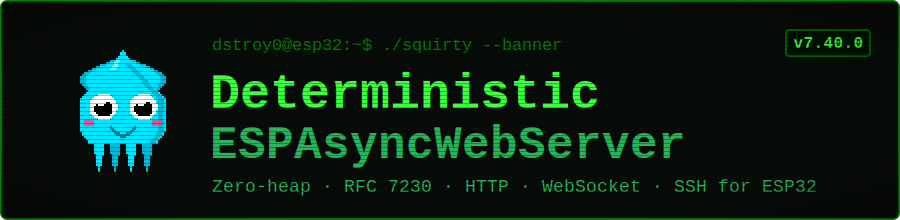

  

# DeterministicESPAsyncWebServer (@dstroy0)

A multi-protocol network server for ESP32 with a fully deterministic memory footprint, RFC 7230 compliant request parsing, and an OSI-layered architecture. It serves HTTP/1.1, WebSocket, and Server-Sent Events, with optional HTTPS/TLS, SSH, Telnet, SNMP, and CoAP.

## 📚 Documentation

**[Read the Full Documentation Here 📖](https://dstroy0.github.io/DeterministicESPAsyncWebServer/)**

The technical reference documentation has been moved to a dedicated landing page to provide a better reading experience. You can also view the local markdown copy at [docs/README.md](docs/README.md).

## Overview

A zero-heap, asynchronous multi-protocol server library for ESP32. Network events fire asynchronously from the lwIP stack (driven by the WiFi ISRs) into fixed event queues that dedicated worker task(s) drain on their own core, leaving your `loop()` free; every connection, request, and protocol buffer is statically allocated in BSS, so the memory footprint is fixed at link time and no heap is touched after `begin()`. It serves HTTP/1.1 (with WebSocket and Server-Sent Events) and, optionally, HTTPS/TLS, SSH, Telnet, SNMP, and CoAP.

**Key Features** (grouped by OSI layer - click to expand):

<strong>Foundation - zero-heap architecture</strong>

- **Zero Heap Allocation**: All request, connection, WebSocket, SSE, TLS, and SNMP storage pools are statically sized in BSS. Zero heap memory is requested after `begin()`.
- **Threaded, deterministic core**: The server pipeline runs in dedicated FreeRTOS worker task(s) (`DETWS_WORKER_COUNT`, default 1, pinned off the WiFi core) rather than your `loop()`. With more than one worker, connections are partitioned across workers (each owns a disjoint slot set with its own queue and scratch arena) so both cores process traffic in parallel with no hot-path locks - throughput without giving up bounded latency. The cross-thread boundary is `DetAtomic` (acquire/release) and proven race-free under ThreadSanitizer. Push to a connection from `loop()` or another task race-free with `server.defer(slot, fn, arg)`.
- **Minimal Dependencies**: Beyond the Arduino/ESP-IDF SDK, the only external dependency is mbedTLS (crypto); optional services use the ESP-IDF mDNS component and raw lwIP UDP rather than add-on libraries. Every optional feature is gated by a `DETWS_ENABLE_*` build flag (default off).

<strong>Transport (L4) - connections, encryption and flood defense</strong>

- **HTTPS / TLS**: Optional deterministic TLS via mbedTLS over a fixed static memory pool - encrypted transport with no heap (`ECDHE-ECDSA-AES256-GCM-SHA384`, TLS 1.2+). Optional **session resumption** (RFC 5077 tickets, `DETWS_ENABLE_TLS_RESUMPTION`): a returning client completes an abbreviated handshake, skipping the costly key exchange, and the server stays stateless (the session lives in the client's sealed ticket, so nothing grows per session).
- **Mutual TLS (mTLS)**: Optional client-certificate authentication - the handshake requires and verifies a client cert against a configured CA, and the verified peer's subject DN is exposed to handlers. Strong transport-level client auth with no passwords.
- **HTTP Keep-Alive**: Optional HTTP/1.1 persistent connections - one TCP connection serves many requests (with a per-connection request cap and the existing idle timeout), transparent to handler code.
- **Source-IP Allowlist**: Optional accept-time firewall (`DETWS_ENABLE_IP_ALLOWLIST`) - drops connections whose source IPv4 is outside the configured CIDR rules, in front of every listener (fixed BSS table, no heap).
- **Connection-Flood Defense**: Opt-in global connection accept-throttle and per-source-IP accept-throttle (`DETWS_ENABLE_PER_IP_THROTTLE`) that bounds reconnect/brute-force churn from a single host.

<strong>Session (L5) - interactive consoles</strong>

- **SSH 2.0 Server**: Zero-heap SSH stack with host-key verification and password/publickey authentication (hardware-accelerated crypto).
- **Telnet Console**: Plaintext line-oriented console (RFC 854, IAC negotiation + server echo) for trusted networks.

<strong>Presentation (L6) - parsing, codecs and crypto</strong>

- **RFC 7230 Compliant Request Parser**: Validates requests byte-by-byte and auto-sends correct status codes (e.g., 400, 404, 405, 413, 414, 501) with required headers.
- **WebSocket (RFC 6455)**: Built-in frame parser with SHA-1 handshake and ping/pong management, plus a browser "web serial" terminal over WebSocket. Runs encrypted over TLS (`wss://`) when TLS is enabled.
- **SSE (Server-Sent Events)**: Persistent client connections and push broadcasting, including over TLS (encrypted `text/event-stream`).
- **Request Data**: Query-string, `x-www-form-urlencoded` form fields, in-place `multipart/form-data` file uploads, and a zero-heap JSON writer/reader.
- **Authentication**: Per-route HTTP Basic (RFC 7617) and Digest (RFC 7616, SHA-256, `qop=auth`), plus optional stateless JWT bearer-token verification (HS256, constant-time).
- **Brute-force Lockout**: Optional per-IP exponential-backoff lockout on failed HTTP auth (`DETWS_ENABLE_AUTH_LOCKOUT`) - returns `429` with `Retry-After` after repeated failures from one address and clears on a successful login.

<strong>Application (L7) - routing, protocols, services and clients</strong>

- **Flexible Routing**: Exact, wildcard (`/*`), and `:param` path-parameter routes, bounded allocation-free regex routes, and per-interface (station / softAP) route filters.
- **Response Tools**: Custom headers + cookies, CORS (with preflight), `{{var}}` templating, `Cache-Control` beside `ETag`, and chunked/streaming responses of unbounded length in constant memory.
- **CSRF Protection**: Optional stateless HMAC-signed CSRF tokens (`DETWS_ENABLE_CSRF`) - global enforcement on state-changing methods (`POST`/`PUT`/`PATCH`/`DELETE`) via an `X-CSRF-Token` header, issued by a built-in `GET /csrf` endpoint, with no server-side session state.
- **Middleware & Rate Limiting**: Composable middleware pipeline plus a built-in fixed-window rate limiter.
- **File Serving**: Stream static assets with chunked reads from LittleFS, SPIFFS, and SD. One-call `serve_static()` subtree mount with `index.html` fallback, MIME auto-detection, pre-compressed `.gz` serving, and `ETag`/`304` conditional GET.
- **HTTP Range Requests**: Optional `206 Partial Content` (RFC 7233) for served files - single-range `Range: bytes=...` requests stream just the requested bytes (resumable downloads, media seeking), with `Accept-Ranges` advertisement and `416` for unsatisfiable ranges.
- **WebDAV (RFC 4918)**: Optional (`DETWS_ENABLE_WEBDAV`) read/write file share over the filesystem - one-call `dav()` subtree mount answering OPTIONS, PROPFIND (Depth 0/1, 207 Multi-Status), GET, HEAD, PUT, DELETE (recursive), MKCOL, COPY, MOVE, and advisory LOCK/UNLOCK, so rclone, cadaver, curl, or a mounted network drive can browse and edit files. The 207 builder and header parsing are host-tested.
- **Modbus TCP Slave**: Optional (`DETWS_ENABLE_MODBUS`) Modbus Application Protocol server on TCP/502 - a fixed BSS data model (coils, discrete inputs, holding + input registers) served via Read/Write Coils (FC 1/5/15), Read Discrete Inputs (FC 2), Read/Write Holding Registers (FC 3/6/16), and Read Input Registers (FC 4), with proper exception responses. The MBAP/PDU codec is host-tested; the application owns the data model and is notified of client writes.
- **SNMP Agent**: v1/v2c plus optional v3 USM (HMAC-SHA-256 auth + AES-128 privacy) over UDP, with a zero-heap ASN.1 BER codec and a fixed MIB.
- **SNMP Notifications**: Optional outbound Traps and InformRequests (`DETWS_ENABLE_SNMP_TRAP`) so the agent pushes alerts to a manager - SNMPv2c, and SNMPv3 USM (authPriv) traps reusing the agent's engine ID and localized keys. Each notification carries `sysUpTime.0` + `snmpTrapOID.0` plus caller varbinds; the PDU builder is host-tested.
- **CoAP Server (RFC 7252)**: Zero-heap Constrained Application Protocol endpoint over UDP - a fixed resource table dispatched on Uri-Path, GET/POST/PUT/DELETE with piggybacked responses, Uri-Query and Content-Format options. Optional resource **Observe** (RFC 7641, `DETWS_ENABLE_COAP_OBSERVE`): clients subscribe with a GET + Observe option and `coap_notify()` pushes the resource's current value to all observers from the server port with an increasing sequence. Optional **block-wise transfer** (RFC 7959, `DETWS_ENABLE_COAP_BLOCK`): the Block2 option pages a large representation one block at a time, and the Block1 option reassembles a chunked POST/PUT upload (`2.31 Continue` per block) before dispatching the handler with the whole payload.
- **mDNS & NTP Services**: Hostname advertisement via the ESP-IDF mDNS component (with TXT records and extra service types) and SNTP wall-clock time synchronization for request logging.
- **OTA Updates**: Secure, authenticated over-the-air firmware updates that stream the POST body straight into flash (no full-image RAM buffer).
- **Streaming Uploads**: Optional POST-body streaming straight into a filesystem file (LittleFS / SPIFFS / SD), so an upload never has to fit in RAM.
- **Captive Portal Provisioning**: Setup wizard (SoftAP + catch-all DNS portal) for first-boot WiFi credential configuration.
- **Observability**: Optional runtime stats endpoint (uptime, request/error counts, pool usage, heap), a Prometheus `/metrics` endpoint (text exposition format 0.0.4) for scraping, a per-request access-log callback, and a diagnostics endpoint.
- **Remote Logging**: Optional RFC 5424 syslog client - ship structured log lines to a central syslog server over UDP (zero-heap, fire-and-forget).
- **Outbound HTTP(S) Client**: Optional zero-heap client for requests _from_ the device (webhooks, telemetry push, REST calls): blocking `http_get()` / `http_post()` over raw lwIP with DNS resolution, Content-Length / chunked response decoding, and `https://` via client-side mbedTLS over the same static arena - encrypt-only by default with optional server authentication (CA trust anchor or SHA-256 certificate pin). It links no code unless a sketch actually calls it.
- **MQTT Client (3.1.1)**: Optional persistent publish/subscribe client for IoT messaging - connect to a broker with Last-Will and credentials, `PUBLISH` / `SUBSCRIBE` / `UNSUBSCRIBE` at QoS 0, 1, or 2 (full acknowledgement flows with bounded in-flight DUP retransmit and inbound QoS-2 de-duplication), receive messages via a callback, and keep-alive pings; `mqtts://` runs over the same client-side mbedTLS (encrypt-only or CA/pin-verified). The packet codec is host-tested.
- **WebSocket Client (RFC 6455)**: Optional outbound WebSocket client - the device connects to a remote endpoint (`ws://`, or `wss://` over the same client-side mbedTLS), performs the `Sec-WebSocket-Key`/`Accept` handshake, sends masked text/binary frames, receives server frames via a callback, and answers ping/pong - for streaming to cloud dashboards or bidirectional control. The frame/handshake codec is host-tested.

## Features

**Hover any feature for a one-line summary; full descriptions live in [docs/FEATURES.md](docs/FEATURES.md).** Each is an optional `DETWS_ENABLE_*` flag unless it is core (HTTP/1.1, routing, middleware, JSON, templating, chunked responses are always on).

| Feature                                                                                                                                           | Feature                                                                                                                  | Feature                                                                                                         | Feature                                                                                                                                                              | Feature                                                                                                                                   |
| ------------------------------------------------------------------------------------------------------------------------------------------------- | ------------------------------------------------------------------------------------------------------------------------ | --------------------------------------------------------------------------------------------------------------- | -------------------------------------------------------------------------------------------------------------------------------------------------------------------- | ----------------------------------------------------------------------------------------------------------------------------------------- |
| [Accept Throttle](docs/FEATURES.md#accept-throttle "Opt-in global accept-rate throttle (connection-flood defense)")                               | [Audit Log](docs/FEATURES.md#audit-log "Tamper-evident audit log")                                                       | [Auth](docs/FEATURES.md#auth "HTTP Basic Authentication per-route")                                             | [Auth Lockout](docs/FEATURES.md#auth-lockout "Opt-in per-IP brute-force lockout for HTTP auth (requires AUTH)")                                                      | [CBOR](docs/FEATURES.md#cbor "Zero-heap CBOR (RFC 8949) encoder for compact binary payloads")                                             |
| [Chunked Responses](docs/FEATURES.md#chunked-responses "Streaming / chunked responses of unbounded length in constant memory via send_chunked()") | [CoAP](docs/FEATURES.md#coap "CoAP server (RFC 7252) over UDP/5683")                                                     | [CoAP Block](docs/FEATURES.md#coap-block "CoAP block-wise transfer - RFC 7959 (requires COAP)")                 | [CoAP Observe](docs/FEATURES.md#coap-observe "CoAP resource observation - RFC 7641 (requires COAP)")                                                                 | [Config IO](docs/FEATURES.md#config-io "Opt-in schema-driven config export / restore")                                                    |
| [Config Store](docs/FEATURES.md#config-store "Typed NVS configuration store (WiFi creds, IP config, ... as blobs)")                               | [CORS](docs/FEATURES.md#cors "Cross-origin resource sharing with automatic preflight handling")                          | [CSRF](docs/FEATURES.md#csrf "Opt-in CSRF protection for state-changing HTTP requests")                         | [Dashboard](docs/FEATURES.md#dashboard "Real-time SVG dashboard (DASHBOARD; requires SSE)")                                                                          | [Device ID](docs/FEATURES.md#device-id "Stable device UUID derived from the chip MAC (RFC 4122 v5)")                                      |
| [Diag](docs/FEATURES.md#diag "Expose a diagnostic JSON endpoint via server.diag()")                                                               | [Dns Resolver](docs/FEATURES.md#dns-resolver "Opt-in DNS resolver with answer verification")                             | [ETag](docs/FEATURES.md#etag "Conditional GET via ETag for served files")                                       | [File Serving](docs/FEATURES.md#file-serving "Static file serving via Arduino FS (LittleFS, SPIFFS, SD)")                                                            | [GPIO Map](docs/FEATURES.md#gpio-map "Opt-in browser GPIO pin-mapper / diagnostics endpoint")                                             |
| [Guardrails](docs/FEATURES.md#guardrails "Opt-in runtime heap/stack guardrails")                                                                  | [HTTP Client](docs/FEATURES.md#http-client "Outbound HTTP(S) client (raw lwIP, optional client-side mbedTLS)")           | [HTTP Client TLS](docs/FEATURES.md#http-client-tls "HTTPS client support inside the HTTP client (needs TLS)")   | [HTTP/1.1 Parser](docs/FEATURES.md#http11-parser "RFC 7230 request parser - validates method, path, header names and values byte-by-byte before storing anything")   | [IP Allowlist](docs/FEATURES.md#ip-allowlist "Opt-in source-IP allowlist (accept-time firewall, keyed by source IPv4)")                   |
| [JSON](docs/FEATURES.md#json "Zero-heap JSON writer/reader (json.h) for request bodies and responses")                                            | [JWT](docs/FEATURES.md#jwt "JWT bearer-token authentication (HS256)")                                                    | [Keep-Alive](docs/FEATURES.md#keep-alive "HTTP/1.1 persistent connections (keep-alive)")                        | [Log-Buffer](docs/FEATURES.md#log-buffer "Opt-in fixed-RAM rotating log buffer with severity traps")                                                                 | [MDNS](docs/FEATURES.md#mdns "mDNS / DNS-SD advertisement (`name.local` + `_http._tcp`) via ESPmDNS")                                     |
| [MessagePack](docs/FEATURES.md#messagepack "Zero-heap MessagePack encoder for compact binary payloads")                                           | [Metrics](docs/FEATURES.md#metrics "Prometheus `/metrics` endpoint (text exposition format 0.0.4)")                      | [Middleware](docs/FEATURES.md#middleware "Composable use() pipeline with a fixed-window rate limiter")          | [Modbus](docs/FEATURES.md#modbus "Modbus TCP slave/server (Modbus Application Protocol v1.1b3) on TCP/502")                                                          | [Modbus Master](docs/FEATURES.md#modbus-master "Opt-in Modbus master codec + register scanner")                                           |
| [MQTT](docs/FEATURES.md#mqtt "MQTT 3.1.1 publish/subscribe client (raw lwIP, optional MQTTS over TLS)")                                           | [MQTT TLS](docs/FEATURES.md#mqtt-tls "MQTTS: run the MQTT client over client-side TLS (needs TLS)")                      | [MTLS](docs/FEATURES.md#mtls "Mutual TLS - require and verify a client certificate (mTLS)")                     | [Multipart](docs/FEATURES.md#multipart "multipart/form-data body parser")                                                                                            | [NTP](docs/FEATURES.md#ntp "SNTP wall-clock time sync via the ESP-IDF SNTP client")                                                       |
| [OIDC](docs/FEATURES.md#oidc "OpenID Connect ID-token verification, RS256")                                                                       | [OTA](docs/FEATURES.md#ota "Authenticated OTA firmware update (streaming POST to the ESP32 Update API)")                 | [OTA Rollback](docs/FEATURES.md#ota-rollback "Opt-in OTA rollback protection / soft-brick safeguard")           | [Partition Monitor](docs/FEATURES.md#partition-monitor "Opt-in flash partition-map monitor endpoint")                                                                | [Per IP Throttle](docs/FEATURES.md#per-ip-throttle "Opt-in per-IP accept-rate throttle (connection-flood defense, keyed by source IPv4)") |
| [Provisioning](docs/FEATURES.md#provisioning "First-boot WiFi provisioning: softAP + captive-portal credentials form")                            | [Radio Power](docs/FEATURES.md#radio-power "Opt-in radio power controls")                                                | [Range](docs/FEATURES.md#range "HTTP Range requests / 206 Partial Content for served files")                    | [Routing](docs/FEATURES.md#routing "Exact, wildcard (/*), :param path parameters, bounded allocation-free regex routes, and per-interface STA/softAP route filters") | [SNMP](docs/FEATURES.md#snmp "SNMP agent (v1/v2c, + v3 USM when SNMP_V3) over lwIP UDP")                                                  |
| [SNMP Trap](docs/FEATURES.md#snmp-trap "Outbound SNMP notifications - traps and informs (requires SNMP)")                                         | [SNMP V3](docs/FEATURES.md#snmp-v3 "Add SNMPv3 USM (auth via HMAC-SHA, privacy via AES-128-CFB). Default off")           | [SSE](docs/FEATURES.md#sse "Server-Sent Events push support")                                                   | [SSH](docs/FEATURES.md#ssh "SSH server support (RFC 4253/4252/4254)")                                                                                                | [Stats](docs/FEATURES.md#stats "Runtime stats endpoint (uptime, request/error counts, pool usage, heap)")                                 |
| [Syslog](docs/FEATURES.md#syslog "Syslog client (RFC 5424 over UDP)")                                                                             | [Telemetry](docs/FEATURES.md#telemetry "Telemetry math helpers (moving-window stats, rate-of-change, totalizer)")        | [Telnet](docs/FEATURES.md#telnet "Telnet server support (RFC 854 / IAC option negotiation)")                    | [Templating](docs/FEATURES.md#templating "{{var}} response templating via send_template()")                                                                          | [Time Source](docs/FEATURES.md#time-source "Multi-source time fallback (NTP / RTC / GPS / ... by priority)")                              |
| [TLS](docs/FEATURES.md#tls "TLS (HTTPS/WSS) via mbedTLS with a static memory pool (ESP32-only)")                                                  | [TLS Resumption](docs/FEATURES.md#tls-resumption "TLS session resumption via RFC 5077 session tickets (requires TLS)")   | [TOTP](docs/FEATURES.md#totp "Opt-in TOTP two-factor auth (RFC 6238)")                                          | [UDP Telemetry](docs/FEATURES.md#udp-telemetry "Opt-in fire-and-forget UDP telemetry cast")                                                                          | [Upload](docs/FEATURES.md#upload "Streaming file upload: POST a body straight to a file on the filesystem")                               |
| [VFS](docs/FEATURES.md#vfs "Unified virtual filesystem wrapper")                                                                                  | [Web Terminal](docs/FEATURES.md#web-terminal "Browser 'web serial' terminal over WebSocket (src/services/web_terminal)") | [WebDAV](docs/FEATURES.md#webdav "WebDAV server (RFC 4918, class 1 + advisory locks) over the file system")     | [Webhook](docs/FEATURES.md#webhook "Opt-in outbound webhooks / IFTTT")                                                                                               | [WebSocket](docs/FEATURES.md#websocket "WebSocket support (RFC 6455 framing + SHA-1/base64 handshake)")                                   |
| [WS Client](docs/FEATURES.md#ws-client "Outbound WebSocket client (RFC 6455 over raw lwIP, optional wss:// TLS)")                                 | [WS Client TLS](docs/FEATURES.md#ws-client-tls "wss://: run the WebSocket client over client-side TLS (needs TLS)")      | [WS Deflate](docs/FEATURES.md#ws-deflate "WebSocket permessage-deflate (RFC 7692) - bidirectional compression") |                                                                                                                                                                      |                                                                                                                                           |

## Build Footprint

Measured on `esp32dev` (Arduino core, `pio ci`). The jump from the bare baseline to a running server is almost entirely the WiFi/lwIP stack; the library and most HTTP features add little on top. Each row enables one optional subsystem over the default server.

| Build                                                                               | Flash (bytes) | RAM (bytes) |
| ----------------------------------------------------------------------------------- | ------------: | ----------: |
| Empty sketch (no WiFi, no library) - _RTOS/Arduino baseline_                        |       233,257 |      21,032 |
| Minimal REST server (WS/SSE/multipart/file/auth stripped)                           |       734,745 |      57,936 |
| **Default server** (HTTP + WebSocket + SSE + multipart + file serving + Basic auth) |       745,133 |      64,264 |
| &nbsp;&nbsp;+ HTTPS / TLS (static-pool mbedTLS)                                     |       847,185 |     115,164 |
| &nbsp;&nbsp;&nbsp;&nbsp;+ Mutual TLS (client-cert auth)                             |       848,241 |     115,500 |
| &nbsp;&nbsp;+ SSH 2.0 server                                                        |       798,005 |      76,556 |
| &nbsp;&nbsp;+ SNMP agent (v1/v2c)                                                   |       751,277 |      76,648 |
| &nbsp;&nbsp;+ CoAP server (RFC 7252, UDP)                                           |       747,921 |      66,760 |
| &nbsp;&nbsp;+ mDNS                                                                  |       768,037 |      66,160 |
| &nbsp;&nbsp;+ SNTP                                                                  |       768,861 |      66,808 |
| &nbsp;&nbsp;+ OTA update                                                            |       748,417 |      64,544 |
| &nbsp;&nbsp;+ Captive-portal provisioning                                           |       750,709 |      65,836 |
| &nbsp;&nbsp;+ Static files via LittleFS (incl. ETag)                                |       784,361 |      64,288 |
| &nbsp;&nbsp;+ Telnet console                                                        |       745,137 |      64,784 |
| &nbsp;&nbsp;+ Web terminal (WebSocket)                                              |       747,613 |      64,336 |
| SSH crypto self-test (Serial only, no WiFi)                                         |       269,585 |      21,476 |

TLS's larger RAM is the fixed mbedTLS arena (`DETWS_TLS_ARENA_SIZE`, 48 KB default). The small HTTP features (CORS, JSON, middleware, regex / path / form params, templating, chunked, response headers, Digest auth, stats, diagnostics, accept-throttle) each stay within a few KB of the default server, and an outbound client links no code until a sketch actually calls it (the linker strips an unused client, so enabling its flag alone costs nothing).

Incremental cost of an optional subsystem, over the noted base:

| Optional feature         | Flag                           | + Flash |    + RAM | Over           |
| ------------------------ | ------------------------------ | ------: | -------: | -------------- |
| HTTP keep-alive          | `DETWS_ENABLE_KEEPALIVE`       | ~0.5 KB |     ~8 B | default server |
| HTTP Range requests      | `DETWS_ENABLE_RANGE`           | ~0.8 KB |        - | file serving   |
| Per-IP accept throttle   | `DETWS_ENABLE_PER_IP_THROTTLE` |      ~0 |   ~192 B | default server |
| TLS session resumption   | `DETWS_ENABLE_TLS_RESUMPTION`  | ~1.8 KB |   ~170 B | TLS            |
| CoAP resource Observe    | `DETWS_ENABLE_COAP_OBSERVE`    | ~2.7 KB |        - | CoAP server    |
| CoAP block-wise transfer | `DETWS_ENABLE_COAP_BLOCK`      | ~1.6 KB | buffers¹ | CoAP server    |
| Modbus TCP slave         | `DETWS_ENABLE_MODBUS`          | ~2.1 KB | ~0.25 KB | default server |
| WebDAV                   | `DETWS_ENABLE_WEBDAV`          |  ~24 KB |    ~3 KB | file serving   |

¹ plus the Block1 reassembly buffer (`DETWS_COAP_BLOCK1_MAX`, 1 KB default) and a larger CoAP message buffer.

Outbound clients, as standalone example builds (plain transport vs. over TLS):

| Client           | Flag                       | Plain (flash / RAM) | Over TLS (flash / RAM) |
| ---------------- | -------------------------- | ------------------- | ---------------------- |
| HTTP(S) client   | `DETWS_ENABLE_HTTP_CLIENT` | 732,961 / 46,752    | 827,853 / 100,620      |
| MQTT client      | `DETWS_ENABLE_MQTT`        | 734,293 / 48,896    | 830,285 / 108,732      |
| WebSocket client | `DETWS_ENABLE_WS_CLIENT`   | 734,329 / 48,824    | 830,165 / 108,660      |

ESP32 capacity: 1,310,720 B flash / 327,680 B RAM. Per-feature examples are under [`examples/`](examples/).

## Compatibility

- **Chips**: ESP32 (all variants)
- **Frameworks**: Arduino Core (2.x and 3.x), PlatformIO

## License

This project is licensed under the AGPL-3.0-or-later License - see the `LICENSE` file for details.

---

   
  <b>Squirty the Injection Squid</b> official library mascot. 
  Copyright &copy; Douglas Quigg (dstroy0). All rights reserved.

