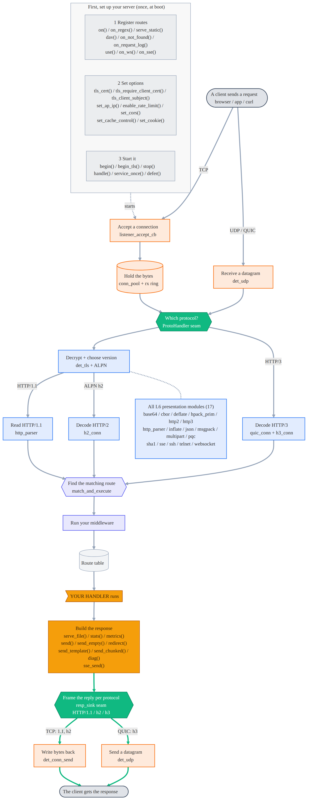

# Architecture & internal data piping

How bytes and control flow move between the OSI-style layers and who owns each
cross-layer concern. This is the map referenced by the internal-piping cleanup: the
rule is **one owner per cross-layer concern, behind a clean API** - no layer reaches
into another's internals. Both axes are now settled: the data-piping axis (who owns
RX / TX / window / events / scratch / streaming / client I/O) and the dispatch axis
(how each protocol attaches) both meet the one-uniform-seam rule, with no protocol
special-cased. The piping is straight; what remains below is the map, not a to-do.

## Layers

```
src/network_drivers/
  physical/     WiFi / Ethernet bring-up, link state
  datalink/     L2 framing concerns
  network/      IPv4 / interface tagging (DetIface: STA vs AP)
  transport/    lwIP raw-API callbacks, the per-connection RX ring, the TcpEvt
                event queue, and the det_conn_* I/O API. OWNS all socket I/O.
  tls/          mbedTLS record layer (static-pool BIO) - plaintext <-> ciphertext
  session/      worker task(s), event dispatch (server_tick), scratch arena,
                deferred-callback queues, the ProtoHandler dispatch table
  presentation/ http_parser, websocket, telnet, ssh, sse - turn a byte stream
                into requests/frames
  application/  DetWebServer: routes, handlers, serve_file / send_chunked pumps,
                WebDAV
src/services/         mqtt, modbus, opcua, snmp, coap, ... (protocol features)
src/shared_primitives/  layer-agnostic header-only primitives shared across the
                tree so logic is never duplicated: ring.h (SPSC ring, server +
                client), hex.h (hex encode/decode), numparse.h (no-stdlib
                number parsing), bytes.h (byte-cursor mechanics - bounded put +
                big-endian put/take - shared by the CBOR and MessagePack codecs),
                mime.h (the Content-Type vocabulary, one copy referenced
                everywhere). Header-only so nothing has to be added to the per-env
                test src filters. Two more shared concerns live in their natural
                module instead of here: base64url (base64 module, used by JWT +
                OIDC) and host->IP resolution (services/dns_resolver, used by the
                server-adjacent code AND det_client, so a client has one DNS owner).
```

## Two threads, two boundaries

The server is a 2-thread system and every cross-layer hazard lives on one of two
boundaries:

1. **tcpip_thread (Core 0, producer)** runs the lwIP callbacks: `lowlevel_recv_cb`
   copies an inbound segment into the connection's RX ring and posts a `TcpEvt`;
   `lowlevel_sent_cb` nudges the owning worker; `listener_accept_cb` assigns a new
   slot its owner worker.
2. **worker task(s) (Core 1, consumer)** run `service_once()` -> `server_tick()`
   (drain the event queue -> `dispatch_event` -> `ProtoHandler::on_data`) then a
   per-slot pump (`on_poll`, the HTTP/WS/SSE inline pump, the file/chunk send pumps).

Cross-thread synchronization primitives (no hot-path locks):

- `DetAtomic<>` (acquire/release) on `TcpConn::state`, `rx_head`, `rx_tail`.
- The FreeRTOS `TcpEvt` queue (producer -> owner worker).
- `tcpip_api_call` marshaling for the app->lwIP direction (see TX below).

## TX path - clean, single owner (transport)

Every layer that sends bytes calls the transport API; nobody calls lwIP `tcp_*`
directly:

```
app / presentation  -->  det_conn_send / det_conn_flush / det_conn_sndbuf
                         (TLS slots route through det_tls_write)
                              |
                         det_tcp_marshal (DET_OP_*)  -->  tcpip_thread: tcp_write / tcp_output
```

The **same marshal rule covers every raw lwIP call, not just app data**: the TCP
listener bring-up (`listener_add` / `listener_stop`), the UDP transport (`det_udp_*`,
used by SNMP / CoAP / captive-DNS / syslog / telemetry), the outbound client
(`det_client`), and the DNS resolver all route their `tcp_*` / `udp_*` through
`tcpip_api_call`. This is mandatory on arduino-esp32 3.x, where lwIP core-locking
asserts on a raw call from any task but `tcpip_thread` (see docs/BUGS.md); keeping raw
lwIP out of the app and worker tasks is the one thing this layer exists to enforce.

## RX path - one owner for the window and the drain

Inbound:

```
tcpip_thread: recv_cb  -->  copy into TcpConn.rx_buffer (advance rx_head)  -->  post EVT_DATA
worker:       server_tick -> dispatch_event -> on_data  -->  drain the ring (advance rx_tail)
```

**Receive-window flow control: now single-owner (transport).** `recv_cb` no longer
ACKs on copy. The worker calls `det_conn_ack_consumed(slot)` once per slot per loop
and transport reopens the TCP window by exactly the bytes drained since the last ACK
(ack-on-consume; `tcp_recved` marshaled). The window therefore tracks ring occupancy
and a slow consumer cannot overflow the ring. **TCP-level requirement:**
`RX_BUF_SIZE >= TCP_WND` (you cannot advertise a window larger than your buffer).
See docs/BUGS.md "RX flow-control deadlock".

**RX ring read API: now single-owner (transport).** Consumers no longer index
`rx_buffer` or advance `rx_tail`. They drain through the transport read API -
`det_conn_available` / `det_conn_read_byte` / `det_conn_read` / `det_conn_peek` /
`det_conn_consume` (inline in tcp.h, single-consumer per slot). Migrated:
`presentation.cpp` (HTTP), `websocket.cpp`, `telnet.cpp`, `ssh/ssh_conn.cpp`,
`tls/tls.cpp`, and the conn_pool-ring services `modbus.cpp` / `opcua.cpp` (their
duplicated `ring_peek/consume/avail` are now thin adapters over the API). The read
functions only consume; the window is reopened by the worker's single
`det_conn_ack_consumed()` per loop - so there is exactly one place that touches the
ring indices for draining and one that ACKs.

## Outbound clients - the unified client transport (det_client)

The device's clients (`http_client`, `mqtt`, `ws_client`) do not each own a raw lwIP
stack: they share **`det_client`** (`network_drivers/transport/det_client.*`), the
client-side peer of the server transport. It is a small fixed pool of outbound
connections with the same rules - every raw `tcp_*()` marshaled to tcpip_thread, a
per-connection wire ring, and **ack-on-consume** (`det_client_read()` reopens the
window as the caller drains; `DETWS_CLIENT_RX_BUF >= TCP_WND`), so client and server
share one flow-control model. TLS clients layer `det_tls_client_session_*` on top, pointing
the BIO at `det_client_send` / `det_client_read` (the ring carries ciphertext).

The `s_rx` ring inside `mqtt.cpp` / `ws_client.cpp` is a separate **plaintext frame
buffer** (post-decrypt for TLS, the assembly buffer the protocol parser reads),
owned solely by that module - the client mirror of the server's `http body[]` vs the
`conn_pool` wire ring. Not cross-layer, correct as-is.

Both transports use ONE shared primitive for the whole ring: `ring.h` (the
`DetAtomic` SPSC index wrapper + the drain math `det_ring_available / read_byte /
read / peek / consume` AND the fill math `det_ring_free / det_ring_write_span`). The
server (`det_conn_*` + `recv_cb`) and client (`det_client_*` + `cc_recv`) are thin
wrappers over it, so the ring invariants - wrap, ordering, lossless backpressure -
live in a single place and no layer reimplements them by hand. Both recv callbacks
bulk-memcpy each pbuf span and publish `head` once. The client ring's indices were
`volatile`; they are now `DetAtomic` like the server (correct cross-core
acquire/release ordering).

## Streaming-body hooks - slot-aware

`http_parser_set_stream_hooks(begin, data, abort)` are global singletons
(last-registered-wins, so OTA / upload / WebDAV streaming are still mutually
exclusive per build). All three now take `HttpReq*`, so a sink can keep
per-connection state: WebDAV holds per-slot PUT state (`g_dav_put[MAX_CONNS]`) and
each connection streams to its own file. This fixed the concurrent-PUT clobber
(docs/BUGS.md) - HW: 4 parallel PUTs with distinct payloads, all byte-exact.

## Ownership: current vs target

| Concern              | Owner (target)           | Status                                            |
| -------------------- | ------------------------ | ------------------------------------------------- |
| Socket TX            | transport `det_conn_*`   | DONE                                              |
| RX receive window    | transport                | DONE (`det_conn_ack_consumed`, ack-on-consume)    |
| RX ring read/drain   | transport (read API)     | DONE (`det_conn_read*`; consumers off the ring)   |
| Streaming sink state | per-slot, slot-aware     | DONE (`g_dav_put[MAX_CONNS]`, slot-aware hooks)   |
| Event routing        | session (owner queue)    | DONE                                              |
| Scratch memory       | session (per-worker)     | DONE                                              |
| Outbound client I/O  | transport (`det_client`) | DONE (pooled, ack-on-consume; all clients use it) |

## Straightening plan (phased; each phase host + HW regresses every consumer)

1. **DONE - RX read API in transport** - `det_conn_available` / `det_conn_read_byte`
   / `det_conn_read` / `det_conn_peek` / `det_conn_consume` (inline, tcp.h).
2. **DONE - migrate the consumers** - HTTP / websocket / telnet / ssh / tls + the
   conn_pool-ring services (modbus / opcua) all drain through the API; no external
   `rx_tail` modulo remains. The read functions consume only; `det_conn_ack_consumed`
   stays the one place that reopens the window (per loop), so draining and ACKing
   each have exactly one owner. HW: 10/10 50 KB byte-exact, backpressure 0.
3. **DONE - slot-aware streaming hooks** - `HttpStreamDataCb(HttpReq*, ...)` +
   per-slot WebDAV PUT state `g_dav_put[MAX_CONNS]`; fixed the concurrent-PUT bug
   (HW: 4 parallel PUTs, distinct payloads, all byte-exact).
4. **DONE - outbound clients** - all clients (http_client / mqtt / ws_client) share
   `det_client`, the unified client transport; brought to the same ack-on-consume
   flow control as the server (`DETWS_CLIENT_RX_BUF >= TCP_WND`). Each module's `s_rx`
   is its own plaintext frame buffer (the client mirror of the server's `body[]`),
   module-owned and correct as-is.

All phases complete: every cross-layer concern (server TX/RX, RX window, RX read,
streaming sink state, events, scratch, outbound client I/O) has exactly one owner
behind a clean API, and the server and client ring drain math is a single shared
primitive (`ring.h`) - two pools, one ring/read core.

## Protocol dispatch (Layer 5) - how every protocol plugs into the core

The data-piping axis above (who owns RX/TX/window/events) is settled. This is the
_other_ axis: how each application protocol attaches to that plumbing. The rule is
the same - one uniform seam - and it is mostly, but not fully, met.

**The seam - `ProtoHandler` (`session/proto_handler.h`).** A connection-oriented (TCP)
protocol is a vtable of four nullable callbacks keyed by `ConnProto`:

```c
struct ProtoHandler { on_accept; on_data; on_close; on_poll; }; // all take a slot index
```

`dispatch_event()` routes each drained `TcpEvt` to `on_{accept,data,close}` by
`conn_pool[slot].proto`; `handle()` calls `on_poll` for each active slot. Every
handler reads its bytes through the transport RX API (`det_conn_read` copy-out, or
`det_conn_peek`+`det_conn_consume` zero-copy - never the ring internals) and writes
through `det_conn_send`/`det_conn_flush`. So Telnet, SSH (+ `PROTO_SSH_RFWD`), Modbus,
and OPC UA are fully homogeneous: each is a module that exposes a `ProtoHandler` and
touches the core only through those two APIs.

**Connectionless (UDP) services** (SNMP, CoAP, DNS, syslog, flow-export) attach through
a _different_ but deliberately separate seam - `det_udp_listen(port, handler, arg)`, one
datagram-in/datagram-out callback. This heterogeneity is correct, not a defect: UDP has
no accept/close/slot lifecycle, so folding it into the slot-based `ProtoHandler` table
would be a forced fit. Two transport models, two matched seams.

**The request/response core is protocol(version)-agnostic:** every version decodes into the
shared `HttpReq` and converges on one `match_and_execute` / route / `Handler` (HTTP/1.1,
HTTP/2, and HTTP/3), and the response funnels back through the symmetric **TX seam** - a
per-connection `resp_sink` function pointer (`TcpConn::resp_sink`) that HTTP/2 installs at
ALPN and HTTP/3 at dispatch. `DetWebServer::send()` / `send_empty()` call `conn->resp_sink(...)`
when it is set (h2 frames the reply as HEADERS+DATA on the stream; h3 as an HTTP/3 response on
its QUIC stream) and otherwise build the HTTP/1.1 message - so the response methods name no
protocol. It is the RX `ProtoHandler` seam's TX counterpart: request decode and response encode
both sit behind one uniform per-connection seam.

### The request lifecycle in full

The fully expanded twin of the simplified chart in the README - the same top-to-bottom waterfall, but
every public API method, every registered protocol, and every Layer-6 module on disk is listed.

<!-- BEGIN GENERATED API FLOW DETAIL (docs/utilities/gen_api_flow.py) -->

> Generated from the public API, `proto_builtins.cpp`, and `presentation/` by `docs/utilities/gen_api_flow.py` - do not edit by hand. This is the fully expanded twin of the simplified request-lifecycle chart in the [README](../README.md): the same top-to-bottom waterfall, but every public method, every registered protocol, and every Layer-6 module on disk is listed (nothing is capped). Color is the OSI layer; the green path is the response. Mermaid source: [`diagrams/api_flow_detail.mmd`](diagrams/api_flow_detail.mmd).

<picture>
  <source media="(prefers-color-scheme: dark)" srcset="diagrams/api_flow_detail.dark.png">
  
</picture>

<!-- END GENERATED API FLOW DETAIL -->

### Homogeneity work (status)

1. **`session.cpp` (L5) is now protocol-agnostic - DONE.** The dispatcher owns only the
   mechanism (register / look up / route / drain) and names no protocol. Each protocol's
   handler lives in its own module and is exposed by a pure accessor
   (`http_proto_handler()` in presentation, `ssh_proto_handler()` in ssh_conn, ...) that
   carries no dependency on the session layer. The single policy file `proto_builtins.cpp`
   maps each built-in to its accessor behind its feature flag; `proto_get()` calls
   `proto_register_builtins()` once, lazily, so the native harness still works before
   `begin()`. Adding a protocol = write its module + one guarded line in `proto_builtins.cpp`
    - never editing the dispatcher. (The SSH remote-forward listener still self-registers from
      its own opt-in `det_ssh_forward_begin()`.)

2. **The HTTP TLS/h2/ws data-pump moved out of L5 - DONE.** `presentation.cpp` (Layer 6,
   already the HTTP-connection glue) now owns the HTTP `ProtoHandler`: `http_evt_{accept,
data,close}` plus `tls_data` (the TLS handshake pump + ALPN "h2" detection + WebSocket
   upgrade check before the HTTP/1.1 parser). L5 no longer includes TLS / http2 / websocket /
   http_parser.

3. **HTTP's poll now plugs into the uniform `on_poll` seam - DONE.** HTTP's poll (the file/chunk send
   pumps, the WebSocket + SSE drains, the keep-alive re-parse, request dispatch) is instance-bound - it
   dispatches into a `DetWebServer`'s routes - so it used to be a large inline block in the worker loop
   guarded by `if (proto != PROTO_HTTP)`. That block is now `DetWebServer::http_poll_slot()`, installed
   as the HTTP `ProtoHandler`'s `on_poll` (via `http_proto_set_poll()`, the `on_poll` analogue of the
   `resp_sink` TX seam; the running instance is wired in at the top of `service_once()`). The worker
   dispatch loop now calls `on_poll` uniformly for **every** protocol including HTTP - it names no
   protocol and has no special case. The singleton pollers (ssh, rfwd) gate on `CONN_ACTIVE` inside
   their own `on_poll`, preserving the behavior the loop-level gate used to give them.

4. **The response path is behind a uniform TX seam - DONE.** `send()` / `send_empty()` no longer
   branch on `conn->h2` / `conn->h3`; a self-framing protocol installs a `TcpConn::resp_sink`
   function pointer (h2 at ALPN, h3 at dispatch) and the response methods route through it, so the
   L7 responders name no protocol. This is the TX counterpart of the RX `ProtoHandler` seam; adding
   a self-framing protocol means installing one `resp_sink`, not editing the responders.

5. **TLS is an inline transform inside the HTTP handler**, not a composable wrapper, so only
   HTTP can be TLS-wrapped. Acceptable and inherent (SSH carries its own crypto; Telnet /
   Modbus / OPC UA are plaintext by definition), noted for completeness.

Net: L5 is pure dispatch and every protocol (including HTTP) lives behind the same uniform seam via
its own module - request decode through the `ProtoHandler` seam (accept / data / close / **poll**),
response encode through the `resp_sink` seam. The worker dispatch loop names no protocol and has no
special case: HTTP plugs in exactly like SSH, Telnet, Modbus, or OPC UA. The one remaining inherent
trait is that TLS is an HTTP-only inline transform (item 5). The piping is straight.

## Unified arena primitive (`session/det_arena`)

A double-ended allocator over one region: a **persistent** end grows up from the
bottom (first-fit free-list, individual free in any order, adjacent-block coalesce,
top-block shrink) and a **scratch** end grows down from the top (bump, O(1) reset,
mark/release savepoints, up to 16-byte alignment). The free space floats in the
middle, so whichever side needs room takes it, and both ends fail closed rather than
cross. `DetArenaSet` chains a DRAM base + a PSRAM extension: allocs prefer internal
RAM and spill into external RAM, frees route to the owning region by address. No heap,
no stdlib; all state in `DetArena` (no globals), so it is unit-tested on the host
(`native_det_arena`).

This is the go-forward "unified server arena" for a subsystem that needs long-lived,
individually-freed allocations (its persistent end) alongside per-dispatch transients
(its scratch end) - the case the fixed per-slot arrays and the per-worker `scratch`
bump pool do not cover. The existing per-worker `scratch` pool is **not** re-backed
onto it: that pool uses only a bump end, so routing it through `det_arena` would leave
the persistent end (and the whole floating-boundary win) unused - pure indirection over
a hot path. The migration waits until a real persistent-end consumer exists; folding it
in earlier would trade a tested, single-accessor hot path for churn with no benefit.
