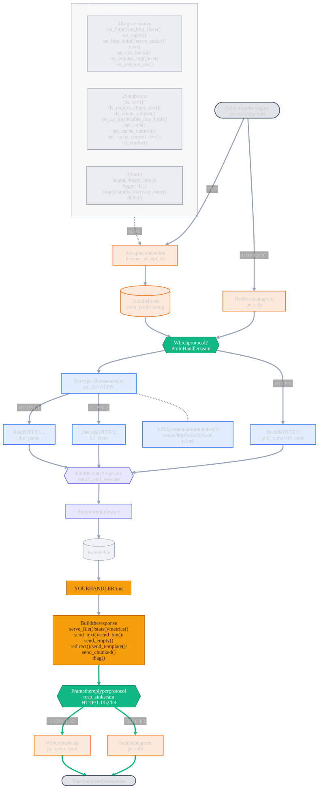

# Architecture & internal data piping

How bytes and control flow move between the OSI-style layers and who owns each
cross-layer concern. This is the map referenced by the internal-piping cleanup: the
rule is **one owner per cross-layer concern, behind a clean API** - no layer reaches
into another's internals. Both axes are now settled: the data-piping axis (who owns
RX / TX / window / events / scratch / streaming / client I/O) and the dispatch axis
(how each protocol attaches) both meet the one-uniform-seam rule, with no protocol
special-cased. The piping is straight; what remains below is the map, not a to-do.

## Layers

```
src/network_drivers/
  physical/     WiFi / Ethernet bring-up, link state
  datalink/     L2 framing concerns
  network/      IPv4 / interface tagging (pc_iface: STA vs AP)
  transport/    lwIP raw-API callbacks, the per-connection RX ring, the TcpEvt
                event queue, and the pc_conn_* I/O API. OWNS all socket I/O.
  tls/          mbedTLS record layer (static-pool BIO) - plaintext <-> ciphertext
  session/      worker task(s), event dispatch (server_tick), scratch arena,
                deferred-callback queues, the ProtoHandler dispatch table
  presentation/ http_parser, websocket, telnet, ssh, sse - turn a byte stream
                into requests/frames
  application/  PC: routes, handlers, serve_file / send_chunked pumps,
                WebDAV
src/services/         mqtt, modbus, opcua, snmp, coap, ... (protocol features)
src/shared_primitives/  layer-agnostic header-only primitives shared across the
                tree so logic is never duplicated: ring.h (SPSC ring, server +
                client), hex.h (hex encode/decode), numparse.h (no-stdlib
                number parsing), bytes.h (byte-cursor mechanics - bounded put +
                big-endian put/take - shared by the CBOR and MessagePack codecs),
                mime.h (the Content-Type vocabulary, one copy referenced
                everywhere). Header-only so nothing has to be added to the per-env
                test src filters. Two more shared concerns live in their natural
                module instead of here: base64url (base64 module, used by JWT +
                OIDC) and host->IP resolution (network_drivers/network/dns_resolver, used by the
                server-adjacent code AND pc_client, so a client has one DNS owner).
```

## Two threads, two boundaries

The server is a 2-thread system and every cross-layer hazard lives on one of two
boundaries:

1. **tcpip_thread (Core 0, producer)** runs the lwIP callbacks: `lowlevel_recv_cb`
   copies an inbound segment into the connection's RX ring and posts a `TcpEvt`;
   `lowlevel_sent_cb` nudges the owning worker; `listener_accept_cb` assigns a new
   slot its owner worker.
2. **worker task(s) (Core 1, consumer)** run `service_once()` -> `server_tick()`
   (drain the event queue -> `dispatch_event` -> `ProtoHandler::on_data`) then a
   per-slot pump (`on_poll`, the HTTP/WS/SSE inline pump, the file/chunk send pumps).

Cross-thread synchronization primitives (no hot-path locks):

- `pc_atomic<>` (acquire/release) on `TcpConn::state`, `rx_head`, `rx_tail`.
- The FreeRTOS `TcpEvt` queue (producer -> owner worker).
- `tcpip_api_call` marshaling for the app->lwIP direction (see TX below).

## TX path - clean, single owner (transport)

Every layer that sends bytes calls the transport API; nobody calls lwIP `tcp_*`
directly:

```
app / presentation  -->  pc_conn_send / pc_conn_flush / pc_conn_sndbuf
                         (TLS slots route through pc_tls_write)
                              |
                         pc_tcp_marshal (PC_OP_*)  -->  tcpip_thread: tcp_write / tcp_output
```

The **same marshal rule covers every raw lwIP call, not just app data**: the TCP
listener bring-up (`listener_add` / `listener_stop`), the UDP transport (`pc_udp_*`,
used by SNMP / CoAP / captive-DNS / syslog / telemetry), the outbound client
(`pc_client`), and the DNS resolver all route their `tcp_*` / `udp_*` through
`tcpip_api_call`. This is mandatory on arduino-esp32 3.x, where lwIP core-locking
asserts on a raw call from any task but `tcpip_thread` (see docs/BUGS.md); keeping raw
lwIP out of the app and worker tasks is the one thing this layer exists to enforce.

## RX path - one owner for the window and the drain

Inbound:

```
tcpip_thread: recv_cb  -->  copy into TcpConn.rx_buffer (advance rx_head)  -->  post EVT_DATA
worker:       server_tick -> dispatch_event -> on_data  -->  drain the ring (advance rx_tail)
```

**Receive-window flow control: now single-owner (transport).** `recv_cb` no longer
ACKs on copy. The worker calls `pc_conn_ack_consumed(slot)` once per slot per loop
and transport reopens the TCP window by exactly the bytes drained since the last ACK
(ack-on-consume; `tcp_recved` marshaled). The window therefore tracks ring occupancy
and a slow consumer cannot overflow the ring. **TCP-level requirement:**
`RX_BUF_SIZE >= TCP_WND` (you cannot advertise a window larger than your buffer).
See docs/BUGS.md "RX flow-control deadlock".

**RX ring read API: now single-owner (transport).** Consumers no longer index
`rx_buffer` or advance `rx_tail`. They drain through the transport read API -
`pc_conn_available` / `pc_conn_read_byte` / `pc_conn_read` / `pc_conn_peek` /
`pc_conn_consume` (inline in tcp.h, single-consumer per slot). Migrated:
`presentation.cpp` (HTTP), `websocket.cpp`, `telnet.cpp`, `ssh/ssh_conn.cpp`,
`tls/tls.cpp`, and the conn_pool-ring services `modbus.cpp` / `opcua.cpp` (their
duplicated `ring_peek/consume/avail` are now thin adapters over the API). The read
functions only consume; the window is reopened by the worker's single
`pc_conn_ack_consumed()` per loop - so there is exactly one place that touches the
ring indices for draining and one that ACKs.

## Outbound clients - the unified client transport (pc_client)

The device's clients (`http_client`, `mqtt`, `ws_client`) do not each own a raw lwIP
stack: they share **`pc_client`** (`network_drivers/transport/pc_client.*`), the
client-side peer of the server transport. It is a small fixed pool of outbound
connections with the same rules - every raw `tcp_*()` marshaled to tcpip_thread, a
per-connection wire ring, and **ack-on-consume** (`pc_client_read()` reopens the
window as the caller drains; `PC_CLIENT_RX_BUF >= TCP_WND`), so client and server
share one flow-control model. TLS clients layer `pc_tls_client_session_*` on top, pointing
the BIO at `pc_client_send` / `pc_client_read` (the ring carries ciphertext).

The `s_rx` ring inside `mqtt.cpp` / `ws_client.cpp` is a separate **plaintext frame
buffer** (post-decrypt for TLS, the assembly buffer the protocol parser reads),
owned solely by that module - the client mirror of the server's `http body[]` vs the
`conn_pool` wire ring. Not cross-layer, correct as-is.

Both transports use ONE shared primitive for the whole ring: `ring.h` (the
`pc_atomic` SPSC index wrapper + the drain math `pc_ring_available / read_byte /
read / peek / consume` AND the fill math `pc_ring_free / pc_ring_write_span`). The
server (`pc_conn_*` + `recv_cb`) and client (`pc_client_*` + `cc_recv`) are thin
wrappers over it, so the ring invariants - wrap, ordering, lossless backpressure -
live in a single place and no layer reimplements them by hand. Both recv callbacks
bulk-memcpy each pbuf span and publish `head` once. The client ring's indices were
`volatile`; they are now `pc_atomic` like the server (correct cross-core
acquire/release ordering).

## Streaming-body hooks - slot-aware

`http_parser_set_stream_hooks(begin, data, abort)` are global singletons
(last-registered-wins, so OTA / upload / WebDAV streaming are still mutually
exclusive per build). All three now take `HttpReq*`, so a sink can keep
per-connection state: WebDAV holds per-slot PUT state (`g_dav_put[MAX_CONNS]`) and
each connection streams to its own file. This fixed the concurrent-PUT clobber
(docs/BUGS.md) - HW: 4 parallel PUTs with distinct payloads, all byte-exact.

## Ownership: current vs target

| Concern              | Owner (target)          | Status                                            |
| -------------------- | ----------------------- | ------------------------------------------------- |
| Socket TX            | transport `pc_conn_*`   | DONE                                              |
| RX receive window    | transport               | DONE (`pc_conn_ack_consumed`, ack-on-consume)     |
| RX ring read/drain   | transport (read API)    | DONE (`pc_conn_read*`; consumers off the ring)    |
| Streaming sink state | per-slot, slot-aware    | DONE (`g_dav_put[MAX_CONNS]`, slot-aware hooks)   |
| Event routing        | session (owner queue)   | DONE                                              |
| Scratch memory       | session (per-worker)    | DONE                                              |
| Outbound client I/O  | transport (`pc_client`) | DONE (pooled, ack-on-consume; all clients use it) |

## Straightening plan (phased; each phase host + HW regresses every consumer)

1. **DONE - RX read API in transport** - `pc_conn_available` / `pc_conn_read_byte`
   / `pc_conn_read` / `pc_conn_peek` / `pc_conn_consume` (inline, tcp.h).
2. **DONE - migrate the consumers** - HTTP / websocket / telnet / ssh / tls + the
   conn_pool-ring services (modbus / opcua) all drain through the API; no external
   `rx_tail` modulo remains. The read functions consume only; `pc_conn_ack_consumed`
   stays the one place that reopens the window (per loop), so draining and ACKing
   each have exactly one owner. HW: 10/10 50 KB byte-exact, backpressure 0.
3. **DONE - slot-aware streaming hooks** - `HttpStreamDataCb(HttpReq*, ...)` +
   per-slot WebDAV PUT state `g_dav_put[MAX_CONNS]`; fixed the concurrent-PUT bug
   (HW: 4 parallel PUTs, distinct payloads, all byte-exact).
4. **DONE - outbound clients** - all clients (http_client / mqtt / ws_client) share
   `pc_client`, the unified client transport; brought to the same ack-on-consume
   flow control as the server (`PC_CLIENT_RX_BUF >= TCP_WND`). Each module's `s_rx`
   is its own plaintext frame buffer (the client mirror of the server's `body[]`),
   module-owned and correct as-is.

All phases complete: every cross-layer concern (server TX/RX, RX window, RX read,
streaming sink state, events, scratch, outbound client I/O) has exactly one owner
behind a clean API, and the server and client ring drain math is a single shared
primitive (`ring.h`) - two pools, one ring/read core.

## Protocol dispatch (Layer 5) - how every protocol plugs into the core

The data-piping axis above (who owns RX/TX/window/events) is settled. This is the
_other_ axis: how each application protocol attaches to that plumbing. The rule is
the same - one uniform seam - and it is mostly, but not fully, met.

**The seam - `ProtoHandler` (`session/proto_handler.h`).** A connection-oriented (TCP)
protocol is a vtable of four nullable callbacks keyed by `ConnProto`:

```c
struct ProtoHandler { on_accept; on_data; on_close; on_poll; }; // all take a slot index
```

`dispatch_event()` routes each drained `TcpEvt` to `on_{accept,data,close}` by
`conn_pool[slot].proto`; `handle()` calls `on_poll` for each active slot. Every
handler reads its bytes through the transport RX API (`pc_conn_read` copy-out, or
`pc_conn_peek`+`pc_conn_consume` zero-copy - never the ring internals) and writes
through `pc_conn_send`/`pc_conn_flush`. So Telnet, SSH (+ `PROTO_SSH_RFWD`), Modbus,
and OPC UA are fully homogeneous: each is a module that exposes a `ProtoHandler` and
touches the core only through those two APIs.

**Connectionless (UDP) services** (SNMP, CoAP, DNS, syslog, flow-export) attach through
a _different_ but deliberately separate seam - `pc_udp_listen(port, handler, arg)`, one
datagram-in/datagram-out callback. This heterogeneity is correct, not a defect: UDP has
no accept/close/slot lifecycle, so folding it into the slot-based `ProtoHandler` table
would be a forced fit. Two transport models, two matched seams.

**The request/response core is protocol(version)-agnostic:** every version decodes into the
shared `HttpReq` and converges on one `match_and_execute` / route / `Handler` (HTTP/1.1,
HTTP/2, and HTTP/3), and the response funnels back through the symmetric **TX seam** - a
per-connection `pc_resp_sink` function pointer (`TcpConn::pc_resp_sink`) that HTTP/2 installs at
ALPN and HTTP/3 at dispatch. `PC::send()` / `send_empty()` call `conn->pc_resp_sink(...)`
when it is set (h2 frames the reply as HEADERS+DATA on the stream; h3 as an HTTP/3 response on
its QUIC stream) and otherwise build the HTTP/1.1 message - so the response methods name no
protocol. It is the RX `ProtoHandler` seam's TX counterpart: request decode and response encode
both sit behind one uniform per-connection seam.

### The request lifecycle in full

The fully expanded twin of the simplified chart in the README - the same top-to-bottom waterfall, but
every public API method, every registered protocol, and every Layer-6 module on disk is listed.

<!-- BEGIN GENERATED API FLOW DETAIL (ci_tooling/generate/gen_api_flow.py) -->

<!-- prettier-ignore-start -->

> Generated from the public API, `proto_builtins.c`, and `presentation/` by `ci_tooling/generate/gen_api_flow.py` - do not edit by hand. This is the fully expanded twin of the simplified request-lifecycle chart in the [README](../README.md): the same top-to-bottom waterfall, but every public method, every registered protocol, and every Layer-6 module on disk is listed (nothing is capped). Color is the OSI layer; the green path is the response. Mermaid source: [`diagrams/api_flow_detail.mmd`](diagrams/api_flow_detail.mmd).



<!-- prettier-ignore-end -->

<!-- END GENERATED API FLOW DETAIL -->

### Homogeneity work (status)

1. **`session.cpp` (L5) is now protocol-agnostic - DONE.** The dispatcher owns only the
   mechanism (register / look up / route / drain) and names no protocol. Each protocol's
   handler lives in its own module and is exposed by a pure accessor
   (`http_proto_handler()` in presentation, `ssh_proto_handler()` in ssh_conn, ...) that
   carries no dependency on the session layer. The single policy file `proto_builtins.cpp`
   maps each built-in to its accessor behind its feature flag; `proto_get()` calls
   `proto_register_builtins()` once, lazily, so the native harness still works before
   `begin()`. Adding a protocol = write its module + one guarded line in `proto_builtins.cpp`
    - never editing the dispatcher. (The SSH remote-forward listener still self-registers from
      its own opt-in `pc_ssh_forward_begin()`.)

2. **The HTTP TLS/h2/ws data-pump moved out of L5 - DONE.** `presentation.cpp` (Layer 6,
   already the HTTP-connection glue) now owns the HTTP `ProtoHandler`: `http_evt_{accept,
data,close}` plus `tls_data` (the TLS handshake pump + ALPN "h2" detection + WebSocket
   upgrade check before the HTTP/1.1 parser). L5 no longer includes TLS / http2 / websocket /
   http_parser.

3. **HTTP's poll now plugs into the uniform `on_poll` seam - DONE.** HTTP's poll (the file/chunk send
   pumps, the WebSocket + SSE drains, the keep-alive re-parse, request dispatch) is instance-bound - it
   dispatches into a `PC`'s routes - so it used to be a large inline block in the worker loop
   guarded by `if (proto != PROTO_HTTP)`. That block is now `PC::http_poll_slot()`, installed
   as the HTTP `ProtoHandler`'s `on_poll` (via `http_proto_set_poll()`, the `on_poll` analogue of the
   `pc_resp_sink` TX seam; the running instance is wired in at the top of `service_once()`). The worker
   dispatch loop now calls `on_poll` uniformly for **every** protocol including HTTP - it names no
   protocol and has no special case. The singleton pollers (ssh, rfwd) gate on `CONN_ACTIVE` inside
   their own `on_poll`, preserving the behavior the loop-level gate used to give them.

4. **The response path is behind a uniform TX seam - DONE.** `send()` / `send_empty()` no longer
   branch on `conn->h2` / `conn->h3`; a self-framing protocol installs a `TcpConn::pc_resp_sink`
   function pointer (h2 at ALPN, h3 at dispatch) and the response methods route through it, so the
   L7 responders name no protocol. This is the TX counterpart of the RX `ProtoHandler` seam; adding
   a self-framing protocol means installing one `pc_resp_sink`, not editing the responders.

5. **TLS is an inline transform inside the HTTP handler**, not a composable wrapper, so only
   HTTP can be TLS-wrapped. Acceptable and inherent (SSH carries its own crypto; Telnet /
   Modbus / OPC UA are plaintext by definition), noted for completeness.

Net: L5 is pure dispatch and every protocol (including HTTP) lives behind the same uniform seam via
its own module - request decode through the `ProtoHandler` seam (accept / data / close / **poll**),
response encode through the `pc_resp_sink` seam. The worker dispatch loop names no protocol and has no
special case: HTTP plugs in exactly like SSH, Telnet, Modbus, or OPC UA. The one remaining inherent
trait is that TLS is an HTTP-only inline transform (item 5). The piping is straight.

## Unified arena primitive (`session/pc_arena`)

A double-ended allocator over one region: a **persistent** end grows up from the
bottom (first-fit free-list, individual free in any order, adjacent-block coalesce,
top-block shrink) and a **scratch** end grows down from the top (bump, O(1) reset,
mark/release savepoints, up to 16-byte alignment). The free space floats in the
middle, so whichever side needs room takes it, and both ends fail closed rather than
cross. `pc_arena_set` chains a DRAM base + a PSRAM extension: allocs prefer internal
RAM and spill into external RAM, frees route to the owning region by address. No heap,
no stdlib; all state in `pc_arena` (no globals), so it is unit-tested on the host
(`native_arena`).

This is the go-forward "unified server arena" for a subsystem that needs long-lived,
individually-freed allocations (its persistent end) alongside per-dispatch transients
(its scratch end) - the case the fixed per-slot arrays and the per-worker `scratch`
bump pool do not cover. The existing per-worker `scratch` pool is **not** re-backed
onto it: that pool uses only a bump end, so routing it through `pc_arena` would leave
the persistent end (and the whole floating-boundary win) unused - pure indirection over
a hot path. The migration waits until a real persistent-end consumer exists; folding it
in earlier would trade a tested, single-accessor hot path for churn with no benefit.

## Multi-vendor portability (ESP / STM / RP / TI ...)

The library is already OSI-layered and the code prefix (`pc_` / `PC_`) is
vendor-neutral, but three layers still bake in ESP silicon: the per-die board
profiles, the crypto accelerator HAL, and the physical (EMAC + PHY + raw-register
/ lwIP glue) layer. The goal is to **move the vendor-neutral majority into common
areas and let the preprocessor pull in exactly one vendor backend per build**, so
adding STM32 (then TI Sitara / CC32xx, RP2350, others) is "add a subdir + wire the
selector", not a fork. We are targeting a broad board matrix; the seams have to be
designed once, correctly, up front.

**Layout - common by default, a thin per-vendor subdir for what is genuinely
silicon-specific:**

```
src/board_drivers/board_profiles/
  board_profile.h            # common: derives (vendor, die, sizes) from build macros
  derived_sizing.h           # common (vendor-agnostic)
  esp/ { s3_defaults.h, p4_defaults.h, c6_defaults.h, ... }   # move existing here
  stm/ { stm32h7_defaults.h, ... }
  rp/  { rp2350_defaults.h, ... }
  ti/  { ... }
src/board_drivers/hal/                     # the accelerator HAL - it is ONLY a HAL, partitioned by vendor
  esp/ { esp_crypto_hal.h/.cpp }   # move existing here (RSA/MPI direct-register, 7 dies)
  stm/ { stm_crypto_hal.* }        # STM32 PKA / CRYP / HASH, direct-register
  rp/  { ... }                     # RP2350 SHA-256 block etc, else the crypto/ software path
  ti/  { ... }
src/crypto/                  # stays vendor-AGNOSTIC: portable algorithms only, no move. The HW field/modmul
  <chacha20, poly1305, sha*, ed25519, x25519, rsa/bignum>   # win is pulled in via the HAL's PC_RSA_MODMUL_HW
                                                            # capability macro (already how it works today)
src/network_drivers/physical/
  physical.h                 # common PHY/link API
  esp/ { emac + eth_phy + lwIP raw-register glue }             # move existing here
  stm/ { STM32 ETH MAC + PHY }
  rp/  { PIO-eth / CYW43 / native MAC }
  ti/  { ... }
```

**Selector (the one new common seam):** a single `src/board_drivers/board_profiles/pc_platform.h`
maps the toolchain's target macro onto two axes and nothing else pulls vendor
detail directly:

- vendor: `PC_VENDOR_ESP` (from `CONFIG_IDF_TARGET_*`), `PC_VENDOR_STM` (from
  `STM32*` / CMSIS device), `PC_VENDOR_RP` (`PICO_RP2350` ...), `PC_VENDOR_TI`.
- die/board: the existing `CONFIG_IDF_TARGET_*`-style discriminator per vendor.

A **common selector point** then resolves the backend once per layer:
`#if PC_VENDOR_ESP` -> `#include "esp/..."` `#elif PC_VENDOR_STM` -> `stm/...`
else -> the portable software path (this is how `board_profile.h` picks the die
profile). The crypto layer already does the vendor-agnostic thing without a
dispatcher: `crypto/` is portable C, and each TU keys off the HAL's capability
macro (`PC_RSA_MODMUL_HW`) that the selected `board_drivers/hal/<vendor>/` backend defines - so
`crypto/` never moves and never names a vendor. Common code sees an API/macro, not
a vendor subdir.

**Principles (carry the ones the ESP crypto HAL already proved):**

- **The HAL API is total.** Every backend maps each op to hardware or to the
  portable software impl in `crypto/`, so a brand-new vendor with no accelerator
  still links and runs from day one; accel is added incrementally.
- **Zero vendor-SDK symbols inside a HAL backend** - direct register access, our
  own `PC_` register map, no `HAL_*` / `esp_*` / vendor struct (the
  `esp_crypto_hal` rule, applied per vendor). STM32 backends poke CRYP/HASH/PKA
  registers directly.
- **Ground-truth-verify every backend** against that vendor's own headers with the
  `static_assert` regmap cross-check (`penetration_testing/rig_firmware/hal_verify` today
  for ESP soc macros; add an STM CMSIS variant), so a map is proven correct even
  for silicon we have no board for, plus an on-device KAT where a board exists.
- **lwIP stays the common L3+ core** _for portability_; only L1/L2 (MAC + PHY) and
  crypto accel are vendor-partitioned, and the datalink/network/transport/session/
  presentation/application layers do not move _structurally_. **Perf exception:** the
  hot data-path bottlenecks get pulled out of lwIP into a direct-register/DMA network
  HAL (see "Network data-path HAL" under Concurrency / performance below); lwIP is
  retained as the portable fallback + cold-path stack, not the fast path.
- **One RTOS seam.** ESP is FreeRTOS; STM/RP may be FreeRTOS or bare-metal. Fold
  the few primitives we use (mutex, critical section, task spawn, the already-
  abstracted `services/clock.h` time) behind a thin `services/pc_rtos` so a
  vendor picks its RTOS without touching callers.
- **MISRA C / AUTOSAR C++ hold across every backend** (global directive) and no
  `stdlib` in `src/`.

**Sub-items (sized):**

- Extract the ESP backends into `esp/` subdirs + add the `pc_platform.h` selector,
  with **zero behavior change on ESP32** (pure move + include rewire, CI-gated). (M)
- Second vendor: **STM32** board profile + STM crypto HAL (PKA/CRYP/HASH) +
  STM ETH MAC/PHY physical backend, each ground-truth-verified vs CMSIS + KAT'd on
  a Nucleo/Disco once a board is on the bench. (L)
- RP2350 and TI backends as boards arrive; software-fallback crypto makes them
  bootable before any accel exists. (L each)

**Rename - drop "esp" from the name (`DeterministicAsyncWebServer`).** The code
prefix `pc_`/`PC_` is _already_ vendor-neutral ("Deterministic Web Server"), so
this is a product/library-name + docs change, not a code-wide symbol churn. It
touches the repo/library display name (`library.json` / `library.properties`),
README, and the doc prose that says "ESP" where it now means "any target". Do it
alongside the STM32 backend landing (a real second vendor), not before, so the
name stops being aspirational the moment it changes. (S, coordinated)

### PC polling-mode HW modexp - CRT RSA / DH on our own HAL (L, perf + portability)

Found while benching the connected rigs (2026-07-26). Big-integer modexp (DH-2048,
RSA sign/verify) already routes through mbedtls with `CONFIG_MBEDTLS_HARDWARE_MPI=y`
on every die - there is **no software fallback being wrongly taken** on firmware.
But the mbedtls path uses `CONFIG_MBEDTLS_MPI_USE_INTERRUPT=y`: it blocks on the
RSA-done interrupt for **every** modular multiply, and that per-op round-trip, not
the accelerator, dominates. Evidence: our own polling-mode HAL `fe_mul` (single-shot
`pc_rsa_modmul`) is comparable across dies (S3 1403 / P4 1896 / C6 1695 cyc for a
256-bit MODMULT), yet mbedtls's 2048-bit DH modexp spreads ~7.5x (P4 ~20.7k cyc per
2048-bit modmul vs a raw modmul that should cost only a few thousand). The overhead
is the interrupt/driver layer, not the silicon.

**Opportunity:** build a PC modexp on top of the crypto HAL's polling `pc_rsa_modmul`
(Montgomery, CRT for RSA sign, constant-time exponent handling) so RSA/DH run at the
accelerator's real throughput instead of interrupt-round-trip-bound. This is _also_ a
portability win: it gives the library a **vendor-agnostic HW modexp** (the same HAL
API the STM PKA / others implement), so RSA/DH stop depending on each vendor's mbedtls
port. **Tradeoff to measure, not assume** (run the experiment): polling busy-waits the
worker for the modexp duration where interrupt mode yields; for the deterministic
single-owner model a bounded ~tens-of-ms blocking op is likely fine, but confirm
against `PC_WORKER_COUNT` scheduling before switching the default. Keep mbedtls as
the fallback where the HAL has no MODMULT (classic ESP32) or where a die's interrupt
path already wins (measure C6). Legacy finite-field DH is lower-priority than RSA sign;
modern KEX is curve25519/ECDH already.

### Network data-path HAL - replace lwIP hot paths with direct MAC/DMA register calls (L, perf + portability)

Raised 2026-07-27. lwIP is a fine portable reference stack but it is slow in the
places that matter for a deterministic single-owner server, and several of its costs
are structural, not tunable. Mirror what the crypto HAL did (`src/hal`: direct
registers, our own `PC_` register map, **zero** `soc/` / vendor symbols, ground-truth
`static_assert`-verified vs the vendor headers): pull the networking **data path** out
of lwIP into a direct-register/DMA HAL under `network_drivers/physical/<vendor>/`, and
keep lwIP only as the portable fallback / cold-path L3+ where throughput does not
matter.

**lwIP pain points (measure each, fix the ones that pay):**

- **pbuf churn + copies** - RX/TX bounce through pbuf pools with per-segment copies; a
  zero-copy DMA-descriptor ring (own the EMAC / WiFi RX/TX descriptors) removes both
  the copy and the pool-exhaustion stalls.
- **`tcpip_thread` marshaling** - every socket/PCB call is marshaled onto the single
  tcpip task via `tcpip_api_call` (our transport layer already pays this - real per-op
  overhead + a serialization point); a direct datapath skips the trip.
- **TIME_WAIT PCB memory** - each closed active connection parks a ~224 B `tcp_pcb` in
  TIME_WAIT for ~1 min (observed 2026-07-27 on the SMB rig: free heap dipped exactly
  one PCB per rapid outbound probe, then recovered on expiry). A lean connection table
  with our own reuse policy reclaims it immediately for the trusted deterministic case.
- **stacked socket / netconn / raw-PCB APIs** - three layers each add copies/locks; the
  hot path can target the raw PCB or below.
- **coarse timers + conservative window/retransmit logic** - leave throughput on the
  table on a fast local link.

**Opportunity:** a `pc_net` datapath HAL (RX/TX descriptor rings + a minimal,
deterministic TCP fast-path) that runs the common case at wire/DMA speed, with lwIP
retained for ARP/ICMP/DHCP/edge cases and as the portability floor for a new vendor
before its HAL exists. Same shape as the crypto HAL: vendor-agnostic API, per-die
register backends, ground-truth verified vs the vendor headers.

**Tradeoffs to measure, not assume** (run the experiment): a hand-rolled TCP fast-path
must stay RFC-correct - re-verify interop against real peers, not just self-consistency
(a self-consistent stack test proves only self-consistency). Scope per pain point; land
the zero-copy DMA ring + TIME_WAIT reclaim first (highest value, lowest correctness
risk), and defer a full TCP fast-path until measured. Keep every change behind the
`network_drivers/physical/<vendor>/` seam so lwIP-only vendors still boot.

## Architecture-agnostic core - decisions of 2026-07-29

The multi-vendor section above describes _where_ silicon-specific code goes. This section records the
harder questions that surfaced once we started actually going wide, and what was decided. Targets:
**Xtensa, RISC-V, Arm, TI C2000**.

### The problems we are actually solving

**1. `uint8_t` is not an octet.** This is the deepest portability problem in the library and it is not a
naming issue. TI C28x has no 8-bit addressable memory: `CHAR_BIT == 16`, so `uint8_t` is 16 bits wide and
`sizeof` counts 16-bit words. ProtoCore is essentially one large wire-protocol byte machine - every
`uint8_t buf[]`, every `memcpy` into a frame, every length in octets, every crypto block, every `sizeof`
used as a wire length. An array of 100 `uint8_t` is 100 sixteen-bit words there, and a 1500-byte frame does
not lay out the way the code assumes. C-versus-C++ is a footnote next to this.

**2. Control law is reviewed as C.** On C2000 parts the control-law code is written and reviewed as C.
An API that requires a C++ compiler to call is unusable exactly where the library most needs to be usable.

**3. Vendor idioms leak upward.** The ESP-IDF component build currently hard-requires `arduino-esp32`
because the core calls Arduino APIs (`WiFi`, `ESP`, `millis`, `Serial`). Every such call is a porting
blocker for every other architecture.

**4. Guarantees have to survive a compiler.** "Deterministic" and "constant-time" are claims about emitted
instructions. Asserting them in a comment does not make them survive a toolchain upgrade.

### What was decided

**The API is C-shaped; the implementation stays C++.** Flat `pc_` / `PC_` names at global scope, no
namespace, so a C caller can reach everything (see [SYMBOLS.md](SYMBOLS.md) for the full naming law and the
designs rejected). The C++ objection for control law is about the behavior of the emitted binary, and that
is established directly at the instruction level rather than inferred from the source language - so the
implementation language is an implementation detail. Rewriting the implementation in C was considered and
rejected as unnecessary churn.

**One octet abstraction, packed everywhere.**

```
pc_octet_ptr   // byte-addressable targets: a plain uint8_t*, the macros compile to nothing
               // C28x:                     word address + lane selector, asm accessors
```

A native C28x pointer cannot name an octet, but a house-defined one can. Zero cost on Xtensa / RISC-V /
Arm, where the whole abstraction vanishes at compile time. The unpacked one-octet-per-word variant (2x RAM)
was considered and **dropped** - it is not needed, because the cost of packing is not pervasive:

- **Constant offsets** (`hdr[3]`, fixed-layout header and framing codecs - most of the wire code): the lane
  is a compile-time constant, the mask and shift fold away, and it becomes a word load plus an immediate
  AND. Melts entirely.
- **Sequential runtime offsets** (payload copy, hash, checksum): the loop strip-mines to word-at-a-time and
  the lane selector leaves the inner loop. Often _faster_ than byte-at-a-time on a byte-addressable machine,
  because 16 bits move per access.
- **TLV and variable-length parsing**: the only runtime quantity is the record base. Field offsets within a
  record are fixed by the protocol grammar and already exist as compile-time constants, so an access is
  `base + CONSTANT`, not `octet[runtime]`. That leaves one bit of uncertainty per record, removable by
  requiring word-aligned record bases or dispatching on base parity once at record entry.

Still to pin: which lane is octet 0 (must be invariant across targets, **not** the machine's word
endianness, or the same frame serializes differently per platform); the unwrap-to-native operation for
DMA/MAC handoff and its alignment precondition; and the fact that `sizeof` stops being a wire length, so
octet-count expressions must replace it - which is mechanically checkable.

**No vendor language or idioms in the core.** Vendor registers reach the library only through a HAL that
auto-configures per **variant capability**, never through a chip check. This extends the pattern already
shipped in `board_drivers/hal/` (direct registers, house-owned register map, zero vendor symbols) to every
subsystem, and it is what has to happen before the build system can stop depending on `arduino-esp32`.

**Guarantees are proven at the binary.** Where the library promises a behavior, the promise is checked
against emitted instructions and documented as claim -> disassembly -> why. The claims that get this
treatment: constant-time crypto (no branch or memory access depends on a secret), no-heap-after-`begin()`
(no allocator reachable in the relevant `.text`), and bounded ISR / critical-section paths (a counted worst
case, not an estimate). The octet abstraction earns a fourth once it lands: that it compiles away on
byte-addressable targets and strip-mines to word moves on C28x. Measured, not asserted.
