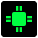
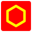
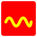
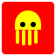
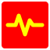

# Favicons

> Generated by `src/web/wizard/gen_favicons.py`; do not edit by hand.

**288 favicons** - 18 motifs x 16 palettes - as crisp SVG under [`src/web/favicons/`](../src/web/favicons/). Package any one as a drop-in favicon set (16/32/48/180/192/512 PNG + `favicon.ico` + `site.webmanifest`, tarballed) with [`tools/pack_favicons.sh`](../tools/pack_favicons.sh) `<name>` (needs `rsvg-convert` + ImageMagick).

### bolt

               

### terminal

               

### chip

               

### wifi

               

### signal

               

### hexagon

               

### cube

               

### gear

               

### wave

               

### shield

               

### star

               

### heart

               

### leaf

               

### rocket

               

### squid

               

### dot-grid

               

### globe

               

### pulse

               
