# Documentation

A multi-protocol network server for ESP32 with a fully deterministic memory footprint, RFC 7230 compliant request parsing, and an OSI-layered architecture. It serves HTTP/1.1 and HTTP/2 (with HTTP/3 over QUIC, host-tested), WebSocket, and Server-Sent Events, with optional HTTPS/TLS, SSH, Telnet, SNMP, CoAP, Modbus TCP, MQTT, and OPC UA.

## Installation

**PlatformIO:**

```ini
lib_deps = https://github.com/dstroy0/ProtoCore.git
```

**Arduino IDE:** Download the repository as a ZIP and use _Sketch → Include Library → Add .ZIP Library_.

## Quick Start

```cpp
#include <WiFi.h>
#include "protocore.h"
#include "network_drivers/physical/physical.h"

PC server;

void handle_status(uint8_t slot_id, HttpReq *req)
{
    server.send(slot_id, 200, "application/json", "{\"ok\":true}");
}

void setup()
{
    init_wifi_physical("SSID", "PASSWORD");
    while (!wifi_ready()) delay(250);

    server.on("/status", HTTP_GET, handle_status);
    server.set_cors("*");
    server.begin(80);
}

void loop()
{
    server.handle();
}
```

See `examples/Foundation/Configuration/Configuration.ino` for a full reference of every configurable flag and constant.

## Features

A compile-time menu grouped by the OSI layer each feature lives at, alphabetized within each layer: each cell is an optional `PC_ENABLE_*` subsystem (core HTTP/1.1, routing, middleware, JSON, templating, and chunked responses are always on). **Hover an entry for its summary; click through to [FEATURES.md](FEATURES.md) for the full description.** The tables are generated from [FEATURES.md](FEATURES.md) by `ci_tooling/generate/gen_feature_tables.py`, so they never drift.

<!-- BEGIN GENERATED FEATURE TABLES (ci_tooling/generate/gen_feature_tables.py) -->

<!-- prettier-ignore-start -->

**254 features**, every one a compile-time `PC_ENABLE_*` flag that is off unless you ask for it. Core HTTP/1.1 parsing, routing, middleware, JSON, templating and chunked responses are always on and are not flags.

<a href="https://dstroy0.github.io/ProtoCore/features.html" title="Browse every feature">
  
</a>

| Layer | Features | For example |
| --- | --- | --- |
| **Foundation** | 17 | Config IO, Config Store, Device ID, DMA Peripheral Ingest, … |
| **Physical & Data Link (L1-L2)** | 31 | ADS1115, BLE GATT, Bus Capture, CC1101, … |
| **Network (L3)** | 6 | Dns Resolver, Happy Eyeballs, IPv6, Link Manager, … |
| **Transport (L4)** | 9 | Accept Throttle, IP Allowlist, Keep-Alive, MTLS, … |
| **Session (L5)** | 5 | SSH, SSH Compression, SSH SCP, SSH SFTP, … |
| **Presentation (L6)** | 18 | Auth, Auth Lockout, CBOR, CloudEvents, … |
| **Application (L7)** | 168 | AD9238, Adaptive mDNS, ADS (Beckhoff), AMQP, … |

**[Browse all of them →](https://dstroy0.github.io/ProtoCore/features.html)** - filterable, grouped by layer, one line each. Full descriptions live in [FEATURES.md](FEATURES.md); both are generated from it, so they cannot drift.

<!-- prettier-ignore-end -->

<!-- END GENERATED FEATURE TABLES -->


## New to this? Start here

If networking is new to you, the [**learn series**](learn/) is a from-scratch on-ramp
that assumes no prior knowledge: the [OSI model](learn/osi-model.md),
[TCP/IP](learn/tcp-ip.md), and [a primer on every language](learn/languages.md) in the
project - each tied back to the code below. Every protocol the library implements is
mapped to its authoritative spec in [STANDARDS.md](STANDARDS.md).

## Architecture

Each OSI layer lives in its own subdirectory under `src/network_drivers/`:

<details>
<summary><b>View Directory and OSI Layer Layout</b></summary>

```
L7  src/protocore.h/cpp     Route table, dispatch, send()
L6  src/network_drivers/presentation/
        presentation.h/cpp                        Drains ring buffer → parser
        http_parser.h/cpp                         RFC 7230 byte-stream state machine
        sha1.h/cpp  base64.h/cpp                  mbedTLS hardware-accelerated helpers
        websocket.h/cpp  sse.h/cpp                WS frame parser; SSE connection pool
        multipart.h/cpp                           Multipart form-data parser
L5  src/network_drivers/session/
        session.h/cpp                             FreeRTOS event queue drain
L4  src/network_drivers/transport/
        tcp.h/cpp                           lwIP callbacks, ring buffers, timeouts
        listener.h/cpp                            Per-port TCP listener, per-listener queue
L3  src/network_drivers/network/
        network.h/cpp                             lwIP stub
L2  src/network_drivers/datalink/
        datalink.h/cpp                            Espressif WiFi driver stub
L1  src/network_drivers/physical/
        physical.h/cpp                            WiFi.begin() wrapper

    src/network_drivers/tls/                      mbedTLS over a fixed static pool (HTTPS / wss)
    src/network_drivers/application/              Generated web assets (dashboard, terminal)
    src/network_drivers/presentation/ssh/         Zero-heap SSH-2.0 server
    src/services/                                 Optional L7 subsystems, one folder each:
        opcua/ + opcua_client/, modbus/, mqtt/, coap/, snmp/, oidc/,
        oauth2/, totp/, audit_log/, vfs/, graphql/, espnow/, ...  (see FEATURES.md)
```

The conceptual layer map above is a summary; the complete file layout is generated
below from `src/` by `ci_tooling/generate/gen_readme_sections.py` (single-`.h`/`.cpp`
service folders are collapsed to their name; generated web-asset blobs are counted,
not listed).

<details>
<summary><b>Full source tree (every library file)</b></summary>

<!-- BEGIN GENERATED SOURCE-TREE (ci_tooling/generate/gen_readme_sections.py) -->

<!-- prettier-ignore-start -->

```text
src/
├── board_drivers/
│   ├── board_profiles/
│   │   ├── esp/
│   │   │   ├── 16mbflash.h
│   │   │   ├── 16mbpsram.h
│   │   │   ├── 2mbflash.h
│   │   │   ├── 2mbpsram.h
│   │   │   ├── 32mbflash.h
│   │   │   ├── 32mbpsram.h
│   │   │   ├── 4mbflash.h
│   │   │   ├── 4mbpsram.h
│   │   │   ├── 8mbflash.h
│   │   │   ├── 8mbpsram.h
│   │   │   ├── c2_defaults.h
│   │   │   ├── c3_defaults.h
│   │   │   ├── c5_defaults.h
│   │   │   ├── c61_defaults.h
│   │   │   ├── c6_defaults.h
│   │   │   ├── h21_defaults.h
│   │   │   ├── h2_defaults.h
│   │   │   ├── h4_defaults.h
│   │   │   ├── p4_defaults.h
│   │   │   ├── s2_defaults.h
│   │   │   ├── s31_defaults.h
│   │   │   └── s3_defaults.h
│   │   ├── board_profile.h
│   │   ├── classic_defaults.h
│   │   ├── derived_sizing.h
│   │   └── pc_platform.h
│   ├── hal/
│   │   ├── esp/
│   │   │   ├── C2_AND_S.md
│   │   │   ├── C3_CRYPTO_REG_SYMBOLS.md
│   │   │   ├── C6_CRYPTO_REG_SYMBOLS.md
│   │   │   ├── CLASSIC_CRYPTO_REG_SYMBOLS.md
│   │   │   ├── DMA_GDMA.md
│   │   │   ├── E_CRYPTO_REG_SYMBOLS.md
│   │   │   ├── esp_aes128gcm.c
│   │   │   ├── esp_aesgcm.c
│   │   │   ├── esp_bignum.c
│   │   │   ├── esp_bus.c
│   │   │   ├── esp_crypto_hal.c
│   │   │   ├── esp_crypto_hal.h
│   │   │   ├── esp_mnt_fs.c
│   │   │   ├── esp_mnt_fs.h
│   │   │   ├── esp_platform.c
│   │   │   ├── H2_CRYPTO_REG_SYMBOLS.md
│   │   │   ├── P4_CRYPTO_REG_SYMBOLS.md
│   │   │   ├── P4_MIPI_DSI_CSI.md
│   │   │   ├── P4_MIPI_HELPERS.md
│   │   │   ├── S2.md
│   │   │   └── S3_CRYPTO_REG_SYMBOLS.md
│   │   ├── mock/
│   │   │   └── mock_platform.c
│   │   └── portable/
│   │       ├── portable_aes128gcm.c
│   │       ├── portable_aesgcm.cpp
│   │       ├── portable_bignum.cpp
│   │       └── portable_platform.c
│   └── physical/
│       ├── esp/
│       │   └── physical_esp.c
│       └── mock/
│           └── physical_mock.c
├── crypto/
│   ├── aead/
│   │   ├── aes128gcm.h
│   │   ├── aesccm.c
│   │   ├── aesccm.h
│   │   ├── aesgcm.c
│   │   ├── aesgcm.h
│   │   ├── chachapoly.c
│   │   └── chachapoly.h
│   ├── asymmetric/
│   │   ├── bignum.c
│   │   ├── bignum.h
│   │   ├── curve25519.c
│   │   ├── curve25519.h
│   │   ├── ecdsa.c
│   │   ├── ecdsa.h
│   │   ├── ed25519.c
│   │   ├── ed25519.h
│   │   ├── ed25519_comb_table.h
│   │   ├── fe25519.h
│   │   ├── rsa.c
│   │   └── rsa.h
│   ├── cipher/
│   │   ├── aes256ctr.c
│   │   ├── aes256ctr.h
│   │   ├── aes_block.h
│   │   ├── aes_sbox.h
│   │   ├── chacha20.c
│   │   └── chacha20.h
│   ├── hash/
│   │   ├── md.c
│   │   ├── md.h
│   │   ├── sha1.c
│   │   ├── sha1.h
│   │   ├── sha256.c
│   │   ├── sha256.h
│   │   ├── sha3.c
│   │   ├── sha3.h
│   │   ├── sha512.c
│   │   └── sha512.h
│   ├── kdf/
│   │   ├── hkdf.c
│   │   ├── hkdf.h
│   │   ├── kdf.c
│   │   ├── kdf.h
│   │   ├── tls13_kdf.c
│   │   └── tls13_kdf.h
│   ├── mac/
│   │   ├── aes_cmac.c
│   │   ├── aes_cmac.h
│   │   ├── ghash.h
│   │   ├── hmac_sha256.c
│   │   ├── hmac_sha256.h
│   │   ├── hmac_sha512.c
│   │   ├── hmac_sha512.h
│   │   ├── poly1305.c
│   │   └── poly1305.h
│   ├── pqc/
│   │   ├── mlkem.c
│   │   ├── mlkem.h
│   │   ├── sntrup761.c
│   │   └── sntrup761.h
│   ├── crypto_opt.h
│   └── ct_eq.h
├── mmgr/
│   ├── arena.c
│   ├── arena.h
│   ├── dma.c
│   ├── dma.h
│   ├── frame.c
│   ├── frame.h
│   ├── membuild.h
│   ├── plaintext.c
│   ├── plaintext.h
│   ├── secure.c
│   └── secure.h
├── network_drivers/
│   ├── application/
│   │   ├── file_serving/
│   │   │   ├── file_serving.c
│   │   │   └── file_serving.h
│   │   ├── scp/
│   │   │   ├── scp.c
│   │   │   ├── scp.h
│   │   │   ├── ssh_scp.c
│   │   │   └── ssh_scp.h
│   │   ├── sftp/
│   │   │   ├── sftp.c
│   │   │   ├── sftp.h
│   │   │   ├── ssh_sftp.c
│   │   │   └── ssh_sftp.h
│   │   ├── smb/
│   │   │   ├── ntlm.c
│   │   │   ├── ntlm.h
│   │   │   ├── ntlmssp.c
│   │   │   ├── ntlmssp.h
│   │   │   ├── smb2.c
│   │   │   ├── smb2.h
│   │   │   ├── smb_client.c
│   │   │   ├── smb_client.h
│   │   │   ├── spnego.c
│   │   │   └── spnego.h
│   │   ├── upload_service/
│   │   │   ├── upload_service.c
│   │   │   └── upload_service.h
│   │   ├── webdav/
│   │   │   ├── webdav.c
│   │   │   ├── webdav.cpp
│   │   │   └── webdav.h
│   │   ├── binary_asset_blobs.c
│   │   ├── binary_asset_blobs.cpp
│   │   ├── binary_asset_blobs.h
│   │   ├── http_range.c
│   │   ├── http_range.h
│   │   ├── web_assets.c
│   │   └── web_assets.h
│   ├── datalink/
│   │   ├── datalink.c
│   │   ├── datalink.h
│   │   ├── roaming.c
│   │   └── roaming.h
│   ├── network/
│   │   ├── dns_resolver.c
│   │   ├── dns_resolver.h
│   │   ├── ip.c
│   │   ├── ip.h
│   │   ├── network.c
│   │   ├── network.h
│   │   ├── route.c
│   │   └── route.h
│   ├── physical/
│   │   ├── physical.c
│   │   ├── physical.h
│   │   ├── radio_power.c
│   │   └── radio_power.h
│   ├── presentation/
│   │   ├── codec/
│   │   │   ├── base64/
│   │   │   │   ├── base64.c
│   │   │   │   └── base64.h
│   │   │   ├── cbor/  (cbor.h, cbor.cpp)
│   │   │   ├── deflate/
│   │   │   │   ├── deflate.c
│   │   │   │   └── deflate.h
│   │   │   ├── hpack_prim/
│   │   │   │   ├── hpack_prim.c
│   │   │   │   └── hpack_prim.h
│   │   │   ├── inflate/
│   │   │   │   ├── inflate.c
│   │   │   │   └── inflate.h
│   │   │   ├── json/
│   │   │   │   ├── json.c
│   │   │   │   └── json.h
│   │   │   ├── msgpack/  (msgpack.h, msgpack.cpp)
│   │   │   ├── multipart/  (multipart.h, multipart.cpp)
│   │   │   ├── codec.cpp
│   │   │   └── codec.h
│   │   ├── http/
│   │   │   ├── http2/
│   │   │   │   ├── h2_conn.c
│   │   │   │   ├── h2_conn.h
│   │   │   │   ├── h2_frame.c
│   │   │   │   ├── h2_frame.h
│   │   │   │   ├── h2_server.c
│   │   │   │   ├── h2_server.h
│   │   │   │   ├── hpack.c
│   │   │   │   └── hpack.h
│   │   │   ├── http3/
│   │   │   │   ├── h3_conn.c
│   │   │   │   ├── h3_conn.h
│   │   │   │   ├── h3_frame.c
│   │   │   │   ├── h3_frame.h
│   │   │   │   ├── qpack.c
│   │   │   │   ├── qpack.h
│   │   │   │   ├── quic_conn.c
│   │   │   │   ├── quic_conn.h
│   │   │   │   ├── quic_crypto.c
│   │   │   │   ├── quic_crypto.h
│   │   │   │   ├── quic_frame.c
│   │   │   │   ├── quic_frame.h
│   │   │   │   ├── quic_packet.c
│   │   │   │   ├── quic_packet.h
│   │   │   │   ├── quic_server.c
│   │   │   │   ├── quic_server.h
│   │   │   │   ├── quic_tls.c
│   │   │   │   ├── quic_tls.h
│   │   │   │   ├── quic_tp.c
│   │   │   │   ├── quic_tp.h
│   │   │   │   ├── quic_varint.c
│   │   │   │   ├── quic_varint.h
│   │   │   │   ├── tls13_msg.c
│   │   │   │   └── tls13_msg.h
│   │   │   ├── http_parser/  (http_parser.h, http_parser.cpp)
│   │   │   ├── sse/  (sse.h, sse.cpp)
│   │   │   └── websocket/  (websocket.h, websocket.cpp)
│   │   ├── security/
│   │   │   └── dtls/
│   │   │       ├── dtls_conn.c
│   │   │       ├── dtls_conn.h
│   │   │       ├── dtls_handshake.c
│   │   │       ├── dtls_handshake.h
│   │   │       ├── dtls_record.c
│   │   │       └── dtls_record.h
│   │   ├── ssh/
│   │   │   ├── auth/  (ssh_auth.h, ssh_auth.cpp)
│   │   │   ├── connection/
│   │   │   │   ├── ssh_channel.cpp
│   │   │   │   ├── ssh_channel.h
│   │   │   │   ├── ssh_client.c
│   │   │   │   ├── ssh_client.h
│   │   │   │   ├── ssh_conn.cpp
│   │   │   │   ├── ssh_conn.h
│   │   │   │   ├── ssh_flow_control.cpp
│   │   │   │   ├── ssh_flow_control.h
│   │   │   │   ├── ssh_forward.c
│   │   │   │   ├── ssh_forward.h
│   │   │   │   ├── ssh_server.cpp
│   │   │   │   └── ssh_server.h
│   │   │   └── transport/
│   │   │       ├── ssh_comp.c
│   │   │       ├── ssh_comp.h
│   │   │       ├── ssh_dh.cpp
│   │   │       ├── ssh_dh.h
│   │   │       ├── ssh_inflate.c
│   │   │       ├── ssh_inflate.h
│   │   │       ├── ssh_keymat.cpp
│   │   │       ├── ssh_keymat.h
│   │   │       ├── ssh_packet.cpp
│   │   │       ├── ssh_packet.h
│   │   │       ├── ssh_transport.cpp
│   │   │       ├── ssh_transport.h
│   │   │       ├── ssh_zlib.c
│   │   │       └── ssh_zlib.h
│   │   ├── telnet/
│   │   │   ├── telnet.c
│   │   │   └── telnet.h
│   │   ├── presentation.cpp
│   │   └── presentation.h
│   ├── session/
│   │   ├── preempt_queue.c
│   │   ├── preempt_queue.h
│   │   ├── proto_builtins.cpp
│   │   ├── proto_handler.h
│   │   ├── session.cpp
│   │   ├── session.h
│   │   ├── worker.c
│   │   └── worker.h
│   ├── tls/
│   │   ├── ssh_kexhash.h
│   │   ├── ssh_rsa.cpp
│   │   ├── ssh_rsa.h
│   │   ├── tls.cpp
│   │   └── tls.h
│   └── transport/
│       ├── client.c
│       ├── client.h
│       ├── diffserv.c
│       ├── diffserv.h
│       ├── listener.c
│       ├── listener.h
│       ├── tcp.c
│       ├── tcp.h
│       ├── udp.c
│       └── udp.h
├── server/
│   ├── clock/
│   │   ├── clock.c
│   │   └── clock.h
│   ├── filesystem/
│   │   ├── filesystem.c
│   │   ├── filesystem.h
│   │   ├── mnt.c
│   │   ├── mnt.h
│   │   ├── wearlevel.c
│   │   └── wearlevel.h
│   ├── signaling/
│   │   ├── bus_capture.c
│   │   ├── bus_capture.h
│   │   ├── device_id.c
│   │   ├── device_id.h
│   │   ├── gpio_map.c
│   │   ├── gpio_map.h
│   │   ├── gpio_map_routes.c
│   │   ├── hw_health.c
│   │   ├── hw_health.h
│   │   ├── link_manager.c
│   │   ├── link_manager.h
│   │   ├── signaling.c
│   │   ├── signaling.h
│   │   ├── trace_capture.c
│   │   └── trace_capture.h
│   ├── update/
│   │   ├── ota_rollback.c
│   │   ├── ota_rollback.h
│   │   ├── ota_service.cpp
│   │   └── ota_service.h
│   ├── auth.c
│   ├── failsafe.c
│   ├── failsafe.h
│   ├── logbuf.c
│   ├── logbuf.h
│   ├── middleware.c
│   ├── regex.c
│   ├── response.c
│   ├── sleep_sched.c
│   ├── sleep_sched.h
│   └── websocket_sse.c
├── services/
│   ├── energy/
│   │   ├── c37118/
│   │   │   ├── c37118.c
│   │   │   └── c37118.h
│   │   ├── dnp3/
│   │   │   ├── dnp3.c
│   │   │   └── dnp3.h
│   │   ├── goose/
│   │   │   ├── goose.c
│   │   │   └── goose.h
│   │   ├── iccp/
│   │   │   ├── iccp.c
│   │   │   └── iccp.h
│   │   ├── iec60870/
│   │   │   ├── iec60870.c
│   │   │   └── iec60870.h
│   │   ├── mms/
│   │   │   ├── mms.c
│   │   │   └── mms.h
│   │   ├── openadr/
│   │   │   ├── openadr.c
│   │   │   └── openadr.h
│   │   ├── sep2/
│   │   │   ├── sep2.c
│   │   │   └── sep2.h
│   │   └── sunspec/
│   │       ├── sunspec.c
│   │       └── sunspec.h
│   ├── fieldbus/
│   │   ├── ads/
│   │   │   ├── ads.c
│   │   │   └── ads.h
│   │   ├── bacnet/
│   │   │   ├── bacnet.c
│   │   │   └── bacnet.h
│   │   ├── canopen/
│   │   │   ├── canopen.c
│   │   │   └── canopen.h
│   │   ├── cclink/
│   │   │   ├── cclink.c
│   │   │   └── cclink.h
│   │   ├── cia402/
│   │   │   ├── cia402.c
│   │   │   └── cia402.h
│   │   ├── cip/
│   │   │   ├── cip.c
│   │   │   └── cip.h
│   │   ├── cotp/
│   │   │   ├── cotp.c
│   │   │   └── cotp.h
│   │   ├── devicenet/
│   │   │   ├── devicenet.c
│   │   │   └── devicenet.h
│   │   ├── df1/
│   │   │   ├── df1.c
│   │   │   └── df1.h
│   │   ├── directnet/
│   │   │   ├── directnet.c
│   │   │   └── directnet.h
│   │   ├── enip/
│   │   │   ├── enip.c
│   │   │   └── enip.h
│   │   ├── fins/
│   │   │   ├── fins.c
│   │   │   └── fins.h
│   │   ├── hart/
│   │   │   ├── hart.c
│   │   │   └── hart.h
│   │   ├── hostlink/
│   │   │   ├── hostlink.c
│   │   │   └── hostlink.h
│   │   ├── interbus/
│   │   │   ├── interbus.c
│   │   │   └── interbus.h
│   │   ├── iolink/
│   │   │   ├── iolink.c
│   │   │   └── iolink.h
│   │   ├── j1939/
│   │   │   ├── j1939.c
│   │   │   └── j1939.h
│   │   ├── lonworks/
│   │   │   ├── lonworks.c
│   │   │   └── lonworks.h
│   │   ├── mbplus/
│   │   │   ├── mbplus.c
│   │   │   └── mbplus.h
│   │   ├── mbus/
│   │   │   ├── mbus.c
│   │   │   └── mbus.h
│   │   ├── melsec/
│   │   │   ├── melsec.c
│   │   │   └── melsec.h
│   │   ├── modbus/
│   │   │   ├── modbus.c
│   │   │   ├── modbus.h
│   │   │   ├── modbus_master.c
│   │   │   └── modbus_master.h
│   │   ├── opcua/
│   │   │   ├── opcua.c
│   │   │   └── opcua.h
│   │   ├── opcua_client/
│   │   │   ├── opcua_client.c
│   │   │   └── opcua_client.h
│   │   ├── powerlink/
│   │   │   ├── powerlink.c
│   │   │   └── powerlink.h
│   │   ├── profibus/
│   │   │   ├── profibus.c
│   │   │   └── profibus.h
│   │   ├── profinet/
│   │   │   ├── profinet.c
│   │   │   └── profinet.h
│   │   ├── rawl2/
│   │   │   ├── rawl2.c
│   │   │   └── rawl2.h
│   │   ├── s7comm/
│   │   │   ├── s7comm.c
│   │   │   └── s7comm.h
│   │   ├── sercos/
│   │   │   ├── sercos.c
│   │   │   └── sercos.h
│   │   ├── simatic/
│   │   │   ├── simatic.c
│   │   │   └── simatic.h
│   │   └── snp/
│   │       ├── snp.c
│   │       └── snp.h
│   ├── file_transfer/
│   │   ├── ftp/
│   │   │   ├── ftp.c
│   │   │   ├── ftp.h
│   │   │   ├── ftp_session.c
│   │   │   └── ftp_session.h
│   │   └── http_delivery/
│   │       ├── http_delivery.c
│   │       ├── http_delivery.h
│   │       └── http_delivery_routes.c
│   ├── instrumentation/
│   │   ├── gpib/
│   │   │   ├── gpib.c
│   │   │   └── gpib.h
│   │   ├── hislip/
│   │   │   ├── hislip.c
│   │   │   └── hislip.h
│   │   ├── scpi/
│   │   │   ├── scpi.c
│   │   │   └── scpi.h
│   │   └── vxi11/
│   │       ├── vxi11.c
│   │       └── vxi11.h
│   ├── iot/
│   │   ├── amqp/
│   │   │   ├── amqp.c
│   │   │   └── amqp.h
│   │   ├── cloudevents/
│   │   │   ├── cloudevents.c
│   │   │   └── cloudevents.h
│   │   ├── coap/
│   │   │   ├── coap.c
│   │   │   ├── coap.h
│   │   │   ├── coaps.c
│   │   │   ├── coaps.h
│   │   │   ├── coaps_server.c
│   │   │   └── coaps_server.h
│   │   ├── dds/
│   │   │   ├── dds.c
│   │   │   └── dds.h
│   │   ├── graphql/
│   │   │   ├── graphql.c
│   │   │   └── graphql.h
│   │   ├── grpcweb/
│   │   │   ├── grpcweb.c
│   │   │   └── grpcweb.h
│   │   ├── lwm2m/
│   │   │   ├── lwm2m_tlv.c
│   │   │   └── lwm2m_tlv.h
│   │   ├── mqtt/
│   │   │   ├── mqtt.cpp
│   │   │   ├── mqtt.h
│   │   │   ├── mqtt_sn.c
│   │   │   └── mqtt_sn.h
│   │   ├── nats/
│   │   │   ├── nats.c
│   │   │   └── nats.h
│   │   ├── protobuf/
│   │   │   ├── protobuf.c
│   │   │   └── protobuf.h
│   │   ├── redis_resp/
│   │   │   ├── redis_resp.c
│   │   │   └── redis_resp.h
│   │   ├── senml/  (senml.h, senml.cpp)
│   │   ├── sparkplug/
│   │   │   ├── sparkplug.c
│   │   │   └── sparkplug.h
│   │   ├── statsd/  (statsd.h, statsd.cpp)
│   │   ├── stomp/
│   │   │   ├── stomp.c
│   │   │   └── stomp.h
│   │   ├── telemetry/
│   │   │   ├── telemetry.c
│   │   │   └── telemetry.h
│   │   ├── udp_telemetry/
│   │   │   ├── udp_telemetry.c
│   │   │   └── udp_telemetry.h
│   │   ├── wamp/
│   │   │   ├── wamp.c
│   │   │   └── wamp.h
│   │   └── xmpp/
│   │       ├── xmpp.c
│   │       └── xmpp.h
│   ├── machine_tool/
│   │   ├── atc/
│   │   │   ├── atc.c
│   │   │   └── atc.h
│   │   ├── dnc/
│   │   │   ├── dnc.c
│   │   │   ├── dnc.h
│   │   │   ├── dnc_stream.c
│   │   │   └── dnc_stream.h
│   │   ├── euromap77/
│   │   │   ├── euromap77.c
│   │   │   └── euromap77.h
│   │   ├── fanuc_j519/
│   │   │   ├── fanuc_j519.c
│   │   │   └── fanuc_j519.h
│   │   ├── focas/
│   │   │   ├── focas.c
│   │   │   └── focas.h
│   │   ├── haas_mdc/
│   │   │   ├── haas_mdc.c
│   │   │   └── haas_mdc.h
│   │   ├── lsv2/
│   │   │   ├── lsv2.c
│   │   │   └── lsv2.h
│   │   ├── mtconnect/
│   │   │   ├── mtconnect.c
│   │   │   └── mtconnect.h
│   │   ├── packml/
│   │   │   ├── packml.c
│   │   │   └── packml.h
│   │   ├── robotics/
│   │   │   ├── robotics.c
│   │   │   └── robotics.h
│   │   ├── safety_scl/
│   │   │   ├── safety_scl.c
│   │   │   └── safety_scl.h
│   │   └── umati/
│   │       ├── umati.c
│   │       └── umati.h
│   ├── net/
│   │   ├── dns_server/  (dns_server.h, dns_server.cpp)
│   │   ├── flow_export/
│   │   │   ├── flow_export.c
│   │   │   └── flow_export.h
│   │   ├── forward/
│   │   │   ├── forward.c
│   │   │   └── forward.h
│   │   ├── gateway/
│   │   │   ├── gateway.c
│   │   │   └── gateway.h
│   │   ├── happy_eyeballs/
│   │   │   ├── happy_eyeballs.c
│   │   │   └── happy_eyeballs.h
│   │   ├── http_client/  (http_client.h, http_client.cpp)
│   │   ├── iface_bridge/
│   │   │   ├── iface_bridge.c
│   │   │   ├── iface_bridge.h
│   │   │   ├── iface_bridge_hw.c
│   │   │   └── iface_bridge_hw.h
│   │   ├── mdns_adaptive/
│   │   │   ├── mdns_adaptive.c
│   │   │   └── mdns_adaptive.h
│   │   ├── mdns_service/  (mdns_service.h, mdns_service.cpp)
│   │   ├── netadapt/
│   │   │   ├── netadapt.c
│   │   │   └── netadapt.h
│   │   ├── proxy_protocol/
│   │   │   ├── proxy_protocol.c
│   │   │   └── proxy_protocol.h
│   │   ├── relay/
│   │   │   ├── relay.c
│   │   │   ├── relay.h
│   │   │   ├── relay_listener.c
│   │   │   └── relay_listener.h
│   │   ├── smtp/  (smtp.h, smtp.cpp)
│   │   ├── snmp/
│   │   │   ├── snmp_agent.c
│   │   │   ├── snmp_agent.h
│   │   │   ├── snmp_ber.c
│   │   │   ├── snmp_ber.h
│   │   │   ├── snmp_crypto.c
│   │   │   ├── snmp_crypto.h
│   │   │   ├── snmp_notify.c
│   │   │   ├── snmp_notify.h
│   │   │   ├── snmp_v3.c
│   │   │   └── snmp_v3.h
│   │   ├── sockpool/
│   │   │   ├── sockpool.c
│   │   │   └── sockpool.h
│   │   ├── southbound/
│   │   │   ├── sb_modbus.c
│   │   │   ├── sb_modbus.h
│   │   │   ├── southbound.c
│   │   │   └── southbound.h
│   │   ├── syslog/
│   │   │   ├── syslog.c
│   │   │   └── syslog.h
│   │   ├── webhook/
│   │   │   ├── webhook.c
│   │   │   └── webhook.h
│   │   └── ws_client/  (ws_client.h, ws_client.cpp)
│   ├── peripherals/
│   │   ├── ad9238/
│   │   │   ├── ad9238.c
│   │   │   └── ad9238.h
│   │   ├── ads1115/  (ads1115.h, ads1115.cpp)
│   │   ├── dmx/
│   │   │   ├── dmx.c
│   │   │   └── dmx.h
│   │   ├── dshot/
│   │   │   ├── dshot.c
│   │   │   └── dshot.h
│   │   ├── fdc2214/  (fdc2214.h, fdc2214.cpp)
│   │   ├── hmmd/
│   │   │   ├── hmmd.c
│   │   │   └── hmmd.h
│   │   ├── ina219/  (ina219.h, ina219.cpp)
│   │   ├── ld2410/  (ld2410.h, ld2410.cpp)
│   │   ├── ldc1614/  (ldc1614.h, ldc1614.cpp)
│   │   ├── mpr121/  (mpr121.h, mpr121.cpp)
│   │   ├── pca9685/  (pca9685.h, pca9685.cpp)
│   │   ├── pn532/
│   │   │   ├── pn532.c
│   │   │   └── pn532.h
│   │   ├── rcwl0516/
│   │   │   ├── rcwl0516.c
│   │   │   └── rcwl0516.h
│   │   ├── rtc/  (rtc.h, rtc.cpp)
│   │   ├── sdi12/
│   │   │   ├── sdi12.c
│   │   │   └── sdi12.h
│   │   ├── sen0192/
│   │   │   ├── sen0192.c
│   │   │   └── sen0192.h
│   │   ├── sht3x/  (sht3x.h, sht3x.cpp)
│   │   ├── vl53l0x/  (vl53l0x.h, vl53l0x.cpp)
│   │   └── i2c.h
│   ├── radio/
│   │   ├── ble_gatt/
│   │   │   ├── ble_gatt.c
│   │   │   └── ble_gatt.h
│   │   ├── cc1101/
│   │   │   ├── cc1101.c
│   │   │   └── cc1101.h
│   │   ├── enocean/
│   │   │   ├── enocean.c
│   │   │   └── enocean.h
│   │   ├── espnow/
│   │   │   ├── espnow.c
│   │   │   └── espnow.h
│   │   ├── lora/
│   │   │   ├── lora.c
│   │   │   └── lora.h
│   │   ├── nrf24/
│   │   │   ├── nrf24.c
│   │   │   └── nrf24.h
│   │   ├── promisc/
│   │   │   ├── promisc.c
│   │   │   └── promisc.h
│   │   ├── radio_sniff/
│   │   │   ├── radio_sniff.c
│   │   │   └── radio_sniff.h
│   │   ├── sigfox/
│   │   │   ├── sigfox.c
│   │   │   └── sigfox.h
│   │   ├── thread/
│   │   │   ├── thread.c
│   │   │   └── thread.h
│   │   ├── wifi_sniffer/
│   │   │   ├── wifi_sniffer.c
│   │   │   └── wifi_sniffer.h
│   │   ├── wisun/
│   │   │   ├── wisun.c
│   │   │   └── wisun.h
│   │   ├── zigbee/
│   │   │   ├── zigbee.c
│   │   │   └── zigbee.h
│   │   └── zwave/
│   │       ├── zwave.c
│   │       └── zwave.h
│   ├── security/
│   │   ├── audit_log/  (audit_log.h, audit_log.cpp)
│   │   ├── auth_lockout/
│   │   │   ├── auth_lockout.c
│   │   │   └── auth_lockout.h
│   │   ├── csrf/
│   │   │   ├── csrf.c
│   │   │   └── csrf.h
│   │   ├── forwarded_trust/
│   │   │   ├── forwarded_trust.c
│   │   │   └── forwarded_trust.h
│   │   ├── guardrails/
│   │   │   ├── guardrails.c
│   │   │   └── guardrails.h
│   │   ├── ikev2/
│   │   │   ├── ikev2.c
│   │   │   ├── ikev2.h
│   │   │   ├── ikev2_natt.c
│   │   │   └── ikev2_natt.h
│   │   ├── jwt/
│   │   │   ├── jwt.c
│   │   │   └── jwt.h
│   │   ├── oauth2/  (oauth2.h, oauth2.cpp)
│   │   ├── oidc/
│   │   │   ├── oidc.c
│   │   │   └── oidc.h
│   │   ├── tls_policy/
│   │   │   ├── tls_policy.c
│   │   │   └── tls_policy.h
│   │   └── totp/
│   │       ├── totp.c
│   │       └── totp.h
│   ├── storage/
│   │   ├── config_io/
│   │   │   ├── config_io.c
│   │   │   └── config_io.h
│   │   ├── config_store/
│   │   │   ├── config_store.c
│   │   │   └── config_store.h
│   │   ├── dbm/
│   │   │   ├── dbm.c
│   │   │   └── dbm.h
│   │   ├── docstore/
│   │   │   ├── docstore.c
│   │   │   └── docstore.h
│   │   ├── hotswap/
│   │   │   ├── hotswap.c
│   │   │   └── hotswap.h
│   │   ├── partition_monitor/
│   │   │   ├── partition_monitor.c
│   │   │   ├── partition_monitor.h
│   │   │   └── partition_monitor_routes.c
│   │   ├── psram_pool/
│   │   │   ├── psram_pool.c
│   │   │   └── psram_pool.h
│   │   ├── sqlite/
│   │   │   ├── sqlite_format.c
│   │   │   └── sqlite_format.h
│   │   └── wal/
│   │       ├── wal.c
│   │       ├── wal.h
│   │       ├── wal_fs.h
│   │       ├── wal_store.c
│   │       └── wal_store.h
│   ├── system/
│   │   ├── control/
│   │   │   ├── control.c
│   │   │   └── control.h
│   │   ├── esp/
│   │   │   ├── esp.c
│   │   │   ├── esp.h
│   │   │   ├── ipsec_db.c
│   │   │   └── ipsec_db.h
│   │   ├── exc_decoder/
│   │   │   ├── exc_coredump.c
│   │   │   ├── exc_decoder.c
│   │   │   └── exc_decoder.h
│   │   ├── power_mgmt/
│   │   │   ├── power_mgmt.c
│   │   │   └── power_mgmt.h
│   │   └── provisioning_service/  (provisioning_service.h, provisioning_service.cpp)
│   ├── timing_position/
│   │   ├── gnss/
│   │   │   ├── gnss_survey.c
│   │   │   ├── gnss_survey.h
│   │   │   ├── ntrip_caster.c
│   │   │   ├── ntrip_caster.h
│   │   │   ├── ntrip_caster_listener.c
│   │   │   ├── ntrip_caster_listener.h
│   │   │   ├── rtcm3.c
│   │   │   └── rtcm3.h
│   │   ├── nmea0183/
│   │   │   ├── nmea0183.c
│   │   │   └── nmea0183.h
│   │   ├── nmea2000/
│   │   │   ├── nmea2000.c
│   │   │   └── nmea2000.h
│   │   ├── ntp_server/  (ntp_server.h, ntp_server.cpp)
│   │   ├── ntp_service/  (ntp_service.h, ntp_service.cpp)
│   │   ├── nts/
│   │   │   ├── nts.c
│   │   │   └── nts.h
│   │   ├── ptp/
│   │   │   ├── ptp.c
│   │   │   └── ptp.h
│   │   ├── time_source/  (time_source.h, time_source.cpp)
│   │   └── ubx/
│   │       ├── ubx.c
│   │       └── ubx.h
│   ├── transportation/
│   │   ├── j2735/
│   │   │   ├── j2735.c
│   │   │   └── j2735.h
│   │   ├── nema_ts2/
│   │   │   ├── nema_ts2.c
│   │   │   └── nema_ts2.h
│   │   ├── ntcip/
│   │   │   ├── ntcip.c
│   │   │   └── ntcip.h
│   │   ├── ocit/
│   │   │   ├── ocit.c
│   │   │   └── ocit.h
│   │   ├── utmc/
│   │   │   ├── utmc.c
│   │   │   └── utmc.h
│   │   └── wave/
│   │       ├── wave.c
│   │       └── wave.h
│   └── web/
│       ├── dashboard/
│       │   ├── dashboard.c
│       │   ├── dashboard.h
│       │   └── dashboard_routes.c
│       ├── edge_cache/
│       │   ├── edge_cache.c
│       │   ├── edge_cache.h
│       │   ├── edge_cache_proxy.c
│       │   ├── edge_cache_proxy.h
│       │   ├── edge_cache_sd.c
│       │   ├── edge_cache_sd.h
│       │   ├── edge_fetch.c
│       │   ├── edge_fetch.h
│       │   ├── edge_mesh.c
│       │   └── edge_mesh.h
│       ├── httpcache/
│       │   ├── httpcache.c
│       │   └── httpcache.h
│       ├── spa_router/
│       │   ├── spa_router.c
│       │   └── spa_router.h
│       └── web_terminal/  (web_terminal.h, web_terminal.cpp)
├── shared_primitives/
│   ├── bitio.h
│   ├── bytes.h
│   ├── can.h
│   ├── crc.h
│   ├── endian.h
│   ├── hex.h
│   ├── http_date.h
│   ├── log.c
│   ├── log.h
│   ├── mime.h
│   ├── numparse.h
│   ├── pcap.h
│   ├── rawmemcpy.h
│   ├── ring.h
│   ├── runops.h
│   ├── span.h
│   ├── speed_opt.h
│   ├── swar.h
│   ├── time_compat.h
│   ├── types.h
│   └── utf8.h
├── protocore.c
├── protocore.h
└── protocore_config.h
```

<!-- prettier-ignore-end -->

<!-- END GENERATED SOURCE-TREE -->

</details>

### Build Footprint

Measured flash + static RAM for each optional feature, built in isolation over the
base server on `esp32dev`. Generated from `docs/footprints.json` (produced by the
RPi build matrix) by `ci_tooling/generate/gen_readme_sections.py`.

<details>
<summary><b>Per-feature build footprint</b></summary>

<!-- BEGIN GENERATED BUILD-FOOTPRINT (ci_tooling/generate/gen_readme_sections.py) -->

<!-- prettier-ignore-start -->

Measured on `esp32dev` from each feature's isolated example (one feature enabled over the
base server). Flash is the program image; RAM is static `.data + .bss`. Regenerated by the
Feature Tables workflow from `docs/footprints.json`.

| Feature | Example | Flash (bytes) | Static RAM (bytes) |
| :------ | :------ | ------------: | -----------------: |
| `SIGFOX` | `Drivers/SigfoxUplink` | 267,961 | 21,464 |
| `ENOCEAN+GATEWAY` | `Drivers/EnOceanGateway` | 268,701 | 21,848 |
| `ZWAVE+GATEWAY` | `Drivers/ZWaveGateway` | 268,905 | 21,848 |
| `ZIGBEE+GATEWAY` | `Drivers/ZigbeeGateway` | 269,417 | 22,104 |
| `DMA+PREEMPT_QUEUE+DMA_SIMULATE` | `Peripherals/DmaIngest` | 269,437 | 28,608 |
| `SEN0192` | `Drivers/Sen0192` | 269,805 | 21,488 |
| `core/SSHCryptoSelfTest` | `L5-Session/SSHCryptoSelfTest` | 270,121 | 24,092 |
| `DMA+PREEMPT_QUEUE+GATEWAY+DMA_SIMULATE` | `Drivers/RadioGateway` | 270,593 | 28,728 |
| `LD2410` | `Drivers/Ld2410` | 270,681 | 21,576 |
| `DMA+PREEMPT_QUEUE+FORWARD+DMA_SIMULATE` | `Foundation/InterfaceForward` | 270,849 | 29,096 |
| `THREAD+GATEWAY` | `Drivers/ThreadGateway` | 271,889 | 22,616 |
| `NMEA0183+UBX` | `Drivers/UbloxGnss` | 273,765 | 22,432 |
| `PREEMPT_QUEUE` | `Foundation/PreemptQueue` | 274,069 | 23,968 |
| `NRF24+GATEWAY` | `Drivers/Nrf24Gateway` | 276,105 | 21,680 |
| `LORA+GATEWAY` | `Drivers/LoRaGateway` | 276,329 | 21,688 |
| `PCA9685` | `Drivers/Pca9685` | 284,601 | 21,800 |
| `ADS1115` | `Drivers/Ads1115` | 286,921 | 21,800 |
| `INA219` | `Drivers/Ina219` | 287,001 | 21,800 |
| `SHT3X` | `Drivers/Sht3x` | 287,037 | 21,800 |
| `MPR121` | `Drivers/Mpr121` | 287,693 | 21,808 |
| `PN532+GATEWAY` | `Drivers/NfcGateway` | 288,129 | 21,920 |
| `core/EthernetW5500` | `Peripherals/EthernetW5500` | 469,573 | 73,672 |
| `HISLIP` | `L7-Application/HiSlip` | 725,197 | 44,068 |
| `LSV2` | `L7-Application/HeidenhainLsv2` | 725,481 | 44,068 |
| `SCPI` | `L7-Application/Scpi` | 725,553 | 43,812 |
| `GPIB` | `L7-Application/Gpib` | 726,069 | 43,588 |
| `HAAS_MDC` | `L7-Application/HaasMdc` | 726,081 | 43,452 |
| `DNS_SERVER` | `L7-Application/DnsServer` | 726,097 | 46,044 |
| `WIFI_SNIFFER+PROMISC` | `Peripherals/WifiSniffer` | 726,149 | 43,644 |
| `VXI11` | `L7-Application/Vxi11` | 726,373 | 44,196 |
| `IKEV2` | `L5-Session/IKEv2` | 728,073 | 43,948 |
| `PTP` | `L7-Application/Ptp` | 728,493 | 45,020 |
| `SNMP+SNMP_TRAP` | `L7-Application/SnmpTrap` | 728,589 | 44,988 |
| `STATSD` | `L7-Application/StatsdMetrics` | 728,621 | 45,148 |
| `COAP+COAP_BLOCK+COAP_MAX_PAYLOAD` | `L7-Application/CoapBlock` | 729,305 | 49,572 |
| `COAP+COAP_OBSERVE` | `L7-Application/CoapObserve` | 730,573 | 47,324 |
| `UDP_TELEMETRY` | `L7-Application/UdpTelemetry` | 730,853 | 45,012 |
| `ESPNOW` | `L7-Application/EspNow` | 731,693 | 43,580 |
| `DNC` | `L7-Application/EthernetDnc` | 734,029 | 61,124 |
| `HTTP_CLIENT` | `L7-Application/HttpClient` | 735,601 | 63,180 |
| `SMTP` | `L7-Application/SmtpAlert` | 735,829 | 61,124 |
| `MQTT` | `L7-Application/MqttClient` | 736,633 | 65,340 |
| `ACCEPT_THROTTLE` | `L4-Transport/AcceptThrottle` | 746,573 | 69,956 |
| `core/Basic` | `Foundation/Basic` | 746,581 | 69,948 |
| `core/CORS` | `L7-Application/CORS` | 746,833 | 69,948 |
| `RADIO_POWER+RADIO_WIFI_PS` | `L7-Application/RadioPower` | 746,881 | 69,948 |
| `core/MediaStreaming` | `L7-Application/MediaStreaming` | 746,881 | 69,948 |
| `core/RegexRoutes` | `L7-Application/RegexRoutes` | 746,925 | 69,948 |
| `DIFFSERV` | `L4-Transport/DiffServ` | 747,013 | 69,956 |
| `core/PathParams` | `L7-Application/PathParams` | 747,021 | 69,948 |
| `PER_IP_THROTTLE` | `L4-Transport/PerIpThrottle` | 747,105 | 70,396 |
| `DEVICE_ID` | `L7-Application/DeviceUuid` | 747,145 | 69,988 |
| `core/ResponseHeaders` | `L7-Application/ResponseHeaders` | 747,161 | 69,948 |
| `core/Middleware` | `L7-Application/Middleware` | 747,173 | 69,948 |
| `core/ChunkedResponse` | `L7-Application/ChunkedResponse` | 747,453 | 69,956 |
| `core/NetEgress` | `L7-Application/NetEgress` | 747,485 | 69,948 |
| `GUARDRAILS` | `L7-Application/Guardrails` | 747,493 | 69,956 |
| `KEEPALIVE` | `L4-Transport/KeepAlive` | 747,561 | 69,964 |
| `PARTITION_MONITOR` | `L7-Application/PartitionMonitor` | 747,809 | 69,948 |
| `OTA_ROLLBACK` | `L7-Application/OtaRollback` | 747,821 | 69,956 |
| `core/FormParams` | `L6-Presentation/FormParams` | 747,853 | 69,948 |
| `IP_ALLOWLIST` | `L4-Transport/IpAllowlist` | 748,117 | 69,948 |
| `LOGBUF` | `L7-Application/LogBuffer` | 748,121 | 73,076 |
| `TOTP` | `L7-Application/Totp` | 748,389 | 69,980 |
| `SPA_ROUTER` | `L7-Application/SpaFallback` | 748,497 | 69,948 |
| `core/Templating` | `L7-Application/Templating` | 748,677 | 69,988 |
| `NTP_SERVER+TIME_SOURCE+NMEA0183+NTP` | `L7-Application/NtpServer` | 748,837 | 46,708 |
| `MODBUS` | `L7-Application/ModbusTcp` | 748,861 | 70,228 |
| `STATS` | `L7-Application/Stats` | 748,873 | 70,036 |
| `CONTROL` | `L7-Application/PidTuning` | 748,897 | 78,020 |
| `DIAG` | `L7-Application/Diagnostics` | 748,941 | 86,332 |
| `TELNET` | `L5-Session/Telnet` | 749,141 | 70,476 |
| `CBOR` | `L6-Presentation/Cbor` | 749,185 | 70,028 |
| `MODBUS+MODBUS_MASTER` | `L7-Application/ModbusScan` | 749,333 | 70,220 |
| `IPV6` | `Foundation/IPv6` | 749,373 | 69,948 |
| `CSRF` | `L7-Application/Csrf` | 749,453 | 72,620 |
| `core/Expert` | `Foundation/Expert` | 749,553 | 69,964 |
| `AUDIT_LOG` | `L7-Application/AuditLog` | 749,973 | 72,932 |
| `MSGPACK` | `L6-Presentation/MsgPack` | 750,497 | 70,028 |
| `JWT` | `L6-Presentation/JWTAuth` | 750,537 | 76,812 |
| `SYSLOG` | `L7-Application/Syslog` | 750,725 | 71,860 |
| `STATS+METRICS` | `L7-Application/PrometheusMetrics` | 750,797 | 70,076 |
| `core/Json` | `L6-Presentation/Json` | 750,921 | 69,956 |
| `GPIO_MAP` | `L7-Application/GpioMap` | 751,501 | 70,004 |
| `CONFIG_STORE+CONFIG_IO` | `L7-Application/ConfigExport` | 751,761 | 70,008 |
| `GRAPHQL` | `L7-Application/GraphQL` | 751,945 | 74,364 |
| `OTA` | `L7-Application/OTA` | 752,969 | 94,540 |
| `DNS_RESOLVER` | `L7-Application/DnsResolver` | 753,249 | 71,228 |
| `ADS` | `L7-Application/AdsClient` | 753,485 | 44,204 |
| `COAP` | `L7-Application/CoAP` | 754,257 | 73,668 |
| `PROVISIONING` | `L7-Application/Provisioning` | 755,089 | 71,568 |
| `OPCUA` | `L7-Application/OpcUa` | 755,409 | 80,236 |
| `core/Advanced` | `Foundation/Advanced` | 755,905 | 70,060 |
| `TELEMETRY` | `L7-Application/Telemetry` | 755,909 | 70,272 |
| `SNMP` | `L7-Application/SNMP` | 755,961 | 82,404 |
| `core/BasicAuth` | `L6-Presentation/BasicAuth` | 756,441 | 81,844 |
| `core/DigestAuth` | `L6-Presentation/DigestAuth` | 756,445 | 81,844 |
| `RELAY` | `L7-Application/PortForward` | 756,761 | 104,564 |
| `core/WebSocket` | `L6-Presentation/WebSocket` | 756,825 | 81,844 |
| `core/ServerSentEvents` | `L6-Presentation/ServerSentEvents` | 757,261 | 81,852 |
| `AUTH_LOCKOUT` | `L6-Presentation/AuthLockout` | 757,345 | 82,420 |
| `core/Multipart` | `L6-Presentation/Multipart` | 757,597 | 81,844 |
| `HTTP_CLIENT+WEBHOOK` | `L7-Application/Webhook` | 757,977 | 89,700 |
| `core/InterfaceFilter` | `L7-Application/InterfaceFilter` | 758,049 | 81,844 |
| `SIMATIC` | `L7-Application/SimaticSerial` | 758,481 | 83,316 |
| `PACKML` | `L7-Application/PackML` | 758,809 | 81,884 |
| `OPCUA+OPCUA_CLIENT` | `L7-Application/OpcUaClient` | 759,837 | 82,844 |
| `OIDC` | `L7-Application/OidcAuth` | 760,341 | 99,284 |
| `AUTH_LOCKOUT+FORWARDED_TRUST` | `L6-Presentation/ForwardedTrust` | 760,465 | 82,460 |
| `OAUTH2+HTTP_CLIENT` | `L7-Application/OAuth2` | 760,609 | 92,772 |
| `core/Sysadmin` | `Foundation/Sysadmin` | 760,797 | 69,964 |
| `WS_DEFLATE` | `L6-Presentation/WebSocketCompression` | 761,197 | 90,044 |
| `OPCUA+UMATI` | `L7-Application/Umati` | 761,997 | 80,380 |
| `OPCUA+EUROMAP77` | `L7-Application/Euromap77` | 762,237 | 80,404 |
| `OPCUA+ROBOTICS` | `L7-Application/Robotics` | 762,349 | 80,596 |
| `NTRIP_CASTER` | `L7-Application/NtripCaster` | 765,277 | 72,872 |
| `PROMISC+FORWARD+ETHERNET` | `Peripherals/WifiCapture` | 766,213 | 47,584 |
| `WEB_TERMINAL` | `L6-Presentation/WebTerminal` | 766,489 | 81,924 |
| `RTC+TIME_SOURCE+NTP` | `Drivers/Rtc` | 767,177 | 45,388 |
| `SMB` | `L7-Application/SmbFileClient` | 768,029 | 70,276 |
| `NTP+TIME_SOURCE` | `L7-Application/TimeSourceFallback` | 768,325 | 71,556 |
| `BUS_CAPTURE+FORWARD+ETHERNET` | `Peripherals/CanCapture` | 772,165 | 45,568 |
| `MDNS` | `L7-Application/mDNS` | 772,301 | 71,856 |
| `NTP` | `L7-Application/SNTP` | 772,821 | 72,496 |
| `MDNS+PROMISC+WIFI_SNIFFER+MDNS_ADAPTIVE` | `L7-Application/MdnsAdaptive` | 774,405 | 71,936 |
| `IFACE_BRIDGE` | `L7-Application/InterfaceBridge` | 774,973 | 70,796 |
| `EDGE_CACHE+HTTP_CACHE+HTTP_CLIENT` | `L7-Application/EdgeCache` | 777,933 | 119,324 |
| `COAP+DTLS` | `L7-Application/CoapSecure` | 778,341 | 102,396 |
| `EDGE_CACHE+HTTP_CACHE+HTTP_CLIENT+EDGE_MESH` | `L7-Application/MeshCache` | 778,433 | 124,240 |
| `EDGE_CACHE+HTTP_CACHE+HTTP_CLIENT+EDGE_MESH+EDGE_CACHE_SLOTS+EDGE_FETCH_SLOTS+MESH_MAX_PEERS` | `L7-Application/MeshCache` | 782,565 | 115,380 |
| `DASHBOARD` | `L7-Application/Dashboard` | 782,989 | 82,212 |
| `ETHERNET` | `Peripherals/Ethernet` | 786,057 | 70,000 |
| `ETHERNET+ETH_W5500+ETH_W5500_CS+ETH_W5500_RST+ETH_W5500_INT+ETH_W5500_SCK+ETH_W5500_MISO+ETH_W5500_MOSI` | `Peripherals/EthernetW5500` | 786,089 | 70,000 |
| `core/FileServing` | `L7-Application/FileServing` | 797,713 | 81,876 |
| `UPLOAD` | `L7-Application/FileUpload` | 798,873 | 101,988 |
| `RANGE` | `L7-Application/Range` | 798,985 | 81,876 |
| `VFS` | `L7-Application/Vfs` | 799,825 | 86,364 |
| `WEBDAV` | `L7-Application/WebDav` | 821,069 | 105,352 |
| `SSH` | `L5-Session/SSHHostKey` | 828,113 | 111,200 |
| `WEBDAV+WEBDAV_MAX_ENTRIES+WEBDAV_BUF_SIZE` | `L7-Application/WebDav` | 828,641 | 92,364 |
| `WS_CLIENT+TLS+WS_CLIENT_TLS` | `L7-Application/WebSocketClient` | 831,333 | 120,548 |
| `WS_CLIENT+TLS+WS_CLIENT_TLS+WS_CLIENT_BUF_SIZE` | `L7-Application/WebSocketClient` | 831,745 | 123,620 |
| `WS_CLIENT+TLS+WS_CLIENT_TLS+WS_CLIENT_BUF_SIZE+TLS_ARENA_SIZE` | `L7-Application/WebSocketClient` | 832,821 | 107,272 |
| `ETAG` | `L7-Application/ETag` | 832,909 | 83,140 |
| `HOTSWAP` | `L7-Application/HotSwapStorage` | 834,445 | 70,880 |
| `EXC_DECODER+FTP+FTP_SESSION` | `L7-Application/CoreDump` | 844,789 | 83,476 |
| `HTTP_DELIVERY+FILE_SERVING+RANGE` | `L7-Application/HttpDelivery` | 846,333 | 82,752 |
| `TLS+TLS_ARENA_SIZE` | `L4-Transport/HTTPS` | 851,809 | 98,072 |
| `TLS+TLS_RESUMPTION+TLS_ARENA_SIZE` | `L4-Transport/TlsResumption` | 852,473 | 98,232 |
| `TLS+MTLS+TLS_ARENA_SIZE` | `L4-Transport/mTLS` | 852,593 | 98,408 |
| `SSH+SSH_CLIENT+SSH_CLIENT_MAX_CHANNELS+CLIENT_RX_BUF` | `L5-Session/SSHReverseTunnel` | 852,841 | 116,672 |
| `TLS` | `L6-Presentation/SecureWebSocket` | 855,873 | 122,020 |
| `TLS+TLS_RESUMPTION` | `L4-Transport/TlsResumption` | 856,693 | 122,180 |
| `TLS+MTLS` | `L4-Transport/mTLS` | 856,829 | 122,356 |
| `POWER_MGMT` | `L7-Application/PowerGovernor` | 875,509 | 73,800 |
| `SSH+FILE_SERVING+SSH_SFTP+SSH_SCP` | `L5-Session/SSHSftp` | 890,397 | 121,544 |

<!-- prettier-ignore-end -->

<!-- END GENERATED BUILD-FOOTPRINT -->

</details>

## Zero Heap Allocation

Every byte of memory the library uses is accounted for at compile time:

<details>
<summary><b>View Zero Heap Allocation Storage Details</b></summary>

| Storage                                                                        | Location                       |
| ------------------------------------------------------------------------------ | ------------------------------ |
| `conn_pool[MAX_CONNS]` - TCP connections + ring buffers                        | BSS                            |
| `http_pool[MAX_CONNS]` - HTTP request structs                                  | BSS                            |
| `ws_pool[MAX_WS_CONNS]` - WebSocket connection state                           | BSS                            |
| `sse_pool[MAX_SSE_CONNS]` - SSE connection state                               | BSS                            |
| `_queue_storage[EVT_QUEUE_DEPTH * sizeof(TcpEvt)]` - event queue backing store | BSS                            |
| `_queue_struct` - FreeRTOS `StaticQueue_t`                                     | BSS                            |
| Route table `_routes[MAX_ROUTES]`                                              | BSS (inside [`PC`](@ref PC)) |

</details>

[`begin()`](@ref PC::begin) calls `xQueueCreateStatic()` - no `pvPortMalloc`, no fragmentation risk. The library makes no heap allocations.

The only post-`begin()` allocation that can occur is inside `fs::File` construction in `serve_file()`, which is an Arduino FS implementation detail outside the library's control.

Every pool above is a fixed BSS array sized from the compile-time constants, so the memory cost is exactly what the configuration says - it never grows at runtime. For the measured flash and static-RAM cost of each optional feature, see the [Build Footprint](#build-footprint) table above.

## Feature Flags & Configuration

> [!IMPORTANT]
> **Use Build Flags (`-D...`), Not Sketch `#define`s!**
>
> Because PlatformIO (and standard Arduino IDE builds) compiles the library's source files (`.cpp`) independently from your sketch (`.ino` / `.cpp`), `#define` macros inside your sketch files **do not propagate** to the library's pre-compiled objects.
>
> Declaring configuration or feature macros like `#define PC_ENABLE_PROVISIONING 1` inside your `.ino` sketch file before the `#include` will result in configuration mismatches, linker errors (such as undefined symbols), or unstable behavior at runtime.
>
> To enable/disable features or override configuration constants, you **must** pass them as compiler build flags. For example, in PlatformIO, define them inside `platformio.ini` under `build_flags`:
>
> ```ini
> [env:esp32dev]
> platform = espressif32
> board = esp32dev
> framework = arduino
> build_flags =
>     -DPC_ENABLE_PROVISIONING=1
>     -DPC_ENABLE_WEBSOCKET=0
>     -DMAX_CONNS=6
> ```

Any feature flag set to `0` strips the corresponding code and its includes from the build entirely.

### Feature Flags

The complete set of `PC_ENABLE_*` flags and their defaults, scraped from
`src/protocore_config.h` by `ci_tooling/generate/gen_readme_sections.py` (see
[FEATURES.md](FEATURES.md) for the full description of each):

<details>
<summary><b>All feature flags and their defaults</b></summary>

<!-- BEGIN GENERATED FEATURE-FLAGS (ci_tooling/generate/gen_readme_sections.py) -->

<!-- prettier-ignore-start -->

| Flag | Default | Description |
| :--- | :-----: | :---------- |
| `PC_ENABLE_ACCEPT_THROTTLE` | `0` | Opt-in global accept-rate throttle (connection-flood defense). |
| `PC_ENABLE_AD9238` | `0` | Enable the AD9238 SPI configuration-port codec (default off). |
| `PC_ENABLE_ADS` | `0` | Beckhoff ADS / AMS protocol codec (`services/ads`). |
| `PC_ENABLE_ADS1115` | `0` | TI ADS1115 16-bit ADC (I2C) - a precise external analog input. |
| `PC_ENABLE_AMQP` | `0` | AMQP 0-9-1 frame codec (`services/amqp`). |
| `PC_ENABLE_ATC` | `0` | Opt-in ATC (Advanced Traffic Controller) field-I/O interop snapshot. |
| `PC_ENABLE_AUDIT_LOG` | `0` | Tamper-evident audit log. |
| `PC_ENABLE_AUTH` | `0` | HTTP Basic Authentication per-route. |
| `PC_ENABLE_AUTH_LOCKOUT` | `0` | Opt-in per-IP brute-force lockout for HTTP auth (requires PC_ENABLE_AUTH). |
| `PC_ENABLE_BACNET` | `0` | BACnet/IP BVLC + NPDU codec (`services/bacnet`). |
| `PC_ENABLE_BLE_GATT` | `0` | Opt-in Bluetooth ATT protocol codec + GATT characteristic bridge. |
| `PC_ENABLE_BUS_CAPTURE` | `0` | Wired field-bus listen-only capture. |
| `PC_ENABLE_C37118` | `0` | IEEE C37.118.2 synchrophasor frame codec (`services/c37118`). |
| `PC_ENABLE_CANOPEN` | `0` | CANopen (CiA 301) message codec (`services/canopen`). |
| `PC_ENABLE_CBOR` | `0` | Zero-heap CBOR (RFC 8949) encoder for compact binary payloads. |
| `PC_ENABLE_CC1101` | `0` | Opt-in CC1101 sub-GHz radio driver. |
| `PC_ENABLE_CCLINK` | `0` | Opt-in CC-Link (CLPA) cyclic fieldbus frame codec. |
| `PC_ENABLE_CIA402` | `0` | CiA 402 / IEC 61800-7-201 drive + motion profile (`services/cia402`). |
| `PC_ENABLE_CIP` | `0` | CIP (Common Industrial Protocol) message codec (`services/cip`). |
| `PC_ENABLE_CLOUDEVENTS` | `0` | CloudEvents v1.0 (CNCF) event envelope (structured JSON + binary headers). |
| `PC_ENABLE_COAP` | `0` | CoAP server (RFC 7252) over UDP/5683. |
| `PC_ENABLE_COAP_BLOCK` | `0` | CoAP block-wise transfer - RFC 7959 (requires PC_ENABLE_COAP). |
| `PC_ENABLE_COAP_OBSERVE` | `0` | CoAP resource observation - RFC 7641 (requires PC_ENABLE_COAP). |
| `PC_ENABLE_CONFIG_IO` | `0` | Opt-in schema-driven config export / restore. |
| `PC_ENABLE_CONFIG_STORE` | `0` | Typed NVS configuration store (WiFi creds, IP config, ... |
| `PC_ENABLE_CONTROL` | `0` | Closed-loop control law (`services/control`). |
| `PC_ENABLE_COTP` | `0` | TPKT (RFC 1006) + COTP (X.224 class 0) frame codec (`services/cotp`). |
| `PC_ENABLE_CSRF` | `0` | Opt-in CSRF protection for state-changing HTTP requests. |
| `PC_ENABLE_DASHBOARD` | `0` | Real-time SVG dashboard (PC_ENABLE_DASHBOARD; requires PC_ENABLE_SSE). |
| `PC_ENABLE_DBM` | `0` | Opt-in dbm: a log-structured hash key-value store on the WAL (PC_ENABLE_DBM, requires WAL). |
| `PC_ENABLE_DDS` | `0` | Opt-in DDS / RTPS wire-protocol codec. |
| `PC_ENABLE_DEVICENET` | `0` | DeviceNet link-adaptation codec (`services/devicenet`). |
| `PC_ENABLE_DEVICE_ID` | `0` | Stable device UUID derived from the chip MAC (RFC 4122 v5). |
| `PC_ENABLE_DF1` | `0` | Allen-Bradley DF1 full-duplex frame codec (`services/df1`). |
| `PC_ENABLE_DIAG` | `0` | Expose a diagnostic JSON endpoint via diag(). |
| `PC_ENABLE_DIFFSERV` | `0` | Enable DiffServ QoS marking (RFC 2474) on outbound traffic. |
| `PC_ENABLE_DIRECTNET` | `0` | Opt-in AutomationDirect / Koyo DirectNET serial frame codec. |
| `PC_ENABLE_DMA` | `0` | Enable the DMA peripheral ingest / egress primitive (default off). |
| `PC_ENABLE_DMX` | `0` | DMX512 + RDM (ANSI E1.20) lighting codec (`services/dmx`). |
| `PC_ENABLE_DNC` | `0` | Opt-in CNC RS-232 DNC drip-feed codec. |
| `PC_ENABLE_DNP3` | `0` | DNP3 (IEEE 1815) data-link frame codec (`services/dnp3`). |
| `PC_ENABLE_DNS_RESOLVER` | `0` | Opt-in DNS resolver with answer verification. |
| `PC_ENABLE_DNS_SERVER` | `0` | Authoritative DNS server (services/net/dns_server) on UDP/53. |
| `PC_ENABLE_DOCSTORE` | `0` | Opt-in local JSON document store on the WAL (PC_ENABLE_DOCSTORE, requires DBM + WAL). |
| `PC_ENABLE_DSHOT` | `0` | Opt-in DShot ESC throttle protocol codec. |
| `PC_ENABLE_DTLS` | `0` | DTLS 1.3 datagram security (RFC 9147) - the record layer. |
| `PC_ENABLE_EDGE_CACHE` | `0` | Opt-in CDN edge-cache tier (PC_ENABLE_EDGE_CACHE, requires HTTP_CACHE). |
| `PC_ENABLE_EDGE_MESH` | `0` | Opt-in mesh (sibling-cache) distribution for the edge cache. |
| `PC_ENABLE_EDGE_ORIGIN_TLS` | `0` |  |
| `PC_ENABLE_ENIP` | `0` | EtherNet/IP encapsulation codec (`services/enip`). |
| `PC_ENABLE_ENOCEAN` | `0` | Enable the EnOcean ESP3 serial codec (default off). |
| `PC_ENABLE_ESPNOW` | `0` | ESP-NOW peer messaging. |
| `PC_ENABLE_ETAG` | `0` | Conditional GET (ETag + Last-Modified) for served files. |
| `PC_ENABLE_ETHERNET` | `0` | Enable wired Ethernet bring-up (init_eth_physical / eth_ready). |
| `PC_ENABLE_EUROMAP77` | `0` | EUROMAP 77 (OPC 40077) - OPC UA for injection moulding machines (IMM <-> MES). |
| `PC_ENABLE_EXC_DECODER` | `0` | Opt-in ESP32 panic / exception decoder for a live diagnostics panel. |
| `PC_ENABLE_FAILSAFE` | `0` | Opt-in software watchdog: deadlock detection + fail-safe safe-state. |
| `PC_ENABLE_FANUC_J519` | `0` | FANUC Stream Motion (option J519) UDP codec (`services/fanuc_j519`). |
| `PC_ENABLE_FDC2214` | `0` | Opt-in FDC2114/2214 capacitance-to-digital field sensor. |
| `PC_ENABLE_FILE_SERVING` | `0` | Static file serving via Arduino FS (LittleFS, SPIFFS, SD). |
| `PC_ENABLE_FINS` | `0` | Omron FINS frame codec (`services/fins`). |
| `PC_ENABLE_FLOW_EXPORT` | `0` | Flow-record export codec (`services/flow_export`). |
| `PC_ENABLE_FOCAS` | `0` | FANUC FOCAS Ethernet protocol codec (`services/focas`). |
| `PC_ENABLE_FORWARD` | `0` | Enable the interface forwarding plane (default off). |
| `PC_ENABLE_FORWARDED_TRUST` | `0` | Believe a `Forwarded` / `X-Forwarded-For` client address only from a trusted upstream. |
| `PC_ENABLE_FTP` | `0` | Opt-in FTP client wire codec. |
| `PC_ENABLE_FTP_SESSION` | `0` | Opt-in FTP client session driver (PC_ENABLE_FTP_SESSION, requires PC_ENABLE_FTP). |
| `PC_ENABLE_GATEWAY` | `0` | Enable the radio / wireless gateway bridge (default off). |
| `PC_ENABLE_GOOSE` | `0` | Opt-in IEC 61850 GOOSE publisher codec. |
| `PC_ENABLE_GPIB` | `0` | GPIB-over-LAN (Prologix-style) controller command codec (`services/gpib`). |
| `PC_ENABLE_GPIO_MAP` | `0` | Opt-in browser GPIO pin-mapper / diagnostics endpoint. |
| `PC_ENABLE_GRAPHQL` | `0` | GraphQL query subset. |
| `PC_ENABLE_GRPC_WEB` | `0` | gRPC-Web message framing (`services/grpcweb`). |
| `PC_ENABLE_GUARDRAILS` | `0` | Opt-in runtime heap/stack guardrails. |
| `PC_ENABLE_HAAS_MDC` | `0` | Haas Machine Data Collection (MDC) Q-command codec (`services/haas_mdc`). |
| `PC_ENABLE_HAPPY_EYEBALLS` | `0` | Opt-in dual-stack Happy Eyeballs destination selection. |
| `PC_ENABLE_HART` | `0` | Opt-in HART / HART-IP process-instrument protocol codec. |
| `PC_ENABLE_HISLIP` | `0` | HiSLIP (High-Speed LAN Instrument Protocol) message codec (`services/hislip`). |
| `PC_ENABLE_HMMD` | `0` | Waveshare HMMD 24 GHz mmWave micro-motion radar codec (`services/hmmd`). |
| `PC_ENABLE_HOSTLINK` | `0` | Omron Host Link (C-mode) frame codec (`services/hostlink`). |
| `PC_ENABLE_HOTSWAP` | `0` | Opt-in removable-storage hot-swap safeties. |
| `PC_ENABLE_HTTP2` | `0` | HTTP/2 (RFC 9113) over the version-agnostic request/response core. |
| `PC_ENABLE_HTTP3` | `0` | HTTP/3 (RFC 9114) over QUIC (RFC 9000) - implemented, host-tested end-to-end (HW verification pending). |
| `PC_ENABLE_HTTP_CACHE` | `0` | Opt-in HTTP Cache-Control directive helpers. |
| `PC_ENABLE_HTTP_CLIENT` | `0` | Outbound HTTP(S) client (raw lwIP, optional client-side mbedTLS). |
| `PC_ENABLE_HTTP_CLIENT_TLS` | `0` | HTTPS client support inside the HTTP client (needs PC_ENABLE_TLS). |
| `PC_ENABLE_HTTP_DELIVERY` | `0` | Opt-in HTTP delivery optimizations. |
| `PC_ENABLE_HW_HEALTH` | `0` | Opt-in hardware-health diagnostics. |
| `PC_ENABLE_ICCP` | `0` | Opt-in ICCP / TASE.2 (IEC 60870-6) inter-control-center telemetry codec. |
| `PC_ENABLE_IEC60870` | `0` | IEC 60870-5-101 / -104 telecontrol (SCADA) codec (`services/iec60870`). |
| `PC_ENABLE_IFACE_BRIDGE` | `0` | User-defined address:port -> hardware-bus bridge (services/net/iface_bridge). |
| `PC_ENABLE_IKEV2` | `0` | IKEv2 (RFC 7296) message + payload codec (`services/ikev2`). |
| `PC_ENABLE_INA219` | `0` | TI INA219 high-side current / power monitor (I2C). |
| `PC_ENABLE_INTERBUS` | `0` | Opt-in INTERBUS summation-frame fieldbus codec. |
| `PC_ENABLE_IOLINK` | `0` | IO-Link (SDCI, IEC 61131-9) data-link message codec (`services/iolink`). |
| `PC_ENABLE_IPV6` | `0` | Enable IPv6 on the network interface (dual-stack). |
| `PC_ENABLE_IP_ALLOWLIST` | `0` | Opt-in source-IP allowlist (accept-time firewall, IPv4 and IPv6). |
| `PC_ENABLE_J1939` | `0` | SAE J1939 message codec (`services/j1939`). |
| `PC_ENABLE_J2735` | `0` | Opt-in SAE J2735 V2X codec. |
| `PC_ENABLE_JWT` | `0` | JWT bearer-token authentication (HS256). |
| `PC_ENABLE_KEEPALIVE` | `0` | HTTP/1.1 persistent connections (keep-alive). |
| `PC_ENABLE_LD2410` | `0` | HLK-LD2410 24 GHz mmWave presence / motion radar (UART). |
| `PC_ENABLE_LDC1614` | `0` | Opt-in LDC1614 inductance-to-digital field sensor. |
| `PC_ENABLE_LINK_MANAGER` | `0` | Opt-in multi-interface egress selection / failover policy. |
| `PC_ENABLE_LOGBUF` | `0` | Opt-in fixed-RAM rotating log buffer with severity traps. |
| `PC_ENABLE_LONWORKS` | `0` | Opt-in LonWorks / LON-IP (ISO/IEC 14908) network-variable codec. |
| `PC_ENABLE_LORA` | `0` | Enable the LoRa (SX127x) radio codec + driver (default off). |
| `PC_ENABLE_LSV2` | `0` | Heidenhain LSV/2 telegram codec (`services/lsv2`). |
| `PC_ENABLE_LWM2M` | `0` | OMA LwM2M TLV codec (`services/lwm2m`). |
| `PC_ENABLE_MBPLUS` | `0` | Opt-in Modbus Plus HDLC token-bus frame codec. |
| `PC_ENABLE_MBUS` | `0` | Wired M-Bus (Meter-Bus, EN 13757) frame codec (`services/mbus`). |
| `PC_ENABLE_MDNS` | `0` | mDNS / DNS-SD advertisement (`name.local` + `_http._tcp`) via ESPmDNS. |
| `PC_ENABLE_MDNS_ADAPTIVE` | `0` | Opt-in adaptive mDNS beacon scheduling. |
| `PC_ENABLE_MELSEC` | `0` | Mitsubishi MELSEC MC protocol (binary 3E) codec (`services/melsec`). |
| `PC_ENABLE_METRICS` | `0` | Prometheus `/metrics` endpoint (text exposition format 0.0.4). |
| `PC_ENABLE_MMS` | `0` | Opt-in IEC 61850 MMS PDU codec. |
| `PC_ENABLE_MNT` | `0` | Mounted storage. |
| `PC_ENABLE_MODBUS` | `0` | Modbus TCP slave/server (Modbus Application Protocol v1.1b3) on TCP/502. |
| `PC_ENABLE_MODBUS_MASTER` | `0` | Opt-in Modbus master codec + register scanner. |
| `PC_ENABLE_MODBUS_RTU` | `0` | Modbus RTU framing (serial / RS-485) over the same data model + PDU dispatch. |
| `PC_ENABLE_MPR121` | `0` | NXP MPR121 12-channel capacitive-touch controller (I2C). |
| `PC_ENABLE_MQTT` | `0` | MQTT 3.1.1 publish/subscribe client (raw lwIP, optional MQTTS over TLS). |
| `PC_ENABLE_MQTT_SN` | `0` | MQTT-SN v1.2 wire codec (`services/iot/mqtt/mqtt_sn`). |
| `PC_ENABLE_MQTT_TLS` | `0` | MQTTS: run the MQTT client over client-side TLS (needs PC_ENABLE_TLS). |
| `PC_ENABLE_MSGPACK` | `0` | Zero-heap MessagePack encoder and decoder for compact binary payloads. |
| `PC_ENABLE_MTCONNECT` | `0` | Opt-in MTConnect agent response codec. |
| `PC_ENABLE_MTLS` | `0` | Mutual TLS - require and verify a client certificate (mTLS). |
| `PC_ENABLE_MULTIPART` | `0` | multipart/form-data body parser. |
| `PC_ENABLE_NATS` | `0` | NATS client protocol codec (`services/nats`). |
| `PC_ENABLE_NEMA_TS2` | `0` | Opt-in NEMA TS 2 traffic-cabinet SDLC frame codec. |
| `PC_ENABLE_NETADAPT` | `0` | Opt-in network adaptation decisions. |
| `PC_ENABLE_NMEA0183` | `0` | NMEA 0183 sentence codec (`services/nmea0183`). |
| `PC_ENABLE_NMEA2000` | `0` | NMEA 2000 codec (`services/nmea2000`). |
| `PC_ENABLE_NRF24` | `0` | Enable the nRF24L01+ radio driver (default off). |
| `PC_ENABLE_NTCIP` | `0` | Opt-in NTCIP transportation-device object identifiers. |
| `PC_ENABLE_NTP` | `0` | SNTP wall-clock time sync via the ESP-IDF SNTP client. |
| `PC_ENABLE_NTP_SERVER` | `0` | NTP/SNTP time server (RFC 5905 / RFC 4330 server mode) on UDP/123 (services/pc_ntp_server). |
| `PC_ENABLE_NTRIP_CASTER` | `0` | GNSS RTK base station + NTRIP caster (services/timing_position/gnss). |
| `PC_ENABLE_NTS` | `0` | Opt-in Network Time Security (NTS, RFC 8915) wire codec. |
| `PC_ENABLE_OAUTH2` | `0` | OAuth2 token-endpoint client. |
| `PC_ENABLE_OBSERVABILITY` | `0` | Transport-layer observability: connection event hook + counters. |
| `PC_ENABLE_OCIT` | `0` | Opt-in OCIT-Outstations message codec. |
| `PC_ENABLE_OIDC` | `0` | OpenID Connect ID-token verification, RS256. |
| `PC_ENABLE_OPCUA` | `0` | OPC UA Binary server. |
| `PC_ENABLE_OPCUA_CLIENT` | `0` | OPC UA Binary client. |
| `PC_ENABLE_OPENADR` | `0` | Opt-in OpenADR 3.0 (Automated Demand Response) JSON codec. |
| `PC_ENABLE_OTA` | `0` | Authenticated OTA firmware update (streaming POST to the ESP32 Update API). |
| `PC_ENABLE_OTA_ROLLBACK` | `0` | Opt-in OTA rollback protection / soft-brick safeguard. |
| `PC_ENABLE_PACKML` | `0` | PackML / OMAC packaging-machine state model (`services/packml`). |
| `PC_ENABLE_PARTITION_MONITOR` | `0` | Opt-in flash partition-map monitor endpoint. |
| `PC_ENABLE_PCA9685` | `0` | NXP PCA9685 16-channel 12-bit PWM / servo driver (I2C). |
| `PC_ENABLE_PER_IP_THROTTLE` | `0` | Opt-in per-IP accept-rate throttle (connection-flood defense, keyed by source IPv4). |
| `PC_ENABLE_PN532` | `0` | Enable the PN532 NFC frame codec (default off). |
| `PC_ENABLE_POWERLINK` | `0` | Opt-in Ethernet POWERLINK (EPSG) basic frame codec. |
| `PC_ENABLE_POWER_MGMT` | `0` | Opt-in SoC power governor. |
| `PC_ENABLE_PQC_KEX` | `0` | Post-quantum hybrid key exchange: ML-KEM-768 + X25519 (FIPS 203 / RFC 9370 combiner). |
| `PC_ENABLE_PREEMPT_QUEUE` | `0` | Enable the preempting work queue primitive (default off). |
| `PC_ENABLE_PROFIBUS` | `0` | Opt-in PROFIBUS-DP FDL telegram codec. |
| `PC_ENABLE_PROFINET` | `0` | Opt-in PROFINET DCP (Discovery and Configuration Protocol) frame codec. |
| `PC_ENABLE_PROMISC` | `0` | Wi-Fi promiscuous (monitor) capture. |
| `PC_ENABLE_PROTOBUF` | `0` | Protocol Buffers wire codec (`services/protobuf`). |
| `PC_ENABLE_PROVISIONING` | `0` | First-boot WiFi provisioning: softAP + captive-portal credentials form. |
| `PC_ENABLE_PROXY_PROTOCOL` | `0` | HAProxy PROXY protocol codec (`services/proxy_protocol`). |
| `PC_ENABLE_PSRAM_POOL` | `0` | Opt-in buffer placement policy (DRAM vs PSRAM) + SPI DMA ping-pong manager. |
| `PC_ENABLE_PTP` | `0` | PTP / IEEE 1588-2008 (PTPv2) message codec + slave clock math (`services/ptp`). |
| `PC_ENABLE_RADIO_POWER` | `0` | Opt-in radio power controls. |
| `PC_ENABLE_RADIO_SNIFF` | `0` | Opt-in receive-only radio channel sniffer to pcap. |
| `PC_ENABLE_RANGE` | `0` | HTTP Range requests / 206 Partial Content (requires PC_ENABLE_FILE_SERVING or PC_ENABLE_EDGE_CACHE). |
| `PC_ENABLE_RAWL2` | `0` | Opt-in raw Layer-2 Ethernet frame codec. |
| `PC_ENABLE_RCWL0516` | `0` | RCWL-0516 microwave Doppler presence sensor + the shared one-GPIO presence facade (`services/rcwl0516`). |
| `PC_ENABLE_REDIS` | `0` | Redis RESP2/RESP3 wire codec (`services/iot/redis_resp`). |
| `PC_ENABLE_RELAY` | `0` | Opt-in TCP relay / DNAT port forwarding. |
| `PC_ENABLE_ROAMING` | `0` | Wi-Fi roaming decision layer (`services/roaming`). |
| `PC_ENABLE_ROBOTICS` | `0` | OPC UA for Robotics information model. |
| `PC_ENABLE_RTC` | `0` | I2C real-time-clock driver (DS1307 / DS3231) - a battery-backed time source. |
| `PC_ENABLE_S7COMM` | `0` | Siemens S7comm PDU codec (`services/s7comm`). |
| `PC_ENABLE_SAFETY_SCL` | `0` | IEC 61784-3 black-channel Safety Communication Layer primitives (`services/safety_scl`). |
| `PC_ENABLE_SCPI` | `0` | SCPI / IEEE 488.2 instrument-control codec (`services/scpi`). |
| `PC_ENABLE_SDI12` | `0` | SDI-12 sensor-bus codec (`services/sdi12`). |
| `PC_ENABLE_SEN0192` | `0` | DFRobot SEN0192 10.525 GHz microwave Doppler motion sensor (single digital OUT line). |
| `PC_ENABLE_SENML` | `0` | SenML (RFC 8428) measurement-pack builder (`services/senml`). |
| `PC_ENABLE_SEP2` | `0` | Opt-in IEEE 2030.5 (Smart Energy Profile 2.0) resource codec. |
| `PC_ENABLE_SERCOS` | `0` | Opt-in SERCOS III motion-bus telegram codec. |
| `PC_ENABLE_SHT3X` | `0` | Sensirion SHT3x temperature / humidity sensor (I2C). |
| `PC_ENABLE_SIGFOX` | `0` | Enable the Sigfox AT-command codec (default off). |
| `PC_ENABLE_SIMATIC` | `0` | Siemens SIMATIC serial point-to-point: 3964R link + RK512 telegrams (`services/simatic`). |
| `PC_ENABLE_SLEEP_SCHED` | `0` | Opt-in dynamic sleep-cycle scheduler. |
| `PC_ENABLE_SMB` | `0` | Opt-in SMB2 client. |
| `PC_ENABLE_SMTP` | `0` | Outbound SMTP client (RFC 5321) for device email alerts (services/net/smtp). |
| `PC_ENABLE_SMTP_TLS` | `0` | Secure SMTP: run the mail client over client-side TLS (needs PC_ENABLE_TLS). |
| `PC_ENABLE_SNMP` | `0` | SNMP agent (v1/v2c, + v3 USM when PC_ENABLE_SNMP_V3) over lwIP UDP. |
| `PC_ENABLE_SNMP_TRAP` | `0` | Outbound SNMP notifications - traps and informs (requires PC_ENABLE_SNMP). |
| `PC_ENABLE_SNMP_V3` | `0` | Add SNMPv3 USM (auth via HMAC-SHA, privacy via AES-128-CFB). |
| `PC_ENABLE_SNP` | `0` | Opt-in GE Fanuc SNP (Series Ninety Protocol) serial frame codec. |
| `PC_ENABLE_SOCKPOOL` | `0` | Opt-in dynamic socket recycling: an LRU connection-slot pool. |
| `PC_ENABLE_SOUTHBOUND` | `0` | Opt-in southbound protocol-driver framework. |
| `PC_ENABLE_SPARKPLUG` | `0` | Sparkplug B payload + topic codec (`services/sparkplug`). |
| `PC_ENABLE_SPA_ROUTER` | `0` | Opt-in single-page-app micro-routing decision. |
| `PC_ENABLE_SQLITE` | `0` | Opt-in SQLite3 on-disk file-format reader. |
| `PC_ENABLE_SSE` | `0` | Server-Sent Events push support. |
| `PC_ENABLE_SSH` | `0` | SSH server support (RFC 4253/4252/4254). |
| `PC_ENABLE_SSH_CLIENT` | `0` | Outbound SSH client + reverse tunnel (RFC 4254 §7.1 tcpip-forward, the `ssh -R` seam). |
| `PC_ENABLE_SSH_KEYBOARD_INTERACTIVE` | `0` | SSH keyboard-interactive authentication (RFC 4256), default off. |
| `PC_ENABLE_SSH_SCP` | `0` | SCP server over SSH (the legacy RCP protocol via `exec "scp -t/-f"`). |
| `PC_ENABLE_SSH_SFTP` | `0` | SFTP server subsystem over SSH (SSH_FXP_* v3, draft-ietf-secsh-filexfer-02). |
| `PC_ENABLE_SSH_SNTRUP761` | `PC_ENABLE_PQC_KEX` | Streamlined NTRU Prime sntrup761x25519-sha512@openssh.com SSH KEX (default: tracks ::PC_ENABLE_PQC_KEX). |
| `PC_ENABLE_SSH_ZLIB` | `0` | SSH server-to-client compression (`zlib@openssh.com` / `zlib`, RFC 4253 sec 6.2). |
| `PC_ENABLE_STATS` | `0` | Runtime stats endpoint (uptime, request/error counts, pool usage, heap). |
| `PC_ENABLE_STATSD` | `0` | Opt-in StatsD metrics client. |
| `PC_ENABLE_STOMP` | `0` | STOMP 1.2 frame codec (`services/stomp`). |
| `PC_ENABLE_SUNSPEC` | `0` | SunSpec Modbus device-information-model codec (`services/sunspec`). |
| `PC_ENABLE_SYSLOG` | `0` | Syslog client (RFC 5424 over UDP). |
| `PC_ENABLE_TELEMETRY` | `0` | Telemetry math helpers (moving-window stats, rate-of-change, totalizer). |
| `PC_ENABLE_TELNET` | `0` | Telnet server support (RFC 854 / IAC option negotiation). |
| `PC_ENABLE_THEMES` | `0` | Embed the theme stylesheet library as runtime-selectable blobs (default off). |
| `PC_ENABLE_THREAD` | `0` | Enable the Thread spinel / HDLC-lite framing codec (default off). |
| `PC_ENABLE_TIME_SOURCE` | `0` | Multi-source time fallback (NTP / RTC / GPS / ... |
| `PC_ENABLE_TLS` | `0` | TLS (HTTPS/WSS) via mbedTLS with a static memory pool (ESP32-only). |
| `PC_ENABLE_TLS_POLICY` | `0` | Opt-in TLS version negotiation + pinned cipher-suite policy. |
| `PC_ENABLE_TLS_RESUMPTION` | `0` | TLS session resumption via RFC 5077 session tickets (requires PC_ENABLE_TLS). |
| `PC_ENABLE_TLS_RPK` | `0` | TLS Raw Public Keys (RFC 7250) - present a bare public key instead of an X.509 certificate. |
| `PC_ENABLE_TOTP` | `0` | Opt-in TOTP two-factor auth (RFC 6238). |
| `PC_ENABLE_TRACE_CAPTURE` | `0` | Enable the pre/post-trigger window assembler (default off). |
| `PC_ENABLE_UBX` | `0` | u-blox UBX binary GNSS protocol codec (`services/ubx`). |
| `PC_ENABLE_UDP_TELEMETRY` | `0` | Opt-in fire-and-forget UDP telemetry cast. |
| `PC_ENABLE_UMATI` | `0` | umati - OPC UA for Machine Tools information model. |
| `PC_ENABLE_UPLOAD` | `0` | Streaming file upload: POST a body straight to a file on the filesystem. |
| `PC_ENABLE_UTMC` | `0` | Opt-in UTMC (Urban Traffic Management and Control) common-database codec. |
| `PC_ENABLE_VL53L0X` | `0` | Opt-in VL53L0X optical time-of-flight ranging sensor. |
| `PC_ENABLE_VXI11` | `0` | VXI-11 (TCP/IP Instrument Protocol) codec (`services/vxi11`). |
| `PC_ENABLE_WAL` | `0` | Opt-in write-ahead store for atomic buffer-to-flash storage. |
| `PC_ENABLE_WAMP` | `0` | WAMP messaging codec (`services/wamp`). |
| `PC_ENABLE_WAVE` | `0` | Opt-in IEEE 1609 WAVE (WSMP + 1609.2 envelope) codec. |
| `PC_ENABLE_WEARLEVEL` | `0` | Opt-in flash wear-leveling slot selector. |
| `PC_ENABLE_WEBDAV` | `0` | WebDAV server (RFC 4918, class 1 + advisory locks) over the file system. |
| `PC_ENABLE_WEBHOOK` | `0` | Opt-in outbound webhooks / IFTTT. |
| `PC_ENABLE_WEBSOCKET` | `0` | WebSocket support (RFC 6455 framing + SHA-1/base64 handshake). |
| `PC_ENABLE_WEB_TERMINAL` | `0` | Browser "web serial" terminal over WebSocket (src/services/web/web_terminal). |
| `PC_ENABLE_WIFI_SNIFFER` | `0` | Opt-in 802.11 sniffer / traffic analyzer. |
| `PC_ENABLE_WISUN` | `0` | Opt-in Wi-SUN FAN border-router connector. |
| `PC_ENABLE_WS_CLIENT` | `0` | Outbound WebSocket client (RFC 6455 over raw lwIP, optional wss:// TLS). |
| `PC_ENABLE_WS_CLIENT_TLS` | `0` | wss://: run the WebSocket client over client-side TLS (needs PC_ENABLE_TLS). |
| `PC_ENABLE_WS_DEFLATE` | `0` | WebSocket permessage-deflate (RFC 7692) - bidirectional compression. |
| `PC_ENABLE_XMPP` | `0` | Opt-in XMPP (RFC 6120) stanza codec. |
| `PC_ENABLE_ZIGBEE` | `0` | Enable the Zigbee EZSP / ASH framing codec (default off). |
| `PC_ENABLE_ZWAVE` | `0` | Enable the Z-Wave Serial API frame codec (default off). |

<!-- prettier-ignore-end -->

<!-- END GENERATED FEATURE-FLAGS -->

</details>

Illegal combinations (e.g. `MAX_WS_CONNS + MAX_SSE_CONNS > MAX_CONNS`) produce `#error` messages at compile time with a descriptive reason string.

## Configuration Overrides

All constants can be overridden using compiler build flags (e.g. `-DMAX_CONNS=6`). Default limits and sizes reside in [protocore_config.h](@ref protocore_config.h).

<details>
<summary><b>Expand Configuration constants and options</b></summary>

The full list of tunable `#define` constants and their defaults, scraped from
`src/protocore_config.h` by `ci_tooling/generate/gen_readme_sections.py`. Override any
with a build flag (e.g. `-DMAX_CONNS=6`); illegal combinations are caught by `#error`
guards at compile time.

<!-- BEGIN GENERATED CONFIG-OVERRIDES (ci_tooling/generate/gen_readme_sections.py) -->

<!-- prettier-ignore-start -->

| Constant | Default | Description |
| :------- | :-----: | :---------- |
| `BODY_BUF_SIZE` | `256` | Maximum request body bytes stored in `HttpReq::body`. |
| `CACHE_CONTROL_BUF_SIZE` | `64` | Size of the optional Cache-Control header line stored in PC. |
| `CHUNK_BUF_SIZE` | `1440` | Per-chunk staging buffer for send_chunked()'s ChunkSource (max bytes a source produces per call, hence the largest single chunk on the wire). |
| `CONN_TIMEOUT_MS` | `5000` | Compile-time default for connection idle timeout in milliseconds. |
| `CORS_HDR_BUF_SIZE` | `192` | Size of the pre-built CORS header block stored in PC. |
| `DIGEST_AUTH_HDR_MAX` | `384` | Capacity for the full `Authorization` header value (Digest auth). |
| `EXTRA_HDR_BUF_SIZE` | `256` | Per-connection buffer for app-supplied custom response headers and cookies. |
| `FILE_CHUNK_SIZE` | `1024` | Bytes read from the filesystem and passed to tcp_write() per loop(). |
| `JSON_MAX_DEPTH` | `8` | Maximum object/array nesting depth for the JsonWriter (see json.h). |
| `MAX_AUTH_LEN` | `32` | Maximum username or password length for HTTP Basic Authentication. |
| `MAX_BOUNDARY_LEN` | `72` | Maximum MIME boundary length (RFC 2046 allows up to 70 characters). |
| `MAX_CONNS` | `8` | Maximum simultaneous TCP connections (fixed static pool; ~3.95 KB of internal RAM per slot). |
| `MAX_HEADERS` | `8` | Maximum HTTP headers stored per request. |
| `MAX_KEY_LEN` | `32` | Maximum header field-name length (e.g. |
| `MAX_LISTENERS` | `3` | Maximum number of simultaneously active listener ports. |
| `MAX_MIDDLEWARE` | `4` | Maximum globally-registered middleware functions. |
| `MAX_MULTIPART_PARTS` | `4` | Maximum simultaneously parsed multipart parts per request. |
| `MAX_PATH_LEN` | `64` | Maximum URL path length (including leading `/`). |
| `MAX_PATH_PARAMS` | `4` |  |
| `MAX_QUERY_LEN` | `128` | Maximum raw query-string length (everything after `?`). |
| `MAX_QUERY_PARAMS` | `8` | Maximum number of parsed query-string parameters. |
| `MAX_ROUTES` | `16` | Maximum simultaneously registered routes. |
| `MAX_SSE_CONNS` | `2` | Maximum simultaneous SSE connections. |
| `MAX_SSH_CONNS` | `1` | Maximum simultaneous SSH connections. |
| `MAX_TELNET_CONNS` | `2` | Maximum simultaneous Telnet connections. |
| `MAX_TLS_CONNS` | `1` | Maximum simultaneous TLS connections (each holds mbedTLS record buffers). |
| `MAX_VAL_LEN` | `48` | Maximum header field-value length. |
| `MAX_WS_CONNS` | `2` | Maximum simultaneous WebSocket connections. |
| `PC_ACCEPT_THROTTLE_MAX` | `20` | Max accepted connections per throttle window (see PC_ENABLE_ACCEPT_THROTTLE). |
| `PC_ACCEPT_THROTTLE_WINDOW_MS` | `1000` | Throttle window length in milliseconds (see PC_ENABLE_ACCEPT_THROTTLE). |
| `PC_ADS1115_DIFFERENTIAL` | `0` | ADS1115 input mode: 0 = single-ended (AINx vs GND), 1 = differential. |
| `PC_ADS1115_I2C_ADDR` | `0x48` | I2C address of the ADS1115 (0x48 with ADDR to GND; 0x49/0x4A/0x4B for VDD/SDA/SCL). |
| `PC_AUTH_LOCKOUT_BASE_MS` | `1000` | First lockout duration in ms; doubles on each further failure. |
| `PC_AUTH_LOCKOUT_MAX_MS` | `300000` | Maximum lockout duration in ms (the exponential backoff cap). |
| `PC_AUTH_LOCKOUT_SLOTS` | `16` | Number of source IPs the auth lockout tracks (BSS bucket table). |
| `PC_AUTH_LOCKOUT_THRESHOLD` | `5` | Consecutive failed auths from one IP before it is locked out. |
| `PC_BASE64_SWAR` | `1` | Use the SWAR base64 decoder (classify 4 characters per 32-bit word). |
| `PC_BRIDGE_MAX_RULES` | `8` | Max concurrent address:port -> bus rules (services/net/iface_bridge). |
| `PC_BRIDGE_STREAM_CHUNK` | `256` | STREAM (UART) pipe chunk size (bytes) for services/net/iface_bridge - one socket<->UART hop. |
| `PC_BRIDGE_TXN_MAX` | `256` | Max write / read payload (bytes) per TRANSACTION frame (services/net/iface_bridge). |
| `PC_BRIDGE_UART_TXN_MS` | `50` | UART TRANSACTION read window (ms): how long a write-then-read waits for the read_len reply. |
| `PC_CLIENT_RX_BUF` | `8192` | Per-connection wire receive ring size (bytes). |
| `PC_CLOSING_TIMEOUT_MS` | `2000` | Upper bound (ms) a slot may dwell in CONN_CLOSING after a graceful close before the idle sweep force-aborts it. |
| `PC_COAP_BLOCK1_MAX` | `1024` | Reassembly buffer for a block-wise (Block1) request upload, in bytes. |
| `PC_COAP_BLOCK_SZX_MAX` | `6` | Largest block-size exponent (SZX) the server will use: block size = 2^(SZX+4) bytes, SZX 0..6 (16..1024). |
| `PC_COAP_DEDUP_ENTRIES` | `4` | CoAP message de-duplication cache size (RFC 7252 sec 4.5). |
| `PC_COAP_DEDUP_LIFETIME_MS` | `247000u` | How long (ms) a dedup entry stays fresh - RFC 7252 EXCHANGE_LIFETIME (~247 s) by default, past which a repeat Message-ID is treated as a new exchange. |
| `PC_COAP_DEDUP_RESP_MAX` | `256` | Largest cached response the dedup cache retains per entry; a bigger response is not cached (a retransmission re-processes it, fine for the idempotent GET whose block-wise reply exceeds this). |
| `PC_COAP_MAX_OBSERVERS` | `4` | Maximum simultaneous CoAP observers (one slot per observed resource per client). |
| `PC_COAP_MAX_PATH` | `64` | Maximum reconstructed Uri-Path length, including separators and the leading '/'. |
| `PC_COAP_MAX_PAYLOAD` | `256` | Maximum CoAP request/response payload in bytes. |
| `PC_COAP_MAX_QUERY` | `64` | Maximum reconstructed Uri-Query length (segments joined by '&'). |
| `PC_COAP_MAX_RESOURCES` | `8` | Maximum registered CoAP resources (the server's fixed routing table). |
| `PC_COAP_OBSERVE_PORT` | `5683` | Default UDP port the CoAP observe transport notifies from (IANA well-known 5683). |
| `PC_CONFIG_KEY_MAX` | `16` | Max key length incl. |
| `PC_CONFIG_MAX_ENTRIES` | `16` | Max key/value entries in the host (test) config backend. |
| `PC_CONFIG_VAL_MAX` | `64` | Max value bytes per entry in the host (test) config backend. |
| `PC_DASHBOARD_JSON_BUF` | `1024` | Stack buffer for the dashboard layout / values JSON (bytes). |
| `PC_DASHBOARD_MAX_WIDGETS` | `16` | Maximum widgets in the dashboard table (BSS value array). |
| `PC_DAV_MAX_DEPTH` | `8` | Deepest tree a WebDAV DELETE / COPY walks before refusing (see PC_ENABLE_WEBDAV). |
| `PC_DEBUG_CHECKS` | `0` | Compile the library's internal debug checks (default 0 = off). |
| `PC_DEFER_QUEUE_DEPTH` | `8` | Depth of each worker's deferred-callback queue. |
| `PC_DELIVERY_MANIFEST_BUF` | `512` | Buffer the precache manifest JSON is built into. |
| `PC_DELIVERY_PRECACHE_MAX` | `16` | Most asset paths a service-worker precache manifest may list. |
| `PC_DMA_BUF_SIZE` | `256` | Bytes per DMA transfer buffer (RX is double-buffered at this size). |
| `PC_DMA_CHANNELS` | `2` | Number of DMA channels (static-allocated; each is one peripheral link). |
| `PC_DMA_SIMULATE` | `1` | Route DMA transfers through the ingress/egress simulator (default on). |
| `PC_DNC_LEADER_LEN` | `32` | Default leader/trailer runout length for the DNC encoder. |
| `PC_DNC_LINE_MAX` | `128` | Largest G-code block (one line) the DNC decoder reassembles. |
| `PC_DNC_XOFF_MAX_POLLS` | `200000` | Safety cap on how many times the DNC stream engine polls the reverse channel while paused by an XOFF, before giving up with an I/O error. |
| `PC_DNS_NAME_MAX` | `128` | Max length of a queried/stored DNS name (bytes, incl NUL). |
| `PC_DNS_SERVER_MAX_RECORDS` | `8` | Max A records in the DNS server's fixed table. |
| `PC_DNS_SERVER_TTL` | `60` | TTL (seconds) the DNS server puts on its answers. |
| `PC_DNS_TIMEOUT_MS` | `5000` | DNS resolve timeout in milliseconds. |
| `PC_EDGE_CENC_MAX` | `32` | Stored Content-Encoding to replay (e.g. |
| `PC_EDGE_CTYPE_MAX` | `64` | Stored Content-Type to replay. |
| `PC_EDGE_ETAG_MAX` | `64` | Stored validator (ETag, quotes included). |
| `PC_EDGE_LASTMOD_MAX` | `40` | Stored Last-Modified (RFC 1123 date). |
| `PC_EM77_NS` | `1` | NamespaceIndex the EUROMAP 77 IMM_MES_Interface nodes live at (default 1). |
| `PC_ENFORCE_HOST_HEADER` | `1` | Enforce the RFC 7230 §5.4 Host-header requirement (default on). |
| `PC_ENOCEAN_MAX_DATA` | `512` | Reject an ESP3 telegram whose declared data length exceeds this (framing sanity). |
| `PC_ETH_W5500` | `0` |  |
| `PC_EXC_COREDUMP_CHUNK` | `512` | Chunk the core-dump image is streamed out of flash in. |
| `PC_FAILSAFE_MAX_LIFELINES` | `8` | Max monitored lifelines in the fail-safe registry (static, zero-heap). |
| `PC_FILESYSTEM_PATH_MAX` | `256` | Largest absolute path the SFTP/SCP server resolves (mount root + request path). |
| `PC_FTP_CHUNK` | `512` | Bytes staged per data-channel write when the session driver streams a payload. |
| `PC_FTP_CMD_MAX` | `256` | Suggested FTP control-command buffer size. |
| `PC_FTP_REPLY_BUF` | `512` | Control-reply accumulator for the FTP session driver. |
| `PC_FTP_TIMEOUT_MS` | `8000` | Per-step timeout for the FTP session driver: connect, and each control reply. |
| `PC_FWD_ACL_PATLEN` | `4` | Bytes an ACL entry can match (its pattern / mask length). |
| `PC_FWD_INSPECT` | `0` | Build-time toggle for the forwarding-path inspection hook (default off, for cost + privacy). |
| `PC_FWD_MAX_ACL` | `8` | Max ingress access-control entries (byte-pattern permit/deny; static). |
| `PC_FWD_MAX_IFACES` | `4` | Max interfaces the forwarding plane tracks (static-allocated). |
| `PC_FWD_MAX_ROUTES` | `8` | Max policy routes (byte-pattern -> egress interface; static). |
| `PC_FWD_MAX_RULES` | `8` | Max forwarding rules (src -> dst allow/deny + rate cap; static-allocated). |
| `PC_GPIO_JSON_BUF` | `1024` | Stack buffer for the GPIO-map JSON (bytes). |
| `PC_GPIO_MAX` | `40` | Maximum GPIO pins the mapper reports (BSS table). |
| `PC_GUARDRAIL_FRAG_MIN_BLOCK` | `4096` | Largest-free-block floor (bytes); below this trips the fragmentation guardrail. |
| `PC_GUARDRAIL_HEAP_MIN` | `8192` | Free-heap floor (bytes); below this trips the heap guardrail. |
| `PC_GUARDRAIL_STACK_MIN` | `512` | Task remaining-stack floor (bytes); below this trips the stack guardrail. |
| `PC_GW_MAX_PORTS` | `4` | Max southbound gateway ports (radios / buses; static-allocated). |
| `PC_H2_HDR_BLOCK` | `4096` | Header-block reassembly buffer for HTTP/2 requests that span HEADERS + CONTINUATION frames (a single END_HEADERS frame decodes in place and needs no copy). |
| `PC_H2_MAX_FRAME` | `16384` | Largest HTTP/2 frame we accept, in bytes (advertised as SETTINGS_MAX_FRAME_SIZE). |
| `PC_H2_MAX_STREAMS` | `8` | Max concurrent HTTP/2 streams per connection (advertised as MAX_CONCURRENT_STREAMS). |
| `PC_H2_POOL_IN_PSRAM` | `0` | Place the HTTP/2 connection-engine pool in external PSRAM (ESP32). |
| `PC_H3_CRYPTO_BUF` | `2048` | Maximum bytes of one QUIC/TLS handshake CRYPTO flight (RFC 9001). |
| `PC_H3_MAX_STREAMS` | `8` | Maximum concurrent request streams per HTTP/3 connection. |
| `PC_HMMD_BAUD` | `115200` | HMMD UART baud rate (the module's factory default is 115200). |
| `PC_HOTSWAP_FAIL_THRESHOLD` | `3` | Consecutive I/O failures that declare a removable volume gone. |
| `PC_HOTSWAP_PROBE_MS` | `2000` | Minimum gap between remount attempts while a volume is absent or faulted (ms). |
| `PC_HPACK_MAX_ENTRIES` | `128` | Max HPACK dynamic-table entries (>= PC_HPACK_TABLE_BYTES / 32, the min entry size). |
| `PC_HPACK_TABLE_BYTES` | `4096` | Per-connection HPACK dynamic-table size in bytes (our decoder; advertised to the peer as SETTINGS_HEADER_TABLE_SIZE). |
| `PC_HTTP3_PORT` | `443` | UDP port the HTTP/3 (QUIC) server binds by default (used by pc_h3_cert). |
| `PC_HTTP_CLIENT_BUF_SIZE` | `2048` | Receive buffer (and max response size) for the outbound HTTP client, bytes. |
| `PC_HTTP_CLIENT_CT_BUF_SIZE` | `4096` | Ciphertext receive-ring size for the https:// client, bytes. |
| `PC_HTTP_CLIENT_TIMEOUT_MS` | `8000` | Outbound HTTP client connect/response timeout in milliseconds. |
| `PC_HTTP_EMIT_DATE` | `0` | Auto-inject a `Date` response header (RFC 7231 7.1.1.2) when a wall-clock time is available. |
| `PC_INA219_CURRENT_LSB_UA` | `100` | Default INA219 current LSB in microamps per bit (calibration input). |
| `PC_INA219_I2C_ADDR` | `0x40` | I2C address of the INA219 (0x40 default; the A0/A1 pins select 0x40..0x4F). |
| `PC_INA219_SHUNT_MOHM` | `100` | Default INA219 shunt resistance in milliohms (calibration input). |
| `PC_IP_ALLOWLIST_SLOTS` | `8` | Number of CIDR rules the source-IP allowlist can hold (BSS table). |
| `PC_JWT_MAX_LEN` | `512` | Maximum accepted JWT length in bytes (header.payload.signature). |
| `PC_KEEPALIVE_MAX_REQUESTS` | `100` | Maximum requests served on one keep-alive connection before it is closed. |
| `PC_LD2410_BAUD` | `256000` | LD2410 UART baud rate (the module's fixed factory default is 256000). |
| `PC_LOG_LINES` | `32` | Number of log lines retained in the ring. |
| `PC_LOG_LINE_LEN` | `96` | Maximum length of one stored log line (bytes, including null). |
| `PC_LORA_MAX_PAYLOAD` | `251` | Max LoRa payload bytes (SX127x FIFO is 256; RadioHead uses 251 + 4 header). |
| `PC_MAX_UDP_LISTENERS` | `2` | Maximum simultaneously bound UDP ports (transport-layer UDP service). |
| `PC_MODBUS_COILS` | `64` | Number of Modbus coils (FC 1/5/15), single-bit R/W (BSS, bit-packed). |
| `PC_MODBUS_DISCRETE_INPUTS` | `64` | Number of Modbus discrete inputs (FC 2), single-bit read-only (BSS, bit-packed). |
| `PC_MODBUS_HOLDING_REGS` | `64` | Number of Modbus holding registers (FC 3/6/16), 16-bit R/W (BSS). |
| `PC_MODBUS_INPUT_REGS` | `64` | Number of Modbus input registers (FC 4), 16-bit read-only (BSS). |
| `PC_MPR121_I2C_ADDR` | `0x5A` | I2C address of the MPR121 (0x5A default; 0x5B/0x5C/0x5D via the ADDR pin). |
| `PC_MPR121_RELEASE_THRESHOLD` | `6` | MPR121 per-electrode release threshold (delta counts; should be below the touch threshold). |
| `PC_MPR121_TOUCH_THRESHOLD` | `12` | MPR121 per-electrode touch threshold (delta counts from baseline; NXP AN3944 suggests ~4..12). |
| `PC_MQTT_BUF_SIZE` | `1024` | MQTT packet buffer size in bytes (bounds one outgoing/incoming packet). |
| `PC_MQTT_CT_BUF_SIZE` | `4096` | Ciphertext receive-ring size for MQTTS (draining ring; must exceed one TCP_MSS). |
| `PC_MQTT_INFLIGHT_BUF` | `256` | Stored-packet size per in-flight QoS 1/2 slot (caps a retransmittable PUBLISH). |
| `PC_MQTT_KEEPALIVE_S` | `30` | Default MQTT keep-alive interval in seconds (PINGREQ cadence / CONNECT field). |
| `PC_MQTT_MAX_INFLIGHT` | `4` | Outbound QoS 1/2 in-flight slots (unacknowledged messages held for DUP retransmit). |
| `PC_MQTT_MAX_TOPIC` | `128` | Maximum inbound MQTT topic length (including NUL) delivered to the callback. |
| `PC_MQTT_RETRANSMIT_MS` | `5000` | Retransmit timeout (ms) for an unacknowledged in-flight QoS 1/2 message. |
| `PC_MQTT_RX_QOS2_SLOTS` | `8` | Inbound QoS 2 packet-id de-duplication ring depth (PUBREC-acknowledged, awaiting PUBREL). |
| `PC_MTLS_SUBJECT_MAX` | `128` | Maximum length of a verified mTLS peer subject DN string (incl. |
| `PC_NEED_CLIENT` | `0` |  |
| `PC_NRF24_PAYLOAD` | `32` | nRF24 fixed payload width in bytes (1..32; the chip's static payload size). |
| `PC_NTP_SERVER_STRATUM` | `3` | Stratum the NTP server advertises (distance from a reference clock; 1-15). |
| `PC_NTRIP_MAX_MOUNTS` | `2` | Max distinct mountpoints a single caster serves (each = one RTCM stream). |
| `PC_NTRIP_MAX_ROVERS` | `4` | Max concurrent rover connections a caster serves corrections to (services/timing_position/gnss). |
| `PC_NTRIP_MOUNT_MAX` | `32` | Max length (incl. |
| `PC_NTRIP_REQ_MAX` | `512` | Max NTRIP client request size (bytes) the caster buffers while reading the request headers. |
| `PC_OIDC_MAX_LEN` | `1600` | Max accepted OIDC ID-token length (also sizes the Authorization buffer). |
| `PC_OTA_CONFIRM_WINDOW_MS` | `30000` | Confirm window (ms): a pending image not confirmed within this rolls back. |
| `PC_PARTITION_JSON_BUF` | `1024` | Stack buffer for the partition-map JSON (bytes). |
| `PC_PARTITION_MAX` | `16` | Maximum partitions the monitor reports (BSS table). |
| `PC_PATH_PARAM_BYTES` | `128` | Bytes one request holds for its `:name` path captures, keys and values together. |
| `PC_PCA9685_FREQ` | `50` | Default PWM output frequency in Hz (50 Hz suits hobby servos). |
| `PC_PCA9685_I2C_ADDR` | `0x40` | I2C address of the PCA9685 (0x40 default; the six address pins select 0x40..0x7F). |
| `PC_PER_IP_THROTTLE_MAX` | `10` | Max accepted connections per window from one source IP (see PC_ENABLE_PER_IP_THROTTLE). |
| `PC_PER_IP_THROTTLE_SLOTS` | `16` | Number of source IPv4 addresses tracked by the per-IP throttle (BSS bucket table). |
| `PC_PER_IP_THROTTLE_WINDOW_MS` | `10000` | Per-IP throttle window length in milliseconds (see PC_ENABLE_PER_IP_THROTTLE). |
| `PC_PLAINTEXT_ARENA_SIZE` | `8192` | Size in bytes of the shared per-dispatch scratch arena. |
| `PC_PN532_MAX_DATA` | `254` | Reject a PN532 normal frame whose declared length exceeds this (framing sanity). |
| `PC_POWER_BUSY_PCT` | `40` | Load percentage at/above which the ceiling clock is used. |
| `PC_POWER_MHZ_MAX` | `240` | CPU clock (MHz) when there is work to do. |
| `PC_POWER_MHZ_MIN` | `80` | CPU clock (MHz) when idle, thermally throttled, or recovering from a brownout. |
| `PC_POWER_RECOVER_MS` | `10000` | How long (ms) to hold the floor clock after a brownout reset before ramping back up. |
| `PC_POWER_TEMP_COOL_C` | `70` | Die temperature (C) at/below which the throttle is released. |
| `PC_POWER_TEMP_HOT_C` | `80` | Die temperature (C) at/above which the clock is throttled. |
| `PC_PQ_DEPTH` | `16` | Capacity of the preempting queue in items (static-allocated). |
| `PC_PQ_INTERNAL_PRIORITY` | `8` | Base FreeRTOS priority for the internal preempting lanes (DMA / forwarding / device access). |
| `PC_PQ_ITEM_SIZE` | `32` | Bytes per preempting-queue item (the posted item must fit). |
| `PC_PQ_STACK` | `4096` | Stack (bytes) for each preempting-queue processing task (ESP32). |
| `PC_RADIO_MAX_TX_DBM` | `0` | Max TX power cap in dBm (2..20); 0 = leave the platform default. |
| `PC_RADIO_WIFI_PS` | `0` | WiFi modem-sleep mode: 0 = none (max perf), 1 = min modem, 2 = max modem. |
| `PC_RELAY_BUF` | `2048` | Per-direction relay buffer size (bytes) for services/net/relay. |
| `PC_RELAY_CONNECT_MS` | `5000` | Blocking connect timeout (ms) when the relay listener dials the origin on a new inbound. |
| `PC_RELAY_DRAIN_MAX` | `8` | Max pc_relay_step passes per poll for the relay listener. |
| `PC_RELAY_HOST_MAX` | `64` | Max origin hostname length (bytes, incl. |
| `PC_RELAY_MAX_CONNS` | `4` | Max concurrent relayed connections (bridge table size) for the relay listener. |
| `PC_RELAY_MAX_PUBLISH` | `4` | Max published relay ports (bind table size) for the relay listener. |
| `PC_REQUEST_TIMEOUT_MS` | `10000` | Request-header read deadline in milliseconds (slow-loris defense). |
| `PC_ROBOTICS_AXES` | `6` | Number of Axes the robotics MotionDevice exposes (default 6; must fit PC_OPCUA_REF_MAX). |
| `PC_ROBOTICS_NS` | `1` | NamespaceIndex the robotics MotionDeviceSystem nodes live at (default 1). |
| `PC_RTC_I2C_ADDR` | `0x68` | I2C address of the RTC (DS1307/DS3231 are fixed at 0x68). |
| `PC_SCPI_ERR_QUEUE` | `8` | SCPI error/event queue depth (entries). |
| `PC_SEN0192_ACTIVE_HIGH` | `1` | SEN0192 OUT polarity: 1 = the OUT line reads HIGH on motion, 0 = active-LOW. |
| `PC_SEN0192_HOLD_MS` | `2000` | Presence is held this many ms after the last active (motion) sample before it clears. |
| `PC_SEN0192_PIN` | `4` | GPIO the SEN0192 OUT line is wired to. |
| `PC_SFTP_MAX_HANDLES` | `4` | Max concurrent open SFTP handles (files + dirs) per SSH connection. |
| `PC_SFTP_MAX_READ` | `1024` | Largest PC_SSH_FXP_DATA payload returned for one READ (a short read - the client re-requests). |
| `PC_SFTP_PKT_BUF` | `2048` | SFTP packet-assembly buffer per SFTP channel (bytes); bounds one non-streamed request/response. |
| `PC_SHT3X_I2C_ADDR` | `0x44` | I2C address of the SHT3x (0x44 with ADDR low; 0x45 with ADDR high). |
| `PC_SIGFOX_MAX_PAYLOAD` | `12` | Maximum Sigfox uplink payload (the network caps a message at 12 bytes). |
| `PC_SIMATIC_BLOCK_MAX` | `256` | 3964R block-body buffer size (built/received bytes: DLE-stuffed payload + DLE ETX + BCC). |
| `PC_SIMATIC_QVZ_MS` | `2000` | 3964R QVZ (Quittungsverzugszeit): handshake acknowledge-delay timeout, ms. |
| `PC_SIMATIC_ZVZ_MS` | `200` | 3964R ZVZ (Zeichenverzugszeit): inter-character timeout while receiving a block, ms. |
| `PC_SMB_BUF` | `1024` | SMB2 client work-buffer size (bytes) for smb_client's request/response framing. |
| `PC_SMTP_CT_BUF_SIZE` | `4096` | Ciphertext receive-ring size for SMTPS, bytes (only used when the message is TLS). |
| `PC_SMTP_LINE_MAX` | `256` | Max length of one SMTP command / address line (bytes, incl. |
| `PC_SMTP_MSG_MAX` | `2048` | Max size of the assembled DATA payload (headers + dot-stuffed body), bytes. |
| `PC_SMTP_REPLY_MAX` | `512` | Max size of one (possibly multi-line) server reply held while parsing, bytes. |
| `PC_SMTP_TIMEOUT_MS` | `10000` | SMTP connect / per-reply timeout in milliseconds. |
| `PC_SNMP_TRAP_BUF_SIZE` | `1024` | Static datagram buffer for an outbound SNMP notification, bytes. |
| `PC_SNMP_TRAP_MAX_VARBINDS` | `8` | Maximum extra variable-bindings (beyond sysUpTime/snmpTrapOID) in one notification. |
| `PC_SPB_METRIC_MAX` | `256` | Max serialized size of one Sparkplug B metric submessage (stack temp, bytes). |
| `PC_SSH_ALLOW_PASSWORD` | `1` | Allow SSH password authentication (default on). |
| `PC_SSH_CLIENT_MAX_CHANNELS` | `4` |  |
| `PC_SSH_FWD_CHUNK` | `1024` | Max bytes moved per forward channel per poll, target -> client (<= SSH_PKT_BUF_SIZE). |
| `PC_SSH_FWD_CONNECT_MS` | `3000` | Blocking connect timeout (ms) when opening a forward target. |
| `PC_SSH_FWD_HOST_MAX` | `64` | Maximum forward target hostname length including null terminator. |
| `PC_SSH_FWD_MAX` | `2` | Maximum concurrent forwarded TCP connections (must be <= PC_CLIENT_CONNS). |
| `PC_SSH_MAX_CHANNELS` | `1` | Maximum concurrent SSH channels per connection (RFC 4254 multiplexing). |
| `PC_SSH_PORT_FORWARD` | `0` | SSH TCP port forwarding (`direct-tcpip`, i.e. |
| `PC_SSH_RFWD_BRIDGE_MAX` | `2` | Maximum concurrent bridged connections across all remote forwards. |
| `PC_SSH_RFWD_MAX` | `1` | Maximum concurrent remote-forward listeners (`ssh -R` / `tcpip-forward`). |
| `PC_SSH_ZLIB_ACK_DRAM` | `0` | Acknowledge placing the SSH compressor in internal DRAM (no PSRAM). |
| `PC_SSH_ZLIB_IN_PSRAM` | `0` | Place the per-connection SSH compression state in external PSRAM (ESP32). |
| `PC_SSH_ZLIB_MAX_IN` | `2048` | Largest uncompressed payload the s2c compressor accepts in one call (bytes). |
| `PC_SSH_ZLIB_WINDOW` | `8192` | SSH s2c DEFLATE sliding-window size in bytes (max back-reference distance). |
| `PC_STATSD_LINE_MAX` | `256` | Stack buffer for one StatsD line (bytes; caps metric name + value + tags). |
| `PC_STATSD_PORT` | `8125` | Default StatsD collector UDP port (StatsD/Graphite standard). |
| `PC_STOMP_MAX_HEADERS` | `16` | Max header lines parsed per STOMP frame (extras beyond this are ignored). |
| `PC_SYSLOG_DEFAULT_PORT` | `514` | Default syslog collector UDP port (RFC 5426 well-known 514; overridable at runtime via pc_syslog_init and here for a non-standard collector). |
| `PC_SYSLOG_FIELD_MAX` | `32` | Maximum syslog HOSTNAME / APP-NAME field length (including NUL). |
| `PC_SYSLOG_MSG_MAX` | `256` | Maximum formatted syslog datagram length in bytes (RFC 5424 line). |
| `PC_TCP_NODELAY` | `1` | Disable Nagle's algorithm (set TCP_NODELAY) on every accepted connection. |
| `PC_TC_MAX_WINDOW_SAMPLES` | `4096` | Max samples a window may hold (pretrigger_samples + posttrigger_samples), static-allocated. |
| `PC_THEMES_INCLUDE_TRADEMARKED` | `1` | Include the trademark-named themes in the embedded set (default on / open-source). |
| `PC_THREAD_MAX_DATA` | `256` | Max spinel payload bytes carried in one HDLC-lite frame. |
| `PC_TIME_SOURCE_MAX` | `4` | Maximum registered time sources. |
| `PC_TLS_ACK_MULTI_CONN_DRAM` | `0` | Acknowledge that a MAX_TLS_CONNS > 1 build has been sized to fit. |
| `PC_TLS_ARENA_IN_PSRAM` | `0` | Place the TLS arena in external PSRAM instead of internal DRAM (ESP32). |
| `PC_TLS_MAX_FRAG_LEN` | `0` | Cap TLS records via the Maximum Fragment Length extension (RFC 6066). |
| `PC_TLS_TICKET_LIFETIME_S` | `86400` | Session-ticket lifetime / key-rotation period in seconds (see PC_ENABLE_TLS_RESUMPTION). |
| `PC_TRUSTED_PROXY_MAX` | `2` | Number of trusted-upstream CIDR rules the forwarded-client resolver holds (BSS table). |
| `PC_UDP_RX_BUF_SIZE` | `1472` | Shared receive-scratch size for the transport-layer UDP service. |
| `PC_UDP_TELEMETRY_BUF` | `256` | Stack buffer for one telemetry line (bytes). |
| `PC_UMATI_NS` | `1` | NamespaceIndex the umati MachineTool nodes live at (default 1). |
| `PC_WEBDAV_BUF_SIZE` | `2048` | Buffer (BSS) for a WebDAV 207 Multi-Status response, in bytes (see PC_ENABLE_WEBDAV). |
| `PC_WEBDAV_MAX_ENTRIES` | `32` | Maximum children listed in a WebDAV Depth-1 PROPFIND (bounds the response). |
| `PC_WEBDAV_MAX_PROPS` | `16` | Maximum properties echoed in a WebDAV PROPPATCH 207 response (bounds the response). |
| `PC_WIFI_SNIFFER_MAX_CHANNELS` | `14` | Channels tracked by the WiFi sniffer's per-channel survey. |
| `PC_WORKER_CORE` | `1` | Core that worker 0 pins to (ESP32). |
| `PC_WORKER_COUNT` | `1` | Number of server worker tasks (slots partitioned i % N). |
| `PC_WORKER_POLL_TICKS` | `1` | Idle-sweep timeout, in FreeRTOS ticks, that a worker blocks between service iterations when no events are pending. |
| `PC_WORKER_STACK_CURVE_MIN` | `12288` | Minimum worker-task stack (bytes) required once SSH is compiled in. |
| `PC_WORKER_STACK_PQC_MIN` | `16384` |  |
| `PC_WORKER_STACK_RSA_MIN` | `8192` | Minimum worker-task stack (bytes) required once an RSA-2048 verifier is compiled in (OIDC / SSH). |
| `PC_WORKER_TASK_PRIORITY` | `5` | FreeRTOS priority for each server worker task (ESP32). |
| `PC_WORK_AES256CTR` | `384` |  |
| `PC_WORK_AESCCM` | `448` |  |
| `PC_WORK_BIGNUM_HW` | `1024` | Worst-case bytes each module borrows from the secure pool in a single call. |
| `PC_WORK_BIGNUM_SW` | `1408` |  |
| `PC_WORK_CHACHA20` | `192` |  |
| `PC_WORK_CHACHAPOLY` | `64` |  |
| `PC_WORK_MD` | `96` |  |
| `PC_WORK_POLY1305` | `80` |  |
| `PC_WS_CLIENT_BUF_SIZE` | `1024` | WebSocket client send/receive buffer size in bytes (bounds one frame). |
| `PC_WS_CLIENT_CT_BUF_SIZE` | `4096` | Ciphertext receive-ring size for wss:// (draining ring; must exceed one TCP_MSS). |
| `PC_WS_FRAG_SIZE` | `0` | WebSocket outbound fragmentation size (RFC 6455 sec 5.4), in payload bytes. |
| `PC_ZIGBEE_MAX_DATA` | `128` | Max ASH payload bytes (an EZSP frame; the ASH data field caps near 128). |
| `PC_ZWAVE_MAX_DATA` | `64` | Reject a Z-Wave frame whose declared length exceeds this data cap (sanity). |
| `PROTO_INDEX_BITS` | `32` | Bits in every offset, length and capacity the library declares (pc_idx). |
| `PROTO_MAX_HANDLERS` | `11` | Size of the protocol-handler dispatch table; must exceed the largest ConnProto id. |
| `QUERY_KEY_LEN` | `24` | Maximum query-parameter key length. |
| `QUERY_VAL_LEN` | `48` | Maximum query-parameter value length. |
| `RESP_HDR_BUF_SIZE` | `768` | Stack buffer for HTTP response header lines in send() / send_empty() / send_unauth() / serve_file(). |
| `RE_MAX_STEPS` | `2000` | Step budget for the regex route matcher (see on_regex()). |
| `RX_BUF_SIZE` | `1024` | Ring-buffer capacity in bytes per connection slot (feature floors enforced last, in board_drivers/board_profiles/derived_sizing.h - a value below what an enabled feature needs is raised there). |
| `SNMP_COMMUNITY_MAX` | `32` | Maximum SNMP community-string length (including null terminator). |
| `SNMP_MAX_MIB_ENTRIES` | `16` | Maximum registered MIB objects (the agent's fixed OID table). |
| `SNMP_MAX_OID_LEN` | `32` | Maximum sub-identifiers (arcs) in an SNMP object identifier. |
| `SNMP_MAX_VARBINDS` | `16` | Maximum variable bindings the agent will emit in one response. |
| `SNMP_MSG_BUF_SIZE` | `1472` | Static request/response datagram buffers for the SNMP UDP agent. |
| `SNMP_V3_ENGINEID_MAX` | `32` | Maximum SNMPv3 authoritative engine-ID length in bytes (RFC 3411 allows 5..32). |
| `SNMP_V3_USER_MAX` | `32` | Maximum SNMPv3 USM user-name length (including null terminator). |
| `SSE_BUF_SIZE` | `256` | Output buffer size in bytes for a single SSE event. |
| `SSH_AUTH_PASS_MAX` | `64` | Max stored password length. |
| `SSH_AUTH_USER_MAX` | `32` | Max stored user name (RFC 4252 imposes no limit; we cap for BSS). |
| `SSH_CHAN_WINDOW` | `32768u` | Initial receive window the SSH server advertises (RFC 4254 §5.1). |
| `SSH_KEXINIT_MAX` | `2048` | Max stored size of the CLIENT KEXINIT payload (I_C, for the exchange hash). |
| `SSH_MAX_AUTH_ATTEMPTS` | `6` | Maximum failed SSH authentication attempts per connection. |
| `SSH_MAX_PASSWORD_LEN` | `64` | Maximum SSH password length including null terminator. |
| `SSH_MAX_USERNAME_LEN` | `32` | Maximum SSH username length including null terminator. |
| `SSH_PKT_BUF_SIZE` | `2048` | Packet assembly buffer per SSH connection (bytes). |
| `SSH_REKEY_PACKET_THRESHOLD` | `0x40000000u` | Re-key when either packet sequence number reaches this value. |
| `SSH_REKEY_TIME_MS` | `3600000u` | Elapsed-time re-key trigger in milliseconds (RFC 4253 §9: "after each hour"). |
| `TELNET_BUF_SIZE` | `256` | Stack buffer for one Telnet I/O chunk. |
| `TERM_TX_BUF_SIZE` | `256` | Stack scratch for pc_web_terminal_println() line building. |
| `WS_FRAME_SIZE` | `512` | Maximum WebSocket frame payload in bytes. |
| `WS_HDR_BUF_SIZE` | `256` | Stack buffer for the HTTP 101 Switching Protocols response sent during the WebSocket handshake. |

<!-- prettier-ignore-end -->

<!-- END GENERATED CONFIG-OVERRIDES -->

**Runtime Config**

The connection idle timeout can be changed without a rebuild:

```cpp
const WebServerConfig cfg PROGMEM = { .conn_timeout_ms = 10000 }; // flash, no RAM cost
server.begin(80, &cfg);
```

Pass `nullptr` (or omit) to use the compile-time default [`CONN_TIMEOUT_MS`](@ref CONN_TIMEOUT_MS) (5000 ms).

</details>

## API Reference

<details>
<summary><b>Expand API Reference</b></summary>

**PC - Lifecycle**

| Method                         | Description                                                                           |
| ------------------------------ | ------------------------------------------------------------------------------------- |
| `begin(port, cfg = nullptr)`   | Bind and listen. Returns `PC_OK` (1) on success, a negative error code on failure. |
| [`stop()`](@ref PC::stop)     | Abort all connections, close listener, reset all pools.                               |
| `restart(cfg = nullptr)`       | `stop()` + `begin()` on the same port. Returns `-1` if called before `begin()`.       |
| [`handle()`](@ref PC::handle) | Call every `loop()`. Runs timeout sweep, event drain, and dispatch.                   |

**PC - HTTP Routes**

| Method                                         | Description                                                     |
| ---------------------------------------------- | --------------------------------------------------------------- |
| `on(path, method, handler)`                    | Register a route. Trailing `*` enables prefix matching.         |
| `on(path, method, handler, realm, user, pass)` | Same, with Basic Auth (`PC_ENABLE_AUTH`).                    |
| `on_not_found(handler)`                        | Fallback handler; default sends 404.                            |
| `set_cors(origin)`                             | Enable CORS and answer OPTIONS with 204. Pass `""` to disable.  |
| `send(slot_id, code, type, body)`              | Send a response with body and close the connection.             |
| `send_empty(slot_id, code)`                    | Send a headers-only response and close the connection.          |
| `serve_file(slot_id, fs, path, type)`          | Stream a file from an Arduino FS (`PC_ENABLE_FILE_SERVING`). |

**PC - WebSocket (PC_ENABLE_WEBSOCKET)**

| Method                                          | Description                                 |
| ----------------------------------------------- | ------------------------------------------- |
| `on_ws(path, on_connect, on_message, on_close)` | Register a WebSocket route.                 |
| `ws_send_text(ws_id, text)`                     | Send a UTF-8 text frame to a client.        |
| `ws_send_binary(ws_id, data, len)`              | Send a binary frame to a client.            |
| `ws_disconnect(ws_id)`                          | Send Close frame and mark slot for cleanup. |

In `on_message`, read the received payload from `ws_pool[ws_id].buf` (length in `ws_pool[ws_id].payload_len`).

**PC - SSE (PC_ENABLE_SSE)**

| Method                                                     | Description                             |
| ---------------------------------------------------------- | --------------------------------------- |
| `on_sse(path, on_connect)`                                 | Register an SSE route.                  |
| `sse_send(sse_id, data, event = nullptr, id = nullptr)`    | Push an event to one client.            |
| `sse_broadcast(path, data, event = nullptr, id = nullptr)` | Push an event to all clients on a path. |

**PC - Diagnostic (PC_ENABLE_DIAG)**

| Method          | Description                                                                                          |
| --------------- | ---------------------------------------------------------------------------------------------------- |
| `diag(slot_id)` | Send a JSON object with all active feature flags and configuration constants. Disable in production. |

**Handler Signatures**

```cpp
// HTTP
void handler(uint8_t slot_id, HttpReq *req);

// WebSocket (PC_ENABLE_WEBSOCKET)
void ws_connect(uint8_t ws_id);
void ws_message(uint8_t ws_id);  // payload in ws_pool[ws_id].buf
void ws_close(uint8_t ws_id);

// SSE (PC_ENABLE_SSE)
void sse_connect(uint8_t sse_id);
```

**HttpReq Fields**

| Field            | Type                              | Description                                                                                  |
| ---------------- | --------------------------------- | -------------------------------------------------------------------------------------------- |
| `method`         | `char[8]`                         | HTTP method string, e.g. `"GET"`                                                             |
| `path`           | `char[MAX_PATH_LEN]`              | URL path, e.g. `"/api/status"`                                                               |
| `version`        | [`HttpVersion`](@ref HttpVersion) | [`HTTP_10`](@ref HTTP_10), [`HTTP_11`](@ref HTTP_11), or [`HTTP_UNKNOWN`](@ref HTTP_UNKNOWN) |
| `query`          | `char[MAX_QUERY_LEN]`             | Raw query string (everything after `?`)                                                      |
| `query_params`   | `QueryParam[MAX_QUERY_PARAMS]`    | Parsed key=value pairs                                                                       |
| `query_count`    | `uint8_t`                         | Valid entries in `query_params[]`                                                            |
| `headers`        | `Header[MAX_HEADERS]`             | Captured header fields                                                                       |
| `header_count`   | `uint8_t`                         | Valid entries in `headers[]`                                                                 |
| `content_length` | `size_t`                          | Value of `Content-Length` header (0 if absent)                                               |
| `body`           | `uint8_t[BODY_BUF_SIZE+1]`        | Request body, always null-terminated                                                         |
| `body_len`       | `size_t`                          | Bytes stored in `body[]`                                                                     |

**Helper Functions**

```cpp
const char *http_get_header(const HttpReq *req, const char *key); // case-insensitive
const char *http_get_query (const HttpReq *req, const char *key); // case-sensitive
```

</details>

## RFC Compliance

The core HTTP/1.1 parser enforces RFC 7230 byte-by-byte; the dispatcher returns the
correct status codes (400/404/405/413/414/426/501) with `Allow` / `Sec-WebSocket-Version`
headers where required; the WebSocket layer enforces RFC 6455 framing. HTTP/2 (RFC 9113 +
HPACK RFC 7541) and the HTTP/3 stack (RFC 9114 over QUIC, RFC 9000) follow
their own specs, and every optional protocol is implemented against its authoritative
standard.

See **[RFC.md](RFC.md)** for the HTTP / WebSocket / error-response conformance tables and
**[STANDARDS.md](STANDARDS.md)** for the complete per-protocol standards map.

## SSH Support

ProtoCore includes a **complete SSH-2.0 server** -
banner exchange → `KEXINIT` negotiation → key exchange → `NEWKEYS` → user
authentication (**publickey** and password) → `ssh-connection` session channel,
with per-direction NEWKEYS and transparent in-session re-keys. Key exchange offers
Curve25519 ECDH (`curve25519-sha256`) and `diffie-hellman-group14-sha256`; host keys
are Ed25519 (`ssh-ed25519`) and RSA (`rsa-sha2-256` / `ssh-rsa`). All state is static
(BSS), the host private key never touches static scratch memory, and password auth can
be compiled out (`PC_SSH_ALLOW_PASSWORD=0`) for publickey-only hardening.

See **[SSH.md](SSH.md)** for the feature summary, RFC/FIPS compliance
table, authentication/hardening details, and memory footprint, and
**[SECURITY.md](SECURITY.md)** for the security treatment.

## Utility Tools

Python tooling for generating documentation and building the embedded web assets. The
documentation generators run in CI (the Feature Tables workflow) so their output never
drifts; run any of them locally from the repo root.

<details>
<summary><b>Expand Utility Tools and Scripts Guide</b></summary>

**Documentation generators** (`ci_tooling/generate/`)

| Script                   | Generates                                                                            |
| ------------------------ | ------------------------------------------------------------------------------------ |
| `gen_feature_tables.py`  | the README / docs feature tables from `FEATURES.md`                                  |
| `gen_readme_sections.py` | this file's feature-flag, configuration-override, source-tree, and footprint regions |
| `gen_configurator.py`    | the interactive `configurator.html` from `protocore_config.h`                            |
| `gen_flag_deps.py`       | the build-flag dependency diagram                                                    |
| `gen_api_flow.py`        | the core API-flow diagram                                                            |
| `gen_examples.py`        | the example index in `EXAMPLES.md`                                                   |
| `decorate_changelog.py`  | wraps each release in `CHANGELOG.md` in a collapsible block (CI)                     |

The suite's own generator lives with the tests: [`test/gen_test_readme.py`](../test/gen_test_readme.py) refreshes the env matrix + per-test directory in [`test/README.md`](../test/README.md).

**Web-asset build** (`web_assets/wizard/`)

| Script               | Purpose                                                                                   |
| -------------------- | ----------------------------------------------------------------------------------------- |
| `build_assets.py`    | compile the editable web sources (`web_assets/input/*`) into embedded C++ application assets |
| `gen_themes.py`      | build the theme CSS library + gallery from the palette sources                            |
| `gen_theme_blobs.py` | pack the runtime-selectable theme CSS into C++ blobs                                      |
| `gen_favicons.py`    | build the favicon library + gallery                                                       |

```bash
python ci_tooling/generate/gen_readme_sections.py   # refresh this file's generated sections
python web_assets/wizard/build_assets.py          # rebuild the embedded web assets
```

</details>

## Testing

**2,300+ Unity tests** across the native suites, all runnable on a native x86/x64 host
(no hardware required). See **[TEST_REPORT.md](../test/TEST_REPORT.md)** for the current
per-suite breakdown and totals. Run a representative subset with:

```
pio test -e native -e native_app -e native_ssh \
         -e native_ssh_hardened -e native_ssh_conn -e native_compliance
```

See the **[test suite README](../test/README.md)** for the suite
breakdown, environment matrix, and per-test directory, and
**[TEST_REPORT.md](../test/TEST_REPORT.md)** for the latest results
(auto-generated by the _Test Report_ GitHub workflow).

## Documentation

Other documentation files in this repository:

<details>
<summary><b>View Documentation Reference Directory</b></summary>

**The house law** - the rules every `src/` file obeys. Each states the no-heap guarantee for its
own reason; they do not overlap by accident.

| Document                     | Contents                                                                  |
| ---------------------------- | ------------------------------------------------------------------------- |
| [SRC_LAW.md](SRC_LAW.md)     | The **why**: determinism and allocation law, derived from MISRA / AUTOSAR  |
| [ci_tooling/README.md](../ci_tooling/README.md) | The **tooling** law: how generators and checkers must be written, and why. |
| [SRCBANNED.md](SRCBANNED.md) | The **what**: constructs banned in `src/`, enforced by a checker           |
| [SYMBOLS.md](SYMBOLS.md)     | The **naming** law: prefixes, macros, enums, include guards                |

**Design and conformance:**

| Document                                         | Contents                                                       |
| ------------------------------------------------ | -------------------------------------------------------------- |
| [ARCHITECTURE.md](ARCHITECTURE.md)               | Layering, data piping, ownership, and the multi-vendor design   |
| [STANDARDS.md](STANDARDS.md)                     | Per-protocol map to the authoritative specification             |
| [AUDIT.md](AUDIT.md)                             | Per-standard conformance verdicts and the evidence behind them  |
| [INTEROP_MATRIX.md](INTEROP_MATRIX.md)           | Which features are judged by a third party, and by what         |
| [FEATURE_PERFORMANCE.md](FEATURE_PERFORMANCE.md) | Per-feature benchmarks, plus conjecture on open work            |
| [RFC.md](RFC.md)                                 | HTTP/1.1, WebSocket, and error-response RFC conformance tables  |
| [SSH.md](SSH.md)                                 | SSH-2.0 server: features, RFC/FIPS compliance, auth, memory     |
| [DTLS.md](DTLS.md)                               | DTLS 1.3 (RFC 9147): TLS for datagrams, for CoAP and telemetry  |
| [SECURITY.md](SECURITY.md)                       | Security posture (good/ok/bad) and per-feature treatment        |
| [CODEQL.md](CODEQL.md)                           | CodeQL static-analysis setup, coverage, findings disposition    |
| [SONARQUBE.md](SONARQUBE.md)                     | SonarCloud analysis: why it is CI-based, and the compile DB     |
| [HARDWARE_HOOKUP.md](HARDWARE_HOOKUP.md)         | Wiring and settings for codecs that talk to external hardware   |
| [reference/README.md](reference/README.md)       | SoC datasheets backing the per-variant board profiles           |

**Generated galleries** - regenerated from the tree, never hand-edited:

| Document                       | Contents                                                        |
| ------------------------------ | --------------------------------------------------------------- |
| [THEMES.md](THEMES.md)         | 112 servable page themes, with previews and the custom recipe   |
| [FAVICONS.md](FAVICONS.md)     | 288 favicons, 18 motifs x 16 palettes, as crisp SVG             |
| [FOOTPRINTS.md](FOOTPRINTS.md) | Per-example build footprints (flash and static RAM)             |

**Plan, history, and operations:**

| Document                                     | Contents                                                        |
| -------------------------------------------- | --------------------------------------------------------------- |
| [ROADMAP.md](ROADMAP.md)                     | Unfinished work only: Now / Next / Later / Partial              |
| [DELIVERED.md](DELIVERED.md)                 | Work that was undertaken and finished                           |
| [TODO.md](TODO.md)                           | Outstanding fixes and maintenance                               |
| [KNOWN_LIMITATIONS.md](KNOWN_LIMITATIONS.md) | Deliberate constraints and caveats                              |
| [TUNING.md](TUNING.md)                       | Performance tuning: worker count, core/affinity, poll knobs     |
| [test/README.md](../test/README.md)          | Test suites, environment matrix, per-test directory, how to run |
| [TEST_REPORT.md](../test/TEST_REPORT.md)     | Latest test results (auto-generated)                            |
| [CHANGELOG.md](CHANGELOG.md)                 | Release history                                                 |

</details>

### Generating Docs Locally

To generate the HTML API documentation locally, run the following command from the repository root:

```bash
doxygen docs/Doxyfile
```

The output will be generated in `docs/html/index.html`.

If you are viewing the offline version of this documentation, you can access the latest online version at the [GitHub Pages documentation site](https://dstroy0.github.io/ProtoCore/).

## Licensing & Commercial Use

This library is dual-licensed.

**Open Source.** This library is, and will **ALWAYS REMAIN, FULLY OPEN-SOURCE** under the AGPLv3 (or later). We commit to maintaining a fully featured, parity-matched open-source version available to everyone - from hobbyists and educators to professionals - without hiding any non-proprietary (e.g. custom protocols, intellectual property, confidential telemetry configurations, etc.) feature behind a commercial paywall. It will always be free to use under the AGPLv3 (or later) in any environment that complies with the AGPLv3 (or later) terms. See the `LICENSE` file.

**Commercial.** For teams and applications that cannot meet the AGPLv3 copyleft requirements, a commercial license is available. Contact: Douglas Quigg (dstroy0), dquigg123@gmail.com

**Educators.** Teaching with this? We'd love that. **SERIOUSLY**. Squirty is meant to keep children engaged on the docs page. The docs and styling are set up to appeal to them, hobbyists, and anyone who wants to learn but doesn't know how to style things or glue services together. The library documentation is extensive, extremely thorough, and useful to professionals as well as educators as a teaching tool/classroom prop. If sharing your source under the AGPLv3 isn't practical for a classroom or lab, or you have concerns that have stopped you from using copyleft licensed software before, email Douglas Quigg (dstroy0) at dquigg123@gmail.com from your school address and we'll see what we can do. ESP32 boards are cheap and a hands-on HTTP / IoT-edge stack is a great way into embedded networking, so we're glad to look at education-focused requests one by one. We can't promise an exception for every situation, but please ask. (This is just for genuine educational use; for products, see the commercial option above.) I can help you set up a github repo your students can push to that will help you review their submissions, and walk you through setting up flags for your rubric items. We really need to make an effort to get as many people as possible into the profession, looking at how things work, figuring out how they work on a deeper level, and entering the profession, we need their ideas, we need them now. All great discoveries have come from fresh perspective.

---

<p align="center">
  <br>
  <b>Squirty the Injection Squid</b>: the official library mascot.<br>
  <sub>Copyright &copy; Douglas Quigg (dstroy0). All rights reserved.</sub>
</p>
