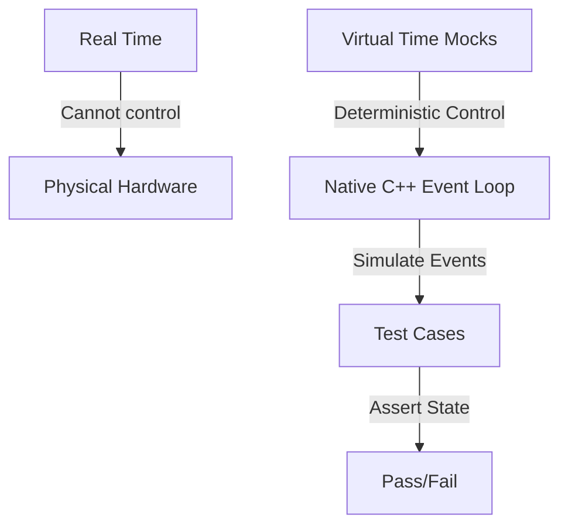

# Test Documentation - DeterministicESPAsyncWebServer


Welcome to the testing documentation for `DeterministicESPAsyncWebServer`. This repository is designed to be extremely robust, employing **100% hardware-free, deterministic testing**.

Whether you are a beginner looking to understand how C++ testing works or an expert systems engineer designing secure, high-concurrency embedded protocols, this guide explains the architectures, methodologies, and concepts behind our test suite.

---

## 1. Introduction & Core Philosophy

### Why Native Testing?

Traditionally, testing code written for microcontroller frameworks like ESP-IDF or Arduino requires uploading binaries to physical ESP32 chips. This hardware-in-the-loop (HIL) testing has several drawbacks:

- **Slow feedback cycles**: Compiling, flashing, and rebooting microcontrollers takes minutes.
- **Flakiness**: Wireless connections fail, hardware pins float, and components experience wear.
- **Hard-to-reproduce bugs**: Multi-threaded concurrency bugs or network timing jitter cannot be reliably reproduced on physical chips.

`DeterministicESPAsyncWebServer` solves this by executing all test suites **natively** on your development machine (x86/x64 host).

### The Deterministic Asynchronous Model

This server is built on cooperative multitasking. Instead of physical threads, it uses a single-threaded event-driven event loop. Because of this, we can make tests **100% deterministic** through **Time-Travel Mocking**.

Instead of waiting for real-world seconds to elapse to test a connection timeout, the test suite manually increments a virtual clock (`millis()`) and drives the state machine forward manually. This means:

- A 5-second connection timeout can be tested in **less than a millisecond**.
- Execution order is guaranteed to be identical on every single run, eliminating race-condition flakiness.



---

## 2. Test Architecture & Mocking Strategies

To isolate our application code from physical hardware and the operating system's IP stack, we use a custom mocking layer.

### Mocks, Stubs, and Spies

- **Stubs**: Provide canned answers to calls made during the test. For example, our **Filesystem Stub** simulates an SPIFFS/LittleFS system by feeding static file contents from memory arrays instead of reading from a physical hard drive.
- **Mocks**: Objects pre-programmed with expectations that form a specification of the calls they are expected to receive.
- **Virtual Network Taps**: We mock the network stack completely. Instead of binding to real network sockets, we hook the server directly into virtual byte-pumps (ring buffers) that simulate incoming TCP packets.

```
       +---------------------------------------------+
       |                  TEST SUITE                 |
       +----------------------++---------------------+
                              || Simulates network packets
                              \/
       +---------------------------------------------+
       |             VIRTUAL TRANSPORT               |
       |  (mocks sockets, ring buffers, timeouts)    |
       +----------------------++---------------------+
                              || Drives HTTP/SSH bytes
                              \/
       +---------------------------------------------+
       |            CORE WEB SERVER ENGINE           |
       |     (HTTP parser, WebSockets, SSH)          |
       +---------------------------------------------+
```

---

## 3. PlatformIO Test Environments

PlatformIO separates configurations into different "environments" using [platformio.ini](file:///C:/Users/Douglas/Desktop/git_project/DeterministicESPAsyncWebserver/platformio.ini). Each environment compiles a specific slice of the codebase with custom compile-time flags to verify behavior in isolation:

| Environment           | Compile-Time Configuration    | Primary Purpose                                                                                         |
| :-------------------- | :---------------------------- | :------------------------------------------------------------------------------------------------------ |
| `native`              | Default flags                 | Core engine verification (HTTP parsing, WebSockets, SSE connection pool).                               |
| `native_app`          | Application logic active      | Layer-7 features: path routing, multipart forms, user authentication, static file serving.              |
| `native_ssh`          | `DETWS_ENABLE_SSH=1`          | The SSH crypto + protocol stack. Runs on software-based crypto paths without hardware acceleration.     |
| `native_ssh_hardened` | `DETWS_SSH_ALLOW_PASSWORD=0`  | Validates secure-only configuration where password-based logins are stripped out at compile-time.       |
| `native_ssh_conn`     | Full SSH + transport link     | Exercises the SSH state machine wired directly through our raw transport/session event-loop.            |
| `native_compliance`   | `DETWS_ENFORCE_HOST_HEADER=1` | Rigid RFC-compliance testing (enforces mandatory HTTP/1.1 `Host` headers and rejects duplicate fields). |

> [!NOTE]
> The `native` and `native_app` environments build with `DETWS_ENFORCE_HOST_HEADER=0` because their legacy test suites focus strictly on lower-level parser mechanics. The stricter RFC 7230 §5.4 host header validation is tested independently in `native_compliance`.

> [!IMPORTANT]
> **Compilation Isolation & Feature Flags**:
> Under PlatformIO (and standard Arduino/C++ build systems), library source files (in `src/`) are compiled independently of the main application (the sketch's `.ino` file) as separate translation units.
>
> Consequently, `#define` macros specified inside `.ino` sketch files (e.g., `#define DETWS_ENABLE_PROVISIONING 1`) **do not propagate** to the library's compiled source code. If you define a configuration macro or feature flag in your sketch rather than in the build configuration, the library's `.cpp` files will compile with their default configuration, resulting in linker errors (e.g., undefined symbols) or severe runtime/memory layout mismatches.
>
> To configure the library correctly, all override configuration constants and feature flags (such as `DETWS_ENABLE_PROVISIONING`, `DETWS_ENABLE_SSH`, `MAX_CONNS`, etc.) **must** be set as compiler build flags in your environment (e.g., `build_flags = -DDETWS_ENABLE_PROVISIONING=1` in `platformio.ini`).

---

## 4. Deep Dive: Key Concepts Tested

### 1. HTTP/1.1 Parser & RFC Compliance

HTTP parsing is notoriously difficult to write safely. A single parsing slip can lead to security vulnerabilities like **HTTP Request Smuggling**. Our parser is tested against:

- **RFC 7230 & 7231**: Ensuring correct interpretation of URI paths, query parameters, header keys, and body limits.
- **Buffer Overflows (413 & 414)**: We verify that when client requests send URIs larger than `URI_BUF_SIZE` (414 URI Too Long) or bodies exceeding `BODY_BUF_SIZE` (413 Payload Too Large), the server safely terminates the connection without corrupting memory.
- **Host Header Enforcement**: In compliance builds, the server rejects any HTTP/1.1 request lacking a `Host` header, or containing duplicate `Host` headers.

### 2. WebSocket Protocols

WebSocket communication begins as an HTTP request and upgrades to a binary frame protocol. The suites test:

- **Sec-WebSocket-Accept**: Verifying the server takes the client's key, appends the RFC 6455 GUID (`258EAFA5-E914-47DA-95CA-C5AB0DC85B11`), hashes it using SHA-1, and Base64-encodes it to complete the handshake.
- **Masking Key Validation**: The protocol requires all client-to-server frames to be masked (XOR-encrypted). The tests send both masked and unmasked frames to ensure the server decodes them properly and rejects illegal unmasked frames.
- **Fragmentation**: Large payloads can be split across multiple frames. We simulate fragmented packets to ensure the server correctly buffers and reconstructs them.

### 3. Cryptography & Known-Answer Tests (KAT)

The native SSH server implementation includes an entire cryptography stack. Cryptography code should never be verified with random data. We use **Known-Answer Test Vectors** directly from NIST and RFC specifications:

- **SHA-256 / HMAC-SHA2-256**: Tested against NIST FIPS 180-4 vectors to guarantee message authentication code integrity.
- **AES-256-CTR**: Block cipher decryption/encryption verified against NIST SP 800-38A standard streams.
- **RSA Signature Verification**: Verified using real-world public-private key signatures generated via external `openssl` binaries.

---

## 5. How to Write and Run Tests

All tests are written using the **Unity** testing framework.

### Running Tests Locally

To run all test suites across all environments:

```bash
pio test -e native -e native_app -e native_ssh -e native_ssh_hardened -e native_ssh_conn -e native_compliance
```

To run a single specific environment (which is much faster):

```bash
pio test -e native
```

To regenerate the formatted Markdown test report locally:

```bash
bash test/run_tests.sh
```

---

### Step-by-Step: Writing a New Test Case

Let's walk through creating a test case to verify that the HTTP parser correctly parses a basic `GET` request.

#### Step 1: Open the Test Suite File

If you are testing parser mechanics, open `test/test_http_parser/test_http_parser.cpp`.

#### Step 2: Write the Test Function

Add a test function. Keep it self-contained and descriptive:

```cpp
void test_http_parser_simple_get_request() {
    // 1. Arrange: Initialize your parser state and sample request bytes
    http_parser_t parser;
    http_parser_init(&parser, 0); // Slot ID 0

    const char* request_bytes = "GET /index.html HTTP/1.1\r\nHost: localhost\r\n\r\n";

    // 2. Act: Feed bytes incrementally to simulate packet arrivals
    size_t bytes_fed = http_parser_feed(&parser, request_bytes, strlen(request_bytes));

    // 3. Assert: Verify the state is correct
    TEST_ASSERT_EQUAL(strlen(request_bytes), bytes_fed);
    TEST_ASSERT_EQUAL(PARSE_STATE_COMPLETE, parser.state);
    TEST_ASSERT_EQUAL_STRING("/index.html", parser.path);
    TEST_ASSERT_EQUAL_STRING("GET", parser.method);
}
```

> [!TIP]
> Keep your descriptions inside the function body as a single line comment starting with `//`. The reporting scripts automatically parse these comments to generate documentation strings in the final report!

#### Step 3: Register the Test in `main()`

Scroll to the bottom of the test file where `main()` resides, and register your function using `RUN_TEST`:

```cpp
int main() {
    UNITY_BEGIN();

    // ... other registered tests ...
    RUN_TEST(test_http_parser_simple_get_request);

    return UNITY_END();
}
```

---

## 6. Expert-Level Debugging: Memory Safety & Sanitizers

When developing C++ code natively, we can compile our suites with compilers like `gcc` or `clang` and attach advanced debugging sanitizers that would be impossible to run on an actual ESP32 chip.

### AddressSanitizer (ASan)

If you run into segmentation faults or want to ensure your code has no memory leaks, you can enable AddressSanitizer. In your `platformio.ini` file, add:

```ini
[env:native]
platform = native
build_flags =
    -fsanitize=address,undefined
    -g
```

When you execute `pio test`, your host compiler compiles instrumentation checks around every pointer access. If a buffer overflow or use-after-free occurs, the test runner immediately stops and prints a stack trace pointing directly to the offending line of code.

### Simulating Race Conditions

We test session and socket race conditions by interleaved function calling:

1. Initialize the socket buffer.
2. Feed partial packets.
3. Call an intermediate tick handler (simulating thread preemption).
4. Assert that the buffer holds its state and has not entered an invalid transition.
   This is fully reproducible because there are no actual operating system threads involved.

## 7. Comprehensive Test Directory

This section contains a thorough directory of all test cases across all 18 test suites. Click on any test suite to expand its test cases, and click on individual test cases to expand their objectives and assertions.

<details>
<summary><b>test_application (44 tests)</b></summary>

  <details style="margin-left: 20px;">
    <summary><code>test_handler_reads_body</code> &mdash; <i>Handler reads body</i></summary>

    * **Objective**: Handler reads body
    * **Assertions**:
      * `Assert equal string ("hello", body_seen)`

  </details>
  <details style="margin-left: 20px;">
    <summary><code>test_handler_reads_query_param</code> &mdash; <i>Handler reads query param</i></summary>

    * **Objective**: Handler reads query param
    * **Assertions**:
      * `Assert equal string ("42", q_seen)`

  </details>
  <details style="margin-left: 20px;">
    <summary><code>test_handler_reads_header</code> &mdash; <i>Handler reads header</i></summary>

    * **Objective**: Handler reads header
    * **Assertions**:
      * `Assert equal string ("secret", h_seen)`

  </details>
  <details style="margin-left: 20px;">
    <summary><code>test_wildcard_before_exact_wildcard_wins</code> &mdash; <i>Wildcard before exact wildcard wins</i></summary>

    * **Objective**: Wildcard before exact wildcard wins
    * **Assertions**:
      * `Assert true (wildcard_called)`
      * `Assert false (exact_called)`

  </details>
  <details style="margin-left: 20px;">
    <summary><code>test_fn_on_registers_and_dispatches</code> &mdash; <i>Fn on registers and dispatches</i></summary>

    * **Objective**: Fn on registers and dispatches
    * **Assertions**:
      * `Assert true (handler_called)`

  </details>
  <details style="margin-left: 20px;">
    <summary><code>test_fn_on_path_copied_null_terminated</code> &mdash; <i>Fn on path copied null terminated</i></summary>

    * **Objective**: Fn on path copied null terminated

  </details>
  <details style="margin-left: 20px;">
    <summary><code>test_fn_on_table_full_extra_routes_dropped</code> &mdash; <i>Fn on table full extra routes dropped</i></summary>

    * **Objective**: Fn on table full extra routes dropped
    * **Assertions**:
      * `Assert true (handler_called)`

  </details>
  <details style="margin-left: 20px;">
    <summary><code>test_fn_on_same_path_different_methods_are_distinct</code> &mdash; <i>Fn on same path different methods are distinct</i></summary>

    * **Objective**: Fn on same path different methods are distinct
    * **Assertions**:
      * `Assert true (get_called)`
      * `Assert false (post_called)`
      * `Assert true (post_called)`

  </details>
  <details style="margin-left: 20px;">
    <summary><code>test_fn_on_not_found_called_when_no_match</code> &mdash; <i>Fn on not found called when no match</i></summary>

    * **Objective**: Fn on not found called when no match
    * **Assertions**:
      * `Assert true (handler_called)`

  </details>
  <details style="margin-left: 20px;">
    <summary><code>test_fn_on_not_found_not_called_when_match_exists</code> &mdash; <i>Fn on not found not called when match exists</i></summary>

    * **Objective**: Fn on not found not called when match exists
    * **Assertions**:
      * `Assert true (handler_called)`
      * `Assert false (nf)`

  </details>
  <details style="margin-left: 20px;">
    <summary><code>test_fn_set_cors_options_preflight_clears_slot</code> &mdash; <i>Fn set cors options preflight clears slot</i></summary>

    * **Objective**: Fn set cors options preflight clears slot
    * **Assertions**:
      * `Assert not equal (PARSE_COMPLETE, http_pool[0].parse_state)`

  </details>
  <details style="margin-left: 20px;">
    <summary><code>test_fn_set_cors_empty_string_disables</code> &mdash; <i>Fn set cors empty string disables</i></summary>

    * **Objective**: Fn set cors empty string disables
    * **Assertions**:
      * `Assert true (handler_called)`

  </details>
  <details style="margin-left: 20px;">
    <summary><code>test_wrong_method_does_not_match</code> &mdash; <i>Wrong method does not match</i></summary>

    * **Objective**: Wrong method does not match
    * **Assertions**:
      * `Assert false (handler_called)`

  </details>
  <details style="margin-left: 20px;">
    <summary><code>test_wrong_path_does_not_match</code> &mdash; <i>Wrong path does not match</i></summary>

    * **Objective**: Wrong path does not match
    * **Assertions**:
      * `Assert false (handler_called)`

  </details>
  <details style="margin-left: 20px;">
    <summary><code>test_all_http_methods_dispatched</code> &mdash; <i>All http methods dispatched</i></summary>

    * **Objective**: All http methods dispatched
    * **Assertions**:
      * `Assert equal message (1, counts[i], "method not dispatched")`

  </details>
  <details style="margin-left: 20px;">
    <summary><code>test_root_path_matches_exactly</code> &mdash; <i>Root path matches exactly</i></summary>

    * **Objective**: Root path matches exactly
    * **Assertions**:
      * `Assert true (handler_called)`

  </details>
  <details style="margin-left: 20px;">
    <summary><code>test_root_path_does_not_match_subpath</code> &mdash; <i>Root path does not match subpath</i></summary>

    * **Objective**: Root path does not match subpath
    * **Assertions**:
      * `Assert false (handler_called)`

  </details>
  <details style="margin-left: 20px;">
    <summary><code>test_wildcard_matches_any_suffix</code> &mdash; <i>Wildcard matches any suffix</i></summary>

    * **Objective**: Wildcard matches any suffix
    * **Assertions**:
      * `Assert true (handler_called)`

  </details>
  <details style="margin-left: 20px;">
    <summary><code>test_wildcard_does_not_match_unrelated_prefix</code> &mdash; <i>Wildcard does not match unrelated prefix</i></summary>

    * **Objective**: Wildcard does not match unrelated prefix
    * **Assertions**:
      * `Assert false (handler_called)`

  </details>
  <details style="margin-left: 20px;">
    <summary><code>test_exact_route_wins_when_registered_first</code> &mdash; <i>Exact route wins when registered first</i></summary>

    * **Objective**: Exact route wins when registered first
    * **Assertions**:
      * `Assert true (exact_called)`
      * `Assert false (handler_called)`

  </details>
  <details style="margin-left: 20px;">
    <summary><code>test_slot_not_stuck_in_complete_after_handle</code> &mdash; <i>Slot not stuck in complete after handle</i></summary>

    * **Objective**: Slot not stuck in complete after handle
    * **Assertions**:
      * `Assert not equal (PARSE_COMPLETE, http_pool[0].parse_state)`

  </details>
  <details style="margin-left: 20px;">
    <summary><code>test_parse_error_slot_auto_reset</code> &mdash; <i>Parse error slot auto reset</i></summary>

    * **Objective**: Parse error slot auto reset
    * **Assertions**:
      * `Assert equal (PARSE_ERROR, http_pool[0].parse_state)`
      * `Assert not equal (PARSE_ERROR, http_pool[0].parse_state)`

  </details>
  <details style="margin-left: 20px;">
    <summary><code>stress_last_route_dispatched_in_full_table</code> &mdash; <i>Stress - Last route dispatched in full table</i></summary>

    * **Objective**: Stress - Last route dispatched in full table
    * **Assertions**:
      * `Assert equal (1, last_count)`

  </details>
  <details style="margin-left: 20px;">
    <summary><code>stress_sequential_requests_no_state_leak</code> &mdash; <i>Stress - Sequential requests no state leak</i></summary>

    * **Objective**: Stress - Sequential requests no state leak
    * **Assertions**:
      * `Assert equal (50, seq_count)`

  </details>
  <details style="margin-left: 20px;">
    <summary><code>stress_all_slots_dispatched_simultaneously</code> &mdash; <i>Stress - All slots dispatched simultaneously</i></summary>

    * **Objective**: Stress - All slots dispatched simultaneously
    * **Assertions**:
      * `Assert equal message (1, counts[i], "slot not dispatched")`

  </details>
  <details style="margin-left: 20px;">
    <summary><code>stress_wildcard_matches_many_paths</code> &mdash; <i>Stress - Wildcard matches many paths</i></summary>

    * **Objective**: Stress - Wildcard matches many paths
    * **Assertions**:
      * `Assert equal (10, wc_count)`

  </details>
  <details style="margin-left: 20px;">
    <summary><code>stress_handle_with_no_complete_slots_is_nop</code> &mdash; <i>Stress - Handle with no complete slots is nop</i></summary>

    * **Objective**: Stress - Handle with no complete slots is nop
    * **Assertions**:
      * `Assert false (handler_called)`

  </details>
  <details style="margin-left: 20px;">
    <summary><code>race_slot_complete_between_handle_calls</code> &mdash; <i>Race - Slot complete between handle calls</i></summary>

    * **Objective**: Race - Slot complete between handle calls
    * **Assertions**:
      * `Assert false (dispatched)`
      * `Assert true (dispatched)`

  </details>
  <details style="margin-left: 20px;">
    <summary><code>race_conn_freed_after_parse_complete</code> &mdash; <i>Race - Conn freed after parse complete</i></summary>

    * **Objective**: Race - Conn freed after parse complete
    * **Assertions**:
      * `Assert equal (PARSE_COMPLETE, http_pool[0].parse_state)`
      * `Assert not equal (PARSE_COMPLETE, http_pool[0].parse_state)`

  </details>
  <details style="margin-left: 20px;">
    <summary><code>race_double_handle_no_double_dispatch</code> &mdash; <i>Race - Double handle no double dispatch</i></summary>

    * **Objective**: Race - Double handle no double dispatch
    * **Assertions**:
      * `Assert equal (1, dispatch_count)`

  </details>
  <details style="margin-left: 20px;">
    <summary><code>race_error_and_valid_slot_in_same_handle</code> &mdash; <i>Race - Error and valid slot in same handle</i></summary>

    * **Objective**: Race - Error and valid slot in same handle
    * **Assertions**:
      * `Assert equal (PARSE_ERROR, http_pool[0].parse_state)`
      * `Assert not equal (PARSE_ERROR, http_pool[0].parse_state)`
      * `Assert true (valid_dispatched)`

  </details>
  <details style="margin-left: 20px;">
    <summary><code>race_callback_manually_resets_slot</code> &mdash; <i>Race - Callback manually resets slot</i></summary>

    * **Objective**: Race - Callback manually resets slot
    * **Assertions**:
      * `Assert true (manual_reset_called)`
      * `Assert equal (PARSE_METHOD, http_pool[0].parse_state)`

  </details>
  <details style="margin-left: 20px;">
    <summary><code>test_uri_too_long_auto_resets_slot</code> &mdash; <i>Uri too long auto resets slot</i></summary>

    * **Objective**: Uri too long auto resets slot
    * **Assertions**:
      * `Assert equal (PARSE_URI_TOO_LONG, http_pool[0].parse_state)`
      * `Assert not equal (PARSE_URI_TOO_LONG, http_pool[0].parse_state)`

  </details>
  <details style="margin-left: 20px;">
    <summary><code>test_transfer_encoding_chunked_is_501</code> &mdash; <i>Transfer encoding chunked is 501</i></summary>

    * **Objective**: Transfer encoding chunked is 501
    * **Assertions**:
      * `Assert not equal (PARSE_COMPLETE, http_pool[0].parse_state)`

  </details>
  <details style="margin-left: 20px;">
    <summary><code>test_transfer_encoding_identity_is_501</code> &mdash; <i>Transfer encoding identity is 501</i></summary>

    * **Objective**: Transfer encoding identity is 501
    * **Assertions**:
      * `Assert not equal (PARSE_COMPLETE, http_pool[0].parse_state)`

  </details>
  <details style="margin-left: 20px;">
    <summary><code>test_redirect_emits_location_and_status</code> &mdash; <i>Redirect emits location and status</i></summary>

    * **Objective**: Redirect emits location and status
    * **Assertions**:
      * `Assert not null (strstr(out, "HTTP/1.1 301 Moved Permanently"))`
      * `Assert not null (strstr(out, "Location: /index.html\r\n"))`
      * `Assert not null (strstr(out, "Content-Length: 0\r\n"))`
      * `Assert equal (CONN_FREE, conn_pool[0].state)`

  </details>
  <details style="margin-left: 20px;">
    <summary><code>test_redirect_invalid_code_defaults_to_302</code> &mdash; <i>Redirect invalid code defaults to 302</i></summary>

    * **Objective**: Redirect invalid code defaults to 302
    * **Assertions**:
      * `Assert not null (strstr(out, "HTTP/1.1 302 Found"))`

  </details>
  <details style="margin-left: 20px;">
    <summary><code>test_mime_type_detection</code> &mdash; <i>Mime type detection</i></summary>

    * **Objective**: Mime type detection
    * **Assertions**:
      * `Assert equal string ("text/html", DetWebServer::mime_type("/index.html"))`
      * `Assert equal string ("text/css", DetWebServer::mime_type("/css/site.css"))`
      * `Assert equal string ("application/javascript", DetWebServer::mime_type("/app.JS"))`
      * `Assert equal string ("application/json", DetWebServer::mime_type("/api/data.json"))`
      * `Assert equal string ("image/svg+xml", DetWebServer::mime_type("logo.svg"))`
      * `Assert equal string ("image/png", DetWebServer::mime_type("a.b.c.png"))`
      * `Assert equal string ("application/octet-stream", DetWebServer::mime_type("/file.unknownext"))`
      * `Assert equal string ("application/octet-stream", DetWebServer::mime_type("/noext"))`
      * `Assert equal string ("application/octet-stream", DetWebServer::mime_type("/dir.with.dot/file"))`
      * `Assert equal string ("application/octet-stream", DetWebServer::mime_type(nullptr))`

  </details>
  <details style="margin-left: 20px;">
    <summary><code>test_serve_static_file_and_mime</code> &mdash; <i>Serve static file and mime</i></summary>

    * **Objective**: Serve static file and mime
    * **Assertions**:
      * `Assert not null (strstr(out, "HTTP/1.1 200 OK"))`
      * `Assert not null (strstr(out, "Content-Type: text/css"))`
      * `Assert not null (strstr(out, "body{color:red}"))`

  </details>
  <details style="margin-left: 20px;">
    <summary><code>test_serve_static_index_fallback</code> &mdash; <i>Serve static index fallback</i></summary>

    * **Objective**: Serve static index fallback
    * **Assertions**:
      * `Assert not null (strstr(out, "HTTP/1.1 200 OK"))`
      * `Assert not null (strstr(out, "Content-Type: text/html"))`
      * `Assert not null (strstr(out, "&lt;h1&gt;home&lt;/h1&gt;"))`

  </details>
  <details style="margin-left: 20px;">
    <summary><code>test_serve_static_gzip_when_accepted</code> &mdash; <i>Serve static gzip when accepted</i></summary>

    * **Objective**: Serve static gzip when accepted
    * **Assertions**:
      * `Assert not null (strstr(out, "HTTP/1.1 200 OK"))`
      * `Assert not null (strstr(out, "Content-Type: application/javascript"))`
      * `Assert not null (strstr(out, "Content-Encoding: gzip"))`

  </details>
  <details style="margin-left: 20px;">
    <summary><code>test_serve_static_no_gzip_when_not_accepted</code> &mdash; <i>Serve static no gzip when not accepted</i></summary>

    * **Objective**: Serve static no gzip when not accepted
    * **Assertions**:
      * `Assert null (strstr(out, "Content-Encoding: gzip"))`
      * `Assert not null (strstr(out, "console.log(1)"))`

  </details>
  <details style="margin-left: 20px;">
    <summary><code>test_serve_static_traversal_not_leaked</code> &mdash; <i>Serve static traversal not leaked</i></summary>

    * **Objective**: Serve static traversal not leaked
    * **Assertions**:
      * `Assert null (strstr(out, "topsecret"))`

  </details>
  <details style="margin-left: 20px;">
    <summary><code>test_serve_static_missing_is_404</code> &mdash; <i>Serve static missing is 404</i></summary>

    * **Objective**: Serve static missing is 404
    * **Assertions**:
      * `Assert not null (strstr(out, "404"))`

  </details>
</details>

<details>
<summary><b>test_auth (13 tests)</b></summary>

  <details style="margin-left: 20px;">
    <summary><code>test_unprotected_route_fires_handler</code> &mdash; <i>Unprotected route fires handler</i></summary>

    * **Objective**: Unprotected route fires handler
    * **Assertions**:
      * `Assert true (handler_called)`

  </details>
  <details style="margin-left: 20px;">
    <summary><code>test_protected_route_no_header_returns_401</code> &mdash; <i>Protected route no header returns 401</i></summary>

    * **Objective**: Protected route no header returns 401
    * **Assertions**:
      * `Assert false (handler_called)`
      * `Assert true (strstr(tcp_captured(), "401 Unauthorized") != nullptr)`

  </details>
  <details style="margin-left: 20px;">
    <summary><code>test_protected_route_wrong_password_returns_401</code> &mdash; <i>Protected route wrong password returns 401</i></summary>

    * **Objective**: Protected route wrong password returns 401
    * **Assertions**:
      * `Assert false (handler_called)`
      * `Assert true (strstr(tcp_captured(), "401") != nullptr)`

  </details>
  <details style="margin-left: 20px;">
    <summary><code>test_protected_route_wrong_username_returns_401</code> &mdash; <i>Protected route wrong username returns 401</i></summary>

    * **Objective**: Protected route wrong username returns 401
    * **Assertions**:
      * `Assert false (handler_called)`
      * `Assert true (strstr(tcp_captured(), "401") != nullptr)`

  </details>
  <details style="margin-left: 20px;">
    <summary><code>test_protected_route_valid_credentials_fires_handler</code> &mdash; <i>Protected route valid credentials fires handler</i></summary>

    * **Objective**: Protected route valid credentials fires handler
    * **Assertions**:
      * `Assert true (handler_called)`
      * `Assert true (strstr(tcp_captured(), "200 OK") != nullptr)`

  </details>
  <details style="margin-left: 20px;">
    <summary><code>test_401_includes_www_authenticate_header</code> &mdash; <i>401 includes www authenticate header</i></summary>

    * **Objective**: 401 includes www authenticate header
    * **Assertions**:
      * `Assert not null (strstr(tcp_captured(), "WWW-Authenticate: Basic realm=\"MyRealm\""))`

  </details>
  <details style="margin-left: 20px;">
    <summary><code>test_non_basic_scheme_returns_401</code> &mdash; <i>Non basic scheme returns 401</i></summary>

    * **Objective**: Non basic scheme returns 401
    * **Assertions**:
      * `Assert false (handler_called)`
      * `Assert true (strstr(tcp_captured(), "401") != nullptr)`

  </details>
  <details style="margin-left: 20px;">
    <summary><code>test_credentials_without_colon_returns_401</code> &mdash; <i>Credentials without colon returns 401</i></summary>

    * **Objective**: Credentials without colon returns 401
    * **Assertions**:
      * `Assert false (handler_called)`
      * `Assert true (strstr(tcp_captured(), "401") != nullptr)`

  </details>
  <details style="margin-left: 20px;">
    <summary><code>test_protected_and_unprotected_routes_coexist</code> &mdash; <i>Protected and unprotected routes coexist</i></summary>

    * **Objective**: Protected and unprotected routes coexist
    * **Assertions**:
      * `Assert true (handler_called)`
      * `Assert false (handler_called)`
      * `Assert true (strstr(tcp_captured(), "401") != nullptr)`

  </details>
  <details style="margin-left: 20px;">
    <summary><code>test_auth_route_returns_404_for_wrong_path</code> &mdash; <i>Auth route returns 404 for wrong path</i></summary>

    * **Objective**: Auth route returns 404 for wrong path
    * **Assertions**:
      * `Assert false (handler_called)`
      * `Assert true (strstr(tcp_captured(), "404") != nullptr)`

  </details>
  <details style="margin-left: 20px;">
    <summary><code>test_auth_checked_per_method</code> &mdash; <i>Auth checked per method</i></summary>

    * **Objective**: Auth checked per method
    * **Assertions**:
      * `Assert false (handler_called)`
      * `Assert not null (strstr(tcp_captured(), "405"))`
      * `Assert null (strstr(tcp_captured(), "401"))`
      * `Assert not null (strstr(tcp_captured(), "Allow: POST"))`

  </details>
  <details style="margin-left: 20px;">
    <summary><code>stress_auth_50_valid_requests</code> &mdash; <i>Stress - Auth 50 valid requests</i></summary>

    * **Objective**: Stress - Auth 50 valid requests
    * **Assertions**:
      * `Assert true message (handler_called, "handler not called with valid creds")`

  </details>
  <details style="margin-left: 20px;">
    <summary><code>stress_auth_50_invalid_requests</code> &mdash; <i>Stress - Auth 50 invalid requests</i></summary>

    * **Objective**: Stress - Auth 50 invalid requests
    * **Assertions**:
      * `Assert false message (handler_called, "handler called with bad creds")`

  </details>
</details>

<details>
<summary><b>test_compliance (12 tests)</b></summary>

  <details style="margin-left: 20px;">
    <summary><code>test_http11_missing_host_rejected</code> &mdash; <i>Http11 missing host rejected</i></summary>

    * **Objective**: Http11 missing host rejected
    * **Assertions**:
      * `Assert equal (PARSE_ERROR, http_pool[0].parse_state)`

  </details>
  <details style="margin-left: 20px;">
    <summary><code>test_http11_with_host_ok</code> &mdash; <i>Http11 with host ok</i></summary>

    * **Objective**: Http11 with host ok
    * **Assertions**:
      * `Assert equal (PARSE_COMPLETE, http_pool[0].parse_state)`

  </details>
  <details style="margin-left: 20px;">
    <summary><code>test_http10_missing_host_ok</code> &mdash; <i>Http10 missing host ok</i></summary>

    * **Objective**: Http10 missing host ok
    * **Assertions**:
      * `Assert equal (PARSE_COMPLETE, http_pool[0].parse_state)`

  </details>
  <details style="margin-left: 20px;">
    <summary><code>test_duplicate_host_rejected</code> &mdash; <i>Duplicate host rejected</i></summary>

    * **Objective**: Duplicate host rejected
    * **Assertions**:
      * `Assert equal (PARSE_ERROR, http_pool[0].parse_state)`

  </details>
  <details style="margin-left: 20px;">
    <summary><code>test_duplicate_host_rejected_http10</code> &mdash; <i>Duplicate host rejected http10</i></summary>

    * **Objective**: Duplicate host rejected http10
    * **Assertions**:
      * `Assert equal (PARSE_ERROR, http_pool[0].parse_state)`

  </details>
  <details style="margin-left: 20px;">
    <summary><code>test_host_beyond_max_headers_still_counted</code> &mdash; <i>Host beyond max headers still counted</i></summary>

    * **Objective**: Host beyond max headers still counted
    * **Assertions**:
      * `Assert equal (PARSE_COMPLETE, http_pool[0].parse_state)`

  </details>
  <details style="margin-left: 20px;">
    <summary><code>test_duplicate_host_with_one_beyond_cap_rejected</code> &mdash; <i>Duplicate host with one beyond cap rejected</i></summary>

    * **Objective**: Duplicate host with one beyond cap rejected
    * **Assertions**:
      * `Assert equal (PARSE_ERROR, http_pool[0].parse_state)`

  </details>
  <details style="margin-left: 20px;">
    <summary><code>test_content_length_non_digit_rejected</code> &mdash; <i>Content length non digit rejected</i></summary>

    * **Objective**: Content length non digit rejected
    * **Assertions**:
      * `Assert equal (PARSE_ERROR, http_pool[0].parse_state)`

  </details>
  <details style="margin-left: 20px;">
    <summary><code>test_content_length_empty_rejected</code> &mdash; <i>Content length empty rejected</i></summary>

    * **Objective**: Content length empty rejected
    * **Assertions**:
      * `Assert equal (PARSE_ERROR, http_pool[0].parse_state)`

  </details>
  <details style="margin-left: 20px;">
    <summary><code>test_content_length_conflicting_duplicate_rejected</code> &mdash; <i>Content length conflicting duplicate rejected</i></summary>

    * **Objective**: Content length conflicting duplicate rejected
    * **Assertions**:
      * `Assert equal (PARSE_ERROR, http_pool[0].parse_state)`

  </details>
  <details style="margin-left: 20px;">
    <summary><code>test_content_length_matching_duplicate_ok</code> &mdash; <i>Content length matching duplicate ok</i></summary>

    * **Objective**: Content length matching duplicate ok
    * **Assertions**:
      * `Assert equal (PARSE_COMPLETE, http_pool[0].parse_state)`
      * `Assert equal (3, (int)http_pool[0].content_length)`

  </details>
  <details style="margin-left: 20px;">
    <summary><code>test_content_length_valid_body</code> &mdash; <i>Content length valid body</i></summary>

    * **Objective**: Content length valid body
    * **Assertions**:
      * `Assert equal (PARSE_COMPLETE, http_pool[0].parse_state)`
      * `Assert equal (5, (int)http_pool[0].body_len)`
      * `Assert equal memory ("hello", http_pool[0].body, 5)`

  </details>
</details>

<details>
<summary><b>test_dispatch (10 tests)</b></summary>

  <details style="margin-left: 20px;">
    <summary><code>test_method_mismatch_returns_405</code> &mdash; <i>Method mismatch returns 405</i></summary>

    * **Objective**: Method mismatch returns 405
    * **Assertions**:
      * `Assert false (handler_called)`
      * `Assert not null (strstr(tcp_captured(), "405 Method Not Allowed"))`

  </details>
  <details style="margin-left: 20px;">
    <summary><code>test_405_includes_allow_header</code> &mdash; <i>405 includes allow header</i></summary>

    * **Objective**: 405 includes allow header
    * **Assertions**:
      * `Assert not null (strstr(tcp_captured(), "Allow: POST"))`

  </details>
  <details style="margin-left: 20px;">
    <summary><code>test_405_allow_lists_all_methods_for_path</code> &mdash; <i>405 allow lists all methods for path</i></summary>

    * **Objective**: 405 allow lists all methods for path
    * **Assertions**:
      * `Assert not null (strstr(resp, "405"))`
      * `Assert not null (strstr(resp, "POST"))`
      * `Assert not null (strstr(resp, "DELETE"))`

  </details>
  <details style="margin-left: 20px;">
    <summary><code>test_unknown_path_still_404_not_405</code> &mdash; <i>Unknown path still 404 not 405</i></summary>

    * **Objective**: Unknown path still 404 not 405
    * **Assertions**:
      * `Assert not null (strstr(tcp_captured(), "404"))`

  </details>
  <details style="margin-left: 20px;">
    <summary><code>test_unknown_method_returns_501</code> &mdash; <i>Unknown method returns 501</i></summary>

    * **Objective**: Unknown method returns 501
    * **Assertions**:
      * `Assert false (handler_called)`
      * `Assert not null (strstr(tcp_captured(), "501 Not Implemented"))`

  </details>
  <details style="margin-left: 20px;">
    <summary><code>test_unknown_method_not_treated_as_get</code> &mdash; <i>Unknown method not treated as get</i></summary>

    * **Objective**: Unknown method not treated as get
    * **Assertions**:
      * `Assert false (handler_called)`

  </details>
  <details style="margin-left: 20px;">
    <summary><code>test_head_runs_get_handler_without_body</code> &mdash; <i>Head runs get handler without body</i></summary>

    * **Objective**: Head runs get handler without body
    * **Assertions**:
      * `Assert true (handler_called)`
      * `Assert not null (strstr(resp, "200 OK"))`
      * `Assert not null (strstr(resp, "Content-Length: 2"))`
      * `Assert not null (sep)`
      * `Assert equal string ("\r\n\r\n", sep)`

  </details>
  <details style="margin-left: 20px;">
    <summary><code>test_get_route_advertises_head_in_allow</code> &mdash; <i>Get route advertises head in allow</i></summary>

    * **Objective**: Get route advertises head in allow
    * **Assertions**:
      * `Assert not null (strstr(resp, "405"))`
      * `Assert not null (strstr(resp, "GET"))`
      * `Assert not null (strstr(resp, "HEAD"))`

  </details>
  <details style="margin-left: 20px;">
    <summary><code>test_head_on_post_only_route_405</code> &mdash; <i>Head on post only route 405</i></summary>

    * **Objective**: Head on post only route 405
    * **Assertions**:
      * `Assert false (handler_called)`
      * `Assert not null (strstr(tcp_captured(), "405"))`

  </details>
  <details style="margin-left: 20px;">
    <summary><code>test_correct_method_still_dispatches</code> &mdash; <i>Correct method still dispatches</i></summary>

    * **Objective**: Correct method still dispatches
    * **Assertions**:
      * `Assert true (handler_called)`
      * `Assert not null (strstr(tcp_captured(), "200 OK"))`

  </details>
</details>

<details>
<summary><b>test_file_serving (12 tests)</b></summary>

  <details style="margin-left: 20px;">
    <summary><code>test_missing_file_returns_404</code> &mdash; <i>Missing file returns 404</i></summary>

    * **Objective**: Missing file returns 404
    * **Assertions**:
      * `Assert true (handler_called)`
      * `Assert not null (strstr(tcp_captured(), "404"))`

  </details>
  <details style="margin-left: 20px;">
    <summary><code>test_existing_file_returns_200</code> &mdash; <i>Existing file returns 200</i></summary>

    * **Objective**: Existing file returns 200
    * **Assertions**:
      * `Assert true (handler_called)`
      * `Assert not null (strstr(tcp_captured(), "200 OK"))`

  </details>
  <details style="margin-left: 20px;">
    <summary><code>test_response_includes_content_type_html</code> &mdash; <i>Response includes content type html</i></summary>

    * **Objective**: Response includes content type html
    * **Assertions**:
      * `Assert not null (strstr(tcp_captured(), "Content-Type: text/html"))`

  </details>
  <details style="margin-left: 20px;">
    <summary><code>test_response_includes_content_type_js</code> &mdash; <i>Response includes content type js</i></summary>

    * **Objective**: Response includes content type js
    * **Assertions**:
      * `Assert true (handler_called)`
      * `Assert not null (strstr(tcp_captured(), "Content-Type: application/javascript"))`

  </details>
  <details style="margin-left: 20px;">
    <summary><code>test_content_length_matches_file_size</code> &mdash; <i>Content length matches file size</i></summary>

    * **Objective**: Content length matches file size
    * **Assertions**:
      * `Assert not null (strstr(tcp_captured(), expected_cl))`

  </details>
  <details style="margin-left: 20px;">
    <summary><code>test_file_body_is_sent</code> &mdash; <i>File body is sent</i></summary>

    * **Objective**: File body is sent
    * **Assertions**:
      * `Assert not null (strstr(tcp_captured(), body))`

  </details>
  <details style="margin-left: 20px;">
    <summary><code>test_empty_file_returns_200_with_zero_length</code> &mdash; <i>Empty file returns 200 with zero length</i></summary>

    * **Objective**: Empty file returns 200 with zero length
    * **Assertions**:
      * `Assert not null (strstr(tcp_captured(), "200 OK"))`
      * `Assert not null (strstr(tcp_captured(), "Content-Length: 0"))`

  </details>
  <details style="margin-left: 20px;">
    <summary><code>test_large_file_body_fully_sent</code> &mdash; <i>Large file body fully sent</i></summary>

    * **Objective**: Large file body fully sent
    * **Assertions**:
      * `Assert not null (strstr(tcp_captured(), "200 OK"))`
      * `Assert not null (strstr(tcp_captured(), expected_cl))`

  </details>
  <details style="margin-left: 20px;">
    <summary><code>test_serve_file_does_not_affect_other_routes</code> &mdash; <i>Serve file does not affect other routes</i></summary>

    * **Objective**: Serve file does not affect other routes
    * **Assertions**:
      * `Assert true (other_called)`
      * `Assert false (handler_called)`

  </details>
  <details style="margin-left: 20px;">
    <summary><code>test_multiple_content_types</code> &mdash; <i>Multiple content types</i></summary>

    * **Objective**: Multiple content types
    * **Assertions**:
      * `Assert not null message (strstr(tcp_captured(), "200 OK"), "expected 200 OK")`
      * `Assert not null message (strstr(tcp_captured(), cases[i].ctype), "expected content-type in response")`

  </details>
  <details style="margin-left: 20px;">
    <summary><code>stress_serve_file_50_requests</code> &mdash; <i>Stress - Serve file 50 requests</i></summary>

    * **Objective**: Stress - Serve file 50 requests
    * **Assertions**:
      * `Assert true message (handler_called, "handler not called")`
      * `Assert not null message (strstr(tcp_captured(), "200 OK"), "not 200")`
      * `Assert not null message (strstr(tcp_captured(), body), "body missing")`

  </details>
  <details style="margin-left: 20px;">
    <summary><code>stress_alternate_missing_and_found</code> &mdash; <i>Stress - Alternate missing and found</i></summary>

    * **Objective**: Stress - Alternate missing and found
    * **Assertions**:
      * `Assert not null message (strstr(tcp_captured(), "200"), "expected 200")`
      * `Assert not null message (strstr(tcp_captured(), "404"), "expected 404")`

  </details>
</details>

<details>
<summary><b>test_http_parser (80 tests)</b></summary>

  <details style="margin-left: 20px;">
    <summary><code>test_reset_sets_parse_method_state</code> &mdash; <i>Reset sets parse method state</i></summary>

    * **Objective**: Reset sets parse method state
    * **Assertions**:
      * `Assert equal (PARSE_METHOD, http_pool[0].parse_state)`

  </details>
  <details style="margin-left: 20px;">
    <summary><code>test_reset_preserves_slot_id</code> &mdash; <i>Reset preserves slot id</i></summary>

    * **Objective**: Reset preserves slot id
    * **Assertions**:
      * `Assert equal (2, (int)http_pool[2].slot_id)`

  </details>
  <details style="margin-left: 20px;">
    <summary><code>test_reset_clears_method</code> &mdash; <i>Reset clears method</i></summary>

    * **Objective**: Reset clears method
    * **Assertions**:
      * `Assert equal ('\0', http_pool[0].method[0])`

  </details>
  <details style="margin-left: 20px;">
    <summary><code>test_reset_clears_path</code> &mdash; <i>Reset clears path</i></summary>

    * **Objective**: Reset clears path
    * **Assertions**:
      * `Assert equal ('\0', http_pool[0].path[0])`

  </details>
  <details style="margin-left: 20px;">
    <summary><code>test_reset_clears_header_count</code> &mdash; <i>Reset clears header count</i></summary>

    * **Objective**: Reset clears header count
    * **Assertions**:
      * `Assert equal (0, (int)http_pool[0].header_count)`

  </details>
  <details style="margin-left: 20px;">
    <summary><code>test_reset_clears_body</code> &mdash; <i>Reset clears body</i></summary>

    * **Objective**: Reset clears body
    * **Assertions**:
      * `Assert equal (0, (int)http_pool[0].body_len)`
      * `Assert equal (0, (int)http_pool[0].content_length)`

  </details>
  <details style="margin-left: 20px;">
    <summary><code>test_reset_clears_query_count</code> &mdash; <i>Reset clears query count</i></summary>

    * **Objective**: Reset clears query count
    * **Assertions**:
      * `Assert equal (0, (int)http_pool[0].query_count)`

  </details>
  <details style="margin-left: 20px;">
    <summary><code>test_feed_after_complete_does_not_change_state</code> &mdash; <i>Feed after complete does not change state</i></summary>

    * **Objective**: Feed after complete does not change state
    * **Assertions**:
      * `Assert equal (PARSE_COMPLETE, http_pool[0].parse_state)`
      * `Assert equal (PARSE_COMPLETE, http_pool[0].parse_state)`

  </details>
  <details style="margin-left: 20px;">
    <summary><code>test_feed_after_error_does_not_change_state</code> &mdash; <i>Feed after error does not change state</i></summary>

    * **Objective**: Feed after error does not change state
    * **Assertions**:
      * `Assert equal (PARSE_ERROR, http_pool[0].parse_state)`

  </details>
  <details style="margin-left: 20px;">
    <summary><code>test_feed_after_entity_too_large_does_not_change_state</code> &mdash; <i>Feed after entity too large does not change state</i></summary>

    * **Objective**: Feed after entity too large does not change state
    * **Assertions**:
      * `Assert equal (PARSE_ENTITY_TOO_LARGE, http_pool[0].parse_state)`

  </details>
  <details style="margin-left: 20px;">
    <summary><code>test_method_get</code> &mdash; <i>Method get</i></summary>

    * **Objective**: Method get
    * **Assertions**:
      * `Assert equal (PARSE_COMPLETE, http_pool[0].parse_state)`
      * `Assert equal string ("GET", http_pool[0].method)`

  </details>
  <details style="margin-left: 20px;">
    <summary><code>test_method_post</code> &mdash; <i>Method post</i></summary>

    * **Objective**: Method post
    * **Assertions**:
      * `Assert equal (PARSE_COMPLETE, http_pool[0].parse_state)`
      * `Assert equal string ("POST", http_pool[0].method)`

  </details>
  <details style="margin-left: 20px;">
    <summary><code>test_method_put</code> &mdash; <i>Method put</i></summary>

    * **Objective**: Method put
    * **Assertions**:
      * `Assert equal (PARSE_COMPLETE, http_pool[0].parse_state)`
      * `Assert equal string ("PUT", http_pool[0].method)`

  </details>
  <details style="margin-left: 20px;">
    <summary><code>test_method_delete</code> &mdash; <i>Method delete</i></summary>

    * **Objective**: Method delete
    * **Assertions**:
      * `Assert equal (PARSE_COMPLETE, http_pool[0].parse_state)`
      * `Assert equal string ("DELETE", http_pool[0].method)`

  </details>
  <details style="margin-left: 20px;">
    <summary><code>test_method_patch</code> &mdash; <i>Method patch</i></summary>

    * **Objective**: Method patch
    * **Assertions**:
      * `Assert equal (PARSE_COMPLETE, http_pool[0].parse_state)`
      * `Assert equal string ("PATCH", http_pool[0].method)`

  </details>
  <details style="margin-left: 20px;">
    <summary><code>test_method_head</code> &mdash; <i>Method head</i></summary>

    * **Objective**: Method head
    * **Assertions**:
      * `Assert equal (PARSE_COMPLETE, http_pool[0].parse_state)`
      * `Assert equal string ("HEAD", http_pool[0].method)`

  </details>
  <details style="margin-left: 20px;">
    <summary><code>test_method_options</code> &mdash; <i>Method options</i></summary>

    * **Objective**: Method options
    * **Assertions**:
      * `Assert equal (PARSE_COMPLETE, http_pool[0].parse_state)`
      * `Assert equal string ("OPTIONS", http_pool[0].method)`

  </details>
  <details style="margin-left: 20px;">
    <summary><code>test_method_overflow_is_error</code> &mdash; <i>Method overflow is error</i></summary>

    * **Objective**: Method overflow is error
    * **Assertions**:
      * `Assert equal (PARSE_ERROR, http_pool[0].parse_state)`

  </details>
  <details style="margin-left: 20px;">
    <summary><code>test_path_root</code> &mdash; <i>Path root</i></summary>

    * **Objective**: Path root
    * **Assertions**:
      * `Assert equal string ("/", http_pool[0].path)`

  </details>
  <details style="margin-left: 20px;">
    <summary><code>test_path_segments</code> &mdash; <i>Path segments</i></summary>

    * **Objective**: Path segments
    * **Assertions**:
      * `Assert equal string ("/api/users/42", http_pool[0].path)`

  </details>
  <details style="margin-left: 20px;">
    <summary><code>test_path_without_query</code> &mdash; <i>Path without query</i></summary>

    * **Objective**: Path without query
    * **Assertions**:
      * `Assert equal string ("/p", http_pool[0].path)`

  </details>
  <details style="margin-left: 20px;">
    <summary><code>test_path_overflow_is_414</code> &mdash; <i>Path overflow is 414</i></summary>

    * **Objective**: Path overflow is 414
    * **Assertions**:
      * `Assert equal (PARSE_URI_TOO_LONG, http_pool[0].parse_state)`

  </details>
  <details style="margin-left: 20px;">
    <summary><code>test_single_query_param</code> &mdash; <i>Single query param</i></summary>

    * **Objective**: Single query param
    * **Assertions**:
      * `Assert equal (PARSE_COMPLETE, http_pool[0].parse_state)`
      * `Assert equal (1, (int)http_pool[0].query_count)`
      * `Assert not null (v)`
      * `Assert equal string ("42", v)`

  </details>
  <details style="margin-left: 20px;">
    <summary><code>test_two_query_params</code> &mdash; <i>Two query params</i></summary>

    * **Objective**: Two query params
    * **Assertions**:
      * `Assert equal (2, (int)http_pool[0].query_count)`
      * `Assert equal string ("1", http_get_query(&http_pool[0], "a"))`
      * `Assert equal string ("2", http_get_query(&http_pool[0], "b"))`

  </details>
  <details style="margin-left: 20px;">
    <summary><code>test_query_key_not_found_returns_null</code> &mdash; <i>Query key not found returns null</i></summary>

    * **Objective**: Query key not found returns null
    * **Assertions**:
      * `Assert null (http_get_query(&http_pool[0], "z"))`

  </details>
  <details style="margin-left: 20px;">
    <summary><code>test_query_empty_value</code> &mdash; <i>Query empty value</i></summary>

    * **Objective**: Query empty value
    * **Assertions**:
      * `Assert not null (v)`
      * `Assert equal string ("", v)`

  </details>
  <details style="margin-left: 20px;">
    <summary><code>test_single_header_stored</code> &mdash; <i>Single header stored</i></summary>

    * **Objective**: Single header stored
    * **Assertions**:
      * `Assert equal (1, (int)http_pool[0].header_count)`
      * `Assert not null (v)`
      * `Assert equal string ("hello", v)`

  </details>
  <details style="margin-left: 20px;">
    <summary><code>test_header_lookup_case_insensitive</code> &mdash; <i>Header lookup case insensitive</i></summary>

    * **Objective**: Header lookup case insensitive
    * **Assertions**:
      * `Assert not null (http_get_header(&http_pool[0], "content-type"))`
      * `Assert not null (http_get_header(&http_pool[0], "CONTENT-TYPE"))`
      * `Assert equal string ("application/json", http_get_header(&http_pool[0], "Content-Type"))`

  </details>
  <details style="margin-left: 20px;">
    <summary><code>test_header_leading_space_stripped</code> &mdash; <i>Header leading space stripped</i></summary>

    * **Objective**: Header leading space stripped
    * **Assertions**:
      * `Assert not null (v)`
      * `Assert equal string ("trimmed", v)`

  </details>
  <details style="margin-left: 20px;">
    <summary><code>test_content_length_header_parsed</code> &mdash; <i>Content length header parsed</i></summary>

    * **Objective**: Content length header parsed
    * **Assertions**:
      * `Assert equal (5, (int)http_pool[0].content_length)`

  </details>
  <details style="margin-left: 20px;">
    <summary><code>test_content_length_in_headers_array</code> &mdash; <i>Content length in headers array</i></summary>

    * **Objective**: Content length in headers array
    * **Assertions**:
      * `Assert not null (cl)`
      * `Assert equal string ("3", cl)`

  </details>
  <details style="margin-left: 20px;">
    <summary><code>test_multiple_headers_stored</code> &mdash; <i>Multiple headers stored</i></summary>

    * **Objective**: Multiple headers stored
    * **Assertions**:
      * `Assert equal (3, (int)http_pool[0].header_count)`
      * `Assert equal string ("one", http_get_header(&http_pool[0], "X-A"))`
      * `Assert equal string ("two", http_get_header(&http_pool[0], "X-B"))`
      * `Assert equal string ("three", http_get_header(&http_pool[0], "X-C"))`

  </details>
  <details style="margin-left: 20px;">
    <summary><code>test_missing_header_returns_null</code> &mdash; <i>Missing header returns null</i></summary>

    * **Objective**: Missing header returns null
    * **Assertions**:
      * `Assert null (http_get_header(&http_pool[0], "X-Missing"))`

  </details>
  <details style="margin-left: 20px;">
    <summary><code>test_get_no_body_completes</code> &mdash; <i>Get no body completes</i></summary>

    * **Objective**: Get no body completes
    * **Assertions**:
      * `Assert equal (PARSE_COMPLETE, http_pool[0].parse_state)`
      * `Assert equal (0, (int)http_pool[0].body_len)`
      * `Assert equal ('\0', (char)http_pool[0].body[0])`

  </details>
  <details style="margin-left: 20px;">
    <summary><code>test_post_with_body</code> &mdash; <i>Post with body</i></summary>

    * **Objective**: Post with body
    * **Assertions**:
      * `Assert equal (PARSE_COMPLETE, http_pool[0].parse_state)`
      * `Assert equal (5, (int)http_pool[0].body_len)`
      * `Assert equal string ("hello", (const char *)http_pool[0].body)`

  </details>
  <details style="margin-left: 20px;">
    <summary><code>test_put_with_body</code> &mdash; <i>Put with body</i></summary>

    * **Objective**: Put with body
    * **Assertions**:
      * `Assert equal (PARSE_COMPLETE, http_pool[0].parse_state)`
      * `Assert equal (7, (int)http_pool[0].body_len)`
      * `Assert equal string ("updated", (const char *)http_pool[0].body)`

  </details>
  <details style="margin-left: 20px;">
    <summary><code>test_body_starting_with_newline</code> &mdash; <i>Body starting with newline</i></summary>

    * **Objective**: Body starting with newline
    * **Assertions**:
      * `Assert equal (PARSE_COMPLETE, http_pool[0].parse_state)`
      * `Assert equal (5, (int)http_pool[0].body_len)`
      * `Assert equal ('\n', (char)http_pool[0].body[0])`
      * `Assert equal string ("\nabcd", (const char *)http_pool[0].body)`

  </details>
  <details style="margin-left: 20px;">
    <summary><code>test_post_content_length_zero</code> &mdash; <i>Post content length zero</i></summary>

    * **Objective**: Post content length zero
    * **Assertions**:
      * `Assert equal (PARSE_COMPLETE, http_pool[0].parse_state)`
      * `Assert equal (0, (int)http_pool[0].body_len)`

  </details>
  <details style="margin-left: 20px;">
    <summary><code>test_body_exactly_at_buffer_limit</code> &mdash; <i>Body exactly at buffer limit</i></summary>

    * **Objective**: Body exactly at buffer limit
    * **Assertions**:
      * `Assert equal (PARSE_COMPLETE, http_pool[0].parse_state)`
      * `Assert equal (BODY_BUF_SIZE, (int)http_pool[0].body_len)`

  </details>
  <details style="margin-left: 20px;">
    <summary><code>test_body_null_terminated_after_complete</code> &mdash; <i>Body null terminated after complete</i></summary>

    * **Objective**: Body null terminated after complete
    * **Assertions**:
      * `Assert equal ('\0', (char)http_pool[0].body[3])`

  </details>
  <details style="margin-left: 20px;">
    <summary><code>test_body_one_over_limit_is_413</code> &mdash; <i>Body one over limit is 413</i></summary>

    * **Objective**: Body one over limit is 413
    * **Assertions**:
      * `Assert equal (PARSE_ENTITY_TOO_LARGE, http_pool[0].parse_state)`

  </details>
  <details style="margin-left: 20px;">
    <summary><code>test_body_far_over_limit_is_413</code> &mdash; <i>Body far over limit is 413</i></summary>

    * **Objective**: Body far over limit is 413
    * **Assertions**:
      * `Assert equal (PARSE_ENTITY_TOO_LARGE, http_pool[0].parse_state)`

  </details>
  <details style="margin-left: 20px;">
    <summary><code>test_413_no_body_bytes_fed</code> &mdash; <i>413 no body bytes fed</i></summary>

    * **Objective**: 413 no body bytes fed
    * **Assertions**:
      * `Assert equal (0, (int)http_pool[0].body_len)`

  </details>
  <details style="margin-left: 20px;">
    <summary><code>test_413_header_still_stored</code> &mdash; <i>413 header still stored</i></summary>

    * **Objective**: 413 header still stored
    * **Assertions**:
      * `Assert equal (PARSE_ENTITY_TOO_LARGE, http_pool[0].parse_state)`
      * `Assert equal string ("test", http_get_header(&http_pool[0], "X-Tag"))`

  </details>
  <details style="margin-left: 20px;">
    <summary><code>test_body_exactly_at_limit_is_not_413</code> &mdash; <i>Body exactly at limit is not 413</i></summary>

    * **Objective**: Body exactly at limit is not 413
    * **Assertions**:
      * `Assert not equal (PARSE_ENTITY_TOO_LARGE, http_pool[0].parse_state)`

  </details>
  <details style="margin-left: 20px;">
    <summary><code>test_path_overflow_stops_feeding</code> &mdash; <i>Path overflow stops feeding</i></summary>

    * **Objective**: Path overflow stops feeding
    * **Assertions**:
      * `Assert equal (PARSE_URI_TOO_LONG, http_pool[0].parse_state)`
      * `Assert equal (PARSE_URI_TOO_LONG, http_pool[0].parse_state)`

  </details>
  <details style="margin-left: 20px;">
    <summary><code>test_414_path_filled_to_capacity</code> &mdash; <i>414 path filled to capacity</i></summary>

    * **Objective**: 414 path filled to capacity
    * **Assertions**:
      * `Assert equal (PARSE_URI_TOO_LONG, http_pool[0].parse_state)`
      * `Assert equal ('/', http_pool[0].path[0])`
      * `Assert equal ('a', http_pool[0].path[1])`
      * `Assert equal (MAX_PATH_LEN - 1, (int)strlen(http_pool[0].path))`

  </details>
  <details style="margin-left: 20px;">
    <summary><code>test_method_nul_byte_is_error</code> &mdash; <i>Method nul byte is error</i></summary>

    * **Objective**: Method nul byte is error
    * **Assertions**:
      * `Assert equal (PARSE_ERROR, http_pool[0].parse_state)`

  </details>
  <details style="margin-left: 20px;">
    <summary><code>test_method_control_char_is_error</code> &mdash; <i>Method control char is error</i></summary>

    * **Objective**: Method control char is error
    * **Assertions**:
      * `Assert equal (PARSE_ERROR, http_pool[0].parse_state)`

  </details>
  <details style="margin-left: 20px;">
    <summary><code>test_method_del_byte_is_error</code> &mdash; <i>Method del byte is error</i></summary>

    * **Objective**: Method del byte is error
    * **Assertions**:
      * `Assert equal (PARSE_ERROR, http_pool[0].parse_state)`

  </details>
  <details style="margin-left: 20px;">
    <summary><code>test_method_non_tchar_symbol_is_error</code> &mdash; <i>Method non tchar symbol is error</i></summary>

    * **Objective**: Method non tchar symbol is error
    * **Assertions**:
      * `Assert equal (PARSE_ERROR, http_pool[0].parse_state)`

  </details>
  <details style="margin-left: 20px;">
    <summary><code>test_method_tchar_symbols_accepted</code> &mdash; <i>Method tchar symbols accepted</i></summary>

    * **Objective**: Method tchar symbols accepted
    * **Assertions**:
      * `Assert equal (PARSE_COMPLETE, http_pool[0].parse_state)`
      * `Assert equal string ("X-CMD", http_pool[0].method)`

  </details>
  <details style="margin-left: 20px;">
    <summary><code>test_path_nul_byte_is_error</code> &mdash; <i>Path nul byte is error</i></summary>

    * **Objective**: Path nul byte is error
    * **Assertions**:
      * `Assert equal (PARSE_ERROR, http_pool[0].parse_state)`

  </details>
  <details style="margin-left: 20px;">
    <summary><code>test_path_control_char_is_error</code> &mdash; <i>Path control char is error</i></summary>

    * **Objective**: Path control char is error
    * **Assertions**:
      * `Assert equal (PARSE_ERROR, http_pool[0].parse_state)`

  </details>
  <details style="margin-left: 20px;">
    <summary><code>test_path_del_byte_is_error</code> &mdash; <i>Path del byte is error</i></summary>

    * **Objective**: Path del byte is error
    * **Assertions**:
      * `Assert equal (PARSE_ERROR, http_pool[0].parse_state)`

  </details>
  <details style="margin-left: 20px;">
    <summary><code>test_query_nul_byte_is_error</code> &mdash; <i>Query nul byte is error</i></summary>

    * **Objective**: Query nul byte is error
    * **Assertions**:
      * `Assert equal (PARSE_ERROR, http_pool[0].parse_state)`

  </details>
  <details style="margin-left: 20px;">
    <summary><code>test_query_control_char_is_error</code> &mdash; <i>Query control char is error</i></summary>

    * **Objective**: Query control char is error
    * **Assertions**:
      * `Assert equal (PARSE_ERROR, http_pool[0].parse_state)`

  </details>
  <details style="margin-left: 20px;">
    <summary><code>test_header_key_space_is_error</code> &mdash; <i>Header key space is error</i></summary>

    * **Objective**: Header key space is error
    * **Assertions**:
      * `Assert equal (PARSE_ERROR, http_pool[0].parse_state)`

  </details>
  <details style="margin-left: 20px;">
    <summary><code>test_header_key_nul_byte_is_error</code> &mdash; <i>Header key nul byte is error</i></summary>

    * **Objective**: Header key nul byte is error
    * **Assertions**:
      * `Assert equal (PARSE_ERROR, http_pool[0].parse_state)`

  </details>
  <details style="margin-left: 20px;">
    <summary><code>test_header_key_control_char_is_error</code> &mdash; <i>Header key control char is error</i></summary>

    * **Objective**: Header key control char is error
    * **Assertions**:
      * `Assert equal (PARSE_ERROR, http_pool[0].parse_state)`

  </details>
  <details style="margin-left: 20px;">
    <summary><code>test_header_key_mid_cr_is_error</code> &mdash; <i>Header key mid cr is error</i></summary>

    * **Objective**: Header key mid cr is error
    * **Assertions**:
      * `Assert equal (PARSE_ERROR, http_pool[0].parse_state)`

  </details>
  <details style="margin-left: 20px;">
    <summary><code>test_header_key_colon_at_start_skips_header</code> &mdash; <i>Header key colon at start skips header</i></summary>

    * **Objective**: Header key colon at start skips header
    * **Assertions**:
      * `Assert equal (PARSE_COMPLETE, http_pool[0].parse_state)`

  </details>
  <details style="margin-left: 20px;">
    <summary><code>test_header_val_nul_byte_is_error</code> &mdash; <i>Header val nul byte is error</i></summary>

    * **Objective**: Header val nul byte is error
    * **Assertions**:
      * `Assert equal (PARSE_ERROR, http_pool[0].parse_state)`

  </details>
  <details style="margin-left: 20px;">
    <summary><code>test_header_val_control_char_is_error</code> &mdash; <i>Header val control char is error</i></summary>

    * **Objective**: Header val control char is error
    * **Assertions**:
      * `Assert equal (PARSE_ERROR, http_pool[0].parse_state)`

  </details>
  <details style="margin-left: 20px;">
    <summary><code>test_header_val_del_byte_is_error</code> &mdash; <i>Header val del byte is error</i></summary>

    * **Objective**: Header val del byte is error
    * **Assertions**:
      * `Assert equal (PARSE_ERROR, http_pool[0].parse_state)`

  </details>
  <details style="margin-left: 20px;">
    <summary><code>test_header_val_htab_mid_value_allowed</code> &mdash; <i>Header val htab mid value allowed</i></summary>

    * **Objective**: Header val htab mid value allowed
    * **Assertions**:
      * `Assert equal (PARSE_COMPLETE, http_pool[0].parse_state)`
      * `Assert not null (v)`
      * `Assert equal ('f', v[0])`

  </details>
  <details style="margin-left: 20px;">
    <summary><code>test_header_val_leading_htab_stripped</code> &mdash; <i>Header val leading htab stripped</i></summary>

    * **Objective**: Header val leading htab stripped
    * **Assertions**:
      * `Assert equal (PARSE_COMPLETE, http_pool[0].parse_state)`
      * `Assert not null (v)`
      * `Assert equal string ("value", v)`

  </details>
  <details style="margin-left: 20px;">
    <summary><code>test_header_val_obs_text_allowed</code> &mdash; <i>Header val obs text allowed</i></summary>

    * **Objective**: Header val obs text allowed
    * **Assertions**:
      * `Assert equal (PARSE_COMPLETE, http_pool[0].parse_state)`

  </details>
  <details style="margin-left: 20px;">
    <summary><code>test_version_http11_recognized</code> &mdash; <i>Version http11 recognized</i></summary>

    * **Objective**: Version http11 recognized
    * **Assertions**:
      * `Assert equal (PARSE_COMPLETE, http_pool[0].parse_state)`
      * `Assert equal (HTTP_11, http_pool[0].version)`

  </details>
  <details style="margin-left: 20px;">
    <summary><code>test_version_http10_recognized</code> &mdash; <i>Version http10 recognized</i></summary>

    * **Objective**: Version http10 recognized
    * **Assertions**:
      * `Assert equal (PARSE_COMPLETE, http_pool[0].parse_state)`
      * `Assert equal (HTTP_10, http_pool[0].version)`

  </details>
  <details style="margin-left: 20px;">
    <summary><code>test_version_unknown_is_http_unknown</code> &mdash; <i>Version unknown is http unknown</i></summary>

    * **Objective**: Version unknown is http unknown
    * **Assertions**:
      * `Assert equal (PARSE_COMPLETE, http_pool[0].parse_state)`
      * `Assert equal (HTTP_UNKNOWN, http_pool[0].version)`

  </details>
  <details style="margin-left: 20px;">
    <summary><code>test_version_reset_to_unknown</code> &mdash; <i>Version reset to unknown</i></summary>

    * **Objective**: Version reset to unknown
    * **Assertions**:
      * `Assert equal (HTTP_11, http_pool[0].version)`
      * `Assert equal (HTTP_UNKNOWN, http_pool[0].version)`

  </details>
  <details style="margin-left: 20px;">
    <summary><code>test_bad_expect_lf_is_error</code> &mdash; <i>Bad expect lf is error</i></summary>

    * **Objective**: Bad expect lf is error
    * **Assertions**:
      * `Assert equal (PARSE_ERROR, http_pool[0].parse_state)`

  </details>
  <details style="margin-left: 20px;">
    <summary><code>test_blank_line_non_lf_is_error</code> &mdash; <i>Blank line non lf is error</i></summary>

    * **Objective**: Blank line non lf is error
    * **Assertions**:
      * `Assert equal (PARSE_ERROR, http_pool[0].parse_state)`

  </details>
  <details style="margin-left: 20px;">
    <summary><code>test_slots_are_independent</code> &mdash; <i>Slots are independent</i></summary>

    * **Objective**: Slots are independent
    * **Assertions**:
      * `Assert equal string ("GET", http_pool[0].method)`
      * `Assert equal string ("/slot0", http_pool[0].path)`
      * `Assert equal string ("POST", http_pool[1].method)`
      * `Assert equal string ("/slot1", http_pool[1].path)`
      * `Assert equal string ("data", (const char *)http_pool[1].body)`

  </details>
  <details style="margin-left: 20px;">
    <summary><code>test_incremental_byte_by_byte</code> &mdash; <i>Incremental byte by byte</i></summary>

    * **Objective**: Incremental byte by byte
    * **Assertions**:
      * `Assert equal (PARSE_COMPLETE, http_pool[0].parse_state)`
      * `Assert equal string ("/inc", http_pool[0].path)`

  </details>
  <details style="margin-left: 20px;">
    <summary><code>test_incremental_two_chunks</code> &mdash; <i>Incremental two chunks</i></summary>

    * **Objective**: Incremental two chunks
    * **Assertions**:
      * `Assert not equal (PARSE_COMPLETE, http_pool[0].parse_state)`
      * `Assert equal (PARSE_COMPLETE, http_pool[0].parse_state)`
      * `Assert equal string ("body", (const char *)http_pool[0].body)`

  </details>
  <details style="margin-left: 20px;">
    <summary><code>stress_many_requests_same_slot</code> &mdash; <i>Stress - Many requests same slot</i></summary>

    * **Objective**: Stress - Many requests same slot
    * **Assertions**:
      * `Assert equal (PARSE_COMPLETE, http_pool[0].parse_state)`

  </details>
  <details style="margin-left: 20px;">
    <summary><code>stress_max_headers</code> &mdash; <i>Stress - Max headers</i></summary>

    * **Objective**: Stress - Max headers
    * **Assertions**:
      * `Assert equal (PARSE_COMPLETE, http_pool[0].parse_state)`
      * `Assert equal (MAX_HEADERS, (int)http_pool[0].header_count)`

  </details>
  <details style="margin-left: 20px;">
    <summary><code>stress_max_query_params</code> &mdash; <i>Stress - Max query params</i></summary>

    * **Objective**: Stress - Max query params
    * **Assertions**:
      * `Assert equal (PARSE_COMPLETE, http_pool[0].parse_state)`
      * `Assert equal (MAX_QUERY_PARAMS, (int)http_pool[0].query_count)`

  </details>
</details>

<details>
<summary><b>test_multipart (19 tests)</b></summary>

  <details style="margin-left: 20px;">
    <summary><code>test_no_content_type_returns_false</code> &mdash; <i>No content type returns false</i></summary>

    * **Objective**: No content type returns false
    * **Assertions**:
      * `Assert false (ok)`

  </details>
  <details style="margin-left: 20px;">
    <summary><code>test_no_boundary_in_content_type_returns_false</code> &mdash; <i>No boundary in content type returns false</i></summary>

    * **Objective**: No boundary in content type returns false
    * **Assertions**:
      * `Assert false (multipart_parse(&http_pool[0], &mp))`

  </details>
  <details style="margin-left: 20px;">
    <summary><code>test_body_missing_delimiter_returns_false</code> &mdash; <i>Body missing delimiter returns false</i></summary>

    * **Objective**: Body missing delimiter returns false
    * **Assertions**:
      * `Assert false (multipart_parse(req, &mp))`

  </details>
  <details style="margin-left: 20px;">
    <summary><code>test_single_text_field_parsed</code> &mdash; <i>Single text field parsed</i></summary>

    * **Objective**: Single text field parsed
    * **Assertions**:
      * `Assert true (multipart_parse(req, &mp))`
      * `Assert equal int (1, mp.part_count)`
      * `Assert not null (mp.parts[0].name)`
      * `Assert equal string ("field1", mp.parts[0].name)`
      * `Assert equal string ("value1", mp.parts[0].data)`
      * `Assert equal uint (6, mp.parts[0].data_len)`

  </details>
  <details style="margin-left: 20px;">
    <summary><code>test_two_text_fields_parsed</code> &mdash; <i>Two text fields parsed</i></summary>

    * **Objective**: Two text fields parsed
    * **Assertions**:
      * `Assert true (multipart_parse(req, &mp))`
      * `Assert equal int (2, mp.part_count)`
      * `Assert equal string ("username", mp.parts[0].name)`
      * `Assert equal string ("alice", mp.parts[0].data)`
      * `Assert equal string ("email", mp.parts[1].name)`
      * `Assert equal string ("alice@example.com", mp.parts[1].data)`

  </details>
  <details style="margin-left: 20px;">
    <summary><code>test_three_text_fields_parsed</code> &mdash; <i>Three text fields parsed</i></summary>

    * **Objective**: Three text fields parsed
    * **Assertions**:
      * `Assert true (multipart_parse(req, &mp))`
      * `Assert equal int (3, mp.part_count)`
      * `Assert equal string ("AAA", mp.parts[0].data)`
      * `Assert equal string ("BBB", mp.parts[1].data)`
      * `Assert equal string ("CCC", mp.parts[2].data)`

  </details>
  <details style="margin-left: 20px;">
    <summary><code>test_file_upload_part</code> &mdash; <i>File upload part</i></summary>

    * **Objective**: File upload part
    * **Assertions**:
      * `Assert true (multipart_parse(req, &mp))`
      * `Assert equal int (1, mp.part_count)`
      * `Assert not null (mp.parts[0].name)`
      * `Assert not null (mp.parts[0].filename)`
      * `Assert not null (mp.parts[0].type)`
      * `Assert equal string ("file", mp.parts[0].name)`
      * `Assert equal string ("test.txt", mp.parts[0].filename)`
      * `Assert equal string ("text/plain", mp.parts[0].type)`
      * `Assert equal string ("file contents here", mp.parts[0].data)`

  </details>
  <details style="margin-left: 20px;">
    <summary><code>test_file_upload_with_text_field</code> &mdash; <i>File upload with text field</i></summary>

    * **Objective**: File upload with text field
    * **Assertions**:
      * `Assert true (multipart_parse(req, &mp))`
      * `Assert equal int (2, mp.part_count)`
      * `Assert equal string ("desc", mp.parts[0].name)`
      * `Assert equal string ("my description", mp.parts[0].data)`
      * `Assert null (mp.parts[0].filename)`
      * `Assert equal string ("upload", mp.parts[1].name)`
      * `Assert equal string ("pic.jpg", mp.parts[1].filename)`
      * `Assert equal string ("image/jpeg", mp.parts[1].type)`
      * `Assert equal string ("JPEG_DATA", mp.parts[1].data)`

  </details>
  <details style="margin-left: 20px;">
    <summary><code>test_get_field_found</code> &mdash; <i>Get field found</i></summary>

    * **Objective**: Get field found
    * **Assertions**:
      * `Assert not null (val)`
      * `Assert equal string ("abc123", val)`

  </details>
  <details style="margin-left: 20px;">
    <summary><code>test_get_field_not_found_returns_null</code> &mdash; <i>Get field not found returns null</i></summary>

    * **Objective**: Get field not found returns null
    * **Assertions**:
      * `Assert null (multipart_get_field(&mp, "notexist"))`

  </details>
  <details style="margin-left: 20px;">
    <summary><code>test_get_field_multiple_fields</code> &mdash; <i>Get field multiple fields</i></summary>

    * **Objective**: Get field multiple fields
    * **Assertions**:
      * `Assert equal string ("one", multipart_get_field(&mp, "first"))`
      * `Assert equal string ("two", multipart_get_field(&mp, "second"))`
      * `Assert null (multipart_get_field(&mp, "third"))`

  </details>
  <details style="margin-left: 20px;">
    <summary><code>test_data_len_is_correct</code> &mdash; <i>Data len is correct</i></summary>

    * **Objective**: Data len is correct
    * **Assertions**:
      * `Assert true (multipart_parse(req, &mp))`
      * `Assert equal uint (strlen(data_str), mp.parts[0].data_len)`

  </details>
  <details style="margin-left: 20px;">
    <summary><code>test_max_parts_captured</code> &mdash; <i>Max parts captured</i></summary>

    * **Objective**: Max parts captured
    * **Assertions**:
      * `Assert true (multipart_parse(req, &mp))`
      * `Assert equal int (MAX_MULTIPART_PARTS, mp.part_count)`

  </details>
  <details style="margin-left: 20px;">
    <summary><code>test_empty_field_value</code> &mdash; <i>Empty field value</i></summary>

    * **Objective**: Empty field value
    * **Assertions**:
      * `Assert true (multipart_parse(req, &mp))`
      * `Assert equal int (1, mp.part_count)`
      * `Assert equal uint (0, mp.parts[0].data_len)`

  </details>
  <details style="margin-left: 20px;">
    <summary><code>test_part_without_filename_has_null_filename</code> &mdash; <i>Part without filename has null filename</i></summary>

    * **Objective**: Part without filename has null filename
    * **Assertions**:
      * `Assert null (mp.parts[0].filename)`

  </details>
  <details style="margin-left: 20px;">
    <summary><code>test_part_without_content_type_has_null_type</code> &mdash; <i>Part without content type has null type</i></summary>

    * **Objective**: Part without content type has null type
    * **Assertions**:
      * `Assert null (mp.parts[0].type)`

  </details>
  <details style="margin-left: 20px;">
    <summary><code>test_long_boundary_string</code> &mdash; <i>Long boundary string</i></summary>

    * **Objective**: Long boundary string
    * **Assertions**:
      * `Assert true (multipart_parse(req, &mp))`
      * `Assert equal string ("long_boundary_test", mp.parts[0].data)`

  </details>
  <details style="margin-left: 20px;">
    <summary><code>stress_parse_100_requests</code> &mdash; <i>Stress - Parse 100 requests</i></summary>

    * **Objective**: Stress - Parse 100 requests
    * **Assertions**:
      * `Assert true message (multipart_parse(req, &mp), "parse failed")`
      * `Assert equal string message (val, mp.parts[0].data, "value mismatch")`

  </details>
  <details style="margin-left: 20px;">
    <summary><code>stress_get_field_100_lookups</code> &mdash; <i>Stress - Get field 100 lookups</i></summary>

    * **Objective**: Stress - Get field 100 lookups
    * **Assertions**:
      * `Assert not null message (v, "field not found")`
      * `Assert equal string message ("found_it", v, "wrong value")`
      * `Assert null message (multipart_get_field(&mp, "missing"), "expected null")`

  </details>
</details>

<details>
<summary><b>test_presentation (63 tests)</b></summary>

  <details style="margin-left: 20px;">
    <summary><code>test_fn_reset_sets_parse_state_to_method</code> &mdash; <i>Fn reset sets parse state to method</i></summary>

    * **Objective**: Fn reset sets parse state to method
    * **Assertions**:
      * `Assert equal (PARSE_METHOD, http_pool[0].parse_state)`

  </details>
  <details style="margin-left: 20px;">
    <summary><code>test_fn_reset_sets_slot_id</code> &mdash; <i>Fn reset sets slot id</i></summary>

    * **Objective**: Fn reset sets slot id
    * **Assertions**:
      * `Assert equal (2, http_pool[2].slot_id)`

  </details>
  <details style="margin-left: 20px;">
    <summary><code>test_fn_reset_clears_method</code> &mdash; <i>Fn reset clears method</i></summary>

    * **Objective**: Fn reset clears method
    * **Assertions**:
      * `Assert equal ('\0', http_pool[0].method[0])`

  </details>
  <details style="margin-left: 20px;">
    <summary><code>test_fn_reset_clears_path_and_idx</code> &mdash; <i>Fn reset clears path and idx</i></summary>

    * **Objective**: Fn reset clears path and idx
    * **Assertions**:
      * `Assert equal ('\0', http_pool[0].path[0])`
      * `Assert equal (0, (int)http_pool[0].path_idx)`

  </details>
  <details style="margin-left: 20px;">
    <summary><code>test_fn_reset_clears_query_raw_and_params</code> &mdash; <i>Fn reset clears query raw and params</i></summary>

    * **Objective**: Fn reset clears query raw and params
    * **Assertions**:
      * `Assert equal ('\0', http_pool[0].query[0])`
      * `Assert equal (0, (int)http_pool[0].query_idx)`
      * `Assert equal (0, http_pool[0].query_count)`
      * `Assert equal ('\0', http_pool[0].query_params[0].key[0])`

  </details>
  <details style="margin-left: 20px;">
    <summary><code>test_fn_reset_clears_all_header_slots</code> &mdash; <i>Fn reset clears all header slots</i></summary>

    * **Objective**: Fn reset clears all header slots
    * **Assertions**:
      * `Assert equal (0, http_pool[0].header_count)`
      * `Assert equal ('\0', http_pool[0].headers[0].key[0])`
      * `Assert equal ('\0', http_pool[0].headers[2].val[0])`

  </details>
  <details style="margin-left: 20px;">
    <summary><code>test_fn_reset_clears_body_fields</code> &mdash; <i>Fn reset clears body fields</i></summary>

    * **Objective**: Fn reset clears body fields
    * **Assertions**:
      * `Assert equal ('\0', http_pool[0].body[0])`
      * `Assert equal (0, (int)http_pool[0].body_len)`
      * `Assert equal (0, (int)http_pool[0].content_length)`
      * `Assert equal (0, (int)http_pool[0].body_bytes_read)`

  </details>
  <details style="margin-left: 20px;">
    <summary><code>test_fn_reset_out_of_range_is_nop</code> &mdash; <i>Fn reset out of range is nop</i></summary>

    * **Objective**: Fn reset out of range is nop

  </details>
  <details style="margin-left: 20px;">
    <summary><code>test_fn_reset_is_idempotent</code> &mdash; <i>Fn reset is idempotent</i></summary>

    * **Objective**: Fn reset is idempotent
    * **Assertions**:
      * `Assert equal (PARSE_METHOD, http_pool[0].parse_state)`
      * `Assert equal (0, http_pool[0].header_count)`
      * `Assert equal (0, (int)http_pool[0].body_len)`

  </details>
  <details style="margin-left: 20px;">
    <summary><code>test_fn_get_header_null_when_no_headers</code> &mdash; <i>Fn get header null when no headers</i></summary>

    * **Objective**: Fn get header null when no headers
    * **Assertions**:
      * `Assert null (http_get_header(&http_pool[0], "Host"))`

  </details>
  <details style="margin-left: 20px;">
    <summary><code>test_fn_get_header_finds_single_header</code> &mdash; <i>Fn get header finds single header</i></summary>

    * **Objective**: Fn get header finds single header
    * **Assertions**:
      * `Assert not null (v)`
      * `Assert equal string ("esp32", v)`

  </details>
  <details style="margin-left: 20px;">
    <summary><code>test_fn_get_header_finds_first_of_many</code> &mdash; <i>Fn get header finds first of many</i></summary>

    * **Objective**: Fn get header finds first of many
    * **Assertions**:
      * `Assert equal string ("first", http_get_header(&http_pool[0], "A"))`

  </details>
  <details style="margin-left: 20px;">
    <summary><code>test_fn_get_header_finds_middle_of_many</code> &mdash; <i>Fn get header finds middle of many</i></summary>

    * **Objective**: Fn get header finds middle of many
    * **Assertions**:
      * `Assert equal string ("mid", http_get_header(&http_pool[0], "B"))`

  </details>
  <details style="margin-left: 20px;">
    <summary><code>test_fn_get_header_finds_last_of_many</code> &mdash; <i>Fn get header finds last of many</i></summary>

    * **Objective**: Fn get header finds last of many
    * **Assertions**:
      * `Assert equal string ("last", http_get_header(&http_pool[0], "C"))`

  </details>
  <details style="margin-left: 20px;">
    <summary><code>test_fn_get_header_case_insensitive_lowercase</code> &mdash; <i>Fn get header case insensitive lowercase</i></summary>

    * **Objective**: Fn get header case insensitive lowercase
    * **Assertions**:
      * `Assert not null (http_get_header(&http_pool[0], "content-type"))`

  </details>
  <details style="margin-left: 20px;">
    <summary><code>test_fn_get_header_case_insensitive_uppercase</code> &mdash; <i>Fn get header case insensitive uppercase</i></summary>

    * **Objective**: Fn get header case insensitive uppercase
    * **Assertions**:
      * `Assert not null (http_get_header(&http_pool[0], "CONTENT-TYPE"))`

  </details>
  <details style="margin-left: 20px;">
    <summary><code>test_fn_get_header_returns_null_for_absent_key</code> &mdash; <i>Fn get header returns null for absent key</i></summary>

    * **Objective**: Fn get header returns null for absent key
    * **Assertions**:
      * `Assert null (http_get_header(&http_pool[0], "Authorization"))`

  </details>
  <details style="margin-left: 20px;">
    <summary><code>test_fn_get_header_does_not_bleed_across_slots</code> &mdash; <i>Fn get header does not bleed across slots</i></summary>

    * **Objective**: Fn get header does not bleed across slots
    * **Assertions**:
      * `Assert equal string ("alpha", http_get_header(&http_pool[0], "Host"))`
      * `Assert equal string ("beta", http_get_header(&http_pool[1], "Host"))`

  </details>
  <details style="margin-left: 20px;">
    <summary><code>test_fn_get_query_null_when_no_params</code> &mdash; <i>Fn get query null when no params</i></summary>

    * **Objective**: Fn get query null when no params
    * **Assertions**:
      * `Assert null (http_get_query(&http_pool[0], "key"))`

  </details>
  <details style="margin-left: 20px;">
    <summary><code>test_fn_get_query_finds_single_param</code> &mdash; <i>Fn get query finds single param</i></summary>

    * **Objective**: Fn get query finds single param
    * **Assertions**:
      * `Assert not null (v)`
      * `Assert equal string ("bar", v)`

  </details>
  <details style="margin-left: 20px;">
    <summary><code>test_fn_get_query_finds_first_param</code> &mdash; <i>Fn get query finds first param</i></summary>

    * **Objective**: Fn get query finds first param
    * **Assertions**:
      * `Assert equal string ("1", http_get_query(&http_pool[0], "a"))`

  </details>
  <details style="margin-left: 20px;">
    <summary><code>test_fn_get_query_finds_middle_param</code> &mdash; <i>Fn get query finds middle param</i></summary>

    * **Objective**: Fn get query finds middle param
    * **Assertions**:
      * `Assert equal string ("mid", http_get_query(&http_pool[0], "b"))`

  </details>
  <details style="margin-left: 20px;">
    <summary><code>test_fn_get_query_finds_last_param</code> &mdash; <i>Fn get query finds last param</i></summary>

    * **Objective**: Fn get query finds last param
    * **Assertions**:
      * `Assert equal string ("end", http_get_query(&http_pool[0], "c"))`

  </details>
  <details style="margin-left: 20px;">
    <summary><code>test_fn_get_query_returns_null_for_absent_key</code> &mdash; <i>Fn get query returns null for absent key</i></summary>

    * **Objective**: Fn get query returns null for absent key
    * **Assertions**:
      * `Assert null (http_get_query(&http_pool[0], "z"))`

  </details>
  <details style="margin-left: 20px;">
    <summary><code>test_fn_get_query_empty_value</code> &mdash; <i>Fn get query empty value</i></summary>

    * **Objective**: Fn get query empty value
    * **Assertions**:
      * `Assert not null (v)`
      * `Assert equal string ("", v)`

  </details>
  <details style="margin-left: 20px;">
    <summary><code>test_fn_get_query_does_not_bleed_across_slots</code> &mdash; <i>Fn get query does not bleed across slots</i></summary>

    * **Objective**: Fn get query does not bleed across slots
    * **Assertions**:
      * `Assert equal string ("slot0", http_get_query(&http_pool[0], "x"))`
      * `Assert equal string ("slot1", http_get_query(&http_pool[1], "x"))`

  </details>
  <details style="margin-left: 20px;">
    <summary><code>test_get_parses_complete</code> &mdash; <i>Get parses complete</i></summary>

    * **Objective**: Get parses complete
    * **Assertions**:
      * `Assert equal string ("GET", http_pool[0].method)`
      * `Assert equal string ("/api/status", http_pool[0].path)`
      * `Assert equal (PARSE_COMPLETE, http_pool[0].parse_state)`

  </details>
  <details style="margin-left: 20px;">
    <summary><code>test_post_body_stored</code> &mdash; <i>Post body stored</i></summary>

    * **Objective**: Post body stored
    * **Assertions**:
      * `Assert equal (PARSE_COMPLETE, http_pool[1].parse_state)`
      * `Assert equal string ("hello", (const char *)http_pool[1].body)`
      * `Assert equal (5, (int)http_pool[1].body_len)`

  </details>
  <details style="margin-left: 20px;">
    <summary><code>test_put_parses_complete</code> &mdash; <i>Put parses complete</i></summary>

    * **Objective**: Put parses complete
    * **Assertions**:
      * `Assert equal string ("PUT", http_pool[0].method)`
      * `Assert equal (PARSE_COMPLETE, http_pool[0].parse_state)`

  </details>
  <details style="margin-left: 20px;">
    <summary><code>test_delete_parses_complete</code> &mdash; <i>Delete parses complete</i></summary>

    * **Objective**: Delete parses complete
    * **Assertions**:
      * `Assert equal string ("DELETE", http_pool[0].method)`
      * `Assert equal (PARSE_COMPLETE, http_pool[0].parse_state)`

  </details>
  <details style="margin-left: 20px;">
    <summary><code>test_patch_parses_complete</code> &mdash; <i>Patch parses complete</i></summary>

    * **Objective**: Patch parses complete
    * **Assertions**:
      * `Assert equal string ("PATCH", http_pool[0].method)`
      * `Assert equal (PARSE_COMPLETE, http_pool[0].parse_state)`

  </details>
  <details style="margin-left: 20px;">
    <summary><code>test_head_parses_complete</code> &mdash; <i>Head parses complete</i></summary>

    * **Objective**: Head parses complete
    * **Assertions**:
      * `Assert equal string ("HEAD", http_pool[0].method)`
      * `Assert equal (PARSE_COMPLETE, http_pool[0].parse_state)`

  </details>
  <details style="margin-left: 20px;">
    <summary><code>test_query_single_param</code> &mdash; <i>Query single param</i></summary>

    * **Objective**: Query single param
    * **Assertions**:
      * `Assert equal (1, http_pool[0].query_count)`
      * `Assert equal string ("key", http_pool[0].query_params[0].key)`
      * `Assert equal string ("val", http_pool[0].query_params[0].val)`

  </details>
  <details style="margin-left: 20px;">
    <summary><code>test_query_multiple_params</code> &mdash; <i>Query multiple params</i></summary>

    * **Objective**: Query multiple params
    * **Assertions**:
      * `Assert equal (3, http_pool[0].query_count)`

  </details>
  <details style="margin-left: 20px;">
    <summary><code>test_body_null_terminated</code> &mdash; <i>Body null terminated</i></summary>

    * **Objective**: Body null terminated
    * **Assertions**:
      * `Assert equal ('\0', http_pool[0].body[3])`

  </details>
  <details style="margin-left: 20px;">
    <summary><code>test_body_over_buf_size_is_413</code> &mdash; <i>Body over buf size is 413</i></summary>

    * **Objective**: Body over buf size is 413
    * **Assertions**:
      * `Assert equal (PARSE_ENTITY_TOO_LARGE, http_pool[0].parse_state)`
      * `Assert equal (0, (int)http_pool[0].body_len)`

  </details>
  <details style="margin-left: 20px;">
    <summary><code>test_overflow_method_sets_error</code> &mdash; <i>Overflow method sets error</i></summary>

    * **Objective**: Overflow method sets error
    * **Assertions**:
      * `Assert equal (PARSE_ERROR, http_pool[3].parse_state)`

  </details>
  <details style="margin-left: 20px;">
    <summary><code>test_overflow_path_sets_414</code> &mdash; <i>Overflow path sets 414</i></summary>

    * **Objective**: Overflow path sets 414
    * **Assertions**:
      * `Assert equal (PARSE_URI_TOO_LONG, http_pool[0].parse_state)`

  </details>
  <details style="margin-left: 20px;">
    <summary><code>test_bad_lf_after_cr_sets_error</code> &mdash; <i>Bad lf after cr sets error</i></summary>

    * **Objective**: Bad lf after cr sets error
    * **Assertions**:
      * `Assert equal (PARSE_ERROR, http_pool[0].parse_state)`

  </details>
  <details style="margin-left: 20px;">
    <summary><code>test_headers_beyond_max_are_dropped</code> &mdash; <i>Headers beyond max are dropped</i></summary>

    * **Objective**: Headers beyond max are dropped
    * **Assertions**:
      * `Assert equal (MAX_HEADERS, http_pool[0].header_count)`

  </details>
  <details style="margin-left: 20px;">
    <summary><code>test_query_params_beyond_max_are_dropped</code> &mdash; <i>Query params beyond max are dropped</i></summary>

    * **Objective**: Query params beyond max are dropped
    * **Assertions**:
      * `Assert equal (MAX_QUERY_PARAMS, http_pool[0].query_count)`

  </details>
  <details style="margin-left: 20px;">
    <summary><code>test_incremental_two_pushes_completes</code> &mdash; <i>Incremental two pushes completes</i></summary>

    * **Objective**: Incremental two pushes completes
    * **Assertions**:
      * `Assert not equal (PARSE_COMPLETE, http_pool[0].parse_state)`
      * `Assert equal (PARSE_COMPLETE, http_pool[0].parse_state)`

  </details>
  <details style="margin-left: 20px;">
    <summary><code>test_body_starting_with_newline_stored</code> &mdash; <i>Body starting with newline stored</i></summary>

    * **Objective**: Body starting with newline stored
    * **Assertions**:
      * `Assert equal (PARSE_COMPLETE, http_pool[0].parse_state)`
      * `Assert equal (5, (int)http_pool[0].body_len)`
      * `Assert equal ('\n', (char)http_pool[0].body[0])`
      * `Assert equal string ("\nabcd", (const char *)http_pool[0].body)`

  </details>
  <details style="margin-left: 20px;">
    <summary><code>test_put_body_stored</code> &mdash; <i>Put body stored</i></summary>

    * **Objective**: Put body stored
    * **Assertions**:
      * `Assert equal (PARSE_COMPLETE, http_pool[0].parse_state)`
      * `Assert equal string ("PUT", http_pool[0].method)`
      * `Assert equal (7, (int)http_pool[0].body_len)`
      * `Assert equal string ("updated", (const char *)http_pool[0].body)`

  </details>
  <details style="margin-left: 20px;">
    <summary><code>test_content_length_header_stored_in_headers_array</code> &mdash; <i>Content length header stored in headers array</i></summary>

    * **Objective**: Content length header stored in headers array
    * **Assertions**:
      * `Assert equal (PARSE_COMPLETE, http_pool[0].parse_state)`
      * `Assert equal (3, (int)http_pool[0].content_length)`
      * `Assert not null (cl)`
      * `Assert equal string ("3", cl)`

  </details>
  <details style="margin-left: 20px;">
    <summary><code>stress_parse_reset_100_cycles</code> &mdash; <i>Stress - Parse reset 100 cycles</i></summary>

    * **Objective**: Stress - Parse reset 100 cycles
    * **Assertions**:
      * `Assert equal message (PARSE_COMPLETE, http_pool[0].parse_state, "unexpected parse state mid-cycle")`
      * `Assert equal message (PARSE_METHOD, http_pool[0].parse_state, "state not reset")`
      * `Assert equal message (0, http_pool[0].header_count, "headers not reset")`
      * `Assert equal message ('\0', http_pool[0].method[0], "method not reset")`

  </details>
  <details style="margin-left: 20px;">
    <summary><code>stress_all_slots_parse_simultaneously</code> &mdash; <i>Stress - All slots parse simultaneously</i></summary>

    * **Objective**: Stress - All slots parse simultaneously
    * **Assertions**:
      * `Assert equal (PARSE_COMPLETE, http_pool[0].parse_state)`
      * `Assert equal string ("GET", http_pool[0].method)`
      * `Assert equal string ("/zero", http_pool[0].path)`
      * `Assert equal (PARSE_COMPLETE, http_pool[1].parse_state)`
      * `Assert equal string ("POST", http_pool[1].method)`
      * `Assert equal string ("abc", (const char *)http_pool[1].body)`
      * `Assert equal (PARSE_COMPLETE, http_pool[2].parse_state)`
      * `Assert equal string ("PUT", http_pool[2].method)`
      * `Assert equal (PARSE_COMPLETE, http_pool[3].parse_state)`
      * `Assert equal string ("DELETE", http_pool[3].method)`
      * `Assert equal string ("/three", http_pool[3].path)`

  </details>
  <details style="margin-left: 20px;">
    <summary><code>stress_method_at_max_7_chars_no_error</code> &mdash; <i>Stress - Method at max 7 chars no error</i></summary>

    * **Objective**: Stress - Method at max 7 chars no error
    * **Assertions**:
      * `Assert equal string ("OPTIONS", http_pool[0].method)`
      * `Assert not equal (PARSE_ERROR, http_pool[0].parse_state)`

  </details>
  <details style="margin-left: 20px;">
    <summary><code>stress_path_at_exact_limit_no_error</code> &mdash; <i>Stress - Path at exact limit no error</i></summary>

    * **Objective**: Stress - Path at exact limit no error
    * **Assertions**:
      * `Assert not equal (PARSE_ERROR, http_pool[0].parse_state)`
      * `Assert equal (MAX_PATH_LEN - 1, (int)strlen(http_pool[0].path))`

  </details>
  <details style="margin-left: 20px;">
    <summary><code>stress_body_exactly_buf_size_all_stored</code> &mdash; <i>Stress - Body exactly buf size all stored</i></summary>

    * **Objective**: Stress - Body exactly buf size all stored
    * **Assertions**:
      * `Assert equal (PARSE_COMPLETE, http_pool[0].parse_state)`
      * `Assert equal (BODY_BUF_SIZE, (int)http_pool[0].body_len)`
      * `Assert equal ('\0', http_pool[0].body[BODY_BUF_SIZE])`
      * `Assert equal ('A', http_pool[0].body[0])`
      * `Assert equal ('Z', http_pool[0].body[25])`
      * `Assert equal ('A', http_pool[0].body[26])`

  </details>
  <details style="margin-left: 20px;">
    <summary><code>stress_exactly_max_headers_all_stored</code> &mdash; <i>Stress - Exactly max headers all stored</i></summary>

    * **Objective**: Stress - Exactly max headers all stored
    * **Assertions**:
      * `Assert equal (MAX_HEADERS, http_pool[0].header_count)`
      * `Assert equal (PARSE_COMPLETE, http_pool[0].parse_state)`
      * `Assert equal string ("H8", http_pool[0].headers[7].key)`
      * `Assert equal string ("v8", http_pool[0].headers[7].val)`

  </details>
  <details style="margin-left: 20px;">
    <summary><code>stress_exactly_max_query_params_all_stored</code> &mdash; <i>Stress - Exactly max query params all stored</i></summary>

    * **Objective**: Stress - Exactly max query params all stored
    * **Assertions**:
      * `Assert equal (MAX_QUERY_PARAMS, http_pool[0].query_count)`
      * `Assert equal (PARSE_COMPLETE, http_pool[0].parse_state)`
      * `Assert equal string ("h", http_pool[0].query_params[MAX_QUERY_PARAMS - 1].key)`
      * `Assert equal string ("8", http_pool[0].query_params[MAX_QUERY_PARAMS - 1].val)`

  </details>
  <details style="margin-left: 20px;">
    <summary><code>stress_incremental_byte_by_byte_no_error</code> &mdash; <i>Stress - Incremental byte by byte no error</i></summary>

    * **Objective**: Stress - Incremental byte by byte no error
    * **Assertions**:
      * `TEST_ASSERT_NOT_EQUAL_MESSAGE(PARSE_ERROR, http_pool[0].parse_state,`
      * `Assert equal (PARSE_COMPLETE, http_pool[0].parse_state)`

  </details>
  <details style="margin-left: 20px;">
    <summary><code>stress_sequential_requests_no_state_leak</code> &mdash; <i>Stress - Sequential requests no state leak</i></summary>

    * **Objective**: Stress - Sequential requests no state leak
    * **Assertions**:
      * `Assert equal (PARSE_COMPLETE, http_pool[0].parse_state)`
      * `Assert equal string ("GET", http_pool[0].method)`
      * `Assert equal (0, http_pool[0].header_count)`
      * `Assert equal (PARSE_COMPLETE, http_pool[0].parse_state)`
      * `Assert equal string ("POST", http_pool[0].method)`
      * `Assert equal string ("hi", (const char *)http_pool[0].body)`

  </details>
  <details style="margin-left: 20px;">
    <summary><code>race_interleaved_producer_consumer_ring_buffer</code> &mdash; <i>Race - Interleaved producer consumer ring buffer</i></summary>

    * **Objective**: Race - Interleaved producer consumer ring buffer
    * **Assertions**:
      * `Assert equal ((uint8_t)i, s-&gt;rx_buffer[s-&gt;rx_tail])`
      * `Assert equal ((uint8_t)i, s-&gt;rx_buffer[s-&gt;rx_tail])`
      * `Assert equal (s-&gt;rx_head, s-&gt;rx_tail)`

  </details>
  <details style="margin-left: 20px;">
    <summary><code>race_ring_buffer_full_prevents_write</code> &mdash; <i>Race - Ring buffer full prevents write</i></summary>

    * **Objective**: Race - Ring buffer full prevents write
    * **Assertions**:
      * `Assert equal (s-&gt;rx_tail, (s-&gt;rx_head + 1) % RX_BUF_SIZE)`
      * `Assert equal (RX_BUF_SIZE - 1, written)`

  </details>
  <details style="margin-left: 20px;">
    <summary><code>race_aba_slot_reuse_fresh_timestamp</code> &mdash; <i>Race - Aba slot reuse fresh timestamp</i></summary>

    * **Objective**: Race - Aba slot reuse fresh timestamp
    * **Assertions**:
      * `Assert equal (CONN_FREE, conn_pool[0].state)`
      * `Assert equal (CONN_ACTIVE, conn_pool[0].state)`

  </details>
  <details style="margin-left: 20px;">
    <summary><code>race_double_free_is_nop</code> &mdash; <i>Race - Double free is nop</i></summary>

    * **Objective**: Race - Double free is nop
    * **Assertions**:
      * `Assert equal (CONN_FREE, conn_pool[0].state)`

  </details>
  <details style="margin-left: 20px;">
    <summary><code>race_concurrent_slot_parse_isolation</code> &mdash; <i>Race - Concurrent slot parse isolation</i></summary>

    * **Objective**: Race - Concurrent slot parse isolation
    * **Assertions**:
      * `Assert equal (PARSE_COMPLETE, http_pool[0].parse_state)`
      * `Assert not equal (PARSE_COMPLETE, http_pool[1].parse_state)`
      * `Assert not equal (PARSE_ERROR, http_pool[1].parse_state)`
      * `Assert equal (PARSE_COMPLETE, http_pool[1].parse_state)`
      * `Assert equal string ("POST", http_pool[1].method)`

  </details>
  <details style="margin-left: 20px;">
    <summary><code>race_reset_during_parse_header_val</code> &mdash; <i>Race - Reset during parse header val</i></summary>

    * **Objective**: Race - Reset during parse header val
    * **Assertions**:
      * `Assert equal (PARSE_HEADER_VAL, http_pool[0].parse_state)`
      * `Assert equal (PARSE_METHOD, http_pool[0].parse_state)`
      * `Assert equal (0, http_pool[0].header_count)`
      * `Assert equal ('\0', http_pool[0].method[0])`

  </details>
  <details style="margin-left: 20px;">
    <summary><code>race_reset_during_parse_query</code> &mdash; <i>Race - Reset during parse query</i></summary>

    * **Objective**: Race - Reset during parse query
    * **Assertions**:
      * `Assert equal (PARSE_QUERY, http_pool[0].parse_state)`
      * `Assert equal (PARSE_METHOD, http_pool[0].parse_state)`
      * `Assert equal (0, (int)http_pool[0].query_idx)`
      * `Assert equal (0, http_pool[0].query_count)`

  </details>
  <details style="margin-left: 20px;">
    <summary><code>race_reset_during_parse_body</code> &mdash; <i>Race - Reset during parse body</i></summary>

    * **Objective**: Race - Reset during parse body
    * **Assertions**:
      * `Assert equal (PARSE_BODY, http_pool[0].parse_state)`
      * `Assert equal (PARSE_METHOD, http_pool[0].parse_state)`
      * `Assert equal (0, (int)http_pool[0].body_len)`
      * `Assert equal (0, (int)http_pool[0].body_bytes_read)`
      * `Assert equal ('\0', http_pool[0].body[0])`

  </details>
  <details style="margin-left: 20px;">
    <summary><code>race_parse_after_complete_is_nop</code> &mdash; <i>Race - Parse after complete is nop</i></summary>

    * **Objective**: Race - Parse after complete is nop
    * **Assertions**:
      * `Assert equal (PARSE_COMPLETE, http_pool[0].parse_state)`
      * `Assert equal (PARSE_COMPLETE, http_pool[0].parse_state)`
      * `Assert equal string ("GET", http_pool[0].method)`

  </details>
</details>

<details>
<summary><b>test_session (19 tests)</b></summary>

  <details style="margin-left: 20px;">
    <summary><code>test_empty_queue_does_not_crash</code> &mdash; <i>Empty queue does not crash</i></summary>

    * **Objective**: Empty queue does not crash

  </details>
  <details style="margin-left: 20px;">
    <summary><code>test_pool_initializes_to_parse_method</code> &mdash; <i>Pool initializes to parse method</i></summary>

    * **Objective**: Pool initializes to parse method
    * **Assertions**:
      * `Assert equal (PARSE_METHOD, http_pool[i].parse_state)`

  </details>
  <details style="margin-left: 20px;">
    <summary><code>test_reset_clears_mid_parse_state</code> &mdash; <i>Reset clears mid parse state</i></summary>

    * **Objective**: Reset clears mid parse state
    * **Assertions**:
      * `Assert equal (PARSE_METHOD, http_pool[0].parse_state)`
      * `Assert equal (0, http_pool[0].header_count)`

  </details>
  <details style="margin-left: 20px;">
    <summary><code>test_tick_fires_check_timeouts_stale_slot_freed</code> &mdash; <i>Tick fires check timeouts stale slot freed</i></summary>

    * **Objective**: Tick fires check timeouts stale slot freed
    * **Assertions**:
      * `Assert equal (CONN_FREE, conn_pool[0].state)`

  </details>
  <details style="margin-left: 20px;">
    <summary><code>test_tick_does_not_free_fresh_connection</code> &mdash; <i>Tick does not free fresh connection</i></summary>

    * **Objective**: Tick does not free fresh connection
    * **Assertions**:
      * `Assert equal (CONN_ACTIVE, conn_pool[0].state)`

  </details>
  <details style="margin-left: 20px;">
    <summary><code>test_fn_tick_timeout_before_event_drain_ordering</code> &mdash; <i>Fn tick timeout before event drain ordering</i></summary>

    * **Objective**: Fn tick timeout before event drain ordering
    * **Assertions**:
      * `Assert equal (CONN_FREE, conn_pool[1].state)`
      * `Assert equal (CONN_FREE, conn_pool[1].state)`

  </details>
  <details style="margin-left: 20px;">
    <summary><code>test_fn_tick_only_active_slots_expire</code> &mdash; <i>Fn tick only active slots expire</i></summary>

    * **Objective**: Fn tick only active slots expire
    * **Assertions**:
      * `Assert equal (CONN_FREE, conn_pool[0].state)`
      * `Assert equal (CONN_FREE, conn_pool[1].state)`
      * `Assert equal (CONN_FREE, conn_pool[2].state)`
      * `Assert equal (CONN_ACTIVE, conn_pool[3].state)`

  </details>
  <details style="margin-left: 20px;">
    <summary><code>stress_1000_idle_ticks_stable</code> &mdash; <i>Stress - 1000 idle ticks stable</i></summary>

    * **Objective**: Stress - 1000 idle ticks stable
    * **Assertions**:
      * `Assert equal (CONN_ACTIVE, conn_pool[i].state)`

  </details>
  <details style="margin-left: 20px;">
    <summary><code>stress_timeout_all_slots_10_cycles</code> &mdash; <i>Stress - Timeout all slots 10 cycles</i></summary>

    * **Objective**: Stress - Timeout all slots 10 cycles
    * **Assertions**:
      * `Assert equal (CONN_FREE, conn_pool[i].state)`

  </details>
  <details style="margin-left: 20px;">
    <summary><code>stress_mixed_fresh_stale_slots_many_ticks</code> &mdash; <i>Stress - Mixed fresh stale slots many ticks</i></summary>

    * **Objective**: Stress - Mixed fresh stale slots many ticks
    * **Assertions**:
      * `Assert equal (CONN_FREE, conn_pool[0].state)`
      * `Assert equal (CONN_FREE, conn_pool[1].state)`
      * `Assert equal (CONN_ACTIVE, conn_pool[2].state)`
      * `Assert equal (CONN_ACTIVE, conn_pool[3].state)`

  </details>
  <details style="margin-left: 20px;">
    <summary><code>test_evt_connect_calls_http_reset</code> &mdash; <i>Evt connect calls http reset</i></summary>

    * **Objective**: Evt connect calls http reset
    * **Assertions**:
      * `Assert equal (PARSE_METHOD, http_pool[1].parse_state)`
      * `Assert equal (0, http_pool[1].header_count)`

  </details>
  <details style="margin-left: 20px;">
    <summary><code>test_evt_disconnect_calls_http_reset</code> &mdash; <i>Evt disconnect calls http reset</i></summary>

    * **Objective**: Evt disconnect calls http reset
    * **Assertions**:
      * `Assert equal (PARSE_METHOD, http_pool[0].parse_state)`
      * `Assert equal (0, http_pool[0].header_count)`

  </details>
  <details style="margin-left: 20px;">
    <summary><code>test_evt_error_calls_http_reset</code> &mdash; <i>Evt error calls http reset</i></summary>

    * **Objective**: Evt error calls http reset
    * **Assertions**:
      * `Assert equal (PARSE_METHOD, http_pool[2].parse_state)`

  </details>
  <details style="margin-left: 20px;">
    <summary><code>test_evt_data_calls_http_parse</code> &mdash; <i>Evt data calls http parse</i></summary>

    * **Objective**: Evt data calls http parse
    * **Assertions**:
      * `Assert equal (PARSE_COMPLETE, http_pool[0].parse_state)`
      * `Assert equal string ("GET", http_pool[0].method)`
      * `Assert equal string ("/evt", http_pool[0].path)`

  </details>
  <details style="margin-left: 20px;">
    <summary><code>test_multiple_events_drained_in_one_tick</code> &mdash; <i>Multiple events drained in one tick</i></summary>

    * **Objective**: Multiple events drained in one tick
    * **Assertions**:
      * `Assert equal (PARSE_METHOD, http_pool[0].parse_state)`
      * `Assert equal (PARSE_COMPLETE, http_pool[1].parse_state)`
      * `Assert equal (PARSE_METHOD, http_pool[2].parse_state)`

  </details>
  <details style="margin-left: 20px;">
    <summary><code>race_external_free_between_ticks</code> &mdash; <i>Race - External free between ticks</i></summary>

    * **Objective**: Race - External free between ticks
    * **Assertions**:
      * `Assert equal (CONN_FREE, conn_pool[0].state)`
      * `Assert equal (CONN_FREE, conn_pool[0].state)`

  </details>
  <details style="margin-left: 20px;">
    <summary><code>race_activity_update_saves_slot_from_timeout</code> &mdash; <i>Race - Activity update saves slot from timeout</i></summary>

    * **Objective**: Race - Activity update saves slot from timeout
    * **Assertions**:
      * `Assert equal (CONN_ACTIVE, conn_pool[0].state)`
      * `Assert equal (CONN_ACTIVE, conn_pool[0].state)`

  </details>
  <details style="margin-left: 20px;">
    <summary><code>race_all_expire_then_idle_tick</code> &mdash; <i>Race - All expire then idle tick</i></summary>

    * **Objective**: Race - All expire then idle tick
    * **Assertions**:
      * `Assert equal (CONN_FREE, conn_pool[i].state)`
      * `Assert equal (CONN_FREE, conn_pool[i].state)`

  </details>
  <details style="margin-left: 20px;">
    <summary><code>race_millis_wraparound_no_spurious_timeout</code> &mdash; <i>Race - Millis wraparound no spurious timeout</i></summary>

    * **Objective**: Race - Millis wraparound no spurious timeout
    * **Assertions**:
      * `Assert equal (CONN_ACTIVE, conn_pool[0].state)`

  </details>
</details>

<details>
<summary><b>test_sse (37 tests)</b></summary>

  <details style="margin-left: 20px;">
    <summary><code>test_sse_pool_size</code> &mdash; <i>Sse pool size</i></summary>

    * **Objective**: Sse pool size
    * **Assertions**:
      * `Assert equal (2, MAX_SSE_CONNS)`

  </details>
  <details style="margin-left: 20px;">
    <summary><code>test_sse_ids_match_indices_after_init</code> &mdash; <i>Sse ids match indices after init</i></summary>

    * **Objective**: Sse ids match indices after init
    * **Assertions**:
      * `Assert equal (i, (int)sse_pool[i].sse_id)`

  </details>
  <details style="margin-left: 20px;">
    <summary><code>test_sse_all_inactive_after_init</code> &mdash; <i>Sse all inactive after init</i></summary>

    * **Objective**: Sse all inactive after init
    * **Assertions**:
      * `Assert false (sse_pool[i].active)`

  </details>
  <details style="margin-left: 20px;">
    <summary><code>test_sse_path_empty_after_init</code> &mdash; <i>Sse path empty after init</i></summary>

    * **Objective**: Sse path empty after init
    * **Assertions**:
      * `Assert equal ('\0', sse_pool[i].path[0])`

  </details>
  <details style="margin-left: 20px;">
    <summary><code>test_sse_alloc_returns_non_null</code> &mdash; <i>Sse alloc returns non null</i></summary>

    * **Objective**: Sse alloc returns non null
    * **Assertions**:
      * `Assert not null (sse_alloc(0, "/events"))`

  </details>
  <details style="margin-left: 20px;">
    <summary><code>test_sse_alloc_sets_active</code> &mdash; <i>Sse alloc sets active</i></summary>

    * **Objective**: Sse alloc sets active
    * **Assertions**:
      * `Assert true (sse-&gt;active)`

  </details>
  <details style="margin-left: 20px;">
    <summary><code>test_sse_alloc_sets_slot_id</code> &mdash; <i>Sse alloc sets slot id</i></summary>

    * **Objective**: Sse alloc sets slot id
    * **Assertions**:
      * `Assert equal (0, (int)sse-&gt;slot_id)`

  </details>
  <details style="margin-left: 20px;">
    <summary><code>test_sse_alloc_stores_path</code> &mdash; <i>Sse alloc stores path</i></summary>

    * **Objective**: Sse alloc stores path
    * **Assertions**:
      * `Assert equal string ("/sensors", sse-&gt;path)`

  </details>
  <details style="margin-left: 20px;">
    <summary><code>test_sse_alloc_stores_different_paths_per_slot</code> &mdash; <i>Sse alloc stores different paths per slot</i></summary>

    * **Objective**: Sse alloc stores different paths per slot
    * **Assertions**:
      * `Assert equal string ("/events", s0-&gt;path)`
      * `Assert equal string ("/metrics", s1-&gt;path)`

  </details>
  <details style="margin-left: 20px;">
    <summary><code>test_sse_alloc_path_truncated_to_max</code> &mdash; <i>Sse alloc path truncated to max</i></summary>

    * **Objective**: Sse alloc path truncated to max
    * **Assertions**:
      * `Assert not null (sse)`
      * `Assert equal (MAX_PATH_LEN - 1, (int)strlen(sse-&gt;path))`
      * `Assert equal ('\0', sse-&gt;path[MAX_PATH_LEN - 1])`

  </details>
  <details style="margin-left: 20px;">
    <summary><code>test_sse_alloc_pool_full_returns_null</code> &mdash; <i>Sse alloc pool full returns null</i></summary>

    * **Objective**: Sse alloc pool full returns null
    * **Assertions**:
      * `Assert not null (sse_alloc(0, "/a"))`
      * `Assert not null (sse_alloc(1, "/b"))`
      * `Assert null (sse_alloc(2, "/c"))`

  </details>
  <details style="margin-left: 20px;">
    <summary><code>test_sse_alloc_sse_id_is_pool_index</code> &mdash; <i>Sse alloc sse id is pool index</i></summary>

    * **Objective**: Sse alloc sse id is pool index
    * **Assertions**:
      * `Assert equal (0, (int)s0-&gt;sse_id)`
      * `Assert equal (1, (int)s1-&gt;sse_id)`

  </details>
  <details style="margin-left: 20px;">
    <summary><code>test_sse_find_returns_correct_conn</code> &mdash; <i>Sse find returns correct conn</i></summary>

    * **Objective**: Sse find returns correct conn
    * **Assertions**:
      * `Assert not null (found)`
      * `Assert equal ptr (allocated, found)`

  </details>
  <details style="margin-left: 20px;">
    <summary><code>test_sse_find_returns_null_when_empty</code> &mdash; <i>Sse find returns null when empty</i></summary>

    * **Objective**: Sse find returns null when empty
    * **Assertions**:
      * `Assert null (sse_find(0))`

  </details>
  <details style="margin-left: 20px;">
    <summary><code>test_sse_find_returns_null_for_different_slot</code> &mdash; <i>Sse find returns null for different slot</i></summary>

    * **Objective**: Sse find returns null for different slot
    * **Assertions**:
      * `Assert null (sse_find(1))`

  </details>
  <details style="margin-left: 20px;">
    <summary><code>test_sse_find_after_both_slots_allocated</code> &mdash; <i>Sse find after both slots allocated</i></summary>

    * **Objective**: Sse find after both slots allocated
    * **Assertions**:
      * `Assert not null (sse_find(0))`
      * `Assert not null (sse_find(1))`

  </details>
  <details style="margin-left: 20px;">
    <summary><code>test_sse_find_checks_slot_id_not_sse_id</code> &mdash; <i>Sse find checks slot id not sse id</i></summary>

    * **Objective**: Sse find checks slot id not sse id
    * **Assertions**:
      * `Assert null (sse_find(0))`
      * `Assert not null (sse_find(3))`
      * `Assert equal ptr (sse, sse_find(3))`

  </details>
  <details style="margin-left: 20px;">
    <summary><code>test_sse_free_deactivates_slot</code> &mdash; <i>Sse free deactivates slot</i></summary>

    * **Objective**: Sse free deactivates slot
    * **Assertions**:
      * `Assert false (sse_pool[0].active)`

  </details>
  <details style="margin-left: 20px;">
    <summary><code>test_sse_free_restores_sse_id</code> &mdash; <i>Sse free restores sse id</i></summary>

    * **Objective**: Sse free restores sse id
    * **Assertions**:
      * `Assert equal (0, (int)sse_pool[0].sse_id)`

  </details>
  <details style="margin-left: 20px;">
    <summary><code>test_sse_free_makes_slot_findable_as_null</code> &mdash; <i>Sse free makes slot findable as null</i></summary>

    * **Objective**: Sse free makes slot findable as null
    * **Assertions**:
      * `Assert null (sse_find(0))`

  </details>
  <details style="margin-left: 20px;">
    <summary><code>test_sse_free_clears_path</code> &mdash; <i>Sse free clears path</i></summary>

    * **Objective**: Sse free clears path
    * **Assertions**:
      * `Assert equal ('\0', sse_pool[0].path[0])`

  </details>
  <details style="margin-left: 20px;">
    <summary><code>test_sse_free_nop_on_unallocated</code> &mdash; <i>Sse free nop on unallocated</i></summary>

    * **Objective**: Sse free nop on unallocated
    * **Assertions**:
      * `Assert false (sse_pool[0].active)`
      * `Assert false (sse_pool[1].active)`

  </details>
  <details style="margin-left: 20px;">
    <summary><code>test_sse_alloc_after_free_succeeds</code> &mdash; <i>Sse alloc after free succeeds</i></summary>

    * **Objective**: Sse alloc after free succeeds
    * **Assertions**:
      * `Assert not null (sse)`
      * `Assert true (sse-&gt;active)`
      * `Assert equal string ("/new", sse-&gt;path)`

  </details>
  <details style="margin-left: 20px;">
    <summary><code>test_sse_free_only_frees_matching_slot</code> &mdash; <i>Sse free only frees matching slot</i></summary>

    * **Objective**: Sse free only frees matching slot
    * **Assertions**:
      * `Assert false (sse_pool[0].active)`
      * `Assert true (sse_pool[1].active)`
      * `Assert equal string ("/b", sse_pool[1].path)`

  </details>
  <details style="margin-left: 20px;">
    <summary><code>test_sse_write_null_data_returns_false</code> &mdash; <i>Sse write null data returns false</i></summary>

    * **Objective**: Sse write null data returns false
    * **Assertions**:
      * `Assert false (sse_write(sse, nullptr, nullptr, nullptr))`

  </details>
  <details style="margin-left: 20px;">
    <summary><code>test_sse_write_returns_false_when_conn_not_active</code> &mdash; <i>Sse write returns false when conn not active</i></summary>

    * **Objective**: Sse write returns false when conn not active
    * **Assertions**:
      * `Assert false (sse_write(sse, "hello", nullptr, nullptr))`

  </details>
  <details style="margin-left: 20px;">
    <summary><code>test_sse_write_returns_false_when_pcb_null</code> &mdash; <i>Sse write returns false when pcb null</i></summary>

    * **Objective**: Sse write returns false when pcb null
    * **Assertions**:
      * `Assert false (sse_write(sse, "data", nullptr, nullptr))`

  </details>
  <details style="margin-left: 20px;">
    <summary><code>test_sse_write_data_only_returns_true</code> &mdash; <i>Sse write data only returns true</i></summary>

    * **Objective**: Sse write data only returns true
    * **Assertions**:
      * `Assert true (sse_write(sse, "hello", nullptr, nullptr))`

  </details>
  <details style="margin-left: 20px;">
    <summary><code>test_sse_write_with_event_returns_true</code> &mdash; <i>Sse write with event returns true</i></summary>

    * **Objective**: Sse write with event returns true
    * **Assertions**:
      * `Assert true (sse_write(sse, "payload", "update", nullptr))`

  </details>
  <details style="margin-left: 20px;">
    <summary><code>test_sse_write_with_id_returns_true</code> &mdash; <i>Sse write with id returns true</i></summary>

    * **Objective**: Sse write with id returns true
    * **Assertions**:
      * `Assert true (sse_write(sse, "payload", nullptr, "42"))`

  </details>
  <details style="margin-left: 20px;">
    <summary><code>test_sse_write_with_all_fields_returns_true</code> &mdash; <i>Sse write with all fields returns true</i></summary>

    * **Objective**: Sse write with all fields returns true
    * **Assertions**:
      * `Assert true (sse_write(sse, "body", "status", "1"))`

  </details>
  <details style="margin-left: 20px;">
    <summary><code>test_sse_write_does_not_affect_other_slots</code> &mdash; <i>Sse write does not affect other slots</i></summary>

    * **Objective**: Sse write does not affect other slots
    * **Assertions**:
      * `Assert true (s1-&gt;active)`
      * `Assert equal string ("/b", s1-&gt;path)`
      * `Assert equal (1, (int)s1-&gt;slot_id)`

  </details>
  <details style="margin-left: 20px;">
    <summary><code>stress_sse_alloc_free_100_cycles</code> &mdash; <i>Stress - Sse alloc free 100 cycles</i></summary>

    * **Objective**: Stress - Sse alloc free 100 cycles
    * **Assertions**:
      * `Assert not null message (sse, "alloc failed")`
      * `Assert true message (sse-&gt;active, "not active")`
      * `Assert equal string message ("/events", sse-&gt;path, "path wrong")`
      * `Assert false message (sse_pool[0].active, "still active after free")`

  </details>
  <details style="margin-left: 20px;">
    <summary><code>stress_sse_alloc_free_both_slots_alternating</code> &mdash; <i>Stress - Sse alloc free both slots alternating</i></summary>

    * **Objective**: Stress - Sse alloc free both slots alternating
    * **Assertions**:
      * `Assert not null (s0)`
      * `Assert not null (s1)`
      * `Assert null (sse_alloc(2, "/c"))`
      * `Assert not null (s1b)`
      * `Assert equal string ("/new", s1b-&gt;path)`

  </details>
  <details style="margin-left: 20px;">
    <summary><code>stress_sse_write_100_calls</code> &mdash; <i>Stress - Sse write 100 calls</i></summary>

    * **Objective**: Stress - Sse write 100 calls
    * **Assertions**:
      * `Assert true message (ok, "write failed")`
      * `Assert true (sse-&gt;active)`
      * `Assert equal (0, (int)sse-&gt;slot_id)`

  </details>
  <details style="margin-left: 20px;">
    <summary><code>stress_sse_find_with_full_pool</code> &mdash; <i>Stress - Sse find with full pool</i></summary>

    * **Objective**: Stress - Sse find with full pool
    * **Assertions**:
      * `Assert equal ptr (s0, sse_find(0))`
      * `Assert equal ptr (s1, sse_find(1))`
      * `Assert null (sse_find(2))`
      * `Assert null (sse_find(3))`

  </details>
  <details style="margin-left: 20px;">
    <summary><code>stress_sse_write_slot_isolation</code> &mdash; <i>Stress - Sse write slot isolation</i></summary>

    * **Objective**: Stress - Sse write slot isolation
    * **Assertions**:
      * `Assert equal string ("/metrics", s1-&gt;path)`
      * `Assert true (s1-&gt;active)`
      * `Assert equal (1, (int)s1-&gt;slot_id)`
      * `Assert equal (1, (int)s1-&gt;sse_id)`

  </details>
</details>

<details>
<summary><b>test_ssh_auth (12 tests)</b></summary>

  <details style="margin-left: 20px;">
    <summary><code>test_service_request_accept</code> &mdash; <i>Service request accept</i></summary>

    * **Objective**: Service request accept
    * **Assertions**:
      * `Assert equal int (0, ssh_auth_handle_service_request(pkt, n, out, &olen, sizeof(out)))`
      * `Assert equal (SSH_MSG_SERVICE_ACCEPT, out[0])`
      * `TEST_ASSERT_EQUAL_UINT32(12, sl);`
      * `Assert equal memory ("ssh-userauth", out + 5, 12)`

  </details>
  <details style="margin-left: 20px;">
    <summary><code>test_service_request_rejects_unknown</code> &mdash; <i>Service request rejects unknown</i></summary>

    * **Objective**: Service request rejects unknown
    * **Assertions**:
      * `Assert equal int (-1, ssh_auth_handle_service_request(pkt, n, out, &olen, sizeof(out)))`

  </details>
  <details style="margin-left: 20px;">
    <summary><code>test_parse_password_request</code> &mdash; <i>Parse password request</i></summary>

    * **Objective**: Parse password request
    * **Assertions**:
      * `Assert equal int (0, ssh_auth_parse_request(pkt, n, &req))`
      * `Assert true (req.is_password)`
      * `Assert equal string ("alice", req.user)`
      * `Assert equal string ("ssh-connection", req.service)`
      * `Assert equal string ("password", req.method)`
      * `Assert equal string ("s3cret", req.password)`

  </details>
  <details style="margin-left: 20px;">
    <summary><code>test_parse_none_request</code> &mdash; <i>Parse none request</i></summary>

    * **Objective**: Parse none request
    * **Assertions**:
      * `Assert equal int (0, ssh_auth_parse_request(pkt, n, &req))`
      * `Assert false (req.is_password)`
      * `Assert equal string ("bob", req.user)`

  </details>
  <details style="margin-left: 20px;">
    <summary><code>test_handle_request_success</code> &mdash; <i>Handle request success</i></summary>

    * **Objective**: Handle request success
    * **Assertions**:
      * `Assert equal int (0, ssh_auth_handle_request(0, pkt, n, out, &olen, sizeof(out)))`
      * `Assert equal (SSH_MSG_USERAUTH_SUCCESS, out[0])`
      * `Assert true (ssh_sess[0].authed)`
      * `Assert equal (SSH_PHASE_OPEN, ssh_sess[0].phase)`

  </details>
  <details style="margin-left: 20px;">
    <summary><code>test_handle_request_wrong_password_fails</code> &mdash; <i>Handle request wrong password fails</i></summary>

    * **Objective**: Handle request wrong password fails
    * **Assertions**:
      * `Assert equal int (0, ssh_auth_handle_request(0, pkt, n, out, &olen, sizeof(out)))`
      * `Assert equal (SSH_MSG_USERAUTH_FAILURE, out[0])`
      * `Assert false (ssh_sess[0].authed)`
      * `Assert true (adv)`

  </details>
  <details style="margin-left: 20px;">
    <summary><code>test_handle_none_request_fails_without_auth</code> &mdash; <i>Handle none request fails without auth</i></summary>

    * **Objective**: Handle none request fails without auth
    * **Assertions**:
      * `Assert equal int (0, ssh_auth_handle_request(0, pkt, n, out, &olen, sizeof(out)))`
      * `Assert equal (SSH_MSG_USERAUTH_FAILURE, out[0])`
      * `Assert false (ssh_sess[0].authed)`

  </details>
  <details style="margin-left: 20px;">
    <summary><code>test_handle_request_no_callback_fails</code> &mdash; <i>Handle request no callback fails</i></summary>

    * **Objective**: Handle request no callback fails
    * **Assertions**:
      * `Assert equal int (0, ssh_auth_handle_request(0, pkt, n, out, &olen, sizeof(out)))`
      * `Assert equal (SSH_MSG_USERAUTH_FAILURE, out[0])`

  </details>
  <details style="margin-left: 20px;">
    <summary><code>test_pubkey_probe_returns_pk_ok</code> &mdash; <i>Pubkey probe returns pk ok</i></summary>

    * **Objective**: Pubkey probe returns pk ok
    * **Assertions**:
      * `Assert equal int (0, ssh_auth_handle_request(0, pkt, n, out, &olen, sizeof(out)))`
      * `Assert equal (SSH_MSG_USERAUTH_PK_OK, out[0])`
      * `Assert false (ssh_sess[0].authed)`

  </details>
  <details style="margin-left: 20px;">
    <summary><code>test_pubkey_valid_signature_succeeds</code> &mdash; <i>Pubkey valid signature succeeds</i></summary>

    * **Objective**: Pubkey valid signature succeeds
    * **Assertions**:
      * `Assert equal int (0, ssh_auth_handle_request(0, pkt, n, out, &olen, sizeof(out)))`
      * `Assert equal (SSH_MSG_USERAUTH_SUCCESS, out[0])`
      * `Assert true (ssh_sess[0].authed)`
      * `Assert equal (SSH_PHASE_OPEN, ssh_sess[0].phase)`

  </details>
  <details style="margin-left: 20px;">
    <summary><code>test_pubkey_tampered_signature_fails</code> &mdash; <i>Pubkey tampered signature fails</i></summary>

    * **Objective**: Pubkey tampered signature fails
    * **Assertions**:
      * `Assert equal int (0, ssh_auth_handle_request(0, pkt, n, out, &olen, sizeof(out)))`
      * `Assert equal (SSH_MSG_USERAUTH_FAILURE, out[0])`
      * `Assert false (ssh_sess[0].authed)`

  </details>
  <details style="margin-left: 20px;">
    <summary><code>test_pubkey_unauthorized_key_fails</code> &mdash; <i>Pubkey unauthorized key fails</i></summary>

    * **Objective**: Pubkey unauthorized key fails
    * **Assertions**:
      * `Assert equal int (0, ssh_auth_handle_request(0, pkt, n, out, &olen, sizeof(out)))`
      * `Assert equal (SSH_MSG_USERAUTH_FAILURE, out[0])`

  </details>
</details>

<details>
<summary><b>test_ssh_channel (12 tests)</b></summary>

  <details style="margin-left: 20px;">
    <summary><code>test_open_session_confirms</code> &mdash; <i>Open session confirms</i></summary>

    * **Objective**: Open session confirms
    * **Assertions**:
      * `Assert equal int (0, ssh_channel_handle_open(0, pkt, n, out, &olen, sizeof(out)))`
      * `Assert equal (SSH_MSG_CHANNEL_OPEN_CONFIRM, out[0])`
      * `TEST_ASSERT_EQUAL_UINT32(42, rd_u32(out + 1)); // recipient = client's sender`
      * `Assert true (ssh_chan[0].open)`
      * `TEST_ASSERT_EQUAL_UINT32(42, ssh_chan[0].peer_id);`
      * `TEST_ASSERT_EQUAL_UINT32(1000, ssh_chan[0].peer_window);`

  </details>
  <details style="margin-left: 20px;">
    <summary><code>test_open_non_session_fails</code> &mdash; <i>Open non session fails</i></summary>

    * **Objective**: Open non session fails
    * **Assertions**:
      * `Assert equal int (0, ssh_channel_handle_open(0, pkt, n, out, &olen, sizeof(out)))`
      * `Assert equal (SSH_MSG_CHANNEL_OPEN_FAILURE, out[0])`
      * `Assert false (ssh_chan[0].open)`

  </details>
  <details style="margin-left: 20px;">
    <summary><code>test_shell_request_success_with_reply</code> &mdash; <i>Shell request success with reply</i></summary>

    * **Objective**: Shell request success with reply
    * **Assertions**:
      * `Assert equal int (0, ssh_channel_handle_request(0, pkt, n, out, &olen, sizeof(out)))`
      * `Assert equal (SSH_MSG_CHANNEL_SUCCESS, out[0])`
      * `TEST_ASSERT_EQUAL_UINT32(5, rd_u32(out + 1));`

  </details>
  <details style="margin-left: 20px;">
    <summary><code>test_unknown_request_failure</code> &mdash; <i>Unknown request failure</i></summary>

    * **Objective**: Unknown request failure
    * **Assertions**:
      * `Assert equal int (0, ssh_channel_handle_request(0, pkt, n, out, &olen, sizeof(out)))`
      * `Assert equal (SSH_MSG_CHANNEL_FAILURE, out[0])`

  </details>
  <details style="margin-left: 20px;">
    <summary><code>test_request_no_reply_produces_nothing</code> &mdash; <i>Request no reply produces nothing</i></summary>

    * **Objective**: Request no reply produces nothing
    * **Assertions**:
      * `Assert equal int (0, ssh_channel_handle_request(0, pkt, n, out, &olen, sizeof(out)))`
      * `TEST_ASSERT_EQUAL_UINT32(0, (uint32_t)olen);`

  </details>
  <details style="margin-left: 20px;">
    <summary><code>test_inbound_data_invokes_callback</code> &mdash; <i>Inbound data invokes callback</i></summary>

    * **Objective**: Inbound data invokes callback
    * **Assertions**:
      * `Assert equal int (0, ssh_channel_handle_data(0, pkt, n, out, &olen, sizeof(out)))`
      * `Assert equal int (1, data_cb_count)`
      * `Assert equal int (5, (int)last_data_len)`
      * `Assert equal memory ("hello", last_data, 5)`

  </details>
  <details style="margin-left: 20px;">
    <summary><code>test_inbound_data_window_replenish</code> &mdash; <i>Inbound data window replenish</i></summary>

    * **Objective**: Inbound data window replenish
    * **Assertions**:
      * `Assert equal int (0, ssh_channel_handle_data(0, pkt, n, out, &olen, sizeof(out)))`
      * `Assert equal (SSH_MSG_CHANNEL_WINDOW_ADJUST, out[0])`
      * `TEST_ASSERT_EQUAL_UINT32(5, rd_u32(out + 1)); // peer channel`
      * `TEST_ASSERT_EQUAL_UINT32(SSH_CHAN_WINDOW, ssh_chan[0].local_window);`

  </details>
  <details style="margin-left: 20px;">
    <summary><code>test_inbound_data_exceeding_window_rejected</code> &mdash; <i>Inbound data exceeding window rejected</i></summary>

    * **Objective**: Inbound data exceeding window rejected
    * **Assertions**:
      * `Assert equal int (-1, ssh_channel_handle_data(0, pkt, n, out, &olen, sizeof(out)))`

  </details>
  <details style="margin-left: 20px;">
    <summary><code>test_outbound_data_frames_and_decrements_window</code> &mdash; <i>Outbound data frames and decrements window</i></summary>

    * **Objective**: Outbound data frames and decrements window
    * **Assertions**:
      * `Assert equal int (0, ssh_channel_build_data(0, (const uint8_t *)"abc", 3, out, &olen, sizeof(out)))`
      * `Assert equal (SSH_MSG_CHANNEL_DATA, out[0])`
      * `TEST_ASSERT_EQUAL_UINT32(5, rd_u32(out + 1)); // peer channel`
      * `TEST_ASSERT_EQUAL_UINT32(3, rd_u32(out + 5)); // data length`
      * `Assert equal memory ("abc", out + 9, 3)`
      * `TEST_ASSERT_EQUAL_UINT32(997, ssh_chan[0].peer_window);`

  </details>
  <details style="margin-left: 20px;">
    <summary><code>test_outbound_data_exceeding_peer_window_rejected</code> &mdash; <i>Outbound data exceeding peer window rejected</i></summary>

    * **Objective**: Outbound data exceeding peer window rejected
    * **Assertions**:
      * `Assert equal int (-1, ssh_channel_build_data(0, (const uint8_t *)"abc", 3, out, &olen, sizeof(out)))`

  </details>
  <details style="margin-left: 20px;">
    <summary><code>test_window_adjust_grows_peer_window</code> &mdash; <i>Window adjust grows peer window</i></summary>

    * **Objective**: Window adjust grows peer window
    * **Assertions**:
      * `Assert equal int (0, ssh_channel_handle_window_adjust(0, pkt, sizeof(pkt)))`
      * `TEST_ASSERT_EQUAL_UINT32(600, ssh_chan[0].peer_window);`

  </details>
  <details style="margin-left: 20px;">
    <summary><code>test_build_close_emits_eof_and_close</code> &mdash; <i>Build close emits eof and close</i></summary>

    * **Objective**: Build close emits eof and close
    * **Assertions**:
      * `Assert equal int (0, ssh_channel_build_close(0, out, &olen, sizeof(out)))`
      * `TEST_ASSERT_EQUAL_UINT32(10, (uint32_t)olen);`
      * `Assert equal (SSH_MSG_CHANNEL_EOF, out[0])`
      * `TEST_ASSERT_EQUAL_UINT32(5, rd_u32(out + 1));`
      * `Assert equal (SSH_MSG_CHANNEL_CLOSE, out[5])`
      * `TEST_ASSERT_EQUAL_UINT32(5, rd_u32(out + 6));`
      * `Assert false (ssh_chan[0].open)`

  </details>
</details>

<details>
<summary><b>test_ssh_conn (2 tests)</b></summary>

  <details style="margin-left: 20px;">
    <summary><code>test_accept_sends_server_banner</code> &mdash; <i>Accept sends server banner</i></summary>

    * **Objective**: Accept sends server banner
    * **Assertions**:
      * `Assert true (tcp_captured_len() &gt;= 8)`
      * `Assert equal memory ("SSH-2.0-", resp, 8)`
      * `Assert not equal (SSH_ID_NONE, conn_pool[0].ssh_id)`

  </details>
  <details style="margin-left: 20px;">
    <summary><code>test_banner_then_kexinit_advances_and_replies</code> &mdash; <i>Banner then kexinit advances and replies</i></summary>

    * **Objective**: Banner then kexinit advances and replies
    * **Assertions**:
      * `Assert equal string ("SSH-2.0-TestClient", ssh_sess[j].v_c)`
      * `Assert equal (SSH_PHASE_DH_INIT, ssh_sess[j].phase)`
      * `Assert true (tcp_captured_len() &gt; 0)`

  </details>
</details>

<details>
<summary><b>test_ssh_hardening (2 tests)</b></summary>

  <details style="margin-left: 20px;">
    <summary><code>test_password_refused_even_with_correct_callback</code> &mdash; <i>Password refused even with correct callback</i></summary>

    * **Objective**: Password refused even with correct callback
    * **Assertions**:
      * `Assert equal int (0, ssh_auth_handle_request(0, pkt, n, out, &olen, sizeof(out)))`
      * `Assert equal (SSH_MSG_USERAUTH_FAILURE, out[0])`
      * `Assert false (ssh_sess[0].authed)`

  </details>
  <details style="margin-left: 20px;">
    <summary><code>test_failure_advertises_publickey_only</code> &mdash; <i>Failure advertises publickey only</i></summary>

    * **Objective**: Failure advertises publickey only
    * **Assertions**:
      * `Assert equal int (0, ssh_auth_build_failure(out, &olen, sizeof(out), false))`
      * `Assert true (has_pk)`
      * `Assert false (has_pw)`

  </details>
</details>

<details>
<summary><b>test_ssh_server (7 tests)</b></summary>

  <details style="margin-left: 20px;">
    <summary><code>test_full_handshake_to_channel_data</code> &mdash; <i>Full handshake to channel data</i></summary>

    * **Objective**: Full handshake to channel data
    * **Assertions**:
      * `Assert equal int (0, ssh_server_dispatch(0, pkt[0], pkt, n))`
      * `Assert equal int (1, emt_n)`
      * `Assert equal (SSH_MSG_KEXINIT, emt_type[0])`
      * `Assert equal (SSH_PHASE_DH_INIT, s-&gt;phase)`
      * `Assert equal int (0, ssh_server_dispatch(0, pkt[0], pkt, n))`
      * `Assert equal int (2, emt_n)`
      * `Assert equal (SSH_MSG_KEXDH_REPLY, emt_type[0])`
      * `Assert equal (SSH_MSG_NEWKEYS, emt_type[1])`
      * `Assert true (ssh_keys[0].active)`
      * `Assert equal int (0, ssh_server_dispatch(0, nk, &nk, 1))`
      * `Assert true (ssh_pkt[0].encrypted)`
      * `Assert equal (SSH_PHASE_SERVICE, s-&gt;phase)`
      * `Assert equal int (0, ssh_server_dispatch(0, pkt[0], pkt, n))`
      * `Assert equal (SSH_MSG_SERVICE_ACCEPT, emt_type[0])`
      * `Assert equal (SSH_PHASE_AUTH, s-&gt;phase)`
      * `Assert equal int (0, ssh_server_dispatch(0, pkt[0], pkt, n))`
      * `Assert equal (SSH_MSG_USERAUTH_SUCCESS, emt_type[0])`
      * `Assert true (s-&gt;authed)`
      * `Assert equal (SSH_PHASE_OPEN, s-&gt;phase)`
      * `Assert equal int (0, ssh_server_dispatch(0, pkt[0], pkt, n))`
      * `Assert equal (SSH_MSG_CHANNEL_OPEN_CONFIRM, emt_type[0])`
      * `Assert true (ssh_chan[0].open)`
      * `Assert equal int (0, ssh_server_dispatch(0, pkt[0], pkt, n))`
      * `Assert equal (SSH_MSG_CHANNEL_SUCCESS, emt_type[0])`
      * `Assert equal int (0, ssh_server_dispatch(0, pkt[0], pkt, n))`
      * `Assert equal int (1, chan_data_count)`
      * `Assert equal int (2, (int)chan_data_len)`
      * `Assert equal memory ("hi", chan_data, 2)`

  </details>
  <details style="margin-left: 20px;">
    <summary><code>test_channel_open_before_auth_rejected</code> &mdash; <i>Channel open before auth rejected</i></summary>

    * **Objective**: Channel open before auth rejected
    * **Assertions**:
      * `Assert equal int (-1, ssh_server_dispatch(0, pkt[0], pkt, n))`

  </details>
  <details style="margin-left: 20px;">
    <summary><code>test_disconnect_closes</code> &mdash; <i>Disconnect closes</i></summary>

    * **Objective**: Disconnect closes
    * **Assertions**:
      * `Assert equal int (-1, ssh_server_dispatch(0, pkt[0], pkt, 1))`

  </details>
  <details style="margin-left: 20px;">
    <summary><code>test_ignore_is_noop</code> &mdash; <i>Ignore is noop</i></summary>

    * **Objective**: Ignore is noop
    * **Assertions**:
      * `Assert equal int (0, ssh_server_dispatch(0, pkt[0], pkt, 1))`
      * `Assert equal int (0, emt_n)`

  </details>
  <details style="margin-left: 20px;">
    <summary><code>test_auth_bruteforce_disconnect</code> &mdash; <i>Auth bruteforce disconnect</i></summary>

    * **Objective**: Auth bruteforce disconnect
    * **Assertions**:
      * `Assert equal int (0, ssh_server_dispatch(0, pkt[0], pkt, n))`
      * `Assert equal (SSH_MSG_USERAUTH_FAILURE, emt_type[0])`
      * `Assert false (s-&gt;authed)`
      * `Assert equal int (SSH_MAX_AUTH_ATTEMPTS - 1, s-&gt;auth_failures)`
      * `Assert equal int (-1, ssh_server_dispatch(0, pkt[0], pkt, n))`
      * `Assert equal int (2, emt_n)`
      * `Assert equal (SSH_MSG_USERAUTH_FAILURE, emt_type[0])`
      * `Assert equal (SSH_MSG_DISCONNECT, emt_type[1])`

  </details>
  <details style="margin-left: 20px;">
    <summary><code>test_auth_success_after_failures</code> &mdash; <i>Auth success after failures</i></summary>

    * **Objective**: Auth success after failures
    * **Assertions**:
      * `Assert equal int (0, ssh_server_dispatch(0, pkt[0], pkt, n))`
      * `Assert equal (SSH_MSG_USERAUTH_FAILURE, emt_type[0])`
      * `Assert equal int (0, ssh_server_dispatch(0, pkt[0], pkt, n))`
      * `Assert equal (SSH_MSG_USERAUTH_SUCCESS, emt_type[0])`
      * `Assert true (s-&gt;authed)`
      * `Assert equal int (1, s-&gt;auth_failures)`

  </details>
  <details style="margin-left: 20px;">
    <summary><code>test_unimplemented_reply_for_unknown_message</code> &mdash; <i>Unimplemented reply for unknown message</i></summary>

    * **Objective**: Unimplemented reply for unknown message
    * **Assertions**:
      * `Assert equal int (0, ssh_server_dispatch(0, pkt[0], pkt, 1))`
      * `Assert equal (SSH_MSG_UNIMPLEMENTED, emt_type[0])`
      * `Assert equal int (5, (int)emt_last_len)`
      * `TEST_ASSERT_EQUAL_UINT32(6, seq); // rejected packet = seq_no_recv - 1`

  </details>
</details>

<details>
<summary><b>test_ssh_transport (23 tests)</b></summary>

  <details style="margin-left: 20px;">
    <summary><code>test_server_banner_format</code> &mdash; <i>Server banner format</i></summary>

    * **Objective**: Server banner format
    * **Assertions**:
      * `Assert equal int (0, ssh_transport_server_banner(buf, &n, sizeof(buf)))`
      * `Assert true (n &gt; 8)`
      * `Assert equal memory ("SSH-2.0-", buf, 8)`
      * `Assert equal ('\r', buf[n - 2])`
      * `Assert equal ('\n', buf[n - 1])`

  </details>
  <details style="margin-left: 20px;">
    <summary><code>test_recv_banner_complete</code> &mdash; <i>Recv banner complete</i></summary>

    * **Objective**: Recv banner complete
    * **Assertions**:
      * `Assert equal int (1, rc)`
      * `TEST_ASSERT_EQUAL_size_t(strlen(banner), consumed);`
      * `Assert equal string ("SSH-2.0-OpenSSH_9.6", ssh_sess[0].v_c)`
      * `Assert equal (SSH_PHASE_KEXINIT, ssh_sess[0].phase)`

  </details>
  <details style="margin-left: 20px;">
    <summary><code>test_recv_banner_bare_lf</code> &mdash; <i>Recv banner bare lf</i></summary>

    * **Objective**: Recv banner bare lf
    * **Assertions**:
      * `Assert equal int (1, ssh_transport_recv_banner(0, (const uint8_t *)banner, strlen(banner), &consumed))`
      * `Assert equal string ("SSH-2.0-x", ssh_sess[0].v_c)`

  </details>
  <details style="margin-left: 20px;">
    <summary><code>test_recv_banner_split_across_reads</code> &mdash; <i>Recv banner split across reads</i></summary>

    * **Objective**: Recv banner split across reads
    * **Assertions**:
      * `Assert equal int (0, ssh_transport_recv_banner(0, (const uint8_t *)p1, strlen(p1), &consumed))`
      * `Assert equal int (1, ssh_transport_recv_banner(0, (const uint8_t *)p2, strlen(p2), &consumed))`
      * `Assert equal string ("SSH-2.0-Client_1", ssh_sess[0].v_c)`

  </details>
  <details style="margin-left: 20px;">
    <summary><code>test_recv_banner_skips_preamble_lines</code> &mdash; <i>Recv banner skips preamble lines</i></summary>

    * **Objective**: Recv banner skips preamble lines
    * **Assertions**:
      * `Assert equal int (1, ssh_transport_recv_banner(0, (const uint8_t *)data, strlen(data), &consumed))`
      * `Assert equal string ("SSH-2.0-Real", ssh_sess[0].v_c)`

  </details>
  <details style="margin-left: 20px;">
    <summary><code>test_kexinit_build_starts_with_msg_and_stores_is</code> &mdash; <i>Kexinit build starts with msg and stores is</i></summary>

    * **Objective**: Kexinit build starts with msg and stores is
    * **Assertions**:
      * `Assert equal int (0, ssh_kexinit_build(0, buf, &n, sizeof(buf)))`
      * `Assert equal (SSH_MSG_KEXINIT, buf[0])`
      * `TEST_ASSERT_EQUAL_size_t(n, ssh_sess[0].i_s_len);`
      * `Assert equal memory (buf, ssh_sess[0].i_s, n)`

  </details>
  <details style="margin-left: 20px;">
    <summary><code>test_kexinit_parse_accepts_supported</code> &mdash; <i>Kexinit parse accepts supported</i></summary>

    * **Objective**: Kexinit parse accepts supported
    * **Assertions**:
      * `Assert equal int (0, ssh_kexinit_parse(0, buf, n))`
      * `Assert equal (SSH_PHASE_DH_INIT, ssh_sess[0].phase)`
      * `TEST_ASSERT_EQUAL_size_t(n, ssh_sess[0].i_c_len);`

  </details>
  <details style="margin-left: 20px;">
    <summary><code>test_kexinit_parse_accepts_when_ours_listed_among_others</code> &mdash; <i>Kexinit parse accepts when ours listed among others</i></summary>

    * **Objective**: Kexinit parse accepts when ours listed among others
    * **Assertions**:
      * `Assert equal int (0, ssh_kexinit_parse(0, buf, n))`

  </details>
  <details style="margin-left: 20px;">
    <summary><code>test_kexinit_parse_rejects_missing_kex</code> &mdash; <i>Kexinit parse rejects missing kex</i></summary>

    * **Objective**: Kexinit parse rejects missing kex
    * **Assertions**:
      * `Assert equal int (-1, ssh_kexinit_parse(0, buf, n))`

  </details>
  <details style="margin-left: 20px;">
    <summary><code>test_kexinit_parse_rejects_missing_cipher</code> &mdash; <i>Kexinit parse rejects missing cipher</i></summary>

    * **Objective**: Kexinit parse rejects missing cipher
    * **Assertions**:
      * `Assert equal int (-1, ssh_kexinit_parse(0, buf, n))`

  </details>
  <details style="margin-left: 20px;">
    <summary><code>test_kexinit_parse_rejects_truncated</code> &mdash; <i>Kexinit parse rejects truncated</i></summary>

    * **Objective**: Kexinit parse rejects truncated
    * **Assertions**:
      * `Assert equal int (-1, ssh_kexinit_parse(0, buf, sizeof(buf)))`

  </details>
  <details style="margin-left: 20px;">
    <summary><code>test_exchange_hash_matches_independent_assembly</code> &mdash; <i>Exchange hash matches independent assembly</i></summary>

    * **Objective**: Exchange hash matches independent assembly
    * **Assertions**:
      * `Assert equal int (0, ssh_kex_exchange_hash(0, e_be, f_be, k_be, ks, sizeof(ks), got))`
      * `Assert equal memory (expected, got, SSH_SHA256_DIGEST_LEN)`

  </details>
  <details style="margin-left: 20px;">
    <summary><code>test_exchange_hash_changes_with_input</code> &mdash; <i>Exchange hash changes with input</i></summary>

    * **Objective**: Exchange hash changes with input
    * **Assertions**:
      * `Assert not equal (0, memcmp(h1, h2, SSH_SHA256_DIGEST_LEN))`

  </details>
  <details style="margin-left: 20px;">
    <summary><code>test_kexdh_parse_init_extracts_e_with_padding</code> &mdash; <i>Kexdh parse init extracts e with padding</i></summary>

    * **Objective**: Kexdh parse init extracts e with padding
    * **Assertions**:
      * `Assert equal int (0, ssh_kexdh_parse_init(pkt, n, got))`
      * `Assert equal memory (e_be, got, 256)`

  </details>
  <details style="margin-left: 20px;">
    <summary><code>test_kexdh_parse_init_extracts_small_e</code> &mdash; <i>Kexdh parse init extracts small e</i></summary>

    * **Objective**: Kexdh parse init extracts small e
    * **Assertions**:
      * `Assert equal int (0, ssh_kexdh_parse_init(pkt, n, got))`
      * `Assert equal memory (e_be, got, 256)`

  </details>
  <details style="margin-left: 20px;">
    <summary><code>test_kexdh_parse_init_rejects_wrong_type</code> &mdash; <i>Kexdh parse init rejects wrong type</i></summary>

    * **Objective**: Kexdh parse init rejects wrong type
    * **Assertions**:
      * `Assert equal int (-1, ssh_kexdh_parse_init(pkt, sizeof(pkt), got))`

  </details>
  <details style="margin-left: 20px;">
    <summary><code>test_kexdh_parse_init_rejects_oversized_e</code> &mdash; <i>Kexdh parse init rejects oversized e</i></summary>

    * **Objective**: Kexdh parse init rejects oversized e
    * **Assertions**:
      * `Assert equal int (-1, ssh_kexdh_parse_init(pkt, 5 + 300, got))`

  </details>
  <details style="margin-left: 20px;">
    <summary><code>test_kexdh_build_reply_structure</code> &mdash; <i>Kexdh build reply structure</i></summary>

    * **Objective**: Kexdh build reply structure
    * **Assertions**:
      * `Assert equal int (0, ssh_kexdh_build_reply(ks, sizeof(ks), f_be, sig, sizeof(sig), out, &n, sizeof(out)))`
      * `Assert equal (SSH_MSG_KEXDH_REPLY, out[0])`
      * `TEST_ASSERT_EQUAL_UINT32(12, kslen);`
      * `Assert equal memory (ks, out + 5, 12)`
      * `Assert true (alg)`
      * `Assert true (found_sig)`

  </details>
  <details style="margin-left: 20px;">
    <summary><code>test_kexdh_handle_produces_reply_and_installs_keys</code> &mdash; <i>Kexdh handle produces reply and installs keys</i></summary>

    * **Objective**: Kexdh handle produces reply and installs keys
    * **Assertions**:
      * `Assert equal int (0, ssh_dh_generate(0))`
      * `Assert equal int (0, ssh_kexdh_handle(0, pkt, n, reply, &rlen, sizeof(reply)))`
      * `Assert equal (SSH_MSG_KEXDH_REPLY, reply[0])`
      * `Assert true (ssh_sess[0].have_session_id)`
      * `Assert equal (SSH_PHASE_NEWKEYS, ssh_sess[0].phase)`
      * `Assert true (ssh_keys[0].active)`
      * `Assert true (alg)`
      * `Assert true (ssh_pkt[0].encrypted)`
      * `Assert equal (SSH_PHASE_SERVICE, ssh_sess[0].phase)`

  </details>
  <details style="margin-left: 20px;">
    <summary><code>test_kexdh_handle_rejects_invalid_e</code> &mdash; <i>Kexdh handle rejects invalid e</i></summary>

    * **Objective**: Kexdh handle rejects invalid e
    * **Assertions**:
      * `Assert equal int (0, ssh_dh_generate(0))`
      * `Assert equal int (-1, ssh_kexdh_handle(0, pkt, n, reply, &rlen, sizeof(reply)))`

  </details>
  <details style="margin-left: 20px;">
    <summary><code>test_derive_keys_session_id_affects_output</code> &mdash; <i>Derive keys session id affects output</i></summary>

    * **Objective**: Derive keys session id affects output
    * **Assertions**:
      * `Assert not equal (0, memcmp(a, ssh_keys[0].mac_key_c2s, 32))`
      * `Assert equal memory (a, ssh_keys[0].mac_key_c2s, 32)`

  </details>
  <details style="margin-left: 20px;">
    <summary><code>test_rekey_needed_threshold</code> &mdash; <i>Rekey needed threshold</i></summary>

    * **Objective**: Rekey needed threshold
    * **Assertions**:
      * `Assert false (ssh_rekey_needed(0))`
      * `Assert true (ssh_rekey_needed(0))`

  </details>
  <details style="margin-left: 20px;">
    <summary><code>test_begin_rekey_preserves_session_and_auth</code> &mdash; <i>Begin rekey preserves session and auth</i></summary>

    * **Objective**: Begin rekey preserves session and auth
    * **Assertions**:
      * `Assert equal int (0, ssh_dh_generate(0))`
      * `Assert equal int (0, ssh_transport_begin_rekey(0, out, &n, sizeof(out)))`
      * `Assert equal (SSH_MSG_KEXINIT, out[0])`
      * `Assert equal (SSH_PHASE_KEXINIT, ssh_sess[0].phase)`
      * `Assert true (ssh_sess[0].have_session_id)`
      * `Assert true (ssh_sess[0].authed)`
      * `Assert equal (SSH_PHASE_OPEN, ssh_sess[0].phase)`

  </details>
</details>

<details>
<summary><b>test_transport (28 tests)</b></summary>

  <details style="margin-left: 20px;">
    <summary><code>test_pool_capacity_is_four</code> &mdash; <i>Pool capacity is four</i></summary>

    * **Objective**: Pool capacity is four
    * **Assertions**:
      * `Assert equal (4, MAX_CONNS)`

  </details>
  <details style="margin-left: 20px;">
    <summary><code>test_rx_buffer_size_is_one_kb</code> &mdash; <i>Rx buffer size is one kb</i></summary>

    * **Objective**: Rx buffer size is one kb
    * **Assertions**:
      * `Assert equal (1024, RX_BUF_SIZE)`

  </details>
  <details style="margin-left: 20px;">
    <summary><code>test_timeout_constant_is_5000ms</code> &mdash; <i>Timeout constant is 5000ms</i></summary>

    * **Objective**: Timeout constant is 5000ms
    * **Assertions**:
      * `Assert equal (5000, CONN_TIMEOUT_MS)`

  </details>
  <details style="margin-left: 20px;">
    <summary><code>test_all_slots_free_after_init</code> &mdash; <i>All slots free after init</i></summary>

    * **Objective**: All slots free after init
    * **Assertions**:
      * `Assert equal (CONN_FREE, conn_pool[i].state)`

  </details>
  <details style="margin-left: 20px;">
    <summary><code>test_all_pcbs_null_after_init</code> &mdash; <i>All pcbs null after init</i></summary>

    * **Objective**: All pcbs null after init
    * **Assertions**:
      * `Assert null (conn_pool[i].pcb)`

  </details>
  <details style="margin-left: 20px;">
    <summary><code>test_all_ring_buffers_empty_after_init</code> &mdash; <i>All ring buffers empty after init</i></summary>

    * **Objective**: All ring buffers empty after init
    * **Assertions**:
      * `Assert equal (conn_pool[i].rx_head, conn_pool[i].rx_tail)`

  </details>
  <details style="margin-left: 20px;">
    <summary><code>test_slot_ids_match_indices</code> &mdash; <i>Slot ids match indices</i></summary>

    * **Objective**: Slot ids match indices
    * **Assertions**:
      * `Assert equal (i, conn_pool[i].id)`

  </details>
  <details style="margin-left: 20px;">
    <summary><code>test_ring_empty_when_head_equals_tail</code> &mdash; <i>Ring empty when head equals tail</i></summary>

    * **Objective**: Ring empty when head equals tail
    * **Assertions**:
      * `Assert equal (s.rx_head, s.rx_tail)`

  </details>
  <details style="margin-left: 20px;">
    <summary><code>test_ring_wrap_at_boundary</code> &mdash; <i>Ring wrap at boundary</i></summary>

    * **Objective**: Ring wrap at boundary
    * **Assertions**:
      * `Assert equal (0, (int)next)`

  </details>
  <details style="margin-left: 20px;">
    <summary><code>test_ring_full_sentinel_one_slot_reserved</code> &mdash; <i>Ring full sentinel one slot reserved</i></summary>

    * **Objective**: Ring full sentinel one slot reserved
    * **Assertions**:
      * `Assert equal (tail, (head + 1) % RX_BUF_SIZE)`

  </details>
  <details style="margin-left: 20px;">
    <summary><code>test_ring_can_store_size_minus_one_bytes</code> &mdash; <i>Ring can store size minus one bytes</i></summary>

    * **Objective**: Ring can store size minus one bytes
    * **Assertions**:
      * `Assert equal (RX_BUF_SIZE - 1, (int)count)`

  </details>
  <details style="margin-left: 20px;">
    <summary><code>test_event_types_are_distinct</code> &mdash; <i>Event types are distinct</i></summary>

    * **Objective**: Event types are distinct
    * **Assertions**:
      * `Assert not equal ((int)EVT_CONNECT, (int)EVT_DATA)`
      * `Assert not equal ((int)EVT_DATA, (int)EVT_DISCONNECT)`
      * `Assert not equal ((int)EVT_DISCONNECT, (int)EVT_ERROR)`
      * `Assert not equal ((int)EVT_CONNECT, (int)EVT_ERROR)`

  </details>
  <details style="margin-left: 20px;">
    <summary><code>test_timeout_does_not_fire_on_free_slot</code> &mdash; <i>Timeout does not fire on free slot</i></summary>

    * **Objective**: Timeout does not fire on free slot
    * **Assertions**:
      * `Assert equal (CONN_FREE, conn_pool[0].state)`

  </details>
  <details style="margin-left: 20px;">
    <summary><code>test_timeout_does_not_fire_before_deadline</code> &mdash; <i>Timeout does not fire before deadline</i></summary>

    * **Objective**: Timeout does not fire before deadline
    * **Assertions**:
      * `Assert equal (CONN_ACTIVE, conn_pool[0].state)`

  </details>
  <details style="margin-left: 20px;">
    <summary><code>test_timeout_fires_at_deadline</code> &mdash; <i>Timeout fires at deadline</i></summary>

    * **Objective**: Timeout fires at deadline
    * **Assertions**:
      * `Assert equal (CONN_FREE, conn_pool[0].state)`
      * `Assert null (conn_pool[0].pcb)`

  </details>
  <details style="margin-left: 20px;">
    <summary><code>test_timeout_fires_only_on_stale_slots</code> &mdash; <i>Timeout fires only on stale slots</i></summary>

    * **Objective**: Timeout fires only on stale slots
    * **Assertions**:
      * `Assert equal (CONN_FREE, conn_pool[0].state)`
      * `Assert equal (CONN_ACTIVE, conn_pool[1].state)`

  </details>
  <details style="margin-left: 20px;">
    <summary><code>test_init_succeeds_on_native</code> &mdash; <i>Init succeeds on native</i></summary>

    * **Objective**: Init succeeds on native
    * **Assertions**:
      * `Assert equal (1, ok)`

  </details>
  <details style="margin-left: 20px;">
    <summary><code>test_all_last_activity_ms_zero_after_init</code> &mdash; <i>All last activity ms zero after init</i></summary>

    * **Objective**: All last activity ms zero after init
    * **Assertions**:
      * `Assert equal (0, (int)conn_pool[i].last_activity_ms)`

  </details>
  <details style="margin-left: 20px;">
    <summary><code>test_queue_not_null_after_init</code> &mdash; <i>Queue not null after init</i></summary>

    * **Objective**: Queue not null after init
    * **Assertions**:
      * `Assert not null (listener_pool[0].queue)`

  </details>
  <details style="margin-left: 20px;">
    <summary><code>stress_ring_buffer_fill_drain_integrity</code> &mdash; <i>Stress - Ring buffer fill drain integrity</i></summary>

    * **Objective**: Stress - Ring buffer fill drain integrity
    * **Assertions**:
      * `Assert equal (RX_BUF_SIZE - 1, (int)((s-&gt;rx_head - s-&gt;rx_tail + RX_BUF_SIZE) % RX_BUF_SIZE))`
      * `Assert equal message (expected, actual, "ring buffer byte mismatch")`
      * `Assert equal (s-&gt;rx_head, s-&gt;rx_tail)`

  </details>
  <details style="margin-left: 20px;">
    <summary><code>stress_ring_buffer_multi_cycle_no_corruption</code> &mdash; <i>Stress - Ring buffer multi cycle no corruption</i></summary>

    * **Objective**: Stress - Ring buffer multi cycle no corruption
    * **Assertions**:
      * `Assert not equal message (next, s-&gt;rx_tail, "ring full during stress write")`
      * `Assert equal message (read_val, s-&gt;rx_buffer[s-&gt;rx_tail], "ring corrupt on drain")`
      * `Assert equal (s-&gt;rx_head, s-&gt;rx_tail)`

  </details>
  <details style="margin-left: 20px;">
    <summary><code>stress_all_slots_timeout_simultaneously</code> &mdash; <i>Stress - All slots timeout simultaneously</i></summary>

    * **Objective**: Stress - All slots timeout simultaneously
    * **Assertions**:
      * `Assert equal (CONN_FREE, conn_pool[i].state)`
      * `Assert null (conn_pool[i].pcb)`
      * `Assert equal (i, conn_pool[i].id)`

  </details>
  <details style="margin-left: 20px;">
    <summary><code>stress_timeout_arm_recover_cycle</code> &mdash; <i>Stress - Timeout arm recover cycle</i></summary>

    * **Objective**: Stress - Timeout arm recover cycle
    * **Assertions**:
      * `Assert equal (CONN_FREE, conn_pool[i].state)`

  </details>
  <details style="margin-left: 20px;">
    <summary><code>stress_check_timeouts_high_call_rate</code> &mdash; <i>Stress - Check timeouts high call rate</i></summary>

    * **Objective**: Stress - Check timeouts high call rate
    * **Assertions**:
      * `Assert equal (CONN_FREE, conn_pool[0].state)`
      * `Assert equal (CONN_FREE, conn_pool[1].state)`
      * `Assert equal (CONN_ACTIVE, conn_pool[2].state)`
      * `Assert equal (CONN_FREE, conn_pool[3].state)`

  </details>
  <details style="margin-left: 20px;">
    <summary><code>stress_ring_buffer_byte_by_byte_fill_and_drain</code> &mdash; <i>Stress - Ring buffer byte by byte fill and drain</i></summary>

    * **Objective**: Stress - Ring buffer byte by byte fill and drain
    * **Assertions**:
      * `Assert equal (RX_BUF_SIZE - 1, written)`
      * `Assert equal ((uint8_t)(read & 0xFF), s-&gt;rx_buffer[s-&gt;rx_tail])`
      * `Assert equal (written, read)`

  </details>
  <details style="margin-left: 20px;">
    <summary><code>test_accept_throttle_blocks_over_budget</code> &mdash; <i>Accept throttle blocks over budget</i></summary>

    * **Objective**: Accept throttle blocks over budget
    * **Assertions**:
      * `Assert true (listener_accept_allowed(0))`
      * `Assert false (listener_accept_allowed(0))`

  </details>
  <details style="margin-left: 20px;">
    <summary><code>test_accept_throttle_window_refills</code> &mdash; <i>Accept throttle window refills</i></summary>

    * **Objective**: Accept throttle window refills
    * **Assertions**:
      * `Assert true (listener_accept_allowed(10))`
      * `Assert false (listener_accept_allowed(10))`
      * `Assert true (listener_accept_allowed(10 + DETWS_ACCEPT_THROTTLE_WINDOW_MS))`

  </details>
  <details style="margin-left: 20px;">
    <summary><code>test_accept_throttle_handles_rollover</code> &mdash; <i>Accept throttle handles rollover</i></summary>

    * **Objective**: Accept throttle handles rollover
    * **Assertions**:
      * `Assert true (listener_accept_allowed(near_max))`
      * `Assert true (listener_accept_allowed(near_max + DETWS_ACCEPT_THROTTLE_WINDOW_MS))`

  </details>
</details>

<details>
<summary><b>test_websocket (63 tests)</b></summary>

  <details style="margin-left: 20px;">
    <summary><code>test_sha1_empty_string</code> &mdash; <i>Sha1 empty string</i></summary>

    * **Objective**: Sha1 empty string
    * **Assertions**:
      * `Assert equal memory (expected, digest, SHA1_DIGEST_LEN)`

  </details>
  <details style="margin-left: 20px;">
    <summary><code>test_sha1_abc</code> &mdash; <i>Sha1 abc</i></summary>

    * **Objective**: Sha1 abc
    * **Assertions**:
      * `Assert equal memory (expected, digest, SHA1_DIGEST_LEN)`

  </details>
  <details style="margin-left: 20px;">
    <summary><code>test_sha1_rfc6455_handshake_key</code> &mdash; <i>Sha1 rfc6455 handshake key</i></summary>

    * **Objective**: Sha1 rfc6455 handshake key
    * **Assertions**:
      * `Assert equal memory (expected, digest, SHA1_DIGEST_LEN)`

  </details>
  <details style="margin-left: 20px;">
    <summary><code>test_sha1_different_inputs_different_digests</code> &mdash; <i>Sha1 different inputs different digests</i></summary>

    * **Objective**: Sha1 different inputs different digests
    * **Assertions**:
      * `Assert not equal (0, memcmp(d1, d2, SHA1_DIGEST_LEN))`

  </details>
  <details style="margin-left: 20px;">
    <summary><code>test_base64_encode_one_byte</code> &mdash; <i>Base64 encode one byte</i></summary>

    * **Objective**: Base64 encode one byte
    * **Assertions**:
      * `Assert equal string ("TQ==", out)`

  </details>
  <details style="margin-left: 20px;">
    <summary><code>test_base64_encode_two_bytes</code> &mdash; <i>Base64 encode two bytes</i></summary>

    * **Objective**: Base64 encode two bytes
    * **Assertions**:
      * `Assert equal string ("TWE=", out)`

  </details>
  <details style="margin-left: 20px;">
    <summary><code>test_base64_encode_three_bytes</code> &mdash; <i>Base64 encode three bytes</i></summary>

    * **Objective**: Base64 encode three bytes
    * **Assertions**:
      * `Assert equal string ("TWFu", out)`

  </details>
  <details style="margin-left: 20px;">
    <summary><code>test_base64_encode_ws_accept_key</code> &mdash; <i>Base64 encode ws accept key</i></summary>

    * **Objective**: Base64 encode ws accept key
    * **Assertions**:
      * `Assert equal string ("s3pPLMBiTxaQ9kYGzzhZRbK+xOo=", out)`

  </details>
  <details style="margin-left: 20px;">
    <summary><code>test_base64_decode_one_byte</code> &mdash; <i>Base64 decode one byte</i></summary>

    * **Objective**: Base64 decode one byte
    * **Assertions**:
      * `Assert equal (1, (int)n)`
      * `Assert equal (0x4D, (int)dst[0])`

  </details>
  <details style="margin-left: 20px;">
    <summary><code>test_base64_decode_two_bytes</code> &mdash; <i>Base64 decode two bytes</i></summary>

    * **Objective**: Base64 decode two bytes
    * **Assertions**:
      * `Assert equal (2, (int)n)`
      * `Assert equal (0x4D, (int)dst[0])`
      * `Assert equal (0x61, (int)dst[1])`

  </details>
  <details style="margin-left: 20px;">
    <summary><code>test_base64_decode_three_bytes</code> &mdash; <i>Base64 decode three bytes</i></summary>

    * **Objective**: Base64 decode three bytes
    * **Assertions**:
      * `Assert equal (3, (int)n)`
      * `Assert equal (0x4D, (int)dst[0])`
      * `Assert equal (0x61, (int)dst[1])`
      * `Assert equal (0x6E, (int)dst[2])`

  </details>
  <details style="margin-left: 20px;">
    <summary><code>test_base64_decode_ws_accept_key</code> &mdash; <i>Base64 decode ws accept key</i></summary>

    * **Objective**: Base64 decode ws accept key
    * **Assertions**:
      * `Assert equal (SHA1_DIGEST_LEN, (int)n)`
      * `Assert equal memory (expected, dst, SHA1_DIGEST_LEN)`

  </details>
  <details style="margin-left: 20px;">
    <summary><code>test_base64_decode_rejects_misplaced_padding</code> &mdash; <i>Base64 decode rejects misplaced padding</i></summary>

    * **Objective**: Base64 decode rejects misplaced padding
    * **Assertions**:
      * `Assert equal (0, (int)base64_decode("A=BC", dst, sizeof(dst)))`
      * `Assert equal (0, (int)base64_decode("AB=C", dst, sizeof(dst)))`
      * `Assert equal (0, (int)base64_decode("=BCD", dst, sizeof(dst)))`
      * `Assert equal (0, (int)base64_decode("TWE=TWFu", dst, sizeof(dst)))`
      * `Assert equal (0, (int)base64_decode("TWF", dst, sizeof(dst)))`
      * `Assert equal (1, (int)base64_decode("TQ==", dst, sizeof(dst)))`
      * `Assert equal (2, (int)base64_decode("TWE=", dst, sizeof(dst)))`

  </details>
  <details style="margin-left: 20px;">
    <summary><code>test_base64_decode_respects_capacity</code> &mdash; <i>Base64 decode respects capacity</i></summary>

    * **Objective**: Base64 decode respects capacity
    * **Assertions**:
      * `Assert equal (0, (int)n)`
      * `Assert equal (3, (int)base64_decode("TWFu", dst3, sizeof(dst3)))`

  </details>
  <details style="margin-left: 20px;">
    <summary><code>test_base64_round_trip</code> &mdash; <i>Base64 round trip</i></summary>

    * **Objective**: Base64 round trip
    * **Assertions**:
      * `Assert equal ((int)sizeof(src), (int)n)`
      * `Assert equal memory (src, decoded, sizeof(src))`

  </details>
  <details style="margin-left: 20px;">
    <summary><code>test_ws_pool_size</code> &mdash; <i>Ws pool size</i></summary>

    * **Objective**: Ws pool size
    * **Assertions**:
      * `Assert equal (2, MAX_WS_CONNS)`

  </details>
  <details style="margin-left: 20px;">
    <summary><code>test_ws_ids_match_indices_after_init</code> &mdash; <i>Ws ids match indices after init</i></summary>

    * **Objective**: Ws ids match indices after init
    * **Assertions**:
      * `Assert equal (i, (int)ws_pool[i].ws_id)`

  </details>
  <details style="margin-left: 20px;">
    <summary><code>test_ws_all_inactive_after_init</code> &mdash; <i>Ws all inactive after init</i></summary>

    * **Objective**: Ws all inactive after init
    * **Assertions**:
      * `Assert false (ws_pool[i].active)`

  </details>
  <details style="margin-left: 20px;">
    <summary><code>test_ws_alloc_returns_non_null</code> &mdash; <i>Ws alloc returns non null</i></summary>

    * **Objective**: Ws alloc returns non null
    * **Assertions**:
      * `Assert not null (ws_alloc(0))`

  </details>
  <details style="margin-left: 20px;">
    <summary><code>test_ws_alloc_sets_active</code> &mdash; <i>Ws alloc sets active</i></summary>

    * **Objective**: Ws alloc sets active
    * **Assertions**:
      * `Assert true (ws-&gt;active)`

  </details>
  <details style="margin-left: 20px;">
    <summary><code>test_ws_alloc_sets_slot_id</code> &mdash; <i>Ws alloc sets slot id</i></summary>

    * **Objective**: Ws alloc sets slot id
    * **Assertions**:
      * `Assert equal (0, (int)ws-&gt;slot_id)`

  </details>
  <details style="margin-left: 20px;">
    <summary><code>test_ws_alloc_sets_parse_state_header1</code> &mdash; <i>Ws alloc sets parse state header1</i></summary>

    * **Objective**: Ws alloc sets parse state header1
    * **Assertions**:
      * `Assert equal (WS_HEADER1, ws-&gt;parse_state)`

  </details>
  <details style="margin-left: 20px;">
    <summary><code>test_ws_alloc_pool_full_returns_null</code> &mdash; <i>Ws alloc pool full returns null</i></summary>

    * **Objective**: Ws alloc pool full returns null
    * **Assertions**:
      * `Assert not null (ws_alloc(0))`
      * `Assert not null (ws_alloc(1))`
      * `Assert null (ws_alloc(2))`

  </details>
  <details style="margin-left: 20px;">
    <summary><code>test_ws_find_returns_correct_conn</code> &mdash; <i>Ws find returns correct conn</i></summary>

    * **Objective**: Ws find returns correct conn
    * **Assertions**:
      * `Assert not null (found)`
      * `Assert equal ptr (allocated, found)`

  </details>
  <details style="margin-left: 20px;">
    <summary><code>test_ws_find_returns_null_when_empty</code> &mdash; <i>Ws find returns null when empty</i></summary>

    * **Objective**: Ws find returns null when empty
    * **Assertions**:
      * `Assert null (ws_find(0))`

  </details>
  <details style="margin-left: 20px;">
    <summary><code>test_ws_find_returns_null_for_different_slot</code> &mdash; <i>Ws find returns null for different slot</i></summary>

    * **Objective**: Ws find returns null for different slot
    * **Assertions**:
      * `Assert null (ws_find(1))`

  </details>
  <details style="margin-left: 20px;">
    <summary><code>test_ws_find_after_both_slots_allocated</code> &mdash; <i>Ws find after both slots allocated</i></summary>

    * **Objective**: Ws find after both slots allocated
    * **Assertions**:
      * `Assert not null (ws_find(0))`
      * `Assert not null (ws_find(1))`

  </details>
  <details style="margin-left: 20px;">
    <summary><code>test_ws_free_deactivates_slot</code> &mdash; <i>Ws free deactivates slot</i></summary>

    * **Objective**: Ws free deactivates slot
    * **Assertions**:
      * `Assert false (ws_pool[0].active)`

  </details>
  <details style="margin-left: 20px;">
    <summary><code>test_ws_free_restores_ws_id</code> &mdash; <i>Ws free restores ws id</i></summary>

    * **Objective**: Ws free restores ws id
    * **Assertions**:
      * `Assert equal (0, (int)ws_pool[0].ws_id)`

  </details>
  <details style="margin-left: 20px;">
    <summary><code>test_ws_free_makes_slot_findable_as_null</code> &mdash; <i>Ws free makes slot findable as null</i></summary>

    * **Objective**: Ws free makes slot findable as null
    * **Assertions**:
      * `Assert null (ws_find(0))`

  </details>
  <details style="margin-left: 20px;">
    <summary><code>test_ws_free_nop_on_unallocated</code> &mdash; <i>Ws free nop on unallocated</i></summary>

    * **Objective**: Ws free nop on unallocated
    * **Assertions**:
      * `Assert false (ws_pool[0].active)`
      * `Assert false (ws_pool[1].active)`

  </details>
  <details style="margin-left: 20px;">
    <summary><code>test_ws_alloc_after_free_succeeds</code> &mdash; <i>Ws alloc after free succeeds</i></summary>

    * **Objective**: Ws alloc after free succeeds
    * **Assertions**:
      * `Assert not null (ws)`
      * `Assert true (ws-&gt;active)`
      * `Assert equal (0, (int)ws-&gt;slot_id)`

  </details>
  <details style="margin-left: 20px;">
    <summary><code>test_ws_parse_text_frame_sets_ready</code> &mdash; <i>Ws parse text frame sets ready</i></summary>

    * **Objective**: Ws parse text frame sets ready
    * **Assertions**:
      * `Assert equal (WS_FRAME_READY, ws-&gt;parse_state)`

  </details>
  <details style="margin-left: 20px;">
    <summary><code>test_ws_parse_payload_stored_correctly</code> &mdash; <i>Ws parse payload stored correctly</i></summary>

    * **Objective**: Ws parse payload stored correctly
    * **Assertions**:
      * `Assert equal (WS_FRAME_READY, ws-&gt;parse_state)`
      * `Assert equal (5, (int)ws-&gt;payload_len)`
      * `Assert equal string ("Hello", (const char *)ws-&gt;buf)`

  </details>
  <details style="margin-left: 20px;">
    <summary><code>test_ws_parse_binary_frame_sets_ready</code> &mdash; <i>Ws parse binary frame sets ready</i></summary>

    * **Objective**: Ws parse binary frame sets ready
    * **Assertions**:
      * `Assert equal (WS_FRAME_READY, ws-&gt;parse_state)`
      * `Assert equal (WS_OP_BINARY, ws-&gt;opcode)`
      * `Assert equal (3, (int)ws-&gt;payload_len)`
      * `Assert equal (0x01, (int)ws-&gt;buf[0])`
      * `Assert equal (0x02, (int)ws-&gt;buf[1])`
      * `Assert equal (0x03, (int)ws-&gt;buf[2])`

  </details>
  <details style="margin-left: 20px;">
    <summary><code>test_ws_parse_zero_length_unmasked_frame</code> &mdash; <i>Ws parse zero length unmasked frame</i></summary>

    * **Objective**: Ws parse zero length unmasked frame
    * **Assertions**:
      * `Assert equal (WS_ERROR, ws-&gt;parse_state)`

  </details>
  <details style="margin-left: 20px;">
    <summary><code>test_ws_parse_zero_length_masked_frame</code> &mdash; <i>Ws parse zero length masked frame</i></summary>

    * **Objective**: Ws parse zero length masked frame
    * **Assertions**:
      * `Assert equal (WS_FRAME_READY, ws-&gt;parse_state)`
      * `Assert equal (0, (int)ws-&gt;payload_len)`

  </details>
  <details style="margin-left: 20px;">
    <summary><code>test_ws_reject_unmasked_data_frame</code> &mdash; <i>Ws reject unmasked data frame</i></summary>

    * **Objective**: Ws reject unmasked data frame
    * **Assertions**:
      * `Assert equal (WS_ERROR, ws-&gt;parse_state)`

  </details>
  <details style="margin-left: 20px;">
    <summary><code>test_ws_reject_reserved_opcode</code> &mdash; <i>Ws reject reserved opcode</i></summary>

    * **Objective**: Ws reject reserved opcode
    * **Assertions**:
      * `Assert equal (WS_ERROR, ws-&gt;parse_state)`

  </details>
  <details style="margin-left: 20px;">
    <summary><code>test_ws_reject_fragmented_control_frame</code> &mdash; <i>Ws reject fragmented control frame</i></summary>

    * **Objective**: Ws reject fragmented control frame
    * **Assertions**:
      * `Assert equal (WS_ERROR, ws-&gt;parse_state)`

  </details>
  <details style="margin-left: 20px;">
    <summary><code>test_ws_reject_oversized_control_frame</code> &mdash; <i>Ws reject oversized control frame</i></summary>

    * **Objective**: Ws reject oversized control frame
    * **Assertions**:
      * `Assert equal (WS_ERROR, ws-&gt;parse_state)`

  </details>
  <details style="margin-left: 20px;">
    <summary><code>test_ws_parse_16bit_length_frame</code> &mdash; <i>Ws parse 16bit length frame</i></summary>

    * **Objective**: Ws parse 16bit length frame
    * **Assertions**:
      * `Assert equal (WS_FRAME_READY, ws-&gt;parse_state)`
      * `Assert equal (130, (int)ws-&gt;payload_len)`
      * `Assert equal (0, (int)ws-&gt;buf[0])`
      * `Assert equal (129 & 0xFF, (int)ws-&gt;buf[129])`

  </details>
  <details style="margin-left: 20px;">
    <summary><code>test_ws_parse_rsv1_set_closes_protocol</code> &mdash; <i>Ws parse rsv1 set closes protocol</i></summary>

    * **Objective**: Ws parse rsv1 set closes protocol
    * **Assertions**:
      * `Assert equal (WS_ERROR, ws-&gt;parse_state)`

  </details>
  <details style="margin-left: 20px;">
    <summary><code>test_ws_parse_rsv2_set_closes_protocol</code> &mdash; <i>Ws parse rsv2 set closes protocol</i></summary>

    * **Objective**: Ws parse rsv2 set closes protocol
    * **Assertions**:
      * `Assert equal (WS_ERROR, ws-&gt;parse_state)`

  </details>
  <details style="margin-left: 20px;">
    <summary><code>test_ws_parse_rsv3_set_closes_protocol</code> &mdash; <i>Ws parse rsv3 set closes protocol</i></summary>

    * **Objective**: Ws parse rsv3 set closes protocol
    * **Assertions**:
      * `Assert equal (WS_ERROR, ws-&gt;parse_state)`

  </details>
  <details style="margin-left: 20px;">
    <summary><code>test_ws_parse_64bit_length_closes_too_big</code> &mdash; <i>Ws parse 64bit length closes too big</i></summary>

    * **Objective**: Ws parse 64bit length closes too big
    * **Assertions**:
      * `Assert equal (WS_ERROR, ws-&gt;parse_state)`

  </details>
  <details style="margin-left: 20px;">
    <summary><code>test_ws_parse_oversized_16bit_length_closes_too_big</code> &mdash; <i>Ws parse oversized 16bit length closes too big</i></summary>

    * **Objective**: Ws parse oversized 16bit length closes too big
    * **Assertions**:
      * `Assert equal (WS_ERROR, ws-&gt;parse_state)`

  </details>
  <details style="margin-left: 20px;">
    <summary><code>test_ws_fragment_start_waits_for_continuation</code> &mdash; <i>Ws fragment start waits for continuation</i></summary>

    * **Objective**: Ws fragment start waits for continuation
    * **Assertions**:
      * `Assert not equal (WS_FRAME_READY, ws-&gt;parse_state)`
      * `Assert not equal (WS_ERROR, ws-&gt;parse_state)`
      * `Assert true (ws-&gt;fragmenting)`

  </details>
  <details style="margin-left: 20px;">
    <summary><code>test_ws_fragmented_message_reassembled</code> &mdash; <i>Ws fragmented message reassembled</i></summary>

    * **Objective**: Ws fragmented message reassembled
    * **Assertions**:
      * `Assert true (ws-&gt;fragmenting)`
      * `Assert equal (WS_FRAME_READY, ws-&gt;parse_state)`
      * `Assert equal (WS_OP_TEXT, ws-&gt;opcode)`
      * `Assert equal (5, (int)ws-&gt;payload_len)`
      * `Assert equal memory ("Hello", ws-&gt;buf, 5)`

  </details>
  <details style="margin-left: 20px;">
    <summary><code>test_ws_control_frame_interleaved_in_fragments</code> &mdash; <i>Ws control frame interleaved in fragments</i></summary>

    * **Objective**: Ws control frame interleaved in fragments
    * **Assertions**:
      * `Assert equal (WS_FRAME_READY, ws-&gt;parse_state)`
      * `Assert equal (WS_OP_TEXT, ws-&gt;opcode)`
      * `Assert equal (5, (int)ws-&gt;payload_len)`
      * `Assert equal memory ("Hello", ws-&gt;buf, 5)`

  </details>
  <details style="margin-left: 20px;">
    <summary><code>test_ws_continuation_without_start_rejected</code> &mdash; <i>Ws continuation without start rejected</i></summary>

    * **Objective**: Ws continuation without start rejected
    * **Assertions**:
      * `Assert equal (WS_ERROR, ws-&gt;parse_state)`

  </details>
  <details style="margin-left: 20px;">
    <summary><code>test_ws_new_data_frame_during_fragmentation_rejected</code> &mdash; <i>Ws new data frame during fragmentation rejected</i></summary>

    * **Objective**: Ws new data frame during fragmentation rejected
    * **Assertions**:
      * `Assert equal (WS_ERROR, ws-&gt;parse_state)`

  </details>
  <details style="margin-left: 20px;">
    <summary><code>test_ws_parse_ping_auto_pong_resets_frame</code> &mdash; <i>Ws parse ping auto pong resets frame</i></summary>

    * **Objective**: Ws parse ping auto pong resets frame
    * **Assertions**:
      * `Assert equal (WS_HEADER1, ws-&gt;parse_state)`

  </details>
  <details style="margin-left: 20px;">
    <summary><code>test_ws_parse_pong_silently_ignored</code> &mdash; <i>Ws parse pong silently ignored</i></summary>

    * **Objective**: Ws parse pong silently ignored
    * **Assertions**:
      * `Assert equal (WS_HEADER1, ws-&gt;parse_state)`

  </details>
  <details style="margin-left: 20px;">
    <summary><code>test_ws_parse_close_marks_ws_closed</code> &mdash; <i>Ws parse close marks ws closed</i></summary>

    * **Objective**: Ws parse close marks ws closed
    * **Assertions**:
      * `Assert equal (WS_CLOSED, ws-&gt;parse_state)`

  </details>
  <details style="margin-left: 20px;">
    <summary><code>test_ws_parse_stops_at_frame_ready</code> &mdash; <i>Ws parse stops at frame ready</i></summary>

    * **Objective**: Ws parse stops at frame ready
    * **Assertions**:
      * `Assert equal (WS_FRAME_READY, ws-&gt;parse_state)`
      * `Assert not equal (conn_pool[0].rx_head, conn_pool[0].rx_tail)`

  </details>
  <details style="margin-left: 20px;">
    <summary><code>test_ws_reset_frame_clears_fields</code> &mdash; <i>Ws reset frame clears fields</i></summary>

    * **Objective**: Ws reset frame clears fields
    * **Assertions**:
      * `Assert equal (WS_HEADER1, ws-&gt;parse_state)`
      * `Assert equal (0, (int)ws-&gt;payload_len)`
      * `Assert equal (0, (int)ws-&gt;payload_idx)`
      * `Assert false (ws-&gt;fin)`
      * `Assert false (ws-&gt;masked)`
      * `Assert equal (0, (int)ws-&gt;mask_key[0])`
      * `Assert equal ('\0', (char)ws-&gt;buf[0])`

  </details>
  <details style="margin-left: 20px;">
    <summary><code>test_ws_parse_mask_applied_correctly</code> &mdash; <i>Ws parse mask applied correctly</i></summary>

    * **Objective**: Ws parse mask applied correctly
    * **Assertions**:
      * `Assert equal (WS_FRAME_READY, ws-&gt;parse_state)`
      * `Assert equal ('H', (char)ws-&gt;buf[0])`

  </details>
  <details style="margin-left: 20px;">
    <summary><code>stress_ws_parse_reset_100_cycles</code> &mdash; <i>Stress - Ws parse reset 100 cycles</i></summary>

    * **Objective**: Stress - Ws parse reset 100 cycles
    * **Assertions**:
      * `Assert not null message (ws, "alloc failed")`
      * `Assert equal message (WS_FRAME_READY, ws-&gt;parse_state, "not FRAME_READY")`
      * `Assert equal string message (text, (const char *)ws-&gt;buf, "payload mismatch")`

  </details>
  <details style="margin-left: 20px;">
    <summary><code>stress_ws_alloc_free_pool_cycle</code> &mdash; <i>Stress - Ws alloc free pool cycle</i></summary>

    * **Objective**: Stress - Ws alloc free pool cycle
    * **Assertions**:
      * `Assert not null (w0)`
      * `Assert not null (w1)`
      * `Assert null (ws_alloc(2))`
      * `Assert not null (w0b)`
      * `Assert equal (0, (int)w0b-&gt;slot_id)`
      * `Assert false (ws_pool[0].active)`
      * `Assert false (ws_pool[1].active)`

  </details>
  <details style="margin-left: 20px;">
    <summary><code>stress_ws_parse_incremental_byte_by_byte</code> &mdash; <i>Stress - Ws parse incremental byte by byte</i></summary>

    * **Objective**: Stress - Ws parse incremental byte by byte
    * **Assertions**:
      * `Assert not equal message (WS_ERROR, ws-&gt;parse_state, "WS_ERROR during valid incremental parse")`
      * `Assert equal (WS_FRAME_READY, ws-&gt;parse_state)`
      * `Assert equal string (text, (const char *)ws-&gt;buf)`

  </details>
  <details style="margin-left: 20px;">
    <summary><code>stress_ws_parse_max_payload</code> &mdash; <i>Stress - Ws parse max payload</i></summary>

    * **Objective**: Stress - Ws parse max payload
    * **Assertions**:
      * `Assert equal (WS_FRAME_READY, ws-&gt;parse_state)`
      * `Assert equal ((int)WS_FRAME_SIZE, (int)ws-&gt;payload_len)`
      * `Assert equal (0, (int)ws-&gt;buf[0])`
      * `Assert equal ((int)((WS_FRAME_SIZE - 1) & 0xFF), (int)ws-&gt;buf[WS_FRAME_SIZE - 1])`
      * `Assert equal ('\0', (char)ws-&gt;buf[WS_FRAME_SIZE])`

  </details>
  <details style="margin-left: 20px;">
    <summary><code>stress_ws_parse_two_consecutive_frames</code> &mdash; <i>Stress - Ws parse two consecutive frames</i></summary>

    * **Objective**: Stress - Ws parse two consecutive frames
    * **Assertions**:
      * `Assert equal (WS_FRAME_READY, ws-&gt;parse_state)`
      * `Assert equal string (t1, (const char *)ws-&gt;buf)`
      * `Assert equal (WS_FRAME_READY, ws-&gt;parse_state)`
      * `Assert equal string (t2, (const char *)ws-&gt;buf)`

  </details>
</details>
