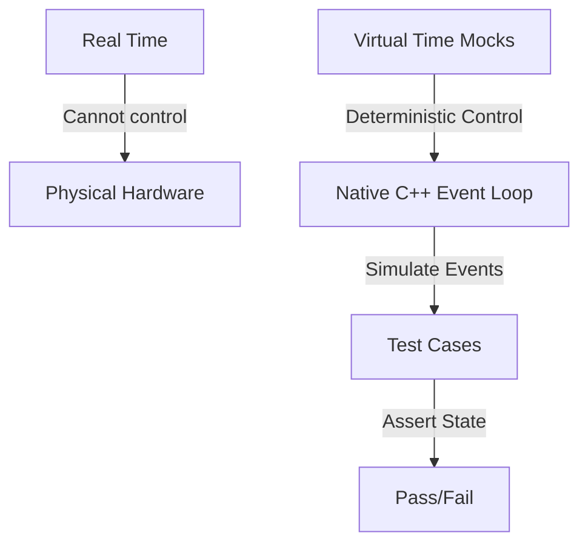

# Test Suite

Welcome to the testing documentation for `DeterministicESPAsyncWebServer`. This repository is designed to be extremely robust, employing **100% hardware-free, deterministic testing**.

Whether you are a beginner looking to understand how C++ testing works or an expert systems engineer designing secure, high-concurrency embedded protocols, this guide explains the architectures, methodologies, and concepts behind our test suite.

---

## 1. Introduction & Core Philosophy

### Why Native Testing?

Traditionally, testing code written for microcontroller frameworks like ESP-IDF or Arduino requires uploading binaries to physical ESP32 chips. This hardware-in-the-loop (HIL) testing has several drawbacks:

- **Slow feedback cycles**: Compiling, flashing, and rebooting microcontrollers takes minutes.
- **Flakiness**: Wireless connections fail, hardware pins float, and components experience wear.
- **Hard-to-reproduce bugs**: Multi-threaded concurrency bugs or network timing jitter cannot be reliably reproduced on physical chips.

`DeterministicESPAsyncWebServer` solves this by executing all test suites **natively** on your development machine (x86/x64 host).

### The Deterministic Asynchronous Model

This server is built on cooperative multitasking. Instead of physical threads, it uses a single-threaded event-driven event loop. Because of this, we can make tests **100% deterministic** through **Time-Travel Mocking**.

Instead of waiting for real-world seconds to elapse to test a connection timeout, the test suite manually increments a virtual clock (`millis()`) and drives the state machine forward manually. This means:

- A 5-second connection timeout can be tested in **less than a millisecond**.
- Execution order is guaranteed to be identical on every single run, eliminating race-condition flakiness.



---

## 2. Test Architecture & Mocking Strategies

To isolate our application code from physical hardware and the operating system's IP stack, we use a custom mocking layer.

### Mocks, Stubs, and Spies

- **Stubs**: Provide canned answers to calls made during the test. For example, our **Filesystem Stub** simulates an SPIFFS/LittleFS system by feeding static file contents from memory arrays instead of reading from a physical hard drive.
- **Mocks**: Objects pre-programmed with expectations that form a specification of the calls they are expected to receive.
- **Virtual Network Taps**: We mock the network stack completely. Instead of binding to real network sockets, we hook the server directly into virtual byte-pumps (ring buffers) that simulate incoming TCP packets.

```
       +---------------------------------------------+
       |                  TEST SUITE                 |
       +----------------------++---------------------+
                              || Simulates network packets
                              \/
       +---------------------------------------------+
       |             VIRTUAL TRANSPORT               |
       |  (mocks sockets, ring buffers, timeouts)    |
       +----------------------++---------------------+
                              || Drives HTTP/SSH bytes
                              \/
       +---------------------------------------------+
       |            CORE WEB SERVER ENGINE           |
       |     (HTTP parser, WebSockets, SSH)          |
       +---------------------------------------------+
```

---

## 3. PlatformIO Test Environments

<!-- BEGIN GENERATED test-environments (edit test/test_matrix.json, run test/gen_test_readme.py) -->

The native test matrix has **274 environments**, one per feature, generated from [test_matrix.json](test_matrix.json) into [platformio.ini](../platformio.ini) by [gen_test_envs.py](gen_test_envs.py). Each compiles a strict per-feature slice of `src/` with its own flags and runs that feature's suite in isolation, so "this feature builds and tests on its own" stays guaranteed.

| Environment | Feature flag(s) | Test suite(s) | Purpose |
| :--- | :--- | :--- | :--- |
| `native` | `WS_ENFORCE_HOST_HEADER=0` | `test_transport`, `test_presentation`, `test_session`, `test_http_parser`, `test_websocket`, `test_sse`, `test_base64` | Layers 4-6: transport + session + presentation + standalone parser (no app layer) These suites predate the RFC 7230 §5.4 Host rule and feed bare HTTP/1.1 request lines to exercise parser mechanics; H... |
| `native_accept_gate` | `WS_ENFORCE_HOST_HEADER=0`, `WS_ENABLE_ACCEPT_THROTTLE=1`, `WS_ENABLE_PER_IP_THROTTLE=1`, `WS_ENABLE_IP_ALLOWLIST=1`, `WS_ACCEPT_THROTTLE_MAX=3`, `WS_ACCEPT_THROTTLE_WINDOW_MS=1000`, `WS_PER_IP_THROTTLE_MAX=2`, `WS_PER_IP_THROTTLE_WINDOW_MS=1000`, `WS_PER_IP_THROTTLE_SLOTS=4`, `WS_IP_ALLOWLIST_SLOTS=4` | `test_accept_gate` | Accept-time connection gates with their flags ON (DWS_ENABLE_ACCEPT_THROTTLE / PER_IP_THROTTLE / IP_ALLOWLIST): the global fixed-window throttle, the per-source-IP bucket table (independent budgets, w... |
| `native_ad9238` | `WS_ENABLE_AD9238=1` | `test_ad9238` | AD9238 SPI configuration-port codec (services/ad9238): the 16-bit instruction word (R/W + byte-count + 13-bit address) for single-byte register writes/reads, the device-update transfer transaction, an... |
| `native_ads` | `WS_ENABLE_ADS=1` | `test_ads` | Beckhoff ADS / AMS codec (services/ads): the AMS/TCP + AMS-header request builders (little-endian, target-before-source addressing, cmd id + state flags + cbData + invoke id) for Read/Write/ReadWrite/... |
| `native_ads1115` | `WS_ENABLE_ADS1115=1` | `test_ads1115` | ADS1115 16-bit ADC codec (services/ads1115): building the 16-bit config word for a single-shot single-ended reading (channel MUX, gain, data rate, start/mode/comparator bits, with out-of-range fallbac... |
| `native_amqp` | `WS_ENABLE_AMQP=1` | `test_amqp` | AMQP 0-9-1 frame codec (services/amqp): the protocol header, the frame + method builders, the heartbeat, and the frame/method parsers (type/channel/size/payload/0xCE). |
| `native_app` | `BODY_BUF_SIZE=512`, `WS_ENFORCE_HOST_HEADER=0`, `WS_ENABLE_STATS=1`, `WS_ENABLE_METRICS=1`, `WS_ENABLE_ETAG=1`, `WS_ENABLE_WEB_TERMINAL=1`, `WS_HTTP_EMIT_DATE=1` | `test_auth`, `test_file_serving`, `test_multipart`, `test_dispatch`, `test_application`, `test_response_headers`, `test_form_params`, `test_path_params`, `test_digest_auth`, `test_digest_vectors`, `test_template`, `test_middleware`, `test_chunked`, `test_json`, `test_iface`, `test_regex`, `test_web_terminal`, `test_defer` | Full stack including Layer 7 application |
| `native_atc` | `WS_ENABLE_ATC=1` | `test_atc` | ATC field-I/O interop snapshot (services/atc): serialize this device's field-I/O map as {"inputs":[...],"outputs":[...]} JSON for an ATC engine over HTTP, plus the output setter and value getter. |
| `native_audit_log` | `WS_ENABLE_AUDIT_LOG=1` | `test_audit_log` | Tamper-evident hash-chained audit log (services/audit_log). |
| `native_auth_lockout` | `WS_ENABLE_AUTH=1`, `WS_ENABLE_AUTH_LOCKOUT=1` | `test_auth_lockout` | Per-IP brute-force auth lockout (services/auth_lockout): exponential-backoff lockout state machine. |
| `native_bacnet` | `WS_ENABLE_BACNET=1` | `test_bacnet` | BACnet/IP BVLC + NPDU codec (services/bacnet): the BVLC envelope (type 0x81, function, length) + the NPDU header (version + NPCI control + optional DNET/DADR + hop count) builders and parsers, slicing... |
| `native_base64_scalar` | `WS_BASE64_SWAR=0` | `test_base64` | base64 scalar constant-time decode fallback (DWS_BASE64_SWAR=0): classify one character at a time instead of the default SWAR four-per-word path. |
| `native_ble_gatt` | `WS_ENABLE_BLE_GATT=1` | `test_ble_gatt` | Bluetooth ATT codec + GATT bridge (services/ble_gatt): build/parse the common ATT PDUs (read/write/notify/error, LE handles) and serialize a GATT characteristic table as JSON for the web stack. |
| `native_bus_capture` | `WS_ENABLE_BUS_CAPTURE=1` | `test_bus_capture` | CAN listen-only capture framing (services/bus_capture): can_to_socketcan() building the 16-byte Linux SocketCAN frame (big-endian can_id, EFF/RTR flags, length, data) and the DLT_CAN_SOCKETCAN libpcap... |
| `native_c37118` | `WS_ENABLE_C37118=1` | `test_c37118` | IEEE C37.118.2 synchrophasor frame codec (services/c37118): CRC-CCITT, the frame builder + Command frame, and the CRC-validating parser (type / ids / timestamp / payload). |
| `native_canopen` | `WS_ENABLE_CANOPEN=1` | `test_canopen` | CANopen (CiA 301) message codec (services/canopen): NMT, SYNC, heartbeat, EMCY, PDO, and expedited SDO read/write/abort + the COB-ID classifier, over the shared CAN frame (shared_primitives/can.h). |
| `native_cbor` | `WS_ENABLE_CBOR=1` | `test_cbor` | CBOR (RFC 8949) encoder (network_drivers/presentation/cbor): a pure byte-output codec, host-tested against the RFC 8949 Appendix A vectors. |
| `native_cc1101` | `WS_ENABLE_CC1101=1` | `test_cc1101` | CC1101 sub-GHz radio driver (services/cc1101): the TI SPI header protocol (config registers, command strobes, status registers, TX/RX FIFO) - init/detect, variable-length send, TX-done, set-rx, packet... |
| `native_cclink` | `WS_ENABLE_CCLINK=1` | `test_cclink` | CC-Link cyclic fieldbus frame codec (services/cclink): the frame ([station][command][bit data][word data][sum]) build + parse and the bit/word process-image accessors. |
| `native_cia402` | `WS_ENABLE_CIA402=1`, `WS_ENABLE_CANOPEN=1` | `test_cia402` | CiA 402 / IEC 61800-7-201 drive profile (services/cia402): the Statusword power-state decode (mask/value table), the Controlword commands + enable sequence, Statusword flags, the CANopen SDO setters (... |
| `native_cip` | `WS_ENABLE_CIP=1` | `test_cip` | CIP message codec (services/cip): the EPATH logical-segment builder, the request builders (Get_Attribute_Single), and the response parser (service / status / data). |
| `native_client` | default | `test_client` | Outbound TCP client transport (network_drivers/transport/client.cpp), the pooled layer-4 peer of tcp.cpp used by http_client / mqtt / ws_client / relay / smtp / ssh port-forward (DWS_NEED_DET_CLIENT). |
| `native_clock` | default | `test_clock` | Pluggable monotonic clock (services/dws_clock): default millis(), custom clock divided down to the internal 1000 Hz. |
| `native_cloudevents` | `WS_ENABLE_CLOUDEVENTS=1` | `test_cloudevents` | CloudEvents v1.0 envelope (services/cloudevents): the structured-JSON builder (over the JSON writer) + the binary-mode ce-* header reader. |
| `native_coap` | `WS_ENABLE_COAP=1`, `WS_ENABLE_COAP_BLOCK=1`, `WS_COAP_BLOCK_SZX_MAX=2`, `WS_COAP_BLOCK1_MAX=128` | `test_coap` | CoAP server (RFC 7252) message codec + resource dispatch. |
| `native_coap_observe` | `WS_ENABLE_COAP=1`, `WS_ENABLE_COAP_BLOCK=1`, `WS_COAP_BLOCK_SZX_MAX=2`, `WS_COAP_BLOCK1_MAX=128`, `WS_ENABLE_COAP_OBSERVE=1` | `test_coap` | CoAP with resource observation (RFC 7641) enabled. |
| `native_coaps` | `WS_ENABLE_DTLS=1`, `WS_ENABLE_COAP=1` | `test_coaps` | CoAP over DTLS (services/coap/coaps, RFC 7252 sec 9): the bridge that drives a DtlsConn handshake and, once established, unwraps each epoch-3 application record, answers it with coap_server_process(),... |
| `native_coaps_server` | `WS_ENABLE_DTLS=1`, `WS_ENABLE_COAP=1` | `test_coaps_server` | CoAP-over-DTLS server front-end (services/coap/coaps_server): the per-peer DtlsConn pool + ingest/poll seam on top of dws_coaps_process(). |
| `native_codeql` | `WS_ENABLE_CSRF=1`, `WS_ENABLE_AUTH_LOCKOUT=1`, `WS_ENABLE_IP_ALLOWLIST=1`, `WS_ENABLE_WS_DEFLATE=1`, `WS_ENABLE_TIME_SOURCE=1`, `WS_ENABLE_CONFIG_STORE=1`, `WS_ENABLE_DEVICE_ID=1`, `WS_ENABLE_TELEMETRY=1`, `WS_ENABLE_DASHBOARD=1`, `WS_ENABLE_PARTITION_MONITOR=1`, `WS_ENABLE_CBOR=1`, `WS_ENABLE_MSGPACK=1`, `WS_ENABLE_GPIO_MAP=1`, `WS_ENABLE_UDP_TELEMETRY=1`, `WS_ENABLE_GUARDRAILS=1`, `WS_ENABLE_FAILSAFE=1`, `WS_ENABLE_SLEEP_SCHED=1`, `WS_ENABLE_WEARLEVEL=1`, `WS_ENABLE_NETADAPT=1`, `WS_ENABLE_DSHOT=1`, `WS_ENABLE_HART=1`, `WS_ENABLE_NTS=1`, `WS_ENABLE_DDS=1`, `WS_ENABLE_XMPP=1`, `WS_ENABLE_RAWL2=1`, `WS_ENABLE_SPA_ROUTER=1`, `WS_ENABLE_GOOSE=1`, `WS_ENABLE_MTCONNECT=1`, `WS_ENABLE_J2735=1`, `WS_ENABLE_NEMA_TS2=1`, `WS_ENABLE_SNP=1`, `WS_ENABLE_DIRECTNET=1`, `WS_ENABLE_SEP2=1`, `WS_ENABLE_PROFINET=1`, `WS_ENABLE_NTCIP=1`, `WS_ENABLE_OPENADR=1`, `WS_ENABLE_MMS=1`, `WS_ENABLE_CCLINK=1`, `WS_ENABLE_POWERLINK=1`, `WS_ENABLE_SERCOS=1`, `WS_ENABLE_PROFIBUS=1`, `WS_ENABLE_LONWORKS=1`, `WS_ENABLE_MBPLUS=1`, `WS_ENABLE_INTERBUS=1`, `WS_ENABLE_ICCP=1`, `WS_ENABLE_WAVE=1`, `WS_ENABLE_UTMC=1`, `WS_ENABLE_OCIT=1`, `WS_ENABLE_ATC=1`, `WS_ENABLE_SOUTHBOUND=1`, `WS_ENABLE_EXC_DECODER=1`, `WS_ENABLE_HTTP_DELIVERY=1`, `WS_ENABLE_HW_HEALTH=1`, `WS_ENABLE_MDNS_ADAPTIVE=1`, `WS_ENABLE_SOCKPOOL=1`, `WS_ENABLE_PSRAM_POOL=1`, `WS_ENABLE_HAPPY_EYEBALLS=1`, `WS_ENABLE_WIFI_SNIFFER=1`, `WS_ENABLE_LINK_MANAGER=1`, `WS_ENABLE_CC1101=1`, `WS_ENABLE_FDC2214=1`, `WS_ENABLE_LDC1614=1`, `WS_ENABLE_VL53L0X=1`, `WS_ENABLE_RADIO_SNIFF=1`, `WS_ENABLE_BLE_GATT=1`, `WS_ENABLE_TLS_POLICY=1`, `WS_ENABLE_WISUN=1`, `WS_ENABLE_LOGBUF=1`, `WS_ENABLE_OTA_ROLLBACK=1`, `WS_ENABLE_TOTP=1`, `WS_ENABLE_WEBHOOK=1`, `WS_ENABLE_RADIO_POWER=1`, `WS_ENABLE_AUDIT_LOG=1`, `WS_ENABLE_OIDC=1`, `WS_ENABLE_VFS=1`, `WS_ENABLE_GRAPHQL=1`, `WS_ENABLE_ESPNOW=1`, `WS_ENABLE_OAUTH2=1`, `WS_ENABLE_OPCUA=1`, `WS_ENABLE_OPCUA_CLIENT=1` | `test_dispatch` | CodeQL coverage env: the full app compiled with every new feature flag ON so CodeQL traces the integration paths (CSRF / lockout / allowlist gates, permessage-deflate) AND the new service modules, whi... |
| `native_compliance` | default | `test_compliance` | RFC-compliance suite: builds with all enforcement at production defaults (DWS_ENFORCE_HOST_HEADER=1) and exercises the strict behaviors. |
| `native_concurrency` | `O1`, `pthread` | `test_concurrency` | Concurrency proof for the cross-thread slot fields (DWSAtomic state / rx_head / rx_tail). |
| `native_config_io` | `WS_ENABLE_CONFIG_STORE=1`, `WS_ENABLE_CONFIG_IO=1` | `test_config_io` | Schema-driven config export/restore (services/config_io) over the config store; round-trip host-tested against the in-memory backend. |
| `native_config_store` | `WS_ENABLE_CONFIG_STORE=1` | `test_config_store` | Typed NVS config store (services/config_store): string/u32/blob round-trips, defaults, capacity, erase/clear - run against the host in-memory backend (the ESP32 Preferences/NVS backend is compiled in ... |
| `native_control` | `WS_ENABLE_CONTROL=1` | `test_control` | PID control law (services/control): the P/I/D terms, output clamping, anti-windup by conditional integration, derivative-on-measurement (no setpoint kick) + optional low-pass, feed-forward, the batche... |
| `native_cotp` | `WS_ENABLE_COTP=1` | `test_cotp` | TPKT (RFC 1006) + COTP X.224 class-0 frame codec (services/cotp): the TPKT envelope, the COTP Data TPDU + Connection Request builders, and the COTP parser. |
| `native_crypto_kat` | `WS_ENABLE_HTTP3=1` | `test_crypto_kat` | Data-driven external crypto known-answer tests: HMAC-SHA256/512, AEAD_AES_128_GCM, X25519, and Ed25519 verify from Project Wycheproof (including its adversarial edge cases), plus HKDF-SHA256 Extract (... |
| `native_csrf` | `WS_ENABLE_CSRF=1` | `test_csrf` | Stateless HMAC-signed CSRF token (services/csrf): issue/verify with a fixed secret unit-tests on the host (DWS_ENABLE_CSRF set). |
| `native_dashboard` | `WS_ENABLE_DASHBOARD=1` | `test_dashboard` | Dashboard widget-table JSON serializers (services/dashboard core). |
| `native_dbm` | `WS_ENABLE_WAL=1`, `WS_ENABLE_DBM=1` | `test_dbm` | Log-structured hash key-value store on the WAL (services/dbm): put/get/delete with an in-RAM open-addressed index and value data appended to the write-ahead log, plus index rebuild by replaying the lo... |
| `native_dds` | `WS_ENABLE_DDS=1` | `test_dds` | DDS / RTPS framing codec (services/dds): the 20-octet RTPS header (magic/version/vendor/ guidPrefix) and the submessage TLV (id/flags/octetsToNextHeader, endianness flag), build + parse. |
| `native_deflate` | `WS_ENABLE_WS_DEFLATE=1` | `test_deflate` | RFC 1951 DEFLATE core (the WebSocket permessage-deflate compressor). |
| `native_device_id` | `WS_ENABLE_DEVICE_ID=1` | `test_device_id` | MAC-derived device UUID (services/device_id): RFC 4122 v5 from a MAC via SHA-1. |
| `native_devicenet` | `WS_ENABLE_DEVICENET=1` | `test_devicenet` | DeviceNet link-adaptation codec (services/devicenet): the 4-group 11-bit CAN id, explicit-message header octet, single-frame explicit messages, and the fragmentation reassembler (CIP over CAN; the CIP... |
| `native_df1` | `WS_ENABLE_DF1=1` | `test_df1` | Allen-Bradley DF1 full-duplex frame codec (services/df1): BCC + CRC-16/ARC, the frame builder with DLE byte-stuffing, and the validating, un-stuffing parser. |
| `native_diag` | `WS_ENABLE_DIAG=1` | `test_diag` | Runtime build-flag reporter (server.diag() / DWS_ENABLE_DIAG). |
| `native_diffserv` | `WS_ENABLE_DIFFSERV=1` | `test_diffserv` | DiffServ QoS marking (DWS_ENABLE_DIFFSERV): the DSCP->TOS encode (DSCP << 2, ECN 0), the server-wide and UDP DSCP defaults (set/get, 6-bit mask), the per-connection setter (dws_conn_set_dscp writes pc... |
| `native_directnet` | `WS_ENABLE_DIRECTNET=1` | `test_directnet` | AutomationDirect DirectNET serial frame codec (services/directnet): the header (SOH + ASCII-hex slave/type/addr/blocks + ETB + LRC) and data (STX + data + ETX + LRC) frames build/parse. |
| `native_dma` | `WS_ENABLE_DMA=1`, `WS_DMA_BUF_SIZE=8`, `WS_DMA_CHANNELS=2` | `test_dma` | DMA peripheral ingest / egress simulator (services/dma), v5 hardware ingest: an ingress feed surfaces as RX completion events, a full buffer ping-pongs and re-arms, egress DMA is captured, TX is one-i... |
| `native_dmx` | `WS_ENABLE_DMX=1` | `test_dmx` | DMX512 + RDM lighting codec (services/dmx): the DMX512 slot packet (build/get) and the RDM (ANSI E1.20) packet build/parse with 48-bit UIDs and the 16-bit additive checksum. |
| `native_dnc` | `WS_ENABLE_DNC=1` | `test_dnc`, `test_dnc_stream` | CNC DNC drip-feed (services/dnc): the EIA RS-244 <-> ISO/ASCII tape-code translation (odd-parity EIA table), ISO even parity, G-code block framing with '%' rewind-stop and leader runout, XON/XOFF flow... |
| `native_dnp3` | `WS_ENABLE_DNP3=1` | `test_dnp3` | DNP3 (IEEE 1815) data-link frame codec (services/dnp3): CRC-16/DNP, the frame builder (0x0564 header + CRC'd 16-octet data blocks) and the CRC-validating, de-blocking parser. |
| `native_dns_resolver` | `WS_ENABLE_DNS_RESOLVER=1` | `test_dns_resolver` | DNS resolver answer classifier/verifier (services/dns_resolver): host-tested; the lwIP resolve is ESP32-only. |
| `native_dns_server` | `WS_ENABLE_DNS_SERVER=1` | `test_dns_server` | Authoritative DNS server (services/dns_server): the pure A-record response builder (QNAME parse, compressed A answer, NXDOMAIN, non-A query, header flags, malformed guards) and the built-in name->IP t... |
| `native_docstore` | `WS_ENABLE_WAL=1`, `WS_ENABLE_DBM=1`, `WS_ENABLE_DOCSTORE=1` | `test_docstore` | Local JSON document store on the WAL (services/docstore): JSON documents addressed by id, stored via dbm on the write-ahead log, plus top-level field queries (find documents whose JSON field equals a ... |
| `native_dshot` | `WS_ENABLE_DSHOT=1` | `test_dshot` | DShot ESC throttle codec (services/dshot): the 16-bit frame (11-bit value + telemetry + 4-bit nibble-xor CRC), the bidirectional inverted-CRC variant, decode/validate, and per-rate bit timing. |
| `native_dtls` | `WS_ENABLE_DTLS=1` | `test_dtls_record` | DTLS 1.3 record layer (network_drivers/presentation/dtls/dtls_record, RFC 9147 sec 4): DTLSPlaintext + DTLSCiphertext protect/unprotect, the unified header, sequence-number encryption (sec 4.2.3) and ... |
| `native_dtls_conn` | `WS_ENABLE_DTLS=1`, `WS_ENABLE_TLS_RPK=1` | `test_dtls_conn` | DTLS 1.3 server handshake state machine (network_drivers/presentation/dtls/dtls_conn, RFC 9147 sec 5-6): the one-round-trip full handshake (TLS_AES_128_GCM_SHA256 / X25519 / Ed25519) over the DTLS rec... |
| `native_dtls_hs` | `WS_ENABLE_DTLS=1` | `test_dtls_handshake` | DTLS 1.3 handshake framing + reliability (network_drivers/presentation/dtls/dtls_handshake, RFC 9147 sec 5 + 7): the 12-byte DTLS handshake header, overlap-tolerant message reassembly, the ACK message... |
| `native_dtls_tls13` | `WS_ENABLE_DTLS=1`, `WS_ENABLE_TLS_RPK=1` | `test_dtls_tls13` | TLS 1.3 messages the DTLS 1.3 handshake adds to tls13_msg (RFC 8446 sec 4.1.4 / 4.4.1), compiled for the DTLS path (DWS_ENABLE_DTLS, not HTTP/3): the HelloRetryRequest builder, the cookie extension pa... |
| `native_dws_arena` | default | `test_dws_arena` | Unified double-ended server arena (network_drivers/session/dws_arena): first-fit persistent end (bottom, individual free + coalesce + boundary shrink) + bump scratch end (top, mark/release/reset) shar... |
| `native_dws_ip` | default | `test_dws_ip` | IP address core (network_drivers/network/dws_ip): RFC 4291 IPv4/IPv6 text parsing, RFC 5952 canonical formatting (:: zero-compression, v4-mapped), and scope classification (loopback / link-local / pri... |
| `native_dws_primitives` | default | `test_dws_primitives`, `test_crc` | Shared no-stdlib primitives (shared_primitives): the base-10 dws_strtol/strtoul/strtof number parsers (numparse.h), the strict RFC 3629 UTF-8 validator (utf8.h), and the parameterized Rocksoft/William... |
| `native_edge_cache` | `WS_ENABLE_HTTP_CACHE=1`, `WS_ENABLE_HTTP_CLIENT=1`, `WS_ENABLE_EDGE_CACHE=1`, `WS_ENABLE_RANGE=1` | `test_edge_cache`, `test_edge_fetch` | CDN edge-cache engine (services/edge_cache): the pure freshness/validator core (response header-field access, HTTP-date parsing over IMF-fixdate / RFC 850 / asctime, RFC 9111 lifetime + Expires-Date +... |
| `native_edge_cache_sd` | `WS_ENABLE_WAL=1`, `WS_ENABLE_DBM=1`, `WS_DBM_VAL_MAX=1024`, `WS_ENABLE_HTTP_CACHE=1`, `WS_ENABLE_HTTP_CLIENT=1`, `WS_ENABLE_EDGE_CACHE=1` | `test_edge_cache_sd` | CDN edge-cache L2 SD-persistence tier (services/edge_cache/edge_cache_sd): the entry <-> dbm-value serialization roundtrip (all response metadata, Vary variants, binary and max-size bodies), the spill... |
| `native_edge_mesh` | `WS_ENABLE_HTTP_CACHE=1`, `WS_ENABLE_HTTP_CLIENT=1`, `WS_ENABLE_EDGE_CACHE=1`, `WS_ENABLE_EDGE_MESH=1` | `test_edge_mesh` | CDN edge-cache mesh sibling-cache codec (services/edge_cache/edge_mesh): the request/response wire frames (build + tri-state accumulating parse over partial reads, magic/version/opcode validation), th... |
| `native_enip` | `WS_ENABLE_ENIP=1` | `test_enip` | EtherNet/IP encapsulation codec (services/enip): the 24-octet header, RegisterSession + SendRRData builders (Common Packet Format), and the SendRRData reply extractor. |
| `native_enocean` | `WS_ENABLE_ENOCEAN=1`, `WS_ENOCEAN_MAX_DATA=16` | `test_enocean` | EnOcean ESP3 serial codec (services/enocean), v5 radio plugin: the CRC-8 (poly 0x07) against known answers, a build -> parse round trip, malformed framing (bad sync / header CRC / data CRC), incomplet... |
| `native_esp` | `WS_ENABLE_IKEV2=1` | `test_esp` | ESP (RFC 4303) packet transform with AES-256-GCM (RFC 4106) - the IPsec datapath crypto core (services/esp): encapsulate a payload into SPI\|Seq\|IV\|AES-GCM(payload\|pad\|padlen\|nexthdr)\|ICV and ve... |
| `native_espnow` | `WS_ENABLE_ESPNOW=1` | `test_espnow` | ESP-NOW peer messaging (services/espnow) - the envelope codec + peer registry are host-tested here; the esp_now radio binding is ESP32-only. |
| `native_euromap77` | `WS_ENABLE_OPCUA=1`, `WS_ENABLE_EUROMAP77=1` | `test_euromap77` | EUROMAP 77 (OPC 40077) IMM_MES_Interface model (services/euromap77) - OPC UA for injection moulding machines. |
| `native_exc_decoder` | `WS_ENABLE_EXC_DECODER=1` | `test_exc_decoder` | ESP32 panic / exception decoder (services/exc_decoder): parse a captured Guru Meditation dump (cause, register PC + EXCVADDR, backtrace PC:SP frames) into a structured ExcInfo and serialize it as JSON... |
| `native_failsafe` | `WS_ENABLE_FAILSAFE=1` | `test_failsafe` | Software watchdog / deadlock detection + safe-state (services/failsafe): the wrap-safe overdue predicate, the lifeline registry, fire-once-per-episode breach callback, and JSON. |
| `native_fanuc_j519` | `WS_ENABLE_FANUC_J519=1` | `test_fanuc_j519` | FANUC Stream Motion / option J519 UDP codec (services/fanuc_j519): the robot counterpart to FOCAS. |
| `native_fdc2214` | `WS_ENABLE_FDC2214=1` | `test_fdc2214` | FDC2114/2214 capacitance-to-digital field sensor (services/fdc2214): the 28-bit data combine + error flags, the frequency scale (data/2^28 * fref), and the single-channel config-sequence builder. |
| `native_fins` | `WS_ENABLE_FINS=1` | `test_fins` | Omron FINS frame codec (services/fins): the command builder + Memory Area Read convenience + the command / response parsers (10-octet header, MRC/SRC, MRES/SRES end code). |
| `native_flow_export` | `WS_ENABLE_FLOW_EXPORT=1` | `test_flow_export` | Flow-record export codec (services/flow_export): NetFlow v5 fixed header/record builders + the NetFlow v9 / IPFIX template-then-data cursor (length/count patching, v9 4-octet padding). |
| `native_focas` | `WS_ENABLE_FOCAS=1` | `test_focas` | FANUC FOCAS Ethernet codec (services/focas): the big-endian frame envelope (magic/version/type/length) + open/close handshake, the generic command request (6-octet function selector + five i32 args), ... |
| `native_forward` | `WS_ENABLE_FORWARD=1`, `WS_FWD_MAX_IFACES=4`, `WS_FWD_MAX_RULES=4`, `WS_FWD_MAX_ACL=4`, `WS_FWD_MAX_ROUTES=4`, `WS_FWD_INSPECT=1` | `test_forward` | Interface forwarding plane (services/forward), v5 bridge / router: default-deny, an ALLOW rule forwards, a DENY wins, multi-destination fan-out, no reflection to the source, the per-rule rate cap (hos... |
| `native_forwarded_trust` | `WS_ENABLE_AUTH=1`, `WS_ENABLE_AUTH_LOCKOUT=1`, `WS_ENABLE_FORWARDED_TRUST=1` | `test_forwarded_trust` | Trusted-reverse-proxy forwarded-client resolver (services/forwarded_trust): a Forwarded / X-Forwarded-For client address is honored only when the real TCP peer is a configured trusted-upstream CIDR, e... |
| `native_ftp` | `WS_ENABLE_FTP=1` | `test_ftp` | FTP client wire codec (services/ftp, RFC 959 + RFC 2428): the control-command builders (generic verb + PORT + EPRT), the single/multi-line 3-digit reply parser, and the PASV / EPSV data-address decoders. |
| `native_gateway` | `WS_ENABLE_GATEWAY=1`, `WS_GW_MAX_PORTS=4` | `test_gateway` | Radio / wireless gateway bridge (services/gateway), v5 southbound-to-northbound: an uplink envelopes a received frame (src address / port / rssi / seq) and publishes it, fail-closed on no sink / unkno... |
| `native_gnss_survey` | `WS_ENABLE_NTRIP_CASTER=1`, `WS_ENABLE_NMEA0183=1`, `UNITY_INCLUDE_DOUBLE` | `test_gnss_survey` | GNSS survey-in core (services/gnss/gnss_survey): the exact WGS84 geodetic<->ECEF transform (matched against pyproj EPSG:4979->EPSG:4978), the shifted-origin position averager with a 3-D accuracy estim... |
| `native_goose` | `WS_ENABLE_GOOSE=1` | `test_goose` | IEC 61850 GOOSE publisher codec (services/goose): the BER IECGoosePdu (gocbRef..allData, minimal-length INTEGERs with the positive leading-zero rule) + the GOOSE header + Ethernet frame (ethertype 0x8... |
| `native_gpib` | `WS_ENABLE_GPIB=1` | `test_gpib` | GPIB-over-LAN (Prologix-style) controller command codec (services/gpib): the ++ command builders (addr / mode / read / eoi / eos / spoll / clr / trg / ver), the data-line escaping (leading ESC before ... |
| `native_gpio_map` | `WS_ENABLE_GPIO_MAP=1` | `test_gpio_map` | GPIO pin-mapper / browser diag core (services/gpio_map): direction names, JSON serializer, control-POST parser, output guard - all pure and host-tested. |
| `native_graphql` | `WS_ENABLE_GRAPHQL=1` | `test_graphql` | GraphQL query subset (services/graphql) - pure parser + executor, host-tested with a demo resolver. |
| `native_grpcweb` | `WS_ENABLE_GRPC_WEB=1` | `test_grpcweb` | gRPC-Web message framing codec (services/grpcweb): the 5-octet length-prefixed message frame builder + the 0x80 trailers frame (grpc-status / grpc-message) + the frame parser. |
| `native_guardrails` | `WS_ENABLE_GUARDRAILS=1` | `test_guardrails` | Heap/stack guardrails (services/guardrails): threshold evaluator + JSON, host-tested. |
| `native_h2conn` | `WS_ENABLE_HTTP2=1` | `test_h2_conn` | HTTP/2 connection engine (network_drivers/presentation/http2/h2_conn, RFC 9113): initial SETTINGS on init, preface + client SETTINGS -> SETTINGS ACK, decoding a real HPACK-encoded request into the hea... |
| `native_h2frame` | `WS_ENABLE_HTTP2=1` | `test_h2_frame` | HTTP/2 binary framing (network_drivers/presentation/http2/h2_frame, RFC 9113): the 9-byte frame header parse/write (24-bit length, reserved-bit masking), SETTINGS build + parse with validation, and th... |
| `native_h3_conn` | `WS_ENABLE_HTTP3=1` | `test_h3_conn` | HTTP/3 application engine (network_drivers/presentation/http3/h3_conn, RFC 9114): drives h3_conn through the quic_conn callback seam - a QPACK-encoded request on a request stream dispatches the right ... |
| `native_h3_e2e` | `WS_ENABLE_HTTP3=1` | `test_h3_e2e` | End-to-end HTTP/3 capstone (network_drivers/presentation/http3): a QUIC client in the test completes the TLS 1.3 handshake against a quic_conn + h3_conn server, sends a real HTTP/3 GET (QPACK HEADERS ... |
| `native_h3_server` | `WS_ENABLE_HTTP3=1` | `test_h3_server` | HTTP/3 dispatch bridge end-to-end through DWS (the full Layer-7 app built with DWS_ENABLE_HTTP3=1): a QUIC client completes the handshake and sends an HTTP/3 GET, quic_server routes it to the reserved... |
| `native_h3frame` | `WS_ENABLE_HTTP3=1` | `test_h3_frame` | HTTP/3 framing (network_drivers/presentation/http3/h3_frame, RFC 9114 sec 7): the type+length varint header parse/write (incl. |
| `native_haas_mdc` | `WS_ENABLE_HAAS_MDC=1` | `test_haas_mdc` | Haas Machine Data Collection (MDC) Q-command codec (services/haas_mdc): the ?Q query builders (Q100 serial, Q101 software version, Q102 model, Q104 mode, Q300 power-on time, Q500 program + run status ... |
| `native_happy_eyeballs` | `WS_ENABLE_HAPPY_EYEBALLS=1` | `test_happy_eyeballs` | Dual-stack Happy Eyeballs selection (services/happy_eyeballs): RFC 6724 destination preference scoring, the candidate-list sort + RFC 8305 address-family interleave, and the Connection Attempt Delay g... |
| `native_hart` | `WS_ENABLE_HART=1` | `test_hart` | HART / HART-IP codec (services/hart): the HART command frame (longitudinal XOR checksum, short + long addressing) build/parse and the 8-octet HART-IP message header. |
| `native_hislip` | `WS_ENABLE_HISLIP=1` | `test_hislip` | HiSLIP (High-Speed LAN Instrument Protocol, IVI-6.1) message codec (services/hislip): the fixed 16-byte header build/parse (HS prologue + type + control + 32-bit param + 64-bit payload length, big-end... |
| `native_hmmd` | `WS_ENABLE_HMMD=1` | `test_hmmd` | Waveshare HMMD 24GHz mmWave micro-motion radar codec (services/hmmd): the LD2410-family little-endian framing, the report parse (detection flag, distance, all 16 gate energies), rejecting malformed fr... |
| `native_hostlink` | `WS_ENABLE_HOSTLINK=1` | `test_hostlink` | Omron Host Link (C-mode) frame codec (services/hostlink): the FCS (XOR), the ASCII command builder (@UU + header + text + FCS + *CR), and the FCS-validating parser + end-code reader. |
| `native_hotswap` | `WS_ENABLE_HOTSWAP=1` | `test_hotswap` | Removable-storage hot-swap safeties (services/hotswap): the ABSENT/READY/FAULTED state machine - a run of consecutive I/O errors faults a volume while a single one does not, any success resets the run... |
| `native_hpack` | `WS_ENABLE_HTTP2=1` | `test_hpack` | HPACK header compression for HTTP/2 (RFC 7541): prefix-integer coding (App C.1), the Huffman string code (App B / C.4.1), the first-request decode with dynamic-table insertion (C.3.1), dynamic-table i... |
| `native_http_client` | `WS_ENABLE_HTTP_CLIENT=1` | `test_http_client` | Outbound HTTP client: URL parser + request builder + response parser. |
| `native_http_delivery` | `WS_ENABLE_HTTP_DELIVERY=1` | `test_http_delivery` | HTTP delivery optimizations (services/http_delivery): the RFC 5861 stale-while-revalidate freshness decision + its Cache-Control builder, and the versioned service-worker precache manifest (including ... |
| `native_httpcache` | `WS_ENABLE_HTTP_CACHE=1` | `test_httpcache` | HTTP Cache-Control helpers (services/httpcache, RFC 9111 + 8246 + 5861): the structured directive builder + first-class origin presets (immutable asset / shared / no-store / revalidatable), the tolera... |
| `native_hw_health` | `WS_ENABLE_HW_HEALTH=1` | `test_hw_health` | Hardware-health diagnostics (services/hw_health): power-rail voltage-drop logger (worst droop + sag/brownout counts), SPI-bus CRC audit with hysteretic clock backoff, GPIO short-circuit test (driven v... |
| `native_iccp` | `WS_ENABLE_ICCP=1` | `test_iccp` | ICCP / TASE.2 (IEC 60870-6) Data_Value codec (services/iccp): the StateQ (state + quality) and RealQ (scaled INTEGER + quality) indication-point BER structures with optional timestamp. |
| `native_iec60870` | `WS_ENABLE_IEC60870=1` | `test_iec60870` | IEC 60870-5-101/-104 codec (services/iec60870): the -104 APCI (I/S/U), the ASDU header + 3-octet IOA, and the -101 FT1.2 fixed/variable link frames (sum checksum). |
| `native_iface_bridge` | `WS_ENABLE_IFACE_BRIDGE=1` | `test_iface_bridge` | Interface bridge pure core (services/iface_bridge): the user-defined address:port -> bus rule table (register / find / dedup / capacity, keyed by port+proto with the full DWSIp bind address preserved)... |
| `native_ikev2` | `WS_ENABLE_IKEV2=1` | `test_ikev2`, `test_ikev2_natt` | IKEv2 (RFC 7296) message + payload codec (services/ikev2): the 28-octet IKE header, the generic payload chain walker, the SA -> proposal -> transform tree (incl. |
| `native_ina219` | `WS_ENABLE_INA219=1` | `test_ina219` | INA219 current/power codec (services/ina219): decoding the bus-voltage register (bits [15:3], LSB 4 mV, status bits ignored) and the shunt-voltage register (signed, LSB 10 uV), computing the calibrati... |
| `native_inflate` | `WS_ENABLE_WS_DEFLATE=1` | `test_inflate` | RFC 1951 INFLATE core (the WebSocket permessage-deflate decompressor). |
| `native_interbus` | `WS_ENABLE_INTERBUS=1` | `test_interbus` | INTERBUS summation-frame codec (services/interbus): the summation frame (loopback + per-device 16-bit slices + CRC-16/CCITT FCS) assemble + disassemble. |
| `native_iolink` | `WS_ENABLE_IOLINK=1` | `test_iolink` | IO-Link (SDCI) data-link message codec (services/iolink): the MC / CKT / CKS control octets and the SDCI checksum (seed 0x52 + the 8->6 compression of IO-Link spec A.1.6), with a hand-computed known-a... |
| `native_ipsec_db` | `WS_ENABLE_IKEV2=1` | `test_ipsec_db` | IPsec Security Policy Database + Security Association Database (RFC 4301, services/esp/ipsec_db): ordered first-match-wins SPD policy lookup over source/destination/protocol/port selector ranges, an S... |
| `native_j1939` | `WS_ENABLE_J1939=1` | `test_j1939` | SAE J1939 codec (services/j1939): 29-bit id encode/decode (PDU1 + PDU2), single-frame messages, Request PGN, Address Claimed + NAME, and the Transport Protocol (BAM + TP.DT) reassembler, over the shar... |
| `native_j2735` | `WS_ENABLE_J2735=1` | `test_j2735` | SAE J2735 V2X codec (services/j2735): the ASN.1 UPER bit primitive layer (constrained INTEGER / BOOLEAN / bit fields) and the BSMcore block encode/decode. |
| `native_jwt` | `WS_ENABLE_JWT=1` | `test_jwt` | JWT (HS256) bearer-auth verification. |
| `native_keepalive` | `WS_ENFORCE_HOST_HEADER=0`, `WS_ENABLE_KEEPALIVE=1`, `WS_KEEPALIVE_MAX_REQUESTS=3` | `test_keepalive` | HTTP/1.1 keep-alive (persistent connections): full server built with DWS_ENABLE_KEEPALIVE=1; a small per-connection request cap makes the fairness-bound test fast. |
| `native_ld2410` | `WS_ENABLE_LD2410=1` | `test_ld2410` | LD2410 mmWave radar codec (services/ld2410): decoding a basic and an engineering-mode report frame, rejecting malformed frames, the byte-by-byte stream reassembler (resync past noise, split feeds, abs... |
| `native_ldc1614` | `WS_ENABLE_LDC1614=1` | `test_ldc1614` | LDC1614 inductance-to-digital field sensor (services/ldc1614): the 28-bit data combine + error flags, the frequency scale (data/2^28 * fref), and the single-channel config-sequence builder. |
| `native_link_manager` | `WS_ENABLE_LINK_MANAGER=1` | `test_link_manager` | Multi-interface egress selection (services/link_manager): a table of interfaces (kind + priority + up/down) with deterministic best-link-up selection, graceful escalation to a higher-priority interfac... |
| `native_log` | `WS_ENABLE_LOGBUF=1`, `WS_LOG_LEVEL=DWS_LOG_LEVEL_INFO` | `test_log` | Abstract logging macros (shared_primitives/log.h) whose disabled levels are discarded by the preprocessor: built at DWS_LOG_LEVEL_INFO so DEBUG is below the floor. |
| `native_logbuf` | `WS_ENABLE_LOGBUF=1` | `test_logbuf` | Rotating log ring + severity trap (services/logbuf): pure, fully host-tested. |
| `native_lonworks` | `WS_ENABLE_LONWORKS=1` | `test_lonworks` | LonWorks / LON-IP network-variable codec (services/lonworks): the LonTalk NV PDU ([msg-code][14-bit selector][value]) build + parse and the SNVT_temp / SNVT_switch scalar encodings. |
| `native_lora` | `WS_ENABLE_LORA=1` | `test_lora` | LoRa codec + SX127x driver (services/lora), v5 radio plugin: the RadioHead 4-byte header parse/build, and the SX127x register protocol (init / send / tx-done / set-rx / recv) exercised against a mock ... |
| `native_lsv2` | `WS_ENABLE_LSV2=1` | `test_lsv2` | Heidenhain LSV/2 telegram codec (services/lsv2): the framer (4-byte big-endian payload-length prefix + 4-char mnemonic + payload), the typed request builders (login A_LG / logout A_LO, null-terminated... |
| `native_lwm2m_tlv` | `WS_ENABLE_LWM2M=1` | `test_lwm2m_tlv` | OMA LwM2M TLV codec (services/lwm2m): the writer (raw + int / bool / string / float value helpers, 8-/16-bit ids, inline / 8-/16-/24-bit lengths) + the cursor reader + integer value decoding. |
| `native_mbplus` | `WS_ENABLE_MBPLUS=1` | `test_mbplus` | Modbus Plus HDLC token-bus codec (services/mbplus): the HDLC frame (7E addr ctrl payload CRC-16/X-25 7E) build + validate and the token-rotation ring helper. |
| `native_mbus` | `WS_ENABLE_MBUS=1` | `test_mbus` | Wired M-Bus codec (services/mbus): the ACK / short / long frame builders + parser (start/stop, doubled length, 8-bit sum checksum) and the EN 13757-3 variable-data record walker (DIF/VIF, DIFE/VIFE ch... |
| `native_mdns_adaptive` | `WS_ENABLE_MDNS_ADAPTIVE=1` | `test_mdns_adaptive` | Adaptive mDNS beacon scheduling (services/mdns_adaptive): RF-contention backoff/recovery of the announce interval, the TTL/2 continuous-refresher cadence, the announce-due check, and the auto-sleep be... |
| `native_melsec` | `WS_ENABLE_MELSEC=1` | `test_melsec` | Mitsubishi MELSEC MC binary 3E codec (services/melsec): the batch-read request builder (little-endian, subheader 0x5000, command 0x0401, device code + 24-bit head device) + the 0xD000 response parser. |
| `native_mms` | `WS_ENABLE_MMS=1` | `test_mms` | IEC 61850 MMS PDU codec (services/mms): the BER confirmed-request/response Read PDUs (invokeID + read service + named ObjectName), build + parse. |
| `native_modbus` | `WS_ENABLE_MODBUS=1`, `WS_ENABLE_MODBUS_RTU=1` | `test_modbus` | Modbus TCP slave core + RTU framing (Modbus Application Protocol): the data model + MBAP/PDU codec + the RTU ADU codec (CRC16 + [addr][PDU][CRC]). |
| `native_modbus_master` | `WS_ENABLE_MODBUS=1`, `WS_ENABLE_MODBUS_MASTER=1` | `test_modbus_master` | Modbus master codec + scanner (services/modbus/modbus_master): build read requests, parse responses; host-tested as a round-trip against the slave codec. |
| `native_mpr121` | `WS_ENABLE_MPR121=1` | `test_mpr121` | MPR121 capacitive-touch codec (services/mpr121): decoding the touch-status word into an electrode bitmask (masking proximity / over-current), the per-electrode touched test, the proximity / over-curre... |
| `native_mqtt` | `WS_ENABLE_MQTT=1` | `test_mqtt` |  |
| `native_mqtt_sn` | `WS_ENABLE_MQTT_SN=1` | `test_mqtt_sn` | MQTT-SN v1.2 wire codec (services/mqtt/mqtt_sn): the zero-heap message builders (CONNECT/REGISTER/PUBLISH/SUBSCRIBE/PINGREQ/DISCONNECT/SEARCHGW) + the Length+MsgType header parser (1- and 3-octet form... |
| `native_msgpack` | `WS_ENABLE_MSGPACK=1` | `test_msgpack` | MessagePack encoder (network_drivers/presentation/msgpack): a pure byte-output codec, host-tested against the spec encodings. |
| `native_mtconnect` | `WS_ENABLE_MTCONNECT=1` | `test_mtconnect` | MTConnect agent response codec (services/mtconnect, ANSI/MTC1.4): the incremental MTConnectStreams builder (header + Samples/Events/Condition), the MTConnectDevices probe (device model), the MTConnect... |
| `native_nats` | `WS_ENABLE_NATS=1` | `test_nats` | NATS client protocol codec (services/nats): the CONNECT / PUB / SUB / UNSUB / PING / PONG builders + the inbound MSG / INFO / PING / +OK / -ERR parser (subject/sid/reply/payload). |
| `native_nema_ts2` | `WS_ENABLE_NEMA_TS2=1` | `test_nema_ts2` | NEMA TS 2 SDLC frame codec (services/nema_ts2): the traffic-cabinet bus frame ([address][control][frame-type][data][CRC-16/X-25]) build + validate. |
| `native_net_egress` | default | `test_net_egress` | Egress-interface reporting (network_drivers/physical). |
| `native_netadapt` | `WS_ENABLE_NETADAPT=1` | `test_netadapt` | Network adaptation decisions (services/netadapt): TCP receive-window sizing from the free heap (reserve + quarter-of-spare, clamped) and the DHCP->static-IP fallback trigger. |
| `native_nmea0183` | `WS_ENABLE_NMEA0183=1` | `test_nmea0183` | NMEA 0183 sentence codec (services/nmea0183): the XOR checksum, sentence build, parse (field splitting, talker/type, checksum validation) against the canonical GGA vector, and the field-value helpers. |
| `native_nmea2000` | `WS_ENABLE_NMEA2000=1` | `test_nmea2000` | NMEA 2000 codec (services/nmea2000): single-frame messages plus the Fast Packet transport (frame count, build, reassembly), built on the J1939 id codec (implied). |
| `native_nrf24` | `WS_ENABLE_NRF24=1`, `WS_NRF24_PAYLOAD=8` | `test_nrf24` | nRF24L01+ driver (services/nrf24), v5 radio plugin: the Nordic SPI command protocol (STATUS shifted out first, W/R_REGISTER, W_TX/R_RX_PAYLOAD, write-1-to-clear) exercised against a mock chip - init /... |
| `native_ntcip` | `WS_ENABLE_NTCIP=1` | `test_ntcip` | NTCIP transportation object OIDs (services/ntcip): the NTCIP 1202 signal-controller + 1203 DMS object roots under 1.3.6.1.4.1.1206.4.2 and the OID builder (root + instance index), for the shipped SNMP... |
| `native_ntp_server` | `WS_ENABLE_NTP_SERVER=1` | `test_ntp_server` | NTP/SNTP server (RFC 5905 server mode) response codec (ntp_server_build_response): version echo, mode/LI/stratum, origin-timestamp copy, reference/receive/transmit stamps, big-endian encoding, and the... |
| `native_ntrip_caster` | `WS_ENABLE_NTRIP_CASTER=1` | `test_ntrip_caster` | NTRIP caster protocol codec (services/gnss/ntrip_caster): rover request parsing (mountpoint, NTRIP 1.0/2.0 version, HTTP Basic auth), the stream-accept / error responses, and the RTCM source table (ST... |
| `native_nts` | `WS_ENABLE_NTS=1` | `test_nts` | Network Time Security codec (services/nts, RFC 8915): the NTS-KE TLV records (build the standard request, parse a response) and the NTS NTP extension-field framing (unique id / cookie, RFC 7822 4-byte... |
| `native_oauth2` | `WS_ENABLE_OAUTH2=1` | `test_oauth2` | OAuth2 token-endpoint client (services/oauth2) - the form-body builder + JSON token-response parser are host-tested (the parser reuses the JSON reader); the HTTP exchange is ESP32-only. |
| `native_observability` | `WS_ENABLE_OBSERVABILITY=1` | `test_observability` | Transport observability (DWS_ENABLE_OBSERVABILITY): the dws_conn_on_event hook, by-reason counters, the live CONN_CLOSING gauge, and that the real lwIP callbacks (recv FIN / error / timeout / local cl... |
| `native_ocit` | `WS_ENABLE_OCIT=1` | `test_ocit` | OCIT-Outstations message codec (services/ocit): the object message ([msg-type][object-type][instance][data-type][value]) build + parse and the typed-value accessors. |
| `native_oidc` | `WS_ENABLE_OIDC=1` | `test_oidc` | OIDC RS256 ID-token verifier (services/oidc). |
| `native_opcua` | `WS_ENABLE_OPCUA=1` | `test_opcua` | OPC UA Binary increment 1 (services/opcua) - the type codec, UACP framing, and Hello/Acknowledge handshake are host-tested here; the TCP server (opcua_rx) is ESP32-only. |
| `native_opcua_client` | `WS_ENABLE_OPCUA=1`, `WS_ENABLE_OPCUA_CLIENT=1` | `test_opcua_client` |  |
| `native_openadr` | `WS_ENABLE_OPENADR=1` | `test_openadr` | OpenADR 3.0 JSON codec (services/openadr): the event (programID + eventName + interval payloads) and report (VEN reading) JSON documents build, with escaping + a no-stdlib 3-decimal formatter. |
| `native_ota` | `WS_ENFORCE_HOST_HEADER=0`, `WS_ENABLE_OTA=1` | `test_http_ota` | Parser streaming-body hook (OTA) - exercises http_parser with DWS_ENABLE_OTA=1 using a mock sink (no ESP32 Update dependency). |
| `native_ota_rollback` | `WS_ENABLE_OTA_ROLLBACK=1` | `test_ota_rollback` | OTA rollback decision (services/ota_rollback): pure decision matrix host-tested; the esp_ota commit/rollback are ESP32-only. |
| `native_packml` | `WS_ENABLE_PACKML=1` | `test_packml` | PackML / OMAC packaging-machine state model (services/packml), ISA-TR88.00.02: the pure 17-state transition engine (command / state-complete / execute-complete + command validity) and the owned PackTa... |
| `native_partition` | `WS_ENABLE_PARTITION_MONITOR=1` | `test_partition_monitor` | Flash partition-map monitor (services/partition_monitor core): the kind classifier + JSON serializer host-test here; the esp_partition walk is ESP32-only. |
| `native_pca9685` | `WS_ENABLE_PCA9685=1` | `test_pca9685` | PCA9685 PWM/servo codec (services/pca9685): the PRESCALE computation from a PWM frequency (with clamping), the per-channel register address, the servo pulse-width -> 12-bit count conversion (with clam... |
| `native_pentest` | `WS_ENABLE_MODBUS=1`, `WS_ENABLE_MODBUS_MASTER=1`, `WS_ENABLE_TOTP=1`, `WS_ENABLE_MULTIPART=1`, `WS_ENABLE_CBOR=1`, `WS_ENABLE_MSGPACK=1`, `WS_ENABLE_COAP=1`, `WS_ENABLE_COAP_BLOCK=1`, `WS_COAP_BLOCK_SZX_MAX=2`, `WS_COAP_BLOCK1_MAX=128`, `WS_ENABLE_SNMP=1`, `WS_ENABLE_SQLITE=1`, `WS_ENABLE_REDIS=1`, `WS_ENABLE_OPCUA=1`, `WS_ENABLE_GRAPHQL=1`, `WS_ENABLE_DNS_SERVER=1`, `WS_ENABLE_DNP3=1`, `WS_ENABLE_STOMP=1`, `WS_ENABLE_SMB=1`, `WS_ENABLE_DNC=1`, `WS_ENABLE_FTP=1`, `WS_ENABLE_FINS=1`, `WS_ENABLE_MELSEC=1`, `WS_ENABLE_CIP=1`, `WS_ENABLE_ENIP=1`, `WS_ENABLE_DF1=1`, `WS_ENABLE_BACNET=1`, `WS_ENABLE_COTP=1`, `WS_ENABLE_C37118=1`, `WS_ENABLE_JWT=1`, `WS_ENABLE_DIRECTNET=1`, `WS_ENABLE_CCLINK=1`, `WS_ENABLE_AMQP=1`, `WS_ENABLE_MMS=1`, `WS_ENABLE_DDS=1`, `WS_ENABLE_WEBDAV=1`, `WS_ENABLE_HTTP2=1`, `WS_ENABLE_HTTP3=1` | `test_pentest` | Adversarial / pentest harness - run SEPARATELY (`pio test -e native_pentest`), NOT part of run_tests.sh. |
| `native_pn532` | `WS_ENABLE_PN532=1`, `WS_PN532_MAX_DATA=8` | `test_pn532` | PN532 NFC frame codec (services/pn532), v5 radio plugin: the normal-information-frame build/parse against the documented GetFirmwareVersion command + response frames (LEN/LCS + DCS checksums), a round... |
| `native_power_mgmt` | `WS_ENABLE_POWER_MGMT=1` | `test_power_mgmt` | SoC power governor (services/power_mgmt): the pure clock decision from load, die temperature and reset reason - load-based scaling, the thermal hysteresis that stops a part parked at the limit from os... |
| `native_powerlink` | `WS_ENABLE_POWERLINK=1` | `test_powerlink` | Ethernet POWERLINK basic frame codec (services/powerlink): the EPL cyclic frames ([messageType][dest][source][payload]) - SoC/PReq/PRes/SoA - build + parse, over raw L2 (0x88AB). |
| `native_pqc` | `WS_ENABLE_PQC_KEX=1` | `test_pqc_sha3`, `test_pqc_mlkem`, `test_pqc_sntrup761` | Post-quantum hybrid KEX primitives (network_drivers/presentation/pqc): the Keccak/SHA-3/SHAKE sponge (FIPS 202) and ML-KEM-768 Encaps (FIPS 203) - the responder half of the mlkem768x25519-sha256 (SSH)... |
| `native_preempt_queue` | `WS_ENABLE_PREEMPT_QUEUE=1`, `WS_PQ_DEPTH=4`, `WS_PQ_ITEM_SIZE=4` | `test_preempt_queue` | Preempting work queue (services/preempt_queue), v5 real-time ingest: the host fixed-ring core - FIFO order, urgent-to-front, fail-closed when full, high-water, and drain/handler dispatch. |
| `native_profibus` | `WS_ENABLE_PROFIBUS=1` | `test_profibus` | PROFIBUS-DP FDL telegram codec (services/profibus): the SD1 (no-data) + SD2 (variable data, LE/LEr + arithmetic-sum FCS) telegrams build + validate. |
| `native_profinet` | `WS_ENABLE_PROFINET=1` | `test_profinet` | PROFINET DCP frame codec (services/profinet): the 10-octet DCP header + option/suboption blocks (even-padding) build + parse/walk, for Identify/Set over raw L2 (ethertype 0x8892). |
| `native_promisc` | `WS_ENABLE_PROMISC=1` | `test_promisc` | Wi-Fi promiscuous capture helpers (services/promisc): the pure 802.11 MAC header parser (to/from-DS src/dst/bssid resolution, QoS, WDS 4-address, control frames, malformed rejection) and libpcap (DLT_... |
| `native_protobuf` | `WS_ENABLE_PROTOBUF=1` | `test_protobuf` | Protocol Buffers wire codec (services/protobuf): the zero-heap streaming writer (varint / ZigZag / fixed32 / fixed64 / length-delimited) + the cursor reader, host-tested against the spec vectors. |
| `native_prov` | default | `test_provisioning` | Provisioning form-field parser - the only host-testable part of the captive portal (softAP / lwIP UDP / NVS are ESP32-only and compiled out here). |
| `native_proxy_protocol` | `WS_ENABLE_PROXY_PROTOCOL=1` | `test_proxy_protocol` | HAProxy PROXY protocol codec (services/proxy_protocol): the v1 (text) + v2 (binary) TCP/IPv4 header builders and the unified parser (recover the real client IP behind a load balancer). |
| `native_psram_pool` | `WS_ENABLE_PSRAM_POOL=1` | `test_psram_pool` | Buffer placement policy + DMA ping-pong (services/psram_pool): dws_psram_place picks DRAM vs PSRAM by size / DMA requirement / free-heap headroom (large-cold to PSRAM, small-hot + DMA to DRAM, leaving... |
| `native_ptp` | `WS_ENABLE_PTP=1` | `test_ptp` | PTP / IEEE 1588-2008 (PTPv2) message codec + slave clock math (services/ptp): the 34-octet common header, 10-octet timestamp, Sync/Delay_Req/Follow_Up/Delay_Resp/Announce build+parse, and the offset/m... |
| `native_qpack` | `WS_ENABLE_HTTP3=1` | `test_qpack` | QPACK field-section compression for HTTP/3 (network_drivers/presentation/http3/qpack, RFC 9204): the Appendix B.1 worked example (literal field line with a static name reference), the encoder's exact ... |
| `native_quic_conn` | `WS_ENABLE_HTTP3=1` | `test_quic_conn` | QUIC v1 server connection engine (network_drivers/presentation/http3/quic_conn, RFC 9000 / RFC 9001): the test acts as a QUIC client - builds real Initial / Handshake / 1-RTT packets and drives a serv... |
| `native_quic_crypto` | `WS_ENABLE_HTTP3=1` | `test_quic_crypto` | QUIC Initial packet crypto (network_drivers/presentation/http3/quic_hkdf + quic_aead + quic_crypto, RFC 9001): HKDF-Expand-Label key derivation, AEAD_AES_128_GCM (software AES-128 + GHASH) and header ... |
| `native_quic_frame` | `WS_ENABLE_HTTP3=1` | `test_quic_frame` | QUIC frame codec (network_drivers/presentation/http3/quic_frame, RFC 9000 sec 19): builder/parser round-trips for PADDING/PING/HANDSHAKE_DONE, ACK (single-range + a hand-built multi-range-with-ECN cur... |
| `native_quic_packet` | `WS_ENABLE_HTTP3=1` | `test_quic_packet` | QUIC packet header + packet-number codec (network_drivers/presentation/http3/quic_packet, RFC 9000 sec 17): the long-header build/parse round-trip, a Version Negotiation packet (Version 0 + supported-... |
| `native_quic_server` | `WS_ENABLE_HTTP3=1` | `test_quic_server` | HTTP/3 server glue (network_drivers/presentation/http3/quic_server): the UDP-facing pool that routes datagrams by Destination Connection ID to a pool of QuicConn + H3Conn engines. |
| `native_quic_tls` | `WS_ENABLE_HTTP3=1` | `test_quic_tls` | TLS 1.3 server handshake state machine for QUIC (network_drivers/presentation/http3/ quic_tls, RFC 9001 / RFC 8446): a full interop round-trip - drive the server with a hand-built ClientHello, run the... |
| `native_quic_tls_pqc` | `WS_ENABLE_HTTP3=1`, `WS_ENABLE_PQC_KEX=1`, `WS_WORKER_TASK_STACK=16384` | `test_quic_tls` | TLS 1.3 QUIC handshake with the X25519MLKEM768 post-quantum hybrid group (IANA 0x11ec, DWS_ENABLE_PQC_KEX=1): drives the server with a hybrid ClientHello, then verifies it as a conforming client - ML-... |
| `native_quic_tp` | `WS_ENABLE_HTTP3=1` | `test_quic_tp` | QUIC transport parameters codec (network_drivers/presentation/http3/quic_tp, RFC 9000 sec 18): the sec 18.2 defaults, an encode/parse round-trip over the connection IDs + every varint parameter + the ... |
| `native_quic_varint` | `WS_ENABLE_HTTP3=1` | `test_quic_varint` | QUIC variable-length integer codec (network_drivers/presentation/http3/quic_varint, RFC 9000 sec 16) - the foundational HTTP/3 primitive: the Appendix A.1 worked examples (1/2/4/8 byte encodings), the... |
| `native_radio_power` | `WS_ENABLE_RADIO_POWER=1` | `test_radio_power` | WiFi radio power controls (services/radio_power): modem-sleep mode names host-tested; the apply/readback are ESP32-only (esp_wifi). |
| `native_radio_sniff` | `WS_ENABLE_RADIO_SNIFF=1` | `test_radio_sniff` | Receive-only radio channel sniffer -> pcap (services/radio_sniff): the int->float32 RSSI encode, the pcap global header (DLT 802.15.4 TAP), and the per-frame TAP record (RSSI + channel TLVs + MAC fram... |
| `native_range` | `WS_ENFORCE_HOST_HEADER=0`, `WS_ENABLE_RANGE=1` | `test_range` | HTTP Range requests / 206 Partial Content (RFC 7233): full server built with DWS_ENABLE_RANGE=1, exercising serve_file() against the mock FS (now with seek()) via the tcp_write capture mock. |
| `native_rawl2` | `WS_ENABLE_RAWL2=1` | `test_rawl2` | Raw L2 Ethernet frame codec (services/rawl2): Ethernet II + 802.1Q VLAN build/parse and the 802.3 FCS (CRC-32). |
| `native_rcwl0516` | `WS_ENABLE_RCWL0516=1` | `test_rcwl0516` | RCWL-0516 Doppler presence sensor + the shared one-GPIO presence facade (services/rcwl0516): the debounce that swallows comparator chatter, the hold that bridges the module's ~2s retrigger gaps into o... |
| `native_redis` | `WS_ENABLE_REDIS=1` | `test_redis_resp` | Redis RESP2/RESP3 codec (services/redis_resp): the zero-heap command encoder + the cursor reply parser (RESP2 simple/error/integer/bulk/array/nil plus RESP3 null/boolean/double/big number/bulk error/v... |
| `native_relay` | `WS_ENABLE_RELAY=1` | `test_relay` | TCP relay / DNAT byte pump (services/relay): the bidirectional relay engine that publishes an internal host:port through the server. |
| `native_roaming` | `WS_ENABLE_ROAMING=1` | `test_roaming` | Wi-Fi roaming decision layer (services/roaming): the pure policy that fuses the current RSSI, a candidate neighbour list, and an optional 802.11v BTM hint into a roam/stay decision (target BSSID + cha... |
| `native_robotics` | `WS_ENABLE_OPCUA=1`, `WS_ENABLE_ROBOTICS=1` | `test_robotics` | OPC UA for Robotics (OPC 40010-1) MotionDeviceSystem model (services/robotics) - the Browse hierarchy + the Read resolver over a bound RoboticsMotionDeviceSystem, including the parametric Axes, are ho... |
| `native_rtc` | `WS_ENABLE_RTC=1` | `test_rtc` | DS1307/DS3231 RTC conversions (services/rtc): BCD time registers <-> Unix epoch in 24- and 12-hour encodings, leap years, clock-halt/century bit masks, range validation, and a round-trip over the 2000... |
| `native_rtcm3` | `WS_ENABLE_NTRIP_CASTER=1` | `test_rtcm3` | RTCM 3.x framing + station-reference codec (services/gnss/rtcm3), the pure core of the GNSS RTK base / NTRIP caster: the transport frame (0xD3 preamble, 10-bit length, CRC-24Q), MSB-first bit I/O, and... |
| `native_s7comm` | `WS_ENABLE_S7COMM=1` | `test_s7comm` | Siemens S7comm PDU codec (services/s7comm): the Setup Communication + Read Var request builders, the header parser, and the response data-item reader (length-in-bits + even padding). |
| `native_safety_scl` | `WS_ENABLE_SAFETY_SCL=1` | `test_safety_scl` | IEC 61784-3 black-channel Safety Communication Layer primitives (services/safety_scl): the monitoring-counter state machine, the receive watchdog, and the fail-safe latch the four safety profiles comp... |
| `native_sb_modbus` | `WS_ENABLE_SOUTHBOUND=1`, `WS_ENABLE_MODBUS=1`, `WS_ENABLE_MODBUS_MASTER=1` | `test_sb_modbus` | Modbus-master southbound driver adapter (services/southbound/sb_modbus): binds the transport-agnostic Modbus TCP master codec into the southbound driver framework, so an app reads/writes register poin... |
| `native_scp` | `WS_ENABLE_SSH=1`, `WS_ENABLE_FILE_SERVING=1`, `WS_ENABLE_SSH_SCP=1` | `test_scp` | SCP (RCP) protocol wire codec (services/scp): parse an `scp -t/-f <path>` exec command into its sink/source role + target, parse + build the `C<mode> <size> <name>` control line (octal mode, decimal s... |
| `native_scpi` | `WS_ENABLE_SCPI=1`, `UNITY_INCLUDE_DOUBLE` | `test_scpi` | SCPI / IEEE 488.2 instrument-control codec (services/scpi): the command builder (:-hierarchy header + params + terminator), the response parsers (numeric NR1/NR2/NR3, boolean, quoted string, definite/... |
| `native_scratch` | default | `test_scratch` | Shared per-dispatch scratch arena (session/scratch): bump-allocate + reset semantics, alignment, and fail-closed exhaustion. |
| `native_sdi12` | `WS_ENABLE_SDI12=1` | `test_sdi12` | SDI-12 sensor-bus codec (services/sdi12): the command builders, the measurement response parser (atttn), the data-value splitter, and the SDI-12 CRC (compute/encode/verify). |
| `native_sen0192` | `WS_ENABLE_SEN0192=1` | `test_sen0192` | SEN0192 microwave motion sensor presence state machine (services/sen0192): presence asserts on an active sample and holds for the configured window after the last active sample, clears after it, count... |
| `native_senml` | `WS_ENABLE_SENML=1` | `test_senml` | SenML (RFC 8428) pack builder (services/senml): the SenML-JSON encoder (over the JSON writer) + the SenML-CBOR encoder (over the CBOR writer, integer labels), integral numbers emitted as integers. |
| `native_sep2` | `WS_ENABLE_SEP2=1` | `test_sep2` | IEEE 2030.5 (SEP 2.0) resource codec (services/sep2): the DeviceCapability, EndDevice, and DERControl XML documents (urn:ieee:std:2030.5:ns), XML-escaped. |
| `native_sercos` | `WS_ENABLE_SERCOS=1` | `test_sercos` | SERCOS III motion-bus codec (services/sercos): the MDT/AT telegram (type + phase + cycle + data) build + parse and the 16-bit IDN encode/decode (S/P + set + block). |
| `native_sht3x` | `WS_ENABLE_SHT3X=1` | `test_sht3x` | Sensirion SHT3x temperature/humidity codec (services/sht3x): the CRC-8 against the datasheet check value (0xBEEF -> 0x92), the raw-tick -> milli-unit temperature/humidity conversions at the range endp... |
| `native_sigfox` | `WS_ENABLE_SIGFOX=1` | `test_sigfox` | Sigfox modem AT-command codec (services/sigfox), v5 radio plugin: the AT$SF uplink command (uppercase hex encoding of the payload), its bounds (12-byte cap, output cap), and the OK / ERROR / PENDING r... |
| `native_simatic` | `WS_ENABLE_SIMATIC=1` | `test_simatic` | Siemens SIMATIC serial (services/simatic): 3964R block framing (DLE-double + XOR BCC) + the 3964R link state machine (STX/DLE handshake, NAK/QVZ retry, ZVZ timeout, priority arbitration) + RK512 SEND/... |
| `native_sleep_sched` | `WS_ENABLE_SLEEP_SCHED=1` | `test_sleep_sched` | Dynamic sleep-cycle scheduler (services/sleep_sched): the wrap-safe idle->sleep-window decision core with a doubling ramp clamped to a ceiling. |
| `native_smb` | `WS_ENABLE_SMB=1` | `test_smb2`, `test_smb_crypto`, `test_ntlm`, `test_ntlmssp`, `test_spnego`, `test_smb_client` | SMB2 client (services/smb, MS-SMB2 / MS-NLMP): the SMB2 wire codec (transport frame, sync header, NEGOTIATE, SESSION_SETUP, TREE_CONNECT/CREATE/CLOSE/READ/WRITE); the NTLM digests MD4 (RFC 1320) / MD5... |
| `native_smtp` | `WS_ENABLE_SMTP=1` | `test_smtp` | SMTP client (RFC 5321) dialogue engine (services/smtp/smtp_run): greeting/EHLO/AUTH LOGIN/MAIL/RCPT/DATA over a send/recv seam, with dot-stuffing + multi-line reply parsing. |
| `native_snmp` | `WS_ENABLE_SNMP=1` | `test_snmp_ber`, `test_snmp_agent` | SNMP ASN.1 BER codec (the version-agnostic base for the SNMP agent). |
| `native_snmp_trap` | `WS_ENABLE_SNMP=1`, `WS_ENABLE_SNMP_TRAP=1` | `test_snmp_trap` |  |
| `native_snmp_v3` | `WS_ENABLE_SNMP=1`, `WS_ENABLE_SNMP_V3=1`, `WS_ENABLE_SNMP_TRAP=1` | `test_snmp_v3` | SNMPv3 USM layer: auth (HMAC-SHA-256), privacy (AES-128-CFB), engine discovery, timeliness. |
| `native_snp` | `WS_ENABLE_SNP=1` | `test_snp` | GE Fanuc SNP serial frame codec (services/snp): the Series Ninety Protocol frame ([control][length][data][arithmetic-sum BCC]) build + validate. |
| `native_sockpool` | `WS_ENABLE_SOCKPOOL=1` | `test_sockpool` | Dynamic socket recycling (services/sockpool): a fixed LRU connection-slot pool - acquire (free slot, else recycle the least-recently-used and report the evicted id), touch, release, find, and in-use c... |
| `native_southbound` | `WS_ENABLE_SOUTHBOUND=1` | `test_southbound` | Southbound protocol-driver framework (services/southbound): the bounded driver registry (register / find / clear / count) and the name-dispatched read/write/read_block/write_block facade, including ca... |
| `native_spa_router` | `WS_ENABLE_SPA_ROUTER=1` | `test_spa_router` | Single-page-app micro-routing (services/spa_router): the serve-file / serve-shell / passthrough decision from a request path (extension test + API prefix). |
| `native_sparkplug` | `WS_ENABLE_SPARKPLUG=1` | `test_sparkplug` | Sparkplug B codec (services/sparkplug): the topic builder + the Metric / Payload protobuf serializers (over the protobuf codec). |
| `native_sqlite` | `WS_ENABLE_SQLITE=1` | `test_sqlite` | SQLite3 on-disk file-format reader (services/sqlite): the 100-byte database header, the b-tree page header, the record varint, and record serial types, parsed by hand. |
| `native_ssh` | `WS_SSH_MAX_CHANNELS=3`, `WS_ENABLE_SSH=1`, `WS_ENABLE_FILE_SERVING=1`, `WS_ENABLE_SSH_SFTP=1`, `WS_ENABLE_SSH_SCP=1` | `test_ssh_crypto`, `test_ssh_transport`, `test_ssh_auth`, `test_ssh_channel`, `test_ssh_server` | SSH crypto layer (native software paths only, no mbedtls dependency); channels multiplexed (DWS_SSH_MAX_CHANNELS=3) to exercise routing; SFTP/SCP subsystem routing on (FILE_SERVING satisfies the guard) |
| `native_ssh_aesgcm` | default | `test_ssh_aesgcm` | AES-256-GCM AEAD for aes256-gcm@openssh.com (RFC 5647) host-tested here: seal/open vs the NIST/McGrew AES-256-GCM Test Case 16 vector, tamper rejection, and the invocation-counter advance. |
| `native_ssh_chachapoly` | default | `test_ssh_chachapoly` | chacha20-poly1305@openssh.com AEAD (network_drivers/presentation/ssh): ChaCha20 vs RFC 8439 sec 2.3.2 block vector, Poly1305 vs RFC 8439 sec 2.5.2, and the OpenSSH construction (length decode, encrypt... |
| `native_ssh_comp` | `WS_ENABLE_SSH=1`, `WS_ENABLE_SSH_ZLIB=1`, `WS_ENABLE_WS_DEFLATE=1` | `test_ssh_comp` | SSH s2c compression WIRING with the full SSH stack built with DWS_ENABLE_SSH_ZLIB=1: the compression owner (ssh_comp) + its NEWKEYS / USERAUTH_SUCCESS activation + the packet-layer compress path in ss... |
| `native_ssh_conn` | `WS_ENABLE_SSH=1` | `test_ssh_conn` | SSH wired through the real transport/session layers (PROTO_SSH byte-pump) |
| `native_ssh_ecdsa` | default | `test_ssh_ecdsa` | ECDSA P-256 for ecdsa-sha2-nistp256 (RFC 5656) host-tested on the software path: pubkey, deterministic sign, and verify pinned byte-exact to the RFC 6979 A.2.5 (P-256/SHA-256) vectors, plus tamper rej... |
| `native_ssh_ed25519` | default | `test_ssh_ed25519` | Modern SSH crypto KATs (curve25519-sha256 KEX + ssh-ed25519 host key / client auth): SHA-512 (FIPS 180-4), X25519 (RFC 7748), Ed25519 (RFC 8032). |
| `native_ssh_hardened` | `WS_SSH_ALLOW_PASSWORD=0` | `test_ssh_hardening` | SSH built with password auth disabled (publickey-only hardening) |
| `native_ssh_kbdint` | `WS_ENABLE_SSH=1`, `WS_ENABLE_SSH_KEYBOARD_INTERACTIVE=1` | `test_ssh_kbdint`, `test_ssh_auth` | SSH keyboard-interactive auth (RFC 4256) built with DWS_ENABLE_SSH_KEYBOARD_INTERACTIVE=1: the server sends one non-echoed Password prompt (INFO_REQUEST) and verifies the INFO_RESPONSE via the passwor... |
| `native_ssh_pqc` | `WS_SSH_MAX_CHANNELS=3`, `WS_ENABLE_PQC_KEX=1` | `test_ssh_pqc` | mlkem768x25519-sha256 SSH hybrid KEX (draft-ietf-sshm-mlkem-hybrid-kex) end to end: the full SSH transport built with DWS_ENABLE_PQC_KEX=1 plus the ML-KEM-768 / SHA-3 core. |
| `native_ssh_sftp` | `WS_ENABLE_SSH=1`, `WS_ENABLE_FILE_SERVING=1`, `WS_ENABLE_SSH_SFTP=1` | `test_ssh_sftp` | SFTP protocol v3 wire codec (services/sftp): the SSH_FXP_* request reader + response builders (VERSION / STATUS / HANDLE / DATA / ATTRS / NAME), the ATTRS blob encode/decode round-trip (size / perms /... |
| `native_ssh_zlib` | `WS_ENABLE_SSH=1`, `WS_ENABLE_SSH_ZLIB=1`, `WS_ENABLE_WS_DEFLATE=1` | `test_ssh_zlib` | SSH server-to-client streaming compressor (zlib@openssh.com / zlib): a context-takeover DEFLATE stream (persistent sliding window across packets, sync-flush per packet, zlib wrapper). |
| `native_statsd` | `WS_ENABLE_STATSD=1` | `test_statsd` | StatsD metrics client (services/statsd): the pure line formatter (name:value\|type, sample rate, DogStatsD tags) plus the count/gauge/timing/set emit helpers, whose sent bytes are captured through the... |
| `native_stomp` | `WS_ENABLE_STOMP=1` | `test_stomp` | STOMP 1.2 frame codec (services/stomp): the zero-heap frame builder (command + escaped headers + NUL body) + the non-mutating parser (command/header slices/body, honoring content-length) + escape/unes... |
| `native_sunspec` | `WS_ENABLE_SUNSPEC=1` | `test_sunspec` | SunSpec Modbus model codec (services/sunspec): the map writer (marker / model headers / points / end model) + the model-chain walker + typed point readers (u16 / i16 / u32 / i32 / string). |
| `native_syslog` | `WS_ENABLE_SYSLOG=1` | `test_syslog` | Syslog client (RFC 5424) line formatter. |
| `native_telemetry` | `WS_ENABLE_TELEMETRY=1` | `test_telemetry` | Telemetry math (services/telemetry): moving-window stats, rate-of-change, and totalizer. |
| `native_telnet` | `WS_ENABLE_TELNET=1` | `test_telnet` | Telnet server (RFC 854 IAC negotiation + line editing) wired through the real transport ring buffer; output checked via the tcp_write capture mock. |
| `native_thread` | `WS_ENABLE_THREAD=1`, `WS_THREAD_MAX_DATA=64` | `test_thread` | Thread spinel / HDLC-lite codec (services/thread), v5 radio plugin: the FCS (CRC-16/X-25) against its catalog check value (0x906E), an encode -> decode round trip, the byte-stuffing of reserved bytes,... |
| `native_time_source` | `WS_ENABLE_TIME_SOURCE=1` | `test_time_source` | Multi-source time fallback matrix (services/time_source): priority-ordered query of user time sources with first-valid-wins fallback. |
| `native_tls13_kdf` | `WS_ENABLE_HTTP3=1` | `test_tls13_kdf` | TLS 1.3 key schedule for the QUIC handshake (network_drivers/presentation/http3/tls13_kdf, RFC 8446 sec 7.1 / 4.4.4): Early/Handshake/Master secret Extract chain, client/server handshake + application... |
| `native_tls13_msg` | `WS_ENABLE_HTTP3=1` | `test_tls13_msg` | TLS 1.3 handshake messages for the QUIC handshake (network_drivers/presentation/http3/ tls13_msg, RFC 8446 sec 4): ClientHello parse (X25519 key_share + capability flags), and the server flight. |
| `native_tls_policy` | `WS_ENABLE_TLS_POLICY=1` | `test_tls_policy` | TLS version negotiation + pinned cipher policy (services/tls_policy): the server-style version pick (highest supported not above the client's), the version name, cipher selection by server preference ... |
| `native_totp` | `WS_ENABLE_TOTP=1` | `test_totp` | TOTP two-factor (services/totp): HMAC-SHA1 HOTP/TOTP + base32, host-tested against the RFC 6238 vectors (builds on the software SHA-1). |
| `native_trace_capture` | `WS_ENABLE_TRACE_CAPTURE=1`, `WS_TC_MAX_WINDOW_SAMPLES=32` | `test_trace_capture` | Pre/post-trigger sample-window assembler (services/trace_capture), v5 high-rate acquisition: a continuously-running pre-trigger ring, trigger() freezing it as the window's pre-trigger half, feed() fil... |
| `native_tsan` | `g`, `O1`, `fsanitize=thread`, `pthread` | `test_concurrency` | Same harness under ThreadSanitizer: proves ZERO data races on the slot fields (the DWSAtomic acquire/release happens-before lets the plain rx_buffer[] writes be read on the other core safely). |
| `native_ubx` | `WS_ENABLE_UBX=1` | `test_ubx` | UBX (u-blox binary GNSS protocol) codec (services/ubx): B5 62 framing, 8-bit Fletcher checksum, build/poll/parse, and the streaming NMEA+UBX demultiplexer. |
| `native_udp_telemetry` | `WS_ENABLE_UDP_TELEMETRY=1` | `test_udp_telemetry` | UDP telemetry line builder (services/udp_telemetry): InfluxDB line-protocol formatting, host-tested. |
| `native_udp_transport` | default | `test_udp_transport` | UDP transport multicast receive (network_drivers/transport/udp.cpp): joining an IPv4 multicast group by dotted-quad, rejecting a non-multicast or malformed group, delivering a group datagram to the re... |
| `native_umati` | `WS_ENABLE_OPCUA=1`, `WS_ENABLE_UMATI=1` | `test_umati` | umati / OPC UA for Machine Tools (OPC 40501-1) MachineTool model (services/umati) - the Browse hierarchy + the Read resolver over a bound UmatiMachineTool are host-tested here. |
| `native_upload` | `WS_ENFORCE_HOST_HEADER=0`, `WS_ENABLE_UPLOAD=1`, `BODY_BUF_SIZE=64` | `test_upload` | Streaming file upload: POST body -> FS file via the parser streaming hook. |
| `native_utmc` | `WS_ENABLE_UTMC=1` | `test_utmc` | UTMC common-database codec (services/utmc): the UTMCRequest (object id) and UTMCResponse (value + quality + timestamp) HTTP/XML documents build + the request-id parse, escaped. |
| `native_vfs` | `WS_ENABLE_VFS=1` | `test_vfs` | Unified VFS wrapper (services/vfs) - host-tested through its built-in RAM backend (the Arduino FS backend is ESP32-only and HW-verified). |
| `native_vl53l0x` | `WS_ENABLE_VL53L0X=1` | `test_vl53l0x` | VL53L0X time-of-flight ranging codec (services/vl53l0x): the range byte-pair combine to millimeters, the interrupt-status data-ready decode, and the device range-status validity check. |
| `native_vxi11` | `WS_ENABLE_VXI11=1` | `test_vxi11` | VXI-11 (TCP/IP Instrument Protocol) codec over ONC RPC / XDR (services/vxi11): the XDR write/read helpers (4-byte-aligned, big-endian, length-prefixed opaque/string), the ONC-RPC record-marking + CALL... |
| `native_wal` | `WS_ENABLE_WAL=1` | `test_wal`, `test_wal_store` | Write-ahead store for atomic buffer-to-flash storage (services/wal): CRC32 record framing + crash-recovery replay (the atomicity core), plus the A/B superblock + checkpoint + mount layer over a block-... |
| `native_wamp` | `WS_ENABLE_WAMP=1` | `test_wamp` | WAMP messaging codec (services/wamp): the JSON-array message builders (HELLO / SUBSCRIBE / PUBLISH / CALL / REGISTER / YIELD / GOODBYE over JsonWriter) + the positional array parser (type / ids / URIs... |
| `native_wave` | `WS_ENABLE_WAVE=1` | `test_wave` | IEEE 1609 WAVE codec (services/wave): the 1609.3 WSMP header (version + P-encoded PSID + length) build + parse, the PSID p-encoding, and the 1609.2 secured-message envelope header. |
| `native_wearlevel` | `WS_ENABLE_WEARLEVEL=1` | `test_wearlevel` | Flash wear-leveling slot selector (services/wearlevel): least-worn pick (ties -> lowest index), saturating mark, and the wear-imbalance spread metric. |
| `native_webdav` | `WS_ENABLE_WEBDAV=1` | `test_webdav` | WebDAV server core (RFC 4918): method classification, header parsing, XML escaping, and the 207 Multi-Status builder. |
| `native_webdav_handler` | `BODY_BUF_SIZE=512`, `WS_ENFORCE_HOST_HEADER=0`, `WS_ENABLE_WEBDAV=1`, `WS_ENABLE_FILE_SERVING=1`, `WS_ENABLE_WEB_TERMINAL=1` | `test_webdav_handler` | WebDAV request handler over a directory-capable FS mock (recursive COPY/MOVE/DELETE) |
| `native_webhook` | `WS_ENABLE_WEBHOOK=1` | `test_webhook` | Webhook / IFTTT builders (services/webhook): IFTTT URL + value1/2/3 JSON payload, host-tested. |
| `native_wifi_sniffer` | `WS_ENABLE_WIFI_SNIFFER=1` | `test_wifi_sniffer` | 802.11 sniffer / traffic analyzer (services/wifi_sniffer): decode an 802.11 MAC header (frame-control type/subtype + flags, ToDS/FromDS-dependent addresses), tally frames by type, the RSSI-hysteresis ... |
| `native_wisun` | `WS_ENABLE_WISUN=1` | `test_wisun` | Wi-SUN FAN border-router connector (services/wisun): the CoAP client request builder (RFC 7252 header + Uri-Path options with extended-length + payload) and the FAN node registry (register / find / jo... |
| `native_workers` | `WS_WORKER_COUNT=2` | `test_workers` | Core-partitioning invariant at N=2 (DWS_WORKER_COUNT=2): each worker reaps only its owned slots (check_timeouts ownership). |
| `native_ws_client` | `WS_ENABLE_WS_CLIENT=1` | `test_ws_client` |  |
| `native_ws_deflate` | `WS_ENFORCE_HOST_HEADER=0`, `WS_ENABLE_WS_DEFLATE=1` | `test_websocket` | WebSocket permessage-deflate (RFC 7692) inbound path wired through the real WS stack: handshake negotiation, the RSV1 frame path, and INFLATE delivery (with the table scratch borrowed from the shared ... |
| `native_xmpp` | `WS_ENABLE_XMPP=1` | `test_xmpp` | XMPP stanza codec (services/xmpp, RFC 6120): XML-escaped stream/message/presence/iq builders and the stanza-name + attribute readers. |
| `native_zigbee` | `WS_ENABLE_ZIGBEE=1`, `WS_ZIGBEE_MAX_DATA=32` | `test_zigbee` | Zigbee EZSP / ASH framing codec (services/zigbee), v5 radio plugin: the CRC-16/CCITT and the encoded RST frame against their documented values (C0 38 BC 7E), an encode -> decode round trip, the byte-s... |
| `native_zwave` | `WS_ENABLE_ZWAVE=1`, `WS_ZWAVE_MAX_DATA=16` | `test_zwave` | Z-Wave Serial API frame codec (services/zwave), v5 radio plugin: the data-frame build/parse against the documented GetVersion request (01 03 00 15 E9), the XOR checksum, a round trip, malformed framin... |

<!-- END GENERATED test-environments -->

> [!NOTE]
> The `native` and `native_app` environments build with `DWS_ENFORCE_HOST_HEADER=0` because their legacy test suites focus strictly on lower-level parser mechanics. The stricter RFC 7230 §5.4 host header validation is tested independently in `native_compliance`.

> [!IMPORTANT]
> **Compilation Isolation & Feature Flags**:
> Under PlatformIO (and standard Arduino/C++ build systems), library source files (in `src/`) are compiled independently of the main application (the sketch's `.ino` file) as separate translation units.
>
> Consequently, `#define` macros specified inside `.ino` sketch files (e.g., `#define DWS_ENABLE_PROVISIONING 1`) **do not propagate** to the library's compiled source code. If you define a configuration macro or feature flag in your sketch rather than in the build configuration, the library's `.cpp` files will compile with their default configuration, resulting in linker errors (e.g., undefined symbols) or severe runtime/memory layout mismatches.
>
> To configure the library correctly, all override configuration constants and feature flags (such as [`DWS_ENABLE_PROVISIONING`](@ref DWS_ENABLE_PROVISIONING), [`DWS_ENABLE_SSH`](@ref DWS_ENABLE_SSH), [`MAX_CONNS`](@ref MAX_CONNS), etc.) **must** be set as compiler build flags in your environment (e.g., `build_flags = -DDWS_ENABLE_PROVISIONING=1` in `platformio.ini`).

---

## 4. Deep Dive: Key Concepts Tested

### 1. HTTP/1.1 Parser & RFC Compliance

HTTP parsing is notoriously difficult to write safely. A single parsing slip can lead to security vulnerabilities like **HTTP Request Smuggling**. Our parser is tested against:

- **RFC 7230 & 7231**: Ensuring correct interpretation of URI paths, query parameters, header keys, and body limits.
- **Buffer Overflows (413 & 414)**: We verify that when client requests send URIs larger than `URI_BUF_SIZE` (414 URI Too Long) or bodies exceeding [`BODY_BUF_SIZE`](@ref BODY_BUF_SIZE) (413 Payload Too Large), the server safely terminates the connection without corrupting memory.
- **Host Header Enforcement**: In compliance builds, the server rejects any HTTP/1.1 request lacking a `Host` header, or containing duplicate `Host` headers.

### 2. WebSocket Protocols

WebSocket communication begins as an HTTP request and upgrades to a binary frame protocol. The suites test:

- **Sec-WebSocket-Accept**: Verifying the server takes the client's key, appends the RFC 6455 GUID (`258EAFA5-E914-47DA-95CA-C5AB0DC85B11`), hashes it using SHA-1, and Base64-encodes it to complete the handshake.
- **Masking Key Validation**: The protocol requires all client-to-server frames to be masked (XOR-encrypted). The tests send both masked and unmasked frames to ensure the server decodes them properly and rejects illegal unmasked frames.
- **Fragmentation**: Large payloads can be split across multiple frames. We simulate fragmented packets to ensure the server correctly buffers and reconstructs them.

### 3. Cryptography & Known-Answer Tests (KAT)

The native SSH server implementation includes an entire cryptography stack. Cryptography code should never be verified with random data. We use **Known-Answer Test Vectors** directly from NIST and RFC specifications:

- **SHA-256 / HMAC-SHA2-256**: Tested against NIST FIPS 180-4 vectors to guarantee message authentication code integrity.
- **AES-256-CTR**: Block cipher decryption/encryption verified against NIST SP 800-38A standard streams.
- **RSA Signature Verification**: Verified using real-world public-private key signatures generated via external `openssl` binaries.

---

## 5. How to Write and Run Tests

All tests are written using the **Unity** testing framework.

### Running Tests Locally

To run all test suites across all environments:

```bash
pio test -e native -e native_app -e native_ssh -e native_ssh_hardened -e native_ssh_conn -e native_compliance
```

To run a single specific environment (which is much faster):

```bash
pio test -e native
```

To regenerate the formatted Markdown test report locally:

```bash
bash test/run_tests.sh
```

---

### Running on Windows (PowerShell) and Linux (WSL)

The native suite is host-only, so on Windows it runs directly for almost every
environment. A few tests use POSIX-only seams (`gmtime_r`, ThreadSanitizer, the
`snmpget` interop) that the Windows MinGW toolchain does not provide, so those
build only on Linux. Continuous integration runs on Linux, so a green run under
**WSL (Ubuntu)** is the one that matches CI.

**On Windows (PowerShell) - the everyday path:**

```powershell
# one environment (fast)
pio test -e native_hostlink

# the formatting / lint gates, identical to CI:
clang-format -i src\services\hostlink\hostlink.cpp          # format C/C++ in place
clang-format --dry-run --Werror (git diff --name-only)     # check only (CI gate)
npx prettier@3.9.1 --write --end-of-line auto docs\*.md     # Markdown; --end-of-line auto avoids CRLF false flags
npx cspell --no-progress docs\ROADMAP.md                    # spellcheck (CI gate)
```

> A `git diff`-based `clang-format` check only sees **tracked** files: a brand
> new file is invisible until you `git add` it, so always run `clang-format` on
> any new file explicitly. (This is exactly what let an unformatted new header
> slip past a local check and fail the Code Formatting job in CI.)

**On Linux (WSL Ubuntu) - the CI-parity path:** PlatformIO lives in a venv at
`~/.pio-venv`, and the repo is visible under `/mnt/c/...`, so no copy is needed.

```bash
cd /mnt/c/Users/<you>/.../DeterministicESPAsyncWebServer
export PATH="$HOME/.pio-venv/bin:$PATH"

pio test -e native_tsan        # a Linux-only environment (ThreadSanitizer)
bash test/run_tests.sh         # full suite + regenerates docs/TEST_REPORT.md
```

**Driving WSL from a Windows shell (Git Bash):** calling `wsl.exe` from Git Bash
mangles arguments in two ways worth knowing:

- Git Bash maps `/tmp` to the Windows temp folder and rewrites POSIX paths on the
  command line. Prefix the call with `MSYS_NO_PATHCONV=1` to stop the rewrite.
- Inline scripts with embedded quotes get re-quoted passing through `wsl.exe` and
  can lose variable assignments. The reliable pattern is to pipe the script in on
  **stdin** (stripping carriage returns first) so no fragile quoting survives:

```bash
# run a script file on WSL, robustly, from Git Bash:
tr -d '\r' < scripts/run_native.sh | MSYS_NO_PATHCONV=1 wsl -d Ubuntu -- bash -l
```

To run the whole native suite in **parallel** on WSL (much faster than one serial
`pio test` invocation that builds every environment back to back):

```bash
envs=$(grep -oE '^\[env:native[A-Za-z0-9_]*\]' platformio.ini \
        | sed -E 's/\[env:(.*)\]/\1/' | grep -vE 'codeql')
printf '%s\n' $envs | xargs -P 6 -I{} pio test -e {}
```

---

### Step-by-Step: Writing a New Test Case

Let's walk through creating a test case to verify that the HTTP parser correctly parses a basic `GET` request.

#### Step 1: Open the Test Suite File

If you are testing parser mechanics, open `test/test_http_parser/test_http_parser.cpp`.

#### Step 2: Write the Test Function

Add a test function. Keep it self-contained and descriptive:

```cpp
void test_http_parser_simple_get_request() {
    // 1. Arrange: Initialize your parser state and sample request bytes
    http_parser_t parser;
    http_parser_init(&parser, 0); // Slot ID 0

    const char* request_bytes = "GET /index.html HTTP/1.1\r\nHost: localhost\r\n\r\n";

    // 2. Act: Feed bytes incrementally to simulate packet arrivals
    size_t bytes_fed = http_parser_feed(&parser, request_bytes, strlen(request_bytes));

    // 3. Assert: Verify the state is correct
    TEST_ASSERT_EQUAL(strlen(request_bytes), bytes_fed);
    TEST_ASSERT_EQUAL(PARSE_STATE_COMPLETE, parser.state);
    TEST_ASSERT_EQUAL_STRING("/index.html", parser.path);
    TEST_ASSERT_EQUAL_STRING("GET", parser.method);
}
```

> [!TIP]
> Keep your descriptions inside the function body as a single line comment starting with `//`. The reporting scripts automatically parse these comments to generate documentation strings in the final report!

#### Step 3: Register the Test in `main()`

Scroll to the bottom of the test file where `main()` resides, and register your function using `RUN_TEST`:

```cpp
int main() {
    UNITY_BEGIN();

    // ... other registered tests ...
    RUN_TEST(test_http_parser_simple_get_request);

    return UNITY_END();
}
```

---

## 6. Expert-Level Debugging: Memory Safety & Sanitizers

When developing C++ code natively, we can compile our suites with compilers like `gcc` or `clang` and attach advanced debugging sanitizers that would be impossible to run on an actual ESP32 chip.

### AddressSanitizer (ASan)

If you run into segmentation faults or want to ensure your code has no memory leaks, you can enable AddressSanitizer. In your `platformio.ini` file, add:

```ini
[env:native]
platform = native
build_flags =
    -fsanitize=address,undefined
    -g
```

When you execute `pio test`, your host compiler compiles instrumentation checks around every pointer access. If a buffer overflow or use-after-free occurs, the test runner immediately stops and prints a stack trace pointing directly to the offending line of code.

### Simulating Race Conditions

We test session and socket race conditions by interleaved function calling:

1. Initialize the socket buffer.
2. Feed partial packets.
3. Call an intermediate tick handler (simulating thread preemption).
4. Assert that the buffer holds its state and has not entered an invalid transition.
   This is fully reproducible because there are no actual operating system threads involved.

## 7. Comprehensive Test Directory

<!-- BEGIN GENERATED test-directory (run test/gen_test_readme.py) -->

A thorough directory of all **5136 test cases** across **291 suites**. Expand a suite to see its test cases, and a test case to see its objective and assertions.

<details>
<summary><b>test_accept_gate (19 tests)</b></summary>

  <details style="margin-left: 20px;">
    <summary><b>test_accept_throttle_window</b> &mdash; <i>A timestamp a full window later opens a fresh budget.</i></summary>

    * **Objective**: A timestamp a full window later opens a fresh budget.
    * **Assertions**:
      * <code>Assert true (listener_accept_allowed(0))</code>
      * <code>Assert true (listener_accept_allowed(10))</code>
      * <code>Assert true (listener_accept_allowed(20))</code>
      * <code>Assert false (listener_accept_allowed(30))</code>
      * <code>Assert true (listener_accept_allowed(1000))</code>
      * <code>Assert true (listener_accept_allowed(1100))</code>
  </details>

  <details style="margin-left: 20px;">
    <summary><b>test_accept_throttle_rollover</b> &mdash; <i>Accept throttle rollover</i></summary>

    * **Objective**: Accept throttle rollover
    * **Assertions**:
      * <code>Assert true (listener_accept_allowed(base))</code>
      * <code>Assert true (listener_accept_allowed(base + 100))</code>
      * <code>Assert true (listener_accept_allowed(5))</code>
      * <code>Assert false (listener_accept_allowed(10))</code>
  </details>

  <details style="margin-left: 20px;">
    <summary><b>test_per_ip_independent_budgets</b> &mdash; <i>Per ip independent budgets</i></summary>

    * **Objective**: Per ip independent budgets
    * **Assertions**:
      * <code>Assert true (listener_accept_allowed_ip(&a, 0))</code>
      * <code>Assert true (listener_accept_allowed_ip(&a, 1))</code>
      * <code>Assert false (listener_accept_allowed_ip(&a, 2))</code>
      * <code>Assert true (listener_accept_allowed_ip(&b, 2))</code>
      * <code>Assert true (listener_accept_allowed_ip(&b, 3))</code>
      * <code>Assert false (listener_accept_allowed_ip(&b, 4))</code>
  </details>

  <details style="margin-left: 20px;">
    <summary><b>test_per_ip_v6_distinct_buckets</b> &mdash; <i>Per ip v6 distinct buckets</i></summary>

    * **Objective**: Per ip v6 distinct buckets
    * **Assertions**:
      * <code>Assert true (listener_accept_allowed_ip(&a, 0))</code>
      * <code>Assert true (listener_accept_allowed_ip(&a, 1))</code>
      * <code>Assert false (listener_accept_allowed_ip(&a, 2))</code>
      * <code>Assert true (listener_accept_allowed_ip(&b, 2))</code>
      * <code>Assert true (listener_accept_allowed_ip(&b, 3))</code>
      * <code>Assert false (listener_accept_allowed_ip(&b, 4))</code>
  </details>

  <details style="margin-left: 20px;">
    <summary><b>test_per_ip_window_rollover</b> &mdash; <i>Per ip window rollover</i></summary>

    * **Objective**: Per ip window rollover
    * **Assertions**:
      * <code>Assert true (listener_accept_allowed_ip(&a, 0))</code>
      * <code>Assert true (listener_accept_allowed_ip(&a, 10))</code>
      * <code>Assert false (listener_accept_allowed_ip(&a, 20))</code>
      * <code>Assert true (listener_accept_allowed_ip(&a, 1000))</code>
  </details>

  <details style="margin-left: 20px;">
    <summary><b>test_per_ip_unspecified_defers</b> &mdash; <i>Per ip unspecified defers</i></summary>

    * **Objective**: Per ip unspecified defers
    * **Assertions**:
      * <code>Assert true (listener_accept_allowed_ip(&none, i))</code>
  </details>

  <details style="margin-left: 20px;">
    <summary><b>test_per_ip_eviction_bounded</b> &mdash; <i>Fill all 4 buckets at staggered start times, none yet expired at now=500.</i></summary>

    * **Objective**: Fill all 4 buckets at staggered start times, none yet expired at now=500.
    * **Assertions**:
      * <code>Assert true (listener_accept_allowed_ip(&ip, i * 100))</code>
      * <code>Assert true (listener_accept_allowed_ip(&fresh, 500))</code>
  </details>

  <details style="margin-left: 20px;">
    <summary><b>test_ip_allowlist_empty_allows_all</b> &mdash; <i>Ip allowlist empty allows all</i></summary>

    * **Objective**: Ip allowlist empty allows all
    * **Assertions**:
      * <code>Assert true (listener_ip_allowed(&any))</code>
  </details>

  <details style="margin-left: 20px;">
    <summary><b>test_ip_allowlist_cidr</b> &mdash; <i>Ip allowlist cidr</i></summary>

    * **Objective**: Ip allowlist cidr
    * **Assertions**:
      * <code>Assert true (listener_ip_allow_add(&net, 24))</code>
      * <code>Assert true (listener_ip_allowed(&in))</code>
      * <code>Assert false (listener_ip_allowed(&out))</code>
      * <code>Assert true (listener_ip_allow_add(&net8, 8))</code>
      * <code>Assert true (listener_ip_allowed(&in8))</code>
      * <code>Assert false (listener_ip_allowed(&out8))</code>
  </details>

  <details style="margin-left: 20px;">
    <summary><b>test_ip_allowlist_cidr_string</b> &mdash; <i>Malformed input fails closed.</i></summary>

    * **Objective**: Malformed input fails closed.
    * **Assertions**:
      * <code>Assert true (listener_ip_allow_add_cidr("192.168.1.0/24"))</code>
      * <code>Assert true (listener_ip_allow_add_cidr("2001:db8::/32"))</code>
      * <code>Assert true (listener_ip_allow_add_cidr("10.0.0.5"))</code>
      * <code>Assert true (listener_ip_allowed(&v4in))</code>
      * <code>Assert true (listener_ip_allowed(&v4host))</code>
      * <code>Assert false (listener_ip_allowed(&v4no))</code>
      * <code>Assert true (listener_ip_allowed(&v6in))</code>
      * <code>Assert false (listener_ip_allowed(&v6no)); // v6 peer outside every v6 rule (and v4 rules never match)</code>
      * <code>Assert false (listener_ip_allow_add_cidr("not-an-ip"))</code>
      * <code>Assert false (listener_ip_allow_add_cidr("192.168.1.0/33"))</code>
      * <code>Assert false (listener_ip_allow_add_cidr("2001:db8::/129"))</code>
      * <code>Assert false (listener_ip_allow_add_cidr("192.168.1.0/"))</code>
  </details>

  <details style="margin-left: 20px;">
    <summary><b>test_ip_allowlist_family_isolation</b> &mdash; <i>Ip allowlist family isolation</i></summary>

    * **Objective**: Ip allowlist family isolation
    * **Assertions**:
      * <code>Assert true (listener_ip_allow_add(&v4net, 24))</code>
      * <code>Assert false (listener_ip_allowed(&v6peer))</code>
  </details>

  <details style="margin-left: 20px;">
    <summary><b>test_ip_allowlist_host_and_zero_prefix</b> &mdash; <i>Ip allowlist host and zero prefix</i></summary>

    * **Objective**: Ip allowlist host and zero prefix
    * **Assertions**:
      * <code>Assert true (listener_ip_allow_add(&host, 32))</code>
      * <code>Assert true (listener_ip_allowed(&host))</code>
      * <code>Assert false (listener_ip_allowed(&other))</code>
      * <code>Assert true (listener_ip_allow_add(&z, 0))</code>
      * <code>Assert true (listener_ip_allowed(&anyone))</code>
  </details>

  <details style="margin-left: 20px;">
    <summary><b>test_ip_allowlist_rejects_bad_and_full</b> &mdash; <i>Ip allowlist rejects bad and full</i></summary>

    * **Objective**: Ip allowlist rejects bad and full
    * **Assertions**:
      * <code>Assert false (listener_ip_allow_add(&bad, 33))</code>
      * <code>Assert true (listener_ip_allow_add(&r, 32))</code>
      * <code>Assert false (listener_ip_allow_add(&overflow, 32))</code>
  </details>

  <details style="margin-left: 20px;">
    <summary><b>test_proto_register_builtins_installs_http</b> &mdash; <i>Proto register builtins installs http</i></summary>

    * **Objective**: Proto register builtins installs http
    * **Assertions**:
      * <code>Assert not null (proto_get(ConnProto::PROTO_HTTP))</code>
      * <code>Assert null (proto_get(ConnProto::PROTO_TELNET))</code>
  </details>

  <details style="margin-left: 20px;">
    <summary><b>test_clock_default_is_platform_millis</b> &mdash; <i>Clock default is platform millis</i></summary>

    * **Objective**: Clock default is platform millis
    * **Assertions**:
      * <code>TEST_ASSERT_EQUAL_UINT32(4242, dws_millis());</code>
  </details>

  <details style="margin-left: 20px;">
    <summary><b>test_clock_custom_and_revert</b> &mdash; <i>Clock custom and revert</i></summary>

    * **Objective**: Clock custom and revert
    * **Assertions**:
      * <code>TEST_ASSERT_EQUAL_UINT32(1000, dws_millis());</code>
      * <code>TEST_ASSERT_EQUAL_UINT32(2000, dws_millis());</code>
      * <code>TEST_ASSERT_EQUAL_UINT32(777, dws_millis());</code>
  </details>

  <details style="margin-left: 20px;">
    <summary><b>test_accept_cb_global_throttle_rejects_over_budget</b> &mdash; <i>Accept cb global throttle rejects over budget</i></summary>

    * **Objective**: Accept cb global throttle rejects over budget
    * **Assertions**:
      * <code>Assert equal int (ERR_OK, listener_accept_cb((void *)(uintptr_t)0, &pcb, ERR_OK))</code>
      * <code>Assert equal int (ERR_ABRT, listener_accept_cb((void *)(uintptr_t)0, &over_budget, ERR_OK))</code>
      * <code>Assert equal int (before_aborts + 1, mock_abort_call_count())</code>
  </details>

  <details style="margin-left: 20px;">
    <summary><b>test_accept_cb_ip_allowlist_allows_when_empty</b> &mdash; <i>Accept cb ip allowlist allows when empty</i></summary>

    * **Objective**: Accept cb ip allowlist allows when empty
    * **Assertions**:
      * <code>Assert equal int (ERR_OK, listener_accept_cb((void *)(uintptr_t)0, &pcb, ERR_OK))</code>
      * <code>Assert equal (ConnState::CONN_ACTIVE, (ConnState)conn_pool[0].state)</code>
  </details>

  <details style="margin-left: 20px;">
    <summary><b>test_accept_cb_ip_allowlist_rejects_once_a_rule_exists</b> &mdash; <i>Accept cb ip allowlist rejects once a rule exists</i></summary>

    * **Objective**: Accept cb ip allowlist rejects once a rule exists
    * **Assertions**:
      * <code>Assert true (listener_ip_allow_add(&rule_net, 24))</code>
      * <code>Assert equal int (ERR_ABRT, listener_accept_cb((void *)(uintptr_t)0, &pcb, ERR_OK))</code>
      * <code>Assert equal int (before_aborts + 1, mock_abort_call_count())</code>
      * <code>Assert equal (ConnState::CONN_FREE, (ConnState)conn_pool[0].state)</code>
  </details>

</details>

<details>
<summary><b>test_ad9238 (7 tests)</b></summary>

  <details style="margin-left: 20px;">
    <summary><b>test_instruction_word_write_single_byte</b> &mdash; <i>Instruction word write single byte</i></summary>

    * **Objective**: Instruction word write single byte
    * **Assertions**:
      * <code>Assert true (dws_ad9238_build_instruction(false, 0x0009, 1, hdr))</code>
      * <code>TEST_ASSERT_EQUAL_HEX8(0x00, hdr[0]); // R/W=0, W1:W0=00 (1 byte), addr hi</code>
      * <code>TEST_ASSERT_EQUAL_HEX8(0x09, hdr[1]);</code>
  </details>

  <details style="margin-left: 20px;">
    <summary><b>test_instruction_word_read_sets_msb</b> &mdash; <i>Instruction word read sets msb</i></summary>

    * **Objective**: Instruction word read sets msb
    * **Assertions**:
      * <code>Assert true (dws_ad9238_build_instruction(true, 0x0001, 1, hdr))</code>
      * <code>TEST_ASSERT_EQUAL_HEX8(0x80, hdr[0]); // R/W=1</code>
      * <code>TEST_ASSERT_EQUAL_HEX8(0x01, hdr[1]);</code>
  </details>

  <details style="margin-left: 20px;">
    <summary><b>test_instruction_word_byte_count_field</b> &mdash; <i>streaming (W1:W0=11): word = R/W(0) \| W1:W0(11) << 13 \| addr(0x100) = 0x6000 \| 0x0100 = 0x6100.</i></summary>

    * **Objective**: streaming (W1:W0=11): word = R/W(0) \| W1:W0(11) << 13 \| addr(0x100) = 0x6000 \| 0x0100 = 0x6100.
    * **Assertions**:
      * <code>Assert true (dws_ad9238_build_instruction(false, 0x0100, 4, hdr))</code>
      * <code>TEST_ASSERT_EQUAL_HEX8(0x61, hdr[0]);</code>
      * <code>TEST_ASSERT_EQUAL_HEX8(0x00, hdr[1]);</code>
  </details>

  <details style="margin-left: 20px;">
    <summary><b>test_instruction_word_rejects_bad_input</b> &mdash; <i>Instruction word rejects bad input</i></summary>

    * **Objective**: Instruction word rejects bad input
    * **Assertions**:
      * <code>Assert false (dws_ad9238_build_instruction(false, 0x00, 1, nullptr))</code>
      * <code>Assert false (dws_ad9238_build_instruction(false, 0x00, 0, hdr))</code>
      * <code>Assert false (dws_ad9238_build_instruction(false, 0x00, 5, hdr))</code>
      * <code>Assert false (dws_ad9238_build_instruction(false, 0x2000, 1, hdr))</code>
      * <code>Assert true (dws_ad9238_build_instruction(false, 0x1FFF, 1, hdr))</code>
  </details>

  <details style="margin-left: 20px;">
    <summary><b>test_build_write_transaction</b> &mdash; <i>Build write transaction</i></summary>

    * **Objective**: Build write transaction
    * **Assertions**:
      * <code>TEST_ASSERT_EQUAL_size_t(</code>
      * <code>TEST_ASSERT_EQUAL_HEX8(0x00, out[0]);</code>
      * <code>TEST_ASSERT_EQUAL_HEX8(0x09, out[1]);</code>
      * <code>TEST_ASSERT_EQUAL_HEX8(0x01, out[2]);</code>
      * <code>TEST_ASSERT_EQUAL_size_t(0, dws_ad9238_build_write(0x09, 0x01, nullptr, 3)); // null out</code>
      * <code>TEST_ASSERT_EQUAL_size_t(0, dws_ad9238_build_write(0x09, 0x01, out, 2));     // undersized cap</code>
      * <code>TEST_ASSERT_EQUAL_size_t(0, dws_ad9238_build_write(0x2000, 0x01, out, 3));   // reg_addr past 13-bit field</code>
  </details>

  <details style="margin-left: 20px;">
    <summary><b>test_build_read_transaction</b> &mdash; <i>Build read transaction</i></summary>

    * **Objective**: Build read transaction
    * **Assertions**:
      * <code>TEST_ASSERT_EQUAL_size_t(2, dws_ad9238_build_read((uint16_t)Ad9238Reg::AD9238_REG_CHIP_ID, out, sizeof(out)));</code>
      * <code>TEST_ASSERT_EQUAL_HEX8(0x80, out[0]);</code>
      * <code>TEST_ASSERT_EQUAL_HEX8(0x01, out[1]);</code>
      * <code>TEST_ASSERT_EQUAL_size_t(0, dws_ad9238_build_read(0x01, nullptr, 2)); // null out</code>
      * <code>TEST_ASSERT_EQUAL_size_t(0, dws_ad9238_build_read(0x01, out, 1));     // undersized cap</code>
      * <code>TEST_ASSERT_EQUAL_size_t(0, dws_ad9238_build_read(0x2000, out, 2));   // reg_addr past 13-bit field</code>
  </details>

  <details style="margin-left: 20px;">
    <summary><b>test_build_transfer_writes_device_update</b> &mdash; <i>Build transfer writes device update</i></summary>

    * **Objective**: Build transfer writes device update
    * **Assertions**:
      * <code>TEST_ASSERT_EQUAL_size_t(3, dws_ad9238_build_transfer(out, sizeof(out)));</code>
      * <code>TEST_ASSERT_EQUAL_HEX8(0x00, out[0]);</code>
      * <code>TEST_ASSERT_EQUAL_HEX8(0xFF, out[1]); // AD9238_REG_DEVICE_UPDATE</code>
      * <code>TEST_ASSERT_EQUAL_HEX8(0x01, out[2]); // SW transfer bit</code>
  </details>

</details>

<details>
<summary><b>test_ads (17 tests)</b></summary>

  <details style="margin-left: 20px;">
    <summary><b>test_build_read_bytes</b> &mdash; <i>Build read bytes</i></summary>

    * **Objective**: Build read bytes
    * **Assertions**:
      * <code>TEST_ASSERT_EQUAL_size_t(sizeof(expect), n);</code>
      * <code>TEST_ASSERT_EQUAL_size_t(50, n); // 6 + 32 + 12</code>
      * <code>TEST_ASSERT_EQUAL_HEX8_ARRAY(expect, buf, n);</code>
  </details>

  <details style="margin-left: 20px;">
    <summary><b>test_parse_read_response</b> &mdash; <i>Parse read response</i></summary>

    * **Objective**: Parse read response
    * **Assertions**:
      * <code>Assert true (dws_ads_parse_ams_header(resp, sizeof(resp), &h))</code>
      * <code>Assert true (h.cmd == AdsCommand::read)</code>
      * <code>TEST_ASSERT_EQUAL_HEX16(AdsStateFlags::reply, h.state_flags);</code>
      * <code>TEST_ASSERT_EQUAL_UINT32(42, h.invoke_id);</code>
      * <code>TEST_ASSERT_EQUAL_UINT32(0, h.error_code);</code>
      * <code>TEST_ASSERT_EQUAL_UINT32(12, h.data_len);</code>
      * <code>Assert true (dws_ads_parse_read(h.data, h.data_len, &rr))</code>
      * <code>TEST_ASSERT_EQUAL_UINT32(0, rr.result);</code>
      * <code>TEST_ASSERT_EQUAL_UINT32(4, rr.len);</code>
      * <code>TEST_ASSERT_EQUAL_HEX8(0xDE, rr.data[0]);</code>
      * <code>TEST_ASSERT_EQUAL_HEX8(0xEF, rr.data[3]);</code>
  </details>

  <details style="margin-left: 20px;">
    <summary><b>test_build_write</b> &mdash; <i>cbData at AMS-header offset 20 (buf offset 26) = 16.</i></summary>

    * **Objective**: cbData at AMS-header offset 20 (buf offset 26) = 16.
    * **Assertions**:
      * <code>TEST_ASSERT_EQUAL_size_t(6 + 32 + 12 + 4, n);</code>
      * <code>TEST_ASSERT_EQUAL_HEX8(0x10, buf[26]);</code>
      * <code>TEST_ASSERT_EQUAL_HEX8(0x03, buf[22]);</code>
      * <code>TEST_ASSERT_EQUAL_HEX8(0x20, buf[ADS_HDR_LEN]);      // 0x4020 LE</code>
      * <code>TEST_ASSERT_EQUAL_HEX8(0x08, buf[ADS_HDR_LEN + 4]);  // offset 8</code>
      * <code>TEST_ASSERT_EQUAL_HEX8(0x04, buf[ADS_HDR_LEN + 8]);  // length 4</code>
      * <code>TEST_ASSERT_EQUAL_HEX8(0x01, buf[ADS_HDR_LEN + 12]); // first data octet</code>
  </details>

  <details style="margin-left: 20px;">
    <summary><b>test_build_read_write_symbol</b> &mdash; <i>cmd id = 9 (ReadWrite).</i></summary>

    * **Objective**: cmd id = 9 (ReadWrite).
    * **Assertions**:
      * <code>TEST_ASSERT_EQUAL_size_t(6 + 32 + 16 + 12, n);</code>
      * <code>TEST_ASSERT_EQUAL_HEX8(0x09, buf[22]);</code>
      * <code>TEST_ASSERT_EQUAL_HEX8(0x03, buf[ADS_HDR_LEN]); // 0xF003 LE low</code>
      * <code>TEST_ASSERT_EQUAL_HEX8(0xF0, buf[ADS_HDR_LEN + 1]);</code>
      * <code>TEST_ASSERT_EQUAL_HEX8(0x04, buf[ADS_HDR_LEN + 8]);  // read length 4</code>
      * <code>TEST_ASSERT_EQUAL_HEX8(0x0C, buf[ADS_HDR_LEN + 12]); // write length 12</code>
      * <code>Assert equal memory (name, buf + ADS_HDR_LEN + 16, nl)</code>
  </details>

  <details style="margin-left: 20px;">
    <summary><b>test_read_state_roundtrip</b> &mdash; <i>Read state roundtrip</i></summary>

    * **Objective**: Read state roundtrip
    * **Assertions**:
      * <code>TEST_ASSERT_EQUAL_size_t(ADS_HDR_LEN, n); // no payload</code>
      * <code>TEST_ASSERT_EQUAL_HEX8(0x04, buf[22]);    // cmd 4 (ReadState)</code>
      * <code>TEST_ASSERT_EQUAL_HEX8(0x00, buf[26]);    // cbData = 0</code>
      * <code>Assert true (dws_ads_parse_ams_header(resp, sizeof(resp), &h))</code>
      * <code>Assert true (dws_ads_parse_read_state(h.data, h.data_len, &st))</code>
      * <code>TEST_ASSERT_EQUAL_UINT32(0, st.result);</code>
      * <code>TEST_ASSERT_EQUAL_UINT16((uint16_t)AdsState::run, st.dws_ads_state);</code>
      * <code>TEST_ASSERT_EQUAL_UINT16(0, st.device_state);</code>
  </details>

  <details style="margin-left: 20px;">
    <summary><b>test_parse_device_info</b> &mdash; <i>Parse device info</i></summary>

    * **Objective**: Parse device info
    * **Assertions**:
      * <code>Assert true (dws_ads_parse_ams_header(resp, sizeof(resp), &h))</code>
      * <code>Assert true (dws_ads_parse_read_device_info(h.data, h.data_len, &di))</code>
      * <code>TEST_ASSERT_EQUAL_UINT32(0, di.result);</code>
      * <code>TEST_ASSERT_EQUAL_UINT8(3, di.version_major);</code>
      * <code>TEST_ASSERT_EQUAL_UINT8(1, di.version_minor);</code>
      * <code>TEST_ASSERT_EQUAL_UINT16(4052, di.version_build);</code>
      * <code>Assert equal string ("Plc30", di.device_name)</code>
  </details>

  <details style="margin-left: 20px;">
    <summary><b>test_write_control_and_result</b> &mdash; <i>Write control and result</i></summary>

    * **Objective**: Write control and result
    * **Assertions**:
      * <code>TEST_ASSERT_EQUAL_size_t(ADS_HDR_LEN + 8, n);</code>
      * <code>TEST_ASSERT_EQUAL_HEX8(0x05, buf[22]);              // cmd 5 (WriteControl)</code>
      * <code>TEST_ASSERT_EQUAL_HEX8(0x08, buf[26]);              // cbData 8</code>
      * <code>TEST_ASSERT_EQUAL_HEX8(0x05, buf[ADS_HDR_LEN]);     // ADS state = run</code>
      * <code>TEST_ASSERT_EQUAL_HEX8(0x00, buf[ADS_HDR_LEN + 2]); // device state</code>
      * <code>Assert true (dws_ads_parse_result(data, sizeof(data), &res))</code>
      * <code>TEST_ASSERT_EQUAL_UINT32(0, res);</code>
  </details>

  <details style="margin-left: 20px;">
    <summary><b>test_add_notification</b> &mdash; <i>Add notification</i></summary>

    * **Objective**: Add notification
    * **Assertions**:
      * <code>TEST_ASSERT_EQUAL_size_t(ADS_HDR_LEN + 40, n);</code>
      * <code>TEST_ASSERT_EQUAL_HEX8(0x06, buf[22]);               // cmd 6 (AddNotification)</code>
      * <code>TEST_ASSERT_EQUAL_HEX8(0x28, buf[26]);               // cbData 40</code>
      * <code>TEST_ASSERT_EQUAL_HEX8(0x02, buf[ADS_HDR_LEN + 8]);  // length 2</code>
      * <code>TEST_ASSERT_EQUAL_HEX8(0x04, buf[ADS_HDR_LEN + 12]); // trans mode 4 (on change)</code>
      * <code>Assert true (dws_ads_parse_add_notification(dws_resp_data, sizeof(dws_resp_data), &result, &handle))</code>
      * <code>TEST_ASSERT_EQUAL_UINT32(0, result);</code>
      * <code>TEST_ASSERT_EQUAL_HEX32(0x44332211, handle);</code>
  </details>

  <details style="margin-left: 20px;">
    <summary><b>test_parse_notification_stream</b> &mdash; <i>Parse notification stream</i></summary>

    * **Objective**: Parse notification stream
    * **Assertions**:
      * <code>Assert true (dws_ads_parse_notification(payload, sizeof(payload), on_sample, nullptr))</code>
      * <code>TEST_ASSERT_EQUAL_UINT32(1, g_notif_count);</code>
      * <code>TEST_ASSERT_EQUAL_HEX32(0x1234, g_notif_handle);</code>
      * <code>TEST_ASSERT_EQUAL_UINT32(2, g_notif_len);</code>
      * <code>TEST_ASSERT_EQUAL_UINT64(1, g_notif_ts);</code>
      * <code>TEST_ASSERT_EQUAL_HEX8(0x11, g_notif_val[0]);</code>
      * <code>TEST_ASSERT_EQUAL_HEX8(0x22, g_notif_val[1]);</code>
  </details>

  <details style="margin-left: 20px;">
    <summary><b>test_build_overflow_fails_closed</b> &mdash; <i>Build overflow fails closed</i></summary>

    * **Objective**: Build overflow fails closed
    * **Assertions**:
      * <code>TEST_ASSERT_EQUAL_size_t(0, dws_ads_build_read(small, sizeof(small), &r, 0, 0, 4));</code>
      * <code>TEST_ASSERT_EQUAL_size_t(0, dws_ads_build_read_state(tiny, sizeof(tiny), &r)); // needs 38</code>
  </details>

  <details style="margin-left: 20px;">
    <summary><b>test_parse_guards</b> &mdash; <i>AMS/TCP reserved not zero.</i></summary>

    * **Objective**: AMS/TCP reserved not zero.
    * **Assertions**:
      * <code>Assert false (dws_ads_parse_ams_header(nullptr, 64, &h))</code>
      * <code>Assert false (dws_ads_parse_ams_header(short_buf, sizeof(short_buf), &h))</code>
      * <code>Assert false (dws_ads_parse_ams_header(badres, sizeof(badres), &h))</code>
      * <code>Assert false (dws_ads_parse_ams_header(liar, sizeof(liar), &h))</code>
      * <code>Assert false (dws_ads_parse_read(bad_read, sizeof(bad_read), &rr))</code>
  </details>

  <details style="margin-left: 20px;">
    <summary><b>test_build_read_device_info_and_del</b> &mdash; <i>Build read device info and del</i></summary>

    * **Objective**: Build read device info and del
    * **Assertions**:
      * <code>TEST_ASSERT_EQUAL_size_t(ADS_HDR_LEN, n);</code>
      * <code>TEST_ASSERT_EQUAL_HEX8(0x01, buf[22]);                                   // cmd 1 (ReadDeviceInfo)</code>
      * <code>TEST_ASSERT_EQUAL_HEX8(0x00, buf[26]);                                   // cbData 0</code>
      * <code>TEST_ASSERT_EQUAL_size_t(0, dws_ads_build_read_device_info(buf, 8, &r)); // buffer too small</code>
      * <code>TEST_ASSERT_EQUAL_size_t(ADS_HDR_LEN + 4, n);</code>
      * <code>TEST_ASSERT_EQUAL_HEX8(0x07, buf[22]);          // cmd 7 (DeleteNotification)</code>
      * <code>TEST_ASSERT_EQUAL_HEX8(0x04, buf[26]);          // cbData 4</code>
      * <code>TEST_ASSERT_EQUAL_HEX8(0xDD, buf[ADS_HDR_LEN]); // handle LE</code>
      * <code>TEST_ASSERT_EQUAL_HEX8(0xCC, buf[ADS_HDR_LEN + 1]);</code>
      * <code>TEST_ASSERT_EQUAL_HEX8(0xBB, buf[ADS_HDR_LEN + 2]);</code>
      * <code>TEST_ASSERT_EQUAL_HEX8(0xAA, buf[ADS_HDR_LEN + 3]);</code>
      * <code>TEST_ASSERT_EQUAL_size_t(0, dws_ads_build_del_notification(buf, 8, &r, 0)); // buffer too small</code>
  </details>

  <details style="margin-left: 20px;">
    <summary><b>test_build_null_and_small_buffer_guards</b> &mdash; <i>Write: null data with len>0 rejects; len==0 skips the copy; a too-small buffer fails closed.</i></summary>

    * **Objective**: Write: null data with len>0 rejects; len==0 skips the copy; a too-small buffer fails closed.
    * **Assertions**:
      * <code>TEST_ASSERT_EQUAL_size_t(0, dws_ads_build_read_state(nullptr, sizeof(buf), &r));  // write_header !buf</code>
      * <code>TEST_ASSERT_EQUAL_size_t(0, dws_ads_build_read_state(buf, sizeof(buf), nullptr)); // write_header !r</code>
      * <code>TEST_ASSERT_EQUAL_size_t(0, dws_ads_build_write(buf, sizeof(buf), &r, 0x4020, 0, nullptr, 4));</code>
      * <code>TEST_ASSERT_EQUAL_size_t(ADS_HDR_LEN + 12, dws_ads_build_write(buf, sizeof(buf), &r, 0x4020, 0, nullptr, 0));</code>
      * <code>TEST_ASSERT_EQUAL_size_t(0, dws_ads_build_write(buf, 40, &r, 0x4020, 0, val, 4)); // needs 54</code>
      * <code>TEST_ASSERT_EQUAL_size_t(0, dws_ads_build_read_write(buf, sizeof(buf), &r, 0xF003, 0, 4, nullptr, 12));</code>
      * <code>TEST_ASSERT_EQUAL_size_t(ADS_HDR_LEN + 16,</code>
      * <code>TEST_ASSERT_EQUAL_size_t(0, dws_ads_build_read_write(buf, 40, &r, 0xF003, 0, 4, val, 4)); // needs 58</code>
      * <code>TEST_ASSERT_EQUAL_size_t(</code>
  </details>

  <details style="margin-left: 20px;">
    <summary><b>test_build_write_control_variants</b> &mdash; <i>Build write control variants</i></summary>

    * **Objective**: Build write control variants
    * **Assertions**:
      * <code>TEST_ASSERT_EQUAL_size_t(ADS_HDR_LEN + 8 + 2, n);</code>
      * <code>TEST_ASSERT_EQUAL_HEX8(0x06, buf[ADS_HDR_LEN]);     // ADS state = stop (6) LE</code>
      * <code>TEST_ASSERT_EQUAL_HEX8(0x07, buf[ADS_HDR_LEN + 2]); // device state 7</code>
      * <code>TEST_ASSERT_EQUAL_HEX8(0x02, buf[ADS_HDR_LEN + 4]); // length 2</code>
      * <code>TEST_ASSERT_EQUAL_HEX8(0xAA, buf[ADS_HDR_LEN + 8]); // copied data</code>
      * <code>TEST_ASSERT_EQUAL_HEX8(0xBB, buf[ADS_HDR_LEN + 9]);</code>
      * <code>TEST_ASSERT_EQUAL_size_t(0, dws_ads_build_write_control(buf, sizeof(buf), &r, 0, 0, nullptr, 4)); // len && !data</code>
      * <code>TEST_ASSERT_EQUAL_size_t(0, dws_ads_build_write_control(buf, 40, &r, 0, 0, payload, sizeof(payload))); // needs 48</code>
  </details>

  <details style="margin-left: 20px;">
    <summary><b>test_parse_ams_header_more_guards</b> &mdash; <i>Parse ams header more guards</i></summary>

    * **Objective**: Parse ams header more guards
    * **Assertions**:
      * <code>Assert true (fn &gt; 0)</code>
      * <code>Assert false (dws_ads_parse_ams_header(frame, fn, nullptr))</code>
      * <code>Assert false (dws_ads_parse_ams_header(r1, sizeof(r1), &h))</code>
      * <code>Assert false (dws_ads_parse_ams_header(shortlen, sizeof(shortlen), &h))</code>
      * <code>Assert false (dws_ads_parse_ams_header(bigcb, sizeof(bigcb), &h))</code>
  </details>

  <details style="margin-left: 20px;">
    <summary><b>test_parse_payload_guards</b> &mdash; <i>Parse payload guards</i></summary>

    * **Objective**: Parse payload guards
    * **Assertions**:
      * <code>Assert false (dws_ads_parse_read(nullptr, 8, &rr))</code>
      * <code>Assert false (dws_ads_parse_read(data, 8, nullptr))</code>
      * <code>Assert false (dws_ads_parse_read(data, 4, &rr))</code>
      * <code>Assert false (dws_ads_parse_result(nullptr, 4, &res))</code>
      * <code>Assert false (dws_ads_parse_result(data, 4, nullptr))</code>
      * <code>Assert false (dws_ads_parse_result(data, 2, &res))</code>
      * <code>Assert false (dws_ads_parse_read_state(nullptr, 8, &st))</code>
      * <code>Assert false (dws_ads_parse_read_state(data, 8, nullptr))</code>
      * <code>Assert false (dws_ads_parse_read_state(data, 4, &st))</code>
      * <code>Assert false (dws_ads_parse_read_device_info(nullptr, 24, &di))</code>
      * <code>Assert false (dws_ads_parse_read_device_info(data, 24, nullptr))</code>
      * <code>Assert false (dws_ads_parse_read_device_info(data, 20, &di))</code>
      * <code>Assert false (dws_ads_parse_add_notification(nullptr, 8, &result, &handle))</code>
      * <code>Assert false (dws_ads_parse_add_notification(data, 8, nullptr, &handle))</code>
      * <code>Assert false (dws_ads_parse_add_notification(data, 8, &result, nullptr))</code>
      * <code>Assert false (dws_ads_parse_add_notification(data, 4, &result, &handle))</code>
  </details>

  <details style="margin-left: 20px;">
    <summary><b>test_parse_notification_guards</b> &mdash; <i>Parse notification guards</i></summary>

    * **Objective**: Parse notification guards
    * **Assertions**:
      * <code>Assert false (dws_ads_parse_notification(nullptr, 8, on_sample, nullptr))</code>
      * <code>Assert false (dws_ads_parse_notification(data, 8, nullptr, nullptr))</code>
      * <code>Assert false (dws_ads_parse_notification(data, 4, on_sample, nullptr))</code>
      * <code>Assert false (dws_ads_parse_notification(bad_length, sizeof(bad_length), on_sample, nullptr))</code>
      * <code>Assert false (dws_ads_parse_notification(short_stamp, sizeof(short_stamp), on_sample, nullptr))</code>
      * <code>Assert false (dws_ads_parse_notification(short_sample, sizeof(short_sample), on_sample, nullptr))</code>
      * <code>Assert false (dws_ads_parse_notification(short_data, sizeof(short_data), on_sample, nullptr))</code>
  </details>

</details>

<details>
<summary><b>test_ads1115 (5 tests)</b></summary>

  <details style="margin-left: 20px;">
    <summary><b>test_config_word</b> &mdash; <i>ch0, +/-4.096V, 128 SPS: OS\|MUX_AIN0\|PGA1\|MODE_SINGLE\|DR128\|COMP_DISABLE.</i></summary>

    * **Objective**: ch0, +/-4.096V, 128 SPS: OS\|MUX_AIN0\|PGA1\|MODE_SINGLE\|DR128\|COMP_DISABLE.
    * **Assertions**:
      * <code>TEST_ASSERT_EQUAL_HEX16(0xC383,</code>
      * <code>TEST_ASSERT_EQUAL_HEX16(</code>
      * <code>TEST_ASSERT_EQUAL_HEX16(0xDB03,</code>
  </details>

  <details style="margin-left: 20px;">
    <summary><b>test_config_fallbacks</b> &mdash; <i>Out-of-range channel/gain/dr fall back to ch0 / +/-2.048V / 128 SPS = 0xC583.</i></summary>

    * **Objective**: Out-of-range channel/gain/dr fall back to ch0 / +/-2.048V / 128 SPS = 0xC583.
    * **Assertions**:
      * <code>TEST_ASSERT_EQUAL_HEX16(0xC583, dws_ads1115_config_single(9, 99, 99));</code>
  </details>

  <details style="margin-left: 20px;">
    <summary><b>test_raw_to_uv</b> &mdash; <i>gain 1 (+/-4.096 V) -> 125 uV/LSB.</i></summary>

    * **Objective**: gain 1 (+/-4.096 V) -> 125 uV/LSB.
    * **Assertions**:
      * <code>TEST_ASSERT_EQUAL_INT32(4095875, dws_ads1115_raw_to_uv(32767, Ads1115Gain::ADS1115_GAIN_1));   // near +full-scale</code>
      * <code>TEST_ASSERT_EQUAL_INT32(-4096000, dws_ads1115_raw_to_uv(-32768, Ads1115Gain::ADS1115_GAIN_1)); // -full-scale</code>
      * <code>TEST_ASSERT_EQUAL_INT32(0, dws_ads1115_raw_to_uv(0, Ads1115Gain::ADS1115_GAIN_1));</code>
      * <code>TEST_ASSERT_EQUAL_INT32(1024000, dws_ads1115_raw_to_uv(16384, Ads1115Gain::ADS1115_GAIN_2));</code>
      * <code>TEST_ASSERT_EQUAL_INT32(-1536000, dws_ads1115_raw_to_uv(-8192, Ads1115Gain::ADS1115_GAIN_TWOTHIRDS));</code>
  </details>

  <details style="margin-left: 20px;">
    <summary><b>test_raw_to_uv_gain_clamp</b> &mdash; <i>An out-of-range gain code clamps to GAIN_2 (its FSR), so the conversion never indexes past the</i></summary>

    * **Objective**: An out-of-range gain code clamps to GAIN_2 (its FSR), so the conversion never indexes past the
    * **Assertions**:
      * <code>TEST_ASSERT_EQUAL_INT32(dws_ads1115_raw_to_uv(16384, Ads1115Gain::ADS1115_GAIN_2),</code>
  </details>

  <details style="margin-left: 20px;">
    <summary><b>test_host_i2c_stubs_fail_closed</b> &mdash; <i>On a host build there is no I2C: begin and both reads fail closed (false).</i></summary>

    * **Objective**: On a host build there is no I2C: begin and both reads fail closed (false).
    * **Assertions**:
      * <code>Assert false (dws_ads1115_begin(0x48))</code>
      * <code>Assert false (dws_ads1115_read_raw(0, Ads1115Gain::ADS1115_GAIN_2, &raw))</code>
      * <code>Assert false (dws_ads1115_read_uv(0, Ads1115Gain::ADS1115_GAIN_2, &uv))</code>
  </details>

</details>

<details>
<summary><b>test_amqp (14 tests)</b></summary>

  <details style="margin-left: 20px;">
    <summary><b>test_protocol_header</b> &mdash; <i>Protocol header</i></summary>

    * **Objective**: Protocol header
    * **Assertions**:
      * <code>TEST_ASSERT_EQUAL_size_t(8, n);</code>
      * <code>TEST_ASSERT_EQUAL_HEX8_ARRAY(expect, buf, 8);</code>
  </details>

  <details style="margin-left: 20px;">
    <summary><b>test_build_method_bytes</b> &mdash; <i>Build method bytes</i></summary>

    * **Objective**: Build method bytes
    * **Assertions**:
      * <code>TEST_ASSERT_EQUAL_size_t(sizeof(expect), n);</code>
      * <code>TEST_ASSERT_EQUAL_HEX8_ARRAY(expect, buf, n);</code>
  </details>

  <details style="margin-left: 20px;">
    <summary><b>test_method_round_trip</b> &mdash; <i>Method round trip</i></summary>

    * **Objective**: Method round trip
    * **Assertions**:
      * <code>Assert true (dws_amqp_parse_frame(buf, n, &f, &consumed))</code>
      * <code>TEST_ASSERT_EQUAL_HEX8(AMQP_FRAME_METHOD, f.type);</code>
      * <code>TEST_ASSERT_EQUAL_UINT16(7, f.channel);</code>
      * <code>TEST_ASSERT_EQUAL_size_t(n, consumed);</code>
      * <code>Assert true (dws_amqp_parse_method(f.payload, f.payload_len, &cls, &meth, &a, &alen))</code>
      * <code>TEST_ASSERT_EQUAL_UINT16(60, cls);</code>
      * <code>TEST_ASSERT_EQUAL_UINT16(40, meth);</code>
      * <code>TEST_ASSERT_EQUAL_size_t(sizeof(args), alen);</code>
      * <code>TEST_ASSERT_EQUAL_HEX8_ARRAY(args, a, sizeof(args));</code>
  </details>

  <details style="margin-left: 20px;">
    <summary><b>test_heartbeat</b> &mdash; <i>Heartbeat</i></summary>

    * **Objective**: Heartbeat
    * **Assertions**:
      * <code>TEST_ASSERT_EQUAL_size_t(8, n);</code>
      * <code>TEST_ASSERT_EQUAL_HEX8_ARRAY(expect, buf, n);</code>
      * <code>Assert true (dws_amqp_parse_frame(buf, n, &f, &consumed))</code>
      * <code>TEST_ASSERT_EQUAL_HEX8(AMQP_FRAME_HEARTBEAT, f.type);</code>
      * <code>TEST_ASSERT_EQUAL_size_t(0, f.payload_len);</code>
  </details>

  <details style="margin-left: 20px;">
    <summary><b>test_parse_stream</b> &mdash; <i>Parse stream</i></summary>

    * **Objective**: Parse stream
    * **Assertions**:
      * <code>Assert true (dws_amqp_parse_frame(buf + pos, n - pos, &f, &c))</code>
      * <code>TEST_ASSERT_EQUAL_HEX8(AMQP_FRAME_METHOD, f.type);</code>
      * <code>Assert true (dws_amqp_parse_frame(buf + pos, n - pos, &f, &c))</code>
      * <code>TEST_ASSERT_EQUAL_HEX8(AMQP_FRAME_HEARTBEAT, f.type);</code>
      * <code>TEST_ASSERT_EQUAL_size_t(n, pos);</code>
  </details>

  <details style="margin-left: 20px;">
    <summary><b>test_parse_rejects_bad</b> &mdash; <i>A frame whose end octet is not 0xCE.</i></summary>

    * **Objective**: A frame whose end octet is not 0xCE.
    * **Assertions**:
      * <code>Assert false (dws_amqp_parse_frame(bad_end, sizeof(bad_end), &f, &c))</code>
      * <code>Assert false (dws_amqp_parse_frame(trunc, sizeof(trunc), &f, &c))</code>
      * <code>Assert false (dws_amqp_parse_frame(huge, sizeof(huge), &f, &c))</code>
      * <code>Assert false (dws_amqp_parse_method(short_method, sizeof(short_method), &cls, &meth, &a, &alen))</code>
  </details>

  <details style="margin-left: 20px;">
    <summary><b>test_build_overflow_fails_closed</b> &mdash; <i>Build overflow fails closed</i></summary>

    * **Objective**: Build overflow fails closed
    * **Assertions**:
      * <code>TEST_ASSERT_EQUAL_size_t(0, dws_amqp_build_method(small, sizeof(small), 1, 10, 10, args, sizeof(args)));</code>
      * <code>TEST_ASSERT_EQUAL_size_t(0, dws_amqp_protocol_header(small, 4));</code>
  </details>

  <details style="margin-left: 20px;">
    <summary><b>test_build_and_parse_guards</b> &mdash; <i>Build and parse guards</i></summary>

    * **Objective**: Build and parse guards
    * **Assertions**:
      * <code>TEST_ASSERT_EQUAL_size_t(0, dws_amqp_build_frame(nullptr, sizeof(buf), 1, 0, payload, sizeof(payload))); // null buf</code>
      * <code>TEST_ASSERT_EQUAL_size_t(0, dws_amqp_build_frame(buf, sizeof(buf), 1, 0, nullptr, 4));     // null payload</code>
      * <code>TEST_ASSERT_EQUAL_size_t(0, dws_amqp_build_frame(buf, 4, 1, 0, payload, sizeof(payload))); // cap &lt; total</code>
      * <code>Assert false (dws_amqp_parse_frame(tiny, sizeof(tiny), &fr, &consumed))</code>
  </details>

  <details style="margin-left: 20px;">
    <summary><b>test_protocol_header_null_buf</b> &mdash; <i>Protocol header null buf</i></summary>

    * **Objective**: Protocol header null buf
    * **Assertions**:
      * <code>TEST_ASSERT_EQUAL_size_t(0, dws_amqp_protocol_header(nullptr, 8));</code>
  </details>

  <details style="margin-left: 20px;">
    <summary><b>test_build_frame_with_payload_round_trip</b> &mdash; <i>Build frame with payload round trip</i></summary>

    * **Objective**: Build frame with payload round trip
    * **Assertions**:
      * <code>TEST_ASSERT_EQUAL_size_t(AMQP_FRAME_OVERHEAD + sizeof(payload), n);</code>
      * <code>TEST_ASSERT_EQUAL_HEX8(AMQP_FRAME_HEADER, buf[0]);</code>
      * <code>TEST_ASSERT_EQUAL_HEX8_ARRAY(payload, buf + 7, sizeof(payload));</code>
      * <code>TEST_ASSERT_EQUAL_HEX8(AMQP_FRAME_END, buf[n - 1]);</code>
      * <code>Assert true (dws_amqp_parse_frame(buf, n, &f, &c))</code>
      * <code>TEST_ASSERT_EQUAL_size_t(sizeof(payload), f.payload_len);</code>
      * <code>TEST_ASSERT_EQUAL_HEX8_ARRAY(payload, f.payload, sizeof(payload));</code>
  </details>

  <details style="margin-left: 20px;">
    <summary><b>test_build_frame_payload_len_overflow_fails_closed</b> &mdash; <i>Build frame payload len overflow fails closed</i></summary>

    * **Objective**: Build frame payload len overflow fails closed
    * **Assertions**:
      * <code>TEST_ASSERT_EQUAL_size_t(0, dws_amqp_build_frame(buf, sizeof(buf), 1, 0, dummy_payload, huge_len));</code>
  </details>

  <details style="margin-left: 20px;">
    <summary><b>test_build_method_guards</b> &mdash; <i>Build method guards</i></summary>

    * **Objective**: Build method guards
    * **Assertions**:
      * <code>TEST_ASSERT_EQUAL_size_t(0, dws_amqp_build_method(nullptr, sizeof(buf), 1, 10, 10, args, sizeof(args)));</code>
      * <code>TEST_ASSERT_EQUAL_size_t(0, dws_amqp_build_method(buf, sizeof(buf), 1, 10, 10, nullptr, 5));</code>
  </details>

  <details style="margin-left: 20px;">
    <summary><b>test_parse_frame_optional_out_params</b> &mdash; <i>Parse frame optional out params</i></summary>

    * **Objective**: Parse frame optional out params
    * **Assertions**:
      * <code>Assert false (dws_amqp_parse_frame(nullptr, sizeof(buf), &f, &c))</code>
      * <code>Assert false (dws_amqp_parse_frame(buf, sizeof(buf), nullptr, &c))</code>
      * <code>Assert true (dws_amqp_parse_frame(buf, sizeof(buf), &f, nullptr))</code>
  </details>

  <details style="margin-left: 20px;">
    <summary><b>test_parse_method_optional_out_params</b> &mdash; <i>Parse method optional out params</i></summary>

    * **Objective**: Parse method optional out params
    * **Assertions**:
      * <code>Assert false (dws_amqp_parse_method(nullptr, 10, &cls, &meth, &a, &alen))</code>
      * <code>Assert true (dws_amqp_parse_method(payload, sizeof(payload), nullptr, nullptr, nullptr, nullptr))</code>
  </details>

</details>

<details>
<summary><b>test_application (100 tests)</b></summary>

  <details style="margin-left: 20px;">
    <summary><b>test_response_trailer_truncation_clamps</b> &mdash; <i>(a) The status line alone overflows the header buffer -> hlen >= cap -> clamp.</i></summary>

    * **Objective**: (a) The status line alone overflows the header buffer -> hlen >= cap -> clamp.
    * **Assertions**:
      * <code>Assert not null (strstr(tcp_captured(), "HTTP/1.1 200"))</code>
      * <code>Assert not null (strstr(tcp_captured(), "HTTP/1.1 200"))</code>
  </details>

  <details style="margin-left: 20px;">
    <summary><b>test_restart_and_stop</b> &mdash; <i>Before any listener, restart() forwards the no-listeners error (no stop()/begin()).</i></summary>

    * **Objective**: Before any listener, restart() forwards the no-listeners error (no stop()/begin()).
    * **Assertions**:
      * <code>TEST_ASSERT_EQUAL_INT32(DWSResult::DWS_ERR_NO_LISTENERS, srv.restart());</code>
      * <code>TEST_ASSERT_EQUAL_INT32(0, srv.listen((uint16_t)9500));</code>
      * <code>TEST_ASSERT_EQUAL_INT32(DWSResult::DWS_OK, srv.begin());</code>
      * <code>TEST_ASSERT_EQUAL_INT32(DWSResult::DWS_OK, srv.restart());</code>
  </details>

  <details style="margin-left: 20px;">
    <summary><b>test_route_registration_variants_table_full</b> &mdash; <i>The dropped iface route does not dispatch: a request to it falls through (handler untouched).</i></summary>

    * **Objective**: The dropped iface route does not dispatch: a request to it falls through (handler untouched).
    * **Assertions**:
      * <code>Assert false (handler_called)</code>
  </details>

  <details style="margin-left: 20px;">
    <summary><b>test_send_family_slot_and_conn_gone_guards</b> &mdash; <i>Send family slot and conn gone guards</i></summary>

    * **Objective**: Send family slot and conn gone guards
  </details>

  <details style="margin-left: 20px;">
    <summary><b>test_send_binary_body_with_nul</b> &mdash; <i>Send binary body with nul</i></summary>

    * **Objective**: Send binary body with nul
    * **Assertions**:
      * <code>Assert not null (strstr(out, "HTTP/1.1 200 OK"))</code>
      * <code>Assert not null (strstr(out, "Content-Type: application/grpc-web+proto\\r\\n"))</code>
      * <code>Assert not null (strstr(out, "Content-Length: 10\\r\\n")); // counts the NUL bytes, not strlen (=0)</code>
      * <code>Assert true (hdr_end &gt; 0)</code>
      * <code>Assert equal uint (sizeof(body), (unsigned)(out_len - hdr_end))</code>
      * <code>Assert equal int (0, memcmp(out + hdr_end, body, sizeof(body)))</code>
  </details>

  <details style="margin-left: 20px;">
    <summary><b>test_redirect_response_and_code_normalization</b> &mdash; <i>An out-of-range redirect code normalizes to 302.</i></summary>

    * **Objective**: An out-of-range redirect code normalizes to 302.
    * **Assertions**:
      * <code>Assert not null (strstr(tcp_captured(), "307 Temporary Redirect"))</code>
      * <code>Assert not null (strstr(tcp_captured(), "Location: /new"))</code>
      * <code>Assert not null (strstr(tcp_captured(), "302 Found"))</code>
  </details>

  <details style="margin-left: 20px;">
    <summary><b>test_request_error_paths_te_method_ws</b> &mdash; <i>Wrong method to a GET-only route -> 405 with an Allow header.</i></summary>

    * **Objective**: Wrong method to a GET-only route -> 405 with an Allow header.
    * **Assertions**:
      * <code>Assert not null (strstr(tcp_captured(), "405"))</code>
      * <code>Assert not null (strstr(tcp_captured(), "Allow:"))</code>
      * <code>Assert not null (strstr(tcp_captured(), "400"))</code>
      * <code>Assert not null (strstr(tcp_captured(), "426"))</code>
  </details>

  <details style="margin-left: 20px;">
    <summary><b>test_ws_sse_upgrade_failure_paths</b> &mdash; <i>(a) A Sec-WebSocket-Key that does not base64-decode to 16 bytes -> ws_accept_key rejects -> 400.</i></summary>

    * **Objective**: (a) A Sec-WebSocket-Key that does not base64-decode to 16 bytes -> ws_accept_key rejects -> 400.
    * **Assertions**:
      * <code>Assert not null (strstr(tcp_captured(), "400"))</code>
      * <code>Assert not null (strstr(tcp_captured(), "400"))</code>
      * <code>Assert not null (strstr(tcp_captured(), "101"))</code>
  </details>

  <details style="margin-left: 20px;">
    <summary><b>test_sse_upgrade_pool_exhausted</b> &mdash; <i>Sse upgrade pool exhausted</i></summary>

    * **Objective**: Sse upgrade pool exhausted
    * **Assertions**:
      * <code>Assert not null (strstr(tcp_captured(), "text/event-stream"))</code>
  </details>

  <details style="margin-left: 20px;">
    <summary><b>test_handler_reads_body</b> &mdash; <i>Handler reads body</i></summary>

    * **Objective**: Handler reads body
    * **Assertions**:
      * <code>Assert equal string ("hello", body_seen)</code>
  </details>

  <details style="margin-left: 20px;">
    <summary><b>test_handler_reads_query_param</b> &mdash; <i>Handler reads query param</i></summary>

    * **Objective**: Handler reads query param
    * **Assertions**:
      * <code>Assert equal string ("42", q_seen)</code>
  </details>

  <details style="margin-left: 20px;">
    <summary><b>test_handler_reads_header</b> &mdash; <i>Handler reads header</i></summary>

    * **Objective**: Handler reads header
    * **Assertions**:
      * <code>Assert equal string ("secret", h_seen)</code>
  </details>

  <details style="margin-left: 20px;">
    <summary><b>test_wildcard_before_exact_wildcard_wins</b> &mdash; <i>Wildcard before exact wildcard wins</i></summary>

    * **Objective**: Wildcard before exact wildcard wins
    * **Assertions**:
      * <code>Assert true (wildcard_called)</code>
      * <code>Assert false (exact_called)</code>
  </details>

  <details style="margin-left: 20px;">
    <summary><b>test_fn_on_registers_and_dispatches</b> &mdash; <i>Fn on registers and dispatches</i></summary>

    * **Objective**: Fn on registers and dispatches
    * **Assertions**:
      * <code>Assert true (handler_called)</code>
  </details>

  <details style="margin-left: 20px;">
    <summary><b>test_fn_on_path_copied_null_terminated</b> &mdash; <i>A path of exactly MAX_PATH_LEN-1 chars must not overflow the route buffer.</i></summary>

    * **Objective**: A path of exactly MAX_PATH_LEN-1 chars must not overflow the route buffer.
  </details>

  <details style="margin-left: 20px;">
    <summary><b>test_fn_on_table_full_extra_routes_dropped</b> &mdash; <i>Fill the table; on() beyond MAX_ROUTES must silently drop</i></summary>

    * **Objective**: Fill the table; on() beyond MAX_ROUTES must silently drop
    * **Assertions**:
      * <code>Assert true (handler_called)</code>
  </details>

  <details style="margin-left: 20px;">
    <summary><b>test_fn_on_same_path_different_methods_are_distinct</b> &mdash; <i>Fn on same path different methods are distinct</i></summary>

    * **Objective**: Fn on same path different methods are distinct
    * **Assertions**:
      * <code>Assert true (get_called)</code>
      * <code>Assert false (post_called)</code>
      * <code>Assert true (post_called)</code>
  </details>

  <details style="margin-left: 20px;">
    <summary><b>test_fn_on_not_found_called_when_no_match</b> &mdash; <i>Fn on not found called when no match</i></summary>

    * **Objective**: Fn on not found called when no match
    * **Assertions**:
      * <code>Assert true (handler_called)</code>
  </details>

  <details style="margin-left: 20px;">
    <summary><b>test_fn_on_not_found_not_called_when_match_exists</b> &mdash; <i>Fn on not found not called when match exists</i></summary>

    * **Objective**: Fn on not found not called when match exists
    * **Assertions**:
      * <code>Assert true (handler_called)</code>
      * <code>Assert false (nf)</code>
  </details>

  <details style="margin-left: 20px;">
    <summary><b>test_fn_set_cors_options_preflight_clears_slot</b> &mdash; <i>Fn set cors options preflight clears slot</i></summary>

    * **Objective**: Fn set cors options preflight clears slot
    * **Assertions**:
      * <code>Assert not equal (ParseState::PARSE_COMPLETE, http_pool[0].parse_state)</code>
  </details>

  <details style="margin-left: 20px;">
    <summary><b>test_fn_set_cors_empty_string_disables</b> &mdash; <i>Fn set cors empty string disables</i></summary>

    * **Objective**: Fn set cors empty string disables
    * **Assertions**:
      * <code>Assert true (handler_called)</code>
  </details>

  <details style="margin-left: 20px;">
    <summary><b>test_wrong_method_does_not_match</b> &mdash; <i>Wrong method does not match</i></summary>

    * **Objective**: Wrong method does not match
    * **Assertions**:
      * <code>Assert false (handler_called)</code>
  </details>

  <details style="margin-left: 20px;">
    <summary><b>test_wrong_path_does_not_match</b> &mdash; <i>Wrong path does not match</i></summary>

    * **Objective**: Wrong path does not match
    * **Assertions**:
      * <code>Assert false (handler_called)</code>
  </details>

  <details style="margin-left: 20px;">
    <summary><b>test_all_http_methods_dispatched</b> &mdash; <i>All http methods dispatched</i></summary>

    * **Objective**: All http methods dispatched
    * **Assertions**:
      * <code>Assert equal message (1, counts[i], "method not dispatched")</code>
  </details>

  <details style="margin-left: 20px;">
    <summary><b>test_root_path_matches_exactly</b> &mdash; <i>Root path matches exactly</i></summary>

    * **Objective**: Root path matches exactly
    * **Assertions**:
      * <code>Assert true (handler_called)</code>
  </details>

  <details style="margin-left: 20px;">
    <summary><b>test_root_path_does_not_match_subpath</b> &mdash; <i>Root path does not match subpath</i></summary>

    * **Objective**: Root path does not match subpath
    * **Assertions**:
      * <code>Assert false (handler_called)</code>
  </details>

  <details style="margin-left: 20px;">
    <summary><b>test_wildcard_matches_any_suffix</b> &mdash; <i>Wildcard matches any suffix</i></summary>

    * **Objective**: Wildcard matches any suffix
    * **Assertions**:
      * <code>Assert true (handler_called)</code>
  </details>

  <details style="margin-left: 20px;">
    <summary><b>test_wildcard_does_not_match_unrelated_prefix</b> &mdash; <i>Wildcard does not match unrelated prefix</i></summary>

    * **Objective**: Wildcard does not match unrelated prefix
    * **Assertions**:
      * <code>Assert false (handler_called)</code>
  </details>

  <details style="margin-left: 20px;">
    <summary><b>test_exact_route_wins_when_registered_first</b> &mdash; <i>Exact route wins when registered first</i></summary>

    * **Objective**: Exact route wins when registered first
    * **Assertions**:
      * <code>Assert true (exact_called)</code>
      * <code>Assert false (handler_called)</code>
  </details>

  <details style="margin-left: 20px;">
    <summary><b>test_slot_not_stuck_in_complete_after_handle</b> &mdash; <i>Slot not stuck in complete after handle</i></summary>

    * **Objective**: Slot not stuck in complete after handle
    * **Assertions**:
      * <code>Assert not equal (ParseState::PARSE_COMPLETE, http_pool[0].parse_state)</code>
  </details>

  <details style="margin-left: 20px;">
    <summary><b>test_parse_error_slot_auto_reset</b> &mdash; <i>Parse error slot auto reset</i></summary>

    * **Objective**: Parse error slot auto reset
    * **Assertions**:
      * <code>Assert equal (ParseState::PARSE_ERROR, http_pool[0].parse_state)</code>
      * <code>Assert not equal (ParseState::PARSE_ERROR, http_pool[0].parse_state)</code>
  </details>

  <details style="margin-left: 20px;">
    <summary><b>stress_last_route_dispatched_in_full_table</b> &mdash; <i>Stress - Last route dispatched in full table</i></summary>

    * **Objective**: Stress - Last route dispatched in full table
    * **Assertions**:
      * <code>Assert equal (1, last_count)</code>
  </details>

  <details style="margin-left: 20px;">
    <summary><b>stress_sequential_requests_no_state_leak</b> &mdash; <i>Stress - Sequential requests no state leak</i></summary>

    * **Objective**: Stress - Sequential requests no state leak
    * **Assertions**:
      * <code>Assert equal (50, seq_count)</code>
  </details>

  <details style="margin-left: 20px;">
    <summary><b>stress_all_slots_dispatched_simultaneously</b> &mdash; <i>Stress - All slots dispatched simultaneously</i></summary>

    * **Objective**: Stress - All slots dispatched simultaneously
    * **Assertions**:
      * <code>Assert equal message (1, counts[i], "slot not dispatched")</code>
  </details>

  <details style="margin-left: 20px;">
    <summary><b>stress_wildcard_matches_many_paths</b> &mdash; <i>Stress - Wildcard matches many paths</i></summary>

    * **Objective**: Stress - Wildcard matches many paths
    * **Assertions**:
      * <code>Assert equal (10, wc_count)</code>
  </details>

  <details style="margin-left: 20px;">
    <summary><b>stress_handle_with_no_complete_slots_is_nop</b> &mdash; <i>All slots in ParseState::PARSE_METHOD (setUp resets them) - nothing to dispatch</i></summary>

    * **Objective**: All slots in ParseState::PARSE_METHOD (setUp resets them) - nothing to dispatch
    * **Assertions**:
      * <code>Assert false (handler_called)</code>
  </details>

  <details style="margin-left: 20px;">
    <summary><b>race_slot_complete_between_handle_calls</b> &mdash; <i>Race - Slot complete between handle calls</i></summary>

    * **Objective**: Race - Slot complete between handle calls
    * **Assertions**:
      * <code>Assert false (dispatched)</code>
      * <code>Assert true (dispatched)</code>
  </details>

  <details style="margin-left: 20px;">
    <summary><b>race_conn_freed_after_parse_complete</b> &mdash; <i>Simulate connection drop between parse and dispatch</i></summary>

    * **Objective**: Simulate connection drop between parse and dispatch
    * **Assertions**:
      * <code>Assert equal (ParseState::PARSE_COMPLETE, http_pool[0].parse_state)</code>
      * <code>Assert not equal (ParseState::PARSE_COMPLETE, http_pool[0].parse_state)</code>
  </details>

  <details style="margin-left: 20px;">
    <summary><b>race_double_handle_no_double_dispatch</b> &mdash; <i>Race - Double handle no double dispatch</i></summary>

    * **Objective**: Race - Double handle no double dispatch
    * **Assertions**:
      * <code>Assert equal (1, dispatch_count)</code>
  </details>

  <details style="margin-left: 20px;">
    <summary><b>race_error_and_valid_slot_in_same_handle</b> &mdash; <i>Slot 0: inject a parse error</i></summary>

    * **Objective**: Slot 0: inject a parse error
    * **Assertions**:
      * <code>Assert equal (ParseState::PARSE_ERROR, http_pool[0].parse_state)</code>
      * <code>Assert not equal (ParseState::PARSE_ERROR, http_pool[0].parse_state)</code>
      * <code>Assert true (valid_dispatched)</code>
  </details>

  <details style="margin-left: 20px;">
    <summary><b>race_callback_manually_resets_slot</b> &mdash; <i>Race - Callback manually resets slot</i></summary>

    * **Objective**: Race - Callback manually resets slot
    * **Assertions**:
      * <code>Assert true (manual_reset_called)</code>
      * <code>Assert equal (ParseState::PARSE_METHOD, http_pool[0].parse_state)</code>
  </details>

  <details style="margin-left: 20px;">
    <summary><b>test_uri_too_long_auto_resets_slot</b> &mdash; <i>Overflow the path buffer - handle() should send 414 and free the slot</i></summary>

    * **Objective**: Overflow the path buffer - handle() should send 414 and free the slot
    * **Assertions**:
      * <code>Assert equal (ParseState::PARSE_URI_TOO_LONG, http_pool[0].parse_state)</code>
      * <code>Assert not equal (ParseState::PARSE_URI_TOO_LONG, http_pool[0].parse_state)</code>
  </details>

  <details style="margin-left: 20px;">
    <summary><b>test_transfer_encoding_chunked_is_501</b> &mdash; <i>A request advertising Transfer-Encoding must be rejected with 501</i></summary>

    * **Objective**: A request advertising Transfer-Encoding must be rejected with 501
    * **Assertions**:
      * <code>Assert not equal (ParseState::PARSE_COMPLETE, http_pool[0].parse_state)</code>
  </details>

  <details style="margin-left: 20px;">
    <summary><b>test_transfer_encoding_identity_is_501</b> &mdash; <i>Even "identity" is rejected - we advertise no TE support at all</i></summary>

    * **Objective**: Even "identity" is rejected - we advertise no TE support at all
    * **Assertions**:
      * <code>Assert not equal (ParseState::PARSE_COMPLETE, http_pool[0].parse_state)</code>
  </details>

  <details style="margin-left: 20px;">
    <summary><b>test_redirect_emits_location_and_status</b> &mdash; <i>Redirect emits location and status</i></summary>

    * **Objective**: Redirect emits location and status
    * **Assertions**:
      * <code>Assert not null (strstr(out, "HTTP/1.1 301 Moved Permanently"))</code>
      * <code>Assert not null (strstr(out, "Location: /index.html\\r\\n"))</code>
      * <code>Assert not null (strstr(out, "Content-Length: 0\\r\\n"))</code>
      * <code>Assert equal (ConnState::CONN_FREE, (ConnState)conn_pool[0].state)</code>
  </details>

  <details style="margin-left: 20px;">
    <summary><b>test_redirect_invalid_code_defaults_to_302</b> &mdash; <i>Redirect invalid code defaults to 302</i></summary>

    * **Objective**: Redirect invalid code defaults to 302
    * **Assertions**:
      * <code>Assert not null (strstr(out, "HTTP/1.1 302 Found"))</code>
  </details>

  <details style="margin-left: 20px;">
    <summary><b>test_mime_type_detection</b> &mdash; <i>Unknown / missing extension and dotfiles fall back.</i></summary>

    * **Objective**: Unknown / missing extension and dotfiles fall back.
    * **Assertions**:
      * <code>Assert equal string ("text/html", DWS::mime_type("/index.html"))</code>
      * <code>Assert equal string ("text/css", DWS::mime_type("/css/site.css"))</code>
      * <code>Assert equal string ("application/javascript", DWS::mime_type("/app.JS"))</code>
      * <code>Assert equal string ("application/json", DWS::mime_type("/api/data.json"))</code>
      * <code>Assert equal string ("image/svg+xml", DWS::mime_type("logo.svg"))</code>
      * <code>Assert equal string ("image/png", DWS::mime_type("a.b.c.png"))</code>
      * <code>Assert equal string ("application/octet-stream", DWS::mime_type("/file.unknownext"))</code>
      * <code>Assert equal string ("application/octet-stream", DWS::mime_type("/noext"))</code>
      * <code>Assert equal string ("application/octet-stream", DWS::mime_type("/dir.with.dot/file"))</code>
      * <code>Assert equal string ("application/octet-stream", DWS::mime_type(nullptr))</code>
  </details>

  <details style="margin-left: 20px;">
    <summary><b>test_serve_static_file_and_mime</b> &mdash; <i>Serve static file and mime</i></summary>

    * **Objective**: Serve static file and mime
    * **Assertions**:
      * <code>Assert not null (strstr(out, "HTTP/1.1 200 OK"))</code>
      * <code>Assert not null (strstr(out, "Content-Type: text/css"))</code>
      * <code>Assert not null (strstr(out, "body{color:red}"))</code>
  </details>

  <details style="margin-left: 20px;">
    <summary><b>test_serve_static_wildcard_and_route_full</b> &mdash; <i>Serve static wildcard and route full</i></summary>

    * **Objective**: Serve static wildcard and route full
    * **Assertions**:
      * <code>Assert not null (strstr(out, "HTTP/1.1 200 OK"))</code>
  </details>

  <details style="margin-left: 20px;">
    <summary><b>test_response_header_cookie_guards</b> &mdash; <i>Response header cookie guards</i></summary>

    * **Objective**: Response header cookie guards
    * **Assertions**:
      * <code>Assert not null (strstr(out, "X-Ok: 1"))</code>
      * <code>Assert null (strstr(out, "toobig"))</code>
  </details>

  <details style="margin-left: 20px;">
    <summary><b>test_serve_static_index_fallback</b> &mdash; <i>Serve static index fallback</i></summary>

    * **Objective**: Serve static index fallback
    * **Assertions**:
      * <code>Assert not null (strstr(out, "HTTP/1.1 200 OK"))</code>
      * <code>Assert not null (strstr(out, "Content-Type: text/html"))</code>
      * <code>Assert not null (strstr(out, "&lt;h1&gt;home&lt;/h1&gt;"))</code>
  </details>

  <details style="margin-left: 20px;">
    <summary><b>test_serve_static_gzip_when_accepted</b> &mdash; <i>Serve static gzip when accepted</i></summary>

    * **Objective**: Serve static gzip when accepted
    * **Assertions**:
      * <code>Assert not null (strstr(out, "HTTP/1.1 200 OK"))</code>
      * <code>Assert not null (strstr(out, "Content-Type: application/javascript"))</code>
      * <code>Assert not null (strstr(out, "Content-Encoding: gzip"))</code>
  </details>

  <details style="margin-left: 20px;">
    <summary><b>test_serve_static_no_gzip_when_not_accepted</b> &mdash; <i>Serve static no gzip when not accepted</i></summary>

    * **Objective**: Serve static no gzip when not accepted
    * **Assertions**:
      * <code>Assert null (strstr(out, "Content-Encoding: gzip"))</code>
      * <code>Assert not null (strstr(out, "console.log(1)"))</code>
  </details>

  <details style="margin-left: 20px;">
    <summary><b>test_serve_static_traversal_not_leaked</b> &mdash; <i>Serve static traversal not leaked</i></summary>

    * **Objective**: Serve static traversal not leaked
    * **Assertions**:
      * <code>Assert null (strstr(out, "topsecret"))</code>
  </details>

  <details style="margin-left: 20px;">
    <summary><b>test_serve_static_missing_is_404</b> &mdash; <i>Serve static missing is 404</i></summary>

    * **Objective**: Serve static missing is 404
    * **Assertions**:
      * <code>Assert not null (strstr(out, "404"))</code>
  </details>

  <details style="margin-left: 20px;">
    <summary><b>test_serve_static_etag_conditional_get</b> &mdash; <i>First GET: 200 with an ETag header.</i></summary>

    * **Objective**: First GET: 200 with an ETag header.
    * **Assertions**:
      * <code>Assert not null (strstr(out1, "HTTP/1.1 200 OK"))</code>
      * <code>Assert not null (etp)</code>
      * <code>Assert not null (strstr(out2, "304 Not Modified"))</code>
      * <code>Assert not null (strstr(out2, etag))</code>
      * <code>Assert null (strstr(out2, "&lt;html&gt;hi&lt;/html&gt;"))</code>
  </details>

  <details style="margin-left: 20px;">
    <summary><b>test_serve_static_inm_star_list_weak</b> &mdash; <i>First GET to capture the strong ETag (with quotes).</i></summary>

    * **Objective**: First GET to capture the strong ETag (with quotes).
    * **Assertions**:
      * <code>Assert not null (etp)</code>
      * <code>Assert not null (strstr(tcp_captured(), "304 Not Modified"))</code>
      * <code>Assert not null (strstr(tcp_captured(), "304 Not Modified"))</code>
      * <code>Assert not null (strstr(tcp_captured(), "304 Not Modified"))</code>
      * <code>Assert not null (strstr(tcp_captured(), "HTTP/1.1 200 OK"))</code>
      * <code>Assert not null (strstr(tcp_captured(), "HTTP/1.1 200 OK"))</code>
  </details>

  <details style="margin-left: 20px;">
    <summary><b>test_serve_static_last_modified_conditional_get</b> &mdash; <i>(1) plain GET: 200 carries the Last-Modified header.</i></summary>

    * **Objective**: (1) plain GET: 200 carries the Last-Modified header.
    * **Assertions**:
      * <code>Assert not null (strstr(o, "HTTP/1.1 200 OK"))</code>
      * <code>Assert not null (strstr(o, "Last-Modified: Thu, 01 Jan 1970 00:16:40 GMT\\r\\n"))</code>
      * <code>Assert not null (strstr(o, "304 Not Modified"))</code>
      * <code>Assert null (strstr(o, "&lt;html&gt;hi&lt;/html&gt;"))</code>
      * <code>Assert not null (strstr(o, "HTTP/1.1 200 OK"))</code>
      * <code>Assert not null (strstr(o, "&lt;html&gt;hi&lt;/html&gt;"))</code>
      * <code>Assert not null (strstr(o, "304 Not Modified"))</code>
      * <code>Assert not null (strstr(o, "HTTP/1.1 200 OK"))</code>
      * <code>Assert not null (strstr(o, "&lt;html&gt;hi&lt;/html&gt;"))</code>
  </details>

  <details style="margin-left: 20px;">
    <summary><b>test_serve_static_ims_field_comparisons</b> &mdash; <i>The year-younger direction takes the other branch of the same compare -> 200.</i></summary>

    * **Objective**: The year-younger direction takes the other branch of the same compare -> 200.
    * **Assertions**:
      * <code>Assert not null (strstr(o, "304 Not Modified"))</code>
      * <code>Assert null (strstr(o, "&lt;html&gt;hi&lt;/html&gt;"))</code>
      * <code>Assert not null (strstr(o, "HTTP/1.1 200 OK"))</code>
      * <code>Assert not null (strstr(o, "&lt;html&gt;hi&lt;/html&gt;"))</code>
  </details>

  <details style="margin-left: 20px;">
    <summary><b>test_serve_static_unrepresentable_mtime</b> &mdash; <i>(a) plain GET: 200 with no Last-Modified line (http_rfc1123 bailed).</i></summary>

    * **Objective**: (a) plain GET: 200 with no Last-Modified line (http_rfc1123 bailed).
    * **Assertions**:
      * <code>Assert not null (strstr(o, "HTTP/1.1 200 OK"))</code>
      * <code>Assert null (strstr(o, "Last-Modified:"))</code>
      * <code>Assert not null (strstr(o, "HTTP/1.1 200 OK"))</code>
      * <code>Assert not null (strstr(o, "&lt;html&gt;hi&lt;/html&gt;"))</code>
  </details>

  <details style="margin-left: 20px;">
    <summary><b>test_serve_static_if_modified_since_malformed</b> &mdash; <i>Serve static if modified since malformed</i></summary>

    * **Objective**: Serve static if modified since malformed
    * **Assertions**:
      * <code>Assert not null (strstr(o, "HTTP/1.1 200 OK"))</code>
      * <code>Assert not null (strstr(o, "&lt;html&gt;hi&lt;/html&gt;"))</code>
  </details>

  <details style="margin-left: 20px;">
    <summary><b>test_serve_static_cache_control</b> &mdash; <i>Clearing it removes the header (and restores the default for later tests).</i></summary>

    * **Objective**: Clearing it removes the header (and restores the default for later tests).
    * **Assertions**:
      * <code>Assert not null (strstr(out, "HTTP/1.1 200 OK"))</code>
      * <code>Assert not null (strstr(out, "Cache-Control: max-age=3600"))</code>
      * <code>Assert null (strstr(out, "Cache-Control:"))</code>
  </details>

  <details style="margin-left: 20px;">
    <summary><b>test_request_log_hook_fires</b> &mdash; <i>Request log hook fires</i></summary>

    * **Objective**: Request log hook fires
    * **Assertions**:
      * <code>Assert equal int (1, g_log_calls)</code>
      * <code>Assert equal string ("GET", g_log_method)</code>
      * <code>Assert equal string ("/hi", g_log_path)</code>
      * <code>Assert equal int (200, g_log_status)</code>
      * <code>Assert equal int (5, g_log_bytes)</code>
  </details>

  <details style="margin-left: 20px;">
    <summary><b>test_stats_endpoint_emits_json</b> &mdash; <i>Stats endpoint emits json</i></summary>

    * **Objective**: Stats endpoint emits json
    * **Assertions**:
      * <code>Assert not null (strstr(out, "application/json"))</code>
      * <code>Assert not null (strstr(out, "\\"uptime_ms\\""))</code>
      * <code>Assert not null (strstr(out, "\\"requests\\""))</code>
      * <code>Assert not null (strstr(out, "\\"http_2xx\\""))</code>
      * <code>Assert not null (strstr(out, "\\"http_4xx\\""))</code>
      * <code>Assert not null (strstr(out, "\\"active_conns\\""))</code>
  </details>

  <details style="margin-left: 20px;">
    <summary><b>test_status_text_reason_phrases</b> &mdash; <i>Status text reason phrases</i></summary>

    * **Objective**: Status text reason phrases
    * **Assertions**:
      * <code>Assert not null (strstr(tcp_captured(), want))</code>
  </details>

  <details style="margin-left: 20px;">
    <summary><b>test_allow_header_lists_methods</b> &mdash; <i>Allow header lists methods</i></summary>

    * **Objective**: Allow header lists methods
    * **Assertions**:
      * <code>Assert not null (strstr(out, "405"))</code>
      * <code>Assert not null (strstr(out, "PATCH"))</code>
      * <code>Assert not null (strstr(out, "OPTIONS"))</code>
      * <code>Assert not null (strstr(out, "HEAD"))</code>
      * <code>Assert not null (strstr(out, "PUT"))</code>
  </details>

  <details style="margin-left: 20px;">
    <summary><b>test_listen_and_begin</b> &mdash; <i>begin() before any listen() -> no-listeners error, no side effects.</i></summary>

    * **Objective**: begin() before any listen() -> no-listeners error, no side effects.
    * **Assertions**:
      * <code>TEST_ASSERT_EQUAL_INT32(DWSResult::DWS_ERR_NO_LISTENERS, srv.begin());</code>
      * <code>TEST_ASSERT_EQUAL_INT32(i, srv.listen((uint16_t)(9100 + i)));</code>
      * <code>TEST_ASSERT_EQUAL_INT32(DWSResult::DWS_ERR_LISTENER_FULL, srv.listen(9999));</code>
      * <code>TEST_ASSERT_EQUAL_INT32(DWSResult::DWS_OK, srv.begin());</code>
  </details>

  <details style="margin-left: 20px;">
    <summary><b>test_begin_port_convenience</b> &mdash; <i>Begin port convenience</i></summary>

    * **Objective**: Begin port convenience
    * **Assertions**:
      * <code>TEST_ASSERT_EQUAL_INT32(DWSResult::DWS_OK, srv.begin((uint16_t)8080));</code>
      * <code>TEST_ASSERT_EQUAL_INT32(DWSResult::DWS_ERR_LISTENER_FULL, full.begin((uint16_t)9999));</code>
  </details>

  <details style="margin-left: 20px;">
    <summary><b>test_ws_send_api</b> &mdash; <i>Guards: out-of-range id and an id that is in range but inactive.</i></summary>

    * **Objective**: Guards: out-of-range id and an id that is in range but inactive.
    * **Assertions**:
      * <code>Assert not null (ws)</code>
      * <code>TEST_ASSERT_EQUAL_size_t(0, tcp_captured_len());</code>
      * <code>Assert true (tcp_captured_len() &gt;= 2)</code>
      * <code>TEST_ASSERT_EQUAL_HEX8(0x81, (uint8_t)tcp_captured()[0]);</code>
      * <code>Assert true (tcp_captured_len() &gt;= 2)</code>
      * <code>TEST_ASSERT_EQUAL_HEX8(0x82, (uint8_t)tcp_captured()[0]);</code>
      * <code>TEST_ASSERT_EQUAL_size_t(0, tcp_captured_len());</code>
      * <code>Assert true (tcp_captured_len() &gt;= 2)</code>
      * <code>TEST_ASSERT_EQUAL_HEX8(0x88, (uint8_t)tcp_captured()[0]);</code>
  </details>

  <details style="margin-left: 20px;">
    <summary><b>test_sse_broadcast_after_upgrade_matches_path</b> &mdash; <i>Sse broadcast after upgrade matches path</i></summary>

    * **Objective**: Sse broadcast after upgrade matches path
    * **Assertions**:
      * <code>Assert not null (strstr(out, "text/event-stream"))</code>
      * <code>Assert not null (strstr(out, "data: hello"))</code>
  </details>

  <details style="margin-left: 20px;">
    <summary><b>test_sse_send_api</b> &mdash; <i>Guards send nothing.</i></summary>

    * **Objective**: Guards send nothing.
    * **Assertions**:
      * <code>Assert not null (sse)</code>
      * <code>TEST_ASSERT_EQUAL_size_t(0, tcp_captured_len());</code>
      * <code>Assert not null (strstr(out, "event: msg"))</code>
      * <code>Assert not null (strstr(out, "id: 42"))</code>
      * <code>Assert not null (strstr(out, "data: hi"))</code>
      * <code>TEST_ASSERT_EQUAL_size_t(0, tcp_captured_len());</code>
  </details>

  <details style="margin-left: 20px;">
    <summary><b>test_metrics_emits_prometheus</b> &mdash; <i>Every sample line must actually carry a VALUE. Asserting only that the metric NAME appears</i></summary>

    * **Objective**: Every sample line must actually carry a VALUE. Asserting only that the metric NAME appears
    * **Assertions**:
      * <code>Assert not null (strstr(out, "text/plain; version=0.0.4"))</code>
      * <code>Assert not null (strstr(out, "# TYPE dws_http_requests_total counter"))</code>
      * <code>Assert not null (strstr(out, "dws_http_responses_total{class=\\"2xx\\"}"))</code>
      * <code>Assert not null (strstr(out, "dws_free_heap_bytes"))</code>
      * <code>Assert not null (strstr(out, "dws_uptime_seconds"))</code>
      * <code>Assert not null (body)</code>
      * <code>Assert not null message (sp, "metric sample line has no value separator")</code>
      * <code>Assert true message ((size_t)(sp - ln) + 1 &lt; len, "metric sample line has an empty value")</code>
      * <code>Assert true message (samples &gt;= 11, "expected every metric placeholder to emit a sample")</code>
  </details>

  <details style="margin-left: 20px;">
    <summary><b>test_stats_counters_ignore_sub_200_status</b> &mdash; <i>Stats counters ignore sub 200 status</i></summary>

    * **Objective**: Stats counters ignore sub 200 status
    * **Assertions**:
      * <code>Assert not null (strstr(out, "\\"requests\\":1"))</code>
      * <code>Assert not null (strstr(out, "\\"http_2xx\\":0"))</code>
      * <code>Assert not null (strstr(out, "\\"http_4xx\\":0"))</code>
      * <code>Assert not null (strstr(out, "\\"http_5xx\\":0"))</code>
  </details>

  <details style="margin-left: 20px;">
    <summary><b>test_response_trailer_cors_block_and_null_disable</b> &mdash; <i>Response trailer cors block and null disable</i></summary>

    * **Objective**: Response trailer cors block and null disable
    * **Assertions**:
      * <code>Assert not null (strstr(tcp_captured(), "Access-Control-Allow-Origin: https://a.example\\r\\n"))</code>
      * <code>Assert null (strstr(tcp_captured(), "Access-Control-Allow-Origin"))</code>
  </details>

  <details style="margin-left: 20px;">
    <summary><b>test_cache_control_null_clears_header</b> &mdash; <i>Cache control null clears header</i></summary>

    * **Objective**: Cache control null clears header
    * **Assertions**:
      * <code>Assert not null (strstr(tcp_captured(), "200 OK"))</code>
      * <code>Assert null (strstr(tcp_captured(), "Cache-Control"))</code>
  </details>

  <details style="margin-left: 20px;">
    <summary><b>test_empty_route_pattern_matches_nothing</b> &mdash; <i>Empty route pattern matches nothing</i></summary>

    * **Objective**: Empty route pattern matches nothing
    * **Assertions**:
      * <code>Assert false (handler_called)</code>
      * <code>Assert not null (strstr(tcp_captured(), "404"))</code>
  </details>

  <details style="margin-left: 20px;">
    <summary><b>test_path_param_capture_limits</b> &mdash; <i>An over-long :name and an over-long value are both truncated, not overflowed.</i></summary>

    * **Objective**: An over-long :name and an over-long value are both truncated, not overflowed.
    * **Assertions**:
      * <code>Assert true (handler_called)</code>
      * <code>TEST_ASSERT_EQUAL_UINT8(MAX_PATH_PARAMS, g_seen_param_count); // 5th capture dropped</code>
      * <code>Assert equal string ("4", g_seen_params[3].val)</code>
      * <code>Assert true (handler_called)</code>
      * <code>Assert equal uint (QUERY_KEY_LEN - 1, (unsigned)strlen(g_seen_params[0].key))</code>
      * <code>Assert equal uint (QUERY_VAL_LEN - 1, (unsigned)strlen(g_seen_params[0].val))</code>
  </details>

  <details style="margin-left: 20px;">
    <summary><b>test_path_param_segment_mismatches</b> &mdash; <i>"//v": both route and path carry an empty segment, then ":a" captures "v".</i></summary>

    * **Objective**: "//v": both route and path carry an empty segment, then ":a" captures "v".
    * **Assertions**:
      * <code>Assert false message (handler_called, misses[i])</code>
      * <code>Assert not null message (strstr(tcp_captured(), "404"), misses[i])</code>
      * <code>Assert true (handler_called)</code>
      * <code>Assert equal string ("v", g_seen_params[0].val)</code>
  </details>

  <details style="margin-left: 20px;">
    <summary><b>test_worker_owner_filter_skips_foreign_slot</b> &mdash; <i>Worker owner filter skips foreign slot</i></summary>

    * **Objective**: Worker owner filter skips foreign slot
    * **Assertions**:
      * <code>Assert false (handler_called)</code>
      * <code>Assert equal (ParseState::PARSE_COMPLETE, http_pool[1].parse_state)</code>
      * <code>Assert true (handler_called)</code>
  </details>

  <details style="margin-left: 20px;">
    <summary><b>test_slot_poll_requires_registered_handler_with_poll</b> &mdash; <i>Slot poll requires registered handler with poll</i></summary>

    * **Objective**: Slot poll requires registered handler with poll
    * **Assertions**:
      * <code>Assert false (handler_called)</code>
      * <code>Assert false (handler_called)</code>
      * <code>Assert true (handler_called)</code>
  </details>

  <details style="margin-left: 20px;">
    <summary><b>test_entity_too_large_auto_413</b> &mdash; <i>Entity too large auto 413</i></summary>

    * **Objective**: Entity too large auto 413
    * **Assertions**:
      * <code>Assert equal (ParseState::PARSE_ENTITY_TOO_LARGE, http_pool[0].parse_state)</code>
      * <code>Assert false (handler_called)</code>
      * <code>Assert not null (strstr(tcp_captured(), "413 Payload Too Large"))</code>
  </details>

  <details style="margin-left: 20px;">
    <summary><b>test_allow_header_dedupes_repeated_method</b> &mdash; <i>Allow header dedupes repeated method</i></summary>

    * **Objective**: Allow header dedupes repeated method
    * **Assertions**:
      * <code>Assert not null (strstr(out, "Allow: POST\\r\\n"))</code>
      * <code>Assert null (strstr(out, "POST, POST"))</code>
  </details>

  <details style="margin-left: 20px;">
    <summary><b>test_error_close_head_and_dead_connection</b> &mdash; <i>HEAD on a POST-only route -> 405 headers, no body.</i></summary>

    * **Objective**: HEAD on a POST-only route -> 405 headers, no body.
    * **Assertions**:
      * <code>Assert not null (strstr(out, "405 Method Not Allowed"))</code>
      * <code>Assert null (strstr(out, "\\r\\n\\r\\nMethod Not Allowed"))</code>
      * <code>TEST_ASSERT_EQUAL_size_t(0, tcp_captured_len());</code>
      * <code>TEST_ASSERT_EQUAL_size_t(0, tcp_captured_len());</code>
  </details>

  <details style="margin-left: 20px;">
    <summary><b>test_transfer_encoding_on_semantic_ingress_is_501</b> &mdash; <i>Transfer encoding on semantic ingress is 501</i></summary>

    * **Objective**: Transfer encoding on semantic ingress is 501
    * **Assertions**:
      * <code>Assert false (handler_called)</code>
      * <code>Assert not null (strstr(tcp_captured(), "501 Not Implemented"))</code>
  </details>

  <details style="margin-left: 20px;">
    <summary><b>test_static_mount_rejects_non_get_methods</b> &mdash; <i>Static mount rejects non get methods</i></summary>

    * **Objective**: Static mount rejects non get methods
    * **Assertions**:
      * <code>Assert not null (strstr(out, "405"))</code>
      * <code>Assert not null (strstr(out, "Allow: GET, HEAD\\r\\n"))</code>
  </details>

  <details style="margin-left: 20px;">
    <summary><b>test_send_null_payload_and_slot_bounds</b> &mdash; <i>Send null payload and slot bounds</i></summary>

    * **Objective**: Send null payload and slot bounds
    * **Assertions**:
      * <code>TEST_ASSERT_EQUAL_size_t(0, tcp_captured_len());</code>
      * <code>Assert not null (strstr(tcp_captured(), "Content-Length: 0\\r\\n"))</code>
  </details>

  <details style="margin-left: 20px;">
    <summary><b>test_send_body_framing_paths</b> &mdash; <i>HEAD: headers only, but Content-Length still describes the would-be body.</i></summary>

    * **Objective**: HEAD: headers only, but Content-Length still describes the would-be body.
    * **Assertions**:
      * <code>Assert not null (strstr(tcp_captured(), "Content-Length: 6\\r\\n"))</code>
      * <code>Assert null (strstr(tcp_captured(), "abcdef"))</code>
      * <code>Assert not null (strstr(tcp_captured(), "Content-Length: 0\\r\\n"))</code>
      * <code>Assert not null (strstr(out, want))</code>
      * <code>Assert equal uint (sizeof(big) - 1, (unsigned)strlen(strstr(out, "\\r\\n\\r\\n") + 4))</code>
  </details>

  <details style="margin-left: 20px;">
    <summary><b>test_send_empty_and_redirect_dead_connection_guards</b> &mdash; <i>Send empty and redirect dead connection guards</i></summary>

    * **Objective**: Send empty and redirect dead connection guards
    * **Assertions**:
      * <code>TEST_ASSERT_EQUAL_size_t(0, tcp_captured_len());</code>
      * <code>TEST_ASSERT_EQUAL_size_t(0, tcp_captured_len());</code>
      * <code>Assert equal (ParseState::PARSE_METHOD, http_pool[0].parse_state)</code>
  </details>

  <details style="margin-left: 20px;">
    <summary><b>test_send_template_placeholder_edges</b> &mdash; <i>Send template placeholder edges</i></summary>

    * **Objective**: Send template placeholder edges
    * **Assertions**:
      * <code>Assert not null (strstr(out, "a{{0123456789012345678901234567890123}}b"))</code>
      * <code>Assert not null (strstr(tcp_captured(), "Content-Length: 0\\r\\n"))</code>
  </details>

  <details style="margin-left: 20px;">
    <summary><b>test_send_chunked_without_source</b> &mdash; <i>Send chunked without source</i></summary>

    * **Objective**: Send chunked without source
    * **Assertions**:
      * <code>Assert not null (strstr(out, "Transfer-Encoding: chunked\\r\\n"))</code>
      * <code>Assert null (strstr(out, "0\\r\\n\\r\\n"))</code>
      * <code>Assert false (s_send.chunk[0].active)</code>
  </details>

  <details style="margin-left: 20px;">
    <summary><b>test_chunked_pump_small_window_and_connection_lost</b> &mdash; <i>No window at all: the body parks in the pump, still active.</i></summary>

    * **Objective**: No window at all: the body parks in the pump, still active.
    * **Assertions**:
      * <code>Assert not null (strstr(tcp_captured(), "Transfer-Encoding: chunked\\r\\n"))</code>
      * <code>Assert not null (strstr(tcp_captured(), "28\\r\\nqqqq"))</code>
      * <code>Assert false (s_send.chunk[0].active)</code>
      * <code>Assert true (s_send.chunk[0].active)</code>
      * <code>Assert false (s_send.chunk[0].active)</code>
      * <code>Assert null (strstr(tcp_captured(), "qqqq"))</code>
  </details>

  <details style="margin-left: 20px;">
    <summary><b>test_response_header_null_value_empty_attrs_and_overflow</b> &mdash; <i>Response header null value empty attrs and overflow</i></summary>

    * **Objective**: Response header null value empty attrs and overflow
    * **Assertions**:
      * <code>Assert not null (strstr(out, "X-Keep: 1\\r\\n"))</code>
      * <code>Assert not null (strstr(out, "Set-Cookie: sid=abc\\r\\n"))</code>
      * <code>Assert null (strstr(out, "X-Null"))</code>
      * <code>Assert null (strstr(out, "c-null"))</code>
      * <code>Assert null (strstr(out, "X-Too-Big"))</code>
      * <code>Assert null (strstr(out, "ffff"))</code>
  </details>

  <details style="margin-left: 20px;">
    <summary><b>test_mime_type_extension_edges</b> &mdash; <i>Mime type extension edges</i></summary>

    * **Objective**: Mime type extension edges
    * **Assertions**:
      * <code>Assert equal string ("application/octet-stream", DWS::mime_type("/file."))</code>
      * <code>Assert equal string ("application/octet-stream", DWS::mime_type("/a.7z"))</code>
      * <code>Assert equal string ("application/octet-stream", DWS::mime_type("/a.jsx"))</code>
      * <code>Assert equal string ("application/octet-stream", DWS::mime_type("/a.h"))</code>
      * <code>Assert equal string ("font/woff2", DWS::mime_type("/a.WOFF2"))</code>
  </details>

  <details style="margin-left: 20px;">
    <summary><b>test_ws_upgrade_without_connect_handler</b> &mdash; <i>Ws upgrade without connect handler</i></summary>

    * **Objective**: Ws upgrade without connect handler
    * **Assertions**:
      * <code>Assert not null (strstr(tcp_captured(), "101 Switching Protocols"))</code>
      * <code>Assert not null (ws_find(0))</code>
  </details>

  <details style="margin-left: 20px;">
    <summary><b>test_ws_dispatch_without_message_or_close_handler</b> &mdash; <i>Ws dispatch without message or close handler</i></summary>

    * **Objective**: Ws dispatch without message or close handler
    * **Assertions**:
      * <code>Assert not null (ws)</code>
      * <code>Assert not null (ws_find(0))</code>
      * <code>Assert not equal (WsParseState::WS_FRAME_READY, ws-&gt;parse_state)</code>
      * <code>Assert null (ws_find(0))</code>
  </details>

  <details style="margin-left: 20px;">
    <summary><b>test_ws_upgrade_handshake_gate</b> &mdash; <i>A real handshake with no Sec-WebSocket-Version at all -> 426, same as a wrong one.</i></summary>

    * **Objective**: A real handshake with no Sec-WebSocket-Version at all -> 426, same as a wrong one.
    * **Assertions**:
      * <code>Assert not null message (strstr(tcp_captured(), "400"), bad[i])</code>
      * <code>Assert not null (strstr(tcp_captured(), "426 Upgrade Required"))</code>
  </details>

  <details style="margin-left: 20px;">
    <summary><b>test_ws_send_api_inactive_error_state_and_dead_slot</b> &mdash; <i>In range but not allocated.</i></summary>

    * **Objective**: In range but not allocated.
    * **Assertions**:
      * <code>Assert not null (ws)</code>
      * <code>TEST_ASSERT_EQUAL_size_t(0, tcp_captured_len());</code>
      * <code>TEST_ASSERT_EQUAL_size_t(0, tcp_captured_len());</code>
      * <code>TEST_ASSERT_EQUAL_size_t(0, tcp_captured_len());</code>
  </details>

  <details style="margin-left: 20px;">
    <summary><b>test_upgrade_entry_points_on_dead_slot</b> &mdash; <i>Upgrade entry points on dead slot</i></summary>

    * **Objective**: Upgrade entry points on dead slot
    * **Assertions**:
      * <code>TEST_ASSERT_EQUAL_size_t(0, tcp_captured_len());</code>
      * <code>Assert equal (ParseState::PARSE_METHOD, http_pool[0].parse_state)</code>
      * <code>Assert false (ws_do_upgrade(0, &http_pool[0], nullptr))</code>
      * <code>TEST_ASSERT_EQUAL_size_t(0, tcp_captured_len());</code>
      * <code>Assert false (dws_sse_do_upgrade(0, &http_pool[0], nullptr))</code>
      * <code>TEST_ASSERT_EQUAL_size_t(0, tcp_captured_len());</code>
  </details>

  <details style="margin-left: 20px;">
    <summary><b>test_sse_upgrade_fires_connect_handler</b> &mdash; <i>Sse upgrade fires connect handler</i></summary>

    * **Objective**: Sse upgrade fires connect handler
    * **Assertions**:
      * <code>Assert not null (strstr(tcp_captured(), "text/event-stream"))</code>
      * <code>Assert equal int (1, g_sse_connect_calls)</code>
      * <code>Assert not null (dws_sse_find(0))</code>
      * <code>TEST_ASSERT_EQUAL_UINT8(dws_sse_find(0)-&gt;dws_sse_id, g_sse_connected_id);</code>
  </details>

  <details style="margin-left: 20px;">
    <summary><b>test_sse_send_on_dead_slot_writes_nothing</b> &mdash; <i>Sse send on dead slot writes nothing</i></summary>

    * **Objective**: Sse send on dead slot writes nothing
    * **Assertions**:
      * <code>Assert not null (sse)</code>
      * <code>TEST_ASSERT_EQUAL_size_t(0, tcp_captured_len());</code>
  </details>

</details>

<details>
<summary><b>test_atc (8 tests)</b></summary>

  <details style="margin-left: 20px;">
    <summary><b>test_snapshot_json</b> &mdash; <i>Snapshot json</i></summary>

    * **Objective**: Snapshot json
    * **Assertions**:
      * <code>Assert true (n &gt; 0)</code>
      * <code>TEST_ASSERT_EQUAL_size_t(strlen(buf), n);</code>
      * <code>Assert not null (strstr(buf, "\\"inputs\\":[{\\"name\\":\\"det.1\\",\\"value\\":1}"))</code>
      * <code>Assert not null (strstr(buf, "{\\"name\\":\\"det.2\\",\\"value\\":0}"))</code>
      * <code>Assert not null (strstr(buf, "\\"outputs\\":[{\\"name\\":\\"phase.2.green\\",\\"value\\":0}]"))</code>
  </details>

  <details style="margin-left: 20px;">
    <summary><b>test_set_output</b> &mdash; <i>Set an output.</i></summary>

    * **Objective**: Set an output.
    * **Assertions**:
      * <code>Assert true (dws_atc_set_output(&io, "phase.1.green", 1))</code>
      * <code>TEST_ASSERT_EQUAL_UINT8(1, pts[1].value);</code>
      * <code>Assert false (dws_atc_set_output(&io, "det.1", 1))</code>
      * <code>Assert false (dws_atc_set_output(&io, "nope", 1))</code>
  </details>

  <details style="margin-left: 20px;">
    <summary><b>test_get</b> &mdash; <i>Get</i></summary>

    * **Objective**: Get
    * **Assertions**:
      * <code>TEST_ASSERT_EQUAL_UINT8(42, dws_atc_get(&io, "det.1", &found));</code>
      * <code>Assert true (found)</code>
      * <code>Assert false (found)</code>
  </details>

  <details style="margin-left: 20px;">
    <summary><b>test_empty_and_overflow</b> &mdash; <i>Empty and overflow</i></summary>

    * **Objective**: Empty and overflow
    * **Assertions**:
      * <code>Assert equal string ("{\\"inputs\\":[],\\"outputs\\":[]}", buf)</code>
      * <code>TEST_ASSERT_EQUAL_size_t(strlen("{\\"inputs\\":[],\\"outputs\\":[]}"), n);</code>
      * <code>TEST_ASSERT_EQUAL_size_t(0, dws_atc_snapshot_json(&io2, small, sizeof(small)));</code>
  </details>

  <details style="margin-left: 20px;">
    <summary><b>test_json_escapes_and_overflow</b> &mdash; <i>Json escapes and overflow</i></summary>

    * **Objective**: Json escapes and overflow
    * **Assertions**:
      * <code>Assert true (n &gt; 0)</code>
      * <code>Assert not null (strstr(buf, "\\\\\\""))</code>
      * <code>TEST_ASSERT_EQUAL_size_t(0, dws_atc_snapshot_json(&io, buf, 8)); // tiny cap fails closed</code>
  </details>

  <details style="margin-left: 20px;">
    <summary><b>test_atc_null_and_missing_args</b> &mdash; <i>dws_atc_snapshot_json: null io / null out / (count>0 && !points) all fail closed.</i></summary>

    * **Objective**: dws_atc_snapshot_json: null io / null out / (count>0 && !points) all fail closed.
    * **Assertions**:
      * <code>TEST_ASSERT_EQUAL_size_t(0, dws_atc_snapshot_json(nullptr, buf, sizeof(buf)));</code>
      * <code>TEST_ASSERT_EQUAL_size_t(0, dws_atc_snapshot_json(&io, nullptr, sizeof(buf)));</code>
      * <code>TEST_ASSERT_EQUAL_size_t(0, dws_atc_snapshot_json(&io_null_points, buf, sizeof(buf)));</code>
      * <code>Assert false (dws_atc_set_output(nullptr, "phase.1.green", 1))</code>
      * <code>Assert false (dws_atc_set_output(&io, nullptr, 1))</code>
      * <code>Assert false (dws_atc_set_output(&io_null_points, "phase.1.green", 1))</code>
      * <code>TEST_ASSERT_EQUAL_UINT8(0, dws_atc_get(nullptr, "det.1", &found));</code>
      * <code>Assert false (found)</code>
      * <code>TEST_ASSERT_EQUAL_UINT8(0, dws_atc_get(&io, nullptr, &found));</code>
      * <code>Assert false (found)</code>
      * <code>TEST_ASSERT_EQUAL_UINT8(0, dws_atc_get(&io_null_points, "det.1", &found));</code>
      * <code>Assert false (found)</code>
      * <code>TEST_ASSERT_EQUAL_UINT8(0, dws_atc_get(&io, "missing", nullptr));</code>
      * <code>TEST_ASSERT_EQUAL_UINT8(1, dws_atc_get(&io, "det.1", nullptr));</code>
  </details>

  <details style="margin-left: 20px;">
    <summary><b>test_atc_null_name_point_and_multidigit_value</b> &mdash; <i>A point with a null name renders as an empty JSON string and is safely skipped (never</i></summary>

    * **Objective**: A point with a null name renders as an empty JSON string and is safely skipped (never
    * **Assertions**:
      * <code>Assert true (n &gt; 0)</code>
      * <code>TEST_ASSERT_NOT_NULL(</code>
      * <code>Assert true (dws_atc_set_output(&io, "phase.9.red", 99))</code>
      * <code>TEST_ASSERT_EQUAL_UINT8(99, pts[1].value);</code>
      * <code>TEST_ASSERT_EQUAL_UINT8(99, dws_atc_get(&io, "phase.9.red", &found));</code>
      * <code>Assert true (found)</code>
  </details>

  <details style="margin-left: 20px;">
    <summary><b>test_strbuf_xml_and_json_direct</b> &mdash; <i>dws_sb_xml: all four escapes (&,<,>,") plus literal passthrough chars, in one pass.</i></summary>

    * **Objective**: dws_sb_xml: all four escapes (&,<,>,") plus literal passthrough chars, in one pass.
    * **Assertions**:
      * <code>Assert true (b.ok)</code>
      * <code>Assert equal string ("&lt;a&gt;&amp;&quot;b&quot;&lt;/a&gt;", buf)</code>
      * <code>Assert true (b.ok)</code>
      * <code>TEST_ASSERT_EQUAL_size_t(before, b.len);</code>
      * <code>Assert false (b2.ok)</code>
      * <code>TEST_ASSERT_EQUAL_size_t(1, b2.len); // only 'a' fit before latching closed</code>
      * <code>Assert false (b2.ok)</code>
      * <code>TEST_ASSERT_EQUAL_size_t(1, b2.len);</code>
      * <code>Assert true (b3.ok)</code>
      * <code>Assert equal string ("\\"\\"", jbuf)</code>
      * <code>Assert true (b4.ok)</code>
      * <code>Assert equal char ('"', jbuf2[0])</code>
      * <code>Assert equal char ('"', jbuf2[b4.len - 1])</code>
      * <code>Assert not null (strstr(jbuf2, "\\\\\\""))</code>
      * <code>Assert not null (strstr(jbuf2, "\\\\\\\\"))</code>
      * <code>Assert not null (strstr(jbuf2, "a"))</code>
      * <code>Assert not null (strstr(jbuf2, "b"))</code>
      * <code>Assert false (b5.ok)</code>
      * <code>TEST_ASSERT_EQUAL_size_t(2, b5.len); // opening quote + 'x'; 'y' overflowed</code>
  </details>

</details>

<details>
<summary><b>test_audit_log (22 tests)</b></summary>

  <details style="margin-left: 20px;">
    <summary><b>test_append_assigns_monotonic_seq</b> &mdash; <i>Append assigns monotonic seq</i></summary>

    * **Objective**: Append assigns monotonic seq
    * **Assertions**:
      * <code>TEST_ASSERT_EQUAL_UINT32(1, dws_audit_append(DWSAuditCat::DWS_AUDIT_AUTH, "login alice"));</code>
      * <code>TEST_ASSERT_EQUAL_UINT32(2, dws_audit_append(DWSAuditCat::DWS_AUDIT_AUTH_FAIL, "bad password bob"));</code>
      * <code>TEST_ASSERT_EQUAL_UINT32(3, dws_audit_append(DWSAuditCat::DWS_AUDIT_CONFIG, "set http_port=80"));</code>
      * <code>TEST_ASSERT_EQUAL_UINT16(3, dws_audit_count());</code>
      * <code>Assert equal string ("login alice", dws_audit_at(0)-&gt;msg)</code>
      * <code>Assert equal string ("set http_port=80", dws_audit_at(2)-&gt;msg)</code>
      * <code>Assert null (dws_audit_at(3))</code>
  </details>

  <details style="margin-left: 20px;">
    <summary><b>test_chain_verifies_when_untouched</b> &mdash; <i>Chain verifies when untouched</i></summary>

    * **Objective**: Chain verifies when untouched
    * **Assertions**:
      * <code>Assert true (dws_audit_verify(&broken))</code>
      * <code>TEST_ASSERT_EQUAL_UINT32(999, broken); // untouched on success</code>
  </details>

  <details style="margin-left: 20px;">
    <summary><b>test_tampered_message_breaks_chain</b> &mdash; <i>Corrupt record #4's message in place (hash now mismatches its fields).</i></summary>

    * **Objective**: Corrupt record #4's message in place (hash now mismatches its fields).
    * **Assertions**:
      * <code>Assert false (dws_audit_verify(&broken))</code>
      * <code>TEST_ASSERT_EQUAL_UINT32(4, broken); // seq of the first failing record</code>
  </details>

  <details style="margin-left: 20px;">
    <summary><b>test_tampered_hash_breaks_chain</b> &mdash; <i>Tampered hash breaks chain</i></summary>

    * **Objective**: Tampered hash breaks chain
    * **Assertions**:
      * <code>Assert false (dws_audit_verify(&broken))</code>
      * <code>TEST_ASSERT_EQUAL_UINT32(3, broken);</code>
  </details>

  <details style="margin-left: 20px;">
    <summary><b>test_tampered_category_breaks_chain</b> &mdash; <i>Tampered category breaks chain</i></summary>

    * **Objective**: Tampered category breaks chain
    * **Assertions**:
      * <code>Assert false (dws_audit_verify(nullptr))</code>
  </details>

  <details style="margin-left: 20px;">
    <summary><b>test_ring_evicts_oldest_and_still_verifies</b> &mdash; <i>Ring is capped; oldest seq advanced past the evicted records.</i></summary>

    * **Objective**: Ring is capped; oldest seq advanced past the evicted records.
    * **Assertions**:
      * <code>TEST_ASSERT_EQUAL_UINT16(DWS_AUDIT_LOG_ENTRIES, dws_audit_count());</code>
      * <code>TEST_ASSERT_EQUAL_UINT32((uint32_t)(extra + 1), dws_audit_at(0)-&gt;seq);</code>
      * <code>TEST_ASSERT_EQUAL_UINT32((uint32_t)(DWS_AUDIT_LOG_ENTRIES + extra),</code>
      * <code>Assert true (dws_audit_verify(nullptr))</code>
  </details>

  <details style="margin-left: 20px;">
    <summary><b>test_tamper_after_wrap_detected_at_oldest</b> &mdash; <i>Tamper after wrap detected at oldest</i></summary>

    * **Objective**: Tamper after wrap detected at oldest
    * **Assertions**:
      * <code>Assert false (dws_audit_verify(&broken))</code>
      * <code>TEST_ASSERT_EQUAL_UINT32(oldest-&gt;seq, broken);</code>
  </details>

  <details style="margin-left: 20px;">
    <summary><b>test_reset_clears_everything</b> &mdash; <i>Sequence restarts at 1 after reset.</i></summary>

    * **Objective**: Sequence restarts at 1 after reset.
    * **Assertions**:
      * <code>TEST_ASSERT_EQUAL_UINT16(0, dws_audit_count());</code>
      * <code>Assert true (dws_audit_verify(nullptr))</code>
      * <code>TEST_ASSERT_EQUAL_UINT32(1, dws_audit_append(DWSAuditCat::DWS_AUDIT_SYSTEM, "fresh"));</code>
  </details>

  <details style="margin-left: 20px;">
    <summary><b>test_sink_receives_each_record</b> &mdash; <i>Sink receives each record</i></summary>

    * **Objective**: Sink receives each record
    * **Assertions**:
      * <code>Assert equal int (3, s_sink_calls)</code>
      * <code>TEST_ASSERT_EQUAL_UINT32(3, s_sink_last_seq);</code>
      * <code>Assert equal string ("three", s_sink_last_msg)</code>
  </details>

  <details style="margin-left: 20px;">
    <summary><b>test_format_and_dump_json</b> &mdash; <i>Format and dump json</i></summary>

    * **Objective**: Format and dump json
    * **Assertions**:
      * <code>Assert true (n &gt; 0)</code>
      * <code>Assert not null (strstr(one, "\\"seq\\":1"))</code>
      * <code>Assert not null (strstr(one, "\\"cat\\":\\"auth\\""))</code>
      * <code>Assert not null (strstr(one, "\\\\\\"alice\\\\\\""))</code>
      * <code>Assert not null (strstr(one, "\\\\n"))</code>
      * <code>Assert true (dn &gt; 0)</code>
      * <code>Assert not null (strstr(doc, "\\"intact\\":true"))</code>
      * <code>Assert not null (strstr(doc, "\\"count\\":1"))</code>
  </details>

  <details style="margin-left: 20px;">
    <summary><b>test_dump_json_reports_broken_chain</b> &mdash; <i>Dump json reports broken chain</i></summary>

    * **Objective**: Dump json reports broken chain
    * **Assertions**:
      * <code>Assert true (dws_audit_dump_json(doc, sizeof(doc)) &gt; 0)</code>
      * <code>Assert not null (strstr(doc, "\\"intact\\":false"))</code>
      * <code>Assert not null (strstr(doc, "\\"first_broken\\":3"))</code>
  </details>

  <details style="margin-left: 20px;">
    <summary><b>test_format_fails_closed_on_small_buffer</b> &mdash; <i>Format fails closed on small buffer</i></summary>

    * **Objective**: Format fails closed on small buffer
    * **Assertions**:
      * <code>Assert equal int (0, dws_audit_format(dws_audit_at(0), tiny, sizeof(tiny)))</code>
  </details>

  <details style="margin-left: 20px;">
    <summary><b>test_null_msg_and_categories</b> &mdash; <i>Null msg and categories</i></summary>

    * **Objective**: Null msg and categories
    * **Assertions**:
      * <code>Assert equal string ("", dws_audit_at(0)-&gt;msg)</code>
      * <code>Assert true (dws_audit_dump_json(doc, sizeof(doc)) &gt; 0)</code>
      * <code>Assert not null (strstr(doc, "\\"cat\\":\\"auth_fail\\""))</code>
      * <code>Assert not null (strstr(doc, "\\"cat\\":\\"access\\""))</code>
      * <code>Assert not null (strstr(doc, "\\"cat\\":\\"config\\""))</code>
      * <code>Assert not null (strstr(doc, "\\"cat\\":\\"admin\\""))</code>
  </details>

  <details style="margin-left: 20px;">
    <summary><b>test_json_escape_all_chars</b> &mdash; <i>Json escape all chars</i></summary>

    * **Objective**: Json escape all chars
    * **Assertions**:
      * <code>Assert true (dws_audit_format(dws_audit_at(0), buf, sizeof(buf)) &gt; 0)</code>
      * <code>Assert not null (strstr(buf, "\\\\\\\\"))</code>
      * <code>Assert not null (strstr(buf, "\\\\t"))</code>
      * <code>Assert not null (strstr(buf, "\\\\r"))</code>
      * <code>Assert not null (strstr(buf, "\\\\u0001"))</code>
  </details>

  <details style="margin-left: 20px;">
    <summary><b>test_format_fails_closed_all_stages</b> &mdash; <i>Format fails closed all stages</i></summary>

    * **Objective**: Format fails closed all stages
    * **Assertions**:
      * <code>Assert true (flen &gt; 0)</code>
      * <code>Assert equal int (0, dws_audit_format(e, full, 0))</code>
      * <code>Assert equal int (0, dws_audit_format(nullptr, full, sizeof(full)))</code>
      * <code>Assert equal int (0, dws_audit_format(e, small, (size_t)cap))</code>
  </details>

  <details style="margin-left: 20px;">
    <summary><b>test_dump_fails_closed_all_stages</b> &mdash; <i>Dump fails closed all stages</i></summary>

    * **Objective**: Dump fails closed all stages
    * **Assertions**:
      * <code>Assert true (flen &gt; 0)</code>
      * <code>Assert equal int (0, dws_audit_dump_json(full, 0))</code>
      * <code>Assert equal int (0, dws_audit_dump_json(nullptr, sizeof(full)))</code>
      * <code>Assert equal int (0, dws_audit_dump_json(small, (size_t)cap))</code>
  </details>

  <details style="margin-left: 20px;">
    <summary><b>test_format_fails_closed_on_null_out</b> &mdash; <i>Format fails closed on null out</i></summary>

    * **Objective**: Format fails closed on null out
    * **Assertions**:
      * <code>Assert true (dws_audit_format(e, full, sizeof(full)) &gt; 0)</code>
      * <code>Assert equal int (0, dws_audit_format(e, nullptr, sizeof(full)))</code>
  </details>

  <details style="margin-left: 20px;">
    <summary><b>test_dump_fails_closed_at_exact_length</b> &mdash; <i>Dump fails closed at exact length</i></summary>

    * **Objective**: Dump fails closed at exact length
    * **Assertions**:
      * <code>Assert true (flen &gt; 0)</code>
      * <code>Assert equal int (0, dws_audit_dump_json(exact, (size_t)flen))</code>
  </details>

  <details style="margin-left: 20px;">
    <summary><b>test_hex_digit_upper_and_lower</b> &mdash; <i>Hex digit upper and lower</i></summary>

    * **Objective**: Hex digit upper and lower
    * **Assertions**:
      * <code>Assert equal char ('a', dws_hex_digit(10))</code>
      * <code>Assert equal char ('A', dws_hex_digit(10, true))</code>
      * <code>Assert equal char ('f', dws_hex_digit(15, false))</code>
      * <code>Assert equal char ('F', dws_hex_digit(15, true))</code>
  </details>

  <details style="margin-left: 20px;">
    <summary><b>test_hex_val_all_arms</b> &mdash; <i>Hex val all arms</i></summary>

    * **Objective**: Hex val all arms
    * **Assertions**:
      * <code>Assert equal int (0, dws_hex_val('0'))</code>
      * <code>Assert equal int (9, dws_hex_val('9'))</code>
      * <code>Assert equal int (10, dws_hex_val('a'))</code>
      * <code>Assert equal int (15, dws_hex_val('f'))</code>
      * <code>Assert equal int (10, dws_hex_val('A'))</code>
      * <code>Assert equal int (15, dws_hex_val('F'))</code>
      * <code>Assert equal int (-1, dws_hex_val('g'))</code>
      * <code>Assert equal int (-1, dws_hex_val('!'))</code>
  </details>

  <details style="margin-left: 20px;">
    <summary><b>test_hex_encode_upper_and_lower</b> &mdash; <i>Hex encode upper and lower</i></summary>

    * **Objective**: Hex encode upper and lower
    * **Assertions**:
      * <code>Assert equal string ("0aff01", out)</code>
      * <code>Assert equal string ("0AFF01", out)</code>
      * <code>Assert equal string ("", empty_out)</code>
  </details>

  <details style="margin-left: 20px;">
    <summary><b>test_hex_decode_all_branches</b> &mdash; <i>Hex decode all branches</i></summary>

    * **Objective**: Hex decode all branches
    * **Assertions**:
      * <code>Assert equal int (-1, dws_hex_decode("abc", 3, out, sizeof(out)))</code>
      * <code>Assert equal int (-1, dws_hex_decode("aabbccdd", 8, out, 2))</code>
      * <code>Assert equal int (-1, dws_hex_decode("g0", 2, out, sizeof(out)))</code>
      * <code>Assert equal int (-1, dws_hex_decode("0g", 2, out, sizeof(out)))</code>
      * <code>Assert equal int (1, dws_hex_decode("aA", 2, out, sizeof(out)))</code>
      * <code>TEST_ASSERT_EQUAL_UINT8(0xAA, out[0]);</code>
      * <code>Assert equal int (3, dws_hex_decode("0aFF01", 6, out, sizeof(out)))</code>
      * <code>TEST_ASSERT_EQUAL_UINT8(0x0A, out[0]);</code>
      * <code>TEST_ASSERT_EQUAL_UINT8(0xFF, out[1]);</code>
      * <code>TEST_ASSERT_EQUAL_UINT8(0x01, out[2]);</code>
  </details>

</details>

<details>
<summary><b>test_auth (22 tests)</b></summary>

  <details style="margin-left: 20px;">
    <summary><b>test_unprotected_route_fires_handler</b> &mdash; <i>Unprotected route fires handler</i></summary>

    * **Objective**: Unprotected route fires handler
    * **Assertions**:
      * <code>Assert true (handler_called)</code>
  </details>

  <details style="margin-left: 20px;">
    <summary><b>test_protected_route_no_header_returns_401</b> &mdash; <i>Protected route no header returns 401</i></summary>

    * **Objective**: Protected route no header returns 401
    * **Assertions**:
      * <code>Assert false (handler_called)</code>
      * <code>Assert true (strstr(tcp_captured(), "401 Unauthorized") != nullptr)</code>
  </details>

  <details style="margin-left: 20px;">
    <summary><b>test_protected_route_wrong_password_returns_401</b> &mdash; <i>base64("user:wrong") = "dXNlcjp3cm9uZw=="</i></summary>

    * **Objective**: base64("user:wrong") = "dXNlcjp3cm9uZw=="
    * **Assertions**:
      * <code>Assert false (handler_called)</code>
      * <code>Assert true (strstr(tcp_captured(), "401") != nullptr)</code>
  </details>

  <details style="margin-left: 20px;">
    <summary><b>test_protected_route_wrong_username_returns_401</b> &mdash; <i>base64("admin:pass") = "YWRtaW46cGFzcw=="</i></summary>

    * **Objective**: base64("admin:pass") = "YWRtaW46cGFzcw=="
    * **Assertions**:
      * <code>Assert false (handler_called)</code>
      * <code>Assert true (strstr(tcp_captured(), "401") != nullptr)</code>
  </details>

  <details style="margin-left: 20px;">
    <summary><b>test_protected_route_valid_credentials_fires_handler</b> &mdash; <i>base64("user:pass") = "dXNlcjpwYXNz"</i></summary>

    * **Objective**: base64("user:pass") = "dXNlcjpwYXNz"
    * **Assertions**:
      * <code>Assert true (handler_called)</code>
      * <code>Assert true (strstr(tcp_captured(), "200 OK") != nullptr)</code>
  </details>

  <details style="margin-left: 20px;">
    <summary><b>test_401_includes_www_authenticate_header</b> &mdash; <i>401 includes www authenticate header</i></summary>

    * **Objective**: 401 includes www authenticate header
    * **Assertions**:
      * <code>Assert not null (strstr(tcp_captured(), "WWW-Authenticate: Basic realm=\\"MyRealm\\""))</code>
  </details>

  <details style="margin-left: 20px;">
    <summary><b>test_non_basic_scheme_returns_401</b> &mdash; <i>Non basic scheme returns 401</i></summary>

    * **Objective**: Non basic scheme returns 401
    * **Assertions**:
      * <code>Assert false (handler_called)</code>
      * <code>Assert true (strstr(tcp_captured(), "401") != nullptr)</code>
  </details>

  <details style="margin-left: 20px;">
    <summary><b>test_credentials_without_colon_returns_401</b> &mdash; <i>base64("nocolon") = "bm9jb2xvbg=="</i></summary>

    * **Objective**: base64("nocolon") = "bm9jb2xvbg=="
    * **Assertions**:
      * <code>Assert false (handler_called)</code>
      * <code>Assert true (strstr(tcp_captured(), "401") != nullptr)</code>
  </details>

  <details style="margin-left: 20px;">
    <summary><b>test_protected_and_unprotected_routes_coexist</b> &mdash; <i>Hit public route -- handler fires</i></summary>

    * **Objective**: Hit public route -- handler fires
    * **Assertions**:
      * <code>Assert true (handler_called)</code>
      * <code>Assert false (handler_called)</code>
      * <code>Assert true (strstr(tcp_captured(), "401") != nullptr)</code>
  </details>

  <details style="margin-left: 20px;">
    <summary><b>test_auth_route_returns_404_for_wrong_path</b> &mdash; <i>Auth route returns 404 for wrong path</i></summary>

    * **Objective**: Auth route returns 404 for wrong path
    * **Assertions**:
      * <code>Assert false (handler_called)</code>
      * <code>Assert true (strstr(tcp_captured(), "404") != nullptr)</code>
  </details>

  <details style="margin-left: 20px;">
    <summary><b>test_auth_checked_per_method</b> &mdash; <i>Route only handles POST; a GET to that path is 405 Method Not Allowed</i></summary>

    * **Objective**: Route only handles POST; a GET to that path is 405 Method Not Allowed
    * **Assertions**:
      * <code>Assert false (handler_called)</code>
      * <code>Assert not null (strstr(tcp_captured(), "405"))</code>
      * <code>Assert null (strstr(tcp_captured(), "401"))</code>
      * <code>Assert not null (strstr(tcp_captured(), "Allow: POST"))</code>
  </details>

  <details style="margin-left: 20px;">
    <summary><b>test_basic_auth_same_length_wrong_credentials</b> &mdash; <i>base64("xser:pass") - username same length, different bytes.</i></summary>

    * **Objective**: base64("xser:pass") - username same length, different bytes.
    * **Assertions**:
      * <code>Assert false (handler_called)</code>
      * <code>Assert not null (strstr(tcp_captured(), "401"))</code>
      * <code>Assert false (handler_called)</code>
      * <code>Assert not null (strstr(tcp_captured(), "401"))</code>
  </details>

  <details style="margin-left: 20px;">
    <summary><b>test_basic_auth_invalid_base64_rejected</b> &mdash; <i>Basic auth invalid base64 rejected</i></summary>

    * **Objective**: Basic auth invalid base64 rejected
    * **Assertions**:
      * <code>Assert false (handler_called)</code>
      * <code>Assert not null (strstr(tcp_captured(), "401"))</code>
  </details>

  <details style="margin-left: 20px;">
    <summary><b>test_unauth_challenge_cors_and_head</b> &mdash; <i>HEAD is served by the GET route, so it is challenged too - headers only.</i></summary>

    * **Objective**: HEAD is served by the GET route, so it is challenged too - headers only.
    * **Assertions**:
      * <code>Assert not null (strstr(tcp_captured(), "401"))</code>
      * <code>Assert not null (strstr(tcp_captured(), "Access-Control-Allow-Origin: *\\r\\n"))</code>
      * <code>Assert not null (strstr(out, "401"))</code>
      * <code>Assert not null (strstr(out, "Content-Length: 12\\r\\n"))</code>
      * <code>Assert null (strstr(out, "\\r\\n\\r\\nUnauthorized"))</code>
  </details>

  <details style="margin-left: 20px;">
    <summary><b>test_unauth_challenge_on_dead_connection</b> &mdash; <i>Unauth challenge on dead connection</i></summary>

    * **Objective**: Unauth challenge on dead connection
    * **Assertions**:
      * <code>Assert false (handler_called)</code>
      * <code>TEST_ASSERT_EQUAL_size_t(0, tcp_captured_len());</code>
      * <code>Assert equal (ParseState::PARSE_METHOD, http_pool[0].parse_state)</code>
  </details>

  <details style="margin-left: 20px;">
    <summary><b>test_digest_field_parser_boundaries</b> &mdash; <i>(a) Comma-delimited with no space after the comma, and "nc" also occurs inside</i></summary>

    * **Objective**: (a) Comma-delimited with no space after the comma, and "nc" also occurs inside
    * **Assertions**:
      * <code>Assert false (handler_called)</code>
      * <code>Assert not null (strstr(tcp_captured(), "401"))</code>
      * <code>Assert false (handler_called)</code>
      * <code>Assert not null (strstr(tcp_captured(), "401"))</code>
      * <code>Assert false (handler_called)</code>
      * <code>Assert not null (strstr(tcp_captured(), "401"))</code>
  </details>

  <details style="margin-left: 20px;">
    <summary><b>test_digest_token_values_and_truncation</b> &mdash; <i>Space-separated tokens; the final value runs to the end of the header.</i></summary>

    * **Objective**: Space-separated tokens; the final value runs to the end of the header.
    * **Assertions**:
      * <code>Assert false (handler_called)</code>
      * <code>Assert not null (strstr(tcp_captured(), "401"))</code>
      * <code>Assert false (handler_called)</code>
      * <code>Assert not null (strstr(tcp_captured(), "401"))</code>
  </details>

  <details style="margin-left: 20px;">
    <summary><b>test_digest_nonce_shape_and_mac</b> &mdash; <i>Digest nonce shape and mac</i></summary>

    * **Objective**: Digest nonce shape and mac
    * **Assertions**:
      * <code>Assert false message (handler_called, bad_nonces[i])</code>
      * <code>Assert not null message (strstr(tcp_captured(), "401"), bad_nonces[i])</code>
  </details>

  <details style="margin-left: 20px;">
    <summary><b>test_digest_missing_field_rejected</b> &mdash; <i>Digest missing field rejected</i></summary>

    * **Objective**: Digest missing field rejected
    * **Assertions**:
      * <code>Assert false message (handler_called, omit[i])</code>
      * <code>Assert not null message (strstr(tcp_captured(), "401"), omit[i])</code>
  </details>

  <details style="margin-left: 20px;">
    <summary><b>test_digest_uri_includes_query_string</b> &mdash; <i>Path only: does not match the "/d?a=1" target -> refused.</i></summary>

    * **Objective**: Path only: does not match the "/d?a=1" target -> refused.
    * **Assertions**:
      * <code>Assert true (grab_nonce(tcp_captured(), nonce, sizeof(nonce)))</code>
      * <code>Assert false (handler_called)</code>
      * <code>Assert not null (strstr(tcp_captured(), "401"))</code>
      * <code>Assert true (handler_called)</code>
      * <code>Assert not null (strstr(tcp_captured(), "200 OK"))</code>
  </details>

  <details style="margin-left: 20px;">
    <summary><b>stress_auth_50_valid_requests</b> &mdash; <i>base64("u:p") = "dTpw"</i></summary>

    * **Objective**: base64("u:p") = "dTpw"
    * **Assertions**:
      * <code>Assert true message (handler_called, "handler not called with valid creds")</code>
  </details>

  <details style="margin-left: 20px;">
    <summary><b>stress_auth_50_invalid_requests</b> &mdash; <i>Stress - Auth 50 invalid requests</i></summary>

    * **Objective**: Stress - Auth 50 invalid requests
    * **Assertions**:
      * <code>Assert false message (handler_called, "handler called with bad creds")</code>
  </details>

</details>

<details>
<summary><b>test_auth_lockout (14 tests)</b></summary>

  <details style="margin-left: 20px;">
    <summary><b>test_below_threshold_not_locked</b> &mdash; <i>Below threshold not locked</i></summary>

    * **Objective**: Below threshold not locked
    * **Assertions**:
      * <code>TEST_ASSERT_EQUAL_UINT32(0, auth_lockout_remaining_ms(&ip, 0));</code>
  </details>

  <details style="margin-left: 20px;">
    <summary><b>test_locks_at_threshold</b> &mdash; <i>Locks at threshold</i></summary>

    * **Objective**: Locks at threshold
    * **Assertions**:
      * <code>TEST_ASSERT_EQUAL_UINT32(DWS_AUTH_LOCKOUT_BASE_MS, auth_lockout_remaining_ms(&ip, 0));</code>
  </details>

  <details style="margin-left: 20px;">
    <summary><b>test_exponential_backoff</b> &mdash; <i>Exponential backoff</i></summary>

    * **Objective**: Exponential backoff
    * **Assertions**:
      * <code>TEST_ASSERT_EQUAL_UINT32(DWS_AUTH_LOCKOUT_BASE_MS, auth_lockout_remaining_ms(&ip, 0));</code>
      * <code>TEST_ASSERT_EQUAL_UINT32(2u * DWS_AUTH_LOCKOUT_BASE_MS, auth_lockout_remaining_ms(&ip, 0));</code>
      * <code>TEST_ASSERT_EQUAL_UINT32(4u * DWS_AUTH_LOCKOUT_BASE_MS, auth_lockout_remaining_ms(&ip, 0));</code>
  </details>

  <details style="margin-left: 20px;">
    <summary><b>test_caps_at_max</b> &mdash; <i>Caps at max</i></summary>

    * **Objective**: Caps at max
    * **Assertions**:
      * <code>TEST_ASSERT_EQUAL_UINT32(DWS_AUTH_LOCKOUT_MAX_MS, auth_lockout_remaining_ms(&ip, 0));</code>
  </details>

  <details style="margin-left: 20px;">
    <summary><b>test_expires_after_window</b> &mdash; <i>Expires after window</i></summary>

    * **Objective**: Expires after window
    * **Assertions**:
      * <code>TEST_ASSERT_EQUAL_UINT32(1, auth_lockout_remaining_ms(&ip, DWS_AUTH_LOCKOUT_BASE_MS - 1));</code>
      * <code>TEST_ASSERT_EQUAL_UINT32(0, auth_lockout_remaining_ms(&ip, DWS_AUTH_LOCKOUT_BASE_MS));</code>
      * <code>TEST_ASSERT_EQUAL_UINT32(0, auth_lockout_remaining_ms(&ip, DWS_AUTH_LOCKOUT_BASE_MS + 100));</code>
  </details>

  <details style="margin-left: 20px;">
    <summary><b>test_success_clears</b> &mdash; <i>The counter was reset: one short of the threshold is still not locked.</i></summary>

    * **Objective**: The counter was reset: one short of the threshold is still not locked.
    * **Assertions**:
      * <code>Assert true (auth_lockout_remaining_ms(&ip, 0) &gt; 0)</code>
      * <code>TEST_ASSERT_EQUAL_UINT32(0, auth_lockout_remaining_ms(&ip, 0));</code>
      * <code>TEST_ASSERT_EQUAL_UINT32(0, auth_lockout_remaining_ms(&ip, 0));</code>
  </details>

  <details style="margin-left: 20px;">
    <summary><b>test_isolates_addresses</b> &mdash; <i>Isolates addresses</i></summary>

    * **Objective**: Isolates addresses
    * **Assertions**:
      * <code>Assert true (auth_lockout_remaining_ms(&a, 0) &gt; 0)</code>
      * <code>TEST_ASSERT_EQUAL_UINT32(0, auth_lockout_remaining_ms(&b, 0));</code>
  </details>

  <details style="margin-left: 20px;">
    <summary><b>test_v6_distinct_from_v4_and_each_other</b> &mdash; <i>A v4 host that "looks like" the v6 tail must not inherit the lockout.</i></summary>

    * **Objective**: A v4 host that "looks like" the v6 tail must not inherit the lockout.
    * **Assertions**:
      * <code>Assert true (dws_ip_parse("2001:db8::1", &v6a))</code>
      * <code>Assert true (dws_ip_parse("2001:db8::2", &v6b))</code>
      * <code>Assert true (auth_lockout_remaining_ms(&v6a, 0) &gt; 0)</code>
      * <code>TEST_ASSERT_EQUAL_UINT32(0, auth_lockout_remaining_ms(&v6b, 0)); // a different v6 peer is not</code>
      * <code>TEST_ASSERT_EQUAL_UINT32(0, auth_lockout_remaining_ms(&v4, 0));</code>
  </details>

  <details style="margin-left: 20px;">
    <summary><b>test_zero_ip_never_locked</b> &mdash; <i>Zero ip never locked</i></summary>

    * **Objective**: Zero ip never locked
    * **Assertions**:
      * <code>TEST_ASSERT_EQUAL_UINT32(0, auth_lockout_remaining_ms(&none, 0));</code>
  </details>

  <details style="margin-left: 20px;">
    <summary><b>test_table_full_tracks_new_address</b> &mdash; <i>Table full tracks new address</i></summary>

    * **Objective**: Table full tracks new address
    * **Assertions**:
      * <code>Assert true (auth_lockout_remaining_ms(&fresh, 0) &gt; 0)</code>
  </details>

  <details style="margin-left: 20px;">
    <summary><b>test_active_lockout_survives_eviction</b> &mdash; <i>Active lockout survives eviction</i></summary>

    * **Objective**: Active lockout survives eviction
    * **Assertions**:
      * <code>Assert true (auth_lockout_remaining_ms(&victim, 0) &gt; 0)</code>
      * <code>Assert true (auth_lockout_remaining_ms(&victim, 1) &gt; 0)</code>
  </details>

  <details style="margin-left: 20px;">
    <summary><b>test_succeed_unspecified_and_table_full_eviction</b> &mdash; <i>Fill every bucket with an active lockout.</i></summary>

    * **Objective**: Fill every bucket with an active lockout.
    * **Assertions**:
      * <code>Assert true (auth_lockout_remaining_ms(&extra, 100000u) &gt; 0)</code>
  </details>

  <details style="margin-left: 20px;">
    <summary><b>test_succeed_unknown_address_is_noop</b> &mdash; <i>Succeed unknown address is noop</i></summary>

    * **Objective**: Succeed unknown address is noop
    * **Assertions**:
      * <code>TEST_ASSERT_EQUAL_UINT32(0, auth_lockout_remaining_ms(&unknown, 0));</code>
  </details>

  <details style="margin-left: 20px;">
    <summary><b>test_fail_counter_saturates_at_uint16_max</b> &mdash; <i>Still locked at the configured maximum - the counter never wrapped back to 0</i></summary>

    * **Objective**: Still locked at the configured maximum - the counter never wrapped back to 0
    * **Assertions**:
      * <code>TEST_ASSERT_EQUAL_UINT32(DWS_AUTH_LOCKOUT_MAX_MS, auth_lockout_remaining_ms(&ip, 0));</code>
  </details>

</details>

<details>
<summary><b>test_bacnet (14 tests)</b></summary>

  <details style="margin-left: 20px;">
    <summary><b>test_bacnet_guards_and_truncations</b> &mdash; <i>Bacnet guards and truncations</i></summary>

    * **Objective**: Bacnet guards and truncations
    * **Assertions**:
      * <code>Assert equal uint (0, dws_bvlc_build(nullptr, sizeof(buf), 0x0A, npdu, 4))</code>
      * <code>Assert equal uint (0, dws_bvlc_build(buf, sizeof(buf), 0x0A, nullptr, 5))</code>
      * <code>TEST_ASSERT_EQUAL_UINT(</code>
      * <code>TEST_ASSERT_EQUAL_UINT(</code>
      * <code>Assert false (dws_npdu_parse(dest_trunc, 2, &info))</code>
      * <code>Assert false (dws_npdu_parse(src_trunc, 2, &info))</code>
      * <code>Assert false (dws_npdu_parse(src_overrun, 6, &info))</code>
      * <code>Assert false (dws_npdu_parse(no_hop, 5, &info))</code>
  </details>

  <details style="margin-left: 20px;">
    <summary><b>test_bvlc_bytes</b> &mdash; <i>Bvlc bytes</i></summary>

    * **Objective**: Bvlc bytes
    * **Assertions**:
      * <code>TEST_ASSERT_EQUAL_size_t(sizeof(expect), n);</code>
      * <code>TEST_ASSERT_EQUAL_HEX8_ARRAY(expect, buf, n);</code>
      * <code>Assert true (dws_bvlc_parse(buf, n, &func, &p, &plen))</code>
      * <code>TEST_ASSERT_EQUAL_HEX8(BVLC_FUNC_ORIGINAL_UNICAST, func);</code>
      * <code>TEST_ASSERT_EQUAL_size_t(3, plen);</code>
      * <code>TEST_ASSERT_EQUAL_HEX8_ARRAY(npdu, p, 3);</code>
  </details>

  <details style="margin-left: 20px;">
    <summary><b>test_npdu_local</b> &mdash; <i>Npdu local</i></summary>

    * **Objective**: Npdu local
    * **Assertions**:
      * <code>TEST_ASSERT_EQUAL_size_t(sizeof(expect), n);</code>
      * <code>TEST_ASSERT_EQUAL_HEX8_ARRAY(expect, buf, n);</code>
      * <code>Assert true (dws_npdu_parse(buf, n, &info))</code>
      * <code>Assert false (info.dest_present)</code>
      * <code>Assert false (info.network_message)</code>
      * <code>TEST_ASSERT_EQUAL_size_t(3, info.apdu_len);</code>
      * <code>TEST_ASSERT_EQUAL_HEX8_ARRAY(apdu, info.apdu, 3);</code>
  </details>

  <details style="margin-left: 20px;">
    <summary><b>test_npdu_dest</b> &mdash; <i>01, control(0x20\|0x04 reply), 00 05 (dnet), 01 (dlen), 0A (dadr), FF (hop), 10 (apdu)</i></summary>

    * **Objective**: 01, control(0x20\|0x04 reply), 00 05 (dnet), 01 (dlen), 0A (dadr), FF (hop), 10 (apdu)
    * **Assertions**:
      * <code>TEST_ASSERT_EQUAL_size_t(sizeof(expect), n);</code>
      * <code>TEST_ASSERT_EQUAL_HEX8_ARRAY(expect, buf, n);</code>
      * <code>Assert true (dws_npdu_parse(buf, n, &info))</code>
      * <code>Assert true (info.dest_present)</code>
      * <code>TEST_ASSERT_EQUAL_HEX16(0x0005, info.dnet);</code>
      * <code>TEST_ASSERT_EQUAL_HEX8(0xFF, info.hop_count);</code>
      * <code>TEST_ASSERT_EQUAL_size_t(1, info.apdu_len);</code>
      * <code>TEST_ASSERT_EQUAL_HEX8(0x10, info.apdu[0]);</code>
  </details>

  <details style="margin-left: 20px;">
    <summary><b>test_npdu_broadcast</b> &mdash; <i>Npdu broadcast</i></summary>

    * **Objective**: Npdu broadcast
    * **Assertions**:
      * <code>TEST_ASSERT_EQUAL_size_t(sizeof(expect), n);</code>
      * <code>TEST_ASSERT_EQUAL_HEX8_ARRAY(expect, buf, n);</code>
  </details>

  <details style="margin-left: 20px;">
    <summary><b>test_npdu_parse_with_source</b> &mdash; <i>Npdu parse with source</i></summary>

    * **Objective**: Npdu parse with source
    * **Assertions**:
      * <code>Assert true (dws_npdu_parse(frame, sizeof(frame), &info))</code>
      * <code>Assert true (info.dest_present)</code>
      * <code>Assert true (info.src_present)</code>
      * <code>TEST_ASSERT_EQUAL_HEX16(0x0005, info.dnet);</code>
      * <code>TEST_ASSERT_EQUAL_HEX16(0x0003, info.snet);</code>
      * <code>TEST_ASSERT_EQUAL_HEX8(0xFF, info.hop_count);</code>
      * <code>TEST_ASSERT_EQUAL_size_t(2, info.apdu_len);</code>
      * <code>TEST_ASSERT_EQUAL_HEX8(0x30, info.apdu[0]);</code>
  </details>

  <details style="margin-left: 20px;">
    <summary><b>test_full_stack</b> &mdash; <i>Full stack</i></summary>

    * **Objective**: Full stack
    * **Assertions**:
      * <code>Assert true (dws_bvlc_parse(buf, n, &func, &p, &plen))</code>
      * <code>TEST_ASSERT_EQUAL_HEX8(BVLC_FUNC_ORIGINAL_BROADCAST, func);</code>
      * <code>Assert true (dws_npdu_parse(p, plen, &info))</code>
      * <code>TEST_ASSERT_EQUAL_size_t(sizeof(apdu), info.apdu_len);</code>
      * <code>TEST_ASSERT_EQUAL_HEX8_ARRAY(apdu, info.apdu, sizeof(apdu));</code>
  </details>

  <details style="margin-left: 20px;">
    <summary><b>test_parse_rejects_bad</b> &mdash; <i>Parse rejects bad</i></summary>

    * **Objective**: Parse rejects bad
    * **Assertions**:
      * <code>Assert false (dws_bvlc_parse(bad_type, sizeof(bad_type), &func, &p, &plen))</code>
      * <code>Assert false (dws_bvlc_parse(short_bvlc, sizeof(short_bvlc), &func, &p, &plen))</code>
      * <code>Assert false (dws_npdu_parse(bad_ver, sizeof(bad_ver), &info))</code>
      * <code>Assert false (dws_npdu_parse(trunc_dest, sizeof(trunc_dest), &info))</code>
  </details>

  <details style="margin-left: 20px;">
    <summary><b>test_overflow_fails_closed</b> &mdash; <i>Overflow fails closed</i></summary>

    * **Objective**: Overflow fails closed
    * **Assertions**:
      * <code>TEST_ASSERT_EQUAL_size_t(0, dws_bvlc_build(small, sizeof(small), BVLC_FUNC_ORIGINAL_UNICAST, apdu, sizeof(apdu)));</code>
      * <code>TEST_ASSERT_EQUAL_size_t(0, dws_npdu_build(nsmall, sizeof(nsmall), false, 0, false, 0, nullptr, 0, 0, apdu, 4));</code>
  </details>

  <details style="margin-left: 20px;">
    <summary><b>test_bvlc_build_zero_len_and_giant_overflow</b> &mdash; <i>Bvlc build zero len and giant overflow</i></summary>

    * **Objective**: Bvlc build zero len and giant overflow
    * **Assertions**:
      * <code>TEST_ASSERT_EQUAL_size_t(sizeof(expect), n);</code>
      * <code>TEST_ASSERT_EQUAL_HEX8_ARRAY(expect, buf, n);</code>
      * <code>TEST_ASSERT_EQUAL_size_t(</code>
  </details>

  <details style="margin-left: 20px;">
    <summary><b>test_bvlc_parse_edge_branches</b> &mdash; <i>Bvlc parse edge branches</i></summary>

    * **Objective**: Bvlc parse edge branches
    * **Assertions**:
      * <code>Assert false (dws_bvlc_parse(nullptr, 8, &func, &p, &plen))</code>
      * <code>Assert false (dws_bvlc_parse(too_short, sizeof(too_short), &func, &p, &plen))</code>
      * <code>Assert false (dws_bvlc_parse(small_total, sizeof(small_total), &func, &p, &plen))</code>
      * <code>TEST_ASSERT_TRUE(</code>
  </details>

  <details style="margin-left: 20px;">
    <summary><b>test_npdu_build_zero_apdu_and_null_dadr</b> &mdash; <i>Npdu build zero apdu and null dadr</i></summary>

    * **Objective**: Npdu build zero apdu and null dadr
    * **Assertions**:
      * <code>TEST_ASSERT_EQUAL_size_t(sizeof(expect), n);</code>
      * <code>TEST_ASSERT_EQUAL_HEX8_ARRAY(expect, buf, n);</code>
      * <code>TEST_ASSERT_EQUAL_size_t(</code>
  </details>

  <details style="margin-left: 20px;">
    <summary><b>test_npdu_parse_null_buf_out_and_short</b> &mdash; <i>Npdu parse null buf out and short</i></summary>

    * **Objective**: Npdu parse null buf out and short
    * **Assertions**:
      * <code>Assert false (dws_npdu_parse(nullptr, sizeof(frame), &info))</code>
      * <code>Assert false (dws_npdu_parse(frame, sizeof(frame), nullptr))</code>
      * <code>Assert false (dws_npdu_parse(frame, 1, &info))</code>
  </details>

  <details style="margin-left: 20px;">
    <summary><b>test_apdu_parse</b> &mdash; <i>Confirmed-Request ReadProperty (service 12): type/flags, max octet, invoke id 1, service choice, data.</i></summary>

    * **Objective**: Confirmed-Request ReadProperty (service 12): type/flags, max octet, invoke id 1, service choice, data.
    * **Assertions**:
      * <code>Assert true (dws_apdu_parse(creq, sizeof(creq), &a))</code>
      * <code>TEST_ASSERT_EQUAL_UINT8(BACNET_PDU_CONFIRMED_REQUEST, a.pdu_type);</code>
      * <code>Assert false (a.segmented)</code>
      * <code>TEST_ASSERT_EQUAL_UINT8(1, a.invoke_id);</code>
      * <code>TEST_ASSERT_EQUAL_UINT8(12, a.service_choice);</code>
      * <code>TEST_ASSERT_EQUAL_size_t(2, a.service_data_len);</code>
      * <code>TEST_ASSERT_EQUAL_HEX8(0xDE, a.service_data[0]);</code>
      * <code>Assert true (dws_apdu_parse(seg, sizeof(seg), &a))</code>
      * <code>Assert true (a.segmented)</code>
      * <code>Assert true (a.sa)</code>
      * <code>TEST_ASSERT_EQUAL_UINT8(2, a.invoke_id);</code>
      * <code>TEST_ASSERT_EQUAL_UINT8(12, a.service_choice);</code>
      * <code>TEST_ASSERT_EQUAL_size_t(1, a.service_data_len);</code>
      * <code>Assert true (dws_apdu_parse(ureq, sizeof(ureq), &a))</code>
      * <code>TEST_ASSERT_EQUAL_UINT8(BACNET_PDU_UNCONFIRMED_REQUEST, a.pdu_type);</code>
      * <code>TEST_ASSERT_EQUAL_UINT8(0, a.service_choice);</code>
      * <code>TEST_ASSERT_EQUAL_size_t(1, a.service_data_len);</code>
      * <code>Assert true (dws_apdu_parse(sack, sizeof(sack), &a))</code>
      * <code>TEST_ASSERT_EQUAL_UINT8(BACNET_PDU_SIMPLE_ACK, a.pdu_type);</code>
      * <code>TEST_ASSERT_EQUAL_UINT8(1, a.invoke_id);</code>
      * <code>TEST_ASSERT_EQUAL_UINT8(15, a.service_choice);</code>
      * <code>Assert null (a.service_data)</code>
      * <code>Assert true (dws_apdu_parse(cack, sizeof(cack), &a))</code>
      * <code>TEST_ASSERT_EQUAL_UINT8(BACNET_PDU_COMPLEX_ACK, a.pdu_type);</code>
      * <code>TEST_ASSERT_EQUAL_UINT8(1, a.invoke_id);</code>
      * <code>TEST_ASSERT_EQUAL_UINT8(12, a.service_choice);</code>
      * <code>TEST_ASSERT_EQUAL_size_t(1, a.service_data_len);</code>
      * <code>Assert false (dws_apdu_parse(err, sizeof(err), &a))</code>
      * <code>Assert false (dws_apdu_parse(creq, 3, &a))</code>
      * <code>Assert false (dws_apdu_parse(seg, 5, &a))</code>
      * <code>Assert false (dws_apdu_parse(sack, 2, &a))</code>
      * <code>Assert false (dws_apdu_parse(nullptr, 4, &a))</code>
      * <code>Assert false (dws_apdu_parse(creq, sizeof(creq), nullptr))</code>
      * <code>Assert false (dws_apdu_parse(creq, 0, &a))</code>
  </details>

</details>

<details>
<summary><b>test_ble_gatt (7 tests)</b></summary>

  <details style="margin-left: 20px;">
    <summary><b>test_build_pdus</b> &mdash; <i>Read Request handle 0x0025.</i></summary>

    * **Objective**: Read Request handle 0x0025.
    * **Assertions**:
      * <code>TEST_ASSERT_EQUAL_size_t(3, att_read_req(0x0025, buf, sizeof(buf)));</code>
      * <code>TEST_ASSERT_EQUAL_HEX8(AttOp::ATT_OP_READ_REQ, buf[0]);</code>
      * <code>TEST_ASSERT_EQUAL_HEX8(0x25, buf[1]); // LE low</code>
      * <code>TEST_ASSERT_EQUAL_HEX8(0x00, buf[2]); // LE high</code>
      * <code>TEST_ASSERT_EQUAL_size_t(6, n);</code>
      * <code>TEST_ASSERT_EQUAL_HEX8(AttOp::ATT_OP_WRITE_REQ, buf[0]);</code>
      * <code>TEST_ASSERT_EQUAL_HEX8(0x31, buf[1]);</code>
      * <code>Assert equal memory (val, buf + 3, 3)</code>
      * <code>TEST_ASSERT_EQUAL_HEX8(AttOp::ATT_OP_HANDLE_VALUE_NTF, buf[0]);</code>
      * <code>TEST_ASSERT_EQUAL_size_t(5, n);</code>
      * <code>TEST_ASSERT_EQUAL_HEX8(AttOp::ATT_OP_ERROR_RSP, buf[0]);</code>
      * <code>TEST_ASSERT_EQUAL_HEX8(AttOp::ATT_OP_READ_REQ, buf[1]);</code>
      * <code>TEST_ASSERT_EQUAL_HEX8(0x0A, buf[4]);</code>
  </details>

  <details style="margin-left: 20px;">
    <summary><b>test_read_rsp_and_build_guards</b> &mdash; <i>Null-`out` branches on the leading guards (never hit above: those calls all pass a real buffer).</i></summary>

    * **Objective**: Null-`out` branches on the leading guards (never hit above: those calls all pass a real buffer).
    * **Assertions**:
      * <code>TEST_ASSERT_EQUAL_size_t(4, n);</code>
      * <code>TEST_ASSERT_EQUAL_HEX8(AttOp::ATT_OP_READ_RSP, out[0]);</code>
      * <code>Assert equal memory (val, out + 1, 3)</code>
      * <code>TEST_ASSERT_EQUAL_size_t(0, att_read_rsp(val, 3, nullptr, sizeof(out)));        // null out</code>
      * <code>TEST_ASSERT_EQUAL_size_t(0, att_read_rsp(nullptr, 3, out, sizeof(out)));        // len but null value</code>
      * <code>TEST_ASSERT_EQUAL_size_t(0, att_read_rsp(val, 3, out, 2));                      // cap &lt; 1 + vlen</code>
      * <code>TEST_ASSERT_EQUAL_size_t(0, att_write_req(0x10, nullptr, 3, out, sizeof(out))); // handle_value: null value</code>
      * <code>TEST_ASSERT_EQUAL_size_t(0, att_notify(0x10, val, 3, out, 5));                  // handle_value: cap &lt; 3 + vlen</code>
      * <code>TEST_ASSERT_EQUAL_size_t(0, att_error_rsp(AttOp::ATT_OP_READ_REQ, 0x10, 0x0A, out, 4)); // error_rsp: cap &lt; 5</code>
      * <code>TEST_ASSERT_EQUAL_size_t(0, att_read_req(0x0025, nullptr, sizeof(out)));        // null out</code>
      * <code>TEST_ASSERT_EQUAL_size_t(0, att_write_req(0x10, val, 3, nullptr, sizeof(out))); // handle_value: null out</code>
      * <code>TEST_ASSERT_EQUAL_size_t(0, att_error_rsp(AttOp::ATT_OP_READ_REQ, 0x10, 0x0A, nullptr, 16)); // error_rsp: null out</code>
      * <code>TEST_ASSERT_EQUAL_size_t(1, n);</code>
      * <code>TEST_ASSERT_EQUAL_HEX8(AttOp::ATT_OP_READ_RSP, out[0]);</code>
      * <code>TEST_ASSERT_EQUAL_size_t(3, n);</code>
      * <code>TEST_ASSERT_EQUAL_HEX8(AttOp::ATT_OP_WRITE_REQ, out[0]);</code>
  </details>

  <details style="margin-left: 20px;">
    <summary><b>test_parse_guards_and_opcodes</b> &mdash; <i>READ_RSP with no value bytes: `len > 1` false branch, value stays null/0-length.</i></summary>

    * **Objective**: READ_RSP with no value bytes: `len > 1` false branch, value stays null/0-length.
    * **Assertions**:
      * <code>Assert false (att_parse(nullptr, 5, &p))</code>
      * <code>Assert false (att_parse(&z, 0, &p))</code>
      * <code>Assert false (att_parse(err_trunc, sizeof(err_trunc), &p))</code>
      * <code>Assert true (att_parse(rr, sizeof(rr), &p))</code>
      * <code>TEST_ASSERT_EQUAL_HEX16(0x0025, p.handle);</code>
      * <code>Assert false (att_parse(rr_trunc, sizeof(rr_trunc), &p))</code>
      * <code>Assert true (att_parse(wrsp, sizeof(wrsp), &p))</code>
      * <code>Assert true (att_parse(unk, sizeof(unk), &p))</code>
      * <code>TEST_ASSERT_EQUAL_HEX8(0xFF, p.opcode);</code>
      * <code>Assert false (att_parse(rr, sizeof(rr), nullptr))</code>
      * <code>Assert true (att_parse(rrsp_empty, sizeof(rrsp_empty), &p))</code>
      * <code>Assert null (p.value)</code>
      * <code>TEST_ASSERT_EQUAL_size_t(0, p.value_len);</code>
      * <code>Assert true (att_parse(wr_novalue, sizeof(wr_novalue), &p))</code>
      * <code>TEST_ASSERT_EQUAL_HEX16(0x0031, p.handle);</code>
      * <code>Assert null (p.value)</code>
      * <code>TEST_ASSERT_EQUAL_size_t(0, p.value_len);</code>
  </details>

  <details style="margin-left: 20px;">
    <summary><b>test_char_json_guards</b> &mdash; <i>Char json guards</i></summary>

    * **Objective**: Char json guards
    * **Assertions**:
      * <code>TEST_ASSERT_EQUAL_size_t(0, dws_gatt_char_json(&c, 1, nullptr, sizeof(out)));</code>
      * <code>TEST_ASSERT_EQUAL_size_t(0, dws_gatt_char_json(&c, 1, out, 0));</code>
      * <code>TEST_ASSERT_EQUAL_size_t(0, dws_gatt_char_json(nullptr, 1, out, sizeof(out)));</code>
  </details>

  <details style="margin-left: 20px;">
    <summary><b>test_build_overflow</b> &mdash; <i>Build overflow</i></summary>

    * **Objective**: Build overflow
    * **Assertions**:
      * <code>TEST_ASSERT_EQUAL_size_t(0, att_read_req(0x0025, tiny, sizeof(tiny)));</code>
  </details>

  <details style="margin-left: 20px;">
    <summary><b>test_parse</b> &mdash; <i>Write Request with value.</i></summary>

    * **Objective**: Write Request with value.
    * **Assertions**:
      * <code>Assert true (att_parse(w, sizeof(w), &p))</code>
      * <code>TEST_ASSERT_EQUAL_HEX8(AttOp::ATT_OP_WRITE_REQ, p.opcode);</code>
      * <code>TEST_ASSERT_EQUAL_HEX16(0x0031, p.handle);</code>
      * <code>TEST_ASSERT_EQUAL_size_t(2, p.value_len);</code>
      * <code>TEST_ASSERT_EQUAL_HEX8(0x01, p.value[0]);</code>
      * <code>Assert true (att_parse(e, sizeof(e), &p))</code>
      * <code>TEST_ASSERT_EQUAL_HEX8(AttOp::ATT_OP_READ_REQ, p.req_op);</code>
      * <code>TEST_ASSERT_EQUAL_HEX16(0x0025, p.handle);</code>
      * <code>TEST_ASSERT_EQUAL_HEX8(0x0A, p.error);</code>
      * <code>Assert true (att_parse(r, sizeof(r), &p))</code>
      * <code>TEST_ASSERT_EQUAL_size_t(2, p.value_len);</code>
      * <code>Assert false (att_parse(bad, sizeof(bad), &p))</code>
  </details>

  <details style="margin-left: 20px;">
    <summary><b>test_char_json</b> &mdash; <i>Empty.</i></summary>

    * **Objective**: Empty.
    * **Assertions**:
      * <code>TEST_ASSERT_EQUAL_size_t(strlen(buf), n);</code>
      * <code>TEST_ASSERT_EQUAL_STRING(</code>
      * <code>Assert equal string ("[]", buf)</code>
      * <code>TEST_ASSERT_EQUAL_size_t(0, dws_gatt_char_json(chars, 2, tiny, sizeof(tiny)));</code>
  </details>

</details>

<details>
<summary><b>test_bus_capture (9 tests)</b></summary>

  <details style="margin-left: 20px;">
    <summary><b>test_standard_data_frame</b> &mdash; <i>can_id 0x00000123, big-endian, no flags.</i></summary>

    * **Objective**: can_id 0x00000123, big-endian, no flags.
    * **Assertions**:
      * <code>Assert equal uint (DWS_SOCKETCAN_FRAME_LEN, can_to_socketcan(&f, out, sizeof(out)))</code>
      * <code>TEST_ASSERT_EQUAL_HEX8(0x00, out[0]);</code>
      * <code>TEST_ASSERT_EQUAL_HEX8(0x00, out[1]);</code>
      * <code>TEST_ASSERT_EQUAL_HEX8(0x01, out[2]);</code>
      * <code>TEST_ASSERT_EQUAL_HEX8(0x23, out[3]);</code>
      * <code>TEST_ASSERT_EQUAL_HEX8(8, out[4]); // length</code>
      * <code>TEST_ASSERT_EQUAL_HEX8(0, out[5]);</code>
      * <code>Assert equal memory (f.data, out + 8, 8)</code>
  </details>

  <details style="margin-left: 20px;">
    <summary><b>test_extended_id_sets_eff</b> &mdash; <i>can_id = id \| EFF (0x80000000) = 0x98FEF100, big-endian.</i></summary>

    * **Objective**: can_id = id \| EFF (0x80000000) = 0x98FEF100, big-endian.
    * **Assertions**:
      * <code>TEST_ASSERT_EQUAL_HEX8(0x98, out[0]);</code>
      * <code>TEST_ASSERT_EQUAL_HEX8(0xFE, out[1]);</code>
      * <code>TEST_ASSERT_EQUAL_HEX8(0xF1, out[2]);</code>
      * <code>TEST_ASSERT_EQUAL_HEX8(0x00, out[3]);</code>
      * <code>TEST_ASSERT_EQUAL_HEX8(2, out[4]);</code>
      * <code>TEST_ASSERT_EQUAL_HEX8(0xAA, out[8]);</code>
      * <code>TEST_ASSERT_EQUAL_HEX8(0xBB, out[9]);</code>
      * <code>TEST_ASSERT_EQUAL_HEX8(0x00, out[10]); // beyond dlc is zeroed</code>
  </details>

  <details style="margin-left: 20px;">
    <summary><b>test_rtr_flag_and_no_data</b> &mdash; <i>Rtr flag and no data</i></summary>

    * **Objective**: Rtr flag and no data
    * **Assertions**:
      * <code>TEST_ASSERT_EQUAL_HEX8(0x40, out[0]); // RTR flag (0x40000000) in the top byte</code>
      * <code>TEST_ASSERT_EQUAL_HEX8(0x07, out[2]);</code>
      * <code>TEST_ASSERT_EQUAL_HEX8(0xFF, out[3]);</code>
      * <code>TEST_ASSERT_EQUAL_HEX8(0, out[8 + i]);</code>
  </details>

  <details style="margin-left: 20px;">
    <summary><b>test_masks_and_bounds</b> &mdash; <i>Masks and bounds</i></summary>

    * **Objective**: Masks and bounds
    * **Assertions**:
      * <code>TEST_ASSERT_EQUAL_HEX8(0x00, out[0]); // no EFF, id masked to 0x7FF</code>
      * <code>TEST_ASSERT_EQUAL_HEX8(0x07, out[2]);</code>
      * <code>TEST_ASSERT_EQUAL_HEX8(0xFF, out[3]);</code>
      * <code>TEST_ASSERT_EQUAL_HEX8(8, out[4]); // clamped</code>
      * <code>Assert equal uint (0, can_to_socketcan(&f, tiny, sizeof(tiny)))</code>
      * <code>Assert equal uint (0, can_to_socketcan(nullptr, out, sizeof(out)))</code>
      * <code>Assert equal uint (0, can_to_socketcan(&f, nullptr, sizeof(out)))</code>
  </details>

  <details style="margin-left: 20px;">
    <summary><b>test_pcap_can_linktype</b> &mdash; <i>Pcap can linktype</i></summary>

    * **Objective**: Pcap can linktype
    * **Assertions**:
      * <code>Assert equal uint (DWS_PCAP_GLOBAL_HDR_LEN, dws_pcap_global_header(g, sizeof(g), DWS_DLT_CAN_SOCKETCAN))</code>
      * <code>TEST_ASSERT_EQUAL_HEX8(227, g[20]); // DLT_CAN_SOCKETCAN</code>
  </details>

  <details style="margin-left: 20px;">
    <summary><b>test_pcap_global_header_bounds</b> &mdash; <i>Pcap global header bounds</i></summary>

    * **Objective**: Pcap global header bounds
    * **Assertions**:
      * <code>Assert equal uint (0, dws_pcap_global_header(nullptr, sizeof(g), DWS_DLT_CAN_SOCKETCAN))</code>
      * <code>Assert equal uint (0, dws_pcap_global_header(tiny, sizeof(tiny), DWS_DLT_CAN_SOCKETCAN))</code>
  </details>

  <details style="margin-left: 20px;">
    <summary><b>test_pcap_record_header_bounds</b> &mdash; <i>Pcap record header bounds</i></summary>

    * **Objective**: Pcap record header bounds
    * **Assertions**:
      * <code>Assert equal uint (DWS_PCAP_REC_HDR_LEN, dws_pcap_record_header(r, sizeof(r), 1, 2, 3, 4))</code>
      * <code>Assert equal uint (0, dws_pcap_record_header(nullptr, sizeof(r), 1, 2, 3, 4))</code>
      * <code>Assert equal uint (0, dws_pcap_record_header(tiny, sizeof(tiny), 1, 2, 3, 4))</code>
  </details>

  <details style="margin-left: 20px;">
    <summary><b>test_host_twai_stubs_fail_closed</b> &mdash; <i>On host there is no TWAI controller: begin fails closed and poll/end are safe no-ops.</i></summary>

    * **Objective**: On host there is no TWAI controller: begin fails closed and poll/end are safe no-ops.
    * **Assertions**:
      * <code>Assert false (bus_capture_begin(5, 4, 500000, bus_sink_noop))</code>
  </details>

  <details style="margin-left: 20px;">
    <summary><b>test_host_can_stubs</b> &mdash; <i>Host build: no TWAI/CAN peripheral. begin() fails; poll/end are no-ops.</i></summary>

    * **Objective**: Host build: no TWAI/CAN peripheral. begin() fails; poll/end are no-ops.
    * **Assertions**:
      * <code>Assert false (bus_capture_begin(4, 5, 500000, nullptr))</code>
  </details>

</details>

<details>
<summary><b>test_c37118 (12 tests)</b></summary>

  <details style="margin-left: 20px;">
    <summary><b>test_crc_check_value</b> &mdash; <i>Crc check value</i></summary>

    * **Objective**: Crc check value
    * **Assertions**:
      * <code>TEST_ASSERT_EQUAL_HEX16(0x29B1, dws_c37118_crc((const uint8_t *)"123456789", 9));</code>
  </details>

  <details style="margin-left: 20px;">
    <summary><b>test_build_command_bytes</b> &mdash; <i>The appended CHK (octets 16..17) matches a fresh CRC over the first 16 octets.</i></summary>

    * **Objective**: The appended CHK (octets 16..17) matches a fresh CRC over the first 16 octets.
    * **Assertions**:
      * <code>TEST_ASSERT_EQUAL_size_t(18, n);</code>
      * <code>TEST_ASSERT_EQUAL_HEX8(0xAA, buf[0]);</code>
      * <code>TEST_ASSERT_EQUAL_HEX8(0x42, buf[1]); // type CMD (4&lt;&lt;4) | version 2</code>
      * <code>TEST_ASSERT_EQUAL_HEX8(0x00, buf[2]);</code>
      * <code>TEST_ASSERT_EQUAL_HEX8(0x12, buf[3]); // framesize 18</code>
      * <code>TEST_ASSERT_EQUAL_HEX8(0x00, buf[4]);</code>
      * <code>TEST_ASSERT_EQUAL_HEX8(0x07, buf[5]);  // idcode 7</code>
      * <code>TEST_ASSERT_EQUAL_HEX8(0x00, buf[14]); // cmd word high byte</code>
      * <code>TEST_ASSERT_EQUAL_HEX8(0x02, buf[15]); // cmd word low byte (DATA_ON = 2)</code>
      * <code>TEST_ASSERT_EQUAL_HEX16(dws_c37118_crc(buf, 16), chk);</code>
  </details>

  <details style="margin-left: 20px;">
    <summary><b>test_command_round_trip</b> &mdash; <i>Command round trip</i></summary>

    * **Objective**: Command round trip
    * **Assertions**:
      * <code>Assert greater than (0, (int)n)</code>
      * <code>Assert true (dws_c37118_parse_frame(buf, n, &f))</code>
      * <code>TEST_ASSERT_EQUAL_UINT8(C37118_TYPE_CMD, f.type);</code>
      * <code>TEST_ASSERT_EQUAL_UINT8(C37118_VERSION_2011, f.version);</code>
      * <code>TEST_ASSERT_EQUAL_UINT16(18, f.framesize);</code>
      * <code>TEST_ASSERT_EQUAL_HEX16(0x1234, f.idcode);</code>
      * <code>TEST_ASSERT_EQUAL_HEX32(0x5F5E1100, f.soc);</code>
      * <code>TEST_ASSERT_EQUAL_HEX32(0x00ABCDEF, f.fracsec);</code>
      * <code>TEST_ASSERT_EQUAL_size_t(2, f.data_len);</code>
      * <code>Assert true (dws_c37118_parse_command(&f, &cmd))</code>
      * <code>TEST_ASSERT_EQUAL_UINT16(C37118_CMD_SEND_CFG2, cmd);</code>
  </details>

  <details style="margin-left: 20px;">
    <summary><b>test_data_frame_payload</b> &mdash; <i>Data frame payload</i></summary>

    * **Objective**: Data frame payload
    * **Assertions**:
      * <code>TEST_ASSERT_EQUAL_size_t(C37118_MIN_FRAME + sizeof(payload), n);</code>
      * <code>TEST_ASSERT_EQUAL_HEX8(0x02, buf[1]); // type DATA (0) | version 2</code>
      * <code>Assert true (dws_c37118_parse_frame(buf, n, &f))</code>
      * <code>TEST_ASSERT_EQUAL_UINT8(C37118_TYPE_DATA, f.type);</code>
      * <code>TEST_ASSERT_EQUAL_size_t(sizeof(payload), f.data_len);</code>
      * <code>TEST_ASSERT_EQUAL_HEX8_ARRAY(payload, f.data, sizeof(payload));</code>
      * <code>Assert false (dws_c37118_parse_command(&f, &cmd))</code>
  </details>

  <details style="margin-left: 20px;">
    <summary><b>test_decode_stat</b> &mdash; <i>A data frame whose STAT word 0xFB63 exercises a mix of flags:</i></summary>

    * **Objective**: A data frame whose STAT word 0xFB63 exercises a mix of flags:
    * **Assertions**:
      * <code>Assert true (dws_c37118_parse_frame(buf, n, &f))</code>
      * <code>Assert true (dws_c37118_decode_stat(&f, &st))</code>
      * <code>TEST_ASSERT_EQUAL_HEX16(0xFB63, st.raw);</code>
      * <code>Assert false (st.data_valid)</code>
      * <code>Assert true (st.pmu_error)</code>
      * <code>Assert false (st.in_sync)</code>
      * <code>Assert true (st.sorted_by_arrival)</code>
      * <code>Assert true (st.trigger)</code>
      * <code>Assert false (st.config_change)</code>
      * <code>Assert true (st.data_modified)</code>
      * <code>TEST_ASSERT_EQUAL_UINT8(5, st.time_quality);</code>
      * <code>TEST_ASSERT_EQUAL_UINT8(C37118_UNLOCKED_100_1000S, st.unlocked_time);</code>
      * <code>TEST_ASSERT_EQUAL_UINT8(C37118_TRIGGER_PHASE_ANGLE, st.trigger_reason);</code>
      * <code>Assert true (dws_c37118_parse_frame(buf, n, &f))</code>
      * <code>Assert true (dws_c37118_decode_stat(&f, &st))</code>
      * <code>Assert true (st.data_valid)</code>
      * <code>Assert true (st.in_sync)</code>
      * <code>Assert false (st.trigger)</code>
      * <code>TEST_ASSERT_EQUAL_UINT8(C37118_TRIGGER_MANUAL, st.trigger_reason);</code>
      * <code>Assert false (dws_c37118_decode_stat(&cf, &st))</code>
      * <code>Assert false (dws_c37118_decode_stat(nullptr, &st))</code>
      * <code>Assert false (dws_c37118_decode_stat(&f, nullptr))</code>
  </details>

  <details style="margin-left: 20px;">
    <summary><b>test_parse_rejects_bad</b> &mdash; <i>A flipped payload bit must fail the CRC check.</i></summary>

    * **Objective**: A flipped payload bit must fail the CRC check.
    * **Assertions**:
      * <code>Assert false (dws_c37118_parse_frame(corrupt, n, &f))</code>
      * <code>Assert false (dws_c37118_parse_frame(corrupt, n, &f))</code>
      * <code>Assert false (dws_c37118_parse_frame(buf, n - 1, &f))</code>
      * <code>Assert false (dws_c37118_parse_frame(buf, 4, &f))</code>
  </details>

  <details style="margin-left: 20px;">
    <summary><b>test_build_overflow_fails_closed</b> &mdash; <i>Build overflow fails closed</i></summary>

    * **Objective**: Build overflow fails closed
    * **Assertions**:
      * <code>TEST_ASSERT_EQUAL_size_t(0, dws_c37118_build_command(small, sizeof(small), 1, 0, 0, C37118_CMD_DATA_ON));</code>
  </details>

  <details style="margin-left: 20px;">
    <summary><b>test_build_frame_null_and_zero_payload</b> &mdash; <i>Null destination buffer.</i></summary>

    * **Objective**: Null destination buffer.
    * **Assertions**:
      * <code>TEST_ASSERT_EQUAL_size_t(</code>
      * <code>TEST_ASSERT_EQUAL_size_t(</code>
      * <code>TEST_ASSERT_EQUAL_size_t(C37118_MIN_FRAME, n);</code>
      * <code>Assert true (dws_c37118_parse_frame(buf, n, &f))</code>
      * <code>TEST_ASSERT_EQUAL_UINT8(C37118_TYPE_HEADER, f.type);</code>
      * <code>TEST_ASSERT_EQUAL_size_t(0, f.data_len);</code>
  </details>

  <details style="margin-left: 20px;">
    <summary><b>test_build_frame_size_field_overflow</b> &mdash; <i>Build frame size field overflow</i></summary>

    * **Objective**: Build frame size field overflow
    * **Assertions**:
      * <code>TEST_ASSERT_EQUAL_size_t(0, dws_c37118_build_frame(buf, sizeof(buf), C37118_TYPE_DATA, C37118_VERSION_2011, 1, 2, 3,</code>
  </details>

  <details style="margin-left: 20px;">
    <summary><b>test_parse_frame_null_args</b> &mdash; <i>Parse frame null args</i></summary>

    * **Objective**: Parse frame null args
    * **Assertions**:
      * <code>Assert false (dws_c37118_parse_frame(NULL, n, &f))</code>
      * <code>Assert false (dws_c37118_parse_frame(buf, n, NULL))</code>
  </details>

  <details style="margin-left: 20px;">
    <summary><b>test_parse_frame_framesize_too_small</b> &mdash; <i>Spoof an under-sized FRAMESIZE field (big-endian, at octets 2-3).</i></summary>

    * **Objective**: Spoof an under-sized FRAMESIZE field (big-endian, at octets 2-3).
    * **Assertions**:
      * <code>Assert false (dws_c37118_parse_frame(buf, n, &f))</code>
  </details>

  <details style="margin-left: 20px;">
    <summary><b>test_parse_command_edge_cases</b> &mdash; <i>Parse command edge cases</i></summary>

    * **Objective**: Parse command edge cases
    * **Assertions**:
      * <code>Assert false (dws_c37118_parse_command(NULL, &cmd))</code>
      * <code>Assert greater than (0, (int)n)</code>
      * <code>Assert true (dws_c37118_parse_frame(buf, n, &f))</code>
      * <code>TEST_ASSERT_EQUAL_UINT8(C37118_TYPE_CMD, f.type);</code>
      * <code>TEST_ASSERT_EQUAL_size_t(1, f.data_len);</code>
      * <code>Assert false (dws_c37118_parse_command(&f, &cmd))</code>
      * <code>Assert true (dws_c37118_parse_frame(buf, n2, &f2))</code>
      * <code>Assert true (dws_c37118_parse_command(&f2, NULL))</code>
  </details>

</details>

<details>
<summary><b>test_canopen (27 tests)</b></summary>

  <details style="margin-left: 20px;">
    <summary><b>test_nmt_start_node</b> &mdash; <i>node 0 = all nodes is allowed; node 200 is out of range.</i></summary>

    * **Objective**: node 0 = all nodes is allowed; node 200 is out of range.
    * **Assertions**:
      * <code>Assert true (dws_canopen_build_nmt(&f, CANOPEN_NMT_START, 5))</code>
      * <code>TEST_ASSERT_EQUAL_UINT32(0x000, f.id);</code>
      * <code>Assert false (f.extended)</code>
      * <code>TEST_ASSERT_EQUAL_UINT8(2, f.dlc);</code>
      * <code>TEST_ASSERT_EQUAL_HEX8(0x01, f.data[0]);</code>
      * <code>TEST_ASSERT_EQUAL_HEX8(5, f.data[1]);</code>
      * <code>Assert true (dws_canopen_build_nmt(&f, CANOPEN_NMT_RESET_NODE, 0))</code>
      * <code>Assert false (dws_canopen_build_nmt(&f, CANOPEN_NMT_START, 200))</code>
  </details>

  <details style="margin-left: 20px;">
    <summary><b>test_sync</b> &mdash; <i>Sync</i></summary>

    * **Objective**: Sync
    * **Assertions**:
      * <code>Assert true (dws_canopen_build_sync(&f))</code>
      * <code>TEST_ASSERT_EQUAL_UINT32(0x080, f.id);</code>
      * <code>TEST_ASSERT_EQUAL_UINT8(0, f.dlc);</code>
      * <code>Assert true (dws_canopen_parse(&f, &m))</code>
      * <code>Assert equal int (CanopenType::CANOPEN_T_SYNC, m.type)</code>
      * <code>TEST_ASSERT_EQUAL_UINT8(0, m.node_id);</code>
  </details>

  <details style="margin-left: 20px;">
    <summary><b>test_time_roundtrip</b> &mdash; <i>12:34:56.789 -> 45296789 ms after midnight; day 15545 since 1984-01-01.</i></summary>

    * **Objective**: 12:34:56.789 -> 45296789 ms after midnight; day 15545 since 1984-01-01.
    * **Assertions**:
      * <code>Assert true (dws_canopen_build_time(&f, 45296789u, 15545))</code>
      * <code>TEST_ASSERT_EQUAL_UINT32(0x100, f.id); // TIME COB, broadcast</code>
      * <code>TEST_ASSERT_EQUAL_UINT8(6, f.dlc);</code>
      * <code>Assert true (dws_canopen_parse(&f, &m))</code>
      * <code>Assert equal int (CanopenType::CANOPEN_T_TIME, m.type)</code>
      * <code>Assert true (dws_canopen_parse_time(&f, &t))</code>
      * <code>TEST_ASSERT_EQUAL_UINT32(45296789u, t.ms_since_midnight);</code>
      * <code>TEST_ASSERT_EQUAL_UINT16(15545, t.days_since_1984);</code>
      * <code>Assert true (dws_canopen_parse_time(&f, &t))</code>
      * <code>TEST_ASSERT_EQUAL_UINT32(45296789u, t.ms_since_midnight); // still masked cleanly</code>
      * <code>Assert false (dws_canopen_parse_time(&sync, &t))</code>
      * <code>Assert false (dws_canopen_parse_time(&f, &t))</code>
      * <code>Assert false (dws_canopen_parse_time(nullptr, &t))</code>
      * <code>Assert false (dws_canopen_parse_time(&f, nullptr))</code>
  </details>

  <details style="margin-left: 20px;">
    <summary><b>test_heartbeat_roundtrip</b> &mdash; <i>Heartbeat roundtrip</i></summary>

    * **Objective**: Heartbeat roundtrip
    * **Assertions**:
      * <code>Assert true (dws_canopen_build_heartbeat(&f, 10, CANOPEN_STATE_OPERATIONAL))</code>
      * <code>TEST_ASSERT_EQUAL_UINT32(0x70A, f.id); // 0x700 + 10</code>
      * <code>TEST_ASSERT_EQUAL_UINT8(1, f.dlc);</code>
      * <code>Assert true (dws_canopen_parse(&f, &m))</code>
      * <code>Assert equal int (CanopenType::CANOPEN_T_HEARTBEAT, m.type)</code>
      * <code>TEST_ASSERT_EQUAL_UINT8(10, m.node_id);</code>
      * <code>Assert true (dws_canopen_parse_heartbeat(&f, &node, &state))</code>
      * <code>TEST_ASSERT_EQUAL_UINT8(10, node);</code>
      * <code>TEST_ASSERT_EQUAL_HEX8(CANOPEN_STATE_OPERATIONAL, state);</code>
  </details>

  <details style="margin-left: 20px;">
    <summary><b>test_emcy_roundtrip</b> &mdash; <i>0x080 with node 0 is SYNC, not EMCY: parse_emcy must reject it.</i></summary>

    * **Objective**: 0x080 with node 0 is SYNC, not EMCY: parse_emcy must reject it.
    * **Assertions**:
      * <code>Assert true (dws_canopen_build_emcy(&f, 3, 0x8130, 0x11, msef))</code>
      * <code>TEST_ASSERT_EQUAL_UINT32(0x083, f.id); // 0x080 + 3</code>
      * <code>TEST_ASSERT_EQUAL_UINT8(8, f.dlc);</code>
      * <code>TEST_ASSERT_EQUAL_HEX8(0x30, f.data[0]); // error code LE</code>
      * <code>TEST_ASSERT_EQUAL_HEX8(0x81, f.data[1]);</code>
      * <code>Assert true (dws_canopen_parse_emcy(&f, &node, &code, &reg, out_msef))</code>
      * <code>TEST_ASSERT_EQUAL_UINT8(3, node);</code>
      * <code>TEST_ASSERT_EQUAL_HEX16(0x8130, code);</code>
      * <code>TEST_ASSERT_EQUAL_HEX8(0x11, reg);</code>
      * <code>Assert equal memory (msef, out_msef, 5)</code>
      * <code>Assert false (dws_canopen_parse_emcy(&sync, &node, &code, &reg, out_msef))</code>
  </details>

  <details style="margin-left: 20px;">
    <summary><b>test_pdo_roundtrip</b> &mdash; <i>Pdo roundtrip</i></summary>

    * **Objective**: Pdo roundtrip
    * **Assertions**:
      * <code>Assert true (dws_canopen_build_tpdo(&f, 2, 7, payload, 6))</code>
      * <code>TEST_ASSERT_EQUAL_UINT32(0x287, f.id); // TPDO2 base 0x280 + 7</code>
      * <code>TEST_ASSERT_EQUAL_UINT8(6, f.dlc);</code>
      * <code>Assert equal memory (payload, f.data, 6)</code>
      * <code>Assert true (dws_canopen_parse(&f, &m))</code>
      * <code>Assert equal int (CanopenType::CANOPEN_T_TPDO, m.type)</code>
      * <code>TEST_ASSERT_EQUAL_UINT8(2, m.pdo_num);</code>
      * <code>TEST_ASSERT_EQUAL_UINT8(7, m.node_id);</code>
      * <code>Assert true (dws_canopen_build_rpdo(&f, 4, 1, payload, 8))</code>
      * <code>TEST_ASSERT_EQUAL_UINT32(0x501, f.id);                           // RPDO4 base 0x500 + 1</code>
      * <code>Assert false (dws_canopen_build_tpdo(&f, 5, 1, payload, 1))</code>
      * <code>Assert false (dws_canopen_build_tpdo(&f, 1, 1, payload, 9))</code>
  </details>

  <details style="margin-left: 20px;">
    <summary><b>test_sdo_read_request</b> &mdash; <i>Sdo read request</i></summary>

    * **Objective**: Sdo read request
    * **Assertions**:
      * <code>Assert true (dws_canopen_build_sdo_read(&f, 0x20, 0x1018, 1))</code>
      * <code>TEST_ASSERT_EQUAL_UINT32(0x620, f.id);                             // 0x600 + 0x20</code>
      * <code>TEST_ASSERT_EQUAL_UINT8(8, f.dlc);</code>
      * <code>TEST_ASSERT_EQUAL_HEX8(0x40, f.data[0]); // upload initiate</code>
      * <code>TEST_ASSERT_EQUAL_HEX8(0x18, f.data[1]); // index LE</code>
      * <code>TEST_ASSERT_EQUAL_HEX8(0x10, f.data[2]);</code>
      * <code>TEST_ASSERT_EQUAL_HEX8(0x01, f.data[3]); // sub</code>
  </details>

  <details style="margin-left: 20px;">
    <summary><b>test_sdo_write_expedited</b> &mdash; <i>1-byte write -> command 0x2F; 4-byte -> 0x23; bad lengths fail.</i></summary>

    * **Objective**: 1-byte write -> command 0x2F; 4-byte -> 0x23; bad lengths fail.
    * **Assertions**:
      * <code>Assert true (dws_canopen_build_sdo_write(&f, 5, 0x6040, 0, val, 2))</code>
      * <code>TEST_ASSERT_EQUAL_UINT32(0x605, f.id);</code>
      * <code>TEST_ASSERT_EQUAL_HEX8(0x2B, f.data[0]); // download, expedited, size indicated, 2 bytes</code>
      * <code>TEST_ASSERT_EQUAL_HEX8(0x40, f.data[1]); // index LE</code>
      * <code>TEST_ASSERT_EQUAL_HEX8(0x60, f.data[2]);</code>
      * <code>TEST_ASSERT_EQUAL_HEX8(0x00, f.data[3]);</code>
      * <code>TEST_ASSERT_EQUAL_HEX8(0x34, f.data[4]);</code>
      * <code>TEST_ASSERT_EQUAL_HEX8(0x12, f.data[5]);</code>
      * <code>Assert true (dws_canopen_build_sdo_write(&f, 5, 0x6040, 0, val, 1))</code>
      * <code>TEST_ASSERT_EQUAL_HEX8(0x2F, f.data[0]);</code>
      * <code>Assert true (dws_canopen_build_sdo_write(&f, 5, 0x6040, 0, four, 4))</code>
      * <code>TEST_ASSERT_EQUAL_HEX8(0x23, f.data[0]);</code>
      * <code>Assert false (dws_canopen_build_sdo_write(&f, 5, 0x6040, 0, four, 0))</code>
      * <code>Assert false (dws_canopen_build_sdo_write(&f, 5, 0x6040, 0, four, 5))</code>
  </details>

  <details style="margin-left: 20px;">
    <summary><b>test_sdo_upload_response_expedited</b> &mdash; <i>Sdo upload response expedited</i></summary>

    * **Objective**: Sdo upload response expedited
    * **Assertions**:
      * <code>Assert true (dws_canopen_parse_sdo_response(&f, &r))</code>
      * <code>Assert true (r.is_upload)</code>
      * <code>Assert true (r.expedited)</code>
      * <code>Assert false (r.is_abort)</code>
      * <code>TEST_ASSERT_EQUAL_HEX16(0x1018, r.index);</code>
      * <code>TEST_ASSERT_EQUAL_UINT8(1, r.sub);</code>
      * <code>TEST_ASSERT_EQUAL_UINT8(2, r.len);</code>
      * <code>TEST_ASSERT_EQUAL_HEX8(0x9A, r.data[0]);</code>
      * <code>TEST_ASSERT_EQUAL_HEX8(0x02, r.data[1]);</code>
  </details>

  <details style="margin-left: 20px;">
    <summary><b>test_sdo_abort_roundtrip</b> &mdash; <i>Sdo abort roundtrip</i></summary>

    * **Objective**: Sdo abort roundtrip
    * **Assertions**:
      * <code>Assert true (dws_canopen_build_sdo_abort(&f, 0x20, 0x1000, 0, CANOPEN_ABORT_NO_OBJECT, false))</code>
      * <code>TEST_ASSERT_EQUAL_UINT32(0x580 + 0x20, f.id); // server -&gt; client</code>
      * <code>TEST_ASSERT_EQUAL_HEX8(0x80, f.data[0]);</code>
      * <code>Assert true (dws_canopen_parse_sdo_response(&f, &r))</code>
      * <code>Assert true (r.is_abort)</code>
      * <code>TEST_ASSERT_EQUAL_HEX32(CANOPEN_ABORT_NO_OBJECT, r.abort_code);</code>
      * <code>TEST_ASSERT_EQUAL_HEX16(0x1000, r.index);</code>
  </details>

  <details style="margin-left: 20px;">
    <summary><b>test_sdo_download_ack</b> &mdash; <i>Sdo download ack</i></summary>

    * **Objective**: Sdo download ack
    * **Assertions**:
      * <code>Assert true (dws_canopen_parse_sdo_response(&f, &r))</code>
      * <code>Assert false (r.is_abort)</code>
      * <code>Assert false (r.is_upload)</code>
      * <code>TEST_ASSERT_EQUAL_UINT8(0, r.len);</code>
  </details>

  <details style="margin-left: 20px;">
    <summary><b>test_parse_classifies</b> &mdash; <i>Extended frames are not CANopen default-profile.</i></summary>

    * **Objective**: Extended frames are not CANopen default-profile.
    * **Assertions**:
      * <code>Assert true (dws_canopen_parse(&f, &m))</code>
      * <code>Assert equal int (CanopenType::CANOPEN_T_TPDO, m.type)</code>
      * <code>TEST_ASSERT_EQUAL_UINT8(1, m.pdo_num);</code>
      * <code>TEST_ASSERT_EQUAL_UINT8(10, m.node_id);</code>
      * <code>Assert true (dws_canopen_parse(&f, &m))</code>
      * <code>Assert equal int (CanopenType::CANOPEN_T_SDO_RX, m.type)</code>
      * <code>TEST_ASSERT_EQUAL_UINT8(15, m.node_id);</code>
      * <code>Assert false (dws_canopen_parse(&f, &m))</code>
  </details>

  <details style="margin-left: 20px;">
    <summary><b>test_build_arg_validation</b> &mdash; <i>PDO builders reject a null out, node 0, and len>0 with a null payload.</i></summary>

    * **Objective**: PDO builders reject a null out, node 0, and len>0 with a null payload.
    * **Assertions**:
      * <code>Assert false (dws_canopen_build_nmt(NULL, CANOPEN_NMT_START, 5))</code>
      * <code>Assert false (dws_canopen_build_sync(NULL))</code>
      * <code>Assert false (dws_canopen_build_heartbeat(NULL, 5, 0))</code>
      * <code>Assert false (dws_canopen_build_heartbeat(&f, 0, 0))</code>
      * <code>Assert false (dws_canopen_build_heartbeat(&f, 128, 0))</code>
      * <code>Assert false (dws_canopen_build_emcy(&f, 0, 0, 0, NULL))</code>
      * <code>Assert false (dws_canopen_build_emcy(&f, 128, 0, 0, NULL))</code>
      * <code>Assert false (dws_canopen_build_sdo_read(NULL, 5, 0, 0))</code>
      * <code>Assert false (dws_canopen_build_sdo_read(&f, 0, 0, 0))</code>
      * <code>Assert false (dws_canopen_build_sdo_read(&f, 128, 0, 0))</code>
      * <code>Assert false (dws_canopen_build_sdo_abort(&f, 0, 0, 0, 0, true))</code>
      * <code>Assert false (dws_canopen_build_sdo_abort(&f, 128, 0, 0, 0, true))</code>
      * <code>Assert false (dws_canopen_build_tpdo(NULL, 1, 5, d, 4))</code>
      * <code>Assert false (dws_canopen_build_tpdo(&f, 1, 0, d, 4))</code>
      * <code>Assert false (dws_canopen_build_tpdo(&f, 1, 5, NULL, 4))</code>
      * <code>Assert false (dws_canopen_build_rpdo(&f, 0, 5, d, 4))</code>
  </details>

  <details style="margin-left: 20px;">
    <summary><b>test_emcy_build_null_msef</b> &mdash; <i>Emcy build null msef</i></summary>

    * **Objective**: Emcy build null msef
    * **Assertions**:
      * <code>Assert true (dws_canopen_build_emcy(&f, 3, 0x1000, 0x01, NULL))</code>
      * <code>TEST_ASSERT_EQUAL_HEX8(0x00, f.data[i]);</code>
  </details>

  <details style="margin-left: 20px;">
    <summary><b>test_parse_all_function_codes</b> &mdash; <i>An unallocated function code parses true but stays UNKNOWN.</i></summary>

    * **Objective**: An unallocated function code parses true but stays UNKNOWN.
    * **Assertions**:
      * <code>Assert true (dws_canopen_parse(&f, &m))</code>
      * <code>Assert equal int (cases[i].type, m.type)</code>
      * <code>TEST_ASSERT_EQUAL_UINT8(cases[i].node, m.node_id);</code>
      * <code>TEST_ASSERT_EQUAL_UINT8(cases[i].pdo, m.pdo_num);</code>
      * <code>Assert true (dws_canopen_parse(&f, &m))</code>
      * <code>Assert equal int (CanopenType::CANOPEN_T_UNKNOWN, m.type)</code>
      * <code>Assert true (dws_canopen_parse(&f, &m))</code>
      * <code>Assert equal int (CanopenType::CANOPEN_T_UNKNOWN, m.type)</code>
      * <code>Assert false (dws_canopen_parse(NULL, &m))</code>
      * <code>Assert false (dws_canopen_parse(&f, NULL))</code>
  </details>

  <details style="margin-left: 20px;">
    <summary><b>test_parse_emcy_rejections</b> &mdash; <i>Parse emcy rejections</i></summary>

    * **Objective**: Parse emcy rejections
    * **Assertions**:
      * <code>Assert false (dws_canopen_parse_emcy(&f, &node, &code, &reg, msef))</code>
      * <code>Assert false (dws_canopen_parse_emcy(&f, &node, &code, &reg, msef))</code>
      * <code>Assert false (dws_canopen_parse_emcy(NULL, &node, &code, &reg, msef))</code>
  </details>

  <details style="margin-left: 20px;">
    <summary><b>test_parse_heartbeat_rejections</b> &mdash; <i>Parse heartbeat rejections</i></summary>

    * **Objective**: Parse heartbeat rejections
    * **Assertions**:
      * <code>Assert false (dws_canopen_parse_heartbeat(&f, &node, &state))</code>
      * <code>Assert false (dws_canopen_parse_heartbeat(&f, &node, &state))</code>
      * <code>Assert true (dws_canopen_parse_heartbeat(&f, &node, &state))</code>
      * <code>TEST_ASSERT_EQUAL_HEX8(CANOPEN_STATE_OPERATIONAL, state);</code>
  </details>

  <details style="margin-left: 20px;">
    <summary><b>test_parse_sdo_response_variants</b> &mdash; <i>Expedited upload without size indicated (e=1, s=0) reports the full 4 octets.</i></summary>

    * **Objective**: Expedited upload without size indicated (e=1, s=0) reports the full 4 octets.
    * **Assertions**:
      * <code>Assert false (dws_canopen_parse_sdo_response(&f, &r))</code>
      * <code>Assert false (dws_canopen_parse_sdo_response(&f, &r))</code>
      * <code>Assert false (dws_canopen_parse_sdo_response(&f, &r))</code>
      * <code>Assert false (dws_canopen_parse_sdo_response(&f, &r))</code>
      * <code>Assert true (dws_canopen_parse_sdo_response(&f, &r))</code>
      * <code>Assert true (r.is_upload)</code>
      * <code>Assert true (r.expedited)</code>
      * <code>TEST_ASSERT_EQUAL_UINT8(4, r.len);</code>
      * <code>TEST_ASSERT_EQUAL_HEX8(0x11, r.data[0]);</code>
      * <code>TEST_ASSERT_EQUAL_HEX8(0x44, r.data[3]);</code>
      * <code>Assert true (dws_canopen_parse_sdo_response(&f, &r))</code>
      * <code>Assert true (r.is_upload)</code>
      * <code>Assert false (r.expedited)</code>
      * <code>TEST_ASSERT_EQUAL_UINT8(0, r.len);</code>
      * <code>Assert false (dws_canopen_parse_sdo_response(NULL, &r))</code>
      * <code>Assert false (dws_canopen_parse_sdo_response(&f, NULL))</code>
  </details>

  <details style="margin-left: 20px;">
    <summary><b>test_pdo_zero_length</b> &mdash; <i>Pdo zero length</i></summary>

    * **Objective**: Pdo zero length
    * **Assertions**:
      * <code>Assert true (dws_canopen_build_tpdo(&f, 1, 5, NULL, 0))</code>
      * <code>TEST_ASSERT_EQUAL_UINT32(0x185, f.id); // TPDO1 base + node 5</code>
      * <code>TEST_ASSERT_EQUAL_UINT8(0, f.dlc);</code>
  </details>

  <details style="margin-left: 20px;">
    <summary><b>test_sdo_write_arg_validation</b> &mdash; <i>Sdo write arg validation</i></summary>

    * **Objective**: Sdo write arg validation
    * **Assertions**:
      * <code>Assert false (dws_canopen_build_sdo_write(NULL, 5, 0x6040, 0, val, 2))</code>
      * <code>Assert false (dws_canopen_build_sdo_write(&f, 0, 0x6040, 0, val, 2))</code>
      * <code>Assert false (dws_canopen_build_sdo_write(&f, 128, 0x6040, 0, val, 2))</code>
      * <code>Assert false (dws_canopen_build_sdo_write(&f, 5, 0x6040, 0, NULL, 2))</code>
  </details>

  <details style="margin-left: 20px;">
    <summary><b>test_emcy_and_sdo_abort_null_out_and_to_server</b> &mdash; <i>Emcy and sdo abort null out and to server</i></summary>

    * **Objective**: Emcy and sdo abort null out and to server
    * **Assertions**:
      * <code>Assert false (dws_canopen_build_emcy(NULL, 5, 0, 0, NULL))</code>
      * <code>Assert false (dws_canopen_build_sdo_abort(NULL, 5, 0, 0, 0, true))</code>
      * <code>Assert true (dws_canopen_build_sdo_abort(&f, 0x20, 0x1000, 0, CANOPEN_ABORT_TIMEOUT, true))</code>
      * <code>TEST_ASSERT_EQUAL_UINT32(0x600 + 0x20, f.id); // client -&gt; server</code>
      * <code>TEST_ASSERT_EQUAL_HEX8(0x80, f.data[0]);</code>
  </details>

  <details style="margin-left: 20px;">
    <summary><b>test_parse_emcy_extended_and_null_outputs</b> &mdash; <i>Parse emcy extended and null outputs</i></summary>

    * **Objective**: Parse emcy extended and null outputs
    * **Assertions**:
      * <code>Assert false (dws_canopen_parse_emcy(&f, &node, &code, &reg, out_msef))</code>
      * <code>Assert true (dws_canopen_parse_emcy(&f, NULL, NULL, NULL, NULL))</code>
  </details>

  <details style="margin-left: 20px;">
    <summary><b>test_parse_heartbeat_extended_null_and_node_zero</b> &mdash; <i>Parse heartbeat extended null and node zero</i></summary>

    * **Objective**: Parse heartbeat extended null and node zero
    * **Assertions**:
      * <code>Assert false (dws_canopen_parse_heartbeat(NULL, &node, &state))</code>
      * <code>Assert false (dws_canopen_parse_heartbeat(&f, &node, &state))</code>
      * <code>Assert false (dws_canopen_parse_heartbeat(&node_zero, &node, &state))</code>
      * <code>Assert true (dws_canopen_parse_heartbeat(&f, NULL, NULL))</code>
  </details>

  <details style="margin-left: 20px;">
    <summary><b>test_parse_sdo_response_extended</b> &mdash; <i>Parse sdo response extended</i></summary>

    * **Objective**: Parse sdo response extended
    * **Assertions**:
      * <code>Assert false (dws_canopen_parse_sdo_response(&f, &r))</code>
  </details>

  <details style="margin-left: 20px;">
    <summary><b>test_sdo_segmented_download_build</b> &mdash; <i>First segment: toggle 0, 7 octets, not last -> command 0x00.</i></summary>

    * **Objective**: First segment: toggle 0, 7 octets, not last -> command 0x00.
    * **Assertions**:
      * <code>Assert true (dws_canopen_build_sdo_download_init(&f, 5, 0x2000, 1, 10))</code>
      * <code>TEST_ASSERT_EQUAL_HEX32(CANOPEN_COB_SDO_RX + 5, f.id);</code>
      * <code>TEST_ASSERT_EQUAL_HEX8(0x21, f.data[0]); // download initiate, segmented, size indicated</code>
      * <code>TEST_ASSERT_EQUAL_HEX8(0x00, f.data[1]); // index 0x2000 LE</code>
      * <code>TEST_ASSERT_EQUAL_HEX8(0x20, f.data[2]);</code>
      * <code>TEST_ASSERT_EQUAL_HEX8(1, f.data[3]);</code>
      * <code>TEST_ASSERT_EQUAL_HEX8(10, f.data[4]); // total size LE</code>
      * <code>Assert true (dws_canopen_build_sdo_download_segment(&f, 5, false, obj, 7, false))</code>
      * <code>TEST_ASSERT_EQUAL_HEX8(0x00, f.data[0]);</code>
      * <code>Assert equal memory (obj, f.data + 1, 7)</code>
      * <code>Assert true (dws_canopen_build_sdo_download_segment(&f, 5, true, obj + 7, 3, true))</code>
      * <code>TEST_ASSERT_EQUAL_HEX8(0x19, f.data[0]);</code>
      * <code>Assert false (dws_canopen_build_sdo_download_segment(&f, 5, false, obj, 8, false))</code>
      * <code>Assert false (dws_canopen_build_sdo_download_segment(&f, 0, false, obj, 3, false))</code>
  </details>

  <details style="margin-left: 20px;">
    <summary><b>test_sdo_segmented_upload_roundtrip</b> &mdash; <i>Two server-response segments (same segment wire form), parsed + reassembled into the object.</i></summary>

    * **Objective**: Two server-response segments (same segment wire form), parsed + reassembled into the object.
    * **Assertions**:
      * <code>Assert true (dws_canopen_build_sdo_upload_segment_req(&req, 5, false))</code>
      * <code>TEST_ASSERT_EQUAL_HEX8(0x60, req.data[0]);</code>
      * <code>Assert true (dws_canopen_build_sdo_upload_segment_req(&req, 5, true))</code>
      * <code>TEST_ASSERT_EQUAL_HEX8(0x70, req.data[0]); // 0x60 | toggle bit</code>
      * <code>Assert true (dws_canopen_parse_sdo_segment(&s1, &tg, data, &len, &last))</code>
      * <code>Assert false (tg)</code>
      * <code>TEST_ASSERT_EQUAL_UINT8(7, len);</code>
      * <code>Assert false (last)</code>
      * <code>Assert true (dws_canopen_sdo_reasm_feed(&r, data, len, tg, last))</code>
      * <code>Assert false (r.done)</code>
      * <code>Assert true (dws_canopen_parse_sdo_segment(&s2, &tg, data, &len, &last))</code>
      * <code>Assert true (tg)</code>
      * <code>TEST_ASSERT_EQUAL_UINT8(3, len);</code>
      * <code>Assert true (last)</code>
      * <code>Assert true (dws_canopen_sdo_reasm_feed(&r, data, len, tg, last))</code>
      * <code>Assert true (r.done)</code>
      * <code>TEST_ASSERT_EQUAL_size_t(10, r.len);</code>
      * <code>Assert equal memory (obj, buf, 10)</code>
  </details>

  <details style="margin-left: 20px;">
    <summary><b>test_sdo_segmented_guards</b> &mdash; <i>parse rejects an expedited response (command high bits non-zero) as not a segment.</i></summary>

    * **Objective**: parse rejects an expedited response (command high bits non-zero) as not a segment.
    * **Assertions**:
      * <code>Assert false (dws_canopen_sdo_reasm_feed(&r, d, 7, true, false))</code>
      * <code>Assert true (dws_canopen_sdo_reasm_feed(&r, d, 7, false, false))</code>
      * <code>Assert false (dws_canopen_sdo_reasm_feed(&r, d, 7, false, false))</code>
      * <code>Assert false (dws_canopen_sdo_reasm_feed(&r2, d, 7, false, false))</code>
      * <code>Assert false (dws_canopen_parse_sdo_segment(&exp, &tg, data, &len, &last))</code>
  </details>

</details>

<details>
<summary><b>test_cbor (25 tests)</b></summary>

  <details style="margin-left: 20px;">
    <summary><b>test_cbor_decode_more_types</b> &mdash; <i>Cbor decode more types</i></summary>

    * **Objective**: Cbor decode more types
    * **Assertions**:
      * <code>Assert true (dws_cbor_read_int(&r, &iv))</code>
      * <code>TEST_ASSERT_EQUAL_INT64(5, iv);</code>
      * <code>Assert false (dws_cbor_read_int(&r, &iv))</code>
      * <code>Assert true (dws_cbor_read_bool(&r, &bv))</code>
      * <code>Assert false (bv)</code>
      * <code>Assert false (dws_cbor_read_bool(&r, &bv))</code>
      * <code>Assert true (dws_cbor_read_null(&r))</code>
      * <code>Assert false (dws_cbor_read_null(&r))</code>
      * <code>Assert false (dws_cbor_read_float(&r, &fv))</code>
      * <code>Assert true (dws_cbor_read_bytes(&r, &bp, &n))</code>
      * <code>TEST_ASSERT_EQUAL_size_t(2, n);</code>
      * <code>TEST_ASSERT_EQUAL_UINT8(0xde, bp[0]);</code>
      * <code>Assert true (dws_cbor_read_array(&r, &c))</code>
      * <code>TEST_ASSERT_EQUAL_size_t(3, c);</code>
      * <code>Assert false (dws_cbor_read_array(&r, &c))</code>
      * <code>Assert false (dws_cbor_read_text(&r, &s, &sl))</code>
  </details>

  <details style="margin-left: 20px;">
    <summary><b>test_cbor_head_reserved_and_trunc</b> &mdash; <i>Cbor head reserved and trunc</i></summary>

    * **Objective**: Cbor head reserved and trunc
    * **Assertions**:
      * <code>Assert false (dws_cbor_read_uint(&r, &v))</code>
      * <code>Assert false (dws_cbor_reader_ok(&r))</code>
      * <code>Assert false (dws_cbor_read_float(&r, &fv))</code>
      * <code>Assert false (dws_cbor_read_float(&r, &fv))</code>
  </details>

  <details style="margin-left: 20px;">
    <summary><b>test_cbor_read_empty</b> &mdash; <i>Cbor read empty</i></summary>

    * **Objective**: Cbor read empty
    * **Assertions**:
      * <code>Assert false (dws_cbor_read_uint(&r, &uv))</code>
      * <code>Assert false (dws_cbor_read_int(&r, &iv))</code>
      * <code>Assert false (dws_cbor_read_bool(&r, &bv))</code>
      * <code>Assert false (dws_cbor_read_null(&r))</code>
      * <code>Assert false (dws_cbor_read_float(&r, &fv))</code>
      * <code>Assert false (dws_cbor_read_text(&r, &s, &n))</code>
      * <code>Assert false (dws_cbor_read_bytes(&r, &bp, &n))</code>
      * <code>Assert false (dws_cbor_read_array(&r, &c))</code>
      * <code>Assert false (dws_cbor_read_map(&r, &c))</code>
  </details>

  <details style="margin-left: 20px;">
    <summary><b>test_uint</b> &mdash; <i>Uint</i></summary>

    * **Objective**: Uint
    * **Assertions**:
      * <code>Assert true (dws_cbor_ok(&w))</code>
  </details>

  <details style="margin-left: 20px;">
    <summary><b>test_peek_each_type</b> &mdash; <i>Peek each type</i></summary>

    * **Objective**: Peek each type
    * **Assertions**:
      * <code>Assert equal int (CborType::CBOR_TYPE_INT, dws_cbor_peek(&r))</code>
      * <code>Assert equal int (CborType::CBOR_TYPE_BYTES, dws_cbor_peek(&r))</code>
      * <code>Assert equal int (CborType::CBOR_TYPE_TEXT, dws_cbor_peek(&r))</code>
      * <code>Assert equal int (CborType::CBOR_TYPE_ARRAY, dws_cbor_peek(&r))</code>
      * <code>Assert equal int (CborType::CBOR_TYPE_MAP, dws_cbor_peek(&r))</code>
      * <code>Assert equal int (CborType::CBOR_TYPE_BOOL, dws_cbor_peek(&r))</code>
      * <code>Assert equal int (CborType::CBOR_TYPE_NULL, dws_cbor_peek(&r))</code>
      * <code>Assert equal int (CborType::CBOR_TYPE_FLOAT, dws_cbor_peek(&r))</code>
      * <code>Assert equal int (CborType::CBOR_TYPE_INVALID, dws_cbor_peek(&r))</code>
      * <code>Assert equal int (CborType::CBOR_TYPE_INVALID, dws_cbor_peek(&r))</code>
  </details>

  <details style="margin-left: 20px;">
    <summary><b>test_uint_8byte</b> &mdash; <i>Uint 8byte</i></summary>

    * **Objective**: Uint 8byte
    * **Assertions**:
      * <code>Assert true (dws_cbor_ok(&w))</code>
      * <code>TEST_ASSERT_EQUAL_size_t(9, dws_cbor_len(&w));</code>
      * <code>TEST_ASSERT_EQUAL_HEX8(0x1b, b[0]);</code>
      * <code>Assert true (dws_cbor_read_uint(&r, &v))</code>
      * <code>TEST_ASSERT_EQUAL_UINT64(0x123456789ULL, v);</code>
  </details>

  <details style="margin-left: 20px;">
    <summary><b>test_read_double_encoded_float</b> &mdash; <i>Read double encoded float</i></summary>

    * **Objective**: Read double encoded float
    * **Assertions**:
      * <code>Assert true (dws_cbor_read_float(&r, &f))</code>
      * <code>Assert equal float (2.5f, f)</code>
  </details>

  <details style="margin-left: 20px;">
    <summary><b>test_read_map_type_mismatch</b> &mdash; <i>Read map type mismatch</i></summary>

    * **Objective**: Read map type mismatch
    * **Assertions**:
      * <code>Assert false (dws_cbor_read_map(&r, &n))</code>
      * <code>Assert false (dws_cbor_reader_ok(&r))</code>
  </details>

  <details style="margin-left: 20px;">
    <summary><b>test_int</b> &mdash; <i>Int</i></summary>

    * **Objective**: Int
  </details>

  <details style="margin-left: 20px;">
    <summary><b>test_text</b> &mdash; <i>Text</i></summary>

    * **Objective**: Text
  </details>

  <details style="margin-left: 20px;">
    <summary><b>test_bytes</b> &mdash; <i>Bytes</i></summary>

    * **Objective**: Bytes
  </details>

  <details style="margin-left: 20px;">
    <summary><b>test_simple</b> &mdash; <i>Simple</i></summary>

    * **Objective**: Simple
  </details>

  <details style="margin-left: 20px;">
    <summary><b>test_float</b> &mdash; <i>Float</i></summary>

    * **Objective**: Float
  </details>

  <details style="margin-left: 20px;">
    <summary><b>test_array_and_map</b> &mdash; <i>Array and map</i></summary>

    * **Objective**: Array and map
  </details>

  <details style="margin-left: 20px;">
    <summary><b>test_overflow_fails_closed</b> &mdash; <i>Overflow fails closed</i></summary>

    * **Objective**: Overflow fails closed
    * **Assertions**:
      * <code>Assert false (dws_cbor_ok(&w))</code>
      * <code>TEST_ASSERT_EQUAL_size_t(5, dws_cbor_len(&w));</code>
  </details>

  <details style="margin-left: 20px;">
    <summary><b>test_cbor_text_null_ptr</b> &mdash; <i>Cbor text null ptr</i></summary>

    * **Objective**: Cbor text null ptr
    * **Assertions**:
      * <code>Assert true (dws_cbor_ok(&w))</code>
  </details>

  <details style="margin-left: 20px;">
    <summary><b>test_cbor_reader_sticky_err_repeat</b> &mdash; <i>r is now sticky-erred; every further call must fail closed immediately.</i></summary>

    * **Objective**: r is now sticky-erred; every further call must fail closed immediately.
    * **Assertions**:
      * <code>Assert false (dws_cbor_read_uint(&r, &uv))</code>
      * <code>Assert false (dws_cbor_reader_ok(&r))</code>
      * <code>Assert false (dws_cbor_read_uint(&r, &uv))</code>
      * <code>Assert false (dws_cbor_read_int(&r, &iv))</code>
      * <code>Assert false (dws_cbor_read_bool(&r, &bv))</code>
      * <code>Assert false (dws_cbor_read_null(&r))</code>
      * <code>Assert false (dws_cbor_read_float(&r, &fv))</code>
      * <code>Assert false (dws_cbor_read_text(&r, &s, &sl))</code>
      * <code>Assert false (dws_cbor_read_bytes(&r, &bp, &sl))</code>
      * <code>Assert false (dws_cbor_read_array(&r, &c))</code>
      * <code>Assert false (dws_cbor_read_map(&r, &c))</code>
      * <code>Assert equal int (CborType::CBOR_TYPE_INVALID, dws_cbor_peek(&r))</code>
  </details>

  <details style="margin-left: 20px;">
    <summary><b>test_peek_edge_cases</b> &mdash; <i>Peek edge cases</i></summary>

    * **Objective**: Peek edge cases
    * **Assertions**:
      * <code>Assert equal int (CborType::CBOR_TYPE_INVALID, dws_cbor_peek(&r))</code>
      * <code>Assert equal int (CborType::CBOR_TYPE_BOOL, dws_cbor_peek(&r))</code>
      * <code>Assert equal int (CborType::CBOR_TYPE_FLOAT, dws_cbor_peek(&r))</code>
  </details>

  <details style="margin-left: 20px;">
    <summary><b>test_cbor_read_str_length_overrun</b> &mdash; <i>Cbor read str length overrun</i></summary>

    * **Objective**: Cbor read str length overrun
    * **Assertions**:
      * <code>Assert false (dws_cbor_read_text(&r, &s, &sl))</code>
      * <code>Assert false (dws_cbor_reader_ok(&r))</code>
      * <code>Assert false (dws_cbor_read_bytes(&r, &bp, &sl))</code>
      * <code>Assert false (dws_cbor_reader_ok(&r))</code>
  </details>

  <details style="margin-left: 20px;">
    <summary><b>test_decode_uint</b> &mdash; <i>Decode uint</i></summary>

    * **Objective**: Decode uint
    * **Assertions**:
      * <code>Assert equal int (CborType::CBOR_TYPE_UINT, dws_cbor_peek(&r))</code>
      * <code>Assert true (dws_cbor_read_uint(&r, &v))</code>
      * <code>TEST_ASSERT_EQUAL_UINT64(1000, v);</code>
      * <code>Assert true (dws_cbor_reader_ok(&r))</code>
  </details>

  <details style="margin-left: 20px;">
    <summary><b>test_decode_int</b> &mdash; <i>Decode int</i></summary>

    * **Objective**: Decode int
    * **Assertions**:
      * <code>Assert true (dws_cbor_read_int(&r, &v))</code>
      * <code>TEST_ASSERT_EQUAL_INT64(-100, v);</code>
  </details>

  <details style="margin-left: 20px;">
    <summary><b>test_decode_float_roundtrip</b> &mdash; <i>Decode float roundtrip</i></summary>

    * **Objective**: Decode float roundtrip
    * **Assertions**:
      * <code>Assert true (dws_cbor_read_float(&r, &f))</code>
      * <code>Assert equal float (3.5f, f)</code>
  </details>

  <details style="margin-left: 20px;">
    <summary><b>test_decode_roundtrip_map</b> &mdash; <i>Decode roundtrip map</i></summary>

    * **Objective**: Decode roundtrip map
    * **Assertions**:
      * <code>Assert true (dws_cbor_read_map(&r, &n))</code>
      * <code>TEST_ASSERT_EQUAL_size_t(3, n);</code>
      * <code>Assert true (dws_cbor_read_text(&r, &k, &kl))</code>
      * <code>Assert equal memory ("heap", k, 4)</code>
      * <code>Assert true (dws_cbor_read_uint(&r, &u))</code>
      * <code>TEST_ASSERT_EQUAL_UINT64(42000, u);</code>
      * <code>Assert true (dws_cbor_read_text(&r, &k, &kl))</code>
      * <code>Assert equal memory ("name", k, 4)</code>
      * <code>Assert true (dws_cbor_read_text(&r, &s, &sl))</code>
      * <code>TEST_ASSERT_EQUAL_size_t(3, sl);</code>
      * <code>Assert equal memory ("esp", s, 3)</code>
      * <code>Assert true (dws_cbor_read_text(&r, &k, &kl))</code>
      * <code>Assert equal memory ("on", k, 2)</code>
      * <code>Assert true (dws_cbor_read_bool(&r, &b))</code>
      * <code>Assert true (b)</code>
      * <code>Assert true (dws_cbor_reader_ok(&r))</code>
      * <code>Assert equal int (CborType::CBOR_TYPE_INVALID, dws_cbor_peek(&r))</code>
  </details>

  <details style="margin-left: 20px;">
    <summary><b>test_decode_truncated</b> &mdash; <i>Decode truncated</i></summary>

    * **Objective**: Decode truncated
    * **Assertions**:
      * <code>Assert false (dws_cbor_read_uint(&r, &v))</code>
      * <code>Assert false (dws_cbor_reader_ok(&r))</code>
  </details>

  <details style="margin-left: 20px;">
    <summary><b>test_decode_type_mismatch</b> &mdash; <i>Decode type mismatch</i></summary>

    * **Objective**: Decode type mismatch
    * **Assertions**:
      * <code>Assert false (dws_cbor_read_uint(&r, &v))</code>
      * <code>Assert false (dws_cbor_reader_ok(&r))</code>
  </details>

</details>

<details>
<summary><b>test_cc1101 (18 tests)</b></summary>

  <details style="margin-left: 20px;">
    <summary><b>test_init_configures_and_detects</b> &mdash; <i>Init configures and detects</i></summary>

    * **Objective**: Init configures and detects
    * **Assertions**:
      * <code>Assert true (dws_cc1101_init(&g_bus, &c))</code>
      * <code>TEST_ASSERT_EQUAL_HEX8(0x30, g.last_strobe); // SRES was the only strobe issued (reset)</code>
      * <code>TEST_ASSERT_EQUAL_HEX8(0x29, g.reg[0x00]);   // register table applied</code>
      * <code>TEST_ASSERT_EQUAL_HEX8(0x05, g.reg[0x08]);</code>
      * <code>TEST_ASSERT_EQUAL_UINT8(20, g.reg[0x0A]); // CHANNR set</code>
  </details>

  <details style="margin-left: 20px;">
    <summary><b>test_init_fails_when_absent</b> &mdash; <i>Init fails when absent</i></summary>

    * **Objective**: Init fails when absent
    * **Assertions**:
      * <code>Assert false (dws_cc1101_init(&g_bus, &c))</code>
      * <code>Assert false (dws_cc1101_init(&g_bus, &c))</code>
  </details>

  <details style="margin-left: 20px;">
    <summary><b>test_send_writes_fifo_and_strobes_tx</b> &mdash; <i>Send writes fifo and strobes tx</i></summary>

    * **Objective**: Send writes fifo and strobes tx
    * **Assertions**:
      * <code>Assert true (dws_cc1101_send(&g_bus, data, 3))</code>
      * <code>TEST_ASSERT_EQUAL_UINT8(4, g.txlen);     // length byte + 3 payload</code>
      * <code>TEST_ASSERT_EQUAL_UINT8(3, g.txfifo[0]); // leading length</code>
      * <code>Assert equal memory (data, g.txfifo + 1, 3)</code>
      * <code>TEST_ASSERT_EQUAL_HEX8(0x35, g.last_strobe); // STX</code>
      * <code>TEST_ASSERT_EQUAL_UINT8(2, g.state);         // TX state</code>
  </details>

  <details style="margin-left: 20px;">
    <summary><b>test_send_rejects_bad_len</b> &mdash; <i>Send rejects bad len</i></summary>

    * **Objective**: Send rejects bad len
    * **Assertions**:
      * <code>Assert false (dws_cc1101_send(&g_bus, d, 0))</code>
      * <code>Assert false (dws_cc1101_send(&g_bus, big, 64))</code>
  </details>

  <details style="margin-left: 20px;">
    <summary><b>test_tx_done</b> &mdash; <i>Tx done</i></summary>

    * **Objective**: Tx done
    * **Assertions**:
      * <code>Assert false (dws_cc1101_tx_done(&g_bus))</code>
      * <code>Assert true (dws_cc1101_tx_done(&g_bus))</code>
  </details>

  <details style="margin-left: 20px;">
    <summary><b>test_set_rx</b> &mdash; <i>Set rx</i></summary>

    * **Objective**: Set rx
    * **Assertions**:
      * <code>TEST_ASSERT_EQUAL_HEX8(0x34, g.last_strobe); // last strobe is SRX</code>
      * <code>TEST_ASSERT_EQUAL_UINT8(1, g.state);         // RX</code>
  </details>

  <details style="margin-left: 20px;">
    <summary><b>test_recv_reads_packet_and_rssi</b> &mdash; <i>FIFO: [len=3][A][B][C][rssi_raw][lqi]; RXBYTES = 6.</i></summary>

    * **Objective**: FIFO: [len=3][A][B][C][rssi_raw][lqi]; RXBYTES = 6.
    * **Assertions**:
      * <code>Assert equal int (3, n)</code>
      * <code>Assert equal memory (payload, buf, 3)</code>
      * <code>TEST_ASSERT_EQUAL_INT16(-34, rssi);</code>
  </details>

  <details style="margin-left: 20px;">
    <summary><b>test_recv_empty</b> &mdash; <i>Recv empty</i></summary>

    * **Objective**: Recv empty
    * **Assertions**:
      * <code>Assert equal int (-1, dws_cc1101_recv(&g_bus, buf, sizeof(buf), nullptr))</code>
  </details>

  <details style="margin-left: 20px;">
    <summary><b>test_recv_truncates</b> &mdash; <i>Recv truncates</i></summary>

    * **Objective**: Recv truncates
    * **Assertions**:
      * <code>Assert equal int (2, n)</code>
      * <code>TEST_ASSERT_EQUAL_HEX8(0x60, buf[0]);</code>
      * <code>TEST_ASSERT_EQUAL_HEX8(0x61, buf[1]);</code>
  </details>

  <details style="margin-left: 20px;">
    <summary><b>test_rssi_decode</b> &mdash; <i>TI formula: raw>=128 -> (raw-256)/2-74 ; else raw/2-74.</i></summary>

    * **Objective**: TI formula: raw>=128 -> (raw-256)/2-74 ; else raw/2-74.
    * **Assertions**:
      * <code>TEST_ASSERT_EQUAL_INT16(-34, dws_cc1101_rssi_dbm(0x50));  // 80/2-74</code>
      * <code>TEST_ASSERT_EQUAL_INT16(-74, dws_cc1101_rssi_dbm(0x00));  // 0/2-74</code>
      * <code>TEST_ASSERT_EQUAL_INT16(-138, dws_cc1101_rssi_dbm(0x80)); // (128-256)/2-74 = -64-74</code>
  </details>

  <details style="margin-left: 20px;">
    <summary><b>test_send_guard_subconditions</b> &mdash; <i>Send guard subconditions</i></summary>

    * **Objective**: Send guard subconditions
    * **Assertions**:
      * <code>Assert false (dws_cc1101_send(nullptr, data, 8))</code>
      * <code>Assert false (dws_cc1101_send(&g_bus, nullptr, 8))</code>
      * <code>Assert false (dws_cc1101_send(&g_bus, data, 0))</code>
      * <code>Assert false (dws_cc1101_send(&g_bus, data, 64))</code>
      * <code>Assert true (dws_cc1101_send(&g_bus, data, 8))</code>
  </details>

  <details style="margin-left: 20px;">
    <summary><b>test_init_null_args</b> &mdash; <i>Init null args</i></summary>

    * **Objective**: Init null args
    * **Assertions**:
      * <code>Assert false (dws_cc1101_init(nullptr, &c))</code>
      * <code>Assert false (dws_cc1101_init(&g_bus_no_spi, &c))</code>
      * <code>Assert false (dws_cc1101_init(&g_bus, nullptr))</code>
  </details>

  <details style="margin-left: 20px;">
    <summary><b>test_init_no_regs</b> &mdash; <i>Init no regs</i></summary>

    * **Objective**: Init no regs
    * **Assertions**:
      * <code>Assert true (dws_cc1101_init(&g_bus, &c))</code>
      * <code>TEST_ASSERT_EQUAL_UINT8(7, g.reg[0x0A]); // CHANNR still applied</code>
  </details>

  <details style="margin-left: 20px;">
    <summary><b>test_tx_done_null_args</b> &mdash; <i>Tx done null args</i></summary>

    * **Objective**: Tx done null args
    * **Assertions**:
      * <code>Assert false (dws_cc1101_tx_done(nullptr))</code>
      * <code>Assert false (dws_cc1101_tx_done(&g_bus_no_spi))</code>
  </details>

  <details style="margin-left: 20px;">
    <summary><b>test_set_rx_null_args</b> &mdash; <i>Set rx null args</i></summary>

    * **Objective**: Set rx null args
    * **Assertions**:
      * <code>TEST_ASSERT_EQUAL_HEX8(0xEE, g.last_strobe); // untouched: the guard returned before any SPI</code>
  </details>

  <details style="margin-left: 20px;">
    <summary><b>test_recv_null_args</b> &mdash; <i>Recv null args</i></summary>

    * **Objective**: Recv null args
    * **Assertions**:
      * <code>Assert equal int (-1, dws_cc1101_recv(nullptr, buf, sizeof(buf), &rssi))</code>
      * <code>Assert equal int (-1, dws_cc1101_recv(&g_bus_no_spi, buf, sizeof(buf), &rssi))</code>
      * <code>Assert equal int (-1, dws_cc1101_recv(&g_bus, nullptr, sizeof(buf), &rssi))</code>
  </details>

  <details style="margin-left: 20px;">
    <summary><b>test_recv_bad_length</b> &mdash; <i>Zero length byte with bytes waiting.</i></summary>

    * **Objective**: Zero length byte with bytes waiting.
    * **Assertions**:
      * <code>Assert equal int (-1, dws_cc1101_recv(&g_bus, buf, sizeof(buf), nullptr))</code>
      * <code>TEST_ASSERT_EQUAL_HEX8(0x3A, g.last_strobe); // SFRX flush issued</code>
      * <code>Assert equal int (-1, dws_cc1101_recv(&g_bus, buf, sizeof(buf), nullptr))</code>
      * <code>TEST_ASSERT_EQUAL_HEX8(0x3A, g.last_strobe);</code>
  </details>

  <details style="margin-left: 20px;">
    <summary><b>test_send_null_spi</b> &mdash; <i>Send null spi</i></summary>

    * **Objective**: Send null spi
    * **Assertions**:
      * <code>Assert false (dws_cc1101_send(&g_bus_no_spi, data, 8))</code>
  </details>

</details>

<details>
<summary><b>test_cclink (10 tests)</b></summary>

  <details style="margin-left: 20px;">
    <summary><b>test_sum</b> &mdash; <i>Sum</i></summary>

    * **Objective**: Sum
    * **Assertions**:
      * <code>TEST_ASSERT_EQUAL_HEX8(0x00, dws_cclink_sum(b, sizeof(b))); // wraps to 0</code>
  </details>

  <details style="margin-left: 20px;">
    <summary><b>test_build_and_parse</b> &mdash; <i>payload = bits(2) + words(4)</i></summary>

    * **Objective**: payload = bits(2) + words(4)
    * **Assertions**:
      * <code>TEST_ASSERT_EQUAL_size_t(2 + 2 + 4 + 1, n);</code>
      * <code>TEST_ASSERT_EQUAL_HEX8(5, buf[0]);</code>
      * <code>TEST_ASSERT_EQUAL_HEX8(CclinkCmd::CCLINK_CMD_REFRESH, buf[1]);</code>
      * <code>Assert true (dws_cclink_parse(buf, n, &f))</code>
      * <code>TEST_ASSERT_EQUAL_HEX8(5, f.station);</code>
      * <code>TEST_ASSERT_EQUAL_HEX8(CclinkCmd::CCLINK_CMD_REFRESH, f.command);</code>
      * <code>TEST_ASSERT_EQUAL_size_t(6, f.payload_len);</code>
      * <code>TEST_ASSERT_EQUAL_HEX8(0xA5, f.payload[0]);</code>
      * <code>TEST_ASSERT_EQUAL_UINT16(0x1234, dws_cclink_get_word(f.payload + 2, 4, 0));</code>
      * <code>TEST_ASSERT_EQUAL_UINT16(0x5678, dws_cclink_get_word(f.payload + 2, 4, 1));</code>
  </details>

  <details style="margin-left: 20px;">
    <summary><b>test_bit_accessors</b> &mdash; <i>Bit accessors</i></summary>

    * **Objective**: Bit accessors
    * **Assertions**:
      * <code>Assert true (dws_cclink_get_bit(bits, 2, 0))</code>
      * <code>Assert false (dws_cclink_get_bit(bits, 2, 1))</code>
      * <code>Assert true (dws_cclink_get_bit(bits, 2, 7))</code>
      * <code>Assert false (dws_cclink_get_bit(bits, 2, 99))</code>
      * <code>Assert true (dws_cclink_get_bit(bits, 2, 8))</code>
      * <code>TEST_ASSERT_EQUAL_HEX8(0x01, bits[1]);</code>
      * <code>Assert false (dws_cclink_get_bit(bits, 2, 0))</code>
  </details>

  <details style="margin-left: 20px;">
    <summary><b>test_parse_rejects</b> &mdash; <i>station > 63 rejected at build.</i></summary>

    * **Objective**: station > 63 rejected at build.
    * **Assertions**:
      * <code>Assert false (dws_cclink_parse(buf, n, &f))</code>
      * <code>Assert false (dws_cclink_parse(buf, 2, &f))</code>
      * <code>TEST_ASSERT_EQUAL_size_t(</code>
  </details>

  <details style="margin-left: 20px;">
    <summary><b>test_build_and_accessor_guards</b> &mdash; <i>Build and accessor guards</i></summary>

    * **Objective**: Build and accessor guards
    * **Assertions**:
      * <code>TEST_ASSERT_EQUAL_size_t(0, dws_cclink_build(1, 0, bits, 16, words, 2, out, 2)); // cap too small</code>
      * <code>Assert false (dws_cclink_get_bit(bits, 16, 999))</code>
      * <code>TEST_ASSERT_EQUAL_UINT16(0, dws_cclink_get_word(words, 2, 999));                 // out of range -&gt; 0</code>
  </details>

  <details style="margin-left: 20px;">
    <summary><b>test_build_null_args</b> &mdash; <i>out == nullptr -> rejected before any other check.</i></summary>

    * **Objective**: out == nullptr -> rejected before any other check.
    * **Assertions**:
      * <code>TEST_ASSERT_EQUAL_size_t(</code>
      * <code>TEST_ASSERT_EQUAL_size_t(0,</code>
      * <code>TEST_ASSERT_EQUAL_size_t(0,</code>
  </details>

  <details style="margin-left: 20px;">
    <summary><b>test_build_zero_bit_len</b> &mdash; <i>bit_len == 0 (with non-empty word data) on a successful build path.</i></summary>

    * **Objective**: bit_len == 0 (with non-empty word data) on a successful build path.
    * **Assertions**:
      * <code>TEST_ASSERT_EQUAL_size_t(2 + 0 + 4 + 1, n);</code>
      * <code>Assert true (dws_cclink_parse(buf, n, &f))</code>
      * <code>TEST_ASSERT_EQUAL_size_t(4, f.payload_len);</code>
  </details>

  <details style="margin-left: 20px;">
    <summary><b>test_parse_null_args</b> &mdash; <i>Parse null args</i></summary>

    * **Objective**: Parse null args
    * **Assertions**:
      * <code>Assert false (dws_cclink_parse(nullptr, sizeof(buf), &f))</code>
      * <code>Assert false (dws_cclink_parse(buf, sizeof(buf), nullptr))</code>
  </details>

  <details style="margin-left: 20px;">
    <summary><b>test_parse_no_payload</b> &mdash; <i>station + command + checksum only -> body <= 2 -> payload == nullptr.</i></summary>

    * **Objective**: station + command + checksum only -> body <= 2 -> payload == nullptr.
    * **Assertions**:
      * <code>TEST_ASSERT_EQUAL_size_t(3, n);</code>
      * <code>Assert true (dws_cclink_parse(buf, n, &f))</code>
      * <code>TEST_ASSERT_EQUAL_size_t(0, f.payload_len);</code>
      * <code>Assert null (f.payload)</code>
  </details>

  <details style="margin-left: 20px;">
    <summary><b>test_accessor_null_ptrs</b> &mdash; <i>Accessor null ptrs</i></summary>

    * **Objective**: Accessor null ptrs
    * **Assertions**:
      * <code>Assert false (dws_cclink_get_bit(nullptr, 2, 0))</code>
      * <code>TEST_ASSERT_EQUAL_UINT16(0, dws_cclink_get_word(nullptr, 2, 0));</code>
  </details>

</details>

<details>
<summary><b>test_chunked (14 tests)</b></summary>

  <details style="margin-left: 20px;">
    <summary><b>test_chunked_source_overreport_clamped</b> &mdash; <i>CHUNK_BUF_SIZE bytes framed, then the terminator - the over-report is dropped.</i></summary>

    * **Objective**: CHUNK_BUF_SIZE bytes framed, then the terminator - the over-report is dropped.
    * **Assertions**:
      * <code>Assert not null (strstr(r, expect_sz))</code>
      * <code>Assert not null (strstr(r, "0\\r\\n\\r\\n"))</code>
      * <code>Assert equal int (CHUNK_BUF_SIZE, g_log_len)</code>
  </details>

  <details style="margin-left: 20px;">
    <summary><b>test_chunked_backpressure_resumes_across_polls</b> &mdash; <i>Chunked backpressure resumes across polls</i></summary>

    * **Objective**: Chunked backpressure resumes across polls
    * **Assertions**:
      * <code>Assert not null (strstr(r, "Transfer-Encoding: chunked\\r\\n"))</code>
      * <code>Assert null (strstr(r, "hello"))</code>
      * <code>Assert null (strstr(r, "0\\r\\n\\r\\n"))</code>
      * <code>Assert not null (strstr(r, "5\\r\\nhello\\r\\n5\\r\\nworld\\r\\n0\\r\\n\\r\\n"))</code>
  </details>

  <details style="margin-left: 20px;">
    <summary><b>test_headers_announce_chunked_no_content_length</b> &mdash; <i>Headers announce chunked no content length</i></summary>

    * **Objective**: Headers announce chunked no content length
    * **Assertions**:
      * <code>Assert not null (strstr(r, "200 OK"))</code>
      * <code>Assert not null (strstr(r, "Transfer-Encoding: chunked\\r\\n"))</code>
      * <code>Assert null (strstr(r, "Content-Length"))</code>
  </details>

  <details style="margin-left: 20px;">
    <summary><b>test_single_chunk_framing</b> &mdash; <i>"hello" = 5 bytes -> "5\r\nhello\r\n" then the terminating "0\r\n\r\n".</i></summary>

    * **Objective**: "hello" = 5 bytes -> "5\r\nhello\r\n" then the terminating "0\r\n\r\n".
    * **Assertions**:
      * <code>Assert not null (strstr(r, "5\\r\\nhello\\r\\n0\\r\\n\\r\\n"))</code>
  </details>

  <details style="margin-left: 20px;">
    <summary><b>test_multiple_chunks_in_order</b> &mdash; <i>Multiple chunks in order</i></summary>

    * **Objective**: Multiple chunks in order
    * **Assertions**:
      * <code>Assert not null (strstr(r, "2\\r\\nab\\r\\n4\\r\\ncdef\\r\\n0\\r\\n\\r\\n"))</code>
  </details>

  <details style="margin-left: 20px;">
    <summary><b>test_printf_chunk</b> &mdash; <i>Printf chunk</i></summary>

    * **Objective**: Printf chunk
    * **Assertions**:
      * <code>Assert not null (strstr(r, "4\\r\\nx=42\\r\\n0\\r\\n\\r\\n"))</code>
  </details>

  <details style="margin-left: 20px;">
    <summary><b>test_single_piece_then_terminator</b> &mdash; <i>One piece "ok" then the terminator; nothing extra.</i></summary>

    * **Objective**: One piece "ok" then the terminator; nothing extra.
    * **Assertions**:
      * <code>Assert not null (strstr(r, "2\\r\\nok\\r\\n0\\r\\n\\r\\n"))</code>
  </details>

  <details style="margin-left: 20px;">
    <summary><b>test_empty_body_is_just_terminator</b> &mdash; <i>A source that returns 0 immediately yields only the terminating chunk.</i></summary>

    * **Objective**: A source that returns 0 immediately yields only the terminating chunk.
    * **Assertions**:
      * <code>Assert not null (body)</code>
      * <code>Assert equal string ("\\r\\n\\r\\n0\\r\\n\\r\\n", body)</code>
  </details>

  <details style="margin-left: 20px;">
    <summary><b>test_large_chunked_body_not_truncated</b> &mdash; <i>The whole 16000-byte body must page out (paced across the window) and finish</i></summary>

    * **Objective**: The whole 16000-byte body must page out (paced across the window) and finish
    * **Assertions**:
      * <code>Assert not null (strstr(r, "0\\r\\n\\r\\n"))</code>
      * <code>Assert equal int (200, g_log_status)</code>
      * <code>Assert equal int (BIG_TOTAL, g_log_len)</code>
  </details>

  <details style="margin-left: 20px;">
    <summary><b>test_head_sends_headers_only</b> &mdash; <i>Head sends headers only</i></summary>

    * **Objective**: Head sends headers only
    * **Assertions**:
      * <code>Assert not null (strstr(r, "Transfer-Encoding: chunked\\r\\n"))</code>
      * <code>Assert null (strstr(r, "hello"))</code>
      * <code>Assert null (strstr(r, "0\\r\\n\\r\\n"))</code>
  </details>

  <details style="margin-left: 20px;">
    <summary><b>test_custom_header_injected_into_chunked</b> &mdash; <i>Custom header injected into chunked</i></summary>

    * **Objective**: Custom header injected into chunked
    * **Assertions**:
      * <code>Assert not null (strstr(r, "X-Stream: 1\\r\\n"))</code>
      * <code>Assert not null (strstr(r, "5\\r\\nhello\\r\\n"))</code>
  </details>

  <details style="margin-left: 20px;">
    <summary><b>test_log_hook_reports_total_body_length</b> &mdash; <i>Log hook reports total body length</i></summary>

    * **Objective**: Log hook reports total body length
    * **Assertions**:
      * <code>Assert equal int (200, g_log_status)</code>
      * <code>Assert equal int (10, g_log_len)</code>
  </details>

  <details style="margin-left: 20px;">
    <summary><b>test_http10_falls_back_to_close_delimited</b> &mdash; <i>Body bytes verbatim, no "2\r\n.."/"0\r\n\r\n" framing.</i></summary>

    * **Objective**: Body bytes verbatim, no "2\r\n.."/"0\r\n\r\n" framing.
    * **Assertions**:
      * <code>Assert not null (strstr(r, "200 OK"))</code>
      * <code>Assert null (strstr(r, "Transfer-Encoding"))</code>
      * <code>Assert not null (strstr(r, "Connection: close\\r\\n"))</code>
      * <code>Assert not null (body)</code>
      * <code>Assert equal string ("\\r\\n\\r\\nabcdef", body)</code>
  </details>

  <details style="margin-left: 20px;">
    <summary><b>test_http10_large_body_not_truncated</b> &mdash; <i>Http10 large body not truncated</i></summary>

    * **Objective**: Http10 large body not truncated
    * **Assertions**:
      * <code>Assert null (strstr(tcp_captured(), "Transfer-Encoding"))</code>
      * <code>Assert equal int (200, g_log_status)</code>
      * <code>Assert equal int (BIG_TOTAL, g_log_len)</code>
  </details>

</details>

<details>
<summary><b>test_cia402 (15 tests)</b></summary>

  <details style="margin-left: 20px;">
    <summary><b>test_state_decode</b> &mdash; <i>State decode</i></summary>

    * **Objective**: State decode
    * **Assertions**:
      * <code>Assert true (dws_cia402_state(0x0000) == Cia402State::not_ready_to_switch_on)</code>
      * <code>Assert true (dws_cia402_state(0x0040) == Cia402State::switch_on_disabled)</code>
      * <code>Assert true (dws_cia402_state(0x0021) == Cia402State::ready_to_switch_on)</code>
      * <code>Assert true (dws_cia402_state(0x0023) == Cia402State::switched_on)</code>
      * <code>Assert true (dws_cia402_state(0x0027) == Cia402State::operation_enabled)</code>
      * <code>Assert true (dws_cia402_state(0x0007) == Cia402State::quick_stop_active)</code>
      * <code>Assert true (dws_cia402_state(0x000F) == Cia402State::fault_reaction_active)</code>
      * <code>Assert true (dws_cia402_state(0x0008) == Cia402State::fault)</code>
  </details>

  <details style="margin-left: 20px;">
    <summary><b>test_state_decode_ignores_high_bits</b> &mdash; <i>The upper Statusword bits (voltage, remote, target reached, warning, ...) must not change</i></summary>

    * **Objective**: The upper Statusword bits (voltage, remote, target reached, warning, ...) must not change
    * **Assertions**:
      * <code>Assert true (dws_cia402_state(0x0637) == Cia402State::operation_enabled)</code>
      * <code>Assert true (dws_cia402_state(0x1237) == Cia402State::operation_enabled)</code>
      * <code>Assert true (dws_cia402_state(0x0233) == Cia402State::switched_on)</code>
  </details>

  <details style="margin-left: 20px;">
    <summary><b>test_controlword_commands</b> &mdash; <i>Controlword commands</i></summary>

    * **Objective**: Controlword commands
    * **Assertions**:
      * <code>TEST_ASSERT_EQUAL_HEX16(0x0006, dws_cia402_controlword(Cia402Command::shutdown));</code>
      * <code>TEST_ASSERT_EQUAL_HEX16(0x0007, dws_cia402_controlword(Cia402Command::switch_on));</code>
      * <code>TEST_ASSERT_EQUAL_HEX16(0x0007, dws_cia402_controlword(Cia402Command::disable_operation));</code>
      * <code>TEST_ASSERT_EQUAL_HEX16(0x000F, dws_cia402_controlword(Cia402Command::enable_operation));</code>
      * <code>TEST_ASSERT_EQUAL_HEX16(0x0000, dws_cia402_controlword(Cia402Command::disable_voltage));</code>
      * <code>TEST_ASSERT_EQUAL_HEX16(0x0002, dws_cia402_controlword(Cia402Command::quick_stop));</code>
      * <code>TEST_ASSERT_EQUAL_HEX16(0x0080, dws_cia402_controlword(Cia402Command::fault_reset));</code>
  </details>

  <details style="margin-left: 20px;">
    <summary><b>test_enable_sequence</b> &mdash; <i>Enable sequence</i></summary>

    * **Objective**: Enable sequence
    * **Assertions**:
      * <code>TEST_ASSERT_EQUAL_HEX16(0x0080, dws_cia402_enable_sequence(Cia402State::fault));</code>
      * <code>TEST_ASSERT_EQUAL_HEX16(0x0080, dws_cia402_enable_sequence(Cia402State::fault_reaction_active));</code>
      * <code>TEST_ASSERT_EQUAL_HEX16(0x0006, dws_cia402_enable_sequence(Cia402State::switch_on_disabled));</code>
      * <code>TEST_ASSERT_EQUAL_HEX16(0x0007, dws_cia402_enable_sequence(Cia402State::ready_to_switch_on));</code>
      * <code>TEST_ASSERT_EQUAL_HEX16(0x000F, dws_cia402_enable_sequence(Cia402State::switched_on));</code>
      * <code>TEST_ASSERT_EQUAL_HEX16(0x000F, dws_cia402_enable_sequence(Cia402State::operation_enabled));</code>
      * <code>TEST_ASSERT_EQUAL_HEX16(0x0000, dws_cia402_enable_sequence(Cia402State::not_ready_to_switch_on));</code>
  </details>

  <details style="margin-left: 20px;">
    <summary><b>test_statusword_flags</b> &mdash; <i>Statusword flags</i></summary>

    * **Objective**: Statusword flags
    * **Assertions**:
      * <code>Assert true (dws_cia402_target_reached(0x0400))</code>
      * <code>Assert false (dws_cia402_target_reached(0x0000))</code>
      * <code>Assert true (dws_cia402_has_fault(0x0008))</code>
      * <code>Assert true (dws_cia402_warning(0x0080))</code>
      * <code>Assert true (dws_cia402_voltage_enabled(0x0010))</code>
      * <code>Assert true (dws_cia402_remote(0x0200))</code>
      * <code>Assert true (dws_cia402_internal_limit(0x0800))</code>
  </details>

  <details style="margin-left: 20px;">
    <summary><b>test_sdo_set_controlword</b> &mdash; <i>Sdo set controlword</i></summary>

    * **Objective**: Sdo set controlword
    * **Assertions**:
      * <code>Assert true (dws_cia402_sdo_set_controlword(&f, 5, 0x000F))</code>
      * <code>TEST_ASSERT_EQUAL_HEX32(0x605u, f.id);   // SDO_RX (0x600) + node 5</code>
      * <code>TEST_ASSERT_EQUAL_HEX8(0x40, f.data[1]); // index 0x6040 LE</code>
      * <code>TEST_ASSERT_EQUAL_HEX8(0x60, f.data[2]);</code>
      * <code>TEST_ASSERT_EQUAL_HEX8(0x00, f.data[3]); // sub 0</code>
      * <code>TEST_ASSERT_EQUAL_HEX8(0x0F, f.data[4]); // value 0x000F LE</code>
      * <code>TEST_ASSERT_EQUAL_HEX8(0x00, f.data[5]);</code>
  </details>

  <details style="margin-left: 20px;">
    <summary><b>test_sdo_set_targets</b> &mdash; <i>Sdo set targets</i></summary>

    * **Objective**: Sdo set targets
    * **Assertions**:
      * <code>Assert true (dws_cia402_sdo_set_target_position(&f, 1, 0x01020304))</code>
      * <code>TEST_ASSERT_EQUAL_HEX32(0x601u, f.id);</code>
      * <code>TEST_ASSERT_EQUAL_HEX8(0x7A, f.data[1]); // 0x607A LE</code>
      * <code>TEST_ASSERT_EQUAL_HEX8(0x60, f.data[2]);</code>
      * <code>TEST_ASSERT_EQUAL_HEX8(0x04, f.data[4]);</code>
      * <code>TEST_ASSERT_EQUAL_HEX8(0x03, f.data[5]);</code>
      * <code>TEST_ASSERT_EQUAL_HEX8(0x02, f.data[6]);</code>
      * <code>TEST_ASSERT_EQUAL_HEX8(0x01, f.data[7]);</code>
      * <code>Assert true (dws_cia402_sdo_set_mode(&f, 3, Cia402Mode::cyclic_sync_position))</code>
      * <code>TEST_ASSERT_EQUAL_HEX8(0x60, f.data[1]); // 0x6060 LE</code>
      * <code>TEST_ASSERT_EQUAL_HEX8(0x60, f.data[2]);</code>
      * <code>TEST_ASSERT_EQUAL_HEX8(8, f.data[4]); // CSP = 8</code>
  </details>

  <details style="margin-left: 20px;">
    <summary><b>test_sdo_get_roundtrip</b> &mdash; <i>Build a read request, then decode a crafted SDO upload response for the Statusword.</i></summary>

    * **Objective**: Build a read request, then decode a crafted SDO upload response for the Statusword.
    * **Assertions**:
      * <code>Assert true (dws_cia402_sdo_read(&req, 7, CIA402_OD_STATUSWORD, 0))</code>
      * <code>TEST_ASSERT_EQUAL_HEX32(0x607u, req.id);</code>
      * <code>Assert true (dws_cia402_sdo_get_u16(&resp, CIA402_OD_STATUSWORD, &sw))</code>
      * <code>TEST_ASSERT_EQUAL_HEX16(0x0637, sw);</code>
      * <code>Assert true (dws_cia402_state(sw) == Cia402State::operation_enabled)</code>
      * <code>Assert false (dws_cia402_sdo_get_u16(&resp, CIA402_OD_CONTROLWORD, &v))</code>
  </details>

  <details style="margin-left: 20px;">
    <summary><b>test_pdo_pack_unpack</b> &mdash; <i>Pdo pack unpack</i></summary>

    * **Objective**: Pdo pack unpack
    * **Assertions**:
      * <code>TEST_ASSERT_EQUAL_size_t(6, n);</code>
      * <code>TEST_ASSERT_EQUAL_HEX8(0x0F, buf[0]);</code>
      * <code>TEST_ASSERT_EQUAL_HEX8(0x00, buf[1]);</code>
      * <code>Assert true (dws_cia402_unpack_status(tpdo, sizeof(tpdo), &sw, &actual))</code>
      * <code>TEST_ASSERT_EQUAL_HEX16(0x0637, sw);</code>
      * <code>TEST_ASSERT_EQUAL_INT32(-12345, actual);</code>
      * <code>TEST_ASSERT_EQUAL_size_t(0, dws_cia402_pack_command(buf, 4, 0, 0)); // too small</code>
      * <code>Assert false (dws_cia402_unpack_status(tpdo, 5, &sw, &actual))</code>
  </details>

  <details style="margin-left: 20px;">
    <summary><b>test_state_decode_unknown</b> &mdash; <i>State decode unknown</i></summary>

    * **Objective**: State decode unknown
    * **Assertions**:
      * <code>Assert true (dws_cia402_state(0x0001) == Cia402State::unknown)</code>
  </details>

  <details style="margin-left: 20px;">
    <summary><b>test_controlword_invalid_command</b> &mdash; <i>Controlword invalid command</i></summary>

    * **Objective**: Controlword invalid command
    * **Assertions**:
      * <code>TEST_ASSERT_EQUAL_HEX16(0x0000, dws_cia402_controlword((Cia402Command)99));</code>
  </details>

  <details style="margin-left: 20px;">
    <summary><b>test_sdo_set_velocity_torque</b> &mdash; <i>null out frame -> false, for every SDO setter (each forwards dws_canopen_build_sdo_write's false).</i></summary>

    * **Objective**: null out frame -> false, for every SDO setter (each forwards dws_canopen_build_sdo_write's false).
    * **Assertions**:
      * <code>Assert true (dws_cia402_sdo_set_target_velocity(&f, 2, 0x0A0B0C0D))</code>
      * <code>TEST_ASSERT_EQUAL_HEX32(0x602u, f.id);   // SDO_RX (0x600) + node 2</code>
      * <code>TEST_ASSERT_EQUAL_HEX8(0xFF, f.data[1]); // index 0x60FF LE</code>
      * <code>TEST_ASSERT_EQUAL_HEX8(0x60, f.data[2]);</code>
      * <code>TEST_ASSERT_EQUAL_HEX8(0x00, f.data[3]); // sub 0</code>
      * <code>TEST_ASSERT_EQUAL_HEX8(0x0D, f.data[4]); // value LE</code>
      * <code>TEST_ASSERT_EQUAL_HEX8(0x0C, f.data[5]);</code>
      * <code>TEST_ASSERT_EQUAL_HEX8(0x0B, f.data[6]);</code>
      * <code>TEST_ASSERT_EQUAL_HEX8(0x0A, f.data[7]);</code>
      * <code>Assert true (dws_cia402_sdo_set_target_torque(&f, 4, -2))</code>
      * <code>TEST_ASSERT_EQUAL_HEX32(0x604u, f.id);</code>
      * <code>TEST_ASSERT_EQUAL_HEX8(0x71, f.data[1]); // index 0x6071 LE</code>
      * <code>TEST_ASSERT_EQUAL_HEX8(0x60, f.data[2]);</code>
      * <code>TEST_ASSERT_EQUAL_HEX8(0xFE, f.data[4]); // -2 LE</code>
      * <code>TEST_ASSERT_EQUAL_HEX8(0xFF, f.data[5]);</code>
      * <code>Assert false (dws_cia402_sdo_set_controlword(nullptr, 5, 0x000F))</code>
      * <code>Assert false (dws_cia402_sdo_set_mode(nullptr, 3, Cia402Mode::cyclic_sync_position))</code>
      * <code>Assert false (dws_cia402_sdo_set_target_position(nullptr, 1, 0))</code>
      * <code>Assert false (dws_cia402_sdo_set_target_velocity(nullptr, 2, 0))</code>
      * <code>Assert false (dws_cia402_sdo_set_target_torque(nullptr, 4, 0))</code>
  </details>

  <details style="margin-left: 20px;">
    <summary><b>test_sdo_get_i32_roundtrip</b> &mdash; <i>want_index 0 skips the index match (the short-circuited first arm) and still decodes.</i></summary>

    * **Objective**: want_index 0 skips the index match (the short-circuited first arm) and still decodes.
    * **Assertions**:
      * <code>Assert true (dws_cia402_sdo_get_i32(&resp, CIA402_OD_POSITION_ACTUAL, &val))</code>
      * <code>TEST_ASSERT_EQUAL_INT32(-20, val);</code>
      * <code>Assert true (dws_cia402_sdo_get_i32(&resp, 0, &val))</code>
      * <code>TEST_ASSERT_EQUAL_INT32(-20, val);</code>
      * <code>Assert false (dws_cia402_sdo_get_i32(&resp, 0, nullptr))</code>
  </details>

  <details style="margin-left: 20px;">
    <summary><b>test_sdo_upload_reject_paths</b> &mdash; <i>(a) parse failure: dlc < 8 makes dws_canopen_parse_sdo_response fail.</i></summary>

    * **Objective**: (a) parse failure: dlc < 8 makes dws_canopen_parse_sdo_response fail.
    * **Assertions**:
      * <code>Assert false (dws_cia402_sdo_get_u16(&shortf, 0, &v))</code>
      * <code>Assert false (dws_cia402_sdo_get_u16(&ab, 0, &v))</code>
      * <code>Assert false (dws_cia402_sdo_get_u16(&dl, 0, &v))</code>
      * <code>Assert false (dws_cia402_sdo_get_u16(&seg, 0, &v))</code>
      * <code>Assert false (dws_cia402_sdo_get_u16(&shortlen, 0, &v))</code>
      * <code>Assert false (dws_cia402_sdo_get_u16(&okresp, 0, nullptr))</code>
      * <code>Assert false (dws_cia402_sdo_get_i32(&u16resp, 0, &iv))</code>
  </details>

  <details style="margin-left: 20px;">
    <summary><b>test_pdo_null_guards</b> &mdash; <i>Pdo null guards</i></summary>

    * **Objective**: Pdo null guards
    * **Assertions**:
      * <code>TEST_ASSERT_EQUAL_size_t(0, dws_cia402_pack_command(nullptr, sizeof(buf), 0, 0));  // null buffer</code>
      * <code>Assert false (dws_cia402_unpack_status(nullptr, sizeof(tpdo), &sw, &actual))</code>
      * <code>Assert false (dws_cia402_unpack_status(tpdo, sizeof(tpdo), nullptr, &actual))</code>
      * <code>Assert false (dws_cia402_unpack_status(tpdo, sizeof(tpdo), &sw, nullptr))</code>
  </details>

</details>

<details>
<summary><b>test_cip (11 tests)</b></summary>

  <details style="margin-left: 20px;">
    <summary><b>test_cip_build_guards</b> &mdash; <i>epath word count overflows the 1-octet path-size field (512 / 2 = 256 > 0xFF); the guard</i></summary>

    * **Objective**: epath word count overflows the 1-octet path-size field (512 / 2 = 256 > 0xFF); the guard
    * **Assertions**:
      * <code>Assert equal uint (0, dws_cip_build_epath(nullptr, sizeof(buf), 1, 1, 1, true))</code>
      * <code>Assert equal uint (0, dws_cip_build_epath(buf, 1, 1, 1, 1, false))</code>
      * <code>Assert equal uint (0, dws_cip_build_epath(buf, 3, 0x1234, 1, 1, false))</code>
      * <code>Assert equal uint (0, dws_cip_build_epath(buf, 2, 1, 1, 1, false))</code>
      * <code>Assert equal uint (0, dws_cip_build_epath(buf, 4, 1, 1, 1, true))</code>
      * <code>Assert equal uint (0, dws_cip_build_request(nullptr, sizeof(buf), 0x0E, ep, 4, nullptr, 0))</code>
      * <code>Assert equal uint (0, dws_cip_build_request(buf, sizeof(buf), 0x0E, nullptr, 4, nullptr, 0))</code>
      * <code>Assert equal uint (0, dws_cip_build_request(buf, sizeof(buf), 0x0E, ep, 3, nullptr, 0))</code>
      * <code>Assert equal uint (0, dws_cip_build_request(buf, sizeof(buf), 0x0E, ep, 4, nullptr, 5))</code>
      * <code>Assert equal uint (0, dws_cip_build_request(buf, sizeof(buf), 0x0E, ep, 512, nullptr, 0))</code>
  </details>

  <details style="margin-left: 20px;">
    <summary><b>test_epath_8bit</b> &mdash; <i>Epath 8bit</i></summary>

    * **Objective**: Epath 8bit
    * **Assertions**:
      * <code>TEST_ASSERT_EQUAL_size_t(sizeof(expect), n);</code>
      * <code>TEST_ASSERT_EQUAL_HEX8_ARRAY(expect, buf, n);</code>
  </details>

  <details style="margin-left: 20px;">
    <summary><b>test_epath_16bit</b> &mdash; <i>Epath 16bit</i></summary>

    * **Objective**: Epath 16bit
    * **Assertions**:
      * <code>TEST_ASSERT_EQUAL_size_t(sizeof(expect), n);</code>
      * <code>TEST_ASSERT_EQUAL_HEX8_ARRAY(expect, buf, n);</code>
  </details>

  <details style="margin-left: 20px;">
    <summary><b>test_get_attr_single</b> &mdash; <i>Get attr single</i></summary>

    * **Objective**: Get attr single
    * **Assertions**:
      * <code>TEST_ASSERT_EQUAL_size_t(sizeof(expect), n);</code>
      * <code>TEST_ASSERT_EQUAL_HEX8_ARRAY(expect, buf, n);</code>
  </details>

  <details style="margin-left: 20px;">
    <summary><b>test_set_attr_single</b> &mdash; <i>A too-small buffer and a null value with a nonzero length both fail closed.</i></summary>

    * **Objective**: A too-small buffer and a null value with a nonzero length both fail closed.
    * **Assertions**:
      * <code>TEST_ASSERT_EQUAL_size_t(sizeof(expect), n);</code>
      * <code>TEST_ASSERT_EQUAL_HEX8_ARRAY(expect, buf, n);</code>
      * <code>TEST_ASSERT_EQUAL_size_t(0, dws_cip_build_set_attr_single(small, sizeof(small), 1, 1, 7, value, sizeof(value)));</code>
      * <code>TEST_ASSERT_EQUAL_size_t(0, dws_cip_build_set_attr_single(buf, sizeof(buf), 1, 1, 7, nullptr, 2));</code>
  </details>

  <details style="margin-left: 20px;">
    <summary><b>test_build_request_with_data</b> &mdash; <i>Build request with data</i></summary>

    * **Objective**: Build request with data
    * **Assertions**:
      * <code>TEST_ASSERT_EQUAL_size_t(sizeof(expect), n);</code>
      * <code>TEST_ASSERT_EQUAL_HEX8_ARRAY(expect, buf, n);</code>
  </details>

  <details style="margin-left: 20px;">
    <summary><b>test_parse_response_ok</b> &mdash; <i>Parse response ok</i></summary>

    * **Objective**: Parse response ok
    * **Assertions**:
      * <code>Assert true (dws_cip_parse_response(resp, sizeof(resp), &r))</code>
      * <code>TEST_ASSERT_EQUAL_HEX8(0x8E, r.service); // Get_Attribute_Single reply</code>
      * <code>TEST_ASSERT_EQUAL_HEX8(CIP_STATUS_SUCCESS, r.general_status);</code>
      * <code>TEST_ASSERT_EQUAL_size_t(4, r.data_len);</code>
      * <code>Assert equal memory ("Acme", r.data, 4)</code>
  </details>

  <details style="margin-left: 20px;">
    <summary><b>test_parse_response_additional_status</b> &mdash; <i>Parse response additional status</i></summary>

    * **Objective**: Parse response additional status
    * **Assertions**:
      * <code>Assert true (dws_cip_parse_response(resp, sizeof(resp), &r))</code>
      * <code>TEST_ASSERT_EQUAL_HEX8(0x1F, r.general_status);</code>
      * <code>TEST_ASSERT_EQUAL_size_t(2, r.data_len);</code>
      * <code>TEST_ASSERT_EQUAL_HEX8(0x12, r.data[0]);</code>
  </details>

  <details style="margin-left: 20px;">
    <summary><b>test_parse_response_error</b> &mdash; <i>Parse response error</i></summary>

    * **Objective**: Parse response error
    * **Assertions**:
      * <code>Assert true (dws_cip_parse_response(resp, sizeof(resp), &r))</code>
      * <code>TEST_ASSERT_EQUAL_HEX8(0x05, r.general_status);</code>
      * <code>TEST_ASSERT_EQUAL_size_t(0, r.data_len);</code>
  </details>

  <details style="margin-left: 20px;">
    <summary><b>test_parse_response_null_guards</b> &mdash; <i>Parse response null guards</i></summary>

    * **Objective**: Parse response null guards
    * **Assertions**:
      * <code>Assert false (dws_cip_parse_response(nullptr, sizeof(resp), &r))</code>
      * <code>Assert false (dws_cip_parse_response(resp, sizeof(resp), nullptr))</code>
  </details>

  <details style="margin-left: 20px;">
    <summary><b>test_rejects_bad</b> &mdash; <i>Rejects bad</i></summary>

    * **Objective**: Rejects bad
    * **Assertions**:
      * <code>Assert false (dws_cip_parse_response(short_resp, sizeof(short_resp), &r))</code>
      * <code>Assert false (dws_cip_parse_response(bad_addl, sizeof(bad_addl), &r))</code>
      * <code>TEST_ASSERT_EQUAL_size_t(0, dws_cip_build_get_attr_single(small, sizeof(small), 1, 1, 7)); // needs 8</code>
  </details>

</details>

<details>
<summary><b>test_client (7 tests)</b></summary>

  <details style="margin-left: 20px;">
    <summary><b>test_open_fails_closed</b> &mdash; <i>Open fails closed</i></summary>

    * **Objective**: Open fails closed
    * **Assertions**:
      * <code>Assert true (dws_client_open("example.com", 80, 1000) &lt; 0)</code>
      * <code>Assert equal int (-1, dws_client_open(nullptr, 0, 0))</code>
  </details>

  <details style="margin-left: 20px;">
    <summary><b>test_connected_always_false</b> &mdash; <i>Connected always false</i></summary>

    * **Objective**: Connected always false
    * **Assertions**:
      * <code>Assert false (dws_client_connected(-1))</code>
      * <code>Assert false (dws_client_connected(0))</code>
      * <code>Assert false (dws_client_connected(1))</code>
  </details>

  <details style="margin-left: 20px;">
    <summary><b>test_is_closed_always_true</b> &mdash; <i>Is closed always true</i></summary>

    * **Objective**: Is closed always true
    * **Assertions**:
      * <code>Assert true (dws_client_is_closed(-1))</code>
      * <code>Assert true (dws_client_is_closed(0))</code>
      * <code>Assert true (dws_client_is_closed(1))</code>
  </details>

  <details style="margin-left: 20px;">
    <summary><b>test_send_always_false</b> &mdash; <i>Send always false</i></summary>

    * **Objective**: Send always false
    * **Assertions**:
      * <code>Assert false (dws_client_send(-1, payload, sizeof(payload)))</code>
      * <code>Assert false (dws_client_send(0, payload, sizeof(payload)))</code>
      * <code>Assert false (dws_client_send(0, nullptr, 0))</code>
  </details>

  <details style="margin-left: 20px;">
    <summary><b>test_available_always_zero</b> &mdash; <i>Available always zero</i></summary>

    * **Objective**: Available always zero
    * **Assertions**:
      * <code>TEST_ASSERT_EQUAL_size_t(0, dws_client_available(-1));</code>
      * <code>TEST_ASSERT_EQUAL_size_t(0, dws_client_available(0));</code>
  </details>

  <details style="margin-left: 20px;">
    <summary><b>test_read_always_zero</b> &mdash; <i>Read always zero</i></summary>

    * **Objective**: Read always zero
    * **Assertions**:
      * <code>TEST_ASSERT_EQUAL_size_t(0, dws_client_read(-1, buf, sizeof(buf)));</code>
      * <code>TEST_ASSERT_EQUAL_size_t(0, dws_client_read(0, buf, sizeof(buf)));</code>
      * <code>TEST_ASSERT_EQUAL_size_t(0, dws_client_read(0, nullptr, 0));</code>
  </details>

  <details style="margin-left: 20px;">
    <summary><b>test_close_is_a_noop</b> &mdash; <i>No state to observe (the host build has none); just prove it does not crash</i></summary>

    * **Objective**: No state to observe (the host build has none); just prove it does not crash
    * **Assertions**:
      * <code>Assert true (true)</code>
  </details>

</details>

<details>
<summary><b>test_clock (7 tests)</b></summary>

  <details style="margin-left: 20px;">
    <summary><b>test_default_is_platform_millis</b> &mdash; <i>Default is platform millis</i></summary>

    * **Objective**: Default is platform millis
    * **Assertions**:
      * <code>TEST_ASSERT_EQUAL_UINT32(5000, dws_millis());</code>
      * <code>TEST_ASSERT_EQUAL_UINT32(12345, dws_millis());</code>
  </details>

  <details style="margin-left: 20px;">
    <summary><b>test_custom_clock_divides_to_1000hz</b> &mdash; <i>Custom clock divides to 1000hz</i></summary>

    * **Objective**: Custom clock divides to 1000hz
    * **Assertions**:
      * <code>TEST_ASSERT_EQUAL_UINT32(1000, dws_millis());</code>
      * <code>TEST_ASSERT_EQUAL_UINT32(2000, dws_millis());</code>
      * <code>TEST_ASSERT_EQUAL_UINT32(1000, dws_millis());</code>
  </details>

  <details style="margin-left: 20px;">
    <summary><b>test_sub_khz_source_not_divided</b> &mdash; <i>Sub khz source not divided</i></summary>

    * **Objective**: Sub khz source not divided
    * **Assertions**:
      * <code>TEST_ASSERT_EQUAL_UINT32(1234, dws_millis());</code>
  </details>

  <details style="margin-left: 20px;">
    <summary><b>test_revert_to_default</b> &mdash; <i>Revert to default</i></summary>

    * **Objective**: Revert to default
    * **Assertions**:
      * <code>TEST_ASSERT_EQUAL_UINT32(42, dws_millis());</code>
      * <code>TEST_ASSERT_EQUAL_UINT32(777, dws_millis());</code>
  </details>

  <details style="margin-left: 20px;">
    <summary><b>test_micros_custom_divides_to_1mhz</b> &mdash; <i>Micros custom divides to 1mhz</i></summary>

    * **Objective**: Micros custom divides to 1mhz
    * **Assertions**:
      * <code>TEST_ASSERT_EQUAL_UINT32(1000000u, dws_micros());</code>
      * <code>TEST_ASSERT_EQUAL_UINT32(2u, dws_micros()); // 160 / 80</code>
  </details>

  <details style="margin-left: 20px;">
    <summary><b>test_latency_stat_records_and_budgets</b> &mdash; <i>Latency stat records and budgets</i></summary>

    * **Objective**: Latency stat records and budgets
    * **Assertions**:
      * <code>TEST_ASSERT_EQUAL_UINT32(0, dws_lat_avg_us(&s)); // no samples yet -&gt; 0 (count==0 branch)</code>
      * <code>TEST_ASSERT_EQUAL_UINT32(3, s.count);</code>
      * <code>TEST_ASSERT_EQUAL_UINT32(10, s.min_us);</code>
      * <code>TEST_ASSERT_EQUAL_UINT32(100, s.max_us);</code>
      * <code>TEST_ASSERT_EQUAL_UINT32((10 + 100 + 20) / 3, dws_lat_avg_us(&s));</code>
      * <code>TEST_ASSERT_EQUAL_UINT32(1, s.over_budget); // only the 100 us sample</code>
  </details>

  <details style="margin-left: 20px;">
    <summary><b>test_latency_budget_zero_disables</b> &mdash; <i>Latency budget zero disables</i></summary>

    * **Objective**: Latency budget zero disables
    * **Assertions**:
      * <code>TEST_ASSERT_EQUAL_UINT32(1, s.count);</code>
      * <code>TEST_ASSERT_EQUAL_UINT32(0, s.over_budget);</code>
  </details>

</details>

<details>
<summary><b>test_cloudevents (16 tests)</b></summary>

  <details style="margin-left: 20px;">
    <summary><b>test_build_minimal</b> &mdash; <i>Build minimal</i></summary>

    * **Objective**: Build minimal
    * **Assertions**:
      * <code>Assert greater than (0, (int)n)</code>
      * <code>Assert not null (strstr(buf, "\\"specversion\\":\\"1.0\\""))</code>
      * <code>Assert not null (strstr(buf, "\\"id\\":\\"1001\\""))</code>
      * <code>Assert not null (strstr(buf, "\\"source\\":\\"/devices/esp32-1\\""))</code>
      * <code>Assert not null (strstr(buf, "\\"type\\":\\"com.example.sensor.reading\\""))</code>
      * <code>Assert null (strstr(buf, "\\"data\\""))</code>
  </details>

  <details style="margin-left: 20px;">
    <summary><b>test_build_requires_id_source_type</b> &mdash; <i>Build requires id source type</i></summary>

    * **Objective**: Build requires id source type
    * **Assertions**:
      * <code>TEST_ASSERT_EQUAL_size_t(0, dws_cloudevents_build_json(buf, sizeof(buf), &a));</code>
      * <code>TEST_ASSERT_EQUAL_size_t(0, dws_cloudevents_build_json(buf, sizeof(buf), &b));</code>
      * <code>TEST_ASSERT_EQUAL_size_t(0, dws_cloudevents_build_json(buf, sizeof(buf), &c));</code>
  </details>

  <details style="margin-left: 20px;">
    <summary><b>test_build_with_json_data</b> &mdash; <i>Build with json data</i></summary>

    * **Objective**: Build with json data
    * **Assertions**:
      * <code>Assert greater than (0, (int)n)</code>
      * <code>Assert not null (strstr(buf, "\\"subject\\":\\"temp\\""))</code>
      * <code>Assert not null (strstr(buf, "\\"datacontenttype\\":\\"application/json\\""))</code>
      * <code>Assert not null (strstr(buf, "\\"data\\":{\\"celsius\\":23.5}"))</code>
  </details>

  <details style="margin-left: 20px;">
    <summary><b>test_build_with_string_data</b> &mdash; <i>Build with string data</i></summary>

    * **Objective**: Build with string data
    * **Assertions**:
      * <code>Assert greater than (0, (int)dws_cloudevents_build_json(buf, sizeof(buf), &ce))</code>
      * <code>Assert not null (strstr(buf, "\\"datacontenttype\\":\\"text/plain\\""))</code>
      * <code>Assert not null (strstr(buf, "\\"data\\":\\"hi \\\\\\"there\\\\\\"\\""))</code>
  </details>

  <details style="margin-left: 20px;">
    <summary><b>test_build_overflow_fails_closed</b> &mdash; <i>Build overflow fails closed</i></summary>

    * **Objective**: Build overflow fails closed
    * **Assertions**:
      * <code>TEST_ASSERT_EQUAL_size_t(0, dws_cloudevents_build_json(buf, sizeof(buf), &ce));</code>
  </details>

  <details style="margin-left: 20px;">
    <summary><b>test_from_headers_binary_mode</b> &mdash; <i>From headers binary mode</i></summary>

    * **Objective**: From headers binary mode
    * **Assertions**:
      * <code>Assert true (dws_cloudevents_from_headers(&http_pool[0], &ce))</code>
      * <code>Assert equal string ("abc-1", ce.id)</code>
      * <code>Assert equal string ("/producer", ce.source)</code>
      * <code>Assert equal string ("com.example.test", ce.type)</code>
      * <code>Assert equal string ("s1", ce.subject)</code>
      * <code>Assert equal string ("application/json", ce.datacontenttype)</code>
  </details>

  <details style="margin-left: 20px;">
    <summary><b>test_from_headers_missing_required</b> &mdash; <i>From headers missing required</i></summary>

    * **Objective**: From headers missing required
    * **Assertions**:
      * <code>Assert false (dws_cloudevents_from_headers(&http_pool[0], &ce))</code>
  </details>

  <details style="margin-left: 20px;">
    <summary><b>test_guards_and_datacontenttype_only</b> &mdash; <i>datacontenttype set but no data_json/data_str -> the third data branch emits only the type.</i></summary>

    * **Objective**: datacontenttype set but no data_json/data_str -> the third data branch emits only the type.
    * **Assertions**:
      * <code>TEST_ASSERT_EQUAL_size_t(0, dws_cloudevents_build_json(nullptr, sizeof(buf), &ce)); // null buf</code>
      * <code>TEST_ASSERT_EQUAL_size_t(0, dws_cloudevents_build_json(buf, 0, &ce));               // zero cap</code>
      * <code>TEST_ASSERT_EQUAL_size_t(0, dws_cloudevents_build_json(buf, sizeof(buf), nullptr)); // null event</code>
      * <code>Assert greater than (0, (int)n)</code>
      * <code>Assert not null (strstr(buf, "\\"datacontenttype\\":\\"application/json\\""))</code>
      * <code>Assert null (strstr(buf, "\\"data\\":"))</code>
      * <code>Assert false (dws_cloudevents_from_headers(nullptr, &out))</code>
  </details>

  <details style="margin-left: 20px;">
    <summary><b>test_present_empty_string_is_absent</b> &mdash; <i>Present empty string is absent</i></summary>

    * **Objective**: Present empty string is absent
    * **Assertions**:
      * <code>Assert greater than (0, (int)n)</code>
      * <code>Assert null (strstr(buf, "\\"subject\\""))</code>
  </details>

  <details style="margin-left: 20px;">
    <summary><b>test_data_json_empty_string_falls_through</b> &mdash; <i>Data json empty string falls through</i></summary>

    * **Objective**: Data json empty string falls through
    * **Assertions**:
      * <code>Assert greater than (0, (int)n)</code>
      * <code>Assert not null (strstr(buf, "\\"data\\":\\"fallback\\""))</code>
  </details>

  <details style="margin-left: 20px;">
    <summary><b>test_data_json_explicit_datacontenttype</b> &mdash; <i>Data json explicit datacontenttype</i></summary>

    * **Objective**: Data json explicit datacontenttype
    * **Assertions**:
      * <code>Assert greater than (0, (int)n)</code>
      * <code>Assert not null (strstr(buf, "\\"datacontenttype\\":\\"application/cloudevents+json\\""))</code>
      * <code>Assert null (strstr(buf, "\\"datacontenttype\\":\\"application/json\\""))</code>
  </details>

  <details style="margin-left: 20px;">
    <summary><b>test_data_str_without_datacontenttype</b> &mdash; <i>Data str without datacontenttype</i></summary>

    * **Objective**: Data str without datacontenttype
    * **Assertions**:
      * <code>Assert greater than (0, (int)n)</code>
      * <code>Assert not null (strstr(buf, "\\"data\\":\\"plain\\""))</code>
      * <code>Assert null (strstr(buf, "\\"datacontenttype\\""))</code>
  </details>

  <details style="margin-left: 20px;">
    <summary><b>test_from_headers_null_out</b> &mdash; <i>From headers null out</i></summary>

    * **Objective**: From headers null out
    * **Assertions**:
      * <code>Assert false (dws_cloudevents_from_headers(&http_pool[0], nullptr))</code>
  </details>

  <details style="margin-left: 20px;">
    <summary><b>test_from_headers_missing_id_then_missing_source</b> &mdash; <i>From headers missing id then missing source</i></summary>

    * **Objective**: From headers missing id then missing source
    * **Assertions**:
      * <code>Assert false (dws_cloudevents_from_headers(&http_pool[0], &a))</code>
      * <code>Assert false (dws_cloudevents_from_headers(&http_pool[1], &b))</code>
  </details>

  <details style="margin-left: 20px;">
    <summary><b>test_numparse_ws_digit_predicates</b> &mdash; <i>Numparse ws digit predicates</i></summary>

    * **Objective**: Numparse ws digit predicates
    * **Assertions**:
      * <code>Assert true (dws_np_ws(' '))</code>
      * <code>Assert true (dws_np_ws('\\t'))</code>
      * <code>Assert true (dws_np_ws('\\n'))</code>
      * <code>Assert true (dws_np_ws('\\r'))</code>
      * <code>Assert true (dws_np_ws('\\f'))</code>
      * <code>Assert true (dws_np_ws('\\v'))</code>
      * <code>Assert false (dws_np_ws('a'))</code>
      * <code>Assert false (dws_np_digit('/'))</code>
      * <code>Assert true (dws_np_digit('5'))</code>
      * <code>Assert false (dws_np_digit(':'))</code>
  </details>

  <details style="margin-left: 20px;">
    <summary><b>test_numparse_strtol</b> &mdash; <i>Numparse strtol</i></summary>

    * **Objective**: Numparse strtol
    * **Assertions**:
      * <code>Assert equal (42, v)</code>
      * <code>Assert equal string ("", end)</code>
      * <code>Assert equal (-7, v)</code>
      * <code>Assert equal (9, v)</code>
      * <code>Assert equal (0, v)</code>
      * <code>Assert true (end == s)</code>
      * <code>Assert equal (123, v)</code>
  </details>

</details>

<details>
<summary><b>test_coap (60 tests)</b></summary>

  <details style="margin-left: 20px;">
    <summary><b>test_response_option_capacity_stop</b> &mdash; <i>Response option capacity stop</i></summary>

    * **Objective**: Response option capacity stop
    * **Assertions**:
      * <code>Assert true (n &gt;= 4 && n &lt;= 5)</code>
  </details>

  <details style="margin-left: 20px;">
    <summary><b>test_coap_udp_handler_basic</b> &mdash; <i>Coap udp handler basic</i></summary>

    * **Objective**: Coap udp handler basic
    * **Assertions**:
      * <code>Assert true (dws_udp_captured_len() &gt; 0)</code>
      * <code>Assert equal uint (0, dws_udp_captured_len())</code>
  </details>

  <details style="margin-left: 20px;">
    <summary><b>test_coap_observe_over_udp</b> &mdash; <i>Register.</i></summary>

    * **Objective**: Register.
    * **Assertions**:
      * <code>Assert true (dws_udp_captured_len() &gt; 0)</code>
      * <code>Assert true (dws_udp_captured_len() &gt; 0)</code>
      * <code>Assert equal uint (0, dws_udp_captured_len())</code>
      * <code>Assert equal uint (0, dws_udp_captured_len())</code>
      * <code>Assert equal uint (0, dws_udp_captured_len())</code>
  </details>

  <details style="margin-left: 20px;">
    <summary><b>test_coap_observe_registry_full</b> &mdash; <i>Distinct tokens from one peer fill the DWS_COAP_MAX_OBSERVERS slots; extras are declined</i></summary>

    * **Objective**: Distinct tokens from one peer fill the DWS_COAP_MAX_OBSERVERS slots; extras are declined
    * **Assertions**:
      * <code>Assert true (dws_udp_captured_len() &gt; 0)</code>
  </details>

  <details style="margin-left: 20px;">
    <summary><b>test_coap_observe_registry_key_fields</b> &mdash; <i>Four distinct observations now exist, one of them on /ro: notifying /ro must not re-render</i></summary>

    * **Objective**: Four distinct observations now exist, one of them on /ro: notifying /ro must not re-render
    * **Assertions**:
      * <code>Assert equal int (1, observe_seq_of_last_reply())</code>
      * <code>Assert equal int (2, observe_seq_of_last_reply())</code>
      * <code>Assert equal int (1, observe_seq_of_last_reply())</code>
      * <code>Assert equal int (1, observe_seq_of_last_reply())</code>
      * <code>Assert equal int (1, observe_seq_of_last_reply())</code>
      * <code>Assert true (dws_udp_captured_len() &gt; 0)</code>
      * <code>Assert true (dws_udp_captured_len() &gt; 0)</code>
  </details>

  <details style="margin-left: 20px;">
    <summary><b>test_coap_observe_zero_length_token</b> &mdash; <i>A 2-byte-token observation first, so the empty-token registration below has to reject it on</i></summary>

    * **Objective**: A 2-byte-token observation first, so the empty-token registration below has to reject it on
    * **Assertions**:
      * <code>Assert equal int (1, observe_seq_of_last_reply())</code>
      * <code>Assert equal int (2, observe_seq_of_last_reply())</code>
  </details>

  <details style="margin-left: 20px;">
    <summary><b>test_coap_observe_targeted_removal</b> &mdash; <i>Observe:1 from peer A carrying an unknown token removes nothing.</i></summary>

    * **Objective**: Observe:1 from peer A carrying an unknown token removes nothing.
    * **Assertions**:
      * <code>Assert equal int (2, observe_seq_of_last_reply())</code>
      * <code>Assert equal int (2, observe_seq_of_last_reply())</code>
      * <code>Assert equal int (1, observe_seq_of_last_reply())</code>
      * <code>Assert equal int (2, observe_seq_of_last_reply())</code>
  </details>

  <details style="margin-left: 20px;">
    <summary><b>test_coap_notify_clamps_oversized_body</b> &mdash; <i>Coap notify clamps oversized body</i></summary>

    * **Objective**: Coap notify clamps oversized body
    * **Assertions**:
      * <code>Assert true (dws_coap_server_add_resource("/of", CoapMethodMask::COAP_ALLOW_GET, h_overflow))</code>
      * <code>Assert true (dws_udp_captured_len() &gt; 0)</code>
      * <code>Assert true (dec(dws_udp_captured(), dws_udp_captured_len(), &d))</code>
      * <code>Assert equal uint (DWS_COAP_MAX_PAYLOAD, d.payload_len)</code>
  </details>

  <details style="margin-left: 20px;">
    <summary><b>test_coap_observe_on_discovery_is_not_registered</b> &mdash; <i>Coap observe on discovery is not registered</i></summary>

    * **Objective**: Coap observe on discovery is not registered
    * **Assertions**:
      * <code>Assert true (dws_udp_captured_len() &gt; 0)</code>
      * <code>Assert true (dec(dws_udp_captured(), dws_udp_captured_len(), &d))</code>
      * <code>Assert equal uint ((uint8_t)CoapResponseCode::COAP_RSP_CONTENT, d.code)</code>
      * <code>Assert equal int (-1, d.observe)</code>
  </details>

  <details style="margin-left: 20px;">
    <summary><b>test_coap_udp_edge_datagrams</b> &mdash; <i>...and no observation was created, so a notify on /temp reaches nobody.</i></summary>

    * **Objective**: ...and no observation was created, so a notify on /temp reaches nobody.
    * **Assertions**:
      * <code>Assert equal uint (0, dws_udp_captured_len())</code>
      * <code>Assert true (dws_udp_captured_len() &gt; 0)</code>
      * <code>Assert true (dec(dws_udp_captured(), dws_udp_captured_len(), &d))</code>
      * <code>Assert equal uint ((uint8_t)CoapResponseCode::COAP_RSP_CREATED, d.code)</code>
      * <code>Assert equal int (-1, d.observe)</code>
      * <code>Assert equal uint (0, dws_udp_captured_len())</code>
  </details>

  <details style="margin-left: 20px;">
    <summary><b>test_non_confirmable_malformed_is_silent</b> &mdash; <i>A reserved token length (9..15) in a CON is malformed: Reset, with an empty token.</i></summary>

    * **Objective**: A reserved token length (9..15) in a CON is malformed: Reset, with an empty token.
    * **Assertions**:
      * <code>Assert equal uint (4, n)</code>
      * <code>TEST_ASSERT_EQUAL_UINT8((uint8_t)CoapType::COAP_TYPE_RST, (resp[0] &gt;&gt; 4) & 0x03);</code>
      * <code>TEST_ASSERT_EQUAL_UINT8(0, resp[1]);</code>
      * <code>Assert equal uint (0, dws_coap_server_process(bad_ver_non, 4, resp, sizeof(resp)))</code>
      * <code>Assert equal uint (0, dws_coap_server_process(bad_tkl_non, 4, resp, sizeof(resp)))</code>
      * <code>Assert equal uint (0, dws_coap_server_process(short_tok_non, 4, resp, sizeof(resp)))</code>
      * <code>Assert equal uint (0, dws_coap_server_process(empty_non, 4, resp, sizeof(resp)))</code>
  </details>

  <details style="margin-left: 20px;">
    <summary><b>test_response_code_as_request_is_method_not_allowed</b> &mdash; <i>Response code as request is method not allowed</i></summary>

    * **Objective**: Response code as request is method not allowed
    * **Assertions**:
      * <code>Assert true (dec(resp, n, &d))</code>
      * <code>Assert equal uint ((uint8_t)CoapResponseCode::COAP_RSP_METHOD_NOT_ALLOWED, d.code)</code>
      * <code>Assert false (g_called)</code>
  </details>

  <details style="margin-left: 20px;">
    <summary><b>test_block1_ignored_on_get</b> &mdash; <i>Block1 ignored on get</i></summary>

    * **Objective**: Block1 ignored on get
    * **Assertions**:
      * <code>Assert true (dec(resp, n, &d))</code>
      * <code>Assert equal uint ((uint8_t)CoapResponseCode::COAP_RSP_CONTENT, d.code)</code>
      * <code>Assert equal int (-1, d.block1)</code>
      * <code>Assert true (g_called)</code>
  </details>

  <details style="margin-left: 20px;">
    <summary><b>test_block1_block_size_change_is_incomplete</b> &mdash; <i>NUM=2 at SZX=1 is byte offset 2*32 = 64 - exactly where the transfer stands - so only the</i></summary>

    * **Objective**: NUM=2 at SZX=1 is byte offset 2*32 = 64 - exactly where the transfer stands - so only the
    * **Assertions**:
      * <code>Assert true (dec(resp, n, &d))</code>
      * <code>Assert equal uint ((uint8_t)CoapResponseCode::COAP_RSP_CONTINUE, d.code)</code>
      * <code>Assert true (dec(resp, n, &d))</code>
      * <code>Assert equal uint ((uint8_t)CoapResponseCode::COAP_RSP_REQUEST_INCOMPLETE, d.code)</code>
      * <code>Assert false (g_called)</code>
  </details>

  <details style="margin-left: 20px;">
    <summary><b>test_block1_empty_intermediate_block</b> &mdash; <i>Nothing was buffered, so NUM=1 (offset 64) is now a gap rather than the next block.</i></summary>

    * **Objective**: Nothing was buffered, so NUM=1 (offset 64) is now a gap rather than the next block.
    * **Assertions**:
      * <code>Assert true (dec(resp, n, &d))</code>
      * <code>Assert equal uint ((uint8_t)CoapResponseCode::COAP_RSP_CONTINUE, d.code)</code>
      * <code>Assert false (g_called)</code>
      * <code>Assert true (dec(resp, n, &d))</code>
      * <code>Assert equal uint ((uint8_t)CoapResponseCode::COAP_RSP_REQUEST_INCOMPLETE, d.code)</code>
  </details>

  <details style="margin-left: 20px;">
    <summary><b>test_error_response_carries_no_observe_or_block2</b> &mdash; <i>Error response carries no observe or block2</i></summary>

    * **Objective**: Error response carries no observe or block2
    * **Assertions**:
      * <code>Assert true (dws_coap_server_add_resource("/err", CoapMethodMask::COAP_ALLOW_GET, h_error))</code>
      * <code>Assert true (dec(resp, n, &d))</code>
      * <code>Assert equal uint ((uint8_t)CoapResponseCode::COAP_RSP_BAD_REQUEST, d.code)</code>
      * <code>Assert equal int (-1, d.observe)</code>
      * <code>Assert equal int (-1, d.block2)</code>
      * <code>TEST_ASSERT_EQUAL_UINT8_ARRAY(tok, d.token, 2); // the token still round-trips</code>
  </details>

  <details style="margin-left: 20px;">
    <summary><b>test_block2_offset_at_end_of_representation</b> &mdash; <i>Block2 offset at end of representation</i></summary>

    * **Objective**: Block2 offset at end of representation
    * **Assertions**:
      * <code>Assert true (dws_coap_server_add_resource("/exact", CoapMethodMask::COAP_ALLOW_GET, h_exact_block))</code>
      * <code>Assert true (dec(resp, n, &d))</code>
      * <code>Assert equal uint ((uint8_t)CoapResponseCode::COAP_RSP_CONTENT, d.code)</code>
      * <code>Assert equal uint (0, BLK_M(d.block2))</code>
      * <code>Assert equal uint (64, d.payload_len)</code>
      * <code>Assert true (dec(resp, n, &d))</code>
      * <code>Assert equal uint ((uint8_t)CoapResponseCode::COAP_RSP_BAD_REQUEST, d.code)</code>
  </details>

  <details style="margin-left: 20px;">
    <summary><b>test_block2_on_empty_success_body</b> &mdash; <i>Block2 on empty success body</i></summary>

    * **Objective**: Block2 on empty success body
    * **Assertions**:
      * <code>Assert true (dec(resp, n, &d))</code>
      * <code>Assert equal uint ((uint8_t)CoapResponseCode::COAP_RSP_CREATED, d.code)</code>
      * <code>Assert true (d.block2 &gt;= 0)</code>
      * <code>Assert equal uint (0, BLK_NUM(d.block2))</code>
      * <code>Assert equal uint (0, BLK_M(d.block2))</code>
      * <code>Assert equal uint (0, d.payload_len)</code>
  </details>

  <details style="margin-left: 20px;">
    <summary><b>test_add_resource_limits</b> &mdash; <i>Add resource limits</i></summary>

    * **Objective**: Add resource limits
    * **Assertions**:
      * <code>Assert false (dws_coap_server_add_resource(nullptr, CoapMethodMask::COAP_ALLOW_GET, h_resource))</code>
      * <code>Assert false (dws_coap_server_add_resource("/x", CoapMethodMask::COAP_ALLOW_GET, nullptr))</code>
      * <code>Assert less than (64, added)</code>
      * <code>Assert false (dws_coap_server_add_resource("/nope", CoapMethodMask::COAP_ALLOW_GET, h_resource))</code>
  </details>

  <details style="margin-left: 20px;">
    <summary><b>test_short_and_truncated_token</b> &mdash; <i>CON with TKL=3 but no token bytes present (len == 4): RST with an empty token.</i></summary>

    * **Objective**: CON with TKL=3 but no token bytes present (len == 4): RST with an empty token.
    * **Assertions**:
      * <code>Assert equal uint (0, dws_coap_server_process(too_short, 3, resp, sizeof(resp)))</code>
      * <code>Assert equal uint (4, n)</code>
      * <code>TEST_ASSERT_EQUAL_UINT8((uint8_t)CoapType::COAP_TYPE_RST, (resp[0] &gt;&gt; 4) & 0x03);</code>
      * <code>TEST_ASSERT_EQUAL_UINT8(0, resp[1]);</code>
  </details>

  <details style="margin-left: 20px;">
    <summary><b>test_malformed_options_bad_request</b> &mdash; <i>Malformed options bad request</i></summary>

    * **Objective**: Malformed options bad request
    * **Assertions**:
      * <code>Assert true (n &gt; 0)</code>
      * <code>Assert equal uint message ((uint8_t)CoapResponseCode::COAP_RSP_BAD_REQUEST, resp[1], cases[i].name)</code>
  </details>

  <details style="margin-left: 20px;">
    <summary><b>test_extended_delta_and_length_ignored</b> &mdash; <i>Extended delta and length ignored</i></summary>

    * **Objective**: Extended delta and length ignored
    * **Assertions**:
      * <code>Assert true (n &gt; 0)</code>
      * <code>Assert equal uint ((uint8_t)CoapResponseCode::COAP_RSP_CONTENT, resp[1])</code>
      * <code>Assert true (n &gt; 0)</code>
      * <code>Assert equal uint ((uint8_t)CoapResponseCode::COAP_RSP_CONTENT, resp[1])</code>
  </details>

  <details style="margin-left: 20px;">
    <summary><b>test_oversized_path_and_query</b> &mdash; <i>Oversized path and query</i></summary>

    * **Objective**: Oversized path and query
    * **Assertions**:
      * <code>Assert true (dws_coap_server_process(req, e.len, resp, sizeof(resp)) &gt; 0)</code>
      * <code>Assert equal uint ((uint8_t)CoapResponseCode::COAP_RSP_BAD_REQUEST, resp[1])</code>
      * <code>Assert true (dws_coap_server_process(req, e.len, resp, sizeof(resp)) &gt; 0)</code>
      * <code>Assert equal uint ((uint8_t)CoapResponseCode::COAP_RSP_BAD_REQUEST, resp[1])</code>
  </details>

  <details style="margin-left: 20px;">
    <summary><b>test_block_option_too_wide</b> &mdash; <i>Block option too wide</i></summary>

    * **Objective**: Block option too wide
    * **Assertions**:
      * <code>Assert true (dws_coap_server_process(req, e.len, resp, sizeof(resp)) &gt; 0)</code>
      * <code>Assert equal uint ((uint8_t)CoapResponseCode::COAP_RSP_BAD_REQUEST, resp[1])</code>
      * <code>Assert true (dws_coap_server_process(req, e.len, resp, sizeof(resp)) &gt; 0)</code>
      * <code>Assert equal uint ((uint8_t)CoapResponseCode::COAP_RSP_BAD_REQUEST, resp[1])</code>
  </details>

  <details style="margin-left: 20px;">
    <summary><b>test_block1_reserved_szx</b> &mdash; <i>Block1 reserved szx</i></summary>

    * **Objective**: Block1 reserved szx
    * **Assertions**:
      * <code>Assert true (dws_coap_server_process(req, e.len, resp, sizeof(resp)) &gt; 0)</code>
      * <code>Assert equal uint ((uint8_t)CoapResponseCode::COAP_RSP_BAD_OPTION, resp[1])</code>
  </details>

  <details style="margin-left: 20px;">
    <summary><b>test_block1_continue_no_space</b> &mdash; <i>Block1 continue no space</i></summary>

    * **Objective**: Block1 continue no space
    * **Assertions**:
      * <code>Assert equal uint (0, dws_coap_server_process(req, e.len, resp, sizeof(resp)))</code>
  </details>

  <details style="margin-left: 20px;">
    <summary><b>test_response_payload_clamped</b> &mdash; <i>Response payload clamped</i></summary>

    * **Objective**: Response payload clamped
    * **Assertions**:
      * <code>Assert true (dws_coap_server_add_resource("/of", CoapMethodMask::COAP_ALLOW_GET, h_overflow))</code>
      * <code>Assert true (n &gt; 0)</code>
      * <code>Assert equal uint ((uint8_t)CoapResponseCode::COAP_RSP_CONTENT, resp[1])</code>
  </details>

  <details style="margin-left: 20px;">
    <summary><b>test_response_buffer_too_small</b> &mdash; <i>Response buffer too small</i></summary>

    * **Objective**: Response buffer too small
    * **Assertions**:
      * <code>Assert equal uint (0, dws_coap_server_process(req, e.len, resp, sizeof(resp)))</code>
  </details>

  <details style="margin-left: 20px;">
    <summary><b>test_well_known_core_truncates</b> &mdash; <i>Well known core truncates</i></summary>

    * **Objective**: Well known core truncates
    * **Assertions**:
      * <code>Assert true (dws_coap_server_add_resource(g_longpaths[i], CoapMethodMask::COAP_ALLOW_GET, h_resource))</code>
      * <code>Assert true (n &gt; 0)</code>
      * <code>Assert equal uint ((uint8_t)CoapResponseCode::COAP_RSP_CONTENT, resp[1])</code>
  </details>

  <details style="margin-left: 20px;">
    <summary><b>test_observe_large_seq_encoding</b> &mdash; <i>Observe large seq encoding</i></summary>

    * **Objective**: Observe large seq encoding
    * **Assertions**:
      * <code>Assert true (dws_coap_server_process_ex(req, e.len, resp, sizeof(resp), 0x0102) &gt; 0)</code>
      * <code>Assert true (dws_coap_server_process_ex(req, e.len, resp, sizeof(resp), 0x010203) &gt; 0)</code>
  </details>

  <details style="margin-left: 20px;">
    <summary><b>test_block2_explicit_paging</b> &mdash; <i>Block2 explicit paging</i></summary>

    * **Objective**: Block2 explicit paging
    * **Assertions**:
      * <code>Assert greater than uint (0, n)</code>
      * <code>Assert true (dec(resp, n, &d))</code>
      * <code>Assert equal uint ((uint8_t)CoapResponseCode::COAP_RSP_CONTENT, d.code)</code>
      * <code>Assert true (d.block2 &gt;= 0)</code>
      * <code>Assert equal uint (num, BLK_NUM(d.block2))</code>
      * <code>Assert equal uint (2, BLK_SZX(d.block2))</code>
      * <code>Assert equal uint (expect_more[num], BLK_M(d.block2))</code>
      * <code>TEST_ASSERT_EQUAL_size_t(expect_len[num], d.payload_len);</code>
      * <code>TEST_ASSERT_EQUAL_UINT8(big_expected(num * 64 + i), d.payload[i]);</code>
  </details>

  <details style="margin-left: 20px;">
    <summary><b>test_block2_auto_when_large</b> &mdash; <i>Block2 auto when large</i></summary>

    * **Objective**: Block2 auto when large
    * **Assertions**:
      * <code>Assert true (dec(resp, n, &d))</code>
      * <code>Assert true (d.block2 &gt;= 0)</code>
      * <code>Assert equal uint (0, BLK_NUM(d.block2))</code>
      * <code>Assert equal uint (1, BLK_M(d.block2))</code>
      * <code>Assert equal uint (2, BLK_SZX(d.block2))</code>
      * <code>TEST_ASSERT_EQUAL_size_t(64, d.payload_len);</code>
  </details>

  <details style="margin-left: 20px;">
    <summary><b>test_block2_szx_clamped</b> &mdash; <i>Block2 szx clamped</i></summary>

    * **Objective**: Block2 szx clamped
    * **Assertions**:
      * <code>Assert true (dec(resp, n, &d))</code>
      * <code>Assert equal uint (2, BLK_SZX(d.block2))</code>
      * <code>TEST_ASSERT_EQUAL_size_t(64, d.payload_len);</code>
  </details>

  <details style="margin-left: 20px;">
    <summary><b>test_block2_absent_for_small</b> &mdash; <i>Block2 absent for small</i></summary>

    * **Objective**: Block2 absent for small
    * **Assertions**:
      * <code>Assert true (dec(resp, n, &d))</code>
      * <code>Assert equal int (-1, d.block2)</code>
      * <code>TEST_ASSERT_EQUAL_size_t(2, d.payload_len);</code>
  </details>

  <details style="margin-left: 20px;">
    <summary><b>test_block2_out_of_range</b> &mdash; <i>Block2 out of range</i></summary>

    * **Objective**: Block2 out of range
    * **Assertions**:
      * <code>Assert true (dec(resp, n, &d))</code>
      * <code>Assert equal uint ((uint8_t)CoapResponseCode::COAP_RSP_BAD_REQUEST, d.code)</code>
  </details>

  <details style="margin-left: 20px;">
    <summary><b>test_block2_reserved_szx</b> &mdash; <i>Block2 reserved szx</i></summary>

    * **Objective**: Block2 reserved szx
    * **Assertions**:
      * <code>Assert true (dec(resp, n, &d))</code>
      * <code>Assert equal uint ((uint8_t)CoapResponseCode::COAP_RSP_BAD_OPTION, d.code)</code>
  </details>

  <details style="margin-left: 20px;">
    <summary><b>test_block1_upload_two_blocks</b> &mdash; <i>Block 0 (More=1): expect 2.31 Continue, no handler dispatch yet.</i></summary>

    * **Objective**: Block 0 (More=1): expect 2.31 Continue, no handler dispatch yet.
    * **Assertions**:
      * <code>Assert true (dec(resp, n, &d))</code>
      * <code>Assert equal uint ((uint8_t)CoapResponseCode::COAP_RSP_CONTINUE, d.code)</code>
      * <code>Assert true (d.block1 &gt;= 0)</code>
      * <code>Assert equal uint (0, BLK_NUM(d.block1))</code>
      * <code>Assert equal uint (1, BLK_M(d.block1))</code>
      * <code>Assert false (g_called)</code>
      * <code>Assert true (dec(resp, n, &d))</code>
      * <code>Assert equal uint ((uint8_t)CoapResponseCode::COAP_RSP_CREATED, d.code)</code>
      * <code>Assert true (d.block1 &gt;= 0)</code>
      * <code>Assert equal uint (1, BLK_NUM(d.block1))</code>
      * <code>Assert equal uint (0, BLK_M(d.block1))</code>
      * <code>Assert true (g_called)</code>
      * <code>Assert equal uint (84, g_payload_len)</code>
      * <code>TEST_ASSERT_EQUAL_UINT8((uint8_t)i, g_payload[i]);</code>
      * <code>TEST_ASSERT_EQUAL_UINT8((uint8_t)(100 + i), g_payload[64 + i]);</code>
  </details>

  <details style="margin-left: 20px;">
    <summary><b>test_block1_out_of_order</b> &mdash; <i>Block1 out of order</i></summary>

    * **Objective**: Block1 out of order
    * **Assertions**:
      * <code>Assert true (dec(resp, n, &d))</code>
      * <code>Assert equal uint ((uint8_t)CoapResponseCode::COAP_RSP_REQUEST_INCOMPLETE, d.code)</code>
  </details>

  <details style="margin-left: 20px;">
    <summary><b>test_block1_too_large</b> &mdash; <i>Block1 too large</i></summary>

    * **Objective**: Block1 too large
    * **Assertions**:
      * <code>Assert true (dec(resp, n, &d))</code>
      * <code>Assert equal uint ((uint8_t)CoapResponseCode::COAP_RSP_CONTINUE, d.code)</code>
      * <code>Assert equal uint ((uint8_t)CoapResponseCode::COAP_RSP_REQUEST_TOO_LARGE, d.code)</code>
      * <code>Assert false (g_called)</code>
  </details>

  <details style="margin-left: 20px;">
    <summary><b>test_observe_option_in_response</b> &mdash; <i>Observe option in response</i></summary>

    * **Objective**: Observe option in response
    * **Assertions**:
      * <code>Assert greater than uint (0, n)</code>
      * <code>Assert true (dec(resp, n, &d))</code>
      * <code>Assert equal uint ((uint8_t)CoapType::COAP_TYPE_ACK, d.type)</code>
      * <code>Assert equal int (5, d.observe)</code>
      * <code>TEST_ASSERT_EQUAL_UINT16((uint16_t)CoapContentFormat::COAP_CF_TEXT,</code>
      * <code>TEST_ASSERT_EQUAL_size_t(2, d.payload_len);</code>
  </details>

  <details style="margin-left: 20px;">
    <summary><b>test_response_option_overflows_buffer</b> &mdash; <i>resp holds the 4-byte header + 2-byte token (=6) but not the Content-Format option.</i></summary>

    * **Objective**: resp holds the 4-byte header + 2-byte token (=6) but not the Content-Format option.
    * **Assertions**:
      * <code>Assert true (dec(resp, n, &d))</code>
      * <code>TEST_ASSERT_EQUAL_UINT16((uint16_t)CoapContentFormat::COAP_CF_NONE,</code>
  </details>

  <details style="margin-left: 20px;">
    <summary><b>test_no_observe_option_when_seq_negative</b> &mdash; <i>No observe option when seq negative</i></summary>

    * **Objective**: No observe option when seq negative
    * **Assertions**:
      * <code>Assert true (dec(resp, n, &d))</code>
      * <code>Assert equal int (-1, d.observe)</code>
  </details>

  <details style="margin-left: 20px;">
    <summary><b>test_get_content</b> &mdash; <i>Get content</i></summary>

    * **Objective**: Get content
    * **Assertions**:
      * <code>Assert greater than uint (0, n)</code>
      * <code>Assert true (dec(resp, n, &d))</code>
      * <code>Assert equal uint (1, d.ver)</code>
      * <code>Assert equal uint ((uint8_t)CoapType::COAP_TYPE_ACK, d.type)</code>
      * <code>Assert equal uint ((uint8_t)CoapResponseCode::COAP_RSP_CONTENT, d.code)</code>
      * <code>Assert equal uint (0x1234, d.mid)</code>
      * <code>Assert equal uint (4, d.tkl)</code>
      * <code>TEST_ASSERT_EQUAL_UINT8_ARRAY(tok, d.token, 4);</code>
      * <code>Assert equal uint ((uint16_t)CoapContentFormat::COAP_CF_TEXT, d.content_format)</code>
      * <code>Assert equal uint (2, d.payload_len)</code>
      * <code>TEST_ASSERT_EQUAL_UINT8_ARRAY("hi", d.payload, 2);</code>
      * <code>Assert true (g_called)</code>
      * <code>Assert equal uint ((uint8_t)CoapMethod::COAP_GET, g_method)</code>
      * <code>Assert equal string ("/temp", g_path)</code>
  </details>

  <details style="margin-left: 20px;">
    <summary><b>test_not_found</b> &mdash; <i>Not found</i></summary>

    * **Objective**: Not found
    * **Assertions**:
      * <code>Assert true (dec(resp, n, &d))</code>
      * <code>Assert equal uint ((uint8_t)CoapResponseCode::COAP_RSP_NOT_FOUND, d.code)</code>
      * <code>Assert equal uint ((uint8_t)CoapType::COAP_TYPE_ACK, d.type)</code>
      * <code>Assert false (g_called)</code>
  </details>

  <details style="margin-left: 20px;">
    <summary><b>test_method_not_allowed</b> &mdash; <i>Method not allowed</i></summary>

    * **Objective**: Method not allowed
    * **Assertions**:
      * <code>Assert true (dec(resp, n, &d))</code>
      * <code>Assert equal uint ((uint8_t)CoapResponseCode::COAP_RSP_METHOD_NOT_ALLOWED, d.code)</code>
      * <code>Assert false (g_called)</code>
  </details>

  <details style="margin-left: 20px;">
    <summary><b>test_non_request_type</b> &mdash; <i>Non request type</i></summary>

    * **Objective**: Non request type
    * **Assertions**:
      * <code>Assert true (dec(resp, n, &d))</code>
      * <code>Assert equal uint ((uint8_t)CoapType::COAP_TYPE_NON, d.type)</code>
      * <code>Assert equal uint ((uint8_t)CoapResponseCode::COAP_RSP_CONTENT, d.code)</code>
  </details>

  <details style="margin-left: 20px;">
    <summary><b>test_put_with_payload</b> &mdash; <i>Put with payload</i></summary>

    * **Objective**: Put with payload
    * **Assertions**:
      * <code>Assert true (dec(resp, n, &d))</code>
      * <code>Assert equal uint ((uint8_t)CoapResponseCode::COAP_RSP_CHANGED, d.code)</code>
      * <code>Assert true (g_called)</code>
      * <code>Assert equal uint ((uint8_t)CoapMethod::COAP_PUT, g_method)</code>
      * <code>Assert equal uint (2, g_payload_len)</code>
      * <code>TEST_ASSERT_EQUAL_UINT8_ARRAY(body, g_payload, 2);</code>
      * <code>Assert equal uint ((uint16_t)CoapContentFormat::COAP_CF_TEXT, g_cf)</code>
  </details>

  <details style="margin-left: 20px;">
    <summary><b>test_multi_segment_path</b> &mdash; <i>Multi segment path</i></summary>

    * **Objective**: Multi segment path
    * **Assertions**:
      * <code>Assert true (dec(resp, n, &d))</code>
      * <code>Assert equal uint ((uint8_t)CoapResponseCode::COAP_RSP_CONTENT, d.code)</code>
      * <code>Assert equal string ("/a/b", g_path)</code>
  </details>

  <details style="margin-left: 20px;">
    <summary><b>test_uri_query</b> &mdash; <i>Uri query</i></summary>

    * **Objective**: Uri query
    * **Assertions**:
      * <code>Assert true (dec(resp, n, &d))</code>
      * <code>Assert equal uint ((uint8_t)CoapResponseCode::COAP_RSP_CONTENT, d.code)</code>
      * <code>Assert equal string ("x=1&y=2", g_query)</code>
  </details>

  <details style="margin-left: 20px;">
    <summary><b>test_empty_con_ping_rst</b> &mdash; <i>Empty con ping rst</i></summary>

    * **Objective**: Empty con ping rst
    * **Assertions**:
      * <code>Assert true (dec(resp, n, &d))</code>
      * <code>Assert equal uint ((uint8_t)CoapType::COAP_TYPE_RST, d.type)</code>
      * <code>Assert equal uint (0, d.code)</code>
      * <code>Assert equal uint (0x4242, d.mid)</code>
      * <code>Assert equal uint (0, d.tkl)</code>
  </details>

  <details style="margin-left: 20px;">
    <summary><b>test_bad_version_rst</b> &mdash; <i>Bad version rst</i></summary>

    * **Objective**: Bad version rst
    * **Assertions**:
      * <code>Assert true (dec(resp, n, &d))</code>
      * <code>Assert equal uint ((uint8_t)CoapType::COAP_TYPE_RST, d.type)</code>
      * <code>Assert equal uint (0x1234, d.mid)</code>
  </details>

  <details style="margin-left: 20px;">
    <summary><b>test_delete</b> &mdash; <i>Delete</i></summary>

    * **Objective**: Delete
    * **Assertions**:
      * <code>Assert true (dec(resp, n, &d))</code>
      * <code>Assert equal uint ((uint8_t)CoapResponseCode::COAP_RSP_DELETED, d.code)</code>
      * <code>Assert equal uint ((uint8_t)CoapMethod::COAP_DELETE, g_method)</code>
  </details>

  <details style="margin-left: 20px;">
    <summary><b>test_token_8_bytes</b> &mdash; <i>Token 8 bytes</i></summary>

    * **Objective**: Token 8 bytes
    * **Assertions**:
      * <code>Assert true (dec(resp, n, &d))</code>
      * <code>Assert equal uint (8, d.tkl)</code>
      * <code>TEST_ASSERT_EQUAL_UINT8_ARRAY(tok, d.token, 8);</code>
  </details>

  <details style="margin-left: 20px;">
    <summary><b>test_extended_option_length</b> &mdash; <i>Extended option length</i></summary>

    * **Objective**: Extended option length
    * **Assertions**:
      * <code>Assert true (dec(resp, n, &d))</code>
      * <code>Assert equal uint ((uint8_t)CoapResponseCode::COAP_RSP_CONTENT, d.code)</code>
      * <code>Assert equal string ("/longresourcename12345", g_path)</code>
  </details>

  <details style="margin-left: 20px;">
    <summary><b>test_ack_ignored</b> &mdash; <i>Ack ignored</i></summary>

    * **Objective**: Ack ignored
    * **Assertions**:
      * <code>Assert equal uint (0, n)</code>
  </details>

  <details style="margin-left: 20px;">
    <summary><b>test_root_path</b> &mdash; <i>Root path</i></summary>

    * **Objective**: Root path
    * **Assertions**:
      * <code>Assert true (dec(resp, n, &d))</code>
      * <code>Assert equal uint ((uint8_t)CoapResponseCode::COAP_RSP_CONTENT, d.code)</code>
      * <code>Assert equal string ("/", g_path)</code>
  </details>

  <details style="margin-left: 20px;">
    <summary><b>test_unknown_method_not_allowed</b> &mdash; <i>Code 0.05 (FETCH) is a valid class-0 code we don't implement. RFC 7252 5.8:</i></summary>

    * **Objective**: Code 0.05 (FETCH) is a valid class-0 code we don't implement. RFC 7252 5.8:
    * **Assertions**:
      * <code>Assert true (dec(resp, n, &d))</code>
      * <code>Assert equal uint ((uint8_t)CoapResponseCode::COAP_RSP_METHOD_NOT_ALLOWED, d.code)</code>
  </details>

  <details style="margin-left: 20px;">
    <summary><b>test_unknown_critical_option_bad_option</b> &mdash; <i>Hand-build: ver1/CON/TKL0, GET, MID, Uri-Path "temp", then Accept(17) - a</i></summary>

    * **Objective**: Hand-build: ver1/CON/TKL0, GET, MID, Uri-Path "temp", then Accept(17) - a
    * **Assertions**:
      * <code>Assert true (dec(resp, n, &d))</code>
      * <code>Assert equal uint ((uint8_t)CoapResponseCode::COAP_RSP_BAD_OPTION, d.code)</code>
  </details>

  <details style="margin-left: 20px;">
    <summary><b>test_well_known_core_discovery</b> &mdash; <i>The body must list the registered resources in Link Format.</i></summary>

    * **Objective**: The body must list the registered resources in Link Format.
    * **Assertions**:
      * <code>Assert true (dec(resp, n, &d))</code>
      * <code>Assert equal uint ((uint8_t)CoapResponseCode::COAP_RSP_CONTENT, d.code)</code>
      * <code>Assert equal uint ((uint16_t)CoapContentFormat::COAP_CF_LINK, d.content_format)</code>
      * <code>Assert false (g_called)</code>
      * <code>Assert true (body.find("&lt;/temp&gt;") != std::string::npos)</code>
      * <code>Assert true (body.find("&lt;/ro&gt;") != std::string::npos)</code>
      * <code>Assert true (body.find("&lt;/a/b&gt;") != std::string::npos)</code>
  </details>

  <details style="margin-left: 20px;">
    <summary><b>test_well_known_core_rejects_post</b> &mdash; <i>Well known core rejects post</i></summary>

    * **Objective**: Well known core rejects post
    * **Assertions**:
      * <code>Assert true (dec(resp, n, &d))</code>
      * <code>Assert equal uint ((uint8_t)CoapResponseCode::COAP_RSP_METHOD_NOT_ALLOWED, d.code)</code>
  </details>

</details>

<details>
<summary><b>test_compliance (15 tests)</b></summary>

  <details style="margin-left: 20px;">
    <summary><b>test_http11_missing_host_rejected</b> &mdash; <i>Http11 missing host rejected</i></summary>

    * **Objective**: Http11 missing host rejected
    * **Assertions**:
      * <code>Assert equal (ParseState::PARSE_ERROR, http_pool[0].parse_state)</code>
  </details>

  <details style="margin-left: 20px;">
    <summary><b>test_http11_with_host_ok</b> &mdash; <i>Http11 with host ok</i></summary>

    * **Objective**: Http11 with host ok
    * **Assertions**:
      * <code>Assert equal (ParseState::PARSE_COMPLETE, http_pool[0].parse_state)</code>
  </details>

  <details style="margin-left: 20px;">
    <summary><b>test_http10_missing_host_ok</b> &mdash; <i>Host is not required for HTTP/1.0.</i></summary>

    * **Objective**: Host is not required for HTTP/1.0.
    * **Assertions**:
      * <code>Assert equal (ParseState::PARSE_COMPLETE, http_pool[0].parse_state)</code>
  </details>

  <details style="margin-left: 20px;">
    <summary><b>test_duplicate_host_rejected</b> &mdash; <i>Duplicate host rejected</i></summary>

    * **Objective**: Duplicate host rejected
    * **Assertions**:
      * <code>Assert equal (ParseState::PARSE_ERROR, http_pool[0].parse_state)</code>
  </details>

  <details style="margin-left: 20px;">
    <summary><b>test_duplicate_host_rejected_http10</b> &mdash; <i>More than one Host is invalid regardless of version.</i></summary>

    * **Objective**: More than one Host is invalid regardless of version.
    * **Assertions**:
      * <code>Assert equal (ParseState::PARSE_ERROR, http_pool[0].parse_state)</code>
  </details>

  <details style="margin-left: 20px;">
    <summary><b>test_host_beyond_max_headers_still_counted</b> &mdash; <i>A valid Host that appears after MAX_HEADERS other fields is still counted</i></summary>

    * **Objective**: A valid Host that appears after MAX_HEADERS other fields is still counted
    * **Assertions**:
      * <code>Assert equal (ParseState::PARSE_COMPLETE, http_pool[0].parse_state)</code>
  </details>

  <details style="margin-left: 20px;">
    <summary><b>test_duplicate_host_with_one_beyond_cap_rejected</b> &mdash; <i>First Host is stored; a second Host pushed past MAX_HEADERS must still be</i></summary>

    * **Objective**: First Host is stored; a second Host pushed past MAX_HEADERS must still be
    * **Assertions**:
      * <code>Assert equal (ParseState::PARSE_ERROR, http_pool[0].parse_state)</code>
  </details>

  <details style="margin-left: 20px;">
    <summary><b>test_content_length_non_digit_rejected</b> &mdash; <i>Content length non digit rejected</i></summary>

    * **Objective**: Content length non digit rejected
    * **Assertions**:
      * <code>Assert equal (ParseState::PARSE_ERROR, http_pool[0].parse_state)</code>
  </details>

  <details style="margin-left: 20px;">
    <summary><b>test_content_length_empty_rejected</b> &mdash; <i>Content length empty rejected</i></summary>

    * **Objective**: Content length empty rejected
    * **Assertions**:
      * <code>Assert equal (ParseState::PARSE_ERROR, http_pool[0].parse_state)</code>
  </details>

  <details style="margin-left: 20px;">
    <summary><b>test_content_length_conflicting_duplicate_rejected</b> &mdash; <i>Content length conflicting duplicate rejected</i></summary>

    * **Objective**: Content length conflicting duplicate rejected
    * **Assertions**:
      * <code>Assert equal (ParseState::PARSE_ERROR, http_pool[0].parse_state)</code>
  </details>

  <details style="margin-left: 20px;">
    <summary><b>test_content_length_matching_duplicate_ok</b> &mdash; <i>Two identical Content-Length values are not a conflict.</i></summary>

    * **Objective**: Two identical Content-Length values are not a conflict.
    * **Assertions**:
      * <code>Assert equal (ParseState::PARSE_COMPLETE, http_pool[0].parse_state)</code>
      * <code>Assert equal (3, (int)http_pool[0].content_length)</code>
  </details>

  <details style="margin-left: 20px;">
    <summary><b>test_content_length_valid_body</b> &mdash; <i>Content length valid body</i></summary>

    * **Objective**: Content length valid body
    * **Assertions**:
      * <code>Assert equal (ParseState::PARSE_COMPLETE, http_pool[0].parse_state)</code>
      * <code>Assert equal (5, (int)http_pool[0].body_len)</code>
      * <code>Assert equal memory ("hello", http_pool[0].body, 5)</code>
  </details>

  <details style="margin-left: 20px;">
    <summary><b>test_transfer_encoding_chunked_rejected</b> &mdash; <i>Transfer encoding chunked rejected</i></summary>

    * **Objective**: Transfer encoding chunked rejected
    * **Assertions**:
      * <code>Assert equal (ParseState::PARSE_ERROR, http_pool[0].parse_state)</code>
  </details>

  <details style="margin-left: 20px;">
    <summary><b>test_transfer_encoding_with_content_length_rejected</b> &mdash; <i>CL + TE present: the classic CL.TE smuggling desync - must be rejected.</i></summary>

    * **Objective**: CL + TE present: the classic CL.TE smuggling desync - must be rejected.
    * **Assertions**:
      * <code>Assert equal (ParseState::PARSE_ERROR, http_pool[0].parse_state)</code>
  </details>

  <details style="margin-left: 20px;">
    <summary><b>test_transfer_encoding_case_insensitive_rejected</b> &mdash; <i>Header-name match must be case-insensitive (RFC 7230 §3.2).</i></summary>

    * **Objective**: Header-name match must be case-insensitive (RFC 7230 §3.2).
    * **Assertions**:
      * <code>Assert equal (ParseState::PARSE_ERROR, http_pool[0].parse_state)</code>
  </details>

</details>

<details>
<summary><b>test_concurrency (2 tests)</b></summary>

  <details style="margin-left: 20px;">
    <summary><b>test_spsc_ring_no_race</b> &mdash; <i>Spsc ring no race</i></summary>

    * **Objective**: Spsc ring no race
    * **Assertions**:
      * <code>Assert true message (ok, "SPSC ring delivered corrupted/out-of-order bytes")</code>
      * <code>Assert equal int (kCount, recv)</code>
  </details>

  <details style="margin-left: 20px;">
    <summary><b>test_state_handoff_no_race</b> &mdash; <i>The slot ends FREE; the observer must not have crashed/torn (TSan checks the</i></summary>

    * **Objective**: The slot ends FREE; the observer must not have crashed/torn (TSan checks the
    * **Assertions**:
      * <code>Assert equal int (ConnState::CONN_FREE, (ConnState)g_slot.state)</code>
  </details>

</details>

<details>
<summary><b>test_config_io (10 tests)</b></summary>

  <details style="margin-left: 20px;">
    <summary><b>test_export_format</b> &mdash; <i>Export format</i></summary>

    * **Objective**: Export format
    * **Assertions**:
      * <code>Assert true (n &gt; 0)</code>
      * <code>Assert equal string ("ssid=myssid\\nport=8080\\nname=node1\\n", buf)</code>
  </details>

  <details style="margin-left: 20px;">
    <summary><b>test_round_trip</b> &mdash; <i>Round trip</i></summary>

    * **Objective**: Round trip
    * **Assertions**:
      * <code>TEST_ASSERT_EQUAL_UINT32(0, dws_config_get_u32("port", 0));</code>
      * <code>Assert equal int (3, c)</code>
      * <code>Assert equal string ("abc", s)</code>
      * <code>TEST_ASSERT_EQUAL_UINT32(1234, dws_config_get_u32("port", 0));</code>
  </details>

  <details style="margin-left: 20px;">
    <summary><b>test_import_skips_unknown_keys</b> &mdash; <i>Import skips unknown keys</i></summary>

    * **Objective**: Import skips unknown keys
    * **Assertions**:
      * <code>Assert equal int (1, c)</code>
      * <code>TEST_ASSERT_EQUAL_UINT32(42, dws_config_get_u32("port", 0));</code>
  </details>

  <details style="margin-left: 20px;">
    <summary><b>test_export_overflow_fails_closed</b> &mdash; <i>Export overflow fails closed</i></summary>

    * **Objective**: Export overflow fails closed
    * **Assertions**:
      * <code>Assert equal int (0, dws_config_export("t", SCHEMA, N, buf, sizeof(buf)))</code>
  </details>

  <details style="margin-left: 20px;">
    <summary><b>test_export_import_null_guards</b> &mdash; <i>Export import null guards</i></summary>

    * **Objective**: Export import null guards
    * **Assertions**:
      * <code>Assert equal int (0, dws_config_export("ns", fields, 1, nullptr, sizeof(out)))</code>
      * <code>Assert equal int (0, dws_config_export("ns", nullptr, 1, out, sizeof(out)))</code>
      * <code>Assert equal int (0, dws_config_import("ns", nullptr, 1, "text", 4))</code>
      * <code>Assert equal int (0, dws_config_import("ns", fields, 1, nullptr, 0))</code>
  </details>

  <details style="margin-left: 20px;">
    <summary><b>test_export_zero_cap_fails_closed</b> &mdash; <i>Export zero cap fails closed</i></summary>

    * **Objective**: Export zero cap fails closed
    * **Assertions**:
      * <code>Assert equal int (0, dws_config_export("t", SCHEMA, N, buf, 0))</code>
      * <code>Assert equal char ('z', buf[0])</code>
  </details>

  <details style="margin-left: 20px;">
    <summary><b>test_field_type_skips_null_key_entries</b> &mdash; <i>A malformed schema entry (null key) must be skipped by field_type's lookup, not</i></summary>

    * **Objective**: A malformed schema entry (null key) must be skipped by field_type's lookup, not
    * **Assertions**:
      * <code>Assert equal int (1, c)</code>
      * <code>TEST_ASSERT_EQUAL_UINT32(7, dws_config_get_u32("zz", 0));</code>
  </details>

  <details style="margin-left: 20px;">
    <summary><b>test_config_apply_field_rejects_unknown_type</b> &mdash; <i>A field whose type is neither DWS_CFG_STR nor DWS_CFG_U32 (a malformed schema</i></summary>

    * **Objective**: A field whose type is neither DWS_CFG_STR nor DWS_CFG_U32 (a malformed schema
    * **Assertions**:
      * <code>Assert equal int (0, c)</code>
  </details>

  <details style="margin-left: 20px;">
    <summary><b>test_import_line_without_equals_and_no_trailing_newline</b> &mdash; <i>"bogus" has no '=' (exercises the "no '=' on this line" skip path), and the</i></summary>

    * **Objective**: "bogus" has no '=' (exercises the "no '=' on this line" skip path), and the
    * **Assertions**:
      * <code>Assert equal int (1, c)</code>
      * <code>TEST_ASSERT_EQUAL_UINT32(42, dws_config_get_u32("port", 0));</code>
  </details>

  <details style="margin-left: 20px;">
    <summary><b>test_import_key_and_value_length_boundaries</b> &mdash; <i>Three malformed lines, one per length guard on the key=val split:</i></summary>

    * **Objective**: Three malformed lines, one per length guard on the key=val split:
    * **Assertions**:
      * <code>Assert equal int (0, c)</code>
  </details>

</details>

<details>
<summary><b>test_config_store (24 tests)</b></summary>

  <details style="margin-left: 20px;">
    <summary><b>test_str_round_trip</b> &mdash; <i>Str round trip</i></summary>

    * **Objective**: Str round trip
    * **Assertions**:
      * <code>Assert true (dws_config_set_str("ssid", "myssid"))</code>
      * <code>TEST_ASSERT_EQUAL_size_t(6, n);</code>
      * <code>Assert equal string ("myssid", out)</code>
  </details>

  <details style="margin-left: 20px;">
    <summary><b>test_str_default_when_missing</b> &mdash; <i>Str default when missing</i></summary>

    * **Objective**: Str default when missing
    * **Assertions**:
      * <code>Assert equal string ("fallback", out)</code>
      * <code>TEST_ASSERT_EQUAL_size_t(8, n);</code>
  </details>

  <details style="margin-left: 20px;">
    <summary><b>test_str_overwrite</b> &mdash; <i>Str overwrite</i></summary>

    * **Objective**: Str overwrite
    * **Assertions**:
      * <code>Assert equal string ("bb", out)</code>
  </details>

  <details style="margin-left: 20px;">
    <summary><b>test_str_truncates_to_capacity</b> &mdash; <i>Str truncates to capacity</i></summary>

    * **Objective**: Str truncates to capacity
    * **Assertions**:
      * <code>TEST_ASSERT_EQUAL_size_t(3, n);</code>
      * <code>Assert equal string ("123", out)</code>
  </details>

  <details style="margin-left: 20px;">
    <summary><b>test_u32_round_trip</b> &mdash; <i>U32 round trip</i></summary>

    * **Objective**: U32 round trip
    * **Assertions**:
      * <code>Assert true (dws_config_set_u32("ip", 0xC0A80164u))</code>
      * <code>TEST_ASSERT_EQUAL_UINT32(0xC0A80164u, dws_config_get_u32("ip", 0));</code>
  </details>

  <details style="margin-left: 20px;">
    <summary><b>test_u32_default_when_missing</b> &mdash; <i>U32 default when missing</i></summary>

    * **Objective**: U32 default when missing
    * **Assertions**:
      * <code>TEST_ASSERT_EQUAL_UINT32(42u, dws_config_get_u32("nope", 42u));</code>
  </details>

  <details style="margin-left: 20px;">
    <summary><b>test_blob_round_trip</b> &mdash; <i>Blob round trip</i></summary>

    * **Objective**: Blob round trip
    * **Assertions**:
      * <code>Assert true (dws_config_set_blob("psk", in, sizeof(in)))</code>
      * <code>TEST_ASSERT_EQUAL_size_t(5, n);</code>
      * <code>Assert equal memory (in, out, 5)</code>
  </details>

  <details style="margin-left: 20px;">
    <summary><b>test_blob_bounded_by_capacity</b> &mdash; <i>Blob bounded by capacity</i></summary>

    * **Objective**: Blob bounded by capacity
    * **Assertions**:
      * <code>TEST_ASSERT_EQUAL_size_t(4, n);</code>
      * <code>Assert equal memory (in, out, 4)</code>
  </details>

  <details style="margin-left: 20px;">
    <summary><b>test_blob_missing_returns_zero</b> &mdash; <i>Blob missing returns zero</i></summary>

    * **Objective**: Blob missing returns zero
    * **Assertions**:
      * <code>TEST_ASSERT_EQUAL_size_t(0, dws_config_get_blob("nope", out, sizeof(out)));</code>
  </details>

  <details style="margin-left: 20px;">
    <summary><b>test_erase_removes_key</b> &mdash; <i>Erase removes key</i></summary>

    * **Objective**: Erase removes key
    * **Assertions**:
      * <code>Assert true (dws_config_erase("k"))</code>
      * <code>Assert equal string ("gone", out)</code>
      * <code>Assert false (dws_config_erase("k"))</code>
  </details>

  <details style="margin-left: 20px;">
    <summary><b>test_clear_wipes_namespace</b> &mdash; <i>Clear wipes namespace</i></summary>

    * **Objective**: Clear wipes namespace
    * **Assertions**:
      * <code>Assert equal string ("x", out)</code>
      * <code>TEST_ASSERT_EQUAL_UINT32(9u, dws_config_get_u32("b", 9u));</code>
  </details>

  <details style="margin-left: 20px;">
    <summary><b>test_table_full_rejects_new_key</b> &mdash; <i>Table full rejects new key</i></summary>

    * **Objective**: Table full rejects new key
    * **Assertions**:
      * <code>Assert true (dws_config_set_u32(key, (uint32_t)i))</code>
      * <code>Assert false (dws_config_set_u32("overflow", 1))</code>
  </details>

  <details style="margin-left: 20px;">
    <summary><b>test_existing_key_overwrites_even_when_full</b> &mdash; <i>Existing key overwrites even when full</i></summary>

    * **Objective**: Existing key overwrites even when full
    * **Assertions**:
      * <code>Assert true (dws_config_set_u32("k0", 999u))</code>
      * <code>TEST_ASSERT_EQUAL_UINT32(999u, dws_config_get_u32("k0", 0));</code>
  </details>

  <details style="margin-left: 20px;">
    <summary><b>test_key_too_long_rejected</b> &mdash; <i>Key too long rejected</i></summary>

    * **Objective**: Key too long rejected
    * **Assertions**:
      * <code>Assert false (dws_config_set_str(longkey, "v"))</code>
  </details>

  <details style="margin-left: 20px;">
    <summary><b>test_setter_getter_null_guards</b> &mdash; <i>Setter getter null guards</i></summary>

    * **Objective**: Setter getter null guards
    * **Assertions**:
      * <code>Assert false (dws_config_set_str("k", nullptr))</code>
      * <code>TEST_ASSERT_EQUAL_size_t(0, dws_config_get_str("k", nullptr, 0, "def")); // null out</code>
      * <code>Assert false (dws_config_set_blob("k", nullptr, 4))</code>
  </details>

  <details style="margin-left: 20px;">
    <summary><b>test_key_ok_rejects_null_and_empty_key</b> &mdash; <i>Key ok rejects null and empty key</i></summary>

    * **Objective**: Key ok rejects null and empty key
    * **Assertions**:
      * <code>Assert false (dws_config_set_str(nullptr, "v"))</code>
      * <code>Assert equal string ("", out)</code>
      * <code>TEST_ASSERT_EQUAL_size_t(0, n);</code>
  </details>

  <details style="margin-left: 20px;">
    <summary><b>test_get_str_zero_capacity_with_nonnull_out</b> &mdash; <i>Get str zero capacity with nonnull out</i></summary>

    * **Objective**: Get str zero capacity with nonnull out
    * **Assertions**:
      * <code>TEST_ASSERT_EQUAL_size_t(0, dws_config_get_str("ssid", out, 0, "def"));</code>
  </details>

  <details style="margin-left: 20px;">
    <summary><b>test_set_blob_rejects_len_over_capacity</b> &mdash; <i>Set blob rejects len over capacity</i></summary>

    * **Objective**: Set blob rejects len over capacity
    * **Assertions**:
      * <code>Assert false (dws_config_set_blob("big", big, sizeof(big)))</code>
  </details>

  <details style="margin-left: 20px;">
    <summary><b>test_get_u32_short_entry_returns_default</b> &mdash; <i>Get u32 short entry returns default</i></summary>

    * **Objective**: Get u32 short entry returns default
    * **Assertions**:
      * <code>TEST_ASSERT_EQUAL_UINT32(7u, dws_config_get_u32("short", 7u));</code>
  </details>

  <details style="margin-left: 20px;">
    <summary><b>test_get_u32_rejects_invalid_key</b> &mdash; <i>Get u32 rejects invalid key</i></summary>

    * **Objective**: Get u32 rejects invalid key
    * **Assertions**:
      * <code>TEST_ASSERT_EQUAL_UINT32(5u, dws_config_get_u32(nullptr, 5u));</code>
  </details>

  <details style="margin-left: 20px;">
    <summary><b>test_get_blob_rejects_invalid_key</b> &mdash; <i>Get blob rejects invalid key</i></summary>

    * **Objective**: Get blob rejects invalid key
    * **Assertions**:
      * <code>TEST_ASSERT_EQUAL_size_t(0, dws_config_get_blob(nullptr, out, sizeof(out)));</code>
  </details>

  <details style="margin-left: 20px;">
    <summary><b>test_get_blob_null_out_with_existing_key</b> &mdash; <i>Get blob null out with existing key</i></summary>

    * **Objective**: Get blob null out with existing key
    * **Assertions**:
      * <code>TEST_ASSERT_EQUAL_size_t(0, dws_config_get_blob("bk", nullptr, 8));</code>
  </details>

  <details style="margin-left: 20px;">
    <summary><b>test_get_blob_entry_shorter_than_capacity</b> &mdash; <i>Get blob entry shorter than capacity</i></summary>

    * **Objective**: Get blob entry shorter than capacity
    * **Assertions**:
      * <code>TEST_ASSERT_EQUAL_size_t(3, n);</code>
      * <code>Assert equal memory (in, out, 3)</code>
  </details>

  <details style="margin-left: 20px;">
    <summary><b>test_erase_rejects_invalid_key</b> &mdash; <i>Erase rejects invalid key</i></summary>

    * **Objective**: Erase rejects invalid key
    * **Assertions**:
      * <code>Assert false (dws_config_erase(nullptr))</code>
  </details>

</details>

<details>
<summary><b>test_control (19 tests)</b></summary>

  <details style="margin-left: 20px;">
    <summary><b>test_proportional_only</b> &mdash; <i>Proportional only</i></summary>

    * **Objective**: Proportional only
    * **Assertions**:
      * <code>Assert true (near_f(pid_update(&p, 10.0f, 0.0f, 0.1f), 20.0f))</code>
  </details>

  <details style="margin-left: 20px;">
    <summary><b>test_integral_accumulates</b> &mdash; <i>Integral accumulates</i></summary>

    * **Objective**: Integral accumulates
    * **Assertions**:
      * <code>Assert true (near_f(pid_update(&p, 1.0f, 0.0f, 0.1f), 2.0f))</code>
      * <code>Assert true (near_f(pid_update(&p, 1.0f, 0.0f, 0.1f), 3.0f))</code>
  </details>

  <details style="margin-left: 20px;">
    <summary><b>test_feedforward</b> &mdash; <i>Feedforward</i></summary>

    * **Objective**: Feedforward
    * **Assertions**:
      * <code>Assert true (near_f(pid_update(&p, 8.0f, 0.0f, 0.1f), 4.0f))</code>
  </details>

  <details style="margin-left: 20px;">
    <summary><b>test_output_clamp_and_antiwindup</b> &mdash; <i>Output clamp and antiwindup</i></summary>

    * **Objective**: Output clamp and antiwindup
    * **Assertions**:
      * <code>Assert true (near_f(pid_update(&p, 100.0f, 0.0f, 0.1f), 5.0f))</code>
      * <code>Assert true (near_f(pid_update(&p, 100.0f, 0.0f, 0.1f), 5.0f))</code>
      * <code>Assert true (p.integ == integ1);     // integrator frozen while saturated (no windup)</code>
      * <code>Assert true (fabsf(p.integ) &lt; 1.0f)</code>
  </details>

  <details style="margin-left: 20px;">
    <summary><b>test_antiwindup_recovers</b> &mdash; <i>Once the error reverses, the (un-wound) integrator resumes normally.</i></summary>

    * **Objective**: Once the error reverses, the (un-wound) integrator resumes normally.
    * **Assertions**:
      * <code>Assert true (out &lt; 5.0f)</code>
  </details>

  <details style="margin-left: 20px;">
    <summary><b>test_derivative_on_measurement</b> &mdash; <i>Derivative on measurement</i></summary>

    * **Objective**: Derivative on measurement
    * **Assertions**:
      * <code>Assert true (near_f(pid_update(&p, 0.0f, 0.0f, 0.1f), 0.0f))</code>
      * <code>Assert true (near_f(pid_update(&p, 0.0f, 1.0f, 0.1f), -10.0f)); // d=-(1-0)</code>
  </details>

  <details style="margin-left: 20px;">
    <summary><b>test_setpoint_step_no_kick</b> &mdash; <i>A setpoint step must NOT produce a derivative kick (D acts on measurement only).</i></summary>

    * **Objective**: A setpoint step must NOT produce a derivative kick (D acts on measurement only).
    * **Assertions**:
      * <code>Assert true (near_f(pid_update(&p, 99.0f, 0.0f, 0.1f), 0.0f))</code>
  </details>

  <details style="margin-left: 20px;">
    <summary><b>test_derivative_filter</b> &mdash; <i>raw d = -(1-0)/0.1 = -10; filtered = 0 + 0.5*(-10 - 0) = -5</i></summary>

    * **Objective**: raw d = -(1-0)/0.1 = -10; filtered = 0 + 0.5*(-10 - 0) = -5
    * **Assertions**:
      * <code>Assert true (near_f(pid_update(&p, 0.0f, 1.0f, 0.1f), -5.0f))</code>
  </details>

  <details style="margin-left: 20px;">
    <summary><b>test_reset_and_guards</b> &mdash; <i>Reset and guards</i></summary>

    * **Objective**: Reset and guards
    * **Assertions**:
      * <code>Assert true (p.integ != 0.0f)</code>
      * <code>Assert true (p.integ == 0.0f)</code>
      * <code>Assert false (p.primed)</code>
      * <code>Assert true (near_f(pid_update(&p, 1.0f, 0.0f, 0.0f), 0.0f))</code>
      * <code>Assert true (near_f(pid_update(nullptr, 1.0f, 0.0f, 0.1f), 0.0f))</code>
  </details>

  <details style="margin-left: 20px;">
    <summary><b>test_batched_update</b> &mdash; <i>Batched update</i></summary>

    * **Objective**: Batched update
    * **Assertions**:
      * <code>Assert true (near_f(out[0], 5.0f))</code>
      * <code>Assert true (near_f(out[1], 6.0f))</code>
  </details>

  <details style="margin-left: 20px;">
    <summary><b>test_fixed_rate_matches</b> &mdash; <i>pid_update_fixed(sp, meas) must equal pid_update(sp, meas, dt) once pid_set_rate caches dt.</i></summary>

    * **Objective**: pid_update_fixed(sp, meas) must equal pid_update(sp, meas, dt) once pid_set_rate caches dt.
    * **Assertions**:
      * <code>Assert true (near_f(va, vb))</code>
      * <code>Assert true (near_f(pid_update_fixed(&c, 1.0f, 0.0f), 0.0f))</code>
  </details>

  <details style="margin-left: 20px;">
    <summary><b>test_control_primitives</b> &mdash; <i>Control primitives</i></summary>

    * **Objective**: Control primitives
    * **Assertions**:
      * <code>Assert true (near_f(control_clamp(7.0f, 0.0f, 5.0f), 5.0f))</code>
      * <code>Assert true (near_f(control_clamp(-1.0f, 0.0f, 5.0f), 0.0f))</code>
      * <code>Assert true (near_f(control_deadband(0.3f, 0.5f), 0.0f))</code>
      * <code>Assert true (near_f(control_deadband(1.5f, 0.5f), 1.0f))</code>
      * <code>Assert true (near_f(control_deadband(-1.5f, 0.5f), -1.0f))</code>
      * <code>Assert true (near_f(control_slew(10.0f, 0.0f, 2.0f), 2.0f))</code>
      * <code>Assert true (near_f(control_slew(1.0f, 0.0f, 2.0f), 1.0f))</code>
      * <code>Assert true (near_f(control_lpf(0.0f, 10.0f, 0.25f), 2.5f))</code>
  </details>

  <details style="margin-left: 20px;">
    <summary><b>test_setter_null_guards</b> &mdash; <i>Setter null guards</i></summary>

    * **Objective**: Setter null guards
    * **Assertions**:
      * <code>Assert true (p.dt == 0.0f)</code>
      * <code>Assert true (near_f(pid_update_fixed(&p, 1.0f, 0.0f), 0.0f))</code>
  </details>

  <details style="margin-left: 20px;">
    <summary><b>test_integral_limits_take_effect</b> &mdash; <i>Integral limits take effect</i></summary>

    * **Objective**: Integral limits take effect
    * **Assertions**:
      * <code>Assert true (near_f(p.integ_min, -0.5f))</code>
      * <code>Assert true (near_f(p.integ_max, 0.5f))</code>
      * <code>Assert true (near_f(p.integ, 0.5f))</code>
      * <code>Assert true (near_f(p.integ, 0.5f))</code>
  </details>

  <details style="margin-left: 20px;">
    <summary><b>test_pid_update_n_null_guards</b> &mdash; <i>Pid update n null guards</i></summary>

    * **Objective**: Pid update n null guards
    * **Assertions**:
      * <code>Assert true (out[0] == 123.0f)</code>
      * <code>Assert true (out[0] == 123.0f)</code>
      * <code>Assert true (out[0] == 123.0f)</code>
      * <code>Assert true (out[0] == 123.0f)</code>
      * <code>Assert true (near_f(out[0], 5.0f))</code>
      * <code>Assert true (near_f(out[1], 5.0f))</code>
  </details>

  <details style="margin-left: 20px;">
    <summary><b>test_pid_log_header_bytes</b> &mdash; <i>guards: null buf, null Pid, capacity too small -> 0.</i></summary>

    * **Objective**: guards: null buf, null Pid, capacity too small -> 0.
    * **Assertions**:
      * <code>TEST_ASSERT_EQUAL_size_t(PID_LOG_HEADER_LEN, n);</code>
      * <code>TEST_ASSERT_EQUAL_HEX8('D', buf[0]);</code>
      * <code>TEST_ASSERT_EQUAL_HEX8('P', buf[1]);</code>
      * <code>TEST_ASSERT_EQUAL_HEX8('I', buf[2]);</code>
      * <code>TEST_ASSERT_EQUAL_HEX8('D', buf[3]);</code>
      * <code>TEST_ASSERT_EQUAL_HEX8(PID_LOG_VERSION, buf[4]);</code>
      * <code>TEST_ASSERT_EQUAL_HEX8(0, buf[5]);                   // flags (reserved)</code>
      * <code>TEST_ASSERT_EQUAL_HEX16(0, rd_u16le(buf + 6));       // reserved u16</code>
      * <code>Assert true (near_f(rd_f32le(buf + 8), 0.01f))</code>
      * <code>Assert true (near_f(rd_f32le(buf + 12), 1.5f))</code>
      * <code>Assert true (near_f(rd_f32le(buf + 16), 2.5f))</code>
      * <code>Assert true (near_f(rd_f32le(buf + 20), 0.75f))</code>
      * <code>Assert true (near_f(rd_f32le(buf + 24), 0.25f))</code>
      * <code>Assert true (near_f(rd_f32le(buf + 28), -5.0f))</code>
      * <code>Assert true (near_f(rd_f32le(buf + 32), 5.0f))</code>
      * <code>TEST_ASSERT_EQUAL_size_t(0, pid_log_header(nullptr, sizeof(buf), &p, 0.01f));</code>
      * <code>TEST_ASSERT_EQUAL_size_t(0, pid_log_header(buf, sizeof(buf), nullptr, 0.01f));</code>
      * <code>TEST_ASSERT_EQUAL_size_t(0, pid_log_header(buf, PID_LOG_HEADER_LEN - 1, &p, 0.01f));</code>
  </details>

  <details style="margin-left: 20px;">
    <summary><b>test_pid_log_record_bytes</b> &mdash; <i>guards: null buf, capacity too small -> 0.</i></summary>

    * **Objective**: guards: null buf, capacity too small -> 0.
    * **Assertions**:
      * <code>TEST_ASSERT_EQUAL_size_t(PID_LOG_RECORD_LEN, n);</code>
      * <code>Assert true (near_f(rd_f32le(buf + 0), 3.0f))</code>
      * <code>Assert true (near_f(rd_f32le(buf + 4), 2.0f))</code>
      * <code>Assert true (near_f(rd_f32le(buf + 8), 4.5f))</code>
      * <code>TEST_ASSERT_EQUAL_HEX32(PID_LOG_STATUS_SATURATED, rd_u32le(buf + 12));</code>
      * <code>TEST_ASSERT_EQUAL_size_t(PID_LOG_RECORD_LEN, n);</code>
      * <code>TEST_ASSERT_EQUAL_HEX32(0u, rd_u32le(buf + 12)); // status clear when not saturated</code>
      * <code>TEST_ASSERT_EQUAL_size_t(0, pid_log_record(nullptr, sizeof(buf), 0.0f, 0.0f, 0.0f, false));</code>
      * <code>TEST_ASSERT_EQUAL_size_t(0, pid_log_record(buf, PID_LOG_RECORD_LEN - 1, 0.0f, 0.0f, 0.0f, false));</code>
  </details>

  <details style="margin-left: 20px;">
    <summary><b>test_slew_down_and_fixed_null</b> &mdash; <i>Slew down and fixed null</i></summary>

    * **Objective**: Slew down and fixed null
    * **Assertions**:
      * <code>Assert true (near_f(control_slew(-10.0f, 0.0f, 2.0f), -2.0f))</code>
      * <code>Assert true (near_f(control_slew(-1.0f, 0.0f, 2.0f), -1.0f))</code>
      * <code>Assert true (near_f(pid_update_fixed(nullptr, 1.0f, 0.0f), 0.0f))</code>
  </details>

  <details style="margin-left: 20px;">
    <summary><b>test_antiwindup_integrates_while_saturated_reversing</b> &mdash; <i>Anti-windup itself stops the integral growing once the output rails, so build the integral</i></summary>

    * **Objective**: Anti-windup itself stops the integral growing once the output rails, so build the integral
    * **Assertions**:
      * <code>Assert true (integ_hi &gt; 1.0f)</code>
      * <code>Assert true (near_f(out, 1.0f))</code>
      * <code>Assert true (p.integ &lt; integ_hi)</code>
      * <code>Assert true (integ_lo &lt; -1.0f)</code>
      * <code>Assert true (near_f(out, -1.0f))</code>
      * <code>Assert true (q.integ &gt; integ_lo)</code>
  </details>

</details>

<details>
<summary><b>test_cotp (14 tests)</b></summary>

  <details style="margin-left: 20px;">
    <summary><b>test_tpkt_bytes</b> &mdash; <i>Tpkt bytes</i></summary>

    * **Objective**: Tpkt bytes
    * **Assertions**:
      * <code>TEST_ASSERT_EQUAL_size_t(sizeof(expect), n);</code>
      * <code>TEST_ASSERT_EQUAL_HEX8_ARRAY(expect, buf, n);</code>
      * <code>Assert true (dws_tpkt_parse(buf, n, &p, &plen, &consumed))</code>
      * <code>TEST_ASSERT_EQUAL_size_t(3, plen);</code>
      * <code>TEST_ASSERT_EQUAL_size_t(7, consumed);</code>
      * <code>TEST_ASSERT_EQUAL_HEX8_ARRAY(payload, p, 3);</code>
  </details>

  <details style="margin-left: 20px;">
    <summary><b>test_cotp_dt_bytes</b> &mdash; <i>Cotp dt bytes</i></summary>

    * **Objective**: Cotp dt bytes
    * **Assertions**:
      * <code>TEST_ASSERT_EQUAL_size_t(sizeof(expect), n);</code>
      * <code>TEST_ASSERT_EQUAL_HEX8_ARRAY(expect, buf, n);</code>
      * <code>Assert true (dws_cotp_parse(buf, n, &h))</code>
      * <code>TEST_ASSERT_EQUAL_HEX8(COTP_DT, h.code);</code>
      * <code>Assert true (h.eot)</code>
      * <code>TEST_ASSERT_EQUAL_size_t(3, h.data_len);</code>
      * <code>TEST_ASSERT_EQUAL_HEX8_ARRAY(data, h.data, 3);</code>
  </details>

  <details style="margin-left: 20px;">
    <summary><b>test_cotp_cr_bytes</b> &mdash; <i>Cotp cr bytes</i></summary>

    * **Objective**: Cotp cr bytes
    * **Assertions**:
      * <code>TEST_ASSERT_EQUAL_size_t(sizeof(expect), n);</code>
      * <code>TEST_ASSERT_EQUAL_HEX8_ARRAY(expect, buf, n);</code>
      * <code>Assert true (dws_cotp_parse(buf, n, &h))</code>
      * <code>TEST_ASSERT_EQUAL_HEX8(COTP_CR, h.code);</code>
      * <code>TEST_ASSERT_EQUAL_HEX16(0x0000, h.dst_ref);</code>
      * <code>TEST_ASSERT_EQUAL_HEX16(0x0001, h.src_ref);</code>
  </details>

  <details style="margin-left: 20px;">
    <summary><b>test_cotp_cr_with_tsaps</b> &mdash; <i>Cotp cr with tsaps</i></summary>

    * **Objective**: Cotp cr with tsaps
    * **Assertions**:
      * <code>TEST_ASSERT_EQUAL_HEX8(0x11, buf[0]); // LI = 9 + 8 = 17</code>
      * <code>Assert true (dws_cotp_parse(buf, n, &h))</code>
      * <code>TEST_ASSERT_EQUAL_HEX8(COTP_CR, h.code);</code>
      * <code>TEST_ASSERT_EQUAL_HEX16(0x0002, h.src_ref);</code>
  </details>

  <details style="margin-left: 20px;">
    <summary><b>test_cotp_cc_bytes</b> &mdash; <i>CC echoing a client src-ref 0x0001 as the destination reference, this end's src-ref 0x0042.</i></summary>

    * **Objective**: CC echoing a client src-ref 0x0001 as the destination reference, this end's src-ref 0x0042.
    * **Assertions**:
      * <code>TEST_ASSERT_EQUAL_size_t(sizeof(expect), n);</code>
      * <code>TEST_ASSERT_EQUAL_HEX8_ARRAY(expect, buf, n);</code>
      * <code>Assert true (dws_cotp_parse(buf, n, &h))</code>
      * <code>TEST_ASSERT_EQUAL_HEX8(COTP_CC, h.code);</code>
      * <code>TEST_ASSERT_EQUAL_HEX16(0x0001, h.dst_ref);</code>
      * <code>TEST_ASSERT_EQUAL_HEX16(0x0042, h.src_ref);</code>
      * <code>Assert true (dws_cotp_parse(crbuf, crn, &cr))</code>
      * <code>Assert true (dws_cotp_parse(buf, n, &h))</code>
      * <code>TEST_ASSERT_EQUAL_HEX16(0x1234, h.dst_ref); // the CR's src-ref echoed back</code>
      * <code>TEST_ASSERT_EQUAL_HEX8((uint8_t)(9 + sizeof(tsaps)), buf[0]); // LI grows by the extras</code>
      * <code>TEST_ASSERT_EQUAL_size_t(0, dws_cotp_build_cc(nullptr, sizeof(buf), 1, 2, 0x0A, nullptr, 0)); // null buf</code>
      * <code>TEST_ASSERT_EQUAL_size_t(0, dws_cotp_build_cc(buf, sizeof(buf), 1, 2, 0x0A, nullptr, 5));     // len but null params</code>
      * <code>TEST_ASSERT_EQUAL_size_t(0, dws_cotp_build_cc(buf, 8, 1, 2, 0x0A, nullptr, 0));               // total &gt; cap</code>
  </details>

  <details style="margin-left: 20px;">
    <summary><b>test_full_stack</b> &mdash; <i>total = 4 (tpkt) + 3 (cotp dt) + 4 (s7) = 11</i></summary>

    * **Objective**: total = 4 (tpkt) + 3 (cotp dt) + 4 (s7) = 11
    * **Assertions**:
      * <code>TEST_ASSERT_EQUAL_size_t(11, n);</code>
      * <code>Assert true (dws_tpkt_parse(buf, n, &p, &plen, &consumed))</code>
      * <code>Assert true (dws_cotp_parse(p, plen, &h))</code>
      * <code>TEST_ASSERT_EQUAL_HEX8(COTP_DT, h.code);</code>
      * <code>TEST_ASSERT_EQUAL_size_t(sizeof(s7), h.data_len);</code>
      * <code>TEST_ASSERT_EQUAL_HEX8_ARRAY(s7, h.data, sizeof(s7));</code>
  </details>

  <details style="margin-left: 20px;">
    <summary><b>test_parse_rejects_bad</b> &mdash; <i>Parse rejects bad</i></summary>

    * **Objective**: Parse rejects bad
    * **Assertions**:
      * <code>Assert false (dws_tpkt_parse(bad_ver, sizeof(bad_ver), &p, &plen, &consumed))</code>
      * <code>Assert false (dws_tpkt_parse(short_tpkt, sizeof(short_tpkt), &p, &plen, &consumed))</code>
      * <code>Assert false (dws_cotp_parse(bad_li, sizeof(bad_li), &h))</code>
      * <code>TEST_ASSERT_EQUAL_size_t(0, dws_cotp_build_dt(small, sizeof(small), (const uint8_t *)"abcd", 4, true));</code>
  </details>

  <details style="margin-left: 20px;">
    <summary><b>test_guards_and_types</b> &mdash; <i>Guards and types</i></summary>

    * **Objective**: Guards and types
    * **Assertions**:
      * <code>TEST_ASSERT_EQUAL_size_t(0, dws_tpkt_build(nullptr, sizeof(buf), data, 3)); // null buf</code>
      * <code>TEST_ASSERT_EQUAL_size_t(0, dws_tpkt_build(buf, sizeof(buf), nullptr, 3));  // len but null payload</code>
      * <code>TEST_ASSERT_EQUAL_size_t(0, dws_tpkt_build(buf, 5, data, 3));               // total &gt; cap</code>
      * <code>Assert false (dws_tpkt_parse(nullptr, 4, &p, &plen, &consumed))</code>
      * <code>Assert false (dws_tpkt_parse(two, 2, &p, &plen, &consumed))</code>
      * <code>TEST_ASSERT_EQUAL_size_t(0, dws_cotp_build_dt(nullptr, sizeof(buf), data, 3, true)); // null buf</code>
      * <code>TEST_ASSERT_EQUAL_size_t(0, dws_cotp_build_dt(buf, sizeof(buf), nullptr, 3, true));  // len but null data</code>
      * <code>TEST_ASSERT_EQUAL_size_t(0, dws_cotp_build_cr(nullptr, sizeof(buf), 1, 0x0A, nullptr, 0)); // null buf</code>
      * <code>TEST_ASSERT_EQUAL_size_t(0, dws_cotp_build_cr(buf, sizeof(buf), 1, 0x0A, nullptr, 5));     // len but null params</code>
      * <code>TEST_ASSERT_EQUAL_size_t(0, dws_cotp_build_cr(buf, 8, 1, 0x0A, nullptr, 0));               // total &gt; cap</code>
      * <code>Assert false (dws_cotp_parse(buf, 1, &h))</code>
      * <code>Assert false (dws_cotp_parse(dt_short, sizeof(dt_short), &h)); // DT with LI &lt; 2 (no NR/EOT octet)</code>
      * <code>Assert false (dws_cotp_parse(cr_short, sizeof(cr_short), &h))</code>
      * <code>Assert true (dws_cotp_parse(other, sizeof(other), &h))</code>
      * <code>TEST_ASSERT_EQUAL_HEX8(0x80, h.code);</code>
  </details>

  <details style="margin-left: 20px;">
    <summary><b>test_tpkt_build_edge_cases</b> &mdash; <i>Tpkt build edge cases</i></summary>

    * **Objective**: Tpkt build edge cases
    * **Assertions**:
      * <code>TEST_ASSERT_EQUAL_size_t(TPKT_HEADER_SIZE, n);</code>
      * <code>TEST_ASSERT_EQUAL_HEX8(TPKT_VERSION, buf[0]);</code>
      * <code>TEST_ASSERT_EQUAL_HEX8(0x00, buf[2]);</code>
      * <code>TEST_ASSERT_EQUAL_HEX8(TPKT_HEADER_SIZE, buf[3]);</code>
      * <code>TEST_ASSERT_EQUAL_size_t(0, dws_tpkt_build(buf, sizeof(buf), dummy, 0x10000)); // total &gt; 0xFFFF</code>
  </details>

  <details style="margin-left: 20px;">
    <summary><b>test_tpkt_parse_edge_cases</b> &mdash; <i>Tpkt parse edge cases</i></summary>

    * **Objective**: Tpkt parse edge cases
    * **Assertions**:
      * <code>Assert false (dws_tpkt_parse(too_short_total, sizeof(too_short_total), &p, &plen, &consumed))</code>
      * <code>Assert true (dws_tpkt_parse(buf, n, nullptr, nullptr, nullptr))</code>
  </details>

  <details style="margin-left: 20px;">
    <summary><b>test_cotp_dt_edge_cases</b> &mdash; <i>Cotp dt edge cases</i></summary>

    * **Objective**: Cotp dt edge cases
    * **Assertions**:
      * <code>TEST_ASSERT_EQUAL_size_t(COTP_DT_HEADER_LEN, n);</code>
      * <code>TEST_ASSERT_EQUAL_HEX8(0x00, buf[2]);</code>
      * <code>Assert true (dws_cotp_parse(buf, n, &h))</code>
      * <code>Assert false (h.eot)</code>
  </details>

  <details style="margin-left: 20px;">
    <summary><b>test_cotp_cr_after_li_overflow</b> &mdash; <i>Cotp cr after li overflow</i></summary>

    * **Objective**: Cotp cr after li overflow
    * **Assertions**:
      * <code>TEST_ASSERT_EQUAL_size_t(0, dws_cotp_build_cr(buf, sizeof(buf), 1, 0x0A, extra, sizeof(extra)));</code>
  </details>

  <details style="margin-left: 20px;">
    <summary><b>test_cotp_parse_guard_edge_cases</b> &mdash; <i>Cotp parse guard edge cases</i></summary>

    * **Objective**: Cotp parse guard edge cases
    * **Assertions**:
      * <code>Assert false (dws_cotp_parse(nullptr, sizeof(buf), &h))</code>
      * <code>Assert false (dws_cotp_parse(buf, sizeof(buf), nullptr))</code>
      * <code>Assert false (dws_cotp_parse(li_zero, sizeof(li_zero), &h))</code>
  </details>

  <details style="margin-left: 20px;">
    <summary><b>test_cotp_parse_cc</b> &mdash; <i>Cotp parse cc</i></summary>

    * **Objective**: Cotp parse cc
    * **Assertions**:
      * <code>Assert true (dws_cotp_parse(cc, sizeof(cc), &h))</code>
      * <code>TEST_ASSERT_EQUAL_HEX8(COTP_CC, h.code);</code>
      * <code>TEST_ASSERT_EQUAL_HEX16(0x0003, h.dst_ref);</code>
      * <code>TEST_ASSERT_EQUAL_HEX16(0x0004, h.src_ref);</code>
  </details>

</details>

<details>
<summary><b>test_crc (11 tests)</b></summary>

  <details style="margin-left: 20px;">
    <summary><b>test_catalogue_check_values</b> &mdash; <i>Catalogue check values</i></summary>

    * **Objective**: Catalogue check values
    * **Assertions**:
      * <code>TEST_ASSERT_EQUAL_HEX32(0xF4u, check_of(DWS_CRC8_SMBUS));</code>
      * <code>TEST_ASSERT_EQUAL_HEX32(0xA1u, check_of(DWS_CRC8_MAXIM_DOW));</code>
      * <code>TEST_ASSERT_EQUAL_HEX32(0xF7u, check_of(DWS_CRC8_NRSC5));</code>
      * <code>TEST_ASSERT_EQUAL_HEX32(0xBB3Du, check_of(DWS_CRC16_ARC));</code>
      * <code>TEST_ASSERT_EQUAL_HEX32(0x4B37u, check_of(DWS_CRC16_MODBUS));</code>
      * <code>TEST_ASSERT_EQUAL_HEX32(0x29B1u, check_of(DWS_CRC16_IBM_3740));</code>
      * <code>TEST_ASSERT_EQUAL_HEX32(0x31C3u, check_of(DWS_CRC16_XMODEM));</code>
      * <code>TEST_ASSERT_EQUAL_HEX32(0x2189u, check_of(DWS_CRC16_KERMIT));</code>
      * <code>TEST_ASSERT_EQUAL_HEX32(0x906Eu, check_of(DWS_CRC16_X25));</code>
      * <code>TEST_ASSERT_EQUAL_HEX32(0xEA82u, check_of(DWS_CRC16_DNP));</code>
      * <code>TEST_ASSERT_EQUAL_HEX32(0x21CF02u, check_of(DWS_CRC24_OPENPGP));</code>
      * <code>TEST_ASSERT_EQUAL_HEX32(0xCBF43926u, check_of(DWS_CRC32_ISO_HDLC));</code>
      * <code>TEST_ASSERT_EQUAL_HEX32(0xFC891918u, check_of(DWS_CRC32_BZIP2));</code>
  </details>

  <details style="margin-left: 20px;">
    <summary><b>test_reflection_flags_actually_apply</b> &mdash; <i>...and so must differing init values on otherwise identical parameters</i></summary>

    * **Objective**: ...and so must differing init values on otherwise identical parameters
    * **Assertions**:
      * <code>Assert not equal (check_of(DWS_CRC16_XMODEM), check_of(DWS_CRC16_KERMIT))</code>
      * <code>Assert not equal (check_of(DWS_CRC32_ISO_HDLC), check_of(DWS_CRC32_BZIP2))</code>
      * <code>Assert not equal (check_of(DWS_CRC16_ARC), check_of(DWS_CRC16_MODBUS))</code>
  </details>

  <details style="margin-left: 20px;">
    <summary><b>test_streaming_matches_one_shot</b> &mdash; <i>octet-at-a-time is the same thing taken to the limit</i></summary>

    * **Objective**: octet-at-a-time is the same thing taken to the limit
    * **Assertions**:
      * <code>TEST_ASSERT_EQUAL_HEX32(want, dws_crc_final(&p, c));</code>
      * <code>TEST_ASSERT_EQUAL_HEX32(want, dws_crc_final(&p, c));</code>
  </details>

  <details style="margin-left: 20px;">
    <summary><b>test_single_bit_flip_changes_the_crc</b> &mdash; <i>Single bit flip changes the crc</i></summary>

    * **Objective**: Single bit flip changes the crc
    * **Assertions**:
      * <code>Assert not equal (base, dws_crc(&p, buf, sizeof(buf)))</code>
  </details>

  <details style="margin-left: 20px;">
    <summary><b>test_order_sensitivity</b> &mdash; <i>Order sensitivity</i></summary>

    * **Objective**: Order sensitivity
    * **Assertions**:
      * <code>Assert not equal (dws_crc(&p, a, 3), dws_crc(&p, b, 3))</code>
  </details>

  <details style="margin-left: 20px;">
    <summary><b>test_leading_zeros_are_significant</b> &mdash; <i>Leading zeros are significant</i></summary>

    * **Objective**: Leading zeros are significant
    * **Assertions**:
      * <code>Assert not equal (dws_crc(&p, one, 1), dws_crc(&p, two, 2))</code>
  </details>

  <details style="margin-left: 20px;">
    <summary><b>test_empty_input_is_the_bare_init</b> &mdash; <i>With no octets folded in, the result is init through the output stage - not an error.</i></summary>

    * **Objective**: With no octets folded in, the result is init through the output stage - not an error.
    * **Assertions**:
      * <code>TEST_ASSERT_EQUAL_HEX32(dws_crc_final(&p, dws_crc_begin(&p)), dws_crc(&p, CHECK_INPUT, 0));</code>
      * <code>TEST_ASSERT_EQUAL_HEX32(0x00000000u, dws_crc(&DWS_CRC32_ISO_HDLC, nullptr, 0));</code>
  </details>

  <details style="margin-left: 20px;">
    <summary><b>test_width_is_respected</b> &mdash; <i>Every result must fit its declared width - a leaked high bit would corrupt a packed frame.</i></summary>

    * **Objective**: Every result must fit its declared width - a leaked high bit would corrupt a packed frame.
    * **Assertions**:
      * <code>TEST_ASSERT_EQUAL_HEX32(0u, check_of(DWS_CRC8_SMBUS) & ~0xFFu);</code>
      * <code>TEST_ASSERT_EQUAL_HEX32(0u, check_of(DWS_CRC16_ARC) & ~0xFFFFu);</code>
      * <code>TEST_ASSERT_EQUAL_HEX32(0u, check_of(DWS_CRC24_OPENPGP) & ~0xFFFFFFu);</code>
  </details>

  <details style="margin-left: 20px;">
    <summary><b>test_out_of_range_width_is_clamped</b> &mdash; <i>Out of range width is clamped</i></summary>

    * **Objective**: Out of range width is clamped
    * **Assertions**:
      * <code>TEST_ASSERT_EQUAL_HEX32(dws_crc(&lo8, CHECK_INPUT, sizeof(CHECK_INPUT)),</code>
      * <code>TEST_ASSERT_EQUAL_HEX32(dws_crc(&hi32, CHECK_INPUT, sizeof(CHECK_INPUT)),</code>
  </details>

  <details style="margin-left: 20px;">
    <summary><b>test_engine_matches_the_hand_rolled_implementations</b> &mdash; <i>A spread of lengths, including the empty and single-octet degenerate cases, over a buffer with</i></summary>

    * **Objective**: A spread of lengths, including the empty and single-octet degenerate cases, over a buffer with
    * **Assertions**:
      * <code>TEST_ASSERT_EQUAL_HEX16(ref_x25(buf, n), dws_crc(&DWS_CRC16_X25, buf, n));</code>
      * <code>TEST_ASSERT_EQUAL_HEX16(ref_ccitt_false(buf, n), dws_crc(&DWS_CRC16_IBM_3740, buf, n));</code>
      * <code>TEST_ASSERT_EQUAL_HEX16(ref_arc(buf, n), dws_crc(&DWS_CRC16_ARC, buf, n));</code>
      * <code>TEST_ASSERT_EQUAL_HEX16(ref_modbus(buf, n), dws_crc(&DWS_CRC16_MODBUS, buf, n));</code>
      * <code>TEST_ASSERT_EQUAL_HEX16(ref_dnp(buf, n), dws_crc(&DWS_CRC16_DNP, buf, n));</code>
      * <code>TEST_ASSERT_EQUAL_HEX32(ref_crc32(buf, n), dws_crc(&DWS_CRC32_ISO_HDLC, buf, n));</code>
      * <code>TEST_ASSERT_EQUAL_HEX8(ref_crc8_smbus(buf, n), dws_crc(&DWS_CRC8_SMBUS, buf, n));</code>
      * <code>TEST_ASSERT_EQUAL_HEX8(ref_sensirion(buf, n), dws_crc(&DWS_CRC8_NRSC5, buf, n));</code>
  </details>

  <details style="margin-left: 20px;">
    <summary><b>test_null_guards</b> &mdash; <i>a null buffer with a non-zero length must be refused, not read</i></summary>

    * **Objective**: a null buffer with a non-zero length must be refused, not read
    * **Assertions**:
      * <code>TEST_ASSERT_EQUAL_HEX32(0u, dws_crc_begin(nullptr));</code>
      * <code>TEST_ASSERT_EQUAL_HEX32(0u, dws_crc_final(nullptr, 0x1234u));</code>
      * <code>TEST_ASSERT_EQUAL_HEX32(0u, dws_crc(nullptr, CHECK_INPUT, sizeof(CHECK_INPUT)));</code>
      * <code>TEST_ASSERT_EQUAL_HEX32(start, dws_crc_update(&p, start, nullptr, 4));</code>
  </details>

</details>

<details>
<summary><b>test_csrf (14 tests)</b></summary>

  <details style="margin-left: 20px;">
    <summary><b>test_issue_verify_roundtrip</b> &mdash; <i>Issue verify roundtrip</i></summary>

    * **Objective**: Issue verify roundtrip
    * **Assertions**:
      * <code>Assert true (n &gt; 0)</code>
      * <code>Assert true (dws_csrf_verify(t))</code>
  </details>

  <details style="margin-left: 20px;">
    <summary><b>test_token_format_and_length</b> &mdash; <i>Token format and length</i></summary>

    * **Objective**: Token format and length
    * **Assertions**:
      * <code>Assert equal int (CSRF_NONCE_BYTES * 2 + 1 + CSRF_SIG_BYTES * 2, n)</code>
      * <code>Assert not null (dot)</code>
      * <code>TEST_ASSERT_EQUAL_size_t(CSRF_NONCE_BYTES * 2, (size_t)(dot - t));</code>
  </details>

  <details style="margin-left: 20px;">
    <summary><b>test_verify_rejects_tampered_sig</b> &mdash; <i>Verify rejects tampered sig</i></summary>

    * **Objective**: Verify rejects tampered sig
    * **Assertions**:
      * <code>Assert false (dws_csrf_verify(t))</code>
  </details>

  <details style="margin-left: 20px;">
    <summary><b>test_verify_rejects_tampered_nonce</b> &mdash; <i>Verify rejects tampered nonce</i></summary>

    * **Objective**: Verify rejects tampered nonce
    * **Assertions**:
      * <code>Assert false (dws_csrf_verify(t))</code>
  </details>

  <details style="margin-left: 20px;">
    <summary><b>test_verify_rejects_garbage</b> &mdash; <i>Verify rejects garbage</i></summary>

    * **Objective**: Verify rejects garbage
    * **Assertions**:
      * <code>Assert false (dws_csrf_verify("notatoken"))</code>
      * <code>Assert false (dws_csrf_verify(""))</code>
      * <code>Assert false (dws_csrf_verify("."))</code>
      * <code>Assert false (dws_csrf_verify("abcd.ef"))</code>
  </details>

  <details style="margin-left: 20px;">
    <summary><b>test_different_secret_rejects</b> &mdash; <i>Different secret rejects</i></summary>

    * **Objective**: Different secret rejects
    * **Assertions**:
      * <code>Assert false (dws_csrf_verify(t))</code>
  </details>

  <details style="margin-left: 20px;">
    <summary><b>test_no_secret_fails_closed</b> &mdash; <i>No secret fails closed</i></summary>

    * **Objective**: No secret fails closed
    * **Assertions**:
      * <code>Assert equal int (0, dws_csrf_issue(t, sizeof(t)))</code>
      * <code>Assert false (dws_csrf_verify("0102030405060708090a0b0c.0102030405060708090a0b0c0d0e"))</code>
  </details>

  <details style="margin-left: 20px;">
    <summary><b>test_issue_unique</b> &mdash; <i>Issue unique</i></summary>

    * **Objective**: Issue unique
    * **Assertions**:
      * <code>Assert true (strcmp(a, b) != 0)</code>
      * <code>Assert true (dws_csrf_verify(a))</code>
      * <code>Assert true (dws_csrf_verify(b))</code>
  </details>

  <details style="margin-left: 20px;">
    <summary><b>test_issue_rejects_small_buffer</b> &mdash; <i>Issue rejects small buffer</i></summary>

    * **Objective**: Issue rejects small buffer
    * **Assertions**:
      * <code>Assert equal int (0, dws_csrf_issue(small, sizeof(small)))</code>
  </details>

  <details style="margin-left: 20px;">
    <summary><b>test_reset_and_verify_guards</b> &mdash; <i>Reset and verify guards</i></summary>

    * **Objective**: Reset and verify guards
    * **Assertions**:
      * <code>Assert false (dws_csrf_verify("anything"))</code>
      * <code>Assert false (dws_csrf_verify("not-a-valid-token"))</code>
      * <code>Assert false (dws_csrf_verify(nullptr))</code>
  </details>

  <details style="margin-left: 20px;">
    <summary><b>test_set_secret_null_clears_len</b> &mdash; <i>Set secret null clears len</i></summary>

    * **Objective**: Set secret null clears len
    * **Assertions**:
      * <code>Assert equal int (0, dws_csrf_issue(t, sizeof(t)))</code>
  </details>

  <details style="margin-left: 20px;">
    <summary><b>test_issue_rejects_null_out</b> &mdash; <i>Issue rejects null out</i></summary>

    * **Objective**: Issue rejects null out
    * **Assertions**:
      * <code>Assert equal int (0, dws_csrf_issue(nullptr, CSRF_TOKEN_BUF))</code>
  </details>

  <details style="margin-left: 20px;">
    <summary><b>test_verify_rejects_non_hex_nonce</b> &mdash; <i>Verify rejects non hex nonce</i></summary>

    * **Objective**: Verify rejects non hex nonce
    * **Assertions**:
      * <code>Assert false (dws_csrf_verify("zzzzzzzzzzzz.0102030405060708090a0b0c0d0e"))</code>
  </details>

  <details style="margin-left: 20px;">
    <summary><b>test_verify_rejects_wrong_length_sig</b> &mdash; <i>Verify rejects wrong length sig</i></summary>

    * **Objective**: Verify rejects wrong length sig
    * **Assertions**:
      * <code>Assert false (dws_csrf_verify("0102030405ff.0102030405"))</code>
  </details>

</details>

<details>
<summary><b>test_dashboard (22 tests)</b></summary>

  <details style="margin-left: 20px;">
    <summary><b>test_layout_bar_sparkline_types</b> &mdash; <i>Layout bar sparkline types</i></summary>

    * **Objective**: Layout bar sparkline types
    * **Assertions**:
      * <code>Assert true (dws_dashboard_layout_json(buf, sizeof(buf)) &gt; 0)</code>
      * <code>Assert not null (strstr(buf, "\\"type\\":\\"bar\\""))</code>
      * <code>Assert not null (strstr(buf, "\\"type\\":\\"sparkline\\""))</code>
  </details>

  <details style="margin-left: 20px;">
    <summary><b>test_null_widget_table_guards</b> &mdash; <i>Null widget table guards</i></summary>

    * **Objective**: Null widget table guards
    * **Assertions**:
      * <code>Assert false (dws_dashboard_set("temp", 1.0f))</code>
      * <code>Assert false (dws_dashboard_set(nullptr, 1.0f))</code>
      * <code>Assert equal int (0, dws_dashboard_layout_json(buf, sizeof(buf)))</code>
      * <code>Assert equal int (0, dws_dashboard_values_json(buf, sizeof(buf)))</code>
      * <code>Assert equal int (0, dws_dashboard_layout_json(buf, 0))</code>
      * <code>Assert equal int (0, dws_dashboard_values_json(buf, 0))</code>
  </details>

  <details style="margin-left: 20px;">
    <summary><b>test_json_overflow_paths</b> &mdash; <i>Json overflow paths</i></summary>

    * **Objective**: Json overflow paths
    * **Assertions**:
      * <code>Assert equal int (0, dws_dashboard_layout_json(buf, 1))</code>
      * <code>Assert equal int (0, dws_dashboard_values_json(buf, 1))</code>
      * <code>Assert equal int (0, dws_dashboard_layout_json(buf, 2))</code>
      * <code>Assert equal int (0, dws_dashboard_values_json(buf, 2))</code>
      * <code>Assert equal int (0, dws_dashboard_layout_json(buf, 2))</code>
      * <code>Assert equal int (0, dws_dashboard_values_json(buf, 2))</code>
  </details>

  <details style="margin-left: 20px;">
    <summary><b>test_parse_control_edges</b> &mdash; <i>A widget with null label/key/unit must not crash the serializers, and set()'s key</i></summary>

    * **Objective**: A widget with null label/key/unit must not crash the serializers, and set()'s key
    * **Assertions**:
      * <code>Assert false (dws_dashboard_parse_control(nullptr, key, sizeof(key), &v))</code>
      * <code>Assert false (dws_dashboard_parse_control("{}", nullptr, sizeof(key), &v))</code>
      * <code>Assert false (dws_dashboard_parse_control("{}", key, 0, &v))</code>
      * <code>Assert false (dws_dashboard_parse_control("{}", key, sizeof(key), nullptr))</code>
      * <code>Assert false (dws_dashboard_parse_control("{\\"k\\" 5}", key, sizeof(key), &v))</code>
      * <code>Assert true (dws_dashboard_parse_control("{\\"k\\" : \\"temp\\" , \\"v\\" : 3}", key, sizeof(key), &v))</code>
      * <code>Assert equal string ("temp", key)</code>
      * <code>Assert equal float (3.0f, v)</code>
      * <code>Assert false (dws_dashboard_parse_control("{\\"k\\":\\"unterminated", key, sizeof(key), &v))</code>
      * <code>Assert false (dws_dashboard_parse_control("{\\"k\\":\\"toolong\\",\\"v\\":1}", small, sizeof(small), &v))</code>
      * <code>Assert true (dws_dashboard_set("real", 42.0f))</code>
      * <code>Assert true (dws_dashboard_layout_json(buf, sizeof(buf)) &gt; 0)</code>
      * <code>Assert not null (strstr(buf, "\\"label\\":\\"\\",\\"key\\":\\"\\",\\"min\\":0,\\"max\\":0,\\"unit\\":\\"\\""))</code>
      * <code>Assert not null (strstr(buf, "\\"key\\":\\"real\\""))</code>
      * <code>Assert true (dws_dashboard_values_json(buf, sizeof(buf)) &gt; 0)</code>
      * <code>Assert not null (strstr(buf, "\\"\\":0"))</code>
      * <code>Assert not null (strstr(buf, "\\"real\\":42"))</code>
      * <code>Assert equal int (0, dws_dashboard_layout_json(nullptr, 64))</code>
      * <code>Assert equal int (0, dws_dashboard_values_json(nullptr, 64))</code>
      * <code>Assert true (dws_dashboard_parse_control("{\\"k\\"\\t:\\t\\"tabkey\\",\\"v\\":1}", key, sizeof(key), &v))</code>
      * <code>Assert equal string ("tabkey", key)</code>
      * <code>Assert equal float (1.0f, v)</code>
      * <code>Assert false (dws_dashboard_parse_control("{\\"k\\":5,\\"v\\":1}", key, sizeof(key), &v))</code>
      * <code>Assert false (dws_dashboard_parse_control("{\\"v\\":1,\\"k\\":\\"unterminated", key, sizeof(key), &v))</code>
      * <code>Assert false (dws_dashboard_dispatch_control("{\\"k\\":\\"x\\",\\"v\\":1}"))</code>
      * <code>Assert equal int (-1, dws_fmt_append(buf, sizeof(buf), &pos, "x"))</code>
      * <code>Assert equal uint (4, pos)</code>
  </details>

  <details style="margin-left: 20px;">
    <summary><b>test_layout_json</b> &mdash; <i>Layout json</i></summary>

    * **Objective**: Layout json
    * **Assertions**:
      * <code>Assert true (n &gt; 0)</code>
      * <code>TEST_ASSERT_EQUAL_STRING(</code>
  </details>

  <details style="margin-left: 20px;">
    <summary><b>test_values_json_initial_zero</b> &mdash; <i>Values json initial zero</i></summary>

    * **Objective**: Values json initial zero
    * **Assertions**:
      * <code>Assert equal string ("{\\"temp\\":0,\\"count\\":0}", buf)</code>
  </details>

  <details style="margin-left: 20px;">
    <summary><b>test_set_and_values</b> &mdash; <i>Set and values</i></summary>

    * **Objective**: Set and values
    * **Assertions**:
      * <code>Assert true (dws_dashboard_set("temp", 23.5f))</code>
      * <code>Assert true (dws_dashboard_set("count", 7.0f))</code>
      * <code>Assert equal string ("{\\"temp\\":23.5,\\"count\\":7}", buf)</code>
  </details>

  <details style="margin-left: 20px;">
    <summary><b>test_set_unknown_key</b> &mdash; <i>Set unknown key</i></summary>

    * **Objective**: Set unknown key
    * **Assertions**:
      * <code>Assert false (dws_dashboard_set("nope", 1.0f))</code>
  </details>

  <details style="margin-left: 20px;">
    <summary><b>test_configure_resets_values</b> &mdash; <i>Configure resets values</i></summary>

    * **Objective**: Configure resets values
    * **Assertions**:
      * <code>Assert equal string ("{\\"temp\\":0,\\"count\\":0}", buf)</code>
  </details>

  <details style="margin-left: 20px;">
    <summary><b>test_small_buffer_fails_closed</b> &mdash; <i>Small buffer fails closed</i></summary>

    * **Objective**: Small buffer fails closed
    * **Assertions**:
      * <code>Assert equal int (0, dws_dashboard_layout_json(buf, sizeof(buf)))</code>
  </details>

  <details style="margin-left: 20px;">
    <summary><b>test_parse_control_ok</b> &mdash; <i>Parse control ok</i></summary>

    * **Objective**: Parse control ok
    * **Assertions**:
      * <code>Assert true (dws_dashboard_parse_control("{\\"k\\":\\"toggle1\\",\\"v\\":1}", key, sizeof(key), &v))</code>
      * <code>Assert equal string ("toggle1", key)</code>
      * <code>Assert equal float (1.0f, v)</code>
  </details>

  <details style="margin-left: 20px;">
    <summary><b>test_parse_control_float</b> &mdash; <i>Parse control float</i></summary>

    * **Objective**: Parse control float
    * **Assertions**:
      * <code>Assert true (dws_dashboard_parse_control("{\\"k\\":\\"speed\\",\\"v\\":3.5}", key, sizeof(key), &v))</code>
      * <code>Assert equal string ("speed", key)</code>
      * <code>Assert equal float (3.5f, v)</code>
  </details>

  <details style="margin-left: 20px;">
    <summary><b>test_parse_control_rejects_malformed</b> &mdash; <i>Parse control rejects malformed</i></summary>

    * **Objective**: Parse control rejects malformed
    * **Assertions**:
      * <code>Assert false (dws_dashboard_parse_control("{\\"k\\":\\"x\\"}", key, sizeof(key), &v))</code>
      * <code>Assert false (dws_dashboard_parse_control("{\\"v\\":1}", key, sizeof(key), &v))</code>
      * <code>Assert false (dws_dashboard_parse_control("not json", key, sizeof(key), &v))</code>
      * <code>Assert false (dws_dashboard_parse_control("{\\"k\\":\\"x\\",\\"v\\":}", key, sizeof(key), &v))</code>
  </details>

  <details style="margin-left: 20px;">
    <summary><b>test_dispatch_control_invokes_cb</b> &mdash; <i>Dispatch control invokes cb</i></summary>

    * **Objective**: Dispatch control invokes cb
    * **Assertions**:
      * <code>Assert true (dws_dashboard_dispatch_control("{\\"k\\":\\"led\\",\\"v\\":1}"))</code>
      * <code>Assert equal int (1, g_ctrl_calls)</code>
      * <code>Assert equal string ("led", g_ctrl_key)</code>
      * <code>Assert equal float (1.0f, g_ctrl_val)</code>
      * <code>Assert false (dws_dashboard_dispatch_control("garbage"))</code>
      * <code>Assert equal int (1, g_ctrl_calls)</code>
  </details>

  <details style="margin-left: 20px;">
    <summary><b>test_layout_control_types</b> &mdash; <i>Layout control types</i></summary>

    * **Objective**: Layout control types
    * **Assertions**:
      * <code>Assert not null (strstr(buf, "\\"type\\":\\"chart\\""))</code>
      * <code>Assert not null (strstr(buf, "\\"type\\":\\"button\\""))</code>
      * <code>Assert not null (strstr(buf, "\\"type\\":\\"toggle\\""))</code>
      * <code>Assert not null (strstr(buf, "\\"type\\":\\"slider\\""))</code>
  </details>

  <details style="margin-left: 20px;">
    <summary><b>test_null_widget_fields_are_skipped_and_serialize_empty</b> &mdash; <i>Null widget fields are skipped and serialize empty</i></summary>

    * **Objective**: Null widget fields are skipped and serialize empty
    * **Assertions**:
      * <code>Assert true (dws_dashboard_set("real", 42.0f))</code>
      * <code>Assert true (dws_dashboard_layout_json(buf, sizeof(buf)) &gt; 0)</code>
      * <code>Assert not null (strstr(buf, "\\"label\\":\\"\\",\\"key\\":\\"\\",\\"min\\":0,\\"max\\":0,\\"unit\\":\\"\\""))</code>
      * <code>Assert not null (strstr(buf, "\\"key\\":\\"real\\""))</code>
      * <code>Assert true (dws_dashboard_values_json(buf, sizeof(buf)) &gt; 0)</code>
      * <code>Assert not null (strstr(buf, "\\"\\":0"))</code>
      * <code>Assert not null (strstr(buf, "\\"real\\":42"))</code>
  </details>

  <details style="margin-left: 20px;">
    <summary><b>test_serializers_null_out_pointer</b> &mdash; <i>Serializers null out pointer</i></summary>

    * **Objective**: Serializers null out pointer
    * **Assertions**:
      * <code>Assert equal int (0, dws_dashboard_layout_json(nullptr, 64))</code>
      * <code>Assert equal int (0, dws_dashboard_values_json(nullptr, 64))</code>
  </details>

  <details style="margin-left: 20px;">
    <summary><b>test_parse_control_tab_whitespace</b> &mdash; <i>Parse control tab whitespace</i></summary>

    * **Objective**: Parse control tab whitespace
    * **Assertions**:
      * <code>Assert true (dws_dashboard_parse_control("{\\"k\\"\\t:\\t\\"tabkey\\",\\"v\\":1}", key, sizeof(key), &v))</code>
      * <code>Assert equal string ("tabkey", key)</code>
      * <code>Assert equal float (1.0f, v)</code>
  </details>

  <details style="margin-left: 20px;">
    <summary><b>test_parse_control_non_string_key_value</b> &mdash; <i>Parse control non string key value</i></summary>

    * **Objective**: Parse control non string key value
    * **Assertions**:
      * <code>Assert false (dws_dashboard_parse_control("{\\"k\\":5,\\"v\\":1}", key, sizeof(key), &v))</code>
  </details>

  <details style="margin-left: 20px;">
    <summary><b>test_parse_control_unterminated_key_runs_to_eof</b> &mdash; <i>dispatch_control() with a well-formed message but no registered callback parses fine</i></summary>

    * **Objective**: dispatch_control() with a well-formed message but no registered callback parses fine
    * **Assertions**:
      * <code>Assert false (dws_dashboard_parse_control("{\\"v\\":1,\\"k\\":\\"unterminated", key, sizeof(key), &v))</code>
      * <code>Assert false (dws_dashboard_dispatch_control("{\\"k\\":\\"x\\",\\"v\\":1}"))</code>
      * <code>Assert equal int (-1, dws_fmt_append(buf, sizeof(buf), &pos, "x"))</code>
      * <code>Assert equal uint (4, pos)</code>
  </details>

  <details style="margin-left: 20px;">
    <summary><b>test_dispatch_control_no_callback_registered</b> &mdash; <i>Dispatch control no callback registered</i></summary>

    * **Objective**: Dispatch control no callback registered
    * **Assertions**:
      * <code>Assert false (dws_dashboard_dispatch_control("{\\"k\\":\\"x\\",\\"v\\":1}"))</code>
  </details>

  <details style="margin-left: 20px;">
    <summary><b>test_fmtbuf_append_pos_already_at_cap</b> &mdash; <i>Fmtbuf append pos already at cap</i></summary>

    * **Objective**: Fmtbuf append pos already at cap
    * **Assertions**:
      * <code>Assert equal int (-1, dws_fmt_append(buf, sizeof(buf), &pos, "x"))</code>
      * <code>Assert equal uint (4, pos)</code>
  </details>

</details>

<details>
<summary><b>test_dbm (23 tests)</b></summary>

  <details style="margin-left: 20px;">
    <summary><b>test_put_get_overwrite</b> &mdash; <i>Put get overwrite</i></summary>

    * **Objective**: Put get overwrite
    * **Assertions**:
      * <code>Assert true (put_s("alpha", "one"))</code>
      * <code>Assert true (put_s("beta", "two"))</code>
      * <code>Assert true (get_eq("alpha", "one"))</code>
      * <code>Assert true (get_eq("beta", "two"))</code>
      * <code>TEST_ASSERT_EQUAL_UINT32(2, dws_dbm_count(&g_db));</code>
      * <code>Assert true (put_s("alpha", "ONE-UPDATED"))</code>
      * <code>Assert true (get_eq("alpha", "ONE-UPDATED"))</code>
      * <code>TEST_ASSERT_EQUAL_UINT32(2, dws_dbm_count(&g_db)); // still 2 live keys</code>
      * <code>Assert equal int (-1, dws_dbm_get(&g_db, "missing", 7, b, sizeof(b)))</code>
  </details>

  <details style="margin-left: 20px;">
    <summary><b>test_delete_and_contains</b> &mdash; <i>A tombstoned key can be re-inserted (resurrect through the tombstone slot).</i></summary>

    * **Objective**: A tombstoned key can be re-inserted (resurrect through the tombstone slot).
    * **Assertions**:
      * <code>Assert true (dws_dbm_contains(&g_db, "k1", 2))</code>
      * <code>Assert true (dws_dbm_del(&g_db, "k1", 2))</code>
      * <code>Assert false (dws_dbm_contains(&g_db, "k1", 2))</code>
      * <code>Assert false (dws_dbm_del(&g_db, "k1", 2))</code>
      * <code>TEST_ASSERT_EQUAL_UINT32(1, dws_dbm_count(&g_db));</code>
      * <code>Assert true (put_s("k1", "again"))</code>
      * <code>Assert true (get_eq("k1", "again"))</code>
      * <code>TEST_ASSERT_EQUAL_UINT32(2, dws_dbm_count(&g_db));</code>
  </details>

  <details style="margin-left: 20px;">
    <summary><b>test_persist_across_reboot_with_checkpoint</b> &mdash; <i>Persist across reboot with checkpoint</i></summary>

    * **Objective**: Persist across reboot with checkpoint
    * **Assertions**:
      * <code>Assert true (dws_dbm_sync(&g_db))</code>
      * <code>Assert true (reboot())</code>
      * <code>Assert true (get_eq("name", "dws2"))</code>
      * <code>Assert true (get_eq("role", "server"))</code>
      * <code>TEST_ASSERT_EQUAL_UINT32(2, dws_dbm_count(&g_db));</code>
  </details>

  <details style="margin-left: 20px;">
    <summary><b>test_persist_across_reboot_without_checkpoint</b> &mdash; <i>no sync/checkpoint</i></summary>

    * **Objective**: no sync/checkpoint
    * **Assertions**:
      * <code>Assert true (reboot())</code>
      * <code>Assert true (get_eq("a", "1"))</code>
      * <code>Assert true (get_eq("b", "2"))</code>
      * <code>Assert true (get_eq("c", "3"))</code>
      * <code>TEST_ASSERT_EQUAL_UINT32(3, dws_dbm_count(&g_db));</code>
  </details>

  <details style="margin-left: 20px;">
    <summary><b>test_delete_persists_across_reboot</b> &mdash; <i>Delete persists across reboot</i></summary>

    * **Objective**: Delete persists across reboot
    * **Assertions**:
      * <code>Assert true (dws_dbm_del(&g_db, "drop", 4))</code>
      * <code>Assert true (dws_dbm_sync(&g_db))</code>
      * <code>Assert true (reboot())</code>
      * <code>Assert true (dws_dbm_contains(&g_db, "keep", 4))</code>
      * <code>Assert false (dws_dbm_contains(&g_db, "drop", 4))</code>
      * <code>TEST_ASSERT_EQUAL_UINT32(1, dws_dbm_count(&g_db));</code>
  </details>

  <details style="margin-left: 20px;">
    <summary><b>test_many_keys_and_collisions</b> &mdash; <i>Many keys and collisions</i></summary>

    * **Objective**: Many keys and collisions
    * **Assertions**:
      * <code>Assert true (put_s(k, v))</code>
      * <code>TEST_ASSERT_EQUAL_UINT32((uint32_t)N, dws_dbm_count(&g_db));</code>
      * <code>Assert true (dws_dbm_sync(&g_db))</code>
      * <code>Assert true (reboot())</code>
      * <code>Assert true (get_eq(k, v))</code>
      * <code>TEST_ASSERT_EQUAL_UINT32((uint32_t)N, dws_dbm_count(&g_db));</code>
  </details>

  <details style="margin-left: 20px;">
    <summary><b>test_index_full_fails_closed</b> &mdash; <i>Fill every slot with a distinct live key.</i></summary>

    * **Objective**: Fill every slot with a distinct live key.
    * **Assertions**:
      * <code>Assert true (put_s(k, "x"))</code>
      * <code>TEST_ASSERT_EQUAL_UINT32((uint32_t)DWS_DBM_SLOTS, dws_dbm_count(&g_db));</code>
      * <code>Assert false (put_s("overflow-key", "x"))</code>
      * <code>Assert true (put_s("s00000", "updated"))</code>
      * <code>Assert true (get_eq("s00000", "updated"))</code>
  </details>

  <details style="margin-left: 20px;">
    <summary><b>test_bounds_and_empty_value</b> &mdash; <i>Empty value is valid: get returns 0, key is present.</i></summary>

    * **Objective**: Empty value is valid: get returns 0, key is present.
    * **Assertions**:
      * <code>Assert false (dws_dbm_put(&g_db, bigk, DWS_DBM_KEY_MAX + 1, (const uint8_t *)"v", 1))</code>
      * <code>Assert false (dws_dbm_put(&g_db, "k", 1, bigv, DWS_DBM_VAL_MAX + 1))</code>
      * <code>Assert true (dws_dbm_put(&g_db, "empty", 5, nullptr, 0))</code>
      * <code>Assert equal int (0, dws_dbm_get(&g_db, "empty", 5, b, sizeof(b)))</code>
      * <code>Assert true (dws_dbm_contains(&g_db, "empty", 5))</code>
  </details>

  <details style="margin-left: 20px;">
    <summary><b>test_max_value_roundtrip</b> &mdash; <i>A too-small buffer fails rather than truncating.</i></summary>

    * **Objective**: A too-small buffer fails rather than truncating.
    * **Assertions**:
      * <code>Assert true (dws_dbm_put(&g_db, "big", 3, val, DWS_DBM_VAL_MAX))</code>
      * <code>Assert true (dws_dbm_sync(&g_db))</code>
      * <code>Assert true (reboot())</code>
      * <code>Assert equal int (DWS_DBM_VAL_MAX, dws_dbm_get(&g_db, "big", 3, out, sizeof(out)))</code>
      * <code>TEST_ASSERT_EQUAL_UINT8_ARRAY(val, out, DWS_DBM_VAL_MAX);</code>
      * <code>Assert equal int (-1, dws_dbm_get(&g_db, "big", 3, small, sizeof(small)))</code>
  </details>

  <details style="margin-left: 20px;">
    <summary><b>test_compact_reclaims_space</b> &mdash; <i>Churn: overwrite k1 many times and delete k3 - all of that becomes dead space in the log.</i></summary>

    * **Objective**: Churn: overwrite k1 many times and delete k3 - all of that becomes dead space in the log.
    * **Assertions**:
      * <code>Assert true (put_s("k1", v))</code>
      * <code>Assert true (dws_dbm_del(&g_db, "k3", 2))</code>
      * <code>TEST_ASSERT_EQUAL_UINT32(3, dws_dbm_count(&g_db)); // k1,k2,k4 live</code>
      * <code>Assert true (live &lt; used_before)</code>
      * <code>Assert true (dws_dbm_compact(&g_db, dst))</code>
      * <code>TEST_ASSERT_EQUAL_UINT32(3, dws_dbm_count(&g_db));</code>
      * <code>Assert true (get_eq("k1", "k1-value-revision-29"))</code>
      * <code>Assert true (get_eq("k2", "v2"))</code>
      * <code>Assert true (get_eq("k4", "v4"))</code>
      * <code>Assert false (dws_dbm_contains(&g_db, "k3", 2))</code>
      * <code>Assert true (used_after &lt; used_before)</code>
      * <code>Assert true (used_after &gt;= live)</code>
      * <code>Assert true (put_s("k5", "v5"))</code>
      * <code>Assert true (get_eq("k5", "v5"))</code>
  </details>

  <details style="margin-left: 20px;">
    <summary><b>test_compact_dest_too_small_fails_closed</b> &mdash; <i>A 512-byte destination (384 B usable) cannot hold the live set: compact must fail closed.</i></summary>

    * **Objective**: A 512-byte destination (384 B usable) cannot hold the live set: compact must fail closed.
    * **Assertions**:
      * <code>Assert true (dws_dbm_put(&g_db, k, (uint16_t)strlen(k), (const uint8_t *)big, sizeof(big)))</code>
      * <code>TEST_ASSERT_EQUAL_UINT32(4, dws_dbm_count(&g_db)); // ~800+ B of live values, plus framing</code>
      * <code>Assert false (dws_dbm_compact(&g_db, dst))</code>
      * <code>TEST_ASSERT_EQUAL_UINT32(4, dws_dbm_count(&g_db));</code>
      * <code>Assert equal int (200, dws_dbm_get(&g_db, "key0", 4, out, sizeof(out)))</code>
      * <code>TEST_ASSERT_EQUAL_UINT8_ARRAY(big, out, 200);</code>
  </details>

  <details style="margin-left: 20px;">
    <summary><b>test_compact_source_read_failure</b> &mdash; <i>If reading a value back from the source log fails mid-compaction, compact must fail closed BEFORE</i></summary>

    * **Objective**: If reading a value back from the source log fails mid-compaction, compact must fail closed BEFORE
    * **Assertions**:
      * <code>Assert false (dws_dbm_compact(&g_db, dst))</code>
      * <code>TEST_ASSERT_EQUAL_UINT32(2, dws_dbm_count(&g_db));</code>
      * <code>Assert true (get_eq("a", "one-updated"))</code>
      * <code>Assert true (get_eq("b", "two"))</code>
  </details>

  <details style="margin-left: 20px;">
    <summary><b>test_compact_checkpoint_failure</b> &mdash; <i>If the destination checkpoint (sync) fails after the live keys are copied, compact must fail closed and</i></summary>

    * **Objective**: If the destination checkpoint (sync) fails after the live keys are copied, compact must fail closed and
    * **Assertions**:
      * <code>Assert false (dws_dbm_compact(&g_db, dst))</code>
      * <code>TEST_ASSERT_EQUAL_UINT32(2, dws_dbm_count(&g_db));</code>
      * <code>Assert true (get_eq("x", "10"))</code>
      * <code>Assert true (get_eq("y", "20"))</code>
      * <code>Assert true (dws_dbm_compact(&g_db, dst2))</code>
      * <code>Assert true (get_eq("x", "10"))</code>
      * <code>Assert true (get_eq("y", "20"))</code>
  </details>

  <details style="margin-left: 20px;">
    <summary><b>test_replay_skips_malformed_records</b> &mdash; <i>Replay must step over anything it cannot trust and keep rebuilding the index from the rest, so one</i></summary>

    * **Objective**: Replay must step over anything it cannot trust and keep rebuilding the index from the rest, so one
    * **Assertions**:
      * <code>Assert true (put_s("good", "yes"))</code>
      * <code>Assert true (dws_wal_store_append(&g_wal, stub, sizeof(stub)))</code>
      * <code>Assert true (raw_append(0, 0, 0, nullptr, 0))</code>
      * <code>Assert true (raw_append(0, DWS_DBM_KEY_MAX + 1, 0, nullptr, 0))</code>
      * <code>Assert true (raw_append(0, 4, 100, "abcd", 4))</code>
      * <code>Assert true (raw_append(7, 4, 0, "abcd", 4))</code>
      * <code>Assert true (raw_append(1, 5, 0, "ghost", 5))</code>
      * <code>Assert true (dws_dbm_sync(&g_db))</code>
      * <code>Assert true (reboot())</code>
      * <code>Assert true (get_eq("good", "yes"))</code>
      * <code>TEST_ASSERT_EQUAL_UINT32(1, dws_dbm_count(&g_db)); // nothing bogus was admitted to the index</code>
      * <code>Assert false (dws_dbm_contains(&g_db, "abcd", 4))</code>
      * <code>Assert false (dws_dbm_contains(&g_db, "ghost", 5))</code>
  </details>

  <details style="margin-left: 20px;">
    <summary><b>test_reopen_rejects_a_log_with_more_keys_than_slots</b> &mdash; <i>The index is a fixed array: a log carrying more distinct live keys than it has slots cannot be</i></summary>

    * **Objective**: The index is a fixed array: a log carrying more distinct live keys than it has slots cannot be
    * **Assertions**:
      * <code>Assert true (put_s(k, "x"))</code>
      * <code>Assert true (raw_append(0, 5, 0, "extra", 5))</code>
      * <code>Assert true (dws_dbm_sync(&g_db))</code>
      * <code>Assert true (dws_wal_store_mount(&g_wal, &g_dev))</code>
      * <code>Assert false (dws_dbm_open(&g_db, &g_wal))</code>
  </details>

  <details style="margin-left: 20px;">
    <summary><b>test_probe_walks_a_saturated_table_for_an_absent_key</b> &mdash; <i>With no empty slot left to end the probe chain on, a lookup has to walk the whole table and</i></summary>

    * **Objective**: With no empty slot left to end the probe chain on, a lookup has to walk the whole table and
    * **Assertions**:
      * <code>Assert true (put_s(k, "x"))</code>
      * <code>Assert false (dws_dbm_contains(&g_db, "absent", 6))</code>
      * <code>Assert equal int (-1, dws_dbm_get(&g_db, "absent", 6, b, sizeof(b)))</code>
      * <code>Assert true (get_eq("s00000", "x"))</code>
  </details>

  <details style="margin-left: 20px;">
    <summary><b>test_insert_reuses_a_tombstone_in_a_saturated_table</b> &mdash; <i>Once every slot has been used and freed, a new key must land in the earliest reusable tombstone</i></summary>

    * **Objective**: Once every slot has been used and freed, a new key must land in the earliest reusable tombstone
    * **Assertions**:
      * <code>Assert true (put_s(k, "x"))</code>
      * <code>Assert true (dws_dbm_del(&g_db, k, (uint16_t)strlen(k)))</code>
      * <code>TEST_ASSERT_EQUAL_UINT32(0, dws_dbm_count(&g_db));</code>
      * <code>Assert true (put_s("recycled", "v"))</code>
      * <code>Assert true (get_eq("recycled", "v"))</code>
      * <code>TEST_ASSERT_EQUAL_UINT32(1, dws_dbm_count(&g_db));</code>
  </details>

  <details style="margin-left: 20px;">
    <summary><b>test_hash_collision_slots_are_walked_past</b> &mdash; <i>The stored 64-bit hash is only a prefilter; key_len + the key bytes are what actually identify a</i></summary>

    * **Objective**: The stored 64-bit hash is only a prefilter; key_len + the key bytes are what actually identify a
    * **Assertions**:
      * <code>Assert true (put_s(key, "v1"))</code>
      * <code>Assert true (j &gt;= 0)</code>
      * <code>TEST_ASSERT_EQUAL_UINT8(0, g_db.slots[j1].state); // a fresh table: the rest of the chain is empty</code>
      * <code>TEST_ASSERT_EQUAL_UINT8(0, g_db.slots[j2].state);</code>
      * <code>Assert false (dws_dbm_contains(&g_db, key, klen))</code>
      * <code>Assert true (put_s(key, "v2"))</code>
      * <code>TEST_ASSERT_EQUAL_UINT8(1, g_db.slots[j2].state);</code>
      * <code>TEST_ASSERT_EQUAL_UINT16(klen + 1, g_db.slots[j].key_len); // the colliding slots are untouched</code>
      * <code>Assert equal int (0, memcmp(g_db.slots[j1].key, "collide-mE", klen))</code>
      * <code>Assert true (get_eq(key, "v2"))</code>
      * <code>TEST_ASSERT_EQUAL_UINT32(3, dws_dbm_count(&g_db));</code>
  </details>

  <details style="margin-left: 20px;">
    <summary><b>test_put_rejects_an_empty_key</b> &mdash; <i>A zero-length key has no identity in the log format (key_len 0 is how a corrupt record reads).</i></summary>

    * **Objective**: A zero-length key has no identity in the log format (key_len 0 is how a corrupt record reads).
    * **Assertions**:
      * <code>Assert false (dws_dbm_put(&g_db, "", 0, (const uint8_t *)"v", 1))</code>
      * <code>TEST_ASSERT_EQUAL_UINT32(0, dws_dbm_count(&g_db));</code>
  </details>

  <details style="margin-left: 20px;">
    <summary><b>test_put_fails_closed_when_the_log_is_full</b> &mdash; <i>The record is appended before the index is touched, so a full log leaves the index exactly as it</i></summary>

    * **Objective**: The record is appended before the index is touched, so a full log leaves the index exactly as it
    * **Assertions**:
      * <code>Assert true (stored &gt; 0)</code>
      * <code>Assert true (stored &lt; 32)</code>
      * <code>TEST_ASSERT_EQUAL_UINT32((uint32_t)stored, dws_dbm_count(&g_db));</code>
      * <code>Assert false (dws_dbm_contains(&g_db, k, (uint16_t)strlen(k)))</code>
      * <code>Assert equal int ((long)sizeof(val), dws_dbm_get(&g_db, "k00", 3, out, sizeof(out)))</code>
      * <code>TEST_ASSERT_EQUAL_UINT8_ARRAY(val, out, sizeof(val));</code>
  </details>

  <details style="margin-left: 20px;">
    <summary><b>test_get_fails_when_the_value_cannot_be_read_back</b> &mdash; <i>The index says where the value is, but the read still has to succeed; a device error is reported</i></summary>

    * **Objective**: The index says where the value is, but the read still has to succeed; a device error is reported
    * **Assertions**:
      * <code>Assert true (put_s("v", "payload"))</code>
      * <code>Assert equal int (-1, dws_dbm_get(&g_db, "v", 1, out, sizeof(out)))</code>
      * <code>Assert true (get_eq("v", "payload"))</code>
  </details>

  <details style="margin-left: 20px;">
    <summary><b>test_iterate_visits_live_keys_and_honours_an_early_stop</b> &mdash; <i>iterate walks only live keys (tombstones are skipped), a null callback just counts them, and a</i></summary>

    * **Objective**: iterate walks only live keys (tombstones are skipped), a null callback just counts them, and a
    * **Assertions**:
      * <code>Assert true (dws_dbm_del(&g_db, "b", 1))</code>
      * <code>TEST_ASSERT_EQUAL_UINT32(2, dws_dbm_iterate(&g_db, nullptr, nullptr));</code>
      * <code>TEST_ASSERT_EQUAL_UINT32(2, dws_dbm_iterate(&g_db, iter_cb, &all));</code>
      * <code>Assert equal int (2, all.seen)</code>
      * <code>TEST_ASSERT_EQUAL_UINT32(1, dws_dbm_iterate(&g_db, iter_cb, &one)); // stopped after the first key</code>
      * <code>Assert equal int (1, one.seen)</code>
  </details>

  <details style="margin-left: 20px;">
    <summary><b>test_compact_carries_empty_values</b> &mdash; <i>A key stored with a zero-length value has nothing to read back from the old log; compaction must</i></summary>

    * **Objective**: A key stored with a zero-length value has nothing to read back from the old log; compaction must
    * **Assertions**:
      * <code>Assert true (put_s("a", "1"))</code>
      * <code>Assert true (dws_dbm_put(&g_db, "empty", 5, nullptr, 0))</code>
      * <code>Assert true (dws_dbm_compact(&g_db, dst))</code>
      * <code>TEST_ASSERT_EQUAL_UINT32(2, dws_dbm_count(&g_db));</code>
      * <code>Assert true (get_eq("a", "1"))</code>
      * <code>Assert equal int (0, dws_dbm_get(&g_db, "empty", 5, b, sizeof(b)))</code>
      * <code>Assert true (dws_dbm_contains(&g_db, "empty", 5))</code>
  </details>

</details>

<details>
<summary><b>test_dds (14 tests)</b></summary>

  <details style="margin-left: 20px;">
    <summary><b>test_header</b> &mdash; <i>Too small a buffer -> 0.</i></summary>

    * **Objective**: Too small a buffer -> 0.
    * **Assertions**:
      * <code>TEST_ASSERT_EQUAL_size_t(20, n);</code>
      * <code>TEST_ASSERT_EQUAL_HEX8_ARRAY(expect, out, 20);</code>
      * <code>TEST_ASSERT_EQUAL_size_t(0, dws_rtps_header(GUID, VENDOR, out, 10));</code>
  </details>

  <details style="margin-left: 20px;">
    <summary><b>test_submessage_endianness</b> &mdash; <i>Little-endian (E flag set): octetsToNextHeader = 0x0008 -> 08 00.</i></summary>

    * **Objective**: Little-endian (E flag set): octetsToNextHeader = 0x0008 -> 08 00.
    * **Assertions**:
      * <code>TEST_ASSERT_EQUAL_size_t(sizeof(le), n);</code>
      * <code>TEST_ASSERT_EQUAL_HEX8_ARRAY(le, out, n);</code>
      * <code>TEST_ASSERT_EQUAL_HEX8(0x00, out[2]);</code>
      * <code>TEST_ASSERT_EQUAL_HEX8(0x08, out[3]);</code>
  </details>

  <details style="margin-left: 20px;">
    <summary><b>test_parse_message</b> &mdash; <i>Parse message</i></summary>

    * **Objective**: Parse message
    * **Assertions**:
      * <code>Assert true (dws_rtps_parse(msg, n, collect, &s))</code>
      * <code>Assert equal int (2, s.count)</code>
      * <code>TEST_ASSERT_EQUAL_HEX8(Rtps::RTPS_SM_INFO_TS, s.ids[0]);</code>
      * <code>TEST_ASSERT_EQUAL_size_t(8, s.lens[0]);</code>
      * <code>TEST_ASSERT_EQUAL_HEX8(Rtps::RTPS_SM_DATA, s.ids[1]);</code>
      * <code>TEST_ASSERT_EQUAL_size_t(4, s.lens[1]);</code>
  </details>

  <details style="margin-left: 20px;">
    <summary><b>test_parse_rejects</b> &mdash; <i>Bad magic.</i></summary>

    * **Objective**: Bad magic.
    * **Assertions**:
      * <code>Assert false (dws_rtps_parse(msg, 20, nullptr, nullptr))</code>
      * <code>Assert false (dws_rtps_parse(msg, 20, nullptr, nullptr))</code>
      * <code>Assert false (dws_rtps_parse(msg, 10, nullptr, nullptr))</code>
  </details>

  <details style="margin-left: 20px;">
    <summary><b>test_rtps_build_guards</b> &mdash; <i>Rtps build guards</i></summary>

    * **Objective**: Rtps build guards
    * **Assertions**:
      * <code>TEST_ASSERT_EQUAL_size_t(0, dws_rtps_header(guid, vendor, out, 4)); // cap too small</code>
      * <code>TEST_ASSERT_EQUAL_size_t(0, dws_rtps_submessage(0x15, 0, body, sizeof(body), out, 2)); // cap too small</code>
  </details>

  <details style="margin-left: 20px;">
    <summary><b>test_header_null_args</b> &mdash; <i>Header null args</i></summary>

    * **Objective**: Header null args
    * **Assertions**:
      * <code>TEST_ASSERT_EQUAL_size_t(0, dws_rtps_header(nullptr, VENDOR, out, sizeof(out)));</code>
      * <code>TEST_ASSERT_EQUAL_size_t(0, dws_rtps_header(GUID, nullptr, out, sizeof(out)));</code>
      * <code>TEST_ASSERT_EQUAL_size_t(0, dws_rtps_header(GUID, VENDOR, nullptr, sizeof(out)));</code>
      * <code>TEST_ASSERT_EQUAL_size_t(20, dws_rtps_header(GUID, VENDOR, out, sizeof(out))); // control</code>
  </details>

  <details style="margin-left: 20px;">
    <summary><b>test_submessage_null_args</b> &mdash; <i>body_len == 0 with a null body: header only, no memcpy.</i></summary>

    * **Objective**: body_len == 0 with a null body: header only, no memcpy.
    * **Assertions**:
      * <code>TEST_ASSERT_EQUAL_size_t(0, dws_rtps_submessage(Rtps::RTPS_SM_DATA, 0, body, 4, nullptr, sizeof(out)));</code>
      * <code>TEST_ASSERT_EQUAL_size_t(0, dws_rtps_submessage(Rtps::RTPS_SM_DATA, 0, nullptr, 4, out, sizeof(out)));</code>
      * <code>TEST_ASSERT_EQUAL_size_t(4, n);</code>
      * <code>TEST_ASSERT_EQUAL_HEX8(Rtps::RTPS_SM_PAD, out[0]);</code>
      * <code>TEST_ASSERT_EQUAL_HEX8(0x00, out[2]);</code>
      * <code>TEST_ASSERT_EQUAL_HEX8(0x00, out[3]);</code>
  </details>

  <details style="margin-left: 20px;">
    <summary><b>test_parse_null_msg</b> &mdash; <i>Parse null msg</i></summary>

    * **Objective**: Parse null msg
    * **Assertions**:
      * <code>Assert false (dws_rtps_parse(nullptr, 20, nullptr, nullptr))</code>
  </details>

  <details style="margin-left: 20px;">
    <summary><b>test_parse_rejects_each_magic_byte</b> &mdash; <i>Parse rejects each magic byte</i></summary>

    * **Objective**: Parse rejects each magic byte
    * **Assertions**:
      * <code>Assert false (dws_rtps_parse(msg, 20, nullptr, nullptr))</code>
      * <code>Assert true (dws_rtps_parse(msg, 20, nullptr, nullptr))</code>
  </details>

  <details style="margin-left: 20px;">
    <summary><b>test_parse_version_major_and_older_minor</b> &mdash; <i>Parse version major and older minor</i></summary>

    * **Objective**: Parse version major and older minor
    * **Assertions**:
      * <code>Assert false (dws_rtps_parse(msg, 20, nullptr, nullptr))</code>
      * <code>Assert true (dws_rtps_parse(msg, 20, nullptr, nullptr))</code>
  </details>

  <details style="margin-left: 20px;">
    <summary><b>test_parse_big_endian_submessage</b> &mdash; <i>Parse big endian submessage</i></summary>

    * **Objective**: Parse big endian submessage
    * **Assertions**:
      * <code>TEST_ASSERT_EQUAL_HEX8(0x00, msg[22]); // wire order really is big-endian</code>
      * <code>TEST_ASSERT_EQUAL_HEX8(0x04, msg[23]);</code>
      * <code>Assert true (dws_rtps_parse(msg, n, collect, &s))</code>
      * <code>Assert equal int (1, s.count)</code>
      * <code>TEST_ASSERT_EQUAL_HEX8(Rtps::RTPS_SM_DATA, s.ids[0]);</code>
      * <code>TEST_ASSERT_EQUAL_size_t(4, s.lens[0]);</code>
      * <code>TEST_ASSERT_EQUAL_HEX8_ARRAY(data, s.bodies[0], 4);</code>
  </details>

  <details style="margin-left: 20px;">
    <summary><b>test_parse_zero_length_terminates</b> &mdash; <i>Parse zero length terminates</i></summary>

    * **Objective**: Parse zero length terminates
    * **Assertions**:
      * <code>TEST_ASSERT_EQUAL_size_t(24, n);</code>
      * <code>Assert true (dws_rtps_parse(msg, n, collect, &s))</code>
      * <code>Assert equal int (1, s.count)</code>
      * <code>TEST_ASSERT_EQUAL_size_t(0, s.lens[0]);</code>
      * <code>Assert null (s.bodies[0])</code>
  </details>

  <details style="margin-left: 20px;">
    <summary><b>test_parse_rejects_truncated_submessage</b> &mdash; <i>Parse rejects truncated submessage</i></summary>

    * **Objective**: Parse rejects truncated submessage
    * **Assertions**:
      * <code>Assert false (dws_rtps_parse(msg, 24, collect, &s))</code>
      * <code>Assert equal int (0, s.count)</code>
  </details>

  <details style="margin-left: 20px;">
    <summary><b>test_parse_without_callback</b> &mdash; <i>Parse without callback</i></summary>

    * **Objective**: Parse without callback
    * **Assertions**:
      * <code>Assert true (dws_rtps_parse(msg, n, nullptr, nullptr))</code>
  </details>

</details>

<details>
<summary><b>test_defer (3 tests)</b></summary>

  <details style="margin-left: 20px;">
    <summary><b>test_defer_runs_inline_on_host</b> &mdash; <i>Defer runs inline on host</i></summary>

    * **Objective**: Defer runs inline on host
    * **Assertions**:
      * <code>Assert true (dws_defer(0, inc, &g_ran))</code>
      * <code>Assert equal int (1, g_ran); // executed inline (no worker task on host)</code>
      * <code>Assert equal int (1, g_ran)</code>
  </details>

  <details style="margin-left: 20px;">
    <summary><b>test_server_defer_routes_by_owner</b> &mdash; <i>Server defer routes by owner</i></summary>

    * **Objective**: Server defer routes by owner
    * **Assertions**:
      * <code>Assert true (srv.defer(1, inc, &g_ran))</code>
      * <code>Assert equal int (1, g_ran)</code>
      * <code>Assert false (srv.defer(MAX_CONNS, inc, &g_ran))</code>
  </details>

  <details style="margin-left: 20px;">
    <summary><b>test_defer_null_fn_fails</b> &mdash; <i>A null callback fails closed on every build (host and target).</i></summary>

    * **Objective**: A null callback fails closed on every build (host and target).
    * **Assertions**:
      * <code>Assert false (dws_defer(0, nullptr, nullptr))</code>
      * <code>Assert equal int (0, g_ran)</code>
  </details>

</details>

<details>
<summary><b>test_deflate (12 tests)</b></summary>

  <details style="margin-left: 20px;">
    <summary><b>test_roundtrip_text</b> &mdash; <i>Roundtrip text</i></summary>

    * **Objective**: Roundtrip text
  </details>

  <details style="margin-left: 20px;">
    <summary><b>test_roundtrip_empty</b> &mdash; <i>Roundtrip empty</i></summary>

    * **Objective**: Roundtrip empty
  </details>

  <details style="margin-left: 20px;">
    <summary><b>test_roundtrip_single_byte</b> &mdash; <i>Roundtrip single byte</i></summary>

    * **Objective**: Roundtrip single byte
  </details>

  <details style="margin-left: 20px;">
    <summary><b>test_roundtrip_all_byte_values</b> &mdash; <i>Roundtrip all byte values</i></summary>

    * **Objective**: Roundtrip all byte values
  </details>

  <details style="margin-left: 20px;">
    <summary><b>test_compresses_repetitive</b> &mdash; <i>Compresses repetitive</i></summary>

    * **Objective**: Compresses repetitive
    * **Assertions**:
      * <code>Assert true (clen &lt; sizeof(buf) / 4)</code>
  </details>

  <details style="margin-left: 20px;">
    <summary><b>test_compresses_json</b> &mdash; <i>Compresses json</i></summary>

    * **Objective**: Compresses json
    * **Assertions**:
      * <code>Assert true (clen &lt; n)</code>
  </details>

  <details style="margin-left: 20px;">
    <summary><b>test_hash_chain_exhaustion</b> &mdash; <i>Hash chain exhaustion</i></summary>

    * **Objective**: Hash chain exhaustion
  </details>

  <details style="margin-left: 20px;">
    <summary><b>test_match_distance_exceeds_window</b> &mdash; <i>Match distance exceeds window</i></summary>

    * **Objective**: Match distance exceeds window
  </details>

  <details style="margin-left: 20px;">
    <summary><b>test_fuzz_roundtrip</b> &mdash; <i>Fuzz roundtrip</i></summary>

    * **Objective**: Fuzz roundtrip
  </details>

  <details style="margin-left: 20px;">
    <summary><b>test_fuzz_low_entropy_roundtrip</b> &mdash; <i>Fuzz low entropy roundtrip</i></summary>

    * **Objective**: Fuzz low entropy roundtrip
  </details>

  <details style="margin-left: 20px;">
    <summary><b>test_output_overflow_fails_closed</b> &mdash; <i>Incompressible data into a too-small buffer must report overflow, not write</i></summary>

    * **Objective**: Incompressible data into a too-small buffer must report overflow, not write
    * **Assertions**:
      * <code>Assert equal int (DeflateResult::DEFLATE_ERR_OVERFLOW, rc)</code>
  </details>

  <details style="margin-left: 20px;">
    <summary><b>test_scratch_too_small_fails_closed</b> &mdash; <i>Scratch too small fails closed</i></summary>

    * **Objective**: Scratch too small fails closed
    * **Assertions**:
      * <code>Assert equal int (DeflateResult::DEFLATE_ERR_SCRATCH, rc)</code>
  </details>

</details>

<details>
<summary><b>test_device_id (4 tests)</b></summary>

  <details style="margin-left: 20px;">
    <summary><b>test_uuid_matches_reference_aabbccddeeff</b> &mdash; <i>Uuid matches reference aabbccddeeff</i></summary>

    * **Objective**: Uuid matches reference aabbccddeeff
    * **Assertions**:
      * <code>Assert equal string ("3814fb88-565c-5dc8-9b91-60d4002b6edc", out)</code>
  </details>

  <details style="margin-left: 20px;">
    <summary><b>test_uuid_matches_reference_001122334455</b> &mdash; <i>Uuid matches reference 001122334455</i></summary>

    * **Objective**: Uuid matches reference 001122334455
    * **Assertions**:
      * <code>Assert equal string ("007c79f3-33f0-5a0c-9713-70921f69f8ce", out)</code>
  </details>

  <details style="margin-left: 20px;">
    <summary><b>test_uuid_is_deterministic</b> &mdash; <i>Uuid is deterministic</i></summary>

    * **Objective**: Uuid is deterministic
    * **Assertions**:
      * <code>Assert equal string (a, b)</code>
  </details>

  <details style="margin-left: 20px;">
    <summary><b>test_uuid_version_and_variant_bits</b> &mdash; <i>Uuid version and variant bits</i></summary>

    * **Objective**: Uuid version and variant bits
    * **Assertions**:
      * <code>TEST_ASSERT_EQUAL_size_t(36, strlen(out));</code>
      * <code>Assert equal char ('5', out[14])</code>
      * <code>Assert true (v == '8' || v == '9' || v == 'a' || v == 'b')</code>
  </details>

</details>

<details>
<summary><b>test_devicenet (16 tests)</b></summary>

  <details style="margin-left: 20px;">
    <summary><b>test_id_group1</b> &mdash; <i>Id group1</i></summary>

    * **Objective**: Id group1
    * **Assertions**:
      * <code>Assert true (dws_devicenet_encode_id(&id, DeviceNetGroup::DEVICENET_GROUP_1, 0x0A, 0x05))</code>
      * <code>TEST_ASSERT_EQUAL_HEX32((0x0Au &lt;&lt; 6) | 0x05u, id);</code>
      * <code>Assert true (id &lt; 0x400u)</code>
      * <code>Assert true (dws_devicenet_decode_id(id, &d))</code>
      * <code>Assert equal int (DeviceNetGroup::DEVICENET_GROUP_1, d.group)</code>
      * <code>TEST_ASSERT_EQUAL_UINT8(0x0A, d.msg_id);</code>
      * <code>TEST_ASSERT_EQUAL_UINT8(0x05, d.mac_id);</code>
  </details>

  <details style="margin-left: 20px;">
    <summary><b>test_id_group2</b> &mdash; <i>Group 2: 10 MAC(6) MsgID(3). mac 0x21, unconnected explicit request.</i></summary>

    * **Objective**: Group 2: 10 MAC(6) MsgID(3). mac 0x21, unconnected explicit request.
    * **Assertions**:
      * <code>TEST_ASSERT_TRUE(</code>
      * <code>TEST_ASSERT_EQUAL_HEX32(0x400u | (0x21u &lt;&lt; 3) | 4u, id);</code>
      * <code>Assert true (dws_devicenet_decode_id(id, &d))</code>
      * <code>Assert equal int (DeviceNetGroup::DEVICENET_GROUP_2, d.group)</code>
      * <code>TEST_ASSERT_EQUAL_UINT8(0x21, d.mac_id);</code>
      * <code>TEST_ASSERT_EQUAL_UINT8(4, d.msg_id);</code>
  </details>

  <details style="margin-left: 20px;">
    <summary><b>test_id_group3_and_4</b> &mdash; <i>0x7F0..0x7FF are invalid identifiers.</i></summary>

    * **Objective**: 0x7F0..0x7FF are invalid identifiers.
    * **Assertions**:
      * <code>Assert true (dws_devicenet_encode_id(&id, DeviceNetGroup::DEVICENET_GROUP_3, 5, 0x09)); // 11 MsgID(3) MAC(6)</code>
      * <code>TEST_ASSERT_EQUAL_HEX32(0x600u | (5u &lt;&lt; 6) | 0x09u, id);</code>
      * <code>Assert true (dws_devicenet_decode_id(id, &d))</code>
      * <code>Assert equal int (DeviceNetGroup::DEVICENET_GROUP_3, d.group)</code>
      * <code>TEST_ASSERT_EQUAL_UINT8(5, d.msg_id);</code>
      * <code>TEST_ASSERT_EQUAL_UINT8(0x09, d.mac_id);</code>
      * <code>Assert true (dws_devicenet_encode_id(&id, DeviceNetGroup::DEVICENET_GROUP_4, 0x2A, 0)); // 11111 MsgID(6)</code>
      * <code>TEST_ASSERT_EQUAL_HEX32(0x7C0u | 0x2Au, id);</code>
      * <code>Assert true (dws_devicenet_decode_id(id, &d))</code>
      * <code>Assert equal int (DeviceNetGroup::DEVICENET_GROUP_4, d.group)</code>
      * <code>TEST_ASSERT_EQUAL_UINT8(0x2A, d.msg_id);</code>
      * <code>Assert false (dws_devicenet_decode_id(0x7F5, &d))</code>
      * <code>Assert false (dws_devicenet_encode_id(&id, DeviceNetGroup::DEVICENET_GROUP_1, 16, 0))</code>
      * <code>Assert false (dws_devicenet_encode_id(&id, DeviceNetGroup::DEVICENET_GROUP_2, 0, 64))</code>
      * <code>Assert false (dws_devicenet_encode_id(&id, DeviceNetGroup::DEVICENET_GROUP_4, 0x30, 0))</code>
  </details>

  <details style="margin-left: 20px;">
    <summary><b>test_header_and_frag_octets</b> &mdash; <i>Header and frag octets</i></summary>

    * **Objective**: Header and frag octets
    * **Assertions**:
      * <code>TEST_ASSERT_EQUAL_HEX8(0x80 | 0x21, dws_devicenet_msg_header(true, false, 0x21));</code>
      * <code>TEST_ASSERT_EQUAL_HEX8(0xC0 | 0x21, dws_devicenet_msg_header(true, true, 0x21));</code>
      * <code>TEST_ASSERT_EQUAL_HEX8(0x21, dws_devicenet_msg_header(false, false, 0x21));</code>
      * <code>TEST_ASSERT_EQUAL_HEX8(0x80 | 0x05, dws_devicenet_frag_octet(DEVICENET_FRAG_LAST, 5));</code>
      * <code>TEST_ASSERT_EQUAL_HEX8(0x40 | 0x01, dws_devicenet_frag_octet(DEVICENET_FRAG_MIDDLE, 1));</code>
  </details>

  <details style="margin-left: 20px;">
    <summary><b>test_build_explicit_single_frame</b> &mdash; <i>a body that does not fit in one frame is rejected (use fragmentation instead).</i></summary>

    * **Objective**: a body that does not fit in one frame is rejected (use fragmentation instead).
    * **Assertions**:
      * <code>TEST_ASSERT_TRUE(dws_devicenet_build_explicit(&f, DeviceNetGroup::DEVICENET_GROUP_2,</code>
      * <code>Assert false (f.extended)</code>
      * <code>TEST_ASSERT_EQUAL_UINT8(4, f.dlc);       // 1 header + 3 body</code>
      * <code>TEST_ASSERT_EQUAL_HEX8(0x21, f.data[0]); // header, not fragmented, mac 0x21</code>
      * <code>Assert equal memory (cip, f.data + 1, 3)</code>
      * <code>Assert false (dws_devicenet_build_explicit(&f, DeviceNetGroup::DEVICENET_GROUP_2, 4, 0x21, big, 8))</code>
  </details>

  <details style="margin-left: 20px;">
    <summary><b>test_frag_non_fragmented</b> &mdash; <i>header octet with FRAG clear -> the body is complete in one frame.</i></summary>

    * **Objective**: header octet with FRAG clear -> the body is complete in one frame.
    * **Assertions**:
      * <code>Assert equal int (DeviceNetFragResult::DEVICENET_FRAG_COMPLETE, dws_devicenet_frag_feed(&rx, body, 4))</code>
      * <code>TEST_ASSERT_EQUAL_UINT16(3, rx.len);</code>
      * <code>TEST_ASSERT_EQUAL_HEX8(0xAA, rx.buf[0]);</code>
  </details>

  <details style="margin-left: 20px;">
    <summary><b>test_frag_reassembly_roundtrip</b> &mdash; <i>First fragment (count 0): header(FRAG\|mac) + frag(FIRST,0) + 6 data.</i></summary>

    * **Objective**: First fragment (count 0): header(FRAG\|mac) + frag(FIRST,0) + 6 data.
    * **Assertions**:
      * <code>Assert equal int (DeviceNetFragResult::DEVICENET_FRAG_STARTED, dws_devicenet_frag_feed(&rx, f0, 8))</code>
      * <code>Assert equal int (DeviceNetFragResult::DEVICENET_FRAG_PROGRESS, dws_devicenet_frag_feed(&rx, f1, 8))</code>
      * <code>Assert equal int (DeviceNetFragResult::DEVICENET_FRAG_COMPLETE, dws_devicenet_frag_feed(&rx, f2, 4))</code>
      * <code>TEST_ASSERT_EQUAL_UINT16(14, rx.len);</code>
      * <code>Assert equal memory (expect, rx.buf, 14)</code>
  </details>

  <details style="margin-left: 20px;">
    <summary><b>test_frag_out_of_order_errors</b> &mdash; <i>jump straight to a middle count 2 (expected 1) -> error, session reset.</i></summary>

    * **Objective**: jump straight to a middle count 2 (expected 1) -> error, session reset.
    * **Assertions**:
      * <code>Assert equal int (DeviceNetFragResult::DEVICENET_FRAG_STARTED, dws_devicenet_frag_feed(&rx, f0, 3))</code>
      * <code>Assert equal int (DeviceNetFragResult::DEVICENET_FRAG_ERR, dws_devicenet_frag_feed(&rx, bad, 3))</code>
      * <code>Assert false (rx.active)</code>
  </details>

  <details style="margin-left: 20px;">
    <summary><b>test_id_error_paths</b> &mdash; <i>Id error paths</i></summary>

    * **Objective**: Id error paths
    * **Assertions**:
      * <code>Assert false (dws_devicenet_encode_id(&id, DeviceNetGroup::DEVICENET_GROUP_2, 8, 0))</code>
      * <code>Assert false (dws_devicenet_encode_id(&id, DeviceNetGroup::DEVICENET_GROUP_3, 8, 0))</code>
      * <code>Assert false (dws_devicenet_encode_id(&id, (DeviceNetGroup)99, 0, 0))</code>
      * <code>Assert false (dws_devicenet_decode_id(0x100, nullptr))</code>
      * <code>TEST_ASSERT_FALSE(</code>
  </details>

  <details style="margin-left: 20px;">
    <summary><b>test_frag_reject_paths</b> &mdash; <i>A LAST fragment with no active session -> error.</i></summary>

    * **Objective**: A LAST fragment with no active session -> error.
    * **Assertions**:
      * <code>TEST_ASSERT_EQUAL_INT(DeviceNetFragResult::DEVICENET_FRAG_IGNORED,</code>
      * <code>TEST_ASSERT_EQUAL_INT(DeviceNetFragResult::DEVICENET_FRAG_IGNORED,</code>
      * <code>Assert equal int (DeviceNetFragResult::DEVICENET_FRAG_IGNORED, dws_devicenet_frag_feed(&rx, body, 0))</code>
      * <code>Assert equal int (DeviceNetFragResult::DEVICENET_FRAG_ERR, dws_devicenet_frag_feed(&rx, hdr_only, 1))</code>
      * <code>TEST_ASSERT_EQUAL_INT(DeviceNetFragResult::DEVICENET_FRAG_ERR,</code>
      * <code>Assert equal int (DeviceNetFragResult::DEVICENET_FRAG_IGNORED, dws_devicenet_frag_feed(&rx, ack, sizeof(ack)))</code>
  </details>

  <details style="margin-left: 20px;">
    <summary><b>test_frag_overflow</b> &mdash; <i>Frag overflow</i></summary>

    * **Objective**: Frag overflow
    * **Assertions**:
      * <code>TEST_ASSERT_EQUAL_INT(DeviceNetFragResult::DEVICENET_FRAG_STARTED,</code>
      * <code>Assert equal int (DeviceNetFragResult::DEVICENET_FRAG_ERR, dws_devicenet_frag_feed(&rx, frag, sizeof(frag)))</code>
      * <code>Assert false (rx.active)</code>
      * <code>TEST_ASSERT_EQUAL_INT(DeviceNetFragResult::DEVICENET_FRAG_STARTED,</code>
      * <code>Assert equal int (DeviceNetFragResult::DEVICENET_FRAG_ERR, dws_devicenet_frag_feed(&rx, frag, sizeof(frag)))</code>
  </details>

  <details style="margin-left: 20px;">
    <summary><b>test_null_arguments</b> &mdash; <i>encode_id with a null destination fails closed and writes nothing.</i></summary>

    * **Objective**: encode_id with a null destination fails closed and writes nothing.
    * **Assertions**:
      * <code>Assert false (dws_devicenet_encode_id(nullptr, DeviceNetGroup::DEVICENET_GROUP_1, 0, 0))</code>
      * <code>Assert false (dws_devicenet_build_explicit(nullptr, DeviceNetGroup::DEVICENET_GROUP_2, 4, 0x21, one, 1))</code>
  </details>

  <details style="margin-left: 20px;">
    <summary><b>test_build_explicit_body_arguments</b> &mdash; <i>body_len 0 with a null body: valid, just the header octet.</i></summary>

    * **Objective**: body_len 0 with a null body: valid, just the header octet.
    * **Assertions**:
      * <code>TEST_ASSERT_TRUE(dws_devicenet_build_explicit(&f, DeviceNetGroup::DEVICENET_GROUP_2,</code>
      * <code>TEST_ASSERT_EQUAL_UINT8(1, f.dlc);</code>
      * <code>TEST_ASSERT_EQUAL_HEX8(0x21, f.data[0]);</code>
      * <code>TEST_ASSERT_EQUAL_UINT8(0, f.data[1]); // the rest of the payload is zeroed</code>
      * <code>Assert false (dws_devicenet_build_explicit(&f, DeviceNetGroup::DEVICENET_GROUP_2, 4, 0x21, nullptr, 3))</code>
  </details>

  <details style="margin-left: 20px;">
    <summary><b>test_frag_non_fragmented_header_only</b> &mdash; <i>Frag non fragmented header only</i></summary>

    * **Objective**: Frag non fragmented header only
    * **Assertions**:
      * <code>Assert equal int (DeviceNetFragResult::DEVICENET_FRAG_COMPLETE, dws_devicenet_frag_feed(&rx, body, 1))</code>
      * <code>TEST_ASSERT_EQUAL_UINT16(0, rx.len);</code>
      * <code>Assert false (rx.active)</code>
  </details>

  <details style="margin-left: 20px;">
    <summary><b>test_frag_empty_data_fragments</b> &mdash; <i>Frag empty data fragments</i></summary>

    * **Objective**: Frag empty data fragments
    * **Assertions**:
      * <code>Assert equal int (DeviceNetFragResult::DEVICENET_FRAG_STARTED, dws_devicenet_frag_feed(&rx, f, 2))</code>
      * <code>TEST_ASSERT_EQUAL_UINT16(0, rx.len);</code>
      * <code>Assert equal int (DeviceNetFragResult::DEVICENET_FRAG_PROGRESS, dws_devicenet_frag_feed(&rx, f, 2))</code>
      * <code>TEST_ASSERT_EQUAL_UINT16(0, rx.len);</code>
      * <code>Assert equal int (DeviceNetFragResult::DEVICENET_FRAG_COMPLETE, dws_devicenet_frag_feed(&rx, f, 2))</code>
      * <code>TEST_ASSERT_EQUAL_UINT16(0, rx.len);</code>
      * <code>Assert false (rx.active)</code>
  </details>

  <details style="margin-left: 20px;">
    <summary><b>test_frag_sequence_rejects</b> &mdash; <i>MIDDLE with no FIRST -> error (no session to continue).</i></summary>

    * **Objective**: MIDDLE with no FIRST -> error (no session to continue).
    * **Assertions**:
      * <code>Assert equal int (DeviceNetFragResult::DEVICENET_FRAG_ERR, dws_devicenet_frag_feed(&rx, mid, 3))</code>
      * <code>Assert false (rx.active)</code>
      * <code>Assert equal int (DeviceNetFragResult::DEVICENET_FRAG_STARTED, dws_devicenet_frag_feed(&rx, first, 3))</code>
      * <code>Assert equal int (DeviceNetFragResult::DEVICENET_FRAG_ERR, dws_devicenet_frag_feed(&rx, last, 3))</code>
      * <code>Assert false (rx.active)</code>
      * <code>TEST_ASSERT_EQUAL_UINT16(0, rx.len);</code>
  </details>

</details>

<details>
<summary><b>test_df1 (11 tests)</b></summary>

  <details style="margin-left: 20px;">
    <summary><b>test_bcc_vector</b> &mdash; <i>Bcc vector</i></summary>

    * **Objective**: Bcc vector
    * **Assertions**:
      * <code>TEST_ASSERT_EQUAL_HEX8(0xE0, dws_df1_bcc(data, sizeof(data)));</code>
      * <code>TEST_ASSERT_EQUAL_HEX8(0x00, dws_df1_bcc(nullptr, 0)); // empty -&gt; 0</code>
  </details>

  <details style="margin-left: 20px;">
    <summary><b>test_crc_vector</b> &mdash; <i>Crc vector</i></summary>

    * **Objective**: Crc vector
    * **Assertions**:
      * <code>TEST_ASSERT_EQUAL_HEX16(0xBB3D, dws_df1_crc((const uint8_t *)"123456789", 9));</code>
  </details>

  <details style="margin-left: 20px;">
    <summary><b>test_build_bcc_frame</b> &mdash; <i>Build bcc frame</i></summary>

    * **Objective**: Build bcc frame
    * **Assertions**:
      * <code>TEST_ASSERT_EQUAL_size_t(sizeof(expect), n);</code>
      * <code>TEST_ASSERT_EQUAL_HEX8_ARRAY(expect, buf, n);</code>
  </details>

  <details style="margin-left: 20px;">
    <summary><b>test_build_dle_stuffing</b> &mdash; <i>Build dle stuffing</i></summary>

    * **Objective**: Build dle stuffing
    * **Assertions**:
      * <code>TEST_ASSERT_EQUAL_size_t(sizeof(expect), n);</code>
      * <code>TEST_ASSERT_EQUAL_HEX8_ARRAY(expect, buf, n);</code>
  </details>

  <details style="margin-left: 20px;">
    <summary><b>test_round_trip_bcc</b> &mdash; <i>Round trip bcc</i></summary>

    * **Objective**: Round trip bcc
    * **Assertions**:
      * <code>Assert true (dws_df1_parse_frame(buf, n, Df1Check::DF1_CHECK_BCC, out, sizeof(out), &out_len))</code>
      * <code>TEST_ASSERT_EQUAL_size_t(sizeof(data), out_len);</code>
      * <code>TEST_ASSERT_EQUAL_HEX8_ARRAY(data, out, out_len);</code>
  </details>

  <details style="margin-left: 20px;">
    <summary><b>test_round_trip_crc</b> &mdash; <i>Round trip crc</i></summary>

    * **Objective**: Round trip crc
    * **Assertions**:
      * <code>Assert true (dws_df1_parse_frame(buf, n, Df1Check::DF1_CHECK_CRC, out, sizeof(out), &out_len))</code>
      * <code>TEST_ASSERT_EQUAL_size_t(sizeof(data), out_len);</code>
      * <code>TEST_ASSERT_EQUAL_HEX8_ARRAY(data, out, out_len);</code>
  </details>

  <details style="margin-left: 20px;">
    <summary><b>test_empty_data_frame</b> &mdash; <i>Empty data frame</i></summary>

    * **Objective**: Empty data frame
    * **Assertions**:
      * <code>TEST_ASSERT_EQUAL_size_t(sizeof(expect), n);</code>
      * <code>TEST_ASSERT_EQUAL_HEX8_ARRAY(expect, buf, n);</code>
      * <code>Assert true (dws_df1_parse_frame(buf, n, Df1Check::DF1_CHECK_BCC, out, sizeof(out), &out_len))</code>
      * <code>TEST_ASSERT_EQUAL_size_t(0, out_len);</code>
  </details>

  <details style="margin-left: 20px;">
    <summary><b>test_parse_rejects_bad</b> &mdash; <i>Corrupt a data byte -> BCC mismatch.</i></summary>

    * **Objective**: Corrupt a data byte -> BCC mismatch.
    * **Assertions**:
      * <code>Assert false (dws_df1_parse_frame(corrupt, n, Df1Check::DF1_CHECK_BCC, out, sizeof(out), &out_len))</code>
      * <code>Assert false (dws_df1_parse_frame(corrupt, n, Df1Check::DF1_CHECK_BCC, out, sizeof(out), &out_len))</code>
      * <code>Assert false (dws_df1_parse_frame(buf, n - 1, Df1Check::DF1_CHECK_BCC, out, sizeof(out), &out_len))</code>
      * <code>Assert false (dws_df1_parse_frame(buf, n, Df1Check::DF1_CHECK_BCC, out, 1, &out_len))</code>
  </details>

  <details style="margin-left: 20px;">
    <summary><b>test_build_overflow_fails_closed</b> &mdash; <i>Build overflow fails closed</i></summary>

    * **Objective**: Build overflow fails closed
    * **Assertions**:
      * <code>TEST_ASSERT_EQUAL_size_t(0, dws_df1_build_frame(small, sizeof(small), data, sizeof(data), Df1Check::DF1_CHECK_BCC));</code>
  </details>

  <details style="margin-left: 20px;">
    <summary><b>test_parse_edges_and_guards</b> &mdash; <i>build guards</i></summary>

    * **Objective**: build guards
    * **Assertions**:
      * <code>TEST_ASSERT_EQUAL_size_t(0, dws_df1_build_frame(nullptr, sizeof(bbuf), d, 2, Df1Check::DF1_CHECK_BCC)); // null buf</code>
      * <code>TEST_ASSERT_EQUAL_size_t(</code>
      * <code>Assert false (dws_df1_parse_frame(nullptr, 8, Df1Check::DF1_CHECK_BCC, out, sizeof(out), &out_len))</code>
      * <code>Assert false (dws_df1_parse_frame(ok5, sizeof(ok5), Df1Check::DF1_CHECK_BCC, nullptr, 0, &out_len))</code>
      * <code>TEST_ASSERT_FALSE(</code>
      * <code>TEST_ASSERT_FALSE(</code>
      * <code>Assert false (dws_df1_parse_frame(dframe, dn, Df1Check::DF1_CHECK_BCC, out, 0, &out_len))</code>
      * <code>TEST_ASSERT_FALSE(</code>
      * <code>Assert false (dws_df1_parse_frame(no_end, sizeof(no_end), Df1Check::DF1_CHECK_BCC, out, sizeof(out), &out_len))</code>
      * <code>TEST_ASSERT_FALSE(</code>
      * <code>Assert false (dws_df1_parse_frame(cbuf, cn, Df1Check::DF1_CHECK_CRC, out, sizeof(out), &out_len))</code>
  </details>

  <details style="margin-left: 20px;">
    <summary><b>test_parse_bad_leader_first_byte_and_null_outlen</b> &mdash; <i>First octet is not DLE (second octet left untouched/valid).</i></summary>

    * **Objective**: First octet is not DLE (second octet left untouched/valid).
    * **Assertions**:
      * <code>Assert false (dws_df1_parse_frame(corrupt, n, Df1Check::DF1_CHECK_BCC, out, sizeof(out), &out_len))</code>
      * <code>Assert true (dws_df1_parse_frame(buf, n, Df1Check::DF1_CHECK_BCC, out, sizeof(out), nullptr))</code>
  </details>

</details>

<details>
<summary><b>test_diag (2 tests)</b></summary>

  <details style="margin-left: 20px;">
    <summary><b>test_diag_serves_build_info_json</b> &mdash; <i>Diag serves build info json</i></summary>

    * **Objective**: Diag serves build info json
    * **Assertions**:
      * <code>Assert not null (strstr(resp, "200 OK"))</code>
      * <code>Assert not null (strstr(resp, "application/json"))</code>
      * <code>Assert not null (strstr(resp, "\\"lib\\":\\"DeterministicESPAsyncWebServer\\""))</code>
      * <code>Assert not null (strstr(resp, "\\"features\\""))</code>
      * <code>Assert not null (strstr(resp, "\\"config\\""))</code>
  </details>

  <details style="margin-left: 20px;">
    <summary><b>test_diag_json_braces_balanced</b> &mdash; <i>Diag json braces balanced</i></summary>

    * **Objective**: Diag json braces balanced
    * **Assertions**:
      * <code>Assert equal int (0, depth)</code>
      * <code>Assert equal int (0, min_depth)</code>
  </details>

</details>

<details>
<summary><b>test_digest_auth (11 tests)</b></summary>

  <details style="margin-left: 20px;">
    <summary><b>test_challenge_is_digest_sha256</b> &mdash; <i>Challenge is digest sha256</i></summary>

    * **Objective**: Challenge is digest sha256
    * **Assertions**:
      * <code>Assert false (g_called)</code>
      * <code>Assert not null (strstr(resp, "401"))</code>
      * <code>Assert not null (strstr(resp, "WWW-Authenticate: Digest"))</code>
      * <code>Assert not null (strstr(resp, "algorithm=SHA-256"))</code>
      * <code>Assert not null (strstr(resp, "qop=\\"auth\\""))</code>
      * <code>Assert not null (strstr(resp, "nonce=\\""))</code>
  </details>

  <details style="margin-left: 20px;">
    <summary><b>test_valid_digest_authenticates</b> &mdash; <i>Valid digest authenticates</i></summary>

    * **Objective**: Valid digest authenticates
    * **Assertions**:
      * <code>Assert true (extract_nonce(tcp_captured(), nonce, sizeof(nonce)))</code>
      * <code>Assert true (g_called)</code>
      * <code>Assert not null (strstr(tcp_captured(), "200 OK"))</code>
      * <code>Assert not null (strstr(tcp_captured(), "secret"))</code>
  </details>

  <details style="margin-left: 20px;">
    <summary><b>test_wrong_password_rejected</b> &mdash; <i>Wrong password rejected</i></summary>

    * **Objective**: Wrong password rejected
    * **Assertions**:
      * <code>Assert true (extract_nonce(tcp_captured(), nonce, sizeof(nonce)))</code>
      * <code>Assert false (g_called)</code>
      * <code>Assert not null (strstr(tcp_captured(), "401"))</code>
  </details>

  <details style="margin-left: 20px;">
    <summary><b>test_bad_nonce_rejected</b> &mdash; <i>Compute a response against a forged nonce the server never issued.</i></summary>

    * **Objective**: Compute a response against a forged nonce the server never issued.
    * **Assertions**:
      * <code>Assert false (g_called)</code>
      * <code>Assert not null (strstr(tcp_captured(), "401"))</code>
  </details>

  <details style="margin-left: 20px;">
    <summary><b>test_wrong_username_rejected</b> &mdash; <i>A different username than the route is configured for: rejected before hashing.</i></summary>

    * **Objective**: A different username than the route is configured for: rejected before hashing.
    * **Assertions**:
      * <code>Assert true (extract_nonce(tcp_captured(), nonce, sizeof(nonce)))</code>
      * <code>Assert false (g_called)</code>
      * <code>Assert not null (strstr(tcp_captured(), "401"))</code>
  </details>

  <details style="margin-left: 20px;">
    <summary><b>test_wrong_qop_rejected</b> &mdash; <i>Only qop=auth is accepted; qop=auth-int must be rejected (it also changes the</i></summary>

    * **Objective**: Only qop=auth is accepted; qop=auth-int must be rejected (it also changes the
    * **Assertions**:
      * <code>Assert true (extract_nonce(tcp_captured(), nonce, sizeof(nonce)))</code>
      * <code>Assert false (g_called)</code>
      * <code>Assert not null (strstr(tcp_captured(), "401"))</code>
  </details>

  <details style="margin-left: 20px;">
    <summary><b>test_missing_response_field_rejected</b> &mdash; <i>No response= field at all: a required field is missing -> rejected.</i></summary>

    * **Objective**: No response= field at all: a required field is missing -> rejected.
    * **Assertions**:
      * <code>Assert true (extract_nonce(tcp_captured(), nonce, sizeof(nonce)))</code>
      * <code>Assert false (g_called)</code>
      * <code>Assert not null (strstr(tcp_captured(), "401"))</code>
  </details>

  <details style="margin-left: 20px;">
    <summary><b>test_basic_scheme_on_digest_route_rejected</b> &mdash; <i>A Basic Authorization header on a Digest-protected route must not authenticate.</i></summary>

    * **Objective**: A Basic Authorization header on a Digest-protected route must not authenticate.
    * **Assertions**:
      * <code>Assert false (g_called)</code>
      * <code>Assert not null (strstr(tcp_captured(), "401"))</code>
  </details>

  <details style="margin-left: 20px;">
    <summary><b>test_uri_mismatch_rejected</b> &mdash; <i>Compute a fully valid response for uri "/other", then present it on /secure.</i></summary>

    * **Objective**: Compute a fully valid response for uri "/other", then present it on /secure.
    * **Assertions**:
      * <code>Assert true (extract_nonce(tcp_captured(), nonce, sizeof(nonce)))</code>
      * <code>Assert false (g_called)</code>
      * <code>Assert not null (strstr(tcp_captured(), "401"))</code>
  </details>

  <details style="margin-left: 20px;">
    <summary><b>test_nonce_is_stateless_timestamped</b> &mdash; <i>Nonce is stateless timestamped</i></summary>

    * **Objective**: Nonce is stateless timestamped
    * **Assertions**:
      * <code>Assert true (extract_nonce(tcp_captured(), nonce, sizeof(nonce)))</code>
      * <code>Assert equal uint (41, (unsigned)strlen(nonce))</code>
      * <code>Assert equal char ('.', nonce[8])</code>
      * <code>Assert true (is_hex)</code>
  </details>

  <details style="margin-left: 20px;">
    <summary><b>test_stale_nonce_triggers_transparent_retry</b> &mdash; <i>Mint a nonce at t=0.</i></summary>

    * **Objective**: Mint a nonce at t=0.
    * **Assertions**:
      * <code>Assert true (extract_nonce(tcp_captured(), nonce, sizeof(nonce)))</code>
      * <code>Assert false (g_called)</code>
      * <code>Assert not null (strstr(chal, "401"))</code>
      * <code>Assert not null (strstr(chal, "stale=true"))</code>
      * <code>Assert true (extract_nonce(chal, nonce2, sizeof(nonce2)))</code>
      * <code>Assert true (g_called)</code>
      * <code>Assert not null (strstr(tcp_captured(), "200 OK"))</code>
  </details>

</details>

<details>
<summary><b>test_digest_vectors (4 tests)</b></summary>

  <details style="margin-left: 20px;">
    <summary><b>test_sha256_fips_kats</b> &mdash; <i>Sha256 fips kats</i></summary>

    * **Objective**: Sha256 fips kats
    * **Assertions**:
      * <code>Assert equal string ("e3b0c44298fc1c149afbf4c8996fb92427ae41e4649b934ca495991b7852b855", out)</code>
      * <code>Assert equal string ("ba7816bf8f01cfea414140de5dae2223b00361a396177a9cb410ff61f20015ad", out)</code>
  </details>

  <details style="margin-left: 20px;">
    <summary><b>test_ha1_matches_openssl</b> &mdash; <i>Ha1 matches openssl</i></summary>

    * **Objective**: Ha1 matches openssl
    * **Assertions**:
      * <code>Assert equal string (kHA1, ha1)</code>
  </details>

  <details style="margin-left: 20px;">
    <summary><b>test_ha2_matches_openssl</b> &mdash; <i>Ha2 matches openssl</i></summary>

    * **Objective**: Ha2 matches openssl
    * **Assertions**:
      * <code>Assert equal string (kHA2, ha2)</code>
  </details>

  <details style="margin-left: 20px;">
    <summary><b>test_response_matches_openssl</b> &mdash; <i>Response matches openssl</i></summary>

    * **Objective**: Response matches openssl
    * **Assertions**:
      * <code>Assert equal string (kResponse, resp)</code>
  </details>

</details>

<details>
<summary><b>test_directnet (8 tests)</b></summary>

  <details style="margin-left: 20px;">
    <summary><b>test_lrc</b> &mdash; <i>Lrc</i></summary>

    * **Objective**: Lrc
    * **Assertions**:
      * <code>TEST_ASSERT_EQUAL_HEX8(0x30, dws_dnet_lrc(b, sizeof(b)));</code>
  </details>

  <details style="margin-left: 20px;">
    <summary><b>test_header_frame</b> &mdash; <i>SOH(1) + slave(2) + type(1) + addr(4) + blocks(2) + ETB(1) + LRC(1) = 12.</i></summary>

    * **Objective**: SOH(1) + slave(2) + type(1) + addr(4) + blocks(2) + ETB(1) + LRC(1) = 12.
    * **Assertions**:
      * <code>TEST_ASSERT_EQUAL_size_t(12, n);</code>
      * <code>TEST_ASSERT_EQUAL_HEX8(DnetByte::DNET_SOH, out[0]);</code>
      * <code>TEST_ASSERT_EQUAL_HEX8_ARRAY(expect_body, out + 1, sizeof(expect_body)); // 10 bytes, out[1..10]</code>
      * <code>TEST_ASSERT_EQUAL_HEX8(lrc, out[11]);</code>
  </details>

  <details style="margin-left: 20px;">
    <summary><b>test_data_frame_roundtrip</b> &mdash; <i>STX + ABCD + ETX + LRC = 7.</i></summary>

    * **Objective**: STX + ABCD + ETX + LRC = 7.
    * **Assertions**:
      * <code>TEST_ASSERT_EQUAL_size_t(7, n);</code>
      * <code>TEST_ASSERT_EQUAL_HEX8(DnetByte::DNET_STX, buf[0]);</code>
      * <code>TEST_ASSERT_EQUAL_HEX8(DnetByte::DNET_ETX, buf[5]);</code>
      * <code>Assert true (dws_dnet_data_parse(buf, n, &d, &dl))</code>
      * <code>TEST_ASSERT_EQUAL_size_t(4, dl);</code>
      * <code>TEST_ASSERT_EQUAL_HEX8_ARRAY(payload, d, 4);</code>
  </details>

  <details style="margin-left: 20px;">
    <summary><b>test_data_parse_rejects</b> &mdash; <i>Missing STX.</i></summary>

    * **Objective**: Missing STX.
    * **Assertions**:
      * <code>Assert false (dws_dnet_data_parse(buf, n, &d, &dl))</code>
      * <code>Assert false (dws_dnet_data_parse(bad, sizeof(bad), &d, &dl))</code>
  </details>

  <details style="margin-left: 20px;">
    <summary><b>test_header_hex_letters</b> &mdash; <i>Header hex letters</i></summary>

    * **Objective**: Header hex letters
    * **Assertions**:
      * <code>TEST_ASSERT_EQUAL_size_t(12, n);</code>
      * <code>TEST_ASSERT_EQUAL_HEX8_ARRAY(expect_body, out + 1, sizeof(expect_body));</code>
      * <code>TEST_ASSERT_EQUAL_HEX8(lrc, out[11]);</code>
  </details>

  <details style="margin-left: 20px;">
    <summary><b>test_data_frame_empty_payload</b> &mdash; <i>STX + ETX + LRC = 3.</i></summary>

    * **Objective**: STX + ETX + LRC = 3.
    * **Assertions**:
      * <code>TEST_ASSERT_EQUAL_size_t(3, n);</code>
      * <code>TEST_ASSERT_EQUAL_HEX8(DnetByte::DNET_STX, buf[0]);</code>
      * <code>TEST_ASSERT_EQUAL_HEX8(DnetByte::DNET_ETX, buf[1]);</code>
      * <code>TEST_ASSERT_EQUAL_HEX8(lrc, buf[2]);</code>
      * <code>Assert true (dws_dnet_data_parse(buf, n, &d, &dl))</code>
      * <code>TEST_ASSERT_EQUAL_size_t(0, dl);</code>
      * <code>Assert null (d)</code>
  </details>

  <details style="margin-left: 20px;">
    <summary><b>test_data_parse_null_outputs</b> &mdash; <i>Data parse null outputs</i></summary>

    * **Objective**: Data parse null outputs
    * **Assertions**:
      * <code>Assert true (dws_dnet_data_parse(buf, n, nullptr, &dl))</code>
      * <code>TEST_ASSERT_EQUAL_size_t(4, dl);</code>
      * <code>Assert true (dws_dnet_data_parse(buf, n, &d, nullptr))</code>
      * <code>TEST_ASSERT_EQUAL_HEX8_ARRAY(payload, d, 4);</code>
  </details>

  <details style="margin-left: 20px;">
    <summary><b>test_guards</b> &mdash; <i>Guards</i></summary>

    * **Objective**: Guards
    * **Assertions**:
      * <code>TEST_ASSERT_EQUAL_size_t(0, dws_dnet_header(1, DnetByte::DNET_READ, 0x40, 2, nullptr, sizeof(out))); // null out</code>
      * <code>TEST_ASSERT_EQUAL_size_t(0, dws_dnet_header(1, DnetByte::DNET_READ, 0x40, 2, out, 5)); // cap too small</code>
      * <code>TEST_ASSERT_EQUAL_size_t(0, dws_dnet_data(payload, 4, nullptr, sizeof(out)));          // null out</code>
      * <code>TEST_ASSERT_EQUAL_size_t(0, dws_dnet_data(nullptr, 4, out, sizeof(out)));              // len but null data</code>
      * <code>TEST_ASSERT_EQUAL_size_t(0, dws_dnet_data(payload, 4, out, 3));                        // n &gt; cap</code>
      * <code>Assert false (dws_dnet_data_parse(nullptr, 5, &d, &dl))</code>
      * <code>Assert false (dws_dnet_data_parse(two, sizeof(two), &d, &dl))</code>
      * <code>Assert false (dws_dnet_data_parse(no_etx, sizeof(no_etx), &d, &dl))</code>
  </details>

</details>

<details>
<summary><b>test_dispatch (15 tests)</b></summary>

  <details style="margin-left: 20px;">
    <summary><b>test_method_mismatch_returns_405</b> &mdash; <i>Method mismatch returns 405</i></summary>

    * **Objective**: Method mismatch returns 405
    * **Assertions**:
      * <code>Assert false (handler_called)</code>
      * <code>Assert not null (strstr(tcp_captured(), "405 Method Not Allowed"))</code>
  </details>

  <details style="margin-left: 20px;">
    <summary><b>test_405_includes_allow_header</b> &mdash; <i>405 includes allow header</i></summary>

    * **Objective**: 405 includes allow header
    * **Assertions**:
      * <code>Assert not null (strstr(tcp_captured(), "Allow: POST"))</code>
  </details>

  <details style="margin-left: 20px;">
    <summary><b>test_405_allow_lists_all_methods_for_path</b> &mdash; <i>405 allow lists all methods for path</i></summary>

    * **Objective**: 405 allow lists all methods for path
    * **Assertions**:
      * <code>Assert not null (strstr(resp, "405"))</code>
      * <code>Assert not null (strstr(resp, "POST"))</code>
      * <code>Assert not null (strstr(resp, "DELETE"))</code>
  </details>

  <details style="margin-left: 20px;">
    <summary><b>test_unknown_path_still_404_not_405</b> &mdash; <i>Unknown path still 404 not 405</i></summary>

    * **Objective**: Unknown path still 404 not 405
    * **Assertions**:
      * <code>Assert not null (strstr(tcp_captured(), "404"))</code>
  </details>

  <details style="margin-left: 20px;">
    <summary><b>test_unknown_method_returns_501</b> &mdash; <i>Unknown method returns 501</i></summary>

    * **Objective**: Unknown method returns 501
    * **Assertions**:
      * <code>Assert false (handler_called)</code>
      * <code>Assert not null (strstr(tcp_captured(), "501 Not Implemented"))</code>
  </details>

  <details style="margin-left: 20px;">
    <summary><b>test_unknown_method_not_treated_as_get</b> &mdash; <i>A bogus method must NOT run the GET handler (security: no method spoofing).</i></summary>

    * **Objective**: A bogus method must NOT run the GET handler (security: no method spoofing).
    * **Assertions**:
      * <code>Assert false (handler_called)</code>
  </details>

  <details style="margin-left: 20px;">
    <summary><b>test_head_runs_get_handler_without_body</b> &mdash; <i>Content-Length reflects the would-be GET body ("OK" = 2 bytes)...</i></summary>

    * **Objective**: Content-Length reflects the would-be GET body ("OK" = 2 bytes)...
    * **Assertions**:
      * <code>Assert true (handler_called)</code>
      * <code>Assert not null (strstr(resp, "200 OK"))</code>
      * <code>Assert not null (strstr(resp, "Content-Length: 2"))</code>
      * <code>Assert not null (sep)</code>
      * <code>Assert equal string ("\\r\\n\\r\\n", sep)</code>
  </details>

  <details style="margin-left: 20px;">
    <summary><b>test_get_route_advertises_head_in_allow</b> &mdash; <i>Get route advertises head in allow</i></summary>

    * **Objective**: Get route advertises head in allow
    * **Assertions**:
      * <code>Assert not null (strstr(resp, "405"))</code>
      * <code>Assert not null (strstr(resp, "GET"))</code>
      * <code>Assert not null (strstr(resp, "HEAD"))</code>
  </details>

  <details style="margin-left: 20px;">
    <summary><b>test_head_on_post_only_route_405</b> &mdash; <i>Head on post only route 405</i></summary>

    * **Objective**: Head on post only route 405
    * **Assertions**:
      * <code>Assert false (handler_called)</code>
      * <code>Assert not null (strstr(tcp_captured(), "405"))</code>
  </details>

  <details style="margin-left: 20px;">
    <summary><b>test_http_parse_skips_ws_upgraded_slot</b> &mdash; <i>A masked client TEXT frame: 0x81 0x85 <mask 4> <payload 5>.</i></summary>

    * **Objective**: A masked client TEXT frame: 0x81 0x85 <mask 4> <payload 5>.
    * **Assertions**:
      * <code>Assert not null (ws)</code>
      * <code>TEST_ASSERT_EQUAL_size_t(tail_before, c-&gt;rx_tail); // every WS byte preserved</code>
  </details>

  <details style="margin-left: 20px;">
    <summary><b>test_correct_method_still_dispatches</b> &mdash; <i>Correct method still dispatches</i></summary>

    * **Objective**: Correct method still dispatches
    * **Assertions**:
      * <code>Assert true (handler_called)</code>
      * <code>Assert not null (strstr(tcp_captured(), "200 OK"))</code>
  </details>

  <details style="margin-left: 20px;">
    <summary><b>test_slowloris_incomplete_request_reaped_past_deadline</b> &mdash; <i>The slow-loris keeps its idle timer fresh (a trickle byte refreshes last_activity_ms every few seconds),</i></summary>

    * **Objective**: The slow-loris keeps its idle timer fresh (a trickle byte refreshes last_activity_ms every few seconds),
    * **Assertions**:
      * <code>Assert not equal (ParseState::PARSE_COMPLETE, http_pool[0].parse_state)</code>
      * <code>Assert not null (strstr(r, "408 Request Timeout"))</code>
      * <code>Assert not null (strstr(r, "Connection: close\\r\\n")); // and closed (slot freed on ACK / closing sweep)</code>
      * <code>Assert equal (0, (int)conn_pool[0].req_start_ms)</code>
      * <code>Assert false (handler_called)</code>
  </details>

  <details style="margin-left: 20px;">
    <summary><b>test_incomplete_request_survives_before_deadline</b> &mdash; <i>Incomplete request survives before deadline</i></summary>

    * **Objective**: Incomplete request survives before deadline
    * **Assertions**:
      * <code>Assert null (strstr(tcp_captured(), "408"))</code>
      * <code>Assert equal (ConnState::CONN_ACTIVE, (ConnState)conn_pool[0].state)</code>
      * <code>Assert not equal (0, (int)conn_pool[0].req_start_ms)</code>
  </details>

  <details style="margin-left: 20px;">
    <summary><b>test_completed_slow_request_not_reaped</b> &mdash; <i>A request that arrives slowly but COMPLETES is dispatched normally and never 408'd, even when a later</i></summary>

    * **Objective**: A request that arrives slowly but COMPLETES is dispatched normally and never 408'd, even when a later
    * **Assertions**:
      * <code>Assert true (handler_called)</code>
      * <code>Assert equal (0, (int)conn_pool[0].req_start_ms)</code>
      * <code>Assert null (strstr(tcp_captured(), "408"))</code>
  </details>

  <details style="margin-left: 20px;">
    <summary><b>test_streaming_body_upload_not_reaped_past_deadline</b> &mdash; <i>The deadline is header-scoped (nginx client_header_timeout): a legitimate slow body sits in PARSE_BODY</i></summary>

    * **Objective**: The deadline is header-scoped (nginx client_header_timeout): a legitimate slow body sits in PARSE_BODY
    * **Assertions**:
      * <code>Assert null (strstr(tcp_captured(), "408"))</code>
      * <code>Assert equal (ConnState::CONN_ACTIVE, (ConnState)conn_pool[0].state)</code>
  </details>

</details>

<details>
<summary><b>test_dma (12 tests)</b></summary>

  <details style="margin-left: 20px;">
    <summary><b>test_open_validates</b> &mdash; <i>Open validates</i></summary>

    * **Objective**: Open validates
    * **Assertions**:
      * <code>Assert false (dws_dma_open(nullptr))</code>
      * <code>Assert false (dws_dma_open(&c))</code>
      * <code>Assert false (dws_dma_open(&c))</code>
      * <code>Assert true (open_ch(0, false))</code>
      * <code>Assert false (open_ch(0, false))</code>
  </details>

  <details style="margin-left: 20px;">
    <summary><b>test_ingress_emits_rx_event</b> &mdash; <i>Ingress emits rx event</i></summary>

    * **Objective**: Ingress emits rx event
    * **Assertions**:
      * <code>Assert true (open_ch(0, false))</code>
      * <code>Assert true (dws_dma_sim_feed(0, msg, sizeof(msg)))</code>
      * <code>TEST_ASSERT_EQUAL_size_t(0, g_ev.size()); // nothing until we pump the engine</code>
      * <code>TEST_ASSERT_EQUAL_size_t(1, count_dir(dws_dma_dir::DWS_DMA_RX));</code>
      * <code>TEST_ASSERT_EQUAL_UINT16(5, g_ev[0].len);</code>
      * <code>TEST_ASSERT_EQUAL_UINT8(0, g_ev[0].channel);</code>
      * <code>Assert equal memory (msg, g_ev[0].data.data(), sizeof(msg))</code>
  </details>

  <details style="margin-left: 20px;">
    <summary><b>test_buffer_fills_then_partial_flush</b> &mdash; <i>one full-buffer completion + one partial idle-line flush</i></summary>

    * **Objective**: one full-buffer completion + one partial idle-line flush
    * **Assertions**:
      * <code>Assert true (open_ch(0, false))</code>
      * <code>Assert true (dws_dma_sim_feed(0, msg, sizeof(msg)))</code>
      * <code>TEST_ASSERT_EQUAL_size_t(2, count_dir(dws_dma_dir::DWS_DMA_RX));</code>
      * <code>TEST_ASSERT_EQUAL_UINT16(DWS_DMA_BUF_SIZE, g_ev[0].len);</code>
      * <code>TEST_ASSERT_EQUAL_UINT16(3, g_ev[1].len);</code>
      * <code>TEST_ASSERT_EQUAL_size_t(sizeof(msg), got.size());</code>
      * <code>Assert equal memory (msg, got.data(), sizeof(msg))</code>
  </details>

  <details style="margin-left: 20px;">
    <summary><b>test_ping_pong_flips_buffer</b> &mdash; <i>consecutive completions use different buffers (the engine flipped, not reused)</i></summary>

    * **Objective**: consecutive completions use different buffers (the engine flipped, not reused)
    * **Assertions**:
      * <code>Assert true (open_ch(0, false))</code>
      * <code>Assert true (dws_dma_sim_feed(0, msg, sizeof(msg)))</code>
      * <code>TEST_ASSERT_EQUAL_size_t(2, count_dir(dws_dma_dir::DWS_DMA_RX));</code>
      * <code>Assert not equal (g_ev[0].ptr, g_ev[1].ptr)</code>
      * <code>TEST_ASSERT_EQUAL_UINT16(0, g_ev[0].seq);</code>
      * <code>TEST_ASSERT_EQUAL_UINT16(1, g_ev[1].seq); // per-channel sequence increments</code>
      * <code>Assert equal memory (msg, got.data(), sizeof(msg))</code>
  </details>

  <details style="margin-left: 20px;">
    <summary><b>test_egress_captures_tx</b> &mdash; <i>Egress captures tx</i></summary>

    * **Objective**: Egress captures tx
    * **Assertions**:
      * <code>Assert true (open_ch(0, false))</code>
      * <code>Assert true (dws_dma_tx_submit(0, out, sizeof(out)))</code>
      * <code>TEST_ASSERT_EQUAL_size_t(1, count_dir(dws_dma_dir::DWS_DMA_TX));</code>
      * <code>TEST_ASSERT_EQUAL_size_t(0, count_dir(dws_dma_dir::DWS_DMA_RX)); // no loopback -&gt; no RX</code>
      * <code>TEST_ASSERT_EQUAL_UINT16(4, g_ev[0].len);</code>
      * <code>Assert null (g_ev[0].ptr)</code>
      * <code>TEST_ASSERT_EQUAL_UINT16(4, n);</code>
      * <code>Assert equal memory (out, cap, 4)</code>
  </details>

  <details style="margin-left: 20px;">
    <summary><b>test_tx_one_in_flight_fail_closed</b> &mdash; <i>Tx one in flight fail closed</i></summary>

    * **Objective**: Tx one in flight fail closed
    * **Assertions**:
      * <code>Assert true (open_ch(0, false))</code>
      * <code>Assert true (dws_dma_tx_submit(0, a, sizeof(a)))</code>
      * <code>Assert false (dws_dma_tx_submit(0, b, sizeof(b)))</code>
      * <code>Assert true (dws_dma_tx_submit(0, b, sizeof(b)))</code>
      * <code>TEST_ASSERT_EQUAL_size_t(2, count_dir(dws_dma_dir::DWS_DMA_TX));</code>
  </details>

  <details style="margin-left: 20px;">
    <summary><b>test_tx_rejects_bad_len</b> &mdash; <i>Tx rejects bad len</i></summary>

    * **Objective**: Tx rejects bad len
    * **Assertions**:
      * <code>Assert true (open_ch(0, false))</code>
      * <code>Assert false (dws_dma_tx_submit(0, x, 0))</code>
      * <code>Assert false (dws_dma_tx_submit(0, big, DWS_DMA_BUF_SIZE + 1))</code>
      * <code>Assert false (dws_dma_tx_submit(0, nullptr, 4))</code>
  </details>

  <details style="margin-left: 20px;">
    <summary><b>test_loopback_round_trip</b> &mdash; <i>Loopback round trip</i></summary>

    * **Objective**: Loopback round trip
    * **Assertions**:
      * <code>Assert true (open_ch(0, true))</code>
      * <code>Assert true (dws_dma_tx_submit(0, ping, sizeof(ping)))</code>
      * <code>TEST_ASSERT_EQUAL_size_t(1, count_dir(dws_dma_dir::DWS_DMA_TX));</code>
      * <code>TEST_ASSERT_EQUAL_size_t(1, count_dir(dws_dma_dir::DWS_DMA_RX));</code>
      * <code>TEST_ASSERT_EQUAL_size_t(sizeof(ping), got.size());</code>
      * <code>Assert equal memory (ping, got.data(), sizeof(ping))</code>
  </details>

  <details style="margin-left: 20px;">
    <summary><b>test_feed_fail_closed_when_full</b> &mdash; <i>Feed fail closed when full</i></summary>

    * **Objective**: Feed fail closed when full
    * **Assertions**:
      * <code>Assert true (open_ch(0, false))</code>
      * <code>Assert false (dws_dma_sim_feed(0, big, sizeof(big)))</code>
      * <code>Assert true (dws_dma_sim_feed(0, ok, sizeof(ok)))</code>
  </details>

  <details style="margin-left: 20px;">
    <summary><b>test_closed_channel_is_inert</b> &mdash; <i>Closed channel is inert</i></summary>

    * **Objective**: Closed channel is inert
    * **Assertions**:
      * <code>Assert false (dws_dma_sim_feed(0, x, sizeof(x)))</code>
      * <code>Assert false (dws_dma_tx_submit(0, x, sizeof(x)))</code>
      * <code>TEST_ASSERT_EQUAL_size_t(0, g_ev.size());</code>
      * <code>Assert true (open_ch(0, false))</code>
      * <code>Assert false (dws_dma_sim_feed(0, x, sizeof(x)))</code>
  </details>

  <details style="margin-left: 20px;">
    <summary><b>test_two_channels_independent</b> &mdash; <i>Two channels independent</i></summary>

    * **Objective**: Two channels independent
    * **Assertions**:
      * <code>Assert true (open_ch(0, false))</code>
      * <code>Assert true (open_ch(1, false))</code>
      * <code>Assert true (dws_dma_sim_feed(0, a, sizeof(a)))</code>
      * <code>Assert true (dws_dma_sim_feed(1, b, sizeof(b)))</code>
      * <code>Assert equal memory (a, g_ev[i].data.data(), sizeof(a))</code>
      * <code>Assert equal memory (b, g_ev[i].data.data(), sizeof(b))</code>
      * <code>TEST_ASSERT_EQUAL_size_t(1, ch0);</code>
      * <code>TEST_ASSERT_EQUAL_size_t(1, ch1);</code>
  </details>

  <details style="margin-left: 20px;">
    <summary><b>test_channel_guard_subconditions</b> &mdash; <i>the remaining guard subconditions on sim_feed / tx_submit / sim_capture, each not</i></summary>

    * **Objective**: the remaining guard subconditions on sim_feed / tx_submit / sim_capture, each not
    * **Assertions**:
      * <code>Assert false (dws_dma_sim_feed(0, b, sizeof(b)))</code>
      * <code>TEST_ASSERT_EQUAL_UINT16(0, dws_dma_sim_capture(0, b, 4));   // channel not open</code>
      * <code>TEST_ASSERT_EQUAL_UINT16(0, dws_dma_sim_capture(255, b, 4)); // bad channel</code>
      * <code>Assert false (dws_dma_sim_feed(DWS_DMA_CHANNELS, b, sizeof(b)))</code>
      * <code>Assert false (dws_dma_sim_feed(0, nullptr, sizeof(b)))</code>
      * <code>Assert false (dws_dma_tx_submit(DWS_DMA_CHANNELS, b, sizeof(b)))</code>
      * <code>TEST_ASSERT_EQUAL_UINT16(0, dws_dma_sim_capture(0, nullptr, 4));      // null out, valid channel</code>
  </details>

</details>

<details>
<summary><b>test_dmx (8 tests)</b></summary>

  <details style="margin-left: 20px;">
    <summary><b>test_dmx_build_and_get</b> &mdash; <i>512 channels is the max; 513 is rejected.</i></summary>

    * **Objective**: 512 channels is the max; 513 is rejected.
    * **Assertions**:
      * <code>TEST_ASSERT_EQUAL_size_t(5, n); // start code + 4 channels</code>
      * <code>TEST_ASSERT_EQUAL_HEX8(0x00, buf[0]);</code>
      * <code>TEST_ASSERT_EQUAL_HEX8(10, buf[1]);</code>
      * <code>TEST_ASSERT_EQUAL_UINT8(10, dws_dmx_get_channel(buf, n, 1)); // channel 1 = slot at buf[1]</code>
      * <code>TEST_ASSERT_EQUAL_UINT8(255, dws_dmx_get_channel(buf, n, 4));</code>
      * <code>TEST_ASSERT_EQUAL_UINT8(0, dws_dmx_get_channel(buf, n, 5)); // out of range</code>
      * <code>TEST_ASSERT_EQUAL_UINT8(0, dws_dmx_get_channel(buf, n, 0)); // channels are 1-based</code>
      * <code>TEST_ASSERT_EQUAL_size_t(0, dws_dmx_build(big, sizeof(big), DMX_SC_DIMMER, big, 513));</code>
  </details>

  <details style="margin-left: 20px;">
    <summary><b>test_rdm_uid</b> &mdash; <i>Rdm uid</i></summary>

    * **Objective**: Rdm uid
    * **Assertions**:
      * <code>TEST_ASSERT_EQUAL_HEX64(0x444412345678ULL, uid);</code>
  </details>

  <details style="margin-left: 20px;">
    <summary><b>test_rdm_get_roundtrip</b> &mdash; <i>Rdm get roundtrip</i></summary>

    * **Objective**: Rdm get roundtrip
    * **Assertions**:
      * <code>TEST_ASSERT_EQUAL_size_t(RDM_OVERHEAD, n); // 24-octet message + 2 checksum, pdl 0</code>
      * <code>TEST_ASSERT_EQUAL_HEX8(0xCC, buf[0]);</code>
      * <code>TEST_ASSERT_EQUAL_HEX8(0x01, buf[1]);</code>
      * <code>TEST_ASSERT_EQUAL_HEX8(24, buf[2]);</code>
      * <code>Assert true (dws_rdm_parse(buf, n, &g, &c))</code>
      * <code>TEST_ASSERT_EQUAL_HEX64(p.dest_uid, g.dest_uid);</code>
      * <code>TEST_ASSERT_EQUAL_HEX64(p.src_uid, g.src_uid);</code>
      * <code>TEST_ASSERT_EQUAL_UINT8(5, g.tn);</code>
      * <code>TEST_ASSERT_EQUAL_HEX8(RDM_CC_GET, g.cc);</code>
      * <code>TEST_ASSERT_EQUAL_HEX16(RDM_PID_DEVICE_INFO, g.pid);</code>
      * <code>TEST_ASSERT_EQUAL_UINT8(0, g.pdl);</code>
      * <code>TEST_ASSERT_EQUAL_size_t(n, c);</code>
  </details>

  <details style="margin-left: 20px;">
    <summary><b>test_rdm_set_with_data</b> &mdash; <i>Rdm set with data</i></summary>

    * **Objective**: Rdm set with data
    * **Assertions**:
      * <code>TEST_ASSERT_EQUAL_size_t(RDM_OVERHEAD + 2, n);</code>
      * <code>TEST_ASSERT_EQUAL_HEX8(26, buf[2]); // message length 24 + pdl 2</code>
      * <code>Assert true (dws_rdm_parse(buf, n, &g, &c))</code>
      * <code>TEST_ASSERT_EQUAL_HEX8(RDM_CC_SET, g.cc);</code>
      * <code>TEST_ASSERT_EQUAL_HEX16(RDM_PID_DMX_START_ADDRESS, g.pid);</code>
      * <code>TEST_ASSERT_EQUAL_UINT8(2, g.pdl);</code>
      * <code>Assert equal memory (addr, g.pdata, 2)</code>
  </details>

  <details style="margin-left: 20px;">
    <summary><b>test_rdm_parse_rejects_bad</b> &mdash; <i>Rdm parse rejects bad</i></summary>

    * **Objective**: Rdm parse rejects bad
    * **Assertions**:
      * <code>Assert false (dws_rdm_parse(bad_cs, n, &g, &c))</code>
      * <code>Assert false (dws_rdm_parse(bad_sc, n, &g, &c))</code>
  </details>

  <details style="margin-left: 20px;">
    <summary><b>test_dmx_rdm_error_paths</b> &mdash; <i>Dmx rdm error paths</i></summary>

    * **Objective**: Dmx rdm error paths
    * **Assertions**:
      * <code>TEST_ASSERT_EQUAL_size_t(0, dws_dmx_build(small, sizeof(small), 0, ch, 4)); // needs 5, cap 3</code>
      * <code>TEST_ASSERT_EQUAL_size_t(0, dws_rdm_build(nullptr, sizeof(buf), &p, nullptr, 0));  // null buf</code>
      * <code>TEST_ASSERT_EQUAL_size_t(0, dws_rdm_build(buf, sizeof(buf), nullptr, nullptr, 0)); // null packet</code>
      * <code>TEST_ASSERT_EQUAL_size_t(0, dws_rdm_build(buf, sizeof(buf), &p, nullptr, 2));      // pdl but null pdata</code>
      * <code>TEST_ASSERT_EQUAL_size_t(0, dws_rdm_build(buf, 8, &p, nullptr, 0));                // cap too small</code>
      * <code>Assert false (dws_rdm_parse(nullptr, n, &g, &c))</code>
      * <code>Assert false (dws_rdm_parse(buf, 5, &g, &c))</code>
      * <code>Assert false (dws_rdm_parse(bad_ml, n, &g, &c))</code>
      * <code>Assert false (dws_rdm_parse(bad_pdl, n, &g, &c))</code>
      * <code>Assert false (dws_rdm_parse(trunc, n, &g, &c))</code>
  </details>

  <details style="margin-left: 20px;">
    <summary><b>test_dmx_build_get_channel_branches</b> &mdash; <i>n == 0 is a valid, empty-channel build: just the start code, no memcpy.</i></summary>

    * **Objective**: n == 0 is a valid, empty-channel build: just the start code, no memcpy.
    * **Assertions**:
      * <code>TEST_ASSERT_EQUAL_size_t(0, dws_dmx_build(nullptr, sizeof(buf), DMX_SC_DIMMER, ch, 4)); // null buf</code>
      * <code>TEST_ASSERT_EQUAL_size_t(1, n0);</code>
      * <code>TEST_ASSERT_EQUAL_HEX8(DMX_SC_DIMMER, buf[0]);</code>
      * <code>TEST_ASSERT_EQUAL_size_t(0, dws_dmx_build(buf, sizeof(buf), DMX_SC_DIMMER, nullptr, 4)); // n!=0, null channels</code>
      * <code>TEST_ASSERT_EQUAL_UINT8(0, dws_dmx_get_channel(nullptr, sizeof(buf), 1));                // null buf</code>
      * <code>TEST_ASSERT_EQUAL_UINT8(0, dws_dmx_get_channel(buf, sizeof(buf), DMX_MAX_CHANNELS + 1)); // ch &gt; max</code>
  </details>

  <details style="margin-left: 20px;">
    <summary><b>test_rdm_parse_null_out_and_consumed</b> &mdash; <i>Rdm parse null out and consumed</i></summary>

    * **Objective**: Rdm parse null out and consumed
    * **Assertions**:
      * <code>Assert false (dws_rdm_parse(buf, n, nullptr, &c))</code>
      * <code>Assert true (dws_rdm_parse(buf, n, &g, nullptr))</code>
      * <code>Assert false (dws_rdm_parse(bad_sub_sc, n, &g, &c))</code>
  </details>

</details>

<details>
<summary><b>test_dnc (14 tests)</b></summary>

  <details style="margin-left: 20px;">
    <summary><b>test_eia_table_odd_parity_and_inverse</b> &mdash; <i>odd parity across all 8 tracks (EIA characteristic)</i></summary>

    * **Objective**: odd parity across all 8 tracks (EIA characteristic)
    * **Assertions**:
      * <code>Assert true message ((popcount8(e) & 1) == 1, "EIA code must have odd parity")</code>
      * <code>Assert equal int (c, (int)(unsigned char)dws_dnc_eia_to_iso(e))</code>
      * <code>TEST_ASSERT_EQUAL_UINT8_MESSAGE(0, seen[e], "two characters collide on one EIA byte");</code>
      * <code>Assert equal int (43, representable)</code>
  </details>

  <details style="margin-left: 20px;">
    <summary><b>test_eia_known_vectors</b> &mdash; <i>no lowercase / no ':' '(' ')' in EIA -> fail closed</i></summary>

    * **Objective**: no lowercase / no ':' '(' ')' in EIA -> fail closed
    * **Assertions**:
      * <code>TEST_ASSERT_EQUAL_HEX8(0x20, dws_dnc_iso_to_eia('0'));</code>
      * <code>TEST_ASSERT_EQUAL_HEX8(0x01, dws_dnc_iso_to_eia('1'));</code>
      * <code>TEST_ASSERT_EQUAL_HEX8(0x07, dws_dnc_iso_to_eia('7'));</code>
      * <code>TEST_ASSERT_EQUAL_HEX8(0x61, dws_dnc_iso_to_eia('A'));</code>
      * <code>TEST_ASSERT_EQUAL_HEX8(0x73, dws_dnc_iso_to_eia('C')); // even hole count -&gt; parity added</code>
      * <code>TEST_ASSERT_EQUAL_HEX8(0x26, dws_dnc_iso_to_eia('W')); // numeral 6 + channel 6 (documented)</code>
      * <code>TEST_ASSERT_EQUAL_HEX8(0x29, dws_dnc_iso_to_eia('Z'));</code>
      * <code>TEST_ASSERT_EQUAL_HEX8(0x10, dws_dnc_iso_to_eia(' '));</code>
      * <code>TEST_ASSERT_EQUAL_HEX8(0x6B, dws_dnc_iso_to_eia('.'));</code>
      * <code>TEST_ASSERT_EQUAL_HEX8(0x40, dws_dnc_iso_to_eia('-'));</code>
      * <code>TEST_ASSERT_EQUAL_HEX8(0x31, dws_dnc_iso_to_eia('/'));</code>
      * <code>TEST_ASSERT_EQUAL_HEX8(0x0B, dws_dnc_iso_to_eia('%')); // rewind stop = EIA End-of-Record</code>
      * <code>TEST_ASSERT_EQUAL_HEX8(0xFF, dws_dnc_iso_to_eia('a'));</code>
      * <code>TEST_ASSERT_EQUAL_HEX8(0xFF, dws_dnc_iso_to_eia('('));</code>
      * <code>TEST_ASSERT_EQUAL_HEX8(0xFF, dws_dnc_iso_to_eia(':'));</code>
      * <code>Assert equal int (0, (int)dws_dnc_eia_to_iso(0x00))</code>
      * <code>Assert equal int (0, (int)dws_dnc_eia_to_iso(0x80))</code>
  </details>

  <details style="margin-left: 20px;">
    <summary><b>test_iso_even_parity</b> &mdash; <i>Iso even parity</i></summary>

    * **Objective**: Iso even parity
    * **Assertions**:
      * <code>TEST_ASSERT_EQUAL_UINT8((uint8_t)c, (uint8_t)(p & 0x7F)); // low 7 bits unchanged</code>
      * <code>Assert true message ((popcount8(p) & 1) == 0, "even parity total")</code>
      * <code>TEST_ASSERT_EQUAL_HEX8(0x41, dws_dnc_iso_add_parity('A')); // 0x41 has 2 bits -&gt; even -&gt; bit7 clear</code>
      * <code>TEST_ASSERT_EQUAL_HEX8(0xB1, dws_dnc_iso_add_parity('1')); // 0x31 has 3 bits -&gt; odd -&gt; bit7 set</code>
  </details>

  <details style="margin-left: 20px;">
    <summary><b>test_encode_block_iso</b> &mdash; <i>Encode block iso</i></summary>

    * **Objective**: Encode block iso
    * **Assertions**:
      * <code>TEST_ASSERT_EQUAL_size_t(7, n);</code>
      * <code>Assert equal memory ("G01X10\\n", out, 7)</code>
      * <code>TEST_ASSERT_EQUAL_size_t(8, n);</code>
      * <code>Assert equal memory ("G01X10\\r\\n", out, 8)</code>
  </details>

  <details style="margin-left: 20px;">
    <summary><b>test_encode_block_eia</b> &mdash; <i>Encode block eia</i></summary>

    * **Objective**: Encode block eia
    * **Assertions**:
      * <code>TEST_ASSERT_EQUAL_size_t(4, n);</code>
      * <code>TEST_ASSERT_EQUAL_HEX8(0x67, out[0]); // G</code>
      * <code>TEST_ASSERT_EQUAL_HEX8(0x20, out[1]); // 0</code>
      * <code>TEST_ASSERT_EQUAL_HEX8(0x01, out[2]); // 1</code>
      * <code>TEST_ASSERT_EQUAL_HEX8(0x80, out[3]); // EOB</code>
  </details>

  <details style="margin-left: 20px;">
    <summary><b>test_encode_block_fail_closed</b> &mdash; <i>Encode block fail closed</i></summary>

    * **Objective**: Encode block fail closed
    * **Assertions**:
      * <code>TEST_ASSERT_EQUAL_size_t(0, dws_dnc_encode_block(&cfg, "g01", 3, out, sizeof(out)));   // lowercase</code>
      * <code>TEST_ASSERT_EQUAL_size_t(0, dws_dnc_encode_block(&cfg, "(cmt)", 5, out, sizeof(out))); // '(' not in EIA</code>
      * <code>TEST_ASSERT_EQUAL_size_t(0, dws_dnc_encode_block(&cfg, "G01", 3, tiny, sizeof(tiny))); // overflow</code>
  </details>

  <details style="margin-left: 20px;">
    <summary><b>test_encode_marker</b> &mdash; <i>Encode marker</i></summary>

    * **Objective**: Encode marker
    * **Assertions**:
      * <code>TEST_ASSERT_EQUAL_size_t(2, n);</code>
      * <code>Assert equal memory ("%\\n", out, 2)</code>
      * <code>TEST_ASSERT_EQUAL_size_t(2, n);</code>
      * <code>TEST_ASSERT_EQUAL_HEX8(0x0B, out[0]); // EOR</code>
      * <code>TEST_ASSERT_EQUAL_HEX8(0x80, out[1]); // EOB</code>
  </details>

  <details style="margin-left: 20px;">
    <summary><b>test_encode_leader</b> &mdash; <i>Encode leader</i></summary>

    * **Objective**: Encode leader
    * **Assertions**:
      * <code>TEST_ASSERT_EQUAL_size_t(5, n);</code>
      * <code>TEST_ASSERT_EQUAL_HEX8(0x00, out[i]);</code>
      * <code>TEST_ASSERT_EQUAL_size_t(0, dws_dnc_encode_leader(&cfg, tiny, sizeof(tiny)));</code>
  </details>

  <details style="margin-left: 20px;">
    <summary><b>test_flow_control</b> &mdash; <i>Flow control</i></summary>

    * **Objective**: Flow control
    * **Assertions**:
      * <code>Assert true (dws_dnc_flow_can_send(&f))</code>
      * <code>Assert true (dws_dnc_flow_feed(&f, (uint8_t)DncFlowByte::DNC_XOFF))</code>
      * <code>Assert false (dws_dnc_flow_can_send(&f))</code>
      * <code>Assert false (dws_dnc_flow_feed(&f, 'G'))</code>
      * <code>Assert false (dws_dnc_flow_can_send(&f))</code>
      * <code>Assert true (dws_dnc_flow_feed(&f, (uint8_t)DncFlowByte::DNC_XON))</code>
      * <code>Assert true (dws_dnc_flow_can_send(&f))</code>
  </details>

  <details style="margin-left: 20px;">
    <summary><b>test_roundtrip_program</b> &mdash; <i>Roundtrip program</i></summary>

    * **Objective**: Roundtrip program
    * **Assertions**:
      * <code>TEST_ASSERT_GREATER_THAN_size_t(0, w); // every block is EIA-representable</code>
      * <code>Assert equal int (1, cap.starts)</code>
      * <code>Assert equal int (1, cap.ends)</code>
      * <code>Assert equal int (0, cap.overflows)</code>
      * <code>Assert equal int (nlines, cap.nlines)</code>
      * <code>Assert equal string (prog[i], cap.lines[i])</code>
  </details>

  <details style="margin-left: 20px;">
    <summary><b>test_decode_overflow_and_recovery</b> &mdash; <i>next block decodes normally</i></summary>

    * **Objective**: next block decodes normally
    * **Assertions**:
      * <code>Assert equal (DncEvent::DNC_EV_OVERFLOW, ev)</code>
      * <code>Assert equal (DncEvent::DNC_EV_LINE, ev)</code>
      * <code>Assert equal string ("G1", d.line)</code>
  </details>

  <details style="margin-left: 20px;">
    <summary><b>test_decode_ignores_runout</b> &mdash; <i>Decode ignores runout</i></summary>

    * **Objective**: Decode ignores runout
    * **Assertions**:
      * <code>Assert equal int (1, cap.nlines)</code>
      * <code>Assert equal string ("G1", cap.lines[0])</code>
  </details>

  <details style="margin-left: 20px;">
    <summary><b>test_decode_eia_three_is_not_xoff</b> &mdash; <i>Decode eia three is not xoff</i></summary>

    * **Objective**: Decode eia three is not xoff
    * **Assertions**:
      * <code>Assert equal (DncEvent::DNC_EV_LINE, ev)</code>
      * <code>Assert equal string ("M30", d.line)</code>
  </details>

  <details style="margin-left: 20px;">
    <summary><b>test_encode_overflow_paths</b> &mdash; <i>Encode overflow paths</i></summary>

    * **Objective**: Encode overflow paths
    * **Assertions**:
      * <code>TEST_ASSERT_EQUAL_size_t(0, dws_dnc_encode_block(&eia, "G01", 3, o, 3)); // chars fill cap, EOB overflows</code>
      * <code>TEST_ASSERT_EQUAL_size_t(0, dws_dnc_encode_block(&iso, "G", 1, o, 1));   // CR overflows</code>
      * <code>TEST_ASSERT_EQUAL_size_t(0, dws_dnc_encode_block(&iso, "G", 1, o, 2));   // CR fits, LF overflows</code>
      * <code>TEST_ASSERT_EQUAL_size_t(0, dws_dnc_encode_marker(&eia, o, 0));          // EIA EOR has no room</code>
      * <code>TEST_ASSERT_EQUAL_size_t(0, dws_dnc_encode_marker(&iso, o, 0));          // ISO '%' has no room</code>
  </details>

</details>

<details>
<summary><b>test_dnc_stream (14 tests)</b></summary>

  <details style="margin-left: 20px;">
    <summary><b>test_iso_roundtrip</b> &mdash; <i>Iso roundtrip</i></summary>

    * **Objective**: Iso roundtrip
    * **Assertions**:
      * <code>TEST_ASSERT_EQUAL_INT(DncStreamResult::DNC_STREAM_OK,</code>
      * <code>Assert equal int (1, m.prog_start)</code>
      * <code>Assert equal int (1, m.prog_end)</code>
      * <code>Assert equal int (3, m.nlines)</code>
      * <code>Assert equal string ("N10 G0 X1 Y2", m.lines[0])</code>
      * <code>Assert equal string ("N20 G1 X3 F100", m.lines[1])</code>
      * <code>Assert equal string ("M30", m.lines[2])</code>
  </details>

  <details style="margin-left: 20px;">
    <summary><b>test_eia_roundtrip</b> &mdash; <i>Eia roundtrip</i></summary>

    * **Objective**: Eia roundtrip
    * **Assertions**:
      * <code>TEST_ASSERT_EQUAL_INT(DncStreamResult::DNC_STREAM_OK,</code>
      * <code>Assert equal int (1, m.prog_start)</code>
      * <code>Assert equal int (1, m.prog_end)</code>
      * <code>Assert equal int (2, m.nlines)</code>
      * <code>Assert equal string ("N10 G0 X1", m.lines[0])</code>
      * <code>Assert equal string ("N20 M30", m.lines[1])</code>
  </details>

  <details style="margin-left: 20px;">
    <summary><b>test_crlf_and_parity</b> &mdash; <i>Crlf and parity</i></summary>

    * **Objective**: Crlf and parity
    * **Assertions**:
      * <code>TEST_ASSERT_EQUAL_INT(DncStreamResult::DNC_STREAM_OK,</code>
      * <code>Assert equal int (2, m.nlines)</code>
      * <code>Assert equal string ("G90", m.lines[0])</code>
      * <code>Assert equal string ("G0 X0", m.lines[1])</code>
  </details>

  <details style="margin-left: 20px;">
    <summary><b>test_xoff_pacing</b> &mdash; <i>Xoff pacing</i></summary>

    * **Objective**: Xoff pacing
    * **Assertions**:
      * <code>TEST_ASSERT_EQUAL_INT(DncStreamResult::DNC_STREAM_OK,</code>
      * <code>Assert true (m.paused_seen)</code>
      * <code>Assert equal int (3, m.nlines)</code>
      * <code>Assert equal string ("N30 M30", m.lines[2])</code>
  </details>

  <details style="margin-left: 20px;">
    <summary><b>test_leader_trailer</b> &mdash; <i>8 leader + 8 trailer NUL runout bytes were emitted (skipped by the decoder)</i></summary>

    * **Objective**: 8 leader + 8 trailer NUL runout bytes were emitted (skipped by the decoder)
    * **Assertions**:
      * <code>Assert equal int (DncStreamResult::DNC_STREAM_OK, dnc_stream(&cfg, prog, plen, mock_send, mock_recv, &m))</code>
      * <code>Assert equal int (1, m.nlines)</code>
      * <code>Assert equal string ("M30", m.lines[0])</code>
      * <code>Assert greater or equal (16u, m.bytes_sent)</code>
  </details>

  <details style="margin-left: 20px;">
    <summary><b>test_empty_program</b> &mdash; <i>Empty program</i></summary>

    * **Objective**: Empty program
    * **Assertions**:
      * <code>Assert equal int (DncStreamResult::DNC_STREAM_OK, dnc_stream(&cfg, "", 0, mock_send, mock_recv, &m))</code>
      * <code>Assert equal int (1, m.prog_start)</code>
      * <code>Assert equal int (1, m.prog_end)</code>
      * <code>Assert equal int (0, m.nlines)</code>
  </details>

  <details style="margin-left: 20px;">
    <summary><b>test_encode_error</b> &mdash; <i>Encode error</i></summary>

    * **Objective**: Encode error
    * **Assertions**:
      * <code>TEST_ASSERT_EQUAL_INT(DncStreamResult::DNC_STREAM_ERR_ENCODE,</code>
  </details>

  <details style="margin-left: 20px;">
    <summary><b>test_io_error_and_args</b> &mdash; <i>Io error and args</i></summary>

    * **Objective**: Io error and args
    * **Assertions**:
      * <code>Assert equal int (DncStreamResult::DNC_STREAM_ERR_IO, dnc_stream(&cfg, "M30", 3, mock_send, mock_recv, &m))</code>
      * <code>Assert equal int (DncStreamResult::DNC_STREAM_ERR_ARG, dnc_stream(nullptr, "M30", 3, mock_send, mock_recv, &m))</code>
      * <code>Assert equal int (DncStreamResult::DNC_STREAM_ERR_ARG, dnc_stream(&cfg, nullptr, 3, mock_send, mock_recv, &m))</code>
  </details>

  <details style="margin-left: 20px;">
    <summary><b>test_null_send_or_recv_rejected</b> &mdash; <i>Both halves of the seam are required: there is no "send-only" drip feed (the engine must be able</i></summary>

    * **Objective**: Both halves of the seam are required: there is no "send-only" drip feed (the engine must be able
    * **Assertions**:
      * <code>Assert equal int (DncStreamResult::DNC_STREAM_ERR_ARG, dnc_stream(&cfg, "M30", 3, nullptr, mock_recv, &m))</code>
      * <code>Assert equal int (DncStreamResult::DNC_STREAM_ERR_ARG, dnc_stream(&cfg, "M30", 3, mock_send, nullptr, &m))</code>
      * <code>Assert equal int (0, m.send_calls)</code>
  </details>

  <details style="margin-left: 20px;">
    <summary><b>test_reverse_channel_error_fails_the_stream</b> &mdash; <i>A recv error is not "no bytes available": the engine cannot know the controller's flow state any</i></summary>

    * **Objective**: A recv error is not "no bytes available": the engine cannot know the controller's flow state any
    * **Assertions**:
      * <code>Assert equal int (DncStreamResult::DNC_STREAM_ERR_IO, dnc_stream(&cfg, "M30", 3, mock_send, mock_recv, &m))</code>
      * <code>Assert equal int (0, m.send_calls)</code>
  </details>

  <details style="margin-left: 20px;">
    <summary><b>test_xoff_never_released_gives_up</b> &mdash; <i>A controller that asserts XOFF and never releases it must not hang the feed forever.</i></summary>

    * **Objective**: A controller that asserts XOFF and never releases it must not hang the feed forever.
    * **Assertions**:
      * <code>Assert equal int (DncStreamResult::DNC_STREAM_ERR_IO, dnc_stream(&cfg, "M30", 3, mock_send, mock_recv, &m))</code>
      * <code>Assert true (m.paused_seen)</code>
      * <code>Assert true (m.recv_calls &gt; DWS_DNC_XOFF_MAX_POLLS)</code>
  </details>

  <details style="margin-left: 20px;">
    <summary><b>test_reverse_channel_error_while_paused</b> &mdash; <i>The reverse channel breaking mid-pause is an error, not an implicit XON.</i></summary>

    * **Objective**: The reverse channel breaking mid-pause is an error, not an implicit XON.
    * **Assertions**:
      * <code>Assert equal int (DncStreamResult::DNC_STREAM_ERR_IO, dnc_stream(&cfg, "M30", 3, mock_send, mock_recv, &m))</code>
      * <code>Assert true (m.paused_seen)</code>
      * <code>Assert true (m.recv_calls &lt; DWS_DNC_XOFF_MAX_POLLS)</code>
  </details>

  <details style="margin-left: 20px;">
    <summary><b>test_send_failure_at_each_stage</b> &mdash; <i>Stage 1 of a leadered stream is the leader runout itself.</i></summary>

    * **Objective**: Stage 1 of a leadered stream is the leader runout itself.
    * **Assertions**:
      * <code>TEST_ASSERT_EQUAL_INT(DncStreamResult::DNC_STREAM_ERR_IO,</code>
      * <code>Assert equal int (1, leader.send_calls)</code>
      * <code>TEST_ASSERT_EQUAL_INT(DncStreamResult::DNC_STREAM_ERR_IO,</code>
      * <code>Assert equal int (1, block.prog_start)</code>
      * <code>Assert equal int (0, block.nlines)</code>
      * <code>TEST_ASSERT_EQUAL_INT(DncStreamResult::DNC_STREAM_ERR_IO,</code>
      * <code>Assert equal int (1, endmark.nlines)</code>
      * <code>Assert equal int (0, endmark.prog_end)</code>
      * <code>TEST_ASSERT_EQUAL_INT(DncStreamResult::DNC_STREAM_ERR_IO,</code>
      * <code>Assert equal int (1, trailer.prog_start)</code>
      * <code>Assert equal int (1, trailer.prog_end)</code>
      * <code>Assert equal int (5, trailer.send_calls)</code>
  </details>

  <details style="margin-left: 20px;">
    <summary><b>test_blank_lines_and_crlf_source</b> &mdash; <i>A CRLF source has its CR stripped, and a blank line produces an empty block (no decoded line).</i></summary>

    * **Objective**: A CRLF source has its CR stripped, and a blank line produces an empty block (no decoded line).
    * **Assertions**:
      * <code>TEST_ASSERT_EQUAL_INT(DncStreamResult::DNC_STREAM_OK,</code>
      * <code>Assert equal int (3, m.nlines)</code>
      * <code>Assert equal string ("G90", m.lines[0])</code>
      * <code>Assert equal string ("G0 X0", m.lines[1])</code>
      * <code>Assert equal string ("M30", m.lines[2])</code>
  </details>

</details>

<details>
<summary><b>test_dnp3 (17 tests)</b></summary>

  <details style="margin-left: 20px;">
    <summary><b>test_dnp3_parse_guards</b> &mdash; <i>Dnp3 parse guards</i></summary>

    * **Objective**: Dnp3 parse guards
    * **Assertions**:
      * <code>Assert false (dws_dnp3_parse_frame(nullptr, 20, &f, user, sizeof(user), &ul))</code>
      * <code>Assert false (dws_dnp3_parse_frame(tiny, sizeof(tiny), &f, user, sizeof(user), &ul))</code>
      * <code>Assert false (dws_dnp3_parse_frame(bad_len, sizeof(bad_len), &f, user, sizeof(user), &ul))</code>
  </details>

  <details style="margin-left: 20px;">
    <summary><b>test_crc_check_value</b> &mdash; <i>Crc check value</i></summary>

    * **Objective**: Crc check value
    * **Assertions**:
      * <code>TEST_ASSERT_EQUAL_HEX16(0xEA82, dws_dnp3_crc((const uint8_t *)"123456789", 9));</code>
  </details>

  <details style="margin-left: 20px;">
    <summary><b>test_build_header_bytes</b> &mdash; <i>10 header + 3 data + 2 block CRC = 15</i></summary>

    * **Objective**: 10 header + 3 data + 2 block CRC = 15
    * **Assertions**:
      * <code>TEST_ASSERT_EQUAL_size_t(15, n);</code>
      * <code>TEST_ASSERT_EQUAL_HEX8(0x05, buf[0]);</code>
      * <code>TEST_ASSERT_EQUAL_HEX8(0x64, buf[1]);</code>
      * <code>TEST_ASSERT_EQUAL_HEX8(0x08, buf[2]); // LEN = 5 + 3</code>
      * <code>TEST_ASSERT_EQUAL_HEX8(0x44, buf[3]); // control</code>
      * <code>TEST_ASSERT_EQUAL_HEX8(0x04, buf[4]); // dest LSB</code>
      * <code>TEST_ASSERT_EQUAL_HEX8(0x00, buf[5]); // dest MSB</code>
      * <code>TEST_ASSERT_EQUAL_HEX8(0x01, buf[6]); // src LSB</code>
      * <code>TEST_ASSERT_EQUAL_HEX8(0x00, buf[7]); // src MSB</code>
      * <code>TEST_ASSERT_EQUAL_HEX8((uint8_t)(hcrc & 0xFF), buf[8]);</code>
      * <code>TEST_ASSERT_EQUAL_HEX8((uint8_t)(hcrc &gt;&gt; 8), buf[9]);</code>
  </details>

  <details style="margin-left: 20px;">
    <summary><b>test_round_trip_single_block</b> &mdash; <i>Round trip single block</i></summary>

    * **Objective**: Round trip single block
    * **Assertions**:
      * <code>Assert greater than (0, (int)n)</code>
      * <code>Assert true (dws_dnp3_parse_frame(buf, n, &f, user, sizeof(user), &user_len))</code>
      * <code>TEST_ASSERT_EQUAL_HEX8(0x44, f.control);</code>
      * <code>TEST_ASSERT_EQUAL_HEX16(0x1234, f.dest);</code>
      * <code>TEST_ASSERT_EQUAL_HEX16(0x0A0B, f.src);</code>
      * <code>TEST_ASSERT_EQUAL_size_t(sizeof(data), user_len);</code>
      * <code>TEST_ASSERT_EQUAL_HEX8_ARRAY(data, user, sizeof(data));</code>
  </details>

  <details style="margin-left: 20px;">
    <summary><b>test_round_trip_multi_block</b> &mdash; <i>10 header + 20 data + 2 blocks * 2 CRC = 34</i></summary>

    * **Objective**: 10 header + 20 data + 2 blocks * 2 CRC = 34
    * **Assertions**:
      * <code>TEST_ASSERT_EQUAL_size_t(34, n);</code>
      * <code>Assert true (dws_dnp3_parse_frame(buf, n, &f, user, sizeof(user), &user_len))</code>
      * <code>TEST_ASSERT_EQUAL_size_t(20, user_len);</code>
      * <code>TEST_ASSERT_EQUAL_HEX8_ARRAY(data, user, sizeof(data));</code>
  </details>

  <details style="margin-left: 20px;">
    <summary><b>test_header_only_frame</b> &mdash; <i>Header only frame</i></summary>

    * **Objective**: Header only frame
    * **Assertions**:
      * <code>TEST_ASSERT_EQUAL_size_t(10, n);      // header block only</code>
      * <code>TEST_ASSERT_EQUAL_HEX8(0x05, buf[2]); // LEN = 5</code>
      * <code>Assert true (dws_dnp3_parse_frame(buf, n, &f, nullptr, 0, &user_len))</code>
      * <code>TEST_ASSERT_EQUAL_HEX8(0x49, f.control);</code>
      * <code>TEST_ASSERT_EQUAL_size_t(0, user_len);</code>
  </details>

  <details style="margin-left: 20px;">
    <summary><b>test_parse_rejects_bad</b> &mdash; <i>A corrupted data octet fails the block CRC.</i></summary>

    * **Objective**: A corrupted data octet fails the block CRC.
    * **Assertions**:
      * <code>Assert false (dws_dnp3_parse_frame(corrupt, n, &f, user, sizeof(user), &user_len))</code>
      * <code>Assert false (dws_dnp3_parse_frame(corrupt, n, &f, user, sizeof(user), &user_len))</code>
      * <code>Assert false (dws_dnp3_parse_frame(corrupt, n, &f, user, sizeof(user), &user_len))</code>
      * <code>Assert false (dws_dnp3_parse_frame(buf, n - 1, &f, user, sizeof(user), &user_len))</code>
      * <code>Assert false (dws_dnp3_parse_frame(buf, n, &f, user, 2, &user_len))</code>
  </details>

  <details style="margin-left: 20px;">
    <summary><b>test_build_overflow_fails_closed</b> &mdash; <i>Over the 250-octet user-data limit also fails.</i></summary>

    * **Objective**: Over the 250-octet user-data limit also fails.
    * **Assertions**:
      * <code>TEST_ASSERT_EQUAL_size_t(0, dws_dnp3_build_frame(small, sizeof(small), 0x44, 1, 2, data, sizeof(data)));</code>
      * <code>TEST_ASSERT_EQUAL_size_t(0, dws_dnp3_build_frame(out, sizeof(out), 0x44, 1, 2, big, sizeof(big)));</code>
  </details>

  <details style="margin-left: 20px;">
    <summary><b>test_build_frame_null_guards</b> &mdash; <i>Build frame null guards</i></summary>

    * **Objective**: Build frame null guards
    * **Assertions**:
      * <code>TEST_ASSERT_EQUAL_size_t(0, dws_dnp3_build_frame(nullptr, sizeof(buf), 0x44, 1, 2, data, sizeof(data)));</code>
      * <code>TEST_ASSERT_EQUAL_size_t(0, dws_dnp3_build_frame(buf, sizeof(buf), 0x44, 1, 2, nullptr, sizeof(data)));</code>
  </details>

  <details style="margin-left: 20px;">
    <summary><b>test_parse_frame_null_guards</b> &mdash; <i>Parse frame null guards</i></summary>

    * **Objective**: Parse frame null guards
    * **Assertions**:
      * <code>Assert greater than (0, (int)n)</code>
      * <code>Assert false (dws_dnp3_parse_frame(buf, n, nullptr, user, sizeof(user), &user_len))</code>
      * <code>Assert false (dws_dnp3_parse_frame(corrupt, n, &f, user, sizeof(user), &user_len))</code>
      * <code>Assert false (dws_dnp3_parse_frame(buf, n, &f, nullptr, 0, &user_len))</code>
      * <code>Assert true (dws_dnp3_parse_frame(buf, n, &f, user, sizeof(user), nullptr))</code>
  </details>

  <details style="margin-left: 20px;">
    <summary><b>test_transport_header_and_build</b> &mdash; <i>Guards: buffer too small, and app data past the 249-octet segment limit.</i></summary>

    * **Objective**: Guards: buffer too small, and app data past the 249-octet segment limit.
    * **Assertions**:
      * <code>TEST_ASSERT_EQUAL_HEX8(0xC5, dws_dnp3_transport_header(true, true, 5)); // FIR+FIN+seq5</code>
      * <code>TEST_ASSERT_EQUAL_HEX8(0x40, dws_dnp3_transport_header(true, false, 0));</code>
      * <code>TEST_ASSERT_EQUAL_HEX8(0x80, dws_dnp3_transport_header(false, true, 0));</code>
      * <code>TEST_ASSERT_EQUAL_size_t(4, n);</code>
      * <code>TEST_ASSERT_EQUAL_HEX8(0xC5, seg[0]);</code>
      * <code>Assert equal memory (app, seg + 1, 3)</code>
      * <code>TEST_ASSERT_EQUAL_size_t(0, dws_dnp3_build_transport_segment(seg, 2, true, true, 0, app, 3));</code>
      * <code>TEST_ASSERT_EQUAL_size_t(0, dws_dnp3_build_transport_segment(big, sizeof(big), true, true, 0, big, 250));</code>
  </details>

  <details style="margin-left: 20px;">
    <summary><b>test_transport_single_and_multi</b> &mdash; <i>Single-frame fragment (FIR+FIN, seq 7).</i></summary>

    * **Objective**: Single-frame fragment (FIR+FIN, seq 7).
    * **Assertions**:
      * <code>Assert equal int (DNP3_TR_COMPLETE, dws_dnp3_transport_feed(&r, s0, 4))</code>
      * <code>TEST_ASSERT_EQUAL_size_t(3, r.len);</code>
      * <code>Assert true (r.done)</code>
      * <code>Assert equal int (DNP3_TR_PROGRESS, dws_dnp3_transport_feed(&r, f1, 3))</code>
      * <code>Assert equal int (DNP3_TR_PROGRESS, dws_dnp3_transport_feed(&r, f2, 3))</code>
      * <code>Assert equal int (DNP3_TR_COMPLETE, dws_dnp3_transport_feed(&r, f3, 2))</code>
      * <code>TEST_ASSERT_EQUAL_size_t(5, r.len);</code>
      * <code>Assert equal memory (expect, buf, 5)</code>
  </details>

  <details style="margin-left: 20px;">
    <summary><b>test_transport_errors</b> &mdash; <i>A continuation with no active fragment is ignored.</i></summary>

    * **Objective**: A continuation with no active fragment is ignored.
    * **Assertions**:
      * <code>Assert equal int (DNP3_TR_IGNORED, dws_dnp3_transport_feed(&r, cont, 2))</code>
      * <code>Assert equal int (DNP3_TR_PROGRESS, dws_dnp3_transport_feed(&r, a, 2))</code>
      * <code>Assert equal int (DNP3_TR_IGNORED, dws_dnp3_transport_feed(&r, bad, 2))</code>
      * <code>Assert equal int (DNP3_TR_ERROR, dws_dnp3_transport_feed(&r2, bigseg, 6))</code>
      * <code>Assert equal int (DNP3_TR_IGNORED, dws_dnp3_transport_feed(&r, nullptr, 5))</code>
      * <code>Assert equal int (DNP3_TR_IGNORED, dws_dnp3_transport_feed(&r, a, 0))</code>
  </details>

  <details style="margin-left: 20px;">
    <summary><b>test_app_request_roundtrip</b> &mdash; <i>A READ request: AC = FIR\|FIN, seq 3; FC READ; a small object header (group 1, var 0, qualifier 0x06).</i></summary>

    * **Objective**: A READ request: AC = FIR\|FIN, seq 3; FC READ; a small object header (group 1, var 0, qualifier 0x06).
    * **Assertions**:
      * <code>TEST_ASSERT_EQUAL_HEX8(0xC3, ac); // FIR|FIN|seq3</code>
      * <code>Assert equal uint (5, n)</code>
      * <code>TEST_ASSERT_EQUAL_HEX8(0xC3, buf[0]);</code>
      * <code>TEST_ASSERT_EQUAL_HEX8(DNP3_FC_READ, buf[1]);</code>
      * <code>Assert true (dws_dnp3_parse_app_header(buf, n, &h))</code>
      * <code>Assert true (h.fir)</code>
      * <code>Assert true (h.fin)</code>
      * <code>Assert false (h.con)</code>
      * <code>Assert false (h.uns)</code>
      * <code>TEST_ASSERT_EQUAL_UINT8(3, h.seq);</code>
      * <code>TEST_ASSERT_EQUAL_HEX8(DNP3_FC_READ, h.fc);</code>
      * <code>Assert false (h.is_response)</code>
      * <code>TEST_ASSERT_EQUAL_UINT16(0, h.iin);</code>
      * <code>Assert equal uint (3, h.obj_len)</code>
      * <code>TEST_ASSERT_EQUAL_HEX8(0x01, h.objects[0]);</code>
      * <code>Assert equal uint (2, n)</code>
      * <code>Assert true (dws_dnp3_parse_app_header(buf, n, &h))</code>
      * <code>Assert equal uint (0, h.obj_len)</code>
      * <code>Assert null (h.objects)</code>
  </details>

  <details style="margin-left: 20px;">
    <summary><b>test_app_response_roundtrip</b> &mdash; <i>A response fragment truncated to 3 octets (missing an IIN octet) is rejected.</i></summary>

    * **Objective**: A response fragment truncated to 3 octets (missing an IIN octet) is rejected.
    * **Assertions**:
      * <code>Assert equal uint (6, n)</code>
      * <code>TEST_ASSERT_EQUAL_HEX8(0x82, buf[2]); // IIN1, little-endian</code>
      * <code>TEST_ASSERT_EQUAL_HEX8(0x00, buf[3]); // IIN2</code>
      * <code>Assert true (dws_dnp3_parse_app_header(buf, n, &h))</code>
      * <code>Assert true (h.is_response)</code>
      * <code>TEST_ASSERT_EQUAL_HEX8(DNP3_FC_RESPONSE, h.fc);</code>
      * <code>TEST_ASSERT_EQUAL_UINT8(5, h.seq);</code>
      * <code>Assert true (h.con)</code>
      * <code>TEST_ASSERT_EQUAL_UINT16(iin, h.iin);</code>
      * <code>Assert true (h.iin & DNP3_IIN_DEVICE_RESTART)</code>
      * <code>Assert equal uint (2, h.obj_len)</code>
      * <code>Assert false (dws_dnp3_parse_app_header(buf, 3, &h))</code>
      * <code>Assert false (dws_dnp3_parse_app_header(buf, 1, &h))</code>
      * <code>Assert false (dws_dnp3_parse_app_header(nullptr, n, &h))</code>
      * <code>Assert equal uint (0, dws_dnp3_build_app_response(buf, 3, ac, DNP3_FC_RESPONSE, iin, obj, sizeof(obj)))</code>
  </details>

  <details style="margin-left: 20px;">
    <summary><b>test_object_header_forms</b> &mdash; <i>Start-stop, 1-octet indexes: group 1 var 2 (binary inputs), 0..9 -> count 10, then 2 object octets.</i></summary>

    * **Objective**: Start-stop, 1-octet indexes: group 1 var 2 (binary inputs), 0..9 -> count 10, then 2 object octets.
    * **Assertions**:
      * <code>Assert true (dws_dnp3_parse_object_header(ss1, sizeof(ss1), &h))</code>
      * <code>TEST_ASSERT_EQUAL_UINT8(1, h.group);</code>
      * <code>TEST_ASSERT_EQUAL_UINT8(2, h.variation);</code>
      * <code>TEST_ASSERT_EQUAL_UINT8(0, h.prefix_code);</code>
      * <code>TEST_ASSERT_EQUAL_UINT8(DNP3_RANGE_START_STOP_1, h.range_code);</code>
      * <code>Assert false (h.is_count)</code>
      * <code>TEST_ASSERT_EQUAL_UINT32(0, h.start);</code>
      * <code>TEST_ASSERT_EQUAL_UINT32(9, h.stop);</code>
      * <code>TEST_ASSERT_EQUAL_UINT32(10, h.count);</code>
      * <code>TEST_ASSERT_EQUAL_size_t(2, h.objects_len);</code>
      * <code>TEST_ASSERT_EQUAL_HEX8(0xAA, h.objects[0]);</code>
      * <code>Assert true (dws_dnp3_parse_object_header(ss2, sizeof(ss2), &h))</code>
      * <code>TEST_ASSERT_EQUAL_UINT8(30, h.group);</code>
      * <code>TEST_ASSERT_EQUAL_UINT32(100, h.start);</code>
      * <code>TEST_ASSERT_EQUAL_UINT32(200, h.stop);</code>
      * <code>TEST_ASSERT_EQUAL_UINT32(101, h.count);</code>
      * <code>Assert null (h.objects)</code>
      * <code>Assert true (dws_dnp3_parse_object_header(ss4, sizeof(ss4), &h))</code>
      * <code>TEST_ASSERT_EQUAL_UINT32(0, h.start);</code>
      * <code>TEST_ASSERT_EQUAL_UINT32(3, h.stop);</code>
      * <code>TEST_ASSERT_EQUAL_UINT32(4, h.count);</code>
      * <code>Assert true (dws_dnp3_parse_object_header(c1, sizeof(c1), &h))</code>
      * <code>TEST_ASSERT_EQUAL_UINT8(DNP3_RANGE_COUNT_1, h.range_code);</code>
      * <code>Assert true (h.is_count)</code>
      * <code>TEST_ASSERT_EQUAL_UINT32(3, h.count);</code>
      * <code>TEST_ASSERT_EQUAL_size_t(3, h.objects_len);</code>
      * <code>Assert true (dws_dnp3_parse_object_header(c2, sizeof(c2), &h))</code>
      * <code>TEST_ASSERT_EQUAL_UINT32(5, h.count);</code>
      * <code>Assert true (dws_dnp3_parse_object_header(c4, sizeof(c4), &h))</code>
      * <code>TEST_ASSERT_EQUAL_UINT32(10, h.count);</code>
      * <code>Assert true (dws_dnp3_parse_object_header(allobj, sizeof(allobj), &h))</code>
      * <code>TEST_ASSERT_EQUAL_UINT8(60, h.group);</code>
      * <code>TEST_ASSERT_EQUAL_UINT8(DNP3_RANGE_NO_RANGE, h.range_code);</code>
      * <code>TEST_ASSERT_EQUAL_UINT32(0, h.count);</code>
      * <code>Assert null (h.objects)</code>
      * <code>Assert true (dws_dnp3_parse_object_header(pref, sizeof(pref), &h))</code>
      * <code>TEST_ASSERT_EQUAL_UINT8(1, h.prefix_code);</code>
      * <code>TEST_ASSERT_EQUAL_UINT8(DNP3_RANGE_COUNT_1, h.range_code);</code>
      * <code>TEST_ASSERT_EQUAL_UINT32(2, h.count);</code>
  </details>

  <details style="margin-left: 20px;">
    <summary><b>test_object_header_rejects</b> &mdash; <i>Too short for even the 3-octet header.</i></summary>

    * **Objective**: Too short for even the 3-octet header.
    * **Assertions**:
      * <code>Assert false (dws_dnp3_parse_object_header(two, sizeof(two), &h))</code>
      * <code>Assert false (dws_dnp3_parse_object_header(t1, sizeof(t1), &h))</code>
      * <code>Assert false (dws_dnp3_parse_object_header(t2, sizeof(t2), &h))</code>
      * <code>Assert false (dws_dnp3_parse_object_header(t3, sizeof(t3), &h))</code>
      * <code>Assert false (dws_dnp3_parse_object_header(badq, sizeof(badq), &h))</code>
      * <code>Assert false (dws_dnp3_parse_object_header(nullptr, 5, &h))</code>
      * <code>Assert false (dws_dnp3_parse_object_header(two, 5, nullptr))</code>
  </details>

</details>

<details>
<summary><b>test_dns_resolver (6 tests)</b></summary>

  <details style="margin-left: 20px;">
    <summary><b>test_classify</b> &mdash; <i>172.32.x is OUTSIDE the 172.16/12 private block -> public.</i></summary>

    * **Objective**: 172.32.x is OUTSIDE the 172.16/12 private block -> public.
    * **Assertions**:
      * <code>Assert equal int (DWSIpClass::DWS_IP_UNSPECIFIED, dws_dns_resolver_classify(0u))</code>
      * <code>Assert equal int (DWSIpClass::DWS_IP_BROADCAST, dws_dns_resolver_classify(0xFFFFFFFFu))</code>
      * <code>Assert equal int (DWSIpClass::DWS_IP_LOOPBACK, dws_dns_resolver_classify(IPV4(127, 0, 0, 1)))</code>
      * <code>Assert equal int (DWSIpClass::DWS_IP_PRIVATE, dws_dns_resolver_classify(IPV4(10, 0, 0, 5)))</code>
      * <code>Assert equal int (DWSIpClass::DWS_IP_PRIVATE, dws_dns_resolver_classify(IPV4(172, 16, 0, 1)))</code>
      * <code>Assert equal int (DWSIpClass::DWS_IP_PRIVATE, dws_dns_resolver_classify(IPV4(192, 168, 1, 1)))</code>
      * <code>Assert equal int (DWSIpClass::DWS_IP_LINKLOCAL, dws_dns_resolver_classify(IPV4(169, 254, 1, 1)))</code>
      * <code>Assert equal int (DWSIpClass::DWS_IP_MULTICAST, dws_dns_resolver_classify(IPV4(224, 0, 0, 1)))</code>
      * <code>Assert equal int (DWSIpClass::DWS_IP_PUBLIC, dws_dns_resolver_classify(IPV4(8, 8, 8, 8)))</code>
      * <code>Assert equal int (DWSIpClass::DWS_IP_PUBLIC, dws_dns_resolver_classify(IPV4(172, 32, 0, 1)))</code>
      * <code>Assert equal int (DWSIpClass::DWS_IP_PUBLIC, dws_dns_resolver_classify(IPV4(172, 10, 0, 1)))</code>
      * <code>Assert equal int (DWSIpClass::DWS_IP_PUBLIC, dws_dns_resolver_classify(IPV4(192, 1, 1, 1)))</code>
      * <code>Assert equal int (DWSIpClass::DWS_IP_PUBLIC, dws_dns_resolver_classify(IPV4(169, 1, 1, 1)))</code>
      * <code>Assert equal int (DWSIpClass::DWS_IP_PUBLIC, dws_dns_resolver_classify(IPV4(240, 0, 0, 1)))</code>
  </details>

  <details style="margin-left: 20px;">
    <summary><b>test_verify_rejects_suspicious</b> &mdash; <i>Verify rejects suspicious</i></summary>

    * **Objective**: Verify rejects suspicious
    * **Assertions**:
      * <code>Assert false (dws_dns_resolver_verify(IPV4(0, 0, 0, 0)))</code>
      * <code>Assert false (dws_dns_resolver_verify(IPV4(127, 0, 0, 1)))</code>
      * <code>Assert false (dws_dns_resolver_verify(IPV4(255, 255, 255, 255)))</code>
      * <code>Assert false (dws_dns_resolver_verify(IPV4(224, 0, 0, 1)))</code>
  </details>

  <details style="margin-left: 20px;">
    <summary><b>test_verify_accepts_plausible</b> &mdash; <i>Verify accepts plausible</i></summary>

    * **Objective**: Verify accepts plausible
    * **Assertions**:
      * <code>Assert true (dws_dns_resolver_verify(IPV4(8, 8, 8, 8)))</code>
      * <code>Assert true (dws_dns_resolver_verify(IPV4(192, 168, 1, 50))); // private (LAN host)</code>
      * <code>Assert true (dws_dns_resolver_verify(IPV4(169, 254, 0, 2)))</code>
  </details>

  <details style="margin-left: 20px;">
    <summary><b>test_resolve_is_noop_on_host</b> &mdash; <i>Resolve is noop on host</i></summary>

    * **Objective**: Resolve is noop on host
    * **Assertions**:
      * <code>Assert false (dws_dns_resolver_resolve("example.com", &ip))</code>
      * <code>Assert false (dws_dns_resolver_resolve_verified("example.com", &ip))</code>
  </details>

  <details style="margin-left: 20px;">
    <summary><b>test_resolve_verified_paths</b> &mdash; <i>resolve fails -> false.</i></summary>

    * **Objective**: resolve fails -> false.
    * **Assertions**:
      * <code>Assert false (dws_dns_resolver_resolve_verified("example.com", &ip))</code>
      * <code>Assert false (dws_dns_resolver_resolve_verified("example.com", &ip))</code>
      * <code>Assert true (dws_dns_resolver_resolve_verified("example.com", &ip))</code>
      * <code>TEST_ASSERT_EQUAL_UINT32(IPV4(8, 8, 8, 8), ip);</code>
      * <code>Assert true (dws_dns_resolver_resolve_verified("example.com", nullptr))</code>
  </details>

  <details style="margin-left: 20px;">
    <summary><b>test_resolve_host_ok_null_out_ip</b> &mdash; <i>Call dws_dns_resolver_resolve() (the host stub) directly - not via the _verified</i></summary>

    * **Objective**: Call dws_dns_resolver_resolve() (the host stub) directly - not via the _verified
    * **Assertions**:
      * <code>Assert true (dws_dns_resolver_resolve("example.com", nullptr))</code>
  </details>

</details>

<details>
<summary><b>test_dns_server (13 tests)</b></summary>

  <details style="margin-left: 20px;">
    <summary><b>test_a_record_answer</b> &mdash; <i>Answer record (appended at qlen): 0xC00C, A, IN, TTL, rdlen 4, 192.168.1.5</i></summary>

    * **Objective**: Answer record (appended at qlen): 0xC00C, A, IN, TTL, rdlen 4, 192.168.1.5
    * **Assertions**:
      * <code>Assert equal uint (qlen + 16, n)</code>
      * <code>TEST_ASSERT_EQUAL_UINT8(0x12, out[0]); // id preserved</code>
      * <code>TEST_ASSERT_EQUAL_UINT8(0x34, out[1]);</code>
      * <code>Assert true (out[2] & 0x80);              // QR = 1 (response)</code>
      * <code>Assert true (out[2] & 0x04)</code>
      * <code>Assert true (out[2] & 0x01)</code>
      * <code>TEST_ASSERT_EQUAL_UINT8(0x00, out[3] & 0x0F); // RCODE = 0</code>
      * <code>TEST_ASSERT_EQUAL_UINT8(0x01, out[5]);        // QDCOUNT = 1</code>
      * <code>TEST_ASSERT_EQUAL_UINT8(0x01, out[7]);        // ANCOUNT = 1</code>
      * <code>TEST_ASSERT_EQUAL_UINT8(0xC0, a[0]);</code>
      * <code>TEST_ASSERT_EQUAL_UINT8(0x0C, a[1]); // name pointer to the question</code>
      * <code>TEST_ASSERT_EQUAL_UINT8(0x00, a[2]);</code>
      * <code>TEST_ASSERT_EQUAL_UINT8(0x01, a[3]); // TYPE A</code>
      * <code>TEST_ASSERT_EQUAL_UINT8(0x00, a[4]);</code>
      * <code>TEST_ASSERT_EQUAL_UINT8(0x01, a[5]);  // CLASS IN</code>
      * <code>TEST_ASSERT_EQUAL_UINT8(60, a[9]);    // TTL low byte</code>
      * <code>TEST_ASSERT_EQUAL_UINT8(0x04, a[11]); // RDLENGTH 4</code>
      * <code>TEST_ASSERT_EQUAL_UINT8(192, a[12]);</code>
      * <code>TEST_ASSERT_EQUAL_UINT8(168, a[13]);</code>
      * <code>TEST_ASSERT_EQUAL_UINT8(1, a[14]);</code>
      * <code>TEST_ASSERT_EQUAL_UINT8(5, a[15]);</code>
  </details>

  <details style="margin-left: 20px;">
    <summary><b>test_nxdomain</b> &mdash; <i>Nxdomain</i></summary>

    * **Objective**: Nxdomain
    * **Assertions**:
      * <code>Assert equal uint (qlen, n)</code>
      * <code>TEST_ASSERT_EQUAL_UINT8(0x00, out[7]);        // ANCOUNT = 0</code>
      * <code>TEST_ASSERT_EQUAL_UINT8(0x03, out[3] & 0x0F); // RCODE = 3 (NXDOMAIN)</code>
  </details>

  <details style="margin-left: 20px;">
    <summary><b>test_non_a_query_no_error</b> &mdash; <i>Non a query no error</i></summary>

    * **Objective**: Non a query no error
    * **Assertions**:
      * <code>Assert equal uint (qlen, n)</code>
      * <code>TEST_ASSERT_EQUAL_UINT8(0x00, out[7]);        // ANCOUNT = 0</code>
      * <code>TEST_ASSERT_EQUAL_UINT8(0x00, out[3] & 0x0F); // RCODE 0 (not NXDOMAIN - we just don't serve AAAA)</code>
  </details>

  <details style="margin-left: 20px;">
    <summary><b>test_multilabel_name_reaches_resolver</b> &mdash; <i>Multilabel name reaches resolver</i></summary>

    * **Objective**: Multilabel name reaches resolver
    * **Assertions**:
      * <code>Assert equal string ("a.b.c.example", seen)</code>
  </details>

  <details style="margin-left: 20px;">
    <summary><b>test_malformed_guards</b> &mdash; <i>A compression pointer inside the question is illegal.</i></summary>

    * **Objective**: A compression pointer inside the question is illegal.
    * **Assertions**:
      * <code>Assert equal uint (0, dws_dns_server_build_response(q, 11, 60, resolve_foo, out, sizeof(out)))</code>
      * <code>Assert equal uint (0, dws_dns_server_build_response(nullptr, qlen, 60, resolve_foo, out, sizeof(out)))</code>
      * <code>Assert equal uint (0, dws_dns_server_build_response(q, qlen, 60, nullptr, out, sizeof(out)))</code>
      * <code>Assert equal uint (0, dws_dns_server_build_response(q, qlen, 60, resolve_foo, nullptr, sizeof(out)))</code>
      * <code>Assert equal uint (0, dws_dns_server_build_response(bad, sizeof(bad), 60, resolve_foo, out, sizeof(out)))</code>
      * <code>Assert equal uint (0, dws_dns_server_build_response(q, qlen, 60, resolve_foo, out, qlen + 8))</code>
  </details>

  <details style="margin-left: 20px;">
    <summary><b>test_table_add_lookup_case_insensitive</b> &mdash; <i>"clock" is a strict prefix of the stored "clock.lan": the compare must run past the</i></summary>

    * **Objective**: "clock" is a strict prefix of the stored "clock.lan": the compare must run past the
    * **Assertions**:
      * <code>Assert true (dws_dns_server_add("Printer.LAN", 192, 168, 1, 10))</code>
      * <code>Assert true (dws_dns_server_add("clock.lan", 192, 168, 1, 11))</code>
      * <code>TEST_ASSERT_EQUAL_HEX32(0xC0A8010Au, dws_dns_server_lookup("printer.lan")); // case-insensitive hit</code>
      * <code>TEST_ASSERT_EQUAL_HEX32(0xC0A8010Au, dws_dns_server_lookup("PRINTER.LAN"));</code>
      * <code>TEST_ASSERT_EQUAL_HEX32(0xC0A8010Bu, dws_dns_server_lookup("clock.lan"));</code>
      * <code>TEST_ASSERT_EQUAL_HEX32(0u, dws_dns_server_lookup("absent.lan"));</code>
      * <code>TEST_ASSERT_EQUAL_HEX32(0u, dws_dns_server_lookup("clock"));</code>
      * <code>TEST_ASSERT_EQUAL_HEX32(0u, dws_dns_server_lookup("printer.lan"));</code>
  </details>

  <details style="margin-left: 20px;">
    <summary><b>test_end_to_end_with_table</b> &mdash; <i>End to end with table</i></summary>

    * **Objective**: End to end with table
    * **Assertions**:
      * <code>Assert equal uint (qlen + 16, n)</code>
      * <code>TEST_ASSERT_EQUAL_UINT8(10, a[12]);</code>
      * <code>TEST_ASSERT_EQUAL_UINT8(0, a[13]);</code>
      * <code>TEST_ASSERT_EQUAL_UINT8(0, a[14]);</code>
      * <code>TEST_ASSERT_EQUAL_UINT8(1, a[15]);</code>
  </details>

  <details style="margin-left: 20px;">
    <summary><b>test_dns_opcode_notimp</b> &mdash; <i>Dns opcode notimp</i></summary>

    * **Objective**: Dns opcode notimp
    * **Assertions**:
      * <code>Assert equal uint (12, n)</code>
      * <code>Assert true (out[2] & 0x80)</code>
      * <code>TEST_ASSERT_EQUAL_UINT8(0x04, out[3] & 0x0F);                                               // NOTIMP</code>
      * <code>Assert equal uint (0, dws_dns_server_build_response(q, qlen, 60, resolve_foo, out, 8))</code>
  </details>

  <details style="margin-left: 20px;">
    <summary><b>test_dns_truncated_questions</b> &mdash; <i>Dns truncated questions</i></summary>

    * **Objective**: Dns truncated questions
    * **Assertions**:
      * <code>TEST_ASSERT_EQUAL_UINT(</code>
      * <code>TEST_ASSERT_EQUAL_UINT(</code>
      * <code>TEST_ASSERT_EQUAL_UINT(</code>
  </details>

  <details style="margin-left: 20px;">
    <summary><b>test_dns_oversized_name</b> &mdash; <i>Dns oversized name</i></summary>

    * **Objective**: Dns oversized name
    * **Assertions**:
      * <code>Assert equal uint (0, dws_dns_server_build_response(q, qa, 60, resolve_foo, out, sizeof(out)))</code>
      * <code>Assert equal uint (0, dws_dns_server_build_response(q, qb, 60, resolve_foo, out, sizeof(out)))</code>
  </details>

  <details style="margin-left: 20px;">
    <summary><b>test_dns_question_exceeds_out_cap</b> &mdash; <i>Dns question exceeds out cap</i></summary>

    * **Objective**: Dns question exceeds out cap
    * **Assertions**:
      * <code>Assert equal uint (0, dws_dns_server_build_response(q, qlen, 60, resolve_foo, out, 20))</code>
  </details>

  <details style="margin-left: 20px;">
    <summary><b>test_dns_add_and_lookup_guards</b> &mdash; <i>Dns add and lookup guards</i></summary>

    * **Objective**: Dns add and lookup guards
    * **Assertions**:
      * <code>Assert false (dws_dns_server_add(nullptr, 1, 2, 3, 4))</code>
      * <code>Assert false (dws_dns_server_add("", 1, 2, 3, 4))</code>
      * <code>Assert false (dws_dns_server_add(toolong, 1, 2, 3, 4))</code>
      * <code>Assert true (dws_dns_server_add(nm, 10, 0, 0, (uint8_t)i))</code>
      * <code>Assert false (dws_dns_server_add("overflow.lan", 10, 0, 0, 99))</code>
      * <code>TEST_ASSERT_EQUAL_HEX32(0u, dws_dns_server_lookup(nullptr));</code>
  </details>

  <details style="margin-left: 20px;">
    <summary><b>test_dns_begin_host_stub</b> &mdash; <i>Dns begin host stub</i></summary>

    * **Objective**: Dns begin host stub
    * **Assertions**:
      * <code>Assert false (dws_dns_server_begin())</code>
  </details>

</details>

<details>
<summary><b>test_docstore (8 tests)</b></summary>

  <details style="margin-left: 20px;">
    <summary><b>test_put_get_del</b> &mdash; <i>Replace u1's document.</i></summary>

    * **Objective**: Replace u1's document.
    * **Assertions**:
      * <code>Assert true (put_doc("u1", "{\\"name\\":\\"alice\\",\\"age\\":30,\\"admin\\":true}"))</code>
      * <code>Assert true (put_doc("u2", "{\\"name\\":\\"bob\\",\\"age\\":25,\\"admin\\":false}"))</code>
      * <code>Assert true (get_eq("u1", "{\\"name\\":\\"alice\\",\\"age\\":30,\\"admin\\":true}"))</code>
      * <code>TEST_ASSERT_EQUAL_UINT32(2, dws_docstore_count(&g_ds));</code>
      * <code>Assert true (dws_docstore_del(&g_ds, "u2", 2))</code>
      * <code>Assert false (dws_docstore_contains(&g_ds, "u2", 2))</code>
      * <code>TEST_ASSERT_EQUAL_UINT32(1, dws_docstore_count(&g_ds));</code>
      * <code>Assert true (put_doc("u1", "{\\"name\\":\\"alice2\\",\\"age\\":31}"))</code>
      * <code>Assert true (get_eq("u1", "{\\"name\\":\\"alice2\\",\\"age\\":31}"))</code>
  </details>

  <details style="margin-left: 20px;">
    <summary><b>test_find_by_field</b> &mdash; <i>String field.</i></summary>

    * **Objective**: String field.
    * **Assertions**:
      * <code>TEST_ASSERT_EQUAL_UINT32(2, m);</code>
      * <code>Assert equal int (2, c.n)</code>
      * <code>Assert true (has_id(&c, "u1"))</code>
      * <code>Assert true (has_id(&c, "u2"))</code>
      * <code>Assert false (has_id(&c, "u3"))</code>
      * <code>TEST_ASSERT_EQUAL_UINT32(2, m);</code>
      * <code>Assert true (has_id(&c2, "u1"))</code>
      * <code>Assert true (has_id(&c2, "u2"))</code>
      * <code>TEST_ASSERT_EQUAL_UINT32(0, m);</code>
      * <code>Assert equal int (0, c3.n)</code>
  </details>

  <details style="margin-left: 20px;">
    <summary><b>test_find_bool</b> &mdash; <i>Find bool</i></summary>

    * **Objective**: Find bool
    * **Assertions**:
      * <code>TEST_ASSERT_EQUAL_UINT32(2, m);</code>
      * <code>Assert true (has_id(&c, "a"))</code>
      * <code>Assert true (has_id(&c, "c"))</code>
  </details>

  <details style="margin-left: 20px;">
    <summary><b>test_persist_and_query_across_reboot</b> &mdash; <i>The field index (JSON scan) works after a remount too.</i></summary>

    * **Objective**: The field index (JSON scan) works after a remount too.
    * **Assertions**:
      * <code>Assert true (dws_docstore_sync(&g_ds))</code>
      * <code>Assert true (reboot())</code>
      * <code>TEST_ASSERT_EQUAL_UINT32(3, dws_docstore_count(&g_ds));</code>
      * <code>Assert true (get_eq("u2", "{\\"name\\":\\"bob\\",\\"role\\":\\"user\\"}"))</code>
      * <code>TEST_ASSERT_EQUAL_UINT32(2, m);</code>
      * <code>Assert true (has_id(&c, "u1"))</code>
      * <code>Assert true (has_id(&c, "u3"))</code>
  </details>

  <details style="margin-left: 20px;">
    <summary><b>test_find_early_stop</b> &mdash; <i>A callback that stops after the first match sees exactly one.</i></summary>

    * **Objective**: A callback that stops after the first match sees exactly one.
    * **Assertions**:
      * <code>TEST_ASSERT_EQUAL_UINT32(1, m);</code>
      * <code>Assert equal int (1, once.seen)</code>
  </details>

  <details style="margin-left: 20px;">
    <summary><b>test_find_field_absent</b> &mdash; <i>Find field absent</i></summary>

    * **Objective**: Find field absent
    * **Assertions**:
      * <code>TEST_ASSERT_EQUAL_UINT32(1, dws_docstore_find_str(&g_ds, "name", "x", collect, &cs)); // "b" has no name</code>
      * <code>Assert true (has_id(&cs, "a"))</code>
      * <code>Assert false (has_id(&cs, "b"))</code>
      * <code>TEST_ASSERT_EQUAL_UINT32(1, dws_docstore_find_int(&g_ds, "age", 5, collect, &ci)); // "b" has no age</code>
      * <code>Assert true (has_id(&ci, "a"))</code>
      * <code>TEST_ASSERT_EQUAL_UINT32(1, dws_docstore_find_bool(&g_ds, "on", true, collect, &cb)); // "b" has no on</code>
      * <code>Assert true (has_id(&cb, "a"))</code>
  </details>

  <details style="margin-left: 20px;">
    <summary><b>test_find_count_only_null_cb</b> &mdash; <i>Find count only null cb</i></summary>

    * **Objective**: Find count only null cb
    * **Assertions**:
      * <code>TEST_ASSERT_EQUAL_UINT32(2, dws_docstore_find_str(&g_ds, "grp", "x", nullptr, nullptr));</code>
      * <code>TEST_ASSERT_EQUAL_UINT32(1, dws_docstore_find_str(&g_ds, "grp", "y", nullptr, nullptr));</code>
      * <code>TEST_ASSERT_EQUAL_UINT32(0, dws_docstore_find_str(&g_ds, "grp", "z", nullptr, nullptr));</code>
  </details>

  <details style="margin-left: 20px;">
    <summary><b>test_find_skips_unreadable_document</b> &mdash; <i>Truncate the backing device out from under the store: any value pread now reads short and fails,</i></summary>

    * **Objective**: Truncate the backing device out from under the store: any value pread now reads short and fails,
    * **Assertions**:
      * <code>TEST_ASSERT_EQUAL_UINT32(0, m);</code>
      * <code>Assert equal int (0, c.n)</code>
  </details>

</details>

<details>
<summary><b>test_dshot (9 tests)</b></summary>

  <details style="margin-left: 20px;">
    <summary><b>test_encode_known_vector</b> &mdash; <i>motor stop (value 0) -> all zero.</i></summary>

    * **Objective**: motor stop (value 0) -> all zero.
    * **Assertions**:
      * <code>TEST_ASSERT_EQUAL_HEX16(0x82C6, dws_dshot_encode(1046, false, false));</code>
      * <code>TEST_ASSERT_EQUAL_HEX16(0x0000, dws_dshot_encode(DshotCmd::DSHOT_CMD_MOTOR_STOP, false, false));</code>
      * <code>TEST_ASSERT_EQUAL_HEX16(0x0022, dws_dshot_encode(1, false, false));</code>
  </details>

  <details style="margin-left: 20px;">
    <summary><b>test_encode_telemetry_bit</b> &mdash; <i>value 1046, telemetry set: v12 = 0x82D, nibbles 8^2^D = 7, frame = 0x82D7.</i></summary>

    * **Objective**: value 1046, telemetry set: v12 = 0x82D, nibbles 8^2^D = 7, frame = 0x82D7.
    * **Assertions**:
      * <code>TEST_ASSERT_EQUAL_HEX16(0x82D7, dws_dshot_encode(1046, true, false));</code>
  </details>

  <details style="margin-left: 20px;">
    <summary><b>test_encode_bidirectional_inverts_crc</b> &mdash; <i>Same value, bidirectional: crc = ~6 & 0xF = 9, frame = 0x82C9.</i></summary>

    * **Objective**: Same value, bidirectional: crc = ~6 & 0xF = 9, frame = 0x82C9.
    * **Assertions**:
      * <code>TEST_ASSERT_EQUAL_HEX16(0x82C9, dws_dshot_encode(1046, false, true));</code>
  </details>

  <details style="margin-left: 20px;">
    <summary><b>test_value_masked_to_11_bits</b> &mdash; <i>0xF000 \| 1046: the high bits are dropped to the 11-bit field -> same as 1046.</i></summary>

    * **Objective**: 0xF000 \| 1046: the high bits are dropped to the 11-bit field -> same as 1046.
    * **Assertions**:
      * <code>TEST_ASSERT_EQUAL_HEX16(0x82C6, dws_dshot_encode((uint16_t)(1046 | 0xF800), false, false));</code>
  </details>

  <details style="margin-left: 20px;">
    <summary><b>test_decode_roundtrip_and_crc</b> &mdash; <i>A corrupted CRC nibble fails.</i></summary>

    * **Objective**: A corrupted CRC nibble fails.
    * **Assertions**:
      * <code>Assert true (dws_dshot_decode(0x82C6, &val, &tel, false))</code>
      * <code>TEST_ASSERT_EQUAL_UINT16(1046, val);</code>
      * <code>Assert false (tel)</code>
      * <code>Assert true (dws_dshot_decode(0x82D7, &val, &tel, false))</code>
      * <code>TEST_ASSERT_EQUAL_UINT16(1046, val);</code>
      * <code>Assert true (tel)</code>
      * <code>Assert false (dws_dshot_decode(0x82C5, nullptr, nullptr, false))</code>
      * <code>Assert false (dws_dshot_decode(0x82C6, nullptr, nullptr, true))</code>
      * <code>Assert true (dws_dshot_decode(0x82C9, &val, nullptr, true))</code>
      * <code>TEST_ASSERT_EQUAL_UINT16(1046, val);</code>
  </details>

  <details style="margin-left: 20px;">
    <summary><b>test_decode_null_out_params</b> &mdash; <i>A valid frame decodes successfully even when the caller doesn't want the value or telemetry bit</i></summary>

    * **Objective**: A valid frame decodes successfully even when the caller doesn't want the value or telemetry bit
    * **Assertions**:
      * <code>Assert true (dws_dshot_decode(0x82C6, nullptr, nullptr, false))</code>
  </details>

  <details style="margin-left: 20px;">
    <summary><b>test_bit_timing</b> &mdash; <i>600 kbit: period 1667 ns; "1" ~3/4, "0" ~3/8.</i></summary>

    * **Objective**: 600 kbit: period 1667 ns; "1" ~3/4, "0" ~3/8.
    * **Assertions**:
      * <code>TEST_ASSERT_EQUAL_UINT32(1250, dws_dshot_bit_ns(600, true));</code>
      * <code>TEST_ASSERT_EQUAL_UINT32(625, dws_dshot_bit_ns(600, false));</code>
      * <code>TEST_ASSERT_EQUAL_UINT32(0, dws_dshot_bit_ns(999, true)); // unknown rate</code>
  </details>

  <details style="margin-left: 20px;">
    <summary><b>test_esc_pwm_mapping</b> &mdash; <i>OneShot125: 125..250 us.</i></summary>

    * **Objective**: OneShot125: 125..250 us.
    * **Assertions**:
      * <code>TEST_ASSERT_EQUAL_UINT32(125000, dws_esc_pwm_ns(0, DWSEscPwm::DWS_ESC_ONESHOT125));</code>
      * <code>TEST_ASSERT_EQUAL_UINT32(250000, dws_esc_pwm_ns(1000, DWSEscPwm::DWS_ESC_ONESHOT125));</code>
      * <code>TEST_ASSERT_EQUAL_UINT32(187500, dws_esc_pwm_ns(500, DWSEscPwm::DWS_ESC_ONESHOT125));</code>
      * <code>TEST_ASSERT_EQUAL_UINT32(5000, dws_esc_pwm_ns(0, DWSEscPwm::DWS_ESC_MULTISHOT));</code>
      * <code>TEST_ASSERT_EQUAL_UINT32(25000, dws_esc_pwm_ns(1000, DWSEscPwm::DWS_ESC_MULTISHOT));</code>
      * <code>TEST_ASSERT_EQUAL_UINT32(15000, dws_esc_pwm_ns(500, DWSEscPwm::DWS_ESC_MULTISHOT));</code>
      * <code>TEST_ASSERT_EQUAL_UINT32(1500000, dws_esc_pwm_ns(500, DWSEscPwm::DWS_ESC_PWM));</code>
      * <code>TEST_ASSERT_EQUAL_UINT32(84000, dws_esc_pwm_ns(1000, DWSEscPwm::DWS_ESC_ONESHOT42));</code>
      * <code>TEST_ASSERT_EQUAL_UINT32(250000, dws_esc_pwm_ns(5000, DWSEscPwm::DWS_ESC_ONESHOT125));</code>
  </details>

  <details style="margin-left: 20px;">
    <summary><b>test_bit_ns_all_rates</b> &mdash; <i>Each supported line rate maps to a non-zero bit period; an unknown rate is rejected.</i></summary>

    * **Objective**: Each supported line rate maps to a non-zero bit period; an unknown rate is rejected.
    * **Assertions**:
      * <code>Assert true (dws_dshot_bit_ns(150, true) &gt; 0)</code>
      * <code>Assert true (dws_dshot_bit_ns(300, false) &gt; 0)</code>
      * <code>Assert true (dws_dshot_bit_ns(1200, true) &gt; 0)</code>
      * <code>TEST_ASSERT_EQUAL_UINT32(0, dws_dshot_bit_ns(999, true));</code>
  </details>

</details>

<details>
<summary><b>test_dws_arena (28 tests)</b></summary>

  <details style="margin-left: 20px;">
    <summary><b>test_persist_basic_alloc</b> &mdash; <i>Persist basic alloc</i></summary>

    * **Objective**: Persist basic alloc
    * **Assertions**:
      * <code>Assert not null (p)</code>
      * <code>Assert true (aligned8(p))</code>
      * <code>Assert true (in_region(&a, p, 100))</code>
      * <code>Assert not null (q)</code>
      * <code>Assert true (p != q)</code>
      * <code>Assert true ((uintptr_t)q &gt;= (uintptr_t)p + 100)</code>
  </details>

  <details style="margin-left: 20px;">
    <summary><b>test_persist_zeroed</b> &mdash; <i>Persist zeroed</i></summary>

    * **Objective**: Persist zeroed
    * **Assertions**:
      * <code>TEST_ASSERT_EQUAL_UINT8(0, p[i]); // zeroed despite 0xAA poison</code>
      * <code>Assert equal ptr (p, q)</code>
      * <code>TEST_ASSERT_EQUAL_UINT8(0, q[i]); // re-zeroed</code>
  </details>

  <details style="margin-left: 20px;">
    <summary><b>test_persist_first_fit_reuse</b> &mdash; <i>Persist first fit reuse</i></summary>

    * **Objective**: Persist first fit reuse
    * **Assertions**:
      * <code>Assert equal ptr (B, D)</code>
  </details>

  <details style="margin-left: 20px;">
    <summary><b>test_persist_coalesce</b> &mdash; <i>Persist coalesce</i></summary>

    * **Objective**: Persist coalesce
    * **Assertions**:
      * <code>Assert not null (big)</code>
      * <code>Assert equal ptr (B, big)</code>
  </details>

  <details style="margin-left: 20px;">
    <summary><b>test_persist_free_shrinks_boundary</b> &mdash; <i>Persist free shrinks boundary</i></summary>

    * **Objective**: Persist free shrinks boundary
    * **Assertions**:
      * <code>Assert not null (p)</code>
      * <code>Assert true (dws_arena_free_bytes(&a) &lt; free0)</code>
      * <code>TEST_ASSERT_EQUAL_size_t(free0, dws_arena_free_bytes(&a));</code>
      * <code>TEST_ASSERT_EQUAL_size_t(0, dws_arena_persist_used(&a));</code>
  </details>

  <details style="margin-left: 20px;">
    <summary><b>test_persist_init_zero_size</b> &mdash; <i>size == 0 must take the ternary's false arm (size > adj is false) rather than underflow.</i></summary>

    * **Objective**: size == 0 must take the ternary's false arm (size > adj is false) rather than underflow.
    * **Assertions**:
      * <code>TEST_ASSERT_EQUAL_size_t(0, z.size);</code>
      * <code>Assert null (dws_arena_persist_alloc(&z, 16))</code>
      * <code>Assert null (dws_arena_scratch_alloc(&z, 16))</code>
  </details>

  <details style="margin-left: 20px;">
    <summary><b>test_persist_first_fit_skips_too_small_free_block</b> &mdash; <i>A free hole too small for the request must be skipped, not "reused" anyway.</i></summary>

    * **Objective**: A free hole too small for the request must be skipped, not "reused" anyway.
    * **Assertions**:
      * <code>Assert not null (C)</code>
      * <code>Assert true ((uintptr_t)C &gt; (uintptr_t)B)</code>
  </details>

  <details style="margin-left: 20px;">
    <summary><b>test_persist_alloc_overflow_guard</b> &mdash; <i>First carve a block so persist_end > 239, then request a size so large that</i></summary>

    * **Objective**: First carve a block so persist_end > 239, then request a size so large that
    * **Assertions**:
      * <code>Assert not null (first)</code>
      * <code>Assert null (p)</code>
  </details>

  <details style="margin-left: 20px;">
    <summary><b>test_persist_double_free_and_empty_chain_free</b> &mdash; <i>Freeing an already-free block (and freeing into an already-empty chain) must be a</i></summary>

    * **Objective**: Freeing an already-free block (and freeing into an already-empty chain) must be a
    * **Assertions**:
      * <code>Assert not null (p)</code>
      * <code>TEST_ASSERT_EQUAL_size_t(0, dws_arena_persist_used(&a));</code>
      * <code>TEST_ASSERT_EQUAL_size_t(0, dws_arena_persist_used(&a));</code>
  </details>

  <details style="margin-left: 20px;">
    <summary><b>test_free_bytes_when_exactly_full</b> &mdash; <i>Consuming exactly the reported free middle brings persist_end up to meet scratch_top</i></summary>

    * **Objective**: Consuming exactly the reported free middle brings persist_end up to meet scratch_top
    * **Assertions**:
      * <code>Assert true (free0 &gt; 0)</code>
      * <code>Assert not null (p)</code>
      * <code>TEST_ASSERT_EQUAL_size_t(0, dws_arena_free_bytes(&a));</code>
  </details>

  <details style="margin-left: 20px;">
    <summary><b>test_scratch_bump_and_reset</b> &mdash; <i>Scratch bump and reset</i></summary>

    * **Objective**: Scratch bump and reset
    * **Assertions**:
      * <code>TEST_ASSERT_EQUAL_size_t(0, dws_arena_scratch_used(&a));</code>
      * <code>Assert not null (p)</code>
      * <code>Assert true (aligned8(p))</code>
      * <code>Assert true (dws_arena_scratch_used(&a) &gt;= 100)</code>
      * <code>Assert true (p != q)</code>
      * <code>Assert true ((uintptr_t)q &lt; (uintptr_t)p)</code>
      * <code>TEST_ASSERT_EQUAL_size_t(0, dws_arena_scratch_used(&a));</code>
  </details>

  <details style="margin-left: 20px;">
    <summary><b>test_scratch_mark_release</b> &mdash; <i>Scratch mark release</i></summary>

    * **Objective**: Scratch mark release
    * **Assertions**:
      * <code>Assert true (dws_arena_scratch_used(&a) &gt; used1)</code>
      * <code>TEST_ASSERT_EQUAL_size_t(used1, dws_arena_scratch_used(&a));</code>
  </details>

  <details style="margin-left: 20px;">
    <summary><b>test_scratch_high_water_mark_not_regressed</b> &mdash; <i>A later, smaller allocation must not appear to raise usage past an earlier peak.</i></summary>

    * **Objective**: A later, smaller allocation must not appear to raise usage past an earlier peak.
    * **Assertions**:
      * <code>Assert not null (big)</code>
      * <code>Assert not null (small)</code>
      * <code>Assert true (dws_arena_scratch_used(&a) &lt; 1000)</code>
  </details>

  <details style="margin-left: 20px;">
    <summary><b>test_scratch_release_rejects_invalid_marks</b> &mdash; <i>A mark below the current top (would grow usage) or beyond the arena (a foreign/corrupt</i></summary>

    * **Objective**: A mark below the current top (would grow usage) or beyond the arena (a foreign/corrupt
    * **Assertions**:
      * <code>TEST_ASSERT_EQUAL_size_t(used_before, dws_arena_scratch_used(&a));</code>
      * <code>TEST_ASSERT_EQUAL_size_t(used_before, dws_arena_scratch_used(&a));</code>
  </details>

  <details style="margin-left: 20px;">
    <summary><b>test_persist_and_scratch_no_overlap</b> &mdash; <i>persistent is below scratch, no overlap</i></summary>

    * **Objective**: persistent is below scratch, no overlap
    * **Assertions**:
      * <code>Assert not null (p)</code>
      * <code>Assert not null (s)</code>
      * <code>Assert true (p + 500 &lt;= s)</code>
      * <code>TEST_ASSERT_EQUAL_UINT8(0x11, p[499]);</code>
      * <code>TEST_ASSERT_EQUAL_UINT8(0x22, s[0]);</code>
  </details>

  <details style="margin-left: 20px;">
    <summary><b>test_boundary_collision_fail_closed</b> &mdash; <i>Take most of the arena from the bottom, then from the top, until they nearly meet.</i></summary>

    * **Objective**: Take most of the arena from the bottom, then from the top, until they nearly meet.
    * **Assertions**:
      * <code>Assert not null (p)</code>
      * <code>Assert not null (s)</code>
      * <code>Assert null (dws_arena_persist_alloc(&a, 1000))</code>
      * <code>Assert null (dws_arena_scratch_alloc(&a, 1000))</code>
      * <code>Assert true ((uint8_t *)p + 1800 &lt;= (uint8_t *)s)</code>
  </details>

  <details style="margin-left: 20px;">
    <summary><b>test_scratch_reset_frees_middle_for_persist</b> &mdash; <i>Scratch reset frees middle for persist</i></summary>

    * **Objective**: Scratch reset frees middle for persist
    * **Assertions**:
      * <code>Assert null (dws_arena_persist_alloc(&a, 2000))</code>
      * <code>Assert not null (dws_arena_persist_alloc(&a, 2000))</code>
  </details>

  <details style="margin-left: 20px;">
    <summary><b>test_alignment_various_sizes</b> &mdash; <i>Alignment various sizes</i></summary>

    * **Objective**: Alignment various sizes
    * **Assertions**:
      * <code>Assert true (aligned8(p))</code>
      * <code>Assert true (aligned8(s))</code>
  </details>

  <details style="margin-left: 20px;">
    <summary><b>test_scratch_alignment_16</b> &mdash; <i>The real scratch callers (SSH, WS deflate) ask for 16-byte alignment.</i></summary>

    * **Objective**: The real scratch callers (SSH, WS deflate) ask for 16-byte alignment.
    * **Assertions**:
      * <code>Assert not null (p)</code>
      * <code>Assert true (((uintptr_t)p & 15u) == 0)</code>
      * <code>Assert true (aligned8(q))</code>
  </details>

  <details style="margin-left: 20px;">
    <summary><b>test_zero_size_and_null_free</b> &mdash; <i>Zero size and null free</i></summary>

    * **Objective**: Zero size and null free
    * **Assertions**:
      * <code>Assert not null (p)</code>
      * <code>Assert not null (s)</code>
  </details>

  <details style="margin-left: 20px;">
    <summary><b>test_set_add_limits</b> &mdash; <i>Set add limits</i></summary>

    * **Objective**: Set add limits
    * **Assertions**:
      * <code>Assert true (dws_arena_set_add(&s, g_r0, sizeof(g_r0)))</code>
      * <code>Assert true (dws_arena_set_add(&s, g_r1, sizeof(g_r1)))</code>
      * <code>Assert false (dws_arena_set_add(&s, extra, sizeof(extra))); // full (max 2)</code>
      * <code>Assert false (dws_arena_set_add(&t, tiny, sizeof(tiny)))</code>
  </details>

  <details style="margin-left: 20px;">
    <summary><b>test_set_persist_overflow_and_prefer</b> &mdash; <i>Set persist overflow and prefer</i></summary>

    * **Objective**: Set persist overflow and prefer
    * **Assertions**:
      * <code>Assert not null (big)</code>
      * <code>Assert true (in_buf(big, g_r1, sizeof(g_r1)))</code>
      * <code>Assert not null (small)</code>
      * <code>Assert true (in_buf(small, g_r0, sizeof(g_r0)))</code>
      * <code>Assert true (dws_arena_set_persist_used(&s) &gt;= 732); // &gt;= requested (alignment rounds up)</code>
  </details>

  <details style="margin-left: 20px;">
    <summary><b>test_set_persist_free_routes_by_address</b> &mdash; <i>Set persist free routes by address</i></summary>

    * **Objective**: Set persist free routes by address
    * **Assertions**:
      * <code>Assert true (in_buf(inR1, g_r1, sizeof(g_r1)))</code>
      * <code>TEST_ASSERT_EQUAL_size_t(0, dws_arena_set_persist_used(&s));</code>
  </details>

  <details style="margin-left: 20px;">
    <summary><b>test_set_persist_free_unmatched_pointer_is_noop</b> &mdash; <i>A pointer that belongs to neither region must let the routing loop run to completion</i></summary>

    * **Objective**: A pointer that belongs to neither region must let the routing loop run to completion
    * **Assertions**:
      * <code>TEST_ASSERT_EQUAL_size_t(0, dws_arena_set_persist_used(&s));</code>
      * <code>TEST_ASSERT_EQUAL_size_t(0, dws_arena_set_persist_used(&s));</code>
  </details>

  <details style="margin-left: 20px;">
    <summary><b>test_set_scratch_overflow_and_unwind</b> &mdash; <i>Set scratch overflow and unwind</i></summary>

    * **Objective**: Set scratch overflow and unwind
    * **Assertions**:
      * <code>Assert true (in_buf(a0, g_r0, sizeof(g_r0)))</code>
      * <code>Assert true (in_buf(a1, g_r1, sizeof(g_r1)))</code>
      * <code>Assert true (dws_arena_set_scratch_used(&s) &gt;= 1300)</code>
      * <code>Assert true (dws_arena_set_scratch_used(&s) &gt;= 400)</code>
      * <code>Assert true (dws_arena_set_scratch_used(&s) &lt; 900)</code>
      * <code>TEST_ASSERT_EQUAL_size_t(0, dws_arena_set_scratch_used(&s));</code>
  </details>

  <details style="margin-left: 20px;">
    <summary><b>test_set_scratch_release_partial_mark_count</b> &mdash; <i>A mark captured with fewer regions than the set currently has (a region was added after</i></summary>

    * **Objective**: A mark captured with fewer regions than the set currently has (a region was added after
    * **Assertions**:
      * <code>Assert not null (p)</code>
      * <code>Assert true (in_buf(p, g_r0, sizeof(g_r0)))</code>
      * <code>TEST_ASSERT_EQUAL_size_t(0, dws_arena_set_scratch_used(&s));</code>
  </details>

  <details style="margin-left: 20px;">
    <summary><b>test_persist_split_and_max_align</b> &mdash; <i>A small alloc into a large non-terminal hole splits the hole (leaves a free remainder).</i></summary>

    * **Objective**: A small alloc into a large non-terminal hole splits the hole (leaves a free remainder).
    * **Assertions**:
      * <code>Assert equal ptr (B, D)</code>
      * <code>Assert not null (E)</code>
      * <code>Assert true ((uintptr_t)E &gt; (uintptr_t)D && (uintptr_t)E &lt; (uintptr_t)C)</code>
      * <code>Assert not null (p)</code>
      * <code>Assert true (((uintptr_t)p & 15u) == 0)</code>
  </details>

  <details style="margin-left: 20px;">
    <summary><b>test_set_exhaustion_and_free_bytes</b> &mdash; <i>A request larger than any single region fails closed across the whole set.</i></summary>

    * **Objective**: A request larger than any single region fails closed across the whole set.
    * **Assertions**:
      * <code>Assert null (dws_arena_set_persist_alloc(&s, 100000))</code>
      * <code>Assert null (dws_arena_set_scratch_alloc(&s, 100000))</code>
      * <code>Assert true (before &gt; 0)</code>
      * <code>Assert not null (p)</code>
      * <code>Assert true (dws_arena_set_free_bytes(&s) &lt; before)</code>
  </details>

</details>

<details>
<summary><b>test_dws_ip (11 tests)</b></summary>

  <details style="margin-left: 20px;">
    <summary><b>test_v4_round_trip</b> &mdash; <i>V4 round trip</i></summary>

    * **Objective**: V4 round trip
  </details>

  <details style="margin-left: 20px;">
    <summary><b>test_from_v6_bytes</b> &mdash; <i>2001:db8::1 as raw network-order bytes -> DWSIp -> canonical text.</i></summary>

    * **Objective**: 2001:db8::1 as raw network-order bytes -> DWSIp -> canonical text.
    * **Assertions**:
      * <code>TEST_ASSERT_EQUAL_UINT8(DWSIpFamily::DWS_IP_V6, ip.family);</code>
      * <code>Assert equal string ("2001:db8::1", s)</code>
      * <code>Assert true (dws_ip_parse("2001:db8::1", &parsed))</code>
      * <code>Assert true (dws_ip_equal(&ip, &parsed))</code>
  </details>

  <details style="margin-left: 20px;">
    <summary><b>test_is_unspecified</b> &mdash; <i>Is unspecified</i></summary>

    * **Objective**: Is unspecified
    * **Assertions**:
      * <code>Assert true (dws_ip_is_unspecified(&none))</code>
      * <code>Assert true (dws_ip_is_unspecified(nullptr))</code>
      * <code>Assert true (dws_ip_parse("0.0.0.0", &z4))</code>
      * <code>Assert true (dws_ip_parse("::", &z6))</code>
      * <code>Assert true (dws_ip_parse("192.168.1.1", &host))</code>
      * <code>Assert true (dws_ip_is_unspecified(&z4))</code>
      * <code>Assert true (dws_ip_is_unspecified(&z6))</code>
      * <code>Assert false (dws_ip_is_unspecified(&host))</code>
  </details>

  <details style="margin-left: 20px;">
    <summary><b>test_prefix_match</b> &mdash; <i>IPv4 CIDR containment (the allowlist primitive - full address, no hashing).</i></summary>

    * **Objective**: IPv4 CIDR containment (the allowlist primitive - full address, no hashing).
    * **Assertions**:
      * <code>Assert true (dws_ip_parse("192.168.1.0", &net24))</code>
      * <code>Assert true (dws_ip_parse("192.168.1.200", &in24))</code>
      * <code>Assert true (dws_ip_parse("192.168.2.1", &out24))</code>
      * <code>Assert true (dws_ip_prefix_match(&in24, &net24, 24))</code>
      * <code>Assert false (dws_ip_prefix_match(&out24, &net24, 24))</code>
      * <code>Assert true (dws_ip_parse("10.1.2.3", &net8))</code>
      * <code>Assert true (dws_ip_parse("10.255.255.255", &in8))</code>
      * <code>Assert true (dws_ip_parse("11.0.0.1", &out8))</code>
      * <code>Assert true (dws_ip_prefix_match(&in8, &net8, 8))</code>
      * <code>Assert false (dws_ip_prefix_match(&out8, &net8, 8))</code>
      * <code>Assert true (dws_ip_parse("203.0.113.7", &any))</code>
      * <code>Assert true (dws_ip_prefix_match(&any, &any, 32))</code>
      * <code>Assert false (dws_ip_prefix_match(&out24, &any, 32))</code>
      * <code>Assert true (dws_ip_prefix_match(&any, &net8, 0))</code>
      * <code>Assert true (dws_ip_parse("2001:db8::", &v6net))</code>
      * <code>Assert true (dws_ip_parse("2001:db8:0:0:1234::abcd", &v6in))</code>
      * <code>Assert true (dws_ip_parse("2001:db9::1", &v6out))</code>
      * <code>Assert true (dws_ip_prefix_match(&v6in, &v6net, 32))</code>
      * <code>Assert false (dws_ip_prefix_match(&v6out, &v6net, 32))</code>
      * <code>Assert false (dws_ip_prefix_match(&v6in, &net24, 24))</code>
      * <code>Assert false (dws_ip_prefix_match(&in24, &v6net, 24))</code>
      * <code>Assert false (dws_ip_prefix_match(&in24, &net24, 33))</code>
      * <code>Assert false (dws_ip_prefix_match(&v6in, &v6net, 129))</code>
      * <code>Assert false (dws_ip_prefix_match(nullptr, &net24, 24))</code>
      * <code>Assert false (dws_ip_prefix_match(&in24, nullptr, 24))</code>
  </details>

  <details style="margin-left: 20px;">
    <summary><b>test_v6_canonical_5952</b> &mdash; <i>RFC 5952: lower-case, no leading zeros, longest zero run -> "::".</i></summary>

    * **Objective**: RFC 5952: lower-case, no leading zeros, longest zero run -> "::".
  </details>

  <details style="margin-left: 20px;">
    <summary><b>test_v4_mapped</b> &mdash; <i>Guards: a null pointer and a plain v4-family address are both "not mapped".</i></summary>

    * **Objective**: Guards: a null pointer and a plain v4-family address are both "not mapped".
    * **Assertions**:
      * <code>Assert true (dws_ip_parse("::ffff:10.0.0.1", &ip))</code>
      * <code>Assert true (dws_ip_is_v4_mapped(&ip))</code>
      * <code>TEST_ASSERT_EQUAL_HEX32(0x0A000001u, dws_ip_to_v4_be(&ip));</code>
      * <code>Assert false (dws_ip_is_v4_mapped(nullptr))</code>
      * <code>Assert true (dws_ip_parse("10.0.0.1", &v4))</code>
      * <code>Assert false (dws_ip_is_v4_mapped(&v4))</code>
  </details>

  <details style="margin-left: 20px;">
    <summary><b>test_classify_v4</b> &mdash; <i>Each byte of the all-zero check failing individually (not just the first).</i></summary>

    * **Objective**: Each byte of the all-zero check failing individually (not just the first).
    * **Assertions**:
      * <code>Assert equal (DWSIpScope::DWS_IP_SCOPE_UNSPECIFIED, dws_ip_classify(&ip))</code>
      * <code>Assert equal (DWSIpScope::DWS_IP_SCOPE_LOOPBACK, dws_ip_classify(&ip))</code>
      * <code>Assert equal (DWSIpScope::DWS_IP_SCOPE_LINK_LOCAL, dws_ip_classify(&ip))</code>
      * <code>Assert equal (DWSIpScope::DWS_IP_SCOPE_PRIVATE, dws_ip_classify(&ip))</code>
      * <code>Assert equal (DWSIpScope::DWS_IP_SCOPE_PRIVATE, dws_ip_classify(&ip))</code>
      * <code>Assert equal (DWSIpScope::DWS_IP_SCOPE_GLOBAL, dws_ip_classify(&ip))</code>
      * <code>Assert equal (DWSIpScope::DWS_IP_SCOPE_PRIVATE, dws_ip_classify(&ip))</code>
      * <code>Assert equal (DWSIpScope::DWS_IP_SCOPE_MULTICAST, dws_ip_classify(&ip))</code>
      * <code>Assert equal (DWSIpScope::DWS_IP_SCOPE_GLOBAL, dws_ip_classify(&ip))</code>
      * <code>Assert equal (DWSIpScope::DWS_IP_SCOPE_GLOBAL, dws_ip_classify(&ip))</code>
      * <code>Assert equal (DWSIpScope::DWS_IP_SCOPE_GLOBAL, dws_ip_classify(&ip))</code>
      * <code>Assert equal (DWSIpScope::DWS_IP_SCOPE_GLOBAL, dws_ip_classify(&ip))</code>
      * <code>Assert equal (DWSIpScope::DWS_IP_SCOPE_GLOBAL, dws_ip_classify(&ip))</code>
      * <code>Assert equal (DWSIpScope::DWS_IP_SCOPE_GLOBAL, dws_ip_classify(&ip))</code>
      * <code>Assert equal (DWSIpScope::DWS_IP_SCOPE_GLOBAL, dws_ip_classify(&ip))</code>
      * <code>Assert equal (DWSIpScope::DWS_IP_SCOPE_GLOBAL, dws_ip_classify(&ip))</code>
  </details>

  <details style="margin-left: 20px;">
    <summary><b>test_classify_v6</b> &mdash; <i>v4-mapped classifies as its v4 scope.</i></summary>

    * **Objective**: v4-mapped classifies as its v4 scope.
    * **Assertions**:
      * <code>Assert equal (DWSIpScope::DWS_IP_SCOPE_UNSPECIFIED, dws_ip_classify(&ip))</code>
      * <code>Assert equal (DWSIpScope::DWS_IP_SCOPE_LOOPBACK, dws_ip_classify(&ip))</code>
      * <code>Assert equal (DWSIpScope::DWS_IP_SCOPE_LINK_LOCAL, dws_ip_classify(&ip))</code>
      * <code>Assert equal (DWSIpScope::DWS_IP_SCOPE_PRIVATE, dws_ip_classify(&ip))</code>
      * <code>Assert equal (DWSIpScope::DWS_IP_SCOPE_PRIVATE, dws_ip_classify(&ip))</code>
      * <code>Assert equal (DWSIpScope::DWS_IP_SCOPE_MULTICAST, dws_ip_classify(&ip))</code>
      * <code>Assert equal (DWSIpScope::DWS_IP_SCOPE_GLOBAL, dws_ip_classify(&ip))</code>
      * <code>Assert equal (DWSIpScope::DWS_IP_SCOPE_LOOPBACK, dws_ip_classify(&ip))</code>
      * <code>Assert equal (DWSIpScope::DWS_IP_SCOPE_GLOBAL, dws_ip_classify(&ip))</code>
      * <code>Assert false (dws_ip_is_v4_mapped(&ip))</code>
      * <code>Assert equal (DWSIpScope::DWS_IP_SCOPE_GLOBAL, dws_ip_classify(&ip))</code>
  </details>

  <details style="margin-left: 20px;">
    <summary><b>test_reject_malformed</b> &mdash; <i>Reject malformed</i></summary>

    * **Objective**: Reject malformed
    * **Assertions**:
      * <code>Assert false (dws_ip_parse("", &ip))</code>
      * <code>Assert false (dws_ip_parse("256.0.0.1", &ip))</code>
      * <code>Assert false (dws_ip_parse("1.2.3", &ip))</code>
      * <code>Assert false (dws_ip_parse("1.2.3.4.5", &ip))</code>
      * <code>Assert false (dws_ip_parse("1::2::3", &ip))</code>
      * <code>Assert false (dws_ip_parse("1:2:3:4:5:6:7:8:9", &ip))</code>
      * <code>Assert false (dws_ip_parse("1:2:3:4:5:6:7", &ip))</code>
      * <code>Assert false (dws_ip_parse("12345::1", &ip))</code>
      * <code>Assert false (dws_ip_parse("2001:db8:::1", &ip))</code>
      * <code>Assert false (dws_ip_parse("2001:db8::1:", &ip))</code>
      * <code>Assert false (dws_ip_parse("2001:xyz::1", &ip))</code>
      * <code>Assert false (dws_ip_parse("::ffff:1.2.3.4:5", &ip))</code>
      * <code>Assert false (dws_ip_parse("hello", &ip))</code>
      * <code>Assert false (dws_ip_parse("1..2.3", &ip))</code>
      * <code>Assert false (dws_ip_parse("1.2.3.", &ip))</code>
      * <code>Assert false (dws_ip_parse("!.2.3.4", &ip))</code>
      * <code>Assert false (dws_ip_parse("2001:!db8::1", &ip))</code>
      * <code>Assert false (dws_ip_parse(":", &ip));                     // a single ':' (len==1, no second colon)</code>
      * <code>Assert false (dws_ip_parse("::1.2.3.999", &ip))</code>
      * <code>Assert false (dws_ip_parse("1:2:3:4:5:6:7:1.2.3.4", &ip))</code>
  </details>

  <details style="margin-left: 20px;">
    <summary><b>test_equal_and_from_v4</b> &mdash; <i>Different families never compare equal.</i></summary>

    * **Objective**: Different families never compare equal.
    * **Assertions**:
      * <code>Assert true (dws_ip_parse("192.168.1.1", &b))</code>
      * <code>Assert true (dws_ip_equal(&a, &b))</code>
      * <code>TEST_ASSERT_EQUAL_HEX32(0xC0A80101u, dws_ip_to_v4_be(&a));</code>
      * <code>Assert true (dws_ip_parse("192.168.1.2", &c))</code>
      * <code>Assert false (dws_ip_equal(&a, &c))</code>
      * <code>Assert true (dws_ip_parse("::c0a8:101", &v6))</code>
      * <code>Assert false (dws_ip_equal(&a, &v6))</code>
      * <code>Assert false (dws_ip_equal(nullptr, &b))</code>
      * <code>Assert false (dws_ip_equal(&a, nullptr))</code>
  </details>

  <details style="margin-left: 20px;">
    <summary><b>test_ip_classify_equal_cidr_and_parse_edges</b> &mdash; <i>classify: null and a DWSIpFamily::DWS_IP_NONE address are UNSPECIFIED.</i></summary>

    * **Objective**: classify: null and a DWSIpFamily::DWS_IP_NONE address are UNSPECIFIED.
    * **Assertions**:
      * <code>Assert equal int (DWSIpScope::DWS_IP_SCOPE_UNSPECIFIED, dws_ip_classify(nullptr))</code>
      * <code>Assert equal int (DWSIpScope::DWS_IP_SCOPE_UNSPECIFIED, dws_ip_classify(&none))</code>
      * <code>Assert true (dws_ip_equal(&none, &none2))</code>
      * <code>Assert true (dws_ip_prefix_match(&in, &net, 20))</code>
      * <code>Assert false (dws_ip_prefix_match(&out, &net, 20))</code>
      * <code>Assert false (dws_ip_prefix_match(&none, &none2, 0))</code>
      * <code>Assert false (dws_ip_parse(":1", &p))</code>
      * <code>Assert false (dws_ip_parse(toolong, &p))</code>
      * <code>Assert false (dws_ip_parse("1.2.3", &p))</code>
      * <code>Assert false (dws_ip_parse("1.2.3.4.5", &p))</code>
      * <code>Assert false (dws_ip_parse("256.0.0.1", &p))</code>
      * <code>Assert false (dws_ip_parse("gg::1", &p))</code>
      * <code>Assert false (dws_ip_parse("1:2:3:4:5:6:7:8:9", &p))</code>
      * <code>Assert false (dws_ip_parse(nullptr, &p))</code>
      * <code>Assert false (dws_ip_parse("1.2.3.4", nullptr))</code>
      * <code>Assert false (dws_ip_parse("1234.5.6.7", &p))</code>
      * <code>Assert false (dws_ip_parse("1.2.3.z", &p))</code>
      * <code>Assert equal uint (0, dws_ip_format(nullptr, buf, sizeof(buf)))</code>
      * <code>Assert equal uint (0, dws_ip_format(&none, buf, sizeof(buf)))</code>
      * <code>Assert equal uint (0, dws_ip_format(&none, nullptr, sizeof(buf)))</code>
      * <code>Assert equal uint (0, dws_ip_format(&none, buf, 0))</code>
      * <code>Assert equal uint (0, dws_ip_format(&v4, buf, 4))</code>
      * <code>Assert true (dws_ip_parse("2001:db8::1", &v6))</code>
      * <code>Assert equal uint (0, dws_ip_format(&v6, buf, 4))</code>
      * <code>Assert true (dws_ip_parse("::ffff:1.2.3.4", &mapped))</code>
      * <code>Assert equal uint (0, dws_ip_format(&mapped, buf, 5))</code>
      * <code>Assert equal uint (0, dws_ip_to_v4_be(nullptr))</code>
      * <code>Assert equal uint (0, dws_ip_to_v4_be(&v6))</code>
  </details>

</details>

<details>
<summary><b>test_dws_primitives (6 tests)</b></summary>

  <details style="margin-left: 20px;">
    <summary><b>test_strtol</b> &mdash; <i>Strtol</i></summary>

    * **Objective**: Strtol
    * **Assertions**:
      * <code>Assert equal int (-42, dws_strtol(s, &end))</code>
      * <code>Assert equal ptr (s + 5, end)</code>
      * <code>Assert equal int (7, dws_strtol("+7", nullptr))</code>
      * <code>Assert equal int (0, dws_strtol(bad, &e2))</code>
      * <code>Assert equal ptr (bad, e2)</code>
  </details>

  <details style="margin-left: 20px;">
    <summary><b>test_strtoul</b> &mdash; <i>Strtoul</i></summary>

    * **Objective**: Strtoul
    * **Assertions**:
      * <code>TEST_ASSERT_EQUAL_UINT32(123, dws_strtoul(s, &end)); // ws + '+' + digits</code>
      * <code>Assert equal ptr (s + 6, end)</code>
      * <code>TEST_ASSERT_EQUAL_UINT32(0, dws_strtoul(bad, &e2));</code>
      * <code>Assert equal ptr (bad, e2)</code>
  </details>

  <details style="margin-left: 20px;">
    <summary><b>test_strtof</b> &mdash; <i>Strtof</i></summary>

    * **Objective**: Strtof
    * **Assertions**:
      * <code>Assert float within (0.0001f, 3.14f, dws_strtof("  3.14", &end))</code>
      * <code>Assert float within (0.0001f, -2.5f, dws_strtof("-2.5", nullptr))</code>
      * <code>Assert float within (1.0f, 1500.0f, dws_strtof("1.5e3", &end))</code>
      * <code>Assert float within (0.0001f, 0.0125f, dws_strtof("1.25E-2", &end))</code>
      * <code>Assert float within (0.0001f, 0.0f, dws_strtof(bad, &e2))</code>
      * <code>Assert equal ptr (bad, e2)</code>
  </details>

  <details style="margin-left: 20px;">
    <summary><b>test_numparse_branches</b> &mdash; <i>dws_np_ws: exercise every whitespace operand (line 24) - a run of each</i></summary>

    * **Objective**: dws_np_ws: exercise every whitespace operand (line 24) - a run of each
    * **Assertions**:
      * <code>Assert equal int (42, dws_strtol("\\t\\n\\r\\f\\v42", &end))</code>
      * <code>TEST_ASSERT_EQUAL_UINT32(9, dws_strtoul("9", nullptr));</code>
      * <code>Assert float within (0.0001f, 3.14f, dws_strtof("+3.14", &end))</code>
      * <code>Assert float within (1.0f, 1500.0f, dws_strtof("1.5e+3", &end))</code>
      * <code>Assert true (big &gt; 1e30f)</code>
  </details>

  <details style="margin-left: 20px;">
    <summary><b>test_utf8_valid</b> &mdash; <i>Utf8 valid</i></summary>

    * **Objective**: Utf8 valid
    * **Assertions**:
      * <code>Assert true (dws_utf8_valid((const uint8_t *)"hello", 5))</code>
      * <code>Assert true (dws_utf8_valid(two, 2))</code>
      * <code>Assert true (dws_utf8_valid(three, 3))</code>
      * <code>Assert true (dws_utf8_valid(four, 4))</code>
      * <code>Assert true (dws_utf8_valid(nullptr, 0))</code>
  </details>

  <details style="margin-left: 20px;">
    <summary><b>test_utf8_invalid</b> &mdash; <i>Utf8 invalid</i></summary>

    * **Objective**: Utf8 invalid
    * **Assertions**:
      * <code>Assert false (dws_utf8_valid(lead_cont, 1))</code>
      * <code>Assert false (dws_utf8_valid(lead_f8, 4))</code>
      * <code>Assert false (dws_utf8_valid(truncated, 2))</code>
      * <code>Assert false (dws_utf8_valid(bad_cont, 2))</code>
      * <code>Assert false (dws_utf8_valid(overlong, 2))</code>
      * <code>Assert false (dws_utf8_valid(surrogate, 3))</code>
      * <code>Assert false (dws_utf8_valid(too_big, 4))</code>
  </details>

</details>

<details>
<summary><b>test_edge_cache (4 tests)</b></summary>

  <details style="margin-left: 20px;">
    <summary><b>test_range_explicit_and_open_ended</b> &mdash; <i>bytes=A-B -> inclusive window.</i></summary>

    * **Objective**: bytes=A-B -> inclusive window.
    * **Assertions**:
      * <code>Assert equal int (1, http_parse_byte_range("bytes=10-40", 100, &s, &e))</code>
      * <code>Assert equal uint (10, s)</code>
      * <code>Assert equal uint (40, e)</code>
      * <code>Assert equal int (1, http_parse_byte_range("bytes=90-", 100, &s, &e))</code>
      * <code>Assert equal uint (90, s)</code>
      * <code>Assert equal uint (99, e)</code>
      * <code>Assert equal int (1, http_parse_byte_range("bytes=10-9999", 100, &s, &e))</code>
      * <code>Assert equal uint (10, s)</code>
      * <code>Assert equal uint (99, e)</code>
      * <code>Assert equal int (1, http_parse_byte_range("bytes=0-99", 100, &s, &e))</code>
      * <code>Assert equal uint (0, s)</code>
      * <code>Assert equal uint (99, e)</code>
      * <code>Assert equal int (1, http_parse_byte_range("bytes=  10-40", 100, &s, &e))</code>
      * <code>Assert equal uint (10, s)</code>
      * <code>Assert equal uint (40, e)</code>
  </details>

  <details style="margin-left: 20px;">
    <summary><b>test_range_suffix</b> &mdash; <i>bytes=-N -> the last N bytes.</i></summary>

    * **Objective**: bytes=-N -> the last N bytes.
    * **Assertions**:
      * <code>Assert equal int (1, http_parse_byte_range("bytes=-20", 100, &s, &e))</code>
      * <code>Assert equal uint (80, s)</code>
      * <code>Assert equal uint (99, e)</code>
      * <code>Assert equal int (1, http_parse_byte_range("bytes=-500", 100, &s, &e))</code>
      * <code>Assert equal uint (0, s)</code>
      * <code>Assert equal uint (99, e)</code>
  </details>

  <details style="margin-left: 20px;">
    <summary><b>test_range_unsatisfiable</b> &mdash; <i>Overflow saturates (never wraps) -> resolves as past-EOF -> unsatisfiable.</i></summary>

    * **Objective**: Overflow saturates (never wraps) -> resolves as past-EOF -> unsatisfiable.
    * **Assertions**:
      * <code>Assert equal int (-1, http_parse_byte_range("bytes=100-200", 100, &s, &e))</code>
      * <code>Assert equal int (-1, http_parse_byte_range("bytes=50-10", 100, &s, &e))</code>
      * <code>Assert equal int (-1, http_parse_byte_range("bytes=-0", 100, &s, &e))</code>
      * <code>Assert equal int (-1, http_parse_byte_range("bytes=-", 100, &s, &e))</code>
      * <code>Assert equal int (-1, http_parse_byte_range("bytes=0-0", 0, &s, &e))</code>
      * <code>Assert equal int (-1, http_parse_byte_range("bytes=99999999999999999999-", 100, &s, &e))</code>
  </details>

  <details style="margin-left: 20px;">
    <summary><b>test_range_ignored_forms</b> &mdash; <i>Range ignored forms</i></summary>

    * **Objective**: Range ignored forms
    * **Assertions**:
      * <code>Assert equal int (0, http_parse_byte_range(nullptr, 100, &s, &e))</code>
      * <code>Assert equal int (0, http_parse_byte_range("bytes=0-10,20-30", 100, &s, &e))</code>
      * <code>Assert equal int (0, http_parse_byte_range("items=0-10", 100, &s, &e))</code>
      * <code>Assert equal int (0, http_parse_byte_range("bytes=10", 100, &s, &e))</code>
      * <code>Assert equal int (0, http_parse_byte_range("bytes=1a-5", 100, &s, &e))</code>
      * <code>TEST_ASSERT_EQUAL_INT(</code>
      * <code>TEST_ASSERT_EQUAL_INT(</code>
      * <code>Assert equal int (0, http_parse_byte_range("bytes=10-40x", 100, &s, &e))</code>
  </details>

</details>

<details>
<summary><b>test_edge_cache_sd (23 tests)</b></summary>

  <details style="margin-left: 20px;">
    <summary><b>test_serialize_roundtrip_all_fields</b> &mdash; <i>Serialize roundtrip all fields</i></summary>

    * **Objective**: Serialize roundtrip all fields
    * **Assertions**:
      * <code>Assert true (n &gt; 0)</code>
      * <code>Assert true (edge_sd_deserialize(g_scratch, n, &out))</code>
      * <code>Assert equal string (in.key, out.key)</code>
      * <code>Assert equal int (in.status, out.status)</code>
      * <code>Assert equal string (in.content_type, out.content_type)</code>
      * <code>Assert equal string (in.etag, out.etag)</code>
      * <code>Assert equal string (in.last_modified, out.last_modified)</code>
      * <code>Assert equal string (in.content_encoding, out.content_encoding)</code>
      * <code>Assert equal string (in.vary_names, out.vary_names)</code>
      * <code>Assert equal string (in.vary_vals, out.vary_vals)</code>
      * <code>TEST_ASSERT_EQUAL_UINT16(in.body_len, out.body_len);</code>
      * <code>TEST_ASSERT_EQUAL_UINT8_ARRAY(in.body, out.body, in.body_len);</code>
      * <code>Assert true (digest_eq(in.digest, out.digest))</code>
  </details>

  <details style="margin-left: 20px;">
    <summary><b>test_serialize_max_body</b> &mdash; <i>Serialize max body</i></summary>

    * **Objective**: Serialize max body
    * **Assertions**:
      * <code>Assert true (n &gt; 0)</code>
      * <code>Assert true (edge_sd_deserialize(g_scratch, n, &out))</code>
      * <code>TEST_ASSERT_EQUAL_UINT16(DWS_EDGE_BODY_MAX, out.body_len);</code>
      * <code>TEST_ASSERT_EQUAL_UINT8_ARRAY(body, out.body, DWS_EDGE_BODY_MAX);</code>
  </details>

  <details style="margin-left: 20px;">
    <summary><b>test_serialize_too_small_scratch_fails</b> &mdash; <i>Serialize too small scratch fails</i></summary>

    * **Objective**: Serialize too small scratch fails
    * **Assertions**:
      * <code>Assert equal uint (0, edge_sd_serialize(&in, tiny, sizeof(tiny)))</code>
  </details>

  <details style="margin-left: 20px;">
    <summary><b>test_deserialize_corrupt_fails_closed</b> &mdash; <i>Deserialize corrupt fails closed</i></summary>

    * **Objective**: Deserialize corrupt fails closed
    * **Assertions**:
      * <code>Assert true (n &gt; 0)</code>
      * <code>Assert false (edge_sd_deserialize(g_scratch, n, &out))</code>
      * <code>Assert false (edge_sd_deserialize(g_scratch, 2, &out))</code>
      * <code>Assert false (edge_sd_deserialize(g_scratch, n - 3, &out))</code>
  </details>

  <details style="margin-left: 20px;">
    <summary><b>test_put_get_roundtrip</b> &mdash; <i>A digest that was never stored misses.</i></summary>

    * **Objective**: A digest that was never stored misses.
    * **Assertions**:
      * <code>Assert true (edge_sd_put(&g_db, &in, g_scratch, sizeof(g_scratch)))</code>
      * <code>Assert true (edge_sd_get(&g_db, in.digest, &out, g_scratch, sizeof(g_scratch)))</code>
      * <code>Assert equal string (canon, out.key)</code>
      * <code>Assert equal string ("\\"a1\\"", out.etag)</code>
      * <code>TEST_ASSERT_EQUAL_UINT16(9, out.body_len);</code>
      * <code>TEST_ASSERT_EQUAL_UINT8_ARRAY("payload-A", out.body, 9);</code>
      * <code>Assert false (edge_sd_get(&g_db, in2.digest, &out, g_scratch, sizeof(g_scratch)))</code>
  </details>

  <details style="margin-left: 20px;">
    <summary><b>test_no_validator_not_spilled</b> &mdash; <i>No validator not spilled</i></summary>

    * **Objective**: No validator not spilled
    * **Assertions**:
      * <code>Assert false (edge_sd_put(&g_db, &in, g_scratch, sizeof(g_scratch)))</code>
      * <code>Assert false (edge_sd_get(&g_db, in.digest, &out, g_scratch, sizeof(g_scratch)))</code>
  </details>

  <details style="margin-left: 20px;">
    <summary><b>test_oversize_body_stays_l1_only</b> &mdash; <i>A body whose serialized size exceeds DWS_DBM_VAL_MAX must not be spilled (stays L1-only).</i></summary>

    * **Objective**: A body whose serialized size exceeds DWS_DBM_VAL_MAX must not be spilled (stays L1-only).
    * **Assertions**:
      * <code>Assert true (serialized &gt; DWS_DBM_VAL_MAX)</code>
      * <code>Assert false (edge_sd_put(&g_db, &in, g_scratch, sizeof(g_scratch)))</code>
  </details>

  <details style="margin-left: 20px;">
    <summary><b>test_spill_on_evict_and_promote</b> &mdash; <i>Fill every L1 slot, then one more: the LRU victim (the first inserted) is evicted -> spilled to L2.</i></summary>

    * **Objective**: Fill every L1 slot, then one more: the LRU victim (the first inserted) is evicted -> spilled to L2.
    * **Assertions**:
      * <code>TEST_ASSERT_EQUAL_UINT32(0, g_spills); // nothing evicted yet</code>
      * <code>TEST_ASSERT_EQUAL_UINT32(1, g_spills); // the LRU victim spilled</code>
      * <code>Assert true (edge_sd_get(&g_db, first_digest, &out, g_scratch, sizeof(g_scratch)))</code>
      * <code>Assert equal string (first_canon, out.key)</code>
      * <code>Assert equal string ("\\"e0\\"", out.etag)</code>
      * <code>Assert false (edge_sd_get(&g_db, last_digest, &out, g_scratch, sizeof(g_scratch)))</code>
  </details>

  <details style="margin-left: 20px;">
    <summary><b>test_transient_entry_not_spilled</b> &mdash; <i>Fill the store with transient (empty-key) entries; evicting one must NOT fire the write-back hook.</i></summary>

    * **Objective**: Fill the store with transient (empty-key) entries; evicting one must NOT fire the write-back hook.
    * **Assertions**:
      * <code>Assert not null (e)</code>
      * <code>TEST_ASSERT_EQUAL_UINT32(0, g_spills); // empty-key victims are never offered to on_evict</code>
  </details>

  <details style="margin-left: 20px;">
    <summary><b>test_survives_reboot</b> &mdash; <i>Survives reboot</i></summary>

    * **Objective**: Survives reboot
    * **Assertions**:
      * <code>Assert true (edge_sd_put(&g_db, &in, g_scratch, sizeof(g_scratch)))</code>
      * <code>Assert true (dws_dbm_sync(&g_db))</code>
      * <code>Assert true (reboot())</code>
      * <code>Assert true (edge_sd_get(&g_db, in.digest, &out, g_scratch, sizeof(g_scratch)))</code>
      * <code>Assert equal string (canon, out.key)</code>
      * <code>Assert equal string ("\\"p9\\"", out.etag)</code>
      * <code>Assert equal string ("Wed, 01 Jan 2025 00:00:00 GMT", out.last_modified)</code>
      * <code>TEST_ASSERT_EQUAL_UINT16(10, out.body_len);</code>
      * <code>TEST_ASSERT_EQUAL_UINT8_ARRAY("survive-me", out.body, 10);</code>
  </details>

  <details style="margin-left: 20px;">
    <summary><b>test_del</b> &mdash; <i>Del</i></summary>

    * **Objective**: Del
    * **Assertions**:
      * <code>Assert true (edge_sd_put(&g_db, &in, g_scratch, sizeof(g_scratch)))</code>
      * <code>Assert true (edge_sd_del(&g_db, in.digest))</code>
      * <code>Assert false (edge_sd_get(&g_db, in.digest, &out, g_scratch, sizeof(g_scratch)))</code>
      * <code>Assert false (edge_sd_del(&g_db, in.digest))</code>
  </details>

  <details style="margin-left: 20px;">
    <summary><b>test_purge_prefix</b> &mdash; <i>Purge prefix</i></summary>

    * **Objective**: Purge prefix
    * **Assertions**:
      * <code>TEST_ASSERT_EQUAL_UINT32(2, edge_sd_purge_prefix(&g_db, "/cdn/", g_scratch, sizeof(g_scratch)));</code>
      * <code>Assert false (has_path("/cdn/a"))</code>
      * <code>Assert false (has_path("/cdn/b"))</code>
      * <code>Assert true (has_path("/other/c"))</code>
  </details>

  <details style="margin-left: 20px;">
    <summary><b>test_purge_prefix_multipass</b> &mdash; <i>More than the internal batch size, to exercise the collect-delete-reiterate loop.</i></summary>

    * **Objective**: More than the internal batch size, to exercise the collect-delete-reiterate loop.
    * **Assertions**:
      * <code>TEST_ASSERT_EQUAL_UINT32((uint32_t)N, edge_sd_purge_prefix(&g_db, "/cdn/", g_scratch, sizeof(g_scratch)));</code>
      * <code>Assert false (has_path(path))</code>
      * <code>Assert true (has_path("/keep/one"))</code>
  </details>

  <details style="margin-left: 20px;">
    <summary><b>test_purge_all</b> &mdash; <i>Purge all</i></summary>

    * **Objective**: Purge all
    * **Assertions**:
      * <code>TEST_ASSERT_EQUAL_UINT32(3, edge_sd_purge_all(&g_db));</code>
      * <code>Assert false (has_path("/cdn/a"))</code>
      * <code>Assert false (has_path("/x/y"))</code>
  </details>

  <details style="margin-left: 20px;">
    <summary><b>test_shared_dbm_foreign_value_untouched</b> &mdash; <i>A foreign (non-edge) value under a 32-byte key: purge_all must skip it (peek_canon guards on version).</i></summary>

    * **Objective**: A foreign (non-edge) value under a 32-byte key: purge_all must skip it (peek_canon guards on version).
    * **Assertions**:
      * <code>Assert true (dws_dbm_put(&g_db, (const char *)foreign_key, 32, foreign_val, sizeof(foreign_val)))</code>
      * <code>TEST_ASSERT_EQUAL_UINT32(1, edge_sd_purge_all(&g_db)); // only the edge value</code>
      * <code>Assert false (has_path("/cdn/mine"))</code>
      * <code>Assert equal int (16, dws_dbm_get(&g_db, (const char *)foreign_key, 32, out, sizeof(out)))</code>
      * <code>TEST_ASSERT_EQUAL_UINT8_ARRAY(foreign_val, out, 16); // foreign value intact</code>
  </details>

  <details style="margin-left: 20px;">
    <summary><b>test_serialize_null_guards_and_every_overflow_point</b> &mdash; <i>Every cap short of the exact size fails at whichever field runs out - never a partial record.</i></summary>

    * **Objective**: Every cap short of the exact size fails at whichever field runs out - never a partial record.
    * **Assertions**:
      * <code>Assert equal uint (0, edge_sd_serialize(nullptr, g_scratch, sizeof(g_scratch)))</code>
      * <code>Assert equal uint (0, edge_sd_serialize(&in, nullptr, sizeof(g_scratch)))</code>
      * <code>Assert equal uint (0, edge_sd_serialize(&in, g_scratch, 2))</code>
      * <code>Assert true (n &gt; 3)</code>
      * <code>Assert equal uint (0, edge_sd_serialize(&in, g_scratch, cap))</code>
      * <code>Assert equal uint (n, edge_sd_serialize(&in, g_scratch, n))</code>
  </details>

  <details style="margin-left: 20px;">
    <summary><b>test_deserialize_null_guards_and_every_truncation</b> &mdash; <i>Every truncation short of the whole record fails closed at whichever length prefix runs out.</i></summary>

    * **Objective**: Every truncation short of the whole record fails closed at whichever length prefix runs out.
    * **Assertions**:
      * <code>Assert true (n &gt; 0)</code>
      * <code>Assert false (edge_sd_deserialize(nullptr, n, &out))</code>
      * <code>Assert false (edge_sd_deserialize(g_scratch, n, nullptr))</code>
      * <code>Assert false (edge_sd_deserialize(g_scratch, l, &out))</code>
      * <code>Assert true (edge_sd_deserialize(g_scratch, n, &out))</code>
      * <code>Assert equal string (canon, out.key)</code>
  </details>

  <details style="margin-left: 20px;">
    <summary><b>test_deserialize_rejects_field_longer_than_its_slot</b> &mdash; <i>A record claiming a key exactly as long as the entry's key field leaves no room for the NUL:</i></summary>

    * **Objective**: A record claiming a key exactly as long as the entry's key field leaves no room for the NUL:
    * **Assertions**:
      * <code>Assert false (edge_sd_deserialize(buf, sizeof(buf), &out))</code>
  </details>

  <details style="margin-left: 20px;">
    <summary><b>test_deserialize_rejects_oversize_body_length</b> &mdash; <i>The body length prefix is the last two bytes ahead of the 1-byte body.</i></summary>

    * **Objective**: The body length prefix is the last two bytes ahead of the 1-byte body.
    * **Assertions**:
      * <code>Assert true (n &gt; 3)</code>
      * <code>Assert false (edge_sd_deserialize(g_scratch, n, &out))</code>
  </details>

  <details style="margin-left: 20px;">
    <summary><b>test_dbm_api_null_guards</b> &mdash; <i>Dbm api null guards</i></summary>

    * **Objective**: Dbm api null guards
    * **Assertions**:
      * <code>Assert false (edge_sd_put(nullptr, &in, g_scratch, sizeof(g_scratch)))</code>
      * <code>Assert false (edge_sd_put(&g_db, nullptr, g_scratch, sizeof(g_scratch)))</code>
      * <code>Assert false (edge_sd_put(&g_db, &in, nullptr, sizeof(g_scratch)))</code>
      * <code>Assert false (edge_sd_put(&g_db, &in, g_scratch, 8))</code>
      * <code>Assert false (edge_sd_get(nullptr, in.digest, &out, g_scratch, sizeof(g_scratch)))</code>
      * <code>Assert false (edge_sd_get(&g_db, nullptr, &out, g_scratch, sizeof(g_scratch)))</code>
      * <code>Assert false (edge_sd_get(&g_db, in.digest, nullptr, g_scratch, sizeof(g_scratch)))</code>
      * <code>Assert false (edge_sd_get(&g_db, in.digest, &out, nullptr, sizeof(g_scratch)))</code>
      * <code>Assert false (edge_sd_del(nullptr, in.digest))</code>
      * <code>Assert false (edge_sd_del(&g_db, nullptr))</code>
      * <code>TEST_ASSERT_EQUAL_UINT32(0, edge_sd_purge_prefix(nullptr, "/cdn/", g_scratch, sizeof(g_scratch)));</code>
      * <code>TEST_ASSERT_EQUAL_UINT32(0, edge_sd_purge_prefix(&g_db, nullptr, g_scratch, sizeof(g_scratch)));</code>
      * <code>TEST_ASSERT_EQUAL_UINT32(0, edge_sd_purge_prefix(&g_db, "/cdn/", nullptr, sizeof(g_scratch)));</code>
      * <code>TEST_ASSERT_EQUAL_UINT32(0, edge_sd_purge_all(nullptr));</code>
  </details>

  <details style="margin-left: 20px;">
    <summary><b>test_purge_skips_foreign_and_unreadable_records</b> &mdash; <i>A key that is not a 32-byte digest at all.</i></summary>

    * **Objective**: A key that is not a 32-byte digest at all.
    * **Assertions**:
      * <code>Assert true (dws_dbm_put(&g_db, "short-key", 9, (const uint8_t *)"x", 1))</code>
      * <code>Assert true (dws_dbm_put(&g_db, (const char *)empty_key, 32, nullptr, 0))</code>
      * <code>Assert true (dws_dbm_put(&g_db, (const char *)stub_key, 32, stub, sizeof(stub)))</code>
      * <code>TEST_ASSERT_EQUAL_UINT32(1, edge_sd_purge_all(&g_db)); // only the real edge entry is dropped</code>
      * <code>Assert equal int (1, dws_dbm_get(&g_db, "short-key", 9, v, sizeof(v)))</code>
      * <code>Assert equal int (0, dws_dbm_get(&g_db, (const char *)empty_key, 32, v, sizeof(v)))</code>
      * <code>Assert equal int (2, dws_dbm_get(&g_db, (const char *)stub_key, 32, v, sizeof(v)))</code>
  </details>

  <details style="margin-left: 20px;">
    <summary><b>test_purge_prefix_skips_key_without_a_path</b> &mdash; <i>An L2 value whose cache key is not "METHOD\nhost\npath" has no path portion, so a prefix purge</i></summary>

    * **Objective**: An L2 value whose cache key is not "METHOD\nhost\npath" has no path portion, so a prefix purge
    * **Assertions**:
      * <code>Assert true (edge_sd_put(&g_db, &odd, g_scratch, sizeof(g_scratch)))</code>
      * <code>TEST_ASSERT_EQUAL_UINT32(0, edge_sd_purge_prefix(&g_db, "malformed", g_scratch, sizeof(g_scratch)));</code>
      * <code>Assert true (edge_sd_get(&g_db, odd.digest, &out, g_scratch, sizeof(g_scratch)))</code>
      * <code>Assert true (has_path("/cdn/keepme"))</code>
      * <code>TEST_ASSERT_EQUAL_UINT32(2, edge_sd_purge_all(&g_db));</code>
  </details>

  <details style="margin-left: 20px;">
    <summary><b>test_purge_counts_only_the_deletes_that_were_logged</b> &mdash; <i>A dbm delete is an append of a tombstone record, so it fails once the log has no room left. The purge</i></summary>

    * **Objective**: A dbm delete is an append of a tombstone record, so it fails once the log has no room left. The purge
    * **Assertions**:
      * <code>TEST_ASSERT_EQUAL_UINT32(2, before);</code>
      * <code>Assert true (room &gt; leave + PAD_REC_HDR)</code>
      * <code>Assert true (room - leave &gt;= PAD_REC_HDR)</code>
      * <code>Assert equal uint (4, strlen(key))</code>
      * <code>Assert true (dws_dbm_put(&g_db, key, 4, pad, vlen))</code>
      * <code>TEST_ASSERT_EQUAL_UINT64(leave, room);</code>
      * <code>TEST_ASSERT_EQUAL_UINT32(1, edge_sd_purge_all(&g_db));</code>
      * <code>TEST_ASSERT_EQUAL_UINT32(live - 1, dws_dbm_count(&g_db));     // exactly one key actually left the index</code>
      * <code>Assert true (has_path("/cdn/f0") != has_path("/cdn/f1"))</code>
  </details>

</details>

<details>
<summary><b>test_enip (9 tests)</b></summary>

  <details style="margin-left: 20px;">
    <summary><b>test_header_round_trip</b> &mdash; <i>command + length, little-endian.</i></summary>

    * **Objective**: command + length, little-endian.
    * **Assertions**:
      * <code>TEST_ASSERT_EQUAL_size_t(EIP_HEADER_SIZE + 2, n);</code>
      * <code>TEST_ASSERT_EQUAL_HEX8(0x65, buf[0]);</code>
      * <code>TEST_ASSERT_EQUAL_HEX8(0x00, buf[1]);</code>
      * <code>TEST_ASSERT_EQUAL_HEX8(0x02, buf[2]);</code>
      * <code>TEST_ASSERT_EQUAL_HEX8(0x00, buf[3]);</code>
      * <code>TEST_ASSERT_EQUAL_HEX8(0x78, buf[4]); // session handle LSB</code>
      * <code>Assert true (dws_eip_parse(buf, n, &p, &d, &dlen))</code>
      * <code>TEST_ASSERT_EQUAL_HEX16(EIP_CMD_REGISTER_SESSION, p.command);</code>
      * <code>TEST_ASSERT_EQUAL_HEX32(0x12345678, p.session_handle);</code>
      * <code>Assert equal memory (ctx, p.sender_context, 8)</code>
      * <code>TEST_ASSERT_EQUAL_size_t(2, dlen);</code>
      * <code>TEST_ASSERT_EQUAL_HEX8_ARRAY(data, d, 2);</code>
  </details>

  <details style="margin-left: 20px;">
    <summary><b>test_register_session</b> &mdash; <i>data = protocol version 1 (LE) + options flags 0.</i></summary>

    * **Objective**: data = protocol version 1 (LE) + options flags 0.
    * **Assertions**:
      * <code>TEST_ASSERT_EQUAL_size_t(EIP_HEADER_SIZE + 4, n);</code>
      * <code>TEST_ASSERT_EQUAL_HEX8(0x65, buf[0]); // RegisterSession</code>
      * <code>TEST_ASSERT_EQUAL_HEX8(0x04, buf[2]); // length 4</code>
      * <code>TEST_ASSERT_EQUAL_HEX8(0x01, buf[24]);</code>
      * <code>TEST_ASSERT_EQUAL_HEX8(0x00, buf[25]);</code>
      * <code>TEST_ASSERT_EQUAL_HEX8(0x00, buf[26]);</code>
      * <code>TEST_ASSERT_EQUAL_HEX8(0x00, buf[27]);</code>
  </details>

  <details style="margin-left: 20px;">
    <summary><b>test_unregister_session</b> &mdash; <i>A null sender_context zeros the field; a too-small buffer fails closed.</i></summary>

    * **Objective**: A null sender_context zeros the field; a too-small buffer fails closed.
    * **Assertions**:
      * <code>TEST_ASSERT_EQUAL_size_t(EIP_HEADER_SIZE, n); // header only, no command-specific data</code>
      * <code>TEST_ASSERT_EQUAL_HEX8(0x66, buf[0]);         // UnRegisterSession (LE)</code>
      * <code>TEST_ASSERT_EQUAL_HEX8(0x00, buf[1]);</code>
      * <code>TEST_ASSERT_EQUAL_HEX8(0x00, buf[2]); // length 0</code>
      * <code>TEST_ASSERT_EQUAL_HEX8(0x00, buf[3]);</code>
      * <code>Assert true (dws_eip_parse(buf, n, &h, &data, &dlen))</code>
      * <code>TEST_ASSERT_EQUAL_HEX16(EIP_CMD_UNREGISTER_SESSION, h.command);</code>
      * <code>TEST_ASSERT_EQUAL_HEX32(0x12345678u, h.session_handle);</code>
      * <code>TEST_ASSERT_EQUAL_size_t(0, dlen);</code>
      * <code>TEST_ASSERT_EQUAL_HEX8_ARRAY(ctx, h.sender_context, 8);</code>
      * <code>Assert true (dws_eip_parse(buf, n, &h, &data, &dlen))</code>
      * <code>TEST_ASSERT_EQUAL_HEX8_ARRAY(zero, h.sender_context, 8);</code>
      * <code>TEST_ASSERT_EQUAL_size_t(0, dws_eip_build_unregister_session(buf, 16, 0x1u, nullptr)); // needs 24</code>
  </details>

  <details style="margin-left: 20px;">
    <summary><b>test_send_rr_data_bytes</b> &mdash; <i>command data (CPF) starting at offset 24.</i></summary>

    * **Objective**: command data (CPF) starting at offset 24.
    * **Assertions**:
      * <code>TEST_ASSERT_EQUAL_size_t(EIP_HEADER_SIZE + 18, n); // data = 6 + 2 + 4(null) + 4(hdr) + 2(cip) = 18</code>
      * <code>TEST_ASSERT_EQUAL_HEX8(0x6F, buf[0]);              // SendRRData</code>
      * <code>TEST_ASSERT_EQUAL_HEX8(0x12, buf[2]);              // length 18 (0x0012) LSB</code>
      * <code>TEST_ASSERT_EQUAL_HEX8_ARRAY(expect_data, buf + EIP_HEADER_SIZE, sizeof(expect_data));</code>
  </details>

  <details style="margin-left: 20px;">
    <summary><b>test_send_rr_data_round_trip</b> &mdash; <i>Send rr data round trip</i></summary>

    * **Objective**: Send rr data round trip
    * **Assertions**:
      * <code>Assert true (dws_eip_parse(buf, n, &p, &d, &dlen))</code>
      * <code>TEST_ASSERT_EQUAL_HEX16(EIP_CMD_SEND_RR_DATA, p.command);</code>
      * <code>Assert true (dws_eip_parse_send_rr_data(d, dlen, &out_cip, &out_len))</code>
      * <code>TEST_ASSERT_EQUAL_size_t(sizeof(cip), out_len);</code>
      * <code>TEST_ASSERT_EQUAL_HEX8_ARRAY(cip, out_cip, sizeof(cip));</code>
  </details>

  <details style="margin-left: 20px;">
    <summary><b>test_parse_rejects_bad</b> &mdash; <i>A 24-octet header that declares 8 data octets but has none.</i></summary>

    * **Objective**: A 24-octet header that declares 8 data octets but has none.
    * **Assertions**:
      * <code>Assert false (dws_eip_parse(short_hdr, sizeof(short_hdr), &p, &d, &dlen))</code>
      * <code>Assert false (dws_eip_parse(hdr, sizeof(hdr), &p, &d, &dlen))</code>
      * <code>Assert false (dws_eip_parse_send_rr_data(no_item, sizeof(no_item), &cip, &clen))</code>
  </details>

  <details style="margin-left: 20px;">
    <summary><b>test_build_overflow_fails_closed</b> &mdash; <i>Build overflow fails closed</i></summary>

    * **Objective**: Build overflow fails closed
    * **Assertions**:
      * <code>TEST_ASSERT_EQUAL_size_t(0, dws_eip_build_send_rr_data(small, sizeof(small), 1, nullptr, 1, cip, sizeof(cip)));</code>
      * <code>TEST_ASSERT_EQUAL_size_t(0, dws_eip_build_register_session(small, 16, nullptr));</code>
  </details>

  <details style="margin-left: 20px;">
    <summary><b>test_build_and_parse_guards</b> &mdash; <i>Passing a sender context exercises the memcpy in each convenience builder.</i></summary>

    * **Objective**: Passing a sender context exercises the memcpy in each convenience builder.
    * **Assertions**:
      * <code>TEST_ASSERT_EQUAL_size_t(0, dws_eip_build(nullptr, sizeof(buf), &h, data, 2));   // null buf</code>
      * <code>TEST_ASSERT_EQUAL_size_t(0, dws_eip_build(buf, sizeof(buf), nullptr, data, 2));  // null header</code>
      * <code>TEST_ASSERT_EQUAL_size_t(0, dws_eip_build(buf, sizeof(buf), &h, data, 0x10000)); // data_len &gt; 0xFFFF</code>
      * <code>Assert true (n &gt; 0)</code>
      * <code>TEST_ASSERT_EQUAL_HEX8_ARRAY(ctx, buf + 12, 8); // sender context at offset 12</code>
      * <code>Assert true (n &gt; 0)</code>
      * <code>TEST_ASSERT_EQUAL_HEX8_ARRAY(ctx, buf + 12, 8);</code>
      * <code>TEST_ASSERT_EQUAL_size_t(0, dws_eip_build_send_rr_data(nullptr, sizeof(buf), 1, nullptr, 5, data, 2)); // null buf</code>
      * <code>TEST_ASSERT_EQUAL_size_t(</code>
      * <code>Assert false (dws_eip_parse_send_rr_data(nullptr, 8, &cip, &clen))</code>
      * <code>Assert false (dws_eip_parse_send_rr_data(tooshort, sizeof(tooshort), &cip, &clen))</code>
      * <code>Assert false (dws_eip_parse_send_rr_data(trunc_item, sizeof(trunc_item), &cip, &clen))</code>
      * <code>Assert false (dws_eip_parse_send_rr_data(over_item, sizeof(over_item), &cip, &clen))</code>
  </details>

  <details style="margin-left: 20px;">
    <summary><b>test_more_branch_coverage</b> &mdash; <i>dws_cip_len == 0 (cip may be null); also exercises the memcpy-skip side of `if (dws_cip_len)`.</i></summary>

    * **Objective**: dws_cip_len == 0 (cip may be null); also exercises the memcpy-skip side of `if (dws_cip_len)`.
    * **Assertions**:
      * <code>TEST_ASSERT_EQUAL_size_t(0, dws_eip_build(buf, sizeof(buf), &h, nullptr, 5)); // data_len && !data</code>
      * <code>Assert false (dws_eip_parse(nullptr, sizeof(buf), &p, &d, &dlen))</code>
      * <code>Assert false (dws_eip_parse(buf, sizeof(buf), nullptr, &d, &dlen))</code>
      * <code>Assert true (dws_eip_parse(buf, n, &p, nullptr, nullptr))</code>
      * <code>TEST_ASSERT_EQUAL_size_t(EIP_HEADER_SIZE + 16, rr);</code>
      * <code>TEST_ASSERT_EQUAL_size_t(</code>
      * <code>TEST_ASSERT_EQUAL_size_t(</code>
      * <code>Assert true (dws_eip_parse_send_rr_data(item, sizeof(item), nullptr, nullptr))</code>
  </details>

</details>

<details>
<summary><b>test_enocean (13 tests)</b></summary>

  <details style="margin-left: 20px;">
    <summary><b>test_crc8_known_answers</b> &mdash; <i>CRC-8 (poly 0x07, init 0, no reflection) check value for "123456789" is 0xF4.</i></summary>

    * **Objective**: CRC-8 (poly 0x07, init 0, no reflection) check value for "123456789" is 0xF4.
    * **Assertions**:
      * <code>TEST_ASSERT_EQUAL_HEX8(0x07, dws_esp3_crc8(one, 1)); // hand-derived for poly 0x07</code>
      * <code>TEST_ASSERT_EQUAL_HEX8(0xF4, dws_esp3_crc8(check, 9));</code>
  </details>

  <details style="margin-left: 20px;">
    <summary><b>test_build_then_parse_round_trip</b> &mdash; <i>Build then parse round trip</i></summary>

    * **Objective**: Build then parse round trip
    * **Assertions**:
      * <code>TEST_ASSERT_EQUAL_UINT16(17, n); // 6 header/crc + 7 data + 3 opt + 1 crc</code>
      * <code>TEST_ASSERT_EQUAL_HEX8(ESP3_SYNC, buf[0]);</code>
      * <code>Assert equal int (17, c)</code>
      * <code>TEST_ASSERT_EQUAL_UINT8(dws_esp3_type::ESP3_RADIO_ERP1, p.type);</code>
      * <code>TEST_ASSERT_EQUAL_UINT16(7, p.data_len);</code>
      * <code>TEST_ASSERT_EQUAL_UINT8(3, p.opt_len);</code>
      * <code>Assert equal memory (data, p.data, 7)</code>
      * <code>Assert equal memory (opt, p.opt, 3)</code>
  </details>

  <details style="margin-left: 20px;">
    <summary><b>test_parse_rejects_bad_sync</b> &mdash; <i>Parse rejects bad sync</i></summary>

    * **Objective**: Parse rejects bad sync
    * **Assertions**:
      * <code>Assert equal int (-1, dws_esp3_parse(buf, n, nullptr))</code>
  </details>

  <details style="margin-left: 20px;">
    <summary><b>test_parse_rejects_bad_header_crc</b> &mdash; <i>Parse rejects bad header crc</i></summary>

    * **Objective**: Parse rejects bad header crc
    * **Assertions**:
      * <code>Assert equal int (-1, dws_esp3_parse(buf, n, nullptr))</code>
  </details>

  <details style="margin-left: 20px;">
    <summary><b>test_parse_rejects_bad_data_crc</b> &mdash; <i>Parse rejects bad data crc</i></summary>

    * **Objective**: Parse rejects bad data crc
    * **Assertions**:
      * <code>Assert equal int (-1, dws_esp3_parse(buf, n, nullptr))</code>
  </details>

  <details style="margin-left: 20px;">
    <summary><b>test_parse_needs_more_bytes</b> &mdash; <i>Parse needs more bytes</i></summary>

    * **Objective**: Parse needs more bytes
    * **Assertions**:
      * <code>Assert equal int (0, dws_esp3_parse(buf, 3, nullptr))</code>
      * <code>Assert equal int (0, dws_esp3_parse(buf, n - 1, nullptr))</code>
  </details>

  <details style="margin-left: 20px;">
    <summary><b>test_parse_rejects_over_length</b> &mdash; <i>A header claiming data_len 100 (> DWS_ENOCEAN_MAX_DATA = 16) is rejected early.</i></summary>

    * **Objective**: A header claiming data_len 100 (> DWS_ENOCEAN_MAX_DATA = 16) is rejected early.
    * **Assertions**:
      * <code>Assert equal int (-1, dws_esp3_parse(buf, sizeof(buf), nullptr))</code>
  </details>

  <details style="margin-left: 20px;">
    <summary><b>test_parse_resynchronises_after_junk</b> &mdash; <i>Parse resynchronises after junk</i></summary>

    * **Objective**: Parse resynchronises after junk
    * **Assertions**:
      * <code>Assert equal int (-1, dws_esp3_parse(buf, (uint16_t)(n + 1), nullptr))</code>
      * <code>Assert equal int ((int)n, dws_esp3_parse(buf + 1, n, &p))</code>
      * <code>TEST_ASSERT_EQUAL_UINT16(4, p.data_len);</code>
  </details>

  <details style="margin-left: 20px;">
    <summary><b>test_build_bounds</b> &mdash; <i>Build bounds</i></summary>

    * **Objective**: Build bounds
    * **Assertions**:
      * <code>TEST_ASSERT_EQUAL_UINT16(</code>
      * <code>TEST_ASSERT_EQUAL_UINT16(</code>
  </details>

  <details style="margin-left: 20px;">
    <summary><b>test_esp3_parse_null_guard</b> &mdash; <i>Esp3 parse null guard</i></summary>

    * **Objective**: Esp3 parse null guard
    * **Assertions**:
      * <code>Assert equal int (0, dws_esp3_parse(nullptr, 10, &pkt))</code>
      * <code>Assert equal int (0, dws_esp3_parse(tiny, 0, &pkt))</code>
  </details>

  <details style="margin-left: 20px;">
    <summary><b>test_parse_succeeds_with_null_out</b> &mdash; <i>A fully valid telegram is still framed correctly when the caller doesn't want the</i></summary>

    * **Objective**: A fully valid telegram is still framed correctly when the caller doesn't want the
    * **Assertions**:
      * <code>Assert equal int ((int)n, dws_esp3_parse(buf, n, nullptr))</code>
  </details>

  <details style="margin-left: 20px;">
    <summary><b>test_build_rejects_null_out</b> &mdash; <i>Build rejects null out</i></summary>

    * **Objective**: Build rejects null out
    * **Assertions**:
      * <code>TEST_ASSERT_EQUAL_UINT16(0, dws_esp3_build(dws_esp3_type::ESP3_RADIO_ERP1, data, 4, nullptr, 0, nullptr, 32));</code>
  </details>

  <details style="margin-left: 20px;">
    <summary><b>test_erp1_parse</b> &mdash; <i>A RPS (rocker switch) telegram: RORG 0xF6, 1 payload octet, sender 0x008B1234, status 0x30.</i></summary>

    * **Objective**: A RPS (rocker switch) telegram: RORG 0xF6, 1 payload octet, sender 0x008B1234, status 0x30.
    * **Assertions**:
      * <code>Assert true (dws_erp1_parse(rps, sizeof(rps), &t))</code>
      * <code>TEST_ASSERT_EQUAL_HEX8(DWS_ERP_RORG_RPS, t.rorg);</code>
      * <code>TEST_ASSERT_EQUAL_UINT8(1, t.payload_len);</code>
      * <code>TEST_ASSERT_EQUAL_HEX8(0x50, t.payload[0]);</code>
      * <code>TEST_ASSERT_EQUAL_HEX32(0x008B1234, t.sender_id);</code>
      * <code>TEST_ASSERT_EQUAL_HEX8(0x30, t.status);</code>
      * <code>Assert true (dws_erp1_parse(fbs, sizeof(fbs), &t))</code>
      * <code>TEST_ASSERT_EQUAL_HEX8(DWS_ERP_RORG_4BS, t.rorg);</code>
      * <code>TEST_ASSERT_EQUAL_UINT8(4, t.payload_len);</code>
      * <code>TEST_ASSERT_EQUAL_HEX8(0x04, t.payload[3]);</code>
      * <code>TEST_ASSERT_EQUAL_HEX32(0xDEADBEEF, t.sender_id);</code>
      * <code>Assert true (dws_erp1_parse(minimal, sizeof(minimal), &t))</code>
      * <code>TEST_ASSERT_EQUAL_UINT8(0, t.payload_len);</code>
      * <code>Assert null (t.payload)</code>
      * <code>TEST_ASSERT_EQUAL_HEX32(0x11223344, t.sender_id);</code>
      * <code>TEST_ASSERT_EQUAL_HEX8(0x55, t.status);</code>
      * <code>Assert greater than (0, dws_esp3_parse(buf, n, &p))</code>
      * <code>Assert true (dws_erp1_parse(p.data, p.data_len, &t))</code>
      * <code>TEST_ASSERT_EQUAL_HEX32(0x008B1234, t.sender_id);</code>
      * <code>Assert false (dws_erp1_parse(rps, 5, &t))</code>
      * <code>Assert false (dws_erp1_parse(nullptr, 7, &t))</code>
      * <code>Assert false (dws_erp1_parse(rps, 7, nullptr))</code>
  </details>

</details>

<details>
<summary><b>test_esp (7 tests)</b></summary>

  <details style="margin-left: 20px;">
    <summary><b>test_esp_encapsulate_kat</b> &mdash; <i>Esp encapsulate kat</i></summary>

    * **Objective**: Esp encapsulate kat
    * **Assertions**:
      * <code>TEST_ASSERT_EQUAL_size_t(56, n); // 8 hdr + 8 IV + 24 ct (20 payload + 2 pad + padlen + nexthdr) + 16 ICV</code>
      * <code>Assert equal memory (esp_packet, out, 56)</code>
  </details>

  <details style="margin-left: 20px;">
    <summary><b>test_esp_roundtrip</b> &mdash; <i>Esp roundtrip</i></summary>

    * **Objective**: Esp roundtrip
    * **Assertions**:
      * <code>Assert true (n &gt; 0)</code>
      * <code>Assert true (dws_esp_gcm_decapsulate(esp_key, esp_salt, pkt, n, &spi, &seq, &nh, &pl, &pl_len))</code>
      * <code>TEST_ASSERT_EQUAL_HEX32(0xAABBCCDD, spi);</code>
      * <code>TEST_ASSERT_EQUAL_UINT32(42, seq);</code>
      * <code>TEST_ASSERT_EQUAL_UINT8(41, nh);</code>
      * <code>TEST_ASSERT_EQUAL_size_t(sizeof(esp_payload), pl_len);</code>
      * <code>Assert equal memory (esp_payload, pl, sizeof(esp_payload))</code>
  </details>

  <details style="margin-left: 20px;">
    <summary><b>test_esp_decapsulate_golden</b> &mdash; <i>Esp decapsulate golden</i></summary>

    * **Objective**: Esp decapsulate golden
    * **Assertions**:
      * <code>TEST_ASSERT_TRUE(</code>
      * <code>TEST_ASSERT_EQUAL_HEX32(0x12345678, spi);</code>
      * <code>TEST_ASSERT_EQUAL_UINT32(1, seq);</code>
      * <code>TEST_ASSERT_EQUAL_UINT8(4, nh);</code>
      * <code>TEST_ASSERT_EQUAL_size_t(20, pl_len);</code>
      * <code>Assert equal memory (esp_payload, pl, 20)</code>
  </details>

  <details style="margin-left: 20px;">
    <summary><b>test_esp_tamper_and_guards</b> &mdash; <i>A flipped ciphertext byte -> ICV fails.</i></summary>

    * **Objective**: A flipped ciphertext byte -> ICV fails.
    * **Assertions**:
      * <code>TEST_ASSERT_FALSE(</code>
      * <code>TEST_ASSERT_FALSE(</code>
      * <code>Assert false (dws_esp_gcm_decapsulate(esp_key, esp_salt, work, 20, &spi, &seq, &nh, &pl, &pl_len))</code>
      * <code>TEST_ASSERT_EQUAL_size_t(0, dws_esp_gcm_encapsulate(1, 1, esp_key, esp_salt, esp_iv, 4, esp_payload,</code>
  </details>

  <details style="margin-left: 20px;">
    <summary><b>test_esp_empty_payload</b> &mdash; <i>Esp empty payload</i></summary>

    * **Objective**: Esp empty payload
    * **Assertions**:
      * <code>Assert true (n &gt; 0)</code>
      * <code>Assert true (dws_esp_gcm_decapsulate(esp_key, esp_salt, pkt, n, &spi, &seq, &nh, &pl, &pl_len))</code>
      * <code>TEST_ASSERT_EQUAL_size_t(0, pl_len);</code>
      * <code>TEST_ASSERT_EQUAL_UINT8(59, nh);</code>
  </details>

  <details style="margin-left: 20px;">
    <summary><b>test_esp_replay_window</b> &mdash; <i>Sequence 0 is invalid; in-order packets are accepted once each; a duplicate is a replay.</i></summary>

    * **Objective**: Sequence 0 is invalid; in-order packets are accepted once each; a duplicate is a replay.
    * **Assertions**:
      * <code>Assert false (dws_esp_replay_check(&r, 0))</code>
      * <code>Assert true (dws_esp_replay_check(&r, 1))</code>
      * <code>Assert true (dws_esp_replay_check(&r, 2))</code>
      * <code>Assert true (dws_esp_replay_check(&r, 3))</code>
      * <code>Assert false (dws_esp_replay_check(&r, 2))</code>
      * <code>Assert false (dws_esp_replay_check(&r, 3)); // replay (the current highest)</code>
      * <code>Assert true (dws_esp_replay_check(&r, 5));  // new highest (gap at 4)</code>
      * <code>Assert true (dws_esp_replay_check(&r, 4))</code>
      * <code>Assert false (dws_esp_replay_check(&r, 4))</code>
      * <code>Assert false (dws_esp_replay_check(&r, 1))</code>
      * <code>Assert true (dws_esp_replay_check(&r, 100))</code>
      * <code>Assert false (dws_esp_replay_check(&r, 100))</code>
      * <code>Assert true (dws_esp_replay_check(&r, 99));                                // inside (offset 1)</code>
      * <code>Assert true (dws_esp_replay_check(&r, 100 - (DWS_ESP_REPLAY_WINDOW - 1)))</code>
      * <code>Assert false (dws_esp_replay_check(&r, 100 - DWS_ESP_REPLAY_WINDOW))</code>
      * <code>Assert false (dws_esp_replay_check(&r, 5))</code>
  </details>

  <details style="margin-left: 20px;">
    <summary><b>test_esp_replay_large_jump</b> &mdash; <i>A jump larger than the window clears the bitmap: previously-seen numbers in the old window are now</i></summary>

    * **Objective**: A jump larger than the window clears the bitmap: previously-seen numbers in the old window are now
    * **Assertions**:
      * <code>Assert true (dws_esp_replay_check(&r, 10))</code>
      * <code>Assert true (dws_esp_replay_check(&r, 11))</code>
      * <code>Assert true (dws_esp_replay_check(&r, 1000))</code>
      * <code>Assert false (dws_esp_replay_check(&r, 1000))</code>
      * <code>Assert true (dws_esp_replay_check(&r, 999))</code>
      * <code>Assert false (dws_esp_replay_check(&r, 11))</code>
      * <code>Assert false (dws_esp_replay_check(nullptr, 1))</code>
  </details>

</details>

<details>
<summary><b>test_espnow (11 tests)</b></summary>

  <details style="margin-left: 20px;">
    <summary><b>test_encode_decode_roundtrip</b> &mdash; <i>Encode decode roundtrip</i></summary>

    * **Objective**: Encode decode roundtrip
    * **Assertions**:
      * <code>TEST_ASSERT_EQUAL_size_t(sizeof(in) + DWS_ESPNOW_HDR, n);</code>
      * <code>Assert true (dws_espnow_decode(frame, n, &type, &payload, &plen))</code>
      * <code>TEST_ASSERT_EQUAL_UINT8(42, type);</code>
      * <code>TEST_ASSERT_EQUAL_size_t(sizeof(in), plen);</code>
      * <code>Assert equal memory (in, payload, sizeof(in))</code>
  </details>

  <details style="margin-left: 20px;">
    <summary><b>test_encode_zero_length</b> &mdash; <i>Encode zero length</i></summary>

    * **Objective**: Encode zero length
    * **Assertions**:
      * <code>TEST_ASSERT_EQUAL_size_t(DWS_ESPNOW_HDR, n);</code>
      * <code>Assert true (dws_espnow_decode(frame, n, &type, &p, &plen))</code>
      * <code>TEST_ASSERT_EQUAL_UINT8(7, type);</code>
      * <code>TEST_ASSERT_EQUAL_size_t(0, plen);</code>
  </details>

  <details style="margin-left: 20px;">
    <summary><b>test_encode_rejects_oversize_and_small_buffer</b> &mdash; <i>valid payload but buffer too small</i></summary>

    * **Objective**: valid payload but buffer too small
    * **Assertions**:
      * <code>TEST_ASSERT_EQUAL_size_t(0, dws_espnow_encode(1, big, sizeof(big), frame, sizeof(frame)));</code>
      * <code>TEST_ASSERT_EQUAL_size_t(0, dws_espnow_encode(1, ok, sizeof(ok), frame, 5));</code>
  </details>

  <details style="margin-left: 20px;">
    <summary><b>test_decode_rejects_corrupt</b> &mdash; <i>bad magic</i></summary>

    * **Objective**: bad magic
    * **Assertions**:
      * <code>Assert false (dws_espnow_decode(frame, n, &type, &p, &plen))</code>
      * <code>Assert false (dws_espnow_decode(frame, n, &type, &p, &plen))</code>
      * <code>Assert false (dws_espnow_decode(frame, 2, &type, &p, &plen))</code>
      * <code>Assert false (dws_espnow_decode(frame, n + 1, &type, &p, &plen))</code>
  </details>

  <details style="margin-left: 20px;">
    <summary><b>test_encode_null_out_and_null_payload_nonzero_len</b> &mdash; <i>null out buffer is rejected regardless of otherwise-valid arguments.</i></summary>

    * **Objective**: null out buffer is rejected regardless of otherwise-valid arguments.
    * **Assertions**:
      * <code>TEST_ASSERT_EQUAL_size_t(0, dws_espnow_encode(1, in, sizeof(in), nullptr, 64));</code>
      * <code>TEST_ASSERT_EQUAL_size_t(3 + DWS_ESPNOW_HDR, n);</code>
      * <code>TEST_ASSERT_EQUAL_UINT8(DWS_ESPNOW_MAGIC, frame[0]);</code>
      * <code>TEST_ASSERT_EQUAL_UINT8(5, frame[1]);</code>
      * <code>TEST_ASSERT_EQUAL_UINT8(3, frame[2]);</code>
  </details>

  <details style="margin-left: 20px;">
    <summary><b>test_decode_null_buf_and_null_out_params</b> &mdash; <i>All out-params null: decode still succeeds, just skips writing them back.</i></summary>

    * **Objective**: All out-params null: decode still succeeds, just skips writing them back.
    * **Assertions**:
      * <code>Assert false (dws_espnow_decode(nullptr, 5, &type, &p, &plen))</code>
      * <code>Assert true (dws_espnow_decode(frame, n, nullptr, nullptr, nullptr))</code>
  </details>

  <details style="margin-left: 20px;">
    <summary><b>test_peer_has_and_remove_reject_null_mac</b> &mdash; <i>Peer has and remove reject null mac</i></summary>

    * **Objective**: Peer has and remove reject null mac
    * **Assertions**:
      * <code>Assert false (dws_espnow_peer_has(nullptr))</code>
      * <code>Assert false (dws_espnow_peer_remove(nullptr))</code>
  </details>

  <details style="margin-left: 20px;">
    <summary><b>test_peer_registry</b> &mdash; <i>Peer registry</i></summary>

    * **Objective**: Peer registry
    * **Assertions**:
      * <code>Assert equal int (0, dws_espnow_peer_count())</code>
      * <code>Assert true (dws_espnow_peer_add(a))</code>
      * <code>Assert true (dws_espnow_peer_add(b))</code>
      * <code>Assert true (dws_espnow_peer_add(a))</code>
      * <code>Assert equal int (2, dws_espnow_peer_count())</code>
      * <code>Assert true (dws_espnow_peer_has(a))</code>
      * <code>Assert true (dws_espnow_peer_remove(a))</code>
      * <code>Assert false (dws_espnow_peer_has(a))</code>
      * <code>Assert false (dws_espnow_peer_remove(a))</code>
      * <code>Assert equal int (1, dws_espnow_peer_count())</code>
  </details>

  <details style="margin-left: 20px;">
    <summary><b>test_peer_table_full_fails_closed</b> &mdash; <i>Peer table full fails closed</i></summary>

    * **Objective**: Peer table full fails closed
    * **Assertions**:
      * <code>Assert true (dws_espnow_peer_add(mac))</code>
      * <code>Assert false (dws_espnow_peer_add(mac))</code>
      * <code>Assert equal int (DWS_ESPNOW_MAX_PEERS, dws_espnow_peer_count())</code>
  </details>

  <details style="margin-left: 20px;">
    <summary><b>test_broadcast_address</b> &mdash; <i>Broadcast address</i></summary>

    * **Objective**: Broadcast address
    * **Assertions**:
      * <code>TEST_ASSERT_EQUAL_UINT8(0xFF, DWS_ESPNOW_BROADCAST[i]);</code>
  </details>

  <details style="margin-left: 20px;">
    <summary><b>test_peer_guard_and_host_stubs</b> &mdash; <i>Host build: the ESP-NOW bind functions are unavailable.</i></summary>

    * **Objective**: Host build: the ESP-NOW bind functions are unavailable.
    * **Assertions**:
      * <code>Assert false (dws_espnow_peer_add(nullptr))</code>
      * <code>Assert false (dws_espnow_begin(1, nullptr))</code>
      * <code>Assert false (dws_espnow_send(mac, 1, payload, sizeof(payload)))</code>
      * <code>Assert false (dws_espnow_broadcast(1, payload, sizeof(payload)))</code>
  </details>

</details>

<details>
<summary><b>test_exc_decoder (14 tests)</b></summary>

  <details style="margin-left: 20px;">
    <summary><b>test_exc_edge_guards</b> &mdash; <i>"PC" on the very first line (strncmp anchor, not the "\nPC" search).</i></summary>

    * **Objective**: "PC" on the very first line (strncmp anchor, not the "\nPC" search).
    * **Assertions**:
      * <code>Assert false (dws_exc_parse(nullptr, &info))</code>
      * <code>Assert false (dws_exc_parse("x", nullptr))</code>
      * <code>TEST_ASSERT_EQUAL_size_t(0, dws_exc_json(nullptr, buf, sizeof(buf))); // null info</code>
      * <code>TEST_ASSERT_EQUAL_size_t(0, dws_exc_json(&info, nullptr, 128));       // null out</code>
      * <code>TEST_ASSERT_EQUAL_size_t(0, dws_exc_json(&info, buf, 0));             // zero cap</code>
      * <code>Assert true (dws_exc_parse("PC      : 0x400dfeed  PS : 0x1\\n", &info))</code>
      * <code>TEST_ASSERT_EQUAL_HEX32(0x400dfeed, info.pc);</code>
      * <code>Assert true (dws_exc_parse("Core 0 panic'ed (BadSP). Backtrace: 0x400d1000:0xZZ\\n", &info))</code>
      * <code>TEST_ASSERT_EQUAL_size_t(0, info.frame_count);</code>
      * <code>Assert true (dws_exc_parse("Guru Meditation Error: Core 0 panic'ed (Weird\\"Cause\\\\x)</code>
      * <code>Assert true (n &gt; 0)</code>
      * <code>Assert not null (strstr(buf, "Weird\\\\\\"Cause\\\\\\\\x"))</code>
  </details>

  <details style="margin-left: 20px;">
    <summary><b>test_parse_full</b> &mdash; <i>Parse full</i></summary>

    * **Objective**: Parse full
    * **Assertions**:
      * <code>Assert true (dws_exc_parse(PANIC, &info))</code>
      * <code>Assert equal int (1, info.core)</code>
      * <code>Assert equal string ("LoadProhibited", info.cause)</code>
      * <code>TEST_ASSERT_EQUAL_HEX32(0x400d1234, info.pc);</code>
      * <code>Assert true (info.has_excvaddr)</code>
      * <code>TEST_ASSERT_EQUAL_HEX32(0x2a, info.excvaddr);</code>
      * <code>TEST_ASSERT_EQUAL_size_t(3, info.frame_count);</code>
      * <code>TEST_ASSERT_EQUAL_HEX32(0x400d1234, info.frames[0].pc);</code>
      * <code>TEST_ASSERT_EQUAL_HEX32(0x3ffb2200, info.frames[0].sp);</code>
      * <code>TEST_ASSERT_EQUAL_HEX32(0x400d9abc, info.frames[2].pc);</code>
  </details>

  <details style="margin-left: 20px;">
    <summary><b>test_json</b> &mdash; <i>Json</i></summary>

    * **Objective**: Json
    * **Assertions**:
      * <code>Assert true (n &gt; 0)</code>
      * <code>TEST_ASSERT_EQUAL_size_t(strlen(buf), n);</code>
      * <code>Assert not null (strstr(buf, "\\"core\\":1"))</code>
      * <code>Assert not null (strstr(buf, "\\"cause\\":\\"LoadProhibited\\""))</code>
      * <code>Assert not null (strstr(buf, "\\"pc\\":\\"0x400d1234\\""))</code>
      * <code>Assert not null (strstr(buf, "\\"excvaddr\\":\\"0x0000002a\\""))</code>
      * <code>Assert not null (strstr(buf, "\\"backtrace\\":[\\"0x400d1234\\",\\"0x400d5678\\",\\"0x400d9abc\\"]"))</code>
  </details>

  <details style="margin-left: 20px;">
    <summary><b>test_backtrace_only_and_corrupted</b> &mdash; <i>No register dump: PC must fall back to the first backtrace frame. Trailing corruption marker.</i></summary>

    * **Objective**: No register dump: PC must fall back to the first backtrace frame. Trailing corruption marker.
    * **Assertions**:
      * <code>Assert true (dws_exc_parse(bt, &info))</code>
      * <code>Assert equal int (-1, info.core)</code>
      * <code>Assert equal string ("", info.cause)</code>
      * <code>Assert false (info.has_excvaddr)</code>
      * <code>TEST_ASSERT_EQUAL_size_t(2, info.frame_count);</code>
      * <code>TEST_ASSERT_EQUAL_HEX32(0x400e1111, info.pc); // fell back to frame[0]</code>
  </details>

  <details style="margin-left: 20px;">
    <summary><b>test_garbage_returns_false</b> &mdash; <i>Garbage returns false</i></summary>

    * **Objective**: Garbage returns false
    * **Assertions**:
      * <code>Assert false (dws_exc_parse("nothing to see here\\n", &info))</code>
      * <code>Assert false (dws_exc_parse("", &info))</code>
  </details>

  <details style="margin-left: 20px;">
    <summary><b>test_json_omits_core_when_absent_and_overflow</b> &mdash; <i>Json omits core when absent and overflow</i></summary>

    * **Objective**: Json omits core when absent and overflow
    * **Assertions**:
      * <code>Assert true (n &gt; 0)</code>
      * <code>Assert null (strstr(buf, "\\"core\\""))</code>
      * <code>Assert null (strstr(buf, "excvaddr"))</code>
      * <code>TEST_ASSERT_EQUAL_size_t(0, dws_exc_json(&info, tiny, sizeof(tiny)));</code>
  </details>

  <details style="margin-left: 20px;">
    <summary><b>test_upper_hex_and_json_overflow</b> &mdash; <i>Uppercase hex addresses exercise the A-F branch of the nibble parser.</i></summary>

    * **Objective**: Uppercase hex addresses exercise the A-F branch of the nibble parser.
    * **Assertions**:
      * <code>Assert true (dws_exc_parse(up, &info))</code>
      * <code>TEST_ASSERT_EQUAL_HEX32(0x400D1234, info.frames[0].pc);</code>
      * <code>TEST_ASSERT_EQUAL_HEX32(0x400DABCD, info.frames[1].pc);</code>
      * <code>Assert true (dws_exc_json(&info, buf, sizeof(buf)) &gt; 0)</code>
      * <code>TEST_ASSERT_EQUAL_size_t(0, dws_exc_json(&info, buf, 8)); // tiny cap fails closed</code>
  </details>

  <details style="margin-left: 20px;">
    <summary><b>test_hex_literal_rejections</b> &mdash; <i>parse_hex refuses anything that is not "0x"/"0X" + at least one hex digit, and stops at 8 digits.</i></summary>

    * **Objective**: parse_hex refuses anything that is not "0x"/"0X" + at least one hex digit, and stops at 8 digits.
    * **Assertions**:
      * <code>Assert false (dws_exc_parse("PC      : zz\\n", &info))</code>
      * <code>TEST_ASSERT_EQUAL_HEX32(0, info.pc);</code>
      * <code>Assert false (dws_exc_parse("PC      : 01234\\n", &info))</code>
      * <code>TEST_ASSERT_EQUAL_HEX32(0, info.pc);</code>
      * <code>Assert false (dws_exc_parse("PC      : 0x\\n", &info))</code>
      * <code>TEST_ASSERT_EQUAL_HEX32(0, info.pc);</code>
      * <code>Assert true (dws_exc_parse("PC      : 0X400dbeef\\n", &info))</code>
      * <code>TEST_ASSERT_EQUAL_HEX32(0x400dbeef, info.pc);</code>
      * <code>Assert true (dws_exc_parse("PC      : 0x123456789\\n", &info))</code>
      * <code>TEST_ASSERT_EQUAL_HEX32(0x12345678, info.pc);</code>
      * <code>Assert true (dws_exc_parse("PC      : 0x1z\\n", &info))</code>
      * <code>TEST_ASSERT_EQUAL_HEX32(0x1, info.pc);</code>
  </details>

  <details style="margin-left: 20px;">
    <summary><b>test_field_without_colon_or_value</b> &mdash; <i>A recognized field name with no ':' after it, and one whose value will not parse, are both ignored.</i></summary>

    * **Objective**: A recognized field name with no ':' after it, and one whose value will not parse, are both ignored.
    * **Assertions**:
      * <code>Assert false (dws_exc_parse("EXCVADDR 0x2a\\n", &info))</code>
      * <code>Assert false (info.has_excvaddr)</code>
      * <code>Assert false (dws_exc_parse("EXCVADDR: zz\\n", &info))</code>
      * <code>Assert false (info.has_excvaddr)</code>
      * <code>Assert false (dws_exc_parse("dump\\nPC 400d1234\\n", &info))</code>
      * <code>TEST_ASSERT_EQUAL_HEX32(0, info.pc);</code>
      * <code>Assert false (dws_exc_parse("EXCVADDR:\\t0x0000002a\\n", &info))</code>
      * <code>Assert true (info.has_excvaddr)</code>
      * <code>TEST_ASSERT_EQUAL_HEX32(0x2a, info.excvaddr);</code>
  </details>

  <details style="margin-left: 20px;">
    <summary><b>test_core_field_variants</b> &mdash; <i>"Core " followed by a non-digit leaves core at -1; a digit run ends at the first non-digit.</i></summary>

    * **Objective**: "Core " followed by a non-digit leaves core at -1; a digit run ends at the first non-digit.
    * **Assertions**:
      * <code>Assert false (dws_exc_parse("Core \\nregister dump:\\n", &info))</code>
      * <code>Assert equal int (-1, info.core)</code>
      * <code>Assert false (dws_exc_parse("Core xx\\n", &info))</code>
      * <code>Assert equal int (-1, info.core)</code>
      * <code>Assert true (dws_exc_parse("Core 1: panic'ed (Abort).\\n", &info))</code>
      * <code>Assert equal int (1, info.core)</code>
      * <code>Assert true (dws_exc_parse("Core 1234567 panic'ed (Big).\\n", &info))</code>
      * <code>Assert equal int (123456, info.core)</code>
  </details>

  <details style="margin-left: 20px;">
    <summary><b>test_multi_digit_core_in_json</b> &mdash; <i>A two-digit core exercises the multi-iteration decimal emitter.</i></summary>

    * **Objective**: A two-digit core exercises the multi-iteration decimal emitter.
    * **Assertions**:
      * <code>Assert true (dws_exc_parse("Guru Meditation Error: Core  12 panic'ed (IllegalInstruction).\\n", &info))</code>
      * <code>Assert equal int (12, info.core)</code>
      * <code>Assert true (dws_exc_json(&info, buf, sizeof(buf)) &gt; 0)</code>
      * <code>Assert not null (strstr(buf, "\\"core\\":12,"))</code>
  </details>

  <details style="margin-left: 20px;">
    <summary><b>test_cause_truncation</b> &mdash; <i>The cause is bounded by the field width, and an unterminated cause stops at end-of-string.</i></summary>

    * **Objective**: The cause is bounded by the field width, and an unterminated cause stops at end-of-string.
    * **Assertions**:
      * <code>Assert true (dws_exc_parse(text, &info))</code>
      * <code>TEST_ASSERT_EQUAL_size_t(sizeof(info.cause) - 1, strlen(info.cause));</code>
      * <code>Assert equal string ("ABCDEFGHIJKLMNOPQRSTUVWXYZ01234", info.cause)</code>
      * <code>Assert true (dws_exc_parse("Core 0 panic'ed (Trunc", &info)); // no ')</code>
      * <code>Assert equal string ("Trunc", info.cause)</code>
  </details>

  <details style="margin-left: 20px;">
    <summary><b>test_backtrace_frame_cap_and_separator</b> &mdash; <i>The frame list stops at DWS_EXC_MAX_FRAMES even when more pairs follow.</i></summary>

    * **Objective**: The frame list stops at DWS_EXC_MAX_FRAMES even when more pairs follow.
    * **Assertions**:
      * <code>Assert true (dws_exc_parse(text, &info))</code>
      * <code>TEST_ASSERT_EQUAL_size_t(DWS_EXC_MAX_FRAMES, info.frame_count);</code>
      * <code>TEST_ASSERT_EQUAL_HEX32(0x400d0000, info.frames[0].pc);</code>
      * <code>TEST_ASSERT_EQUAL_HEX32(0x400d0000 + DWS_EXC_MAX_FRAMES - 1, info.frames[DWS_EXC_MAX_FRAMES - 1].pc);</code>
      * <code>Assert false (dws_exc_parse("Backtrace: 0x400d1234 0x3ffb2200\\n", &info))</code>
      * <code>TEST_ASSERT_EQUAL_size_t(0, info.frame_count);</code>
  </details>

  <details style="margin-left: 20px;">
    <summary><b>test_parse_true_on_zero_pc_frame</b> &mdash; <i>A single frame whose pc is 0 still counts as a successful parse (frame_count carries it).</i></summary>

    * **Objective**: A single frame whose pc is 0 still counts as a successful parse (frame_count carries it).
    * **Assertions**:
      * <code>Assert true (dws_exc_parse("Backtrace: 0x00000000:0x3ffb2200\\n", &info))</code>
      * <code>Assert equal string ("", info.cause)</code>
      * <code>TEST_ASSERT_EQUAL_HEX32(0, info.pc);</code>
      * <code>TEST_ASSERT_EQUAL_size_t(1, info.frame_count);</code>
  </details>

</details>

<details>
<summary><b>test_failsafe (11 tests)</b></summary>

  <details style="margin-left: 20px;">
    <summary><b>test_overdue_predicate</b> &mdash; <i>Across a millis() rollover: last_feed just before wrap, now just after.</i></summary>

    * **Objective**: Across a millis() rollover: last_feed just before wrap, now just after.
    * **Assertions**:
      * <code>Assert false (dws_lifeline_overdue(1000, 900, 200))</code>
      * <code>Assert false (dws_lifeline_overdue(1000, 800, 200))</code>
      * <code>Assert true (dws_lifeline_overdue(1000, 700, 200))</code>
      * <code>Assert false (dws_lifeline_overdue(50, 0xFFFFFF00u, 1000))</code>
      * <code>Assert true (dws_lifeline_overdue(0x00000400u, 0xFFFFFF00u, 1000))</code>
  </details>

  <details style="margin-left: 20px;">
    <summary><b>test_register_and_not_overdue_when_fresh</b> &mdash; <i>Just under the deadline: not overdue, no fire.</i></summary>

    * **Objective**: Just under the deadline: not overdue, no fire.
    * **Assertions**:
      * <code>Assert equal int (0, id)</code>
      * <code>TEST_ASSERT_EQUAL_UINT32(0, dws_failsafe_check_at(1400));</code>
      * <code>Assert equal int (0, s_fire_count)</code>
  </details>

  <details style="margin-left: 20px;">
    <summary><b>test_breach_fires_once_then_clears_on_feed</b> &mdash; <i>b has a huge deadline so it never trips during this test - a stays the only overdue lifeline.</i></summary>

    * **Objective**: b has a huge deadline so it never trips during this test - a stays the only overdue lifeline.
    * **Assertions**:
      * <code>Assert equal int (0, a)</code>
      * <code>Assert equal int (1, b)</code>
      * <code>TEST_ASSERT_EQUAL_UINT32(1u &lt;&lt; 0, mask); // only a</code>
      * <code>Assert equal int (1, s_fire_count)</code>
      * <code>Assert equal int (a, s_fired_id)</code>
      * <code>Assert equal string ("a", s_fired_name)</code>
      * <code>TEST_ASSERT_EQUAL_UINT32(1u &lt;&lt; 0, mask);</code>
      * <code>Assert equal int (1, s_fire_count)</code>
      * <code>TEST_ASSERT_EQUAL_UINT32(0, dws_failsafe_check_at(1800));       // fed, healthy</code>
      * <code>TEST_ASSERT_EQUAL_UINT32(1u &lt;&lt; 0, dws_failsafe_check_at(2300)); // overdue again</code>
      * <code>Assert equal int (2, s_fire_count)</code>
  </details>

  <details style="margin-left: 20px;">
    <summary><b>test_registry_full</b> &mdash; <i>Registry full</i></summary>

    * **Objective**: Registry full
    * **Assertions**:
      * <code>Assert equal int (i, dws_failsafe_register_at("x", 100, 0))</code>
      * <code>Assert equal int (-1, dws_failsafe_register_at("overflow", 100, 0))</code>
  </details>

  <details style="margin-left: 20px;">
    <summary><b>test_feed_bad_id</b> &mdash; <i>Feed bad id</i></summary>

    * **Objective**: Feed bad id
    * **Assertions**:
      * <code>Assert false (dws_failsafe_feed_at(-1, 0))</code>
      * <code>Assert false (dws_failsafe_feed_at(3, 0))</code>
      * <code>Assert false (dws_failsafe_feed_at(DWS_FAILSAFE_MAX_LIFELINES, 0))</code>
  </details>

  <details style="margin-left: 20px;">
    <summary><b>test_breach_without_callback</b> &mdash; <i>Breach without callback</i></summary>

    * **Objective**: Breach without callback
    * **Assertions**:
      * <code>Assert equal int (0, a)</code>
      * <code>TEST_ASSERT_EQUAL_UINT32(1u &lt;&lt; 0, mask);</code>
      * <code>Assert equal int (-1, s_fired_id)</code>
      * <code>Assert equal int (0, s_fire_count)</code>
  </details>

  <details style="margin-left: 20px;">
    <summary><b>test_json</b> &mdash; <i>After the deadline, overdue flips true.</i></summary>

    * **Objective**: After the deadline, overdue flips true.
    * **Assertions**:
      * <code>Assert true (n &gt; 0)</code>
      * <code>Assert not null (strstr(buf, "\\"name\\":\\"motor\\""))</code>
      * <code>Assert not null (strstr(buf, "\\"overdue\\":false"))</code>
      * <code>Assert not null (strstr(buf, "\\"age_ms\\":200"))</code>
      * <code>Assert not null (strstr(buf, "\\"deadline_ms\\":500"))</code>
      * <code>Assert not null (strstr(buf, "\\"overdue\\":true"))</code>
  </details>

  <details style="margin-left: 20px;">
    <summary><b>test_json_null_out_and_zero_cap</b> &mdash; <i>Json null out and zero cap</i></summary>

    * **Objective**: Json null out and zero cap
    * **Assertions**:
      * <code>Assert equal int (0, dws_failsafe_json_at(0, nullptr, sizeof(buf)))</code>
      * <code>Assert equal int (0, dws_failsafe_json_at(0, buf, 0))</code>
  </details>

  <details style="margin-left: 20px;">
    <summary><b>test_json_unnamed_lifeline</b> &mdash; <i>Json unnamed lifeline</i></summary>

    * **Objective**: Json unnamed lifeline
    * **Assertions**:
      * <code>Assert true (n &gt; 0)</code>
      * <code>Assert not null (strstr(buf, "\\"name\\":\\"\\","))</code>
  </details>

  <details style="margin-left: 20px;">
    <summary><b>test_json_truncated_buffer</b> &mdash; <i>A second lifeline drives the JSON comma separator.</i></summary>

    * **Objective**: A second lifeline drives the JSON comma separator.
    * **Assertions**:
      * <code>Assert equal int (2, n)</code>
      * <code>Assert equal char ('{', buf[0])</code>
      * <code>Assert equal char ('"', buf[1])</code>
      * <code>Assert equal char ('\\0', buf[2])</code>
      * <code>Assert true (id &gt;= 0)</code>
      * <code>Assert true (dws_failsafe_feed(id))</code>
      * <code>Assert true (dws_failsafe_json_at(0, buf, sizeof(buf)) &gt; 0)</code>
  </details>

  <details style="margin-left: 20px;">
    <summary><b>test_millis_wrappers_and_json</b> &mdash; <i>A second lifeline drives the JSON comma separator.</i></summary>

    * **Objective**: A second lifeline drives the JSON comma separator.
    * **Assertions**:
      * <code>Assert true (id &gt;= 0)</code>
      * <code>Assert true (dws_failsafe_feed(id))</code>
      * <code>Assert true (dws_failsafe_json_at(0, buf, sizeof(buf)) &gt; 0)</code>
  </details>

</details>

<details>
<summary><b>test_fanuc_j519 (14 tests)</b></summary>

  <details style="margin-left: 20px;">
    <summary><b>test_build_start_and_stop_exact_bytes</b> &mdash; <i>Build start and stop exact bytes</i></summary>

    * **Objective**: Build start and stop exact bytes
    * **Assertions**:
      * <code>TEST_ASSERT_EQUAL_UINT32(8, (uint32_t)dws_j519_build_start(g_buf, sizeof(g_buf), 1));</code>
      * <code>TEST_ASSERT_EQUAL_UINT8_ARRAY(want_start, g_buf, 8);</code>
      * <code>TEST_ASSERT_EQUAL_UINT32(8, (uint32_t)dws_j519_build_stop(g_buf, sizeof(g_buf), 1));</code>
      * <code>TEST_ASSERT_EQUAL_UINT8_ARRAY(want_stop, g_buf, 8);</code>
  </details>

  <details style="margin-left: 20px;">
    <summary><b>test_peek_reads_type_and_version</b> &mdash; <i>null out-params are permitted; a short buffer is refused</i></summary>

    * **Objective**: null out-params are permitted; a short buffer is refused
    * **Assertions**:
      * <code>Assert true (dws_j519_peek(g_buf, 8, &type, &ver))</code>
      * <code>TEST_ASSERT_EQUAL_UINT32(2, type);</code>
      * <code>TEST_ASSERT_EQUAL_UINT32(0x01020304, ver);</code>
      * <code>Assert true (dws_j519_peek(g_buf, 8, nullptr, nullptr))</code>
      * <code>Assert false (dws_j519_peek(g_buf, 7, &type, &ver))</code>
      * <code>Assert false (dws_j519_peek(nullptr, 8, &type, &ver))</code>
  </details>

  <details style="margin-left: 20px;">
    <summary><b>test_build_motion_exact_field_offsets</b> &mdash; <i>sequence 0x11223344 little-endian at 8</i></summary>

    * **Objective**: sequence 0x11223344 little-endian at 8
    * **Assertions**:
      * <code>TEST_ASSERT_EQUAL_UINT32(64, (uint32_t)dws_j519_build_motion(g_buf, sizeof(g_buf), &m));</code>
      * <code>TEST_ASSERT_EQUAL_UINT8(1, g_buf[0]); // type 1, little-endian</code>
      * <code>TEST_ASSERT_EQUAL_UINT8(0, g_buf[1]);</code>
      * <code>TEST_ASSERT_EQUAL_UINT8(1, g_buf[4]); // version</code>
      * <code>TEST_ASSERT_EQUAL_UINT8(0x44, g_buf[8]);</code>
      * <code>TEST_ASSERT_EQUAL_UINT8(0x33, g_buf[9]);</code>
      * <code>TEST_ASSERT_EQUAL_UINT8(0x22, g_buf[10]);</code>
      * <code>TEST_ASSERT_EQUAL_UINT8(0x11, g_buf[11]);</code>
      * <code>TEST_ASSERT_EQUAL_UINT8(1, g_buf[12]);    // last_data</code>
      * <code>TEST_ASSERT_EQUAL_UINT8(1, g_buf[13]);    // read_io_type = DI</code>
      * <code>TEST_ASSERT_EQUAL_UINT8(0x02, g_buf[14]); // read_io_index 0x0102 le</code>
      * <code>TEST_ASSERT_EQUAL_UINT8(0x01, g_buf[15]);</code>
      * <code>TEST_ASSERT_EQUAL_UINT8(0x04, g_buf[16]); // read_io_mask 0x0304 le</code>
      * <code>TEST_ASSERT_EQUAL_UINT8(0x03, g_buf[17]);</code>
      * <code>TEST_ASSERT_EQUAL_UINT8(1, g_buf[18]);    // data_style = joint</code>
      * <code>TEST_ASSERT_EQUAL_UINT8(2, g_buf[19]);    // write_io_type = DO</code>
      * <code>TEST_ASSERT_EQUAL_UINT8(0x06, g_buf[20]); // write_io_index 0x0506 le</code>
      * <code>TEST_ASSERT_EQUAL_UINT8(0x05, g_buf[21]);</code>
      * <code>TEST_ASSERT_EQUAL_UINT8(0x08, g_buf[22]); // write_io_mask 0x0708 le</code>
      * <code>TEST_ASSERT_EQUAL_UINT8(0x07, g_buf[23]);</code>
      * <code>TEST_ASSERT_EQUAL_UINT8(0x0A, g_buf[24]); // write_io_value 0x090A le</code>
      * <code>TEST_ASSERT_EQUAL_UINT8(0x09, g_buf[25]);</code>
      * <code>TEST_ASSERT_EQUAL_UINT8(0, g_buf[26]); // unused must be zeroed, not left poisoned</code>
      * <code>TEST_ASSERT_EQUAL_UINT8(0, g_buf[27]);</code>
      * <code>TEST_ASSERT_EQUAL_UINT8_ARRAY(F_ONE, g_buf + 28, 4);</code>
      * <code>TEST_ASSERT_EQUAL_UINT8_ARRAY(F_NEG2_5, g_buf + 32, 4);</code>
  </details>

  <details style="margin-left: 20px;">
    <summary><b>test_motion_roundtrip</b> &mdash; <i>Motion roundtrip</i></summary>

    * **Objective**: Motion roundtrip
    * **Assertions**:
      * <code>TEST_ASSERT_EQUAL_UINT32(64, (uint32_t)dws_j519_build_motion(g_buf, sizeof(g_buf), &m));</code>
      * <code>Assert true (dws_j519_parse_motion(g_buf, 64, &got))</code>
      * <code>TEST_ASSERT_EQUAL_UINT32(m.version_no, got.version_no);</code>
      * <code>TEST_ASSERT_EQUAL_UINT32(m.sequence_no, got.sequence_no);</code>
      * <code>TEST_ASSERT_EQUAL_UINT8(m.last_data, got.last_data);</code>
      * <code>TEST_ASSERT_EQUAL_UINT8(m.read_io_type, got.read_io_type);</code>
      * <code>TEST_ASSERT_EQUAL_UINT16(m.read_io_index, got.read_io_index);</code>
      * <code>TEST_ASSERT_EQUAL_UINT16(m.read_io_mask, got.read_io_mask);</code>
      * <code>TEST_ASSERT_EQUAL_UINT8(m.data_style, got.data_style);</code>
      * <code>TEST_ASSERT_EQUAL_UINT8(m.write_io_type, got.write_io_type);</code>
      * <code>TEST_ASSERT_EQUAL_UINT16(m.write_io_index, got.write_io_index);</code>
      * <code>TEST_ASSERT_EQUAL_UINT16(m.write_io_mask, got.write_io_mask);</code>
      * <code>TEST_ASSERT_EQUAL_UINT16(m.write_io_value, got.write_io_value);</code>
      * <code>Assert equal float (m.joint_data[i], got.joint_data[i])</code>
  </details>

  <details style="margin-left: 20px;">
    <summary><b>test_build_status_exact_field_offsets</b> &mdash; <i>the three 9-float blocks sit at 24 / 60 / 96</i></summary>

    * **Objective**: the three 9-float blocks sit at 24 / 60 / 96
    * **Assertions**:
      * <code>TEST_ASSERT_EQUAL_UINT32(132, (uint32_t)dws_j519_build_status(g_buf, sizeof(g_buf), &s));</code>
      * <code>TEST_ASSERT_EQUAL_UINT8(0, g_buf[0]); // type 0 (robot-&gt;PC = Status)</code>
      * <code>TEST_ASSERT_EQUAL_UINT8(0x88, g_buf[8]);</code>
      * <code>TEST_ASSERT_EQUAL_UINT8(J519_STATUS_READY | J519_STATUS_SYSRDY, g_buf[12]);</code>
      * <code>TEST_ASSERT_EQUAL_UINT8(9, g_buf[13]);    // read_io_type = RO</code>
      * <code>TEST_ASSERT_EQUAL_UINT8(0x16, g_buf[18]); // read_io_value 0x1516 le</code>
      * <code>TEST_ASSERT_EQUAL_UINT8(0x15, g_buf[19]);</code>
      * <code>TEST_ASSERT_EQUAL_UINT8(0xCC, g_buf[20]); // time_stamp 0x99AABBCC le</code>
      * <code>TEST_ASSERT_EQUAL_UINT8(0x99, g_buf[23]);</code>
      * <code>TEST_ASSERT_EQUAL_UINT8_ARRAY(F_ONE, g_buf + 24, 4);</code>
      * <code>TEST_ASSERT_EQUAL_UINT8_ARRAY(F_NEG2_5, g_buf + 60, 4);</code>
  </details>

  <details style="margin-left: 20px;">
    <summary><b>test_status_roundtrip</b> &mdash; <i>Status roundtrip</i></summary>

    * **Objective**: Status roundtrip
    * **Assertions**:
      * <code>TEST_ASSERT_EQUAL_UINT32(132, (uint32_t)dws_j519_build_status(g_buf, sizeof(g_buf), &s));</code>
      * <code>Assert true (dws_j519_parse_status(g_buf, 132, &got))</code>
      * <code>TEST_ASSERT_EQUAL_UINT32(s.sequence_no, got.sequence_no);</code>
      * <code>TEST_ASSERT_EQUAL_UINT8(s.status, got.status);</code>
      * <code>TEST_ASSERT_EQUAL_UINT16(s.read_io_value, got.read_io_value);</code>
      * <code>TEST_ASSERT_EQUAL_UINT32(s.time_stamp, got.time_stamp);</code>
      * <code>Assert equal float (s.cartesian_pose[i], got.cartesian_pose[i])</code>
      * <code>Assert equal float (s.joint_pose[i], got.joint_pose[i])</code>
      * <code>Assert equal float (s.motor_current[i], got.motor_current[i])</code>
  </details>

  <details style="margin-left: 20px;">
    <summary><b>test_request_roundtrip_and_bytes</b> &mdash; <i>Request roundtrip and bytes</i></summary>

    * **Objective**: Request roundtrip and bytes
    * **Assertions**:
      * <code>TEST_ASSERT_EQUAL_UINT32(16, (uint32_t)dws_j519_build_request(g_buf, sizeof(g_buf), &q));</code>
      * <code>TEST_ASSERT_EQUAL_UINT8(3, g_buf[0]);  // type 3</code>
      * <code>TEST_ASSERT_EQUAL_UINT8(3, g_buf[8]);  // axis</code>
      * <code>TEST_ASSERT_EQUAL_UINT8(1, g_buf[12]); // threshold type = acceleration</code>
      * <code>Assert true (dws_j519_parse_request(g_buf, 16, &got))</code>
      * <code>TEST_ASSERT_EQUAL_UINT32(q.axis_no, got.axis_no);</code>
      * <code>TEST_ASSERT_EQUAL_UINT32(q.threshold_type, got.threshold_type);</code>
  </details>

  <details style="margin-left: 20px;">
    <summary><b>test_ack_roundtrip_and_table_offsets</b> &mdash; <i>no-load table at 24, max-load table at 104</i></summary>

    * **Objective**: no-load table at 24, max-load table at 104
    * **Assertions**:
      * <code>TEST_ASSERT_EQUAL_UINT32(184, (uint32_t)dws_j519_build_ack(g_buf, sizeof(g_buf), &a));</code>
      * <code>TEST_ASSERT_EQUAL_UINT8(3, g_buf[0]);     // type 3</code>
      * <code>TEST_ASSERT_EQUAL_UINT8(0xEF, g_buf[20]); // unknown0 preserved verbatim, little-endian</code>
      * <code>TEST_ASSERT_EQUAL_UINT8(0xDE, g_buf[23]);</code>
      * <code>TEST_ASSERT_EQUAL_UINT8_ARRAY(F_ONE, g_buf + 24 + 4, 4); // no_load[1] == 1.0f</code>
      * <code>Assert true (dws_j519_parse_ack(g_buf, 184, &got))</code>
      * <code>TEST_ASSERT_EQUAL_UINT32(a.axis_no, got.axis_no);</code>
      * <code>TEST_ASSERT_EQUAL_UINT32(a.threshold_type, got.threshold_type);</code>
      * <code>TEST_ASSERT_EQUAL_UINT32(a.max_cart_speed, got.max_cart_speed);</code>
      * <code>TEST_ASSERT_EQUAL_UINT32(a.unknown0, got.unknown0);</code>
      * <code>Assert equal float (a.threshold_no_load[i], got.threshold_no_load[i])</code>
      * <code>Assert equal float (a.threshold_max_load[i], got.threshold_max_load[i])</code>
  </details>

  <details style="margin-left: 20px;">
    <summary><b>test_shared_type_codes_are_separated_by_length</b> &mdash; <i>an 8-octet Start must not parse as a Robot Status (both type 0)</i></summary>

    * **Objective**: an 8-octet Start must not parse as a Robot Status (both type 0)
    * **Assertions**:
      * <code>TEST_ASSERT_EQUAL_UINT32(8, (uint32_t)dws_j519_build_start(g_buf, sizeof(g_buf), 1));</code>
      * <code>Assert false (dws_j519_parse_status(g_buf, 8, &st))</code>
      * <code>TEST_ASSERT_EQUAL_UINT32(16, (uint32_t)dws_j519_build_request(g_buf, sizeof(g_buf), &q));</code>
      * <code>Assert false (dws_j519_parse_ack(g_buf, 16, &ack))</code>
  </details>

  <details style="margin-left: 20px;">
    <summary><b>test_parsers_reject_wrong_type</b> &mdash; <i>right length for a motion command, but ask the request parser for it</i></summary>

    * **Objective**: right length for a motion command, but ask the request parser for it
    * **Assertions**:
      * <code>Assert false (dws_j519_parse_request(g_buf, 16, &q))</code>
      * <code>Assert false (dws_j519_parse_motion(g_buf, 64, &got))</code>
  </details>

  <details style="margin-left: 20px;">
    <summary><b>test_parsers_reject_off_by_one_lengths</b> &mdash; <i>Parsers reject off by one lengths</i></summary>

    * **Objective**: Parsers reject off by one lengths
    * **Assertions**:
      * <code>Assert false (dws_j519_parse_motion(g_buf, 63, &got))</code>
      * <code>Assert false (dws_j519_parse_motion(g_buf, 65, &got))</code>
      * <code>Assert true (dws_j519_parse_motion(g_buf, 64, &got))</code>
  </details>

  <details style="margin-left: 20px;">
    <summary><b>test_builders_reject_short_capacity</b> &mdash; <i>Builders reject short capacity</i></summary>

    * **Objective**: Builders reject short capacity
    * **Assertions**:
      * <code>TEST_ASSERT_EQUAL_UINT32(0, (uint32_t)dws_j519_build_start(g_buf, 7, 1));</code>
      * <code>TEST_ASSERT_EQUAL_UINT32(0, (uint32_t)dws_j519_build_stop(g_buf, 7, 1));</code>
      * <code>TEST_ASSERT_EQUAL_UINT32(0, (uint32_t)dws_j519_build_motion(g_buf, 63, &m));</code>
      * <code>TEST_ASSERT_EQUAL_UINT32(0, (uint32_t)dws_j519_build_request(g_buf, 15, &q));</code>
      * <code>TEST_ASSERT_EQUAL_UINT32(0, (uint32_t)dws_j519_build_status(g_buf, 131, &s));</code>
      * <code>TEST_ASSERT_EQUAL_UINT32(0, (uint32_t)dws_j519_build_ack(g_buf, 183, &a));</code>
  </details>

  <details style="margin-left: 20px;">
    <summary><b>test_null_guards</b> &mdash; <i>Null guards</i></summary>

    * **Objective**: Null guards
    * **Assertions**:
      * <code>TEST_ASSERT_EQUAL_UINT32(0, (uint32_t)dws_j519_build_start(nullptr, 64, 1));</code>
      * <code>TEST_ASSERT_EQUAL_UINT32(0, (uint32_t)dws_j519_build_motion(g_buf, sizeof(g_buf), nullptr));</code>
      * <code>TEST_ASSERT_EQUAL_UINT32(0, (uint32_t)dws_j519_build_motion(nullptr, 64, &m));</code>
      * <code>Assert false (dws_j519_parse_motion(nullptr, 64, &got))</code>
      * <code>Assert false (dws_j519_parse_motion(g_buf, 64, nullptr))</code>
  </details>

  <details style="margin-left: 20px;">
    <summary><b>test_remaining_null_guard_branches</b> &mdash; <i>builders: null buf (buf is checked before the payload pointer or cap)</i></summary>

    * **Objective**: builders: null buf (buf is checked before the payload pointer or cap)
    * **Assertions**:
      * <code>TEST_ASSERT_EQUAL_UINT32(0, (uint32_t)dws_j519_build_stop(nullptr, 64, 1));</code>
      * <code>TEST_ASSERT_EQUAL_UINT32(0, (uint32_t)dws_j519_build_request(nullptr, 64, &q));</code>
      * <code>TEST_ASSERT_EQUAL_UINT32(0, (uint32_t)dws_j519_build_status(nullptr, 200, &s));</code>
      * <code>TEST_ASSERT_EQUAL_UINT32(0, (uint32_t)dws_j519_build_ack(nullptr, 200, &a));</code>
      * <code>TEST_ASSERT_EQUAL_UINT32(0, (uint32_t)dws_j519_build_request(g_buf, sizeof(g_buf), nullptr));</code>
      * <code>TEST_ASSERT_EQUAL_UINT32(0, (uint32_t)dws_j519_build_status(g_buf, sizeof(g_buf), nullptr));</code>
      * <code>TEST_ASSERT_EQUAL_UINT32(0, (uint32_t)dws_j519_build_ack(g_buf, sizeof(g_buf), nullptr));</code>
      * <code>Assert false (dws_j519_parse_request(g_buf, DWS_J519_LEN_REQUEST, nullptr))</code>
      * <code>Assert false (dws_j519_parse_status(g_buf, DWS_J519_LEN_STATUS, nullptr))</code>
      * <code>Assert false (dws_j519_parse_ack(g_buf, DWS_J519_LEN_ACK, nullptr))</code>
  </details>

</details>

<details>
<summary><b>test_fdc2214 (5 tests)</b></summary>

  <details style="margin-left: 20px;">
    <summary><b>test_data_combine</b> &mdash; <i>MSB register: error flags 0x3 in top nibble, data MSB 0xABC; LSB register 0x1234.</i></summary>

    * **Objective**: MSB register: error flags 0x3 in top nibble, data MSB 0xABC; LSB register 0x1234.
    * **Assertions**:
      * <code>TEST_ASSERT_EQUAL_HEX32(0x0ABC1234, d); // error nibble masked out of the 28-bit result</code>
      * <code>TEST_ASSERT_EQUAL_UINT8(0x3, dws_fdc2214_error(0x3ABC));</code>
      * <code>TEST_ASSERT_EQUAL_UINT8(0x0, dws_fdc2214_error(0x0ABC));</code>
  </details>

  <details style="margin-left: 20px;">
    <summary><b>test_freq_scale</b> &mdash; <i>data = 2^27 (half scale), fref = 40 MHz -> f_sensor = 20 MHz.</i></summary>

    * **Objective**: data = 2^27 (half scale), fref = 40 MHz -> f_sensor = 20 MHz.
    * **Assertions**:
      * <code>TEST_ASSERT_EQUAL_UINT64(20000000ULL, dws_fdc2214_sensor_freq_hz(1u &lt;&lt; 27, 40000000u));</code>
      * <code>TEST_ASSERT_EQUAL_UINT64(0ULL, dws_fdc2214_sensor_freq_hz(0, 40000000u));</code>
  </details>

  <details style="margin-left: 20px;">
    <summary><b>test_build_config</b> &mdash; <i>First triple: RCOUNT_CH0 = 0xFFFF.</i></summary>

    * **Objective**: First triple: RCOUNT_CH0 = 0xFFFF.
    * **Assertions**:
      * <code>TEST_ASSERT_EQUAL_size_t(21, n); // 7 triples</code>
      * <code>TEST_ASSERT_EQUAL_HEX8(FDC2214_REG_RCOUNT_CH0, buf[0]);</code>
      * <code>TEST_ASSERT_EQUAL_HEX8(0xFF, buf[1]);</code>
      * <code>TEST_ASSERT_EQUAL_HEX8(0xFF, buf[2]);</code>
      * <code>TEST_ASSERT_EQUAL_HEX8(FDC2214_REG_SETTLECOUNT_CH0, buf[3]);</code>
      * <code>TEST_ASSERT_EQUAL_HEX8(0x04, buf[4]);</code>
      * <code>TEST_ASSERT_EQUAL_HEX8(0x00, buf[5]);</code>
      * <code>TEST_ASSERT_EQUAL_HEX8(FDC2214_REG_CONFIG, buf[18]);</code>
      * <code>TEST_ASSERT_EQUAL_HEX8(0x1E, buf[19]);</code>
      * <code>TEST_ASSERT_EQUAL_HEX8(0x01, buf[20]);</code>
  </details>

  <details style="margin-left: 20px;">
    <summary><b>test_build_config_too_small</b> &mdash; <i>Build config too small</i></summary>

    * **Objective**: Build config too small
    * **Assertions**:
      * <code>TEST_ASSERT_EQUAL_size_t(0, dws_fdc2214_build_config(small, sizeof(small), 0xFFFF, 0x0400));</code>
  </details>

  <details style="margin-left: 20px;">
    <summary><b>test_build_config_null_buf</b> &mdash; <i>buf == NULL must be rejected before the capacity check is even reached.</i></summary>

    * **Objective**: buf == NULL must be rejected before the capacity check is even reached.
    * **Assertions**:
      * <code>TEST_ASSERT_EQUAL_size_t(0, dws_fdc2214_build_config(NULL, FDC2214_CONFIG_MAX, 0xFFFF, 0x0400));</code>
  </details>

</details>

<details>
<summary><b>test_file_serving (26 tests)</b></summary>

  <details style="margin-left: 20px;">
    <summary><b>test_missing_file_returns_404</b> &mdash; <i>Missing file returns 404</i></summary>

    * **Objective**: Missing file returns 404
    * **Assertions**:
      * <code>Assert true (handler_called)</code>
      * <code>Assert not null (strstr(tcp_captured(), "404"))</code>
  </details>

  <details style="margin-left: 20px;">
    <summary><b>test_existing_file_returns_200</b> &mdash; <i>Existing file returns 200</i></summary>

    * **Objective**: Existing file returns 200
    * **Assertions**:
      * <code>Assert true (handler_called)</code>
      * <code>Assert not null (strstr(tcp_captured(), "200 OK"))</code>
  </details>

  <details style="margin-left: 20px;">
    <summary><b>test_response_includes_content_type_html</b> &mdash; <i>Response includes content type html</i></summary>

    * **Objective**: Response includes content type html
    * **Assertions**:
      * <code>Assert not null (strstr(tcp_captured(), "Content-Type: text/html"))</code>
  </details>

  <details style="margin-left: 20px;">
    <summary><b>test_response_includes_content_type_js</b> &mdash; <i>Response includes content type js</i></summary>

    * **Objective**: Response includes content type js
    * **Assertions**:
      * <code>Assert true (handler_called)</code>
      * <code>Assert not null (strstr(tcp_captured(), "Content-Type: application/javascript"))</code>
  </details>

  <details style="margin-left: 20px;">
    <summary><b>test_content_length_matches_file_size</b> &mdash; <i>Content length matches file size</i></summary>

    * **Objective**: Content length matches file size
    * **Assertions**:
      * <code>Assert not null (strstr(tcp_captured(), expected_cl))</code>
  </details>

  <details style="margin-left: 20px;">
    <summary><b>test_file_body_is_sent</b> &mdash; <i>File body is sent</i></summary>

    * **Objective**: File body is sent
    * **Assertions**:
      * <code>Assert not null (strstr(tcp_captured(), body))</code>
  </details>

  <details style="margin-left: 20px;">
    <summary><b>test_empty_file_returns_200_with_zero_length</b> &mdash; <i>Empty file returns 200 with zero length</i></summary>

    * **Objective**: Empty file returns 200 with zero length
    * **Assertions**:
      * <code>Assert not null (strstr(tcp_captured(), "200 OK"))</code>
      * <code>Assert not null (strstr(tcp_captured(), "Content-Length: 0"))</code>
  </details>

  <details style="margin-left: 20px;">
    <summary><b>test_large_file_body_fully_sent</b> &mdash; <i>A body far larger than one send-buffer window: the cross-loop file pump must</i></summary>

    * **Objective**: A body far larger than one send-buffer window: the cross-loop file pump must
    * **Assertions**:
      * <code>Assert not null (strstr(tcp_captured(), "200 OK"))</code>
      * <code>Assert not null (strstr(tcp_captured(), expected_cl))</code>
      * <code>Assert not null (body)</code>
      * <code>TEST_ASSERT_EQUAL_size_t(N, body_len); // no truncation</code>
      * <code>TEST_ASSERT_EQUAL_UINT8((uint8_t)('A' + (i % 26)), (uint8_t)body[i]);</code>
  </details>

  <details style="margin-left: 20px;">
    <summary><b>test_serve_file_does_not_affect_other_routes</b> &mdash; <i>Serve file does not affect other routes</i></summary>

    * **Objective**: Serve file does not affect other routes
    * **Assertions**:
      * <code>Assert true (other_called)</code>
      * <code>Assert false (handler_called)</code>
  </details>

  <details style="margin-left: 20px;">
    <summary><b>test_multiple_content_types</b> &mdash; <i>Multiple content types</i></summary>

    * **Objective**: Multiple content types
    * **Assertions**:
      * <code>Assert not null message (strstr(tcp_captured(), "200 OK"), "expected 200 OK")</code>
      * <code>Assert not null message (strstr(tcp_captured(), cases[i].ctype), "expected content-type in response")</code>
  </details>

  <details style="margin-left: 20px;">
    <summary><b>test_serve_static_root_join_variants</b> &mdash; <i>Serve static root join variants</i></summary>

    * **Objective**: Serve static root join variants
    * **Assertions**:
      * <code>Assert not null (strstr(tcp_captured(), "200 OK"))</code>
      * <code>Assert not null (strstr(tcp_captured(), "AAA"))</code>
      * <code>Assert not null (strstr(tcp_captured(), "200 OK"))</code>
      * <code>Assert not null (strstr(tcp_captured(), "BBB"))</code>
      * <code>Assert not null (strstr(tcp_captured(), "200 OK"))</code>
      * <code>Assert not null (strstr(tcp_captured(), "CCC"))</code>
  </details>

  <details style="margin-left: 20px;">
    <summary><b>test_serve_static_empty_prefix_mount</b> &mdash; <i>Serve static empty prefix mount</i></summary>

    * **Objective**: Serve static empty prefix mount
    * **Assertions**:
      * <code>Assert not null (strstr(tcp_captured(), "200 OK"))</code>
      * <code>Assert not null (strstr(tcp_captured(), "anything"))</code>
  </details>

  <details style="margin-left: 20px;">
    <summary><b>test_serve_static_directory_and_overlong_path</b> &mdash; <i>Serve static directory and overlong path</i></summary>

    * **Objective**: Serve static directory and overlong path
    * **Assertions**:
      * <code>Assert not null (strstr(tcp_captured(), "200 OK"))</code>
      * <code>Assert not null (strstr(tcp_captured(), "&lt;i&gt;docs&lt;/i&gt;"))</code>
      * <code>Assert not null (strstr(tcp_captured(), "404"))</code>
  </details>

  <details style="margin-left: 20px;">
    <summary><b>test_serve_static_gzip_negotiation_misses</b> &mdash; <i>Serve static gzip negotiation misses</i></summary>

    * **Objective**: Serve static gzip negotiation misses
    * **Assertions**:
      * <code>Assert null (strstr(tcp_captured(), "Content-Encoding: gzip"))</code>
      * <code>Assert not null (strstr(tcp_captured(), "console.log(2)"))</code>
      * <code>Assert null (strstr(tcp_captured(), "Content-Encoding: gzip"))</code>
      * <code>Assert not null (strstr(tcp_captured(), "plain body"))</code>
  </details>

  <details style="margin-left: 20px;">
    <summary><b>test_serve_static_head_and_cors_headers</b> &mdash; <i>Serve static head and cors headers</i></summary>

    * **Objective**: Serve static head and cors headers
    * **Assertions**:
      * <code>Assert not null (strstr(tcp_captured(), "200 OK"))</code>
      * <code>Assert not null (strstr(tcp_captured(), "Content-Length: 17"))</code>
      * <code>Assert not null (strstr(tcp_captured(), "Access-Control-Allow-Origin: *"))</code>
      * <code>Assert null (strstr(tcp_captured(), "&lt;html&gt;body&lt;/html&gt;"))</code>
      * <code>Assert true (n &gt; 4)</code>
      * <code>Assert equal string ("\\r\\n\\r\\n", tcp_captured() + n - 4)</code>
      * <code>Assert not null (strstr(tcp_captured(), "Access-Control-Allow-Origin: *"))</code>
      * <code>Assert not null (strstr(tcp_captured(), "&lt;html&gt;body&lt;/html&gt;"))</code>
  </details>

  <details style="margin-left: 20px;">
    <summary><b>test_serve_static_inm_non_matching_forms</b> &mdash; <i>Pin the tag these cases are compared against: "<size hex>-<mtime hex>".</i></summary>

    * **Objective**: Pin the tag these cases are compared against: "<size hex>-<mtime hex>".
    * **Assertions**:
      * <code>Assert not null (strstr(tcp_captured(), "ETag: \\"f-3e8\\""))</code>
      * <code>Assert not null message (strstr(tcp_captured(), "HTTP/1.1 200 OK"), misses[i])</code>
      * <code>Assert not null (strstr(tcp_captured(), "304 Not Modified"))</code>
  </details>

  <details style="margin-left: 20px;">
    <summary><b>test_file_send_pump_connection_lost_midtransfer</b> &mdash; <i>File send pump connection lost midtransfer</i></summary>

    * **Objective**: File send pump connection lost midtransfer
    * **Assertions**:
      * <code>Assert not null (strstr(tcp_captured(), "200 OK"))</code>
      * <code>Assert true (s_send.file[0].active)</code>
      * <code>Assert false (s_send.file[0].active)</code>
      * <code>Assert null (strstr(tcp_captured(), "ZZZZ"))</code>
  </details>

  <details style="margin-left: 20px;">
    <summary><b>test_inm_leading_ows_still_matches</b> &mdash; <i>Inm leading ows still matches</i></summary>

    * **Objective**: Inm leading ows still matches
    * **Assertions**:
      * <code>Assert not null (strstr(tcp_captured(), "304 Not Modified"))</code>
  </details>

  <details style="margin-left: 20px;">
    <summary><b>test_inm_list_separators_reach_later_tag</b> &mdash; <i>Inm list separators reach later tag</i></summary>

    * **Objective**: Inm list separators reach later tag
    * **Assertions**:
      * <code>Assert not null (strstr(tcp_captured(), "304 Not Modified"))</code>
  </details>

  <details style="margin-left: 20px;">
    <summary><b>test_conditional_304_carries_cors_block</b> &mdash; <i>Conditional 304 carries cors block</i></summary>

    * **Objective**: Conditional 304 carries cors block
    * **Assertions**:
      * <code>Assert not null (strstr(out, "304 Not Modified"))</code>
      * <code>Assert not null (strstr(out, "Access-Control-Allow-Origin: *\\r\\n"))</code>
      * <code>Assert not null (strstr(out, "ETag: \\"f-3e8\\""))</code>
      * <code>Assert null (strstr(out, "123456789012345"))</code>
  </details>

  <details style="margin-left: 20px;">
    <summary><b>test_serve_static_prefix_truncated_to_exact_route</b> &mdash; <i>Serve static prefix truncated to exact route</i></summary>

    * **Objective**: Serve static prefix truncated to exact route
    * **Assertions**:
      * <code>Assert not null (strstr(tcp_captured(), "200 OK"))</code>
      * <code>Assert not null (strstr(tcp_captured(), "&lt;i&gt;root&lt;/i&gt;"))</code>
  </details>

  <details style="margin-left: 20px;">
    <summary><b>test_serve_static_param_mount_shorter_than_pattern</b> &mdash; <i>Serve static param mount shorter than pattern</i></summary>

    * **Objective**: Serve static param mount shorter than pattern
    * **Assertions**:
      * <code>Assert not null (strstr(tcp_captured(), "200 OK"))</code>
      * <code>Assert not null (strstr(tcp_captured(), "&lt;i&gt;idx&lt;/i&gt;"))</code>
  </details>

  <details style="margin-left: 20px;">
    <summary><b>test_serve_static_trailing_slash_root_bare_prefix</b> &mdash; <i>Serve static trailing slash root bare prefix</i></summary>

    * **Objective**: Serve static trailing slash root bare prefix
    * **Assertions**:
      * <code>Assert not null (strstr(tcp_captured(), "200 OK"))</code>
      * <code>Assert not null (strstr(tcp_captured(), "&lt;i&gt;bare&lt;/i&gt;"))</code>
  </details>

  <details style="margin-left: 20px;">
    <summary><b>test_serve_static_joined_path_overflow_is_404</b> &mdash; <i>Serve static joined path overflow is 404</i></summary>

    * **Objective**: Serve static joined path overflow is 404
    * **Assertions**:
      * <code>Assert not null (strstr(tcp_captured(), "404"))</code>
  </details>

  <details style="margin-left: 20px;">
    <summary><b>stress_serve_file_50_requests</b> &mdash; <i>Stress - Serve file 50 requests</i></summary>

    * **Objective**: Stress - Serve file 50 requests
    * **Assertions**:
      * <code>Assert true message (handler_called, "handler not called")</code>
      * <code>Assert not null message (strstr(tcp_captured(), "200 OK"), "not 200")</code>
      * <code>Assert not null message (strstr(tcp_captured(), body), "body missing")</code>
  </details>

  <details style="margin-left: 20px;">
    <summary><b>stress_alternate_missing_and_found</b> &mdash; <i>Stress - Alternate missing and found</i></summary>

    * **Objective**: Stress - Alternate missing and found
    * **Assertions**:
      * <code>Assert not null message (strstr(tcp_captured(), "200"), "expected 200")</code>
      * <code>Assert not null message (strstr(tcp_captured(), "404"), "expected 404")</code>
  </details>

</details>

<details>
<summary><b>test_fins (8 tests)</b></summary>

  <details style="margin-left: 20px;">
    <summary><b>test_build_command_bytes</b> &mdash; <i>Build command bytes</i></summary>

    * **Objective**: Build command bytes
    * **Assertions**:
      * <code>TEST_ASSERT_EQUAL_size_t(FINS_HEADER_SIZE + 2 + 2, n);</code>
      * <code>TEST_ASSERT_EQUAL_HEX8_ARRAY(expect, buf, n);</code>
  </details>

  <details style="margin-left: 20px;">
    <summary><b>test_memory_area_read</b> &mdash; <i>area 0xB0 (DM), word 100 = 0x0064, bit 0, read 10 words.</i></summary>

    * **Objective**: area 0xB0 (DM), word 100 = 0x0064, bit 0, read 10 words.
    * **Assertions**:
      * <code>TEST_ASSERT_EQUAL_size_t(FINS_HEADER_SIZE + 2 + 6, n);</code>
      * <code>TEST_ASSERT_EQUAL_HEX8(0x01, buf[10]); // MRC</code>
      * <code>TEST_ASSERT_EQUAL_HEX8(0x01, buf[11]); // SRC</code>
      * <code>TEST_ASSERT_EQUAL_HEX8(0xB0, buf[12]); // area</code>
      * <code>TEST_ASSERT_EQUAL_HEX8(0x00, buf[13]); // addr hi</code>
      * <code>TEST_ASSERT_EQUAL_HEX8(0x64, buf[14]); // addr lo (100)</code>
      * <code>TEST_ASSERT_EQUAL_HEX8(0x00, buf[15]); // bit</code>
      * <code>TEST_ASSERT_EQUAL_HEX8(0x00, buf[16]); // count hi</code>
      * <code>TEST_ASSERT_EQUAL_HEX8(0x0A, buf[17]); // count lo (10)</code>
  </details>

  <details style="margin-left: 20px;">
    <summary><b>test_memory_area_write</b> &mdash; <i>area 0xB0 (DM), word 100 = 0x0064, bit 0, write 2 words.</i></summary>

    * **Objective**: area 0xB0 (DM), word 100 = 0x0064, bit 0, write 2 words.
    * **Assertions**:
      * <code>TEST_ASSERT_EQUAL_size_t(FINS_HEADER_SIZE + 2 + 6 + 4, n);</code>
      * <code>TEST_ASSERT_EQUAL_HEX8(0x01, buf[10]);                       // MRC</code>
      * <code>TEST_ASSERT_EQUAL_HEX8(FINS_SRC_MEMORY_AREA_WRITE, buf[11]); // SRC 0x02</code>
      * <code>TEST_ASSERT_EQUAL_HEX8(0xB0, buf[12]);                       // area</code>
      * <code>TEST_ASSERT_EQUAL_HEX8(0x64, buf[14]);                       // addr lo (100)</code>
      * <code>TEST_ASSERT_EQUAL_HEX8(0x02, buf[17]);                       // count lo (2)</code>
      * <code>TEST_ASSERT_EQUAL_HEX8_ARRAY(words, buf + 18, 4);            // the write data</code>
      * <code>Assert true (dws_fins_parse_command(buf, n, &c))</code>
      * <code>TEST_ASSERT_EQUAL_HEX8(FINS_MRC_MEMORY_AREA, c.mrc);</code>
      * <code>TEST_ASSERT_EQUAL_HEX8(FINS_SRC_MEMORY_AREA_WRITE, c.src);</code>
      * <code>TEST_ASSERT_EQUAL_size_t(10, c.params_len); // 6 prefix + 4 data</code>
      * <code>TEST_ASSERT_EQUAL_HEX8_ARRAY(words, c.params + 6, 4);</code>
      * <code>TEST_ASSERT_EQUAL_size_t(FINS_HEADER_SIZE + 2 + 6, n);</code>
      * <code>TEST_ASSERT_EQUAL_size_t(0, dws_fins_build_memory_area_write(buf, sizeof(buf), &h, 0xB0, 100, 0, 2, nullptr, 4));</code>
      * <code>TEST_ASSERT_EQUAL_size_t(0, dws_fins_build_memory_area_write(buf, 10, &h, 0xB0, 100, 0, 2, words, 4)); // hdr+prefix</code>
      * <code>TEST_ASSERT_EQUAL_size_t(0, dws_fins_build_memory_area_write(buf, 18, &h, 0xB0, 100, 0, 2, words, 4)); // data</code>
  </details>

  <details style="margin-left: 20px;">
    <summary><b>test_parse_command</b> &mdash; <i>Parse command</i></summary>

    * **Objective**: Parse command
    * **Assertions**:
      * <code>Assert true (dws_fins_parse_command(buf, n, &c))</code>
      * <code>TEST_ASSERT_EQUAL_HEX8(FINS_ICF_COMMAND, c.header.icf);</code>
      * <code>TEST_ASSERT_EQUAL_HEX8(0x01, c.header.da1);</code>
      * <code>TEST_ASSERT_EQUAL_HEX8(0x2A, c.header.sid);</code>
      * <code>TEST_ASSERT_EQUAL_HEX8(0x01, c.mrc);</code>
      * <code>TEST_ASSERT_EQUAL_HEX8(0x01, c.src);</code>
      * <code>TEST_ASSERT_EQUAL_size_t(sizeof(params), c.params_len);</code>
      * <code>TEST_ASSERT_EQUAL_HEX8_ARRAY(params, c.params, sizeof(params));</code>
  </details>

  <details style="margin-left: 20px;">
    <summary><b>test_parse_response_ok</b> &mdash; <i>Parse response ok</i></summary>

    * **Objective**: Parse response ok
    * **Assertions**:
      * <code>Assert true (dws_fins_parse_response(resp, sizeof(resp), &r))</code>
      * <code>TEST_ASSERT_EQUAL_HEX8(FINS_ICF_RESPONSE, r.header.icf);</code>
      * <code>TEST_ASSERT_EQUAL_HEX8(0x2A, r.header.sid); // echoes the request SID</code>
      * <code>TEST_ASSERT_EQUAL_HEX8(0x01, r.mrc);</code>
      * <code>TEST_ASSERT_EQUAL_HEX8(0x00, r.mres);</code>
      * <code>TEST_ASSERT_EQUAL_HEX8(0x00, r.sres);</code>
      * <code>TEST_ASSERT_EQUAL_size_t(4, r.data_len);</code>
      * <code>TEST_ASSERT_EQUAL_HEX8_ARRAY(data, r.data, 4);</code>
  </details>

  <details style="margin-left: 20px;">
    <summary><b>test_parse_response_error</b> &mdash; <i>Parse response error</i></summary>

    * **Objective**: Parse response error
    * **Assertions**:
      * <code>Assert true (dws_fins_parse_response(resp, sizeof(resp), &r))</code>
      * <code>TEST_ASSERT_EQUAL_HEX8(0x01, r.mres);</code>
      * <code>TEST_ASSERT_EQUAL_HEX8(0x01, r.sres);</code>
      * <code>TEST_ASSERT_EQUAL_size_t(0, r.data_len);</code>
  </details>

  <details style="margin-left: 20px;">
    <summary><b>test_overflow_and_truncation</b> &mdash; <i>Null destination / header / a param length with no params array.</i></summary>

    * **Objective**: Null destination / header / a param length with no params array.
    * **Assertions**:
      * <code>TEST_ASSERT_EQUAL_size_t(0, dws_fins_build_command(small, sizeof(small), &h, 1, 1, nullptr, 0));</code>
      * <code>TEST_ASSERT_EQUAL_size_t(0, dws_fins_build_command(nullptr, sizeof(big), &h, 1, 1, nullptr, 0));</code>
      * <code>TEST_ASSERT_EQUAL_size_t(0, dws_fins_build_command(big, sizeof(big), nullptr, 1, 1, nullptr, 0));</code>
      * <code>TEST_ASSERT_EQUAL_size_t(0, dws_fins_build_command(big, sizeof(big), &h, 1, 1, nullptr, 4));</code>
      * <code>Assert false (dws_fins_parse_command(short_buf, sizeof(short_buf), &c))</code>
      * <code>Assert false (dws_fins_parse_command(nullptr, sizeof(short_buf), &c))</code>
      * <code>Assert false (dws_fins_parse_command(short_buf, sizeof(short_buf), nullptr))</code>
      * <code>Assert false (dws_fins_parse_response(short_resp, sizeof(short_resp), &r))</code>
      * <code>Assert false (dws_fins_parse_response(nullptr, sizeof(short_resp), &r))</code>
      * <code>Assert false (dws_fins_parse_response(short_resp, sizeof(short_resp), nullptr))</code>
  </details>

  <details style="margin-left: 20px;">
    <summary><b>test_build_command_zero_params</b> &mdash; <i>Build command zero params</i></summary>

    * **Objective**: Build command zero params
    * **Assertions**:
      * <code>TEST_ASSERT_EQUAL_size_t(FINS_HEADER_SIZE + 2, n);</code>
      * <code>TEST_ASSERT_EQUAL_HEX8(0x05, buf[10]); // MRC</code>
      * <code>TEST_ASSERT_EQUAL_HEX8(0x01, buf[11]); // SRC</code>
  </details>

</details>

<details>
<summary><b>test_flow_export (10 tests)</b></summary>

  <details style="margin-left: 20px;">
    <summary><b>test_v5_header_bytes</b> &mdash; <i>V5 header bytes</i></summary>

    * **Objective**: V5 header bytes
    * **Assertions**:
      * <code>TEST_ASSERT_EQUAL_size_t(FLOW_V5_HEADER_SIZE, n);</code>
      * <code>TEST_ASSERT_EQUAL_HEX8_ARRAY(expect, buf, n);</code>
  </details>

  <details style="margin-left: 20px;">
    <summary><b>test_v5_record_bytes</b> &mdash; <i>V5 record bytes</i></summary>

    * **Objective**: V5 record bytes
    * **Assertions**:
      * <code>TEST_ASSERT_EQUAL_size_t(FLOW_V5_RECORD_SIZE, n);</code>
      * <code>TEST_ASSERT_EQUAL_HEX8_ARRAY(expect, buf, n);</code>
  </details>

  <details style="margin-left: 20px;">
    <summary><b>test_v5_overflow_fails_closed</b> &mdash; <i>V5 overflow fails closed</i></summary>

    * **Objective**: V5 overflow fails closed
    * **Assertions**:
      * <code>TEST_ASSERT_EQUAL_size_t(0, flow_v5_write_record(small, sizeof(small), &r));</code>
  </details>

  <details style="margin-left: 20px;">
    <summary><b>test_ipfix_message_bytes</b> &mdash; <i>message header</i></summary>

    * **Objective**: message header
    * **Assertions**:
      * <code>Assert true (flow_ipfix_begin(&w, buf, sizeof(buf), 0x11223344, 1, 0x2A))</code>
      * <code>Assert true (flow_export_template(&w, 256, fields, 2))</code>
      * <code>Assert true (flow_export_data_begin(&w, 256))</code>
      * <code>Assert true (flow_export_data_record(&w, rec, sizeof(rec)))</code>
      * <code>TEST_ASSERT_EQUAL_size_t(sizeof(expect), n);</code>
      * <code>TEST_ASSERT_EQUAL_HEX8_ARRAY(expect, buf, n);</code>
  </details>

  <details style="margin-left: 20px;">
    <summary><b>test_v9_count_and_padding</b> &mdash; <i>header(20) + template flowset(16) + data flowset(4 hdr + 6 rec + 2 pad = 12) = 48</i></summary>

    * **Objective**: header(20) + template flowset(16) + data flowset(4 hdr + 6 rec + 2 pad = 12) = 48
    * **Assertions**:
      * <code>Assert true (flow_v9_begin(&w, buf, sizeof(buf), 1000, 0x5F000000, 7, 1))</code>
      * <code>Assert true (flow_export_template(&w, 256, fields, 2))</code>
      * <code>Assert true (flow_export_data_begin(&w, 256))</code>
      * <code>Assert true (flow_export_data_record(&w, rec, sizeof(rec)))</code>
      * <code>TEST_ASSERT_EQUAL_size_t(48, n);</code>
      * <code>TEST_ASSERT_EQUAL_HEX8(0x00, buf[0]);</code>
      * <code>TEST_ASSERT_EQUAL_HEX8(0x09, buf[1]); // version 9</code>
      * <code>TEST_ASSERT_EQUAL_HEX8(0x00, buf[2]);</code>
      * <code>TEST_ASSERT_EQUAL_HEX8(0x02, buf[3]); // count = 2 records</code>
      * <code>TEST_ASSERT_EQUAL_HEX8(0x00, buf[20]);</code>
      * <code>TEST_ASSERT_EQUAL_HEX8(0x00, buf[21]);</code>
      * <code>TEST_ASSERT_EQUAL_HEX8(0x00, buf[22]);</code>
      * <code>TEST_ASSERT_EQUAL_HEX8(0x10, buf[23]);</code>
      * <code>TEST_ASSERT_EQUAL_HEX8(0x01, buf[36]);</code>
      * <code>TEST_ASSERT_EQUAL_HEX8(0x00, buf[37]);</code>
      * <code>TEST_ASSERT_EQUAL_HEX8(0x00, buf[38]);</code>
      * <code>TEST_ASSERT_EQUAL_HEX8(0x0C, buf[39]);</code>
      * <code>TEST_ASSERT_EQUAL_HEX8_ARRAY(rec_expect, buf + 40, 6);</code>
      * <code>TEST_ASSERT_EQUAL_HEX8(0x00, buf[46]); // padding</code>
      * <code>TEST_ASSERT_EQUAL_HEX8(0x00, buf[47]);</code>
  </details>

  <details style="margin-left: 20px;">
    <summary><b>test_finish_overflow_fails_closed</b> &mdash; <i>Finish overflow fails closed</i></summary>

    * **Objective**: Finish overflow fails closed
    * **Assertions**:
      * <code>TEST_ASSERT_EQUAL_size_t(0, flow_export_finish(&w));</code>
  </details>

  <details style="margin-left: 20px;">
    <summary><b>test_v5_write_overflow</b> &mdash; <i>V5 write overflow</i></summary>

    * **Objective**: V5 write overflow
    * **Assertions**:
      * <code>TEST_ASSERT_EQUAL_size_t(0, flow_v5_write_header(buf, sizeof(buf), &h));</code>
      * <code>TEST_ASSERT_EQUAL_size_t(0, flow_v5_write_record(buf, sizeof(buf), &r));</code>
  </details>

  <details style="margin-left: 20px;">
    <summary><b>test_flow_guards_and_overflows</b> &mdash; <i>begin null-arg guards + finish(null).</i></summary>

    * **Objective**: begin null-arg guards + finish(null).
    * **Assertions**:
      * <code>Assert false (flow_ipfix_begin(nullptr, buf, sizeof(buf), 0, 0, 0))</code>
      * <code>Assert false (flow_ipfix_begin(&w, nullptr, sizeof(buf), 0, 0, 0))</code>
      * <code>Assert false (flow_v9_begin(nullptr, buf, sizeof(buf), 0, 0, 0, 0))</code>
      * <code>Assert false (flow_v9_begin(&w, nullptr, sizeof(buf), 0, 0, 0, 0))</code>
      * <code>TEST_ASSERT_EQUAL_size_t(0, flow_export_finish(nullptr));</code>
      * <code>Assert false (flow_ipfix_begin(&w, b3, sizeof(b3), 0, 0, 0))</code>
      * <code>Assert true (flow_ipfix_begin(&w, buf, sizeof(buf), 1, 2, 3))</code>
      * <code>Assert false (flow_export_template(nullptr, 256, &f, 1))</code>
      * <code>Assert false (flow_export_template(&w, 256, nullptr, 1))</code>
      * <code>Assert false (flow_export_template(&w, 256, &f, 0))</code>
      * <code>Assert false (flow_export_data_begin(nullptr, 256))</code>
      * <code>Assert false (flow_export_data_begin(&w, 255))</code>
      * <code>Assert false (flow_export_data_record(nullptr, rec, 4))</code>
      * <code>Assert false (flow_export_data_record(&w, rec, 4))</code>
      * <code>Assert false (flow_export_data_record(&w, nullptr, 4))</code>
      * <code>Assert false (flow_export_data_end(nullptr))</code>
      * <code>Assert false (flow_export_data_end(&w))</code>
      * <code>Assert true (flow_v9_begin(&w, buf, sizeof(buf), 0, 0, 0, 0))</code>
      * <code>Assert true (flow_export_template(&w, 256, &f, 1))</code>
      * <code>Assert true (flow_export_data_begin(&w, 256))</code>
      * <code>Assert true (flow_export_data_record(&w, rec, 4))</code>
      * <code>Assert true (flow_export_data_begin(&w, 257))</code>
      * <code>Assert true (flow_export_data_record(&w, rec, 4))</code>
      * <code>Assert true (flow_export_template(&w, 258, &f, 1))</code>
      * <code>Assert true (flow_export_finish(&w) &gt; 0)</code>
      * <code>Assert true (flow_v9_begin(&w, b26, sizeof(b26), 0, 0, 0, 0))</code>
      * <code>Assert true (flow_export_data_begin(&w, 256))</code>
      * <code>Assert false (flow_export_data_record(&w, rec6, 6))</code>
      * <code>Assert false (flow_export_data_record(&w, rec6, 6))</code>
      * <code>TEST_ASSERT_EQUAL_size_t(0, flow_export_finish(&w));     // w_zero sticky-error</code>
      * <code>Assert true (flow_v9_begin(&w, b25, sizeof(b25), 0, 0, 0, 0))</code>
      * <code>Assert true (flow_export_data_begin(&w, 256))</code>
      * <code>Assert true (flow_export_data_record(&w, r1, 1))</code>
      * <code>TEST_ASSERT_EQUAL_size_t(0, flow_export_finish(&w));  // pad 3 overflows</code>
      * <code>Assert true (flow_ipfix_begin(&w, buf, sizeof(buf), 0, 0, 0))</code>
      * <code>TEST_ASSERT_EQUAL_size_t(0, flow_export_finish(&w));</code>
  </details>

  <details style="margin-left: 20px;">
    <summary><b>test_v5_write_null_guards</b> &mdash; <i>V5 write null guards</i></summary>

    * **Objective**: V5 write null guards
    * **Assertions**:
      * <code>TEST_ASSERT_EQUAL_size_t(0, flow_v5_write_header(nullptr, sizeof(hbuf), &h));</code>
      * <code>TEST_ASSERT_EQUAL_size_t(0, flow_v5_write_header(hbuf, sizeof(hbuf), nullptr));</code>
      * <code>TEST_ASSERT_EQUAL_size_t(0, flow_v5_write_record(nullptr, sizeof(rbuf), &r));</code>
      * <code>TEST_ASSERT_EQUAL_size_t(0, flow_v5_write_record(rbuf, sizeof(rbuf), nullptr));</code>
  </details>

  <details style="margin-left: 20px;">
    <summary><b>test_data_record_null_and_zero_len_with_set_open</b> &mdash; <i>Data record null and zero len with set open</i></summary>

    * **Objective**: Data record null and zero len with set open
    * **Assertions**:
      * <code>Assert true (flow_v9_begin(&w, buf, sizeof(buf), 0, 0, 0, 0))</code>
      * <code>Assert true (flow_export_data_begin(&w, 256))</code>
      * <code>Assert false (flow_export_data_record(&w, nullptr, 4))</code>
      * <code>Assert false (flow_export_data_record(&w, rec, 0))</code>
  </details>

</details>

<details>
<summary><b>test_focas (16 tests)</b></summary>

  <details style="margin-left: 20px;">
    <summary><b>test_build_open</b> &mdash; <i>Build open</i></summary>

    * **Objective**: Build open
    * **Assertions**:
      * <code>TEST_ASSERT_EQUAL_size_t(sizeof(expect), n);</code>
      * <code>TEST_ASSERT_EQUAL_size_t(12, n);</code>
      * <code>TEST_ASSERT_EQUAL_HEX8_ARRAY(expect, buf, n);</code>
  </details>

  <details style="margin-left: 20px;">
    <summary><b>test_build_close</b> &mdash; <i>Build close</i></summary>

    * **Objective**: Build close
    * **Assertions**:
      * <code>TEST_ASSERT_EQUAL_size_t(sizeof(expect), n);</code>
      * <code>TEST_ASSERT_EQUAL_HEX8_ARRAY(expect, buf, n);</code>
  </details>

  <details style="margin-left: 20px;">
    <summary><b>test_build_sysinfo</b> &mdash; <i>Build sysinfo</i></summary>

    * **Objective**: Build sysinfo
    * **Assertions**:
      * <code>TEST_ASSERT_EQUAL_size_t(sizeof(expect), n);</code>
      * <code>TEST_ASSERT_EQUAL_size_t(36, n); // 10 envelope + 26 body</code>
      * <code>TEST_ASSERT_EQUAL_HEX8_ARRAY(expect, buf, n);</code>
  </details>

  <details style="margin-left: 20px;">
    <summary><b>test_build_read_position</b> &mdash; <i>v1 (position kind) at payload offset 6 -> buf offset 16.</i></summary>

    * **Objective**: v1 (position kind) at payload offset 6 -> buf offset 16.
    * **Assertions**:
      * <code>TEST_ASSERT_EQUAL_size_t(36, n);</code>
      * <code>TEST_ASSERT_EQUAL_HEX8(0x21, buf[6]);  // command frame</code>
      * <code>TEST_ASSERT_EQUAL_HEX8(0x26, buf[15]); // c3 = 0x26</code>
      * <code>TEST_ASSERT_EQUAL_HEX8(0x00, buf[16]);</code>
      * <code>TEST_ASSERT_EQUAL_HEX8(0x00, buf[17]);</code>
      * <code>TEST_ASSERT_EQUAL_HEX8(0x00, buf[18]);</code>
      * <code>TEST_ASSERT_EQUAL_HEX8(0x04, buf[19]); // absolute = 4</code>
  </details>

  <details style="margin-left: 20px;">
    <summary><b>test_build_read_param</b> &mdash; <i>v1 = 6510 = 0x0000196E at buf offset 16.</i></summary>

    * **Objective**: v1 = 6510 = 0x0000196E at buf offset 16.
    * **Assertions**:
      * <code>TEST_ASSERT_EQUAL_size_t(36, n);</code>
      * <code>TEST_ASSERT_EQUAL_HEX8(0x0E, buf[15]); // c3 = 0x0e</code>
      * <code>TEST_ASSERT_EQUAL_HEX8(0x00, buf[16]);</code>
      * <code>TEST_ASSERT_EQUAL_HEX8(0x00, buf[17]);</code>
      * <code>TEST_ASSERT_EQUAL_HEX8(0x19, buf[18]);</code>
      * <code>TEST_ASSERT_EQUAL_HEX8(0x6E, buf[19]);</code>
      * <code>TEST_ASSERT_EQUAL_HEX8(0x19, buf[22]);</code>
      * <code>TEST_ASSERT_EQUAL_HEX8(0x6E, buf[23]);</code>
      * <code>TEST_ASSERT_EQUAL_HEX8(0x01, buf[27]);</code>
  </details>

  <details style="margin-left: 20px;">
    <summary><b>test_build_request_extra</b> &mdash; <i>payload length field = 26 + 3 = 29.</i></summary>

    * **Objective**: payload length field = 26 + 3 = 29.
    * **Assertions**:
      * <code>TEST_ASSERT_EQUAL_size_t(10 + 26 + 3, n);</code>
      * <code>TEST_ASSERT_EQUAL_HEX8(0x00, buf[8]);</code>
      * <code>TEST_ASSERT_EQUAL_HEX8(0x1D, buf[9]);</code>
      * <code>TEST_ASSERT_EQUAL_HEX8(0xAA, buf[36]); // extra begins right after the 26-octet body</code>
      * <code>TEST_ASSERT_EQUAL_HEX8(0xCC, buf[38]);</code>
  </details>

  <details style="margin-left: 20px;">
    <summary><b>test_parse_sysinfo_response</b> &mdash; <i>Parse sysinfo response</i></summary>

    * **Objective**: Parse sysinfo response
    * **Assertions**:
      * <code>Assert true (dws_focas_parse_command_frame(frame, sizeof(frame), &resp))</code>
      * <code>TEST_ASSERT_EQUAL_UINT16(1, resp.c1);</code>
      * <code>TEST_ASSERT_EQUAL_UINT16(1, resp.c2);</code>
      * <code>TEST_ASSERT_EQUAL_UINT16(0x18, resp.c3);</code>
      * <code>TEST_ASSERT_EQUAL_INT16(0, resp.status);</code>
      * <code>TEST_ASSERT_EQUAL_UINT16(18, resp.data_len);</code>
      * <code>Assert true (dws_focas_parse_sysinfo(resp.data, resp.data_len, &si))</code>
      * <code>TEST_ASSERT_EQUAL_UINT16(0, si.add_info);</code>
      * <code>TEST_ASSERT_EQUAL_UINT16(8, si.max_axis);</code>
      * <code>Assert equal string ("30", si.cnc_type)</code>
      * <code>Assert equal string (" M", si.mt_type)</code>
      * <code>Assert equal string ("G01A", si.series)</code>
      * <code>Assert equal string ("27.1", si.version)</code>
      * <code>Assert equal string ("03", si.axes)</code>
  </details>

  <details style="margin-left: 20px;">
    <summary><b>test_parse_alarm_and_status</b> &mdash; <i>Parse alarm and status</i></summary>

    * **Objective**: Parse alarm and status
    * **Assertions**:
      * <code>Assert true (dws_focas_parse_command_frame(frame, sizeof(frame), &resp))</code>
      * <code>TEST_ASSERT_EQUAL_UINT16(0x1A, resp.c3);</code>
      * <code>TEST_ASSERT_EQUAL_INT16(-10, resp.status); // signed return code</code>
      * <code>Assert true (dws_focas_parse_alarm(resp.data, resp.data_len, &alarm))</code>
      * <code>TEST_ASSERT_EQUAL_HEX32(0x00000010, alarm);</code>
  </details>

  <details style="margin-left: 20px;">
    <summary><b>test_decode8_value</b> &mdash; <i>123.456 mm = 123456 / 10^3.</i></summary>

    * **Objective**: 123.456 mm = 123456 / 10^3.
    * **Assertions**:
      * <code>Assert true (dws_focas_decode8(v, sizeof(v), &fv))</code>
      * <code>Assert true (fv.valid)</code>
      * <code>TEST_ASSERT_EQUAL_INT32(123456, fv.data);</code>
      * <code>TEST_ASSERT_EQUAL_UINT8(10, fv.base);</code>
      * <code>TEST_ASSERT_EQUAL_UINT8(3, fv.exp);</code>
      * <code>Assert float within (0.0005f, 123.456f, dws_focas_value_f(&fv))</code>
      * <code>Assert true (dws_focas_decode8(neg, sizeof(neg), &nv))</code>
      * <code>TEST_ASSERT_EQUAL_INT32(-500, nv.data);</code>
      * <code>Assert float within (0.0005f, -5.0f, dws_focas_value_f(&nv))</code>
      * <code>Assert false (dws_focas_decode8(none, sizeof(none), &none_v))</code>
      * <code>Assert false (none_v.valid)</code>
      * <code>Assert equal float (0.0f, dws_focas_value_f(&none_v))</code>
  </details>

  <details style="margin-left: 20px;">
    <summary><b>test_build_overflow_fails_closed</b> &mdash; <i>Build overflow fails closed</i></summary>

    * **Objective**: Build overflow fails closed
    * **Assertions**:
      * <code>TEST_ASSERT_EQUAL_size_t(0, dws_focas_build_open(tiny, sizeof(tiny)));</code>
      * <code>TEST_ASSERT_EQUAL_size_t(0, dws_focas_build_sysinfo(small, sizeof(small)));</code>
  </details>

  <details style="margin-left: 20px;">
    <summary><b>test_parse_guards</b> &mdash; <i>Bad magic.</i></summary>

    * **Objective**: Bad magic.
    * **Assertions**:
      * <code>Assert false (dws_focas_parse_frame(nullptr, 32, &f))</code>
      * <code>Assert false (dws_focas_parse_frame(shortbuf, sizeof(shortbuf), &f))</code>
      * <code>Assert false (dws_focas_parse_frame(badmagic, sizeof(badmagic), &f))</code>
      * <code>Assert false (dws_focas_parse_frame(liar, sizeof(liar), &f))</code>
      * <code>Assert true (dws_focas_parse_frame(openresp, sizeof(openresp), &f))</code>
      * <code>Assert true (f.type == FocasFrameType::open_resp)</code>
      * <code>Assert false (dws_focas_parse_command_frame(openresp, sizeof(openresp), &r))</code>
      * <code>Assert false (dws_focas_parse_response(badlen, sizeof(badlen), &r2))</code>
  </details>

  <details style="margin-left: 20px;">
    <summary><b>test_build_remaining_selectors</b> &mdash; <i>Build remaining selectors</i></summary>

    * **Objective**: Build remaining selectors
    * **Assertions**:
      * <code>TEST_ASSERT_EQUAL_size_t(36, dws_focas_build_read_alarm(buf, sizeof(buf)));</code>
      * <code>TEST_ASSERT_EQUAL_HEX8(0x1A, buf[15]); // read_alarm c3 = 0x1a</code>
      * <code>TEST_ASSERT_EQUAL_HEX8(0x21, buf[6]);  // command frame</code>
      * <code>TEST_ASSERT_EQUAL_size_t(36, dws_focas_build_read_macro(buf, sizeof(buf), 100, 199));</code>
      * <code>TEST_ASSERT_EQUAL_HEX8(0x15, buf[15]); // read_macro c3 = 0x15</code>
      * <code>TEST_ASSERT_EQUAL_HEX8(0x64, buf[19]); // v1 = first = 100</code>
      * <code>TEST_ASSERT_EQUAL_HEX8(0xC7, buf[23]); // v2 = last = 199</code>
      * <code>TEST_ASSERT_EQUAL_size_t(36, dws_focas_build_read_feedrate(buf, sizeof(buf)));</code>
      * <code>TEST_ASSERT_EQUAL_HEX8(0x24, buf[15]); // read_feedrate c3 = 0x24</code>
      * <code>TEST_ASSERT_EQUAL_size_t(36, dws_focas_build_read_spindle(buf, sizeof(buf)));</code>
      * <code>TEST_ASSERT_EQUAL_HEX8(0x25, buf[15]); // read_spindle c3 = 0x25</code>
  </details>

  <details style="margin-left: 20px;">
    <summary><b>test_build_request_guards</b> &mdash; <i>a declared extra length with no extra pointer</i></summary>

    * **Objective**: a declared extra length with no extra pointer
    * **Assertions**:
      * <code>TEST_ASSERT_EQUAL_size_t(</code>
      * <code>TEST_ASSERT_EQUAL_size_t(0, dws_focas_build_request(buf, sizeof(buf), FocasCommand::set_macro, 0, 0, 0, 0, 0, extra,</code>
      * <code>TEST_ASSERT_EQUAL_size_t(0, dws_focas_build_open(nullptr, 32));</code>
      * <code>TEST_ASSERT_EQUAL_size_t(0, dws_focas_build_close(nullptr, 32));</code>
  </details>

  <details style="margin-left: 20px;">
    <summary><b>test_parse_frame_rejects_each_magic_octet</b> &mdash; <i>All four magic octets are checked independently.</i></summary>

    * **Objective**: All four magic octets are checked independently.
    * **Assertions**:
      * <code>Assert true (dws_focas_parse_frame(frame, sizeof(frame), &f))</code>
      * <code>Assert false (dws_focas_parse_frame(bad, sizeof(bad), &f))</code>
      * <code>Assert false (dws_focas_parse_frame(frame, sizeof(frame), nullptr))</code>
      * <code>Assert false (dws_focas_parse_command_frame(badmagic, sizeof(badmagic), &r))</code>
  </details>

  <details style="margin-left: 20px;">
    <summary><b>test_parser_null_and_short_guards</b> &mdash; <i>Every parser refuses a null input, a null out, and a buffer shorter than its fixed record.</i></summary>

    * **Objective**: Every parser refuses a null input, a null out, and a buffer shorter than its fixed record.
    * **Assertions**:
      * <code>Assert false (dws_focas_parse_response(nullptr, FOCAS_RESP_HDR_LEN, &r))</code>
      * <code>Assert false (dws_focas_parse_response(bytes, FOCAS_RESP_HDR_LEN, nullptr))</code>
      * <code>Assert false (dws_focas_parse_response(bytes, FOCAS_RESP_HDR_LEN - 1, &r))</code>
      * <code>Assert true (dws_focas_parse_response(bytes, FOCAS_RESP_HDR_LEN, &r))</code>
      * <code>Assert false (dws_focas_parse_sysinfo(nullptr, FOCAS_SYSINFO_LEN, &si))</code>
      * <code>Assert false (dws_focas_parse_sysinfo(bytes, FOCAS_SYSINFO_LEN, nullptr))</code>
      * <code>Assert false (dws_focas_parse_sysinfo(bytes, FOCAS_SYSINFO_LEN - 1, &si))</code>
      * <code>Assert false (dws_focas_parse_alarm(nullptr, 4, &alarm))</code>
      * <code>Assert false (dws_focas_parse_alarm(bytes, 4, nullptr))</code>
      * <code>Assert false (dws_focas_parse_alarm(bytes, 3, &alarm))</code>
      * <code>TEST_ASSERT_EQUAL_HEX32(0xDEAD, alarm); // untouched by the rejected calls</code>
      * <code>Assert false (dws_focas_decode8(nullptr, FOCAS_VALUE_LEN, &fv))</code>
      * <code>Assert false (dws_focas_decode8(bytes, FOCAS_VALUE_LEN, nullptr))</code>
      * <code>Assert false (dws_focas_decode8(bytes, FOCAS_VALUE_LEN - 1, &fv))</code>
  </details>

  <details style="margin-left: 20px;">
    <summary><b>test_decode8_base_and_sentinel_edges</b> &mdash; <i>Only base 2 and base 10 are decimal-scaled, and the "no value" sentinel needs BOTH octets</i></summary>

    * **Objective**: Only base 2 and base 10 are decimal-scaled, and the "no value" sentinel needs BOTH octets
    * **Assertions**:
      * <code>Assert true (dws_focas_decode8(base2, sizeof(base2), &fv))</code>
      * <code>TEST_ASSERT_EQUAL_UINT8(2, fv.base);</code>
      * <code>Assert float within (0.0005f, 3.0f, dws_focas_value_f(&fv))</code>
      * <code>Assert false (dws_focas_decode8(base16, sizeof(base16), &fv))</code>
      * <code>Assert false (fv.valid)</code>
      * <code>Assert true (dws_focas_decode8(not_sentinel, sizeof(not_sentinel), &fv))</code>
      * <code>TEST_ASSERT_EQUAL_UINT8(1, fv.exp);</code>
      * <code>Assert float within (0.0005f, 10.0f, dws_focas_value_f(&fv))</code>
      * <code>Assert equal float (0.0f, dws_focas_value_f(nullptr))</code>
  </details>

</details>

<details>
<summary><b>test_form_params (5 tests)</b></summary>

  <details style="margin-left: 20px;">
    <summary><b>test_form_fields_parsed</b> &mdash; <i>Form fields parsed</i></summary>

    * **Objective**: Form fields parsed
    * **Assertions**:
      * <code>Assert true (g_found_a)</code>
      * <code>Assert equal string ("bob", g_a)</code>
      * <code>Assert true (g_found_b)</code>
      * <code>Assert equal string ("1", g_b)</code>
  </details>

  <details style="margin-left: 20px;">
    <summary><b>test_form_missing_key_returns_false</b> &mdash; <i>Form missing key returns false</i></summary>

    * **Objective**: Form missing key returns false
    * **Assertions**:
      * <code>Assert false (g_found_missing)</code>
      * <code>Assert equal string ("", g_missing)</code>
  </details>

  <details style="margin-left: 20px;">
    <summary><b>test_form_empty_value</b> &mdash; <i>Form empty value</i></summary>

    * **Objective**: Form empty value
    * **Assertions**:
      * <code>Assert true (g_found_a)</code>
      * <code>Assert equal string ("", g_a)</code>
  </details>

  <details style="margin-left: 20px;">
    <summary><b>test_form_wrong_content_type_ignored</b> &mdash; <i>Form wrong content type ignored</i></summary>

    * **Objective**: Form wrong content type ignored
    * **Assertions**:
      * <code>Assert false (g_found_a)</code>
  </details>

  <details style="margin-left: 20px;">
    <summary><b>test_form_value_truncated_to_buffer</b> &mdash; <i>out buffer is 4 bytes -> 3 chars + NUL</i></summary>

    * **Objective**: out buffer is 4 bytes -> 3 chars + NUL
    * **Assertions**:
      * <code>Assert true (g_found_trunc)</code>
      * <code>Assert equal string ("abc", g_trunc)</code>
  </details>

</details>

<details>
<summary><b>test_forward (33 tests)</b></summary>

  <details style="margin-left: 20px;">
    <summary><b>test_default_deny</b> &mdash; <i>Default deny</i></summary>

    * **Objective**: Default deny
    * **Assertions**:
      * <code>Assert true (add_if(1))</code>
      * <code>Assert true (add_if(2))</code>
      * <code>TEST_ASSERT_EQUAL_UINT8(0, ingress(1, "hi")); // no rule -&gt; nothing forwarded</code>
      * <code>TEST_ASSERT_EQUAL_size_t(0, g_cap[2].frames.size());</code>
      * <code>TEST_ASSERT_EQUAL_UINT32(1, stats().frames_in);</code>
      * <code>TEST_ASSERT_EQUAL_UINT32(0, stats().forwarded);</code>
  </details>

  <details style="margin-left: 20px;">
    <summary><b>test_allow_forwards</b> &mdash; <i>Allow forwards</i></summary>

    * **Objective**: Allow forwards
    * **Assertions**:
      * <code>Assert true (dws_forward_add_rule(1, 2, dws_fwd_action::DWS_FWD_ALLOW, 0))</code>
      * <code>TEST_ASSERT_EQUAL_UINT8(1, ingress(1, "abc"));</code>
      * <code>TEST_ASSERT_EQUAL_size_t(1, g_cap[2].frames.size());</code>
      * <code>TEST_ASSERT_EQUAL_size_t(0, g_cap[1].frames.size()); // source not touched</code>
      * <code>Assert equal memory ("abc", g_cap[2].frames[0].data(), 3)</code>
      * <code>TEST_ASSERT_EQUAL_UINT32(1, stats().forwarded);</code>
  </details>

  <details style="margin-left: 20px;">
    <summary><b>test_no_self_forward</b> &mdash; <i>No self forward</i></summary>

    * **Objective**: No self forward
    * **Assertions**:
      * <code>TEST_ASSERT_EQUAL_UINT8(0, ingress(1, "loop"));</code>
      * <code>TEST_ASSERT_EQUAL_size_t(0, g_cap[1].frames.size());</code>
  </details>

  <details style="margin-left: 20px;">
    <summary><b>test_deny_wins_over_allow</b> &mdash; <i>Deny wins over allow</i></summary>

    * **Objective**: Deny wins over allow
    * **Assertions**:
      * <code>TEST_ASSERT_EQUAL_UINT8(0, ingress(1, "x"));</code>
      * <code>TEST_ASSERT_EQUAL_size_t(0, g_cap[2].frames.size());</code>
      * <code>TEST_ASSERT_EQUAL_UINT32(1, stats().blocked);</code>
  </details>

  <details style="margin-left: 20px;">
    <summary><b>test_multi_destination_fanout</b> &mdash; <i>Multi destination fanout</i></summary>

    * **Objective**: Multi destination fanout
    * **Assertions**:
      * <code>TEST_ASSERT_EQUAL_UINT8(2, ingress(1, "bcast"));</code>
      * <code>TEST_ASSERT_EQUAL_size_t(1, g_cap[2].frames.size());</code>
      * <code>TEST_ASSERT_EQUAL_size_t(1, g_cap[3].frames.size());</code>
  </details>

  <details style="margin-left: 20px;">
    <summary><b>test_rate_cap_drops_then_reopens</b> &mdash; <i>Rate cap drops then reopens</i></summary>

    * **Objective**: Rate cap drops then reopens
    * **Assertions**:
      * <code>TEST_ASSERT_EQUAL_UINT8(1, ingress(1, "a"));</code>
      * <code>TEST_ASSERT_EQUAL_UINT8(1, ingress(1, "b"));</code>
      * <code>TEST_ASSERT_EQUAL_UINT8(0, ingress(1, "c")); // 3rd in the window -&gt; dropped</code>
      * <code>TEST_ASSERT_EQUAL_size_t(2, g_cap[2].frames.size());</code>
      * <code>TEST_ASSERT_EQUAL_UINT32(1, stats().rate_dropped);</code>
      * <code>TEST_ASSERT_EQUAL_UINT8(1, ingress(1, "d"));</code>
      * <code>TEST_ASSERT_EQUAL_size_t(3, g_cap[2].frames.size());</code>
  </details>

  <details style="margin-left: 20px;">
    <summary><b>test_send_failure_counted</b> &mdash; <i>Send failure counted</i></summary>

    * **Objective**: Send failure counted
    * **Assertions**:
      * <code>TEST_ASSERT_EQUAL_UINT8(0, ingress(1, "x"));</code>
      * <code>TEST_ASSERT_EQUAL_UINT32(1, stats().send_fail);</code>
      * <code>TEST_ASSERT_EQUAL_UINT32(0, stats().forwarded);</code>
  </details>

  <details style="margin-left: 20px;">
    <summary><b>test_add_if_validation_and_table_full</b> &mdash; <i>Add if validation and table full</i></summary>

    * **Objective**: Add if validation and table full
    * **Assertions**:
      * <code>Assert true (add_if(1))</code>
      * <code>Assert false (add_if(1))</code>
      * <code>Assert false (dws_forward_add_if(9, dws_if_kind::DWS_IF_OTHER, nullptr, nullptr))</code>
      * <code>Assert true (add_if(2))</code>
      * <code>Assert true (add_if(3))</code>
      * <code>Assert true (add_if(4))</code>
      * <code>Assert false (add_if(5)); // table full (DWS_FWD_MAX_IFACES = 4)</code>
  </details>

  <details style="margin-left: 20px;">
    <summary><b>test_add_rule_table_full</b> &mdash; <i>Add rule table full</i></summary>

    * **Objective**: Add rule table full
    * **Assertions**:
      * <code>Assert true (dws_forward_add_rule(1, 2, dws_fwd_action::DWS_FWD_ALLOW, 0))</code>
      * <code>Assert false (dws_forward_add_rule(1, 3, dws_fwd_action::DWS_FWD_ALLOW, 0))</code>
  </details>

  <details style="margin-left: 20px;">
    <summary><b>test_unregistered_destination_is_inert</b> &mdash; <i>Unregistered destination is inert</i></summary>

    * **Objective**: Unregistered destination is inert
    * **Assertions**:
      * <code>TEST_ASSERT_EQUAL_UINT8(0, ingress(1, "x"));                  // nothing to forward to</code>
  </details>

  <details style="margin-left: 20px;">
    <summary><b>test_rule_with_mismatched_src_is_ignored</b> &mdash; <i>Rule with mismatched src is ignored</i></summary>

    * **Objective**: Rule with mismatched src is ignored
    * **Assertions**:
      * <code>TEST_ASSERT_EQUAL_UINT8(0, ingress(1, "x"));                  // no applicable rule -&gt; default deny</code>
      * <code>TEST_ASSERT_EQUAL_UINT32(0, stats().forwarded);</code>
  </details>

  <details style="margin-left: 20px;">
    <summary><b>test_duplicate_allow_rule_first_one_governs</b> &mdash; <i>Duplicate allow rule first one governs</i></summary>

    * **Objective**: Duplicate allow rule first one governs
    * **Assertions**:
      * <code>TEST_ASSERT_EQUAL_UINT8(1, ingress(1, "a"));</code>
      * <code>TEST_ASSERT_EQUAL_UINT8(1, ingress(1, "b"));</code>
      * <code>TEST_ASSERT_EQUAL_UINT8(1, ingress(1, "c")); // would be capped at 1/sec if the duplicate rule governed</code>
      * <code>TEST_ASSERT_EQUAL_UINT32(0, stats().rate_dropped);</code>
  </details>

  <details style="margin-left: 20px;">
    <summary><b>test_get_stats_null_pointer_is_noop</b> &mdash; <i>Get stats null pointer is noop</i></summary>

    * **Objective**: Get stats null pointer is noop
    * **Assertions**:
      * <code>TEST_ASSERT_EQUAL_UINT32(1, stats().forwarded); // state unaffected</code>
  </details>

  <details style="margin-left: 20px;">
    <summary><b>test_acl_deny_by_byte_pattern</b> &mdash; <i>Acl deny by byte pattern</i></summary>

    * **Objective**: Acl deny by byte pattern
    * **Assertions**:
      * <code>Assert true (dws_forward_acl_add(1, 0, pat, msk, 1, dws_fwd_action::DWS_FWD_DENY))</code>
      * <code>TEST_ASSERT_EQUAL_UINT8(1, in1(ok, 3));  // no ACE match -&gt; default allow -&gt; forwarded</code>
      * <code>TEST_ASSERT_EQUAL_UINT8(0, in1(bad, 3)); // ACE denies at ingress</code>
      * <code>TEST_ASSERT_EQUAL_size_t(1, g_cap[2].frames.size());</code>
      * <code>TEST_ASSERT_EQUAL_UINT32(1, stats().acl_denied);</code>
  </details>

  <details style="margin-left: 20px;">
    <summary><b>test_acl_allowlist_default_deny</b> &mdash; <i>Acl allowlist default deny</i></summary>

    * **Objective**: Acl allowlist default deny
    * **Assertions**:
      * <code>TEST_ASSERT_EQUAL_UINT8(1, in1(good, 2));</code>
      * <code>TEST_ASSERT_EQUAL_UINT8(0, in1(other, 2)); // no ACE match -&gt; default deny</code>
      * <code>TEST_ASSERT_EQUAL_UINT32(1, stats().acl_denied);</code>
  </details>

  <details style="margin-left: 20px;">
    <summary><b>test_acl_first_match_wins</b> &mdash; <i>Acl first match wins</i></summary>

    * **Objective**: Acl first match wins
    * **Assertions**:
      * <code>TEST_ASSERT_EQUAL_UINT8(1, in1(a, 1)); // first entry permits</code>
      * <code>TEST_ASSERT_EQUAL_UINT8(0, in1(b, 1)); // falls through to the deny-all entry</code>
  </details>

  <details style="margin-left: 20px;">
    <summary><b>test_acl_src_any_content_wildcard</b> &mdash; <i>Acl src any content wildcard</i></summary>

    * **Objective**: Acl src any content wildcard
    * **Assertions**:
      * <code>TEST_ASSERT_EQUAL_UINT8(0, in1(x, 2));</code>
      * <code>TEST_ASSERT_EQUAL_UINT32(1, stats().acl_denied);</code>
  </details>

  <details style="margin-left: 20px;">
    <summary><b>test_acl_entry_src_mismatch_falls_through</b> &mdash; <i>Acl entry src mismatch falls through</i></summary>

    * **Objective**: Acl entry src mismatch falls through
    * **Assertions**:
      * <code>TEST_ASSERT_EQUAL_UINT8(1, in1(frame, 1)); // frame is from src 1 -&gt; entry doesn't apply -&gt; default allow</code>
      * <code>TEST_ASSERT_EQUAL_size_t(1, g_cap[2].frames.size());</code>
      * <code>TEST_ASSERT_EQUAL_UINT32(0, stats().acl_denied);</code>
  </details>

  <details style="margin-left: 20px;">
    <summary><b>test_acl_short_frame_skips_entry</b> &mdash; <i>Acl short frame skips entry</i></summary>

    * **Objective**: Acl short frame skips entry
    * **Assertions**:
      * <code>TEST_ASSERT_EQUAL_UINT8(1, in1(shortf, 3));                           // default allow -&gt; forwarded</code>
  </details>

  <details style="margin-left: 20px;">
    <summary><b>test_acl_add_validation_and_table_full</b> &mdash; <i>Acl add validation and table full</i></summary>

    * **Objective**: Acl add validation and table full
    * **Assertions**:
      * <code>TEST_ASSERT_FALSE(</code>
      * <code>Assert true (dws_forward_acl_add(DWS_FWD_IF_ANY, 0, nullptr, nullptr, 0, dws_fwd_action::DWS_FWD_ALLOW))</code>
      * <code>TEST_ASSERT_FALSE(</code>
  </details>

  <details style="margin-left: 20px;">
    <summary><b>test_acl_add_null_pointer_validation</b> &mdash; <i>Acl add null pointer validation</i></summary>

    * **Objective**: Acl add null pointer validation
    * **Assertions**:
      * <code>Assert false (dws_forward_acl_add(1, 0, nullptr, msk, 1, dws_fwd_action::DWS_FWD_DENY))</code>
      * <code>Assert false (dws_forward_acl_add(1, 0, pat, nullptr, 1, dws_fwd_action::DWS_FWD_DENY))</code>
  </details>

  <details style="margin-left: 20px;">
    <summary><b>test_route_selects_egress_and_falls_through</b> &mdash; <i>Route selects egress and falls through</i></summary>

    * **Objective**: Route selects egress and falls through
    * **Assertions**:
      * <code>Assert true (route_firstbyte(DWS_FWD_IF_ANY, 'X', 3, 0))</code>
      * <code>TEST_ASSERT_EQUAL_UINT8(1, ingress(1, "Xyz")); // matched -&gt; routed only to if 3</code>
      * <code>TEST_ASSERT_EQUAL_size_t(1, g_cap[3].frames.size());</code>
      * <code>TEST_ASSERT_EQUAL_size_t(0, g_cap[2].frames.size()); // the fan-out rule was skipped</code>
      * <code>TEST_ASSERT_EQUAL_UINT32(1, stats().policy_routed);</code>
      * <code>TEST_ASSERT_EQUAL_UINT8(1, ingress(1, "abc")); // no route -&gt; normal rule -&gt; if 2</code>
      * <code>TEST_ASSERT_EQUAL_size_t(1, g_cap[2].frames.size());</code>
      * <code>TEST_ASSERT_EQUAL_UINT32(1, stats().policy_routed); // unchanged</code>
  </details>

  <details style="margin-left: 20px;">
    <summary><b>test_route_never_reflects_to_source</b> &mdash; <i>Route never reflects to source</i></summary>

    * **Objective**: Route never reflects to source
    * **Assertions**:
      * <code>TEST_ASSERT_EQUAL_UINT8(0, ingress(1, "Xyz"));</code>
      * <code>TEST_ASSERT_EQUAL_size_t(0, g_cap[1].frames.size());</code>
      * <code>TEST_ASSERT_EQUAL_UINT32(1, stats().policy_routed);</code>
  </details>

  <details style="margin-left: 20px;">
    <summary><b>test_route_unregistered_egress_fail_closed</b> &mdash; <i>Route unregistered egress fail closed</i></summary>

    * **Objective**: Route unregistered egress fail closed
    * **Assertions**:
      * <code>TEST_ASSERT_EQUAL_UINT8(0, ingress(1, "Xyz"));</code>
      * <code>TEST_ASSERT_EQUAL_UINT32(1, stats().policy_routed);</code>
      * <code>TEST_ASSERT_EQUAL_UINT32(1, stats().send_fail);</code>
  </details>

  <details style="margin-left: 20px;">
    <summary><b>test_route_src_specific_filters_by_source</b> &mdash; <i>Route src specific filters by source</i></summary>

    * **Objective**: Route src specific filters by source
    * **Assertions**:
      * <code>Assert true (route_firstbyte(1, 'Y', 3, 0))</code>
      * <code>TEST_ASSERT_EQUAL_UINT8(1, ingress(2, "Yes")); // route src doesn't match -&gt; falls through to the rule</code>
      * <code>TEST_ASSERT_EQUAL_size_t(1, g_cap[3].frames.size());</code>
      * <code>TEST_ASSERT_EQUAL_UINT32(0, stats().policy_routed);</code>
      * <code>TEST_ASSERT_EQUAL_UINT8(1, ingress(1, "Yz")); // route src matches -&gt; routed</code>
      * <code>TEST_ASSERT_EQUAL_size_t(2, g_cap[3].frames.size());</code>
      * <code>TEST_ASSERT_EQUAL_UINT32(1, stats().policy_routed);</code>
  </details>

  <details style="margin-left: 20px;">
    <summary><b>test_route_send_failure_counted</b> &mdash; <i>Route send failure counted</i></summary>

    * **Objective**: Route send failure counted
    * **Assertions**:
      * <code>Assert true (route_firstbyte(DWS_FWD_IF_ANY, 'Z', 2, 0))</code>
      * <code>TEST_ASSERT_EQUAL_UINT8(0, ingress(1, "Zzz"));</code>
      * <code>TEST_ASSERT_EQUAL_UINT32(1, stats().policy_routed);</code>
      * <code>TEST_ASSERT_EQUAL_UINT32(1, stats().send_fail);</code>
      * <code>TEST_ASSERT_EQUAL_UINT32(0, stats().forwarded);</code>
  </details>

  <details style="margin-left: 20px;">
    <summary><b>test_route_rate_cap</b> &mdash; <i>Route rate cap</i></summary>

    * **Objective**: Route rate cap
    * **Assertions**:
      * <code>TEST_ASSERT_EQUAL_UINT8(1, ingress(1, "X1"));</code>
      * <code>TEST_ASSERT_EQUAL_UINT8(0, ingress(1, "X2")); // over cap -&gt; dropped</code>
      * <code>TEST_ASSERT_EQUAL_size_t(1, g_cap[2].frames.size());</code>
      * <code>TEST_ASSERT_EQUAL_UINT32(1, stats().rate_dropped);</code>
      * <code>TEST_ASSERT_EQUAL_UINT8(1, ingress(1, "X3"));</code>
      * <code>TEST_ASSERT_EQUAL_size_t(2, g_cap[2].frames.size());</code>
  </details>

  <details style="margin-left: 20px;">
    <summary><b>test_route_default_any_content</b> &mdash; <i>Route default any content</i></summary>

    * **Objective**: Route default any content
    * **Assertions**:
      * <code>Assert true (dws_forward_route_add(DWS_FWD_IF_ANY, 0, nullptr, nullptr, 0, 2, 0))</code>
      * <code>TEST_ASSERT_EQUAL_UINT8(1, ingress(1, "anything"));</code>
      * <code>TEST_ASSERT_EQUAL_size_t(1, g_cap[2].frames.size());</code>
  </details>

  <details style="margin-left: 20px;">
    <summary><b>test_route_first_match_wins</b> &mdash; <i>Route first match wins</i></summary>

    * **Objective**: Route first match wins
    * **Assertions**:
      * <code>TEST_ASSERT_EQUAL_UINT8(1, ingress(1, "Xy"));</code>
      * <code>TEST_ASSERT_EQUAL_size_t(1, g_cap[2].frames.size());</code>
      * <code>TEST_ASSERT_EQUAL_size_t(0, g_cap[3].frames.size());</code>
  </details>

  <details style="margin-left: 20px;">
    <summary><b>test_route_add_validation_and_table_full</b> &mdash; <i>Route add validation and table full</i></summary>

    * **Objective**: Route add validation and table full
    * **Assertions**:
      * <code>Assert false (dws_forward_route_add(DWS_FWD_IF_ANY, 0, pat, msk, DWS_FWD_ACL_PATLEN + 1, 2, 0))</code>
      * <code>Assert false (dws_forward_route_add(DWS_FWD_IF_ANY, 0, nullptr, msk, 1, 2, 0))</code>
      * <code>Assert false (dws_forward_route_add(DWS_FWD_IF_ANY, 0, pat, nullptr, 1, 2, 0))</code>
      * <code>Assert true (route_firstbyte(DWS_FWD_IF_ANY, 'A', 2, 0))</code>
      * <code>Assert false (route_firstbyte(DWS_FWD_IF_ANY, 'A', 2, 0))</code>
  </details>

  <details style="margin-left: 20px;">
    <summary><b>test_inspect_pass_and_drop</b> &mdash; <i>Inspect pass and drop</i></summary>

    * **Objective**: Inspect pass and drop
    * **Assertions**:
      * <code>TEST_ASSERT_EQUAL_UINT8(1, ingress(1, "ok")); // passes inspection -&gt; forwarded</code>
      * <code>TEST_ASSERT_EQUAL_size_t(1, g_cap[2].frames.size());</code>
      * <code>TEST_ASSERT_EQUAL_UINT8(0, ingress(1, "Drop it"));   // inspector drops</code>
      * <code>TEST_ASSERT_EQUAL_size_t(1, g_cap[2].frames.size()); // not forwarded</code>
      * <code>TEST_ASSERT_EQUAL_UINT32(1, stats().inspect_dropped);</code>
      * <code>Assert equal int (2, g_inspect_calls)</code>
  </details>

  <details style="margin-left: 20px;">
    <summary><b>test_inspect_runs_after_acl</b> &mdash; <i>deny 'X...' at the ACL: the inspector must not even see an ACL-denied frame</i></summary>

    * **Objective**: deny 'X...' at the ACL: the inspector must not even see an ACL-denied frame
    * **Assertions**:
      * <code>TEST_ASSERT_EQUAL_UINT8(0, ingress(1, "Xhi")); // ACL-denied</code>
      * <code>Assert equal int (0, g_inspect_calls)</code>
      * <code>TEST_ASSERT_EQUAL_UINT32(1, stats().acl_denied);</code>
  </details>

  <details style="margin-left: 20px;">
    <summary><b>test_inspect_cleared_by_null</b> &mdash; <i>Inspect cleared by null</i></summary>

    * **Objective**: Inspect cleared by null
    * **Assertions**:
      * <code>TEST_ASSERT_EQUAL_UINT8(1, ingress(1, "Drop")); // would drop, but inspector is gone</code>
      * <code>TEST_ASSERT_EQUAL_size_t(1, g_cap[2].frames.size());</code>
      * <code>TEST_ASSERT_EQUAL_UINT32(0, stats().inspect_dropped);</code>
  </details>

</details>

<details>
<summary><b>test_forwarded_trust (15 tests)</b></summary>

  <details style="margin-left: 20px;">
    <summary><b>test_empty_table_trusts_nothing</b> &mdash; <i>Empty table trusts nothing</i></summary>

    * **Objective**: Empty table trusts nothing
    * **Assertions**:
      * <code>Assert false (dws_forwarded_trust_contains(&peer))</code>
      * <code>Assert false (dws_forwarded_effective_ip(&peer, "198.51.100.9", &out))</code>
      * <code>Assert true (dws_ip_equal(&out, &peer))</code>
  </details>

  <details style="margin-left: 20px;">
    <summary><b>test_v4_cidr_membership</b> &mdash; <i>V4 cidr membership</i></summary>

    * **Objective**: V4 cidr membership
    * **Assertions**:
      * <code>Assert true (dws_forwarded_trust_add_cidr("10.0.0.0/8"))</code>
      * <code>Assert true (dws_forwarded_trust_contains(&in))</code>
      * <code>Assert false (dws_forwarded_trust_contains(&out_of))</code>
      * <code>Assert false (dws_forwarded_trust_contains(&six))</code>
  </details>

  <details style="margin-left: 20px;">
    <summary><b>test_v6_cidr_and_host_route</b> &mdash; <i>V6 cidr and host route</i></summary>

    * **Objective**: V6 cidr and host route
    * **Assertions**:
      * <code>Assert true (dws_forwarded_trust_add_cidr("2001:db8::/32"))</code>
      * <code>Assert true (dws_forwarded_trust_add_cidr("192.0.2.5"))</code>
      * <code>Assert true (dws_forwarded_trust_contains(&v6in))</code>
      * <code>Assert true (dws_forwarded_trust_contains(&host))</code>
      * <code>Assert false (dws_forwarded_trust_contains(&host_nbr))</code>
  </details>

  <details style="margin-left: 20px;">
    <summary><b>test_add_cidr_rejects_malformed</b> &mdash; <i>Add cidr rejects malformed</i></summary>

    * **Objective**: Add cidr rejects malformed
    * **Assertions**:
      * <code>Assert false (dws_forwarded_trust_add_cidr(nullptr))</code>
      * <code>Assert false (dws_forwarded_trust_add_cidr("not-an-ip"))</code>
      * <code>Assert false (dws_forwarded_trust_add_cidr("10.0.0.0/"))</code>
      * <code>Assert false (dws_forwarded_trust_add_cidr("10.0.0.0/33"))</code>
      * <code>Assert false (dws_forwarded_trust_add_cidr("2001:db8::/129"))</code>
      * <code>Assert false (dws_forwarded_trust_add_cidr("10.0.0.0/x"))</code>
      * <code>Assert false (dws_forwarded_trust_contains(&any))</code>
  </details>

  <details style="margin-left: 20px;">
    <summary><b>test_table_full</b> &mdash; <i>Table full</i></summary>

    * **Objective**: Table full
    * **Assertions**:
      * <code>Assert true (dws_forwarded_trust_add_cidr(cidr))</code>
      * <code>Assert false (dws_forwarded_trust_add_cidr("172.16.0.0/12"))</code>
  </details>

  <details style="margin-left: 20px;">
    <summary><b>test_trusted_peer_honors_forwarded</b> &mdash; <i>Trusted peer honors forwarded</i></summary>

    * **Objective**: Trusted peer honors forwarded
    * **Assertions**:
      * <code>Assert true (dws_forwarded_trust_add_cidr("10.0.0.0/8"))</code>
      * <code>Assert true (dws_forwarded_effective_ip(&proxy, "198.51.100.42", &out))</code>
      * <code>Assert true (dws_ip_equal(&out, &client))</code>
  </details>

  <details style="margin-left: 20px;">
    <summary><b>test_trusted_peer_honors_v6_forwarded</b> &mdash; <i>Trusted peer honors v6 forwarded</i></summary>

    * **Objective**: Trusted peer honors v6 forwarded
    * **Assertions**:
      * <code>Assert true (dws_forwarded_trust_add_cidr("10.0.0.0/8"))</code>
      * <code>Assert true (dws_forwarded_effective_ip(&proxy, "2001:db8::abcd", &out))</code>
      * <code>Assert true (dws_ip_equal(&out, &client))</code>
  </details>

  <details style="margin-left: 20px;">
    <summary><b>test_untrusted_peer_ignores_forwarded</b> &mdash; <i>The attacker sets X-Forwarded-For to a victim's address to try to lock the victim out.</i></summary>

    * **Objective**: The attacker sets X-Forwarded-For to a victim's address to try to lock the victim out.
    * **Assertions**:
      * <code>Assert true (dws_forwarded_trust_add_cidr("10.0.0.0/8"))</code>
      * <code>Assert false (dws_forwarded_effective_ip(&attacker, "198.51.100.1", &out))</code>
      * <code>Assert true (dws_ip_equal(&out, &attacker))</code>
  </details>

  <details style="margin-left: 20px;">
    <summary><b>test_trusted_peer_bad_token_falls_back</b> &mdash; <i>Trusted peer bad token falls back</i></summary>

    * **Objective**: Trusted peer bad token falls back
    * **Assertions**:
      * <code>Assert true (dws_forwarded_trust_add_cidr("10.0.0.0/8"))</code>
      * <code>Assert false (dws_forwarded_effective_ip(&proxy, "unknown", &out))</code>
      * <code>Assert true (dws_ip_equal(&out, &proxy))</code>
      * <code>Assert false (dws_forwarded_effective_ip(&proxy, nullptr, &out))</code>
      * <code>Assert true (dws_ip_equal(&out, &proxy))</code>
      * <code>Assert false (dws_forwarded_effective_ip(&proxy, "", &out))</code>
      * <code>Assert true (dws_ip_equal(&out, &proxy))</code>
      * <code>Assert false (dws_forwarded_effective_ip(&proxy, "0.0.0.0", &out))</code>
      * <code>Assert true (dws_ip_equal(&out, &proxy))</code>
  </details>

  <details style="margin-left: 20px;">
    <summary><b>test_null_guards</b> &mdash; <i>Null guards</i></summary>

    * **Objective**: Null guards
    * **Assertions**:
      * <code>Assert false (dws_forwarded_effective_ip(&peer, "1.2.3.4", nullptr))</code>
      * <code>Assert false (dws_forwarded_effective_ip(nullptr, "1.2.3.4", &out))</code>
      * <code>Assert true (dws_ip_is_unspecified(&out))</code>
  </details>

  <details style="margin-left: 20px;">
    <summary><b>test_add_rejects_null_network</b> &mdash; <i>Add rejects null network</i></summary>

    * **Objective**: Add rejects null network
    * **Assertions**:
      * <code>Assert false (dws_forwarded_trust_add(nullptr, 8))</code>
  </details>

  <details style="margin-left: 20px;">
    <summary><b>test_add_rejects_bad_family_and_over_long_prefix</b> &mdash; <i>Add rejects bad family and over long prefix</i></summary>

    * **Objective**: Add rejects bad family and over long prefix
    * **Assertions**:
      * <code>Assert false (dws_forwarded_trust_add(&unset, 0))</code>
      * <code>Assert false (dws_forwarded_trust_add(&v4addr, 33))</code>
  </details>

  <details style="margin-left: 20px;">
    <summary><b>test_add_cidr_rejects_overlong_address</b> &mdash; <i>DWS_IP_STR_MAX is 46; this address text alone is well past that, with no slash reached first.</i></summary>

    * **Objective**: DWS_IP_STR_MAX is 46; this address text alone is well past that, with no slash reached first.
    * **Assertions**:
      * <code>Assert false (dws_forwarded_trust_add_cidr(too_long))</code>
  </details>

  <details style="margin-left: 20px;">
    <summary><b>test_add_cidr_rejects_prefix_below_digit_range</b> &mdash; <i>Add cidr rejects prefix below digit range</i></summary>

    * **Objective**: Add cidr rejects prefix below digit range
    * **Assertions**:
      * <code>Assert false (dws_forwarded_trust_add_cidr("10.0.0.0/.5"))</code>
  </details>

  <details style="margin-left: 20px;">
    <summary><b>test_contains_rejects_null_peer</b> &mdash; <i>Contains rejects null peer</i></summary>

    * **Objective**: Contains rejects null peer
    * **Assertions**:
      * <code>Assert false (dws_forwarded_trust_contains(nullptr))</code>
  </details>

</details>

<details>
<summary><b>test_ftp (22 tests)</b></summary>

  <details style="margin-left: 20px;">
    <summary><b>test_build_command</b> &mdash; <i>bare verb (no arg) -> no trailing space</i></summary>

    * **Objective**: bare verb (no arg) -> no trailing space
    * **Assertions**:
      * <code>TEST_ASSERT_EQUAL_size_t(11, n);</code>
      * <code>Assert equal string ("USER demo\\r\\n", b)</code>
      * <code>TEST_ASSERT_EQUAL_size_t(n, strlen(b));</code>
      * <code>Assert equal string ("TYPE I\\r\\n", b)</code>
      * <code>Assert equal string ("PASV\\r\\n", b)</code>
      * <code>Assert equal string ("QUIT\\r\\n", b)</code>
      * <code>Assert equal string ("RETR /programs/O1234.nc\\r\\n", b)</code>
  </details>

  <details style="margin-left: 20px;">
    <summary><b>test_build_command_fail_closed</b> &mdash; <i>exact-fit boundary: "NO\r\n" + NUL needs 5 bytes</i></summary>

    * **Objective**: exact-fit boundary: "NO\r\n" + NUL needs 5 bytes
    * **Assertions**:
      * <code>TEST_ASSERT_EQUAL_size_t(0, dws_ftp_build_command(b, sizeof(b), "RETR", "/too/long/path")); // overflow</code>
      * <code>TEST_ASSERT_EQUAL_size_t(0, dws_ftp_build_command(b, sizeof(b), nullptr, "x"));             // bad verb</code>
      * <code>TEST_ASSERT_EQUAL_size_t(0, dws_ftp_build_command(b, sizeof(b), "", "x"));</code>
      * <code>TEST_ASSERT_EQUAL_size_t(4, dws_ftp_build_command(b5, sizeof(b5), "NO", nullptr));</code>
      * <code>TEST_ASSERT_EQUAL_size_t(0, dws_ftp_build_command(b4, sizeof(b4), "NO", nullptr)); // no room for NUL</code>
  </details>

  <details style="margin-left: 20px;">
    <summary><b>test_build_port_and_eprt</b> &mdash; <i>Build port and eprt</i></summary>

    * **Objective**: Build port and eprt
    * **Assertions**:
      * <code>Assert equal string ("PORT 192,168,1,50,16,0\\r\\n", b)</code>
      * <code>TEST_ASSERT_EQUAL_size_t(n, strlen(b));</code>
      * <code>Assert equal string ("PORT 192,168,1,50,156,64\\r\\n", b)</code>
      * <code>Assert equal string ("EPRT |1|132.235.1.2|6275|\\r\\n", b)</code>
      * <code>Assert equal string ("EPRT |2|1080::8:800:200C:417A|5282|\\r\\n", b)</code>
  </details>

  <details style="margin-left: 20px;">
    <summary><b>test_reply_single_line</b> &mdash; <i>Reply single line</i></summary>

    * **Objective**: Reply single line
    * **Assertions**:
      * <code>Assert true (dws_ftp_parse_reply(r, strlen(r), &code, &used))</code>
      * <code>Assert equal int (230, code)</code>
      * <code>TEST_ASSERT_EQUAL_size_t(strlen(r), used);</code>
      * <code>Assert true (dws_ftp_reply_ok(code))</code>
  </details>

  <details style="margin-left: 20px;">
    <summary><b>test_reply_multiline_greeting</b> &mdash; <i>real test.rebex.net greeting: continuation lines do NOT repeat the code</i></summary>

    * **Objective**: real test.rebex.net greeting: continuation lines do NOT repeat the code
    * **Assertions**:
      * <code>Assert true (dws_ftp_parse_reply(g, strlen(g), &code, &used))</code>
      * <code>Assert equal int (220, code)</code>
      * <code>TEST_ASSERT_EQUAL_size_t(strlen(g), used); // consumed the whole multiline reply</code>
  </details>

  <details style="margin-left: 20px;">
    <summary><b>test_reply_multiline_feat</b> &mdash; <i>real FEAT reply: many indented continuation lines, terminated by "211 End."</i></summary>

    * **Objective**: real FEAT reply: many indented continuation lines, terminated by "211 End."
    * **Assertions**:
      * <code>Assert true (dws_ftp_parse_reply(feat, strlen(feat), &code, &used))</code>
      * <code>Assert equal int (211, code)</code>
      * <code>TEST_ASSERT_EQUAL_size_t(strlen(feat), used);</code>
  </details>

  <details style="margin-left: 20px;">
    <summary><b>test_reply_incomplete_and_malformed</b> &mdash; <i>single line without its CRLF yet -> incomplete</i></summary>

    * **Objective**: single line without its CRLF yet -> incomplete
    * **Assertions**:
      * <code>Assert false (dws_ftp_parse_reply("230 User logged in", 18, &code, &used))</code>
      * <code>Assert false (dws_ftp_parse_reply(partial, strlen(partial), &code, &used))</code>
      * <code>Assert false (dws_ftp_parse_reply("2x0 bad\\r\\n", 9, &code, &used))</code>
      * <code>Assert false (dws_ftp_parse_reply("200X\\r\\n", 6, &code, &used))</code>
      * <code>Assert false (dws_ftp_parse_reply("22", 2, &code, &used))</code>
  </details>

  <details style="margin-left: 20px;">
    <summary><b>test_reply_pipelined_advance</b> &mdash; <i>two replies back-to-back; parse the first, advance by `used`, parse the second.</i></summary>

    * **Objective**: two replies back-to-back; parse the first, advance by `used`, parse the second.
    * **Assertions**:
      * <code>Assert true (dws_ftp_parse_reply(stream, strlen(stream), &code, &used))</code>
      * <code>Assert equal int (220, code)</code>
      * <code>Assert true (dws_ftp_parse_reply(stream + off, strlen(stream) - off, &code, &used))</code>
      * <code>Assert equal int (331, code)</code>
      * <code>TEST_ASSERT_EQUAL_size_t(off + used, strlen(stream));</code>
  </details>

  <details style="margin-left: 20px;">
    <summary><b>test_reply_multiline_not_terminated_by_other_code</b> &mdash; <i>Reply multiline not terminated by other code</i></summary>

    * **Objective**: Reply multiline not terminated by other code
    * **Assertions**:
      * <code>Assert true (dws_ftp_parse_reply(r, strlen(r), &code, &used))</code>
      * <code>Assert equal int (150, code)</code>
      * <code>TEST_ASSERT_EQUAL_size_t(strlen(r), used);</code>
  </details>

  <details style="margin-left: 20px;">
    <summary><b>test_parse_pasv</b> &mdash; <i>Parse pasv</i></summary>

    * **Objective**: Parse pasv
    * **Assertions**:
      * <code>Assert true (dws_ftp_parse_pasv(r, strlen(r), ip, &port))</code>
      * <code>TEST_ASSERT_EQUAL_UINT8(194, ip[0]);</code>
      * <code>TEST_ASSERT_EQUAL_UINT8(108, ip[1]);</code>
      * <code>TEST_ASSERT_EQUAL_UINT8(117, ip[2]);</code>
      * <code>TEST_ASSERT_EQUAL_UINT8(16, ip[3]);</code>
      * <code>TEST_ASSERT_EQUAL_UINT16(4 * 256 + 6, port); // 1030</code>
  </details>

  <details style="margin-left: 20px;">
    <summary><b>test_parse_pasv_malformed</b> &mdash; <i>Parse pasv malformed</i></summary>

    * **Objective**: Parse pasv malformed
    * **Assertions**:
      * <code>Assert false (dws_ftp_parse_pasv("227 no tuple here\\r\\n", 19, ip, &port))</code>
      * <code>Assert false (dws_ftp_parse_pasv(oob, strlen(oob), ip, &port))</code>
      * <code>Assert false (dws_ftp_parse_pasv(few, strlen(few), ip, &port))</code>
  </details>

  <details style="margin-left: 20px;">
    <summary><b>test_parse_epsv</b> &mdash; <i>a non-'\|' delimiter is also legal (RFC 2428: any ASCII 33-126)</i></summary>

    * **Objective**: a non-'\|' delimiter is also legal (RFC 2428: any ASCII 33-126)
    * **Assertions**:
      * <code>Assert true (dws_ftp_parse_epsv(r, strlen(r), &port))</code>
      * <code>TEST_ASSERT_EQUAL_UINT16(1050, port);</code>
      * <code>Assert true (dws_ftp_parse_epsv(r2, strlen(r2), &port))</code>
      * <code>TEST_ASSERT_EQUAL_UINT16(49152, port);</code>
  </details>

  <details style="margin-left: 20px;">
    <summary><b>test_parse_epsv_malformed</b> &mdash; <i>Parse epsv malformed</i></summary>

    * **Objective**: Parse epsv malformed
    * **Assertions**:
      * <code>Assert false (dws_ftp_parse_epsv("229 no parens\\r\\n", 15, &port))</code>
      * <code>Assert false (dws_ftp_parse_epsv("229 (|||)\\r\\n", 11, &port))</code>
  </details>

  <details style="margin-left: 20px;">
    <summary><b>test_reply_null_and_partial_multiline</b> &mdash; <i>Reply null and partial multiline</i></summary>

    * **Objective**: Reply null and partial multiline
    * **Assertions**:
      * <code>Assert false (dws_ftp_parse_reply(nullptr, 4, &code, &used))</code>
      * <code>Assert false (dws_ftp_parse_reply(unterm_first, strlen(unterm_first), &code, &used))</code>
      * <code>Assert false (dws_ftp_parse_reply(unterm_term, strlen(unterm_term), &code, &used))</code>
      * <code>Assert false (dws_ftp_parse_reply(unterm_cont, strlen(unterm_cont), &code, &used))</code>
  </details>

  <details style="margin-left: 20px;">
    <summary><b>test_build_overflow_and_null</b> &mdash; <i>Build overflow and null</i></summary>

    * **Objective**: Build overflow and null
    * **Assertions**:
      * <code>TEST_ASSERT_EQUAL_size_t(0, dws_ftp_build_port(tiny, sizeof(tiny), ip, 4096));      // overflows mid-number</code>
      * <code>TEST_ASSERT_EQUAL_size_t(0, dws_ftp_build_port(nullptr, 32, ip, 80));               // null buffer</code>
      * <code>TEST_ASSERT_EQUAL_size_t(0, dws_ftp_build_eprt(tiny, 4, "1.2.3.4", false, 80));     // eprt overflow</code>
      * <code>TEST_ASSERT_EQUAL_size_t(0, dws_ftp_build_eprt(tiny, sizeof(tiny), "", false, 80)); // empty ip</code>
  </details>

  <details style="margin-left: 20px;">
    <summary><b>test_pasv_epsv_null_and_edges</b> &mdash; <i>Pasv epsv null and edges</i></summary>

    * **Objective**: Pasv epsv null and edges
    * **Assertions**:
      * <code>Assert false (dws_ftp_parse_pasv(nullptr, 10, ip, &port))</code>
      * <code>Assert false (dws_ftp_parse_pasv("227 (x,1,2,3,4,5)", 17, ip, &port))</code>
      * <code>Assert false (dws_ftp_parse_epsv(nullptr, 10, &port))</code>
      * <code>Assert false (dws_ftp_parse_epsv("229 (", 5, &port))</code>
      * <code>Assert false (dws_ftp_parse_epsv("229 (|5|)", 9, &port))</code>
      * <code>Assert false (dws_ftp_parse_epsv("229 (|||99999|)", 15, &port))</code>
  </details>

  <details style="margin-left: 20px;">
    <summary><b>test_build_null_args</b> &mdash; <i>Build null args</i></summary>

    * **Objective**: Build null args
    * **Assertions**:
      * <code>TEST_ASSERT_EQUAL_size_t(0, dws_ftp_build_command(nullptr, sizeof(b), "USER", "x"));       // !buf</code>
      * <code>TEST_ASSERT_EQUAL_size_t(0, dws_ftp_build_port(b, sizeof(b), nullptr, 80));                // !ip</code>
      * <code>TEST_ASSERT_EQUAL_size_t(0, dws_ftp_build_eprt(nullptr, sizeof(b), "1.2.3.4", false, 80)); // !buf</code>
      * <code>TEST_ASSERT_EQUAL_size_t(0, dws_ftp_build_eprt(b, sizeof(b), nullptr, false, 80));         // !ip_str</code>
      * <code>Assert false (dws_ftp_parse_pasv(pasv, strlen(pasv), nullptr, &port))</code>
      * <code>Assert false (dws_ftp_parse_pasv(pasv, strlen(pasv), oip, nullptr))</code>
      * <code>Assert false (dws_ftp_parse_epsv(epsv, strlen(epsv), nullptr))</code>
  </details>

  <details style="margin-left: 20px;">
    <summary><b>test_reply_head_nondigit_edges</b> &mdash; <i>Reply head nondigit edges</i></summary>

    * **Objective**: Reply head nondigit edges
    * **Assertions**:
      * <code>Assert false (dws_ftp_parse_reply("/23 x\\r\\n", 7, &code, &used))</code>
      * <code>Assert false (dws_ftp_parse_reply(":23 x\\r\\n", 7, &code, &used))</code>
      * <code>Assert false (dws_ftp_parse_reply("2/3 x\\r\\n", 7, &code, &used))</code>
      * <code>Assert false (dws_ftp_parse_reply("22/ x\\r\\n", 7, &code, &used))</code>
      * <code>Assert false (dws_ftp_parse_reply("22: x\\r\\n", 7, &code, &used))</code>
  </details>

  <details style="margin-left: 20px;">
    <summary><b>test_reply_multiline_samecode_dash</b> &mdash; <i>Reply multiline samecode dash</i></summary>

    * **Objective**: Reply multiline samecode dash
    * **Assertions**:
      * <code>Assert true (dws_ftp_parse_reply(r, strlen(r), &code, &used))</code>
      * <code>Assert equal int (150, code)</code>
      * <code>TEST_ASSERT_EQUAL_size_t(strlen(r), used);</code>
  </details>

  <details style="margin-left: 20px;">
    <summary><b>test_parse_pasv_edges</b> &mdash; <i>Parse pasv edges</i></summary>

    * **Objective**: Parse pasv edges
    * **Assertions**:
      * <code>Assert false (dws_ftp_parse_pasv("227 (", 5, ip, &port))</code>
      * <code>Assert false (dws_ftp_parse_pasv(hi, strlen(hi), ip, &port))</code>
      * <code>Assert false (dws_ftp_parse_pasv("227 (194", 8, ip, &port))</code>
      * <code>Assert false (dws_ftp_parse_pasv(empty, strlen(empty), ip, &port))</code>
      * <code>Assert false (dws_ftp_parse_pasv(trail, strlen(trail), ip, &port))</code>
  </details>

  <details style="margin-left: 20px;">
    <summary><b>test_parse_epsv_edges</b> &mdash; <i>Parse epsv edges</i></summary>

    * **Objective**: Parse epsv edges
    * **Assertions**:
      * <code>Assert false (dws_ftp_parse_epsv("229 (|||", 8, &port))</code>
      * <code>Assert false (dws_ftp_parse_epsv(hi, strlen(hi), &port))</code>
      * <code>Assert true (dws_ftp_parse_epsv("229 (|||1050", 12, &port)); // digits run to end of buffer (valid)</code>
      * <code>TEST_ASSERT_EQUAL_UINT16(1050, port);</code>
  </details>

  <details style="margin-left: 20px;">
    <summary><b>test_reply_class_out_of_range</b> &mdash; <i>Reply class out of range</i></summary>

    * **Objective**: Reply class out of range
    * **Assertions**:
      * <code>Assert equal int (0, dws_ftp_reply_class(50))</code>
      * <code>Assert equal int (0, dws_ftp_reply_class(600))</code>
      * <code>Assert false (dws_ftp_reply_ok(50))</code>
      * <code>Assert false (dws_ftp_reply_ok(600))</code>
  </details>

</details>

<details>
<summary><b>test_gateway (13 tests)</b></summary>

  <details style="margin-left: 20px;">
    <summary><b>test_uplink_envelopes_and_publishes</b> &mdash; <i>Uplink envelopes and publishes</i></summary>

    * **Objective**: Uplink envelopes and publishes
    * **Assertions**:
      * <code>Assert true (add_port(0, dws_gateway_kind::DWS_GW_LORA, 0, false))</code>
      * <code>Assert true (dws_gateway_uplink(0, 0x42, hi, 2, -50))</code>
      * <code>TEST_ASSERT_EQUAL_size_t(1, g_up.size());</code>
      * <code>TEST_ASSERT_EQUAL_UINT16(0x42, g_up[0].src_addr);</code>
      * <code>TEST_ASSERT_EQUAL_UINT8(0, g_up[0].port_id);</code>
      * <code>TEST_ASSERT_EQUAL_UINT8(dws_gateway_kind::DWS_GW_LORA, g_up[0].kind);</code>
      * <code>TEST_ASSERT_EQUAL_INT16(-50, g_up[0].rssi);</code>
      * <code>TEST_ASSERT_EQUAL_UINT32(0, g_up[0].seq);</code>
      * <code>Assert equal memory (hi, g_up[0].payload.data(), 2)</code>
      * <code>TEST_ASSERT_EQUAL_UINT32(1, stats().up_published);</code>
  </details>

  <details style="margin-left: 20px;">
    <summary><b>test_uplink_no_sink_drops</b> &mdash; <i>Uplink no sink drops</i></summary>

    * **Objective**: Uplink no sink drops
    * **Assertions**:
      * <code>Assert false (dws_gateway_uplink(0, 1, x, 1, 0))</code>
      * <code>TEST_ASSERT_EQUAL_UINT32(1, stats().up_dropped);</code>
      * <code>TEST_ASSERT_EQUAL_UINT32(0, stats().up_published);</code>
  </details>

  <details style="margin-left: 20px;">
    <summary><b>test_uplink_unknown_port_drops</b> &mdash; <i>Uplink unknown port drops</i></summary>

    * **Objective**: Uplink unknown port drops
    * **Assertions**:
      * <code>Assert false (dws_gateway_uplink(9, 1, x, 1, 0))</code>
      * <code>TEST_ASSERT_EQUAL_UINT32(1, stats().up_dropped);</code>
      * <code>TEST_ASSERT_EQUAL_size_t(0, g_up.size());</code>
  </details>

  <details style="margin-left: 20px;">
    <summary><b>test_uplink_rate_cap</b> &mdash; <i>Uplink rate cap</i></summary>

    * **Objective**: Uplink rate cap
    * **Assertions**:
      * <code>Assert true (dws_gateway_uplink(0, 1, x, 1, 0))</code>
      * <code>Assert true (dws_gateway_uplink(0, 1, x, 1, 0))</code>
      * <code>Assert false (dws_gateway_uplink(0, 1, x, 1, 0))</code>
      * <code>TEST_ASSERT_EQUAL_size_t(2, g_up.size());</code>
      * <code>TEST_ASSERT_EQUAL_UINT32(1, stats().up_dropped);</code>
      * <code>Assert true (dws_gateway_uplink(0, 1, x, 1, 0))</code>
      * <code>TEST_ASSERT_EQUAL_size_t(3, g_up.size());</code>
  </details>

  <details style="margin-left: 20px;">
    <summary><b>test_uplink_sink_refusal_counted</b> &mdash; <i>Uplink sink refusal counted</i></summary>

    * **Objective**: Uplink sink refusal counted
    * **Assertions**:
      * <code>Assert false (dws_gateway_uplink(0, 1, x, 1, 0))</code>
      * <code>TEST_ASSERT_EQUAL_UINT32(1, stats().up_dropped);</code>
      * <code>TEST_ASSERT_EQUAL_UINT32(0, stats().up_published);</code>
  </details>

  <details style="margin-left: 20px;">
    <summary><b>test_downlink_transmits</b> &mdash; <i>Downlink transmits</i></summary>

    * **Objective**: Downlink transmits
    * **Assertions**:
      * <code>Assert true (dws_gateway_downlink(0, 0x10, cmd, 3))</code>
      * <code>TEST_ASSERT_EQUAL_size_t(1, g_down.size());</code>
      * <code>TEST_ASSERT_EQUAL_UINT8(0, g_down[0].port_id);</code>
      * <code>TEST_ASSERT_EQUAL_UINT16(0x10, g_down[0].dst);</code>
      * <code>Assert equal memory (cmd, g_down[0].payload.data(), 3)</code>
      * <code>TEST_ASSERT_EQUAL_UINT32(1, stats().down_sent);</code>
  </details>

  <details style="margin-left: 20px;">
    <summary><b>test_downlink_no_tx_or_unknown_port_drops</b> &mdash; <i>Downlink no tx or unknown port drops</i></summary>

    * **Objective**: Downlink no tx or unknown port drops
    * **Assertions**:
      * <code>Assert false (dws_gateway_downlink(0, 1, x, 1))</code>
      * <code>Assert false (dws_gateway_downlink(9, 1, x, 1))</code>
      * <code>TEST_ASSERT_EQUAL_UINT32(2, stats().down_dropped);</code>
  </details>

  <details style="margin-left: 20px;">
    <summary><b>test_downlink_tx_refusal_counted</b> &mdash; <i>Downlink tx refusal counted</i></summary>

    * **Objective**: Downlink tx refusal counted
    * **Assertions**:
      * <code>Assert false (dws_gateway_downlink(0, 1, x, 1))</code>
      * <code>TEST_ASSERT_EQUAL_UINT32(1, stats().down_dropped);</code>
      * <code>TEST_ASSERT_EQUAL_UINT32(0, stats().down_sent);</code>
  </details>

  <details style="margin-left: 20px;">
    <summary><b>test_topic_format</b> &mdash; <i>Topic format</i></summary>

    * **Objective**: Topic format
    * **Assertions**:
      * <code>Assert equal string ("gw/2/66", buf)</code>
      * <code>TEST_ASSERT_EQUAL_UINT16(7, n);</code>
      * <code>Assert equal string ("lora/2/66", buf)</code>
      * <code>Assert equal string ("gw/2/66", buf)</code>
      * <code>TEST_ASSERT_EQUAL_UINT16(0, dws_gateway_topic(&m, tiny, sizeof(tiny)));   // too small -&gt; 0</code>
      * <code>TEST_ASSERT_EQUAL_UINT16(0, dws_gateway_topic(&m, nullptr, sizeof(buf))); // null buf -&gt; 0</code>
  </details>

  <details style="margin-left: 20px;">
    <summary><b>test_add_port_validation_and_table_full</b> &mdash; <i>Add port validation and table full</i></summary>

    * **Objective**: Add port validation and table full
    * **Assertions**:
      * <code>Assert false (dws_gateway_add_port(nullptr))</code>
      * <code>Assert true (add_port(0, dws_gateway_kind::DWS_GW_LORA, 0, false))</code>
      * <code>Assert false (add_port(0, dws_gateway_kind::DWS_GW_LORA, 0, false))</code>
      * <code>Assert true (add_port(1, dws_gateway_kind::DWS_GW_NRF24, 0, false))</code>
      * <code>Assert true (add_port(2, dws_gateway_kind::DWS_GW_ZIGBEE, 0, false))</code>
      * <code>Assert true (add_port(3, dws_gateway_kind::DWS_GW_BLE, 0, false))</code>
      * <code>Assert false (add_port(4, dws_gateway_kind::DWS_GW_LORA, 0, false)); // table full (DWS_GW_MAX_PORTS = 4)</code>
  </details>

  <details style="margin-left: 20px;">
    <summary><b>test_seq_increments_per_uplink</b> &mdash; <i>Seq increments per uplink</i></summary>

    * **Objective**: Seq increments per uplink
    * **Assertions**:
      * <code>TEST_ASSERT_EQUAL_size_t(2, g_up.size());</code>
      * <code>TEST_ASSERT_EQUAL_UINT32(0, g_up[0].seq);</code>
      * <code>TEST_ASSERT_EQUAL_UINT32(1, g_up[1].seq);</code>
  </details>

  <details style="margin-left: 20px;">
    <summary><b>test_topic_zero_and_overflow_steps</b> &mdash; <i>Topic zero and overflow steps</i></summary>

    * **Objective**: Topic zero and overflow steps
    * **Assertions**:
      * <code>Assert true (dws_gateway_topic(&m, buf, sizeof(buf)) &gt; 0)</code>
      * <code>TEST_ASSERT_EQUAL_UINT16(0, dws_gateway_topic(nullptr, buf, sizeof(buf))); // null msg</code>
      * <code>TEST_ASSERT_EQUAL_UINT16(0, dws_gateway_topic(&m, buf, 0));                // zero buflen</code>
      * <code>TEST_ASSERT_EQUAL_UINT16(0, dws_gateway_topic(&m, buf, cap));          // prefix, both '/'s, both digits</code>
  </details>

  <details style="margin-left: 20px;">
    <summary><b>test_get_stats_null_out_is_noop</b> &mdash; <i>Get stats null out is noop</i></summary>

    * **Objective**: Get stats null out is noop
    * **Assertions**:
      * <code>TEST_ASSERT_EQUAL_UINT32(1, stats().up_published); // real stats unaffected</code>
  </details>

</details>

<details>
<summary><b>test_gnss_survey (25 tests)</b></summary>

  <details style="margin-left: 20px;">
    <summary><b>test_geodetic_to_ecef_matches_pyproj</b> &mdash; <i>pyproj prints to 1e-6 m; allow 0.2 mm for that rounding plus our own.</i></summary>

    * **Objective**: pyproj prints to 1e-6 m; allow 0.2 mm for that rounding plus our own.
    * **Assertions**:
      * <code>Assert double within (2e-4, CASES[i].x, e.x)</code>
      * <code>Assert double within (2e-4, CASES[i].y, e.y)</code>
      * <code>Assert double within (2e-4, CASES[i].z, e.z)</code>
  </details>

  <details style="margin-left: 20px;">
    <summary><b>test_ecef_to_geodetic_roundtrip</b> &mdash; <i>Ecef to geodetic roundtrip</i></summary>

    * **Objective**: Ecef to geodetic roundtrip
    * **Assertions**:
      * <code>Assert double within (1e-8, CASES[i].lat, g.lat_deg)</code>
      * <code>Assert double within (1e-8, CASES[i].lon, g.lon_deg)</code>
      * <code>Assert double within (1e-3, CASES[i].h, g.height_m)</code>
  </details>

  <details style="margin-left: 20px;">
    <summary><b>test_m_to_01mm_rounds_half_away</b> &mdash; <i>M to 01mm rounds half away</i></summary>

    * **Objective**: M to 01mm rounds half away
    * **Assertions**:
      * <code>TEST_ASSERT_EQUAL_INT64(63781370000LL, dws_gnss_ecef_m_to_01mm(6378137.0));</code>
      * <code>TEST_ASSERT_EQUAL_INT64(1, dws_gnss_ecef_m_to_01mm(0.00005));   // 0.00005 m = 0.5 units -&gt; 1</code>
      * <code>TEST_ASSERT_EQUAL_INT64(-1, dws_gnss_ecef_m_to_01mm(-0.00005)); // -0.5 units -&gt; -1</code>
      * <code>TEST_ASSERT_EQUAL_INT64(0, dws_gnss_ecef_m_to_01mm(0.0));</code>
  </details>

  <details style="margin-left: 20px;">
    <summary><b>test_survey_single_fix_matches_reference</b> &mdash; <i>One fix -> no spread, and not "complete" (needs >= 2 obs).</i></summary>

    * **Objective**: One fix -> no spread, and not "complete" (needs >= 2 obs).
    * **Assertions**:
      * <code>TEST_ASSERT_EQUAL_UINT32(1, dws_gnss_survey_count(&s));</code>
      * <code>Assert true (dws_gnss_survey_mean(&s, &mean))</code>
      * <code>TEST_ASSERT_EQUAL_INT64(-27061968819LL, dws_gnss_ecef_m_to_01mm(mean.x));</code>
      * <code>TEST_ASSERT_EQUAL_INT64(-42610941854LL, dws_gnss_ecef_m_to_01mm(mean.y));</code>
      * <code>TEST_ASSERT_EQUAL_INT64(38857573432LL, dws_gnss_ecef_m_to_01mm(mean.z));</code>
      * <code>Assert equal double (0.0, dws_gnss_survey_accuracy_m(&s))</code>
      * <code>Assert false (dws_gnss_survey_complete(&s, 1, 10.0))</code>
  </details>

  <details style="margin-left: 20px;">
    <summary><b>test_survey_averages_out_scatter</b> &mdash; <i>Four fixes: +/-d on x and +/-d on y, truth on z. Mean of the offsets is exactly zero.</i></summary>

    * **Objective**: Four fixes: +/-d on x and +/-d on y, truth on z. Mean of the offsets is exactly zero.
    * **Assertions**:
      * <code>TEST_ASSERT_EQUAL_UINT32(4, dws_gnss_survey_count(&s));</code>
      * <code>Assert true (dws_gnss_survey_mean(&s, &mean))</code>
      * <code>Assert double within (1e-6, truth.x, mean.x)</code>
      * <code>Assert double within (1e-6, truth.y, mean.y)</code>
      * <code>Assert double within (1e-6, truth.z, mean.z)</code>
      * <code>Assert double within (1e-6, expect, dws_gnss_survey_accuracy_m(&s))</code>
      * <code>Assert true (dws_gnss_survey_complete(&s, 4, 3.0))</code>
      * <code>Assert false (dws_gnss_survey_complete(&s, 4, 2.0))</code>
      * <code>Assert false (dws_gnss_survey_complete(&s, 5, 3.0))</code>
  </details>

  <details style="margin-left: 20px;">
    <summary><b>test_survey_accuracy_clamps_negative_variance</b> &mdash; <i>Survey accuracy clamps negative variance</i></summary>

    * **Objective**: Survey accuracy clamps negative variance
    * **Assertions**:
      * <code>Assert equal double (0.0, dws_gnss_survey_accuracy_m(&s))</code>
  </details>

  <details style="margin-left: 20px;">
    <summary><b>test_survey_empty_has_no_mean</b> &mdash; <i>Survey empty has no mean</i></summary>

    * **Objective**: Survey empty has no mean
    * **Assertions**:
      * <code>Assert false (dws_gnss_survey_mean(&s, &mean))</code>
      * <code>TEST_ASSERT_EQUAL_UINT32(0, dws_gnss_survey_count(&s));</code>
  </details>

  <details style="margin-left: 20px;">
    <summary><b>test_gga_to_geodetic</b> &mdash; <i>3723.2475 -> 37 + 23.2475/60 = 37.387458...; W/S negate.</i></summary>

    * **Objective**: 3723.2475 -> 37 + 23.2475/60 = 37.387458...; W/S negate.
    * **Assertions**:
      * <code>Assert true (n &gt; 0)</code>
      * <code>Assert true (dws_nmea0183_parse(buf, n, &m))</code>
      * <code>Assert true (dws_gnss_gga_to_geodetic(&m, &g))</code>
      * <code>Assert double within (1e-6, 37.3874583333, g.lat_deg)</code>
      * <code>Assert double within (1e-6, -122.0353933333, g.lon_deg)</code>
      * <code>Assert double within (1e-6, 5.5, g.height_m); // 30.5 + (-25.0)</code>
  </details>

  <details style="margin-left: 20px;">
    <summary><b>test_gga_no_fix_rejected</b> &mdash; <i>Fix quality field (index 6) = 0 -> no fix -> reject.</i></summary>

    * **Objective**: Fix quality field (index 6) = 0 -> no fix -> reject.
    * **Assertions**:
      * <code>Assert true (n &gt; 0)</code>
      * <code>Assert true (dws_nmea0183_parse(buf, n, &m))</code>
      * <code>Assert false (dws_gnss_gga_to_geodetic(&m, &g))</code>
  </details>

  <details style="margin-left: 20px;">
    <summary><b>test_survey_add_gga_folds_fix</b> &mdash; <i>The folded fix matches a direct geodetic->ECEF of the same position.</i></summary>

    * **Objective**: The folded fix matches a direct geodetic->ECEF of the same position.
    * **Assertions**:
      * <code>Assert true (n &gt; 0)</code>
      * <code>Assert true (dws_nmea0183_parse(buf, n, &m))</code>
      * <code>Assert true (dws_gnss_survey_add_gga(&s, &m))</code>
      * <code>TEST_ASSERT_EQUAL_UINT32(1, dws_gnss_survey_count(&s));</code>
      * <code>Assert true (dws_gnss_survey_mean(&s, &mean))</code>
      * <code>Assert double within (1e-2, direct.x, mean.x)</code>
      * <code>Assert double within (1e-2, direct.y, mean.y)</code>
      * <code>Assert double within (1e-2, direct.z, mean.z)</code>
  </details>

  <details style="margin-left: 20px;">
    <summary><b>test_ecef_to_geodetic_north_pole</b> &mdash; <i>Ecef to geodetic north pole</i></summary>

    * **Objective**: Ecef to geodetic north pole
    * **Assertions**:
      * <code>Assert equal double (90.0, g.lat_deg)</code>
      * <code>Assert equal double (0.0, g.lon_deg); // atan2(0, 0)</code>
      * <code>Assert double within (1e-4, 100.0, g.height_m)</code>
  </details>

  <details style="margin-left: 20px;">
    <summary><b>test_ecef_to_geodetic_south_pole</b> &mdash; <i>Ecef to geodetic south pole</i></summary>

    * **Objective**: Ecef to geodetic south pole
    * **Assertions**:
      * <code>Assert equal double (-90.0, g.lat_deg)</code>
      * <code>Assert double within (1e-4, 250.0, g.height_m)</code>
  </details>

  <details style="margin-left: 20px;">
    <summary><b>test_gga_empty_lat_rejected</b> &mdash; <i>Gga empty lat rejected</i></summary>

    * **Objective**: Gga empty lat rejected
    * **Assertions**:
      * <code>TEST_ASSERT_TRUE(</code>
      * <code>Assert false (dws_gnss_gga_to_geodetic(&m, &g))</code>
  </details>

  <details style="margin-left: 20px;">
    <summary><b>test_gga_nonnumeric_lat_rejected</b> &mdash; <i>Gga nonnumeric lat rejected</i></summary>

    * **Objective**: Gga nonnumeric lat rejected
    * **Assertions**:
      * <code>TEST_ASSERT_TRUE(</code>
      * <code>Assert false (dws_gnss_gga_to_geodetic(&m, &g))</code>
  </details>

  <details style="margin-left: 20px;">
    <summary><b>test_gga_null_lat_field_rejected</b> &mdash; <i>Gga null lat field rejected</i></summary>

    * **Objective**: Gga null lat field rejected
    * **Assertions**:
      * <code>TEST_ASSERT_TRUE(</code>
      * <code>Assert false (dws_gnss_gga_to_geodetic(&m, &g))</code>
  </details>

  <details style="margin-left: 20px;">
    <summary><b>test_gga_empty_lon_rejected</b> &mdash; <i>Gga empty lon rejected</i></summary>

    * **Objective**: Gga empty lon rejected
    * **Assertions**:
      * <code>Assert true (build_parse_gga("GPGGA,124515.00,3723.2475,N,,W,1,08,0.9,30.5,M,-25.0,M,,", buf, sizeof(buf), &m))</code>
      * <code>Assert false (dws_gnss_gga_to_geodetic(&m, &g))</code>
  </details>

  <details style="margin-left: 20px;">
    <summary><b>test_gga_empty_quality_rejected</b> &mdash; <i>Gga empty quality rejected</i></summary>

    * **Objective**: Gga empty quality rejected
    * **Assertions**:
      * <code>TEST_ASSERT_TRUE(</code>
      * <code>Assert false (dws_gnss_gga_to_geodetic(&m, &g))</code>
  </details>

  <details style="margin-left: 20px;">
    <summary><b>test_gga_empty_altitude_rejected</b> &mdash; <i>Gga empty altitude rejected</i></summary>

    * **Objective**: Gga empty altitude rejected
    * **Assertions**:
      * <code>TEST_ASSERT_TRUE(</code>
      * <code>Assert false (dws_gnss_gga_to_geodetic(&m, &g))</code>
  </details>

  <details style="margin-left: 20px;">
    <summary><b>test_gga_too_few_fields_rejected</b> &mdash; <i>Gga too few fields rejected</i></summary>

    * **Objective**: Gga too few fields rejected
    * **Assertions**:
      * <code>Assert true (build_parse_gga("GPGGA,124515.00,3723.2475,N,12202.1236,W,1", buf, sizeof(buf), &m))</code>
      * <code>Assert true (m.field_count &lt; 10)</code>
      * <code>Assert false (dws_gnss_gga_to_geodetic(&m, &g))</code>
  </details>

  <details style="margin-left: 20px;">
    <summary><b>test_gga_southern_eastern_hemisphere</b> &mdash; <i>Gga southern eastern hemisphere</i></summary>

    * **Objective**: Gga southern eastern hemisphere
    * **Assertions**:
      * <code>TEST_ASSERT_TRUE(</code>
      * <code>Assert true (dws_gnss_gga_to_geodetic(&m, &g))</code>
      * <code>Assert double within (1e-6, -37.3874583333, g.lat_deg)</code>
      * <code>Assert double within (1e-6, 122.0353933333, g.lon_deg)</code>
  </details>

  <details style="margin-left: 20px;">
    <summary><b>test_gga_lowercase_hemispheres</b> &mdash; <i>Gga lowercase hemispheres</i></summary>

    * **Objective**: Gga lowercase hemispheres
    * **Assertions**:
      * <code>TEST_ASSERT_TRUE(</code>
      * <code>Assert true (dws_gnss_gga_to_geodetic(&m, &g))</code>
      * <code>Assert double within (1e-6, -37.3874583333, g.lat_deg)</code>
      * <code>Assert double within (1e-6, -122.0353933333, g.lon_deg)</code>
  </details>

  <details style="margin-left: 20px;">
    <summary><b>test_gga_empty_hemisphere_fields_not_negated</b> &mdash; <i>Gga empty hemisphere fields not negated</i></summary>

    * **Objective**: Gga empty hemisphere fields not negated
    * **Assertions**:
      * <code>TEST_ASSERT_TRUE(</code>
      * <code>Assert true (dws_gnss_gga_to_geodetic(&m, &g))</code>
      * <code>Assert double within (1e-6, 37.3874583333, g.lat_deg)</code>
      * <code>Assert double within (1e-6, 122.0353933333, g.lon_deg)</code>
  </details>

  <details style="margin-left: 20px;">
    <summary><b>test_gga_geoid_absent_defaults_zero</b> &mdash; <i>Gga geoid absent defaults zero</i></summary>

    * **Objective**: Gga geoid absent defaults zero
    * **Assertions**:
      * <code>Assert true (build_parse_gga("GPGGA,124515.00,3723.2475,N,12202.1236,W,1,08,0.9,30.5,M", buf, sizeof(buf), &m))</code>
      * <code>Assert true (dws_gnss_gga_to_geodetic(&m, &g))</code>
      * <code>Assert double within (1e-6, 30.5, g.height_m)</code>
  </details>

  <details style="margin-left: 20px;">
    <summary><b>test_gga_bad_args_and_types_rejected</b> &mdash; <i>Gga bad args and types rejected</i></summary>

    * **Objective**: Gga bad args and types rejected
    * **Assertions**:
      * <code>TEST_ASSERT_TRUE(</code>
      * <code>Assert false (dws_gnss_gga_to_geodetic(nullptr, &g))</code>
      * <code>Assert false (dws_gnss_gga_to_geodetic(&good, nullptr))</code>
      * <code>Assert true (build_parse_gga("GPVTG,054.7,T,034.4,M,005.5,N,010.2,K", b2, sizeof(b2), &m))</code>
      * <code>Assert false (dws_gnss_gga_to_geodetic(&m, &g))</code>
      * <code>Assert true (build_parse_gga("GPGLL,3723.2475,N,12202.1236,W,124515,A", b2, sizeof(b2), &m))</code>
      * <code>Assert false (dws_gnss_gga_to_geodetic(&m, &g))</code>
      * <code>Assert true (build_parse_gga("GPGGZ,124515.00,3723.2475,N,12202.1236,W,1,08,0.9,30.5,M", b2, sizeof(b2), &m))</code>
      * <code>Assert false (dws_gnss_gga_to_geodetic(&m, &g))</code>
  </details>

  <details style="margin-left: 20px;">
    <summary><b>test_survey_add_gga_rejects_bad_fix</b> &mdash; <i>Survey add gga rejects bad fix</i></summary>

    * **Objective**: Survey add gga rejects bad fix
    * **Assertions**:
      * <code>TEST_ASSERT_TRUE(</code>
      * <code>Assert false (dws_gnss_survey_add_gga(&s, &m))</code>
      * <code>TEST_ASSERT_EQUAL_UINT32(0, dws_gnss_survey_count(&s));</code>
  </details>

</details>

<details>
<summary><b>test_goose (9 tests)</b></summary>

  <details style="margin-left: 20px;">
    <summary><b>test_pdu_structure</b> &mdash; <i>Content is 42 octets (see goose.cpp field sizes); PDU = 61 2A <42> = 44.</i></summary>

    * **Objective**: Content is 42 octets (see goose.cpp field sizes); PDU = 61 2A <42> = 44.
    * **Assertions**:
      * <code>TEST_ASSERT_EQUAL_size_t(44, n);</code>
      * <code>TEST_ASSERT_EQUAL_HEX8(0x61, out[0]);</code>
      * <code>TEST_ASSERT_EQUAL_HEX8(0x2A, out[1]); // 42</code>
      * <code>TEST_ASSERT_EQUAL_HEX8_ARRAY(gocb, out + 2, 3);</code>
      * <code>Assert true (find(out, n, sq, 3) &gt;= 0)</code>
      * <code>Assert true (find(out, n, sim, 3) &gt;= 0)</code>
      * <code>Assert true (find(out, n, ad, 2) &gt;= 0)</code>
  </details>

  <details style="margin-left: 20px;">
    <summary><b>test_integer_leading_zero</b> &mdash; <i>A value < 0x80 stays one octet.</i></summary>

    * **Objective**: A value < 0x80 stays one octet.
    * **Assertions**:
      * <code>Assert true (find(out, n, st, 4) &gt;= 0)</code>
      * <code>Assert true (find(out, n, st2, 3) &gt;= 0)</code>
  </details>

  <details style="margin-left: 20px;">
    <summary><b>test_frame</b> &mdash; <i>Frame</i></summary>

    * **Objective**: Frame
    * **Assertions**:
      * <code>Assert true (n &gt; 22)</code>
      * <code>TEST_ASSERT_EQUAL_HEX8_ARRAY(dst, out, 6);</code>
      * <code>TEST_ASSERT_EQUAL_HEX8_ARRAY(src, out + 6, 6);</code>
      * <code>TEST_ASSERT_EQUAL_HEX8(0x88, out[12]); // ethertype GOOSE</code>
      * <code>TEST_ASSERT_EQUAL_HEX8(0xB8, out[13]);</code>
      * <code>TEST_ASSERT_EQUAL_HEX8(0x12, out[14]); // APPID</code>
      * <code>TEST_ASSERT_EQUAL_HEX8(0x34, out[15]);</code>
      * <code>TEST_ASSERT_EQUAL_UINT16(8 + 44, goose_len); // header(8) + PDU(44)</code>
      * <code>TEST_ASSERT_EQUAL_HEX8(0x61, out[22]);       // APDU starts here</code>
  </details>

  <details style="margin-left: 20px;">
    <summary><b>test_goose_error_and_longform</b> &mdash; <i>A >=128-octet allData forces multi-octet BER lengths (len_octets + write_len long-form).</i></summary>

    * **Objective**: A >=128-octet allData forces multi-octet BER lengths (len_octets + write_len long-form).
    * **Assertions**:
      * <code>TEST_ASSERT_EQUAL_size_t(0, dws_goose_pdu(nullptr, out, sizeof(out))); // null g</code>
      * <code>TEST_ASSERT_EQUAL_size_t(0, dws_goose_pdu(&g, nullptr, sizeof(out)));  // null out</code>
      * <code>TEST_ASSERT_EQUAL_size_t(0, dws_goose_pdu(&g, out, 3));                // cap &lt; reserved header</code>
      * <code>TEST_ASSERT_EQUAL_size_t(0, dws_goose_pdu(&g, out, 10)); // fits the header but overflows on a field -&gt; !ok</code>
      * <code>Assert true (n &gt; 200)</code>
      * <code>TEST_ASSERT_EQUAL_HEX8(0x61, out[0]);</code>
      * <code>TEST_ASSERT_EQUAL_HEX8(0x81, out[1]); // content length &gt;= 128 -&gt; long-form (one following octet)</code>
      * <code>TEST_ASSERT_EQUAL_size_t(0, dws_goose_frame(nullptr, src, 0x1234, &g2, out, sizeof(out))); // null dst</code>
      * <code>TEST_ASSERT_EQUAL_size_t(0, dws_goose_frame(dst, src, 0x1234, &g2, out, 20));              // cap &lt; 22</code>
      * <code>TEST_ASSERT_EQUAL_size_t(0, dws_goose_frame(dst, src, 0x1234, &g2, out, 30)); // &gt;=22 but the PDU cannot fit</code>
  </details>

  <details style="margin-left: 20px;">
    <summary><b>test_goose_null_string_true_bool_and_time</b> &mdash; <i>Goose null string true bool and time</i></summary>

    * **Objective**: Goose null string true bool and time
    * **Assertions**:
      * <code>Assert true (n &gt; 0)</code>
      * <code>Assert true (find(out, n, gocb, 2) &gt;= 0)</code>
      * <code>Assert true (find(out, n, sim, 3) &gt;= 0)</code>
      * <code>Assert true (find(out, n, t, sizeof(t)) &gt;= 0)</code>
  </details>

  <details style="margin-left: 20px;">
    <summary><b>test_goose_pdu_field_boundary_failures</b> &mdash; <i>Goose pdu field boundary failures</i></summary>

    * **Objective**: Goose pdu field boundary failures
    * **Assertions**:
      * <code>TEST_ASSERT_EQUAL_size_t(0, dws_goose_pdu(&g, out, fail_cap[i]));</code>
  </details>

  <details style="margin-left: 20px;">
    <summary><b>test_goose_frame_null_guards</b> &mdash; <i>Goose frame null guards</i></summary>

    * **Objective**: Goose frame null guards
    * **Assertions**:
      * <code>TEST_ASSERT_EQUAL_size_t(0, dws_goose_frame(dst, nullptr, 0x1234, &g, out, sizeof(out)));  // null src</code>
      * <code>TEST_ASSERT_EQUAL_size_t(0, dws_goose_frame(dst, src, 0x1234, nullptr, out, sizeof(out))); // null g</code>
      * <code>TEST_ASSERT_EQUAL_size_t(0, dws_goose_frame(dst, src, 0x1234, &g, nullptr, sizeof(out)));  // null out</code>
  </details>

  <details style="margin-left: 20px;">
    <summary><b>test_parse_roundtrip</b> &mdash; <i>Parse roundtrip</i></summary>

    * **Objective**: Parse roundtrip
    * **Assertions**:
      * <code>Assert true (n &gt; 22)</code>
      * <code>Assert true (dws_goose_parse_frame(frame, n, &rx))</code>
      * <code>TEST_ASSERT_EQUAL_HEX16(0x3001, rx.appid);</code>
      * <code>TEST_ASSERT_EQUAL_size_t(strlen("GE1/LLN0$GO$gcb"), rx.gocb_ref_len);</code>
      * <code>Assert equal memory ("GE1/LLN0$GO$gcb", rx.gocb_ref, rx.gocb_ref_len)</code>
      * <code>TEST_ASSERT_EQUAL_UINT32(1000, rx.time_allowed_to_live);</code>
      * <code>Assert equal memory ("GE1/LLN0$DS", rx.dat_set, rx.dat_set_len)</code>
      * <code>TEST_ASSERT_EQUAL_size_t(5, rx.go_id_len);</code>
      * <code>Assert equal memory ("TRIP1", rx.go_id, rx.go_id_len)</code>
      * <code>Assert not null (rx.t)</code>
      * <code>TEST_ASSERT_EQUAL_HEX8_ARRAY(tbuf, rx.t, 8);</code>
      * <code>TEST_ASSERT_EQUAL_UINT32(200, rx.st_num);</code>
      * <code>TEST_ASSERT_EQUAL_UINT32(0x012345, rx.sq_num);</code>
      * <code>Assert true (rx.simulation)</code>
      * <code>TEST_ASSERT_EQUAL_UINT32(7, rx.conf_rev);</code>
      * <code>Assert true (rx.nds_com)</code>
      * <code>TEST_ASSERT_EQUAL_UINT32(2, rx.num_entries);</code>
      * <code>TEST_ASSERT_EQUAL_size_t(sizeof(adata), rx.all_data_len);</code>
      * <code>TEST_ASSERT_EQUAL_HEX8_ARRAY(adata, rx.all_data, sizeof(adata));</code>
  </details>

  <details style="margin-left: 20px;">
    <summary><b>test_parse_rejects</b> &mdash; <i>A non-GOOSE ethertype is rejected.</i></summary>

    * **Objective**: A non-GOOSE ethertype is rejected.
    * **Assertions**:
      * <code>Assert false (dws_goose_parse_frame(bad, n, &rx))</code>
      * <code>Assert false (dws_goose_parse_frame(frame, 25, &rx))</code>
      * <code>Assert false (dws_goose_parse_frame(frame, 23, &rx))</code>
      * <code>Assert false (dws_goose_parse_frame(nullptr, n, &rx))</code>
      * <code>Assert false (dws_goose_parse_frame(frame, n, nullptr))</code>
  </details>

</details>

<details>
<summary><b>test_gpib (16 tests)</b></summary>

  <details style="margin-left: 20px;">
    <summary><b>test_command_generic</b> &mdash; <i>overflow fails closed</i></summary>

    * **Objective**: overflow fails closed
    * **Assertions**:
      * <code>Assert greater than (0, (int)dws_gpib_command(buf, sizeof(buf), "mode 1"))</code>
      * <code>Assert equal string ("++mode 1\\n", buf)</code>
      * <code>Assert equal string ("++clr\\n", buf)</code>
      * <code>Assert equal string ("++ver\\n", buf)</code>
      * <code>TEST_ASSERT_EQUAL_size_t(0, dws_gpib_command(tiny, sizeof(tiny), "read_tmo_ms 500"));</code>
  </details>

  <details style="margin-left: 20px;">
    <summary><b>test_addr</b> &mdash; <i>Addr</i></summary>

    * **Objective**: Addr
    * **Assertions**:
      * <code>Assert equal string ("++addr 9 96\\n", buf); // primary 9, secondary 0 (96)</code>
      * <code>Assert equal string ("++addr 9\\n", buf)</code>
      * <code>TEST_ASSERT_EQUAL_size_t(0, dws_gpib_addr(buf, sizeof(buf), 31, -1)); // pad out of range</code>
  </details>

  <details style="margin-left: 20px;">
    <summary><b>test_read</b> &mdash; <i>Read</i></summary>

    * **Objective**: Read
    * **Assertions**:
      * <code>Assert equal string ("++read\\n", buf)</code>
      * <code>Assert equal string ("++read eoi\\n", buf)</code>
      * <code>Assert equal string ("++read 10\\n", buf)</code>
  </details>

  <details style="margin-left: 20px;">
    <summary><b>test_spoll_and_eos</b> &mdash; <i>the eos numeric mapping (a common source of bugs): 0=CR+LF, 1=CR, 2=LF, 3=None</i></summary>

    * **Objective**: the eos numeric mapping (a common source of bugs): 0=CR+LF, 1=CR, 2=LF, 3=None
    * **Assertions**:
      * <code>Assert equal string ("++spoll\\n", buf)</code>
      * <code>Assert equal string ("++spoll 5\\n", buf)</code>
      * <code>Assert equal string ("++spoll 9 96\\n", buf)</code>
      * <code>Assert equal string ("++eos 0\\n", buf)</code>
      * <code>Assert equal string ("++eos 2\\n", buf)</code>
      * <code>Assert equal string ("++eos 3\\n", buf)</code>
  </details>

  <details style="margin-left: 20px;">
    <summary><b>test_build_data_escaping</b> &mdash; <i>Manual §8.1: 00 01 02 13 03 10 04 27 05 43 06 -> escape CR/LF/ESC/'+' with a leading ESC.</i></summary>

    * **Objective**: Manual §8.1: 00 01 02 13 03 10 04 27 05 43 06 -> escape CR/LF/ESC/'+' with a leading ESC.
    * **Assertions**:
      * <code>TEST_ASSERT_EQUAL_size_t(sizeof(expected), n);</code>
      * <code>Assert equal memory (expected, buf, sizeof(expected))</code>
  </details>

  <details style="margin-left: 20px;">
    <summary><b>test_build_data_plain</b> &mdash; <i>a plain SCPI command has no special bytes -> passthrough + newline</i></summary>

    * **Objective**: a plain SCPI command has no special bytes -> passthrough + newline
    * **Assertions**:
      * <code>TEST_ASSERT_EQUAL_size_t(6, n);</code>
      * <code>Assert equal memory ("*IDN?\\n", buf, 6)</code>
      * <code>TEST_ASSERT_EQUAL_size_t(sizeof(plus_exp), n);</code>
      * <code>Assert equal memory (plus_exp, buf, sizeof(plus_exp))</code>
      * <code>TEST_ASSERT_EQUAL_size_t(0, dws_gpib_build_data(two, sizeof(two), (const uint8_t *)"\\r", 1));</code>
  </details>

  <details style="margin-left: 20px;">
    <summary><b>test_is_command</b> &mdash; <i>Is command</i></summary>

    * **Objective**: Is command
    * **Assertions**:
      * <code>Assert true (dws_gpib_is_command("++mode 1", 8))</code>
      * <code>Assert true (dws_gpib_is_command("++", 2))</code>
      * <code>Assert false (dws_gpib_is_command("*IDN?", 5))</code>
      * <code>Assert false (dws_gpib_is_command("+X", 2))</code>
      * <code>Assert false (dws_gpib_is_command("+", 1))</code>
      * <code>Assert false (dws_gpib_is_command("", 0))</code>
  </details>

  <details style="margin-left: 20px;">
    <summary><b>test_parse_decimal</b> &mdash; <i>Parse decimal</i></summary>

    * **Objective**: Parse decimal
    * **Assertions**:
      * <code>Assert true (dws_gpib_parse_decimal("64\\r\\n", 4, &v))</code>
      * <code>TEST_ASSERT_EQUAL_UINT32(64, v);</code>
      * <code>Assert true (dws_gpib_parse_decimal(" 255 ", 5, &v))</code>
      * <code>TEST_ASSERT_EQUAL_UINT32(255, v);</code>
      * <code>Assert true (dws_gpib_parse_decimal("1", 1, &v))</code>
      * <code>TEST_ASSERT_EQUAL_UINT32(1, v);</code>
      * <code>Assert false (dws_gpib_parse_decimal("abc", 3, &v))</code>
      * <code>Assert false (dws_gpib_parse_decimal("", 0, &v))</code>
      * <code>Assert false (dws_gpib_parse_decimal("12x", 3, &v))</code>
  </details>

  <details style="margin-left: 20px;">
    <summary><b>test_parse_addr</b> &mdash; <i>Parse addr</i></summary>

    * **Objective**: Parse addr
    * **Assertions**:
      * <code>Assert true (dws_gpib_parse_addr("9 96\\r\\n", 6, &pad, &sad))</code>
      * <code>TEST_ASSERT_EQUAL_UINT8(9, pad);</code>
      * <code>Assert equal int (96, sad)</code>
      * <code>Assert true (dws_gpib_parse_addr("12", 2, &pad, &sad))</code>
      * <code>TEST_ASSERT_EQUAL_UINT8(12, pad);</code>
      * <code>Assert equal int (-1, sad)</code>
      * <code>Assert false (dws_gpib_parse_addr("31", 2, &pad, &sad))</code>
      * <code>Assert false (dws_gpib_parse_addr("9 200", 5, &pad, &sad))</code>
  </details>

  <details style="margin-left: 20px;">
    <summary><b>test_parse_version</b> &mdash; <i>no version token</i></summary>

    * **Objective**: no version token
    * **Assertions**:
      * <code>Assert true (dws_gpib_parse_version(resp, strlen(resp), &ver, &vlen))</code>
      * <code>TEST_ASSERT_EQUAL_size_t(7, vlen);</code>
      * <code>Assert equal memory ("1.6.6.0", ver, 7)</code>
      * <code>Assert false (dws_gpib_parse_version("AR488 controller", 16, &ver, &vlen))</code>
  </details>

  <details style="margin-left: 20px;">
    <summary><b>test_builders_reject_null_buffer_and_zero_cap</b> &mdash; <i>Every builder needs a destination with room in it; a null command string is refused too.</i></summary>

    * **Objective**: Every builder needs a destination with room in it; a null command string is refused too.
    * **Assertions**:
      * <code>TEST_ASSERT_EQUAL_size_t(0, dws_gpib_command(nullptr, sizeof(buf), "clr"));</code>
      * <code>TEST_ASSERT_EQUAL_size_t(0, dws_gpib_command(buf, 0, "clr"));</code>
      * <code>TEST_ASSERT_EQUAL_size_t(0, dws_gpib_command(buf, sizeof(buf), nullptr));</code>
      * <code>TEST_ASSERT_EQUAL_size_t(0, dws_gpib_addr(nullptr, sizeof(buf), 9, -1));</code>
      * <code>TEST_ASSERT_EQUAL_size_t(0, dws_gpib_addr(buf, 0, 9, -1));</code>
      * <code>TEST_ASSERT_EQUAL_size_t(0, dws_gpib_read(nullptr, sizeof(buf), GpibRead::UNTIL_EOI, 0));</code>
      * <code>TEST_ASSERT_EQUAL_size_t(0, dws_gpib_read(buf, 0, GpibRead::UNTIL_EOI, 0));</code>
      * <code>TEST_ASSERT_EQUAL_size_t(0, dws_gpib_spoll(nullptr, sizeof(buf), -1, -1));</code>
      * <code>TEST_ASSERT_EQUAL_size_t(0, dws_gpib_spoll(buf, 0, -1, -1));</code>
      * <code>TEST_ASSERT_EQUAL_size_t(0, dws_gpib_eos(nullptr, sizeof(buf), GpibEos::LF));</code>
      * <code>TEST_ASSERT_EQUAL_size_t(0, dws_gpib_eos(buf, 0, GpibEos::LF));</code>
  </details>

  <details style="margin-left: 20px;">
    <summary><b>test_build_data_guards_and_empty</b> &mdash; <i>A null destination / zero capacity / a declared length with no source are refused; a zero</i></summary>

    * **Objective**: A null destination / zero capacity / a declared length with no source are refused; a zero
    * **Assertions**:
      * <code>TEST_ASSERT_EQUAL_size_t(0, dws_gpib_build_data(nullptr, sizeof(buf), src, sizeof(src)));</code>
      * <code>TEST_ASSERT_EQUAL_size_t(0, dws_gpib_build_data(buf, 0, src, sizeof(src)));</code>
      * <code>TEST_ASSERT_EQUAL_size_t(0, dws_gpib_build_data(buf, sizeof(buf), nullptr, 1));</code>
      * <code>TEST_ASSERT_EQUAL_size_t(1, n);</code>
      * <code>TEST_ASSERT_EQUAL_HEX8('\\n', buf[0]);</code>
  </details>

  <details style="margin-left: 20px;">
    <summary><b>test_is_command_rejects_null</b> &mdash; <i>Is command rejects null</i></summary>

    * **Objective**: Is command rejects null
    * **Assertions**:
      * <code>Assert false (dws_gpib_is_command(nullptr, 8))</code>
  </details>

  <details style="margin-left: 20px;">
    <summary><b>test_parse_decimal_edges</b> &mdash; <i>A null input, a digit below '0', and an optional out pointer.</i></summary>

    * **Objective**: A null input, a digit below '0', and an optional out pointer.
    * **Assertions**:
      * <code>Assert false (dws_gpib_parse_decimal(nullptr, 3, &v))</code>
      * <code>Assert false (dws_gpib_parse_decimal("12-", 3, &v))</code>
      * <code>Assert false (dws_gpib_parse_decimal("   ", 3, &v))</code>
      * <code>Assert true (dws_gpib_parse_decimal("7", 1, nullptr))</code>
  </details>

  <details style="margin-left: 20px;">
    <summary><b>test_parse_addr_edges</b> &mdash; <i>Null input, an empty/blank line, a non-numeric primary, and the secondary-address rules.</i></summary>

    * **Objective**: Null input, an empty/blank line, a non-numeric primary, and the secondary-address rules.
    * **Assertions**:
      * <code>Assert false (dws_gpib_parse_addr(nullptr, 2, &pad, &sad))</code>
      * <code>Assert false (dws_gpib_parse_addr("  ", 2, &pad, &sad))</code>
      * <code>Assert false (dws_gpib_parse_addr("x", 1, &pad, &sad))</code>
      * <code>Assert false (dws_gpib_parse_addr("9 -1", 4, &pad, &sad))</code>
      * <code>Assert false (dws_gpib_parse_addr("9 96x", 5, &pad, &sad))</code>
      * <code>Assert false (dws_gpib_parse_addr("9 50", 4, &pad, &sad))</code>
      * <code>Assert true (dws_gpib_parse_addr("9", 1, nullptr, &sad))</code>
      * <code>Assert equal int (-1, sad)</code>
      * <code>Assert true (dws_gpib_parse_addr("9", 1, &pad, nullptr))</code>
      * <code>TEST_ASSERT_EQUAL_UINT8(9, pad);</code>
  </details>

  <details style="margin-left: 20px;">
    <summary><b>test_parse_version_edges</b> &mdash; <i>Null input, a line shorter than the "version " key, a key with nothing after it, and the</i></summary>

    * **Objective**: Null input, a line shorter than the "version " key, a key with nothing after it, and the
    * **Assertions**:
      * <code>Assert false (dws_gpib_parse_version(nullptr, 10, &ver, &vlen))</code>
      * <code>Assert false (dws_gpib_parse_version("ver", 3, &ver, &vlen))</code>
      * <code>Assert false (dws_gpib_parse_version("version \\r\\n", 10, &ver, &vlen))</code>
      * <code>Assert true (dws_gpib_parse_version(resp, strlen(resp), nullptr, &vlen))</code>
      * <code>TEST_ASSERT_EQUAL_size_t(3, vlen);</code>
      * <code>Assert true (dws_gpib_parse_version(resp, strlen(resp), &ver, nullptr))</code>
      * <code>Assert equal memory ("1.6", ver, 3)</code>
  </details>

</details>

<details>
<summary><b>test_gpio_map (17 tests)</b></summary>

  <details style="margin-left: 20px;">
    <summary><b>test_dir_name</b> &mdash; <i>Dir name</i></summary>

    * **Objective**: Dir name
    * **Assertions**:
      * <code>Assert equal string ("in", dws_gpio_dir_name(DWSGpioDir::DWS_GPIO_IN))</code>
      * <code>Assert equal string ("in_pullup", dws_gpio_dir_name(DWSGpioDir::DWS_GPIO_IN_PULLUP))</code>
      * <code>Assert equal string ("in_pulldown", dws_gpio_dir_name(DWSGpioDir::DWS_GPIO_IN_PULLDOWN))</code>
      * <code>Assert equal string ("out", dws_gpio_dir_name(DWSGpioDir::DWS_GPIO_OUT))</code>
      * <code>Assert equal string ("in", dws_gpio_dir_name((DWSGpioDir)99))</code>
  </details>

  <details style="margin-left: 20px;">
    <summary><b>test_json</b> &mdash; <i>Json</i></summary>

    * **Objective**: Json
    * **Assertions**:
      * <code>Assert true (n &gt; 0)</code>
      * <code>TEST_ASSERT_EQUAL_STRING("{\\"pins\\":[{\\"pin\\":2,\\"label\\":\\"LED\\",\\"dir\\":\\"out\\",\\"level\\":1},"</code>
  </details>

  <details style="margin-left: 20px;">
    <summary><b>test_json_empty</b> &mdash; <i>Json empty</i></summary>

    * **Objective**: Json empty
    * **Assertions**:
      * <code>Assert equal int (0, n)</code>
  </details>

  <details style="margin-left: 20px;">
    <summary><b>test_json_small_buffer_fails_closed</b> &mdash; <i>Json small buffer fails closed</i></summary>

    * **Objective**: Json small buffer fails closed
    * **Assertions**:
      * <code>Assert equal int (0, dws_gpio_json(pins, 1, buf, sizeof(buf)))</code>
  </details>

  <details style="margin-left: 20px;">
    <summary><b>test_parse_set</b> &mdash; <i>Parse set</i></summary>

    * **Objective**: Parse set
    * **Assertions**:
      * <code>Assert true (dws_gpio_parse_set(b, strlen(b), &pin, &level))</code>
      * <code>TEST_ASSERT_EQUAL_UINT8(2, pin);</code>
      * <code>TEST_ASSERT_EQUAL_UINT8(1, level);</code>
      * <code>Assert true (dws_gpio_parse_set(b2, strlen(b2), &pin, &level))</code>
      * <code>TEST_ASSERT_EQUAL_UINT8(13, pin);</code>
      * <code>TEST_ASSERT_EQUAL_UINT8(0, level);</code>
      * <code>Assert true (dws_gpio_parse_set(b3, strlen(b3), &pin, &level))</code>
      * <code>TEST_ASSERT_EQUAL_UINT8(1, level);</code>
  </details>

  <details style="margin-left: 20px;">
    <summary><b>test_parse_set_rejects_partial</b> &mdash; <i>Parse set rejects partial</i></summary>

    * **Objective**: Parse set rejects partial
    * **Assertions**:
      * <code>Assert false (dws_gpio_parse_set(b, strlen(b), &pin, &level))</code>
      * <code>Assert false (dws_gpio_parse_set(b2, strlen(b2), &pin, &level))</code>
      * <code>Assert false (dws_gpio_parse_set(b3, strlen(b3), &pin, &level))</code>
  </details>

  <details style="margin-left: 20px;">
    <summary><b>test_parse_set_no_prefix_match</b> &mdash; <i>"spin=2" must not satisfy the "pin" field (field-boundary check).</i></summary>

    * **Objective**: "spin=2" must not satisfy the "pin" field (field-boundary check).
    * **Assertions**:
      * <code>Assert false (dws_gpio_parse_set(b, strlen(b), &pin, &level))</code>
  </details>

  <details style="margin-left: 20px;">
    <summary><b>test_is_output</b> &mdash; <i>Is output</i></summary>

    * **Objective**: Is output
    * **Assertions**:
      * <code>Assert true (dws_gpio_is_output(pins, 2, 2))</code>
      * <code>Assert false (dws_gpio_is_output(pins, 2, 0))</code>
      * <code>Assert false (dws_gpio_is_output(pins, 2, 99))</code>
  </details>

  <details style="margin-left: 20px;">
    <summary><b>test_host_gpio_stubs</b> &mdash; <i>Host build: the GPIO bind functions are no-ops (no digitalRead/Write).</i></summary>

    * **Objective**: Host build: the GPIO bind functions are no-ops (no digitalRead/Write).
  </details>

  <details style="margin-left: 20px;">
    <summary><b>test_json_null_and_zero_cap</b> &mdash; <i>Json null and zero cap</i></summary>

    * **Objective**: Json null and zero cap
    * **Assertions**:
      * <code>Assert equal int (0, dws_gpio_json(pins, 1, nullptr, sizeof(buf)))</code>
      * <code>Assert equal int (0, dws_gpio_json(pins, 1, buf, 0))</code>
  </details>

  <details style="margin-left: 20px;">
    <summary><b>test_json_null_label</b> &mdash; <i>Json null label</i></summary>

    * **Objective**: Json null label
    * **Assertions**:
      * <code>Assert true (n &gt; 0)</code>
      * <code>Assert equal string ("{\\"pins\\":[{\\"pin\\":5,\\"label\\":\\"\\",\\"dir\\":\\"in\\",\\"level\\":0}]}", buf)</code>
  </details>

  <details style="margin-left: 20px;">
    <summary><b>test_json_every_short_buffer_fails_closed</b> &mdash; <i>Json every short buffer fails closed</i></summary>

    * **Objective**: Json every short buffer fails closed
    * **Assertions**:
      * <code>Assert true (n &gt; 0)</code>
      * <code>Assert equal int (0, dws_gpio_json(pins, 1, buf, (size_t)cap))</code>
      * <code>TEST_ASSERT_EQUAL_HEX8(0x5A, (uint8_t)buf[cap]); // one past the cap is untouched</code>
      * <code>Assert equal int (n, dws_gpio_json(pins, 1, full, (size_t)n + 1))</code>
  </details>

  <details style="margin-left: 20px;">
    <summary><b>test_parse_set_null_args</b> &mdash; <i>Parse set null args</i></summary>

    * **Objective**: Parse set null args
    * **Assertions**:
      * <code>Assert false (dws_gpio_parse_set(nullptr, 13, &pin, &level))</code>
      * <code>Assert false (dws_gpio_parse_set(b, strlen(b), nullptr, &level))</code>
      * <code>Assert false (dws_gpio_parse_set(b, strlen(b), &pin, nullptr))</code>
  </details>

  <details style="margin-left: 20px;">
    <summary><b>test_parse_set_name_without_equals</b> &mdash; <i>Parse set name without equals</i></summary>

    * **Objective**: Parse set name without equals
    * **Assertions**:
      * <code>Assert true (dws_gpio_parse_set(b, strlen(b), &pin, &level))</code>
      * <code>TEST_ASSERT_EQUAL_UINT8(4, pin);</code>
      * <code>TEST_ASSERT_EQUAL_UINT8(1, level);</code>
  </details>

  <details style="margin-left: 20px;">
    <summary><b>test_parse_set_non_digit_values</b> &mdash; <i>Parse set non digit values</i></summary>

    * **Objective**: Parse set non digit values
    * **Assertions**:
      * <code>Assert false (dws_gpio_parse_set("pin=", 4, &pin, &level))</code>
      * <code>Assert false (dws_gpio_parse_set(b, strlen(b), &pin, &level))</code>
  </details>

  <details style="margin-left: 20px;">
    <summary><b>test_parse_set_value_stops_at_non_digit</b> &mdash; <i>Parse set value stops at non digit</i></summary>

    * **Objective**: Parse set value stops at non digit
    * **Assertions**:
      * <code>Assert true (dws_gpio_parse_set(b, strlen(b), &pin, &level))</code>
      * <code>TEST_ASSERT_EQUAL_UINT8(2, pin);</code>
      * <code>TEST_ASSERT_EQUAL_UINT8(1, level);</code>
  </details>

  <details style="margin-left: 20px;">
    <summary><b>test_is_output_null_table</b> &mdash; <i>Is output null table</i></summary>

    * **Objective**: Is output null table
    * **Assertions**:
      * <code>Assert false (dws_gpio_is_output(nullptr, 2, 2))</code>
  </details>

</details>

<details>
<summary><b>test_graphql (46 tests)</b></summary>

  <details style="margin-left: 20px;">
    <summary><b>test_lexer_whitespace_and_eof_comment</b> &mdash; <i>Lexer whitespace and eof comment</i></summary>

    * **Objective**: Lexer whitespace and eof comment
    * **Assertions**:
      * <code>Assert equal string ("{\\"data\\":{\\"name\\":\\"esp32\\",\\"uptime\\":12345}}", run("{\\tname\\r\\n\\tuptime\\r}"))</code>
      * <code>Assert equal string ("{\\"data\\":{\\"name\\":\\"esp32\\"}}", run("{ name } # comment with no newline"))</code>
  </details>

  <details style="margin-left: 20px;">
    <summary><b>test_underscore_field_name</b> &mdash; <i>Underscore field name</i></summary>

    * **Objective**: Underscore field name
    * **Assertions**:
      * <code>Assert equal string ("{\\"data\\":{\\"_priv\\":null}}", run("{ _priv }"))</code>
  </details>

  <details style="margin-left: 20px;">
    <summary><b>test_query_keyword_without_operation_name</b> &mdash; <i>Query keyword without operation name</i></summary>

    * **Objective**: Query keyword without operation name
    * **Assertions**:
      * <code>Assert equal string ("{\\"data\\":{\\"name\\":\\"esp32\\"}}", run("query { name }"))</code>
      * <code>Assert equal int (DWSGqlResult::DWS_GQL_ERR_PARSE, run_rc("query"))</code>
      * <code>Assert equal int (DWSGqlResult::DWS_GQL_ERR_PARSE, run_rc("@ { name }"))</code>
  </details>

  <details style="margin-left: 20px;">
    <summary><b>test_trailing_backslash_in_string_arg</b> &mdash; <i>Every stage of the number scanner can end on end-of-input - the integer digits, the fraction</i></summary>

    * **Objective**: Every stage of the number scanner can end on end-of-input - the integer digits, the fraction
    * **Assertions**:
      * <code>Assert equal int (DWSGqlResult::DWS_GQL_ERR_PARSE, run_rc("{ greet(name: \\"ab\\\\"))</code>
      * <code>Assert equal int (DWSGqlResult::DWS_GQL_ERR_PARSE, run_rc("{ f(a:12"))</code>
      * <code>Assert equal int (DWSGqlResult::DWS_GQL_ERR_PARSE, run_rc("{ f(a:1.5"))</code>
      * <code>Assert equal int (DWSGqlResult::DWS_GQL_ERR_PARSE, run_rc("{ f(a:1e"))</code>
      * <code>Assert equal int (DWSGqlResult::DWS_GQL_ERR_PARSE, run_rc("{ f(a:1e5"))</code>
      * <code>TEST_ASSERT_EQUAL_STRING("{\\"data\\":{\\"sensor\\":{\\"value\\":70}}}",</code>
      * <code>Assert equal int (DWSGqlResult::DWS_GQL_ERR_PARSE, run_rc("{ f(a:1e2}"))</code>
      * <code>Assert equal string ("{\\"data\\":{\\"sensor\\":{\\"value\\":70}}}", run("{ sensor(id: 7, big: 1e4000) { value } }"))</code>
      * <code>Assert equal int (DWSGqlResult::DWS_GQL_ERR_PARSE, run_rc("{ f(a: !) }"))</code>
      * <code>Assert equal int (DWSGqlResult::DWS_GQL_ERR_PARSE, run_rc("{ f(a: ENUM) }"))</code>
      * <code>Assert equal string ("{\\"data\\":{\\"nullstr\\":\\"\\"}}", run("{ nullstr }"))</code>
      * <code>TEST_ASSERT_EQUAL_INT(DWSGqlResult::DWS_GQL_OK,</code>
      * <code>Assert equal string ("{\\"data\\":{\\"name\\":null,\\"uptime\\":null}}", out)</code>
      * <code>Assert equal string ("{\\"data\\":{\\"sensor\\":{\\"value\\":-1}}}", run("{ sensor(other: 7) { value } }"))</code>
      * <code>Assert equal string ("{\\"data\\":{\\"greet\\":\\"hi ?\\"}}", run("{ greet(other: \\"x\\") }"))</code>
      * <code>Assert equal string ("{\\"data\\":{\\"flag\\":false}}", run("{ flag(other: true) }"))</code>
      * <code>Assert equal int (DWSGqlResult::DWS_GQL_ERR_PARSE, dws_graphql_execute("{ name }", 8, resolver, buf, 0))</code>
      * <code>Assert equal char ('x', buf[0])</code>
      * <code>Assert equal int (DWSGqlResult::DWS_GQL_ERR_PARSE, dws_graphql_execute("{", 1, resolver, buf, 8))</code>
      * <code>Assert equal char ('\\0', buf[0])</code>
      * <code>TEST_ASSERT_EQUAL_INT(DWSGqlResult::DWS_GQL_ERR_PARSE,</code>
      * <code>Assert equal string (kErr, buf)</code>
      * <code>Assert equal int (DWSGqlResult::DWS_GQL_ERR_OVERFLOW, dws_graphql_execute("{a}", 3, resolver, buf, 19))</code>
      * <code>Assert equal int (DWSGqlResult::DWS_GQL_OK, dws_graphql_execute("{a}", 3, resolver, buf, 20))</code>
      * <code>Assert equal string ("{\\"data\\":{\\"a\\":null}}", buf)</code>
      * <code>Assert equal int (DWSGqlResult::DWS_GQL_ERR_PARSE, run_rc("{ f(a: LONGENUMVALUE) }"))</code>
      * <code>TEST_ASSERT_EQUAL_INT(DWSGqlResult::DWS_GQL_ERR_PARSE,</code>
      * <code>Assert equal int (DWSGqlResult::DWS_GQL_ERR_PARSE, run_rc("{ f(a: ENUMVALU) }"))</code>
      * <code>Assert equal int (DWSGqlResult::DWS_GQL_OK, run_rc("{ f(a: true) }"))</code>
      * <code>Assert equal int (DWSGqlResult::DWS_GQL_OK, run_rc("{ f(a: false) }"))</code>
      * <code>Assert equal int (DWSGqlResult::DWS_GQL_OK, run_rc("{ f(a: null) }"))</code>
  </details>

  <details style="margin-left: 20px;">
    <summary><b>test_number_truncated_at_end_of_input</b> &mdash; <i>Uppercase `E`, an explicit `+` exponent sign and a negative fraction are all accepted number</i></summary>

    * **Objective**: Uppercase `E`, an explicit `+` exponent sign and a negative fraction are all accepted number
    * **Assertions**:
      * <code>Assert equal int (DWSGqlResult::DWS_GQL_ERR_PARSE, run_rc("{ f(a:12"))</code>
      * <code>Assert equal int (DWSGqlResult::DWS_GQL_ERR_PARSE, run_rc("{ f(a:1.5"))</code>
      * <code>Assert equal int (DWSGqlResult::DWS_GQL_ERR_PARSE, run_rc("{ f(a:1e"))</code>
      * <code>Assert equal int (DWSGqlResult::DWS_GQL_ERR_PARSE, run_rc("{ f(a:1e5"))</code>
      * <code>TEST_ASSERT_EQUAL_STRING("{\\"data\\":{\\"sensor\\":{\\"value\\":70}}}",</code>
      * <code>Assert equal int (DWSGqlResult::DWS_GQL_ERR_PARSE, run_rc("{ f(a:1e2}"))</code>
      * <code>Assert equal string ("{\\"data\\":{\\"sensor\\":{\\"value\\":70}}}", run("{ sensor(id: 7, big: 1e4000) { value } }"))</code>
      * <code>Assert equal int (DWSGqlResult::DWS_GQL_ERR_PARSE, run_rc("{ f(a: !) }"))</code>
      * <code>Assert equal int (DWSGqlResult::DWS_GQL_ERR_PARSE, run_rc("{ f(a: ENUM) }"))</code>
      * <code>Assert equal string ("{\\"data\\":{\\"nullstr\\":\\"\\"}}", run("{ nullstr }"))</code>
      * <code>TEST_ASSERT_EQUAL_INT(DWSGqlResult::DWS_GQL_OK,</code>
      * <code>Assert equal string ("{\\"data\\":{\\"name\\":null,\\"uptime\\":null}}", out)</code>
      * <code>Assert equal string ("{\\"data\\":{\\"sensor\\":{\\"value\\":-1}}}", run("{ sensor(other: 7) { value } }"))</code>
      * <code>Assert equal string ("{\\"data\\":{\\"greet\\":\\"hi ?\\"}}", run("{ greet(other: \\"x\\") }"))</code>
      * <code>Assert equal string ("{\\"data\\":{\\"flag\\":false}}", run("{ flag(other: true) }"))</code>
      * <code>Assert equal int (DWSGqlResult::DWS_GQL_ERR_PARSE, dws_graphql_execute("{ name }", 8, resolver, buf, 0))</code>
      * <code>Assert equal char ('x', buf[0])</code>
      * <code>Assert equal int (DWSGqlResult::DWS_GQL_ERR_PARSE, dws_graphql_execute("{", 1, resolver, buf, 8))</code>
      * <code>Assert equal char ('\\0', buf[0])</code>
      * <code>TEST_ASSERT_EQUAL_INT(DWSGqlResult::DWS_GQL_ERR_PARSE,</code>
      * <code>Assert equal string (kErr, buf)</code>
      * <code>Assert equal int (DWSGqlResult::DWS_GQL_ERR_OVERFLOW, dws_graphql_execute("{a}", 3, resolver, buf, 19))</code>
      * <code>Assert equal int (DWSGqlResult::DWS_GQL_OK, dws_graphql_execute("{a}", 3, resolver, buf, 20))</code>
      * <code>Assert equal string ("{\\"data\\":{\\"a\\":null}}", buf)</code>
      * <code>Assert equal int (DWSGqlResult::DWS_GQL_ERR_PARSE, run_rc("{ f(a: LONGENUMVALUE) }"))</code>
      * <code>TEST_ASSERT_EQUAL_INT(DWSGqlResult::DWS_GQL_ERR_PARSE,</code>
      * <code>Assert equal int (DWSGqlResult::DWS_GQL_ERR_PARSE, run_rc("{ f(a: ENUMVALU) }"))</code>
      * <code>Assert equal int (DWSGqlResult::DWS_GQL_OK, run_rc("{ f(a: true) }"))</code>
      * <code>Assert equal int (DWSGqlResult::DWS_GQL_OK, run_rc("{ f(a: false) }"))</code>
      * <code>Assert equal int (DWSGqlResult::DWS_GQL_OK, run_rc("{ f(a: null) }"))</code>
  </details>

  <details style="margin-left: 20px;">
    <summary><b>test_number_exponent_and_sign_forms</b> &mdash; <i>Number exponent and sign forms</i></summary>

    * **Objective**: Number exponent and sign forms
    * **Assertions**:
      * <code>TEST_ASSERT_EQUAL_STRING("{\\"data\\":{\\"sensor\\":{\\"value\\":70}}}",</code>
      * <code>Assert equal int (DWSGqlResult::DWS_GQL_ERR_PARSE, run_rc("{ f(a:1e2}"))</code>
  </details>

  <details style="margin-left: 20px;">
    <summary><b>test_number_huge_exponent_is_clamped</b> &mdash; <i>Number huge exponent is clamped</i></summary>

    * **Objective**: Number huge exponent is clamped
    * **Assertions**:
      * <code>Assert equal string ("{\\"data\\":{\\"sensor\\":{\\"value\\":70}}}", run("{ sensor(id: 7, big: 1e4000) { value } }"))</code>
  </details>

  <details style="margin-left: 20px;">
    <summary><b>test_unsupported_value_tokens_fail</b> &mdash; <i>Unsupported value tokens fail</i></summary>

    * **Objective**: Unsupported value tokens fail
    * **Assertions**:
      * <code>Assert equal int (DWSGqlResult::DWS_GQL_ERR_PARSE, run_rc("{ f(a: !) }"))</code>
      * <code>Assert equal int (DWSGqlResult::DWS_GQL_ERR_PARSE, run_rc("{ f(a: ENUM) }"))</code>
  </details>

  <details style="margin-left: 20px;">
    <summary><b>test_resolver_null_string_pointer</b> &mdash; <i>Resolver null string pointer</i></summary>

    * **Objective**: Resolver null string pointer
    * **Assertions**:
      * <code>Assert equal string ("{\\"data\\":{\\"nullstr\\":\\"\\"}}", run("{ nullstr }"))</code>
  </details>

  <details style="margin-left: 20px;">
    <summary><b>test_no_resolver_yields_all_null</b> &mdash; <i>No resolver yields all null</i></summary>

    * **Objective**: No resolver yields all null
    * **Assertions**:
      * <code>TEST_ASSERT_EQUAL_INT(DWSGqlResult::DWS_GQL_OK,</code>
      * <code>Assert equal string ("{\\"data\\":{\\"name\\":null,\\"uptime\\":null}}", out)</code>
  </details>

  <details style="margin-left: 20px;">
    <summary><b>test_arg_name_mismatch_is_skipped</b> &mdash; <i>Arg name mismatch is skipped</i></summary>

    * **Objective**: Arg name mismatch is skipped
    * **Assertions**:
      * <code>Assert equal string ("{\\"data\\":{\\"sensor\\":{\\"value\\":-1}}}", run("{ sensor(other: 7) { value } }"))</code>
      * <code>Assert equal string ("{\\"data\\":{\\"greet\\":\\"hi ?\\"}}", run("{ greet(other: \\"x\\") }"))</code>
      * <code>Assert equal string ("{\\"data\\":{\\"flag\\":false}}", run("{ flag(other: true) }"))</code>
  </details>

  <details style="margin-left: 20px;">
    <summary><b>test_zero_capacity_output_fails</b> &mdash; <i>Zero capacity output fails</i></summary>

    * **Objective**: Zero capacity output fails
    * **Assertions**:
      * <code>Assert equal int (DWSGqlResult::DWS_GQL_ERR_PARSE, dws_graphql_execute("{ name }", 8, resolver, buf, 0))</code>
      * <code>Assert equal char ('x', buf[0])</code>
  </details>

  <details style="margin-left: 20px;">
    <summary><b>test_error_document_capacity_edges</b> &mdash; <i>A data document that fills the buffer exactly is still an overflow: there is no room for the NUL</i></summary>

    * **Objective**: A data document that fills the buffer exactly is still an overflow: there is no room for the NUL
    * **Assertions**:
      * <code>Assert equal int (DWSGqlResult::DWS_GQL_ERR_PARSE, dws_graphql_execute("{", 1, resolver, buf, 8))</code>
      * <code>Assert equal char ('\\0', buf[0])</code>
      * <code>TEST_ASSERT_EQUAL_INT(DWSGqlResult::DWS_GQL_ERR_PARSE,</code>
      * <code>Assert equal string (kErr, buf)</code>
      * <code>Assert equal int (DWSGqlResult::DWS_GQL_ERR_OVERFLOW, dws_graphql_execute("{a}", 3, resolver, buf, 19))</code>
      * <code>Assert equal int (DWSGqlResult::DWS_GQL_OK, dws_graphql_execute("{a}", 3, resolver, buf, 20))</code>
      * <code>Assert equal string ("{\\"data\\":{\\"a\\":null}}", buf)</code>
      * <code>Assert equal int (DWSGqlResult::DWS_GQL_ERR_PARSE, run_rc("{ f(a: LONGENUMVALUE) }"))</code>
      * <code>TEST_ASSERT_EQUAL_INT(DWSGqlResult::DWS_GQL_ERR_PARSE,</code>
      * <code>Assert equal int (DWSGqlResult::DWS_GQL_ERR_PARSE, run_rc("{ f(a: ENUMVALU) }"))</code>
      * <code>Assert equal int (DWSGqlResult::DWS_GQL_OK, run_rc("{ f(a: true) }"))</code>
      * <code>Assert equal int (DWSGqlResult::DWS_GQL_OK, run_rc("{ f(a: false) }"))</code>
      * <code>Assert equal int (DWSGqlResult::DWS_GQL_OK, run_rc("{ f(a: null) }"))</code>
  </details>

  <details style="margin-left: 20px;">
    <summary><b>test_data_document_exact_fit_is_overflow</b> &mdash; <i>`{"data":{"a":null}}` is exactly 19 bytes, so 19 fails and 20 succeeds.</i></summary>

    * **Objective**: `{"data":{"a":null}}` is exactly 19 bytes, so 19 fails and 20 succeeds.
    * **Assertions**:
      * <code>Assert equal int (DWSGqlResult::DWS_GQL_ERR_OVERFLOW, dws_graphql_execute("{a}", 3, resolver, buf, 19))</code>
      * <code>Assert equal int (DWSGqlResult::DWS_GQL_OK, dws_graphql_execute("{a}", 3, resolver, buf, 20))</code>
      * <code>Assert equal string ("{\\"data\\":{\\"a\\":null}}", buf)</code>
  </details>

  <details style="margin-left: 20px;">
    <summary><b>test_malformed_tokens_fail</b> &mdash; <i>Malformed tokens fail</i></summary>

    * **Objective**: Malformed tokens fail
    * **Assertions**:
      * <code>Assert equal int (DWSGqlResult::DWS_GQL_ERR_PARSE, run_rc("{ f(a: -) }"))</code>
      * <code>Assert equal int (DWSGqlResult::DWS_GQL_ERR_PARSE, run_rc("{ f(: 1) }"))</code>
      * <code>Assert equal int (DWSGqlResult::DWS_GQL_ERR_PARSE, run_rc("{ 1 }"))</code>
  </details>

  <details style="margin-left: 20px;">
    <summary><b>test_query_keyword_forms_fail</b> &mdash; <i>Query keyword forms fail</i></summary>

    * **Objective**: Query keyword forms fail
    * **Assertions**:
      * <code>Assert equal int (DWSGqlResult::DWS_GQL_ERR_PARSE, run_rc("query Op"))</code>
      * <code>Assert equal int (DWSGqlResult::DWS_GQL_ERR_PARSE, run_rc("query 123"))</code>
  </details>

  <details style="margin-left: 20px;">
    <summary><b>test_pool_limits</b> &mdash; <i>One string argument longer than the decode buffer (256).</i></summary>

    * **Objective**: One string argument longer than the decode buffer (256).
    * **Assertions**:
      * <code>Assert equal int (DWSGqlResult::DWS_GQL_ERR_LIMIT, run_rc(q))</code>
      * <code>Assert equal int (DWSGqlResult::DWS_GQL_ERR_LIMIT, run_rc(q))</code>
      * <code>Assert equal int (DWSGqlResult::DWS_GQL_ERR_LIMIT, run_rc(q))</code>
  </details>

  <details style="margin-left: 20px;">
    <summary><b>test_string_pool_exhaustion</b> &mdash; <i>String pool exhaustion</i></summary>

    * **Objective**: String pool exhaustion
    * **Assertions**:
      * <code>Assert equal int (DWSGqlResult::DWS_GQL_ERR_LIMIT, run_rc(q))</code>
  </details>

  <details style="margin-left: 20px;">
    <summary><b>test_resolver_null_typed_value</b> &mdash; <i>Resolver null typed value</i></summary>

    * **Objective**: Resolver null typed value
    * **Assertions**:
      * <code>Assert equal string ("{\\"data\\":{\\"nullval\\":null}}", run("{ nullval }"))</code>
  </details>

  <details style="margin-left: 20px;">
    <summary><b>test_resolver_path_overflow</b> &mdash; <i>31,31,31,31: the 4th separator check trips (plen reaches 95, then '.' -> 96).</i></summary>

    * **Objective**: 31,31,31,31: the 4th separator check trips (plen reaches 95, then '.' -> 96).
    * **Assertions**:
      * <code>Assert equal int (DWSGqlResult::DWS_GQL_ERR_OVERFLOW, run_rc(q))</code>
      * <code>Assert equal int (DWSGqlResult::DWS_GQL_ERR_OVERFLOW, run_rc(q))</code>
  </details>

  <details style="margin-left: 20px;">
    <summary><b>test_arg_accessors_edges</b> &mdash; <i>id is a string, so arg_int does not match it -> resolver returns -1.</i></summary>

    * **Objective**: id is a string, so arg_int does not match it -> resolver returns -1.
    * **Assertions**:
      * <code>Assert false (dws_gql_arg_int(nullptr, "x", &i))</code>
      * <code>Assert false (dws_gql_arg_str(nullptr, "x", &s))</code>
      * <code>Assert false (dws_gql_arg_bool(nullptr, "x", &b))</code>
      * <code>Assert equal string ("{\\"data\\":{\\"sensor\\":{\\"value\\":-1}}}", run("{ sensor(id: \\"x\\") { value } }"))</code>
      * <code>Assert equal string ("{\\"data\\":{\\"flag\\":false}}", run("{ flag(on: 1) }"))</code>
      * <code>Assert equal string ("{\\"data\\":{\\"flag\\":false}}", run("{ flag }"))</code>
  </details>

  <details style="margin-left: 20px;">
    <summary><b>test_flat_selection</b> &mdash; <i>Flat selection</i></summary>

    * **Objective**: Flat selection
    * **Assertions**:
      * <code>Assert equal string ("{\\"data\\":{\\"name\\":\\"esp32\\",\\"uptime\\":12345}}", run("{ name uptime }"))</code>
  </details>

  <details style="margin-left: 20px;">
    <summary><b>test_string_escapes_decoded</b> &mdash; <i>\n \t \r \\ \/ and an unknown escape (\z) are all decoded by the arg lexer.</i></summary>

    * **Objective**: \n \t \r \\ \/ and an unknown escape (\z) are all decoded by the arg lexer.
    * **Assertions**:
      * <code>Assert equal int (DWSGqlResult::DWS_GQL_OK, run_rc("{ greet(name: \\"a\\\\nb\\\\tc\\\\rd\\\\\\\\e\\\\/f\\\\z\\") }"))</code>
      * <code>Assert not null (strstr(out, "\\"greet\\":\\"hi a"))</code>
  </details>

  <details style="margin-left: 20px;">
    <summary><b>test_number_arg_variants_parse</b> &mdash; <i>float, exponent, signed-exponent and negative-int argument values all parse</i></summary>

    * **Objective**: float, exponent, signed-exponent and negative-int argument values all parse
    * **Assertions**:
      * <code>TEST_ASSERT_EQUAL_INT(DWSGqlResult::DWS_GQL_OK,</code>
      * <code>Assert not null (strstr(out, "\\"value\\":70"))</code>
  </details>

  <details style="margin-left: 20px;">
    <summary><b>test_bool_args</b> &mdash; <i>Bool args</i></summary>

    * **Objective**: Bool args
    * **Assertions**:
      * <code>Assert equal string ("{\\"data\\":{\\"flag\\":true}}", run("{ flag(on: true) }"))</code>
      * <code>Assert equal string ("{\\"data\\":{\\"flag\\":false}}", run("{ flag(on: false) }"))</code>
  </details>

  <details style="margin-left: 20px;">
    <summary><b>test_null_arg_value</b> &mdash; <i>`null` parses; greet's name arg is then not a string, so it stays "?".</i></summary>

    * **Objective**: `null` parses; greet's name arg is then not a string, so it stays "?".
    * **Assertions**:
      * <code>Assert equal string ("{\\"data\\":{\\"greet\\":\\"hi ?\\"}}", run("{ greet(name: null) }"))</code>
  </details>

  <details style="margin-left: 20px;">
    <summary><b>test_control_char_is_unicode_escaped</b> &mdash; <i>Control char is unicode escaped</i></summary>

    * **Objective**: Control char is unicode escaped
    * **Assertions**:
      * <code>Assert not null (strstr(run("{ ctrl }"), "\\\\u0001"))</code>
  </details>

  <details style="margin-left: 20px;">
    <summary><b>test_unterminated_string_arg_fails</b> &mdash; <i>Unterminated string arg fails</i></summary>

    * **Objective**: Unterminated string arg fails
    * **Assertions**:
      * <code>Assert equal int (DWSGqlResult::DWS_GQL_ERR_PARSE, run_rc("{ greet(name: \\"oops) }"))</code>
  </details>

  <details style="margin-left: 20px;">
    <summary><b>test_arg_missing_colon_fails</b> &mdash; <i>Arg missing colon fails</i></summary>

    * **Objective**: Arg missing colon fails
    * **Assertions**:
      * <code>Assert equal int (DWSGqlResult::DWS_GQL_ERR_PARSE, run_rc("{ sensor(id 7) { value } }"))</code>
  </details>

  <details style="margin-left: 20px;">
    <summary><b>test_bad_arg_value_fails</b> &mdash; <i>Bad arg value fails</i></summary>

    * **Objective**: Bad arg value fails
    * **Assertions**:
      * <code>Assert equal int (DWSGqlResult::DWS_GQL_ERR_PARSE, run_rc("{ greet(name: @) }"))</code>
  </details>

  <details style="margin-left: 20px;">
    <summary><b>test_trailing_junk_fails</b> &mdash; <i>Trailing junk fails</i></summary>

    * **Objective**: Trailing junk fails
    * **Assertions**:
      * <code>Assert equal int (DWSGqlResult::DWS_GQL_ERR_PARSE, run_rc("{ name } junk"))</code>
  </details>

  <details style="margin-left: 20px;">
    <summary><b>test_long_field_name_hits_limit</b> &mdash; <i>Long field name hits limit</i></summary>

    * **Objective**: Long field name hits limit
    * **Assertions**:
      * <code>TEST_ASSERT_EQUAL_INT(DWSGqlResult::DWS_GQL_ERR_LIMIT,</code>
  </details>

  <details style="margin-left: 20px;">
    <summary><b>test_null_inputs_fail_closed</b> &mdash; <i>Null inputs fail closed</i></summary>

    * **Objective**: Null inputs fail closed
    * **Assertions**:
      * <code>Assert equal int (DWSGqlResult::DWS_GQL_ERR_PARSE, dws_graphql_execute(0, 0, resolver, out, sizeof(out)))</code>
      * <code>Assert equal int (DWSGqlResult::DWS_GQL_ERR_PARSE, dws_graphql_execute("{ name }", 8, resolver, 0, 0))</code>
  </details>

  <details style="margin-left: 20px;">
    <summary><b>test_unknown_operation_keyword_fails</b> &mdash; <i>Unknown operation keyword fails</i></summary>

    * **Objective**: Unknown operation keyword fails
    * **Assertions**:
      * <code>Assert equal int (DWSGqlResult::DWS_GQL_ERR_PARSE, run_rc("subscription { name }"))</code>
  </details>

  <details style="margin-left: 20px;">
    <summary><b>test_selection_is_honored</b> &mdash; <i>Only the requested field appears.</i></summary>

    * **Objective**: Only the requested field appears.
    * **Assertions**:
      * <code>Assert equal string ("{\\"data\\":{\\"name\\":\\"esp32\\"}}", run("{ name }"))</code>
  </details>

  <details style="margin-left: 20px;">
    <summary><b>test_nested_object</b> &mdash; <i>Nested object</i></summary>

    * **Objective**: Nested object
    * **Assertions**:
      * <code>TEST_ASSERT_EQUAL_STRING("{\\"data\\":{\\"device\\":{\\"name\\":\\"dev1\\",\\"uptime\\":99}}}",</code>
  </details>

  <details style="margin-left: 20px;">
    <summary><b>test_args_collected_along_path</b> &mdash; <i>`id` is on the object `sensor`; the leaf resolver `sensor.value` reads it.</i></summary>

    * **Objective**: `id` is on the object `sensor`; the leaf resolver `sensor.value` reads it.
    * **Assertions**:
      * <code>Assert equal string ("{\\"data\\":{\\"sensor\\":{\\"value\\":70}}}", run("{ sensor(id: 7) { value } }"))</code>
  </details>

  <details style="margin-left: 20px;">
    <summary><b>test_scalar_types</b> &mdash; <i>Scalar types</i></summary>

    * **Objective**: Scalar types
    * **Assertions**:
      * <code>Assert equal string ("{\\"data\\":{\\"temp\\":21.5,\\"online\\":true}}", run("{ temp online }"))</code>
  </details>

  <details style="margin-left: 20px;">
    <summary><b>test_string_arg_and_escaping</b> &mdash; <i>String arg is decoded, and the resolver's output string is JSON-escaped.</i></summary>

    * **Objective**: String arg is decoded, and the resolver's output string is JSON-escaped.
    * **Assertions**:
      * <code>Assert equal string ("{\\"data\\":{\\"greet\\":\\"hi a\\\\\\"b\\"}}", run("{ greet(name: \\"a\\\\\\"b\\") }"))</code>
  </details>

  <details style="margin-left: 20px;">
    <summary><b>test_unresolved_field_is_null</b> &mdash; <i>Unresolved field is null</i></summary>

    * **Objective**: Unresolved field is null
    * **Assertions**:
      * <code>Assert equal string ("{\\"data\\":{\\"mystery\\":null}}", run("{ mystery }"))</code>
  </details>

  <details style="margin-left: 20px;">
    <summary><b>test_query_keyword_and_name</b> &mdash; <i>Query keyword and name</i></summary>

    * **Objective**: Query keyword and name
    * **Assertions**:
      * <code>Assert equal string ("{\\"data\\":{\\"online\\":true}}", run("query Status { online }"))</code>
  </details>

  <details style="margin-left: 20px;">
    <summary><b>test_comments_and_commas</b> &mdash; <i>Comments and commas</i></summary>

    * **Objective**: Comments and commas
    * **Assertions**:
      * <code>Assert equal string ("{\\"data\\":{\\"name\\":\\"esp32\\",\\"uptime\\":12345}}", run("{ name, # a comment\\n uptime }"))</code>
  </details>

  <details style="margin-left: 20px;">
    <summary><b>test_parse_error_reports_errors</b> &mdash; <i>\n \t \r \\ \/ and an unknown escape (\z) are all decoded by the arg lexer.</i></summary>

    * **Objective**: \n \t \r \\ \/ and an unknown escape (\z) are all decoded by the arg lexer.
    * **Assertions**:
      * <code>Assert equal int (DWSGqlResult::DWS_GQL_ERR_PARSE, rc)</code>
      * <code>Assert not null (strstr(out, "\\"errors\\""))</code>
      * <code>Assert equal int (DWSGqlResult::DWS_GQL_ERR_PARSE, rc)</code>
      * <code>Assert equal int (DWSGqlResult::DWS_GQL_ERR_LIMIT, rc)</code>
      * <code>Assert equal int (DWSGqlResult::DWS_GQL_ERR_OVERFLOW, rc)</code>
      * <code>Assert equal int (DWSGqlResult::DWS_GQL_OK, run_rc("{ greet(name: \\"a\\\\nb\\\\tc\\\\rd\\\\\\\\e\\\\/f\\\\z\\") }"))</code>
      * <code>Assert not null (strstr(out, "\\"greet\\":\\"hi a"))</code>
      * <code>TEST_ASSERT_EQUAL_INT(DWSGqlResult::DWS_GQL_OK,</code>
      * <code>Assert not null (strstr(out, "\\"value\\":70"))</code>
      * <code>Assert equal string ("{\\"data\\":{\\"flag\\":true}}", run("{ flag(on: true) }"))</code>
      * <code>Assert equal string ("{\\"data\\":{\\"flag\\":false}}", run("{ flag(on: false) }"))</code>
      * <code>Assert equal string ("{\\"data\\":{\\"greet\\":\\"hi ?\\"}}", run("{ greet(name: null) }"))</code>
      * <code>Assert not null (strstr(run("{ ctrl }"), "\\\\u0001"))</code>
      * <code>Assert equal int (DWSGqlResult::DWS_GQL_ERR_PARSE, run_rc("{ greet(name: \\"oops) }"))</code>
      * <code>Assert equal int (DWSGqlResult::DWS_GQL_ERR_PARSE, run_rc("{ sensor(id 7) { value } }"))</code>
      * <code>Assert equal int (DWSGqlResult::DWS_GQL_ERR_PARSE, run_rc("{ greet(name: @) }"))</code>
      * <code>Assert equal int (DWSGqlResult::DWS_GQL_ERR_PARSE, run_rc("{ name } junk"))</code>
      * <code>TEST_ASSERT_EQUAL_INT(DWSGqlResult::DWS_GQL_ERR_LIMIT,</code>
      * <code>Assert equal int (DWSGqlResult::DWS_GQL_ERR_PARSE, dws_graphql_execute(0, 0, resolver, out, sizeof(out)))</code>
      * <code>Assert equal int (DWSGqlResult::DWS_GQL_ERR_PARSE, dws_graphql_execute("{ name }", 8, resolver, 0, 0))</code>
      * <code>Assert equal int (DWSGqlResult::DWS_GQL_ERR_PARSE, run_rc("subscription { name }"))</code>
      * <code>Assert equal int (DWSGqlResult::DWS_GQL_ERR_PARSE, run_rc("{ f(a: -) }"))</code>
      * <code>Assert equal int (DWSGqlResult::DWS_GQL_ERR_PARSE, run_rc("{ f(: 1) }"))</code>
      * <code>Assert equal int (DWSGqlResult::DWS_GQL_ERR_PARSE, run_rc("{ 1 }"))</code>
      * <code>Assert equal int (DWSGqlResult::DWS_GQL_ERR_PARSE, run_rc("query Op"))</code>
      * <code>Assert equal int (DWSGqlResult::DWS_GQL_ERR_PARSE, run_rc("query 123"))</code>
      * <code>Assert equal int (DWSGqlResult::DWS_GQL_ERR_LIMIT, run_rc(q))</code>
      * <code>Assert equal int (DWSGqlResult::DWS_GQL_ERR_LIMIT, run_rc(q))</code>
      * <code>Assert equal int (DWSGqlResult::DWS_GQL_ERR_LIMIT, run_rc(q))</code>
      * <code>Assert equal int (DWSGqlResult::DWS_GQL_ERR_LIMIT, run_rc(q))</code>
      * <code>Assert equal string ("{\\"data\\":{\\"nullval\\":null}}", run("{ nullval }"))</code>
      * <code>Assert equal int (DWSGqlResult::DWS_GQL_ERR_OVERFLOW, run_rc(q))</code>
      * <code>Assert equal int (DWSGqlResult::DWS_GQL_ERR_OVERFLOW, run_rc(q))</code>
      * <code>Assert false (dws_gql_arg_int(nullptr, "x", &i))</code>
      * <code>Assert false (dws_gql_arg_str(nullptr, "x", &s))</code>
      * <code>Assert false (dws_gql_arg_bool(nullptr, "x", &b))</code>
      * <code>Assert equal string ("{\\"data\\":{\\"sensor\\":{\\"value\\":-1}}}", run("{ sensor(id: \\"x\\") { value } }"))</code>
      * <code>Assert equal string ("{\\"data\\":{\\"flag\\":false}}", run("{ flag(on: 1) }"))</code>
      * <code>Assert equal string ("{\\"data\\":{\\"flag\\":false}}", run("{ flag }"))</code>
      * <code>Assert equal string ("{\\"data\\":{\\"name\\":\\"esp32\\",\\"uptime\\":12345}}", run("{\\tname\\r\\n\\tuptime\\r}"))</code>
      * <code>Assert equal string ("{\\"data\\":{\\"name\\":\\"esp32\\"}}", run("{ name } # comment with no newline"))</code>
      * <code>Assert equal string ("{\\"data\\":{\\"_priv\\":null}}", run("{ _priv }"))</code>
      * <code>Assert equal string ("{\\"data\\":{\\"name\\":\\"esp32\\"}}", run("query { name }"))</code>
      * <code>Assert equal int (DWSGqlResult::DWS_GQL_ERR_PARSE, run_rc("query"))</code>
      * <code>Assert equal int (DWSGqlResult::DWS_GQL_ERR_PARSE, run_rc("@ { name }"))</code>
      * <code>Assert equal int (DWSGqlResult::DWS_GQL_ERR_PARSE, run_rc("{ greet(name: \\"ab\\\\"))</code>
      * <code>Assert equal int (DWSGqlResult::DWS_GQL_ERR_PARSE, run_rc("{ f(a:12"))</code>
      * <code>Assert equal int (DWSGqlResult::DWS_GQL_ERR_PARSE, run_rc("{ f(a:1.5"))</code>
      * <code>Assert equal int (DWSGqlResult::DWS_GQL_ERR_PARSE, run_rc("{ f(a:1e"))</code>
      * <code>Assert equal int (DWSGqlResult::DWS_GQL_ERR_PARSE, run_rc("{ f(a:1e5"))</code>
      * <code>TEST_ASSERT_EQUAL_STRING("{\\"data\\":{\\"sensor\\":{\\"value\\":70}}}",</code>
      * <code>Assert equal int (DWSGqlResult::DWS_GQL_ERR_PARSE, run_rc("{ f(a:1e2}"))</code>
      * <code>Assert equal string ("{\\"data\\":{\\"sensor\\":{\\"value\\":70}}}", run("{ sensor(id: 7, big: 1e4000) { value } }"))</code>
      * <code>Assert equal int (DWSGqlResult::DWS_GQL_ERR_PARSE, run_rc("{ f(a: !) }"))</code>
      * <code>Assert equal int (DWSGqlResult::DWS_GQL_ERR_PARSE, run_rc("{ f(a: ENUM) }"))</code>
      * <code>Assert equal string ("{\\"data\\":{\\"nullstr\\":\\"\\"}}", run("{ nullstr }"))</code>
      * <code>TEST_ASSERT_EQUAL_INT(DWSGqlResult::DWS_GQL_OK,</code>
      * <code>Assert equal string ("{\\"data\\":{\\"name\\":null,\\"uptime\\":null}}", out)</code>
      * <code>Assert equal string ("{\\"data\\":{\\"sensor\\":{\\"value\\":-1}}}", run("{ sensor(other: 7) { value } }"))</code>
      * <code>Assert equal string ("{\\"data\\":{\\"greet\\":\\"hi ?\\"}}", run("{ greet(other: \\"x\\") }"))</code>
      * <code>Assert equal string ("{\\"data\\":{\\"flag\\":false}}", run("{ flag(other: true) }"))</code>
      * <code>Assert equal int (DWSGqlResult::DWS_GQL_ERR_PARSE, dws_graphql_execute("{ name }", 8, resolver, buf, 0))</code>
      * <code>Assert equal char ('x', buf[0])</code>
      * <code>Assert equal int (DWSGqlResult::DWS_GQL_ERR_PARSE, dws_graphql_execute("{", 1, resolver, buf, 8))</code>
      * <code>Assert equal char ('\\0', buf[0])</code>
      * <code>TEST_ASSERT_EQUAL_INT(DWSGqlResult::DWS_GQL_ERR_PARSE,</code>
      * <code>Assert equal string (kErr, buf)</code>
      * <code>Assert equal int (DWSGqlResult::DWS_GQL_ERR_OVERFLOW, dws_graphql_execute("{a}", 3, resolver, buf, 19))</code>
      * <code>Assert equal int (DWSGqlResult::DWS_GQL_OK, dws_graphql_execute("{a}", 3, resolver, buf, 20))</code>
      * <code>Assert equal string ("{\\"data\\":{\\"a\\":null}}", buf)</code>
      * <code>Assert equal int (DWSGqlResult::DWS_GQL_ERR_PARSE, run_rc("{ f(a: LONGENUMVALUE) }"))</code>
      * <code>TEST_ASSERT_EQUAL_INT(DWSGqlResult::DWS_GQL_ERR_PARSE,</code>
      * <code>Assert equal int (DWSGqlResult::DWS_GQL_ERR_PARSE, run_rc("{ f(a: ENUMVALU) }"))</code>
      * <code>Assert equal int (DWSGqlResult::DWS_GQL_OK, run_rc("{ f(a: true) }"))</code>
      * <code>Assert equal int (DWSGqlResult::DWS_GQL_OK, run_rc("{ f(a: false) }"))</code>
      * <code>Assert equal int (DWSGqlResult::DWS_GQL_OK, run_rc("{ f(a: null) }"))</code>
  </details>

  <details style="margin-left: 20px;">
    <summary><b>test_mutation_rejected</b> &mdash; <i>Mutation rejected</i></summary>

    * **Objective**: Mutation rejected
    * **Assertions**:
      * <code>Assert equal int (DWSGqlResult::DWS_GQL_ERR_PARSE, rc)</code>
  </details>

  <details style="margin-left: 20px;">
    <summary><b>test_depth_limit</b> &mdash; <i>Depth limit</i></summary>

    * **Objective**: Depth limit
    * **Assertions**:
      * <code>Assert equal int (DWSGqlResult::DWS_GQL_ERR_LIMIT, rc)</code>
  </details>

  <details style="margin-left: 20px;">
    <summary><b>test_overflow_fails_closed</b> &mdash; <i>Overflow fails closed</i></summary>

    * **Objective**: Overflow fails closed
    * **Assertions**:
      * <code>Assert equal int (DWSGqlResult::DWS_GQL_ERR_OVERFLOW, rc)</code>
  </details>

</details>

<details>
<summary><b>test_grpcweb (19 tests)</b></summary>

  <details style="margin-left: 20px;">
    <summary><b>test_frame_message_bytes</b> &mdash; <i>Frame message bytes</i></summary>

    * **Objective**: Frame message bytes
    * **Assertions**:
      * <code>TEST_ASSERT_EQUAL_size_t(GRPCWEB_PREFIX_LEN + sizeof(msg), n);</code>
      * <code>TEST_ASSERT_EQUAL_HEX8_ARRAY(expect, buf, n);</code>
  </details>

  <details style="margin-left: 20px;">
    <summary><b>test_compressed_flag</b> &mdash; <i>Compressed flag</i></summary>

    * **Objective**: Compressed flag
    * **Assertions**:
      * <code>TEST_ASSERT_EQUAL_size_t(6, n);</code>
      * <code>TEST_ASSERT_EQUAL_HEX8(GRPCWEB_FLAG_COMPRESSED, buf[0]);</code>
  </details>

  <details style="margin-left: 20px;">
    <summary><b>test_trailer_frame</b> &mdash; <i>body = "grpc-status:0\r\ngrpc-message:OK\r\n" (32 octets)</i></summary>

    * **Objective**: body = "grpc-status:0\r\ngrpc-message:OK\r\n" (32 octets)
    * **Assertions**:
      * <code>Assert greater than (0, (int)n)</code>
      * <code>TEST_ASSERT_EQUAL_HEX8(GRPCWEB_FLAG_TRAILER, buf[0]);</code>
      * <code>TEST_ASSERT_EQUAL_size_t(GRPCWEB_PREFIX_LEN + blen, n);</code>
      * <code>TEST_ASSERT_EQUAL_UINT32(blen, len);</code>
      * <code>Assert equal memory (body, buf + GRPCWEB_PREFIX_LEN, blen)</code>
  </details>

  <details style="margin-left: 20px;">
    <summary><b>test_trailer_status_only</b> &mdash; <i>Trailer status only</i></summary>

    * **Objective**: Trailer status only
    * **Assertions**:
      * <code>Assert true (dws_grpcweb_parse(buf, n, &f, &c))</code>
      * <code>Assert true (f.trailer)</code>
      * <code>Assert true (dws_grpcweb_trailer_status(f.body, f.body_len, &status))</code>
      * <code>Assert equal int (5, status)</code>
  </details>

  <details style="margin-left: 20px;">
    <summary><b>test_parse_stream</b> &mdash; <i>frame 1: the message</i></summary>

    * **Objective**: frame 1: the message
    * **Assertions**:
      * <code>Assert true (dws_grpcweb_parse(buf + pos, n - pos, &f, &c))</code>
      * <code>Assert false (f.trailer)</code>
      * <code>Assert false (f.compressed)</code>
      * <code>TEST_ASSERT_EQUAL_size_t(sizeof(msg), f.body_len);</code>
      * <code>TEST_ASSERT_EQUAL_HEX8_ARRAY(msg, f.body, sizeof(msg));</code>
      * <code>Assert true (dws_grpcweb_parse(buf + pos, n - pos, &f, &c))</code>
      * <code>Assert true (f.trailer)</code>
      * <code>Assert true (dws_grpcweb_trailer_status(f.body, f.body_len, &status))</code>
      * <code>Assert equal int (0, status)</code>
      * <code>TEST_ASSERT_EQUAL_size_t(n, pos); // consumed exactly the whole stream</code>
  </details>

  <details style="margin-left: 20px;">
    <summary><b>test_parse_incomplete</b> &mdash; <i>Parse incomplete</i></summary>

    * **Objective**: Parse incomplete
    * **Assertions**:
      * <code>Assert false (dws_grpcweb_parse(buf, GRPCWEB_PREFIX_LEN - 1, &f, &c))</code>
      * <code>Assert false (dws_grpcweb_parse(buf, n - 1, &f, &c))</code>
  </details>

  <details style="margin-left: 20px;">
    <summary><b>test_frame_overflow_fails_closed</b> &mdash; <i>Frame overflow fails closed</i></summary>

    * **Objective**: Frame overflow fails closed
    * **Assertions**:
      * <code>TEST_ASSERT_EQUAL_size_t(0, dws_grpcweb_frame_message(small, sizeof(small), msg, sizeof(msg), false));</code>
      * <code>TEST_ASSERT_EQUAL_size_t(0, dws_grpcweb_frame_trailer(small, 3, 0, "x")); // smaller than the prefix</code>
  </details>

  <details style="margin-left: 20px;">
    <summary><b>test_frame_and_trailer_guards</b> &mdash; <i>Frame and trailer guards</i></summary>

    * **Objective**: Frame and trailer guards
    * **Assertions**:
      * <code>TEST_ASSERT_EQUAL_size_t(0, dws_grpcweb_frame(nullptr, sizeof(buf), 0, msg, 3)); // null buf</code>
      * <code>TEST_ASSERT_EQUAL_size_t(0, dws_grpcweb_frame(buf, sizeof(buf), 0, nullptr, 3)); // body_len but null body</code>
      * <code>TEST_ASSERT_EQUAL_size_t(0, dws_grpcweb_frame_trailer(buf, 8, 0, nullptr));            // status key overflows</code>
      * <code>TEST_ASSERT_EQUAL_size_t(0, dws_grpcweb_frame_trailer(buf, sizeof(buf), -1, nullptr)); // negative status</code>
      * <code>TEST_ASSERT_EQUAL_size_t(0, dws_grpcweb_frame_trailer(buf, 17, 5, nullptr));           // status digits overflow</code>
      * <code>TEST_ASSERT_EQUAL_size_t(0, dws_grpcweb_frame_trailer(buf, 24, 0, "msg")); // grpc-message line overflows</code>
  </details>

  <details style="margin-left: 20px;">
    <summary><b>test_trailer_status_parse_paths</b> &mdash; <i>Trailer status parse paths</i></summary>

    * **Objective**: Trailer status parse paths
    * **Assertions**:
      * <code>Assert false (dws_grpcweb_trailer_status(nullptr, 10, &status))</code>
      * <code>Assert false (dws_grpcweb_trailer_status((const uint8_t *)nondigit, strlen(nondigit), &status))</code>
      * <code>Assert false (dws_grpcweb_trailer_status((const uint8_t *)nokey, strlen(nokey), &status))</code>
  </details>

  <details style="margin-left: 20px;">
    <summary><b>test_frame_zero_length_body</b> &mdash; <i>Frame zero length body</i></summary>

    * **Objective**: Frame zero length body
    * **Assertions**:
      * <code>TEST_ASSERT_EQUAL_size_t(GRPCWEB_PREFIX_LEN, n);</code>
      * <code>TEST_ASSERT_EQUAL_HEX8_ARRAY(expect, buf, GRPCWEB_PREFIX_LEN);</code>
  </details>

  <details style="margin-left: 20px;">
    <summary><b>test_frame_body_len_too_large</b> &mdash; <i>Frame body len too large</i></summary>

    * **Objective**: Frame body len too large
    * **Assertions**:
      * <code>TEST_ASSERT_EQUAL_size_t(0, dws_grpcweb_frame(buf, sizeof(buf), 0, dummy, (size_t)0x100000000ULL));</code>
  </details>

  <details style="margin-left: 20px;">
    <summary><b>test_trailer_frame_more_guards</b> &mdash; <i>"grpc-status:" (12) + "0" (1) fits in 19, but the trailing "\r\n" (2 more) does not.</i></summary>

    * **Objective**: "grpc-status:" (12) + "0" (1) fits in 19, but the trailing "\r\n" (2 more) does not.
    * **Assertions**:
      * <code>TEST_ASSERT_EQUAL_size_t(0, dws_grpcweb_frame_trailer(nullptr, 64, 0, nullptr)); // null buf</code>
      * <code>TEST_ASSERT_EQUAL_size_t(0, dws_grpcweb_frame_trailer(buf, 19, 0, nullptr));</code>
  </details>

  <details style="margin-left: 20px;">
    <summary><b>test_trailer_empty_message</b> &mdash; <i>Trailer empty message</i></summary>

    * **Objective**: Trailer empty message
    * **Assertions**:
      * <code>TEST_ASSERT_EQUAL_size_t(GRPCWEB_PREFIX_LEN + blen, n);</code>
      * <code>Assert equal memory (body, buf + GRPCWEB_PREFIX_LEN, blen)</code>
  </details>

  <details style="margin-left: 20px;">
    <summary><b>test_trailer_message_body_and_crlf_overflow</b> &mdash; <i>After "grpc-status:0\r\n" (15) the prefix is at 20; "grpc-message:" (13) fits exactly</i></summary>

    * **Objective**: After "grpc-status:0\r\n" (15) the prefix is at 20; "grpc-message:" (13) fits exactly
    * **Assertions**:
      * <code>TEST_ASSERT_EQUAL_size_t(0, dws_grpcweb_frame_trailer(buf, 33, 0, "X"));</code>
      * <code>TEST_ASSERT_EQUAL_size_t(0, dws_grpcweb_frame_trailer(buf, 35, 0, "hi"));</code>
  </details>

  <details style="margin-left: 20px;">
    <summary><b>test_parse_null_guards</b> &mdash; <i>Parse null guards</i></summary>

    * **Objective**: Parse null guards
    * **Assertions**:
      * <code>Assert false (dws_grpcweb_parse(nullptr, sizeof(buf), &f, &c))</code>
      * <code>Assert false (dws_grpcweb_parse(buf, sizeof(buf), nullptr, &c))</code>
      * <code>Assert false (dws_grpcweb_parse(buf, sizeof(buf), &f, nullptr))</code>
  </details>

  <details style="margin-left: 20px;">
    <summary><b>test_trailer_status_multiline</b> &mdash; <i>Trailer status multiline</i></summary>

    * **Objective**: Trailer status multiline
    * **Assertions**:
      * <code>Assert true (dws_grpcweb_trailer_status((const uint8_t *)body, strlen(body), &status))</code>
      * <code>Assert equal int (9, status)</code>
  </details>

  <details style="margin-left: 20px;">
    <summary><b>test_trailer_status_digit_bounds</b> &mdash; <i>Trailer status digit bounds</i></summary>

    * **Objective**: Trailer status digit bounds
    * **Assertions**:
      * <code>Assert false (dws_grpcweb_trailer_status((const uint8_t *)no_digit, strlen(no_digit), &status))</code>
      * <code>Assert false (dws_grpcweb_trailer_status((const uint8_t *)low_char, strlen(low_char), &status))</code>
  </details>

  <details style="margin-left: 20px;">
    <summary><b>test_trailer_status_digit_loop_bounds</b> &mdash; <i>Trailer status digit loop bounds</i></summary>

    * **Objective**: Trailer status digit loop bounds
    * **Assertions**:
      * <code>Assert true (dws_grpcweb_trailer_status((const uint8_t *)no_trailer, strlen(no_trailer), &status))</code>
      * <code>Assert equal int (7, status)</code>
      * <code>Assert true (dws_grpcweb_trailer_status((const uint8_t *)high_char, strlen(high_char), &status))</code>
      * <code>Assert equal int (5, status)</code>
  </details>

  <details style="margin-left: 20px;">
    <summary><b>test_trailer_status_null_output</b> &mdash; <i>Trailer status null output</i></summary>

    * **Objective**: Trailer status null output
    * **Assertions**:
      * <code>Assert true (dws_grpcweb_trailer_status((const uint8_t *)body, strlen(body), nullptr))</code>
  </details>

</details>

<details>
<summary><b>test_guardrails (9 tests)</b></summary>

  <details style="margin-left: 20px;">
    <summary><b>test_eval_all_clear</b> &mdash; <i>Eval all clear</i></summary>

    * **Objective**: Eval all clear
    * **Assertions**:
      * <code>TEST_ASSERT_EQUAL_UINT8(DWSBreach::DWS_BREACH_NONE, dws_guardrail_eval(&h, 8192, 4096, 512));</code>
  </details>

  <details style="margin-left: 20px;">
    <summary><b>test_eval_heap_breach</b> &mdash; <i>Eval heap breach</i></summary>

    * **Objective**: Eval heap breach
    * **Assertions**:
      * <code>TEST_ASSERT_EQUAL_UINT8(DWSBreach::DWS_BREACH_HEAP, dws_guardrail_eval(&h, 8192, 4096, 512));</code>
  </details>

  <details style="margin-left: 20px;">
    <summary><b>test_eval_frag_and_stack</b> &mdash; <i>Eval frag and stack</i></summary>

    * **Objective**: Eval frag and stack
    * **Assertions**:
      * <code>TEST_ASSERT_EQUAL_UINT8(DWSBreach::DWS_BREACH_FRAG | DWSBreach::DWS_BREACH_STACK, b);</code>
  </details>

  <details style="margin-left: 20px;">
    <summary><b>test_eval_all_breached</b> &mdash; <i>Eval all breached</i></summary>

    * **Objective**: Eval all breached
    * **Assertions**:
      * <code>TEST_ASSERT_EQUAL_UINT8(DWSBreach::DWS_BREACH_HEAP | DWSBreach::DWS_BREACH_FRAG | DWSBreach::DWS_BREACH_STACK, b);</code>
  </details>

  <details style="margin-left: 20px;">
    <summary><b>test_json</b> &mdash; <i>Json</i></summary>

    * **Objective**: Json
    * **Assertions**:
      * <code>Assert true (n &gt; 0)</code>
      * <code>TEST_ASSERT_EQUAL_STRING(</code>
  </details>

  <details style="margin-left: 20px;">
    <summary><b>test_json_small_buffer_fails_closed</b> &mdash; <i>Json small buffer fails closed</i></summary>

    * **Objective**: Json small buffer fails closed
    * **Assertions**:
      * <code>Assert equal int (0, dws_health_json(&h, buf, sizeof(buf)))</code>
  </details>

  <details style="margin-left: 20px;">
    <summary><b>test_eval_null_health_is_clear</b> &mdash; <i>A null health snapshot reports no breach (nothing to evaluate).</i></summary>

    * **Objective**: A null health snapshot reports no breach (nothing to evaluate).
    * **Assertions**:
      * <code>TEST_ASSERT_EQUAL_UINT8(DWSBreach::DWS_BREACH_NONE, dws_guardrail_eval(nullptr, 8192, 4096, 512));</code>
  </details>

  <details style="margin-left: 20px;">
    <summary><b>test_json_guards_fail_closed</b> &mdash; <i>Null out or zero cap -> 0 (nothing written).</i></summary>

    * **Objective**: Null out or zero cap -> 0 (nothing written).
    * **Assertions**:
      * <code>Assert equal int (0, dws_health_json(&h, nullptr, sizeof(buf)))</code>
      * <code>Assert equal int (0, dws_health_json(&h, buf, 0))</code>
      * <code>Assert equal int (0, dws_health_json(nullptr, buf, sizeof(buf)))</code>
      * <code>Assert equal string ("", buf)</code>
  </details>

  <details style="margin-left: 20px;">
    <summary><b>test_host_sampler_stubs</b> &mdash; <i>On host there are no live counters: sample() zeroes the snapshot (and no-ops on null), begin()</i></summary>

    * **Objective**: On host there are no live counters: sample() zeroes the snapshot (and no-ops on null), begin()
    * **Assertions**:
      * <code>TEST_ASSERT_EQUAL_UINT32(0, h.free_heap);</code>
      * <code>TEST_ASSERT_EQUAL_UINT32(0, h.stack_free);</code>
      * <code>TEST_ASSERT_EQUAL_UINT8(DWSBreach::DWS_BREACH_NONE, dws_guardrails_check());</code>
  </details>

</details>

<details>
<summary><b>test_h2_conn (30 tests)</b></summary>

  <details style="margin-left: 20px;">
    <summary><b>test_init_and_request</b> &mdash; <i>Assemble: preface + empty client SETTINGS + HEADERS(stream 1, END_HEADERS\|END_STREAM).</i></summary>

    * **Objective**: Assemble: preface + empty client SETTINGS + HEADERS(stream 1, END_HEADERS\|END_STREAM).
    * **Assertions**:
      * <code>Assert equal int (1, count_frames(cap.out, H2FrameType::H2_SETTINGS, &acks))</code>
      * <code>Assert equal int (0, acks)</code>
      * <code>Assert true (dws_h2_conn_recv(&c, in.data(), in.size()))</code>
      * <code>Assert equal int (4, (int)cap.req_headers.size())</code>
      * <code>Assert equal string (":method", cap.req_headers[0].first.c_str())</code>
      * <code>Assert equal string ("GET", cap.req_headers[0].second.c_str())</code>
      * <code>Assert equal string (":path", cap.req_headers[2].first.c_str())</code>
      * <code>Assert equal string ("/", cap.req_headers[2].second.c_str())</code>
      * <code>Assert equal string (":authority", cap.req_headers[3].first.c_str())</code>
      * <code>Assert equal string ("example.com", cap.req_headers[3].second.c_str())</code>
      * <code>Assert equal int (1, (int)cap.headers_end.size())</code>
      * <code>TEST_ASSERT_EQUAL_UINT32(1, cap.headers_end[0]);</code>
      * <code>Assert true (cap.last_end_stream)</code>
      * <code>Assert equal int (1, acks2)</code>
  </details>

  <details style="margin-left: 20px;">
    <summary><b>test_respond_roundtrip</b> &mdash; <i>Output holds a HEADERS frame + a DATA frame on stream 1.</i></summary>

    * **Objective**: Output holds a HEADERS frame + a DATA frame on stream 1.
    * **Assertions**:
      * <code>Assert true (dws_h2_conn_recv(&c, in.data(), in.size()))</code>
      * <code>Assert true (dws_h2_conn_respond(&c, 1, 200, "text/plain", "hi", 2))</code>
      * <code>Assert equal int (1, count_frames(cap.out, H2FrameType::H2_HEADERS))</code>
      * <code>Assert equal int (1, count_frames(cap.out, H2FrameType::H2_DATA))</code>
      * <code>Assert equal int (3, (int)rh.size())</code>
      * <code>Assert equal string (":status", rh[0].first.c_str())</code>
      * <code>Assert equal string ("200", rh[0].second.c_str())</code>
      * <code>Assert equal string ("content-type", rh[1].first.c_str())</code>
      * <code>Assert equal string ("text/plain", rh[1].second.c_str())</code>
      * <code>Assert equal string ("content-length", rh[2].first.c_str())</code>
      * <code>Assert equal string ("2", rh[2].second.c_str())</code>
      * <code>Assert equal string ("hi", data.c_str())</code>
      * <code>Assert true (data_end)</code>
  </details>

  <details style="margin-left: 20px;">
    <summary><b>test_ping_and_split_recv</b> &mdash; <i>Preface, then a PING frame, fed one byte at a time (exercises reassembly).</i></summary>

    * **Objective**: Preface, then a PING frame, fed one byte at a time (exercises reassembly).
    * **Assertions**:
      * <code>Assert true (dws_h2_conn_recv(&c, &in[k], 1))</code>
      * <code>Assert equal int (1, count_frames(cap.out, H2FrameType::H2_PING, &acks))</code>
      * <code>Assert equal int (1, acks)</code>
      * <code>Assert equal memory (op, &cap.out[i + 9], 8)</code>
      * <code>Assert true (found)</code>
  </details>

  <details style="margin-left: 20px;">
    <summary><b>test_bad_preface</b> &mdash; <i>Bad preface</i></summary>

    * **Objective**: Bad preface
    * **Assertions**:
      * <code>Assert false (dws_h2_conn_recv(&c, junk, sizeof junk))</code>
  </details>

  <details style="margin-left: 20px;">
    <summary><b>test_h2_headers_padded_priority</b> &mdash; <i>H2 headers padded priority</i></summary>

    * **Objective**: H2 headers padded priority
    * **Assertions**:
      * <code>Assert true (feed_frame(c, H2FrameType::H2_HEADERS, flags, 1, pl.data(), pl.size()))</code>
      * <code>Assert equal int (4, (int)cap.req_headers.size())</code>
      * <code>Assert true (cap.last_end_stream)</code>
  </details>

  <details style="margin-left: 20px;">
    <summary><b>test_h2_headers_pad_overflow</b> &mdash; <i>H2 headers pad overflow</i></summary>

    * **Objective**: H2 headers pad overflow
    * **Assertions**:
      * <code>Assert false (feed_frame(c, H2FrameType::H2_HEADERS, H2_FLAG_PADDED | H2_FLAG_END_HEADERS, 1, pl, sizeof pl))</code>
  </details>

  <details style="margin-left: 20px;">
    <summary><b>test_h2_stream_id_must_increase</b> &mdash; <i>H2 stream id must increase</i></summary>

    * **Objective**: H2 stream id must increase
    * **Assertions**:
      * <code>Assert true (dws_h2_conn_recv(&c, hf, dws_h2_build_headers(hf, sizeof hf, 3, block, blen, true)))</code>
      * <code>Assert false (dws_h2_conn_recv(&c, hf, dws_h2_build_headers(hf, sizeof hf, 1, block, blen, true)))</code>
  </details>

  <details style="margin-left: 20px;">
    <summary><b>test_h2_headers_bad_stream_id</b> &mdash; <i>H2 headers bad stream id</i></summary>

    * **Objective**: H2 headers bad stream id
    * **Assertions**:
      * <code>Assert false (dws_h2_conn_recv(&c, hf, dws_h2_build_headers(hf, sizeof hf, 2, block, blen, true)))</code>
  </details>

  <details style="margin-left: 20px;">
    <summary><b>test_h2_stream_table_full_rst</b> &mdash; <i>H2 stream table full rst</i></summary>

    * **Objective**: H2 stream table full rst
    * **Assertions**:
      * <code>Assert true (dws_h2_conn_recv(&c, hf, hn))</code>
      * <code>Assert true (dws_h2_conn_recv(&c, hf, hn))</code>
      * <code>Assert true (count_frames(cap.out, H2FrameType::H2_RST_STREAM) &gt;= 1)</code>
  </details>

  <details style="margin-left: 20px;">
    <summary><b>test_h2_continuation</b> &mdash; <i>H2 continuation</i></summary>

    * **Objective**: H2 continuation
    * **Assertions**:
      * <code>Assert true (feed_frame(c, H2FrameType::H2_HEADERS, 0, 1, block, half))</code>
      * <code>Assert true (feed_frame(c, H2FrameType::H2_CONTINUATION, H2_FLAG_END_HEADERS, 1, block + half, blen - half))</code>
      * <code>Assert equal int (4, (int)cap.req_headers.size())</code>
  </details>

  <details style="margin-left: 20px;">
    <summary><b>test_h2_continuation_guards</b> &mdash; <i>H2 continuation guards</i></summary>

    * **Objective**: H2 continuation guards
    * **Assertions**:
      * <code>Assert true (feed_frame(c, H2FrameType::H2_HEADERS, 0, 1, block, blen / 2))</code>
      * <code>Assert false (feed_frame(c, H2FrameType::H2_CONTINUATION, H2_FLAG_END_HEADERS, 3, x, 4))</code>
      * <code>Assert true (feed_frame(c, H2FrameType::H2_HEADERS, 0, 1, block, blen / 2))</code>
      * <code>Assert false (feed_frame(c, H2FrameType::H2_DATA, 0, 1, d, 1))</code>
  </details>

  <details style="margin-left: 20px;">
    <summary><b>test_h2_data</b> &mdash; <i>Padded DATA: [pad=2][body][2 pad].</i></summary>

    * **Objective**: Padded DATA: [pad=2][body][2 pad].
    * **Assertions**:
      * <code>Assert true (feed_frame(c, H2FrameType::H2_DATA, H2_FLAG_END_STREAM, 1, body, 5))</code>
      * <code>Assert equal string ("hello", cap.body.c_str())</code>
      * <code>Assert true (cap.data_end)</code>
      * <code>Assert equal int (2, count_frames(cap.out, H2FrameType::H2_WINDOW_UPDATE))</code>
      * <code>Assert true (feed_frame(c, H2FrameType::H2_DATA, H2_FLAG_PADDED, 3, pl.data(), pl.size()))</code>
      * <code>Assert equal string ("xy", cap.body.c_str())</code>
      * <code>Assert false (feed_frame(c2, H2FrameType::H2_DATA, 0, 0, d, 1))</code>
      * <code>Assert false (feed_frame(c2, H2FrameType::H2_DATA, H2_FLAG_PADDED, 1, bad, 2))</code>
  </details>

  <details style="margin-left: 20px;">
    <summary><b>test_h2_window_update</b> &mdash; <i>H2 window update</i></summary>

    * **Objective**: H2 window update
    * **Assertions**:
      * <code>Assert true (feed_frame(c, H2FrameType::H2_WINDOW_UPDATE, 0, 0, inc, 4))</code>
      * <code>Assert true (feed_frame(c, H2FrameType::H2_WINDOW_UPDATE, 0, 1, inc, 4))</code>
      * <code>Assert false (feed_frame(c, H2FrameType::H2_WINDOW_UPDATE, 0, 0, bad, 3))</code>
  </details>

  <details style="margin-left: 20px;">
    <summary><b>test_h2_rst_priority_push</b> &mdash; <i>H2 rst priority push</i></summary>

    * **Objective**: H2 rst priority push
    * **Assertions**:
      * <code>Assert true (feed_frame(c, H2FrameType::H2_RST_STREAM, 0, 1, err, 4))</code>
      * <code>Assert true (feed_frame(c, H2FrameType::H2_PRIORITY, 0, 3, prio, 5))</code>
      * <code>Assert false (feed_frame(c, H2FrameType::H2_PUSH_PROMISE, H2_FLAG_END_HEADERS, 1, pp, 4))</code>
  </details>

  <details style="margin-left: 20px;">
    <summary><b>test_h2_goaway_then_ignore</b> &mdash; <i>H2 goaway then ignore</i></summary>

    * **Objective**: H2 goaway then ignore
    * **Assertions**:
      * <code>Assert true (feed_frame(c, H2FrameType::H2_GOAWAY, 0, 0, ga, 8))</code>
      * <code>Assert true (dws_h2_conn_recv(&c, junk, sizeof junk))</code>
  </details>

  <details style="margin-left: 20px;">
    <summary><b>test_h2_settings_ack_and_bad</b> &mdash; <i>H2 settings ack and bad</i></summary>

    * **Objective**: H2 settings ack and bad
    * **Assertions**:
      * <code>Assert true (feed_frame(c, H2FrameType::H2_SETTINGS, H2_FLAG_ACK, 0, nullptr, 0))</code>
      * <code>Assert false (feed_frame(c, H2FrameType::H2_SETTINGS, 0, 0, bad, 3))</code>
  </details>

  <details style="margin-left: 20px;">
    <summary><b>test_h2_ping_bad</b> &mdash; <i>H2 ping bad</i></summary>

    * **Objective**: H2 ping bad
    * **Assertions**:
      * <code>Assert true (feed_frame(c, H2FrameType::H2_PING, H2_FLAG_ACK, 0, p8, 8))</code>
      * <code>Assert false (feed_frame(c, H2FrameType::H2_PING, 0, 0, p4, 4))</code>
  </details>

  <details style="margin-left: 20px;">
    <summary><b>test_h2_frame_too_big</b> &mdash; <i>H2 frame too big</i></summary>

    * **Objective**: H2 frame too big
    * **Assertions**:
      * <code>Assert false (dws_h2_conn_recv(&c, hh, 9))</code>
  </details>

  <details style="margin-left: 20px;">
    <summary><b>test_h2_respond_paths_and_goaway</b> &mdash; <i>H2 respond paths and goaway</i></summary>

    * **Objective**: H2 respond paths and goaway
    * **Assertions**:
      * <code>Assert false (dws_h2_conn_respond(&c, 99, 200, "text/plain", "x", 1))</code>
      * <code>Assert true (dws_h2_conn_respond(&c, 1, 200, nullptr, "0123456789", 10))</code>
      * <code>Assert true (count_frames(cap.out, H2FrameType::H2_DATA) &gt;= 3)</code>
      * <code>Assert equal int (1, count_frames(cap.out, H2FrameType::H2_GOAWAY))</code>
  </details>

  <details style="margin-left: 20px;">
    <summary><b>test_h2_more_guards</b> &mdash; <i>H2 more guards</i></summary>

    * **Objective**: H2 more guards
    * **Assertions**:
      * <code>TEST_ASSERT_FALSE(</code>
      * <code>TEST_ASSERT_FALSE(</code>
      * <code>Assert false (fresh_feed(H2FrameType::H2_HEADERS, H2_FLAG_END_HEADERS, 1, bad_hpack, 4))</code>
      * <code>Assert false (fresh_feed(H2FrameType::H2_HEADERS, 0, 1, huge.data(), huge.size()))</code>
      * <code>Assert false (fresh_feed(H2FrameType::H2_DATA, H2_FLAG_PADDED, 1, nullptr, 0))</code>
      * <code>Assert false (fresh_feed(H2FrameType::H2_DATA, H2_FLAG_PADDED, 1, dpad, 2))</code>
      * <code>Assert true (fresh_feed(0x2A, 0, 1, x, 1))</code>
  </details>

  <details style="margin-left: 20px;">
    <summary><b>test_h2_continuation_more</b> &mdash; <i>H2 continuation more</i></summary>

    * **Objective**: H2 continuation more
    * **Assertions**:
      * <code>Assert true (feed_frame(c, H2FrameType::H2_HEADERS, 0, 1, block, t))</code>
      * <code>Assert true (feed_frame(c, H2FrameType::H2_CONTINUATION, 0, 1, block + t, t))</code>
      * <code>TEST_ASSERT_TRUE(</code>
      * <code>Assert equal int (4, (int)cap.req_headers.size())</code>
      * <code>Assert true (feed_frame(c, H2FrameType::H2_HEADERS, 0, 1, frag.data(), frag.size())); // buffered (&lt; hblock)</code>
      * <code>Assert false (feed_frame(c, H2FrameType::H2_CONTINUATION, 0, 1, more.data(), more.size()))</code>
  </details>

  <details style="margin-left: 20px;">
    <summary><b>test_h2_respond_content_type_too_big</b> &mdash; <i>H2 respond content type too big</i></summary>

    * **Objective**: H2 respond content type too big
    * **Assertions**:
      * <code>Assert false (dws_h2_conn_respond(&c, 1, 200, big_ct.c_str(), "x", 1))</code>
  </details>

  <details style="margin-left: 20px;">
    <summary><b>test_h2_null_callbacks</b> &mdash; <i>The stream was still opened even though no header callback observed it.</i></summary>

    * **Objective**: The stream was still opened even though no header callback observed it.
    * **Assertions**:
      * <code>Assert true (dws_h2_conn_recv(&c, in.data(), in.size()))</code>
      * <code>TEST_ASSERT_EQUAL_UINT32(1, c.last_peer_stream);</code>
      * <code>Assert true (feed_frame(c, H2FrameType::H2_DATA, H2_FLAG_END_STREAM, 1, body, 3))</code>
  </details>

  <details style="margin-left: 20px;">
    <summary><b>test_h2_headers_stream_zero</b> &mdash; <i>H2 headers stream zero</i></summary>

    * **Objective**: H2 headers stream zero
    * **Assertions**:
      * <code>Assert false (dws_h2_conn_recv(&c, hf, dws_h2_build_headers(hf, sizeof hf, 0, block, blen, true)))</code>
  </details>

  <details style="margin-left: 20px;">
    <summary><b>test_h2_continuation_without_headers</b> &mdash; <i>H2 continuation without headers</i></summary>

    * **Objective**: H2 continuation without headers
    * **Assertions**:
      * <code>Assert false (feed_frame(c, H2FrameType::H2_CONTINUATION, H2_FLAG_END_HEADERS, 1, x, 4))</code>
  </details>

  <details style="margin-left: 20px;">
    <summary><b>test_h2_unknown_stream_frames</b> &mdash; <i>RST_STREAM on stream 0: find_stream must not match an empty (id == 0) slot.</i></summary>

    * **Objective**: RST_STREAM on stream 0: find_stream must not match an empty (id == 0) slot.
    * **Assertions**:
      * <code>Assert true (feed_frame(c, H2FrameType::H2_RST_STREAM, 0, 0, err, 4))</code>
      * <code>Assert true (feed_frame(c, H2FrameType::H2_RST_STREAM, 0, 7, err, 4))</code>
      * <code>Assert true (feed_frame(c, H2FrameType::H2_WINDOW_UPDATE, 0, 9, inc, 4))</code>
      * <code>TEST_ASSERT_EQUAL_INT32(before, c.conn_send_window);</code>
  </details>

  <details style="margin-left: 20px;">
    <summary><b>test_h2_data_empty_and_unknown_stream</b> &mdash; <i>DATA with END_STREAM on an id with no stream slot: delivered, no state to update.</i></summary>

    * **Objective**: DATA with END_STREAM on an id with no stream slot: delivered, no state to update.
    * **Assertions**:
      * <code>Assert true (feed_frame(c, H2FrameType::H2_DATA, 0, 1, nullptr, 0))</code>
      * <code>Assert equal int (0, count_frames(cap.out, H2FrameType::H2_WINDOW_UPDATE))</code>
      * <code>Assert equal string ("", cap.body.c_str())</code>
      * <code>Assert true (feed_frame(c, H2FrameType::H2_DATA, H2_FLAG_END_STREAM, 5, d, 2))</code>
      * <code>Assert equal string ("ok", cap.body.c_str())</code>
      * <code>Assert true (cap.data_end)</code>
  </details>

  <details style="margin-left: 20px;">
    <summary><b>test_h2_continuation_after_stream_freed</b> &mdash; <i>H2 continuation after stream freed</i></summary>

    * **Objective**: H2 continuation after stream freed
    * **Assertions**:
      * <code>Assert true (feed_frame(c, H2FrameType::H2_HEADERS, 0, 1, block, half))</code>
      * <code>Assert true (dws_h2_conn_respond(&c, 1, 200, nullptr, "x", 1))</code>
      * <code>Assert true (feed_frame(c, H2FrameType::H2_CONTINUATION, H2_FLAG_END_HEADERS, 1, block + half, blen - half))</code>
      * <code>Assert equal int (4, (int)cap.req_headers.size())</code>
  </details>

  <details style="margin-left: 20px;">
    <summary><b>test_h2_respond_default_chunk_size</b> &mdash; <i>H2 respond default chunk size</i></summary>

    * **Objective**: H2 respond default chunk size
    * **Assertions**:
      * <code>Assert true (dws_h2_conn_respond(&c, 1, 200, nullptr, body.data(), body.size()))</code>
      * <code>Assert equal int (1, count_frames(cap.out, H2FrameType::H2_DATA))</code>
  </details>

  <details style="margin-left: 20px;">
    <summary><b>test_h2_respond_content_length_no_room</b> &mdash; <i>'&' has an 8-bit Huffman code, so the value is stored literally and its encoded size is</i></summary>

    * **Objective**: '&' has an 8-bit Huffman code, so the value is stored literally and its encoded size is
    * **Assertions**:
      * <code>Assert false (dws_h2_conn_respond(&c, 1, 200, ct.c_str(), "hi", 2))</code>
      * <code>Assert equal int (0, count_frames(cap.out, H2FrameType::H2_HEADERS))</code>
      * <code>Assert true (dws_h2_conn_respond(&c, 1, 200, "text/plain", "hi", 2))</code>
      * <code>Assert equal int (1, count_frames(cap.out, H2FrameType::H2_HEADERS))</code>
  </details>

</details>

<details>
<summary><b>test_h2_frame (7 tests)</b></summary>

  <details style="margin-left: 20px;">
    <summary><b>test_header_roundtrip</b> &mdash; <i>The reserved high bit of the stream id must be ignored on parse.</i></summary>

    * **Objective**: The reserved high bit of the stream id must be ignored on parse.
    * **Assertions**:
      * <code>TEST_ASSERT_EQUAL_INT(9,</code>
      * <code>TEST_ASSERT_EQUAL_UINT8_ARRAY(exp, b, 9);</code>
      * <code>Assert true (dws_h2_parse_header(b, 9, &h))</code>
      * <code>TEST_ASSERT_EQUAL_UINT32(0x123456, h.length);</code>
      * <code>TEST_ASSERT_EQUAL_UINT8(H2FrameType::H2_HEADERS, h.type);</code>
      * <code>TEST_ASSERT_EQUAL_UINT8(0x05, h.flags);</code>
      * <code>TEST_ASSERT_EQUAL_UINT32(0x7FFFFFFF, h.stream_id);</code>
      * <code>Assert true (dws_h2_parse_header(r, 9, &h))</code>
      * <code>TEST_ASSERT_EQUAL_UINT32(0x7FFFFFFF, h.stream_id);</code>
      * <code>Assert equal int (0, (int)dws_h2_write_header(b, sizeof b, 0x1000000, H2FrameType::H2_DATA, 0, 1))</code>
      * <code>Assert equal int (0, (int)dws_h2_write_header(b, 8, 0, H2FrameType::H2_DATA, 0, 1))</code>
  </details>

  <details style="margin-left: 20px;">
    <summary><b>test_settings_build_parse</b> &mdash; <i>Settings build parse</i></summary>

    * **Objective**: Settings build parse
    * **Assertions**:
      * <code>Assert equal int (9 + 12, (int)n)</code>
      * <code>TEST_ASSERT_EQUAL_UINT8_ARRAY(exp, f, 21);</code>
      * <code>Assert true (dws_h2_parse_settings(f + 9, 12, &s))</code>
      * <code>TEST_ASSERT_EQUAL_UINT32(4096, s.header_table_size);</code>
      * <code>TEST_ASSERT_EQUAL_UINT32(65535, s.initial_window_size);</code>
      * <code>TEST_ASSERT_EQUAL_UINT32(1, s.enable_push); // untouched default</code>
  </details>

  <details style="margin-left: 20px;">
    <summary><b>test_settings_validation</b> &mdash; <i>length not a multiple of 6</i></summary>

    * **Objective**: length not a multiple of 6
    * **Assertions**:
      * <code>Assert false (dws_h2_parse_settings(bad_len, 5, &s))</code>
      * <code>Assert false (dws_h2_parse_settings(bad_push, 6, &s))</code>
      * <code>Assert false (dws_h2_parse_settings(bad_mfs, 6, &s))</code>
  </details>

  <details style="margin-left: 20px;">
    <summary><b>test_control_frames</b> &mdash; <i>SETTINGS ACK: length 0, type 4, flags ACK, stream 0</i></summary>

    * **Objective**: SETTINGS ACK: length 0, type 4, flags ACK, stream 0
    * **Assertions**:
      * <code>Assert equal int (9, (int)dws_h2_build_settings_ack(b, sizeof b))</code>
      * <code>TEST_ASSERT_EQUAL_UINT8_ARRAY(ack, b, 9);</code>
      * <code>Assert equal int (13, (int)dws_h2_build_window_update(b, sizeof b, 1, 1000))</code>
      * <code>TEST_ASSERT_EQUAL_UINT8_ARRAY(wu, b, 13);</code>
      * <code>Assert equal int (13, (int)dws_h2_build_rst_stream(b, sizeof b, 3, H2Error::H2_CANCEL))</code>
      * <code>TEST_ASSERT_EQUAL_UINT8_ARRAY(rst, b, 13);</code>
      * <code>Assert equal int (17, (int)dws_h2_build_goaway(b, sizeof b, 5, H2Error::H2_NO_ERROR))</code>
      * <code>TEST_ASSERT_EQUAL_UINT8_ARRAY(ga, b, 17);</code>
      * <code>Assert equal int (17, (int)dws_h2_build_ping_ack(b, sizeof b, op))</code>
      * <code>TEST_ASSERT_EQUAL_UINT8_ARRAY(pg, b, 17);</code>
  </details>

  <details style="margin-left: 20px;">
    <summary><b>test_headers_and_data</b> &mdash; <i>HEADERS stream 1, one HPACK byte, end_stream -> flags END_HEADERS\|END_STREAM = 0x05</i></summary>

    * **Objective**: HEADERS stream 1, one HPACK byte, end_stream -> flags END_HEADERS\|END_STREAM = 0x05
    * **Assertions**:
      * <code>Assert equal int (10, (int)dws_h2_build_headers(b, sizeof b, 1, block, 1, true))</code>
      * <code>TEST_ASSERT_EQUAL_UINT8_ARRAY(hh, b, 10);</code>
      * <code>Assert equal int (11, (int)dws_h2_build_data(b, sizeof b, 1, (const uint8_t *)"hi", 2, true))</code>
      * <code>TEST_ASSERT_EQUAL_UINT8_ARRAY(dd, b, 11);</code>
      * <code>Assert equal int (10, (int)dws_h2_build_headers(b, sizeof b, 1, block, 1, false))</code>
      * <code>TEST_ASSERT_EQUAL_UINT8_ARRAY(hh2, b, 10);</code>
      * <code>Assert equal int (11, (int)dws_h2_build_data(b, sizeof b, 1, (const uint8_t *)"hi", 2, false))</code>
      * <code>TEST_ASSERT_EQUAL_UINT8_ARRAY(dd2, b, 11);</code>
      * <code>Assert equal int (9, (int)dws_h2_build_data(b, sizeof b, 1, NULL, 0, true))</code>
      * <code>TEST_ASSERT_EQUAL_UINT8_ARRAY(dd0, b, 9);</code>
  </details>

  <details style="margin-left: 20px;">
    <summary><b>test_preface</b> &mdash; <i>Preface</i></summary>

    * **Objective**: Preface
    * **Assertions**:
      * <code>Assert equal int (24, (int)H2_PREFACE_LEN)</code>
      * <code>Assert equal int (24, (int)strlen(H2_PREFACE))</code>
      * <code>Assert equal memory ("PRI * HTTP/2.0\\r\\n\\r\\nSM\\r\\n\\r\\n", H2_PREFACE, 24)</code>
  </details>

  <details style="margin-left: 20px;">
    <summary><b>test_settings_all_ids_and_build_guards</b> &mdash; <i>Every recognized setting id with a valid value, plus an unknown id (ignored).</i></summary>

    * **Objective**: Every recognized setting id with a valid value, plus an unknown id (ignored).
    * **Assertions**:
      * <code>Assert true (dws_h2_parse_settings(f + 9, n - 9, &s))</code>
      * <code>TEST_ASSERT_EQUAL_UINT32(1, s.enable_push);</code>
      * <code>TEST_ASSERT_EQUAL_UINT32(100, s.max_concurrent_streams);</code>
      * <code>TEST_ASSERT_EQUAL_UINT32(65535, s.initial_window_size);</code>
      * <code>TEST_ASSERT_EQUAL_UINT32(16384, s.max_frame_size);</code>
      * <code>TEST_ASSERT_EQUAL_UINT32(8192, s.max_header_list_size);</code>
      * <code>Assert false (dws_h2_parse_settings(bad_iws, 6, &s))</code>
      * <code>Assert false (dws_h2_parse_settings(bad_mfs_hi, 6, &s))</code>
      * <code>Assert false (dws_h2_parse_header(tiny, sizeof(tiny), &h))</code>
      * <code>TEST_ASSERT_EQUAL_size_t(0, dws_h2_build_settings(small, sizeof(small), sid, sv, 1));</code>
      * <code>TEST_ASSERT_EQUAL_size_t(0, dws_h2_build_window_update(small, sizeof(small), 1, 1));</code>
      * <code>TEST_ASSERT_EQUAL_size_t(0, dws_h2_build_rst_stream(small, sizeof(small), 1, 0));</code>
      * <code>TEST_ASSERT_EQUAL_size_t(0, dws_h2_build_goaway(small, sizeof(small), 1, 0));</code>
      * <code>TEST_ASSERT_EQUAL_size_t(0, dws_h2_build_ping_ack(small, sizeof(small), op));</code>
      * <code>TEST_ASSERT_EQUAL_size_t(0, dws_h2_build_headers(small, sizeof(small), 1, blk, sizeof(blk), false));</code>
      * <code>TEST_ASSERT_EQUAL_size_t(0, dws_h2_build_data(small, sizeof(small), 1, blk, sizeof(blk), false));</code>
  </details>

</details>

<details>
<summary><b>test_h3_conn (18 tests)</b></summary>

  <details style="margin-left: 20px;">
    <summary><b>test_request_dispatch_and_response</b> &mdash; <i>Build a GET request: HEADERS(:method GET, :path /index.html, :authority example.org).</i></summary>

    * **Objective**: Build a GET request: HEADERS(:method GET, :path /index.html, :authority example.org).
    * **Assertions**:
      * <code>Assert not null (qc.cb.on_stream_data)</code>
      * <code>Assert equal int (1, g_requests)</code>
      * <code>Assert equal string ("GET", g_method)</code>
      * <code>Assert equal string ("/index.html", g_path)</code>
      * <code>Assert equal string ("example.org", g_auth)</code>
      * <code>Assert equal uint (0, g_body_len)</code>
      * <code>Assert true (dws_h3_conn_respond(&h3, 0, 200, "text/plain", (const uint8_t *)"hello", 5))</code>
      * <code>Assert not null (st)</code>
      * <code>Assert true (dws_h3_frame_parse(st-&gt;tx + off, st-&gt;tx_have - off, &fr))</code>
      * <code>Assert equal uint (5, (size_t)fr.length)</code>
      * <code>TEST_ASSERT_EQUAL_UINT8_ARRAY("hello", fp, 5);</code>
      * <code>Assert true (saw_headers)</code>
      * <code>Assert true (saw_data)</code>
      * <code>Assert equal string ("200", e_status)</code>
      * <code>Assert equal string ("text/plain", e_ctype)</code>
  </details>

  <details style="margin-left: 20px;">
    <summary><b>test_h3_pseudo_header_name_variants</b> &mdash; <i>H3 pseudo header name variants</i></summary>

    * **Objective**: H3 pseudo header name variants
    * **Assertions**:
      * <code>Assert equal int (1, g_requests)</code>
      * <code>Assert equal string ("GET", g_method)</code>
      * <code>Assert equal string ("/ok", g_path)</code>
      * <code>Assert equal string ("", g_auth)</code>
  </details>

  <details style="margin-left: 20px;">
    <summary><b>test_h3_request_unknown_frame_and_empty_data</b> &mdash; <i>A SETTINGS frame is legal on the wire but meaningless here: neither HEADERS nor DATA.</i></summary>

    * **Objective**: A SETTINGS frame is legal on the wire but meaningless here: neither HEADERS nor DATA.
    * **Assertions**:
      * <code>Assert equal int (1, g_requests)</code>
      * <code>Assert equal string ("POST", g_method)</code>
      * <code>Assert equal uint (4, g_body_len)</code>
      * <code>TEST_ASSERT_EQUAL_UINT8_ARRAY("body", g_body, 4);</code>
  </details>

  <details style="margin-left: 20px;">
    <summary><b>test_h3_no_request_callback</b> &mdash; <i>H3 no request callback</i></summary>

    * **Objective**: H3 no request callback
    * **Assertions**:
      * <code>Assert equal int (0, g_requests)</code>
      * <code>Assert not null (st)</code>
      * <code>Assert true (st-&gt;have_headers)</code>
      * <code>Assert equal string ("GET", st-&gt;method)</code>
  </details>

  <details style="margin-left: 20px;">
    <summary><b>test_h3_stream_buffer_overflow_clamped</b> &mdash; <i>H3 stream buffer overflow clamped</i></summary>

    * **Objective**: H3 stream buffer overflow clamped
    * **Assertions**:
      * <code>Assert not null (st)</code>
      * <code>Assert equal uint (DWS_H3_STREAM_BUF, st-&gt;buf_len)</code>
  </details>

  <details style="margin-left: 20px;">
    <summary><b>test_h3_control_stream_frame_guards</b> &mdash; <i>Stream type 0x00 (control) then the first byte of an 8-octet varint: unparseable.</i></summary>

    * **Objective**: Stream type 0x00 (control) then the first byte of an 8-octet varint: unparseable.
    * **Assertions**:
      * <code>Assert not null (st)</code>
      * <code>TEST_ASSERT_EQUAL_UINT8(H3StreamRole::H3_ROLE_CONTROL, st-&gt;role);</code>
      * <code>TEST_ASSERT_EQUAL_UINT64(defaults.max_field_section_size, h3.peer_settings.max_field_section_size);</code>
      * <code>TEST_ASSERT_EQUAL_UINT64(defaults.max_field_section_size, h3b.peer_settings.max_field_section_size);</code>
      * <code>Assert not null (sc)</code>
      * <code>Assert equal uint (0, sc-&gt;buf_len)</code>
      * <code>TEST_ASSERT_EQUAL_UINT64(defaults.max_field_section_size, h3c.peer_settings.max_field_section_size);</code>
  </details>

  <details style="margin-left: 20px;">
    <summary><b>test_h3_uni_stream_empty_and_repeat_delivery</b> &mdash; <i>Zero-length delivery on a fresh uni stream: nothing buffered, nothing classified.</i></summary>

    * **Objective**: Zero-length delivery on a fresh uni stream: nothing buffered, nothing classified.
    * **Assertions**:
      * <code>Assert not null (st)</code>
      * <code>Assert false (st-&gt;type_read)</code>
      * <code>Assert equal uint (0, st-&gt;buf_len)</code>
      * <code>Assert true (st-&gt;type_read)</code>
      * <code>TEST_ASSERT_EQUAL_UINT8(H3StreamRole::H3_ROLE_CONTROL, st-&gt;role);</code>
      * <code>TEST_ASSERT_EQUAL_UINT64(4321, h3.peer_settings.max_field_section_size);</code>
  </details>

  <details style="margin-left: 20px;">
    <summary><b>test_h3_respond_no_content_type_empty_body</b> &mdash; <i>H3 respond no content type empty body</i></summary>

    * **Objective**: H3 respond no content type empty body
    * **Assertions**:
      * <code>Assert true (dws_h3_conn_respond(&h3, 0, 204, nullptr, nullptr, 0))</code>
      * <code>Assert not null (st)</code>
      * <code>Assert true (dws_h3_frame_parse(st-&gt;tx + off, st-&gt;tx_have - off, &fr))</code>
      * <code>TEST_ASSERT_EQUAL_UINT64(H3FrameType::H3_HEADERS, fr.type); // no DATA frame follows</code>
      * <code>Assert equal int (1, frames)</code>
      * <code>Assert equal string ("204", e_status)</code>
      * <code>Assert equal string ("", e_ctype)</code>
  </details>

  <details style="margin-left: 20px;">
    <summary><b>test_post_with_body</b> &mdash; <i>Post with body</i></summary>

    * **Objective**: Post with body
    * **Assertions**:
      * <code>Assert equal int (1, g_requests)</code>
      * <code>Assert equal string ("POST", g_method)</code>
      * <code>Assert equal string ("/submit", g_path)</code>
      * <code>Assert equal uint (6, g_body_len)</code>
      * <code>TEST_ASSERT_EQUAL_UINT8_ARRAY("name=x", g_body, 6);</code>
  </details>

  <details style="margin-left: 20px;">
    <summary><b>test_control_stream_settings_sent</b> &mdash; <i>Simulate handshake completion: the control + QPACK streams should be opened.</i></summary>

    * **Objective**: Simulate handshake completion: the control + QPACK streams should be opened.
    * **Assertions**:
      * <code>Assert not null (ctrl)</code>
      * <code>Assert true (dws_quic_varint_decode(ctrl-&gt;tx, ctrl-&gt;tx_have, &type, &c))</code>
      * <code>TEST_ASSERT_EQUAL_UINT64(0x00, type);</code>
      * <code>Assert true (dws_h3_frame_parse(ctrl-&gt;tx + c, ctrl-&gt;tx_have - c, &fr))</code>
      * <code>TEST_ASSERT_EQUAL_UINT64(H3FrameType::H3_SETTINGS, fr.type);</code>
      * <code>Assert not null (find_stream(&qc, 7))</code>
      * <code>Assert not null (find_stream(&qc, 11))</code>
  </details>

  <details style="margin-left: 20px;">
    <summary><b>test_client_control_stream_settings</b> &mdash; <i>Client control stream settings</i></summary>

    * **Objective**: Client control stream settings
    * **Assertions**:
      * <code>Assert not null (st)</code>
      * <code>TEST_ASSERT_EQUAL_UINT8(H3StreamRole::H3_ROLE_CONTROL, st-&gt;role);</code>
      * <code>TEST_ASSERT_EQUAL_UINT64(12345, h3.peer_settings.max_field_section_size);</code>
  </details>

  <details style="margin-left: 20px;">
    <summary><b>test_client_uni_stream_types</b> &mdash; <i>Client uni stream types</i></summary>

    * **Objective**: Client uni stream types
    * **Assertions**:
      * <code>TEST_ASSERT_EQUAL_UINT8(H3StreamRole::H3_ROLE_QPACK_ENC, find_h3(&h3, 6)-&gt;role);</code>
      * <code>TEST_ASSERT_EQUAL_UINT8(H3StreamRole::H3_ROLE_QPACK_DEC, find_h3(&h3, 10)-&gt;role);</code>
      * <code>TEST_ASSERT_EQUAL_UINT8(H3StreamRole::H3_ROLE_OTHER_UNI, find_h3(&h3, 14)-&gt;role);</code>
  </details>

  <details style="margin-left: 20px;">
    <summary><b>test_handshake_done_idempotent</b> &mdash; <i>Handshake done idempotent</i></summary>

    * **Objective**: Handshake done idempotent
    * **Assertions**:
      * <code>Assert not null (ctrl)</code>
      * <code>Assert equal uint (first, ctrl-&gt;tx_have)</code>
  </details>

  <details style="margin-left: 20px;">
    <summary><b>test_malformed_request_frame</b> &mdash; <i>A HEADERS frame that declares length 9999 but has no payload -> incomplete -> not dispatched.</i></summary>

    * **Objective**: A HEADERS frame that declares length 9999 but has no payload -> incomplete -> not dispatched.
    * **Assertions**:
      * <code>Assert equal int (0, g_requests)</code>
      * <code>Assert equal int (0, g_requests)</code>
  </details>

  <details style="margin-left: 20px;">
    <summary><b>test_respond_body_too_large</b> &mdash; <i>Respond body too large</i></summary>

    * **Objective**: Respond body too large
    * **Assertions**:
      * <code>Assert false (dws_h3_conn_respond(&h3, 0, 200, "text/plain", big, sizeof(big)))</code>
  </details>

  <details style="margin-left: 20px;">
    <summary><b>test_stream_pool_full</b> &mdash; <i>One more distinct request stream cannot allocate a slot -> silently ignored.</i></summary>

    * **Objective**: One more distinct request stream cannot allocate a slot -> silently ignored.
    * **Assertions**:
      * <code>Assert equal int (0, g_requests)</code>
  </details>

  <details style="margin-left: 20px;">
    <summary><b>test_uni_stream_partial_type</b> &mdash; <i>Uni stream partial type</i></summary>

    * **Objective**: Uni stream partial type
    * **Assertions**:
      * <code>Assert false (find_h3(&h3, 2)-&gt;type_read)</code>
      * <code>Assert true (find_h3(&h3, 2)-&gt;type_read)</code>
      * <code>TEST_ASSERT_EQUAL_UINT8(H3StreamRole::H3_ROLE_CONTROL, find_h3(&h3, 2)-&gt;role);</code>
  </details>

  <details style="margin-left: 20px;">
    <summary><b>test_overlong_field_truncated</b> &mdash; <i>Overlong field truncated</i></summary>

    * **Objective**: Overlong field truncated
    * **Assertions**:
      * <code>Assert equal int (1, g_requests)</code>
      * <code>Assert equal uint (DWS_H3_METHOD_LEN - 1, strlen(g_method))</code>
  </details>

</details>

<details>
<summary><b>test_h3_e2e (1 tests)</b></summary>

  <details style="margin-left: 20px;">
    <summary><b>test_http3_get_end_to_end</b> &mdash; <i>Server: dws_quic_conn + dws_h3_conn wired together.</i></summary>

    * **Objective**: Server: dws_quic_conn + dws_h3_conn wired together.
    * **Assertions**:
      * <code>Assert true (dws_quic_conn_established(&qc))</code>
      * <code>Assert equal string ("GET", g_method)</code>
      * <code>Assert equal string ("/hello", g_path)</code>
      * <code>Assert true (got)</code>
  </details>

</details>

<details>
<summary><b>test_h3_frame (12 tests)</b></summary>

  <details style="margin-left: 20px;">
    <summary><b>test_header_roundtrip</b> &mdash; <i>SETTINGS(4), length 0 -> two 1-byte varints.</i></summary>

    * **Objective**: SETTINGS(4), length 0 -> two 1-byte varints.
    * **Assertions**:
      * <code>Assert equal int (2, (int)dws_h3_frame_write_header(b, sizeof b, H3FrameType::H3_SETTINGS, 0))</code>
      * <code>TEST_ASSERT_EQUAL_UINT8_ARRAY(exp, b, 2);</code>
      * <code>Assert true (dws_h3_frame_parse(b, 2, &f))</code>
      * <code>Assert true (f.type == H3FrameType::H3_SETTINGS && f.length == 0 && f.header_len == 2)</code>
      * <code>Assert equal int (3, (int)dws_h3_frame_write_header(b, sizeof b, H3FrameType::H3_HEADERS, 1000))</code>
      * <code>TEST_ASSERT_EQUAL_UINT8_ARRAY(exp2, b, 3);</code>
      * <code>Assert true (dws_h3_frame_parse(b, 3, &f))</code>
      * <code>Assert true (f.type == H3FrameType::H3_HEADERS && f.length == 1000 && f.header_len == 3)</code>
  </details>

  <details style="margin-left: 20px;">
    <summary><b>test_build_data_and_goaway</b> &mdash; <i>Build data and goaway</i></summary>

    * **Objective**: Build data and goaway
    * **Assertions**:
      * <code>Assert equal int (7, (int)dws_h3_build_data(b, sizeof b, (const uint8_t *)"hello", 5))</code>
      * <code>TEST_ASSERT_EQUAL_UINT8_ARRAY(data, b, 7);</code>
      * <code>Assert equal int (3, (int)dws_h3_build_goaway(b, sizeof b, 8))</code>
      * <code>TEST_ASSERT_EQUAL_UINT8_ARRAY(ga, b, 3);</code>
  </details>

  <details style="margin-left: 20px;">
    <summary><b>test_settings_roundtrip</b> &mdash; <i>header (type 0x04 + length 0x08) + payload: 01 5000 06 80100000</i></summary>

    * **Objective**: header (type 0x04 + length 0x08) + payload: 01 5000 06 80100000
    * **Assertions**:
      * <code>Assert equal int (10, (int)n)</code>
      * <code>TEST_ASSERT_EQUAL_UINT8_ARRAY(exp, b, 10);</code>
      * <code>Assert true (dws_h3_frame_parse(b, n, &f))</code>
      * <code>Assert true (f.type == H3FrameType::H3_SETTINGS && f.length == 8)</code>
      * <code>Assert true (dws_h3_parse_settings(b + f.header_len, (size_t)f.length, &s))</code>
      * <code>Assert true (s.dws_qpack_max_table_capacity == 4096)</code>
      * <code>Assert true (s.max_field_section_size == 1048576)</code>
      * <code>Assert true (s.dws_qpack_blocked_streams == 0)</code>
  </details>

  <details style="margin-left: 20px;">
    <summary><b>test_reserved</b> &mdash; <i>A SETTINGS payload using a reserved HTTP/2 settings id (0x02) must be rejected.</i></summary>

    * **Objective**: A SETTINGS payload using a reserved HTTP/2 settings id (0x02) must be rejected.
    * **Assertions**:
      * <code>Assert true (dws_h3_frame_type_reserved(0x02))</code>
      * <code>Assert true (dws_h3_frame_type_reserved(0x06))</code>
      * <code>Assert true (dws_h3_frame_type_reserved(0x08))</code>
      * <code>Assert true (dws_h3_frame_type_reserved(0x09))</code>
      * <code>Assert false (dws_h3_frame_type_reserved(H3FrameType::H3_DATA))</code>
      * <code>Assert false (dws_h3_frame_type_reserved(H3FrameType::H3_HEADERS))</code>
      * <code>Assert false (dws_h3_frame_type_reserved(H3FrameType::H3_SETTINGS))</code>
      * <code>Assert false (dws_h3_parse_settings(bad, 2, &s))</code>
  </details>

  <details style="margin-left: 20px;">
    <summary><b>test_build_headers</b> &mdash; <i>Build headers</i></summary>

    * **Objective**: Build headers
    * **Assertions**:
      * <code>Assert equal int (4, (int)n)</code>
      * <code>TEST_ASSERT_EQUAL_UINT8_ARRAY(exp, b, 4);</code>
      * <code>Assert true (dws_h3_frame_parse(b, n, &f))</code>
      * <code>Assert true (f.type == H3FrameType::H3_HEADERS && f.length == 2)</code>
  </details>

  <details style="margin-left: 20px;">
    <summary><b>test_builder_overflow</b> &mdash; <i>Builder overflow</i></summary>

    * **Objective**: Builder overflow
    * **Assertions**:
      * <code>Assert equal int (0, (int)dws_h3_frame_write_header(b, 0, H3FrameType::H3_DATA, 0))</code>
      * <code>Assert equal int (0, (int)dws_h3_build_data(b, 2, data, 5))</code>
      * <code>Assert equal int (0, (int)dws_h3_build_headers(b, 2, data, 5))</code>
      * <code>Assert equal int (0, (int)dws_h3_build_settings(b, 1, ids, vals, 1))</code>
      * <code>Assert equal int (0, (int)dws_h3_build_goaway(b, 1, 0x4000))</code>
  </details>

  <details style="margin-left: 20px;">
    <summary><b>test_parse_errors</b> &mdash; <i>An unknown / GREASE settings id is ignored (not an error).</i></summary>

    * **Objective**: An unknown / GREASE settings id is ignored (not an error).
    * **Assertions**:
      * <code>Assert false (dws_h3_frame_parse((const uint8_t *)"", 0, &f))</code>
      * <code>Assert false (dws_h3_frame_parse(no_len, 1, &f))</code>
      * <code>Assert false (dws_h3_frame_parse(trunc_len, 1, &f))</code>
      * <code>Assert false (dws_h3_parse_settings(id_no_val, 1, &s))</code>
      * <code>Assert true (dws_h3_parse_settings(grease, 2, &s))</code>
  </details>

  <details style="margin-left: 20px;">
    <summary><b>test_settings_blocked_streams</b> &mdash; <i>The other two fields stay at their defaults.</i></summary>

    * **Objective**: The other two fields stay at their defaults.
    * **Assertions**:
      * <code>Assert true (n &gt; 0)</code>
      * <code>Assert true (dws_h3_frame_parse(b, n, &f))</code>
      * <code>Assert true (dws_h3_parse_settings(b + f.header_len, (size_t)f.length, &s))</code>
      * <code>Assert true (s.dws_qpack_blocked_streams == 9)</code>
      * <code>Assert true (s.dws_qpack_max_table_capacity == 0)</code>
      * <code>Assert true (s.max_field_section_size == 0xFFFFFFFFFFFFFFFFULL)</code>
  </details>

  <details style="margin-left: 20px;">
    <summary><b>test_parse_settings_id_decode_fails</b> &mdash; <i>0xC0's top 2 bits select an 8-byte varint, but only 1 byte is present.</i></summary>

    * **Objective**: 0xC0's top 2 bits select an 8-byte varint, but only 1 byte is present.
    * **Assertions**:
      * <code>Assert false (dws_h3_parse_settings(bad_id, 1, &s))</code>
  </details>

  <details style="margin-left: 20px;">
    <summary><b>test_build_data_and_headers_edge_caps</b> &mdash; <i>len == 0: header is written, memcpy is skipped.</i></summary>

    * **Objective**: len == 0: header is written, memcpy is skipped.
    * **Assertions**:
      * <code>Assert equal int (2, (int)n)</code>
      * <code>TEST_ASSERT_EQUAL_UINT8_ARRAY(exp_data, b, 2);</code>
      * <code>Assert equal int (2, (int)n)</code>
      * <code>TEST_ASSERT_EQUAL_UINT8_ARRAY(exp_headers, b, 2);</code>
      * <code>Assert equal int (0, (int)dws_h3_build_data(b, 0, block, 0))</code>
      * <code>Assert equal int (0, (int)dws_h3_build_headers(b, 0, block, 0))</code>
  </details>

  <details style="margin-left: 20px;">
    <summary><b>test_build_settings_partial_overflow</b> &mdash; <i>header (type 0x04 + length 0x02) consumes exactly 2 bytes; no room left for the id varint.</i></summary>

    * **Objective**: header (type 0x04 + length 0x02) consumes exactly 2 bytes; no room left for the id varint.
    * **Assertions**:
      * <code>Assert equal int (0, (int)dws_h3_build_settings(b, 2, ids, vals, 1))</code>
      * <code>Assert equal int (0, (int)dws_h3_build_settings(b, 3, ids, vals, 1))</code>
  </details>

  <details style="margin-left: 20px;">
    <summary><b>test_build_goaway_partial_overflow</b> &mdash; <i>stream id 64 needs a 2-byte varint; header (type 0x07 + length 0x02) consumes exactly 2</i></summary>

    * **Objective**: stream id 64 needs a 2-byte varint; header (type 0x07 + length 0x02) consumes exactly 2
    * **Assertions**:
      * <code>Assert equal int (0, (int)dws_h3_build_goaway(b, 2, 64))</code>
  </details>

</details>

<details>
<summary><b>test_h3_server (3 tests)</b></summary>

  <details style="margin-left: 20px;">
    <summary><b>test_h3_begin_edges</b> &mdash; <i>No listeners, no HTTP/3 -> rejected (listener_count==0 && !_h3_enabled true side).</i></summary>

    * **Objective**: No listeners, no HTTP/3 -> rejected (listener_count==0 && !_h3_enabled true side).
    * **Assertions**:
      * <code>TEST_ASSERT_EQUAL_INT32((int32_t)DWSResult::DWS_ERR_NO_LISTENERS, s_begin_nolisten.begin());</code>
      * <code>TEST_ASSERT_EQUAL_INT32((int32_t)DWSResult::DWS_OK, s_begin_listen.begin(8080));</code>
  </details>

  <details style="margin-left: 20px;">
    <summary><b>test_h3_request_served_by_route</b> &mdash; <i>Bring up an HTTP/3-only DWS with one route.</i></summary>

    * **Objective**: Bring up an HTTP/3-only DWS with one route.
    * **Assertions**:
      * <code>Assert true (server.dws_h3_cert(CERT, sizeof(CERT), SERVER_SEED, 443))</code>
      * <code>TEST_ASSERT_EQUAL_INT32(DWSResult::DWS_OK, server.begin());</code>
      * <code>Assert true (dws_quic_server_ingest(dg, dl, "192.0.2.10", 40000))</code>
      * <code>Assert greater than (0, g_out_n)</code>
      * <code>Assert true (dws_quic_parse_long_header(g_out[0], g_out_len[0], &sh_hdr))</code>
      * <code>Assert true (server_pub_from_sh(sh, shl, server_pub))</code>
      * <code>Assert true (dws_quic_server_ingest(idg, idl + hdl, "192.0.2.10", 40000))</code>
      * <code>Assert true (dws_quic_server_ingest(s1, s1l, "192.0.2.10", 40000))</code>
      * <code>Assert true (g_handler_ran)</code>
      * <code>Assert true (response_ok(&ap_s))</code>
      * <code>TEST_ASSERT_EQUAL_UINT8(0, conn_pool[DWS_H3_DISPATCH_SLOT].h3); // dispatch slot released</code>
  </details>

  <details style="margin-left: 20px;">
    <summary><b>test_h3_dispatch_edges</b> &mdash; <i>dws_h3_cert argument validation: each bad arg returns false (covers the \|\| guard + return false).</i></summary>

    * **Objective**: dws_h3_cert argument validation: each bad arg returns false (covers the \|\| guard + return false).
    * **Assertions**:
      * <code>Assert false (server.dws_h3_cert(nullptr, sizeof(CERT), SERVER_SEED, 443))</code>
      * <code>Assert false (server.dws_h3_cert(CERT, 0, SERVER_SEED, 443))</code>
      * <code>Assert false (server.dws_h3_cert(CERT, sizeof(CERT), nullptr, 443))</code>
      * <code>Assert true (g_handler_ran)</code>
      * <code>Assert true (g_empty_ran)</code>
  </details>

</details>

<details>
<summary><b>test_haas_mdc (19 tests)</b></summary>

  <details style="margin-left: 20px;">
    <summary><b>test_build_q</b> &mdash; <i>overflow fails closed</i></summary>

    * **Objective**: overflow fails closed
    * **Assertions**:
      * <code>Assert greater than (0, (int)dws_haas_mdc_build_q(buf, sizeof(buf), HAAS_Q_SERIAL))</code>
      * <code>Assert equal string ("?Q100\\r", buf)</code>
      * <code>Assert equal string ("?Q104\\r", buf)</code>
      * <code>Assert equal string ("?Q500\\r", buf)</code>
      * <code>TEST_ASSERT_EQUAL_size_t(0, dws_haas_mdc_build_q(tiny, sizeof(tiny), HAAS_Q_SERIAL));</code>
  </details>

  <details style="margin-left: 20px;">
    <summary><b>test_build_var</b> &mdash; <i>Build var</i></summary>

    * **Objective**: Build var
    * **Assertions**:
      * <code>Assert equal string ("?Q600 100\\r", buf)</code>
      * <code>Assert equal string ("?Q600 5021\\r", buf)</code>
      * <code>TEST_ASSERT_EQUAL_size_t(0, dws_haas_mdc_build_var(tiny, sizeof(tiny), 5021));</code>
  </details>

  <details style="margin-left: 20px;">
    <summary><b>test_parse_simple_and_value</b> &mdash; <i>Q100 -> serial number</i></summary>

    * **Objective**: Q100 -> serial number
    * **Assertions**:
      * <code>Assert true (dws_haas_mdc_parse(frame, strlen(frame), &r))</code>
      * <code>TEST_ASSERT_EQUAL_UINT8(2, r.n_fields);</code>
      * <code>Assert equal memory ("SERIAL NUMBER", r.field[0], 13)</code>
      * <code>TEST_ASSERT_EQUAL_size_t(13, r.field_len[0]);</code>
      * <code>Assert true (dws_haas_mdc_value(&r, &v, &vl))</code>
      * <code>TEST_ASSERT_EQUAL_size_t(7, vl);</code>
      * <code>Assert equal memory ("1234567", v, 7)</code>
      * <code>Assert true (dws_haas_mdc_parse(mode, strlen(mode), &r))</code>
      * <code>Assert true (dws_haas_mdc_value(&r, &v, &vl))</code>
      * <code>TEST_ASSERT_EQUAL_size_t(3, vl);</code>
      * <code>Assert equal memory ("MDI", v, 3)</code>
      * <code>Assert false (dws_haas_mdc_is_error(&r))</code>
  </details>

  <details style="margin-left: 20px;">
    <summary><b>test_parse_status_idle</b> &mdash; <i>Parse status idle</i></summary>

    * **Objective**: Parse status idle
    * **Assertions**:
      * <code>Assert true (dws_haas_mdc_parse(frame, strlen(frame), &r))</code>
      * <code>TEST_ASSERT_EQUAL_UINT8(5, r.n_fields);</code>
      * <code>Assert true (dws_haas_mdc_parse_status(&r, &s))</code>
      * <code>Assert false (s.busy)</code>
      * <code>Assert equal memory ("O00010", s.program, 6)</code>
      * <code>TEST_ASSERT_EQUAL_size_t(6, s.program_len);</code>
      * <code>Assert equal memory ("IDLE", s.status, 4)</code>
      * <code>TEST_ASSERT_EQUAL_size_t(4, s.status_len);</code>
      * <code>Assert true (s.parts_valid)</code>
      * <code>TEST_ASSERT_EQUAL_UINT32(42, s.parts);</code>
  </details>

  <details style="margin-left: 20px;">
    <summary><b>test_parse_status_busy</b> &mdash; <i>Parse status busy</i></summary>

    * **Objective**: Parse status busy
    * **Assertions**:
      * <code>Assert true (dws_haas_mdc_parse(frame, strlen(frame), &r))</code>
      * <code>Assert true (dws_haas_mdc_parse_status(&r, &s))</code>
      * <code>Assert true (s.busy)</code>
      * <code>Assert equal memory ("BUSY", s.status, 4)</code>
      * <code>Assert false (s.parts_valid)</code>
      * <code>Assert null (s.program)</code>
  </details>

  <details style="margin-left: 20px;">
    <summary><b>test_parse_macro</b> &mdash; <i>documented 6-decimal form</i></summary>

    * **Objective**: documented 6-decimal form
    * **Assertions**:
      * <code>Assert true (dws_haas_mdc_parse(f1, strlen(f1), &r))</code>
      * <code>Assert true (dws_haas_mdc_parse_macro(&r, &var, &val, &vl))</code>
      * <code>TEST_ASSERT_EQUAL_UINT32(100, var);</code>
      * <code>Assert equal memory ("0.000000", val, 8)</code>
      * <code>TEST_ASSERT_EQUAL_size_t(8, vl);</code>
      * <code>Assert true (dws_haas_mdc_parse(f2, strlen(f2), &r))</code>
      * <code>Assert true (dws_haas_mdc_parse_macro(&r, &var, &val, &vl))</code>
      * <code>TEST_ASSERT_EQUAL_UINT32(5021, var);</code>
      * <code>TEST_ASSERT_EQUAL_size_t(8, vl);</code>
      * <code>Assert equal memory ("-234.567", val, 8)</code>
  </details>

  <details style="margin-left: 20px;">
    <summary><b>test_error_and_no_frame</b> &mdash; <i>no STX at all -> not a complete frame yet</i></summary>

    * **Objective**: no STX at all -> not a complete frame yet
    * **Assertions**:
      * <code>Assert true (dws_haas_mdc_parse(unk, strlen(unk), &r))</code>
      * <code>Assert true (dws_haas_mdc_is_error(&r))</code>
      * <code>Assert false (dws_haas_mdc_parse(partial, strlen(partial), &r))</code>
      * <code>Assert false (dws_haas_mdc_parse(noetb, strlen(noetb), &r))</code>
  </details>

  <details style="margin-left: 20px;">
    <summary><b>test_leading_prompt</b> &mdash; <i>previous response's trailing '>' prompt precedes this frame in the stream</i></summary>

    * **Objective**: previous response's trailing '>' prompt precedes this frame in the stream
    * **Assertions**:
      * <code>Assert true (dws_haas_mdc_parse(frame, strlen(frame), &r))</code>
      * <code>Assert true (dws_haas_mdc_value(&r, &v, &vl))</code>
      * <code>Assert equal memory ("JOG", v, 3)</code>
  </details>

  <details style="margin-left: 20px;">
    <summary><b>test_field_access</b> &mdash; <i>Field access</i></summary>

    * **Objective**: Field access
    * **Assertions**:
      * <code>Assert true (dws_haas_mdc_parse(frame, strlen(frame), &r))</code>
      * <code>Assert true (dws_haas_mdc_field(&r, 2, &p, &l))</code>
      * <code>TEST_ASSERT_EQUAL_size_t(9, l); // "FEED HOLD" (interior space kept)</code>
      * <code>Assert equal memory ("FEED HOLD", p, 9)</code>
      * <code>Assert false (dws_haas_mdc_field(&r, 99, &p, &l))</code>
  </details>

  <details style="margin-left: 20px;">
    <summary><b>test_dprnt</b> &mdash; <i>a pushed DPRNT line: raw text + CRLF, no STX/ETB</i></summary>

    * **Objective**: a pushed DPRNT line: raw text + CRLF, no STX/ETB
    * **Assertions**:
      * <code>Assert true (dws_haas_mdc_dprnt_line(line, strlen(line), &t, &tl))</code>
      * <code>TEST_ASSERT_EQUAL_size_t(9, tl);</code>
      * <code>Assert equal memory ("X-12.3456", t, 9)</code>
      * <code>Assert true (dws_haas_mdc_dprnt_line(bracket, strlen(bracket), &t, &tl))</code>
      * <code>TEST_ASSERT_EQUAL_size_t(7, tl); // interior space (a DPRNT '*') preserved</code>
      * <code>Assert equal memory ("COUNT 5", t, 7)</code>
      * <code>Assert false (dws_haas_mdc_dprnt_line(framed, strlen(framed), &t, &tl))</code>
  </details>

  <details style="margin-left: 20px;">
    <summary><b>test_build_guards</b> &mdash; <i>Build guards</i></summary>

    * **Objective**: Build guards
    * **Assertions**:
      * <code>TEST_ASSERT_EQUAL_size_t(0, dws_haas_mdc_build_q(nullptr, sizeof(buf), HAAS_Q_SERIAL));</code>
      * <code>TEST_ASSERT_EQUAL_size_t(0, dws_haas_mdc_build_q(buf, 0, HAAS_Q_SERIAL));</code>
      * <code>TEST_ASSERT_EQUAL_size_t(0, dws_haas_mdc_build_var(nullptr, sizeof(buf), 100));</code>
      * <code>TEST_ASSERT_EQUAL_size_t(0, dws_haas_mdc_build_var(buf, 0, 100));</code>
  </details>

  <details style="margin-left: 20px;">
    <summary><b>test_parse_guards</b> &mdash; <i>Parse guards</i></summary>

    * **Objective**: Parse guards
    * **Assertions**:
      * <code>Assert false (dws_haas_mdc_parse(nullptr, 4, &r))</code>
      * <code>Assert false (dws_haas_mdc_parse(frame, strlen(frame), nullptr))</code>
  </details>

  <details style="margin-left: 20px;">
    <summary><b>test_field_trimming_edges</b> &mdash; <i>trailing spaces before the comma are trimmed off the field</i></summary>

    * **Objective**: trailing spaces before the comma are trimmed off the field
    * **Assertions**:
      * <code>Assert true (dws_haas_mdc_parse(trail, strlen(trail), &r))</code>
      * <code>TEST_ASSERT_EQUAL_size_t(4, r.field_len[0]);</code>
      * <code>Assert equal memory ("MODE", r.field[0], 4)</code>
      * <code>Assert true (dws_haas_mdc_parse(blank, strlen(blank), &r))</code>
      * <code>TEST_ASSERT_EQUAL_UINT8(3, r.n_fields);</code>
      * <code>TEST_ASSERT_EQUAL_size_t(0, r.field_len[1]); // "   "</code>
      * <code>TEST_ASSERT_EQUAL_size_t(0, r.field_len[2]); // ""</code>
  </details>

  <details style="margin-left: 20px;">
    <summary><b>test_max_fields_cap</b> &mdash; <i>more comma-separated fields than the struct holds: the extras are dropped, not written</i></summary>

    * **Objective**: more comma-separated fields than the struct holds: the extras are dropped, not written
    * **Assertions**:
      * <code>Assert true (dws_haas_mdc_parse(many, strlen(many), &r))</code>
      * <code>TEST_ASSERT_EQUAL_UINT8(DWS_HAAS_MDC_MAX_FIELDS, r.n_fields);</code>
      * <code>Assert equal memory ("8", r.field[DWS_HAAS_MDC_MAX_FIELDS - 1], 1)</code>
  </details>

  <details style="margin-left: 20px;">
    <summary><b>test_accessor_guards</b> &mdash; <i>a response the parser rejected is left with no fields; every accessor must stay closed</i></summary>

    * **Objective**: a response the parser rejected is left with no fields; every accessor must stay closed
    * **Assertions**:
      * <code>Assert true (dws_haas_mdc_parse(frame, strlen(frame), &r))</code>
      * <code>Assert false (dws_haas_mdc_field(nullptr, 0, &p, &l))</code>
      * <code>Assert true (dws_haas_mdc_field(&r, 0, nullptr, nullptr))</code>
      * <code>Assert false (dws_haas_mdc_is_error(nullptr))</code>
      * <code>Assert false (dws_haas_mdc_parse("no frame here", 13, &empty))</code>
      * <code>TEST_ASSERT_EQUAL_UINT8(0, empty.n_fields);</code>
      * <code>Assert false (dws_haas_mdc_is_error(&empty))</code>
      * <code>Assert false (dws_haas_mdc_value(&empty, &p, &l))</code>
  </details>

  <details style="margin-left: 20px;">
    <summary><b>test_field_is_prefix_mismatch</b> &mdash; <i>the field runs past the literal: "STATUSX" is not "STATUS"</i></summary>

    * **Objective**: the field runs past the literal: "STATUSX" is not "STATUS"
    * **Assertions**:
      * <code>Assert true (dws_haas_mdc_parse(longer, strlen(longer), &r))</code>
      * <code>Assert false (dws_haas_mdc_parse_status(&r, &s))</code>
      * <code>Assert true (dws_haas_mdc_parse(shorter, strlen(shorter), &r))</code>
      * <code>Assert false (dws_haas_mdc_parse_status(&r, &s))</code>
  </details>

  <details style="margin-left: 20px;">
    <summary><b>test_parse_status_guards_and_branches</b> &mdash; <i>STATUS with no second field: still busy, but there is no status token to report</i></summary>

    * **Objective**: STATUS with no second field: still busy, but there is no status token to report
    * **Assertions**:
      * <code>Assert true (dws_haas_mdc_parse(busy, strlen(busy), &r))</code>
      * <code>Assert false (dws_haas_mdc_parse_status(nullptr, &s))</code>
      * <code>Assert false (dws_haas_mdc_parse_status(&r, nullptr))</code>
      * <code>Assert true (dws_haas_mdc_parse(bare, strlen(bare), &r))</code>
      * <code>Assert true (dws_haas_mdc_parse_status(&r, &s))</code>
      * <code>Assert true (s.busy)</code>
      * <code>Assert null (s.status)</code>
      * <code>TEST_ASSERT_EQUAL_size_t(0, s.status_len);</code>
      * <code>Assert true (dws_haas_mdc_parse(shortprog, strlen(shortprog), &r))</code>
      * <code>Assert false (dws_haas_mdc_parse_status(&r, &s))</code>
      * <code>Assert true (dws_haas_mdc_parse(noparts, strlen(noparts), &r))</code>
      * <code>Assert true (dws_haas_mdc_parse_status(&r, &s))</code>
      * <code>Assert equal memory ("IDLE", s.status, 4)</code>
      * <code>Assert false (s.parts_valid)</code>
      * <code>TEST_ASSERT_EQUAL_UINT32(0, s.parts);</code>
      * <code>Assert true (dws_haas_mdc_parse(badparts, strlen(badparts), &r))</code>
      * <code>Assert true (dws_haas_mdc_parse_status(&r, &s))</code>
      * <code>Assert false (s.parts_valid)</code>
      * <code>Assert true (dws_haas_mdc_parse(emptyparts, strlen(emptyparts), &r))</code>
      * <code>Assert true (dws_haas_mdc_parse_status(&r, &s))</code>
      * <code>Assert false (s.parts_valid)</code>
  </details>

  <details style="margin-left: 20px;">
    <summary><b>test_parse_macro_guards_and_rejects</b> &mdash; <i>fewer than three fields</i></summary>

    * **Objective**: fewer than three fields
    * **Assertions**:
      * <code>Assert false (dws_haas_mdc_parse_macro(nullptr, &var, &val, &vl))</code>
      * <code>Assert true (dws_haas_mdc_parse(shortm, strlen(shortm), &r))</code>
      * <code>Assert false (dws_haas_mdc_parse_macro(&r, &var, &val, &vl))</code>
      * <code>Assert true (dws_haas_mdc_parse(notmacro, strlen(notmacro), &r))</code>
      * <code>Assert false (dws_haas_mdc_parse_macro(&r, &var, &val, &vl))</code>
      * <code>Assert true (dws_haas_mdc_parse(neg, strlen(neg), &r))</code>
      * <code>Assert false (dws_haas_mdc_parse_macro(&r, &var, &val, &vl))</code>
      * <code>Assert true (dws_haas_mdc_parse(alpha, strlen(alpha), &r))</code>
      * <code>Assert false (dws_haas_mdc_parse_macro(&r, &var, &val, &vl))</code>
      * <code>Assert true (dws_haas_mdc_parse(blank, strlen(blank), &r))</code>
      * <code>Assert false (dws_haas_mdc_parse_macro(&r, &var, &val, &vl))</code>
      * <code>Assert true (dws_haas_mdc_parse(good, strlen(good), &r))</code>
      * <code>Assert true (dws_haas_mdc_parse_macro(&r, nullptr, nullptr, nullptr))</code>
  </details>

  <details style="margin-left: 20px;">
    <summary><b>test_dprnt_guards_and_strip_edges</b> &mdash; <i>a leading prompt byte and a leading CR LF are all stripped</i></summary>

    * **Objective**: a leading prompt byte and a leading CR LF are all stripped
    * **Assertions**:
      * <code>Assert false (dws_haas_mdc_dprnt_line(nullptr, 4, &t, &tl))</code>
      * <code>Assert false (dws_haas_mdc_dprnt_line("X", 0, &t, &tl))</code>
      * <code>Assert true (dws_haas_mdc_dprnt_line(lead, strlen(lead), &t, &tl))</code>
      * <code>TEST_ASSERT_EQUAL_size_t(5, tl);</code>
      * <code>Assert equal memory ("HELLO", t, 5)</code>
      * <code>Assert false (dws_haas_mdc_dprnt_line("\\r\\n", 2, &t, &tl))</code>
      * <code>Assert false (dws_haas_mdc_dprnt_line("\\x14", 1, &t, &tl))</code>
      * <code>Assert true (dws_haas_mdc_dprnt_line("OK\\r\\n", 4, nullptr, nullptr))</code>
  </details>

</details>

<details>
<summary><b>test_happy_eyeballs (10 tests)</b></summary>

  <details style="margin-left: 20px;">
    <summary><b>test_pref_order</b> &mdash; <i>Global outranks link-local outranks loopback; within global, native v6 outranks v4.</i></summary>

    * **Objective**: Global outranks link-local outranks loopback; within global, native v6 outranks v4.
    * **Assertions**:
      * <code>Assert true (dws_he_pref(&g6) &gt; dws_he_pref(&g4))</code>
      * <code>Assert true (dws_he_pref(&g4) &gt; dws_he_pref(&ll6))</code>
      * <code>Assert true (dws_he_pref(&ll6) &gt; dws_he_pref(&lo6))</code>
  </details>

  <details style="margin-left: 20px;">
    <summary><b>test_order_and_interleave</b> &mdash; <i>Two global v6 + one global v4, given v4-first: sort puts v6 ahead, interleave alternates.</i></summary>

    * **Objective**: Two global v6 + one global v4, given v4-first: sort puts v6 ahead, interleave alternates.
    * **Assertions**:
      * <code>Assert equal int (DWSIpFamily::DWS_IP_V6, list[0].family)</code>
      * <code>Assert equal int (DWSIpFamily::DWS_IP_V4, list[1].family)</code>
      * <code>Assert equal int (DWSIpFamily::DWS_IP_V6, list[2].family)</code>
  </details>

  <details style="margin-left: 20px;">
    <summary><b>test_order_single_family</b> &mdash; <i>All v4: interleave is a no-op, order stays preference-sorted (global before private).</i></summary>

    * **Objective**: All v4: interleave is a no-op, order stays preference-sorted (global before private).
    * **Assertions**:
      * <code>TEST_ASSERT_EQUAL_UINT8(8, list[0].bytes[0]); // 8.8.8.8 global first</code>
      * <code>Assert true (list[1].bytes[0] == 192 || list[1].bytes[0] == 10)</code>
  </details>

  <details style="margin-left: 20px;">
    <summary><b>test_attempt_due</b> &mdash; <i>Wrap-safe across the uint32 rollover.</i></summary>

    * **Objective**: Wrap-safe across the uint32 rollover.
    * **Assertions**:
      * <code>Assert false (dws_he_attempt_due(1000, 1000 + 249, DWS_HE_ATTEMPT_DELAY_MS))</code>
      * <code>Assert true (dws_he_attempt_due(1000, 1000 + 250, DWS_HE_ATTEMPT_DELAY_MS))</code>
      * <code>Assert true (dws_he_attempt_due(0xFFFFFF00u, 0xFFFFFF00u + 250, DWS_HE_ATTEMPT_DELAY_MS))</code>
  </details>

  <details style="margin-left: 20px;">
    <summary><b>test_pref_scopes_and_order_edges</b> &mdash; <i>Exercise the multicast + unspecified scope arms of dws_he_pref (values are dws_ip-classified).</i></summary>

    * **Objective**: Exercise the multicast + unspecified scope arms of dws_he_pref (values are dws_ip-classified).
  </details>

  <details style="margin-left: 20px;">
    <summary><b>test_pref_null_and_none</b> &mdash; <i>Null pointer and an empty (DWS_IP_NONE) address both hit the sentinel-return arm.</i></summary>

    * **Objective**: Null pointer and an empty (DWS_IP_NONE) address both hit the sentinel-return arm.
    * **Assertions**:
      * <code>Assert equal int (-1, dws_he_pref(nullptr))</code>
      * <code>Assert equal int (-1, dws_he_pref(&none_ip))</code>
  </details>

  <details style="margin-left: 20px;">
    <summary><b>test_order_null_list_is_noop</b> &mdash; <i>A null list must return immediately without dereferencing it.</i></summary>

    * **Objective**: A null list must return immediately without dereferencing it.
  </details>

  <details style="margin-left: 20px;">
    <summary><b>test_order_v4_mapped_treated_as_v4</b> &mdash; <i>::ffff:a.b.c.d is family V6 but eff_is_v6() must treat it as V4 for interleave purposes.</i></summary>

    * **Objective**: ::ffff:a.b.c.d is family V6 but eff_is_v6() must treat it as V4 for interleave purposes.
    * **Assertions**:
      * <code>TEST_ASSERT_EQUAL_UINT8(0x26, list[0].bytes[0]);</code>
  </details>

  <details style="margin-left: 20px;">
    <summary><b>test_order_oversized_list_skips_interleave</b> &mdash; <i>A list longer than DWS_HE_MAX (16) is stable-sorted but the interleave step is skipped</i></summary>

    * **Objective**: A list longer than DWS_HE_MAX (16) is stable-sorted but the interleave step is skipped
    * **Assertions**:
      * <code>TEST_ASSERT_EQUAL_UINT8(8, list[0].bytes[0]); // sort still ran: global address moved to front</code>
  </details>

  <details style="margin-left: 20px;">
    <summary><b>test_order_family_imbalance_drains_v6</b> &mdash; <i>3 global v6 + 1 global v4, v6-first: v4 exhausts after one pick and the "preferred family</i></summary>

    * **Objective**: 3 global v6 + 1 global v4, v6-first: v4 exhausts after one pick and the "preferred family
    * **Assertions**:
      * <code>Assert equal int (DWSIpFamily::DWS_IP_V6, list[0].family)</code>
      * <code>Assert equal int (DWSIpFamily::DWS_IP_V4, list[1].family)</code>
      * <code>Assert equal int (DWSIpFamily::DWS_IP_V6, list[2].family)</code>
      * <code>Assert equal int (DWSIpFamily::DWS_IP_V6, list[3].family)</code>
  </details>

</details>

<details>
<summary><b>test_hart (8 tests)</b></summary>

  <details style="margin-left: 20px;">
    <summary><b>test_checksum</b> &mdash; <i>XOR longitudinal parity.</i></summary>

    * **Objective**: XOR longitudinal parity.
    * **Assertions**:
      * <code>TEST_ASSERT_EQUAL_HEX8(0x82, dws_hart_checksum(b, sizeof(b)));</code>
  </details>

  <details style="margin-left: 20px;">
    <summary><b>test_build_command0_short</b> &mdash; <i>Command 0 (read unique id), STX, primary-master short address 0, no data.</i></summary>

    * **Objective**: Command 0 (read unique id), STX, primary-master short address 0, no data.
    * **Assertions**:
      * <code>TEST_ASSERT_EQUAL_size_t(sizeof(expect), n);</code>
      * <code>TEST_ASSERT_EQUAL_HEX8_ARRAY(expect, out, sizeof(expect));</code>
  </details>

  <details style="margin-left: 20px;">
    <summary><b>test_build_with_data</b> &mdash; <i>[02 80 01 02 AB CD ck], ck = 02^80^01^02^AB^CD = 0xE7.</i></summary>

    * **Objective**: [02 80 01 02 AB CD ck], ck = 02^80^01^02^AB^CD = 0xE7.
    * **Assertions**:
      * <code>TEST_ASSERT_EQUAL_size_t(sizeof(expect), n);</code>
      * <code>TEST_ASSERT_EQUAL_HEX8_ARRAY(expect, out, sizeof(expect));</code>
  </details>

  <details style="margin-left: 20px;">
    <summary><b>test_build_long_address</b> &mdash; <i>Build long address</i></summary>

    * **Objective**: Build long address
    * **Assertions**:
      * <code>TEST_ASSERT_EQUAL_size_t(1 + 5 + 1 + 1 + 0 + 1, n); // delim+addr+cmd+bc+ck</code>
      * <code>Assert true (dws_hart_parse(out, n, &f))</code>
      * <code>TEST_ASSERT_EQUAL_size_t(5, f.addr_len);</code>
      * <code>TEST_ASSERT_EQUAL_HEX8(0x03, f.command);</code>
  </details>

  <details style="margin-left: 20px;">
    <summary><b>test_parse_roundtrip_and_bad_checksum</b> &mdash; <i>Corrupt the checksum -> parse fails.</i></summary>

    * **Objective**: Corrupt the checksum -> parse fails.
    * **Assertions**:
      * <code>Assert true (dws_hart_parse(buf, n, &f))</code>
      * <code>TEST_ASSERT_EQUAL_HEX8(0x2A, f.command);</code>
      * <code>TEST_ASSERT_EQUAL_size_t(3, f.data_len);</code>
      * <code>TEST_ASSERT_EQUAL_HEX8_ARRAY(data, f.data, 3);</code>
      * <code>Assert false (dws_hart_parse(buf, n, &f))</code>
      * <code>Assert false (dws_hart_parse(buf, 3, &f))</code>
  </details>

  <details style="margin-left: 20px;">
    <summary><b>test_hartip_header</b> &mdash; <i>Too small a buffer -> 0.</i></summary>

    * **Objective**: Too small a buffer -> 0.
    * **Assertions**:
      * <code>TEST_ASSERT_EQUAL_size_t(8, n);</code>
      * <code>TEST_ASSERT_EQUAL_HEX8_ARRAY(expect, out, 8);</code>
      * <code>TEST_ASSERT_EQUAL_size_t(0, dws_hartip_build_header(0, 0, 0, 0, 0, out, 4));</code>
      * <code>TEST_ASSERT_EQUAL_size_t(0, dws_hartip_build_header(0, 0, 0, 0, 0, nullptr, sizeof(out)));</code>
  </details>

  <details style="margin-left: 20px;">
    <summary><b>test_hartip_parse</b> &mdash; <i>A HART-IP response carrying a 5-octet token PDU payload; total length = 8 + 5 = 13.</i></summary>

    * **Objective**: A HART-IP response carrying a 5-octet token PDU payload; total length = 8 + 5 = 13.
    * **Assertions**:
      * <code>TEST_ASSERT_EQUAL_size_t(8, hn);</code>
      * <code>Assert true (dws_hartip_parse_header(msg, 13, &h))</code>
      * <code>TEST_ASSERT_EQUAL_UINT8(1, h.version);</code>
      * <code>TEST_ASSERT_EQUAL_UINT8(HartIp::HARTIP_MSG_RESPONSE, h.msg_type);</code>
      * <code>TEST_ASSERT_EQUAL_UINT8(HartIp::HARTIP_ID_TOKEN_PDU, h.msg_id);</code>
      * <code>TEST_ASSERT_EQUAL_UINT8(0, h.status);</code>
      * <code>TEST_ASSERT_EQUAL_UINT16(0x0042, h.seq);</code>
      * <code>TEST_ASSERT_EQUAL_UINT16(13, h.total_len);</code>
      * <code>TEST_ASSERT_EQUAL_size_t(5, h.payload_len);</code>
      * <code>Assert not null (h.payload)</code>
      * <code>TEST_ASSERT_EQUAL_HEX8_ARRAY(payload, h.payload, 5);</code>
      * <code>Assert true (dws_hartip_parse_header(msg, 8, &h))</code>
      * <code>TEST_ASSERT_EQUAL_size_t(0, h.payload_len);</code>
      * <code>Assert null (h.payload)</code>
      * <code>Assert false (dws_hartip_parse_header(msg, 10, &h))</code>
      * <code>Assert false (dws_hartip_parse_header(msg, 8, &h))</code>
      * <code>Assert false (dws_hartip_parse_header(msg, 7, &h))</code>
      * <code>Assert false (dws_hartip_parse_header(nullptr, 8, &h))</code>
      * <code>Assert false (dws_hartip_parse_header(msg, 8, nullptr))</code>
  </details>

  <details style="margin-left: 20px;">
    <summary><b>test_build_and_parse_guards</b> &mdash; <i>Valid addr, but data_len > 0 with a null data pointer -> 0.</i></summary>

    * **Objective**: Valid addr, but data_len > 0 with a null data pointer -> 0.
    * **Assertions**:
      * <code>TEST_ASSERT_EQUAL_size_t(0, dws_hart_build(0x82, addr, 2, 0, data, sizeof(data), out, sizeof(out))); // bad addr_len</code>
      * <code>TEST_ASSERT_EQUAL_size_t(0, dws_hart_build(0x82, nullptr, 5, 0, data, sizeof(data), out, sizeof(out))); // null addr</code>
      * <code>TEST_ASSERT_EQUAL_size_t(0, dws_hart_build(0x82, addr, 5, 0, data, sizeof(data), out, 4)); // cap too small</code>
      * <code>TEST_ASSERT_EQUAL_size_t(0, dws_hart_build(0x82, addr, 1, 0, nullptr, 3, out, sizeof(out)));</code>
      * <code>TEST_ASSERT_EQUAL_size_t(0, dws_hart_build(0x82, addr, 1, 0, big_data, sizeof(big_data), big_out, sizeof(big_out)));</code>
      * <code>Assert false (dws_hart_parse(nullptr, 10, &hf))</code>
      * <code>Assert false (dws_hart_parse(tiny, sizeof(tiny), &hf))</code>
      * <code>Assert false (dws_hart_parse(valid_frame, vn, nullptr))</code>
      * <code>Assert false (dws_hart_parse(frame_full, fn - 1, &hf))</code>
  </details>

</details>

<details>
<summary><b>test_hislip (15 tests)</b></summary>

  <details style="margin-left: 20px;">
    <summary><b>test_header_roundtrip</b> &mdash; <i>prologue + fields on the wire</i></summary>

    * **Objective**: prologue + fields on the wire
    * **Assertions**:
      * <code>TEST_ASSERT_EQUAL_size_t(</code>
      * <code>TEST_ASSERT_EQUAL_HEX8('H', buf[0]);</code>
      * <code>TEST_ASSERT_EQUAL_HEX8('S', buf[1]);</code>
      * <code>TEST_ASSERT_EQUAL_HEX8(7, buf[2]); // DATA_END</code>
      * <code>TEST_ASSERT_EQUAL_HEX8(0x01, buf[3]);</code>
      * <code>Assert equal memory (param_be, buf + 4, 4)</code>
      * <code>Assert equal memory (len_be, buf + 8, 8)</code>
      * <code>Assert true (dws_hislip_parse_header(buf, sizeof(buf), &h))</code>
      * <code>TEST_ASSERT_EQUAL_UINT8((uint8_t)HislipMsg::DATA_END, (uint8_t)h.type);</code>
      * <code>TEST_ASSERT_EQUAL_HEX8(0x01, h.control);</code>
      * <code>TEST_ASSERT_EQUAL_HEX32(0xDEADBEEF, h.parameter);</code>
      * <code>TEST_ASSERT_EQUAL_HEX64(0x0102030405060708ULL, h.payload_len);</code>
  </details>

  <details style="margin-left: 20px;">
    <summary><b>test_header_rejects</b> &mdash; <i>short buffer</i></summary>

    * **Objective**: short buffer
    * **Assertions**:
      * <code>Assert true (dws_hislip_parse_header(good, 16, &h))</code>
      * <code>Assert false (dws_hislip_parse_header(good, 15, &h))</code>
      * <code>Assert false (dws_hislip_parse_header(bad, 16, &h))</code>
      * <code>TEST_ASSERT_EQUAL_size_t(0, dws_hislip_build_header(small, sizeof(small), HislipMsg::DATA, 0, 0, 0));</code>
  </details>

  <details style="margin-left: 20px;">
    <summary><b>test_header_null_args</b> &mdash; <i>build_header fails closed on a null buffer</i></summary>

    * **Objective**: build_header fails closed on a null buffer
    * **Assertions**:
      * <code>TEST_ASSERT_EQUAL_size_t(0, dws_hislip_build_header(nullptr, 16, HislipMsg::DATA, 0, 0, 0));</code>
      * <code>Assert false (dws_hislip_parse_header(nullptr, 16, &h))</code>
      * <code>Assert false (dws_hislip_parse_header(good, 16, nullptr))</code>
      * <code>Assert false (dws_hislip_parse_header(bad_second_byte, 16, &h))</code>
  </details>

  <details style="margin-left: 20px;">
    <summary><b>test_message_type_codes</b> &mdash; <i>Message type codes</i></summary>

    * **Objective**: Message type codes
    * **Assertions**:
      * <code>TEST_ASSERT_EQUAL_UINT8(0, (uint8_t)HislipMsg::INITIALIZE);</code>
      * <code>TEST_ASSERT_EQUAL_UINT8(1, (uint8_t)HislipMsg::INITIALIZE_RESPONSE);</code>
      * <code>TEST_ASSERT_EQUAL_UINT8(6, (uint8_t)HislipMsg::DATA);</code>
      * <code>TEST_ASSERT_EQUAL_UINT8(7, (uint8_t)HislipMsg::DATA_END);</code>
      * <code>TEST_ASSERT_EQUAL_UINT8(12, (uint8_t)HislipMsg::TRIGGER);</code>
      * <code>TEST_ASSERT_EQUAL_UINT8(17, (uint8_t)HislipMsg::ASYNC_INITIALIZE);</code>
      * <code>TEST_ASSERT_EQUAL_UINT8(18, (uint8_t)HislipMsg::ASYNC_INITIALIZE_RESPONSE);</code>
      * <code>TEST_ASSERT_EQUAL_UINT8(23, (uint8_t)HislipMsg::ASYNC_DEVICE_CLEAR_ACKNOWLEDGE);</code>
      * <code>TEST_ASSERT_EQUAL_UINT8(24, (uint8_t)HislipMsg::ASYNC_LOCK_INFO);</code>
      * <code>TEST_ASSERT_EQUAL_UINT8(38, (uint8_t)HislipMsg::AUTHENTICATION_RESULT);</code>
  </details>

  <details style="margin-left: 20px;">
    <summary><b>test_build_initialize_vector</b> &mdash; <i>Build initialize vector</i></summary>

    * **Objective**: Build initialize vector
    * **Assertions**:
      * <code>TEST_ASSERT_EQUAL_size_t(sizeof(expected), n);</code>
      * <code>Assert equal memory (expected, buf, sizeof(expected))</code>
  </details>

  <details style="margin-left: 20px;">
    <summary><b>test_parse_initialize</b> &mdash; <i>a truncated payload (header claims 7 bytes, only 3 present) is rejected</i></summary>

    * **Objective**: a truncated payload (header claims 7 bytes, only 3 present) is rejected
    * **Assertions**:
      * <code>Assert true (dws_hislip_parse_initialize(buf, n, &init))</code>
      * <code>TEST_ASSERT_EQUAL_HEX16(DWS_HISLIP_VERSION_2_0, init.protocol_version);</code>
      * <code>TEST_ASSERT_EQUAL_HEX16(0x4142, init.vendor_id);</code>
      * <code>TEST_ASSERT_EQUAL_size_t(7, init.sub_address_len);</code>
      * <code>Assert equal memory ("hislip0", init.sub_address, 7)</code>
      * <code>Assert false (dws_hislip_parse_initialize(buf, DWS_HISLIP_HEADER_LEN + 3, &init))</code>
  </details>

  <details style="margin-left: 20px;">
    <summary><b>test_parse_initialize_rejects</b> &mdash; <i>null output pointer</i></summary>

    * **Objective**: null output pointer
    * **Assertions**:
      * <code>Assert false (dws_hislip_parse_initialize(buf, n, nullptr))</code>
      * <code>Assert false (dws_hislip_parse_initialize(bad, sizeof(bad), &init))</code>
      * <code>Assert false (dws_hislip_parse_initialize(data_buf, dn, &init))</code>
  </details>

  <details style="margin-left: 20px;">
    <summary><b>test_initialize_response</b> &mdash; <i>Initialize response</i></summary>

    * **Objective**: Initialize response
    * **Assertions**:
      * <code>TEST_ASSERT_EQUAL_size_t(16, n);</code>
      * <code>Assert true (dws_hislip_parse_initialize_response(buf, n, &resp))</code>
      * <code>TEST_ASSERT_EQUAL_HEX16(DWS_HISLIP_VERSION_1_1, resp.protocol_version);</code>
      * <code>TEST_ASSERT_EQUAL_HEX16(0x0042, resp.session_id);</code>
      * <code>Assert true (resp.overlap)</code>
      * <code>Assert true (resp.encryption_mandatory)</code>
  </details>

  <details style="margin-left: 20px;">
    <summary><b>test_parse_initialize_response_rejects</b> &mdash; <i>null output pointer</i></summary>

    * **Objective**: null output pointer
    * **Assertions**:
      * <code>Assert false (dws_hislip_parse_initialize_response(buf, n, nullptr))</code>
      * <code>Assert false (dws_hislip_parse_initialize_response(bad, sizeof(bad), &resp))</code>
      * <code>Assert false (dws_hislip_parse_initialize_response(async_buf, an, &resp))</code>
  </details>

  <details style="margin-left: 20px;">
    <summary><b>test_async_initialize</b> &mdash; <i>AsyncInitializeResponse carries the server vendor id</i></summary>

    * **Objective**: AsyncInitializeResponse carries the server vendor id
    * **Assertions**:
      * <code>TEST_ASSERT_EQUAL_size_t(16, dws_hislip_build_async_initialize(buf, sizeof(buf), 0x0042));</code>
      * <code>Assert true (dws_hislip_parse_header(buf, 16, &h))</code>
      * <code>TEST_ASSERT_EQUAL_UINT8((uint8_t)HislipMsg::ASYNC_INITIALIZE, (uint8_t)h.type);</code>
      * <code>TEST_ASSERT_EQUAL_HEX32(0x0042, h.parameter); // session id in the low 16 bits</code>
      * <code>TEST_ASSERT_EQUAL_HEX64(0, h.payload_len);</code>
      * <code>TEST_ASSERT_EQUAL_size_t(16, dws_hislip_build_async_initialize_response(buf, sizeof(buf), 0x01, 0x5859));</code>
      * <code>Assert true (dws_hislip_parse_header(buf, 16, &h))</code>
      * <code>TEST_ASSERT_EQUAL_UINT8((uint8_t)HislipMsg::ASYNC_INITIALIZE_RESPONSE, (uint8_t)h.type);</code>
      * <code>TEST_ASSERT_EQUAL_HEX32(0x5859, h.parameter);</code>
      * <code>TEST_ASSERT_EQUAL_HEX8(0x01, h.control);</code>
  </details>

  <details style="margin-left: 20px;">
    <summary><b>test_build_dataend_vector</b> &mdash; <i>Build dataend vector</i></summary>

    * **Objective**: Build dataend vector
    * **Assertions**:
      * <code>TEST_ASSERT_EQUAL_size_t(sizeof(expected), n);</code>
      * <code>Assert equal memory (expected, buf, sizeof(expected))</code>
  </details>

  <details style="margin-left: 20px;">
    <summary><b>test_data_roundtrip</b> &mdash; <i>Data roundtrip</i></summary>

    * **Objective**: Data roundtrip
    * **Assertions**:
      * <code>TEST_ASSERT_EQUAL_size_t(16 + sizeof(payload), n);</code>
      * <code>Assert true (dws_hislip_parse_header(buf, n, &h))</code>
      * <code>TEST_ASSERT_EQUAL_UINT8((uint8_t)HislipMsg::DATA, (uint8_t)h.type); // not END</code>
      * <code>TEST_ASSERT_EQUAL_HEX32(0x00001000, h.parameter);</code>
      * <code>TEST_ASSERT_EQUAL_HEX64(sizeof(payload), h.payload_len);</code>
      * <code>Assert equal memory (payload, buf + 16, sizeof(payload))</code>
  </details>

  <details style="margin-left: 20px;">
    <summary><b>test_message_id_increment</b> &mdash; <i>unsigned 32-bit wrap</i></summary>

    * **Objective**: unsigned 32-bit wrap
    * **Assertions**:
      * <code>TEST_ASSERT_EQUAL_HEX32(0xFFFFFF02, dws_hislip_next_message_id(DWS_HISLIP_MESSAGE_ID_INIT));</code>
      * <code>TEST_ASSERT_EQUAL_HEX32(0xFFFFFF04, dws_hislip_next_message_id(0xFFFFFF02));</code>
      * <code>TEST_ASSERT_EQUAL_HEX32(0x00000001, dws_hislip_next_message_id(0xFFFFFFFF));</code>
      * <code>TEST_ASSERT_EQUAL_HEX32(0x00000000, dws_hislip_next_message_id(0xFFFFFFFE));</code>
  </details>

  <details style="margin-left: 20px;">
    <summary><b>test_build_overflow</b> &mdash; <i>a 6-byte payload needs 22 bytes; a 20-byte buffer fails closed</i></summary>

    * **Objective**: a 6-byte payload needs 22 bytes; a 20-byte buffer fails closed
    * **Assertions**:
      * <code>TEST_ASSERT_EQUAL_size_t(0, dws_hislip_build_data(small, sizeof(small), true, 0, 0, (const uint8_t *)"*IDN?\\n", 6));</code>
      * <code>TEST_ASSERT_EQUAL_size_t(0, dws_hislip_build_data(buf, sizeof(buf), false, 0, 0, nullptr, 4));</code>
  </details>

  <details style="margin-left: 20px;">
    <summary><b>test_build_with_payload_edge_cases</b> &mdash; <i>build_with_payload (via build_data) fails closed on a null destination buffer</i></summary>

    * **Objective**: build_with_payload (via build_data) fails closed on a null destination buffer
    * **Assertions**:
      * <code>TEST_ASSERT_EQUAL_size_t(0, dws_hislip_build_data(nullptr, 64, false, 0, 0, payload, sizeof(payload)));</code>
      * <code>TEST_ASSERT_EQUAL_size_t(DWS_HISLIP_HEADER_LEN, n);</code>
      * <code>Assert true (dws_hislip_parse_header(buf, n, &h))</code>
      * <code>TEST_ASSERT_EQUAL_UINT8((uint8_t)HislipMsg::INITIALIZE, (uint8_t)h.type);</code>
      * <code>TEST_ASSERT_EQUAL_HEX64(0, h.payload_len);</code>
  </details>

</details>

<details>
<summary><b>test_hmmd (13 tests)</b></summary>

  <details style="margin-left: 20px;">
    <summary><b>test_frame_geometry_is_self_consistent</b> &mdash; <i>4 header + 2 length + 35 payload + 4 footer == 45, the reference library's kMaxFrameLength.</i></summary>

    * **Objective**: 4 header + 2 length + 35 payload + 4 footer == 45, the reference library's kMaxFrameLength.
    * **Assertions**:
      * <code>TEST_ASSERT_EQUAL_UINT32(45, (uint32_t)DWS_HMMD_FRAME_MAX);</code>
      * <code>TEST_ASSERT_EQUAL_UINT32(35, (uint32_t)DWS_HMMD_REPORT_LEN);</code>
      * <code>TEST_ASSERT_EQUAL_UINT32(DWS_HMMD_FRAME_MAX, (uint32_t)(4 + 2 + DWS_HMMD_REPORT_LEN + 4));</code>
      * <code>TEST_ASSERT_EQUAL_UINT32(DWS_HMMD_REPORT_LEN, (uint32_t)(1 + 2 + 2 * DWS_HMMD_GATES));</code>
  </details>

  <details style="margin-left: 20px;">
    <summary><b>test_parse_report</b> &mdash; <i>Parse report</i></summary>

    * **Objective**: Parse report
    * **Assertions**:
      * <code>Assert true (dws_hmmd_parse_report(REPORT, DWS_HMMD_FRAME_MAX, &r))</code>
      * <code>TEST_ASSERT_EQUAL_UINT8(1, r.detected);</code>
      * <code>TEST_ASSERT_EQUAL_UINT16(137, r.distance_cm);</code>
      * <code>TEST_ASSERT_EQUAL_UINT16(100, r.gate_energy[0]);</code>
      * <code>TEST_ASSERT_EQUAL_UINT16(115, r.gate_energy[DWS_HMMD_GATES - 1]);</code>
      * <code>Assert true (dws_hmmd_present(&r))</code>
      * <code>TEST_ASSERT_EQUAL_UINT16(137, dws_hmmd_distance_cm(&r));</code>
  </details>

  <details style="margin-left: 20px;">
    <summary><b>test_parse_report_not_detected</b> &mdash; <i>distance is meaningless with no target, so the helper reports 0 rather than stale range</i></summary>

    * **Objective**: distance is meaningless with no target, so the helper reports 0 rather than stale range
    * **Assertions**:
      * <code>Assert true (dws_hmmd_parse_report(REPORT, DWS_HMMD_FRAME_MAX, &r))</code>
      * <code>TEST_ASSERT_EQUAL_UINT8(0, r.detected);</code>
      * <code>Assert false (dws_hmmd_present(&r))</code>
      * <code>TEST_ASSERT_EQUAL_UINT16(0, dws_hmmd_distance_cm(&r));</code>
      * <code>TEST_ASSERT_EQUAL_UINT16(400, r.distance_cm); // ...but the raw field is still decoded</code>
      * <code>Assert false (dws_hmmd_present(nullptr))</code>
      * <code>TEST_ASSERT_EQUAL_UINT16(0, dws_hmmd_distance_cm(nullptr));</code>
  </details>

  <details style="margin-left: 20px;">
    <summary><b>test_reject_malformed_report</b> &mdash; <i>Reject malformed report</i></summary>

    * **Objective**: Reject malformed report
    * **Assertions**:
      * <code>Assert false (dws_hmmd_parse_report(bad, sizeof(bad), &r))</code>
      * <code>Assert false (dws_hmmd_parse_report(bad, sizeof(bad), &r))</code>
      * <code>Assert false (dws_hmmd_parse_report(bad, sizeof(bad), &r))</code>
      * <code>Assert false (dws_hmmd_parse_report(REPORT, DWS_HMMD_FRAME_MAX - 1, &r))</code>
      * <code>Assert false (dws_hmmd_parse_report(REPORT, DWS_HMMD_FRAME_MAX + 1, &r))</code>
      * <code>Assert false (dws_hmmd_parse_report(nullptr, DWS_HMMD_FRAME_MAX, &r))</code>
      * <code>Assert false (dws_hmmd_parse_report(REPORT, DWS_HMMD_FRAME_MAX, nullptr))</code>
  </details>

  <details style="margin-left: 20px;">
    <summary><b>test_stream_resync_and_split</b> &mdash; <i>leading noise, including a false partial header (F4 then a non-F3)</i></summary>

    * **Objective**: leading noise, including a false partial header (F4 then a non-F3)
    * **Assertions**:
      * <code>Assert equal int (0, reports)</code>
      * <code>Assert equal int (1, reports)</code>
      * <code>TEST_ASSERT_EQUAL_UINT16(250, r.distance_cm);</code>
      * <code>Assert equal int (2, reports)</code>
      * <code>TEST_ASSERT_EQUAL_UINT8(0, r.detected);</code>
  </details>

  <details style="margin-left: 20px;">
    <summary><b>test_stream_absurd_length_drops</b> &mdash; <i>header + a length larger than the frame buffer must drop and resync, then decode the next</i></summary>

    * **Objective**: header + a length larger than the frame buffer must drop and resync, then decode the next
    * **Assertions**:
      * <code>Assert false (dws_hmmd_stream_push(&s, huge[i], &r))</code>
      * <code>Assert equal int (1, reports)</code>
      * <code>TEST_ASSERT_EQUAL_UINT16(42, r.distance_cm);</code>
  </details>

  <details style="margin-left: 20px;">
    <summary><b>test_stream_push_rejects_null_out</b> &mdash; <i>s is valid but out is null: must be refused before touching s->phase, not just when s itself</i></summary>

    * **Objective**: s is valid but out is null: must be refused before touching s->phase, not just when s itself
    * **Assertions**:
      * <code>Assert false (dws_hmmd_stream_push(&s, 0xF4, nullptr))</code>
  </details>

  <details style="margin-left: 20px;">
    <summary><b>test_stream_header_resync_on_repeated_lead_byte</b> &mdash; <i>First 0xF4 starts a header match (hdr_match -> 1). A second 0xF4 is not the expected HDR[1]</i></summary>

    * **Objective**: First 0xF4 starts a header match (hdr_match -> 1). A second 0xF4 is not the expected HDR[1]
    * **Assertions**:
      * <code>Assert false (dws_hmmd_stream_push(&s, 0xF4, &r))</code>
      * <code>Assert false (dws_hmmd_stream_push(&s, 0xF4, &r))</code>
      * <code>Assert false (dws_hmmd_stream_push(&s, rest_hdr[i], &r))</code>
      * <code>Assert equal int (1, reports)</code>
      * <code>TEST_ASSERT_EQUAL_UINT16(55, r.distance_cm);</code>
  </details>

  <details style="margin-left: 20px;">
    <summary><b>test_command_encoders</b> &mdash; <i>open command mode: word 0x00FF, value 0x0001 -> len 4</i></summary>

    * **Objective**: open command mode: word 0x00FF, value 0x0001 -> len 4
    * **Assertions**:
      * <code>TEST_ASSERT_EQUAL_UINT32(14, (uint32_t)dws_hmmd_cmd_open(f, sizeof(f)));</code>
      * <code>TEST_ASSERT_EQUAL_UINT8_ARRAY(open_f, f, 14);</code>
      * <code>TEST_ASSERT_EQUAL_UINT32(12, (uint32_t)dws_hmmd_cmd_close(f, sizeof(f)));</code>
      * <code>TEST_ASSERT_EQUAL_UINT8_ARRAY(close_f, f, 12);</code>
      * <code>TEST_ASSERT_EQUAL_UINT32(12, (uint32_t)dws_hmmd_cmd_read_firmware(f, sizeof(f)));</code>
      * <code>TEST_ASSERT_EQUAL_UINT8_ARRAY(fw_f, f, 12);</code>
      * <code>TEST_ASSERT_EQUAL_UINT32(12, (uint32_t)dws_hmmd_cmd_read_serial(f, sizeof(f)));</code>
      * <code>TEST_ASSERT_EQUAL_UINT8(0x11, f[6]);</code>
      * <code>TEST_ASSERT_EQUAL_UINT8(0x00, f[7]);</code>
      * <code>TEST_ASSERT_EQUAL_UINT32(12, (uint32_t)dws_hmmd_cmd_read_config(f, sizeof(f)));</code>
      * <code>TEST_ASSERT_EQUAL_UINT8(0x08, f[6]);</code>
      * <code>TEST_ASSERT_EQUAL_UINT32(14, (uint32_t)dws_hmmd_cmd_read_register(f, sizeof(f), sel, sizeof(sel)));</code>
      * <code>TEST_ASSERT_EQUAL_UINT8(0x04, f[4]); // len = word(2) + value(2)</code>
      * <code>TEST_ASSERT_EQUAL_UINT8(0x02, f[6]);</code>
      * <code>TEST_ASSERT_EQUAL_UINT8(0x34, f[8]);</code>
      * <code>TEST_ASSERT_EQUAL_UINT8(0x12, f[9]);</code>
  </details>

  <details style="margin-left: 20px;">
    <summary><b>test_command_encoder_guards</b> &mdash; <i>a non-zero value length with a null value pointer must be refused, not read</i></summary>

    * **Objective**: a non-zero value length with a null value pointer must be refused, not read
    * **Assertions**:
      * <code>TEST_ASSERT_EQUAL_UINT32(0, (uint32_t)dws_hmmd_cmd_open(f, 13));</code>
      * <code>TEST_ASSERT_EQUAL_UINT32(0, (uint32_t)dws_hmmd_cmd_close(f, 11));</code>
      * <code>TEST_ASSERT_EQUAL_UINT32(0, (uint32_t)dws_hmmd_cmd_open(nullptr, sizeof(f)));</code>
      * <code>TEST_ASSERT_EQUAL_UINT32(0, (uint32_t)dws_hmmd_cmd_build(f, sizeof(f), 0x0002, nullptr, 2));</code>
  </details>

  <details style="margin-left: 20px;">
    <summary><b>test_ack_decoding</b> &mdash; <i>ACK to read-config: word 0x0108 (reply convention), then two data octets</i></summary>

    * **Objective**: ACK to read-config: word 0x0108 (reply convention), then two data octets
    * **Assertions**:
      * <code>Assert true (dws_hmmd_parse_ack(ack, sizeof(ack), &a))</code>
      * <code>TEST_ASSERT_EQUAL_UINT16(0x0108, a.command);</code>
      * <code>TEST_ASSERT_EQUAL_UINT32(2, (uint32_t)a.payload_len);</code>
      * <code>TEST_ASSERT_EQUAL_UINT8(0xAB, a.payload[0]);</code>
      * <code>Assert true (dws_hmmd_ack_matches(&a, 0x0008))</code>
      * <code>Assert false (dws_hmmd_ack_matches(&a, 0x0011))</code>
      * <code>Assert false (dws_hmmd_ack_matches(nullptr, 0x0008))</code>
      * <code>Assert true (dws_hmmd_parse_ack(bare, sizeof(bare), &a))</code>
      * <code>TEST_ASSERT_EQUAL_UINT32(0, (uint32_t)a.payload_len);</code>
      * <code>Assert null (a.payload)</code>
  </details>

  <details style="margin-left: 20px;">
    <summary><b>test_ack_rejects_malformed</b> &mdash; <i>Ack rejects malformed</i></summary>

    * **Objective**: Ack rejects malformed
    * **Assertions**:
      * <code>Assert false (dws_hmmd_parse_ack(nullptr, 12, &a))</code>
      * <code>Assert false (dws_hmmd_parse_ack(good, 12, nullptr))</code>
      * <code>Assert false (dws_hmmd_parse_ack(good, 11, &a))</code>
      * <code>Assert false (dws_hmmd_parse_ack(bad, 12, &a))</code>
      * <code>Assert false (dws_hmmd_parse_ack(bad, 12, &a))</code>
      * <code>Assert false (dws_hmmd_parse_ack(bad, 12, &a))</code>
      * <code>Assert false (dws_hmmd_parse_ack(bad, 12, &a))</code>
  </details>

  <details style="margin-left: 20px;">
    <summary><b>test_host_binding_stubs</b> &mdash; <i>Host binding stubs</i></summary>

    * **Objective**: Host binding stubs
    * **Assertions**:
      * <code>Assert false (dws_hmmd_begin(16, 17))</code>
      * <code>Assert false (dws_hmmd_poll())</code>
      * <code>Assert null (dws_hmmd_last())</code>
      * <code>Assert false (dws_hmmd_stream_push(nullptr, 0, &r))</code>
  </details>

</details>

<details>
<summary><b>test_hostlink (20 tests)</b></summary>

  <details style="margin-left: 20px;">
    <summary><b>test_fcs_vector</b> &mdash; <i>Fcs vector</i></summary>

    * **Objective**: Fcs vector
    * **Assertions**:
      * <code>TEST_ASSERT_EQUAL_HEX8(0x57, dws_hostlink_fcs(body, strlen(body)));</code>
  </details>

  <details style="margin-left: 20px;">
    <summary><b>test_build_dm_read</b> &mdash; <i>Build dm read</i></summary>

    * **Objective**: Build dm read
    * **Assertions**:
      * <code>TEST_ASSERT_EQUAL_STRING("@00RD00000010"</code>
      * <code>TEST_ASSERT_EQUAL_size_t(17, n);</code>
  </details>

  <details style="margin-left: 20px;">
    <summary><b>test_build_read_and_extract</b> &mdash; <i>RD command: node 0, DM word 100 (-> "0100"), read 2 words (-> "0002").</i></summary>

    * **Objective**: RD command: node 0, DM word 100 (-> "0100"), read 2 words (-> "0002").
    * **Assertions**:
      * <code>Assert true (n &gt; 0)</code>
      * <code>Assert true (dws_hostlink_parse(buf, n, &f))</code>
      * <code>Assert equal string ("RD", f.header_code)</code>
      * <code>TEST_ASSERT_EQUAL_size_t(8, f.text_len);</code>
      * <code>Assert equal memory ("01000002", f.text, 8)</code>
      * <code>Assert true (dws_hostlink_parse(resp, rn, &rf))</code>
      * <code>Assert true (dws_hostlink_end_code(&rf, &ec))</code>
      * <code>TEST_ASSERT_EQUAL_UINT8(0, ec);</code>
      * <code>Assert true (dws_hostlink_read_word(&rf, 0, &w))</code>
      * <code>TEST_ASSERT_EQUAL_HEX16(0x1234, w);</code>
      * <code>Assert true (dws_hostlink_read_word(&rf, 1, &w))</code>
      * <code>TEST_ASSERT_EQUAL_HEX16(0x5678, w);</code>
      * <code>Assert false (dws_hostlink_read_word(&rf, 2, &w))</code>
      * <code>Assert false (dws_hostlink_read_word(nullptr, 0, &w))</code>
      * <code>Assert true (dws_hostlink_parse(bad, bn, &bf))</code>
      * <code>Assert false (dws_hostlink_read_word(&bf, 0, &w))</code>
      * <code>TEST_ASSERT_EQUAL_size_t(0, dws_hostlink_build_read(buf, sizeof(buf), 0, 10000, 1));</code>
      * <code>TEST_ASSERT_EQUAL_size_t(0, dws_hostlink_build_read(buf, sizeof(buf), 0, 100, 0));</code>
      * <code>TEST_ASSERT_EQUAL_size_t(0, dws_hostlink_build_read(buf, 4, 0, 100, 2));</code>
  </details>

  <details style="margin-left: 20px;">
    <summary><b>test_build_node_digits</b> &mdash; <i>Build node digits</i></summary>

    * **Objective**: Build node digits
    * **Assertions**:
      * <code>Assert greater than (0, (int)n)</code>
      * <code>TEST_ASSERT_EQUAL_HEX8('@', buf[0]);</code>
      * <code>TEST_ASSERT_EQUAL_HEX8('1', buf[1]);</code>
      * <code>TEST_ASSERT_EQUAL_HEX8('3', buf[2]);</code>
      * <code>TEST_ASSERT_EQUAL_HEX8('R', buf[3]);</code>
      * <code>TEST_ASSERT_EQUAL_HEX8('D', buf[4]);</code>
  </details>

  <details style="margin-left: 20px;">
    <summary><b>test_round_trip</b> &mdash; <i>Round trip</i></summary>

    * **Objective**: Round trip
    * **Assertions**:
      * <code>Assert true (dws_hostlink_parse(buf, n, &f))</code>
      * <code>TEST_ASSERT_EQUAL_UINT8(5, f.node);</code>
      * <code>Assert equal string ("RD", f.header_code)</code>
      * <code>TEST_ASSERT_EQUAL_size_t(8, f.text_len);</code>
      * <code>Assert equal memory ("00000010", f.text, 8)</code>
  </details>

  <details style="margin-left: 20px;">
    <summary><b>test_parse_response_end_code</b> &mdash; <i>Build a "response-shaped" frame: header RD, text = end code "00" + 4 data digits.</i></summary>

    * **Objective**: Build a "response-shaped" frame: header RD, text = end code "00" + 4 data digits.
    * **Assertions**:
      * <code>Assert true (dws_hostlink_parse(buf, n, &f))</code>
      * <code>Assert true (dws_hostlink_end_code(&f, &code))</code>
      * <code>TEST_ASSERT_EQUAL_HEX8(0x00, code); // normal completion</code>
      * <code>Assert equal memory ("001234", f.text, 6)</code>
  </details>

  <details style="margin-left: 20px;">
    <summary><b>test_parse_rejects_bad</b> &mdash; <i>Corrupt a text char -> FCS no longer matches.</i></summary>

    * **Objective**: Corrupt a text char -> FCS no longer matches.
    * **Assertions**:
      * <code>Assert false (dws_hostlink_parse(corrupt, n, &f))</code>
      * <code>Assert false (dws_hostlink_parse(corrupt, n, &f))</code>
      * <code>Assert false (dws_hostlink_parse("hello", 5, &f))</code>
      * <code>Assert false (dws_hostlink_parse("@00*\\r", 5, &f))</code>
  </details>

  <details style="margin-left: 20px;">
    <summary><b>test_build_overflow_fails_closed</b> &mdash; <i>A one-character header code is rejected.</i></summary>

    * **Objective**: A one-character header code is rejected.
    * **Assertions**:
      * <code>TEST_ASSERT_EQUAL_size_t(0, dws_hostlink_build(small, sizeof(small), 0, "RD", "00000010", 8));</code>
      * <code>TEST_ASSERT_EQUAL_size_t(0, dws_hostlink_build(buf, sizeof(buf), 0, "R", "0", 1));</code>
  </details>

  <details style="margin-left: 20px;">
    <summary><b>test_guards_and_hex</b> &mdash; <i>build guards</i></summary>

    * **Objective**: build guards
    * **Assertions**:
      * <code>TEST_ASSERT_EQUAL_size_t(0, dws_hostlink_build(nullptr, sizeof(buf), 0, "RD", "0", 1)); // null buf</code>
      * <code>TEST_ASSERT_EQUAL_size_t(0, dws_hostlink_build(buf, sizeof(buf), 0, nullptr, "0", 1));  // null header code</code>
      * <code>TEST_ASSERT_EQUAL_size_t(0, dws_hostlink_build(buf, sizeof(buf), 100, "RD", "0", 1));   // node &gt; 99</code>
      * <code>TEST_ASSERT_EQUAL_size_t(0, dws_hostlink_build(buf, sizeof(buf), 0, "RD", nullptr, 4)); // text_len but null text</code>
      * <code>Assert false (dws_hostlink_parse("@A0RDFF*\\r", 9, &f))</code>
      * <code>Assert false (dws_hostlink_parse("@00RDGG*\\r", 9, &f))</code>
      * <code>Assert false (dws_hostlink_end_code(nullptr, &code))</code>
      * <code>Assert false (dws_hostlink_end_code(&g, &code))</code>
      * <code>Assert true (dws_hostlink_end_code(&g, &code))</code>
      * <code>TEST_ASSERT_EQUAL_HEX8(0xAB, code);</code>
      * <code>Assert true (dws_hostlink_end_code(&g, &code))</code>
      * <code>TEST_ASSERT_EQUAL_HEX8(0xCD, code);</code>
      * <code>Assert false (dws_hostlink_end_code(&g, &code))</code>
  </details>

  <details style="margin-left: 20px;">
    <summary><b>test_build_fcs_hex_letter</b> &mdash; <i>Build fcs hex letter</i></summary>

    * **Objective**: Build fcs hex letter
    * **Assertions**:
      * <code>Assert equal string ("@00RDX0E*\\r", buf)</code>
      * <code>TEST_ASSERT_EQUAL_size_t(10, n);</code>
  </details>

  <details style="margin-left: 20px;">
    <summary><b>test_hex_val_lowercase_out_of_range</b> &mdash; <i>Hex val lowercase out of range</i></summary>

    * **Objective**: Hex val lowercase out of range
    * **Assertions**:
      * <code>Assert false (dws_hostlink_end_code(&g, &code))</code>
  </details>

  <details style="margin-left: 20px;">
    <summary><b>test_build_zero_length_text</b> &mdash; <i>Build zero length text</i></summary>

    * **Objective**: Build zero length text
    * **Assertions**:
      * <code>Assert equal string ("@00RD56*\\r", buf)</code>
      * <code>TEST_ASSERT_EQUAL_size_t(9, n);</code>
  </details>

  <details style="margin-left: 20px;">
    <summary><b>test_build_empty_header_code</b> &mdash; <i>Build empty header code</i></summary>

    * **Objective**: Build empty header code
    * **Assertions**:
      * <code>TEST_ASSERT_EQUAL_size_t(0, dws_hostlink_build(buf, sizeof(buf), 0, "", "0", 1));</code>
  </details>

  <details style="margin-left: 20px;">
    <summary><b>test_parse_null_pointers</b> &mdash; <i>Parse null pointers</i></summary>

    * **Objective**: Parse null pointers
    * **Assertions**:
      * <code>Assert false (dws_hostlink_parse(nullptr, 9, &f))</code>
      * <code>Assert false (dws_hostlink_parse("@00RDGG*\\r", 9, nullptr))</code>
  </details>

  <details style="margin-left: 20px;">
    <summary><b>test_parse_bad_star_position</b> &mdash; <i>Parse bad star position</i></summary>

    * **Objective**: Parse bad star position
    * **Assertions**:
      * <code>Assert false (dws_hostlink_parse(corrupt, n, &f))</code>
  </details>

  <details style="margin-left: 20px;">
    <summary><b>test_parse_bad_start_char</b> &mdash; <i>Parse bad start char</i></summary>

    * **Objective**: Parse bad start char
    * **Assertions**:
      * <code>Assert false (dws_hostlink_parse("X00RDFF*\\r", 9, &f))</code>
  </details>

  <details style="margin-left: 20px;">
    <summary><b>test_parse_node_field_bounds</b> &mdash; <i>Parse node field bounds</i></summary>

    * **Objective**: Parse node field bounds
    * **Assertions**:
      * <code>Assert false (dws_hostlink_parse("@/0RDFF*\\r", 9, &f))</code>
      * <code>Assert false (dws_hostlink_parse("@0/RDFF*\\r", 9, &f))</code>
      * <code>Assert false (dws_hostlink_parse("@0ARDFF*\\r", 9, &f))</code>
  </details>

  <details style="margin-left: 20px;">
    <summary><b>test_parse_fcs_low_nibble_invalid</b> &mdash; <i>Parse fcs low nibble invalid</i></summary>

    * **Objective**: Parse fcs low nibble invalid
    * **Assertions**:
      * <code>Assert false (dws_hostlink_parse("@00RD0G*\\r", 9, &f))</code>
  </details>

  <details style="margin-left: 20px;">
    <summary><b>test_end_code_low_nibble_invalid</b> &mdash; <i>End code low nibble invalid</i></summary>

    * **Objective**: End code low nibble invalid
    * **Assertions**:
      * <code>Assert false (dws_hostlink_end_code(&g, &code))</code>
  </details>

  <details style="margin-left: 20px;">
    <summary><b>test_end_code_null_code_output</b> &mdash; <i>End code null code output</i></summary>

    * **Objective**: End code null code output
    * **Assertions**:
      * <code>Assert true (dws_hostlink_end_code(&g, nullptr))</code>
  </details>

</details>

<details>
<summary><b>test_hotswap (31 tests)</b></summary>

  <details style="margin-left: 20px;">
    <summary><b>test_starts_absent_not_ready</b> &mdash; <i>Starting READY would let a caller write before anything was ever mounted.</i></summary>

    * **Objective**: Starting READY would let a caller write before anything was ever mounted.
    * **Assertions**:
      * <code>Assert equal int ((int)StorageState::ABSENT, (int)c.state)</code>
      * <code>TEST_ASSERT_EQUAL_UINT32(0, c.mounts);</code>
      * <code>TEST_ASSERT_EQUAL_UINT32(0, c.faults);</code>
  </details>

  <details style="margin-left: 20px;">
    <summary><b>test_first_probe_is_due_immediately</b> &mdash; <i>Back-dated last_probe: a card already present at boot must mount now, not one interval later.</i></summary>

    * **Objective**: Back-dated last_probe: a card already present at boot must mount now, not one interval later.
    * **Assertions**:
      * <code>Assert true (dws_hotswap_core_due(&c, 100000))</code>
  </details>

  <details style="margin-left: 20px;">
    <summary><b>test_first_probe_is_due_when_init_time_is_near_zero</b> &mdash; <i>Real case: begin() runs a few ms after boot, so `now - probe_interval` underflows past zero.</i></summary>

    * **Objective**: Real case: begin() runs a few ms after boot, so `now - probe_interval` underflows past zero.
    * **Assertions**:
      * <code>Assert true (dws_hotswap_core_due(&c, 5))</code>
      * <code>Assert true (dws_hotswap_core_due(&c, 6))</code>
  </details>

  <details style="margin-left: 20px;">
    <summary><b>test_zero_threshold_is_clamped_to_one</b> &mdash; <i>With an unclamped 0 the volume would fault before any failure was reported.</i></summary>

    * **Objective**: With an unclamped 0 the volume would fault before any failure was reported.
    * **Assertions**:
      * <code>TEST_ASSERT_EQUAL_UINT8(1, c.fail_threshold);</code>
      * <code>Assert true (dws_hotswap_core_io(&c, false))</code>
      * <code>Assert equal int ((int)StorageState::FAULTED, (int)c.state)</code>
  </details>

  <details style="margin-left: 20px;">
    <summary><b>test_one_failure_does_not_fault_a_healthy_volume</b> &mdash; <i>One failure does not fault a healthy volume</i></summary>

    * **Objective**: One failure does not fault a healthy volume
    * **Assertions**:
      * <code>Assert false (dws_hotswap_core_io(&c, false))</code>
      * <code>Assert equal int ((int)StorageState::READY, (int)c.state)</code>
      * <code>TEST_ASSERT_EQUAL_UINT8(1, c.fail_run);</code>
  </details>

  <details style="margin-left: 20px;">
    <summary><b>test_threshold_run_faults_and_counts</b> &mdash; <i>Threshold run faults and counts</i></summary>

    * **Objective**: Threshold run faults and counts
    * **Assertions**:
      * <code>Assert false (dws_hotswap_core_io(&c, false))</code>
      * <code>Assert false (dws_hotswap_core_io(&c, false))</code>
      * <code>Assert true (dws_hotswap_core_io(&c, false))</code>
      * <code>Assert equal int ((int)StorageState::FAULTED, (int)c.state)</code>
      * <code>TEST_ASSERT_EQUAL_UINT32(1, c.faults);</code>
  </details>

  <details style="margin-left: 20px;">
    <summary><b>test_a_success_resets_the_failure_run</b> &mdash; <i>So intermittent noise never accumulates into a false removal.</i></summary>

    * **Objective**: So intermittent noise never accumulates into a false removal.
    * **Assertions**:
      * <code>TEST_ASSERT_EQUAL_UINT8(0, c.fail_run);</code>
      * <code>Assert false (dws_hotswap_core_io(&c, false))</code>
      * <code>Assert false (dws_hotswap_core_io(&c, false))</code>
      * <code>Assert equal int ((int)StorageState::READY, (int)c.state)</code>
  </details>

  <details style="margin-left: 20px;">
    <summary><b>test_further_failures_while_faulted_are_ignored</b> &mdash; <i>A caller honoring ready() stops here; a stray report must not re-fire the transition.</i></summary>

    * **Objective**: A caller honoring ready() stops here; a stray report must not re-fire the transition.
    * **Assertions**:
      * <code>TEST_ASSERT_EQUAL_UINT32(1, c.faults);</code>
      * <code>Assert false (dws_hotswap_core_io(&c, false))</code>
      * <code>Assert false (dws_hotswap_core_io(&c, true))</code>
      * <code>TEST_ASSERT_EQUAL_UINT32(1, c.faults);</code>
      * <code>Assert equal int ((int)StorageState::FAULTED, (int)c.state)</code>
  </details>

  <details style="margin-left: 20px;">
    <summary><b>test_io_while_absent_is_ignored</b> &mdash; <i>Io while absent is ignored</i></summary>

    * **Objective**: Io while absent is ignored
    * **Assertions**:
      * <code>Assert false (dws_hotswap_core_io(&c, false))</code>
      * <code>Assert equal int ((int)StorageState::ABSENT, (int)c.state)</code>
      * <code>TEST_ASSERT_EQUAL_UINT32(0, c.faults);</code>
  </details>

  <details style="margin-left: 20px;">
    <summary><b>test_fail_run_saturates_instead_of_wrapping</b> &mdash; <i>A wrapping counter would drop back under the threshold and un-fault the volume.</i></summary>

    * **Objective**: A wrapping counter would drop back under the threshold and un-fault the volume.
    * **Assertions**:
      * <code>Assert equal int ((int)StorageState::FAULTED, (int)c.state)</code>
  </details>

  <details style="margin-left: 20px;">
    <summary><b>test_fail_run_at_the_uint8_ceiling_does_not_wrap</b> &mdash; <i>The saturation guard itself, with the counter already parked at the ceiling: the</i></summary>

    * **Objective**: The saturation guard itself, with the counter already parked at the ceiling: the
    * **Assertions**:
      * <code>Assert true (dws_hotswap_core_io(&c, false))</code>
      * <code>TEST_ASSERT_EQUAL_UINT8(0xFF, c.fail_run);</code>
      * <code>Assert equal int ((int)StorageState::FAULTED, (int)c.state)</code>
  </details>

  <details style="margin-left: 20px;">
    <summary><b>test_no_probe_while_ready</b> &mdash; <i>No probe while ready</i></summary>

    * **Objective**: No probe while ready
    * **Assertions**:
      * <code>Assert false (dws_hotswap_core_due(&c, 100000 + 999999))</code>
  </details>

  <details style="margin-left: 20px;">
    <summary><b>test_probe_is_rate_limited_while_absent</b> &mdash; <i>Probe is rate limited while absent</i></summary>

    * **Objective**: Probe is rate limited while absent
    * **Assertions**:
      * <code>Assert false (dws_hotswap_core_due(&c, 100000 + 1999))</code>
      * <code>Assert true (dws_hotswap_core_due(&c, 100000 + 2000))</code>
  </details>

  <details style="margin-left: 20px;">
    <summary><b>test_probe_pacing_is_wrapsafe_across_rollover</b> &mdash; <i>Last probe just before the 32-bit millis rollover; "now" just after it.</i></summary>

    * **Objective**: Last probe just before the 32-bit millis rollover; "now" just after it.
    * **Assertions**:
      * <code>Assert false (dws_hotswap_core_due(&c, 0xFFFFF000u + 1999))</code>
      * <code>Assert true (dws_hotswap_core_due(&c, 0xFFFFF000u + 2000))</code>
  </details>

  <details style="margin-left: 20px;">
    <summary><b>test_present_but_unmountable_stays_absent</b> &mdash; <i>A card that will not mount is not storage, however present the detect pin says it is.</i></summary>

    * **Objective**: A card that will not mount is not storage, however present the detect pin says it is.
    * **Assertions**:
      * <code>Assert false (dws_hotswap_core_probe(&c, true, false, 100000))</code>
      * <code>Assert equal int ((int)StorageState::ABSENT, (int)c.state)</code>
      * <code>TEST_ASSERT_EQUAL_UINT32(0, c.mounts);</code>
  </details>

  <details style="margin-left: 20px;">
    <summary><b>test_mount_counts_only_on_transition</b> &mdash; <i>A redundant probe of an already-mounted volume is not another insertion.</i></summary>

    * **Objective**: A redundant probe of an already-mounted volume is not another insertion.
    * **Assertions**:
      * <code>Assert true (dws_hotswap_core_probe(&c, true, true, 100000))</code>
      * <code>TEST_ASSERT_EQUAL_UINT32(1, c.mounts);</code>
      * <code>Assert false (dws_hotswap_core_probe(&c, true, true, 101000))</code>
      * <code>TEST_ASSERT_EQUAL_UINT32(1, c.mounts);</code>
  </details>

  <details style="margin-left: 20px;">
    <summary><b>test_full_removal_and_reinsertion_cycle</b> &mdash; <i>Card pulled: writes start failing.</i></summary>

    * **Objective**: Card pulled: writes start failing.
    * **Assertions**:
      * <code>TEST_ASSERT_EQUAL_UINT32(1, c.mounts);</code>
      * <code>Assert equal int ((int)StorageState::FAULTED, (int)c.state)</code>
      * <code>Assert true (dws_hotswap_core_due(&c, 102000))</code>
      * <code>Assert equal int ((int)StorageState::ABSENT, (int)c.state)</code>
      * <code>Assert true (dws_hotswap_core_due(&c, 104000))</code>
      * <code>Assert true (dws_hotswap_core_probe(&c, true, true, 104000))</code>
      * <code>Assert equal int ((int)StorageState::READY, (int)c.state)</code>
      * <code>TEST_ASSERT_EQUAL_UINT32(2, c.mounts);</code>
      * <code>TEST_ASSERT_EQUAL_UINT32(1, c.faults);</code>
      * <code>TEST_ASSERT_EQUAL_UINT8(0, c.fail_run); // a fresh mount starts with a clean run</code>
      * <code>Assert false (dws_hotswap_core_io(&c, false))</code>
      * <code>Assert equal int ((int)StorageState::READY, (int)c.state)</code>
  </details>

  <details style="margin-left: 20px;">
    <summary><b>test_faulted_volume_can_go_straight_back_to_ready</b> &mdash; <i>A card reseated quickly enough that the probe finds it mounted without an ABSENT step.</i></summary>

    * **Objective**: A card reseated quickly enough that the probe finds it mounted without an ABSENT step.
    * **Assertions**:
      * <code>Assert true (dws_hotswap_core_probe(&c, true, true, 102000))</code>
      * <code>Assert equal int ((int)StorageState::READY, (int)c.state)</code>
      * <code>TEST_ASSERT_EQUAL_UINT32(2, c.mounts);</code>
  </details>

  <details style="margin-left: 20px;">
    <summary><b>test_null_core_is_not_a_crash</b> &mdash; <i>Null core is not a crash</i></summary>

    * **Objective**: Null core is not a crash
    * **Assertions**:
      * <code>Assert false (dws_hotswap_core_io(nullptr, false))</code>
      * <code>Assert false (dws_hotswap_core_due(nullptr, 0))</code>
      * <code>Assert false (dws_hotswap_core_probe(nullptr, true, true, 0))</code>
  </details>

  <details style="margin-left: 20px;">
    <summary><b>test_state_names</b> &mdash; <i>State names</i></summary>

    * **Objective**: State names
    * **Assertions**:
      * <code>Assert equal string ("absent", dws_hotswap_state_name(StorageState::ABSENT))</code>
      * <code>Assert equal string ("ready", dws_hotswap_state_name(StorageState::READY))</code>
      * <code>Assert equal string ("faulted", dws_hotswap_state_name(StorageState::FAULTED))</code>
  </details>

  <details style="margin-left: 20px;">
    <summary><b>test_json_and_overflow_is_fail_closed</b> &mdash; <i>A real buffer with no room at all: rejected before snprintf is handed a zero cap.</i></summary>

    * **Objective**: A real buffer with no room at all: rejected before snprintf is handed a zero cap.
    * **Assertions**:
      * <code>Assert true (n &gt; 0)</code>
      * <code>Assert equal string ("{\\"storage\\":\\"absent\\",\\"mounts\\":0,\\"faults\\":0}", buf)</code>
      * <code>TEST_ASSERT_EQUAL_UINT32(0, dws_hotswap_json(tiny, sizeof(tiny)));</code>
      * <code>Assert equal string ("", tiny)</code>
      * <code>TEST_ASSERT_EQUAL_UINT32(0, dws_hotswap_json(nullptr, 16));</code>
      * <code>TEST_ASSERT_EQUAL_UINT32(0, dws_hotswap_json(buf, 0));</code>
  </details>

  <details style="margin-left: 20px;">
    <summary><b>test_binding_poll_before_begin_does_nothing</b> &mdash; <i>No callbacks installed yet: poll must not probe or claim storage. (Must be the</i></summary>

    * **Objective**: No callbacks installed yet: poll must not probe or claim storage. (Must be the
    * **Assertions**:
      * <code>Assert equal int (0, g_mount_calls)</code>
      * <code>Assert equal int (0, g_present_calls)</code>
      * <code>Assert equal int ((int)StorageState::ABSENT, (int)dws_hotswap_state())</code>
      * <code>Assert false (dws_hotswap_ready())</code>
  </details>

  <details style="margin-left: 20px;">
    <summary><b>test_binding_mounts_on_the_first_poll_and_notifies</b> &mdash; <i>begin() back-dates the probe clock, so a card already in the slot mounts on the</i></summary>

    * **Objective**: begin() back-dates the probe clock, so a card already in the slot mounts on the
    * **Assertions**:
      * <code>Assert false (dws_hotswap_ready()); // begin()</code>
      * <code>Assert true (dws_hotswap_ready())</code>
      * <code>Assert equal int ((int)StorageState::READY, (int)dws_hotswap_state())</code>
      * <code>Assert equal int (1, g_present_calls)</code>
      * <code>Assert equal int (1, g_mount_calls)</code>
      * <code>Assert equal int (0, g_unmount_calls)</code>
      * <code>Assert equal ptr (&g_ctx_token, g_seen_ctx)</code>
      * <code>Assert equal int (1, g_event_calls)</code>
      * <code>Assert equal int ((int)StorageState::ABSENT, (int)g_event_from)</code>
      * <code>Assert equal int ((int)StorageState::READY, (int)g_event_to)</code>
  </details>

  <details style="margin-left: 20px;">
    <summary><b>test_binding_ready_volume_is_never_reprobed</b> &mdash; <i>Nothing to remount while READY, so the per-loop poll must cost no callbacks at all.</i></summary>

    * **Objective**: Nothing to remount while READY, so the per-loop poll must cost no callbacks at all.
    * **Assertions**:
      * <code>Assert equal int (0, g_present_calls)</code>
      * <code>Assert equal int (0, g_mount_calls)</code>
      * <code>Assert equal int (0, g_event_calls)</code>
      * <code>Assert true (dws_hotswap_ready())</code>
  </details>

  <details style="margin-left: 20px;">
    <summary><b>test_binding_io_fault_unmounts_immediately_and_notifies</b> &mdash; <i>The point of the whole owner: on the failure that faults the volume the mount is</i></summary>

    * **Objective**: The point of the whole owner: on the failure that faults the volume the mount is
    * **Assertions**:
      * <code>Assert true (dws_hotswap_ready())</code>
      * <code>Assert equal int (0, g_unmount_calls)</code>
      * <code>Assert false (dws_hotswap_ready())</code>
      * <code>Assert equal int ((int)StorageState::FAULTED, (int)dws_hotswap_state())</code>
      * <code>Assert equal int (1, g_unmount_calls)</code>
      * <code>Assert equal int (1, g_event_calls)</code>
      * <code>Assert equal int ((int)StorageState::READY, (int)g_event_from)</code>
      * <code>Assert equal int ((int)StorageState::FAULTED, (int)g_event_to)</code>
      * <code>Assert equal int (1, g_unmount_calls)</code>
      * <code>Assert equal int (1, g_event_calls)</code>
  </details>

  <details style="margin-left: 20px;">
    <summary><b>test_binding_drops_a_faulted_mount_before_retrying</b> &mdash; <i>The remount attempt unmounts first, so it starts clean instead of reusing handles</i></summary>

    * **Objective**: The remount attempt unmounts first, so it starts clean instead of reusing handles
    * **Assertions**:
      * <code>Assert equal int (1, g_unmount_calls)</code>
      * <code>Assert equal int ((int)StorageState::FAULTED, (int)dws_hotswap_state())</code>
      * <code>Assert equal int (2, g_unmount_calls)</code>
      * <code>Assert equal int (1, g_mount_calls)</code>
      * <code>Assert true (dws_hotswap_ready())</code>
      * <code>Assert equal int ((int)StorageState::FAULTED, (int)g_event_from)</code>
      * <code>Assert equal int ((int)StorageState::READY, (int)g_event_to)</code>
  </details>

  <details style="margin-left: 20px;">
    <summary><b>test_binding_faults_and_retries_without_an_unmount_callback</b> &mdash; <i>unmount is optional. Without one the fault must still be recorded and notified,</i></summary>

    * **Objective**: unmount is optional. Without one the fault must still be recorded and notified,
    * **Assertions**:
      * <code>Assert true (dws_hotswap_ready())</code>
      * <code>Assert equal int ((int)StorageState::FAULTED, (int)dws_hotswap_state())</code>
      * <code>Assert equal int (0, g_unmount_calls)</code>
      * <code>Assert equal int (1, g_event_calls)</code>
      * <code>Assert equal int (0, g_unmount_calls)</code>
      * <code>Assert equal int (1, g_present_calls)</code>
      * <code>Assert equal int (0, g_mount_calls)</code>
      * <code>Assert equal int ((int)StorageState::ABSENT, (int)dws_hotswap_state())</code>
      * <code>Assert equal int (2, g_event_calls)</code>
      * <code>Assert equal int ((int)StorageState::ABSENT, (int)g_event_to)</code>
  </details>

  <details style="margin-left: 20px;">
    <summary><b>test_binding_without_card_detect_lets_the_mount_decide</b> &mdash; <i>A nullptr present callback means "assume a card is there"; an unmountable volume</i></summary>

    * **Objective**: A nullptr present callback means "assume a card is there"; an unmountable volume
    * **Assertions**:
      * <code>Assert equal int (0, g_present_calls)</code>
      * <code>Assert equal int (1, g_mount_calls)</code>
      * <code>Assert false (dws_hotswap_ready())</code>
      * <code>Assert equal int (0, g_event_calls)</code>
      * <code>Assert true (dws_hotswap_ready())</code>
      * <code>Assert equal int (1, g_event_calls)</code>
      * <code>Assert equal int ((int)StorageState::READY, (int)g_event_to)</code>
  </details>

  <details style="margin-left: 20px;">
    <summary><b>test_binding_without_a_mount_callback_never_becomes_ready</b> &mdash; <i>No way to mount anything means no storage: it must stay fail-closed rather than</i></summary>

    * **Objective**: No way to mount anything means no storage: it must stay fail-closed rather than
    * **Assertions**:
      * <code>Assert equal int (1, g_present_calls)</code>
      * <code>Assert equal int (0, g_mount_calls)</code>
      * <code>Assert false (dws_hotswap_ready())</code>
      * <code>Assert equal int ((int)StorageState::ABSENT, (int)dws_hotswap_state())</code>
  </details>

  <details style="margin-left: 20px;">
    <summary><b>test_binding_event_callback_is_optional</b> &mdash; <i>Clearing the event callback must not stop the machine from running.</i></summary>

    * **Objective**: Clearing the event callback must not stop the machine from running.
    * **Assertions**:
      * <code>Assert true (dws_hotswap_ready())</code>
      * <code>Assert equal int (0, g_event_calls)</code>
      * <code>Assert equal int ((int)StorageState::FAULTED, (int)dws_hotswap_state())</code>
      * <code>Assert equal int (1, g_unmount_calls)</code>
      * <code>Assert equal int (0, g_event_calls)</code>
  </details>

  <details style="margin-left: 20px;">
    <summary><b>test_binding_poll_reads_the_library_clock</b> &mdash; <i>poll() is poll_at(dws_millis()), so the same rate limit applies to the loop-driven</i></summary>

    * **Objective**: poll() is poll_at(dws_millis()), so the same rate limit applies to the loop-driven
    * **Assertions**:
      * <code>Assert equal int (1, g_present_calls)</code>
      * <code>Assert false (dws_hotswap_ready())</code>
      * <code>Assert equal int (1, g_present_calls)</code>
      * <code>Assert equal int (2, g_present_calls)</code>
      * <code>Assert true (dws_hotswap_ready())</code>
      * <code>Assert equal int (1, g_event_calls)</code>
  </details>

</details>

<details>
<summary><b>test_hpack (19 tests)</b></summary>

  <details style="margin-left: 20px;">
    <summary><b>test_hpack_dyn_init_default_size</b> &mdash; <i>Hpack dyn init default size</i></summary>

    * **Objective**: Hpack dyn init default size
    * **Assertions**:
      * <code>TEST_ASSERT_EQUAL_UINT32((uint32_t)DWS_HPACK_TABLE_BYTES, t.max_size);</code>
  </details>

  <details style="margin-left: 20px;">
    <summary><b>test_hpack_indexed_field_truncated_int</b> &mdash; <i>Hpack indexed field truncated int</i></summary>

    * **Objective**: Hpack indexed field truncated int
    * **Assertions**:
      * <code>Assert false (dws_hpack_decode(&t, trunc, sizeof trunc, scratch, sizeof scratch, collect, &c))</code>
  </details>

  <details style="margin-left: 20px;">
    <summary><b>test_hpack_encode_repeated_static_name</b> &mdash; <i>Hpack encode repeated static name</i></summary>

    * **Objective**: Hpack encode repeated static name
    * **Assertions**:
      * <code>Assert true (w &gt; 0)</code>
      * <code>TEST_ASSERT_EQUAL_HEX8(0x08, out[0]); // literal, name index 8 (the first ":status"), prefix 4</code>
      * <code>Assert true (dws_hpack_decode(&t, out, w, scratch, sizeof scratch, collect, &c))</code>
      * <code>Assert equal int (1, (int)c.h.size())</code>
      * <code>Assert equal string (":status", c.h[0].first.c_str())</code>
      * <code>Assert equal string ("999", c.h[0].second.c_str())</code>
  </details>

  <details style="margin-left: 20px;">
    <summary><b>test_hpack_prim_edge_guards</b> &mdash; <i>A continuation that would push the accumulated shift past a 32-bit result: 0x1f opens a</i></summary>

    * **Objective**: A continuation that would push the accumulated shift past a 32-bit result: 0x1f opens a
    * **Assertions**:
      * <code>Assert equal int (0, (int)dws_hpack_encode_int(b, 1, 7, 0, 20000))</code>
      * <code>Assert equal int (0, (int)dws_hpack_encode_int(b, 1, 7, 0, 200))</code>
      * <code>Assert false (dws_hpack_decode_int(b, 0, 5, &c, &v))</code>
      * <code>Assert equal int (0, (int)dws_hpack_huff_encode(enc, 0, "a", 1))</code>
      * <code>Assert false (dws_hpack_huff_decode(eos, sizeof eos, out, sizeof out, &ol))</code>
      * <code>Assert true (el &gt; 0)</code>
      * <code>Assert false (dws_hpack_huff_decode(enc, el, out, 1, &ol))</code>
      * <code>Assert false (dws_hpack_huff_decode(pad, 1, out, sizeof out, &ol))</code>
      * <code>Assert false (dws_hpack_decode_int(overlong, sizeof overlong, 5, &c, &v))</code>
  </details>

  <details style="margin-left: 20px;">
    <summary><b>test_hpack_more_errors</b> &mdash; <i>Hpack more errors</i></summary>

    * **Objective**: Hpack more errors
    * **Assertions**:
      * <code>Assert false (dws_hpack_decode(&t, badnameidx, 1, scratch, sizeof scratch, collect, &c))</code>
      * <code>Assert false (dws_hpack_decode(&t, badupdate, 1, scratch, sizeof scratch, collect, &c))</code>
      * <code>Assert false (dws_hpack_decode(&t, badhuff, sizeof badhuff, scratch, sizeof scratch, collect, &c))</code>
  </details>

  <details style="margin-left: 20px;">
    <summary><b>test_dyn_size_update</b> &mdash; <i>Dyn size update</i></summary>

    * **Objective**: Dyn size update
    * **Assertions**:
      * <code>Assert true (dws_hpack_decode(&t, ins, sizeof ins, scratch, sizeof scratch, collect, &c))</code>
      * <code>Assert equal int (1, (int)t.ecount)</code>
      * <code>Assert true (dws_hpack_decode(&t, up, un, scratch, sizeof scratch, collect, &c2))</code>
      * <code>Assert equal int (1, (int)t.ecount)</code>
      * <code>Assert true (dws_hpack_decode(&t, z, 1, scratch, sizeof scratch, collect, &c3))</code>
      * <code>Assert equal int (0, (int)t.ecount)</code>
  </details>

  <details style="margin-left: 20px;">
    <summary><b>test_oversize_entry_clears</b> &mdash; <i>Oversize entry clears</i></summary>

    * **Objective**: Oversize entry clears
    * **Assertions**:
      * <code>Assert true (dws_hpack_decode(&t, ins, sizeof ins, scratch, sizeof scratch, collect, &c))</code>
      * <code>Assert equal int (1, (int)c.h.size())</code>
      * <code>Assert equal int (0, (int)t.ecount)</code>
  </details>

  <details style="margin-left: 20px;">
    <summary><b>test_dynamic_name_and_index</b> &mdash; <i>literal (incremental) with name index 62 (the dynamic "myname") + value "v2"</i></summary>

    * **Objective**: literal (incremental) with name index 62 (the dynamic "myname") + value "v2"
    * **Assertions**:
      * <code>Assert true (dws_hpack_decode(&t, ins, sizeof ins, scratch, sizeof scratch, collect, &c))</code>
      * <code>Assert true (dws_hpack_decode(&t, litname, sizeof litname, scratch, sizeof scratch, collect, &c2))</code>
      * <code>Assert equal string ("myname", c2.h[0].first.c_str())</code>
      * <code>Assert equal string ("v2", c2.h[0].second.c_str())</code>
      * <code>Assert true (dws_hpack_decode(&t, idx, 1, scratch, sizeof scratch, collect, &c3))</code>
      * <code>Assert equal string ("myname", c3.h[0].first.c_str())</code>
      * <code>Assert equal string ("v2", c3.h[0].second.c_str())</code>
  </details>

  <details style="margin-left: 20px;">
    <summary><b>test_hpack_decode_errors</b> &mdash; <i>Hpack decode errors</i></summary>

    * **Objective**: Hpack decode errors
    * **Assertions**:
      * <code>Assert false (dws_hpack_decode(&t, idx62, 1, scratch, sizeof scratch, collect, &c))</code>
      * <code>Assert false (dws_hpack_decode(&t, noname, 1, scratch, sizeof scratch, collect, &c))</code>
      * <code>Assert false (dws_hpack_decode(&t, badname, sizeof badname, scratch, sizeof scratch, collect, &c))</code>
      * <code>Assert false (dws_hpack_decode(&t, litni, 1, scratch, sizeof scratch, collect, &c))</code>
      * <code>Assert false (dws_hpack_decode(&t, badint, sizeof badint, scratch, sizeof scratch, collect, &c))</code>
  </details>

  <details style="margin-left: 20px;">
    <summary><b>test_hpack_buffer_bounds</b> &mdash; <i>indexed static entry 2 (:method GET, 10 bytes) into a 4-byte scratch -> emit_indexed too big</i></summary>

    * **Objective**: indexed static entry 2 (:method GET, 10 bytes) into a 4-byte scratch -> emit_indexed too big
    * **Assertions**:
      * <code>Assert false (dws_hpack_decode(&t, idx2, 1, tiny, sizeof tiny, collect, &c))</code>
      * <code>Assert false (dws_hpack_decode(&t, litstatic, sizeof litstatic, tiny, sizeof tiny, collect, &c))</code>
      * <code>Assert false (dws_hpack_decode(&t, bigval, sizeof bigval, tiny, sizeof tiny, collect, &c))</code>
      * <code>Assert true (dws_hpack_decode(&t, ins, sizeof ins, scratch, sizeof scratch, collect, &c))</code>
      * <code>Assert false (dws_hpack_decode(&t, idxd, 1, tiny, sizeof tiny, collect, &c))</code>
  </details>

  <details style="margin-left: 20px;">
    <summary><b>test_hpack_resolve_dynamic_name_too_big</b> &mdash; <i>insert (longname: v1); "longname" is 8 bytes</i></summary>

    * **Objective**: insert (longname: v1); "longname" is 8 bytes
    * **Assertions**:
      * <code>Assert true (dws_hpack_decode(&t, ins, sizeof ins, scratch, sizeof scratch, collect, &c))</code>
      * <code>Assert false (dws_hpack_decode(&t, litname, sizeof litname, tiny, sizeof tiny, collect, &c2))</code>
  </details>

  <details style="margin-left: 20px;">
    <summary><b>test_hpack_encode_paths</b> &mdash; <i>dws_hpack_dyn_init clamps a too-large max to the table storage.</i></summary>

    * **Objective**: dws_hpack_dyn_init clamps a too-large max to the table storage.
    * **Assertions**:
      * <code>Assert true (t.max_size &lt;= DWS_HPACK_TABLE_BYTES)</code>
      * <code>Assert true (w &gt; 0)</code>
      * <code>Assert equal int (0, (int)dws_hpack_encode_header(out, 4, "x", 1, nul, 1))</code>
      * <code>Assert equal int (0, (int)dws_hpack_encode_header(out, 0, "x-custom", 8, "value", 5))</code>
      * <code>Assert equal int (0, (int)dws_hpack_encode_header(out, 2, "x-custom", 8, "value", 5))</code>
      * <code>Assert equal int (0, (int)dws_hpack_encode_header(out, 8, "x-custom", 8, "value", 5))</code>
  </details>

  <details style="margin-left: 20px;">
    <summary><b>test_int_coding</b> &mdash; <i>C.1.1: 10, prefix 5 -> 0x0a</i></summary>

    * **Objective**: C.1.1: 10, prefix 5 -> 0x0a
    * **Assertions**:
      * <code>Assert equal int (1, (int)dws_hpack_encode_int(b, sizeof b, 5, 0, 10))</code>
      * <code>TEST_ASSERT_EQUAL_HEX8(0x0a, b[0]);</code>
      * <code>Assert true (dws_hpack_decode_int(b, 1, 5, &c, &v))</code>
      * <code>TEST_ASSERT_EQUAL_UINT32(10, v);</code>
      * <code>Assert equal int (3, (int)dws_hpack_encode_int(b, sizeof b, 5, 0, 1337))</code>
      * <code>TEST_ASSERT_EQUAL_UINT8_ARRAY(exp, b, 3);</code>
      * <code>Assert true (dws_hpack_decode_int(b, 3, 5, &c, &v))</code>
      * <code>TEST_ASSERT_EQUAL_UINT32(1337, v);</code>
      * <code>Assert equal int (3, (int)c)</code>
      * <code>Assert equal int (1, (int)dws_hpack_encode_int(b, sizeof b, 8, 0, 42))</code>
      * <code>TEST_ASSERT_EQUAL_HEX8(0x2a, b[0]);</code>
  </details>

  <details style="margin-left: 20px;">
    <summary><b>test_huffman</b> &mdash; <i>Huffman</i></summary>

    * **Objective**: Huffman
    * **Assertions**:
      * <code>Assert equal int (12, (int)dws_hpack_huff_len(s, n))</code>
      * <code>Assert equal int (12, (int)dws_hpack_huff_encode(out, sizeof out, s, n))</code>
      * <code>TEST_ASSERT_EQUAL_UINT8_ARRAY(exp, out, 12);</code>
      * <code>Assert true (dws_hpack_huff_decode(exp, 12, dec, sizeof dec, &dl))</code>
      * <code>Assert equal int ((int)n, (int)dl)</code>
      * <code>Assert equal memory (s, dec, n)</code>
  </details>

  <details style="margin-left: 20px;">
    <summary><b>test_decode_c31_and_index</b> &mdash; <i>RFC 7541 C.3.1: GET / with :authority www.example.com (no Huffman).</i></summary>

    * **Objective**: RFC 7541 C.3.1: GET / with :authority www.example.com (no Huffman).
    * **Assertions**:
      * <code>Assert true (dws_hpack_decode(&t, block, sizeof block, scratch, sizeof scratch, collect, &c))</code>
      * <code>Assert equal int (4, (int)c.h.size())</code>
      * <code>Assert equal string (":method", c.h[0].first.c_str())</code>
      * <code>Assert equal string ("GET", c.h[0].second.c_str())</code>
      * <code>Assert equal string (":scheme", c.h[1].first.c_str())</code>
      * <code>Assert equal string ("http", c.h[1].second.c_str())</code>
      * <code>Assert equal string (":path", c.h[2].first.c_str())</code>
      * <code>Assert equal string ("/", c.h[2].second.c_str())</code>
      * <code>Assert equal string (":authority", c.h[3].first.c_str())</code>
      * <code>Assert equal string ("www.example.com", c.h[3].second.c_str())</code>
      * <code>TEST_ASSERT_EQUAL_UINT32(57, t.used);</code>
      * <code>Assert equal int (1, (int)t.ecount)</code>
      * <code>Assert true (dws_hpack_decode(&t, idx62, 1, scratch, sizeof scratch, collect, &c2))</code>
      * <code>Assert equal int (1, (int)c2.h.size())</code>
      * <code>Assert equal string (":authority", c2.h[0].first.c_str())</code>
      * <code>Assert equal string ("www.example.com", c2.h[0].second.c_str())</code>
  </details>

  <details style="margin-left: 20px;">
    <summary><b>test_dynamic_eviction</b> &mdash; <i>Two literal-with-incremental-indexing inserts (name idx 0 + inline name/value), each size</i></summary>

    * **Objective**: Two literal-with-incremental-indexing inserts (name idx 0 + inline name/value), each size
    * **Assertions**:
      * <code>Assert true (dws_hpack_decode(&t, block, sizeof block, scratch, sizeof scratch, collect, &c))</code>
      * <code>Assert equal int (2, (int)c.h.size())</code>
      * <code>Assert equal int (1, (int)t.ecount)</code>
      * <code>TEST_ASSERT_EQUAL_UINT32(36, t.used);</code>
      * <code>Assert true (dws_hpack_decode(&t, idx62, 1, scratch, sizeof scratch, collect, &c2))</code>
      * <code>Assert equal string ("cc", c2.h[0].first.c_str())</code>
      * <code>Assert equal string ("dd", c2.h[0].second.c_str())</code>
  </details>

  <details style="margin-left: 20px;">
    <summary><b>test_encode_static</b> &mdash; <i>Encode static</i></summary>

    * **Objective**: Encode static
    * **Assertions**:
      * <code>Assert equal int (1, (int)dws_hpack_encode_header(out, sizeof out, ":method", 7, "GET", 3))</code>
      * <code>TEST_ASSERT_EQUAL_HEX8(0x82, out[0]); // static index 2</code>
      * <code>Assert equal int (1, (int)dws_hpack_encode_header(out, sizeof out, ":path", 5, "/", 1))</code>
      * <code>TEST_ASSERT_EQUAL_HEX8(0x84, out[0]); // static index 4</code>
      * <code>Assert equal int (1, (int)dws_hpack_encode_header(out, sizeof out, ":status", 7, "200", 3))</code>
      * <code>TEST_ASSERT_EQUAL_HEX8(0x88, out[0]); // static index 8</code>
  </details>

  <details style="margin-left: 20px;">
    <summary><b>test_encode_decode_roundtrip</b> &mdash; <i>The encoder never uses incremental indexing, so the decoder's table stays empty.</i></summary>

    * **Objective**: The encoder never uses incremental indexing, so the decoder's table stays empty.
    * **Assertions**:
      * <code>Assert true (w &gt; 0)</code>
      * <code>Assert true (dws_hpack_decode(&t, block, bo, scratch, sizeof scratch, collect, &c))</code>
      * <code>Assert equal int (4, (int)c.h.size())</code>
      * <code>Assert equal string (hs[i].n, c.h[i].first.c_str())</code>
      * <code>Assert equal string (hs[i].v, c.h[i].second.c_str())</code>
      * <code>Assert equal int (0, (int)t.ecount)</code>
  </details>

  <details style="margin-left: 20px;">
    <summary><b>test_reject_malformed</b> &mdash; <i>Reject malformed</i></summary>

    * **Objective**: Reject malformed
    * **Assertions**:
      * <code>Assert false (dws_hpack_decode(&t, idx0, 1, scratch, sizeof scratch, collect, &c))</code>
      * <code>Assert false (dws_hpack_decode(&t, trunc, sizeof trunc, scratch, sizeof scratch, collect, &c))</code>
  </details>

</details>

<details>
<summary><b>test_http_client (20 tests)</b></summary>

  <details style="margin-left: 20px;">
    <summary><b>test_url_edge_rejections</b> &mdash; <i>Url edge rejections</i></summary>

    * **Objective**: Url edge rejections
    * **Assertions**:
      * <code>Assert false (http_client_parse_url(nullptr, &https, host, 64, &port, path, 128))</code>
      * <code>Assert false (http_client_parse_url("http://h/", nullptr, host, 64, &port, path, 128))</code>
      * <code>Assert false (http_client_parse_url("http:///p", &https, host, 64, &port, path, 128))</code>
      * <code>TEST_ASSERT_FALSE(</code>
      * <code>Assert false (http_client_parse_url("http://h:/x", &https, host, 64, &port, path, 128))</code>
      * <code>Assert false (http_client_parse_url("http://h:99999/", &https, host, 64, &port, path, 128))</code>
      * <code>Assert false (http_client_parse_url("http://h/longpath", &https, host, 64, &port, path, 4))</code>
      * <code>Assert false (http_client_parse_url("http://h", &https, host, 64, &port, path, 1))</code>
      * <code>Assert true (http_client_parse_url("http://h:8080/api", &https, host, 64, &port, path, 128))</code>
      * <code>TEST_ASSERT_EQUAL_UINT16(8080, port);</code>
      * <code>Assert equal string ("/api", path)</code>
  </details>

  <details style="margin-left: 20px;">
    <summary><b>test_build_edge_rejections</b> &mdash; <i>Build edge rejections</i></summary>

    * **Objective**: Build edge rejections
    * **Assertions**:
      * <code>TEST_ASSERT_EQUAL_size_t(0,</code>
      * <code>TEST_ASSERT_EQUAL_size_t(0, http_client_build_request("GET", "h", 80, "/", nullptr, nullptr, 0, out, 0));</code>
      * <code>TEST_ASSERT_EQUAL_size_t(</code>
      * <code>TEST_ASSERT_EQUAL_size_t(</code>
      * <code>Assert greater than (0, (int)n)</code>
      * <code>Assert not null (strstr(out, "Host: h:8080\\r\\n"))</code>
  </details>

  <details style="margin-left: 20px;">
    <summary><b>test_response_edge_rejections</b> &mdash; <i>Response edge rejections</i></summary>

    * **Objective**: Response edge rejections
    * **Assertions**:
      * <code>TEST_ASSERT_EQUAL_INT(HttpClientError::HTTP_CLIENT_ERR_RESPONSE,</code>
      * <code>TEST_ASSERT_EQUAL_INT(HttpClientError::HTTP_CLIENT_ERR_RESPONSE,</code>
      * <code>TEST_ASSERT_EQUAL_INT(HttpClientError::HTTP_CLIENT_ERR_RESPONSE,</code>
      * <code>Assert equal int (200, http_client_parse_response((uint8_t *)r5, sizeof(r5) - 1, &boff, &blen))</code>
      * <code>TEST_ASSERT_EQUAL_size_t(10, blen);</code>
      * <code>Assert equal memory ("0123456789", r5 + boff, 10)</code>
      * <code>Assert equal int (200, http_client_parse_response((uint8_t *)r6, sizeof(r6) - 1, &boff, &blen))</code>
      * <code>TEST_ASSERT_EQUAL_size_t(0, blen);</code>
      * <code>Assert equal int (200, http_client_parse_response((uint8_t *)r7, sizeof(r7) - 1, &boff, &blen))</code>
      * <code>TEST_ASSERT_EQUAL_size_t(0, blen);</code>
  </details>

  <details style="margin-left: 20px;">
    <summary><b>test_host_transport_stubs</b> &mdash; <i>Host transport stubs</i></summary>

    * **Objective**: Host transport stubs
    * **Assertions**:
      * <code>Assert equal int (HttpClientError::HTTP_CLIENT_ERR_CONNECT, http_get("http://x/", &res))</code>
      * <code>Assert equal int (HttpClientError::HTTP_CLIENT_ERR_CONNECT, http_post("http://x/", "text/plain", b, 1, &res))</code>
  </details>

  <details style="margin-left: 20px;">
    <summary><b>test_url_http_default</b> &mdash; <i>Url http default</i></summary>

    * **Objective**: Url http default
    * **Assertions**:
      * <code>TEST_ASSERT_TRUE(</code>
      * <code>Assert false (https)</code>
      * <code>Assert equal string ("example.com", host)</code>
      * <code>Assert equal uint (80, port)</code>
      * <code>Assert equal string ("/api/v1", path)</code>
  </details>

  <details style="margin-left: 20px;">
    <summary><b>test_url_https_port_nopath</b> &mdash; <i>Url https port nopath</i></summary>

    * **Objective**: Url https port nopath
    * **Assertions**:
      * <code>TEST_ASSERT_TRUE(</code>
      * <code>Assert true (https)</code>
      * <code>Assert equal string ("10.0.0.5", host)</code>
      * <code>Assert equal uint (8443, port)</code>
      * <code>Assert equal string ("/", path)</code>
  </details>

  <details style="margin-left: 20px;">
    <summary><b>test_url_bad_scheme</b> &mdash; <i>Url bad scheme</i></summary>

    * **Objective**: Url bad scheme
    * **Assertions**:
      * <code>Assert false (http_client_parse_url("ftp://x/y", &https, host, sizeof(host), &port, path, sizeof(path)))</code>
      * <code>Assert false (http_client_parse_url("example.com", &https, host, sizeof(host), &port, path, sizeof(path)))</code>
  </details>

  <details style="margin-left: 20px;">
    <summary><b>test_build_get</b> &mdash; <i>Build get</i></summary>

    * **Objective**: Build get
    * **Assertions**:
      * <code>Assert greater than uint (0, n)</code>
      * <code>Assert not null (strstr(buf, "GET /path HTTP/1.1\\r\\n"))</code>
      * <code>Assert not null (strstr(buf, "Host: example.com\\r\\n"))</code>
      * <code>Assert not null (strstr(buf, "Connection: close\\r\\n\\r\\n"))</code>
      * <code>Assert null (strstr(buf, "Content-Length"))</code>
  </details>

  <details style="margin-left: 20px;">
    <summary><b>test_build_post_with_body_and_port</b> &mdash; <i>Build post with body and port</i></summary>

    * **Objective**: Build post with body and port
    * **Assertions**:
      * <code>Assert greater than uint (0, n)</code>
      * <code>Assert not null (strstr(buf, "POST /ingest HTTP/1.1\\r\\n"))</code>
      * <code>Assert not null (strstr(buf, "Host: host:8080\\r\\n"))</code>
      * <code>Assert not null (strstr(buf, "Content-Type: application/json\\r\\n"))</code>
      * <code>Assert not null (strstr(buf, "Content-Length: 7\\r\\n"))</code>
      * <code>Assert equal memory (body, buf + n - 7, 7)</code>
  </details>

  <details style="margin-left: 20px;">
    <summary><b>test_parse_content_length</b> &mdash; <i>Parse content length</i></summary>

    * **Objective**: Parse content length
    * **Assertions**:
      * <code>Assert equal int (200, st)</code>
      * <code>Assert equal uint (5, blen)</code>
      * <code>Assert equal memory ("hello", resp + off, 5)</code>
  </details>

  <details style="margin-left: 20px;">
    <summary><b>test_parse_status_404</b> &mdash; <i>Parse status 404</i></summary>

    * **Objective**: Parse status 404
    * **Assertions**:
      * <code>Assert equal int (404, st)</code>
      * <code>Assert equal uint (0, blen)</code>
  </details>

  <details style="margin-left: 20px;">
    <summary><b>test_parse_chunked</b> &mdash; <i>two chunks "Wiki" (4) + "pedia" (5) -> "Wikipedia"</i></summary>

    * **Objective**: two chunks "Wiki" (4) + "pedia" (5) -> "Wikipedia"
    * **Assertions**:
      * <code>Assert equal int (200, st)</code>
      * <code>Assert equal uint (9, blen)</code>
      * <code>Assert equal memory ("Wikipedia", resp + off, 9)</code>
  </details>

  <details style="margin-left: 20px;">
    <summary><b>test_parse_chunked_oversize_size_clamped</b> &mdash; <i>Parse chunked oversize size clamped</i></summary>

    * **Objective**: Parse chunked oversize size clamped
    * **Assertions**:
      * <code>Assert equal int (200, st)</code>
      * <code>Assert equal uint (2, blen); // clamped to the 2 bytes actually buffered ("AB")</code>
      * <code>Assert equal memory ("AB", resp + off, 2)</code>
  </details>

  <details style="margin-left: 20px;">
    <summary><b>test_parse_connection_close_body</b> &mdash; <i>No Content-Length / chunked: body is everything after the headers.</i></summary>

    * **Objective**: No Content-Length / chunked: body is everything after the headers.
    * **Assertions**:
      * <code>Assert equal int (200, st)</code>
      * <code>Assert equal uint (13, blen)</code>
      * <code>Assert equal memory ("streamed body", resp + off, 13)</code>
  </details>

  <details style="margin-left: 20px;">
    <summary><b>test_parse_malformed</b> &mdash; <i>Parse malformed</i></summary>

    * **Objective**: Parse malformed
    * **Assertions**:
      * <code>Assert less than int (0, st)</code>
  </details>

  <details style="margin-left: 20px;">
    <summary><b>test_url_parse_arg_and_port_edges</b> &mdash; <i>Each out-param (host, port, path) must reject on its own, not just when url/is_https are</i></summary>

    * **Objective**: Each out-param (host, port, path) must reject on its own, not just when url/is_https are
    * **Assertions**:
      * <code>Assert false (http_client_parse_url("http://h/", &https, nullptr, sizeof(host), &port, path, sizeof(path)))</code>
      * <code>Assert false (http_client_parse_url("http://h/", &https, host, sizeof(host), nullptr, path, sizeof(path)))</code>
      * <code>Assert false (http_client_parse_url("http://h/", &https, host, sizeof(host), &port, nullptr, sizeof(path)))</code>
      * <code>Assert false (http_client_parse_url("http://h:x/y", &https, host, sizeof(host), &port, path, sizeof(path)))</code>
      * <code>Assert true (http_client_parse_url("http://h:80:1/z", &https, host, sizeof(host), &port, path, sizeof(path)))</code>
      * <code>TEST_ASSERT_EQUAL_UINT16(80, port);</code>
      * <code>Assert equal string (":1/z", path)</code>
  </details>

  <details style="margin-left: 20px;">
    <summary><b>test_build_request_arg_and_port_edges</b> &mdash; <i>Each out-param (host, path, out) must reject on its own (edge_rejections already covers</i></summary>

    * **Objective**: Each out-param (host, path, out) must reject on its own (edge_rejections already covers
    * **Assertions**:
      * <code>TEST_ASSERT_EQUAL_size_t(0,</code>
      * <code>TEST_ASSERT_EQUAL_size_t(0,</code>
      * <code>TEST_ASSERT_EQUAL_size_t(0,</code>
      * <code>Assert greater than (0, (int)n)</code>
      * <code>Assert not null (strstr(out, "Host: h\\r\\n"))</code>
      * <code>Assert null (strstr(out, "Host: h:443"))</code>
      * <code>Assert greater than (0, (int)n)</code>
      * <code>Assert null (strstr(out, "Content-Length"))</code>
      * <code>Assert greater than (0, (int)n)</code>
      * <code>Assert not null (strstr(out, "Content-Type: application/octet-stream\\r\\n"))</code>
  </details>

  <details style="margin-left: 20px;">
    <summary><b>test_response_framing_edges</b> &mdash; <i>Null buffer and a too-short buffer (< 12 bytes) are rejected before any parsing begins.</i></summary>

    * **Objective**: Null buffer and a too-short buffer (< 12 bytes) are rejected before any parsing begins.
    * **Assertions**:
      * <code>TEST_ASSERT_EQUAL_INT(HttpClientError::HTTP_CLIENT_ERR_RESPONSE,</code>
      * <code>TEST_ASSERT_EQUAL_INT(HttpClientError::HTTP_CLIENT_ERR_RESPONSE,</code>
      * <code>TEST_ASSERT_EQUAL_INT(HttpClientError::HTTP_CLIENT_ERR_RESPONSE,</code>
      * <code>TEST_ASSERT_EQUAL_INT(HttpClientError::HTTP_CLIENT_ERR_RESPONSE,</code>
      * <code>Assert equal int (200, st)</code>
      * <code>TEST_ASSERT_EQUAL_size_t(4, blen);</code>
      * <code>Assert equal memory ("body", near_miss + off, 4)</code>
  </details>

  <details style="margin-left: 20px;">
    <summary><b>test_response_header_scan_edges</b> &mdash; <i>A header whose name is a prefix of the target name, but not followed by ':', must not be</i></summary>

    * **Objective**: A header whose name is a prefix of the target name, but not followed by ':', must not be
    * **Assertions**:
      * <code>Assert equal int (200, st)</code>
      * <code>TEST_ASSERT_EQUAL_size_t(4, blen);</code>
      * <code>Assert equal memory ("body", prefix + off, 4)</code>
      * <code>Assert equal int (200, st)</code>
      * <code>TEST_ASSERT_EQUAL_size_t(4, blen);</code>
      * <code>Assert equal memory ("body", tabbed + off, 4)</code>
      * <code>Assert equal int (200, st)</code>
  </details>

  <details style="margin-left: 20px;">
    <summary><b>test_response_chunked_junk_edges</b> &mdash; <i>Transfer-Encoding present but not "chunked": falls through to the Content-Length path.</i></summary>

    * **Objective**: Transfer-Encoding present but not "chunked": falls through to the Content-Length path.
    * **Assertions**:
      * <code>Assert equal int (200, st)</code>
      * <code>TEST_ASSERT_EQUAL_size_t(4, blen);</code>
      * <code>Assert equal memory ("body", not_chunked + off, 4)</code>
      * <code>Assert equal int (200, st)</code>
      * <code>TEST_ASSERT_EQUAL_size_t(0, blen);</code>
      * <code>Assert equal int (200, st)</code>
      * <code>TEST_ASSERT_EQUAL_size_t(0, blen);</code>
      * <code>Assert equal int (200, st)</code>
      * <code>TEST_ASSERT_EQUAL_size_t(0, blen);</code>
  </details>

</details>

<details>
<summary><b>test_http_delivery (6 tests)</b></summary>

  <details style="margin-left: 20px;">
    <summary><b>test_builder_edge_guards</b> &mdash; <i>Null version falls back to "" rather than dereferencing.</i></summary>

    * **Objective**: Null version falls back to "" rather than dereferencing.
    * **Assertions**:
      * <code>TEST_ASSERT_EQUAL_size_t(0, dws_delivery_sw_manifest(paths, 1, "v", nullptr, sizeof(buf))); // null out</code>
      * <code>TEST_ASSERT_EQUAL_size_t(0, dws_delivery_sw_manifest(nullptr, 2, "v", buf, sizeof(buf)));   // n&gt;0, null paths</code>
      * <code>TEST_ASSERT_EQUAL_size_t(0, dws_delivery_sw_manifest(paths, 1, "v", buf, 0)); // zero cap, non-null out</code>
      * <code>Assert true (n &gt; 0)</code>
      * <code>Assert not null (strstr(buf, "\\"version\\":\\"\\""))</code>
  </details>

  <details style="margin-left: 20px;">
    <summary><b>test_swr_decision</b> &mdash; <i>max-age=60, swr=30.</i></summary>

    * **Objective**: max-age=60, swr=30.
    * **Assertions**:
      * <code>Assert equal int (DeliveryVerdict::DELIVERY_FRESH, dws_delivery_swr(0, 60, 30))</code>
      * <code>Assert equal int (DeliveryVerdict::DELIVERY_FRESH, dws_delivery_swr(60, 60, 30))</code>
      * <code>Assert equal int (DeliveryVerdict::DELIVERY_STALE_REVALIDATE, dws_delivery_swr(61, 60, 30))</code>
      * <code>TEST_ASSERT_EQUAL_INT(DeliveryVerdict::DELIVERY_STALE_REVALIDATE,</code>
      * <code>Assert equal int (DeliveryVerdict::DELIVERY_EXPIRED, dws_delivery_swr(91, 60, 30))</code>
      * <code>Assert equal int (DeliveryVerdict::DELIVERY_EXPIRED, dws_delivery_swr(61, 60, 0))</code>
      * <code>TEST_ASSERT_EQUAL_INT(DeliveryVerdict::DELIVERY_STALE_REVALIDATE,</code>
  </details>

  <details style="margin-left: 20px;">
    <summary><b>test_cache_control</b> &mdash; <i>Overflow.</i></summary>

    * **Objective**: Overflow.
    * **Assertions**:
      * <code>TEST_ASSERT_EQUAL_size_t(strlen(buf), n);</code>
      * <code>Assert equal string ("public, max-age=60, stale-while-revalidate=30", buf)</code>
      * <code>Assert equal string ("public, max-age=3600", buf)</code>
      * <code>TEST_ASSERT_EQUAL_size_t(0, dws_delivery_cache_control(3600, 30, tiny, sizeof(tiny)));</code>
  </details>

  <details style="margin-left: 20px;">
    <summary><b>test_sw_manifest</b> &mdash; <i>Empty list.</i></summary>

    * **Objective**: Empty list.
    * **Assertions**:
      * <code>TEST_ASSERT_EQUAL_size_t(strlen(buf), n);</code>
      * <code>Assert equal string ("{\\"version\\":\\"v42\\",\\"precache\\":[\\"/\\",\\"/app.js\\",\\"/style.css\\"]}", buf)</code>
      * <code>Assert equal string ("{\\"version\\":\\"v1\\",\\"precache\\":[]}", buf)</code>
  </details>

  <details style="margin-left: 20px;">
    <summary><b>test_manifest_fits_the_served_buffer</b> &mdash; <i>One byte short of what it needs -> 0, never a partial document.</i></summary>

    * **Objective**: One byte short of what it needs -> 0, never a partial document.
    * **Assertions**:
      * <code>Assert true (n &gt; 0)</code>
      * <code>TEST_ASSERT_EQUAL_size_t(strlen(buf), n);</code>
      * <code>Assert equal char ('{', buf[0])</code>
      * <code>Assert equal char ('}', buf[n - 1])</code>
      * <code>Assert not null (strstr(buf, "\\"version\\":\\"7.15.0\\""))</code>
      * <code>TEST_ASSERT_EQUAL_size_t(0, dws_delivery_sw_manifest(paths, DWS_DELIVERY_PRECACHE_MAX, "7.15.0", buf, n));</code>
  </details>

  <details style="margin-left: 20px;">
    <summary><b>test_delivery_guards_and_escape</b> &mdash; <i>Delivery guards and escape</i></summary>

    * **Objective**: Delivery guards and escape
    * **Assertions**:
      * <code>TEST_ASSERT_EQUAL_size_t(0, dws_delivery_cache_control(60, 30, nullptr, sizeof(buf))); // null out</code>
      * <code>TEST_ASSERT_EQUAL_size_t(0, dws_delivery_cache_control(60, 30, buf, 0));               // zero cap</code>
      * <code>Assert true (n &gt; 0)</code>
      * <code>Assert not null (strstr(buf, "\\\\\\""))</code>
      * <code>TEST_ASSERT_EQUAL_size_t(0, dws_delivery_sw_manifest(paths, 1, "1.0", buf, 4)); // tiny cap fails closed</code>
  </details>

</details>

<details>
<summary><b>test_http_ota (6 tests)</b></summary>

  <details style="margin-left: 20px;">
    <summary><b>test_large_body_streams_to_completion</b> &mdash; <i>Large body streams to completion</i></summary>

    * **Objective**: Large body streams to completion
    * **Assertions**:
      * <code>Assert equal (ParseState::PARSE_COMPLETE, r.parse_state)</code>
      * <code>Assert true (r.body_streaming)</code>
      * <code>Assert equal uint (N, (unsigned)g_total)</code>
      * <code>Assert greater than (1, g_chunks)</code>
      * <code>TEST_ASSERT_EQUAL_UINT8('A' + (i % 26), g_capture[i]);</code>
  </details>

  <details style="margin-left: 20px;">
    <summary><b>test_partial_tail_chunk_is_flushed</b> &mdash; <i>Partial tail chunk is flushed</i></summary>

    * **Objective**: Partial tail chunk is flushed
    * **Assertions**:
      * <code>Assert equal (ParseState::PARSE_COMPLETE, r.parse_state)</code>
      * <code>Assert equal uint (N, (unsigned)g_total)</code>
      * <code>Assert equal int (2, g_chunks)</code>
  </details>

  <details style="margin-left: 20px;">
    <summary><b>test_stream_begin_without_data_sink_tolerates_null</b> &mdash; <i>Stream begin without data sink tolerates null</i></summary>

    * **Objective**: Stream begin without data sink tolerates null
    * **Assertions**:
      * <code>Assert equal (ParseState::PARSE_COMPLETE, r.parse_state)</code>
      * <code>Assert true (r.body_streaming)</code>
      * <code>Assert equal uint (0, (unsigned)g_total)</code>
  </details>

  <details style="margin-left: 20px;">
    <summary><b>test_no_hooks_large_body_is_413</b> &mdash; <i>No hooks large body is 413</i></summary>

    * **Objective**: No hooks large body is 413
    * **Assertions**:
      * <code>Assert equal (ParseState::PARSE_ENTITY_TOO_LARGE, r.parse_state)</code>
  </details>

  <details style="margin-left: 20px;">
    <summary><b>test_nonmatching_path_not_streamed</b> &mdash; <i>Nonmatching path not streamed</i></summary>

    * **Objective**: Nonmatching path not streamed
    * **Assertions**:
      * <code>Assert equal (ParseState::PARSE_ENTITY_TOO_LARGE, r.parse_state)</code>
      * <code>Assert equal uint (0, (unsigned)g_total)</code>
  </details>

  <details style="margin-left: 20px;">
    <summary><b>test_xff_bracketed_ipv6_overflow</b> &mdash; <i>Same call path, ordinary short bracketed IPv6: the guard's other arm (no overflow).</i></summary>

    * **Objective**: Same call path, ordinary short bracketed IPv6: the guard's other arm (no overflow).
    * **Assertions**:
      * <code>Assert false (http_forwarded_client(&r, ip, sizeof(ip), nullptr))</code>
      * <code>Assert true (http_forwarded_client(&r2, ip, sizeof(ip), nullptr))</code>
      * <code>Assert equal string ("2001:db8::1", ip)</code>
  </details>

</details>

<details>
<summary><b>test_http_parser (128 tests)</b></summary>

  <details style="margin-left: 20px;">
    <summary><b>test_accessor_null_guards</b> &mdash; <i>Accessor null guards</i></summary>

    * **Objective**: Accessor null guards
    * **Assertions**:
      * <code>Assert false (http_get_cookie(&http_pool[0], "a", nullptr, sizeof(v)))</code>
      * <code>Assert false (http_get_cookie(&http_pool[0], "a", v, 0))</code>
      * <code>Assert false (http_get_cookie(nullptr, "a", v, sizeof(v)))</code>
      * <code>Assert false (http_get_cookie(&http_pool[0], nullptr, v, sizeof(v)))</code>
      * <code>Assert false (http_get_cookie(&http_pool[0], "", v, sizeof(v)))</code>
      * <code>Assert false (http_forwarded_client(nullptr, v, sizeof(v), &https))</code>
      * <code>Assert false (http_forwarded_client(&http_pool[0], nullptr, sizeof(v), &https))</code>
      * <code>Assert false (http_forwarded_client(&http_pool[0], v, 0, &https))</code>
      * <code>Assert false (http_get_form(&http_pool[0], "a", nullptr, sizeof(v)))</code>
      * <code>Assert false (http_get_form(&http_pool[0], "a", v, 0))</code>
      * <code>Assert false (http_get_form(nullptr, "a", v, sizeof(v)))</code>
      * <code>Assert false (http_get_form(&http_pool[0], nullptr, v, sizeof(v)))</code>
      * <code>Assert null (http_get_param(nullptr, "a"))</code>
      * <code>Assert null (http_get_param(&http_pool[0], nullptr))</code>
  </details>

  <details style="margin-left: 20px;">
    <summary><b>test_cookie_parse_edges</b> &mdash; <i>Cookie parse edges</i></summary>

    * **Objective**: Cookie parse edges
    * **Assertions**:
      * <code>Assert false (http_get_cookie(&http_pool[0], "zzz", v, sizeof(v)))</code>
      * <code>Assert true (http_get_cookie(&http_pool[0], "a", v, sizeof(v)))</code>
      * <code>Assert equal string ("1", v)</code>
      * <code>Assert true (http_get_cookie(&http_pool[0], "a", small, sizeof(small)))</code>
      * <code>Assert equal uint (3, (unsigned)strlen(small))</code>
  </details>

  <details style="margin-left: 20px;">
    <summary><b>test_forwarded_ip_whitespace_and_invalid</b> &mdash; <i>Forwarded ip whitespace and invalid</i></summary>

    * **Objective**: Forwarded ip whitespace and invalid
    * **Assertions**:
      * <code>Assert true (http_forwarded_client(&http_pool[0], ip, sizeof(ip), nullptr))</code>
      * <code>Assert equal string ("1.2.3.4", ip)</code>
      * <code>Assert true (http_forwarded_client(&http_pool[0], ip, sizeof(ip), nullptr))</code>
      * <code>Assert equal string ("1.2.3.4", ip)</code>
      * <code>Assert false (http_forwarded_client(&http_pool[0], ip, sizeof(ip), nullptr))</code>
  </details>

  <details style="margin-left: 20px;">
    <summary><b>test_content_length_non_numeric_is_error</b> &mdash; <i>Content length non numeric is error</i></summary>

    * **Objective**: Content length non numeric is error
    * **Assertions**:
      * <code>Assert equal (ParseState::PARSE_ERROR, http_pool[0].parse_state)</code>
  </details>

  <details style="margin-left: 20px;">
    <summary><b>test_content_length_leading_symbol_is_error</b> &mdash; <i>Content length leading symbol is error</i></summary>

    * **Objective**: Content length leading symbol is error
    * **Assertions**:
      * <code>Assert equal (ParseState::PARSE_ERROR, http_pool[0].parse_state)</code>
  </details>

  <details style="margin-left: 20px;">
    <summary><b>test_content_length_conflicting_duplicate_is_error</b> &mdash; <i>Content length conflicting duplicate is error</i></summary>

    * **Objective**: Content length conflicting duplicate is error
    * **Assertions**:
      * <code>Assert equal (ParseState::PARSE_ERROR, http_pool[0].parse_state)</code>
  </details>

  <details style="margin-left: 20px;">
    <summary><b>test_content_length_matching_duplicate_is_not_error</b> &mdash; <i>Two identical Content-Length headers agree, so this is not a smuggling vector.</i></summary>

    * **Objective**: Two identical Content-Length headers agree, so this is not a smuggling vector.
    * **Assertions**:
      * <code>Assert equal (ParseState::PARSE_COMPLETE, http_pool[0].parse_state)</code>
      * <code>Assert equal string ("hello", (const char *)http_pool[0].body)</code>
  </details>

  <details style="margin-left: 20px;">
    <summary><b>test_transfer_encoding_is_rejected</b> &mdash; <i>RFC 9112 §6.1/§6.3: this server never decodes chunked bodies - fail closed.</i></summary>

    * **Objective**: RFC 9112 §6.1/§6.3: this server never decodes chunked bodies - fail closed.
    * **Assertions**:
      * <code>Assert equal (ParseState::PARSE_ERROR, http_pool[0].parse_state)</code>
  </details>

  <details style="margin-left: 20px;">
    <summary><b>test_duplicate_host_header_is_error</b> &mdash; <i>RFC 7230 §5.4: a request MUST NOT carry more than one Host header.</i></summary>

    * **Objective**: RFC 7230 §5.4: a request MUST NOT carry more than one Host header.
    * **Assertions**:
      * <code>Assert equal (ParseState::PARSE_ERROR, http_pool[0].parse_state)</code>
  </details>

  <details style="margin-left: 20px;">
    <summary><b>test_header_value_overflow_truncated_not_error</b> &mdash; <i>A header value longer than MAX_VAL_LEN is capped (capacity limit), not rejected.</i></summary>

    * **Objective**: A header value longer than MAX_VAL_LEN is capped (capacity limit), not rejected.
    * **Assertions**:
      * <code>Assert equal (ParseState::PARSE_COMPLETE, http_pool[0].parse_state)</code>
      * <code>Assert not null (v)</code>
      * <code>Assert equal (MAX_VAL_LEN - 1, (int)strlen(v))</code>
  </details>

  <details style="margin-left: 20px;">
    <summary><b>test_authorization_header_captured</b> &mdash; <i>Authorization header captured</i></summary>

    * **Objective**: Authorization header captured
    * **Assertions**:
      * <code>Assert equal (ParseState::PARSE_COMPLETE, http_pool[0].parse_state)</code>
      * <code>Assert equal string ("Bearer abc.def.ghi", http_pool[0].authorization)</code>
      * <code>Assert false (http_pool[0].cur_is_auth)</code>
  </details>

  <details style="margin-left: 20px;">
    <summary><b>test_authorization_header_capped_at_capacity</b> &mdash; <i>A value longer than DWS_AUTH_HDR_CAP must be truncated rather than overrun the buffer.</i></summary>

    * **Objective**: A value longer than DWS_AUTH_HDR_CAP must be truncated rather than overrun the buffer.
    * **Assertions**:
      * <code>Assert equal (ParseState::PARSE_COMPLETE, http_pool[0].parse_state)</code>
      * <code>Assert equal (DWS_AUTH_HDR_CAP - 1, (int)strlen(http_pool[0].authorization))</code>
  </details>

  <details style="margin-left: 20px;">
    <summary><b>test_query_key_overflow_truncated</b> &mdash; <i>Query key overflow truncated</i></summary>

    * **Objective**: Query key overflow truncated
    * **Assertions**:
      * <code>Assert equal (ParseState::PARSE_COMPLETE, http_pool[0].parse_state)</code>
      * <code>Assert equal (1, (int)http_pool[0].query_count)</code>
      * <code>Assert equal (QUERY_KEY_LEN - 1, (int)strlen(http_pool[0].query_params[0].key))</code>
      * <code>Assert equal string ("v", http_pool[0].query_params[0].val)</code>
  </details>

  <details style="margin-left: 20px;">
    <summary><b>test_query_value_overflow_truncated</b> &mdash; <i>Query value overflow truncated</i></summary>

    * **Objective**: Query value overflow truncated
    * **Assertions**:
      * <code>Assert equal (ParseState::PARSE_COMPLETE, http_pool[0].parse_state)</code>
      * <code>Assert equal (QUERY_VAL_LEN - 1, (int)strlen(http_pool[0].query_params[0].val))</code>
  </details>

  <details style="margin-left: 20px;">
    <summary><b>test_query_embedded_equals_in_value</b> &mdash; <i>Query embedded equals in value</i></summary>

    * **Objective**: Query embedded equals in value
    * **Assertions**:
      * <code>Assert equal (1, (int)http_pool[0].query_count)</code>
      * <code>Assert equal string ("a=b", http_get_query(&http_pool[0], "k"))</code>
  </details>

  <details style="margin-left: 20px;">
    <summary><b>test_query_empty_key_not_counted</b> &mdash; <i>Query empty key not counted</i></summary>

    * **Objective**: Query empty key not counted
    * **Assertions**:
      * <code>Assert equal (ParseState::PARSE_COMPLETE, http_pool[0].parse_state)</code>
      * <code>Assert equal (0, (int)http_pool[0].query_count)</code>
  </details>

  <details style="margin-left: 20px;">
    <summary><b>test_query_raw_string_overflow_truncated</b> &mdash; <i>Raw query text longer than MAX_QUERY_LEN is silently capped - a capacity limit,</i></summary>

    * **Objective**: Raw query text longer than MAX_QUERY_LEN is silently capped - a capacity limit,
    * **Assertions**:
      * <code>Assert equal (ParseState::PARSE_COMPLETE, http_pool[0].parse_state)</code>
      * <code>Assert equal (MAX_QUERY_LEN - 1, (int)strlen(http_pool[0].query))</code>
  </details>

  <details style="margin-left: 20px;">
    <summary><b>test_forwarded_htab_whitespace_trimmed</b> &mdash; <i>Forwarded htab whitespace trimmed</i></summary>

    * **Objective**: Forwarded htab whitespace trimmed
    * **Assertions**:
      * <code>Assert true (http_forwarded_client(&http_pool[0], ip, sizeof(ip), nullptr))</code>
      * <code>Assert equal string ("9.9.9.9", ip)</code>
  </details>

  <details style="margin-left: 20px;">
    <summary><b>test_forwarded_short_and_unterminated_quote_rejected</b> &mdash; <i>Forwarded short and unterminated quote rejected</i></summary>

    * **Objective**: Forwarded short and unterminated quote rejected
    * **Assertions**:
      * <code>Assert false (http_forwarded_client(&http_pool[0], ip, sizeof(ip), nullptr))</code>
      * <code>Assert false (http_forwarded_client(&http_pool[1], ip, sizeof(ip), nullptr))</code>
  </details>

  <details style="margin-left: 20px;">
    <summary><b>test_forwarded_bracketed_ipv6_overflow_and_unterminated</b> &mdash; <i>Bracket content longer than the DWS_IP_STR_MAX scratch buffer.</i></summary>

    * **Objective**: Bracket content longer than the DWS_IP_STR_MAX scratch buffer.
    * **Assertions**:
      * <code>Assert false (http_forwarded_client(&http_pool[0], ip, sizeof(ip), nullptr))</code>
      * <code>Assert false (http_forwarded_client(&http_pool[1], ip, sizeof(ip), nullptr))</code>
  </details>

  <details style="margin-left: 20px;">
    <summary><b>test_forwarded_bare_colon_port_edge_cases</b> &mdash; <i>Token starting with ':' - the single-colon "IPv4:port" split leaves a zero-length address.</i></summary>

    * **Objective**: Token starting with ':' - the single-colon "IPv4:port" split leaves a zero-length address.
    * **Assertions**:
      * <code>Assert false (http_forwarded_client(&http_pool[0], ip, sizeof(ip), nullptr))</code>
      * <code>Assert false (http_forwarded_client(&http_pool[1], ip, sizeof(ip), nullptr))</code>
  </details>

  <details style="margin-left: 20px;">
    <summary><b>test_forwarded_proto_missing_or_in_later_element</b> &mdash; <i>No "proto=" substring anywhere in the header.</i></summary>

    * **Objective**: No "proto=" substring anywhere in the header.
    * **Assertions**:
      * <code>Assert true (http_forwarded_client(&http_pool[0], ip, sizeof(ip), &https))</code>
      * <code>Assert false (https)</code>
      * <code>Assert true (http_forwarded_client(&http_pool[1], ip, sizeof(ip), &https))</code>
      * <code>Assert false (https)</code>
      * <code>Assert false (http_forwarded_client(&http_pool[2], ip, sizeof(ip), &https))</code>
      * <code>Assert true (https)</code>
  </details>

  <details style="margin-left: 20px;">
    <summary><b>test_forwarded_header_present_without_for</b> &mdash; <i>Forwarded header present without for</i></summary>

    * **Objective**: Forwarded header present without for
    * **Assertions**:
      * <code>Assert false (http_forwarded_client(&http_pool[0], ip, sizeof(ip), nullptr))</code>
  </details>

  <details style="margin-left: 20px;">
    <summary><b>test_forwarded_empty_for_token_rejected</b> &mdash; <i>Forwarded empty for token rejected</i></summary>

    * **Objective**: Forwarded empty for token rejected
    * **Assertions**:
      * <code>Assert false (http_forwarded_client(&http_pool[0], ip, sizeof(ip), nullptr))</code>
  </details>

  <details style="margin-left: 20px;">
    <summary><b>test_xff_proto_missing_or_mismatched</b> &mdash; <i>X-Forwarded-For present, no X-Forwarded-Proto header at all.</i></summary>

    * **Objective**: X-Forwarded-For present, no X-Forwarded-Proto header at all.
    * **Assertions**:
      * <code>Assert true (http_forwarded_client(&http_pool[0], ip, sizeof(ip), &https))</code>
      * <code>Assert false (https)</code>
      * <code>Assert true (http_forwarded_client(&http_pool[1], ip, sizeof(ip), &https))</code>
      * <code>Assert false (https)</code>
  </details>

  <details style="margin-left: 20px;">
    <summary><b>test_form_basic_lookup_first_middle_last</b> &mdash; <i>Form basic lookup first middle last</i></summary>

    * **Objective**: Form basic lookup first middle last
    * **Assertions**:
      * <code>Assert equal (ParseState::PARSE_COMPLETE, http_pool[0].parse_state)</code>
      * <code>Assert true (http_get_form(&http_pool[0], "a", v, sizeof(v)))</code>
      * <code>Assert equal string ("1", v)</code>
      * <code>Assert true (http_get_form(&http_pool[0], "b", v, sizeof(v)))</code>
      * <code>Assert equal string ("2", v)</code>
      * <code>Assert true (http_get_form(&http_pool[0], "c", v, sizeof(v)))</code>
      * <code>Assert equal string ("3", v)</code>
      * <code>Assert false (http_get_form(&http_pool[0], "z", v, sizeof(v)))</code>
  </details>

  <details style="margin-left: 20px;">
    <summary><b>test_form_missing_or_wrong_content_type</b> &mdash; <i>Form missing or wrong content type</i></summary>

    * **Objective**: Form missing or wrong content type
    * **Assertions**:
      * <code>Assert false (http_get_form(&http_pool[0], "a", v, sizeof(v)))</code>
      * <code>Assert false (http_get_form(&http_pool[1], "a", v, sizeof(v)))</code>
  </details>

  <details style="margin-left: 20px;">
    <summary><b>test_form_content_type_with_charset_suffix</b> &mdash; <i>Form content type with charset suffix</i></summary>

    * **Objective**: Form content type with charset suffix
    * **Assertions**:
      * <code>Assert true (http_get_form(&http_pool[0], "x", v, sizeof(v)))</code>
      * <code>Assert equal string ("y", v)</code>
  </details>

  <details style="margin-left: 20px;">
    <summary><b>test_form_value_truncated_by_out_size</b> &mdash; <i>Form value truncated by out size</i></summary>

    * **Objective**: Form value truncated by out size
    * **Assertions**:
      * <code>Assert true (http_get_form(&http_pool[0], "k", small, sizeof(small)))</code>
      * <code>Assert equal uint (3, (unsigned)strlen(small))</code>
  </details>

  <details style="margin-left: 20px;">
    <summary><b>test_form_key_exact_match_not_prefix</b> &mdash; <i>Form key exact match not prefix</i></summary>

    * **Objective**: Form key exact match not prefix
    * **Assertions**:
      * <code>Assert true (http_get_form(&http_pool[0], "a", v, sizeof(v)))</code>
      * <code>Assert equal string ("2", v)</code>
  </details>

  <details style="margin-left: 20px;">
    <summary><b>test_form_key_without_equals_has_empty_value</b> &mdash; <i>Form key without equals has empty value</i></summary>

    * **Objective**: Form key without equals has empty value
    * **Assertions**:
      * <code>Assert true (http_get_form(&http_pool[0], "flag", v, sizeof(v)))</code>
      * <code>Assert equal string ("", v)</code>
  </details>

  <details style="margin-left: 20px;">
    <summary><b>test_form_trailing_key_without_equals_or_ampersand</b> &mdash; <i>Form trailing key without equals or ampersand</i></summary>

    * **Objective**: Form trailing key without equals or ampersand
    * **Assertions**:
      * <code>Assert true (http_get_form(&http_pool[0], "flag", v, sizeof(v)))</code>
      * <code>Assert equal string ("", v)</code>
  </details>

  <details style="margin-left: 20px;">
    <summary><b>test_get_param_lookup</b> &mdash; <i>Get param lookup</i></summary>

    * **Objective**: Get param lookup
    * **Assertions**:
      * <code>Assert equal string ("42", http_get_param(&http_pool[0], "id"))</code>
      * <code>Assert equal string ("bob", http_get_param(&http_pool[0], "name"))</code>
      * <code>Assert null (http_get_param(&http_pool[0], "missing"))</code>
  </details>

  <details style="margin-left: 20px;">
    <summary><b>test_body_len_capacity_guard_direct</b> &mdash; <i>The normal Content-Length gate (PARSE_EXPECT_BODY_LF) never lets content_length exceed</i></summary>

    * **Objective**: The normal Content-Length gate (PARSE_EXPECT_BODY_LF) never lets content_length exceed
    * **Assertions**:
      * <code>Assert equal (BODY_BUF_SIZE, (int)http_pool[0].body_len)</code>
  </details>

  <details style="margin-left: 20px;">
    <summary><b>test_reset_sets_parse_method_state</b> &mdash; <i>Reset sets parse method state</i></summary>

    * **Objective**: Reset sets parse method state
    * **Assertions**:
      * <code>Assert equal (ParseState::PARSE_METHOD, http_pool[0].parse_state)</code>
  </details>

  <details style="margin-left: 20px;">
    <summary><b>test_reset_preserves_slot_id</b> &mdash; <i>Reset preserves slot id</i></summary>

    * **Objective**: Reset preserves slot id
    * **Assertions**:
      * <code>Assert equal (2, (int)http_pool[2].slot_id)</code>
  </details>

  <details style="margin-left: 20px;">
    <summary><b>test_reset_clears_method</b> &mdash; <i>Reset clears method</i></summary>

    * **Objective**: Reset clears method
    * **Assertions**:
      * <code>Assert equal ('\\0', http_pool[0].method[0])</code>
  </details>

  <details style="margin-left: 20px;">
    <summary><b>test_reset_clears_path</b> &mdash; <i>Reset clears path</i></summary>

    * **Objective**: Reset clears path
    * **Assertions**:
      * <code>Assert equal ('\\0', http_pool[0].path[0])</code>
  </details>

  <details style="margin-left: 20px;">
    <summary><b>test_reset_clears_header_count</b> &mdash; <i>Reset clears header count</i></summary>

    * **Objective**: Reset clears header count
    * **Assertions**:
      * <code>Assert equal (0, (int)http_pool[0].header_count)</code>
  </details>

  <details style="margin-left: 20px;">
    <summary><b>test_reset_clears_body</b> &mdash; <i>Reset clears body</i></summary>

    * **Objective**: Reset clears body
    * **Assertions**:
      * <code>Assert equal (0, (int)http_pool[0].body_len)</code>
      * <code>Assert equal (0, (int)http_pool[0].content_length)</code>
  </details>

  <details style="margin-left: 20px;">
    <summary><b>test_reset_clears_query_count</b> &mdash; <i>Reset clears query count</i></summary>

    * **Objective**: Reset clears query count
    * **Assertions**:
      * <code>Assert equal (0, (int)http_pool[0].query_count)</code>
  </details>

  <details style="margin-left: 20px;">
    <summary><b>test_feed_after_complete_does_not_change_state</b> &mdash; <i>Feed after complete does not change state</i></summary>

    * **Objective**: Feed after complete does not change state
    * **Assertions**:
      * <code>Assert equal (ParseState::PARSE_COMPLETE, http_pool[0].parse_state)</code>
      * <code>Assert equal (ParseState::PARSE_COMPLETE, http_pool[0].parse_state)</code>
  </details>

  <details style="margin-left: 20px;">
    <summary><b>test_feed_after_error_does_not_change_state</b> &mdash; <i>Feed after error does not change state</i></summary>

    * **Objective**: Feed after error does not change state
    * **Assertions**:
      * <code>Assert equal (ParseState::PARSE_ERROR, http_pool[0].parse_state)</code>
  </details>

  <details style="margin-left: 20px;">
    <summary><b>test_feed_after_entity_too_large_does_not_change_state</b> &mdash; <i>Feed after entity too large does not change state</i></summary>

    * **Objective**: Feed after entity too large does not change state
    * **Assertions**:
      * <code>Assert equal (ParseState::PARSE_ENTITY_TOO_LARGE, http_pool[0].parse_state)</code>
  </details>

  <details style="margin-left: 20px;">
    <summary><b>test_method_get</b> &mdash; <i>Method get</i></summary>

    * **Objective**: Method get
    * **Assertions**:
      * <code>Assert equal (ParseState::PARSE_COMPLETE, http_pool[0].parse_state)</code>
      * <code>Assert equal string ("GET", http_pool[0].method)</code>
  </details>

  <details style="margin-left: 20px;">
    <summary><b>test_method_post</b> &mdash; <i>Method post</i></summary>

    * **Objective**: Method post
    * **Assertions**:
      * <code>Assert equal (ParseState::PARSE_COMPLETE, http_pool[0].parse_state)</code>
      * <code>Assert equal string ("POST", http_pool[0].method)</code>
  </details>

  <details style="margin-left: 20px;">
    <summary><b>test_method_put</b> &mdash; <i>Method put</i></summary>

    * **Objective**: Method put
    * **Assertions**:
      * <code>Assert equal (ParseState::PARSE_COMPLETE, http_pool[0].parse_state)</code>
      * <code>Assert equal string ("PUT", http_pool[0].method)</code>
  </details>

  <details style="margin-left: 20px;">
    <summary><b>test_method_delete</b> &mdash; <i>Method delete</i></summary>

    * **Objective**: Method delete
    * **Assertions**:
      * <code>Assert equal (ParseState::PARSE_COMPLETE, http_pool[0].parse_state)</code>
      * <code>Assert equal string ("DELETE", http_pool[0].method)</code>
  </details>

  <details style="margin-left: 20px;">
    <summary><b>test_method_patch</b> &mdash; <i>Method patch</i></summary>

    * **Objective**: Method patch
    * **Assertions**:
      * <code>Assert equal (ParseState::PARSE_COMPLETE, http_pool[0].parse_state)</code>
      * <code>Assert equal string ("PATCH", http_pool[0].method)</code>
  </details>

  <details style="margin-left: 20px;">
    <summary><b>test_method_head</b> &mdash; <i>Method head</i></summary>

    * **Objective**: Method head
    * **Assertions**:
      * <code>Assert equal (ParseState::PARSE_COMPLETE, http_pool[0].parse_state)</code>
      * <code>Assert equal string ("HEAD", http_pool[0].method)</code>
  </details>

  <details style="margin-left: 20px;">
    <summary><b>test_method_options</b> &mdash; <i>Method options</i></summary>

    * **Objective**: Method options
    * **Assertions**:
      * <code>Assert equal (ParseState::PARSE_COMPLETE, http_pool[0].parse_state)</code>
      * <code>Assert equal string ("OPTIONS", http_pool[0].method)</code>
  </details>

  <details style="margin-left: 20px;">
    <summary><b>test_method_overflow_is_error</b> &mdash; <i>More than 7 chars (sizeof method - 1) before a space → ParseState::PARSE_ERROR</i></summary>

    * **Objective**: More than 7 chars (sizeof method - 1) before a space → ParseState::PARSE_ERROR
    * **Assertions**:
      * <code>Assert equal (ParseState::PARSE_ERROR, http_pool[0].parse_state)</code>
  </details>

  <details style="margin-left: 20px;">
    <summary><b>test_path_root</b> &mdash; <i>Path root</i></summary>

    * **Objective**: Path root
    * **Assertions**:
      * <code>Assert equal string ("/", http_pool[0].path)</code>
  </details>

  <details style="margin-left: 20px;">
    <summary><b>test_path_segments</b> &mdash; <i>Path segments</i></summary>

    * **Objective**: Path segments
    * **Assertions**:
      * <code>Assert equal string ("/api/users/42", http_pool[0].path)</code>
  </details>

  <details style="margin-left: 20px;">
    <summary><b>test_path_without_query</b> &mdash; <i>path should NOT contain the query string</i></summary>

    * **Objective**: path should NOT contain the query string
    * **Assertions**:
      * <code>Assert equal string ("/p", http_pool[0].path)</code>
  </details>

  <details style="margin-left: 20px;">
    <summary><b>test_path_overflow_is_414</b> &mdash; <i>Build a path longer than MAX_PATH_LEN</i></summary>

    * **Objective**: Build a path longer than MAX_PATH_LEN
    * **Assertions**:
      * <code>Assert equal (ParseState::PARSE_URI_TOO_LONG, http_pool[0].parse_state)</code>
  </details>

  <details style="margin-left: 20px;">
    <summary><b>test_single_query_param</b> &mdash; <i>Single query param</i></summary>

    * **Objective**: Single query param
    * **Assertions**:
      * <code>Assert equal (ParseState::PARSE_COMPLETE, http_pool[0].parse_state)</code>
      * <code>Assert equal (1, (int)http_pool[0].query_count)</code>
      * <code>Assert not null (v)</code>
      * <code>Assert equal string ("42", v)</code>
  </details>

  <details style="margin-left: 20px;">
    <summary><b>test_two_query_params</b> &mdash; <i>Two query params</i></summary>

    * **Objective**: Two query params
    * **Assertions**:
      * <code>Assert equal (2, (int)http_pool[0].query_count)</code>
      * <code>Assert equal string ("1", http_get_query(&http_pool[0], "a"))</code>
      * <code>Assert equal string ("2", http_get_query(&http_pool[0], "b"))</code>
  </details>

  <details style="margin-left: 20px;">
    <summary><b>test_query_key_not_found_returns_null</b> &mdash; <i>Query key not found returns null</i></summary>

    * **Objective**: Query key not found returns null
    * **Assertions**:
      * <code>Assert null (http_get_query(&http_pool[0], "z"))</code>
  </details>

  <details style="margin-left: 20px;">
    <summary><b>test_query_empty_value</b> &mdash; <i>Query empty value</i></summary>

    * **Objective**: Query empty value
    * **Assertions**:
      * <code>Assert not null (v)</code>
      * <code>Assert equal string ("", v)</code>
  </details>

  <details style="margin-left: 20px;">
    <summary><b>test_single_header_stored</b> &mdash; <i>Single header stored</i></summary>

    * **Objective**: Single header stored
    * **Assertions**:
      * <code>Assert equal (1, (int)http_pool[0].header_count)</code>
      * <code>Assert not null (v)</code>
      * <code>Assert equal string ("hello", v)</code>
  </details>

  <details style="margin-left: 20px;">
    <summary><b>test_header_lookup_case_insensitive</b> &mdash; <i>Header lookup case insensitive</i></summary>

    * **Objective**: Header lookup case insensitive
    * **Assertions**:
      * <code>Assert not null (http_get_header(&http_pool[0], "content-type"))</code>
      * <code>Assert not null (http_get_header(&http_pool[0], "CONTENT-TYPE"))</code>
      * <code>Assert equal string ("application/json", http_get_header(&http_pool[0], "Content-Type"))</code>
  </details>

  <details style="margin-left: 20px;">
    <summary><b>test_cookie_basic_and_positions</b> &mdash; <i>Cookie basic and positions</i></summary>

    * **Objective**: Cookie basic and positions
    * **Assertions**:
      * <code>Assert true (http_get_cookie(&http_pool[0], "a", v, sizeof(v)))</code>
      * <code>Assert equal string ("1", v)</code>
      * <code>Assert true (http_get_cookie(&http_pool[0], "b", v, sizeof(v)))</code>
      * <code>Assert equal string ("2", v)</code>
      * <code>Assert true (http_get_cookie(&http_pool[0], "c", v, sizeof(v)))</code>
      * <code>Assert equal string ("3", v)</code>
  </details>

  <details style="margin-left: 20px;">
    <summary><b>test_cookie_missing_and_no_header</b> &mdash; <i>Cookie missing and no header</i></summary>

    * **Objective**: Cookie missing and no header
    * **Assertions**:
      * <code>Assert false (http_get_cookie(&http_pool[0], "z", v, sizeof(v)))</code>
      * <code>Assert equal string ("", v)</code>
      * <code>Assert false (http_get_cookie(&http_pool[1], "a", v, sizeof(v)))</code>
  </details>

  <details style="margin-left: 20px;">
    <summary><b>test_cookie_exact_name_not_substring</b> &mdash; <i>Cookie exact name not substring</i></summary>

    * **Objective**: Cookie exact name not substring
    * **Assertions**:
      * <code>Assert true (http_get_cookie(&http_pool[0], "sess", v, sizeof(v)))</code>
      * <code>Assert equal string ("y", v); // not "x" (no prefix/substring match)</code>
      * <code>Assert true (http_get_cookie(&http_pool[0], "session", v, sizeof(v)))</code>
      * <code>Assert equal string ("x", v)</code>
  </details>

  <details style="margin-left: 20px;">
    <summary><b>test_cookie_quoted_and_value_with_equals</b> &mdash; <i>Cookie quoted and value with equals</i></summary>

    * **Objective**: Cookie quoted and value with equals
    * **Assertions**:
      * <code>Assert true (http_get_cookie(&http_pool[0], "q", v, sizeof(v)))</code>
      * <code>Assert equal string ("hello world", v)</code>
      * <code>Assert true (http_get_cookie(&http_pool[0], "t", v, sizeof(v)))</code>
      * <code>Assert equal string ("YWJj===", v); // '=' inside a value preserved (base64 padding)</code>
  </details>

  <details style="margin-left: 20px;">
    <summary><b>test_cookie_htab_separator_skipped</b> &mdash; <i>Cookie htab separator skipped</i></summary>

    * **Objective**: Cookie htab separator skipped
    * **Assertions**:
      * <code>Assert true (http_get_cookie(&http_pool[0], "b", v, sizeof(v)))</code>
      * <code>Assert equal string ("2", v)</code>
  </details>

  <details style="margin-left: 20px;">
    <summary><b>test_cookie_malformed_pair_without_equals</b> &mdash; <i>Cookie malformed pair without equals</i></summary>

    * **Objective**: Cookie malformed pair without equals
    * **Assertions**:
      * <code>Assert false (http_get_cookie(&http_pool[0], "a", v, sizeof(v)))</code>
      * <code>Assert true (http_get_cookie(&http_pool[1], "a", v, sizeof(v)))</code>
      * <code>Assert equal string ("1", v)</code>
  </details>

  <details style="margin-left: 20px;">
    <summary><b>test_cookie_empty_value_and_htab_trim</b> &mdash; <i>Cookie empty value and htab trim</i></summary>

    * **Objective**: Cookie empty value and htab trim
    * **Assertions**:
      * <code>Assert true (http_get_cookie(&http_pool[0], "a", v, sizeof(v)))</code>
      * <code>Assert equal string ("", v)</code>
      * <code>Assert true (http_get_cookie(&http_pool[1], "a", v, sizeof(v)))</code>
      * <code>Assert equal string ("1", v)</code>
  </details>

  <details style="margin-left: 20px;">
    <summary><b>test_cookie_unterminated_quote_not_stripped</b> &mdash; <i>Cookie unterminated quote not stripped</i></summary>

    * **Objective**: Cookie unterminated quote not stripped
    * **Assertions**:
      * <code>Assert true (http_get_cookie(&http_pool[0], "a", v, sizeof(v)))</code>
      * <code>Assert equal string ("\\"abc", v)</code>
  </details>

  <details style="margin-left: 20px;">
    <summary><b>test_forwarded_rfc7239</b> &mdash; <i>Forwarded rfc7239</i></summary>

    * **Objective**: Forwarded rfc7239
    * **Assertions**:
      * <code>Assert true (http_forwarded_client(&http_pool[0], ip, sizeof(ip), &https))</code>
      * <code>Assert equal string ("192.0.2.60", ip)</code>
      * <code>Assert true (https)</code>
  </details>

  <details style="margin-left: 20px;">
    <summary><b>test_forwarded_leftmost_client</b> &mdash; <i>Both header forms list the original client leftmost.</i></summary>

    * **Objective**: Both header forms list the original client leftmost.
    * **Assertions**:
      * <code>Assert true (http_forwarded_client(&http_pool[0], ip, sizeof(ip), nullptr))</code>
      * <code>Assert equal string ("198.51.100.7", ip)</code>
      * <code>Assert true (http_forwarded_client(&http_pool[1], ip, sizeof(ip), &https))</code>
      * <code>Assert equal string ("198.51.100.23", ip)</code>
      * <code>Assert true (https)</code>
  </details>

  <details style="margin-left: 20px;">
    <summary><b>test_forwarded_strips_quotes_and_port</b> &mdash; <i>Forwarded strips quotes and port</i></summary>

    * **Objective**: Forwarded strips quotes and port
    * **Assertions**:
      * <code>Assert true (http_forwarded_client(&http_pool[0], ip, sizeof(ip), nullptr))</code>
      * <code>Assert equal string ("192.0.2.43", ip)</code>
  </details>

  <details style="margin-left: 20px;">
    <summary><b>test_forwarded_ipv6_recovered_unknown_rejected</b> &mdash; <i>RFC 7239 §6: an IPv6 for= value is DQUOTE-wrapped + bracketed, optional :port.</i></summary>

    * **Objective**: RFC 7239 §6: an IPv6 for= value is DQUOTE-wrapped + bracketed, optional :port.
    * **Assertions**:
      * <code>Assert true (http_forwarded_client(&http_pool[0], ip, sizeof(ip), nullptr))</code>
      * <code>Assert equal string ("2001:db8::1", ip)</code>
      * <code>Assert true (http_forwarded_client(&http_pool[1], ip, sizeof(ip), nullptr))</code>
      * <code>Assert equal string ("2001:db8::2", ip)</code>
      * <code>Assert false (http_forwarded_client(&http_pool[2], ip, sizeof(ip), nullptr))</code>
      * <code>Assert false (http_forwarded_client(&http_pool[3], ip, sizeof(ip), nullptr))</code>
      * <code>Assert false (http_forwarded_client(&http_pool[0], ip, sizeof(ip), nullptr))</code>
  </details>

  <details style="margin-left: 20px;">
    <summary><b>test_header_leading_space_stripped</b> &mdash; <i>Header leading space stripped</i></summary>

    * **Objective**: Header leading space stripped
    * **Assertions**:
      * <code>Assert not null (v)</code>
      * <code>Assert equal string ("trimmed", v)</code>
  </details>

  <details style="margin-left: 20px;">
    <summary><b>test_content_length_header_parsed</b> &mdash; <i>Content length header parsed</i></summary>

    * **Objective**: Content length header parsed
    * **Assertions**:
      * <code>Assert equal (5, (int)http_pool[0].content_length)</code>
  </details>

  <details style="margin-left: 20px;">
    <summary><b>test_content_length_in_headers_array</b> &mdash; <i>Content length in headers array</i></summary>

    * **Objective**: Content length in headers array
    * **Assertions**:
      * <code>Assert not null (cl)</code>
      * <code>Assert equal string ("3", cl)</code>
  </details>

  <details style="margin-left: 20px;">
    <summary><b>test_multiple_headers_stored</b> &mdash; <i>Multiple headers stored</i></summary>

    * **Objective**: Multiple headers stored
    * **Assertions**:
      * <code>Assert equal (3, (int)http_pool[0].header_count)</code>
      * <code>Assert equal string ("one", http_get_header(&http_pool[0], "X-A"))</code>
      * <code>Assert equal string ("two", http_get_header(&http_pool[0], "X-B"))</code>
      * <code>Assert equal string ("three", http_get_header(&http_pool[0], "X-C"))</code>
  </details>

  <details style="margin-left: 20px;">
    <summary><b>test_missing_header_returns_null</b> &mdash; <i>Missing header returns null</i></summary>

    * **Objective**: Missing header returns null
    * **Assertions**:
      * <code>Assert null (http_get_header(&http_pool[0], "X-Missing"))</code>
  </details>

  <details style="margin-left: 20px;">
    <summary><b>test_get_no_body_completes</b> &mdash; <i>Get no body completes</i></summary>

    * **Objective**: Get no body completes
    * **Assertions**:
      * <code>Assert equal (ParseState::PARSE_COMPLETE, http_pool[0].parse_state)</code>
      * <code>Assert equal (0, (int)http_pool[0].body_len)</code>
      * <code>Assert equal ('\\0', (char)http_pool[0].body[0])</code>
  </details>

  <details style="margin-left: 20px;">
    <summary><b>test_post_with_body</b> &mdash; <i>Post with body</i></summary>

    * **Objective**: Post with body
    * **Assertions**:
      * <code>Assert equal (ParseState::PARSE_COMPLETE, http_pool[0].parse_state)</code>
      * <code>Assert equal (5, (int)http_pool[0].body_len)</code>
      * <code>Assert equal string ("hello", (const char *)http_pool[0].body)</code>
  </details>

  <details style="margin-left: 20px;">
    <summary><b>test_put_with_body</b> &mdash; <i>Put with body</i></summary>

    * **Objective**: Put with body
    * **Assertions**:
      * <code>Assert equal (ParseState::PARSE_COMPLETE, http_pool[0].parse_state)</code>
      * <code>Assert equal (7, (int)http_pool[0].body_len)</code>
      * <code>Assert equal string ("updated", (const char *)http_pool[0].body)</code>
  </details>

  <details style="margin-left: 20px;">
    <summary><b>test_body_starting_with_newline</b> &mdash; <i>Body starting with newline</i></summary>

    * **Objective**: Body starting with newline
    * **Assertions**:
      * <code>Assert equal (ParseState::PARSE_COMPLETE, http_pool[0].parse_state)</code>
      * <code>Assert equal (5, (int)http_pool[0].body_len)</code>
      * <code>Assert equal ('\\n', (char)http_pool[0].body[0])</code>
      * <code>Assert equal string ("\\nabcd", (const char *)http_pool[0].body)</code>
  </details>

  <details style="margin-left: 20px;">
    <summary><b>test_post_content_length_zero</b> &mdash; <i>Post content length zero</i></summary>

    * **Objective**: Post content length zero
    * **Assertions**:
      * <code>Assert equal (ParseState::PARSE_COMPLETE, http_pool[0].parse_state)</code>
      * <code>Assert equal (0, (int)http_pool[0].body_len)</code>
  </details>

  <details style="margin-left: 20px;">
    <summary><b>test_body_exactly_at_buffer_limit</b> &mdash; <i>Body of exactly BODY_BUF_SIZE bytes - should succeed</i></summary>

    * **Objective**: Body of exactly BODY_BUF_SIZE bytes - should succeed
    * **Assertions**:
      * <code>Assert equal (ParseState::PARSE_COMPLETE, http_pool[0].parse_state)</code>
      * <code>Assert equal (BODY_BUF_SIZE, (int)http_pool[0].body_len)</code>
  </details>

  <details style="margin-left: 20px;">
    <summary><b>test_body_null_terminated_after_complete</b> &mdash; <i>Body null terminated after complete</i></summary>

    * **Objective**: Body null terminated after complete
    * **Assertions**:
      * <code>Assert equal ('\\0', (char)http_pool[0].body[3])</code>
  </details>

  <details style="margin-left: 20px;">
    <summary><b>test_body_one_over_limit_is_413</b> &mdash; <i>Content-Length == BODY_BUF_SIZE + 1 → ParseState::PARSE_ENTITY_TOO_LARGE</i></summary>

    * **Objective**: Content-Length == BODY_BUF_SIZE + 1 → ParseState::PARSE_ENTITY_TOO_LARGE
    * **Assertions**:
      * <code>Assert equal (ParseState::PARSE_ENTITY_TOO_LARGE, http_pool[0].parse_state)</code>
  </details>

  <details style="margin-left: 20px;">
    <summary><b>test_body_far_over_limit_is_413</b> &mdash; <i>Body far over limit is 413</i></summary>

    * **Objective**: Body far over limit is 413
    * **Assertions**:
      * <code>Assert equal (ParseState::PARSE_ENTITY_TOO_LARGE, http_pool[0].parse_state)</code>
  </details>

  <details style="margin-left: 20px;">
    <summary><b>test_413_no_body_bytes_fed</b> &mdash; <i>Even though we detected 413, no body bytes should have been stored</i></summary>

    * **Objective**: Even though we detected 413, no body bytes should have been stored
    * **Assertions**:
      * <code>Assert equal (0, (int)http_pool[0].body_len)</code>
  </details>

  <details style="margin-left: 20px;">
    <summary><b>test_413_header_still_stored</b> &mdash; <i>Headers before the blank line must be accessible even when 413</i></summary>

    * **Objective**: Headers before the blank line must be accessible even when 413
    * **Assertions**:
      * <code>Assert equal (ParseState::PARSE_ENTITY_TOO_LARGE, http_pool[0].parse_state)</code>
      * <code>Assert equal string ("test", http_get_header(&http_pool[0], "X-Tag"))</code>
  </details>

  <details style="margin-left: 20px;">
    <summary><b>test_body_exactly_at_limit_is_not_413</b> &mdash; <i>BODY_BUF_SIZE is the max that fits - should NOT trigger 413</i></summary>

    * **Objective**: BODY_BUF_SIZE is the max that fits - should NOT trigger 413
    * **Assertions**:
      * <code>Assert not equal (ParseState::PARSE_ENTITY_TOO_LARGE, http_pool[0].parse_state)</code>
  </details>

  <details style="margin-left: 20px;">
    <summary><b>test_path_overflow_stops_feeding</b> &mdash; <i>Bytes fed after URI_TOO_LONG are ignored - state must not change</i></summary>

    * **Objective**: Bytes fed after URI_TOO_LONG are ignored - state must not change
    * **Assertions**:
      * <code>Assert equal (ParseState::PARSE_URI_TOO_LONG, http_pool[0].parse_state)</code>
      * <code>Assert equal (ParseState::PARSE_URI_TOO_LONG, http_pool[0].parse_state)</code>
  </details>

  <details style="margin-left: 20px;">
    <summary><b>test_414_path_filled_to_capacity</b> &mdash; <i>Buffer fills to MAX_PATH_LEN-1 chars before overflow is detected</i></summary>

    * **Objective**: Buffer fills to MAX_PATH_LEN-1 chars before overflow is detected
    * **Assertions**:
      * <code>Assert equal (ParseState::PARSE_URI_TOO_LONG, http_pool[0].parse_state)</code>
      * <code>Assert equal ('/', http_pool[0].path[0])</code>
      * <code>Assert equal ('a', http_pool[0].path[1])</code>
      * <code>Assert equal (MAX_PATH_LEN - 1, (int)strlen(http_pool[0].path))</code>
  </details>

  <details style="margin-left: 20px;">
    <summary><b>test_method_nul_byte_is_error</b> &mdash; <i>Method nul byte is error</i></summary>

    * **Objective**: Method nul byte is error
    * **Assertions**:
      * <code>Assert equal (ParseState::PARSE_ERROR, http_pool[0].parse_state)</code>
  </details>

  <details style="margin-left: 20px;">
    <summary><b>test_method_control_char_is_error</b> &mdash; <i>Method control char is error</i></summary>

    * **Objective**: Method control char is error
    * **Assertions**:
      * <code>Assert equal (ParseState::PARSE_ERROR, http_pool[0].parse_state)</code>
  </details>

  <details style="margin-left: 20px;">
    <summary><b>test_method_del_byte_is_error</b> &mdash; <i>Method del byte is error</i></summary>

    * **Objective**: Method del byte is error
    * **Assertions**:
      * <code>Assert equal (ParseState::PARSE_ERROR, http_pool[0].parse_state)</code>
  </details>

  <details style="margin-left: 20px;">
    <summary><b>test_method_non_tchar_symbol_is_error</b> &mdash; <i>'(' is VCHAR but not tchar</i></summary>

    * **Objective**: '(' is VCHAR but not tchar
    * **Assertions**:
      * <code>Assert equal (ParseState::PARSE_ERROR, http_pool[0].parse_state)</code>
  </details>

  <details style="margin-left: 20px;">
    <summary><b>test_method_tchar_symbols_accepted</b> &mdash; <i>'-' is a valid tchar; a custom method like "X-CMD" is valid per RFC 7230</i></summary>

    * **Objective**: '-' is a valid tchar; a custom method like "X-CMD" is valid per RFC 7230
    * **Assertions**:
      * <code>Assert equal (ParseState::PARSE_COMPLETE, http_pool[0].parse_state)</code>
      * <code>Assert equal string ("X-CMD", http_pool[0].method)</code>
  </details>

  <details style="margin-left: 20px;">
    <summary><b>test_path_nul_byte_is_error</b> &mdash; <i>Path nul byte is error</i></summary>

    * **Objective**: Path nul byte is error
    * **Assertions**:
      * <code>Assert equal (ParseState::PARSE_ERROR, http_pool[0].parse_state)</code>
  </details>

  <details style="margin-left: 20px;">
    <summary><b>test_path_control_char_is_error</b> &mdash; <i>Path control char is error</i></summary>

    * **Objective**: Path control char is error
    * **Assertions**:
      * <code>Assert equal (ParseState::PARSE_ERROR, http_pool[0].parse_state)</code>
  </details>

  <details style="margin-left: 20px;">
    <summary><b>test_path_del_byte_is_error</b> &mdash; <i>Path del byte is error</i></summary>

    * **Objective**: Path del byte is error
    * **Assertions**:
      * <code>Assert equal (ParseState::PARSE_ERROR, http_pool[0].parse_state)</code>
  </details>

  <details style="margin-left: 20px;">
    <summary><b>test_query_nul_byte_is_error</b> &mdash; <i>Query nul byte is error</i></summary>

    * **Objective**: Query nul byte is error
    * **Assertions**:
      * <code>Assert equal (ParseState::PARSE_ERROR, http_pool[0].parse_state)</code>
  </details>

  <details style="margin-left: 20px;">
    <summary><b>test_query_control_char_is_error</b> &mdash; <i>Query control char is error</i></summary>

    * **Objective**: Query control char is error
    * **Assertions**:
      * <code>Assert equal (ParseState::PARSE_ERROR, http_pool[0].parse_state)</code>
  </details>

  <details style="margin-left: 20px;">
    <summary><b>test_header_key_space_is_error</b> &mdash; <i>Space in a field-name is not a valid tchar</i></summary>

    * **Objective**: Space in a field-name is not a valid tchar
    * **Assertions**:
      * <code>Assert equal (ParseState::PARSE_ERROR, http_pool[0].parse_state)</code>
  </details>

  <details style="margin-left: 20px;">
    <summary><b>test_header_key_nul_byte_is_error</b> &mdash; <i>Header key nul byte is error</i></summary>

    * **Objective**: Header key nul byte is error
    * **Assertions**:
      * <code>Assert equal (ParseState::PARSE_ERROR, http_pool[0].parse_state)</code>
  </details>

  <details style="margin-left: 20px;">
    <summary><b>test_header_key_control_char_is_error</b> &mdash; <i>Header key control char is error</i></summary>

    * **Objective**: Header key control char is error
    * **Assertions**:
      * <code>Assert equal (ParseState::PARSE_ERROR, http_pool[0].parse_state)</code>
  </details>

  <details style="margin-left: 20px;">
    <summary><b>test_header_key_mid_cr_is_error</b> &mdash; <i>CR in the middle of a key name must be ParseState::PARSE_ERROR, not blank-line detection</i></summary>

    * **Objective**: CR in the middle of a key name must be ParseState::PARSE_ERROR, not blank-line detection
    * **Assertions**:
      * <code>Assert equal (ParseState::PARSE_ERROR, http_pool[0].parse_state)</code>
  </details>

  <details style="margin-left: 20px;">
    <summary><b>test_header_key_colon_at_start_skips_header</b> &mdash; <i>Empty key name (colon immediately after CRLF): transition to val with empty key</i></summary>

    * **Objective**: Empty key name (colon immediately after CRLF): transition to val with empty key
    * **Assertions**:
      * <code>Assert equal (ParseState::PARSE_COMPLETE, http_pool[0].parse_state)</code>
  </details>

  <details style="margin-left: 20px;">
    <summary><b>test_long_standard_header_key_accepted</b> &mdash; <i>Regression: "Sec-WebSocket-Extensions" (24 chars) is a standard header that</i></summary>

    * **Objective**: Regression: "Sec-WebSocket-Extensions" (24 chars) is a standard header that
    * **Assertions**:
      * <code>Assert equal (ParseState::PARSE_COMPLETE, http_pool[0].parse_state)</code>
      * <code>TEST_ASSERT_EQUAL_STRING("permessage-deflate; client_max_window_bits",</code>
  </details>

  <details style="margin-left: 20px;">
    <summary><b>test_overlong_header_key_truncated_not_error</b> &mdash; <i>A header name longer than MAX_KEY_LEN is capped (capacity), not rejected:</i></summary>

    * **Objective**: A header name longer than MAX_KEY_LEN is capped (capacity), not rejected:
    * **Assertions**:
      * <code>Assert equal (ParseState::PARSE_COMPLETE, http_pool[0].parse_state)</code>
      * <code>Assert equal string ("kept", http_get_header(&http_pool[0], "X-Real"))</code>
  </details>

  <details style="margin-left: 20px;">
    <summary><b>test_header_val_nul_byte_is_error</b> &mdash; <i>Header val nul byte is error</i></summary>

    * **Objective**: Header val nul byte is error
    * **Assertions**:
      * <code>Assert equal (ParseState::PARSE_ERROR, http_pool[0].parse_state)</code>
  </details>

  <details style="margin-left: 20px;">
    <summary><b>test_header_val_control_char_is_error</b> &mdash; <i>Header val control char is error</i></summary>

    * **Objective**: Header val control char is error
    * **Assertions**:
      * <code>Assert equal (ParseState::PARSE_ERROR, http_pool[0].parse_state)</code>
  </details>

  <details style="margin-left: 20px;">
    <summary><b>test_header_val_del_byte_is_error</b> &mdash; <i>Header val del byte is error</i></summary>

    * **Objective**: Header val del byte is error
    * **Assertions**:
      * <code>Assert equal (ParseState::PARSE_ERROR, http_pool[0].parse_state)</code>
  </details>

  <details style="margin-left: 20px;">
    <summary><b>test_header_val_htab_mid_value_allowed</b> &mdash; <i>HTAB is valid mid-value (RFC 7230 §3.2)</i></summary>

    * **Objective**: HTAB is valid mid-value (RFC 7230 §3.2)
    * **Assertions**:
      * <code>Assert equal (ParseState::PARSE_COMPLETE, http_pool[0].parse_state)</code>
      * <code>Assert not null (v)</code>
      * <code>Assert equal ('f', v[0])</code>
  </details>

  <details style="margin-left: 20px;">
    <summary><b>test_header_val_leading_htab_stripped</b> &mdash; <i>Leading HTAB (OWS) is stripped just like leading SP</i></summary>

    * **Objective**: Leading HTAB (OWS) is stripped just like leading SP
    * **Assertions**:
      * <code>Assert equal (ParseState::PARSE_COMPLETE, http_pool[0].parse_state)</code>
      * <code>Assert not null (v)</code>
      * <code>Assert equal string ("value", v)</code>
  </details>

  <details style="margin-left: 20px;">
    <summary><b>test_header_val_obs_text_allowed</b> &mdash; <i>obs-text bytes (%x80-FF) are allowed for legacy compatibility (RFC 7230 §3.2.6)</i></summary>

    * **Objective**: obs-text bytes (%x80-FF) are allowed for legacy compatibility (RFC 7230 §3.2.6)
    * **Assertions**:
      * <code>Assert equal (ParseState::PARSE_COMPLETE, http_pool[0].parse_state)</code>
  </details>

  <details style="margin-left: 20px;">
    <summary><b>test_version_http11_recognized</b> &mdash; <i>Version http11 recognized</i></summary>

    * **Objective**: Version http11 recognized
    * **Assertions**:
      * <code>Assert equal (ParseState::PARSE_COMPLETE, http_pool[0].parse_state)</code>
      * <code>Assert equal (HttpVersion::HTTP_11, http_pool[0].version)</code>
  </details>

  <details style="margin-left: 20px;">
    <summary><b>test_version_http10_recognized</b> &mdash; <i>Version http10 recognized</i></summary>

    * **Objective**: Version http10 recognized
    * **Assertions**:
      * <code>Assert equal (ParseState::PARSE_COMPLETE, http_pool[0].parse_state)</code>
      * <code>Assert equal (HttpVersion::HTTP_10, http_pool[0].version)</code>
  </details>

  <details style="margin-left: 20px;">
    <summary><b>test_version_unknown_is_http_unknown</b> &mdash; <i>Version unknown is http unknown</i></summary>

    * **Objective**: Version unknown is http unknown
    * **Assertions**:
      * <code>Assert equal (ParseState::PARSE_COMPLETE, http_pool[0].parse_state)</code>
      * <code>Assert equal (HttpVersion::HTTP_UNKNOWN, http_pool[0].version)</code>
  </details>

  <details style="margin-left: 20px;">
    <summary><b>test_version_reset_to_unknown</b> &mdash; <i>Version reset to unknown</i></summary>

    * **Objective**: Version reset to unknown
    * **Assertions**:
      * <code>Assert equal (HttpVersion::HTTP_11, http_pool[0].version)</code>
      * <code>Assert equal (HttpVersion::HTTP_UNKNOWN, http_pool[0].version)</code>
  </details>

  <details style="margin-left: 20px;">
    <summary><b>test_bad_expect_lf_is_error</b> &mdash; <i>CRLF in version line replaced by CR + X (no LF)</i></summary>

    * **Objective**: CRLF in version line replaced by CR + X (no LF)
    * **Assertions**:
      * <code>Assert equal (ParseState::PARSE_ERROR, http_pool[0].parse_state)</code>
  </details>

  <details style="margin-left: 20px;">
    <summary><b>test_blank_line_non_lf_is_error</b> &mdash; <i>Header block ends with CR + non-LF in the blank line</i></summary>

    * **Objective**: Header block ends with CR + non-LF in the blank line
    * **Assertions**:
      * <code>Assert equal (ParseState::PARSE_ERROR, http_pool[0].parse_state)</code>
  </details>

  <details style="margin-left: 20px;">
    <summary><b>test_slots_are_independent</b> &mdash; <i>Slots are independent</i></summary>

    * **Objective**: Slots are independent
    * **Assertions**:
      * <code>Assert equal string ("GET", http_pool[0].method)</code>
      * <code>Assert equal string ("/slot0", http_pool[0].path)</code>
      * <code>Assert equal string ("POST", http_pool[1].method)</code>
      * <code>Assert equal string ("/slot1", http_pool[1].path)</code>
      * <code>Assert equal string ("data", (const char *)http_pool[1].body)</code>
  </details>

  <details style="margin-left: 20px;">
    <summary><b>test_incremental_byte_by_byte</b> &mdash; <i>Incremental byte by byte</i></summary>

    * **Objective**: Incremental byte by byte
    * **Assertions**:
      * <code>Assert equal (ParseState::PARSE_COMPLETE, http_pool[0].parse_state)</code>
      * <code>Assert equal string ("/inc", http_pool[0].path)</code>
  </details>

  <details style="margin-left: 20px;">
    <summary><b>test_incremental_two_chunks</b> &mdash; <i>Incremental two chunks</i></summary>

    * **Objective**: Incremental two chunks
    * **Assertions**:
      * <code>Assert not equal (ParseState::PARSE_COMPLETE, http_pool[0].parse_state)</code>
      * <code>Assert equal (ParseState::PARSE_COMPLETE, http_pool[0].parse_state)</code>
      * <code>Assert equal string ("body", (const char *)http_pool[0].body)</code>
  </details>

  <details style="margin-left: 20px;">
    <summary><b>stress_many_requests_same_slot</b> &mdash; <i>Stress - Many requests same slot</i></summary>

    * **Objective**: Stress - Many requests same slot
    * **Assertions**:
      * <code>Assert equal (ParseState::PARSE_COMPLETE, http_pool[0].parse_state)</code>
  </details>

  <details style="margin-left: 20px;">
    <summary><b>stress_max_headers</b> &mdash; <i>Build a request with MAX_HEADERS header lines</i></summary>

    * **Objective**: Build a request with MAX_HEADERS header lines
    * **Assertions**:
      * <code>Assert equal (ParseState::PARSE_COMPLETE, http_pool[0].parse_state)</code>
      * <code>Assert equal (MAX_HEADERS, (int)http_pool[0].header_count)</code>
  </details>

  <details style="margin-left: 20px;">
    <summary><b>stress_max_query_params</b> &mdash; <i>Build a query string with MAX_QUERY_PARAMS parameters</i></summary>

    * **Objective**: Build a query string with MAX_QUERY_PARAMS parameters
    * **Assertions**:
      * <code>Assert equal (ParseState::PARSE_COMPLETE, http_pool[0].parse_state)</code>
      * <code>Assert equal (MAX_QUERY_PARAMS, (int)http_pool[0].query_count)</code>
  </details>

</details>

<details>
<summary><b>test_httpcache (15 tests)</b></summary>

  <details style="margin-left: 20px;">
    <summary><b>test_preset_immutable</b> &mdash; <i>Preset immutable</i></summary>

    * **Objective**: Preset immutable
    * **Assertions**:
      * <code>Assert equal string ("public, max-age=31536000, immutable", b)</code>
      * <code>TEST_ASSERT_EQUAL_size_t(n, strlen(b));</code>
  </details>

  <details style="margin-left: 20px;">
    <summary><b>test_preset_no_store_and_shared_and_revalidatable</b> &mdash; <i>Preset no store and shared and revalidatable</i></summary>

    * **Objective**: Preset no store and shared and revalidatable
    * **Assertions**:
      * <code>Assert equal string ("no-store", b)</code>
      * <code>Assert equal string ("public, max-age=60, s-maxage=600", b)</code>
      * <code>Assert equal string ("public, max-age=300, stale-while-revalidate=60", b)</code>
      * <code>Assert equal string ("public, max-age=300", b)</code>
  </details>

  <details style="margin-left: 20px;">
    <summary><b>test_build_manual_and_edges</b> &mdash; <i>empty set -> 0 (nothing to emit)</i></summary>

    * **Objective**: empty set -> 0 (nothing to emit)
    * **Assertions**:
      * <code>Assert equal string ("private, no-cache, max-age=0, must-revalidate", b)</code>
      * <code>TEST_ASSERT_EQUAL_size_t(0, cache_control_build(b, sizeof(b), &cc));</code>
      * <code>TEST_ASSERT_EQUAL_size_t(0, cache_control_build(tiny, sizeof(tiny), &cc));</code>
  </details>

  <details style="margin-left: 20px;">
    <summary><b>test_parse_response_directives</b> &mdash; <i>Parse response directives</i></summary>

    * **Objective**: Parse response directives
    * **Assertions**:
      * <code>Assert true (cache_control_parse(s, strlen(s), &cc))</code>
      * <code>Assert true (cc.cc_public)</code>
      * <code>Assert true (cc.cc_immutable)</code>
      * <code>TEST_ASSERT_EQUAL_INT32(31536000, cc.max_age);</code>
      * <code>TEST_ASSERT_EQUAL_INT32(-1, cc.s_maxage); // absent</code>
  </details>

  <details style="margin-left: 20px;">
    <summary><b>test_parse_case_insensitive_and_quoted_and_unknown</b> &mdash; <i>case-insensitive names, a quoted delta, extra OWS, and an unknown directive to ignore</i></summary>

    * **Objective**: case-insensitive names, a quoted delta, extra OWS, and an unknown directive to ignore
    * **Assertions**:
      * <code>Assert true (cache_control_parse(s, strlen(s), &cc))</code>
      * <code>Assert true (cc.no_store)</code>
      * <code>TEST_ASSERT_EQUAL_INT32(3600, cc.max_age);</code>
      * <code>TEST_ASSERT_EQUAL_INT32(120, cc.s_maxage);</code>
      * <code>Assert false (cc.cc_public)</code>
      * <code>Assert false (cache_control_parse(u, strlen(u), &cc))</code>
  </details>

  <details style="margin-left: 20px;">
    <summary><b>test_parse_request_directives</b> &mdash; <i>Parse request directives</i></summary>

    * **Objective**: Parse request directives
    * **Assertions**:
      * <code>Assert true (cache_control_parse(s, strlen(s), &cc))</code>
      * <code>TEST_ASSERT_EQUAL_INT32(-2, cc.max_stale); // present, no value = "any"</code>
      * <code>TEST_ASSERT_EQUAL_INT32(30, cc.min_fresh);</code>
      * <code>Assert true (cc.only_if_cached)</code>
      * <code>Assert true (cache_control_parse(s2, strlen(s2), &cc))</code>
      * <code>TEST_ASSERT_EQUAL_INT32(90, cc.max_stale);</code>
  </details>

  <details style="margin-left: 20px;">
    <summary><b>test_build_parse_roundtrip</b> &mdash; <i>Build parse roundtrip</i></summary>

    * **Objective**: Build parse roundtrip
    * **Assertions**:
      * <code>TEST_ASSERT_GREATER_THAN_size_t(0, n);</code>
      * <code>Assert true (cache_control_parse(b, n, &c))</code>
      * <code>Assert equal (a.cc_public, c.cc_public)</code>
      * <code>Assert equal (a.must_revalidate, c.must_revalidate)</code>
      * <code>Assert equal (a.no_transform, c.no_transform)</code>
      * <code>TEST_ASSERT_EQUAL_INT32(a.max_age, c.max_age);</code>
      * <code>TEST_ASSERT_EQUAL_INT32(a.s_maxage, c.s_maxage);</code>
      * <code>TEST_ASSERT_EQUAL_INT32(a.stale_if_error, c.stale_if_error);</code>
  </details>

  <details style="margin-left: 20px;">
    <summary><b>test_freshness_precedence</b> &mdash; <i>shared cache honors s-maxage first</i></summary>

    * **Objective**: shared cache honors s-maxage first
    * **Assertions**:
      * <code>Assert equal int (200, (int)cache_freshness_lifetime(&cc, true, 999))</code>
      * <code>Assert equal int (100, (int)cache_freshness_lifetime(&cc, false, 999))</code>
      * <code>Assert equal int (50, (int)cache_freshness_lifetime(&cc, true, 50))</code>
      * <code>Assert equal int (-1, (int)cache_freshness_lifetime(&cc, true, -1))</code>
  </details>

  <details style="margin-left: 20px;">
    <summary><b>test_build_all_directives</b> &mdash; <i>Build all directives</i></summary>

    * **Objective**: Build all directives
    * **Assertions**:
      * <code>TEST_ASSERT_GREATER_THAN_size_t(0, cache_control_build(b, sizeof(b), &cc));</code>
      * <code>Assert not null (strstr(b, "proxy-revalidate"))</code>
      * <code>Assert not null (strstr(b, "must-understand"))</code>
      * <code>Assert not null (strstr(b, "only-if-cached"))</code>
      * <code>Assert not null (strstr(b, "max-stale=8"))</code>
      * <code>Assert not null (strstr(b, "min-fresh=7"))</code>
      * <code>Assert not null (strstr(b, "max-stale"))</code>
      * <code>Assert null (strstr(b, "max-stale="))</code>
  </details>

  <details style="margin-left: 20px;">
    <summary><b>test_parse_all_directives</b> &mdash; <i>Parse all directives</i></summary>

    * **Objective**: Parse all directives
    * **Assertions**:
      * <code>Assert true (cache_control_parse(s, strlen(s), &cc))</code>
      * <code>Assert true (cc.cc_private)</code>
      * <code>Assert true (cc.no_cache)</code>
      * <code>Assert true (cc.no_transform)</code>
      * <code>Assert true (cc.must_revalidate)</code>
      * <code>Assert true (cc.proxy_revalidate)</code>
      * <code>Assert true (cc.must_understand)</code>
      * <code>Assert true (cc.cc_immutable)</code>
      * <code>Assert true (cc.only_if_cached)</code>
      * <code>TEST_ASSERT_EQUAL_INT32(30, cc.stale_while_revalidate);</code>
  </details>

  <details style="margin-left: 20px;">
    <summary><b>test_parse_and_build_guards</b> &mdash; <i>a recognized numeric directive with no value stays absent (-1)</i></summary>

    * **Objective**: a recognized numeric directive with no value stays absent (-1)
    * **Assertions**:
      * <code>Assert false (cache_control_parse(nullptr, 0, &cc))</code>
      * <code>Assert true (cache_control_parse("max-age", 7, &cc))</code>
      * <code>TEST_ASSERT_EQUAL_INT32(-1, cc.max_age);</code>
      * <code>TEST_ASSERT_EQUAL_INT32(2147483647, cc.max_age);</code>
      * <code>Assert true (cache_control_parse("public,,,", 9, &cc))</code>
      * <code>Assert true (cc.cc_public)</code>
      * <code>TEST_ASSERT_EQUAL_size_t(0, cache_control_build(nullptr, 8, &cc));</code>
      * <code>TEST_ASSERT_EQUAL_size_t(0, cache_control_build(b, 0, &cc));</code>
      * <code>TEST_ASSERT_EQUAL_size_t(0, cache_control_build(snug, sizeof(snug), &cc));</code>
  </details>

  <details style="margin-left: 20px;">
    <summary><b>test_preset_clamps</b> &mdash; <i>Preset clamps</i></summary>

    * **Objective**: Preset clamps
    * **Assertions**:
      * <code>TEST_ASSERT_EQUAL_INT32(2147483647, cc.max_age);</code>
      * <code>TEST_ASSERT_EQUAL_INT32(2147483647, cc.max_age);</code>
      * <code>TEST_ASSERT_EQUAL_INT32(2147483647, cc.max_age);</code>
      * <code>TEST_ASSERT_EQUAL_INT32(2147483647, cc.s_maxage);</code>
  </details>

  <details style="margin-left: 20px;">
    <summary><b>test_build_boundaries</b> &mdash; <i>Build boundaries</i></summary>

    * **Objective**: Build boundaries
    * **Assertions**:
      * <code>TEST_ASSERT_EQUAL_size_t(0, cache_control_build(b, sizeof(b), nullptr)); // !cc</code>
      * <code>TEST_ASSERT_EQUAL_size_t(0, cache_control_build(b7, sizeof(b7), &cc));</code>
      * <code>TEST_ASSERT_EQUAL_size_t(0, cache_control_build(b3, sizeof(b3), &cc));</code>
      * <code>TEST_ASSERT_EQUAL_size_t(0, cache_control_build(b8, sizeof(b8), &cc));</code>
  </details>

  <details style="margin-left: 20px;">
    <summary><b>test_parse_ci_length_edges</b> &mdash; <i>Parse ci length edges</i></summary>

    * **Objective**: Parse ci length edges
    * **Assertions**:
      * <code>Assert false (cache_control_parse("max", 3, &cc))</code>
      * <code>Assert false (cache_control_parse("publicX", 7, &cc))</code>
  </details>

  <details style="margin-left: 20px;">
    <summary><b>test_parse_ows_and_empty</b> &mdash; <i>value is only quote chars: the leading-OWS-skip loop in cc_parse_delta consumes the whole</i></summary>

    * **Objective**: value is only quote chars: the leading-OWS-skip loop in cc_parse_delta consumes the whole
    * **Assertions**:
      * <code>Assert true (cache_control_parse(tabs, strlen(tabs), &cc))</code>
      * <code>Assert true (cc.cc_public)</code>
      * <code>TEST_ASSERT_EQUAL_INT32(42, cc.max_age);</code>
      * <code>Assert true (cache_control_parse(trail, strlen(trail), &cc))</code>
      * <code>Assert true (cc.no_store)</code>
      * <code>TEST_ASSERT_EQUAL_INT32(5, cc.max_age);</code>
      * <code>Assert true (cache_control_parse(empty, strlen(empty), &cc))</code>
      * <code>Assert true (cc.cc_public)</code>
      * <code>TEST_ASSERT_EQUAL_INT32(-1, cc.max_age);</code>
      * <code>Assert true (cache_control_parse(mixed, strlen(mixed), &cc))</code>
      * <code>TEST_ASSERT_EQUAL_INT32(5, cc.max_age);</code>
      * <code>Assert true (cache_control_parse(quoted_empty, strlen(quoted_empty), &cc))</code>
      * <code>TEST_ASSERT_EQUAL_INT32(-1, cc.max_age);</code>
  </details>

</details>

<details>
<summary><b>test_hw_health (8 tests)</b></summary>

  <details style="margin-left: 20px;">
    <summary><b>test_hwhealth_null_guards_and_init_clamps</b> &mdash; <i>init clamps the start clock into [min_hz, max_hz]; read it back via a non-tripping</i></summary>

    * **Objective**: init clamps the start clock into [min_hz, max_hz]; read it back via a non-tripping
    * **Assertions**:
      * <code>Assert equal int (HwRailVerdict::HW_RAIL_OK, dws_hwhealth_rail_sample(nullptr, 1000))</code>
      * <code>TEST_ASSERT_EQUAL_size_t(0, dws_hwhealth_rail_json(nullptr, buf, sizeof(buf))); // null monitor</code>
      * <code>TEST_ASSERT_EQUAL_size_t(0, dws_hwhealth_rail_json(&m, nullptr, sizeof(buf))); // null out</code>
      * <code>TEST_ASSERT_EQUAL_size_t(0, dws_hwhealth_rail_json(&m, buf, 0));               // zero cap</code>
      * <code>TEST_ASSERT_EQUAL_UINT32(0, dws_hwhealth_spi_result(nullptr, true));</code>
      * <code>TEST_ASSERT_EQUAL_UINT32(1000000, dws_hwhealth_spi_result(&below, false));</code>
      * <code>TEST_ASSERT_EQUAL_UINT32(8000000, dws_hwhealth_spi_result(&above, false));</code>
  </details>

  <details style="margin-left: 20px;">
    <summary><b>test_hwhealth_trip_defaults_overflow_and_band_clamp</b> &mdash; <i>fail_trip=0 / ok_trip=0 default to 1 (ternary false branch): trips on the very</i></summary>

    * **Objective**: fail_trip=0 / ok_trip=0 default to 1 (ternary false branch): trips on the very
    * **Assertions**:
      * <code>TEST_ASSERT_EQUAL_UINT32(2000000, dws_hwhealth_spi_result(&s, false)); // fail_trip defaulted to 1</code>
      * <code>TEST_ASSERT_EQUAL_UINT32(4000000, dws_hwhealth_spi_result(&s, true));  // ok_trip defaulted to 1</code>
      * <code>TEST_ASSERT_EQUAL_UINT32(4294967295UL, dws_hwhealth_spi_result(&ov, true));</code>
      * <code>Assert equal int (HwCapVerdict::HW_CAP_OK, dws_hwhealth_cap_leak(0, 50, 100)); // band(50) &gt;= expected(50)</code>
  </details>

  <details style="margin-left: 20px;">
    <summary><b>test_rail_monitor</b> &mdash; <i>Overflow path returns 0.</i></summary>

    * **Objective**: Overflow path returns 0.
    * **Assertions**:
      * <code>Assert equal int (HwRailVerdict::HW_RAIL_OK, dws_hwhealth_rail_sample(&m, 3300))</code>
      * <code>Assert equal int (HwRailVerdict::HW_RAIL_OK, dws_hwhealth_rail_sample(&m, 3100))</code>
      * <code>Assert equal int (HwRailVerdict::HW_RAIL_SAG, dws_hwhealth_rail_sample(&m, 3050))</code>
      * <code>Assert equal int (HwRailVerdict::HW_RAIL_SAG, dws_hwhealth_rail_sample(&m, 2900))</code>
      * <code>Assert equal int (HwRailVerdict::HW_RAIL_BROWNOUT, dws_hwhealth_rail_sample(&m, 2800))</code>
      * <code>TEST_ASSERT_EQUAL_UINT32(2800, m.min_mv);</code>
      * <code>TEST_ASSERT_EQUAL_UINT32(2, m.sag_events);</code>
      * <code>TEST_ASSERT_EQUAL_UINT32(1, m.brownout_events);</code>
      * <code>TEST_ASSERT_EQUAL_size_t(strlen(buf), n);</code>
      * <code>Assert equal string ("{\\"nominal_mv\\":3300,\\"min_mv\\":2800,\\"sag\\":2,\\"brownout\\":1}", buf)</code>
      * <code>TEST_ASSERT_EQUAL_size_t(0, dws_hwhealth_rail_json(&m, tiny, sizeof(tiny)));</code>
  </details>

  <details style="margin-left: 20px;">
    <summary><b>test_spi_backoff</b> &mdash; <i>Two failures: not yet tripped.</i></summary>

    * **Objective**: Two failures: not yet tripped.
    * **Assertions**:
      * <code>TEST_ASSERT_EQUAL_UINT32(8000000, dws_hwhealth_spi_result(&s, false));</code>
      * <code>TEST_ASSERT_EQUAL_UINT32(8000000, dws_hwhealth_spi_result(&s, false));</code>
      * <code>TEST_ASSERT_EQUAL_UINT32(4000000, dws_hwhealth_spi_result(&s, false));</code>
      * <code>TEST_ASSERT_EQUAL_UINT32(4000000, dws_hwhealth_spi_result(&s, true));</code>
      * <code>TEST_ASSERT_EQUAL_UINT32(2000000, dws_hwhealth_spi_result(&s, false));</code>
      * <code>TEST_ASSERT_EQUAL_UINT32(4000000, dws_hwhealth_spi_result(&s, true));</code>
  </details>

  <details style="margin-left: 20px;">
    <summary><b>test_spi_backoff_clamps</b> &mdash; <i>Fail once (trip=1): halve to 1MHz floor. Fail again: stays at floor.</i></summary>

    * **Objective**: Fail once (trip=1): halve to 1MHz floor. Fail again: stays at floor.
    * **Assertions**:
      * <code>TEST_ASSERT_EQUAL_UINT32(1000000, dws_hwhealth_spi_result(&s, false));</code>
      * <code>TEST_ASSERT_EQUAL_UINT32(1000000, dws_hwhealth_spi_result(&s, false));</code>
      * <code>TEST_ASSERT_EQUAL_UINT32(2000000, dws_hwhealth_spi_result(&s, true));</code>
      * <code>TEST_ASSERT_EQUAL_UINT32(4000000, dws_hwhealth_spi_result(&s, true));</code>
      * <code>TEST_ASSERT_EQUAL_UINT32(8000000, dws_hwhealth_spi_result(&s, true));</code>
      * <code>TEST_ASSERT_EQUAL_UINT32(8000000, dws_hwhealth_spi_result(&s, true));</code>
  </details>

  <details style="margin-left: 20px;">
    <summary><b>test_gpio_short</b> &mdash; <i>Gpio short</i></summary>

    * **Objective**: Gpio short
    * **Assertions**:
      * <code>Assert equal int (HwGpioVerdict::HW_GPIO_OK, dws_hwhealth_gpio_short(true, true))</code>
      * <code>Assert equal int (HwGpioVerdict::HW_GPIO_OK, dws_hwhealth_gpio_short(false, false))</code>
      * <code>Assert equal int (HwGpioVerdict::HW_GPIO_SHORT_GND, dws_hwhealth_gpio_short(true, false))</code>
      * <code>Assert equal int (HwGpioVerdict::HW_GPIO_SHORT_VCC, dws_hwhealth_gpio_short(false, true))</code>
  </details>

  <details style="margin-left: 20px;">
    <summary><b>test_cap_leak</b> &mdash; <i>Expected 100ms decay, 10% tolerance -> [90, 110].</i></summary>

    * **Objective**: Expected 100ms decay, 10% tolerance -> [90, 110].
    * **Assertions**:
      * <code>Assert equal int (HwCapVerdict::HW_CAP_OK, dws_hwhealth_cap_leak(100, 100, 10))</code>
      * <code>Assert equal int (HwCapVerdict::HW_CAP_OK, dws_hwhealth_cap_leak(90, 100, 10))</code>
      * <code>Assert equal int (HwCapVerdict::HW_CAP_OK, dws_hwhealth_cap_leak(110, 100, 10))</code>
      * <code>Assert equal int (HwCapVerdict::HW_CAP_LEAK, dws_hwhealth_cap_leak(80, 100, 10))</code>
      * <code>Assert equal int (HwCapVerdict::HW_CAP_HIGH_ESR, dws_hwhealth_cap_leak(130, 100, 10))</code>
      * <code>Assert equal int (HwCapVerdict::HW_CAP_OK, dws_hwhealth_cap_leak(50, 0, 10))</code>
  </details>

  <details style="margin-left: 20px;">
    <summary><b>test_rail_ok_spi_clamps_probes</b> &mdash; <i>Rail ok spi clamps probes</i></summary>

    * **Objective**: Rail ok spi clamps probes
    * **Assertions**:
      * <code>Assert equal int (HwRailVerdict::HW_RAIL_OK, dws_hwhealth_rail_sample(&m, 3300))</code>
  </details>

</details>

<details>
<summary><b>test_iccp (6 tests)</b></summary>

  <details style="margin-left: 20px;">
    <summary><b>test_state_q_no_time</b> &mdash; <i>A2 { 85 01 <sq> } ; sq = (ON=2)<<6 \| valid(0) = 0x80. -> A2 03 85 01 80</i></summary>

    * **Objective**: A2 { 85 01 <sq> } ; sq = (ON=2)<<6 \| valid(0) = 0x80. -> A2 03 85 01 80
    * **Assertions**:
      * <code>TEST_ASSERT_EQUAL_size_t(sizeof(expect), n);</code>
      * <code>TEST_ASSERT_EQUAL_HEX8_ARRAY(expect, out, n);</code>
  </details>

  <details style="margin-left: 20px;">
    <summary><b>test_state_q_with_time</b> &mdash; <i>The time TLV (17 04 66 00 00 00) is present.</i></summary>

    * **Objective**: The time TLV (17 04 66 00 00 00) is present.
    * **Assertions**:
      * <code>TEST_ASSERT_EQUAL_HEX8(0xA2, out[0]);</code>
      * <code>Assert true (find(out, n, t, sizeof(t)) &gt;= 0)</code>
      * <code>Assert true (find(out, n, sq, 3) &gt;= 0)</code>
  </details>

  <details style="margin-left: 20px;">
    <summary><b>test_real_q</b> &mdash; <i>12345 = 0x3039, INTEGER 02 02 30 39.</i></summary>

    * **Objective**: 12345 = 0x3039, INTEGER 02 02 30 39.
    * **Assertions**:
      * <code>TEST_ASSERT_EQUAL_HEX8(0xA3, out[0]);</code>
      * <code>Assert true (find(out, n, iv, 4) &gt;= 0)</code>
      * <code>Assert true (find(out, n, q, 3) &gt;= 0)</code>
  </details>

  <details style="margin-left: 20px;">
    <summary><b>test_real_q_negative</b> &mdash; <i>-1 -> minimal two's complement INTEGER 02 01 FF.</i></summary>

    * **Objective**: -1 -> minimal two's complement INTEGER 02 01 FF.
    * **Assertions**:
      * <code>Assert true (find(out, n, iv, 3) &gt;= 0)</code>
      * <code>Assert true (find(out, n, iv2, 4) &gt;= 0)</code>
  </details>

  <details style="margin-left: 20px;">
    <summary><b>test_state_and_real_q_guards</b> &mdash; <i>State and real q guards</i></summary>

    * **Objective**: State and real q guards
    * **Assertions**:
      * <code>TEST_ASSERT_EQUAL_size_t(0, dws_iccp_state_q(1, 0, t, nullptr, sizeof(out)));  // null out</code>
      * <code>TEST_ASSERT_EQUAL_size_t(0, dws_iccp_state_q(1, 0, t, out, 2));                // overflow</code>
      * <code>TEST_ASSERT_EQUAL_size_t(0, dws_iccp_real_q(100, 0, t, out, 2));               // overflow</code>
      * <code>TEST_ASSERT_EQUAL_size_t(0, dws_iccp_real_q(100, 0, t, nullptr, sizeof(out))); // null out</code>
      * <code>Assert true (dws_iccp_state_q(1, 0x40, t, out, sizeof(out)) &gt; 0);          // valid (time-field tlv)</code>
  </details>

  <details style="margin-left: 20px;">
    <summary><b>test_real_q_positive_needs_pad_byte</b> &mdash; <i>128 = 0x80: its low byte alone has the sign bit set, so the minimal two's-complement</i></summary>

    * **Objective**: 128 = 0x80: its low byte alone has the sign bit set, so the minimal two's-complement
    * **Assertions**:
      * <code>Assert true (find(out, n, iv, sizeof(iv)) &gt;= 0)</code>
  </details>

</details>

<details>
<summary><b>test_iec60870 (26 tests)</b></summary>

  <details style="margin-left: 20px;">
    <summary><b>test_104_i_format_roundtrip</b> &mdash; <i>104 i format roundtrip</i></summary>

    * **Objective**: 104 i format roundtrip
    * **Assertions**:
      * <code>TEST_ASSERT_EQUAL_size_t(6 + 6, n);</code>
      * <code>TEST_ASSERT_EQUAL_HEX8(0x68, buf[0]);</code>
      * <code>TEST_ASSERT_EQUAL_HEX8(4 + 6, buf[1]);</code>
      * <code>TEST_ASSERT_EQUAL_HEX8(0x00, buf[2] & 0x01); // I-format: bit0 = 0</code>
      * <code>Assert true (dws_iec104_parse(buf, n, &a, &c))</code>
      * <code>Assert equal int (Iec104Format::IEC104_I, a.format)</code>
      * <code>TEST_ASSERT_EQUAL_UINT16(100, a.ns);</code>
      * <code>TEST_ASSERT_EQUAL_UINT16(50, a.nr);</code>
      * <code>TEST_ASSERT_EQUAL_size_t(6, a.asdu_len);</code>
      * <code>Assert equal memory (asdu, a.asdu, 6)</code>
      * <code>TEST_ASSERT_EQUAL_size_t(n, c);</code>
  </details>

  <details style="margin-left: 20px;">
    <summary><b>test_104_s_format</b> &mdash; <i>104 s format</i></summary>

    * **Objective**: 104 s format
    * **Assertions**:
      * <code>TEST_ASSERT_EQUAL_size_t(6, n);</code>
      * <code>TEST_ASSERT_EQUAL_HEX8(0x01, buf[2]);</code>
      * <code>Assert true (dws_iec104_parse(buf, n, &a, &c))</code>
      * <code>Assert equal int (Iec104Format::IEC104_S, a.format)</code>
      * <code>TEST_ASSERT_EQUAL_UINT16(1234, a.nr);</code>
  </details>

  <details style="margin-left: 20px;">
    <summary><b>test_104_u_format</b> &mdash; <i>104 u format</i></summary>

    * **Objective**: 104 u format
    * **Assertions**:
      * <code>TEST_ASSERT_EQUAL_size_t(6, n);</code>
      * <code>Assert true (dws_iec104_parse(buf, n, &a, &c))</code>
      * <code>Assert equal int (Iec104Format::IEC104_U, a.format)</code>
      * <code>TEST_ASSERT_EQUAL_HEX8(IEC104_STARTDT_ACT, a.u_cmd);</code>
  </details>

  <details style="margin-left: 20px;">
    <summary><b>test_104_sequence_numbers_15bit</b> &mdash; <i>104 sequence numbers 15bit</i></summary>

    * **Objective**: 104 sequence numbers 15bit
    * **Assertions**:
      * <code>Assert true (dws_iec104_parse(buf, 6, &a, &c))</code>
      * <code>TEST_ASSERT_EQUAL_UINT16(0x7FFF, a.ns);</code>
      * <code>TEST_ASSERT_EQUAL_UINT16(0x4001, a.nr);</code>
  </details>

  <details style="margin-left: 20px;">
    <summary><b>test_asdu_header_roundtrip</b> &mdash; <i>Asdu header roundtrip</i></summary>

    * **Objective**: Asdu header roundtrip
    * **Assertions**:
      * <code>TEST_ASSERT_EQUAL_size_t(6, dws_iec_asdu_build_header(buf, sizeof(buf), &h));</code>
      * <code>TEST_ASSERT_EQUAL_HEX8(13, buf[0]);   // M_ME_NC_1</code>
      * <code>TEST_ASSERT_EQUAL_HEX8(0x03, buf[1]); // SQ=0, count=3</code>
      * <code>TEST_ASSERT_EQUAL_HEX8(0x03, buf[2]); // COT spontaneous</code>
      * <code>Assert true (dws_iec_asdu_parse_header(buf, 6, &g, &c))</code>
      * <code>TEST_ASSERT_EQUAL_UINT8(IEC_TYPE_M_ME_NC_1, g.type_id);</code>
      * <code>TEST_ASSERT_EQUAL_UINT8(3, g.count);</code>
      * <code>Assert false (g.sq)</code>
      * <code>TEST_ASSERT_EQUAL_UINT8(IEC_COT_SPONTANEOUS, g.cot);</code>
      * <code>TEST_ASSERT_EQUAL_UINT16(0x000A, g.common_addr);</code>
  </details>

  <details style="margin-left: 20px;">
    <summary><b>test_ioa_roundtrip</b> &mdash; <i>Ioa roundtrip</i></summary>

    * **Objective**: Ioa roundtrip
    * **Assertions**:
      * <code>TEST_ASSERT_EQUAL_size_t(3, dws_iec_put_ioa(buf, sizeof(buf), 0x123456));</code>
      * <code>TEST_ASSERT_EQUAL_HEX8(0x56, buf[0]); // little-endian</code>
      * <code>TEST_ASSERT_EQUAL_HEX8(0x34, buf[1]);</code>
      * <code>TEST_ASSERT_EQUAL_HEX8(0x12, buf[2]);</code>
      * <code>TEST_ASSERT_EQUAL_HEX32(0x123456u, dws_iec_get_ioa(buf));</code>
  </details>

  <details style="margin-left: 20px;">
    <summary><b>test_101_fixed_frame</b> &mdash; <i>101 fixed frame</i></summary>

    * **Objective**: 101 fixed frame
    * **Assertions**:
      * <code>TEST_ASSERT_EQUAL_size_t(5, n);</code>
      * <code>TEST_ASSERT_EQUAL_HEX8_ARRAY(expect, buf, 5);</code>
      * <code>Assert true (dws_iec101_parse(buf, n, &f, &c))</code>
      * <code>Assert true (f.fixed)</code>
      * <code>TEST_ASSERT_EQUAL_HEX8(IEC_FC_REQUEST_CLASS2, f.control);</code>
      * <code>TEST_ASSERT_EQUAL_HEX8(0x01, f.addr);</code>
  </details>

  <details style="margin-left: 20px;">
    <summary><b>test_101_variable_frame_roundtrip</b> &mdash; <i>a corrupted checksum is rejected.</i></summary>

    * **Objective**: a corrupted checksum is rejected.
    * **Assertions**:
      * <code>TEST_ASSERT_EQUAL_size_t(6 + (2 + 6), n);</code>
      * <code>TEST_ASSERT_EQUAL_HEX8(0x68, buf[0]);</code>
      * <code>TEST_ASSERT_EQUAL_HEX8(8, buf[1]); // L = 2 + 6</code>
      * <code>TEST_ASSERT_EQUAL_HEX8(0x16, buf[n - 1]);</code>
      * <code>Assert true (dws_iec101_parse(buf, n, &f, &c))</code>
      * <code>Assert false (f.fixed)</code>
      * <code>TEST_ASSERT_EQUAL_HEX8(IEC_FC_USER_DATA_CONFIRM, f.control);</code>
      * <code>TEST_ASSERT_EQUAL_HEX8(0x01, f.addr);</code>
      * <code>TEST_ASSERT_EQUAL_UINT8(6, f.asdu_len);</code>
      * <code>Assert equal memory (asdu, f.asdu, 6)</code>
      * <code>Assert false (dws_iec101_parse(buf, n, &f, &c))</code>
  </details>

  <details style="margin-left: 20px;">
    <summary><b>test_104_build_guards</b> &mdash; <i>104 build guards</i></summary>

    * **Objective**: 104 build guards
    * **Assertions**:
      * <code>TEST_ASSERT_EQUAL_size_t(0, dws_iec104_build_i(nullptr, sizeof(buf), 0, 0, asdu, 6)); // null buf</code>
      * <code>TEST_ASSERT_EQUAL_size_t(0, dws_iec104_build_i(buf, sizeof(buf), 0, 0, nullptr, 6));  // len but null asdu</code>
      * <code>TEST_ASSERT_EQUAL_size_t(0, dws_iec104_build_i(buf, 512, 0, 0, asdu, 250));           // asdu_len &gt; 249</code>
      * <code>TEST_ASSERT_EQUAL_size_t(0, dws_iec104_build_i(buf, 8, 0, 0, asdu, 6));               // cap &lt; 6 + asdu_len</code>
      * <code>TEST_ASSERT_EQUAL_size_t(0, dws_iec104_build_s(nullptr, sizeof(buf), 0));             // null buf</code>
      * <code>TEST_ASSERT_EQUAL_size_t(0, dws_iec104_build_s(buf, 4, 0));                           // cap &lt; APCI len</code>
      * <code>TEST_ASSERT_EQUAL_size_t(0, dws_iec104_build_u(nullptr, sizeof(buf), 0));             // null buf</code>
      * <code>TEST_ASSERT_EQUAL_size_t(0, dws_iec104_build_u(buf, 4, 0));                           // cap &lt; APCI len</code>
  </details>

  <details style="margin-left: 20px;">
    <summary><b>test_104_parse_rejects</b> &mdash; <i>104 parse rejects</i></summary>

    * **Objective**: 104 parse rejects
    * **Assertions**:
      * <code>Assert false (dws_iec104_parse(bad_start, sizeof(bad_start), &a, &c))</code>
      * <code>Assert false (dws_iec104_parse(nullptr, 6, &a, &c))</code>
      * <code>Assert false (dws_iec104_parse(short_l, sizeof(short_l), &a, &c))</code>
      * <code>Assert false (dws_iec104_parse(trunc, sizeof(trunc), &a, &c))</code>
  </details>

  <details style="margin-left: 20px;">
    <summary><b>test_asdu_ioa_guards</b> &mdash; <i>Asdu ioa guards</i></summary>

    * **Objective**: Asdu ioa guards
    * **Assertions**:
      * <code>TEST_ASSERT_EQUAL_size_t(0, dws_iec_asdu_build_header(buf, 4, &h)); // cap &lt; 6</code>
      * <code>TEST_ASSERT_EQUAL_size_t(0, dws_iec_asdu_build_header(nullptr, 8, &h));</code>
      * <code>Assert false (dws_iec_asdu_parse_header(buf, 5, &g, &c))</code>
      * <code>TEST_ASSERT_EQUAL_size_t(0, dws_iec_put_ioa(buf, 2, 0x123456)); // cap &lt; 3</code>
      * <code>TEST_ASSERT_EQUAL_size_t(0, dws_iec_put_ioa(nullptr, 8, 0));</code>
  </details>

  <details style="margin-left: 20px;">
    <summary><b>test_101_build_guards</b> &mdash; <i>101 build guards</i></summary>

    * **Objective**: 101 build guards
    * **Assertions**:
      * <code>TEST_ASSERT_EQUAL_size_t(0, dws_iec101_build_fixed(buf, 4, 0x49, 0x01));                    // cap &lt; 5</code>
      * <code>TEST_ASSERT_EQUAL_size_t(0, dws_iec101_build_fixed(nullptr, sizeof(buf), 0x49, 0x01));      // null buf</code>
      * <code>TEST_ASSERT_EQUAL_size_t(0, dws_iec101_build_variable(buf, sizeof(buf), 0, 0, nullptr, 6)); // len but null asdu</code>
      * <code>TEST_ASSERT_EQUAL_size_t(0, dws_iec101_build_variable(buf, 512, 0, 0, asdu, 254));          // asdu_len &gt; 253</code>
      * <code>TEST_ASSERT_EQUAL_size_t(0, dws_iec101_build_variable(buf, 10, 0, 0, asdu, 6));             // cap &lt; 6 + L</code>
  </details>

  <details style="margin-left: 20px;">
    <summary><b>test_101_parse_rejects</b> &mdash; <i>101 parse rejects</i></summary>

    * **Objective**: 101 parse rejects
    * **Assertions**:
      * <code>Assert false (dws_iec101_parse(nullptr, 5, &f, &c))</code>
      * <code>Assert false (dws_iec101_parse(empty, 0, &f, &c))</code>
      * <code>Assert false (dws_iec101_parse(bad_cksum, sizeof(bad_cksum), &f, &c))</code>
      * <code>Assert false (dws_iec101_parse(bad_stop, sizeof(bad_stop), &f, &c))</code>
      * <code>Assert false (dws_iec101_parse(var_trunc, sizeof(var_trunc), &f, &c))</code>
      * <code>Assert false (dws_iec101_parse(var_badhdr, sizeof(var_badhdr), &f, &c))</code>
      * <code>Assert false (dws_iec101_parse(var_mismatch, sizeof(var_mismatch), &f, &c))</code>
      * <code>Assert false (dws_iec101_parse(unknown, sizeof(unknown), &f, &c))</code>
  </details>

  <details style="margin-left: 20px;">
    <summary><b>test_104_parse_null_out_and_too_short</b> &mdash; <i>104 parse null out and too short</i></summary>

    * **Objective**: 104 parse null out and too short
    * **Assertions**:
      * <code>Assert false (dws_iec104_parse(buf, sizeof(buf), nullptr, &c))</code>
      * <code>Assert false (dws_iec104_parse(buf, 1, &a, &c))</code>
  </details>

  <details style="margin-left: 20px;">
    <summary><b>test_104_parse_consumed_null</b> &mdash; <i>104 parse consumed null</i></summary>

    * **Objective**: 104 parse consumed null
    * **Assertions**:
      * <code>Assert true (dws_iec104_parse(buf, n, &a, nullptr))</code>
  </details>

  <details style="margin-left: 20px;">
    <summary><b>test_asdu_header_build_null_h_and_flag_branches</b> &mdash; <i>Asdu header build null h and flag branches</i></summary>

    * **Objective**: Asdu header build null h and flag branches
    * **Assertions**:
      * <code>TEST_ASSERT_EQUAL_size_t(0, dws_iec_asdu_build_header(buf, sizeof(buf), nullptr)); // null h</code>
      * <code>TEST_ASSERT_EQUAL_size_t(6, dws_iec_asdu_build_header(buf, sizeof(buf), &h));</code>
      * <code>TEST_ASSERT_EQUAL_HEX8(0x80 | 1, buf[1]);                         // sq set</code>
      * <code>TEST_ASSERT_EQUAL_HEX8(0x80 | 0x40 | IEC_COT_ACTIVATION, buf[2]); // test + negative set</code>
  </details>

  <details style="margin-left: 20px;">
    <summary><b>test_asdu_header_parse_null_args_and_consumed_null</b> &mdash; <i>Asdu header parse null args and consumed null</i></summary>

    * **Objective**: Asdu header parse null args and consumed null
    * **Assertions**:
      * <code>Assert false (dws_iec_asdu_parse_header(nullptr, 6, &g, &c))</code>
      * <code>Assert false (dws_iec_asdu_parse_header(buf, 6, nullptr, &c))</code>
      * <code>Assert true (dws_iec_asdu_parse_header(buf, 6, &g, nullptr))</code>
  </details>

  <details style="margin-left: 20px;">
    <summary><b>test_101_build_variable_null_buf_and_zero_len_roundtrip</b> &mdash; <i>101 build variable null buf and zero len roundtrip</i></summary>

    * **Objective**: 101 build variable null buf and zero len roundtrip
    * **Assertions**:
      * <code>TEST_ASSERT_EQUAL_size_t(0, dws_iec101_build_variable(nullptr, sizeof(buf), 0, 0, asdu, 6)); // null buf</code>
      * <code>TEST_ASSERT_EQUAL_size_t(6 + 2, n);</code>
      * <code>TEST_ASSERT_EQUAL_HEX8(2, buf[1]); // L = 2 + 0</code>
      * <code>Assert true (dws_iec101_parse(buf, n, &f, nullptr))</code>
      * <code>Assert false (f.fixed)</code>
      * <code>TEST_ASSERT_EQUAL_UINT8(0, f.asdu_len);</code>
      * <code>Assert null (f.asdu)</code>
  </details>

  <details style="margin-left: 20px;">
    <summary><b>test_101_parse_null_out</b> &mdash; <i>101 parse null out</i></summary>

    * **Objective**: 101 parse null out
    * **Assertions**:
      * <code>Assert false (dws_iec101_parse(buf, sizeof(buf), nullptr, &c))</code>
  </details>

  <details style="margin-left: 20px;">
    <summary><b>test_101_parse_fixed_too_short_and_consumed_null</b> &mdash; <i>101 parse fixed too short and consumed null</i></summary>

    * **Objective**: 101 parse fixed too short and consumed null
    * **Assertions**:
      * <code>Assert false (dws_iec101_parse(short_fixed, sizeof(short_fixed), &f, &c))</code>
      * <code>Assert true (dws_iec101_parse(buf, n, &f, nullptr))</code>
      * <code>Assert true (f.fixed)</code>
  </details>

  <details style="margin-left: 20px;">
    <summary><b>test_101_parse_variable_bad_second_start_and_truncated_and_bad_stop</b> &mdash; <i>101 parse variable bad second start and truncated and bad stop</i></summary>

    * **Objective**: 101 parse variable bad second start and truncated and bad stop
    * **Assertions**:
      * <code>Assert false (dws_iec101_parse(bad_second_start, sizeof(bad_second_start), &f, &c))</code>
      * <code>Assert false (dws_iec101_parse(truncated, sizeof(truncated), &f, &c))</code>
      * <code>Assert false (dws_iec101_parse(buf, n, &f, &c))</code>
  </details>

  <details style="margin-left: 20px;">
    <summary><b>test_io_single_point</b> &mdash; <i>Io single point</i></summary>

    * **Objective**: Io single point
    * **Assertions**:
      * <code>TEST_ASSERT_EQUAL_size_t(4, n);</code>
      * <code>TEST_ASSERT_EQUAL_HEX8(0x34, buf[0]); // IOA little-endian</code>
      * <code>TEST_ASSERT_EQUAL_HEX8(0x12, buf[1]);</code>
      * <code>TEST_ASSERT_EQUAL_HEX8(0x00, buf[2]);</code>
      * <code>TEST_ASSERT_EQUAL_HEX8(0x81, buf[3]); // SPI (0x01) | IV (0x80)</code>
      * <code>Assert true (dws_iec_io_parse_sp(buf, n, &ioa, &on, &q))</code>
      * <code>TEST_ASSERT_EQUAL_HEX32(0x1234, ioa);</code>
      * <code>Assert true (on)</code>
      * <code>TEST_ASSERT_EQUAL_HEX8(IEC_QUAL_IV, q);</code>
      * <code>TEST_ASSERT_EQUAL_size_t(0, dws_iec_io_build_sp(buf, 3, 0, false, 0)); // too small</code>
      * <code>Assert false (dws_iec_io_parse_sp(buf, 3, &ioa, &on, &q))</code>
  </details>

  <details style="margin-left: 20px;">
    <summary><b>test_io_measured_float</b> &mdash; <i>A negative value round-trips through the IEEE-754 bytes.</i></summary>

    * **Objective**: A negative value round-trips through the IEEE-754 bytes.
    * **Assertions**:
      * <code>TEST_ASSERT_EQUAL_size_t(8, n);</code>
      * <code>Assert true (dws_iec_io_parse_float(buf, n, &ioa, &v, &qds))</code>
      * <code>TEST_ASSERT_EQUAL_UINT32(100, ioa);</code>
      * <code>Assert float within (0.001f, 23.5f, v)</code>
      * <code>TEST_ASSERT_EQUAL_HEX8(IEC_QUAL_NT, qds);</code>
      * <code>Assert true (dws_iec_io_parse_float(buf, 8, nullptr, &v, nullptr))</code>
      * <code>Assert float within (0.0001f, -0.125f, v)</code>
      * <code>TEST_ASSERT_EQUAL_size_t(0, dws_iec_io_build_float(buf, 7, 0, 1.0f, 0)); // too small</code>
      * <code>Assert false (dws_iec_io_parse_float(buf, 7, &ioa, &v, &qds))</code>
  </details>

  <details style="margin-left: 20px;">
    <summary><b>test_io_single_command_in_asdu</b> &mdash; <i>Assemble a C_SC_NA_1 ASDU: the 6-octet header + one single-command object (select, ON).</i></summary>

    * **Objective**: Assemble a C_SC_NA_1 ASDU: the 6-octet header + one single-command object (select, ON).
    * **Assertions**:
      * <code>Assert true (p &gt; 0)</code>
      * <code>TEST_ASSERT_EQUAL_size_t(4, io);</code>
      * <code>Assert true (dws_iec_asdu_parse_header(buf, p, &g, &consumed))</code>
      * <code>TEST_ASSERT_EQUAL_UINT8(IEC_TYPE_C_SC_NA_1, g.type_id);</code>
      * <code>Assert true (dws_iec_io_parse_sc(buf + consumed, p - consumed, &ioa, &on, &sel))</code>
      * <code>TEST_ASSERT_EQUAL_HEX32(0x0A, ioa);</code>
      * <code>Assert true (on)</code>
      * <code>Assert true (sel)</code>
      * <code>Assert false (on)</code>
      * <code>Assert false (sel)</code>
  </details>

  <details style="margin-left: 20px;">
    <summary><b>test_io_double_point</b> &mdash; <i>DPI = ON (2), quality = not-topical.</i></summary>

    * **Objective**: DPI = ON (2), quality = not-topical.
    * **Assertions**:
      * <code>TEST_ASSERT_EQUAL_size_t(4, n);</code>
      * <code>TEST_ASSERT_EQUAL_HEX8(0x34, buf[0]); // IOA little-endian</code>
      * <code>TEST_ASSERT_EQUAL_HEX8(0x12, buf[1]);</code>
      * <code>TEST_ASSERT_EQUAL_HEX8(0x00, buf[2]);</code>
      * <code>TEST_ASSERT_EQUAL_HEX8(0x42, buf[3]); // DPI ON (0x02) | NT (0x40)</code>
      * <code>Assert true (dws_iec_io_parse_dp(buf, n, &ioa, &dpi, &q))</code>
      * <code>TEST_ASSERT_EQUAL_HEX32(0x1234, ioa);</code>
      * <code>TEST_ASSERT_EQUAL_UINT8(IEC_DP_ON, dpi);</code>
      * <code>TEST_ASSERT_EQUAL_HEX8(IEC_QUAL_NT, q);</code>
      * <code>Assert true (dws_iec_io_parse_dp(buf, 4, &ioa, &dpi, &q))</code>
      * <code>TEST_ASSERT_EQUAL_UINT8(IEC_DP_OFF, dpi);</code>
      * <code>TEST_ASSERT_EQUAL_HEX8(IEC_QUAL_IV, q);</code>
      * <code>TEST_ASSERT_EQUAL_size_t(0, dws_iec_io_build_dp(buf, 3, 0, IEC_DP_ON, 0)); // too small</code>
      * <code>Assert false (dws_iec_io_parse_dp(buf, 3, &ioa, &dpi, &q))</code>
  </details>

  <details style="margin-left: 20px;">
    <summary><b>test_io_double_command_in_asdu</b> &mdash; <i>Assemble a C_DC_NA_1 ASDU: the 6-octet header + one double-command object (select, ON, QU 3).</i></summary>

    * **Objective**: Assemble a C_DC_NA_1 ASDU: the 6-octet header + one double-command object (select, ON, QU 3).
    * **Assertions**:
      * <code>Assert true (p &gt; 0)</code>
      * <code>TEST_ASSERT_EQUAL_size_t(4, io);</code>
      * <code>TEST_ASSERT_EQUAL_HEX8(0x8E, buf[p + 3]);</code>
      * <code>Assert true (dws_iec_asdu_parse_header(buf, p, &g, &consumed))</code>
      * <code>TEST_ASSERT_EQUAL_UINT8(IEC_TYPE_C_DC_NA_1, g.type_id);</code>
      * <code>Assert true (dws_iec_io_parse_dc(buf + consumed, p - consumed, &ioa, &dcs, &qu, &sel))</code>
      * <code>TEST_ASSERT_EQUAL_HEX32(0x0A, ioa);</code>
      * <code>TEST_ASSERT_EQUAL_UINT8(IEC_DP_ON, dcs);</code>
      * <code>TEST_ASSERT_EQUAL_UINT8(3, qu);</code>
      * <code>Assert true (sel)</code>
      * <code>TEST_ASSERT_EQUAL_UINT8(IEC_DP_OFF, dcs);</code>
      * <code>TEST_ASSERT_EQUAL_UINT8(0, qu);</code>
      * <code>Assert false (sel)</code>
      * <code>TEST_ASSERT_EQUAL_size_t(0, dws_iec_io_build_dc(buf, 3, 0, IEC_DP_ON, 0, false)); // too small</code>
      * <code>Assert false (dws_iec_io_parse_dc(buf, 3, &ioa, &dcs, &qu, &sel))</code>
  </details>

</details>

<details>
<summary><b>test_iface (7 tests)</b></summary>

  <details style="margin-left: 20px;">
    <summary><b>test_ap_only_matches_on_ap</b> &mdash; <i>Ap only matches on ap</i></summary>

    * **Objective**: Ap only matches on ap
    * **Assertions**:
      * <code>Assert true (g_called)</code>
      * <code>Assert not null (strstr(r, "200 OK"))</code>
  </details>

  <details style="margin-left: 20px;">
    <summary><b>test_ap_only_hidden_on_sta</b> &mdash; <i>Ap only hidden on sta</i></summary>

    * **Objective**: Ap only hidden on sta
    * **Assertions**:
      * <code>Assert false (g_called)</code>
      * <code>Assert not null (strstr(r, "404 Not Found"))</code>
  </details>

  <details style="margin-left: 20px;">
    <summary><b>test_sta_only_matches_on_sta</b> &mdash; <i>Sta only matches on sta</i></summary>

    * **Objective**: Sta only matches on sta
    * **Assertions**:
      * <code>Assert true (g_called)</code>
      * <code>Assert not null (strstr(r, "200 OK"))</code>
  </details>

  <details style="margin-left: 20px;">
    <summary><b>test_sta_only_hidden_on_ap</b> &mdash; <i>Sta only hidden on ap</i></summary>

    * **Objective**: Sta only hidden on ap
    * **Assertions**:
      * <code>Assert false (g_called)</code>
      * <code>Assert not null (strstr(r, "404 Not Found"))</code>
  </details>

  <details style="margin-left: 20px;">
    <summary><b>test_unfiltered_route_matches_any_interface</b> &mdash; <i>Unfiltered route matches any interface</i></summary>

    * **Objective**: Unfiltered route matches any interface
    * **Assertions**:
      * <code>Assert true (g_called)</code>
      * <code>Assert not null (strstr(r1, "200 OK"))</code>
      * <code>Assert true (g_called)</code>
      * <code>Assert not null (strstr(r2, "200 OK"))</code>
  </details>

  <details style="margin-left: 20px;">
    <summary><b>test_same_path_two_interfaces_picks_correct</b> &mdash; <i>Same path bound to different interfaces; the request's interface decides.</i></summary>

    * **Objective**: Same path bound to different interfaces; the request's interface decides.
    * **Assertions**:
      * <code>Assert true (g_sta_hit)</code>
      * <code>Assert false (g_ap_hit)</code>
      * <code>Assert not null (strstr(r, "sta"))</code>
  </details>

  <details style="margin-left: 20px;">
    <summary><b>test_set_ap_ip_updates_global</b> &mdash; <i>Set ap ip updates global</i></summary>

    * **Objective**: Set ap ip updates global
    * **Assertions**:
      * <code>TEST_ASSERT_EQUAL_UINT32(0x0104A8C0u, dws_ap_ip);</code>
      * <code>TEST_ASSERT_EQUAL_UINT32(0u, dws_ap_ip);</code>
  </details>

</details>

<details>
<summary><b>test_iface_bridge (11 tests)</b></summary>

  <details style="margin-left: 20px;">
    <summary><b>test_map_and_find</b> &mdash; <i>Map and find</i></summary>

    * **Objective**: Map and find
    * **Assertions**:
      * <code>Assert true (dws_iface_bridge_map("192.168.1.50", 4001, BridgeProto::tcp, &u))</code>
      * <code>TEST_ASSERT_EQUAL_UINT8(1, dws_iface_bridge_count());</code>
      * <code>Assert not null (r)</code>
      * <code>Assert equal (BridgeBus::uart, r-&gt;target.bus)</code>
      * <code>TEST_ASSERT_EQUAL_UINT16(4001, r-&gt;listen_port);</code>
      * <code>Assert equal (DWSIpFamily::DWS_IP_V4, r-&gt;listen_ip.family)</code>
      * <code>TEST_ASSERT_EQUAL_UINT8(192, r-&gt;listen_ip.bytes[0]);</code>
      * <code>TEST_ASSERT_EQUAL_UINT8(50, r-&gt;listen_ip.bytes[3]);</code>
      * <code>Assert null (dws_iface_bridge_find(4001, BridgeProto::udp))</code>
      * <code>Assert null (dws_iface_bridge_find(4002, BridgeProto::tcp))</code>
  </details>

  <details style="margin-left: 20px;">
    <summary><b>test_any_interface_and_dedup</b> &mdash; <i>Same port+proto is a duplicate -> rejected.</i></summary>

    * **Objective**: Same port+proto is a duplicate -> rejected.
    * **Assertions**:
      * <code>Assert true (dws_iface_bridge_map(nullptr, 5000, BridgeProto::tcp, &i))</code>
      * <code>Assert not null (r)</code>
      * <code>Assert equal (DWSIpFamily::DWS_IP_NONE, r-&gt;listen_ip.family)</code>
      * <code>TEST_ASSERT_EQUAL_UINT16(0x40, r-&gt;target.addr_cs);</code>
      * <code>Assert false (dws_iface_bridge_map("10.0.0.1", 5000, BridgeProto::tcp, &u))</code>
      * <code>Assert true (dws_iface_bridge_map(nullptr, 5000, BridgeProto::udp, &i))</code>
      * <code>TEST_ASSERT_EQUAL_UINT8(2, dws_iface_bridge_count());</code>
  </details>

  <details style="margin-left: 20px;">
    <summary><b>test_bad_address_rejected</b> &mdash; <i>Bad address rejected</i></summary>

    * **Objective**: Bad address rejected
    * **Assertions**:
      * <code>Assert false (dws_iface_bridge_map("not.an.ip", 6000, BridgeProto::tcp, &u))</code>
      * <code>TEST_ASSERT_EQUAL_UINT8(0, dws_iface_bridge_count());</code>
  </details>

  <details style="margin-left: 20px;">
    <summary><b>test_table_full</b> &mdash; <i>Table full</i></summary>

    * **Objective**: Table full
    * **Assertions**:
      * <code>Assert true (dws_iface_bridge_map(nullptr, (uint16_t)(7000 + p), BridgeProto::tcp, &u))</code>
      * <code>TEST_ASSERT_EQUAL_UINT8(DWS_BRIDGE_MAX_RULES, dws_iface_bridge_count());</code>
      * <code>Assert false (dws_iface_bridge_map(nullptr, 9999, BridgeProto::tcp, &u))</code>
      * <code>TEST_ASSERT_EQUAL_UINT8(0, dws_iface_bridge_count());</code>
  </details>

  <details style="margin-left: 20px;">
    <summary><b>test_txn_roundtrip</b> &mdash; <i>Txn roundtrip</i></summary>

    * **Objective**: Txn roundtrip
    * **Assertions**:
      * <code>TEST_ASSERT_EQUAL_size_t(DWS_BRIDGE_TXN_HDR + 3, n);</code>
      * <code>TEST_ASSERT_EQUAL_HEX8_ARRAY(expect, frame, n);</code>
      * <code>TEST_ASSERT_EQUAL_size_t(n, used);</code>
      * <code>TEST_ASSERT_EQUAL_UINT16(3, wl);</code>
      * <code>TEST_ASSERT_EQUAL_UINT16(5, rl);</code>
      * <code>TEST_ASSERT_EQUAL_HEX8_ARRAY(wr, wd, 3);</code>
  </details>

  <details style="margin-left: 20px;">
    <summary><b>test_txn_partial_and_readonly</b> &mdash; <i>Partial header (< 4 bytes) -> need more.</i></summary>

    * **Objective**: Partial header (< 4 bytes) -> need more.
    * **Assertions**:
      * <code>TEST_ASSERT_EQUAL_size_t(0, dws_iface_bridge_txn_parse(hdr2, sizeof(hdr2), nullptr, nullptr, nullptr));</code>
      * <code>TEST_ASSERT_EQUAL_size_t(0, dws_iface_bridge_txn_parse(partial, sizeof(partial), nullptr, nullptr, nullptr));</code>
      * <code>TEST_ASSERT_EQUAL_size_t(DWS_BRIDGE_TXN_HDR, dws_iface_bridge_txn_parse(readonly, sizeof(readonly), &wl, &rl, &wd));</code>
      * <code>TEST_ASSERT_EQUAL_UINT16(0, wl);</code>
      * <code>TEST_ASSERT_EQUAL_UINT16(8, rl);</code>
  </details>

  <details style="margin-left: 20px;">
    <summary><b>test_build_overflow_fails_closed</b> &mdash; <i>Build overflow fails closed</i></summary>

    * **Objective**: Build overflow fails closed
    * **Assertions**:
      * <code>TEST_ASSERT_EQUAL_size_t(0, dws_iface_bridge_txn_build(small, sizeof(small), wr, 4, 0));</code>
      * <code>TEST_ASSERT_EQUAL_size_t(0, dws_iface_bridge_txn_parse(nullptr, 10, nullptr, nullptr, nullptr));</code>
  </details>

  <details style="margin-left: 20px;">
    <summary><b>test_null_arg_guards</b> &mdash; <i>add() with a NULL rule pointer fails closed and touches nothing.</i></summary>

    * **Objective**: add() with a NULL rule pointer fails closed and touches nothing.
    * **Assertions**:
      * <code>Assert false (dws_iface_bridge_add(nullptr))</code>
      * <code>TEST_ASSERT_EQUAL_UINT8(0, dws_iface_bridge_count());</code>
      * <code>Assert false (dws_iface_bridge_map("10.0.0.1", 7600, BridgeProto::tcp, nullptr))</code>
      * <code>TEST_ASSERT_EQUAL_UINT8(0, dws_iface_bridge_count());</code>
  </details>

  <details style="margin-left: 20px;">
    <summary><b>test_map_empty_ip_is_any_interface</b> &mdash; <i>A non-NULL but empty ip string is treated the same as NULL: "any interface".</i></summary>

    * **Objective**: A non-NULL but empty ip string is treated the same as NULL: "any interface".
    * **Assertions**:
      * <code>Assert true (dws_iface_bridge_map("", 5200, BridgeProto::tcp, &u))</code>
      * <code>Assert not null (r)</code>
      * <code>Assert equal (DWSIpFamily::DWS_IP_NONE, r-&gt;listen_ip.family)</code>
  </details>

  <details style="margin-left: 20px;">
    <summary><b>test_txn_parse_null_outputs</b> &mdash; <i>A complete frame parsed with every output pointer NULL: the caller can probe "is this frame</i></summary>

    * **Objective**: A complete frame parsed with every output pointer NULL: the caller can probe "is this frame
    * **Assertions**:
      * <code>TEST_ASSERT_EQUAL_size_t(sizeof(frame), used);</code>
  </details>

  <details style="margin-left: 20px;">
    <summary><b>test_txn_build_edge_cases</b> &mdash; <i>out == NULL fails closed regardless of cap.</i></summary>

    * **Objective**: out == NULL fails closed regardless of cap.
    * **Assertions**:
      * <code>TEST_ASSERT_EQUAL_size_t(0, dws_iface_bridge_txn_build(nullptr, sizeof(out), nullptr, 0, 0));</code>
      * <code>TEST_ASSERT_EQUAL_size_t(DWS_BRIDGE_TXN_HDR, n0);</code>
      * <code>TEST_ASSERT_EQUAL_HEX8_ARRAY(expect0, out, n0);</code>
      * <code>TEST_ASSERT_EQUAL_size_t(DWS_BRIDGE_TXN_HDR + 5, n1);</code>
      * <code>TEST_ASSERT_EQUAL_UINT8(0x00, out[0]);</code>
      * <code>TEST_ASSERT_EQUAL_UINT8(0x05, out[1]);</code>
  </details>

</details>

<details>
<summary><b>test_ikev2 (80 tests)</b></summary>

  <details style="margin-left: 20px;">
    <summary><b>test_hdr_build</b> &mdash; <i>overflow fails closed</i></summary>

    * **Objective**: overflow fails closed
    * **Assertions**:
      * <code>TEST_ASSERT_EQUAL_size_t(28, n);</code>
      * <code>Assert equal memory (GV_HDR, buf, 28)</code>
      * <code>TEST_ASSERT_EQUAL_size_t(0, dws_ike_hdr_build(buf, 27, &h));</code>
  </details>

  <details style="margin-left: 20px;">
    <summary><b>test_hdr_parse</b> &mdash; <i>truncated header -> false</i></summary>

    * **Objective**: truncated header -> false
    * **Assertions**:
      * <code>Assert true (dws_ike_hdr_parse(GV_HDR, sizeof(GV_HDR), &h))</code>
      * <code>TEST_ASSERT_EQUAL_UINT8(0x11, h.init_spi[0]);</code>
      * <code>TEST_ASSERT_EQUAL_UINT8(0x88, h.init_spi[7]);</code>
      * <code>TEST_ASSERT_EQUAL_UINT8(IkePayloadType::IKE_PL_NONE, h.next_payload);</code>
      * <code>TEST_ASSERT_EQUAL_UINT8(DWS_IKE_VERSION, h.version);</code>
      * <code>TEST_ASSERT_EQUAL_UINT8(IkeExchange::IKE_SA_INIT, h.exchange);</code>
      * <code>TEST_ASSERT_EQUAL_UINT8(DWS_IKE_FLAG_INITIATOR, h.flags);</code>
      * <code>TEST_ASSERT_EQUAL_UINT32(0, h.message_id);</code>
      * <code>TEST_ASSERT_EQUAL_UINT32(28, h.length);</code>
      * <code>Assert false (dws_ike_hdr_parse(GV_HDR, 27, &h))</code>
  </details>

  <details style="margin-left: 20px;">
    <summary><b>test_hdr_set_length</b> &mdash; <i>Hdr set length</i></summary>

    * **Objective**: Hdr set length
    * **Assertions**:
      * <code>Assert true (dws_ike_set_length(buf, sizeof(buf), 92))</code>
      * <code>Assert true (dws_ike_hdr_parse(buf, 28, &r))</code>
      * <code>TEST_ASSERT_EQUAL_UINT32(92, r.length);</code>
  </details>

  <details style="margin-left: 20px;">
    <summary><b>test_ke</b> &mdash; <i>parse the body (after the 4-byte generic header)</i></summary>

    * **Objective**: parse the body (after the 4-byte generic header)
    * **Assertions**:
      * <code>TEST_ASSERT_EQUAL_size_t(sizeof(GV_KE), n);</code>
      * <code>Assert equal memory (GV_KE, buf, sizeof(GV_KE))</code>
      * <code>Assert true (dws_ike_ke_parse(GV_KE + 4, sizeof(GV_KE) - 4, &group, &d, &dl))</code>
      * <code>TEST_ASSERT_EQUAL_UINT16(IKE_DH_MODP2048, group);</code>
      * <code>TEST_ASSERT_EQUAL_size_t(8, dl);</code>
      * <code>Assert equal memory (data, d, 8)</code>
  </details>

  <details style="margin-left: 20px;">
    <summary><b>test_nonce</b> &mdash; <i>Nonce</i></summary>

    * **Objective**: Nonce
    * **Assertions**:
      * <code>TEST_ASSERT_EQUAL_size_t(sizeof(GV_NONCE), n);</code>
      * <code>Assert equal memory (GV_NONCE, buf, sizeof(GV_NONCE))</code>
  </details>

  <details style="margin-left: 20px;">
    <summary><b>test_notify</b> &mdash; <i>parse</i></summary>

    * **Objective**: parse
    * **Assertions**:
      * <code>TEST_ASSERT_EQUAL_size_t(sizeof(GV_NOTIFY), n);</code>
      * <code>Assert equal memory (GV_NOTIFY, buf, sizeof(GV_NOTIFY))</code>
      * <code>Assert true (dws_ike_notify_parse(GV_NOTIFY + 4, sizeof(GV_NOTIFY) - 4, &proto, &type, &spi, &ss, &d, &dl))</code>
      * <code>TEST_ASSERT_EQUAL_UINT8((uint8_t)IkeProtocol::IKE_PROTO_NONE, (uint8_t)proto);</code>
      * <code>TEST_ASSERT_EQUAL_UINT8(0, ss);</code>
      * <code>TEST_ASSERT_EQUAL_UINT16(16388, type);</code>
      * <code>Assert null (spi)</code>
      * <code>TEST_ASSERT_EQUAL_size_t(4, dl);</code>
      * <code>Assert equal memory (data, d, 4)</code>
  </details>

  <details style="margin-left: 20px;">
    <summary><b>test_delete</b> &mdash; <i>Delete</i></summary>

    * **Objective**: Delete
    * **Assertions**:
      * <code>TEST_ASSERT_EQUAL_size_t(sizeof(GV_DELETE), n);</code>
      * <code>Assert equal memory (GV_DELETE, buf, sizeof(GV_DELETE))</code>
      * <code>Assert true (dws_ike_delete_parse(GV_DELETE + 4, sizeof(GV_DELETE) - 4, &proto, &ss, &num, &spis))</code>
      * <code>TEST_ASSERT_EQUAL_UINT8((uint8_t)IkeProtocol::IKE_PROTO_IKE, (uint8_t)proto);</code>
      * <code>TEST_ASSERT_EQUAL_UINT8(0, ss);</code>
      * <code>TEST_ASSERT_EQUAL_UINT16(0, num);</code>
      * <code>Assert null (spis)</code>
  </details>

  <details style="margin-left: 20px;">
    <summary><b>test_sa_build_no_keylen</b> &mdash; <i>Sa build no keylen</i></summary>

    * **Objective**: Sa build no keylen
    * **Assertions**:
      * <code>TEST_ASSERT_EQUAL_size_t(sizeof(GV_SA), n);</code>
      * <code>Assert equal memory (GV_SA, buf, sizeof(GV_SA))</code>
  </details>

  <details style="margin-left: 20px;">
    <summary><b>test_sa_build_keylen</b> &mdash; <i>Sa build keylen</i></summary>

    * **Objective**: Sa build keylen
    * **Assertions**:
      * <code>TEST_ASSERT_EQUAL_size_t(sizeof(GV_SA_KEYLEN), n);</code>
      * <code>Assert equal memory (GV_SA_KEYLEN, buf, sizeof(GV_SA_KEYLEN))</code>
  </details>

  <details style="margin-left: 20px;">
    <summary><b>test_sa_parse</b> &mdash; <i>parse the SA body (proposal area, after the 4-byte generic header) from the keylen vector</i></summary>

    * **Objective**: parse the SA body (proposal area, after the 4-byte generic header) from the keylen vector
    * **Assertions**:
      * <code>Assert true (dws_ike_sa_first_proposal(GV_SA_KEYLEN + 4, sizeof(GV_SA_KEYLEN) - 4, &prop))</code>
      * <code>TEST_ASSERT_EQUAL_UINT8(1, prop.proposal_num);</code>
      * <code>TEST_ASSERT_EQUAL_UINT8((uint8_t)IkeProtocol::IKE_PROTO_IKE, (uint8_t)prop.protocol_id);</code>
      * <code>TEST_ASSERT_EQUAL_UINT8(0, prop.spi_size);</code>
      * <code>TEST_ASSERT_EQUAL_UINT8(2, prop.num_transforms);</code>
      * <code>Assert true (prop.last)</code>
      * <code>Assert true (dws_ike_transform_next(&it, &t))</code>
      * <code>TEST_ASSERT_EQUAL_UINT8(IkeTransformType::IKE_TRANSFORM_ENCR, t.type);</code>
      * <code>TEST_ASSERT_EQUAL_UINT16(IKE_ENCR_AES_CBC, t.id);</code>
      * <code>TEST_ASSERT_EQUAL_INT32(256, t.key_length);</code>
      * <code>Assert false (t.last)</code>
      * <code>Assert true (dws_ike_transform_next(&it, &t))</code>
      * <code>TEST_ASSERT_EQUAL_UINT8(IkeTransformType::IKE_TRANSFORM_PRF, t.type);</code>
      * <code>TEST_ASSERT_EQUAL_UINT16(IKE_PRF_HMAC_SHA2_256, t.id);</code>
      * <code>TEST_ASSERT_EQUAL_INT32(-1, t.key_length); // absent</code>
      * <code>Assert true (t.last)</code>
      * <code>Assert false (dws_ike_transform_next(&it, &t))</code>
  </details>

  <details style="margin-left: 20px;">
    <summary><b>test_id_auth</b> &mdash; <i>generic header: next=AUTH(39), len; body: id_type + 3 reserved + data</i></summary>

    * **Objective**: generic header: next=AUTH(39), len; body: id_type + 3 reserved + data
    * **Assertions**:
      * <code>TEST_ASSERT_EQUAL_size_t(4 + 4 + 11, n);</code>
      * <code>TEST_ASSERT_EQUAL_UINT8(IkePayloadType::IKE_PL_AUTH, buf[0]);</code>
      * <code>Assert true (dws_ike_id_parse(buf + 4, n - 4, &id_type, &d, &dl))</code>
      * <code>TEST_ASSERT_EQUAL_UINT8((uint8_t)IkeIdType::IKE_ID_FQDN, (uint8_t)id_type);</code>
      * <code>TEST_ASSERT_EQUAL_size_t(11, dl);</code>
      * <code>Assert equal memory (fqdn, d, 11)</code>
      * <code>Assert true (dws_ike_auth_parse(buf + 4, n - 4, &method, &d, &dl))</code>
      * <code>TEST_ASSERT_EQUAL_UINT8((uint8_t)IkeAuthMethod::IKE_AUTH_PSK, (uint8_t)method);</code>
      * <code>TEST_ASSERT_EQUAL_size_t(4, dl);</code>
      * <code>Assert equal memory (sig, d, 4)</code>
  </details>

  <details style="margin-left: 20px;">
    <summary><b>test_ts</b> &mdash; <i>generic(4) + num/res(4) + selector(8 + 2*4) = 24</i></summary>

    * **Objective**: generic(4) + num/res(4) + selector(8 + 2*4) = 24
    * **Assertions**:
      * <code>TEST_ASSERT_EQUAL_size_t(24, n);</code>
      * <code>TEST_ASSERT_EQUAL_UINT8(1, dws_ike_ts_count(buf + 4, n - 4));</code>
      * <code>Assert true (dws_ike_ts_get(buf + 4, n - 4, 0, &got))</code>
      * <code>TEST_ASSERT_EQUAL_UINT8(IkeTsType::IKE_TS_IPV4_ADDR_RANGE, got.ts_type);</code>
      * <code>TEST_ASSERT_EQUAL_UINT16(0, got.start_port);</code>
      * <code>TEST_ASSERT_EQUAL_UINT16(65535, got.end_port);</code>
      * <code>TEST_ASSERT_EQUAL_size_t(4, got.addr_len);</code>
      * <code>Assert equal memory (start, got.start_addr, 4)</code>
      * <code>Assert equal memory (end, got.end_addr, 4)</code>
      * <code>Assert false (dws_ike_ts_get(buf + 4, n - 4, 1, &got))</code>
  </details>

  <details style="margin-left: 20px;">
    <summary><b>test_sk_frame</b> &mdash; <i>too short for iv+icv -> false</i></summary>

    * **Objective**: too short for iv+icv -> false
    * **Assertions**:
      * <code>TEST_ASSERT_EQUAL_size_t(4 + 16 + 8 + 16, n);</code>
      * <code>TEST_ASSERT_EQUAL_UINT8(IkePayloadType::IKE_PL_IDI, buf[0]);</code>
      * <code>Assert true (dws_ike_sk_parse(buf + 4, n - 4, 16, 16, &piv, &pct, &ctl, &picv))</code>
      * <code>Assert equal memory (iv, piv, 16)</code>
      * <code>TEST_ASSERT_EQUAL_size_t(8, ctl);</code>
      * <code>Assert equal memory (ct, pct, 8)</code>
      * <code>Assert equal memory (icv, picv, 16)</code>
      * <code>Assert false (dws_ike_sk_parse(buf + 4, 20, 16, 16, &piv, &pct, &ctl, &picv))</code>
  </details>

  <details style="margin-left: 20px;">
    <summary><b>test_full_build</b> &mdash; <i>Full build</i></summary>

    * **Objective**: Full build
    * **Assertions**:
      * <code>Assert true (dws_ike_set_length(buf, sizeof(buf), (uint32_t)off))</code>
      * <code>TEST_ASSERT_EQUAL_size_t(sizeof(GV_FULL), off);</code>
      * <code>Assert equal memory (GV_FULL, buf, sizeof(GV_FULL))</code>
  </details>

  <details style="margin-left: 20px;">
    <summary><b>test_full_chain_walk</b> &mdash; <i>Full chain walk</i></summary>

    * **Objective**: Full chain walk
    * **Assertions**:
      * <code>Assert true (dws_ike_hdr_parse(GV_FULL, sizeof(GV_FULL), &h))</code>
      * <code>TEST_ASSERT_EQUAL_UINT8(IkePayloadType::IKE_PL_SA, h.next_payload);</code>
      * <code>TEST_ASSERT_EQUAL_UINT32(sizeof(GV_FULL), h.length);</code>
      * <code>Assert true (dws_ike_payload_next(&it, &pl))</code>
      * <code>TEST_ASSERT_EQUAL_UINT8(IkePayloadType::IKE_PL_SA, pl.type);</code>
      * <code>TEST_ASSERT_EQUAL_UINT8(IkePayloadType::IKE_PL_KE, pl.next_payload);</code>
      * <code>Assert true (dws_ike_sa_first_proposal(pl.body, pl.body_len, &prop))</code>
      * <code>TEST_ASSERT_EQUAL_UINT8(2, prop.num_transforms);</code>
      * <code>Assert true (dws_ike_payload_next(&it, &pl))</code>
      * <code>TEST_ASSERT_EQUAL_UINT8(IkePayloadType::IKE_PL_KE, pl.type);</code>
      * <code>TEST_ASSERT_EQUAL_UINT8(IkePayloadType::IKE_PL_NONCE, pl.next_payload);</code>
      * <code>Assert true (dws_ike_ke_parse(pl.body, pl.body_len, &group, &d, &dl))</code>
      * <code>TEST_ASSERT_EQUAL_UINT16(IKE_DH_MODP2048, group);</code>
      * <code>TEST_ASSERT_EQUAL_size_t(8, dl);</code>
      * <code>Assert true (dws_ike_payload_next(&it, &pl))</code>
      * <code>TEST_ASSERT_EQUAL_UINT8(IkePayloadType::IKE_PL_NONCE, pl.type);</code>
      * <code>TEST_ASSERT_EQUAL_UINT8(IkePayloadType::IKE_PL_NONE, pl.next_payload);</code>
      * <code>TEST_ASSERT_EQUAL_size_t(16, pl.body_len);</code>
      * <code>Assert false (dws_ike_payload_next(&it, &pl))</code>
  </details>

  <details style="margin-left: 20px;">
    <summary><b>test_parse_malformed</b> &mdash; <i>a payload claiming length 3 (< 4) is rejected</i></summary>

    * **Objective**: a payload claiming length 3 (< 4) is rejected
    * **Assertions**:
      * <code>Assert false (dws_ike_payload_next(&it, &pl))</code>
      * <code>Assert false (dws_ike_payload_next(&it, &pl))</code>
      * <code>Assert false (dws_ike_notify_parse(short_notify, sizeof(short_notify), &proto, &type, &spi, &ss, &d, &dl))</code>
  </details>

  <details style="margin-left: 20px;">
    <summary><b>test_hdr_guards</b> &mdash; <i>a null buffer still clears the out struct before it fails</i></summary>

    * **Objective**: a null buffer still clears the out struct before it fails
    * **Assertions**:
      * <code>TEST_ASSERT_EQUAL_size_t(0, dws_ike_hdr_build(nullptr, sizeof(buf), &h));</code>
      * <code>TEST_ASSERT_EQUAL_size_t(0, dws_ike_hdr_build(buf, sizeof(buf), nullptr));</code>
      * <code>Assert false (dws_ike_hdr_parse(GV_HDR, sizeof(GV_HDR), nullptr))</code>
      * <code>Assert false (dws_ike_hdr_parse(nullptr, 64, &r))</code>
      * <code>TEST_ASSERT_EQUAL_UINT32(0, r.length);</code>
      * <code>TEST_ASSERT_EQUAL_UINT8(0, r.init_spi[0]);</code>
      * <code>Assert false (dws_ike_set_length(nullptr, 64, 92))</code>
      * <code>Assert false (dws_ike_set_length(buf, DWS_IKE_HDR_LEN - 1, 92))</code>
  </details>

  <details style="margin-left: 20px;">
    <summary><b>test_payload_iter_guards</b> &mdash; <i>a null iterator: the out payload is cleared first</i></summary>

    * **Objective**: a null iterator: the out payload is cleared first
    * **Assertions**:
      * <code>Assert false (dws_ike_payload_next(&it, nullptr))</code>
      * <code>Assert false (dws_ike_payload_next(nullptr, &pl))</code>
      * <code>Assert null (pl.body)</code>
      * <code>TEST_ASSERT_EQUAL_size_t(0, pl.body_len);</code>
      * <code>Assert false (pl.critical)</code>
      * <code>Assert false (dws_ike_payload_next(&it, &pl))</code>
      * <code>Assert false (dws_ike_payload_next(&it, &pl))</code>
  </details>

  <details style="margin-left: 20px;">
    <summary><b>test_payload_build_raw</b> &mdash; <i>critical bit set</i></summary>

    * **Objective**: critical bit set
    * **Assertions**:
      * <code>TEST_ASSERT_EQUAL_size_t(8, n);</code>
      * <code>TEST_ASSERT_EQUAL_UINT8((uint8_t)IkePayloadType::IKE_PL_KE, buf[0]);</code>
      * <code>TEST_ASSERT_EQUAL_UINT8(0x00, buf[1]);</code>
      * <code>TEST_ASSERT_EQUAL_UINT8(0x00, buf[2]);</code>
      * <code>TEST_ASSERT_EQUAL_UINT8(0x08, buf[3]);</code>
      * <code>Assert equal memory (body, buf + 4, sizeof(body))</code>
      * <code>TEST_ASSERT_EQUAL_size_t(8, n);</code>
      * <code>TEST_ASSERT_EQUAL_UINT8(DWS_IKE_CRITICAL, buf[1]);</code>
      * <code>TEST_ASSERT_EQUAL_size_t(4, n);</code>
      * <code>TEST_ASSERT_EQUAL_UINT8(0x04, buf[3]);</code>
      * <code>TEST_ASSERT_EQUAL_size_t(</code>
      * <code>TEST_ASSERT_EQUAL_size_t(0,</code>
      * <code>TEST_ASSERT_EQUAL_size_t(0, dws_ike_payload_build(buf, 7, IkePayloadType::IKE_PL_NONE, false, body, sizeof(body)));</code>
  </details>

  <details style="margin-left: 20px;">
    <summary><b>test_oversize_payload_lengths</b> &mdash; <i>a payload whose total does not fit the 16-bit length field is refused</i></summary>

    * **Objective**: a payload whose total does not fit the 16-bit length field is refused
    * **Assertions**:
      * <code>TEST_ASSERT_EQUAL_size_t(</code>
      * <code>TEST_ASSERT_EQUAL_size_t(</code>
      * <code>TEST_ASSERT_EQUAL_size_t(0xFFFF, n);</code>
      * <code>TEST_ASSERT_EQUAL_UINT8(0xff, out[2]);</code>
      * <code>TEST_ASSERT_EQUAL_UINT8(0xff, out[3]);</code>
  </details>

  <details style="margin-left: 20px;">
    <summary><b>test_typed_builder_guards</b> &mdash; <i>null destination</i></summary>

    * **Objective**: null destination
    * **Assertions**:
      * <code>TEST_ASSERT_EQUAL_size_t(</code>
      * <code>TEST_ASSERT_EQUAL_size_t(</code>
      * <code>TEST_ASSERT_EQUAL_size_t(0, dws_ike_id_build(nullptr, sizeof(buf), IkePayloadType::IKE_PL_NONE,</code>
      * <code>TEST_ASSERT_EQUAL_size_t(0, dws_ike_auth_build(nullptr, sizeof(buf), IkePayloadType::IKE_PL_NONE,</code>
      * <code>TEST_ASSERT_EQUAL_size_t(</code>
      * <code>TEST_ASSERT_EQUAL_size_t(0,</code>
      * <code>TEST_ASSERT_EQUAL_size_t(0, dws_ike_delete_build(nullptr, sizeof(buf), IkePayloadType::IKE_PL_NONE,</code>
      * <code>TEST_ASSERT_EQUAL_size_t(</code>
      * <code>TEST_ASSERT_EQUAL_size_t(0, dws_ike_nonce_build(buf, sizeof(buf), IkePayloadType::IKE_PL_NONE, nullptr, 4));</code>
      * <code>TEST_ASSERT_EQUAL_size_t(</code>
      * <code>TEST_ASSERT_EQUAL_size_t(</code>
      * <code>TEST_ASSERT_EQUAL_size_t(0, dws_ike_cert_build(buf, sizeof(buf), IkePayloadType::IKE_PL_NONE, 4, nullptr, 4));</code>
      * <code>TEST_ASSERT_EQUAL_size_t(0,</code>
      * <code>TEST_ASSERT_EQUAL_size_t(0, dws_ike_notify_build(buf, sizeof(buf), IkePayloadType::IKE_PL_NONE,</code>
      * <code>TEST_ASSERT_EQUAL_size_t(0, dws_ike_delete_build(buf, sizeof(buf), IkePayloadType::IKE_PL_NONE,</code>
      * <code>TEST_ASSERT_EQUAL_size_t(</code>
      * <code>TEST_ASSERT_EQUAL_size_t(0, dws_ike_nonce_build(buf, 7, IkePayloadType::IKE_PL_NONE, data, sizeof(data)));</code>
      * <code>TEST_ASSERT_EQUAL_size_t(</code>
      * <code>TEST_ASSERT_EQUAL_size_t(</code>
      * <code>TEST_ASSERT_EQUAL_size_t(0, dws_ike_cert_build(buf, 8, IkePayloadType::IKE_PL_NONE, 4, data, sizeof(data)));</code>
      * <code>TEST_ASSERT_EQUAL_size_t(0, dws_ike_notify_build(buf, 11, IkePayloadType::IKE_PL_NONE, IkeProtocol::IKE_PROTO_IKE,</code>
      * <code>TEST_ASSERT_EQUAL_size_t(</code>
  </details>

  <details style="margin-left: 20px;">
    <summary><b>test_builder_empty_bodies</b> &mdash; <i>every variable-length builder frames an empty body</i></summary>

    * **Objective**: every variable-length builder frames an empty body
    * **Assertions**:
      * <code>TEST_ASSERT_EQUAL_size_t(</code>
      * <code>TEST_ASSERT_EQUAL_UINT8(0x00, buf[4]);</code>
      * <code>TEST_ASSERT_EQUAL_UINT8(0x1f, buf[5]); // group 31</code>
      * <code>TEST_ASSERT_EQUAL_size_t(4, dws_ike_nonce_build(buf, sizeof(buf), IkePayloadType::IKE_PL_NONE, nullptr, 0));</code>
      * <code>TEST_ASSERT_EQUAL_UINT8(0x04, buf[3]);</code>
      * <code>TEST_ASSERT_EQUAL_size_t(</code>
      * <code>TEST_ASSERT_EQUAL_UINT8((uint8_t)IkeIdType::IKE_ID_IPV4_ADDR, buf[4]);</code>
      * <code>TEST_ASSERT_EQUAL_size_t(8, dws_ike_auth_build(buf, sizeof(buf), IkePayloadType::IKE_PL_NONE,</code>
      * <code>TEST_ASSERT_EQUAL_UINT8((uint8_t)IkeAuthMethod::IKE_AUTH_DIGITAL_SIG, buf[4]);</code>
      * <code>TEST_ASSERT_EQUAL_size_t(5, dws_ike_cert_build(buf, sizeof(buf), IkePayloadType::IKE_PL_NONE, 4, nullptr, 0));</code>
      * <code>TEST_ASSERT_EQUAL_UINT8(0x05, buf[3]);</code>
  </details>

  <details style="margin-left: 20px;">
    <summary><b>test_cert_build</b> &mdash; <i>Cert build</i></summary>

    * **Objective**: Cert build
    * **Assertions**:
      * <code>TEST_ASSERT_EQUAL_size_t(9, n); // generic(4) + encoding(1) + data(4)</code>
      * <code>TEST_ASSERT_EQUAL_UINT8((uint8_t)IkePayloadType::IKE_PL_AUTH, buf[0]);</code>
      * <code>TEST_ASSERT_EQUAL_UINT8(0x00, buf[1]);</code>
      * <code>TEST_ASSERT_EQUAL_UINT8(0x00, buf[2]);</code>
      * <code>TEST_ASSERT_EQUAL_UINT8(0x09, buf[3]);</code>
      * <code>TEST_ASSERT_EQUAL_UINT8(4, buf[4]); // X.509 certificate - signature</code>
      * <code>Assert equal memory (der, buf + 5, sizeof(der))</code>
  </details>

  <details style="margin-left: 20px;">
    <summary><b>test_notify_build_with_spi</b> &mdash; <i>Notify build with spi</i></summary>

    * **Objective**: Notify build with spi
    * **Assertions**:
      * <code>TEST_ASSERT_EQUAL_size_t(12, n); // generic(4) + proto/spisize/type(4) + spi(4)</code>
      * <code>TEST_ASSERT_EQUAL_UINT8((uint8_t)IkeProtocol::IKE_PROTO_ESP, buf[4]);</code>
      * <code>TEST_ASSERT_EQUAL_UINT8(4, buf[5]);</code>
      * <code>TEST_ASSERT_EQUAL_UINT8(0x40, buf[6]);</code>
      * <code>TEST_ASSERT_EQUAL_UINT8(0x02, buf[7]);</code>
      * <code>Assert equal memory (spi, buf + 8, 4)</code>
      * <code>Assert true (dws_ike_notify_parse(buf + 4, n - 4, &proto, &type, &pspi, &ss, &d, &dl))</code>
      * <code>TEST_ASSERT_EQUAL_UINT8((uint8_t)IkeProtocol::IKE_PROTO_ESP, (uint8_t)proto);</code>
      * <code>TEST_ASSERT_EQUAL_UINT16(16386, type);</code>
      * <code>TEST_ASSERT_EQUAL_UINT8(4, ss);</code>
      * <code>Assert equal memory (spi, pspi, 4)</code>
      * <code>TEST_ASSERT_EQUAL_size_t(0, dl);</code>
  </details>

  <details style="margin-left: 20px;">
    <summary><b>test_delete_build_with_spis</b> &mdash; <i>Delete build with spis</i></summary>

    * **Objective**: Delete build with spis
    * **Assertions**:
      * <code>TEST_ASSERT_EQUAL_size_t(16, n); // generic(4) + proto/spisize/count(4) + 2 * 4</code>
      * <code>TEST_ASSERT_EQUAL_UINT8((uint8_t)IkeProtocol::IKE_PROTO_ESP, buf[4]);</code>
      * <code>TEST_ASSERT_EQUAL_UINT8(4, buf[5]);</code>
      * <code>TEST_ASSERT_EQUAL_UINT8(0x00, buf[6]);</code>
      * <code>TEST_ASSERT_EQUAL_UINT8(0x02, buf[7]);</code>
      * <code>Assert equal memory (spis, buf + 8, 8)</code>
      * <code>Assert true (dws_ike_delete_parse(buf + 4, n - 4, &proto, &ss, &num, &list))</code>
      * <code>TEST_ASSERT_EQUAL_UINT8(4, ss);</code>
      * <code>TEST_ASSERT_EQUAL_UINT16(2, num);</code>
      * <code>Assert equal memory (spis, list, 8)</code>
  </details>

  <details style="margin-left: 20px;">
    <summary><b>test_sk_build_variants</b> &mdash; <i>every component is optional: an empty envelope is just the generic header</i></summary>

    * **Objective**: every component is optional: an empty envelope is just the generic header
    * **Assertions**:
      * <code>TEST_ASSERT_EQUAL_size_t(4, n);</code>
      * <code>TEST_ASSERT_EQUAL_UINT8(0x04, buf[3]);</code>
      * <code>TEST_ASSERT_EQUAL_size_t(</code>
      * <code>TEST_ASSERT_EQUAL_size_t(</code>
      * <code>TEST_ASSERT_EQUAL_size_t(</code>
      * <code>TEST_ASSERT_EQUAL_size_t(</code>
      * <code>TEST_ASSERT_EQUAL_size_t(0, dws_ike_sk_build(buf, 15, IkePayloadType::IKE_PL_IDI, blob, 4, blob, 4, blob, 4));</code>
  </details>

  <details style="margin-left: 20px;">
    <summary><b>test_sa_build_guards_and_spi</b> &mdash; <i>an SPI size with no SPI</i></summary>

    * **Objective**: an SPI size with no SPI
    * **Assertions**:
      * <code>TEST_ASSERT_EQUAL_size_t(0, dws_ike_sa_build(nullptr, sizeof(buf), IkePayloadType::IKE_PL_NONE, 1,</code>
      * <code>TEST_ASSERT_EQUAL_size_t(0, dws_ike_sa_build(buf, sizeof(buf), IkePayloadType::IKE_PL_NONE, 1,</code>
      * <code>TEST_ASSERT_EQUAL_size_t(0, dws_ike_sa_build(buf, sizeof(buf), IkePayloadType::IKE_PL_NONE, 1,</code>
      * <code>TEST_ASSERT_EQUAL_size_t(0, dws_ike_sa_build(buf, sizeof(buf), IkePayloadType::IKE_PL_NONE, 1,</code>
      * <code>TEST_ASSERT_EQUAL_size_t(</code>
      * <code>TEST_ASSERT_EQUAL_size_t(</code>
      * <code>TEST_ASSERT_EQUAL_size_t(4 + 8 + 4 + 12, n); // generic + proposal hdr + spi + one keyed transform</code>
      * <code>TEST_ASSERT_EQUAL_UINT8(4, buf[10]);         // spi size in the proposal header</code>
      * <code>TEST_ASSERT_EQUAL_UINT8(1, buf[11]);         // one transform</code>
      * <code>Assert equal memory (spi, buf + 12, 4)</code>
      * <code>Assert true (dws_ike_sa_first_proposal(buf + 4, n - 4, &prop))</code>
      * <code>TEST_ASSERT_EQUAL_UINT8((uint8_t)IkeProtocol::IKE_PROTO_ESP, (uint8_t)prop.protocol_id);</code>
      * <code>TEST_ASSERT_EQUAL_UINT8(4, prop.spi_size);</code>
      * <code>Assert not null (prop.spi)</code>
      * <code>Assert equal memory (spi, prop.spi, 4)</code>
      * <code>TEST_ASSERT_EQUAL_size_t(12, prop.transforms_len);</code>
      * <code>Assert true (dws_ike_transform_next(&it, &t))</code>
      * <code>TEST_ASSERT_EQUAL_UINT16(IKE_ENCR_AES_GCM_16, t.id);</code>
      * <code>TEST_ASSERT_EQUAL_INT32(128, t.key_length);</code>
      * <code>Assert true (t.last)</code>
  </details>

  <details style="margin-left: 20px;">
    <summary><b>test_ts_build_guards</b> &mdash; <i>capacity below the generic + count headers, then below the first selector</i></summary>

    * **Objective**: capacity below the generic + count headers, then below the first selector
    * **Assertions**:
      * <code>TEST_ASSERT_EQUAL_size_t(0, dws_ike_ts_build(nullptr, sizeof(buf), IkePayloadType::IKE_PL_NONE, &sel, 1));</code>
      * <code>TEST_ASSERT_EQUAL_size_t(0, dws_ike_ts_build(buf, sizeof(buf), IkePayloadType::IKE_PL_NONE, nullptr, 1));</code>
      * <code>TEST_ASSERT_EQUAL_size_t(0, dws_ike_ts_build(buf, sizeof(buf), IkePayloadType::IKE_PL_NONE, &sel, 0));</code>
      * <code>TEST_ASSERT_EQUAL_size_t(0, dws_ike_ts_build(buf, 7, IkePayloadType::IKE_PL_NONE, &sel, 1));</code>
      * <code>TEST_ASSERT_EQUAL_size_t(0, dws_ike_ts_build(buf, 23, IkePayloadType::IKE_PL_NONE, &sel, 1));</code>
      * <code>TEST_ASSERT_EQUAL_size_t(0, dws_ike_ts_build(buf, sizeof(buf), IkePayloadType::IKE_PL_NONE, &bad, 1));</code>
      * <code>TEST_ASSERT_EQUAL_size_t(0, dws_ike_ts_build(buf, sizeof(buf), IkePayloadType::IKE_PL_NONE, &bad, 1));</code>
      * <code>TEST_ASSERT_EQUAL_size_t(0, dws_ike_ts_build(buf, sizeof(buf), IkePayloadType::IKE_PL_NONE, &bad, 1));</code>
      * <code>TEST_ASSERT_EQUAL_size_t(4 + 4 + 8 + 32, n);</code>
      * <code>Assert true (dws_ike_ts_get(buf + 4, n - 4, 0, &got))</code>
      * <code>TEST_ASSERT_EQUAL_UINT8((uint8_t)IkeTsType::IKE_TS_IPV6_ADDR_RANGE, (uint8_t)got.ts_type);</code>
      * <code>TEST_ASSERT_EQUAL_UINT8(6, got.ip_protocol);</code>
      * <code>TEST_ASSERT_EQUAL_UINT16(500, got.start_port);</code>
      * <code>TEST_ASSERT_EQUAL_size_t(16, got.addr_len);</code>
      * <code>Assert equal memory (s6, got.start_addr, 16)</code>
      * <code>Assert equal memory (e6, got.end_addr, 16)</code>
  </details>

  <details style="margin-left: 20px;">
    <summary><b>test_parse_optional_outparams</b> &mdash; <i>every out-param is optional, and a short body clears the ones that were supplied</i></summary>

    * **Objective**: every out-param is optional, and a short body clears the ones that were supplied
    * **Assertions**:
      * <code>Assert true (dws_ike_ke_parse(ke_body, sizeof(ke_body), nullptr, nullptr, nullptr))</code>
      * <code>Assert false (dws_ike_ke_parse(nullptr, sizeof(ke_body), nullptr, nullptr, nullptr))</code>
      * <code>Assert false (dws_ike_ke_parse(ke_body, 3, &group, &d, &dl))</code>
      * <code>TEST_ASSERT_EQUAL_UINT16(0, group);</code>
      * <code>Assert null (d)</code>
      * <code>TEST_ASSERT_EQUAL_size_t(0, dl);</code>
      * <code>Assert true (dws_ike_id_parse(id_body, sizeof(id_body), nullptr, nullptr, nullptr))</code>
      * <code>Assert false (dws_ike_id_parse(nullptr, sizeof(id_body), nullptr, nullptr, nullptr))</code>
      * <code>Assert false (dws_ike_id_parse(id_body, 3, &id_type, &d, &dl))</code>
      * <code>TEST_ASSERT_EQUAL_UINT8((uint8_t)IkeIdType::IKE_ID_RESERVED, (uint8_t)id_type);</code>
      * <code>Assert null (d)</code>
      * <code>TEST_ASSERT_EQUAL_size_t(0, dl);</code>
      * <code>Assert true (dws_ike_auth_parse(auth_body, sizeof(auth_body), nullptr, nullptr, nullptr))</code>
      * <code>Assert false (dws_ike_auth_parse(nullptr, sizeof(auth_body), nullptr, nullptr, nullptr))</code>
      * <code>Assert false (dws_ike_auth_parse(auth_body, 3, &method, &d, &dl))</code>
      * <code>TEST_ASSERT_EQUAL_UINT8((uint8_t)IkeAuthMethod::IKE_AUTH_RESERVED, (uint8_t)method);</code>
      * <code>Assert null (d)</code>
      * <code>TEST_ASSERT_EQUAL_size_t(0, dl);</code>
      * <code>TEST_ASSERT_TRUE(</code>
      * <code>TEST_ASSERT_FALSE(</code>
      * <code>Assert true (dws_ike_delete_parse(delete_body, sizeof(delete_body), nullptr, nullptr, nullptr, nullptr))</code>
      * <code>Assert false (dws_ike_delete_parse(nullptr, sizeof(delete_body), nullptr, nullptr, nullptr, nullptr))</code>
      * <code>Assert false (dws_ike_delete_parse(delete_body, 3, &proto, &ss, &num, &spis))</code>
      * <code>TEST_ASSERT_EQUAL_UINT8((uint8_t)IkeProtocol::IKE_PROTO_NONE, (uint8_t)proto);</code>
      * <code>TEST_ASSERT_EQUAL_UINT8(0, ss);</code>
      * <code>TEST_ASSERT_EQUAL_UINT16(0, num);</code>
      * <code>Assert null (spis)</code>
  </details>

  <details style="margin-left: 20px;">
    <summary><b>test_notify_parse_spi</b> &mdash; <i>proto ESP, 4-byte SPI, type 16389, 2 bytes of notification data</i></summary>

    * **Objective**: proto ESP, 4-byte SPI, type 16389, 2 bytes of notification data
    * **Assertions**:
      * <code>Assert true (dws_ike_notify_parse(body, sizeof(body), &proto, &type, &spi, &ss, &d, &dl))</code>
      * <code>TEST_ASSERT_EQUAL_UINT8((uint8_t)IkeProtocol::IKE_PROTO_ESP, (uint8_t)proto);</code>
      * <code>TEST_ASSERT_EQUAL_UINT8(4, ss);</code>
      * <code>TEST_ASSERT_EQUAL_UINT16(16389, type);</code>
      * <code>Assert equal ptr (body + 4, spi)</code>
      * <code>TEST_ASSERT_EQUAL_size_t(2, dl);</code>
      * <code>Assert equal memory (body + 8, d, 2)</code>
      * <code>Assert false (dws_ike_notify_parse(trunc, sizeof(trunc), &proto, &type, &spi, &ss, &d, &dl))</code>
  </details>

  <details style="margin-left: 20px;">
    <summary><b>test_delete_parse_spis</b> &mdash; <i>2 SPIs of 4 bytes</i></summary>

    * **Objective**: 2 SPIs of 4 bytes
    * **Assertions**:
      * <code>Assert true (dws_ike_delete_parse(body, sizeof(body), &proto, &ss, &num, &spis))</code>
      * <code>TEST_ASSERT_EQUAL_UINT8(4, ss);</code>
      * <code>TEST_ASSERT_EQUAL_UINT16(2, num);</code>
      * <code>Assert equal ptr (body + 4, spis)</code>
      * <code>Assert true (dws_ike_delete_parse(empty, sizeof(empty), &proto, &ss, &num, &spis))</code>
      * <code>TEST_ASSERT_EQUAL_UINT8(4, ss);</code>
      * <code>TEST_ASSERT_EQUAL_UINT16(0, num);</code>
      * <code>Assert null (spis)</code>
      * <code>Assert false (dws_ike_delete_parse(trunc, sizeof(trunc), &proto, &ss, &num, &spis))</code>
  </details>

  <details style="margin-left: 20px;">
    <summary><b>test_sk_parse_variants</b> &mdash; <i>an implicit-IV / no-ICV cipher leaves the whole body as ciphertext</i></summary>

    * **Objective**: an implicit-IV / no-ICV cipher leaves the whole body as ciphertext
    * **Assertions**:
      * <code>Assert true (dws_ike_sk_parse(body, sizeof(body), 0, 0, &iv, &ct, &ctl, &icv))</code>
      * <code>Assert null (iv)</code>
      * <code>Assert equal ptr (body, ct)</code>
      * <code>TEST_ASSERT_EQUAL_size_t(4, ctl);</code>
      * <code>Assert null (icv)</code>
      * <code>Assert true (dws_ike_sk_parse(body, sizeof(body), 0, 0, nullptr, nullptr, nullptr, nullptr))</code>
      * <code>Assert false (dws_ike_sk_parse(nullptr, 16, 0, 0, &iv, &ct, &ctl, &icv))</code>
  </details>

  <details style="margin-left: 20px;">
    <summary><b>test_sa_proposal_malformed</b> &mdash; <i>a proposal length below the fixed 8-byte proposal header</i></summary>

    * **Objective**: a proposal length below the fixed 8-byte proposal header
    * **Assertions**:
      * <code>Assert false (dws_ike_sa_first_proposal(GV_SA + 4, sizeof(GV_SA) - 4, nullptr))</code>
      * <code>Assert false (dws_ike_sa_first_proposal(nullptr, 24, &prop))</code>
      * <code>TEST_ASSERT_EQUAL_UINT8(0, prop.num_transforms); // out is zeroed before the body is inspected</code>
      * <code>Assert null (prop.transforms)</code>
      * <code>Assert false (dws_ike_sa_first_proposal(GV_SA + 4, 7, &prop))</code>
      * <code>Assert false (dws_ike_sa_first_proposal(short_plen, sizeof(short_plen), &prop))</code>
      * <code>Assert false (dws_ike_sa_first_proposal(over_plen, sizeof(over_plen), &prop))</code>
      * <code>Assert false (dws_ike_sa_first_proposal(spi_over, sizeof(spi_over), &prop))</code>
  </details>

  <details style="margin-left: 20px;">
    <summary><b>test_transform_iter_guards</b> &mdash; <i>a null proposal leaves an empty iterator</i></summary>

    * **Objective**: a null proposal leaves an empty iterator
    * **Assertions**:
      * <code>Assert null (it.area)</code>
      * <code>TEST_ASSERT_EQUAL_size_t(0, it.len);</code>
      * <code>Assert false (dws_ike_transform_next(&it, &t))</code>
      * <code>TEST_ASSERT_EQUAL_INT32(-1, t.key_length); // out is reset before the iterator is inspected</code>
      * <code>Assert true (t.last)</code>
      * <code>Assert false (dws_ike_transform_next(nullptr, &t))</code>
      * <code>Assert true (dws_ike_sa_first_proposal(GV_SA + 4, sizeof(GV_SA) - 4, &prop))</code>
      * <code>Assert false (dws_ike_transform_next(&it, nullptr))</code>
      * <code>Assert false (dws_ike_transform_next(&it, &t))</code>
      * <code>Assert false (dws_ike_transform_next(&it, &t))</code>
  </details>

  <details style="margin-left: 20px;">
    <summary><b>test_transform_attributes</b> &mdash; <i>transform 1 carries a TLV attribute (AF bit clear: a 2-byte length then the value), transform 2</i></summary>

    * **Objective**: transform 1 carries a TLV attribute (AF bit clear: a 2-byte length then the value), transform 2
    * **Assertions**:
      * <code>Assert true (dws_ike_transform_next(&it, &t))</code>
      * <code>TEST_ASSERT_EQUAL_UINT8((uint8_t)IkeTransformType::IKE_TRANSFORM_ENCR, (uint8_t)t.type);</code>
      * <code>TEST_ASSERT_EQUAL_UINT16(IKE_ENCR_AES_CBC, t.id);</code>
      * <code>TEST_ASSERT_EQUAL_INT32(-1, t.key_length);</code>
      * <code>Assert false (t.last)</code>
      * <code>Assert true (dws_ike_transform_next(&it, &t))</code>
      * <code>TEST_ASSERT_EQUAL_UINT8((uint8_t)IkeTransformType::IKE_TRANSFORM_INTEG, (uint8_t)t.type);</code>
      * <code>TEST_ASSERT_EQUAL_UINT16(IKE_INTEG_HMAC_SHA2_256_128, t.id);</code>
      * <code>TEST_ASSERT_EQUAL_INT32(-1, t.key_length); // TV attribute 13 is not Key Length</code>
      * <code>Assert true (t.last)</code>
      * <code>Assert false (dws_ike_transform_next(&it, &t))</code>
  </details>

  <details style="margin-left: 20px;">
    <summary><b>test_ts_parse_malformed</b> &mdash; <i>a selector header past the end of the body</i></summary>

    * **Objective**: a selector header past the end of the body
    * **Assertions**:
      * <code>TEST_ASSERT_EQUAL_UINT8(0, dws_ike_ts_count(nullptr, 8));</code>
      * <code>TEST_ASSERT_EQUAL_UINT8(0, dws_ike_ts_count(tiny, sizeof(tiny)));</code>
      * <code>Assert false (dws_ike_ts_get(tiny, sizeof(tiny), 0, nullptr))</code>
      * <code>Assert false (dws_ike_ts_get(nullptr, 8, 0, &got))</code>
      * <code>Assert null (got.start_addr)</code>
      * <code>Assert false (dws_ike_ts_get(tiny, sizeof(tiny), 0, &got))</code>
      * <code>Assert false (dws_ike_ts_get(cut, sizeof(cut), 0, &got))</code>
      * <code>Assert false (dws_ike_ts_get(short_sel, sizeof(short_sel), 0, &got))</code>
      * <code>Assert false (dws_ike_ts_get(over_sel, sizeof(over_sel), 0, &got))</code>
      * <code>Assert false (dws_ike_ts_get(odd_sel, sizeof(odd_sel), 0, &got))</code>
  </details>

  <details style="margin-left: 20px;">
    <summary><b>test_ts_get_second_selector</b> &mdash; <i>index 1 walks past selector 0</i></summary>

    * **Objective**: index 1 walks past selector 0
    * **Assertions**:
      * <code>TEST_ASSERT_EQUAL_size_t(4 + 4 + 2 * 16, n);</code>
      * <code>TEST_ASSERT_EQUAL_UINT8(2, dws_ike_ts_count(buf + 4, n - 4));</code>
      * <code>Assert true (dws_ike_ts_get(buf + 4, n - 4, 1, &got))</code>
      * <code>TEST_ASSERT_EQUAL_UINT8(17, got.ip_protocol);</code>
      * <code>TEST_ASSERT_EQUAL_UINT16(0, got.start_port);</code>
      * <code>TEST_ASSERT_EQUAL_UINT16(65535, got.end_port);</code>
      * <code>Assert equal memory (s2, got.start_addr, 4)</code>
      * <code>Assert equal memory (e2, got.end_addr, 4)</code>
      * <code>Assert false (dws_ike_ts_get(buf + 4, n - 4, 2, &got))</code>
  </details>

  <details style="margin-left: 20px;">
    <summary><b>test_sa_build_widest_proposal</b> &mdash; <i>The widest SA this builder can emit - a 255-byte SPI and 255 keyed (12-byte) transforms,</i></summary>

    * **Objective**: The widest SA this builder can emit - a 255-byte SPI and 255 keyed (12-byte) transforms,
    * **Assertions**:
      * <code>TEST_ASSERT_EQUAL_size_t(DWS_IKE_PAYLOAD_HDR_LEN + prop_len, n);</code>
      * <code>Assert true (n &lt;= 0xFFFF)</code>
      * <code>TEST_ASSERT_EQUAL_UINT16((uint16_t)n, (uint16_t)((buf[2] &lt;&lt; 8) | buf[3]));</code>
      * <code>TEST_ASSERT_EQUAL_UINT16((uint16_t)prop_len, (uint16_t)((buf[6] &lt;&lt; 8) | buf[7]));</code>
      * <code>TEST_ASSERT_EQUAL_UINT8(255, buf[10]); // spi size</code>
      * <code>TEST_ASSERT_EQUAL_UINT8(255, buf[11]); // transform count</code>
      * <code>Assert true (dws_ike_sa_first_proposal(buf.data() + 4, n - 4, &prop))</code>
      * <code>TEST_ASSERT_EQUAL_UINT8(255, prop.spi_size);</code>
      * <code>TEST_ASSERT_EQUAL_UINT8(255, prop.num_transforms);</code>
      * <code>Assert equal memory (spi.data(), prop.spi, 255)</code>
      * <code>TEST_ASSERT_EQUAL_INT32(256, t.key_length);</code>
      * <code>Assert equal int (255, seen)</code>
      * <code>Assert true (t.last)</code>
  </details>

  <details style="margin-left: 20px;">
    <summary><b>test_ts_build_widest_selector_list</b> &mdash; <i>The widest TS payload - 255 IPv6 selectors, the largest selector at 40 bytes - frames to</i></summary>

    * **Objective**: The widest TS payload - 255 IPv6 selectors, the largest selector at 40 bytes - frames to
    * **Assertions**:
      * <code>TEST_ASSERT_EQUAL_size_t(4 + 4 + 255 * 40, n);</code>
      * <code>Assert true (n &lt;= 0xFFFF)</code>
      * <code>TEST_ASSERT_EQUAL_UINT16((uint16_t)n, (uint16_t)((buf[2] &lt;&lt; 8) | buf[3]));</code>
      * <code>TEST_ASSERT_EQUAL_UINT8(255, dws_ike_ts_count(buf.data() + 4, n - 4));</code>
      * <code>Assert true (dws_ike_ts_get(buf.data() + 4, n - 4, 254, &got))</code>
      * <code>TEST_ASSERT_EQUAL_size_t(16, got.addr_len);</code>
      * <code>Assert equal memory (s6, got.start_addr, 16)</code>
      * <code>Assert equal memory (e6, got.end_addr, 16)</code>
      * <code>TEST_ASSERT_EQUAL_UINT16(500, got.start_port);</code>
  </details>

  <details style="margin-left: 20px;">
    <summary><b>test_prf_plus_kat</b> &mdash; <i>Prf plus kat</i></summary>

    * **Objective**: Prf plus kat
    * **Assertions**:
      * <code>Assert true (dws_ike_prf_plus(key, sizeof(key), seed, sizeof(seed), out, sizeof(out)))</code>
      * <code>Assert equal memory (expect, out, sizeof(out)); // spans 3 HMAC blocks (32+32+6)</code>
  </details>

  <details style="margin-left: 20px;">
    <summary><b>test_prf_plus_guards</b> &mdash; <i>out_len over 255 blocks fails closed (the 1-byte prf+ counter caps the chain).</i></summary>

    * **Objective**: out_len over 255 blocks fails closed (the 1-byte prf+ counter caps the chain).
    * **Assertions**:
      * <code>Assert false (dws_ike_prf_plus(nullptr, 1, out, 1, out, 1))</code>
      * <code>Assert false (dws_ike_prf_plus(out, 1, out, 1, out, 0))</code>
      * <code>Assert false (dws_ike_prf_plus(out, 1, out, 1, huge, sizeof(huge)))</code>
  </details>

  <details style="margin-left: 20px;">
    <summary><b>test_derive_keys_kat_16b_nonces</b> &mdash; <i>Derive keys kat 16b nonces</i></summary>

    * **Objective**: Derive keys kat 16b nonces
    * **Assertions**:
      * <code>Assert true (dws_ike_derive_keys(dh, sizeof(dh), ni, sizeof(ni), nr, sizeof(nr), spii, spir, &lens, &km))</code>
      * <code>TEST_ASSERT_EQUAL_size_t(32, km.sk_d_len);</code>
      * <code>TEST_ASSERT_EQUAL_size_t(32, km.sk_a_len);</code>
      * <code>TEST_ASSERT_EQUAL_size_t(32, km.sk_e_len);</code>
      * <code>TEST_ASSERT_EQUAL_size_t(32, km.sk_p_len);</code>
      * <code>Assert equal memory (sk_d, km.sk_d, 32)</code>
      * <code>Assert equal memory (sk_ai, km.sk_ai, 32)</code>
      * <code>Assert equal memory (sk_ar, km.sk_ar, 32)</code>
      * <code>Assert equal memory (sk_ei, km.sk_ei, 32)</code>
      * <code>Assert equal memory (sk_er, km.sk_er, 32)</code>
      * <code>Assert equal memory (sk_pi, km.sk_pi, 32)</code>
      * <code>Assert equal memory (sk_pr, km.sk_pr, 32)</code>
  </details>

  <details style="margin-left: 20px;">
    <summary><b>test_derive_keys_kat_prehash_key</b> &mdash; <i>Derive keys kat prehash key</i></summary>

    * **Objective**: Derive keys kat prehash key
    * **Assertions**:
      * <code>Assert true (dws_ike_derive_keys(dh, sizeof(dh), ni, sizeof(ni), nr, sizeof(nr), spii, spir, &lens, &km))</code>
      * <code>TEST_ASSERT_EQUAL_size_t(36, km.sk_e_len);</code>
      * <code>Assert equal memory (sk_d, km.sk_d, 32)</code>
      * <code>Assert equal memory (sk_ei, km.sk_ei, 36)</code>
      * <code>Assert equal memory (sk_pr, km.sk_pr, 32)</code>
  </details>

  <details style="margin-left: 20px;">
    <summary><b>test_derive_keys_guards</b> &mdash; <i>Derive keys guards</i></summary>

    * **Objective**: Derive keys guards
    * **Assertions**:
      * <code>Assert false (dws_ike_derive_keys(nullptr, 32, buf, 16, buf, 16, spi, spi, &lens, &km))</code>
      * <code>Assert false (dws_ike_derive_keys(buf, 32, buf, 0, buf, 16, spi, spi, &lens, &km))</code>
      * <code>Assert false (dws_ike_derive_keys(buf, 32, buf, 16, buf, 16, spi, spi, &toobig, &km))</code>
      * <code>Assert false (dws_ike_derive_keys(buf, 32, buf, 16, buf, 16, spi, spi, &zero, &km))</code>
  </details>

  <details style="margin-left: 20px;">
    <summary><b>test_sk_aead_seal_kat</b> &mdash; <i>Sk aead seal kat</i></summary>

    * **Objective**: Sk aead seal kat
    * **Assertions**:
      * <code>Assert true (dws_ike_sk_aead_seal(kat_aead_key, kat_aead_salt, kat_aead_iv, kat_aead_aad, sizeof(kat_aead_aad)</code>
      * <code>Assert equal memory (kat_aead_ct, out, sizeof(kat_aead_ct))</code>
      * <code>Assert equal memory (kat_aead_tag, out + sizeof(kat_aead_ct), DWS_IKE_AEAD_ICV_LEN)</code>
  </details>

  <details style="margin-left: 20px;">
    <summary><b>test_sk_aead_open_roundtrip</b> &mdash; <i>open the golden ct+tag -> the plaintext.</i></summary>

    * **Objective**: open the golden ct+tag -> the plaintext.
    * **Assertions**:
      * <code>Assert true (dws_ike_sk_aead_open(kat_aead_key, kat_aead_salt, kat_aead_iv, kat_aead_aad, sizeof(kat_aead_aad)</code>
      * <code>Assert equal memory (kat_aead_pt, pt, sizeof(kat_aead_pt))</code>
      * <code>Assert false (dws_ike_sk_aead_open(kat_aead_key, kat_aead_salt, kat_aead_iv, kat_aead_aad, sizeof(kat_aead_aad)</code>
      * <code>Assert false (dws_ike_sk_aead_open(kat_aead_key, kat_aead_salt, kat_aead_iv, bad_aad, sizeof(bad_aad)</code>
  </details>

  <details style="margin-left: 20px;">
    <summary><b>test_sk_aead_inplace_and_guards</b> &mdash; <i>In-place seal then open (out aliases the plaintext buffer) round-trips.</i></summary>

    * **Objective**: In-place seal then open (out aliases the plaintext buffer) round-trips.
    * **Assertions**:
      * <code>Assert true (dws_ike_sk_aead_seal(kat_aead_key, kat_aead_salt, kat_aead_iv, kat_aead_aad, sizeof(kat_aead_aad)</code>
      * <code>Assert equal memory (kat_aead_ct, buf, sizeof(kat_aead_ct))</code>
      * <code>Assert true (dws_ike_sk_aead_open(kat_aead_key, kat_aead_salt, kat_aead_iv, kat_aead_aad, sizeof(kat_aead_aad)</code>
      * <code>Assert equal memory (kat_aead_pt, buf, sizeof(kat_aead_pt))</code>
      * <code>Assert false (dws_ike_sk_aead_seal(nullptr, kat_aead_salt, kat_aead_iv, nullptr, 0, nullptr, 0, o))</code>
      * <code>TEST_ASSERT_FALSE(</code>
  </details>

  <details style="margin-left: 20px;">
    <summary><b>test_dh_x25519_raw_kat</b> &mdash; <i>dws_ike_dh_compute is X25519(scalar, u) for group 31 - RFC 7748 §5.2 vector 1.</i></summary>

    * **Objective**: dws_ike_dh_compute is X25519(scalar, u) for group 31 - RFC 7748 §5.2 vector 1.
    * **Assertions**:
      * <code>TEST_ASSERT_EQUAL_size_t(32,</code>
      * <code>Assert equal memory (kat_x_out, out, 32)</code>
  </details>

  <details style="margin-left: 20px;">
    <summary><b>test_dh_x25519_agreement</b> &mdash; <i>RFC 7748 §6.1: each side's public = X25519(priv, base), and both shared secrets agree.</i></summary>

    * **Objective**: RFC 7748 §6.1: each side's public = X25519(priv, base), and both shared secrets agree.
    * **Assertions**:
      * <code>TEST_ASSERT_EQUAL_size_t(32, dws_ike_dh_public(IKE_DH_CURVE25519, kat_alice_priv, 32, apub, sizeof(apub)));</code>
      * <code>Assert equal memory (kat_alice_pub, apub, 32)</code>
      * <code>TEST_ASSERT_EQUAL_size_t(32, dws_ike_dh_public(IKE_DH_CURVE25519, kat_bob_priv, 32, bpub, sizeof(bpub)));</code>
      * <code>Assert equal memory (kat_bob_pub, bpub, 32)</code>
      * <code>TEST_ASSERT_EQUAL_size_t(</code>
      * <code>TEST_ASSERT_EQUAL_size_t(</code>
      * <code>Assert equal memory (kat_shared, s_ab, 32)</code>
      * <code>Assert equal memory (s_ab, s_ba, 32)</code>
  </details>

  <details style="margin-left: 20px;">
    <summary><b>test_dh_guards</b> &mdash; <i>Unsupported group (19 = P-256, not yet implemented) -> 0.</i></summary>

    * **Objective**: Unsupported group (19 = P-256, not yet implemented) -> 0.
    * **Assertions**:
      * <code>TEST_ASSERT_EQUAL_size_t(0, dws_ike_dh_compute(IKE_DH_ECP256, kat_alice_priv, 32, kat_bob_pub, 32, out, 32));</code>
      * <code>TEST_ASSERT_EQUAL_size_t(0, dws_ike_dh_public(IKE_DH_ECP256, kat_alice_priv, 32, out, 32));</code>
      * <code>TEST_ASSERT_EQUAL_size_t(0, dws_ike_dh_compute(IKE_DH_CURVE25519, kat_alice_priv, 31, kat_bob_pub, 32, out, 32));</code>
      * <code>TEST_ASSERT_EQUAL_size_t(0, dws_ike_dh_compute(IKE_DH_CURVE25519, kat_alice_priv, 32, kat_bob_pub, 32, out, 31));</code>
      * <code>TEST_ASSERT_EQUAL_size_t(0, dws_ike_dh_public(IKE_DH_CURVE25519, nullptr, 32, out, 32));</code>
  </details>

  <details style="margin-left: 20px;">
    <summary><b>test_auth_psk_kat</b> &mdash; <i>Peer-verify semantics: recomputing with the same inputs matches (equal-compare against received);</i></summary>

    * **Objective**: Peer-verify semantics: recomputing with the same inputs matches (equal-compare against received);
    * **Assertions**:
      * <code>Assert true (dws_ike_auth_psk(psk, sizeof(psk), real, sizeof(real), pnonce, sizeof(pnonce), skp, sizeof(skp)</code>
      * <code>Assert equal memory (expect, out, DWS_IKE_AUTH_LEN)</code>
      * <code>Assert true (dws_ike_auth_psk(wrong_psk, sizeof(wrong_psk), real, sizeof(real), pnonce, sizeof(pnonce)</code>
      * <code>Assert not equal (0, memcmp(expect, out2, DWS_IKE_AUTH_LEN))</code>
  </details>

  <details style="margin-left: 20px;">
    <summary><b>test_auth_psk_guards</b> &mdash; <i>Auth psk guards</i></summary>

    * **Objective**: Auth psk guards
    * **Assertions**:
      * <code>Assert false (dws_ike_auth_psk(nullptr, 1, b, 8, b, 8, b, 8, b, 8, out))</code>
      * <code>Assert false (dws_ike_auth_psk(b, 8, b, 8, b, 8, b, 8, b, 8, nullptr))</code>
      * <code>Assert false (dws_ike_auth_psk(b, 8, nullptr, 8, b, 8, b, 8, b, 8, out))</code>
  </details>

  <details style="margin-left: 20px;">
    <summary><b>test_sa_init_build_parse</b> &mdash; <i>Raw header bytes: Next Payload = SA(33), version 0x20, exchange = IKE_SA_INIT(34), INITIATOR flag.</i></summary>

    * **Objective**: Raw header bytes: Next Payload = SA(33), version 0x20, exchange = IKE_SA_INIT(34), INITIATOR flag.
    * **Assertions**:
      * <code>Assert true (n &gt; DWS_IKE_HDR_LEN)</code>
      * <code>TEST_ASSERT_EQUAL_UINT8(33, buf[16]);</code>
      * <code>TEST_ASSERT_EQUAL_UINT8(DWS_IKE_VERSION, buf[17]);</code>
      * <code>TEST_ASSERT_EQUAL_UINT8(34, buf[18]);</code>
      * <code>TEST_ASSERT_EQUAL_UINT8(DWS_IKE_FLAG_INITIATOR, buf[19]);</code>
      * <code>TEST_ASSERT_EQUAL_UINT8(34, buf[28]); // SA.next = KE</code>
      * <code>TEST_ASSERT_EQUAL_UINT8(40, buf[ke_off]); // KE.next = Nonce</code>
      * <code>TEST_ASSERT_EQUAL_UINT8(0, buf[no_off]); // Nonce.next = end</code>
      * <code>Assert true (dws_ike_sa_init_parse(buf, n, &m))</code>
      * <code>Assert false (m.is_response)</code>
      * <code>Assert equal memory (ispi, m.init_spi, 8)</code>
      * <code>Assert equal memory (rspi, m.resp_spi, 8)</code>
      * <code>TEST_ASSERT_EQUAL_UINT8((uint8_t)IkeProtocol::IKE_PROTO_IKE, (uint8_t)m.proposal.protocol_id);</code>
      * <code>TEST_ASSERT_EQUAL_UINT8(4, m.proposal.num_transforms);</code>
      * <code>TEST_ASSERT_EQUAL_UINT16(IKE_DH_CURVE25519, m.dh_group);</code>
      * <code>TEST_ASSERT_EQUAL_size_t(32, m.ke_len);</code>
      * <code>Assert equal memory (ke, m.ke_data, 32)</code>
      * <code>TEST_ASSERT_EQUAL_size_t(32, m.nonce_len);</code>
      * <code>Assert equal memory (ni, m.nonce, 32)</code>
      * <code>Assert true (dws_ike_transform_next(&tit, &tr))</code>
      * <code>TEST_ASSERT_EQUAL_UINT16(IKE_ENCR_AES_CBC, tr.id);</code>
      * <code>TEST_ASSERT_EQUAL_INT32(256, tr.key_length);</code>
  </details>

  <details style="margin-left: 20px;">
    <summary><b>test_sa_init_parse_guards</b> &mdash; <i>A truncated message (Length says more than is present) fails closed.</i></summary>

    * **Objective**: A truncated message (Length says more than is present) fails closed.
    * **Assertions**:
      * <code>Assert true (n &gt; 0)</code>
      * <code>Assert false (dws_ike_sa_init_parse(buf, n - 1, &m))</code>
      * <code>TEST_ASSERT_EQUAL_size_t(</code>
      * <code>Assert false (dws_ike_sa_init_parse(buf2, n, &m))</code>
  </details>

  <details style="margin-left: 20px;">
    <summary><b>test_auth_msg_roundtrip</b> &mdash; <i>Build the inner chain IDi(next=AUTH) \| AUTH(next=NONE).</i></summary>

    * **Objective**: Build the inner chain IDi(next=AUTH) \| AUTH(next=NONE).
    * **Assertions**:
      * <code>Assert true (idn &gt; 0 && an &gt; 0)</code>
      * <code>Assert true (n &gt; 0)</code>
      * <code>TEST_ASSERT_EQUAL_UINT8(46, msg[16]);</code>
      * <code>TEST_ASSERT_EQUAL_UINT8(35, msg[18]);</code>
      * <code>TEST_ASSERT_EQUAL_UINT8(35, msg[28]);</code>
      * <code>Assert true (dws_ike_auth_msg_open(work, n, key, salt, &first, &got, &got_len))</code>
      * <code>TEST_ASSERT_EQUAL_UINT8((uint8_t)IkePayloadType::IKE_PL_IDI, (uint8_t)first);</code>
      * <code>TEST_ASSERT_EQUAL_size_t(inner_len, got_len);</code>
      * <code>Assert equal memory (inner, got, inner_len)</code>
      * <code>Assert true (dws_ike_payload_next(&it, &pl))</code>
      * <code>TEST_ASSERT_EQUAL_UINT8((uint8_t)IkePayloadType::IKE_PL_IDI, (uint8_t)pl.type);</code>
      * <code>Assert true (dws_ike_payload_next(&it, &pl))</code>
      * <code>TEST_ASSERT_EQUAL_UINT8((uint8_t)IkePayloadType::IKE_PL_AUTH, (uint8_t)pl.type);</code>
      * <code>Assert false (dws_ike_payload_next(&it, &pl))</code>
  </details>

  <details style="margin-left: 20px;">
    <summary><b>test_auth_msg_tamper_and_guards</b> &mdash; <i>A flipped ciphertext byte -> tag fails -> open returns false.</i></summary>

    * **Objective**: A flipped ciphertext byte -> tag fails -> open returns false.
    * **Assertions**:
      * <code>Assert true (n &gt; 0)</code>
      * <code>Assert false (dws_ike_auth_msg_open(w1, n, key, salt, &first, &got, &got_len))</code>
      * <code>Assert false (dws_ike_auth_msg_open(w2, n, key, salt, &first, &got, &got_len))</code>
      * <code>TEST_ASSERT_EQUAL_size_t(0, dws_ike_auth_msg_build(msg, 40, spi, spi, 1, false, IkePayloadType::IKE_PL_IDI, inner,</code>
      * <code>Assert false (dws_ike_auth_msg_open(w3, n, key, salt, &first, &got, &got_len))</code>
  </details>

  <details style="margin-left: 20px;">
    <summary><b>test_signed_octets_kat</b> &mdash; <i>A scratch too small to hold RealMessage \| Nonce \| 32 fails closed.</i></summary>

    * **Objective**: A scratch too small to hold RealMessage \| Nonce \| 32 fails closed.
    * **Assertions**:
      * <code>TEST_ASSERT_EQUAL_size_t(98, n);</code>
      * <code>Assert equal memory (so_expect, scratch, 98)</code>
      * <code>TEST_ASSERT_EQUAL_size_t(0, dws_ike_signed_octets(scratch, 50, so_real, sizeof(so_real), so_nonce, sizeof(so_nonce),</code>
  </details>

  <details style="margin-left: 20px;">
    <summary><b>test_auth_ecdsa_sign_verify</b> &mdash; <i>The peer verifies the same octets against the matching public key.</i></summary>

    * **Objective**: The peer verifies the same octets against the matching public key.
    * **Assertions**:
      * <code>Assert true (ssh_ecdsa_p256_pubkey(pub, priv))</code>
      * <code>Assert true (dws_ike_auth_sign_ecdsa_p256(sig, priv, scratch, sizeof(scratch), real, sizeof(real)</code>
      * <code>Assert true (dws_ike_auth_verify_ecdsa_p256(pub, sig, scratch, sizeof(scratch), real, sizeof(real)</code>
      * <code>Assert false (dws_ike_auth_verify_ecdsa_p256(pub, sig, scratch, sizeof(scratch), real, sizeof(real)</code>
      * <code>Assert true (ssh_ecdsa_p256_pubkey(pub2, priv2))</code>
      * <code>Assert false (dws_ike_auth_verify_ecdsa_p256(pub2, sig, scratch, sizeof(scratch), real, sizeof(real)</code>
      * <code>Assert false (dws_ike_auth_sign_ecdsa_p256(sig, priv, scratch, 8, real, sizeof(real), nonce, sizeof(nonce)</code>
  </details>

  <details style="margin-left: 20px;">
    <summary><b>test_suite_keylengths</b> &mdash; <i>AEAD (AES-GCM-16, 256-bit): sk_a = 0 (no separate integrity), sk_e = 32 key + 4 salt.</i></summary>

    * **Objective**: AEAD (AES-GCM-16, 256-bit): sk_a = 0 (no separate integrity), sk_e = 32 key + 4 salt.
    * **Assertions**:
      * <code>Assert true (dws_ike_suite_keylengths(&gcm, &L))</code>
      * <code>TEST_ASSERT_EQUAL_size_t(32, L.sk_d);</code>
      * <code>TEST_ASSERT_EQUAL_size_t(0, L.sk_a);</code>
      * <code>TEST_ASSERT_EQUAL_size_t(36, L.sk_e);</code>
      * <code>TEST_ASSERT_EQUAL_size_t(32, L.sk_p);</code>
      * <code>Assert true (dws_ike_suite_keylengths(&cbc, &L))</code>
      * <code>TEST_ASSERT_EQUAL_size_t(32, L.sk_a);</code>
      * <code>TEST_ASSERT_EQUAL_size_t(32, L.sk_e);</code>
      * <code>Assert false (dws_ike_suite_keylengths(&badprf, &L))</code>
      * <code>Assert false (dws_ike_suite_keylengths(&badlen, &L))</code>
  </details>

  <details style="margin-left: 20px;">
    <summary><b>test_sa_keys_from_init_agreement</b> &mdash; <i>The initiator holds Alice's D-H private and receives Bob's KE; the responder is the mirror.</i></summary>

    * **Objective**: The initiator holds Alice's D-H private and receives Bob's KE; the responder is the mirror.
    * **Assertions**:
      * <code>Assert true (dws_ike_sa_keys_from_init(&ini, kat_alice_priv, 32, kat_bob_pub, 32, sa_ni, 16, sa_nr, 16))</code>
      * <code>Assert true (dws_ike_sa_keys_from_init(&resp, kat_bob_priv, 32, kat_alice_pub, 32, sa_ni, 16, sa_nr, 16))</code>
      * <code>TEST_ASSERT_EQUAL_size_t(0, ini.keys.sk_a_len); // AEAD: no separate integrity keys</code>
      * <code>TEST_ASSERT_EQUAL_size_t(36, ini.keys.sk_e_len);</code>
      * <code>Assert equal memory (ini.keys.sk_d, resp.keys.sk_d, 32)</code>
      * <code>Assert equal memory (ini.keys.sk_ei, resp.keys.sk_ei, 36)</code>
      * <code>Assert equal memory (ini.keys.sk_er, resp.keys.sk_er, 36)</code>
      * <code>Assert equal memory (ini.keys.sk_pi, resp.keys.sk_pi, 32)</code>
      * <code>Assert equal memory (ini.keys.sk_pr, resp.keys.sk_pr, 32)</code>
      * <code>Assert equal memory (sa_sk_d, ini.keys.sk_d, 32)</code>
      * <code>Assert equal memory (sa_sk_ei, ini.keys.sk_ei, 36)</code>
      * <code>Assert equal memory (sa_sk_pr, ini.keys.sk_pr, 32)</code>
      * <code>Assert false (dws_ike_sa_keys_from_init(&bad, kat_alice_priv, 32, kat_bob_pub, 32, sa_ni, 16, sa_nr, 16))</code>
  </details>

  <details style="margin-left: 20px;">
    <summary><b>test_initiator_sa_init_handshake</b> &mdash; <i>The emitted request carries our SPI, a zero responder SPI, our KE, and our nonce.</i></summary>

    * **Objective**: The emitted request carries our SPI, a zero responder SPI, our KE, and our nonce.
    * **Assertions**:
      * <code>Assert true (rn &gt; 0)</code>
      * <code>TEST_ASSERT_EQUAL_UINT8((uint8_t)IkeState::IKE_ST_SA_INIT_SENT, (uint8_t)hs.state);</code>
      * <code>Assert true (dws_ike_sa_init_parse(req, rn, &reqm))</code>
      * <code>Assert false (reqm.is_response)</code>
      * <code>Assert equal memory (our_spi, reqm.init_spi, 8)</code>
      * <code>Assert equal memory (kat_alice_pub, reqm.ke_data, 32)</code>
      * <code>Assert true (rspn &gt; 0)</code>
      * <code>Assert true (dws_ike_initiator_on_sa_init(&hs, resp, rspn))</code>
      * <code>TEST_ASSERT_EQUAL_UINT8((uint8_t)IkeState::IKE_ST_SA_INIT_DONE, (uint8_t)hs.state);</code>
      * <code>Assert equal memory (resp_spi, hs.sa.resp_spi, 8)</code>
      * <code>TEST_ASSERT_TRUE(</code>
      * <code>Assert equal memory (hs.sa.keys.sk_d, peer.keys.sk_d, 32)</code>
      * <code>Assert equal memory (hs.sa.keys.sk_ei, peer.keys.sk_ei, 36)</code>
      * <code>Assert equal memory (hs.sa.keys.sk_pr, peer.keys.sk_pr, 32)</code>
  </details>

  <details style="margin-left: 20px;">
    <summary><b>test_initiator_handshake_guards</b> &mdash; <i>A response echoing the WRONG initiator SPI is rejected and lands in FAILED.</i></summary>

    * **Objective**: A response echoing the WRONG initiator SPI is rejected and lands in FAILED.
    * **Assertions**:
      * <code>Assert false (dws_ike_initiator_on_sa_init(&hs, rbad, bn))</code>
      * <code>TEST_ASSERT_EQUAL_UINT8((uint8_t)IkeState::IKE_ST_FAILED, (uint8_t)hs.state);</code>
      * <code>Assert false (dws_ike_initiator_on_sa_init(&hs, rgood, gn))</code>
      * <code>Assert false (dws_ike_initiator_on_sa_init(&hs2, notresp, nn))</code>
  </details>

  <details style="margin-left: 20px;">
    <summary><b>test_initiator_ike_auth_send</b> &mdash; <i>build_auth_psk before SA_INIT_DONE would fail; here the state is right.</i></summary>

    * **Objective**: build_auth_psk before SA_INIT_DONE would fail; here the state is right.
    * **Assertions**:
      * <code>Assert true (reqn &gt; 0)</code>
      * <code>Assert true (dws_ike_initiator_on_sa_init(&hs, resp, rspn))</code>
      * <code>Assert true (an &gt; 0)</code>
      * <code>TEST_ASSERT_EQUAL_UINT8((uint8_t)IkeState::IKE_ST_AUTH_SENT, (uint8_t)hs.state);</code>
      * <code>TEST_ASSERT_EQUAL_UINT8(46, authmsg[16]); // header Next Payload = SK</code>
      * <code>TEST_ASSERT_TRUE(</code>
      * <code>TEST_ASSERT_EQUAL_UINT8((uint8_t)IkePayloadType::IKE_PL_IDI, (uint8_t)first);</code>
      * <code>Assert true (dws_ike_payload_next(&it, &pl_idi))</code>
      * <code>TEST_ASSERT_EQUAL_UINT8((uint8_t)IkePayloadType::IKE_PL_IDI, (uint8_t)pl_idi.type);</code>
      * <code>Assert true (dws_ike_payload_next(&it, &pl_auth))</code>
      * <code>TEST_ASSERT_EQUAL_UINT8((uint8_t)IkePayloadType::IKE_PL_AUTH, (uint8_t)pl_auth.type);</code>
      * <code>Assert true (dws_ike_auth_parse(pl_auth.body, pl_auth.body_len, &method, &authdata, &authdata_len))</code>
      * <code>TEST_ASSERT_EQUAL_UINT8((uint8_t)IkeAuthMethod::IKE_AUTH_PSK, (uint8_t)method);</code>
      * <code>TEST_ASSERT_EQUAL_size_t(32, authdata_len);</code>
      * <code>Assert true (dws_ike_auth_psk(psk, sizeof(psk)</code>
      * <code>Assert equal memory (expect, authdata, 32)</code>
      * <code>TEST_ASSERT_EQUAL_size_t(0, dws_ike_initiator_build_auth_psk(&hs, IkeIdType::IKE_ID_FQDN, idi, sizeof(idi), psk,</code>
  </details>

  <details style="margin-left: 20px;">
    <summary><b>test_initiator_full_handshake</b> &mdash; <i>Happy path: a responder signing with the shared PSK is authenticated -> ESTABLISHED.</i></summary>

    * **Objective**: Happy path: a responder signing with the shared PSK is authenticated -> ESTABLISHED.
    * **Assertions**:
      * <code>TEST_ASSERT_EQUAL_UINT8((uint8_t)IkeState::IKE_ST_AUTH_SENT, (uint8_t)a.state);</code>
      * <code>Assert true (rn &gt; 0)</code>
      * <code>Assert true (dws_ike_initiator_on_auth_psk(&a, rmsg, rn, g_psk, sizeof(g_psk)))</code>
      * <code>TEST_ASSERT_EQUAL_UINT8((uint8_t)IkeState::IKE_ST_ESTABLISHED, (uint8_t)a.state);</code>
      * <code>Assert true (bn &gt; 0)</code>
      * <code>Assert false (dws_ike_initiator_on_auth_psk(&b, rbad, bn, g_psk, sizeof(g_psk)))</code>
      * <code>TEST_ASSERT_EQUAL_UINT8((uint8_t)IkeState::IKE_ST_FAILED, (uint8_t)b.state);</code>
      * <code>Assert false (dws_ike_initiator_on_auth_psk(&a, rmsg, rn, g_psk, sizeof(g_psk)))</code>
  </details>

  <details style="margin-left: 20px;">
    <summary><b>test_responder_sa_init_exchange</b> &mdash; <i>The initiator (Alice) starts.</i></summary>

    * **Objective**: The initiator (Alice) starts.
    * **Assertions**:
      * <code>Assert true (reqn &gt; 0)</code>
      * <code>Assert true (rspn &gt; 0)</code>
      * <code>TEST_ASSERT_EQUAL_UINT8((uint8_t)IkeState::IKE_ST_SA_INIT_DONE, (uint8_t)resp.state);</code>
      * <code>Assert false (resp.sa.is_initiator)</code>
      * <code>Assert equal memory (g_our_spi, resp.sa.init_spi, 8)</code>
      * <code>Assert equal memory (g_resp_spi, resp.sa.resp_spi, 8)</code>
      * <code>Assert true (dws_ike_initiator_on_sa_init(&ini, rsp, rspn))</code>
      * <code>Assert equal memory (ini.sa.keys.sk_d, resp.sa.keys.sk_d, 32)</code>
      * <code>Assert equal memory (ini.sa.keys.sk_ei, resp.sa.keys.sk_ei, 36)</code>
      * <code>Assert equal memory (ini.sa.keys.sk_er, resp.sa.keys.sk_er, 36)</code>
      * <code>Assert equal memory (ini.sa.keys.sk_pi, resp.sa.keys.sk_pi, 32)</code>
      * <code>Assert equal memory (ini.sa.keys.sk_pr, resp.sa.keys.sk_pr, 32)</code>
      * <code>TEST_ASSERT_EQUAL_size_t(0, dws_ike_responder_on_sa_init(&r2, rsp, rspn, g_resp_spi, kat_bob_priv, kat_bob_pub,</code>
  </details>

  <details style="margin-left: 20px;">
    <summary><b>test_full_bidirectional_handshake</b> &mdash; <i>IKE_SA_INIT: initiator -> responder -> initiator.</i></summary>

    * **Objective**: IKE_SA_INIT: initiator -> responder -> initiator.
    * **Assertions**:
      * <code>Assert true (rspn &gt; 0)</code>
      * <code>Assert true (dws_ike_initiator_on_sa_init(&ini, rsp, rspn))</code>
      * <code>Assert true (authin &gt; 0)</code>
      * <code>Assert true (authrn &gt; 0)</code>
      * <code>TEST_ASSERT_EQUAL_UINT8((uint8_t)IkeState::IKE_ST_ESTABLISHED, (uint8_t)resp.state);</code>
      * <code>Assert true (dws_ike_initiator_on_auth_psk(&ini, authr, authrn, g_psk, sizeof(g_psk)))</code>
      * <code>TEST_ASSERT_EQUAL_UINT8((uint8_t)IkeState::IKE_ST_ESTABLISHED, (uint8_t)ini.state);</code>
      * <code>Assert equal memory (ini.sa.keys.sk_ei, resp.sa.keys.sk_ei, 36)</code>
      * <code>Assert equal memory (ini.sa.keys.sk_pr, resp.sa.keys.sk_pr, 32)</code>
      * <code>Assert true (dws_ike_initiator_on_sa_init(&ini2, rsp, rspn2))</code>
      * <code>Assert true (badn &gt; 0)</code>
      * <code>TEST_ASSERT_EQUAL_size_t(0, dws_ike_responder_on_auth_psk(&resp2, bad, badn, g_psk, sizeof(g_psk),</code>
      * <code>TEST_ASSERT_EQUAL_UINT8((uint8_t)IkeState::IKE_ST_FAILED, (uint8_t)resp2.state);</code>
  </details>

  <details style="margin-left: 20px;">
    <summary><b>test_informational_exchange</b> &mdash; <i>DPD: the initiator sends an empty INFORMATIONAL; the responder decrypts it (empty inner).</i></summary>

    * **Objective**: DPD: the initiator sends an empty INFORMATIONAL; the responder decrypts it (empty inner).
    * **Assertions**:
      * <code>TEST_ASSERT_EQUAL_UINT8((uint8_t)IkeState::IKE_ST_ESTABLISHED, (uint8_t)ini.state);</code>
      * <code>TEST_ASSERT_EQUAL_UINT8((uint8_t)IkeState::IKE_ST_ESTABLISHED, (uint8_t)resp.state);</code>
      * <code>Assert true (dn &gt; 0)</code>
      * <code>TEST_ASSERT_EQUAL_UINT8(37, dpd[18]); // exchange type = IKE_INFORMATIONAL</code>
      * <code>Assert true (dws_ike_informational_open(&resp.sa, work, dn, &first, &inner, &inner_len))</code>
      * <code>TEST_ASSERT_EQUAL_size_t(0, inner_len);</code>
      * <code>TEST_ASSERT_EQUAL_UINT8((uint8_t)IkePayloadType::IKE_PL_NONE, (uint8_t)first);</code>
      * <code>Assert true (drn &gt; 0)</code>
      * <code>Assert true (dws_ike_informational_open(&ini.sa, work2, drn, &first, &inner, &inner_len))</code>
      * <code>TEST_ASSERT_EQUAL_size_t(0, inner_len);</code>
      * <code>Assert true (deln &gt; 0)</code>
      * <code>Assert true (dmn &gt; 0)</code>
      * <code>Assert true (dws_ike_informational_open(&resp.sa, work3, dmn, &first, &inner, &inner_len))</code>
      * <code>TEST_ASSERT_EQUAL_UINT8((uint8_t)IkePayloadType::IKE_PL_DELETE, (uint8_t)first);</code>
      * <code>Assert true (dws_ike_payload_next(&it, &pl))</code>
      * <code>TEST_ASSERT_EQUAL_UINT8((uint8_t)IkePayloadType::IKE_PL_DELETE, (uint8_t)pl.type);</code>
      * <code>Assert true (dws_ike_delete_parse(pl.body, pl.body_len, &proto, &ss, &nspis, &spis))</code>
      * <code>TEST_ASSERT_EQUAL_UINT8((uint8_t)IkeProtocol::IKE_PROTO_IKE, (uint8_t)proto);</code>
      * <code>Assert false (dws_ike_informational_open(&ini.sa, work4, dmn, &first, &inner, &inner_len))</code>
  </details>

  <details style="margin-left: 20px;">
    <summary><b>test_child_keymat_kat</b> &mdash; <i>No PFS: KEYMAT = prf+(SK_d, Ni \| Nr).</i></summary>

    * **Objective**: No PFS: KEYMAT = prf+(SK_d, Ni \| Nr).
    * **Assertions**:
      * <code>Assert true (dws_ike_child_keymat(ck_skd, 32, nullptr, 0, ck_ni, 16, ck_nr, 16, out, 72))</code>
      * <code>Assert equal memory (ck_keymat, out, 72)</code>
      * <code>Assert true (dws_ike_child_keymat(ck_skd, 32, ck_dh, 32, ck_ni, 16, ck_nr, 16, out, 72))</code>
      * <code>Assert equal memory (ck_keymat_pfs, out, 72)</code>
      * <code>Assert false (dws_ike_child_keymat(nullptr, 32, nullptr, 0, ck_ni, 16, ck_nr, 16, out, 72))</code>
      * <code>Assert false (dws_ike_child_keymat(ck_skd, 32, nullptr, 0, ck_ni, 16, ck_nr, 16, out, 0))</code>
  </details>

  <details style="margin-left: 20px;">
    <summary><b>test_create_child_sa_msg</b> &mdash; <i>Build a CREATE_CHILD_SA carrying an inner Nonce (a stand-in for the SA\|Ni\|Nr\|TSi\|TSr chain).</i></summary>

    * **Objective**: Build a CREATE_CHILD_SA carrying an inner Nonce (a stand-in for the SA\|Ni\|Nr\|TSi\|TSr chain).
    * **Assertions**:
      * <code>TEST_ASSERT_EQUAL_UINT8((uint8_t)IkeState::IKE_ST_ESTABLISHED, (uint8_t)ini.state);</code>
      * <code>Assert true (mn &gt; 0)</code>
      * <code>TEST_ASSERT_EQUAL_UINT8(36, msg[18]); // exchange type = IKE_CREATE_CHILD_SA</code>
      * <code>Assert true (dws_ike_informational_open(&resp.sa, work, mn, &first, &got, &got_len))</code>
      * <code>TEST_ASSERT_EQUAL_UINT8((uint8_t)IkePayloadType::IKE_PL_NONCE, (uint8_t)first);</code>
      * <code>TEST_ASSERT_EQUAL_size_t(inl, got_len);</code>
      * <code>Assert equal memory (inner, got, inl)</code>
  </details>

  <details style="margin-left: 20px;">
    <summary><b>test_auth_verify_rsa</b> &mdash; <i>A valid RSA-SHA256 signature over the signed octets verifies.</i></summary>

    * **Objective**: A valid RSA-SHA256 signature over the signed octets verifies.
    * **Assertions**:
      * <code>Assert true (dws_ike_auth_verify_rsa_sha256(rsa_n, rsa_e, rsa_sig, 256, scratch, sizeof(scratch)</code>
      * <code>Assert false (dws_ike_auth_verify_rsa_sha256(rsa_n, rsa_e, rsa_sig, 256, scratch, sizeof(scratch)</code>
      * <code>Assert false (dws_ike_auth_verify_rsa_sha256(rsa_n, rsa_e, bad_sig, 256, scratch, sizeof(scratch)</code>
      * <code>Assert false (dws_ike_auth_verify_rsa_sha256(nullptr, rsa_e, rsa_sig, 256, scratch, sizeof(scratch)</code>
  </details>

  <details style="margin-left: 20px;">
    <summary><b>test_rekey_derive_keys</b> &mdash; <i>The rekey schedule is DISTINCT from the initial one: the same nonces/SPIs/g^ir through the initial</i></summary>

    * **Objective**: The rekey schedule is DISTINCT from the initial one: the same nonces/SPIs/g^ir through the initial
    * **Assertions**:
      * <code>TEST_ASSERT_TRUE(</code>
      * <code>Assert equal memory (rk_sk_d, km.sk_d, 32)</code>
      * <code>Assert equal memory (rk_sk_ei, km.sk_ei, 36)</code>
      * <code>Assert equal memory (rk_sk_pr, km.sk_pr, 32)</code>
      * <code>Assert true (dws_ike_derive_keys(rk_dh, 32, rk_ni, 16, rk_nr, 16, rk_spii, rk_spir, &lens, &km_init))</code>
      * <code>Assert not equal (0, memcmp(km.sk_d, km_init.sk_d, 32))</code>
      * <code>TEST_ASSERT_FALSE(</code>
      * <code>TEST_ASSERT_FALSE(</code>
  </details>

  <details style="margin-left: 20px;">
    <summary><b>test_cp_build_golden</b> &mdash; <i>A too-small buffer overflows to 0.</i></summary>

    * **Objective**: A too-small buffer overflows to 0.
    * **Assertions**:
      * <code>TEST_ASSERT_EQUAL_size_t(24, n);</code>
      * <code>Assert equal memory (cp_golden, buf, 24)</code>
      * <code>TEST_ASSERT_EQUAL_size_t(</code>
  </details>

  <details style="margin-left: 20px;">
    <summary><b>test_cp_parse_roundtrip</b> &mdash; <i>Parse the golden body (after the 4-byte generic header) and walk its attributes.</i></summary>

    * **Objective**: Parse the golden body (after the 4-byte generic header) and walk its attributes.
    * **Assertions**:
      * <code>Assert true (dws_ike_cp_parse(cp_golden + 4, sizeof(cp_golden) - 4, &ct, &area, &area_len))</code>
      * <code>Assert equal (IkeCfgType::IKE_CFG_REPLY, ct)</code>
      * <code>TEST_ASSERT_EQUAL_size_t(16, area_len); // two 8-byte attributes</code>
      * <code>Assert true (dws_ike_cp_attr_next(&it, &a))</code>
      * <code>TEST_ASSERT_EQUAL_UINT16(DWS_IKE_CFG_INTERNAL_IP4_ADDRESS, a.type);</code>
      * <code>TEST_ASSERT_EQUAL_UINT16(4, a.value_len);</code>
      * <code>Assert equal memory (ip, a.value, 4)</code>
      * <code>Assert true (dws_ike_cp_attr_next(&it, &a))</code>
      * <code>TEST_ASSERT_EQUAL_UINT16(DWS_IKE_CFG_INTERNAL_IP4_DNS, a.type);</code>
      * <code>Assert equal memory (dns, a.value, 4)</code>
      * <code>Assert false (dws_ike_cp_attr_next(&it, &a))</code>
  </details>

  <details style="margin-left: 20px;">
    <summary><b>test_cp_request_empty_and_guards</b> &mdash; <i>A CFG_REQUEST asks for an address with an empty (zero-length) attribute.</i></summary>

    * **Objective**: A CFG_REQUEST asks for an address with an empty (zero-length) attribute.
    * **Assertions**:
      * <code>TEST_ASSERT_EQUAL_size_t(12, n); // 4 gen + 4 cfg + 4 attr header, no value</code>
      * <code>TEST_ASSERT_EQUAL_UINT8((uint8_t)IkePayloadType::IKE_PL_SA, buf[0]);</code>
      * <code>Assert true (dws_ike_cp_parse(buf + 4, n - 4, &ct, &area, &area_len))</code>
      * <code>Assert equal (IkeCfgType::IKE_CFG_REQUEST, ct)</code>
      * <code>Assert true (dws_ike_cp_attr_next(&it, &a))</code>
      * <code>TEST_ASSERT_EQUAL_UINT16(DWS_IKE_CFG_INTERNAL_IP4_ADDRESS, a.type);</code>
      * <code>TEST_ASSERT_EQUAL_UINT16(0, a.value_len);</code>
      * <code>Assert null (a.value)</code>
      * <code>Assert false (dws_ike_cp_attr_next(&it, &a))</code>
      * <code>Assert false (dws_ike_cp_attr_next(&it, &a))</code>
      * <code>Assert false (dws_ike_cp_parse(bad, 3, &ct, &area, &area_len))</code>
  </details>

  <details style="margin-left: 20px;">
    <summary><b>test_skf_build_parse</b> &mdash; <i>Fragment 2 of 3: body = 4 gen + 4 frag hdr + 8 iv + 12 ct + 16 icv = 44.</i></summary>

    * **Objective**: Fragment 2 of 3: body = 4 gen + 4 frag hdr + 8 iv + 12 ct + 16 icv = 44.
    * **Assertions**:
      * <code>TEST_ASSERT_EQUAL_size_t(44, n);</code>
      * <code>TEST_ASSERT_EQUAL_UINT8((uint8_t)IkePayloadType::IKE_PL_IDI, buf[0]);</code>
      * <code>Assert true (dws_ike_skf_parse(buf + 4, n - 4, &fn, &tf, 8, 16, &piv, &pct, &pct_len, &picv))</code>
      * <code>TEST_ASSERT_EQUAL_UINT16(2, fn);</code>
      * <code>TEST_ASSERT_EQUAL_UINT16(3, tf);</code>
      * <code>TEST_ASSERT_EQUAL_size_t(12, pct_len);</code>
      * <code>Assert equal memory (iv, piv, 8)</code>
      * <code>Assert equal memory (ct, pct, 12)</code>
      * <code>Assert equal memory (icv, picv, 16)</code>
      * <code>TEST_ASSERT_EQUAL_size_t(</code>
      * <code>TEST_ASSERT_EQUAL_size_t(</code>
      * <code>Assert false (dws_ike_skf_parse(buf + 4, 27, &fn, &tf, 8, 16, &piv, &pct, &pct_len, &picv))</code>
  </details>

  <details style="margin-left: 20px;">
    <summary><b>test_frag_reassembly</b> &mdash; <i>Fragments arrive out of order: 2 (bytes 10..21), then 1 (0..9), then 3 (22..29).</i></summary>

    * **Objective**: Fragments arrive out of order: 2 (bytes 10..21), then 1 (0..9), then 3 (22..29).
    * **Assertions**:
      * <code>Assert true (dws_ike_frag_reasm_add(&r, 2, 3, original + 10, 12))</code>
      * <code>Assert false (dws_ike_frag_reasm_complete(&r))</code>
      * <code>Assert true (dws_ike_frag_reasm_add(&r, 1, 3, original, 10))</code>
      * <code>Assert false (dws_ike_frag_reasm_complete(&r))</code>
      * <code>Assert true (dws_ike_frag_reasm_add(&r, 3, 3, original + 22, 8))</code>
      * <code>Assert true (dws_ike_frag_reasm_complete(&r))</code>
      * <code>TEST_ASSERT_EQUAL_size_t(30, m);</code>
      * <code>Assert equal memory (original, out, 30)</code>
  </details>

  <details style="margin-left: 20px;">
    <summary><b>test_frag_guards</b> &mdash; <i>A Total beyond the tracked maximum is refused (fresh reassembler).</i></summary>

    * **Objective**: A Total beyond the tracked maximum is refused (fresh reassembler).
    * **Assertions**:
      * <code>Assert false (dws_ike_frag_reasm_add(&r, 0, 2, d, 8))</code>
      * <code>Assert false (dws_ike_frag_reasm_add(&r, 3, 2, d, 8))</code>
      * <code>Assert true (dws_ike_frag_reasm_add(&r, 1, 2, d, 8))</code>
      * <code>Assert false (dws_ike_frag_reasm_add(&r, 2, 3, d, 8))</code>
      * <code>Assert false (dws_ike_frag_reasm_add(&r, 1, 2, d, 8))</code>
      * <code>Assert false (dws_ike_frag_reasm_add(&r, 2, 2, d, 9)); // pool overflow (8 used + 9 &gt; 16)</code>
      * <code>TEST_ASSERT_EQUAL_size_t(0, dws_ike_frag_reasm_assemble(&r, out, sizeof(out))); // still incomplete</code>
      * <code>Assert false (dws_ike_frag_reasm_add(&r2, 1, DWS_IKE_FRAG_MAX + 1, d, 1))</code>
  </details>

  <details style="margin-left: 20px;">
    <summary><b>test_cookie_compute_kat</b> &mdash; <i>A too-small buffer fails closed.</i></summary>

    * **Objective**: A too-small buffer fails closed.
    * **Assertions**:
      * <code>TEST_ASSERT_EQUAL_size_t(DWS_IKE_COOKIE_LEN, n);</code>
      * <code>Assert equal memory (ck_golden, out, 33)</code>
      * <code>TEST_ASSERT_EQUAL_size_t(0, dws_ike_cookie_compute(0x01, ck_secret, sizeof(ck_secret), ck_ni, sizeof(ck_ni), ck_ipi,</code>
  </details>

  <details style="margin-left: 20px;">
    <summary><b>test_cookie_verify</b> &mdash; <i>The genuine cookie verifies; the version tag is read from the cookie itself.</i></summary>

    * **Objective**: The genuine cookie verifies; the version tag is read from the cookie itself.
    * **Assertions**:
      * <code>Assert true (dws_ike_cookie_verify(ck_golden, sizeof(ck_golden), ck_secret, sizeof(ck_secret)</code>
      * <code>Assert false (dws_ike_cookie_verify(ck_golden, sizeof(ck_golden), other_secret, sizeof(other_secret)</code>
      * <code>Assert false (dws_ike_cookie_verify(ck_golden, sizeof(ck_golden), ck_secret, sizeof(ck_secret)</code>
      * <code>Assert false (dws_ike_cookie_verify(ck_golden, sizeof(ck_golden), ck_secret, sizeof(ck_secret)</code>
      * <code>Assert false (dws_ike_cookie_verify(bad, sizeof(bad), ck_secret, sizeof(ck_secret), ck_ni, sizeof(ck_ni)</code>
      * <code>Assert false (dws_ike_cookie_verify(ck_golden, 32, ck_secret, sizeof(ck_secret), ck_ni, sizeof(ck_ni)</code>
  </details>

  <details style="margin-left: 20px;">
    <summary><b>test_cookie_notify_build</b> &mdash; <i>The COOKIE notify carries the cookie and parses back with type 16390.</i></summary>

    * **Objective**: The COOKIE notify carries the cookie and parses back with type 16390.
    * **Assertions**:
      * <code>Assert true (n &gt; 4)</code>
      * <code>Assert true (dws_ike_notify_parse(buf + 4, n - 4, &proto, &ntype, &spi, &spi_size, &data, &data_len))</code>
      * <code>TEST_ASSERT_EQUAL_UINT16(DWS_IKE_N_COOKIE, ntype);</code>
      * <code>TEST_ASSERT_EQUAL_size_t(33, data_len);</code>
      * <code>Assert equal memory (ck_golden, data, 33)</code>
  </details>

</details>

<details>
<summary><b>test_ikev2_natt (4 tests)</b></summary>

  <details style="margin-left: 20px;">
    <summary><b>test_natd_hash_kat</b> &mdash; <i>A different port yields a different hash (the port is bound into the digest).</i></summary>

    * **Objective**: A different port yields a different hash (the port is bound into the digest).
    * **Assertions**:
      * <code>TEST_ASSERT_EQUAL_size_t(20, dws_ike_natd_hash(init_spi, resp_spi, ip4, 4, 500, out));</code>
      * <code>Assert equal memory (kat_hash4, out, 20)</code>
      * <code>TEST_ASSERT_EQUAL_size_t(20, dws_ike_natd_hash(init_spi, resp_spi, ip6, 16, 4500, out));</code>
      * <code>Assert equal memory (kat_hash6, out, 20)</code>
      * <code>TEST_ASSERT_EQUAL_size_t(20, dws_ike_natd_hash(init_spi, resp_spi, ip4, 4, 501, out));</code>
      * <code>Assert false (memcmp(kat_hash4, out, 20) == 0)</code>
      * <code>TEST_ASSERT_EQUAL_size_t(0, dws_ike_natd_hash(init_spi, resp_spi, ip4, 6, 500, out));</code>
      * <code>TEST_ASSERT_EQUAL_size_t(0, dws_ike_natd_hash(init_spi, resp_spi, ip4, 4, 500, nullptr));</code>
  </details>

  <details style="margin-left: 20px;">
    <summary><b>test_natd_notify_build_parse</b> &mdash; <i>A NAT_DETECTION_SOURCE_IP notify carries the 20-byte hash and parses back with the right type.</i></summary>

    * **Objective**: A NAT_DETECTION_SOURCE_IP notify carries the 20-byte hash and parses back with the right type.
    * **Assertions**:
      * <code>Assert true (n &gt; 4)</code>
      * <code>Assert true (dws_ike_notify_parse(buf + 4, n - 4, &proto, &ntype, &spi, &spi_size, &data, &data_len))</code>
      * <code>TEST_ASSERT_EQUAL_UINT16(DWS_IKE_N_NAT_DETECTION_SOURCE_IP, ntype);</code>
      * <code>Assert equal (IkeProtocol::IKE_PROTO_NONE, proto)</code>
      * <code>TEST_ASSERT_EQUAL_UINT8(0, spi_size);</code>
      * <code>TEST_ASSERT_EQUAL_size_t(20, data_len);</code>
      * <code>Assert equal memory (kat_hash4, data, 20)</code>
      * <code>Assert true (dws_ike_notify_parse(buf + 4, n - 4, &proto, &ntype, &spi, &spi_size, &data, &data_len))</code>
      * <code>TEST_ASSERT_EQUAL_UINT16(DWS_IKE_N_NAT_DETECTION_DESTINATION_IP, ntype);</code>
      * <code>TEST_ASSERT_EQUAL_size_t(0, dws_ike_natd_source_build(small, sizeof(small), IkePayloadType::IKE_PL_NONE, init_spi,</code>
  </details>

  <details style="margin-left: 20px;">
    <summary><b>test_natd_detection</b> &mdash; <i>The peer sends NAT_DETECTION_SOURCE_IP over what it believes its own address is (203.0.113.5:500).</i></summary>

    * **Objective**: The peer sends NAT_DETECTION_SOURCE_IP over what it believes its own address is (203.0.113.5:500).
    * **Assertions**:
      * <code>Assert false (dws_ike_natd_peer_behind_nat(init_spi, resp_spi, ip4, 4, 500, src_hash))</code>
      * <code>Assert true (dws_ike_natd_peer_behind_nat(init_spi, resp_spi, natted, 4, 33000, src_hash))</code>
      * <code>Assert true (dws_ike_natd_peer_behind_nat(init_spi, resp_spi, ip4, 4, 33000, src_hash))</code>
      * <code>Assert false (dws_ike_natd_self_behind_nat(init_spi, resp_spi, our_public, 4, 4500, dst_hash))</code>
      * <code>Assert true (dws_ike_natd_self_behind_nat(init_spi, resp_spi, our_private, 4, 4500, dst_hash))</code>
      * <code>Assert true (dws_ike_natd_peer_behind_nat(init_spi, resp_spi, ip4, 4, 500, nullptr))</code>
  </details>

  <details style="margin-left: 20px;">
    <summary><b>test_natt_udp_demux</b> &mdash; <i>A NAT-keepalive is exactly one 0xFF octet.</i></summary>

    * **Objective**: A NAT-keepalive is exactly one 0xFF octet.
    * **Assertions**:
      * <code>Assert true (dws_natt_is_keepalive(keep, 1))</code>
      * <code>Assert false (dws_natt_is_keepalive(not_keep, 2))</code>
      * <code>Assert false (dws_natt_is_keepalive(wrong, 1))</code>
      * <code>Assert false (dws_natt_is_keepalive(nullptr, 1))</code>
      * <code>Assert true (dws_natt_is_ike(ike_msg, sizeof(ike_msg)))</code>
      * <code>Assert false (dws_natt_is_ike(esp_pkt, sizeof(esp_pkt)))</code>
      * <code>Assert false (dws_natt_is_ike(too_short, sizeof(too_short)))</code>
  </details>

</details>

<details>
<summary><b>test_ina219 (5 tests)</b></summary>

  <details style="margin-left: 20px;">
    <summary><b>test_bus_mv</b> &mdash; <i>3300 mV -> value 825 (0x339) in bits [15:3] -> register 825<<3 = 0x19C8.</i></summary>

    * **Objective**: 3300 mV -> value 825 (0x339) in bits [15:3] -> register 825<<3 = 0x19C8.
    * **Assertions**:
      * <code>TEST_ASSERT_EQUAL_INT32(3300, dws_ina219_bus_mv(0x19C8));</code>
      * <code>TEST_ASSERT_EQUAL_INT32(3300, dws_ina219_bus_mv(0x19CB));</code>
      * <code>TEST_ASSERT_EQUAL_INT32(0, dws_ina219_bus_mv(0));</code>
  </details>

  <details style="margin-left: 20px;">
    <summary><b>test_shunt_uv</b> &mdash; <i>Shunt uv</i></summary>

    * **Objective**: Shunt uv
    * **Assertions**:
      * <code>TEST_ASSERT_EQUAL_INT32(3200, dws_ina219_shunt_uv(320));   // 320 * 10 uV</code>
      * <code>TEST_ASSERT_EQUAL_INT32(-1000, dws_ina219_shunt_uv(-100)); // signed</code>
      * <code>TEST_ASSERT_EQUAL_INT32(0, dws_ina219_shunt_uv(0));</code>
  </details>

  <details style="margin-left: 20px;">
    <summary><b>test_calibration</b> &mdash; <i>Calibration</i></summary>

    * **Objective**: Calibration
    * **Assertions**:
      * <code>TEST_ASSERT_EQUAL_UINT16(4096, dws_ina219_calibration(100, 100)); // 100 uA LSB, 0.1 ohm shunt</code>
      * <code>TEST_ASSERT_EQUAL_UINT16(8192, dws_ina219_calibration(50, 100));  // finer LSB -&gt; larger cal</code>
      * <code>TEST_ASSERT_EQUAL_UINT16(0, dws_ina219_calibration(0, 100));      // guard: zero denominator</code>
  </details>

  <details style="margin-left: 20px;">
    <summary><b>test_current_and_power</b> &mdash; <i>current = raw * current_LSB (uA); power = raw * 20 * current_LSB (uW).</i></summary>

    * **Objective**: current = raw * current_LSB (uA); power = raw * 20 * current_LSB (uW).
    * **Assertions**:
      * <code>TEST_ASSERT_EQUAL_INT32(100000, dws_ina219_current_ua(1000, 100)); // 100 mA</code>
      * <code>TEST_ASSERT_EQUAL_INT32(-50000, dws_ina219_current_ua(-500, 100)); // signed</code>
      * <code>TEST_ASSERT_EQUAL_INT32(1000000, dws_ina219_power_uw(500, 100));   // 1 W</code>
  </details>

  <details style="margin-left: 20px;">
    <summary><b>test_host_i2c_stubs_fail_closed</b> &mdash; <i>On a host build there is no I2C: begin and every read fail closed (return false), so a caller</i></summary>

    * **Objective**: On a host build there is no I2C: begin and every read fail closed (return false), so a caller
    * **Assertions**:
      * <code>Assert false (dws_ina219_begin(0x40, 100, 100))</code>
      * <code>Assert false (dws_ina219_read_bus_mv(&v))</code>
      * <code>Assert false (dws_ina219_read_shunt_uv(&v))</code>
      * <code>Assert false (dws_ina219_read_current_ua(&v))</code>
      * <code>Assert false (dws_ina219_read_power_uw(&v))</code>
  </details>

</details>

<details>
<summary><b>test_inflate (14 tests)</b></summary>

  <details style="margin-left: 20px;">
    <summary><b>test_malformed_deflate_blocks</b> &mdash; <i>A back-reference whose copy length overflows the remaining output buffer -> OVERFLOW.</i></summary>

    * **Objective**: A back-reference whose copy length overflows the remaining output buffer -> OVERFLOW.
    * **Assertions**:
      * <code>TEST_ASSERT_EQUAL_INT(InflateResult::INFLATE_ERR_MALFORMED,                                                        \\</code>
      * <code>Assert equal int (InflateResult::INFLATE_ERR_OVERFLOW, inflate_raw(k_repeat_in, sizeof(k_repeat_in)</code>
  </details>

  <details style="margin-left: 20px;">
    <summary><b>test_fixed_huffman</b> &mdash; <i>Fixed huffman</i></summary>

    * **Objective**: Fixed huffman
  </details>

  <details style="margin-left: 20px;">
    <summary><b>test_back_references</b> &mdash; <i>Back references</i></summary>

    * **Objective**: Back references
  </details>

  <details style="margin-left: 20px;">
    <summary><b>test_stored_block</b> &mdash; <i>Stored block</i></summary>

    * **Objective**: Stored block
  </details>

  <details style="margin-left: 20px;">
    <summary><b>test_dynamic_huffman</b> &mdash; <i>Dynamic huffman</i></summary>

    * **Objective**: Dynamic huffman
  </details>

  <details style="margin-left: 20px;">
    <summary><b>test_empty_message</b> &mdash; <i>Empty message</i></summary>

    * **Objective**: Empty message
  </details>

  <details style="margin-left: 20px;">
    <summary><b>test_permessage_deflate_marker</b> &mdash; <i>Permessage deflate marker</i></summary>

    * **Objective**: Permessage deflate marker
  </details>

  <details style="margin-left: 20px;">
    <summary><b>test_permessage_deflate_back_references</b> &mdash; <i>Permessage deflate back references</i></summary>

    * **Objective**: Permessage deflate back references
  </details>

  <details style="margin-left: 20px;">
    <summary><b>test_output_overflow_fails_closed</b> &mdash; <i>Output overflow fails closed</i></summary>

    * **Objective**: Output overflow fails closed
    * **Assertions**:
      * <code>Assert equal int (InflateResult::INFLATE_ERR_OVERFLOW, rc)</code>
  </details>

  <details style="margin-left: 20px;">
    <summary><b>test_scratch_too_small_fails_closed</b> &mdash; <i>Scratch too small fails closed</i></summary>

    * **Objective**: Scratch too small fails closed
    * **Assertions**:
      * <code>Assert equal int (InflateResult::INFLATE_ERR_SCRATCH, rc)</code>
  </details>

  <details style="margin-left: 20px;">
    <summary><b>test_truncated_input_is_malformed</b> &mdash; <i>Half of the fixed-Huffman stream: decode runs out of input mid-symbol.</i></summary>

    * **Objective**: Half of the fixed-Huffman stream: decode runs out of input mid-symbol.
    * **Assertions**:
      * <code>Assert equal int (InflateResult::INFLATE_ERR_MALFORMED, rc)</code>
  </details>

  <details style="margin-left: 20px;">
    <summary><b>test_reserved_block_type_is_malformed</b> &mdash; <i>Reserved block type is malformed</i></summary>

    * **Objective**: Reserved block type is malformed
    * **Assertions**:
      * <code>Assert equal int (InflateResult::INFLATE_ERR_MALFORMED, rc)</code>
  </details>

  <details style="margin-left: 20px;">
    <summary><b>test_corrupt_stored_nlen_is_malformed</b> &mdash; <i>Corrupt stored nlen is malformed</i></summary>

    * **Objective**: Corrupt stored nlen is malformed
    * **Assertions**:
      * <code>Assert equal int (InflateResult::INFLATE_ERR_MALFORMED, rc)</code>
  </details>

  <details style="margin-left: 20px;">
    <summary><b>test_inflate_error_paths</b> &mdash; <i>OVERFLOW: a valid stream decompressed into a buffer that is too small.</i></summary>

    * **Objective**: OVERFLOW: a valid stream decompressed into a buffer that is too small.
    * **Assertions**:
      * <code>TEST_ASSERT_EQUAL_INT(InflateResult::INFLATE_ERR_OVERFLOW,</code>
      * <code>Assert equal int (InflateResult::INFLATE_ERR_OVERFLOW, inflate_raw(k_stored_in, sizeof(k_stored_in)</code>
      * <code>TEST_ASSERT_EQUAL_INT(</code>
      * <code>TEST_ASSERT_EQUAL_INT(</code>
      * <code>Assert true (inflate_raw(trunc_stored, 1, out, sizeof(out), &out_len, g_scratch, sizeof(g_scratch))</code>
      * <code>Assert true (inflate_raw(k_hello_in, 3, out, sizeof(out), &out_len, g_scratch, sizeof(g_scratch))</code>
  </details>

</details>

<details>
<summary><b>test_interbus (6 tests)</b></summary>

  <details style="margin-left: 20px;">
    <summary><b>test_fcs_check_vector</b> &mdash; <i>CRC-16/CCITT-FALSE check value: CRC of "123456789" = 0x29B1.</i></summary>

    * **Objective**: CRC-16/CCITT-FALSE check value: CRC of "123456789" = 0x29B1.
    * **Assertions**:
      * <code>TEST_ASSERT_EQUAL_HEX16(0x29B1, dws_interbus_fcs(msg, sizeof(msg)));</code>
  </details>

  <details style="margin-left: 20px;">
    <summary><b>test_build_and_parse</b> &mdash; <i>Three device slices: 0x1111, 0x2222, 0x3333.</i></summary>

    * **Objective**: Three device slices: 0x1111, 0x2222, 0x3333.
    * **Assertions**:
      * <code>TEST_ASSERT_EQUAL_size_t(10, n);</code>
      * <code>TEST_ASSERT_EQUAL_HEX8(0xFF, buf[0]);</code>
      * <code>TEST_ASSERT_EQUAL_HEX8(0xFF, buf[1]);</code>
      * <code>TEST_ASSERT_EQUAL_HEX8(0x11, buf[2]);</code>
      * <code>TEST_ASSERT_EQUAL_HEX8(0x11, buf[3]);</code>
      * <code>Assert true (dws_interbus_parse(buf, n, out, 8, &count))</code>
      * <code>TEST_ASSERT_EQUAL_size_t(3, count);</code>
      * <code>TEST_ASSERT_EQUAL_HEX16(0x1111, out[0]);</code>
      * <code>TEST_ASSERT_EQUAL_HEX16(0x2222, out[1]);</code>
      * <code>TEST_ASSERT_EQUAL_HEX16(0x3333, out[2]);</code>
  </details>

  <details style="margin-left: 20px;">
    <summary><b>test_empty_frame</b> &mdash; <i>Empty frame</i></summary>

    * **Objective**: Empty frame
    * **Assertions**:
      * <code>TEST_ASSERT_EQUAL_size_t(4, n); // loopback + FCS</code>
      * <code>Assert true (dws_interbus_parse(buf, n, out, 2, &count))</code>
      * <code>TEST_ASSERT_EQUAL_size_t(0, count);</code>
  </details>

  <details style="margin-left: 20px;">
    <summary><b>test_parse_rejects</b> &mdash; <i>Corrupt FCS.</i></summary>

    * **Objective**: Corrupt FCS.
    * **Assertions**:
      * <code>Assert false (dws_interbus_parse(buf, n, out, 4, &count))</code>
      * <code>Assert false (dws_interbus_parse(buf, n, out, 4, &count))</code>
      * <code>Assert false (dws_interbus_parse(buf, n, out, 1, &count))</code>
  </details>

  <details style="margin-left: 20px;">
    <summary><b>test_build_parse_guards</b> &mdash; <i>Build parse guards</i></summary>

    * **Objective**: Build parse guards
    * **Assertions**:
      * <code>TEST_ASSERT_EQUAL_size_t(0, dws_interbus_build(nullptr, 2, out, sizeof(out))); // null words</code>
      * <code>TEST_ASSERT_EQUAL_size_t(0, dws_interbus_build(words, 2, out, 2));             // cap too small</code>
      * <code>TEST_ASSERT_EQUAL_size_t(0, dws_interbus_build(words, 2, nullptr, 64));        // null out buffer</code>
      * <code>Assert false (dws_interbus_parse(nullptr, 10, ow, 4, &oc))</code>
      * <code>Assert false (dws_interbus_parse(tiny, sizeof(tiny), ow, 4, &oc))</code>
      * <code>Assert false (dws_interbus_parse(tiny, sizeof(tiny), nullptr, 4, &oc))</code>
      * <code>Assert false (dws_interbus_parse(tiny, sizeof(tiny), ow, 4, nullptr))</code>
  </details>

  <details style="margin-left: 20px;">
    <summary><b>test_parse_rejects_odd_word_region</b> &mdash; <i>Loopback word valid, but the region between loopback and FCS is an odd</i></summary>

    * **Objective**: Loopback word valid, but the region between loopback and FCS is an odd
    * **Assertions**:
      * <code>Assert false (dws_interbus_parse(oddframe, sizeof(oddframe), out, 4, &count))</code>
  </details>

</details>

<details>
<summary><b>test_iolink (6 tests)</b></summary>

  <details style="margin-left: 20px;">
    <summary><b>test_mc_octet</b> &mdash; <i>read, Page channel, address 0x10 -> 0x80 \| (1<<5) \| 0x10 = 0xB0.</i></summary>

    * **Objective**: read, Page channel, address 0x10 -> 0x80 \| (1<<5) \| 0x10 = 0xB0.
    * **Assertions**:
      * <code>TEST_ASSERT_EQUAL_HEX8(0xB0, mc);</code>
      * <code>Assert true (dws_iol_mc_is_read(mc))</code>
      * <code>TEST_ASSERT_EQUAL_UINT8(IOL_CH_PAGE, dws_iol_mc_channel(mc));</code>
      * <code>TEST_ASSERT_EQUAL_UINT8(0x10, dws_iol_mc_address(mc));</code>
      * <code>Assert false (dws_iol_mc_is_read(w))</code>
      * <code>TEST_ASSERT_EQUAL_UINT8(IOL_CH_ISDU, dws_iol_mc_channel(w));</code>
      * <code>TEST_ASSERT_EQUAL_UINT8(0x05, dws_iol_mc_address(w));</code>
  </details>

  <details style="margin-left: 20px;">
    <summary><b>test_ckt_cks_octets</b> &mdash; <i>Ckt cks octets</i></summary>

    * **Objective**: Ckt cks octets
    * **Assertions**:
      * <code>TEST_ASSERT_EQUAL_HEX8((1 &lt;&lt; 6) | 0x15, dws_iol_ckt(IOL_MSEQ_TYPE_1, 0x15));</code>
      * <code>TEST_ASSERT_EQUAL_HEX8(0x80 | 0x0A, dws_iol_cks(true, false, 0x0A)); // event flag + checksum</code>
      * <code>TEST_ASSERT_EQUAL_HEX8(0x40 | 0x0A, dws_iol_cks(false, true, 0x0A)); // PD-invalid + checksum</code>
  </details>

  <details style="margin-left: 20px;">
    <summary><b>test_checksum_known_vector</b> &mdash; <i>Checksum known vector</i></summary>

    * **Objective**: Checksum known vector
    * **Assertions**:
      * <code>TEST_ASSERT_EQUAL_HEX8(0x35, check);</code>
      * <code>TEST_ASSERT_EQUAL_HEX8(0x35, msg[1]);</code>
      * <code>Assert true (dws_iol_verify(msg, 2, 1))</code>
  </details>

  <details style="margin-left: 20px;">
    <summary><b>test_finalize_preserves_type_and_detects_corruption</b> &mdash; <i>Finalize preserves type and detects corruption</i></summary>

    * **Objective**: Finalize preserves type and detects corruption
    * **Assertions**:
      * <code>TEST_ASSERT_EQUAL_UINT8(IOL_MSEQ_TYPE_2, (uint8_t)(msg[2] &gt;&gt; 6)); // type 2 preserved</code>
      * <code>Assert true (dws_iol_verify(msg, 3, 2))</code>
      * <code>Assert false (dws_iol_verify(bad, 3, 2))</code>
  </details>

  <details style="margin-left: 20px;">
    <summary><b>test_device_reply_cks_roundtrip</b> &mdash; <i>Device reply cks roundtrip</i></summary>

    * **Objective**: Device reply cks roundtrip
    * **Assertions**:
      * <code>Assert true ((cks & IOL_CKS_EVENT) != 0)</code>
      * <code>Assert true (dws_iol_verify(reply, 2, 1))</code>
      * <code>TEST_ASSERT_EQUAL_HEX8(0x8A, cks); // 0x52^0xAA^0x80 = 0x78 -&gt; compress = 0x0A; 0x80|0x0A</code>
  </details>

  <details style="margin-left: 20px;">
    <summary><b>test_iol_finalize_verify_guards</b> &mdash; <i>Iol finalize verify guards</i></summary>

    * **Objective**: Iol finalize verify guards
    * **Assertions**:
      * <code>TEST_ASSERT_EQUAL_UINT8(0, dws_iol_finalize(nullptr, 4, 3)); // null msg</code>
      * <code>TEST_ASSERT_EQUAL_UINT8(0, dws_iol_finalize(msg, 4, 4));     // check_idx &gt;= len</code>
      * <code>Assert false (dws_iol_verify(nullptr, 4, 3))</code>
      * <code>Assert false (dws_iol_verify(msg, 4, 4))</code>
  </details>

</details>

<details>
<summary><b>test_ipsec_db (7 tests)</b></summary>

  <details style="margin-left: 20px;">
    <summary><b>test_selector_match_basics</b> &mdash; <i>Wrong protocol, wrong port, and out-of-range addresses each miss.</i></summary>

    * **Objective**: Wrong protocol, wrong port, and out-of-range addresses each miss.
    * **Assertions**:
      * <code>Assert true (dws_ipsec_selector_match(&sel, &in))</code>
      * <code>Assert false (dws_ipsec_selector_match(&sel, &wrong_proto))</code>
      * <code>Assert false (dws_ipsec_selector_match(&sel, &wrong_port))</code>
      * <code>Assert false (dws_ipsec_selector_match(&sel, &src_out))</code>
      * <code>Assert false (dws_ipsec_selector_match(&sel, &dst_out))</code>
  </details>

  <details style="margin-left: 20px;">
    <summary><b>test_selector_range_edges_and_any</b> &mdash; <i>Both address range edges are inclusive.</i></summary>

    * **Objective**: Both address range edges are inclusive.
    * **Assertions**:
      * <code>Assert true (dws_ipsec_selector_match(&any, &lo_edge))</code>
      * <code>Assert true (dws_ipsec_selector_match(&any, &hi_edge))</code>
      * <code>Assert false (dws_ipsec_selector_match(&any, &below))</code>
      * <code>Assert false (dws_ipsec_selector_match(&any, &v6))</code>
      * <code>Assert false (dws_ipsec_selector_match(nullptr, &lo_edge))</code>
      * <code>Assert false (dws_ipsec_selector_match(&any, nullptr))</code>
  </details>

  <details style="margin-left: 20px;">
    <summary><b>test_spd_first_match_wins</b> &mdash; <i>Policy order: a specific PROTECT for TCP/443, then a broad BYPASS. First match wins.</i></summary>

    * **Objective**: Policy order: a specific PROTECT for TCP/443, then a broad BYPASS. First match wins.
    * **Assertions**:
      * <code>Assert true (dws_ipsec_spd_add(&spd, &https, IpsecAction::PROTECT, 0xABCD))</code>
      * <code>Assert true (dws_ipsec_spd_add(&spd, &all, IpsecAction::BYPASS, 0))</code>
      * <code>Assert not null (p)</code>
      * <code>Assert equal (IpsecAction::PROTECT, p-&gt;action)</code>
      * <code>TEST_ASSERT_EQUAL_HEX32(0xABCD, p-&gt;sa_spi);</code>
      * <code>Assert not null (p)</code>
      * <code>Assert equal (IpsecAction::BYPASS, p-&gt;action)</code>
      * <code>Assert null (dws_ipsec_spd_lookup(&spd, &far))</code>
  </details>

  <details style="margin-left: 20px;">
    <summary><b>test_spd_order_matters_and_bounds</b> &mdash; <i>Reversed order: the broad BYPASS first shadows the specific PROTECT.</i></summary>

    * **Objective**: Reversed order: the broad BYPASS first shadows the specific PROTECT.
    * **Assertions**:
      * <code>Assert not null (p)</code>
      * <code>Assert equal (IpsecAction::BYPASS, p-&gt;action)</code>
      * <code>Assert true (dws_ipsec_spd_add(&spd, &all, IpsecAction::DISCARD, 0))</code>
      * <code>Assert false (dws_ipsec_spd_add(&spd, &all, IpsecAction::DISCARD, 0))</code>
      * <code>TEST_ASSERT_EQUAL_HEX32(0, spd.entries[0].sa_spi);</code>
  </details>

  <details style="margin-left: 20px;">
    <summary><b>test_selector_from_ts</b> &mdash; <i>Build an SPD selector from an IKEv2 TSi (local) / TSr (peer) pair, then match a flow through it.</i></summary>

    * **Objective**: Build an SPD selector from an IKEv2 TSi (local) / TSr (peer) pair, then match a flow through it.
    * **Assertions**:
      * <code>Assert true (dws_ipsec_selector_from_ts(&sel, &tsi, &tsr))</code>
      * <code>TEST_ASSERT_EQUAL_UINT8(4, sel.addr_len);</code>
      * <code>TEST_ASSERT_EQUAL_UINT8(6, sel.ip_protocol);</code>
      * <code>Assert equal memory (tsi_lo, sel.src_lo, 4)</code>
      * <code>Assert equal memory (tsr_hi, sel.dst_hi, 4)</code>
      * <code>TEST_ASSERT_EQUAL_UINT16(443, sel.dst_port_lo);</code>
      * <code>Assert true (dws_ipsec_selector_match(&sel, &f))</code>
      * <code>Assert false (dws_ipsec_selector_from_ts(&sel, &tsi, &tsr_v6))</code>
      * <code>Assert false (dws_ipsec_selector_from_ts(&sel, nullptr, &tsr))</code>
  </details>

  <details style="margin-left: 20px;">
    <summary><b>test_sad_add_find_remove</b> &mdash; <i>Demux by SPI returns the right SA; an unknown SPI is null.</i></summary>

    * **Objective**: Demux by SPI returns the right SA; an unknown SPI is null.
    * **Assertions**:
      * <code>Assert not null (out_sa)</code>
      * <code>Assert not null (in_sa)</code>
      * <code>TEST_ASSERT_EQUAL_size_t(2, sad.count);</code>
      * <code>Assert equal ptr (out_sa, dws_ipsec_sad_find(&sad, 0x1000))</code>
      * <code>Assert equal ptr (in_sa, dws_ipsec_sad_find(&sad, 0x2000))</code>
      * <code>Assert null (dws_ipsec_sad_find(&sad, 0x9999))</code>
      * <code>Assert null (dws_ipsec_sad_add(&sad, 0x1000, dst, 4, esp_key, esp_salt, false))</code>
      * <code>Assert true (dws_esp_replay_check(&in_sa-&gt;replay, 1))</code>
      * <code>Assert false (dws_esp_replay_check(&in_sa-&gt;replay, 1))</code>
      * <code>Assert true (dws_ipsec_sad_remove(&sad, 0x1000))</code>
      * <code>Assert null (dws_ipsec_sad_find(&sad, 0x1000))</code>
      * <code>TEST_ASSERT_EQUAL_size_t(1, sad.count);</code>
      * <code>Assert false (dws_ipsec_sad_remove(&sad, 0x1000))</code>
  </details>

  <details style="margin-left: 20px;">
    <summary><b>test_sad_full_and_seq</b> &mdash; <i>Outbound sequence numbers pre-increment from 1 and stay monotonic.</i></summary>

    * **Objective**: Outbound sequence numbers pre-increment from 1 and stay monotonic.
    * **Assertions**:
      * <code>Assert not null (dws_ipsec_sad_add(&sad, 0x100 + i, dst, 4, esp_key, esp_salt, false))</code>
      * <code>Assert null (dws_ipsec_sad_add(&sad, 0x999, dst, 4, esp_key, esp_salt, false))</code>
      * <code>Assert true (dws_ipsec_sad_next_seq(sa, &seq))</code>
      * <code>TEST_ASSERT_EQUAL_UINT32(1, seq);</code>
      * <code>Assert true (dws_ipsec_sad_next_seq(sa, &seq))</code>
      * <code>TEST_ASSERT_EQUAL_UINT32(2, seq);</code>
      * <code>Assert false (dws_ipsec_sad_next_seq(sa, &seq))</code>
      * <code>TEST_ASSERT_EQUAL_UINT32(0xFFFFFFFFu, sa-&gt;seq); // left unchanged</code>
  </details>

</details>

<details>
<summary><b>test_j1939 (28 tests)</b></summary>

  <details style="margin-left: 20px;">
    <summary><b>test_id_pdu2_roundtrip</b> &mdash; <i>Id pdu2 roundtrip</i></summary>

    * **Objective**: Id pdu2 roundtrip
    * **Assertions**:
      * <code>Assert true (dws_j1939_encode_id(&id, 6, 0x00FEEE, 0x21, 0xFF))</code>
      * <code>Assert true (dws_j1939_decode_id(id, &d))</code>
      * <code>TEST_ASSERT_EQUAL_UINT8(6, d.priority);</code>
      * <code>TEST_ASSERT_EQUAL_HEX32(0x00FEEE, d.pgn);</code>
      * <code>TEST_ASSERT_EQUAL_HEX8(0x21, d.sa);</code>
      * <code>Assert false (d.pdu1)</code>
      * <code>TEST_ASSERT_EQUAL_HEX8(0xFF, d.da);</code>
  </details>

  <details style="margin-left: 20px;">
    <summary><b>test_id_pdu1_roundtrip</b> &mdash; <i>Id pdu1 roundtrip</i></summary>

    * **Objective**: Id pdu1 roundtrip
    * **Assertions**:
      * <code>Assert true (dws_j1939_encode_id(&id, 3, 0x00EF00, 0x21, 0x05))</code>
      * <code>Assert true (dws_j1939_decode_id(id, &d))</code>
      * <code>Assert true (d.pdu1)</code>
      * <code>TEST_ASSERT_EQUAL_HEX8(0x05, d.da);</code>
      * <code>TEST_ASSERT_EQUAL_HEX32(0x00EF00, d.pgn);</code>
      * <code>TEST_ASSERT_EQUAL_HEX8(0x21, d.sa);</code>
  </details>

  <details style="margin-left: 20px;">
    <summary><b>test_encode_rejects_bad_args</b> &mdash; <i>Encode rejects bad args</i></summary>

    * **Objective**: Encode rejects bad args
    * **Assertions**:
      * <code>Assert false (dws_j1939_encode_id(&id, 8, 0x00FEEE, 0x21, 0xFF))</code>
      * <code>Assert false (dws_j1939_encode_id(&id, 6, 0x40000, 0x21, 0xFF))</code>
  </details>

  <details style="margin-left: 20px;">
    <summary><b>test_build_single_frame</b> &mdash; <i>Build single frame</i></summary>

    * **Objective**: Build single frame
    * **Assertions**:
      * <code>Assert true (dws_j1939_build_message(&f, 6, 0x00FEEE, 0x21, 0xFF, payload, 3))</code>
      * <code>Assert true (f.extended)</code>
      * <code>TEST_ASSERT_EQUAL_UINT8(3, f.dlc);</code>
      * <code>Assert equal memory (payload, f.data, 3)</code>
      * <code>Assert true (dws_j1939_decode_id(f.id, &d))</code>
      * <code>TEST_ASSERT_EQUAL_HEX32(0x00FEEE, d.pgn);</code>
  </details>

  <details style="margin-left: 20px;">
    <summary><b>test_request_pgn</b> &mdash; <i>Request pgn</i></summary>

    * **Objective**: Request pgn
    * **Assertions**:
      * <code>Assert true (dws_j1939_build_request(&f, 0x21, 0x00, 0x00FEEC))</code>
      * <code>Assert true (dws_j1939_decode_id(f.id, &d))</code>
      * <code>TEST_ASSERT_EQUAL_HEX32(J1939_PGN_REQUEST, d.pgn);</code>
      * <code>TEST_ASSERT_EQUAL_HEX8(0x00, d.da); // PDU1 to address 0</code>
      * <code>TEST_ASSERT_EQUAL_UINT8(3, f.dlc);</code>
      * <code>TEST_ASSERT_EQUAL_HEX8(0xEC, f.data[0]); // requested PGN, little-endian</code>
      * <code>TEST_ASSERT_EQUAL_HEX8(0xFE, f.data[1]);</code>
      * <code>TEST_ASSERT_EQUAL_HEX8(0x00, f.data[2]);</code>
  </details>

  <details style="margin-left: 20px;">
    <summary><b>test_address_claim_name</b> &mdash; <i>NAME transmitted little-endian; reconstruct and compare.</i></summary>

    * **Objective**: NAME transmitted little-endian; reconstruct and compare.
    * **Assertions**:
      * <code>Assert true (dws_j1939_build_address_claim(&f, 0x80, name))</code>
      * <code>Assert true (dws_j1939_decode_id(f.id, &d))</code>
      * <code>TEST_ASSERT_EQUAL_HEX32(J1939_PGN_ADDRESS_CLAIM, d.pgn);</code>
      * <code>TEST_ASSERT_EQUAL_HEX8(0x80, d.sa);</code>
      * <code>TEST_ASSERT_EQUAL_UINT8(8, f.dlc);</code>
      * <code>TEST_ASSERT_EQUAL_HEX64(name, back);</code>
      * <code>TEST_ASSERT_EQUAL_HEX32(0x12345u, (uint32_t)(back & 0x1FFFFFu));</code>
      * <code>Assert true ((back &gt;&gt; 63) & 1u)</code>
  </details>

  <details style="margin-left: 20px;">
    <summary><b>test_tp_num_packets</b> &mdash; <i>Tp num packets</i></summary>

    * **Objective**: Tp num packets
    * **Assertions**:
      * <code>TEST_ASSERT_EQUAL_UINT8(2, dws_j1939_tp_num_packets(9));  // ceil(9/7)</code>
      * <code>TEST_ASSERT_EQUAL_UINT8(3, dws_j1939_tp_num_packets(16)); // ceil(16/7)</code>
      * <code>TEST_ASSERT_EQUAL_UINT8(1, dws_j1939_tp_num_packets(7));</code>
  </details>

  <details style="margin-left: 20px;">
    <summary><b>test_tp_bam_roundtrip</b> &mdash; <i>Tp bam roundtrip</i></summary>

    * **Objective**: Tp bam roundtrip
    * **Assertions**:
      * <code>Assert true (dws_j1939_build_bam_cm(&cm, sa, pgn, 16))</code>
      * <code>Assert equal int (J1939TpResult::J1939_TP_STARTED, dws_j1939_tp_feed(&rx, &cm))</code>
      * <code>Assert true (dws_j1939_build_tp_dt(&dt, sa, J1939_ADDR_GLOBAL, seq, msg + off, len))</code>
      * <code>Assert equal int (J1939TpResult::J1939_TP_PROGRESS, r)</code>
      * <code>Assert equal int (J1939TpResult::J1939_TP_COMPLETE, r)</code>
      * <code>TEST_ASSERT_EQUAL_UINT16(16, rx.total_size);</code>
      * <code>TEST_ASSERT_EQUAL_HEX32(pgn, rx.pgn);</code>
      * <code>Assert equal memory (msg, rx.buf, 16)</code>
  </details>

  <details style="margin-left: 20px;">
    <summary><b>test_tp_out_of_sequence_errors</b> &mdash; <i>Tp out of sequence errors</i></summary>

    * **Objective**: Tp out of sequence errors
    * **Assertions**:
      * <code>Assert equal int (J1939TpResult::J1939_TP_STARTED, dws_j1939_tp_feed(&rx, &cm))</code>
      * <code>Assert equal int (J1939TpResult::J1939_TP_ERROR, dws_j1939_tp_feed(&rx, &dt))</code>
      * <code>Assert false (rx.active)</code>
  </details>

  <details style="margin-left: 20px;">
    <summary><b>test_build_error_paths</b> &mdash; <i>Build error paths</i></summary>

    * **Objective**: Build error paths
    * **Assertions**:
      * <code>Assert false (dws_j1939_decode_id(0x18FEEE21u, nullptr))</code>
      * <code>Assert false (dws_j1939_build_message(nullptr, 6, 0x00FEEE, 0x21, 0xFF, data, 3))</code>
      * <code>Assert false (dws_j1939_build_message(&f, 6, 0x00FEEE, 0x21, 0xFF, nullptr, 3))</code>
      * <code>Assert false (dws_j1939_build_message(&f, 8, 0x00FEEE, 0x21, 0xFF, data, 3))</code>
      * <code>Assert false (dws_j1939_build_request(nullptr, 0x21, 0, 0x00FEEC))</code>
      * <code>Assert false (dws_j1939_build_request(&f, 0x21, 0, 0x40000))</code>
      * <code>Assert false (dws_j1939_build_bam_cm(nullptr, 0x21, 0x00FECA, 16))</code>
      * <code>Assert false (dws_j1939_build_bam_cm(&f, 0x21, 0x00FECA, 8))</code>
      * <code>Assert false (dws_j1939_build_bam_cm(&f, 0x21, 0x40000, 16))</code>
      * <code>Assert false (dws_j1939_build_tp_dt(&f, 0x21, 0xFF, 0, chunk, 7))</code>
      * <code>Assert false (dws_j1939_build_tp_dt(&f, 0x21, 0xFF, 1, chunk, 0))</code>
      * <code>Assert false (dws_j1939_build_tp_dt(&f, 0x21, 0xFF, 1, nullptr, 7))</code>
      * <code>Assert false (dws_j1939_build_tp_dt(&f, 0x21, 0xFF, 1, chunk, 9))</code>
  </details>

  <details style="margin-left: 20px;">
    <summary><b>test_tp_feed_error_paths</b> &mdash; <i>A TP.DT with no active session is ignored.</i></summary>

    * **Objective**: A TP.DT with no active session is ignored.
    * **Assertions**:
      * <code>Assert equal int (J1939TpResult::J1939_TP_IGNORED, dws_j1939_tp_feed(nullptr, &cm))</code>
      * <code>Assert equal int (J1939TpResult::J1939_TP_IGNORED, dws_j1939_tp_feed(&rx, nullptr))</code>
      * <code>Assert equal int (J1939TpResult::J1939_TP_IGNORED, dws_j1939_tp_feed(&rx, &notext))</code>
      * <code>Assert equal int (J1939TpResult::J1939_TP_IGNORED, dws_j1939_tp_feed(&rx, &cm_ctrl))</code>
      * <code>Assert equal int (J1939TpResult::J1939_TP_ERROR, dws_j1939_tp_feed(&rx, &cm_bad))</code>
      * <code>Assert equal int (J1939TpResult::J1939_TP_IGNORED, dws_j1939_tp_feed(&rx, &dt))</code>
      * <code>Assert equal int (J1939TpResult::J1939_TP_IGNORED, dws_j1939_tp_feed(&rx, &other))</code>
  </details>

  <details style="margin-left: 20px;">
    <summary><b>test_null_guard_paths</b> &mdash; <i>Null guard paths</i></summary>

    * **Objective**: Null guard paths
    * **Assertions**:
      * <code>Assert false (dws_j1939_encode_id(nullptr, 6, 0x00FEEE, 0x21, 0xFF))</code>
      * <code>Assert false (dws_j1939_build_tp_dt(nullptr, 0x21, 0xFF, 1, chunk, 7))</code>
  </details>

  <details style="margin-left: 20px;">
    <summary><b>test_build_message_length_edges</b> &mdash; <i>Build message length edges</i></summary>

    * **Objective**: Build message length edges
    * **Assertions**:
      * <code>Assert false (dws_j1939_build_message(&f, 6, 0x00FEEE, 0x21, 0xFF, data, DWS_CAN_MAX_DLC + 1))</code>
      * <code>Assert true (dws_j1939_build_message(&f, 6, 0x00FEEE, 0x21, 0xFF, nullptr, 0))</code>
      * <code>TEST_ASSERT_EQUAL_UINT8(0, f.dlc);</code>
  </details>

  <details style="margin-left: 20px;">
    <summary><b>test_build_name_not_arbitrary_capable</b> &mdash; <i>Build name not arbitrary capable</i></summary>

    * **Objective**: Build name not arbitrary capable
    * **Assertions**:
      * <code>Assert false ((name &gt;&gt; 63) & 1u)</code>
  </details>

  <details style="margin-left: 20px;">
    <summary><b>test_build_bam_cm_too_large</b> &mdash; <i>Build bam cm too large</i></summary>

    * **Objective**: Build bam cm too large
    * **Assertions**:
      * <code>Assert false (dws_j1939_build_bam_cm(&f, 0x21, 0x00FECA, DWS_J1939_TP_MAX + 1))</code>
  </details>

  <details style="margin-left: 20px;">
    <summary><b>test_tp_feed_short_cm_frame_ignored</b> &mdash; <i>Tp feed short cm frame ignored</i></summary>

    * **Objective**: Tp feed short cm frame ignored
    * **Assertions**:
      * <code>Assert true (dws_j1939_build_bam_cm(&cm, 0x21, 0x00FECA, 16))</code>
      * <code>Assert equal int (J1939TpResult::J1939_TP_IGNORED, dws_j1939_tp_feed(&rx, &cm))</code>
      * <code>Assert false (rx.active)</code>
  </details>

  <details style="margin-left: 20px;">
    <summary><b>test_tp_feed_rts_starts_session</b> &mdash; <i>Tp feed rts starts session</i></summary>

    * **Objective**: Tp feed rts starts session
    * **Assertions**:
      * <code>Assert true (dws_j1939_build_bam_cm(&cm, 0x21, 0x00FECA, 16))</code>
      * <code>Assert equal int (J1939TpResult::J1939_TP_STARTED, dws_j1939_tp_feed(&rx, &cm))</code>
      * <code>Assert true (rx.active)</code>
  </details>

  <details style="margin-left: 20px;">
    <summary><b>test_tp_feed_cm_total_size_out_of_range</b> &mdash; <i>Tp feed cm total size out of range</i></summary>

    * **Objective**: Tp feed cm total size out of range
    * **Assertions**:
      * <code>Assert true (dws_j1939_build_bam_cm(&cm, 0x21, 0x00FECA, 16))</code>
      * <code>Assert equal int (J1939TpResult::J1939_TP_ERROR, dws_j1939_tp_feed(&rx, &too_small))</code>
      * <code>Assert false (rx.active)</code>
      * <code>Assert equal int (J1939TpResult::J1939_TP_ERROR, dws_j1939_tp_feed(&rx, &too_big))</code>
      * <code>Assert false (rx.active)</code>
  </details>

  <details style="margin-left: 20px;">
    <summary><b>test_tp_feed_dt_short_frame_ignored</b> &mdash; <i>Tp feed dt short frame ignored</i></summary>

    * **Objective**: Tp feed dt short frame ignored
    * **Assertions**:
      * <code>Assert equal int (J1939TpResult::J1939_TP_STARTED, dws_j1939_tp_feed(&rx, &cm))</code>
      * <code>Assert true (dws_j1939_build_tp_dt(&dt, 0x21, J1939_ADDR_GLOBAL, 1, chunk, 7))</code>
      * <code>Assert equal int (J1939TpResult::J1939_TP_IGNORED, dws_j1939_tp_feed(&rx, &dt))</code>
      * <code>Assert true (rx.active)</code>
      * <code>TEST_ASSERT_EQUAL_UINT8(1, rx.next_seq);</code>
  </details>

  <details style="margin-left: 20px;">
    <summary><b>test_tp_feed_dt_wrong_source_ignored</b> &mdash; <i>Tp feed dt wrong source ignored</i></summary>

    * **Objective**: Tp feed dt wrong source ignored
    * **Assertions**:
      * <code>Assert equal int (J1939TpResult::J1939_TP_STARTED, dws_j1939_tp_feed(&rx, &cm))</code>
      * <code>Assert true (dws_j1939_build_tp_dt(&dt, 0x22, J1939_ADDR_GLOBAL, 1, chunk, 7))</code>
      * <code>Assert equal int (J1939TpResult::J1939_TP_IGNORED, dws_j1939_tp_feed(&rx, &dt))</code>
      * <code>Assert true (rx.active)</code>
      * <code>TEST_ASSERT_EQUAL_UINT8(1, rx.next_seq);</code>
  </details>

  <details style="margin-left: 20px;">
    <summary><b>test_decode_eec1</b> &mdash; <i>1500 rpm (raw 12000 = 0x2EE0), driver's demand +100 % (raw 225), actual +80 % (raw 205), mode 3.</i></summary>

    * **Objective**: 1500 rpm (raw 12000 = 0x2EE0), driver's demand +100 % (raw 225), actual +80 % (raw 205), mode 3.
    * **Assertions**:
      * <code>Assert true (dws_j1939_build_message(&f, 3, J1939_PGN_EEC1, 0x00, J1939_ADDR_GLOBAL, data, 8))</code>
      * <code>Assert true (dws_j1939_decode_eec1(&f, &e))</code>
      * <code>TEST_ASSERT_EQUAL_UINT8(3, e.torque_mode);</code>
      * <code>TEST_ASSERT_EQUAL_INT16(100, e.drivers_demand_torque_pct);</code>
      * <code>TEST_ASSERT_EQUAL_INT16(80, e.actual_engine_torque_pct);</code>
      * <code>Assert true (e.engine_speed_valid)</code>
      * <code>Assert float within (0.01f, 1500.0f, e.engine_speed_rpm)</code>
      * <code>Assert true (dws_j1939_decode_eec1(&fna, &e))</code>
      * <code>Assert false (e.engine_speed_valid)</code>
      * <code>TEST_ASSERT_EQUAL_INT16(J1939_TORQUE_NA, e.drivers_demand_torque_pct);</code>
  </details>

  <details style="margin-left: 20px;">
    <summary><b>test_decode_et1</b> &mdash; <i>coolant 90 C (raw 130), fuel 60 C (raw 100), oil 100 C (raw (100+273)/0.03125 = 11936 = 0x2EA0).</i></summary>

    * **Objective**: coolant 90 C (raw 130), fuel 60 C (raw 100), oil 100 C (raw (100+273)/0.03125 = 11936 = 0x2EA0).
    * **Assertions**:
      * <code>Assert true (dws_j1939_build_message(&f, 6, J1939_PGN_ET1, 0x00, J1939_ADDR_GLOBAL, data, 8))</code>
      * <code>Assert true (dws_j1939_decode_et1(&f, &t))</code>
      * <code>Assert true (t.coolant_valid)</code>
      * <code>Assert float within (0.01f, 90.0f, t.coolant_temp_c)</code>
      * <code>Assert true (t.fuel_valid)</code>
      * <code>Assert float within (0.01f, 60.0f, t.fuel_temp_c)</code>
      * <code>Assert true (t.oil_valid)</code>
      * <code>Assert float within (0.01f, 100.0f, t.oil_temp_c)</code>
      * <code>Assert true (t.coolant_valid)</code>
      * <code>Assert false (t.oil_valid)</code>
  </details>

  <details style="margin-left: 20px;">
    <summary><b>test_decode_lfe</b> &mdash; <i>fuel rate 20.0 L/h (raw 400), instant econ 5.0 km/L (raw 2560), avg 4.5 (raw 2304), throttle 40 % (raw 100).</i></summary>

    * **Objective**: fuel rate 20.0 L/h (raw 400), instant econ 5.0 km/L (raw 2560), avg 4.5 (raw 2304), throttle 40 % (raw 100).
    * **Assertions**:
      * <code>Assert true (dws_j1939_build_message(&f, 6, J1939_PGN_LFE, 0x00, J1939_ADDR_GLOBAL, data, 8))</code>
      * <code>Assert true (dws_j1939_decode_lfe(&f, &l))</code>
      * <code>Assert true (l.fuel_rate_valid)</code>
      * <code>Assert float within (0.01f, 20.0f, l.fuel_rate_lph)</code>
      * <code>Assert true (l.instant_econ_valid)</code>
      * <code>Assert float within (0.01f, 5.0f, l.instant_econ_kmpl)</code>
      * <code>Assert true (l.avg_econ_valid)</code>
      * <code>Assert float within (0.01f, 4.5f, l.avg_econ_kmpl)</code>
      * <code>Assert true (l.throttle_valid)</code>
      * <code>Assert float within (0.01f, 40.0f, l.throttle_pct)</code>
      * <code>Assert false (l.fuel_rate_valid)</code>
      * <code>Assert true (l.instant_econ_valid)</code>
      * <code>Assert false (dws_j1939_decode_lfe(&eec1, &l))</code>
  </details>

  <details style="margin-left: 20px;">
    <summary><b>test_decode_amb</b> &mdash; <i>baro 101.5 kPa (raw 203), cab 21.5 C (raw 9424), ambient 15.0 C (raw 9216),</i></summary>

    * **Objective**: baro 101.5 kPa (raw 203), cab 21.5 C (raw 9424), ambient 15.0 C (raw 9216),
    * **Assertions**:
      * <code>Assert true (dws_j1939_build_message(&f, 6, J1939_PGN_AMB, 0x00, J1939_ADDR_GLOBAL, data, 8))</code>
      * <code>Assert true (dws_j1939_decode_amb(&f, &a))</code>
      * <code>Assert true (a.baro_valid)</code>
      * <code>Assert float within (0.01f, 101.5f, a.baro_kpa)</code>
      * <code>Assert true (a.cab_temp_valid)</code>
      * <code>Assert float within (0.01f, 21.5f, a.cab_temp_c)</code>
      * <code>Assert true (a.ambient_temp_valid)</code>
      * <code>Assert float within (0.01f, 15.0f, a.ambient_temp_c)</code>
      * <code>Assert true (a.inlet_temp_valid)</code>
      * <code>Assert float within (0.01f, 30.0f, a.inlet_temp_c)</code>
      * <code>Assert true (a.road_temp_valid)</code>
      * <code>Assert float within (0.01f, 12.0f, a.road_temp_c)</code>
      * <code>Assert false (a.baro_valid)</code>
      * <code>Assert true (a.ambient_temp_valid)</code>
      * <code>Assert false (dws_j1939_decode_amb(&lfe, &a))</code>
  </details>

  <details style="margin-left: 20px;">
    <summary><b>test_decode_ic1</b> &mdash; <i>trap inlet 25 kPa (raw 50), boost 200 kPa (raw 100), intake 60 C (raw 100), air inlet 100 kPa (raw 50),</i></summary>

    * **Objective**: trap inlet 25 kPa (raw 50), boost 200 kPa (raw 100), intake 60 C (raw 100), air inlet 100 kPa (raw 50),
    * **Assertions**:
      * <code>Assert true (dws_j1939_build_message(&f, 6, J1939_PGN_IC1, 0x00, J1939_ADDR_GLOBAL, data, 8))</code>
      * <code>Assert true (dws_j1939_decode_ic1(&f, &c))</code>
      * <code>Assert true (c.trap_inlet_valid)</code>
      * <code>Assert float within (0.01f, 25.0f, c.trap_inlet_kpa)</code>
      * <code>Assert true (c.boost_valid)</code>
      * <code>Assert float within (0.01f, 200.0f, c.boost_kpa)</code>
      * <code>Assert true (c.intake_temp_valid)</code>
      * <code>Assert float within (0.01f, 60.0f, c.intake_temp_c)</code>
      * <code>Assert true (c.air_inlet_valid)</code>
      * <code>Assert float within (0.01f, 100.0f, c.air_inlet_kpa)</code>
      * <code>Assert true (c.air_filter_valid)</code>
      * <code>Assert float within (0.01f, 2.5f, c.air_filter_kpa)</code>
      * <code>Assert true (c.exhaust_temp_valid)</code>
      * <code>Assert float within (0.02f, 400.0f, c.exhaust_temp_c)</code>
      * <code>Assert true (c.coolant_filter_valid)</code>
      * <code>Assert float within (0.01f, 10.0f, c.coolant_filter_kpa)</code>
      * <code>Assert false (c.boost_valid)</code>
      * <code>Assert true (c.intake_temp_valid)</code>
      * <code>Assert false (dws_j1939_decode_ic1(&amb, &c))</code>
  </details>

  <details style="margin-left: 20px;">
    <summary><b>test_decode_vd</b> &mdash; <i>trip 1000.000 km (raw 8000 = 0x1F40), total 250000.000 km (raw 2,000,000 = 0x1E8480).</i></summary>

    * **Objective**: trip 1000.000 km (raw 8000 = 0x1F40), total 250000.000 km (raw 2,000,000 = 0x1E8480).
    * **Assertions**:
      * <code>Assert true (dws_j1939_build_message(&f, 6, J1939_PGN_VD, 0x00, J1939_ADDR_GLOBAL, data, 8))</code>
      * <code>Assert true (dws_j1939_decode_vd(&f, &v))</code>
      * <code>Assert true (v.trip_valid)</code>
      * <code>Assert float within (0.001f, 1000.0f, (float)v.trip_km)</code>
      * <code>Assert true (v.total_valid)</code>
      * <code>Assert float within (0.01f, 250000.0f, (float)v.total_km)</code>
      * <code>Assert true (v.total_valid)</code>
      * <code>TEST_ASSERT_EQUAL_UINT32(0xFAFFFFFFu, (uint32_t)(v.total_km / 0.125 + 0.5)); // exact round-trip</code>
      * <code>Assert false (v.trip_valid)</code>
      * <code>Assert true (v.total_valid)</code>
      * <code>Assert false (dws_j1939_decode_vd(&ic1, &v))</code>
  </details>

  <details style="margin-left: 20px;">
    <summary><b>test_decode_dm1</b> &mdash; <i>Single-frame DM1: amber warning on, one DTC (SPN 100 oil pressure, FMI 1, OC 5), 0xFF padding.</i></summary>

    * **Objective**: Single-frame DM1: amber warning on, one DTC (SPN 100 oil pressure, FMI 1, OC 5), 0xFF padding.
    * **Assertions**:
      * <code>Assert true (dws_j1939_decode_dm1(single, sizeof(single), &dm, dtcs, 4))</code>
      * <code>TEST_ASSERT_EQUAL_UINT8(0, dm.protect);</code>
      * <code>TEST_ASSERT_EQUAL_UINT8(1, dm.amber_warning);</code>
      * <code>TEST_ASSERT_EQUAL_UINT8(0, dm.red_stop);</code>
      * <code>TEST_ASSERT_EQUAL_UINT8(0, dm.mil);</code>
      * <code>TEST_ASSERT_EQUAL_UINT8(1, dm.dtc_count);</code>
      * <code>TEST_ASSERT_EQUAL_UINT32(100, dtcs[0].spn);</code>
      * <code>TEST_ASSERT_EQUAL_UINT8(1, dtcs[0].fmi);</code>
      * <code>TEST_ASSERT_EQUAL_UINT8(0, dtcs[0].cm);</code>
      * <code>TEST_ASSERT_EQUAL_UINT8(5, dtcs[0].oc);</code>
      * <code>Assert true (dws_j1939_decode_dm1(multi, sizeof(multi), &dm, dtcs, 4))</code>
      * <code>TEST_ASSERT_EQUAL_UINT8(1, dm.amber_warning);</code>
      * <code>TEST_ASSERT_EQUAL_UINT8(1, dm.red_stop);</code>
      * <code>TEST_ASSERT_EQUAL_UINT8(2, dm.dtc_count);</code>
      * <code>TEST_ASSERT_EQUAL_UINT32(190, dtcs[1].spn); // SPN 190 engine speed, FMI 0, OC 2</code>
      * <code>TEST_ASSERT_EQUAL_UINT8(0, dtcs[1].fmi);</code>
      * <code>TEST_ASSERT_EQUAL_UINT8(2, dtcs[1].oc);</code>
      * <code>Assert true (dws_j1939_decode_dm1(multi, sizeof(multi), &dm, dtcs, 1))</code>
      * <code>TEST_ASSERT_EQUAL_UINT8(1, dm.dtc_count);</code>
      * <code>Assert true (dws_j1939_decode_dm1(none, sizeof(none), &dm, dtcs, 4))</code>
      * <code>TEST_ASSERT_EQUAL_UINT8(0, dm.dtc_count);</code>
      * <code>TEST_ASSERT_EQUAL_UINT8(0, dm.amber_warning);</code>
      * <code>Assert true (dws_j1939_decode_dm1(single, sizeof(single), &dm, nullptr, 0))</code>
      * <code>TEST_ASSERT_EQUAL_UINT8(1, dm.amber_warning);</code>
      * <code>Assert false (dws_j1939_decode_dm1(single, 1, &dm, dtcs, 4))</code>
      * <code>Assert false (dws_j1939_decode_dm1(nullptr, 8, &dm, dtcs, 4))</code>
  </details>

  <details style="margin-left: 20px;">
    <summary><b>test_decode_pgn_mismatch_and_guards</b> &mdash; <i>Short DLC + null guards.</i></summary>

    * **Objective**: Short DLC + null guards.
    * **Assertions**:
      * <code>Assert false (dws_j1939_decode_eec1(&et1, &e))</code>
      * <code>Assert false (dws_j1939_decode_et1(&eec1, &t))</code>
      * <code>Assert false (dws_j1939_decode_eec1(&eec1, &e))</code>
      * <code>Assert false (dws_j1939_decode_eec1(nullptr, &e))</code>
      * <code>Assert false (dws_j1939_decode_et1(&et1, nullptr))</code>
  </details>

</details>

<details>
<summary><b>test_j2735 (12 tests)</b></summary>

  <details style="margin-left: 20px;">
    <summary><b>test_cint_bits</b> &mdash; <i>Cint bits</i></summary>

    * **Objective**: Cint bits
    * **Assertions**:
      * <code>Assert equal uint (0, dws_uper_cint_bits(5, 5))</code>
      * <code>Assert equal uint (1, dws_uper_cint_bits(0, 1))</code>
      * <code>Assert equal uint (7, dws_uper_cint_bits(0, 127))</code>
      * <code>Assert equal uint (8, dws_uper_cint_bits(0, 128))</code>
      * <code>Assert equal uint (16, dws_uper_cint_bits(0, 65535))</code>
  </details>

  <details style="margin-left: 20px;">
    <summary><b>test_bit_writer_pattern</b> &mdash; <i>Write 0b101 (3 bits) then 0b11 (2 bits): stream 10111 000 -> 0xB8.</i></summary>

    * **Objective**: Write 0b101 (3 bits) then 0b11 (2 bits): stream 10111 000 -> 0xB8.
    * **Assertions**:
      * <code>TEST_ASSERT_EQUAL_size_t(1, n);</code>
      * <code>TEST_ASSERT_EQUAL_HEX8(0xB8, buf[0]);</code>
  </details>

  <details style="margin-left: 20px;">
    <summary><b>test_writer_null_and_zero</b> &mdash; <i>A null buffer (or zero cap) leaves the writer not-ok and must not dereference it.</i></summary>

    * **Objective**: A null buffer (or zero cap) leaves the writer not-ok and must not dereference it.
    * **Assertions**:
      * <code>Assert false (w.ok)</code>
      * <code>Assert false (w.ok)</code>
  </details>

  <details style="margin-left: 20px;">
    <summary><b>test_cint_roundtrip</b> &mdash; <i>Cint roundtrip</i></summary>

    * **Objective**: Cint roundtrip
    * **Assertions**:
      * <code>TEST_ASSERT_EQUAL_INT64(100, dws_uper_get_cint(&r, 0, 127));</code>
      * <code>TEST_ASSERT_EQUAL_INT64(-5, dws_uper_get_cint(&r, -10, 10));</code>
      * <code>Assert true (r.ok)</code>
  </details>

  <details style="margin-left: 20px;">
    <summary><b>test_bsm_core_roundtrip</b> &mdash; <i>Bsm core roundtrip</i></summary>

    * **Objective**: Bsm core roundtrip
    * **Assertions**:
      * <code>Assert true (n &gt; 0)</code>
      * <code>Assert true (dws_j2735_bsm_core_decode(buf, n, &d))</code>
      * <code>TEST_ASSERT_EQUAL_UINT8(12, d.msg_count);</code>
      * <code>TEST_ASSERT_EQUAL_HEX32(0xDEADBEEF, d.id);</code>
      * <code>TEST_ASSERT_EQUAL_UINT16(34000, d.sec_mark);</code>
      * <code>TEST_ASSERT_EQUAL_INT32(407127370, d.lat);</code>
      * <code>TEST_ASSERT_EQUAL_INT32(-740059730, d.lon);</code>
      * <code>TEST_ASSERT_EQUAL_INT32(100, d.elev);</code>
      * <code>TEST_ASSERT_EQUAL_UINT16(500, d.speed);</code>
      * <code>TEST_ASSERT_EQUAL_UINT16(7200, d.heading);</code>
  </details>

  <details style="margin-left: 20px;">
    <summary><b>test_bsm_core_bit_length</b> &mdash; <i>msgCnt 7 + id 32 + secMark 16 + lat 31 + long 32 + elev 16 + speed 13 + heading 15 = 162 bits</i></summary>

    * **Objective**: msgCnt 7 + id 32 + secMark 16 + lat 31 + long 32 + elev 16 + speed 13 + heading 15 = 162 bits
    * **Assertions**:
      * <code>TEST_ASSERT_EQUAL_size_t(21, n);</code>
  </details>

  <details style="margin-left: 20px;">
    <summary><b>test_spat_roundtrip</b> &mdash; <i>Spat roundtrip</i></summary>

    * **Objective**: Spat roundtrip
    * **Assertions**:
      * <code>Assert true (n &gt; 0)</code>
      * <code>Assert true (dws_j2735_spat_decode(buf, n, out, 8, &count))</code>
      * <code>TEST_ASSERT_EQUAL_size_t(3, count);</code>
      * <code>TEST_ASSERT_EQUAL_UINT8(1, out[0].signal_group);</code>
      * <code>TEST_ASSERT_EQUAL_UINT8(J2735PhaseState::J2735_PHASE_PROTECTED_MOVEMENT_ALLOWED, out[0].phase);</code>
      * <code>TEST_ASSERT_EQUAL_UINT16(100, out[0].min_end_time);</code>
      * <code>TEST_ASSERT_EQUAL_UINT16(250, out[0].max_end_time);</code>
      * <code>TEST_ASSERT_EQUAL_UINT8(17, out[2].signal_group);</code>
      * <code>TEST_ASSERT_EQUAL_UINT16(36000, out[1].max_end_time);</code>
  </details>

  <details style="margin-left: 20px;">
    <summary><b>test_spat_decode_too_many</b> &mdash; <i>Only room for 1 but 2 encoded -> false.</i></summary>

    * **Objective**: Only room for 1 but 2 encoded -> false.
    * **Assertions**:
      * <code>Assert false (dws_j2735_spat_decode(buf, n, out, 1, &count))</code>
  </details>

  <details style="margin-left: 20px;">
    <summary><b>test_map_roundtrip</b> &mdash; <i>Map roundtrip</i></summary>

    * **Objective**: Map roundtrip
    * **Assertions**:
      * <code>Assert true (n &gt; 0)</code>
      * <code>Assert true (dws_j2735_map_decode(buf, n, &di, out, 8, &count))</code>
      * <code>TEST_ASSERT_EQUAL_UINT16(12345, di.intersection_id);</code>
      * <code>TEST_ASSERT_EQUAL_UINT16(40000, di.ref_lat);</code>
      * <code>TEST_ASSERT_EQUAL_size_t(3, count);</code>
      * <code>TEST_ASSERT_EQUAL_UINT8(1, out[0].lane_id);</code>
      * <code>Assert true (out[0].is_ingress)</code>
      * <code>TEST_ASSERT_EQUAL_INT16(-100, out[0].node_x);</code>
      * <code>TEST_ASSERT_EQUAL_INT16(200, out[0].node_y);</code>
      * <code>Assert false (out[1].is_ingress)</code>
      * <code>TEST_ASSERT_EQUAL_INT16(2047, out[1].node_x);</code>
      * <code>TEST_ASSERT_EQUAL_INT16(-2048, out[1].node_y);</code>
  </details>

  <details style="margin-left: 20px;">
    <summary><b>test_uper_overflow_and_bsm_guard</b> &mdash; <i>Uper overflow and bsm guard</i></summary>

    * **Objective**: Uper overflow and bsm guard
    * **Assertions**:
      * <code>TEST_ASSERT_EQUAL_size_t(0, dws_uper_writer_finish(&w));</code>
      * <code>TEST_ASSERT_EQUAL_size_t(0, dws_j2735_bsm_core_encode(&c, buf, 1)); // tiny cap fails closed</code>
  </details>

  <details style="margin-left: 20px;">
    <summary><b>test_j2735_guards_and_truncation</b> &mdash; <i>dws_uper_put_cint / dws_uper_get_cint with a single-value (zero-bit) range: nothing on the wire.</i></summary>

    * **Objective**: dws_uper_put_cint / dws_uper_get_cint with a single-value (zero-bit) range: nothing on the wire.
    * **Assertions**:
      * <code>TEST_ASSERT_EQUAL_size_t(0, dws_uper_writer_finish(&w));</code>
      * <code>Assert true (dws_uper_get_cint(&r, 5, 5) == 5)</code>
      * <code>TEST_ASSERT_EQUAL_UINT32(0, dws_uper_get_bits(&r, 0));</code>
      * <code>TEST_ASSERT_EQUAL_UINT32(0, dws_uper_get_bits(&rn, 4));</code>
      * <code>TEST_ASSERT_EQUAL_size_t(0, dws_j2735_bsm_core_encode(nullptr, buf, sizeof(buf)));</code>
      * <code>TEST_ASSERT_EQUAL_size_t(0, dws_j2735_bsm_core_encode(&c, nullptr, sizeof(buf)));</code>
      * <code>Assert false (dws_j2735_bsm_core_decode(nullptr, 16, &c))</code>
      * <code>Assert false (dws_j2735_bsm_core_decode(buf, 16, nullptr))</code>
      * <code>TEST_ASSERT_EQUAL_size_t(0, dws_j2735_spat_encode(st, 2, nullptr, 16));       // null out</code>
      * <code>TEST_ASSERT_EQUAL_size_t(0, dws_j2735_spat_encode(st, 32, buf, sizeof(buf))); // count &gt; 31</code>
      * <code>Assert false (dws_j2735_spat_decode(nullptr, 16, sout, 4, &count))</code>
      * <code>TEST_ASSERT_EQUAL_size_t(0, dws_j2735_map_encode(nullptr, lanes, 2, buf, sizeof(buf))); // null isect</code>
      * <code>TEST_ASSERT_EQUAL_size_t(0, dws_j2735_map_encode(&isect, lanes, 32, buf, sizeof(buf))); // count &gt; 31</code>
      * <code>Assert false (dws_j2735_map_decode(nullptr, 16, &isect, lout, 4, &count))</code>
      * <code>Assert true (sn &gt; 1)</code>
      * <code>Assert false (dws_j2735_spat_decode(buf, 1, sout, 4, &count))</code>
      * <code>Assert true (mn &gt; 7)</code>
      * <code>Assert false (dws_j2735_map_decode(buf, mn, &isect, lout, 1, &count))</code>
      * <code>Assert false (dws_j2735_map_decode(buf, 7, &isect, lout, 4, &count))</code>
  </details>

  <details style="margin-left: 20px;">
    <summary><b>test_j2735_extra_branch_coverage</b> &mdash; <i>dws_uper_put_bits: nbits == 0 on an otherwise-ok writer is a no-op (the guard's second operand,</i></summary>

    * **Objective**: dws_uper_put_bits: nbits == 0 on an otherwise-ok writer is a no-op (the guard's second operand,
    * **Assertions**:
      * <code>TEST_ASSERT_EQUAL_size_t(0, w.bit_pos);</code>
      * <code>Assert true (w.ok)</code>
      * <code>Assert true (dws_j2735_spat_encode(nullptr, 0, sbuf, sizeof(sbuf)) &gt; 0)</code>
      * <code>TEST_ASSERT_EQUAL_size_t(0, dws_j2735_spat_encode(nullptr, 5, sbuf, sizeof(sbuf)));</code>
      * <code>Assert true (sn &gt; 0)</code>
      * <code>Assert false (dws_j2735_spat_decode(sbuf2, sn, nullptr, 1, &scount))</code>
      * <code>Assert false (dws_j2735_spat_decode(sbuf2, sn, sout, 1, nullptr))</code>
      * <code>Assert false (dws_j2735_spat_decode(sbuf2, 0, sout, 1, &scount))</code>
      * <code>TEST_ASSERT_EQUAL_size_t(0, dws_j2735_map_encode(&isect, lanes, 1, nullptr, sizeof(mbuf))); // null out</code>
      * <code>Assert true (dws_j2735_map_encode(&isect, nullptr, 0, mbuf, sizeof(mbuf)) &gt; 0)</code>
      * <code>TEST_ASSERT_EQUAL_size_t(0, dws_j2735_map_encode(&isect, nullptr, 5, mbuf, sizeof(mbuf)));  // count &gt; 0, null lanes</code>
      * <code>Assert true (mn &gt; 0)</code>
      * <code>Assert false (dws_j2735_map_decode(mbuf2, mn, nullptr, lout, 1, &mcount))</code>
      * <code>Assert false (dws_j2735_map_decode(mbuf2, mn, &di, nullptr, 1, &mcount))</code>
      * <code>Assert false (dws_j2735_map_decode(mbuf2, mn, &di, lout, 1, nullptr))</code>
      * <code>Assert false (dws_j2735_map_decode(mbuf2, 0, &di, lout, 1, &mcount))</code>
  </details>

</details>

<details>
<summary><b>test_json (49 tests)</b></summary>

  <details style="margin-left: 20px;">
    <summary><b>test_reader_non_object_and_bad_member</b> &mdash; <i>Reader non object and bad member</i></summary>

    * **Objective**: Reader non object and bad member
    * **Assertions**:
      * <code>Assert false (json_get_str("[1,2,3]", "k", out, sizeof(out)))</code>
      * <code>Assert false (json_get_str("{}", "k", out, sizeof(out)))</code>
      * <code>Assert false (json_get_str("{42:1}", "k", out, sizeof(out)))</code>
  </details>

  <details style="margin-left: 20px;">
    <summary><b>test_reader_int_rejects_string_and_nondigits</b> &mdash; <i>Reader int rejects string and nondigits</i></summary>

    * **Objective**: Reader int rejects string and nondigits
    * **Assertions**:
      * <code>Assert false (json_get_int("{\\"n\\":\\"42\\"}", "n", &v))</code>
      * <code>Assert false (json_get_int("{\\"n\\":xyz}", "n", &v))</code>
  </details>

  <details style="margin-left: 20px;">
    <summary><b>test_reader_unicode_escape_invalid_and_wide</b> &mdash; <i>Invalid / short \u emits '?' without consuming the bad chars, so they trail as literals.</i></summary>

    * **Objective**: Invalid / short \u emits '?' without consuming the bad chars, so they trail as literals.
    * **Assertions**:
      * <code>Assert true (json_get_str("{\\"u\\":\\"\\\\u01F6\\"}", "u", out, sizeof(out)))</code>
      * <code>TEST_ASSERT_EQUAL_HEX8(0xC7, (unsigned char)out[0]); // U+01F6 -&gt; 2-byte UTF-8 C7 B6</code>
      * <code>TEST_ASSERT_EQUAL_HEX8(0xB6, (unsigned char)out[1]);</code>
      * <code>TEST_ASSERT_EQUAL_UINT8(0, (unsigned char)out[2]);</code>
      * <code>Assert true (json_get_str("{\\"u\\":\\"\\\\uZZZZ\\"}", "u", out, sizeof(out)))</code>
      * <code>Assert equal string ("?ZZZZ", out)</code>
      * <code>Assert true (json_get_str("{\\"u\\":\\"\\\\u0A\\"}", "u", out, sizeof(out)))</code>
      * <code>Assert equal string ("?0A", out)</code>
  </details>

  <details style="margin-left: 20px;">
    <summary><b>test_writer_simple_object</b> &mdash; <i>Writer simple object</i></summary>

    * **Objective**: Writer simple object
    * **Assertions**:
      * <code>Assert true (w.ok())</code>
      * <code>Assert equal string ("{\\"status\\":\\"ok\\",\\"count\\":3}", w.c_str())</code>
  </details>

  <details style="margin-left: 20px;">
    <summary><b>test_writer_nested_and_array</b> &mdash; <i>Writer nested and array</i></summary>

    * **Objective**: Writer nested and array
    * **Assertions**:
      * <code>Assert true (w.ok())</code>
      * <code>Assert equal string ("{\\"a\\":[1,2],\\"b\\":true,\\"c\\":{\\"n\\":null}}", w.c_str())</code>
  </details>

  <details style="margin-left: 20px;">
    <summary><b>test_writer_value_types</b> &mdash; <i>Writer value types</i></summary>

    * **Objective**: Writer value types
    * **Assertions**:
      * <code>Assert true (w.ok())</code>
      * <code>Assert equal string ("{\\"i\\":-7,\\"u\\":42,\\"t\\":true,\\"f\\":false,\\"z\\":null,\\"r\\":3.14}", w.c_str())</code>
  </details>

  <details style="margin-left: 20px;">
    <summary><b>test_writer_escapes_strings</b> &mdash; <i>a " b \n c \t \ d -> a\"b\nc\t\\d</i></summary>

    * **Objective**: a " b \n c \t \ d -> a\"b\nc\t\\d
    * **Assertions**:
      * <code>Assert true (w.ok())</code>
      * <code>Assert equal string ("{\\"k\\":\\"a\\\\\\"b\\\\nc\\\\t\\\\\\\\d\\"}", w.c_str())</code>
  </details>

  <details style="margin-left: 20px;">
    <summary><b>test_writer_control_char_unicode_escape</b> &mdash; <i>Writer control char unicode escape</i></summary>

    * **Objective**: Writer control char unicode escape
    * **Assertions**:
      * <code>Assert true (w.ok())</code>
      * <code>Assert equal string ("{\\"c\\":\\"\\\\u0001\\"}", w.c_str())</code>
  </details>

  <details style="margin-left: 20px;">
    <summary><b>test_writer_overflow_sets_not_ok_and_stays_terminated</b> &mdash; <i>Writer overflow sets not ok and stays terminated</i></summary>

    * **Objective**: Writer overflow sets not ok and stays terminated
    * **Assertions**:
      * <code>Assert false (w.ok())</code>
      * <code>Assert true (strlen(w.c_str()) &lt; sizeof(buf))</code>
  </details>

  <details style="margin-left: 20px;">
    <summary><b>test_writer_depth_overflow_sets_not_ok</b> &mdash; <i>Writer depth overflow sets not ok</i></summary>

    * **Objective**: Writer depth overflow sets not ok
    * **Assertions**:
      * <code>Assert false (w.ok())</code>
  </details>

  <details style="margin-left: 20px;">
    <summary><b>test_reader_get_string</b> &mdash; <i>Reader get string</i></summary>

    * **Objective**: Reader get string
    * **Assertions**:
      * <code>Assert true (json_get_str(kBody, "name", out, sizeof(out)))</code>
      * <code>Assert equal string ("ada", out)</code>
  </details>

  <details style="margin-left: 20px;">
    <summary><b>test_reader_get_int</b> &mdash; <i>Reader get int</i></summary>

    * **Objective**: Reader get int
    * **Assertions**:
      * <code>Assert true (json_get_int(kBody, "port", &v))</code>
      * <code>Assert equal int (8080, v)</code>
  </details>

  <details style="margin-left: 20px;">
    <summary><b>test_reader_get_bool</b> &mdash; <i>Reader get bool</i></summary>

    * **Objective**: Reader get bool
    * **Assertions**:
      * <code>Assert true (json_get_bool(kBody, "on", &b))</code>
      * <code>Assert true (b)</code>
  </details>

  <details style="margin-left: 20px;">
    <summary><b>test_reader_only_matches_top_level_key</b> &mdash; <i>"x" exists both nested and at top level; the top-level one must win.</i></summary>

    * **Objective**: "x" exists both nested and at top level; the top-level one must win.
    * **Assertions**:
      * <code>Assert true (json_get_str(kBody, "x", out, sizeof(out)))</code>
      * <code>Assert equal string ("shallow", out)</code>
  </details>

  <details style="margin-left: 20px;">
    <summary><b>test_reader_missing_key</b> &mdash; <i>Reader missing key</i></summary>

    * **Objective**: Reader missing key
    * **Assertions**:
      * <code>Assert false (json_get_str(kBody, "nope", out, sizeof(out)))</code>
      * <code>Assert false (json_get_int(kBody, "nope", &v))</code>
      * <code>Assert false (json_get_bool(kBody, "nope", &b))</code>
  </details>

  <details style="margin-left: 20px;">
    <summary><b>test_reader_type_mismatch</b> &mdash; <i>"name" is a string, not an int or bool.</i></summary>

    * **Objective**: "name" is a string, not an int or bool.
    * **Assertions**:
      * <code>Assert false (json_get_int(kBody, "name", &v))</code>
      * <code>Assert false (json_get_bool(kBody, "name", &b))</code>
  </details>

  <details style="margin-left: 20px;">
    <summary><b>test_reader_unescapes_value</b> &mdash; <i>Reader unescapes value</i></summary>

    * **Objective**: Reader unescapes value
    * **Assertions**:
      * <code>Assert true (json_get_str(body, "msg", out, sizeof(out)))</code>
      * <code>Assert equal string ("line1\\nline2", out)</code>
      * <code>Assert true (json_get_str(body, "q", out, sizeof(out)))</code>
      * <code>Assert equal string ("a\\"b", out)</code>
  </details>

  <details style="margin-left: 20px;">
    <summary><b>test_reader_unicode_escape_to_byte</b> &mdash; <i>Reader unicode escape to byte</i></summary>

    * **Objective**: Reader unicode escape to byte
    * **Assertions**:
      * <code>Assert true (json_get_str(body, "u", out, sizeof(out)))</code>
      * <code>Assert equal string ("ABC", out)</code>
  </details>

  <details style="margin-left: 20px;">
    <summary><b>test_reader_truncates_to_capacity</b> &mdash; <i>Reader truncates to capacity</i></summary>

    * **Objective**: Reader truncates to capacity
    * **Assertions**:
      * <code>Assert true (json_get_str(kBody, "name", out, sizeof(out)))</code>
      * <code>Assert equal string ("ada", out)</code>
      * <code>Assert true (json_get_str(kBody, "name", small, sizeof(small)))</code>
      * <code>Assert equal string ("ad", small)</code>
  </details>

  <details style="margin-left: 20px;">
    <summary><b>test_reader_negative_int</b> &mdash; <i>Reader negative int</i></summary>

    * **Objective**: Reader negative int
    * **Assertions**:
      * <code>Assert true (json_get_int(body, "t", &v))</code>
      * <code>Assert equal int (-12345, v)</code>
  </details>

  <details style="margin-left: 20px;">
    <summary><b>test_writer_null_and_remaining_escapes</b> &mdash; <i>Writer null and remaining escapes</i></summary>

    * **Objective**: Writer null and remaining escapes
    * **Assertions**:
      * <code>Assert true (w.ok())</code>
      * <code>Assert true (e.ok())</code>
      * <code>Assert equal string ("\\"\\\\r\\\\b\\\\f\\"", e.c_str())</code>
      * <code>Assert false (u.ok())</code>
  </details>

  <details style="margin-left: 20px;">
    <summary><b>test_reader_null_guards</b> &mdash; <i>Reader null guards</i></summary>

    * **Objective**: Reader null guards
    * **Assertions**:
      * <code>Assert false (json_get_str(kBody, "name", nullptr, 8))</code>
      * <code>Assert false (json_get_str(kBody, "name", out, 0))</code>
      * <code>Assert false (json_get_int(kBody, "port", nullptr))</code>
      * <code>Assert false (json_get_bool(kBody, "on", nullptr))</code>
      * <code>Assert false (json_get_str(nullptr, "name", out, 8))</code>
      * <code>Assert false (json_get_int(nullptr, "port", &v))</code>
      * <code>Assert false (json_get_bool(nullptr, "on", &b))</code>
  </details>

  <details style="margin-left: 20px;">
    <summary><b>test_reader_all_escapes</b> &mdash; <i>Reader all escapes</i></summary>

    * **Objective**: Reader all escapes
    * **Assertions**:
      * <code>Assert true (json_get_str(body, "s", out, sizeof(out)))</code>
      * <code>Assert equal string (expect, out)</code>
  </details>

  <details style="margin-left: 20px;">
    <summary><b>test_reader_unicode_hex_case</b> &mdash; <i>Reader unicode hex case</i></summary>

    * **Objective**: Reader unicode hex case
    * **Assertions**:
      * <code>Assert true (json_get_str(body, "a", out, sizeof(out)))</code>
      * <code>TEST_ASSERT_EQUAL_HEX8(0xC2, (unsigned char)out[0]); // U+00AB</code>
      * <code>TEST_ASSERT_EQUAL_HEX8(0xAB, (unsigned char)out[1]);</code>
      * <code>TEST_ASSERT_EQUAL_HEX8(0xC3, (unsigned char)out[2]); // U+00CD</code>
      * <code>TEST_ASSERT_EQUAL_HEX8(0x8D, (unsigned char)out[3]);</code>
      * <code>TEST_ASSERT_EQUAL_UINT8(0, (unsigned char)out[4]);</code>
  </details>

  <details style="margin-left: 20px;">
    <summary><b>test_reader_unicode_utf8_multibyte</b> &mdash; <i>U+20AC EURO SIGN -> 3-byte UTF-8 E2 82 AC.</i></summary>

    * **Objective**: U+20AC EURO SIGN -> 3-byte UTF-8 E2 82 AC.
    * **Assertions**:
      * <code>Assert true (json_get_str("{\\"u\\":\\"\\\\u20AC\\"}", "u", out, sizeof(out)))</code>
      * <code>TEST_ASSERT_EQUAL_HEX8(0xE2, (unsigned char)out[0]);</code>
      * <code>TEST_ASSERT_EQUAL_HEX8(0x82, (unsigned char)out[1]);</code>
      * <code>TEST_ASSERT_EQUAL_HEX8(0xAC, (unsigned char)out[2]);</code>
      * <code>TEST_ASSERT_EQUAL_UINT8(0, (unsigned char)out[3]);</code>
      * <code>Assert true (json_get_str("{\\"u\\":\\"\\\\uD83D\\\\uDE00\\"}", "u", out, sizeof(out)))</code>
      * <code>TEST_ASSERT_EQUAL_HEX8(0xF0, (unsigned char)out[0]);</code>
      * <code>TEST_ASSERT_EQUAL_HEX8(0x9F, (unsigned char)out[1]);</code>
      * <code>TEST_ASSERT_EQUAL_HEX8(0x98, (unsigned char)out[2]);</code>
      * <code>TEST_ASSERT_EQUAL_HEX8(0x80, (unsigned char)out[3]);</code>
      * <code>TEST_ASSERT_EQUAL_UINT8(0, (unsigned char)out[4]);</code>
  </details>

  <details style="margin-left: 20px;">
    <summary><b>test_reader_unicode_surrogate_edges</b> &mdash; <i>A 4-byte sequence that will not fit truncates before it rather than writing a partial char.</i></summary>

    * **Objective**: A 4-byte sequence that will not fit truncates before it rather than writing a partial char.
    * **Assertions**:
      * <code>Assert true (json_get_str("{\\"u\\":\\"\\\\uD800Z\\"}", "u", out, sizeof(out)))</code>
      * <code>TEST_ASSERT_EQUAL_HEX8(0xEF, (unsigned char)out[0]);</code>
      * <code>TEST_ASSERT_EQUAL_HEX8(0xBF, (unsigned char)out[1]);</code>
      * <code>TEST_ASSERT_EQUAL_HEX8(0xBD, (unsigned char)out[2]);</code>
      * <code>TEST_ASSERT_EQUAL_HEX8('Z', (unsigned char)out[3]);</code>
      * <code>Assert true (json_get_str("{\\"u\\":\\"\\\\uDC00\\"}", "u", out, sizeof(out)))</code>
      * <code>TEST_ASSERT_EQUAL_HEX8(0xEF, (unsigned char)out[0]);</code>
      * <code>Assert true (json_get_str("{\\"u\\":\\"\\\\uD83D\\\\uDE00\\"}", "u", tiny, sizeof(tiny)))</code>
      * <code>TEST_ASSERT_EQUAL_UINT8(0, (unsigned char)tiny[0]); // nothing fit -&gt; empty, still NUL-terminated</code>
  </details>

  <details style="margin-left: 20px;">
    <summary><b>test_reader_false_bool</b> &mdash; <i>Reader false bool</i></summary>

    * **Objective**: Reader false bool
    * **Assertions**:
      * <code>Assert true (json_get_bool("{\\"f\\":false}", "f", &b))</code>
      * <code>Assert false (b)</code>
  </details>

  <details style="margin-left: 20px;">
    <summary><b>test_reader_malformed</b> &mdash; <i>A non-object top level, an empty object, and a non-string member name each yield no match.</i></summary>

    * **Objective**: A non-object top level, an empty object, and a non-string member name each yield no match.
    * **Assertions**:
      * <code>Assert false (json_get_str("{\\"name", "x", out, sizeof(out)))</code>
      * <code>Assert false (json_get_int("{\\"a\\":{\\"b\\":1", "z", &v))</code>
      * <code>Assert false (json_get_str("{\\"a\\" 5}", "a", out, sizeof(out)))</code>
      * <code>Assert false (json_get_str("[1,2,3]", "k", out, sizeof(out)))</code>
      * <code>Assert false (json_get_str("{}", "k", out, sizeof(out)))</code>
      * <code>Assert false (json_get_str("{42:1}", "k", out, sizeof(out)))</code>
      * <code>Assert false (json_get_int("{\\"n\\":\\"42\\"}", "n", &v))</code>
      * <code>Assert false (json_get_int("{\\"n\\":xyz}", "n", &v))</code>
      * <code>Assert true (json_get_str("{\\"u\\":\\"\\\\u01F6\\"}", "u", out, sizeof(out)))</code>
      * <code>TEST_ASSERT_EQUAL_HEX8(0xC7, (unsigned char)out[0]); // U+01F6 -&gt; 2-byte UTF-8 C7 B6</code>
      * <code>TEST_ASSERT_EQUAL_HEX8(0xB6, (unsigned char)out[1]);</code>
      * <code>TEST_ASSERT_EQUAL_UINT8(0, (unsigned char)out[2]);</code>
      * <code>Assert true (json_get_str("{\\"u\\":\\"\\\\uZZZZ\\"}", "u", out, sizeof(out)))</code>
      * <code>Assert equal string ("?ZZZZ", out)</code>
      * <code>Assert true (json_get_str("{\\"u\\":\\"\\\\u0A\\"}", "u", out, sizeof(out)))</code>
      * <code>Assert equal string ("?0A", out)</code>
  </details>

  <details style="margin-left: 20px;">
    <summary><b>test_writer_null_buffer_and_zero_capacity</b> &mdash; <i>Writer null buffer and zero capacity</i></summary>

    * **Objective**: Writer null buffer and zero capacity
    * **Assertions**:
      * <code>Assert false (w1.ok())</code>
      * <code>Assert false (w2.ok())</code>
  </details>

  <details style="margin-left: 20px;">
    <summary><b>test_reader_whitespace_between_tokens</b> &mdash; <i>Reader whitespace between tokens</i></summary>

    * **Objective**: Reader whitespace between tokens
    * **Assertions**:
      * <code>Assert true (json_get_int(body, "a", &v))</code>
      * <code>Assert equal int (1, v)</code>
      * <code>Assert true (json_get_int(body, "b", &v))</code>
      * <code>Assert equal int (2, v)</code>
  </details>

  <details style="margin-left: 20px;">
    <summary><b>test_reader_get_str_on_non_string_value</b> &mdash; <i>Reader get str on non string value</i></summary>

    * **Objective**: Reader get str on non string value
    * **Assertions**:
      * <code>Assert false (json_get_str(kBody, "port", out, sizeof(out)))</code>
  </details>

  <details style="margin-left: 20px;">
    <summary><b>test_reader_null_key_guard</b> &mdash; <i>Reader null key guard</i></summary>

    * **Objective**: Reader null key guard
    * **Assertions**:
      * <code>Assert false (json_get_str(kBody, nullptr, out, sizeof(out)))</code>
  </details>

  <details style="margin-left: 20px;">
    <summary><b>test_reader_skips_unterminated_string_with_trailing_backslash</b> &mdash; <i>The target value itself ends in a trailing backslash with nothing after it: the backslash</i></summary>

    * **Objective**: The target value itself ends in a trailing backslash with nothing after it: the backslash
    * **Assertions**:
      * <code>Assert false (json_get_int("{\\"a\\":\\"x\\\\", "b", &v))</code>
      * <code>Assert true (json_get_str("{\\"a\\":\\"x\\\\", "a", out, sizeof(out)))</code>
      * <code>Assert equal string ("x\\\\", out)</code>
      * <code>Assert true (json_get_str("{\\"a\\":\\"unterminated", "a", out, sizeof(out)))</code>
      * <code>Assert equal string ("unterminated", out)</code>
      * <code>Assert true (json_get_int(body, "keep", &v))</code>
      * <code>Assert equal int (7, v)</code>
      * <code>Assert true (json_get_int(nested, "z", &v))</code>
      * <code>Assert equal int (2, v)</code>
      * <code>Assert false (json_get_int("{\\"a\\":1],\\"b\\":2}", "b", &v))</code>
      * <code>Assert false (json_get_int("{\\"a\\":1,", "b", &v))</code>
      * <code>Assert false (json_get_int("{\\"a\\":1", "z", &v))</code>
      * <code>Assert false (json_get_str("{\\"", "a", out, sizeof(out)))</code>
      * <code>Assert false (json_get_str("{\\"a\\":1,", "b", out, sizeof(out)))</code>
      * <code>Assert true (json_get_str("{\\"u\\":\\"\\\\u00g1\\"}", "u", out, sizeof(out)))</code>
      * <code>Assert equal string ("?00g1", out)</code>
      * <code>Assert true (json_get_str("{\\"u\\":\\"\\\\u", "u", out, sizeof(out)))</code>
      * <code>Assert equal string ("?", out)</code>
      * <code>Assert true (json_get_str("{\\"u\\":\\"\\\\uABC", "u", out, sizeof(out)))</code>
      * <code>Assert equal string ("?ABC", out)</code>
      * <code>Assert true (json_get_str("{\\"u\\":\\"\\\\u0", "u", out, sizeof(out)))</code>
      * <code>Assert equal string ("?0", out)</code>
      * <code>Assert true (json_get_str("{\\"u\\":\\"\\\\u01", "u", out, sizeof(out)))</code>
      * <code>Assert equal string ("?01", out)</code>
      * <code>Assert false (json_get_int("{\\"a\\":1}", "z", &v))</code>
      * <code>Assert true (json_get_bool("{\\"a\\":false,\\"b\\":1}", "a", &b))</code>
      * <code>Assert false (b)</code>
      * <code>Assert true (json_get_str("{\\"u\\":\\"\\\\uD800\\\\n\\"}", "u", out, sizeof(out)))</code>
      * <code>TEST_ASSERT_EQUAL_HEX8(0xEF, (unsigned char)out[0]);</code>
      * <code>TEST_ASSERT_EQUAL_HEX8(0xBF, (unsigned char)out[1]);</code>
      * <code>TEST_ASSERT_EQUAL_HEX8(0xBD, (unsigned char)out[2]);</code>
      * <code>TEST_ASSERT_EQUAL_HEX8('\\n', (unsigned char)out[3]);</code>
      * <code>TEST_ASSERT_EQUAL_UINT8(0, (unsigned char)out[4]);</code>
      * <code>Assert true (json_get_str("{\\"u\\":\\"\\\\uD800\\\\u0041\\"}", "u", out, sizeof(out)))</code>
      * <code>TEST_ASSERT_EQUAL_HEX8(0xEF, (unsigned char)out[0]);</code>
      * <code>TEST_ASSERT_EQUAL_HEX8(0xBF, (unsigned char)out[1]);</code>
      * <code>TEST_ASSERT_EQUAL_HEX8(0xBD, (unsigned char)out[2]);</code>
      * <code>TEST_ASSERT_EQUAL_UINT8('A', (unsigned char)out[3]);</code>
      * <code>Assert true (json_get_str("{\\"u\\":\\"\\\\uD800\\\\uE001\\"}", "u", out, sizeof(out)))</code>
      * <code>TEST_ASSERT_EQUAL_HEX8(0xEF, (unsigned char)out[0]);</code>
      * <code>TEST_ASSERT_EQUAL_HEX8(0xBF, (unsigned char)out[1]);</code>
      * <code>TEST_ASSERT_EQUAL_HEX8(0xBD, (unsigned char)out[2]);</code>
      * <code>Assert true (json_get_str("{\\"u\\":\\"\\\\uE000\\"}", "u", out, sizeof(out)))</code>
      * <code>TEST_ASSERT_EQUAL_HEX8(0xEE, (unsigned char)out[0]); // U+E000 -&gt; 3-byte UTF-8 EE 80 80</code>
      * <code>TEST_ASSERT_EQUAL_HEX8(0x80, (unsigned char)out[1]);</code>
      * <code>TEST_ASSERT_EQUAL_HEX8(0x80, (unsigned char)out[2]);</code>
      * <code>TEST_ASSERT_EQUAL_UINT8(0, (unsigned char)out[3]);</code>
      * <code>Assert true (json_get_bool("{\\"a\\":true}", "a", &b))</code>
      * <code>Assert true (b)</code>
      * <code>Assert true (json_get_bool("{\\"a\\":false}", "a", &b))</code>
      * <code>Assert false (b)</code>
      * <code>Assert true (json_get_bool("{\\"a\\":true , \\"b\\":1}", "a", &b))</code>
      * <code>Assert true (b)</code>
      * <code>Assert true (json_get_bool("{\\"a\\":false , \\"b\\":1}", "a", &b))</code>
      * <code>Assert false (b)</code>
      * <code>Assert true (json_get_bool("{\\"a\\":true", "a", &b))</code>
      * <code>Assert true (b)</code>
      * <code>Assert true (json_get_bool("{\\"a\\":false", "a", &b))</code>
      * <code>Assert false (b)</code>
      * <code>Assert true (json_get_bool("{\\"a\\":true]}", "a", &b))</code>
      * <code>Assert true (b)</code>
      * <code>Assert true (json_get_bool("{\\"a\\":false]}", "a", &b))</code>
      * <code>Assert false (b)</code>
      * <code>Assert false (json_get_bool("{\\"a\\":truex}", "a", &b))</code>
      * <code>Assert false (json_get_bool("{\\"a\\":falsex}", "a", &b))</code>
      * <code>Assert true (json_get_str(body, "a", out, sizeof(out)))</code>
      * <code>TEST_ASSERT_EQUAL_HEX8(0xC2, (unsigned char)out[0]); // U+00AB</code>
      * <code>TEST_ASSERT_EQUAL_HEX8(0xAB, (unsigned char)out[1]);</code>
      * <code>TEST_ASSERT_EQUAL_HEX8(0xC3, (unsigned char)out[2]); // U+00CD</code>
      * <code>TEST_ASSERT_EQUAL_HEX8(0x8D, (unsigned char)out[3]);</code>
      * <code>TEST_ASSERT_EQUAL_UINT8(0, (unsigned char)out[4]);</code>
      * <code>Assert true (json_get_str("{\\"u\\":\\"\\\\u20AC\\"}", "u", out, sizeof(out)))</code>
      * <code>TEST_ASSERT_EQUAL_HEX8(0xE2, (unsigned char)out[0]);</code>
      * <code>TEST_ASSERT_EQUAL_HEX8(0x82, (unsigned char)out[1]);</code>
      * <code>TEST_ASSERT_EQUAL_HEX8(0xAC, (unsigned char)out[2]);</code>
      * <code>TEST_ASSERT_EQUAL_UINT8(0, (unsigned char)out[3]);</code>
      * <code>Assert true (json_get_str("{\\"u\\":\\"\\\\uD83D\\\\uDE00\\"}", "u", out, sizeof(out)))</code>
      * <code>TEST_ASSERT_EQUAL_HEX8(0xF0, (unsigned char)out[0]);</code>
      * <code>TEST_ASSERT_EQUAL_HEX8(0x9F, (unsigned char)out[1]);</code>
      * <code>TEST_ASSERT_EQUAL_HEX8(0x98, (unsigned char)out[2]);</code>
      * <code>TEST_ASSERT_EQUAL_HEX8(0x80, (unsigned char)out[3]);</code>
      * <code>TEST_ASSERT_EQUAL_UINT8(0, (unsigned char)out[4]);</code>
      * <code>Assert true (json_get_str("{\\"u\\":\\"\\\\uD800Z\\"}", "u", out, sizeof(out)))</code>
      * <code>TEST_ASSERT_EQUAL_HEX8(0xEF, (unsigned char)out[0]);</code>
      * <code>TEST_ASSERT_EQUAL_HEX8(0xBF, (unsigned char)out[1]);</code>
      * <code>TEST_ASSERT_EQUAL_HEX8(0xBD, (unsigned char)out[2]);</code>
      * <code>TEST_ASSERT_EQUAL_HEX8('Z', (unsigned char)out[3]);</code>
      * <code>Assert true (json_get_str("{\\"u\\":\\"\\\\uDC00\\"}", "u", out, sizeof(out)))</code>
      * <code>TEST_ASSERT_EQUAL_HEX8(0xEF, (unsigned char)out[0]);</code>
      * <code>Assert true (json_get_str("{\\"u\\":\\"\\\\uD83D\\\\uDE00\\"}", "u", tiny, sizeof(tiny)))</code>
      * <code>TEST_ASSERT_EQUAL_UINT8(0, (unsigned char)tiny[0]); // nothing fit -&gt; empty, still NUL-terminated</code>
      * <code>Assert true (json_get_bool("{\\"f\\":false}", "f", &b))</code>
      * <code>Assert false (b)</code>
      * <code>Assert false (json_get_str("{\\"name", "x", out, sizeof(out)))</code>
      * <code>Assert false (json_get_int("{\\"a\\":{\\"b\\":1", "z", &v))</code>
      * <code>Assert false (json_get_str("{\\"a\\" 5}", "a", out, sizeof(out)))</code>
      * <code>Assert false (json_get_str("[1,2,3]", "k", out, sizeof(out)))</code>
      * <code>Assert false (json_get_str("{}", "k", out, sizeof(out)))</code>
      * <code>Assert false (json_get_str("{42:1}", "k", out, sizeof(out)))</code>
      * <code>Assert false (json_get_int("{\\"n\\":\\"42\\"}", "n", &v))</code>
      * <code>Assert false (json_get_int("{\\"n\\":xyz}", "n", &v))</code>
      * <code>Assert true (json_get_str("{\\"u\\":\\"\\\\u01F6\\"}", "u", out, sizeof(out)))</code>
      * <code>TEST_ASSERT_EQUAL_HEX8(0xC7, (unsigned char)out[0]); // U+01F6 -&gt; 2-byte UTF-8 C7 B6</code>
      * <code>TEST_ASSERT_EQUAL_HEX8(0xB6, (unsigned char)out[1]);</code>
      * <code>TEST_ASSERT_EQUAL_UINT8(0, (unsigned char)out[2]);</code>
      * <code>Assert true (json_get_str("{\\"u\\":\\"\\\\uZZZZ\\"}", "u", out, sizeof(out)))</code>
      * <code>Assert equal string ("?ZZZZ", out)</code>
      * <code>Assert true (json_get_str("{\\"u\\":\\"\\\\u0A\\"}", "u", out, sizeof(out)))</code>
      * <code>Assert equal string ("?0A", out)</code>
  </details>

  <details style="margin-left: 20px;">
    <summary><b>test_reader_get_str_trailing_backslash_no_escape</b> &mdash; <i>json_get_str on a value that is never closed by a '"' still returns true, copying what it</i></summary>

    * **Objective**: json_get_str on a value that is never closed by a '"' still returns true, copying what it
    * **Assertions**:
      * <code>Assert true (json_get_str("{\\"a\\":\\"x\\\\", "a", out, sizeof(out)))</code>
      * <code>Assert equal string ("x\\\\", out)</code>
      * <code>Assert true (json_get_str("{\\"a\\":\\"unterminated", "a", out, sizeof(out)))</code>
      * <code>Assert equal string ("unterminated", out)</code>
      * <code>Assert true (json_get_int(body, "keep", &v))</code>
      * <code>Assert equal int (7, v)</code>
      * <code>Assert true (json_get_int(nested, "z", &v))</code>
      * <code>Assert equal int (2, v)</code>
      * <code>Assert false (json_get_int("{\\"a\\":1],\\"b\\":2}", "b", &v))</code>
      * <code>Assert false (json_get_int("{\\"a\\":1,", "b", &v))</code>
      * <code>Assert false (json_get_int("{\\"a\\":1", "z", &v))</code>
      * <code>Assert false (json_get_str("{\\"", "a", out, sizeof(out)))</code>
      * <code>Assert false (json_get_str("{\\"a\\":1,", "b", out, sizeof(out)))</code>
      * <code>Assert true (json_get_str("{\\"u\\":\\"\\\\u00g1\\"}", "u", out, sizeof(out)))</code>
      * <code>Assert equal string ("?00g1", out)</code>
      * <code>Assert true (json_get_str("{\\"u\\":\\"\\\\u", "u", out, sizeof(out)))</code>
      * <code>Assert equal string ("?", out)</code>
      * <code>Assert true (json_get_str("{\\"u\\":\\"\\\\uABC", "u", out, sizeof(out)))</code>
      * <code>Assert equal string ("?ABC", out)</code>
      * <code>Assert true (json_get_str("{\\"u\\":\\"\\\\u0", "u", out, sizeof(out)))</code>
      * <code>Assert equal string ("?0", out)</code>
      * <code>Assert true (json_get_str("{\\"u\\":\\"\\\\u01", "u", out, sizeof(out)))</code>
      * <code>Assert equal string ("?01", out)</code>
      * <code>Assert false (json_get_int("{\\"a\\":1}", "z", &v))</code>
      * <code>Assert true (json_get_bool("{\\"a\\":false,\\"b\\":1}", "a", &b))</code>
      * <code>Assert false (b)</code>
      * <code>Assert true (json_get_str("{\\"u\\":\\"\\\\uD800\\\\n\\"}", "u", out, sizeof(out)))</code>
      * <code>TEST_ASSERT_EQUAL_HEX8(0xEF, (unsigned char)out[0]);</code>
      * <code>TEST_ASSERT_EQUAL_HEX8(0xBF, (unsigned char)out[1]);</code>
      * <code>TEST_ASSERT_EQUAL_HEX8(0xBD, (unsigned char)out[2]);</code>
      * <code>TEST_ASSERT_EQUAL_HEX8('\\n', (unsigned char)out[3]);</code>
      * <code>TEST_ASSERT_EQUAL_UINT8(0, (unsigned char)out[4]);</code>
      * <code>Assert true (json_get_str("{\\"u\\":\\"\\\\uD800\\\\u0041\\"}", "u", out, sizeof(out)))</code>
      * <code>TEST_ASSERT_EQUAL_HEX8(0xEF, (unsigned char)out[0]);</code>
      * <code>TEST_ASSERT_EQUAL_HEX8(0xBF, (unsigned char)out[1]);</code>
      * <code>TEST_ASSERT_EQUAL_HEX8(0xBD, (unsigned char)out[2]);</code>
      * <code>TEST_ASSERT_EQUAL_UINT8('A', (unsigned char)out[3]);</code>
      * <code>Assert true (json_get_str("{\\"u\\":\\"\\\\uD800\\\\uE001\\"}", "u", out, sizeof(out)))</code>
      * <code>TEST_ASSERT_EQUAL_HEX8(0xEF, (unsigned char)out[0]);</code>
      * <code>TEST_ASSERT_EQUAL_HEX8(0xBF, (unsigned char)out[1]);</code>
      * <code>TEST_ASSERT_EQUAL_HEX8(0xBD, (unsigned char)out[2]);</code>
      * <code>Assert true (json_get_str("{\\"u\\":\\"\\\\uE000\\"}", "u", out, sizeof(out)))</code>
      * <code>TEST_ASSERT_EQUAL_HEX8(0xEE, (unsigned char)out[0]); // U+E000 -&gt; 3-byte UTF-8 EE 80 80</code>
      * <code>TEST_ASSERT_EQUAL_HEX8(0x80, (unsigned char)out[1]);</code>
      * <code>TEST_ASSERT_EQUAL_HEX8(0x80, (unsigned char)out[2]);</code>
      * <code>TEST_ASSERT_EQUAL_UINT8(0, (unsigned char)out[3]);</code>
      * <code>Assert true (json_get_bool("{\\"a\\":true}", "a", &b))</code>
      * <code>Assert true (b)</code>
      * <code>Assert true (json_get_bool("{\\"a\\":false}", "a", &b))</code>
      * <code>Assert false (b)</code>
      * <code>Assert true (json_get_bool("{\\"a\\":true , \\"b\\":1}", "a", &b))</code>
      * <code>Assert true (b)</code>
      * <code>Assert true (json_get_bool("{\\"a\\":false , \\"b\\":1}", "a", &b))</code>
      * <code>Assert false (b)</code>
      * <code>Assert true (json_get_bool("{\\"a\\":true", "a", &b))</code>
      * <code>Assert true (b)</code>
      * <code>Assert true (json_get_bool("{\\"a\\":false", "a", &b))</code>
      * <code>Assert false (b)</code>
      * <code>Assert true (json_get_bool("{\\"a\\":true]}", "a", &b))</code>
      * <code>Assert true (b)</code>
      * <code>Assert true (json_get_bool("{\\"a\\":false]}", "a", &b))</code>
      * <code>Assert false (b)</code>
      * <code>Assert false (json_get_bool("{\\"a\\":truex}", "a", &b))</code>
      * <code>Assert false (json_get_bool("{\\"a\\":falsex}", "a", &b))</code>
      * <code>Assert true (json_get_str(body, "a", out, sizeof(out)))</code>
      * <code>TEST_ASSERT_EQUAL_HEX8(0xC2, (unsigned char)out[0]); // U+00AB</code>
      * <code>TEST_ASSERT_EQUAL_HEX8(0xAB, (unsigned char)out[1]);</code>
      * <code>TEST_ASSERT_EQUAL_HEX8(0xC3, (unsigned char)out[2]); // U+00CD</code>
      * <code>TEST_ASSERT_EQUAL_HEX8(0x8D, (unsigned char)out[3]);</code>
      * <code>TEST_ASSERT_EQUAL_UINT8(0, (unsigned char)out[4]);</code>
      * <code>Assert true (json_get_str("{\\"u\\":\\"\\\\u20AC\\"}", "u", out, sizeof(out)))</code>
      * <code>TEST_ASSERT_EQUAL_HEX8(0xE2, (unsigned char)out[0]);</code>
      * <code>TEST_ASSERT_EQUAL_HEX8(0x82, (unsigned char)out[1]);</code>
      * <code>TEST_ASSERT_EQUAL_HEX8(0xAC, (unsigned char)out[2]);</code>
      * <code>TEST_ASSERT_EQUAL_UINT8(0, (unsigned char)out[3]);</code>
      * <code>Assert true (json_get_str("{\\"u\\":\\"\\\\uD83D\\\\uDE00\\"}", "u", out, sizeof(out)))</code>
      * <code>TEST_ASSERT_EQUAL_HEX8(0xF0, (unsigned char)out[0]);</code>
      * <code>TEST_ASSERT_EQUAL_HEX8(0x9F, (unsigned char)out[1]);</code>
      * <code>TEST_ASSERT_EQUAL_HEX8(0x98, (unsigned char)out[2]);</code>
      * <code>TEST_ASSERT_EQUAL_HEX8(0x80, (unsigned char)out[3]);</code>
      * <code>TEST_ASSERT_EQUAL_UINT8(0, (unsigned char)out[4]);</code>
      * <code>Assert true (json_get_str("{\\"u\\":\\"\\\\uD800Z\\"}", "u", out, sizeof(out)))</code>
      * <code>TEST_ASSERT_EQUAL_HEX8(0xEF, (unsigned char)out[0]);</code>
      * <code>TEST_ASSERT_EQUAL_HEX8(0xBF, (unsigned char)out[1]);</code>
      * <code>TEST_ASSERT_EQUAL_HEX8(0xBD, (unsigned char)out[2]);</code>
      * <code>TEST_ASSERT_EQUAL_HEX8('Z', (unsigned char)out[3]);</code>
      * <code>Assert true (json_get_str("{\\"u\\":\\"\\\\uDC00\\"}", "u", out, sizeof(out)))</code>
      * <code>TEST_ASSERT_EQUAL_HEX8(0xEF, (unsigned char)out[0]);</code>
      * <code>Assert true (json_get_str("{\\"u\\":\\"\\\\uD83D\\\\uDE00\\"}", "u", tiny, sizeof(tiny)))</code>
      * <code>TEST_ASSERT_EQUAL_UINT8(0, (unsigned char)tiny[0]); // nothing fit -&gt; empty, still NUL-terminated</code>
      * <code>Assert true (json_get_bool("{\\"f\\":false}", "f", &b))</code>
      * <code>Assert false (b)</code>
      * <code>Assert false (json_get_str("{\\"name", "x", out, sizeof(out)))</code>
      * <code>Assert false (json_get_int("{\\"a\\":{\\"b\\":1", "z", &v))</code>
      * <code>Assert false (json_get_str("{\\"a\\" 5}", "a", out, sizeof(out)))</code>
      * <code>Assert false (json_get_str("[1,2,3]", "k", out, sizeof(out)))</code>
      * <code>Assert false (json_get_str("{}", "k", out, sizeof(out)))</code>
      * <code>Assert false (json_get_str("{42:1}", "k", out, sizeof(out)))</code>
      * <code>Assert false (json_get_int("{\\"n\\":\\"42\\"}", "n", &v))</code>
      * <code>Assert false (json_get_int("{\\"n\\":xyz}", "n", &v))</code>
      * <code>Assert true (json_get_str("{\\"u\\":\\"\\\\u01F6\\"}", "u", out, sizeof(out)))</code>
      * <code>TEST_ASSERT_EQUAL_HEX8(0xC7, (unsigned char)out[0]); // U+01F6 -&gt; 2-byte UTF-8 C7 B6</code>
      * <code>TEST_ASSERT_EQUAL_HEX8(0xB6, (unsigned char)out[1]);</code>
      * <code>TEST_ASSERT_EQUAL_UINT8(0, (unsigned char)out[2]);</code>
      * <code>Assert true (json_get_str("{\\"u\\":\\"\\\\uZZZZ\\"}", "u", out, sizeof(out)))</code>
      * <code>Assert equal string ("?ZZZZ", out)</code>
      * <code>Assert true (json_get_str("{\\"u\\":\\"\\\\u0A\\"}", "u", out, sizeof(out)))</code>
      * <code>Assert equal string ("?0A", out)</code>
  </details>

  <details style="margin-left: 20px;">
    <summary><b>test_reader_get_str_unterminated_value</b> &mdash; <i>Skipping a nested value that opens with '[' (not just '{'), and a doubly-nested structure so</i></summary>

    * **Objective**: Skipping a nested value that opens with '[' (not just '{'), and a doubly-nested structure so
    * **Assertions**:
      * <code>Assert true (json_get_str("{\\"a\\":\\"unterminated", "a", out, sizeof(out)))</code>
      * <code>Assert equal string ("unterminated", out)</code>
      * <code>Assert true (json_get_int(body, "keep", &v))</code>
      * <code>Assert equal int (7, v)</code>
      * <code>Assert true (json_get_int(nested, "z", &v))</code>
      * <code>Assert equal int (2, v)</code>
      * <code>Assert false (json_get_int("{\\"a\\":1],\\"b\\":2}", "b", &v))</code>
      * <code>Assert false (json_get_int("{\\"a\\":1,", "b", &v))</code>
      * <code>Assert false (json_get_int("{\\"a\\":1", "z", &v))</code>
      * <code>Assert false (json_get_str("{\\"", "a", out, sizeof(out)))</code>
      * <code>Assert false (json_get_str("{\\"a\\":1,", "b", out, sizeof(out)))</code>
      * <code>Assert true (json_get_str("{\\"u\\":\\"\\\\u00g1\\"}", "u", out, sizeof(out)))</code>
      * <code>Assert equal string ("?00g1", out)</code>
      * <code>Assert true (json_get_str("{\\"u\\":\\"\\\\u", "u", out, sizeof(out)))</code>
      * <code>Assert equal string ("?", out)</code>
      * <code>Assert true (json_get_str("{\\"u\\":\\"\\\\uABC", "u", out, sizeof(out)))</code>
      * <code>Assert equal string ("?ABC", out)</code>
      * <code>Assert true (json_get_str("{\\"u\\":\\"\\\\u0", "u", out, sizeof(out)))</code>
      * <code>Assert equal string ("?0", out)</code>
      * <code>Assert true (json_get_str("{\\"u\\":\\"\\\\u01", "u", out, sizeof(out)))</code>
      * <code>Assert equal string ("?01", out)</code>
      * <code>Assert false (json_get_int("{\\"a\\":1}", "z", &v))</code>
      * <code>Assert true (json_get_bool("{\\"a\\":false,\\"b\\":1}", "a", &b))</code>
      * <code>Assert false (b)</code>
      * <code>Assert true (json_get_str("{\\"u\\":\\"\\\\uD800\\\\n\\"}", "u", out, sizeof(out)))</code>
      * <code>TEST_ASSERT_EQUAL_HEX8(0xEF, (unsigned char)out[0]);</code>
      * <code>TEST_ASSERT_EQUAL_HEX8(0xBF, (unsigned char)out[1]);</code>
      * <code>TEST_ASSERT_EQUAL_HEX8(0xBD, (unsigned char)out[2]);</code>
      * <code>TEST_ASSERT_EQUAL_HEX8('\\n', (unsigned char)out[3]);</code>
      * <code>TEST_ASSERT_EQUAL_UINT8(0, (unsigned char)out[4]);</code>
      * <code>Assert true (json_get_str("{\\"u\\":\\"\\\\uD800\\\\u0041\\"}", "u", out, sizeof(out)))</code>
      * <code>TEST_ASSERT_EQUAL_HEX8(0xEF, (unsigned char)out[0]);</code>
      * <code>TEST_ASSERT_EQUAL_HEX8(0xBF, (unsigned char)out[1]);</code>
      * <code>TEST_ASSERT_EQUAL_HEX8(0xBD, (unsigned char)out[2]);</code>
      * <code>TEST_ASSERT_EQUAL_UINT8('A', (unsigned char)out[3]);</code>
      * <code>Assert true (json_get_str("{\\"u\\":\\"\\\\uD800\\\\uE001\\"}", "u", out, sizeof(out)))</code>
      * <code>TEST_ASSERT_EQUAL_HEX8(0xEF, (unsigned char)out[0]);</code>
      * <code>TEST_ASSERT_EQUAL_HEX8(0xBF, (unsigned char)out[1]);</code>
      * <code>TEST_ASSERT_EQUAL_HEX8(0xBD, (unsigned char)out[2]);</code>
      * <code>Assert true (json_get_str("{\\"u\\":\\"\\\\uE000\\"}", "u", out, sizeof(out)))</code>
      * <code>TEST_ASSERT_EQUAL_HEX8(0xEE, (unsigned char)out[0]); // U+E000 -&gt; 3-byte UTF-8 EE 80 80</code>
      * <code>TEST_ASSERT_EQUAL_HEX8(0x80, (unsigned char)out[1]);</code>
      * <code>TEST_ASSERT_EQUAL_HEX8(0x80, (unsigned char)out[2]);</code>
      * <code>TEST_ASSERT_EQUAL_UINT8(0, (unsigned char)out[3]);</code>
      * <code>Assert true (json_get_bool("{\\"a\\":true}", "a", &b))</code>
      * <code>Assert true (b)</code>
      * <code>Assert true (json_get_bool("{\\"a\\":false}", "a", &b))</code>
      * <code>Assert false (b)</code>
      * <code>Assert true (json_get_bool("{\\"a\\":true , \\"b\\":1}", "a", &b))</code>
      * <code>Assert true (b)</code>
      * <code>Assert true (json_get_bool("{\\"a\\":false , \\"b\\":1}", "a", &b))</code>
      * <code>Assert false (b)</code>
      * <code>Assert true (json_get_bool("{\\"a\\":true", "a", &b))</code>
      * <code>Assert true (b)</code>
      * <code>Assert true (json_get_bool("{\\"a\\":false", "a", &b))</code>
      * <code>Assert false (b)</code>
      * <code>Assert true (json_get_bool("{\\"a\\":true]}", "a", &b))</code>
      * <code>Assert true (b)</code>
      * <code>Assert true (json_get_bool("{\\"a\\":false]}", "a", &b))</code>
      * <code>Assert false (b)</code>
      * <code>Assert false (json_get_bool("{\\"a\\":truex}", "a", &b))</code>
      * <code>Assert false (json_get_bool("{\\"a\\":falsex}", "a", &b))</code>
      * <code>Assert true (json_get_str(body, "a", out, sizeof(out)))</code>
      * <code>TEST_ASSERT_EQUAL_HEX8(0xC2, (unsigned char)out[0]); // U+00AB</code>
      * <code>TEST_ASSERT_EQUAL_HEX8(0xAB, (unsigned char)out[1]);</code>
      * <code>TEST_ASSERT_EQUAL_HEX8(0xC3, (unsigned char)out[2]); // U+00CD</code>
      * <code>TEST_ASSERT_EQUAL_HEX8(0x8D, (unsigned char)out[3]);</code>
      * <code>TEST_ASSERT_EQUAL_UINT8(0, (unsigned char)out[4]);</code>
      * <code>Assert true (json_get_str("{\\"u\\":\\"\\\\u20AC\\"}", "u", out, sizeof(out)))</code>
      * <code>TEST_ASSERT_EQUAL_HEX8(0xE2, (unsigned char)out[0]);</code>
      * <code>TEST_ASSERT_EQUAL_HEX8(0x82, (unsigned char)out[1]);</code>
      * <code>TEST_ASSERT_EQUAL_HEX8(0xAC, (unsigned char)out[2]);</code>
      * <code>TEST_ASSERT_EQUAL_UINT8(0, (unsigned char)out[3]);</code>
      * <code>Assert true (json_get_str("{\\"u\\":\\"\\\\uD83D\\\\uDE00\\"}", "u", out, sizeof(out)))</code>
      * <code>TEST_ASSERT_EQUAL_HEX8(0xF0, (unsigned char)out[0]);</code>
      * <code>TEST_ASSERT_EQUAL_HEX8(0x9F, (unsigned char)out[1]);</code>
      * <code>TEST_ASSERT_EQUAL_HEX8(0x98, (unsigned char)out[2]);</code>
      * <code>TEST_ASSERT_EQUAL_HEX8(0x80, (unsigned char)out[3]);</code>
      * <code>TEST_ASSERT_EQUAL_UINT8(0, (unsigned char)out[4]);</code>
      * <code>Assert true (json_get_str("{\\"u\\":\\"\\\\uD800Z\\"}", "u", out, sizeof(out)))</code>
      * <code>TEST_ASSERT_EQUAL_HEX8(0xEF, (unsigned char)out[0]);</code>
      * <code>TEST_ASSERT_EQUAL_HEX8(0xBF, (unsigned char)out[1]);</code>
      * <code>TEST_ASSERT_EQUAL_HEX8(0xBD, (unsigned char)out[2]);</code>
      * <code>TEST_ASSERT_EQUAL_HEX8('Z', (unsigned char)out[3]);</code>
      * <code>Assert true (json_get_str("{\\"u\\":\\"\\\\uDC00\\"}", "u", out, sizeof(out)))</code>
      * <code>TEST_ASSERT_EQUAL_HEX8(0xEF, (unsigned char)out[0]);</code>
      * <code>Assert true (json_get_str("{\\"u\\":\\"\\\\uD83D\\\\uDE00\\"}", "u", tiny, sizeof(tiny)))</code>
      * <code>TEST_ASSERT_EQUAL_UINT8(0, (unsigned char)tiny[0]); // nothing fit -&gt; empty, still NUL-terminated</code>
      * <code>Assert true (json_get_bool("{\\"f\\":false}", "f", &b))</code>
      * <code>Assert false (b)</code>
      * <code>Assert false (json_get_str("{\\"name", "x", out, sizeof(out)))</code>
      * <code>Assert false (json_get_int("{\\"a\\":{\\"b\\":1", "z", &v))</code>
      * <code>Assert false (json_get_str("{\\"a\\" 5}", "a", out, sizeof(out)))</code>
      * <code>Assert false (json_get_str("[1,2,3]", "k", out, sizeof(out)))</code>
      * <code>Assert false (json_get_str("{}", "k", out, sizeof(out)))</code>
      * <code>Assert false (json_get_str("{42:1}", "k", out, sizeof(out)))</code>
      * <code>Assert false (json_get_int("{\\"n\\":\\"42\\"}", "n", &v))</code>
      * <code>Assert false (json_get_int("{\\"n\\":xyz}", "n", &v))</code>
      * <code>Assert true (json_get_str("{\\"u\\":\\"\\\\u01F6\\"}", "u", out, sizeof(out)))</code>
      * <code>TEST_ASSERT_EQUAL_HEX8(0xC7, (unsigned char)out[0]); // U+01F6 -&gt; 2-byte UTF-8 C7 B6</code>
      * <code>TEST_ASSERT_EQUAL_HEX8(0xB6, (unsigned char)out[1]);</code>
      * <code>TEST_ASSERT_EQUAL_UINT8(0, (unsigned char)out[2]);</code>
      * <code>Assert true (json_get_str("{\\"u\\":\\"\\\\uZZZZ\\"}", "u", out, sizeof(out)))</code>
      * <code>Assert equal string ("?ZZZZ", out)</code>
      * <code>Assert true (json_get_str("{\\"u\\":\\"\\\\u0A\\"}", "u", out, sizeof(out)))</code>
      * <code>Assert equal string ("?0A", out)</code>
  </details>

  <details style="margin-left: 20px;">
    <summary><b>test_reader_skips_array_and_doubly_nested_value</b> &mdash; <i>Reader skips array and doubly nested value</i></summary>

    * **Objective**: Reader skips array and doubly nested value
    * **Assertions**:
      * <code>Assert true (json_get_int(body, "keep", &v))</code>
      * <code>Assert equal int (7, v)</code>
      * <code>Assert true (json_get_int(nested, "z", &v))</code>
      * <code>Assert equal int (2, v)</code>
  </details>

  <details style="margin-left: 20px;">
    <summary><b>test_reader_malformed_primitive_terminators</b> &mdash; <i>A truncated member name ("{\"" with nothing after the opening quote) makes json_find_value's</i></summary>

    * **Objective**: A truncated member name ("{\"" with nothing after the opening quote) makes json_find_value's
    * **Assertions**:
      * <code>Assert false (json_get_int("{\\"a\\":1],\\"b\\":2}", "b", &v))</code>
      * <code>Assert false (json_get_int("{\\"a\\":1,", "b", &v))</code>
      * <code>Assert false (json_get_int("{\\"a\\":1", "z", &v))</code>
      * <code>Assert false (json_get_str("{\\"", "a", out, sizeof(out)))</code>
      * <code>Assert false (json_get_str("{\\"a\\":1,", "b", out, sizeof(out)))</code>
      * <code>Assert true (json_get_str("{\\"u\\":\\"\\\\u00g1\\"}", "u", out, sizeof(out)))</code>
      * <code>Assert equal string ("?00g1", out)</code>
      * <code>Assert true (json_get_str("{\\"u\\":\\"\\\\u", "u", out, sizeof(out)))</code>
      * <code>Assert equal string ("?", out)</code>
      * <code>Assert true (json_get_str("{\\"u\\":\\"\\\\uABC", "u", out, sizeof(out)))</code>
      * <code>Assert equal string ("?ABC", out)</code>
      * <code>Assert true (json_get_str("{\\"u\\":\\"\\\\u0", "u", out, sizeof(out)))</code>
      * <code>Assert equal string ("?0", out)</code>
      * <code>Assert true (json_get_str("{\\"u\\":\\"\\\\u01", "u", out, sizeof(out)))</code>
      * <code>Assert equal string ("?01", out)</code>
      * <code>Assert false (json_get_int("{\\"a\\":1}", "z", &v))</code>
      * <code>Assert true (json_get_bool("{\\"a\\":false,\\"b\\":1}", "a", &b))</code>
      * <code>Assert false (b)</code>
      * <code>Assert true (json_get_str("{\\"u\\":\\"\\\\uD800\\\\n\\"}", "u", out, sizeof(out)))</code>
      * <code>TEST_ASSERT_EQUAL_HEX8(0xEF, (unsigned char)out[0]);</code>
      * <code>TEST_ASSERT_EQUAL_HEX8(0xBF, (unsigned char)out[1]);</code>
      * <code>TEST_ASSERT_EQUAL_HEX8(0xBD, (unsigned char)out[2]);</code>
      * <code>TEST_ASSERT_EQUAL_HEX8('\\n', (unsigned char)out[3]);</code>
      * <code>TEST_ASSERT_EQUAL_UINT8(0, (unsigned char)out[4]);</code>
      * <code>Assert true (json_get_str("{\\"u\\":\\"\\\\uD800\\\\u0041\\"}", "u", out, sizeof(out)))</code>
      * <code>TEST_ASSERT_EQUAL_HEX8(0xEF, (unsigned char)out[0]);</code>
      * <code>TEST_ASSERT_EQUAL_HEX8(0xBF, (unsigned char)out[1]);</code>
      * <code>TEST_ASSERT_EQUAL_HEX8(0xBD, (unsigned char)out[2]);</code>
      * <code>TEST_ASSERT_EQUAL_UINT8('A', (unsigned char)out[3]);</code>
      * <code>Assert true (json_get_str("{\\"u\\":\\"\\\\uD800\\\\uE001\\"}", "u", out, sizeof(out)))</code>
      * <code>TEST_ASSERT_EQUAL_HEX8(0xEF, (unsigned char)out[0]);</code>
      * <code>TEST_ASSERT_EQUAL_HEX8(0xBF, (unsigned char)out[1]);</code>
      * <code>TEST_ASSERT_EQUAL_HEX8(0xBD, (unsigned char)out[2]);</code>
      * <code>Assert true (json_get_str("{\\"u\\":\\"\\\\uE000\\"}", "u", out, sizeof(out)))</code>
      * <code>TEST_ASSERT_EQUAL_HEX8(0xEE, (unsigned char)out[0]); // U+E000 -&gt; 3-byte UTF-8 EE 80 80</code>
      * <code>TEST_ASSERT_EQUAL_HEX8(0x80, (unsigned char)out[1]);</code>
      * <code>TEST_ASSERT_EQUAL_HEX8(0x80, (unsigned char)out[2]);</code>
      * <code>TEST_ASSERT_EQUAL_UINT8(0, (unsigned char)out[3]);</code>
      * <code>Assert true (json_get_bool("{\\"a\\":true}", "a", &b))</code>
      * <code>Assert true (b)</code>
      * <code>Assert true (json_get_bool("{\\"a\\":false}", "a", &b))</code>
      * <code>Assert false (b)</code>
      * <code>Assert true (json_get_bool("{\\"a\\":true , \\"b\\":1}", "a", &b))</code>
      * <code>Assert true (b)</code>
      * <code>Assert true (json_get_bool("{\\"a\\":false , \\"b\\":1}", "a", &b))</code>
      * <code>Assert false (b)</code>
      * <code>Assert true (json_get_bool("{\\"a\\":true", "a", &b))</code>
      * <code>Assert true (b)</code>
      * <code>Assert true (json_get_bool("{\\"a\\":false", "a", &b))</code>
      * <code>Assert false (b)</code>
      * <code>Assert true (json_get_bool("{\\"a\\":true]}", "a", &b))</code>
      * <code>Assert true (b)</code>
      * <code>Assert true (json_get_bool("{\\"a\\":false]}", "a", &b))</code>
      * <code>Assert false (b)</code>
      * <code>Assert false (json_get_bool("{\\"a\\":truex}", "a", &b))</code>
      * <code>Assert false (json_get_bool("{\\"a\\":falsex}", "a", &b))</code>
      * <code>Assert true (json_get_str(body, "a", out, sizeof(out)))</code>
      * <code>TEST_ASSERT_EQUAL_HEX8(0xC2, (unsigned char)out[0]); // U+00AB</code>
      * <code>TEST_ASSERT_EQUAL_HEX8(0xAB, (unsigned char)out[1]);</code>
      * <code>TEST_ASSERT_EQUAL_HEX8(0xC3, (unsigned char)out[2]); // U+00CD</code>
      * <code>TEST_ASSERT_EQUAL_HEX8(0x8D, (unsigned char)out[3]);</code>
      * <code>TEST_ASSERT_EQUAL_UINT8(0, (unsigned char)out[4]);</code>
      * <code>Assert true (json_get_str("{\\"u\\":\\"\\\\u20AC\\"}", "u", out, sizeof(out)))</code>
      * <code>TEST_ASSERT_EQUAL_HEX8(0xE2, (unsigned char)out[0]);</code>
      * <code>TEST_ASSERT_EQUAL_HEX8(0x82, (unsigned char)out[1]);</code>
      * <code>TEST_ASSERT_EQUAL_HEX8(0xAC, (unsigned char)out[2]);</code>
      * <code>TEST_ASSERT_EQUAL_UINT8(0, (unsigned char)out[3]);</code>
      * <code>Assert true (json_get_str("{\\"u\\":\\"\\\\uD83D\\\\uDE00\\"}", "u", out, sizeof(out)))</code>
      * <code>TEST_ASSERT_EQUAL_HEX8(0xF0, (unsigned char)out[0]);</code>
      * <code>TEST_ASSERT_EQUAL_HEX8(0x9F, (unsigned char)out[1]);</code>
      * <code>TEST_ASSERT_EQUAL_HEX8(0x98, (unsigned char)out[2]);</code>
      * <code>TEST_ASSERT_EQUAL_HEX8(0x80, (unsigned char)out[3]);</code>
      * <code>TEST_ASSERT_EQUAL_UINT8(0, (unsigned char)out[4]);</code>
      * <code>Assert true (json_get_str("{\\"u\\":\\"\\\\uD800Z\\"}", "u", out, sizeof(out)))</code>
      * <code>TEST_ASSERT_EQUAL_HEX8(0xEF, (unsigned char)out[0]);</code>
      * <code>TEST_ASSERT_EQUAL_HEX8(0xBF, (unsigned char)out[1]);</code>
      * <code>TEST_ASSERT_EQUAL_HEX8(0xBD, (unsigned char)out[2]);</code>
      * <code>TEST_ASSERT_EQUAL_HEX8('Z', (unsigned char)out[3]);</code>
      * <code>Assert true (json_get_str("{\\"u\\":\\"\\\\uDC00\\"}", "u", out, sizeof(out)))</code>
      * <code>TEST_ASSERT_EQUAL_HEX8(0xEF, (unsigned char)out[0]);</code>
      * <code>Assert true (json_get_str("{\\"u\\":\\"\\\\uD83D\\\\uDE00\\"}", "u", tiny, sizeof(tiny)))</code>
      * <code>TEST_ASSERT_EQUAL_UINT8(0, (unsigned char)tiny[0]); // nothing fit -&gt; empty, still NUL-terminated</code>
      * <code>Assert true (json_get_bool("{\\"f\\":false}", "f", &b))</code>
      * <code>Assert false (b)</code>
      * <code>Assert false (json_get_str("{\\"name", "x", out, sizeof(out)))</code>
      * <code>Assert false (json_get_int("{\\"a\\":{\\"b\\":1", "z", &v))</code>
      * <code>Assert false (json_get_str("{\\"a\\" 5}", "a", out, sizeof(out)))</code>
      * <code>Assert false (json_get_str("[1,2,3]", "k", out, sizeof(out)))</code>
      * <code>Assert false (json_get_str("{}", "k", out, sizeof(out)))</code>
      * <code>Assert false (json_get_str("{42:1}", "k", out, sizeof(out)))</code>
      * <code>Assert false (json_get_int("{\\"n\\":\\"42\\"}", "n", &v))</code>
      * <code>Assert false (json_get_int("{\\"n\\":xyz}", "n", &v))</code>
      * <code>Assert true (json_get_str("{\\"u\\":\\"\\\\u01F6\\"}", "u", out, sizeof(out)))</code>
      * <code>TEST_ASSERT_EQUAL_HEX8(0xC7, (unsigned char)out[0]); // U+01F6 -&gt; 2-byte UTF-8 C7 B6</code>
      * <code>TEST_ASSERT_EQUAL_HEX8(0xB6, (unsigned char)out[1]);</code>
      * <code>TEST_ASSERT_EQUAL_UINT8(0, (unsigned char)out[2]);</code>
      * <code>Assert true (json_get_str("{\\"u\\":\\"\\\\uZZZZ\\"}", "u", out, sizeof(out)))</code>
      * <code>Assert equal string ("?ZZZZ", out)</code>
      * <code>Assert true (json_get_str("{\\"u\\":\\"\\\\u0A\\"}", "u", out, sizeof(out)))</code>
      * <code>Assert equal string ("?0A", out)</code>
  </details>

  <details style="margin-left: 20px;">
    <summary><b>test_reader_truncated_member_name</b> &mdash; <i>A trailing comma immediately followed by the end of the buffer (no next member, no '}').</i></summary>

    * **Objective**: A trailing comma immediately followed by the end of the buffer (no next member, no '}').
    * **Assertions**:
      * <code>Assert false (json_get_str("{\\"", "a", out, sizeof(out)))</code>
  </details>

  <details style="margin-left: 20px;">
    <summary><b>test_reader_trailing_comma_then_end</b> &mdash; <i>hex_val: a lowercase letter past 'f' (still >= 'a') is rejected, the missing arm of its</i></summary>

    * **Objective**: hex_val: a lowercase letter past 'f' (still >= 'a') is rejected, the missing arm of its
    * **Assertions**:
      * <code>Assert false (json_get_str("{\\"a\\":1,", "b", out, sizeof(out)))</code>
      * <code>Assert true (json_get_str("{\\"u\\":\\"\\\\u00g1\\"}", "u", out, sizeof(out)))</code>
      * <code>Assert equal string ("?00g1", out)</code>
      * <code>Assert true (json_get_str("{\\"u\\":\\"\\\\u", "u", out, sizeof(out)))</code>
      * <code>Assert equal string ("?", out)</code>
      * <code>Assert true (json_get_str("{\\"u\\":\\"\\\\uABC", "u", out, sizeof(out)))</code>
      * <code>Assert equal string ("?ABC", out)</code>
      * <code>Assert true (json_get_str("{\\"u\\":\\"\\\\u0", "u", out, sizeof(out)))</code>
      * <code>Assert equal string ("?0", out)</code>
      * <code>Assert true (json_get_str("{\\"u\\":\\"\\\\u01", "u", out, sizeof(out)))</code>
      * <code>Assert equal string ("?01", out)</code>
      * <code>Assert false (json_get_int("{\\"a\\":1}", "z", &v))</code>
      * <code>Assert true (json_get_bool("{\\"a\\":false,\\"b\\":1}", "a", &b))</code>
      * <code>Assert false (b)</code>
      * <code>Assert true (json_get_str("{\\"u\\":\\"\\\\uD800\\\\n\\"}", "u", out, sizeof(out)))</code>
      * <code>TEST_ASSERT_EQUAL_HEX8(0xEF, (unsigned char)out[0]);</code>
      * <code>TEST_ASSERT_EQUAL_HEX8(0xBF, (unsigned char)out[1]);</code>
      * <code>TEST_ASSERT_EQUAL_HEX8(0xBD, (unsigned char)out[2]);</code>
      * <code>TEST_ASSERT_EQUAL_HEX8('\\n', (unsigned char)out[3]);</code>
      * <code>TEST_ASSERT_EQUAL_UINT8(0, (unsigned char)out[4]);</code>
      * <code>Assert true (json_get_str("{\\"u\\":\\"\\\\uD800\\\\u0041\\"}", "u", out, sizeof(out)))</code>
      * <code>TEST_ASSERT_EQUAL_HEX8(0xEF, (unsigned char)out[0]);</code>
      * <code>TEST_ASSERT_EQUAL_HEX8(0xBF, (unsigned char)out[1]);</code>
      * <code>TEST_ASSERT_EQUAL_HEX8(0xBD, (unsigned char)out[2]);</code>
      * <code>TEST_ASSERT_EQUAL_UINT8('A', (unsigned char)out[3]);</code>
      * <code>Assert true (json_get_str("{\\"u\\":\\"\\\\uD800\\\\uE001\\"}", "u", out, sizeof(out)))</code>
      * <code>TEST_ASSERT_EQUAL_HEX8(0xEF, (unsigned char)out[0]);</code>
      * <code>TEST_ASSERT_EQUAL_HEX8(0xBF, (unsigned char)out[1]);</code>
      * <code>TEST_ASSERT_EQUAL_HEX8(0xBD, (unsigned char)out[2]);</code>
      * <code>Assert true (json_get_str("{\\"u\\":\\"\\\\uE000\\"}", "u", out, sizeof(out)))</code>
      * <code>TEST_ASSERT_EQUAL_HEX8(0xEE, (unsigned char)out[0]); // U+E000 -&gt; 3-byte UTF-8 EE 80 80</code>
      * <code>TEST_ASSERT_EQUAL_HEX8(0x80, (unsigned char)out[1]);</code>
      * <code>TEST_ASSERT_EQUAL_HEX8(0x80, (unsigned char)out[2]);</code>
      * <code>TEST_ASSERT_EQUAL_UINT8(0, (unsigned char)out[3]);</code>
      * <code>Assert true (json_get_bool("{\\"a\\":true}", "a", &b))</code>
      * <code>Assert true (b)</code>
      * <code>Assert true (json_get_bool("{\\"a\\":false}", "a", &b))</code>
      * <code>Assert false (b)</code>
      * <code>Assert true (json_get_bool("{\\"a\\":true , \\"b\\":1}", "a", &b))</code>
      * <code>Assert true (b)</code>
      * <code>Assert true (json_get_bool("{\\"a\\":false , \\"b\\":1}", "a", &b))</code>
      * <code>Assert false (b)</code>
      * <code>Assert true (json_get_bool("{\\"a\\":true", "a", &b))</code>
      * <code>Assert true (b)</code>
      * <code>Assert true (json_get_bool("{\\"a\\":false", "a", &b))</code>
      * <code>Assert false (b)</code>
      * <code>Assert true (json_get_bool("{\\"a\\":true]}", "a", &b))</code>
      * <code>Assert true (b)</code>
      * <code>Assert true (json_get_bool("{\\"a\\":false]}", "a", &b))</code>
      * <code>Assert false (b)</code>
      * <code>Assert false (json_get_bool("{\\"a\\":truex}", "a", &b))</code>
      * <code>Assert false (json_get_bool("{\\"a\\":falsex}", "a", &b))</code>
      * <code>Assert true (json_get_str(body, "a", out, sizeof(out)))</code>
      * <code>TEST_ASSERT_EQUAL_HEX8(0xC2, (unsigned char)out[0]); // U+00AB</code>
      * <code>TEST_ASSERT_EQUAL_HEX8(0xAB, (unsigned char)out[1]);</code>
      * <code>TEST_ASSERT_EQUAL_HEX8(0xC3, (unsigned char)out[2]); // U+00CD</code>
      * <code>TEST_ASSERT_EQUAL_HEX8(0x8D, (unsigned char)out[3]);</code>
      * <code>TEST_ASSERT_EQUAL_UINT8(0, (unsigned char)out[4]);</code>
      * <code>Assert true (json_get_str("{\\"u\\":\\"\\\\u20AC\\"}", "u", out, sizeof(out)))</code>
      * <code>TEST_ASSERT_EQUAL_HEX8(0xE2, (unsigned char)out[0]);</code>
      * <code>TEST_ASSERT_EQUAL_HEX8(0x82, (unsigned char)out[1]);</code>
      * <code>TEST_ASSERT_EQUAL_HEX8(0xAC, (unsigned char)out[2]);</code>
      * <code>TEST_ASSERT_EQUAL_UINT8(0, (unsigned char)out[3]);</code>
      * <code>Assert true (json_get_str("{\\"u\\":\\"\\\\uD83D\\\\uDE00\\"}", "u", out, sizeof(out)))</code>
      * <code>TEST_ASSERT_EQUAL_HEX8(0xF0, (unsigned char)out[0]);</code>
      * <code>TEST_ASSERT_EQUAL_HEX8(0x9F, (unsigned char)out[1]);</code>
      * <code>TEST_ASSERT_EQUAL_HEX8(0x98, (unsigned char)out[2]);</code>
      * <code>TEST_ASSERT_EQUAL_HEX8(0x80, (unsigned char)out[3]);</code>
      * <code>TEST_ASSERT_EQUAL_UINT8(0, (unsigned char)out[4]);</code>
      * <code>Assert true (json_get_str("{\\"u\\":\\"\\\\uD800Z\\"}", "u", out, sizeof(out)))</code>
      * <code>TEST_ASSERT_EQUAL_HEX8(0xEF, (unsigned char)out[0]);</code>
      * <code>TEST_ASSERT_EQUAL_HEX8(0xBF, (unsigned char)out[1]);</code>
      * <code>TEST_ASSERT_EQUAL_HEX8(0xBD, (unsigned char)out[2]);</code>
      * <code>TEST_ASSERT_EQUAL_HEX8('Z', (unsigned char)out[3]);</code>
      * <code>Assert true (json_get_str("{\\"u\\":\\"\\\\uDC00\\"}", "u", out, sizeof(out)))</code>
      * <code>TEST_ASSERT_EQUAL_HEX8(0xEF, (unsigned char)out[0]);</code>
      * <code>Assert true (json_get_str("{\\"u\\":\\"\\\\uD83D\\\\uDE00\\"}", "u", tiny, sizeof(tiny)))</code>
      * <code>TEST_ASSERT_EQUAL_UINT8(0, (unsigned char)tiny[0]); // nothing fit -&gt; empty, still NUL-terminated</code>
      * <code>Assert true (json_get_bool("{\\"f\\":false}", "f", &b))</code>
      * <code>Assert false (b)</code>
      * <code>Assert false (json_get_str("{\\"name", "x", out, sizeof(out)))</code>
      * <code>Assert false (json_get_int("{\\"a\\":{\\"b\\":1", "z", &v))</code>
      * <code>Assert false (json_get_str("{\\"a\\" 5}", "a", out, sizeof(out)))</code>
      * <code>Assert false (json_get_str("[1,2,3]", "k", out, sizeof(out)))</code>
      * <code>Assert false (json_get_str("{}", "k", out, sizeof(out)))</code>
      * <code>Assert false (json_get_str("{42:1}", "k", out, sizeof(out)))</code>
      * <code>Assert false (json_get_int("{\\"n\\":\\"42\\"}", "n", &v))</code>
      * <code>Assert false (json_get_int("{\\"n\\":xyz}", "n", &v))</code>
      * <code>Assert true (json_get_str("{\\"u\\":\\"\\\\u01F6\\"}", "u", out, sizeof(out)))</code>
      * <code>TEST_ASSERT_EQUAL_HEX8(0xC7, (unsigned char)out[0]); // U+01F6 -&gt; 2-byte UTF-8 C7 B6</code>
      * <code>TEST_ASSERT_EQUAL_HEX8(0xB6, (unsigned char)out[1]);</code>
      * <code>TEST_ASSERT_EQUAL_UINT8(0, (unsigned char)out[2]);</code>
      * <code>Assert true (json_get_str("{\\"u\\":\\"\\\\uZZZZ\\"}", "u", out, sizeof(out)))</code>
      * <code>Assert equal string ("?ZZZZ", out)</code>
      * <code>Assert true (json_get_str("{\\"u\\":\\"\\\\u0A\\"}", "u", out, sizeof(out)))</code>
      * <code>Assert equal string ("?0A", out)</code>
  </details>

  <details style="margin-left: 20px;">
    <summary><b>test_reader_unicode_hex_lowercase_out_of_range</b> &mdash; <i>Reader unicode hex lowercase out of range</i></summary>

    * **Objective**: Reader unicode hex lowercase out of range
    * **Assertions**:
      * <code>Assert true (json_get_str("{\\"u\\":\\"\\\\u00g1\\"}", "u", out, sizeof(out)))</code>
      * <code>Assert equal string ("?00g1", out)</code>
  </details>

  <details style="margin-left: 20px;">
    <summary><b>test_reader_unicode_escape_nothing_after_u</b> &mdash; <i>json_hex4: exactly three valid hex digits then the buffer ends (the 4th digit position is</i></summary>

    * **Objective**: json_hex4: exactly three valid hex digits then the buffer ends (the 4th digit position is
    * **Assertions**:
      * <code>Assert true (json_get_str("{\\"u\\":\\"\\\\u", "u", out, sizeof(out)))</code>
      * <code>Assert equal string ("?", out)</code>
      * <code>Assert true (json_get_str("{\\"u\\":\\"\\\\uABC", "u", out, sizeof(out)))</code>
      * <code>Assert equal string ("?ABC", out)</code>
      * <code>Assert true (json_get_str("{\\"u\\":\\"\\\\u0", "u", out, sizeof(out)))</code>
      * <code>Assert equal string ("?0", out)</code>
      * <code>Assert true (json_get_str("{\\"u\\":\\"\\\\u01", "u", out, sizeof(out)))</code>
      * <code>Assert equal string ("?01", out)</code>
      * <code>Assert false (json_get_int("{\\"a\\":1}", "z", &v))</code>
      * <code>Assert true (json_get_bool("{\\"a\\":false,\\"b\\":1}", "a", &b))</code>
      * <code>Assert false (b)</code>
      * <code>Assert true (json_get_str("{\\"u\\":\\"\\\\uD800\\\\n\\"}", "u", out, sizeof(out)))</code>
      * <code>TEST_ASSERT_EQUAL_HEX8(0xEF, (unsigned char)out[0]);</code>
      * <code>TEST_ASSERT_EQUAL_HEX8(0xBF, (unsigned char)out[1]);</code>
      * <code>TEST_ASSERT_EQUAL_HEX8(0xBD, (unsigned char)out[2]);</code>
      * <code>TEST_ASSERT_EQUAL_HEX8('\\n', (unsigned char)out[3]);</code>
      * <code>TEST_ASSERT_EQUAL_UINT8(0, (unsigned char)out[4]);</code>
      * <code>Assert true (json_get_str("{\\"u\\":\\"\\\\uD800\\\\u0041\\"}", "u", out, sizeof(out)))</code>
      * <code>TEST_ASSERT_EQUAL_HEX8(0xEF, (unsigned char)out[0]);</code>
      * <code>TEST_ASSERT_EQUAL_HEX8(0xBF, (unsigned char)out[1]);</code>
      * <code>TEST_ASSERT_EQUAL_HEX8(0xBD, (unsigned char)out[2]);</code>
      * <code>TEST_ASSERT_EQUAL_UINT8('A', (unsigned char)out[3]);</code>
      * <code>Assert true (json_get_str("{\\"u\\":\\"\\\\uD800\\\\uE001\\"}", "u", out, sizeof(out)))</code>
      * <code>TEST_ASSERT_EQUAL_HEX8(0xEF, (unsigned char)out[0]);</code>
      * <code>TEST_ASSERT_EQUAL_HEX8(0xBF, (unsigned char)out[1]);</code>
      * <code>TEST_ASSERT_EQUAL_HEX8(0xBD, (unsigned char)out[2]);</code>
      * <code>Assert true (json_get_str("{\\"u\\":\\"\\\\uE000\\"}", "u", out, sizeof(out)))</code>
      * <code>TEST_ASSERT_EQUAL_HEX8(0xEE, (unsigned char)out[0]); // U+E000 -&gt; 3-byte UTF-8 EE 80 80</code>
      * <code>TEST_ASSERT_EQUAL_HEX8(0x80, (unsigned char)out[1]);</code>
      * <code>TEST_ASSERT_EQUAL_HEX8(0x80, (unsigned char)out[2]);</code>
      * <code>TEST_ASSERT_EQUAL_UINT8(0, (unsigned char)out[3]);</code>
      * <code>Assert true (json_get_bool("{\\"a\\":true}", "a", &b))</code>
      * <code>Assert true (b)</code>
      * <code>Assert true (json_get_bool("{\\"a\\":false}", "a", &b))</code>
      * <code>Assert false (b)</code>
      * <code>Assert true (json_get_bool("{\\"a\\":true , \\"b\\":1}", "a", &b))</code>
      * <code>Assert true (b)</code>
      * <code>Assert true (json_get_bool("{\\"a\\":false , \\"b\\":1}", "a", &b))</code>
      * <code>Assert false (b)</code>
      * <code>Assert true (json_get_bool("{\\"a\\":true", "a", &b))</code>
      * <code>Assert true (b)</code>
      * <code>Assert true (json_get_bool("{\\"a\\":false", "a", &b))</code>
      * <code>Assert false (b)</code>
      * <code>Assert true (json_get_bool("{\\"a\\":true]}", "a", &b))</code>
      * <code>Assert true (b)</code>
      * <code>Assert true (json_get_bool("{\\"a\\":false]}", "a", &b))</code>
      * <code>Assert false (b)</code>
      * <code>Assert false (json_get_bool("{\\"a\\":truex}", "a", &b))</code>
      * <code>Assert false (json_get_bool("{\\"a\\":falsex}", "a", &b))</code>
      * <code>Assert true (json_get_str(body, "a", out, sizeof(out)))</code>
      * <code>TEST_ASSERT_EQUAL_HEX8(0xC2, (unsigned char)out[0]); // U+00AB</code>
      * <code>TEST_ASSERT_EQUAL_HEX8(0xAB, (unsigned char)out[1]);</code>
      * <code>TEST_ASSERT_EQUAL_HEX8(0xC3, (unsigned char)out[2]); // U+00CD</code>
      * <code>TEST_ASSERT_EQUAL_HEX8(0x8D, (unsigned char)out[3]);</code>
      * <code>TEST_ASSERT_EQUAL_UINT8(0, (unsigned char)out[4]);</code>
      * <code>Assert true (json_get_str("{\\"u\\":\\"\\\\u20AC\\"}", "u", out, sizeof(out)))</code>
      * <code>TEST_ASSERT_EQUAL_HEX8(0xE2, (unsigned char)out[0]);</code>
      * <code>TEST_ASSERT_EQUAL_HEX8(0x82, (unsigned char)out[1]);</code>
      * <code>TEST_ASSERT_EQUAL_HEX8(0xAC, (unsigned char)out[2]);</code>
      * <code>TEST_ASSERT_EQUAL_UINT8(0, (unsigned char)out[3]);</code>
      * <code>Assert true (json_get_str("{\\"u\\":\\"\\\\uD83D\\\\uDE00\\"}", "u", out, sizeof(out)))</code>
      * <code>TEST_ASSERT_EQUAL_HEX8(0xF0, (unsigned char)out[0]);</code>
      * <code>TEST_ASSERT_EQUAL_HEX8(0x9F, (unsigned char)out[1]);</code>
      * <code>TEST_ASSERT_EQUAL_HEX8(0x98, (unsigned char)out[2]);</code>
      * <code>TEST_ASSERT_EQUAL_HEX8(0x80, (unsigned char)out[3]);</code>
      * <code>TEST_ASSERT_EQUAL_UINT8(0, (unsigned char)out[4]);</code>
      * <code>Assert true (json_get_str("{\\"u\\":\\"\\\\uD800Z\\"}", "u", out, sizeof(out)))</code>
      * <code>TEST_ASSERT_EQUAL_HEX8(0xEF, (unsigned char)out[0]);</code>
      * <code>TEST_ASSERT_EQUAL_HEX8(0xBF, (unsigned char)out[1]);</code>
      * <code>TEST_ASSERT_EQUAL_HEX8(0xBD, (unsigned char)out[2]);</code>
      * <code>TEST_ASSERT_EQUAL_HEX8('Z', (unsigned char)out[3]);</code>
      * <code>Assert true (json_get_str("{\\"u\\":\\"\\\\uDC00\\"}", "u", out, sizeof(out)))</code>
      * <code>TEST_ASSERT_EQUAL_HEX8(0xEF, (unsigned char)out[0]);</code>
      * <code>Assert true (json_get_str("{\\"u\\":\\"\\\\uD83D\\\\uDE00\\"}", "u", tiny, sizeof(tiny)))</code>
      * <code>TEST_ASSERT_EQUAL_UINT8(0, (unsigned char)tiny[0]); // nothing fit -&gt; empty, still NUL-terminated</code>
      * <code>Assert true (json_get_bool("{\\"f\\":false}", "f", &b))</code>
      * <code>Assert false (b)</code>
      * <code>Assert false (json_get_str("{\\"name", "x", out, sizeof(out)))</code>
      * <code>Assert false (json_get_int("{\\"a\\":{\\"b\\":1", "z", &v))</code>
      * <code>Assert false (json_get_str("{\\"a\\" 5}", "a", out, sizeof(out)))</code>
      * <code>Assert false (json_get_str("[1,2,3]", "k", out, sizeof(out)))</code>
      * <code>Assert false (json_get_str("{}", "k", out, sizeof(out)))</code>
      * <code>Assert false (json_get_str("{42:1}", "k", out, sizeof(out)))</code>
      * <code>Assert false (json_get_int("{\\"n\\":\\"42\\"}", "n", &v))</code>
      * <code>Assert false (json_get_int("{\\"n\\":xyz}", "n", &v))</code>
      * <code>Assert true (json_get_str("{\\"u\\":\\"\\\\u01F6\\"}", "u", out, sizeof(out)))</code>
      * <code>TEST_ASSERT_EQUAL_HEX8(0xC7, (unsigned char)out[0]); // U+01F6 -&gt; 2-byte UTF-8 C7 B6</code>
      * <code>TEST_ASSERT_EQUAL_HEX8(0xB6, (unsigned char)out[1]);</code>
      * <code>TEST_ASSERT_EQUAL_UINT8(0, (unsigned char)out[2]);</code>
      * <code>Assert true (json_get_str("{\\"u\\":\\"\\\\uZZZZ\\"}", "u", out, sizeof(out)))</code>
      * <code>Assert equal string ("?ZZZZ", out)</code>
      * <code>Assert true (json_get_str("{\\"u\\":\\"\\\\u0A\\"}", "u", out, sizeof(out)))</code>
      * <code>Assert equal string ("?0A", out)</code>
  </details>

  <details style="margin-left: 20px;">
    <summary><b>test_reader_unicode_escape_three_digits_then_end</b> &mdash; <i>json_hex4: exactly one, then exactly two, valid hex digits before the buffer ends - each</i></summary>

    * **Objective**: json_hex4: exactly one, then exactly two, valid hex digits before the buffer ends - each
    * **Assertions**:
      * <code>Assert true (json_get_str("{\\"u\\":\\"\\\\uABC", "u", out, sizeof(out)))</code>
      * <code>Assert equal string ("?ABC", out)</code>
      * <code>Assert true (json_get_str("{\\"u\\":\\"\\\\u0", "u", out, sizeof(out)))</code>
      * <code>Assert equal string ("?0", out)</code>
      * <code>Assert true (json_get_str("{\\"u\\":\\"\\\\u01", "u", out, sizeof(out)))</code>
      * <code>Assert equal string ("?01", out)</code>
      * <code>Assert false (json_get_int("{\\"a\\":1}", "z", &v))</code>
      * <code>Assert true (json_get_bool("{\\"a\\":false,\\"b\\":1}", "a", &b))</code>
      * <code>Assert false (b)</code>
      * <code>Assert true (json_get_str("{\\"u\\":\\"\\\\uD800\\\\n\\"}", "u", out, sizeof(out)))</code>
      * <code>TEST_ASSERT_EQUAL_HEX8(0xEF, (unsigned char)out[0]);</code>
      * <code>TEST_ASSERT_EQUAL_HEX8(0xBF, (unsigned char)out[1]);</code>
      * <code>TEST_ASSERT_EQUAL_HEX8(0xBD, (unsigned char)out[2]);</code>
      * <code>TEST_ASSERT_EQUAL_HEX8('\\n', (unsigned char)out[3]);</code>
      * <code>TEST_ASSERT_EQUAL_UINT8(0, (unsigned char)out[4]);</code>
      * <code>Assert true (json_get_str("{\\"u\\":\\"\\\\uD800\\\\u0041\\"}", "u", out, sizeof(out)))</code>
      * <code>TEST_ASSERT_EQUAL_HEX8(0xEF, (unsigned char)out[0]);</code>
      * <code>TEST_ASSERT_EQUAL_HEX8(0xBF, (unsigned char)out[1]);</code>
      * <code>TEST_ASSERT_EQUAL_HEX8(0xBD, (unsigned char)out[2]);</code>
      * <code>TEST_ASSERT_EQUAL_UINT8('A', (unsigned char)out[3]);</code>
      * <code>Assert true (json_get_str("{\\"u\\":\\"\\\\uD800\\\\uE001\\"}", "u", out, sizeof(out)))</code>
      * <code>TEST_ASSERT_EQUAL_HEX8(0xEF, (unsigned char)out[0]);</code>
      * <code>TEST_ASSERT_EQUAL_HEX8(0xBF, (unsigned char)out[1]);</code>
      * <code>TEST_ASSERT_EQUAL_HEX8(0xBD, (unsigned char)out[2]);</code>
      * <code>Assert true (json_get_str("{\\"u\\":\\"\\\\uE000\\"}", "u", out, sizeof(out)))</code>
      * <code>TEST_ASSERT_EQUAL_HEX8(0xEE, (unsigned char)out[0]); // U+E000 -&gt; 3-byte UTF-8 EE 80 80</code>
      * <code>TEST_ASSERT_EQUAL_HEX8(0x80, (unsigned char)out[1]);</code>
      * <code>TEST_ASSERT_EQUAL_HEX8(0x80, (unsigned char)out[2]);</code>
      * <code>TEST_ASSERT_EQUAL_UINT8(0, (unsigned char)out[3]);</code>
      * <code>Assert true (json_get_bool("{\\"a\\":true}", "a", &b))</code>
      * <code>Assert true (b)</code>
      * <code>Assert true (json_get_bool("{\\"a\\":false}", "a", &b))</code>
      * <code>Assert false (b)</code>
      * <code>Assert true (json_get_bool("{\\"a\\":true , \\"b\\":1}", "a", &b))</code>
      * <code>Assert true (b)</code>
      * <code>Assert true (json_get_bool("{\\"a\\":false , \\"b\\":1}", "a", &b))</code>
      * <code>Assert false (b)</code>
      * <code>Assert true (json_get_bool("{\\"a\\":true", "a", &b))</code>
      * <code>Assert true (b)</code>
      * <code>Assert true (json_get_bool("{\\"a\\":false", "a", &b))</code>
      * <code>Assert false (b)</code>
      * <code>Assert true (json_get_bool("{\\"a\\":true]}", "a", &b))</code>
      * <code>Assert true (b)</code>
      * <code>Assert true (json_get_bool("{\\"a\\":false]}", "a", &b))</code>
      * <code>Assert false (b)</code>
      * <code>Assert false (json_get_bool("{\\"a\\":truex}", "a", &b))</code>
      * <code>Assert false (json_get_bool("{\\"a\\":falsex}", "a", &b))</code>
      * <code>Assert true (json_get_str(body, "a", out, sizeof(out)))</code>
      * <code>TEST_ASSERT_EQUAL_HEX8(0xC2, (unsigned char)out[0]); // U+00AB</code>
      * <code>TEST_ASSERT_EQUAL_HEX8(0xAB, (unsigned char)out[1]);</code>
      * <code>TEST_ASSERT_EQUAL_HEX8(0xC3, (unsigned char)out[2]); // U+00CD</code>
      * <code>TEST_ASSERT_EQUAL_HEX8(0x8D, (unsigned char)out[3]);</code>
      * <code>TEST_ASSERT_EQUAL_UINT8(0, (unsigned char)out[4]);</code>
      * <code>Assert true (json_get_str("{\\"u\\":\\"\\\\u20AC\\"}", "u", out, sizeof(out)))</code>
      * <code>TEST_ASSERT_EQUAL_HEX8(0xE2, (unsigned char)out[0]);</code>
      * <code>TEST_ASSERT_EQUAL_HEX8(0x82, (unsigned char)out[1]);</code>
      * <code>TEST_ASSERT_EQUAL_HEX8(0xAC, (unsigned char)out[2]);</code>
      * <code>TEST_ASSERT_EQUAL_UINT8(0, (unsigned char)out[3]);</code>
      * <code>Assert true (json_get_str("{\\"u\\":\\"\\\\uD83D\\\\uDE00\\"}", "u", out, sizeof(out)))</code>
      * <code>TEST_ASSERT_EQUAL_HEX8(0xF0, (unsigned char)out[0]);</code>
      * <code>TEST_ASSERT_EQUAL_HEX8(0x9F, (unsigned char)out[1]);</code>
      * <code>TEST_ASSERT_EQUAL_HEX8(0x98, (unsigned char)out[2]);</code>
      * <code>TEST_ASSERT_EQUAL_HEX8(0x80, (unsigned char)out[3]);</code>
      * <code>TEST_ASSERT_EQUAL_UINT8(0, (unsigned char)out[4]);</code>
      * <code>Assert true (json_get_str("{\\"u\\":\\"\\\\uD800Z\\"}", "u", out, sizeof(out)))</code>
      * <code>TEST_ASSERT_EQUAL_HEX8(0xEF, (unsigned char)out[0]);</code>
      * <code>TEST_ASSERT_EQUAL_HEX8(0xBF, (unsigned char)out[1]);</code>
      * <code>TEST_ASSERT_EQUAL_HEX8(0xBD, (unsigned char)out[2]);</code>
      * <code>TEST_ASSERT_EQUAL_HEX8('Z', (unsigned char)out[3]);</code>
      * <code>Assert true (json_get_str("{\\"u\\":\\"\\\\uDC00\\"}", "u", out, sizeof(out)))</code>
      * <code>TEST_ASSERT_EQUAL_HEX8(0xEF, (unsigned char)out[0]);</code>
      * <code>Assert true (json_get_str("{\\"u\\":\\"\\\\uD83D\\\\uDE00\\"}", "u", tiny, sizeof(tiny)))</code>
      * <code>TEST_ASSERT_EQUAL_UINT8(0, (unsigned char)tiny[0]); // nothing fit -&gt; empty, still NUL-terminated</code>
      * <code>Assert true (json_get_bool("{\\"f\\":false}", "f", &b))</code>
      * <code>Assert false (b)</code>
      * <code>Assert false (json_get_str("{\\"name", "x", out, sizeof(out)))</code>
      * <code>Assert false (json_get_int("{\\"a\\":{\\"b\\":1", "z", &v))</code>
      * <code>Assert false (json_get_str("{\\"a\\" 5}", "a", out, sizeof(out)))</code>
      * <code>Assert false (json_get_str("[1,2,3]", "k", out, sizeof(out)))</code>
      * <code>Assert false (json_get_str("{}", "k", out, sizeof(out)))</code>
      * <code>Assert false (json_get_str("{42:1}", "k", out, sizeof(out)))</code>
      * <code>Assert false (json_get_int("{\\"n\\":\\"42\\"}", "n", &v))</code>
      * <code>Assert false (json_get_int("{\\"n\\":xyz}", "n", &v))</code>
      * <code>Assert true (json_get_str("{\\"u\\":\\"\\\\u01F6\\"}", "u", out, sizeof(out)))</code>
      * <code>TEST_ASSERT_EQUAL_HEX8(0xC7, (unsigned char)out[0]); // U+01F6 -&gt; 2-byte UTF-8 C7 B6</code>
      * <code>TEST_ASSERT_EQUAL_HEX8(0xB6, (unsigned char)out[1]);</code>
      * <code>TEST_ASSERT_EQUAL_UINT8(0, (unsigned char)out[2]);</code>
      * <code>Assert true (json_get_str("{\\"u\\":\\"\\\\uZZZZ\\"}", "u", out, sizeof(out)))</code>
      * <code>Assert equal string ("?ZZZZ", out)</code>
      * <code>Assert true (json_get_str("{\\"u\\":\\"\\\\u0A\\"}", "u", out, sizeof(out)))</code>
      * <code>Assert equal string ("?0A", out)</code>
  </details>

  <details style="margin-left: 20px;">
    <summary><b>test_reader_unicode_high_surrogate_followed_by_non_u_escape</b> &mdash; <i>Reader unicode high surrogate followed by non u escape</i></summary>

    * **Objective**: Reader unicode high surrogate followed by non u escape
    * **Assertions**:
      * <code>Assert true (json_get_str("{\\"u\\":\\"\\\\uD800\\\\n\\"}", "u", out, sizeof(out)))</code>
      * <code>TEST_ASSERT_EQUAL_HEX8(0xEF, (unsigned char)out[0]);</code>
      * <code>TEST_ASSERT_EQUAL_HEX8(0xBF, (unsigned char)out[1]);</code>
      * <code>TEST_ASSERT_EQUAL_HEX8(0xBD, (unsigned char)out[2]);</code>
      * <code>TEST_ASSERT_EQUAL_HEX8('\\n', (unsigned char)out[3]);</code>
      * <code>TEST_ASSERT_EQUAL_UINT8(0, (unsigned char)out[4]);</code>
  </details>

  <details style="margin-left: 20px;">
    <summary><b>test_reader_unicode_high_surrogate_followed_by_non_low_surrogate</b> &mdash; <i>Codepoint 0x0041 ('A') is well below the low-surrogate range (0xDC00..0xDFFF).</i></summary>

    * **Objective**: Codepoint 0x0041 ('A') is well below the low-surrogate range (0xDC00..0xDFFF).
    * **Assertions**:
      * <code>Assert true (json_get_str("{\\"u\\":\\"\\\\uD800\\\\u0041\\"}", "u", out, sizeof(out)))</code>
      * <code>TEST_ASSERT_EQUAL_HEX8(0xEF, (unsigned char)out[0]);</code>
      * <code>TEST_ASSERT_EQUAL_HEX8(0xBF, (unsigned char)out[1]);</code>
      * <code>TEST_ASSERT_EQUAL_HEX8(0xBD, (unsigned char)out[2]);</code>
      * <code>TEST_ASSERT_EQUAL_UINT8('A', (unsigned char)out[3]);</code>
      * <code>Assert true (json_get_str("{\\"u\\":\\"\\\\uD800\\\\uE001\\"}", "u", out, sizeof(out)))</code>
      * <code>TEST_ASSERT_EQUAL_HEX8(0xEF, (unsigned char)out[0]);</code>
      * <code>TEST_ASSERT_EQUAL_HEX8(0xBF, (unsigned char)out[1]);</code>
      * <code>TEST_ASSERT_EQUAL_HEX8(0xBD, (unsigned char)out[2]);</code>
  </details>

  <details style="margin-left: 20px;">
    <summary><b>test_reader_unicode_above_surrogate_range_standalone</b> &mdash; <i>Reader unicode above surrogate range standalone</i></summary>

    * **Objective**: Reader unicode above surrogate range standalone
    * **Assertions**:
      * <code>Assert true (json_get_str("{\\"u\\":\\"\\\\uE000\\"}", "u", out, sizeof(out)))</code>
      * <code>TEST_ASSERT_EQUAL_HEX8(0xEE, (unsigned char)out[0]); // U+E000 -&gt; 3-byte UTF-8 EE 80 80</code>
      * <code>TEST_ASSERT_EQUAL_HEX8(0x80, (unsigned char)out[1]);</code>
      * <code>TEST_ASSERT_EQUAL_HEX8(0x80, (unsigned char)out[2]);</code>
      * <code>TEST_ASSERT_EQUAL_UINT8(0, (unsigned char)out[3]);</code>
  </details>

  <details style="margin-left: 20px;">
    <summary><b>test_reader_bool_terminators</b> &mdash; <i>\uXXXX with lower- and upper-case hex letters each decode to their UTF-8 encoding.</i></summary>

    * **Objective**: \uXXXX with lower- and upper-case hex letters each decode to their UTF-8 encoding.
    * **Assertions**:
      * <code>Assert true (json_get_bool("{\\"a\\":true}", "a", &b))</code>
      * <code>Assert true (b)</code>
      * <code>Assert true (json_get_bool("{\\"a\\":false}", "a", &b))</code>
      * <code>Assert false (b)</code>
      * <code>Assert true (json_get_bool("{\\"a\\":true , \\"b\\":1}", "a", &b))</code>
      * <code>Assert true (b)</code>
      * <code>Assert true (json_get_bool("{\\"a\\":false , \\"b\\":1}", "a", &b))</code>
      * <code>Assert false (b)</code>
      * <code>Assert true (json_get_bool("{\\"a\\":true", "a", &b))</code>
      * <code>Assert true (b)</code>
      * <code>Assert true (json_get_bool("{\\"a\\":false", "a", &b))</code>
      * <code>Assert false (b)</code>
      * <code>Assert true (json_get_bool("{\\"a\\":true]}", "a", &b))</code>
      * <code>Assert true (b)</code>
      * <code>Assert true (json_get_bool("{\\"a\\":false]}", "a", &b))</code>
      * <code>Assert false (b)</code>
      * <code>Assert false (json_get_bool("{\\"a\\":truex}", "a", &b))</code>
      * <code>Assert false (json_get_bool("{\\"a\\":falsex}", "a", &b))</code>
      * <code>Assert true (json_get_str(body, "a", out, sizeof(out)))</code>
      * <code>TEST_ASSERT_EQUAL_HEX8(0xC2, (unsigned char)out[0]); // U+00AB</code>
      * <code>TEST_ASSERT_EQUAL_HEX8(0xAB, (unsigned char)out[1]);</code>
      * <code>TEST_ASSERT_EQUAL_HEX8(0xC3, (unsigned char)out[2]); // U+00CD</code>
      * <code>TEST_ASSERT_EQUAL_HEX8(0x8D, (unsigned char)out[3]);</code>
      * <code>TEST_ASSERT_EQUAL_UINT8(0, (unsigned char)out[4]);</code>
      * <code>Assert true (json_get_str("{\\"u\\":\\"\\\\u20AC\\"}", "u", out, sizeof(out)))</code>
      * <code>TEST_ASSERT_EQUAL_HEX8(0xE2, (unsigned char)out[0]);</code>
      * <code>TEST_ASSERT_EQUAL_HEX8(0x82, (unsigned char)out[1]);</code>
      * <code>TEST_ASSERT_EQUAL_HEX8(0xAC, (unsigned char)out[2]);</code>
      * <code>TEST_ASSERT_EQUAL_UINT8(0, (unsigned char)out[3]);</code>
      * <code>Assert true (json_get_str("{\\"u\\":\\"\\\\uD83D\\\\uDE00\\"}", "u", out, sizeof(out)))</code>
      * <code>TEST_ASSERT_EQUAL_HEX8(0xF0, (unsigned char)out[0]);</code>
      * <code>TEST_ASSERT_EQUAL_HEX8(0x9F, (unsigned char)out[1]);</code>
      * <code>TEST_ASSERT_EQUAL_HEX8(0x98, (unsigned char)out[2]);</code>
      * <code>TEST_ASSERT_EQUAL_HEX8(0x80, (unsigned char)out[3]);</code>
      * <code>TEST_ASSERT_EQUAL_UINT8(0, (unsigned char)out[4]);</code>
      * <code>Assert true (json_get_str("{\\"u\\":\\"\\\\uD800Z\\"}", "u", out, sizeof(out)))</code>
      * <code>TEST_ASSERT_EQUAL_HEX8(0xEF, (unsigned char)out[0]);</code>
      * <code>TEST_ASSERT_EQUAL_HEX8(0xBF, (unsigned char)out[1]);</code>
      * <code>TEST_ASSERT_EQUAL_HEX8(0xBD, (unsigned char)out[2]);</code>
      * <code>TEST_ASSERT_EQUAL_HEX8('Z', (unsigned char)out[3]);</code>
      * <code>Assert true (json_get_str("{\\"u\\":\\"\\\\uDC00\\"}", "u", out, sizeof(out)))</code>
      * <code>TEST_ASSERT_EQUAL_HEX8(0xEF, (unsigned char)out[0]);</code>
      * <code>Assert true (json_get_str("{\\"u\\":\\"\\\\uD83D\\\\uDE00\\"}", "u", tiny, sizeof(tiny)))</code>
      * <code>TEST_ASSERT_EQUAL_UINT8(0, (unsigned char)tiny[0]); // nothing fit -&gt; empty, still NUL-terminated</code>
      * <code>Assert true (json_get_bool("{\\"f\\":false}", "f", &b))</code>
      * <code>Assert false (b)</code>
      * <code>Assert false (json_get_str("{\\"name", "x", out, sizeof(out)))</code>
      * <code>Assert false (json_get_int("{\\"a\\":{\\"b\\":1", "z", &v))</code>
      * <code>Assert false (json_get_str("{\\"a\\" 5}", "a", out, sizeof(out)))</code>
      * <code>Assert false (json_get_str("[1,2,3]", "k", out, sizeof(out)))</code>
      * <code>Assert false (json_get_str("{}", "k", out, sizeof(out)))</code>
      * <code>Assert false (json_get_str("{42:1}", "k", out, sizeof(out)))</code>
      * <code>Assert false (json_get_int("{\\"n\\":\\"42\\"}", "n", &v))</code>
      * <code>Assert false (json_get_int("{\\"n\\":xyz}", "n", &v))</code>
      * <code>Assert true (json_get_str("{\\"u\\":\\"\\\\u01F6\\"}", "u", out, sizeof(out)))</code>
      * <code>TEST_ASSERT_EQUAL_HEX8(0xC7, (unsigned char)out[0]); // U+01F6 -&gt; 2-byte UTF-8 C7 B6</code>
      * <code>TEST_ASSERT_EQUAL_HEX8(0xB6, (unsigned char)out[1]);</code>
      * <code>TEST_ASSERT_EQUAL_UINT8(0, (unsigned char)out[2]);</code>
      * <code>Assert true (json_get_str("{\\"u\\":\\"\\\\uZZZZ\\"}", "u", out, sizeof(out)))</code>
      * <code>Assert equal string ("?ZZZZ", out)</code>
      * <code>Assert true (json_get_str("{\\"u\\":\\"\\\\u0A\\"}", "u", out, sizeof(out)))</code>
      * <code>Assert equal string ("?0A", out)</code>
  </details>

  <details style="margin-left: 20px;">
    <summary><b>test_reader_unicode_escape_one_and_two_digits_then_end</b> &mdash; <i>A primitive value skipped while searching for another key can be immediately followed by</i></summary>

    * **Objective**: A primitive value skipped while searching for another key can be immediately followed by
    * **Assertions**:
      * <code>Assert true (json_get_str("{\\"u\\":\\"\\\\u0", "u", out, sizeof(out)))</code>
      * <code>Assert equal string ("?0", out)</code>
      * <code>Assert true (json_get_str("{\\"u\\":\\"\\\\u01", "u", out, sizeof(out)))</code>
      * <code>Assert equal string ("?01", out)</code>
      * <code>Assert false (json_get_int("{\\"a\\":1}", "z", &v))</code>
      * <code>Assert true (json_get_bool("{\\"a\\":false,\\"b\\":1}", "a", &b))</code>
      * <code>Assert false (b)</code>
      * <code>Assert true (json_get_str("{\\"u\\":\\"\\\\uD800\\\\n\\"}", "u", out, sizeof(out)))</code>
      * <code>TEST_ASSERT_EQUAL_HEX8(0xEF, (unsigned char)out[0]);</code>
      * <code>TEST_ASSERT_EQUAL_HEX8(0xBF, (unsigned char)out[1]);</code>
      * <code>TEST_ASSERT_EQUAL_HEX8(0xBD, (unsigned char)out[2]);</code>
      * <code>TEST_ASSERT_EQUAL_HEX8('\\n', (unsigned char)out[3]);</code>
      * <code>TEST_ASSERT_EQUAL_UINT8(0, (unsigned char)out[4]);</code>
      * <code>Assert true (json_get_str("{\\"u\\":\\"\\\\uD800\\\\u0041\\"}", "u", out, sizeof(out)))</code>
      * <code>TEST_ASSERT_EQUAL_HEX8(0xEF, (unsigned char)out[0]);</code>
      * <code>TEST_ASSERT_EQUAL_HEX8(0xBF, (unsigned char)out[1]);</code>
      * <code>TEST_ASSERT_EQUAL_HEX8(0xBD, (unsigned char)out[2]);</code>
      * <code>TEST_ASSERT_EQUAL_UINT8('A', (unsigned char)out[3]);</code>
      * <code>Assert true (json_get_str("{\\"u\\":\\"\\\\uD800\\\\uE001\\"}", "u", out, sizeof(out)))</code>
      * <code>TEST_ASSERT_EQUAL_HEX8(0xEF, (unsigned char)out[0]);</code>
      * <code>TEST_ASSERT_EQUAL_HEX8(0xBF, (unsigned char)out[1]);</code>
      * <code>TEST_ASSERT_EQUAL_HEX8(0xBD, (unsigned char)out[2]);</code>
      * <code>Assert true (json_get_str("{\\"u\\":\\"\\\\uE000\\"}", "u", out, sizeof(out)))</code>
      * <code>TEST_ASSERT_EQUAL_HEX8(0xEE, (unsigned char)out[0]); // U+E000 -&gt; 3-byte UTF-8 EE 80 80</code>
      * <code>TEST_ASSERT_EQUAL_HEX8(0x80, (unsigned char)out[1]);</code>
      * <code>TEST_ASSERT_EQUAL_HEX8(0x80, (unsigned char)out[2]);</code>
      * <code>TEST_ASSERT_EQUAL_UINT8(0, (unsigned char)out[3]);</code>
  </details>

  <details style="margin-left: 20px;">
    <summary><b>test_reader_skips_primitive_terminated_by_close_brace</b> &mdash; <i>Reader skips primitive terminated by close brace</i></summary>

    * **Objective**: Reader skips primitive terminated by close brace
    * **Assertions**:
      * <code>Assert false (json_get_int("{\\"a\\":1}", "z", &v))</code>
  </details>

  <details style="margin-left: 20px;">
    <summary><b>test_reader_false_bool_before_comma</b> &mdash; <i>Reader false bool before comma</i></summary>

    * **Objective**: Reader false bool before comma
    * **Assertions**:
      * <code>Assert true (json_get_bool("{\\"a\\":false,\\"b\\":1}", "a", &b))</code>
      * <code>Assert false (b)</code>
  </details>

</details>

<details>
<summary><b>test_jwt (29 tests)</b></summary>

  <details style="margin-left: 20px;">
    <summary><b>test_header_alg_whitespace_and_prefix</b> &mdash; <i>Header alg whitespace and prefix</i></summary>

    * **Objective**: Header alg whitespace and prefix
    * **Assertions**:
      * <code>Assert true (dws_jwt_verify_hs256(t, strlen(t), sec(), seclen()))</code>
      * <code>Assert true (dws_jwt_verify_hs256(t, strlen(t), sec(), seclen()))</code>
      * <code>Assert false (dws_jwt_verify_hs256(t, strlen(t), sec(), seclen()))</code>
  </details>

  <details style="margin-left: 20px;">
    <summary><b>test_verify_length_guards</b> &mdash; <i>Verify length guards</i></summary>

    * **Objective**: Verify length guards
    * **Assertions**:
      * <code>Assert false (dws_jwt_verify_hs256(nullptr, 20, sec(), seclen()))</code>
      * <code>Assert false (dws_jwt_verify_hs256(big, DWS_JWT_MAX_LEN + 1, sec(), seclen()))</code>
  </details>

  <details style="margin-left: 20px;">
    <summary><b>test_time_valid_null_token</b> &mdash; <i>Time valid null token</i></summary>

    * **Objective**: Time valid null token
    * **Assertions**:
      * <code>Assert true (dws_jwt_time_valid(nullptr, 0, 1700000000, 0))</code>
  </details>

  <details style="margin-left: 20px;">
    <summary><b>test_bearer_valid_at_header_guards</b> &mdash; <i>Bearer valid at header guards</i></summary>

    * **Objective**: Bearer valid at header guards
    * **Assertions**:
      * <code>Assert false (dws_jwt_bearer_valid_at(nullptr, sec(), seclen(), 1699999000, 0))</code>
      * <code>Assert false (dws_jwt_bearer_valid_at("Basic abc", sec(), seclen(), 1699999000, 0))</code>
      * <code>Assert true (dws_jwt_bearer_valid_at(hdr, sec(), seclen(), 1699999000, 0))</code>
  </details>

  <details style="margin-left: 20px;">
    <summary><b>test_claim_int_value_whitespace_and_non_numeric</b> &mdash; <i>Claim int value whitespace and non numeric</i></summary>

    * **Objective**: Claim int value whitespace and non numeric
    * **Assertions**:
      * <code>Assert true (dws_jwt_claim_int(t, strlen(t), "exp", &v))</code>
      * <code>TEST_ASSERT_EQUAL_INT32(1700000000, v);</code>
      * <code>Assert true (dws_jwt_claim_int(t, strlen(t), "exp", &v))</code>
      * <code>TEST_ASSERT_EQUAL_INT32(42, v);</code>
      * <code>Assert false (dws_jwt_claim_int(t, strlen(t), "exp", &v))</code>
  </details>

  <details style="margin-left: 20px;">
    <summary><b>test_claim_str_guards_whitespace_and_truncation</b> &mdash; <i>A value longer than the output buffer is a failure, not a silent truncation.</i></summary>

    * **Objective**: A value longer than the output buffer is a failure, not a silent truncation.
    * **Assertions**:
      * <code>Assert false (dws_jwt_claim_str(TOKEN, strlen(TOKEN), nullptr, buf, sizeof(buf)))</code>
      * <code>Assert false (dws_jwt_claim_str(TOKEN, strlen(TOKEN), "sub", nullptr, sizeof(buf)))</code>
      * <code>Assert true (dws_jwt_claim_str(t, strlen(t), "s", buf, sizeof(buf)))</code>
      * <code>Assert equal string ("one", buf)</code>
      * <code>Assert true (dws_jwt_claim_str(t, strlen(t), "s", buf, sizeof(buf)))</code>
      * <code>Assert equal string ("two", buf)</code>
      * <code>Assert false (dws_jwt_claim_str(t, strlen(t), "s", small, sizeof(small)))</code>
      * <code>Assert equal string ("", small)</code>
      * <code>Assert false (dws_jwt_claim_str(t, strlen(t), "s", buf, sizeof(buf)))</code>
      * <code>Assert false (dws_jwt_scope_allows("read write", nullptr))</code>
  </details>

  <details style="margin-left: 20px;">
    <summary><b>test_scope_allows_null_required</b> &mdash; <i>Scope allows null required</i></summary>

    * **Objective**: Scope allows null required
    * **Assertions**:
      * <code>Assert false (dws_jwt_scope_allows("read write", nullptr))</code>
  </details>

  <details style="margin-left: 20px;">
    <summary><b>test_base64url_strict_alphabet</b> &mdash; <i>URL-safe characters decode.</i></summary>

    * **Objective**: URL-safe characters decode.
    * **Assertions**:
      * <code>TEST_ASSERT_EQUAL_size_t(2, dws_base64url_decode("-_8", 3, out, sizeof(out)));</code>
      * <code>TEST_ASSERT_EQUAL_HEX8(0xFB, out[0]);</code>
      * <code>TEST_ASSERT_EQUAL_HEX8(0xFF, out[1]);</code>
      * <code>TEST_ASSERT_EQUAL_size_t(0, dws_base64url_decode("+/8", 3, out, sizeof(out)));</code>
      * <code>TEST_ASSERT_EQUAL_size_t(0, dws_base64url_decode("ab+c", 4, out, sizeof(out)));</code>
      * <code>TEST_ASSERT_EQUAL_size_t(0, dws_base64url_decode("ab/c", 4, out, sizeof(out)));</code>
      * <code>Assert null (strpbrk(enc, "+/="))</code>
      * <code>TEST_ASSERT_EQUAL_size_t(sizeof(raw), dws_base64url_decode(enc, n, back, sizeof(back)));</code>
      * <code>Assert equal memory (raw, back, sizeof(raw))</code>
  </details>

  <details style="margin-left: 20px;">
    <summary><b>test_verify_malformed_headers</b> &mdash; <i>A third dot is not a valid JWT shape.</i></summary>

    * **Objective**: A third dot is not a valid JWT shape.
    * **Assertions**:
      * <code>Assert false (dws_jwt_verify_hs256("aaaa.b.c.d", 10, sec(), seclen()))</code>
      * <code>Assert false (dws_jwt_verify_hs256(t, strlen(t), sec(), seclen()))</code>
      * <code>Assert false (dws_jwt_verify_hs256(t, strlen(t), sec(), seclen()))</code>
      * <code>Assert false (dws_jwt_verify_hs256(t, strlen(t), sec(), seclen()))</code>
      * <code>Assert false (dws_jwt_verify_hs256(t, strlen(t), sec(), seclen()))</code>
  </details>

  <details style="margin-left: 20px;">
    <summary><b>test_bearer_extra_spaces</b> &mdash; <i>Bearer extra spaces</i></summary>

    * **Objective**: Bearer extra spaces
    * **Assertions**:
      * <code>Assert true (dws_jwt_bearer_valid(hdr, sec(), seclen()))</code>
  </details>

  <details style="margin-left: 20px;">
    <summary><b>test_claim_int_edges</b> &mdash; <i>Claim int edges</i></summary>

    * **Objective**: Claim int edges
    * **Assertions**:
      * <code>Assert false (dws_jwt_claim_int(nullptr, 5, "x", &v))</code>
      * <code>Assert false (dws_jwt_claim_int(TOKEN, strlen(TOKEN), nullptr, &v))</code>
      * <code>Assert false (dws_jwt_claim_int(TOKEN, strlen(TOKEN), "exp", nullptr))</code>
      * <code>Assert false (dws_jwt_claim_int("nodots", 6, "x", &v))</code>
      * <code>Assert false (dws_jwt_claim_int("a.b", 3, "x", &v))</code>
      * <code>Assert false (dws_jwt_claim_int("x.@@@.y", 7, "x", &v))</code>
      * <code>Assert false (dws_jwt_claim_int(TOKEN, strlen(TOKEN), longname, &v))</code>
      * <code>Assert true (dws_jwt_claim_int(t, strlen(t), "neg", &v))</code>
      * <code>Assert equal int (-42, v)</code>
      * <code>Assert false (dws_jwt_claim_int(t, strlen(t), "x", &v))</code>
  </details>

  <details style="margin-left: 20px;">
    <summary><b>test_claim_str_edges</b> &mdash; <i>Build a genuinely HS256-signed token over the given payload JSON (secret = SECRET),</i></summary>

    * **Objective**: Build a genuinely HS256-signed token over the given payload JSON (secret = SECRET),
    * **Assertions**:
      * <code>Assert false (dws_jwt_claim_str(nullptr, 5, "x", buf, sizeof(buf)))</code>
      * <code>Assert false (dws_jwt_claim_str(TOKEN, strlen(TOKEN), "sub", buf, 0))</code>
      * <code>Assert false (dws_jwt_claim_str("nodots", 6, "x", buf, sizeof(buf)))</code>
      * <code>Assert false (dws_jwt_claim_str("a.b", 3, "x", buf, sizeof(buf)))</code>
      * <code>Assert false (dws_jwt_claim_str("x.@@@.y", 7, "x", buf, sizeof(buf)))</code>
      * <code>Assert false (dws_jwt_claim_str(TOKEN, strlen(TOKEN), longname, buf, sizeof(buf)))</code>
      * <code>Assert true (dws_jwt_claim_str(t, strlen(t), "s", buf, sizeof(buf)))</code>
      * <code>Assert equal string ("a/b", buf)</code>
      * <code>Assert false (dws_jwt_claim_str(t, strlen(t), "s", buf, sizeof(buf)))</code>
      * <code>Assert true (dws_jwt_time_valid(t, strlen(t), 0, 0))</code>
      * <code>Assert true (dws_jwt_verify_hs256_at(t, strlen(t), sec(), seclen(), 0, 0))</code>
      * <code>Assert true (dws_jwt_time_valid(t, strlen(t), 1699999000, 0))</code>
      * <code>Assert false (dws_jwt_time_valid(t, strlen(t), 1700000100, 0))</code>
      * <code>Assert true (dws_jwt_time_valid(t, strlen(t), 1700000030, 60))</code>
      * <code>Assert true (dws_jwt_verify_hs256_at(t, strlen(t), sec(), seclen(), 1699999000, 0))</code>
      * <code>Assert false (dws_jwt_verify_hs256_at(t, strlen(t), sec(), seclen(), 1700000100, 0))</code>
      * <code>Assert false (dws_jwt_time_valid(t, strlen(t), 1699999000, 0))</code>
      * <code>Assert true (dws_jwt_time_valid(t, strlen(t), 1700000100, 0))</code>
      * <code>Assert true (dws_jwt_time_valid(t, strlen(t), 1699999970, 60))</code>
      * <code>Assert true (dws_jwt_time_valid(t, strlen(t), 1700000000, 0))</code>
      * <code>Assert true (dws_jwt_bearer_valid_at(hdr, sec(), seclen(), 1699999000, 0))</code>
      * <code>Assert false (dws_jwt_bearer_valid_at(hdr, sec(), seclen(), 1700000100, 0))</code>
      * <code>Assert false (dws_jwt_bearer_valid_at(hdr, (const uint8_t *)"wrong", 5, 1699999000, 0))</code>
      * <code>Assert false (dws_jwt_bearer_valid(nullptr, secret, sizeof(secret)))</code>
      * <code>Assert false (dws_jwt_bearer_valid("Basic abc", secret, sizeof(secret)))</code>
      * <code>Assert false (dws_jwt_bearer_valid("Bearer    not.a.jwt", secret, sizeof(secret)))</code>
      * <code>Assert true (dws_jwt_verify_hs256(t, strlen(t), sec(), seclen()))</code>
      * <code>Assert true (dws_jwt_verify_hs256(t, strlen(t), sec(), seclen()))</code>
      * <code>Assert false (dws_jwt_verify_hs256(t, strlen(t), sec(), seclen()))</code>
      * <code>Assert false (dws_jwt_verify_hs256(nullptr, 20, sec(), seclen()))</code>
      * <code>Assert false (dws_jwt_verify_hs256(big, DWS_JWT_MAX_LEN + 1, sec(), seclen()))</code>
      * <code>Assert true (dws_jwt_time_valid(nullptr, 0, 1700000000, 0))</code>
      * <code>Assert false (dws_jwt_bearer_valid_at(nullptr, sec(), seclen(), 1699999000, 0))</code>
      * <code>Assert false (dws_jwt_bearer_valid_at("Basic abc", sec(), seclen(), 1699999000, 0))</code>
      * <code>Assert true (dws_jwt_bearer_valid_at(hdr, sec(), seclen(), 1699999000, 0))</code>
      * <code>Assert true (dws_jwt_claim_int(t, strlen(t), "exp", &v))</code>
      * <code>TEST_ASSERT_EQUAL_INT32(1700000000, v);</code>
      * <code>Assert true (dws_jwt_claim_int(t, strlen(t), "exp", &v))</code>
      * <code>TEST_ASSERT_EQUAL_INT32(42, v);</code>
      * <code>Assert false (dws_jwt_claim_int(t, strlen(t), "exp", &v))</code>
      * <code>Assert false (dws_jwt_claim_str(TOKEN, strlen(TOKEN), nullptr, buf, sizeof(buf)))</code>
      * <code>Assert false (dws_jwt_claim_str(TOKEN, strlen(TOKEN), "sub", nullptr, sizeof(buf)))</code>
      * <code>Assert true (dws_jwt_claim_str(t, strlen(t), "s", buf, sizeof(buf)))</code>
      * <code>Assert equal string ("one", buf)</code>
      * <code>Assert true (dws_jwt_claim_str(t, strlen(t), "s", buf, sizeof(buf)))</code>
      * <code>Assert equal string ("two", buf)</code>
      * <code>Assert false (dws_jwt_claim_str(t, strlen(t), "s", small, sizeof(small)))</code>
      * <code>Assert equal string ("", small)</code>
      * <code>Assert false (dws_jwt_claim_str(t, strlen(t), "s", buf, sizeof(buf)))</code>
      * <code>Assert false (dws_jwt_scope_allows("read write", nullptr))</code>
  </details>

  <details style="margin-left: 20px;">
    <summary><b>test_valid_token_accepts</b> &mdash; <i>Valid token accepts</i></summary>

    * **Objective**: Valid token accepts
    * **Assertions**:
      * <code>Assert true (dws_jwt_verify_hs256(TOKEN, strlen(TOKEN), sec(), seclen()))</code>
  </details>

  <details style="margin-left: 20px;">
    <summary><b>test_wrong_secret_rejects</b> &mdash; <i>Wrong secret rejects</i></summary>

    * **Objective**: Wrong secret rejects
    * **Assertions**:
      * <code>Assert false (dws_jwt_verify_hs256(TOKEN, strlen(TOKEN), (const uint8_t *)bad, strlen(bad)))</code>
  </details>

  <details style="margin-left: 20px;">
    <summary><b>test_tampered_payload_rejects</b> &mdash; <i>Flip a character in the payload segment (after the first dot).</i></summary>

    * **Objective**: Flip a character in the payload segment (after the first dot).
    * **Assertions**:
      * <code>Assert false (dws_jwt_verify_hs256(t, strlen(t), sec(), seclen()))</code>
  </details>

  <details style="margin-left: 20px;">
    <summary><b>test_tampered_signature_rejects</b> &mdash; <i>Tampered signature rejects</i></summary>

    * **Objective**: Tampered signature rejects
    * **Assertions**:
      * <code>Assert false (dws_jwt_verify_hs256(t, strlen(t), sec(), seclen()))</code>
  </details>

  <details style="margin-left: 20px;">
    <summary><b>test_malformed_rejected</b> &mdash; <i>Malformed rejected</i></summary>

    * **Objective**: Malformed rejected
    * **Assertions**:
      * <code>Assert false (dws_jwt_verify_hs256("not-a-jwt", 9, sec(), seclen()))</code>
      * <code>Assert false (dws_jwt_verify_hs256("only.one-dot", 12, sec(), seclen()))</code>
      * <code>Assert false (dws_jwt_verify_hs256("", 0, sec(), seclen()))</code>
  </details>

  <details style="margin-left: 20px;">
    <summary><b>test_alg_not_hs256_rejected</b> &mdash; <i>The HMAC is valid for these bytes, but alg is "none" -> must be rejected.</i></summary>

    * **Objective**: The HMAC is valid for these bytes, but alg is "none" -> must be rejected.
    * **Assertions**:
      * <code>Assert false (dws_jwt_verify_hs256(token, strlen(token), sec(), seclen()))</code>
      * <code>Assert true (dws_jwt_verify_hs256(token, strlen(token), sec(), seclen()))</code>
  </details>

  <details style="margin-left: 20px;">
    <summary><b>test_bearer_header</b> &mdash; <i>case-insensitive scheme</i></summary>

    * **Objective**: case-insensitive scheme
    * **Assertions**:
      * <code>Assert true (dws_jwt_bearer_valid(hdr, sec(), seclen()))</code>
      * <code>Assert true (dws_jwt_bearer_valid(hdr, sec(), seclen()))</code>
      * <code>Assert false (dws_jwt_bearer_valid(TOKEN, sec(), seclen()))</code>
      * <code>Assert false (dws_jwt_bearer_valid(nullptr, sec(), seclen()))</code>
  </details>

  <details style="margin-left: 20px;">
    <summary><b>test_claim_int</b> &mdash; <i>Claim int</i></summary>

    * **Objective**: Claim int
    * **Assertions**:
      * <code>Assert true (dws_jwt_claim_int(TOKEN, strlen(TOKEN), "exp", &v))</code>
      * <code>TEST_ASSERT_EQUAL_INT32(2000000000, v);</code>
      * <code>Assert true (dws_jwt_claim_int(TOKEN, strlen(TOKEN), "iat", &v))</code>
      * <code>TEST_ASSERT_EQUAL_INT32(1700000000, v);</code>
  </details>

  <details style="margin-left: 20px;">
    <summary><b>test_claim_missing</b> &mdash; <i>Claim missing</i></summary>

    * **Objective**: Claim missing
    * **Assertions**:
      * <code>Assert false (dws_jwt_claim_int(TOKEN, strlen(TOKEN), "nbf", &v))</code>
  </details>

  <details style="margin-left: 20px;">
    <summary><b>test_claim_str</b> &mdash; <i>Claim str</i></summary>

    * **Objective**: Claim str
    * **Assertions**:
      * <code>Assert true (dws_jwt_claim_str(TOKEN, strlen(TOKEN), "sub", buf, sizeof(buf)))</code>
      * <code>Assert equal string ("alice", buf)</code>
      * <code>Assert true (dws_jwt_claim_str(TOKEN, strlen(TOKEN), "role", buf, sizeof(buf)))</code>
      * <code>Assert equal string ("admin", buf)</code>
      * <code>Assert false (dws_jwt_claim_str(TOKEN, strlen(TOKEN), "nope", buf, sizeof(buf)))</code>
      * <code>Assert false (dws_jwt_claim_str(TOKEN, strlen(TOKEN), "exp", buf, sizeof(buf)))</code>
  </details>

  <details style="margin-left: 20px;">
    <summary><b>test_scope_allows</b> &mdash; <i>Scope allows</i></summary>

    * **Objective**: Scope allows
    * **Assertions**:
      * <code>Assert true (dws_jwt_scope_allows("read write admin", "read"))</code>
      * <code>Assert true (dws_jwt_scope_allows("read write admin", "write"))</code>
      * <code>Assert true (dws_jwt_scope_allows("read write admin", "admin"))</code>
      * <code>Assert true (dws_jwt_scope_allows("admin", "admin"))</code>
      * <code>Assert false (dws_jwt_scope_allows("read write admin", "delete"))</code>
      * <code>Assert false (dws_jwt_scope_allows("read write admin", "adm"))</code>
      * <code>Assert false (dws_jwt_scope_allows("read write admin", ""))</code>
      * <code>Assert false (dws_jwt_scope_allows(nullptr, "read"))</code>
  </details>

  <details style="margin-left: 20px;">
    <summary><b>test_time_no_clock_skips_claims</b> &mdash; <i>Time no clock skips claims</i></summary>

    * **Objective**: Time no clock skips claims
    * **Assertions**:
      * <code>Assert true (dws_jwt_time_valid(t, strlen(t), 0, 0))</code>
      * <code>Assert true (dws_jwt_verify_hs256_at(t, strlen(t), sec(), seclen(), 0, 0))</code>
  </details>

  <details style="margin-left: 20px;">
    <summary><b>test_time_exp_enforced</b> &mdash; <i>The signed verifier enforces it too (valid signature, time decides).</i></summary>

    * **Objective**: The signed verifier enforces it too (valid signature, time decides).
    * **Assertions**:
      * <code>Assert true (dws_jwt_time_valid(t, strlen(t), 1699999000, 0))</code>
      * <code>Assert false (dws_jwt_time_valid(t, strlen(t), 1700000100, 0))</code>
      * <code>Assert true (dws_jwt_time_valid(t, strlen(t), 1700000030, 60))</code>
      * <code>Assert true (dws_jwt_verify_hs256_at(t, strlen(t), sec(), seclen(), 1699999000, 0))</code>
      * <code>Assert false (dws_jwt_verify_hs256_at(t, strlen(t), sec(), seclen(), 1700000100, 0))</code>
  </details>

  <details style="margin-left: 20px;">
    <summary><b>test_time_nbf_enforced</b> &mdash; <i>Time nbf enforced</i></summary>

    * **Objective**: Time nbf enforced
    * **Assertions**:
      * <code>Assert false (dws_jwt_time_valid(t, strlen(t), 1699999000, 0))</code>
      * <code>Assert true (dws_jwt_time_valid(t, strlen(t), 1700000100, 0))</code>
      * <code>Assert true (dws_jwt_time_valid(t, strlen(t), 1699999970, 60))</code>
  </details>

  <details style="margin-left: 20px;">
    <summary><b>test_time_no_claims_valid</b> &mdash; <i>Time no claims valid</i></summary>

    * **Objective**: Time no claims valid
    * **Assertions**:
      * <code>Assert true (dws_jwt_time_valid(t, strlen(t), 1700000000, 0))</code>
  </details>

  <details style="margin-left: 20px;">
    <summary><b>test_bearer_valid_at</b> &mdash; <i>A bad signature fails even inside the time window (signature is the primary gate).</i></summary>

    * **Objective**: A bad signature fails even inside the time window (signature is the primary gate).
    * **Assertions**:
      * <code>Assert true (dws_jwt_bearer_valid_at(hdr, sec(), seclen(), 1699999000, 0))</code>
      * <code>Assert false (dws_jwt_bearer_valid_at(hdr, sec(), seclen(), 1700000100, 0))</code>
      * <code>Assert false (dws_jwt_bearer_valid_at(hdr, (const uint8_t *)"wrong", 5, 1699999000, 0))</code>
  </details>

  <details style="margin-left: 20px;">
    <summary><b>test_bearer_header_guards</b> &mdash; <i>Bearer header guards</i></summary>

    * **Objective**: Bearer header guards
    * **Assertions**:
      * <code>Assert false (dws_jwt_bearer_valid(nullptr, secret, sizeof(secret)))</code>
      * <code>Assert false (dws_jwt_bearer_valid("Basic abc", secret, sizeof(secret)))</code>
      * <code>Assert false (dws_jwt_bearer_valid("Bearer    not.a.jwt", secret, sizeof(secret)))</code>
  </details>

</details>

<details>
<summary><b>test_keepalive (12 tests)</b></summary>

  <details style="margin-left: 20px;">
    <summary><b>test_conn_token_ws_and_bare_keepalive</b> &mdash; <i>Conn token ws and bare keepalive</i></summary>

    * **Objective**: Conn token ws and bare keepalive
    * **Assertions**:
      * <code>Assert not null (strstr(tcp_captured(), "Connection: close"))</code>
      * <code>Assert not null (strstr(tcp_captured(), "Connection: keep-alive"))</code>
      * <code>Assert equal (ConnState::CONN_ACTIVE, (ConnState)conn_pool[1].state)</code>
  </details>

  <details style="margin-left: 20px;">
    <summary><b>test_conn_token_delimiter_runs_and_trailing_ows</b> &mdash; <i>A leading comma, then SP, then HTAB: the whole delimiter run is skipped before the token.</i></summary>

    * **Objective**: A leading comma, then SP, then HTAB: the whole delimiter run is skipped before the token.
    * **Assertions**:
      * <code>Assert not null (strstr(tcp_captured(), "Connection: keep-alive"))</code>
      * <code>Assert equal (ConnState::CONN_ACTIVE, (ConnState)conn_pool[0].state)</code>
      * <code>Assert not null (strstr(tcp_captured(), "Connection: keep-alive"))</code>
      * <code>Assert equal (ConnState::CONN_ACTIVE, (ConnState)conn_pool[1].state)</code>
      * <code>Assert not null (strstr(tcp_captured(), "Connection: keep-alive"))</code>
      * <code>Assert equal (ConnState::CONN_ACTIVE, (ConnState)conn_pool[2].state)</code>
  </details>

  <details style="margin-left: 20px;">
    <summary><b>test_http11_default_keeps_alive</b> &mdash; <i>Slot recycled, not freed.</i></summary>

    * **Objective**: Slot recycled, not freed.
    * **Assertions**:
      * <code>Assert not null (strstr(resp, "200 OK"))</code>
      * <code>Assert not null (strstr(resp, "Connection: keep-alive"))</code>
      * <code>Assert null (strstr(resp, "Connection: close"))</code>
      * <code>Assert equal (ConnState::CONN_ACTIVE, (ConnState)conn_pool[0].state)</code>
      * <code>Assert not null (conn_pool[0].pcb)</code>
      * <code>Assert equal (ParseState::PARSE_METHOD, http_pool[0].parse_state)</code>
  </details>

  <details style="margin-left: 20px;">
    <summary><b>test_http11_explicit_close</b> &mdash; <i>Http11 explicit close</i></summary>

    * **Objective**: Http11 explicit close
    * **Assertions**:
      * <code>Assert not null (strstr(resp, "Connection: close"))</code>
      * <code>Assert null (strstr(resp, "keep-alive"))</code>
      * <code>Assert equal (ConnState::CONN_FREE, (ConnState)conn_pool[0].state)</code>
      * <code>Assert null (conn_pool[0].pcb)</code>
  </details>

  <details style="margin-left: 20px;">
    <summary><b>test_http10_default_closes</b> &mdash; <i>Http10 default closes</i></summary>

    * **Objective**: Http10 default closes
    * **Assertions**:
      * <code>Assert not null (strstr(resp, "Connection: close"))</code>
      * <code>Assert equal (ConnState::CONN_FREE, (ConnState)conn_pool[0].state)</code>
  </details>

  <details style="margin-left: 20px;">
    <summary><b>test_http10_explicit_keepalive</b> &mdash; <i>Http10 explicit keepalive</i></summary>

    * **Objective**: Http10 explicit keepalive
    * **Assertions**:
      * <code>Assert not null (strstr(resp, "Connection: keep-alive"))</code>
      * <code>Assert equal (ConnState::CONN_ACTIVE, (ConnState)conn_pool[0].state)</code>
  </details>

  <details style="margin-left: 20px;">
    <summary><b>test_connection_token_list_close</b> &mdash; <i>"close" appearing in a token list must still be honored.</i></summary>

    * **Objective**: "close" appearing in a token list must still be honored.
    * **Assertions**:
      * <code>Assert not null (strstr(resp, "Connection: close"))</code>
      * <code>Assert equal (ConnState::CONN_FREE, (ConnState)conn_pool[0].state)</code>
  </details>

  <details style="margin-left: 20px;">
    <summary><b>test_two_sequential_requests_same_slot</b> &mdash; <i>Two sequential requests same slot</i></summary>

    * **Objective**: Two sequential requests same slot
    * **Assertions**:
      * <code>Assert equal (1, handler_calls)</code>
      * <code>Assert equal (ConnState::CONN_ACTIVE, (ConnState)conn_pool[0].state)</code>
      * <code>Assert equal (2, handler_calls)</code>
      * <code>Assert not null (strstr(tcp_captured(), "200 OK"))</code>
      * <code>Assert equal (ConnState::CONN_ACTIVE, (ConnState)conn_pool[0].state)</code>
  </details>

  <details style="margin-left: 20px;">
    <summary><b>test_pipelined_requests</b> &mdash; <i>Two requests delivered in one shot: the proactive drain in handle() must</i></summary>

    * **Objective**: Two requests delivered in one shot: the proactive drain in handle() must
    * **Assertions**:
      * <code>Assert equal (2, handler_calls)</code>
      * <code>Assert equal (ConnState::CONN_ACTIVE, (ConnState)conn_pool[0].state)</code>
  </details>

  <details style="margin-left: 20px;">
    <summary><b>test_404_still_keeps_alive</b> &mdash; <i>A well-formed request to an unknown path is a normal response, not an</i></summary>

    * **Objective**: A well-formed request to an unknown path is a normal response, not an
    * **Assertions**:
      * <code>Assert not null (strstr(resp, "404"))</code>
      * <code>Assert not null (strstr(resp, "Connection: keep-alive"))</code>
      * <code>Assert equal (ConnState::CONN_ACTIVE, (ConnState)conn_pool[0].state)</code>
  </details>

  <details style="margin-left: 20px;">
    <summary><b>test_max_requests_cap_closes</b> &mdash; <i>DWS_KEEPALIVE_MAX_REQUESTS=3: the 3rd response closes the connection.</i></summary>

    * **Objective**: DWS_KEEPALIVE_MAX_REQUESTS=3: the 3rd response closes the connection.
    * **Assertions**:
      * <code>Assert equal (ConnState::CONN_ACTIVE, (ConnState)conn_pool[0].state)</code>
      * <code>Assert equal (ConnState::CONN_ACTIVE, (ConnState)conn_pool[0].state)</code>
      * <code>Assert not null (strstr(tcp_captured(), "Connection: close"))</code>
      * <code>Assert equal (ConnState::CONN_FREE, (ConnState)conn_pool[0].state)</code>
      * <code>Assert equal (3, handler_calls)</code>
  </details>

  <details style="margin-left: 20px;">
    <summary><b>test_fresh_connection_resets_count</b> &mdash; <i>Run a slot up to the cap, then re-open it (new connection) and confirm the</i></summary>

    * **Objective**: Run a slot up to the cap, then re-open it (new connection) and confirm the
    * **Assertions**:
      * <code>Assert equal (ConnState::CONN_FREE, (ConnState)conn_pool[0].state)</code>
      * <code>Assert not null (strstr(tcp_captured(), "Connection: keep-alive"))</code>
      * <code>Assert equal (ConnState::CONN_ACTIVE, (ConnState)conn_pool[0].state)</code>
  </details>

</details>

<details>
<summary><b>test_ld2410 (14 tests)</b></summary>

  <details style="margin-left: 20px;">
    <summary><b>test_parse_basic</b> &mdash; <i>Parse basic</i></summary>

    * **Objective**: Parse basic
    * **Assertions**:
      * <code>Assert true (dws_ld2410_parse_report(BASIC, sizeof(BASIC), &r))</code>
      * <code>TEST_ASSERT_EQUAL_UINT8(0, r.engineering);</code>
      * <code>TEST_ASSERT_EQUAL_UINT8(Ld2410State::LD2410_STATE_MOVING, r.state);</code>
      * <code>TEST_ASSERT_EQUAL_UINT16(250, r.moving_cm);</code>
      * <code>TEST_ASSERT_EQUAL_UINT8(80, r.moving_energy);</code>
      * <code>TEST_ASSERT_EQUAL_UINT16(300, r.static_cm);</code>
      * <code>TEST_ASSERT_EQUAL_UINT8(40, r.static_energy);</code>
      * <code>TEST_ASSERT_EQUAL_UINT16(250, r.detect_cm);</code>
  </details>

  <details style="margin-left: 20px;">
    <summary><b>test_parse_engineering</b> &mdash; <i>Parse engineering</i></summary>

    * **Objective**: Parse engineering
    * **Assertions**:
      * <code>Assert true (dws_ld2410_parse_report(ENG, sizeof(ENG), &r))</code>
      * <code>TEST_ASSERT_EQUAL_UINT8(1, r.engineering);</code>
      * <code>TEST_ASSERT_EQUAL_UINT8(Ld2410State::LD2410_STATE_BOTH, r.state);</code>
      * <code>TEST_ASSERT_EQUAL_UINT16(100, r.moving_cm);</code>
      * <code>TEST_ASSERT_EQUAL_UINT16(150, r.static_cm);</code>
      * <code>TEST_ASSERT_EQUAL_UINT16(200, r.detect_cm);</code>
      * <code>TEST_ASSERT_EQUAL_UINT8(8, r.max_moving_gate);</code>
      * <code>TEST_ASSERT_EQUAL_UINT8(8, r.max_static_gate);</code>
      * <code>TEST_ASSERT_EQUAL_UINT8(10, r.moving_gate_energy[0]);</code>
      * <code>TEST_ASSERT_EQUAL_UINT8(90, r.moving_gate_energy[8]);</code>
      * <code>TEST_ASSERT_EQUAL_UINT8(5, r.static_gate_energy[0]);</code>
      * <code>TEST_ASSERT_EQUAL_UINT8(85, r.static_gate_energy[8]);</code>
      * <code>TEST_ASSERT_EQUAL_UINT8(128, r.light);</code>
      * <code>TEST_ASSERT_EQUAL_UINT8(1, r.out_pin);</code>
  </details>

  <details style="margin-left: 20px;">
    <summary><b>test_reject_malformed</b> &mdash; <i>bad header</i></summary>

    * **Objective**: bad header
    * **Assertions**:
      * <code>Assert false (dws_ld2410_parse_report(bad, sizeof(BASIC), &r))</code>
      * <code>Assert false (dws_ld2410_parse_report(bad, sizeof(BASIC), &r))</code>
      * <code>Assert false (dws_ld2410_parse_report(bad, sizeof(BASIC), &r))</code>
      * <code>Assert false (dws_ld2410_parse_report(bad, sizeof(BASIC), &r))</code>
      * <code>Assert false (dws_ld2410_parse_report(bad, sizeof(BASIC), &r))</code>
      * <code>Assert false (dws_ld2410_parse_report(bad, sizeof(BASIC), &r))</code>
      * <code>Assert false (dws_ld2410_parse_report(BASIC, 10, &r))</code>
  </details>

  <details style="margin-left: 20px;">
    <summary><b>test_stream_resync_and_split</b> &mdash; <i>Leading noise, including a false partial header (F4 then a non-F3), then the real frame.</i></summary>

    * **Objective**: Leading noise, including a false partial header (F4 then a non-F3), then the real frame.
    * **Assertions**:
      * <code>Assert equal int (0, reports)</code>
      * <code>Assert equal int (1, reports)</code>
      * <code>TEST_ASSERT_EQUAL_UINT16(250, r.moving_cm);</code>
      * <code>Assert equal int (2, reports)</code>
      * <code>TEST_ASSERT_EQUAL_UINT8(1, r.engineering);</code>
  </details>

  <details style="margin-left: 20px;">
    <summary><b>test_stream_absurd_length_drops</b> &mdash; <i>header + a length larger than the frame buffer -> must drop and resync, then decode.</i></summary>

    * **Objective**: header + a length larger than the frame buffer -> must drop and resync, then decode.
    * **Assertions**:
      * <code>Assert false (dws_ld2410_stream_push(&s, huge[i], &r))</code>
      * <code>Assert equal int (1, reports)</code>
  </details>

  <details style="margin-left: 20px;">
    <summary><b>test_helpers</b> &mdash; <i>Helpers</i></summary>

    * **Objective**: Helpers
    * **Assertions**:
      * <code>Assert true (dws_ld2410_present(&r))</code>
      * <code>TEST_ASSERT_EQUAL_UINT16(250, dws_ld2410_distance_cm(&r)); // moving -&gt; moving distance</code>
      * <code>TEST_ASSERT_EQUAL_UINT16(300, dws_ld2410_distance_cm(&r)); // static -&gt; static distance</code>
      * <code>Assert false (dws_ld2410_present(&r))</code>
      * <code>TEST_ASSERT_EQUAL_UINT16(0, dws_ld2410_distance_cm(&r));</code>
      * <code>Assert false (dws_ld2410_present(nullptr))</code>
  </details>

  <details style="margin-left: 20px;">
    <summary><b>test_command_encoders</b> &mdash; <i>Too-small buffer must refuse, not overrun.</i></summary>

    * **Objective**: Too-small buffer must refuse, not overrun.
    * **Assertions**:
      * <code>Assert equal int ((int)(sizeof(enable)), (int)(dws_ld2410_cmd_config_enable(f, sizeof(f))))</code>
      * <code>TEST_ASSERT_EQUAL_UINT8_ARRAY(enable, f, sizeof(enable));</code>
      * <code>Assert equal int ((int)(sizeof(end)), (int)(dws_ld2410_cmd_config_end(f, sizeof(f))))</code>
      * <code>TEST_ASSERT_EQUAL_UINT8_ARRAY(end, f, sizeof(end));</code>
      * <code>Assert equal int ((int)(sizeof(eng_on)), (int)(dws_ld2410_cmd_engineering(f, sizeof(f), true)))</code>
      * <code>TEST_ASSERT_EQUAL_UINT8_ARRAY(eng_on, f, sizeof(eng_on));</code>
      * <code>Assert equal int ((int)(sizeof(eng_off)), (int)(dws_ld2410_cmd_engineering(f, sizeof(f), false)))</code>
      * <code>TEST_ASSERT_EQUAL_UINT8_ARRAY(eng_off, f, sizeof(eng_off));</code>
      * <code>Assert equal int ((int)(sizeof(restart)), (int)(dws_ld2410_cmd_restart(f, sizeof(f))))</code>
      * <code>TEST_ASSERT_EQUAL_UINT8_ARRAY(restart, f, sizeof(restart));</code>
      * <code>Assert equal int ((int)(0), (int)(dws_ld2410_cmd_config_enable(f, 4)))</code>
  </details>

  <details style="margin-left: 20px;">
    <summary><b>test_host_stubs_and_parse_guards</b> &mdash; <i>Host build: the UART bind functions fail closed / return null.</i></summary>

    * **Objective**: Host build: the UART bind functions fail closed / return null.
    * **Assertions**:
      * <code>Assert false (dws_ld2410_begin(16, 17))</code>
      * <code>Assert false (dws_ld2410_poll())</code>
      * <code>Assert null (dws_ld2410_last())</code>
      * <code>Assert false (dws_ld2410_set_engineering(true))</code>
      * <code>Assert false (dws_ld2410_restart())</code>
      * <code>Assert false (dws_ld2410_parse_report(nullptr, 20, &rep))</code>
      * <code>Assert false (dws_ld2410_parse_report(too_short, sizeof(too_short), &rep))</code>
  </details>

  <details style="margin-left: 20px;">
    <summary><b>test_ld2410b_command_encoders</b> &mdash; <i>"FD FC FB FA \| 04 00 \| A4 00 \| 01 00 \| 04 03 02 01" (Bluetooth on)</i></summary>

    * **Objective**: "FD FC FB FA \| 04 00 \| A4 00 \| 01 00 \| 04 03 02 01" (Bluetooth on)
    * **Assertions**:
      * <code>TEST_ASSERT_EQUAL_UINT32(14, (uint32_t)dws_ld2410_cmd_bluetooth(buf, sizeof(buf), true));</code>
      * <code>TEST_ASSERT_EQUAL_UINT8_ARRAY(want_bt_on, buf, 14);</code>
      * <code>TEST_ASSERT_EQUAL_UINT32(14, (uint32_t)dws_ld2410_cmd_bluetooth(buf, sizeof(buf), false));</code>
      * <code>TEST_ASSERT_EQUAL_UINT8(0x00, buf[8]);</code>
      * <code>TEST_ASSERT_EQUAL_UINT8(0x00, buf[9]);</code>
      * <code>TEST_ASSERT_EQUAL_UINT32(14, (uint32_t)dws_ld2410_cmd_get_mac(buf, sizeof(buf)));</code>
      * <code>TEST_ASSERT_EQUAL_UINT8_ARRAY(want_mac_q, buf, 14);</code>
      * <code>TEST_ASSERT_EQUAL_UINT32(18, (uint32_t)dws_ld2410_cmd_set_bt_password(buf, sizeof(buf), "HiLink"));</code>
      * <code>TEST_ASSERT_EQUAL_UINT8_ARRAY(want_pw, buf, 18);</code>
      * <code>TEST_ASSERT_EQUAL_UINT32(0, (uint32_t)dws_ld2410_cmd_bluetooth(buf, 13, true));</code>
      * <code>TEST_ASSERT_EQUAL_UINT32(0, (uint32_t)dws_ld2410_cmd_get_mac(buf, 13));</code>
      * <code>TEST_ASSERT_EQUAL_UINT32(0, (uint32_t)dws_ld2410_cmd_get_mac(nullptr, sizeof(buf)));</code>
      * <code>TEST_ASSERT_EQUAL_UINT32(0, (uint32_t)dws_ld2410_cmd_set_bt_password(buf, 17, "HiLink"));</code>
      * <code>TEST_ASSERT_EQUAL_UINT32(0, (uint32_t)dws_ld2410_cmd_set_bt_password(buf, sizeof(buf), nullptr));</code>
  </details>

  <details style="margin-left: 20px;">
    <summary><b>test_ld2410b_ack_decoding</b> &mdash; <i>get-MAC ACK: "FD FC FB FA \| 0A 00 \| A5 01 \| 00 00 \| 8F 27 2E B8 0F 65 \| 04 03 02 01"</i></summary>

    * **Objective**: get-MAC ACK: "FD FC FB FA \| 0A 00 \| A5 01 \| 00 00 \| 8F 27 2E B8 0F 65 \| 04 03 02 01"
    * **Assertions**:
      * <code>Assert true (dws_ld2410_parse_ack(mac_ack, sizeof(mac_ack), &ack))</code>
      * <code>TEST_ASSERT_EQUAL_UINT16(0x01A5, ack.command); // request word | 0x0100</code>
      * <code>TEST_ASSERT_EQUAL_UINT16(0, ack.status);</code>
      * <code>Assert true (dws_ld2410_ack_ok(&ack))</code>
      * <code>TEST_ASSERT_EQUAL_UINT32(6, (uint32_t)ack.payload_len);</code>
      * <code>Assert true (dws_ld2410_ack_mac(&ack, mac))</code>
      * <code>TEST_ASSERT_EQUAL_UINT8_ARRAY(want_mac, mac, 6);</code>
      * <code>Assert true (dws_ld2410_parse_ack(bt_ack, sizeof(bt_ack), &ack))</code>
      * <code>TEST_ASSERT_EQUAL_UINT16(0x01A4, ack.command);</code>
      * <code>Assert true (dws_ld2410_ack_ok(&ack))</code>
      * <code>TEST_ASSERT_EQUAL_UINT32(0, (uint32_t)ack.payload_len);</code>
      * <code>Assert null (ack.payload)</code>
      * <code>Assert false (dws_ld2410_ack_mac(&ack, mac))</code>
      * <code>Assert true (dws_ld2410_parse_ack(fail_ack, sizeof(fail_ack), &ack))</code>
      * <code>Assert false (dws_ld2410_ack_ok(&ack))</code>
  </details>

  <details style="margin-left: 20px;">
    <summary><b>test_ld2410b_ack_rejects_malformed</b> &mdash; <i>declared intra-frame length that disagrees with the buffer, both ways</i></summary>

    * **Objective**: declared intra-frame length that disagrees with the buffer, both ways
    * **Assertions**:
      * <code>Assert false (dws_ld2410_parse_ack(nullptr, 14, &ack))</code>
      * <code>Assert false (dws_ld2410_parse_ack(good, 14, nullptr))</code>
      * <code>Assert false (dws_ld2410_parse_ack(good, 13, &ack))</code>
      * <code>Assert false (dws_ld2410_parse_ack(bad, 14, &ack))</code>
      * <code>Assert false (dws_ld2410_parse_ack(bad, 14, &ack))</code>
      * <code>Assert false (dws_ld2410_parse_ack(bad, 14, &ack))</code>
      * <code>Assert false (dws_ld2410_parse_ack(bad, 14, &ack))</code>
  </details>

  <details style="margin-left: 20px;">
    <summary><b>test_parse_report_more_branches</b> &mdash; <i>out == nullptr on an otherwise well-formed frame must still fail closed.</i></summary>

    * **Objective**: out == nullptr on an otherwise well-formed frame must still fail closed.
    * **Assertions**:
      * <code>Assert false (dws_ld2410_parse_report(BASIC, sizeof(BASIC), nullptr))</code>
      * <code>Assert false (dws_ld2410_parse_report(bad_basic_len, sizeof(bad_basic_len), &r))</code>
      * <code>Assert false (dws_ld2410_parse_report(bad_eng_len, sizeof(bad_eng_len), &r))</code>
      * <code>Assert false (dws_ld2410_parse_report(bad_eng_tail, sizeof(bad_eng_tail), &r))</code>
  </details>

  <details style="margin-left: 20px;">
    <summary><b>test_stream_header_partial_resync</b> &mdash; <i>F4 (matches [0]), F3 (matches [1]), then F4 again while [2]=F2 was expected: must resync</i></summary>

    * **Objective**: F4 (matches [0]), F3 (matches [1]), then F4 again while [2]=F2 was expected: must resync
    * **Assertions**:
      * <code>Assert false (dws_ld2410_stream_push(&s, partial[i], &r))</code>
      * <code>Assert false (dws_ld2410_stream_push(&s, rest[i], &r))</code>
      * <code>Assert equal int (1, reports)</code>
      * <code>TEST_ASSERT_EQUAL_UINT16(250, r.moving_cm);</code>
  </details>

  <details style="margin-left: 20px;">
    <summary><b>test_distance_cm_and_ack_extra_branches</b> &mdash; <i>Null-report guard, and the state == BOTH arm (moving distance wins).</i></summary>

    * **Objective**: Null-report guard, and the state == BOTH arm (moving distance wins).
    * **Assertions**:
      * <code>TEST_ASSERT_EQUAL_UINT16(0, dws_ld2410_distance_cm(nullptr));</code>
      * <code>Assert true (dws_ld2410_parse_report(ENG, sizeof(ENG), &r))</code>
      * <code>TEST_ASSERT_EQUAL_UINT8(Ld2410State::LD2410_STATE_BOTH, r.state);</code>
      * <code>TEST_ASSERT_EQUAL_UINT16(100, dws_ld2410_distance_cm(&r)); // BOTH -&gt; moving distance</code>
      * <code>Assert false (dws_ld2410_ack_ok(nullptr))</code>
      * <code>Assert false (dws_ld2410_ack_mac(nullptr, mac))</code>
      * <code>Assert false (dws_ld2410_ack_mac(&ack, nullptr))</code>
      * <code>Assert false (dws_ld2410_ack_mac(&ack, mac))</code>
      * <code>Assert false (dws_ld2410_ack_mac(&ack, mac))</code>
      * <code>Assert false (dws_ld2410_ack_mac(&ack, mac))</code>
  </details>

</details>

<details>
<summary><b>test_ldc1614 (5 tests)</b></summary>

  <details style="margin-left: 20px;">
    <summary><b>test_data_combine</b> &mdash; <i>Data combine</i></summary>

    * **Objective**: Data combine
    * **Assertions**:
      * <code>TEST_ASSERT_EQUAL_HEX32(0x01234567, d);</code>
      * <code>TEST_ASSERT_EQUAL_UINT8(0xF, dws_ldc1614_error(0xF123));</code>
      * <code>TEST_ASSERT_EQUAL_UINT8(0x0, dws_ldc1614_error(0x0123));</code>
  </details>

  <details style="margin-left: 20px;">
    <summary><b>test_freq_scale</b> &mdash; <i>Freq scale</i></summary>

    * **Objective**: Freq scale
    * **Assertions**:
      * <code>TEST_ASSERT_EQUAL_UINT64(20000000ULL, dws_ldc1614_sensor_freq_hz(1u &lt;&lt; 27, 40000000u));</code>
      * <code>TEST_ASSERT_EQUAL_UINT64(0ULL, dws_ldc1614_sensor_freq_hz(0, 40000000u));</code>
  </details>

  <details style="margin-left: 20px;">
    <summary><b>test_build_config</b> &mdash; <i>CONFIG last (starts conversion).</i></summary>

    * **Objective**: CONFIG last (starts conversion).
    * **Assertions**:
      * <code>TEST_ASSERT_EQUAL_size_t(21, n);</code>
      * <code>TEST_ASSERT_EQUAL_HEX8(LDC1614_REG_RCOUNT_CH0, buf[0]);</code>
      * <code>TEST_ASSERT_EQUAL_HEX8(0xFF, buf[1]);</code>
      * <code>TEST_ASSERT_EQUAL_HEX8(0xFF, buf[2]);</code>
      * <code>TEST_ASSERT_EQUAL_HEX8(LDC1614_REG_CONFIG, buf[18]);</code>
      * <code>TEST_ASSERT_EQUAL_HEX8(0x16, buf[19]);</code>
      * <code>TEST_ASSERT_EQUAL_HEX8(0x01, buf[20]);</code>
  </details>

  <details style="margin-left: 20px;">
    <summary><b>test_build_config_too_small</b> &mdash; <i>Build config too small</i></summary>

    * **Objective**: Build config too small
    * **Assertions**:
      * <code>TEST_ASSERT_EQUAL_size_t(0, dws_ldc1614_build_config(small, sizeof(small), 0xFFFF, 0x0400));</code>
  </details>

  <details style="margin-left: 20px;">
    <summary><b>test_build_config_null_buf</b> &mdash; <i>Build config null buf</i></summary>

    * **Objective**: Build config null buf
    * **Assertions**:
      * <code>TEST_ASSERT_EQUAL_size_t(0, dws_ldc1614_build_config(NULL, LDC1614_CONFIG_MAX, 0xFFFF, 0x0400));</code>
  </details>

</details>

<details>
<summary><b>test_link_manager (8 tests)</b></summary>

  <details style="margin-left: 20px;">
    <summary><b>test_init_none_up</b> &mdash; <i>Init none up</i></summary>

    * **Objective**: Init none up
    * **Assertions**:
      * <code>Assert equal int (-1, dws_link_active(&g_m))</code>
  </details>

  <details style="margin-left: 20px;">
    <summary><b>test_escalation_and_failover</b> &mdash; <i>WiFi STA comes up first -> it becomes active.</i></summary>

    * **Objective**: WiFi STA comes up first -> it becomes active.
    * **Assertions**:
      * <code>Assert true (dws_link_set(&g_m, 1, true, &from, &to))</code>
      * <code>Assert equal int (-1, from)</code>
      * <code>Assert equal int (1, to)</code>
      * <code>Assert true (dws_link_set(&g_m, 0, true, &from, &to))</code>
      * <code>Assert equal int (1, from)</code>
      * <code>Assert equal int (0, to)</code>
      * <code>Assert false (dws_link_set(&g_m, 2, true, &from, &to))</code>
      * <code>Assert equal int (0, dws_link_active(&g_m))</code>
      * <code>Assert true (dws_link_set(&g_m, 0, false, &from, &to))</code>
      * <code>Assert equal int (0, from)</code>
      * <code>Assert equal int (1, to)</code>
      * <code>Assert true (dws_link_set(&g_m, 1, false, &from, &to))</code>
      * <code>Assert equal int (2, to)</code>
      * <code>Assert true (dws_link_set(&g_m, 2, false, &from, &to))</code>
      * <code>Assert equal int (-1, dws_link_active(&g_m))</code>
  </details>

  <details style="margin-left: 20px;">
    <summary><b>test_tie_break_lower_index</b> &mdash; <i>Two interfaces at equal priority: the lower index wins.</i></summary>

    * **Objective**: Two interfaces at equal priority: the lower index wins.
    * **Assertions**:
      * <code>Assert equal int (0, dws_link_active(&m))</code>
  </details>

  <details style="margin-left: 20px;">
    <summary><b>test_select_escalates_to_later_higher_priority</b> &mdash; <i>Both up, but the higher priority sits at the *later* index: the scan must still pick it,</i></summary>

    * **Objective**: Both up, but the higher priority sits at the *later* index: the scan must still pick it,
    * **Assertions**:
      * <code>Assert equal int (1, dws_link_active(&m))</code>
  </details>

  <details style="margin-left: 20px;">
    <summary><b>test_out_of_range_no_change</b> &mdash; <i>Out of range no change</i></summary>

    * **Objective**: Out of range no change
    * **Assertions**:
      * <code>Assert false (dws_link_set(&g_m, 9, true, &from, &to))</code>
      * <code>Assert equal int (1, from)</code>
      * <code>Assert equal int (1, to)</code>
  </details>

  <details style="margin-left: 20px;">
    <summary><b>test_select_null_guards</b> &mdash; <i>Select null guards</i></summary>

    * **Objective**: Select null guards
    * **Assertions**:
      * <code>Assert equal int (-1, dws_link_select(nullptr))</code>
      * <code>Assert equal int (-1, dws_link_select(&m))</code>
      * <code>Assert equal int (-1, dws_link_active(&m))</code>
  </details>

  <details style="margin-left: 20px;">
    <summary><b>test_init_and_active_null</b> &mdash; <i>Init and active null</i></summary>

    * **Objective**: Init and active null
    * **Assertions**:
      * <code>Assert equal int (-1, dws_link_active(nullptr))</code>
  </details>

  <details style="margin-left: 20px;">
    <summary><b>test_set_guard_paths</b> &mdash; <i>Null manager: reports -1 for both previous and new active, returns false.</i></summary>

    * **Objective**: Null manager: reports -1 for both previous and new active, returns false.
    * **Assertions**:
      * <code>Assert false (dws_link_set(nullptr, 0, true, &from, &to))</code>
      * <code>Assert equal int (-1, from)</code>
      * <code>Assert equal int (-1, to)</code>
      * <code>Assert false (dws_link_set(&m, 0, true, &from, &to))</code>
      * <code>Assert equal int (-1, from)</code>
      * <code>Assert equal int (-1, to)</code>
      * <code>Assert false (dws_link_set(&g_m, 9, true, nullptr, nullptr))</code>
  </details>

</details>

<details>
<summary><b>test_log (16 tests)</b></summary>

  <details style="margin-left: 20px;">
    <summary><b>test_debug_is_below_the_floor_and_emits_nothing</b> &mdash; <i>Debug is below the floor and emits nothing</i></summary>

    * **Objective**: Debug is below the floor and emits nothing
    * **Assertions**:
      * <code>Assert equal int (0, s_sink_calls)</code>
      * <code>TEST_ASSERT_EQUAL_UINT16(0, dws_log_count());</code>
  </details>

  <details style="margin-left: 20px;">
    <summary><b>test_discarded_call_does_not_evaluate_its_arguments</b> &mdash; <i>The whole point of a preprocessor filter rather than a runtime `if`: a discarded log must not</i></summary>

    * **Objective**: The whole point of a preprocessor filter rather than a runtime `if`: a discarded log must not
    * **Assertions**:
      * <code>Assert equal int (0, s_eval_count)</code>
  </details>

  <details style="margin-left: 20px;">
    <summary><b>test_info_and_above_emit</b> &mdash; <i>Info and above emit</i></summary>

    * **Objective**: Info and above emit
    * **Assertions**:
      * <code>Assert equal int (1, s_sink_calls)</code>
      * <code>TEST_ASSERT_EQUAL_UINT8(DWS_LOG_LEVEL_INFO, s_last_level);</code>
      * <code>Assert equal string ("hello 7", s_last_line)</code>
      * <code>TEST_ASSERT_EQUAL_UINT8(DWS_LOG_LEVEL_WARN, s_last_level);</code>
      * <code>Assert equal string ("warn here", s_last_line)</code>
      * <code>TEST_ASSERT_EQUAL_UINT8(DWS_LOG_LEVEL_ERROR, s_last_level);</code>
      * <code>Assert equal string ("err 3", s_last_line)</code>
      * <code>Assert equal int (3, s_sink_calls)</code>
  </details>

  <details style="margin-left: 20px;">
    <summary><b>test_enabled_call_does_evaluate_its_arguments</b> &mdash; <i>Enabled call does evaluate its arguments</i></summary>

    * **Objective**: Enabled call does evaluate its arguments
    * **Assertions**:
      * <code>Assert equal int (1, s_eval_count)</code>
      * <code>Assert equal string ("value 42", s_last_line)</code>
  </details>

  <details style="margin-left: 20px;">
    <summary><b>test_emitted_line_also_reaches_the_logbuf_ring</b> &mdash; <i>Emitted line also reaches the logbuf ring</i></summary>

    * **Objective**: Emitted line also reaches the logbuf ring
    * **Assertions**:
      * <code>TEST_ASSERT_EQUAL_UINT16(1, dws_log_count());</code>
      * <code>Assert equal string ("W to the ring", dws_log_at(0))</code>
  </details>

  <details style="margin-left: 20px;">
    <summary><b>test_levels_match_the_logbuf_letters</b> &mdash; <i>The DWS_LOG_LEVEL_* preprocessor values and DWSLogLevel's constexprs are two spellings of one</i></summary>

    * **Objective**: The DWS_LOG_LEVEL_* preprocessor values and DWSLogLevel's constexprs are two spellings of one
    * **Assertions**:
      * <code>Assert equal string ("I i", dws_log_at(0))</code>
      * <code>Assert equal string ("W w", dws_log_at(1))</code>
      * <code>Assert equal string ("E e", dws_log_at(2))</code>
      * <code>Assert equal int (DWS_LOG_LEVEL_INFO, (int)DWSLogLevel::DWS_LOG_INFO)</code>
      * <code>Assert equal int (DWS_LOG_LEVEL_WARN, (int)DWSLogLevel::DWS_LOG_WARN)</code>
      * <code>Assert equal int (DWS_LOG_LEVEL_ERROR, (int)DWSLogLevel::DWS_LOG_ERROR)</code>
      * <code>Assert equal int (DWS_LOG_LEVEL_DEBUG, (int)DWSLogLevel::DWS_LOG_DEBUG)</code>
  </details>

  <details style="margin-left: 20px;">
    <summary><b>test_no_sink_is_not_a_crash</b> &mdash; <i>No sink is not a crash</i></summary>

    * **Objective**: No sink is not a crash
    * **Assertions**:
      * <code>Assert equal int (0, s_sink_calls)</code>
      * <code>TEST_ASSERT_EQUAL_UINT16(1, dws_log_count());</code>
  </details>

  <details style="margin-left: 20px;">
    <summary><b>test_long_line_is_truncated_not_overflowed</b> &mdash; <i>Long line is truncated not overflowed</i></summary>

    * **Objective**: Long line is truncated not overflowed
    * **Assertions**:
      * <code>Assert equal int (1, s_sink_calls)</code>
      * <code>Assert true (strlen(s_last_line) &lt; DWS_LOG_LINE_LEN)</code>
  </details>

  <details style="margin-left: 20px;">
    <summary><b>test_null_format_is_ignored</b> &mdash; <i>Null format is ignored</i></summary>

    * **Objective**: Null format is ignored
    * **Assertions**:
      * <code>Assert equal int (0, s_sink_calls)</code>
      * <code>TEST_ASSERT_EQUAL_UINT16(0, dws_log_count());</code>
  </details>

  <details style="margin-left: 20px;">
    <summary><b>test_empty_message_is_still_a_line</b> &mdash; <i>Empty message is still a line</i></summary>

    * **Objective**: Empty message is still a line
    * **Assertions**:
      * <code>Assert equal int (1, s_sink_calls)</code>
      * <code>Assert equal string ("", s_last_line)</code>
      * <code>Assert equal string ("I ", dws_log_at(0))</code>
  </details>

  <details style="margin-left: 20px;">
    <summary><b>test_ring_atomic_wrapper_round_trips</b> &mdash; <i>Ring atomic wrapper round trips</i></summary>

    * **Objective**: Ring atomic wrapper round trips
    * **Assertions**:
      * <code>TEST_ASSERT_EQUAL_size_t(0, (size_t)a); // default-constructed is zero</code>
      * <code>TEST_ASSERT_EQUAL_size_t(7, (size_t)a); // operator T(): acquire load</code>
      * <code>TEST_ASSERT_EQUAL_size_t(7, (size_t)copied);</code>
      * <code>TEST_ASSERT_EQUAL_size_t(7, (size_t)assigned);</code>
      * <code>TEST_ASSERT_EQUAL_size_t(3, (size_t)seeded);</code>
  </details>

  <details style="margin-left: 20px;">
    <summary><b>test_ring_read_byte_and_available</b> &mdash; <i>Tail has caught the head: empty.</i></summary>

    * **Objective**: Tail has caught the head: empty.
    * **Assertions**:
      * <code>TEST_ASSERT_EQUAL_size_t(3, dws_ring_available(head, tail, sizeof(buf)));</code>
      * <code>Assert true (dws_ring_read_byte(buf, sizeof(buf), head, tail, &out))</code>
      * <code>TEST_ASSERT_EQUAL_HEX8('a', out);</code>
      * <code>TEST_ASSERT_EQUAL_size_t(2, dws_ring_available(head, tail, sizeof(buf)));</code>
      * <code>Assert true (dws_ring_read_byte(buf, sizeof(buf), head, tail, &out))</code>
      * <code>TEST_ASSERT_EQUAL_HEX8('b', out);</code>
      * <code>Assert true (dws_ring_read_byte(buf, sizeof(buf), head, tail, &out))</code>
      * <code>TEST_ASSERT_EQUAL_HEX8('c', out);</code>
      * <code>Assert false (dws_ring_read_byte(buf, sizeof(buf), head, tail, &out))</code>
      * <code>TEST_ASSERT_EQUAL_size_t(0, dws_ring_available(head, tail, sizeof(buf)));</code>
  </details>

  <details style="margin-left: 20px;">
    <summary><b>test_ring_read_bulk_stops_at_head_and_maxn</b> &mdash; <i>Ring read bulk stops at head and maxn</i></summary>

    * **Objective**: Ring read bulk stops at head and maxn
    * **Assertions**:
      * <code>TEST_ASSERT_EQUAL_size_t(2, dws_ring_read(buf, sizeof(buf), head, tail, dst, 2)); // limited by maxn</code>
      * <code>TEST_ASSERT_EQUAL_HEX8('0', dst[0]);</code>
      * <code>TEST_ASSERT_EQUAL_HEX8('1', dst[1]);</code>
      * <code>TEST_ASSERT_EQUAL_size_t(3, dws_ring_read(buf, sizeof(buf), head, tail, dst, sizeof(dst))); // limited by head</code>
      * <code>TEST_ASSERT_EQUAL_HEX8('2', dst[0]);</code>
      * <code>TEST_ASSERT_EQUAL_HEX8('4', dst[2]);</code>
      * <code>TEST_ASSERT_EQUAL_size_t(0, dws_ring_read(buf, sizeof(buf), head, tail, dst, sizeof(dst))); // now empty</code>
  </details>

  <details style="margin-left: 20px;">
    <summary><b>test_ring_peek_and_consume_wrap</b> &mdash; <i>Ring peek and consume wrap</i></summary>

    * **Objective**: Ring peek and consume wrap
    * **Assertions**:
      * <code>TEST_ASSERT_EQUAL_HEX8('G', dst[0]);</code>
      * <code>TEST_ASSERT_EQUAL_HEX8('H', dst[1]);</code>
      * <code>TEST_ASSERT_EQUAL_HEX8('A', dst[2]);</code>
      * <code>TEST_ASSERT_EQUAL_HEX8('B', dst[3]);</code>
      * <code>TEST_ASSERT_EQUAL_size_t(6, (size_t)tail); // peeking consumed nothing</code>
      * <code>TEST_ASSERT_EQUAL_HEX8('A', dst[0]);</code>
      * <code>TEST_ASSERT_EQUAL_HEX8('B', dst[1]);</code>
      * <code>TEST_ASSERT_EQUAL_size_t(2, (size_t)tail); // (6 + 4) % 8</code>
  </details>

  <details style="margin-left: 20px;">
    <summary><b>test_ring_free_reserves_one_slot</b> &mdash; <i>Ring free reserves one slot</i></summary>

    * **Objective**: Ring free reserves one slot
    * **Assertions**:
      * <code>TEST_ASSERT_EQUAL_size_t(7, dws_ring_free(head, tail, 8)); // empty -&gt; cap - 1</code>
      * <code>TEST_ASSERT_EQUAL_size_t(2, dws_ring_free(head, tail, 8));</code>
      * <code>TEST_ASSERT_EQUAL_size_t(0, dws_ring_free(head, tail, 8)); // full</code>
  </details>

  <details style="margin-left: 20px;">
    <summary><b>test_ring_write_span_wraps</b> &mdash; <i>Whole copy fits before the wrap point: the chunk is clamped to len.</i></summary>

    * **Objective**: Whole copy fits before the wrap point: the chunk is clamped to len.
    * **Assertions**:
      * <code>TEST_ASSERT_EQUAL_size_t(3, head);</code>
      * <code>Assert equal memory ("abc", buf, 3)</code>
      * <code>TEST_ASSERT_EQUAL_size_t(2, head); // (6 + 4) % 8</code>
      * <code>TEST_ASSERT_EQUAL_HEX8('W', buf[6]);</code>
      * <code>TEST_ASSERT_EQUAL_HEX8('X', buf[7]);</code>
      * <code>TEST_ASSERT_EQUAL_HEX8('Y', buf[0]);</code>
      * <code>TEST_ASSERT_EQUAL_HEX8('Z', buf[1]);</code>
      * <code>TEST_ASSERT_EQUAL_size_t(4, dws_ring_write_span(buf, sizeof(buf), 4, (const uint8_t *)"", 0));</code>
  </details>

</details>

<details>
<summary><b>test_logbuf (6 tests)</b></summary>

  <details style="margin-left: 20px;">
    <summary><b>test_append_and_order</b> &mdash; <i>Append and order</i></summary>

    * **Objective**: Append and order
    * **Assertions**:
      * <code>TEST_ASSERT_EQUAL_UINT16(2, dws_log_count());</code>
      * <code>Assert equal string ("I first", dws_log_at(0))</code>
      * <code>Assert equal string ("W second", dws_log_at(1))</code>
      * <code>Assert null (dws_log_at(2))</code>
  </details>

  <details style="margin-left: 20px;">
    <summary><b>test_dump</b> &mdash; <i>Dump</i></summary>

    * **Objective**: Dump
    * **Assertions**:
      * <code>Assert true (n &gt; 0)</code>
      * <code>Assert equal string ("E boom\\nD trace", buf)</code>
  </details>

  <details style="margin-left: 20px;">
    <summary><b>test_rotation_drops_oldest</b> &mdash; <i>The 3 oldest (n0,n1,n2) were pruned; oldest now is n3, newest is the last.</i></summary>

    * **Objective**: The 3 oldest (n0,n1,n2) were pruned; oldest now is n3, newest is the last.
    * **Assertions**:
      * <code>TEST_ASSERT_EQUAL_UINT16(DWS_LOG_LINES, dws_log_count());</code>
      * <code>Assert equal string ("I n3", dws_log_at(0))</code>
      * <code>Assert equal string (expect_last, dws_log_at(DWS_LOG_LINES - 1))</code>
  </details>

  <details style="margin-left: 20px;">
    <summary><b>test_trap_threshold</b> &mdash; <i>Trap threshold</i></summary>

    * **Objective**: Trap threshold
    * **Assertions**:
      * <code>Assert equal int (0, g_traps)</code>
      * <code>Assert equal int (2, g_traps)</code>
      * <code>TEST_ASSERT_EQUAL_UINT8(DWSLogLevel::DWS_LOG_ERROR, g_last_level);</code>
  </details>

  <details style="margin-left: 20px;">
    <summary><b>test_log_null_message</b> &mdash; <i>A null message must not crash and must fall back to an empty string body.</i></summary>

    * **Objective**: A null message must not crash and must fall back to an empty string body.
    * **Assertions**:
      * <code>TEST_ASSERT_EQUAL_UINT16(1, dws_log_count());</code>
      * <code>Assert equal string ("I ", dws_log_at(0))</code>
  </details>

  <details style="margin-left: 20px;">
    <summary><b>test_dump_guards</b> &mdash; <i>A dump buffer too small for the logged line fails closed.</i></summary>

    * **Objective**: A dump buffer too small for the logged line fails closed.
    * **Assertions**:
      * <code>Assert equal int (0, dws_log_dump(nullptr, sizeof(out)))</code>
      * <code>Assert equal int (0, dws_log_dump(out, 0))</code>
      * <code>Assert equal int (0, dws_log_dump(out, 8))</code>
  </details>

</details>

<details>
<summary><b>test_lonworks (9 tests)</b></summary>

  <details style="margin-left: 20px;">
    <summary><b>test_nv_pdu_roundtrip</b> &mdash; <i>selector 0x1234 is 14-bit -> stored 0x12 0x34.</i></summary>

    * **Objective**: selector 0x1234 is 14-bit -> stored 0x12 0x34.
    * **Assertions**:
      * <code>TEST_ASSERT_EQUAL_size_t(5, n);</code>
      * <code>TEST_ASSERT_EQUAL_HEX8_ARRAY(expect, out, n);</code>
      * <code>Assert true (dws_lon_parse_nv(out, n, &nv))</code>
      * <code>TEST_ASSERT_EQUAL_HEX8(Lon::LON_MSG_NV_UPDATE, nv.msg_code);</code>
      * <code>TEST_ASSERT_EQUAL_UINT16(0x1234, nv.selector);</code>
      * <code>TEST_ASSERT_EQUAL_size_t(2, nv.value_len);</code>
      * <code>TEST_ASSERT_EQUAL_HEX8_ARRAY(value, nv.value, 2);</code>
  </details>

  <details style="margin-left: 20px;">
    <summary><b>test_nv_selector_masked_to_14_bits</b> &mdash; <i>The top two bits of the selector byte are not part of the 14-bit value.</i></summary>

    * **Objective**: The top two bits of the selector byte are not part of the 14-bit value.
    * **Assertions**:
      * <code>Assert true (dws_lon_parse_nv(out, 3, &nv))</code>
      * <code>TEST_ASSERT_EQUAL_UINT16(0x3FFF, nv.selector);</code>
      * <code>TEST_ASSERT_EQUAL_size_t(0, dws_lon_build_nv(Lon::LON_MSG_NV_UPDATE, 0x4000, nullptr, 0, out, sizeof(out)));</code>
  </details>

  <details style="margin-left: 20px;">
    <summary><b>test_snvt_temp</b> &mdash; <i>(25 + 273.15) * 100 = 29815 = 0x747... check decode round-trip.</i></summary>

    * **Objective**: (25 + 273.15) * 100 = 29815 = 0x747... check decode round-trip.
    * **Assertions**:
      * <code>Assert true (absd(c - 25.0) &lt; 0.01)</code>
      * <code>TEST_ASSERT_EQUAL_UINT16(27315, (uint16_t)((enc[0] &lt;&lt; 8) | enc[1]));</code>
  </details>

  <details style="margin-left: 20px;">
    <summary><b>test_snvt_switch</b> &mdash; <i>Clamp at 100.5%.</i></summary>

    * **Objective**: Clamp at 100.5%.
    * **Assertions**:
      * <code>TEST_ASSERT_EQUAL_UINT8(100, enc[0]); // 50% * 2 = 100</code>
      * <code>TEST_ASSERT_EQUAL_UINT8(1, enc[1]);</code>
      * <code>Assert true (absd(pct - 50.0) &lt; 0.01)</code>
      * <code>TEST_ASSERT_EQUAL_UINT8(1, st);</code>
      * <code>TEST_ASSERT_EQUAL_UINT8(201, enc[0]); // 100.5 * 2</code>
  </details>

  <details style="margin-left: 20px;">
    <summary><b>test_snvt_clamps_and_guards</b> &mdash; <i>Snvt clamps and guards</i></summary>

    * **Objective**: Snvt clamps and guards
    * **Assertions**:
      * <code>TEST_ASSERT_EQUAL_size_t(0, dws_lon_build_nv(0x00, 0, val, sizeof(val), out, 2)); // cap too small</code>
      * <code>Assert false (dws_lon_parse_nv(tiny, sizeof(tiny), &nv))</code>
  </details>

  <details style="margin-left: 20px;">
    <summary><b>test_nv_build_null_guards</b> &mdash; <i>out == nullptr guard branch.</i></summary>

    * **Objective**: out == nullptr guard branch.
    * **Assertions**:
      * <code>TEST_ASSERT_EQUAL_size_t(0, dws_lon_build_nv(Lon::LON_MSG_NV_UPDATE, 0, val, sizeof(val), nullptr, sizeof(out)));</code>
      * <code>TEST_ASSERT_EQUAL_size_t(0, dws_lon_build_nv(Lon::LON_MSG_NV_UPDATE, 0, nullptr, 2, out, sizeof(out)));</code>
  </details>

  <details style="margin-left: 20px;">
    <summary><b>test_nv_parse_null_guards</b> &mdash; <i>pdu == nullptr guard branch.</i></summary>

    * **Objective**: pdu == nullptr guard branch.
    * **Assertions**:
      * <code>Assert false (dws_lon_parse_nv(nullptr, 3, &nv))</code>
      * <code>Assert false (dws_lon_parse_nv(pdu, 3, nullptr))</code>
  </details>

  <details style="margin-left: 20px;">
    <summary><b>test_snvt_temp_clamp_high_in_range</b> &mdash; <i>(celsius + 273.15) * 100 = 47315, which is inside int32_t range so the cast is</i></summary>

    * **Objective**: (celsius + 273.15) * 100 = 47315, which is inside int32_t range so the cast is
    * **Assertions**:
      * <code>TEST_ASSERT_EQUAL_UINT16(32767, (uint16_t)((enc[0] &lt;&lt; 8) | enc[1]));</code>
  </details>

  <details style="margin-left: 20px;">
    <summary><b>test_snvt_switch_decode_null_outputs</b> &mdash; <i>percent == nullptr: only state should be written.</i></summary>

    * **Objective**: percent == nullptr: only state should be written.
    * **Assertions**:
      * <code>TEST_ASSERT_EQUAL_UINT8(1, st);</code>
      * <code>Assert true (absd(pct - 50.0) &lt; 0.01)</code>
  </details>

</details>

<details>
<summary><b>test_lora (19 tests)</b></summary>

  <details style="margin-left: 20px;">
    <summary><b>test_frame_parse_null_guards_and_optional_outs</b> &mdash; <i>Frame parse null guards and optional outs</i></summary>

    * **Objective**: Frame parse null guards and optional outs
    * **Assertions**:
      * <code>Assert false (dws_lora_frame_parse(nullptr, sizeof(raw), &h, &p, &pl))</code>
      * <code>Assert false (dws_lora_frame_parse(raw, sizeof(raw), nullptr, &p, &pl))</code>
      * <code>Assert true (dws_lora_frame_parse(raw, sizeof(raw), &h, nullptr, nullptr))</code>
      * <code>TEST_ASSERT_EQUAL_UINT8(0x11, h.to);</code>
      * <code>TEST_ASSERT_EQUAL_UINT8(0x44, h.flags);</code>
      * <code>Assert null (p)</code>
      * <code>TEST_ASSERT_EQUAL_UINT16(0, pl);</code>
  </details>

  <details style="margin-left: 20px;">
    <summary><b>test_frame_build_null_and_size_guards</b> &mdash; <i>Frame build null and size guards</i></summary>

    * **Objective**: Frame build null and size guards
    * **Assertions**:
      * <code>TEST_ASSERT_EQUAL_UINT16(0, dws_lora_frame_build(nullptr, pay, 4, out, sizeof(out)));</code>
      * <code>TEST_ASSERT_EQUAL_UINT16(0, dws_lora_frame_build(&h, pay, 4, nullptr, sizeof(out)));</code>
      * <code>TEST_ASSERT_EQUAL_UINT16(0, dws_lora_frame_build(&h, pay, DWS_LORA_MAX_PAYLOAD + 1, out, sizeof(out)));</code>
  </details>

  <details style="margin-left: 20px;">
    <summary><b>test_init_rejects_incomplete_bus</b> &mdash; <i>Init rejects incomplete bus</i></summary>

    * **Objective**: Init rejects incomplete bus
    * **Assertions**:
      * <code>Assert false (dws_lora_init(nullptr, &cfg))</code>
      * <code>Assert false (dws_lora_init(&no_read, &cfg))</code>
      * <code>Assert false (dws_lora_init(&no_write, &cfg))</code>
      * <code>Assert false (dws_lora_init(&g_bus, nullptr))</code>
      * <code>TEST_ASSERT_EQUAL_UINT8(0, g_chip.reg[0x01]); // RegOpMode never written</code>
  </details>

  <details style="margin-left: 20px;">
    <summary><b>test_init_sets_low_data_rate_optimize_at_high_sf</b> &mdash; <i>Init sets low data rate optimize at high sf</i></summary>

    * **Objective**: Init sets low data rate optimize at high sf
    * **Assertions**:
      * <code>Assert true (dws_lora_init(&g_bus, &cfg))</code>
      * <code>TEST_ASSERT_EQUAL_HEX8(0x0C, g_chip.reg[0x26]); // LowDataRateOptimize | AgcAutoOn</code>
      * <code>Assert true (dws_lora_init(&g_bus, &cfg))</code>
      * <code>TEST_ASSERT_EQUAL_HEX8(0x04, g_chip.reg[0x26]); // AgcAutoOn only</code>
  </details>

  <details style="margin-left: 20px;">
    <summary><b>test_driver_entry_points_reject_null_bus</b> &mdash; <i>Driver entry points reject null bus</i></summary>

    * **Objective**: Driver entry points reject null bus
    * **Assertions**:
      * <code>Assert false (dws_lora_send(nullptr, frame, sizeof(frame)))</code>
      * <code>Assert false (dws_lora_send(&g_bus, nullptr, sizeof(frame)))</code>
      * <code>Assert false (dws_lora_send(&g_bus, frame, 0))</code>
      * <code>Assert false (dws_lora_tx_done(nullptr))</code>
      * <code>Assert equal int (-1, dws_lora_recv(nullptr, buf, sizeof(buf), &rssi))</code>
      * <code>Assert equal int (-1, dws_lora_recv(&g_bus, nullptr, sizeof(buf), &rssi))</code>
      * <code>TEST_ASSERT_EQUAL_UINT8(0, g_chip.reg[0x01]); // RegOpMode untouched by all of them</code>
  </details>

  <details style="margin-left: 20px;">
    <summary><b>test_frame_build_then_parse</b> &mdash; <i>Frame build then parse</i></summary>

    * **Objective**: Frame build then parse
    * **Assertions**:
      * <code>TEST_ASSERT_EQUAL_UINT16(7, n); // 4 header + 3 payload</code>
      * <code>Assert true (dws_lora_frame_parse(frame, n, &out, &p, &pl))</code>
      * <code>TEST_ASSERT_EQUAL_UINT8(0xAA, out.to);</code>
      * <code>TEST_ASSERT_EQUAL_UINT8(0x02, out.from);</code>
      * <code>TEST_ASSERT_EQUAL_UINT8(0x03, out.id);</code>
      * <code>TEST_ASSERT_EQUAL_UINT16(3, pl);</code>
      * <code>Assert equal memory (pay, p, 3)</code>
  </details>

  <details style="margin-left: 20px;">
    <summary><b>test_frame_parse_rejects_short</b> &mdash; <i>Frame parse rejects short</i></summary>

    * **Objective**: Frame parse rejects short
    * **Assertions**:
      * <code>Assert false (dws_lora_frame_parse(raw, 3, &h, nullptr, nullptr))</code>
  </details>

  <details style="margin-left: 20px;">
    <summary><b>test_frame_build_bounds</b> &mdash; <i>Frame build bounds</i></summary>

    * **Objective**: Frame build bounds
    * **Assertions**:
      * <code>TEST_ASSERT_EQUAL_UINT16(0, dws_lora_frame_build(&h, pay, 8, small, sizeof(small))); // 12 &gt; cap 5</code>
  </details>

  <details style="margin-left: 20px;">
    <summary><b>test_init_verifies_chip_and_lands_in_standby</b> &mdash; <i>Init verifies chip and lands in standby</i></summary>

    * **Objective**: Init verifies chip and lands in standby
    * **Assertions**:
      * <code>Assert true (dws_lora_init(&g_bus, &c))</code>
      * <code>TEST_ASSERT_EQUAL_HEX8(0x81, g_chip.reg[0x01]); // RegOpMode = LoRa | STANDBY</code>
      * <code>TEST_ASSERT_EQUAL_HEX8(0x12, g_chip.reg[0x39]); // RegSyncWord</code>
  </details>

  <details style="margin-left: 20px;">
    <summary><b>test_init_fails_on_wrong_version</b> &mdash; <i>Init fails on wrong version</i></summary>

    * **Objective**: Init fails on wrong version
    * **Assertions**:
      * <code>Assert false (dws_lora_init(&g_bus, &c))</code>
  </details>

  <details style="margin-left: 20px;">
    <summary><b>test_init_programs_frequency</b> &mdash; <i>freq = frf * FSTEP, FSTEP = 32e6 / 2^19; reconstruct and check it is ~915 MHz.</i></summary>

    * **Objective**: freq = frf * FSTEP, FSTEP = 32e6 / 2^19; reconstruct and check it is ~915 MHz.
    * **Assertions**:
      * <code>TEST_ASSERT_UINT32_WITHIN(100, 915000000UL, freq);</code>
  </details>

  <details style="margin-left: 20px;">
    <summary><b>test_send_loads_fifo_and_starts_tx</b> &mdash; <i>Send loads fifo and starts tx</i></summary>

    * **Objective**: Send loads fifo and starts tx
    * **Assertions**:
      * <code>Assert true (dws_lora_send(&g_bus, frame, 6))</code>
      * <code>TEST_ASSERT_EQUAL_HEX8(0x83, g_chip.reg[0x01]); // RegOpMode = LoRa | TX</code>
      * <code>TEST_ASSERT_EQUAL_UINT8(6, g_chip.reg[0x22]);   // RegPayloadLength</code>
      * <code>Assert equal memory (frame, g_chip.fifo, 6)</code>
  </details>

  <details style="margin-left: 20px;">
    <summary><b>test_tx_done_flag</b> &mdash; <i>Tx done flag</i></summary>

    * **Objective**: Tx done flag
    * **Assertions**:
      * <code>Assert false (dws_lora_tx_done(&g_bus))</code>
      * <code>Assert true (dws_lora_tx_done(&g_bus))</code>
      * <code>TEST_ASSERT_EQUAL_HEX8(0xFF, g_chip.reg[0x12]); // flags cleared</code>
  </details>

  <details style="margin-left: 20px;">
    <summary><b>test_set_rx_enters_continuous</b> &mdash; <i>Set rx enters continuous</i></summary>

    * **Objective**: Set rx enters continuous
    * **Assertions**:
      * <code>TEST_ASSERT_EQUAL_HEX8(0x85, g_chip.reg[0x01]); // RegOpMode = LoRa | RX_CONTINUOUS</code>
  </details>

  <details style="margin-left: 20px;">
    <summary><b>test_recv_reads_frame_and_rssi</b> &mdash; <i>Recv reads frame and rssi</i></summary>

    * **Objective**: Recv reads frame and rssi
    * **Assertions**:
      * <code>Assert equal int (5, n)</code>
      * <code>Assert equal memory (frame, buf, 5)</code>
      * <code>TEST_ASSERT_EQUAL_INT16(-37, rssi);</code>
      * <code>TEST_ASSERT_EQUAL_HEX8(0xFF, g_chip.reg[0x12]); // IRQ cleared</code>
  </details>

  <details style="margin-left: 20px;">
    <summary><b>test_recv_no_packet</b> &mdash; <i>Recv no packet</i></summary>

    * **Objective**: Recv no packet
    * **Assertions**:
      * <code>Assert equal int (-1, dws_lora_recv(&g_bus, buf, sizeof(buf), nullptr))</code>
  </details>

  <details style="margin-left: 20px;">
    <summary><b>test_recv_crc_error_dropped</b> &mdash; <i>Recv crc error dropped</i></summary>

    * **Objective**: Recv crc error dropped
    * **Assertions**:
      * <code>Assert equal int (-1, dws_lora_recv(&g_bus, buf, sizeof(buf), nullptr))</code>
      * <code>TEST_ASSERT_EQUAL_HEX8(0xFF, g_chip.reg[0x12]); // IRQ still cleared</code>
  </details>

  <details style="margin-left: 20px;">
    <summary><b>test_recv_truncates_to_cap</b> &mdash; <i>Recv truncates to cap</i></summary>

    * **Objective**: Recv truncates to cap
    * **Assertions**:
      * <code>Assert equal int (4, n)</code>
      * <code>Assert equal memory (frame, buf, 4)</code>
  </details>

  <details style="margin-left: 20px;">
    <summary><b>test_frame_parse_build_guards</b> &mdash; <i>Frame parse build guards</i></summary>

    * **Objective**: Frame parse build guards
    * **Assertions**:
      * <code>Assert false (dws_lora_frame_parse(too_short, sizeof(too_short), &hdr, &payload, &payload_len))</code>
      * <code>TEST_ASSERT_EQUAL_UINT16(0, dws_lora_frame_build(&hdr, pay, sizeof(pay), out, 2)); // cap too small</code>
  </details>

</details>

<details>
<summary><b>test_lsv2 (17 tests)</b></summary>

  <details style="margin-left: 20px;">
    <summary><b>test_build_no_payload</b> &mdash; <i>R_ST with no payload -> exactly 8 bytes: 00 00 00 00 'R' '_' 'S' 'T'</i></summary>

    * **Objective**: R_ST with no payload -> exactly 8 bytes: 00 00 00 00 'R' '_' 'S' 'T'
    * **Assertions**:
      * <code>TEST_ASSERT_EQUAL_size_t(8, n);</code>
      * <code>Assert equal memory (want, buf, 8)</code>
  </details>

  <details style="margin-left: 20px;">
    <summary><b>test_build_with_payload</b> &mdash; <i>length prefix counts payload only (4)</i></summary>

    * **Objective**: length prefix counts payload only (4)
    * **Assertions**:
      * <code>TEST_ASSERT_EQUAL_size_t(12, n);</code>
      * <code>Assert equal memory (want, buf, 12)</code>
      * <code>TEST_ASSERT_EQUAL_size_t(0, dws_lsv2_build(buf, 8, DWS_LSV2_CMD_PARAM, pay, sizeof(pay)));</code>
  </details>

  <details style="margin-left: 20px;">
    <summary><b>test_build_run_info</b> &mdash; <i>tiny buffer fails closed</i></summary>

    * **Objective**: tiny buffer fails closed
    * **Assertions**:
      * <code>TEST_ASSERT_EQUAL_size_t(10, n);</code>
      * <code>Assert equal memory (want, buf, 10)</code>
      * <code>TEST_ASSERT_EQUAL_size_t(0, dws_lsv2_build_run_info(tiny, sizeof(tiny), LSV2_RI_EXEC_STATE));</code>
  </details>

  <details style="margin-left: 20px;">
    <summary><b>test_build_login</b> &mdash; <i>login "INSPECT", no password -> payload "INSPECT\0" (8 bytes)</i></summary>

    * **Objective**: login "INSPECT", no password -> payload "INSPECT\0" (8 bytes)
    * **Assertions**:
      * <code>TEST_ASSERT_EQUAL_size_t(16, n);</code>
      * <code>Assert equal memory (want, buf, 16)</code>
      * <code>TEST_ASSERT_EQUAL_size_t(15, n);</code>
      * <code>Assert equal memory (want2, buf, 15)</code>
  </details>

  <details style="margin-left: 20px;">
    <summary><b>test_build_logout</b> &mdash; <i>no login -> log out of everything -> empty payload, 8 bytes</i></summary>

    * **Objective**: no login -> log out of everything -> empty payload, 8 bytes
    * **Assertions**:
      * <code>TEST_ASSERT_EQUAL_size_t(8, n);</code>
      * <code>Assert equal memory (want, buf, 8)</code>
      * <code>TEST_ASSERT_EQUAL_size_t(8, dws_lsv2_build_logout(buf, sizeof(buf), ""));</code>
      * <code>TEST_ASSERT_EQUAL_size_t(12, n);</code>
      * <code>Assert equal memory (want2, buf, 12)</code>
  </details>

  <details style="margin-left: 20px;">
    <summary><b>test_build_filename</b> &mdash; <i>R_FL "PGM.H" -> payload "PGM.H\0" (6 bytes)</i></summary>

    * **Objective**: R_FL "PGM.H" -> payload "PGM.H\0" (6 bytes)
    * **Assertions**:
      * <code>TEST_ASSERT_EQUAL_size_t(14, n);</code>
      * <code>Assert equal memory (want, buf, 14)</code>
  </details>

  <details style="margin-left: 20px;">
    <summary><b>test_parse_ok</b> &mdash; <i>Parse ok</i></summary>

    * **Objective**: Parse ok
    * **Assertions**:
      * <code>Assert true (dws_lsv2_parse(frame, sizeof(frame), &t, &consumed))</code>
      * <code>Assert equal memory ("T_OK", t.mnemonic, 4)</code>
      * <code>TEST_ASSERT_EQUAL_size_t(0, t.payload_len);</code>
      * <code>Assert null (t.payload)</code>
      * <code>TEST_ASSERT_EQUAL_size_t(8, consumed);</code>
      * <code>Assert true (dws_lsv2_is_ok(&t))</code>
      * <code>Assert false (dws_lsv2_is_error(&t))</code>
      * <code>Assert true (dws_lsv2_is(&t, DWS_LSV2_RSP_OK))</code>
  </details>

  <details style="margin-left: 20px;">
    <summary><b>test_parse_error</b> &mdash; <i>T_ER with a 2-byte error-class + error-code payload</i></summary>

    * **Objective**: T_ER with a 2-byte error-class + error-code payload
    * **Assertions**:
      * <code>Assert true (dws_lsv2_parse(frame, sizeof(frame), &t, nullptr))</code>
      * <code>Assert true (dws_lsv2_is_error(&t))</code>
      * <code>Assert false (dws_lsv2_is_ok(&t))</code>
      * <code>Assert true (dws_lsv2_error(&t, &ec, &code))</code>
      * <code>TEST_ASSERT_EQUAL_UINT8(0x01, ec);</code>
      * <code>TEST_ASSERT_EQUAL_UINT8(0x31, code);</code>
      * <code>Assert true (dws_lsv2_parse(xfer, sizeof(xfer), &t, nullptr))</code>
      * <code>Assert true (dws_lsv2_is_error(&t))</code>
      * <code>Assert true (dws_lsv2_parse(ok, sizeof(ok), &t, nullptr))</code>
      * <code>Assert false (dws_lsv2_error(&t, &ec, &code))</code>
  </details>

  <details style="margin-left: 20px;">
    <summary><b>test_parse_data_reply</b> &mdash; <i>S_RI run-info reply carrying 3 payload bytes</i></summary>

    * **Objective**: S_RI run-info reply carrying 3 payload bytes
    * **Assertions**:
      * <code>Assert true (dws_lsv2_parse(frame, sizeof(frame), &t, &consumed))</code>
      * <code>Assert true (dws_lsv2_is(&t, DWS_LSV2_RSP_RUN_INFO))</code>
      * <code>TEST_ASSERT_EQUAL_size_t(3, t.payload_len);</code>
      * <code>Assert equal memory ("\\xAA\\xBB\\xCC", t.payload, 3)</code>
      * <code>TEST_ASSERT_EQUAL_size_t(11, consumed);</code>
  </details>

  <details style="margin-left: 20px;">
    <summary><b>test_parse_incomplete</b> &mdash; <i>fewer than 8 header bytes -> false, and out is cleared</i></summary>

    * **Objective**: fewer than 8 header bytes -> false, and out is cleared
    * **Assertions**:
      * <code>Assert false (dws_lsv2_parse(partial, sizeof(partial), &t, nullptr))</code>
      * <code>TEST_ASSERT_EQUAL_size_t(0, t.payload_len);</code>
      * <code>Assert null (t.payload)</code>
      * <code>Assert false (dws_lsv2_parse(truncated, sizeof(truncated), &t, nullptr))</code>
  </details>

  <details style="margin-left: 20px;">
    <summary><b>test_parse_stream_multi</b> &mdash; <i>two telegrams back-to-back: T_OK then S_RI(2 bytes)</i></summary>

    * **Objective**: two telegrams back-to-back: T_OK then S_RI(2 bytes)
    * **Assertions**:
      * <code>Assert true (dws_lsv2_parse(stream, sizeof(stream), &t, &consumed))</code>
      * <code>Assert true (dws_lsv2_is_ok(&t))</code>
      * <code>TEST_ASSERT_EQUAL_size_t(8, consumed);</code>
      * <code>Assert true (dws_lsv2_parse(stream + off, sizeof(stream) - off, &t, &consumed))</code>
      * <code>Assert true (dws_lsv2_is(&t, DWS_LSV2_RSP_RUN_INFO))</code>
      * <code>TEST_ASSERT_EQUAL_size_t(2, t.payload_len);</code>
      * <code>Assert equal memory ("\\x07\\x08", t.payload, 2)</code>
      * <code>TEST_ASSERT_EQUAL_size_t(10, consumed);</code>
      * <code>TEST_ASSERT_EQUAL_size_t(sizeof(stream), off + consumed);</code>
  </details>

  <details style="margin-left: 20px;">
    <summary><b>test_roundtrip</b> &mdash; <i>build then parse: run-info request survives a frame/parse round trip</i></summary>

    * **Objective**: build then parse: run-info request survives a frame/parse round trip
    * **Assertions**:
      * <code>Assert true (dws_lsv2_parse(buf, n, &t, &consumed))</code>
      * <code>Assert true (dws_lsv2_is(&t, DWS_LSV2_CMD_RUN_INFO))</code>
      * <code>TEST_ASSERT_EQUAL_size_t(2, t.payload_len);</code>
      * <code>TEST_ASSERT_EQUAL_UINT8(0x00, t.payload[0]);</code>
      * <code>TEST_ASSERT_EQUAL_UINT8(25, t.payload[1]); // LSV2_RI_OVERRIDE</code>
      * <code>TEST_ASSERT_EQUAL_size_t(n, consumed);</code>
  </details>

  <details style="margin-left: 20px;">
    <summary><b>test_build_rejects_bad_args</b> &mdash; <i>Null destination / null mnemonic / a buffer that cannot even hold the header, a declared</i></summary>

    * **Objective**: Null destination / null mnemonic / a buffer that cannot even hold the header, a declared
    * **Assertions**:
      * <code>TEST_ASSERT_EQUAL_size_t(0, dws_lsv2_build(nullptr, sizeof(buf), DWS_LSV2_CMD_STATUS, pay, sizeof(pay)));</code>
      * <code>TEST_ASSERT_EQUAL_size_t(0, dws_lsv2_build(buf, sizeof(buf), nullptr, pay, sizeof(pay)));</code>
      * <code>TEST_ASSERT_EQUAL_size_t(0, dws_lsv2_build(buf, 7, DWS_LSV2_CMD_STATUS, pay, sizeof(pay)));</code>
      * <code>TEST_ASSERT_EQUAL_size_t(0, dws_lsv2_build(buf, sizeof(buf), DWS_LSV2_CMD_STATUS, nullptr, 2));</code>
      * <code>TEST_ASSERT_EQUAL_size_t(0, dws_lsv2_build(buf, sizeof(buf), DWS_LSV2_CMD_STATUS, pay, (size_t)0x100000000ULL));</code>
      * <code>TEST_ASSERT_EQUAL_size_t(10, dws_lsv2_build(buf, sizeof(buf), DWS_LSV2_CMD_STATUS, pay, sizeof(pay)));</code>
  </details>

  <details style="margin-left: 20px;">
    <summary><b>test_build_login_guards_and_overflow</b> &mdash; <i>Null buffer / null login / a header-only buffer are refused, and a login (or password) that</i></summary>

    * **Objective**: Null buffer / null login / a header-only buffer are refused, and a login (or password) that
    * **Assertions**:
      * <code>TEST_ASSERT_EQUAL_size_t(0, dws_lsv2_build_login(nullptr, sizeof(buf), DWS_LSV2_LOGIN_DNC, nullptr));</code>
      * <code>TEST_ASSERT_EQUAL_size_t(0, dws_lsv2_build_login(buf, sizeof(buf), nullptr, nullptr));</code>
      * <code>TEST_ASSERT_EQUAL_size_t(0, dws_lsv2_build_login(buf, 7, DWS_LSV2_LOGIN_DNC, nullptr));</code>
      * <code>TEST_ASSERT_EQUAL_size_t(0, dws_lsv2_build_login(buf, 12, DWS_LSV2_LOGIN_INSPECT, nullptr));</code>
      * <code>TEST_ASSERT_EQUAL_size_t(0, dws_lsv2_build_login(buf, 12, "DNC", "pw"));</code>
      * <code>TEST_ASSERT_EQUAL_size_t(12, dws_lsv2_build_login(buf, 12, "DNC", nullptr));</code>
  </details>

  <details style="margin-left: 20px;">
    <summary><b>test_build_logout_and_filename_guards</b> &mdash; <i>Build logout and filename guards</i></summary>

    * **Objective**: Build logout and filename guards
    * **Assertions**:
      * <code>TEST_ASSERT_EQUAL_size_t(0, dws_lsv2_build_logout(nullptr, sizeof(buf), nullptr));</code>
      * <code>TEST_ASSERT_EQUAL_size_t(0, dws_lsv2_build_logout(buf, 7, nullptr));</code>
      * <code>TEST_ASSERT_EQUAL_size_t(0, dws_lsv2_build_logout(buf, 10, DWS_LSV2_LOGIN_DNC)); // "DNC\\0" needs 4</code>
      * <code>TEST_ASSERT_EQUAL_size_t(0, dws_lsv2_build_filename(nullptr, sizeof(buf), DWS_LSV2_CMD_FILE_LOAD, "A.H"));</code>
      * <code>TEST_ASSERT_EQUAL_size_t(0, dws_lsv2_build_filename(buf, sizeof(buf), nullptr, "A.H"));</code>
      * <code>TEST_ASSERT_EQUAL_size_t(0, dws_lsv2_build_filename(buf, sizeof(buf), DWS_LSV2_CMD_FILE_LOAD, nullptr));</code>
      * <code>TEST_ASSERT_EQUAL_size_t(0, dws_lsv2_build_filename(buf, 7, DWS_LSV2_CMD_FILE_LOAD, "A.H"));</code>
      * <code>TEST_ASSERT_EQUAL_size_t(0, dws_lsv2_build_filename(buf, 11, DWS_LSV2_CMD_FILE_LOAD, "A.H")); // needs 12</code>
      * <code>TEST_ASSERT_EQUAL_size_t(0, dws_lsv2_build_run_info(nullptr, sizeof(buf), LSV2_RI_OVERRIDE));</code>
  </details>

  <details style="margin-left: 20px;">
    <summary><b>test_parse_and_is_reject_null_args</b> &mdash; <i>A null out struct, a null input buffer, and null arguments to the mnemonic comparison are</i></summary>

    * **Objective**: A null out struct, a null input buffer, and null arguments to the mnemonic comparison are
    * **Assertions**:
      * <code>Assert false (dws_lsv2_parse(frame, sizeof(frame), nullptr, nullptr))</code>
      * <code>Assert false (dws_lsv2_parse(nullptr, sizeof(frame), &t, nullptr))</code>
      * <code>Assert true (dws_lsv2_parse(frame, sizeof(frame), &t, nullptr))</code>
      * <code>Assert false (dws_lsv2_is(nullptr, DWS_LSV2_RSP_OK))</code>
      * <code>Assert false (dws_lsv2_is(&t, nullptr))</code>
  </details>

  <details style="margin-left: 20px;">
    <summary><b>test_error_payload_shape_is_enforced</b> &mdash; <i>dws_lsv2_error only reports on an error telegram carrying exactly the 2-byte class+code</i></summary>

    * **Objective**: dws_lsv2_error only reports on an error telegram carrying exactly the 2-byte class+code
    * **Assertions**:
      * <code>Assert true (dws_lsv2_parse(wrong_len, sizeof(wrong_len), &t, nullptr))</code>
      * <code>Assert true (dws_lsv2_is_error(&t))</code>
      * <code>Assert false (dws_lsv2_error(&t, nullptr, nullptr))</code>
      * <code>Assert false (dws_lsv2_error(&bogus, nullptr, nullptr))</code>
      * <code>Assert true (dws_lsv2_parse(good, sizeof(good), &t, nullptr))</code>
      * <code>Assert true (dws_lsv2_error(&t, nullptr, nullptr))</code>
      * <code>Assert true (dws_lsv2_error(&t, &cls, nullptr))</code>
      * <code>TEST_ASSERT_EQUAL_UINT8(0x05, cls);</code>
      * <code>Assert true (dws_lsv2_error(&t, nullptr, &code))</code>
      * <code>TEST_ASSERT_EQUAL_UINT8(0x06, code);</code>
  </details>

</details>

<details>
<summary><b>test_lwm2m_tlv (18 tests)</b></summary>

  <details style="margin-left: 20px;">
    <summary><b>test_write_int_1byte</b> &mdash; <i>Write int 1byte</i></summary>

    * **Objective**: Write int 1byte
    * **Assertions**:
      * <code>TEST_ASSERT_EQUAL_size_t(sizeof(expect), n);</code>
      * <code>TEST_ASSERT_EQUAL_HEX8_ARRAY(expect, buf, n);</code>
  </details>

  <details style="margin-left: 20px;">
    <summary><b>test_write_int_2byte</b> &mdash; <i>Write int 2byte</i></summary>

    * **Objective**: Write int 2byte
    * **Assertions**:
      * <code>TEST_ASSERT_EQUAL_size_t(sizeof(expect), n);</code>
      * <code>TEST_ASSERT_EQUAL_HEX8_ARRAY(expect, buf, n);</code>
  </details>

  <details style="margin-left: 20px;">
    <summary><b>test_write_string_8bit_length</b> &mdash; <i>Write string 8bit length</i></summary>

    * **Objective**: Write string 8bit length
    * **Assertions**:
      * <code>TEST_ASSERT_EQUAL_HEX8(0xC8, buf[0]); // Resource, 8-bit id, 8-bit length</code>
      * <code>TEST_ASSERT_EQUAL_HEX8(0x00, buf[1]); // id 0</code>
      * <code>TEST_ASSERT_EQUAL_HEX8(0x14, buf[2]); // length 20</code>
      * <code>Assert equal memory ("Open Mobile Alliance", buf + 3, 20)</code>
      * <code>TEST_ASSERT_EQUAL_size_t(23, n);</code>
  </details>

  <details style="margin-left: 20px;">
    <summary><b>test_write_16bit_id</b> &mdash; <i>Write 16bit id</i></summary>

    * **Objective**: Write 16bit id
    * **Assertions**:
      * <code>TEST_ASSERT_EQUAL_size_t(sizeof(expect), n);</code>
      * <code>TEST_ASSERT_EQUAL_HEX8_ARRAY(expect, buf, n);</code>
  </details>

  <details style="margin-left: 20px;">
    <summary><b>test_round_trip_and_value_int</b> &mdash; <i>Round trip and value int</i></summary>

    * **Objective**: Round trip and value int
    * **Assertions**:
      * <code>Assert greater than (0, (int)total)</code>
      * <code>Assert true (dws_lwm2m_tlv_read(buf, total, &pos, &t))</code>
      * <code>TEST_ASSERT_EQUAL_UINT8(LWM2M_TLV_RESOURCE, t.id_type);</code>
      * <code>TEST_ASSERT_EQUAL_UINT16(0, t.id);</code>
      * <code>Assert true (dws_lwm2m_tlv_value_int(t.value, t.value_len, &v))</code>
      * <code>TEST_ASSERT_EQUAL_INT64(42, v);</code>
      * <code>Assert true (dws_lwm2m_tlv_read(buf, total, &pos, &t))</code>
      * <code>TEST_ASSERT_EQUAL_UINT16(1, t.id);</code>
      * <code>Assert true (dws_lwm2m_tlv_value_int(t.value, t.value_len, &v))</code>
      * <code>TEST_ASSERT_EQUAL_INT64(300, v);</code>
      * <code>Assert true (dws_lwm2m_tlv_read(buf, total, &pos, &t))</code>
      * <code>TEST_ASSERT_EQUAL_UINT16(2, t.id);</code>
      * <code>Assert true (dws_lwm2m_tlv_value_int(t.value, t.value_len, &v))</code>
      * <code>TEST_ASSERT_EQUAL_INT64(-1, v); // negative sign-extends</code>
      * <code>Assert true (dws_lwm2m_tlv_read(buf, total, &pos, &t))</code>
      * <code>TEST_ASSERT_EQUAL_UINT16(3, t.id);</code>
      * <code>TEST_ASSERT_EQUAL_size_t(1, t.value_len);</code>
      * <code>TEST_ASSERT_EQUAL_HEX8(0x01, t.value[0]);</code>
      * <code>Assert true (dws_lwm2m_tlv_read(buf, total, &pos, &t))</code>
      * <code>TEST_ASSERT_EQUAL_UINT16(4, t.id);</code>
      * <code>Assert equal memory ("hi", t.value, 2)</code>
      * <code>Assert false (dws_lwm2m_tlv_read(buf, total, &pos, &t))</code>
  </details>

  <details style="margin-left: 20px;">
    <summary><b>test_object_instance_nested</b> &mdash; <i>The Object Instance value is itself a TLV stream.</i></summary>

    * **Objective**: The Object Instance value is itself a TLV stream.
    * **Assertions**:
      * <code>Assert true (dws_lwm2m_tlv_read(buf, total, &pos, &t))</code>
      * <code>TEST_ASSERT_EQUAL_UINT8(LWM2M_TLV_OBJECT_INSTANCE, t.id_type);</code>
      * <code>TEST_ASSERT_EQUAL_size_t(inner_len, t.value_len);</code>
      * <code>Assert true (dws_lwm2m_tlv_read(t.value, t.value_len, &ipos, &it))</code>
      * <code>TEST_ASSERT_EQUAL_UINT16(0, it.id);</code>
      * <code>Assert true (dws_lwm2m_tlv_read(t.value, t.value_len, &ipos, &it))</code>
      * <code>TEST_ASSERT_EQUAL_UINT16(1, it.id);</code>
  </details>

  <details style="margin-left: 20px;">
    <summary><b>test_write_16bit_length</b> &mdash; <i>Write 16bit length</i></summary>

    * **Objective**: Write 16bit length
    * **Assertions**:
      * <code>Assert true (dws_lwm2m_tlv_write(&w, LWM2M_TLV_RESOURCE, 5, val, sizeof(val)))</code>
      * <code>TEST_ASSERT_EQUAL_HEX8(0xD0, buf[0]); // Resource, 8-bit id, 16-bit length (2 &lt;&lt; 3)</code>
      * <code>TEST_ASSERT_EQUAL_HEX8(0x05, buf[1]); // id 5</code>
      * <code>TEST_ASSERT_EQUAL_HEX8(0x01, buf[2]); // 300 = 0x012C, high octet</code>
      * <code>TEST_ASSERT_EQUAL_HEX8(0x2C, buf[3]); // low octet</code>
      * <code>Assert true (dws_lwm2m_tlv_read(buf, total, &pos, &t))</code>
      * <code>TEST_ASSERT_EQUAL_UINT16(5, t.id);</code>
      * <code>TEST_ASSERT_EQUAL_size_t(300, t.value_len);</code>
      * <code>Assert equal memory (val, t.value, sizeof(val))</code>
  </details>

  <details style="margin-left: 20px;">
    <summary><b>test_read_24bit_length</b> &mdash; <i>A 24-bit length that overruns the buffer is rejected.</i></summary>

    * **Objective**: A 24-bit length that overruns the buffer is rejected.
    * **Assertions**:
      * <code>Assert true (dws_lwm2m_tlv_read(tlv, sizeof(tlv), &pos, &t))</code>
      * <code>TEST_ASSERT_EQUAL_UINT8(LWM2M_TLV_RESOURCE, t.id_type);</code>
      * <code>TEST_ASSERT_EQUAL_UINT16(7, t.id);</code>
      * <code>TEST_ASSERT_EQUAL_size_t(3, t.value_len);</code>
      * <code>TEST_ASSERT_EQUAL_HEX8(0xAA, t.value[0]);</code>
      * <code>TEST_ASSERT_EQUAL_size_t(sizeof(tlv), pos);</code>
      * <code>Assert false (dws_lwm2m_tlv_read(trunc, sizeof(trunc), &pos, &t))</code>
  </details>

  <details style="margin-left: 20px;">
    <summary><b>test_value_int_4_and_8_byte</b> &mdash; <i>Value int 4 and 8 byte</i></summary>

    * **Objective**: Value int 4 and 8 byte
    * **Assertions**:
      * <code>Assert true (dws_lwm2m_tlv_read(buf, total, &pos, &t))</code>
      * <code>TEST_ASSERT_EQUAL_size_t(4, t.value_len);</code>
      * <code>Assert true (dws_lwm2m_tlv_value_int(t.value, t.value_len, &v))</code>
      * <code>TEST_ASSERT_EQUAL_INT64(70000, v);</code>
      * <code>Assert true (dws_lwm2m_tlv_read(buf, total, &pos, &t))</code>
      * <code>TEST_ASSERT_EQUAL_size_t(8, t.value_len);</code>
      * <code>Assert true (dws_lwm2m_tlv_value_int(t.value, t.value_len, &v))</code>
      * <code>TEST_ASSERT_EQUAL_INT64(5000000000LL, v);</code>
      * <code>Assert true (dws_lwm2m_tlv_read(buf, total, &pos, &t))</code>
      * <code>TEST_ASSERT_EQUAL_size_t(8, t.value_len);</code>
      * <code>Assert true (dws_lwm2m_tlv_value_int(t.value, t.value_len, &v))</code>
      * <code>TEST_ASSERT_EQUAL_INT64(-5000000000LL, v);</code>
  </details>

  <details style="margin-left: 20px;">
    <summary><b>test_zero_length_value</b> &mdash; <i>Zero length value</i></summary>

    * **Objective**: Zero length value
    * **Assertions**:
      * <code>Assert true (dws_lwm2m_tlv_write(&w, LWM2M_TLV_RESOURCE, 9, nullptr, 0))</code>
      * <code>TEST_ASSERT_EQUAL_size_t(sizeof(expect), total);</code>
      * <code>TEST_ASSERT_EQUAL_HEX8_ARRAY(expect, buf, total);</code>
      * <code>Assert true (dws_lwm2m_tlv_read(buf, total, &pos, &t))</code>
      * <code>TEST_ASSERT_EQUAL_UINT16(9, t.id);</code>
      * <code>TEST_ASSERT_EQUAL_size_t(0, t.value_len);</code>
  </details>

  <details style="margin-left: 20px;">
    <summary><b>test_overflow_and_malformed</b> &mdash; <i>A TLV declaring more value than is buffered.</i></summary>

    * **Objective**: A TLV declaring more value than is buffered.
    * **Assertions**:
      * <code>TEST_ASSERT_EQUAL_size_t(0, dws_lwm2m_tlv_finish(&w));</code>
      * <code>Assert false (dws_lwm2m_tlv_read(trunc, sizeof(trunc), &pos, &t))</code>
      * <code>Assert false (dws_lwm2m_tlv_value_int(three, 3, &v))</code>
  </details>

  <details style="margin-left: 20px;">
    <summary><b>test_write_error_paths</b> &mdash; <i>A value_len that needs the 24-bit length field: the type byte is built (length-type 3),</i></summary>

    * **Objective**: A value_len that needs the 24-bit length field: the type byte is built (length-type 3),
    * **Assertions**:
      * <code>Assert false (dws_lwm2m_tlv_write(nullptr, LWM2M_TLV_RESOURCE, 0, dummy, 1))</code>
      * <code>Assert false (dws_lwm2m_tlv_write(&w, LWM2M_TLV_RESOURCE, 0, nullptr, 4))</code>
      * <code>Assert false (dws_lwm2m_tlv_write(&w, LWM2M_TLV_RESOURCE, 0, dummy, 0x10000))</code>
      * <code>Assert false (dws_lwm2m_tlv_write(&w, LWM2M_TLV_RESOURCE, 0, dummy, 0x1000000))</code>
      * <code>Assert false (dws_lwm2m_tlv_write_string(&w, 0, nullptr))</code>
  </details>

  <details style="margin-left: 20px;">
    <summary><b>test_write_float_roundtrip</b> &mdash; <i>Write float roundtrip</i></summary>

    * **Objective**: Write float roundtrip
    * **Assertions**:
      * <code>Assert true (dws_lwm2m_tlv_write_float(&w, 6, 3.5))</code>
      * <code>Assert true (dws_lwm2m_tlv_read(buf, total, &pos, &t))</code>
      * <code>TEST_ASSERT_EQUAL_UINT16(6, t.id);</code>
      * <code>TEST_ASSERT_EQUAL_size_t(8, t.value_len);</code>
      * <code>Assert true (back == 3.5)</code>
  </details>

  <details style="margin-left: 20px;">
    <summary><b>test_read_id16_and_truncation</b> &mdash; <i>16-bit-id resource: type 0xE1 (id16 flag + inline len 1), id 0x0405, value 0x07.</i></summary>

    * **Objective**: 16-bit-id resource: type 0xE1 (id16 flag + inline len 1), id 0x0405, value 0x07.
    * **Assertions**:
      * <code>Assert true (dws_lwm2m_tlv_read(tlv16, sizeof(tlv16), &pos, &t))</code>
      * <code>TEST_ASSERT_EQUAL_UINT16(0x0405, t.id);</code>
      * <code>TEST_ASSERT_EQUAL_size_t(1, t.value_len);</code>
      * <code>TEST_ASSERT_EQUAL_HEX8(0x07, t.value[0]);</code>
      * <code>Assert false (dws_lwm2m_tlv_read(just_type, sizeof(just_type), &pos, &t))</code>
      * <code>Assert false (dws_lwm2m_tlv_read(trunc_len, sizeof(trunc_len), &pos, &t))</code>
  </details>

  <details style="margin-left: 20px;">
    <summary><b>test_write_bool_false</b> &mdash; <i>Write bool false</i></summary>

    * **Objective**: Write bool false
    * **Assertions**:
      * <code>Assert true (dws_lwm2m_tlv_write_bool(&w, 5, false))</code>
      * <code>TEST_ASSERT_EQUAL_size_t(sizeof(expect), total);</code>
      * <code>TEST_ASSERT_EQUAL_HEX8_ARRAY(expect, buf, total);</code>
  </details>

  <details style="margin-left: 20px;">
    <summary><b>test_write_after_error_latched</b> &mdash; <i>This write would fit in the 2-byte buffer on its own, but the writer is</i></summary>

    * **Objective**: This write would fit in the 2-byte buffer on its own, but the writer is
    * **Assertions**:
      * <code>Assert false (dws_lwm2m_tlv_write(&w, LWM2M_TLV_RESOURCE, 0, dummy, 4))</code>
      * <code>Assert false (dws_lwm2m_tlv_write(&w, LWM2M_TLV_RESOURCE, 1, nullptr, 0))</code>
  </details>

  <details style="margin-left: 20px;">
    <summary><b>test_read_null_args</b> &mdash; <i>Read null args</i></summary>

    * **Objective**: Read null args
    * **Assertions**:
      * <code>Assert false (dws_lwm2m_tlv_read(nullptr, sizeof(buf), &pos, &t))</code>
      * <code>Assert false (dws_lwm2m_tlv_read(buf, sizeof(buf), nullptr, &t))</code>
      * <code>Assert false (dws_lwm2m_tlv_read(buf, sizeof(buf), &pos, nullptr))</code>
  </details>

  <details style="margin-left: 20px;">
    <summary><b>test_value_int_null_args</b> &mdash; <i>Value int null args</i></summary>

    * **Objective**: Value int null args
    * **Assertions**:
      * <code>Assert false (dws_lwm2m_tlv_value_int(nullptr, 1, &out))</code>
      * <code>Assert true (dws_lwm2m_tlv_value_int(v1, 1, nullptr))</code>
  </details>

</details>

<details>
<summary><b>test_mbplus (7 tests)</b></summary>

  <details style="margin-left: 20px;">
    <summary><b>test_crc_check_vector</b> &mdash; <i>CRC-16/X-25 check value: CRC of "123456789" = 0x906E.</i></summary>

    * **Objective**: CRC-16/X-25 check value: CRC of "123456789" = 0x906E.
    * **Assertions**:
      * <code>TEST_ASSERT_EQUAL_HEX16(0x906E, dws_mbplus_crc(msg, sizeof(msg)));</code>
  </details>

  <details style="margin-left: 20px;">
    <summary><b>test_build_and_parse</b> &mdash; <i>7E 05 00 10 03 00 CRClo CRChi 7E = 9 bytes.</i></summary>

    * **Objective**: 7E 05 00 10 03 00 CRClo CRChi 7E = 9 bytes.
    * **Assertions**:
      * <code>TEST_ASSERT_EQUAL_size_t(9, n);</code>
      * <code>TEST_ASSERT_EQUAL_HEX8(Mbplus::MBPLUS_FLAG, buf[0]);</code>
      * <code>TEST_ASSERT_EQUAL_HEX8(Mbplus::MBPLUS_FLAG, buf[n - 1]);</code>
      * <code>TEST_ASSERT_EQUAL_HEX8(5, buf[1]);</code>
      * <code>Assert true (dws_mbplus_parse(buf, n, &f))</code>
      * <code>TEST_ASSERT_EQUAL_HEX8(5, f.address);</code>
      * <code>TEST_ASSERT_EQUAL_HEX8(Mbplus::MBPLUS_CTRL_DATA, f.control);</code>
      * <code>TEST_ASSERT_EQUAL_size_t(3, f.payload_len);</code>
      * <code>TEST_ASSERT_EQUAL_HEX8_ARRAY(payload, f.payload, 3);</code>
  </details>

  <details style="margin-left: 20px;">
    <summary><b>test_token_frame_no_payload</b> &mdash; <i>Token frame no payload</i></summary>

    * **Objective**: Token frame no payload
    * **Assertions**:
      * <code>TEST_ASSERT_EQUAL_size_t(6, n);</code>
      * <code>Assert true (dws_mbplus_parse(buf, n, &f))</code>
      * <code>TEST_ASSERT_EQUAL_HEX8(Mbplus::MBPLUS_CTRL_TOKEN, f.control);</code>
      * <code>TEST_ASSERT_EQUAL_size_t(0, f.payload_len);</code>
      * <code>Assert null (f.payload)</code>
  </details>

  <details style="margin-left: 20px;">
    <summary><b>test_next_token_ring</b> &mdash; <i>Next token ring</i></summary>

    * **Objective**: Next token ring
    * **Assertions**:
      * <code>TEST_ASSERT_EQUAL_UINT8(2, dws_mbplus_next_token(1, 8));</code>
      * <code>TEST_ASSERT_EQUAL_UINT8(1, dws_mbplus_next_token(8, 8));  // wrap</code>
      * <code>TEST_ASSERT_EQUAL_UINT8(1, dws_mbplus_next_token(20, 8)); // beyond max also wraps</code>
  </details>

  <details style="margin-left: 20px;">
    <summary><b>test_parse_rejects</b> &mdash; <i>Missing trailing flag.</i></summary>

    * **Objective**: Missing trailing flag.
    * **Assertions**:
      * <code>Assert false (dws_mbplus_parse(buf, n, &f))</code>
      * <code>Assert false (dws_mbplus_parse(buf, n, &f))</code>
      * <code>TEST_ASSERT_EQUAL_size_t(0, dws_mbplus_build(0, Mbplus::MBPLUS_CTRL_DATA, nullptr, 0, buf, sizeof(buf)));</code>
      * <code>TEST_ASSERT_EQUAL_size_t(0, dws_mbplus_build(65, Mbplus::MBPLUS_CTRL_DATA, nullptr, 0, buf, sizeof(buf)));</code>
  </details>

  <details style="margin-left: 20px;">
    <summary><b>test_build_parse_and_token_wrap</b> &mdash; <i>Build parse and token wrap</i></summary>

    * **Objective**: Build parse and token wrap
    * **Assertions**:
      * <code>TEST_ASSERT_EQUAL_size_t(0, dws_mbplus_build(1, 0, payload, sizeof(payload), out, 2)); // cap too small</code>
      * <code>Assert false (dws_mbplus_parse(tiny, sizeof(tiny), &fr))</code>
      * <code>TEST_ASSERT_EQUAL_UINT8(1, dws_mbplus_next_token(8, 8));      // current == max -&gt; wrap to 1</code>
  </details>

  <details style="margin-left: 20px;">
    <summary><b>test_mbplus_null_and_flag_edges</b> &mdash; <i>Null output buffer at build.</i></summary>

    * **Objective**: Null output buffer at build.
    * **Assertions**:
      * <code>TEST_ASSERT_EQUAL_size_t(0, dws_mbplus_build(5, Mbplus::MBPLUS_CTRL_DATA, payload, 2, nullptr, 16));</code>
      * <code>TEST_ASSERT_EQUAL_size_t(0, dws_mbplus_build(5, Mbplus::MBPLUS_CTRL_DATA, nullptr, 2, buf, sizeof(buf)));</code>
      * <code>Assert false (dws_mbplus_parse(nullptr, 8, &f))</code>
      * <code>Assert false (dws_mbplus_parse(frame, 8, nullptr))</code>
      * <code>Assert false (dws_mbplus_parse(buf, n, &f))</code>
      * <code>TEST_ASSERT_EQUAL_UINT8(1, dws_mbplus_next_token(1, 0));</code>
  </details>

</details>

<details>
<summary><b>test_mbus (18 tests)</b></summary>

  <details style="margin-left: 20px;">
    <summary><b>test_ack</b> &mdash; <i>Ack</i></summary>

    * **Objective**: Ack
    * **Assertions**:
      * <code>TEST_ASSERT_EQUAL_size_t(1, dws_mbus_build_ack(buf, sizeof(buf)));</code>
      * <code>TEST_ASSERT_EQUAL_HEX8(0xE5, buf[0]);</code>
      * <code>Assert true (dws_mbus_parse(buf, 1, &f, &c))</code>
      * <code>Assert equal int (MbusFrameType::MBUS_FRAME_ACK, f.type)</code>
      * <code>TEST_ASSERT_EQUAL_size_t(1, c);</code>
  </details>

  <details style="margin-left: 20px;">
    <summary><b>test_short_frame_roundtrip</b> &mdash; <i>Short frame roundtrip</i></summary>

    * **Objective**: Short frame roundtrip
    * **Assertions**:
      * <code>TEST_ASSERT_EQUAL_size_t(5, n);</code>
      * <code>TEST_ASSERT_EQUAL_HEX8_ARRAY(expect, buf, 5);</code>
      * <code>Assert true (dws_mbus_parse(buf, n, &f, &c))</code>
      * <code>Assert equal int (MbusFrameType::MBUS_FRAME_SHORT, f.type)</code>
      * <code>TEST_ASSERT_EQUAL_HEX8(MBUS_C_SND_NKE, f.c);</code>
      * <code>TEST_ASSERT_EQUAL_HEX8(0x05, f.a);</code>
      * <code>TEST_ASSERT_EQUAL_size_t(5, c);</code>
  </details>

  <details style="margin-left: 20px;">
    <summary><b>test_req_ud2_fcb</b> &mdash; <i>Req ud2 fcb</i></summary>

    * **Objective**: Req ud2 fcb
    * **Assertions**:
      * <code>TEST_ASSERT_EQUAL_HEX8(0x5B, buf[1]);</code>
      * <code>TEST_ASSERT_EQUAL_HEX8(0x7B, buf[1]); // FCB set</code>
  </details>

  <details style="margin-left: 20px;">
    <summary><b>test_long_frame_roundtrip</b> &mdash; <i>Long frame roundtrip</i></summary>

    * **Objective**: Long frame roundtrip
    * **Assertions**:
      * <code>TEST_ASSERT_EQUAL_size_t(6 + (3 + 4), n); // 6 framing octets + L (=7)</code>
      * <code>TEST_ASSERT_EQUAL_HEX8(0x68, buf[0]);</code>
      * <code>TEST_ASSERT_EQUAL_HEX8(7, buf[1]); // L = 3 + 4</code>
      * <code>TEST_ASSERT_EQUAL_HEX8(7, buf[2]);</code>
      * <code>TEST_ASSERT_EQUAL_HEX8(0x68, buf[3]);</code>
      * <code>TEST_ASSERT_EQUAL_HEX8(0x16, buf[n - 1]);</code>
      * <code>Assert true (dws_mbus_parse(buf, n, &f, &c))</code>
      * <code>Assert equal int (MbusFrameType::MBUS_FRAME_LONG, f.type)</code>
      * <code>TEST_ASSERT_EQUAL_HEX8(MBUS_C_RSP_UD, f.c);</code>
      * <code>TEST_ASSERT_EQUAL_HEX8(0x01, f.a);</code>
      * <code>TEST_ASSERT_EQUAL_HEX8(MBUS_CI_RSP_VARIABLE, f.ci);</code>
      * <code>TEST_ASSERT_EQUAL_UINT8(4, f.data_len);</code>
      * <code>Assert equal memory (data, f.data, 4)</code>
      * <code>TEST_ASSERT_EQUAL_size_t(n, c);</code>
  </details>

  <details style="margin-left: 20px;">
    <summary><b>test_parse_rejects_corruption</b> &mdash; <i>Parse rejects corruption</i></summary>

    * **Objective**: Parse rejects corruption
    * **Assertions**:
      * <code>Assert false (dws_mbus_parse(bad_cs, n, &f, &c))</code>
      * <code>Assert false (dws_mbus_parse(bad_stop, n, &f, &c))</code>
      * <code>Assert false (dws_mbus_parse(bad_len, n, &f, &c))</code>
  </details>

  <details style="margin-left: 20px;">
    <summary><b>test_dif_data_len</b> &mdash; <i>Dif data len</i></summary>

    * **Objective**: Dif data len
    * **Assertions**:
      * <code>TEST_ASSERT_EQUAL_UINT8(1, dws_mbus_dif_data_len((uint8_t)MbusDifCoding::MBUS_DIF_INT8));</code>
      * <code>TEST_ASSERT_EQUAL_UINT8(4, dws_mbus_dif_data_len((uint8_t)MbusDifCoding::MBUS_DIF_INT32));</code>
      * <code>TEST_ASSERT_EQUAL_UINT8(4, dws_mbus_dif_data_len((uint8_t)MbusDifCoding::MBUS_DIF_REAL32));</code>
      * <code>TEST_ASSERT_EQUAL_UINT8(6, dws_mbus_dif_data_len((uint8_t)MbusDifCoding::MBUS_DIF_INT48));</code>
      * <code>TEST_ASSERT_EQUAL_UINT8(8, dws_mbus_dif_data_len((uint8_t)MbusDifCoding::MBUS_DIF_INT64));</code>
      * <code>TEST_ASSERT_EQUAL_UINT8(3, dws_mbus_dif_data_len((uint8_t)MbusDifCoding::MBUS_DIF_BCD6));</code>
      * <code>TEST_ASSERT_EQUAL_UINT8(0, dws_mbus_dif_data_len((uint8_t)MbusDifCoding::MBUS_DIF_VARIABLE));</code>
  </details>

  <details style="margin-left: 20px;">
    <summary><b>test_record_walk</b> &mdash; <i>Record walk</i></summary>

    * **Objective**: Record walk
    * **Assertions**:
      * <code>Assert true (dws_mbus_record_next(body, sizeof(body), &pos, &r))</code>
      * <code>TEST_ASSERT_EQUAL_HEX8(MbusDifCoding::MBUS_DIF_INT32, r.coding);</code>
      * <code>TEST_ASSERT_EQUAL_HEX8(0x13, r.vif);</code>
      * <code>TEST_ASSERT_EQUAL_UINT8(4, r.data_len);</code>
      * <code>TEST_ASSERT_EQUAL_HEX8(0x2A, r.data[0]);</code>
      * <code>Assert true (dws_mbus_record_next(body, sizeof(body), &pos, &r))</code>
      * <code>TEST_ASSERT_EQUAL_HEX8(MbusDifCoding::MBUS_DIF_INT16, r.coding);</code>
      * <code>TEST_ASSERT_EQUAL_HEX8(0x5A, r.vif);</code>
      * <code>TEST_ASSERT_EQUAL_UINT8(2, r.data_len);</code>
      * <code>Assert true (dws_mbus_record_next(body, sizeof(body), &pos, &r))</code>
      * <code>TEST_ASSERT_EQUAL_HEX8(MbusDifCoding::MBUS_DIF_INT32, r.coding); // DIFE skipped</code>
      * <code>TEST_ASSERT_EQUAL_HEX8(0x13, r.vif);</code>
      * <code>TEST_ASSERT_EQUAL_UINT8(4, r.data_len);</code>
      * <code>Assert true (dws_mbus_record_next(body, sizeof(body), &pos, &r))</code>
      * <code>TEST_ASSERT_EQUAL_HEX8(MbusDifCoding::MBUS_DIF_VARIABLE, r.coding);</code>
      * <code>TEST_ASSERT_EQUAL_UINT8(3, r.data_len);</code>
      * <code>Assert equal memory ("ABC", r.data, 3)</code>
      * <code>Assert false (dws_mbus_record_next(body, sizeof(body), &pos, &r))</code>
  </details>

  <details style="margin-left: 20px;">
    <summary><b>test_record_truncated_fails</b> &mdash; <i>Record truncated fails</i></summary>

    * **Objective**: Record truncated fails
    * **Assertions**:
      * <code>Assert false (dws_mbus_record_next(body, sizeof(body), &pos, &r))</code>
  </details>

  <details style="margin-left: 20px;">
    <summary><b>test_build_and_parse_guards</b> &mdash; <i>Builder guards.</i></summary>

    * **Objective**: Builder guards.
    * **Assertions**:
      * <code>TEST_ASSERT_EQUAL_size_t(0, dws_mbus_build_ack(nullptr, 4));</code>
      * <code>TEST_ASSERT_EQUAL_size_t(0, dws_mbus_build_ack(buf, 0));</code>
      * <code>TEST_ASSERT_EQUAL_size_t(0, dws_mbus_build_short(nullptr, 8, 0x40, 1));</code>
      * <code>TEST_ASSERT_EQUAL_size_t(0, dws_mbus_build_short(buf, 4, 0x40, 1)); // cap &lt; 5</code>
      * <code>TEST_ASSERT_EQUAL_size_t(0, dws_mbus_build_long(nullptr, 32, 0, 0, 0, d, 4));</code>
      * <code>TEST_ASSERT_EQUAL_size_t(0, dws_mbus_build_long(buf, 32, 0, 0, 0, nullptr, 4)); // data_len && !data</code>
      * <code>TEST_ASSERT_EQUAL_size_t(0, dws_mbus_build_long(buf, 5, 0, 0, 0, d, 4));        // cap &lt; total</code>
      * <code>TEST_ASSERT_EQUAL_size_t(0,</code>
      * <code>Assert false (dws_mbus_parse(nullptr, 5, &f, &c))</code>
      * <code>Assert false (dws_mbus_parse(buf, 0, &f, &c))</code>
      * <code>Assert false (dws_mbus_parse(buf, 5, nullptr, &c))</code>
      * <code>Assert false (dws_mbus_parse(unknown, sizeof(unknown), &f, &c))</code>
      * <code>Assert false (dws_mbus_parse(s, 4, &f, &c))</code>
      * <code>Assert false (dws_mbus_parse(s2, 5, &f, &c))</code>
      * <code>Assert false (dws_mbus_parse(s2, 5, &f, &c))</code>
      * <code>Assert false (dws_mbus_parse(l, sizeof(l), &f, &c))</code>
      * <code>Assert false (dws_mbus_parse(l_short_L, sizeof(l_short_L), &f, &c))</code>
      * <code>Assert false (dws_mbus_parse(l_bad_repeat, sizeof(l_bad_repeat), &f, &c))</code>
      * <code>Assert false (dws_mbus_parse(ctrl, ctrl_n - 1, &f, &c))</code>
  </details>

  <details style="margin-left: 20px;">
    <summary><b>test_long_frame_control</b> &mdash; <i>data_len == 0 builds a control frame: a long frame carrying no user data.</i></summary>

    * **Objective**: data_len == 0 builds a control frame: a long frame carrying no user data.
    * **Assertions**:
      * <code>TEST_ASSERT_EQUAL_size_t(9, n);    // 6 framing octets + L(=3)</code>
      * <code>TEST_ASSERT_EQUAL_HEX8(3, buf[1]); // L = 3 + 0</code>
      * <code>TEST_ASSERT_EQUAL_HEX8(3, buf[2]);</code>
      * <code>Assert true (dws_mbus_parse(buf, n, &f, &c))</code>
      * <code>Assert equal int (MbusFrameType::MBUS_FRAME_LONG, f.type)</code>
      * <code>TEST_ASSERT_EQUAL_UINT8(0, f.data_len);</code>
      * <code>Assert null (f.data)</code>
  </details>

  <details style="margin-left: 20px;">
    <summary><b>test_parse_null_consumed</b> &mdash; <i>consumed may be nullptr on all three successful-parse paths.</i></summary>

    * **Objective**: consumed may be nullptr on all three successful-parse paths.
    * **Assertions**:
      * <code>Assert true (dws_mbus_parse(ack, 1, &f, nullptr))</code>
      * <code>Assert true (dws_mbus_parse(s, sn, &f, nullptr))</code>
      * <code>Assert true (dws_mbus_parse(l, ln, &f, nullptr))</code>
  </details>

  <details style="margin-left: 20px;">
    <summary><b>test_dif_data_len_remaining</b> &mdash; <i>Dif data len remaining</i></summary>

    * **Objective**: Dif data len remaining
    * **Assertions**:
      * <code>TEST_ASSERT_EQUAL_UINT8(0, dws_mbus_dif_data_len((uint8_t)MbusDifCoding::MBUS_DIF_NONE));</code>
      * <code>TEST_ASSERT_EQUAL_UINT8(3, dws_mbus_dif_data_len((uint8_t)MbusDifCoding::MBUS_DIF_INT24));</code>
      * <code>TEST_ASSERT_EQUAL_UINT8(0, dws_mbus_dif_data_len((uint8_t)MbusDifCoding::MBUS_DIF_READOUT));</code>
      * <code>TEST_ASSERT_EQUAL_UINT8(1, dws_mbus_dif_data_len((uint8_t)MbusDifCoding::MBUS_DIF_BCD2));</code>
      * <code>TEST_ASSERT_EQUAL_UINT8(2, dws_mbus_dif_data_len((uint8_t)MbusDifCoding::MBUS_DIF_BCD4));</code>
      * <code>TEST_ASSERT_EQUAL_UINT8(4, dws_mbus_dif_data_len((uint8_t)MbusDifCoding::MBUS_DIF_BCD8));</code>
      * <code>TEST_ASSERT_EQUAL_UINT8(6, dws_mbus_dif_data_len((uint8_t)MbusDifCoding::MBUS_DIF_BCD12));</code>
      * <code>TEST_ASSERT_EQUAL_UINT8(0, dws_mbus_dif_data_len((uint8_t)MbusDifCoding::MBUS_DIF_SPECIAL));</code>
  </details>

  <details style="margin-left: 20px;">
    <summary><b>test_record_edges</b> &mdash; <i>Pointer guards.</i></summary>

    * **Objective**: Pointer guards.
    * **Assertions**:
      * <code>Assert false (dws_mbus_record_next(dife_trunc, sizeof(dife_trunc), &pos, &r))</code>
      * <code>Assert true (dws_mbus_record_next(special, sizeof(special), &pos, &r))</code>
      * <code>TEST_ASSERT_EQUAL_HEX8(MbusDifCoding::MBUS_DIF_SPECIAL, r.coding);</code>
      * <code>TEST_ASSERT_EQUAL_size_t(1, pos); // consumed only the DIF</code>
      * <code>Assert false (dws_mbus_record_next(no_vif, sizeof(no_vif), &pos, &r))</code>
      * <code>Assert false (dws_mbus_record_next(vife_trunc, sizeof(vife_trunc), &pos, &r))</code>
      * <code>Assert false (dws_mbus_record_next(lvar_missing, sizeof(lvar_missing), &pos, &r))</code>
      * <code>Assert false (dws_mbus_record_next(lvar_big, sizeof(lvar_big), &pos, &r))</code>
      * <code>Assert false (dws_mbus_record_next(nullptr, sizeof(any), &pos, &r))</code>
      * <code>Assert false (dws_mbus_record_next(any, sizeof(any), nullptr, &r))</code>
      * <code>Assert false (dws_mbus_record_next(any, sizeof(any), &pos, nullptr))</code>
      * <code>Assert true (dws_mbus_record_next(any, sizeof(any), &pos, &r))</code>
      * <code>TEST_ASSERT_EQUAL_HEX8(MbusDifCoding::MBUS_DIF_NONE, r.coding);</code>
      * <code>TEST_ASSERT_EQUAL_UINT8(0, r.data_len);</code>
      * <code>Assert null (r.data)</code>
  </details>

  <details style="margin-left: 20px;">
    <summary><b>test_record_vife_chain</b> &mdash; <i>Record vife chain</i></summary>

    * **Objective**: Record vife chain
    * **Assertions**:
      * <code>Assert true (dws_mbus_record_next(body, sizeof(body), &pos, &r))</code>
      * <code>TEST_ASSERT_EQUAL_HEX8(0x93, r.vif);</code>
      * <code>TEST_ASSERT_EQUAL_UINT8(1, r.data_len);</code>
      * <code>TEST_ASSERT_EQUAL_HEX8(0x42, r.data[0]);</code>
  </details>

  <details style="margin-left: 20px;">
    <summary><b>test_value_int</b> &mdash; <i>An invalid BCD nibble is rejected; a REAL coding is not an integer.</i></summary>

    * **Objective**: An invalid BCD nibble is rejected; a REAL coding is not an integer.
    * **Assertions**:
      * <code>Assert true (dws_mbus_record_value_int(&r, &v))</code>
      * <code>TEST_ASSERT_EQUAL_INT64(1234567, v);</code>
      * <code>Assert true (dws_mbus_record_value_int(&r, &v))</code>
      * <code>TEST_ASSERT_EQUAL_INT64(-1, v);</code>
      * <code>Assert true (dws_mbus_record_value_int(&r, &v))</code>
      * <code>TEST_ASSERT_EQUAL_INT64(-32768, v);</code>
      * <code>Assert true (dws_mbus_record_value_int(&r, &v))</code>
      * <code>TEST_ASSERT_EQUAL_INT64(12345678, v);</code>
      * <code>Assert true (dws_mbus_record_value_int(&r, &v))</code>
      * <code>TEST_ASSERT_EQUAL_INT64(-99, v);</code>
      * <code>Assert false (dws_mbus_record_value_int(&r, &v))</code>
      * <code>Assert false (dws_mbus_record_value_int(&r, &v))</code>
  </details>

  <details style="margin-left: 20px;">
    <summary><b>test_value_real</b> &mdash; <i>An integer coding is not a real.</i></summary>

    * **Objective**: An integer coding is not a real.
    * **Assertions**:
      * <code>Assert true (dws_mbus_record_value_real(&r, &f))</code>
      * <code>Assert float within (0.0001f, 1.5f, f)</code>
      * <code>Assert false (dws_mbus_record_value_real(&r, &f))</code>
  </details>

  <details style="margin-left: 20px;">
    <summary><b>test_vif_decode</b> &mdash; <i>The extension bit is ignored (0x93 decodes like 0x13).</i></summary>

    * **Objective**: The extension bit is ignored (0x93 decodes like 0x13).
    * **Assertions**:
      * <code>Assert true (dws_mbus_vif_decode(0x13, &u, &e)); // volume 0.001 m3 (litres)</code>
      * <code>Assert equal (MbusUnit::MBUS_UNIT_M3, u)</code>
      * <code>TEST_ASSERT_EQUAL_INT8(-3, e);</code>
      * <code>Assert true (dws_mbus_vif_decode(0x06, &u, &e)); // energy 10^3 Wh (kWh)</code>
      * <code>Assert equal (MbusUnit::MBUS_UNIT_WH, u)</code>
      * <code>TEST_ASSERT_EQUAL_INT8(3, e);</code>
      * <code>Assert true (dws_mbus_vif_decode(0x2E, &u, &e)); // power 10^3 W (kW)</code>
      * <code>Assert equal (MbusUnit::MBUS_UNIT_W, u)</code>
      * <code>TEST_ASSERT_EQUAL_INT8(3, e);</code>
      * <code>Assert true (dws_mbus_vif_decode(0x5A, &u, &e))</code>
      * <code>Assert equal (MbusUnit::MBUS_UNIT_CELSIUS, u)</code>
      * <code>TEST_ASSERT_EQUAL_INT8(-1, e);</code>
      * <code>Assert true (dws_mbus_vif_decode(0x68, &u, &e))</code>
      * <code>Assert equal (MbusUnit::MBUS_UNIT_BAR, u)</code>
      * <code>Assert true (dws_mbus_vif_decode(0x93, &u, &e))</code>
      * <code>Assert equal (MbusUnit::MBUS_UNIT_M3, u)</code>
      * <code>Assert false (dws_mbus_vif_decode(0x78, &u, &e))</code>
      * <code>Assert equal (MbusUnit::MBUS_UNIT_UNKNOWN, u)</code>
  </details>

  <details style="margin-left: 20px;">
    <summary><b>test_var_header</b> &mdash; <i>A CI=0x72 fixed header: serial 12345678, manufacturer LUG (Landis+Gyr, 0x32A7),</i></summary>

    * **Objective**: A CI=0x72 fixed header: serial 12345678, manufacturer LUG (Landis+Gyr, 0x32A7),
    * **Assertions**:
      * <code>Assert true (dws_mbus_parse_var_header(hdr, sizeof(hdr), &h))</code>
      * <code>TEST_ASSERT_EQUAL_UINT32(12345678u, h.id);</code>
      * <code>Assert equal string ("LUG", h.manufacturer)</code>
      * <code>TEST_ASSERT_EQUAL_HEX16(0x32A7, h.manufacturer_raw);</code>
      * <code>TEST_ASSERT_EQUAL_UINT8(1, h.version);</code>
      * <code>TEST_ASSERT_EQUAL_UINT8(MBUS_MEDIUM_WATER, h.medium);</code>
      * <code>TEST_ASSERT_EQUAL_UINT8(42, h.access_no);</code>
      * <code>TEST_ASSERT_EQUAL_UINT8(0, h.status);</code>
      * <code>TEST_ASSERT_EQUAL_UINT16(0, h.signature);</code>
      * <code>Assert false (dws_mbus_parse_var_header(bad, sizeof(bad), &h))</code>
      * <code>Assert false (dws_mbus_parse_var_header(hdr, 11, &h))</code>
      * <code>Assert false (dws_mbus_parse_var_header(nullptr, 12, &h))</code>
      * <code>Assert false (dws_mbus_parse_var_header(hdr, 12, nullptr))</code>
  </details>

</details>

<details>
<summary><b>test_mdns_adaptive (18 tests)</b></summary>

  <details style="margin-left: 20px;">
    <summary><b>test_refresh_interval</b> &mdash; <i>Refresh interval</i></summary>

    * **Objective**: Refresh interval
    * **Assertions**:
      * <code>TEST_ASSERT_EQUAL_UINT32(60000, dws_mdns_refresh_interval(120)); // 120s TTL -&gt; refresh at 60s</code>
      * <code>TEST_ASSERT_EQUAL_UINT32(0, dws_mdns_refresh_interval(0));</code>
  </details>

  <details style="margin-left: 20px;">
    <summary><b>test_backoff_and_recover</b> &mdash; <i>Crowded: double each window, capped at ceiling.</i></summary>

    * **Objective**: Crowded: double each window, capped at ceiling.
    * **Assertions**:
      * <code>TEST_ASSERT_EQUAL_UINT32(120000, dws_mdns_beacon_adapt(&b, 8));</code>
      * <code>TEST_ASSERT_EQUAL_UINT32(240000, dws_mdns_beacon_adapt(&b, 8));</code>
      * <code>TEST_ASSERT_EQUAL_UINT32(480000, dws_mdns_beacon_adapt(&b, 8));</code>
      * <code>TEST_ASSERT_EQUAL_UINT32(480000, dws_mdns_beacon_adapt(&b, 8)); // clamped at ceiling</code>
      * <code>TEST_ASSERT_EQUAL_UINT32(480000, dws_mdns_beacon_adapt(&b, 3));</code>
      * <code>TEST_ASSERT_EQUAL_UINT32(240000, dws_mdns_beacon_adapt(&b, 0));</code>
      * <code>TEST_ASSERT_EQUAL_UINT32(120000, dws_mdns_beacon_adapt(&b, 0));</code>
      * <code>TEST_ASSERT_EQUAL_UINT32(60000, dws_mdns_beacon_adapt(&b, 0));</code>
      * <code>TEST_ASSERT_EQUAL_UINT32(60000, dws_mdns_beacon_adapt(&b, 0)); // clamped at base</code>
  </details>

  <details style="margin-left: 20px;">
    <summary><b>test_due</b> &mdash; <i>Wrap-safe: last just below the uint32 rollover, now just after.</i></summary>

    * **Objective**: Wrap-safe: last just below the uint32 rollover, now just after.
    * **Assertions**:
      * <code>Assert false (dws_mdns_beacon_due(&b, 1000, 1000 + 59999))</code>
      * <code>Assert true (dws_mdns_beacon_due(&b, 1000, 1000 + 60000))</code>
      * <code>Assert true (dws_mdns_beacon_due(&b, 1000, 1000 + 120000))</code>
      * <code>Assert true (dws_mdns_beacon_due(&b, 0xFFFFFF00u, 0xFFFFFF00u + 60000))</code>
  </details>

  <details style="margin-left: 20px;">
    <summary><b>test_presleep</b> &mdash; <i>10s since last announce; a 40s sleep would leave us at 50s < 60s -> not due yet.</i></summary>

    * **Objective**: 10s since last announce; a 40s sleep would leave us at 50s < 60s -> not due yet.
    * **Assertions**:
      * <code>Assert false (dws_mdns_beacon_presleep_due(&b, 0, 10000, 40000))</code>
      * <code>Assert true (dws_mdns_beacon_presleep_due(&b, 0, 10000, 60000))</code>
      * <code>Assert true (dws_mdns_beacon_presleep_due(&b, 0, 0xFFFFFFF0u, 0xFFFFFFF0u))</code>
  </details>

  <details style="margin-left: 20px;">
    <summary><b>test_refresh_interval_overflow</b> &mdash; <i>ttl_s large enough that ttl_s * 1000 / 2 overflows a uint32_t -> clamp to UINT32_MAX.</i></summary>

    * **Objective**: ttl_s large enough that ttl_s * 1000 / 2 overflows a uint32_t -> clamp to UINT32_MAX.
    * **Assertions**:
      * <code>TEST_ASSERT_EQUAL_UINT32(0xFFFFFFFFu, dws_mdns_refresh_interval(0xFFFFFFFFu));</code>
  </details>

  <details style="margin-left: 20px;">
    <summary><b>test_beacon_init_clamps_and_defaults</b> &mdash; <i>max_ms below base_ms: the ceiling clamps up to the floor.</i></summary>

    * **Objective**: max_ms below base_ms: the ceiling clamps up to the floor.
    * **Assertions**:
      * <code>TEST_ASSERT_EQUAL_UINT32(1000, b.max_ms);</code>
      * <code>TEST_ASSERT_EQUAL_UINT16(1, b2.hi_thresh);</code>
  </details>

  <details style="margin-left: 20px;">
    <summary><b>test_beacon_adapt_overflow_clamps_to_ceiling</b> &mdash; <i>base_ms picked so doubling overflows a uint32_t (the shifted value wraps below cur_ms).</i></summary>

    * **Objective**: base_ms picked so doubling overflows a uint32_t (the shifted value wraps below cur_ms).
    * **Assertions**:
      * <code>TEST_ASSERT_EQUAL_UINT32(0xFFFFFFFFu, dws_mdns_beacon_adapt(&b, 1));</code>
  </details>

  <details style="margin-left: 20px;">
    <summary><b>test_beacon_null_guards</b> &mdash; <i>Beacon null guards</i></summary>

    * **Objective**: Beacon null guards
    * **Assertions**:
      * <code>TEST_ASSERT_EQUAL_UINT32(0, dws_mdns_beacon_adapt(nullptr, 5));</code>
      * <code>Assert false (dws_mdns_beacon_due(nullptr, 0, 1000))</code>
      * <code>Assert false (dws_mdns_beacon_presleep_due(nullptr, 0, 1000, 500))</code>
  </details>

  <details style="margin-left: 20px;">
    <summary><b>test_refresh_interval_and_beacon</b> &mdash; <i>Refresh interval and beacon</i></summary>

    * **Objective**: Refresh interval and beacon
    * **Assertions**:
      * <code>Assert false (dws_mdns_beacon_due(&b, 1000, 1000))</code>
  </details>

  <details style="margin-left: 20px;">
    <summary><b>test_contention_no_sample_before_the_window</b> &mdash; <i>Window is 1000 ms; 999 ms in, nothing is reported and the out-param is untouched.</i></summary>

    * **Objective**: Window is 1000 ms; 999 ms in, nothing is reported and the out-param is untouched.
    * **Assertions**:
      * <code>Assert false (dws_mdns_contention_sample(&w, 50, 100999, &c))</code>
      * <code>TEST_ASSERT_EQUAL_UINT16(0xAB, c);</code>
  </details>

  <details style="margin-left: 20px;">
    <summary><b>test_contention_reports_the_window_delta</b> &mdash; <i>Contention reports the window delta</i></summary>

    * **Objective**: Contention reports the window delta
    * **Assertions**:
      * <code>Assert true (dws_mdns_contention_sample(&w, 42, 101000, &c))</code>
      * <code>TEST_ASSERT_EQUAL_UINT16(42, c); // 42 frames counted over the window</code>
  </details>

  <details style="margin-left: 20px;">
    <summary><b>test_contention_delta_is_per_window_not_cumulative</b> &mdash; <i>The running total keeps climbing; the next window reports only its own share.</i></summary>

    * **Objective**: The running total keeps climbing; the next window reports only its own share.
    * **Assertions**:
      * <code>Assert true (dws_mdns_contention_sample(&w, 100, 101000, &c))</code>
      * <code>TEST_ASSERT_EQUAL_UINT16(100, c);</code>
      * <code>Assert true (dws_mdns_contention_sample(&w, 130, 102000, &c))</code>
      * <code>TEST_ASSERT_EQUAL_UINT16(30, c);</code>
  </details>

  <details style="margin-left: 20px;">
    <summary><b>test_contention_saturates_at_uint16</b> &mdash; <i>Contention saturates at uint16</i></summary>

    * **Objective**: Contention saturates at uint16
    * **Assertions**:
      * <code>Assert true (dws_mdns_contention_sample(&w, 70000, 101000, &c))</code>
      * <code>TEST_ASSERT_EQUAL_UINT16(0xFFFF, c);</code>
  </details>

  <details style="margin-left: 20px;">
    <summary><b>test_contention_frame_counter_wrap</b> &mdash; <i>The promiscuous counter is uint32 and will eventually wrap. A window straddling the wrap must</i></summary>

    * **Objective**: The promiscuous counter is uint32 and will eventually wrap. A window straddling the wrap must
    * **Assertions**:
      * <code>Assert true (dws_mdns_contention_sample(&w, 0x0000000Fu, 101000, &c))</code>
      * <code>TEST_ASSERT_EQUAL_UINT16(0x1F, c);</code>
  </details>

  <details style="margin-left: 20px;">
    <summary><b>test_contention_clock_wrap</b> &mdash; <i>The millis clock wraps too; the window-elapsed test is modular, so a window straddling the</i></summary>

    * **Objective**: The millis clock wraps too; the window-elapsed test is modular, so a window straddling the
    * **Assertions**:
      * <code>Assert false (dws_mdns_contention_sample(&w, 5, 0xFFFFFE00u, &c))</code>
      * <code>Assert true (dws_mdns_contention_sample(&w, 9, 0x00000000u, &c))</code>
      * <code>TEST_ASSERT_EQUAL_UINT16(9, c);</code>
  </details>

  <details style="margin-left: 20px;">
    <summary><b>test_contention_zero_window_defaults</b> &mdash; <i>Contention zero window defaults</i></summary>

    * **Objective**: Contention zero window defaults
    * **Assertions**:
      * <code>TEST_ASSERT_EQUAL_UINT32(1000, w.window_ms);</code>
  </details>

  <details style="margin-left: 20px;">
    <summary><b>test_contention_null_is_safe</b> &mdash; <i>Contention null is safe</i></summary>

    * **Objective**: Contention null is safe
    * **Assertions**:
      * <code>Assert false (dws_mdns_contention_sample(nullptr, 0, 2000, &c))</code>
      * <code>Assert false (dws_mdns_contention_sample(&w, 0, 2000, nullptr))</code>
  </details>

  <details style="margin-left: 20px;">
    <summary><b>test_contention_drives_the_beacon</b> &mdash; <i>Busy window: 200 frames -> back off.</i></summary>

    * **Objective**: Busy window: 200 frames -> back off.
    * **Assertions**:
      * <code>Assert true (dws_mdns_contention_sample(&w, 200, 1000, &c))</code>
      * <code>TEST_ASSERT_EQUAL_UINT32(2000, b.cur_ms);</code>
      * <code>Assert true (dws_mdns_contention_sample(&w, 400, 2000, &c))</code>
      * <code>TEST_ASSERT_EQUAL_UINT32(4000, b.cur_ms);</code>
      * <code>Assert true (dws_mdns_contention_sample(&w, 400, 3000, &c))</code>
      * <code>TEST_ASSERT_EQUAL_UINT16(0, c);</code>
      * <code>TEST_ASSERT_EQUAL_UINT32(2000, b.cur_ms);</code>
  </details>

</details>

<details>
<summary><b>test_melsec (10 tests)</b></summary>

  <details style="margin-left: 20px;">
    <summary><b>test_build_read_bytes</b> &mdash; <i>Build read bytes</i></summary>

    * **Objective**: Build read bytes
    * **Assertions**:
      * <code>TEST_ASSERT_EQUAL_size_t(sizeof(expect), n);</code>
      * <code>TEST_ASSERT_EQUAL_size_t(21, n);</code>
      * <code>TEST_ASSERT_EQUAL_HEX8_ARRAY(expect, buf, n);</code>
  </details>

  <details style="margin-left: 20px;">
    <summary><b>test_build_write_bytes</b> &mdash; <i>A zero-length write is a valid 21-octet frame with request data length 12.</i></summary>

    * **Objective**: A zero-length write is a valid 21-octet frame with request data length 12.
    * **Assertions**:
      * <code>TEST_ASSERT_EQUAL_size_t(sizeof(expect), n);</code>
      * <code>TEST_ASSERT_EQUAL_size_t(25, n);</code>
      * <code>TEST_ASSERT_EQUAL_HEX8_ARRAY(expect, buf, n);</code>
      * <code>TEST_ASSERT_EQUAL_size_t(21, n);</code>
      * <code>TEST_ASSERT_EQUAL_HEX8(0x0C, buf[7]); // request data length 12</code>
      * <code>TEST_ASSERT_EQUAL_size_t(0, dws_melsec_build_write(buf, sizeof(buf), MELSEC_DEV_D, 100, 2, 0, nullptr, 4));</code>
      * <code>TEST_ASSERT_EQUAL_size_t(0, dws_melsec_build_write(buf, 24, MELSEC_DEV_D, 100, 2, 0, words, 4)); // needs 25</code>
      * <code>TEST_ASSERT_EQUAL_size_t(0, dws_melsec_build_write(nullptr, 32, MELSEC_DEV_D, 100, 2, 0, words, 4));</code>
  </details>

  <details style="margin-left: 20px;">
    <summary><b>test_head_device_24bit</b> &mdash; <i>Head device 24bit</i></summary>

    * **Objective**: Head device 24bit
    * **Assertions**:
      * <code>Assert greater than (0, (int)n)</code>
      * <code>TEST_ASSERT_EQUAL_HEX8(0x45, buf[15]);</code>
      * <code>TEST_ASSERT_EQUAL_HEX8(0x23, buf[16]);</code>
      * <code>TEST_ASSERT_EQUAL_HEX8(0x01, buf[17]);</code>
      * <code>TEST_ASSERT_EQUAL_HEX8(MELSEC_DEV_M, buf[18]);</code>
  </details>

  <details style="margin-left: 20px;">
    <summary><b>test_parse_response_ok</b> &mdash; <i>Parse response ok</i></summary>

    * **Objective**: Parse response ok
    * **Assertions**:
      * <code>Assert true (dws_melsec_parse_response(resp, sizeof(resp), &r))</code>
      * <code>TEST_ASSERT_EQUAL_HEX16(MELSEC_ENDCODE_OK, r.end_code);</code>
      * <code>TEST_ASSERT_EQUAL_size_t(10, r.data_len);</code>
      * <code>TEST_ASSERT_EQUAL_HEX8(0x11, r.data[0]);</code>
      * <code>TEST_ASSERT_EQUAL_HEX8(0x55, r.data[9]);</code>
  </details>

  <details style="margin-left: 20px;">
    <summary><b>test_parse_response_error</b> &mdash; <i>Parse response error</i></summary>

    * **Objective**: Parse response error
    * **Assertions**:
      * <code>Assert true (dws_melsec_parse_response(resp, sizeof(resp), &r))</code>
      * <code>TEST_ASSERT_EQUAL_HEX16(0xC051, r.end_code);</code>
      * <code>TEST_ASSERT_EQUAL_size_t(0, r.data_len);</code>
  </details>

  <details style="margin-left: 20px;">
    <summary><b>test_parse_rejects_bad</b> &mdash; <i>Parse rejects bad</i></summary>

    * **Objective**: Parse rejects bad
    * **Assertions**:
      * <code>Assert false (dws_melsec_parse_response(bad_sub, sizeof(bad_sub), &r))</code>
      * <code>Assert false (dws_melsec_parse_response(trunc, sizeof(trunc), &r))</code>
  </details>

  <details style="margin-left: 20px;">
    <summary><b>test_build_overflow_fails_closed</b> &mdash; <i>Build overflow fails closed</i></summary>

    * **Objective**: Build overflow fails closed
    * **Assertions**:
      * <code>TEST_ASSERT_EQUAL_size_t(0, dws_melsec_build_read(small, sizeof(small), MELSEC_DEV_D, 0, 1, 0)); // needs 21</code>
  </details>

  <details style="margin-left: 20px;">
    <summary><b>test_build_null_buf_fails_closed</b> &mdash; <i>Build null buf fails closed</i></summary>

    * **Objective**: Build null buf fails closed
    * **Assertions**:
      * <code>TEST_ASSERT_EQUAL_size_t(0, dws_melsec_build_read(nullptr, 32, MELSEC_DEV_D, 100, 5, 0x0010));</code>
  </details>

  <details style="margin-left: 20px;">
    <summary><b>test_parse_guards</b> &mdash; <i>Valid response header but the length field claims 1 octet - less than the end code.</i></summary>

    * **Objective**: Valid response header but the length field claims 1 octet - less than the end code.
    * **Assertions**:
      * <code>Assert false (dws_melsec_parse_response(nullptr, 16, &r))</code>
      * <code>Assert false (dws_melsec_parse_response(shortr, sizeof(shortr), &r))</code>
      * <code>Assert false (dws_melsec_parse_response(tiny_len, sizeof(tiny_len), &r))</code>
      * <code>Assert false (dws_melsec_parse_response(ok, sizeof(ok), nullptr))</code>
  </details>

  <details style="margin-left: 20px;">
    <summary><b>test_parse_rejects_bad_second_subheader_octet</b> &mdash; <i>Parse rejects bad second subheader octet</i></summary>

    * **Objective**: Parse rejects bad second subheader octet
    * **Assertions**:
      * <code>Assert false (dws_melsec_parse_response(bad_sub1, sizeof(bad_sub1), &r))</code>
  </details>

</details>

<details>
<summary><b>test_middleware (11 tests)</b></summary>

  <details style="margin-left: 20px;">
    <summary><b>test_middleware_runs_then_handler</b> &mdash; <i>Middleware runs then handler</i></summary>

    * **Objective**: Middleware runs then handler
    * **Assertions**:
      * <code>Assert equal int (1, g_log_count)</code>
      * <code>Assert true (g_handler_called)</code>
      * <code>Assert not null (strstr(r, "200 OK"))</code>
  </details>

  <details style="margin-left: 20px;">
    <summary><b>test_middleware_runs_for_unmatched_route</b> &mdash; <i>No route registered -> 404, but the middleware still observes the request.</i></summary>

    * **Objective**: No route registered -> 404, but the middleware still observes the request.
    * **Assertions**:
      * <code>Assert equal int (1, g_log_count)</code>
      * <code>Assert false (g_handler_called)</code>
      * <code>Assert not null (strstr(r, "404 Not Found"))</code>
  </details>

  <details style="margin-left: 20px;">
    <summary><b>test_middleware_can_inject_response_header</b> &mdash; <i>Middleware can inject response header</i></summary>

    * **Objective**: Middleware can inject response header
    * **Assertions**:
      * <code>Assert not null (strstr(r, "X-MW: 1\\r\\n"))</code>
      * <code>Assert not null (strstr(r, "200 OK"))</code>
  </details>

  <details style="margin-left: 20px;">
    <summary><b>test_middleware_halt_short_circuits_handler</b> &mdash; <i>Middleware halt short circuits handler</i></summary>

    * **Objective**: Middleware halt short circuits handler
    * **Assertions**:
      * <code>Assert not null (strstr(r, "403 Forbidden"))</code>
      * <code>Assert false (g_handler_called)</code>
  </details>

  <details style="margin-left: 20px;">
    <summary><b>test_middleware_runs_in_registration_order</b> &mdash; <i>Middleware runs in registration order</i></summary>

    * **Objective**: Middleware runs in registration order
    * **Assertions**:
      * <code>Assert equal string ("AB", g_order)</code>
  </details>

  <details style="margin-left: 20px;">
    <summary><b>test_use_respects_capacity_cap</b> &mdash; <i>Register more than MAX_MIDDLEWARE; extras are dropped, none crash.</i></summary>

    * **Objective**: Register more than MAX_MIDDLEWARE; extras are dropped, none crash.
    * **Assertions**:
      * <code>Assert equal int (MAX_MIDDLEWARE, g_log_count)</code>
      * <code>Assert true (g_handler_called)</code>
  </details>

  <details style="margin-left: 20px;">
    <summary><b>test_rate_limit_allows_then_rejects</b> &mdash; <i>Third request inside the window is over budget -> 429 + Retry-After.</i></summary>

    * **Objective**: Third request inside the window is over budget -> 429 + Retry-After.
    * **Assertions**:
      * <code>Assert not null (strstr(r1, "200 OK"))</code>
      * <code>Assert not null (strstr(r2, "200 OK"))</code>
      * <code>Assert not null (strstr(r3, "429 Too Many Requests"))</code>
      * <code>Assert not null (strstr(r3, "Retry-After: 1\\r\\n"))</code>
  </details>

  <details style="margin-left: 20px;">
    <summary><b>test_rate_limit_window_resets</b> &mdash; <i>Advance past the window: budget refills.</i></summary>

    * **Objective**: Advance past the window: budget refills.
    * **Assertions**:
      * <code>Assert not null (strstr(over, "429"))</code>
      * <code>Assert not null (strstr(after, "200 OK"))</code>
  </details>

  <details style="margin-left: 20px;">
    <summary><b>test_rate_limit_disabled_by_default</b> &mdash; <i>Rate limit disabled by default</i></summary>

    * **Objective**: Rate limit disabled by default
    * **Assertions**:
      * <code>Assert not null (strstr(r, "200 OK"))</code>
  </details>

  <details style="margin-left: 20px;">
    <summary><b>test_use_rejects_null_middleware</b> &mdash; <i>Use rejects null middleware</i></summary>

    * **Objective**: Use rejects null middleware
    * **Assertions**:
      * <code>Assert equal int (1, g_log_count)</code>
      * <code>Assert true (g_handler_called)</code>
  </details>

  <details style="margin-left: 20px;">
    <summary><b>test_rate_limit_zero_window_disables</b> &mdash; <i>Rate limit zero window disables</i></summary>

    * **Objective**: Rate limit zero window disables
    * **Assertions**:
      * <code>Assert not null (strstr(r, "200 OK"))</code>
  </details>

</details>

<details>
<summary><b>test_mms (17 tests)</b></summary>

  <details style="margin-left: 20px;">
    <summary><b>test_read_request_structure</b> &mdash; <i>invokeID 42 -> 02 01 2A present near the front.</i></summary>

    * **Objective**: invokeID 42 -> 02 01 2A present near the front.
    * **Assertions**:
      * <code>Assert true (n &gt; 0)</code>
      * <code>TEST_ASSERT_EQUAL_HEX8(Mms::MMS_PDU_CONFIRMED_REQUEST, out[0]); // 0xA0</code>
      * <code>Assert true (find(out, n, iid, 3) &gt;= 0)</code>
      * <code>Assert true (find(out, n, svc, 1) &gt;= 0)</code>
      * <code>Assert true (find(out, n, name, sizeof(name)) &gt;= 0)</code>
  </details>

  <details style="margin-left: 20px;">
    <summary><b>test_read_request_parse</b> &mdash; <i>Read request parse</i></summary>

    * **Objective**: Read request parse
    * **Assertions**:
      * <code>Assert true (dws_mms_parse(buf, n, &p))</code>
      * <code>TEST_ASSERT_EQUAL_HEX8(Mms::MMS_PDU_CONFIRMED_REQUEST, p.pdu_tag);</code>
      * <code>TEST_ASSERT_EQUAL_UINT32(0x1234, p.invoke_id);</code>
      * <code>TEST_ASSERT_EQUAL_HEX8(Mms::MMS_SERVICE_READ, p.service_tag);</code>
      * <code>Assert not null (p.service_body)</code>
  </details>

  <details style="margin-left: 20px;">
    <summary><b>test_read_response_roundtrip</b> &mdash; <i>A caller-encoded Data value: boolean-ish [3] BOOLEAN true -> 83 01 FF (context Data).</i></summary>

    * **Objective**: A caller-encoded Data value: boolean-ish [3] BOOLEAN true -> 83 01 FF (context Data).
    * **Assertions**:
      * <code>Assert true (n &gt; 0)</code>
      * <code>TEST_ASSERT_EQUAL_HEX8(Mms::MMS_PDU_CONFIRMED_RESPONSE, buf[0]); // 0xA1</code>
      * <code>Assert true (dws_mms_parse(buf, n, &p))</code>
      * <code>TEST_ASSERT_EQUAL_UINT32(7, p.invoke_id);</code>
      * <code>TEST_ASSERT_EQUAL_HEX8(Mms::MMS_SERVICE_READ, p.service_tag);</code>
      * <code>Assert true (find(p.service_body, p.service_len, data, sizeof(data)) &gt;= 0)</code>
  </details>

  <details style="margin-left: 20px;">
    <summary><b>test_parse_rejects_bad_tag</b> &mdash; <i>Parse rejects bad tag</i></summary>

    * **Objective**: Parse rejects bad tag
    * **Assertions**:
      * <code>Assert false (dws_mms_parse(bad, sizeof(bad), &p))</code>
  </details>

  <details style="margin-left: 20px;">
    <summary><b>test_invoke_id_zero_and_msb</b> &mdash; <i>id 0 -> int_content emits {0x00}; round-trips back to 0.</i></summary>

    * **Objective**: id 0 -> int_content emits {0x00}; round-trips back to 0.
    * **Assertions**:
      * <code>Assert true (n &gt; 0)</code>
      * <code>Assert true (dws_mms_parse(buf, n, &p))</code>
      * <code>TEST_ASSERT_EQUAL_UINT32(0, p.invoke_id);</code>
      * <code>Assert true (n &gt; 0)</code>
      * <code>Assert true (dws_mms_parse(buf, n, &p))</code>
      * <code>TEST_ASSERT_EQUAL_UINT32(0x80, p.invoke_id);</code>
  </details>

  <details style="margin-left: 20px;">
    <summary><b>test_read_request_bad_args</b> &mdash; <i>Tiny cap: the final PDU wrap overflows the destination -> 0.</i></summary>

    * **Objective**: Tiny cap: the final PDU wrap overflows the destination -> 0.
    * **Assertions**:
      * <code>TEST_ASSERT_EQUAL_UINT32(0, dws_mms_read_request(1, nullptr, out, sizeof(out))); // null name</code>
      * <code>TEST_ASSERT_EQUAL_UINT32(0, dws_mms_read_request(1, "x", nullptr, sizeof(out))); // null out</code>
      * <code>TEST_ASSERT_EQUAL_UINT32(0, dws_mms_read_request(1, longname, out, sizeof(out)));</code>
      * <code>TEST_ASSERT_EQUAL_UINT32(0, dws_mms_read_request(1, "x", out, 4));</code>
  </details>

  <details style="margin-left: 20px;">
    <summary><b>test_read_request_long_name_long_form</b> &mdash; <i>Read request long name long form</i></summary>

    * **Objective**: Read request long name long form
    * **Assertions**:
      * <code>Assert true (n &gt; 0)</code>
      * <code>TEST_ASSERT_EQUAL_HEX8(0x81, out[1]); // outer length is long-form (one following octet)</code>
      * <code>Assert true (dws_mms_parse(out, n, &p))</code>
      * <code>TEST_ASSERT_EQUAL_UINT32(0x1234, p.invoke_id);</code>
      * <code>TEST_ASSERT_EQUAL_HEX8(Mms::MMS_SERVICE_READ, p.service_tag);</code>
      * <code>Assert not null (p.service_body)</code>
      * <code>Assert true (p.service_len &gt;= 128)</code>
  </details>

  <details style="margin-left: 20px;">
    <summary><b>test_read_response_bad_args_and_overflow</b> &mdash; <i>data_len set but data null -> reject.</i></summary>

    * **Objective**: data_len set but data null -> reject.
    * **Assertions**:
      * <code>TEST_ASSERT_EQUAL_UINT32(0, dws_mms_read_response(7, nullptr, 5, out, sizeof(out)));</code>
      * <code>TEST_ASSERT_EQUAL_UINT32(0, dws_mms_read_response(7, data3, sizeof(data3), nullptr, sizeof(out)));</code>
      * <code>TEST_ASSERT_EQUAL_UINT32(0, dws_mms_read_response(7, data3, sizeof(data3), out, 4));</code>
      * <code>TEST_ASSERT_EQUAL_UINT32(0, dws_mms_read_response(7, big, 254, out, sizeof(out))); // innermost wrap overflows</code>
      * <code>TEST_ASSERT_EQUAL_UINT32(0, dws_mms_read_response(7, big, 251, out, sizeof(out))); // service wrap overflows</code>
      * <code>TEST_ASSERT_EQUAL_UINT32(0, dws_mms_read_response(7, big, 250, out, sizeof(out))); // body assembly overflows</code>
  </details>

  <details style="margin-left: 20px;">
    <summary><b>test_parse_null_and_short</b> &mdash; <i>Parse null and short</i></summary>

    * **Objective**: Parse null and short
    * **Assertions**:
      * <code>Assert false (dws_mms_parse(nullptr, 8, &p))</code>
      * <code>Assert false (dws_mms_parse(one, 1, &p))</code>
      * <code>Assert false (dws_mms_parse(buf, 5, nullptr))</code>
  </details>

  <details style="margin-left: 20px;">
    <summary><b>test_parse_malformed</b> &mdash; <i>Outer length in long form but the count byte is malformed (nb == 0).</i></summary>

    * **Objective**: Outer length in long form but the count byte is malformed (nb == 0).
    * **Assertions**:
      * <code>Assert false (dws_mms_parse(bad_outer_nb, sizeof(bad_outer_nb), &p))</code>
      * <code>Assert false (dws_mms_parse(over_body, sizeof(over_body), &p))</code>
      * <code>Assert false (dws_mms_parse(no_invoke, sizeof(no_invoke), &p))</code>
      * <code>Assert false (dws_mms_parse(big_id, sizeof(big_id), &p))</code>
      * <code>Assert false (dws_mms_parse(bad_svc_nb, sizeof(bad_svc_nb), &p))</code>
      * <code>Assert false (dws_mms_parse(over_svc, sizeof(over_svc), &p))</code>
  </details>

  <details style="margin-left: 20px;">
    <summary><b>test_parse_no_service</b> &mdash; <i>Parse no service</i></summary>

    * **Objective**: Parse no service
    * **Assertions**:
      * <code>Assert true (dws_mms_parse(only_id, sizeof(only_id), &p))</code>
      * <code>TEST_ASSERT_EQUAL_UINT32(0x2A, p.invoke_id);</code>
      * <code>TEST_ASSERT_EQUAL_HEX8(0, p.service_tag);</code>
      * <code>Assert null (p.service_body)</code>
      * <code>TEST_ASSERT_EQUAL_UINT32(0, p.service_len);</code>
  </details>

  <details style="margin-left: 20px;">
    <summary><b>test_read_response_rejects_over_long_payload</b> &mdash; <i>256 is the first length needing the 3-octet form; 1 + 3 + 256 = 260 > the 256-byte scratch.</i></summary>

    * **Objective**: 256 is the first length needing the 3-octet form; 1 + 3 + 256 = 260 > the 256-byte scratch.
    * **Assertions**:
      * <code>TEST_ASSERT_EQUAL_UINT32(0, dws_mms_read_response(1, big, 256, out, sizeof(out)));</code>
      * <code>TEST_ASSERT_EQUAL_UINT32(0, dws_mms_read_response(1, big, 512, out, sizeof(out)));</code>
      * <code>TEST_ASSERT_EQUAL_UINT32(0, dws_mms_read_response(1, big, 300, out, sizeof(out)));</code>
      * <code>TEST_ASSERT_EQUAL_HEX8(0xEE, out[0]);</code>
  </details>

  <details style="margin-left: 20px;">
    <summary><b>test_read_response_three_octet_outer_length</b> &mdash; <i>247 -> inner 1+2+247 = 250 -> service 1+2+250 = 253 -> body 3 (invokeID) + 253 = 256 exactly.</i></summary>

    * **Objective**: 247 -> inner 1+2+247 = 250 -> service 1+2+250 = 253 -> body 3 (invokeID) + 253 = 256 exactly.
    * **Assertions**:
      * <code>TEST_ASSERT_EQUAL_UINT32(260, n); // tag + 3 length octets + 256 value</code>
      * <code>TEST_ASSERT_EQUAL_HEX8(Mms::MMS_PDU_CONFIRMED_RESPONSE, out[0]);</code>
      * <code>TEST_ASSERT_EQUAL_HEX8(0x82, out[1]); // long form, two following length octets</code>
      * <code>TEST_ASSERT_EQUAL_HEX8(0x01, out[2]);</code>
      * <code>TEST_ASSERT_EQUAL_HEX8(0x00, out[3]); // 0x0100 == 256</code>
      * <code>Assert true (dws_mms_parse(out, n, &p))</code>
      * <code>TEST_ASSERT_EQUAL_UINT32(7, p.invoke_id);</code>
      * <code>TEST_ASSERT_EQUAL_HEX8(Mms::MMS_SERVICE_READ, p.service_tag);</code>
      * <code>Assert true (find(p.service_body, p.service_len, data, sizeof(data)) &gt;= 0)</code>
      * <code>TEST_ASSERT_EQUAL_UINT32(0, dws_mms_read_response(7, data, sizeof(data), out, n - 1));</code>
  </details>

  <details style="margin-left: 20px;">
    <summary><b>test_read_response_empty_data</b> &mdash; <i>Read response empty data</i></summary>

    * **Objective**: Read response empty data
    * **Assertions**:
      * <code>Assert true (n &gt; 0)</code>
      * <code>TEST_ASSERT_EQUAL_HEX8(Mms::MMS_PDU_CONFIRMED_RESPONSE, out[0]);</code>
      * <code>Assert true (dws_mms_parse(out, n, &p))</code>
      * <code>TEST_ASSERT_EQUAL_UINT32(3, p.invoke_id);</code>
      * <code>TEST_ASSERT_EQUAL_HEX8(Mms::MMS_SERVICE_READ, p.service_tag);</code>
      * <code>TEST_ASSERT_EQUAL_UINT32(2, p.service_len); // the empty A1 listOfAccessResult: tag + zero length</code>
  </details>

  <details style="margin-left: 20px;">
    <summary><b>test_parse_confirmed_error_tag</b> &mdash; <i>Parse confirmed error tag</i></summary>

    * **Objective**: Parse confirmed error tag
    * **Assertions**:
      * <code>Assert true (dws_mms_parse(err, sizeof(err), &p))</code>
      * <code>TEST_ASSERT_EQUAL_HEX8(Mms::MMS_PDU_CONFIRMED_ERROR, p.pdu_tag);</code>
      * <code>TEST_ASSERT_EQUAL_UINT32(9, p.invoke_id);</code>
      * <code>TEST_ASSERT_EQUAL_HEX8(0, p.service_tag);</code>
  </details>

  <details style="margin-left: 20px;">
    <summary><b>test_parse_length_field_guards</b> &mdash; <i>Outer length long form with nb == 3: unsupported (only 1- and 2-byte forms are decoded).</i></summary>

    * **Objective**: Outer length long form with nb == 3: unsupported (only 1- and 2-byte forms are decoded).
    * **Assertions**:
      * <code>Assert false (dws_mms_parse(nb3, sizeof(nb3), &p))</code>
      * <code>Assert false (dws_mms_parse(trunc, sizeof(trunc), &p))</code>
      * <code>Assert false (dws_mms_parse(svc_at_end, sizeof(svc_at_end), &p))</code>
  </details>

  <details style="margin-left: 20px;">
    <summary><b>test_parse_invoke_id_truncated</b> &mdash; <i>Zero-length body: off + 2 is already past the 2-octet PDU.</i></summary>

    * **Objective**: Zero-length body: off + 2 is already past the 2-octet PDU.
    * **Assertions**:
      * <code>Assert false (dws_mms_parse(empty_body, sizeof(empty_body), &p))</code>
      * <code>Assert false (dws_mms_parse(short_id, sizeof(short_id), &p))</code>
  </details>

</details>

<details>
<summary><b>test_modbus (30 tests)</b></summary>

  <details style="margin-left: 20px;">
    <summary><b>test_read_holding_registers</b> &mdash; <i>Read holding registers</i></summary>

    * **Objective**: Read holding registers
    * **Assertions**:
      * <code>TEST_ASSERT_EQUAL_size_t(7 + 2 + 6, n);           // MBAP + fc + bytecount + 3*2</code>
      * <code>TEST_ASSERT_EQUAL_UINT16(0x0001, rd16(resp));     // tid echoed</code>
      * <code>TEST_ASSERT_EQUAL_UINT16(0x0000, rd16(resp + 2)); // pid 0</code>
      * <code>TEST_ASSERT_EQUAL_UINT16(1 + 8, rd16(resp + 4));  // len = uid + 8-byte pdu (fc + count + 3*2)</code>
      * <code>TEST_ASSERT_EQUAL_UINT8(0x11, resp[6]);           // uid echoed</code>
      * <code>TEST_ASSERT_EQUAL_UINT8(0x03, resp[7]);           // fc</code>
      * <code>TEST_ASSERT_EQUAL_UINT8(6, resp[8]);              // byte count</code>
      * <code>TEST_ASSERT_EQUAL_UINT16(0x1234, rd16(resp + 9));</code>
      * <code>TEST_ASSERT_EQUAL_UINT16(0xABCD, rd16(resp + 11));</code>
      * <code>TEST_ASSERT_EQUAL_UINT16(0x0001, rd16(resp + 13));</code>
  </details>

  <details style="margin-left: 20px;">
    <summary><b>test_read_input_registers</b> &mdash; <i>Read input registers</i></summary>

    * **Objective**: Read input registers
    * **Assertions**:
      * <code>TEST_ASSERT_EQUAL_size_t(7 + 2 + 2, n);</code>
      * <code>TEST_ASSERT_EQUAL_UINT8(0x04, resp[7]);</code>
      * <code>TEST_ASSERT_EQUAL_UINT16(0xBEEF, rd16(resp + 9));</code>
  </details>

  <details style="margin-left: 20px;">
    <summary><b>test_read_coils_packs_bits</b> &mdash; <i>Read coils packs bits</i></summary>

    * **Objective**: Read coils packs bits
    * **Assertions**:
      * <code>TEST_ASSERT_EQUAL_size_t(7 + 2 + 2, n); // 10 bits -&gt; 2 bytes</code>
      * <code>TEST_ASSERT_EQUAL_UINT8(0x01, resp[7]);</code>
      * <code>TEST_ASSERT_EQUAL_UINT8(2, resp[8]);</code>
      * <code>TEST_ASSERT_EQUAL_UINT8(0x05, resp[9]);  // bits 0 and 2 set</code>
      * <code>TEST_ASSERT_EQUAL_UINT8(0x02, resp[10]); // bit 9 -&gt; second byte bit 1</code>
  </details>

  <details style="margin-left: 20px;">
    <summary><b>test_write_single_coil</b> &mdash; <i>Write single coil</i></summary>

    * **Objective**: Write single coil
    * **Assertions**:
      * <code>TEST_ASSERT_EQUAL_size_t(7 + 5, n);</code>
      * <code>TEST_ASSERT_EQUAL_UINT8_ARRAY(pdu, resp + 7, 5); // echo</code>
      * <code>Assert true (dws_modbus_get_coil(3))</code>
      * <code>Assert equal int (1, g_wcalls)</code>
      * <code>TEST_ASSERT_EQUAL_UINT8(0x05, g_wfc);</code>
      * <code>TEST_ASSERT_EQUAL_UINT16(3, g_wstart);</code>
  </details>

  <details style="margin-left: 20px;">
    <summary><b>test_write_single_register</b> &mdash; <i>Write single register</i></summary>

    * **Objective**: Write single register
    * **Assertions**:
      * <code>TEST_ASSERT_EQUAL_size_t(7 + 5, n);</code>
      * <code>TEST_ASSERT_EQUAL_UINT16(0x1234, dws_modbus_get_holding_reg(10));</code>
      * <code>Assert equal int (1, g_wcalls)</code>
  </details>

  <details style="margin-left: 20px;">
    <summary><b>test_write_multiple_registers</b> &mdash; <i>Write multiple registers</i></summary>

    * **Objective**: Write multiple registers
    * **Assertions**:
      * <code>TEST_ASSERT_EQUAL_size_t(7 + 5, n);</code>
      * <code>TEST_ASSERT_EQUAL_UINT8(0x10, resp[7]);</code>
      * <code>TEST_ASSERT_EQUAL_UINT16(2, rd16(resp + 8));  // start</code>
      * <code>TEST_ASSERT_EQUAL_UINT16(2, rd16(resp + 10)); // qty</code>
      * <code>TEST_ASSERT_EQUAL_UINT16(0xAABB, dws_modbus_get_holding_reg(2));</code>
      * <code>TEST_ASSERT_EQUAL_UINT16(0xCCDD, dws_modbus_get_holding_reg(3));</code>
      * <code>TEST_ASSERT_EQUAL_UINT16(2, g_wcount);</code>
  </details>

  <details style="margin-left: 20px;">
    <summary><b>test_write_multiple_coils</b> &mdash; <i>qty 5, 1 byte of data: bits 0..4 = 1,0,1,1,0 -> 0x0D</i></summary>

    * **Objective**: qty 5, 1 byte of data: bits 0..4 = 1,0,1,1,0 -> 0x0D
    * **Assertions**:
      * <code>TEST_ASSERT_EQUAL_size_t(7 + 5, n);</code>
      * <code>Assert true (dws_modbus_get_coil(0))</code>
      * <code>Assert false (dws_modbus_get_coil(1))</code>
      * <code>Assert true (dws_modbus_get_coil(2))</code>
      * <code>Assert true (dws_modbus_get_coil(3))</code>
      * <code>Assert false (dws_modbus_get_coil(4))</code>
      * <code>TEST_ASSERT_EQUAL_UINT16(5, g_wcount);</code>
  </details>

  <details style="margin-left: 20px;">
    <summary><b>test_exception_illegal_function</b> &mdash; <i>Exception illegal function</i></summary>

    * **Objective**: Exception illegal function
    * **Assertions**:
      * <code>TEST_ASSERT_EQUAL_size_t(7 + 2, n);</code>
      * <code>TEST_ASSERT_EQUAL_UINT8(0x7F | 0x80, resp[7]);</code>
      * <code>TEST_ASSERT_EQUAL_UINT8(ModbusException::MODBUS_EX_ILLEGAL_FUNCTION, resp[8]);</code>
  </details>

  <details style="margin-left: 20px;">
    <summary><b>test_exception_illegal_address</b> &mdash; <i>Read holding regs beyond the 64-register table.</i></summary>

    * **Objective**: Read holding regs beyond the 64-register table.
    * **Assertions**:
      * <code>TEST_ASSERT_EQUAL_size_t(7 + 2, n);</code>
      * <code>TEST_ASSERT_EQUAL_UINT8(0x03 | 0x80, resp[7]);</code>
      * <code>TEST_ASSERT_EQUAL_UINT8(ModbusException::MODBUS_EX_ILLEGAL_DATA_ADDRESS, resp[8]);</code>
  </details>

  <details style="margin-left: 20px;">
    <summary><b>test_exception_illegal_value</b> &mdash; <i>Exception illegal value</i></summary>

    * **Objective**: Exception illegal value
    * **Assertions**:
      * <code>TEST_ASSERT_EQUAL_size_t(7 + 2, n);</code>
      * <code>TEST_ASSERT_EQUAL_UINT8(ModbusException::MODBUS_EX_ILLEGAL_DATA_VALUE, resp[8]);</code>
  </details>

  <details style="margin-left: 20px;">
    <summary><b>test_write_single_coil_bad_value</b> &mdash; <i>Write single coil bad value</i></summary>

    * **Objective**: Write single coil bad value
    * **Assertions**:
      * <code>TEST_ASSERT_EQUAL_UINT8(0x05 | 0x80, resp[7]);</code>
      * <code>TEST_ASSERT_EQUAL_UINT8(ModbusException::MODBUS_EX_ILLEGAL_DATA_VALUE, resp[8]);</code>
      * <code>Assert equal int (0, g_wcalls)</code>
  </details>

  <details style="margin-left: 20px;">
    <summary><b>test_non_modbus_protocol_id_ignored</b> &mdash; <i>Non modbus protocol id ignored</i></summary>

    * **Objective**: Non modbus protocol id ignored
    * **Assertions**:
      * <code>TEST_ASSERT_EQUAL_size_t(0, n); // not a Modbus frame -&gt; no response</code>
  </details>

  <details style="margin-left: 20px;">
    <summary><b>test_truncated_frame_ignored</b> &mdash; <i>Truncated frame ignored</i></summary>

    * **Objective**: Truncated frame ignored
    * **Assertions**:
      * <code>TEST_ASSERT_EQUAL_size_t(0, n);                                     // length field disagrees -&gt; wait/ignore</code>
  </details>

  <details style="margin-left: 20px;">
    <summary><b>test_discrete_and_input_accessors</b> &mdash; <i>Discrete and input accessors</i></summary>

    * **Objective**: Discrete and input accessors
    * **Assertions**:
      * <code>Assert true (dws_modbus_get_discrete_input(3))</code>
      * <code>Assert false (dws_modbus_get_discrete_input(2))</code>
      * <code>Assert false (dws_modbus_get_discrete_input(0xFFFF))</code>
      * <code>TEST_ASSERT_EQUAL_UINT16(0, dws_modbus_get_input_reg(0xFFFF));</code>
      * <code>Assert false (dws_modbus_get_coil(0xFFFF))</code>
      * <code>TEST_ASSERT_EQUAL_UINT16(0, dws_modbus_get_holding_reg(0xFFFF));</code>
      * <code>TEST_ASSERT_EQUAL_size_t(7 + 3, n);</code>
      * <code>TEST_ASSERT_EQUAL_UINT8(0x02, resp[7]);</code>
      * <code>TEST_ASSERT_EQUAL_UINT8(0x01, resp[9]); // input 3 -&gt; bit 0 of the data byte</code>
  </details>

  <details style="margin-left: 20px;">
    <summary><b>test_exceptions_per_function</b> &mdash; <i>FC1/FC2 read coils/discrete.</i></summary>

    * **Objective**: FC1/FC2 read coils/discrete.
  </details>

  <details style="margin-left: 20px;">
    <summary><b>test_small_response_buffer</b> &mdash; <i>Small response buffer</i></summary>

    * **Objective**: Small response buffer
    * **Assertions**:
      * <code>TEST_ASSERT_EQUAL_size_t(0, run_pdu(rd_coils, 5, small, 8));</code>
      * <code>TEST_ASSERT_EQUAL_size_t(0, run_pdu(rd_regs, 5, small, 8));</code>
      * <code>TEST_ASSERT_EQUAL_size_t(0, run_pdu(wr_coil, 5, small, 8));</code>
      * <code>TEST_ASSERT_EQUAL_size_t(0, run_pdu(wr_reg, 5, small, 8));</code>
      * <code>TEST_ASSERT_EQUAL_size_t(0, run_pdu(wr_coils, 7, small, 8));</code>
      * <code>TEST_ASSERT_EQUAL_size_t(0, run_pdu(wr_regs, 8, small, 8));</code>
  </details>

  <details style="margin-left: 20px;">
    <summary><b>test_rtu_crc16_known_vector</b> &mdash; <i>Rtu crc16 known vector</i></summary>

    * **Objective**: Rtu crc16 known vector
    * **Assertions**:
      * <code>TEST_ASSERT_EQUAL_HEX16(0xCDC5, t_crc16(f, sizeof(f))); // wire bytes C5 CD</code>
  </details>

  <details style="margin-left: 20px;">
    <summary><b>test_rtu_read_holding_roundtrip</b> &mdash; <i>Response CRC must validate.</i></summary>

    * **Objective**: Response CRC must validate.
    * **Assertions**:
      * <code>Assert greater than (0, n)</code>
      * <code>TEST_ASSERT_EQUAL_HEX8(0x11, resp[0]); // echoed slave address</code>
      * <code>TEST_ASSERT_EQUAL_HEX8(0x03, resp[1]); // function code</code>
      * <code>TEST_ASSERT_EQUAL_HEX8(0x04, resp[2]); // byte count</code>
      * <code>TEST_ASSERT_EQUAL_HEX16(0x1234, rd16(resp + 3));</code>
      * <code>TEST_ASSERT_EQUAL_HEX16(0xABCD, rd16(resp + 5));</code>
      * <code>TEST_ASSERT_EQUAL_HEX8((uint8_t)(c & 0xFF), resp[n - 2]);</code>
      * <code>TEST_ASSERT_EQUAL_HEX8((uint8_t)(c &gt;&gt; 8), resp[n - 1]);</code>
  </details>

  <details style="margin-left: 20px;">
    <summary><b>test_rtu_bad_crc_dropped</b> &mdash; <i>Rtu bad crc dropped</i></summary>

    * **Objective**: Rtu bad crc dropped
    * **Assertions**:
      * <code>TEST_ASSERT_EQUAL_size_t(0, dws_modbus_rtu_process_adu(req, rl, resp, sizeof(resp), 0x11));</code>
  </details>

  <details style="margin-left: 20px;">
    <summary><b>test_rtu_wrong_address_dropped</b> &mdash; <i>Rtu wrong address dropped</i></summary>

    * **Objective**: Rtu wrong address dropped
    * **Assertions**:
      * <code>TEST_ASSERT_EQUAL_size_t(</code>
  </details>

  <details style="margin-left: 20px;">
    <summary><b>test_rtu_broadcast_executes_without_reply</b> &mdash; <i>Rtu broadcast executes without reply</i></summary>

    * **Objective**: Rtu broadcast executes without reply
    * **Assertions**:
      * <code>TEST_ASSERT_EQUAL_size_t(0, dws_modbus_rtu_process_adu(req, rl, resp, sizeof(resp), 0x11)); // no reply</code>
      * <code>TEST_ASSERT_EQUAL_HEX16(0xBEEF, dws_modbus_get_holding_reg(0));                             // but executed</code>
  </details>

  <details style="margin-left: 20px;">
    <summary><b>test_rtu_edge_cases</b> &mdash; <i>A valid frame whose reply cannot fit sends nothing (PDU handler returns 0).</i></summary>

    * **Objective**: A valid frame whose reply cannot fit sends nothing (PDU handler returns 0).
    * **Assertions**:
      * <code>TEST_ASSERT_EQUAL_size_t(0, dws_modbus_rtu_process_adu(tiny, sizeof(tiny), resp, sizeof(resp), 0x11)); // &lt; 4</code>
      * <code>TEST_ASSERT_EQUAL_size_t(0, dws_modbus_rtu_process_adu(req, rl, resp, 4, 0x11)); // out_cap tiny</code>
  </details>

  <details style="margin-left: 20px;">
    <summary><b>test_server_init_bounds_and_handler</b> &mdash; <i>Server init bounds and handler</i></summary>

    * **Objective**: Server init bounds and handler
    * **Assertions**:
      * <code>Assert false (dws_modbus_get_coil(0xFFFF))</code>
      * <code>TEST_ASSERT_EQUAL_UINT16(0, dws_modbus_get_holding_reg(0xFFFF)); // out of range -&gt; 0</code>
  </details>

  <details style="margin-left: 20px;">
    <summary><b>test_input_register_accessor_bounds</b> &mdash; <i>Input register accessor bounds</i></summary>

    * **Objective**: Input register accessor bounds
    * **Assertions**:
      * <code>TEST_ASSERT_EQUAL_UINT16(0xCAFE, dws_modbus_get_input_reg(7));</code>
      * <code>TEST_ASSERT_EQUAL_UINT16(0, dws_modbus_get_input_reg(0xFFFF));</code>
      * <code>TEST_ASSERT_EQUAL_UINT16(0xCAFE, dws_modbus_get_input_reg(7)); // neighbours untouched</code>
  </details>

  <details style="margin-left: 20px;">
    <summary><b>test_read_quantity_bounds</b> &mdash; <i>Read quantity bounds</i></summary>

    * **Objective**: Read quantity bounds
  </details>

  <details style="margin-left: 20px;">
    <summary><b>test_write_single_coil_off</b> &mdash; <i>Write single coil off</i></summary>

    * **Objective**: Write single coil off
    * **Assertions**:
      * <code>TEST_ASSERT_EQUAL_size_t(7 + 5, n);</code>
      * <code>Assert false (dws_modbus_get_coil(3))</code>
      * <code>Assert equal int (1, g_wcalls)</code>
  </details>

  <details style="margin-left: 20px;">
    <summary><b>test_writes_without_callback</b> &mdash; <i>Writes without callback</i></summary>

    * **Objective**: Writes without callback
    * **Assertions**:
      * <code>TEST_ASSERT_EQUAL_size_t(7 + 5, dws_modbus_process_adu(req, rl, resp, sizeof(resp)));</code>
      * <code>Assert true (dws_modbus_get_coil(1))</code>
      * <code>TEST_ASSERT_EQUAL_size_t(7 + 5, dws_modbus_process_adu(req, rl, resp, sizeof(resp)));</code>
      * <code>TEST_ASSERT_EQUAL_UINT16(0x1122, dws_modbus_get_holding_reg(2));</code>
      * <code>TEST_ASSERT_EQUAL_size_t(7 + 5, dws_modbus_process_adu(req, rl, resp, sizeof(resp)));</code>
      * <code>Assert true (dws_modbus_get_coil(8))</code>
      * <code>Assert true (dws_modbus_get_coil(9))</code>
      * <code>TEST_ASSERT_EQUAL_size_t(7 + 5, dws_modbus_process_adu(req, rl, resp, sizeof(resp)));</code>
      * <code>TEST_ASSERT_EQUAL_UINT16(0x3344, dws_modbus_get_holding_reg(6));</code>
      * <code>Assert equal int (0, g_wcalls)</code>
  </details>

  <details style="margin-left: 20px;">
    <summary><b>test_multi_write_field_validation</b> &mdash; <i>FC15: qty 0, qty above the 1968 limit, and a byte count that runs past the PDU.</i></summary>

    * **Objective**: FC15: qty 0, qty above the 1968 limit, and a byte count that runs past the PDU.
  </details>

  <details style="margin-left: 20px;">
    <summary><b>test_adu_framing_guards</b> &mdash; <i>len field = 1 (unit id only, no PDU) with a full-size frame on the wire.</i></summary>

    * **Objective**: len field = 1 (unit id only, no PDU) with a full-size frame on the wire.
    * **Assertions**:
      * <code>TEST_ASSERT_EQUAL_size_t(0, dws_modbus_process_adu(req, 7, resp, sizeof(resp))); // req_len &lt; 8</code>
      * <code>TEST_ASSERT_EQUAL_size_t(0, dws_modbus_process_adu(req, rl, resp, 7));           // resp cap &lt; 8</code>
      * <code>TEST_ASSERT_EQUAL_size_t(0, dws_modbus_process_adu(shortlen, sizeof(shortlen), resp, sizeof(resp)));</code>
  </details>

  <details style="margin-left: 20px;">
    <summary><b>test_rtu_response_buffer_too_small</b> &mdash; <i>Rtu response buffer too small</i></summary>

    * **Objective**: Rtu response buffer too small
    * **Assertions**:
      * <code>TEST_ASSERT_EQUAL_size_t(0, dws_modbus_rtu_process_adu(req, rl, resp, 3, 0x11));</code>
  </details>

</details>

<details>
<summary><b>test_modbus_master (27 tests)</b></summary>

  <details style="margin-left: 20px;">
    <summary><b>test_build_read_bytes</b> &mdash; <i>Build read bytes</i></summary>

    * **Objective**: Build read bytes
    * **Assertions**:
      * <code>TEST_ASSERT_EQUAL_size_t(12, n);</code>
      * <code>TEST_ASSERT_EQUAL_UINT8_ARRAY(expect, adu, 12);</code>
  </details>

  <details style="margin-left: 20px;">
    <summary><b>test_build_rejects_bad_args</b> &mdash; <i>Build rejects bad args</i></summary>

    * **Objective**: Build rejects bad args
    * **Assertions**:
      * <code>TEST_ASSERT_EQUAL_size_t(0, dws_modbus_build_read(0x06, 1, 1, 0, 2, adu, sizeof(adu)));   // not a read FC</code>
      * <code>TEST_ASSERT_EQUAL_size_t(0, dws_modbus_build_read(0x03, 1, 1, 0, 0, adu, sizeof(adu)));   // count 0</code>
      * <code>TEST_ASSERT_EQUAL_size_t(0, dws_modbus_build_read(0x03, 1, 1, 0, 200, adu, sizeof(adu))); // count &gt; 125</code>
      * <code>TEST_ASSERT_EQUAL_size_t(0, dws_modbus_build_read(0x03, 1, 1, 0, 2, adu, 4));             // buffer too small</code>
  </details>

  <details style="margin-left: 20px;">
    <summary><b>test_round_trip_holding_regs</b> &mdash; <i>Round trip holding regs</i></summary>

    * **Objective**: Round trip holding regs
    * **Assertions**:
      * <code>TEST_ASSERT_EQUAL_size_t(12, rn);</code>
      * <code>Assert true (pn &gt; 0)</code>
      * <code>Assert equal int (2, got)</code>
      * <code>TEST_ASSERT_EQUAL_UINT8(0, ex);</code>
      * <code>TEST_ASSERT_EQUAL_HEX16(0x1234, regs[0]);</code>
      * <code>TEST_ASSERT_EQUAL_HEX16(0xABCD, regs[1]);</code>
  </details>

  <details style="margin-left: 20px;">
    <summary><b>test_round_trip_exception</b> &mdash; <i>Read a wildly out-of-range address: the slave returns an exception ADU.</i></summary>

    * **Objective**: Read a wildly out-of-range address: the slave returns an exception ADU.
    * **Assertions**:
      * <code>Assert true (pn &gt; 0)</code>
      * <code>Assert equal int (0, got)</code>
      * <code>TEST_ASSERT_EQUAL_UINT8(ModbusException::MODBUS_EX_ILLEGAL_DATA_ADDRESS, ex);</code>
  </details>

  <details style="margin-left: 20px;">
    <summary><b>test_parse_short_frame_fails</b> &mdash; <i>Parse short frame fails</i></summary>

    * **Objective**: Parse short frame fails
    * **Assertions**:
      * <code>Assert equal int (-1, dws_modbus_parse_response(buf, sizeof(buf), nullptr, 0, nullptr))</code>
  </details>

  <details style="margin-left: 20px;">
    <summary><b>test_build_null_out_and_input_fc</b> &mdash; <i>Build null out and input fc</i></summary>

    * **Objective**: Build null out and input fc
    * **Assertions**:
      * <code>TEST_ASSERT_EQUAL_size_t(0, dws_modbus_build_read(0x03, 1, 1, 0, 2, nullptr, 16)); // null out</code>
      * <code>TEST_ASSERT_EQUAL_size_t(12, n);</code>
      * <code>TEST_ASSERT_EQUAL_HEX8(0x04, adu[7]);</code>
  </details>

  <details style="margin-left: 20px;">
    <summary><b>test_parse_null_adu</b> &mdash; <i>Parse null adu</i></summary>

    * **Objective**: Parse null adu
    * **Assertions**:
      * <code>Assert equal int (-1, dws_modbus_parse_response(nullptr, 12, regs, 4, &ex))</code>
  </details>

  <details style="margin-left: 20px;">
    <summary><b>test_parse_bad_protocol_id</b> &mdash; <i>Parse bad protocol id</i></summary>

    * **Objective**: Parse bad protocol id
    * **Assertions**:
      * <code>Assert equal int (-1, dws_modbus_parse_response(adu, sizeof(adu), regs, 4, &ex))</code>
      * <code>Assert equal int (-1, dws_modbus_parse_response(adu, sizeof(adu), regs, 4, &ex))</code>
  </details>

  <details style="margin-left: 20px;">
    <summary><b>test_parse_unexpected_function</b> &mdash; <i>Parse unexpected function</i></summary>

    * **Objective**: Parse unexpected function
    * **Assertions**:
      * <code>Assert equal int (-1, dws_modbus_parse_response(adu, sizeof(adu), regs, 4, &ex))</code>
  </details>

  <details style="margin-left: 20px;">
    <summary><b>test_parse_exception_null_out</b> &mdash; <i>Parse exception null out</i></summary>

    * **Objective**: Parse exception null out
    * **Assertions**:
      * <code>Assert equal int (0, dws_modbus_parse_response(adu, sizeof(adu), regs, 4, nullptr))</code>
  </details>

  <details style="margin-left: 20px;">
    <summary><b>test_parse_bad_byte_count</b> &mdash; <i>Parse bad byte count</i></summary>

    * **Objective**: Parse bad byte count
    * **Assertions**:
      * <code>Assert equal int (-1, dws_modbus_parse_response(odd, sizeof(odd), regs, 4, &ex))</code>
      * <code>Assert equal int (-1, dws_modbus_parse_response(truncated, sizeof(truncated), regs, 4, &ex))</code>
  </details>

  <details style="margin-left: 20px;">
    <summary><b>test_parse_max_regs_and_null_out</b> &mdash; <i>A 4-register response (byte count 8), len = 9 + 8 = 17.</i></summary>

    * **Objective**: A 4-register response (byte count 8), len = 9 + 8 = 17.
    * **Assertions**:
      * <code>Assert equal int (2, got)</code>
      * <code>TEST_ASSERT_EQUAL_HEX16(0x1122, regs[0]);</code>
      * <code>TEST_ASSERT_EQUAL_HEX16(0x3344, regs[1]);</code>
      * <code>Assert equal int (4, got2)</code>
  </details>

  <details style="margin-left: 20px;">
    <summary><b>test_parse_accepts_input_regs_function</b> &mdash; <i>Parse accepts input regs function</i></summary>

    * **Objective**: Parse accepts input regs function
    * **Assertions**:
      * <code>Assert equal int (1, got)</code>
      * <code>TEST_ASSERT_EQUAL_UINT8(0, ex);</code>
      * <code>TEST_ASSERT_EQUAL_HEX16(0x1234, regs[0]);</code>
  </details>

  <details style="margin-left: 20px;">
    <summary><b>test_build_write_single_bytes</b> &mdash; <i>Build write single bytes</i></summary>

    * **Objective**: Build write single bytes
    * **Assertions**:
      * <code>TEST_ASSERT_EQUAL_size_t(12, n);</code>
      * <code>TEST_ASSERT_EQUAL_UINT8_ARRAY(expect, adu, 12);</code>
  </details>

  <details style="margin-left: 20px;">
    <summary><b>test_round_trip_write_single</b> &mdash; <i>Round trip write single</i></summary>

    * **Objective**: Round trip write single
    * **Assertions**:
      * <code>Assert true (pn &gt; 0)</code>
      * <code>Assert equal int (1, w)</code>
      * <code>TEST_ASSERT_EQUAL_UINT8(0, ex);</code>
      * <code>TEST_ASSERT_EQUAL_HEX16(7, addr);</code>
      * <code>TEST_ASSERT_EQUAL_HEX16(0x5A5A, dws_modbus_get_holding_reg(7)); // the slave actually stored it</code>
  </details>

  <details style="margin-left: 20px;">
    <summary><b>test_build_write_multiple_bytes</b> &mdash; <i>MBAP length = unit(1) + PDU(6 + 4) = 11; byte count = 4.</i></summary>

    * **Objective**: MBAP length = unit(1) + PDU(6 + 4) = 11; byte count = 4.
    * **Assertions**:
      * <code>TEST_ASSERT_EQUAL_size_t(17, n); // 13 + 2*2</code>
      * <code>TEST_ASSERT_EQUAL_UINT8_ARRAY(expect, adu, 17);</code>
  </details>

  <details style="margin-left: 20px;">
    <summary><b>test_round_trip_write_multiple</b> &mdash; <i>Round trip write multiple</i></summary>

    * **Objective**: Round trip write multiple
    * **Assertions**:
      * <code>Assert true (pn &gt; 0)</code>
      * <code>Assert equal int (3, w)</code>
      * <code>TEST_ASSERT_EQUAL_UINT8(0, ex);</code>
      * <code>TEST_ASSERT_EQUAL_HEX16(30, start);</code>
      * <code>TEST_ASSERT_EQUAL_HEX16(0xDEAD, dws_modbus_get_holding_reg(30));</code>
      * <code>TEST_ASSERT_EQUAL_HEX16(0xBEEF, dws_modbus_get_holding_reg(31));</code>
      * <code>TEST_ASSERT_EQUAL_HEX16(0xF00D, dws_modbus_get_holding_reg(32));</code>
  </details>

  <details style="margin-left: 20px;">
    <summary><b>test_build_write_rejects_bad_args</b> &mdash; <i>Build write rejects bad args</i></summary>

    * **Objective**: Build write rejects bad args
    * **Assertions**:
      * <code>TEST_ASSERT_EQUAL_size_t(0, dws_modbus_build_write_single(1, 1, 0, 5, nullptr, 16));         // null out</code>
      * <code>TEST_ASSERT_EQUAL_size_t(0, dws_modbus_build_write_single(1, 1, 0, 5, adu, 4));              // buffer too small</code>
      * <code>TEST_ASSERT_EQUAL_size_t(0, dws_modbus_build_write_multiple(1, 1, 0, vals, 2, nullptr, 32)); // null out</code>
      * <code>TEST_ASSERT_EQUAL_size_t(0, dws_modbus_build_write_multiple(1, 1, 0, nullptr, 2, adu, 32));  // null values</code>
      * <code>TEST_ASSERT_EQUAL_size_t(0, dws_modbus_build_write_multiple(1, 1, 0, vals, 0, adu, 32));     // count 0</code>
      * <code>TEST_ASSERT_EQUAL_size_t(0, dws_modbus_build_write_multiple(1, 1, 0, vals, 124, adu, 300));  // count &gt; 123</code>
      * <code>TEST_ASSERT_EQUAL_size_t(0, dws_modbus_build_write_multiple(1, 1, 0, vals, 2, adu, 16));     // buffer too small</code>
  </details>

  <details style="margin-left: 20px;">
    <summary><b>test_parse_write_response_edges</b> &mdash; <i>Exception reply (FC 0x06 \| 0x80, code 2) -> 0 written, exception set.</i></summary>

    * **Objective**: Exception reply (FC 0x06 \| 0x80, code 2) -> 0 written, exception set.
    * **Assertions**:
      * <code>Assert equal int (0, dws_modbus_parse_write_response(exc, sizeof(exc), &addr, &ex))</code>
      * <code>TEST_ASSERT_EQUAL_UINT8(0x02, ex);</code>
      * <code>TEST_ASSERT_EQUAL_HEX16(0, addr); // addr_out zeroed on the exception path</code>
      * <code>Assert equal int (-1, dws_modbus_parse_write_response(shortf, sizeof(shortf), &addr, &ex))</code>
      * <code>Assert equal int (-1, dws_modbus_parse_write_response(badfc, sizeof(badfc), &addr, &ex))</code>
      * <code>Assert equal int (-1, dws_modbus_parse_write_response(badproto, sizeof(badproto), &addr, &ex))</code>
      * <code>Assert equal int (-1, dws_modbus_parse_write_response(nullptr, 12, &addr, &ex))</code>
  </details>

  <details style="margin-left: 20px;">
    <summary><b>test_round_trip_read_coils</b> &mdash; <i>Round trip read coils</i></summary>

    * **Objective**: Round trip read coils
    * **Assertions**:
      * <code>TEST_ASSERT_EQUAL_size_t(12, rn);</code>
      * <code>TEST_ASSERT_EQUAL_HEX8(0x01, req[7]);</code>
      * <code>Assert true (pn &gt; 0)</code>
      * <code>Assert equal int (10, got)</code>
      * <code>TEST_ASSERT_EQUAL_UINT8(0, ex);</code>
      * <code>TEST_ASSERT_EQUAL_UINT8(1, bits[0]);</code>
      * <code>TEST_ASSERT_EQUAL_UINT8(0, bits[1]);</code>
      * <code>TEST_ASSERT_EQUAL_UINT8(1, bits[2]);</code>
      * <code>TEST_ASSERT_EQUAL_UINT8(1, bits[9]);</code>
      * <code>TEST_ASSERT_EQUAL_UINT8(0, bits[8]);</code>
  </details>

  <details style="margin-left: 20px;">
    <summary><b>test_round_trip_read_discrete_inputs</b> &mdash; <i>Round trip read discrete inputs</i></summary>

    * **Objective**: Round trip read discrete inputs
    * **Assertions**:
      * <code>TEST_ASSERT_EQUAL_HEX8(0x02, req[7]);</code>
      * <code>Assert equal int (6, got)</code>
      * <code>TEST_ASSERT_EQUAL_UINT8(1, bits[3]);</code>
      * <code>TEST_ASSERT_EQUAL_UINT8(1, bits[4]);</code>
      * <code>TEST_ASSERT_EQUAL_UINT8(0, bits[5]);</code>
  </details>

  <details style="margin-left: 20px;">
    <summary><b>test_round_trip_write_single_coil</b> &mdash; <i>Round trip write single coil</i></summary>

    * **Objective**: Round trip write single coil
    * **Assertions**:
      * <code>TEST_ASSERT_EQUAL_size_t(12, rn);</code>
      * <code>TEST_ASSERT_EQUAL_HEX8(0x05, req[7]);</code>
      * <code>TEST_ASSERT_EQUAL_HEX8(0xFF, req[10]); // on encodes as 0xFF00</code>
      * <code>TEST_ASSERT_EQUAL_HEX8(0x00, req[11]);</code>
      * <code>Assert equal int (1, wrote)</code>
      * <code>TEST_ASSERT_EQUAL_UINT8(0, ex);</code>
      * <code>TEST_ASSERT_EQUAL_HEX16(5, addr);</code>
      * <code>Assert true (dws_modbus_get_coil(5))</code>
  </details>

  <details style="margin-left: 20px;">
    <summary><b>test_round_trip_write_multiple_coils</b> &mdash; <i>Clear then write an alternating pattern across a byte boundary.</i></summary>

    * **Objective**: Clear then write an alternating pattern across a byte boundary.
    * **Assertions**:
      * <code>TEST_ASSERT_EQUAL_size_t(7 + 6 + 2, rn); // MBAP + fc/start/count/bytecount + ceil(12/8)=2 data bytes</code>
      * <code>TEST_ASSERT_EQUAL_HEX8(0x0F, req[7]);</code>
      * <code>TEST_ASSERT_EQUAL_HEX8(2, req[12]);    // byte count</code>
      * <code>TEST_ASSERT_EQUAL_HEX8(0x55, req[13]); // bits 0..7 = 1,0,1,0,1,0,1,0 -&gt; 0x55 LSB-first</code>
      * <code>TEST_ASSERT_EQUAL_HEX8(0x0B, req[14]); // bits 8..11 = 1,1,0,1 -&gt; 0x0B</code>
      * <code>Assert equal int (12, wrote)</code>
      * <code>TEST_ASSERT_EQUAL_HEX16(0, addr);</code>
      * <code>TEST_ASSERT_EQUAL_UINT8(pattern[a], dws_modbus_get_coil(a) ? 1 : 0);</code>
  </details>

  <details style="margin-left: 20px;">
    <summary><b>test_bit_build_and_parse_guards</b> &mdash; <i>build_read_bits rejects a non-bit FC, an out-of-range count, and a null buffer.</i></summary>

    * **Objective**: build_read_bits rejects a non-bit FC, an out-of-range count, and a null buffer.
    * **Assertions**:
      * <code>TEST_ASSERT_EQUAL_size_t(0,</code>
      * <code>TEST_ASSERT_EQUAL_size_t(0, dws_modbus_build_read_bits(0x01, 1, 1, 0, 0, adu, sizeof(adu)));    // count 0</code>
      * <code>TEST_ASSERT_EQUAL_size_t(0, dws_modbus_build_read_bits(0x01, 1, 1, 0, 2001, adu, sizeof(adu))); // count &gt; 2000</code>
      * <code>TEST_ASSERT_EQUAL_size_t(0, dws_modbus_build_read_bits(0x01, 1, 1, 0, 8, nullptr, 16));</code>
      * <code>TEST_ASSERT_EQUAL_size_t(0, dws_modbus_build_write_single_coil(1, 1, 0, true, nullptr, 16));</code>
      * <code>TEST_ASSERT_EQUAL_size_t(0, dws_modbus_build_write_multiple_coils(1, 1, 0, nullptr, 4, adu, sizeof(adu)));</code>
      * <code>TEST_ASSERT_EQUAL_size_t(0, dws_modbus_build_write_multiple_coils(1, 1, 0, bits, 0, adu, sizeof(adu))); // count 0</code>
      * <code>TEST_ASSERT_EQUAL_size_t(0, dws_modbus_build_write_multiple_coils(1, 1, 0, bits, 1969, adu, sizeof(adu))); // &gt; 1968</code>
      * <code>Assert equal int (-1, dws_modbus_parse_read_bits_response(resp, 11, 4, out, sizeof(out), &ex))</code>
      * <code>Assert equal int (0, dws_modbus_parse_read_bits_response(exc, sizeof(exc), 4, out, sizeof(out), &ex))</code>
      * <code>TEST_ASSERT_EQUAL_UINT8(0x02, ex);</code>
  </details>

  <details style="margin-left: 20px;">
    <summary><b>test_round_trip_mask_write</b> &mdash; <i>reg = (0x1234 & 0xF0FF) \| (0x0500 & ~0xF0FF) = 0x1034 \| 0x0500 = 0x1534.</i></summary>

    * **Objective**: reg = (0x1234 & 0xF0FF) \| (0x0500 & ~0xF0FF) = 0x1034 \| 0x0500 = 0x1534.
    * **Assertions**:
      * <code>TEST_ASSERT_EQUAL_size_t(14, rn); // MBAP(7) + FC + addr(2) + and(2) + or(2)</code>
      * <code>TEST_ASSERT_EQUAL_HEX8(0x16, req[7]);</code>
      * <code>Assert equal int (1, r)</code>
      * <code>TEST_ASSERT_EQUAL_UINT8(0, ex);</code>
      * <code>TEST_ASSERT_EQUAL_HEX16(10, addr);</code>
      * <code>TEST_ASSERT_EQUAL_HEX16(0xF0FF, andm);</code>
      * <code>TEST_ASSERT_EQUAL_HEX16(0x0500, orm);</code>
      * <code>TEST_ASSERT_EQUAL_HEX16(0x1534, dws_modbus_get_holding_reg(10)); // the mask took effect</code>
  </details>

  <details style="margin-left: 20px;">
    <summary><b>test_round_trip_read_write_multiple</b> &mdash; <i>Write 0xAAAA/0xBBBB to 20,21 and read the same span back: the write is applied first (§6.17), so the</i></summary>

    * **Objective**: Write 0xAAAA/0xBBBB to 20,21 and read the same span back: the write is applied first (§6.17), so the
    * **Assertions**:
      * <code>TEST_ASSERT_EQUAL_size_t(7 + 10 + 4, rn); // MBAP + 10-byte fixed PDU head + 2*2 write data</code>
      * <code>TEST_ASSERT_EQUAL_HEX8(0x17, req[7]);</code>
      * <code>Assert equal int (2, got)</code>
      * <code>TEST_ASSERT_EQUAL_UINT8(0, ex);</code>
      * <code>TEST_ASSERT_EQUAL_HEX16(0xAAAA, regs[0]);</code>
      * <code>TEST_ASSERT_EQUAL_HEX16(0xBBBB, regs[1]);</code>
      * <code>TEST_ASSERT_EQUAL_HEX16(0xBBBB, dws_modbus_get_holding_reg(21)); // and the write persisted</code>
  </details>

  <details style="margin-left: 20px;">
    <summary><b>test_fc16_17_guards</b> &mdash; <i>Mask-write build guards.</i></summary>

    * **Objective**: Mask-write build guards.
    * **Assertions**:
      * <code>TEST_ASSERT_EQUAL_size_t(0, dws_modbus_build_mask_write(1, 1, 0, 0, 0, nullptr, 16));</code>
      * <code>TEST_ASSERT_EQUAL_size_t(0, dws_modbus_build_mask_write(1, 1, 0, 0, 0, adu, 8)); // too small</code>
      * <code>TEST_ASSERT_EQUAL_size_t(0, dws_modbus_build_read_write_multiple(1, 1, 0, 2, 0, nullptr, 2, adu, sizeof(adu)));</code>
      * <code>TEST_ASSERT_EQUAL_size_t(0,</code>
      * <code>TEST_ASSERT_EQUAL_size_t(</code>
      * <code>TEST_ASSERT_EQUAL_size_t(0,</code>
      * <code>TEST_ASSERT_EQUAL_size_t(</code>
      * <code>Assert equal int (0, dws_modbus_parse_mask_write_response(resp, pn, nullptr, nullptr, nullptr, &ex))</code>
      * <code>TEST_ASSERT_EQUAL_UINT8(ModbusException::MODBUS_EX_ILLEGAL_DATA_ADDRESS, ex);</code>
      * <code>TEST_ASSERT_EQUAL_INT(-1,</code>
      * <code>TEST_ASSERT_EQUAL_INT(-1,</code>
  </details>

</details>

<details>
<summary><b>test_mpr121 (6 tests)</b></summary>

  <details style="margin-left: 20px;">
    <summary><b>test_touched_decode</b> &mdash; <i>low byte -> electrodes 0..7; here electrodes 0 and 2.</i></summary>

    * **Objective**: low byte -> electrodes 0..7; here electrodes 0 and 2.
    * **Assertions**:
      * <code>TEST_ASSERT_EQUAL_HEX16(0x0005, m);</code>
      * <code>Assert true (dws_mpr121_is_touched(m, 0))</code>
      * <code>Assert true (dws_mpr121_is_touched(m, 2))</code>
      * <code>Assert false (dws_mpr121_is_touched(m, 1))</code>
      * <code>TEST_ASSERT_EQUAL_HEX16(0x0F00, m);</code>
      * <code>Assert true (dws_mpr121_is_touched(m, 8))</code>
      * <code>Assert true (dws_mpr121_is_touched(m, 11))</code>
      * <code>Assert false (dws_mpr121_is_touched(m, 7))</code>
      * <code>Assert false (dws_mpr121_is_touched(m, 12))</code>
  </details>

  <details style="margin-left: 20px;">
    <summary><b>test_prox_and_overcurrent_masked</b> &mdash; <i>Proximity (status bit 12 = high-byte bit 4) and OVCF (bit 15 = high-byte bit 7) must not</i></summary>

    * **Objective**: Proximity (status bit 12 = high-byte bit 4) and OVCF (bit 15 = high-byte bit 7) must not
    * **Assertions**:
      * <code>TEST_ASSERT_EQUAL_HEX16(0x0000, dws_mpr121_touched(0x00, 0x10));</code>
      * <code>Assert true (dws_mpr121_proximity(0x10))</code>
      * <code>Assert false (dws_mpr121_proximity(0x00))</code>
      * <code>TEST_ASSERT_EQUAL_HEX16(0x0000, dws_mpr121_touched(0x00, 0x80));</code>
      * <code>Assert true (dws_mpr121_overcurrent(0x80))</code>
      * <code>Assert false (dws_mpr121_overcurrent(0x10))</code>
  </details>

  <details style="margin-left: 20px;">
    <summary><b>test_word10</b> &mdash; <i>Word10</i></summary>

    * **Objective**: Word10
    * **Assertions**:
      * <code>TEST_ASSERT_EQUAL_UINT16(1023, dws_mpr121_word10(0xFF, 0x03)); // max 10-bit</code>
      * <code>TEST_ASSERT_EQUAL_UINT16(0x012A, dws_mpr121_word10(0x2A, 0x01));</code>
      * <code>TEST_ASSERT_EQUAL_UINT16(0, dws_mpr121_word10(0x00, 0x04)); // bits above 10 dropped</code>
  </details>

  <details style="margin-left: 20px;">
    <summary><b>test_build_init_bytes</b> &mdash; <i>first threshold pair (electrode 0) begins right after the 26-byte fixed prologue.</i></summary>

    * **Objective**: first threshold pair (electrode 0) begins right after the 26-byte fixed prologue.
    * **Assertions**:
      * <code>Assert equal int (82, (int)n)</code>
      * <code>TEST_ASSERT_EQUAL_HEX8(0x80, seq[0]); // soft reset ...</code>
      * <code>TEST_ASSERT_EQUAL_HEX8(0x63, seq[1]);</code>
      * <code>TEST_ASSERT_EQUAL_HEX8(0x5E, seq[2]); // ECR stop</code>
      * <code>TEST_ASSERT_EQUAL_HEX8(0x00, seq[3]);</code>
      * <code>TEST_ASSERT_EQUAL_HEX8(0x2B, seq[4]); // MHDR filter default</code>
      * <code>TEST_ASSERT_EQUAL_HEX8(0x01, seq[5]);</code>
      * <code>TEST_ASSERT_EQUAL_HEX8(0x41, seq[26]); // touch th reg</code>
      * <code>TEST_ASSERT_EQUAL_HEX8(12, seq[27]);</code>
      * <code>TEST_ASSERT_EQUAL_HEX8(0x42, seq[28]); // release th reg</code>
      * <code>TEST_ASSERT_EQUAL_HEX8(6, seq[29]);</code>
      * <code>TEST_ASSERT_EQUAL_HEX8(0x57, seq[70]);</code>
      * <code>TEST_ASSERT_EQUAL_HEX8(0x58, seq[72]);</code>
      * <code>TEST_ASSERT_EQUAL_HEX8(0x5E, seq[80]);</code>
      * <code>TEST_ASSERT_EQUAL_HEX8(0x8C, seq[81]);</code>
  </details>

  <details style="margin-left: 20px;">
    <summary><b>test_build_init_guards</b> &mdash; <i>one electrode: 26 fixed + 4 threshold + 8 tail = 38 bytes; ECR enables 1 electrode.</i></summary>

    * **Objective**: one electrode: 26 fixed + 4 threshold + 8 tail = 38 bytes; ECR enables 1 electrode.
    * **Assertions**:
      * <code>Assert equal int (38, (int)n)</code>
      * <code>TEST_ASSERT_EQUAL_HEX8(0x81, seq[n - 1]);</code>
      * <code>Assert equal int (0, (int)dws_mpr121_build_init(seq, 10, 12, 12, 6))</code>
      * <code>Assert equal int (0, (int)dws_mpr121_build_init(seq, sizeof(seq), 0, 12, 6))</code>
      * <code>Assert equal int (0, (int)dws_mpr121_build_init(seq, sizeof(seq), 13, 12, 6))</code>
      * <code>Assert equal int (0, (int)dws_mpr121_build_init(NULL, sizeof(seq), 12, 12, 6))</code>
  </details>

  <details style="margin-left: 20px;">
    <summary><b>test_host_i2c_stubs</b> &mdash; <i>Host build: no I2C bus. begin() fails, register reads return 0.</i></summary>

    * **Objective**: Host build: no I2C bus. begin() fails, register reads return 0.
    * **Assertions**:
      * <code>Assert false (dws_mpr121_begin(0x5A))</code>
      * <code>TEST_ASSERT_EQUAL_UINT16(0, dws_mpr121_read_touched());</code>
      * <code>TEST_ASSERT_EQUAL_UINT16(0, dws_mpr121_read_filtered(0));</code>
  </details>

</details>

<details>
<summary><b>test_mqtt (24 tests)</b></summary>

  <details style="margin-left: 20px;">
    <summary><b>test_build_guards_and_overflow</b> &mdash; <i>Oversized will payload overflows the body scratch.</i></summary>

    * **Objective**: Oversized will payload overflows the body scratch.
    * **Assertions**:
      * <code>Assert equal uint (0, dws_mqtt_build_connect(nullptr, sizeof(out), &o))</code>
      * <code>Assert equal uint (0, dws_mqtt_build_connect(out, sizeof(out), nullptr))</code>
      * <code>Assert equal uint (0, dws_mqtt_build_connect(out, sizeof(out), &no_id))</code>
      * <code>Assert equal uint (0, dws_mqtt_build_connect(out, sizeof(out), &wo))</code>
      * <code>Assert equal uint (0, dws_mqtt_build_connect(out, 2, &o))</code>
      * <code>Assert equal uint (0, dws_mqtt_build_publish(nullptr, sizeof(out), "t", nullptr, 0, 0, 0, false, false))</code>
      * <code>Assert equal uint (0, dws_mqtt_build_publish(out, sizeof(out), "t", nullptr, 0, 3, 0, false, false))</code>
      * <code>Assert equal uint (0, dws_mqtt_build_publish(out, sizeof(out), "t", nullptr, 2000, 0, 0, false, false))</code>
      * <code>TEST_ASSERT_EQUAL_UINT(</code>
      * <code>Assert equal uint (0, dws_mqtt_build_subscribe(nullptr, sizeof(out), 1, "t", 0))</code>
      * <code>Assert equal uint (0, dws_mqtt_build_subscribe(out, sizeof(out), 1, "t", 3))</code>
      * <code>Assert equal uint (0, dws_mqtt_build_subscribe(out, sizeof(out), 1, big_topic, 0))</code>
      * <code>Assert equal uint (0, dws_mqtt_build_unsubscribe(nullptr, sizeof(out), 1, "t"))</code>
      * <code>Assert equal uint (0, dws_mqtt_build_unsubscribe(out, sizeof(out), 1, big_topic))</code>
      * <code>Assert equal uint (0, dws_mqtt_build_ack(nullptr, 4, (MqttType)4, 1))</code>
      * <code>Assert equal uint (0, dws_mqtt_build_ack(out, 3, (MqttType)4, 1))</code>
      * <code>Assert equal uint (0, dws_mqtt_build_pingreq(nullptr, 2))</code>
      * <code>Assert equal uint (0, dws_mqtt_build_pingreq(out, 1))</code>
      * <code>Assert equal uint (0, dws_mqtt_build_disconnect(nullptr, 2))</code>
      * <code>Assert equal uint (0, dws_mqtt_build_disconnect(out, 1))</code>
  </details>

  <details style="margin-left: 20px;">
    <summary><b>test_parse_guards</b> &mdash; <i>Parse guards</i></summary>

    * **Objective**: Parse guards
    * **Assertions**:
      * <code>Assert false (dws_mqtt_parse_fixed_header(one, 1, &type, &flags, &rl, &hl))</code>
      * <code>Assert false (dws_mqtt_parse_fixed_header(bad_rl, 5, &type, &flags, &rl, &hl))</code>
      * <code>Assert false (dws_mqtt_parse_publish(nullptr, 0, 0, topic, sizeof(topic), &tl, &pay, &pl, &pid))</code>
      * <code>Assert false (dws_mqtt_parse_publish(claim, 2, 0, topic, sizeof(topic), &tl, &pay, &pl, &pid))</code>
      * <code>Assert false (dws_mqtt_parse_publish(q1, 4, 0x02, topic, sizeof(topic), &tl, &pay, &pl, &pid))</code>
      * <code>TEST_ASSERT_EQUAL_UINT16(0, dws_mqtt_parse_ack(nullptr, 0));</code>
      * <code>Assert false (dws_mqtt_parse_suback(two, 2, &spid, &rc))</code>
  </details>

  <details style="margin-left: 20px;">
    <summary><b>test_build_null_topic_guards_and_empty_field</b> &mdash; <i>Empty (non-null) topic: put_field writes just the 2-byte zero length, no memcpy.</i></summary>

    * **Objective**: Empty (non-null) topic: put_field writes just the 2-byte zero length, no memcpy.
    * **Assertions**:
      * <code>Assert equal uint (0, dws_mqtt_build_publish(out, sizeof(out), nullptr, nullptr, 0, 0, 0, false, false))</code>
      * <code>Assert equal uint (0, dws_mqtt_build_subscribe(out, sizeof(out), 1, nullptr, 0))</code>
      * <code>Assert equal uint (0, dws_mqtt_build_unsubscribe(out, sizeof(out), 1, nullptr))</code>
      * <code>Assert greater than (0, len)</code>
      * <code>Assert true (dws_mqtt_parse_fixed_header(out, len, &type, &flags, &rl, &hl))</code>
      * <code>TEST_ASSERT_EQUAL_UINT32(4, rl); // pid(2) + empty topic length prefix(2)</code>
  </details>

  <details style="margin-left: 20px;">
    <summary><b>test_parse_short_len_and_null_outparam_guards</b> &mdash; <i>Parse short len and null outparam guards</i></summary>

    * **Objective**: Parse short len and null outparam guards
    * **Assertions**:
      * <code>Assert false (dws_mqtt_parse_publish(one, 1, 0, topic, sizeof(topic), &tl, &pay, &pl, &pid))</code>
      * <code>TEST_ASSERT_EQUAL_UINT16(0, dws_mqtt_parse_ack(ack_one, 1));</code>
      * <code>Assert equal int (-1, dws_mqtt_parse_connack(nullptr, 2, nullptr))</code>
      * <code>Assert equal int (0, dws_mqtt_parse_connack(ok, 2, nullptr))</code>
      * <code>Assert false (dws_mqtt_parse_suback(nullptr, 3, &pid, nullptr))</code>
      * <code>Assert true (dws_mqtt_parse_suback(sb, 3, nullptr, nullptr))</code>
  </details>

  <details style="margin-left: 20px;">
    <summary><b>test_host_transport_stubs</b> &mdash; <i>Host transport stubs</i></summary>

    * **Objective**: Host transport stubs
    * **Assertions**:
      * <code>Assert false (dws_mqtt_connect("h", 1883, false, &o))</code>
      * <code>Assert false (dws_mqtt_publish("t", nullptr, 0, 0, false))</code>
      * <code>Assert false (dws_mqtt_subscribe("t", 0))</code>
      * <code>Assert false (dws_mqtt_unsubscribe("t"))</code>
      * <code>Assert false (dws_mqtt_loop())</code>
      * <code>Assert false (dws_mqtt_connected())</code>
  </details>

  <details style="margin-left: 20px;">
    <summary><b>test_remlen_boundaries</b> &mdash; <i>Remlen boundaries</i></summary>

    * **Objective**: Remlen boundaries
  </details>

  <details style="margin-left: 20px;">
    <summary><b>test_remlen_too_big</b> &mdash; <i>Remlen too big</i></summary>

    * **Objective**: Remlen too big
    * **Assertions**:
      * <code>TEST_ASSERT_EQUAL_size_t(0, dws_mqtt_encode_remlen(b, 268435456u));</code>
  </details>

  <details style="margin-left: 20px;">
    <summary><b>test_remlen_decode_incomplete</b> &mdash; <i>Remlen decode incomplete</i></summary>

    * **Objective**: Remlen decode incomplete
    * **Assertions**:
      * <code>Assert false (dws_mqtt_decode_remlen(b, 2, &v, &used))</code>
  </details>

  <details style="margin-left: 20px;">
    <summary><b>test_remlen_decode_malformed</b> &mdash; <i>Remlen decode malformed</i></summary>

    * **Objective**: Remlen decode malformed
    * **Assertions**:
      * <code>Assert false (dws_mqtt_decode_remlen(b, 5, &v, &used))</code>
  </details>

  <details style="margin-left: 20px;">
    <summary><b>test_connect_minimal</b> &mdash; <i>Connect minimal</i></summary>

    * **Objective**: Connect minimal
    * **Assertions**:
      * <code>Assert greater than (0, len)</code>
      * <code>TEST_ASSERT_EQUAL_HEX8(0x10, buf[0]); // CONNECT, flags 0</code>
      * <code>Assert true (dws_mqtt_parse_fixed_header(buf, len, &type, &flags, &rl, &hl))</code>
      * <code>Assert equal (MqttType::MQTT_CONNECT, type)</code>
      * <code>TEST_ASSERT_EQUAL_UINT8(0, b[0]);</code>
      * <code>TEST_ASSERT_EQUAL_UINT8(4, b[1]);</code>
      * <code>Assert equal memory ("MQTT", b + 2, 4)</code>
      * <code>TEST_ASSERT_EQUAL_HEX8(0x04, b[6]); // protocol level 4</code>
      * <code>TEST_ASSERT_EQUAL_HEX8(0x02, b[7]); // clean session only</code>
      * <code>TEST_ASSERT_EQUAL_UINT8(30, b[9]);  // keepalive low byte</code>
      * <code>TEST_ASSERT_EQUAL_MEMORY("\\x00\\x04"</code>
  </details>

  <details style="margin-left: 20px;">
    <summary><b>test_connect_full</b> &mdash; <i>flags: clean(0x02)\|will(0x04)\|willQoS1(0x08)\|willRetain(0x20)\|user(0x80)\|pass(0x40) = 0xEE</i></summary>

    * **Objective**: flags: clean(0x02)\|will(0x04)\|willQoS1(0x08)\|willRetain(0x20)\|user(0x80)\|pass(0x40) = 0xEE
    * **Assertions**:
      * <code>Assert greater than (0, len)</code>
      * <code>Assert true (dws_mqtt_parse_fixed_header(buf, len, &type, &flags, &rl, &hl))</code>
      * <code>TEST_ASSERT_EQUAL_HEX8(0xEE, buf[hl + 7]);</code>
  </details>

  <details style="margin-left: 20px;">
    <summary><b>test_publish_qos0_roundtrip</b> &mdash; <i>Publish qos0 roundtrip</i></summary>

    * **Objective**: Publish qos0 roundtrip
    * **Assertions**:
      * <code>Assert greater than (0, len)</code>
      * <code>TEST_ASSERT_EQUAL_HEX8(0x30, buf[0]); // PUBLISH, qos0</code>
      * <code>Assert true (dws_mqtt_parse_fixed_header(buf, len, &type, &flags, &rl, &hl))</code>
      * <code>Assert equal (MqttType::MQTT_PUBLISH, type)</code>
      * <code>Assert true (dws_mqtt_parse_publish(buf + hl, rl, flags, topic, sizeof(topic), &tlen, &payload, &plen, &pid))</code>
      * <code>Assert equal string ("a/b", topic)</code>
      * <code>TEST_ASSERT_EQUAL_size_t(2, plen);</code>
      * <code>Assert equal memory ("hi", payload, 2)</code>
      * <code>TEST_ASSERT_EQUAL_UINT16(0, pid);</code>
  </details>

  <details style="margin-left: 20px;">
    <summary><b>test_publish_qos1_flags_and_id</b> &mdash; <i>PUBLISH(0x30) \| dup(0x08) \| qos1(0x02) \| retain(0x01) = 0x3B</i></summary>

    * **Objective**: PUBLISH(0x30) \| dup(0x08) \| qos1(0x02) \| retain(0x01) = 0x3B
    * **Assertions**:
      * <code>Assert greater than (0, len)</code>
      * <code>TEST_ASSERT_EQUAL_HEX8(0x3B, buf[0]);</code>
      * <code>Assert true (dws_mqtt_parse_fixed_header(buf, len, &type, &flags, &rl, &hl))</code>
      * <code>Assert true (dws_mqtt_parse_publish(buf + hl, rl, flags, topic, sizeof(topic), &tlen, &payload, &plen, &pid))</code>
      * <code>TEST_ASSERT_EQUAL_UINT16(0x1234, pid);</code>
      * <code>TEST_ASSERT_EQUAL_size_t(1, plen);</code>
  </details>

  <details style="margin-left: 20px;">
    <summary><b>test_publish_topic_overflow_rejected</b> &mdash; <i>Publish topic overflow rejected</i></summary>

    * **Objective**: Publish topic overflow rejected
    * **Assertions**:
      * <code>Assert false (dws_mqtt_parse_publish(buf + hl, rl, flags, topic, sizeof(topic), &tlen, &payload, &plen, &pid))</code>
  </details>

  <details style="margin-left: 20px;">
    <summary><b>test_publish_qos3_rejected</b> &mdash; <i>Publish qos3 rejected</i></summary>

    * **Objective**: Publish qos3 rejected
    * **Assertions**:
      * <code>Assert false (dws_mqtt_parse_publish(buf + hl, rl, flags, topic, sizeof(topic), &tlen, &payload, &plen, &pid))</code>
  </details>

  <details style="margin-left: 20px;">
    <summary><b>test_publish_wildcard_topic_rejected</b> &mdash; <i>A plain topic with no wildcards still builds.</i></summary>

    * **Objective**: A plain topic with no wildcards still builds.
    * **Assertions**:
      * <code>TEST_ASSERT_EQUAL_size_t(</code>
      * <code>TEST_ASSERT_EQUAL_size_t(</code>
      * <code>TEST_ASSERT_GREATER_THAN(</code>
  </details>

  <details style="margin-left: 20px;">
    <summary><b>test_publish_topic_nul_or_bad_utf8_rejected</b> &mdash; <i>topic length 2, bytes {0xC3,0x28} = invalid UTF-8 sequence, qos0 (flags 0).</i></summary>

    * **Objective**: topic length 2, bytes {0xC3,0x28} = invalid UTF-8 sequence, qos0 (flags 0).
    * **Assertions**:
      * <code>TEST_ASSERT_FALSE(</code>
      * <code>Assert false (dws_mqtt_parse_publish(embedded_nul, sizeof(embedded_nul), 0, topic, sizeof(topic)</code>
      * <code>Assert true (dws_mqtt_parse_publish(ok, sizeof(ok), 0, topic, sizeof(topic), &tlen, &payload, &plen, &pid))</code>
      * <code>Assert equal string ("a/b", topic)</code>
  </details>

  <details style="margin-left: 20px;">
    <summary><b>test_subscribe</b> &mdash; <i>Subscribe</i></summary>

    * **Objective**: Subscribe
    * **Assertions**:
      * <code>Assert greater than (0, len)</code>
      * <code>TEST_ASSERT_EQUAL_HEX8(0x82, buf[0]); // SUBSCRIBE, required flags 0010</code>
      * <code>Assert true (dws_mqtt_parse_fixed_header(buf, len, &type, &flags, &rl, &hl))</code>
      * <code>TEST_ASSERT_EQUAL_UINT16(10, (uint16_t)((b[0] &lt;&lt; 8) | b[1]));</code>
      * <code>TEST_ASSERT_EQUAL_MEMORY("\\x00\\x03"</code>
      * <code>TEST_ASSERT_EQUAL_UINT8(1, b[7]); // requested QoS</code>
  </details>

  <details style="margin-left: 20px;">
    <summary><b>test_unsubscribe</b> &mdash; <i>Unsubscribe</i></summary>

    * **Objective**: Unsubscribe
    * **Assertions**:
      * <code>Assert greater than (0, len)</code>
      * <code>TEST_ASSERT_EQUAL_HEX8(0xA2, buf[0]); // UNSUBSCRIBE, required flags 0010</code>
  </details>

  <details style="margin-left: 20px;">
    <summary><b>test_ack_packets</b> &mdash; <i>Ack packets</i></summary>

    * **Objective**: Ack packets
    * **Assertions**:
      * <code>TEST_ASSERT_EQUAL_size_t(4, dws_mqtt_build_ack(buf, sizeof(buf), MqttType::MQTT_PUBACK, 0x2222));</code>
      * <code>TEST_ASSERT_EQUAL_HEX8(0x40, buf[0]);</code>
      * <code>TEST_ASSERT_EQUAL_UINT16(0x2222, dws_mqtt_parse_ack(buf + 2, 2));</code>
      * <code>TEST_ASSERT_EQUAL_size_t(4, dws_mqtt_build_ack(buf, sizeof(buf), MqttType::MQTT_PUBREL, 0x3333));</code>
      * <code>TEST_ASSERT_EQUAL_HEX8(0x62, buf[0]); // PUBREL requires flags 0010</code>
  </details>

  <details style="margin-left: 20px;">
    <summary><b>test_connack</b> &mdash; <i>Connack</i></summary>

    * **Objective**: Connack
    * **Assertions**:
      * <code>Assert equal int (0, dws_mqtt_parse_connack(ok, 2, &sp))</code>
      * <code>Assert true (sp)</code>
      * <code>Assert equal int (5, dws_mqtt_parse_connack(bad, 2, &sp))</code>
      * <code>Assert false (sp)</code>
      * <code>Assert equal int (-1, dws_mqtt_parse_connack(bad, 1, &sp))</code>
  </details>

  <details style="margin-left: 20px;">
    <summary><b>test_suback</b> &mdash; <i>Suback</i></summary>

    * **Objective**: Suback
    * **Assertions**:
      * <code>Assert true (dws_mqtt_parse_suback(b, 3, &pid, &rc))</code>
      * <code>TEST_ASSERT_EQUAL_UINT16(10, pid);</code>
      * <code>TEST_ASSERT_EQUAL_UINT8(1, rc);</code>
  </details>

  <details style="margin-left: 20px;">
    <summary><b>test_ping_disconnect</b> &mdash; <i>Ping disconnect</i></summary>

    * **Objective**: Ping disconnect
    * **Assertions**:
      * <code>TEST_ASSERT_EQUAL_size_t(2, dws_mqtt_build_pingreq(buf, sizeof(buf)));</code>
      * <code>TEST_ASSERT_EQUAL_HEX8(0xC0, buf[0]);</code>
      * <code>TEST_ASSERT_EQUAL_HEX8(0x00, buf[1]);</code>
      * <code>TEST_ASSERT_EQUAL_size_t(2, dws_mqtt_build_disconnect(buf, sizeof(buf)));</code>
      * <code>TEST_ASSERT_EQUAL_HEX8(0xE0, buf[0]);</code>
  </details>

  <details style="margin-left: 20px;">
    <summary><b>test_fixed_header_multibyte_remlen</b> &mdash; <i>Remaining length 300 -> 2-byte field {0xAC, 0x02}.</i></summary>

    * **Objective**: Remaining length 300 -> 2-byte field {0xAC, 0x02}.
    * **Assertions**:
      * <code>Assert true (dws_mqtt_parse_fixed_header(buf, 3, &type, &flags, &rl, &hl))</code>
      * <code>TEST_ASSERT_EQUAL_UINT32(300, rl);</code>
      * <code>TEST_ASSERT_EQUAL_size_t(3, hl);</code>
  </details>

</details>

<details>
<summary><b>test_mqtt_sn (17 tests)</b></summary>

  <details style="margin-left: 20px;">
    <summary><b>test_parse_typed_null_payload</b> &mdash; <i>Parse typed null payload</i></summary>

    * **Objective**: Parse typed null payload
    * **Assertions**:
      * <code>Assert false (dws_mqttsn_parse_connack(nullptr, 8, &rc))</code>
      * <code>Assert false (dws_mqttsn_parse_regack(nullptr, 8, &tid, &mid, &rc))</code>
      * <code>Assert false (dws_mqttsn_parse_puback(nullptr, 8, &tid, &mid, &rc))</code>
      * <code>Assert false (dws_mqttsn_parse_suback(nullptr, 8, &fl, &tid, &mid, &rc))</code>
      * <code>Assert false (dws_mqttsn_parse_publish(nullptr, 8, &fl, &tid, &mid, &data, &dlen))</code>
      * <code>Assert false (dws_mqttsn_parse_register(nullptr, 8, &tid, &mid, &name, &nlen))</code>
  </details>

  <details style="margin-left: 20px;">
    <summary><b>test_parse_typed_outputs_are_optional</b> &mdash; <i>Parse typed outputs are optional</i></summary>

    * **Objective**: Parse typed outputs are optional
    * **Assertions**:
      * <code>Assert true (dws_mqttsn_parse_connack(p, sizeof(p), nullptr))</code>
      * <code>Assert true (dws_mqttsn_parse_regack(p, sizeof(p), nullptr, nullptr, nullptr))</code>
      * <code>Assert true (dws_mqttsn_parse_puback(p, sizeof(p), nullptr, nullptr, nullptr))</code>
      * <code>Assert true (dws_mqttsn_parse_suback(p, sizeof(p), nullptr, nullptr, nullptr, nullptr))</code>
      * <code>Assert true (dws_mqttsn_parse_publish(p, sizeof(p), nullptr, nullptr, nullptr, nullptr, nullptr))</code>
      * <code>Assert true (dws_mqttsn_parse_register(p, sizeof(p), nullptr, nullptr, nullptr, nullptr))</code>
  </details>

  <details style="margin-left: 20px;">
    <summary><b>test_parse_header_output_guards</b> &mdash; <i>Parse header output guards</i></summary>

    * **Objective**: Parse header output guards
    * **Assertions**:
      * <code>Assert false (dws_mqttsn_parse_header(frame, sizeof(frame), nullptr, &c))</code>
      * <code>Assert false (dws_mqttsn_parse_header(frame, sizeof(frame), &h, nullptr))</code>
      * <code>Assert false (dws_mqttsn_parse_header(frame, 1, &h, &c))</code>
      * <code>Assert true (dws_mqttsn_parse_header(frame, sizeof(frame), &h, &c))</code>
      * <code>TEST_ASSERT_EQUAL_size_t(4, c);</code>
  </details>

  <details style="margin-left: 20px;">
    <summary><b>test_publish_empty_and_oversized_body</b> &mdash; <i>70000 data octets cannot be described by the 16-bit Length field.</i></summary>

    * **Objective**: 70000 data octets cannot be described by the 16-bit Length field.
    * **Assertions**:
      * <code>TEST_ASSERT_EQUAL_size_t(7, n); // 1(len)+1(type)+1(flags)+2(topic)+2(msgid), no data</code>
      * <code>TEST_ASSERT_EQUAL_HEX8_ARRAY(expect, buf, n);</code>
      * <code>Assert true (dws_mqttsn_parse_publish(buf + 2, n - 2, &fl, &tid, &mid, &data, &dlen))</code>
      * <code>TEST_ASSERT_EQUAL_HEX16(0x0009, tid);</code>
      * <code>TEST_ASSERT_EQUAL_size_t(0, dlen);</code>
      * <code>TEST_ASSERT_EQUAL_size_t(0, dws_mqttsn_build_publish(buf, sizeof(buf), 0, 1, 1, d, 70000));</code>
  </details>

  <details style="margin-left: 20px;">
    <summary><b>test_make_flags</b> &mdash; <i>DUP, QoS 2, retain, will, clean, short topic name.</i></summary>

    * **Objective**: DUP, QoS 2, retain, will, clean, short topic name.
    * **Assertions**:
      * <code>TEST_ASSERT_EQUAL_HEX8(MQTTSN_FLAG_DUP, f & MQTTSN_FLAG_DUP);</code>
      * <code>TEST_ASSERT_EQUAL_UINT8(2, (uint8_t)((f & MQTTSN_FLAG_QOS_MASK) &gt;&gt; MQTTSN_FLAG_QOS_SHIFT));</code>
      * <code>TEST_ASSERT_EQUAL_HEX8(MQTTSN_FLAG_RETAIN, f & MQTTSN_FLAG_RETAIN);</code>
      * <code>TEST_ASSERT_EQUAL_HEX8(MQTTSN_FLAG_WILL, f & MQTTSN_FLAG_WILL);</code>
      * <code>TEST_ASSERT_EQUAL_HEX8(MQTTSN_FLAG_CLEAN, f & MQTTSN_FLAG_CLEAN);</code>
      * <code>TEST_ASSERT_EQUAL_UINT8(MQTTSN_TOPIC_SHORT, f & MQTTSN_FLAG_TOPICIDTYPE_MASK);</code>
      * <code>TEST_ASSERT_EQUAL_UINT8(</code>
  </details>

  <details style="margin-left: 20px;">
    <summary><b>test_build_connect_bytes</b> &mdash; <i>total = 1(len) + 1(type) + 1(flags) + 1(protoid) + 2(duration) + 4(clientid) = 10</i></summary>

    * **Objective**: total = 1(len) + 1(type) + 1(flags) + 1(protoid) + 2(duration) + 4(clientid) = 10
    * **Assertions**:
      * <code>TEST_ASSERT_EQUAL_size_t(10, n);</code>
      * <code>TEST_ASSERT_EQUAL_HEX8_ARRAY(expect, buf, n);</code>
  </details>

  <details style="margin-left: 20px;">
    <summary><b>test_build_publish_bytes</b> &mdash; <i>total = 1+1+1(flags)+2(topic)+2(msgid)+2(data) = 9</i></summary>

    * **Objective**: total = 1+1+1(flags)+2(topic)+2(msgid)+2(data) = 9
    * **Assertions**:
      * <code>TEST_ASSERT_EQUAL_size_t(9, n);</code>
      * <code>TEST_ASSERT_EQUAL_HEX8_ARRAY(expect, buf, n);</code>
  </details>

  <details style="margin-left: 20px;">
    <summary><b>test_register_round_trip</b> &mdash; <i>Register round trip</i></summary>

    * **Objective**: Register round trip
    * **Assertions**:
      * <code>Assert greater than (0, (int)n)</code>
      * <code>Assert true (dws_mqttsn_parse_header(buf, n, &h, &consumed))</code>
      * <code>TEST_ASSERT_EQUAL_size_t(n, consumed);</code>
      * <code>TEST_ASSERT_EQUAL_HEX8(MQTTSN_REGISTER, h.msg_type);</code>
      * <code>Assert true (dws_mqttsn_parse_register(h.payload, h.payload_len, &topic_id, &msg_id, &name, &name_len))</code>
      * <code>TEST_ASSERT_EQUAL_HEX16(0x0000, topic_id);</code>
      * <code>TEST_ASSERT_EQUAL_HEX16(0x0042, msg_id);</code>
      * <code>TEST_ASSERT_EQUAL_size_t(12, name_len);</code>
      * <code>Assert equal memory ("sensors/temp", name, name_len)</code>
  </details>

  <details style="margin-left: 20px;">
    <summary><b>test_parse_connack_regack_suback_publish</b> &mdash; <i>REGACK: TopicId=0x0009, MsgId=0x0042, rc=accepted.</i></summary>

    * **Objective**: REGACK: TopicId=0x0009, MsgId=0x0042, rc=accepted.
    * **Assertions**:
      * <code>Assert true (dws_mqttsn_parse_header(connack, sizeof(connack), &h, &c))</code>
      * <code>TEST_ASSERT_EQUAL_HEX8(MQTTSN_CONNACK, h.msg_type);</code>
      * <code>Assert true (dws_mqttsn_parse_connack(h.payload, h.payload_len, &rc))</code>
      * <code>TEST_ASSERT_EQUAL_HEX8(MQTTSN_RC_ACCEPTED, rc);</code>
      * <code>Assert true (dws_mqttsn_parse_header(regack, sizeof(regack), &h, &c))</code>
      * <code>Assert true (dws_mqttsn_parse_regack(h.payload, h.payload_len, &tid, &mid, &rc))</code>
      * <code>TEST_ASSERT_EQUAL_HEX16(0x0009, tid);</code>
      * <code>TEST_ASSERT_EQUAL_HEX16(0x0042, mid);</code>
      * <code>Assert true (dws_mqttsn_parse_header(suback, sizeof(suback), &h, &c))</code>
      * <code>Assert true (dws_mqttsn_parse_suback(h.payload, h.payload_len, &fl, &tid, &mid, &rc))</code>
      * <code>TEST_ASSERT_EQUAL_HEX16(0x0009, tid);</code>
      * <code>TEST_ASSERT_EQUAL_HEX8(MQTTSN_RC_ACCEPTED, rc);</code>
      * <code>Assert true (dws_mqttsn_parse_header(pub, sizeof(pub), &h, &c))</code>
      * <code>Assert true (dws_mqttsn_parse_publish(h.payload, h.payload_len, &fl, &tid, &mid, &data, &dlen))</code>
      * <code>TEST_ASSERT_EQUAL_HEX16(0x0009, tid);</code>
      * <code>TEST_ASSERT_EQUAL_size_t(2, dlen);</code>
      * <code>Assert equal memory ("hi", data, 2)</code>
  </details>

  <details style="margin-left: 20px;">
    <summary><b>test_three_octet_length</b> &mdash; <i>total = 3(len) + 1(type) + 1(flags) + 2 + 2 + 400 = 409</i></summary>

    * **Objective**: total = 3(len) + 1(type) + 1(flags) + 2 + 2 + 400 = 409
    * **Assertions**:
      * <code>TEST_ASSERT_EQUAL_size_t(409, n);</code>
      * <code>TEST_ASSERT_EQUAL_HEX8(0x01, buf[0]);</code>
      * <code>TEST_ASSERT_EQUAL_HEX8(0x01, buf[1]); // 409 &gt;&gt; 8</code>
      * <code>TEST_ASSERT_EQUAL_HEX8(0x99, buf[2]); // 409 & 0xFF</code>
      * <code>TEST_ASSERT_EQUAL_HEX8(MQTTSN_PUBLISH, buf[3]);</code>
      * <code>Assert true (dws_mqttsn_parse_header(buf, n, &h, &consumed))</code>
      * <code>TEST_ASSERT_EQUAL_size_t(409, consumed);</code>
      * <code>TEST_ASSERT_EQUAL_HEX8(MQTTSN_PUBLISH, h.msg_type);</code>
      * <code>TEST_ASSERT_EQUAL_size_t(405, h.payload_len); // 400 data + 5 header fields</code>
  </details>

  <details style="margin-left: 20px;">
    <summary><b>test_optional_fields</b> &mdash; <i>PINGREQ with no client id is a 2-byte keep-alive.</i></summary>

    * **Objective**: PINGREQ with no client id is a 2-byte keep-alive.
    * **Assertions**:
      * <code>TEST_ASSERT_EQUAL_size_t(2, dws_mqttsn_build_pingreq(buf, sizeof(buf), nullptr));</code>
      * <code>TEST_ASSERT_EQUAL_HEX8(MQTTSN_PINGREQ, buf[1]);</code>
      * <code>TEST_ASSERT_EQUAL_size_t(2, dws_mqttsn_build_disconnect(buf, sizeof(buf), false, 0));</code>
      * <code>TEST_ASSERT_EQUAL_size_t(4, dws_mqttsn_build_disconnect(buf, sizeof(buf), true, 60));</code>
      * <code>TEST_ASSERT_EQUAL_HEX8(0x00, buf[2]);</code>
      * <code>TEST_ASSERT_EQUAL_HEX8(0x3C, buf[3]); // 60</code>
      * <code>TEST_ASSERT_EQUAL_size_t(3, dws_mqttsn_build_searchgw(buf, sizeof(buf), 2));</code>
      * <code>TEST_ASSERT_EQUAL_HEX8(MQTTSN_SEARCHGW, buf[1]);</code>
      * <code>TEST_ASSERT_EQUAL_HEX8(2, buf[2]);</code>
  </details>

  <details style="margin-left: 20px;">
    <summary><b>test_overflow_and_malformed</b> &mdash; <i>A payload too short for its typed parser is rejected.</i></summary>

    * **Objective**: A payload too short for its typed parser is rejected.
    * **Assertions**:
      * <code>TEST_ASSERT_EQUAL_size_t(0, dws_mqttsn_build_connect(small, sizeof(small), 0, 0, "toolongclientid"));</code>
      * <code>Assert false (dws_mqttsn_parse_header(nullptr, 0, &h, &c))</code>
      * <code>Assert false (dws_mqttsn_parse_header(partial, sizeof(partial), &h, &c))</code>
      * <code>Assert false (dws_mqttsn_parse_header(bad_three, sizeof(bad_three), &h, &c))</code>
      * <code>Assert false (dws_mqttsn_parse_header(zero_len, sizeof(zero_len), &h, &c))</code>
      * <code>Assert true (dws_mqttsn_parse_header(short_regack, sizeof(short_regack), &h, &c))</code>
      * <code>Assert false (dws_mqttsn_parse_regack(h.payload, h.payload_len, nullptr, nullptr, nullptr))</code>
  </details>

  <details style="margin-left: 20px;">
    <summary><b>test_build_regack_puback</b> &mdash; <i>Build regack puback</i></summary>

    * **Objective**: Build regack puback
    * **Assertions**:
      * <code>TEST_ASSERT_EQUAL_size_t(7, n); // 1(len)+1(type)+2+2+1</code>
      * <code>TEST_ASSERT_EQUAL_HEX8_ARRAY(reg_expect, buf, n);</code>
      * <code>Assert true (dws_mqttsn_parse_regack(buf + 2, n - 2, &tid, &mid, &rc))</code>
      * <code>TEST_ASSERT_EQUAL_HEX16(0x0009, tid);</code>
      * <code>TEST_ASSERT_EQUAL_HEX16(0x0042, mid);</code>
      * <code>TEST_ASSERT_EQUAL_HEX8(MQTTSN_RC_ACCEPTED, rc);</code>
      * <code>TEST_ASSERT_EQUAL_size_t(7, n);</code>
      * <code>TEST_ASSERT_EQUAL_HEX8_ARRAY(pub_expect, buf, n);</code>
      * <code>Assert true (dws_mqttsn_parse_puback(buf + 2, n - 2, &tid, &mid, &rc))</code>
      * <code>TEST_ASSERT_EQUAL_HEX16(0x0007, tid);</code>
      * <code>TEST_ASSERT_EQUAL_HEX8(0x01, rc);</code>
  </details>

  <details style="margin-left: 20px;">
    <summary><b>test_build_subscribe_variants</b> &mdash; <i>Build subscribe variants</i></summary>

    * **Objective**: Build subscribe variants
    * **Assertions**:
      * <code>TEST_ASSERT_EQUAL_size_t(8, n); // 1+1+1(flags)+2(msgid)+3(name)</code>
      * <code>TEST_ASSERT_EQUAL_HEX8_ARRAY(nm_expect, buf, n);</code>
      * <code>TEST_ASSERT_EQUAL_size_t(7, n); // 1+1+1(flags)+2(msgid)+2(topicid)</code>
      * <code>TEST_ASSERT_EQUAL_HEX8_ARRAY(id_expect, buf, n);</code>
  </details>

  <details style="margin-left: 20px;">
    <summary><b>test_pingreq_with_client_id</b> &mdash; <i>Pingreq with client id</i></summary>

    * **Objective**: Pingreq with client id
    * **Assertions**:
      * <code>TEST_ASSERT_EQUAL_size_t(7, n); // 1+1+5</code>
      * <code>TEST_ASSERT_EQUAL_HEX8(MQTTSN_PINGREQ, buf[1]);</code>
      * <code>Assert equal memory ("node7", buf + 2, 5)</code>
  </details>

  <details style="margin-left: 20px;">
    <summary><b>test_build_guards</b> &mdash; <i>null string / data</i></summary>

    * **Objective**: null string / data
    * **Assertions**:
      * <code>TEST_ASSERT_EQUAL_size_t(0, dws_mqttsn_build_connect(nullptr, 32, 0, 0, "x"));</code>
      * <code>TEST_ASSERT_EQUAL_size_t(0, dws_mqttsn_build_register(nullptr, 32, 0, 0, "x"));</code>
      * <code>TEST_ASSERT_EQUAL_size_t(0, dws_mqttsn_build_regack(nullptr, 32, 0, 0, 0));</code>
      * <code>TEST_ASSERT_EQUAL_size_t(0, dws_mqttsn_build_publish(nullptr, 32, 0, 0, 0, d, 2));</code>
      * <code>TEST_ASSERT_EQUAL_size_t(0, dws_mqttsn_build_puback(nullptr, 32, 0, 0, 0));</code>
      * <code>TEST_ASSERT_EQUAL_size_t(0, dws_mqttsn_build_subscribe_name(nullptr, 32, 0, 0, "x"));</code>
      * <code>TEST_ASSERT_EQUAL_size_t(0, dws_mqttsn_build_subscribe_id(nullptr, 32, 0, 0, 0));</code>
      * <code>TEST_ASSERT_EQUAL_size_t(0, dws_mqttsn_build_pingreq(nullptr, 32, "x"));</code>
      * <code>TEST_ASSERT_EQUAL_size_t(0, dws_mqttsn_build_disconnect(nullptr, 32, false, 0));</code>
      * <code>TEST_ASSERT_EQUAL_size_t(0, dws_mqttsn_build_searchgw(nullptr, 32, 0));</code>
      * <code>TEST_ASSERT_EQUAL_size_t(0, dws_mqttsn_build_connect(buf, 32, 0, 0, nullptr));</code>
      * <code>TEST_ASSERT_EQUAL_size_t(0, dws_mqttsn_build_register(buf, 32, 0, 0, nullptr));</code>
      * <code>TEST_ASSERT_EQUAL_size_t(0, dws_mqttsn_build_subscribe_name(buf, 32, 0, 0, nullptr));</code>
      * <code>TEST_ASSERT_EQUAL_size_t(0, dws_mqttsn_build_publish(buf, 32, 0, 0, 0, nullptr, 2)); // data_len && !data</code>
      * <code>TEST_ASSERT_EQUAL_size_t(0, dws_mqttsn_build_register(tiny, sizeof(tiny), 0, 0, "sensors"));</code>
      * <code>TEST_ASSERT_EQUAL_size_t(0, dws_mqttsn_build_regack(tiny, sizeof(tiny), 0, 0, 0));</code>
      * <code>TEST_ASSERT_EQUAL_size_t(0, dws_mqttsn_build_puback(tiny, sizeof(tiny), 0, 0, 0));</code>
      * <code>TEST_ASSERT_EQUAL_size_t(0, dws_mqttsn_build_publish(tiny, sizeof(tiny), 0, 0, 0, d, 2));</code>
      * <code>TEST_ASSERT_EQUAL_size_t(0, dws_mqttsn_build_subscribe_name(tiny, sizeof(tiny), 0, 0, "topic"));</code>
      * <code>TEST_ASSERT_EQUAL_size_t(0, dws_mqttsn_build_subscribe_id(tiny, sizeof(tiny), 0, 0, 0));</code>
      * <code>TEST_ASSERT_EQUAL_size_t(0, dws_mqttsn_build_disconnect(tiny, 2, true, 0)); // needs 4</code>
      * <code>TEST_ASSERT_EQUAL_size_t(0, dws_mqttsn_build_searchgw(tiny, 2, 0));         // needs 3</code>
      * <code>TEST_ASSERT_EQUAL_size_t(0, dws_mqttsn_build_pingreq(tiny, 2, "toolong"));  // needs 9</code>
  </details>

  <details style="margin-left: 20px;">
    <summary><b>test_parse_typed_rejections</b> &mdash; <i>Parse typed rejections</i></summary>

    * **Objective**: Parse typed rejections
    * **Assertions**:
      * <code>Assert false (dws_mqttsn_parse_connack(nullptr, 1, &rc))</code>
      * <code>Assert false (dws_mqttsn_parse_connack(one, 0, &rc))</code>
      * <code>Assert false (dws_mqttsn_parse_regack(one, 4, &tid, &mid, &rc))</code>
      * <code>Assert false (dws_mqttsn_parse_puback(one, 4, &tid, &mid, &rc))</code>
      * <code>Assert false (dws_mqttsn_parse_suback(one, 5, &fl, &tid, &mid, &rc))</code>
      * <code>Assert false (dws_mqttsn_parse_publish(one, 4, &fl, &tid, &mid, &data, &dlen))</code>
      * <code>Assert false (dws_mqttsn_parse_register(one, 3, &tid, &mid, &name, &nlen))</code>
      * <code>Assert true (dws_mqttsn_parse_connack(one, 1, &rc))</code>
  </details>

</details>

<details>
<summary><b>test_msgpack (29 tests)</b></summary>

  <details style="margin-left: 20px;">
    <summary><b>test_encode_wide32</b> &mdash; <i>decode it back: exercises read_blob's 32-bit (f32) length branch</i></summary>

    * **Objective**: decode it back: exercises read_blob's 32-bit (f32) length branch
    * **Assertions**:
      * <code>Assert true (dws_msgpack_ok(&w))</code>
      * <code>TEST_ASSERT_EQUAL_UINT8(0xdb, out[0]);</code>
      * <code>TEST_ASSERT_EQUAL_size_t(5 + 0x10000, dws_msgpack_len(&w));</code>
      * <code>Assert true (dws_msgpack_read_str(&r, &sp, &n))</code>
      * <code>TEST_ASSERT_EQUAL_size_t(0x10000, n);</code>
      * <code>TEST_ASSERT_EQUAL_UINT8(0xc6, out[0]);</code>
      * <code>TEST_ASSERT_EQUAL_UINT8(0xdd, hdr[0]);</code>
      * <code>TEST_ASSERT_EQUAL_size_t(5, dws_msgpack_len(&w));</code>
      * <code>TEST_ASSERT_EQUAL_UINT8(0xdf, hdr[0]);</code>
      * <code>TEST_ASSERT_EQUAL_size_t(5, dws_msgpack_len(&w));</code>
  </details>

  <details style="margin-left: 20px;">
    <summary><b>test_peek_wide_types</b> &mdash; <i>Peek wide types</i></summary>

    * **Objective**: Peek wide types
  </details>

  <details style="margin-left: 20px;">
    <summary><b>test_read_int_all_widths</b> &mdash; <i>Read int all widths</i></summary>

    * **Objective**: Read int all widths
    * **Assertions**:
      * <code>Assert true (dws_msgpack_read_int(&r, &v))</code>
      * <code>TEST_ASSERT_EQUAL_INT64(5, v);</code>
      * <code>Assert true (dws_msgpack_read_int(&r, &v))</code>
      * <code>TEST_ASSERT_EQUAL_INT64(256, v);</code>
      * <code>Assert true (dws_msgpack_read_int(&r, &v))</code>
      * <code>TEST_ASSERT_EQUAL_INT64(65536, v);</code>
      * <code>Assert true (dws_msgpack_read_int(&r, &v))</code>
      * <code>TEST_ASSERT_EQUAL_INT64(0x100000000LL, v);</code>
      * <code>Assert true (dws_msgpack_read_int(&r, &v))</code>
      * <code>TEST_ASSERT_EQUAL_INT64((int64_t)0xffffffff00000000ULL, v);</code>
  </details>

  <details style="margin-left: 20px;">
    <summary><b>test_read_on_empty_reader</b> &mdash; <i>Read on empty reader</i></summary>

    * **Objective**: Read on empty reader
    * **Assertions**:
      * <code>Assert false (dws_msgpack_read_uint(&r, &uv))</code>
      * <code>Assert false (dws_msgpack_read_int(&r, &iv))</code>
      * <code>Assert false (dws_msgpack_read_bool(&r, &bv))</code>
      * <code>Assert false (dws_msgpack_read_float(&r, &fv))</code>
      * <code>Assert false (dws_msgpack_read_str(&r, &s, &n))</code>
      * <code>Assert false (dws_msgpack_read_bytes(&r, &bp, &n))</code>
      * <code>Assert false (dws_msgpack_read_array(&r, &c))</code>
      * <code>Assert false (dws_msgpack_read_map(&r, &c))</code>
  </details>

  <details style="margin-left: 20px;">
    <summary><b>test_read_wrong_type_byte</b> &mdash; <i>Read wrong type byte</i></summary>

    * **Objective**: Read wrong type byte
    * **Assertions**:
      * <code>Assert false (dws_msgpack_read_bool(&r, &bv))</code>
      * <code>Assert false (dws_msgpack_read_float(&r, &fv))</code>
      * <code>Assert false (dws_msgpack_read_str(&r, &s, &n))</code>
      * <code>Assert false (dws_msgpack_read_bytes(&r, &bp, &n))</code>
      * <code>Assert false (dws_msgpack_read_array(&r, &c))</code>
      * <code>Assert false (dws_msgpack_read_map(&r, &c))</code>
      * <code>Assert false (dws_msgpack_read_int(&r, &iv))</code>
  </details>

  <details style="margin-left: 20px;">
    <summary><b>test_read_truncated_widths</b> &mdash; <i>Read truncated widths</i></summary>

    * **Objective**: Read truncated widths
    * **Assertions**:
      * <code>Assert false (dws_msgpack_read_uint(&r, &uv))</code>
      * <code>Assert false (dws_msgpack_read_uint(&r, &uv))</code>
      * <code>Assert false (dws_msgpack_read_int(&r, &iv))</code>
      * <code>Assert false (dws_msgpack_read_int(&r, &iv))</code>
      * <code>Assert false (dws_msgpack_read_int(&r, &iv))</code>
      * <code>Assert false (dws_msgpack_read_int(&r, &iv))</code>
      * <code>Assert false (dws_msgpack_read_int(&r, &iv))</code>
      * <code>Assert false (dws_msgpack_read_int(&r, &iv))</code>
      * <code>Assert false (dws_msgpack_read_int(&r, &iv))</code>
      * <code>Assert false (dws_msgpack_read_int(&r, &iv))</code>
      * <code>Assert false (dws_msgpack_read_float(&r, &fv))</code>
      * <code>Assert false (dws_msgpack_read_float(&r, &fv))</code>
      * <code>Assert false (dws_msgpack_read_str(&r, &s, &n))</code>
      * <code>Assert false (dws_msgpack_read_str(&r, &s, &n))</code>
      * <code>Assert false (dws_msgpack_read_array(&r, &c))</code>
      * <code>Assert false (dws_msgpack_read_map(&r, &c))</code>
  </details>

  <details style="margin-left: 20px;">
    <summary><b>test_uint</b> &mdash; <i>Uint</i></summary>

    * **Objective**: Uint
  </details>

  <details style="margin-left: 20px;">
    <summary><b>test_wide_roundtrip</b> &mdash; <i>Wide roundtrip</i></summary>

    * **Objective**: Wide roundtrip
    * **Assertions**:
      * <code>TEST_ASSERT_EQUAL_UINT8(0xcf, b[0]);</code>
      * <code>Assert true (dws_msgpack_read_uint(&r, &uv))</code>
      * <code>TEST_ASSERT_EQUAL_UINT64(0x123456789ULL, uv);</code>
      * <code>TEST_ASSERT_EQUAL_UINT8(0xd2, b[0]);</code>
      * <code>Assert true (dws_msgpack_read_int(&r, &iv))</code>
      * <code>TEST_ASSERT_EQUAL_INT64(-70000, iv);</code>
      * <code>TEST_ASSERT_EQUAL_UINT8(0xd3, b[0]);</code>
      * <code>Assert true (dws_msgpack_read_int(&r, &iv))</code>
      * <code>TEST_ASSERT_EQUAL_INT64(-5000000000LL, iv);</code>
      * <code>Assert true (dws_msgpack_read_int(&r, &iv))</code>
      * <code>TEST_ASSERT_EQUAL_INT64(5000000000LL, iv);</code>
      * <code>TEST_ASSERT_EQUAL_UINT8(0xd9, b[0]);</code>
      * <code>Assert true (dws_msgpack_read_str(&r, &sp, &n))</code>
      * <code>TEST_ASSERT_EQUAL_size_t(40, n);</code>
      * <code>TEST_ASSERT_EQUAL_UINT8(0xda, b[0]);</code>
      * <code>Assert true (dws_msgpack_read_str(&r, &sp, &n))</code>
      * <code>TEST_ASSERT_EQUAL_size_t(300, n);</code>
      * <code>Assert true (dws_msgpack_read_str(&r, &sp, &n))</code>
      * <code>TEST_ASSERT_EQUAL_size_t(2, n);</code>
      * <code>TEST_ASSERT_EQUAL_UINT8(0xc5, b[0]);</code>
      * <code>Assert true (dws_msgpack_read_bytes(&r, &bp, &n))</code>
      * <code>TEST_ASSERT_EQUAL_size_t(300, n);</code>
      * <code>TEST_ASSERT_EQUAL_UINT8(0xdc, b[0]);</code>
      * <code>Assert true (dws_msgpack_read_array(&r, &cnt))</code>
      * <code>TEST_ASSERT_EQUAL_size_t(20, cnt);</code>
      * <code>Assert true (dws_msgpack_read_uint(&r, &uv))</code>
      * <code>TEST_ASSERT_EQUAL_UINT64((uint64_t)i, uv);</code>
      * <code>TEST_ASSERT_EQUAL_UINT8(0xde, b[0]);</code>
      * <code>Assert true (dws_msgpack_read_map(&r, &cnt))</code>
      * <code>TEST_ASSERT_EQUAL_size_t(20, cnt);</code>
  </details>

  <details style="margin-left: 20px;">
    <summary><b>test_decode_wide_fails_closed</b> &mdash; <i>str16 header claims 300 bytes, body absent</i></summary>

    * **Objective**: str16 header claims 300 bytes, body absent
    * **Assertions**:
      * <code>Assert false (dws_msgpack_read_str(&r, &s, &n))</code>
      * <code>Assert false (dws_msgpack_reader_ok(&r))</code>
      * <code>Assert false (dws_msgpack_read_bytes(&r, &bp, &n))</code>
      * <code>Assert false (dws_msgpack_read_array(&r, &cnt))</code>
      * <code>Assert false (dws_msgpack_read_uint(&r, &uv))</code>
  </details>

  <details style="margin-left: 20px;">
    <summary><b>test_int</b> &mdash; <i>Int</i></summary>

    * **Objective**: Int
  </details>

  <details style="margin-left: 20px;">
    <summary><b>test_str</b> &mdash; <i>Str</i></summary>

    * **Objective**: Str
  </details>

  <details style="margin-left: 20px;">
    <summary><b>test_str_null_pointer</b> &mdash; <i>Str null pointer</i></summary>

    * **Objective**: Str null pointer
  </details>

  <details style="margin-left: 20px;">
    <summary><b>test_bytes</b> &mdash; <i>Bytes</i></summary>

    * **Objective**: Bytes
  </details>

  <details style="margin-left: 20px;">
    <summary><b>test_simple</b> &mdash; <i>Simple</i></summary>

    * **Objective**: Simple
  </details>

  <details style="margin-left: 20px;">
    <summary><b>test_float</b> &mdash; <i>Float</i></summary>

    * **Objective**: Float
  </details>

  <details style="margin-left: 20px;">
    <summary><b>test_array_and_map</b> &mdash; <i>Array and map</i></summary>

    * **Objective**: Array and map
  </details>

  <details style="margin-left: 20px;">
    <summary><b>test_overflow_fails_closed</b> &mdash; <i>Overflow fails closed</i></summary>

    * **Objective**: Overflow fails closed
    * **Assertions**:
      * <code>Assert false (dws_msgpack_ok(&w))</code>
      * <code>TEST_ASSERT_EQUAL_size_t(5, dws_msgpack_len(&w));</code>
  </details>

  <details style="margin-left: 20px;">
    <summary><b>test_decode_uint</b> &mdash; <i>positive fixint, uint8, uint16, uint32, uint64</i></summary>

    * **Objective**: positive fixint, uint8, uint16, uint32, uint64
    * **Assertions**:
      * <code>Assert equal (MsgpackType::MSGPACK_TYPE_UINT, dws_msgpack_peek(&r))</code>
      * <code>Assert true (dws_msgpack_read_uint(&r, &v))</code>
      * <code>TEST_ASSERT_EQUAL_UINT64(0, v);</code>
      * <code>Assert true (dws_msgpack_read_uint(&r, &v))</code>
      * <code>TEST_ASSERT_EQUAL_UINT64(127, v);</code>
      * <code>Assert true (dws_msgpack_read_uint(&r, &v))</code>
      * <code>TEST_ASSERT_EQUAL_UINT64(128, v);</code>
      * <code>Assert true (dws_msgpack_read_uint(&r, &v))</code>
      * <code>TEST_ASSERT_EQUAL_UINT64(256, v);</code>
      * <code>Assert true (dws_msgpack_read_uint(&r, &v))</code>
      * <code>TEST_ASSERT_EQUAL_UINT64(65536, v);</code>
      * <code>Assert true (dws_msgpack_read_uint(&r, &v))</code>
      * <code>TEST_ASSERT_EQUAL_UINT64(0x100000000ULL, v);</code>
      * <code>Assert true (dws_msgpack_reader_ok(&r))</code>
      * <code>Assert equal (MsgpackType::MSGPACK_TYPE_INVALID, dws_msgpack_peek(&r))</code>
  </details>

  <details style="margin-left: 20px;">
    <summary><b>test_decode_int</b> &mdash; <i>negative fixint (-1, -32), int8 (-128), int16 (-32768), int32 (-2147483648)</i></summary>

    * **Objective**: negative fixint (-1, -32), int8 (-128), int16 (-32768), int32 (-2147483648)
    * **Assertions**:
      * <code>Assert equal (MsgpackType::MSGPACK_TYPE_INT, dws_msgpack_peek(&r))</code>
      * <code>Assert true (dws_msgpack_read_int(&r, &v))</code>
      * <code>TEST_ASSERT_EQUAL_INT64(-1, v);</code>
      * <code>Assert true (dws_msgpack_read_int(&r, &v))</code>
      * <code>TEST_ASSERT_EQUAL_INT64(-32, v);</code>
      * <code>Assert true (dws_msgpack_read_int(&r, &v))</code>
      * <code>TEST_ASSERT_EQUAL_INT64(-128, v);</code>
      * <code>Assert true (dws_msgpack_read_int(&r, &v))</code>
      * <code>TEST_ASSERT_EQUAL_INT64(-32768, v);</code>
      * <code>Assert true (dws_msgpack_read_int(&r, &v))</code>
      * <code>TEST_ASSERT_EQUAL_INT64(-2147483648LL, v);</code>
      * <code>Assert true (dws_msgpack_reader_ok(&r))</code>
      * <code>Assert true (dws_msgpack_read_int(&r, &v))</code>
      * <code>TEST_ASSERT_EQUAL_INT64(128, v);</code>
  </details>

  <details style="margin-left: 20px;">
    <summary><b>test_decode_str_and_bytes</b> &mdash; <i>Decode str and bytes</i></summary>

    * **Objective**: Decode str and bytes
    * **Assertions**:
      * <code>Assert equal (MsgpackType::MSGPACK_TYPE_STR, dws_msgpack_peek(&r))</code>
      * <code>Assert true (dws_msgpack_read_str(&r, &s, &n))</code>
      * <code>TEST_ASSERT_EQUAL_size_t(3, n);</code>
      * <code>Assert equal char array ("abc", s, 3)</code>
      * <code>Assert equal (MsgpackType::MSGPACK_TYPE_BIN, dws_msgpack_peek(&r))</code>
      * <code>Assert true (dws_msgpack_read_bytes(&r, &bin, &n))</code>
      * <code>TEST_ASSERT_EQUAL_size_t(2, n);</code>
      * <code>TEST_ASSERT_EQUAL_UINT8(0xde, bin[0]);</code>
      * <code>TEST_ASSERT_EQUAL_UINT8(0xad, bin[1]);</code>
  </details>

  <details style="margin-left: 20px;">
    <summary><b>test_decode_simple_and_float</b> &mdash; <i>float64 (0xcb) narrows to float</i></summary>

    * **Objective**: float64 (0xcb) narrows to float
    * **Assertions**:
      * <code>Assert equal (MsgpackType::MSGPACK_TYPE_NIL, dws_msgpack_peek(&r))</code>
      * <code>Assert true (dws_msgpack_read_nil(&r))</code>
      * <code>Assert equal (MsgpackType::MSGPACK_TYPE_BOOL, dws_msgpack_peek(&r))</code>
      * <code>Assert true (dws_msgpack_read_bool(&r, &bv))</code>
      * <code>Assert false (bv)</code>
      * <code>Assert true (dws_msgpack_read_bool(&r, &bv))</code>
      * <code>Assert true (bv)</code>
      * <code>Assert equal (MsgpackType::MSGPACK_TYPE_FLOAT, dws_msgpack_peek(&r))</code>
      * <code>Assert true (dws_msgpack_read_float(&r, &fv))</code>
      * <code>Assert equal float (1.0f, fv)</code>
      * <code>Assert true (dws_msgpack_read_float(&r, &fv))</code>
      * <code>Assert float within (0.0001f, 3.14159f, fv)</code>
  </details>

  <details style="margin-left: 20px;">
    <summary><b>test_decode_array_and_map</b> &mdash; <i>Decode array and map</i></summary>

    * **Objective**: Decode array and map
    * **Assertions**:
      * <code>Assert equal (MsgpackType::MSGPACK_TYPE_ARRAY, dws_msgpack_peek(&r))</code>
      * <code>Assert true (dws_msgpack_read_array(&r, &count))</code>
      * <code>TEST_ASSERT_EQUAL_size_t(3, count);</code>
      * <code>Assert true (dws_msgpack_read_uint(&r, &v))</code>
      * <code>TEST_ASSERT_EQUAL_UINT64(i + 1, v);</code>
      * <code>Assert equal (MsgpackType::MSGPACK_TYPE_MAP, dws_msgpack_peek(&r))</code>
      * <code>Assert true (dws_msgpack_read_map(&r, &count))</code>
      * <code>TEST_ASSERT_EQUAL_size_t(1, count);</code>
      * <code>Assert true (dws_msgpack_read_str(&r, &s, &n))</code>
      * <code>Assert equal char array ("k", s, 1)</code>
      * <code>Assert true (dws_msgpack_read_uint(&r, &v))</code>
      * <code>TEST_ASSERT_EQUAL_UINT64(42, v);</code>
  </details>

  <details style="margin-left: 20px;">
    <summary><b>test_decode_roundtrip</b> &mdash; <i>Encode a small document, then decode it back and check each field.</i></summary>

    * **Objective**: Encode a small document, then decode it back and check each field.
    * **Assertions**:
      * <code>Assert true (dws_msgpack_ok(&w))</code>
      * <code>Assert true (dws_msgpack_read_map(&r, &count))</code>
      * <code>TEST_ASSERT_EQUAL_size_t(3, count);</code>
      * <code>Assert true (dws_msgpack_read_str(&r, &k, &kn))</code>
      * <code>Assert equal char array ("id", k, 2)</code>
      * <code>Assert true (dws_msgpack_read_uint(&r, &uv))</code>
      * <code>TEST_ASSERT_EQUAL_UINT64(4242, uv);</code>
      * <code>Assert true (dws_msgpack_read_str(&r, &k, &kn))</code>
      * <code>Assert equal char array ("t", k, 1)</code>
      * <code>Assert true (dws_msgpack_read_float(&r, &fv))</code>
      * <code>Assert equal float (21.5f, fv)</code>
      * <code>Assert true (dws_msgpack_read_str(&r, &k, &kn))</code>
      * <code>Assert equal char array ("ok", k, 2)</code>
      * <code>Assert true (dws_msgpack_read_bool(&r, &bv))</code>
      * <code>Assert true (bv)</code>
      * <code>Assert true (dws_msgpack_reader_ok(&r))</code>
  </details>

  <details style="margin-left: 20px;">
    <summary><b>test_decode_fails_closed</b> &mdash; <i>truncated uint16 (header says read 2 more bytes, only 1 present)</i></summary>

    * **Objective**: truncated uint16 (header says read 2 more bytes, only 1 present)
    * **Assertions**:
      * <code>Assert false (dws_msgpack_read_uint(&r, &v))</code>
      * <code>Assert false (dws_msgpack_reader_ok(&r))</code>
      * <code>Assert false (dws_msgpack_read_str(&r, &s, &n))</code>
      * <code>Assert false (dws_msgpack_reader_ok(&r))</code>
      * <code>Assert false (dws_msgpack_read_uint(&r, &v))</code>
      * <code>Assert false (dws_msgpack_reader_ok(&r))</code>
      * <code>Assert equal (MsgpackType::MSGPACK_TYPE_INVALID, dws_msgpack_peek(&r))</code>
      * <code>Assert false (dws_msgpack_read_int(&r, (int64_t *)&v))</code>
      * <code>Assert equal (MsgpackType::MSGPACK_TYPE_INVALID, dws_msgpack_peek(&r))</code>
      * <code>Assert false (dws_msgpack_read_nil(&r))</code>
  </details>

  <details style="margin-left: 20px;">
    <summary><b>test_read_nil_wrong_byte</b> &mdash; <i>Read nil wrong byte</i></summary>

    * **Objective**: Read nil wrong byte
    * **Assertions**:
      * <code>Assert false (dws_msgpack_read_nil(&r))</code>
      * <code>Assert false (dws_msgpack_reader_ok(&r))</code>
  </details>

  <details style="margin-left: 20px;">
    <summary><b>test_reads_after_sticky_error</b> &mdash; <i>Reads after sticky error</i></summary>

    * **Objective**: Reads after sticky error
    * **Assertions**:
      * <code>Assert false (dws_msgpack_read_uint(&r, &uv))</code>
      * <code>Assert false (dws_msgpack_reader_ok(&r))</code>
      * <code>Assert equal (MsgpackType::MSGPACK_TYPE_INVALID, dws_msgpack_peek(&r))</code>
      * <code>Assert false (dws_msgpack_read_uint(&r, &uv))</code>
      * <code>Assert false (dws_msgpack_read_int(&r, &iv))</code>
      * <code>Assert false (dws_msgpack_read_bool(&r, &bv))</code>
      * <code>Assert false (dws_msgpack_read_nil(&r))</code>
      * <code>Assert false (dws_msgpack_read_float(&r, &fv))</code>
      * <code>Assert false (dws_msgpack_read_str(&r, &sp, &n))</code>
      * <code>Assert false (dws_msgpack_read_bytes(&r, &bp, &n))</code>
      * <code>Assert false (dws_msgpack_read_array(&r, &c))</code>
      * <code>Assert false (dws_msgpack_read_map(&r, &c))</code>
  </details>

  <details style="margin-left: 20px;">
    <summary><b>test_read_str_below_fixstr_range</b> &mdash; <i>Read str below fixstr range</i></summary>

    * **Objective**: Read str below fixstr range
    * **Assertions**:
      * <code>Assert false (dws_msgpack_read_str(&r, &s, &n))</code>
  </details>

  <details style="margin-left: 20px;">
    <summary><b>test_read_array_below_fixarray_range</b> &mdash; <i>Read array below fixarray range</i></summary>

    * **Objective**: Read array below fixarray range
    * **Assertions**:
      * <code>Assert false (dws_msgpack_read_array(&r, &c))</code>
  </details>

  <details style="margin-left: 20px;">
    <summary><b>test_read_count_wide32_success</b> &mdash; <i>Read count wide32 success</i></summary>

    * **Objective**: Read count wide32 success
    * **Assertions**:
      * <code>Assert true (dws_msgpack_read_array(&r, &c))</code>
      * <code>TEST_ASSERT_EQUAL_size_t(2, c);</code>
      * <code>Assert true (dws_msgpack_read_map(&r, &c))</code>
      * <code>TEST_ASSERT_EQUAL_size_t(3, c);</code>
  </details>

</details>

<details>
<summary><b>test_mtconnect (19 tests)</b></summary>

  <details style="margin-left: 20px;">
    <summary><b>test_streams_document</b> &mdash; <i>Properly closed.</i></summary>

    * **Objective**: Properly closed.
    * **Assertions**:
      * <code>Assert true (n &gt; 0)</code>
      * <code>TEST_ASSERT_EQUAL_size_t(strlen(buf), n);</code>
      * <code>Assert true (contains(buf, "&lt;MTConnectStreams"))</code>
      * <code>Assert true (contains(buf, "instanceId=\\"1500\\""))</code>
      * <code>Assert true (contains(buf, "nextSequence=\\"42\\""))</code>
      * <code>Assert true (contains(buf, "&lt;DeviceStream name=\\"cnc1\\"&gt;"))</code>
      * <code>Assert true (contains(buf, "&lt;Events&gt;&lt;Availability dataItemId=\\"avail\\" sequence=\\"40\\""))</code>
      * <code>Assert true (contains(buf, "&gt;AVAILABLE&lt;/Availability&gt;&lt;/Events&gt;"))</code>
      * <code>Assert true (contains(buf, "&lt;Samples&gt;&lt;Position dataItemId=\\"xpos\\" sequence=\\"41\\""))</code>
      * <code>Assert true (contains(buf, "&gt;12.5&lt;/Position&gt;&lt;/Samples&gt;"))</code>
      * <code>Assert true (contains(buf, "&lt;Condition&gt;&lt;Fault type=\\"SystemCondition\\" dataItemId=\\"sys\\""))</code>
      * <code>Assert true (contains(buf, "&lt;/ComponentStream&gt;&lt;/DeviceStream&gt;&lt;/Streams&gt;&lt;/MTConnectStreams&gt;"))</code>
  </details>

  <details style="margin-left: 20px;">
    <summary><b>test_streams_escapes_value</b> &mdash; <i>Streams escapes value</i></summary>

    * **Objective**: Streams escapes value
    * **Assertions**:
      * <code>Assert true (contains(buf, "&gt;a&lt;b&amp;c&lt;/Message&gt;"))</code>
  </details>

  <details style="margin-left: 20px;">
    <summary><b>test_error_document</b> &mdash; <i>Error document</i></summary>

    * **Objective**: Error document
    * **Assertions**:
      * <code>Assert true (n &gt; 0)</code>
      * <code>Assert true (contains(buf, "&lt;MTConnectError"))</code>
      * <code>Assert true (contains(buf, "instanceId=\\"1500\\""))</code>
      * <code>Assert true (contains(buf, "&lt;Error errorCode=\\"UNSUPPORTED\\"&gt;bad path&lt;/Error&gt;"))</code>
  </details>

  <details style="margin-left: 20px;">
    <summary><b>test_overflow_returns_zero</b> &mdash; <i>Overflow returns zero</i></summary>

    * **Objective**: Overflow returns zero
    * **Assertions**:
      * <code>TEST_ASSERT_EQUAL_size_t(0, dws_mtc_streams_end(&s)); // did not fit</code>
  </details>

  <details style="margin-left: 20px;">
    <summary><b>test_escape_gt_quote_and_overflow</b> &mdash; <i>Stream overflow closes at end(); error document overflow fails closed.</i></summary>

    * **Objective**: Stream overflow closes at end(); error document overflow fails closed.
    * **Assertions**:
      * <code>Assert not null (strstr(buf, "&gt;"))</code>
      * <code>Assert not null (strstr(buf, "&quot;"))</code>
      * <code>TEST_ASSERT_EQUAL_size_t(0, dws_mtc_streams_end(&s2));</code>
      * <code>TEST_ASSERT_EQUAL_size_t(0, dws_mtc_error(1, "X", "y", t2, sizeof(t2)));</code>
  </details>

  <details style="margin-left: 20px;">
    <summary><b>test_devices_probe_document</b> &mdash; <i>name + units are emitted only when present.</i></summary>

    * **Objective**: name + units are emitted only when present.
    * **Assertions**:
      * <code>Assert true (n &gt; 0)</code>
      * <code>TEST_ASSERT_EQUAL_size_t(strlen(buf), n);</code>
      * <code>Assert true (contains(buf, "&lt;MTConnectDevices"))</code>
      * <code>Assert true (contains(buf, "instanceId=\\"1500\\""))</code>
      * <code>Assert true (contains(buf, "&lt;Devices&gt;&lt;Device id=\\"dev1\\" name=\\"cnc1\\" uuid=\\"uuid-abc\\"&gt;&lt;DataItems&gt;"))</code>
      * <code>Assert true (contains(buf, "&lt;DataItem category=\\"EVENT\\" id=\\"avail\\" type=\\"Availability\\"/&gt;"))</code>
      * <code>TEST_ASSERT_TRUE(contains(</code>
      * <code>Assert true (contains(buf, "&lt;DataItem category=\\"CONDITION\\" id=\\"sys\\" type=\\"SystemCondition\\"/&gt;"))</code>
      * <code>Assert true (contains(buf, "&lt;/DataItems&gt;&lt;/Device&gt;&lt;/Devices&gt;&lt;/MTConnectDevices&gt;"))</code>
  </details>

  <details style="margin-left: 20px;">
    <summary><b>test_devices_escape_and_overflow</b> &mdash; <i>A device document that does not fit fails closed.</i></summary>

    * **Objective**: A device document that does not fit fails closed.
    * **Assertions**:
      * <code>Assert true (dws_mtc_devices_end(&s) &gt; 0)</code>
      * <code>Assert true (contains(buf, "id=\\"d&lt;1\\" name=\\"n&amp;m\\""))</code>
      * <code>Assert true (contains(buf, "id=\\"i&quot;d\\" type=\\"T&gt;y\\""))</code>
      * <code>TEST_ASSERT_EQUAL_size_t(0, dws_mtc_devices_end(&s2));</code>
  </details>

  <details style="margin-left: 20px;">
    <summary><b>test_assets_document</b> &mdash; <i>A second tool with only the required assetId - optional attrs omitted.</i></summary>

    * **Objective**: A second tool with only the required assetId - optional attrs omitted.
    * **Assertions**:
      * <code>Assert true (n &gt; 0)</code>
      * <code>TEST_ASSERT_EQUAL_size_t(strlen(buf), n);</code>
      * <code>Assert true (contains(buf, "&lt;MTConnectAssets"))</code>
      * <code>Assert true (contains(buf, "instanceId=\\"1500\\" version=\\"1.4\\" assetBufferSize=\\"1024\\" assetCount=\\"2\\""))</code>
      * <code>TEST_ASSERT_TRUE(contains(</code>
      * <code>Assert true (contains(buf, "&lt;ToolLife type=\\"MINUTES\\" countDirection=\\"DOWN\\" limit=\\"100\\"&gt;42&lt;/ToolLife&gt;"))</code>
      * <code>Assert true (contains(buf, "&lt;/CuttingToolLifeCycle&gt;&lt;/CuttingTool&gt;"))</code>
      * <code>Assert true (contains(buf, "&lt;CuttingTool assetId=\\"tool-2\\"&gt;&lt;CuttingToolLifeCycle&gt;"))</code>
      * <code>Assert true (contains(buf, "&lt;ToolLife type=\\"PART_COUNT\\" countDirection=\\"UP\\"&gt;7&lt;/ToolLife&gt;"))</code>
      * <code>Assert true (contains(buf, "&lt;/Assets&gt;&lt;/MTConnectAssets&gt;"))</code>
  </details>

  <details style="margin-left: 20px;">
    <summary><b>test_assets_escape_and_overflow</b> &mdash; <i>An asset document that does not fit fails closed.</i></summary>

    * **Objective**: An asset document that does not fit fails closed.
    * **Assertions**:
      * <code>Assert true (dws_mtc_assets_end(&s) &gt; 0)</code>
      * <code>Assert true (contains(buf, "assetId=\\"a&lt;1\\" serialNumber=\\"s&amp;n\\""))</code>
      * <code>Assert true (contains(buf, "&gt;1&gt;2&lt;/ToolLife&gt;"))</code>
      * <code>TEST_ASSERT_EQUAL_size_t(0, dws_mtc_assets_end(&s2));</code>
  </details>

  <details style="margin-left: 20px;">
    <summary><b>test_sample_buffer_and_query</b> &mdash; <i>Full sample-cursor header.</i></summary>

    * **Objective**: Full sample-cursor header.
    * **Assertions**:
      * <code>TEST_ASSERT_EQUAL_UINT64(</code>
      * <code>TEST_ASSERT_EQUAL_UINT64(</code>
      * <code>TEST_ASSERT_EQUAL_UINT64(</code>
      * <code>Assert true (n &gt; 0)</code>
      * <code>TEST_ASSERT_EQUAL_size_t(strlen(buf), n);</code>
      * <code>Assert true (contains(buf, "instanceId=\\"1500\\" version=\\"1.4\\" bufferSize=\\""))</code>
      * <code>Assert true (contains(buf, "firstSequence=\\"1\\" lastSequence=\\"3\\" nextSequence=\\"4\\""))</code>
      * <code>Assert true (contains(buf, "&lt;Position dataItemId=\\"xpos\\" sequence=\\"1\\" timestamp=\\"T1\\"&gt;1.0&lt;/Position&gt;"))</code>
      * <code>TEST_ASSERT_TRUE(</code>
      * <code>Assert true (n &gt; 0)</code>
      * <code>Assert true (contains(buf, "firstSequence=\\"1\\" lastSequence=\\"3\\" nextSequence=\\"3\\""))</code>
      * <code>Assert true (contains(buf, "sequence=\\"2\\" timestamp=\\"T2\\"&gt;2.0&lt;/Position&gt;"))</code>
      * <code>Assert false (contains(buf, "timestamp=\\"T3\\""))</code>
  </details>

  <details style="margin-left: 20px;">
    <summary><b>test_sample_buffer_eviction</b> &mdash; <i>Overfill the ring: DWS_MTC_SAMPLE_BUFFER + 8 observations, so the oldest 8 are evicted.</i></summary>

    * **Objective**: Overfill the ring: DWS_MTC_SAMPLE_BUFFER + 8 observations, so the oldest 8 are evicted.
    * **Assertions**:
      * <code>Assert true (n &gt; 0)</code>
      * <code>Assert true (contains(buf, expect))</code>
      * <code>Assert true (contains(buf, oldest))</code>
      * <code>Assert false (contains(buf, "sequence=\\"1\\""))</code>
  </details>

  <details style="margin-left: 20px;">
    <summary><b>test_sample_query_future_and_empty</b> &mdash; <i>A `from` past the newest yields no observations and nextSequence = the buffer's next (6).</i></summary>

    * **Objective**: A `from` past the newest yields no observations and nextSequence = the buffer's next (6).
    * **Assertions**:
      * <code>Assert true (n &gt; 0)</code>
      * <code>Assert true (contains(buf, "firstSequence=\\"5\\" lastSequence=\\"5\\" nextSequence=\\"6\\""))</code>
      * <code>Assert false (contains(buf, "&lt;Position"))</code>
      * <code>Assert true (n &gt; 0)</code>
      * <code>Assert true (contains(buf, "firstSequence=\\"1\\" lastSequence=\\"0\\" nextSequence=\\"1\\""))</code>
      * <code>TEST_ASSERT_EQUAL_size_t(0, dws_mtc_sample_query(&b, tiny, sizeof(tiny), 1, "device-name", 5, 10));</code>
  </details>

  <details style="margin-left: 20px;">
    <summary><b>test_streams_null_strings</b> &mdash; <i>Streams null strings</i></summary>

    * **Objective**: Streams null strings
    * **Assertions**:
      * <code>Assert true (n &gt; 0)</code>
      * <code>TEST_ASSERT_EQUAL_size_t(strlen(buf), n);</code>
      * <code>Assert true (contains(buf, "&lt;DeviceStream name=\\"\\"&gt;"))</code>
      * <code>Assert true (contains(buf, "&lt;Samples&gt;&lt; dataItemId=\\"\\" sequence=\\"7\\" timestamp=\\"\\"&gt;&lt;/&gt;&lt;/Samples&gt;"))</code>
      * <code>TEST_ASSERT_TRUE(</code>
  </details>

  <details style="margin-left: 20px;">
    <summary><b>test_builders_reject_null_buffer_and_zero_cap</b> &mdash; <i>Builders reject null buffer and zero cap</i></summary>

    * **Objective**: Builders reject null buffer and zero cap
    * **Assertions**:
      * <code>Assert false (s.ok)</code>
      * <code>TEST_ASSERT_EQUAL_size_t(0, dws_mtc_streams_end(&s));</code>
      * <code>Assert false (s.ok)</code>
      * <code>TEST_ASSERT_EQUAL_size_t(0, dws_mtc_streams_end(&s));</code>
      * <code>Assert false (s.ok)</code>
      * <code>TEST_ASSERT_EQUAL_size_t(0, dws_mtc_devices_end(&s));</code>
      * <code>Assert false (s.ok)</code>
      * <code>TEST_ASSERT_EQUAL_size_t(0, dws_mtc_devices_end(&s));</code>
      * <code>Assert false (s.ok)</code>
      * <code>TEST_ASSERT_EQUAL_size_t(0, dws_mtc_assets_end(&s));</code>
      * <code>Assert false (s.ok)</code>
      * <code>TEST_ASSERT_EQUAL_size_t(0, dws_mtc_assets_end(&s));</code>
      * <code>TEST_ASSERT_EQUAL_size_t(0, dws_mtc_error(1, "E", "m", nullptr, sizeof(b)));</code>
      * <code>TEST_ASSERT_EQUAL_size_t(0, dws_mtc_error(1, "E", "m", b, 0));</code>
  </details>

  <details style="margin-left: 20px;">
    <summary><b>test_error_null_strings_and_capacity_sweep</b> &mdash; <i>One byte beyond the document is needed for the NUL, so only cap > complete succeeds.</i></summary>

    * **Objective**: One byte beyond the document is needed for the NUL, so only cap > complete succeeds.
    * **Assertions**:
      * <code>Assert true (n &gt; 0)</code>
      * <code>Assert true (contains(buf, "&lt;Errors&gt;&lt;Error errorCode=\\"\\"&gt;&lt;/Error&gt;&lt;/Errors&gt;"))</code>
      * <code>Assert true (complete &gt; 0)</code>
      * <code>TEST_ASSERT_EQUAL_size_t(cap &gt; complete ? complete : 0, got);</code>
      * <code>TEST_ASSERT_EQUAL_HEX8(0x7E, (uint8_t)small[i]); // nothing written past the declared capacity</code>
  </details>

  <details style="margin-left: 20px;">
    <summary><b>test_devices_null_ids_and_empty_optionals</b> &mdash; <i>Self-closing straight after type: the empty name/units were dropped, not emitted.</i></summary>

    * **Objective**: Self-closing straight after type: the empty name/units were dropped, not emitted.
    * **Assertions**:
      * <code>Assert true (n &gt; 0)</code>
      * <code>Assert true (contains(buf, "&lt;Devices&gt;&lt;Device id=\\"\\" name=\\"\\" uuid=\\"\\"&gt;&lt;DataItems&gt;"))</code>
      * <code>Assert true (contains(buf, "&lt;DataItem category=\\"SAMPLE\\" id=\\"\\" type=\\"\\"/&gt;"))</code>
      * <code>Assert false (contains(buf, "units="))</code>
  </details>

  <details style="margin-left: 20px;">
    <summary><b>test_assets_empty_optionals_and_null_strings</b> &mdash; <i>Assets empty optionals and null strings</i></summary>

    * **Objective**: Assets empty optionals and null strings
    * **Assertions**:
      * <code>Assert true (n &gt; 0)</code>
      * <code>TEST_ASSERT_EQUAL_size_t(strlen(buf), n);</code>
      * <code>Assert true (contains(buf, "assetBufferSize=\\"0\\" assetCount=\\"0\\""))</code>
      * <code>Assert true (contains(buf, "&lt;Assets&gt;&lt;CuttingTool assetId=\\"\\"&gt;&lt;CuttingToolLifeCycle&gt;"))</code>
      * <code>Assert true (contains(buf, "&lt;ToolLife type=\\"\\" countDirection=\\"\\"&gt;&lt;/ToolLife&gt;"))</code>
      * <code>Assert false (contains(buf, "serialNumber"))</code>
      * <code>Assert false (contains(buf, "limit"))</code>
  </details>

  <details style="margin-left: 20px;">
    <summary><b>test_sample_buffer_null_and_truncated_fields</b> &mdash; <i>Sample buffer null and truncated fields</i></summary>

    * **Objective**: Sample buffer null and truncated fields
    * **Assertions**:
      * <code>TEST_ASSERT_EQUAL_UINT64(1, b.next_seq);</code>
      * <code>TEST_ASSERT_EQUAL_UINT64(</code>
      * <code>Assert true (strlen(long_type) &gt; DWS_MTC_STR_MAX)</code>
      * <code>TEST_ASSERT_EQUAL_UINT64(</code>
      * <code>Assert true (n &gt; 0)</code>
      * <code>TEST_ASSERT_EQUAL_size_t(strlen(buf), n);</code>
      * <code>Assert true (contains(buf, "&lt;DeviceStream name=\\"\\"&gt;"))</code>
      * <code>Assert true (contains(buf, "&lt; dataItemId=\\"\\" sequence=\\"1\\" timestamp=\\"\\"&gt;&lt;/&gt;"))</code>
      * <code>Assert true (contains(buf, truncated))</code>
      * <code>Assert false (contains(buf, long_type))</code>
  </details>

  <details style="margin-left: 20px;">
    <summary><b>test_sample_query_rejects_null_buffer_and_zero_cap</b> &mdash; <i>Sample query rejects null buffer and zero cap</i></summary>

    * **Objective**: Sample query rejects null buffer and zero cap
    * **Assertions**:
      * <code>TEST_ASSERT_EQUAL_size_t(0, dws_mtc_sample_query(&b, nullptr, 512, 1, "d", 1, 10));</code>
      * <code>TEST_ASSERT_EQUAL_size_t(0, dws_mtc_sample_query(&b, buf, 0, 1, "d", 1, 10));</code>
  </details>

</details>

<details>
<summary><b>test_multipart (33 tests)</b></summary>

  <details style="margin-left: 20px;">
    <summary><b>test_no_content_type_returns_false</b> &mdash; <i>Craft a request with no Content-Type</i></summary>

    * **Objective**: Craft a request with no Content-Type
    * **Assertions**:
      * <code>Assert false (ok)</code>
  </details>

  <details style="margin-left: 20px;">
    <summary><b>test_no_boundary_in_content_type_returns_false</b> &mdash; <i>No boundary in content type returns false</i></summary>

    * **Objective**: No boundary in content type returns false
    * **Assertions**:
      * <code>Assert false (dws_multipart_parse(&http_pool[0], &mp))</code>
  </details>

  <details style="margin-left: 20px;">
    <summary><b>test_body_missing_delimiter_returns_false</b> &mdash; <i>Body missing delimiter returns false</i></summary>

    * **Objective**: Body missing delimiter returns false
    * **Assertions**:
      * <code>Assert false (dws_multipart_parse(req, &mp))</code>
  </details>

  <details style="margin-left: 20px;">
    <summary><b>test_single_text_field_parsed</b> &mdash; <i>Single text field parsed</i></summary>

    * **Objective**: Single text field parsed
    * **Assertions**:
      * <code>Assert true (dws_multipart_parse(req, &mp))</code>
      * <code>Assert equal int (1, mp.part_count)</code>
      * <code>Assert not null (mp.parts[0].name)</code>
      * <code>Assert equal string ("field1", mp.parts[0].name)</code>
      * <code>Assert equal string ("value1", mp.parts[0].data)</code>
      * <code>Assert equal uint (6, mp.parts[0].data_len)</code>
  </details>

  <details style="margin-left: 20px;">
    <summary><b>test_two_text_fields_parsed</b> &mdash; <i>Two text fields parsed</i></summary>

    * **Objective**: Two text fields parsed
    * **Assertions**:
      * <code>Assert true (dws_multipart_parse(req, &mp))</code>
      * <code>Assert equal int (2, mp.part_count)</code>
      * <code>Assert equal string ("username", mp.parts[0].name)</code>
      * <code>Assert equal string ("alice", mp.parts[0].data)</code>
      * <code>Assert equal string ("email", mp.parts[1].name)</code>
      * <code>Assert equal string ("alice@example.com", mp.parts[1].data)</code>
  </details>

  <details style="margin-left: 20px;">
    <summary><b>test_three_text_fields_parsed</b> &mdash; <i>Three text fields parsed</i></summary>

    * **Objective**: Three text fields parsed
    * **Assertions**:
      * <code>Assert true (dws_multipart_parse(req, &mp))</code>
      * <code>Assert equal int (3, mp.part_count)</code>
      * <code>Assert equal string ("AAA", mp.parts[0].data)</code>
      * <code>Assert equal string ("BBB", mp.parts[1].data)</code>
      * <code>Assert equal string ("CCC", mp.parts[2].data)</code>
  </details>

  <details style="margin-left: 20px;">
    <summary><b>test_file_upload_part</b> &mdash; <i>File upload part</i></summary>

    * **Objective**: File upload part
    * **Assertions**:
      * <code>Assert true (dws_multipart_parse(req, &mp))</code>
      * <code>Assert equal int (1, mp.part_count)</code>
      * <code>Assert not null (mp.parts[0].name)</code>
      * <code>Assert not null (mp.parts[0].filename)</code>
      * <code>Assert not null (mp.parts[0].type)</code>
      * <code>Assert equal string ("file", mp.parts[0].name)</code>
      * <code>Assert equal string ("test.txt", mp.parts[0].filename)</code>
      * <code>Assert equal string ("text/plain", mp.parts[0].type)</code>
      * <code>Assert equal string ("file contents here", mp.parts[0].data)</code>
  </details>

  <details style="margin-left: 20px;">
    <summary><b>test_file_upload_with_text_field</b> &mdash; <i>File upload with text field</i></summary>

    * **Objective**: File upload with text field
    * **Assertions**:
      * <code>Assert true (dws_multipart_parse(req, &mp))</code>
      * <code>Assert equal int (2, mp.part_count)</code>
      * <code>Assert equal string ("desc", mp.parts[0].name)</code>
      * <code>Assert equal string ("my description", mp.parts[0].data)</code>
      * <code>Assert null (mp.parts[0].filename)</code>
      * <code>Assert equal string ("upload", mp.parts[1].name)</code>
      * <code>Assert equal string ("pic.jpg", mp.parts[1].filename)</code>
      * <code>Assert equal string ("image/jpeg", mp.parts[1].type)</code>
      * <code>Assert equal string ("JPEG_DATA", mp.parts[1].data)</code>
  </details>

  <details style="margin-left: 20px;">
    <summary><b>test_get_field_found</b> &mdash; <i>Get field found</i></summary>

    * **Objective**: Get field found
    * **Assertions**:
      * <code>Assert not null (val)</code>
      * <code>Assert equal string ("abc123", val)</code>
  </details>

  <details style="margin-left: 20px;">
    <summary><b>test_get_field_not_found_returns_null</b> &mdash; <i>Get field not found returns null</i></summary>

    * **Objective**: Get field not found returns null
    * **Assertions**:
      * <code>Assert null (dws_multipart_get_field(&mp, "notexist"))</code>
  </details>

  <details style="margin-left: 20px;">
    <summary><b>test_get_field_multiple_fields</b> &mdash; <i>Get field multiple fields</i></summary>

    * **Objective**: Get field multiple fields
    * **Assertions**:
      * <code>Assert equal string ("one", dws_multipart_get_field(&mp, "first"))</code>
      * <code>Assert equal string ("two", dws_multipart_get_field(&mp, "second"))</code>
      * <code>Assert null (dws_multipart_get_field(&mp, "third"))</code>
  </details>

  <details style="margin-left: 20px;">
    <summary><b>test_data_len_is_correct</b> &mdash; <i>Data len is correct</i></summary>

    * **Objective**: Data len is correct
    * **Assertions**:
      * <code>Assert true (dws_multipart_parse(req, &mp))</code>
      * <code>Assert equal uint (strlen(data_str), mp.parts[0].data_len)</code>
  </details>

  <details style="margin-left: 20px;">
    <summary><b>test_max_parts_captured</b> &mdash; <i>Build exactly MAX_MULTIPART_PARTS + 1 parts; only MAX_MULTIPART_PARTS</i></summary>

    * **Objective**: Build exactly MAX_MULTIPART_PARTS + 1 parts; only MAX_MULTIPART_PARTS
    * **Assertions**:
      * <code>Assert true (dws_multipart_parse(req, &mp))</code>
      * <code>Assert equal int (MAX_MULTIPART_PARTS, mp.part_count)</code>
  </details>

  <details style="margin-left: 20px;">
    <summary><b>test_empty_field_value</b> &mdash; <i>Empty field value</i></summary>

    * **Objective**: Empty field value
    * **Assertions**:
      * <code>Assert true (dws_multipart_parse(req, &mp))</code>
      * <code>Assert equal int (1, mp.part_count)</code>
      * <code>Assert equal uint (0, mp.parts[0].data_len)</code>
  </details>

  <details style="margin-left: 20px;">
    <summary><b>test_part_without_filename_has_null_filename</b> &mdash; <i>Part without filename has null filename</i></summary>

    * **Objective**: Part without filename has null filename
    * **Assertions**:
      * <code>Assert null (mp.parts[0].filename)</code>
  </details>

  <details style="margin-left: 20px;">
    <summary><b>test_part_without_content_type_has_null_type</b> &mdash; <i>Part without content type has null type</i></summary>

    * **Objective**: Part without content type has null type
    * **Assertions**:
      * <code>Assert null (mp.parts[0].type)</code>
  </details>

  <details style="margin-left: 20px;">
    <summary><b>test_long_boundary_string</b> &mdash; <i>MAX_VAL_LEN=48 limits the stored Content-Type value.</i></summary>

    * **Objective**: MAX_VAL_LEN=48 limits the stored Content-Type value.
    * **Assertions**:
      * <code>Assert true (dws_multipart_parse(req, &mp))</code>
      * <code>Assert equal string ("long_boundary_test", mp.parts[0].data)</code>
  </details>

  <details style="margin-left: 20px;">
    <summary><b>stress_parse_100_requests</b> &mdash; <i>Stress - Parse 100 requests</i></summary>

    * **Objective**: Stress - Parse 100 requests
    * **Assertions**:
      * <code>Assert true message (dws_multipart_parse(req, &mp), "parse failed")</code>
      * <code>Assert equal string message (val, mp.parts[0].data, "value mismatch")</code>
  </details>

  <details style="margin-left: 20px;">
    <summary><b>stress_get_field_100_lookups</b> &mdash; <i>Stress - Get field 100 lookups</i></summary>

    * **Objective**: Stress - Get field 100 lookups
    * **Assertions**:
      * <code>Assert not null message (v, "field not found")</code>
      * <code>Assert equal string message ("found_it", v, "wrong value")</code>
      * <code>Assert null message (dws_multipart_get_field(&mp, "missing"), "expected null")</code>
  </details>

  <details style="margin-left: 20px;">
    <summary><b>test_binary_part_not_truncated</b> &mdash; <i>Binary part not truncated</i></summary>

    * **Objective**: Binary part not truncated
    * **Assertions**:
      * <code>Assert true (dws_multipart_parse(req, &mp))</code>
      * <code>Assert equal int (1, mp.part_count)</code>
      * <code>TEST_ASSERT_EQUAL_size_t(plen, mp.parts[0].data_len);      // full length, not truncated at NUL / --BND</code>
      * <code>Assert equal memory (payload, mp.parts[0].data, plen)</code>
      * <code>Assert not null (mp.parts[0].filename)</code>
      * <code>Assert equal string ("a.png", mp.parts[0].filename)</code>
  </details>

  <details style="margin-left: 20px;">
    <summary><b>test_quoted_boundary</b> &mdash; <i>Quoted boundary</i></summary>

    * **Objective**: Quoted boundary
    * **Assertions**:
      * <code>Assert true (dws_multipart_parse(req, &mp))</code>
      * <code>Assert equal int (1, mp.part_count)</code>
      * <code>Assert equal string ("val", mp.parts[0].data)</code>
  </details>

  <details style="margin-left: 20px;">
    <summary><b>test_empty_boundary_returns_false</b> &mdash; <i>Empty boundary returns false</i></summary>

    * **Objective**: Empty boundary returns false
    * **Assertions**:
      * <code>Assert false (dws_multipart_parse(req, &mp))</code>
  </details>

  <details style="margin-left: 20px;">
    <summary><b>test_malformed_disposition_values</b> &mdash; <i>unquoted name= value</i></summary>

    * **Objective**: unquoted name= value
    * **Assertions**:
      * <code>Assert true (dws_multipart_parse(r1, &mp))</code>
      * <code>Assert equal int (1, mp.part_count)</code>
      * <code>Assert null (mp.parts[0].name)</code>
      * <code>Assert true (dws_multipart_parse(r2, &mp))</code>
      * <code>Assert null (mp.parts[0].name)</code>
  </details>

  <details style="margin-left: 20px;">
    <summary><b>test_body_shorter_than_delimiter</b> &mdash; <i>Body shorter than delimiter</i></summary>

    * **Objective**: Body shorter than delimiter
    * **Assertions**:
      * <code>Assert false (dws_multipart_parse(req, &mp))</code>
  </details>

  <details style="margin-left: 20px;">
    <summary><b>test_truncated_part_fails_closed</b> &mdash; <i>Truncated part fails closed</i></summary>

    * **Objective**: Truncated part fails closed
    * **Assertions**:
      * <code>Assert false (dws_multipart_parse(r1, &mp))</code>
      * <code>Assert false (dws_multipart_parse(r2, &mp))</code>
  </details>

  <details style="margin-left: 20px;">
    <summary><b>test_boundary_stops_at_semicolon_or_space</b> &mdash; <i>Boundary stops at semicolon or space</i></summary>

    * **Objective**: Boundary stops at semicolon or space
    * **Assertions**:
      * <code>Assert true (dws_multipart_parse(r1, &mp))</code>
      * <code>Assert equal string ("v1", mp.parts[0].data)</code>
      * <code>Assert true (dws_multipart_parse(r2, &mp))</code>
      * <code>Assert equal string ("v2", mp.parts[0].data)</code>
  </details>

  <details style="margin-left: 20px;">
    <summary><b>test_empty_multipart_body_has_no_parts</b> &mdash; <i>Empty multipart body has no parts</i></summary>

    * **Objective**: Empty multipart body has no parts
    * **Assertions**:
      * <code>Assert false (dws_multipart_parse(req, &mp))</code>
      * <code>Assert equal int (0, mp.part_count)</code>
  </details>

  <details style="margin-left: 20px;">
    <summary><b>test_lone_cr_after_delimiter_fails_closed</b> &mdash; <i>Lone cr after delimiter fails closed</i></summary>

    * **Objective**: Lone cr after delimiter fails closed
    * **Assertions**:
      * <code>Assert false (dws_multipart_parse(req, &mp))</code>
  </details>

  <details style="margin-left: 20px;">
    <summary><b>test_unrecognized_header_line_yields_null_name</b> &mdash; <i>Unrecognized header line yields null name</i></summary>

    * **Objective**: Unrecognized header line yields null name
    * **Assertions**:
      * <code>Assert true (dws_multipart_parse(req, &mp))</code>
      * <code>Assert equal int (1, mp.part_count)</code>
      * <code>Assert null (mp.parts[0].name)</code>
      * <code>Assert equal string ("data", mp.parts[0].data)</code>
      * <code>Assert null (dws_multipart_get_field(&mp, "anything"))</code>
  </details>

  <details style="margin-left: 20px;">
    <summary><b>test_part_data_ends_exactly_at_buffer_end</b> &mdash; <i>Part data ends exactly at buffer end</i></summary>

    * **Objective**: Part data ends exactly at buffer end
    * **Assertions**:
      * <code>Assert false (dws_multipart_parse(req, &mp))</code>
  </details>

  <details style="margin-left: 20px;">
    <summary><b>test_content_disposition_no_space_after_colon</b> &mdash; <i>Content disposition no space after colon</i></summary>

    * **Objective**: Content disposition no space after colon
    * **Assertions**:
      * <code>Assert true (dws_multipart_parse(req, &mp))</code>
      * <code>Assert equal string ("f", mp.parts[0].name)</code>
      * <code>Assert equal string ("val", mp.parts[0].data)</code>
  </details>

  <details style="margin-left: 20px;">
    <summary><b>test_delimiter_with_nothing_after_it</b> &mdash; <i>Delimiter with nothing after it</i></summary>

    * **Objective**: Delimiter with nothing after it
    * **Assertions**:
      * <code>Assert false (dws_multipart_parse(req, &mp))</code>
  </details>

  <details style="margin-left: 20px;">
    <summary><b>test_lone_cr_after_data_delimiter_fails_closed</b> &mdash; <i>Lone cr after data delimiter fails closed</i></summary>

    * **Objective**: Lone cr after data delimiter fails closed
    * **Assertions**:
      * <code>Assert false (dws_multipart_parse(req, &mp))</code>
  </details>

</details>

<details>
<summary><b>test_nats (14 tests)</b></summary>

  <details style="margin-left: 20px;">
    <summary><b>test_build_connect</b> &mdash; <i>Build connect</i></summary>

    * **Objective**: Build connect
    * **Assertions**:
      * <code>Assert equal string ("CONNECT {\\"verbose\\":false}\\r\\n", buf)</code>
      * <code>TEST_ASSERT_EQUAL_size_t(strlen(buf), n);</code>
  </details>

  <details style="margin-left: 20px;">
    <summary><b>test_build_ping_pong</b> &mdash; <i>A buffer sized to exactly fit the output leaves no room for a trailing NUL;</i></summary>

    * **Objective**: A buffer sized to exactly fit the output leaves no room for a trailing NUL;
    * **Assertions**:
      * <code>TEST_ASSERT_EQUAL_size_t(6, dws_nats_build_ping(buf, sizeof(buf)));</code>
      * <code>Assert equal string ("PING\\r\\n", buf)</code>
      * <code>TEST_ASSERT_EQUAL_size_t(6, dws_nats_build_pong(buf, sizeof(buf)));</code>
      * <code>Assert equal string ("PONG\\r\\n", buf)</code>
      * <code>TEST_ASSERT_EQUAL_size_t(6, dws_nats_build_ping(exact, sizeof(exact)));</code>
      * <code>Assert equal memory ("PING\\r\\n", exact, 6)</code>
  </details>

  <details style="margin-left: 20px;">
    <summary><b>test_build_null_args</b> &mdash; <i>Build null args</i></summary>

    * **Objective**: Build null args
    * **Assertions**:
      * <code>TEST_ASSERT_EQUAL_size_t(0, dws_nats_build_connect(nullptr, 64, "{}"));</code>
      * <code>TEST_ASSERT_EQUAL_size_t(0, dws_nats_build_connect(buf, sizeof(buf), nullptr));</code>
      * <code>TEST_ASSERT_EQUAL_size_t(0, dws_nats_build_pub(nullptr, 64, "s", nullptr, nullptr, 0));</code>
      * <code>TEST_ASSERT_EQUAL_size_t(0, dws_nats_build_pub(buf, sizeof(buf), nullptr, nullptr, nullptr, 0));</code>
      * <code>TEST_ASSERT_EQUAL_size_t(0, dws_nats_build_pub(buf, sizeof(buf), "s", nullptr, nullptr, 3)); // len && !payload</code>
      * <code>TEST_ASSERT_EQUAL_size_t(0, dws_nats_build_sub(nullptr, 64, "s", nullptr, "1"));</code>
      * <code>TEST_ASSERT_EQUAL_size_t(0, dws_nats_build_sub(buf, sizeof(buf), nullptr, nullptr, "1"));</code>
      * <code>TEST_ASSERT_EQUAL_size_t(0, dws_nats_build_sub(buf, sizeof(buf), "s", nullptr, nullptr));</code>
      * <code>TEST_ASSERT_EQUAL_size_t(0, dws_nats_build_unsub(nullptr, 64, "1", 0, false));</code>
      * <code>TEST_ASSERT_EQUAL_size_t(0, dws_nats_build_unsub(buf, sizeof(buf), nullptr, 0, false));</code>
  </details>

  <details style="margin-left: 20px;">
    <summary><b>test_build_overflow_put_ch</b> &mdash; <i>cap 6: "PUB " fits, "foo" overflows in put_str -> ok=false, then put_ch bails.</i></summary>

    * **Objective**: cap 6: "PUB " fits, "foo" overflows in put_str -> ok=false, then put_ch bails.
    * **Assertions**:
      * <code>TEST_ASSERT_EQUAL_size_t(0, dws_nats_build_pub(buf, 6, "foo", nullptr, (const uint8_t *)"hi", 2));</code>
      * <code>TEST_ASSERT_EQUAL_size_t(0, dws_nats_build_pub(buf, 7, "foo", nullptr, (const uint8_t *)"hi", 2));</code>
  </details>

  <details style="margin-left: 20px;">
    <summary><b>test_parse_edges</b> &mdash; <i>MSG with too few tokens, and with a non-numeric byte count.</i></summary>

    * **Objective**: MSG with too few tokens, and with a non-numeric byte count.
    * **Assertions**:
      * <code>Assert false (dws_nats_parse(nullptr, 5, &m, &c))</code>
      * <code>Assert false (dws_nats_parse("PING\\r\\n", 6, nullptr, &c))</code>
      * <code>Assert false (dws_nats_parse("PING\\r\\n", 6, &m, nullptr))</code>
      * <code>Assert false (dws_nats_parse("MSG foo\\r\\n", 9, &m, &c))</code>
      * <code>Assert false (dws_nats_parse("MSG a b xyz\\r\\n", 13, &m, &c))</code>
      * <code>Assert true (dws_nats_parse(raw, strlen(raw), &m, &c))</code>
      * <code>Assert equal (NatsMsgType::NATS_MSG, m.type)</code>
      * <code>TEST_ASSERT_EQUAL_size_t(3, m.payload_len);</code>
      * <code>Assert true (dws_nats_parse("ZZZ whatever\\r\\n", 14, &m, &c))</code>
      * <code>Assert equal (NatsMsgType::NATS_UNKNOWN, m.type)</code>
      * <code>Assert true (dws_nats_parse("AB\\rCD\\r\\n", 7, &m, &c))</code>
      * <code>Assert equal (NatsMsgType::NATS_UNKNOWN, m.type)</code>
      * <code>Assert false (dws_nats_parse("MSG a b -5\\r\\n", 12, &m, &c))</code>
      * <code>Assert true (dws_nats_parse("MSG a b c 5 extra\\r\\nhello\\r\\n", 26, &m, &c))</code>
      * <code>Assert equal (NatsMsgType::NATS_MSG, m.type)</code>
      * <code>Assert equal memory ("a", m.subject, m.subject_len)</code>
      * <code>Assert equal memory ("b", m.sid, m.sid_len)</code>
      * <code>Assert equal memory ("c", m.reply, m.reply_len)</code>
      * <code>Assert equal memory ("hello", m.payload, 5)</code>
      * <code>Assert true (dws_nats_parse("MSG\\ta\\tb\\t5\\r\\nhello\\r\\n", 18, &m, &c))</code>
      * <code>Assert equal (NatsMsgType::NATS_MSG, m.type)</code>
      * <code>Assert equal memory ("a", m.subject, m.subject_len)</code>
      * <code>Assert equal memory ("b", m.sid, m.sid_len)</code>
      * <code>TEST_ASSERT_EQUAL_size_t(0, m.reply_len);</code>
      * <code>Assert equal memory ("hello", m.payload, 5)</code>
  </details>

  <details style="margin-left: 20px;">
    <summary><b>test_build_pub</b> &mdash; <i>Build pub</i></summary>

    * **Objective**: Build pub
    * **Assertions**:
      * <code>Assert equal string ("PUB foo 5\\r\\nhello\\r\\n", buf)</code>
      * <code>TEST_ASSERT_EQUAL_size_t(strlen(buf), n);</code>
  </details>

  <details style="margin-left: 20px;">
    <summary><b>test_build_pub_with_reply</b> &mdash; <i>Build pub with reply</i></summary>

    * **Objective**: Build pub with reply
    * **Assertions**:
      * <code>Assert equal string ("PUB req _INBOX.1 2\\r\\nhi\\r\\n", buf)</code>
      * <code>Assert greater than (0, (int)n)</code>
  </details>

  <details style="margin-left: 20px;">
    <summary><b>test_build_pub_empty_payload</b> &mdash; <i>Build pub empty payload</i></summary>

    * **Objective**: Build pub empty payload
    * **Assertions**:
      * <code>Assert equal string ("PUB foo 0\\r\\n\\r\\n", buf)</code>
      * <code>Assert greater than (0, (int)n)</code>
  </details>

  <details style="margin-left: 20px;">
    <summary><b>test_build_sub_and_unsub</b> &mdash; <i>Build sub and unsub</i></summary>

    * **Objective**: Build sub and unsub
    * **Assertions**:
      * <code>Assert greater than (0, (int)dws_nats_build_sub(buf, sizeof(buf), "foo", nullptr, "1"))</code>
      * <code>Assert equal string ("SUB foo 1\\r\\n", buf)</code>
      * <code>Assert greater than (0, (int)dws_nats_build_sub(buf, sizeof(buf), "foo", "workers", "9"))</code>
      * <code>Assert equal string ("SUB foo workers 9\\r\\n", buf)</code>
      * <code>Assert greater than (0, (int)dws_nats_build_unsub(buf, sizeof(buf), "1", 5, true))</code>
      * <code>Assert equal string ("UNSUB 1 5\\r\\n", buf)</code>
      * <code>Assert greater than (0, (int)dws_nats_build_unsub(buf, sizeof(buf), "1", 0, false))</code>
      * <code>Assert equal string ("UNSUB 1\\r\\n", buf)</code>
  </details>

  <details style="margin-left: 20px;">
    <summary><b>test_parse_msg</b> &mdash; <i>The second message follows at the consumed offset.</i></summary>

    * **Objective**: The second message follows at the consumed offset.
    * **Assertions**:
      * <code>Assert true (dws_nats_parse(raw, len, &m, &c))</code>
      * <code>Assert equal (NatsMsgType::NATS_MSG, m.type)</code>
      * <code>Assert equal memory ("foo", m.subject, m.subject_len)</code>
      * <code>Assert equal memory ("1", m.sid, m.sid_len)</code>
      * <code>TEST_ASSERT_EQUAL_size_t(0, m.reply_len);</code>
      * <code>Assert equal memory ("hello", m.payload, 5)</code>
      * <code>Assert true (dws_nats_parse(raw + off, len - off, &m, &c))</code>
      * <code>Assert equal memory ("bar", m.subject, 3)</code>
      * <code>Assert equal memory ("bye", m.payload, 3)</code>
  </details>

  <details style="margin-left: 20px;">
    <summary><b>test_parse_msg_with_reply</b> &mdash; <i>Parse msg with reply</i></summary>

    * **Objective**: Parse msg with reply
    * **Assertions**:
      * <code>Assert true (dws_nats_parse(raw, strlen(raw), &m, &c))</code>
      * <code>Assert equal (NatsMsgType::NATS_MSG, m.type)</code>
      * <code>Assert equal memory ("_INBOX.7", m.reply, m.reply_len)</code>
      * <code>Assert equal memory ("hello", m.payload, 5)</code>
  </details>

  <details style="margin-left: 20px;">
    <summary><b>test_parse_control_lines</b> &mdash; <i>-ERR with no argument text at all: the whitespace-skip loop exits because it hit</i></summary>

    * **Objective**: -ERR with no argument text at all: the whitespace-skip loop exits because it hit
    * **Assertions**:
      * <code>Assert true (dws_nats_parse("PING\\r\\n", 6, &m, &c))</code>
      * <code>Assert equal (NatsMsgType::NATS_PING, m.type)</code>
      * <code>Assert true (dws_nats_parse("PONG\\r\\n", 6, &m, &c))</code>
      * <code>Assert equal (NatsMsgType::NATS_PONG, m.type)</code>
      * <code>Assert true (dws_nats_parse("+OK\\r\\n", 5, &m, &c))</code>
      * <code>Assert equal (NatsMsgType::NATS_OK, m.type)</code>
      * <code>Assert true (dws_nats_parse("-ERR 'Unknown Protocol Operation'\\r\\n", 35, &m, &c))</code>
      * <code>Assert equal (NatsMsgType::NATS_ERR, m.type)</code>
      * <code>Assert equal memory ("'Unknown Protocol Operation'", m.arg, m.arg_len)</code>
      * <code>Assert true (dws_nats_parse("INFO {\\"server_id\\":\\"x\\"}\\r\\n", 24, &m, &c))</code>
      * <code>Assert equal (NatsMsgType::NATS_INFO, m.type)</code>
      * <code>Assert equal memory ("{\\"server_id\\":\\"x\\"}", m.arg, m.arg_len)</code>
      * <code>Assert true (dws_nats_parse("-ERR\\r\\n", 6, &m, &c))</code>
      * <code>Assert equal (NatsMsgType::NATS_ERR, m.type)</code>
      * <code>TEST_ASSERT_EQUAL_size_t(0, m.arg_len);</code>
      * <code>Assert true (dws_nats_parse("-ERR\\t\\tX\\r\\n", 9, &m, &c))</code>
      * <code>Assert equal (NatsMsgType::NATS_ERR, m.type)</code>
      * <code>Assert equal memory ("X", m.arg, m.arg_len)</code>
      * <code>TEST_ASSERT_EQUAL_size_t(1, m.arg_len);</code>
      * <code>Assert true (dws_nats_parse("PING\\t\\r\\n", 7, &m, &c))</code>
      * <code>Assert equal (NatsMsgType::NATS_PING, m.type)</code>
      * <code>Assert true (dws_nats_parse("PINGZ\\r\\n", 7, &m, &c))</code>
      * <code>Assert equal (NatsMsgType::NATS_UNKNOWN, m.type)</code>
  </details>

  <details style="margin-left: 20px;">
    <summary><b>test_parse_incomplete</b> &mdash; <i>A byte count near SIZE_MAX must fail closed, not wrap the bounds check (32-bit hardening).</i></summary>

    * **Objective**: A byte count near SIZE_MAX must fail closed, not wrap the bounds check (32-bit hardening).
    * **Assertions**:
      * <code>Assert false (dws_nats_parse("PING", 4, &m, &c))</code>
      * <code>Assert false (dws_nats_parse("MSG foo 1 5\\r\\nhel", 16, &m, &c))</code>
      * <code>Assert false (dws_nats_parse("MSG foo 1 999999999999\\r\\nhi\\r\\n", 28, &m, &c))</code>
      * <code>Assert false (dws_nats_parse("MSG foo 1 5\\r\\n", 13, &m, &c))</code>
  </details>

  <details style="margin-left: 20px;">
    <summary><b>test_build_overflow_fails_closed</b> &mdash; <i>Build overflow fails closed</i></summary>

    * **Objective**: Build overflow fails closed
    * **Assertions**:
      * <code>TEST_ASSERT_EQUAL_size_t(0, dws_nats_build_pub(small, sizeof(small), "foo", nullptr, (const uint8_t *)"hello", 5));</code>
  </details>

</details>

<details>
<summary><b>test_nema_ts2 (7 tests)</b></summary>

  <details style="margin-left: 20px;">
    <summary><b>test_crc_check_vector</b> &mdash; <i>CRC-16/X-25 canonical check value: CRC of "123456789" = 0x906E.</i></summary>

    * **Objective**: CRC-16/X-25 canonical check value: CRC of "123456789" = 0x906E.
    * **Assertions**:
      * <code>TEST_ASSERT_EQUAL_HEX16(0x906E, dws_nema_ts2_crc(msg, sizeof(msg)));</code>
  </details>

  <details style="margin-left: 20px;">
    <summary><b>test_build_and_parse</b> &mdash; <i>Build and parse</i></summary>

    * **Objective**: Build and parse
    * **Assertions**:
      * <code>TEST_ASSERT_EQUAL_size_t(3 + 3 + 2, n);</code>
      * <code>TEST_ASSERT_EQUAL_HEX8(0x05, buf[0]);</code>
      * <code>TEST_ASSERT_EQUAL_HEX8(0x10, buf[1]);</code>
      * <code>TEST_ASSERT_EQUAL_HEX8(0x00, buf[2]);</code>
      * <code>Assert true (dws_nema_ts2_parse(buf, n, &f))</code>
      * <code>TEST_ASSERT_EQUAL_HEX8(0x05, f.address);</code>
      * <code>TEST_ASSERT_EQUAL_HEX8(0x10, f.control);</code>
      * <code>TEST_ASSERT_EQUAL_HEX8(NemaTs2::NEMA_TS2_FT_CMD_LOADSWITCH, f.frame_type);</code>
      * <code>TEST_ASSERT_EQUAL_size_t(3, f.data_len);</code>
      * <code>TEST_ASSERT_EQUAL_HEX8_ARRAY(data, f.data, 3);</code>
  </details>

  <details style="margin-left: 20px;">
    <summary><b>test_no_data_frame</b> &mdash; <i>No data frame</i></summary>

    * **Objective**: No data frame
    * **Assertions**:
      * <code>TEST_ASSERT_EQUAL_size_t(5, n);</code>
      * <code>Assert true (dws_nema_ts2_parse(buf, n, &f))</code>
      * <code>TEST_ASSERT_EQUAL_size_t(0, f.data_len);</code>
      * <code>Assert null (f.data)</code>
  </details>

  <details style="margin-left: 20px;">
    <summary><b>test_parse_rejects_bad_crc_and_short</b> &mdash; <i>Parse rejects bad crc and short</i></summary>

    * **Objective**: Parse rejects bad crc and short
    * **Assertions**:
      * <code>Assert false (dws_nema_ts2_parse(buf, n, &f))</code>
      * <code>Assert false (dws_nema_ts2_parse(buf, 4, &f))</code>
  </details>

  <details style="margin-left: 20px;">
    <summary><b>test_build_rejects_bad_args</b> &mdash; <i>null output buffer.</i></summary>

    * **Objective**: null output buffer.
    * **Assertions**:
      * <code>TEST_ASSERT_EQUAL_size_t(</code>
      * <code>TEST_ASSERT_EQUAL_size_t(</code>
  </details>

  <details style="margin-left: 20px;">
    <summary><b>test_build_rejects_undersized_cap</b> &mdash; <i>frame would be 3 + 2 + 2 = 7 bytes; cap of 6 is one byte too small.</i></summary>

    * **Objective**: frame would be 3 + 2 + 2 = 7 bytes; cap of 6 is one byte too small.
    * **Assertions**:
      * <code>TEST_ASSERT_EQUAL_size_t(0, dws_nema_ts2_build(0x01, 0x00, NemaTs2::NEMA_TS2_FT_CMD_MMU, data, 2, buf, 6));</code>
  </details>

  <details style="margin-left: 20px;">
    <summary><b>test_parse_rejects_null_args</b> &mdash; <i>Parse rejects null args</i></summary>

    * **Objective**: Parse rejects null args
    * **Assertions**:
      * <code>Assert false (dws_nema_ts2_parse(nullptr, n, &f))</code>
      * <code>Assert false (dws_nema_ts2_parse(buf, n, nullptr))</code>
  </details>

</details>

<details>
<summary><b>test_net_egress (9 tests)</b></summary>

  <details style="margin-left: 20px;">
    <summary><b>test_classify_sta</b> &mdash; <i>Classify sta</i></summary>

    * **Objective**: Classify sta
    * **Assertions**:
      * <code>Assert equal int (DWSIface::DETIFACE_STA, dws_net_classify_ip(0x0A000005u, 0x0A000005u, 0xC0A80401u))</code>
  </details>

  <details style="margin-left: 20px;">
    <summary><b>test_classify_ap</b> &mdash; <i>Classify ap</i></summary>

    * **Objective**: Classify ap
    * **Assertions**:
      * <code>Assert equal int (DWSIface::DETIFACE_AP, dws_net_classify_ip(0xC0A80401u, 0x0A000005u, 0xC0A80401u))</code>
  </details>

  <details style="margin-left: 20px;">
    <summary><b>test_classify_eth</b> &mdash; <i>softAP is up (ap_ip != 0) but the egress IP matches neither WiFi IP -> still wired.</i></summary>

    * **Objective**: softAP is up (ap_ip != 0) but the egress IP matches neither WiFi IP -> still wired.
    * **Assertions**:
      * <code>Assert equal int (DWSIface::DETIFACE_ETH, dws_net_classify_ip(0xC0A80105u, 0x0A000005u, 0))</code>
      * <code>Assert equal int (DWSIface::DETIFACE_ETH, dws_net_classify_ip(0xC0A80105u, 0, 0))</code>
      * <code>Assert equal int (DWSIface::DETIFACE_ETH, dws_net_classify_ip(0xC0A80105u, 0x0A000005u, 0xC0A80402u))</code>
  </details>

  <details style="margin-left: 20px;">
    <summary><b>test_classify_none</b> &mdash; <i>Classify none</i></summary>

    * **Objective**: Classify none
    * **Assertions**:
      * <code>Assert equal int (DWSIface::DETIFACE_ANY, dws_net_classify_ip(0, 0x0A000005u, 0xC0A80401u))</code>
  </details>

  <details style="margin-left: 20px;">
    <summary><b>test_egress_host_stub</b> &mdash; <i>Egress host stub</i></summary>

    * **Objective**: Egress host stub
    * **Assertions**:
      * <code>Assert equal int (DWSIface::DETIFACE_ANY, dws_net_egress())</code>
      * <code>TEST_ASSERT_EQUAL_UINT32(0, dws_net_egress_ip());</code>
  </details>

  <details style="margin-left: 20px;">
    <summary><b>test_eth_host_stub</b> &mdash; <i>Eth host stub</i></summary>

    * **Objective**: Eth host stub
    * **Assertions**:
      * <code>Assert false (init_eth_physical())</code>
      * <code>Assert false (eth_ready())</code>
  </details>

  <details style="margin-left: 20px;">
    <summary><b>test_wifi_bringup_host_stub</b> &mdash; <i>Wifi bringup host stub</i></summary>

    * **Objective**: Wifi bringup host stub
    * **Assertions**:
      * <code>Assert true (init_wifi_physical("ssid", "password"))</code>
      * <code>Assert true (wifi_ready())</code>
      * <code>Assert true (init_wifi_radio_physical(6))</code>
      * <code>Assert true (init_wifi_ap_physical("ap-ssid", "ap-password"))</code>
  </details>

  <details style="margin-left: 20px;">
    <summary><b>test_ipv6_host_stub</b> &mdash; <i>Ipv6 host stub</i></summary>

    * **Objective**: Ipv6 host stub
    * **Assertions**:
      * <code>Assert false (init_ipv6_physical())</code>
      * <code>Assert false (net_global_ipv6(&addr))</code>
      * <code>Assert false (dws_ipv6_ready())</code>
  </details>

  <details style="margin-left: 20px;">
    <summary><b>test_radio_readouts_host_stub</b> &mdash; <i>Both `if (out && cap)` subconditions, false side: null out, then zero cap.</i></summary>

    * **Objective**: Both `if (out && cap)` subconditions, false side: null out, then zero cap.
    * **Assertions**:
      * <code>TEST_ASSERT_EQUAL_UINT32(0, dws_net_ap_ip());</code>
      * <code>Assert equal int (0, dws_net_rssi())</code>
      * <code>TEST_ASSERT_EQUAL_UINT8(0, dws_net_channel());</code>
      * <code>Assert false (dws_net_mac(mac))</code>
      * <code>TEST_ASSERT_EQUAL_UINT32(0, dws_net_ssid(ssid, sizeof(ssid)));</code>
      * <code>Assert equal string ("", ssid)</code>
      * <code>TEST_ASSERT_EQUAL_UINT32(0, dws_net_ssid(nullptr, sizeof(ssid)));</code>
      * <code>TEST_ASSERT_EQUAL_UINT32(0, dws_net_ssid(untouched, 0));</code>
      * <code>Assert equal string ("y", untouched)</code>
  </details>

</details>

<details>
<summary><b>test_netadapt (6 tests)</b></summary>

  <details style="margin-left: 20px;">
    <summary><b>test_window_floor_when_low_heap</b> &mdash; <i>heap at or below the reserve -> the floor.</i></summary>

    * **Objective**: heap at or below the reserve -> the floor.
    * **Assertions**:
      * <code>TEST_ASSERT_EQUAL_UINT32(1024, dws_netadapt_window(8000, 8000, 1024, 16384));</code>
      * <code>TEST_ASSERT_EQUAL_UINT32(1024, dws_netadapt_window(5000, 8000, 1024, 16384));</code>
  </details>

  <details style="margin-left: 20px;">
    <summary><b>test_window_scales_with_heap</b> &mdash; <i>(free - reserve)/4, clamped. free=40000, reserve=8000 -> 32000/4 = 8000.</i></summary>

    * **Objective**: (free - reserve)/4, clamped. free=40000, reserve=8000 -> 32000/4 = 8000.
    * **Assertions**:
      * <code>TEST_ASSERT_EQUAL_UINT32(8000, dws_netadapt_window(40000, 8000, 1024, 16384));</code>
      * <code>TEST_ASSERT_EQUAL_UINT32(1024, dws_netadapt_window(12000, 8000, 1024, 16384));</code>
  </details>

  <details style="margin-left: 20px;">
    <summary><b>test_window_clamps_to_ceiling</b> &mdash; <i>Huge heap -> clamped to max_win.</i></summary>

    * **Objective**: Huge heap -> clamped to max_win.
    * **Assertions**:
      * <code>TEST_ASSERT_EQUAL_UINT32(16384, dws_netadapt_window(200000, 8000, 1024, 16384));</code>
  </details>

  <details style="margin-left: 20px;">
    <summary><b>test_window_degenerate_max_below_min</b> &mdash; <i>Window degenerate max below min</i></summary>

    * **Objective**: Window degenerate max below min
    * **Assertions**:
      * <code>TEST_ASSERT_EQUAL_UINT32(4096, dws_netadapt_window(100000, 8000, 4096, 1024));</code>
  </details>

  <details style="margin-left: 20px;">
    <summary><b>test_dhcp_fallback_on_timeout</b> &mdash; <i>Dhcp fallback on timeout</i></summary>

    * **Objective**: Dhcp fallback on timeout
    * **Assertions**:
      * <code>Assert false (dws_netadapt_dhcp_fallback(9000, 1, 10000, 5))</code>
      * <code>Assert true (dws_netadapt_dhcp_fallback(10000, 1, 10000, 5))</code>
  </details>

  <details style="margin-left: 20px;">
    <summary><b>test_dhcp_fallback_on_attempts</b> &mdash; <i>max_attempts 0 disables the attempt trigger.</i></summary>

    * **Objective**: max_attempts 0 disables the attempt trigger.
    * **Assertions**:
      * <code>Assert true (dws_netadapt_dhcp_fallback(1000, 5, 10000, 5))</code>
      * <code>Assert false (dws_netadapt_dhcp_fallback(1000, 4, 10000, 5))</code>
      * <code>Assert false (dws_netadapt_dhcp_fallback(1000, 99, 10000, 0))</code>
  </details>

</details>

<details>
<summary><b>test_nmea0183 (23 tests)</b></summary>

  <details style="margin-left: 20px;">
    <summary><b>test_checksum_known_vector</b> &mdash; <i>Checksum known vector</i></summary>

    * **Objective**: Checksum known vector
    * **Assertions**:
      * <code>TEST_ASSERT_EQUAL_HEX8(0x47, dws_nmea0183_checksum(GGA_BODY, strlen(GGA_BODY)));</code>
  </details>

  <details style="margin-left: 20px;">
    <summary><b>test_build</b> &mdash; <i>The built sentence must carry the correct *47 checksum and CRLF.</i></summary>

    * **Objective**: The built sentence must carry the correct *47 checksum and CRLF.
    * **Assertions**:
      * <code>Assert true (n &gt; 0)</code>
      * <code>Assert equal char ('$', buf[0])</code>
      * <code>Assert equal char ('\\n', buf[n - 1])</code>
      * <code>Assert true (strstr(buf, "*47\\r\\n") != nullptr)</code>
  </details>

  <details style="margin-left: 20px;">
    <summary><b>test_parse_gga</b> &mdash; <i>15 fields: address + 14 data fields (two trailing empty).</i></summary>

    * **Objective**: 15 fields: address + 14 data fields (two trailing empty).
    * **Assertions**:
      * <code>Assert true (dws_nmea0183_parse(GGA, strlen(GGA), &m))</code>
      * <code>Assert equal string ("GP", m.talker)</code>
      * <code>Assert equal string ("GGA", m.type)</code>
      * <code>TEST_ASSERT_EQUAL_UINT8(15, m.field_count);</code>
      * <code>TEST_ASSERT_EQUAL_UINT8(8, m.field_len[2]); // "4807.038"</code>
      * <code>Assert equal memory ("4807.038", m.fields[2], 8)</code>
      * <code>Assert equal memory ("N", m.fields[3], 1)</code>
      * <code>TEST_ASSERT_EQUAL_UINT8(0, m.field_len[13]); // trailing empty field</code>
  </details>

  <details style="margin-left: 20px;">
    <summary><b>test_field_helpers</b> &mdash; <i>an empty field yields no value.</i></summary>

    * **Objective**: an empty field yields no value.
    * **Assertions**:
      * <code>Assert true (dws_nmea0183_parse(GGA, strlen(GGA), &m))</code>
      * <code>Assert true (dws_nmea0183_field_float(&m, 2, &lat))</code>
      * <code>Assert float within (0.001f, 4807.038f, lat)</code>
      * <code>Assert true (dws_nmea0183_field_int(&m, 7, &sats))</code>
      * <code>Assert equal int (8, sats)</code>
      * <code>Assert false (dws_nmea0183_field_float(&m, 13, &none))</code>
      * <code>Assert false (dws_nmea0183_field_int(&m, 3, &sats))</code>
  </details>

  <details style="margin-left: 20px;">
    <summary><b>test_parse_rejects_bad_checksum</b> &mdash; <i>Flip the checksum digits.</i></summary>

    * **Objective**: Flip the checksum digits.
    * **Assertions**:
      * <code>Assert false (dws_nmea0183_parse(bad, strlen(bad), &m))</code>
  </details>

  <details style="margin-left: 20px;">
    <summary><b>test_parse_rejects_no_dollar</b> &mdash; <i>Parse rejects no dollar</i></summary>

    * **Objective**: Parse rejects no dollar
    * **Assertions**:
      * <code>Assert false (dws_nmea0183_parse("GPGGA,1,2*00\\r\\n", 14, &m))</code>
  </details>

  <details style="margin-left: 20px;">
    <summary><b>test_build_then_parse</b> &mdash; <i>Build then parse</i></summary>

    * **Objective**: Build then parse
    * **Assertions**:
      * <code>Assert true (n &gt; 0)</code>
      * <code>Assert true (dws_nmea0183_parse(buf, n, &m))</code>
      * <code>Assert equal string ("GP", m.talker)</code>
      * <code>Assert equal string ("RMC", m.type)</code>
      * <code>Assert equal memory ("A", m.fields[2], 1)</code>
  </details>

  <details style="margin-left: 20px;">
    <summary><b>test_nmea0183_error_paths</b> &mdash; <i>A lowercase checksum still validates (hex_val a-f). "GPGGA,1" -> checksum 0x4B -> "4b".</i></summary>

    * **Objective**: A lowercase checksum still validates (hex_val a-f). "GPGGA,1" -> checksum 0x4B -> "4b".
    * **Assertions**:
      * <code>TEST_ASSERT_EQUAL_size_t(0, dws_nmea0183_build(nullptr, sizeof(buf), "GPGGA")); // null buf</code>
      * <code>TEST_ASSERT_EQUAL_size_t(0, dws_nmea0183_build(buf, sizeof(buf), nullptr));     // null body</code>
      * <code>TEST_ASSERT_EQUAL_size_t(0, dws_nmea0183_build(buf, 4, "GPGGA"));               // cap too small</code>
      * <code>Assert true (dws_nmea0183_parse(lower, strlen(lower), &m))</code>
      * <code>Assert false (dws_nmea0183_parse("$GPGGA,1*4G\\r\\n", 13, &m))</code>
      * <code>Assert false (dws_nmea0183_parse("$GPGGA,123\\r\\n", 12, &m))</code>
      * <code>Assert true (dws_nmea0183_parse(GGA, strlen(GGA), &m))</code>
      * <code>Assert false (dws_nmea0183_field_float(&m, 3, &f))</code>
      * <code>Assert false (dws_nmea0183_field_int(nullptr, 0, &v))</code>
      * <code>Assert false (dws_nmea0183_field_int(&m, 13, &v))</code>
  </details>

  <details style="margin-left: 20px;">
    <summary><b>test_nmea0183_hex_val_edges</b> &mdash; <i>Nmea0183 hex val edges</i></summary>

    * **Objective**: Nmea0183 hex val edges
    * **Assertions**:
      * <code>Assert false (dws_nmea0183_parse("$GPGGA,1*.4\\r\\n", 13, &m))</code>
      * <code>Assert false (dws_nmea0183_parse("$GPGGA,1*4z\\r\\n", 13, &m))</code>
  </details>

  <details style="margin-left: 20px;">
    <summary><b>test_nmea0183_parse_guards</b> &mdash; <i>Nmea0183 parse guards</i></summary>

    * **Objective**: Nmea0183 parse guards
    * **Assertions**:
      * <code>Assert false (dws_nmea0183_parse(nullptr, 10, &m))</code>
      * <code>Assert false (dws_nmea0183_parse(GGA, strlen(GGA), nullptr))</code>
      * <code>Assert false (dws_nmea0183_parse("ab", 2, &m))</code>
      * <code>Assert true (dws_nmea0183_parse(bang, strlen(bang), &m))</code>
      * <code>Assert equal string ("GP", m.talker)</code>
  </details>

  <details style="margin-left: 20px;">
    <summary><b>test_nmea0183_parse_scan_edges</b> &mdash; <i>Nmea0183 parse scan edges</i></summary>

    * **Objective**: Nmea0183 parse scan edges
    * **Assertions**:
      * <code>Assert false (dws_nmea0183_parse("$GPGGA,123", 10, &m))</code>
      * <code>Assert false (dws_nmea0183_parse("$GPGGA,1\\n", 9, &m))</code>
      * <code>Assert false (dws_nmea0183_parse("$GPGGA,1*4", 10, &m))</code>
  </details>

  <details style="margin-left: 20px;">
    <summary><b>test_nmea0183_field_overflow_and_short_address</b> &mdash; <i>Nmea0183 field overflow and short address</i></summary>

    * **Objective**: Nmea0183 field overflow and short address
    * **Assertions**:
      * <code>Assert true (n &gt; 0)</code>
      * <code>Assert true (dws_nmea0183_parse(buf, n, &m))</code>
      * <code>TEST_ASSERT_EQUAL_UINT8(DWS_NMEA0183_MAX_FIELDS, m.field_count); // capped, extras dropped</code>
      * <code>Assert true (n2 &gt; 0)</code>
      * <code>Assert true (dws_nmea0183_parse(buf2, n2, &m2))</code>
      * <code>Assert equal string ("G", m2.talker)</code>
      * <code>Assert equal string ("", m2.type)</code>
  </details>

  <details style="margin-left: 20px;">
    <summary><b>test_nmea0183_field_helpers_more_guards</b> &mdash; <i>Nmea0183 field helpers more guards</i></summary>

    * **Objective**: Nmea0183 field helpers more guards
    * **Assertions**:
      * <code>Assert true (dws_nmea0183_parse(GGA, strlen(GGA), &m))</code>
      * <code>Assert false (dws_nmea0183_field_float(nullptr, 0, &f))</code>
      * <code>Assert false (dws_nmea0183_field_float(&m, m.field_count, &f))</code>
      * <code>Assert false (dws_nmea0183_field_float(&m, 0, nullptr))</code>
      * <code>Assert false (dws_nmea0183_field_int(&m, m.field_count, &v))</code>
      * <code>Assert false (dws_nmea0183_field_int(&m, 0, nullptr))</code>
  </details>

  <details style="margin-left: 20px;">
    <summary><b>test_decode_gga</b> &mdash; <i>Decode gga</i></summary>

    * **Objective**: Decode gga
    * **Assertions**:
      * <code>Assert true (dws_nmea0183_parse(GGA, strlen(GGA), &m))</code>
      * <code>Assert true (dws_nmea0183_parse_gga(&m, &g))</code>
      * <code>TEST_ASSERT_EQUAL_UINT8(12, g.hour);</code>
      * <code>TEST_ASSERT_EQUAL_UINT8(35, g.minute);</code>
      * <code>Assert float within (0.01f, 19.0f, g.second)</code>
      * <code>Assert float within (0.0005f, 48.1173f, (float)g.lat_deg)</code>
      * <code>Assert float within (0.0005f, 11.516667f, (float)g.lon_deg)</code>
      * <code>TEST_ASSERT_EQUAL_UINT8(1, g.fix_quality);</code>
      * <code>TEST_ASSERT_EQUAL_UINT8(8, g.num_sats);</code>
      * <code>Assert float within (0.01f, 0.9f, g.hdop)</code>
      * <code>Assert float within (0.1f, 545.4f, g.alt_m)</code>
  </details>

  <details style="margin-left: 20px;">
    <summary><b>test_decode_rmc</b> &mdash; <i>A southern/western hemisphere sentence flips the coordinate signs, and a 'V' status is decoded as</i></summary>

    * **Objective**: A southern/western hemisphere sentence flips the coordinate signs, and a 'V' status is decoded as
    * **Assertions**:
      * <code>Assert true (dws_nmea0183_parse(RMC, strlen(RMC), &m))</code>
      * <code>Assert true (dws_nmea0183_parse_rmc(&m, &r))</code>
      * <code>Assert true (r.valid)</code>
      * <code>TEST_ASSERT_EQUAL_UINT8(12, r.hour);</code>
      * <code>TEST_ASSERT_EQUAL_UINT8(35, r.minute);</code>
      * <code>Assert float within (0.0005f, 48.1173f, (float)r.lat_deg)</code>
      * <code>Assert float within (0.0005f, 11.516667f, (float)r.lon_deg)</code>
      * <code>Assert float within (0.05f, 22.4f, r.speed_knots)</code>
      * <code>Assert float within (0.05f, 84.4f, r.course_deg)</code>
      * <code>TEST_ASSERT_EQUAL_UINT8(23, r.day);</code>
      * <code>TEST_ASSERT_EQUAL_UINT8(3, r.month);</code>
      * <code>TEST_ASSERT_EQUAL_UINT8(94, r.year);</code>
      * <code>Assert true (bn &gt; 0)</code>
      * <code>Assert true (dws_nmea0183_parse(buf, bn, &m2))</code>
      * <code>Assert true (dws_nmea0183_parse_rmc(&m2, &r2))</code>
      * <code>Assert false (r2.valid)</code>
      * <code>Assert true (r2.lat_deg &lt; 0.0)</code>
      * <code>Assert true (r2.lon_deg &lt; 0.0)</code>
  </details>

  <details style="margin-left: 20px;">
    <summary><b>test_decode_gsv</b> &mdash; <i>Classic GSV: 3 sentences, this is #1, 11 satellites in view, 4 satellite records.</i></summary>

    * **Objective**: Classic GSV: 3 sentences, this is #1, 11 satellites in view, 4 satellite records.
    * **Assertions**:
      * <code>Assert true (dws_nmea0183_parse(gsv, strlen(gsv), &m))</code>
      * <code>Assert true (dws_nmea0183_parse_gsv(&m, &g))</code>
      * <code>TEST_ASSERT_EQUAL_UINT8(3, g.total_msgs);</code>
      * <code>TEST_ASSERT_EQUAL_UINT8(1, g.msg_num);</code>
      * <code>TEST_ASSERT_EQUAL_UINT8(11, g.sats_in_view);</code>
      * <code>TEST_ASSERT_EQUAL_UINT8(4, g.sat_count);</code>
      * <code>TEST_ASSERT_EQUAL_UINT8(3, g.sats[0].prn);</code>
      * <code>TEST_ASSERT_EQUAL_INT16(3, g.sats[0].elev_deg);</code>
      * <code>TEST_ASSERT_EQUAL_INT16(111, g.sats[0].azim_deg);</code>
      * <code>Assert true (g.sats[0].snr_valid)</code>
      * <code>TEST_ASSERT_EQUAL_UINT8(0, g.sats[0].snr_db);</code>
      * <code>TEST_ASSERT_EQUAL_UINT8(13, g.sats[3].prn);</code>
      * <code>TEST_ASSERT_EQUAL_INT16(292, g.sats[3].azim_deg);</code>
  </details>

  <details style="margin-left: 20px;">
    <summary><b>test_decode_gsv_blank_snr_and_partial</b> &mdash; <i>A single-satellite GSV whose SNR field is blank (in view, not tracked).</i></summary>

    * **Objective**: A single-satellite GSV whose SNR field is blank (in view, not tracked).
    * **Assertions**:
      * <code>Assert true (n &gt; 0)</code>
      * <code>Assert true (dws_nmea0183_parse(buf, n, &m))</code>
      * <code>Assert true (dws_nmea0183_parse_gsv(&m, &g))</code>
      * <code>TEST_ASSERT_EQUAL_UINT8(1, g.sat_count);</code>
      * <code>TEST_ASSERT_EQUAL_UINT8(3, g.sats[0].prn);</code>
      * <code>Assert false (g.sats[0].snr_valid)</code>
      * <code>Assert true (dws_nmea0183_parse(buf, n, &m))</code>
      * <code>Assert true (dws_nmea0183_parse_gsv(&m, &g))</code>
      * <code>TEST_ASSERT_EQUAL_UINT8(3, g.sat_count);</code>
      * <code>TEST_ASSERT_EQUAL_UINT8(32, g.sats[2].prn);</code>
      * <code>Assert true (g.sats[2].snr_valid)</code>
      * <code>TEST_ASSERT_EQUAL_UINT8(36, g.sats[2].snr_db);</code>
  </details>

  <details style="margin-left: 20px;">
    <summary><b>test_decode_zda</b> &mdash; <i>Full ZDA: 20:15:30.50 UTC on 2026-07-04, local zone -05:30.</i></summary>

    * **Objective**: Full ZDA: 20:15:30.50 UTC on 2026-07-04, local zone -05:30.
    * **Assertions**:
      * <code>Assert true (n &gt; 0)</code>
      * <code>Assert true (dws_nmea0183_parse(buf, n, &m))</code>
      * <code>Assert true (dws_nmea0183_parse_zda(&m, &z))</code>
      * <code>TEST_ASSERT_EQUAL_UINT8(20, z.hour);</code>
      * <code>TEST_ASSERT_EQUAL_UINT8(15, z.minute);</code>
      * <code>Assert float within (0.001f, 30.50f, z.second)</code>
      * <code>TEST_ASSERT_EQUAL_UINT8(4, z.day);</code>
      * <code>TEST_ASSERT_EQUAL_UINT8(7, z.month);</code>
      * <code>TEST_ASSERT_EQUAL_UINT16(2026, z.year); // full 4-digit year, unlike RMC</code>
      * <code>TEST_ASSERT_EQUAL_INT8(-5, z.zone_hours);</code>
      * <code>TEST_ASSERT_EQUAL_UINT8(30, z.zone_minutes);</code>
      * <code>Assert true (dws_nmea0183_parse(buf, n, &m))</code>
      * <code>Assert true (dws_nmea0183_parse_zda(&m, &z))</code>
      * <code>TEST_ASSERT_EQUAL_UINT16(2025, z.year);</code>
      * <code>TEST_ASSERT_EQUAL_UINT8(24, z.day);</code>
      * <code>TEST_ASSERT_EQUAL_INT8(0, z.zone_hours);</code>
      * <code>TEST_ASSERT_EQUAL_UINT8(0, z.zone_minutes);</code>
      * <code>Assert false (dws_nmea0183_parse_zda(&m, &z))</code>
      * <code>Assert false (dws_nmea0183_parse_zda(nullptr, &z))</code>
  </details>

  <details style="margin-left: 20px;">
    <summary><b>test_decode_vtg</b> &mdash; <i>Course 54.7 T / 34.4 M, speed 5.5 kn / 10.2 km/h, autonomous mode.</i></summary>

    * **Objective**: Course 54.7 T / 34.4 M, speed 5.5 kn / 10.2 km/h, autonomous mode.
    * **Assertions**:
      * <code>Assert true (n &gt; 0)</code>
      * <code>Assert true (dws_nmea0183_parse(buf, n, &m))</code>
      * <code>Assert true (dws_nmea0183_parse_vtg(&m, &v))</code>
      * <code>Assert float within (0.01f, 54.7f, v.course_true_deg)</code>
      * <code>Assert float within (0.01f, 34.4f, v.course_mag_deg)</code>
      * <code>Assert float within (0.01f, 5.5f, v.speed_knots)</code>
      * <code>Assert float within (0.01f, 10.2f, v.speed_kmh)</code>
      * <code>Assert equal char ('A', v.mode)</code>
      * <code>Assert true (dws_nmea0183_parse(buf, n, &m))</code>
      * <code>Assert true (dws_nmea0183_parse_vtg(&m, &v))</code>
      * <code>Assert float within (0.01f, 5.5f, v.speed_knots)</code>
      * <code>Assert equal char ('\\0', v.mode)</code>
      * <code>Assert false (dws_nmea0183_parse_vtg(&m, &v))</code>
      * <code>Assert false (dws_nmea0183_parse_vtg(nullptr, &v))</code>
  </details>

  <details style="margin-left: 20px;">
    <summary><b>test_decode_gsa</b> &mdash; <i>3D auto fix on 5 satellites (blank PRN slots between them), PDOP 2.5 / HDOP 1.3 / VDOP 2.1.</i></summary>

    * **Objective**: 3D auto fix on 5 satellites (blank PRN slots between them), PDOP 2.5 / HDOP 1.3 / VDOP 2.1.
    * **Assertions**:
      * <code>Assert true (n &gt; 0)</code>
      * <code>Assert true (dws_nmea0183_parse(buf, n, &m))</code>
      * <code>Assert true (dws_nmea0183_parse_gsa(&m, &g))</code>
      * <code>Assert equal char ('A', g.mode)</code>
      * <code>TEST_ASSERT_EQUAL_UINT8(3, g.fix_type);</code>
      * <code>TEST_ASSERT_EQUAL_UINT8(5, g.sat_count); // 04,05,09,12,24 - blanks skipped</code>
      * <code>TEST_ASSERT_EQUAL_UINT8(4, g.sats[0]);</code>
      * <code>TEST_ASSERT_EQUAL_UINT8(9, g.sats[2]);</code>
      * <code>TEST_ASSERT_EQUAL_UINT8(24, g.sats[4]);</code>
      * <code>Assert float within (0.01f, 2.5f, g.pdop)</code>
      * <code>Assert float within (0.01f, 1.3f, g.hdop)</code>
      * <code>Assert float within (0.01f, 2.1f, g.vdop)</code>
      * <code>Assert true (dws_nmea0183_parse(buf, n, &m))</code>
      * <code>Assert true (dws_nmea0183_parse_gsa(&m, &g))</code>
      * <code>TEST_ASSERT_EQUAL_UINT8(1, g.fix_type);</code>
      * <code>TEST_ASSERT_EQUAL_UINT8(0, g.sat_count);</code>
      * <code>Assert false (dws_nmea0183_parse_gsa(&m, &g))</code>
      * <code>Assert false (dws_nmea0183_parse_gsa(nullptr, &g))</code>
  </details>

  <details style="margin-left: 20px;">
    <summary><b>test_decode_mwv</b> &mdash; <i>Apparent wind at 214.8 deg relative, 10.5 knots, valid.</i></summary>

    * **Objective**: Apparent wind at 214.8 deg relative, 10.5 knots, valid.
    * **Assertions**:
      * <code>Assert true (n &gt; 0)</code>
      * <code>Assert true (dws_nmea0183_parse(buf, n, &m))</code>
      * <code>Assert true (dws_nmea0183_parse_mwv(&m, &w))</code>
      * <code>Assert float within (0.01f, 214.8f, w.wind_angle_deg)</code>
      * <code>Assert equal char ('R', w.reference)</code>
      * <code>Assert float within (0.01f, 10.5f, w.wind_speed)</code>
      * <code>Assert equal char ('N', w.speed_units)</code>
      * <code>Assert true (w.valid)</code>
      * <code>Assert true (dws_nmea0183_parse(buf, n, &m))</code>
      * <code>Assert true (dws_nmea0183_parse_mwv(&m, &w))</code>
      * <code>Assert equal char ('T', w.reference)</code>
      * <code>Assert equal char ('M', w.speed_units)</code>
      * <code>Assert false (w.valid)</code>
      * <code>Assert false (dws_nmea0183_parse_mwv(&m, &w))</code>
      * <code>Assert false (dws_nmea0183_parse_mwv(nullptr, &w))</code>
  </details>

  <details style="margin-left: 20px;">
    <summary><b>test_decode_dpt</b> &mdash; <i>Depth 2.4 m relative to the transducer, offset +0.5 m (to waterline), range scale 200 m.</i></summary>

    * **Objective**: Depth 2.4 m relative to the transducer, offset +0.5 m (to waterline), range scale 200 m.
    * **Assertions**:
      * <code>Assert true (n &gt; 0)</code>
      * <code>Assert true (dws_nmea0183_parse(buf, n, &m))</code>
      * <code>Assert true (dws_nmea0183_parse_dpt(&m, &d))</code>
      * <code>Assert float within (0.01f, 2.4f, d.depth_m)</code>
      * <code>Assert float within (0.01f, 0.5f, d.offset_m)</code>
      * <code>Assert true (d.has_range)</code>
      * <code>Assert float within (0.01f, 200.0f, d.range_m)</code>
      * <code>Assert true (dws_nmea0183_parse(buf, n, &m))</code>
      * <code>Assert true (dws_nmea0183_parse_dpt(&m, &d))</code>
      * <code>Assert float within (0.01f, 10.5f, d.depth_m)</code>
      * <code>Assert float within (0.01f, -0.3f, d.offset_m)</code>
      * <code>Assert false (d.has_range)</code>
      * <code>Assert false (dws_nmea0183_parse_dpt(&m, &d))</code>
      * <code>Assert false (dws_nmea0183_parse_dpt(nullptr, &d))</code>
  </details>

  <details style="margin-left: 20px;">
    <summary><b>test_decode_type_mismatch</b> &mdash; <i>Null guards.</i></summary>

    * **Objective**: Null guards.
    * **Assertions**:
      * <code>Assert false (dws_nmea0183_parse_rmc(&m, &r))</code>
      * <code>Assert false (dws_nmea0183_parse_gga(&m, &g))</code>
      * <code>Assert false (dws_nmea0183_parse_gga(nullptr, &g))</code>
      * <code>Assert false (dws_nmea0183_parse_gga(&m, nullptr))</code>
  </details>

</details>

<details>
<summary><b>test_nmea2000 (25 tests)</b></summary>

  <details style="margin-left: 20px;">
    <summary><b>test_num_frames</b> &mdash; <i>Num frames</i></summary>

    * **Objective**: Num frames
    * **Assertions**:
      * <code>TEST_ASSERT_EQUAL_UINT8(1, dws_n2k_fastpacket_num_frames(6));    // fits frame 0</code>
      * <code>TEST_ASSERT_EQUAL_UINT8(2, dws_n2k_fastpacket_num_frames(7));    // 6 + 1</code>
      * <code>TEST_ASSERT_EQUAL_UINT8(2, dws_n2k_fastpacket_num_frames(13));   // 6 + 7</code>
      * <code>TEST_ASSERT_EQUAL_UINT8(3, dws_n2k_fastpacket_num_frames(14));   // 6 + 7 + 1</code>
      * <code>TEST_ASSERT_EQUAL_UINT8(32, dws_n2k_fastpacket_num_frames(223)); // 6 + 31*7</code>
  </details>

  <details style="margin-left: 20px;">
    <summary><b>test_single_frame</b> &mdash; <i>Single frame</i></summary>

    * **Objective**: Single frame
    * **Assertions**:
      * <code>Assert true (dws_n2k_build_single(&f, 2, 0x01F200, 0x15, 0xFF, payload, 8))</code>
      * <code>Assert true (f.extended)</code>
      * <code>TEST_ASSERT_EQUAL_UINT8(8, f.dlc);</code>
      * <code>Assert equal memory (payload, f.data, 8)</code>
      * <code>Assert true (dws_j1939_decode_id(f.id, &d))</code>
      * <code>TEST_ASSERT_EQUAL_HEX32(0x01F200, d.pgn);</code>
  </details>

  <details style="margin-left: 20px;">
    <summary><b>test_fastpacket_roundtrip</b> &mdash; <i>Fastpacket roundtrip</i></summary>

    * **Objective**: Fastpacket roundtrip
    * **Assertions**:
      * <code>TEST_ASSERT_EQUAL_UINT8(3, frames);</code>
      * <code>Assert true (dws_n2k_fastpacket_build_frame(&f, seq, i, 6, pgn, sa, 0xFF, msg, 20))</code>
      * <code>Assert equal int (N2kFpResult::N2K_FP_STARTED, r)</code>
      * <code>Assert equal int (N2kFpResult::N2K_FP_PROGRESS, r)</code>
      * <code>Assert equal int (N2kFpResult::N2K_FP_COMPLETE, r)</code>
      * <code>TEST_ASSERT_EQUAL_UINT16(20, rx.total_len);</code>
      * <code>TEST_ASSERT_EQUAL_HEX32(pgn, rx.pgn);</code>
      * <code>Assert equal memory (msg, rx.buf, 20)</code>
  </details>

  <details style="margin-left: 20px;">
    <summary><b>test_fastpacket_single_frame_completes</b> &mdash; <i>Fastpacket single frame completes</i></summary>

    * **Objective**: Fastpacket single frame completes
    * **Assertions**:
      * <code>Assert true (dws_n2k_fastpacket_build_frame(&f, 0, 0, 6, 0x01F200, 0x15, 0xFF, msg, 5))</code>
      * <code>Assert equal int (N2kFpResult::N2K_FP_COMPLETE, dws_n2k_fastpacket_feed(&rx, &f))</code>
      * <code>TEST_ASSERT_EQUAL_UINT16(5, rx.total_len);</code>
      * <code>Assert equal memory (msg, rx.buf, 5)</code>
  </details>

  <details style="margin-left: 20px;">
    <summary><b>test_fastpacket_interleaved_sequence_ignored</b> &mdash; <i>A frame from sequence 4 (different message) must not be accepted into seq 3.</i></summary>

    * **Objective**: A frame from sequence 4 (different message) must not be accepted into seq 3.
    * **Assertions**:
      * <code>Assert equal int (N2kFpResult::N2K_FP_STARTED, dws_n2k_fastpacket_feed(&rx, &f0))</code>
      * <code>Assert equal int (N2kFpResult::N2K_FP_IGNORED, dws_n2k_fastpacket_feed(&rx, &other))</code>
      * <code>Assert true (rx.active)</code>
  </details>

  <details style="margin-left: 20px;">
    <summary><b>test_fastpacket_out_of_order_errors</b> &mdash; <i>Fastpacket out of order errors</i></summary>

    * **Objective**: Fastpacket out of order errors
    * **Assertions**:
      * <code>Assert equal int (N2kFpResult::N2K_FP_STARTED, dws_n2k_fastpacket_feed(&rx, &f0))</code>
      * <code>Assert equal int (N2kFpResult::N2K_FP_ERR, dws_n2k_fastpacket_feed(&rx, &f2))</code>
      * <code>Assert false (rx.active)</code>
  </details>

  <details style="margin-left: 20px;">
    <summary><b>test_nmea2000_error_paths</b> &mdash; <i>Nmea2000 error paths</i></summary>

    * **Objective**: Nmea2000 error paths
    * **Assertions**:
      * <code>Assert false (dws_n2k_fastpacket_build_frame(nullptr, 0, 0, 6, 0x01F801, 0x15, 0xFF, data, 8))</code>
      * <code>Assert false (dws_n2k_fastpacket_build_frame(&f, 0, 0, 6, 0x01F801, 0x15, 0xFF, nullptr, 8))</code>
      * <code>Assert false (dws_n2k_fastpacket_build_frame(&f, 8, 0, 6, 0x01F801, 0x15, 0xFF, data, 8))</code>
      * <code>Assert false (dws_n2k_fastpacket_build_frame(&f, 0, 0, 6, 0x01F801, 0x15, 0xFF, data, 0))</code>
      * <code>TEST_ASSERT_FALSE(</code>
      * <code>TEST_ASSERT_FALSE(</code>
      * <code>Assert equal int (N2kFpResult::N2K_FP_IGNORED, dws_n2k_fastpacket_feed(nullptr, &f))</code>
      * <code>Assert equal int (N2kFpResult::N2K_FP_IGNORED, dws_n2k_fastpacket_feed(&rx, nullptr))</code>
      * <code>Assert equal int (N2kFpResult::N2K_FP_IGNORED, dws_n2k_fastpacket_feed(&rx, &notext))</code>
      * <code>Assert equal int (N2kFpResult::N2K_FP_IGNORED, dws_n2k_fastpacket_feed(&rx, &shortdlc))</code>
      * <code>Assert equal int (N2kFpResult::N2K_FP_ERR, dws_n2k_fastpacket_feed(&rx, &bad_total))</code>
  </details>

  <details style="margin-left: 20px;">
    <summary><b>test_fastpacket_build_frame_total_too_large</b> &mdash; <i>Fastpacket build frame total too large</i></summary>

    * **Objective**: Fastpacket build frame total too large
    * **Assertions**:
      * <code>Assert false (dws_n2k_fastpacket_build_frame(&f, 0, 0, 6, 0x01F801, 0x15, 0xFF, data, DWS_N2K_FP_MAX + 1))</code>
  </details>

  <details style="margin-left: 20px;">
    <summary><b>test_fastpacket_reset_null_is_safe</b> &mdash; <i>Fastpacket reset null is safe</i></summary>

    * **Objective**: Fastpacket reset null is safe
    * **Assertions**:
      * <code>Assert true (true)</code>
  </details>

  <details style="margin-left: 20px;">
    <summary><b>test_fastpacket_feed_total_too_large_errors</b> &mdash; <i>Fastpacket feed total too large errors</i></summary>

    * **Objective**: Fastpacket feed total too large errors
    * **Assertions**:
      * <code>Assert true (dws_n2k_fastpacket_build_frame(&f, 0, 0, 6, 0x01F801, 0x15, 0xFF, data, 8))</code>
      * <code>Assert equal int (N2kFpResult::N2K_FP_ERR, dws_n2k_fastpacket_feed(&rx, &f))</code>
      * <code>Assert false (rx.active)</code>
  </details>

  <details style="margin-left: 20px;">
    <summary><b>test_fastpacket_continuation_without_active_sequence_ignored</b> &mdash; <i>Fastpacket continuation without active sequence ignored</i></summary>

    * **Objective**: Fastpacket continuation without active sequence ignored
    * **Assertions**:
      * <code>Assert true (dws_n2k_fastpacket_build_frame(&f1, 3, 1, 6, 0x01F801, 0x15, 0xFF, msg, 20))</code>
      * <code>Assert equal int (N2kFpResult::N2K_FP_IGNORED, dws_n2k_fastpacket_feed(&rx, &f1))</code>
      * <code>Assert false (rx.active)</code>
  </details>

  <details style="margin-left: 20px;">
    <summary><b>test_fastpacket_continuation_wrong_source_ignored</b> &mdash; <i>Fastpacket continuation wrong source ignored</i></summary>

    * **Objective**: Fastpacket continuation wrong source ignored
    * **Assertions**:
      * <code>Assert equal int (N2kFpResult::N2K_FP_STARTED, dws_n2k_fastpacket_feed(&rx, &f0))</code>
      * <code>Assert equal int (N2kFpResult::N2K_FP_IGNORED, dws_n2k_fastpacket_feed(&rx, &other_sa))</code>
      * <code>Assert true (rx.active)</code>
  </details>

  <details style="margin-left: 20px;">
    <summary><b>test_fastpacket_continuation_wrong_pgn_ignored</b> &mdash; <i>Fastpacket continuation wrong pgn ignored</i></summary>

    * **Objective**: Fastpacket continuation wrong pgn ignored
    * **Assertions**:
      * <code>Assert equal int (N2kFpResult::N2K_FP_STARTED, dws_n2k_fastpacket_feed(&rx, &f0))</code>
      * <code>Assert equal int (N2kFpResult::N2K_FP_IGNORED, dws_n2k_fastpacket_feed(&rx, &other_pgn))</code>
      * <code>Assert true (rx.active)</code>
  </details>

  <details style="margin-left: 20px;">
    <summary><b>test_fastpacket_roundtrip_short_last_frame</b> &mdash; <i>Fastpacket roundtrip short last frame</i></summary>

    * **Objective**: Fastpacket roundtrip short last frame
    * **Assertions**:
      * <code>TEST_ASSERT_EQUAL_UINT8(3, frames);</code>
      * <code>Assert true (dws_n2k_fastpacket_build_frame(&f, seq, i, 6, pgn, sa, 0xFF, msg, 19))</code>
      * <code>Assert equal int (N2kFpResult::N2K_FP_STARTED, r)</code>
      * <code>Assert equal int (N2kFpResult::N2K_FP_PROGRESS, r)</code>
      * <code>Assert equal int (N2kFpResult::N2K_FP_COMPLETE, r)</code>
      * <code>TEST_ASSERT_EQUAL_UINT16(19, rx.total_len);</code>
      * <code>TEST_ASSERT_EQUAL_HEX32(pgn, rx.pgn);</code>
      * <code>Assert equal memory (msg, rx.buf, 19)</code>
  </details>

  <details style="margin-left: 20px;">
    <summary><b>test_decode_position_rapid</b> &mdash; <i>lat 37.3749, lon -122.0841 (1e-7 deg/bit), little-endian.</i></summary>

    * **Objective**: lat 37.3749, lon -122.0841 (1e-7 deg/bit), little-endian.
    * **Assertions**:
      * <code>Assert true (dws_n2k_decode_position_rapid(pos, sizeof(pos), &p))</code>
      * <code>Assert true (p.valid)</code>
      * <code>Assert float within (0.0001f, 37.3749f, (float)p.lat_deg)</code>
      * <code>Assert float within (0.0001f, -122.0841f, (float)p.lon_deg)</code>
      * <code>Assert true (dws_n2k_decode_position_rapid(na, sizeof(na), &p))</code>
      * <code>Assert false (p.valid)</code>
      * <code>Assert false (dws_n2k_decode_position_rapid(pos, 7, &p))</code>
      * <code>Assert false (dws_n2k_decode_position_rapid(nullptr, 8, &p))</code>
  </details>

  <details style="margin-left: 20px;">
    <summary><b>test_decode_cog_sog_rapid</b> &mdash; <i>sid 0x11, ref magnetic, COG 1.5708 rad (raw 15708), SOG 6.17 m/s (raw 617).</i></summary>

    * **Objective**: sid 0x11, ref magnetic, COG 1.5708 rad (raw 15708), SOG 6.17 m/s (raw 617).
    * **Assertions**:
      * <code>Assert true (dws_n2k_decode_cog_sog_rapid(cs, sizeof(cs), &c))</code>
      * <code>TEST_ASSERT_EQUAL_UINT8(0x11, c.sid);</code>
      * <code>TEST_ASSERT_EQUAL_UINT8(N2K_COG_REF_MAGNETIC, c.cog_ref);</code>
      * <code>Assert true (c.cog_valid)</code>
      * <code>Assert float within (0.0005f, 1.5708f, c.cog_rad)</code>
      * <code>Assert true (c.sog_valid)</code>
      * <code>Assert float within (0.001f, 6.17f, c.sog_mps)</code>
      * <code>Assert true (dws_n2k_decode_cog_sog_rapid(na, sizeof(na), &c))</code>
      * <code>TEST_ASSERT_EQUAL_UINT8(N2K_COG_REF_TRUE, c.cog_ref);</code>
      * <code>Assert false (c.cog_valid)</code>
      * <code>Assert true (c.sog_valid)</code>
      * <code>Assert float within (0.001f, 6.17f, c.sog_mps)</code>
      * <code>Assert false (dws_n2k_decode_cog_sog_rapid(cs, 5, &c))</code>
      * <code>Assert false (dws_n2k_decode_cog_sog_rapid(nullptr, 8, &c))</code>
  </details>

  <details style="margin-left: 20px;">
    <summary><b>test_decode_engine_rapid</b> &mdash; <i>instance 0, speed 2400 rpm (raw 9600), boost 150000 Pa (raw 1500), tilt +15 %.</i></summary>

    * **Objective**: instance 0, speed 2400 rpm (raw 9600), boost 150000 Pa (raw 1500), tilt +15 %.
    * **Assertions**:
      * <code>Assert true (dws_n2k_decode_engine_rapid(er, sizeof(er), &e))</code>
      * <code>TEST_ASSERT_EQUAL_UINT8(0, e.instance);</code>
      * <code>Assert true (e.speed_valid)</code>
      * <code>Assert float within (0.1f, 2400.0f, e.speed_rpm)</code>
      * <code>Assert true (e.boost_valid)</code>
      * <code>Assert float within (1.0f, 150000.0f, e.boost_pa)</code>
      * <code>Assert true (e.tilt_valid)</code>
      * <code>TEST_ASSERT_EQUAL_INT8(15, e.tilt_pct);</code>
      * <code>Assert true (dws_n2k_decode_engine_rapid(na, sizeof(na), &e))</code>
      * <code>TEST_ASSERT_EQUAL_UINT8(1, e.instance);</code>
      * <code>Assert false (e.speed_valid)</code>
      * <code>Assert true (e.boost_valid)</code>
      * <code>Assert true (e.tilt_valid)</code>
      * <code>TEST_ASSERT_EQUAL_INT8(-10, e.tilt_pct); // 0xF6 as int8</code>
      * <code>Assert false (dws_n2k_decode_engine_rapid(er, 5, &e))</code>
      * <code>Assert false (dws_n2k_decode_engine_rapid(nullptr, 8, &e))</code>
  </details>

  <details style="margin-left: 20px;">
    <summary><b>test_decode_engine_dynamic</b> &mdash; <i>A reassembled 26-octet engine record: oil 3.0 bar (raw 3000), oil 90.05 C (raw 3632), coolant 90.0 C</i></summary>

    * **Objective**: A reassembled 26-octet engine record: oil 3.0 bar (raw 3000), oil 90.05 C (raw 3632), coolant 90.0 C
    * **Assertions**:
      * <code>Assert true (dws_n2k_decode_engine_dynamic(e, sizeof(e), &d))</code>
      * <code>TEST_ASSERT_EQUAL_UINT8(0, d.instance);</code>
      * <code>Assert true (d.oil_pressure_valid)</code>
      * <code>Assert float within (1.0f, 300000.0f, d.oil_pressure_pa)</code>
      * <code>Assert true (d.oil_temp_valid)</code>
      * <code>Assert float within (0.06f, 90.05f, d.oil_temp_c)</code>
      * <code>Assert true (d.coolant_temp_valid)</code>
      * <code>Assert float within (0.02f, 90.0f, d.coolant_temp_c)</code>
      * <code>Assert true (d.alt_voltage_valid)</code>
      * <code>Assert float within (0.01f, 14.0f, d.alt_voltage_v)</code>
      * <code>Assert true (d.fuel_rate_valid)</code>
      * <code>Assert float within (0.05f, 25.0f, d.fuel_rate_lph)</code>
      * <code>Assert true (d.engine_hours_valid)</code>
      * <code>TEST_ASSERT_EQUAL_UINT32(360000u, d.engine_hours_s); // 100 hours</code>
      * <code>Assert true (d.coolant_pressure_valid)</code>
      * <code>Assert float within (1.0f, 100000.0f, d.coolant_pressure_pa)</code>
      * <code>Assert true (d.fuel_pressure_valid)</code>
      * <code>Assert float within (1.0f, 300000.0f, d.fuel_pressure_pa)</code>
      * <code>TEST_ASSERT_EQUAL_HEX16(0x0001, d.discrete_status_1);</code>
      * <code>TEST_ASSERT_EQUAL_HEX16(0x0000, d.discrete_status_2);</code>
      * <code>Assert true (d.load_valid)</code>
      * <code>TEST_ASSERT_EQUAL_INT8(75, d.load_pct);</code>
      * <code>Assert true (d.torque_valid)</code>
      * <code>TEST_ASSERT_EQUAL_INT8(-10, d.torque_pct); // signed</code>
      * <code>Assert true (dws_n2k_decode_engine_dynamic(na, sizeof(na), &d))</code>
      * <code>Assert false (d.oil_pressure_valid)</code>
      * <code>Assert true (d.oil_temp_valid)</code>
      * <code>Assert false (d.torque_valid)</code>
      * <code>Assert false (dws_n2k_decode_engine_dynamic(e, 25, &d))</code>
      * <code>Assert false (dws_n2k_decode_engine_dynamic(nullptr, 26, &d))</code>
  </details>

  <details style="margin-left: 20px;">
    <summary><b>test_decode_temperature</b> &mdash; <i>sid 5, instance 0, source inside, actual 25.0 C (raw 29815 = 298.15 K), set 20.0 C (raw 29315).</i></summary>

    * **Objective**: sid 5, instance 0, source inside, actual 25.0 C (raw 29815 = 298.15 K), set 20.0 C (raw 29315).
    * **Assertions**:
      * <code>Assert true (dws_n2k_decode_temperature(t, sizeof(t), &d))</code>
      * <code>TEST_ASSERT_EQUAL_UINT8(5, d.sid);</code>
      * <code>TEST_ASSERT_EQUAL_UINT8(0, d.instance);</code>
      * <code>TEST_ASSERT_EQUAL_UINT8(N2K_TEMP_SRC_INSIDE, d.source);</code>
      * <code>Assert true (d.actual_valid)</code>
      * <code>Assert float within (0.01f, 25.0f, d.actual_c)</code>
      * <code>Assert true (d.set_valid)</code>
      * <code>Assert float within (0.01f, 20.0f, d.set_c)</code>
      * <code>Assert true (dws_n2k_decode_temperature(na, sizeof(na), &d))</code>
      * <code>TEST_ASSERT_EQUAL_UINT8(N2K_TEMP_SRC_SEA, d.source);</code>
      * <code>Assert true (d.actual_valid)</code>
      * <code>Assert false (d.set_valid)</code>
      * <code>Assert false (dws_n2k_decode_temperature(t, 6, &d))</code>
      * <code>Assert false (dws_n2k_decode_temperature(nullptr, 8, &d))</code>
  </details>

  <details style="margin-left: 20px;">
    <summary><b>test_decode_attitude</b> &mdash; <i>sid 5, yaw 0.5236 rad (raw 5236), pitch 0.1 rad (raw 1000), roll -0.2 rad (raw -2000).</i></summary>

    * **Objective**: sid 5, yaw 0.5236 rad (raw 5236), pitch 0.1 rad (raw 1000), roll -0.2 rad (raw -2000).
    * **Assertions**:
      * <code>Assert true (dws_n2k_decode_attitude(a, sizeof(a), &at))</code>
      * <code>TEST_ASSERT_EQUAL_UINT8(5, at.sid);</code>
      * <code>Assert true (at.yaw_valid)</code>
      * <code>Assert float within (0.0005f, 0.5236f, at.yaw_rad)</code>
      * <code>Assert true (at.pitch_valid)</code>
      * <code>Assert float within (0.0005f, 0.1f, at.pitch_rad)</code>
      * <code>Assert true (at.roll_valid)</code>
      * <code>Assert float within (0.0005f, -0.2f, at.roll_rad)</code>
      * <code>Assert true (dws_n2k_decode_attitude(na, sizeof(na), &at))</code>
      * <code>Assert false (at.yaw_valid)</code>
      * <code>Assert true (at.pitch_valid)</code>
      * <code>Assert true (at.roll_valid)</code>
      * <code>Assert false (dws_n2k_decode_attitude(a, 6, &at))</code>
      * <code>Assert false (dws_n2k_decode_attitude(nullptr, 8, &at))</code>
  </details>

  <details style="margin-left: 20px;">
    <summary><b>test_decode_rudder</b> &mdash; <i>instance 0, move-to-starboard order, angle order 0.1745 rad (raw 1745), position 0.1571 rad (raw 1571).</i></summary>

    * **Objective**: instance 0, move-to-starboard order, angle order 0.1745 rad (raw 1745), position 0.1571 rad (raw 1571).
    * **Assertions**:
      * <code>Assert true (dws_n2k_decode_rudder(r, sizeof(r), &d))</code>
      * <code>TEST_ASSERT_EQUAL_UINT8(0, d.instance);</code>
      * <code>TEST_ASSERT_EQUAL_UINT8(N2K_RUDDER_MOVE_TO_STARBOARD, d.direction_order);</code>
      * <code>Assert true (d.angle_order_valid)</code>
      * <code>Assert float within (0.0005f, 0.1745f, d.angle_order_rad)</code>
      * <code>Assert true (d.position_valid)</code>
      * <code>Assert float within (0.0005f, 0.1571f, d.position_rad)</code>
      * <code>Assert true (dws_n2k_decode_rudder(na, sizeof(na), &d))</code>
      * <code>TEST_ASSERT_EQUAL_UINT8(N2K_RUDDER_NO_ORDER, d.direction_order);</code>
      * <code>Assert false (d.angle_order_valid)</code>
      * <code>Assert true (d.position_valid)</code>
      * <code>Assert float within (0.0005f, -0.2f, d.position_rad)</code>
      * <code>Assert false (dws_n2k_decode_rudder(r, 5, &d))</code>
      * <code>Assert false (dws_n2k_decode_rudder(nullptr, 8, &d))</code>
  </details>

  <details style="margin-left: 20px;">
    <summary><b>test_decode_wind_data</b> &mdash; <i>sid 0x2A, speed 5.00 m/s (raw 500), angle 1.5708 rad (raw 15708), reference apparent.</i></summary>

    * **Objective**: sid 0x2A, speed 5.00 m/s (raw 500), angle 1.5708 rad (raw 15708), reference apparent.
    * **Assertions**:
      * <code>Assert true (dws_n2k_decode_wind_data(wind, sizeof(wind), &w))</code>
      * <code>TEST_ASSERT_EQUAL_UINT8(0x2A, w.sid);</code>
      * <code>Assert true (w.speed_valid)</code>
      * <code>Assert float within (0.001f, 5.0f, w.speed_mps)</code>
      * <code>Assert true (w.angle_valid)</code>
      * <code>Assert float within (0.0005f, 1.5708f, w.angle_rad)</code>
      * <code>TEST_ASSERT_EQUAL_UINT8(N2K_WIND_REF_APPARENT, w.reference);</code>
      * <code>Assert true (dws_n2k_decode_wind_data(na, sizeof(na), &w))</code>
      * <code>Assert false (w.speed_valid)</code>
      * <code>Assert true (w.angle_valid)</code>
      * <code>TEST_ASSERT_EQUAL_UINT8(N2K_WIND_REF_TRUE_NORTH, w.reference);</code>
      * <code>Assert false (dws_n2k_decode_wind_data(wind, 5, &w))</code>
  </details>

  <details style="margin-left: 20px;">
    <summary><b>test_decode_speed</b> &mdash; <i>sid 5, water speed 5.14 m/s (raw 514), ground speed 5.50 m/s (raw 550), paddle-wheel sensor.</i></summary>

    * **Objective**: sid 5, water speed 5.14 m/s (raw 514), ground speed 5.50 m/s (raw 550), paddle-wheel sensor.
    * **Assertions**:
      * <code>Assert true (dws_n2k_decode_speed(s, sizeof(s), &d))</code>
      * <code>TEST_ASSERT_EQUAL_UINT8(5, d.sid);</code>
      * <code>Assert true (d.water_valid)</code>
      * <code>Assert float within (0.01f, 5.14f, d.water_mps)</code>
      * <code>Assert true (d.ground_valid)</code>
      * <code>Assert float within (0.01f, 5.50f, d.ground_mps)</code>
      * <code>TEST_ASSERT_EQUAL_UINT8(N2K_SPEED_TYPE_PADDLE_WHEEL, d.water_ref_type);</code>
      * <code>Assert true (dws_n2k_decode_speed(na, sizeof(na), &d))</code>
      * <code>Assert true (d.water_valid)</code>
      * <code>Assert false (d.ground_valid)</code>
      * <code>TEST_ASSERT_EQUAL_UINT8(N2K_SPEED_TYPE_DOPPLER, d.water_ref_type);</code>
      * <code>Assert false (dws_n2k_decode_speed(s, 5, &d))</code>
      * <code>Assert false (dws_n2k_decode_speed(nullptr, 8, &d))</code>
  </details>

  <details style="margin-left: 20px;">
    <summary><b>test_decode_water_depth</b> &mdash; <i>SID 1, depth 12.34 m (raw 1234), transducer offset 0.5 m (raw 500).</i></summary>

    * **Objective**: SID 1, depth 12.34 m (raw 1234), transducer offset 0.5 m (raw 500).
    * **Assertions**:
      * <code>Assert true (dws_n2k_decode_water_depth(wd, sizeof(wd), &d))</code>
      * <code>TEST_ASSERT_EQUAL_UINT8(1, d.sid);</code>
      * <code>Assert true (d.depth_valid)</code>
      * <code>Assert float within (0.001f, 12.34f, d.depth_m)</code>
      * <code>Assert float within (0.0001f, 0.5f, d.offset_m)</code>
      * <code>Assert true (dws_n2k_decode_water_depth(na, sizeof(na), &d))</code>
      * <code>Assert false (d.depth_valid)</code>
      * <code>Assert false (dws_n2k_decode_water_depth(wd, 6, &d))</code>
      * <code>Assert false (dws_n2k_decode_water_depth(nullptr, 8, &d))</code>
  </details>

  <details style="margin-left: 20px;">
    <summary><b>test_decode_vessel_heading</b> &mdash; <i>SID 2, heading 1.5708 rad (90 deg, raw 15708), deviation 0, variation -0.1 rad, reference magnetic.</i></summary>

    * **Objective**: SID 2, heading 1.5708 rad (90 deg, raw 15708), deviation 0, variation -0.1 rad, reference magnetic.
    * **Assertions**:
      * <code>Assert true (dws_n2k_decode_vessel_heading(vh, sizeof(vh), &h))</code>
      * <code>TEST_ASSERT_EQUAL_UINT8(2, h.sid);</code>
      * <code>Assert true (h.heading_valid)</code>
      * <code>Assert float within (0.0005f, 1.5708f, h.heading_rad)</code>
      * <code>Assert float within (0.0005f, -0.1f, h.variation_rad)</code>
      * <code>TEST_ASSERT_EQUAL_UINT8(N2K_HEADING_REF_MAGNETIC, h.reference);</code>
      * <code>Assert true (dws_n2k_decode_vessel_heading(na, sizeof(na), &h))</code>
      * <code>Assert false (h.heading_valid)</code>
      * <code>Assert false (dws_n2k_decode_vessel_heading(vh, 7, &h))</code>
  </details>

</details>

<details>
<summary><b>test_nrf24 (17 tests)</b></summary>

  <details style="margin-left: 20px;">
    <summary><b>test_init_configures_and_powers_up</b> &mdash; <i>Init configures and powers up</i></summary>

    * **Objective**: Init configures and powers up
    * **Assertions**:
      * <code>Assert true (dws_nrf24_init(&g_bus, &c))</code>
      * <code>TEST_ASSERT_EQUAL_HEX8(0x0E, g.reg[0x00]);       // CONFIG = EN_CRC|CRCO|PWR_UP (PRX bit clear)</code>
      * <code>TEST_ASSERT_EQUAL_UINT8(76, g.reg[0x05]);        // RF_CH</code>
      * <code>TEST_ASSERT_EQUAL_HEX8(0x03, g.reg[0x03]);       // SETUP_AW = 5-byte</code>
      * <code>TEST_ASSERT_EQUAL_UINT8(8, g.reg[0x11]);         // RX_PW_P0 = DWS_NRF24_PAYLOAD</code>
      * <code>Assert equal memory (ADDR, g.rx_addr_p0, 5)</code>
      * <code>Assert equal memory (ADDR, g.tx_addr, 5)</code>
      * <code>Assert false (g.ce)</code>
  </details>

  <details style="margin-left: 20px;">
    <summary><b>test_init_fails_when_absent</b> &mdash; <i>Init fails when absent</i></summary>

    * **Objective**: Init fails when absent
    * **Assertions**:
      * <code>Assert false (dws_nrf24_init(&g_bus, &c))</code>
  </details>

  <details style="margin-left: 20px;">
    <summary><b>test_send_pads_to_width_and_keys_tx</b> &mdash; <i>Send pads to width and keys tx</i></summary>

    * **Objective**: Send pads to width and keys tx
    * **Assertions**:
      * <code>Assert true (dws_nrf24_send(&g_bus, data, 3))</code>
      * <code>TEST_ASSERT_EQUAL_UINT8(8, g.tx_len); // padded to the static width</code>
      * <code>Assert equal memory (data, g.tx_payload, 3)</code>
      * <code>TEST_ASSERT_EQUAL_UINT8(0, g.tx_payload[3]); // zero pad</code>
      * <code>TEST_ASSERT_EQUAL_HEX8(0x0E, g.reg[0x00]);   // CONFIG PRIM_RX = 0 (PTX)</code>
      * <code>Assert true (g.ce)</code>
  </details>

  <details style="margin-left: 20px;">
    <summary><b>test_send_rejects_oversize</b> &mdash; <i>Send rejects oversize</i></summary>

    * **Objective**: Send rejects oversize
    * **Assertions**:
      * <code>Assert false (dws_nrf24_send(&g_bus, big, 9)); // &gt; DWS_NRF24_PAYLOAD (8)</code>
  </details>

  <details style="margin-left: 20px;">
    <summary><b>test_tx_done_flag</b> &mdash; <i>Tx done flag</i></summary>

    * **Objective**: Tx done flag
    * **Assertions**:
      * <code>Assert false (dws_nrf24_tx_done(&g_bus))</code>
      * <code>Assert true (dws_nrf24_tx_done(&g_bus))</code>
      * <code>Assert false (dws_nrf24_tx_done(&g_bus)); // cleared (write-1-to-clear)</code>
  </details>

  <details style="margin-left: 20px;">
    <summary><b>test_set_rx_enters_prx</b> &mdash; <i>Set rx enters prx</i></summary>

    * **Objective**: Set rx enters prx
    * **Assertions**:
      * <code>TEST_ASSERT_EQUAL_HEX8(0x0F, g.reg[0x00]); // CONFIG PRIM_RX = 1</code>
      * <code>Assert true (g.ce)</code>
  </details>

  <details style="margin-left: 20px;">
    <summary><b>test_recv_reads_payload_and_pipe</b> &mdash; <i>Recv reads payload and pipe</i></summary>

    * **Objective**: Recv reads payload and pipe
    * **Assertions**:
      * <code>Assert equal int (8, n)</code>
      * <code>TEST_ASSERT_EQUAL_UINT8(2, pipe);</code>
      * <code>Assert equal memory (g.rx_payload, buf, 8)</code>
      * <code>TEST_ASSERT_EQUAL_HEX8(0x00, g.reg[0x07] & 0x40); // RX_DR cleared</code>
  </details>

  <details style="margin-left: 20px;">
    <summary><b>test_recv_no_packet</b> &mdash; <i>Recv no packet</i></summary>

    * **Objective**: Recv no packet
    * **Assertions**:
      * <code>Assert equal int (-1, dws_nrf24_recv(&g_bus, buf, sizeof(buf), nullptr))</code>
  </details>

  <details style="margin-left: 20px;">
    <summary><b>test_recv_fifo_empty_pipe</b> &mdash; <i>Recv fifo empty pipe</i></summary>

    * **Objective**: Recv fifo empty pipe
    * **Assertions**:
      * <code>Assert equal int (-1, dws_nrf24_recv(&g_bus, buf, sizeof(buf), nullptr))</code>
      * <code>TEST_ASSERT_EQUAL_HEX8(0x00, g.reg[0x07] & 0x40); // cleared</code>
  </details>

  <details style="margin-left: 20px;">
    <summary><b>test_recv_truncates_to_cap</b> &mdash; <i>Recv truncates to cap</i></summary>

    * **Objective**: Recv truncates to cap
    * **Assertions**:
      * <code>Assert equal int (4, n)</code>
      * <code>TEST_ASSERT_EQUAL_UINT8(0, pipe);</code>
      * <code>Assert equal memory (g.rx_payload, buf, 4)</code>
  </details>

  <details style="margin-left: 20px;">
    <summary><b>test_data_rate_variants</b> &mdash; <i>Data rate variants</i></summary>

    * **Objective**: Data rate variants
    * **Assertions**:
      * <code>Assert true (dws_nrf24_init(&g_bus, &c))</code>
      * <code>Assert true (dws_nrf24_init(&g_bus, &c2))</code>
  </details>

  <details style="margin-left: 20px;">
    <summary><b>test_init_rejects_null_args</b> &mdash; <i>Init rejects null args</i></summary>

    * **Objective**: Init rejects null args
    * **Assertions**:
      * <code>Assert false (dws_nrf24_init(nullptr, &c))</code>
      * <code>Assert false (dws_nrf24_init(&no_spi, &c))</code>
      * <code>Assert false (dws_nrf24_init(&no_ce, &c))</code>
      * <code>Assert false (dws_nrf24_init(&g_bus, nullptr))</code>
      * <code>Assert false (dws_nrf24_init(&g_bus, &no_addr))</code>
  </details>

  <details style="margin-left: 20px;">
    <summary><b>test_send_rejects_null_args_and_zero_len</b> &mdash; <i>Send rejects null args and zero len</i></summary>

    * **Objective**: Send rejects null args and zero len
    * **Assertions**:
      * <code>Assert false (dws_nrf24_send(nullptr, data, 3))</code>
      * <code>Assert false (dws_nrf24_send(&g_bus, nullptr, 3))</code>
      * <code>Assert false (dws_nrf24_send(&g_bus, data, 0))</code>
  </details>

  <details style="margin-left: 20px;">
    <summary><b>test_tx_done_null_bus</b> &mdash; <i>Tx done null bus</i></summary>

    * **Objective**: Tx done null bus
    * **Assertions**:
      * <code>Assert false (dws_nrf24_tx_done(nullptr))</code>
  </details>

  <details style="margin-left: 20px;">
    <summary><b>test_set_rx_null_bus_is_noop</b> &mdash; <i>Set rx null bus is noop</i></summary>

    * **Objective**: Set rx null bus is noop
  </details>

  <details style="margin-left: 20px;">
    <summary><b>test_recv_rejects_null_args</b> &mdash; <i>Recv rejects null args</i></summary>

    * **Objective**: Recv rejects null args
    * **Assertions**:
      * <code>Assert equal int (-1, dws_nrf24_recv(nullptr, buf, sizeof(buf), nullptr))</code>
      * <code>Assert equal int (-1, dws_nrf24_recv(&g_bus, nullptr, sizeof(buf), nullptr))</code>
  </details>

  <details style="margin-left: 20px;">
    <summary><b>test_recv_with_null_pipe_out_ok</b> &mdash; <i>Recv with null pipe out ok</i></summary>

    * **Objective**: Recv with null pipe out ok
    * **Assertions**:
      * <code>Assert equal int (8, n)</code>
      * <code>Assert equal memory (g.rx_payload, buf, 8)</code>
      * <code>TEST_ASSERT_EQUAL_HEX8(0x00, g.reg[0x07] & 0x40); // RX_DR cleared</code>
  </details>

</details>

<details>
<summary><b>test_ntcip (4 tests)</b></summary>

  <details style="margin-left: 20px;">
    <summary><b>test_roots_under_nema</b> &mdash; <i>Every NTCIP object is under 1.3.6.1.4.1.1206.4.2.</i></summary>

    * **Objective**: Every NTCIP object is under 1.3.6.1.4.1.1206.4.2.
    * **Assertions**:
      * <code>Assert true (lens[r] &gt; 9)</code>
      * <code>TEST_ASSERT_EQUAL_UINT32(prefix[i], roots[r][i]);</code>
      * <code>TEST_ASSERT_EQUAL_UINT32(1, NTCIP_1202_MAX_PHASES[9]);</code>
      * <code>TEST_ASSERT_EQUAL_UINT32(3, NTCIP_1203_DMS_MAX_LENGTH[9]);</code>
  </details>

  <details style="margin-left: 20px;">
    <summary><b>test_oid_builder_scalar_and_index</b> &mdash; <i>A scalar takes .0.</i></summary>

    * **Objective**: A scalar takes .0.
    * **Assertions**:
      * <code>TEST_ASSERT_EQUAL_size_t(NTCIP_1202_MAX_PHASES_LEN + 1, n);</code>
      * <code>TEST_ASSERT_EQUAL_UINT32(0, out[n - 1]);</code>
      * <code>TEST_ASSERT_EQUAL_size_t(NTCIP_1202_PHASE_MIN_GREEN_LEN + 1, n);</code>
      * <code>TEST_ASSERT_EQUAL_UINT32(4, out[n - 1]);</code>
      * <code>TEST_ASSERT_EQUAL_UINT32(NTCIP_1202_PHASE_MIN_GREEN[i], out[i]);</code>
  </details>

  <details style="margin-left: 20px;">
    <summary><b>test_oid_builder_overflow</b> &mdash; <i>Oid builder overflow</i></summary>

    * **Objective**: Oid builder overflow
    * **Assertions**:
      * <code>TEST_ASSERT_EQUAL_size_t(0,</code>
  </details>

  <details style="margin-left: 20px;">
    <summary><b>test_oid_builder_invalid_args</b> &mdash; <i>NULL root.</i></summary>

    * **Objective**: NULL root.
    * **Assertions**:
      * <code>TEST_ASSERT_EQUAL_size_t(0, dws_ntcip_oid(NULL, NTCIP_1202_MAX_PHASES_LEN, 0, out, sizeof(out) / sizeof(out[0])));</code>
      * <code>TEST_ASSERT_EQUAL_size_t(</code>
      * <code>TEST_ASSERT_EQUAL_size_t(0, dws_ntcip_oid(NTCIP_1202_MAX_PHASES, 0, 0, out, sizeof(out) / sizeof(out[0])));</code>
  </details>

</details>

<details>
<summary><b>test_ntlm (8 tests)</b></summary>

  <details style="margin-left: 20px;">
    <summary><b>test_ntowfv2</b> &mdash; <i>MS-NLMP 4.2.4.1 published value</i></summary>

    * **Objective**: MS-NLMP 4.2.4.1 published value
    * **Assertions**:
      * <code>Assert true (dws_ntlm_ntowfv2(nt, "User", "Domain", owf))</code>
      * <code>Assert equal string ("0c868a403bfd7a93a3001ef22ef02e3f", hex)</code>
      * <code>Assert equal string ("8846f7eaee8fb117ad06bdd830b7586c", hex)</code>
  </details>

  <details style="margin-left: 20px;">
    <summary><b>test_ntlmv2_response</b> &mdash; <i>Ntlmv2 response</i></summary>

    * **Objective**: Ntlmv2 response
    * **Assertions**:
      * <code>TEST_ASSERT_EQUAL_size_t(48 + ti_len, n);</code>
      * <code>Assert equal string ("68cd0ab851e51c96aabc927bebef6a1c", hex)</code>
      * <code>Assert equal string ("8de40ccadbc14a82f15cb0ad0de95ca3", hex)</code>
      * <code>TEST_ASSERT_EQUAL_STRING("68cd0ab851e51c96aabc927bebef6a1c"</code>
  </details>

  <details style="margin-left: 20px;">
    <summary><b>test_fail_closed</b> &mdash; <i>Fail closed</i></summary>

    * **Objective**: Fail closed
    * **Assertions**:
      * <code>TEST_ASSERT_EQUAL_size_t(0, dws_ntlm_v2_response(owf, srv, cli, time, ti, sizeof(ti), out, sizeof(out), skey));</code>
  </details>

  <details style="margin-left: 20px;">
    <summary><b>test_ntowfv2_user_overflow</b> &mdash; <i>Ntowfv2 user overflow</i></summary>

    * **Objective**: Ntowfv2 user overflow
    * **Assertions**:
      * <code>Assert false (dws_ntlm_ntowfv2(nt, user, "X", owf))</code>
  </details>

  <details style="margin-left: 20px;">
    <summary><b>test_ntowfv2_domain_overflow</b> &mdash; <i>Ntowfv2 domain overflow</i></summary>

    * **Objective**: Ntowfv2 domain overflow
    * **Assertions**:
      * <code>Assert false (dws_ntlm_ntowfv2(nt, user, domain, owf))</code>
  </details>

  <details style="margin-left: 20px;">
    <summary><b>test_ntowfv2_upper_high_char</b> &mdash; <i>A null out buffer fails closed before any write (ntlm.cpp:86, the !out side of the guard).</i></summary>

    * **Objective**: A null out buffer fails closed before any write (ntlm.cpp:86, the !out side of the guard).
    * **Assertions**:
      * <code>Assert true (dws_ntlm_ntowfv2(nt, "a{z", "", owf))</code>
      * <code>TEST_ASSERT_EQUAL_size_t(0, dws_ntlm_v2_response(owf, srv, cli, time, ti, sizeof(ti), nullptr, 100, skey));</code>
      * <code>TEST_ASSERT_EQUAL_size_t(48 + ti_len, n);</code>
      * <code>Assert equal string ("68cd0ab851e51c96aabc927bebef6a1c", hex)</code>
  </details>

  <details style="margin-left: 20px;">
    <summary><b>test_v2_response_null_out</b> &mdash; <i>V2 response null out</i></summary>

    * **Objective**: V2 response null out
    * **Assertions**:
      * <code>TEST_ASSERT_EQUAL_size_t(0, dws_ntlm_v2_response(owf, srv, cli, time, ti, sizeof(ti), nullptr, 100, skey));</code>
  </details>

  <details style="margin-left: 20px;">
    <summary><b>test_v2_response_null_skey</b> &mdash; <i>V2 response null skey</i></summary>

    * **Objective**: V2 response null skey
    * **Assertions**:
      * <code>TEST_ASSERT_EQUAL_size_t(48 + ti_len, n);</code>
      * <code>Assert equal string ("68cd0ab851e51c96aabc927bebef6a1c", hex)</code>
  </details>

</details>

<details>
<summary><b>test_ntlmssp (11 tests)</b></summary>

  <details style="margin-left: 20px;">
    <summary><b>test_build_negotiate</b> &mdash; <i>Build negotiate</i></summary>

    * **Objective**: Build negotiate
    * **Assertions**:
      * <code>TEST_ASSERT_EQUAL_size_t(32, n);</code>
      * <code>Assert equal memory (SIG, buf, 8)</code>
      * <code>TEST_ASSERT_EQUAL_UINT32(1, r32(buf + 8)); // MessageType NEGOTIATE</code>
      * <code>TEST_ASSERT_EQUAL_UINT32(NtlmsspFlags::NTLMSSP_CLIENT_DEFAULT_FLAGS, r32(buf + 12));</code>
      * <code>TEST_ASSERT_EQUAL_size_t(0, dws_ntlmssp_build_negotiate(buf, 16, 0)); // overflow</code>
  </details>

  <details style="margin-left: 20px;">
    <summary><b>test_parse_challenge</b> &mdash; <i>Parse challenge</i></summary>

    * **Objective**: Parse challenge
    * **Assertions**:
      * <code>Assert true (dws_ntlmssp_parse_challenge(m, n, &ch))</code>
      * <code>Assert equal memory (sc, ch.server_challenge, 8)</code>
      * <code>TEST_ASSERT_EQUAL_UINT16(ti_len, ch.target_info_len);</code>
      * <code>Assert equal memory (ti, ch.target_info, ti_len)</code>
      * <code>Assert true ((ch.flags & NtlmsspFlags::NTLMSSP_NEGOTIATE_TARGET_INFO) != 0)</code>
  </details>

  <details style="margin-left: 20px;">
    <summary><b>test_parse_challenge_rejects</b> &mdash; <i>Parse challenge rejects</i></summary>

    * **Objective**: Parse challenge rejects
    * **Assertions**:
      * <code>Assert false (dws_ntlmssp_parse_challenge(bad, n, &ch))</code>
      * <code>Assert false (dws_ntlmssp_parse_challenge(bad, n, &ch))</code>
      * <code>Assert false (dws_ntlmssp_parse_challenge(bad, n, &ch))</code>
      * <code>Assert false (dws_ntlmssp_parse_challenge(m, 40, &ch))</code>
  </details>

  <details style="margin-left: 20px;">
    <summary><b>test_build_authenticate</b> &mdash; <i>NtChallengeResponseFields (@20) must point at our nt response</i></summary>

    * **Objective**: NtChallengeResponseFields (@20) must point at our nt response
    * **Assertions**:
      * <code>TEST_ASSERT_GREATER_THAN_size_t(64, n);</code>
      * <code>Assert equal memory (SIG, buf, 8)</code>
      * <code>TEST_ASSERT_EQUAL_UINT32(3, r32(buf + 8)); // AUTHENTICATE</code>
      * <code>TEST_ASSERT_EQUAL_UINT32(0x12345678, r32(buf + 60));</code>
      * <code>TEST_ASSERT_EQUAL_UINT16(48, nt_field_len);</code>
      * <code>Assert true (nt_field_off + nt_field_len &lt;= n)</code>
      * <code>Assert equal memory (nt, buf + nt_field_off, 48)</code>
      * <code>TEST_ASSERT_EQUAL_UINT16(8, u_len);</code>
      * <code>Assert equal memory (user16, buf + u_off, 8)</code>
      * <code>TEST_ASSERT_EQUAL_size_t(0, dws_ntlmssp_build_authenticate(buf, 80, nullptr, 0, nt, sizeof(nt), "Domain", "User",</code>
  </details>

  <details style="margin-left: 20px;">
    <summary><b>test_end_to_end</b> &mdash; <i>the embedded NtChallengeResponse starts with the MS-NLMP 4.2 NTProofStr</i></summary>

    * **Objective**: the embedded NtChallengeResponse starts with the MS-NLMP 4.2 NTProofStr
    * **Assertions**:
      * <code>Assert true (dws_ntlmssp_parse_challenge(chal, cn, &ch))</code>
      * <code>TEST_ASSERT_GREATER_THAN_size_t(0, nt_len);</code>
      * <code>TEST_ASSERT_GREATER_THAN_size_t(0, an);</code>
      * <code>Assert equal memory (ntproof, auth + nt_off, 16)</code>
  </details>

  <details style="margin-left: 20px;">
    <summary><b>test_build_negotiate_null_buf</b> &mdash; <i>Build negotiate null buf</i></summary>

    * **Objective**: Build negotiate null buf
    * **Assertions**:
      * <code>TEST_ASSERT_EQUAL_size_t(0, dws_ntlmssp_build_negotiate(nullptr, 64, NtlmsspFlags::NTLMSSP_CLIENT_DEFAULT_FLAGS));</code>
  </details>

  <details style="margin-left: 20px;">
    <summary><b>test_parse_challenge_null_args</b> &mdash; <i>Parse challenge null args</i></summary>

    * **Objective**: Parse challenge null args
    * **Assertions**:
      * <code>Assert false (dws_ntlmssp_parse_challenge(nullptr, n, &ch))</code>
      * <code>Assert false (dws_ntlmssp_parse_challenge(m, n, nullptr))</code>
      * <code>Assert true (dws_ntlmssp_parse_challenge(m, n, &ch))</code>
  </details>

  <details style="margin-left: 20px;">
    <summary><b>test_parse_challenge_no_target_info</b> &mdash; <i>Parse challenge no target info</i></summary>

    * **Objective**: Parse challenge no target info
    * **Assertions**:
      * <code>TEST_ASSERT_EQUAL_size_t(48, n);</code>
      * <code>Assert true (dws_ntlmssp_parse_challenge(m, n, &ch))</code>
      * <code>Assert null (ch.target_info)</code>
      * <code>TEST_ASSERT_EQUAL_UINT16(0, ch.target_info_len);</code>
      * <code>Assert equal memory (sc, ch.server_challenge, 8)</code>
  </details>

  <details style="margin-left: 20px;">
    <summary><b>test_build_authenticate_null_buf</b> &mdash; <i>Build authenticate null buf</i></summary>

    * **Objective**: Build authenticate null buf
    * **Assertions**:
      * <code>TEST_ASSERT_EQUAL_size_t(</code>
  </details>

  <details style="margin-left: 20px;">
    <summary><b>test_build_authenticate_with_lm</b> &mdash; <i>Build authenticate with lm</i></summary>

    * **Objective**: Build authenticate with lm
    * **Assertions**:
      * <code>TEST_ASSERT_EQUAL_size_t(64 + 24 + 24 + 6 + 6 + 6, n);</code>
      * <code>TEST_ASSERT_EQUAL_UINT16(24, r16(buf + 12)); // LmChallengeResponseLen</code>
      * <code>TEST_ASSERT_EQUAL_UINT32(64, r32(buf + 16)); // ...Offset: first thing after the fixed header</code>
      * <code>Assert equal memory (lm, buf + 64, 24)</code>
      * <code>TEST_ASSERT_EQUAL_UINT16(24, r16(buf + 20)); // NtChallengeResponseLen</code>
      * <code>TEST_ASSERT_EQUAL_UINT32(88, r32(buf + 24)); // ...Offset: straight after the LM response</code>
      * <code>Assert equal memory (nt, buf + 88, 24)</code>
      * <code>TEST_ASSERT_EQUAL_UINT32(0x11223344, r32(buf + 60));</code>
  </details>

  <details style="margin-left: 20px;">
    <summary><b>test_build_authenticate_empty_responses</b> &mdash; <i>lm_resp non-null but lm_len 0, and nt_resp null: neither payload is written</i></summary>

    * **Objective**: lm_resp non-null but lm_len 0, and nt_resp null: neither payload is written
    * **Assertions**:
      * <code>TEST_ASSERT_EQUAL_size_t(64 + 2 + 2 + 2, n); // header + "D"/"U"/"W" UTF-16LE, no responses</code>
      * <code>TEST_ASSERT_EQUAL_UINT16(0, r16(buf + 12));  // LmChallengeResponseLen</code>
      * <code>TEST_ASSERT_EQUAL_UINT16(0, r16(buf + 20));  // NtChallengeResponseLen</code>
      * <code>TEST_ASSERT_EQUAL_UINT32(64, r32(buf + 16)); // both point at the empty payload start</code>
      * <code>TEST_ASSERT_EQUAL_UINT32(64, r32(buf + 24));</code>
      * <code>TEST_ASSERT_EQUAL_UINT32(0x0BADF00D, r32(buf + 60));</code>
      * <code>TEST_ASSERT_EQUAL_size_t(64 + 2 + 2 + 2, n);</code>
      * <code>TEST_ASSERT_EQUAL_UINT16(0, r16(buf + 20));  // NtChallengeResponseLen</code>
      * <code>TEST_ASSERT_EQUAL_UINT16(2, r16(buf + 28));  // DomainNameLen</code>
      * <code>TEST_ASSERT_EQUAL_UINT32(64, r32(buf + 32)); // DomainNameOffset</code>
      * <code>Assert equal memory (dom16, buf + 64, 2)</code>
  </details>

</details>

<details>
<summary><b>test_ntp_server (9 tests)</b></summary>

  <details style="margin-left: 20px;">
    <summary><b>test_happy_path_fields</b> &mdash; <i>Happy path fields</i></summary>

    * **Objective**: Happy path fields
    * **Assertions**:
      * <code>Assert equal uint (NTP_PACKET_LEN, n)</code>
      * <code>TEST_ASSERT_EQUAL_UINT8(0, out[0] &gt;&gt; 6);         // LI = 0 (in sync)</code>
      * <code>TEST_ASSERT_EQUAL_UINT8(4, (out[0] &gt;&gt; 3) & 0x7); // VN echoed from the request</code>
      * <code>TEST_ASSERT_EQUAL_UINT8(4, out[0] & 0x7);        // Mode = 4 (server)</code>
      * <code>TEST_ASSERT_EQUAL_UINT8(3, out[1]);              // stratum</code>
      * <code>TEST_ASSERT_EQUAL_UINT32(NTP_REFID_LOCL, rd_be32(out + 12));</code>
      * <code>TEST_ASSERT_EQUAL_UINT32(secs, rd_be32(out + 16)); // reference timestamp</code>
      * <code>TEST_ASSERT_EQUAL_UINT32(frac, rd_be32(out + 20));</code>
      * <code>TEST_ASSERT_EQUAL_UINT32(secs, rd_be32(out + 32)); // receive timestamp</code>
      * <code>TEST_ASSERT_EQUAL_UINT32(frac, rd_be32(out + 36));</code>
      * <code>TEST_ASSERT_EQUAL_UINT32(secs, rd_be32(out + 40)); // transmit timestamp</code>
      * <code>TEST_ASSERT_EQUAL_UINT32(frac, rd_be32(out + 44));</code>
  </details>

  <details style="margin-left: 20px;">
    <summary><b>test_origin_is_client_transmit</b> &mdash; <i>Origin timestamp (bytes 24..31) must be a byte-exact copy of the request's transmit stamp.</i></summary>

    * **Objective**: Origin timestamp (bytes 24..31) must be a byte-exact copy of the request's transmit stamp.
    * **Assertions**:
      * <code>TEST_ASSERT_EQUAL_UINT8_ARRAY(req + 40, out + 24, 8);</code>
      * <code>TEST_ASSERT_EQUAL_UINT32(0xCAFEF00Du, rd_be32(out + 24));</code>
      * <code>TEST_ASSERT_EQUAL_UINT32(0x0000FFFFu, rd_be32(out + 28));</code>
  </details>

  <details style="margin-left: 20px;">
    <summary><b>test_version_echo</b> &mdash; <i>Version echo</i></summary>

    * **Objective**: Version echo
    * **Assertions**:
      * <code>TEST_ASSERT_EQUAL_UINT8(vn, (out[0] &gt;&gt; 3) & 0x7);</code>
      * <code>TEST_ASSERT_EQUAL_UINT8(4, out[0] & 0x7); // always answers as server</code>
  </details>

  <details style="margin-left: 20px;">
    <summary><b>test_poll_echo_and_default</b> &mdash; <i>Poll echo and default</i></summary>

    * **Objective**: Poll echo and default
    * **Assertions**:
      * <code>TEST_ASSERT_EQUAL_UINT8(10, out[2]); // echoes the client's poll</code>
      * <code>TEST_ASSERT_EQUAL_UINT8(6, out[2]); // default when the client sent 0</code>
  </details>

  <details style="margin-left: 20px;">
    <summary><b>test_stratum_passthrough</b> &mdash; <i>Stratum passthrough</i></summary>

    * **Objective**: Stratum passthrough
    * **Assertions**:
      * <code>TEST_ASSERT_EQUAL_UINT8(7, out[1]);</code>
  </details>

  <details style="margin-left: 20px;">
    <summary><b>test_big_endian_encoding</b> &mdash; <i>Transmit seconds, big-endian.</i></summary>

    * **Objective**: Transmit seconds, big-endian.
    * **Assertions**:
      * <code>TEST_ASSERT_EQUAL_UINT8(0x01, out[40]);</code>
      * <code>TEST_ASSERT_EQUAL_UINT8(0x02, out[41]);</code>
      * <code>TEST_ASSERT_EQUAL_UINT8(0x03, out[42]);</code>
      * <code>TEST_ASSERT_EQUAL_UINT8(0x04, out[43]);</code>
      * <code>TEST_ASSERT_EQUAL_UINT8(0x0A, out[44]);</code>
      * <code>TEST_ASSERT_EQUAL_UINT8(0x0D, out[47]);</code>
  </details>

  <details style="margin-left: 20px;">
    <summary><b>test_length_guards</b> &mdash; <i>Length guards</i></summary>

    * **Objective**: Length guards
    * **Assertions**:
      * <code>Assert equal uint (0, dws_ntp_server_build_response(req, 47, 3, NTP_REFID_LOCL, 1, 1, out, sizeof(out)))</code>
      * <code>Assert equal uint (0, dws_ntp_server_build_response(req, sizeof(req), 3, NTP_REFID_LOCL, 1, 1, out, 47))</code>
      * <code>Assert equal uint (0, dws_ntp_server_build_response(nullptr, 48, 3, NTP_REFID_LOCL, 1, 1, out, sizeof(out)))</code>
      * <code>Assert equal uint (0, dws_ntp_server_build_response(req, sizeof(req), 3, NTP_REFID_LOCL, 1, 1, nullptr, 48))</code>
  </details>

  <details style="margin-left: 20px;">
    <summary><b>test_root_dispersion_advertised</b> &mdash; <i>Root dispersion advertised</i></summary>

    * **Objective**: Root dispersion advertised
    * **Assertions**:
      * <code>TEST_ASSERT_EQUAL_UINT32(0x00010000u, rd_be32(out + 8)); // ~1 s dispersion (coarse clock)</code>
      * <code>TEST_ASSERT_EQUAL_UINT32(0u, rd_be32(out + 4));          // root delay 0</code>
  </details>

  <details style="margin-left: 20px;">
    <summary><b>test_begin_is_host_stub</b> &mdash; <i>On a host build (no ARDUINO/lwIP) dws_ntp_server_begin() cannot bind UDP/123, so it must</i></summary>

    * **Objective**: On a host build (no ARDUINO/lwIP) dws_ntp_server_begin() cannot bind UDP/123, so it must
    * **Assertions**:
      * <code>Assert false (dws_ntp_server_begin(1, NTP_REFID_GPS))</code>
      * <code>Assert false (dws_ntp_server_begin(3))</code>
  </details>

</details>

<details>
<summary><b>test_ntrip_caster (25 tests)</b></summary>

  <details style="margin-left: 20px;">
    <summary><b>test_parse_v1_stream_request</b> &mdash; <i>Parse v1 stream request</i></summary>

    * **Objective**: Parse v1 stream request
    * **Assertions**:
      * <code>Assert true (dws_ntrip_request_parse(req, strlen(req), &r))</code>
      * <code>Assert true (r.complete)</code>
      * <code>Assert true (r.is_get)</code>
      * <code>Assert equal (NtripVersion::NTRIP_V1, r.version)</code>
      * <code>Assert equal string ("BASE1", r.mountpoint)</code>
      * <code>Assert false (r.want_sourcetable)</code>
      * <code>Assert null (r.auth_b64)</code>
  </details>

  <details style="margin-left: 20px;">
    <summary><b>test_parse_v2_request_detects_version</b> &mdash; <i>Parse v2 request detects version</i></summary>

    * **Objective**: Parse v2 request detects version
    * **Assertions**:
      * <code>Assert true (dws_ntrip_request_parse(req, strlen(req), &r))</code>
      * <code>Assert equal (NtripVersion::NTRIP_V2, r.version)</code>
      * <code>Assert equal string ("BASE1", r.mountpoint)</code>
  </details>

  <details style="margin-left: 20px;">
    <summary><b>test_parse_sourcetable_request</b> &mdash; <i>Parse sourcetable request</i></summary>

    * **Objective**: Parse sourcetable request
    * **Assertions**:
      * <code>Assert true (dws_ntrip_request_parse(req, strlen(req), &r))</code>
      * <code>Assert true (r.want_sourcetable)</code>
      * <code>Assert equal string ("", r.mountpoint)</code>
  </details>

  <details style="margin-left: 20px;">
    <summary><b>test_parse_extracts_basic_auth</b> &mdash; <i>The parser spans the base64 token verbatim (it does not decode it).</i></summary>

    * **Objective**: The parser spans the base64 token verbatim (it does not decode it).
    * **Assertions**:
      * <code>Assert true (dws_ntrip_request_parse(req, strlen(req), &r))</code>
      * <code>Assert not null (r.auth_b64)</code>
      * <code>TEST_ASSERT_EQUAL_UINT16(12, r.auth_b64_len);</code>
      * <code>Assert equal int (0, strncmp(r.auth_b64, "dXNlcjpwYXNz", 12))</code>
  </details>

  <details style="margin-left: 20px;">
    <summary><b>test_parse_incomplete_needs_more</b> &mdash; <i>Parse incomplete needs more</i></summary>

    * **Objective**: Parse incomplete needs more
    * **Assertions**:
      * <code>Assert false (dws_ntrip_request_parse(req, strlen(req), &r))</code>
  </details>

  <details style="margin-left: 20px;">
    <summary><b>test_parse_rejects_non_get</b> &mdash; <i>Parse rejects non get</i></summary>

    * **Objective**: Parse rejects non get
    * **Assertions**:
      * <code>Assert true (dws_ntrip_request_parse(req, strlen(req), &r))</code>
      * <code>Assert false (r.is_get)</code>
  </details>

  <details style="margin-left: 20px;">
    <summary><b>test_stream_response_v1_v2</b> &mdash; <i>Stream response v1 v2</i></summary>

    * **Objective**: Stream response v1 v2
    * **Assertions**:
      * <code>TEST_ASSERT_EQUAL_size_t(strlen("ICY 200 OK\\r\\n\\r\\n"), n1);</code>
      * <code>Assert equal string ("ICY 200 OK\\r\\n\\r\\n", buf)</code>
      * <code>Assert true (n2 &gt; 0)</code>
      * <code>Assert not null (strstr(buf, "HTTP/1.1 200 OK\\r\\n"))</code>
      * <code>Assert not null (strstr(buf, "Content-Type: gnss/data\\r\\n"))</code>
      * <code>Assert equal char ('\\0', buf[n2])</code>
  </details>

  <details style="margin-left: 20px;">
    <summary><b>test_str_record_format</b> &mdash; <i>A well-formed STR record has 19 fields (18 semicolons).</i></summary>

    * **Objective**: A well-formed STR record has 19 fields (18 semicolons).
    * **Assertions**:
      * <code>Assert true (n &gt; 0)</code>
      * <code>Assert equal string ("STR;BASE1;Lab roof;RTCM 3.3;1005(1),1006(10)</code>
      * <code>Assert equal int (18, semis)</code>
  </details>

  <details style="margin-left: 20px;">
    <summary><b>test_str_record_defaults_and_negative_small_lon</b> &mdash; <i>Str record defaults and negative small lon</i></summary>

    * **Objective**: Str record defaults and negative small lon
    * **Assertions**:
      * <code>Assert true (n &gt; 0)</code>
      * <code>Assert not null (strstr(rec, ";GPS;"))</code>
      * <code>Assert not null (strstr(rec, ";1005(1);"))</code>
      * <code>Assert not null (strstr(rec, ";DWS;"))</code>
      * <code>Assert not null (strstr(rec, ";0.00;-0.05;"))</code>
  </details>

  <details style="margin-left: 20px;">
    <summary><b>test_sourcetable_has_records_and_correct_length</b> &mdash; <i>The advertised Content-Length must equal the actual body (everything after the blank line).</i></summary>

    * **Objective**: The advertised Content-Length must equal the actual body (everything after the blank line).
    * **Assertions**:
      * <code>Assert true (n &gt; 0)</code>
      * <code>Assert not null (strstr(buf, "SOURCETABLE 200 OK\\r\\n"))</code>
      * <code>Assert not null (strstr(buf, "STR;BASE1;"))</code>
      * <code>Assert not null (strstr(buf, "STR;BASE2;"))</code>
      * <code>Assert not null (strstr(buf, "ENDSOURCETABLE\\r\\n"))</code>
      * <code>Assert not null (body)</code>
      * <code>Assert equal int ((long)strlen(body), declared)</code>
  </details>

  <details style="margin-left: 20px;">
    <summary><b>test_sourcetable_v2_content_type</b> &mdash; <i>Sourcetable v2 content type</i></summary>

    * **Objective**: Sourcetable v2 content type
    * **Assertions**:
      * <code>Assert true (n &gt; 0)</code>
      * <code>Assert not null (strstr(buf, "HTTP/1.1 200 OK\\r\\n"))</code>
      * <code>Assert not null (strstr(buf, "Content-Type: gnss/sourcetable\\r\\n"))</code>
  </details>

  <details style="margin-left: 20px;">
    <summary><b>test_error_response</b> &mdash; <i>Error response</i></summary>

    * **Objective**: Error response
    * **Assertions**:
      * <code>Assert true (n1 &gt; 0)</code>
      * <code>Assert not null (strstr(buf, "ERROR"))</code>
      * <code>Assert true (n2 &gt; 0)</code>
      * <code>Assert not null (strstr(buf, "400 Bad Request"))</code>
  </details>

  <details style="margin-left: 20px;">
    <summary><b>test_unauthorized_response</b> &mdash; <i>Unauthorized response</i></summary>

    * **Objective**: Unauthorized response
    * **Assertions**:
      * <code>Assert true (n1 &gt; 0)</code>
      * <code>Assert not null (strstr(buf, "Bad Password"))</code>
      * <code>Assert true (n2 &gt; 0)</code>
      * <code>Assert not null (strstr(buf, "401 Unauthorized"))</code>
      * <code>Assert not null (strstr(buf, "WWW-Authenticate: Basic"))</code>
  </details>

  <details style="margin-left: 20px;">
    <summary><b>test_response_overflow_fails_closed</b> &mdash; <i>Response overflow fails closed</i></summary>

    * **Objective**: Response overflow fails closed
    * **Assertions**:
      * <code>TEST_ASSERT_EQUAL_size_t(0, dws_ntrip_build_stream_response(tiny, sizeof(tiny), NtripVersion::NTRIP_V2));</code>
      * <code>TEST_ASSERT_EQUAL_size_t(0, dws_ntrip_build_sourcetable(tiny, sizeof(tiny), NtripVersion::NTRIP_V1, &m, 1));</code>
  </details>

  <details style="margin-left: 20px;">
    <summary><b>test_parse_bare_lf_header_block</b> &mdash; <i>Some minimal rovers terminate with bare LFs. The LFLF fallback must find the block end, and the</i></summary>

    * **Objective**: Some minimal rovers terminate with bare LFs. The LFLF fallback must find the block end, and the
    * **Assertions**:
      * <code>Assert true (dws_ntrip_request_parse(req, strlen(req), &r))</code>
      * <code>Assert true (r.complete)</code>
      * <code>Assert true (r.is_get)</code>
      * <code>Assert equal string ("BASE1", r.mountpoint)</code>
      * <code>Assert equal (NtripVersion::NTRIP_V2, r.version)</code>
  </details>

  <details style="margin-left: 20px;">
    <summary><b>test_parse_target_terminators</b> &mdash; <i>A query string ends the mountpoint (it is not part of it).</i></summary>

    * **Objective**: A query string ends the mountpoint (it is not part of it).
    * **Assertions**:
      * <code>Assert true (dws_ntrip_request_parse(q, strlen(q), &r))</code>
      * <code>Assert equal string ("BASE1", r.mountpoint)</code>
      * <code>Assert true (dws_ntrip_request_parse(cr, strlen(cr), &r))</code>
      * <code>Assert equal string ("BASE1", r.mountpoint)</code>
      * <code>Assert true (dws_ntrip_request_parse(lf, strlen(lf), &r))</code>
      * <code>Assert equal string ("BASE1", r.mountpoint)</code>
      * <code>Assert true (dws_ntrip_request_parse(empty, strlen(empty), &r))</code>
      * <code>Assert true (r.want_sourcetable)</code>
      * <code>Assert equal string ("", r.mountpoint)</code>
      * <code>Assert true (dws_ntrip_request_parse(one, strlen(one), &r))</code>
      * <code>Assert false (r.want_sourcetable)</code>
      * <code>Assert equal string ("X", r.mountpoint)</code>
  </details>

  <details style="margin-left: 20px;">
    <summary><b>test_parse_overlong_mountpoint_is_truncated_to_the_field</b> &mdash; <i>A target longer than the mountpoint field is clipped rather than overflowing it.</i></summary>

    * **Objective**: A target longer than the mountpoint field is clipped rather than overflowing it.
    * **Assertions**:
      * <code>Assert true (dws_ntrip_request_parse(req, strlen(req), &r))</code>
      * <code>TEST_ASSERT_EQUAL_size_t(DWS_NTRIP_MOUNT_MAX - 1, strlen(r.mountpoint));</code>
      * <code>Assert equal int (0, strncmp(r.mountpoint, longmp, DWS_NTRIP_MOUNT_MAX - 1))</code>
  </details>

  <details style="margin-left: 20px;">
    <summary><b>test_parse_stray_cr_does_not_end_the_header_block</b> &mdash; <i>A CR not followed by LF, and a CRLF+CR not followed by LF, are ordinary bytes: only a real</i></summary>

    * **Objective**: A CR not followed by LF, and a CRLF+CR not followed by LF, are ordinary bytes: only a real
    * **Assertions**:
      * <code>Assert true (dws_ntrip_request_parse(stray, strlen(stray), &r))</code>
      * <code>Assert true (r.complete)</code>
      * <code>Assert true (r.is_get)</code>
      * <code>Assert equal string ("M", r.mountpoint)</code>
  </details>

  <details style="margin-left: 20px;">
    <summary><b>test_parse_ntrip_version_scan_skips_near_misses</b> &mdash; <i>The version scan looks for the literal "2.0" anywhere in the value; digits that only partly</i></summary>

    * **Objective**: The version scan looks for the literal "2.0" anywhere in the value; digits that only partly
    * **Assertions**:
      * <code>Assert true (dws_ntrip_request_parse(near, strlen(near), &r))</code>
      * <code>Assert equal (NtripVersion::NTRIP_V2, r.version)</code>
      * <code>Assert true (dws_ntrip_request_parse(v1, strlen(v1), &r))</code>
      * <code>Assert equal (NtripVersion::NTRIP_V1, r.version)</code>
  </details>

  <details style="margin-left: 20px;">
    <summary><b>test_parse_authorization_variants</b> &mdash; <i>A non-Basic scheme is ignored (the caster only understands Basic).</i></summary>

    * **Objective**: A non-Basic scheme is ignored (the caster only understands Basic).
    * **Assertions**:
      * <code>Assert true (dws_ntrip_request_parse(bearer, strlen(bearer), &r))</code>
      * <code>Assert null (r.auth_b64)</code>
      * <code>Assert true (dws_ntrip_request_parse(bare, strlen(bare), &r))</code>
      * <code>Assert null (r.auth_b64)</code>
      * <code>Assert true (dws_ntrip_request_parse(tabbed, strlen(tabbed), &r))</code>
      * <code>Assert not null (r.auth_b64)</code>
      * <code>TEST_ASSERT_EQUAL_UINT16(12, r.auth_b64_len);</code>
      * <code>Assert equal int (0, strncmp(r.auth_b64, "dXNlcjpwYXNz", 12))</code>
  </details>

  <details style="margin-left: 20px;">
    <summary><b>test_error_and_unauthorized_responses_truncate_closed</b> &mdash; <i>Every response builder reports 0 rather than emitting a half-written status line.</i></summary>

    * **Objective**: Every response builder reports 0 rather than emitting a half-written status line.
    * **Assertions**:
      * <code>TEST_ASSERT_EQUAL_size_t(0, dws_ntrip_build_stream_response(tiny, sizeof(tiny), NtripVersion::NTRIP_V1));</code>
      * <code>TEST_ASSERT_EQUAL_size_t(0, dws_ntrip_build_error_response(tiny, sizeof(tiny), NtripVersion::NTRIP_V1));</code>
      * <code>TEST_ASSERT_EQUAL_size_t(0, dws_ntrip_build_error_response(tiny, sizeof(tiny), NtripVersion::NTRIP_V2));</code>
      * <code>TEST_ASSERT_EQUAL_size_t(0, dws_ntrip_build_unauthorized_response(tiny, sizeof(tiny), NtripVersion::NTRIP_V1));</code>
      * <code>TEST_ASSERT_EQUAL_size_t(0, dws_ntrip_build_unauthorized_response(tiny, sizeof(tiny), NtripVersion::NTRIP_V2));</code>
      * <code>TEST_ASSERT_EQUAL_size_t(0, dws_ntrip_build_str_record(tiny, sizeof(tiny), &m));</code>
  </details>

  <details style="margin-left: 20px;">
    <summary><b>test_str_record_requires_a_mountpoint</b> &mdash; <i>Str record requires a mountpoint</i></summary>

    * **Objective**: Str record requires a mountpoint
    * **Assertions**:
      * <code>TEST_ASSERT_EQUAL_size_t(0, dws_ntrip_build_str_record(rec, sizeof(rec), nullptr));</code>
      * <code>TEST_ASSERT_EQUAL_size_t(0, dws_ntrip_build_str_record(rec, sizeof(rec), &m));</code>
  </details>

  <details style="margin-left: 20px;">
    <summary><b>test_str_record_nmea_required_flag</b> &mdash; <i>The nmea field is 1 when the mount needs a GGA from the rover, 0 otherwise.</i></summary>

    * **Objective**: The nmea field is 1 when the mount needs a GGA from the rover, 0 otherwise.
    * **Assertions**:
      * <code>Assert true (n &gt; 0)</code>
      * <code>Assert not null (strstr(rec, ";0.00;0.00;1;0;"))</code>
  </details>

  <details style="margin-left: 20px;">
    <summary><b>test_sourcetable_rejects_an_unbuildable_mount</b> &mdash; <i>The length pass runs every record first, so one bad mount fails the whole table rather than</i></summary>

    * **Objective**: The length pass runs every record first, so one bad mount fails the whole table rather than
    * **Assertions**:
      * <code>TEST_ASSERT_EQUAL_size_t(0, dws_ntrip_build_sourcetable(buf, sizeof(buf), NtripVersion::NTRIP_V1, mounts, 2));</code>
  </details>

  <details style="margin-left: 20px;">
    <summary><b>test_sourcetable_capacity_boundaries</b> &mdash; <i>One byte short of the record itself: the record pass reports 0 and the table fails closed.</i></summary>

    * **Objective**: One byte short of the record itself: the record pass reports 0 and the table fails closed.
    * **Assertions**:
      * <code>Assert true (R &gt; 0)</code>
      * <code>Assert true (full &gt; 0)</code>
      * <code>Assert not null (body)</code>
      * <code>TEST_ASSERT_EQUAL_size_t(H + R + 2 + END, full);</code>
      * <code>TEST_ASSERT_EQUAL_size_t(0, dws_ntrip_build_sourcetable(buf, H + R, NtripVersion::NTRIP_V1, &m, 1));</code>
      * <code>TEST_ASSERT_EQUAL_size_t(0, dws_ntrip_build_sourcetable(buf, H + R + 1, NtripVersion::NTRIP_V1, &m, 1));</code>
      * <code>TEST_ASSERT_EQUAL_size_t(0, dws_ntrip_build_sourcetable(buf, H + R + 2 + END, NtripVersion::NTRIP_V1, &m, 1));</code>
      * <code>TEST_ASSERT_EQUAL_size_t(full,</code>
      * <code>Assert equal char ('\\0', buf[full])</code>
      * <code>Assert not null (strstr(buf, "ENDSOURCETABLE\\r\\n"))</code>
  </details>

</details>

<details>
<summary><b>test_nts (10 tests)</b></summary>

  <details style="margin-left: 20px;">
    <summary><b>test_ke_record</b> &mdash; <i>Ke record</i></summary>

    * **Objective**: Ke record
    * **Assertions**:
      * <code>TEST_ASSERT_EQUAL_size_t(sizeof(expect), n);</code>
      * <code>TEST_ASSERT_EQUAL_HEX8_ARRAY(expect, out, n);</code>
  </details>

  <details style="margin-left: 20px;">
    <summary><b>test_ke_request</b> &mdash; <i>Next-Protocol(NTPv4) + AEAD(AES-SIV-CMAC-256=15) + End-of-Message, all critical.</i></summary>

    * **Objective**: Next-Protocol(NTPv4) + AEAD(AES-SIV-CMAC-256=15) + End-of-Message, all critical.
    * **Assertions**:
      * <code>TEST_ASSERT_EQUAL_size_t(sizeof(expect), n);</code>
      * <code>TEST_ASSERT_EQUAL_HEX8_ARRAY(expect, out, n);</code>
  </details>

  <details style="margin-left: 20px;">
    <summary><b>test_ke_parse</b> &mdash; <i>No End-of-Message -> not well-formed.</i></summary>

    * **Objective**: No End-of-Message -> not well-formed.
    * **Assertions**:
      * <code>Assert true (dws_nts_ke_parse(req, n, collect, &c))</code>
      * <code>Assert equal int (3, c.count)</code>
      * <code>TEST_ASSERT_EQUAL_UINT16(Nts::NTS_KE_NEXT_PROTOCOL, c.types[0]);</code>
      * <code>TEST_ASSERT_EQUAL_UINT16(Nts::NTS_KE_AEAD_ALGORITHM, c.types[1]);</code>
      * <code>TEST_ASSERT_EQUAL_UINT16(Nts::NTS_KE_END_OF_MESSAGE, c.types[2]);</code>
      * <code>Assert true (c.crit[0])</code>
      * <code>Assert false (dws_nts_ke_parse(bad, sizeof(bad), nullptr, nullptr))</code>
      * <code>Assert false (dws_nts_ke_parse(trunc, sizeof(trunc), nullptr, nullptr))</code>
  </details>

  <details style="margin-left: 20px;">
    <summary><b>test_extension_field_padding</b> &mdash; <i>32-byte unique id: 4 + 32 = 36, already a multiple of 4.</i></summary>

    * **Objective**: 32-byte unique id: 4 + 32 = 36, already a multiple of 4.
    * **Assertions**:
      * <code>TEST_ASSERT_EQUAL_size_t(36, n);</code>
      * <code>TEST_ASSERT_EQUAL_HEX8(0x01, out[0]);</code>
      * <code>TEST_ASSERT_EQUAL_HEX8(0x04, out[1]);</code>
      * <code>TEST_ASSERT_EQUAL_UINT16(36, (uint16_t)((out[2] &lt;&lt; 8) | out[3])); // Length field</code>
      * <code>TEST_ASSERT_EQUAL_size_t(12, n);</code>
      * <code>TEST_ASSERT_EQUAL_UINT16(12, (uint16_t)((out[2] &lt;&lt; 8) | out[3]));</code>
      * <code>TEST_ASSERT_EQUAL_HEX8(0x00, out[9]);</code>
      * <code>TEST_ASSERT_EQUAL_HEX8(0x00, out[11]);</code>
  </details>

  <details style="margin-left: 20px;">
    <summary><b>test_ef_wrappers_and_guards</b> &mdash; <i>Ef wrappers and guards</i></summary>

    * **Objective**: Ef wrappers and guards
    * **Assertions**:
      * <code>Assert true (dws_nts_ef_cookie(data, sizeof(data), out, sizeof(out)) &gt; 0)</code>
      * <code>Assert true (dws_nts_ef_unique_id(data, sizeof(data), out, sizeof(out)) &gt; 0)</code>
      * <code>TEST_ASSERT_EQUAL_size_t(0, dws_nts_ef(0x0304, data, sizeof(data), nullptr, sizeof(out))); // null out</code>
      * <code>TEST_ASSERT_EQUAL_size_t(0, dws_nts_ef(0x0304, data, sizeof(data), out, 2));               // overflow</code>
  </details>

  <details style="margin-left: 20px;">
    <summary><b>test_ke_record_guards</b> &mdash; <i>A body longer than the 16-bit length field can express is refused (the pointer</i></summary>

    * **Objective**: A body longer than the 16-bit length field can express is refused (the pointer
    * **Assertions**:
      * <code>TEST_ASSERT_EQUAL_size_t(0, dws_nts_ke_record(true, Nts::NTS_KE_NEXT_PROTOCOL, body, 2, nullptr, sizeof(out)));</code>
      * <code>TEST_ASSERT_EQUAL_size_t(0, dws_nts_ke_record(true, Nts::NTS_KE_NEXT_PROTOCOL, nullptr, 2, out, sizeof(out)));</code>
      * <code>TEST_ASSERT_EQUAL_size_t(0, dws_nts_ke_record(true, Nts::NTS_KE_NEXT_PROTOCOL, body, 0x10000, out, sizeof(out)));</code>
      * <code>TEST_ASSERT_EQUAL_size_t(0, dws_nts_ke_record(true, Nts::NTS_KE_NEXT_PROTOCOL, body, 2, out, 4));</code>
      * <code>TEST_ASSERT_EQUAL_size_t(6, dws_nts_ke_record(true, Nts::NTS_KE_NEXT_PROTOCOL, body, 2, out, 6)); // exact fit</code>
  </details>

  <details style="margin-left: 20px;">
    <summary><b>test_ke_record_non_critical</b> &mdash; <i>Ke record non critical</i></summary>

    * **Objective**: Ke record non critical
    * **Assertions**:
      * <code>TEST_ASSERT_EQUAL_size_t(4, n);</code>
      * <code>TEST_ASSERT_EQUAL_HEX8(0x00, out[0] & 0x80); // critical bit clear</code>
      * <code>TEST_ASSERT_EQUAL_HEX8(Nts::NTS_KE_AEAD_ALGORITHM, out[1]);</code>
      * <code>TEST_ASSERT_EQUAL_UINT16(0, (uint16_t)((out[2] &lt;&lt; 8) | out[3]));</code>
  </details>

  <details style="margin-left: 20px;">
    <summary><b>test_ke_request_short_buffers</b> &mdash; <i>Ke request short buffers</i></summary>

    * **Objective**: Ke request short buffers
    * **Assertions**:
      * <code>TEST_ASSERT_EQUAL_size_t(0, dws_nts_ke_request(out, 5));   // next-protocol does not fit</code>
      * <code>TEST_ASSERT_EQUAL_size_t(0, dws_nts_ke_request(out, 11));  // aead does not fit</code>
      * <code>TEST_ASSERT_EQUAL_size_t(0, dws_nts_ke_request(out, 15));  // end-of-message does not fit</code>
      * <code>TEST_ASSERT_EQUAL_size_t(16, dws_nts_ke_request(out, 16)); // exact fit</code>
  </details>

  <details style="margin-left: 20px;">
    <summary><b>test_ef_empty_and_null_value</b> &mdash; <i>Ef empty and null value</i></summary>

    * **Objective**: Ef empty and null value
    * **Assertions**:
      * <code>TEST_ASSERT_EQUAL_size_t(4, n); // type + length only, already 4-aligned</code>
      * <code>TEST_ASSERT_EQUAL_UINT16(4, (uint16_t)((out[2] &lt;&lt; 8) | out[3]));</code>
      * <code>TEST_ASSERT_EQUAL_size_t(0, dws_nts_ef(NtsEf::NTS_EF_COOKIE, nullptr, 8, out, sizeof(out)));</code>
  </details>

  <details style="margin-left: 20px;">
    <summary><b>test_ef_length_field_overflow</b> &mdash; <i>Ef length field overflow</i></summary>

    * **Objective**: Ef length field overflow
    * **Assertions**:
      * <code>TEST_ASSERT_EQUAL_size_t(0, dws_nts_ef(NtsEf::NTS_EF_COOKIE, value, 0xFFFC, out, sizeof(out)));</code>
  </details>

</details>

<details>
<summary><b>test_oauth2 (15 tests)</b></summary>

  <details style="margin-left: 20px;">
    <summary><b>test_build_code_request_minimal</b> &mdash; <i>Build code request minimal</i></summary>

    * **Objective**: Build code request minimal
    * **Assertions**:
      * <code>Assert true (n &gt; 0)</code>
      * <code>TEST_ASSERT_EQUAL_STRING("grant_type=authorization_code&code=auth-code-123"</code>
  </details>

  <details style="margin-left: 20px;">
    <summary><b>test_build_code_request_with_secret_encodes_specials</b> &mdash; <i>space -> %20, '!' -> %21</i></summary>

    * **Objective**: space -> %20, '!' -> %21
    * **Assertions**:
      * <code>Assert true (n &gt; 0)</code>
      * <code>TEST_ASSERT_EQUAL_STRING("grant_type=authorization_code&code=c%20d&redirect_uri=u"</code>
  </details>

  <details style="margin-left: 20px;">
    <summary><b>test_build_code_request_pkce</b> &mdash; <i>Build code request pkce</i></summary>

    * **Objective**: Build code request pkce
    * **Assertions**:
      * <code>Assert not null (strstr(out, "&code_verifier=verifier_xyz-123"))</code>
      * <code>Assert null (strstr(out, "client_secret"))</code>
  </details>

  <details style="margin-left: 20px;">
    <summary><b>test_build_refresh_request</b> &mdash; <i>Build refresh request</i></summary>

    * **Objective**: Build refresh request
    * **Assertions**:
      * <code>Assert true (n &gt; 0)</code>
      * <code>TEST_ASSERT_EQUAL_STRING("grant_type=refresh_token&refresh_token=rt-token"</code>
  </details>

  <details style="margin-left: 20px;">
    <summary><b>test_build_overflows_fail_closed</b> &mdash; <i>Build overflows fail closed</i></summary>

    * **Objective**: Build overflows fail closed
    * **Assertions**:
      * <code>Assert equal int (0, dws_oauth2_build_code_request("code", "uri", "id", nullptr, nullptr, tiny, sizeof(tiny)))</code>
  </details>

  <details style="margin-left: 20px;">
    <summary><b>test_parse_token_response</b> &mdash; <i>Parse token response</i></summary>

    * **Objective**: Parse token response
    * **Assertions**:
      * <code>Assert true (dws_oauth2_parse_token_response(json, &t))</code>
      * <code>Assert equal string ("AT123", t.access_token)</code>
      * <code>Assert equal string ("Bearer", t.token_type)</code>
      * <code>TEST_ASSERT_EQUAL_INT32(3600, t.expires_in);</code>
      * <code>Assert equal string ("RT456", t.refresh_token)</code>
      * <code>Assert equal string ("eyJ.x.y", t.id_token)</code>
  </details>

  <details style="margin-left: 20px;">
    <summary><b>test_parse_minimal_response</b> &mdash; <i>Only access_token present: still valid; optional fields stay empty/0.</i></summary>

    * **Objective**: Only access_token present: still valid; optional fields stay empty/0.
    * **Assertions**:
      * <code>Assert true (dws_oauth2_parse_token_response("{\\"access_token\\":\\"only\\"}", &t))</code>
      * <code>Assert equal string ("only", t.access_token)</code>
      * <code>Assert equal string ("", t.refresh_token)</code>
      * <code>TEST_ASSERT_EQUAL_INT32(0, t.expires_in);</code>
  </details>

  <details style="margin-left: 20px;">
    <summary><b>test_parse_error_response_fails</b> &mdash; <i>Parse error response fails</i></summary>

    * **Objective**: Parse error response fails
    * **Assertions**:
      * <code>Assert false (dws_oauth2_parse_token_response(err, &t))</code>
  </details>

  <details style="margin-left: 20px;">
    <summary><b>test_oauth2_build_parse_guards</b> &mdash; <i>A value needing percent-encoding into a tiny buffer overflows (b.ok=false).</i></summary>

    * **Objective**: A value needing percent-encoding into a tiny buffer overflows (b.ok=false).
    * **Assertions**:
      * <code>TEST_ASSERT_EQUAL_INT(</code>
      * <code>Assert equal int (0, dws_oauth2_build_refresh_request(nullptr, "cid", "sec", out, sizeof(out)))</code>
      * <code>Assert false (dws_oauth2_parse_token_response(nullptr, &tok))</code>
      * <code>Assert equal int (0, dws_oauth2_build_code_request("a b&c", "uri", "cid", "sec", "ver", out, 8))</code>
  </details>

  <details style="margin-left: 20px;">
    <summary><b>test_unreserved_uppercase_and_tilde_pass_through</b> &mdash; <i>Uppercase letters and '~' are both in the unreserved set (RFC 3986) and must</i></summary>

    * **Objective**: Uppercase letters and '~' are both in the unreserved set (RFC 3986) and must
    * **Assertions**:
      * <code>Assert true (n &gt; 0)</code>
      * <code>Assert not null (strstr(out, "code=AB~cd"))</code>
  </details>

  <details style="margin-left: 20px;">
    <summary><b>test_build_code_request_individual_null_guards</b> &mdash; <i>Build code request individual null guards</i></summary>

    * **Objective**: Build code request individual null guards
    * **Assertions**:
      * <code>TEST_ASSERT_EQUAL_INT(0, dws_oauth2_build_code_request("code", nullptr, "id", nullptr, nullptr, buf,</code>
      * <code>TEST_ASSERT_EQUAL_INT(</code>
      * <code>TEST_ASSERT_EQUAL_INT(</code>
      * <code>Assert equal int (0, dws_oauth2_build_code_request("code", "uri", "id", nullptr, nullptr, buf, 0))</code>
  </details>

  <details style="margin-left: 20px;">
    <summary><b>test_build_refresh_request_individual_null_guards</b> &mdash; <i>Build refresh request individual null guards</i></summary>

    * **Objective**: Build refresh request individual null guards
    * **Assertions**:
      * <code>TEST_ASSERT_EQUAL_INT(0,</code>
      * <code>Assert equal int (0, dws_oauth2_build_refresh_request("rt", "id", nullptr, nullptr, sizeof(buf)))</code>
      * <code>Assert equal int (0, dws_oauth2_build_refresh_request("rt", "id", nullptr, buf, 0))</code>
  </details>

  <details style="margin-left: 20px;">
    <summary><b>test_build_refresh_request_without_secret</b> &mdash; <i>Build refresh request without secret</i></summary>

    * **Objective**: Build refresh request without secret
    * **Assertions**:
      * <code>Assert true (n &gt; 0)</code>
      * <code>Assert equal string ("grant_type=refresh_token&refresh_token=rt-token&client_id=client-42", out)</code>
      * <code>Assert null (strstr(out, "client_secret"))</code>
  </details>

  <details style="margin-left: 20px;">
    <summary><b>test_refresh_request_percent_encode_overflow</b> &mdash; <i>Prefix "grant_type=refresh_token&refresh_token=" is exactly 39 chars. With a</i></summary>

    * **Objective**: Prefix "grant_type=refresh_token&refresh_token=" is exactly 39 chars. With a
    * **Assertions**:
      * <code>Assert equal int (0, dws_oauth2_build_refresh_request("!x", "cid", nullptr, tiny, sizeof(tiny)))</code>
  </details>

  <details style="margin-left: 20px;">
    <summary><b>test_parse_token_response_null_out</b> &mdash; <i>Parse token response null out</i></summary>

    * **Objective**: Parse token response null out
    * **Assertions**:
      * <code>Assert false (dws_oauth2_parse_token_response("{\\"access_token\\":\\"x\\"}", nullptr))</code>
  </details>

</details>

<details>
<summary><b>test_observability (23 tests)</b></summary>

  <details style="margin-left: 20px;">
    <summary><b>test_transition_fires_hook_with_args</b> &mdash; <i>Transition fires hook with args</i></summary>

    * **Objective**: Transition fires hook with args
    * **Assertions**:
      * <code>Assert equal (1, g_calls)</code>
      * <code>Assert equal (2, g_slot)</code>
      * <code>Assert equal (ConnState::CONN_FREE, g_old)</code>
      * <code>Assert equal (ConnState::CONN_ACTIVE, g_new)</code>
      * <code>Assert equal (DWSConnReason::DWS_CONN_R_ACCEPT, g_reason)</code>
  </details>

  <details style="margin-left: 20px;">
    <summary><b>test_each_reason_bumps_its_counter</b> &mdash; <i>Each reason bumps its counter</i></summary>

    * **Objective**: Each reason bumps its counter
    * **Assertions**:
      * <code>TEST_ASSERT_EQUAL_UINT32(1, c.accepts);</code>
      * <code>TEST_ASSERT_EQUAL_UINT32(1, c.closes_remote);</code>
      * <code>TEST_ASSERT_EQUAL_UINT32(1, c.closes_local);</code>
      * <code>TEST_ASSERT_EQUAL_UINT32(1, c.closes_error);</code>
      * <code>TEST_ASSERT_EQUAL_UINT32(1, c.closes_timeout);</code>
      * <code>TEST_ASSERT_EQUAL_UINT32(1, c.closes_abort);</code>
      * <code>TEST_ASSERT_EQUAL_UINT32(1, c.backpressure);</code>
      * <code>TEST_ASSERT_EQUAL_UINT32(1, c.defer_drops);</code>
  </details>

  <details style="margin-left: 20px;">
    <summary><b>test_closing_gauge_is_derived_from_pool</b> &mdash; <i>DRAINED is gauge-only: it must not inflate any cumulative close counter.</i></summary>

    * **Objective**: DRAINED is gauge-only: it must not inflate any cumulative close counter.
    * **Assertions**:
      * <code>TEST_ASSERT_EQUAL_UINT32(0, dws_conn_counters().closing_gauge);</code>
      * <code>TEST_ASSERT_EQUAL_UINT32(1, dws_conn_counters().closing_gauge);</code>
      * <code>TEST_ASSERT_EQUAL_UINT32(2, dws_conn_counters().closing_gauge);</code>
      * <code>TEST_ASSERT_EQUAL_UINT32(0, dws_conn_counters().closing_gauge);</code>
      * <code>TEST_ASSERT_EQUAL_UINT32(0, c.closes_local);</code>
      * <code>TEST_ASSERT_EQUAL_UINT32(0, c.closes_remote);</code>
  </details>

  <details style="margin-left: 20px;">
    <summary><b>test_reset_clears_cumulative_not_derived_gauge</b> &mdash; <i>Reset clears cumulative not derived gauge</i></summary>

    * **Objective**: Reset clears cumulative not derived gauge
    * **Assertions**:
      * <code>TEST_ASSERT_EQUAL_UINT32(0, c.accepts);       // cumulative cleared</code>
      * <code>TEST_ASSERT_EQUAL_UINT32(1, c.closing_gauge); // derived from the pool, not by reset</code>
  </details>

  <details style="margin-left: 20px;">
    <summary><b>test_no_hook_after_unregister</b> &mdash; <i>No hook after unregister</i></summary>

    * **Objective**: No hook after unregister
    * **Assertions**:
      * <code>Assert equal (0, g_calls)</code>
      * <code>TEST_ASSERT_EQUAL_UINT32(1, dws_conn_counters().accepts); // counters still move</code>
  </details>

  <details style="margin-left: 20px;">
    <summary><b>test_notice_without_hook_still_counts</b> &mdash; <i>Notice without hook still counts</i></summary>

    * **Objective**: Notice without hook still counts
    * **Assertions**:
      * <code>Assert equal (0, g_calls)</code>
      * <code>TEST_ASSERT_EQUAL_UINT32(1, dws_conn_counters().backpressure);</code>
  </details>

  <details style="margin-left: 20px;">
    <summary><b>test_recv_fin_counts_remote_close</b> &mdash; <i>Recv fin counts remote close</i></summary>

    * **Objective**: Recv fin counts remote close
    * **Assertions**:
      * <code>TEST_ASSERT_EQUAL_UINT32(1, dws_conn_counters().closes_remote);</code>
      * <code>Assert equal (DWSConnReason::DWS_CONN_R_CLOSE_REMOTE, g_reason)</code>
  </details>

  <details style="margin-left: 20px;">
    <summary><b>test_err_cb_counts_error_close</b> &mdash; <i>Err cb counts error close</i></summary>

    * **Objective**: Err cb counts error close
    * **Assertions**:
      * <code>TEST_ASSERT_EQUAL_UINT32(1, dws_conn_counters().closes_error);</code>
      * <code>Assert equal (DWSConnReason::DWS_CONN_R_ERROR, g_reason)</code>
  </details>

  <details style="margin-left: 20px;">
    <summary><b>test_timeout_sweep_counts_timeout</b> &mdash; <i>Timeout sweep counts timeout</i></summary>

    * **Objective**: Timeout sweep counts timeout
    * **Assertions**:
      * <code>Assert equal (ConnState::CONN_FREE, (ConnState)conn_pool[0].state)</code>
      * <code>TEST_ASSERT_EQUAL_UINT32(1, dws_conn_counters().closes_timeout);</code>
      * <code>Assert equal (DWSConnReason::DWS_CONN_R_TIMEOUT, g_reason)</code>
  </details>

  <details style="margin-left: 20px;">
    <summary><b>test_local_close_counts_local</b> &mdash; <i>dws_conn_close(slot) reads the slot's pcb, frees the slot, and counts a</i></summary>

    * **Objective**: dws_conn_close(slot) reads the slot's pcb, frees the slot, and counts a
    * **Assertions**:
      * <code>TEST_ASSERT_EQUAL_UINT32(1, dws_conn_counters().closes_local);</code>
      * <code>Assert equal (DWSConnReason::DWS_CONN_R_CLOSE_LOCAL, g_reason)</code>
      * <code>Assert equal (ConnState::CONN_FREE, (ConnState)conn_pool[0].state)</code>
      * <code>Assert null (conn_pool[0].pcb)</code>
  </details>

  <details style="margin-left: 20px;">
    <summary><b>test_abort_slot_counts_abort_and_frees</b> &mdash; <i>Abort slot counts abort and frees</i></summary>

    * **Objective**: Abort slot counts abort and frees
    * **Assertions**:
      * <code>TEST_ASSERT_EQUAL_UINT32(1, dws_conn_counters().closes_abort);</code>
      * <code>Assert equal (DWSConnReason::DWS_CONN_R_ABORT, g_reason)</code>
      * <code>Assert equal (ConnState::CONN_FREE, (ConnState)conn_pool[0].state)</code>
      * <code>Assert null (conn_pool[0].pcb)</code>
  </details>

  <details style="margin-left: 20px;">
    <summary><b>test_abort_slot_noop_on_free_slot</b> &mdash; <i>Abort slot noop on free slot</i></summary>

    * **Objective**: Abort slot noop on free slot
    * **Assertions**:
      * <code>TEST_ASSERT_EQUAL_UINT32(0, dws_conn_counters().closes_abort);</code>
      * <code>Assert equal (0, g_calls)</code>
  </details>

  <details style="margin-left: 20px;">
    <summary><b>test_backpressure_counts_when_ring_full</b> &mdash; <i>Backpressure counts when ring full</i></summary>

    * **Objective**: Backpressure counts when ring full
    * **Assertions**:
      * <code>Assert equal (ERR_MEM, rc)</code>
      * <code>TEST_ASSERT_EQUAL_UINT32(1, dws_conn_counters().backpressure);</code>
      * <code>Assert equal (DWSConnReason::DWS_CONN_R_BACKPRESSURE, g_reason)</code>
  </details>

  <details style="margin-left: 20px;">
    <summary><b>test_begin_close_dwells_then_drains_on_ack</b> &mdash; <i>Peer ACKs the whole response -> the sent callback finalizes the close.</i></summary>

    * **Objective**: Peer ACKs the whole response -> the sent callback finalizes the close.
    * **Assertions**:
      * <code>Assert equal (ConnState::CONN_CLOSING, (ConnState)conn_pool[0].state)</code>
      * <code>TEST_ASSERT_EQUAL_UINT32(1, c.closes_local);</code>
      * <code>TEST_ASSERT_EQUAL_UINT32(1, c.closing_gauge);</code>
      * <code>Assert equal (DWSConnReason::DWS_CONN_R_CLOSE_LOCAL, g_reason)</code>
      * <code>Assert equal (ConnState::CONN_FREE, (ConnState)conn_pool[0].state)</code>
      * <code>TEST_ASSERT_EQUAL_UINT32(0, c.closing_gauge);</code>
      * <code>Assert equal (DWSConnReason::DWS_CONN_R_DRAINED, g_reason)</code>
  </details>

  <details style="margin-left: 20px;">
    <summary><b>test_begin_close_finalizes_immediately_when_already_drained</b> &mdash; <i>Begin close finalizes immediately when already drained</i></summary>

    * **Objective**: Begin close finalizes immediately when already drained
    * **Assertions**:
      * <code>Assert equal (ConnState::CONN_FREE, (ConnState)conn_pool[0].state)</code>
      * <code>TEST_ASSERT_EQUAL_UINT32(1, c.closes_local);</code>
      * <code>TEST_ASSERT_EQUAL_UINT32(0, c.closing_gauge);</code>
  </details>

  <details style="margin-left: 20px;">
    <summary><b>test_begin_close_noop_if_not_active</b> &mdash; <i>Begin close noop if not active</i></summary>

    * **Objective**: Begin close noop if not active
    * **Assertions**:
      * <code>TEST_ASSERT_EQUAL_UINT32(0, dws_conn_counters().closes_local);</code>
      * <code>TEST_ASSERT_EQUAL_UINT32(0, dws_conn_counters().closing_gauge);</code>
  </details>

  <details style="margin-left: 20px;">
    <summary><b>test_closing_timeout_reaps_stuck_slot</b> &mdash; <i>Before the bound: not reaped.</i></summary>

    * **Objective**: Before the bound: not reaped.
    * **Assertions**:
      * <code>Assert equal (ConnState::CONN_CLOSING, (ConnState)conn_pool[0].state)</code>
      * <code>Assert equal (ConnState::CONN_CLOSING, (ConnState)conn_pool[0].state)</code>
      * <code>Assert equal (ConnState::CONN_FREE, (ConnState)conn_pool[0].state)</code>
      * <code>TEST_ASSERT_EQUAL_UINT32(0, dws_conn_counters().closing_gauge);</code>
  </details>

  <details style="margin-left: 20px;">
    <summary><b>test_recv_during_closing_is_drained_not_processed</b> &mdash; <i>Late inbound data while closing: acked + dropped, slot stays CLOSING.</i></summary>

    * **Objective**: Late inbound data while closing: acked + dropped, slot stays CLOSING.
    * **Assertions**:
      * <code>Assert equal (ConnState::CONN_CLOSING, (ConnState)conn_pool[0].state)</code>
      * <code>Assert equal (ERR_OK, rc)</code>
      * <code>Assert equal (ConnState::CONN_CLOSING, (ConnState)conn_pool[0].state)</code>
  </details>

  <details style="margin-left: 20px;">
    <summary><b>test_stop_posts_abort_transition_for_each_live_slot</b> &mdash; <i>Stop posts abort transition for each live slot</i></summary>

    * **Objective**: Stop posts abort transition for each live slot
    * **Assertions**:
      * <code>Assert equal (DWSConnReason::DWS_CONN_R_ABORT, g_reason)</code>
      * <code>TEST_ASSERT_EQUAL_UINT32(1, dws_conn_counters().closes_abort);</code>
  </details>

  <details style="margin-left: 20px;">
    <summary><b>test_err_cb_during_closing_counts_drained_not_error</b> &mdash; <i>Err cb during closing counts drained not error</i></summary>

    * **Objective**: Err cb during closing counts drained not error
    * **Assertions**:
      * <code>Assert equal (ConnState::CONN_CLOSING, (ConnState)conn_pool[0].state)</code>
      * <code>Assert equal (ConnState::CONN_FREE, (ConnState)conn_pool[0].state)</code>
      * <code>Assert null (conn_pool[0].pcb)</code>
      * <code>Assert equal (DWSConnReason::DWS_CONN_R_DRAINED, g_reason)</code>
      * <code>TEST_ASSERT_EQUAL_UINT32(0, c.closes_error); // not counted as an error close</code>
      * <code>TEST_ASSERT_EQUAL_UINT32(0, c.closing_gauge);</code>
  </details>

  <details style="margin-left: 20px;">
    <summary><b>test_enqueue_failure_from_recv_cb_counts_defer_drop</b> &mdash; <i>Enqueue failure from recv cb counts defer drop</i></summary>

    * **Objective**: Enqueue failure from recv cb counts defer drop
    * **Assertions**:
      * <code>Assert equal int (ERR_OK, lowlevel_recv_cb(&conn_pool[0], &pcb, &p, ERR_OK))</code>
      * <code>TEST_ASSERT_EQUAL_UINT32(1, dws_conn_counters().defer_drops);</code>
      * <code>Assert equal (DWSConnReason::DWS_CONN_R_DEFER_DROP, g_reason)</code>
  </details>

  <details style="margin-left: 20px;">
    <summary><b>test_accept_cb_posts_accept_transition</b> &mdash; <i>Accept cb posts accept transition</i></summary>

    * **Objective**: Accept cb posts accept transition
    * **Assertions**:
      * <code>Assert equal int (ERR_OK, listener_accept_cb((void *)(uintptr_t)0, &pcb, ERR_OK))</code>
      * <code>Assert equal (DWSConnReason::DWS_CONN_R_ACCEPT, g_reason)</code>
      * <code>TEST_ASSERT_EQUAL_UINT32(1, dws_conn_counters().accepts);</code>
  </details>

  <details style="margin-left: 20px;">
    <summary><b>test_accept_cb_enqueue_failure_posts_defer_drop</b> &mdash; <i>Accept cb enqueue failure posts defer drop</i></summary>

    * **Objective**: Accept cb enqueue failure posts defer drop
    * **Assertions**:
      * <code>Assert equal int (ERR_OK, listener_accept_cb((void *)(uintptr_t)0, &pcb, ERR_OK))</code>
      * <code>Assert equal (DWSConnReason::DWS_CONN_R_DEFER_DROP, g_reason)</code>
      * <code>TEST_ASSERT_EQUAL_UINT32(1, dws_conn_counters().defer_drops);</code>
      * <code>Assert equal (ConnState::CONN_ACTIVE, (ConnState)conn_pool[0].state)</code>
  </details>

</details>

<details>
<summary><b>test_ocit (12 tests)</b></summary>

  <details style="margin-left: 20px;">
    <summary><b>test_build_and_parse</b> &mdash; <i>[02][01 02][00 03][04][00 00 12 34] = 10 bytes.</i></summary>

    * **Objective**: [02][01 02][00 03][04][00 00 12 34] = 10 bytes.
    * **Assertions**:
      * <code>TEST_ASSERT_EQUAL_size_t(sizeof(expect), n);</code>
      * <code>TEST_ASSERT_EQUAL_HEX8_ARRAY(expect, out, n);</code>
      * <code>Assert true (dws_ocit_parse(out, n, &m))</code>
      * <code>TEST_ASSERT_EQUAL_HEX8(OcitMsgType::OCIT_MSG_SET, m.msg_type);</code>
      * <code>TEST_ASSERT_EQUAL_HEX16(0x0102, m.object_type);</code>
      * <code>TEST_ASSERT_EQUAL_HEX16(0x0003, m.instance);</code>
      * <code>TEST_ASSERT_EQUAL_HEX8(OcitType::OCIT_TYPE_UINT32, m.data_type);</code>
      * <code>TEST_ASSERT_EQUAL_size_t(4, m.value_len);</code>
  </details>

  <details style="margin-left: 20px;">
    <summary><b>test_set_u16_helper</b> &mdash; <i>Set u16 helper</i></summary>

    * **Objective**: Set u16 helper
    * **Assertions**:
      * <code>TEST_ASSERT_EQUAL_size_t(8, n);</code>
      * <code>Assert true (dws_ocit_parse(out, n, &m))</code>
      * <code>TEST_ASSERT_EQUAL_HEX8(OcitMsgType::OCIT_MSG_SET, m.msg_type);</code>
      * <code>TEST_ASSERT_EQUAL_HEX8(OcitType::OCIT_TYPE_UINT16, m.data_type);</code>
      * <code>TEST_ASSERT_EQUAL_HEX16(0xBEEF, dws_ocit_value_u16(&m));</code>
  </details>

  <details style="margin-left: 20px;">
    <summary><b>test_get_no_value</b> &mdash; <i>value_u16 on a mismatched value -> 0.</i></summary>

    * **Objective**: value_u16 on a mismatched value -> 0.
    * **Assertions**:
      * <code>TEST_ASSERT_EQUAL_size_t(6, n);</code>
      * <code>Assert true (dws_ocit_parse(out, n, &m))</code>
      * <code>TEST_ASSERT_EQUAL_size_t(0, m.value_len);</code>
      * <code>Assert null (m.value)</code>
      * <code>TEST_ASSERT_EQUAL_HEX16(0, dws_ocit_value_u16(&m));</code>
  </details>

  <details style="margin-left: 20px;">
    <summary><b>test_parse_rejects_short</b> &mdash; <i>Parse rejects short</i></summary>

    * **Objective**: Parse rejects short
    * **Assertions**:
      * <code>Assert false (dws_ocit_parse(tooshort, 5, &m))</code>
  </details>

  <details style="margin-left: 20px;">
    <summary><b>test_build_rejects_null_out</b> &mdash; <i>Build rejects null out</i></summary>

    * **Objective**: Build rejects null out
    * **Assertions**:
      * <code>TEST_ASSERT_EQUAL_size_t(0, n);</code>
  </details>

  <details style="margin-left: 20px;">
    <summary><b>test_build_rejects_null_value_with_len</b> &mdash; <i>Build rejects null value with len</i></summary>

    * **Objective**: Build rejects null value with len
    * **Assertions**:
      * <code>TEST_ASSERT_EQUAL_size_t(0, n);</code>
  </details>

  <details style="margin-left: 20px;">
    <summary><b>test_build_rejects_overflow</b> &mdash; <i>Build rejects overflow</i></summary>

    * **Objective**: Build rejects overflow
    * **Assertions**:
      * <code>TEST_ASSERT_EQUAL_size_t(0, n);</code>
  </details>

  <details style="margin-left: 20px;">
    <summary><b>test_parse_rejects_null_msg</b> &mdash; <i>Parse rejects null msg</i></summary>

    * **Objective**: Parse rejects null msg
    * **Assertions**:
      * <code>Assert false (dws_ocit_parse(nullptr, 6, &m))</code>
  </details>

  <details style="margin-left: 20px;">
    <summary><b>test_parse_rejects_null_out</b> &mdash; <i>Parse rejects null out</i></summary>

    * **Objective**: Parse rejects null out
    * **Assertions**:
      * <code>Assert false (dws_ocit_parse(msg, sizeof(msg), nullptr))</code>
  </details>

  <details style="margin-left: 20px;">
    <summary><b>test_value_u16_rejects_null_msg</b> &mdash; <i>Value u16 rejects null msg</i></summary>

    * **Objective**: Value u16 rejects null msg
    * **Assertions**:
      * <code>TEST_ASSERT_EQUAL_HEX16(0, dws_ocit_value_u16(nullptr));</code>
  </details>

  <details style="margin-left: 20px;">
    <summary><b>test_value_u16_rejects_wrong_type</b> &mdash; <i>Value u16 rejects wrong type</i></summary>

    * **Objective**: Value u16 rejects wrong type
    * **Assertions**:
      * <code>Assert true (dws_ocit_parse(out, n, &m))</code>
      * <code>TEST_ASSERT_EQUAL_HEX16(0, dws_ocit_value_u16(&m));</code>
  </details>

  <details style="margin-left: 20px;">
    <summary><b>test_value_u16_rejects_null_value_ptr</b> &mdash; <i>Hand-built OcitMsg (not reachable via dws_ocit_parse) exercising the !m->value guard</i></summary>

    * **Objective**: Hand-built OcitMsg (not reachable via dws_ocit_parse) exercising the !m->value guard
    * **Assertions**:
      * <code>TEST_ASSERT_EQUAL_HEX16(0, dws_ocit_value_u16(&m));</code>
  </details>

</details>

<details>
<summary><b>test_oidc (42 tests)</b></summary>

  <details style="margin-left: 20px;">
    <summary><b>test_verify_scratch_partial_exhaustion</b> &mdash; <i>Room for the header buffer but not the signature buffer.</i></summary>

    * **Objective**: Room for the header buffer but not the signature buffer.
    * **Assertions**:
      * <code>Assert true (dws_oidc_jwks_find(K_JWKS, "test-key-1", &key))</code>
      * <code>TEST_ASSERT_EQUAL_INT(DWSOidcResult::DWS_OIDC_ERR_FORMAT,</code>
      * <code>TEST_ASSERT_EQUAL_INT(DWSOidcResult::DWS_OIDC_ERR_FORMAT,</code>
      * <code>TEST_ASSERT_EQUAL_INT(DWSOidcResult::DWS_OIDC_ERR_FORMAT,</code>
      * <code>TEST_ASSERT_EQUAL_INT(DWSOidcResult::DWS_OIDC_OK,</code>
  </details>

  <details style="margin-left: 20px;">
    <summary><b>test_find_field_separator_forms</b> &mdash; <i>space / tab / colon / newline / CR all skipped before the value.</i></summary>

    * **Objective**: space / tab / colon / newline / CR all skipped before the value.
    * **Assertions**:
      * <code>Assert true (dws_oidc_token_kid(tok, strlen(tok), kid, sizeof(kid)))</code>
      * <code>Assert equal string ("a", kid)</code>
      * <code>Assert false (dws_oidc_token_kid(tok, strlen(tok), kid, sizeof(kid)))</code>
      * <code>Assert false (dws_oidc_token_kid(tok, strlen(tok), kid, sizeof(kid)))</code>
      * <code>Assert false (dws_oidc_token_kid(tok, strlen(tok), kid, sizeof(kid)))</code>
      * <code>Assert false (dws_oidc_token_kid(tok, strlen(tok), kid, sizeof(kid)))</code>
      * <code>TEST_ASSERT_EQUAL_INT(DWSOidcResult::DWS_OIDC_ERR_EXPIRED,</code>
      * <code>TEST_ASSERT_EQUAL_INT(DWSOidcResult::DWS_OIDC_ERR_EXPIRED,</code>
      * <code>TEST_ASSERT_EQUAL_INT(DWSOidcResult::DWS_OIDC_ERR_AUD,</code>
      * <code>TEST_ASSERT_EQUAL_INT(DWSOidcResult::DWS_OIDC_ERR_AUD,</code>
      * <code>TEST_ASSERT_EQUAL_INT(DWSOidcResult::DWS_OIDC_ERR_AUD,</code>
      * <code>Assert true (dws_oidc_jwks_find(K_JWKS, "test-key-1", &key))</code>
      * <code>TEST_ASSERT_EQUAL_INT(DWSOidcResult::DWS_OIDC_ERR_FORMAT,</code>
      * <code>TEST_ASSERT_EQUAL_INT(DWSOidcResult::DWS_OIDC_ERR_FORMAT,</code>
      * <code>TEST_ASSERT_EQUAL_INT(DWSOidcResult::DWS_OIDC_ERR_FORMAT,</code>
      * <code>Assert false (dws_oidc_jwks_find(jwks, nullptr, &key))</code>
      * <code>Assert false (dws_oidc_jwks_find("{\\"keys\\":[{\\"n\\":\\"AAAA\\",\\"e\\":\\"\\"}]}", nullptr, &key))</code>
      * <code>Assert false (dws_oidc_jwks_find(jwks_bign, nullptr, &key))</code>
      * <code>Assert true (dws_oidc_jwks_find(K_JWKS, "", &key))</code>
      * <code>Assert true (key.loaded)</code>
      * <code>Assert false (dws_oidc_jwks_find("{\\"keys\\":[{\\"kid\\":\\"k1\\"}]}", "", &none))</code>
      * <code>Assert false (dws_oidc_jwks_find("{\\"keys\\":[{\\"kid\\":\\"a\\"}", "zzz", &none))</code>
      * <code>TEST_ASSERT_EQUAL_INT(DWSOidcResult::DWS_OIDC_ERR_FORMAT,</code>
      * <code>Assert true (dws_oidc_jwks_find(K_JWKS, "test-key-1", &key))</code>
      * <code>TEST_ASSERT_EQUAL_INT(DWSOidcResult::DWS_OIDC_ERR_FORMAT,</code>
      * <code>TEST_ASSERT_EQUAL_INT(DWSOidcResult::DWS_OIDC_OK,</code>
      * <code>TEST_ASSERT_EQUAL_INT(DWSOidcResult::DWS_OIDC_OK,</code>
      * <code>TEST_ASSERT_EQUAL_INT(DWSOidcResult::DWS_OIDC_ERR_ISS,</code>
      * <code>TEST_ASSERT_EQUAL_INT(DWSOidcResult::DWS_OIDC_ERR_EXPIRED,</code>
      * <code>TEST_ASSERT_EQUAL_INT(DWSOidcResult::DWS_OIDC_OK,</code>
      * <code>Assert true (cap &gt; keep)</code>
      * <code>Assert not null (scratch_alloc(cap - keep, 1))</code>
      * <code>Assert true (dws_oidc_jwks_find(K_JWKS, "test-key-1", &key))</code>
      * <code>TEST_ASSERT_EQUAL_INT(DWSOidcResult::DWS_OIDC_ERR_FORMAT,</code>
      * <code>TEST_ASSERT_EQUAL_INT(DWSOidcResult::DWS_OIDC_ERR_FORMAT,</code>
      * <code>TEST_ASSERT_EQUAL_INT(DWSOidcResult::DWS_OIDC_ERR_FORMAT,</code>
      * <code>TEST_ASSERT_EQUAL_INT(DWSOidcResult::DWS_OIDC_OK,</code>
      * <code>Assert true (bn_is_zero(&z))</code>
      * <code>Assert false (bn_is_zero(&nz))</code>
      * <code>Assert equal int (-1, bn_dh_validate(&v))</code>
      * <code>Assert equal int (-1, bn_dh_validate(&v))</code>
      * <code>Assert equal int (0, bn_dh_validate(&v))</code>
      * <code>Assert equal int (-1, bn_dh_validate(&v))</code>
      * <code>Assert equal int (-1, bn_dh_validate(&v))</code>
      * <code>Assert equal int (0, bn_dh_validate(&v))</code>
      * <code>Assert equal int (0, bn_cmp(&out, &expected))</code>
      * <code>Assert equal int (0, bn_cmp(&out, &expected))</code>
      * <code>Assert equal int (0, bn_cmp(&out, &expected))</code>
      * <code>Assert equal int (0, ssh_rsa_sign((const uint8_t *)msg, strlen(msg), SshRsaHash::SHA512, sig))</code>
      * <code>TEST_ASSERT_EQUAL_INT(</code>
      * <code>Assert equal int (0, ssh_rsa_sign((const uint8_t *)msg, strlen(msg), SshRsaHash::SHA256, sig))</code>
      * <code>TEST_ASSERT_EQUAL_HEX8(0x00, sig[i]);</code>
      * <code>TEST_ASSERT_EQUAL_HEX8(0x01, sig[SSH_RSA_SIG_BYTES - 1]);</code>
      * <code>Assert equal int (0, ssh_rsa_sign((const uint8_t *)msg, strlen(msg), SshRsaHash::SHA256, sig))</code>
      * <code>TEST_ASSERT_EQUAL_HEX8(0x00, sig[i]);</code>
      * <code>Assert true (sig[SSH_RSA_SIG_BYTES - 1] &lt; 5)</code>
      * <code>Assert equal int (-1, ssh_rsa_verify(n_be, e_be, (const uint8_t *)msg, strlen(msg)</code>
      * <code>Assert equal int (-1, ssh_rsa_verify(n_be, e_be, (const uint8_t *)msg, strlen(msg), big_sig, sizeof(big_sig)</code>
      * <code>TEST_ASSERT_EQUAL_INT(</code>
      * <code>Assert equal int (-1, ssh_rsa_encode_pubkey(out, &out_len, sizeof(out)))</code>
      * <code>Assert equal int (0, dws_ssh_rsa_load_pubkey())</code>
      * <code>Assert equal int (-1, ssh_rsa_encode_pubkey(out, &out_len, 4))</code>
      * <code>Assert equal int (0, ssh_rsa_encode_pubkey(out, &out_len, sizeof(out)))</code>
      * <code>TEST_ASSERT_EQUAL_HEX8(0, out[0]);</code>
      * <code>TEST_ASSERT_EQUAL_HEX8(0, out[1]);</code>
      * <code>TEST_ASSERT_EQUAL_HEX8(0, out[2]);</code>
      * <code>TEST_ASSERT_EQUAL_HEX8(7, out[3]);</code>
      * <code>Assert equal memory ("ssh-rsa", out + 4, 7)</code>
      * <code>TEST_ASSERT_EQUAL_HEX8(0, out[p + 0]);</code>
      * <code>TEST_ASSERT_EQUAL_HEX8(0, out[p + 1]);</code>
      * <code>TEST_ASSERT_EQUAL_HEX8(0, out[p + 2]);</code>
      * <code>TEST_ASSERT_EQUAL_HEX8(3, out[p + 3]);</code>
      * <code>TEST_ASSERT_EQUAL_HEX8(0x01, out[p + 4]);</code>
      * <code>TEST_ASSERT_EQUAL_HEX8(0x00, out[p + 5]);</code>
      * <code>TEST_ASSERT_EQUAL_HEX8(0x01, out[p + 6]);</code>
      * <code>TEST_ASSERT_EQUAL_HEX8(0, out[p + 0]);</code>
      * <code>TEST_ASSERT_EQUAL_HEX8(0, out[p + 1]);</code>
      * <code>TEST_ASSERT_EQUAL_HEX8(1, out[p + 2]);</code>
      * <code>TEST_ASSERT_EQUAL_HEX8(1, out[p + 3]); // 257 = 0x00000101</code>
      * <code>TEST_ASSERT_EQUAL_HEX8(0x00, out[p + 4]);</code>
      * <code>TEST_ASSERT_EQUAL_HEX8(0xa8, out[p + 5]);</code>
      * <code>Assert equal int ((int)p, (int)out_len)</code>
      * <code>Assert equal int (0, dws_ssh_rsa_load_pubkey())</code>
      * <code>Assert equal int (0, ssh_rsa_encode_pubkey(out, &out_len, sizeof(out)))</code>
      * <code>TEST_ASSERT_EQUAL_HEX8(0, out[p + 0]);</code>
      * <code>TEST_ASSERT_EQUAL_HEX8(0, out[p + 1]);</code>
      * <code>TEST_ASSERT_EQUAL_HEX8(0, out[p + 2]);</code>
      * <code>TEST_ASSERT_EQUAL_HEX8(0, out[p + 3]); // length 0</code>
  </details>

  <details style="margin-left: 20px;">
    <summary><b>test_find_field_value_runs_to_buffer_end</b> &mdash; <i>Trailing backslash with no following byte: the escape skip must not step past the end.</i></summary>

    * **Objective**: Trailing backslash with no following byte: the escape skip must not step past the end.
    * **Assertions**:
      * <code>Assert false (dws_oidc_token_kid(tok, strlen(tok), kid, sizeof(kid)))</code>
      * <code>Assert false (dws_oidc_token_kid(tok, strlen(tok), kid, sizeof(kid)))</code>
      * <code>Assert false (dws_oidc_token_kid(tok, strlen(tok), kid, sizeof(kid)))</code>
      * <code>TEST_ASSERT_EQUAL_INT(DWSOidcResult::DWS_OIDC_ERR_EXPIRED,</code>
      * <code>TEST_ASSERT_EQUAL_INT(DWSOidcResult::DWS_OIDC_ERR_EXPIRED,</code>
      * <code>TEST_ASSERT_EQUAL_INT(DWSOidcResult::DWS_OIDC_ERR_AUD,</code>
      * <code>TEST_ASSERT_EQUAL_INT(DWSOidcResult::DWS_OIDC_ERR_AUD,</code>
      * <code>TEST_ASSERT_EQUAL_INT(DWSOidcResult::DWS_OIDC_ERR_AUD,</code>
      * <code>Assert true (dws_oidc_jwks_find(K_JWKS, "test-key-1", &key))</code>
      * <code>TEST_ASSERT_EQUAL_INT(DWSOidcResult::DWS_OIDC_ERR_FORMAT,</code>
      * <code>TEST_ASSERT_EQUAL_INT(DWSOidcResult::DWS_OIDC_ERR_FORMAT,</code>
      * <code>TEST_ASSERT_EQUAL_INT(DWSOidcResult::DWS_OIDC_ERR_FORMAT,</code>
      * <code>Assert false (dws_oidc_jwks_find(jwks, nullptr, &key))</code>
      * <code>Assert false (dws_oidc_jwks_find("{\\"keys\\":[{\\"n\\":\\"AAAA\\",\\"e\\":\\"\\"}]}", nullptr, &key))</code>
      * <code>Assert false (dws_oidc_jwks_find(jwks_bign, nullptr, &key))</code>
      * <code>Assert true (dws_oidc_jwks_find(K_JWKS, "", &key))</code>
      * <code>Assert true (key.loaded)</code>
      * <code>Assert false (dws_oidc_jwks_find("{\\"keys\\":[{\\"kid\\":\\"k1\\"}]}", "", &none))</code>
      * <code>Assert false (dws_oidc_jwks_find("{\\"keys\\":[{\\"kid\\":\\"a\\"}", "zzz", &none))</code>
      * <code>TEST_ASSERT_EQUAL_INT(DWSOidcResult::DWS_OIDC_ERR_FORMAT,</code>
      * <code>Assert true (dws_oidc_jwks_find(K_JWKS, "test-key-1", &key))</code>
      * <code>TEST_ASSERT_EQUAL_INT(DWSOidcResult::DWS_OIDC_ERR_FORMAT,</code>
      * <code>TEST_ASSERT_EQUAL_INT(DWSOidcResult::DWS_OIDC_OK,</code>
      * <code>TEST_ASSERT_EQUAL_INT(DWSOidcResult::DWS_OIDC_OK,</code>
      * <code>TEST_ASSERT_EQUAL_INT(DWSOidcResult::DWS_OIDC_ERR_ISS,</code>
      * <code>TEST_ASSERT_EQUAL_INT(DWSOidcResult::DWS_OIDC_ERR_EXPIRED,</code>
      * <code>TEST_ASSERT_EQUAL_INT(DWSOidcResult::DWS_OIDC_OK,</code>
      * <code>Assert true (cap &gt; keep)</code>
      * <code>Assert not null (scratch_alloc(cap - keep, 1))</code>
      * <code>Assert true (dws_oidc_jwks_find(K_JWKS, "test-key-1", &key))</code>
      * <code>TEST_ASSERT_EQUAL_INT(DWSOidcResult::DWS_OIDC_ERR_FORMAT,</code>
      * <code>TEST_ASSERT_EQUAL_INT(DWSOidcResult::DWS_OIDC_ERR_FORMAT,</code>
      * <code>TEST_ASSERT_EQUAL_INT(DWSOidcResult::DWS_OIDC_ERR_FORMAT,</code>
      * <code>TEST_ASSERT_EQUAL_INT(DWSOidcResult::DWS_OIDC_OK,</code>
      * <code>Assert true (bn_is_zero(&z))</code>
      * <code>Assert false (bn_is_zero(&nz))</code>
      * <code>Assert equal int (-1, bn_dh_validate(&v))</code>
      * <code>Assert equal int (-1, bn_dh_validate(&v))</code>
      * <code>Assert equal int (0, bn_dh_validate(&v))</code>
      * <code>Assert equal int (-1, bn_dh_validate(&v))</code>
      * <code>Assert equal int (-1, bn_dh_validate(&v))</code>
      * <code>Assert equal int (0, bn_dh_validate(&v))</code>
      * <code>Assert equal int (0, bn_cmp(&out, &expected))</code>
      * <code>Assert equal int (0, bn_cmp(&out, &expected))</code>
      * <code>Assert equal int (0, bn_cmp(&out, &expected))</code>
      * <code>Assert equal int (0, ssh_rsa_sign((const uint8_t *)msg, strlen(msg), SshRsaHash::SHA512, sig))</code>
      * <code>TEST_ASSERT_EQUAL_INT(</code>
      * <code>Assert equal int (0, ssh_rsa_sign((const uint8_t *)msg, strlen(msg), SshRsaHash::SHA256, sig))</code>
      * <code>TEST_ASSERT_EQUAL_HEX8(0x00, sig[i]);</code>
      * <code>TEST_ASSERT_EQUAL_HEX8(0x01, sig[SSH_RSA_SIG_BYTES - 1]);</code>
      * <code>Assert equal int (0, ssh_rsa_sign((const uint8_t *)msg, strlen(msg), SshRsaHash::SHA256, sig))</code>
      * <code>TEST_ASSERT_EQUAL_HEX8(0x00, sig[i]);</code>
      * <code>Assert true (sig[SSH_RSA_SIG_BYTES - 1] &lt; 5)</code>
      * <code>Assert equal int (-1, ssh_rsa_verify(n_be, e_be, (const uint8_t *)msg, strlen(msg)</code>
      * <code>Assert equal int (-1, ssh_rsa_verify(n_be, e_be, (const uint8_t *)msg, strlen(msg), big_sig, sizeof(big_sig)</code>
      * <code>TEST_ASSERT_EQUAL_INT(</code>
      * <code>Assert equal int (-1, ssh_rsa_encode_pubkey(out, &out_len, sizeof(out)))</code>
      * <code>Assert equal int (0, dws_ssh_rsa_load_pubkey())</code>
      * <code>Assert equal int (-1, ssh_rsa_encode_pubkey(out, &out_len, 4))</code>
      * <code>Assert equal int (0, ssh_rsa_encode_pubkey(out, &out_len, sizeof(out)))</code>
      * <code>TEST_ASSERT_EQUAL_HEX8(0, out[0]);</code>
      * <code>TEST_ASSERT_EQUAL_HEX8(0, out[1]);</code>
      * <code>TEST_ASSERT_EQUAL_HEX8(0, out[2]);</code>
      * <code>TEST_ASSERT_EQUAL_HEX8(7, out[3]);</code>
      * <code>Assert equal memory ("ssh-rsa", out + 4, 7)</code>
      * <code>TEST_ASSERT_EQUAL_HEX8(0, out[p + 0]);</code>
      * <code>TEST_ASSERT_EQUAL_HEX8(0, out[p + 1]);</code>
      * <code>TEST_ASSERT_EQUAL_HEX8(0, out[p + 2]);</code>
      * <code>TEST_ASSERT_EQUAL_HEX8(3, out[p + 3]);</code>
      * <code>TEST_ASSERT_EQUAL_HEX8(0x01, out[p + 4]);</code>
      * <code>TEST_ASSERT_EQUAL_HEX8(0x00, out[p + 5]);</code>
      * <code>TEST_ASSERT_EQUAL_HEX8(0x01, out[p + 6]);</code>
      * <code>TEST_ASSERT_EQUAL_HEX8(0, out[p + 0]);</code>
      * <code>TEST_ASSERT_EQUAL_HEX8(0, out[p + 1]);</code>
      * <code>TEST_ASSERT_EQUAL_HEX8(1, out[p + 2]);</code>
      * <code>TEST_ASSERT_EQUAL_HEX8(1, out[p + 3]); // 257 = 0x00000101</code>
      * <code>TEST_ASSERT_EQUAL_HEX8(0x00, out[p + 4]);</code>
      * <code>TEST_ASSERT_EQUAL_HEX8(0xa8, out[p + 5]);</code>
      * <code>Assert equal int ((int)p, (int)out_len)</code>
      * <code>Assert equal int (0, dws_ssh_rsa_load_pubkey())</code>
      * <code>Assert equal int (0, ssh_rsa_encode_pubkey(out, &out_len, sizeof(out)))</code>
      * <code>TEST_ASSERT_EQUAL_HEX8(0, out[p + 0]);</code>
      * <code>TEST_ASSERT_EQUAL_HEX8(0, out[p + 1]);</code>
      * <code>TEST_ASSERT_EQUAL_HEX8(0, out[p + 2]);</code>
      * <code>TEST_ASSERT_EQUAL_HEX8(0, out[p + 3]); // length 0</code>
  </details>

  <details style="margin-left: 20px;">
    <summary><b>test_get_int64_negative_and_non_numeric</b> &mdash; <i>exp = -5 exercises the signed path; any now_unix is >= -5, so the token reads as expired.</i></summary>

    * **Objective**: exp = -5 exercises the signed path; any now_unix is >= -5, so the token reads as expired.
    * **Assertions**:
      * <code>TEST_ASSERT_EQUAL_INT(DWSOidcResult::DWS_OIDC_ERR_EXPIRED,</code>
      * <code>TEST_ASSERT_EQUAL_INT(DWSOidcResult::DWS_OIDC_ERR_EXPIRED,</code>
  </details>

  <details style="margin-left: 20px;">
    <summary><b>test_aud_same_length_mismatch_and_numeric</b> &mdash; <i>"client-124" is exactly as long as the expected "client-123" but differs.</i></summary>

    * **Objective**: "client-124" is exactly as long as the expected "client-123" but differs.
    * **Assertions**:
      * <code>TEST_ASSERT_EQUAL_INT(DWSOidcResult::DWS_OIDC_ERR_AUD,</code>
      * <code>TEST_ASSERT_EQUAL_INT(DWSOidcResult::DWS_OIDC_ERR_AUD,</code>
      * <code>TEST_ASSERT_EQUAL_INT(DWSOidcResult::DWS_OIDC_ERR_AUD,</code>
  </details>

  <details style="margin-left: 20px;">
    <summary><b>test_split3_rejects_empty_segments</b> &mdash; <i>Split3 rejects empty segments</i></summary>

    * **Objective**: Split3 rejects empty segments
    * **Assertions**:
      * <code>Assert true (dws_oidc_jwks_find(K_JWKS, "test-key-1", &key))</code>
      * <code>TEST_ASSERT_EQUAL_INT(DWSOidcResult::DWS_OIDC_ERR_FORMAT,</code>
      * <code>TEST_ASSERT_EQUAL_INT(DWSOidcResult::DWS_OIDC_ERR_FORMAT,</code>
      * <code>TEST_ASSERT_EQUAL_INT(DWSOidcResult::DWS_OIDC_ERR_FORMAT,</code>
  </details>

  <details style="margin-left: 20px;">
    <summary><b>test_jwk_field_widths</b> &mdash; <i>e decodes to 5 bytes whose leading byte is NOT zero -> does not fit the 4-byte field.</i></summary>

    * **Objective**: e decodes to 5 bytes whose leading byte is NOT zero -> does not fit the 4-byte field.
    * **Assertions**:
      * <code>Assert false (dws_oidc_jwks_find(jwks, nullptr, &key))</code>
      * <code>Assert false (dws_oidc_jwks_find("{\\"keys\\":[{\\"n\\":\\"AAAA\\",\\"e\\":\\"\\"}]}", nullptr, &key))</code>
      * <code>Assert false (dws_oidc_jwks_find(jwks_bign, nullptr, &key))</code>
  </details>

  <details style="margin-left: 20px;">
    <summary><b>test_jwks_empty_kid_and_truncated_document</b> &mdash; <i>Empty kid behaves like "no kid requested": the first usable RSA key is taken.</i></summary>

    * **Objective**: Empty kid behaves like "no kid requested": the first usable RSA key is taken.
    * **Assertions**:
      * <code>Assert true (dws_oidc_jwks_find(K_JWKS, "", &key))</code>
      * <code>Assert true (key.loaded)</code>
      * <code>Assert false (dws_oidc_jwks_find("{\\"keys\\":[{\\"kid\\":\\"k1\\"}]}", "", &none))</code>
      * <code>Assert false (dws_oidc_jwks_find("{\\"keys\\":[{\\"kid\\":\\"a\\"}", "zzz", &none))</code>
      * <code>TEST_ASSERT_EQUAL_INT(DWSOidcResult::DWS_OIDC_ERR_FORMAT,</code>
      * <code>Assert true (dws_oidc_jwks_find(K_JWKS, "test-key-1", &key))</code>
      * <code>TEST_ASSERT_EQUAL_INT(DWSOidcResult::DWS_OIDC_ERR_FORMAT,</code>
      * <code>TEST_ASSERT_EQUAL_INT(DWSOidcResult::DWS_OIDC_OK,</code>
      * <code>TEST_ASSERT_EQUAL_INT(DWSOidcResult::DWS_OIDC_OK,</code>
      * <code>TEST_ASSERT_EQUAL_INT(DWSOidcResult::DWS_OIDC_ERR_ISS,</code>
      * <code>TEST_ASSERT_EQUAL_INT(DWSOidcResult::DWS_OIDC_ERR_EXPIRED,</code>
      * <code>TEST_ASSERT_EQUAL_INT(DWSOidcResult::DWS_OIDC_OK,</code>
      * <code>Assert true (cap &gt; keep)</code>
      * <code>Assert not null (scratch_alloc(cap - keep, 1))</code>
      * <code>Assert true (dws_oidc_jwks_find(K_JWKS, "test-key-1", &key))</code>
      * <code>TEST_ASSERT_EQUAL_INT(DWSOidcResult::DWS_OIDC_ERR_FORMAT,</code>
      * <code>TEST_ASSERT_EQUAL_INT(DWSOidcResult::DWS_OIDC_ERR_FORMAT,</code>
      * <code>TEST_ASSERT_EQUAL_INT(DWSOidcResult::DWS_OIDC_ERR_FORMAT,</code>
      * <code>TEST_ASSERT_EQUAL_INT(DWSOidcResult::DWS_OIDC_OK,</code>
      * <code>Assert true (bn_is_zero(&z))</code>
      * <code>Assert false (bn_is_zero(&nz))</code>
      * <code>Assert equal int (-1, bn_dh_validate(&v))</code>
      * <code>Assert equal int (-1, bn_dh_validate(&v))</code>
      * <code>Assert equal int (0, bn_dh_validate(&v))</code>
      * <code>Assert equal int (-1, bn_dh_validate(&v))</code>
      * <code>Assert equal int (-1, bn_dh_validate(&v))</code>
      * <code>Assert equal int (0, bn_dh_validate(&v))</code>
      * <code>Assert equal int (0, bn_cmp(&out, &expected))</code>
      * <code>Assert equal int (0, bn_cmp(&out, &expected))</code>
      * <code>Assert equal int (0, bn_cmp(&out, &expected))</code>
      * <code>Assert equal int (0, ssh_rsa_sign((const uint8_t *)msg, strlen(msg), SshRsaHash::SHA512, sig))</code>
      * <code>TEST_ASSERT_EQUAL_INT(</code>
      * <code>Assert equal int (0, ssh_rsa_sign((const uint8_t *)msg, strlen(msg), SshRsaHash::SHA256, sig))</code>
      * <code>TEST_ASSERT_EQUAL_HEX8(0x00, sig[i]);</code>
      * <code>TEST_ASSERT_EQUAL_HEX8(0x01, sig[SSH_RSA_SIG_BYTES - 1]);</code>
      * <code>Assert equal int (0, ssh_rsa_sign((const uint8_t *)msg, strlen(msg), SshRsaHash::SHA256, sig))</code>
      * <code>TEST_ASSERT_EQUAL_HEX8(0x00, sig[i]);</code>
      * <code>Assert true (sig[SSH_RSA_SIG_BYTES - 1] &lt; 5)</code>
      * <code>Assert equal int (-1, ssh_rsa_verify(n_be, e_be, (const uint8_t *)msg, strlen(msg)</code>
      * <code>Assert equal int (-1, ssh_rsa_verify(n_be, e_be, (const uint8_t *)msg, strlen(msg), big_sig, sizeof(big_sig)</code>
      * <code>TEST_ASSERT_EQUAL_INT(</code>
      * <code>Assert equal int (-1, ssh_rsa_encode_pubkey(out, &out_len, sizeof(out)))</code>
      * <code>Assert equal int (0, dws_ssh_rsa_load_pubkey())</code>
      * <code>Assert equal int (-1, ssh_rsa_encode_pubkey(out, &out_len, 4))</code>
      * <code>Assert equal int (0, ssh_rsa_encode_pubkey(out, &out_len, sizeof(out)))</code>
      * <code>TEST_ASSERT_EQUAL_HEX8(0, out[0]);</code>
      * <code>TEST_ASSERT_EQUAL_HEX8(0, out[1]);</code>
      * <code>TEST_ASSERT_EQUAL_HEX8(0, out[2]);</code>
      * <code>TEST_ASSERT_EQUAL_HEX8(7, out[3]);</code>
      * <code>Assert equal memory ("ssh-rsa", out + 4, 7)</code>
      * <code>TEST_ASSERT_EQUAL_HEX8(0, out[p + 0]);</code>
      * <code>TEST_ASSERT_EQUAL_HEX8(0, out[p + 1]);</code>
      * <code>TEST_ASSERT_EQUAL_HEX8(0, out[p + 2]);</code>
      * <code>TEST_ASSERT_EQUAL_HEX8(3, out[p + 3]);</code>
      * <code>TEST_ASSERT_EQUAL_HEX8(0x01, out[p + 4]);</code>
      * <code>TEST_ASSERT_EQUAL_HEX8(0x00, out[p + 5]);</code>
      * <code>TEST_ASSERT_EQUAL_HEX8(0x01, out[p + 6]);</code>
      * <code>TEST_ASSERT_EQUAL_HEX8(0, out[p + 0]);</code>
      * <code>TEST_ASSERT_EQUAL_HEX8(0, out[p + 1]);</code>
      * <code>TEST_ASSERT_EQUAL_HEX8(1, out[p + 2]);</code>
      * <code>TEST_ASSERT_EQUAL_HEX8(1, out[p + 3]); // 257 = 0x00000101</code>
      * <code>TEST_ASSERT_EQUAL_HEX8(0x00, out[p + 4]);</code>
      * <code>TEST_ASSERT_EQUAL_HEX8(0xa8, out[p + 5]);</code>
      * <code>Assert equal int ((int)p, (int)out_len)</code>
      * <code>Assert equal int (0, dws_ssh_rsa_load_pubkey())</code>
      * <code>Assert equal int (0, ssh_rsa_encode_pubkey(out, &out_len, sizeof(out)))</code>
      * <code>TEST_ASSERT_EQUAL_HEX8(0, out[p + 0]);</code>
      * <code>TEST_ASSERT_EQUAL_HEX8(0, out[p + 1]);</code>
      * <code>TEST_ASSERT_EQUAL_HEX8(0, out[p + 2]);</code>
      * <code>TEST_ASSERT_EQUAL_HEX8(0, out[p + 3]); // length 0</code>
  </details>

  <details style="margin-left: 20px;">
    <summary><b>test_verify_with_key_arg_guards</b> &mdash; <i>Longer than DWS_OIDC_MAX_LEN: rejected before any parsing happens.</i></summary>

    * **Objective**: Longer than DWS_OIDC_MAX_LEN: rejected before any parsing happens.
    * **Assertions**:
      * <code>TEST_ASSERT_EQUAL_INT(DWSOidcResult::DWS_OIDC_ERR_FORMAT,</code>
      * <code>Assert true (dws_oidc_jwks_find(K_JWKS, "test-key-1", &key))</code>
      * <code>TEST_ASSERT_EQUAL_INT(DWSOidcResult::DWS_OIDC_ERR_FORMAT,</code>
  </details>

  <details style="margin-left: 20px;">
    <summary><b>test_verify_optional_iss_aud_expectations</b> &mdash; <i>A token carrying neither iss nor aud verifies when neither is expected...</i></summary>

    * **Objective**: A token carrying neither iss nor aud verifies when neither is expected...
    * **Assertions**:
      * <code>TEST_ASSERT_EQUAL_INT(DWSOidcResult::DWS_OIDC_OK,</code>
      * <code>TEST_ASSERT_EQUAL_INT(DWSOidcResult::DWS_OIDC_OK,</code>
      * <code>TEST_ASSERT_EQUAL_INT(DWSOidcResult::DWS_OIDC_ERR_ISS,</code>
  </details>

  <details style="margin-left: 20px;">
    <summary><b>test_verify_exp_required_nbf_past</b> &mdash; <i>No exp claim at all -> treated as expired, not as "no expiry".</i></summary>

    * **Objective**: No exp claim at all -> treated as expired, not as "no expiry".
    * **Assertions**:
      * <code>TEST_ASSERT_EQUAL_INT(DWSOidcResult::DWS_OIDC_ERR_EXPIRED,</code>
      * <code>TEST_ASSERT_EQUAL_INT(DWSOidcResult::DWS_OIDC_OK,</code>
  </details>

  <details style="margin-left: 20px;">
    <summary><b>test_oidc_parse_edge_guards</b> &mdash; <i>Crafted headers whose "alg" value trips a find_field edge (before sig verify) -> ERR_ALG:</i></summary>

    * **Objective**: Crafted headers whose "alg" value trips a find_field edge (before sig verify) -> ERR_ALG:
    * **Assertions**:
      * <code>Assert true (dws_oidc_jwks_find(K_JWKS, "test-key-1", &key))</code>
      * <code>TEST_ASSERT_EQUAL_INT(DWSOidcResult::DWS_OIDC_ERR_ALG,</code>
      * <code>TEST_ASSERT_EQUAL_INT(DWSOidcResult::DWS_OIDC_ERR_ALG,</code>
      * <code>TEST_ASSERT_EQUAL_INT(DWSOidcResult::DWS_OIDC_ERR_ALG,</code>
      * <code>TEST_ASSERT_EQUAL_INT(DWSOidcResult::DWS_OIDC_ERR_FORMAT,</code>
      * <code>Assert false (dws_oidc_jwks_find(K_JWKS_BADN, "bad", &bad))</code>
      * <code>TEST_ASSERT_EQUAL_INT(DWSOidcResult::DWS_OIDC_ERR_AUD,</code>
      * <code>TEST_ASSERT_EQUAL_INT(DWSOidcResult::DWS_OIDC_ERR_AUD,</code>
      * <code>TEST_ASSERT_EQUAL_INT(DWSOidcResult::DWS_OIDC_ERR_AUD,</code>
      * <code>TEST_ASSERT_EQUAL_INT(DWSOidcResult::DWS_OIDC_ERR_NOT_YET,</code>
      * <code>TEST_ASSERT_EQUAL_INT(DWSOidcResult::DWS_OIDC_ERR_FORMAT,</code>
      * <code>Assert true (dws_oidc_token_kid(K_TOK_VALID, strlen(K_TOK_VALID), kid, sizeof(kid)))</code>
      * <code>Assert equal string ("test-key-1", kid)</code>
      * <code>Assert true (dws_oidc_jwks_find(K_JWKS, "test-key-1", &key))</code>
      * <code>Assert true (key.loaded)</code>
      * <code>TEST_ASSERT_EQUAL_HEX8(0x00, key.e[0]);</code>
      * <code>TEST_ASSERT_EQUAL_HEX8(0x01, key.e[1]);</code>
      * <code>TEST_ASSERT_EQUAL_HEX8(0x00, key.e[2]);</code>
      * <code>TEST_ASSERT_EQUAL_HEX8(0x01, key.e[3]);</code>
      * <code>Assert false (dws_oidc_jwks_find(K_JWKS, "nope", &key))</code>
      * <code>Assert equal int (DWSOidcResult::DWS_OIDC_OK, rc)</code>
      * <code>Assert equal string ("user-42", c.sub)</code>
      * <code>Assert equal string ("alice@example.com", c.email)</code>
      * <code>Assert true (c.iat == 1700000000LL)</code>
      * <code>Assert true (c.exp == 4102444800LL)</code>
      * <code>Assert equal int (DWSOidcResult::DWS_OIDC_OK, rc)</code>
      * <code>Assert equal int (DWSOidcResult::DWS_OIDC_ERR_EXPIRED, rc)</code>
      * <code>Assert equal int (DWSOidcResult::DWS_OIDC_ERR_ISS, rc)</code>
      * <code>Assert equal int (DWSOidcResult::DWS_OIDC_ERR_AUD, rc)</code>
      * <code>Assert equal int (DWSOidcResult::DWS_OIDC_ERR_ALG, rc)</code>
      * <code>Assert equal int (DWSOidcResult::DWS_OIDC_ERR_SIGNATURE, rc)</code>
      * <code>Assert equal int (DWSOidcResult::DWS_OIDC_ERR_SIGNATURE, rc)</code>
      * <code>Assert equal int (DWSOidcResult::DWS_OIDC_ERR_KEY, rc)</code>
      * <code>Assert equal int (DWSOidcResult::DWS_OIDC_ERR_FORMAT, rc)</code>
      * <code>Assert false (dws_oidc_token_kid(nullptr, 10, kid, sizeof(kid)))</code>
      * <code>Assert false (dws_oidc_token_kid("a.b.c", 5, nullptr, sizeof(kid)))</code>
      * <code>Assert false (dws_oidc_token_kid("a.b.c", 5, kid, 0))</code>
      * <code>Assert false (dws_oidc_token_kid("A.payload.sig", 13, kid, sizeof(kid)))</code>
      * <code>Assert false (dws_oidc_jwks_find(nullptr, "k", &key))</code>
      * <code>Assert false (dws_oidc_jwks_find("{\\"keys\\":[]}", "k", nullptr))</code>
      * <code>Assert false (dws_oidc_jwks_find("{\\"foo\\":1}", "k", &key))</code>
      * <code>Assert false (dws_oidc_jwks_find("{\\"keys\\":[{\\"kid\\":\\"x\\"", "x", &key))</code>
      * <code>Assert false (dws_oidc_jwks_find("{\\"keys\\":[{\\"kid\\":\\"k1\\"}]}", "k1", &key))</code>
      * <code>TEST_ASSERT_EQUAL_INT(DWSOidcResult::DWS_OIDC_ERR_FORMAT,</code>
      * <code>Assert true (dws_oidc_jwks_find(K_JWKS, "test-key-1", &key))</code>
      * <code>TEST_ASSERT_EQUAL_INT(DWSOidcResult::DWS_OIDC_ERR_FORMAT,</code>
      * <code>TEST_ASSERT_EQUAL_INT(DWSOidcResult::DWS_OIDC_ERR_FORMAT,</code>
      * <code>TEST_ASSERT_EQUAL_INT(DWSOidcResult::DWS_OIDC_ERR_FORMAT,</code>
      * <code>TEST_ASSERT_EQUAL_INT(DWSOidcResult::DWS_OIDC_ERR_FORMAT,</code>
      * <code>TEST_ASSERT_EQUAL_INT(DWSOidcResult::DWS_OIDC_ERR_FORMAT,</code>
      * <code>TEST_ASSERT_EQUAL_INT(DWSOidcResult::DWS_OIDC_ERR_FORMAT,</code>
      * <code>Assert false (dws_oidc_jwks_find("", "k", &key))</code>
      * <code>Assert false (dws_oidc_jwks_find("{\\"keys\\":[{\\"kid\\":\\"a\\\\\\\\b\\"}]}", "zzz", &key))</code>
      * <code>Assert false (dws_oidc_jwks_find("{\\"keys\\":[{\\"kid\\":\\"abc}]}", "abc", &key))</code>
      * <code>Assert false (dws_oidc_jwks_find("{\\"keys\\":[{\\"kid\\":true}]}", "x", &key))</code>
      * <code>Assert true (dws_oidc_jwks_find(jwks, nullptr, &key))</code>
      * <code>Assert false (dws_oidc_jwks_find("{\\"keys\\":[{\\"n\\":\\"AAAA\\"}]}", nullptr, &key))</code>
      * <code>Assert false (dws_oidc_jwks_find("{\\"keys\\":[{\\"n\\":\\"AAAA\\",\\"e\\":\\"AAAAAAAA\\"}]}", nullptr, &key))</code>
      * <code>Assert true (dws_oidc_jwks_find("{\\"keys\\":[{\\"n\\":\\"AAAA\\",\\"e\\":\\"AAAAAAA\\"}]}", nullptr, &key))</code>
      * <code>Assert true (dws_oidc_token_kid(tok, strlen(tok), kid, sizeof(kid)))</code>
      * <code>Assert equal string ("a", kid)</code>
      * <code>Assert false (dws_oidc_token_kid(tok, strlen(tok), kid, sizeof(kid)))</code>
      * <code>Assert false (dws_oidc_token_kid(tok, strlen(tok), kid, sizeof(kid)))</code>
      * <code>Assert false (dws_oidc_token_kid(tok, strlen(tok), kid, sizeof(kid)))</code>
      * <code>Assert false (dws_oidc_token_kid(tok, strlen(tok), kid, sizeof(kid)))</code>
      * <code>TEST_ASSERT_EQUAL_INT(DWSOidcResult::DWS_OIDC_ERR_EXPIRED,</code>
      * <code>TEST_ASSERT_EQUAL_INT(DWSOidcResult::DWS_OIDC_ERR_EXPIRED,</code>
      * <code>TEST_ASSERT_EQUAL_INT(DWSOidcResult::DWS_OIDC_ERR_AUD,</code>
      * <code>TEST_ASSERT_EQUAL_INT(DWSOidcResult::DWS_OIDC_ERR_AUD,</code>
      * <code>TEST_ASSERT_EQUAL_INT(DWSOidcResult::DWS_OIDC_ERR_AUD,</code>
      * <code>Assert true (dws_oidc_jwks_find(K_JWKS, "test-key-1", &key))</code>
      * <code>TEST_ASSERT_EQUAL_INT(DWSOidcResult::DWS_OIDC_ERR_FORMAT,</code>
      * <code>TEST_ASSERT_EQUAL_INT(DWSOidcResult::DWS_OIDC_ERR_FORMAT,</code>
      * <code>TEST_ASSERT_EQUAL_INT(DWSOidcResult::DWS_OIDC_ERR_FORMAT,</code>
      * <code>Assert false (dws_oidc_jwks_find(jwks, nullptr, &key))</code>
      * <code>Assert false (dws_oidc_jwks_find("{\\"keys\\":[{\\"n\\":\\"AAAA\\",\\"e\\":\\"\\"}]}", nullptr, &key))</code>
      * <code>Assert false (dws_oidc_jwks_find(jwks_bign, nullptr, &key))</code>
      * <code>Assert true (dws_oidc_jwks_find(K_JWKS, "", &key))</code>
      * <code>Assert true (key.loaded)</code>
      * <code>Assert false (dws_oidc_jwks_find("{\\"keys\\":[{\\"kid\\":\\"k1\\"}]}", "", &none))</code>
      * <code>Assert false (dws_oidc_jwks_find("{\\"keys\\":[{\\"kid\\":\\"a\\"}", "zzz", &none))</code>
      * <code>TEST_ASSERT_EQUAL_INT(DWSOidcResult::DWS_OIDC_ERR_FORMAT,</code>
      * <code>Assert true (dws_oidc_jwks_find(K_JWKS, "test-key-1", &key))</code>
      * <code>TEST_ASSERT_EQUAL_INT(DWSOidcResult::DWS_OIDC_ERR_FORMAT,</code>
      * <code>TEST_ASSERT_EQUAL_INT(DWSOidcResult::DWS_OIDC_OK,</code>
      * <code>TEST_ASSERT_EQUAL_INT(DWSOidcResult::DWS_OIDC_OK,</code>
      * <code>TEST_ASSERT_EQUAL_INT(DWSOidcResult::DWS_OIDC_ERR_ISS,</code>
      * <code>TEST_ASSERT_EQUAL_INT(DWSOidcResult::DWS_OIDC_ERR_EXPIRED,</code>
      * <code>TEST_ASSERT_EQUAL_INT(DWSOidcResult::DWS_OIDC_OK,</code>
      * <code>Assert true (cap &gt; keep)</code>
      * <code>Assert not null (scratch_alloc(cap - keep, 1))</code>
      * <code>Assert true (dws_oidc_jwks_find(K_JWKS, "test-key-1", &key))</code>
      * <code>TEST_ASSERT_EQUAL_INT(DWSOidcResult::DWS_OIDC_ERR_FORMAT,</code>
      * <code>TEST_ASSERT_EQUAL_INT(DWSOidcResult::DWS_OIDC_ERR_FORMAT,</code>
      * <code>TEST_ASSERT_EQUAL_INT(DWSOidcResult::DWS_OIDC_ERR_FORMAT,</code>
      * <code>TEST_ASSERT_EQUAL_INT(DWSOidcResult::DWS_OIDC_OK,</code>
      * <code>Assert true (bn_is_zero(&z))</code>
      * <code>Assert false (bn_is_zero(&nz))</code>
      * <code>Assert equal int (-1, bn_dh_validate(&v))</code>
      * <code>Assert equal int (-1, bn_dh_validate(&v))</code>
      * <code>Assert equal int (0, bn_dh_validate(&v))</code>
      * <code>Assert equal int (-1, bn_dh_validate(&v))</code>
      * <code>Assert equal int (-1, bn_dh_validate(&v))</code>
      * <code>Assert equal int (0, bn_dh_validate(&v))</code>
      * <code>Assert equal int (0, bn_cmp(&out, &expected))</code>
      * <code>Assert equal int (0, bn_cmp(&out, &expected))</code>
      * <code>Assert equal int (0, bn_cmp(&out, &expected))</code>
      * <code>Assert equal int (0, ssh_rsa_sign((const uint8_t *)msg, strlen(msg), SshRsaHash::SHA512, sig))</code>
      * <code>TEST_ASSERT_EQUAL_INT(</code>
      * <code>Assert equal int (0, ssh_rsa_sign((const uint8_t *)msg, strlen(msg), SshRsaHash::SHA256, sig))</code>
      * <code>TEST_ASSERT_EQUAL_HEX8(0x00, sig[i]);</code>
      * <code>TEST_ASSERT_EQUAL_HEX8(0x01, sig[SSH_RSA_SIG_BYTES - 1]);</code>
      * <code>Assert equal int (0, ssh_rsa_sign((const uint8_t *)msg, strlen(msg), SshRsaHash::SHA256, sig))</code>
      * <code>TEST_ASSERT_EQUAL_HEX8(0x00, sig[i]);</code>
      * <code>Assert true (sig[SSH_RSA_SIG_BYTES - 1] &lt; 5)</code>
      * <code>Assert equal int (-1, ssh_rsa_verify(n_be, e_be, (const uint8_t *)msg, strlen(msg)</code>
      * <code>Assert equal int (-1, ssh_rsa_verify(n_be, e_be, (const uint8_t *)msg, strlen(msg), big_sig, sizeof(big_sig)</code>
      * <code>TEST_ASSERT_EQUAL_INT(</code>
      * <code>Assert equal int (-1, ssh_rsa_encode_pubkey(out, &out_len, sizeof(out)))</code>
      * <code>Assert equal int (0, dws_ssh_rsa_load_pubkey())</code>
      * <code>Assert equal int (-1, ssh_rsa_encode_pubkey(out, &out_len, 4))</code>
      * <code>Assert equal int (0, ssh_rsa_encode_pubkey(out, &out_len, sizeof(out)))</code>
      * <code>TEST_ASSERT_EQUAL_HEX8(0, out[0]);</code>
      * <code>TEST_ASSERT_EQUAL_HEX8(0, out[1]);</code>
      * <code>TEST_ASSERT_EQUAL_HEX8(0, out[2]);</code>
      * <code>TEST_ASSERT_EQUAL_HEX8(7, out[3]);</code>
      * <code>Assert equal memory ("ssh-rsa", out + 4, 7)</code>
      * <code>TEST_ASSERT_EQUAL_HEX8(0, out[p + 0]);</code>
      * <code>TEST_ASSERT_EQUAL_HEX8(0, out[p + 1]);</code>
      * <code>TEST_ASSERT_EQUAL_HEX8(0, out[p + 2]);</code>
      * <code>TEST_ASSERT_EQUAL_HEX8(3, out[p + 3]);</code>
      * <code>TEST_ASSERT_EQUAL_HEX8(0x01, out[p + 4]);</code>
      * <code>TEST_ASSERT_EQUAL_HEX8(0x00, out[p + 5]);</code>
      * <code>TEST_ASSERT_EQUAL_HEX8(0x01, out[p + 6]);</code>
      * <code>TEST_ASSERT_EQUAL_HEX8(0, out[p + 0]);</code>
      * <code>TEST_ASSERT_EQUAL_HEX8(0, out[p + 1]);</code>
      * <code>TEST_ASSERT_EQUAL_HEX8(1, out[p + 2]);</code>
      * <code>TEST_ASSERT_EQUAL_HEX8(1, out[p + 3]); // 257 = 0x00000101</code>
      * <code>TEST_ASSERT_EQUAL_HEX8(0x00, out[p + 4]);</code>
      * <code>TEST_ASSERT_EQUAL_HEX8(0xa8, out[p + 5]);</code>
      * <code>Assert equal int ((int)p, (int)out_len)</code>
      * <code>Assert equal int (0, dws_ssh_rsa_load_pubkey())</code>
      * <code>Assert equal int (0, ssh_rsa_encode_pubkey(out, &out_len, sizeof(out)))</code>
      * <code>TEST_ASSERT_EQUAL_HEX8(0, out[p + 0]);</code>
      * <code>TEST_ASSERT_EQUAL_HEX8(0, out[p + 1]);</code>
      * <code>TEST_ASSERT_EQUAL_HEX8(0, out[p + 2]);</code>
      * <code>TEST_ASSERT_EQUAL_HEX8(0, out[p + 3]); // length 0</code>
  </details>

  <details style="margin-left: 20px;">
    <summary><b>test_oidc_signed_claim_guards</b> &mdash; <i>No `aud` member at all -> aud_contains find_field fails -> ERR_AUD.</i></summary>

    * **Objective**: No `aud` member at all -> aud_contains find_field fails -> ERR_AUD.
    * **Assertions**:
      * <code>TEST_ASSERT_EQUAL_INT(DWSOidcResult::DWS_OIDC_ERR_AUD,</code>
      * <code>TEST_ASSERT_EQUAL_INT(DWSOidcResult::DWS_OIDC_ERR_AUD,</code>
      * <code>TEST_ASSERT_EQUAL_INT(DWSOidcResult::DWS_OIDC_ERR_AUD,</code>
      * <code>TEST_ASSERT_EQUAL_INT(DWSOidcResult::DWS_OIDC_ERR_NOT_YET,</code>
      * <code>TEST_ASSERT_EQUAL_INT(DWSOidcResult::DWS_OIDC_ERR_FORMAT,</code>
  </details>

  <details style="margin-left: 20px;">
    <summary><b>test_jwks_malformed_keys</b> &mdash; <i>escaped char inside a string value + a mismatching kid (get_str runs, then rejects).</i></summary>

    * **Objective**: escaped char inside a string value + a mismatching kid (get_str runs, then rejects).
    * **Assertions**:
      * <code>Assert false (dws_oidc_jwks_find("", "k", &key))</code>
      * <code>Assert false (dws_oidc_jwks_find("{\\"keys\\":[{\\"kid\\":\\"a\\\\\\\\b\\"}]}", "zzz", &key))</code>
      * <code>Assert false (dws_oidc_jwks_find("{\\"keys\\":[{\\"kid\\":\\"abc}]}", "abc", &key))</code>
      * <code>Assert false (dws_oidc_jwks_find("{\\"keys\\":[{\\"kid\\":true}]}", "x", &key))</code>
      * <code>Assert true (dws_oidc_jwks_find(jwks, nullptr, &key))</code>
      * <code>Assert false (dws_oidc_jwks_find("{\\"keys\\":[{\\"n\\":\\"AAAA\\"}]}", nullptr, &key))</code>
      * <code>Assert false (dws_oidc_jwks_find("{\\"keys\\":[{\\"n\\":\\"AAAA\\",\\"e\\":\\"AAAAAAAA\\"}]}", nullptr, &key))</code>
      * <code>Assert true (dws_oidc_jwks_find("{\\"keys\\":[{\\"n\\":\\"AAAA\\",\\"e\\":\\"AAAAAAA\\"}]}", nullptr, &key))</code>
  </details>

  <details style="margin-left: 20px;">
    <summary><b>test_token_kid_guards</b> &mdash; <i>Token kid guards</i></summary>

    * **Objective**: Token kid guards
    * **Assertions**:
      * <code>Assert false (dws_oidc_token_kid(nullptr, 10, kid, sizeof(kid)))</code>
      * <code>Assert false (dws_oidc_token_kid("a.b.c", 5, nullptr, sizeof(kid)))</code>
      * <code>Assert false (dws_oidc_token_kid("a.b.c", 5, kid, 0))</code>
      * <code>Assert false (dws_oidc_token_kid("A.payload.sig", 13, kid, sizeof(kid)))</code>
  </details>

  <details style="margin-left: 20px;">
    <summary><b>test_jwks_find_guards</b> &mdash; <i>verify_with_key rejects a null / unloaded key, a zero length, and a header that does</i></summary>

    * **Objective**: verify_with_key rejects a null / unloaded key, a zero length, and a header that does
    * **Assertions**:
      * <code>Assert false (dws_oidc_jwks_find(nullptr, "k", &key))</code>
      * <code>Assert false (dws_oidc_jwks_find("{\\"keys\\":[]}", "k", nullptr))</code>
      * <code>Assert false (dws_oidc_jwks_find("{\\"foo\\":1}", "k", &key))</code>
      * <code>Assert false (dws_oidc_jwks_find("{\\"keys\\":[{\\"kid\\":\\"x\\"", "x", &key))</code>
      * <code>Assert false (dws_oidc_jwks_find("{\\"keys\\":[{\\"kid\\":\\"k1\\"}]}", "k1", &key))</code>
      * <code>TEST_ASSERT_EQUAL_INT(DWSOidcResult::DWS_OIDC_ERR_FORMAT,</code>
      * <code>Assert true (dws_oidc_jwks_find(K_JWKS, "test-key-1", &key))</code>
      * <code>TEST_ASSERT_EQUAL_INT(DWSOidcResult::DWS_OIDC_ERR_FORMAT,</code>
      * <code>TEST_ASSERT_EQUAL_INT(DWSOidcResult::DWS_OIDC_ERR_FORMAT,</code>
      * <code>TEST_ASSERT_EQUAL_INT(DWSOidcResult::DWS_OIDC_ERR_FORMAT,</code>
      * <code>TEST_ASSERT_EQUAL_INT(DWSOidcResult::DWS_OIDC_ERR_FORMAT,</code>
      * <code>TEST_ASSERT_EQUAL_INT(DWSOidcResult::DWS_OIDC_ERR_FORMAT,</code>
      * <code>TEST_ASSERT_EQUAL_INT(DWSOidcResult::DWS_OIDC_ERR_FORMAT,</code>
      * <code>Assert false (dws_oidc_jwks_find("", "k", &key))</code>
      * <code>Assert false (dws_oidc_jwks_find("{\\"keys\\":[{\\"kid\\":\\"a\\\\\\\\b\\"}]}", "zzz", &key))</code>
      * <code>Assert false (dws_oidc_jwks_find("{\\"keys\\":[{\\"kid\\":\\"abc}]}", "abc", &key))</code>
      * <code>Assert false (dws_oidc_jwks_find("{\\"keys\\":[{\\"kid\\":true}]}", "x", &key))</code>
      * <code>Assert true (dws_oidc_jwks_find(jwks, nullptr, &key))</code>
      * <code>Assert false (dws_oidc_jwks_find("{\\"keys\\":[{\\"n\\":\\"AAAA\\"}]}", nullptr, &key))</code>
      * <code>Assert false (dws_oidc_jwks_find("{\\"keys\\":[{\\"n\\":\\"AAAA\\",\\"e\\":\\"AAAAAAAA\\"}]}", nullptr, &key))</code>
      * <code>Assert true (dws_oidc_jwks_find("{\\"keys\\":[{\\"n\\":\\"AAAA\\",\\"e\\":\\"AAAAAAA\\"}]}", nullptr, &key))</code>
      * <code>Assert true (dws_oidc_token_kid(tok, strlen(tok), kid, sizeof(kid)))</code>
      * <code>Assert equal string ("a", kid)</code>
      * <code>Assert false (dws_oidc_token_kid(tok, strlen(tok), kid, sizeof(kid)))</code>
      * <code>Assert false (dws_oidc_token_kid(tok, strlen(tok), kid, sizeof(kid)))</code>
      * <code>Assert false (dws_oidc_token_kid(tok, strlen(tok), kid, sizeof(kid)))</code>
      * <code>Assert false (dws_oidc_token_kid(tok, strlen(tok), kid, sizeof(kid)))</code>
      * <code>TEST_ASSERT_EQUAL_INT(DWSOidcResult::DWS_OIDC_ERR_EXPIRED,</code>
      * <code>TEST_ASSERT_EQUAL_INT(DWSOidcResult::DWS_OIDC_ERR_EXPIRED,</code>
      * <code>TEST_ASSERT_EQUAL_INT(DWSOidcResult::DWS_OIDC_ERR_AUD,</code>
      * <code>TEST_ASSERT_EQUAL_INT(DWSOidcResult::DWS_OIDC_ERR_AUD,</code>
      * <code>TEST_ASSERT_EQUAL_INT(DWSOidcResult::DWS_OIDC_ERR_AUD,</code>
      * <code>Assert true (dws_oidc_jwks_find(K_JWKS, "test-key-1", &key))</code>
      * <code>TEST_ASSERT_EQUAL_INT(DWSOidcResult::DWS_OIDC_ERR_FORMAT,</code>
      * <code>TEST_ASSERT_EQUAL_INT(DWSOidcResult::DWS_OIDC_ERR_FORMAT,</code>
      * <code>TEST_ASSERT_EQUAL_INT(DWSOidcResult::DWS_OIDC_ERR_FORMAT,</code>
      * <code>Assert false (dws_oidc_jwks_find(jwks, nullptr, &key))</code>
      * <code>Assert false (dws_oidc_jwks_find("{\\"keys\\":[{\\"n\\":\\"AAAA\\",\\"e\\":\\"\\"}]}", nullptr, &key))</code>
      * <code>Assert false (dws_oidc_jwks_find(jwks_bign, nullptr, &key))</code>
      * <code>Assert true (dws_oidc_jwks_find(K_JWKS, "", &key))</code>
      * <code>Assert true (key.loaded)</code>
      * <code>Assert false (dws_oidc_jwks_find("{\\"keys\\":[{\\"kid\\":\\"k1\\"}]}", "", &none))</code>
      * <code>Assert false (dws_oidc_jwks_find("{\\"keys\\":[{\\"kid\\":\\"a\\"}", "zzz", &none))</code>
      * <code>TEST_ASSERT_EQUAL_INT(DWSOidcResult::DWS_OIDC_ERR_FORMAT,</code>
      * <code>Assert true (dws_oidc_jwks_find(K_JWKS, "test-key-1", &key))</code>
      * <code>TEST_ASSERT_EQUAL_INT(DWSOidcResult::DWS_OIDC_ERR_FORMAT,</code>
      * <code>TEST_ASSERT_EQUAL_INT(DWSOidcResult::DWS_OIDC_OK,</code>
      * <code>TEST_ASSERT_EQUAL_INT(DWSOidcResult::DWS_OIDC_OK,</code>
      * <code>TEST_ASSERT_EQUAL_INT(DWSOidcResult::DWS_OIDC_ERR_ISS,</code>
      * <code>TEST_ASSERT_EQUAL_INT(DWSOidcResult::DWS_OIDC_ERR_EXPIRED,</code>
      * <code>TEST_ASSERT_EQUAL_INT(DWSOidcResult::DWS_OIDC_OK,</code>
      * <code>Assert true (cap &gt; keep)</code>
      * <code>Assert not null (scratch_alloc(cap - keep, 1))</code>
      * <code>Assert true (dws_oidc_jwks_find(K_JWKS, "test-key-1", &key))</code>
      * <code>TEST_ASSERT_EQUAL_INT(DWSOidcResult::DWS_OIDC_ERR_FORMAT,</code>
      * <code>TEST_ASSERT_EQUAL_INT(DWSOidcResult::DWS_OIDC_ERR_FORMAT,</code>
      * <code>TEST_ASSERT_EQUAL_INT(DWSOidcResult::DWS_OIDC_ERR_FORMAT,</code>
      * <code>TEST_ASSERT_EQUAL_INT(DWSOidcResult::DWS_OIDC_OK,</code>
      * <code>Assert true (bn_is_zero(&z))</code>
      * <code>Assert false (bn_is_zero(&nz))</code>
      * <code>Assert equal int (-1, bn_dh_validate(&v))</code>
      * <code>Assert equal int (-1, bn_dh_validate(&v))</code>
      * <code>Assert equal int (0, bn_dh_validate(&v))</code>
      * <code>Assert equal int (-1, bn_dh_validate(&v))</code>
      * <code>Assert equal int (-1, bn_dh_validate(&v))</code>
      * <code>Assert equal int (0, bn_dh_validate(&v))</code>
      * <code>Assert equal int (0, bn_cmp(&out, &expected))</code>
      * <code>Assert equal int (0, bn_cmp(&out, &expected))</code>
      * <code>Assert equal int (0, bn_cmp(&out, &expected))</code>
      * <code>Assert equal int (0, ssh_rsa_sign((const uint8_t *)msg, strlen(msg), SshRsaHash::SHA512, sig))</code>
      * <code>TEST_ASSERT_EQUAL_INT(</code>
      * <code>Assert equal int (0, ssh_rsa_sign((const uint8_t *)msg, strlen(msg), SshRsaHash::SHA256, sig))</code>
      * <code>TEST_ASSERT_EQUAL_HEX8(0x00, sig[i]);</code>
      * <code>TEST_ASSERT_EQUAL_HEX8(0x01, sig[SSH_RSA_SIG_BYTES - 1]);</code>
      * <code>Assert equal int (0, ssh_rsa_sign((const uint8_t *)msg, strlen(msg), SshRsaHash::SHA256, sig))</code>
      * <code>TEST_ASSERT_EQUAL_HEX8(0x00, sig[i]);</code>
      * <code>Assert true (sig[SSH_RSA_SIG_BYTES - 1] &lt; 5)</code>
      * <code>Assert equal int (-1, ssh_rsa_verify(n_be, e_be, (const uint8_t *)msg, strlen(msg)</code>
      * <code>Assert equal int (-1, ssh_rsa_verify(n_be, e_be, (const uint8_t *)msg, strlen(msg), big_sig, sizeof(big_sig)</code>
      * <code>TEST_ASSERT_EQUAL_INT(</code>
      * <code>Assert equal int (-1, ssh_rsa_encode_pubkey(out, &out_len, sizeof(out)))</code>
      * <code>Assert equal int (0, dws_ssh_rsa_load_pubkey())</code>
      * <code>Assert equal int (-1, ssh_rsa_encode_pubkey(out, &out_len, 4))</code>
      * <code>Assert equal int (0, ssh_rsa_encode_pubkey(out, &out_len, sizeof(out)))</code>
      * <code>TEST_ASSERT_EQUAL_HEX8(0, out[0]);</code>
      * <code>TEST_ASSERT_EQUAL_HEX8(0, out[1]);</code>
      * <code>TEST_ASSERT_EQUAL_HEX8(0, out[2]);</code>
      * <code>TEST_ASSERT_EQUAL_HEX8(7, out[3]);</code>
      * <code>Assert equal memory ("ssh-rsa", out + 4, 7)</code>
      * <code>TEST_ASSERT_EQUAL_HEX8(0, out[p + 0]);</code>
      * <code>TEST_ASSERT_EQUAL_HEX8(0, out[p + 1]);</code>
      * <code>TEST_ASSERT_EQUAL_HEX8(0, out[p + 2]);</code>
      * <code>TEST_ASSERT_EQUAL_HEX8(3, out[p + 3]);</code>
      * <code>TEST_ASSERT_EQUAL_HEX8(0x01, out[p + 4]);</code>
      * <code>TEST_ASSERT_EQUAL_HEX8(0x00, out[p + 5]);</code>
      * <code>TEST_ASSERT_EQUAL_HEX8(0x01, out[p + 6]);</code>
      * <code>TEST_ASSERT_EQUAL_HEX8(0, out[p + 0]);</code>
      * <code>TEST_ASSERT_EQUAL_HEX8(0, out[p + 1]);</code>
      * <code>TEST_ASSERT_EQUAL_HEX8(1, out[p + 2]);</code>
      * <code>TEST_ASSERT_EQUAL_HEX8(1, out[p + 3]); // 257 = 0x00000101</code>
      * <code>TEST_ASSERT_EQUAL_HEX8(0x00, out[p + 4]);</code>
      * <code>TEST_ASSERT_EQUAL_HEX8(0xa8, out[p + 5]);</code>
      * <code>Assert equal int ((int)p, (int)out_len)</code>
      * <code>Assert equal int (0, dws_ssh_rsa_load_pubkey())</code>
      * <code>Assert equal int (0, ssh_rsa_encode_pubkey(out, &out_len, sizeof(out)))</code>
      * <code>TEST_ASSERT_EQUAL_HEX8(0, out[p + 0]);</code>
      * <code>TEST_ASSERT_EQUAL_HEX8(0, out[p + 1]);</code>
      * <code>TEST_ASSERT_EQUAL_HEX8(0, out[p + 2]);</code>
      * <code>TEST_ASSERT_EQUAL_HEX8(0, out[p + 3]); // length 0</code>
  </details>

  <details style="margin-left: 20px;">
    <summary><b>test_verify_guards_and_malformed</b> &mdash; <i>Wrong segment counts (one '.' / three '.').</i></summary>

    * **Objective**: Wrong segment counts (one '.' / three '.').
    * **Assertions**:
      * <code>TEST_ASSERT_EQUAL_INT(DWSOidcResult::DWS_OIDC_ERR_FORMAT,</code>
      * <code>Assert true (dws_oidc_jwks_find(K_JWKS, "test-key-1", &key))</code>
      * <code>TEST_ASSERT_EQUAL_INT(DWSOidcResult::DWS_OIDC_ERR_FORMAT,</code>
      * <code>TEST_ASSERT_EQUAL_INT(DWSOidcResult::DWS_OIDC_ERR_FORMAT,</code>
      * <code>TEST_ASSERT_EQUAL_INT(DWSOidcResult::DWS_OIDC_ERR_FORMAT,</code>
      * <code>TEST_ASSERT_EQUAL_INT(DWSOidcResult::DWS_OIDC_ERR_FORMAT,</code>
      * <code>TEST_ASSERT_EQUAL_INT(DWSOidcResult::DWS_OIDC_ERR_FORMAT,</code>
      * <code>TEST_ASSERT_EQUAL_INT(DWSOidcResult::DWS_OIDC_ERR_FORMAT,</code>
  </details>

  <details style="margin-left: 20px;">
    <summary><b>test_token_kid</b> &mdash; <i>Token kid</i></summary>

    * **Objective**: Token kid
    * **Assertions**:
      * <code>Assert true (dws_oidc_token_kid(K_TOK_VALID, strlen(K_TOK_VALID), kid, sizeof(kid)))</code>
      * <code>Assert equal string ("test-key-1", kid)</code>
  </details>

  <details style="margin-left: 20px;">
    <summary><b>test_jwks_find</b> &mdash; <i>e = AQAB = 65537 -> 0x00 0x01 0x00 0x01 right-aligned.</i></summary>

    * **Objective**: e = AQAB = 65537 -> 0x00 0x01 0x00 0x01 right-aligned.
    * **Assertions**:
      * <code>Assert true (dws_oidc_jwks_find(K_JWKS, "test-key-1", &key))</code>
      * <code>Assert true (key.loaded)</code>
      * <code>TEST_ASSERT_EQUAL_HEX8(0x00, key.e[0]);</code>
      * <code>TEST_ASSERT_EQUAL_HEX8(0x01, key.e[1]);</code>
      * <code>TEST_ASSERT_EQUAL_HEX8(0x00, key.e[2]);</code>
      * <code>TEST_ASSERT_EQUAL_HEX8(0x01, key.e[3]);</code>
  </details>

  <details style="margin-left: 20px;">
    <summary><b>test_jwks_find_missing_kid_fails</b> &mdash; <i>Jwks find missing kid fails</i></summary>

    * **Objective**: Jwks find missing kid fails
    * **Assertions**:
      * <code>Assert false (dws_oidc_jwks_find(K_JWKS, "nope", &key))</code>
  </details>

  <details style="margin-left: 20px;">
    <summary><b>test_verify_valid_token_and_claims</b> &mdash; <i>Verify valid token and claims</i></summary>

    * **Objective**: Verify valid token and claims
    * **Assertions**:
      * <code>Assert equal int (DWSOidcResult::DWS_OIDC_OK, rc)</code>
      * <code>Assert equal string ("user-42", c.sub)</code>
      * <code>Assert equal string ("alice@example.com", c.email)</code>
      * <code>Assert true (c.iat == 1700000000LL)</code>
      * <code>Assert true (c.exp == 4102444800LL)</code>
  </details>

  <details style="margin-left: 20px;">
    <summary><b>test_verify_aud_array</b> &mdash; <i>Verify aud array</i></summary>

    * **Objective**: Verify aud array
    * **Assertions**:
      * <code>Assert equal int (DWSOidcResult::DWS_OIDC_OK, rc)</code>
  </details>

  <details style="margin-left: 20px;">
    <summary><b>test_reject_expired</b> &mdash; <i>Reject expired</i></summary>

    * **Objective**: Reject expired
    * **Assertions**:
      * <code>Assert equal int (DWSOidcResult::DWS_OIDC_ERR_EXPIRED, rc)</code>
  </details>

  <details style="margin-left: 20px;">
    <summary><b>test_reject_wrong_issuer</b> &mdash; <i>Reject wrong issuer</i></summary>

    * **Objective**: Reject wrong issuer
    * **Assertions**:
      * <code>Assert equal int (DWSOidcResult::DWS_OIDC_ERR_ISS, rc)</code>
  </details>

  <details style="margin-left: 20px;">
    <summary><b>test_reject_wrong_audience</b> &mdash; <i>Reject wrong audience</i></summary>

    * **Objective**: Reject wrong audience
    * **Assertions**:
      * <code>Assert equal int (DWSOidcResult::DWS_OIDC_ERR_AUD, rc)</code>
  </details>

  <details style="margin-left: 20px;">
    <summary><b>test_reject_non_rs256_header</b> &mdash; <i>Reject non rs256 header</i></summary>

    * **Objective**: Reject non rs256 header
    * **Assertions**:
      * <code>Assert equal int (DWSOidcResult::DWS_OIDC_ERR_ALG, rc)</code>
  </details>

  <details style="margin-left: 20px;">
    <summary><b>test_reject_tampered_payload</b> &mdash; <i>Reject tampered payload</i></summary>

    * **Objective**: Reject tampered payload
    * **Assertions**:
      * <code>Assert equal int (DWSOidcResult::DWS_OIDC_ERR_SIGNATURE, rc)</code>
  </details>

  <details style="margin-left: 20px;">
    <summary><b>test_reject_tampered_signature</b> &mdash; <i>Reject tampered signature</i></summary>

    * **Objective**: Reject tampered signature
    * **Assertions**:
      * <code>Assert equal int (DWSOidcResult::DWS_OIDC_ERR_SIGNATURE, rc)</code>
  </details>

  <details style="margin-left: 20px;">
    <summary><b>test_reject_unknown_key</b> &mdash; <i>JWKS whose only key has a different kid than the token's.</i></summary>

    * **Objective**: JWKS whose only key has a different kid than the token's.
    * **Assertions**:
      * <code>Assert equal int (DWSOidcResult::DWS_OIDC_ERR_KEY, rc)</code>
  </details>

  <details style="margin-left: 20px;">
    <summary><b>test_reject_malformed</b> &mdash; <i>No kid extractable -> the sole JWKS key is selected, then the token shape</i></summary>

    * **Objective**: No kid extractable -> the sole JWKS key is selected, then the token shape
    * **Assertions**:
      * <code>Assert equal int (DWSOidcResult::DWS_OIDC_ERR_FORMAT, rc)</code>
  </details>

  <details style="margin-left: 20px;">
    <summary><b>test_bn_is_zero</b> &mdash; <i>Bn is zero</i></summary>

    * **Objective**: Bn is zero
    * **Assertions**:
      * <code>Assert true (bn_is_zero(&z))</code>
      * <code>Assert false (bn_is_zero(&nz))</code>
  </details>

  <details style="margin-left: 20px;">
    <summary><b>test_bn_dh_validate_range_guards</b> &mdash; <i>v == 0: no high limb set, d[0] <= 1 -> reject.</i></summary>

    * **Objective**: v == 0: no high limb set, d[0] <= 1 -> reject.
    * **Assertions**:
      * <code>Assert equal int (-1, bn_dh_validate(&v))</code>
      * <code>Assert equal int (-1, bn_dh_validate(&v))</code>
      * <code>Assert equal int (0, bn_dh_validate(&v))</code>
      * <code>Assert equal int (-1, bn_dh_validate(&v))</code>
      * <code>Assert equal int (-1, bn_dh_validate(&v))</code>
      * <code>Assert equal int (0, bn_dh_validate(&v))</code>
  </details>

  <details style="margin-left: 20px;">
    <summary><b>test_bn_expmod_group14_small_exponent</b> &mdash; <i>Bn expmod group14 small exponent</i></summary>

    * **Objective**: Bn expmod group14 small exponent
    * **Assertions**:
      * <code>Assert equal int (0, bn_cmp(&out, &expected))</code>
  </details>

  <details style="margin-left: 20px;">
    <summary><b>test_bn_expmod_group14_reinit_short_circuit</b> &mdash; <i>Bn expmod group14 reinit short circuit</i></summary>

    * **Objective**: Bn expmod group14 reinit short circuit
    * **Assertions**:
      * <code>Assert equal int (0, bn_cmp(&out, &expected))</code>
  </details>

  <details style="margin-left: 20px;">
    <summary><b>test_bn_expmod_group14_large_operand_needs_reduction</b> &mdash; <i>Bn expmod group14 large operand needs reduction</i></summary>

    * **Objective**: Bn expmod group14 large operand needs reduction
    * **Assertions**:
      * <code>Assert equal int (0, bn_cmp(&out, &expected))</code>
  </details>

  <details style="margin-left: 20px;">
    <summary><b>test_rsa_sign_verify_sha512</b> &mdash; <i>Rsa sign verify sha512</i></summary>

    * **Objective**: Rsa sign verify sha512
    * **Assertions**:
      * <code>Assert equal int (0, ssh_rsa_sign((const uint8_t *)msg, strlen(msg), SshRsaHash::SHA512, sig))</code>
      * <code>TEST_ASSERT_EQUAL_INT(</code>
  </details>

  <details style="margin-left: 20px;">
    <summary><b>test_rsa_sign_zero_exponent</b> &mdash; <i>s = em^0 mod n == 1, encoded big-endian as 255 zero bytes followed by 0x01.</i></summary>

    * **Objective**: s = em^0 mod n == 1, encoded big-endian as 255 zero bytes followed by 0x01.
    * **Assertions**:
      * <code>Assert equal int (0, ssh_rsa_sign((const uint8_t *)msg, strlen(msg), SshRsaHash::SHA256, sig))</code>
      * <code>TEST_ASSERT_EQUAL_HEX8(0x00, sig[i]);</code>
      * <code>TEST_ASSERT_EQUAL_HEX8(0x01, sig[SSH_RSA_SIG_BYTES - 1]);</code>
  </details>

  <details style="margin-left: 20px;">
    <summary><b>test_rsa_sign_tiny_modulus_reduction_equal_limbs</b> &mdash; <i>Every result is < n == 5, so the high 255 bytes are all zero.</i></summary>

    * **Objective**: Every result is < n == 5, so the high 255 bytes are all zero.
    * **Assertions**:
      * <code>Assert equal int (0, ssh_rsa_sign((const uint8_t *)msg, strlen(msg), SshRsaHash::SHA256, sig))</code>
      * <code>TEST_ASSERT_EQUAL_HEX8(0x00, sig[i]);</code>
      * <code>Assert true (sig[SSH_RSA_SIG_BYTES - 1] &lt; 5)</code>
  </details>

  <details style="margin-left: 20px;">
    <summary><b>test_rsa_verify_length_and_range_guards</b> &mdash; <i>Rsa verify length and range guards</i></summary>

    * **Objective**: Rsa verify length and range guards
    * **Assertions**:
      * <code>Assert equal int (-1, ssh_rsa_verify(n_be, e_be, (const uint8_t *)msg, strlen(msg)</code>
      * <code>Assert equal int (-1, ssh_rsa_verify(n_be, e_be, (const uint8_t *)msg, strlen(msg), big_sig, sizeof(big_sig)</code>
  </details>

  <details style="margin-left: 20px;">
    <summary><b>test_rsa_verify_zero_public_exponent</b> &mdash; <i>s^0 mod n == 1, which never matches the expected PKCS#1 block, so verify still</i></summary>

    * **Objective**: s^0 mod n == 1, which never matches the expected PKCS#1 block, so verify still
    * **Assertions**:
      * <code>TEST_ASSERT_EQUAL_INT(</code>
  </details>

  <details style="margin-left: 20px;">
    <summary><b>test_rsa_encode_pubkey</b> &mdash; <i>Not loaded -> guard (line coverage only; state is fully re-established below).</i></summary>

    * **Objective**: Not loaded -> guard (line coverage only; state is fully re-established below).
    * **Assertions**:
      * <code>Assert equal int (-1, ssh_rsa_encode_pubkey(out, &out_len, sizeof(out)))</code>
      * <code>Assert equal int (0, dws_ssh_rsa_load_pubkey())</code>
      * <code>Assert equal int (-1, ssh_rsa_encode_pubkey(out, &out_len, 4))</code>
      * <code>Assert equal int (0, ssh_rsa_encode_pubkey(out, &out_len, sizeof(out)))</code>
      * <code>TEST_ASSERT_EQUAL_HEX8(0, out[0]);</code>
      * <code>TEST_ASSERT_EQUAL_HEX8(0, out[1]);</code>
      * <code>TEST_ASSERT_EQUAL_HEX8(0, out[2]);</code>
      * <code>TEST_ASSERT_EQUAL_HEX8(7, out[3]);</code>
      * <code>Assert equal memory ("ssh-rsa", out + 4, 7)</code>
      * <code>TEST_ASSERT_EQUAL_HEX8(0, out[p + 0]);</code>
      * <code>TEST_ASSERT_EQUAL_HEX8(0, out[p + 1]);</code>
      * <code>TEST_ASSERT_EQUAL_HEX8(0, out[p + 2]);</code>
      * <code>TEST_ASSERT_EQUAL_HEX8(3, out[p + 3]);</code>
      * <code>TEST_ASSERT_EQUAL_HEX8(0x01, out[p + 4]);</code>
      * <code>TEST_ASSERT_EQUAL_HEX8(0x00, out[p + 5]);</code>
      * <code>TEST_ASSERT_EQUAL_HEX8(0x01, out[p + 6]);</code>
      * <code>TEST_ASSERT_EQUAL_HEX8(0, out[p + 0]);</code>
      * <code>TEST_ASSERT_EQUAL_HEX8(0, out[p + 1]);</code>
      * <code>TEST_ASSERT_EQUAL_HEX8(1, out[p + 2]);</code>
      * <code>TEST_ASSERT_EQUAL_HEX8(1, out[p + 3]); // 257 = 0x00000101</code>
      * <code>TEST_ASSERT_EQUAL_HEX8(0x00, out[p + 4]);</code>
      * <code>TEST_ASSERT_EQUAL_HEX8(0xa8, out[p + 5]);</code>
      * <code>Assert equal int ((int)p, (int)out_len)</code>
  </details>

  <details style="margin-left: 20px;">
    <summary><b>test_rsa_encode_pubkey_zero_exponent</b> &mdash; <i>mpint e: zero-length string (RFC 4251 SS5's canonical zero encoding) - just the</i></summary>

    * **Objective**: mpint e: zero-length string (RFC 4251 SS5's canonical zero encoding) - just the
    * **Assertions**:
      * <code>Assert equal int (0, dws_ssh_rsa_load_pubkey())</code>
      * <code>Assert equal int (0, ssh_rsa_encode_pubkey(out, &out_len, sizeof(out)))</code>
      * <code>TEST_ASSERT_EQUAL_HEX8(0, out[p + 0]);</code>
      * <code>TEST_ASSERT_EQUAL_HEX8(0, out[p + 1]);</code>
      * <code>TEST_ASSERT_EQUAL_HEX8(0, out[p + 2]);</code>
      * <code>TEST_ASSERT_EQUAL_HEX8(0, out[p + 3]); // length 0</code>
  </details>

</details>

<details>
<summary><b>test_opcua (70 tests)</b></summary>

  <details style="margin-left: 20px;">
    <summary><b>test_w_string_positive_len_null_pointer</b> &mdash; <i>W string positive len null pointer</i></summary>

    * **Objective**: W string positive len null pointer
    * **Assertions**:
      * <code>Assert true (w.ok)</code>
      * <code>Assert equal uint (4, w.n)</code>
      * <code>TEST_ASSERT_EQUAL_INT32(5, dws_ua_r_i32(&r));</code>
  </details>

  <details style="margin-left: 20px;">
    <summary><b>test_r_string_optional_len_zero_cap_and_frame_underrun</b> &mdash; <i>A null String with no room to write the terminator is still accepted (nothing is stored).</i></summary>

    * **Objective**: A null String with no room to write the terminator is still accepted (nothing is stored).
    * **Assertions**:
      * <code>Assert true (dws_ua_r_string(&r, s, sizeof(s), nullptr))</code>
      * <code>Assert false (r.err)</code>
      * <code>Assert true (dws_ua_r_string(&r, s, 0, &len))</code>
      * <code>TEST_ASSERT_EQUAL_INT32(-1, len);</code>
      * <code>Assert false (dws_ua_r_string(&r, s, sizeof(s), &len))</code>
      * <code>Assert true (r.err)</code>
  </details>

  <details style="margin-left: 20px;">
    <summary><b>test_w_nodeid_numeric_widens_for_large_identifier</b> &mdash; <i>The other way round: a small identifier in a namespace too large for a byte also widens.</i></summary>

    * **Objective**: The other way round: a small identifier in a namespace too large for a byte also widens.
    * **Assertions**:
      * <code>TEST_ASSERT_EQUAL_HEX8(0x02, buf[0]);    // Numeric, not FourByte (0x01)</code>
      * <code>Assert true (dws_ua_r_nodeid(&r, &id))</code>
      * <code>Assert true (id.numeric)</code>
      * <code>TEST_ASSERT_EQUAL_UINT16(1, id.ns);</code>
      * <code>TEST_ASSERT_EQUAL_UINT32(0x10000, id.id);</code>
      * <code>TEST_ASSERT_EQUAL_HEX8(0x02, buf[0]);</code>
      * <code>Assert true (dws_ua_r_nodeid(&r, &id))</code>
      * <code>TEST_ASSERT_EQUAL_UINT16(0x0100, id.ns);</code>
      * <code>TEST_ASSERT_EQUAL_UINT32(5, id.id);</code>
  </details>

  <details style="margin-left: 20px;">
    <summary><b>test_r_nodeid_guid_truncated_latches_error</b> &mdash; <i>R nodeid guid truncated latches error</i></summary>

    * **Objective**: R nodeid guid truncated latches error
    * **Assertions**:
      * <code>Assert false (dws_ua_r_nodeid(&r, &id))</code>
      * <code>Assert true (r.err)</code>
      * <code>Assert equal uint (1, r.off)</code>
  </details>

  <details style="margin-left: 20px;">
    <summary><b>test_r_nodeid_null_namespace_uri_and_server_index_flags</b> &mdash; <i>R nodeid null namespace uri and server index flags</i></summary>

    * **Objective**: R nodeid null namespace uri and server index flags
    * **Assertions**:
      * <code>Assert true (dws_ua_r_nodeid(&r, &id))</code>
      * <code>TEST_ASSERT_EQUAL_UINT32(42, id.id);</code>
      * <code>TEST_ASSERT_EQUAL_HEX32(0xABCDEF01, dws_ua_r_u32(&r)); // both flag fields were consumed</code>
  </details>

  <details style="margin-left: 20px;">
    <summary><b>test_parsers_reject_frame_shorter_than_header</b> &mdash; <i>Parsers reject frame shorter than header</i></summary>

    * **Objective**: Parsers reject frame shorter than header
    * **Assertions**:
      * <code>Assert false (dws_opcua_parse_header(stub, sizeof(stub), &h))</code>
      * <code>Assert false (dws_opcua_parse_hello(stub, sizeof(stub), &hello))</code>
      * <code>Assert false (dws_opcua_parse_open(stub, sizeof(stub), &oc))</code>
      * <code>Assert false (dws_opcua_parse_msg(stub, sizeof(stub), &msg))</code>
      * <code>Assert false (dws_opcua_parse_read(stub, sizeof(stub), &rr))</code>
      * <code>Assert false (dws_opcua_parse_write(stub, sizeof(stub), &wr))</code>
      * <code>Assert false (dws_opcua_parse_browse(stub, sizeof(stub), &br))</code>
  </details>

  <details style="margin-left: 20px;">
    <summary><b>test_parse_hello_rejects_consistent_but_undersized_frame</b> &mdash; <i>A full-size HEL whose MessageSize disagrees with the delivered length is rejected on the size</i></summary>

    * **Objective**: A full-size HEL whose MessageSize disagrees with the delivered length is rejected on the size
    * **Assertions**:
      * <code>Assert false (dws_opcua_parse_hello(hel, sizeof(hel), &hello))</code>
      * <code>Assert true (dws_opcua_parse_hello(full, n, &hello))</code>
      * <code>Assert false (dws_opcua_parse_hello(full, n, &hello))</code>
  </details>

  <details style="margin-left: 20px;">
    <summary><b>test_ack_negotiation_clamps_oversized_client_request</b> &mdash; <i>Client offers far more than DWS_OPCUA_BUF on every axis -> every field clamps to the server's.</i></summary>

    * **Objective**: Client offers far more than DWS_OPCUA_BUF on every axis -> every field clamps to the server's.
    * **Assertions**:
      * <code>Assert true (dws_opcua_parse_hello(hel, n, &hello))</code>
      * <code>Assert equal uint (28, an)</code>
      * <code>TEST_ASSERT_EQUAL_UINT32(0, dws_ua_r_u32(&r)); // ProtocolVersion</code>
      * <code>TEST_ASSERT_EQUAL_UINT32(DWS_OPCUA_BUF, dws_ua_r_u32(&r));</code>
      * <code>TEST_ASSERT_EQUAL_UINT32(DWS_OPCUA_BUF, dws_ua_r_u32(&r));</code>
      * <code>TEST_ASSERT_EQUAL_UINT32(DWS_OPCUA_BUF, dws_ua_r_u32(&r));</code>
      * <code>Assert true (dws_opcua_parse_hello(hel, n, &hello))</code>
      * <code>Assert equal uint (28, an)</code>
      * <code>TEST_ASSERT_EQUAL_UINT32(0, dws_ua_r_u32(&r)); // ProtocolVersion</code>
      * <code>TEST_ASSERT_EQUAL_UINT32(small, dws_ua_r_u32(&r));</code>
      * <code>TEST_ASSERT_EQUAL_UINT32(small, dws_ua_r_u32(&r));</code>
      * <code>TEST_ASSERT_EQUAL_UINT32(small, dws_ua_r_u32(&r));</code>
  </details>

  <details style="margin-left: 20px;">
    <summary><b>test_parse_msg_string_typeid_and_empty_extension_body</b> &mdash; <i>The shared service preamble reports the same way, so a String-TypeId frame reaching a service</i></summary>

    * **Objective**: The shared service preamble reports the same way, so a String-TypeId frame reaching a service
    * **Assertions**:
      * <code>Assert true (dws_opcua_parse_msg(buf, n, &m))</code>
      * <code>TEST_ASSERT_EQUAL_UINT32(0, m.type_id); // a String TypeId is not a service id</code>
      * <code>TEST_ASSERT_EQUAL_UINT32(77, m.request_handle);</code>
      * <code>Assert true (dws_opcua_parse_msg(buf, n, &m))</code>
      * <code>TEST_ASSERT_EQUAL_UINT32(0, m.type_id);</code>
      * <code>TEST_ASSERT_EQUAL_UINT32(77, m.request_handle);</code>
      * <code>Assert true (dws_opcua_parse_read(buf, n, &rr))</code>
      * <code>TEST_ASSERT_EQUAL_UINT32(0, rr.msg.type_id);</code>
      * <code>TEST_ASSERT_EQUAL_UINT32(77, rr.msg.request_handle);</code>
      * <code>TEST_ASSERT_EQUAL_UINT32(0, rr.count);</code>
  </details>

  <details style="margin-left: 20px;">
    <summary><b>test_parse_open_rejects_non_numeric_and_wrong_namespace_typeid</b> &mdash; <i>Parse open rejects non numeric and wrong namespace typeid</i></summary>

    * **Objective**: Parse open rejects non numeric and wrong namespace typeid
    * **Assertions**:
      * <code>Assert false (dws_opcua_parse_open(buf, n, &oc))</code>
      * <code>Assert false (dws_opcua_parse_open(buf, n, &oc))</code>
  </details>

  <details style="margin-left: 20px;">
    <summary><b>test_builders_reject_null_output_buffer</b> &mdash; <i>Builders reject null output buffer</i></summary>

    * **Objective**: Builders reject null output buffer
    * **Assertions**:
      * <code>Assert equal uint (0, dws_opcua_build_open_response(&oc, 1, 1, 1, 0, 1, nullptr, 64))</code>
      * <code>Assert equal uint (0, dws_opcua_build_create_session_response(&msg, 1, 1, 0.0, &info, 1, 0, nullptr, 64))</code>
      * <code>Assert equal uint (0, dws_opcua_build_get_endpoints_response(&msg, &info, 1, 0, nullptr, 64))</code>
      * <code>Assert equal uint (0, dws_opcua_build_service_fault(&msg, 0, 1, 0, nullptr, 64))</code>
      * <code>Assert equal uint (0, dws_opcua_build_activate_session_response(&msg, 1, 0, nullptr, 64))</code>
      * <code>Assert equal uint (0, dws_opcua_build_read_response(&rr, nullptr, nullptr, 1, 0, nullptr, 64))</code>
      * <code>Assert equal uint (0, dws_opcua_build_write_response(&wr, nullptr, 1, 0, nullptr, 64))</code>
      * <code>Assert equal uint (0, dws_opcua_build_browse_response(&br, nullptr, 1, 0, nullptr, 64))</code>
      * <code>Assert equal uint (0, dws_opcua_build_close_session_response(&msg, 1, 0, nullptr, 64))</code>
  </details>

  <details style="margin-left: 20px;">
    <summary><b>test_endpoint_description_falls_back_per_field</b> &mdash; <i>A null ServerInfo and an all-null ServerInfo take the same fallbacks, so the frames match.</i></summary>

    * **Objective**: A null ServerInfo and an all-null ServerInfo take the same fallbacks, so the frames match.
    * **Assertions**:
      * <code>Assert true (a &gt; 0)</code>
      * <code>Assert true (b &gt; 0)</code>
      * <code>Assert equal uint (a, b)</code>
      * <code>Assert equal memory (with_defaults, with_blank, a)</code>
  </details>

  <details style="margin-left: 20px;">
    <summary><b>test_read_response_without_values_or_statuses</b> &mdash; <i>Read response without values or statuses</i></summary>

    * **Objective**: Read response without values or statuses
    * **Assertions**:
      * <code>Assert true (dws_opcua_parse_read(buf, n, &rr))</code>
      * <code>Assert true (rn &gt; 0)</code>
      * <code>Assert true (dws_ua_r_nodeid(&r, &tid))</code>
      * <code>Assert true (dws_ua_r_nodeid(&r, &tid))</code>
      * <code>TEST_ASSERT_EQUAL_INT32(2, dws_ua_r_i32(&r));  // Results[]</code>
      * <code>TEST_ASSERT_EQUAL_HEX8(0x00, dws_ua_r_u8(&r)); // no Value bit, no StatusCode bit</code>
      * <code>TEST_ASSERT_EQUAL_HEX8(0x00, dws_ua_r_u8(&r));</code>
      * <code>TEST_ASSERT_EQUAL_INT32(0, dws_ua_r_i32(&r)); // DiagnosticInfos[]</code>
      * <code>Assert false (r.err)</code>
  </details>

  <details style="margin-left: 20px;">
    <summary><b>test_variant_null_string_roundtrip</b> &mdash; <i>Variant null string roundtrip</i></summary>

    * **Objective**: Variant null string roundtrip
    * **Assertions**:
      * <code>Assert true (w.ok)</code>
      * <code>Assert true (dws_ua_r_variant(&r, &out))</code>
      * <code>Assert equal (OpcUaVariantType::OPCUA_VAR_STRING, out.type)</code>
      * <code>TEST_ASSERT_EQUAL_INT32(-1, out.str_len);</code>
      * <code>Assert null (out.str)</code>
      * <code>Assert false (r.err)</code>
  </details>

  <details style="margin-left: 20px;">
    <summary><b>test_datavalue_status_only_with_and_without_status_sink</b> &mdash; <i>Datavalue status only with and without status sink</i></summary>

    * **Objective**: Datavalue status only with and without status sink
    * **Assertions**:
      * <code>Assert true (w.ok)</code>
      * <code>TEST_ASSERT_EQUAL_HEX8(0x02, buf[0]); // StatusCode present, Value absent</code>
      * <code>Assert true (dws_ua_r_datavalue(&r, &v, &st))</code>
      * <code>TEST_ASSERT_EQUAL_HEX32(OPCUA_STATUS_BAD_NODE_ID_UNKNOWN, st);</code>
      * <code>Assert equal (OpcUaVariantType::OPCUA_VAR_NULL, v.type)</code>
      * <code>Assert true (dws_ua_r_datavalue(&r, &v, nullptr))</code>
      * <code>Assert false (r.err)</code>
  </details>

  <details style="margin-left: 20px;">
    <summary><b>test_parse_captures_at_most_the_compiled_maximum</b> &mdash; <i>Parse captures at most the compiled maximum</i></summary>

    * **Objective**: Parse captures at most the compiled maximum
    * **Assertions**:
      * <code>Assert true (dws_opcua_parse_read(buf, n, &rr))</code>
      * <code>TEST_ASSERT_EQUAL_UINT32(DWS_OPCUA_READ_MAX + 1, rr.total);</code>
      * <code>TEST_ASSERT_EQUAL_UINT32(DWS_OPCUA_READ_MAX, rr.count);</code>
      * <code>TEST_ASSERT_EQUAL_UINT32(2000, rr.items[0].id);</code>
      * <code>TEST_ASSERT_EQUAL_UINT32(2000 + DWS_OPCUA_READ_MAX - 1, rr.items[DWS_OPCUA_READ_MAX - 1].id);</code>
  </details>

  <details style="margin-left: 20px;">
    <summary><b>test_parse_browse_and_write_cap_captured_items</b> &mdash; <i>Parse browse and write cap captured items</i></summary>

    * **Objective**: Parse browse and write cap captured items
    * **Assertions**:
      * <code>Assert true (dws_opcua_parse_browse(buf, n, &br))</code>
      * <code>TEST_ASSERT_EQUAL_UINT32(DWS_OPCUA_BROWSE_MAX + 1, br.total);</code>
      * <code>TEST_ASSERT_EQUAL_UINT32(DWS_OPCUA_BROWSE_MAX, br.count);</code>
      * <code>TEST_ASSERT_EQUAL_UINT32(3000, br.items[0].id);</code>
      * <code>Assert true (dws_opcua_parse_write(buf, n, &wr))</code>
      * <code>TEST_ASSERT_EQUAL_UINT32(DWS_OPCUA_WRITE_MAX + 1, wr.total);</code>
      * <code>TEST_ASSERT_EQUAL_UINT32(DWS_OPCUA_WRITE_MAX, wr.count);</code>
      * <code>TEST_ASSERT_EQUAL_INT32(500, wr.items[0].value.i32);</code>
  </details>

  <details style="margin-left: 20px;">
    <summary><b>test_write_response_without_results_array</b> &mdash; <i>Write response without results array</i></summary>

    * **Objective**: Write response without results array
    * **Assertions**:
      * <code>Assert true (dws_opcua_parse_write(buf, n, &wr))</code>
      * <code>Assert true (rn &gt; 0)</code>
      * <code>Assert true (dws_ua_r_nodeid(&r, &tid))</code>
      * <code>Assert true (dws_ua_r_nodeid(&r, &tid))</code>
      * <code>TEST_ASSERT_EQUAL_INT32(2, dws_ua_r_i32(&r));                 // Results[]</code>
      * <code>TEST_ASSERT_EQUAL_HEX32(OPCUA_STATUS_GOOD, dws_ua_r_u32(&r)); // defaulted Good</code>
      * <code>TEST_ASSERT_EQUAL_HEX32(OPCUA_STATUS_GOOD, dws_ua_r_u32(&r));</code>
      * <code>Assert false (r.err)</code>
  </details>

  <details style="margin-left: 20px;">
    <summary><b>test_browse_response_reference_without_names</b> &mdash; <i>Browse response reference without names</i></summary>

    * **Objective**: Browse response reference without names
    * **Assertions**:
      * <code>Assert true (dws_opcua_parse_browse(buf, n, &br))</code>
      * <code>Assert true (rn &gt; 0)</code>
      * <code>Assert true (dws_ua_r_nodeid(&r, &tid))</code>
      * <code>Assert true (dws_ua_r_nodeid(&r, &tid))</code>
      * <code>TEST_ASSERT_EQUAL_INT32(1, dws_ua_r_i32(&r));                 // Results[]</code>
      * <code>TEST_ASSERT_EQUAL_HEX32(OPCUA_STATUS_GOOD, dws_ua_r_u32(&r)); // BrowseResult.StatusCode</code>
      * <code>Assert true (dws_ua_r_string(&r, s, sizeof(s), &sl)); // ContinuationPoint (null)</code>
      * <code>TEST_ASSERT_EQUAL_INT32(1, dws_ua_r_i32(&r));             // References[]</code>
      * <code>Assert true (dws_ua_r_nodeid(&r, &tid))</code>
      * <code>Assert true (dws_ua_r_bool(&r))</code>
      * <code>Assert true (dws_ua_r_nodeid(&r, &tid))</code>
      * <code>TEST_ASSERT_EQUAL_UINT16(1, dws_ua_r_u16(&r));            // BrowseName.NamespaceIndex</code>
      * <code>Assert true (dws_ua_r_string(&r, s, sizeof(s), &sl))</code>
      * <code>TEST_ASSERT_EQUAL_INT32(-1, sl);               // BrowseName.Name encoded as a null String</code>
      * <code>TEST_ASSERT_EQUAL_HEX8(0x00, dws_ua_r_u8(&r)); // DisplayName mask: neither Locale nor Text</code>
      * <code>TEST_ASSERT_EQUAL_UINT32(OPCUA_NODECLASS_VARIABLE, dws_ua_r_u32(&r));</code>
      * <code>Assert false (r.err)</code>
  </details>

  <details style="margin-left: 20px;">
    <summary><b>test_localizedtext_every_field_combination</b> &mdash; <i>Both fields present: mask 0x03, Locale then Text.</i></summary>

    * **Objective**: Both fields present: mask 0x03, Locale then Text.
    * **Assertions**:
      * <code>Assert true (w.ok)</code>
      * <code>TEST_ASSERT_EQUAL_HEX8(0x03, dws_ua_r_u8(&r));</code>
      * <code>Assert true (dws_ua_r_string(&r, s, sizeof(s), &sl))</code>
      * <code>Assert equal string ("en-US", s)</code>
      * <code>Assert true (dws_ua_r_string(&r, s, sizeof(s), &sl))</code>
      * <code>Assert equal string ("Uptime", s)</code>
      * <code>Assert false (r.err)</code>
      * <code>TEST_ASSERT_EQUAL_HEX8(0x01, dws_ua_r_u8(&r));</code>
      * <code>Assert true (dws_ua_r_string(&r, s, sizeof(s), &sl))</code>
      * <code>Assert equal string ("de-DE", s)</code>
      * <code>Assert equal uint (w.n, r.off)</code>
      * <code>TEST_ASSERT_EQUAL_HEX8(0x02, dws_ua_r_u8(&r));</code>
      * <code>Assert true (dws_ua_r_string(&r, s, sizeof(s), &sl))</code>
      * <code>Assert equal string ("Uptime", s)</code>
      * <code>Assert equal uint (1, w.n)</code>
      * <code>TEST_ASSERT_EQUAL_HEX8(0x00, buf[0]);</code>
  </details>

  <details style="margin-left: 20px;">
    <summary><b>test_w_reference_null_fails_writer_closed</b> &mdash; <i>W reference null fails writer closed</i></summary>

    * **Objective**: W reference null fails writer closed
    * **Assertions**:
      * <code>Assert false (w.ok)</code>
      * <code>Assert equal uint (0, w.n)</code>
  </details>

  <details style="margin-left: 20px;">
    <summary><b>test_browse_response_without_a_resolver</b> &mdash; <i>Browse response without a resolver</i></summary>

    * **Objective**: Browse response without a resolver
    * **Assertions**:
      * <code>Assert true (dws_opcua_parse_browse(buf, n, &br))</code>
      * <code>Assert true (rn &gt; 0)</code>
      * <code>Assert true (dws_ua_r_nodeid(&r, &tid))</code>
      * <code>Assert true (dws_ua_r_nodeid(&r, &tid))</code>
      * <code>TEST_ASSERT_EQUAL_INT32(1, dws_ua_r_i32(&r)); // Results[]</code>
      * <code>TEST_ASSERT_EQUAL_HEX32(OPCUA_STATUS_BAD_NODE_ID_UNKNOWN, dws_ua_r_u32(&r));</code>
      * <code>Assert true (dws_ua_r_string(&r, s, sizeof(s), &sl)); // ContinuationPoint (null)</code>
      * <code>TEST_ASSERT_EQUAL_INT32(0, dws_ua_r_i32(&r));             // no References</code>
      * <code>Assert false (r.err)</code>
  </details>

  <details style="margin-left: 20px;">
    <summary><b>test_parse_read_optional_fields</b> &mdash; <i>Parse read optional fields</i></summary>

    * **Objective**: Parse read optional fields
    * **Assertions**:
      * <code>Assert true (n &gt; 0)</code>
      * <code>Assert true (dws_opcua_parse_read(buf, n, &req))</code>
      * <code>TEST_ASSERT_EQUAL_UINT32(1, req.count);</code>
      * <code>TEST_ASSERT_EQUAL_UINT32(5, req.items[0].id);</code>
      * <code>TEST_ASSERT_EQUAL_UINT32(42, req.msg.request_handle);</code>
  </details>

  <details style="margin-left: 20px;">
    <summary><b>test_parse_rejections</b> &mdash; <i>Parse rejections</i></summary>

    * **Objective**: Parse rejections
    * **Assertions**:
      * <code>Assert false (dws_opcua_parse_header(nullptr, 8, &h))</code>
      * <code>Assert false (dws_opcua_parse_header(tiny, 4, &h))</code>
      * <code>Assert false (dws_opcua_parse_header(tiny, 8, nullptr))</code>
      * <code>Assert false (dws_opcua_parse_hello(buf, hn, &hello))</code>
      * <code>Assert false (dws_opcua_parse_open(buf, on - 1, &oc))</code>
      * <code>Assert false (dws_opcua_parse_msg(buf, mn - 1, &m))</code>
      * <code>Assert false (dws_opcua_parse_msg(buf, mn, &m))</code>
      * <code>Assert false (dws_opcua_parse_read(buf, rn, &rr))</code>
      * <code>Assert false (dws_opcua_parse_read(buf, rn - 1, &rr))</code>
      * <code>Assert false (dws_opcua_parse_read(buf, rn, &rr))</code>
      * <code>Assert false (dws_opcua_parse_write(buf, wn, &wr))</code>
      * <code>Assert false (dws_opcua_parse_write(buf, wn - 1, &wr))</code>
      * <code>Assert false (dws_opcua_parse_write(buf, wn, &wr))</code>
      * <code>Assert false (dws_opcua_parse_browse(buf, bn, &br))</code>
      * <code>Assert false (dws_opcua_parse_browse(buf, bn - 1, &br))</code>
      * <code>Assert false (dws_opcua_parse_browse(buf, bn, &br))</code>
  </details>

  <details style="margin-left: 20px;">
    <summary><b>test_build_guards_and_overflow</b> &mdash; <i>Tiny output buffer -> writer overflow -> 0 (open-response w.ok guard + patch_size).</i></summary>

    * **Objective**: Tiny output buffer -> writer overflow -> 0 (open-response w.ok guard + patch_size).
    * **Assertions**:
      * <code>Assert equal uint (0, dws_opcua_build_ack(nullptr, big, sizeof(big)))</code>
      * <code>Assert equal uint (0, dws_opcua_build_ack(&hello, nullptr, sizeof(big)))</code>
      * <code>Assert equal uint (0, dws_opcua_build_open_response(nullptr, 1, 1, 1, 0, 1, big, sizeof(big)))</code>
      * <code>TEST_ASSERT_EQUAL_UINT(0,</code>
      * <code>Assert equal uint (0, dws_opcua_build_get_endpoints_response(nullptr, &info, 1, 0, big, sizeof(big)))</code>
      * <code>Assert equal uint (0, dws_opcua_build_service_fault(nullptr, 0, 1, 0, big, sizeof(big)))</code>
      * <code>Assert equal uint (0, dws_opcua_build_activate_session_response(nullptr, 1, 0, big, sizeof(big)))</code>
      * <code>Assert equal uint (0, dws_opcua_build_read_response(nullptr, nullptr, nullptr, 1, 0, big, sizeof(big)))</code>
      * <code>Assert equal uint (0, dws_opcua_build_write_response(nullptr, nullptr, 1, 0, big, sizeof(big)))</code>
      * <code>Assert equal uint (0, dws_opcua_build_browse_response(nullptr, nullptr, 1, 0, big, sizeof(big)))</code>
      * <code>Assert equal uint (0, dws_opcua_build_close_session_response(nullptr, 1, 0, big, sizeof(big)))</code>
      * <code>Assert equal uint (0, dws_opcua_build_ack(&hello, tiny, sizeof(tiny)))</code>
      * <code>Assert equal uint (0, dws_opcua_build_open_response(&oc, 1, 1, 1, 0, 1, tiny, sizeof(tiny)))</code>
      * <code>TEST_ASSERT_EQUAL_UINT(0,</code>
      * <code>Assert equal uint (0, dws_opcua_build_read_response(&rr, nullptr, nullptr, 1, 0, tiny, sizeof(tiny)))</code>
  </details>

  <details style="margin-left: 20px;">
    <summary><b>test_setters_and_endpoint_url</b> &mdash; <i>Setters and endpoint url</i></summary>

    * **Objective**: Setters and endpoint url
    * **Assertions**:
      * <code>Assert true (dws_opcua_build_get_endpoints_response(&m, &info, 1, 0, buf, sizeof(buf)) &gt; 0)</code>
  </details>

  <details style="margin-left: 20px;">
    <summary><b>test_variant_scalar_types</b> &mdash; <i>STRING decodes as a pointer into the source buffer, so keep the buffer in scope</i></summary>

    * **Objective**: STRING decodes as a pointer into the source buffer, so keep the buffer in scope
    * **Assertions**:
      * <code>TEST_ASSERT_EQUAL_UINT8(OpcUaVariantType::OPCUA_VAR_NULL, out.type);</code>
      * <code>Assert equal uint (1, wn.n)</code>
      * <code>TEST_ASSERT_EQUAL_UINT8(OpcUaVariantType::OPCUA_VAR_NULL, nb[0]);</code>
      * <code>TEST_ASSERT_EQUAL_UINT8(OpcUaVariantType::OPCUA_VAR_BOOL, out.type);</code>
      * <code>Assert true (out.b)</code>
      * <code>TEST_ASSERT_EQUAL_INT32(-77, out.i32);</code>
      * <code>TEST_ASSERT_EQUAL_HEX32(0xCAFEBABEu, out.u32);</code>
      * <code>Assert equal float (1.25f, out.f32)</code>
      * <code>Assert true (out.f64 == 6.5)</code>
      * <code>Assert true (ws.ok)</code>
      * <code>Assert true (dws_ua_r_variant(&rs, &out))</code>
      * <code>TEST_ASSERT_EQUAL_INT32(2, out.str_len);</code>
      * <code>Assert equal memory ("ab", out.str, 2)</code>
  </details>

  <details style="margin-left: 20px;">
    <summary><b>test_variant_errors</b> &mdash; <i>Variant errors</i></summary>

    * **Objective**: Variant errors
    * **Assertions**:
      * <code>Assert false (w.ok)</code>
      * <code>Assert false (dws_ua_r_variant(&r1, &o))</code>
      * <code>Assert true (r1.err)</code>
      * <code>Assert false (dws_ua_r_variant(&r2, &o))</code>
      * <code>Assert false (dws_ua_r_variant(&r3, &o))</code>
      * <code>Assert true (r3.err)</code>
  </details>

  <details style="margin-left: 20px;">
    <summary><b>test_datavalue_all_masks</b> &mdash; <i>Datavalue all masks</i></summary>

    * **Objective**: Datavalue all masks
    * **Assertions**:
      * <code>Assert true (w.ok)</code>
      * <code>Assert true (dws_ua_r_datavalue(&r, &out, &status))</code>
      * <code>TEST_ASSERT_EQUAL_INT32(9, out.i32);</code>
      * <code>TEST_ASSERT_EQUAL_HEX32(0x80000000u, status);</code>
      * <code>Assert false (r.err)</code>
      * <code>Assert false (dws_ua_r_datavalue(&rb, &ov, &os))</code>
  </details>

  <details style="margin-left: 20px;">
    <summary><b>test_nodeid_encodings</b> &mdash; <i>TwoByte id with NamespaceUri (0x80) + ServerIndex (0x40): id, nsUri string, index.</i></summary>

    * **Objective**: TwoByte id with NamespaceUri (0x80) + ServerIndex (0x40): id, nsUri string, index.
    * **Assertions**:
      * <code>Assert true (dws_ua_r_nodeid(&rs, &id))</code>
      * <code>Assert false (id.numeric)</code>
      * <code>TEST_ASSERT_EQUAL_UINT16(2, id.ns);</code>
      * <code>Assert true (dws_ua_r_nodeid(&rby, &id))</code>
      * <code>Assert false (id.numeric)</code>
      * <code>Assert true (dws_ua_r_nodeid(&rg, &id))</code>
      * <code>Assert false (id.numeric)</code>
      * <code>Assert false (dws_ua_r_nodeid(&ri, &id))</code>
      * <code>Assert true (ri.err)</code>
      * <code>Assert true (dws_ua_r_nodeid(&rf, &id))</code>
      * <code>TEST_ASSERT_EQUAL_UINT32(5, id.id);</code>
      * <code>Assert false (rf.err)</code>
  </details>

  <details style="margin-left: 20px;">
    <summary><b>test_reader_underruns</b> &mdash; <i>Reader underruns</i></summary>

    * **Objective**: Reader underruns
    * **Assertions**:
      * <code>TEST_ASSERT_EQUAL_UINT64(0, dws_ua_r_u64(&r)); // 8-byte read on 3 bytes</code>
      * <code>Assert true (r.err)</code>
      * <code>Assert false (dws_ua_r_string(&re, s, sizeof(s), &sl))</code>
      * <code>Assert false (dws_ua_r_string(&rc, sc, sizeof(sc), &scl))</code>
      * <code>Assert false (dws_ua_r_nodeid(&rk, &id))</code>
      * <code>Assert true (rk.err)</code>
  </details>

  <details style="margin-left: 20px;">
    <summary><b>test_codec_roundtrip</b> &mdash; <i>Codec roundtrip</i></summary>

    * **Objective**: Codec roundtrip
    * **Assertions**:
      * <code>Assert true (w.ok)</code>
      * <code>Assert true (dws_ua_r_bool(&r))</code>
      * <code>TEST_ASSERT_EQUAL_HEX8(0x7F, dws_ua_r_u8(&r));</code>
      * <code>TEST_ASSERT_EQUAL_HEX16(0xBEEF, dws_ua_r_u16(&r));</code>
      * <code>TEST_ASSERT_EQUAL_HEX32(0xDEADBEEF, dws_ua_r_u32(&r));</code>
      * <code>Assert true (dws_ua_r_u64(&r) == 0x0123456789ABCDEFull)</code>
      * <code>TEST_ASSERT_EQUAL_INT32(-12345, dws_ua_r_i32(&r));</code>
      * <code>Assert equal float (3.5f, dws_ua_r_f32(&r))</code>
      * <code>Assert true (d == 2.5); // exact in IEEE-754 (avoids Unity's optional double assert)</code>
      * <code>Assert true (dws_ua_r_string(&r, s, sizeof(s), &slen))</code>
      * <code>TEST_ASSERT_EQUAL_INT32(5, slen);</code>
      * <code>Assert equal string ("hello", s)</code>
      * <code>Assert false (r.err)</code>
  </details>

  <details style="margin-left: 20px;">
    <summary><b>test_string_null_roundtrip</b> &mdash; <i>String null roundtrip</i></summary>

    * **Objective**: String null roundtrip
    * **Assertions**:
      * <code>Assert true (dws_ua_r_string(&r, s, sizeof(s), &slen))</code>
      * <code>TEST_ASSERT_EQUAL_INT32(-1, slen);</code>
  </details>

  <details style="margin-left: 20px;">
    <summary><b>test_reader_underrun_latches</b> &mdash; <i>Reader underrun latches</i></summary>

    * **Objective**: Reader underrun latches
    * **Assertions**:
      * <code>Assert true (r.err)</code>
  </details>

  <details style="margin-left: 20px;">
    <summary><b>test_writer_overflow_fails_closed</b> &mdash; <i>Writer overflow fails closed</i></summary>

    * **Objective**: Writer overflow fails closed
    * **Assertions**:
      * <code>Assert false (w.ok)</code>
  </details>

  <details style="margin-left: 20px;">
    <summary><b>test_parse_header</b> &mdash; <i>Parse header</i></summary>

    * **Objective**: Parse header
    * **Assertions**:
      * <code>Assert true (dws_opcua_parse_header(hel, n, &h))</code>
      * <code>Assert equal memory ("HEL", h.type, 3)</code>
      * <code>Assert equal char ('F', h.chunk)</code>
      * <code>TEST_ASSERT_EQUAL_UINT32((uint32_t)n, h.size);</code>
  </details>

  <details style="margin-left: 20px;">
    <summary><b>test_parse_hello</b> &mdash; <i>Parse hello</i></summary>

    * **Objective**: Parse hello
    * **Assertions**:
      * <code>Assert true (dws_opcua_parse_hello(hel, n, &hello))</code>
      * <code>TEST_ASSERT_EQUAL_UINT32(0, hello.protocol_version);</code>
      * <code>TEST_ASSERT_EQUAL_UINT32(65535, hello.recv_buf_size);</code>
      * <code>TEST_ASSERT_EQUAL_UINT32(32768, hello.send_buf_size);</code>
  </details>

  <details style="margin-left: 20px;">
    <summary><b>test_parse_hello_rejects_short</b> &mdash; <i>Parse hello rejects short</i></summary>

    * **Objective**: Parse hello rejects short
    * **Assertions**:
      * <code>Assert false (dws_opcua_parse_hello(bad, sizeof(bad), &hello))</code>
  </details>

  <details style="margin-left: 20px;">
    <summary><b>test_build_ack_negotiates</b> &mdash; <i>Build ack negotiates</i></summary>

    * **Objective**: Build ack negotiates
    * **Assertions**:
      * <code>Assert true (dws_opcua_parse_hello(hel, n, &hello))</code>
      * <code>TEST_ASSERT_EQUAL_size_t(28, an); // 8 header + 5 x UInt32</code>
      * <code>Assert true (dws_opcua_parse_header(ack, an, &h))</code>
      * <code>Assert equal memory ("ACK", h.type, 3)</code>
      * <code>TEST_ASSERT_EQUAL_UINT32(28, h.size);</code>
      * <code>TEST_ASSERT_EQUAL_UINT32(0, dws_ua_r_u32(&r));    // ProtocolVersion</code>
      * <code>TEST_ASSERT_EQUAL_UINT32(8192, dws_ua_r_u32(&r)); // recv = min(client send 65535, server 8192)</code>
      * <code>TEST_ASSERT_EQUAL_UINT32(8192, dws_ua_r_u32(&r)); // send = min(client recv 65535, server 8192)</code>
      * <code>TEST_ASSERT_EQUAL_UINT32(8192, dws_ua_r_u32(&r)); // max msg (client 0 -&gt; server)</code>
      * <code>TEST_ASSERT_EQUAL_UINT32(1, dws_ua_r_u32(&r));    // max chunk</code>
  </details>

  <details style="margin-left: 20px;">
    <summary><b>test_nodeid_roundtrip</b> &mdash; <i>Nodeid roundtrip</i></summary>

    * **Objective**: Nodeid roundtrip
    * **Assertions**:
      * <code>Assert true (w.ok)</code>
      * <code>Assert true (dws_ua_r_nodeid(&r, &id))</code>
      * <code>TEST_ASSERT_EQUAL_UINT16(0, id.ns);</code>
      * <code>TEST_ASSERT_EQUAL_UINT32(5, id.id);</code>
      * <code>Assert true (dws_ua_r_nodeid(&r, &id))</code>
      * <code>TEST_ASSERT_EQUAL_UINT16(0, id.ns);</code>
      * <code>TEST_ASSERT_EQUAL_UINT32(446, id.id);</code>
      * <code>Assert true (dws_ua_r_nodeid(&r, &id))</code>
      * <code>TEST_ASSERT_EQUAL_UINT16(3, id.ns);</code>
      * <code>TEST_ASSERT_EQUAL_UINT32(70000, id.id);</code>
      * <code>Assert false (r.err)</code>
  </details>

  <details style="margin-left: 20px;">
    <summary><b>test_filetime_from_unix</b> &mdash; <i>Filetime from unix</i></summary>

    * **Objective**: Filetime from unix
    * **Assertions**:
      * <code>Assert true (dws_opcua_filetime_from_unix(0) == 0)</code>
      * <code>Assert true (dws_opcua_filetime_from_unix(-5) == 0)</code>
      * <code>Assert true (dws_opcua_filetime_from_unix(1) == (11644473600LL + 1) * 10000000LL)</code>
  </details>

  <details style="margin-left: 20px;">
    <summary><b>test_parse_open</b> &mdash; <i>Parse open</i></summary>

    * **Objective**: Parse open
    * **Assertions**:
      * <code>Assert true (dws_opcua_parse_open(buf, n, &oc))</code>
      * <code>TEST_ASSERT_EQUAL_UINT32(0, oc.secure_channel_id);</code>
      * <code>TEST_ASSERT_EQUAL_UINT32(1, oc.sequence_number);</code>
      * <code>TEST_ASSERT_EQUAL_UINT32(100, oc.request_id);</code>
      * <code>TEST_ASSERT_EQUAL_UINT32(42, oc.request_handle);</code>
      * <code>TEST_ASSERT_EQUAL_UINT32(0, oc.security_token_request_type);</code>
      * <code>TEST_ASSERT_EQUAL_UINT32(1, oc.message_security_mode);</code>
      * <code>TEST_ASSERT_EQUAL_UINT32(3600000, oc.requested_lifetime);</code>
  </details>

  <details style="margin-left: 20px;">
    <summary><b>test_parse_open_rejects_wrong_type</b> &mdash; <i>Corrupt the message type so it is no longer "OPN".</i></summary>

    * **Objective**: Corrupt the message type so it is no longer "OPN".
    * **Assertions**:
      * <code>Assert false (dws_opcua_parse_open(buf, n, &oc))</code>
  </details>

  <details style="margin-left: 20px;">
    <summary><b>test_build_open_response</b> &mdash; <i>ResponseHeader.</i></summary>

    * **Objective**: ResponseHeader.
    * **Assertions**:
      * <code>Assert true (dws_opcua_parse_open(buf, n, &oc))</code>
      * <code>Assert true (rn &gt; 0)</code>
      * <code>Assert true (dws_opcua_parse_header(resp, rn, &h))</code>
      * <code>Assert equal memory ("OPN", h.type, 3)</code>
      * <code>Assert equal char ('F', h.chunk)</code>
      * <code>TEST_ASSERT_EQUAL_UINT32((uint32_t)rn, h.size);</code>
      * <code>TEST_ASSERT_EQUAL_UINT32(55, dws_ua_r_u32(&r)); // SecureChannelId</code>
      * <code>Assert true (dws_ua_r_string(&r, str, sizeof(str), &sl))</code>
      * <code>Assert equal string (OPCUA_POLICY_NONE_URI, str)</code>
      * <code>Assert true (dws_ua_r_string(&r, str, sizeof(str), &sl))</code>
      * <code>TEST_ASSERT_EQUAL_INT32(-1, sl);</code>
      * <code>Assert true (dws_ua_r_string(&r, str, sizeof(str), &sl))</code>
      * <code>TEST_ASSERT_EQUAL_INT32(-1, sl);</code>
      * <code>TEST_ASSERT_EQUAL_UINT32(1, dws_ua_r_u32(&r)); // SequenceNumber</code>
      * <code>TEST_ASSERT_EQUAL_UINT32(7, dws_ua_r_u32(&r)); // RequestId echoed</code>
      * <code>Assert true (dws_ua_r_nodeid(&r, &tid))</code>
      * <code>TEST_ASSERT_EQUAL_UINT32(OPCUA_ID_OPEN_RESP, tid.id); // OpenSecureChannelResponse</code>
      * <code>Assert true (dws_ua_r_u64(&r) == (uint64_t)now)</code>
      * <code>TEST_ASSERT_EQUAL_UINT32(42, dws_ua_r_u32(&r));      // RequestHandle echoed</code>
      * <code>TEST_ASSERT_EQUAL_UINT32(0, dws_ua_r_u32(&r));       // ServiceResult = Good</code>
      * <code>TEST_ASSERT_EQUAL_HEX8(0x00, dws_ua_r_u8(&r));       // ServiceDiagnostics</code>
      * <code>TEST_ASSERT_EQUAL_INT32(-1, dws_ua_r_i32(&r));       // StringTable (null)</code>
      * <code>Assert true (dws_ua_r_nodeid(&r, &tid));         // AdditionalHeader NodeId (null)</code>
      * <code>TEST_ASSERT_EQUAL_HEX8(0x00, dws_ua_r_u8(&r));       // AdditionalHeader body: none</code>
      * <code>TEST_ASSERT_EQUAL_UINT32(0, dws_ua_r_u32(&r));                // ServerProtocolVersion</code>
      * <code>TEST_ASSERT_EQUAL_UINT32(55, dws_ua_r_u32(&r));               // ChannelId</code>
      * <code>TEST_ASSERT_EQUAL_UINT32(99, dws_ua_r_u32(&r));               // TokenId</code>
      * <code>Assert true (dws_ua_r_u64(&r) == (uint64_t)now)</code>
      * <code>TEST_ASSERT_EQUAL_UINT32(600000, dws_ua_r_u32(&r));           // RevisedLifetime</code>
      * <code>Assert true (dws_ua_r_string(&r, str, sizeof(str), &sl)); // ServerNonce (null)</code>
      * <code>TEST_ASSERT_EQUAL_INT32(-1, sl);</code>
      * <code>Assert false (r.err)</code>
  </details>

  <details style="margin-left: 20px;">
    <summary><b>test_parse_msg</b> &mdash; <i>Parse msg</i></summary>

    * **Objective**: Parse msg
    * **Assertions**:
      * <code>Assert true (dws_opcua_parse_msg(buf, n, &m))</code>
      * <code>TEST_ASSERT_EQUAL_UINT32(7, m.token_id);</code>
      * <code>TEST_ASSERT_EQUAL_UINT32(3, m.sequence_number);</code>
      * <code>TEST_ASSERT_EQUAL_UINT32(100, m.request_id);</code>
      * <code>TEST_ASSERT_EQUAL_UINT32(OPCUA_ID_CREATE_SESSION_REQ, m.type_id);</code>
      * <code>TEST_ASSERT_EQUAL_UINT32(42, m.request_handle);</code>
  </details>

  <details style="margin-left: 20px;">
    <summary><b>test_parse_msg_rejects_non_msg</b> &mdash; <i>Parse msg rejects non msg</i></summary>

    * **Objective**: Parse msg rejects non msg
    * **Assertions**:
      * <code>Assert false (dws_opcua_parse_msg(buf, n, &m))</code>
  </details>

  <details style="margin-left: 20px;">
    <summary><b>test_build_create_session_response</b> &mdash; <i>ResponseHeader</i></summary>

    * **Objective**: ResponseHeader
    * **Assertions**:
      * <code>Assert true (dws_opcua_parse_msg(buf, n, &m))</code>
      * <code>Assert true (rn &gt; 0)</code>
      * <code>Assert true (dws_opcua_parse_header(resp, rn, &h))</code>
      * <code>Assert equal memory ("MSG", h.type, 3)</code>
      * <code>TEST_ASSERT_EQUAL_UINT32((uint32_t)rn, h.size);</code>
      * <code>TEST_ASSERT_EQUAL_UINT32(0, dws_ua_r_u32(&r));   // SecureChannelId echoed</code>
      * <code>TEST_ASSERT_EQUAL_UINT32(7, dws_ua_r_u32(&r));   // TokenId echoed</code>
      * <code>TEST_ASSERT_EQUAL_UINT32(5, dws_ua_r_u32(&r));   // SequenceNumber</code>
      * <code>TEST_ASSERT_EQUAL_UINT32(100, dws_ua_r_u32(&r)); // RequestId echoed</code>
      * <code>Assert true (dws_ua_r_nodeid(&r, &tid))</code>
      * <code>TEST_ASSERT_EQUAL_UINT32(OPCUA_ID_CREATE_SESSION_RESP, tid.id);</code>
      * <code>Assert true (dws_ua_r_u64(&r) == (uint64_t)now)</code>
      * <code>TEST_ASSERT_EQUAL_UINT32(42, dws_ua_r_u32(&r));      // RequestHandle echoed</code>
      * <code>TEST_ASSERT_EQUAL_UINT32(0, dws_ua_r_u32(&r));       // ServiceResult Good</code>
      * <code>TEST_ASSERT_EQUAL_HEX8(0x00, dws_ua_r_u8(&r));       // DiagnosticInfo</code>
      * <code>TEST_ASSERT_EQUAL_INT32(-1, dws_ua_r_i32(&r));       // StringTable null</code>
      * <code>Assert true (dws_ua_r_nodeid(&r, &tid))</code>
      * <code>TEST_ASSERT_EQUAL_HEX8(0x00, dws_ua_r_u8(&r));       // AdditionalHeader body none</code>
      * <code>Assert true (dws_ua_r_nodeid(&r, &sid))</code>
      * <code>TEST_ASSERT_EQUAL_UINT32(0x1001, sid.id);</code>
      * <code>Assert true (dws_ua_r_nodeid(&r, &atok))</code>
      * <code>TEST_ASSERT_EQUAL_UINT32(0x2002, atok.id);</code>
      * <code>Assert true (dws_ua_r_f64(&r) == 1200000.0)</code>
      * <code>Assert true (dws_ua_r_string(&r, str, sizeof(str), &sl))</code>
      * <code>TEST_ASSERT_EQUAL_INT32(-1, sl);</code>
      * <code>Assert true (dws_ua_r_string(&r, str, sizeof(str), &sl))</code>
      * <code>TEST_ASSERT_EQUAL_INT32(1, dws_ua_r_i32(&r));                 // ServerEndpoints[] -&gt; one endpoint</code>
      * <code>Assert false (r.err)</code>
  </details>

  <details style="margin-left: 20px;">
    <summary><b>test_build_activate_session_response</b> &mdash; <i>Build activate session response</i></summary>

    * **Objective**: Build activate session response
    * **Assertions**:
      * <code>Assert true (dws_opcua_parse_msg(buf, n, &m))</code>
      * <code>Assert true (rn &gt; 0)</code>
      * <code>Assert true (dws_opcua_parse_header(resp, rn, &h))</code>
      * <code>Assert equal memory ("MSG", h.type, 3)</code>
      * <code>TEST_ASSERT_EQUAL_UINT32(0, dws_ua_r_u32(&r));   // SecureChannelId echoed</code>
      * <code>TEST_ASSERT_EQUAL_UINT32(7, dws_ua_r_u32(&r));   // TokenId echoed</code>
      * <code>TEST_ASSERT_EQUAL_UINT32(6, dws_ua_r_u32(&r));   // SequenceNumber</code>
      * <code>TEST_ASSERT_EQUAL_UINT32(101, dws_ua_r_u32(&r)); // RequestId echoed</code>
      * <code>Assert true (dws_ua_r_nodeid(&r, &tid))</code>
      * <code>TEST_ASSERT_EQUAL_UINT32(OPCUA_ID_ACTIVATE_SESSION_RESP, tid.id);</code>
      * <code>TEST_ASSERT_EQUAL_UINT32(43, dws_ua_r_u32(&r));               // RequestHandle echoed</code>
      * <code>TEST_ASSERT_EQUAL_UINT32(0, dws_ua_r_u32(&r));                // ServiceResult Good</code>
      * <code>TEST_ASSERT_EQUAL_HEX8(0x00, dws_ua_r_u8(&r));                // DiagnosticInfo</code>
      * <code>TEST_ASSERT_EQUAL_INT32(-1, dws_ua_r_i32(&r));                // StringTable null</code>
      * <code>Assert true (dws_ua_r_nodeid(&r, &tid))</code>
      * <code>TEST_ASSERT_EQUAL_HEX8(0x00, dws_ua_r_u8(&r));                // AdditionalHeader body none</code>
      * <code>Assert true (dws_ua_r_string(&r, str, sizeof(str), &sl))</code>
      * <code>TEST_ASSERT_EQUAL_INT32(-1, sl);</code>
      * <code>TEST_ASSERT_EQUAL_INT32(0, dws_ua_r_i32(&r)); // Results[] empty</code>
      * <code>TEST_ASSERT_EQUAL_INT32(0, dws_ua_r_i32(&r)); // DiagnosticInfos[] empty</code>
      * <code>Assert false (r.err)</code>
  </details>

  <details style="margin-left: 20px;">
    <summary><b>test_datavalue_good_int32</b> &mdash; <i>Datavalue good int32</i></summary>

    * **Objective**: Datavalue good int32
    * **Assertions**:
      * <code>Assert true (w.ok)</code>
      * <code>TEST_ASSERT_EQUAL_HEX8(0x01, dws_ua_r_u8(&r));                              // mask: value present</code>
      * <code>TEST_ASSERT_EQUAL_HEX8(OpcUaVariantType::OPCUA_VAR_INT32, dws_ua_r_u8(&r)); // Variant encoding byte</code>
      * <code>TEST_ASSERT_EQUAL_INT32(-7, dws_ua_r_i32(&r));</code>
      * <code>Assert false (r.err)</code>
  </details>

  <details style="margin-left: 20px;">
    <summary><b>test_datavalue_bad_status</b> &mdash; <i>Datavalue bad status</i></summary>

    * **Objective**: Datavalue bad status
    * **Assertions**:
      * <code>TEST_ASSERT_EQUAL_HEX8(0x02, dws_ua_r_u8(&r)); // mask: status only</code>
      * <code>TEST_ASSERT_EQUAL_HEX32(OPCUA_STATUS_BAD_NODE_ID_UNKNOWN, dws_ua_r_u32(&r));</code>
      * <code>Assert false (r.err)</code>
  </details>

  <details style="margin-left: 20px;">
    <summary><b>test_variant_u64_i64_roundtrip</b> &mdash; <i>UInt64</i></summary>

    * **Objective**: UInt64
    * **Assertions**:
      * <code>Assert true (w.ok)</code>
      * <code>TEST_ASSERT_EQUAL_HEX8(9, buf[0]); // encoding byte = UInt64 built-in id</code>
      * <code>Assert true (dws_ua_r_variant(&r, &out))</code>
      * <code>Assert equal (OpcUaVariantType::OPCUA_VAR_UINT64, out.type)</code>
      * <code>Assert true (out.u64 == 0x0123456789ABCDEFULL)</code>
      * <code>Assert true (w2.ok)</code>
      * <code>TEST_ASSERT_EQUAL_HEX8(8, buf[0]); // encoding byte = Int64 built-in id</code>
      * <code>Assert true (dws_ua_r_variant(&r2, &out2))</code>
      * <code>Assert equal (OpcUaVariantType::OPCUA_VAR_INT64, out2.type)</code>
      * <code>Assert true (out2.i64 == -123456789012345LL)</code>
  </details>

  <details style="margin-left: 20px;">
    <summary><b>test_parse_read</b> &mdash; <i>Parse read</i></summary>

    * **Objective**: Parse read
    * **Assertions**:
      * <code>Assert true (dws_opcua_parse_read(buf, n, &rr))</code>
      * <code>TEST_ASSERT_EQUAL_UINT32(OPCUA_ID_READ_REQ, rr.msg.type_id);</code>
      * <code>TEST_ASSERT_EQUAL_UINT32(60, rr.msg.request_handle);</code>
      * <code>TEST_ASSERT_EQUAL_UINT32(2, rr.total);</code>
      * <code>TEST_ASSERT_EQUAL_UINT32(2, rr.count);</code>
      * <code>TEST_ASSERT_EQUAL_UINT16(1, rr.items[0].ns);</code>
      * <code>TEST_ASSERT_EQUAL_UINT32(1001, rr.items[0].id);</code>
      * <code>TEST_ASSERT_EQUAL_UINT32(OPCUA_ATTR_VALUE, rr.items[0].attribute);</code>
      * <code>TEST_ASSERT_EQUAL_UINT32(1002, rr.items[1].id);</code>
  </details>

  <details style="margin-left: 20px;">
    <summary><b>test_build_read_response</b> &mdash; <i>Results[]</i></summary>

    * **Objective**: Results[]
    * **Assertions**:
      * <code>Assert true (dws_opcua_parse_read(buf, n, &rr))</code>
      * <code>Assert true (rn &gt; 0)</code>
      * <code>Assert true (dws_opcua_parse_header(resp, rn, &h))</code>
      * <code>Assert equal memory ("MSG", h.type, 3)</code>
      * <code>TEST_ASSERT_EQUAL_UINT32(0, dws_ua_r_u32(&r));   // SecureChannelId echoed</code>
      * <code>TEST_ASSERT_EQUAL_UINT32(7, dws_ua_r_u32(&r));   // TokenId echoed</code>
      * <code>TEST_ASSERT_EQUAL_UINT32(9, dws_ua_r_u32(&r));   // SequenceNumber</code>
      * <code>TEST_ASSERT_EQUAL_UINT32(200, dws_ua_r_u32(&r)); // RequestId echoed</code>
      * <code>Assert true (dws_ua_r_nodeid(&r, &tid))</code>
      * <code>TEST_ASSERT_EQUAL_UINT32(OPCUA_ID_READ_RESP, tid.id);</code>
      * <code>TEST_ASSERT_EQUAL_UINT32(60, dws_ua_r_u32(&r)); // RequestHandle echoed</code>
      * <code>TEST_ASSERT_EQUAL_UINT32(0, dws_ua_r_u32(&r));  // ServiceResult Good</code>
      * <code>TEST_ASSERT_EQUAL_HEX8(0x00, dws_ua_r_u8(&r));  // DiagnosticInfo</code>
      * <code>TEST_ASSERT_EQUAL_INT32(-1, dws_ua_r_i32(&r));  // StringTable null</code>
      * <code>Assert true (dws_ua_r_nodeid(&r, &tid))</code>
      * <code>TEST_ASSERT_EQUAL_HEX8(0x00, dws_ua_r_u8(&r));  // AdditionalHeader body none</code>
      * <code>TEST_ASSERT_EQUAL_INT32(2, dws_ua_r_i32(&r)); // count</code>
      * <code>TEST_ASSERT_EQUAL_HEX8(0x01, dws_ua_r_u8(&r));</code>
      * <code>TEST_ASSERT_EQUAL_HEX8(OpcUaVariantType::OPCUA_VAR_INT32, dws_ua_r_u8(&r));</code>
      * <code>TEST_ASSERT_EQUAL_INT32(4242, dws_ua_r_i32(&r));</code>
      * <code>TEST_ASSERT_EQUAL_HEX8(0x02, dws_ua_r_u8(&r));</code>
      * <code>TEST_ASSERT_EQUAL_HEX32(OPCUA_STATUS_BAD_NODE_ID_UNKNOWN, dws_ua_r_u32(&r));</code>
      * <code>TEST_ASSERT_EQUAL_INT32(0, dws_ua_r_i32(&r));</code>
      * <code>Assert false (r.err)</code>
  </details>

  <details style="margin-left: 20px;">
    <summary><b>test_parse_browse</b> &mdash; <i>Parse browse</i></summary>

    * **Objective**: Parse browse
    * **Assertions**:
      * <code>Assert true (dws_opcua_parse_browse(buf, n, &br))</code>
      * <code>TEST_ASSERT_EQUAL_UINT32(OPCUA_ID_BROWSE_REQ, br.msg.type_id);</code>
      * <code>TEST_ASSERT_EQUAL_UINT32(70, br.msg.request_handle);</code>
      * <code>TEST_ASSERT_EQUAL_UINT32(1, br.count);</code>
      * <code>TEST_ASSERT_EQUAL_UINT16(0, br.items[0].ns);</code>
      * <code>TEST_ASSERT_EQUAL_UINT32(85, br.items[0].id);</code>
  </details>

  <details style="margin-left: 20px;">
    <summary><b>test_build_browse_response</b> &mdash; <i>Results[] -> one BrowseResult</i></summary>

    * **Objective**: Results[] -> one BrowseResult
    * **Assertions**:
      * <code>Assert true (dws_opcua_parse_browse(buf, n, &br))</code>
      * <code>Assert true (rn &gt; 0)</code>
      * <code>Assert true (dws_opcua_parse_header(resp, rn, &h))</code>
      * <code>Assert equal memory ("MSG", h.type, 3)</code>
      * <code>TEST_ASSERT_EQUAL_UINT32(0, dws_ua_r_u32(&r));   // SecureChannelId echoed</code>
      * <code>TEST_ASSERT_EQUAL_UINT32(7, dws_ua_r_u32(&r));   // TokenId</code>
      * <code>TEST_ASSERT_EQUAL_UINT32(11, dws_ua_r_u32(&r));  // SequenceNumber</code>
      * <code>TEST_ASSERT_EQUAL_UINT32(300, dws_ua_r_u32(&r)); // RequestId</code>
      * <code>Assert true (dws_ua_r_nodeid(&r, &tid))</code>
      * <code>TEST_ASSERT_EQUAL_UINT32(OPCUA_ID_BROWSE_RESP, tid.id);</code>
      * <code>TEST_ASSERT_EQUAL_UINT32(70, dws_ua_r_u32(&r)); // RequestHandle</code>
      * <code>TEST_ASSERT_EQUAL_UINT32(0, dws_ua_r_u32(&r));  // ServiceResult Good</code>
      * <code>TEST_ASSERT_EQUAL_HEX8(0x00, dws_ua_r_u8(&r));  // DiagnosticInfo</code>
      * <code>TEST_ASSERT_EQUAL_INT32(-1, dws_ua_r_i32(&r));  // StringTable</code>
      * <code>Assert true (dws_ua_r_nodeid(&r, &tid))</code>
      * <code>TEST_ASSERT_EQUAL_HEX8(0x00, dws_ua_r_u8(&r));  // AdditionalHeader body</code>
      * <code>TEST_ASSERT_EQUAL_INT32(1, dws_ua_r_i32(&r));</code>
      * <code>TEST_ASSERT_EQUAL_HEX32(OPCUA_STATUS_GOOD, dws_ua_r_u32(&r)); // BrowseResult.StatusCode</code>
      * <code>Assert true (dws_ua_r_string(&r, tmp, sizeof(tmp), &cp)); // ContinuationPoint (null)</code>
      * <code>TEST_ASSERT_EQUAL_INT32(-1, cp);</code>
      * <code>TEST_ASSERT_EQUAL_INT32(1, dws_ua_r_i32(&r)); // References[] count</code>
      * <code>Assert true (dws_ua_r_nodeid(&r, &tid))</code>
      * <code>TEST_ASSERT_EQUAL_UINT32(OPCUA_REFTYPE_ORGANIZES, tid.id);</code>
      * <code>Assert true (dws_ua_r_bool(&r))</code>
      * <code>Assert true (dws_ua_r_nodeid(&r, &tid)); // target NodeId (ExpandedNodeId)</code>
      * <code>TEST_ASSERT_EQUAL_UINT16(1, tid.ns);</code>
      * <code>TEST_ASSERT_EQUAL_UINT32(1, tid.id);</code>
      * <code>TEST_ASSERT_EQUAL_UINT16(1, dws_ua_r_u16(&r)); // BrowseName.ns</code>
      * <code>Assert true (dws_ua_r_string(&r, name, sizeof(name), &nl))</code>
      * <code>Assert equal string ("Uptime", name)</code>
      * <code>TEST_ASSERT_EQUAL_HEX8(0x02, dws_ua_r_u8(&r));</code>
      * <code>Assert true (dws_ua_r_string(&r, name, sizeof(name), &nl))</code>
      * <code>Assert equal string ("Uptime", name)</code>
      * <code>TEST_ASSERT_EQUAL_UINT32(OPCUA_NODECLASS_VARIABLE, dws_ua_r_u32(&r)); // NodeClass</code>
      * <code>Assert true (dws_ua_r_nodeid(&r, &tid))</code>
      * <code>TEST_ASSERT_EQUAL_UINT32(OPCUA_TYPEDEF_BASE_DATA_VARIABLE, tid.id);</code>
      * <code>TEST_ASSERT_EQUAL_INT32(0, dws_ua_r_i32(&r)); // DiagnosticInfos[]</code>
      * <code>Assert false (r.err)</code>
  </details>

  <details style="margin-left: 20px;">
    <summary><b>test_build_browse_response_unknown</b> &mdash; <i>Build browse response unknown</i></summary>

    * **Objective**: Build browse response unknown
    * **Assertions**:
      * <code>Assert true (dws_opcua_parse_browse(buf, n, &br))</code>
      * <code>Assert true (rn &gt; 0)</code>
      * <code>TEST_ASSERT_EQUAL_INT32(1, dws_ua_r_i32(&r));                                // Results count</code>
      * <code>TEST_ASSERT_EQUAL_HEX32(OPCUA_STATUS_BAD_NODE_ID_UNKNOWN, dws_ua_r_u32(&r)); // BrowseResult.StatusCode</code>
      * <code>Assert true (dws_ua_r_string(&r, tmp, sizeof(tmp), &cp))</code>
      * <code>TEST_ASSERT_EQUAL_INT32(0, dws_ua_r_i32(&r));                 // References[] empty</code>
      * <code>Assert false (r.err)</code>
  </details>

  <details style="margin-left: 20px;">
    <summary><b>test_build_close_session_response</b> &mdash; <i>Build close session response</i></summary>

    * **Objective**: Build close session response
    * **Assertions**:
      * <code>Assert true (dws_opcua_parse_msg(buf, n, &m))</code>
      * <code>Assert true (rn &gt; 0)</code>
      * <code>Assert true (dws_opcua_parse_header(resp, rn, &h))</code>
      * <code>Assert equal memory ("MSG", h.type, 3)</code>
      * <code>TEST_ASSERT_EQUAL_UINT32(0, dws_ua_r_u32(&r));   // SecureChannelId echoed</code>
      * <code>TEST_ASSERT_EQUAL_UINT32(7, dws_ua_r_u32(&r));   // TokenId</code>
      * <code>TEST_ASSERT_EQUAL_UINT32(12, dws_ua_r_u32(&r));  // SequenceNumber</code>
      * <code>TEST_ASSERT_EQUAL_UINT32(400, dws_ua_r_u32(&r)); // RequestId</code>
      * <code>Assert true (dws_ua_r_nodeid(&r, &tid))</code>
      * <code>TEST_ASSERT_EQUAL_UINT32(OPCUA_ID_CLOSE_SESSION_RESP, tid.id);</code>
      * <code>TEST_ASSERT_EQUAL_UINT32(80, dws_ua_r_u32(&r)); // RequestHandle</code>
      * <code>TEST_ASSERT_EQUAL_UINT32(0, dws_ua_r_u32(&r));  // ServiceResult Good</code>
      * <code>Assert false (r.err)</code>
  </details>

  <details style="margin-left: 20px;">
    <summary><b>test_build_get_endpoints</b> &mdash; <i>EndpointDescription</i></summary>

    * **Objective**: EndpointDescription
    * **Assertions**:
      * <code>Assert true (dws_opcua_parse_msg(buf, n, &m))</code>
      * <code>TEST_ASSERT_EQUAL_UINT32(OPCUA_ID_GET_ENDPOINTS_REQ, m.type_id);</code>
      * <code>Assert true (rn &gt; 0)</code>
      * <code>Assert true (dws_ua_r_nodeid(&r, &tid))</code>
      * <code>TEST_ASSERT_EQUAL_UINT32(OPCUA_ID_GET_ENDPOINTS_RESP, tid.id);</code>
      * <code>TEST_ASSERT_EQUAL_UINT32(90, dws_ua_r_u32(&r)); // RequestHandle echoed</code>
      * <code>TEST_ASSERT_EQUAL_UINT32(0, dws_ua_r_u32(&r));  // ServiceResult Good</code>
      * <code>TEST_ASSERT_EQUAL_INT32(1, dws_ua_r_i32(&r));   // Endpoints[] count</code>
      * <code>Assert true (dws_ua_r_string(&r, s, sizeof(s), &sl))</code>
      * <code>Assert equal string ("opc.tcp://test:4840", s)</code>
      * <code>Assert true (dws_ua_r_string(&r, s, sizeof(s), &sl))</code>
      * <code>Assert equal string ("urn:test", s)</code>
      * <code>TEST_ASSERT_EQUAL_UINT32(0, dws_ua_r_u32(&r)); // ApplicationType = Server</code>
      * <code>TEST_ASSERT_EQUAL_INT32(-1, dws_ua_r_i32(&r)); // DiscoveryUrls[] null</code>
      * <code>TEST_ASSERT_EQUAL_UINT32(1, dws_ua_r_u32(&r)); // MessageSecurityMode = None</code>
      * <code>Assert true (dws_ua_r_string(&r, s, sizeof(s), &sl))</code>
      * <code>Assert equal string (OPCUA_POLICY_NONE_URI, s)</code>
      * <code>TEST_ASSERT_EQUAL_INT32(1, dws_ua_r_i32(&r));       // UserIdentityTokens[] count</code>
      * <code>Assert true (dws_ua_r_string(&r, s, sizeof(s), &sl))</code>
      * <code>Assert equal string ("anonymous", s)</code>
      * <code>TEST_ASSERT_EQUAL_UINT32(0, dws_ua_r_u32(&r));            // TokenType = Anonymous</code>
      * <code>Assert true (dws_ua_r_string(&r, s, sizeof(s), &sl))</code>
      * <code>Assert false (r.err)</code>
  </details>

  <details style="margin-left: 20px;">
    <summary><b>test_build_service_fault</b> &mdash; <i>Build service fault</i></summary>

    * **Objective**: Build service fault
    * **Assertions**:
      * <code>Assert true (dws_opcua_parse_msg(buf, n, &m))</code>
      * <code>TEST_ASSERT_EQUAL_UINT32(9999, m.type_id);</code>
      * <code>Assert true (rn &gt; 0)</code>
      * <code>Assert true (dws_ua_r_nodeid(&r, &tid))</code>
      * <code>TEST_ASSERT_EQUAL_UINT32(OPCUA_ID_SERVICE_FAULT, tid.id);</code>
      * <code>TEST_ASSERT_EQUAL_UINT32(91, dws_ua_r_u32(&r));                                  // RequestHandle echoed</code>
      * <code>TEST_ASSERT_EQUAL_HEX32(OPCUA_STATUS_BAD_SERVICE_UNSUPPORTED, dws_ua_r_u32(&r)); // ServiceResult</code>
      * <code>Assert false (r.err)</code>
  </details>

  <details style="margin-left: 20px;">
    <summary><b>test_datavalue_roundtrip</b> &mdash; <i>Datavalue roundtrip</i></summary>

    * **Objective**: Datavalue roundtrip
    * **Assertions**:
      * <code>Assert true (dws_ua_r_datavalue(&r, &got, &st))</code>
      * <code>TEST_ASSERT_EQUAL_HEX8(OpcUaVariantType::OPCUA_VAR_DOUBLE, got.type);</code>
      * <code>Assert true (got.f64 == 3.25)</code>
      * <code>TEST_ASSERT_EQUAL_UINT32(OPCUA_STATUS_GOOD, st);</code>
      * <code>Assert false (r.err)</code>
  </details>

  <details style="margin-left: 20px;">
    <summary><b>test_parse_and_build_write</b> &mdash; <i>Build a WriteRequest writing one Int32 to ns=1;i=10 (value-only DataValue).</i></summary>

    * **Objective**: Build a WriteRequest writing one Int32 to ns=1;i=10 (value-only DataValue).
    * **Assertions**:
      * <code>Assert true (dws_opcua_parse_write(buf, w.n, &wr))</code>
      * <code>TEST_ASSERT_EQUAL_UINT32(OPCUA_ID_WRITE_REQ, wr.msg.type_id);</code>
      * <code>TEST_ASSERT_EQUAL_UINT32(95, wr.msg.request_handle);</code>
      * <code>TEST_ASSERT_EQUAL_UINT32(1, wr.count);</code>
      * <code>TEST_ASSERT_EQUAL_UINT16(1, wr.items[0].ns);</code>
      * <code>TEST_ASSERT_EQUAL_UINT32(10, wr.items[0].id);</code>
      * <code>TEST_ASSERT_EQUAL_UINT32(OPCUA_ATTR_VALUE, wr.items[0].attribute);</code>
      * <code>TEST_ASSERT_EQUAL_HEX8(OpcUaVariantType::OPCUA_VAR_INT32, wr.items[0].value.type);</code>
      * <code>TEST_ASSERT_EQUAL_INT32(-1234, wr.items[0].value.i32);</code>
      * <code>Assert true (rn &gt; 0)</code>
      * <code>Assert true (dws_opcua_parse_header(resp, rn, &h))</code>
      * <code>Assert equal memory ("MSG", h.type, 3)</code>
      * <code>Assert true (dws_ua_r_nodeid(&r, &tid))</code>
      * <code>TEST_ASSERT_EQUAL_UINT32(OPCUA_ID_WRITE_RESP, tid.id);</code>
      * <code>TEST_ASSERT_EQUAL_UINT32(95, dws_ua_r_u32(&r)); // RequestHandle</code>
      * <code>TEST_ASSERT_EQUAL_UINT32(0, dws_ua_r_u32(&r));  // ServiceResult Good</code>
      * <code>TEST_ASSERT_EQUAL_INT32(1, dws_ua_r_i32(&r));   // Results count</code>
      * <code>TEST_ASSERT_EQUAL_HEX32(OPCUA_STATUS_GOOD, dws_ua_r_u32(&r));</code>
      * <code>TEST_ASSERT_EQUAL_INT32(0, dws_ua_r_i32(&r)); // DiagnosticInfos</code>
      * <code>Assert false (r.err)</code>
  </details>

  <details style="margin-left: 20px;">
    <summary><b>test_rx_and_proto_handler_host_stubs</b> &mdash; <i>Rx and proto handler host stubs</i></summary>

    * **Objective**: Rx and proto handler host stubs
    * **Assertions**:
      * <code>Assert null (dws_opcua_proto_handler())</code>
  </details>

  <details style="margin-left: 20px;">
    <summary><b>test_parse_open_with_cert_and_nonce</b> &mdash; <i>An OPEN carrying non-empty SenderCertificate + ReceiverCertificateThumbprint + ClientNonce</i></summary>

    * **Objective**: An OPEN carrying non-empty SenderCertificate + ReceiverCertificateThumbprint + ClientNonce
    * **Assertions**:
      * <code>Assert true (dws_opcua_parse_open(buf, w.n, &oc))</code>
      * <code>TEST_ASSERT_EQUAL_UINT32(7, oc.secure_channel_id);</code>
      * <code>TEST_ASSERT_EQUAL_UINT32(42, oc.request_handle);</code>
  </details>

  <details style="margin-left: 20px;">
    <summary><b>test_parse_read_truncated_item_rejected</b> &mdash; <i>A NodesToRead count larger than the items actually present makes the per-item NodeId read</i></summary>

    * **Objective**: A NodesToRead count larger than the items actually present makes the per-item NodeId read
    * **Assertions**:
      * <code>Assert true (nid &gt;= 4)</code>
      * <code>Assert false (dws_opcua_parse_read(buf, n, &rr))</code>
  </details>

  <details style="margin-left: 20px;">
    <summary><b>test_parse_browse_truncated_item_rejected</b> &mdash; <i>Parse browse truncated item rejected</i></summary>

    * **Objective**: Parse browse truncated item rejected
    * **Assertions**:
      * <code>Assert true (nid &gt;= 4)</code>
      * <code>Assert false (dws_opcua_parse_browse(buf, n, &br))</code>
  </details>

  <details style="margin-left: 20px;">
    <summary><b>test_parse_write_truncated_item_and_indexrange</b> &mdash; <i>Count claims two items but only one is present -> the second NodeId read underruns -> reject.</i></summary>

    * **Objective**: Count claims two items but only one is present -> the second NodeId read underruns -> reject.
    * **Assertions**:
      * <code>Assert false (dws_opcua_parse_write(buf, n, &wr))</code>
      * <code>Assert true (dws_opcua_parse_write(buf, n, &wr))</code>
      * <code>TEST_ASSERT_EQUAL_UINT32(1, wr.count);</code>
  </details>

  <details style="margin-left: 20px;">
    <summary><b>test_parse_open_wrong_body_typeid</b> &mdash; <i>Body TypeId is OPEN_REQ (446 -> FourByte bytes 01 00 BE 01); corrupt the id so it no longer matches.</i></summary>

    * **Objective**: Body TypeId is OPEN_REQ (446 -> FourByte bytes 01 00 BE 01); corrupt the id so it no longer matches.
    * **Assertions**:
      * <code>Assert false (dws_opcua_parse_open(buf, n, &oc))</code>
  </details>

  <details style="margin-left: 20px;">
    <summary><b>test_parse_write_malformed_datavalue_rejected</b> &mdash; <i>The item's DataValue is INT32 0x11223344; corrupt its Variant type byte to an unsupported value.</i></summary>

    * **Objective**: The item's DataValue is INT32 0x11223344; corrupt its Variant type byte to an unsupported value.
    * **Assertions**:
      * <code>Assert true (vpos &gt; 0)</code>
      * <code>Assert false (dws_opcua_parse_write(buf, n, &wr))</code>
  </details>

  <details style="margin-left: 20px;">
    <summary><b>test_parse_request_header_truncated_addhdr</b> &mdash; <i>Parse request header truncated addhdr</i></summary>

    * **Objective**: Parse request header truncated addhdr
    * **Assertions**:
      * <code>Assert false (dws_opcua_parse_write(buf, n, &wr))</code>
  </details>

  <details style="margin-left: 20px;">
    <summary><b>test_parse_open_truncated_frames</b> &mdash; <i>Parse open truncated frames</i></summary>

    * **Objective**: Parse open truncated frames
    * **Assertions**:
      * <code>Assert false (dws_opcua_parse_open(buf, n, &oc))</code>
      * <code>Assert false (dws_opcua_parse_open(buf, n, &oc))</code>
  </details>

</details>

<details>
<summary><b>test_opcua_client (31 tests)</b></summary>

  <details style="margin-left: 20px;">
    <summary><b>test_builders_encode_null_strings</b> &mdash; <i>Builders encode null strings</i></summary>

    * **Objective**: Builders encode null strings
    * **Assertions**:
      * <code>Assert true (rn &gt; 0)</code>
      * <code>Assert true (dws_opcua_parse_hello(req, rn, &hello))</code>
      * <code>Assert equal memory ("\\xFF\\xFF\\xFF\\xFF", req + rn - 4, 4)</code>
      * <code>Assert true (rn &gt; 0)</code>
      * <code>Assert true (dws_opcua_parse_msg(req, rn, &m))</code>
      * <code>TEST_ASSERT_EQUAL_UINT32(OPCUA_ID_GET_ENDPOINTS_REQ, m.type_id);</code>
      * <code>Assert true (rn &gt; 0)</code>
      * <code>Assert true (dws_opcua_parse_msg(req, rn, &m))</code>
      * <code>TEST_ASSERT_EQUAL_UINT32(OPCUA_ID_CREATE_SESSION_REQ, m.type_id);</code>
  </details>

  <details style="margin-left: 20px;">
    <summary><b>test_on_ack_header_guards</b> &mdash; <i>On ack header guards</i></summary>

    * **Objective**: On ack header guards
    * **Assertions**:
      * <code>Assert false (dws_opcua_client_on_ack(tiny, sizeof(tiny), &ai))</code>
      * <code>Assert true (dws_opcua_client_on_ack(ack, sizeof(ack), &ai))</code>
      * <code>TEST_ASSERT_EQUAL_UINT32(0x11, ai.recv_buf_size);</code>
      * <code>Assert false (dws_opcua_client_on_ack(ack, sizeof(ack), &ai))</code>
      * <code>Assert false (dws_opcua_client_on_ack(ack, sizeof(ack), &ai))</code>
      * <code>Assert false (dws_opcua_client_on_ack(ack, sizeof(ack), &ai))</code>
  </details>

  <details style="margin-left: 20px;">
    <summary><b>test_msg_envelope_guards</b> &mdash; <i>A String body TypeId is well formed but is not the expected numeric ReadResponse id.</i></summary>

    * **Objective**: A String body TypeId is well formed but is not the expected numeric ReadResponse id.
    * **Assertions**:
      * <code>TEST_ASSERT_EQUAL_INT32(-1, dws_opcua_client_on_read(tiny, sizeof(tiny), v, s, 1));</code>
      * <code>Assert true (bad &gt; 0)</code>
      * <code>TEST_ASSERT_EQUAL_INT32(-1, dws_opcua_client_on_read(resp, bad, v, s, 1));</code>
      * <code>Assert true (sn &gt; 0)</code>
      * <code>TEST_ASSERT_EQUAL_INT32(0, dws_opcua_client_on_read(resp, sn, v, s, 1)); // baseline: accepted, 0 results</code>
      * <code>TEST_ASSERT_EQUAL_INT32(-1, dws_opcua_client_on_read(resp, sn, v, s, 1));</code>
      * <code>Assert true (sn &gt; 0)</code>
      * <code>TEST_ASSERT_EQUAL_INT32(-1, dws_opcua_client_on_read(resp, sn, v, s, 1));</code>
  </details>

  <details style="margin-left: 20px;">
    <summary><b>test_on_open_envelope_and_result_guards</b> &mdash; <i>A Bad ServiceResult is rejected even though the token body is complete.</i></summary>

    * **Objective**: A Bad ServiceResult is rejected even though the token body is complete.
    * **Assertions**:
      * <code>Assert false (dws_opcua_client_on_open(&c, tiny, sizeof(tiny)))</code>
      * <code>Assert true (n &gt; 0)</code>
      * <code>Assert true (dws_opcua_client_on_open(&c, buf, n))</code>
      * <code>TEST_ASSERT_EQUAL_UINT32(0x2A, c.channel_id);</code>
      * <code>TEST_ASSERT_EQUAL_UINT32(0x2B, c.token_id);</code>
      * <code>Assert false (dws_opcua_client_on_open(&c, buf, n))</code>
      * <code>Assert false (dws_opcua_client_on_open(&c, buf, n))</code>
      * <code>Assert false (dws_opcua_client_on_open(&c, buf, n))</code>
      * <code>Assert false (dws_opcua_client_on_open(&c, buf, n))</code>
      * <code>Assert true (n &gt; 0)</code>
      * <code>Assert false (dws_opcua_client_on_open(&c, buf, n))</code>
  </details>

  <details style="margin-left: 20px;">
    <summary><b>test_on_open_rejects_message_size_mismatch</b> &mdash; <i>On open rejects message size mismatch</i></summary>

    * **Objective**: On open rejects message size mismatch
    * **Assertions**:
      * <code>Assert true (n &gt; 0)</code>
      * <code>Assert true (dws_opcua_client_on_open(&c, buf, n))</code>
      * <code>Assert false (dws_opcua_client_on_open(&c, buf, n))</code>
      * <code>TEST_ASSERT_EQUAL_UINT32(0, c.channel_id); // rejected before the SecurityToken was applied</code>
      * <code>TEST_ASSERT_EQUAL_UINT32(0, c.token_id);</code>
  </details>

  <details style="margin-left: 20px;">
    <summary><b>test_parsers_reject_bad_service_result</b> &mdash; <i>CreateSession decodes its body first, then reports the fault through the return value.</i></summary>

    * **Objective**: CreateSession decodes its body first, then reports the fault through the return value.
    * **Assertions**:
      * <code>Assert true (sn &gt; 0)</code>
      * <code>TEST_ASSERT_EQUAL_INT32(-1, dws_opcua_client_on_get_endpoints(resp, sn));</code>
      * <code>TEST_ASSERT_EQUAL_INT32(-1, dws_opcua_client_on_read(resp, sn, v, s, 1));</code>
      * <code>TEST_ASSERT_EQUAL_INT32(-1, dws_opcua_client_on_write(resp, sn, s, 1));</code>
      * <code>TEST_ASSERT_EQUAL_INT32(-1, dws_opcua_client_on_browse(resp, sn, refs, 1));</code>
      * <code>Assert false (dws_opcua_client_on_create_session(&c, resp, sn))</code>
      * <code>TEST_ASSERT_EQUAL_UINT32(0x22, c.session_auth_id); // token still captured from the decoded body</code>
  </details>

  <details style="margin-left: 20px;">
    <summary><b>test_parsers_reject_truncated_body</b> &mdash; <i>Parsers reject truncated body</i></summary>

    * **Objective**: Parsers reject truncated body
    * **Assertions**:
      * <code>Assert true (sn &gt; 0)</code>
      * <code>TEST_ASSERT_EQUAL_INT32(-1, dws_opcua_client_on_get_endpoints(resp, sn)); // Endpoints count underruns</code>
      * <code>TEST_ASSERT_EQUAL_INT32(-1, dws_opcua_client_on_get_endpoints(resp, sn));</code>
      * <code>Assert false (dws_opcua_client_on_create_session(&c, resp, sn))</code>
      * <code>TEST_ASSERT_EQUAL_INT32(-1, dws_opcua_client_on_write(resp, sn, got, 2));</code>
      * <code>TEST_ASSERT_EQUAL_INT32(-1, dws_opcua_client_on_browse(resp, sn, refs, 2));</code>
  </details>

  <details style="margin-left: 20px;">
    <summary><b>test_on_read_optional_fields_and_limits</b> &mdash; <i>sv[3] stays OPCUA_VAR_NULL -> the server writes a DataValue with an empty mask</i></summary>

    * **Objective**: sv[3] stays OPCUA_VAR_NULL -> the server writes a DataValue with an empty mask
    * **Assertions**:
      * <code>Assert true (sn &gt; 0)</code>
      * <code>TEST_ASSERT_EQUAL_INT32(4, dws_opcua_client_on_read(resp, sn, cv, cs, 4));</code>
      * <code>TEST_ASSERT_EQUAL_HEX8(OpcUaVariantType::OPCUA_VAR_STRING, cv[0].type);</code>
      * <code>TEST_ASSERT_EQUAL_INT32(-1, cv[0].str_len); // null String: no bytes consumed</code>
      * <code>Assert null (cv[0].str)</code>
      * <code>TEST_ASSERT_EQUAL_INT32(22, cv[2].i32);</code>
      * <code>TEST_ASSERT_EQUAL_HEX8(OpcUaVariantType::OPCUA_VAR_NULL, cv[3].type); // DataValue carried no Value</code>
      * <code>TEST_ASSERT_EQUAL_INT32(2, dws_opcua_client_on_read(resp, sn, cv, cs, 2));</code>
      * <code>TEST_ASSERT_EQUAL_INT32(11, cv[1].i32);</code>
      * <code>TEST_ASSERT_EQUAL_HEX8(OpcUaVariantType::OPCUA_VAR_NULL, cv[2].type); // untouched</code>
      * <code>TEST_ASSERT_EQUAL_INT32(4, dws_opcua_client_on_read(resp, sn, nullptr, cs, 4));</code>
      * <code>TEST_ASSERT_EQUAL_INT32(4, dws_opcua_client_on_read(resp, sn, cv, nullptr, 4));</code>
  </details>

  <details style="margin-left: 20px;">
    <summary><b>test_on_write_limits_and_null_sink</b> &mdash; <i>On write limits and null sink</i></summary>

    * **Objective**: On write limits and null sink
    * **Assertions**:
      * <code>Assert true (sn &gt; 0)</code>
      * <code>TEST_ASSERT_EQUAL_INT32(3, dws_opcua_client_on_write(resp, sn, got, 3));</code>
      * <code>TEST_ASSERT_EQUAL_HEX32(OPCUA_STATUS_BAD_NOT_WRITABLE, got[1]);</code>
      * <code>TEST_ASSERT_EQUAL_INT32(2, dws_opcua_client_on_write(resp, sn, got, 2)); // third result dropped</code>
      * <code>TEST_ASSERT_EQUAL_HEX32(0, got[2]);</code>
      * <code>TEST_ASSERT_EQUAL_INT32(3, dws_opcua_client_on_write(resp, sn, nullptr, 3)); // count only</code>
  </details>

  <details style="margin-left: 20px;">
    <summary><b>test_on_browse_limits_and_null_sink</b> &mdash; <i>On browse limits and null sink</i></summary>

    * **Objective**: On browse limits and null sink
    * **Assertions**:
      * <code>Assert true (rn &gt; 0)</code>
      * <code>Assert true (dws_opcua_parse_browse(req, rn, &br))</code>
      * <code>Assert true (sn &gt; 0)</code>
      * <code>TEST_ASSERT_EQUAL_INT32(1, dws_opcua_client_on_browse(resp, sn, refs, 1)); // second reference dropped</code>
      * <code>Assert equal string ("Uptime", refs[0].browse_name)</code>
      * <code>TEST_ASSERT_EQUAL_UINT32(0, refs[1].target_id);                               // untouched</code>
      * <code>TEST_ASSERT_EQUAL_INT32(2, dws_opcua_client_on_browse(resp, sn, nullptr, 2)); // count only</code>
  </details>

  <details style="margin-left: 20px;">
    <summary><b>test_on_browse_display_name_empty_mask</b> &mdash; <i>On browse display name empty mask</i></summary>

    * **Objective**: On browse display name empty mask
    * **Assertions**:
      * <code>Assert true (b.ok)</code>
      * <code>Assert true (sn &gt; 0)</code>
      * <code>TEST_ASSERT_EQUAL_INT32(1, dws_opcua_client_on_browse(resp, sn, refs, 2));</code>
      * <code>Assert equal string ("Inv", refs[0].browse_name)</code>
      * <code>Assert false (refs[0].is_forward)</code>
      * <code>TEST_ASSERT_EQUAL_UINT32(9, refs[0].target_id);</code>
      * <code>TEST_ASSERT_EQUAL_UINT16(2, refs[0].target_ns);</code>
      * <code>TEST_ASSERT_EQUAL_UINT32(OPCUA_NODECLASS_OBJECT, refs[0].node_class);</code>
  </details>

  <details style="margin-left: 20px;">
    <summary><b>test_browse_display_name_locale</b> &mdash; <i>Browse display name locale</i></summary>

    * **Objective**: Browse display name locale
    * **Assertions**:
      * <code>Assert true (n &gt; 0)</code>
      * <code>TEST_ASSERT_EQUAL_INT32(1, got);</code>
      * <code>Assert equal string ("Node7", refs[0].browse_name)</code>
      * <code>TEST_ASSERT_EQUAL_UINT32(7, refs[0].target_id);</code>
      * <code>TEST_ASSERT_EQUAL_UINT16(1, refs[0].target_ns);</code>
  </details>

  <details style="margin-left: 20px;">
    <summary><b>test_on_read_all_variant_types</b> &mdash; <i>On read all variant types</i></summary>

    * **Objective**: On read all variant types
    * **Assertions**:
      * <code>Assert true (sn &gt; 0)</code>
      * <code>TEST_ASSERT_EQUAL_INT32(5, n);</code>
      * <code>Assert true (cv[0].b)</code>
      * <code>TEST_ASSERT_EQUAL_INT32(-5, cv[1].i32);</code>
      * <code>Assert equal float (1.5f, cv[2].f32)</code>
      * <code>TEST_ASSERT_EQUAL_INT32(2, cv[3].str_len);</code>
      * <code>Assert equal memory ("hi", cv[3].str, 2)</code>
      * <code>TEST_ASSERT_EQUAL_UINT32(OPCUA_STATUS_BAD_SERVICE_UNSUPPORTED, cs[4]);</code>
  </details>

  <details style="margin-left: 20px;">
    <summary><b>test_client_parsers_reject_fault</b> &mdash; <i>Client parsers reject fault</i></summary>

    * **Objective**: Client parsers reject fault
    * **Assertions**:
      * <code>Assert true (sn &gt; 0)</code>
      * <code>TEST_ASSERT_EQUAL_INT32(-1, dws_opcua_client_on_get_endpoints(resp, sn));</code>
      * <code>Assert false (dws_opcua_client_on_create_session(&c, resp, sn))</code>
      * <code>TEST_ASSERT_EQUAL_INT32(-1, dws_opcua_client_on_write(resp, sn, results, 1));</code>
      * <code>TEST_ASSERT_EQUAL_INT32(-1, dws_opcua_client_on_browse(resp, sn, refs, 1));</code>
  </details>

  <details style="margin-left: 20px;">
    <summary><b>test_client_parsers_reject_malformed</b> &mdash; <i>Build a valid Read response, then corrupt the body TypeId NodeId kind.</i></summary>

    * **Objective**: Build a valid Read response, then corrupt the body TypeId NodeId kind.
    * **Assertions**:
      * <code>Assert false (dws_opcua_client_on_ack(ack, sizeof(ack), &ai))</code>
      * <code>Assert false (dws_opcua_client_on_ack(shortack, sizeof(shortack), &ai))</code>
      * <code>Assert false (dws_opcua_client_on_open(&c, opn, sizeof(opn)))</code>
      * <code>Assert true (sn &gt; 0)</code>
      * <code>TEST_ASSERT_EQUAL_INT32(-1, dws_opcua_client_on_read(resp, sn, v, s, 1));</code>
      * <code>TEST_ASSERT_EQUAL_INT32(-1, dws_opcua_client_on_read(resp, sn - 4, v, s, 1));</code>
  </details>

  <details style="margin-left: 20px;">
    <summary><b>test_hello_ack_roundtrip</b> &mdash; <i>Hello ack roundtrip</i></summary>

    * **Objective**: Hello ack roundtrip
    * **Assertions**:
      * <code>Assert true (rn &gt; 0)</code>
      * <code>Assert true (dws_opcua_parse_hello(req, rn, &hello))</code>
      * <code>TEST_ASSERT_EQUAL_UINT32(DWS_OPCUA_BUF, hello.recv_buf_size);</code>
      * <code>Assert true (an &gt; 0)</code>
      * <code>Assert true (dws_opcua_client_on_ack(ack, an, &info))</code>
      * <code>TEST_ASSERT_EQUAL_UINT32(DWS_OPCUA_BUF, info.recv_buf_size);</code>
      * <code>TEST_ASSERT_EQUAL_UINT32(1, info.max_chunk_count);</code>
  </details>

  <details style="margin-left: 20px;">
    <summary><b>test_open_roundtrip</b> &mdash; <i>Open roundtrip</i></summary>

    * **Objective**: Open roundtrip
    * **Assertions**:
      * <code>Assert true (rn &gt; 0)</code>
      * <code>Assert true (dws_opcua_parse_open(req, rn, &oc))</code>
      * <code>TEST_ASSERT_EQUAL_UINT32(1, oc.message_security_mode); // None</code>
      * <code>Assert true (sn &gt; 0)</code>
      * <code>Assert true (dws_opcua_client_on_open(&c, resp, sn))</code>
      * <code>TEST_ASSERT_EQUAL_UINT32(77, c.channel_id);</code>
      * <code>TEST_ASSERT_EQUAL_UINT32(88, c.token_id);</code>
  </details>

  <details style="margin-left: 20px;">
    <summary><b>test_session_roundtrip</b> &mdash; <i>CreateSession</i></summary>

    * **Objective**: CreateSession
    * **Assertions**:
      * <code>Assert true (rn &gt; 0)</code>
      * <code>Assert true (dws_opcua_parse_msg(req, rn, &m))</code>
      * <code>TEST_ASSERT_EQUAL_UINT32(OPCUA_ID_CREATE_SESSION_REQ, m.type_id);</code>
      * <code>Assert true (sn &gt; 0)</code>
      * <code>Assert true (dws_opcua_client_on_create_session(&c, resp, sn))</code>
      * <code>TEST_ASSERT_EQUAL_UINT32(0x600, c.session_auth_id); // AuthenticationToken captured</code>
      * <code>TEST_ASSERT_EQUAL_UINT16(1, c.session_auth_ns);</code>
      * <code>Assert true (rn &gt; 0)</code>
      * <code>Assert true (dws_opcua_parse_msg(req, rn, &m))</code>
      * <code>TEST_ASSERT_EQUAL_UINT32(OPCUA_ID_ACTIVATE_SESSION_REQ, m.type_id);</code>
      * <code>Assert true (sn &gt; 0)</code>
      * <code>Assert true (dws_opcua_client_on_activate_session(resp, sn))</code>
  </details>

  <details style="margin-left: 20px;">
    <summary><b>test_get_endpoints_roundtrip</b> &mdash; <i>Get endpoints roundtrip</i></summary>

    * **Objective**: Get endpoints roundtrip
    * **Assertions**:
      * <code>Assert true (rn &gt; 0)</code>
      * <code>Assert true (dws_opcua_parse_msg(req, rn, &m))</code>
      * <code>TEST_ASSERT_EQUAL_UINT32(OPCUA_ID_GET_ENDPOINTS_REQ, m.type_id);</code>
      * <code>Assert true (sn &gt; 0)</code>
      * <code>TEST_ASSERT_EQUAL_INT32(1, ep);</code>
  </details>

  <details style="margin-left: 20px;">
    <summary><b>test_service_fault_rejected_by_parsers</b> &mdash; <i>An unknown service draws a ServiceFault; a typed parser must reject it (wrong TypeId).</i></summary>

    * **Objective**: An unknown service draws a ServiceFault; a typed parser must reject it (wrong TypeId).
    * **Assertions**:
      * <code>Assert true (sn &gt; 0)</code>
      * <code>TEST_ASSERT_EQUAL_INT32(-1, dws_opcua_client_on_read(resp, sn, vals, sts, 1));</code>
      * <code>Assert false (dws_opcua_client_on_activate_session(resp, sn))</code>
  </details>

  <details style="margin-left: 20px;">
    <summary><b>test_read_roundtrip</b> &mdash; <i>Read roundtrip</i></summary>

    * **Objective**: Read roundtrip
    * **Assertions**:
      * <code>Assert true (rn &gt; 0)</code>
      * <code>Assert true (dws_opcua_parse_read(req, rn, &rr))</code>
      * <code>TEST_ASSERT_EQUAL_UINT32(2, rr.count);</code>
      * <code>TEST_ASSERT_EQUAL_UINT32(1, rr.items[0].id);</code>
      * <code>TEST_ASSERT_EQUAL_UINT32(2, rr.items[1].id);</code>
      * <code>Assert true (sn &gt; 0)</code>
      * <code>TEST_ASSERT_EQUAL_INT32(2, n);</code>
      * <code>TEST_ASSERT_EQUAL_HEX8(OpcUaVariantType::OPCUA_VAR_UINT32, cvals[0].type);</code>
      * <code>TEST_ASSERT_EQUAL_UINT32(4242, cvals[0].u32);</code>
      * <code>TEST_ASSERT_EQUAL_HEX8(OpcUaVariantType::OPCUA_VAR_DOUBLE, cvals[1].type);</code>
      * <code>Assert true (cvals[1].f64 == 2.5)</code>
      * <code>TEST_ASSERT_EQUAL_UINT32(OPCUA_STATUS_GOOD, csts[0]);</code>
  </details>

  <details style="margin-left: 20px;">
    <summary><b>test_browse_roundtrip</b> &mdash; <i>Browse roundtrip</i></summary>

    * **Objective**: Browse roundtrip
    * **Assertions**:
      * <code>Assert true (rn &gt; 0)</code>
      * <code>Assert true (dws_opcua_parse_browse(req, rn, &br))</code>
      * <code>TEST_ASSERT_EQUAL_UINT32(1, br.count);</code>
      * <code>TEST_ASSERT_EQUAL_UINT32(85, br.items[0].id);</code>
      * <code>Assert true (sn &gt; 0)</code>
      * <code>TEST_ASSERT_EQUAL_INT32(2, n);</code>
      * <code>Assert equal string ("Uptime", refs[0].browse_name)</code>
      * <code>TEST_ASSERT_EQUAL_UINT32(1, refs[0].target_id);</code>
      * <code>TEST_ASSERT_EQUAL_UINT32(OPCUA_NODECLASS_VARIABLE, refs[0].node_class);</code>
      * <code>Assert equal string ("Temperature", refs[1].browse_name)</code>
      * <code>TEST_ASSERT_EQUAL_UINT32(2, refs[1].target_id);</code>
  </details>

  <details style="margin-left: 20px;">
    <summary><b>test_write_roundtrip</b> &mdash; <i>Write roundtrip</i></summary>

    * **Objective**: Write roundtrip
    * **Assertions**:
      * <code>Assert true (rn &gt; 0)</code>
      * <code>Assert true (dws_opcua_parse_write(req, rn, &wr))</code>
      * <code>TEST_ASSERT_EQUAL_UINT32(1, wr.count);</code>
      * <code>TEST_ASSERT_EQUAL_UINT32(10, wr.items[0].id);</code>
      * <code>TEST_ASSERT_EQUAL_HEX8(OpcUaVariantType::OPCUA_VAR_UINT32, wr.items[0].value.type);</code>
      * <code>TEST_ASSERT_EQUAL_UINT32(4242, wr.items[0].value.u32);</code>
      * <code>Assert true (sn &gt; 0)</code>
      * <code>TEST_ASSERT_EQUAL_INT32(1, nres);</code>
      * <code>TEST_ASSERT_EQUAL_HEX32(OPCUA_STATUS_GOOD, got[0]);</code>
  </details>

  <details style="margin-left: 20px;">
    <summary><b>test_close_session_roundtrip</b> &mdash; <i>Close session roundtrip</i></summary>

    * **Objective**: Close session roundtrip
    * **Assertions**:
      * <code>Assert true (rn &gt; 0)</code>
      * <code>Assert true (dws_opcua_parse_msg(req, rn, &m))</code>
      * <code>TEST_ASSERT_EQUAL_UINT32(OPCUA_ID_CLOSE_SESSION_REQ, m.type_id);</code>
      * <code>Assert true (sn &gt; 0)</code>
      * <code>Assert true (dws_opcua_parse_header(resp, sn, &h))</code>
      * <code>Assert equal memory ("MSG", h.type, 3)</code>
  </details>

  <details style="margin-left: 20px;">
    <summary><b>test_close_channel_is_clo</b> &mdash; <i>Close channel is clo</i></summary>

    * **Objective**: Close channel is clo
    * **Assertions**:
      * <code>TEST_ASSERT_EQUAL_size_t(8, rn);</code>
      * <code>Assert true (dws_opcua_parse_header(req, rn, &h))</code>
      * <code>Assert equal memory ("CLO", h.type, 3)</code>
  </details>

  <details style="margin-left: 20px;">
    <summary><b>test_seq_and_request_id_increment</b> &mdash; <i>Seq and request id increment</i></summary>

    * **Objective**: Seq and request id increment
    * **Assertions**:
      * <code>TEST_ASSERT_EQUAL_UINT32(2, c.seq);</code>
      * <code>TEST_ASSERT_EQUAL_UINT32(2, c.request_id);</code>
      * <code>Assert true (c.request_handle &gt;= 2)</code>
  </details>

  <details style="margin-left: 20px;">
    <summary><b>test_builder_overflow_guard</b> &mdash; <i>A capacity too small for even the frame header overflows the writer; cw_patch returns 0.</i></summary>

    * **Objective**: A capacity too small for even the frame header overflows the writer; cw_patch returns 0.
    * **Assertions**:
      * <code>TEST_ASSERT_EQUAL_size_t(0, dws_opcua_client_hello("opc.tcp://host:4840", tiny, sizeof(tiny)));</code>
      * <code>TEST_ASSERT_EQUAL_size_t(0, dws_opcua_client_open(&c, tiny, sizeof(tiny)));</code>
      * <code>TEST_ASSERT_EQUAL_size_t(0, dws_opcua_client_activate_session(&c, tiny, sizeof(tiny)));</code>
  </details>

  <details style="margin-left: 20px;">
    <summary><b>test_on_read_unknown_variant_rejected</b> &mdash; <i>A server sending a DataValue whose Variant type byte is unsupported must be rejected, not</i></summary>

    * **Objective**: A server sending a DataValue whose Variant type byte is unsupported must be rejected, not
    * **Assertions**:
      * <code>Assert true (dws_opcua_parse_read(req, rn, &rr))</code>
      * <code>Assert true (sn &gt; 0)</code>
      * <code>Assert true (type_off &gt; 0)</code>
      * <code>TEST_ASSERT_EQUAL_INT32(-1, dws_opcua_client_on_read(resp, sn, cv, cs, 1)); // default arm -&gt; err -&gt; -1</code>
  </details>

  <details style="margin-left: 20px;">
    <summary><b>test_response_parsers_reject_negative_count</b> &mdash; <i>Response parsers reject negative count</i></summary>

    * **Objective**: Response parsers reject negative count
    * **Assertions**:
      * <code>Assert true (n &gt; 0)</code>
      * <code>TEST_ASSERT_EQUAL_INT32(-1, dws_opcua_client_on_read(resp, n, v, s, 1));</code>
      * <code>TEST_ASSERT_EQUAL_INT32(-1, dws_opcua_client_on_write(resp, n, wr, 1));</code>
      * <code>TEST_ASSERT_EQUAL_INT32(-1, dws_opcua_client_on_browse(resp, n, refs, 1));</code>
  </details>

  <details style="margin-left: 20px;">
    <summary><b>test_on_open_guards</b> &mdash; <i>Non-empty SecurityPolicyUri exercises the cr_skip_string skip; then the missing ResponseHeader</i></summary>

    * **Objective**: Non-empty SecurityPolicyUri exercises the cr_skip_string skip; then the missing ResponseHeader
    * **Assertions**:
      * <code>Assert false (dws_opcua_client_on_open(&c, buf, n))</code>
      * <code>Assert false (dws_opcua_client_on_open(&c, buf, n))</code>
      * <code>Assert false (dws_opcua_client_on_open(&c, ovf, w.n))</code>
  </details>

  <details style="margin-left: 20px;">
    <summary><b>test_response_header_string_table_skip</b> &mdash; <i>A ResponseHeader carrying a non-empty StringTable makes cr_skip_string_array iterate; the</i></summary>

    * **Objective**: A ResponseHeader carrying a non-empty StringTable makes cr_skip_string_array iterate; the
    * **Assertions**:
      * <code>TEST_ASSERT_EQUAL_INT32(0, dws_opcua_client_on_read(resp, n, v, s, 1));</code>
  </details>

</details>

<details>
<summary><b>test_openadr (6 tests)</b></summary>

  <details style="margin-left: 20px;">
    <summary><b>test_event</b> &mdash; <i>Event</i></summary>

    * **Objective**: Event
    * **Assertions**:
      * <code>Assert true (n &gt; 0)</code>
      * <code>TEST_ASSERT_EQUAL_size_t(strlen(buf), n);</code>
      * <code>Assert true (has(buf, "\\"objectType\\":\\"EVENT\\""))</code>
      * <code>Assert true (has(buf, "\\"programID\\":\\"program-1\\""))</code>
      * <code>Assert true (has(buf, "\\"eventName\\":\\"peak\\""))</code>
      * <code>Assert true (has(buf, "\\"start\\":1720000000"))</code>
      * <code>Assert true (has(buf, "\\"duration\\":3600"))</code>
      * <code>Assert true (has(buf, "\\"type\\":\\"SIMPLE\\",\\"values\\":[1.000]"))</code>
      * <code>Assert true (has(buf, "\\"type\\":\\"PRICE\\",\\"values\\":[0.125]"))</code>
  </details>

  <details style="margin-left: 20px;">
    <summary><b>test_report_negative_value</b> &mdash; <i>Report negative value</i></summary>

    * **Objective**: Report negative value
    * **Assertions**:
      * <code>Assert true (has(buf, "\\"objectType\\":\\"REPORT\\""))</code>
      * <code>Assert true (has(buf, "\\"eventID\\":\\"event-9\\""))</code>
      * <code>Assert true (has(buf, "\\"resourceName\\":\\"meter-A\\""))</code>
      * <code>Assert true (has(buf, "\\"values\\":[-2.500]"))</code>
      * <code>Assert true (has(buf, "\\"start\\":1720000000"))</code>
  </details>

  <details style="margin-left: 20px;">
    <summary><b>test_json_escape</b> &mdash; <i>Json escape</i></summary>

    * **Objective**: Json escape
    * **Assertions**:
      * <code>Assert true (has(buf, "\\"programID\\":\\"prog\\\\\\"x\\""))</code>
      * <code>Assert true (has(buf, "\\"eventName\\":\\"a\\\\\\\\b\\""))</code>
  </details>

  <details style="margin-left: 20px;">
    <summary><b>test_overflow</b> &mdash; <i>Overflow</i></summary>

    * **Objective**: Overflow
    * **Assertions**:
      * <code>TEST_ASSERT_EQUAL_size_t(0, dws_openadr_event("p", "e", &iv, 1, buf, sizeof(buf)));</code>
  </details>

  <details style="margin-left: 20px;">
    <summary><b>test_openadr_escape_and_overflow</b> &mdash; <i>Openadr escape and overflow</i></summary>

    * **Objective**: Openadr escape and overflow
    * **Assertions**:
      * <code>Assert true (n &gt; 0)</code>
      * <code>Assert not null (strstr(out, "\\\\n"))</code>
      * <code>TEST_ASSERT_EQUAL_size_t(0, dws_openadr_event("p", "e", nullptr, 0, nullptr, sizeof(out)));   // null out</code>
      * <code>TEST_ASSERT_EQUAL_size_t(0, dws_openadr_event("p", "eventNameTooLong", nullptr, 0, out, 8));  // overflow</code>
      * <code>TEST_ASSERT_EQUAL_size_t(0, dws_openadr_report("p", "e", "r", 1.0, 0, nullptr, sizeof(out))); // null out</code>
      * <code>TEST_ASSERT_EQUAL_size_t(0, dws_openadr_report("p", "e", "res", 1.0, 0, out, 8));             // overflow</code>
  </details>

  <details style="margin-left: 20px;">
    <summary><b>test_openadr_null_program_and_count_without_intervals</b> &mdash; <i>NULL program_id/event_name exercise put_json_str's `s ? s : ""` defensive branch.</i></summary>

    * **Objective**: NULL program_id/event_name exercise put_json_str's `s ? s : ""` defensive branch.
    * **Assertions**:
      * <code>Assert true (n &gt; 0)</code>
      * <code>Assert true (has(buf, "\\"programID\\":\\"\\""))</code>
      * <code>Assert true (has(buf, "\\"eventName\\":\\"\\""))</code>
      * <code>TEST_ASSERT_EQUAL_size_t(0, dws_openadr_event("p", "e", nullptr, 3, buf, sizeof(buf)));</code>
  </details>

</details>

<details>
<summary><b>test_ota_rollback (6 tests)</b></summary>

  <details style="margin-left: 20px;">
    <summary><b>test_not_pending_waits</b> &mdash; <i>A normally-booted (valid/undefined) image never rolls back.</i></summary>

    * **Objective**: A normally-booted (valid/undefined) image never rolls back.
    * **Assertions**:
      * <code>TEST_ASSERT_EQUAL_INT(DWSOtaAction::DWS_OTA_WAIT,</code>
      * <code>TEST_ASSERT_EQUAL_INT(DWSOtaAction::DWS_OTA_WAIT,</code>
  </details>

  <details style="margin-left: 20px;">
    <summary><b>test_pending_self_test_ok_commits</b> &mdash; <i>Pending self test ok commits</i></summary>

    * **Objective**: Pending self test ok commits
    * **Assertions**:
      * <code>TEST_ASSERT_EQUAL_INT(DWSOtaAction::DWS_OTA_COMMIT,</code>
  </details>

  <details style="margin-left: 20px;">
    <summary><b>test_pending_within_window_waits</b> &mdash; <i>Pending within window waits</i></summary>

    * **Objective**: Pending within window waits
    * **Assertions**:
      * <code>TEST_ASSERT_EQUAL_INT(DWSOtaAction::DWS_OTA_WAIT,</code>
  </details>

  <details style="margin-left: 20px;">
    <summary><b>test_pending_window_elapsed_rolls_back</b> &mdash; <i>Pending window elapsed rolls back</i></summary>

    * **Objective**: Pending window elapsed rolls back
    * **Assertions**:
      * <code>TEST_ASSERT_EQUAL_INT(DWSOtaAction::DWS_OTA_ROLLBACK,</code>
      * <code>TEST_ASSERT_EQUAL_INT(DWSOtaAction::DWS_OTA_ROLLBACK,</code>
  </details>

  <details style="margin-left: 20px;">
    <summary><b>test_self_test_ok_beats_window</b> &mdash; <i>A passing self-test commits even past the window.</i></summary>

    * **Objective**: A passing self-test commits even past the window.
    * **Assertions**:
      * <code>TEST_ASSERT_EQUAL_INT(DWSOtaAction::DWS_OTA_COMMIT,</code>
  </details>

  <details style="margin-left: 20px;">
    <summary><b>test_host_platform_hooks_are_safe_noops</b> &mdash; <i>On a host build there are no OTA partitions: img_state reports UNDEFINED and the</i></summary>

    * **Objective**: On a host build there are no OTA partitions: img_state reports UNDEFINED and the
    * **Assertions**:
      * <code>Assert equal int (DWSOtaImg::DWS_OTA_IMG_UNDEFINED, dws_ota_img_state())</code>
      * <code>Assert equal int (DWSOtaAction::DWS_OTA_WAIT, dws_ota_rollback_tick(true))</code>
      * <code>Assert equal int (DWSOtaAction::DWS_OTA_WAIT, dws_ota_rollback_tick(false))</code>
  </details>

</details>

<details>
<summary><b>test_packml (28 tests)</b></summary>

  <details style="margin-left: 20px;">
    <summary><b>test_engine_startup_to_execute</b> &mdash; <i>Engine startup to execute</i></summary>

    * **Objective**: Engine startup to execute
    * **Assertions**:
      * <code>Assert equal (PackMlState::RESETTING, s)</code>
      * <code>Assert equal (PackMlState::IDLE, s)</code>
      * <code>Assert equal (PackMlState::STARTING, s)</code>
      * <code>Assert equal (PackMlState::EXECUTE, s)</code>
  </details>

  <details style="margin-left: 20px;">
    <summary><b>test_engine_execute_to_complete_and_back</b> &mdash; <i>Complete -> Reset -> Resetting -> Idle, ready for the next run.</i></summary>

    * **Objective**: Complete -> Reset -> Resetting -> Idle, ready for the next run.
    * **Assertions**:
      * <code>Assert equal (PackMlState::COMPLETING, s)</code>
      * <code>Assert equal (PackMlState::COMPLETE, s)</code>
      * <code>Assert equal (PackMlState::RESETTING, s)</code>
      * <code>Assert equal (PackMlState::IDLE, dws_packml_state_complete(s))</code>
  </details>

  <details style="margin-left: 20px;">
    <summary><b>test_engine_hold_unhold</b> &mdash; <i>Engine hold unhold</i></summary>

    * **Objective**: Engine hold unhold
    * **Assertions**:
      * <code>Assert equal (PackMlState::HOLDING, s)</code>
      * <code>Assert equal (PackMlState::HELD, s)</code>
      * <code>Assert equal (PackMlState::UNHOLDING, s)</code>
      * <code>Assert equal (PackMlState::EXECUTE, dws_packml_state_complete(s))</code>
  </details>

  <details style="margin-left: 20px;">
    <summary><b>test_engine_suspend_unsuspend</b> &mdash; <i>Engine suspend unsuspend</i></summary>

    * **Objective**: Engine suspend unsuspend
    * **Assertions**:
      * <code>Assert equal (PackMlState::SUSPENDING, s)</code>
      * <code>Assert equal (PackMlState::SUSPENDED, s)</code>
      * <code>Assert equal (PackMlState::UNSUSPENDING, s)</code>
      * <code>Assert equal (PackMlState::EXECUTE, dws_packml_state_complete(s))</code>
  </details>

  <details style="margin-left: 20px;">
    <summary><b>test_engine_stop_from_many_states</b> &mdash; <i>Stopping -> Stopped.</i></summary>

    * **Objective**: Stopping -> Stopped.
    * **Assertions**:
      * <code>Assert equal (PackMlState::STOPPING, dws_packml_command(from[i], PackMlCommand::STOP))</code>
      * <code>Assert equal (PackMlState::STOPPED, dws_packml_state_complete(PackMlState::STOPPING))</code>
      * <code>Assert equal (PackMlState::STOPPED, dws_packml_command(PackMlState::STOPPED, PackMlCommand::STOP))</code>
      * <code>Assert equal (PackMlState::ABORTED, dws_packml_command(PackMlState::ABORTED, PackMlCommand::STOP))</code>
  </details>

  <details style="margin-left: 20px;">
    <summary><b>test_engine_abort_and_clear</b> &mdash; <i>Abort from any non-abort state -> Aborting -> Aborted.</i></summary>

    * **Objective**: Abort from any non-abort state -> Aborting -> Aborted.
    * **Assertions**:
      * <code>Assert equal (PackMlState::ABORTING, dws_packml_command(PackMlState::EXECUTE, PackMlCommand::ABORT))</code>
      * <code>Assert equal (PackMlState::ABORTING, dws_packml_command(PackMlState::STOPPED, PackMlCommand::ABORT))</code>
      * <code>Assert equal (PackMlState::ABORTED, dws_packml_state_complete(PackMlState::ABORTING))</code>
      * <code>Assert equal (PackMlState::ABORTED, dws_packml_command(PackMlState::ABORTED, PackMlCommand::ABORT))</code>
      * <code>Assert equal (PackMlState::CLEARING, s)</code>
      * <code>Assert equal (PackMlState::STOPPED, dws_packml_state_complete(s))</code>
  </details>

  <details style="margin-left: 20px;">
    <summary><b>test_engine_stop_and_abort_are_noops_inside_a_teardown</b> &mdash; <i>Stop must not restart a teardown that is already running, and Abort must not</i></summary>

    * **Objective**: Stop must not restart a teardown that is already running, and Abort must not
    * **Assertions**:
      * <code>Assert equal (PackMlState::STOPPING, dws_packml_command(PackMlState::STOPPING, PackMlCommand::STOP))</code>
      * <code>Assert equal (PackMlState::CLEARING, dws_packml_command(PackMlState::CLEARING, PackMlCommand::STOP))</code>
      * <code>Assert equal (PackMlState::ABORTING, dws_packml_command(PackMlState::ABORTING, PackMlCommand::STOP))</code>
      * <code>Assert equal (PackMlState::ABORTING, dws_packml_command(PackMlState::ABORTING, PackMlCommand::ABORT))</code>
      * <code>Assert equal (PackMlState::ABORTING, dws_packml_command(PackMlState::STOPPING, PackMlCommand::ABORT))</code>
      * <code>Assert equal (PackMlState::ABORTING, dws_packml_command(PackMlState::CLEARING, PackMlCommand::ABORT))</code>
  </details>

  <details style="margin-left: 20px;">
    <summary><b>test_engine_wait_states_ignore_foreign_commands</b> &mdash; <i>Each wait state accepts exactly one command; anything else leaves it untouched,</i></summary>

    * **Objective**: Each wait state accepts exactly one command; anything else leaves it untouched,
    * **Assertions**:
      * <code>Assert equal (PackMlState::HELD, dws_packml_command(PackMlState::HELD, PackMlCommand::START))</code>
      * <code>Assert equal (PackMlState::SUSPENDED, dws_packml_command(PackMlState::SUSPENDED, PackMlCommand::HOLD))</code>
      * <code>Assert equal (PackMlState::COMPLETE, dws_packml_command(PackMlState::COMPLETE, PackMlCommand::START))</code>
      * <code>Assert equal (PackMlState::ABORTED, dws_packml_command(PackMlState::ABORTED, PackMlCommand::RESET))</code>
      * <code>Assert equal (PackMlState::STOPPED, dws_packml_command(PackMlState::STOPPED, PackMlCommand::CLEAR))</code>
      * <code>Assert equal (PackMlState::IDLE, dws_packml_command(PackMlState::IDLE, PackMlCommand::UNHOLD))</code>
      * <code>Assert equal (PackMlState::EXECUTE, dws_packml_command(PackMlState::EXECUTE, PackMlCommand::UNSUSPEND))</code>
  </details>

  <details style="margin-left: 20px;">
    <summary><b>test_engine_acting_states_accept_only_stop_and_abort</b> &mdash; <i>Acting states are transient: nothing but the universal Stop / Abort may interrupt</i></summary>

    * **Objective**: Acting states are transient: nothing but the universal Stop / Abort may interrupt
    * **Assertions**:
      * <code>Assert equal (PackMlState::STARTING, dws_packml_command(PackMlState::STARTING, PackMlCommand::HOLD))</code>
      * <code>Assert equal (PackMlState::CLEARING, dws_packml_command(PackMlState::CLEARING, PackMlCommand::RESET))</code>
      * <code>Assert equal (PackMlState::COMPLETING, dws_packml_command(PackMlState::COMPLETING, PackMlCommand::START))</code>
      * <code>Assert equal (PackMlState::UNHOLDING, dws_packml_command(PackMlState::UNHOLDING, PackMlCommand::UNHOLD))</code>
      * <code>Assert equal (PackMlState::UNDEFINED, dws_packml_command(PackMlState::UNDEFINED, PackMlCommand::START))</code>
      * <code>Assert equal (PackMlState::STOPPING, dws_packml_command(PackMlState::STARTING, PackMlCommand::STOP))</code>
      * <code>Assert equal (PackMlState::ABORTING, dws_packml_command(PackMlState::STARTING, PackMlCommand::ABORT))</code>
  </details>

  <details style="margin-left: 20px;">
    <summary><b>test_engine_execute_complete_only_from_execute</b> &mdash; <i>"production done" is meaningless anywhere but Execute, so it must not move the state.</i></summary>

    * **Objective**: "production done" is meaningless anywhere but Execute, so it must not move the state.
    * **Assertions**:
      * <code>Assert equal (PackMlState::IDLE, dws_packml_execute_complete(PackMlState::IDLE))</code>
      * <code>Assert equal (PackMlState::HELD, dws_packml_execute_complete(PackMlState::HELD))</code>
      * <code>Assert equal (PackMlState::COMPLETE, dws_packml_execute_complete(PackMlState::COMPLETE))</code>
  </details>

  <details style="margin-left: 20px;">
    <summary><b>test_engine_invalid_commands_are_noops</b> &mdash; <i>Start only from Idle; Hold only from Execute; Reset only from Stopped/Complete; etc.</i></summary>

    * **Objective**: Start only from Idle; Hold only from Execute; Reset only from Stopped/Complete; etc.
    * **Assertions**:
      * <code>Assert equal (PackMlState::STOPPED, dws_packml_command(PackMlState::STOPPED, PackMlCommand::START))</code>
      * <code>Assert equal (PackMlState::IDLE, dws_packml_command(PackMlState::IDLE, PackMlCommand::HOLD))</code>
      * <code>Assert equal (PackMlState::EXECUTE, dws_packml_command(PackMlState::EXECUTE, PackMlCommand::RESET))</code>
      * <code>Assert equal (PackMlState::IDLE, dws_packml_command(PackMlState::IDLE, PackMlCommand::RESET))</code>
      * <code>Assert false (dws_packml_command_valid(PackMlState::STOPPED, PackMlCommand::START))</code>
      * <code>Assert true (dws_packml_command_valid(PackMlState::STOPPED, PackMlCommand::RESET))</code>
      * <code>Assert true (dws_packml_command_valid(PackMlState::EXECUTE, PackMlCommand::HOLD))</code>
  </details>

  <details style="margin-left: 20px;">
    <summary><b>test_engine_acting_classification</b> &mdash; <i>Wait states do not auto-advance.</i></summary>

    * **Objective**: Wait states do not auto-advance.
    * **Assertions**:
      * <code>Assert true (dws_packml_is_acting(PackMlState::STARTING))</code>
      * <code>Assert true (dws_packml_is_acting(PackMlState::ABORTING))</code>
      * <code>Assert true (dws_packml_is_acting(PackMlState::COMPLETING))</code>
      * <code>Assert false (dws_packml_is_acting(PackMlState::EXECUTE))</code>
      * <code>Assert false (dws_packml_is_acting(PackMlState::STOPPED))</code>
      * <code>Assert false (dws_packml_is_acting(PackMlState::ABORTED))</code>
      * <code>Assert equal (PackMlState::EXECUTE, dws_packml_state_complete(PackMlState::EXECUTE))</code>
      * <code>Assert equal (PackMlState::IDLE, dws_packml_state_complete(PackMlState::IDLE))</code>
  </details>

  <details style="margin-left: 20px;">
    <summary><b>test_state_wire_numbers</b> &mdash; <i>Status.StateCurrent carries the ISA-TR88.00.02 numbers an HMI expects.</i></summary>

    * **Objective**: Status.StateCurrent carries the ISA-TR88.00.02 numbers an HMI expects.
    * **Assertions**:
      * <code>TEST_ASSERT_EQUAL_UINT8(2, (uint8_t)PackMlState::STOPPED);</code>
      * <code>TEST_ASSERT_EQUAL_UINT8(6, (uint8_t)PackMlState::EXECUTE);</code>
      * <code>TEST_ASSERT_EQUAL_UINT8(9, (uint8_t)PackMlState::ABORTED);</code>
      * <code>TEST_ASSERT_EQUAL_UINT8(17, (uint8_t)PackMlState::COMPLETE);</code>
      * <code>Assert equal string ("Execute", dws_packml_state_name(PackMlState::EXECUTE))</code>
      * <code>Assert equal string ("Abort", dws_packml_command_name(PackMlCommand::ABORT))</code>
  </details>

  <details style="margin-left: 20px;">
    <summary><b>test_every_state_has_its_isa_name</b> &mdash; <i>The names go straight onto an HMI / into a log line, so every one of the 17 states</i></summary>

    * **Objective**: The names go straight onto an HMI / into a log line, so every one of the 17 states
    * **Assertions**:
      * <code>Assert equal string ("Clearing", dws_packml_state_name(PackMlState::CLEARING))</code>
      * <code>Assert equal string ("Stopped", dws_packml_state_name(PackMlState::STOPPED))</code>
      * <code>Assert equal string ("Starting", dws_packml_state_name(PackMlState::STARTING))</code>
      * <code>Assert equal string ("Idle", dws_packml_state_name(PackMlState::IDLE))</code>
      * <code>Assert equal string ("Suspended", dws_packml_state_name(PackMlState::SUSPENDED))</code>
      * <code>Assert equal string ("Execute", dws_packml_state_name(PackMlState::EXECUTE))</code>
      * <code>Assert equal string ("Stopping", dws_packml_state_name(PackMlState::STOPPING))</code>
      * <code>Assert equal string ("Aborting", dws_packml_state_name(PackMlState::ABORTING))</code>
      * <code>Assert equal string ("Aborted", dws_packml_state_name(PackMlState::ABORTED))</code>
      * <code>Assert equal string ("Holding", dws_packml_state_name(PackMlState::HOLDING))</code>
      * <code>Assert equal string ("Held", dws_packml_state_name(PackMlState::HELD))</code>
      * <code>Assert equal string ("Unholding", dws_packml_state_name(PackMlState::UNHOLDING))</code>
      * <code>Assert equal string ("Suspending", dws_packml_state_name(PackMlState::SUSPENDING))</code>
      * <code>Assert equal string ("Unsuspending", dws_packml_state_name(PackMlState::UNSUSPENDING))</code>
      * <code>Assert equal string ("Resetting", dws_packml_state_name(PackMlState::RESETTING))</code>
      * <code>Assert equal string ("Completing", dws_packml_state_name(PackMlState::COMPLETING))</code>
      * <code>Assert equal string ("Complete", dws_packml_state_name(PackMlState::COMPLETE))</code>
      * <code>Assert equal string ("Undefined", dws_packml_state_name(PackMlState::UNDEFINED))</code>
      * <code>Assert equal string ("Undefined", dws_packml_state_name((PackMlState)200))</code>
  </details>

  <details style="margin-left: 20px;">
    <summary><b>test_every_command_has_its_isa_name</b> &mdash; <i>The idle CntrlCmd value (and anything unknown) is "None", not a stray pointer.</i></summary>

    * **Objective**: The idle CntrlCmd value (and anything unknown) is "None", not a stray pointer.
    * **Assertions**:
      * <code>Assert equal string ("Reset", dws_packml_command_name(PackMlCommand::RESET))</code>
      * <code>Assert equal string ("Start", dws_packml_command_name(PackMlCommand::START))</code>
      * <code>Assert equal string ("Stop", dws_packml_command_name(PackMlCommand::STOP))</code>
      * <code>Assert equal string ("Hold", dws_packml_command_name(PackMlCommand::HOLD))</code>
      * <code>Assert equal string ("Unhold", dws_packml_command_name(PackMlCommand::UNHOLD))</code>
      * <code>Assert equal string ("Suspend", dws_packml_command_name(PackMlCommand::SUSPEND))</code>
      * <code>Assert equal string ("Unsuspend", dws_packml_command_name(PackMlCommand::UNSUSPEND))</code>
      * <code>Assert equal string ("Abort", dws_packml_command_name(PackMlCommand::ABORT))</code>
      * <code>Assert equal string ("Clear", dws_packml_command_name(PackMlCommand::CLEAR))</code>
      * <code>Assert equal string ("None", dws_packml_command_name(PackMlCommand::NONE))</code>
      * <code>Assert equal string ("None", dws_packml_command_name((PackMlCommand)200))</code>
  </details>

  <details style="margin-left: 20px;">
    <summary><b>test_svc_init_is_stopped</b> &mdash; <i>Svc init is stopped</i></summary>

    * **Objective**: Svc init is stopped
    * **Assertions**:
      * <code>Assert equal (PackMlState::STOPPED, dws_packml_svc_state())</code>
      * <code>Assert equal (PackMlState::STOPPED, st.state_current)</code>
      * <code>Assert equal (PackMlMode::PRODUCING, st.unit_mode_current)</code>
      * <code>TEST_ASSERT_EQUAL_UINT32(0, st.prod_processed);</code>
  </details>

  <details style="margin-left: 20px;">
    <summary><b>test_svc_full_run_with_counts</b> &mdash; <i>Svc full run with counts</i></summary>

    * **Objective**: Svc full run with counts
    * **Assertions**:
      * <code>Assert true (dws_packml_svc_command(PackMlCommand::RESET))</code>
      * <code>Assert equal (PackMlState::IDLE, dws_packml_svc_state())</code>
      * <code>Assert true (dws_packml_svc_command(PackMlCommand::START))</code>
      * <code>Assert equal (PackMlState::EXECUTE, dws_packml_svc_state())</code>
      * <code>TEST_ASSERT_EQUAL_UINT32(3, st.prod_processed);</code>
      * <code>TEST_ASSERT_EQUAL_UINT32(1, st.prod_defective);</code>
      * <code>Assert true (dws_packml_svc_complete_run())</code>
      * <code>Assert equal (PackMlState::COMPLETE, dws_packml_svc_state())</code>
  </details>

  <details style="margin-left: 20px;">
    <summary><b>test_svc_count_only_in_execute</b> &mdash; <i>Not executing (Stopped) -> counts are ignored.</i></summary>

    * **Objective**: Not executing (Stopped) -> counts are ignored.
    * **Assertions**:
      * <code>TEST_ASSERT_EQUAL_UINT32(0, st.prod_processed);</code>
  </details>

  <details style="margin-left: 20px;">
    <summary><b>test_svc_rejects_illegal_command</b> &mdash; <i>Start is illegal in Stopped; the service reports no change.</i></summary>

    * **Objective**: Start is illegal in Stopped; the service reports no change.
    * **Assertions**:
      * <code>Assert false (dws_packml_svc_command(PackMlCommand::START))</code>
      * <code>Assert equal (PackMlState::STOPPED, dws_packml_svc_state())</code>
  </details>

  <details style="margin-left: 20px;">
    <summary><b>test_svc_mode_change_rules</b> &mdash; <i>Allowed in Stopped.</i></summary>

    * **Objective**: Allowed in Stopped.
    * **Assertions**:
      * <code>Assert true (dws_packml_svc_set_mode(PackMlMode::MAINTENANCE))</code>
      * <code>Assert equal (PackMlState::EXECUTE, dws_packml_svc_state())</code>
      * <code>Assert false (dws_packml_svc_set_mode(PackMlMode::MANUAL))</code>
      * <code>Assert equal (PackMlMode::MAINTENANCE, st.unit_mode_current)</code>
  </details>

  <details style="margin-left: 20px;">
    <summary><b>test_svc_speed_actual_tracks_execute</b> &mdash; <i>Svc speed actual tracks execute</i></summary>

    * **Objective**: Svc speed actual tracks execute
    * **Assertions**:
      * <code>Assert equal float (0.0f, st.mach_speed_actual)</code>
      * <code>Assert equal float (120.0f, st.mach_speed_actual)</code>
  </details>

  <details style="margin-left: 20px;">
    <summary><b>test_svc_timers</b> &mdash; <i>Svc timers</i></summary>

    * **Objective**: Svc timers
    * **Assertions**:
      * <code>TEST_ASSERT_EQUAL_UINT32(500, st.state_current_ms);        // 1500 - 1000 (entered Resetting at 1000)</code>
      * <code>TEST_ASSERT_EQUAL_UINT32(500, st.acc_time_since_reset_ms); // reset at 1000</code>
      * <code>TEST_ASSERT_EQUAL_UINT32(300, st.state_current_ms);        // 1800 - 1500</code>
      * <code>TEST_ASSERT_EQUAL_UINT32(800, st.acc_time_since_reset_ms); // 1800 - 1000</code>
  </details>

  <details style="margin-left: 20px;">
    <summary><b>test_svc_abort_and_clear_cycle</b> &mdash; <i>The fault branch driven through the owned service: Execute -> Aborting -> Aborted,</i></summary>

    * **Objective**: The fault branch driven through the owned service: Execute -> Aborting -> Aborted,
    * **Assertions**:
      * <code>Assert equal (PackMlState::EXECUTE, dws_packml_svc_state())</code>
      * <code>Assert true (dws_packml_svc_command(PackMlCommand::ABORT))</code>
      * <code>Assert equal (PackMlState::ABORTING, dws_packml_svc_state())</code>
      * <code>Assert equal (PackMlState::ABORTED, dws_packml_svc_state_complete())</code>
      * <code>TEST_ASSERT_EQUAL_UINT32(0, st.prod_processed);</code>
      * <code>Assert equal float (0.0f, st.mach_speed_actual)</code>
      * <code>Assert false (dws_packml_svc_command(PackMlCommand::RESET))</code>
      * <code>Assert equal (PackMlState::ABORTED, dws_packml_svc_state())</code>
      * <code>Assert true (dws_packml_svc_command(PackMlCommand::CLEAR))</code>
      * <code>Assert equal (PackMlState::CLEARING, dws_packml_svc_state())</code>
      * <code>TEST_ASSERT_EQUAL_UINT32(200, st.state_current_ms);</code>
      * <code>Assert equal (PackMlState::STOPPED, dws_packml_svc_state_complete())</code>
  </details>

  <details style="margin-left: 20px;">
    <summary><b>test_svc_stop_from_execute_lands_stopped</b> &mdash; <i>The other teardown: Stop is legal mid-production and completes to Stopped, which</i></summary>

    * **Objective**: The other teardown: Stop is legal mid-production and completes to Stopped, which
    * **Assertions**:
      * <code>Assert true (dws_packml_svc_command(PackMlCommand::STOP))</code>
      * <code>Assert equal (PackMlState::STOPPING, dws_packml_svc_state())</code>
      * <code>Assert false (dws_packml_svc_command(PackMlCommand::STOP))</code>
      * <code>Assert equal (PackMlState::STOPPED, dws_packml_svc_state_complete())</code>
      * <code>Assert true (dws_packml_svc_set_mode(PackMlMode::MANUAL))</code>
  </details>

  <details style="margin-left: 20px;">
    <summary><b>test_svc_state_complete_in_a_wait_state_does_not_restamp</b> &mdash; <i>Wait states have no State-Complete transition, so the call must be a true no-op -</i></summary>

    * **Objective**: Wait states have no State-Complete transition, so the call must be a true no-op -
    * **Assertions**:
      * <code>Assert equal (PackMlState::STOPPED, dws_packml_svc_state_complete())</code>
      * <code>TEST_ASSERT_EQUAL_UINT32(900, st.state_current_ms); // still timed from the init at 0</code>
  </details>

  <details style="margin-left: 20px;">
    <summary><b>test_svc_complete_run_requires_execute</b> &mdash; <i>ExecuteComplete outside Execute is not a state change and must report so.</i></summary>

    * **Objective**: ExecuteComplete outside Execute is not a state change and must report so.
    * **Assertions**:
      * <code>Assert false (dws_packml_svc_complete_run())</code>
      * <code>Assert equal (PackMlState::STOPPED, dws_packml_svc_state())</code>
      * <code>Assert false (dws_packml_svc_complete_run())</code>
      * <code>Assert equal (PackMlState::IDLE, dws_packml_svc_state())</code>
  </details>

  <details style="margin-left: 20px;">
    <summary><b>test_svc_mode_change_allowed_in_idle_and_aborted</b> &mdash; <i>The mode-change rule is "stable and not producing", which is Stopped, Idle or Aborted.</i></summary>

    * **Objective**: The mode-change rule is "stable and not producing", which is Stopped, Idle or Aborted.
    * **Assertions**:
      * <code>Assert true (dws_packml_svc_set_mode(PackMlMode::MANUAL))</code>
      * <code>Assert true (dws_packml_svc_set_mode(PackMlMode::MAINTENANCE))</code>
      * <code>Assert equal (PackMlMode::MAINTENANCE, st.unit_mode_current)</code>
      * <code>Assert false (dws_packml_svc_set_mode(PackMlMode::PRODUCING))</code>
      * <code>Assert equal (PackMlMode::MAINTENANCE, st.unit_mode_current)</code>
  </details>

  <details style="margin-left: 20px;">
    <summary><b>test_svc_status_null_out_is_ignored</b> &mdash; <i>A null status buffer must be a no-op, not a write through nullptr.</i></summary>

    * **Objective**: A null status buffer must be a no-op, not a write through nullptr.
    * **Assertions**:
      * <code>Assert equal (PackMlState::STOPPED, dws_packml_svc_state())</code>
  </details>

</details>

<details>
<summary><b>test_partition_monitor (10 tests)</b></summary>

  <details style="margin-left: 20px;">
    <summary><b>test_kind_app</b> &mdash; <i>Kind app</i></summary>

    * **Objective**: Kind app
    * **Assertions**:
      * <code>Assert equal string ("factory", dws_partition_kind(0, 0x00))</code>
      * <code>Assert equal string ("ota", dws_partition_kind(0, 0x10))</code>
      * <code>Assert equal string ("ota", dws_partition_kind(0, 0x11))</code>
      * <code>Assert equal string ("test", dws_partition_kind(0, 0x20))</code>
      * <code>Assert equal string ("app", dws_partition_kind(0, 0x05))</code>
  </details>

  <details style="margin-left: 20px;">
    <summary><b>test_kind_data</b> &mdash; <i>Kind data</i></summary>

    * **Objective**: Kind data
    * **Assertions**:
      * <code>Assert equal string ("otadata", dws_partition_kind(1, 0x00))</code>
      * <code>Assert equal string ("phy", dws_partition_kind(1, 0x01))</code>
      * <code>Assert equal string ("nvs", dws_partition_kind(1, 0x02))</code>
      * <code>Assert equal string ("coredump", dws_partition_kind(1, 0x03))</code>
      * <code>Assert equal string ("littlefs", dws_partition_kind(1, 0x83))</code>
      * <code>Assert equal string ("spiffs", dws_partition_kind(1, 0x82))</code>
      * <code>Assert equal string ("data", dws_partition_kind(1, 0x77))</code>
  </details>

  <details style="margin-left: 20px;">
    <summary><b>test_json</b> &mdash; <i>Json</i></summary>

    * **Objective**: Json
    * **Assertions**:
      * <code>Assert true (n &gt; 0)</code>
      * <code>TEST_ASSERT_EQUAL_STRING(</code>
  </details>

  <details style="margin-left: 20px;">
    <summary><b>test_json_small_buffer_fails_closed</b> &mdash; <i>Json small buffer fails closed</i></summary>

    * **Objective**: Json small buffer fails closed
    * **Assertions**:
      * <code>Assert equal int (0, dws_partition_json(p, 1, buf, sizeof(buf)))</code>
  </details>

  <details style="margin-left: 20px;">
    <summary><b>test_collect_host_stub</b> &mdash; <i>Collect host stub</i></summary>

    * **Objective**: Collect host stub
    * **Assertions**:
      * <code>TEST_ASSERT_EQUAL_UINT8(0, dws_partition_collect(p, 4));</code>
  </details>

  <details style="margin-left: 20px;">
    <summary><b>test_partition_kind_data_subtypes</b> &mdash; <i>Partition kind data subtypes</i></summary>

    * **Objective**: Partition kind data subtypes
    * **Assertions**:
      * <code>Assert equal string ("nvs_keys", dws_partition_kind(0x01, 0x04))</code>
      * <code>Assert equal string ("fat", dws_partition_kind(0x01, 0x81))</code>
  </details>

  <details style="margin-left: 20px;">
    <summary><b>test_json_null_out_and_zero_cap</b> &mdash; <i>out == nullptr fails closed before touching the buffer.</i></summary>

    * **Objective**: out == nullptr fails closed before touching the buffer.
    * **Assertions**:
      * <code>Assert equal int (0, dws_partition_json(p, 1, nullptr, 16))</code>
      * <code>Assert equal int (0, dws_partition_json(p, 1, buf, 0))</code>
  </details>

  <details style="margin-left: 20px;">
    <summary><b>test_json_null_parts</b> &mdash; <i>out[0] is cleared before the parts == nullptr check runs.</i></summary>

    * **Objective**: out[0] is cleared before the parts == nullptr check runs.
    * **Assertions**:
      * <code>Assert equal int (0, dws_partition_json(nullptr, 1, buf, sizeof(buf)))</code>
      * <code>Assert equal string ("", buf)</code>
  </details>

  <details style="margin-left: 20px;">
    <summary><b>test_json_entry_overflow_fails_closed</b> &mdash; <i>20 bytes fits the opening `{"partitions":[` (15 chars) but not the first</i></summary>

    * **Objective**: 20 bytes fits the opening `{"partitions":[` (15 chars) but not the first
    * **Assertions**:
      * <code>Assert equal int (0, dws_partition_json(p, 1, buf, sizeof(buf)))</code>
      * <code>Assert equal int (0, dws_partition_json(p, 1, buf, sizeof(buf)))</code>
  </details>

  <details style="margin-left: 20px;">
    <summary><b>test_json_closing_bracket_overflow_fails_closed</b> &mdash; <i>107 bytes fits the opening bracket + the one entry (106 bytes total) but</i></summary>

    * **Objective**: 107 bytes fits the opening bracket + the one entry (106 bytes total) but
  </details>

</details>

<details>
<summary><b>test_path_params (8 tests)</b></summary>

  <details style="margin-left: 20px;">
    <summary><b>test_single_param_captured</b> &mdash; <i>Single param captured</i></summary>

    * **Objective**: Single param captured
    * **Assertions**:
      * <code>Assert true (g_called)</code>
      * <code>Assert true (g_found_a)</code>
      * <code>Assert equal string ("42", g_a)</code>
  </details>

  <details style="margin-left: 20px;">
    <summary><b>test_multiple_params_captured</b> &mdash; <i>Multiple params captured</i></summary>

    * **Objective**: Multiple params captured
    * **Assertions**:
      * <code>Assert true (g_called)</code>
      * <code>Assert equal string ("7", g_a)</code>
      * <code>Assert equal string ("99", g_b)</code>
  </details>

  <details style="margin-left: 20px;">
    <summary><b>test_missing_param_returns_null</b> &mdash; <i>Missing param returns null</i></summary>

    * **Objective**: Missing param returns null
    * **Assertions**:
      * <code>Assert false (g_found_missing)</code>
  </details>

  <details style="margin-left: 20px;">
    <summary><b>test_literal_segment_mismatch_404</b> &mdash; <i>Literal segment mismatch 404</i></summary>

    * **Objective**: Literal segment mismatch 404
    * **Assertions**:
      * <code>Assert false (g_called)</code>
      * <code>Assert not null (strstr(tcp_captured(), "404"))</code>
  </details>

  <details style="margin-left: 20px;">
    <summary><b>test_extra_segment_does_not_match</b> &mdash; <i>Extra segment does not match</i></summary>

    * **Objective**: Extra segment does not match
    * **Assertions**:
      * <code>Assert false (g_called)</code>
      * <code>Assert not null (strstr(tcp_captured(), "404"))</code>
  </details>

  <details style="margin-left: 20px;">
    <summary><b>test_empty_param_value_does_not_match</b> &mdash; <i>Empty param value does not match</i></summary>

    * **Objective**: Empty param value does not match
    * **Assertions**:
      * <code>Assert false (g_called)</code>
      * <code>Assert not null (strstr(tcp_captured(), "404"))</code>
  </details>

  <details style="margin-left: 20px;">
    <summary><b>test_exact_route_still_matches</b> &mdash; <i>Exact route still matches</i></summary>

    * **Objective**: Exact route still matches
    * **Assertions**:
      * <code>Assert true (g_called)</code>
      * <code>Assert not null (strstr(tcp_captured(), "exact"))</code>
  </details>

  <details style="margin-left: 20px;">
    <summary><b>test_param_route_wrong_method_405</b> &mdash; <i>Param route wrong method 405</i></summary>

    * **Objective**: Param route wrong method 405
    * **Assertions**:
      * <code>Assert false (g_called)</code>
      * <code>Assert not null (strstr(tcp_captured(), "405"))</code>
  </details>

</details>

<details>
<summary><b>test_pca9685 (5 tests)</b></summary>

  <details style="margin-left: 20px;">
    <summary><b>test_prescale</b> &mdash; <i>Low enough frequency that the raw (pre - 1) value overflows PRESCALE_MAX, exercising the</i></summary>

    * **Objective**: Low enough frequency that the raw (pre - 1) value overflows PRESCALE_MAX, exercising the
    * **Assertions**:
      * <code>TEST_ASSERT_EQUAL_UINT8(121, dws_pca9685_prescale(50)); // classic servo frequency</code>
      * <code>TEST_ASSERT_EQUAL_UINT8(30, dws_pca9685_prescale(200)); //</code>
      * <code>TEST_ASSERT_EQUAL_UINT8(5, dws_pca9685_prescale(1000)); //</code>
      * <code>TEST_ASSERT_EQUAL_UINT8(253, dws_pca9685_prescale(24)); // near the low-frequency end</code>
      * <code>TEST_ASSERT_EQUAL_UINT8(3, dws_pca9685_prescale(1526)); // clamps at PRESCALE_MIN</code>
      * <code>TEST_ASSERT_EQUAL_UINT8(3, dws_pca9685_prescale(4000)); // above range -&gt; min</code>
      * <code>TEST_ASSERT_EQUAL_UINT8(255, dws_pca9685_prescale(0));  // guard: no divide by zero</code>
      * <code>TEST_ASSERT_EQUAL_UINT8(255, dws_pca9685_prescale(20));</code>
      * <code>TEST_ASSERT_EQUAL_UINT8(3, dws_pca9685_prescale(20000));</code>
  </details>

  <details style="margin-left: 20px;">
    <summary><b>test_channel_reg</b> &mdash; <i>Channel reg</i></summary>

    * **Objective**: Channel reg
    * **Assertions**:
      * <code>TEST_ASSERT_EQUAL_HEX8(0x06, dws_pca9685_channel_reg(0));</code>
      * <code>TEST_ASSERT_EQUAL_HEX8(0x0A, dws_pca9685_channel_reg(1));</code>
      * <code>TEST_ASSERT_EQUAL_HEX8(0x42, dws_pca9685_channel_reg(15));</code>
      * <code>TEST_ASSERT_EQUAL_HEX8(0x00, dws_pca9685_channel_reg(16)); // out of range</code>
  </details>

  <details style="margin-left: 20px;">
    <summary><b>test_us_to_count</b> &mdash; <i>Us to count</i></summary>

    * **Objective**: Us to count
    * **Assertions**:
      * <code>TEST_ASSERT_EQUAL_UINT16(307, dws_pca9685_us_to_count(1500, 50));   // servo mid (1.5 ms of 20 ms)</code>
      * <code>TEST_ASSERT_EQUAL_UINT16(102, dws_pca9685_us_to_count(500, 50));    // servo min</code>
      * <code>TEST_ASSERT_EQUAL_UINT16(512, dws_pca9685_us_to_count(2500, 50));   // servo max</code>
      * <code>TEST_ASSERT_EQUAL_UINT16(4095, dws_pca9685_us_to_count(20000, 50)); // a full period clamps to max</code>
  </details>

  <details style="margin-left: 20px;">
    <summary><b>test_set_pwm_bytes</b> &mdash; <i>channel 0, on=0, off=307 (0x133) -> reg 0x06, off_l 0x33, off_h 0x01.</i></summary>

    * **Objective**: channel 0, on=0, off=307 (0x133) -> reg 0x06, off_l 0x33, off_h 0x01.
    * **Assertions**:
      * <code>Assert equal int (5, (int)dws_pca9685_set_pwm_bytes(b, sizeof(b), 0, 0, 307))</code>
      * <code>TEST_ASSERT_EQUAL_UINT8_ARRAY(want0, b, 5);</code>
      * <code>Assert equal int (5, (int)dws_pca9685_set_pwm_bytes(b, sizeof(b), 15, 0, 4095))</code>
      * <code>TEST_ASSERT_EQUAL_UINT8_ARRAY(want15, b, 5);</code>
      * <code>Assert equal int (5, (int)dws_pca9685_set_pwm_bytes(b, sizeof(b), 0, PCA9685_FULL_ON, 0))</code>
      * <code>TEST_ASSERT_EQUAL_UINT8_ARRAY(want_full, b, 5);</code>
      * <code>Assert equal int (0, (int)dws_pca9685_set_pwm_bytes(b, 4, 0, 0, 0))</code>
      * <code>Assert equal int (0, (int)dws_pca9685_set_pwm_bytes(b, 5, 16, 0, 0))</code>
      * <code>Assert equal int (0, (int)dws_pca9685_set_pwm_bytes(NULL, 5, 0, 0, 0))</code>
  </details>

  <details style="margin-left: 20px;">
    <summary><b>test_prescale_zero_and_host_stubs</b> &mdash; <i>Zero frequency takes the max-prescale early return.</i></summary>

    * **Objective**: Zero frequency takes the max-prescale early return.
    * **Assertions**:
      * <code>Assert true (dws_pca9685_prescale(0) &gt; 0)</code>
      * <code>Assert false (dws_pca9685_begin(0x40, 50))</code>
      * <code>Assert false (dws_pca9685_set_pwm(0, 0, 2048))</code>
      * <code>Assert false (dws_pca9685_set_servo_us(0, 1500))</code>
  </details>

</details>

<details>
<summary><b>test_pentest (78 tests)</b></summary>

  <details style="margin-left: 20px;">
    <summary><b>test_http_oversized_path</b> &mdash; <i>Http oversized path</i></summary>

    * **Objective**: Http oversized path
    * **Assertions**:
      * <code>Assert equal int (ParseState::PARSE_URI_TOO_LONG, g_req.parse_state)</code>
  </details>

  <details style="margin-left: 20px;">
    <summary><b>test_http_content_length_too_large</b> &mdash; <i>Http content length too large</i></summary>

    * **Objective**: Http content length too large
    * **Assertions**:
      * <code>Assert equal int (ParseState::PARSE_ENTITY_TOO_LARGE, g_req.parse_state)</code>
  </details>

  <details style="margin-left: 20px;">
    <summary><b>test_http_header_flood</b> &mdash; <i>Http header flood</i></summary>

    * **Objective**: Http header flood
  </details>

  <details style="margin-left: 20px;">
    <summary><b>test_http_malformed_lines</b> &mdash; <i>Http malformed lines</i></summary>

    * **Objective**: Http malformed lines
  </details>

  <details style="margin-left: 20px;">
    <summary><b>test_http_smuggling_vectors</b> &mdash; <i>Duplicate Content-Length.</i></summary>

    * **Objective**: Duplicate Content-Length.
  </details>

  <details style="margin-left: 20px;">
    <summary><b>test_http_header_injection</b> &mdash; <i>Http header injection</i></summary>

    * **Objective**: Http header injection
  </details>

  <details style="margin-left: 20px;">
    <summary><b>test_http_binary_and_tls</b> &mdash; <i>A TLS ClientHello record header fed to the cleartext HTTP parser.</i></summary>

    * **Objective**: A TLS ClientHello record header fed to the cleartext HTTP parser.
  </details>

  <details style="margin-left: 20px;">
    <summary><b>test_http_partial_slowloris</b> &mdash; <i>A long request fed nothing-but-headers, never terminated: must stay bounded</i></summary>

    * **Objective**: A long request fed nothing-but-headers, never terminated: must stay bounded
  </details>

  <details style="margin-left: 20px;">
    <summary><b>test_http_random_fuzz</b> &mdash; <i>Many deterministically-random streams of random length: after each, the</i></summary>

    * **Objective**: Many deterministically-random streams of random length: after each, the
  </details>

  <details style="margin-left: 20px;">
    <summary><b>test_http_structured_fuzz</b> &mdash; <i>Http structured fuzz</i></summary>

    * **Objective**: Http structured fuzz
  </details>

  <details style="margin-left: 20px;">
    <summary><b>test_multipart_random</b> &mdash; <i>Random body, occasionally seeded with real delimiters so the parser</i></summary>

    * **Objective**: Random body, occasionally seeded with real delimiters so the parser
  </details>

  <details style="margin-left: 20px;">
    <summary><b>test_coap_random_datagram</b> &mdash; <i>Coap random datagram</i></summary>

    * **Objective**: Coap random datagram
    * **Assertions**:
      * <code>Assert true (rn &lt;= sizeof(resp))</code>
  </details>

  <details style="margin-left: 20px;">
    <summary><b>test_coap_structured_fuzz</b> &mdash; <i>Coap structured fuzz</i></summary>

    * **Objective**: Coap structured fuzz
    * **Assertions**:
      * <code>Assert true (rn &lt;= sizeof(resp))</code>
  </details>

  <details style="margin-left: 20px;">
    <summary><b>test_snmp_random_packet</b> &mdash; <i>Snmp random packet</i></summary>

    * **Objective**: Snmp random packet
    * **Assertions**:
      * <code>Assert true (rn &lt;= sizeof(resp))</code>
  </details>

  <details style="margin-left: 20px;">
    <summary><b>test_snmp_structured_fuzz</b> &mdash; <i>Snmp structured fuzz</i></summary>

    * **Objective**: Snmp structured fuzz
    * **Assertions**:
      * <code>Assert true (rn &lt;= sizeof(resp))</code>
  </details>

  <details style="margin-left: 20px;">
    <summary><b>test_ber_decoder_random</b> &mdash; <i>Walk the buffer with a mix of readers; the cursor must never pass len.</i></summary>

    * **Objective**: Walk the buffer with a mix of readers; the cursor must never pass len.
    * **Assertions**:
      * <code>Assert true (d.pos &lt;= d.len)</code>
      * <code>Assert true (d.pos &lt;= d.len)</code>
      * <code>Assert true (d.pos &lt;= d.len)</code>
      * <code>Assert true (cnt &lt;= 32)</code>
      * <code>Assert true (d.pos &lt;= d.len)</code>
      * <code>Assert true (d.pos &lt;= d.len)</code>
      * <code>Assert true (d.pos &lt;= d.len)</code>
  </details>

  <details style="margin-left: 20px;">
    <summary><b>test_modbus_random_adu</b> &mdash; <i>Modbus random adu</i></summary>

    * **Objective**: Modbus random adu
    * **Assertions**:
      * <code>Assert true (rn &lt;= sizeof(resp))</code>
  </details>

  <details style="margin-left: 20px;">
    <summary><b>test_modbus_master_response_random</b> &mdash; <i>Modbus master response random</i></summary>

    * **Objective**: Modbus master response random
    * **Assertions**:
      * <code>Assert true (got &lt;= 64)</code>
  </details>

  <details style="margin-left: 20px;">
    <summary><b>test_cbor_reader_random</b> &mdash; <i>Try each typed reader against the head item; whatever happens, the</i></summary>

    * **Objective**: Try each typed reader against the head item; whatever happens, the
    * **Assertions**:
      * <code>Assert true (r.pos &lt;= r.len)</code>
      * <code>Assert true (l &lt;= r.len)</code>
      * <code>Assert true (l &lt;= r.len)</code>
      * <code>Assert true (r.pos &lt;= r.len)</code>
      * <code>Assert true (r.pos &lt;= r.len)</code>
  </details>

  <details style="margin-left: 20px;">
    <summary><b>test_msgpack_reader_random</b> &mdash; <i>Try each typed reader against the head object; whatever happens, the</i></summary>

    * **Objective**: Try each typed reader against the head object; whatever happens, the
    * **Assertions**:
      * <code>Assert true (r.pos &lt;= r.len)</code>
      * <code>Assert true (l &lt;= r.len)</code>
      * <code>Assert true (l &lt;= r.len)</code>
      * <code>Assert true (r.pos &lt;= r.len)</code>
      * <code>Assert true (r.pos &lt;= r.len)</code>
  </details>

  <details style="margin-left: 20px;">
    <summary><b>test_json_reader_random</b> &mdash; <i>No assert beyond "does not crash / over-read"; the readers return bool</i></summary>

    * **Objective**: No assert beyond "does not crash / over-read"; the readers return bool
    * **Assertions**:
      * <code>Assert true (sval[sizeof(sval) - 1] == sval[sizeof(sval) - 1]); // touch (sanitizer guard)</code>
  </details>

  <details style="margin-left: 20px;">
    <summary><b>test_json_reader_malformed</b> &mdash; <i>---------------------------------------------------------------------------</i></summary>

    * **Objective**: ---------------------------------------------------------------------------
    * **Assertions**:
      * <code>Assert true (true)</code>
      * <code>Assert true (r &lt;= sizeof(out))</code>
      * <code>Assert true (r &lt;= (int)sizeof(out))</code>
      * <code>Assert true (bh.header_size == 8 || bh.header_size == 12)</code>
      * <code>Assert true ((uint64_t)cell.local_off + cell.local_len &lt;= 512)</code>
      * <code>Assert true (v &gt;= page && v + vl &lt;= page + 64)</code>
      * <code>Assert true (v + vl &lt;= leaf + 512)</code>
      * <code>Assert true (cell.payload_len &lt;= sizeof(out))</code>
      * <code>Assert true (v + vl &lt;= leaf + 512)</code>
      * <code>TEST_ASSERT_EQUAL_INT64(0, dws_sqlite_column_int(8, nullptr, 0));</code>
      * <code>TEST_ASSERT_EQUAL_INT64(1, dws_sqlite_column_int(9, nullptr, 0));</code>
      * <code>TEST_ASSERT_EQUAL_INT64(0, dws_sqlite_column_int(0, any, 8));</code>
      * <code>TEST_ASSERT_EQUAL_INT64(0, dws_sqlite_column_int(10, any, 8));</code>
      * <code>TEST_ASSERT_EQUAL_INT64(0, dws_sqlite_column_int(11, any, 8));</code>
      * <code>TEST_ASSERT_EQUAL_INT64(0, dws_sqlite_column_int(2, any, 1)); // type 2 needs 2 bytes, only 1 given</code>
      * <code>TEST_ASSERT_EQUAL_INT64(127, dws_sqlite_column_int(1, b1p, 1));</code>
      * <code>TEST_ASSERT_EQUAL_INT64(-128, dws_sqlite_column_int(1, b1n, 1));</code>
      * <code>TEST_ASSERT_EQUAL_INT64(-32768, dws_sqlite_column_int(2, b2n, 2));</code>
      * <code>TEST_ASSERT_EQUAL_INT64(-8388608, dws_sqlite_column_int(3, b3n, 3));</code>
      * <code>TEST_ASSERT_EQUAL_INT64(-2147483648LL, dws_sqlite_column_int(4, b4n, 4));</code>
      * <code>TEST_ASSERT_EQUAL_INT64(-140737488355328LL, dws_sqlite_column_int(5, b6n, 6));</code>
      * <code>TEST_ASSERT_EQUAL_INT64((int64_t)0x8000000000000000ULL, dws_sqlite_column_int(6, b8n, 8));</code>
      * <code>TEST_ASSERT_EQUAL_INT64(42, dws_sqlite_column_int(6, b8p, 8));</code>
      * <code>Assert true (dws_sqlite_column_float(v, 7) == 0.0)</code>
      * <code>Assert true (rl &gt; 0)</code>
      * <code>Assert true (dws_sqlite_record_begin(&rc, rec, rl))</code>
      * <code>Assert true (dws_sqlite_record_next(&rc, &st, &val, &vl))</code>
      * <code>TEST_ASSERT_EQUAL_UINT64(7, st);</code>
      * <code>Assert true (dws_sqlite_column_float(val, vl) == 3.5)</code>
      * <code>TEST_ASSERT_EQUAL_UINT32((uint32_t)expect_len[i], (uint32_t)n);</code>
      * <code>TEST_ASSERT_EQUAL_UINT32((uint32_t)n, (uint32_t)dn);</code>
      * <code>Assert true (back == vals[i])</code>
      * <code>TEST_ASSERT_EQUAL_UINT32(0, (uint32_t)dws_sqlite_varint_encode(vals[i], buf, n - 1));</code>
      * <code>Assert true (rl &gt; 0)</code>
      * <code>Assert true (dws_sqlite_record_begin(&rc, rec, rl))</code>
      * <code>Assert true (dws_sqlite_record_next(&rc, &st, &val, &vl))</code>
      * <code>TEST_ASSERT_EQUAL_INT64(ints[i], dws_sqlite_column_int(st, val, vl));</code>
      * <code>Assert true (rl2 &gt; 0)</code>
      * <code>Assert true (dws_sqlite_record_begin(&rc2, rec2, rl2))</code>
      * <code>TEST_ASSERT_EQUAL_UINT32(0, vl2);</code>
      * <code>Assert equal int (3, cols_seen)</code>
      * <code>Assert true (rl3 &gt; 0)</code>
      * <code>Assert true (dws_sqlite_record_begin(&rc3, rec3, rl3))</code>
      * <code>Assert true (dws_sqlite_record_next(&rc3, &st3, &val3, &vl3))</code>
      * <code>TEST_ASSERT_EQUAL_UINT32(4, vl3);</code>
      * <code>TEST_ASSERT_EQUAL_UINT8_ARRAY(blobdata, val3, 4);</code>
      * <code>TEST_ASSERT_EQUAL_UINT32(0, dws_sqlite_encode_record(bcol, 1, tiny, sizeof(tiny)));</code>
      * <code>TEST_ASSERT_EQUAL_UINT32(0, dws_sqlite_encode_record(col, 1, out, sizeof(out)));</code>
      * <code>TEST_ASSERT_EQUAL_UINT32(0, dws_sqlite_build_table_db(0, "t", "CREATE TABLE t(a)", &row, 1, out, sizeof(out)));</code>
      * <code>TEST_ASSERT_EQUAL_UINT32(0, dws_sqlite_build_table_db(511, "t", "CREATE TABLE t(a)", &row, 1, out, sizeof(out)));</code>
      * <code>TEST_ASSERT_EQUAL_UINT32(0, dws_sqlite_build_table_db(100000, "t", "CREATE TABLE t(a)", &row, 1, out, sizeof(out)));</code>
      * <code>TEST_ASSERT_EQUAL_UINT32(0, dws_sqlite_build_table_db(600, "t", "CREATE TABLE t(a)", &row, 1, out, sizeof(out)));</code>
      * <code>TEST_ASSERT_EQUAL_UINT32(</code>
      * <code>TEST_ASSERT_EQUAL_UINT32(0,</code>
      * <code>TEST_ASSERT_EQUAL_UINT32(0, dws_sqlite_build_table_db(512, "t", nullptr, &row, 1, out, sizeof(out)));</code>
      * <code>TEST_ASSERT_EQUAL_UINT32(0, dws_sqlite_build_table_db(512, "t", huge_sql, &row, 1, out, sizeof(out)));</code>
      * <code>TEST_ASSERT_EQUAL_UINT32(0, dws_sqlite_build_table_db(512, "t", "CREATE TABLE t(a)", &brow, 1, out, sizeof(out)));</code>
      * <code>TEST_ASSERT_EQUAL_UINT32(0, dws_sqlite_build_table_db(512, "t", "CREATE TABLE t(a)", many, 200, out, sizeof(out)));</code>
      * <code>TEST_ASSERT_EQUAL_UINT32(0, dws_sqlite_build_table_db(512, "t", "CREATE TABLE t(a)", &wrow, 1, out, sizeof(out)));</code>
      * <code>Assert false (dws_sqlite_parse_db_header(buf, 99, &dh))</code>
      * <code>Assert false (dws_sqlite_parse_db_header(bad, 100, &dh))</code>
      * <code>Assert true (dws_sqlite_parse_db_header(big, 100, &dh))</code>
      * <code>TEST_ASSERT_EQUAL_UINT32(65536u, dh.page_size);</code>
      * <code>Assert false (dws_sqlite_parse_db_header(small, 100, &dh))</code>
      * <code>Assert false (dws_sqlite_parse_db_header(notpow2, 100, &dh))</code>
      * <code>Assert true (dws_sqlite_parse_db_header(ok, 100, &dh))</code>
      * <code>TEST_ASSERT_EQUAL_UINT32(512u, dh.page_size);</code>
      * <code>Assert false (dws_sqlite_parse_btree_header(page, 5, 0, &bh))</code>
      * <code>Assert false (dws_sqlite_parse_btree_header(page, sizeof(page), 0, &bh))</code>
      * <code>Assert false (dws_sqlite_parse_btree_header(page, 10, 0, &bh))</code>
      * <code>Assert true (dws_sqlite_parse_btree_header(page, sizeof(page), 0, &bh))</code>
      * <code>TEST_ASSERT_EQUAL_UINT8(12, bh.header_size);</code>
      * <code>TEST_ASSERT_EQUAL_UINT32(0, dws_sqlite_cell_pointer(page, sizeof(page), &bh, 0, 2));</code>
      * <code>Assert false (dws_sqlite_parse_table_leaf_cell(page, 32, 512, 0, 31, &cell))</code>
      * <code>Assert false (dws_sqlite_parse_table_leaf_cell(page, 32, 512, 0, 31, &cell))</code>
      * <code>Assert false (dws_sqlite_read_payload(garbage_page, nullptr, 512, 0, leaf, &cell, out, sizeof(out), work))</code>
      * <code>Assert false (dws_sqlite_read_payload(garbage_page, nullptr, 512, 0, leaf, &cell, out, sizeof(out), work))</code>
      * <code>Assert false (dws_sqlite_read_payload(garbage_page, nullptr, 10, 6, leaf, &cell, out, sizeof(out), work))</code>
      * <code>TEST_ASSERT_FALSE(</code>
      * <code>Assert true (make_leaf_page(g_ml_pages[3], 512, leaf1_rows, 2))</code>
      * <code>Assert true (make_leaf_page(g_ml_pages[4], 512, leaf2_rows, 2))</code>
      * <code>Assert true (dws_sqlite_table_cursor_begin(&c, multilevel_reader, nullptr, 512, 0, 2, leaf, work))</code>
      * <code>Assert equal int (4, n)</code>
      * <code>TEST_ASSERT_EQUAL_UINT64(1, seen[0]);</code>
      * <code>TEST_ASSERT_EQUAL_UINT64(2, seen[1]);</code>
      * <code>TEST_ASSERT_EQUAL_UINT64(3, seen[2]);</code>
      * <code>TEST_ASSERT_EQUAL_UINT64(4, seen[3]);</code>
      * <code>Assert false (dws_sqlite_table_cursor_begin(&c, chain_interior_page, nullptr, 512, 0, 2, leaf, work))</code>
      * <code>Assert true (make_leaf_page(g_ml_pages[3], 512, leaf1_rows, 1))</code>
      * <code>Assert true (dws_sqlite_table_cursor_begin(&c, reread_fail_reader, nullptr, 512, 0, 2, leaf, work))</code>
      * <code>Assert true (dws_sqlite_table_cursor_next(&c, &rid, &rc))</code>
      * <code>Assert false (dws_sqlite_table_cursor_next(&c, &rid, &rc))</code>
      * <code>Assert true (dws_sqlite_table_cursor_begin(&c, ovf_reader, nullptr, 512, 0, 5, leaf, work))</code>
      * <code>Assert true (dws_sqlite_table_cursor_next(&c, &rid, &rc))</code>
      * <code>TEST_ASSERT_EQUAL_UINT64(1, rid);</code>
      * <code>Assert true (v &gt;= ovf_buf && v + vl &lt;= ovf_buf + sizeof(ovf_buf))</code>
      * <code>Assert true (dws_sqlite_table_cursor_begin(&c, ovf_reader, nullptr, 512, 0, 5, leaf, work))</code>
      * <code>Assert true (dws_sqlite_table_cursor_next(&c, &rid, &rc))</code>
      * <code>TEST_ASSERT_EQUAL_UINT64(1, rid);</code>
      * <code>Assert true (dws_sqlite_table_cursor_begin(&c, ovf_reader, nullptr, 512, 0, 5, leaf, work))</code>
      * <code>Assert false (dws_sqlite_table_cursor_next(&c, &rid, &rc))</code>
      * <code>Assert false (dws_sqlite_table_cursor_begin(&c, always_fail_reader, nullptr, 512, 0, 1, leaf, work))</code>
      * <code>Assert true (make_leaf_page(g_ml_pages[3], 512, leaf1_rows, 1))</code>
      * <code>Assert true (dws_sqlite_table_cursor_begin(&c, multilevel_reader, nullptr, 512, 0, 2, leaf, work))</code>
      * <code>Assert true (dws_sqlite_table_cursor_next(&c, &rid, &rc))</code>
      * <code>Assert false (dws_sqlite_table_cursor_next(&c, &rid, &rc))</code>
      * <code>Assert true (make_leaf_page(g_ml_pages[3], 512, leaf1_rows, 1))</code>
      * <code>Assert true (dws_sqlite_table_cursor_begin(&c, multilevel_reader, nullptr, 512, 0, 2, leaf, work))</code>
      * <code>Assert true (dws_sqlite_table_cursor_next(&c, &rid, &rc))</code>
      * <code>Assert false (dws_sqlite_table_cursor_next(&c, &rid, &rc)); // cursor_descend(4)</code>
      * <code>Assert true (make_leaf_page(g_ml_pages[3], 512, leaf1_rows, 1))</code>
      * <code>Assert true (dws_sqlite_table_cursor_begin(&c, reread_garbage_reader, nullptr, 512, 0, 2, leaf, work))</code>
      * <code>Assert true (dws_sqlite_table_cursor_next(&c, &rid, &rc))</code>
      * <code>Assert false (dws_sqlite_table_cursor_next(&c, &rid, &rc))</code>
      * <code>Assert true (rl &gt; 0)</code>
      * <code>Assert true (dws_sqlite_record_begin(&rc, out, rl))</code>
      * <code>TEST_ASSERT_EQUAL_UINT64(9, st);</code>
      * <code>Assert equal int (150, seen)</code>
      * <code>TEST_ASSERT_EQUAL_UINT32(131072u, n);</code>
      * <code>Assert true (dws_sqlite_parse_db_header(out, 100, &dh))</code>
      * <code>TEST_ASSERT_EQUAL_UINT32(65536u, dh.page_size);</code>
      * <code>Assert true (r-&gt;str &gt;= (const char *)buf)</code>
      * <code>Assert true (r-&gt;str + r-&gt;str_len &lt;= (const char *)buf + len)</code>
      * <code>Assert true (consumed &lt;= len)</code>
      * <code>Assert true (consumed &lt;= len)</code>
      * <code>Assert true (c2 &lt;= cut)</code>
      * <code>Assert true (rd.count &lt;= DWS_OPCUA_READ_MAX)</code>
      * <code>Assert true (wq.count &lt;= DWS_OPCUA_WRITE_MAX)</code>
      * <code>Assert true (br.count &lt;= DWS_OPCUA_BROWSE_MAX)</code>
      * <code>Assert true (end &gt;= vec[k])</code>
      * <code>Assert true (n &lt;= ocap)</code>
      * <code>Assert true (ulen &lt;= sizeof(user))</code>
      * <code>Assert true (consumed &lt;= len)</code>
      * <code>Assert true (f.header_count &lt;= (size_t)DWS_STOMP_MAX_HEADERS)</code>
      * <code>Assert true (slice_in(f.command, f.command_len, buf, len))</code>
      * <code>Assert true (slice_in(f.body, f.body_len, buf, len))</code>
      * <code>Assert true (slice_in(f.headers[h].key, f.headers[h].key_len, buf, len))</code>
      * <code>Assert true (slice_in(f.headers[h].val, f.headers[h].val_len, buf, len))</code>
      * <code>Assert true (slice_in((const char *)neg.sec_buf, neg.sec_buf_len, (const char *)buf, n))</code>
      * <code>Assert true (slice_in((const char *)ss.sec_buf, ss.sec_buf_len, (const char *)buf, n))</code>
      * <code>Assert true (slice_in((const char *)rd.data, rd.data_len, (const char *)buf, n))</code>
      * <code>Assert true (slice_in((const char *)tok, tl, (const char *)buf, n))</code>
      * <code>Assert true (slice_in((const char *)ch.target_info, ch.target_info_len, (const char *)buf, n))</code>
      * <code>Assert true (d.len &lt;= DWS_DNC_LINE_MAX)</code>
      * <code>Assert true (consumed &lt;= n)</code>
      * <code>Assert true (slice_in((const char *)fr.data, fr.data_len, (const char *)buf, n))</code>
      * <code>Assert true (slice_in((const char *)mr.data, mr.data_len, (const char *)buf, n))</code>
      * <code>Assert true (slice_in((const char *)cr.data, cr.data_len, (const char *)buf, n))</code>
      * <code>Assert true (slice_in((const char *)cip, dws_cip_len, (const char *)buf, n))</code>
      * <code>Assert true (out_len &lt;= sizeof(out))</code>
      * <code>Assert true (slice_in((const char *)npdu, dws_npdu_len, (const char *)buf, n))</code>
      * <code>Assert true (slice_in((const char *)ni.apdu, ni.apdu_len, (const char *)buf, n))</code>
      * <code>Assert true (consumed &lt;= n)</code>
      * <code>Assert true (slice_in((const char *)payload, payload_len, (const char *)buf, n))</code>
      * <code>Assert true (slice_in((const char *)co.data, co.data_len, (const char *)buf, n))</code>
      * <code>Assert true (slice_in((const char *)cf.data, cf.data_len, (const char *)buf, n))</code>
      * <code>Assert true (slice_in((const char *)fc.params, fc.params_len, (const char *)buf, n))</code>
      * <code>Assert true (slice_in((const char *)dn, dn_len, (const char *)buf, n))</code>
      * <code>Assert true (slice_in((const char *)cc.payload, cc.payload_len, (const char *)buf, n))</code>
      * <code>Assert true (consumed &lt;= n)</code>
      * <code>Assert true (slice_in((const char *)af.payload, af.payload_len, (const char *)buf, n))</code>
      * <code>Assert true (slice_in((const char *)mp.service_body, mp.service_len, (const char *)buf, n))</code>
      * <code>Assert true (slice_in((const char *)body, body_len, (const char *)c-&gt;buf, c-&gt;n))</code>
      * <code>Assert true (name_len + value_len &lt;= sizeof(g_hpack_scratch))</code>
      * <code>Assert true (t-&gt;used &lt;= t-&gt;max_size)</code>
      * <code>Assert true (t-&gt;ecount &lt;= DWS_HPACK_MAX_ENTRIES)</code>
      * <code>Assert true (t-&gt;rused &lt;= DWS_HPACK_TABLE_BYTES)</code>
      * <code>Assert true (name_len + value_len &lt;= sizeof(g_qpack_scratch))</code>
      * <code>Assert true (ret &lt;= cap)</code>
      * <code>TEST_ASSERT_EQUAL_UINT8(0xAA, buf[i]); // never wrote past the cap</code>
      * <code>Assert true (terminated)</code>
      * <code>TEST_ASSERT_EQUAL_UINT8(0xAA, (uint8_t)out[i]); // never wrote past the cap (pass or fail)</code>
      * <code>Assert true (term)</code>
      * <code>Assert true (o &lt; ecap)</code>
      * <code>TEST_ASSERT_EQUAL_UINT8('\\0', esc[o]);</code>
      * <code>TEST_ASSERT_EQUAL_UINT8(0xAA, (uint8_t)esc[i]);</code>
      * <code>Assert true (len &lt;= dcap)</code>
      * <code>Assert true (len &gt;= prev)</code>
      * <code>Assert true (len &lt;= dcap)</code>
      * <code>Assert true (len &lt;= dcap)</code>
      * <code>TEST_ASSERT_EQUAL_UINT8(0xAA, (uint8_t)doc[i]);</code>
      * <code>Assert true (m &lt;= WebDavMethod::DAV_M_UNSUPPORTED)</code>
      * <code>Assert true (d == 0 || d == 1 || d == DAV_DEPTH_INFINITY || d == -7)</code>
  </details>

  <details style="margin-left: 20px;">
    <summary><b>test_base64_random</b> &mdash; <i>Base64 random</i></summary>

    * **Objective**: Base64 random
    * **Assertions**:
      * <code>Assert true (r &lt;= sizeof(out))</code>
  </details>

  <details style="margin-left: 20px;">
    <summary><b>test_base32_random</b> &mdash; <i>Base32 random</i></summary>

    * **Objective**: Base32 random
    * **Assertions**:
      * <code>Assert true (r &lt;= (int)sizeof(out))</code>
  </details>

  <details style="margin-left: 20px;">
    <summary><b>test_sqlite_random_page</b> &mdash; <i>Record cursor over random bytes: every column value stays inside the record.</i></summary>

    * **Objective**: Record cursor over random bytes: every column value stays inside the record.
    * **Assertions**:
      * <code>Assert true (bh.header_size == 8 || bh.header_size == 12)</code>
      * <code>Assert true ((uint64_t)cell.local_off + cell.local_len &lt;= 512)</code>
      * <code>Assert true (v &gt;= page && v + vl &lt;= page + 64)</code>
  </details>

  <details style="margin-left: 20px;">
    <summary><b>test_sqlite_hostile_table_cursor</b> &mdash; <i>Walk a table b-tree of pure garbage from many random rootpages. The bounded descent stack + per-page</i></summary>

    * **Objective**: Walk a table b-tree of pure garbage from many random rootpages. The bounded descent stack + per-page
    * **Assertions**:
      * <code>Assert true (v + vl &lt;= leaf + 512)</code>
  </details>

  <details style="margin-left: 20px;">
    <summary><b>test_sqlite_hostile_overflow</b> &mdash; <i>dws_sqlite_read_payload following a garbage overflow chain (cyclic / dangling next-pointers) must bound</i></summary>

    * **Objective**: dws_sqlite_read_payload following a garbage overflow chain (cyclic / dangling next-pointers) must bound
    * **Assertions**:
      * <code>Assert true (cell.payload_len &lt;= sizeof(out))</code>
  </details>

  <details style="margin-left: 20px;">
    <summary><b>test_sqlite_structured_mutation</b> &mdash; <i>Build a VALID two-page database, corrupt random bytes, then re-read the whole thing. A single-bit or</i></summary>

    * **Objective**: Build a VALID two-page database, corrupt random bytes, then re-read the whole thing. A single-bit or
    * **Assertions**:
      * <code>Assert true (v + vl &lt;= leaf + 512)</code>
  </details>

  <details style="margin-left: 20px;">
    <summary><b>test_sqlite_column_int_edges</b> &mdash; <i>The two 0-byte constants never touch `val`.</i></summary>

    * **Objective**: The two 0-byte constants never touch `val`.
    * **Assertions**:
      * <code>TEST_ASSERT_EQUAL_INT64(0, dws_sqlite_column_int(8, nullptr, 0));</code>
      * <code>TEST_ASSERT_EQUAL_INT64(1, dws_sqlite_column_int(9, nullptr, 0));</code>
      * <code>TEST_ASSERT_EQUAL_INT64(0, dws_sqlite_column_int(0, any, 8));</code>
      * <code>TEST_ASSERT_EQUAL_INT64(0, dws_sqlite_column_int(10, any, 8));</code>
      * <code>TEST_ASSERT_EQUAL_INT64(0, dws_sqlite_column_int(11, any, 8));</code>
      * <code>TEST_ASSERT_EQUAL_INT64(0, dws_sqlite_column_int(2, any, 1)); // type 2 needs 2 bytes, only 1 given</code>
      * <code>TEST_ASSERT_EQUAL_INT64(127, dws_sqlite_column_int(1, b1p, 1));</code>
      * <code>TEST_ASSERT_EQUAL_INT64(-128, dws_sqlite_column_int(1, b1n, 1));</code>
      * <code>TEST_ASSERT_EQUAL_INT64(-32768, dws_sqlite_column_int(2, b2n, 2));</code>
      * <code>TEST_ASSERT_EQUAL_INT64(-8388608, dws_sqlite_column_int(3, b3n, 3));</code>
      * <code>TEST_ASSERT_EQUAL_INT64(-2147483648LL, dws_sqlite_column_int(4, b4n, 4));</code>
      * <code>TEST_ASSERT_EQUAL_INT64(-140737488355328LL, dws_sqlite_column_int(5, b6n, 6));</code>
      * <code>TEST_ASSERT_EQUAL_INT64((int64_t)0x8000000000000000ULL, dws_sqlite_column_int(6, b8n, 8));</code>
      * <code>TEST_ASSERT_EQUAL_INT64(42, dws_sqlite_column_int(6, b8p, 8));</code>
  </details>

  <details style="margin-left: 20px;">
    <summary><b>test_sqlite_column_float_edges</b> &mdash; <i>Round-trip through the record writer/reader so the exact big-endian bit layout is exercised.</i></summary>

    * **Objective**: Round-trip through the record writer/reader so the exact big-endian bit layout is exercised.
    * **Assertions**:
      * <code>Assert true (dws_sqlite_column_float(v, 7) == 0.0)</code>
      * <code>Assert true (rl &gt; 0)</code>
      * <code>Assert true (dws_sqlite_record_begin(&rc, rec, rl))</code>
      * <code>Assert true (dws_sqlite_record_next(&rc, &st, &val, &vl))</code>
      * <code>TEST_ASSERT_EQUAL_UINT64(7, st);</code>
      * <code>Assert true (dws_sqlite_column_float(val, vl) == 3.5)</code>
  </details>

  <details style="margin-left: 20px;">
    <summary><b>test_sqlite_varint_encode_boundaries</b> &mdash; <i>One value at each of the encoder's 9 length thresholds (the largest that still fits N bytes),</i></summary>

    * **Objective**: One value at each of the encoder's 9 length thresholds (the largest that still fits N bytes),
    * **Assertions**:
      * <code>TEST_ASSERT_EQUAL_UINT32((uint32_t)expect_len[i], (uint32_t)n);</code>
      * <code>TEST_ASSERT_EQUAL_UINT32((uint32_t)n, (uint32_t)dn);</code>
      * <code>Assert true (back == vals[i])</code>
      * <code>TEST_ASSERT_EQUAL_UINT32(0, (uint32_t)dws_sqlite_varint_encode(vals[i], buf, n - 1));</code>
  </details>

  <details style="margin-left: 20px;">
    <summary><b>test_sqlite_encode_record_value_types</b> &mdash; <i>The full integer-width ladder, including the values that straddle each range boundary (so both</i></summary>

    * **Objective**: The full integer-width ladder, including the values that straddle each range boundary (so both
    * **Assertions**:
      * <code>Assert true (rl &gt; 0)</code>
      * <code>Assert true (dws_sqlite_record_begin(&rc, rec, rl))</code>
      * <code>Assert true (dws_sqlite_record_next(&rc, &st, &val, &vl))</code>
      * <code>TEST_ASSERT_EQUAL_INT64(ints[i], dws_sqlite_column_int(st, val, vl));</code>
      * <code>Assert true (rl2 &gt; 0)</code>
      * <code>Assert true (dws_sqlite_record_begin(&rc2, rec2, rl2))</code>
      * <code>TEST_ASSERT_EQUAL_UINT32(0, vl2);</code>
      * <code>Assert equal int (3, cols_seen)</code>
      * <code>Assert true (rl3 &gt; 0)</code>
      * <code>Assert true (dws_sqlite_record_begin(&rc3, rec3, rl3))</code>
      * <code>Assert true (dws_sqlite_record_next(&rc3, &st3, &val3, &vl3))</code>
      * <code>TEST_ASSERT_EQUAL_UINT32(4, vl3);</code>
      * <code>TEST_ASSERT_EQUAL_UINT8_ARRAY(blobdata, val3, 4);</code>
      * <code>TEST_ASSERT_EQUAL_UINT32(0, dws_sqlite_encode_record(bcol, 1, tiny, sizeof(tiny)));</code>
  </details>

  <details style="margin-left: 20px;">
    <summary><b>test_sqlite_encode_record_overflow_guard</b> &mdash; <i>A single BLOB whose declared length is engineered so record_len's internal uint32_t sum</i></summary>

    * **Objective**: A single BLOB whose declared length is engineered so record_len's internal uint32_t sum
    * **Assertions**:
      * <code>TEST_ASSERT_EQUAL_UINT32(0, dws_sqlite_encode_record(col, 1, out, sizeof(out)));</code>
  </details>

  <details style="margin-left: 20px;">
    <summary><b>test_sqlite_build_table_db_invalid_params</b> &mdash; <i>page_size out of range / not a power of two.</i></summary>

    * **Objective**: page_size out of range / not a power of two.
    * **Assertions**:
      * <code>TEST_ASSERT_EQUAL_UINT32(0, dws_sqlite_build_table_db(0, "t", "CREATE TABLE t(a)", &row, 1, out, sizeof(out)));</code>
      * <code>TEST_ASSERT_EQUAL_UINT32(0, dws_sqlite_build_table_db(511, "t", "CREATE TABLE t(a)", &row, 1, out, sizeof(out)));</code>
      * <code>TEST_ASSERT_EQUAL_UINT32(0, dws_sqlite_build_table_db(100000, "t", "CREATE TABLE t(a)", &row, 1, out, sizeof(out)));</code>
      * <code>TEST_ASSERT_EQUAL_UINT32(0, dws_sqlite_build_table_db(600, "t", "CREATE TABLE t(a)", &row, 1, out, sizeof(out)));</code>
      * <code>TEST_ASSERT_EQUAL_UINT32(</code>
      * <code>TEST_ASSERT_EQUAL_UINT32(0,</code>
      * <code>TEST_ASSERT_EQUAL_UINT32(0, dws_sqlite_build_table_db(512, "t", nullptr, &row, 1, out, sizeof(out)));</code>
  </details>

  <details style="margin-left: 20px;">
    <summary><b>test_sqlite_build_table_db_page1_overflow</b> &mdash; <i>The dws_sqlite_schema row (type/name/tbl_name/rootpage + this huge sql text) no longer fits page</i></summary>

    * **Objective**: The dws_sqlite_schema row (type/name/tbl_name/rootpage + this huge sql text) no longer fits page
    * **Assertions**:
      * <code>TEST_ASSERT_EQUAL_UINT32(0, dws_sqlite_build_table_db(512, "t", huge_sql, &row, 1, out, sizeof(out)));</code>
  </details>

  <details style="margin-left: 20px;">
    <summary><b>test_sqlite_build_table_db_page2_failures</b> &mdash; <i>(a) A single row whose record is real (not a length-overflow artifact) but bigger than one leaf</i></summary>

    * **Objective**: (a) A single row whose record is real (not a length-overflow artifact) but bigger than one leaf
    * **Assertions**:
      * <code>TEST_ASSERT_EQUAL_UINT32(0, dws_sqlite_build_table_db(512, "t", "CREATE TABLE t(a)", &brow, 1, out, sizeof(out)));</code>
      * <code>TEST_ASSERT_EQUAL_UINT32(0, dws_sqlite_build_table_db(512, "t", "CREATE TABLE t(a)", many, 200, out, sizeof(out)));</code>
      * <code>TEST_ASSERT_EQUAL_UINT32(0, dws_sqlite_build_table_db(512, "t", "CREATE TABLE t(a)", &wrow, 1, out, sizeof(out)));</code>
  </details>

  <details style="margin-left: 20px;">
    <summary><b>test_sqlite_parse_db_header_edges</b> &mdash; <i>Too short for the fixed 100-byte header.</i></summary>

    * **Objective**: Too short for the fixed 100-byte header.
    * **Assertions**:
      * <code>Assert false (dws_sqlite_parse_db_header(buf, 99, &dh))</code>
      * <code>Assert false (dws_sqlite_parse_db_header(bad, 100, &dh))</code>
      * <code>Assert true (dws_sqlite_parse_db_header(big, 100, &dh))</code>
      * <code>TEST_ASSERT_EQUAL_UINT32(65536u, dh.page_size);</code>
      * <code>Assert false (dws_sqlite_parse_db_header(small, 100, &dh))</code>
      * <code>Assert false (dws_sqlite_parse_db_header(notpow2, 100, &dh))</code>
      * <code>Assert true (dws_sqlite_parse_db_header(ok, 100, &dh))</code>
      * <code>TEST_ASSERT_EQUAL_UINT32(512u, dh.page_size);</code>
  </details>

  <details style="margin-left: 20px;">
    <summary><b>test_sqlite_btree_header_edges</b> &mdash; <i>offset + 8 > page_len (a page_len too small even for a leaf header).</i></summary>

    * **Objective**: offset + 8 > page_len (a page_len too small even for a leaf header).
    * **Assertions**:
      * <code>Assert false (dws_sqlite_parse_btree_header(page, 5, 0, &bh))</code>
      * <code>Assert false (dws_sqlite_parse_btree_header(page, sizeof(page), 0, &bh))</code>
      * <code>Assert false (dws_sqlite_parse_btree_header(page, 10, 0, &bh))</code>
      * <code>Assert true (dws_sqlite_parse_btree_header(page, sizeof(page), 0, &bh))</code>
      * <code>TEST_ASSERT_EQUAL_UINT8(12, bh.header_size);</code>
  </details>

  <details style="margin-left: 20px;">
    <summary><b>test_sqlite_cell_pointer_edges</b> &mdash; <i>i >= cell_count -> 0.</i></summary>

    * **Objective**: i >= cell_count -> 0.
    * **Assertions**:
      * <code>TEST_ASSERT_EQUAL_UINT32(0, dws_sqlite_cell_pointer(page, sizeof(page), &bh, 0, 2));</code>
  </details>

  <details style="margin-left: 20px;">
    <summary><b>test_sqlite_leaf_cell_truncated_varints</b> &mdash; <i>First varint (payload_len) has its continuation bit set with no byte left to terminate it.</i></summary>

    * **Objective**: First varint (payload_len) has its continuation bit set with no byte left to terminate it.
    * **Assertions**:
      * <code>Assert false (dws_sqlite_parse_table_leaf_cell(page, 32, 512, 0, 31, &cell))</code>
      * <code>Assert false (dws_sqlite_parse_table_leaf_cell(page, 32, 512, 0, 31, &cell))</code>
  </details>

  <details style="margin-left: 20px;">
    <summary><b>test_sqlite_read_payload_direct_edges</b> &mdash; <i>(a) The claimed local extent runs past the page.</i></summary>

    * **Objective**: (a) The claimed local extent runs past the page.
    * **Assertions**:
      * <code>Assert false (dws_sqlite_read_payload(garbage_page, nullptr, 512, 0, leaf, &cell, out, sizeof(out), work))</code>
      * <code>Assert false (dws_sqlite_read_payload(garbage_page, nullptr, 512, 0, leaf, &cell, out, sizeof(out), work))</code>
      * <code>Assert false (dws_sqlite_read_payload(garbage_page, nullptr, 10, 6, leaf, &cell, out, sizeof(out), work))</code>
      * <code>TEST_ASSERT_FALSE(</code>
  </details>

  <details style="margin-left: 20px;">
    <summary><b>test_sqlite_cursor_multilevel_tree</b> &mdash; <i>Sqlite cursor multilevel tree</i></summary>

    * **Objective**: Sqlite cursor multilevel tree
    * **Assertions**:
      * <code>Assert true (make_leaf_page(g_ml_pages[3], 512, leaf1_rows, 2))</code>
      * <code>Assert true (make_leaf_page(g_ml_pages[4], 512, leaf2_rows, 2))</code>
      * <code>Assert true (dws_sqlite_table_cursor_begin(&c, multilevel_reader, nullptr, 512, 0, 2, leaf, work))</code>
      * <code>Assert equal int (4, n)</code>
      * <code>TEST_ASSERT_EQUAL_UINT64(1, seen[0]);</code>
      * <code>TEST_ASSERT_EQUAL_UINT64(2, seen[1]);</code>
      * <code>TEST_ASSERT_EQUAL_UINT64(3, seen[2]);</code>
      * <code>TEST_ASSERT_EQUAL_UINT64(4, seen[3]);</code>
  </details>

  <details style="margin-left: 20px;">
    <summary><b>test_sqlite_cursor_max_depth</b> &mdash; <i>An interior chain that never bottoms out in a leaf must fail closed at the bounded descent</i></summary>

    * **Objective**: An interior chain that never bottoms out in a leaf must fail closed at the bounded descent
    * **Assertions**:
      * <code>Assert false (dws_sqlite_table_cursor_begin(&c, chain_interior_page, nullptr, 512, 0, 2, leaf, work))</code>
  </details>

  <details style="margin-left: 20px;">
    <summary><b>test_sqlite_cursor_reread_failure</b> &mdash; <i>Leaf 3 is now exhausted; advancing must re-read the interior root (page 2) to reach its</i></summary>

    * **Objective**: Leaf 3 is now exhausted; advancing must re-read the interior root (page 2) to reach its
    * **Assertions**:
      * <code>Assert true (make_leaf_page(g_ml_pages[3], 512, leaf1_rows, 1))</code>
      * <code>Assert true (dws_sqlite_table_cursor_begin(&c, reread_fail_reader, nullptr, 512, 0, 2, leaf, work))</code>
      * <code>Assert true (dws_sqlite_table_cursor_next(&c, &rid, &rc))</code>
      * <code>Assert false (dws_sqlite_table_cursor_next(&c, &rid, &rc))</code>
  </details>

  <details style="margin-left: 20px;">
    <summary><b>test_sqlite_cursor_overflow_reassembly</b> &mdash; <i>A 600-byte record payload (a valid 1-byte record header declaring zero columns, then filler),</i></summary>

    * **Objective**: A 600-byte record payload (a valid 1-byte record header declaring zero columns, then filler),
    * **Assertions**:
      * <code>Assert true (dws_sqlite_table_cursor_begin(&c, ovf_reader, nullptr, 512, 0, 5, leaf, work))</code>
      * <code>Assert true (dws_sqlite_table_cursor_next(&c, &rid, &rc))</code>
      * <code>TEST_ASSERT_EQUAL_UINT64(1, rid);</code>
      * <code>Assert true (v &gt;= ovf_buf && v + vl &lt;= ovf_buf + sizeof(ovf_buf))</code>
  </details>

  <details style="margin-left: 20px;">
    <summary><b>test_sqlite_cursor_overflow_without_buf</b> &mdash; <i>Same overflowing-cell layout as test_sqlite_cursor_overflow_reassembly, but this time no</i></summary>

    * **Objective**: Same overflowing-cell layout as test_sqlite_cursor_overflow_reassembly, but this time no
    * **Assertions**:
      * <code>Assert true (dws_sqlite_table_cursor_begin(&c, ovf_reader, nullptr, 512, 0, 5, leaf, work))</code>
      * <code>Assert true (dws_sqlite_table_cursor_next(&c, &rid, &rc))</code>
      * <code>TEST_ASSERT_EQUAL_UINT64(1, rid);</code>
  </details>

  <details style="margin-left: 20px;">
    <summary><b>test_sqlite_cursor_overflow_reassembly_failure</b> &mdash; <i>Same layout as test_sqlite_cursor_overflow_reassembly (a 600-byte payload, 92 bytes local + a</i></summary>

    * **Objective**: Same layout as test_sqlite_cursor_overflow_reassembly (a 600-byte payload, 92 bytes local + a
    * **Assertions**:
      * <code>Assert true (dws_sqlite_table_cursor_begin(&c, ovf_reader, nullptr, 512, 0, 5, leaf, work))</code>
      * <code>Assert false (dws_sqlite_table_cursor_next(&c, &rid, &rc))</code>
  </details>

  <details style="margin-left: 20px;">
    <summary><b>test_sqlite_cursor_begin_read_failure</b> &mdash; <i>The very first page read (the root, during descent) fails - table_cursor_begin must fail closed.</i></summary>

    * **Objective**: The very first page read (the root, during descent) fails - table_cursor_begin must fail closed.
    * **Assertions**:
      * <code>Assert false (dws_sqlite_table_cursor_begin(&c, always_fail_reader, nullptr, 512, 0, 1, leaf, work))</code>
  </details>

  <details style="margin-left: 20px;">
    <summary><b>test_sqlite_cursor_stack_pop_edges</b> &mdash; <i>(1) The interior root's right-most pointer is 0 ("no child") - the stack-pop advance must fail</i></summary>

    * **Objective**: (1) The interior root's right-most pointer is 0 ("no child") - the stack-pop advance must fail
    * **Assertions**:
      * <code>Assert true (make_leaf_page(g_ml_pages[3], 512, leaf1_rows, 1))</code>
      * <code>Assert true (dws_sqlite_table_cursor_begin(&c, multilevel_reader, nullptr, 512, 0, 2, leaf, work))</code>
      * <code>Assert true (dws_sqlite_table_cursor_next(&c, &rid, &rc))</code>
      * <code>Assert false (dws_sqlite_table_cursor_next(&c, &rid, &rc))</code>
      * <code>Assert true (make_leaf_page(g_ml_pages[3], 512, leaf1_rows, 1))</code>
      * <code>Assert true (dws_sqlite_table_cursor_begin(&c, multilevel_reader, nullptr, 512, 0, 2, leaf, work))</code>
      * <code>Assert true (dws_sqlite_table_cursor_next(&c, &rid, &rc))</code>
      * <code>Assert false (dws_sqlite_table_cursor_next(&c, &rid, &rc)); // cursor_descend(4)</code>
      * <code>Assert true (make_leaf_page(g_ml_pages[3], 512, leaf1_rows, 1))</code>
      * <code>Assert true (dws_sqlite_table_cursor_begin(&c, reread_garbage_reader, nullptr, 512, 0, 2, leaf, work))</code>
      * <code>Assert true (dws_sqlite_table_cursor_next(&c, &rid, &rc))</code>
      * <code>Assert false (dws_sqlite_table_cursor_next(&c, &rid, &rc))</code>
  </details>

  <details style="margin-left: 20px;">
    <summary><b>test_sqlite_record_header_size_two_byte_fixed_point</b> &mdash; <i>Enough columns that the record header's own length varint needs 2 bytes, forcing record_len's</i></summary>

    * **Objective**: Enough columns that the record header's own length varint needs 2 bytes, forcing record_len's
    * **Assertions**:
      * <code>Assert true (rl &gt; 0)</code>
      * <code>Assert true (dws_sqlite_record_begin(&rc, out, rl))</code>
      * <code>TEST_ASSERT_EQUAL_UINT64(9, st);</code>
      * <code>Assert equal int (150, seen)</code>
  </details>

  <details style="margin-left: 20px;">
    <summary><b>test_sqlite_build_table_db_max_pagesize_empty</b> &mdash; <i>page_size == 65536 (the on-disk special-case raw value 1) with zero rows: exercises that</i></summary>

    * **Objective**: page_size == 65536 (the on-disk special-case raw value 1) with zero rows: exercises that
    * **Assertions**:
      * <code>TEST_ASSERT_EQUAL_UINT32(131072u, n);</code>
      * <code>Assert true (dws_sqlite_parse_db_header(out, 100, &dh))</code>
      * <code>TEST_ASSERT_EQUAL_UINT32(65536u, dh.page_size);</code>
  </details>

  <details style="margin-left: 20px;">
    <summary><b>test_resp_random</b> &mdash; <i>Resp random</i></summary>

    * **Objective**: Resp random
    * **Assertions**:
      * <code>Assert true (consumed &lt;= len)</code>
  </details>

  <details style="margin-left: 20px;">
    <summary><b>test_resp_hostile_lengths</b> &mdash; <i>Crafted replies whose length prefixes lie: the decoder must fail (need-more-data) or bound the</i></summary>

    * **Objective**: Crafted replies whose length prefixes lie: the decoder must fail (need-more-data) or bound the
    * **Assertions**:
      * <code>Assert true (consumed &lt;= len)</code>
      * <code>Assert true (c2 &lt;= cut)</code>
  </details>

  <details style="margin-left: 20px;">
    <summary><b>test_opcua_random</b> &mdash; <i>Half the time, stamp a well-formed UACP header (valid type + size == len) so the body</i></summary>

    * **Objective**: Half the time, stamp a well-formed UACP header (valid type + size == len) so the body
  </details>

  <details style="margin-left: 20px;">
    <summary><b>test_opcua_hostile_open</b> &mdash; <i>An OPN whose SecurityPolicyUri length lies: the reader must fail-closed, never r_skip past</i></summary>

    * **Objective**: An OPN whose SecurityPolicyUri length lies: the reader must fail-closed, never r_skip past
  </details>

  <details style="margin-left: 20px;">
    <summary><b>test_opcua_hostile_header</b> &mdash; <i>Opcua hostile header</i></summary>

    * **Objective**: Opcua hostile header
  </details>

  <details style="margin-left: 20px;">
    <summary><b>test_numparse_hostile</b> &mdash; <i>Numparse hostile</i></summary>

    * **Objective**: Numparse hostile
    * **Assertions**:
      * <code>Assert true (end &gt;= vec[k])</code>
  </details>

  <details style="margin-left: 20px;">
    <summary><b>test_graphql_hostile</b> &mdash; <i>Graphql hostile</i></summary>

    * **Objective**: Graphql hostile
  </details>

  <details style="margin-left: 20px;">
    <summary><b>test_dns_query_random</b> &mdash; <i>Dns query random</i></summary>

    * **Objective**: Dns query random
    * **Assertions**:
      * <code>Assert true (n &lt;= ocap)</code>
  </details>

  <details style="margin-left: 20px;">
    <summary><b>test_dnp3_frame_random</b> &mdash; <i>Dnp3 frame random</i></summary>

    * **Objective**: Dnp3 frame random
    * **Assertions**:
      * <code>Assert true (ulen &lt;= sizeof(user))</code>
  </details>

  <details style="margin-left: 20px;">
    <summary><b>test_stomp_frame_random</b> &mdash; <i>Stomp frame random</i></summary>

    * **Objective**: Stomp frame random
  </details>

  <details style="margin-left: 20px;">
    <summary><b>test_smb2_response_fuzz</b> &mdash; <i>half the time seed a valid SMB2 sync header so the per-command body parsers are reached</i></summary>

    * **Objective**: half the time seed a valid SMB2 sync header so the per-command body parsers are reached
    * **Assertions**:
      * <code>Assert true (slice_in((const char *)neg.sec_buf, neg.sec_buf_len, (const char *)buf, n))</code>
      * <code>Assert true (slice_in((const char *)ss.sec_buf, ss.sec_buf_len, (const char *)buf, n))</code>
      * <code>Assert true (slice_in((const char *)rd.data, rd.data_len, (const char *)buf, n))</code>
  </details>

  <details style="margin-left: 20px;">
    <summary><b>test_spnego_ntlmssp_fuzz</b> &mdash; <i>Spnego ntlmssp fuzz</i></summary>

    * **Objective**: Spnego ntlmssp fuzz
    * **Assertions**:
      * <code>Assert true (slice_in((const char *)tok, tl, (const char *)buf, n))</code>
      * <code>Assert true (slice_in((const char *)ch.target_info, ch.target_info_len, (const char *)buf, n))</code>
  </details>

  <details style="margin-left: 20px;">
    <summary><b>test_dnc_decoder_fuzz</b> &mdash; <i>Dnc decoder fuzz</i></summary>

    * **Objective**: Dnc decoder fuzz
    * **Assertions**:
      * <code>Assert true (d.len &lt;= DWS_DNC_LINE_MAX)</code>
  </details>

  <details style="margin-left: 20px;">
    <summary><b>test_ftp_reply_fuzz</b> &mdash; <i>Ftp reply fuzz</i></summary>

    * **Objective**: Ftp reply fuzz
    * **Assertions**:
      * <code>Assert true (consumed &lt;= n)</code>
  </details>

  <details style="margin-left: 20px;">
    <summary><b>test_industrial_response_fuzz</b> &mdash; <i>response parsers that return a payload slice: it must point inside the frame</i></summary>

    * **Objective**: response parsers that return a payload slice: it must point inside the frame
    * **Assertions**:
      * <code>Assert true (slice_in((const char *)fr.data, fr.data_len, (const char *)buf, n))</code>
      * <code>Assert true (slice_in((const char *)mr.data, mr.data_len, (const char *)buf, n))</code>
      * <code>Assert true (slice_in((const char *)cr.data, cr.data_len, (const char *)buf, n))</code>
      * <code>Assert true (slice_in((const char *)cip, dws_cip_len, (const char *)buf, n))</code>
      * <code>Assert true (out_len &lt;= sizeof(out))</code>
  </details>

  <details style="margin-left: 20px;">
    <summary><b>test_bacnet_cotp_fuzz</b> &mdash; <i>Bacnet cotp fuzz</i></summary>

    * **Objective**: Bacnet cotp fuzz
    * **Assertions**:
      * <code>Assert true (slice_in((const char *)npdu, dws_npdu_len, (const char *)buf, n))</code>
      * <code>Assert true (slice_in((const char *)ni.apdu, ni.apdu_len, (const char *)buf, n))</code>
      * <code>Assert true (consumed &lt;= n)</code>
      * <code>Assert true (slice_in((const char *)payload, payload_len, (const char *)buf, n))</code>
      * <code>Assert true (slice_in((const char *)co.data, co.data_len, (const char *)buf, n))</code>
  </details>

  <details style="margin-left: 20px;">
    <summary><b>test_c37118_fins_command_fuzz</b> &mdash; <i>C37118 fins command fuzz</i></summary>

    * **Objective**: C37118 fins command fuzz
    * **Assertions**:
      * <code>Assert true (slice_in((const char *)cf.data, cf.data_len, (const char *)buf, n))</code>
      * <code>Assert true (slice_in((const char *)fc.params, fc.params_len, (const char *)buf, n))</code>
  </details>

  <details style="margin-left: 20px;">
    <summary><b>test_jwt_fuzz</b> &mdash; <i>Jwt fuzz</i></summary>

    * **Objective**: Jwt fuzz
  </details>

  <details style="margin-left: 20px;">
    <summary><b>test_fieldbus_amqp_mms_fuzz</b> &mdash; <i>Fieldbus amqp mms fuzz</i></summary>

    * **Objective**: Fieldbus amqp mms fuzz
    * **Assertions**:
      * <code>Assert true (slice_in((const char *)dn, dn_len, (const char *)buf, n))</code>
      * <code>Assert true (slice_in((const char *)cc.payload, cc.payload_len, (const char *)buf, n))</code>
      * <code>Assert true (consumed &lt;= n)</code>
      * <code>Assert true (slice_in((const char *)af.payload, af.payload_len, (const char *)buf, n))</code>
      * <code>Assert true (slice_in((const char *)mp.service_body, mp.service_len, (const char *)buf, n))</code>
  </details>

  <details style="margin-left: 20px;">
    <summary><b>test_dds_rtps_fuzz</b> &mdash; <i>Dds rtps fuzz</i></summary>

    * **Objective**: Dds rtps fuzz
  </details>

  <details style="margin-left: 20px;">
    <summary><b>test_webdav_proppatch_fuzz</b> &mdash; <i>Vary the cap across the fail-closed (tiny) and comfortable ranges.</i></summary>

    * **Objective**: Vary the cap across the fail-closed (tiny) and comfortable ranges.
  </details>

  <details style="margin-left: 20px;">
    <summary><b>test_webdav_dest_path_fuzz</b> &mdash; <i>Webdav dest path fuzz</i></summary>

    * **Objective**: Webdav dest path fuzz
    * **Assertions**:
      * <code>TEST_ASSERT_EQUAL_UINT8(0xAA, (uint8_t)out[i]); // never wrote past the cap (pass or fail)</code>
      * <code>Assert true (term)</code>
  </details>

  <details style="margin-left: 20px;">
    <summary><b>test_webdav_builder_fuzz</b> &mdash; <i>xml-escape: a random source into a capped destination is always NUL-terminated</i></summary>

    * **Objective**: xml-escape: a random source into a capped destination is always NUL-terminated
    * **Assertions**:
      * <code>Assert true (o &lt; ecap)</code>
      * <code>TEST_ASSERT_EQUAL_UINT8('\\0', esc[o]);</code>
      * <code>TEST_ASSERT_EQUAL_UINT8(0xAA, (uint8_t)esc[i]);</code>
      * <code>Assert true (len &lt;= dcap)</code>
      * <code>Assert true (len &gt;= prev)</code>
      * <code>Assert true (len &lt;= dcap)</code>
      * <code>Assert true (len &lt;= dcap)</code>
      * <code>TEST_ASSERT_EQUAL_UINT8(0xAA, (uint8_t)doc[i]);</code>
      * <code>Assert true (m &lt;= WebDavMethod::DAV_M_UNSUPPORTED)</code>
      * <code>Assert true (d == 0 || d == 1 || d == DAV_DEPTH_INFINITY || d == -7)</code>
  </details>

  <details style="margin-left: 20px;">
    <summary><b>test_hpack_random_block</b> &mdash; <i>A random block must decode (or fail) without crashing / over-reading; the table stays bounded.</i></summary>

    * **Objective**: A random block must decode (or fail) without crashing / over-reading; the table stays bounded.
  </details>

  <details style="margin-left: 20px;">
    <summary><b>test_hpack_structured_fuzz</b> &mdash; <i>Hpack structured fuzz</i></summary>

    * **Objective**: Hpack structured fuzz
  </details>

  <details style="margin-left: 20px;">
    <summary><b>test_qpack_random_block</b> &mdash; <i>A random block must decode (or reject) without crashing / over-reading past len.</i></summary>

    * **Objective**: A random block must decode (or reject) without crashing / over-reading past len.
  </details>

  <details style="margin-left: 20px;">
    <summary><b>test_qpack_structured_fuzz</b> &mdash; <i>Qpack structured fuzz</i></summary>

    * **Objective**: Qpack structured fuzz
  </details>

</details>

<details>
<summary><b>test_pn532 (14 tests)</b></summary>

  <details style="margin-left: 20px;">
    <summary><b>test_build_getfirmwareversion_kat</b> &mdash; <i>Host -> PN532 GetFirmwareVersion (command 0x02): the documented frame is</i></summary>

    * **Objective**: Host -> PN532 GetFirmwareVersion (command 0x02): the documented frame is
    * **Assertions**:
      * <code>TEST_ASSERT_EQUAL_UINT16(9, n);</code>
      * <code>Assert equal memory (expect, out, 9)</code>
  </details>

  <details style="margin-left: 20px;">
    <summary><b>test_parse_getfirmwareversion_response_kat</b> &mdash; <i>PN532 -> host response: 00 00 FF 06 FA D5 03 32 01 06 07 E8 00.</i></summary>

    * **Objective**: PN532 -> host response: 00 00 FF 06 FA D5 03 32 01 06 07 E8 00.
    * **Assertions**:
      * <code>Assert equal int (13, c)</code>
      * <code>TEST_ASSERT_EQUAL_HEX8(PN532_TFI_PN532, tfi);</code>
      * <code>TEST_ASSERT_EQUAL_UINT8(5, pdlen);</code>
      * <code>Assert equal memory (expect_pd, pd, 5)</code>
  </details>

  <details style="margin-left: 20px;">
    <summary><b>test_build_then_parse_round_trip</b> &mdash; <i>Build then parse round trip</i></summary>

    * **Objective**: Build then parse round trip
    * **Assertions**:
      * <code>TEST_ASSERT_EQUAL_UINT16(12, n); // 8 + 4</code>
      * <code>Assert equal int (12, dws_pn532_parse_frame(buf, n, &tfi, &pd, &pdlen))</code>
      * <code>TEST_ASSERT_EQUAL_HEX8(PN532_TFI_HOST, tfi);</code>
      * <code>TEST_ASSERT_EQUAL_UINT8(4, pdlen);</code>
      * <code>Assert equal memory (data, pd, 4)</code>
  </details>

  <details style="margin-left: 20px;">
    <summary><b>test_parse_rejects_bad_preamble_and_start</b> &mdash; <i>Parse rejects bad preamble and start</i></summary>

    * **Objective**: Parse rejects bad preamble and start
    * **Assertions**:
      * <code>Assert equal int (-1, dws_pn532_parse_frame(buf, n, nullptr, nullptr, nullptr))</code>
      * <code>Assert equal int (-1, dws_pn532_parse_frame(buf, n, nullptr, nullptr, nullptr))</code>
      * <code>Assert equal int (-1, dws_pn532_parse_frame(buf, n, nullptr, nullptr, nullptr))</code>
  </details>

  <details style="margin-left: 20px;">
    <summary><b>test_parse_rejects_bad_lcs</b> &mdash; <i>Parse rejects bad lcs</i></summary>

    * **Objective**: Parse rejects bad lcs
    * **Assertions**:
      * <code>Assert equal int (-1, dws_pn532_parse_frame(buf, n, nullptr, nullptr, nullptr))</code>
  </details>

  <details style="margin-left: 20px;">
    <summary><b>test_parse_rejects_bad_dcs</b> &mdash; <i>Parse rejects bad dcs</i></summary>

    * **Objective**: Parse rejects bad dcs
    * **Assertions**:
      * <code>Assert equal int (-1, dws_pn532_parse_frame(buf, n, nullptr, nullptr, nullptr))</code>
  </details>

  <details style="margin-left: 20px;">
    <summary><b>test_parse_needs_more_bytes</b> &mdash; <i>Parse needs more bytes</i></summary>

    * **Objective**: Parse needs more bytes
    * **Assertions**:
      * <code>Assert equal int (0, dws_pn532_parse_frame(buf, 0, nullptr, nullptr, nullptr))</code>
      * <code>Assert equal int (0, dws_pn532_parse_frame(buf, 4, nullptr, nullptr, nullptr))</code>
      * <code>Assert equal int (0, dws_pn532_parse_frame(buf, n - 1, nullptr, nullptr, nullptr))</code>
  </details>

  <details style="margin-left: 20px;">
    <summary><b>test_parse_rejects_over_length</b> &mdash; <i>frame_len 20 (> DWS_PN532_MAX_DATA + 1 = 9) is rejected early.</i></summary>

    * **Objective**: frame_len 20 (> DWS_PN532_MAX_DATA + 1 = 9) is rejected early.
    * **Assertions**:
      * <code>Assert equal int (-1, dws_pn532_parse_frame(buf, sizeof(buf), nullptr, nullptr, nullptr))</code>
  </details>

  <details style="margin-left: 20px;">
    <summary><b>test_parse_rejects_zero_length</b> &mdash; <i>frame_len == 0 (no TFI at all) with a matching LCS is rejected explicitly, distinct</i></summary>

    * **Objective**: frame_len == 0 (no TFI at all) with a matching LCS is rejected explicitly, distinct
    * **Assertions**:
      * <code>Assert equal int (-1, dws_pn532_parse_frame(buf, sizeof(buf), nullptr, nullptr, nullptr))</code>
  </details>

  <details style="margin-left: 20px;">
    <summary><b>test_parse_success_with_null_outputs</b> &mdash; <i>A fully valid, complete frame with every output pointer null must not dereference</i></summary>

    * **Objective**: A fully valid, complete frame with every output pointer null must not dereference
    * **Assertions**:
      * <code>Assert equal int ((int)n, dws_pn532_parse_frame(buf, n, nullptr, nullptr, nullptr))</code>
  </details>

  <details style="margin-left: 20px;">
    <summary><b>test_ack_frame</b> &mdash; <i>Ack frame</i></summary>

    * **Objective**: Ack frame
    * **Assertions**:
      * <code>TEST_ASSERT_EQUAL_UINT16(6, dws_pn532_build_ack(ack, sizeof(ack)));</code>
      * <code>Assert equal memory (expect, ack, 6)</code>
      * <code>Assert true (dws_pn532_is_ack(ack, 6))</code>
      * <code>Assert false (dws_pn532_is_ack(buf, n))</code>
      * <code>TEST_ASSERT_EQUAL_UINT16(0, dws_pn532_build_ack(small, sizeof(small))); // too small</code>
      * <code>TEST_ASSERT_EQUAL_UINT16(0, dws_pn532_build_ack(nullptr, 6));           // out == nullptr</code>
  </details>

  <details style="margin-left: 20px;">
    <summary><b>test_build_bounds</b> &mdash; <i>Build bounds</i></summary>

    * **Objective**: Build bounds
    * **Assertions**:
      * <code>TEST_ASSERT_EQUAL_UINT16(0, dws_pn532_build_frame(PN532_TFI_HOST, data, 4, small, sizeof(small))); // 12 &gt; 8</code>
      * <code>TEST_ASSERT_EQUAL_UINT16(0, dws_pn532_build_frame(PN532_TFI_HOST, big, 9, big, sizeof(big))); // 9 &gt; MAX_DATA 8</code>
  </details>

  <details style="margin-left: 20px;">
    <summary><b>test_build_frame_null_data_and_out_guards</b> &mdash; <i>out == nullptr is rejected regardless of other args.</i></summary>

    * **Objective**: out == nullptr is rejected regardless of other args.
    * **Assertions**:
      * <code>TEST_ASSERT_EQUAL_UINT16(0, dws_pn532_build_frame(PN532_TFI_HOST, cmd, 1, nullptr, 16));</code>
      * <code>TEST_ASSERT_EQUAL_UINT16(8, n); // 8 + 0</code>
      * <code>Assert equal memory (expect, out, 8)</code>
      * <code>TEST_ASSERT_EQUAL_UINT16(0, dws_pn532_build_frame(PN532_TFI_HOST, nullptr, 2, out, sizeof(out)));</code>
  </details>

  <details style="margin-left: 20px;">
    <summary><b>test_frame_parse_and_ack_guards</b> &mdash; <i>Frame parse and ack guards</i></summary>

    * **Objective**: Frame parse and ack guards
    * **Assertions**:
      * <code>Assert equal int (0, dws_pn532_parse_frame(nullptr, 10, &tfi, &pdata, &pdata_len))</code>
      * <code>Assert false (dws_pn532_is_ack(tiny, sizeof(tiny)))</code>
      * <code>Assert false (dws_pn532_is_ack(nullptr, 6))</code>
  </details>

</details>

<details>
<summary><b>test_power_mgmt (24 tests)</b></summary>

  <details style="margin-left: 20px;">
    <summary><b>test_idle_runs_at_the_floor</b> &mdash; <i>Idle runs at the floor</i></summary>

    * **Objective**: Idle runs at the floor
    * **Assertions**:
      * <code>TEST_ASSERT_EQUAL_UINT16(80, p.cpu_mhz);</code>
      * <code>Assert false (p.throttled)</code>
      * <code>Assert false (p.recovering)</code>
  </details>

  <details style="margin-left: 20px;">
    <summary><b>test_busy_runs_at_the_ceiling</b> &mdash; <i>Busy runs at the ceiling</i></summary>

    * **Objective**: Busy runs at the ceiling
    * **Assertions**:
      * <code>TEST_ASSERT_EQUAL_UINT16(240, p.cpu_mhz);</code>
  </details>

  <details style="margin-left: 20px;">
    <summary><b>test_busy_threshold_is_inclusive</b> &mdash; <i>Busy threshold is inclusive</i></summary>

    * **Objective**: Busy threshold is inclusive
    * **Assertions**:
      * <code>TEST_ASSERT_EQUAL_UINT16(80, plan(39, 40, false, 60000, false).cpu_mhz);</code>
      * <code>TEST_ASSERT_EQUAL_UINT16(240, plan(40, 40, false, 60000, false).cpu_mhz);</code>
  </details>

  <details style="margin-left: 20px;">
    <summary><b>test_load_above_100_is_clamped_not_wrapped</b> &mdash; <i>Load above 100 is clamped not wrapped</i></summary>

    * **Objective**: Load above 100 is clamped not wrapped
    * **Assertions**:
      * <code>TEST_ASSERT_EQUAL_UINT16(240, plan(255, 40, false, 60000, false).cpu_mhz);</code>
  </details>

  <details style="margin-left: 20px;">
    <summary><b>test_hot_die_throttles_even_when_busy</b> &mdash; <i>Hot die throttles even when busy</i></summary>

    * **Objective**: Hot die throttles even when busy
    * **Assertions**:
      * <code>Assert true (p.throttled)</code>
      * <code>TEST_ASSERT_EQUAL_UINT16(80, p.cpu_mhz);</code>
  </details>

  <details style="margin-left: 20px;">
    <summary><b>test_throttle_threshold_is_inclusive</b> &mdash; <i>Throttle threshold is inclusive</i></summary>

    * **Objective**: Throttle threshold is inclusive
    * **Assertions**:
      * <code>Assert false (plan(100, 79, false, 60000, false).throttled)</code>
      * <code>Assert true (plan(100, 80, false, 60000, false).throttled)</code>
  </details>

  <details style="margin-left: 20px;">
    <summary><b>test_throttle_holds_between_the_two_thresholds</b> &mdash; <i>75 C is below the throttle point but above the restore point: once throttled it must stay</i></summary>

    * **Objective**: 75 C is below the throttle point but above the restore point: once throttled it must stay
    * **Assertions**:
      * <code>Assert true (plan(100, 75, false, 60000, true).throttled)</code>
      * <code>Assert false (plan(100, 75, false, 60000, false).throttled)</code>
  </details>

  <details style="margin-left: 20px;">
    <summary><b>test_throttle_releases_at_the_cool_threshold</b> &mdash; <i>Throttle releases at the cool threshold</i></summary>

    * **Objective**: Throttle releases at the cool threshold
    * **Assertions**:
      * <code>Assert true (plan(100, 71, false, 60000, true).throttled)</code>
      * <code>Assert false (plan(100, 70, false, 60000, true).throttled)</code>
  </details>

  <details style="margin-left: 20px;">
    <summary><b>test_no_oscillation_when_parked_at_the_limit</b> &mdash; <i>Feed the plan's own output back in, exactly as a caller does, while the die sits at the</i></summary>

    * **Objective**: Feed the plan's own output back in, exactly as a caller does, while the die sits at the
    * **Assertions**:
      * <code>Assert equal int (1, changes)</code>
  </details>

  <details style="margin-left: 20px;">
    <summary><b>test_brownout_boot_holds_the_floor_even_when_busy_and_cool</b> &mdash; <i>Brownout boot holds the floor even when busy and cool</i></summary>

    * **Objective**: Brownout boot holds the floor even when busy and cool
    * **Assertions**:
      * <code>Assert true (p.recovering)</code>
      * <code>TEST_ASSERT_EQUAL_UINT16(80, p.cpu_mhz);</code>
  </details>

  <details style="margin-left: 20px;">
    <summary><b>test_recovery_window_ends</b> &mdash; <i>Recovery window ends</i></summary>

    * **Objective**: Recovery window ends
    * **Assertions**:
      * <code>Assert true (plan(100, 25, true, 9999, false).recovering)</code>
      * <code>Assert false (p.recovering)</code>
      * <code>TEST_ASSERT_EQUAL_UINT16(240, p.cpu_mhz); // and full speed is allowed again</code>
  </details>

  <details style="margin-left: 20px;">
    <summary><b>test_normal_boot_never_recovers</b> &mdash; <i>Normal boot never recovers</i></summary>

    * **Objective**: Normal boot never recovers
    * **Assertions**:
      * <code>Assert false (plan(100, 25, false, 0, false).recovering)</code>
      * <code>TEST_ASSERT_EQUAL_UINT16(240, plan(100, 25, false, 0, false).cpu_mhz);</code>
  </details>

  <details style="margin-left: 20px;">
    <summary><b>test_brownout_and_hot_both_reported</b> &mdash; <i>Precedence puts both at the floor, but the flags must still say why - a caller logging this</i></summary>

    * **Objective**: Precedence puts both at the floor, but the flags must still say why - a caller logging this
    * **Assertions**:
      * <code>Assert true (p.recovering)</code>
      * <code>Assert true (p.throttled)</code>
      * <code>TEST_ASSERT_EQUAL_UINT16(80, p.cpu_mhz);</code>
  </details>

  <details style="margin-left: 20px;">
    <summary><b>test_missing_sensor_does_not_read_as_ice_cold</b> &mdash; <i>INT16_MIN means "this part has no sensor". Treating it as a temperature would both refuse to</i></summary>

    * **Objective**: INT16_MIN means "this part has no sensor". Treating it as a temperature would both refuse to
    * **Assertions**:
      * <code>Assert false (p.throttled)</code>
      * <code>TEST_ASSERT_EQUAL_UINT16(240, p.cpu_mhz);</code>
  </details>

  <details style="margin-left: 20px;">
    <summary><b>test_null_cfg_is_not_a_crash</b> &mdash; <i>Null cfg is not a crash</i></summary>

    * **Objective**: Null cfg is not a crash
    * **Assertions**:
      * <code>TEST_ASSERT_EQUAL_UINT16(0, p.cpu_mhz);</code>
  </details>

  <details style="margin-left: 20px;">
    <summary><b>test_null_cfg_defaults_is_not_a_crash</b> &mdash; <i>Null cfg defaults is not a crash</i></summary>

    * **Objective**: Null cfg defaults is not a crash
  </details>

  <details style="margin-left: 20px;">
    <summary><b>test_defaults_are_self_consistent</b> &mdash; <i>Defaults are self consistent</i></summary>

    * **Objective**: Defaults are self consistent
    * **Assertions**:
      * <code>Assert true (d.temp_cool_c &lt; d.temp_hot_c)</code>
      * <code>Assert true (d.mhz_min &lt;= d.mhz_max)</code>
      * <code>Assert true (d.busy_pct &lt;= 100)</code>
  </details>

  <details style="margin-left: 20px;">
    <summary><b>test_json</b> &mdash; <i>Json</i></summary>

    * **Objective**: Json
    * **Assertions**:
      * <code>Assert true (dws_power_json(&p, 41, buf, sizeof(buf)) &gt; 0)</code>
      * <code>Assert equal string ("{\\"cpu_mhz\\":80,\\"throttled\\":false,\\"recovering\\":false,\\"temp_c\\":41}", buf)</code>
      * <code>Assert true (dws_power_json(&h, 85, buf, sizeof(buf)) &gt; 0)</code>
      * <code>Assert equal string ("{\\"cpu_mhz\\":80,\\"throttled\\":true,\\"recovering\\":false,\\"temp_c\\":85}", buf)</code>
  </details>

  <details style="margin-left: 20px;">
    <summary><b>test_json_reports_a_missing_sensor_as_null</b> &mdash; <i>Json reports a missing sensor as null</i></summary>

    * **Objective**: Json reports a missing sensor as null
    * **Assertions**:
      * <code>Assert true (dws_power_json(&p, INT16_MIN, buf, sizeof(buf)) &gt; 0)</code>
      * <code>Assert equal string ("{\\"cpu_mhz\\":80,\\"throttled\\":false,\\"recovering\\":false,\\"temp_c\\":null}", buf)</code>
  </details>

  <details style="margin-left: 20px;">
    <summary><b>test_json_missing_sensor_reports_throttled_and_recovering_true</b> &mdash; <i>The no-sensor branch has its own throttled/recovering ternaries; exercise both true arms,</i></summary>

    * **Objective**: The no-sensor branch has its own throttled/recovering ternaries; exercise both true arms,
    * **Assertions**:
      * <code>Assert true (dws_power_json(&p, INT16_MIN, buf, sizeof(buf)) &gt; 0)</code>
      * <code>Assert equal string ("{\\"cpu_mhz\\":80,\\"throttled\\":true,\\"recovering\\":true,\\"temp_c\\":null}", buf)</code>
  </details>

  <details style="margin-left: 20px;">
    <summary><b>test_json_with_a_sensor_reading_reports_recovering_true</b> &mdash; <i>test_json only ever sees recovering=false; cover the recovering-true arm of the</i></summary>

    * **Objective**: test_json only ever sees recovering=false; cover the recovering-true arm of the
    * **Assertions**:
      * <code>Assert true (dws_power_json(&p, 41, buf, sizeof(buf)) &gt; 0)</code>
      * <code>Assert equal string ("{\\"cpu_mhz\\":80,\\"throttled\\":false,\\"recovering\\":true,\\"temp_c\\":41}", buf)</code>
  </details>

  <details style="margin-left: 20px;">
    <summary><b>test_json_overflow_is_fail_closed</b> &mdash; <i>Json overflow is fail closed</i></summary>

    * **Objective**: Json overflow is fail closed
    * **Assertions**:
      * <code>TEST_ASSERT_EQUAL_UINT32(0, dws_power_json(&p, 41, tiny, sizeof(tiny)));</code>
      * <code>Assert equal string ("", tiny)</code>
      * <code>TEST_ASSERT_EQUAL_UINT32(0, dws_power_json(nullptr, 41, tiny, sizeof(tiny)));</code>
  </details>

  <details style="margin-left: 20px;">
    <summary><b>test_json_null_out_is_rejected</b> &mdash; <i>Json null out is rejected</i></summary>

    * **Objective**: Json null out is rejected
    * **Assertions**:
      * <code>TEST_ASSERT_EQUAL_UINT32(0, dws_power_json(&p, 41, nullptr, 128));</code>
  </details>

  <details style="margin-left: 20px;">
    <summary><b>test_json_zero_cap_is_rejected</b> &mdash; <i>Json zero cap is rejected</i></summary>

    * **Objective**: Json zero cap is rejected
    * **Assertions**:
      * <code>TEST_ASSERT_EQUAL_UINT32(0, dws_power_json(&p, 41, buf, 0));</code>
  </details>

</details>

<details>
<summary><b>test_powerlink (7 tests)</b></summary>

  <details style="margin-left: 20px;">
    <summary><b>test_soc</b> &mdash; <i>Soc</i></summary>

    * **Objective**: Soc
    * **Assertions**:
      * <code>TEST_ASSERT_EQUAL_size_t(3, n);</code>
      * <code>TEST_ASSERT_EQUAL_HEX8_ARRAY(expect, out, 3);</code>
  </details>

  <details style="margin-left: 20px;">
    <summary><b>test_preq_pres_roundtrip</b> &mdash; <i>PReq: MN (240) -> CN 5, carrying output PDO.</i></summary>

    * **Objective**: PReq: MN (240) -> CN 5, carrying output PDO.
    * **Assertions**:
      * <code>TEST_ASSERT_EQUAL_size_t(7, n);</code>
      * <code>Assert true (dws_epl_parse(out, n, &f))</code>
      * <code>TEST_ASSERT_EQUAL_HEX8(Epl::EPL_MSG_PREQ, f.msg_type);</code>
      * <code>TEST_ASSERT_EQUAL_HEX8(5, f.dest);</code>
      * <code>TEST_ASSERT_EQUAL_HEX8(Epl::EPL_NODE_MN, f.source);</code>
      * <code>TEST_ASSERT_EQUAL_size_t(4, f.payload_len);</code>
      * <code>TEST_ASSERT_EQUAL_HEX8_ARRAY(pdo, f.payload, 4);</code>
      * <code>Assert true (dws_epl_parse(out, n, &f))</code>
      * <code>TEST_ASSERT_EQUAL_HEX8(Epl::EPL_MSG_PRES, f.msg_type);</code>
      * <code>TEST_ASSERT_EQUAL_HEX8(Epl::EPL_NODE_BROADCAST, f.dest);</code>
      * <code>TEST_ASSERT_EQUAL_HEX8(5, f.source);</code>
  </details>

  <details style="margin-left: 20px;">
    <summary><b>test_parse_rejects</b> &mdash; <i>Unknown message type.</i></summary>

    * **Objective**: Unknown message type.
    * **Assertions**:
      * <code>Assert false (dws_epl_parse(tooshort, 2, &f))</code>
      * <code>Assert false (dws_epl_parse(bad, 3, &f))</code>
  </details>

  <details style="margin-left: 20px;">
    <summary><b>test_epl_build_guards</b> &mdash; <i>Epl build guards</i></summary>

    * **Objective**: Epl build guards
    * **Assertions**:
      * <code>TEST_ASSERT_EQUAL_size_t(0, dws_epl_build(0x01, 0, 0, nullptr, 4, out, sizeof(out))); // null payload with len</code>
      * <code>TEST_ASSERT_EQUAL_size_t(0, dws_epl_build(0x01, 0, 0, pdo, sizeof(pdo), out, 2));     // cap too small</code>
  </details>

  <details style="margin-left: 20px;">
    <summary><b>test_epl_build_null_out</b> &mdash; <i>Null output buffer must be rejected on its own (independent of the payload_len/payload check).</i></summary>

    * **Objective**: Null output buffer must be rejected on its own (independent of the payload_len/payload check).
    * **Assertions**:
      * <code>TEST_ASSERT_EQUAL_size_t(0, dws_epl_build(Epl::EPL_MSG_SOC, 0, 0, nullptr, 0, nullptr, 64));</code>
  </details>

  <details style="margin-left: 20px;">
    <summary><b>test_parse_null_args</b> &mdash; <i>Parse null args</i></summary>

    * **Objective**: Parse null args
    * **Assertions**:
      * <code>Assert false (dws_epl_parse(nullptr, 3, &f))</code>
      * <code>Assert false (dws_epl_parse(frame, 3, nullptr))</code>
  </details>

  <details style="margin-left: 20px;">
    <summary><b>test_parse_all_message_types</b> &mdash; <i>Exactly len == 3 (no payload): exercises the len>3 ternary's false arm too.</i></summary>

    * **Objective**: Exactly len == 3 (no payload): exercises the len>3 ternary's false arm too.
    * **Assertions**:
      * <code>Assert true (dws_epl_parse(soc, 3, &f))</code>
      * <code>TEST_ASSERT_EQUAL_HEX8(Epl::EPL_MSG_SOC, f.msg_type);</code>
      * <code>Assert null (f.payload)</code>
      * <code>TEST_ASSERT_EQUAL_size_t(0, f.payload_len);</code>
      * <code>Assert true (dws_epl_parse(soa, 3, &f))</code>
      * <code>TEST_ASSERT_EQUAL_HEX8(Epl::EPL_MSG_SOA, f.msg_type);</code>
      * <code>Assert true (dws_epl_parse(asnd, 3, &f))</code>
      * <code>TEST_ASSERT_EQUAL_HEX8(Epl::EPL_MSG_ASND, f.msg_type);</code>
  </details>

</details>

<details>
<summary><b>test_pqc_mlkem (10 tests)</b></summary>

  <details style="margin-left: 20px;">
    <summary><b>test_mlkem768_encaps_kat</b> &mdash; <i>Mlkem768 encaps kat</i></summary>

    * **Objective**: Mlkem768 encaps kat
    * **Assertions**:
      * <code>Assert true (ok)</code>
      * <code>TEST_ASSERT_EQUAL_HEX8_ARRAY(kat_ct, ct, MLKEM768_CT_BYTES);</code>
      * <code>TEST_ASSERT_EQUAL_HEX8_ARRAY(kat_ss, ss, MLKEM768_SS_BYTES);</code>
  </details>

  <details style="margin-left: 20px;">
    <summary><b>test_mlkem768_encaps_varies_with_m</b> &mdash; <i>Mlkem768 encaps varies with m</i></summary>

    * **Objective**: Mlkem768 encaps varies with m
    * **Assertions**:
      * <code>Assert true (dws_mlkem768_encaps(kat_ek, m2, ct, ss))</code>
      * <code>Assert not equal (0, memcmp(ss, kat_ss, MLKEM768_SS_BYTES))</code>
      * <code>Assert not equal (0, memcmp(ct, kat_ct, MLKEM768_CT_BYTES))</code>
  </details>

  <details style="margin-left: 20px;">
    <summary><b>test_mlkem768_rejects_malformed_ek</b> &mdash; <i>Force the first 12-bit coefficient to 0xFFF (4095 >= q=3329).</i></summary>

    * **Objective**: Force the first 12-bit coefficient to 0xFFF (4095 >= q=3329).
    * **Assertions**:
      * <code>Assert false (dws_mlkem768_encaps(bad, kat_m, ct, ss))</code>
  </details>

  <details style="margin-left: 20px;">
    <summary><b>test_mlkem768_keygen_kat</b> &mdash; <i>rho is the trailing 32 octets of ek (ByteEncode12(t) \|\| rho); matching it isolates the G(d\|\|k)</i></summary>

    * **Objective**: rho is the trailing 32 octets of ek (ByteEncode12(t) \|\| rho); matching it isolates the G(d\|\|k)
    * **Assertions**:
      * <code>TEST_ASSERT_EQUAL_HEX8_ARRAY(kat_ek + 1152, ek + 1152, 32);</code>
      * <code>TEST_ASSERT_EQUAL_HEX8_ARRAY(kat_dk, dk, 1152);</code>
      * <code>TEST_ASSERT_EQUAL_HEX8_ARRAY(kat_ek, ek, MLKEM768_EK_BYTES);</code>
      * <code>TEST_ASSERT_EQUAL_HEX8_ARRAY(kat_dk, dk, MLKEM768_DK_BYTES);</code>
  </details>

  <details style="margin-left: 20px;">
    <summary><b>test_mlkem768_decaps_kat</b> &mdash; <i>Mlkem768 decaps kat</i></summary>

    * **Objective**: Mlkem768 decaps kat
    * **Assertions**:
      * <code>TEST_ASSERT_EQUAL_HEX8_ARRAY(kat_ss, ss, MLKEM768_SS_BYTES);</code>
  </details>

  <details style="margin-left: 20px;">
    <summary><b>test_mlkem768_roundtrip</b> &mdash; <i>Mlkem768 roundtrip</i></summary>

    * **Objective**: Mlkem768 roundtrip
    * **Assertions**:
      * <code>Assert true (dws_mlkem768_encaps(ek, m, ct, ss_enc))</code>
      * <code>TEST_ASSERT_EQUAL_HEX8_ARRAY(ss_enc, ss_dec, MLKEM768_SS_BYTES);</code>
  </details>

  <details style="margin-left: 20px;">
    <summary><b>test_mlkem768_decaps_implicit_reject</b> &mdash; <i>Mlkem768 decaps implicit reject</i></summary>

    * **Objective**: Mlkem768 decaps implicit reject
    * **Assertions**:
      * <code>TEST_ASSERT_EQUAL_HEX8_ARRAY(ss1, ss2, MLKEM768_SS_BYTES);        // deterministic</code>
      * <code>Assert not equal (0, memcmp(ss1, kat_ss, MLKEM768_SS_BYTES))</code>
  </details>

  <details style="margin-left: 20px;">
    <summary><b>test_mlkem768_ek_modulus_check_boundary</b> &mdash; <i>Coefficient 0 of the first polynomial is ByteDecode_12(ek[0], ek[1] low nibble); the high</i></summary>

    * **Objective**: Coefficient 0 of the first polynomial is ByteDecode_12(ek[0], ek[1] low nibble); the high
    * **Assertions**:
      * <code>Assert not equal (0, memcmp(ek, kat_ek, sizeof(ek)))</code>
      * <code>Assert true (dws_mlkem768_encaps(ek, kat_m, ct, ss))</code>
      * <code>Assert not equal (0, memcmp(ss, kat_ss, sizeof(ss)))</code>
      * <code>Assert false (dws_mlkem768_encaps(ek, kat_m, ct, ss))</code>
  </details>

  <details style="margin-left: 20px;">
    <summary><b>test_mlkem768_rejects_ek_last_coefficient</b> &mdash; <i>Polynomial 2 starts at 768; its coefficient 255 is the high 8 bits of its final octet.</i></summary>

    * **Objective**: Polynomial 2 starts at 768; its coefficient 255 is the high 8 bits of its final octet.
    * **Assertions**:
      * <code>Assert false (dws_mlkem768_encaps(ek, kat_m, ct, ss))</code>
  </details>

  <details style="margin-left: 20px;">
    <summary><b>test_mlkem768_implicit_reject_equals_j_of_z_and_ct</b> &mdash; <i>Mlkem768 implicit reject equals j of z and ct</i></summary>

    * **Objective**: Mlkem768 implicit reject equals j of z and ct
    * **Assertions**:
      * <code>TEST_ASSERT_EQUAL_HEX8_ARRAY(want, ss, MLKEM768_SS_BYTES);</code>
  </details>

</details>

<details>
<summary><b>test_pqc_sha3 (4 tests)</b></summary>

  <details style="margin-left: 20px;">
    <summary><b>test_sha3_256</b> &mdash; <i>Sha3 256</i></summary>

    * **Objective**: Sha3 256
    * **Assertions**:
      * <code>TEST_ASSERT_EQUAL_HEX8_ARRAY(want, got, 32);</code>
      * <code>TEST_ASSERT_EQUAL_HEX8_ARRAY(want, got, 32);</code>
  </details>

  <details style="margin-left: 20px;">
    <summary><b>test_sha3_512</b> &mdash; <i>Sha3 512</i></summary>

    * **Objective**: Sha3 512
    * **Assertions**:
      * <code>TEST_ASSERT_EQUAL_HEX8_ARRAY(want, got, 64);</code>
      * <code>TEST_ASSERT_EQUAL_HEX8_ARRAY(want, got, 64);</code>
  </details>

  <details style="margin-left: 20px;">
    <summary><b>test_shake_empty</b> &mdash; <i>Shake empty</i></summary>

    * **Objective**: Shake empty
    * **Assertions**:
      * <code>TEST_ASSERT_EQUAL_HEX8_ARRAY(want, got, 32);</code>
      * <code>TEST_ASSERT_EQUAL_HEX8_ARRAY(want, got, 32);</code>
  </details>

  <details style="margin-left: 20px;">
    <summary><b>test_shake_stream_continuity</b> &mdash; <i>Shake stream continuity</i></summary>

    * **Objective**: Shake stream continuity
    * **Assertions**:
      * <code>TEST_ASSERT_EQUAL_HEX8_ARRAY(oneshot, split, sizeof(oneshot));</code>
  </details>

</details>

<details>
<summary><b>test_pqc_sntrup761 (4 tests)</b></summary>

  <details style="margin-left: 20px;">
    <summary><b>test_sntrup761_decaps_kat</b> &mdash; <i>Sntrup761 decaps kat</i></summary>

    * **Objective**: Sntrup761 decaps kat
    * **Assertions**:
      * <code>Assert equal memory (KAT_SS, ss, DWS_SNTRUP761_SS_BYTES)</code>
  </details>

  <details style="margin-left: 20px;">
    <summary><b>test_sntrup761_roundtrip</b> &mdash; <i>Sntrup761 roundtrip</i></summary>

    * **Objective**: Sntrup761 roundtrip
    * **Assertions**:
      * <code>Assert equal memory (ss1, ss2, DWS_SNTRUP761_SS_BYTES)</code>
  </details>

  <details style="margin-left: 20px;">
    <summary><b>test_sntrup761_implicit_reject</b> &mdash; <i>Sntrup761 implicit reject</i></summary>

    * **Objective**: Sntrup761 implicit reject
    * **Assertions**:
      * <code>Assert true (memcmp(good, bad, DWS_SNTRUP761_SS_BYTES) != 0)</code>
  </details>

  <details style="margin-left: 20px;">
    <summary><b>test_sntrup761_keygen_retries_on_noninvertible_g</b> &mdash; <i>Sntrup761 keygen retries on noninvertible g</i></summary>

    * **Objective**: Sntrup761 keygen retries on noninvertible g
    * **Assertions**:
      * <code>Assert equal int (0, s_force_zero_calls)</code>
      * <code>Assert equal memory (ss1, ss2, DWS_SNTRUP761_SS_BYTES)</code>
  </details>

</details>

<details>
<summary><b>test_preempt_queue (15 tests)</b></summary>

  <details style="margin-left: 20px;">
    <summary><b>test_start_validates_and_runs</b> &mdash; <i>Start validates and runs</i></summary>

    * **Objective**: Start validates and runs
    * **Assertions**:
      * <code>Assert false (dws_pq_start(nullptr))</code>
      * <code>Assert false (dws_pq_start(&bad))</code>
      * <code>Assert true (dws_pq_start(&ok))</code>
      * <code>Assert true (dws_pq_running())</code>
      * <code>Assert false (dws_pq_start(&ok))</code>
  </details>

  <details style="margin-left: 20px;">
    <summary><b>test_fifo_order</b> &mdash; <i>Fifo order</i></summary>

    * **Objective**: Fifo order
    * **Assertions**:
      * <code>Assert true (post_u32(10))</code>
      * <code>Assert true (post_u32(20))</code>
      * <code>Assert true (post_u32(30))</code>
      * <code>TEST_ASSERT_EQUAL_size_t(3, g_seen.size());</code>
      * <code>TEST_ASSERT_EQUAL_UINT32(10, g_seen[0]);</code>
      * <code>TEST_ASSERT_EQUAL_UINT32(20, g_seen[1]);</code>
      * <code>TEST_ASSERT_EQUAL_UINT32(30, g_seen[2]);</code>
  </details>

  <details style="margin-left: 20px;">
    <summary><b>test_urgent_goes_to_front</b> &mdash; <i>Urgent goes to front</i></summary>

    * **Objective**: Urgent goes to front
    * **Assertions**:
      * <code>Assert true (dws_pq_post_urgent(&u, 0))</code>
      * <code>TEST_ASSERT_EQUAL_size_t(3, g_seen.size());</code>
      * <code>TEST_ASSERT_EQUAL_UINT32(99, g_seen[0]); // urgent first</code>
      * <code>TEST_ASSERT_EQUAL_UINT32(1, g_seen[1]);</code>
      * <code>TEST_ASSERT_EQUAL_UINT32(2, g_seen[2]);</code>
  </details>

  <details style="margin-left: 20px;">
    <summary><b>test_fail_closed_when_full</b> &mdash; <i>The test env sizes DWS_PQ_DEPTH = 4.</i></summary>

    * **Objective**: The test env sizes DWS_PQ_DEPTH = 4.
    * **Assertions**:
      * <code>Assert true (post_u32(i))</code>
      * <code>Assert false (post_u32(999))</code>
      * <code>TEST_ASSERT_EQUAL_size_t(DWS_PQ_DEPTH, g_seen.size());</code>
  </details>

  <details style="margin-left: 20px;">
    <summary><b>test_high_water_tracks_peak</b> &mdash; <i>peak persists after draining</i></summary>

    * **Objective**: peak persists after draining
    * **Assertions**:
      * <code>TEST_ASSERT_GREATER_OR_EQUAL_size_t(3, dws_pq_high_water());</code>
      * <code>TEST_ASSERT_GREATER_OR_EQUAL_size_t(3, dws_pq_high_water());</code>
  </details>

  <details style="margin-left: 20px;">
    <summary><b>test_from_isr_enqueues</b> &mdash; <i>From isr enqueues</i></summary>

    * **Objective**: From isr enqueues
    * **Assertions**:
      * <code>Assert true (dws_pq_post_from_isr(&v))</code>
      * <code>TEST_ASSERT_EQUAL_size_t(1, g_seen.size());</code>
      * <code>TEST_ASSERT_EQUAL_UINT32(7, g_seen[0]);</code>
  </details>

  <details style="margin-left: 20px;">
    <summary><b>test_drain_empties_and_reuses</b> &mdash; <i>ring wraps cleanly after a drain</i></summary>

    * **Objective**: ring wraps cleanly after a drain
    * **Assertions**:
      * <code>TEST_ASSERT_EQUAL_size_t(0, g_seen.size());</code>
      * <code>Assert true (post_u32(100 + i))</code>
      * <code>TEST_ASSERT_EQUAL_size_t(DWS_PQ_DEPTH, g_seen.size());</code>
      * <code>TEST_ASSERT_EQUAL_UINT32(100, g_seen[0]);</code>
  </details>

  <details style="margin-left: 20px;">
    <summary><b>test_internal_lanes_outrank_user</b> &mdash; <i>DMA highest, then forward, then device, all above the user lane.</i></summary>

    * **Objective**: DMA highest, then forward, then device, all above the user lane.
    * **Assertions**:
      * <code>TEST_ASSERT_GREATER_THAN_UINT8(dws_pq_lane_priority(dws_pq_lane::DWS_PQ_LANE_FORWARD),</code>
      * <code>TEST_ASSERT_GREATER_THAN_UINT8(dws_pq_lane_priority(dws_pq_lane::DWS_PQ_LANE_DEVICE),</code>
      * <code>TEST_ASSERT_GREATER_THAN_UINT8(dws_pq_lane_priority(dws_pq_lane::DWS_PQ_LANE_USER),</code>
  </details>

  <details style="margin-left: 20px;">
    <summary><b>test_lanes_are_isolated</b> &mdash; <i>The USER lane is already started by setUp; start the internal DMA lane too.</i></summary>

    * **Objective**: The USER lane is already started by setUp; start the internal DMA lane too.
    * **Assertions**:
      * <code>Assert true (dws_pq_start_lane(dws_pq_lane::DWS_PQ_LANE_DMA, &dma))</code>
      * <code>Assert true (dws_pq_post(&u, 0))</code>
      * <code>Assert true (dws_pq_post_lane(dws_pq_lane::DWS_PQ_LANE_DMA, &d, 0))</code>
      * <code>TEST_ASSERT_EQUAL_size_t(0, g_seen.size());</code>
      * <code>TEST_ASSERT_EQUAL_size_t(1, g_seen_dma.size());</code>
      * <code>TEST_ASSERT_EQUAL_UINT32(22, g_seen_dma[0]);</code>
      * <code>TEST_ASSERT_EQUAL_size_t(1, g_seen.size());</code>
      * <code>TEST_ASSERT_EQUAL_UINT32(11, g_seen[0]);</code>
  </details>

  <details style="margin-left: 20px;">
    <summary><b>test_lane_start_stop_running_independent</b> &mdash; <i>Lane start stop running independent</i></summary>

    * **Objective**: Lane start stop running independent
    * **Assertions**:
      * <code>Assert true (dws_pq_running_lane(dws_pq_lane::DWS_PQ_LANE_USER))</code>
      * <code>Assert false (dws_pq_running_lane(dws_pq_lane::DWS_PQ_LANE_DMA))</code>
      * <code>Assert true (dws_pq_start_lane(dws_pq_lane::DWS_PQ_LANE_DMA, &dma))</code>
      * <code>Assert true (dws_pq_running_lane(dws_pq_lane::DWS_PQ_LANE_DMA))</code>
      * <code>Assert false (dws_pq_start_lane(dws_pq_lane::DWS_PQ_LANE_DMA, &dma))</code>
      * <code>Assert false (dws_pq_running_lane(dws_pq_lane::DWS_PQ_LANE_DMA))</code>
      * <code>Assert true (dws_pq_running_lane(dws_pq_lane::DWS_PQ_LANE_USER))</code>
  </details>

  <details style="margin-left: 20px;">
    <summary><b>test_lane_high_water_is_per_lane</b> &mdash; <i>Lane high water is per lane</i></summary>

    * **Objective**: Lane high water is per lane
    * **Assertions**:
      * <code>Assert true (dws_pq_start_lane(dws_pq_lane::DWS_PQ_LANE_DMA, &dma))</code>
      * <code>TEST_ASSERT_GREATER_OR_EQUAL_size_t(2, dws_pq_high_water_lane(dws_pq_lane::DWS_PQ_LANE_DMA));</code>
      * <code>TEST_ASSERT_EQUAL_size_t(0, dws_pq_high_water_lane(dws_pq_lane::DWS_PQ_LANE_DEVICE)); // untouched lane</code>
  </details>

  <details style="margin-left: 20px;">
    <summary><b>test_lane_api_urgent_and_drain</b> &mdash; <i>Guards: urgent-post to a bad lane / with a null item fails closed; drain of a bad lane is a no-op.</i></summary>

    * **Objective**: Guards: urgent-post to a bad lane / with a null item fails closed; drain of a bad lane is a no-op.
    * **Assertions**:
      * <code>Assert true (dws_pq_start_lane(dws_pq_lane::DWS_PQ_LANE_DMA, &cfg))</code>
      * <code>Assert true (dws_pq_post_lane(dws_pq_lane::DWS_PQ_LANE_DMA, &a, 0))</code>
      * <code>Assert true (dws_pq_post_lane_urgent(dws_pq_lane::DWS_PQ_LANE_DMA, &b, 0))</code>
      * <code>TEST_ASSERT_EQUAL_UINT32(2u, (uint32_t)g_seen_dma.size());</code>
      * <code>TEST_ASSERT_EQUAL_UINT32(20u, g_seen_dma[0]); // urgent item first</code>
      * <code>TEST_ASSERT_EQUAL_UINT32(10u, g_seen_dma[1]);</code>
      * <code>Assert false (dws_pq_post_lane_urgent((dws_pq_lane)dws_pq_lane::DWS_PQ_LANE_COUNT, &a, 0))</code>
      * <code>Assert false (dws_pq_post_lane_urgent(dws_pq_lane::DWS_PQ_LANE_DMA, nullptr, 0))</code>
  </details>

  <details style="margin-left: 20px;">
    <summary><b>test_lane_guards_reject_bad_lane_and_null_item</b> &mdash; <i>A bad lane (>= DWS_PQ_LANE_COUNT) must fail closed / return safe defaults on every</i></summary>

    * **Objective**: A bad lane (>= DWS_PQ_LANE_COUNT) must fail closed / return safe defaults on every
    * **Assertions**:
      * <code>Assert false (dws_pq_start_lane(bad, &cfg))</code>
      * <code>Assert false (dws_pq_post_lane(bad, &v, 0))</code>
      * <code>Assert false (dws_pq_running_lane(bad))</code>
      * <code>TEST_ASSERT_EQUAL_size_t(0, dws_pq_high_water_lane(bad));</code>
      * <code>Assert false (dws_pq_post_lane(dws_pq_lane::DWS_PQ_LANE_FORWARD, nullptr, 0))</code>
  </details>

  <details style="margin-left: 20px;">
    <summary><b>test_post_lane_urgent_fails_closed_when_full</b> &mdash; <i>Post lane urgent fails closed when full</i></summary>

    * **Objective**: Post lane urgent fails closed when full
    * **Assertions**:
      * <code>Assert true (dws_pq_start_lane(dws_pq_lane::DWS_PQ_LANE_DMA, &cfg))</code>
      * <code>Assert true (dws_pq_post_lane(dws_pq_lane::DWS_PQ_LANE_DMA, &i, 0))</code>
      * <code>TEST_ASSERT_FALSE(</code>
      * <code>TEST_ASSERT_EQUAL_size_t(DWS_PQ_DEPTH, g_seen_dma.size());</code>
  </details>

  <details style="margin-left: 20px;">
    <summary><b>test_drain_lane_without_handler_skips_call_safely</b> &mdash; <i>FORWARD is never started elsewhere in this suite, so its handler stays null. The host</i></summary>

    * **Objective**: FORWARD is never started elsewhere in this suite, so its handler stays null. The host
    * **Assertions**:
      * <code>Assert true (dws_pq_post_lane(dws_pq_lane::DWS_PQ_LANE_FORWARD, &v, 0))</code>
      * <code>TEST_ASSERT_EQUAL_size_t(0, g_seen.size());</code>
      * <code>TEST_ASSERT_EQUAL_size_t(0, g_seen_dma.size());</code>
  </details>

</details>

<details>
<summary><b>test_presentation (68 tests)</b></summary>

  <details style="margin-left: 20px;">
    <summary><b>test_fn_reset_sets_parse_state_to_method</b> &mdash; <i>Fn reset sets parse state to method</i></summary>

    * **Objective**: Fn reset sets parse state to method
    * **Assertions**:
      * <code>Assert equal (ParseState::PARSE_METHOD, http_pool[0].parse_state)</code>
  </details>

  <details style="margin-left: 20px;">
    <summary><b>test_fn_reset_sets_slot_id</b> &mdash; <i>Fn reset sets slot id</i></summary>

    * **Objective**: Fn reset sets slot id
    * **Assertions**:
      * <code>Assert equal (2, http_pool[2].slot_id)</code>
  </details>

  <details style="margin-left: 20px;">
    <summary><b>test_fn_reset_clears_method</b> &mdash; <i>Fn reset clears method</i></summary>

    * **Objective**: Fn reset clears method
    * **Assertions**:
      * <code>Assert equal ('\\0', http_pool[0].method[0])</code>
  </details>

  <details style="margin-left: 20px;">
    <summary><b>test_fn_reset_clears_path_and_idx</b> &mdash; <i>Fn reset clears path and idx</i></summary>

    * **Objective**: Fn reset clears path and idx
    * **Assertions**:
      * <code>Assert equal ('\\0', http_pool[0].path[0])</code>
      * <code>Assert equal (0, (int)http_pool[0].path_idx)</code>
  </details>

  <details style="margin-left: 20px;">
    <summary><b>test_fn_reset_clears_query_raw_and_params</b> &mdash; <i>Fn reset clears query raw and params</i></summary>

    * **Objective**: Fn reset clears query raw and params
    * **Assertions**:
      * <code>Assert equal ('\\0', http_pool[0].query[0])</code>
      * <code>Assert equal (0, (int)http_pool[0].query_idx)</code>
      * <code>Assert equal (0, http_pool[0].query_count)</code>
      * <code>Assert equal ('\\0', http_pool[0].query_params[0].key[0])</code>
  </details>

  <details style="margin-left: 20px;">
    <summary><b>test_fn_reset_clears_all_header_slots</b> &mdash; <i>Fn reset clears all header slots</i></summary>

    * **Objective**: Fn reset clears all header slots
    * **Assertions**:
      * <code>Assert equal (0, http_pool[0].header_count)</code>
      * <code>Assert equal ('\\0', http_pool[0].headers[0].key[0])</code>
      * <code>Assert equal ('\\0', http_pool[0].headers[2].val[0])</code>
  </details>

  <details style="margin-left: 20px;">
    <summary><b>test_fn_reset_clears_body_fields</b> &mdash; <i>Fn reset clears body fields</i></summary>

    * **Objective**: Fn reset clears body fields
    * **Assertions**:
      * <code>Assert equal ('\\0', http_pool[0].body[0])</code>
      * <code>Assert equal (0, (int)http_pool[0].body_len)</code>
      * <code>Assert equal (0, (int)http_pool[0].content_length)</code>
      * <code>Assert equal (0, (int)http_pool[0].body_bytes_read)</code>
  </details>

  <details style="margin-left: 20px;">
    <summary><b>test_fn_reset_out_of_range_is_nop</b> &mdash; <i>Fn reset out of range is nop</i></summary>

    * **Objective**: Fn reset out of range is nop
  </details>

  <details style="margin-left: 20px;">
    <summary><b>test_fn_reset_is_idempotent</b> &mdash; <i>Fn reset is idempotent</i></summary>

    * **Objective**: Fn reset is idempotent
    * **Assertions**:
      * <code>Assert equal (ParseState::PARSE_METHOD, http_pool[0].parse_state)</code>
      * <code>Assert equal (0, http_pool[0].header_count)</code>
      * <code>Assert equal (0, (int)http_pool[0].body_len)</code>
  </details>

  <details style="margin-left: 20px;">
    <summary><b>test_fn_conn_open_out_of_range_is_nop</b> &mdash; <i>Fn conn open out of range is nop</i></summary>

    * **Objective**: Fn conn open out of range is nop
  </details>

  <details style="margin-left: 20px;">
    <summary><b>test_fn_parse_out_of_range_is_nop</b> &mdash; <i>Fn parse out of range is nop</i></summary>

    * **Objective**: Fn parse out of range is nop
  </details>

  <details style="margin-left: 20px;">
    <summary><b>test_fn_parse_is_nop_on_ws_upgraded_slot</b> &mdash; <i>Fn parse is nop on ws upgraded slot</i></summary>

    * **Objective**: Fn parse is nop on ws upgraded slot
    * **Assertions**:
      * <code>Assert not null (ws_alloc(0))</code>
      * <code>Assert equal (ParseState::PARSE_METHOD, http_pool[0].parse_state)</code>
      * <code>Assert equal (before, dws_conn_available(0))</code>
  </details>

  <details style="margin-left: 20px;">
    <summary><b>test_fn_poll_trampoline_noop_before_install</b> &mdash; <i>Fn poll trampoline noop before install</i></summary>

    * **Objective**: Fn poll trampoline noop before install
    * **Assertions**:
      * <code>Assert equal (0xFF, s_poll_seen_slot)</code>
  </details>

  <details style="margin-left: 20px;">
    <summary><b>test_fn_poll_trampoline_calls_installed_fn</b> &mdash; <i>Fn poll trampoline calls installed fn</i></summary>

    * **Objective**: Fn poll trampoline calls installed fn
    * **Assertions**:
      * <code>Assert equal (3, s_poll_seen_slot)</code>
  </details>

  <details style="margin-left: 20px;">
    <summary><b>test_fn_get_header_null_when_no_headers</b> &mdash; <i>setUp already reset all slots - header_count is 0</i></summary>

    * **Objective**: setUp already reset all slots - header_count is 0
    * **Assertions**:
      * <code>Assert null (http_get_header(&http_pool[0], "Host"))</code>
  </details>

  <details style="margin-left: 20px;">
    <summary><b>test_fn_get_header_finds_single_header</b> &mdash; <i>Fn get header finds single header</i></summary>

    * **Objective**: Fn get header finds single header
    * **Assertions**:
      * <code>Assert not null (v)</code>
      * <code>Assert equal string ("esp32", v)</code>
  </details>

  <details style="margin-left: 20px;">
    <summary><b>test_fn_get_header_finds_first_of_many</b> &mdash; <i>Fn get header finds first of many</i></summary>

    * **Objective**: Fn get header finds first of many
    * **Assertions**:
      * <code>Assert equal string ("first", http_get_header(&http_pool[0], "A"))</code>
  </details>

  <details style="margin-left: 20px;">
    <summary><b>test_fn_get_header_finds_middle_of_many</b> &mdash; <i>Fn get header finds middle of many</i></summary>

    * **Objective**: Fn get header finds middle of many
    * **Assertions**:
      * <code>Assert equal string ("mid", http_get_header(&http_pool[0], "B"))</code>
  </details>

  <details style="margin-left: 20px;">
    <summary><b>test_fn_get_header_finds_last_of_many</b> &mdash; <i>Fn get header finds last of many</i></summary>

    * **Objective**: Fn get header finds last of many
    * **Assertions**:
      * <code>Assert equal string ("last", http_get_header(&http_pool[0], "C"))</code>
  </details>

  <details style="margin-left: 20px;">
    <summary><b>test_fn_get_header_case_insensitive_lowercase</b> &mdash; <i>Fn get header case insensitive lowercase</i></summary>

    * **Objective**: Fn get header case insensitive lowercase
    * **Assertions**:
      * <code>Assert not null (http_get_header(&http_pool[0], "content-type"))</code>
  </details>

  <details style="margin-left: 20px;">
    <summary><b>test_fn_get_header_case_insensitive_uppercase</b> &mdash; <i>Fn get header case insensitive uppercase</i></summary>

    * **Objective**: Fn get header case insensitive uppercase
    * **Assertions**:
      * <code>Assert not null (http_get_header(&http_pool[0], "CONTENT-TYPE"))</code>
  </details>

  <details style="margin-left: 20px;">
    <summary><b>test_fn_get_header_returns_null_for_absent_key</b> &mdash; <i>Fn get header returns null for absent key</i></summary>

    * **Objective**: Fn get header returns null for absent key
    * **Assertions**:
      * <code>Assert null (http_get_header(&http_pool[0], "Authorization"))</code>
  </details>

  <details style="margin-left: 20px;">
    <summary><b>test_fn_get_header_does_not_bleed_across_slots</b> &mdash; <i>Fn get header does not bleed across slots</i></summary>

    * **Objective**: Fn get header does not bleed across slots
    * **Assertions**:
      * <code>Assert equal string ("alpha", http_get_header(&http_pool[0], "Host"))</code>
      * <code>Assert equal string ("beta", http_get_header(&http_pool[1], "Host"))</code>
  </details>

  <details style="margin-left: 20px;">
    <summary><b>test_fn_get_query_null_when_no_params</b> &mdash; <i>Fn get query null when no params</i></summary>

    * **Objective**: Fn get query null when no params
    * **Assertions**:
      * <code>Assert null (http_get_query(&http_pool[0], "key"))</code>
  </details>

  <details style="margin-left: 20px;">
    <summary><b>test_fn_get_query_finds_single_param</b> &mdash; <i>Fn get query finds single param</i></summary>

    * **Objective**: Fn get query finds single param
    * **Assertions**:
      * <code>Assert not null (v)</code>
      * <code>Assert equal string ("bar", v)</code>
  </details>

  <details style="margin-left: 20px;">
    <summary><b>test_fn_get_query_finds_first_param</b> &mdash; <i>Fn get query finds first param</i></summary>

    * **Objective**: Fn get query finds first param
    * **Assertions**:
      * <code>Assert equal string ("1", http_get_query(&http_pool[0], "a"))</code>
  </details>

  <details style="margin-left: 20px;">
    <summary><b>test_fn_get_query_finds_middle_param</b> &mdash; <i>Fn get query finds middle param</i></summary>

    * **Objective**: Fn get query finds middle param
    * **Assertions**:
      * <code>Assert equal string ("mid", http_get_query(&http_pool[0], "b"))</code>
  </details>

  <details style="margin-left: 20px;">
    <summary><b>test_fn_get_query_finds_last_param</b> &mdash; <i>Fn get query finds last param</i></summary>

    * **Objective**: Fn get query finds last param
    * **Assertions**:
      * <code>Assert equal string ("end", http_get_query(&http_pool[0], "c"))</code>
  </details>

  <details style="margin-left: 20px;">
    <summary><b>test_fn_get_query_returns_null_for_absent_key</b> &mdash; <i>Fn get query returns null for absent key</i></summary>

    * **Objective**: Fn get query returns null for absent key
    * **Assertions**:
      * <code>Assert null (http_get_query(&http_pool[0], "z"))</code>
  </details>

  <details style="margin-left: 20px;">
    <summary><b>test_fn_get_query_empty_value</b> &mdash; <i>Fn get query empty value</i></summary>

    * **Objective**: Fn get query empty value
    * **Assertions**:
      * <code>Assert not null (v)</code>
      * <code>Assert equal string ("", v)</code>
  </details>

  <details style="margin-left: 20px;">
    <summary><b>test_fn_get_query_does_not_bleed_across_slots</b> &mdash; <i>Fn get query does not bleed across slots</i></summary>

    * **Objective**: Fn get query does not bleed across slots
    * **Assertions**:
      * <code>Assert equal string ("slot0", http_get_query(&http_pool[0], "x"))</code>
      * <code>Assert equal string ("slot1", http_get_query(&http_pool[1], "x"))</code>
  </details>

  <details style="margin-left: 20px;">
    <summary><b>test_get_parses_complete</b> &mdash; <i>Get parses complete</i></summary>

    * **Objective**: Get parses complete
    * **Assertions**:
      * <code>Assert equal string ("GET", http_pool[0].method)</code>
      * <code>Assert equal string ("/api/status", http_pool[0].path)</code>
      * <code>Assert equal (ParseState::PARSE_COMPLETE, http_pool[0].parse_state)</code>
  </details>

  <details style="margin-left: 20px;">
    <summary><b>test_post_body_stored</b> &mdash; <i>Post body stored</i></summary>

    * **Objective**: Post body stored
    * **Assertions**:
      * <code>Assert equal (ParseState::PARSE_COMPLETE, http_pool[1].parse_state)</code>
      * <code>Assert equal string ("hello", (const char *)http_pool[1].body)</code>
      * <code>Assert equal (5, (int)http_pool[1].body_len)</code>
  </details>

  <details style="margin-left: 20px;">
    <summary><b>test_put_parses_complete</b> &mdash; <i>Put parses complete</i></summary>

    * **Objective**: Put parses complete
    * **Assertions**:
      * <code>Assert equal string ("PUT", http_pool[0].method)</code>
      * <code>Assert equal (ParseState::PARSE_COMPLETE, http_pool[0].parse_state)</code>
  </details>

  <details style="margin-left: 20px;">
    <summary><b>test_delete_parses_complete</b> &mdash; <i>Delete parses complete</i></summary>

    * **Objective**: Delete parses complete
    * **Assertions**:
      * <code>Assert equal string ("DELETE", http_pool[0].method)</code>
      * <code>Assert equal (ParseState::PARSE_COMPLETE, http_pool[0].parse_state)</code>
  </details>

  <details style="margin-left: 20px;">
    <summary><b>test_patch_parses_complete</b> &mdash; <i>Patch parses complete</i></summary>

    * **Objective**: Patch parses complete
    * **Assertions**:
      * <code>Assert equal string ("PATCH", http_pool[0].method)</code>
      * <code>Assert equal (ParseState::PARSE_COMPLETE, http_pool[0].parse_state)</code>
  </details>

  <details style="margin-left: 20px;">
    <summary><b>test_head_parses_complete</b> &mdash; <i>Head parses complete</i></summary>

    * **Objective**: Head parses complete
    * **Assertions**:
      * <code>Assert equal string ("HEAD", http_pool[0].method)</code>
      * <code>Assert equal (ParseState::PARSE_COMPLETE, http_pool[0].parse_state)</code>
  </details>

  <details style="margin-left: 20px;">
    <summary><b>test_query_single_param</b> &mdash; <i>Query single param</i></summary>

    * **Objective**: Query single param
    * **Assertions**:
      * <code>Assert equal (1, http_pool[0].query_count)</code>
      * <code>Assert equal string ("key", http_pool[0].query_params[0].key)</code>
      * <code>Assert equal string ("val", http_pool[0].query_params[0].val)</code>
  </details>

  <details style="margin-left: 20px;">
    <summary><b>test_query_multiple_params</b> &mdash; <i>Query multiple params</i></summary>

    * **Objective**: Query multiple params
    * **Assertions**:
      * <code>Assert equal (3, http_pool[0].query_count)</code>
  </details>

  <details style="margin-left: 20px;">
    <summary><b>test_body_null_terminated</b> &mdash; <i>Body null terminated</i></summary>

    * **Objective**: Body null terminated
    * **Assertions**:
      * <code>Assert equal ('\\0', http_pool[0].body[3])</code>
  </details>

  <details style="margin-left: 20px;">
    <summary><b>test_body_over_buf_size_is_413</b> &mdash; <i>Content-Length > BODY_BUF_SIZE → ParseState::PARSE_ENTITY_TOO_LARGE before any body is read.</i></summary>

    * **Objective**: Content-Length > BODY_BUF_SIZE → ParseState::PARSE_ENTITY_TOO_LARGE before any body is read.
    * **Assertions**:
      * <code>Assert equal (ParseState::PARSE_ENTITY_TOO_LARGE, http_pool[0].parse_state)</code>
      * <code>Assert equal (0, (int)http_pool[0].body_len)</code>
  </details>

  <details style="margin-left: 20px;">
    <summary><b>test_overflow_method_sets_error</b> &mdash; <i>Overflow method sets error</i></summary>

    * **Objective**: Overflow method sets error
    * **Assertions**:
      * <code>Assert equal (ParseState::PARSE_ERROR, http_pool[3].parse_state)</code>
  </details>

  <details style="margin-left: 20px;">
    <summary><b>test_overflow_path_sets_414</b> &mdash; <i>Overflow path sets 414</i></summary>

    * **Objective**: Overflow path sets 414
    * **Assertions**:
      * <code>Assert equal (ParseState::PARSE_URI_TOO_LONG, http_pool[0].parse_state)</code>
  </details>

  <details style="margin-left: 20px;">
    <summary><b>test_bad_lf_after_cr_sets_error</b> &mdash; <i>Null byte would terminate the C-string in push(), so use a visible non-LF byte.</i></summary>

    * **Objective**: Null byte would terminate the C-string in push(), so use a visible non-LF byte.
    * **Assertions**:
      * <code>Assert equal (ParseState::PARSE_ERROR, http_pool[0].parse_state)</code>
  </details>

  <details style="margin-left: 20px;">
    <summary><b>test_headers_beyond_max_are_dropped</b> &mdash; <i>Headers beyond max are dropped</i></summary>

    * **Objective**: Headers beyond max are dropped
    * **Assertions**:
      * <code>Assert equal (MAX_HEADERS, http_pool[0].header_count)</code>
  </details>

  <details style="margin-left: 20px;">
    <summary><b>test_query_params_beyond_max_are_dropped</b> &mdash; <i>Query params beyond max are dropped</i></summary>

    * **Objective**: Query params beyond max are dropped
    * **Assertions**:
      * <code>Assert equal (MAX_QUERY_PARAMS, http_pool[0].query_count)</code>
  </details>

  <details style="margin-left: 20px;">
    <summary><b>test_incremental_two_pushes_completes</b> &mdash; <i>Incremental two pushes completes</i></summary>

    * **Objective**: Incremental two pushes completes
    * **Assertions**:
      * <code>Assert not equal (ParseState::PARSE_COMPLETE, http_pool[0].parse_state)</code>
      * <code>Assert equal (ParseState::PARSE_COMPLETE, http_pool[0].parse_state)</code>
  </details>

  <details style="margin-left: 20px;">
    <summary><b>test_body_starting_with_newline_stored</b> &mdash; <i>Body starting with newline stored</i></summary>

    * **Objective**: Body starting with newline stored
    * **Assertions**:
      * <code>Assert equal (ParseState::PARSE_COMPLETE, http_pool[0].parse_state)</code>
      * <code>Assert equal (5, (int)http_pool[0].body_len)</code>
      * <code>Assert equal ('\\n', (char)http_pool[0].body[0])</code>
      * <code>Assert equal string ("\\nabcd", (const char *)http_pool[0].body)</code>
  </details>

  <details style="margin-left: 20px;">
    <summary><b>test_put_body_stored</b> &mdash; <i>Put body stored</i></summary>

    * **Objective**: Put body stored
    * **Assertions**:
      * <code>Assert equal (ParseState::PARSE_COMPLETE, http_pool[0].parse_state)</code>
      * <code>Assert equal string ("PUT", http_pool[0].method)</code>
      * <code>Assert equal (7, (int)http_pool[0].body_len)</code>
      * <code>Assert equal string ("updated", (const char *)http_pool[0].body)</code>
  </details>

  <details style="margin-left: 20px;">
    <summary><b>test_content_length_header_stored_in_headers_array</b> &mdash; <i>Content length header stored in headers array</i></summary>

    * **Objective**: Content length header stored in headers array
    * **Assertions**:
      * <code>Assert equal (ParseState::PARSE_COMPLETE, http_pool[0].parse_state)</code>
      * <code>Assert equal (3, (int)http_pool[0].content_length)</code>
      * <code>Assert not null (cl)</code>
      * <code>Assert equal string ("3", cl)</code>
  </details>

  <details style="margin-left: 20px;">
    <summary><b>stress_parse_reset_100_cycles</b> &mdash; <i>Stress - Parse reset 100 cycles</i></summary>

    * **Objective**: Stress - Parse reset 100 cycles
    * **Assertions**:
      * <code>TEST_ASSERT_EQUAL_MESSAGE(ParseState::PARSE_COMPLETE, http_pool[0].parse_state,</code>
      * <code>Assert equal message (ParseState::PARSE_METHOD, http_pool[0].parse_state, "state not reset")</code>
      * <code>Assert equal message (0, http_pool[0].header_count, "headers not reset")</code>
      * <code>Assert equal message ('\\0', http_pool[0].method[0], "method not reset")</code>
  </details>

  <details style="margin-left: 20px;">
    <summary><b>stress_all_slots_parse_simultaneously</b> &mdash; <i>Stress - All slots parse simultaneously</i></summary>

    * **Objective**: Stress - All slots parse simultaneously
    * **Assertions**:
      * <code>Assert equal (ParseState::PARSE_COMPLETE, http_pool[0].parse_state)</code>
      * <code>Assert equal string ("GET", http_pool[0].method)</code>
      * <code>Assert equal string ("/zero", http_pool[0].path)</code>
      * <code>Assert equal (ParseState::PARSE_COMPLETE, http_pool[1].parse_state)</code>
      * <code>Assert equal string ("POST", http_pool[1].method)</code>
      * <code>Assert equal string ("abc", (const char *)http_pool[1].body)</code>
      * <code>Assert equal (ParseState::PARSE_COMPLETE, http_pool[2].parse_state)</code>
      * <code>Assert equal string ("PUT", http_pool[2].method)</code>
      * <code>Assert equal (ParseState::PARSE_COMPLETE, http_pool[3].parse_state)</code>
      * <code>Assert equal string ("DELETE", http_pool[3].method)</code>
      * <code>Assert equal string ("/three", http_pool[3].path)</code>
  </details>

  <details style="margin-left: 20px;">
    <summary><b>stress_method_at_max_7_chars_no_error</b> &mdash; <i>Stress - Method at max 7 chars no error</i></summary>

    * **Objective**: Stress - Method at max 7 chars no error
    * **Assertions**:
      * <code>Assert equal string ("OPTIONS", http_pool[0].method)</code>
      * <code>Assert not equal (ParseState::PARSE_ERROR, http_pool[0].parse_state)</code>
  </details>

  <details style="margin-left: 20px;">
    <summary><b>stress_path_at_exact_limit_no_error</b> &mdash; <i>req now contains "GET /" followed by (MAX_PATH_LEN-2) 'a's = MAX_PATH_LEN-1 total path chars</i></summary>

    * **Objective**: req now contains "GET /" followed by (MAX_PATH_LEN-2) 'a's = MAX_PATH_LEN-1 total path chars
    * **Assertions**:
      * <code>Assert not equal (ParseState::PARSE_ERROR, http_pool[0].parse_state)</code>
      * <code>Assert equal (MAX_PATH_LEN - 1, (int)strlen(http_pool[0].path))</code>
  </details>

  <details style="margin-left: 20px;">
    <summary><b>stress_body_exactly_buf_size_all_stored</b> &mdash; <i>Spot-check: first, 26th, and 27th body bytes</i></summary>

    * **Objective**: Spot-check: first, 26th, and 27th body bytes
    * **Assertions**:
      * <code>Assert equal (ParseState::PARSE_COMPLETE, http_pool[0].parse_state)</code>
      * <code>Assert equal (BODY_BUF_SIZE, (int)http_pool[0].body_len)</code>
      * <code>Assert equal ('\\0', http_pool[0].body[BODY_BUF_SIZE])</code>
      * <code>Assert equal ('A', http_pool[0].body[0])</code>
      * <code>Assert equal ('Z', http_pool[0].body[25])</code>
      * <code>Assert equal ('A', http_pool[0].body[26])</code>
  </details>

  <details style="margin-left: 20px;">
    <summary><b>stress_exactly_max_headers_all_stored</b> &mdash; <i>Stress - Exactly max headers all stored</i></summary>

    * **Objective**: Stress - Exactly max headers all stored
    * **Assertions**:
      * <code>Assert equal (MAX_HEADERS, http_pool[0].header_count)</code>
      * <code>Assert equal (ParseState::PARSE_COMPLETE, http_pool[0].parse_state)</code>
      * <code>Assert equal string ("H8", http_pool[0].headers[7].key)</code>
      * <code>Assert equal string ("v8", http_pool[0].headers[7].val)</code>
  </details>

  <details style="margin-left: 20px;">
    <summary><b>stress_exactly_max_query_params_all_stored</b> &mdash; <i>Stress - Exactly max query params all stored</i></summary>

    * **Objective**: Stress - Exactly max query params all stored
    * **Assertions**:
      * <code>Assert equal (MAX_QUERY_PARAMS, http_pool[0].query_count)</code>
      * <code>Assert equal (ParseState::PARSE_COMPLETE, http_pool[0].parse_state)</code>
      * <code>Assert equal string ("h", http_pool[0].query_params[MAX_QUERY_PARAMS - 1].key)</code>
      * <code>Assert equal string ("8", http_pool[0].query_params[MAX_QUERY_PARAMS - 1].val)</code>
  </details>

  <details style="margin-left: 20px;">
    <summary><b>stress_incremental_byte_by_byte_no_error</b> &mdash; <i>Stress - Incremental byte by byte no error</i></summary>

    * **Objective**: Stress - Incremental byte by byte no error
    * **Assertions**:
      * <code>TEST_ASSERT_NOT_EQUAL_MESSAGE(ParseState::PARSE_ERROR, http_pool[0].parse_state,</code>
      * <code>Assert equal (ParseState::PARSE_COMPLETE, http_pool[0].parse_state)</code>
  </details>

  <details style="margin-left: 20px;">
    <summary><b>stress_sequential_requests_no_state_leak</b> &mdash; <i>Stress - Sequential requests no state leak</i></summary>

    * **Objective**: Stress - Sequential requests no state leak
    * **Assertions**:
      * <code>Assert equal (ParseState::PARSE_COMPLETE, http_pool[0].parse_state)</code>
      * <code>Assert equal string ("GET", http_pool[0].method)</code>
      * <code>Assert equal (0, http_pool[0].header_count)</code>
      * <code>Assert equal (ParseState::PARSE_COMPLETE, http_pool[0].parse_state)</code>
      * <code>Assert equal string ("POST", http_pool[0].method)</code>
      * <code>Assert equal string ("hi", (const char *)http_pool[0].body)</code>
  </details>

  <details style="margin-left: 20px;">
    <summary><b>race_interleaved_producer_consumer_ring_buffer</b> &mdash; <i>Producer writes first 100 bytes</i></summary>

    * **Objective**: Producer writes first 100 bytes
    * **Assertions**:
      * <code>Assert equal ((uint8_t)i, s-&gt;rx_buffer[s-&gt;rx_tail])</code>
      * <code>Assert equal ((uint8_t)i, s-&gt;rx_buffer[s-&gt;rx_tail])</code>
      * <code>Assert equal (s-&gt;rx_head, s-&gt;rx_tail)</code>
  </details>

  <details style="margin-left: 20px;">
    <summary><b>race_ring_buffer_full_prevents_write</b> &mdash; <i>Attempting to write one more must be blocked (next_head == tail)</i></summary>

    * **Objective**: Attempting to write one more must be blocked (next_head == tail)
    * **Assertions**:
      * <code>Assert equal (s-&gt;rx_tail, (s-&gt;rx_head + 1) % RX_BUF_SIZE)</code>
      * <code>Assert equal (RX_BUF_SIZE - 1, written)</code>
  </details>

  <details style="margin-left: 20px;">
    <summary><b>race_aba_slot_reuse_fresh_timestamp</b> &mdash; <i>Simulate a new accept: re-arm the slot</i></summary>

    * **Objective**: Simulate a new accept: re-arm the slot
    * **Assertions**:
      * <code>Assert equal (ConnState::CONN_FREE, (ConnState)conn_pool[0].state)</code>
      * <code>Assert equal (ConnState::CONN_ACTIVE, (ConnState)conn_pool[0].state)</code>
  </details>

  <details style="margin-left: 20px;">
    <summary><b>race_double_free_is_nop</b> &mdash; <i>Race - Double free is nop</i></summary>

    * **Objective**: Race - Double free is nop
    * **Assertions**:
      * <code>Assert equal (ConnState::CONN_FREE, (ConnState)conn_pool[0].state)</code>
  </details>

  <details style="margin-left: 20px;">
    <summary><b>race_concurrent_slot_parse_isolation</b> &mdash; <i>Slot 0: push a full request</i></summary>

    * **Objective**: Slot 0: push a full request
    * **Assertions**:
      * <code>Assert equal (ParseState::PARSE_COMPLETE, http_pool[0].parse_state)</code>
      * <code>Assert not equal (ParseState::PARSE_COMPLETE, http_pool[1].parse_state)</code>
      * <code>Assert not equal (ParseState::PARSE_ERROR, http_pool[1].parse_state)</code>
      * <code>Assert equal (ParseState::PARSE_COMPLETE, http_pool[1].parse_state)</code>
      * <code>Assert equal string ("POST", http_pool[1].method)</code>
  </details>

  <details style="margin-left: 20px;">
    <summary><b>race_reset_during_parse_header_val</b> &mdash; <i>Race - Reset during parse header val</i></summary>

    * **Objective**: Race - Reset during parse header val
    * **Assertions**:
      * <code>Assert equal (ParseState::PARSE_HEADER_VAL, http_pool[0].parse_state)</code>
      * <code>Assert equal (ParseState::PARSE_METHOD, http_pool[0].parse_state)</code>
      * <code>Assert equal (0, http_pool[0].header_count)</code>
      * <code>Assert equal ('\\0', http_pool[0].method[0])</code>
  </details>

  <details style="margin-left: 20px;">
    <summary><b>race_reset_during_parse_query</b> &mdash; <i>Race - Reset during parse query</i></summary>

    * **Objective**: Race - Reset during parse query
    * **Assertions**:
      * <code>Assert equal (ParseState::PARSE_QUERY, http_pool[0].parse_state)</code>
      * <code>Assert equal (ParseState::PARSE_METHOD, http_pool[0].parse_state)</code>
      * <code>Assert equal (0, (int)http_pool[0].query_idx)</code>
      * <code>Assert equal (0, http_pool[0].query_count)</code>
  </details>

  <details style="margin-left: 20px;">
    <summary><b>race_reset_during_parse_body</b> &mdash; <i>Race - Reset during parse body</i></summary>

    * **Objective**: Race - Reset during parse body
    * **Assertions**:
      * <code>Assert equal (ParseState::PARSE_BODY, http_pool[0].parse_state)</code>
      * <code>Assert equal (ParseState::PARSE_METHOD, http_pool[0].parse_state)</code>
      * <code>Assert equal (0, (int)http_pool[0].body_len)</code>
      * <code>Assert equal (0, (int)http_pool[0].body_bytes_read)</code>
      * <code>Assert equal ('\\0', http_pool[0].body[0])</code>
  </details>

  <details style="margin-left: 20px;">
    <summary><b>race_parse_after_complete_is_nop</b> &mdash; <i>Push extra bytes (simulates garbage/next request arriving)</i></summary>

    * **Objective**: Push extra bytes (simulates garbage/next request arriving)
    * **Assertions**:
      * <code>Assert equal (ParseState::PARSE_COMPLETE, http_pool[0].parse_state)</code>
      * <code>Assert equal (ParseState::PARSE_COMPLETE, http_pool[0].parse_state)</code>
      * <code>Assert equal string ("GET", http_pool[0].method)</code>
  </details>

</details>

<details>
<summary><b>test_profibus (10 tests)</b></summary>

  <details style="margin-left: 20px;">
    <summary><b>test_fcs</b> &mdash; <i>Fcs</i></summary>

    * **Objective**: Fcs
    * **Assertions**:
      * <code>TEST_ASSERT_EQUAL_HEX8(0x4E, dws_pb_fcs(b, sizeof(b))); // 0x03+0x02+0x49</code>
  </details>

  <details style="margin-left: 20px;">
    <summary><b>test_sd1</b> &mdash; <i>SD1 DA SA FC FCS ED : 10 03 02 49 4E 16</i></summary>

    * **Objective**: SD1 DA SA FC FCS ED : 10 03 02 49 4E 16
    * **Assertions**:
      * <code>TEST_ASSERT_EQUAL_size_t(6, n);</code>
      * <code>TEST_ASSERT_EQUAL_HEX8_ARRAY(expect, out, n);</code>
      * <code>Assert true (dws_pb_parse(out, n, &t))</code>
      * <code>TEST_ASSERT_EQUAL_HEX8(Profibus::PB_SD1, t.sd);</code>
      * <code>TEST_ASSERT_EQUAL_HEX8(0x03, t.da);</code>
      * <code>TEST_ASSERT_EQUAL_HEX8(0x02, t.sa);</code>
      * <code>TEST_ASSERT_EQUAL_HEX8(0x49, t.fc);</code>
      * <code>TEST_ASSERT_EQUAL_size_t(0, t.data_len);</code>
  </details>

  <details style="margin-left: 20px;">
    <summary><b>test_sd2_roundtrip</b> &mdash; <i>le = 3 + 3 = 6; total = 4 + 6 + 2 = 12.</i></summary>

    * **Objective**: le = 3 + 3 = 6; total = 4 + 6 + 2 = 12.
    * **Assertions**:
      * <code>TEST_ASSERT_EQUAL_size_t(12, n);</code>
      * <code>TEST_ASSERT_EQUAL_HEX8(Profibus::PB_SD2, out[0]);</code>
      * <code>TEST_ASSERT_EQUAL_HEX8(6, out[1]);</code>
      * <code>TEST_ASSERT_EQUAL_HEX8(6, out[2]); // LEr</code>
      * <code>TEST_ASSERT_EQUAL_HEX8(Profibus::PB_SD2, out[3]);</code>
      * <code>Assert true (dws_pb_parse(out, n, &t))</code>
      * <code>TEST_ASSERT_EQUAL_HEX8(Profibus::PB_SD2, t.sd);</code>
      * <code>TEST_ASSERT_EQUAL_HEX8(0x05, t.da);</code>
      * <code>TEST_ASSERT_EQUAL_HEX8(Profibus::PB_FC_SRD_HIGH, t.fc);</code>
      * <code>TEST_ASSERT_EQUAL_size_t(3, t.data_len);</code>
      * <code>TEST_ASSERT_EQUAL_HEX8_ARRAY(data, t.data, 3);</code>
  </details>

  <details style="margin-left: 20px;">
    <summary><b>test_parse_rejects</b> &mdash; <i>Mismatched LE/LEr.</i></summary>

    * **Objective**: Mismatched LE/LEr.
    * **Assertions**:
      * <code>Assert false (dws_pb_parse(out, n, &t))</code>
      * <code>Assert false (dws_pb_parse(out, n, &t))</code>
      * <code>TEST_ASSERT_EQUAL_size_t(0, dws_pb_build_sd2(0x05, 0x02, Profibus::PB_FC_SRD_LOW, data, 300, out, sizeof(out)));</code>
  </details>

  <details style="margin-left: 20px;">
    <summary><b>test_build_and_parse_guard_subconditions</b> &mdash; <i>Build guards: null out and a capacity below the frame size fail closed.</i></summary>

    * **Objective**: Build guards: null out and a capacity below the frame size fail closed.
    * **Assertions**:
      * <code>TEST_ASSERT_EQUAL_size_t(0, dws_pb_build_sd1(3, 2, 0x6C, nullptr, sizeof(out)));</code>
      * <code>TEST_ASSERT_EQUAL_size_t(0, dws_pb_build_sd1(3, 2, 0x6C, out, 5));</code>
      * <code>TEST_ASSERT_EQUAL_size_t(0, dws_pb_build_sd2(3, 2, 0x6C, data, sizeof(data), out, 4));</code>
      * <code>Assert false (dws_pb_parse(nullptr, 6, &tg))</code>
      * <code>Assert false (dws_pb_parse(out, 6, nullptr))</code>
      * <code>Assert false (dws_pb_parse(out, 3, &tg))</code>
      * <code>Assert false (dws_pb_parse(bad_sd2, sizeof(bad_sd2), &tg))</code>
  </details>

  <details style="margin-left: 20px;">
    <summary><b>test_sd2_build_more_guards</b> &mdash; <i>Null out pointer fails closed before any other subcondition is checked.</i></summary>

    * **Objective**: Null out pointer fails closed before any other subcondition is checked.
    * **Assertions**:
      * <code>TEST_ASSERT_EQUAL_size_t(0, dws_pb_build_sd2(0x05, 0x02, Profibus::PB_FC_SRD_LOW, data, 3, nullptr, sizeof(out)));</code>
      * <code>TEST_ASSERT_EQUAL_size_t(0, dws_pb_build_sd2(0x05, 0x02, Profibus::PB_FC_SRD_LOW, nullptr, 3, out, sizeof(out)));</code>
  </details>

  <details style="margin-left: 20px;">
    <summary><b>test_sd2_zero_length_data</b> &mdash; <i>data_len == 0 (data may be null): the memcpy is skipped and the parsed data pointer stays null.</i></summary>

    * **Objective**: data_len == 0 (data may be null): the memcpy is skipped and the parsed data pointer stays null.
    * **Assertions**:
      * <code>TEST_ASSERT_EQUAL_size_t(9, n);</code>
      * <code>Assert true (dws_pb_parse(out, n, &t))</code>
      * <code>TEST_ASSERT_EQUAL_size_t(0, t.data_len);</code>
      * <code>Assert null (t.data)</code>
  </details>

  <details style="margin-left: 20px;">
    <summary><b>test_sd1_parse_corruption</b> &mdash; <i>FCS mismatch (ED still correct) fails closed.</i></summary>

    * **Objective**: FCS mismatch (ED still correct) fails closed.
    * **Assertions**:
      * <code>Assert false (dws_pb_parse(bad_fcs, n, &t))</code>
      * <code>Assert false (dws_pb_parse(bad_ed, n, &t))</code>
  </details>

  <details style="margin-left: 20px;">
    <summary><b>test_parse_unknown_sd</b> &mdash; <i>Neither SD1 nor SD2: falls through both checks and fails closed at the end.</i></summary>

    * **Objective**: Neither SD1 nor SD2: falls through both checks and fails closed at the end.
    * **Assertions**:
      * <code>Assert false (dws_pb_parse(frame, sizeof(frame), &t))</code>
  </details>

  <details style="margin-left: 20px;">
    <summary><b>test_sd2_parse_length_guards</b> &mdash; <i>len >= 6 (passes the top-level guard) but < 9 fails closed before the LE/LEr checks.</i></summary>

    * **Objective**: len >= 6 (passes the top-level guard) but < 9 fails closed before the LE/LEr checks.
    * **Assertions**:
      * <code>Assert false (dws_pb_parse(out, 8, &t))</code>
      * <code>Assert false (dws_pb_parse(bad_marker, n, &t))</code>
      * <code>Assert false (dws_pb_parse(short_body, sizeof(short_body), &t))</code>
      * <code>Assert false (dws_pb_parse(bad_ed, n, &t))</code>
  </details>

</details>

<details>
<summary><b>test_profinet (9 tests)</b></summary>

  <details style="margin-left: 20px;">
    <summary><b>test_header_roundtrip</b> &mdash; <i>Header roundtrip</i></summary>

    * **Objective**: Header roundtrip
    * **Assertions**:
      * <code>TEST_ASSERT_EQUAL_size_t(10, n);</code>
      * <code>TEST_ASSERT_EQUAL_HEX8_ARRAY(expect, out, 10);</code>
      * <code>Assert true (dws_pn_dcp_parse_header(out, n, &h))</code>
      * <code>TEST_ASSERT_EQUAL_HEX16(Pn::PN_FRAMEID_DCP_IDENT_REQ, h.frame_id);</code>
      * <code>TEST_ASSERT_EQUAL_HEX8(Pn::PN_DCP_SERVICE_IDENTIFY, h.service_id);</code>
      * <code>TEST_ASSERT_EQUAL_HEX32(0x11223344, h.xid);</code>
      * <code>TEST_ASSERT_EQUAL_UINT16(8, h.data_length);</code>
  </details>

  <details style="margin-left: 20px;">
    <summary><b>test_block_even_padding</b> &mdash; <i>NameOfStation "plc" is 3 bytes (odd) -> padded to an even total, filler not counted in length.</i></summary>

    * **Objective**: NameOfStation "plc" is 3 bytes (odd) -> padded to an even total, filler not counted in length.
    * **Assertions**:
      * <code>TEST_ASSERT_EQUAL_size_t(4 + 3 + 1, n); // 4 header + 3 value + 1 pad</code>
      * <code>TEST_ASSERT_EQUAL_HEX8_ARRAY(expect, out, n);</code>
      * <code>TEST_ASSERT_EQUAL_size_t(8, n);</code>
  </details>

  <details style="margin-left: 20px;">
    <summary><b>test_walk_blocks</b> &mdash; <i>Walk blocks</i></summary>

    * **Objective**: Walk blocks
    * **Assertions**:
      * <code>Assert true (dws_pn_dcp_walk(buf, n, collect, &s))</code>
      * <code>Assert equal int (2, s.count)</code>
      * <code>TEST_ASSERT_EQUAL_HEX8(Pn::PN_DCP_OPT_DEVICE, s.opt[0]);</code>
      * <code>TEST_ASSERT_EQUAL_HEX8(Pn::PN_DCP_SUB_DEV_NAME_OF_STATION, s.sub[0]);</code>
      * <code>TEST_ASSERT_EQUAL_size_t(3, s.len[0]); // pad not counted</code>
      * <code>TEST_ASSERT_EQUAL_HEX8(Pn::PN_DCP_OPT_IP, s.opt[1]);</code>
      * <code>TEST_ASSERT_EQUAL_size_t(4, s.len[1]);</code>
  </details>

  <details style="margin-left: 20px;">
    <summary><b>test_walk_rejects_truncated</b> &mdash; <i>blockLength claims 10 but only 2 value bytes present.</i></summary>

    * **Objective**: blockLength claims 10 but only 2 value bytes present.
    * **Assertions**:
      * <code>Assert false (dws_pn_dcp_walk(bad, sizeof(bad), nullptr, nullptr))</code>
  </details>

  <details style="margin-left: 20px;">
    <summary><b>test_pn_guards</b> &mdash; <i>Pn guards</i></summary>

    * **Objective**: Pn guards
    * **Assertions**:
      * <code>TEST_ASSERT_EQUAL_size_t(0, dws_pn_dcp_header(0, 0, 0, 0, 0, nullptr, sizeof(out))); // null out</code>
      * <code>TEST_ASSERT_EQUAL_size_t(0, dws_pn_dcp_header(0, 0, 0, 0, 0, out, 4));               // cap &lt; header len</code>
      * <code>TEST_ASSERT_EQUAL_size_t(0, dws_pn_dcp_block(0, 0, (const uint8_t *)"x", 1, nullptr, sizeof(out))); // null out</code>
      * <code>TEST_ASSERT_EQUAL_size_t(0, dws_pn_dcp_block(0, 0, nullptr, 5, out, sizeof(out)));         // len but null value</code>
      * <code>TEST_ASSERT_EQUAL_size_t(0, dws_pn_dcp_block(0, 0, (const uint8_t *)"sixval", 6, out, 4)); // block &gt; cap</code>
      * <code>Assert false (dws_pn_dcp_parse_header(nullptr, 10, &h))</code>
      * <code>Assert false (dws_pn_dcp_parse_header(shortf, sizeof(shortf), &h))</code>
  </details>

  <details style="margin-left: 20px;">
    <summary><b>test_block_zero_length_value</b> &mdash; <i>value_len == 0 (value may be null) is legal: exercises the "value_len is falsy" path in</i></summary>

    * **Objective**: value_len == 0 (value may be null) is legal: exercises the "value_len is falsy" path in
    * **Assertions**:
      * <code>TEST_ASSERT_EQUAL_size_t(4, n);</code>
      * <code>TEST_ASSERT_EQUAL_HEX8_ARRAY(expect, out, n);</code>
      * <code>Assert true (dws_pn_dcp_walk(out, n, collect, &s))</code>
      * <code>Assert equal int (1, s.count)</code>
      * <code>TEST_ASSERT_EQUAL_size_t(0, s.len[0]);</code>
  </details>

  <details style="margin-left: 20px;">
    <summary><b>test_block_value_len_too_large</b> &mdash; <i>value_len > 0xFFFF cannot fit in the 16-bit blockLength field, regardless of cap.</i></summary>

    * **Objective**: value_len > 0xFFFF cannot fit in the 16-bit blockLength field, regardless of cap.
    * **Assertions**:
      * <code>TEST_ASSERT_EQUAL_size_t(0, dws_pn_dcp_block(0, 0, &dummy, 0x10000, out, sizeof(out)));</code>
  </details>

  <details style="margin-left: 20px;">
    <summary><b>test_parse_header_null_out</b> &mdash; <i>Valid frame/len but a null destination struct.</i></summary>

    * **Objective**: Valid frame/len but a null destination struct.
    * **Assertions**:
      * <code>Assert false (dws_pn_dcp_parse_header(frame, sizeof(frame), nullptr))</code>
  </details>

  <details style="margin-left: 20px;">
    <summary><b>test_walk_null_callback</b> &mdash; <i>cb == nullptr over a well-formed (non-truncated) block list: the walk still succeeds, it just</i></summary>

    * **Objective**: cb == nullptr over a well-formed (non-truncated) block list: the walk still succeeds, it just
    * **Assertions**:
      * <code>Assert true (dws_pn_dcp_walk(buf, n, nullptr, nullptr))</code>
  </details>

</details>

<details>
<summary><b>test_promisc (12 tests)</b></summary>

  <details style="margin-left: 20px;">
    <summary><b>test_beacon_mgmt</b> &mdash; <i>Mgmt (type 0), Beacon (subtype 8): fc0 = (8<<4)\|(0<<2) = 0x80; no DS bits.</i></summary>

    * **Objective**: Mgmt (type 0), Beacon (subtype 8): fc0 = (8<<4)\|(0<<2) = 0x80; no DS bits.
    * **Assertions**:
      * <code>Assert true (wifi_frame_parse(f, sizeof(f), &fi))</code>
      * <code>TEST_ASSERT_EQUAL_UINT8(WifiFrameType::WIFI_FT_MGMT, fi.type);</code>
      * <code>TEST_ASSERT_EQUAL_UINT8(8, fi.subtype);</code>
      * <code>Assert false (fi.to_ds)</code>
      * <code>Assert false (fi.from_ds)</code>
      * <code>TEST_ASSERT_EQUAL_UINT16(1, fi.seq);</code>
      * <code>TEST_ASSERT_EQUAL_UINT16(24, fi.hdr_len);</code>
      * <code>Assert equal memory (A_DST, fi.dst, 6)</code>
      * <code>Assert equal memory (A_AP, fi.src, 6)</code>
      * <code>Assert equal memory (A_AP, fi.bssid, 6)</code>
  </details>

  <details style="margin-left: 20px;">
    <summary><b>test_data_from_ds</b> &mdash; <i>Data (type 2), from the AP: fc0 = (0<<4)\|(2<<2) = 0x08; from_ds = 0x02.</i></summary>

    * **Objective**: Data (type 2), from the AP: fc0 = (0<<4)\|(2<<2) = 0x08; from_ds = 0x02.
    * **Assertions**:
      * <code>Assert true (wifi_frame_parse(f, sizeof(f), &fi))</code>
      * <code>TEST_ASSERT_EQUAL_UINT8(WifiFrameType::WIFI_FT_DATA, fi.type);</code>
      * <code>Assert false (fi.to_ds)</code>
      * <code>Assert true (fi.from_ds)</code>
      * <code>Assert equal memory (A_CLI, fi.dst, 6)</code>
      * <code>Assert equal memory (A_SRC, fi.src, 6)</code>
      * <code>Assert equal memory (A_AP, fi.bssid, 6)</code>
  </details>

  <details style="margin-left: 20px;">
    <summary><b>test_data_to_ds</b> &mdash; <i>Data to the AP: to_ds = 0x01. a1 = BSSID, a2 = SRC, a3 = DST.</i></summary>

    * **Objective**: Data to the AP: to_ds = 0x01. a1 = BSSID, a2 = SRC, a3 = DST.
    * **Assertions**:
      * <code>Assert true (wifi_frame_parse(f, sizeof(f), &fi))</code>
      * <code>Assert true (fi.to_ds)</code>
      * <code>Assert false (fi.from_ds)</code>
      * <code>Assert equal memory (A_AP, fi.bssid, 6)</code>
      * <code>Assert equal memory (A_CLI, fi.src, 6)</code>
      * <code>Assert equal memory (A_SRC, fi.dst, 6)</code>
  </details>

  <details style="margin-left: 20px;">
    <summary><b>test_qos_data_header_len</b> &mdash; <i>QoS Data subtype 8: fc0 = (8<<4)\|(2<<2) = 0x88. Adds a 2-byte QoS Control field.</i></summary>

    * **Objective**: QoS Data subtype 8: fc0 = (8<<4)\|(2<<2) = 0x88. Adds a 2-byte QoS Control field.
    * **Assertions**:
      * <code>Assert true (wifi_frame_parse(f, sizeof(f), &fi))</code>
      * <code>Assert true (fi.is_qos)</code>
      * <code>TEST_ASSERT_EQUAL_UINT16(26, fi.hdr_len);</code>
  </details>

  <details style="margin-left: 20px;">
    <summary><b>test_wds_four_address</b> &mdash; <i>WDS: to_ds & from_ds set (fc1 = 0x03). Addr4 at offset 24; DST = a3, SRC = a4.</i></summary>

    * **Objective**: WDS: to_ds & from_ds set (fc1 = 0x03). Addr4 at offset 24; DST = a3, SRC = a4.
    * **Assertions**:
      * <code>Assert true (wifi_frame_parse(f, sizeof(f), &fi))</code>
      * <code>Assert true (fi.to_ds)</code>
      * <code>Assert true (fi.from_ds)</code>
      * <code>TEST_ASSERT_EQUAL_UINT16(30, fi.hdr_len);</code>
      * <code>Assert equal memory (A_DST, fi.dst, 6)</code>
      * <code>Assert equal memory (A_SRC, fi.src, 6)</code>
      * <code>Assert null (fi.bssid)</code>
  </details>

  <details style="margin-left: 20px;">
    <summary><b>test_control_frame</b> &mdash; <i>ACK (type 1, subtype 13): fc0 = (13<<4)\|(1<<2) = 0xD4. Only Addr1 (RA), 10-byte header.</i></summary>

    * **Objective**: ACK (type 1, subtype 13): fc0 = (13<<4)\|(1<<2) = 0xD4. Only Addr1 (RA), 10-byte header.
    * **Assertions**:
      * <code>Assert true (wifi_frame_parse(f, sizeof(f), &fi))</code>
      * <code>TEST_ASSERT_EQUAL_UINT8(WifiFrameType::WIFI_FT_CTRL, fi.type);</code>
      * <code>TEST_ASSERT_EQUAL_UINT16(10, fi.hdr_len);</code>
      * <code>Assert equal memory (A_CLI, fi.dst, 6)</code>
      * <code>Assert null (fi.src)</code>
  </details>

  <details style="margin-left: 20px;">
    <summary><b>test_reject_short</b> &mdash; <i>Reject short</i></summary>

    * **Objective**: Reject short
    * **Assertions**:
      * <code>Assert false (wifi_frame_parse(tiny, sizeof(tiny), &fi))</code>
      * <code>Assert false (wifi_frame_parse(partial, sizeof(partial), &fi))</code>
      * <code>Assert false (wifi_frame_parse(nullptr, 64, &fi))</code>
  </details>

  <details style="margin-left: 20px;">
    <summary><b>test_null_out_pointer</b> &mdash; <i>frame and len are both valid; only out is null - must still be rejected.</i></summary>

    * **Objective**: frame and len are both valid; only out is null - must still be rejected.
    * **Assertions**:
      * <code>Assert false (wifi_frame_parse(f, sizeof(f), nullptr))</code>
  </details>

  <details style="margin-left: 20px;">
    <summary><b>test_qos_order_bit_ht_control</b> &mdash; <i>QoS Data subtype 8 with the Order bit set: fc0 = 0x88, fc1 = 0x80. hlen = 24 + 2 (QoS) + 4</i></summary>

    * **Objective**: QoS Data subtype 8 with the Order bit set: fc0 = 0x88, fc1 = 0x80. hlen = 24 + 2 (QoS) + 4
    * **Assertions**:
      * <code>Assert true (wifi_frame_parse(f, sizeof(f), &fi))</code>
      * <code>Assert true (fi.is_qos)</code>
      * <code>TEST_ASSERT_EQUAL_UINT16(30, fi.hdr_len);</code>
  </details>

  <details style="margin-left: 20px;">
    <summary><b>test_qos_len_less_than_hlen</b> &mdash; <i>QoS Data subtype 8, no DS/order bits: fc0 = 0x88, fc1 = 0x00. Computed hlen = 24 + 2 = 26,</i></summary>

    * **Objective**: QoS Data subtype 8, no DS/order bits: fc0 = 0x88, fc1 = 0x00. Computed hlen = 24 + 2 = 26,
    * **Assertions**:
      * <code>Assert false (wifi_frame_parse(f, 24, &fi))</code>
  </details>

  <details style="margin-left: 20px;">
    <summary><b>test_pcap_headers</b> &mdash; <i>Magic 0xa1b2c3d4 little-endian, and link type 105 (DLT_IEEE802_11) at offset 20.</i></summary>

    * **Objective**: Magic 0xa1b2c3d4 little-endian, and link type 105 (DLT_IEEE802_11) at offset 20.
    * **Assertions**:
      * <code>Assert equal uint (DWS_PCAP_GLOBAL_HDR_LEN, dws_pcap_global_header(g, sizeof(g), DWS_DLT_IEEE802_11))</code>
      * <code>TEST_ASSERT_EQUAL_HEX8(0xd4, g[0]);</code>
      * <code>TEST_ASSERT_EQUAL_HEX8(0xc3, g[1]);</code>
      * <code>TEST_ASSERT_EQUAL_HEX8(0xb2, g[2]);</code>
      * <code>TEST_ASSERT_EQUAL_HEX8(0xa1, g[3]);</code>
      * <code>TEST_ASSERT_EQUAL_HEX8(105, g[20]);</code>
      * <code>Assert equal uint (0, dws_pcap_global_header(g, 10, DWS_DLT_IEEE802_11))</code>
      * <code>TEST_ASSERT_EQUAL_UINT(DWS_PCAP_REC_HDR_LEN,</code>
      * <code>TEST_ASSERT_EQUAL_HEX8(0x44, r[0]); // ts_sec little-endian</code>
      * <code>TEST_ASSERT_EQUAL_HEX8(0x11, r[3]);</code>
      * <code>TEST_ASSERT_EQUAL_HEX8(100, r[8]);  // caplen</code>
      * <code>TEST_ASSERT_EQUAL_HEX8(120, r[12]); // origlen</code>
  </details>

  <details style="margin-left: 20px;">
    <summary><b>test_host_stubs_and_short_frame</b> &mdash; <i>Host stubs and short frame</i></summary>

    * **Objective**: Host stubs and short frame
    * **Assertions**:
      * <code>Assert false (dws_promisc_begin(6, nullptr))</code>
      * <code>Assert false (wifi_frame_parse(too_short, sizeof(too_short), &info))</code>
  </details>

</details>

<details>
<summary><b>test_protobuf (19 tests)</b></summary>

  <details style="margin-left: 20px;">
    <summary><b>test_writer_error_paths</b> &mdash; <i>A 5-byte varint does not fit a 4-byte buffer.</i></summary>

    * **Objective**: A 5-byte varint does not fit a 4-byte buffer.
    * **Assertions**:
      * <code>Assert false (dws_pb_write_varint(&w, 0xFFFFFFFFull))</code>
      * <code>Assert true (w.error)</code>
      * <code>Assert false (dws_pb_fixed32(&w, 1, 0x12345678u))</code>
      * <code>Assert true (w.error)</code>
      * <code>Assert false (dws_pb_bytes(&w, 1, (const uint8_t *)"x", 1))</code>
      * <code>Assert false (dws_pb_string(&w, 1, nullptr))</code>
      * <code>Assert true (w.error)</code>
  </details>

  <details style="margin-left: 20px;">
    <summary><b>test_reader_error_paths</b> &mdash; <i>Reader error paths</i></summary>

    * **Objective**: Reader error paths
    * **Assertions**:
      * <code>Assert false (dws_pb_read_varint(nullptr, 4, &pos, &v))</code>
      * <code>Assert false (dws_pb_read_field(lone_cont, 1, &pos, &f))</code>
      * <code>Assert false (dws_pb_read_field(i64, sizeof(i64), &pos, &f))</code>
      * <code>Assert false (dws_pb_read_field(i32, sizeof(i32), &pos, &f))</code>
      * <code>Assert false (dws_pb_read_field(len_trunc, sizeof(len_trunc), &pos, &f))</code>
  </details>

  <details style="margin-left: 20px;">
    <summary><b>test_float_bits_helper</b> &mdash; <i>Float bits helper</i></summary>

    * **Objective**: Float bits helper
    * **Assertions**:
      * <code>Assert equal float (3.5f, dws_pb_float_bits(bits))</code>
  </details>

  <details style="margin-left: 20px;">
    <summary><b>test_vector_field1_150</b> &mdash; <i>Vector field1 150</i></summary>

    * **Objective**: Vector field1 150
    * **Assertions**:
      * <code>TEST_ASSERT_EQUAL_size_t(sizeof(expect), n);</code>
      * <code>TEST_ASSERT_EQUAL_HEX8_ARRAY(expect, buf, n);</code>
  </details>

  <details style="margin-left: 20px;">
    <summary><b>test_vector_string_testing</b> &mdash; <i>Vector string testing</i></summary>

    * **Objective**: Vector string testing
    * **Assertions**:
      * <code>TEST_ASSERT_EQUAL_size_t(sizeof(expect), n);</code>
      * <code>TEST_ASSERT_EQUAL_HEX8_ARRAY(expect, buf, n);</code>
  </details>

  <details style="margin-left: 20px;">
    <summary><b>test_zigzag_mapping</b> &mdash; <i>Decode: encoded 1 -> -1, 2 -> 1, 3 -> -2.</i></summary>

    * **Objective**: Decode: encoded 1 -> -1, 2 -> 1, 3 -> -2.
    * **Assertions**:
      * <code>TEST_ASSERT_EQUAL_INT64(-1, dws_pb_zigzag64(1));</code>
      * <code>TEST_ASSERT_EQUAL_INT64(1, dws_pb_zigzag64(2));</code>
      * <code>TEST_ASSERT_EQUAL_INT64(-2, dws_pb_zigzag64(3));</code>
      * <code>TEST_ASSERT_EQUAL_INT32(-2, dws_pb_zigzag32(3));</code>
      * <code>TEST_ASSERT_EQUAL_size_t(sizeof(expect), n);</code>
      * <code>TEST_ASSERT_EQUAL_HEX8_ARRAY(expect, buf, n);</code>
  </details>

  <details style="margin-left: 20px;">
    <summary><b>test_fixed_and_float_bytes</b> &mdash; <i>Fixed and float bytes</i></summary>

    * **Objective**: Fixed and float bytes
    * **Assertions**:
      * <code>TEST_ASSERT_EQUAL_size_t(sizeof(expect), n);</code>
      * <code>TEST_ASSERT_EQUAL_HEX8_ARRAY(expect, buf, n);</code>
  </details>

  <details style="margin-left: 20px;">
    <summary><b>test_round_trip_reader</b> &mdash; <i>Round trip reader</i></summary>

    * **Objective**: Round trip reader
    * **Assertions**:
      * <code>Assert greater than (0, (int)total)</code>
      * <code>Assert true (dws_pb_read_field(buf, total, &pos, &f))</code>
      * <code>TEST_ASSERT_EQUAL_UINT32(1, f.field_number);</code>
      * <code>TEST_ASSERT_EQUAL_UINT8(PB_WT_VARINT, f.wire_type);</code>
      * <code>TEST_ASSERT_EQUAL_UINT64(150, f.value);</code>
      * <code>Assert true (dws_pb_read_field(buf, total, &pos, &f))</code>
      * <code>TEST_ASSERT_EQUAL_UINT32(2, f.field_number);</code>
      * <code>TEST_ASSERT_EQUAL_UINT8(PB_WT_LEN, f.wire_type);</code>
      * <code>TEST_ASSERT_EQUAL_size_t(2, f.len);</code>
      * <code>Assert equal memory ("hi", f.data, 2)</code>
      * <code>Assert true (dws_pb_read_field(buf, total, &pos, &f))</code>
      * <code>TEST_ASSERT_EQUAL_UINT32(3, f.field_number);</code>
      * <code>TEST_ASSERT_EQUAL_UINT8(PB_WT_I32, f.wire_type);</code>
      * <code>TEST_ASSERT_EQUAL_HEX32(0x01020304, (uint32_t)f.value);</code>
      * <code>Assert true (dws_pb_read_field(buf, total, &pos, &f))</code>
      * <code>TEST_ASSERT_EQUAL_UINT32(4, f.field_number);</code>
      * <code>TEST_ASSERT_EQUAL_UINT8(PB_WT_I64, f.wire_type);</code>
      * <code>TEST_ASSERT_EQUAL_HEX64(0x4004000000000000ULL, f.value); // IEEE-754 bits of 2.5</code>
      * <code>Assert true (dws_pb_double_bits(f.value) == 2.5)</code>
      * <code>Assert true (dws_pb_read_field(buf, total, &pos, &f))</code>
      * <code>TEST_ASSERT_EQUAL_UINT32(5, f.field_number);</code>
      * <code>TEST_ASSERT_EQUAL_INT64(-1234567, dws_pb_zigzag64(f.value));</code>
      * <code>Assert false (dws_pb_read_field(buf, total, &pos, &f))</code>
  </details>

  <details style="margin-left: 20px;">
    <summary><b>test_int64_negative</b> &mdash; <i>Int64 negative</i></summary>

    * **Objective**: Int64 negative
    * **Assertions**:
      * <code>TEST_ASSERT_EQUAL_size_t(11, total); // 1 tag + 10 varint</code>
      * <code>Assert true (dws_pb_read_field(buf, total, &pos, &f))</code>
      * <code>TEST_ASSERT_EQUAL_HEX64(0xFFFFFFFFFFFFFFFFULL, f.value);</code>
      * <code>TEST_ASSERT_EQUAL_INT64(-1, (int64_t)f.value);</code>
  </details>

  <details style="margin-left: 20px;">
    <summary><b>test_varint_and_overflow</b> &mdash; <i>A multi-byte varint round-trips.</i></summary>

    * **Objective**: A multi-byte varint round-trips.
    * **Assertions**:
      * <code>TEST_ASSERT_EQUAL_size_t(2, dws_pb_writer_finish(&w));</code>
      * <code>TEST_ASSERT_EQUAL_HEX8(0xAC, buf[0]);</code>
      * <code>TEST_ASSERT_EQUAL_HEX8(0x02, buf[1]);</code>
      * <code>Assert true (dws_pb_read_varint(buf, 2, &pos, &v))</code>
      * <code>TEST_ASSERT_EQUAL_UINT64(300, v);</code>
      * <code>TEST_ASSERT_EQUAL_size_t(0, dws_pb_writer_finish(&sw));</code>
  </details>

  <details style="margin-left: 20px;">
    <summary><b>test_malformed_reads</b> &mdash; <i>Malformed reads</i></summary>

    * **Objective**: Malformed reads
    * **Assertions**:
      * <code>Assert false (dws_pb_read_varint(trunc, sizeof(trunc), &pos, &v))</code>
      * <code>Assert false (dws_pb_read_field(bad_len, sizeof(bad_len), &pos, &f))</code>
      * <code>Assert false (dws_pb_read_field(group, sizeof(group), &pos, &f))</code>
  </details>

  <details style="margin-left: 20px;">
    <summary><b>test_varint_width_boundary</b> &mdash; <i>The maximum 64-bit varint: nine 0xFF groups then 0x01 -> all bits set.</i></summary>

    * **Objective**: The maximum 64-bit varint: nine 0xFF groups then 0x01 -> all bits set.
    * **Assertions**:
      * <code>Assert true (dws_pb_read_varint(max64, sizeof(max64), &pos, &v))</code>
      * <code>TEST_ASSERT_EQUAL_HEX64(0xFFFFFFFFFFFFFFFFULL, v);</code>
      * <code>TEST_ASSERT_EQUAL_size_t(10, pos);</code>
      * <code>Assert false (dws_pb_read_varint(overlong, sizeof(overlong), &pos, &v))</code>
  </details>

  <details style="margin-left: 20px;">
    <summary><b>test_empty_length_field</b> &mdash; <i>Empty length field</i></summary>

    * **Objective**: Empty length field
    * **Assertions**:
      * <code>TEST_ASSERT_EQUAL_size_t(sizeof(expect), total);</code>
      * <code>TEST_ASSERT_EQUAL_HEX8_ARRAY(expect, buf, total);</code>
      * <code>Assert true (dws_pb_read_field(buf, total, &pos, &f))</code>
      * <code>TEST_ASSERT_EQUAL_UINT32(1, f.field_number);</code>
      * <code>TEST_ASSERT_EQUAL_UINT8(PB_WT_LEN, f.wire_type);</code>
      * <code>TEST_ASSERT_EQUAL_size_t(0, f.len);</code>
      * <code>Assert not null (f.data)</code>
  </details>

  <details style="margin-left: 20px;">
    <summary><b>test_writer_error_is_sticky</b> &mdash; <i>Writer error is sticky</i></summary>

    * **Objective**: Writer error is sticky
    * **Assertions**:
      * <code>Assert false (dws_pb_write_varint(&w, 0xFFFFFFFFull))</code>
      * <code>Assert true (w.error)</code>
      * <code>Assert false (dws_pb_write_varint(&w, 1))</code>
      * <code>TEST_ASSERT_EQUAL_size_t(pos_before, w.pos);   // untouched: never reached the payload loop</code>
  </details>

  <details style="margin-left: 20px;">
    <summary><b>test_bool_true_and_false</b> &mdash; <i>Bool true and false</i></summary>

    * **Objective**: Bool true and false
    * **Assertions**:
      * <code>Assert true (dws_pb_bool(&w, 1, true))</code>
      * <code>Assert true (dws_pb_bool(&w, 2, false))</code>
      * <code>TEST_ASSERT_EQUAL_size_t(sizeof(expect), n);</code>
      * <code>TEST_ASSERT_EQUAL_HEX8_ARRAY(expect, buf, n);</code>
  </details>

  <details style="margin-left: 20px;">
    <summary><b>test_uint64_tag_and_value_overflow</b> &mdash; <i>Uint64 tag and value overflow</i></summary>

    * **Objective**: Uint64 tag and value overflow
    * **Assertions**:
      * <code>Assert false (dws_pb_uint64(&w, 1, 150))</code>
      * <code>Assert false (dws_pb_uint64(&w, 1, 300))</code>
  </details>

  <details style="margin-left: 20px;">
    <summary><b>test_fixed32_fixed64_tag_overflow</b> &mdash; <i>Fixed32 fixed64 tag overflow</i></summary>

    * **Objective**: Fixed32 fixed64 tag overflow
    * **Assertions**:
      * <code>Assert false (dws_pb_fixed32(&w, 1, 0x11111111u))</code>
      * <code>Assert false (dws_pb_fixed64(&w, 1, 0x1122334455667788ULL))</code>
      * <code>Assert false (dws_pb_fixed64(&w, 1, 0x1122334455667788ULL))</code>
  </details>

  <details style="margin-left: 20px;">
    <summary><b>test_bytes_header_overflow_and_null_data</b> &mdash; <i>Bytes header overflow and null data</i></summary>

    * **Objective**: Bytes header overflow and null data
    * **Assertions**:
      * <code>Assert false (dws_pb_bytes(&w, 1, nullptr, 0))</code>
      * <code>Assert false (dws_pb_bytes(&w, 1, nullptr, 5))</code>
      * <code>Assert true (w.error)</code>
  </details>

  <details style="margin-left: 20px;">
    <summary><b>test_reader_additional_null_arg_paths</b> &mdash; <i>Reader additional null arg paths</i></summary>

    * **Objective**: Reader additional null arg paths
    * **Assertions**:
      * <code>Assert false (dws_pb_read_varint(buf, sizeof(buf), nullptr, &v))</code>
      * <code>Assert false (dws_pb_read_varint(buf, sizeof(buf), &pos, nullptr))</code>
      * <code>Assert false (dws_pb_read_field(nullptr, sizeof(buf), &pos, &f))</code>
      * <code>Assert false (dws_pb_read_field(buf, sizeof(buf), nullptr, &f))</code>
      * <code>Assert false (dws_pb_read_field(buf, sizeof(buf), &pos, nullptr))</code>
  </details>

</details>

<details>
<summary><b>test_provisioning (12 tests)</b></summary>

  <details style="margin-left: 20px;">
    <summary><b>test_plain_fields</b> &mdash; <i>Plain fields</i></summary>

    * **Objective**: Plain fields
    * **Assertions**:
      * <code>Assert true (dws_prov_form_field("ssid=MyAP&psk=secret", "ssid", v, sizeof(v)))</code>
      * <code>Assert equal string ("MyAP", v)</code>
      * <code>Assert true (dws_prov_form_field("ssid=MyAP&psk=secret", "psk", v, sizeof(v)))</code>
      * <code>Assert equal string ("secret", v)</code>
  </details>

  <details style="margin-left: 20px;">
    <summary><b>test_url_decoding</b> &mdash; <i>Url decoding</i></summary>

    * **Objective**: Url decoding
    * **Assertions**:
      * <code>Assert true (dws_prov_form_field("ssid=My+AP&psk=p%40ss%21", "ssid", v, sizeof(v)))</code>
      * <code>Assert equal string ("My AP", v)</code>
      * <code>Assert true (dws_prov_form_field("ssid=My+AP&psk=p%40ss%21", "psk", v, sizeof(v)))</code>
      * <code>Assert equal string ("p@ss!", v)</code>
  </details>

  <details style="margin-left: 20px;">
    <summary><b>test_missing_field</b> &mdash; <i>Missing field</i></summary>

    * **Objective**: Missing field
    * **Assertions**:
      * <code>Assert false (dws_prov_form_field("ssid=x", "psk", v, sizeof(v)))</code>
      * <code>Assert equal string ("", v)</code>
  </details>

  <details style="margin-left: 20px;">
    <summary><b>test_no_substring_match</b> &mdash; <i>No substring match</i></summary>

    * **Objective**: No substring match
    * **Assertions**:
      * <code>Assert true (dws_prov_form_field("myssid=wrong&ssid=right", "ssid", v, sizeof(v)))</code>
      * <code>Assert equal string ("right", v)</code>
  </details>

  <details style="margin-left: 20px;">
    <summary><b>test_no_prefix_match</b> &mdash; <i>No prefix match</i></summary>

    * **Objective**: No prefix match
    * **Assertions**:
      * <code>Assert true (dws_prov_form_field("ssidx=wrong&ssid=right", "ssid", v, sizeof(v)))</code>
      * <code>Assert equal string ("right", v)</code>
  </details>

  <details style="margin-left: 20px;">
    <summary><b>test_invalid_hex_escape_first_digit</b> &mdash; <i>Invalid hex escape first digit</i></summary>

    * **Objective**: Invalid hex escape first digit
    * **Assertions**:
      * <code>Assert true (dws_prov_form_field("ssid=a%zzb", "ssid", v, sizeof(v)))</code>
      * <code>Assert equal string ("a%zzb", v)</code>
  </details>

  <details style="margin-left: 20px;">
    <summary><b>test_invalid_hex_escape_second_digit</b> &mdash; <i>Invalid hex escape second digit</i></summary>

    * **Objective**: Invalid hex escape second digit
    * **Assertions**:
      * <code>Assert true (dws_prov_form_field("ssid=a%4zb", "ssid", v, sizeof(v)))</code>
      * <code>Assert equal string ("a%4zb", v)</code>
  </details>

  <details style="margin-left: 20px;">
    <summary><b>test_capacity_bound</b> &mdash; <i>Capacity bound</i></summary>

    * **Objective**: Capacity bound
    * **Assertions**:
      * <code>Assert true (dws_prov_form_field("ssid=abcdef", "ssid", v, sizeof(v)))</code>
      * <code>Assert equal string ("abc", v)</code>
  </details>

  <details style="margin-left: 20px;">
    <summary><b>test_form_field_null_guards</b> &mdash; <i>Any null argument (or zero cap) fails closed and leaves a writable out empty.</i></summary>

    * **Objective**: Any null argument (or zero cap) fails closed and leaves a writable out empty.
    * **Assertions**:
      * <code>Assert false (dws_prov_form_field(nullptr, "ssid", v, sizeof(v)))</code>
      * <code>Assert equal string ("", v)</code>
      * <code>Assert false (dws_prov_form_field("ssid=x", nullptr, v, sizeof(v)))</code>
      * <code>Assert false (dws_prov_form_field("ssid=x", "ssid", nullptr, sizeof(v)))</code>
      * <code>Assert false (dws_prov_form_field("ssid=x", "ssid", v, 0))</code>
  </details>

  <details style="margin-left: 20px;">
    <summary><b>test_host_provisioning_stubs</b> &mdash; <i>On host there is no NVS/WiFi: load reports no stored creds and clears the buffers; clear no-ops.</i></summary>

    * **Objective**: On host there is no NVS/WiFi: load reports no stored creds and clears the buffers; clear no-ops.
    * **Assertions**:
      * <code>Assert false (dws_provisioning_load(ssid, sizeof(ssid), psk, sizeof(psk)))</code>
      * <code>Assert equal string ("", ssid)</code>
      * <code>Assert equal string ("", psk)</code>
  </details>

  <details style="margin-left: 20px;">
    <summary><b>test_provisioning_load_partial_null_or_zero_cap</b> &mdash; <i>Provisioning load partial null or zero cap</i></summary>

    * **Objective**: Provisioning load partial null or zero cap
    * **Assertions**:
      * <code>Assert false (dws_provisioning_load(nullptr, 8, psk, 0))</code>
      * <code>Assert equal string ("y", psk)</code>
      * <code>Assert false (dws_provisioning_load(ssid, 0, nullptr, 8))</code>
      * <code>Assert equal string ("z", ssid)</code>
  </details>

  <details style="margin-left: 20px;">
    <summary><b>test_provisioning_begin_stub</b> &mdash; <i>Provisioning begin stub</i></summary>

    * **Objective**: Provisioning begin stub
  </details>

</details>

<details>
<summary><b>test_proxy_protocol (14 tests)</b></summary>

  <details style="margin-left: 20px;">
    <summary><b>test_v1_build</b> &mdash; <i>V1 build</i></summary>

    * **Objective**: V1 build
    * **Assertions**:
      * <code>Assert equal string ("PROXY TCP4 203.0.113.50 203.0.113.10 12345 80\\r\\n", buf)</code>
      * <code>TEST_ASSERT_EQUAL_size_t(strlen(buf), n);</code>
  </details>

  <details style="margin-left: 20px;">
    <summary><b>test_v1_round_trip</b> &mdash; <i>V1 round trip</i></summary>

    * **Objective**: V1 round trip
    * **Assertions**:
      * <code>Assert true (proxy_parse(buf, n, &info, &consumed))</code>
      * <code>TEST_ASSERT_EQUAL_UINT8(1, info.version);</code>
      * <code>Assert true (info.has_addr)</code>
      * <code>TEST_ASSERT_EQUAL_HEX32(SRC, info.src_addr);</code>
      * <code>TEST_ASSERT_EQUAL_HEX32(DST, info.dst_addr);</code>
      * <code>TEST_ASSERT_EQUAL_UINT16(12345, info.src_port);</code>
      * <code>TEST_ASSERT_EQUAL_UINT16(80, info.dst_port);</code>
      * <code>TEST_ASSERT_EQUAL_size_t(n, consumed);</code>
  </details>

  <details style="margin-left: 20px;">
    <summary><b>test_v2_build_bytes</b> &mdash; <i>V2 build bytes</i></summary>

    * **Objective**: V2 build bytes
    * **Assertions**:
      * <code>TEST_ASSERT_EQUAL_size_t(sizeof(expect), n);</code>
      * <code>TEST_ASSERT_EQUAL_size_t(28, n);</code>
      * <code>TEST_ASSERT_EQUAL_HEX8_ARRAY(expect, buf, n);</code>
  </details>

  <details style="margin-left: 20px;">
    <summary><b>test_v2_round_trip</b> &mdash; <i>V2 round trip</i></summary>

    * **Objective**: V2 round trip
    * **Assertions**:
      * <code>Assert true (proxy_parse(buf, n, &info, &consumed))</code>
      * <code>TEST_ASSERT_EQUAL_UINT8(2, info.version);</code>
      * <code>Assert true (info.has_addr)</code>
      * <code>TEST_ASSERT_EQUAL_HEX32(SRC, info.src_addr);</code>
      * <code>TEST_ASSERT_EQUAL_UINT16(443, info.src_port);</code>
      * <code>TEST_ASSERT_EQUAL_UINT16(8080, info.dst_port);</code>
      * <code>TEST_ASSERT_EQUAL_size_t(n, consumed);</code>
  </details>

  <details style="margin-left: 20px;">
    <summary><b>test_v1_unknown</b> &mdash; <i>V1 unknown</i></summary>

    * **Objective**: V1 unknown
    * **Assertions**:
      * <code>Assert true (proxy_parse((const uint8_t *)raw, strlen(raw), &info, &consumed))</code>
      * <code>TEST_ASSERT_EQUAL_UINT8(1, info.version);</code>
      * <code>Assert false (info.has_addr)</code>
      * <code>TEST_ASSERT_EQUAL_size_t(strlen(raw), consumed);</code>
  </details>

  <details style="margin-left: 20px;">
    <summary><b>test_not_a_proxy_header</b> &mdash; <i>Not a proxy header</i></summary>

    * **Objective**: Not a proxy header
    * **Assertions**:
      * <code>Assert false (proxy_parse((const uint8_t *)http, strlen(http), &info, &consumed))</code>
  </details>

  <details style="margin-left: 20px;">
    <summary><b>test_incomplete</b> &mdash; <i>v1 prefix but no CRLF yet.</i></summary>

    * **Objective**: v1 prefix but no CRLF yet.
    * **Assertions**:
      * <code>Assert false (proxy_parse((const uint8_t *)v1, strlen(v1), &info, &consumed))</code>
      * <code>Assert false (proxy_parse(v2sig, sizeof(v2sig), &info, &consumed))</code>
  </details>

  <details style="margin-left: 20px;">
    <summary><b>test_build_overflow_fails_closed</b> &mdash; <i>Build overflow fails closed</i></summary>

    * **Objective**: Build overflow fails closed
    * **Assertions**:
      * <code>TEST_ASSERT_EQUAL_size_t(0, proxy_v1_build(small, sizeof(small), SRC, DST, 12345, 80));</code>
      * <code>TEST_ASSERT_EQUAL_size_t(0, proxy_v2_build(v2small, sizeof(v2small), SRC, DST, 12345, 80)); // needs 28</code>
  </details>

  <details style="margin-left: 20px;">
    <summary><b>test_v1_malformed_addresses_fail_closed</b> &mdash; <i>Each line is CRLF-terminated so it reaches parse_ipv4 / parse_u16 (a header without a</i></summary>

    * **Objective**: Each line is CRLF-terminated so it reaches parse_ipv4 / parse_u16 (a header without a
    * **Assertions**:
      * <code>Assert true (no_addr("PROXY TCP4 x.0.0.1 10.0.0.1 1 2\\r\\n"))</code>
      * <code>Assert true (no_addr("PROXY TCP4 999.0.0.1 10.0.0.1 1 2\\r\\n"))</code>
      * <code>Assert true (no_addr("PROXY TCP4 10x0.0.0.1 10.0.0.1 1 2\\r\\n"))</code>
      * <code>Assert true (no_addr("PROXY TCP4 1.2.3.4x 10.0.0.1 1 2\\r\\n"))</code>
      * <code>Assert true (no_addr("PROXY TCP4 10.0.0.1 10.0.0.1 123456 2\\r\\n"))</code>
      * <code>Assert true (no_addr("PROXY TCP4 10.0.0.1 10.0.0.1 8x 2\\r\\n"))</code>
      * <code>Assert true (no_addr("PROXY TCP4 10.0.0.1 10.0.0.1 99999 2\\r\\n"))</code>
      * <code>Assert true (no_addr("PROXY TCP4 1.2.3. 10.0.0.1 1 2\\r\\n"))</code>
      * <code>Assert true (no_addr("PROXY TCP4 -1.2.3.4 10.0.0.1 1 2\\r\\n"))</code>
      * <code>Assert true (no_addr("PROXY TCP4 1234.0.0.1 10.0.0.1 1 2\\r\\n"))</code>
      * <code>Assert true (no_addr("PROXY TCP4 1 10.0.0.1 1 2\\r\\n"))</code>
      * <code>Assert true (no_addr("PROXY TCP4 10.0.0.1 10.0.0.1 -1 2\\r\\n"))</code>
      * <code>Assert true (no_addr("PROXY TCP4 10.0.0.1 x.0.0.1 1 2\\r\\n"));       // dst (not src)</code>
      * <code>Assert true (no_addr("PROXY TCP4 10.0.0.1 10.0.0.1 1 8x\\r\\n"));     // dst (not src)</code>
      * <code>Assert true (no_addr("PROXY TCP 1.2.3.4 5.6.7.8 1 2\\r\\n"));         // protocol token length != 4 ("TCP")</code>
      * <code>Assert true (no_addr("PROXY TCP6 a b c d\\r\\n"))</code>
  </details>

  <details style="margin-left: 20px;">
    <summary><b>test_v1_extra_tokens_ignored</b> &mdash; <i>A 7th space-separated field after a complete 6-field header: the tokenizer stops</i></summary>

    * **Objective**: A 7th space-separated field after a complete 6-field header: the tokenizer stops
    * **Assertions**:
      * <code>Assert true (proxy_parse((const uint8_t *)raw, strlen(raw), &info, &consumed))</code>
      * <code>Assert true (info.has_addr)</code>
      * <code>TEST_ASSERT_EQUAL_UINT16(12345, info.src_port);</code>
      * <code>TEST_ASSERT_EQUAL_UINT16(80, info.dst_port);</code>
      * <code>TEST_ASSERT_EQUAL_size_t(strlen(raw), consumed);</code>
  </details>

  <details style="margin-left: 20px;">
    <summary><b>test_v1_stray_cr_before_terminator</b> &mdash; <i>A lone '\r' (not followed by '\n') before the real terminator: the CRLF scan must keep</i></summary>

    * **Objective**: A lone '\r' (not followed by '\n') before the real terminator: the CRLF scan must keep
    * **Assertions**:
      * <code>Assert true (proxy_parse((const uint8_t *)raw, strlen(raw), &info, &consumed))</code>
      * <code>TEST_ASSERT_EQUAL_UINT8(1, info.version);</code>
      * <code>Assert false (info.has_addr)</code>
      * <code>TEST_ASSERT_EQUAL_size_t(strlen(raw), consumed);</code>
  </details>

  <details style="margin-left: 20px;">
    <summary><b>test_v2_non_addr_variants</b> &mdash; <i>version 2, LOCAL command (not PROXY): a valid v2 header that intentionally carries no</i></summary>

    * **Objective**: version 2, LOCAL command (not PROXY): a valid v2 header that intentionally carries no
    * **Assertions**:
      * <code>Assert true (proxy_parse(local_cmd, sizeof(local_cmd), &info, &consumed))</code>
      * <code>TEST_ASSERT_EQUAL_UINT8(2, info.version);</code>
      * <code>Assert false (info.has_addr)</code>
      * <code>TEST_ASSERT_EQUAL_size_t(16, consumed);</code>
      * <code>Assert true (proxy_parse(bad_fam, sizeof(bad_fam), &info, &consumed))</code>
      * <code>TEST_ASSERT_EQUAL_UINT8(2, info.version);</code>
      * <code>Assert false (info.has_addr)</code>
      * <code>TEST_ASSERT_EQUAL_size_t(16, consumed);</code>
      * <code>Assert true (proxy_parse(short_block, sizeof(short_block), &info, &consumed))</code>
      * <code>TEST_ASSERT_EQUAL_UINT8(2, info.version);</code>
      * <code>Assert false (info.has_addr)</code>
      * <code>TEST_ASSERT_EQUAL_size_t(20, consumed);</code>
  </details>

  <details style="margin-left: 20px;">
    <summary><b>test_short_buffer_not_proxy_header</b> &mdash; <i>Fewer octets than the v2 signature (12) and shorter than the v1 "PROXY " prefix (6):</i></summary>

    * **Objective**: Fewer octets than the v2 signature (12) and shorter than the v1 "PROXY " prefix (6):
    * **Assertions**:
      * <code>Assert false (proxy_parse(tiny, sizeof(tiny), &info, &consumed))</code>
  </details>

  <details style="margin-left: 20px;">
    <summary><b>test_parse_and_build_guards</b> &mdash; <i>proxy_parse null-argument guards + proxy_v1_build null buffer.</i></summary>

    * **Objective**: proxy_parse null-argument guards + proxy_v1_build null buffer.
    * **Assertions**:
      * <code>Assert false (proxy_parse(nullptr, 16, &info, &consumed))</code>
      * <code>Assert false (proxy_parse(any, 16, nullptr, &consumed))</code>
      * <code>Assert false (proxy_parse(any, 16, &info, nullptr))</code>
      * <code>TEST_ASSERT_EQUAL_size_t(0, proxy_v1_build(nullptr, 64, SRC, DST, 1, 2));</code>
      * <code>TEST_ASSERT_EQUAL_size_t(0, proxy_v2_build(nullptr, 64, SRC, DST, 1, 2));</code>
      * <code>Assert false (proxy_parse(under, sizeof(under), &info, &consumed))</code>
      * <code>Assert false (proxy_parse(badver, sizeof(badver), &info, &consumed))</code>
      * <code>Assert true (proxy_parse((const uint8_t *)sp, strlen(sp), &info, &consumed))</code>
      * <code>Assert false (info.has_addr)</code>
  </details>

</details>

<details>
<summary><b>test_psram_pool (7 tests)</b></summary>

  <details style="margin-left: 20px;">
    <summary><b>test_place_large_prefers_psram</b> &mdash; <i>64KB asset, threshold 4KB, plenty of both heaps, 32KB DRAM reserve.</i></summary>

    * **Objective**: 64KB asset, threshold 4KB, plenty of both heaps, 32KB DRAM reserve.
    * **Assertions**:
      * <code>Assert equal int (DWSPlace::PLACE_PSRAM, dws_psram_place(65536, false, 120000, 2000000, 4096, 32768))</code>
      * <code>Assert equal int (DWSPlace::PLACE_DRAM, dws_psram_place(65536, false, 120000, 0, 4096, 32768))</code>
      * <code>Assert equal int (DWSPlace::PLACE_FAIL, dws_psram_place(65536, false, 80000, 0, 4096, 32768))</code>
  </details>

  <details style="margin-left: 20px;">
    <summary><b>test_place_small_prefers_dram</b> &mdash; <i>512B hot buffer, threshold 4KB -> DRAM.</i></summary>

    * **Objective**: 512B hot buffer, threshold 4KB -> DRAM.
    * **Assertions**:
      * <code>Assert equal int (DWSPlace::PLACE_DRAM, dws_psram_place(512, false, 120000, 2000000, 4096, 32768))</code>
      * <code>Assert equal int (DWSPlace::PLACE_PSRAM, dws_psram_place(512, false, 33000, 2000000, 4096, 32768))</code>
  </details>

  <details style="margin-left: 20px;">
    <summary><b>test_place_dma_forces_dram</b> &mdash; <i>DMA-required buffer must be DRAM even if large.</i></summary>

    * **Objective**: DMA-required buffer must be DRAM even if large.
    * **Assertions**:
      * <code>Assert equal int (DWSPlace::PLACE_DRAM, dws_psram_place(8192, true, 120000, 2000000, 4096, 32768))</code>
      * <code>Assert equal int (DWSPlace::PLACE_FAIL, dws_psram_place(8192, true, 40000, 2000000, 4096, 32768))</code>
  </details>

  <details style="margin-left: 20px;">
    <summary><b>test_place_edges</b> &mdash; <i>At exactly the threshold -> treated as large (>=), prefers PSRAM.</i></summary>

    * **Objective**: At exactly the threshold -> treated as large (>=), prefers PSRAM.
    * **Assertions**:
      * <code>Assert equal int (DWSPlace::PLACE_FAIL, dws_psram_place(0, false, 120000, 2000000, 4096, 32768))</code>
      * <code>Assert equal int (DWSPlace::PLACE_PSRAM, dws_psram_place(4096, false, 120000, 2000000, 4096, 0))</code>
      * <code>Assert equal int (DWSPlace::PLACE_DRAM, dws_psram_place(100, false, 1100, 0, 4096, 1000))</code>
  </details>

  <details style="margin-left: 20px;">
    <summary><b>test_place_small_neither_fits</b> &mdash; <i>small / hot buffer: DRAM too tight (reserve dominates) AND PSRAM too small -> FAIL.</i></summary>

    * **Objective**: small / hot buffer: DRAM too tight (reserve dominates) AND PSRAM too small -> FAIL.
    * **Assertions**:
      * <code>Assert equal int (DWSPlace::PLACE_FAIL, dws_psram_place(512, false, 33000, 100, 4096, 32768))</code>
  </details>

  <details style="margin-left: 20px;">
    <summary><b>test_pingpong</b> &mdash; <i>Swap: roles flip.</i></summary>

    * **Objective**: Swap: roles flip.
    * **Assertions**:
      * <code>TEST_ASSERT_EQUAL_UINT8(0, dws_pingpong_fill_index(&pp));</code>
      * <code>TEST_ASSERT_EQUAL_UINT8(1, dws_pingpong_drain_index(&pp));</code>
      * <code>TEST_ASSERT_EQUAL_UINT8(1, dws_pingpong_swap(&pp));</code>
      * <code>TEST_ASSERT_EQUAL_UINT8(1, dws_pingpong_fill_index(&pp));</code>
      * <code>TEST_ASSERT_EQUAL_UINT8(0, dws_pingpong_drain_index(&pp));</code>
      * <code>TEST_ASSERT_EQUAL_UINT8(0, dws_pingpong_swap(&pp));</code>
      * <code>TEST_ASSERT_EQUAL_UINT8(0, dws_pingpong_fill_index(&pp));</code>
  </details>

  <details style="margin-left: 20px;">
    <summary><b>test_pingpong_null_safety</b> &mdash; <i>Every dws_pingpong_* accessor guards against a null PingPong* and returns a fixed fallback.</i></summary>

    * **Objective**: Every dws_pingpong_* accessor guards against a null PingPong* and returns a fixed fallback.
    * **Assertions**:
      * <code>TEST_ASSERT_EQUAL_UINT8(0, dws_pingpong_fill_index(NULL));</code>
      * <code>TEST_ASSERT_EQUAL_UINT8(1, dws_pingpong_drain_index(NULL));</code>
      * <code>TEST_ASSERT_EQUAL_UINT8(0, dws_pingpong_swap(NULL));</code>
  </details>

</details>

<details>
<summary><b>test_ptp (12 tests)</b></summary>

  <details style="margin-left: 20px;">
    <summary><b>test_timestamp_roundtrip</b> &mdash; <i>48-bit seconds are big-endian in the first 6 octets.</i></summary>

    * **Objective**: 48-bit seconds are big-endian in the first 6 octets.
    * **Assertions**:
      * <code>TEST_ASSERT_EQUAL_HEX8(0x11, b[0]);</code>
      * <code>TEST_ASSERT_EQUAL_HEX8(0x66, b[5]);</code>
      * <code>TEST_ASSERT_EQUAL_UINT64(ts.seconds, got.seconds);</code>
      * <code>TEST_ASSERT_EQUAL_UINT32(ts.nanoseconds, got.nanoseconds);</code>
  </details>

  <details style="margin-left: 20px;">
    <summary><b>test_timestamp_ns_conversion</b> &mdash; <i>negative clamps to zero (on-wire timestamps are unsigned).</i></summary>

    * **Objective**: negative clamps to zero (on-wire timestamps are unsigned).
    * **Assertions**:
      * <code>TEST_ASSERT_EQUAL_INT64(5250000000LL, dws_ptp_ts_to_ns(&ts));</code>
      * <code>TEST_ASSERT_EQUAL_UINT64(5u, back.seconds);</code>
      * <code>TEST_ASSERT_EQUAL_UINT32(250000000u, back.nanoseconds);</code>
      * <code>TEST_ASSERT_EQUAL_UINT64(0u, back.seconds);</code>
      * <code>TEST_ASSERT_EQUAL_UINT32(0u, back.nanoseconds);</code>
  </details>

  <details style="margin-left: 20px;">
    <summary><b>test_header_roundtrip</b> &mdash; <i>messageLength = header + body.</i></summary>

    * **Objective**: messageLength = header + body.
    * **Assertions**:
      * <code>Assert equal uint (DWS_PTP_HEADER_LEN, dws_ptp_build_header(buf, sizeof(buf), &h, 10))</code>
      * <code>TEST_ASSERT_EQUAL_HEX8(0x00, buf[2]);</code>
      * <code>TEST_ASSERT_EQUAL_HEX8(44, buf[3]);</code>
      * <code>TEST_ASSERT_EQUAL_HEX8(0x10, buf[0]);</code>
      * <code>Assert true (dws_ptp_parse_header(buf, sizeof(buf), &g))</code>
      * <code>TEST_ASSERT_EQUAL_UINT8(DWS_PTP_SYNC, g.message_type);</code>
      * <code>TEST_ASSERT_EQUAL_UINT8(0x1, g.transport_specific);</code>
      * <code>TEST_ASSERT_EQUAL_UINT8(2, g.version);</code>
      * <code>TEST_ASSERT_EQUAL_UINT16(44, g.message_length);</code>
      * <code>TEST_ASSERT_EQUAL_UINT8(3, g.domain);</code>
      * <code>TEST_ASSERT_EQUAL_HEX16(0x0200, g.flags);</code>
      * <code>TEST_ASSERT_EQUAL_HEX64(0x0001020304050607LL, g.correction);</code>
      * <code>TEST_ASSERT_EQUAL_HEX8_ARRAY(CID, g.clock_identity, 8);</code>
      * <code>TEST_ASSERT_EQUAL_UINT16(1, g.port_number);</code>
      * <code>TEST_ASSERT_EQUAL_HEX16(0x1234, g.sequence_id);</code>
      * <code>TEST_ASSERT_EQUAL_INT8(-3, g.log_interval);</code>
  </details>

  <details style="margin-left: 20px;">
    <summary><b>test_header_rejects</b> &mdash; <i>Header rejects</i></summary>

    * **Objective**: Header rejects
    * **Assertions**:
      * <code>Assert equal uint (0, dws_ptp_build_header(nullptr, sizeof(buf), &h, 0))</code>
      * <code>Assert equal uint (0, dws_ptp_build_header(buf, 33, &h, 0))</code>
      * <code>Assert false (dws_ptp_parse_header(buf, 33, &h))</code>
      * <code>Assert false (dws_ptp_parse_header(nullptr, 34, &h))</code>
  </details>

  <details style="margin-left: 20px;">
    <summary><b>test_sync_delay_req_follow_up</b> &mdash; <i>version left 0 -> build must default it to 2.</i></summary>

    * **Objective**: version left 0 -> build must default it to 2.
    * **Assertions**:
      * <code>Assert equal uint (DWS_PTP_HEADER_LEN + DWS_PTP_TS_LEN, n)</code>
      * <code>Assert true (dws_ptp_parse_timestamp_msg(buf, n, &g, &got))</code>
      * <code>TEST_ASSERT_EQUAL_UINT8(DWS_PTP_SYNC, g.message_type);</code>
      * <code>TEST_ASSERT_EQUAL_UINT8(2, g.version); // defaulted</code>
      * <code>TEST_ASSERT_EQUAL_HEX8(0x00, buf[32]); // control Sync = 0</code>
      * <code>TEST_ASSERT_EQUAL_UINT64(1000u, got.seconds);</code>
      * <code>Assert true (dws_ptp_parse_timestamp_msg(buf, n, &g, &got))</code>
      * <code>TEST_ASSERT_EQUAL_UINT8(DWS_PTP_DELAY_REQ, g.message_type);</code>
      * <code>TEST_ASSERT_EQUAL_HEX8(0x01, buf[32]); // control Delay_Req = 1</code>
      * <code>Assert true (dws_ptp_parse_timestamp_msg(buf, n, &g, &got))</code>
      * <code>TEST_ASSERT_EQUAL_UINT8(DWS_PTP_FOLLOW_UP, g.message_type);</code>
      * <code>TEST_ASSERT_EQUAL_HEX8(0x02, buf[32]); // control Follow_Up = 2</code>
      * <code>Assert true (dws_ptp_parse_timestamp_msg(buf, n, &g, &got))</code>
      * <code>TEST_ASSERT_EQUAL_UINT8(2, g.version);</code>
  </details>

  <details style="margin-left: 20px;">
    <summary><b>test_timestamp_msg_rejects</b> &mdash; <i>bad args to build</i></summary>

    * **Objective**: bad args to build
    * **Assertions**:
      * <code>Assert equal uint (0, dws_ptp_build_sync(nullptr, sizeof(buf), &h, &ts))</code>
      * <code>Assert equal uint (0, dws_ptp_build_sync(buf, 10, &h, &ts))</code>
      * <code>Assert false (dws_ptp_parse_timestamp_msg(buf, n, &h, &got))</code>
      * <code>Assert false (dws_ptp_parse_timestamp_msg(buf, DWS_PTP_HEADER_LEN + 5, &h, &got))</code>
      * <code>Assert false (dws_ptp_parse_timestamp_msg(buf, n, &h, nullptr))</code>
  </details>

  <details style="margin-left: 20px;">
    <summary><b>test_delay_resp</b> &mdash; <i>rejects: bad args, wrong type, short, null</i></summary>

    * **Objective**: rejects: bad args, wrong type, short, null
    * **Assertions**:
      * <code>Assert equal uint (DWS_PTP_HEADER_LEN + DWS_PTP_TS_LEN + 10, n)</code>
      * <code>TEST_ASSERT_EQUAL_HEX8(0x03, buf[32]); // control Delay_Resp = 3</code>
      * <code>Assert true (dws_ptp_parse_delay_resp(buf, n, &g, &r))</code>
      * <code>TEST_ASSERT_EQUAL_UINT8(DWS_PTP_DELAY_RESP, g.message_type);</code>
      * <code>TEST_ASSERT_EQUAL_UINT64(2000u, r.receive.seconds);</code>
      * <code>TEST_ASSERT_EQUAL_UINT32(900u, r.receive.nanoseconds);</code>
      * <code>TEST_ASSERT_EQUAL_HEX8_ARRAY(reqid, r.req_clock_id, 8);</code>
      * <code>TEST_ASSERT_EQUAL_UINT16(7, r.req_port);</code>
      * <code>Assert equal uint (0, dws_ptp_build_delay_resp(buf, 20, &h, &t4, reqid, 7))</code>
      * <code>Assert equal uint (0, dws_ptp_build_delay_resp(buf, sizeof(buf), &h, &t4, nullptr, 7))</code>
      * <code>Assert false (dws_ptp_parse_delay_resp(sync, sn, &g, &r))</code>
      * <code>Assert false (dws_ptp_parse_delay_resp(buf, DWS_PTP_HEADER_LEN + 12, &g, &r))</code>
      * <code>Assert false (dws_ptp_parse_delay_resp(buf, n, &g, nullptr))</code>
  </details>

  <details style="margin-left: 20px;">
    <summary><b>test_announce</b> &mdash; <i>rejects: wrong type, short, null</i></summary>

    * **Objective**: rejects: wrong type, short, null
    * **Assertions**:
      * <code>Assert true (dws_ptp_parse_announce(buf, DWS_PTP_HEADER_LEN + 30, &g, &a))</code>
      * <code>TEST_ASSERT_EQUAL_UINT8(DWS_PTP_ANNOUNCE, g.message_type);</code>
      * <code>TEST_ASSERT_EQUAL_UINT64(0x0000AABBCCDDULL, a.origin.seconds);</code>
      * <code>TEST_ASSERT_EQUAL_INT16(37, a.utc_offset);</code>
      * <code>TEST_ASSERT_EQUAL_UINT8(128, a.gm_priority1);</code>
      * <code>TEST_ASSERT_EQUAL_UINT8(6, a.gm_clock_class);</code>
      * <code>TEST_ASSERT_EQUAL_UINT8(0x21, a.gm_clock_accuracy);</code>
      * <code>TEST_ASSERT_EQUAL_HEX16(0x4321, a.gm_variance);</code>
      * <code>TEST_ASSERT_EQUAL_UINT8(128, a.gm_priority2);</code>
      * <code>TEST_ASSERT_EQUAL_HEX8_ARRAY(gmid, a.gm_identity, 8);</code>
      * <code>TEST_ASSERT_EQUAL_UINT16(5, a.steps_removed);</code>
      * <code>TEST_ASSERT_EQUAL_UINT8(0x20, a.time_source);</code>
      * <code>Assert false (dws_ptp_parse_announce(sync, sn, &g, &a))</code>
      * <code>Assert false (dws_ptp_parse_announce(buf, DWS_PTP_HEADER_LEN + 20, &g, &a))</code>
      * <code>Assert false (dws_ptp_parse_announce(buf, DWS_PTP_HEADER_LEN + 30, &g, nullptr))</code>
  </details>

  <details style="margin-left: 20px;">
    <summary><b>test_build_announce</b> &mdash; <i>Build announce</i></summary>

    * **Objective**: Build announce
    * **Assertions**:
      * <code>Assert equal uint (DWS_PTP_HEADER_LEN + 30, n)</code>
      * <code>TEST_ASSERT_EQUAL_HEX8(0x05, buf[32]); // control Announce = 5</code>
      * <code>Assert true (dws_ptp_parse_announce(buf, n, &g, &b))</code>
      * <code>TEST_ASSERT_EQUAL_UINT8(DWS_PTP_ANNOUNCE, g.message_type);</code>
      * <code>TEST_ASSERT_EQUAL_UINT64(a.origin.seconds, b.origin.seconds);</code>
      * <code>TEST_ASSERT_EQUAL_INT16(37, b.utc_offset);</code>
      * <code>TEST_ASSERT_EQUAL_UINT8(6, b.gm_clock_class);</code>
      * <code>TEST_ASSERT_EQUAL_HEX16(0x4321, b.gm_variance);</code>
      * <code>TEST_ASSERT_EQUAL_HEX8_ARRAY(gmid, b.gm_identity, 8);</code>
      * <code>TEST_ASSERT_EQUAL_UINT16(5, b.steps_removed);</code>
      * <code>TEST_ASSERT_EQUAL_UINT8(0x20, b.time_source);</code>
      * <code>Assert equal uint (0, dws_ptp_build_announce(buf, 20, &h, &a))</code>
      * <code>Assert equal uint (0, dws_ptp_build_announce(buf, sizeof(buf), &h, nullptr))</code>
  </details>

  <details style="margin-left: 20px;">
    <summary><b>test_compute_symmetric</b> &mdash; <i>Symmetric path delay d = 50 ns, true offset o = 25 ns:</i></summary>

    * **Objective**: Symmetric path delay d = 50 ns, true offset o = 25 ns:
    * **Assertions**:
      * <code>TEST_ASSERT_EQUAL_INT64(25, s.offset_ns);</code>
      * <code>TEST_ASSERT_EQUAL_INT64(50, s.delay_ns);</code>
      * <code>TEST_ASSERT_EQUAL_INT64(-10, s.offset_ns);</code>
      * <code>TEST_ASSERT_EQUAL_INT64(50, s.delay_ns);</code>
  </details>

  <details style="margin-left: 20px;">
    <summary><b>test_pdelay_mechanism</b> &mdash; <i>Pdelay_Req: originTimestamp + a zeroed 10-octet reserved tail (54 octets total).</i></summary>

    * **Objective**: Pdelay_Req: originTimestamp + a zeroed 10-octet reserved tail (54 octets total).
    * **Assertions**:
      * <code>Assert equal uint (DWS_PTP_HEADER_LEN + DWS_PTP_TS_LEN + 10, n)</code>
      * <code>TEST_ASSERT_EQUAL_HEX8(0x02, buf[0] & 0x0F); // messageType Pdelay_Req = 0x2</code>
      * <code>TEST_ASSERT_EQUAL_HEX8(0x05, buf[32]);       // control = "all others" = 5</code>
      * <code>TEST_ASSERT_EQUAL_HEX8(0x00, buf[i]); // reserved tail is zero</code>
      * <code>Assert true (dws_ptp_parse_pdelay_req(buf, n, &g, &got))</code>
      * <code>TEST_ASSERT_EQUAL_UINT8(DWS_PTP_PDELAY_REQ, g.message_type);</code>
      * <code>TEST_ASSERT_EQUAL_UINT64(100u, got.seconds);</code>
      * <code>TEST_ASSERT_EQUAL_UINT32(5u, got.nanoseconds);</code>
      * <code>Assert equal uint (DWS_PTP_HEADER_LEN + DWS_PTP_TS_LEN + 10, n)</code>
      * <code>TEST_ASSERT_EQUAL_HEX8(0x03, buf[0] & 0x0F); // Pdelay_Resp = 0x3</code>
      * <code>Assert true (dws_ptp_parse_pdelay_resp(buf, n, &g, &r))</code>
      * <code>TEST_ASSERT_EQUAL_UINT8(DWS_PTP_PDELAY_RESP, g.message_type);</code>
      * <code>TEST_ASSERT_EQUAL_UINT64(100u, r.timestamp.seconds);</code>
      * <code>TEST_ASSERT_EQUAL_UINT32(205u, r.timestamp.nanoseconds);</code>
      * <code>TEST_ASSERT_EQUAL_HEX8_ARRAY(reqid, r.req_clock_id, 8);</code>
      * <code>TEST_ASSERT_EQUAL_UINT16(7, r.req_port);</code>
      * <code>TEST_ASSERT_EQUAL_HEX8(0x0A, buf[0] & 0x0F); // Pdelay_Resp_Follow_Up = 0xA</code>
      * <code>Assert true (dws_ptp_parse_pdelay_resp_follow_up(buf, n, &g, &r))</code>
      * <code>TEST_ASSERT_EQUAL_UINT8(DWS_PTP_PDELAY_RESP_FOLLOW_UP, g.message_type);</code>
      * <code>TEST_ASSERT_EQUAL_UINT32(305u, r.timestamp.nanoseconds);</code>
      * <code>Assert false (dws_ptp_parse_pdelay_resp(buf, n, &g, &r))</code>
      * <code>Assert false (dws_ptp_parse_pdelay_resp(req, rn, &g, &r))</code>
      * <code>Assert false (dws_ptp_parse_pdelay_req(buf, n, &g, &got))</code>
      * <code>Assert equal uint (0, dws_ptp_build_pdelay_req(buf, 20, &h, &t1))</code>
      * <code>Assert equal uint (0, dws_ptp_build_pdelay_resp(buf, sizeof(buf), &h, &t2, nullptr, 7))</code>
  </details>

  <details style="margin-left: 20px;">
    <summary><b>test_pdelay_link_delay</b> &mdash; <i>t1 = req egress, t2 = req ingress at peer, t3 = resp egress, t4 = resp ingress.</i></summary>

    * **Objective**: t1 = req egress, t2 = req ingress at peer, t3 = resp egress, t4 = resp ingress.
    * **Assertions**:
      * <code>TEST_ASSERT_EQUAL_INT64(50, dws_ptp_compute_link_delay(100, 150, 250, 300));</code>
      * <code>TEST_ASSERT_EQUAL_INT64(200, dws_ptp_compute_link_delay(0, 200, 1200, 1400));</code>
      * <code>TEST_ASSERT_EQUAL_INT64(0, dws_ptp_compute_link_delay(500, 500, 500, 500));</code>
  </details>

</details>

<details>
<summary><b>test_qpack (12 tests)</b></summary>

  <details style="margin-left: 20px;">
    <summary><b>test_qpack_field_int_truncation</b> &mdash; <i>Indexed Field Line (T=1 static), prefix-6 integer 63 (all-ones) with no continuation byte:</i></summary>

    * **Objective**: Indexed Field Line (T=1 static), prefix-6 integer 63 (all-ones) with no continuation byte:
    * **Assertions**:
      * <code>Assert false (decode_all(idx_trunc, 3, &s))</code>
      * <code>Assert false (decode_all(nameref_trunc, 3, &s))</code>
      * <code>Assert false (decode_all(nameref_badidx, 4, &s))</code>
  </details>

  <details style="margin-left: 20px;">
    <summary><b>test_appendix_b1_decode</b> &mdash; <i>Appendix b1 decode</i></summary>

    * **Objective**: Appendix b1 decode
    * **Assertions**:
      * <code>Assert true (decode_all(block, sizeof block, &s))</code>
      * <code>Assert equal uint (1, (unsigned)s.hdrs.size())</code>
      * <code>Assert equal string (":path", s.hdrs[0].first.c_str())</code>
      * <code>Assert equal string ("/index.html", s.hdrs[0].second.c_str())</code>
  </details>

  <details style="margin-left: 20px;">
    <summary><b>test_encode_indexed</b> &mdash; <i>Encode indexed</i></summary>

    * **Objective**: Encode indexed
    * **Assertions**:
      * <code>Assert equal int (1, (int)n)</code>
      * <code>TEST_ASSERT_EQUAL_HEX8(0xD9, out[0]);</code>
      * <code>Assert true (decode_all(block, 3, &s))</code>
      * <code>Assert equal string (":status", s.hdrs[0].first.c_str())</code>
      * <code>Assert equal string ("200", s.hdrs[0].second.c_str())</code>
  </details>

  <details style="margin-left: 20px;">
    <summary><b>test_encode_nameref_roundtrip</b> &mdash; <i>Encode nameref roundtrip</i></summary>

    * **Objective**: Encode nameref roundtrip
    * **Assertions**:
      * <code>Assert true (n &gt; 1)</code>
      * <code>TEST_ASSERT_EQUAL_HEX8(0x51, out[0]); // 01 N=0 T=1 index=1</code>
      * <code>Assert true (decode_all(block, n + 2, &s))</code>
      * <code>Assert equal string (":path", s.hdrs[0].first.c_str())</code>
      * <code>Assert equal string ("/index.html", s.hdrs[0].second.c_str())</code>
  </details>

  <details style="margin-left: 20px;">
    <summary><b>test_literal_name</b> &mdash; <i>Hand-built raw literal name (H=0, name len 6) + raw value "hi" (H=0, len 2).</i></summary>

    * **Objective**: Hand-built raw literal name (H=0, name len 6) + raw value "hi" (H=0, len 2).
    * **Assertions**:
      * <code>Assert true (n &gt; 0)</code>
      * <code>TEST_ASSERT_EQUAL_HEX8(0x20, out[0] & 0xE0); // 001 pattern</code>
      * <code>Assert true (decode_all(block, n + 2, &s))</code>
      * <code>Assert equal string ("x-test", s.hdrs[0].first.c_str())</code>
      * <code>Assert equal string ("hi", s.hdrs[0].second.c_str())</code>
      * <code>Assert true (decode_all(raw, sizeof raw, &s2))</code>
      * <code>Assert equal string ("x-test", s2.hdrs[0].first.c_str())</code>
      * <code>Assert equal string ("hi", s2.hdrs[0].second.c_str())</code>
  </details>

  <details style="margin-left: 20px;">
    <summary><b>test_full_section</b> &mdash; <i>Full section</i></summary>

    * **Objective**: Full section
    * **Assertions**:
      * <code>Assert equal int (2, (int)o)</code>
      * <code>TEST_ASSERT_EQUAL_HEX8(0x00, out[0]);</code>
      * <code>TEST_ASSERT_EQUAL_HEX8(0x00, out[1]);</code>
      * <code>Assert true (decode_all(out, o, &s))</code>
      * <code>Assert equal uint (3, (unsigned)s.hdrs.size())</code>
      * <code>Assert equal string (":status", s.hdrs[0].first.c_str())</code>
      * <code>Assert equal string ("200", s.hdrs[0].second.c_str())</code>
      * <code>Assert equal string ("content-type", s.hdrs[1].first.c_str())</code>
      * <code>Assert equal string ("x/y", s.hdrs[1].second.c_str())</code>
      * <code>Assert equal string ("x-test", s.hdrs[2].first.c_str())</code>
      * <code>Assert equal string ("hello", s.hdrs[2].second.c_str())</code>
  </details>

  <details style="margin-left: 20px;">
    <summary><b>test_reject_dynamic</b> &mdash; <i>Reject dynamic</i></summary>

    * **Objective**: Reject dynamic
    * **Assertions**:
      * <code>Assert false (decode_all(ric_nonzero, 2, &s))</code>
      * <code>Assert false (decode_all(indexed_dyn, 3, &s))</code>
      * <code>Assert false (decode_all(nameref_dyn, 4, &s))</code>
      * <code>Assert false (decode_all(postbase, 3, &s))</code>
  </details>

  <details style="margin-left: 20px;">
    <summary><b>test_encode_edges</b> &mdash; <i>A name that Huffman-compresses (8x 'a' = 40 bits = 5 bytes < 8) takes the H-bit path.</i></summary>

    * **Objective**: A name that Huffman-compresses (8x 'a' = 40 bits = 5 bytes < 8) takes the H-bit path.
    * **Assertions**:
      * <code>Assert equal int (0, (int)dws_qpack_encode_prefix(out, 1))</code>
      * <code>Assert equal int (0, (int)dws_qpack_encode_header(out, 0, ":status", 7, "200", 3))</code>
      * <code>Assert equal int (0, (int)dws_qpack_encode_header(out, 1, ":path", 5, "/x", 2))</code>
      * <code>Assert equal int (0, (int)dws_qpack_encode_header(out, 1, "zzzz", 4, "v", 1))</code>
      * <code>Assert true (n &gt; 0)</code>
      * <code>Assert true ((out[0] & 0xE0) == 0x20 && (out[0] & 0x08))</code>
      * <code>Assert true (decode_all(blk, n + 2, &s))</code>
      * <code>Assert equal string ("aaaaaaaa", s.hdrs[0].first.c_str())</code>
      * <code>Assert equal string ("v", s.hdrs[0].second.c_str())</code>
  </details>

  <details style="margin-left: 20px;">
    <summary><b>test_decode_errors</b> &mdash; <i>A decoded name that does not fit the caller's scratch is rejected.</i></summary>

    * **Objective**: A decoded name that does not fit the caller's scratch is rejected.
    * **Assertions**:
      * <code>Assert false (decode_all(novalue, 3, &s))</code>
      * <code>Assert false (decode_all(badidx, 4, &s))</code>
      * <code>Assert false (dws_qpack_decode(nameref, 5, tiny, sizeof tiny, sink_emit, &s))</code>
      * <code>Assert false (dws_qpack_decode(litname, 8, tiny2, sizeof tiny2, sink_emit, &s))</code>
      * <code>Assert false (decode_all(prefix_only, 1, &s))</code>
  </details>

  <details style="margin-left: 20px;">
    <summary><b>test_value_string_paths</b> &mdash; <i>Value marked Huffman (0x81 = H, len 1) but 0xFF is not a valid single-byte code.</i></summary>

    * **Objective**: Value marked Huffman (0x81 = H, len 1) but 0xFF is not a valid single-byte code.
    * **Assertions**:
      * <code>Assert false (decode_all(bad_huff, 5, &s))</code>
      * <code>Assert false (decode_all(val_trunc, 5, &s))</code>
      * <code>Assert false (dws_qpack_decode(val_over, 9, scratch, sizeof scratch, sink_emit, &s))</code>
      * <code>Assert true (decode_all(blk, n + 2, &s))</code>
      * <code>Assert equal string ("aaaaaaaa", s.hdrs[s.hdrs.size() - 1].second.c_str())</code>
  </details>

  <details style="margin-left: 20px;">
    <summary><b>test_qpack_more_encode_decode_paths</b> &mdash; <i>A short literal name that does not Huffman-compress takes the raw memcpy path.</i></summary>

    * **Objective**: A short literal name that does not Huffman-compress takes the raw memcpy path.
    * **Assertions**:
      * <code>Assert true (n &gt; 0)</code>
      * <code>Assert true ((out[0] & 0xE0) == 0x20 && !(out[0] & 0x08))</code>
      * <code>Assert true (dws_qpack_encode_header(out, sizeof out, ":path", 5, "aaaaaaaa", 8) &gt; 0)</code>
      * <code>Assert equal int (0, (int)dws_qpack_encode_header(out, 0, ":path", 5, "/x", 2))</code>
      * <code>Assert equal int (0, (int)dws_qpack_encode_header(out, 0, "zzzz", 4, "v", 1))</code>
      * <code>Assert false (decode_all(bad_ric, 1, &s))</code>
      * <code>Assert false (decode_all(idx_dyn, 3, &s))</code>
      * <code>Assert false (decode_all(nameref_dyn, 3, &s))</code>
      * <code>Assert false (decode_all(litname_trunc, 3, &s))</code>
      * <code>Assert false (decode_all(litname_badhuff, 5, &s))</code>
      * <code>Assert false (decode_all(litname_novalue, 4, &s))</code>
      * <code>Assert false (decode_all(nameref_badvlen, 4, &s))</code>
      * <code>Assert false (dws_qpack_decode(indexed, 3, sc, sizeof sc, fail_emit, nullptr))</code>
      * <code>Assert false (dws_qpack_decode(litname, 6, sc, sizeof sc, fail_emit, nullptr))</code>
  </details>

  <details style="margin-left: 20px;">
    <summary><b>test_qpack_emit_fail_and_namelen_past</b> &mdash; <i>Literal Field Line with Name Reference + a valid value, but the emit callback rejects it.</i></summary>

    * **Objective**: Literal Field Line with Name Reference + a valid value, but the emit callback rejects it.
    * **Assertions**:
      * <code>Assert false (dws_qpack_decode(nameref, 5, sc, sizeof sc, fail_emit, nullptr))</code>
      * <code>Assert false (decode_all(namelen_past, 3, &s))</code>
  </details>

</details>

<details>
<summary><b>test_quic_conn (52 tests)</b></summary>

  <details style="margin-left: 20px;">
    <summary><b>test_full_handshake_and_stream</b> &mdash; <i>Client Initial keys from the same DCID the server used.</i></summary>

    * **Objective**: Client Initial keys from the same DCID the server used.
    * **Assertions**:
      * <code>Assert true (dws_quic_conn_recv(&qc, dg, dl))</code>
      * <code>Assert true (sl &gt; 0)</code>
      * <code>TEST_ASSERT_EQUAL_UINT8(QuicLongPacket::QUIC_LP_INITIAL, type);</code>
      * <code>TEST_ASSERT_EQUAL_UINT8(TlsHs::TLS_HS_SERVER_HELLO, sh[0]);</code>
      * <code>TEST_ASSERT_EQUAL_UINT8(QuicLongPacket::QUIC_LP_HANDSHAKE, hstype);</code>
      * <code>TEST_ASSERT_EQUAL_UINT8(TlsHs::TLS_HS_ENCRYPTED_EXTENSIONS, hsflight[0]);</code>
      * <code>TEST_ASSERT_EQUAL_UINT8_ARRAY(qc.tls.hs_server.key, hs_server_keys.key, 16);</code>
      * <code>TEST_ASSERT_EQUAL_UINT8_ARRAY(qc.tls.ap_server.key, ap_server_keys.key, 16);</code>
      * <code>Assert true (dws_quic_conn_recv(&qc, idg, idl + hdl))</code>
      * <code>Assert true (dws_quic_conn_established(&qc))</code>
      * <code>Assert true (g_hs_done)</code>
      * <code>Assert true (sl &gt; 0)</code>
      * <code>Assert not equal (SIZE_MAX, p2)</code>
      * <code>Assert true (saw_hs_done)</code>
      * <code>Assert true (dws_quic_conn_recv(&qc, s1, s1l))</code>
      * <code>TEST_ASSERT_EQUAL_UINT64(0, g_stream_id);</code>
      * <code>Assert equal uint (3, g_stream_len)</code>
      * <code>TEST_ASSERT_EQUAL_UINT8_ARRAY("GET", g_stream_data, 3);</code>
      * <code>Assert true (g_stream_fin)</code>
      * <code>Assert true (sl &gt; 0)</code>
      * <code>Assert not equal (SIZE_MAX, p2)</code>
      * <code>Assert equal uint (2, (size_t)f.stream.length)</code>
      * <code>TEST_ASSERT_EQUAL_UINT8_ARRAY("OK", f.stream.data, 2);</code>
      * <code>Assert true (got_resp)</code>
      * <code>Assert true (sl &gt; 0)</code>
      * <code>Assert not equal (SIZE_MAX, p2)</code>
      * <code>Assert true (resent)</code>
  </details>

  <details style="margin-left: 20px;">
    <summary><b>test_quic_conn_null_callbacks</b> &mdash; <i>A STREAM frame with data, and a pure-FIN one, at the Initial level: both take the callback</i></summary>

    * **Objective**: A STREAM frame with data, and a pure-FIN one, at the Initial level: both take the callback
    * **Assertions**:
      * <code>Assert null (qc.cb.on_stream_data)</code>
      * <code>Assert null (qc.cb.on_handshake_done)</code>
      * <code>Assert true (dws_quic_conn_recv(&qc, dg, dl))</code>
      * <code>Assert equal uint (0, g_stream_len)</code>
      * <code>Assert false (dws_quic_conn_is_closed(&qc))</code>
      * <code>Assert true (dws_quic_conn_established(&qc2))</code>
      * <code>Assert false (g_hs_done)</code>
  </details>

  <details style="margin-left: 20px;">
    <summary><b>test_quic_conn_stream_duplicate_and_stale_fin</b> &mdash; <i>4 bytes at offset 0 -> delivered.</i></summary>

    * **Objective**: 4 bytes at offset 0 -> delivered.
    * **Assertions**:
      * <code>Assert true (dws_quic_conn_recv(&qc, dg, dl))</code>
      * <code>Assert equal uint (4, g_stream_len)</code>
      * <code>Assert true (dws_quic_conn_recv(&qc, dg, dl))</code>
      * <code>Assert equal uint (4, g_stream_len)</code>
      * <code>Assert true (dws_quic_conn_recv(&qc, dg, dl))</code>
      * <code>Assert false (g_stream_fin)</code>
      * <code>Assert true (dws_quic_conn_recv(&qc, dg, dl))</code>
      * <code>Assert true (g_stream_fin)</code>
      * <code>Assert true (dws_quic_conn_recv(&qc, dg, dl))</code>
      * <code>Assert false (g_stream_fin)</code>
  </details>

  <details style="margin-left: 20px;">
    <summary><b>test_quic_conn_frame_dispatch_variants</b> &mdash; <i>(a) An ACK_ECN, then a stale ACK: the first advances largest_acked, the second does not.</i></summary>

    * **Objective**: (a) An ACK_ECN, then a stale ACK: the first advances largest_acked, the second does not.
    * **Assertions**:
      * <code>Assert true (dws_quic_conn_recv(&qc, dg, dl))</code>
      * <code>TEST_ASSERT_EQUAL_INT64(5, qc.space[QuicEnc::QUIC_ENC_INITIAL].largest_acked);</code>
      * <code>Assert false (qc.space[QuicEnc::QUIC_ENC_INITIAL].ack_eliciting_rx)</code>
      * <code>Assert true (dws_quic_conn_recv(&qc, dg, dl))</code>
      * <code>TEST_ASSERT_EQUAL_INT64(5, qc.space[QuicEnc::QUIC_ENC_INITIAL].largest_acked); // not lowered</code>
      * <code>Assert true (dws_quic_conn_recv(&qc, dg, dl))</code>
      * <code>Assert true (dws_quic_conn_is_closed(&qc))</code>
      * <code>Assert false (qc.space[QuicEnc::QUIC_ENC_INITIAL].ack_eliciting_rx)</code>
      * <code>Assert true (dws_quic_conn_recv(&qc, dg, dl))</code>
      * <code>Assert false (dws_quic_conn_is_closed(&qc))</code>
      * <code>Assert equal uint (0, g_stream_len)</code>
  </details>

  <details style="margin-left: 20px;">
    <summary><b>test_quic_recv_zero_version</b> &mdash; <i>Quic recv zero version</i></summary>

    * **Objective**: Quic recv zero version
    * **Assertions**:
      * <code>Assert false (dws_quic_conn_recv(&qc, dg, dl))</code>
  </details>

  <details style="margin-left: 20px;">
    <summary><b>test_quic_recv_older_packet_number</b> &mdash; <i>Quic recv older packet number</i></summary>

    * **Objective**: Quic recv older packet number
    * **Assertions**:
      * <code>Assert true (dws_quic_conn_recv(&qc, dg, dl))</code>
      * <code>TEST_ASSERT_EQUAL_UINT64(5, qc.space[QuicEnc::QUIC_ENC_INITIAL].largest_rx);</code>
      * <code>Assert true (dws_quic_conn_recv(&qc, dg, dl))</code>
      * <code>TEST_ASSERT_EQUAL_UINT64(5, qc.space[QuicEnc::QUIC_ENC_INITIAL].largest_rx); // still 5</code>
  </details>

  <details style="margin-left: 20px;">
    <summary><b>test_quic_recv_short_header_decrypt_failure</b> &mdash; <i>Quic recv short header decrypt failure</i></summary>

    * **Objective**: Quic recv short header decrypt failure
    * **Assertions**:
      * <code>Assert false (dws_quic_conn_recv(&qc, dg, dl))</code>
      * <code>Assert false (dws_quic_conn_is_closed(&qc))</code>
  </details>

  <details style="margin-left: 20px;">
    <summary><b>test_quic_conn_crypto_after_handshake_done</b> &mdash; <i>A short CRYPTO frame at the Handshake level: fewer than 4 bytes, so no TLS message completes</i></summary>

    * **Objective**: A short CRYPTO frame at the Handshake level: fewer than 4 bytes, so no TLS message completes
    * **Assertions**:
      * <code>Assert true (qc.handshake_done_sent)</code>
      * <code>Assert false (qc.handshake_done_queued)</code>
      * <code>Assert true (dws_quic_conn_recv(&qc, dg, dl))</code>
      * <code>TEST_ASSERT_EQUAL_UINT8(QtlsState::QTLS_DONE, qc.tls.state);</code>
      * <code>Assert false (qc.handshake_done_queued)</code>
      * <code>Assert false (dws_quic_conn_is_closed(&qc))</code>
      * <code>Assert true (off &gt; 0)</code>
      * <code>Assert true (dws_quic_conn_recv(&qc, dg, dl))</code>
      * <code>TEST_ASSERT_EQUAL_UINT64(off + sizeof(frag), qc.space[QuicEnc::QUIC_ENC_HANDSHAKE].crypto_rx_off);</code>
      * <code>Assert true (qc.handshake_done_queued)</code>
      * <code>Assert false (qc.handshake_done_sent)</code>
      * <code>Assert false (g_hs_done)</code>
  </details>

  <details style="margin-left: 20px;">
    <summary><b>test_quic_conn_close_after_peer_close</b> &mdash; <i>Quic conn close after peer close</i></summary>

    * **Objective**: Quic conn close after peer close
    * **Assertions**:
      * <code>Assert true (qc.closed)</code>
      * <code>Assert true (qc.draining)</code>
      * <code>Assert false (qc.close_queued)</code>
      * <code>Assert equal uint (0, dws_quic_conn_send(&qc, out, sizeof out))</code>
  </details>

  <details style="margin-left: 20px;">
    <summary><b>test_quic_conn_close_queued_then_peer_close</b> &mdash; <i>Drain the owed ACK and the whole server handshake flight first, so that once the close has gone</i></summary>

    * **Objective**: Drain the owed ACK and the whole server handshake flight first, so that once the close has gone
    * **Assertions**:
      * <code>Assert equal uint (0, dws_quic_conn_send(&qc, out, sizeof out))</code>
      * <code>Assert true (qc.close_queued)</code>
      * <code>Assert true (qc.draining)</code>
      * <code>Assert true (dws_quic_conn_send(&qc, out, sizeof out) &gt; 0)</code>
      * <code>Assert true (qc.close_sent)</code>
      * <code>Assert equal uint (0, dws_quic_conn_send(&qc, out, sizeof out))</code>
  </details>

  <details style="margin-left: 20px;">
    <summary><b>test_quic_conn_close_send_no_room</b> &mdash; <i>Quic conn close send no room</i></summary>

    * **Objective**: Quic conn close send no room
    * **Assertions**:
      * <code>Assert equal uint (0, dws_quic_conn_send(&qc, tiny, sizeof tiny))</code>
      * <code>Assert false (qc.close_sent)</code>
      * <code>Assert false (qc.closed)</code>
      * <code>Assert true (dws_quic_conn_send(&qc, out, sizeof out) &gt; 0)</code>
      * <code>Assert true (qc.close_sent)</code>
  </details>

  <details style="margin-left: 20px;">
    <summary><b>test_quic_conn_close_level_out_of_range</b> &mdash; <i>Quic conn close level out of range</i></summary>

    * **Objective**: Quic conn close level out of range
    * **Assertions**:
      * <code>Assert true (dws_quic_conn_send(&qc, out, sizeof out) &gt; 0)</code>
      * <code>Assert true (dws_quic_conn_is_closed(&qc))</code>
  </details>

  <details style="margin-left: 20px;">
    <summary><b>test_quic_conn_highest_sealed_level_fallback</b> &mdash; <i>Quic conn highest sealed level fallback</i></summary>

    * **Objective**: Quic conn highest sealed level fallback
    * **Assertions**:
      * <code>Assert true (qc.close_queued)</code>
      * <code>TEST_ASSERT_EQUAL_UINT8(QuicEnc::QUIC_ENC_INITIAL, qc.close_level); // the documented fallback</code>
  </details>

  <details style="margin-left: 20px;">
    <summary><b>test_quic_conn_crypto_flight_fragmented</b> &mdash; <i>The Handshake flight is larger than one datagram can carry, so it takes more than one send.</i></summary>

    * **Objective**: The Handshake flight is larger than one datagram can carry, so it takes more than one send.
    * **Assertions**:
      * <code>Assert true (dws_quic_conn_recv(&qc, dg, dl))</code>
      * <code>TEST_ASSERT_EQUAL_UINT8(QtlsState::QTLS_WAIT_FINISHED, qc.tls.state);</code>
      * <code>Assert true (hs_flight_len &gt; DWS_QUIC_MAX_DATAGRAM)</code>
      * <code>Assert true (first &gt; 0)</code>
      * <code>Assert true (sent_after_first &gt; 0)</code>
      * <code>Assert true (sent_after_first &lt; hs_flight_len)</code>
      * <code>Assert true (dws_quic_conn_send(&qc, out, sizeof out) &gt; 0)</code>
      * <code>TEST_ASSERT_EQUAL_UINT64(hs_flight_len, total); // the whole flight was eventually sent</code>
  </details>

  <details style="margin-left: 20px;">
    <summary><b>test_quic_conn_stream_tx_partitioning</b> &mdash; <i>A client STREAM frame creates an inbound stream with nothing queued to send: the loop must</i></summary>

    * **Objective**: A client STREAM frame creates an inbound stream with nothing queued to send: the loop must
    * **Assertions**:
      * <code>Assert true (dws_quic_conn_recv(&qc, sdg, sl))</code>
      * <code>Assert equal uint (sizeof(big), queued)</code>
      * <code>Assert not null (st)</code>
      * <code>Assert true (st-&gt;tx_sent &gt; 0)</code>
      * <code>Assert true (st-&gt;tx_sent &lt; st-&gt;tx_have)</code>
      * <code>TEST_ASSERT_EQUAL_UINT64(st-&gt;tx_sent, st-&gt;tx_off); // the stream offset tracks what was taken</code>
      * <code>Assert false (st-&gt;tx_fin_sent)</code>
      * <code>Assert true (dws_quic_conn_send(&qc, out, sizeof out) &gt; 0)</code>
      * <code>Assert equal uint (st-&gt;tx_have, st-&gt;tx_sent)</code>
      * <code>Assert true (st-&gt;tx_fin_sent)</code>
      * <code>Assert equal uint (2, dws_quic_conn_stream_send(&qc, 0, d, 2, false))</code>
      * <code>Assert true (dws_quic_conn_send(&qc, out, sizeof out) &gt; 0)</code>
      * <code>Assert equal uint (before + 2, st-&gt;tx_sent)</code>
      * <code>Assert true (st-&gt;tx_fin_sent)</code>
  </details>

  <details style="margin-left: 20px;">
    <summary><b>test_quic_conn_stream_tx_datagram_full</b> &mdash; <i>Large stream ids force 8-byte varints, so a frame header alone needs more room than the tail</i></summary>

    * **Objective**: Large stream ids force 8-byte varints, so a frame header alone needs more room than the tail
    * **Assertions**:
      * <code>Assert equal uint (sizeof(payload)</code>
      * <code>Assert true (untouched &gt; 0)</code>
      * <code>Assert true (partial &gt; 0)</code>
      * <code>Assert equal uint (qc.streams[j].tx_have, qc.streams[j].tx_sent)</code>
      * <code>Assert equal uint (0, dws_quic_conn_send(&qc, out, sizeof out))</code>
  </details>

  <details style="margin-left: 20px;">
    <summary><b>test_quic_conn_stream_fin_only</b> &mdash; <i>Close the stream with no payload: nothing is "more", but the FIN is due.</i></summary>

    * **Objective**: Close the stream with no payload: nothing is "more", but the FIN is due.
    * **Assertions**:
      * <code>Assert equal uint (4, dws_quic_conn_stream_send(&qc, 0, (const uint8_t *)"BODY", 4, false))</code>
      * <code>Assert true (dws_quic_conn_send(&qc, out, sizeof out) &gt; 0)</code>
      * <code>Assert not null (st)</code>
      * <code>Assert equal uint (st-&gt;tx_have, st-&gt;tx_sent)</code>
      * <code>Assert false (st-&gt;tx_fin_sent)</code>
      * <code>Assert equal uint (0, dws_quic_conn_stream_send(&qc, 0, (const uint8_t *)"", 0, true))</code>
      * <code>Assert true (st-&gt;tx_fin)</code>
      * <code>Assert true (n &gt; 0)</code>
      * <code>Assert true (st-&gt;tx_fin_sent)</code>
      * <code>Assert not equal (SIZE_MAX, pt)</code>
      * <code>Assert true (got &gt; 0)</code>
      * <code>Assert true (f.type &gt;= QuicFrameType::QUIC_FT_STREAM)</code>
      * <code>TEST_ASSERT_EQUAL_UINT64(0, f.stream.length);</code>
      * <code>Assert true (f.stream.fin)</code>
      * <code>Assert equal uint (0, dws_quic_conn_send(&qc, out, sizeof out))</code>
  </details>

  <details style="margin-left: 20px;">
    <summary><b>test_quic_conn_stream_send_clamped</b> &mdash; <i>Quic conn stream send clamped</i></summary>

    * **Objective**: Quic conn stream send clamped
    * **Assertions**:
      * <code>Assert equal uint (DWS_QUIC_STREAM_TX, took)</code>
      * <code>Assert not null (st)</code>
      * <code>Assert equal uint (DWS_QUIC_STREAM_TX, st-&gt;tx_have)</code>
      * <code>Assert false (st-&gt;tx_fin)</code>
  </details>

  <details style="margin-left: 20px;">
    <summary><b>test_quic_conn_stream_send_sentinel_id</b> &mdash; <i>Quic conn stream send sentinel id</i></summary>

    * **Objective**: Quic conn stream send sentinel id
    * **Assertions**:
      * <code>Assert equal uint (2, dws_quic_conn_stream_send(&qc, UINT64_MAX, (const uint8_t *)"hi", 2, true))</code>
      * <code>TEST_ASSERT_EQUAL_UINT64(UINT64_MAX, qc.streams[i].id); // every slot is still free</code>
      * <code>Assert equal uint (0, dws_quic_conn_send(&qc, out, sizeof out))</code>
  </details>

  <details style="margin-left: 20px;">
    <summary><b>test_quic_conn_pto_backoff_ceiling</b> &mdash; <i>Fire it more times than the backoff counter can grow: it stops at its cap.</i></summary>

    * **Objective**: Fire it more times than the backoff counter can grow: it stops at its cap.
    * **Assertions**:
      * <code>Assert true (dws_quic_conn_send(&qc, out, sizeof out) &gt; 0)</code>
      * <code>Assert true (qc.pto_armed)</code>
      * <code>TEST_ASSERT_EQUAL_UINT8(8, qc.pto_count); // capped</code>
      * <code>Assert true (qc.pto_armed)</code>
      * <code>TEST_ASSERT_EQUAL_UINT32(2097152000u, qc.pto_deadline_ms); // DWS_QUIC_PTO_MS &lt;&lt; 21</code>
  </details>

  <details style="margin-left: 20px;">
    <summary><b>test_quic_conn_ack_owed_without_rx</b> &mdash; <i>Quic conn ack owed without rx</i></summary>

    * **Objective**: Quic conn ack owed without rx
    * **Assertions**:
      * <code>Assert equal uint (0, dws_quic_conn_send(&qc, out, sizeof out))</code>
      * <code>Assert equal uint (0, dws_quic_conn_send(&qc, out, sizeof out))</code>
      * <code>Assert true (qc.space[QuicEnc::QUIC_ENC_APP].ack_eliciting_rx)</code>
  </details>

  <details style="margin-left: 20px;">
    <summary><b>test_quic_conn_close_level_without_keys</b> &mdash; <i>A padded Initial PING gives the connection an amplification budget without starting the TLS</i></summary>

    * **Objective**: A padded Initial PING gives the connection an amplification budget without starting the TLS
    * **Assertions**:
      * <code>Assert true (dws_quic_conn_recv(&qc, dg, dl))</code>
      * <code>TEST_ASSERT_EQUAL_UINT8(QtlsState::QTLS_START, qc.tls.state);</code>
      * <code>Assert true (qc.close_queued)</code>
      * <code>Assert false (qc.space[QuicEnc::QUIC_ENC_APP].discarded)</code>
      * <code>Assert true (n &gt; 0)</code>
      * <code>Assert true (dws_quic_conn_is_closed(&qc))</code>
      * <code>TEST_ASSERT_EQUAL_UINT8(QuicLongPacket::QUIC_LP_INITIAL, type);</code>
      * <code>Assert not equal (SIZE_MAX, pt)</code>
      * <code>Assert true (has_frame(plain, pt, QuicFrameType::QUIC_FT_CONNECTION_CLOSE))</code>
  </details>

  <details style="margin-left: 20px;">
    <summary><b>test_quic_conn_is_closed_draining_only</b> &mdash; <i>Quic conn is closed draining only</i></summary>

    * **Objective**: Quic conn is closed draining only
    * **Assertions**:
      * <code>Assert false (dws_quic_conn_is_closed(&qc))</code>
      * <code>Assert false (qc.closed)</code>
      * <code>Assert true (dws_quic_conn_is_closed(&qc))</code>
  </details>

  <details style="margin-left: 20px;">
    <summary><b>test_quic_conn_pto_outstanding_per_space</b> &mdash; <i>Exactly one space has sent ack-eliciting packet 3 and had only up to 2 acknowledged.</i></summary>

    * **Objective**: Exactly one space has sent ack-eliciting packet 3 and had only up to 2 acknowledged.
    * **Assertions**:
      * <code>Assert true (qc.pto_armed)</code>
      * <code>TEST_ASSERT_EQUAL_UINT32(1000 + DWS_QUIC_PTO_MS, qc.pto_deadline_ms);</code>
      * <code>Assert false (qc.pto_armed)</code>
      * <code>TEST_ASSERT_EQUAL_UINT8(0, qc.pto_count);</code>
      * <code>Assert false (qc.pto_armed)</code>
  </details>

  <details style="margin-left: 20px;">
    <summary><b>test_quic_conn_pto_disarms_when_all_acked</b> &mdash; <i>The 1-RTT HANDSHAKE_DONE packet is still unacknowledged, so the PTO arms.</i></summary>

    * **Objective**: The 1-RTT HANDSHAKE_DONE packet is still unacknowledged, so the PTO arms.
    * **Assertions**:
      * <code>Assert true (qc.pto_armed)</code>
      * <code>Assert true (dws_quic_conn_recv(&qc, dg, dl))</code>
      * <code>TEST_ASSERT_EQUAL_INT64(0, qc.space[QuicEnc::QUIC_ENC_APP].largest_acked);</code>
      * <code>Assert false (qc.pto_armed)</code>
      * <code>TEST_ASSERT_EQUAL_UINT8(0, qc.pto_count);</code>
      * <code>Assert false (dws_quic_conn_is_closed(&qc))</code>
  </details>

  <details style="margin-left: 20px;">
    <summary><b>test_quic_conn_pto_requeues_handshake_done_once</b> &mdash; <i>The client never acknowledged the 1-RTT packet, so the APP space is still outstanding.</i></summary>

    * **Objective**: The client never acknowledged the 1-RTT packet, so the APP space is still outstanding.
    * **Assertions**:
      * <code>Assert true (qc.handshake_done_sent)</code>
      * <code>Assert true (qc.handshake_done_queued)</code>
      * <code>Assert false (qc.handshake_done_sent)</code>
      * <code>Assert true (qc.handshake_done_queued)</code>
      * <code>Assert false (qc.handshake_done_sent)</code>
  </details>

  <details style="margin-left: 20px;">
    <summary><b>test_pto_retransmits_flight</b> &mdash; <i>Client Initial(ClientHello), padded for the amplification budget.</i></summary>

    * **Objective**: Client Initial(ClientHello), padded for the amplification budget.
    * **Assertions**:
      * <code>Assert true (dws_quic_conn_recv(&qc, dg, dl))</code>
      * <code>Assert true (dws_quic_conn_send(&qc, sdg, sizeof(sdg)) &gt; 0)</code>
      * <code>Assert equal uint (0, dws_quic_conn_send(&qc, sdg, sizeof(sdg)))</code>
      * <code>Assert equal uint (0, dws_quic_conn_send(&qc, sdg, sizeof(sdg))); // still nothing (not fired)</code>
      * <code>Assert true (sl2 &gt; 0)</code>
      * <code>TEST_ASSERT_EQUAL_UINT8(QuicLongPacket::QUIC_LP_INITIAL, type);</code>
      * <code>Assert true (sh_len &gt; 0)</code>
      * <code>TEST_ASSERT_EQUAL_UINT8(TlsHs::TLS_HS_SERVER_HELLO, sh[0]); // the ServerHello was retransmitted</code>
      * <code>Assert false (qc.pto_armed)</code>
      * <code>Assert equal uint (0, dws_quic_conn_send(&qc, sdg2, sizeof(sdg2)))</code>
  </details>

  <details style="margin-left: 20px;">
    <summary><b>test_connection_close_api</b> &mdash; <i>Connection close api</i></summary>

    * **Objective**: Connection close api
    * **Assertions**:
      * <code>Assert true (dws_quic_conn_send(&qc, cdg, sizeof(cdg)) &gt; 0)</code>
      * <code>Assert true (dws_quic_conn_is_closed(&qc))</code>
      * <code>Assert equal uint (0, dws_quic_conn_send(&qc, cdg, sizeof(cdg)))</code>
  </details>

  <details style="margin-left: 20px;">
    <summary><b>test_connection_close_on_malformed_frame</b> &mdash; <i>Capture the server flight and derive the client-side Handshake keys (to send at + read that level).</i></summary>

    * **Objective**: Capture the server flight and derive the client-side Handshake keys (to send at + read that level).
    * **Assertions**:
      * <code>Assert true (sl &gt; 0)</code>
      * <code>Assert true (cl &gt; 0)</code>
      * <code>Assert not equal (SIZE_MAX, cpt)</code>
      * <code>TEST_ASSERT_EQUAL_UINT64(QuicErr::QUIC_ERR_FRAME_ENCODING, f.close.error_code);</code>
      * <code>Assert true (saw)</code>
      * <code>Assert true (dws_quic_conn_is_closed(&qc))</code>
      * <code>Assert equal uint (0, dws_quic_conn_send(&qc, cdg, sizeof(cdg)))</code>
  </details>

  <details style="margin-left: 20px;">
    <summary><b>test_quic_send_amplification_limited</b> &mdash; <i>Quic send amplification limited</i></summary>

    * **Objective**: Quic send amplification limited
    * **Assertions**:
      * <code>Assert equal uint (0, dws_quic_conn_send(&qc, out, sizeof(out)))</code>
  </details>

  <details style="margin-left: 20px;">
    <summary><b>test_quic_crypto_out_of_order_and_dup</b> &mdash; <i>Out of order: CRYPTO at offset 100 while want==0 -> dropped.</i></summary>

    * **Objective**: Out of order: CRYPTO at offset 100 while want==0 -> dropped.
    * **Assertions**:
      * <code>Assert true (dws_quic_conn_recv(&qc, dg, dl))</code>
      * <code>Assert false (dws_quic_conn_is_closed(&qc))</code>
      * <code>Assert true (dws_quic_conn_recv(&qc, dg, dl))</code>
      * <code>Assert true (dws_quic_conn_recv(&qc, dg2, dl2))</code>
  </details>

  <details style="margin-left: 20px;">
    <summary><b>test_quic_timeout_when_closed</b> &mdash; <i>Quic timeout when closed</i></summary>

    * **Objective**: Quic timeout when closed
    * **Assertions**:
      * <code>Assert true (dws_quic_conn_is_closed(&qc))</code>
  </details>

  <details style="margin-left: 20px;">
    <summary><b>test_quic_stream_send_table_full</b> &mdash; <i>Quic stream send table full</i></summary>

    * **Objective**: Quic stream send table full
    * **Assertions**:
      * <code>Assert equal uint (2, dws_quic_conn_stream_send(&qc, (uint64_t)(i * 4), (const uint8_t *)"hi", 2, false))</code>
      * <code>Assert equal uint (0, dws_quic_conn_stream_send(&qc, 999, (const uint8_t *)"x", 1, false))</code>
  </details>

  <details style="margin-left: 20px;">
    <summary><b>test_quic_recv_connection_close</b> &mdash; <i>A datagram arriving after the connection is closed is rejected outright.</i></summary>

    * **Objective**: A datagram arriving after the connection is closed is rejected outright.
    * **Assertions**:
      * <code>Assert true (dws_quic_conn_is_closed(&qc))</code>
      * <code>Assert false (dws_quic_conn_recv(&qc, dg, dl))</code>
  </details>

  <details style="margin-left: 20px;">
    <summary><b>test_quic_recv_ping_and_max_data</b> &mdash; <i>Quic recv ping and max data</i></summary>

    * **Objective**: Quic recv ping and max data
    * **Assertions**:
      * <code>Assert true (dws_quic_conn_recv(&qc, dg, dl))</code>
      * <code>Assert false (dws_quic_conn_is_closed(&qc))</code>
  </details>

  <details style="margin-left: 20px;">
    <summary><b>test_quic_recv_bad_version</b> &mdash; <i>Quic recv bad version</i></summary>

    * **Objective**: Quic recv bad version
    * **Assertions**:
      * <code>Assert false (dws_quic_conn_recv(&qc, dg, dl))</code>
  </details>

  <details style="margin-left: 20px;">
    <summary><b>test_quic_recv_unsupported_long_type</b> &mdash; <i>Quic recv unsupported long type</i></summary>

    * **Objective**: Quic recv unsupported long type
    * **Assertions**:
      * <code>Assert false (dws_quic_conn_recv(&qc, dg, dl))</code>
  </details>

  <details style="margin-left: 20px;">
    <summary><b>test_quic_recv_short_before_app_keys</b> &mdash; <i>Quic recv short before app keys</i></summary>

    * **Objective**: Quic recv short before app keys
    * **Assertions**:
      * <code>Assert false (dws_quic_conn_recv(&qc, dg, dl)); // open_keys(APP)</code>
  </details>

  <details style="margin-left: 20px;">
    <summary><b>test_quic_recv_short_too_short</b> &mdash; <i>Quic recv short too short</i></summary>

    * **Objective**: Quic recv short too short
    * **Assertions**:
      * <code>Assert false (dws_quic_conn_recv(&qc, dg, sizeof(dg)))</code>
  </details>

  <details style="margin-left: 20px;">
    <summary><b>test_quic_recv_unprotect_failure</b> &mdash; <i>Quic recv unprotect failure</i></summary>

    * **Objective**: Quic recv unprotect failure
    * **Assertions**:
      * <code>Assert false (dws_quic_conn_is_closed(&qc))</code>
      * <code>Assert false (dws_quic_conn_established(&qc))</code>
  </details>

  <details style="margin-left: 20px;">
    <summary><b>test_quic_recv_truncated_long_header</b> &mdash; <i>Quic recv truncated long header</i></summary>

    * **Objective**: Quic recv truncated long header
    * **Assertions**:
      * <code>Assert false (dws_quic_conn_recv(&qc, dg, sizeof(dg)))</code>
  </details>

  <details style="margin-left: 20px;">
    <summary><b>test_quic_recv_malformed_initial_headers</b> &mdash; <i>269: a truncated token-length varint (0xC0 announces 8 octets, none follow).</i></summary>

    * **Objective**: 269: a truncated token-length varint (0xC0 announces 8 octets, none follow).
    * **Assertions**:
      * <code>Assert false (dws_quic_conn_recv(&qc, dg, hn + 1))</code>
      * <code>Assert false (dws_quic_conn_recv(&qc, dg, hn + 2))</code>
      * <code>Assert false (dws_quic_conn_recv(&qc, dg, hn + 2))</code>
      * <code>Assert false (dws_quic_conn_recv(&qc, dg, hn + 8))</code>
      * <code>Assert false (dws_quic_conn_recv(&qc, dg, 1450))</code>
  </details>

  <details style="margin-left: 20px;">
    <summary><b>test_quic_recv_handshake_done_frame</b> &mdash; <i>Quic recv handshake done frame</i></summary>

    * **Objective**: Quic recv handshake done frame
    * **Assertions**:
      * <code>Assert true (dws_quic_conn_recv(&qc, dg, dl))</code>
      * <code>Assert false (dws_quic_conn_is_closed(&qc))</code>
  </details>

  <details style="margin-left: 20px;">
    <summary><b>test_quic_conn_stream_frames</b> &mdash; <i>(a) Out-of-order STREAM (offset beyond the rx window) is held, not delivered.</i></summary>

    * **Objective**: (a) Out-of-order STREAM (offset beyond the rx window) is held, not delivered.
    * **Assertions**:
      * <code>Assert equal uint (0, g_stream_len)</code>
      * <code>Assert true (g_stream_fin)</code>
      * <code>Assert true (dws_quic_conn_recv(&qc, dg, dl))</code>
  </details>

  <details style="margin-left: 20px;">
    <summary><b>test_quic_conn_crypto_window_clamp</b> &mdash; <i>Quic conn crypto window clamp</i></summary>

    * **Objective**: Quic conn crypto window clamp
    * **Assertions**:
      * <code>Assert true (dws_quic_conn_recv(&qc, dg, dl))</code>
      * <code>Assert false (dws_quic_conn_is_closed(&qc))</code>
      * <code>Assert false (dws_quic_conn_is_closed(&qc))</code>
  </details>

  <details style="margin-left: 20px;">
    <summary><b>test_quic_conn_crypto_error_close</b> &mdash; <i>A second close request is now a no-op (a close is already queued).</i></summary>

    * **Objective**: A second close request is now a no-op (a close is already queued).
    * **Assertions**:
      * <code>Assert true (dws_quic_conn_send(&qc, out, sizeof out) &gt; 0)</code>
  </details>

  <details style="margin-left: 20px;">
    <summary><b>test_quic_conn_no_keys_build</b> &mdash; <i>Initial builds the ACK; Handshake and 1-RTT have no keys -> build_packet returns 0 for them.</i></summary>

    * **Objective**: Initial builds the ACK; Handshake and 1-RTT have no keys -> build_packet returns 0 for them.
    * **Assertions**:
      * <code>Assert true (dws_quic_conn_recv(&qc, dg, dl))</code>
      * <code>Assert false (dws_quic_conn_is_closed(&qc))</code>
  </details>

  <details style="margin-left: 20px;">
    <summary><b>test_quic_conn_pto_not_yet</b> &mdash; <i>Quic conn pto not yet</i></summary>

    * **Objective**: Quic conn pto not yet
    * **Assertions**:
      * <code>Assert true (dws_quic_conn_send(&qc, out, sizeof out) &gt; 0)</code>
      * <code>Assert false (dws_quic_conn_is_closed(&qc))</code>
  </details>

  <details style="margin-left: 20px;">
    <summary><b>test_quic_conn_send_tiny_cap</b> &mdash; <i>Quic conn send tiny cap</i></summary>

    * **Objective**: Quic conn send tiny cap
  </details>

  <details style="margin-left: 20px;">
    <summary><b>test_quic_conn_stream_nothing_to_send</b> &mdash; <i>Quic conn stream nothing to send</i></summary>

    * **Objective**: Quic conn stream nothing to send
    * **Assertions**:
      * <code>Assert equal uint (2, dws_quic_conn_stream_send(&qc, 0, (const uint8_t *)"OK", 2, true))</code>
      * <code>Assert true (dws_quic_conn_send(&qc, out, sizeof out) &gt; 0)</code>
      * <code>Assert false (dws_quic_conn_is_closed(&qc))</code>
  </details>

  <details style="margin-left: 20px;">
    <summary><b>test_quic_conn_short_header_tiny_cap</b> &mdash; <i>Quic conn short header tiny cap</i></summary>

    * **Objective**: Quic conn short header tiny cap
    * **Assertions**:
      * <code>Assert false (dws_quic_conn_is_closed(&qc))</code>
  </details>

  <details style="margin-left: 20px;">
    <summary><b>test_quic_conn_close_level_fallback</b> &mdash; <i>A malformed frame in an Initial packet (Initial is discarded post-handshake) queues a close at</i></summary>

    * **Objective**: A malformed frame in an Initial packet (Initial is discarded post-handshake) queues a close at
    * **Assertions**:
      * <code>Assert true (dws_quic_conn_send(&qc, out, sizeof out) &gt; 0)</code>
      * <code>Assert true (dws_quic_conn_is_closed(&qc))</code>
  </details>

</details>

<details>
<summary><b>test_quic_crypto (14 tests)</b></summary>

  <details style="margin-left: 20px;">
    <summary><b>test_aes128_block_fips197</b> &mdash; <i>Aes128 block fips197</i></summary>

    * **Objective**: Aes128 block fips197
    * **Assertions**:
      * <code>TEST_ASSERT_EQUAL_UINT8_ARRAY(exp, out, 16);</code>
  </details>

  <details style="margin-left: 20px;">
    <summary><b>test_aes128_gcm_testcase4</b> &mdash; <i>A single flipped ciphertext bit must fail authentication and write nothing.</i></summary>

    * **Objective**: A single flipped ciphertext bit must fail authentication and write nothing.
    * **Assertions**:
      * <code>TEST_ASSERT_EQUAL_UINT8_ARRAY(exp_ct, sealed, 60);</code>
      * <code>TEST_ASSERT_EQUAL_UINT8_ARRAY(exp_tag, sealed + 60, 16);</code>
      * <code>Assert true (dws_quic_aes128_gcm_open(key, iv, aad, 20, sealed, sizeof sealed, opened))</code>
      * <code>TEST_ASSERT_EQUAL_UINT8_ARRAY(pt, opened, 60);</code>
      * <code>Assert false (dws_quic_aes128_gcm_open(key, iv, aad, 20, sealed, sizeof sealed, opened))</code>
  </details>

  <details style="margin-left: 20px;">
    <summary><b>test_initial_secrets_appendix_a1</b> &mdash; <i>Initial secrets appendix a1</i></summary>

    * **Objective**: Initial secrets appendix a1
    * **Assertions**:
      * <code>TEST_ASSERT_EQUAL_UINT8_ARRAY(ck, s.client.key, 16);</code>
      * <code>TEST_ASSERT_EQUAL_UINT8_ARRAY(civ, s.client.iv, 12);</code>
      * <code>TEST_ASSERT_EQUAL_UINT8_ARRAY(chp, s.client.hp, 16);</code>
      * <code>TEST_ASSERT_EQUAL_UINT8_ARRAY(sk, s.server.key, 16);</code>
      * <code>TEST_ASSERT_EQUAL_UINT8_ARRAY(siv, s.server.iv, 12);</code>
      * <code>TEST_ASSERT_EQUAL_UINT8_ARRAY(shp, s.server.hp, 16);</code>
  </details>

  <details style="margin-left: 20px;">
    <summary><b>test_server_initial_a3</b> &mdash; <i>Unprotected header (20 bytes: pn_offset 18, 2-byte pn = 1) then the 99-byte payload.</i></summary>

    * **Objective**: Unprotected header (20 bytes: pn_offset 18, 2-byte pn = 1) then the 99-byte payload.
    * **Assertions**:
      * <code>Assert equal int (20, (int)hdr)</code>
      * <code>Assert equal int (99, (int)plen)</code>
      * <code>Assert equal int (135, (int)elen)</code>
      * <code>Assert equal int ((int)elen, (int)total)</code>
      * <code>TEST_ASSERT_EQUAL_UINT8_ARRAY(exp, pkt, elen);</code>
      * <code>Assert equal int (99, (int)got)</code>
      * <code>TEST_ASSERT_EQUAL_UINT64(1, pn);</code>
      * <code>TEST_ASSERT_EQUAL_UINT8_ARRAY(pt, out, 99);</code>
  </details>

  <details style="margin-left: 20px;">
    <summary><b>test_client_initial_a2</b> &mdash; <i>Unprotected header (22 bytes: pn_offset 18, 4-byte pn = 2), then a 1162-byte payload made of</i></summary>

    * **Objective**: Unprotected header (22 bytes: pn_offset 18, 4-byte pn = 2), then a 1162-byte payload made of
    * **Assertions**:
      * <code>Assert equal int (22, (int)hdr)</code>
      * <code>Assert equal int (245, (int)clen)</code>
      * <code>Assert equal int ((int)(22 + payload_len + 16), (int)total)</code>
      * <code>TEST_ASSERT_EQUAL_UINT8_ARRAY(exp_hdr, pkt, 22);</code>
      * <code>TEST_ASSERT_EQUAL_UINT8_ARRAY(exp_sample, pkt + 22, 16);</code>
      * <code>Assert equal int ((int)payload_len, (int)got)</code>
      * <code>TEST_ASSERT_EQUAL_UINT64(2, pn);</code>
      * <code>TEST_ASSERT_EQUAL_UINT8_ARRAY(crypto, out, 245);</code>
      * <code>TEST_ASSERT_EQUAL_UINT8(0, out[i]);</code>
  </details>

  <details style="margin-left: 20px;">
    <summary><b>test_retry_integrity_a4</b> &mdash; <i>Retry packet without the trailing 16-byte integrity tag (first byte .. Retry Token "token").</i></summary>

    * **Objective**: Retry packet without the trailing 16-byte integrity tag (first byte .. Retry Token "token").
    * **Assertions**:
      * <code>Assert equal int (20, (int)rlen)</code>
      * <code>TEST_ASSERT_EQUAL_UINT8_ARRAY(exp, tag, 16);</code>
  </details>

  <details style="margin-left: 20px;">
    <summary><b>test_gcm_open_rejects_short</b> &mdash; <i>Gcm open rejects short</i></summary>

    * **Objective**: Gcm open rejects short
    * **Assertions**:
      * <code>Assert false (dws_quic_aes128_gcm_open(key, nonce, nullptr, 0, ct, sizeof ct, out))</code>
  </details>

  <details style="margin-left: 20px;">
    <summary><b>test_protect_rejects_bad_pn_len</b> &mdash; <i>Protect rejects bad pn len</i></summary>

    * **Objective**: Protect rejects bad pn len
    * **Assertions**:
      * <code>Assert equal int (0, (int)</code>
      * <code>Assert equal int (0, (int)</code>
  </details>

  <details style="margin-left: 20px;">
    <summary><b>test_protect_rejects_small_cap</b> &mdash; <i>hdr(pn_offset 4 + pn_len 2 = 6) + payload(100) + tag(16) = 122 > cap 8.</i></summary>

    * **Objective**: hdr(pn_offset 4 + pn_len 2 = 6) + payload(100) + tag(16) = 122 > cap 8.
    * **Assertions**:
      * <code>Assert equal int (0, (int)</code>
  </details>

  <details style="margin-left: 20px;">
    <summary><b>test_unprotect_rejects_short</b> &mdash; <i>Unprotect rejects short</i></summary>

    * **Objective**: Unprotect rejects short
    * **Assertions**:
      * <code>Assert true (got == (size_t)-1)</code>
  </details>

  <details style="margin-left: 20px;">
    <summary><b>test_unprotect_rejects_tampered</b> &mdash; <i>Unprotect rejects tampered</i></summary>

    * **Objective**: Unprotect rejects tampered
    * **Assertions**:
      * <code>Assert equal int (135, (int)elen)</code>
      * <code>Assert true (got == (size_t)-1)</code>
  </details>

  <details style="margin-left: 20px;">
    <summary><b>test_short_header_roundtrip_null_out_pn</b> &mdash; <i>Short header roundtrip null out pn</i></summary>

    * **Objective**: Short header roundtrip null out pn
    * **Assertions**:
      * <code>Assert equal int ((int)(pn_offset + pn_len + sizeof payload + QUIC_AEAD_TAG_LEN), (int)total)</code>
      * <code>Assert equal int ((int)sizeof payload, (int)got)</code>
      * <code>TEST_ASSERT_EQUAL_UINT8_ARRAY(payload, out, sizeof payload);</code>
  </details>

  <details style="margin-left: 20px;">
    <summary><b>test_retry_tag_rejects_oversize</b> &mdash; <i>ODCID length beyond the QUIC maximum -> first guard condition.</i></summary>

    * **Objective**: ODCID length beyond the QUIC maximum -> first guard condition.
    * **Assertions**:
      * <code>TEST_ASSERT_EQUAL_UINT8_ARRAY(zero, tag, 16);</code>
      * <code>TEST_ASSERT_EQUAL_UINT8_ARRAY(zero, tag, 16);</code>
  </details>

  <details style="margin-left: 20px;">
    <summary><b>test_hkdf_expand_label_multiblock</b> &mdash; <i>Hkdf expand label multiblock</i></summary>

    * **Objective**: Hkdf expand label multiblock
    * **Assertions**:
      * <code>TEST_ASSERT_EQUAL_UINT8_ARRAY(exp, got, sizeof got);</code>
  </details>

</details>

<details>
<summary><b>test_quic_frame (14 tests)</b></summary>

  <details style="margin-left: 20px;">
    <summary><b>test_frame_edge_guards</b> &mdash; <i>STREAM with LEN set but the Length varint is absent -> rejected at the length read.</i></summary>

    * **Objective**: STREAM with LEN set but the Length varint is absent -> rejected at the length read.
    * **Assertions**:
      * <code>Assert equal int (0, (int)dws_quic_frame_parse(stream_len_trunc, 2, &f))</code>
      * <code>Assert equal int (0, (int)dws_quic_frame_parse(close_ft_trunc, 2, &f))</code>
      * <code>Assert equal int (3, (int)dws_quic_build_padding(b, sizeof b, 3))</code>
      * <code>TEST_ASSERT_EQUAL_HEX8(0, b[0]);</code>
      * <code>TEST_ASSERT_EQUAL_HEX8(0, b[2]);</code>
      * <code>Assert equal int (0, (int)dws_quic_build_crypto(b, 4, 7, d, 3))</code>
      * <code>Assert equal int (0, (int)dws_quic_build_stream(b, 2, 4, 100, d, 3, true))</code>
      * <code>Assert equal int (0, (int)dws_quic_build_stream(b, 2, 0, 0, d, 3, false))</code>
      * <code>Assert equal int (0, (int)dws_quic_build_stream(b, 3, 0, 0, d, 3, false))</code>
  </details>

  <details style="margin-left: 20px;">
    <summary><b>test_frame_truncation_sweep</b> &mdash; <i>ACK with ECN: largest 60, delay 5, 2 ranges (gap/len pairs), then the three ECN counts.</i></summary>

    * **Objective**: ACK with ECN: largest 60, delay 5, 2 ranges (gap/len pairs), then the three ECN counts.
    * **Assertions**:
      * <code>Assert true (an &gt; 0)</code>
      * <code>Assert true (cn &gt; 0)</code>
  </details>

  <details style="margin-left: 20px;">
    <summary><b>test_builder_capacity_sweep</b> &mdash; <i>ACK: type + largest(2 octets) + delay(2) + range count + first range.</i></summary>

    * **Objective**: ACK: type + largest(2 octets) + delay(2) + range count + first range.
    * **Assertions**:
      * <code>Assert true (need &gt; 0)</code>
      * <code>Assert equal int (0, (int)dws_quic_build_ack(out, cap, 1000, 500, 3))</code>
      * <code>Assert equal int ((int)need, (int)dws_quic_build_ack(out, need, 1000, 500, 3))</code>
      * <code>Assert true (need &gt; 0)</code>
      * <code>Assert equal int (0, (int)dws_quic_build_crypto(out, cap, 1000, data, sizeof data))</code>
      * <code>Assert true (need &gt; 0)</code>
      * <code>Assert equal int (0, (int)dws_quic_build_stream(out, cap, 1000, 2000, data, sizeof data, true))</code>
      * <code>Assert true (need &gt; 0)</code>
      * <code>Assert equal int (0, (int)dws_quic_build_max_data(out, cap, 1000000))</code>
      * <code>Assert true (need &gt; 0)</code>
      * <code>Assert equal int (0, (int)dws_quic_build_connection_close(out, cap, 1000, 2000, "reason", 6))</code>
  </details>

  <details style="margin-left: 20px;">
    <summary><b>test_builders_with_empty_bodies</b> &mdash; <i>CRYPTO carrying no data: header only, and it parses back with length 0.</i></summary>

    * **Objective**: CRYPTO carrying no data: header only, and it parses back with length 0.
    * **Assertions**:
      * <code>Assert true (n &gt; 0)</code>
      * <code>Assert equal int ((int)n, (int)dws_quic_frame_parse(out, n, &f))</code>
      * <code>Assert equal uint (QuicFrameType::QUIC_FT_CRYPTO, (unsigned)f.type)</code>
      * <code>TEST_ASSERT_EQUAL_UINT64(4, f.crypto.offset);</code>
      * <code>TEST_ASSERT_EQUAL_UINT64(0, f.crypto.length);</code>
      * <code>Assert true (n &gt; 0)</code>
      * <code>Assert equal int ((int)n, (int)dws_quic_frame_parse(out, n, &f))</code>
      * <code>TEST_ASSERT_EQUAL_UINT64(8, f.stream.id);</code>
      * <code>TEST_ASSERT_EQUAL_UINT64(0, f.stream.length);</code>
      * <code>TEST_ASSERT_EQUAL_UINT8(1, f.stream.fin);</code>
      * <code>Assert true (n &gt; 0)</code>
      * <code>Assert equal int ((int)n, (int)dws_quic_frame_parse(out, n, &f))</code>
      * <code>Assert equal uint (QuicFrameType::QUIC_FT_CONNECTION_CLOSE, (unsigned)f.type)</code>
      * <code>TEST_ASSERT_EQUAL_UINT64(0x0a, f.close.error_code);</code>
      * <code>TEST_ASSERT_EQUAL_UINT64(0, f.close.reason_len);</code>
  </details>

  <details style="margin-left: 20px;">
    <summary><b>test_simple_frames</b> &mdash; <i>A PADDING byte (0x00) parses as one PADDING frame consuming one byte.</i></summary>

    * **Objective**: A PADDING byte (0x00) parses as one PADDING frame consuming one byte.
    * **Assertions**:
      * <code>Assert equal int (1, (int)dws_quic_build_ping(b, sizeof b))</code>
      * <code>Assert equal int (1, (int)dws_quic_frame_parse(b, 1, &f))</code>
      * <code>Assert equal uint (QuicFrameType::QUIC_FT_PING, (unsigned)f.type)</code>
      * <code>Assert equal int (1, (int)dws_quic_build_handshake_done(b, sizeof b))</code>
      * <code>Assert equal int (1, (int)dws_quic_frame_parse(b, 1, &f))</code>
      * <code>Assert equal uint (QuicFrameType::QUIC_FT_HANDSHAKE_DONE, (unsigned)f.type)</code>
      * <code>Assert equal int (1, (int)dws_quic_frame_parse(pad, 1, &f))</code>
      * <code>Assert equal uint (QuicFrameType::QUIC_FT_PADDING, (unsigned)f.type)</code>
  </details>

  <details style="margin-left: 20px;">
    <summary><b>test_ack</b> &mdash; <i>Hand-built ACK w/ ECN (0x03): largest 60, delay 5, 1 range (gap 2, len 4), ECN 1/2/0.</i></summary>

    * **Objective**: Hand-built ACK w/ ECN (0x03): largest 60, delay 5, 1 range (gap 2, len 4), ECN 1/2/0.
    * **Assertions**:
      * <code>Assert true (n &gt; 0)</code>
      * <code>Assert equal int ((int)n, (int)dws_quic_frame_parse(b, n, &f))</code>
      * <code>Assert equal uint (QuicFrameType::QUIC_FT_ACK, (unsigned)f.type)</code>
      * <code>Assert true (f.ack.largest == 1000 && f.ack.delay == 42)</code>
      * <code>Assert true (f.ack.range_count == 0 && f.ack.first_range == 3)</code>
      * <code>Assert equal int (10, (int)dws_quic_frame_parse(ecn, sizeof ecn, &f))</code>
      * <code>Assert true (f.ack.largest == 60 && f.ack.range_count == 1 && f.ack.first_range == 3)</code>
  </details>

  <details style="margin-left: 20px;">
    <summary><b>test_ack_multi_range</b> &mdash; <i>type 0x03, largest 60, delay 5, range_count 2, first_range 3, [gap 2,len 4][gap 1,len 1], ECN 1/2/0.</i></summary>

    * **Objective**: type 0x03, largest 60, delay 5, range_count 2, first_range 3, [gap 2,len 4][gap 1,len 1], ECN 1/2/0.
    * **Assertions**:
      * <code>Assert equal int (12, (int)dws_quic_frame_parse(ecn2, sizeof ecn2, &f))</code>
      * <code>Assert equal uint (QuicFrameType::QUIC_FT_ACK_ECN, (unsigned)f.type)</code>
      * <code>Assert true (f.ack.largest == 60 && f.ack.range_count == 2 && f.ack.first_range == 3)</code>
  </details>

  <details style="margin-left: 20px;">
    <summary><b>test_crypto</b> &mdash; <i>Crypto</i></summary>

    * **Objective**: Crypto
    * **Assertions**:
      * <code>Assert true (n &gt; 0)</code>
      * <code>Assert equal int ((int)n, (int)dws_quic_frame_parse(b, n, &f))</code>
      * <code>Assert equal uint (QuicFrameType::QUIC_FT_CRYPTO, (unsigned)f.type)</code>
      * <code>Assert true (f.crypto.offset == 7 && f.crypto.length == 5)</code>
      * <code>TEST_ASSERT_EQUAL_UINT8_ARRAY(data, f.crypto.data, 5);</code>
  </details>

  <details style="margin-left: 20px;">
    <summary><b>test_stream</b> &mdash; <i>With offset + FIN.</i></summary>

    * **Objective**: With offset + FIN.
    * **Assertions**:
      * <code>Assert equal int ((int)n, (int)dws_quic_frame_parse(b, n, &f))</code>
      * <code>Assert true ((f.type & 0xf8) == QuicFrameType::QUIC_FT_STREAM)</code>
      * <code>Assert true (f.stream.id == 4 && f.stream.offset == 100 && f.stream.length == 3 && f.stream.fin == 1)</code>
      * <code>TEST_ASSERT_EQUAL_UINT8_ARRAY(data, f.stream.data, 3);</code>
      * <code>Assert false (b[0] & QuicStreamFlag::QUIC_STREAM_OFF)</code>
      * <code>Assert equal int ((int)n, (int)dws_quic_frame_parse(b, n, &f))</code>
      * <code>Assert true (f.stream.id == 0 && f.stream.offset == 0 && f.stream.fin == 0)</code>
      * <code>Assert equal int (5, (int)dws_quic_frame_parse(to_end, sizeof to_end, &f))</code>
      * <code>Assert true (f.stream.id == 0 && f.stream.length == 3)</code>
      * <code>TEST_ASSERT_EQUAL_HEX8(0xAA, f.stream.data[0]);</code>
      * <code>TEST_ASSERT_EQUAL_HEX8(0xCC, f.stream.data[2]);</code>
  </details>

  <details style="margin-left: 20px;">
    <summary><b>test_max_data_and_close</b> &mdash; <i>Application-level close (0x1d) has no triggering frame type.</i></summary>

    * **Objective**: Application-level close (0x1d) has no triggering frame type.
    * **Assertions**:
      * <code>Assert equal int ((int)n, (int)dws_quic_frame_parse(b, n, &f))</code>
      * <code>Assert true (f.type == QuicFrameType::QUIC_FT_MAX_DATA && f.max_data.max == 65536)</code>
      * <code>Assert equal int ((int)n, (int)dws_quic_frame_parse(b, n, &f))</code>
      * <code>Assert true (f.type == QuicFrameType::QUIC_FT_CONNECTION_CLOSE && f.close.error_code == 0x0a)</code>
      * <code>TEST_ASSERT_TRUE(f.close.frame_type == QuicFrameType::QUIC_FT_STREAM && f.close.reason_len == 3 &&</code>
      * <code>TEST_ASSERT_EQUAL_UINT8_ARRAY("bad", f.close.reason, 3);</code>
      * <code>Assert equal int (4, (int)dws_quic_frame_parse(appclose, sizeof appclose, &f))</code>
      * <code>Assert true (f.close.app == 1 && f.close.error_code == 5 && f.close.frame_type == 0 && f.close.reason_len == 1)</code>
  </details>

  <details style="margin-left: 20px;">
    <summary><b>test_sequence_and_truncation</b> &mdash; <i>A packet payload: PADDING, PING, then a CRYPTO frame - parse them in order.</i></summary>

    * **Objective**: A packet payload: PADDING, PING, then a CRYPTO frame - parse them in order.
    * **Assertions**:
      * <code>Assert true (c == 1 && f.type == QuicFrameType::QUIC_FT_PADDING)</code>
      * <code>Assert true (c == 1 && f.type == QuicFrameType::QUIC_FT_PING)</code>
      * <code>Assert true (c &gt; 0 && f.type == QuicFrameType::QUIC_FT_CRYPTO && f.crypto.length == 2)</code>
      * <code>Assert equal uint ((unsigned)o, (unsigned)pos)</code>
      * <code>Assert equal int (0, (int)dws_quic_frame_parse(bad, sizeof bad, &f))</code>
  </details>

  <details style="margin-left: 20px;">
    <summary><b>test_builder_overflow</b> &mdash; <i>Builder overflow</i></summary>

    * **Objective**: Builder overflow
    * **Assertions**:
      * <code>Assert equal int (0, (int)dws_quic_build_ping(b, 0))</code>
      * <code>Assert equal int (0, (int)dws_quic_build_handshake_done(b, 0))</code>
      * <code>Assert equal int (0, (int)dws_quic_build_padding(b, 1, 3))</code>
      * <code>Assert equal int (0, (int)dws_quic_build_ack(b, 1, 1000, 42, 3))</code>
      * <code>Assert equal int (0, (int)dws_quic_build_crypto(b, 1, 7, d, 4))</code>
      * <code>Assert equal int (0, (int)dws_quic_build_crypto(b, 0, 0, d, 4))</code>
      * <code>Assert equal int (0, (int)dws_quic_build_stream(b, 1, 4, 100, d, 4, true))</code>
      * <code>Assert equal int (0, (int)dws_quic_build_stream(b, 0, 0, 0, d, 4, false))</code>
      * <code>Assert equal int (0, (int)dws_quic_build_max_data(b, 1, 1u &lt;&lt; 30))</code>
      * <code>Assert equal int (0, (int)dws_quic_build_connection_close(b, 1, 0x0a, 0, "x", 1))</code>
      * <code>Assert equal int (0, (int)dws_quic_build_connection_close(b, 4, 0x0a, 0, "hello", 5))</code>
  </details>

  <details style="margin-left: 20px;">
    <summary><b>test_parse_errors</b> &mdash; <i>Parse errors</i></summary>

    * **Objective**: Parse errors
    * **Assertions**:
      * <code>Assert equal int (0, (int)dws_quic_frame_parse((const uint8_t *)"", 0, &f))</code>
      * <code>Assert equal int (0, (int)dws_quic_frame_parse(ack_trunc, 1, &f))</code>
      * <code>Assert equal int (0, (int)dws_quic_frame_parse(ack_ranges_trunc, 5, &f))</code>
      * <code>Assert equal int (0, (int)dws_quic_frame_parse(ack_ecn_trunc, 7, &f))</code>
      * <code>Assert equal int (0, (int)dws_quic_frame_parse(crypto_trunc, 2, &f))</code>
      * <code>Assert equal int (0, (int)dws_quic_frame_parse(stream_noid, 1, &f))</code>
      * <code>Assert equal int (0, (int)dws_quic_frame_parse(stream_off_trunc, 2, &f))</code>
      * <code>Assert equal int (0, (int)dws_quic_frame_parse(stream_len_over, 3, &f))</code>
      * <code>Assert equal int (0, (int)dws_quic_frame_parse(max_trunc, 1, &f))</code>
      * <code>Assert equal int (0, (int)dws_quic_frame_parse(close_trunc, 1, &f))</code>
      * <code>Assert equal int (0, (int)dws_quic_frame_parse(close_reason_over, 4, &f))</code>
      * <code>Assert equal int (0, (int)dws_quic_frame_parse(appclose_trunc, 2, &f))</code>
      * <code>Assert equal int (0, (int)dws_quic_frame_parse(unhandled, 1, &f))</code>
  </details>

  <details style="margin-left: 20px;">
    <summary><b>test_skip_and_extra_frames</b> &mdash; <i>One-varint frames: type followed by a single varint.</i></summary>

    * **Objective**: One-varint frames: type followed by a single varint.
    * **Assertions**:
      * <code>Assert equal int (2, (int)dws_quic_frame_parse(ok, sizeof ok, &f))</code>
      * <code>Assert equal uint (one_varint[i], (unsigned)f.type)</code>
      * <code>Assert equal int (0, (int)dws_quic_frame_parse(trunc, sizeof trunc, &f))</code>
      * <code>Assert equal int (3, (int)dws_quic_frame_parse(ok, sizeof ok, &f))</code>
      * <code>Assert equal uint (two_varint[i], (unsigned)f.type)</code>
      * <code>Assert equal int (0, (int)dws_quic_frame_parse(trunc, sizeof trunc, &f))</code>
      * <code>Assert equal int (4, (int)dws_quic_frame_parse(reset, sizeof reset, &f))</code>
      * <code>Assert equal uint (QuicFrameType::QUIC_FT_RESET_STREAM, (unsigned)f.type)</code>
      * <code>Assert equal int (0, (int)dws_quic_frame_parse(reset_trunc, sizeof reset_trunc, &f))</code>
      * <code>Assert equal int (5, (int)dws_quic_frame_parse(new_token, sizeof new_token, &f))</code>
      * <code>Assert equal uint (QuicFrameType::QUIC_FT_NEW_TOKEN, (unsigned)f.type)</code>
      * <code>Assert equal int (0, (int)dws_quic_frame_parse(new_token_no_len, sizeof new_token_no_len, &f))</code>
      * <code>Assert equal int (0, (int)dws_quic_frame_parse(new_token_over, sizeof new_token_over, &f))</code>
      * <code>Assert equal int (24, (int)dws_quic_frame_parse(ncid, sizeof ncid, &f))</code>
      * <code>Assert equal uint (QuicFrameType::QUIC_FT_NEW_CONNECTION_ID, (unsigned)f.type)</code>
      * <code>Assert equal int (0, (int)dws_quic_frame_parse(ncid, sizeof ncid - 1, &f))</code>
      * <code>Assert equal int (0, (int)dws_quic_frame_parse(ncid_hdr_only, sizeof ncid_hdr_only, &f))</code>
      * <code>Assert equal int (9, (int)dws_quic_frame_parse(path, sizeof path, &f))</code>
      * <code>Assert equal uint (QuicFrameType::QUIC_FT_PATH_CHALLENGE, (unsigned)f.type)</code>
      * <code>Assert equal int (9, (int)dws_quic_frame_parse(path, sizeof path, &f))</code>
      * <code>Assert equal uint (QuicFrameType::QUIC_FT_PATH_RESPONSE, (unsigned)f.type)</code>
      * <code>Assert equal int (0, (int)dws_quic_frame_parse(path_trunc, sizeof path_trunc, &f))</code>
      * <code>Assert equal int (0, (int)dws_quic_frame_parse(unknown, sizeof unknown, &f))</code>
  </details>

</details>

<details>
<summary><b>test_quic_packet (9 tests)</b></summary>

  <details style="margin-left: 20px;">
    <summary><b>test_long_header_roundtrip</b> &mdash; <i>Long header roundtrip</i></summary>

    * **Objective**: Long header roundtrip
    * **Assertions**:
      * <code>Assert equal int (14, (int)n)</code>
      * <code>TEST_ASSERT_EQUAL_UINT8_ARRAY(exp, out, 14);</code>
      * <code>Assert true (dws_quic_is_long_header(out[0]))</code>
      * <code>Assert true (dws_quic_parse_long_header(out, n, &h))</code>
      * <code>TEST_ASSERT_EQUAL_UINT32(QUIC_VERSION_1, h.version);</code>
      * <code>TEST_ASSERT_EQUAL_UINT8(QuicLongPacket::QUIC_LP_INITIAL, h.type);</code>
      * <code>TEST_ASSERT_EQUAL_UINT8(5, h.dcid_len);</code>
      * <code>TEST_ASSERT_EQUAL_UINT8(2, h.scid_len);</code>
      * <code>TEST_ASSERT_EQUAL_UINT8_ARRAY(dcid, h.dcid, 5);</code>
      * <code>TEST_ASSERT_EQUAL_UINT8_ARRAY(scid, h.scid, 2);</code>
      * <code>Assert equal uint (14, (unsigned)h.hdr_len)</code>
  </details>

  <details style="margin-left: 20px;">
    <summary><b>test_version_negotiation</b> &mdash; <i>Supported-version list follows the header.</i></summary>

    * **Objective**: Supported-version list follows the header.
    * **Assertions**:
      * <code>Assert equal int (1 + 4 + 1 + 2 + 1 + 2 + 8, (int)n)</code>
      * <code>Assert true (dws_quic_parse_long_header(out, n, &h))</code>
      * <code>TEST_ASSERT_EQUAL_UINT32(0, h.version); // Version 0 -&gt; Version Negotiation</code>
      * <code>Assert equal uint (11, (unsigned)h.hdr_len)</code>
      * <code>TEST_ASSERT_EQUAL_UINT32(QUIC_VERSION_1, ((uint32_t)v[0] &lt;&lt; 24) | (v[1] &lt;&lt; 16) | (v[2] &lt;&lt; 8) | v[3]);</code>
      * <code>TEST_ASSERT_EQUAL_UINT32(0xFF000000u, ((uint32_t)v[4] &lt;&lt; 24) | (v[5] &lt;&lt; 16) | (v[6] &lt;&lt; 8) | v[7]);</code>
  </details>

  <details style="margin-left: 20px;">
    <summary><b>test_short_header_parse</b> &mdash; <i>Short header parse</i></summary>

    * **Objective**: Short header parse
    * **Assertions**:
      * <code>Assert false (dws_quic_is_long_header(buf[0]))</code>
      * <code>Assert true (dws_quic_parse_short_header(buf, sizeof buf, 4, &h))</code>
      * <code>TEST_ASSERT_EQUAL_UINT8(0, h.spin);</code>
      * <code>TEST_ASSERT_EQUAL_UINT8(0, h.key_phase);</code>
      * <code>TEST_ASSERT_EQUAL_UINT8(2, h.pn_len);</code>
      * <code>TEST_ASSERT_EQUAL_UINT8(4, h.dcid_len);</code>
      * <code>TEST_ASSERT_EQUAL_UINT8_ARRAY(dcid, h.dcid, 4);</code>
      * <code>Assert equal uint (5, (unsigned)h.hdr_len)</code>
  </details>

  <details style="margin-left: 20px;">
    <summary><b>test_pn_encode</b> &mdash; <i>RFC 9000 A.2: acked 0xabe8b3, sending 0xac5c02 -> 16-bit encoding.</i></summary>

    * **Objective**: RFC 9000 A.2: acked 0xabe8b3, sending 0xac5c02 -> 16-bit encoding.
    * **Assertions**:
      * <code>Assert equal int (2, (int)n)</code>
      * <code>TEST_ASSERT_EQUAL_UINT8_ARRAY(e1, out, 2);</code>
      * <code>Assert equal int (3, (int)n)</code>
      * <code>TEST_ASSERT_EQUAL_UINT8_ARRAY(e2, out, 3);</code>
      * <code>Assert equal int (1, (int)dws_quic_pn_length(0, -1))</code>
  </details>

  <details style="margin-left: 20px;">
    <summary><b>test_pn_decode</b> &mdash; <i>RFC 9000 A.3: largest 0xa82f30ea, 16-bit truncated 0x9b32 -> 0xa82f9b32.</i></summary>

    * **Objective**: RFC 9000 A.3: largest 0xa82f30ea, 16-bit truncated 0x9b32 -> 0xa82f9b32.
    * **Assertions**:
      * <code>Assert true (dws_quic_pn_decode(0xa82f30ea, 0x9b32, 16) == 0xa82f9b32ull)</code>
      * <code>Assert true (dws_quic_pn_decode(full - 1, trunc, (uint8_t)(n * 8)) == full)</code>
  </details>

  <details style="margin-left: 20px;">
    <summary><b>test_pn_decode_wraparound</b> &mdash; <i>largest_pn=199 -> expected=200, pn_nbits=8 (window 256, half-window 128). Naive candidate</i></summary>

    * **Objective**: largest_pn=199 -> expected=200, pn_nbits=8 (window 256, half-window 128). Naive candidate
    * **Assertions**:
      * <code>Assert true (dws_quic_pn_decode(199, 3, 8) == 259ull)</code>
      * <code>Assert true (dws_quic_pn_decode(299, 254, 8) == 254ull)</code>
      * <code>Assert true (dws_quic_pn_decode(4, 200, 8) == 200ull)</code>
      * <code>Assert true (dws_quic_pn_decode(near_ceiling, 0, 8) == (1ull &lt;&lt; 62))</code>
  </details>

  <details style="margin-left: 20px;">
    <summary><b>test_reject</b> &mdash; <i>Destination Connection ID length 21 (> 20) must be dropped.</i></summary>

    * **Objective**: Destination Connection ID length 21 (> 20) must be dropped.
    * **Assertions**:
      * <code>Assert false (dws_quic_parse_long_header(bad, sizeof bad, &h))</code>
      * <code>Assert false (dws_quic_parse_long_header(trunc, sizeof trunc, &h))</code>
      * <code>Assert false (dws_quic_parse_short_header(sbuf, sizeof sbuf, 4, &s))</code>
      * <code>Assert false (dws_quic_parse_long_header(not_long_form, sizeof not_long_form, &h))</code>
  </details>

  <details style="margin-left: 20px;">
    <summary><b>test_build_guards</b> &mdash; <i>Packet-number encode into a buffer too small, and the 4-byte length ceiling.</i></summary>

    * **Objective**: Packet-number encode into a buffer too small, and the 4-byte length ceiling.
    * **Assertions**:
      * <code>TEST_ASSERT_EQUAL_INT(</code>
      * <code>TEST_ASSERT_EQUAL_INT(</code>
      * <code>TEST_ASSERT_EQUAL_INT(</code>
      * <code>TEST_ASSERT_EQUAL_INT(</code>
      * <code>Assert equal int (0, (int)dws_quic_build_version_negotiation(out, 4, cid, 2, cid, 2, 0, 0))</code>
      * <code>TEST_ASSERT_EQUAL_INT(</code>
      * <code>Assert equal int (0, (int)</code>
      * <code>TEST_ASSERT_EQUAL_INT(</code>
      * <code>Assert equal int (0, (int)dws_quic_pn_encode(pn, 1, 0x123456, -1))</code>
      * <code>Assert equal int (4, (int)dws_quic_pn_length(0xFFFFFFFFull, -1))</code>
  </details>

  <details style="margin-left: 20px;">
    <summary><b>test_short_header_guards</b> &mdash; <i>Long-header parse with the Source Connection ID truncated.</i></summary>

    * **Objective**: Long-header parse with the Source Connection ID truncated.
    * **Assertions**:
      * <code>Assert false (dws_quic_parse_short_header(buf, sizeof buf, 21, &h))</code>
      * <code>Assert false (dws_quic_parse_short_header(longform, sizeof longform, 4, &h))</code>
      * <code>Assert false (dws_quic_parse_long_header(scid_trunc, sizeof scid_trunc, &lh))</code>
      * <code>Assert false (dws_quic_parse_long_header(dcid_trunc, sizeof dcid_trunc, &lh))</code>
      * <code>Assert false (dws_quic_parse_long_header(scid_oversize, sizeof scid_oversize, &lh))</code>
  </details>

</details>

<details>
<summary><b>test_quic_server (11 tests)</b></summary>

  <details style="margin-left: 20px;">
    <summary><b>test_quic_server_http3_get</b> &mdash; <i>Start the server: it owns the QuicConn + H3Conn pool and routes by connection ID.</i></summary>

    * **Objective**: Start the server: it owns the QuicConn + H3Conn pool and routes by connection ID.
    * **Assertions**:
      * <code>Assert true (dws_quic_server_begin(443, &scfg, app_request, nullptr))</code>
      * <code>Assert true (dws_quic_server_ingest(dg, dl, "192.0.2.10", 40000))</code>
      * <code>TEST_ASSERT_EQUAL_UINT8(1, dws_quic_server_active_conns());</code>
      * <code>Assert greater than (0, g_out_n); // the coalesced Initial(SH) + Handshake(EE..Finished)</code>
      * <code>Assert true (dws_quic_server_ingest(idg, idl + hdl, "192.0.2.10", 40000))</code>
      * <code>Assert true (dws_quic_server_ingest(s1, s1l, "192.0.2.10", 40000))</code>
      * <code>Assert equal string ("GET", g_method)</code>
      * <code>Assert equal string ("/hello", g_path)</code>
      * <code>Assert true (response_ok(&ap_s))</code>
      * <code>TEST_ASSERT_EQUAL_UINT8(0, dws_quic_server_active_conns());</code>
  </details>

  <details style="margin-left: 20px;">
    <summary><b>test_idle_connection_reaped</b> &mdash; <i>Open a connection with a client Initial (the handshake need not complete to hold a slot).</i></summary>

    * **Objective**: Open a connection with a client Initial (the handshake need not complete to hold a slot).
    * **Assertions**:
      * <code>Assert true (dws_quic_server_begin(443, &scfg, app_request, nullptr))</code>
      * <code>TEST_ASSERT_EQUAL_UINT8(1, dws_quic_server_active_conns());</code>
      * <code>TEST_ASSERT_EQUAL_UINT8(1, dws_quic_server_active_conns());</code>
      * <code>TEST_ASSERT_EQUAL_UINT8(0, dws_quic_server_active_conns());</code>
  </details>

  <details style="margin-left: 20px;">
    <summary><b>test_quic_server_input_guards</b> &mdash; <i>begin() rejects a null config and a null RNG.</i></summary>

    * **Objective**: begin() rejects a null config and a null RNG.
    * **Assertions**:
      * <code>Assert false (dws_quic_server_begin(443, nullptr, app_request, nullptr))</code>
      * <code>Assert false (dws_quic_server_begin(443, &scfg, app_request, nullptr))</code>
      * <code>Assert true (dws_quic_server_begin(443, &scfg, app_request, nullptr))</code>
      * <code>Assert false (dws_quic_server_ingest(one, 0, "192.0.2.1", 1))</code>
      * <code>Assert false (dws_quic_server_ingest(huge, sizeof(huge), "192.0.2.1", 1))</code>
      * <code>Assert false (dws_quic_server_respond(999999, 0, 200, "text/plain", nullptr, 0))</code>
      * <code>Assert true (dws_quic_server_ingest(bad_long, 1, "192.0.2.1", 1))</code>
      * <code>Assert true (dws_quic_server_ingest(short_tiny, 2, "192.0.2.1", 1))</code>
      * <code>Assert true (dws_quic_server_ingest(short_unknown, sizeof(short_unknown), "192.0.2.1", 1))</code>
      * <code>TEST_ASSERT_EQUAL_UINT8(0, dws_quic_server_active_conns());</code>
      * <code>Assert equal int (DWS_QUIC_INGEST_RING - 1, pushed)</code>
  </details>

  <details style="margin-left: 20px;">
    <summary><b>test_quic_server_pool_full</b> &mdash; <i>One more distinct-DCID Initial than the pool holds: the extra alloc_slot()/open_conn() fails.</i></summary>

    * **Objective**: One more distinct-DCID Initial than the pool holds: the extra alloc_slot()/open_conn() fails.
    * **Assertions**:
      * <code>Assert true (dws_quic_server_begin(443, &scfg, app_request, nullptr))</code>
      * <code>Assert true (dws_quic_server_ingest(dg, dl, "192.0.2.10", 40000))</code>
      * <code>TEST_ASSERT_EQUAL_UINT8(DWS_QUIC_MAX_CONNS, dws_quic_server_active_conns()); // capped at the pool size</code>
  </details>

  <details style="margin-left: 20px;">
    <summary><b>test_quic_server_copy_str_edges</b> &mdash; <i>Quic server copy str edges</i></summary>

    * **Objective**: Quic server copy str edges
    * **Assertions**:
      * <code>Assert true (dws_quic_server_begin(443, &scfg, app_request, nullptr))</code>
      * <code>Assert true (dws_quic_server_ingest(one, sizeof(one), nullptr, 1))</code>
      * <code>Assert true (dws_quic_server_ingest(one, sizeof(one), "AAAAAAAAAAAAAAAAAAAA", 2))</code>
      * <code>TEST_ASSERT_EQUAL_UINT8(0, dws_quic_server_active_conns()); // neither datagram matched or opened a connection</code>
  </details>

  <details style="margin-left: 20px;">
    <summary><b>test_quic_server_no_out_sink</b> &mdash; <i>Quic server no out sink</i></summary>

    * **Objective**: Quic server no out sink
    * **Assertions**:
      * <code>Assert true (dws_quic_server_begin(443, &scfg, app_request, nullptr))</code>
      * <code>Assert true (dws_quic_server_ingest(dg, dl, "192.0.2.10", 40000))</code>
      * <code>TEST_ASSERT_EQUAL_UINT8(1, dws_quic_server_active_conns());</code>
      * <code>Assert equal int (0, g_out_n)</code>
  </details>

  <details style="margin-left: 20px;">
    <summary><b>test_quic_server_begin_default_port</b> &mdash; <i>Quic server begin default port</i></summary>

    * **Objective**: Quic server begin default port
    * **Assertions**:
      * <code>Assert true (dws_quic_server_begin(0, &scfg, app_request, nullptr))</code>
  </details>

  <details style="margin-left: 20px;">
    <summary><b>test_quic_server_respond_unknown_id_with_active_conn</b> &mdash; <i>Quic server respond unknown id with active conn</i></summary>

    * **Objective**: Quic server respond unknown id with active conn
    * **Assertions**:
      * <code>Assert true (dws_quic_server_begin(443, &scfg, app_request, nullptr))</code>
      * <code>Assert true (dws_quic_server_ingest(dg0, dl0, "192.0.2.10", 40000))</code>
      * <code>TEST_ASSERT_EQUAL_UINT8(1, dws_quic_server_active_conns()); // the one active conn gets id 1 (next_id starts at 1)</code>
      * <code>Assert false (dws_quic_server_respond(2, 0, 200, "text/plain", nullptr, 0))</code>
  </details>

  <details style="margin-left: 20px;">
    <summary><b>test_quic_server_route_header_edges</b> &mdash; <i>Open one connection so the loops below have a real "used" slot to compare against.</i></summary>

    * **Objective**: Open one connection so the loops below have a real "used" slot to compare against.
    * **Assertions**:
      * <code>Assert true (dws_quic_server_begin(443, &scfg, app_request, nullptr))</code>
      * <code>Assert true (dws_quic_server_ingest(dg0, dl0, "192.0.2.10", 40000))</code>
      * <code>TEST_ASSERT_EQUAL_UINT8(1, dws_quic_server_active_conns());</code>
      * <code>Assert true (dws_quic_server_ingest(hs_hdr, hs_len, "192.0.2.11", 40001))</code>
      * <code>Assert true (dws_quic_server_ingest(ver_hdr, ver_len, "192.0.2.12", 40002))</code>
      * <code>Assert true (dws_quic_server_ingest(scid_hdr, scid_hdr_len, "192.0.2.13", 40003))</code>
      * <code>TEST_ASSERT_EQUAL_UINT8(1, dws_quic_server_active_conns()); // still just the one connection</code>
      * <code>Assert true (dws_quic_server_ingest(wrong_scid, sizeof(wrong_scid), "192.0.2.14", 40004))</code>
      * <code>TEST_ASSERT_EQUAL_UINT8(1, dws_quic_server_active_conns());</code>
  </details>

  <details style="margin-left: 20px;">
    <summary><b>test_quic_server_close_reaped_before_idle</b> &mdash; <i>Quic server close reaped before idle</i></summary>

    * **Objective**: Quic server close reaped before idle
    * **Assertions**:
      * <code>Assert true (dws_quic_server_begin(443, &scfg, app_request, nullptr))</code>
      * <code>Assert true (dws_quic_server_ingest(dg0, dl0, "192.0.2.20", 40010))</code>
      * <code>TEST_ASSERT_EQUAL_UINT8(1, dws_quic_server_active_conns());</code>
      * <code>Assert true (dws_quic_server_ingest(dg1, dl1, "192.0.2.20", 40010))</code>
      * <code>TEST_ASSERT_EQUAL_UINT8(0, dws_quic_server_active_conns()); // reaped by is_closed(), not by idle</code>
  </details>

  <details style="margin-left: 20px;">
    <summary><b>test_quic_server_on_request_null</b> &mdash; <i>must see s_quic.on_request == nullptr and skip forwarding, not crash</i></summary>

    * **Objective**: must see s_quic.on_request == nullptr and skip forwarding, not crash
    * **Assertions**:
      * <code>Assert true (dws_quic_server_begin(443, &scfg, nullptr, nullptr))</code>
      * <code>Assert true (dws_quic_server_ingest(dg, dl, "192.0.2.10", 40000))</code>
      * <code>TEST_ASSERT_EQUAL_UINT8(1, dws_quic_server_active_conns());</code>
      * <code>Assert greater than (0, g_out_n)</code>
      * <code>Assert true (dws_quic_server_ingest(idg, idl + hdl, "192.0.2.10", 40000))</code>
      * <code>Assert true (dws_quic_server_ingest(s1, s1l, "192.0.2.10", 40000))</code>
      * <code>Assert equal string ("", g_method)</code>
      * <code>TEST_ASSERT_EQUAL_UINT8(1, dws_quic_server_active_conns());</code>
  </details>

</details>

<details>
<summary><b>test_quic_tls (20 tests)</b></summary>

  <details style="margin-left: 20px;">
    <summary><b>test_quic_tls_message_dispatch_guards</b> &mdash; <i>(a) A ClientHello at the Initial level once the handshake has moved past START.</i></summary>

    * **Objective**: (a) A ClientHello at the Initial level once the handshake has moved past START.
    * **Assertions**:
      * <code>TEST_ASSERT_EQUAL_UINT8(QtlsState::QTLS_WAIT_FINISHED, qt.state);</code>
      * <code>TEST_ASSERT_EQUAL_UINT8(QtlsState::QTLS_FAILED, qt.state);</code>
      * <code>TEST_ASSERT_EQUAL_UINT8(10, qt.alert); // unexpected_message</code>
      * <code>TEST_ASSERT_EQUAL_UINT8(QtlsState::QTLS_FAILED, qt.state);</code>
      * <code>TEST_ASSERT_EQUAL_UINT8(10, qt.alert);</code>
      * <code>TEST_ASSERT_EQUAL_UINT8(QtlsState::QTLS_FAILED, qt.state);</code>
      * <code>TEST_ASSERT_EQUAL_UINT8(10, qt.alert);</code>
      * <code>Assert null (dws_quic_tls_peer_params(&qt))</code>
      * <code>Assert not null (dws_quic_tls_peer_params(&qt))</code>
  </details>

  <details style="margin-left: 20px;">
    <summary><b>test_full_handshake_roundtrip</b> &mdash; <i>Client transport params.</i></summary>

    * **Objective**: Client transport params.
    * **Assertions**:
      * <code>Assert equal uint (ch_len, used)</code>
      * <code>TEST_ASSERT_EQUAL_UINT8(QtlsState::QTLS_WAIT_FINISHED, qt.state);</code>
      * <code>Assert true (qt.hs_keys_ready)</code>
      * <code>Assert true (qt.ap_keys_ready)</code>
      * <code>TEST_ASSERT_EQUAL_UINT8(TlsHs::TLS_HS_SERVER_HELLO, si[0]);                // Initial flight = ServerHello</code>
      * <code>TEST_ASSERT_EQUAL_UINT8(TlsHs::TLS_HS_ENCRYPTED_EXTENSIONS, sh_flight[0]); // then EE..Finished</code>
      * <code>Assert not null (peer)</code>
      * <code>TEST_ASSERT_EQUAL_UINT64(524288, peer-&gt;initial_max_data);</code>
      * <code>TEST_ASSERT_EQUAL_UINT8_ARRAY(qt.ks.handshake_secret, cks.handshake_secret, 32);</code>
      * <code>TEST_ASSERT_EQUAL_UINT8_ARRAY(qt.ks.client_hs_traffic, cks.client_hs_traffic, 32);</code>
      * <code>TEST_ASSERT_EQUAL_UINT8_ARRAY(qt.ks.server_hs_traffic, cks.server_hs_traffic, 32);</code>
      * <code>TEST_ASSERT_EQUAL_UINT8_ARRAY(qt.ks.client_ap_traffic, cks.client_ap_traffic, 32);</code>
      * <code>TEST_ASSERT_EQUAL_UINT8_ARRAY(qt.ks.server_ap_traffic, cks.server_ap_traffic, 32);</code>
      * <code>TEST_ASSERT_EQUAL_UINT8_ARRAY(sfin_expected, sh_flight + sh_flight_len - 32, 32);</code>
      * <code>Assert equal uint (sizeof(cfin), used)</code>
      * <code>TEST_ASSERT_EQUAL_UINT8(QtlsState::QTLS_DONE, qt.state);</code>
      * <code>Assert true (qt.complete)</code>
      * <code>Assert not null (dws_quic_tls_keys(&qt, QuicEnc::QUIC_ENC_HANDSHAKE, true))</code>
      * <code>Assert not null (dws_quic_tls_keys(&qt, QuicEnc::QUIC_ENC_APP, false))</code>
  </details>

  <details style="margin-left: 20px;">
    <summary><b>test_reject_bad_client_finished</b> &mdash; <i>A Finished with the wrong verify_data must be rejected (decrypt_error).</i></summary>

    * **Objective**: A Finished with the wrong verify_data must be rejected (decrypt_error).
    * **Assertions**:
      * <code>TEST_ASSERT_EQUAL_UINT8(QtlsState::QTLS_WAIT_FINISHED, qt.state);</code>
      * <code>TEST_ASSERT_EQUAL_UINT8(QtlsState::QTLS_FAILED, qt.state);</code>
      * <code>TEST_ASSERT_EQUAL_UINT8(51, qt.alert); // decrypt_error</code>
  </details>

  <details style="margin-left: 20px;">
    <summary><b>test_reject_no_h3_alpn</b> &mdash; <i>Corrupt the ALPN protocol name "h3" -> "h9" so it no longer offers h3.</i></summary>

    * **Objective**: Corrupt the ALPN protocol name "h3" -> "h9" so it no longer offers h3.
    * **Assertions**:
      * <code>TEST_ASSERT_EQUAL_UINT8(QtlsState::QTLS_FAILED, qt.state);</code>
      * <code>TEST_ASSERT_EQUAL_UINT8(120, qt.alert); // no_application_protocol</code>
  </details>

  <details style="margin-left: 20px;">
    <summary><b>test_partial_client_hello</b> &mdash; <i>Delivering the whole message now completes it.</i></summary>

    * **Objective**: Delivering the whole message now completes it.
    * **Assertions**:
      * <code>Assert equal uint (0, used)</code>
      * <code>TEST_ASSERT_EQUAL_UINT8(QtlsState::QTLS_START, qt.state);</code>
      * <code>Assert equal uint (ch_len, used)</code>
      * <code>TEST_ASSERT_EQUAL_UINT8(QtlsState::QTLS_WAIT_FINISHED, qt.state);</code>
  </details>

  <details style="margin-left: 20px;">
    <summary><b>test_reject_no_tls13</b> &mdash; <i>Reject no tls13</i></summary>

    * **Objective**: Reject no tls13
    * **Assertions**:
      * <code>TEST_ASSERT_EQUAL_UINT8(70, reject_alert(INC_ALL & ~INC_SV, nullptr, 0));</code>
  </details>

  <details style="margin-left: 20px;">
    <summary><b>test_reject_no_key_share</b> &mdash; <i>Reject no key share</i></summary>

    * **Objective**: Reject no key share
    * **Assertions**:
      * <code>TEST_ASSERT_EQUAL_UINT8(40, reject_alert(INC_ALL & ~INC_KS, nullptr, 0));</code>
  </details>

  <details style="margin-left: 20px;">
    <summary><b>test_reject_no_x25519_group</b> &mdash; <i>Reject no x25519 group</i></summary>

    * **Objective**: Reject no x25519 group
    * **Assertions**:
      * <code>TEST_ASSERT_EQUAL_UINT8(40, reject_alert(INC_ALL & ~INC_SG, nullptr, 0));</code>
  </details>

  <details style="margin-left: 20px;">
    <summary><b>test_reject_no_ed25519</b> &mdash; <i>Reject no ed25519</i></summary>

    * **Objective**: Reject no ed25519
    * **Assertions**:
      * <code>TEST_ASSERT_EQUAL_UINT8(40, reject_alert(INC_ALL & ~INC_SA, nullptr, 0));</code>
  </details>

  <details style="margin-left: 20px;">
    <summary><b>test_reject_no_transport_params</b> &mdash; <i>Reject no transport params</i></summary>

    * **Objective**: Reject no transport params
    * **Assertions**:
      * <code>TEST_ASSERT_EQUAL_UINT8(109, reject_alert(INC_ALL & ~INC_TP, nullptr, 0));</code>
  </details>

  <details style="margin-left: 20px;">
    <summary><b>test_reject_bad_transport_params</b> &mdash; <i>Reject bad transport params</i></summary>

    * **Objective**: Reject bad transport params
    * **Assertions**:
      * <code>TEST_ASSERT_EQUAL_UINT8(47, reject_alert(INC_ALL, bad_tp, sizeof(bad_tp)));</code>
  </details>

  <details style="margin-left: 20px;">
    <summary><b>test_reject_malformed_client_hello</b> &mdash; <i>ClientHello, handshake length 2, body = legacy_version only (no random / ciphers / extensions).</i></summary>

    * **Objective**: ClientHello, handshake length 2, body = legacy_version only (no random / ciphers / extensions).
    * **Assertions**:
      * <code>TEST_ASSERT_EQUAL_UINT8(QtlsState::QTLS_FAILED, qt.state);</code>
      * <code>TEST_ASSERT_EQUAL_UINT8(50, qt.alert); // decode_error</code>
  </details>

  <details style="margin-left: 20px;">
    <summary><b>test_quic_tls_more_guards</b> &mdash; <i>A Finished-typed message of the wrong length -> DECODE_ERROR inside process_client_finished.</i></summary>

    * **Objective**: A Finished-typed message of the wrong length -> DECODE_ERROR inside process_client_finished.
    * **Assertions**:
      * <code>TEST_ASSERT_EQUAL_UINT8(QtlsState::QTLS_WAIT_FINISHED, qt.state);</code>
      * <code>TEST_ASSERT_EQUAL_UINT8(QtlsState::QTLS_FAILED, qt.state);</code>
      * <code>TEST_ASSERT_EQUAL_UINT8(50, qt.alert); // decode_error</code>
      * <code>TEST_ASSERT_EQUAL_UINT8(QtlsState::QTLS_FAILED, qt.state);</code>
      * <code>TEST_ASSERT_EQUAL_UINT8(10, qt.alert); // unexpected_message</code>
      * <code>Assert equal uint (sizeof(more)</code>
      * <code>Assert null (dws_quic_tls_flight(&qt, QuicEnc::QUIC_ENC_APP, &l))</code>
      * <code>Assert equal uint (0, l)</code>
      * <code>Assert null (dws_quic_tls_keys(&fresh, QuicEnc::QUIC_ENC_HANDSHAKE, true))</code>
      * <code>Assert null (dws_quic_tls_keys(&fresh, QuicEnc::QUIC_ENC_APP, false))</code>
      * <code>Assert null (dws_quic_tls_keys(&fresh, 999, true))</code>
      * <code>TEST_ASSERT_EQUAL_UINT8(QtlsState::QTLS_FAILED, qt.state);</code>
      * <code>TEST_ASSERT_EQUAL_UINT8(80, qt.alert); // internal_error</code>
  </details>

  <details style="margin-left: 20px;">
    <summary><b>test_quic_tls_cert_size_boundary_emit_fails</b> &mdash; <i>(a) Certificate fits but leaves fewer than cv bytes -> CertificateVerify emit fails.</i></summary>

    * **Objective**: (a) Certificate fits but leaves fewer than cv bytes -> CertificateVerify emit fails.
    * **Assertions**:
      * <code>Assert true (ee &gt; 0 && cert_overhead &gt; 0 && cv &gt; 4 && fin &gt; 4)</code>
      * <code>Assert true (buf &gt; ee + cert_overhead + leave_a)</code>
      * <code>Assert true (cfg.cert_len &lt; sizeof(big_cert))</code>
      * <code>TEST_ASSERT_EQUAL_UINT8(QtlsState::QTLS_FAILED, run_handshake(&cfg));</code>
      * <code>Assert true (buf &gt; ee + cert_overhead + leave_b)</code>
      * <code>Assert true (cfg.cert_len &lt; sizeof(big_cert))</code>
      * <code>TEST_ASSERT_EQUAL_UINT8(QtlsState::QTLS_FAILED, run_handshake(&cfg));</code>
  </details>

  <details style="margin-left: 20px;">
    <summary><b>test_hybrid_handshake_roundtrip</b> &mdash; <i>Walk the ServerHello extensions (start = 4+2+32+1+2+1+2 = 44 with a 0-length session id) to the</i></summary>

    * **Objective**: Walk the ServerHello extensions (start = 4+2+32+1+2+1+2 = 44 with a 0-length session id) to the
    * **Assertions**:
      * <code>Assert equal uint (ch_len, used)</code>
      * <code>TEST_ASSERT_EQUAL_UINT8(QtlsState::QTLS_WAIT_FINISHED, qt.state);</code>
      * <code>TEST_ASSERT_EQUAL_UINT8(TlsHs::TLS_HS_SERVER_HELLO, si[0]);</code>
      * <code>TEST_ASSERT_EQUAL_UINT16(TLS_GROUP_X25519MLKEM768, g);</code>
      * <code>TEST_ASSERT_EQUAL_UINT16(MLKEM768_CT_BYTES + 32, sl);</code>
      * <code>Assert not null (server_ct)</code>
      * <code>TEST_ASSERT_EQUAL_UINT8_ARRAY(qt.ks.handshake_secret, cks.handshake_secret, 32);</code>
      * <code>TEST_ASSERT_EQUAL_UINT8_ARRAY(qt.ks.client_hs_traffic, cks.client_hs_traffic, 32);</code>
      * <code>TEST_ASSERT_EQUAL_UINT8_ARRAY(qt.ks.server_hs_traffic, cks.server_hs_traffic, 32);</code>
      * <code>TEST_ASSERT_EQUAL_UINT8_ARRAY(qt.ks.server_ap_traffic, cks.server_ap_traffic, 32);</code>
      * <code>TEST_ASSERT_EQUAL_UINT8_ARRAY(sfin_expected, sh_flight + sh_flight_len - 32, 32);</code>
      * <code>Assert equal uint (sizeof(cfin), used)</code>
      * <code>TEST_ASSERT_EQUAL_UINT8(QtlsState::QTLS_DONE, qt.state);</code>
  </details>

  <details style="margin-left: 20px;">
    <summary><b>test_hybrid_hrr_roundtrip</b> &mdash; <i>--- ClientHello1: hybrid group offered, classical share only -> HelloRetryRequest ---</i></summary>

    * **Objective**: --- ClientHello1: hybrid group offered, classical share only -> HelloRetryRequest ---
    * **Assertions**:
      * <code>Assert equal uint (ch1_len, used)</code>
      * <code>TEST_ASSERT_EQUAL_UINT8(QtlsState::QTLS_START, qt.state); // awaiting the retry, not WAIT_FINISHED</code>
      * <code>Assert false (qt.hs_keys_ready)</code>
      * <code>Assert true (qt.hrr_sent)</code>
      * <code>Assert true (hrr_len &gt; 0)</code>
      * <code>TEST_ASSERT_EQUAL_UINT8(TlsHs::TLS_HS_SERVER_HELLO, hrr[0]);</code>
      * <code>TEST_ASSERT_EQUAL_UINT8_ARRAY(dws_tls13_hrr_random, hrr + 6, 32); // the HRR magic random</code>
      * <code>Assert equal uint (ch2_len, used)</code>
      * <code>TEST_ASSERT_EQUAL_UINT8(QtlsState::QTLS_WAIT_FINISHED, qt.state);</code>
      * <code>Assert true (si_len &gt; hrr_len)</code>
      * <code>TEST_ASSERT_EQUAL_UINT8(TlsHs::TLS_HS_SERVER_HELLO, sh[0]);</code>
      * <code>Assert not null (server_ct)</code>
      * <code>TEST_ASSERT_EQUAL_UINT8_ARRAY(qt.ks.server_hs_traffic, cks.server_hs_traffic, 32);</code>
      * <code>TEST_ASSERT_EQUAL_UINT8_ARRAY(qt.ks.client_hs_traffic, cks.client_hs_traffic, 32);</code>
      * <code>TEST_ASSERT_EQUAL_UINT8_ARRAY(sfin_expected, sh_flight + sh_flight_len - 32, 32);</code>
      * <code>Assert equal uint (sizeof(cfin), used)</code>
      * <code>TEST_ASSERT_EQUAL_UINT8(QtlsState::QTLS_DONE, qt.state);</code>
  </details>

  <details style="margin-left: 20px;">
    <summary><b>test_hybrid_share_without_group_offer</b> &mdash; <i>Hybrid share without group offer</i></summary>

    * **Objective**: Hybrid share without group offer
    * **Assertions**:
      * <code>TEST_ASSERT_EQUAL_UINT8(QtlsState::QTLS_FAILED, qt.state);</code>
      * <code>TEST_ASSERT_EQUAL_UINT8(40, qt.alert); // handshake_failure: no usable key_share</code>
      * <code>Assert false (qt.hs_keys_ready)</code>
  </details>

  <details style="margin-left: 20px;">
    <summary><b>test_hybrid_hrr_retry_without_share_is_fatal</b> &mdash; <i>ClientHello1: hybrid group offered, classical share only -> HelloRetryRequest.</i></summary>

    * **Objective**: ClientHello1: hybrid group offered, classical share only -> HelloRetryRequest.
    * **Assertions**:
      * <code>Assert true (qt.hrr_sent)</code>
      * <code>TEST_ASSERT_EQUAL_UINT8(QtlsState::QTLS_START, qt.state);</code>
      * <code>TEST_ASSERT_EQUAL_UINT8(QtlsState::QTLS_FAILED, qt.state);</code>
      * <code>TEST_ASSERT_EQUAL_UINT8(40, qt.alert); // handshake_failure</code>
  </details>

  <details style="margin-left: 20px;">
    <summary><b>test_hybrid_bad_mlkem_key_rejected</b> &mdash; <i>Hybrid bad mlkem key rejected</i></summary>

    * **Objective**: Hybrid bad mlkem key rejected
    * **Assertions**:
      * <code>TEST_ASSERT_EQUAL_UINT8(QtlsState::QTLS_FAILED, qt.state);</code>
      * <code>TEST_ASSERT_EQUAL_UINT8(40, qt.alert); // handshake_failure</code>
      * <code>Assert false (qt.hs_keys_ready)</code>
  </details>

  <details style="margin-left: 20px;">
    <summary><b>test_hybrid_key_share_entry_skipping</b> &mdash; <i>Start from the valid hybrid ClientHello, then rebuild its key_share with two unusable entries</i></summary>

    * **Objective**: Start from the valid hybrid ClientHello, then rebuild its key_share with two unusable entries
    * **Assertions**:
      * <code>Assert true (dws_tls13_parse_client_hello(ch, p, &parsed))</code>
      * <code>Assert true (parsed.has_hybrid_share)</code>
      * <code>Assert false (parsed.has_key_share)</code>
      * <code>Assert true (parsed.offers_x25519mlkem768)</code>
      * <code>TEST_ASSERT_EQUAL_UINT8_ARRAY(kat_ek, parsed.client_mlkem_ek, MLKEM768_EK_BYTES);</code>
      * <code>TEST_ASSERT_EQUAL_UINT8_ARRAY(client_pub, parsed.client_x25519, 32);</code>
      * <code>Assert equal uint (p, dws_quic_tls_recv_crypto(&qt, QuicEnc::QUIC_ENC_INITIAL, ch, p))</code>
      * <code>TEST_ASSERT_EQUAL_UINT8(QtlsState::QTLS_WAIT_FINISHED, qt.state);</code>
  </details>

</details>

<details>
<summary><b>test_quic_tp (13 tests)</b></summary>

  <details style="margin-left: 20px;">
    <summary><b>test_defaults</b> &mdash; <i>Defaults</i></summary>

    * **Objective**: Defaults
    * **Assertions**:
      * <code>TEST_ASSERT_EQUAL_UINT64(65527, tp.max_udp_payload_size);</code>
      * <code>TEST_ASSERT_EQUAL_UINT64(3, tp.ack_delay_exponent);</code>
      * <code>TEST_ASSERT_EQUAL_UINT64(25, tp.max_ack_delay);</code>
      * <code>TEST_ASSERT_EQUAL_UINT64(2, tp.active_connection_id_limit);</code>
      * <code>TEST_ASSERT_EQUAL_UINT64(0, tp.initial_max_data);</code>
      * <code>Assert false (tp.has_original_dcid)</code>
      * <code>Assert false (tp.disable_active_migration)</code>
  </details>

  <details style="margin-left: 20px;">
    <summary><b>test_roundtrip</b> &mdash; <i>Roundtrip</i></summary>

    * **Objective**: Roundtrip
    * **Assertions**:
      * <code>Assert true (n &gt; 0)</code>
      * <code>Assert true (dws_quic_tp_parse(buf, n, &out))</code>
      * <code>Assert true (out.has_original_dcid)</code>
      * <code>TEST_ASSERT_EQUAL_UINT8(8, out.original_dcid_len);</code>
      * <code>TEST_ASSERT_EQUAL_UINT8_ARRAY(tp.original_dcid, out.original_dcid, 8);</code>
      * <code>Assert true (out.has_initial_scid)</code>
      * <code>TEST_ASSERT_EQUAL_UINT8(4, out.initial_scid_len);</code>
      * <code>TEST_ASSERT_EQUAL_UINT8_ARRAY(tp.initial_scid, out.initial_scid, 4);</code>
      * <code>TEST_ASSERT_EQUAL_UINT64(1048576, out.initial_max_data);</code>
      * <code>TEST_ASSERT_EQUAL_UINT64(262144, out.initial_max_sd_bidi_local);</code>
      * <code>TEST_ASSERT_EQUAL_UINT64(262144, out.initial_max_sd_bidi_remote);</code>
      * <code>TEST_ASSERT_EQUAL_UINT64(65536, out.initial_max_sd_uni);</code>
      * <code>TEST_ASSERT_EQUAL_UINT64(100, out.initial_max_streams_bidi);</code>
      * <code>TEST_ASSERT_EQUAL_UINT64(3, out.initial_max_streams_uni);</code>
      * <code>TEST_ASSERT_EQUAL_UINT64(30000, out.max_idle_timeout);</code>
      * <code>Assert true (out.disable_active_migration)</code>
  </details>

  <details style="margin-left: 20px;">
    <summary><b>test_parse_bytes</b> &mdash; <i>Parse bytes</i></summary>

    * **Objective**: Parse bytes
    * **Assertions**:
      * <code>Assert true (dws_quic_tp_parse(enc, sizeof(enc), &tp))</code>
      * <code>Assert true (tp.has_initial_scid)</code>
      * <code>TEST_ASSERT_EQUAL_UINT8(4, tp.initial_scid_len);</code>
      * <code>TEST_ASSERT_EQUAL_UINT8_ARRAY("\\xaa\\xbb\\xcc\\xdd", tp.initial_scid, 4);</code>
      * <code>TEST_ASSERT_EQUAL_UINT64(1048576, tp.initial_max_data);</code>
      * <code>TEST_ASSERT_EQUAL_UINT64(10000, tp.max_idle_timeout);</code>
  </details>

  <details style="margin-left: 20px;">
    <summary><b>test_skip_unknown</b> &mdash; <i>id 0x1a (unknown), len 3, value 01 02 03; then 04 01 20 (initial_max_data = 0x20 = 32).</i></summary>

    * **Objective**: id 0x1a (unknown), len 3, value 01 02 03; then 04 01 20 (initial_max_data = 0x20 = 32).
    * **Assertions**:
      * <code>Assert true (dws_quic_tp_parse(enc, sizeof(enc), &tp))</code>
      * <code>TEST_ASSERT_EQUAL_UINT64(32, tp.initial_max_data);</code>
  </details>

  <details style="margin-left: 20px;">
    <summary><b>test_reject_duplicate</b> &mdash; <i>initial_max_data twice.</i></summary>

    * **Objective**: initial_max_data twice.
    * **Assertions**:
      * <code>Assert false (dws_quic_tp_parse(enc, sizeof(enc), &tp))</code>
  </details>

  <details style="margin-left: 20px;">
    <summary><b>test_reject_oversized_cid</b> &mdash; <i>original_destination_connection_id with a 21-byte value (max is 20).</i></summary>

    * **Objective**: original_destination_connection_id with a 21-byte value (max is 20).
    * **Assertions**:
      * <code>Assert false (dws_quic_tp_parse(enc, sizeof(enc), &tp))</code>
  </details>

  <details style="margin-left: 20px;">
    <summary><b>test_reject_bad_values</b> &mdash; <i>active_connection_id_limit = 1 (must be >= 2).</i></summary>

    * **Objective**: active_connection_id_limit = 1 (must be >= 2).
    * **Assertions**:
      * <code>Assert false (dws_quic_tp_parse(a, sizeof(a), &tp))</code>
      * <code>Assert false (dws_quic_tp_parse(b, sizeof(b), &tp))</code>
      * <code>Assert false (dws_quic_tp_parse(c, sizeof(c), &tp))</code>
      * <code>Assert false (dws_quic_tp_parse(d, sizeof(d), &tp))</code>
      * <code>Assert false (dws_quic_tp_parse(e, sizeof(e), &tp))</code>
      * <code>Assert false (dws_quic_tp_parse(f, sizeof(f), &tp))</code>
      * <code>Assert false (dws_quic_tp_parse(g, sizeof(g), &tp))</code>
      * <code>Assert false (dws_quic_tp_parse(h, sizeof(h), &tp))</code>
  </details>

  <details style="margin-left: 20px;">
    <summary><b>test_quic_tp_more_paths</b> &mdash; <i>Encode overflow: a CID param's ID varint, length varint, and value each fail at a tight cap.</i></summary>

    * **Objective**: Encode overflow: a CID param's ID varint, length varint, and value each fail at a tight cap.
    * **Assertions**:
      * <code>TEST_ASSERT_EQUAL_size_t(0, dws_quic_tp_encode(&tp, buf, 0)); // ID varint has no room</code>
      * <code>TEST_ASSERT_EQUAL_size_t(0, dws_quic_tp_encode(&tp, buf, 1)); // length varint has no room</code>
      * <code>TEST_ASSERT_EQUAL_size_t(0, dws_quic_tp_encode(&tp, buf, 6)); // value (8 octets) overruns</code>
      * <code>TEST_ASSERT_EQUAL_size_t(0, dws_quic_tp_encode(&tp, buf, sizeof(buf)));</code>
      * <code>Assert true (n &gt; 0)</code>
      * <code>Assert true (dws_quic_tp_parse(buf, n, &out))</code>
      * <code>Assert true (out.has_retry_scid)</code>
      * <code>TEST_ASSERT_EQUAL_UINT8(4, out.retry_scid_len);</code>
      * <code>Assert false (dws_quic_tp_parse(badlen, sizeof(badlen), &out))</code>
      * <code>Assert false (dws_quic_tp_parse(bigscid, sizeof(bigscid), &out))</code>
      * <code>Assert false (dws_quic_tp_parse(bad, sizeof(bad), &out))</code>
      * <code>Assert true (dws_quic_tp_parse(ade, sizeof(ade), &out))</code>
      * <code>Assert true (dws_quic_tp_parse(mad, sizeof(mad), &out))</code>
  </details>

  <details style="margin-left: 20px;">
    <summary><b>test_encode_cid_ok_chain_gaps</b> &mdash; <i>All three connection-ID params present; cap = 0 fails original_dcid immediately, so both the</i></summary>

    * **Objective**: All three connection-ID params present; cap = 0 fails original_dcid immediately, so both the
    * **Assertions**:
      * <code>TEST_ASSERT_EQUAL_size_t(0, dws_quic_tp_encode(&tp, buf, 0));</code>
      * <code>TEST_ASSERT_EQUAL_size_t(0, dws_quic_tp_encode(&tp, buf, 5));</code>
      * <code>TEST_ASSERT_EQUAL_size_t(0, dws_quic_tp_encode(&tp, buf, 5));</code>
  </details>

  <details style="margin-left: 20px;">
    <summary><b>test_encode_varint_param_overflow_gaps</b> &mdash; <i>Encode varint param overflow gaps</i></summary>

    * **Objective**: Encode varint param overflow gaps
    * **Assertions**:
      * <code>TEST_ASSERT_EQUAL_size_t(0, dws_quic_tp_encode(&tp, buf, sizeof(buf)));</code>
      * <code>TEST_ASSERT_EQUAL_size_t(0, dws_quic_tp_encode(&tp, buf, sizeof(buf)));</code>
      * <code>TEST_ASSERT_EQUAL_size_t(0, dws_quic_tp_encode(&tp, buf, sizeof(buf)));</code>
      * <code>TEST_ASSERT_EQUAL_size_t(0, dws_quic_tp_encode(&tp, buf, sizeof(buf)));</code>
      * <code>TEST_ASSERT_EQUAL_size_t(0, dws_quic_tp_encode(&tp, buf, sizeof(buf)));</code>
      * <code>TEST_ASSERT_EQUAL_size_t(0, dws_quic_tp_encode(&tp, buf, sizeof(buf)));</code>
      * <code>TEST_ASSERT_EQUAL_size_t(0, dws_quic_tp_encode(&tp, buf, sizeof(buf)));</code>
  </details>

  <details style="margin-left: 20px;">
    <summary><b>test_encode_disable_migration_gaps</b> &mdash; <i>The 9 always-emitted params take exactly 30 bytes with an all-default tp (7 zero-valued 1-byte</i></summary>

    * **Objective**: The 9 always-emitted params take exactly 30 bytes with an all-default tp (7 zero-valued 1-byte
    * **Assertions**:
      * <code>TEST_ASSERT_EQUAL_size_t(0, dws_quic_tp_encode(&tp, buf, sizeof(buf)));</code>
      * <code>TEST_ASSERT_EQUAL_size_t(0, dws_quic_tp_encode(&tp, buf, 30));</code>
  </details>

  <details style="margin-left: 20px;">
    <summary><b>test_parse_id_decode_and_large_id</b> &mdash; <i>Announces an 8-octet varint (top 2 bits = 11) with zero bytes available.</i></summary>

    * **Objective**: Announces an 8-octet varint (top 2 bits = 11) with zero bytes available.
    * **Assertions**:
      * <code>Assert false (dws_quic_tp_parse(bad_id, sizeof(bad_id), &tp))</code>
      * <code>Assert true (dws_quic_tp_parse(big_id, sizeof(big_id), &tp))</code>
  </details>

  <details style="margin-left: 20px;">
    <summary><b>test_parse_range_check_value_decode_gaps</b> &mdash; <i>Parse range check value decode gaps</i></summary>

    * **Objective**: Parse range check value decode gaps
    * **Assertions**:
      * <code>Assert false (dws_quic_tp_parse(bad, sizeof(bad), &tp))</code>
  </details>

</details>

<details>
<summary><b>test_quic_varint (3 tests)</b></summary>

  <details style="margin-left: 20px;">
    <summary><b>test_rfc_examples</b> &mdash; <i>RFC 9000 Appendix A.1</i></summary>

    * **Objective**: RFC 9000 Appendix A.1
  </details>

  <details style="margin-left: 20px;">
    <summary><b>test_non_minimal_decode</b> &mdash; <i>The RFC's two-byte encoding of 37 must decode to 37 (consuming 2 bytes).</i></summary>

    * **Objective**: The RFC's two-byte encoding of 37 must decode to 37 (consuming 2 bytes).
    * **Assertions**:
      * <code>Assert true (dws_quic_varint_decode(nm, 2, &v, &c))</code>
      * <code>Assert equal int (2, (int)c)</code>
      * <code>Assert true (v == 37u)</code>
  </details>

  <details style="margin-left: 20px;">
    <summary><b>test_boundaries_and_guards</b> &mdash; <i>Length boundaries.</i></summary>

    * **Objective**: Length boundaries.
    * **Assertions**:
      * <code>Assert equal int (1, (int)dws_quic_varint_len(63))</code>
      * <code>Assert equal int (2, (int)dws_quic_varint_len(64))</code>
      * <code>Assert equal int (2, (int)dws_quic_varint_len(16383))</code>
      * <code>Assert equal int (4, (int)dws_quic_varint_len(16384))</code>
      * <code>Assert equal int (4, (int)dws_quic_varint_len(1073741823))</code>
      * <code>Assert equal int (8, (int)dws_quic_varint_len(1073741824))</code>
      * <code>Assert equal int (8, (int)dws_quic_varint_len(QUIC_VARINT_MAX))</code>
      * <code>Assert equal int (0, (int)dws_quic_varint_len(QUIC_VARINT_MAX + 1))</code>
      * <code>Assert equal int (0, (int)dws_quic_varint_encode(out, sizeof out, QUIC_VARINT_MAX + 1))</code>
      * <code>Assert equal int (0, (int)dws_quic_varint_encode(out, 1, 16384))</code>
      * <code>Assert false (dws_quic_varint_decode(trunc, 2, &v, &c))</code>
  </details>

</details>

<details>
<summary><b>test_radio_power (3 tests)</b></summary>

  <details style="margin-left: 20px;">
    <summary><b>test_ps_names</b> &mdash; <i>Ps names</i></summary>

    * **Objective**: Ps names
    * **Assertions**:
      * <code>Assert equal string ("none", dws_radio_ps_name(DWSRadioPs::DWS_PS_NONE))</code>
      * <code>Assert equal string ("min_modem", dws_radio_ps_name(DWSRadioPs::DWS_PS_MIN_MODEM))</code>
      * <code>Assert equal string ("max_modem", dws_radio_ps_name(DWSRadioPs::DWS_PS_MAX_MODEM))</code>
      * <code>Assert equal string ("none", dws_radio_ps_name(99))</code>
  </details>

  <details style="margin-left: 20px;">
    <summary><b>test_apply_is_noop_on_host</b> &mdash; <i>Apply is noop on host</i></summary>

    * **Objective**: Apply is noop on host
    * **Assertions**:
      * <code>TEST_ASSERT_EQUAL_UINT8(DWSRadioPs::DWS_PS_NONE, dws_radio_ps_get());</code>
  </details>

  <details style="margin-left: 20px;">
    <summary><b>test_busy_hold_release_is_noop_on_host</b> &mdash; <i>Bulk-transfer keep-awake refcount is ESP32-only; on host both calls are no-ops</i></summary>

    * **Objective**: Bulk-transfer keep-awake refcount is ESP32-only; on host both calls are no-ops
    * **Assertions**:
      * <code>TEST_ASSERT_EQUAL_UINT8(DWSRadioPs::DWS_PS_NONE, dws_radio_ps_get());</code>
      * <code>TEST_ASSERT_EQUAL_UINT8(DWSRadioPs::DWS_PS_NONE, dws_radio_ps_get());</code>
      * <code>TEST_ASSERT_EQUAL_UINT8(DWSRadioPs::DWS_PS_NONE, dws_radio_ps_get());</code>
  </details>

</details>

<details>
<summary><b>test_radio_sniff (6 tests)</b></summary>

  <details style="margin-left: 20px;">
    <summary><b>test_i2f32</b> &mdash; <i>I2f32</i></summary>

    * **Objective**: I2f32
    * **Assertions**:
      * <code>TEST_ASSERT_EQUAL_HEX32(0x00000000, dws_radiosniff_i2f32(0));</code>
      * <code>TEST_ASSERT_EQUAL_HEX32(0xC2200000, dws_radiosniff_i2f32(-40));  // -40.0f</code>
      * <code>TEST_ASSERT_EQUAL_HEX32(0x42200000, dws_radiosniff_i2f32(40));   // 40.0f</code>
      * <code>TEST_ASSERT_EQUAL_HEX32(0xC2FE0000, dws_radiosniff_i2f32(-127)); // -127.0f</code>
      * <code>TEST_ASSERT_EQUAL_HEX32(0x3F800000, dws_radiosniff_i2f32(1));    // 1.0f</code>
  </details>

  <details style="margin-left: 20px;">
    <summary><b>test_i2f32_wide_magnitude</b> &mdash; <i>\|dbm\| >= 2^23 takes the "highest bit at/above the mantissa width" leg of the mantissa</i></summary>

    * **Objective**: \|dbm\| >= 2^23 takes the "highest bit at/above the mantissa width" leg of the mantissa
    * **Assertions**:
      * <code>TEST_ASSERT_EQUAL_HEX32(0x4B000000, dws_radiosniff_i2f32(8388608));  // 2^23 -&gt; 8388608.0f</code>
      * <code>TEST_ASSERT_EQUAL_HEX32(0xCB000000, dws_radiosniff_i2f32(-8388608)); // -8388608.0f</code>
  </details>

  <details style="margin-left: 20px;">
    <summary><b>test_global_header</b> &mdash; <i>Global header</i></summary>

    * **Objective**: Global header
    * **Assertions**:
      * <code>TEST_ASSERT_EQUAL_size_t(24, n);</code>
      * <code>TEST_ASSERT_EQUAL_HEX32(0xa1b2c3d4, rd32le(buf)); // pcap magic</code>
      * <code>TEST_ASSERT_EQUAL_UINT32(283, rd32le(buf + 20));  // DLT_IEEE802_15_4_TAP</code>
  </details>

  <details style="margin-left: 20px;">
    <summary><b>test_tap_record</b> &mdash; <i>record(16) + tap(20) + frame(5) = 41.</i></summary>

    * **Objective**: record(16) + tap(20) + frame(5) = 41.
    * **Assertions**:
      * <code>TEST_ASSERT_EQUAL_size_t(41, n);</code>
      * <code>TEST_ASSERT_EQUAL_UINT32(0x1234, rd32le(buf + 0)); // ts_sec</code>
      * <code>TEST_ASSERT_EQUAL_UINT32(0x5678, rd32le(buf + 4)); // ts_usec</code>
      * <code>TEST_ASSERT_EQUAL_UINT32(25, rd32le(buf + 8));     // caplen</code>
      * <code>TEST_ASSERT_EQUAL_UINT32(25, rd32le(buf + 12));    // origlen</code>
      * <code>TEST_ASSERT_EQUAL_UINT8(0, tap[0]);            // version</code>
      * <code>TEST_ASSERT_EQUAL_UINT16(20, rd16le(tap + 2)); // TAP length</code>
      * <code>TEST_ASSERT_EQUAL_UINT16(1, rd16le(tap + 4)); // type = RSS</code>
      * <code>TEST_ASSERT_EQUAL_UINT16(4, rd16le(tap + 6)); // len</code>
      * <code>TEST_ASSERT_EQUAL_HEX32(dws_radiosniff_i2f32(-55), rd32le(tap + 8));</code>
      * <code>TEST_ASSERT_EQUAL_UINT16(3, rd16le(tap + 12));  // type = channel</code>
      * <code>TEST_ASSERT_EQUAL_UINT16(11, rd16le(tap + 16)); // channel number</code>
      * <code>TEST_ASSERT_EQUAL_HEX8(0x41, buf[36]);</code>
      * <code>TEST_ASSERT_EQUAL_HEX8(0xCD, buf[40]);</code>
  </details>

  <details style="margin-left: 20px;">
    <summary><b>test_tap_record_overflow</b> &mdash; <i>Tap record overflow</i></summary>

    * **Objective**: Tap record overflow
    * **Assertions**:
      * <code>TEST_ASSERT_EQUAL_size_t(0, dws_radiosniff_tap_record(small, sizeof(small), frame, 5, -55, 11, 0, 0));</code>
  </details>

  <details style="margin-left: 20px;">
    <summary><b>test_tap_record_bad_args</b> &mdash; <i>out == NULL.</i></summary>

    * **Objective**: out == NULL.
    * **Assertions**:
      * <code>TEST_ASSERT_EQUAL_size_t(0, dws_radiosniff_tap_record(NULL, sizeof(buf), frame, 5, -55, 11, 0, 0));</code>
      * <code>TEST_ASSERT_EQUAL_size_t(0, dws_radiosniff_tap_record(buf, sizeof(buf), NULL, 5, -55, 11, 0, 0));</code>
      * <code>TEST_ASSERT_EQUAL_size_t(0, dws_radiosniff_tap_record(buf, sizeof(buf), frame, 0, -55, 11, 0, 0));</code>
  </details>

</details>

<details>
<summary><b>test_range (21 tests)</b></summary>

  <details style="margin-left: 20px;">
    <summary><b>test_unsatisfiable_range_416_carries_cors</b> &mdash; <i>Unsatisfiable range 416 carries cors</i></summary>

    * **Objective**: Unsatisfiable range 416 carries cors
    * **Assertions**:
      * <code>Assert not null (strstr(out, "416 Range Not Satisfiable"))</code>
      * <code>Assert not null (strstr(out, "Content-Range: bytes */20\\r\\n"))</code>
      * <code>Assert not null (strstr(out, "Access-Control-Allow-Origin: *\\r\\n"))</code>
  </details>

  <details style="margin-left: 20px;">
    <summary><b>test_file_send_backpressure_resumes_across_polls</b> &mdash; <i>File send backpressure resumes across polls</i></summary>

    * **Objective**: File send backpressure resumes across polls
    * **Assertions**:
      * <code>Assert not null (strstr(r, "200 OK"))</code>
      * <code>Assert not null (strstr(r, "Content-Length: 20"))</code>
      * <code>Assert equal uint (0, body_len())</code>
      * <code>Assert equal uint (20, body_len())</code>
      * <code>Assert equal memory (FILE_DATA, body_ptr(), 20)</code>
  </details>

  <details style="margin-left: 20px;">
    <summary><b>test_file_send_write_fails_then_retries</b> &mdash; <i>File send write fails then retries</i></summary>

    * **Objective**: File send write fails then retries
    * **Assertions**:
      * <code>Assert not null (strstr(r, "200 OK"))</code>
      * <code>Assert not null (strstr(r, "Content-Length: 20"))</code>
      * <code>Assert equal uint (0, body_len())</code>
      * <code>Assert equal uint (20, body_len())</code>
      * <code>Assert equal memory (FILE_DATA, body_ptr(), 20)</code>
  </details>

  <details style="margin-left: 20px;">
    <summary><b>test_file_send_short_read_stops</b> &mdash; <i>File send short read stops</i></summary>

    * **Objective**: File send short read stops
    * **Assertions**:
      * <code>Assert not null (strstr(r, "200 OK"))</code>
      * <code>Assert not null (strstr(r, "Content-Length: 20"))</code>
      * <code>Assert equal uint (8, body_len())</code>
      * <code>Assert equal memory (FILE_DATA, body_ptr(), 8)</code>
  </details>

  <details style="margin-left: 20px;">
    <summary><b>test_range_trailing_garbage_ignored</b> &mdash; <i>Range trailing garbage ignored</i></summary>

    * **Objective**: Range trailing garbage ignored
    * **Assertions**:
      * <code>Assert not null (strstr(r, "200 OK"))</code>
      * <code>Assert null (strstr(r, "206"))</code>
      * <code>Assert equal uint (20, body_len())</code>
  </details>

  <details style="margin-left: 20px;">
    <summary><b>test_range_start_after_end_unsatisfiable</b> &mdash; <i>Range start after end unsatisfiable</i></summary>

    * **Objective**: Range start after end unsatisfiable
    * **Assertions**:
      * <code>Assert not null (strstr(r, "416 Range Not Satisfiable"))</code>
      * <code>Assert null (strstr(r, "206"))</code>
  </details>

  <details style="margin-left: 20px;">
    <summary><b>test_range_suffix_on_empty_file</b> &mdash; <i>Range suffix on empty file</i></summary>

    * **Objective**: Range suffix on empty file
    * **Assertions**:
      * <code>Assert not null (strstr(r, "416 Range Not Satisfiable"))</code>
      * <code>Assert null (strstr(r, "206"))</code>
  </details>

  <details style="margin-left: 20px;">
    <summary><b>test_serve_file_connection_gone</b> &mdash; <i>Serve file connection gone</i></summary>

    * **Objective**: Serve file connection gone
    * **Assertions**:
      * <code>Assert equal uint (0, tcp_captured_len())</code>
      * <code>Assert null (strstr(tcp_captured(), "200 OK"))</code>
  </details>

  <details style="margin-left: 20px;">
    <summary><b>test_no_range_full_200</b> &mdash; <i>No range full 200</i></summary>

    * **Objective**: No range full 200
    * **Assertions**:
      * <code>Assert not null (strstr(r, "200 OK"))</code>
      * <code>Assert not null (strstr(r, "Accept-Ranges: bytes"))</code>
      * <code>Assert not null (strstr(r, "Content-Length: 20"))</code>
      * <code>Assert not null (strstr(r, "Connection: keep-alive")); // HTTP/1.1 default is now persistent (keep-alive on)</code>
      * <code>Assert null (strstr(r, "Content-Range"))</code>
      * <code>Assert equal uint (20, body_len())</code>
      * <code>Assert equal memory (FILE_DATA, body_ptr(), 20)</code>
  </details>

  <details style="margin-left: 20px;">
    <summary><b>test_range_prefix</b> &mdash; <i>Range prefix</i></summary>

    * **Objective**: Range prefix
    * **Assertions**:
      * <code>Assert not null (strstr(r, "206 Partial Content"))</code>
      * <code>Assert not null (strstr(r, "Content-Range: bytes 0-3/20"))</code>
      * <code>Assert not null (strstr(r, "Content-Length: 4"))</code>
      * <code>Assert equal uint (4, body_len())</code>
      * <code>Assert equal memory ("0123", body_ptr(), 4)</code>
  </details>

  <details style="margin-left: 20px;">
    <summary><b>test_range_open_ended</b> &mdash; <i>Range open ended</i></summary>

    * **Objective**: Range open ended
    * **Assertions**:
      * <code>Assert not null (strstr(r, "206 Partial Content"))</code>
      * <code>Assert not null (strstr(r, "Content-Range: bytes 5-19/20"))</code>
      * <code>Assert not null (strstr(r, "Content-Length: 15"))</code>
      * <code>Assert equal uint (15, body_len())</code>
      * <code>Assert equal memory ("56789ABCDEFGHIJ", body_ptr(), 15)</code>
  </details>

  <details style="margin-left: 20px;">
    <summary><b>test_range_suffix</b> &mdash; <i>Range suffix</i></summary>

    * **Objective**: Range suffix
    * **Assertions**:
      * <code>Assert not null (strstr(r, "206 Partial Content"))</code>
      * <code>Assert not null (strstr(r, "Content-Range: bytes 16-19/20"))</code>
      * <code>Assert equal uint (4, body_len())</code>
      * <code>Assert equal memory ("GHIJ", body_ptr(), 4)</code>
  </details>

  <details style="margin-left: 20px;">
    <summary><b>test_range_single_byte</b> &mdash; <i>Range single byte</i></summary>

    * **Objective**: Range single byte
    * **Assertions**:
      * <code>Assert not null (strstr(tcp_captured(), "Content-Range: bytes 2-2/20"))</code>
      * <code>Assert equal uint (1, body_len())</code>
      * <code>Assert equal memory ("2", body_ptr(), 1)</code>
  </details>

  <details style="margin-left: 20px;">
    <summary><b>test_range_clamped_to_eof</b> &mdash; <i>Range clamped to eof</i></summary>

    * **Objective**: Range clamped to eof
    * **Assertions**:
      * <code>Assert not null (strstr(tcp_captured(), "206 Partial Content"))</code>
      * <code>Assert not null (strstr(tcp_captured(), "Content-Range: bytes 10-19/20"))</code>
      * <code>Assert equal uint (10, body_len())</code>
      * <code>Assert equal memory ("ABCDEFGHIJ", body_ptr(), 10)</code>
  </details>

  <details style="margin-left: 20px;">
    <summary><b>test_range_unsatisfiable_416</b> &mdash; <i>Range unsatisfiable 416</i></summary>

    * **Objective**: Range unsatisfiable 416
    * **Assertions**:
      * <code>Assert not null (strstr(r, "416 Range Not Satisfiable"))</code>
      * <code>Assert not null (strstr(r, "Content-Range: bytes */20"))</code>
      * <code>Assert null (strstr(r, "206"))</code>
  </details>

  <details style="margin-left: 20px;">
    <summary><b>test_malformed_range_ignored</b> &mdash; <i>Malformed range ignored</i></summary>

    * **Objective**: Malformed range ignored
    * **Assertions**:
      * <code>Assert not null (strstr(r, "200 OK"))</code>
      * <code>Assert equal uint (20, body_len())</code>
  </details>

  <details style="margin-left: 20px;">
    <summary><b>test_range_overflow_start_unsatisfiable</b> &mdash; <i>Range overflow start unsatisfiable</i></summary>

    * **Objective**: Range overflow start unsatisfiable
    * **Assertions**:
      * <code>Assert not null (strstr(r, "416 Range Not Satisfiable"))</code>
      * <code>Assert null (strstr(r, "206"))</code>
  </details>

  <details style="margin-left: 20px;">
    <summary><b>test_range_overflow_end_clamps</b> &mdash; <i>Range overflow end clamps</i></summary>

    * **Objective**: Range overflow end clamps
    * **Assertions**:
      * <code>Assert not null (strstr(r, "206 Partial Content"))</code>
      * <code>Assert not null (strstr(r, "Content-Range: bytes 0-19/20"))</code>
  </details>

  <details style="margin-left: 20px;">
    <summary><b>test_range_suffix_zero_unsatisfiable</b> &mdash; <i>Range suffix zero unsatisfiable</i></summary>

    * **Objective**: Range suffix zero unsatisfiable
    * **Assertions**:
      * <code>Assert not null (strstr(r, "416 Range Not Satisfiable"))</code>
      * <code>Assert null (strstr(r, "206"))</code>
  </details>

  <details style="margin-left: 20px;">
    <summary><b>test_multirange_falls_back_to_200</b> &mdash; <i>Multirange falls back to 200</i></summary>

    * **Objective**: Multirange falls back to 200
    * **Assertions**:
      * <code>Assert not null (strstr(r, "200 OK"))</code>
      * <code>Assert null (strstr(r, "206"))</code>
      * <code>Assert equal uint (20, body_len())</code>
  </details>

  <details style="margin-left: 20px;">
    <summary><b>test_head_with_range_no_body</b> &mdash; <i>Head with range no body</i></summary>

    * **Objective**: Head with range no body
    * **Assertions**:
      * <code>Assert not null (strstr(r, "206 Partial Content"))</code>
      * <code>Assert not null (strstr(r, "Content-Range: bytes 0-3/20"))</code>
      * <code>Assert not null (strstr(r, "Content-Length: 4"))</code>
      * <code>Assert equal uint (0, body_len())</code>
  </details>

</details>

<details>
<summary><b>test_rawl2 (7 tests)</b></summary>

  <details style="margin-left: 20px;">
    <summary><b>test_build_ethernet_ii</b> &mdash; <i>Build ethernet ii</i></summary>

    * **Objective**: Build ethernet ii
    * **Assertions**:
      * <code>TEST_ASSERT_EQUAL_size_t(sizeof(expect), n);</code>
      * <code>TEST_ASSERT_EQUAL_HEX8_ARRAY(expect, out, n);</code>
  </details>

  <details style="margin-left: 20px;">
    <summary><b>test_build_vlan</b> &mdash; <i>pcp 3, dei 0, vid 100 -> TCI 0x6064; PROFINET ethertype.</i></summary>

    * **Objective**: pcp 3, dei 0, vid 100 -> TCI 0x6064; PROFINET ethertype.
    * **Assertions**:
      * <code>TEST_ASSERT_EQUAL_size_t(20, n);</code>
      * <code>TEST_ASSERT_EQUAL_HEX8(0x81, out[12]);</code>
      * <code>TEST_ASSERT_EQUAL_HEX8(0x00, out[13]);</code>
      * <code>TEST_ASSERT_EQUAL_HEX8(0x60, out[14]);</code>
      * <code>TEST_ASSERT_EQUAL_HEX8(0x64, out[15]);</code>
      * <code>TEST_ASSERT_EQUAL_HEX8(0x88, out[16]);</code>
      * <code>TEST_ASSERT_EQUAL_HEX8(0x92, out[17]);</code>
  </details>

  <details style="margin-left: 20px;">
    <summary><b>test_parse</b> &mdash; <i>VLAN roundtrip.</i></summary>

    * **Objective**: VLAN roundtrip.
    * **Assertions**:
      * <code>Assert true (dws_eth_parse(buf, n, &f))</code>
      * <code>Assert false (f.vlan)</code>
      * <code>TEST_ASSERT_EQUAL_UINT16(RawL2::ETHERTYPE_IPV4, f.ethertype);</code>
      * <code>TEST_ASSERT_EQUAL_size_t(2, f.payload_len);</code>
      * <code>TEST_ASSERT_EQUAL_HEX8_ARRAY(pl, f.payload, 2);</code>
      * <code>TEST_ASSERT_EQUAL_HEX8_ARRAY(SRC, f.src, 6);</code>
      * <code>Assert true (dws_eth_parse(buf, n, &f))</code>
      * <code>Assert true (f.vlan)</code>
      * <code>TEST_ASSERT_EQUAL_UINT8(5, f.pcp);</code>
      * <code>TEST_ASSERT_EQUAL_UINT16(4094, f.vid);</code>
      * <code>TEST_ASSERT_EQUAL_UINT16(RawL2::ETHERTYPE_GOOSE, f.ethertype);</code>
      * <code>Assert false (dws_eth_parse(buf, 10, &f))</code>
  </details>

  <details style="margin-left: 20px;">
    <summary><b>test_fcs_check_vector</b> &mdash; <i>The canonical CRC-32 check value: CRC of "123456789" = 0xCBF43926.</i></summary>

    * **Objective**: The canonical CRC-32 check value: CRC of "123456789" = 0xCBF43926.
    * **Assertions**:
      * <code>TEST_ASSERT_EQUAL_HEX32(0xCBF43926, dws_eth_fcs(msg, sizeof(msg)));</code>
  </details>

  <details style="margin-left: 20px;">
    <summary><b>test_eth_build_parse_guards</b> &mdash; <i>Eth build parse guards</i></summary>

    * **Objective**: Eth build parse guards
    * **Assertions**:
      * <code>TEST_ASSERT_EQUAL_size_t(0, dws_eth_build(nullptr, mac, 0x0800, pay, sizeof(pay), out, sizeof(out))); // null dst</code>
      * <code>TEST_ASSERT_EQUAL_size_t(0, dws_eth_build(mac, mac, 0x0800, pay, sizeof(pay), out, 8)); // cap too small</code>
      * <code>TEST_ASSERT_EQUAL_size_t(</code>
      * <code>TEST_ASSERT_EQUAL_size_t(0, dws_eth_build_vlan(mac, mac, 0, false, 100, 0x0800, pay, sizeof(pay), out, 8)); // cap</code>
      * <code>Assert false (dws_eth_parse(vlanish, sizeof(vlanish), &ef))</code>
  </details>

  <details style="margin-left: 20px;">
    <summary><b>test_eth_build_null_src_out_and_zero_payload</b> &mdash; <i>dws_eth_build: null src, null out, zero-length payload (skips the copy), and a</i></summary>

    * **Objective**: dws_eth_build: null src, null out, zero-length payload (skips the copy), and a
    * **Assertions**:
      * <code>TEST_ASSERT_EQUAL_size_t(0, dws_eth_build(mac, nullptr, 0x0800, pay, sizeof(pay), out, sizeof(out))); // null src</code>
      * <code>TEST_ASSERT_EQUAL_size_t(0, dws_eth_build(mac, mac, 0x0800, pay, sizeof(pay), nullptr, sizeof(out))); // null out</code>
      * <code>TEST_ASSERT_EQUAL_size_t(RawL2::ETH_HDR_LEN,</code>
      * <code>TEST_ASSERT_EQUAL_size_t(0, dws_eth_build(mac, mac, 0x0800, nullptr, 4, out, sizeof(out))); // len&gt;0, null payload</code>
      * <code>TEST_ASSERT_EQUAL_size_t(</code>
      * <code>TEST_ASSERT_EQUAL_size_t(</code>
      * <code>TEST_ASSERT_EQUAL_size_t(RawL2::ETH_VLAN_HDR_LEN, dws_eth_build_vlan(mac, mac, 0, false, 100, 0x0800, nullptr, 0,</code>
      * <code>TEST_ASSERT_EQUAL_size_t(</code>
  </details>

  <details style="margin-left: 20px;">
    <summary><b>test_eth_parse_null_guards</b> &mdash; <i>Eth parse null guards</i></summary>

    * **Objective**: Eth parse null guards
    * **Assertions**:
      * <code>Assert false (dws_eth_parse(nullptr, sizeof(buf), &ef))</code>
      * <code>Assert false (dws_eth_parse(buf, sizeof(buf), nullptr))</code>
  </details>

</details>

<details>
<summary><b>test_rcwl0516 (10 tests)</b></summary>

  <details style="margin-left: 20px;">
    <summary><b>test_starts_absent</b> &mdash; <i>Starts absent</i></summary>

    * **Objective**: Starts absent
    * **Assertions**:
      * <code>Assert false (dws_presence_core_get(&g_c))</code>
      * <code>Assert false (dws_presence_take_event(&g_c))</code>
  </details>

  <details style="margin-left: 20px;">
    <summary><b>test_high_asserts_only_after_debounce</b> &mdash; <i>High asserts only after debounce</i></summary>

    * **Objective**: High asserts only after debounce
    * **Assertions**:
      * <code>Assert false (dws_presence_core_update(&g_c, true, 1000))</code>
      * <code>Assert false (dws_presence_core_update(&g_c, true, 1049))</code>
      * <code>Assert true (dws_presence_core_update(&g_c, true, 1050))</code>
      * <code>Assert true (dws_presence_core_get(&g_c))</code>
  </details>

  <details style="margin-left: 20px;">
    <summary><b>test_chatter_shorter_than_debounce_never_asserts</b> &mdash; <i>Chatter shorter than debounce never asserts</i></summary>

    * **Objective**: Chatter shorter than debounce never asserts
    * **Assertions**:
      * <code>Assert false (dws_presence_core_get(&g_c))</code>
      * <code>Assert false (dws_presence_take_event(&g_c))</code>
  </details>

  <details style="margin-left: 20px;">
    <summary><b>test_hold_bridges_the_gap_after_pin_drops</b> &mdash; <i>Pin drops at t=2000. The believed level only follows after the debounce, so the last</i></summary>

    * **Objective**: Pin drops at t=2000. The believed level only follows after the debounce, so the last
    * **Assertions**:
      * <code>Assert true (dws_presence_core_get(&g_c))</code>
      * <code>Assert true (dws_presence_core_get(&g_c))</code>
      * <code>Assert true (dws_presence_core_get(&g_c))</code>
      * <code>Assert false (dws_presence_core_update(&g_c, false, 4000))</code>
      * <code>Assert false (dws_presence_core_get(&g_c))</code>
  </details>

  <details style="margin-left: 20px;">
    <summary><b>test_retrigger_gaps_stay_one_continuous_span</b> &mdash; <i>presence never dropped, so no further edges were reported</i></summary>

    * **Objective**: presence never dropped, so no further edges were reported
    * **Assertions**:
      * <code>Assert true (dws_presence_core_get(&g_c))</code>
      * <code>Assert true (dws_presence_core_get(&g_c))</code>
      * <code>Assert false (dws_presence_take_event(&g_c))</code>
  </details>

  <details style="margin-left: 20px;">
    <summary><b>test_event_fires_once_per_transition</b> &mdash; <i>Event fires once per transition</i></summary>

    * **Objective**: Event fires once per transition
    * **Assertions**:
      * <code>Assert true (dws_presence_take_event(&g_c))</code>
      * <code>Assert false (dws_presence_take_event(&g_c))</code>
      * <code>Assert false (dws_presence_core_get(&g_c))</code>
      * <code>Assert true (dws_presence_take_event(&g_c))</code>
      * <code>Assert false (dws_presence_take_event(&g_c))</code>
  </details>

  <details style="margin-left: 20px;">
    <summary><b>test_wrap_safe_across_millis_rollover</b> &mdash; <i>last believed-HIGH lands just before the wrap; the hold must expire 2000ms later in wrapped time</i></summary>

    * **Objective**: last believed-HIGH lands just before the wrap; the hold must expire 2000ms later in wrapped time
    * **Assertions**:
      * <code>Assert true (dws_presence_core_update(&g_c, true, 0xFFFFFF50u))</code>
      * <code>Assert true (dws_presence_core_get(&g_c))</code>
      * <code>Assert true (dws_presence_core_get(&g_c))</code>
      * <code>Assert true (dws_presence_core_update(&g_c, false, 0x00000030u))</code>
      * <code>Assert false (dws_presence_core_update(&g_c, false, 0x000007C0u))</code>
      * <code>Assert false (dws_presence_core_get(&g_c))</code>
  </details>

  <details style="margin-left: 20px;">
    <summary><b>test_zero_debounce_and_zero_hold_are_pass_through</b> &mdash; <i>Zero debounce and zero hold are pass through</i></summary>

    * **Objective**: Zero debounce and zero hold are pass through
    * **Assertions**:
      * <code>Assert true (dws_presence_core_update(&c, true, 100))</code>
      * <code>Assert false (dws_presence_core_update(&c, false, 101))</code>
  </details>

  <details style="margin-left: 20px;">
    <summary><b>test_repeated_and_static_now_is_harmless</b> &mdash; <i>Polling faster than the clock ticks must not stall or double-count.</i></summary>

    * **Objective**: Polling faster than the clock ticks must not stall or double-count.
    * **Assertions**:
      * <code>Assert false (dws_presence_core_get(&g_c))</code>
      * <code>Assert true (dws_presence_core_update(&g_c, true, 1050))</code>
  </details>

  <details style="margin-left: 20px;">
    <summary><b>test_rcwl_defaults_and_null_guards</b> &mdash; <i>host binding stubs</i></summary>

    * **Objective**: host binding stubs
    * **Assertions**:
      * <code>TEST_ASSERT_EQUAL_UINT32(DWS_RCWL0516_DEBOUNCE_MS, c.debounce_ms);</code>
      * <code>TEST_ASSERT_EQUAL_UINT32(DWS_RCWL0516_HOLD_MS, c.hold_ms);</code>
      * <code>Assert false (dws_presence_core_get(&c))</code>
      * <code>Assert false (dws_presence_core_update(nullptr, true, 0))</code>
      * <code>Assert false (dws_presence_core_get(nullptr))</code>
      * <code>Assert false (dws_presence_take_event(nullptr))</code>
      * <code>Assert false (dws_rcwl0516_begin(4))</code>
      * <code>Assert false (dws_rcwl0516_poll())</code>
      * <code>Assert false (dws_rcwl0516_present())</code>
  </details>

</details>

<details>
<summary><b>test_redis_resp (21 tests)</b></summary>

  <details style="margin-left: 20px;">
    <summary><b>test_encode_command</b> &mdash; <i>Encode command</i></summary>

    * **Objective**: Encode command
    * **Assertions**:
      * <code>Assert greater than (0, (int)n)</code>
      * <code>Assert equal string ("*3\\r\\n$3\\r\\nSET\\r\\n$3\\r\\nfoo\\r\\n$3\\r\\nbar\\r\\n", buf)</code>
      * <code>TEST_ASSERT_EQUAL_size_t(n, strlen(buf));</code>
  </details>

  <details style="margin-left: 20px;">
    <summary><b>test_encode_binary_safe</b> &mdash; <i>Encode binary safe</i></summary>

    * **Objective**: Encode binary safe
    * **Assertions**:
      * <code>Assert greater than (0, (int)n)</code>
      * <code>TEST_ASSERT_EQUAL_size_t(sizeof(expect) - 1, n);</code>
      * <code>Assert equal memory (expect, buf, n)</code>
  </details>

  <details style="margin-left: 20px;">
    <summary><b>test_encode_overflow_fails_closed</b> &mdash; <i>Encode overflow fails closed</i></summary>

    * **Objective**: Encode overflow fails closed
    * **Assertions**:
      * <code>TEST_ASSERT_EQUAL_size_t(0, dws_resp_encode_command(buf, sizeof(buf), argv, nullptr, 3));</code>
  </details>

  <details style="margin-left: 20px;">
    <summary><b>test_parse_simple_and_error</b> &mdash; <i>Parse simple and error</i></summary>

    * **Objective**: Parse simple and error
    * **Assertions**:
      * <code>Assert true (dws_resp_parse((const uint8_t *)"+OK\\r\\n", 5, &r, &c))</code>
      * <code>Assert equal (RespType::RESP_SIMPLE, r.type)</code>
      * <code>Assert equal memory ("OK", r.str, 2)</code>
      * <code>TEST_ASSERT_EQUAL_size_t(5, c);</code>
      * <code>Assert true (dws_resp_parse((const uint8_t *)"-ERR no\\r\\n", 9, &r, &c))</code>
      * <code>Assert equal (RespType::RESP_ERROR, r.type)</code>
      * <code>Assert equal memory ("ERR no", r.str, 6)</code>
  </details>

  <details style="margin-left: 20px;">
    <summary><b>test_parse_integer</b> &mdash; <i>Parse integer</i></summary>

    * **Objective**: Parse integer
    * **Assertions**:
      * <code>Assert true (dws_resp_parse((const uint8_t *)":1000\\r\\n", 7, &r, &c))</code>
      * <code>Assert equal (RespType::RESP_INTEGER, r.type)</code>
      * <code>TEST_ASSERT_EQUAL_INT64(1000, r.ival);</code>
      * <code>Assert true (dws_resp_parse((const uint8_t *)":-5\\r\\n", 5, &r, &c))</code>
      * <code>TEST_ASSERT_EQUAL_INT64(-5, r.ival);</code>
  </details>

  <details style="margin-left: 20px;">
    <summary><b>test_parse_bulk_and_nil</b> &mdash; <i>Parse bulk and nil</i></summary>

    * **Objective**: Parse bulk and nil
    * **Assertions**:
      * <code>Assert true (dws_resp_parse((const uint8_t *)"$5\\r\\nhello\\r\\n", 11, &r, &c))</code>
      * <code>Assert equal (RespType::RESP_BULK, r.type)</code>
      * <code>TEST_ASSERT_EQUAL_size_t(5, r.str_len);</code>
      * <code>Assert equal memory ("hello", r.str, 5)</code>
      * <code>TEST_ASSERT_EQUAL_size_t(11, c);</code>
      * <code>Assert true (dws_resp_parse((const uint8_t *)"$-1\\r\\n", 5, &r, &c))</code>
      * <code>Assert equal (RespType::RESP_NIL, r.type)</code>
  </details>

  <details style="margin-left: 20px;">
    <summary><b>test_parse_array_cursor</b> &mdash; <i>Parse array cursor</i></summary>

    * **Objective**: Parse array cursor
    * **Assertions**:
      * <code>Assert true (dws_resp_parse(msg, len, &r, &c))</code>
      * <code>Assert equal (RespType::RESP_ARRAY, r.type)</code>
      * <code>TEST_ASSERT_EQUAL_INT64(2, r.count);</code>
      * <code>Assert true (dws_resp_parse(msg + off, len - off, &r, &c))</code>
      * <code>Assert equal (RespType::RESP_BULK, r.type)</code>
      * <code>Assert equal memory ("foo", r.str, 3)</code>
      * <code>Assert true (dws_resp_parse(msg + off, len - off, &r, &c))</code>
      * <code>Assert equal (RespType::RESP_INTEGER, r.type)</code>
      * <code>TEST_ASSERT_EQUAL_INT64(42, r.ival);</code>
  </details>

  <details style="margin-left: 20px;">
    <summary><b>test_parse_incomplete_and_malformed</b> &mdash; <i>A bulk length near SIZE_MAX must fail closed, not wrap the bounds check (32-bit hardening).</i></summary>

    * **Objective**: A bulk length near SIZE_MAX must fail closed, not wrap the bounds check (32-bit hardening).
    * **Assertions**:
      * <code>Assert false (dws_resp_parse((const uint8_t *)"+OK", 3, &r, &c))</code>
      * <code>Assert false (dws_resp_parse((const uint8_t *)"$5\\r\\nhel", 7, &r, &c))</code>
      * <code>Assert false (dws_resp_parse((const uint8_t *)"?bad\\r\\n", 6, &r, &c))</code>
      * <code>Assert false (dws_resp_parse((const uint8_t *)":notanum\\r\\n", 10, &r, &c))</code>
      * <code>Assert false (dws_resp_parse((const uint8_t *)"$999999999999\\r\\nhi\\r\\n", 19, &r, &c))</code>
  </details>

  <details style="margin-left: 20px;">
    <summary><b>test_encode_guard_subconditions</b> &mdash; <i>Encode guard subconditions</i></summary>

    * **Objective**: Encode guard subconditions
    * **Assertions**:
      * <code>TEST_ASSERT_EQUAL_size_t(0, dws_resp_encode_command(nullptr, sizeof(buf), argv, alen, 2)); // null buf</code>
      * <code>TEST_ASSERT_EQUAL_size_t(0, dws_resp_encode_command(buf, 0, argv, alen, 2));               // zero cap</code>
      * <code>TEST_ASSERT_EQUAL_size_t(0, dws_resp_encode_command(buf, sizeof(buf), nullptr, alen, 2));  // null args</code>
      * <code>TEST_ASSERT_EQUAL_size_t(0, dws_resp_encode_command(buf, sizeof(buf), argv, alen, 0));     // zero argc</code>
      * <code>TEST_ASSERT_EQUAL_size_t(0, dws_resp_encode_command(buf, sizeof(buf), withnull, nullptr, 2)); // null arg elem</code>
      * <code>TEST_ASSERT_EQUAL_size_t(0, dws_resp_encode_command(buf, 8, argv, alen, 2)); // header fits, arg overflows</code>
  </details>

  <details style="margin-left: 20px;">
    <summary><b>test_parse_guard_subconditions_and_edges</b> &mdash; <i>Parse guard subconditions and edges</i></summary>

    * **Objective**: Parse guard subconditions and edges
    * **Assertions**:
      * <code>Assert false (dws_resp_parse(nullptr, 5, &r, &c))</code>
      * <code>Assert false (dws_resp_parse((const uint8_t *)"+\\r", 2, &r, &c))</code>
      * <code>Assert false (dws_resp_parse((const uint8_t *)"+OK\\r\\n", 5, nullptr, &c))</code>
      * <code>Assert false (dws_resp_parse((const uint8_t *)"+OK\\r\\n", 5, &r, nullptr))</code>
      * <code>Assert false (dws_resp_parse((const uint8_t *)":\\r\\n", 3, &r, &c))</code>
      * <code>Assert false (dws_resp_parse((const uint8_t *)":-\\r\\n", 4, &r, &c))</code>
      * <code>Assert false (dws_resp_parse((const uint8_t *)"$5\\r\\nhelloAB", 11, &r, &c))</code>
      * <code>Assert true (dws_resp_parse((const uint8_t *)"*-1\\r\\n", 5, &r, &c))</code>
      * <code>Assert equal int (RespType::RESP_NIL, r.type)</code>
  </details>

  <details style="margin-left: 20px;">
    <summary><b>test_parse_resp3_null_bool</b> &mdash; <i>Parse resp3 null bool</i></summary>

    * **Objective**: Parse resp3 null bool
    * **Assertions**:
      * <code>Assert true (dws_resp_parse((const uint8_t *)"_\\r\\n", 3, &r, &c))</code>
      * <code>Assert equal (RespType::RESP_NIL, r.type)</code>
      * <code>TEST_ASSERT_EQUAL_size_t(3, c);</code>
      * <code>Assert true (dws_resp_parse((const uint8_t *)"#t\\r\\n", 4, &r, &c))</code>
      * <code>Assert equal (RespType::RESP_BOOL, r.type)</code>
      * <code>TEST_ASSERT_EQUAL_INT64(1, r.ival);</code>
      * <code>Assert true (dws_resp_parse((const uint8_t *)"#f\\r\\n", 4, &r, &c))</code>
      * <code>TEST_ASSERT_EQUAL_INT64(0, r.ival);</code>
      * <code>Assert false (dws_resp_parse((const uint8_t *)"#x\\r\\n", 4, &r, &c))</code>
  </details>

  <details style="margin-left: 20px;">
    <summary><b>test_parse_resp3_double</b> &mdash; <i>Parse resp3 double</i></summary>

    * **Objective**: Parse resp3 double
    * **Assertions**:
      * <code>Assert true (dws_resp_parse((const uint8_t *)",3.14\\r\\n", 7, &r, &c))</code>
      * <code>Assert equal (RespType::RESP_DOUBLE, r.type)</code>
      * <code>Assert equal memory ("3.14", r.str, 4)</code>
      * <code>Assert true (fabs(r.dval - 3.14) &lt; 1e-9)</code>
      * <code>Assert true (dws_resp_parse((const uint8_t *)",inf\\r\\n", 6, &r, &c))</code>
      * <code>Assert true (isinf(r.dval) && r.dval &gt; 0)</code>
      * <code>Assert true (dws_resp_parse((const uint8_t *)",-inf\\r\\n", 7, &r, &c))</code>
      * <code>Assert true (isinf(r.dval) && r.dval &lt; 0)</code>
      * <code>Assert true (dws_resp_parse((const uint8_t *)",nan\\r\\n", 6, &r, &c))</code>
      * <code>Assert true (isnan(r.dval))</code>
      * <code>Assert true (dws_resp_parse((const uint8_t *)",1.5e3\\r\\n", 8, &r, &c))</code>
      * <code>Assert true (fabs(r.dval - 1500.0) &lt; 1e-6)</code>
  </details>

  <details style="margin-left: 20px;">
    <summary><b>test_parse_resp3_bignum_bulkerr_verbatim</b> &mdash; <i>Parse resp3 bignum bulkerr verbatim</i></summary>

    * **Objective**: Parse resp3 bignum bulkerr verbatim
    * **Assertions**:
      * <code>Assert true (dws_resp_parse((const uint8_t *)big, strlen(big), &r, &c))</code>
      * <code>Assert equal (RespType::RESP_BIG_NUMBER, r.type)</code>
      * <code>TEST_ASSERT_EQUAL_size_t(strlen(digits), r.str_len);</code>
      * <code>Assert equal memory (digits, r.str, r.str_len)</code>
      * <code>Assert true (dws_resp_parse((const uint8_t *)be, strlen(be), &r, &c))</code>
      * <code>Assert equal (RespType::RESP_BULK_ERROR, r.type)</code>
      * <code>Assert equal memory ("SYNTAX invalid syntax", r.str, 21)</code>
      * <code>TEST_ASSERT_EQUAL_size_t(strlen(be), c);</code>
      * <code>Assert true (dws_resp_parse((const uint8_t *)vb, strlen(vb), &r, &c))</code>
      * <code>Assert equal (RespType::RESP_VERBATIM, r.type)</code>
      * <code>Assert equal memory ("txt:Some string", r.str, 15)</code>
  </details>

  <details style="margin-left: 20px;">
    <summary><b>test_parse_resp3_map_set_push</b> &mdash; <i>Parse resp3 map set push</i></summary>

    * **Objective**: Parse resp3 map set push
    * **Assertions**:
      * <code>Assert true (dws_resp_parse(m, len, &r, &c))</code>
      * <code>Assert equal (RespType::RESP_MAP, r.type)</code>
      * <code>TEST_ASSERT_EQUAL_INT64(4, r.count); // 2 pairs -&gt; 4 children</code>
      * <code>Assert true (dws_resp_parse(m + off, len - off, &r, &c))</code>
      * <code>TEST_ASSERT_EQUAL_size_t(len, off);</code>
      * <code>TEST_ASSERT_EQUAL_INT64(3, seen_vals);</code>
      * <code>Assert true (dws_resp_parse((const uint8_t *)"~2\\r\\n", 4, &r, &c))</code>
      * <code>Assert equal (RespType::RESP_SET, r.type)</code>
      * <code>TEST_ASSERT_EQUAL_INT64(2, r.count);</code>
      * <code>Assert true (dws_resp_parse((const uint8_t *)"&gt;3\\r\\n", 4, &r, &c))</code>
      * <code>Assert equal (RespType::RESP_PUSH, r.type)</code>
      * <code>TEST_ASSERT_EQUAL_INT64(3, r.count);</code>
  </details>

  <details style="margin-left: 20px;">
    <summary><b>test_encode_zero_length_arg</b> &mdash; <i>Encode zero length arg</i></summary>

    * **Objective**: Encode zero length arg
    * **Assertions**:
      * <code>Assert equal string ("*3\\r\\n$3\\r\\nSET\\r\\n$1\\r\\nk\\r\\n$0\\r\\n\\r\\n", buf)</code>
      * <code>TEST_ASSERT_EQUAL_size_t(strlen(buf), n);</code>
  </details>

  <details style="margin-left: 20px;">
    <summary><b>test_encode_overflow_stages</b> &mdash; <i>Encode overflow stages</i></summary>

    * **Objective**: Encode overflow stages
    * **Assertions**:
      * <code>TEST_ASSERT_EQUAL_size_t(0, dws_resp_encode_command(buf, 3, argv, lens, 2));  // "*2\\r\\n" alone overflows</code>
      * <code>TEST_ASSERT_EQUAL_size_t(0, dws_resp_encode_command(buf, 10, argv, lens, 2)); // "$3\\r\\n" fits, "GET\\r\\n" does not</code>
  </details>

  <details style="margin-left: 20px;">
    <summary><b>test_parse_resp3_double_forms</b> &mdash; <i>An exponent past the accumulator clamp saturates the double instead of overflowing the int.</i></summary>

    * **Objective**: An exponent past the accumulator clamp saturates the double instead of overflowing the int.
    * **Assertions**:
      * <code>Assert true (dws_resp_parse((const uint8_t *)good[i].wire, strlen(good[i].wire), &r, &c))</code>
      * <code>Assert equal (RespType::RESP_DOUBLE, r.type)</code>
      * <code>Assert true (fabs(r.dval - good[i].want) &lt; 1e-9)</code>
      * <code>Assert true (dws_resp_parse((const uint8_t *)malformed[i], strlen(malformed[i]), &r, &c))</code>
      * <code>Assert equal (RespType::RESP_DOUBLE, r.type)</code>
      * <code>Assert true (fabs(r.dval) &lt; 1e-12)</code>
      * <code>Assert true (dws_resp_parse((const uint8_t *)",1e10000000\\r\\n", 13, &r, &c))</code>
      * <code>Assert true (isinf(r.dval) && r.dval &gt; 0)</code>
  </details>

  <details style="margin-left: 20px;">
    <summary><b>test_parse_double_special_case_insensitive</b> &mdash; <i>Parse double special case insensitive</i></summary>

    * **Objective**: Parse double special case insensitive
    * **Assertions**:
      * <code>Assert true (dws_resp_parse((const uint8_t *)",INF\\r\\n", 6, &r, &c))</code>
      * <code>Assert true (isinf(r.dval) && r.dval &gt; 0)</code>
      * <code>Assert true (dws_resp_parse((const uint8_t *)",+inf\\r\\n", 7, &r, &c))</code>
      * <code>Assert true (isinf(r.dval) && r.dval &gt; 0)</code>
      * <code>Assert true (dws_resp_parse((const uint8_t *)",-INF\\r\\n", 7, &r, &c))</code>
      * <code>Assert true (isinf(r.dval) && r.dval &lt; 0)</code>
      * <code>Assert true (dws_resp_parse((const uint8_t *)",NaN\\r\\n", 6, &r, &c))</code>
      * <code>Assert true (isnan(r.dval))</code>
      * <code>Assert true (dws_resp_parse((const uint8_t *)",inf0\\r\\n", 7, &r, &c))</code>
      * <code>Assert true (fabs(r.dval) &lt; 1e-12)</code>
      * <code>Assert true (dws_resp_parse((const uint8_t *)",in\\r\\n", 5, &r, &c))</code>
      * <code>Assert true (fabs(r.dval) &lt; 1e-12)</code>
  </details>

  <details style="margin-left: 20px;">
    <summary><b>test_parse_bulk_body_rejects</b> &mdash; <i>A zero-length bulk string is valid and consumes its own trailing CRLF.</i></summary>

    * **Objective**: A zero-length bulk string is valid and consumes its own trailing CRLF.
    * **Assertions**:
      * <code>Assert false (dws_resp_parse((const uint8_t *)"$xx\\r\\nhi\\r\\n", 9, &r, &c))</code>
      * <code>Assert false (dws_resp_parse((const uint8_t *)"!-1\\r\\n", 5, &r, &c))</code>
      * <code>Assert false (dws_resp_parse((const uint8_t *)"=-3\\r\\nabc\\r\\n", 10, &r, &c))</code>
      * <code>Assert false (dws_resp_parse((const uint8_t *)"$0\\r\\n", 4, &r, &c))</code>
      * <code>Assert false (dws_resp_parse((const uint8_t *)"$5\\r\\nhello\\rX", 11, &r, &c))</code>
      * <code>Assert true (dws_resp_parse((const uint8_t *)"$0\\r\\n\\r\\n", 6, &r, &c))</code>
      * <code>Assert equal (RespType::RESP_BULK, r.type)</code>
      * <code>TEST_ASSERT_EQUAL_size_t(0, r.str_len);</code>
      * <code>TEST_ASSERT_EQUAL_size_t(6, c);</code>
  </details>

  <details style="margin-left: 20px;">
    <summary><b>test_parse_aggregate_and_scalar_rejects</b> &mdash; <i>Parse aggregate and scalar rejects</i></summary>

    * **Objective**: Parse aggregate and scalar rejects
    * **Assertions**:
      * <code>Assert false (dws_resp_parse((const uint8_t *)"*xy\\r\\n", 5, &r, &c))</code>
      * <code>Assert false (dws_resp_parse((const uint8_t *)"~-1\\r\\n", 5, &r, &c))</code>
      * <code>Assert false (dws_resp_parse((const uint8_t *)"&gt;-2\\r\\n", 5, &r, &c))</code>
      * <code>Assert false (dws_resp_parse((const uint8_t *)"%-1\\r\\n", 5, &r, &c))</code>
      * <code>Assert false (dws_resp_parse((const uint8_t *)"%ab\\r\\n", 5, &r, &c))</code>
      * <code>Assert false (dws_resp_parse((const uint8_t *)"#tt\\r\\n", 5, &r, &c))</code>
  </details>

  <details style="margin-left: 20px;">
    <summary><b>test_parse_line_scan_and_integer_octets</b> &mdash; <i>Parse line scan and integer octets</i></summary>

    * **Objective**: Parse line scan and integer octets
    * **Assertions**:
      * <code>Assert true (dws_resp_parse((const uint8_t *)"+A\\rB\\r\\n", 6, &r, &c))</code>
      * <code>Assert equal (RespType::RESP_SIMPLE, r.type)</code>
      * <code>TEST_ASSERT_EQUAL_size_t(3, r.str_len);</code>
      * <code>Assert equal memory ("A\\rB", r.str, 3)</code>
      * <code>TEST_ASSERT_EQUAL_size_t(6, c);</code>
      * <code>Assert false (dws_resp_parse((const uint8_t *)": 1\\r\\n", 5, &r, &c))</code>
      * <code>Assert false (dws_resp_parse((const uint8_t *)":1a2\\r\\n", 6, &r, &c))</code>
  </details>

</details>

<details>
<summary><b>test_regex (24 tests)</b></summary>

  <details style="margin-left: 20px;">
    <summary><b>test_numeric_class_plus</b> &mdash; <i>Numeric class plus</i></summary>

    * **Objective**: Numeric class plus
    * **Assertions**:
      * <code>Assert true (hit("GET", "/sensor/42"))</code>
      * <code>Assert true (hit("GET", "/sensor/7"))</code>
      * <code>Assert false (hit("GET", "/sensor/abc"))</code>
      * <code>Assert false (hit("GET", "/sensor/"))</code>
      * <code>Assert false (hit("GET", "/sensor/4a"))</code>
  </details>

  <details style="margin-left: 20px;">
    <summary><b>test_dot_star_matches_rest</b> &mdash; <i>Dot star matches rest</i></summary>

    * **Objective**: Dot star matches rest
    * **Assertions**:
      * <code>Assert true (hit("GET", "/files/"))</code>
      * <code>Assert true (hit("GET", "/files/a"))</code>
      * <code>Assert true (hit("GET", "/files/deep/a/b"))</code>
      * <code>Assert false (hit("GET", "/other"))</code>
  </details>

  <details style="margin-left: 20px;">
    <summary><b>test_escaped_dot_extension</b> &mdash; <i>Escaped dot extension</i></summary>

    * **Objective**: Escaped dot extension
    * **Assertions**:
      * <code>Assert true (hit("GET", "/img/cat.png"))</code>
      * <code>Assert false (hit("GET", "/img/cat.jpg"))</code>
      * <code>Assert false (hit("GET", "/img/.png"))</code>
  </details>

  <details style="margin-left: 20px;">
    <summary><b>test_optional_quantifier</b> &mdash; <i>Optional quantifier</i></summary>

    * **Objective**: Optional quantifier
    * **Assertions**:
      * <code>Assert true (hit("GET", "/color"))</code>
      * <code>Assert true (hit("GET", "/colour"))</code>
      * <code>Assert false (hit("GET", "/colouur"))</code>
  </details>

  <details style="margin-left: 20px;">
    <summary><b>test_range_class_only</b> &mdash; <i>Range class only</i></summary>

    * **Objective**: Range class only
    * **Assertions**:
      * <code>Assert true (hit("GET", "/abc"))</code>
      * <code>Assert false (hit("GET", "/ABC"))</code>
      * <code>Assert false (hit("GET", "/a1"))</code>
  </details>

  <details style="margin-left: 20px;">
    <summary><b>test_negated_class</b> &mdash; <i>Negated class</i></summary>

    * **Objective**: Negated class
    * **Assertions**:
      * <code>Assert true (hit("GET", "/xabc"))</code>
      * <code>Assert false (hit("GET", "/x/"))</code>
  </details>

  <details style="margin-left: 20px;">
    <summary><b>test_anchored_full_match</b> &mdash; <i>Anchored full match</i></summary>

    * **Objective**: Anchored full match
    * **Assertions**:
      * <code>Assert true (hit("GET", "/api/v1"))</code>
      * <code>Assert true (hit("GET", "/api/v2"))</code>
      * <code>Assert false (hit("GET", "/api/v3"))</code>
      * <code>Assert false (hit("GET", "/api/v12"))</code>
      * <code>Assert false (hit("GET", "/api/v1/x"))</code>
  </details>

  <details style="margin-left: 20px;">
    <summary><b>test_method_still_enforced</b> &mdash; <i>Path matches but method differs -> 405, handler not called.</i></summary>

    * **Objective**: Path matches but method differs -> 405, handler not called.
    * **Assertions**:
      * <code>Assert false (hit("POST", "/sensor/42"))</code>
      * <code>Assert not null (strstr(tcp_captured(), "405"))</code>
  </details>

  <details style="margin-left: 20px;">
    <summary><b>test_pathological_pattern_terminates_no_match</b> &mdash; <i>Catastrophic-looking pattern with no possible match: must return (not hang)</i></summary>

    * **Objective**: Catastrophic-looking pattern with no possible match: must return (not hang)
    * **Assertions**:
      * <code>Assert false (hit("GET", "/aaaaaaaaaaaaaaaaaaaaaaaac"))</code>
  </details>

  <details style="margin-left: 20px;">
    <summary><b>test_escape_class_digit</b> &mdash; <i>Escape class digit</i></summary>

    * **Objective**: Escape class digit
    * **Assertions**:
      * <code>Assert true (hit("GET", "/d/42"))</code>
      * <code>Assert false (hit("GET", "/d/x"))</code>
      * <code>Assert true (hit("GET", "/D/abc"))</code>
      * <code>Assert false (hit("GET", "/D/123"))</code>
  </details>

  <details style="margin-left: 20px;">
    <summary><b>test_escape_class_word</b> &mdash; <i>Escape class word</i></summary>

    * **Objective**: Escape class word
    * **Assertions**:
      * <code>Assert true (hit("GET", "/w/ab_9"))</code>
      * <code>Assert false (hit("GET", "/w/--"))</code>
      * <code>Assert true (hit("GET", "/W/---"))</code>
      * <code>Assert false (hit("GET", "/W/abc"))</code>
  </details>

  <details style="margin-left: 20px;">
    <summary><b>test_escape_class_space</b> &mdash; <i>Escape class space</i></summary>

    * **Objective**: Escape class space
    * **Assertions**:
      * <code>Assert true (hit("GET", "/s/abc"))</code>
      * <code>Assert false (hit("GET", "/z/qx")); // \\s vs 'q' -&gt; false (case executes)</code>
  </details>

  <details style="margin-left: 20px;">
    <summary><b>test_class_escaped_members</b> &mdash; <i>Class escaped members</i></summary>

    * **Objective**: Class escaped members
    * **Assertions**:
      * <code>Assert true (hit("GET", "/c/..."))</code>
      * <code>Assert false (hit("GET", "/c/x"))</code>
      * <code>Assert true (hit("GET", "/r/507"))</code>
      * <code>Assert false (hit("GET", "/r/9a"))</code>
  </details>

  <details style="margin-left: 20px;">
    <summary><b>test_trailing_backslash_atom</b> &mdash; <i>Trailing backslash atom</i></summary>

    * **Objective**: Trailing backslash atom
    * **Assertions**:
      * <code>Assert true (regex_match("a", "a"))</code>
      * <code>Assert false (regex_match("a\\\\", "a"))</code>
      * <code>Assert false (regex_match("a\\\\", "ab"))</code>
  </details>

  <details style="margin-left: 20px;">
    <summary><b>test_class_leading_bracket_is_literal</b> &mdash; <i>Class leading bracket is literal</i></summary>

    * **Objective**: Class leading bracket is literal
    * **Assertions**:
      * <code>Assert true (regex_match("[]]", "]"))</code>
      * <code>Assert false (regex_match("[]]", "x"))</code>
      * <code>Assert true (regex_match("[^]]", "x"))</code>
      * <code>Assert false (regex_match("[^]]", "]"))</code>
  </details>

  <details style="margin-left: 20px;">
    <summary><b>test_class_unterminated_fails_closed</b> &mdash; <i>Class unterminated fails closed</i></summary>

    * **Objective**: Class unterminated fails closed
    * **Assertions**:
      * <code>Assert true (regex_match("[abc", "a"))</code>
      * <code>Assert true (regex_match("[abc", "b"))</code>
      * <code>Assert false (regex_match("[abc", "c"))</code>
      * <code>Assert false (regex_match("[abc", "x"))</code>
  </details>

  <details style="margin-left: 20px;">
    <summary><b>test_class_trailing_backslash_in_body</b> &mdash; <i>Class trailing backslash in body</i></summary>

    * **Objective**: Class trailing backslash in body
    * **Assertions**:
      * <code>Assert true (regex_match("[a\\\\", "a"))</code>
      * <code>Assert false (regex_match("[a\\\\", "\\\\"))</code>
  </details>

  <details style="margin-left: 20px;">
    <summary><b>test_class_escaped_bound_at_end</b> &mdash; <i>Class escaped bound at end</i></summary>

    * **Objective**: Class escaped bound at end
    * **Assertions**:
      * <code>Assert true (regex_match("[a\\\\]", "a"))</code>
      * <code>Assert true (regex_match("[a\\\\]", "\\\\"))</code>
      * <code>Assert false (regex_match("[a\\\\]", "b"))</code>
  </details>

  <details style="margin-left: 20px;">
    <summary><b>test_empty_class_matches_nothing</b> &mdash; <i>Empty class matches nothing</i></summary>

    * **Objective**: Empty class matches nothing
    * **Assertions**:
      * <code>Assert false (regex_match("[]", "x"))</code>
      * <code>Assert false (regex_match("[]", "]"))</code>
      * <code>Assert false (regex_match("[]", ""))</code>
  </details>

  <details style="margin-left: 20px;">
    <summary><b>test_class_trailing_dash_is_literal</b> &mdash; <i>Class trailing dash is literal</i></summary>

    * **Objective**: Class trailing dash is literal
    * **Assertions**:
      * <code>Assert true (regex_match("[a-]+", "a-a"))</code>
      * <code>Assert true (regex_match("[a-]+", "-"))</code>
      * <code>Assert false (regex_match("[a-]+", "b"))</code>
  </details>

  <details style="margin-left: 20px;">
    <summary><b>test_class_two_ranges</b> &mdash; <i>Class two ranges</i></summary>

    * **Objective**: Class two ranges
    * **Assertions**:
      * <code>Assert true (regex_match("[a-z0-9]+", "a1"))</code>
      * <code>Assert true (regex_match("[a-z0-9]+", "9z"))</code>
      * <code>Assert false (regex_match("[a-z0-9]+", "-"))</code>
  </details>

  <details style="margin-left: 20px;">
    <summary><b>test_escape_class_digit_low_edge</b> &mdash; <i>Escape class digit low edge</i></summary>

    * **Objective**: Escape class digit low edge
    * **Assertions**:
      * <code>Assert false (regex_match("\\\\d", "-"))</code>
      * <code>Assert false (regex_match("\\\\d", "x"))</code>
      * <code>Assert true (regex_match("\\\\D", "-"))</code>
      * <code>Assert true (regex_match("\\\\d", "5"))</code>
      * <code>Assert false (regex_match("\\\\D", "5"))</code>
  </details>

  <details style="margin-left: 20px;">
    <summary><b>test_escape_class_word_edges</b> &mdash; <i>Escape class word edges</i></summary>

    * **Objective**: Escape class word edges
    * **Assertions**:
      * <code>Assert true (regex_match("\\\\w", "A"))</code>
      * <code>Assert true (regex_match("\\\\w", "9"))</code>
      * <code>Assert true (regex_match("\\\\w", "_"))</code>
      * <code>Assert false (regex_match("\\\\w", "~"))</code>
      * <code>Assert false (regex_match("\\\\w", "-"))</code>
      * <code>Assert false (regex_match("\\\\W", "A"))</code>
      * <code>Assert false (regex_match("\\\\W", "9"))</code>
      * <code>Assert false (regex_match("\\\\W", "_"))</code>
      * <code>Assert true (regex_match("\\\\W", "~"))</code>
      * <code>Assert true (regex_match("\\\\W", "-"))</code>
  </details>

  <details style="margin-left: 20px;">
    <summary><b>test_escape_class_space_direct</b> &mdash; <i>Escape class space direct</i></summary>

    * **Objective**: Escape class space direct
    * **Assertions**:
      * <code>Assert true (regex_match("\\\\s", " "))</code>
      * <code>Assert true (regex_match("\\\\s", "\\t"))</code>
      * <code>Assert false (regex_match("\\\\s", "q"))</code>
      * <code>Assert false (regex_match("\\\\S", " "))</code>
      * <code>Assert false (regex_match("\\\\S", "\\t"))</code>
      * <code>Assert true (regex_match("\\\\S", "q"))</code>
  </details>

</details>

<details>
<summary><b>test_relay (12 tests)</b></summary>

  <details style="margin-left: 20px;">
    <summary><b>test_bidirectional</b> &mdash; <i>Bidirectional</i></summary>

    * **Objective**: Bidirectional
    * **Assertions**:
      * <code>Assert equal int (DWSRelayStatus::DWS_RELAY_DONE, run_relay(&r, 64))</code>
      * <code>TEST_ASSERT_EQUAL_size_t(17, b.out_len);</code>
      * <code>Assert equal memory ("hello from client", b.out, 17)</code>
      * <code>TEST_ASSERT_EQUAL_size_t(14, a.out_len);</code>
      * <code>Assert equal memory ("hi from origin", a.out, 14)</code>
      * <code>TEST_ASSERT_EQUAL_UINT32(17, r.bytes_a2b);</code>
      * <code>TEST_ASSERT_EQUAL_UINT32(14, r.bytes_b2a);</code>
  </details>

  <details style="margin-left: 20px;">
    <summary><b>test_backpressure</b> &mdash; <i>Backpressure</i></summary>

    * **Objective**: Backpressure
    * **Assertions**:
      * <code>Assert equal int (DWSRelayStatus::DWS_RELAY_DONE, run_relay(&r, 1000))</code>
      * <code>TEST_ASSERT_EQUAL_size_t(1000, b.out_len);</code>
      * <code>Assert equal memory (data, b.out, 1000)</code>
  </details>

  <details style="margin-left: 20px;">
    <summary><b>test_half_close_shutdown</b> &mdash; <i>once a->b finishes (client EOF) the origin's half-close must fire, while b->a is still</i></summary>

    * **Objective**: once a->b finishes (client EOF) the origin's half-close must fire, while b->a is still
    * **Assertions**:
      * <code>Assert true (r.b_shut_sent)</code>
      * <code>Assert true (b.shutdown_called)</code>
      * <code>Assert false (r.b2a_done)</code>
      * <code>Assert equal int (DWSRelayStatus::DWS_RELAY_RUNNING, st)</code>
      * <code>Assert equal int (DWSRelayStatus::DWS_RELAY_DONE, run_relay(&r, 64))</code>
      * <code>Assert equal memory ("req", b.out, 3)</code>
      * <code>TEST_ASSERT_EQUAL_size_t(800, a.out_len);</code>
      * <code>Assert equal memory (resp, a.out, 800)</code>
      * <code>Assert true (a.shutdown_called)</code>
  </details>

  <details style="margin-left: 20px;">
    <summary><b>test_send_error</b> &mdash; <i>Send error</i></summary>

    * **Objective**: Send error
    * **Assertions**:
      * <code>Assert equal int (DWSRelayStatus::DWS_RELAY_ERROR, st)</code>
  </details>

  <details style="margin-left: 20px;">
    <summary><b>test_one_way_idle_then_close</b> &mdash; <i>origin never sends; client sends then closes -> relay completes cleanly</i></summary>

    * **Objective**: origin never sends; client sends then closes -> relay completes cleanly
    * **Assertions**:
      * <code>Assert equal int (DWSRelayStatus::DWS_RELAY_DONE, run_relay(&r, 32))</code>
      * <code>TEST_ASSERT_EQUAL_size_t(18, b.out_len);</code>
      * <code>TEST_ASSERT_EQUAL_size_t(0, a.out_len);</code>
  </details>

  <details style="margin-left: 20px;">
    <summary><b>test_note_eof_out_of_band</b> &mdash; <i>one step moves the buffered data each way; without an EOF signal the relay keeps running</i></summary>

    * **Objective**: one step moves the buffered data each way; without an EOF signal the relay keeps running
    * **Assertions**:
      * <code>Assert equal int (DWSRelayStatus::DWS_RELAY_RUNNING, dws_relay_step(&r))</code>
      * <code>Assert equal memory ("hello", b.out, 5)</code>
      * <code>Assert equal memory ("world", a.out, 5)</code>
      * <code>Assert equal int (DWSRelayStatus::DWS_RELAY_DONE, run_relay(&r, 8))</code>
      * <code>Assert true (a.shutdown_called)</code>
      * <code>Assert true (b.shutdown_called)</code>
  </details>

  <details style="margin-left: 20px;">
    <summary><b>test_zero_length_read_no_progress</b> &mdash; <i>now let both sides close out of band so the relay can still finish cleanly</i></summary>

    * **Objective**: now let both sides close out of band so the relay can still finish cleanly
    * **Assertions**:
      * <code>Assert equal int (DWSRelayStatus::DWS_RELAY_RUNNING, dws_relay_step(&r))</code>
      * <code>TEST_ASSERT_EQUAL_UINT32(0, r.bytes_a2b);</code>
      * <code>TEST_ASSERT_EQUAL_UINT32(0, r.bytes_b2a);</code>
      * <code>TEST_ASSERT_EQUAL_size_t(0, a.out_len);</code>
      * <code>TEST_ASSERT_EQUAL_size_t(0, b.out_len);</code>
      * <code>Assert equal int (DWSRelayStatus::DWS_RELAY_DONE, run_relay(&r, 8))</code>
  </details>

  <details style="margin-left: 20px;">
    <summary><b>test_flush_send_error</b> &mdash; <i>Flush send error</i></summary>

    * **Objective**: Flush send error
    * **Assertions**:
      * <code>Assert equal int (DWSRelayStatus::DWS_RELAY_RUNNING, dws_relay_step(&r))</code>
      * <code>Assert true (r.a2b_off &lt; r.a2b_len)</code>
      * <code>Assert equal int (DWSRelayStatus::DWS_RELAY_ERROR, dws_relay_step(&r))</code>
  </details>

  <details style="margin-left: 20px;">
    <summary><b>test_send_error_reverse_direction</b> &mdash; <i>Send error reverse direction</i></summary>

    * **Objective**: Send error reverse direction
    * **Assertions**:
      * <code>Assert equal int (DWSRelayStatus::DWS_RELAY_ERROR, dws_relay_step(&r))</code>
  </details>

  <details style="margin-left: 20px;">
    <summary><b>test_null_argument_guards</b> &mdash; <i>Null argument guards</i></summary>

    * **Objective**: Null argument guards
    * **Assertions**:
      * <code>Assert equal int (DWSRelayStatus::DWS_RELAY_ERROR, dws_relay_step(nullptr))</code>
  </details>

  <details style="margin-left: 20px;">
    <summary><b>test_shutdown_null_seam</b> &mdash; <i>Shutdown null seam</i></summary>

    * **Objective**: Shutdown null seam
    * **Assertions**:
      * <code>Assert equal int (DWSRelayStatus::DWS_RELAY_DONE, run_relay(&r, 16))</code>
      * <code>Assert false (r.b_shut_sent)</code>
      * <code>Assert false (b.shutdown_called)</code>
      * <code>Assert true (r.a_shut_sent)</code>
      * <code>Assert true (a.shutdown_called)</code>
  </details>

  <details style="margin-left: 20px;">
    <summary><b>test_note_eof_with_backlog_pending</b> &mdash; <i>Note eof with backlog pending</i></summary>

    * **Objective**: Note eof with backlog pending
    * **Assertions**:
      * <code>Assert equal int (DWSRelayStatus::DWS_RELAY_RUNNING, dws_relay_step(&r))</code>
      * <code>TEST_ASSERT_EQUAL_size_t(5, r.a2b_off);</code>
      * <code>TEST_ASSERT_EQUAL_size_t(20, r.a2b_len); // a backlog of 15 bytes is still pending</code>
      * <code>Assert false (r.a2b_done)</code>
      * <code>Assert equal int (DWSRelayStatus::DWS_RELAY_DONE, run_relay(&r, 16))</code>
      * <code>TEST_ASSERT_EQUAL_size_t(20, b.out_len);</code>
      * <code>Assert equal memory (data, b.out, 20)</code>
  </details>

</details>

<details>
<summary><b>test_response_headers (12 tests)</b></summary>

  <details style="margin-left: 20px;">
    <summary><b>test_ntp_host_seam_accessors</b> &mdash; <i>Host build: begin() is a no-op returning false; synced()/epoch() reflect the injected epoch.</i></summary>

    * **Objective**: Host build: begin() is a no-op returning false; synced()/epoch() reflect the injected epoch.
    * **Assertions**:
      * <code>Assert false (dws_ntp_begin("UTC0", "a.pool.ntp.org", "b.pool.ntp.org"))</code>
      * <code>Assert false (dws_ntp_synced())</code>
      * <code>Assert equal int (0, (long)dws_ntp_epoch())</code>
      * <code>TEST_ASSERT_EQUAL_UINT32(0, dws_ntp_time_source()); // registry adapter: 0 when unsynced</code>
      * <code>Assert true (dws_ntp_synced())</code>
      * <code>Assert equal int (784111777, (long)dws_ntp_epoch())</code>
      * <code>TEST_ASSERT_EQUAL_UINT32(784111777, dws_ntp_time_source()); // registry adapter mirrors the epoch</code>
      * <code>Assert equal uint (0, dws_ntp_http_date(nullptr, sizeof(buf)))</code>
      * <code>Assert equal uint (0, dws_ntp_http_date(buf, 0))</code>
      * <code>Assert true (dws_ntp_http_date(buf, sizeof(buf)) &gt; 0)</code>
      * <code>Assert equal string ("Sun, 06 Nov 1994 08:49:37 GMT", buf)</code>
      * <code>Assert equal uint (0, dws_ntp_http_date(buf, sizeof(buf)))</code>
      * <code>Assert equal char ('\\0', buf[0])</code>
  </details>

  <details style="margin-left: 20px;">
    <summary><b>test_date_header_emitted_when_time_set</b> &mdash; <i>Date header emitted when time set</i></summary>

    * **Objective**: Date header emitted when time set
    * **Assertions**:
      * <code>Assert not null (strstr(tcp_captured(), "Date: Sun, 06 Nov 1994 08:49:37 GMT\\r\\n"))</code>
  </details>

  <details style="margin-left: 20px;">
    <summary><b>test_date_header_omitted_when_clockless</b> &mdash; <i>Date header omitted when clockless</i></summary>

    * **Objective**: Date header omitted when clockless
    * **Assertions**:
      * <code>Assert not null (strstr(tcp_captured(), "200 OK"))</code>
      * <code>Assert null (strstr(tcp_captured(), "Date:"))</code>
  </details>

  <details style="margin-left: 20px;">
    <summary><b>test_single_custom_header_present</b> &mdash; <i>Single custom header present</i></summary>

    * **Objective**: Single custom header present
    * **Assertions**:
      * <code>Assert not null (strstr(tcp_captured(), "X-Custom: hello\\r\\n"))</code>
      * <code>Assert not null (strstr(tcp_captured(), "200 OK"))</code>
  </details>

  <details style="margin-left: 20px;">
    <summary><b>test_multiple_custom_headers_present</b> &mdash; <i>Multiple custom headers present</i></summary>

    * **Objective**: Multiple custom headers present
    * **Assertions**:
      * <code>Assert not null (strstr(tcp_captured(), "X-One: 1\\r\\n"))</code>
      * <code>Assert not null (strstr(tcp_captured(), "X-Two: 2\\r\\n"))</code>
  </details>

  <details style="margin-left: 20px;">
    <summary><b>test_set_cookie_basic</b> &mdash; <i>Set cookie basic</i></summary>

    * **Objective**: Set cookie basic
    * **Assertions**:
      * <code>Assert not null (strstr(tcp_captured(), "Set-Cookie: session=abc123\\r\\n"))</code>
  </details>

  <details style="margin-left: 20px;">
    <summary><b>test_set_cookie_with_attrs</b> &mdash; <i>Set cookie with attrs</i></summary>

    * **Objective**: Set cookie with attrs
    * **Assertions**:
      * <code>Assert not null (strstr(tcp_captured(), "Set-Cookie: session=abc123; Path=/; HttpOnly; Max-Age=3600\\r\\n"))</code>
  </details>

  <details style="margin-left: 20px;">
    <summary><b>test_custom_header_on_send_empty</b> &mdash; <i>Custom header on send empty</i></summary>

    * **Objective**: Custom header on send empty
    * **Assertions**:
      * <code>Assert not null (strstr(tcp_captured(), "204"))</code>
      * <code>Assert not null (strstr(tcp_captured(), "X-Empty: yes\\r\\n"))</code>
  </details>

  <details style="margin-left: 20px;">
    <summary><b>test_custom_header_on_redirect</b> &mdash; <i>Custom header on redirect</i></summary>

    * **Objective**: Custom header on redirect
    * **Assertions**:
      * <code>Assert not null (strstr(tcp_captured(), "Location: /elsewhere\\r\\n"))</code>
      * <code>Assert not null (strstr(tcp_captured(), "X-Redir: yes\\r\\n"))</code>
  </details>

  <details style="margin-left: 20px;">
    <summary><b>test_headers_do_not_leak_across_requests</b> &mdash; <i>First request queues X-Custom on slot 0.</i></summary>

    * **Objective**: First request queues X-Custom on slot 0.
    * **Assertions**:
      * <code>Assert not null (strstr(tcp_captured(), "X-Custom: hello\\r\\n"))</code>
      * <code>Assert null (strstr(tcp_captured(), "X-Custom"))</code>
      * <code>Assert not null (strstr(tcp_captured(), "200 OK"))</code>
  </details>

  <details style="margin-left: 20px;">
    <summary><b>test_clear_response_headers</b> &mdash; <i>Clear response headers</i></summary>

    * **Objective**: Clear response headers
    * **Assertions**:
      * <code>Assert null (strstr(tcp_captured(), "X-Gone"))</code>
      * <code>Assert not null (strstr(tcp_captured(), "200 OK"))</code>
  </details>

  <details style="margin-left: 20px;">
    <summary><b>test_oversized_header_dropped_whole</b> &mdash; <i>The oversized header name must not appear...</i></summary>

    * **Objective**: The oversized header name must not appear...
    * **Assertions**:
      * <code>Assert null (strstr(tcp_captured(), "X-Big"))</code>
      * <code>Assert not null (strstr(tcp_captured(), "X-Small: ok\\r\\n"))</code>
  </details>

</details>

<details>
<summary><b>test_roaming (10 tests)</b></summary>

  <details style="margin-left: 20px;">
    <summary><b>test_stay_when_link_strong</b> &mdash; <i>Strong current link (-50); even a stronger candidate does not trigger a roam below the threshold.</i></summary>

    * **Objective**: Strong current link (-50); even a stronger candidate does not trigger a roam below the threshold.
    * **Assertions**:
      * <code>Assert false (d.roam)</code>
      * <code>Assert equal (DWS_ROAM_NONE, d.reason)</code>
  </details>

  <details style="margin-left: 20px;">
    <summary><b>test_roam_on_low_rssi_to_strongest</b> &mdash; <i>Weak current link (-78) and AP_A is clearly stronger (-55): roam to AP_A.</i></summary>

    * **Objective**: Weak current link (-78) and AP_A is clearly stronger (-55): roam to AP_A.
    * **Assertions**:
      * <code>Assert true (d.roam)</code>
      * <code>Assert equal (DWS_ROAM_LOW_RSSI, d.reason)</code>
      * <code>TEST_ASSERT_EQUAL_HEX8_ARRAY(AP_A, d.target_bssid, 6);</code>
      * <code>TEST_ASSERT_EQUAL_UINT8(6, d.target_channel);</code>
  </details>

  <details style="margin-left: 20px;">
    <summary><b>test_hysteresis_blocks_marginal_roam</b> &mdash; <i>Weak link (-78) but the best candidate is only 4 dB better (< 8 dB hysteresis): stay.</i></summary>

    * **Objective**: Weak link (-78) but the best candidate is only 4 dB better (< 8 dB hysteresis): stay.
    * **Assertions**:
      * <code>Assert false (d.roam)</code>
  </details>

  <details style="margin-left: 20px;">
    <summary><b>test_btm_imminent_forces_roam</b> &mdash; <i>A strong current link (-45) would normally stay, but disassoc-imminent forces the roam to the</i></summary>

    * **Objective**: A strong current link (-45) would normally stay, but disassoc-imminent forces the roam to the
    * **Assertions**:
      * <code>Assert true (d.roam)</code>
      * <code>Assert equal (DWS_ROAM_BTM_IMMINENT, d.reason)</code>
      * <code>TEST_ASSERT_EQUAL_HEX8_ARRAY(AP_A, d.target_bssid, 6);</code>
      * <code>Assert true (d.roam)</code>
      * <code>TEST_ASSERT_EQUAL_HEX8_ARRAY(AP_B, d.target_bssid, 6);</code>
  </details>

  <details style="margin-left: 20px;">
    <summary><b>test_btm_suggested_honoured_only_if_not_weaker</b> &mdash; <i>Current link -50 (strong), suggested AP_B is -55 (weaker): do NOT chase into a worse AP.</i></summary>

    * **Objective**: Current link -50 (strong), suggested AP_B is -55 (weaker): do NOT chase into a worse AP.
    * **Assertions**:
      * <code>Assert false (d.roam)</code>
      * <code>Assert true (d.roam)</code>
      * <code>Assert equal (DWS_ROAM_BTM_SUGGESTED, d.reason)</code>
      * <code>TEST_ASSERT_EQUAL_HEX8_ARRAY(AP_B, d.target_bssid, 6);</code>
  </details>

  <details style="margin-left: 20px;">
    <summary><b>test_never_targets_current_and_guards</b> &mdash; <i>The neighbour list contains only the current BSSID -> nothing to roam to even on a weak link.</i></summary>

    * **Objective**: The neighbour list contains only the current BSSID -> nothing to roam to even on a weak link.
    * **Assertions**:
      * <code>Assert false (d.roam)</code>
      * <code>Assert true (d.roam)</code>
      * <code>Assert equal (DWS_ROAM_LOW_RSSI, d.reason)</code>
      * <code>Assert false (d.roam)</code>
  </details>

  <details style="margin-left: 20px;">
    <summary><b>test_parse_neighbor_report</b> &mdash; <i>A non-neighbor element (id 7, len 3) between the two must be skipped.</i></summary>

    * **Objective**: A non-neighbor element (id 7, len 3) between the two must be skipped.
    * **Assertions**:
      * <code>TEST_ASSERT_EQUAL_UINT8(2, count);</code>
      * <code>TEST_ASSERT_EQUAL_HEX8_ARRAY(AP_A, nb[0].bssid, 6);</code>
      * <code>TEST_ASSERT_EQUAL_UINT8(6, nb[0].channel);</code>
      * <code>TEST_ASSERT_EQUAL_INT8(DWS_ROAM_RSSI_UNKNOWN, nb[0].rssi_dbm); // RSSI not in the report</code>
      * <code>TEST_ASSERT_EQUAL_HEX8_ARRAY(AP_B, nb[1].bssid, 6);</code>
      * <code>TEST_ASSERT_EQUAL_UINT8(11, nb[1].channel);</code>
      * <code>Assert true (d.roam)</code>
      * <code>TEST_ASSERT_EQUAL_HEX8_ARRAY(AP_A, d.target_bssid, 6);</code>
      * <code>TEST_ASSERT_EQUAL_UINT8(1, dws_roam_parse_neighbor_report(buf, p, nb, 1));</code>
      * <code>TEST_ASSERT_EQUAL_UINT8(0, dws_roam_parse_neighbor_report(nullptr, p, nb, 4));</code>
  </details>

  <details style="margin-left: 20px;">
    <summary><b>test_parse_neighbor_report_edges</b> &mdash; <i>A neighbor element shorter than the 13-octet body is skipped (not decoded).</i></summary>

    * **Objective**: A neighbor element shorter than the 13-octet body is skipped (not decoded).
    * **Assertions**:
      * <code>TEST_ASSERT_EQUAL_UINT8(0, dws_roam_parse_neighbor_report(shortelem, sizeof(shortelem), nb, 4));</code>
      * <code>TEST_ASSERT_EQUAL_UINT8(0, dws_roam_parse_neighbor_report(trunc, sizeof(trunc), nb, 4));</code>
  </details>

  <details style="margin-left: 20px;">
    <summary><b>test_parse_btm_request</b> &mdash; <i>BTM Request: preferred-list (bit 0) + disassoc-imminent (bit 2) = 0x05, one candidate (AP_A).</i></summary>

    * **Objective**: BTM Request: preferred-list (bit 0) + disassoc-imminent (bit 2) = 0x05, one candidate (AP_A).
    * **Assertions**:
      * <code>Assert true (dws_roam_parse_btm_request(f, p, &btm))</code>
      * <code>Assert true (btm.present)</code>
      * <code>Assert true (btm.disassoc_imminent)</code>
      * <code>Assert true (btm.has_preferred)</code>
      * <code>TEST_ASSERT_EQUAL_HEX8_ARRAY(AP_A, btm.preferred_bssid, 6);</code>
      * <code>Assert true (d.roam)</code>
      * <code>Assert equal (DWS_ROAM_BTM_IMMINENT, d.reason)</code>
      * <code>TEST_ASSERT_EQUAL_HEX8_ARRAY(AP_A, d.target_bssid, 6);</code>
  </details>

  <details style="margin-left: 20px;">
    <summary><b>test_parse_btm_request_optional_fields_and_guards</b> &mdash; <i>Request mode with BSS-Termination-Included (bit 3) + preferred list (bit 0) = 0x09: the candidate</i></summary>

    * **Objective**: Request mode with BSS-Termination-Included (bit 3) + preferred list (bit 0) = 0x09: the candidate
    * **Assertions**:
      * <code>Assert true (dws_roam_parse_btm_request(f, p, &btm))</code>
      * <code>Assert true (btm.has_preferred)</code>
      * <code>TEST_ASSERT_EQUAL_HEX8_ARRAY(AP_B, btm.preferred_bssid, 6); // decoded past the termination field</code>
      * <code>Assert false (btm.disassoc_imminent)</code>
      * <code>Assert true (dws_roam_parse_btm_request(plain, sizeof(plain), &btm))</code>
      * <code>Assert true (btm.disassoc_imminent)</code>
      * <code>Assert false (btm.has_preferred)</code>
      * <code>Assert false (dws_roam_parse_btm_request(wrong, sizeof(wrong), &btm))</code>
      * <code>Assert false (dws_roam_parse_btm_request(f, 5, &btm))</code>
      * <code>Assert false (dws_roam_parse_btm_request(nullptr, 7, &btm))</code>
  </details>

</details>

<details>
<summary><b>test_rtc (13 tests)</b></summary>

  <details style="margin-left: 20px;">
    <summary><b>test_known_epoch_2000</b> &mdash; <i>Known epoch 2000</i></summary>

    * **Objective**: Known epoch 2000
    * **Assertions**:
      * <code>Assert true (dws_rtc_regs_to_epoch(r, &e))</code>
      * <code>TEST_ASSERT_EQUAL_UINT32(946684800u, e);</code>
  </details>

  <details style="margin-left: 20px;">
    <summary><b>test_decode_datetime</b> &mdash; <i>Decode datetime</i></summary>

    * **Objective**: Decode datetime
    * **Assertions**:
      * <code>Assert true (dws_rtc_regs_to_epoch(r, &e))</code>
      * <code>TEST_ASSERT_EQUAL_UINT32(1783168496u, e);</code>
  </details>

  <details style="margin-left: 20px;">
    <summary><b>test_12hour_mode_equivalence</b> &mdash; <i>14:00 as 24-hour (0x14) and as 12-hour PM 2 (0x40\|0x20\|0x02) must be the same time.</i></summary>

    * **Objective**: 14:00 as 24-hour (0x14) and as 12-hour PM 2 (0x40\|0x20\|0x02) must be the same time.
    * **Assertions**:
      * <code>Assert true (dws_rtc_regs_to_epoch(base, &a))</code>
      * <code>Assert true (dws_rtc_regs_to_epoch(twelve, &b))</code>
      * <code>TEST_ASSERT_EQUAL_UINT32(a, b);</code>
  </details>

  <details style="margin-left: 20px;">
    <summary><b>test_12hour_midnight_and_noon</b> &mdash; <i>12hour midnight and noon</i></summary>

    * **Objective**: 12hour midnight and noon
    * **Assertions**:
      * <code>Assert true (dws_rtc_regs_to_epoch(midnight, &am))</code>
      * <code>Assert true (dws_rtc_regs_to_epoch(h24_0, &mid))</code>
      * <code>TEST_ASSERT_EQUAL_UINT32(mid, am);</code>
      * <code>Assert true (dws_rtc_regs_to_epoch(noon, &pm))</code>
      * <code>Assert true (dws_rtc_regs_to_epoch(h24_12, &noon_ref))</code>
      * <code>TEST_ASSERT_EQUAL_UINT32(noon_ref, pm);</code>
  </details>

  <details style="margin-left: 20px;">
    <summary><b>test_roundtrip_over_range</b> &mdash; <i>Roundtrip over range</i></summary>

    * **Objective**: Roundtrip over range
    * **Assertions**:
      * <code>Assert true (dws_rtc_regs_to_epoch(r, &back))</code>
      * <code>TEST_ASSERT_EQUAL_UINT32(samples[i], back);</code>
  </details>

  <details style="margin-left: 20px;">
    <summary><b>test_leap_day</b> &mdash; <i>Leap day</i></summary>

    * **Objective**: Leap day
    * **Assertions**:
      * <code>Assert true (dws_rtc_regs_to_epoch(r, &e))</code>
      * <code>TEST_ASSERT_EQUAL_UINT8(0x29, back[4]); // date 29</code>
      * <code>TEST_ASSERT_EQUAL_UINT8(0x02, back[5]); // February</code>
  </details>

  <details style="margin-left: 20px;">
    <summary><b>test_masks_ch_and_century</b> &mdash; <i>The DS1307 clock-halt bit (sec bit7) and the DS3231 century bit (month bit7) must be</i></summary>

    * **Objective**: The DS1307 clock-halt bit (sec bit7) and the DS3231 century bit (month bit7) must be
    * **Assertions**:
      * <code>Assert true (dws_rtc_regs_to_epoch(r, &e))</code>
      * <code>TEST_ASSERT_EQUAL_UINT8(0x30, back[0]); // 30 seconds (CH bit gone)</code>
      * <code>TEST_ASSERT_EQUAL_UINT8(0x06, back[5]); // June (century bit gone)</code>
  </details>

  <details style="margin-left: 20px;">
    <summary><b>test_invalid_guards</b> &mdash; <i>Invalid guards</i></summary>

    * **Objective**: Invalid guards
    * **Assertions**:
      * <code>Assert false (dws_rtc_regs_to_epoch(bad_sec, &e))</code>
      * <code>Assert false (dws_rtc_regs_to_epoch(bad_month, &e))</code>
      * <code>Assert false (dws_rtc_regs_to_epoch(bad_date, &e))</code>
      * <code>Assert false (dws_rtc_regs_to_epoch(bad_hour, &e))</code>
      * <code>Assert false (dws_rtc_regs_to_epoch(bad_sec, nullptr))</code>
  </details>

  <details style="margin-left: 20px;">
    <summary><b>test_null_regs_pointer</b> &mdash; <i>Null regs pointer</i></summary>

    * **Objective**: Null regs pointer
    * **Assertions**:
      * <code>Assert false (dws_rtc_regs_to_epoch(nullptr, &e))</code>
  </details>

  <details style="margin-left: 20px;">
    <summary><b>test_invalid_guards_upper_bounds</b> &mdash; <i>Invalid guards upper bounds</i></summary>

    * **Objective**: Invalid guards upper bounds
    * **Assertions**:
      * <code>Assert false (dws_rtc_regs_to_epoch(bad_min, &e))</code>
      * <code>Assert false (dws_rtc_regs_to_epoch(bad_date, &e))</code>
      * <code>Assert false (dws_rtc_regs_to_epoch(bad_month, &e))</code>
  </details>

  <details style="margin-left: 20px;">
    <summary><b>test_12hour_invalid_h12</b> &mdash; <i>12hour invalid h12</i></summary>

    * **Objective**: 12hour invalid h12
    * **Assertions**:
      * <code>Assert false (dws_rtc_regs_to_epoch(h12_zero, &e))</code>
      * <code>Assert false (dws_rtc_regs_to_epoch(h12_thirteen, &e))</code>
  </details>

  <details style="margin-left: 20px;">
    <summary><b>test_epoch_overflow_rejected</b> &mdash; <i>Epoch overflow rejected</i></summary>

    * **Objective**: Epoch overflow rejected
    * **Assertions**:
      * <code>Assert false (dws_rtc_regs_to_epoch(r, &e))</code>
  </details>

  <details style="margin-left: 20px;">
    <summary><b>test_host_i2c_stubs</b> &mdash; <i>Host build: no I2C bus. begin() reports ready, reads yield 0, set fails, time source is 0.</i></summary>

    * **Objective**: Host build: no I2C bus. begin() reports ready, reads yield 0, set fails, time source is 0.
    * **Assertions**:
      * <code>Assert true (dws_rtc_begin())</code>
      * <code>TEST_ASSERT_EQUAL_UINT32(0, dws_rtc_read_epoch());</code>
      * <code>Assert false (dws_rtc_set_epoch(1730882977u))</code>
      * <code>TEST_ASSERT_EQUAL_UINT32(0, dws_rtc_time_source());</code>
  </details>

</details>

<details>
<summary><b>test_rtcm3 (16 tests)</b></summary>

  <details style="margin-left: 20px;">
    <summary><b>test_writer_rejects_bad_widths_and_is_sticky</b> &mdash; <i>Writer rejects bad widths and is sticky</i></summary>

    * **Objective**: Writer rejects bad widths and is sticky
    * **Assertions**:
      * <code>Assert false (w.ok)</code>
      * <code>TEST_ASSERT_EQUAL_size_t(0, w.pos);</code>
      * <code>Assert false (w.ok)</code>
      * <code>Assert false (w.ok)</code>
      * <code>TEST_ASSERT_EQUAL_size_t(8, w.pos);</code>
      * <code>TEST_ASSERT_EQUAL_HEX8(0x00, buf[1]);</code>
  </details>

  <details style="margin-left: 20px;">
    <summary><b>test_signed_bit_io_full_width</b> &mdash; <i>Signed bit io full width</i></summary>

    * **Objective**: Signed bit io full width
    * **Assertions**:
      * <code>Assert true (w.ok)</code>
      * <code>TEST_ASSERT_EQUAL_INT64(-48500020000LL, dws_rtcm_br_s(buf, &p, 64));</code>
      * <code>TEST_ASSERT_EQUAL_size_t(64, p);</code>
  </details>

  <details style="margin-left: 20px;">
    <summary><b>test_frame_parse_edges</b> &mdash; <i>Frame parse edges</i></summary>

    * **Objective**: Frame parse edges
    * **Assertions**:
      * <code>TEST_ASSERT_EQUAL_size_t(0, dws_rtcm3_frame_parse(notpre, sizeof(notpre), nullptr));</code>
      * <code>TEST_ASSERT_EQUAL_size_t(sizeof(FRAME_1005), dws_rtcm3_frame_parse(FRAME_1005, sizeof(FRAME_1005), nullptr));</code>
      * <code>TEST_ASSERT_EQUAL_size_t(fn, dws_rtcm3_frame_parse(frame, fn, &f));</code>
      * <code>Assert true (f.crc_ok)</code>
      * <code>TEST_ASSERT_EQUAL_UINT16(0, f.msg_type); // one byte cannot carry a 12-bit message number</code>
  </details>

  <details style="margin-left: 20px;">
    <summary><b>test_frame_build_edges</b> &mdash; <i>Frame build edges</i></summary>

    * **Objective**: Frame build edges
    * **Assertions**:
      * <code>TEST_ASSERT_EQUAL_size_t(0, dws_rtcm3_frame_build(frame, sizeof(frame), body, RTCM3_MAX_PAYLOAD + 1));</code>
      * <code>TEST_ASSERT_EQUAL_size_t(0, dws_rtcm3_frame_build(nullptr, sizeof(frame), body, sizeof(body)));</code>
      * <code>TEST_ASSERT_EQUAL_size_t(RTCM3_HDR_LEN + RTCM3_CRC_LEN, n);</code>
      * <code>TEST_ASSERT_EQUAL_size_t(n, dws_rtcm3_frame_parse(frame, n, &f));</code>
      * <code>Assert true (f.crc_ok)</code>
      * <code>TEST_ASSERT_EQUAL_UINT16(0, f.payload_len);</code>
      * <code>TEST_ASSERT_EQUAL_size_t(n3, dws_rtcm3_frame_build(frame, sizeof(frame), nullptr, 3));</code>
      * <code>TEST_ASSERT_EQUAL_size_t(n3, dws_rtcm3_frame_parse(frame, sizeof(frame), &f));</code>
      * <code>Assert true (f.crc_ok)</code>
      * <code>TEST_ASSERT_EQUAL_UINT16(3, f.payload_len);</code>
  </details>

  <details style="margin-left: 20px;">
    <summary><b>test_parse_1005_rejects_bad_input</b> &mdash; <i>Rewrite DF002 to 1004 (0x3EC), a GPS observable message rather than an ARP one.</i></summary>

    * **Objective**: Rewrite DF002 to 1004 (0x3EC), a GPS observable message rather than an ARP one.
    * **Assertions**:
      * <code>Assert false (dws_rtcm3_parse_1005(nullptr, 19, &arp))</code>
      * <code>Assert false (dws_rtcm3_parse_1005(body, 19, nullptr))</code>
      * <code>Assert false (dws_rtcm3_parse_1005(body, 18, &arp))</code>
      * <code>Assert false (dws_rtcm3_parse_1005(other, sizeof(other), &arp))</code>
      * <code>Assert false (dws_rtcm3_parse_1005(short1006, sizeof(short1006), &arp))</code>
  </details>

  <details style="margin-left: 20px;">
    <summary><b>test_build_1005_matches_pyrtcm</b> &mdash; <i>Build 1005 matches pyrtcm</i></summary>

    * **Objective**: Build 1005 matches pyrtcm
    * **Assertions**:
      * <code>TEST_ASSERT_EQUAL_size_t(sizeof(FRAME_1005), n);</code>
      * <code>TEST_ASSERT_EQUAL_HEX8_ARRAY(FRAME_1005, out, n);</code>
  </details>

  <details style="margin-left: 20px;">
    <summary><b>test_build_1006_matches_pyrtcm</b> &mdash; <i>Build 1006 matches pyrtcm</i></summary>

    * **Objective**: Build 1006 matches pyrtcm
    * **Assertions**:
      * <code>TEST_ASSERT_EQUAL_size_t(sizeof(FRAME_1006), n);</code>
      * <code>TEST_ASSERT_EQUAL_HEX8_ARRAY(FRAME_1006, out, n);</code>
  </details>

  <details style="margin-left: 20px;">
    <summary><b>test_parse_frame_and_1005</b> &mdash; <i>Parse frame and 1005</i></summary>

    * **Objective**: Parse frame and 1005
    * **Assertions**:
      * <code>TEST_ASSERT_EQUAL_size_t(sizeof(FRAME_1005), n);</code>
      * <code>TEST_ASSERT_EQUAL_UINT16(1005, f.msg_type);</code>
      * <code>TEST_ASSERT_EQUAL_UINT16(19, f.payload_len);</code>
      * <code>Assert true (f.crc_ok)</code>
      * <code>Assert true (dws_rtcm3_parse_1005(f.payload, f.payload_len, &arp))</code>
      * <code>TEST_ASSERT_EQUAL_UINT16(SID, arp.station_id);</code>
      * <code>TEST_ASSERT_EQUAL_INT64(EX, arp.ecef_x_01mm);</code>
      * <code>TEST_ASSERT_EQUAL_INT64(EY, arp.ecef_y_01mm);</code>
      * <code>TEST_ASSERT_EQUAL_INT64(EZ, arp.ecef_z_01mm);</code>
      * <code>Assert false (arp.has_height)</code>
  </details>

  <details style="margin-left: 20px;">
    <summary><b>test_parse_frame_and_1006</b> &mdash; <i>Parse frame and 1006</i></summary>

    * **Objective**: Parse frame and 1006
    * **Assertions**:
      * <code>TEST_ASSERT_EQUAL_size_t(sizeof(FRAME_1006), n);</code>
      * <code>TEST_ASSERT_EQUAL_UINT16(1006, f.msg_type);</code>
      * <code>TEST_ASSERT_EQUAL_UINT16(21, f.payload_len);</code>
      * <code>Assert true (f.crc_ok)</code>
      * <code>Assert true (dws_rtcm3_parse_1005(f.payload, f.payload_len, &arp))</code>
      * <code>TEST_ASSERT_EQUAL_INT64(EZ, arp.ecef_z_01mm);</code>
      * <code>Assert true (arp.has_height)</code>
      * <code>TEST_ASSERT_EQUAL_UINT16(AH, arp.antenna_height_01mm);</code>
  </details>

  <details style="margin-left: 20px;">
    <summary><b>test_crc24q_matches_frame</b> &mdash; <i>The 3 trailing CRC bytes are CRC-24Q over the preamble + header + payload (all but the last 3 bytes).</i></summary>

    * **Objective**: The 3 trailing CRC bytes are CRC-24Q over the preamble + header + payload (all but the last 3 bytes).
    * **Assertions**:
      * <code>TEST_ASSERT_EQUAL_HEX32(appended, crc);</code>
  </details>

  <details style="margin-left: 20px;">
    <summary><b>test_crc_detects_corruption</b> &mdash; <i>Crc detects corruption</i></summary>

    * **Objective**: Crc detects corruption
    * **Assertions**:
      * <code>TEST_ASSERT_EQUAL_size_t(sizeof(bad), n); // still a complete frame...</code>
      * <code>Assert false (f.crc_ok)</code>
  </details>

  <details style="margin-left: 20px;">
    <summary><b>test_partial_frame_needs_more</b> &mdash; <i>Partial frame needs more</i></summary>

    * **Objective**: Partial frame needs more
    * **Assertions**:
      * <code>TEST_ASSERT_EQUAL_size_t(0, dws_rtcm3_frame_parse(FRAME_1005, 2, &f));                      // &lt; header</code>
      * <code>TEST_ASSERT_EQUAL_size_t(0, dws_rtcm3_frame_parse(FRAME_1005, sizeof(FRAME_1005) - 1, &f)); // one byte short</code>
  </details>

  <details style="margin-left: 20px;">
    <summary><b>test_sync_finds_preamble</b> &mdash; <i>Sync finds preamble</i></summary>

    * **Objective**: Sync finds preamble
    * **Assertions**:
      * <code>TEST_ASSERT_EQUAL_size_t(3, dws_rtcm3_sync(stream, sizeof(stream)));</code>
      * <code>TEST_ASSERT_EQUAL_size_t(sizeof(none), dws_rtcm3_sync(none, sizeof(none)));</code>
  </details>

  <details style="margin-left: 20px;">
    <summary><b>test_bit_io_roundtrip</b> &mdash; <i>Bit io roundtrip</i></summary>

    * **Objective**: Bit io roundtrip
    * **Assertions**:
      * <code>Assert true (w.ok)</code>
      * <code>TEST_ASSERT_EQUAL_UINT64(1005, dws_rtcm_br_u(buf, &p, 12));</code>
      * <code>TEST_ASSERT_EQUAL_UINT64(0x2A, dws_rtcm_br_u(buf, &p, 6));</code>
      * <code>TEST_ASSERT_EQUAL_INT64(-1, dws_rtcm_br_s(buf, &p, 12));</code>
      * <code>TEST_ASSERT_EQUAL_INT64(-48500020000LL, dws_rtcm_br_s(buf, &p, 38));</code>
  </details>

  <details style="margin-left: 20px;">
    <summary><b>test_writer_overflow_fails_closed</b> &mdash; <i>Writer overflow fails closed</i></summary>

    * **Objective**: Writer overflow fails closed
    * **Assertions**:
      * <code>Assert false (w.ok)</code>
  </details>

  <details style="margin-left: 20px;">
    <summary><b>test_frame_build_roundtrip</b> &mdash; <i>Build fails closed when the output buffer is too small.</i></summary>

    * **Objective**: Build fails closed when the output buffer is too small.
    * **Assertions**:
      * <code>TEST_ASSERT_EQUAL_size_t(RTCM3_HDR_LEN + sizeof(payload) + RTCM3_CRC_LEN, n);</code>
      * <code>TEST_ASSERT_EQUAL_size_t(n, dws_rtcm3_frame_parse(frame, n, &f));</code>
      * <code>Assert true (f.crc_ok)</code>
      * <code>TEST_ASSERT_EQUAL_UINT16(sizeof(payload), f.payload_len);</code>
      * <code>TEST_ASSERT_EQUAL_HEX8_ARRAY(payload, f.payload, sizeof(payload));</code>
      * <code>TEST_ASSERT_EQUAL_size_t(0, dws_rtcm3_frame_build(tiny, sizeof(tiny), payload, sizeof(payload)));</code>
  </details>

</details>

<details>
<summary><b>test_s7comm (13 tests)</b></summary>

  <details style="margin-left: 20px;">
    <summary><b>test_build_setup</b> &mdash; <i>Build setup</i></summary>

    * **Objective**: Build setup
    * **Assertions**:
      * <code>TEST_ASSERT_EQUAL_size_t(sizeof(expect), n);</code>
      * <code>TEST_ASSERT_EQUAL_HEX8_ARRAY(expect, buf, n);</code>
  </details>

  <details style="margin-left: 20px;">
    <summary><b>test_build_read_request</b> &mdash; <i>Build read request</i></summary>

    * **Objective**: Build read request
    * **Assertions**:
      * <code>TEST_ASSERT_EQUAL_size_t(sizeof(expect), n);</code>
      * <code>TEST_ASSERT_EQUAL_HEX8_ARRAY(expect, buf, n);</code>
  </details>

  <details style="margin-left: 20px;">
    <summary><b>test_read_request_bit_address</b> &mdash; <i>the 3 address octets are the last three of the item.</i></summary>

    * **Objective**: the 3 address octets are the last three of the item.
    * **Assertions**:
      * <code>Assert greater than (0, (int)n)</code>
      * <code>TEST_ASSERT_EQUAL_HEX8(0x00, buf[n - 3]);</code>
      * <code>TEST_ASSERT_EQUAL_HEX8(0x00, buf[n - 2]);</code>
      * <code>TEST_ASSERT_EQUAL_HEX8(0x50, buf[n - 1]); // 10 * 8 = 80</code>
  </details>

  <details style="margin-left: 20px;">
    <summary><b>test_parse_response_single</b> &mdash; <i>Parse response single</i></summary>

    * **Objective**: Parse response single
    * **Assertions**:
      * <code>Assert true (dws_s7_parse_header(resp, sizeof(resp), &h))</code>
      * <code>TEST_ASSERT_EQUAL_HEX8(S7_ROSCTR_ACK_DATA, h.rosctr);</code>
      * <code>TEST_ASSERT_EQUAL_size_t(12, h.header_len);</code>
      * <code>TEST_ASSERT_EQUAL_UINT16(2, h.param_len);</code>
      * <code>TEST_ASSERT_EQUAL_UINT16(14, h.data_len);</code>
      * <code>Assert true (dws_s7_read_next_item(h.data, h.data_len, &off, &it))</code>
      * <code>TEST_ASSERT_EQUAL_HEX8(S7_RET_OK, it.return_code);</code>
      * <code>TEST_ASSERT_EQUAL_HEX8(S7_DTS_BYTE, it.transport_size);</code>
      * <code>TEST_ASSERT_EQUAL_size_t(10, it.data_len); // 80 bits -&gt; 10 bytes</code>
      * <code>TEST_ASSERT_EQUAL_HEX8_ARRAY(expect_data, it.data, 10);</code>
      * <code>Assert false (dws_s7_read_next_item(h.data, h.data_len, &off, &it))</code>
  </details>

  <details style="margin-left: 20px;">
    <summary><b>test_parse_response_padding</b> &mdash; <i>Parse response padding</i></summary>

    * **Objective**: Parse response padding
    * **Assertions**:
      * <code>Assert true (dws_s7_read_next_item(data, sizeof(data), &off, &it))</code>
      * <code>TEST_ASSERT_EQUAL_size_t(3, it.data_len);</code>
      * <code>TEST_ASSERT_EQUAL_size_t(8, off); // 4 header + 3 data + 1 pad</code>
      * <code>Assert true (dws_s7_read_next_item(data, sizeof(data), &off, &it))</code>
      * <code>TEST_ASSERT_EQUAL_size_t(2, it.data_len);</code>
      * <code>TEST_ASSERT_EQUAL_HEX8(0xDD, it.data[0]);</code>
      * <code>TEST_ASSERT_EQUAL_size_t(sizeof(data), off);</code>
      * <code>Assert false (dws_s7_read_next_item(data, sizeof(data), &off, &it))</code>
  </details>

  <details style="margin-left: 20px;">
    <summary><b>test_parse_octet_and_error</b> &mdash; <i>Parse octet and error</i></summary>

    * **Objective**: Parse octet and error
    * **Assertions**:
      * <code>Assert true (dws_s7_read_next_item(octet, sizeof(octet), &off, &it))</code>
      * <code>TEST_ASSERT_EQUAL_size_t(5, it.data_len);</code>
      * <code>Assert true (dws_s7_read_next_item(err, sizeof(err), &off, &it))</code>
      * <code>TEST_ASSERT_EQUAL_HEX8(0x0A, it.return_code);</code>
      * <code>TEST_ASSERT_EQUAL_size_t(0, it.data_len);</code>
  </details>

  <details style="margin-left: 20px;">
    <summary><b>test_parse_rejects_bad</b> &mdash; <i>header claims more param/data than buffered.</i></summary>

    * **Objective**: header claims more param/data than buffered.
    * **Assertions**:
      * <code>Assert false (dws_s7_parse_header(bad_id, sizeof(bad_id), &h))</code>
      * <code>Assert false (dws_s7_parse_header(overrun, sizeof(overrun), &h))</code>
      * <code>Assert false (dws_s7_read_next_item(trunc, sizeof(trunc), &off, &it))</code>
  </details>

  <details style="margin-left: 20px;">
    <summary><b>test_build_overflow_fails_closed</b> &mdash; <i>Build overflow fails closed</i></summary>

    * **Objective**: Build overflow fails closed
    * **Assertions**:
      * <code>TEST_ASSERT_EQUAL_size_t(0, dws_s7_build_read_request(small, sizeof(small), 1, &item, 1)); // needs 24</code>
      * <code>TEST_ASSERT_EQUAL_size_t(0, dws_s7_build_setup(small, 8, 1, 1, 1, 480));                   // needs 18</code>
  </details>

  <details style="margin-left: 20px;">
    <summary><b>test_null_and_short_guards</b> &mdash; <i>Ack_Data ROSCTR promises a 12-octet header but only 11 octets are present.</i></summary>

    * **Objective**: Ack_Data ROSCTR promises a 12-octet header but only 11 octets are present.
    * **Assertions**:
      * <code>TEST_ASSERT_EQUAL_size_t(0, dws_s7_build_setup(nullptr, sizeof(buf), 1, 1, 1, 480));       // null buf</code>
      * <code>TEST_ASSERT_EQUAL_size_t(0, dws_s7_build_read_request(nullptr, sizeof(buf), 1, &item, 1)); // null buf</code>
      * <code>TEST_ASSERT_EQUAL_size_t(0, dws_s7_build_read_request(buf, sizeof(buf), 1, nullptr, 1));   // null items</code>
      * <code>TEST_ASSERT_EQUAL_size_t(0, dws_s7_build_read_request(buf, sizeof(buf), 1, &item, 0));     // n == 0</code>
      * <code>TEST_ASSERT_EQUAL_size_t(0, dws_s7_build_read_request(buf, sizeof(buf), 1, &item, 0x100)); // n &gt; 0xFF</code>
      * <code>Assert false (dws_s7_parse_header(nullptr, 10, &h))</code>
      * <code>Assert false (dws_s7_parse_header(shorthdr, sizeof(shorthdr), &h))</code>
      * <code>Assert false (dws_s7_parse_header(ack_short, sizeof(ack_short), &h))</code>
      * <code>Assert false (dws_s7_read_next_item(nullptr, 10, &off, &it))</code>
  </details>

  <details style="margin-left: 20px;">
    <summary><b>test_parse_header_null_out</b> &mdash; <i>Parse header null out</i></summary>

    * **Objective**: Parse header null out
    * **Assertions**:
      * <code>Assert false (dws_s7_parse_header(buf, sizeof(buf), nullptr))</code>
  </details>

  <details style="margin-left: 20px;">
    <summary><b>test_read_next_item_null_offset_and_out</b> &mdash; <i>Read next item null offset and out</i></summary>

    * **Objective**: Read next item null offset and out
    * **Assertions**:
      * <code>Assert false (dws_s7_read_next_item(data, sizeof(data), nullptr, &it))</code>
      * <code>Assert false (dws_s7_read_next_item(data, sizeof(data), &off, nullptr))</code>
  </details>

  <details style="margin-left: 20px;">
    <summary><b>test_read_next_item_bit_and_int_transport</b> &mdash; <i>Read next item bit and int transport</i></summary>

    * **Objective**: Read next item bit and int transport
    * **Assertions**:
      * <code>Assert true (dws_s7_read_next_item(bit_item, sizeof(bit_item), &off, &it))</code>
      * <code>TEST_ASSERT_EQUAL_HEX8(S7_DTS_BIT, it.transport_size);</code>
      * <code>TEST_ASSERT_EQUAL_size_t(1, it.data_len);</code>
      * <code>TEST_ASSERT_EQUAL_HEX8(0xAB, it.data[0]);</code>
      * <code>Assert true (dws_s7_read_next_item(int_item, sizeof(int_item), &off, &it))</code>
      * <code>TEST_ASSERT_EQUAL_HEX8(S7_DTS_INT, it.transport_size);</code>
      * <code>TEST_ASSERT_EQUAL_size_t(2, it.data_len);</code>
  </details>

  <details style="margin-left: 20px;">
    <summary><b>test_parse_response_even_length_not_last</b> &mdash; <i>Parse response even length not last</i></summary>

    * **Objective**: Parse response even length not last
    * **Assertions**:
      * <code>Assert true (dws_s7_read_next_item(data, sizeof(data), &off, &it))</code>
      * <code>TEST_ASSERT_EQUAL_size_t(2, it.data_len);</code>
      * <code>TEST_ASSERT_EQUAL_size_t(6, off); // no pad byte inserted after an even-length item</code>
      * <code>Assert true (dws_s7_read_next_item(data, sizeof(data), &off, &it))</code>
      * <code>TEST_ASSERT_EQUAL_size_t(1, it.data_len);</code>
      * <code>TEST_ASSERT_EQUAL_HEX8(0xCC, it.data[0]);</code>
      * <code>TEST_ASSERT_EQUAL_size_t(sizeof(data), off);</code>
  </details>

</details>

<details>
<summary><b>test_safety_scl (16 tests)</b></summary>

  <details style="margin-left: 20px;">
    <summary><b>test_starts_in_init_and_is_usable</b> &mdash; <i>Starts in init and is usable</i></summary>

    * **Objective**: Starts in init and is usable
    * **Assertions**:
      * <code>TEST_ASSERT_EQUAL_UINT8((uint8_t)SclState::INIT, (uint8_t)dws_scl_state(&g));</code>
      * <code>TEST_ASSERT_EQUAL_UINT8((uint8_t)SclFault::NONE, (uint8_t)dws_scl_fault(&g));</code>
      * <code>Assert true (dws_scl_ok(&g))</code>
  </details>

  <details style="margin-left: 20px;">
    <summary><b>test_good_frames_run</b> &mdash; <i>Good frames run</i></summary>

    * **Objective**: Good frames run
    * **Assertions**:
      * <code>TEST_ASSERT_EQUAL_UINT8((uint8_t)SclState::RUNNING, (uint8_t)dws_scl_state(&g));</code>
      * <code>TEST_ASSERT_EQUAL_UINT32(5, g.accepted);</code>
      * <code>TEST_ASSERT_EQUAL_UINT32(0, g.rejected);</code>
      * <code>Assert true (dws_scl_ok(&g))</code>
  </details>

  <details style="margin-left: 20px;">
    <summary><b>test_bad_signature_trips_signature_fault</b> &mdash; <i>Bad signature trips signature fault</i></summary>

    * **Objective**: Bad signature trips signature fault
    * **Assertions**:
      * <code>Assert false (dws_scl_on_frame(&g, false, 2, 1002))</code>
      * <code>TEST_ASSERT_EQUAL_UINT8((uint8_t)SclState::FAILSAFE, (uint8_t)dws_scl_state(&g));</code>
      * <code>TEST_ASSERT_EQUAL_UINT8((uint8_t)SclFault::SIGNATURE, (uint8_t)dws_scl_fault(&g));</code>
      * <code>Assert false (dws_scl_ok(&g))</code>
  </details>

  <details style="margin-left: 20px;">
    <summary><b>test_lost_frame_trips_counter_fault</b> &mdash; <i>Lost frame trips counter fault</i></summary>

    * **Objective**: Lost frame trips counter fault
    * **Assertions**:
      * <code>Assert false (dws_scl_on_frame(&g, true, 4, 1003))</code>
      * <code>TEST_ASSERT_EQUAL_UINT8((uint8_t)SclFault::COUNTER, (uint8_t)dws_scl_fault(&g));</code>
  </details>

  <details style="margin-left: 20px;">
    <summary><b>test_duplicate_frame_trips_counter_fault</b> &mdash; <i>Duplicate frame trips counter fault</i></summary>

    * **Objective**: Duplicate frame trips counter fault
    * **Assertions**:
      * <code>Assert false (dws_scl_on_frame(&g, true, 2, 1003))</code>
      * <code>TEST_ASSERT_EQUAL_UINT8((uint8_t)SclFault::COUNTER, (uint8_t)dws_scl_fault(&g));</code>
  </details>

  <details style="margin-left: 20px;">
    <summary><b>test_reordered_frame_trips_counter_fault</b> &mdash; <i>Reordered frame trips counter fault</i></summary>

    * **Objective**: Reordered frame trips counter fault
    * **Assertions**:
      * <code>Assert false (dws_scl_on_frame(&g, true, 1, 1004))</code>
      * <code>TEST_ASSERT_EQUAL_UINT8((uint8_t)SclFault::COUNTER, (uint8_t)dws_scl_fault(&g));</code>
  </details>

  <details style="margin-left: 20px;">
    <summary><b>test_inserted_frame_trips_counter_fault</b> &mdash; <i>Inserted frame trips counter fault</i></summary>

    * **Objective**: Inserted frame trips counter fault
    * **Assertions**:
      * <code>Assert false (dws_scl_on_frame(&g, true, 99, 1002))</code>
      * <code>TEST_ASSERT_EQUAL_UINT8((uint8_t)SclFault::COUNTER, (uint8_t)dws_scl_fault(&g));</code>
  </details>

  <details style="margin-left: 20px;">
    <summary><b>test_watchdog_trips_on_a_silent_channel</b> &mdash; <i>Watchdog trips on a silent channel</i></summary>

    * **Objective**: Watchdog trips on a silent channel
    * **Assertions**:
      * <code>Assert true (dws_scl_poll(&g, 1099))</code>
      * <code>Assert false (dws_scl_poll(&g, 1100))</code>
      * <code>TEST_ASSERT_EQUAL_UINT8((uint8_t)SclFault::TIMEOUT, (uint8_t)dws_scl_fault(&g));</code>
  </details>

  <details style="margin-left: 20px;">
    <summary><b>test_watchdog_does_not_trip_before_the_first_frame</b> &mdash; <i>Watchdog does not trip before the first frame</i></summary>

    * **Objective**: Watchdog does not trip before the first frame
    * **Assertions**:
      * <code>Assert true (dws_scl_poll(&g, 1000000))</code>
      * <code>TEST_ASSERT_EQUAL_UINT8((uint8_t)SclState::INIT, (uint8_t)dws_scl_state(&g));</code>
  </details>

  <details style="margin-left: 20px;">
    <summary><b>test_watchdog_is_wrap_safe</b> &mdash; <i>Watchdog is wrap safe</i></summary>

    * **Objective**: Watchdog is wrap safe
    * **Assertions**:
      * <code>Assert true (dws_scl_on_frame(&g, true, 0, 0xFFFFFFF0u))</code>
      * <code>Assert true (dws_scl_poll(&g, 0x00000050u))</code>
      * <code>Assert false (dws_scl_poll(&g, 0x00000054u))</code>
      * <code>TEST_ASSERT_EQUAL_UINT8((uint8_t)SclFault::TIMEOUT, (uint8_t)dws_scl_fault(&g));</code>
  </details>

  <details style="margin-left: 20px;">
    <summary><b>test_zero_watchdog_disables_the_timeout</b> &mdash; <i>Zero watchdog disables the timeout</i></summary>

    * **Objective**: Zero watchdog disables the timeout
    * **Assertions**:
      * <code>Assert true (dws_scl_on_frame(&g, true, 0, 1000))</code>
      * <code>Assert true (dws_scl_poll(&g, 0xFFFFFFFFu))</code>
  </details>

  <details style="margin-left: 20px;">
    <summary><b>test_failsafe_latches_and_keeps_the_first_fault</b> &mdash; <i>A subsequent perfectly good frame must NOT bring it back, and must not rewrite the fault.</i></summary>

    * **Objective**: A subsequent perfectly good frame must NOT bring it back, and must not rewrite the fault.
    * **Assertions**:
      * <code>Assert false (dws_scl_on_frame(&g, false, 2, 1002))</code>
      * <code>TEST_ASSERT_EQUAL_UINT8((uint8_t)SclFault::SIGNATURE, (uint8_t)dws_scl_fault(&g));</code>
      * <code>Assert false (dws_scl_on_frame(&g, true, 2, 1003))</code>
      * <code>TEST_ASSERT_EQUAL_UINT8((uint8_t)SclState::FAILSAFE, (uint8_t)dws_scl_state(&g));</code>
      * <code>TEST_ASSERT_EQUAL_UINT8((uint8_t)SclFault::SIGNATURE, (uint8_t)dws_scl_fault(&g));</code>
      * <code>Assert false (dws_scl_poll(&g, 1004))</code>
  </details>

  <details style="margin-left: 20px;">
    <summary><b>test_reset_re_establishes_and_preserves_tallies</b> &mdash; <i>Reset re establishes and preserves tallies</i></summary>

    * **Objective**: Reset re establishes and preserves tallies
    * **Assertions**:
      * <code>Assert false (dws_scl_on_frame(&g, true, 77, 1002))</code>
      * <code>TEST_ASSERT_EQUAL_UINT8((uint8_t)SclState::INIT, (uint8_t)dws_scl_state(&g));</code>
      * <code>TEST_ASSERT_EQUAL_UINT8((uint8_t)SclFault::NONE, (uint8_t)dws_scl_fault(&g));</code>
      * <code>Assert true (dws_scl_ok(&g))</code>
      * <code>TEST_ASSERT_EQUAL_UINT32(acc, g.accepted); // session tallies survive, so a flapping link shows</code>
      * <code>TEST_ASSERT_EQUAL_UINT32(rej, g.rejected);</code>
      * <code>Assert true (dws_scl_on_frame(&g, true, 10, 2000))</code>
  </details>

  <details style="margin-left: 20px;">
    <summary><b>test_counter_wraps_at_the_modulus</b> &mdash; <i>the sender helper wraps the same way, which is the point of exposing it</i></summary>

    * **Objective**: the sender helper wraps the same way, which is the point of exposing it
    * **Assertions**:
      * <code>Assert true (dws_scl_on_frame(&g, true, 254, 1000))</code>
      * <code>Assert true (dws_scl_on_frame(&g, true, 255, 1001))</code>
      * <code>Assert true (dws_scl_on_frame(&g, true, 0, 1002))</code>
      * <code>Assert true (dws_scl_on_frame(&g, true, 1, 1003))</code>
      * <code>Assert true (dws_scl_ok(&g))</code>
      * <code>TEST_ASSERT_EQUAL_UINT32(255, dws_scl_next_counter(254, 256));</code>
      * <code>TEST_ASSERT_EQUAL_UINT32(0, dws_scl_next_counter(255, 256));</code>
      * <code>TEST_ASSERT_EQUAL_UINT32(1, dws_scl_next_counter(0, 256));</code>
      * <code>TEST_ASSERT_EQUAL_UINT32(0, dws_scl_next_counter(0xFFFFFFFFu, 0)); // full range wraps naturally</code>
  </details>

  <details style="margin-left: 20px;">
    <summary><b>test_init_normalises_the_first_counter</b> &mdash; <i>Init normalises the first counter</i></summary>

    * **Objective**: Init normalises the first counter
    * **Assertions**:
      * <code>Assert true (dws_scl_on_frame(&g, true, 44, 1000))</code>
  </details>

  <details style="margin-left: 20px;">
    <summary><b>test_null_guards</b> &mdash; <i>a missing connection must never read as usable</i></summary>

    * **Objective**: a missing connection must never read as usable
    * **Assertions**:
      * <code>Assert false (dws_scl_on_frame(nullptr, true, 0, 0))</code>
      * <code>Assert false (dws_scl_poll(nullptr, 0))</code>
      * <code>Assert false (dws_scl_ok(nullptr))</code>
      * <code>TEST_ASSERT_EQUAL_UINT8((uint8_t)SclFault::NONE, (uint8_t)dws_scl_fault(nullptr));</code>
      * <code>TEST_ASSERT_EQUAL_UINT8((uint8_t)SclState::FAILSAFE, (uint8_t)dws_scl_state(nullptr));</code>
  </details>

</details>

<details>
<summary><b>test_sb_modbus (12 tests)</b></summary>

  <details style="margin-left: 20px;">
    <summary><b>test_read_single_holding</b> &mdash; <i>Read single holding</i></summary>

    * **Objective**: Read single holding
    * **Assertions**:
      * <code>TEST_ASSERT_EQUAL_INT(</code>
      * <code>Assert equal int (Sb::SB_OK, dws_sb_modbus_driver(&g_drv, "plc", &g_ctx))</code>
      * <code>Assert equal int (Sb::SB_OK, dws_southbound_register(&g_drv))</code>
      * <code>Assert equal int (Sb::SB_OK, dws_southbound_read("plc", 10, &v))</code>
      * <code>TEST_ASSERT_EQUAL_INT32(0xBEEF, v);</code>
  </details>

  <details style="margin-left: 20px;">
    <summary><b>test_read_block_matrix</b> &mdash; <i>Read block matrix</i></summary>

    * **Objective**: Read block matrix
    * **Assertions**:
      * <code>Assert equal int (4, dws_southbound_read_block("plc", 20, vals, 4))</code>
      * <code>TEST_ASSERT_EQUAL_INT32(0x1000, vals[0]);</code>
      * <code>TEST_ASSERT_EQUAL_INT32(0x1001, vals[1]);</code>
      * <code>TEST_ASSERT_EQUAL_INT32(0x1002, vals[2]);</code>
      * <code>TEST_ASSERT_EQUAL_INT32(0x1003, vals[3]);</code>
  </details>

  <details style="margin-left: 20px;">
    <summary><b>test_read_input_registers</b> &mdash; <i>Read input registers</i></summary>

    * **Objective**: Read input registers
    * **Assertions**:
      * <code>Assert equal int (Sb::SB_OK, dws_southbound_read("sensor", 5, &v))</code>
      * <code>TEST_ASSERT_EQUAL_INT32(0x0777, v);</code>
  </details>

  <details style="margin-left: 20px;">
    <summary><b>test_modbus_exception_surfaces</b> &mdash; <i>Modbus exception surfaces</i></summary>

    * **Objective**: Modbus exception surfaces
    * **Assertions**:
      * <code>Assert equal int (DWS_SB_MODBUS_EXCEPTION, dws_southbound_read("plc", 60000, &v))</code>
      * <code>TEST_ASSERT_EQUAL_UINT8(ModbusException::MODBUS_EX_ILLEGAL_DATA_ADDRESS, g_ctx.last_exception);</code>
      * <code>TEST_ASSERT_EQUAL_INT32(123, v); // value_out untouched on failure</code>
  </details>

  <details style="margin-left: 20px;">
    <summary><b>test_transport_error_propagates</b> &mdash; <i>Transport error propagates</i></summary>

    * **Objective**: Transport error propagates
    * **Assertions**:
      * <code>Assert equal int (-42, dws_southbound_read("plc", 0, &v))</code>
      * <code>Assert equal int (-42, dws_southbound_read_block("plc", 0, blk, 2))</code>
  </details>

  <details style="margin-left: 20px;">
    <summary><b>test_write_single_round_trip</b> &mdash; <i>Write single round trip</i></summary>

    * **Objective**: Write single round trip
    * **Assertions**:
      * <code>Assert equal int (Sb::SB_OK, dws_southbound_write("plc", 8, 0x4242))</code>
      * <code>TEST_ASSERT_EQUAL_HEX16(0x4242, dws_modbus_get_holding_reg(8)); // stored on the slave</code>
      * <code>Assert equal int (Sb::SB_OK, dws_southbound_read("plc", 8, &v))</code>
      * <code>TEST_ASSERT_EQUAL_INT32(0x4242, v);</code>
  </details>

  <details style="margin-left: 20px;">
    <summary><b>test_write_block_round_trip</b> &mdash; <i>Write block round trip</i></summary>

    * **Objective**: Write block round trip
    * **Assertions**:
      * <code>Assert equal int (3, dws_southbound_write_block("plc", 40, in, 3))</code>
      * <code>Assert equal int (3, dws_southbound_read_block("plc", 40, back, 3))</code>
      * <code>TEST_ASSERT_EQUAL_INT32(0x0A0A, back[0]);</code>
      * <code>TEST_ASSERT_EQUAL_INT32(0x0B0B, back[1]);</code>
      * <code>TEST_ASSERT_EQUAL_INT32(0x0C0C, back[2]);</code>
  </details>

  <details style="margin-left: 20px;">
    <summary><b>test_input_registers_read_only</b> &mdash; <i>Input registers read only</i></summary>

    * **Objective**: Input registers read only
    * **Assertions**:
      * <code>Assert null (g_drv.write)</code>
      * <code>Assert null (g_drv.write_block)</code>
      * <code>Assert equal int (Sb::SB_ERR_UNSUPPORTED, dws_southbound_write("sensor", 0, 1))</code>
      * <code>Assert equal int (Sb::SB_ERR_UNSUPPORTED, dws_southbound_write_block("sensor", 0, in, 2))</code>
  </details>

  <details style="margin-left: 20px;">
    <summary><b>test_write_bounds</b> &mdash; <i>Write bounds</i></summary>

    * **Objective**: Write bounds
    * **Assertions**:
      * <code>Assert equal int (Sb::SB_ERR_ARG, dws_southbound_write("plc", 0, 0x10000))</code>
      * <code>Assert equal int (Sb::SB_ERR_ARG, dws_southbound_write("plc", 0, -1))</code>
      * <code>Assert equal int (Sb::SB_ERR_ARG, dws_southbound_write_block("plc", 0, big, 124))</code>
      * <code>Assert equal int (Sb::SB_ERR_ARG, dws_southbound_write_block("plc", 0, bad, 2))</code>
  </details>

  <details style="margin-left: 20px;">
    <summary><b>test_init_rejects_bad_args</b> &mdash; <i>Init rejects bad args</i></summary>

    * **Objective**: Init rejects bad args
    * **Assertions**:
      * <code>TEST_ASSERT_EQUAL_INT(Sb::SB_ERR_ARG,</code>
      * <code>TEST_ASSERT_EQUAL_INT(Sb::SB_ERR_ARG, dws_sb_modbus_init(&g_ctx, loopback_txn, nullptr,</code>
      * <code>TEST_ASSERT_EQUAL_INT(Sb::SB_ERR_ARG, dws_sb_modbus_init(nullptr, loopback_txn, nullptr,</code>
  </details>

  <details style="margin-left: 20px;">
    <summary><b>test_read_bounds</b> &mdash; <i>A span that would run past the 16-bit address space.</i></summary>

    * **Objective**: A span that would run past the 16-bit address space.
    * **Assertions**:
      * <code>Assert equal int (Sb::SB_ERR_ARG, dws_southbound_read("plc", 0x10000, &v))</code>
      * <code>Assert equal int (Sb::SB_ERR_ARG, dws_southbound_read_block("plc", 0, blk, 126))</code>
      * <code>Assert equal int (Sb::SB_ERR_ARG, dws_southbound_read_block("plc", 0xFFFF, blk, 2))</code>
  </details>

  <details style="margin-left: 20px;">
    <summary><b>test_txid_increments</b> &mdash; <i>Txid increments</i></summary>

    * **Objective**: Txid increments
    * **Assertions**:
      * <code>TEST_ASSERT_EQUAL_UINT16(0, g_ctx.txid);</code>
      * <code>TEST_ASSERT_EQUAL_UINT16(1, g_ctx.txid);</code>
      * <code>TEST_ASSERT_EQUAL_UINT16(2, g_ctx.txid);</code>
  </details>

</details>

<details>
<summary><b>test_scpi (38 tests)</b></summary>

  <details style="margin-left: 20px;">
    <summary><b>test_common_commands</b> &mdash; <i>Common commands</i></summary>

    * **Objective**: Common commands
    * **Assertions**:
      * <code>Assert equal string ("*CLS", dws_scpi_common(ScpiCommon::SCPI_CLS))</code>
      * <code>Assert equal string ("*IDN?", dws_scpi_common(ScpiCommon::SCPI_IDN_Q))</code>
      * <code>Assert equal string ("*OPC?", dws_scpi_common(ScpiCommon::SCPI_OPC_Q))</code>
      * <code>Assert equal string ("*RST", dws_scpi_common(ScpiCommon::SCPI_RST))</code>
      * <code>Assert equal string ("*ESR?", dws_scpi_common(ScpiCommon::SCPI_ESR_Q))</code>
      * <code>Assert equal string ("*STB?", dws_scpi_common(ScpiCommon::SCPI_STB_Q))</code>
      * <code>Assert equal string ("*WAI", dws_scpi_common(ScpiCommon::SCPI_WAI))</code>
  </details>

  <details style="margin-left: 20px;">
    <summary><b>test_build_no_args</b> &mdash; <i>Build no args</i></summary>

    * **Objective**: Build no args
    * **Assertions**:
      * <code>Assert equal string ("*RST\\n", buf)</code>
      * <code>TEST_ASSERT_EQUAL_size_t(5, n);</code>
  </details>

  <details style="margin-left: 20px;">
    <summary><b>test_build_one_arg</b> &mdash; <i>Build one arg</i></summary>

    * **Objective**: Build one arg
    * **Assertions**:
      * <code>Assert equal string ("SOURce:VOLTage 1.5\\n", buf)</code>
      * <code>TEST_ASSERT_EQUAL_size_t(19, n);</code>
  </details>

  <details style="margin-left: 20px;">
    <summary><b>test_build_multi_arg</b> &mdash; <i>Build multi arg</i></summary>

    * **Objective**: Build multi arg
    * **Assertions**:
      * <code>Assert equal string ("SOUR:VOLT 1.5,MAX\\n", buf)</code>
      * <code>TEST_ASSERT_EQUAL_size_t(18, n);</code>
  </details>

  <details style="margin-left: 20px;">
    <summary><b>test_build_overflow_and_guards</b> &mdash; <i>header alone longer than the buffer</i></summary>

    * **Objective**: header alone longer than the buffer
    * **Assertions**:
      * <code>TEST_ASSERT_EQUAL_size_t(0, dws_scpi_build(small, sizeof(small), "SOURce:VOLTage", nullptr, 0));</code>
      * <code>TEST_ASSERT_EQUAL_size_t(0, dws_scpi_build(buf, sizeof(buf), "VOLT", args, 1)); // arg pushes past cap</code>
      * <code>TEST_ASSERT_EQUAL_size_t(0, dws_scpi_build(nullptr, sizeof(buf), "X", nullptr, 0));</code>
      * <code>TEST_ASSERT_EQUAL_size_t(0, dws_scpi_build(buf, sizeof(buf), nullptr, nullptr, 0));</code>
      * <code>TEST_ASSERT_EQUAL_size_t(0, dws_scpi_build(buf, sizeof(buf), "V", bad, 1)); // null arg element</code>
  </details>

  <details style="margin-left: 20px;">
    <summary><b>test_fmt_real</b> &mdash; <i>a tiny buffer fails closed</i></summary>

    * **Objective**: a tiny buffer fails closed
    * **Assertions**:
      * <code>Assert greater than (0, (int)dws_scpi_fmt_real(buf, sizeof(buf), 1.5))</code>
      * <code>Assert equal string ("1.5", buf)</code>
      * <code>Assert equal string ("0", buf)</code>
      * <code>Assert equal string ("-12.25", buf)</code>
      * <code>TEST_ASSERT_EQUAL_size_t(0, dws_scpi_fmt_real(tiny, sizeof(tiny), 123456.789));</code>
  </details>

  <details style="margin-left: 20px;">
    <summary><b>test_parse_number</b> &mdash; <i>Parse number</i></summary>

    * **Objective**: Parse number
    * **Assertions**:
      * <code>Assert true (dws_scpi_parse_number("42", 2, &v))</code>
      * <code>Assert equal double (42.0, v)</code>
      * <code>Assert true (dws_scpi_parse_number("-3.14", 5, &v))</code>
      * <code>Assert double within (1e-9, -3.14, v)</code>
      * <code>Assert true (dws_scpi_parse_number("1.5E3", 5, &v))</code>
      * <code>Assert double within (1e-6, 1500.0, v)</code>
      * <code>Assert true (dws_scpi_parse_number("2.5e-2", 6, &v))</code>
      * <code>Assert double within (1e-12, 0.025, v)</code>
      * <code>Assert true (dws_scpi_parse_number("+.5", 3, &v))</code>
      * <code>Assert double within (1e-12, 0.5, v)</code>
      * <code>Assert true (dws_scpi_parse_number("9.9E37", 6, &v))</code>
      * <code>Assert true (v &gt; 1e37)</code>
  </details>

  <details style="margin-left: 20px;">
    <summary><b>test_parse_number_rejects</b> &mdash; <i>Parse number rejects</i></summary>

    * **Objective**: Parse number rejects
    * **Assertions**:
      * <code>Assert false (dws_scpi_parse_number("", 0, &v))</code>
      * <code>Assert false (dws_scpi_parse_number("abc", 3, &v))</code>
      * <code>Assert false (dws_scpi_parse_number("1.5V", 4, &v))</code>
      * <code>Assert false (dws_scpi_parse_number("1.5E", 4, &v))</code>
      * <code>Assert false (dws_scpi_parse_number("+", 1, &v))</code>
      * <code>Assert false (dws_scpi_parse_number("1 2", 3, &v))</code>
  </details>

  <details style="margin-left: 20px;">
    <summary><b>test_parse_bool</b> &mdash; <i>Parse bool</i></summary>

    * **Objective**: Parse bool
    * **Assertions**:
      * <code>Assert true (dws_scpi_parse_bool("1", 1, &b))</code>
      * <code>Assert true (b)</code>
      * <code>Assert true (dws_scpi_parse_bool("0", 1, &b))</code>
      * <code>Assert false (b)</code>
      * <code>Assert true (dws_scpi_parse_bool("ON", 2, &b))</code>
      * <code>Assert true (b)</code>
      * <code>Assert true (dws_scpi_parse_bool("off", 3, &b))</code>
      * <code>Assert false (b)</code>
      * <code>Assert true (dws_scpi_parse_bool("On", 2, &b))</code>
      * <code>Assert true (b)</code>
      * <code>Assert false (dws_scpi_parse_bool("YES", 3, &b))</code>
      * <code>Assert false (dws_scpi_parse_bool("", 0, &b))</code>
  </details>

  <details style="margin-left: 20px;">
    <summary><b>test_parse_string</b> &mdash; <i>single quotes</i></summary>

    * **Objective**: single quotes
    * **Assertions**:
      * <code>TEST_ASSERT_EQUAL_size_t(5, dws_scpi_parse_string("\\"hello\\"", 7, out, sizeof(out)));</code>
      * <code>Assert equal string ("hello", out)</code>
      * <code>TEST_ASSERT_EQUAL_size_t(3, dws_scpi_parse_string("'abc'", 5, out, sizeof(out)));</code>
      * <code>Assert equal string ("abc", out)</code>
      * <code>TEST_ASSERT_EQUAL_size_t(3, dws_scpi_parse_string("\\"a\\"\\"b\\"", 6, out, sizeof(out)));</code>
      * <code>Assert equal string ("a\\"b", out)</code>
      * <code>TEST_ASSERT_EQUAL_size_t(0, dws_scpi_parse_string("\\"\\"", 2, out, sizeof(out)));</code>
      * <code>Assert equal string ("", out)</code>
      * <code>TEST_ASSERT_EQUAL_size_t(0, dws_scpi_parse_string("hello", 5, out, sizeof(out)));</code>
      * <code>TEST_ASSERT_EQUAL_size_t(0, dws_scpi_parse_string("\\"hello'", 7, out, sizeof(out)));</code>
      * <code>TEST_ASSERT_EQUAL_size_t(0, dws_scpi_parse_string("\\"hello\\"", 7, tiny, sizeof(tiny)));</code>
  </details>

  <details style="margin-left: 20px;">
    <summary><b>test_parse_block_definite</b> &mdash; <i>two length digits: #205HELLO -> length "05" = 5, "HELLO"</i></summary>

    * **Objective**: two length digits: #205HELLO -> length "05" = 5, "HELLO"
    * **Assertions**:
      * <code>Assert true (dws_scpi_parse_block(blk, 7, &data, &dlen, &consumed))</code>
      * <code>TEST_ASSERT_EQUAL_size_t(4, dlen);</code>
      * <code>Assert equal memory ("DATA", data, 4)</code>
      * <code>TEST_ASSERT_EQUAL_size_t(7, consumed);</code>
      * <code>Assert true (dws_scpi_parse_block(blk2, 9, &data, &dlen, &consumed))</code>
      * <code>TEST_ASSERT_EQUAL_size_t(5, dlen);</code>
      * <code>Assert equal memory ("HELLO", data, 5)</code>
      * <code>TEST_ASSERT_EQUAL_size_t(9, consumed);</code>
  </details>

  <details style="margin-left: 20px;">
    <summary><b>test_parse_block_indefinite</b> &mdash; <i>Parse block indefinite</i></summary>

    * **Objective**: Parse block indefinite
    * **Assertions**:
      * <code>Assert true (dws_scpi_parse_block(blk, 8, &data, &dlen, &consumed))</code>
      * <code>TEST_ASSERT_EQUAL_size_t(5, dlen);</code>
      * <code>Assert equal memory ("HELLO", data, 5)</code>
      * <code>TEST_ASSERT_EQUAL_size_t(8, consumed);</code>
  </details>

  <details style="margin-left: 20px;">
    <summary><b>test_parse_block_rejects</b> &mdash; <i>truncated definite block (says 4 bytes, only 3 present)</i></summary>

    * **Objective**: truncated definite block (says 4 bytes, only 3 present)
    * **Assertions**:
      * <code>Assert false (dws_scpi_parse_block(trunc, 6, &data, &dlen, &consumed))</code>
      * <code>Assert false (dws_scpi_parse_block((const uint8_t *)"hello", 5, &data, &dlen, &consumed))</code>
      * <code>Assert false (dws_scpi_parse_block(bad, 7, &data, &dlen, &consumed))</code>
      * <code>Assert false (dws_scpi_parse_block(noeol, 7, &data, &dlen, &consumed))</code>
  </details>

  <details style="margin-left: 20px;">
    <summary><b>test_status_error_queue_fifo</b> &mdash; <i>empty queue -> 0,"No error"</i></summary>

    * **Objective**: empty queue -> 0,"No error"
    * **Assertions**:
      * <code>Assert false (dws_scpi_pop_error(&s, &e))</code>
      * <code>TEST_ASSERT_EQUAL_INT16(0, e.number);</code>
      * <code>Assert equal string ("No error", e.msg)</code>
      * <code>Assert true (dws_scpi_pop_error(&s, &e))</code>
      * <code>TEST_ASSERT_EQUAL_INT16(-113, e.number);</code>
      * <code>Assert equal string ("Undefined header", e.msg)</code>
      * <code>Assert true (dws_scpi_pop_error(&s, &e))</code>
      * <code>TEST_ASSERT_EQUAL_INT16(-222, e.number);</code>
      * <code>Assert equal string ("Data out of range", e.msg)</code>
      * <code>Assert false (dws_scpi_pop_error(&s, &e))</code>
  </details>

  <details style="margin-left: 20px;">
    <summary><b>test_status_esr_class_bits</b> &mdash; <i>Status esr class bits</i></summary>

    * **Objective**: Status esr class bits
    * **Assertions**:
      * <code>Assert bits high (SCPI_ESR_CME, s.esr)</code>
      * <code>Assert bits high (SCPI_ESR_EXE, s.esr)</code>
      * <code>Assert bits high (SCPI_ESR_DDE, s.esr)</code>
      * <code>Assert bits high (SCPI_ESR_QYE, s.esr)</code>
  </details>

  <details style="margin-left: 20px;">
    <summary><b>test_status_stb_and_mss</b> &mdash; <i>an error in the queue raises EAV</i></summary>

    * **Objective**: an error in the queue raises EAV
    * **Assertions**:
      * <code>Assert bits high (SCPI_STB_EAV, dws_scpi_stb(&s))</code>
      * <code>Assert bits high (SCPI_STB_ESB, stb)</code>
      * <code>Assert bits low (SCPI_STB_MSS, stb)</code>
      * <code>Assert bits high (SCPI_STB_ESB | SCPI_STB_MSS, stb)</code>
      * <code>Assert bits low (SCPI_STB_ESB, dws_scpi_stb(&s))</code>
  </details>

  <details style="margin-left: 20px;">
    <summary><b>test_status_cls</b> &mdash; <i>Status cls</i></summary>

    * **Objective**: Status cls
    * **Assertions**:
      * <code>TEST_ASSERT_EQUAL_UINT8(0, s.esr);</code>
      * <code>TEST_ASSERT_EQUAL_UINT8(0, s.count);</code>
      * <code>TEST_ASSERT_EQUAL_UINT8(SCPI_ESR_OPC, s.ese); // untouched</code>
      * <code>TEST_ASSERT_EQUAL_UINT8(SCPI_STB_EAV, s.sre); // untouched</code>
      * <code>Assert false (dws_scpi_pop_error(&s, &e))</code>
  </details>

  <details style="margin-left: 20px;">
    <summary><b>test_status_queue_overflow</b> &mdash; <i>Status queue overflow</i></summary>

    * **Objective**: Status queue overflow
    * **Assertions**:
      * <code>TEST_ASSERT_EQUAL_INT16(-350, last);</code>
  </details>

  <details style="margin-left: 20px;">
    <summary><b>test_std_error_lookup</b> &mdash; <i>Std error lookup</i></summary>

    * **Objective**: Std error lookup
    * **Assertions**:
      * <code>Assert equal string ("No error", dws_scpi_std_error(0))</code>
      * <code>Assert equal string ("Undefined header", dws_scpi_std_error(-113))</code>
      * <code>Assert equal string ("Queue overflow", dws_scpi_std_error(-350))</code>
      * <code>Assert equal string ("Query UNTERMINATED", dws_scpi_std_error(-420))</code>
      * <code>Assert equal string ("", dws_scpi_std_error(-999))</code>
  </details>

  <details style="margin-left: 20px;">
    <summary><b>test_match_short_long_form</b> &mdash; <i>a header may carry parameters after a space - only the header is matched</i></summary>

    * **Objective**: a header may carry parameters after a space - only the header is matched
    * **Assertions**:
      * <code>Assert true (match("SYST:ERR?", "SYSTem:ERRor?"))</code>
      * <code>Assert true (match("system:error?", "SYSTem:ERRor?"))</code>
      * <code>Assert true (match("SYSTEM:ERROR?", "SYSTem:ERRor?"))</code>
      * <code>Assert true (match("MEAS:VOLT:DC?", "MEASure:VOLTage:DC?"))</code>
      * <code>Assert true (match("SOUR:VOLT 1.5", "SOURce:VOLTage"))</code>
  </details>

  <details style="margin-left: 20px;">
    <summary><b>test_match_query_suffix</b> &mdash; <i>Match query suffix</i></summary>

    * **Objective**: Match query suffix
    * **Assertions**:
      * <code>Assert false (match("SYST:ERR", "SYSTem:ERRor?"))</code>
      * <code>Assert false (match("SYST:ERR?", "SYSTem:ERRor"))</code>
      * <code>Assert true (match("SYST:ERR", "SYSTem:ERRor"))</code>
  </details>

  <details style="margin-left: 20px;">
    <summary><b>test_match_numeric_suffix</b> &mdash; <i>Match numeric suffix</i></summary>

    * **Objective**: Match numeric suffix
    * **Assertions**:
      * <code>Assert true (match("OUTP2:STAT", "OUTPut2:STATe"))</code>
      * <code>Assert true (match("OUTP:STAT", "OUTPut:STATe"))</code>
      * <code>Assert false (match("OUTP:STAT", "OUTPut2:STATe"))</code>
      * <code>Assert false (match("OUTP3:STAT", "OUTPut2:STATe"))</code>
  </details>

  <details style="margin-left: 20px;">
    <summary><b>test_match_common_and_root</b> &mdash; <i>Match common and root</i></summary>

    * **Objective**: Match common and root
    * **Assertions**:
      * <code>Assert true (match("*IDN?", "*IDN?"))</code>
      * <code>Assert true (match("*idn?", "*IDN?"))</code>
      * <code>Assert false (match("*RST", "*IDN?"))</code>
      * <code>Assert true (match(":SYST:ERR?", "SYSTem:ERRor?"))</code>
  </details>

  <details style="margin-left: 20px;">
    <summary><b>test_match_negatives</b> &mdash; <i>Match negatives</i></summary>

    * **Objective**: Match negatives
    * **Assertions**:
      * <code>Assert false (match("MEAS:CURR?", "MEASure:VOLTage?"))</code>
      * <code>Assert false (match("SYST:ERR:NEXT?", "SYSTem:ERRor?"))</code>
      * <code>Assert false (match("SYST?", "SYSTem:ERRor?"))</code>
      * <code>Assert false (match("SYSTE:ERR?", "SYSTem:ERRor?"));     // partial (not short nor long form)</code>
  </details>

  <details style="margin-left: 20px;">
    <summary><b>test_common_commands_full_enum</b> &mdash; <i>a value outside the enumeration falls past every case -> the empty string</i></summary>

    * **Objective**: a value outside the enumeration falls past every case -> the empty string
    * **Assertions**:
      * <code>Assert equal string ("*ESE", dws_scpi_common(ScpiCommon::SCPI_ESE))</code>
      * <code>Assert equal string ("*ESE?", dws_scpi_common(ScpiCommon::SCPI_ESE_Q))</code>
      * <code>Assert equal string ("*OPC", dws_scpi_common(ScpiCommon::SCPI_OPC))</code>
      * <code>Assert equal string ("*SRE", dws_scpi_common(ScpiCommon::SCPI_SRE))</code>
      * <code>Assert equal string ("*SRE?", dws_scpi_common(ScpiCommon::SCPI_SRE_Q))</code>
      * <code>Assert equal string ("*TST?", dws_scpi_common(ScpiCommon::SCPI_TST_Q))</code>
      * <code>Assert equal string ("", dws_scpi_common(static_cast&lt;ScpiCommon&gt;(200)))</code>
  </details>

  <details style="margin-left: 20px;">
    <summary><b>test_build_guard_edges</b> &mdash; <i>a non-zero argc with no args vector at all</i></summary>

    * **Objective**: a non-zero argc with no args vector at all
    * **Assertions**:
      * <code>TEST_ASSERT_EQUAL_size_t(0, dws_scpi_build(buf, sizeof(buf), "VOLT", nullptr, 1));</code>
      * <code>TEST_ASSERT_EQUAL_size_t(0, dws_scpi_build(buf, sizeof(buf), "", nullptr, 0));</code>
      * <code>TEST_ASSERT_EQUAL_size_t(0, dws_scpi_build(exact, sizeof(exact), "ABCDE", nullptr, 0));</code>
      * <code>TEST_ASSERT_EQUAL_size_t(6, dws_scpi_build(room, sizeof(room), "ABCDE", nullptr, 0));</code>
      * <code>Assert equal string ("ABCDE\\n", room)</code>
  </details>

  <details style="margin-left: 20px;">
    <summary><b>test_fmt_real_guards</b> &mdash; <i>Fmt real guards</i></summary>

    * **Objective**: Fmt real guards
    * **Assertions**:
      * <code>TEST_ASSERT_EQUAL_size_t(0, dws_scpi_fmt_real(nullptr, sizeof(buf), 1.0));</code>
      * <code>TEST_ASSERT_EQUAL_size_t(0, dws_scpi_fmt_real(buf, 0, 1.0));</code>
  </details>

  <details style="margin-left: 20px;">
    <summary><b>test_parse_number_guards_and_exponent_forms</b> &mdash; <i>an explicit '+' exponent sign</i></summary>

    * **Objective**: an explicit '+' exponent sign
    * **Assertions**:
      * <code>Assert false (dws_scpi_parse_number(nullptr, 2, &v))</code>
      * <code>Assert false (dws_scpi_parse_number("42", 2, nullptr))</code>
      * <code>Assert true (dws_scpi_parse_number("1.5E+3", 6, &v))</code>
      * <code>Assert double within (1e-6, 1500.0, v)</code>
      * <code>Assert false (dws_scpi_parse_number("1E5X", 4, &v))</code>
  </details>

  <details style="margin-left: 20px;">
    <summary><b>test_parse_bool_guards</b> &mdash; <i>Parse bool guards</i></summary>

    * **Objective**: Parse bool guards
    * **Assertions**:
      * <code>Assert false (dws_scpi_parse_bool(nullptr, 1, &b))</code>
      * <code>Assert false (dws_scpi_parse_bool("1", 1, nullptr))</code>
      * <code>Assert false (dws_scpi_parse_bool("X", 1, &b))</code>
  </details>

  <details style="margin-left: 20px;">
    <summary><b>test_parse_string_guards</b> &mdash; <i>Parse string guards</i></summary>

    * **Objective**: Parse string guards
    * **Assertions**:
      * <code>TEST_ASSERT_EQUAL_size_t(0, dws_scpi_parse_string(nullptr, 4, out, sizeof(out)));</code>
      * <code>TEST_ASSERT_EQUAL_size_t(0, dws_scpi_parse_string("\\"a\\"", 3, nullptr, sizeof(out)));</code>
      * <code>TEST_ASSERT_EQUAL_size_t(0, dws_scpi_parse_string("\\"a\\"", 3, out, 0));</code>
      * <code>TEST_ASSERT_EQUAL_size_t(0, dws_scpi_parse_string("\\"", 1, out, sizeof(out))); // shorter than a quote pair</code>
  </details>

  <details style="margin-left: 20px;">
    <summary><b>test_parse_string_malformed_interior_quote</b> &mdash; <i>an unpaired interior quote is a malformed close</i></summary>

    * **Objective**: an unpaired interior quote is a malformed close
    * **Assertions**:
      * <code>TEST_ASSERT_EQUAL_size_t(0, dws_scpi_parse_string("\\"a\\"b\\"", 5, out, sizeof(out)));</code>
      * <code>TEST_ASSERT_EQUAL_size_t(0, dws_scpi_parse_string("\\"a\\"\\"", 4, out, sizeof(out)));</code>
  </details>

  <details style="margin-left: 20px;">
    <summary><b>test_parse_block_guards</b> &mdash; <i>Parse block guards</i></summary>

    * **Objective**: Parse block guards
    * **Assertions**:
      * <code>Assert false (dws_scpi_parse_block(nullptr, 7, &data, &dlen, &consumed))</code>
      * <code>Assert false (dws_scpi_parse_block(blk, 7, nullptr, &dlen, &consumed))</code>
      * <code>Assert false (dws_scpi_parse_block(blk, 7, &data, nullptr, &consumed))</code>
      * <code>Assert false (dws_scpi_parse_block(blk, 7, &data, &dlen, nullptr))</code>
      * <code>Assert false (dws_scpi_parse_block(blk, 1, &data, &dlen, &consumed))</code>
  </details>

  <details style="margin-left: 20px;">
    <summary><b>test_parse_block_length_field_rejects</b> &mdash; <i>an indefinite marker with nothing after it</i></summary>

    * **Objective**: an indefinite marker with nothing after it
    * **Assertions**:
      * <code>Assert false (dws_scpi_parse_block(bare, 2, &data, &dlen, &consumed))</code>
      * <code>Assert false (dws_scpi_parse_block(low, 7, &data, &dlen, &consumed))</code>
      * <code>Assert false (dws_scpi_parse_block(narrow, 3, &data, &dlen, &consumed))</code>
      * <code>Assert false (dws_scpi_parse_block(nondigit, 3, &data, &dlen, &consumed))</code>
  </details>

  <details style="margin-left: 20px;">
    <summary><b>test_status_null_guards</b> &mdash; <i>every status entry point tolerates a missing status block</i></summary>

    * **Objective**: every status entry point tolerates a missing status block
    * **Assertions**:
      * <code>TEST_ASSERT_EQUAL_UINT8(0, dws_scpi_stb(nullptr));</code>
      * <code>TEST_ASSERT_EQUAL_UINT8(0, s.count);</code>
      * <code>TEST_ASSERT_EQUAL_UINT8(0, s.esr);</code>
      * <code>Assert false (dws_scpi_pop_error(&s, nullptr))</code>
      * <code>Assert false (dws_scpi_pop_error(nullptr, &e))</code>
      * <code>TEST_ASSERT_EQUAL_INT16(0, e.number);</code>
      * <code>Assert equal string ("No error", e.msg)</code>
  </details>

  <details style="margin-left: 20px;">
    <summary><b>test_status_esr_class_bits_full_range</b> &mdash; <i>a positive number is device-specific -> DDE</i></summary>

    * **Objective**: a positive number is device-specific -> DDE
    * **Assertions**:
      * <code>TEST_ASSERT_EQUAL_UINT8(SCPI_ESR_DDE, s.esr);</code>
      * <code>TEST_ASSERT_EQUAL_UINT8(bits[i], s.esr);</code>
      * <code>TEST_ASSERT_EQUAL_UINT8(0, s.esr);</code>
      * <code>TEST_ASSERT_EQUAL_UINT8(1, s.count);</code>
  </details>

  <details style="margin-left: 20px;">
    <summary><b>test_match_null_and_empty</b> &mdash; <i>Match null and empty</i></summary>

    * **Objective**: Match null and empty
    * **Assertions**:
      * <code>Assert false (dws_scpi_match(nullptr, 4, "SYSTem"))</code>
      * <code>Assert false (dws_scpi_match("SYST", 4, nullptr))</code>
      * <code>Assert false (dws_scpi_match("", 0, "SYSTem"))</code>
      * <code>Assert false (dws_scpi_match(":", 1, "SYSTem"))</code>
      * <code>Assert false (dws_scpi_match("SYST", 4, ""))</code>
  </details>

  <details style="margin-left: 20px;">
    <summary><b>test_match_bad_numeric_suffix</b> &mdash; <i>a non-digit in the input's numeric suffix</i></summary>

    * **Objective**: a non-digit in the input's numeric suffix
    * **Assertions**:
      * <code>Assert false (dws_scpi_match("SYST1X", 6, "SYSTem1"))</code>
      * <code>Assert false (dws_scpi_match("SYST1", 5, "SYSTem1X"))</code>
  </details>

  <details style="margin-left: 20px;">
    <summary><b>test_match_non_alpha_header_bytes</b> &mdash; <i>bytes between 'Z' and 'a', and above 'z', are not alpha - they land in the suffix field</i></summary>

    * **Objective**: bytes between 'Z' and 'a', and above 'z', are not alpha - they land in the suffix field
    * **Assertions**:
      * <code>Assert false (dws_scpi_match("SYST_", 5, "SYSTem"))</code>
      * <code>Assert false (dws_scpi_match("SYST~", 5, "SYSTem"))</code>
  </details>

</details>

<details>
<summary><b>test_scratch (17 tests)</b></summary>

  <details style="margin-left: 20px;">
    <summary><b>test_high_water_starts_at_zero</b> &mdash; <i>High water starts at zero</i></summary>

    * **Objective**: High water starts at zero
    * **Assertions**:
      * <code>TEST_ASSERT_EQUAL_size_t(0, scratch_high_water());</code>
  </details>

  <details style="margin-left: 20px;">
    <summary><b>test_zero_align_uses_default</b> &mdash; <i>Zero align uses default</i></summary>

    * **Objective**: Zero align uses default
    * **Assertions**:
      * <code>Assert not null (p)</code>
      * <code>TEST_ASSERT_EQUAL_size_t(0, (uintptr_t)p % 8); // default alignment is at least 8</code>
  </details>

  <details style="margin-left: 20px;">
    <summary><b>test_alloc_returns_nonnull_and_advances_used</b> &mdash; <i>Alloc returns nonnull and advances used</i></summary>

    * **Objective**: Alloc returns nonnull and advances used
    * **Assertions**:
      * <code>TEST_ASSERT_EQUAL_size_t(0, scratch_used());</code>
      * <code>Assert not null (p)</code>
      * <code>TEST_ASSERT_EQUAL_size_t(16, scratch_used());</code>
  </details>

  <details style="margin-left: 20px;">
    <summary><b>test_sequential_allocs_are_distinct_and_ordered</b> &mdash; <i>Sequential allocs are distinct and ordered</i></summary>

    * **Objective**: Sequential allocs are distinct and ordered
    * **Assertions**:
      * <code>Assert not null (a)</code>
      * <code>Assert not null (b)</code>
      * <code>Assert true (b &gt;= a + 8)</code>
      * <code>TEST_ASSERT_EQUAL_size_t(16, scratch_used());</code>
  </details>

  <details style="margin-left: 20px;">
    <summary><b>test_reset_frees_all_and_reuses_base</b> &mdash; <i>Reset frees all and reuses base</i></summary>

    * **Objective**: Reset frees all and reuses base
    * **Assertions**:
      * <code>TEST_ASSERT_EQUAL_size_t(0, scratch_used());</code>
      * <code>Assert equal ptr (first, again)</code>
  </details>

  <details style="margin-left: 20px;">
    <summary><b>test_alignment_is_honored</b> &mdash; <i>Alignment is honored</i></summary>

    * **Objective**: Alignment is honored
    * **Assertions**:
      * <code>Assert not null (p16)</code>
      * <code>TEST_ASSERT_EQUAL_size_t(0, (uintptr_t)p16 % 16);</code>
      * <code>Assert not null (p32)</code>
      * <code>TEST_ASSERT_EQUAL_size_t(0, (uintptr_t)p32 % 32);</code>
  </details>

  <details style="margin-left: 20px;">
    <summary><b>test_exhaustion_returns_null_without_corrupting_arena</b> &mdash; <i>Exhaustion returns null without corrupting arena</i></summary>

    * **Objective**: Exhaustion returns null without corrupting arena
    * **Assertions**:
      * <code>Assert not null (whole)</code>
      * <code>TEST_ASSERT_EQUAL_size_t(cap, scratch_used());</code>
      * <code>Assert null (over)</code>
      * <code>TEST_ASSERT_EQUAL_size_t(cap, scratch_used()); // the failed alloc did not advance</code>
      * <code>Assert not null (scratch_alloc(1, 1))</code>
  </details>

  <details style="margin-left: 20px;">
    <summary><b>test_alloc_larger_than_capacity_returns_null</b> &mdash; <i>Alloc larger than capacity returns null</i></summary>

    * **Objective**: Alloc larger than capacity returns null
    * **Assertions**:
      * <code>Assert null (scratch_alloc(scratch_capacity() + 1, 1))</code>
      * <code>TEST_ASSERT_EQUAL_size_t(0, scratch_used());</code>
  </details>

  <details style="margin-left: 20px;">
    <summary><b>test_alignment_padding_cannot_overflow_arena</b> &mdash; <i>Fill to one byte below capacity, then a large-alignment request whose</i></summary>

    * **Objective**: Fill to one byte below capacity, then a large-alignment request whose
    * **Assertions**:
      * <code>Assert not null (bulk)</code>
      * <code>Assert null (scratch_alloc(1, 64))</code>
  </details>

  <details style="margin-left: 20px;">
    <summary><b>test_high_water_bounds</b> &mdash; <i>High water bounds</i></summary>

    * **Objective**: High water bounds
    * **Assertions**:
      * <code>Assert true (scratch_high_water() &gt;= scratch_used())</code>
      * <code>Assert true (scratch_high_water() &lt;= scratch_capacity())</code>
  </details>

  <details style="margin-left: 20px;">
    <summary><b>test_zero_size_alloc_returns_nonnull_when_space</b> &mdash; <i>Zero size alloc returns nonnull when space</i></summary>

    * **Objective**: Zero size alloc returns nonnull when space
    * **Assertions**:
      * <code>Assert not null (scratch_alloc(0, 1))</code>
  </details>

  <details style="margin-left: 20px;">
    <summary><b>test_mark_release_reclaims</b> &mdash; <i>Mark release reclaims</i></summary>

    * **Objective**: Mark release reclaims
    * **Assertions**:
      * <code>TEST_ASSERT_EQUAL_size_t(300, scratch_used());</code>
      * <code>TEST_ASSERT_EQUAL_size_t(100, scratch_used());</code>
  </details>

  <details style="margin-left: 20px;">
    <summary><b>test_release_allows_reuse_of_same_region</b> &mdash; <i>Release allows reuse of same region</i></summary>

    * **Objective**: Release allows reuse of same region
    * **Assertions**:
      * <code>Assert equal ptr (a, b)</code>
  </details>

  <details style="margin-left: 20px;">
    <summary><b>test_scratch_scope_releases_on_scope_exit</b> &mdash; <i>Scratch scope releases on scope exit</i></summary>

    * **Objective**: Scratch scope releases on scope exit
    * **Assertions**:
      * <code>TEST_ASSERT_EQUAL_size_t(100, scratch_used());</code>
      * <code>TEST_ASSERT_EQUAL_size_t(600, scratch_used());</code>
      * <code>TEST_ASSERT_EQUAL_size_t(100, scratch_used());</code>
  </details>

  <details style="margin-left: 20px;">
    <summary><b>test_nested_scopes_reclaim_lifo</b> &mdash; <i>Nested scopes reclaim lifo</i></summary>

    * **Objective**: Nested scopes reclaim lifo
    * **Assertions**:
      * <code>TEST_ASSERT_EQUAL_size_t(200, scratch_used());</code>
      * <code>TEST_ASSERT_EQUAL_size_t(100, scratch_used());</code>
  </details>

  <details style="margin-left: 20px;">
    <summary><b>test_sequential_scopes_do_not_accumulate</b> &mdash; <i>Mirrors ssh_pkt_recv's multi-packet loop: each iteration borrows then</i></summary>

    * **Objective**: Mirrors ssh_pkt_recv's multi-packet loop: each iteration borrows then
    * **Assertions**:
      * <code>Assert not null (p)</code>
      * <code>TEST_ASSERT_EQUAL_size_t(0, scratch_used());</code>
  </details>

  <details style="margin-left: 20px;">
    <summary><b>test_cur_worker_clamps_out_of_range_ids</b> &mdash; <i>Cur worker clamps out of range ids</i></summary>

    * **Objective**: Cur worker clamps out of range ids
    * **Assertions**:
      * <code>Assert not null (base)</code>
      * <code>TEST_ASSERT_EQUAL_size_t(0, scratch_used());</code>
      * <code>Assert equal ptr (base, neg)</code>
      * <code>TEST_ASSERT_EQUAL_size_t(0, scratch_used());</code>
      * <code>Assert equal ptr (base, big)</code>
  </details>

</details>

<details>
<summary><b>test_sdi12 (13 tests)</b></summary>

  <details style="margin-left: 20px;">
    <summary><b>test_command_builders</b> &mdash; <i>Command builders</i></summary>

    * **Objective**: Command builders
    * **Assertions**:
      * <code>TEST_ASSERT_EQUAL_size_t(2, dws_sdi12_build_ack(buf, sizeof(buf), '0'));</code>
      * <code>Assert equal string ("0!", buf)</code>
      * <code>TEST_ASSERT_EQUAL_size_t(3, dws_sdi12_build_identify(buf, sizeof(buf), '0'));</code>
      * <code>Assert equal string ("0I!", buf)</code>
      * <code>Assert equal string ("3M!", buf)</code>
      * <code>Assert equal string ("3MC!", buf)</code>
      * <code>Assert equal string ("1C!", buf)</code>
      * <code>Assert equal string ("0D0!", buf)</code>
      * <code>Assert equal string ("0A5!", buf)</code>
      * <code>Assert equal string ("?!", buf)</code>
  </details>

  <details style="margin-left: 20px;">
    <summary><b>test_parse_measure_m</b> &mdash; <i>aM! response "0" + "012" (12 s) + "2" (2 values).</i></summary>

    * **Objective**: aM! response "0" + "012" (12 s) + "2" (2 values).
    * **Assertions**:
      * <code>Assert true (dws_sdi12_parse_measure(resp, strlen(resp), &addr, &ready, &n))</code>
      * <code>Assert equal char ('0', addr)</code>
      * <code>TEST_ASSERT_EQUAL_UINT16(12, ready);</code>
      * <code>TEST_ASSERT_EQUAL_UINT8(2, n);</code>
  </details>

  <details style="margin-left: 20px;">
    <summary><b>test_parse_measure_concurrent_two_digit_count</b> &mdash; <i>aC! response "0" + "013" (13 s) + "10" (10 values).</i></summary>

    * **Objective**: aC! response "0" + "013" (13 s) + "10" (10 values).
    * **Assertions**:
      * <code>Assert true (dws_sdi12_parse_measure(resp, strlen(resp), &addr, &ready, &n))</code>
      * <code>TEST_ASSERT_EQUAL_UINT16(13, ready);</code>
      * <code>TEST_ASSERT_EQUAL_UINT8(10, n);</code>
  </details>

  <details style="margin-left: 20px;">
    <summary><b>test_parse_values</b> &mdash; <i>Parse values</i></summary>

    * **Objective**: Parse values
    * **Assertions**:
      * <code>Assert true (dws_sdi12_parse_values(resp, strlen(resp), v, 4, &n))</code>
      * <code>TEST_ASSERT_EQUAL_size_t(3, n);</code>
      * <code>Assert float within (0.0001f, 3.14f, v[0])</code>
      * <code>Assert float within (0.0001f, -2.5f, v[1])</code>
      * <code>Assert float within (0.0001f, 0.001f, v[2])</code>
  </details>

  <details style="margin-left: 20px;">
    <summary><b>test_crc_roundtrip</b> &mdash; <i>Build a response, append the SDI-12 CRC, then verify it (and that corruption fails).</i></summary>

    * **Objective**: Build a response, append the SDI-12 CRC, then verify it (and that corruption fails).
    * **Assertions**:
      * <code>Assert true (dws_sdi12_check_crc(resp, total))</code>
      * <code>Assert true (dws_sdi12_check_crc(resp, total + 2))</code>
      * <code>Assert false (dws_sdi12_check_crc(bad, total))</code>
  </details>

  <details style="margin-left: 20px;">
    <summary><b>test_crc_encode_printable</b> &mdash; <i>Crc encode printable</i></summary>

    * **Objective**: Crc encode printable
    * **Assertions**:
      * <code>Assert true ((uint8_t)crc[i] &gt;= 0x40 && (uint8_t)crc[i] &lt;= 0x7F)</code>
  </details>

  <details style="margin-left: 20px;">
    <summary><b>test_sdi12_error_paths</b> &mdash; <i>A non +/- separator is skipped; a trailing '+' with no digits is skipped.</i></summary>

    * **Objective**: A non +/- separator is skipped; a trailing '+' with no digits is skipped.
    * **Assertions**:
      * <code>TEST_ASSERT_EQUAL_size_t(0, dws_sdi12_build(nullptr, sizeof(buf), '0', "M")); // null buf</code>
      * <code>TEST_ASSERT_EQUAL_size_t(0, dws_sdi12_build(buf, sizeof(buf), '0', nullptr)); // null body</code>
      * <code>TEST_ASSERT_EQUAL_size_t(0, dws_sdi12_build(buf, 2, '0', "M"));               // cap too small</code>
      * <code>TEST_ASSERT_EQUAL_size_t(0, dws_sdi12_build_data(buf, sizeof(buf), '0', 10)); // d_index &gt; 9</code>
      * <code>Assert false (dws_sdi12_parse_measure(nullptr, 5, &addr, &ready, &n))</code>
      * <code>Assert false (dws_sdi12_parse_measure("012", 3, &addr, &ready, &n))</code>
      * <code>Assert false (dws_sdi12_parse_measure("0X122", 5, &addr, &ready, &n))</code>
      * <code>Assert false (dws_sdi12_parse_measure("0120X", 5, &addr, &ready, &n))</code>
      * <code>Assert false (dws_sdi12_parse_values(nullptr, 3, v, 4, &cnt))</code>
      * <code>Assert false (dws_sdi12_parse_values("0+1", 3, nullptr, 4, &cnt))</code>
      * <code>Assert false (dws_sdi12_parse_values("0+1", 3, v, 4, nullptr))</code>
      * <code>Assert true (dws_sdi12_parse_values(r, strlen(r), v, 4, &cnt))</code>
      * <code>TEST_ASSERT_EQUAL_size_t(1, cnt);</code>
      * <code>Assert float within (0.0001f, 1.5f, v[0])</code>
      * <code>Assert false (dws_sdi12_check_crc(nullptr, 5))</code>
      * <code>Assert false (dws_sdi12_check_crc("ab\\r\\n", 4))</code>
  </details>

  <details style="margin-left: 20px;">
    <summary><b>test_build_concurrent_crc</b> &mdash; <i>Build concurrent crc</i></summary>

    * **Objective**: Build concurrent crc
    * **Assertions**:
      * <code>Assert equal string ("2CC!", buf)</code>
  </details>

  <details style="margin-left: 20px;">
    <summary><b>test_parse_measure_null_outputs</b> &mdash; <i>Parse measure null outputs</i></summary>

    * **Objective**: Parse measure null outputs
    * **Assertions**:
      * <code>Assert true (dws_sdi12_parse_measure(resp, strlen(resp), nullptr, nullptr, nullptr))</code>
      * <code>Assert true (dws_sdi12_parse_measure(resp, strlen(resp), nullptr, &ready, &n))</code>
      * <code>Assert true (dws_sdi12_parse_measure(resp, strlen(resp), &addr, nullptr, &n))</code>
      * <code>Assert true (dws_sdi12_parse_measure(resp, strlen(resp), &addr, &ready, nullptr))</code>
  </details>

  <details style="margin-left: 20px;">
    <summary><b>test_parse_measure_count_runs_to_buffer_end</b> &mdash; <i>Parse measure count runs to buffer end</i></summary>

    * **Objective**: Parse measure count runs to buffer end
    * **Assertions**:
      * <code>Assert true (dws_sdi12_parse_measure(resp, strlen(resp), nullptr, nullptr, &n))</code>
      * <code>TEST_ASSERT_EQUAL_UINT8(5, n);</code>
  </details>

  <details style="margin-left: 20px;">
    <summary><b>test_parse_values_stops_at_max</b> &mdash; <i>3 values present but max is 2: the loop must exit via cnt<max turning false.</i></summary>

    * **Objective**: 3 values present but max is 2: the loop must exit via cnt<max turning false.
    * **Assertions**:
      * <code>Assert true (dws_sdi12_parse_values(resp, strlen(resp), v, 2, &n))</code>
      * <code>TEST_ASSERT_EQUAL_size_t(2, n);</code>
      * <code>Assert float within (0.0001f, 1.0f, v[0])</code>
      * <code>Assert float within (0.0001f, 2.0f, v[1])</code>
      * <code>Assert true (dws_sdi12_parse_values(resp_no_term, strlen(resp_no_term), v, 4, &n))</code>
      * <code>TEST_ASSERT_EQUAL_size_t(1, n);</code>
      * <code>Assert float within (0.0001f, 1.5f, v[0])</code>
  </details>

  <details style="margin-left: 20px;">
    <summary><b>test_parse_values_bare_lf_and_minus_no_digits</b> &mdash; <i>A lone '\n' terminator (no preceding '\r') exercises the c=='\n' branch directly</i></summary>

    * **Objective**: A lone '\n' terminator (no preceding '\r') exercises the c=='\n' branch directly
    * **Assertions**:
      * <code>Assert true (dws_sdi12_parse_values(resp_lf, strlen(resp_lf), v, 4, &n))</code>
      * <code>TEST_ASSERT_EQUAL_size_t(1, n);</code>
      * <code>Assert float within (0.0001f, 1.5f, v[0])</code>
      * <code>Assert true (dws_sdi12_parse_values(resp_minus, strlen(resp_minus), v, 4, &n))</code>
      * <code>TEST_ASSERT_EQUAL_size_t(1, n);</code>
      * <code>Assert float within (0.0001f, 2.5f, v[0])</code>
  </details>

  <details style="margin-left: 20px;">
    <summary><b>test_check_crc_trims_to_nothing</b> &mdash; <i>Check crc trims to nothing</i></summary>

    * **Objective**: Check crc trims to nothing
    * **Assertions**:
      * <code>Assert false (dws_sdi12_check_crc("\\r\\n", 2))</code>
  </details>

</details>

<details>
<summary><b>test_sen0192 (7 tests)</b></summary>

  <details style="margin-left: 20px;">
    <summary><b>test_asserts_on_active_and_counts_edge</b> &mdash; <i>An inactive (low) sample keeps it clear.</i></summary>

    * **Objective**: An inactive (low) sample keeps it clear.
    * **Assertions**:
      * <code>Assert false (dws_sen0192_motion_present(&m))</code>
      * <code>Assert false (dws_sen0192_motion_update(&m, false, 500))</code>
      * <code>Assert false (dws_sen0192_motion_present(&m))</code>
      * <code>Assert true (dws_sen0192_motion_update(&m, true, 1000))</code>
      * <code>Assert true (dws_sen0192_motion_present(&m))</code>
      * <code>TEST_ASSERT_EQUAL_UINT32(1, dws_sen0192_motion_events(&m));</code>
      * <code>Assert false (dws_sen0192_motion_update(&m, true, 1500))</code>
      * <code>TEST_ASSERT_EQUAL_UINT32(1, dws_sen0192_motion_events(&m));</code>
  </details>

  <details style="margin-left: 20px;">
    <summary><b>test_holds_then_clears_after_window</b> &mdash; <i>Within the hold window (<= 2000 ms since last active): still present.</i></summary>

    * **Objective**: Within the hold window (<= 2000 ms since last active): still present.
    * **Assertions**:
      * <code>Assert true (dws_sen0192_motion_tick(&m, 2999))</code>
      * <code>Assert true (dws_sen0192_motion_present(&m))</code>
      * <code>Assert true (dws_sen0192_motion_tick(&m, 3000)); // exactly 2000 ms later (still within)</code>
      * <code>Assert true (dws_sen0192_motion_present(&m))</code>
      * <code>Assert false (dws_sen0192_motion_tick(&m, 3001))</code>
      * <code>Assert false (dws_sen0192_motion_present(&m))</code>
  </details>

  <details style="margin-left: 20px;">
    <summary><b>test_reasserts_as_new_event</b> &mdash; <i>Reasserts as new event</i></summary>

    * **Objective**: Reasserts as new event
    * **Assertions**:
      * <code>Assert true (dws_sen0192_motion_update(&m, true, 100))</code>
      * <code>Assert false (dws_sen0192_motion_present(&m))</code>
      * <code>Assert true (dws_sen0192_motion_update(&m, true, 2000)); // event 2 (new edge)</code>
      * <code>TEST_ASSERT_EQUAL_UINT32(2, dws_sen0192_motion_events(&m));</code>
  </details>

  <details style="margin-left: 20px;">
    <summary><b>test_active_low_polarity</b> &mdash; <i>Active low polarity</i></summary>

    * **Objective**: Active low polarity
    * **Assertions**:
      * <code>Assert false (dws_sen0192_motion_update(&m, true, 100))</code>
      * <code>Assert false (dws_sen0192_motion_present(&m))</code>
      * <code>Assert true (dws_sen0192_motion_update(&m, false, 200))</code>
      * <code>Assert true (dws_sen0192_motion_present(&m))</code>
      * <code>TEST_ASSERT_EQUAL_UINT32(1, dws_sen0192_motion_events(&m));</code>
  </details>

  <details style="margin-left: 20px;">
    <summary><b>test_active_age</b> &mdash; <i>Active age</i></summary>

    * **Objective**: Active age
    * **Assertions**:
      * <code>TEST_ASSERT_EQUAL_UINT32(0, dws_sen0192_motion_active_age_ms(&m, 1234)); // no sample yet</code>
      * <code>TEST_ASSERT_EQUAL_UINT32(750, dws_sen0192_motion_active_age_ms(&m, 1750));</code>
  </details>

  <details style="margin-left: 20px;">
    <summary><b>test_tick_present_unseeded_holds</b> &mdash; <i>present && !seeded cannot occur through the public update()/tick() sequence (present is only ever</i></summary>

    * **Objective**: present && !seeded cannot occur through the public update()/tick() sequence (present is only ever
    * **Assertions**:
      * <code>Assert true (dws_sen0192_motion_tick(&m, 999999))</code>
      * <code>Assert true (dws_sen0192_motion_present(&m))</code>
  </details>

  <details style="margin-left: 20px;">
    <summary><b>test_host_build_gpio_binding_stubs</b> &mdash; <i>This test binary is a host (non-ARDUINO) build, so the GPIO-binding functions compile to the</i></summary>

    * **Objective**: This test binary is a host (non-ARDUINO) build, so the GPIO-binding functions compile to the
    * **Assertions**:
      * <code>Assert false (dws_sen0192_begin())</code>
      * <code>Assert false (dws_sen0192_poll())</code>
      * <code>Assert false (dws_sen0192_present())</code>
      * <code>TEST_ASSERT_EQUAL_UINT32(0, dws_sen0192_motion_count());</code>
  </details>

</details>

<details>
<summary><b>test_senml (14 tests)</b></summary>

  <details style="margin-left: 20px;">
    <summary><b>test_json_non_integral_magnitudes</b> &mdash; <i>Json non integral magnitudes</i></summary>

    * **Objective**: Json non integral magnitudes
    * **Assertions**:
      * <code>Assert greater than (0, (int)dws_senml_json_build(buf, sizeof(buf), &r, 1))</code>
      * <code>Assert equal string ("[{\\"n\\":\\"big\\",\\"v\\":1e+19}]", buf)</code>
      * <code>Assert greater than (0, (int)dws_senml_json_build(buf, sizeof(buf), &r, 1))</code>
      * <code>Assert equal string ("[{\\"n\\":\\"big\\",\\"v\\":-1e+19}]", buf)</code>
  </details>

  <details style="margin-left: 20px;">
    <summary><b>test_string_kind_without_value</b> &mdash; <i>String kind without value</i></summary>

    * **Objective**: String kind without value
    * **Assertions**:
      * <code>Assert greater than (0, (int)dws_senml_json_build(jb, sizeof(jb), &r, 1))</code>
      * <code>Assert equal string ("[{\\"n\\":\\"s\\"}]", jb)</code>
      * <code>Assert greater than (0, (int)n)</code>
      * <code>Assert true (dws_cbor_read_array(&rd, &arr))</code>
      * <code>TEST_ASSERT_EQUAL_size_t(1, arr);</code>
      * <code>Assert true (dws_cbor_read_map(&rd, &fields))</code>
      * <code>TEST_ASSERT_EQUAL_size_t(1, fields); // only n - the absent vs is not counted</code>
      * <code>Assert true (dws_cbor_read_int(&rd, &key))</code>
      * <code>TEST_ASSERT_EQUAL_INT64(0, key); // n</code>
      * <code>Assert true (dws_cbor_read_text(&rd, &s, &sl))</code>
      * <code>Assert equal memory ("s", s, sl)</code>
  </details>

  <details style="margin-left: 20px;">
    <summary><b>test_empty_pack_allows_null_records</b> &mdash; <i>Empty pack allows null records</i></summary>

    * **Objective**: Empty pack allows null records
    * **Assertions**:
      * <code>Assert greater than (0, (int)dws_senml_json_build(jb, sizeof(jb), nullptr, 0))</code>
      * <code>Assert equal string ("[]", jb)</code>
      * <code>Assert greater than (0, (int)cn)</code>
      * <code>Assert true (dws_cbor_read_array(&rd, &arr))</code>
      * <code>TEST_ASSERT_EQUAL_size_t(0, arr);</code>
  </details>

  <details style="margin-left: 20px;">
    <summary><b>test_json_canonical</b> &mdash; <i>Json canonical</i></summary>

    * **Objective**: Json canonical
    * **Assertions**:
      * <code>Assert greater than (0, (int)n)</code>
      * <code>Assert equal string ("[{\\"bn\\":\\"urn:dev:ow:10e2073a01080063\\",\\"u\\":\\"Cel\\",\\"v\\":23.1}]", buf)</code>
  </details>

  <details style="margin-left: 20px;">
    <summary><b>test_json_base_time_and_none</b> &mdash; <i>Json base time and none</i></summary>

    * **Objective**: Json base time and none
    * **Assertions**:
      * <code>Assert greater than (0, (int)dws_senml_json_build(buf, sizeof(buf), &r, 1))</code>
      * <code>Assert equal string ("[{\\"bn\\":\\"dev\\",\\"bt\\":100}]", buf)</code>
  </details>

  <details style="margin-left: 20px;">
    <summary><b>test_cbor_all_kinds</b> &mdash; <i>Cbor all kinds</i></summary>

    * **Objective**: Cbor all kinds
    * **Assertions**:
      * <code>Assert greater than (0, (int)n)</code>
      * <code>Assert true (dws_cbor_read_array(&rd, &arr))</code>
      * <code>Assert true (dws_cbor_read_map(&rd, &fields))</code>
      * <code>TEST_ASSERT_EQUAL_size_t(4, fields); // bt, n, vs, t</code>
      * <code>Assert true (dws_cbor_read_int(&rd, &key))</code>
      * <code>TEST_ASSERT_EQUAL_INT64(-3, key); // bt</code>
      * <code>Assert true (dws_cbor_read_int(&rd, &iv))</code>
      * <code>TEST_ASSERT_EQUAL_INT64(5, iv);</code>
      * <code>Assert true (dws_cbor_read_int(&rd, &key))</code>
      * <code>TEST_ASSERT_EQUAL_INT64(0, key); // n</code>
      * <code>Assert true (dws_cbor_read_text(&rd, &s, &sl))</code>
      * <code>Assert true (dws_cbor_read_int(&rd, &key))</code>
      * <code>TEST_ASSERT_EQUAL_INT64(3, key); // vs</code>
      * <code>Assert true (dws_cbor_read_text(&rd, &s, &sl))</code>
      * <code>Assert equal memory ("hi", s, sl)</code>
      * <code>Assert true (dws_cbor_read_int(&rd, &key))</code>
      * <code>TEST_ASSERT_EQUAL_INT64(6, key); // t</code>
      * <code>Assert true (dws_cbor_read_int(&rd, &iv))</code>
      * <code>TEST_ASSERT_EQUAL_INT64(9, iv);</code>
      * <code>Assert greater than (0, (int)bn)</code>
      * <code>Assert true (dws_cbor_read_array(&rd2, &arr))</code>
      * <code>Assert true (dws_cbor_read_map(&rd2, &fields))</code>
      * <code>TEST_ASSERT_EQUAL_size_t(2, fields); // n, vb</code>
      * <code>Assert true (dws_cbor_read_int(&rd2, &key))</code>
      * <code>Assert true (dws_cbor_read_text(&rd2, &s, &sl))</code>
      * <code>Assert true (dws_cbor_read_int(&rd2, &key))</code>
      * <code>TEST_ASSERT_EQUAL_INT64(4, key); // vb</code>
      * <code>Assert true (dws_cbor_read_bool(&rd2, &bv))</code>
      * <code>Assert true (bv)</code>
  </details>

  <details style="margin-left: 20px;">
    <summary><b>test_senml_null_args</b> &mdash; <i>Senml null args</i></summary>

    * **Objective**: Senml null args
    * **Assertions**:
      * <code>TEST_ASSERT_EQUAL_size_t(0, dws_senml_json_build(nullptr, sizeof(jb), &r, 1));</code>
      * <code>TEST_ASSERT_EQUAL_size_t(0, dws_senml_json_build(jb, sizeof(jb), nullptr, 1)); // count && !records</code>
      * <code>TEST_ASSERT_EQUAL_size_t(0, dws_senml_cbor_build(nullptr, sizeof(cb), &r, 1));</code>
      * <code>TEST_ASSERT_EQUAL_size_t(0, dws_senml_cbor_build(cb, sizeof(cb), nullptr, 1));</code>
  </details>

  <details style="margin-left: 20px;">
    <summary><b>test_json_multi_record</b> &mdash; <i>Json multi record</i></summary>

    * **Objective**: Json multi record
    * **Assertions**:
      * <code>Assert greater than (0, (int)n)</code>
      * <code>TEST_ASSERT_EQUAL_STRING(</code>
  </details>

  <details style="margin-left: 20px;">
    <summary><b>test_json_string_bool_time</b> &mdash; <i>Json string bool time</i></summary>

    * **Objective**: Json string bool time
    * **Assertions**:
      * <code>Assert greater than (0, (int)dws_senml_json_build(buf, sizeof(buf), &rs, 1))</code>
      * <code>Assert equal string ("[{\\"n\\":\\"status\\",\\"vs\\":\\"ok\\",\\"t\\":1600000000}]", buf)</code>
      * <code>Assert greater than (0, (int)dws_senml_json_build(buf, sizeof(buf), &rb, 1))</code>
      * <code>Assert equal string ("[{\\"n\\":\\"open\\",\\"vb\\":true}]", buf)</code>
  </details>

  <details style="margin-left: 20px;">
    <summary><b>test_cbor_round_trip</b> &mdash; <i>Cbor round trip</i></summary>

    * **Objective**: Cbor round trip
    * **Assertions**:
      * <code>Assert greater than (0, (int)n)</code>
      * <code>Assert true (dws_cbor_read_array(&rd, &arr))</code>
      * <code>TEST_ASSERT_EQUAL_size_t(1, arr);</code>
      * <code>Assert true (dws_cbor_read_map(&rd, &fields))</code>
      * <code>TEST_ASSERT_EQUAL_size_t(3, fields);</code>
      * <code>Assert true (dws_cbor_read_int(&rd, &key))</code>
      * <code>TEST_ASSERT_EQUAL_INT64(0, key); // n</code>
      * <code>Assert true (dws_cbor_read_text(&rd, &s, &slen))</code>
      * <code>Assert equal memory ("temp", s, slen)</code>
      * <code>Assert true (dws_cbor_read_int(&rd, &key))</code>
      * <code>TEST_ASSERT_EQUAL_INT64(1, key); // u</code>
      * <code>Assert true (dws_cbor_read_text(&rd, &s, &slen))</code>
      * <code>Assert equal memory ("Cel", s, slen)</code>
      * <code>Assert true (dws_cbor_read_int(&rd, &key))</code>
      * <code>TEST_ASSERT_EQUAL_INT64(2, key); // v</code>
      * <code>Assert true (dws_cbor_read_int(&rd, &v))</code>
      * <code>TEST_ASSERT_EQUAL_INT64(42, v);</code>
      * <code>Assert true (dws_cbor_reader_ok(&rd))</code>
  </details>

  <details style="margin-left: 20px;">
    <summary><b>test_cbor_base_name_key</b> &mdash; <i>Cbor base name key</i></summary>

    * **Objective**: Cbor base name key
    * **Assertions**:
      * <code>Assert true (dws_cbor_read_array(&rd, &arr))</code>
      * <code>Assert true (dws_cbor_read_map(&rd, &fields))</code>
      * <code>TEST_ASSERT_EQUAL_size_t(1, fields);</code>
      * <code>Assert true (dws_cbor_read_int(&rd, &key))</code>
      * <code>TEST_ASSERT_EQUAL_INT64(-2, key); // bn</code>
  </details>

  <details style="margin-left: 20px;">
    <summary><b>test_overflow_fails_closed</b> &mdash; <i>Overflow fails closed</i></summary>

    * **Objective**: Overflow fails closed
    * **Assertions**:
      * <code>TEST_ASSERT_EQUAL_size_t(0, dws_senml_json_build(small, sizeof(small), &r, 1));</code>
      * <code>TEST_ASSERT_EQUAL_size_t(0, dws_senml_cbor_build(csmall, sizeof(csmall), &r, 1));</code>
  </details>

  <details style="margin-left: 20px;">
    <summary><b>test_resolve</b> &mdash; <i>Resolve</i></summary>

    * **Objective**: Resolve
    * **Assertions**:
      * <code>TEST_ASSERT_EQUAL_size_t(3, n);</code>
      * <code>Assert equal string ("urn:dev:ow:10e2073a;temp", res[0].name)</code>
      * <code>Assert true (res[0].has_time)</code>
      * <code>TEST_ASSERT_EQUAL_INT64(1276020076, (int64_t)res[0].time);</code>
      * <code>Assert equal string ("Cel", res[0].unit)</code>
      * <code>Assert equal string ("urn:dev:ow:10e2073a;humidity", res[1].name)</code>
      * <code>Assert true (res[1].has_time)</code>
      * <code>TEST_ASSERT_EQUAL_INT64(1276020086, (int64_t)res[1].time); // base time + record time (10)</code>
      * <code>Assert equal string ("urn:dev:ow:other;status", res[2].name)</code>
      * <code>TEST_ASSERT_EQUAL_INT64(1276020076, (int64_t)res[2].time);        // still on the (unchanged) base time</code>
      * <code>Assert equal (SenmlValueKind::SENML_V_STRING, res[2].value_kind)</code>
      * <code>Assert equal string ("ok", res[2].value_str)</code>
  </details>

  <details style="margin-left: 20px;">
    <summary><b>test_resolve_edges</b> &mdash; <i>A pack with no base time at all: a record with neither base time nor time has no resolved time.</i></summary>

    * **Objective**: A pack with no base time at all: a record with neither base time nor time has no resolved time.
    * **Assertions**:
      * <code>TEST_ASSERT_EQUAL_size_t(2, dws_senml_resolve(rec, 2, res, 2));</code>
      * <code>Assert false (res[0].has_time)</code>
      * <code>Assert equal string ("a", res[0].name)</code>
      * <code>Assert true (res[1].value_bool)</code>
      * <code>TEST_ASSERT_EQUAL_size_t(1, dws_senml_resolve(rec, 2, res, 1));</code>
      * <code>TEST_ASSERT_EQUAL_size_t(0, dws_senml_resolve(nullptr, 2, res, 2));</code>
      * <code>TEST_ASSERT_EQUAL_size_t(0, dws_senml_resolve(rec, 2, nullptr, 2));</code>
      * <code>TEST_ASSERT_EQUAL_size_t(1, dws_senml_resolve(big, 1, &r1, 1));</code>
      * <code>Assert true (strlen(r1.name) &lt; SENML_RESOLVED_NAME_MAX)</code>
  </details>

</details>

<details>
<summary><b>test_sep2 (8 tests)</b></summary>

  <details style="margin-left: 20px;">
    <summary><b>test_device_capability</b> &mdash; <i>Device capability</i></summary>

    * **Objective**: Device capability
    * **Assertions**:
      * <code>Assert true (n &gt; 0)</code>
      * <code>TEST_ASSERT_EQUAL_size_t(strlen(buf), n);</code>
      * <code>Assert true (has(buf, "&lt;DeviceCapability xmlns=\\"urn:ieee:std:2030.5:ns\\" pollRate=\\"900\\"&gt;"))</code>
      * <code>Assert true (has(buf, "&lt;EndDeviceListLink href=\\"/edev\\"/&gt;"))</code>
      * <code>Assert true (has(buf, "&lt;DERProgramListLink href=\\"/derp\\"/&gt;"))</code>
      * <code>Assert true (has(buf, "&lt;/DeviceCapability&gt;"))</code>
  </details>

  <details style="margin-left: 20px;">
    <summary><b>test_end_device</b> &mdash; <i>End device</i></summary>

    * **Objective**: End device
    * **Assertions**:
      * <code>Assert true (has(buf, "&lt;EndDevice xmlns=\\"urn:ieee:std:2030.5:ns\\" href=\\"/edev/0\\"&gt;"))</code>
      * <code>Assert true (has(buf, "&lt;sFDI&gt;123456789&lt;/sFDI&gt;"))</code>
      * <code>Assert true (has(buf, "&lt;lFDI&gt;3E4F...A1&lt;/lFDI&gt;"))</code>
  </details>

  <details style="margin-left: 20px;">
    <summary><b>test_der_control_negative_setpoint</b> &mdash; <i>Der control negative setpoint</i></summary>

    * **Objective**: Der control negative setpoint
    * **Assertions**:
      * <code>Assert true (has(buf, "&lt;mRID&gt;A1B2&lt;/mRID&gt;"))</code>
      * <code>Assert true (has(buf, "&lt;start&gt;1720000000&lt;/start&gt;"))</code>
      * <code>Assert true (has(buf, "&lt;duration&gt;3600&lt;/duration&gt;"))</code>
      * <code>Assert true (has(buf, "&lt;opModFixedW&gt;-1500&lt;/opModFixedW&gt;"))</code>
  </details>

  <details style="margin-left: 20px;">
    <summary><b>test_xml_escape_in_href</b> &mdash; <i>Xml escape in href</i></summary>

    * **Objective**: Xml escape in href
    * **Assertions**:
      * <code>Assert true (has(buf, "href=\\"/e?a=1&amp;b=2\\""))</code>
  </details>

  <details style="margin-left: 20px;">
    <summary><b>test_overflow</b> &mdash; <i>Overflow</i></summary>

    * **Objective**: Overflow
    * **Assertions**:
      * <code>TEST_ASSERT_EQUAL_size_t(0, dws_sep2_device_capability(900, "/edev", "/derp", buf, sizeof(buf)));</code>
  </details>

  <details style="margin-left: 20px;">
    <summary><b>test_device_capability_null_out_and_zero_cap</b> &mdash; <i>Device capability null out and zero cap</i></summary>

    * **Objective**: Device capability null out and zero cap
    * **Assertions**:
      * <code>TEST_ASSERT_EQUAL_size_t(0, dws_sep2_device_capability(900, "/edev", "/derp", nullptr, sizeof(buf)));</code>
      * <code>TEST_ASSERT_EQUAL_size_t(0, dws_sep2_device_capability(900, "/edev", "/derp", buf, 0));</code>
  </details>

  <details style="margin-left: 20px;">
    <summary><b>test_end_device_null_out_and_zero_cap</b> &mdash; <i>End device null out and zero cap</i></summary>

    * **Objective**: End device null out and zero cap
    * **Assertions**:
      * <code>TEST_ASSERT_EQUAL_size_t(0, dws_sep2_end_device(123456789ULL, "3E4F...A1", "/edev/0", nullptr, sizeof(buf)));</code>
      * <code>TEST_ASSERT_EQUAL_size_t(0, dws_sep2_end_device(123456789ULL, "3E4F...A1", "/edev/0", buf, 0));</code>
  </details>

  <details style="margin-left: 20px;">
    <summary><b>test_der_control_null_out_and_zero_cap</b> &mdash; <i>Der control null out and zero cap</i></summary>

    * **Objective**: Der control null out and zero cap
    * **Assertions**:
      * <code>TEST_ASSERT_EQUAL_size_t(0, dws_sep2_der_control("A1B2", 1720000000u, 3600, -1500, nullptr, sizeof(buf)));</code>
      * <code>TEST_ASSERT_EQUAL_size_t(0, dws_sep2_der_control("A1B2", 1720000000u, 3600, -1500, buf, 0));</code>
  </details>

</details>

<details>
<summary><b>test_sercos (6 tests)</b></summary>

  <details style="margin-left: 20px;">
    <summary><b>test_idn_roundtrip</b> &mdash; <i>S-0-0100 (velocity loop): S-parameter, set 0, block 100.</i></summary>

    * **Objective**: S-0-0100 (velocity loop): S-parameter, set 0, block 100.
    * **Assertions**:
      * <code>TEST_ASSERT_EQUAL_HEX16(0x0064, idn);</code>
      * <code>Assert false (prod)</code>
      * <code>TEST_ASSERT_EQUAL_UINT8(0, set);</code>
      * <code>TEST_ASSERT_EQUAL_UINT16(100, block);</code>
      * <code>TEST_ASSERT_EQUAL_HEX16(0x9010, idn);</code>
      * <code>Assert true (prod)</code>
      * <code>TEST_ASSERT_EQUAL_UINT8(1, set);</code>
      * <code>TEST_ASSERT_EQUAL_UINT16(16, block);</code>
  </details>

  <details style="margin-left: 20px;">
    <summary><b>test_telegram_roundtrip</b> &mdash; <i>Telegram roundtrip</i></summary>

    * **Objective**: Telegram roundtrip
    * **Assertions**:
      * <code>TEST_ASSERT_EQUAL_size_t(8, n);</code>
      * <code>TEST_ASSERT_EQUAL_HEX8_ARRAY(expect_hdr, out, 4);</code>
      * <code>Assert true (dws_sercos_parse(out, n, &t))</code>
      * <code>TEST_ASSERT_EQUAL_HEX8(Sercos::SERCOS_TEL_MDT, t.type);</code>
      * <code>TEST_ASSERT_EQUAL_UINT8(4, t.phase);</code>
      * <code>TEST_ASSERT_EQUAL_UINT16(0x1234, t.cycle);</code>
      * <code>TEST_ASSERT_EQUAL_size_t(4, t.data_len);</code>
      * <code>TEST_ASSERT_EQUAL_HEX8_ARRAY(data, t.data, 4);</code>
  </details>

  <details style="margin-left: 20px;">
    <summary><b>test_at_telegram_and_rejects</b> &mdash; <i>Bad type at build; too short + unknown type at parse.</i></summary>

    * **Objective**: Bad type at build; too short + unknown type at parse.
    * **Assertions**:
      * <code>TEST_ASSERT_EQUAL_size_t(4, n);</code>
      * <code>Assert true (dws_sercos_parse(out, n, &t))</code>
      * <code>TEST_ASSERT_EQUAL_HEX8(Sercos::SERCOS_TEL_AT, t.type);</code>
      * <code>TEST_ASSERT_EQUAL_size_t(0, t.data_len);</code>
      * <code>TEST_ASSERT_EQUAL_size_t(0, dws_sercos_build(0x05, 0, 0, nullptr, 0, out, sizeof(out)));</code>
      * <code>Assert false (dws_sercos_parse(out, 3, &t))</code>
      * <code>Assert false (dws_sercos_parse(bad, 4, &t))</code>
  </details>

  <details style="margin-left: 20px;">
    <summary><b>test_sercos_build_guards</b> &mdash; <i>Sercos build guards</i></summary>

    * **Objective**: Sercos build guards
    * **Assertions**:
      * <code>TEST_ASSERT_EQUAL_size_t(0, dws_sercos_build(0xEE, 0, 0, data, sizeof(data), out, sizeof(out))); // bad type</code>
      * <code>TEST_ASSERT_EQUAL_size_t(</code>
      * <code>TEST_ASSERT_EQUAL_size_t(0,</code>
      * <code>TEST_ASSERT_EQUAL_size_t(0, dws_sercos_build(Sercos::SERCOS_TEL_MDT, 0, 0, nullptr, 0, nullptr, 0));    // null out</code>
  </details>

  <details style="margin-left: 20px;">
    <summary><b>test_idn_parse_null_out_pointers</b> &mdash; <i>Doc contract: "any out-pointer may be null" - exercise every pointer being null</i></summary>

    * **Objective**: Doc contract: "any out-pointer may be null" - exercise every pointer being null
    * **Assertions**:
      * <code>Assert true (prod)</code>
      * <code>TEST_ASSERT_EQUAL_UINT8(5, set);</code>
      * <code>TEST_ASSERT_EQUAL_UINT16(200, block);</code>
  </details>

  <details style="margin-left: 20px;">
    <summary><b>test_sercos_parse_null_guards</b> &mdash; <i>Sercos parse null guards</i></summary>

    * **Objective**: Sercos parse null guards
    * **Assertions**:
      * <code>Assert false (dws_sercos_parse(nullptr, n, &t))</code>
      * <code>Assert false (dws_sercos_parse(out, n, nullptr))</code>
  </details>

</details>

<details>
<summary><b>test_session (25 tests)</b></summary>

  <details style="margin-left: 20px;">
    <summary><b>test_empty_queue_does_not_crash</b> &mdash; <i>Empty queue does not crash</i></summary>

    * **Objective**: Empty queue does not crash
  </details>

  <details style="margin-left: 20px;">
    <summary><b>test_pool_initializes_to_parse_method</b> &mdash; <i>Pool initializes to parse method</i></summary>

    * **Objective**: Pool initializes to parse method
    * **Assertions**:
      * <code>Assert equal (ParseState::PARSE_METHOD, http_pool[i].parse_state)</code>
  </details>

  <details style="margin-left: 20px;">
    <summary><b>test_reset_clears_mid_parse_state</b> &mdash; <i>Reset clears mid parse state</i></summary>

    * **Objective**: Reset clears mid parse state
    * **Assertions**:
      * <code>Assert equal (ParseState::PARSE_METHOD, http_pool[0].parse_state)</code>
      * <code>Assert equal (0, http_pool[0].header_count)</code>
  </details>

  <details style="margin-left: 20px;">
    <summary><b>test_tick_fires_check_timeouts_stale_slot_freed</b> &mdash; <i>Tick fires check timeouts stale slot freed</i></summary>

    * **Objective**: Tick fires check timeouts stale slot freed
    * **Assertions**:
      * <code>Assert equal (ConnState::CONN_FREE, (ConnState)conn_pool[0].state)</code>
  </details>

  <details style="margin-left: 20px;">
    <summary><b>test_tick_does_not_free_fresh_connection</b> &mdash; <i>Tick does not free fresh connection</i></summary>

    * **Objective**: Tick does not free fresh connection
    * **Assertions**:
      * <code>Assert equal (ConnState::CONN_ACTIVE, (ConnState)conn_pool[0].state)</code>
  </details>

  <details style="margin-left: 20px;">
    <summary><b>test_fn_tick_timeout_before_event_drain_ordering</b> &mdash; <i>http_reset was NOT called by server_tick directly (only check_timeouts),</i></summary>

    * **Objective**: http_reset was NOT called by server_tick directly (only check_timeouts),
    * **Assertions**:
      * <code>Assert equal (ConnState::CONN_FREE, (ConnState)conn_pool[1].state)</code>
      * <code>Assert equal (ConnState::CONN_FREE, (ConnState)conn_pool[1].state)</code>
  </details>

  <details style="margin-left: 20px;">
    <summary><b>test_fn_tick_only_active_slots_expire</b> &mdash; <i>Fn tick only active slots expire</i></summary>

    * **Objective**: Fn tick only active slots expire
    * **Assertions**:
      * <code>Assert equal (ConnState::CONN_FREE, (ConnState)conn_pool[0].state)</code>
      * <code>Assert equal (ConnState::CONN_FREE, (ConnState)conn_pool[1].state)</code>
      * <code>Assert equal (ConnState::CONN_FREE, (ConnState)conn_pool[2].state)</code>
      * <code>Assert equal (ConnState::CONN_ACTIVE, (ConnState)conn_pool[3].state)</code>
  </details>

  <details style="margin-left: 20px;">
    <summary><b>stress_1000_idle_ticks_stable</b> &mdash; <i>Stress - 1000 idle ticks stable</i></summary>

    * **Objective**: Stress - 1000 idle ticks stable
    * **Assertions**:
      * <code>Assert equal (ConnState::CONN_ACTIVE, (ConnState)conn_pool[i].state)</code>
  </details>

  <details style="margin-left: 20px;">
    <summary><b>stress_timeout_all_slots_10_cycles</b> &mdash; <i>Stress - Timeout all slots 10 cycles</i></summary>

    * **Objective**: Stress - Timeout all slots 10 cycles
    * **Assertions**:
      * <code>Assert equal (ConnState::CONN_FREE, (ConnState)conn_pool[i].state)</code>
  </details>

  <details style="margin-left: 20px;">
    <summary><b>stress_mixed_fresh_stale_slots_many_ticks</b> &mdash; <i>Stress - Mixed fresh stale slots many ticks</i></summary>

    * **Objective**: Stress - Mixed fresh stale slots many ticks
    * **Assertions**:
      * <code>Assert equal (ConnState::CONN_FREE, (ConnState)conn_pool[0].state)</code>
      * <code>Assert equal (ConnState::CONN_FREE, (ConnState)conn_pool[1].state)</code>
      * <code>Assert equal (ConnState::CONN_ACTIVE, (ConnState)conn_pool[2].state)</code>
      * <code>Assert equal (ConnState::CONN_ACTIVE, (ConnState)conn_pool[3].state)</code>
  </details>

  <details style="margin-left: 20px;">
    <summary><b>test_evt_connect_calls_http_reset</b> &mdash; <i>Evt connect calls http reset</i></summary>

    * **Objective**: Evt connect calls http reset
    * **Assertions**:
      * <code>Assert equal (ParseState::PARSE_METHOD, http_pool[1].parse_state)</code>
      * <code>Assert equal (0, http_pool[1].header_count)</code>
  </details>

  <details style="margin-left: 20px;">
    <summary><b>test_evt_disconnect_calls_http_reset</b> &mdash; <i>Evt disconnect calls http reset</i></summary>

    * **Objective**: Evt disconnect calls http reset
    * **Assertions**:
      * <code>Assert equal (ParseState::PARSE_METHOD, http_pool[0].parse_state)</code>
      * <code>Assert equal (0, http_pool[0].header_count)</code>
  </details>

  <details style="margin-left: 20px;">
    <summary><b>test_evt_error_calls_http_reset</b> &mdash; <i>Evt error calls http reset</i></summary>

    * **Objective**: Evt error calls http reset
    * **Assertions**:
      * <code>Assert equal (ParseState::PARSE_METHOD, http_pool[2].parse_state)</code>
  </details>

  <details style="margin-left: 20px;">
    <summary><b>test_evt_data_calls_http_parse</b> &mdash; <i>Evt data calls http parse</i></summary>

    * **Objective**: Evt data calls http parse
    * **Assertions**:
      * <code>Assert equal (ParseState::PARSE_COMPLETE, http_pool[0].parse_state)</code>
      * <code>Assert equal string ("GET", http_pool[0].method)</code>
      * <code>Assert equal string ("/evt", http_pool[0].path)</code>
  </details>

  <details style="margin-left: 20px;">
    <summary><b>test_multiple_events_drained_in_one_tick</b> &mdash; <i>Slot 0: dirty state → EvtType::EVT_CONNECT → reset</i></summary>

    * **Objective**: Slot 0: dirty state → EvtType::EVT_CONNECT → reset
    * **Assertions**:
      * <code>Assert equal (ParseState::PARSE_METHOD, http_pool[0].parse_state)</code>
      * <code>Assert equal (ParseState::PARSE_COMPLETE, http_pool[1].parse_state)</code>
      * <code>Assert equal (ParseState::PARSE_METHOD, http_pool[2].parse_state)</code>
  </details>

  <details style="margin-left: 20px;">
    <summary><b>test_proto_register_out_of_range_is_nop</b> &mdash; <i>Proto register out of range is nop</i></summary>

    * **Objective**: Proto register out of range is nop
  </details>

  <details style="margin-left: 20px;">
    <summary><b>test_proto_get_out_of_range_returns_null</b> &mdash; <i>Proto get out of range returns null</i></summary>

    * **Objective**: Proto get out of range returns null
    * **Assertions**:
      * <code>Assert null (proto_get((ConnProto)250))</code>
  </details>

  <details style="margin-left: 20px;">
    <summary><b>test_dispatch_drops_unregistered_protocol_event</b> &mdash; <i>Dispatch drops unregistered protocol event</i></summary>

    * **Objective**: Dispatch drops unregistered protocol event
    * **Assertions**:
      * <code>Assert equal (ParseState::PARSE_COMPLETE, http_pool[0].parse_state)</code>
  </details>

  <details style="margin-left: 20px;">
    <summary><b>test_dispatch_skips_null_callback_fields</b> &mdash; <i>Dispatch skips null callback fields</i></summary>

    * **Objective**: Dispatch skips null callback fields
    * **Assertions**:
      * <code>Assert equal (ParseState::PARSE_COMPLETE, http_pool[0].parse_state)</code>
      * <code>Assert equal (ParseState::PARSE_COMPLETE, http_pool[0].parse_state)</code>
      * <code>Assert equal (ParseState::PARSE_COMPLETE, http_pool[0].parse_state)</code>
  </details>

  <details style="margin-left: 20px;">
    <summary><b>test_dispatch_ignores_unknown_evt_type</b> &mdash; <i>Dispatch ignores unknown evt type</i></summary>

    * **Objective**: Dispatch ignores unknown evt type
    * **Assertions**:
      * <code>Assert equal (ParseState::PARSE_COMPLETE, http_pool[0].parse_state)</code>
  </details>

  <details style="margin-left: 20px;">
    <summary><b>test_tick_skips_active_listener_with_null_queue</b> &mdash; <i>Tick skips active listener with null queue</i></summary>

    * **Objective**: Tick skips active listener with null queue
  </details>

  <details style="margin-left: 20px;">
    <summary><b>race_external_free_between_ticks</b> &mdash; <i>First tick: slot expires inside check_timeouts</i></summary>

    * **Objective**: First tick: slot expires inside check_timeouts
    * **Assertions**:
      * <code>Assert equal (ConnState::CONN_FREE, (ConnState)conn_pool[0].state)</code>
      * <code>Assert equal (ConnState::CONN_FREE, (ConnState)conn_pool[0].state)</code>
  </details>

  <details style="margin-left: 20px;">
    <summary><b>race_activity_update_saves_slot_from_timeout</b> &mdash; <i>Simulate recv callback updating activity</i></summary>

    * **Objective**: Simulate recv callback updating activity
    * **Assertions**:
      * <code>Assert equal (ConnState::CONN_ACTIVE, (ConnState)conn_pool[0].state)</code>
      * <code>Assert equal (ConnState::CONN_ACTIVE, (ConnState)conn_pool[0].state)</code>
  </details>

  <details style="margin-left: 20px;">
    <summary><b>race_all_expire_then_idle_tick</b> &mdash; <i>Race - All expire then idle tick</i></summary>

    * **Objective**: Race - All expire then idle tick
    * **Assertions**:
      * <code>Assert equal (ConnState::CONN_FREE, (ConnState)conn_pool[i].state)</code>
      * <code>Assert equal (ConnState::CONN_FREE, (ConnState)conn_pool[i].state)</code>
  </details>

  <details style="margin-left: 20px;">
    <summary><b>race_millis_wraparound_no_spurious_timeout</b> &mdash; <i>last_activity close to UINT32_MAX, now just past wrap</i></summary>

    * **Objective**: last_activity close to UINT32_MAX, now just past wrap
    * **Assertions**:
      * <code>Assert equal (ConnState::CONN_ACTIVE, (ConnState)conn_pool[0].state)</code>
  </details>

</details>

<details>
<summary><b>test_sht3x (7 tests)</b></summary>

  <details style="margin-left: 20px;">
    <summary><b>test_crc8_datasheet_vector</b> &mdash; <i>Crc8 datasheet vector</i></summary>

    * **Objective**: Crc8 datasheet vector
    * **Assertions**:
      * <code>TEST_ASSERT_EQUAL_HEX8(0x92, dws_sht3x_crc8(v, 2)); // Sensirion datasheet check value</code>
  </details>

  <details style="margin-left: 20px;">
    <summary><b>test_conversion</b> &mdash; <i>Endpoints of the linear map are exact.</i></summary>

    * **Objective**: Endpoints of the linear map are exact.
    * **Assertions**:
      * <code>TEST_ASSERT_EQUAL_INT32(-45000, dws_sht3x_temp_mc(0));     // -45.000 C</code>
      * <code>TEST_ASSERT_EQUAL_INT32(130000, dws_sht3x_temp_mc(65535)); // +130.000 C</code>
      * <code>TEST_ASSERT_EQUAL_INT32(0, dws_sht3x_rh_mpct(0));          // 0.000 %</code>
      * <code>TEST_ASSERT_EQUAL_INT32(100000, dws_sht3x_rh_mpct(65535)); // 100.000 %</code>
      * <code>TEST_ASSERT_EQUAL_INT32(23360, dws_sht3x_temp_mc(0x6400)); // 23.360 C</code>
      * <code>TEST_ASSERT_EQUAL_INT32(50000, dws_sht3x_rh_mpct(0x8000)); // 50.000 %</code>
  </details>

  <details style="margin-left: 20px;">
    <summary><b>test_parse_valid</b> &mdash; <i>Parse valid</i></summary>

    * **Objective**: Parse valid
    * **Assertions**:
      * <code>Assert true (dws_sht3x_parse(r, &t, &h))</code>
      * <code>TEST_ASSERT_EQUAL_INT32(23360, t);</code>
      * <code>TEST_ASSERT_EQUAL_INT32(50000, h);</code>
  </details>

  <details style="margin-left: 20px;">
    <summary><b>test_parse_bad_crc</b> &mdash; <i>Parse bad crc</i></summary>

    * **Objective**: Parse bad crc
    * **Assertions**:
      * <code>Assert false (dws_sht3x_parse(r, &t, &h))</code>
      * <code>Assert false (dws_sht3x_parse(r, &t, &h))</code>
  </details>

  <details style="margin-left: 20px;">
    <summary><b>test_parse_null_out</b> &mdash; <i>Parse null out</i></summary>

    * **Objective**: Parse null out
    * **Assertions**:
      * <code>Assert true (dws_sht3x_parse(r, nullptr, nullptr))</code>
  </details>

  <details style="margin-left: 20px;">
    <summary><b>test_parse_null_resp</b> &mdash; <i>Parse null resp</i></summary>

    * **Objective**: Parse null resp
    * **Assertions**:
      * <code>Assert false (dws_sht3x_parse(nullptr, &t, &h))</code>
  </details>

  <details style="margin-left: 20px;">
    <summary><b>test_host_i2c_stubs</b> &mdash; <i>Host build: no I2C. begin() fails and read() reports failure.</i></summary>

    * **Objective**: Host build: no I2C. begin() fails and read() reports failure.
    * **Assertions**:
      * <code>Assert false (dws_sht3x_begin(0x44))</code>
      * <code>Assert false (dws_sht3x_read(&t, &h))</code>
  </details>

</details>

<details>
<summary><b>test_sigfox (9 tests)</b></summary>

  <details style="margin-left: 20px;">
    <summary><b>test_build_uplink_hex_encode</b> &mdash; <i>Build uplink hex encode</i></summary>

    * **Objective**: Build uplink hex encode
    * **Assertions**:
      * <code>Assert equal string ("AT$SF=AB12\\r\\n", out)</code>
      * <code>TEST_ASSERT_EQUAL_UINT16(12, n);</code>
  </details>

  <details style="margin-left: 20px;">
    <summary><b>test_build_uplink_single_byte</b> &mdash; <i>Build uplink single byte</i></summary>

    * **Objective**: Build uplink single byte
    * **Assertions**:
      * <code>Assert equal string ("AT$SF=0F\\r\\n", out)</code>
      * <code>TEST_ASSERT_EQUAL_UINT16(10, n);</code>
  </details>

  <details style="margin-left: 20px;">
    <summary><b>test_build_uplink_bounds</b> &mdash; <i>Build uplink bounds</i></summary>

    * **Objective**: Build uplink bounds
    * **Assertions**:
      * <code>TEST_ASSERT_EQUAL_UINT16(0, dws_sigfox_build_uplink(big, 13, out, sizeof(out))); // &gt; 12-byte cap</code>
      * <code>TEST_ASSERT_EQUAL_UINT16(0, dws_sigfox_build_uplink(big, 0, out, sizeof(out)));  // empty</code>
      * <code>TEST_ASSERT_EQUAL_UINT16(0, dws_sigfox_build_uplink(p, 4, small, sizeof(small))); // needs 17, cap 10</code>
  </details>

  <details style="margin-left: 20px;">
    <summary><b>test_build_uplink_null_args</b> &mdash; <i>Build uplink null args</i></summary>

    * **Objective**: Build uplink null args
    * **Assertions**:
      * <code>TEST_ASSERT_EQUAL_UINT16(0, dws_sigfox_build_uplink(payload, 2, nullptr, sizeof(out))); // null out</code>
      * <code>TEST_ASSERT_EQUAL_UINT16(0, dws_sigfox_build_uplink(nullptr, 2, out, sizeof(out)));     // null payload</code>
  </details>

  <details style="margin-left: 20px;">
    <summary><b>test_parse_response_ok</b> &mdash; <i>Parse response ok</i></summary>

    * **Objective**: Parse response ok
    * **Assertions**:
      * <code>Assert equal int (dws_sigfox_result::SIGFOX_OK, dws_sigfox_parse_response("OK\\r\\n", 4))</code>
  </details>

  <details style="margin-left: 20px;">
    <summary><b>test_parse_response_error</b> &mdash; <i>Parse response error</i></summary>

    * **Objective**: Parse response error
    * **Assertions**:
      * <code>Assert equal int (dws_sigfox_result::SIGFOX_ERROR, dws_sigfox_parse_response("ERROR\\r\\n", 7))</code>
  </details>

  <details style="margin-left: 20px;">
    <summary><b>test_parse_response_pending</b> &mdash; <i>Parse response pending</i></summary>

    * **Objective**: Parse response pending
    * **Assertions**:
      * <code>TEST_ASSERT_EQUAL_INT(dws_sigfox_result::SIGFOX_PENDING,</code>
      * <code>Assert equal int (dws_sigfox_result::SIGFOX_PENDING, dws_sigfox_parse_response("", 0))</code>
  </details>

  <details style="margin-left: 20px;">
    <summary><b>test_parse_response_null_buf</b> &mdash; <i>Parse response null buf</i></summary>

    * **Objective**: Parse response null buf
    * **Assertions**:
      * <code>Assert equal int (dws_sigfox_result::SIGFOX_PENDING, dws_sigfox_parse_response(nullptr, 5))</code>
  </details>

  <details style="margin-left: 20px;">
    <summary><b>test_parse_response_error_wins</b> &mdash; <i>If a buffer holds both (e.g. an echoed "OK" token then an ERROR), ERROR is reported.</i></summary>

    * **Objective**: If a buffer holds both (e.g. an echoed "OK" token then an ERROR), ERROR is reported.
    * **Assertions**:
      * <code>Assert equal int (dws_sigfox_result::SIGFOX_ERROR, dws_sigfox_parse_response(both, (uint16_t)strlen(both)))</code>
  </details>

</details>

<details>
<summary><b>test_simatic (36 tests)</b></summary>

  <details style="margin-left: 20px;">
    <summary><b>test_bcc_is_xor</b> &mdash; <i>a doubled DLE pair cancels in the XOR (0x10 ^ 0x10 = 0)</i></summary>

    * **Objective**: a doubled DLE pair cancels in the XOR (0x10 ^ 0x10 = 0)
    * **Assertions**:
      * <code>TEST_ASSERT_EQUAL_HEX8(0x11 ^ 0x22 ^ 0x33, dws_3964r_bcc(d, sizeof(d)));</code>
      * <code>TEST_ASSERT_EQUAL_HEX8(0, dws_3964r_bcc(pair, sizeof(pair)));</code>
  </details>

  <details style="margin-left: 20px;">
    <summary><b>test_build_block_stuffs_dle_and_terminates</b> &mdash; <i>0x41, DLE, DLE (doubled), 0x42, DLE, ETX, BCC</i></summary>

    * **Objective**: 0x41, DLE, DLE (doubled), 0x42, DLE, ETX, BCC
    * **Assertions**:
      * <code>TEST_ASSERT_EQUAL_size_t(7, n);</code>
      * <code>TEST_ASSERT_EQUAL_HEX8_ARRAY(want, buf, 6);</code>
      * <code>TEST_ASSERT_EQUAL_HEX8(dws_3964r_bcc(buf, 6), buf[6]); // BCC over stuffed data + DLE ETX</code>
  </details>

  <details style="margin-left: 20px;">
    <summary><b>test_block_round_trip_with_embedded_dle</b> &mdash; <i>Block round trip with embedded dle</i></summary>

    * **Objective**: Block round trip with embedded dle
    * **Assertions**:
      * <code>TEST_ASSERT_GREATER_THAN_size_t(0, n);</code>
      * <code>Assert true (dws_3964r_parse_block(blk, n, true, out, sizeof(out), &olen))</code>
      * <code>TEST_ASSERT_EQUAL_size_t(sizeof(data), olen);</code>
      * <code>TEST_ASSERT_EQUAL_HEX8_ARRAY(data, out, olen);</code>
  </details>

  <details style="margin-left: 20px;">
    <summary><b>test_block_round_trip_no_bcc</b> &mdash; <i>Block round trip no bcc</i></summary>

    * **Objective**: Block round trip no bcc
    * **Assertions**:
      * <code>Assert true (dws_3964r_parse_block(blk, n, false, out, sizeof(out), &olen))</code>
      * <code>TEST_ASSERT_EQUAL_HEX8_ARRAY(data, out, olen);</code>
  </details>

  <details style="margin-left: 20px;">
    <summary><b>test_parse_rejects_bad</b> &mdash; <i>bad BCC</i></summary>

    * **Objective**: bad BCC
    * **Assertions**:
      * <code>Assert false (dws_3964r_parse_block(blk, n, true, out, sizeof(out), &olen))</code>
      * <code>Assert false (dws_3964r_parse_block(noterm, sizeof(noterm), false, out, sizeof(out), &olen))</code>
      * <code>Assert false (dws_3964r_parse_block(dangle, sizeof(dangle), false, out, sizeof(out), &olen))</code>
      * <code>Assert false (dws_3964r_parse_block(badctl, sizeof(badctl), false, out, sizeof(out), &olen))</code>
      * <code>Assert false (dws_3964r_parse_block(bigblk, bn, false, tiny, sizeof(tiny), &olen))</code>
  </details>

  <details style="margin-left: 20px;">
    <summary><b>test_build_block_rejects_bad_args</b> &mdash; <i>A null destination, and a null payload pointer with a non-zero length, are refused; a null</i></summary>

    * **Objective**: A null destination, and a null payload pointer with a non-zero length, are refused; a null
    * **Assertions**:
      * <code>TEST_ASSERT_EQUAL_size_t(0, dws_3964r_build_block(nullptr, sizeof(buf), d, 1, false));</code>
      * <code>TEST_ASSERT_EQUAL_size_t(0, dws_3964r_build_block(buf, sizeof(buf), nullptr, 1, false));</code>
      * <code>TEST_ASSERT_EQUAL_size_t(2, n);</code>
      * <code>TEST_ASSERT_EQUAL_HEX8(SIMATIC_DLE, buf[0]);</code>
      * <code>TEST_ASSERT_EQUAL_HEX8(SIMATIC_ETX, buf[1]);</code>
  </details>

  <details style="margin-left: 20px;">
    <summary><b>test_build_block_overflow_at_each_stage</b> &mdash; <i>Every write stage is capacity-checked independently: payload byte, the doubled DLE, the</i></summary>

    * **Objective**: Every write stage is capacity-checked independently: payload byte, the doubled DLE, the
    * **Assertions**:
      * <code>TEST_ASSERT_EQUAL_size_t(0, dws_3964r_build_block(buf, 0, d, 1, false));   // no room at all</code>
      * <code>TEST_ASSERT_EQUAL_size_t(0, dws_3964r_build_block(buf, 1, dle, 1, false)); // room for DLE, not its double</code>
      * <code>TEST_ASSERT_EQUAL_size_t(0, dws_3964r_build_block(buf, 2, d, 1, false));   // no room for DLE ETX</code>
      * <code>TEST_ASSERT_EQUAL_size_t(0, dws_3964r_build_block(buf, 3, d, 1, true));    // no room for the BCC</code>
      * <code>TEST_ASSERT_EQUAL_size_t(3, dws_3964r_build_block(buf, 3, d, 1, false));   // same block fits without one</code>
  </details>

  <details style="margin-left: 20px;">
    <summary><b>test_parse_block_rejects_null_args</b> &mdash; <i>All three pointers are mandatory; a missing one fails closed rather than writing anywhere.</i></summary>

    * **Objective**: All three pointers are mandatory; a missing one fails closed rather than writing anywhere.
    * **Assertions**:
      * <code>Assert false (dws_3964r_parse_block(nullptr, sizeof(blk), false, out, sizeof(out), &olen))</code>
      * <code>Assert false (dws_3964r_parse_block(blk, sizeof(blk), false, nullptr, sizeof(out), &olen))</code>
      * <code>Assert false (dws_3964r_parse_block(blk, sizeof(blk), false, out, sizeof(out), nullptr))</code>
      * <code>Assert true (dws_3964r_parse_block(blk, sizeof(blk), false, out, sizeof(out), &olen))</code>
      * <code>TEST_ASSERT_EQUAL_size_t(1, olen);</code>
  </details>

  <details style="margin-left: 20px;">
    <summary><b>test_parse_block_missing_bcc_and_doubled_dle_overflow</b> &mdash; <i>R variant whose trailing BCC was truncated away: the terminator alone is not enough</i></summary>

    * **Objective**: R variant whose trailing BCC was truncated away: the terminator alone is not enough
    * **Assertions**:
      * <code>Assert false (dws_3964r_parse_block(nobcc, sizeof(nobcc), true, out, sizeof(out), &olen))</code>
      * <code>Assert false (dws_3964r_parse_block(doubled, sizeof(doubled), false, out, 0, &olen))</code>
  </details>

  <details style="margin-left: 20px;">
    <summary><b>test_sm_send_happy_path</b> &mdash; <i>first tx is STX; awaiting connect</i></summary>

    * **Objective**: first tx is STX; awaiting connect
    * **Assertions**:
      * <code>Assert true (dws_3964r_send(&c, msg, sizeof(msg), 0))</code>
      * <code>TEST_ASSERT_EQUAL_size_t(1, g_tx.size());</code>
      * <code>TEST_ASSERT_EQUAL_HEX8(SIMATIC_STX, g_tx[0]);</code>
      * <code>TEST_ASSERT_GREATER_THAN_size_t(1, g_tx.size());            // block bytes emitted</code>
      * <code>TEST_ASSERT_EQUAL_HEX8(SIMATIC_ETX, g_tx[g_tx.size() - 2]); // ... DLE ETX BCC tail</code>
      * <code>Assert true (dws_3964r_idle(&c))</code>
  </details>

  <details style="margin-left: 20px;">
    <summary><b>test_sm_receive_path_delivers</b> &mdash; <i>build a block the "partner" sends us</i></summary>

    * **Objective**: build a block the "partner" sends us
    * **Assertions**:
      * <code>TEST_ASSERT_EQUAL_size_t(1, g_tx.size());</code>
      * <code>TEST_ASSERT_EQUAL_HEX8(SIMATIC_DLE, g_tx[0]);</code>
      * <code>TEST_ASSERT_EQUAL_HEX8(SIMATIC_DLE, g_tx.back());</code>
      * <code>TEST_ASSERT_EQUAL_size_t(sizeof(payload), g_rx.size());</code>
      * <code>TEST_ASSERT_EQUAL_HEX8_ARRAY(payload, g_rx.data(), g_rx.size());</code>
      * <code>Assert true (dws_3964r_idle(&c))</code>
  </details>

  <details style="margin-left: 20px;">
    <summary><b>test_sm_block_nak_retries</b> &mdash; <i>Sm block nak retries</i></summary>

    * **Objective**: Sm block nak retries
    * **Assertions**:
      * <code>TEST_ASSERT_EQUAL_HEX8(SIMATIC_STX, g_tx.back());</code>
      * <code>TEST_ASSERT_GREATER_THAN_size_t(before, g_tx.size());</code>
      * <code>Assert false (dws_3964r_idle(&c))</code>
  </details>

  <details style="margin-left: 20px;">
    <summary><b>test_sm_qvz_timeout_then_abort</b> &mdash; <i>never ack; tick past the deadline repeatedly -> connection retries then abort</i></summary>

    * **Objective**: never ack; tick past the deadline repeatedly -> connection retries then abort
    * **Assertions**:
      * <code>Assert true (dws_3964r_idle(&c))</code>
  </details>

  <details style="margin-left: 20px;">
    <summary><b>test_sm_priority_arbitration</b> &mdash; <i>Low-priority station, mid-send, sees a partner STX -> yields to receive.</i></summary>

    * **Objective**: Low-priority station, mid-send, sees a partner STX -> yields to receive.
    * **Assertions**:
      * <code>TEST_ASSERT_EQUAL_HEX8(SIMATIC_DLE, g_tx[0]); // yielded: replied DLE (now receiving)</code>
      * <code>TEST_ASSERT_EQUAL_size_t(0, g_tx.size()); // ignored; still awaiting its own connect DLE</code>
      * <code>Assert false (dws_3964r_idle(&hi))</code>
  </details>

  <details style="margin-left: 20px;">
    <summary><b>test_sm_reply_from_rx_callback</b> &mdash; <i>the block was acked (DLE) then the reply's STX was emitted -> the link is now sending the reply</i></summary>

    * **Objective**: the block was acked (DLE) then the reply's STX was emitted -> the link is now sending the reply
    * **Assertions**:
      * <code>TEST_ASSERT_EQUAL_HEX8(SIMATIC_STX, g_tx.back());</code>
      * <code>Assert false (dws_3964r_idle(&c))</code>
  </details>

  <details style="margin-left: 20px;">
    <summary><b>test_sm_send_rejects_when_busy_or_unframeable</b> &mdash; <i>One job in flight at a time, and a payload that cannot be framed inside the block buffer is</i></summary>

    * **Objective**: One job in flight at a time, and a payload that cannot be framed inside the block buffer is
    * **Assertions**:
      * <code>Assert true (dws_3964r_send(&c, msg, sizeof(msg), 0))</code>
      * <code>Assert false (dws_3964r_send(&c, msg, sizeof(msg), 0))</code>
      * <code>Assert false (dws_3964r_send(&d, big, sizeof(big), 0))</code>
      * <code>Assert true (dws_3964r_idle(&d))</code>
  </details>

  <details style="margin-left: 20px;">
    <summary><b>test_sm_null_callbacks_are_safe</b> &mdash; <i>tx/rx are optional: the link still runs the handshake and accepts a block, it just has</i></summary>

    * **Objective**: tx/rx are optional: the link still runs the handshake and accepts a block, it just has
    * **Assertions**:
      * <code>TEST_ASSERT_EQUAL_size_t(0, g_tx.size()); // no sink -&gt; nothing emitted</code>
      * <code>TEST_ASSERT_EQUAL_size_t(0, g_rx.size()); // no delivery callback</code>
      * <code>Assert true (dws_3964r_idle(&c))</code>
  </details>

  <details style="margin-left: 20px;">
    <summary><b>test_sm_receive_bad_bcc_naks</b> &mdash; <i>A check-invalid block is NAKed and never delivered.</i></summary>

    * **Objective**: A check-invalid block is NAKed and never delivered.
    * **Assertions**:
      * <code>TEST_ASSERT_EQUAL_HEX8(SIMATIC_NAK, g_tx.back());</code>
      * <code>TEST_ASSERT_EQUAL_size_t(0, g_rx.size());</code>
      * <code>Assert true (dws_3964r_idle(&c))</code>
  </details>

  <details style="margin-left: 20px;">
    <summary><b>test_sm_receive_no_bcc_variant_delivers</b> &mdash; <i>Plain 3964 (no BCC): DLE ETX finalizes the block immediately, no trailing check byte.</i></summary>

    * **Objective**: Plain 3964 (no BCC): DLE ETX finalizes the block immediately, no trailing check byte.
    * **Assertions**:
      * <code>TEST_ASSERT_EQUAL_HEX8(SIMATIC_DLE, g_tx.back()); // acked</code>
      * <code>TEST_ASSERT_EQUAL_size_t(sizeof(payload), g_rx.size());</code>
      * <code>TEST_ASSERT_EQUAL_HEX8_ARRAY(payload, g_rx.data(), g_rx.size());</code>
      * <code>Assert true (dws_3964r_idle(&c))</code>
  </details>

  <details style="margin-left: 20px;">
    <summary><b>test_sm_receive_illegal_control_naks</b> &mdash; <i>DLE followed by something that is neither DLE nor ETX is a framing error mid-collect.</i></summary>

    * **Objective**: DLE followed by something that is neither DLE nor ETX is a framing error mid-collect.
    * **Assertions**:
      * <code>TEST_ASSERT_EQUAL_HEX8(SIMATIC_NAK, g_tx.back());</code>
      * <code>TEST_ASSERT_EQUAL_size_t(0, g_rx.size());</code>
      * <code>Assert true (dws_3964r_idle(&c))</code>
  </details>

  <details style="margin-left: 20px;">
    <summary><b>test_sm_receive_overflow_naks</b> &mdash; <i>A partner that never terminates the block fills rxbuf; the next byte is rejected.</i></summary>

    * **Objective**: A partner that never terminates the block fills rxbuf; the next byte is rejected.
    * **Assertions**:
      * <code>Assert false (dws_3964r_idle(&c))</code>
      * <code>TEST_ASSERT_EQUAL_HEX8(SIMATIC_NAK, g_tx.back());</code>
      * <code>Assert true (dws_3964r_idle(&c))</code>
  </details>

  <details style="margin-left: 20px;">
    <summary><b>test_sm_idle_ignores_non_stx</b> &mdash; <i>Line noise while idle must not open a receive.</i></summary>

    * **Objective**: Line noise while idle must not open a receive.
    * **Assertions**:
      * <code>TEST_ASSERT_EQUAL_size_t(0, g_tx.size());</code>
      * <code>Assert true (dws_3964r_idle(&c))</code>
  </details>

  <details style="margin-left: 20px;">
    <summary><b>test_sm_conn_nak_retries_then_gives_up</b> &mdash; <i>A partner that NAKs the connect gets MAX_CONN_RETRY fresh STXs, then the job is abandoned.</i></summary>

    * **Objective**: A partner that NAKs the connect gets MAX_CONN_RETRY fresh STXs, then the job is abandoned.
    * **Assertions**:
      * <code>TEST_ASSERT_EQUAL_HEX8(SIMATIC_STX, g_tx.back());</code>
      * <code>Assert false (dws_3964r_idle(&c))</code>
      * <code>Assert true (dws_3964r_idle(&c))</code>
  </details>

  <details style="margin-left: 20px;">
    <summary><b>test_sm_await_conn_ignores_other_bytes</b> &mdash; <i>Neither DLE, STX nor NAK: nothing happens, we keep waiting for the connect.</i></summary>

    * **Objective**: Neither DLE, STX nor NAK: nothing happens, we keep waiting for the connect.
    * **Assertions**:
      * <code>TEST_ASSERT_EQUAL_size_t(0, g_tx.size());</code>
      * <code>Assert false (dws_3964r_idle(&c))</code>
  </details>

  <details style="margin-left: 20px;">
    <summary><b>test_sm_await_end_ignores_noise_then_gives_up</b> &mdash; <i>In TX_AWAIT_END only DLE (done) and NAK (repeat) mean anything; MAX_BLOCK_RETRY rejections</i></summary>

    * **Objective**: In TX_AWAIT_END only DLE (done) and NAK (repeat) mean anything; MAX_BLOCK_RETRY rejections
    * **Assertions**:
      * <code>TEST_ASSERT_EQUAL_size_t(0, g_tx.size());</code>
      * <code>Assert false (dws_3964r_idle(&c))</code>
      * <code>Assert false (dws_3964r_idle(&c))</code>
      * <code>Assert true (dws_3964r_idle(&c))</code>
  </details>

  <details style="margin-left: 20px;">
    <summary><b>test_sm_tick_before_deadline_is_a_noop</b> &mdash; <i>The QVZ timer must not fire early.</i></summary>

    * **Objective**: The QVZ timer must not fire early.
    * **Assertions**:
      * <code>TEST_ASSERT_EQUAL_size_t(0, g_tx.size());</code>
      * <code>Assert false (dws_3964r_idle(&c))</code>
  </details>

  <details style="margin-left: 20px;">
    <summary><b>test_sm_tick_block_timeout_retries_then_gives_up</b> &mdash; <i>No end DLE within QVZ repeats the block from STX, up to MAX_BLOCK_RETRY times.</i></summary>

    * **Objective**: No end DLE within QVZ repeats the block from STX, up to MAX_BLOCK_RETRY times.
    * **Assertions**:
      * <code>TEST_ASSERT_EQUAL_HEX8(SIMATIC_STX, g_tx.back());</code>
      * <code>Assert false (dws_3964r_idle(&c))</code>
      * <code>Assert true (dws_3964r_idle(&c))</code>
  </details>

  <details style="margin-left: 20px;">
    <summary><b>test_sm_tick_zvz_aborts_receive</b> &mdash; <i>A partner that stops mid-block trips the ZVZ inter-character timeout -> NAK, link freed.</i></summary>

    * **Objective**: A partner that stops mid-block trips the ZVZ inter-character timeout -> NAK, link freed.
    * **Assertions**:
      * <code>TEST_ASSERT_EQUAL_HEX8(SIMATIC_NAK, g_tx.back());</code>
      * <code>Assert true (dws_3964r_idle(&c))</code>
  </details>

  <details style="margin-left: 20px;">
    <summary><b>test_sm_unknown_state_is_inert</b> &mdash; <i>Defensive: a state byte outside the four defined states (a corrupted context) makes both</i></summary>

    * **Objective**: Defensive: a state byte outside the four defined states (a corrupted context) makes both
    * **Assertions**:
      * <code>TEST_ASSERT_EQUAL_size_t(0, g_tx.size());</code>
      * <code>Assert false (dws_3964r_idle(&c))</code>
      * <code>TEST_ASSERT_EQUAL_UINT8(0x7F, (uint8_t)c.state);</code>
  </details>

  <details style="margin-left: 20px;">
    <summary><b>test_rk512_build_send_field_order</b> &mdash; <i>[SEND, coord=0, area=DB, dbnr=5, addr BE, count BE, words BE]</i></summary>

    * **Objective**: [SEND, coord=0, area=DB, dbnr=5, addr BE, count BE, words BE]
    * **Assertions**:
      * <code>TEST_ASSERT_EQUAL_size_t(8 + 4, n);</code>
      * <code>TEST_ASSERT_EQUAL_HEX8_ARRAY(want, buf, n);</code>
  </details>

  <details style="margin-left: 20px;">
    <summary><b>test_rk512_build_fetch_and_parse</b> &mdash; <i>Rk512 build fetch and parse</i></summary>

    * **Objective**: Rk512 build fetch and parse
    * **Assertions**:
      * <code>TEST_ASSERT_EQUAL_size_t(8, n);</code>
      * <code>Assert true (dws_rk512_parse_header(buf, n, &h))</code>
      * <code>Assert equal (Rk512Cmd::FETCH, h.cmd)</code>
      * <code>Assert equal (Rk512Area::MB, h.area)</code>
      * <code>TEST_ASSERT_EQUAL_UINT16(0x0100, h.addr);</code>
      * <code>TEST_ASSERT_EQUAL_UINT16(4, h.count);</code>
  </details>

  <details style="margin-left: 20px;">
    <summary><b>test_rk512_reaction_round_trip</b> &mdash; <i>a non-zero error status</i></summary>

    * **Objective**: a non-zero error status
    * **Assertions**:
      * <code>Assert true (dws_rk512_parse_reaction(buf, n, &status, &data, &dlen))</code>
      * <code>TEST_ASSERT_EQUAL_UINT16(0, status);</code>
      * <code>Assert null (data)</code>
      * <code>TEST_ASSERT_EQUAL_size_t(0, dlen);</code>
      * <code>TEST_ASSERT_EQUAL_UINT16(0x8001, status);</code>
  </details>

  <details style="margin-left: 20px;">
    <summary><b>test_rk512_parse_rejects</b> &mdash; <i>overflow guards</i></summary>

    * **Objective**: overflow guards
    * **Assertions**:
      * <code>Assert false (dws_rk512_parse_header(shortbuf, sizeof(shortbuf), &h))</code>
      * <code>Assert false (dws_rk512_parse_header(badarea, sizeof(badarea), &h))</code>
      * <code>TEST_ASSERT_EQUAL_size_t(0, dws_rk512_build_send(tiny, sizeof(tiny), Rk512Area::DB, 0, 0, w, 1));</code>
  </details>

  <details style="margin-left: 20px;">
    <summary><b>test_rk512_build_guards</b> &mdash; <i>Every builder fails closed on a null destination or a destination too small for its telegram.</i></summary>

    * **Objective**: Every builder fails closed on a null destination or a destination too small for its telegram.
    * **Assertions**:
      * <code>TEST_ASSERT_EQUAL_size_t(0, dws_rk512_build_send(nullptr, sizeof(buf), Rk512Area::DB, 0, 0, w, 1));</code>
      * <code>TEST_ASSERT_EQUAL_size_t(0, dws_rk512_build_send(buf, sizeof(buf), Rk512Area::DB, 0, 0, nullptr, 1));</code>
      * <code>TEST_ASSERT_EQUAL_size_t(8, dws_rk512_build_send(buf, sizeof(buf), Rk512Area::DB, 0, 0, nullptr, 0));</code>
      * <code>TEST_ASSERT_EQUAL_size_t(0, dws_rk512_build_fetch(nullptr, sizeof(buf), Rk512Area::DB, 0, 0, 1));</code>
      * <code>TEST_ASSERT_EQUAL_size_t(0, dws_rk512_build_fetch(buf, 7, Rk512Area::DB, 0, 0, 1)); // &lt; header</code>
      * <code>TEST_ASSERT_EQUAL_size_t(0, dws_rk512_build_reaction(nullptr, sizeof(buf), 0));</code>
      * <code>TEST_ASSERT_EQUAL_size_t(0, dws_rk512_build_reaction(buf, 2, 0)); // &lt; 3</code>
  </details>

  <details style="margin-left: 20px;">
    <summary><b>test_rk512_parse_header_guards</b> &mdash; <i>Null arguments, an area code under the valid range, and a REACTION command byte are all</i></summary>

    * **Objective**: Null arguments, an area code under the valid range, and a REACTION command byte are all
    * **Assertions**:
      * <code>Assert false (dws_rk512_parse_header(nullptr, sizeof(ok), &h))</code>
      * <code>Assert false (dws_rk512_parse_header(ok, sizeof(ok), nullptr))</code>
      * <code>Assert false (dws_rk512_parse_header(lowarea, sizeof(lowarea), &h))</code>
      * <code>Assert false (dws_rk512_parse_header(reaction, sizeof(reaction), &h))</code>
      * <code>Assert true (dws_rk512_parse_header(ok, sizeof(ok), &h))</code>
      * <code>Assert equal (Rk512Cmd::SEND, h.cmd)</code>
      * <code>TEST_ASSERT_EQUAL_UINT8(1, h.dbnr);</code>
  </details>

  <details style="margin-left: 20px;">
    <summary><b>test_rk512_parse_reaction_guards_and_data</b> &mdash; <i>Null arguments / a short buffer / a non-REACTION command byte are refused; a FETCH response</i></summary>

    * **Objective**: Null arguments / a short buffer / a non-REACTION command byte are refused; a FETCH response
    * **Assertions**:
      * <code>Assert false (dws_rk512_parse_reaction(nullptr, 3, &status, nullptr, nullptr))</code>
      * <code>Assert false (dws_rk512_parse_reaction(buf, 3, nullptr, nullptr, nullptr))</code>
      * <code>Assert false (dws_rk512_parse_reaction(buf, 2, &status, nullptr, nullptr))</code>
      * <code>Assert false (dws_rk512_parse_reaction(notreaction, sizeof(notreaction), &status, nullptr, nullptr))</code>
      * <code>Assert true (dws_rk512_parse_reaction(buf, 5, &status, &data, &dlen))</code>
      * <code>TEST_ASSERT_EQUAL_UINT16(0x0102, status);</code>
      * <code>Assert equal ptr (buf + 3, data)</code>
      * <code>TEST_ASSERT_EQUAL_size_t(2, dlen);</code>
  </details>

</details>

<details>
<summary><b>test_sleep_sched (10 tests)</b></summary>

  <details style="margin-left: 20px;">
    <summary><b>test_awake_when_recent</b> &mdash; <i>idle 999 < 1000 -> stay awake.</i></summary>

    * **Objective**: idle 999 < 1000 -> stay awake.
    * **Assertions**:
      * <code>TEST_ASSERT_EQUAL_UINT32(0, dws_sleep_next(1999, 1000, &CFG));</code>
  </details>

  <details style="margin-left: 20px;">
    <summary><b>test_min_window_at_threshold</b> &mdash; <i>idle exactly 1000: past threshold, 0 doublings -> the floor.</i></summary>

    * **Objective**: idle exactly 1000: past threshold, 0 doublings -> the floor.
    * **Assertions**:
      * <code>TEST_ASSERT_EQUAL_UINT32(100, dws_sleep_next(2000, 1000, &CFG));</code>
      * <code>TEST_ASSERT_EQUAL_UINT32(100, dws_sleep_next(2499, 1000, &CFG));</code>
  </details>

  <details style="margin-left: 20px;">
    <summary><b>test_ramp_doubles</b> &mdash; <i>idle 1500: one ramp period (500) past threshold -> 100<<1 = 200.</i></summary>

    * **Objective**: idle 1500: one ramp period (500) past threshold -> 100<<1 = 200.
    * **Assertions**:
      * <code>TEST_ASSERT_EQUAL_UINT32(200, dws_sleep_next(2500, 1000, &CFG));</code>
      * <code>TEST_ASSERT_EQUAL_UINT32(400, dws_sleep_next(3000, 1000, &CFG));</code>
      * <code>TEST_ASSERT_EQUAL_UINT32(1600, dws_sleep_next(4000, 1000, &CFG));</code>
  </details>

  <details style="margin-left: 20px;">
    <summary><b>test_clamps_to_ceiling</b> &mdash; <i>idle 10000: many periods, clamped to max_ms = 2000 (not 100<<18).</i></summary>

    * **Objective**: idle 10000: many periods, clamped to max_ms = 2000 (not 100<<18).
    * **Assertions**:
      * <code>TEST_ASSERT_EQUAL_UINT32(2000, dws_sleep_next(11000, 1000, &CFG));</code>
  </details>

  <details style="margin-left: 20px;">
    <summary><b>test_no_ramp_jumps_to_ceiling</b> &mdash; <i>No ramp jumps to ceiling</i></summary>

    * **Objective**: No ramp jumps to ceiling
    * **Assertions**:
      * <code>TEST_ASSERT_EQUAL_UINT32(0, dws_sleep_next(1500, 1000, &cfg));    // still awake</code>
      * <code>TEST_ASSERT_EQUAL_UINT32(2000, dws_sleep_next(2000, 1000, &cfg)); // straight to max</code>
  </details>

  <details style="margin-left: 20px;">
    <summary><b>test_degenerate_max_below_min</b> &mdash; <i>Degenerate max below min</i></summary>

    * **Objective**: Degenerate max below min
    * **Assertions**:
      * <code>TEST_ASSERT_EQUAL_UINT32(500, dws_sleep_next(2000, 1000, &cfg));</code>
  </details>

  <details style="margin-left: 20px;">
    <summary><b>test_wrap_safe</b> &mdash; <i>last_active just before the millis() rollover, now just after: real idle 1284 >= 1000.</i></summary>

    * **Objective**: last_active just before the millis() rollover, now just after: real idle 1284 >= 1000.
    * **Assertions**:
      * <code>Assert true (w &gt;= 100 && w &lt;= 2000)</code>
      * <code>TEST_ASSERT_EQUAL_UINT32(0, dws_sleep_next(50, 0xFFFFFF00u, &CFG));</code>
  </details>

  <details style="margin-left: 20px;">
    <summary><b>test_null_cfg</b> &mdash; <i>Null cfg</i></summary>

    * **Objective**: Null cfg
    * **Assertions**:
      * <code>TEST_ASSERT_EQUAL_UINT32(0, dws_sleep_next(5000, 0, nullptr));</code>
  </details>

  <details style="margin-left: 20px;">
    <summary><b>test_zero_min_and_max_clamps_seed_window_down</b> &mdash; <i>min_ms=0 -> the "or 1" seed kicks in (window starts at 1); max_ms=0 too, so ceil_ms=0.</i></summary>

    * **Objective**: min_ms=0 -> the "or 1" seed kicks in (window starts at 1); max_ms=0 too, so ceil_ms=0.
    * **Assertions**:
      * <code>TEST_ASSERT_EQUAL_UINT32(0, dws_sleep_next(2000, 1000, &cfg));</code>
  </details>

  <details style="margin-left: 20px;">
    <summary><b>test_window_hits_ceiling_exactly_before_doubling</b> &mdash; <i>min_ms=4, max_ms=8: window doubles 4 -> 8 on the first iteration (4 is not > ceil_ms/2 == 4,</i></summary>

    * **Objective**: min_ms=4, max_ms=8: window doubles 4 -> 8 on the first iteration (4 is not > ceil_ms/2 == 4,
    * **Assertions**:
      * <code>TEST_ASSERT_EQUAL_UINT32(8, dws_sleep_next(3000, 1000, &cfg));</code>
  </details>

</details>

<details>
<summary><b>test_smb2 (36 tests)</b></summary>

  <details style="margin-left: 20px;">
    <summary><b>test_transport_frame</b> &mdash; <i>fail closed: too small, and a non-zero leading byte</i></summary>

    * **Objective**: fail closed: too small, and a non-zero leading byte
    * **Assertions**:
      * <code>TEST_ASSERT_EQUAL_size_t(4 + 5, n);</code>
      * <code>TEST_ASSERT_EQUAL_HEX8(0x00, out[0]); // Direct-TCP: leading zero</code>
      * <code>TEST_ASSERT_EQUAL_HEX8(0x00, out[1]); // 24-bit big-endian length = 5</code>
      * <code>TEST_ASSERT_EQUAL_HEX8(0x00, out[2]);</code>
      * <code>TEST_ASSERT_EQUAL_HEX8(0x05, out[3]);</code>
      * <code>Assert equal memory (msg, out + 4, 5)</code>
      * <code>TEST_ASSERT_EQUAL_UINT32(5, dws_smb2_transport_len(out, n));</code>
      * <code>TEST_ASSERT_EQUAL_size_t(0, dws_smb2_transport_frame(out, 3, msg, sizeof(msg)));</code>
      * <code>TEST_ASSERT_EQUAL_UINT32(0, dws_smb2_transport_len(bad, 4));</code>
  </details>

  <details style="margin-left: 20px;">
    <summary><b>test_build_and_parse_header</b> &mdash; <i>ProtocolId + StructureSize + Command at their offsets</i></summary>

    * **Objective**: ProtocolId + StructureSize + Command at their offsets
    * **Assertions**:
      * <code>TEST_ASSERT_EQUAL_size_t(64, dws_smb2_build_header(buf, sizeof(buf), Smb2Command::SMB2_TREE_CONNECT, 8,</code>
      * <code>Assert equal memory (pid, buf, 4)</code>
      * <code>TEST_ASSERT_EQUAL_UINT16(64, r16(buf + 4));</code>
      * <code>TEST_ASSERT_EQUAL_UINT16(Smb2Command::SMB2_TREE_CONNECT, r16(buf + 12));</code>
      * <code>Assert true (dws_smb2_parse_header(buf, sizeof(buf), &h))</code>
      * <code>TEST_ASSERT_EQUAL_UINT16(Smb2Command::SMB2_TREE_CONNECT, h.command);</code>
      * <code>TEST_ASSERT_EQUAL_HEX64(0x1122334455667788ULL, h.message_id);</code>
      * <code>TEST_ASSERT_EQUAL_HEX32(0xABCD, h.tree_id);</code>
      * <code>TEST_ASSERT_EQUAL_HEX64(0x99AABBCCDDEEFF00ULL, h.session_id);</code>
  </details>

  <details style="margin-left: 20px;">
    <summary><b>test_parse_header_rejects</b> &mdash; <i>Parse header rejects</i></summary>

    * **Objective**: Parse header rejects
    * **Assertions**:
      * <code>Assert false (dws_smb2_parse_header(buf, 63, &h))</code>
      * <code>Assert false (dws_smb2_parse_header(b2, 64, &h))</code>
      * <code>Assert false (dws_smb2_parse_header(b2, 64, &h))</code>
  </details>

  <details style="margin-left: 20px;">
    <summary><b>test_build_negotiate</b> &mdash; <i>overflow fails closed</i></summary>

    * **Objective**: overflow fails closed
    * **Assertions**:
      * <code>TEST_ASSERT_EQUAL_size_t(64 + 36 + 8, n); // header + fixed body + 4 dialects</code>
      * <code>Assert true (dws_smb2_parse_header(buf, n, &h))</code>
      * <code>TEST_ASSERT_EQUAL_UINT16(Smb2Command::SMB2_NEGOTIATE, h.command);</code>
      * <code>TEST_ASSERT_EQUAL_UINT16(36, r16(b + 0)); // StructureSize</code>
      * <code>TEST_ASSERT_EQUAL_UINT16(4, r16(b + 2));  // DialectCount</code>
      * <code>TEST_ASSERT_EQUAL_UINT16(Smb2SecurityMode::SMB2_NEGOTIATE_SIGNING_ENABLED, r16(b + 4));</code>
      * <code>Assert equal memory (gid, b + 12, 16)</code>
      * <code>TEST_ASSERT_EQUAL_UINT16(Smb2Dialect::SMB2_DIALECT_0202, r16(b + 36));</code>
      * <code>TEST_ASSERT_EQUAL_UINT16(Smb2Dialect::SMB2_DIALECT_0210, r16(b + 38));</code>
      * <code>TEST_ASSERT_EQUAL_UINT16(Smb2Dialect::SMB2_DIALECT_0300, r16(b + 40));</code>
      * <code>TEST_ASSERT_EQUAL_UINT16(Smb2Dialect::SMB2_DIALECT_0302, r16(b + 42));</code>
      * <code>TEST_ASSERT_EQUAL_size_t(0, dws_smb2_build_negotiate(buf, 100, gid, 0));</code>
  </details>

  <details style="margin-left: 20px;">
    <summary><b>test_parse_negotiate_response</b> &mdash; <i>an empty security buffer -> nullptr, still valid</i></summary>

    * **Objective**: an empty security buffer -> nullptr, still valid
    * **Assertions**:
      * <code>Assert true (dws_smb2_parse_negotiate_response(m, n, &r))</code>
      * <code>TEST_ASSERT_EQUAL_UINT16(Smb2Dialect::SMB2_DIALECT_0300, r.dialect);</code>
      * <code>TEST_ASSERT_EQUAL_UINT16(Smb2SecurityMode::SMB2_NEGOTIATE_SIGNING_REQUIRED, r.security_mode);</code>
      * <code>TEST_ASSERT_EQUAL_UINT32(0x00080000, r.max_read);</code>
      * <code>TEST_ASSERT_EQUAL_UINT32(0x00040000, r.max_write);</code>
      * <code>TEST_ASSERT_EQUAL_HEX8(0xA0, r.server_guid[0]);</code>
      * <code>TEST_ASSERT_EQUAL_UINT16(sizeof(token), r.sec_buf_len);</code>
      * <code>Assert equal memory (token, r.sec_buf, sizeof(token))</code>
      * <code>Assert true (dws_smb2_parse_negotiate_response(m, n, &r))</code>
      * <code>Assert null (r.sec_buf)</code>
      * <code>TEST_ASSERT_EQUAL_UINT16(0, r.sec_buf_len);</code>
  </details>

  <details style="margin-left: 20px;">
    <summary><b>test_parse_negotiate_response_rejects</b> &mdash; <i>Parse negotiate response rejects</i></summary>

    * **Objective**: Parse negotiate response rejects
    * **Assertions**:
      * <code>Assert false (dws_smb2_parse_negotiate_response(bad, n, &r))</code>
      * <code>Assert false (dws_smb2_parse_negotiate_response(bad, n, &r))</code>
      * <code>Assert false (dws_smb2_parse_negotiate_response(bad, n, &r))</code>
      * <code>Assert false (dws_smb2_parse_negotiate_response(m, 100, &r))</code>
  </details>

  <details style="margin-left: 20px;">
    <summary><b>test_build_session_setup</b> &mdash; <i>overflow + empty token fail closed</i></summary>

    * **Objective**: overflow + empty token fail closed
    * **Assertions**:
      * <code>TEST_ASSERT_EQUAL_size_t(64 + 24 + 40, n);</code>
      * <code>Assert true (dws_smb2_parse_header(buf, n, &h))</code>
      * <code>TEST_ASSERT_EQUAL_UINT16(Smb2Command::SMB2_SESSION_SETUP, h.command);</code>
      * <code>TEST_ASSERT_EQUAL_HEX64(0xDEADBEEFULL, h.session_id); // echoes the server SessionId</code>
      * <code>TEST_ASSERT_EQUAL_HEX64(7, h.message_id);</code>
      * <code>TEST_ASSERT_EQUAL_UINT16(25, r16(b + 0)); // StructureSize</code>
      * <code>TEST_ASSERT_EQUAL_HEX8(Smb2SecurityMode::SMB2_NEGOTIATE_SIGNING_ENABLED, b[3]);</code>
      * <code>TEST_ASSERT_EQUAL_UINT16(64 + 24, r16(b + 12)); // SecurityBufferOffset = 88</code>
      * <code>TEST_ASSERT_EQUAL_UINT16(40, r16(b + 14));      // SecurityBufferLength</code>
      * <code>Assert equal memory (tok, buf + 88, 40)</code>
      * <code>TEST_ASSERT_EQUAL_size_t(0, dws_smb2_build_session_setup(buf, 100, 7, 0, 0, tok, sizeof(tok)));</code>
      * <code>TEST_ASSERT_EQUAL_size_t(0, dws_smb2_build_session_setup(buf, sizeof(buf), 7, 0, 0, tok, 0));</code>
  </details>

  <details style="margin-left: 20px;">
    <summary><b>test_parse_session_setup_response</b> &mdash; <i>the final SUCCESS round carries no security buffer -> nullptr, still valid</i></summary>

    * **Objective**: the final SUCCESS round carries no security buffer -> nullptr, still valid
    * **Assertions**:
      * <code>Assert true (dws_smb2_parse_header(m, n, &h))</code>
      * <code>TEST_ASSERT_EQUAL_HEX32(Smb2Status::SMB2_STATUS_MORE_PROCESSING_REQUIRED, h.status);</code>
      * <code>TEST_ASSERT_EQUAL_HEX64(0x1234ULL, h.session_id);</code>
      * <code>Assert true (dws_smb2_parse_session_setup_response(m, n, &r))</code>
      * <code>TEST_ASSERT_EQUAL_UINT16(Smb2SessionFlags::SMB2_SESSION_FLAG_IS_GUEST, r.session_flags);</code>
      * <code>TEST_ASSERT_EQUAL_UINT16(sizeof(tok), r.sec_buf_len);</code>
      * <code>Assert equal memory (tok, r.sec_buf, sizeof(tok))</code>
      * <code>Assert true (dws_smb2_parse_session_setup_response(m, n, &r))</code>
      * <code>Assert null (r.sec_buf)</code>
      * <code>TEST_ASSERT_EQUAL_UINT16(0, r.sec_buf_len);</code>
  </details>

  <details style="margin-left: 20px;">
    <summary><b>test_session_setup_rejects</b> &mdash; <i>Session setup rejects</i></summary>

    * **Objective**: Session setup rejects
    * **Assertions**:
      * <code>Assert false (dws_smb2_parse_session_setup_response(bad, n, &r))</code>
      * <code>Assert false (dws_smb2_parse_session_setup_response(bad, n, &r))</code>
      * <code>Assert false (dws_smb2_parse_session_setup_response(bad, n, &r))</code>
      * <code>Assert false (dws_smb2_parse_session_setup_response(m, 68, &r))</code>
  </details>

  <details style="margin-left: 20px;">
    <summary><b>test_session_setup_spnego_flow</b> &mdash; <i>Session setup spnego flow</i></summary>

    * **Objective**: Session setup spnego flow
    * **Assertions**:
      * <code>TEST_ASSERT_GREATER_THAN_size_t(0, req_n);</code>
      * <code>Assert equal memory (spnego, req + 88, sp_n)</code>
      * <code>Assert true (dws_smb2_parse_session_setup_response(resp, dws_resp_n, &r))</code>
      * <code>Assert true (dws_spnego_parse_response(r.sec_buf, r.sec_buf_len, &ct, &cl))</code>
      * <code>Assert true (dws_ntlmssp_parse_challenge(ct, cl, &nch))</code>
      * <code>Assert equal memory (sc, nch.server_challenge, 8)</code>
  </details>

  <details style="margin-left: 20px;">
    <summary><b>test_build_tree_connect</b> &mdash; <i>Build tree connect</i></summary>

    * **Objective**: Build tree connect
    * **Assertions**:
      * <code>TEST_ASSERT_EQUAL_size_t(64 + 8 + sizeof(path), n);</code>
      * <code>Assert true (dws_smb2_parse_header(buf, n, &h))</code>
      * <code>TEST_ASSERT_EQUAL_UINT16(Smb2Command::SMB2_TREE_CONNECT, h.command);</code>
      * <code>TEST_ASSERT_EQUAL_HEX64(0xABCDULL, h.session_id);</code>
      * <code>TEST_ASSERT_EQUAL_UINT16(9, r16(b + 0));            // StructureSize</code>
      * <code>TEST_ASSERT_EQUAL_UINT16(72, r16(b + 4));           // PathOffset</code>
      * <code>TEST_ASSERT_EQUAL_UINT16(sizeof(path), r16(b + 6)); // PathLength</code>
      * <code>Assert equal memory (path, buf + 72, sizeof(path))</code>
      * <code>TEST_ASSERT_EQUAL_size_t(0, dws_smb2_build_tree_connect(buf, 60, 2, 0, path, sizeof(path))); // overflow</code>
      * <code>TEST_ASSERT_EQUAL_size_t(0, dws_smb2_build_tree_connect(buf, sizeof(buf), 2, 0, path, 0));   // empty path</code>
  </details>

  <details style="margin-left: 20px;">
    <summary><b>test_parse_tree_connect_response</b> &mdash; <i>Parse tree connect response</i></summary>

    * **Objective**: Parse tree connect response
    * **Assertions**:
      * <code>Assert true (dws_smb2_parse_header(m, n, &h))</code>
      * <code>TEST_ASSERT_EQUAL_HEX32(0x777, h.tree_id); // TreeId comes from the header</code>
      * <code>Assert true (dws_smb2_parse_tree_connect_response(m, n, &r))</code>
      * <code>TEST_ASSERT_EQUAL_HEX8(Smb2ShareType::SMB2_SHARE_TYPE_DISK, r.share_type);</code>
      * <code>TEST_ASSERT_EQUAL_HEX32(0x001f01ff, r.maximal_access);</code>
      * <code>Assert false (dws_smb2_parse_tree_connect_response(bad, n, &r))</code>
      * <code>Assert false (dws_smb2_parse_tree_connect_response(m, 70, &r))</code>
  </details>

  <details style="margin-left: 20px;">
    <summary><b>test_build_create</b> &mdash; <i>Build create</i></summary>

    * **Objective**: Build create
    * **Assertions**:
      * <code>TEST_ASSERT_EQUAL_size_t(64 + 56 + sizeof(name), n);</code>
      * <code>Assert true (dws_smb2_parse_header(buf, n, &h))</code>
      * <code>TEST_ASSERT_EQUAL_UINT16(Smb2Command::SMB2_CREATE, h.command);</code>
      * <code>TEST_ASSERT_EQUAL_HEX32(0x777, h.tree_id);</code>
      * <code>TEST_ASSERT_EQUAL_UINT16(57, r16(b + 0)); // StructureSize</code>
      * <code>TEST_ASSERT_EQUAL_UINT32(2, r32(b + 4));  // ImpersonationLevel</code>
      * <code>TEST_ASSERT_EQUAL_UINT32(Smb2Access::SMB2_FILE_GENERIC_READ, r32(b + 24));</code>
      * <code>TEST_ASSERT_EQUAL_UINT32(Smb2ShareAccess::SMB2_FILE_SHARE_READ, r32(b + 32));</code>
      * <code>TEST_ASSERT_EQUAL_UINT32(Smb2Disposition::SMB2_FILE_OPEN, r32(b + 36));</code>
      * <code>TEST_ASSERT_EQUAL_UINT32(Smb2CreateOptions::SMB2_FILE_NON_DIRECTORY_FILE, r32(b + 40));</code>
      * <code>TEST_ASSERT_EQUAL_UINT16(120, r16(b + 44));          // NameOffset</code>
      * <code>TEST_ASSERT_EQUAL_UINT16(sizeof(name), r16(b + 46)); // NameLength</code>
      * <code>Assert equal memory (name, buf + 120, sizeof(name))</code>
      * <code>TEST_ASSERT_EQUAL_size_t(0, dws_smb2_build_create(buf, 100, 3, 0, 0, 0, 0, 0, 0, name, sizeof(name))); // overflow</code>
      * <code>TEST_ASSERT_EQUAL_size_t(0, dws_smb2_build_create(buf, sizeof(buf), 3, 0, 0, 0, 0, 0, 0, name, 0));    // empty name</code>
  </details>

  <details style="margin-left: 20px;">
    <summary><b>test_parse_create_response</b> &mdash; <i>Parse create response</i></summary>

    * **Objective**: Parse create response
    * **Assertions**:
      * <code>Assert true (dws_smb2_parse_create_response(m, n, &r))</code>
      * <code>Assert equal memory (fid, r.file_id, 16)</code>
      * <code>TEST_ASSERT_EQUAL_HEX64(0x123456789ULL, r.end_of_file);</code>
      * <code>TEST_ASSERT_EQUAL_UINT32(1, r.create_action);</code>
      * <code>TEST_ASSERT_EQUAL_HEX32(0x80, r.file_attributes);</code>
      * <code>Assert false (dws_smb2_parse_create_response(bad, n, &r))</code>
      * <code>Assert false (dws_smb2_parse_create_response(m, 100, &r))</code>
  </details>

  <details style="margin-left: 20px;">
    <summary><b>test_close_roundtrip</b> &mdash; <i>Close roundtrip</i></summary>

    * **Objective**: Close roundtrip
    * **Assertions**:
      * <code>TEST_ASSERT_EQUAL_size_t(64 + 24, n);</code>
      * <code>Assert true (dws_smb2_parse_header(buf, n, &h))</code>
      * <code>TEST_ASSERT_EQUAL_UINT16(Smb2Command::SMB2_CLOSE, h.command);</code>
      * <code>TEST_ASSERT_EQUAL_UINT16(24, r16(b + 0));                                 // StructureSize</code>
      * <code>Assert equal memory (fid, b + 8, 16)</code>
      * <code>TEST_ASSERT_EQUAL_size_t(0, dws_smb2_build_close(buf, 80, 4, 0, 0, fid)); // overflow</code>
      * <code>Assert true (dws_smb2_parse_close_response(m, 64 + 60, &r))</code>
      * <code>TEST_ASSERT_EQUAL_HEX64(0x4000ULL, r.end_of_file);</code>
      * <code>TEST_ASSERT_EQUAL_HEX32(0x80, r.file_attributes);</code>
      * <code>Assert false (dws_smb2_parse_close_response(bad, 64 + 60, &r))</code>
  </details>

  <details style="margin-left: 20px;">
    <summary><b>test_build_read</b> &mdash; <i>Build read</i></summary>

    * **Objective**: Build read
    * **Assertions**:
      * <code>TEST_ASSERT_EQUAL_size_t(64 + 48 + 1, n);</code>
      * <code>Assert true (dws_smb2_parse_header(buf, n, &h))</code>
      * <code>TEST_ASSERT_EQUAL_UINT16(Smb2Command::SMB2_READ, h.command);</code>
      * <code>TEST_ASSERT_EQUAL_HEX32(0x777, h.tree_id);</code>
      * <code>TEST_ASSERT_EQUAL_UINT16(49, r16(b + 0));                                       // StructureSize</code>
      * <code>TEST_ASSERT_EQUAL_HEX8(80, b[2]);                                               // Padding = header + 16</code>
      * <code>TEST_ASSERT_EQUAL_UINT32(0x10000, r32(b + 4));                                  // Length</code>
      * <code>TEST_ASSERT_EQUAL_HEX64(0x1000ULL, r64(b + 8));                                 // Offset</code>
      * <code>Assert equal memory (fid, b + 16, 16)</code>
      * <code>TEST_ASSERT_EQUAL_UINT32(1, r32(b + 32));                                       // MinimumCount</code>
      * <code>TEST_ASSERT_EQUAL_size_t(0, dws_smb2_build_read(buf, 100, 5, 0, 0, fid, 1, 0)); // overflow</code>
  </details>

  <details style="margin-left: 20px;">
    <summary><b>test_parse_read_response</b> &mdash; <i>empty read (EOF) -> nullptr, still valid</i></summary>

    * **Objective**: empty read (EOF) -> nullptr, still valid
    * **Assertions**:
      * <code>Assert true (dws_smb2_parse_read_response(m, n, &r))</code>
      * <code>TEST_ASSERT_EQUAL_UINT32(sizeof(data), r.data_len);</code>
      * <code>Assert equal memory (data, r.data, sizeof(data))</code>
      * <code>Assert true (dws_smb2_parse_read_response(m, n, &r))</code>
      * <code>Assert null (r.data)</code>
      * <code>TEST_ASSERT_EQUAL_UINT32(0, r.data_len);</code>
      * <code>Assert false (dws_smb2_parse_read_response(bad, n, &r))</code>
      * <code>Assert false (dws_smb2_parse_read_response(bad, n, &r))</code>
      * <code>Assert false (dws_smb2_parse_read_response(m, 70, &r))</code>
  </details>

  <details style="margin-left: 20px;">
    <summary><b>test_build_write</b> &mdash; <i>Build write</i></summary>

    * **Objective**: Build write
    * **Assertions**:
      * <code>TEST_ASSERT_EQUAL_size_t(64 + 48 + sizeof(data), n);</code>
      * <code>Assert true (dws_smb2_parse_header(buf, n, &h))</code>
      * <code>TEST_ASSERT_EQUAL_UINT16(Smb2Command::SMB2_WRITE, h.command);</code>
      * <code>TEST_ASSERT_EQUAL_UINT16(49, r16(b + 0));           // StructureSize</code>
      * <code>TEST_ASSERT_EQUAL_UINT16(112, r16(b + 2));          // DataOffset</code>
      * <code>TEST_ASSERT_EQUAL_UINT32(sizeof(data), r32(b + 4)); // Length</code>
      * <code>TEST_ASSERT_EQUAL_HEX64(0x800ULL, r64(b + 8));      // Offset</code>
      * <code>Assert equal memory (fid, b + 16, 16)</code>
      * <code>Assert equal memory (data, buf + 112, sizeof(data))</code>
      * <code>TEST_ASSERT_EQUAL_size_t(0, dws_smb2_build_write(buf, 100, 6, 0, 0, fid, data, sizeof(data), 0)); // overflow</code>
      * <code>TEST_ASSERT_EQUAL_size_t(0, dws_smb2_build_write(buf, sizeof(buf), 6, 0, 0, fid, data, 0, 0));    // empty data</code>
  </details>

  <details style="margin-left: 20px;">
    <summary><b>test_parse_write_response</b> &mdash; <i>Parse write response</i></summary>

    * **Objective**: Parse write response
    * **Assertions**:
      * <code>Assert true (dws_smb2_parse_write_response(m, 64 + 16, &r))</code>
      * <code>TEST_ASSERT_EQUAL_UINT32(4096, r.count);</code>
      * <code>Assert false (dws_smb2_parse_write_response(bad, 64 + 16, &r))</code>
      * <code>Assert false (dws_smb2_parse_write_response(m, 70, &r))</code>
  </details>

  <details style="margin-left: 20px;">
    <summary><b>test_transport_rejects_null_and_oversize</b> &mdash; <i>Transport rejects null and oversize</i></summary>

    * **Objective**: Transport rejects null and oversize
    * **Assertions**:
      * <code>TEST_ASSERT_EQUAL_size_t(0, dws_smb2_transport_frame(nullptr, sizeof(out), msg, sizeof(msg)));</code>
      * <code>TEST_ASSERT_EQUAL_size_t(0, dws_smb2_transport_frame(out, sizeof(out), nullptr, sizeof(msg)));</code>
      * <code>TEST_ASSERT_EQUAL_size_t(0, dws_smb2_transport_frame(out, sizeof(out), msg, 0x01000000)); // past 24 bits</code>
      * <code>TEST_ASSERT_EQUAL_UINT32(0, dws_smb2_transport_len(nullptr, 4));</code>
      * <code>TEST_ASSERT_EQUAL_UINT32(0, dws_smb2_transport_len(pre, 3)); // shorter than the prefix</code>
      * <code>TEST_ASSERT_EQUAL_UINT32(5, dws_smb2_transport_len(pre, 4));</code>
  </details>

  <details style="margin-left: 20px;">
    <summary><b>test_build_header_rejects</b> &mdash; <i>Build header rejects</i></summary>

    * **Objective**: Build header rejects
    * **Assertions**:
      * <code>TEST_ASSERT_EQUAL_size_t(0, dws_smb2_build_header(nullptr, 64, Smb2Command::SMB2_NEGOTIATE, 1, 0, 0, 0));</code>
      * <code>TEST_ASSERT_EQUAL_size_t(0, dws_smb2_build_header(buf, 63, Smb2Command::SMB2_NEGOTIATE, 1, 0, 0, 0));</code>
  </details>

  <details style="margin-left: 20px;">
    <summary><b>test_parse_header_null_args</b> &mdash; <i>Parse header null args</i></summary>

    * **Objective**: Parse header null args
    * **Assertions**:
      * <code>Assert false (dws_smb2_parse_header(nullptr, 64, &h))</code>
      * <code>Assert false (dws_smb2_parse_header(buf, 64, nullptr))</code>
  </details>

  <details style="margin-left: 20px;">
    <summary><b>test_build_negotiate_null_args</b> &mdash; <i>Build negotiate null args</i></summary>

    * **Objective**: Build negotiate null args
    * **Assertions**:
      * <code>TEST_ASSERT_EQUAL_size_t(0, dws_smb2_build_negotiate(nullptr, sizeof(buf), gid, 0));</code>
      * <code>TEST_ASSERT_EQUAL_size_t(0, dws_smb2_build_negotiate(buf, sizeof(buf), nullptr, 0));</code>
  </details>

  <details style="margin-left: 20px;">
    <summary><b>test_parse_negotiate_response_null_and_low_offset</b> &mdash; <i>Parse negotiate response null and low offset</i></summary>

    * **Objective**: Parse negotiate response null and low offset
    * **Assertions**:
      * <code>Assert false (dws_smb2_parse_negotiate_response(nullptr, n, &r))</code>
      * <code>Assert false (dws_smb2_parse_negotiate_response(m, n, nullptr))</code>
      * <code>Assert false (dws_smb2_parse_negotiate_response(bad, n, &r))</code>
      * <code>Assert false (dws_smb2_parse_negotiate_response(bad, n, &r))</code>
  </details>

  <details style="margin-left: 20px;">
    <summary><b>test_build_session_setup_null_args</b> &mdash; <i>Build session setup null args</i></summary>

    * **Objective**: Build session setup null args
    * **Assertions**:
      * <code>TEST_ASSERT_EQUAL_size_t(0, dws_smb2_build_session_setup(nullptr, sizeof(buf), 1, 0, 0, tok, sizeof(tok)));</code>
      * <code>TEST_ASSERT_EQUAL_size_t(0, dws_smb2_build_session_setup(buf, sizeof(buf), 1, 0, 0, nullptr, sizeof(tok)));</code>
      * <code>TEST_ASSERT_EQUAL_size_t(0, dws_smb2_build_session_setup(buf, sizeof(buf), 1, 0, 0, tok, 0x10000)); // &gt; 0xFFFF</code>
  </details>

  <details style="margin-left: 20px;">
    <summary><b>test_parse_session_setup_null_and_low_offset</b> &mdash; <i>Parse session setup null and low offset</i></summary>

    * **Objective**: Parse session setup null and low offset
    * **Assertions**:
      * <code>Assert false (dws_smb2_parse_session_setup_response(nullptr, n, &r))</code>
      * <code>Assert false (dws_smb2_parse_session_setup_response(m, n, nullptr))</code>
      * <code>Assert false (dws_smb2_parse_session_setup_response(bad, n, &r))</code>
      * <code>Assert false (dws_smb2_parse_session_setup_response(bad, n, &r))</code>
  </details>

  <details style="margin-left: 20px;">
    <summary><b>test_build_tree_connect_null_args</b> &mdash; <i>Build tree connect null args</i></summary>

    * **Objective**: Build tree connect null args
    * **Assertions**:
      * <code>TEST_ASSERT_EQUAL_size_t(0, dws_smb2_build_tree_connect(nullptr, sizeof(buf), 2, 0, path, sizeof(path)));</code>
      * <code>TEST_ASSERT_EQUAL_size_t(0, dws_smb2_build_tree_connect(buf, sizeof(buf), 2, 0, nullptr, sizeof(path)));</code>
      * <code>TEST_ASSERT_EQUAL_size_t(0, dws_smb2_build_tree_connect(buf, sizeof(buf), 2, 0, path, 0x10000)); // &gt; 0xFFFF</code>
  </details>

  <details style="margin-left: 20px;">
    <summary><b>test_parse_tree_connect_null_and_command</b> &mdash; <i>Parse tree connect null and command</i></summary>

    * **Objective**: Parse tree connect null and command
    * **Assertions**:
      * <code>Assert false (dws_smb2_parse_tree_connect_response(nullptr, n, &r))</code>
      * <code>Assert false (dws_smb2_parse_tree_connect_response(m, n, nullptr))</code>
      * <code>Assert false (dws_smb2_parse_tree_connect_response(bad, n, &r))</code>
      * <code>Assert false (dws_smb2_parse_tree_connect_response(bad, n, &r))</code>
  </details>

  <details style="margin-left: 20px;">
    <summary><b>test_build_create_null_args</b> &mdash; <i>Build create null args</i></summary>

    * **Objective**: Build create null args
    * **Assertions**:
      * <code>TEST_ASSERT_EQUAL_size_t(0, dws_smb2_build_create(nullptr, sizeof(buf), 3, 0, 0, 0, 0, 0, 0, name, sizeof(name)));</code>
      * <code>TEST_ASSERT_EQUAL_size_t(0, dws_smb2_build_create(buf, sizeof(buf), 3, 0, 0, 0, 0, 0, 0, nullptr, sizeof(name)));</code>
      * <code>TEST_ASSERT_EQUAL_size_t(0, dws_smb2_build_create(buf, sizeof(buf), 3, 0, 0, 0, 0, 0, 0, name, 0x10000));</code>
  </details>

  <details style="margin-left: 20px;">
    <summary><b>test_parse_create_null_and_command</b> &mdash; <i>Parse create null and command</i></summary>

    * **Objective**: Parse create null and command
    * **Assertions**:
      * <code>Assert false (dws_smb2_parse_create_response(nullptr, n, &r))</code>
      * <code>Assert false (dws_smb2_parse_create_response(m, n, nullptr))</code>
      * <code>Assert false (dws_smb2_parse_create_response(bad, n, &r))</code>
      * <code>Assert false (dws_smb2_parse_create_response(bad, n, &r))</code>
  </details>

  <details style="margin-left: 20px;">
    <summary><b>test_build_close_null_args</b> &mdash; <i>Build close null args</i></summary>

    * **Objective**: Build close null args
    * **Assertions**:
      * <code>TEST_ASSERT_EQUAL_size_t(0, dws_smb2_build_close(nullptr, sizeof(buf), 4, 0, 0, fid));</code>
      * <code>TEST_ASSERT_EQUAL_size_t(0, dws_smb2_build_close(buf, sizeof(buf), 4, 0, 0, nullptr));</code>
  </details>

  <details style="margin-left: 20px;">
    <summary><b>test_parse_close_null_command_and_truncated</b> &mdash; <i>Parse close null command and truncated</i></summary>

    * **Objective**: Parse close null command and truncated
    * **Assertions**:
      * <code>Assert false (dws_smb2_parse_close_response(nullptr, n, &r))</code>
      * <code>Assert false (dws_smb2_parse_close_response(m, n, nullptr))</code>
      * <code>Assert false (dws_smb2_parse_close_response(bad, n, &r))</code>
      * <code>Assert false (dws_smb2_parse_close_response(bad, n, &r))</code>
      * <code>Assert false (dws_smb2_parse_close_response(m, 64 + 59, &r))</code>
  </details>

  <details style="margin-left: 20px;">
    <summary><b>test_build_read_null_args</b> &mdash; <i>Build read null args</i></summary>

    * **Objective**: Build read null args
    * **Assertions**:
      * <code>TEST_ASSERT_EQUAL_size_t(0, dws_smb2_build_read(nullptr, sizeof(buf), 5, 0, 0, fid, 16, 0));</code>
      * <code>TEST_ASSERT_EQUAL_size_t(0, dws_smb2_build_read(buf, sizeof(buf), 5, 0, 0, nullptr, 16, 0));</code>
  </details>

  <details style="margin-left: 20px;">
    <summary><b>test_parse_read_null_command_and_low_offset</b> &mdash; <i>Parse read null command and low offset</i></summary>

    * **Objective**: Parse read null command and low offset
    * **Assertions**:
      * <code>Assert false (dws_smb2_parse_read_response(nullptr, n, &r))</code>
      * <code>Assert false (dws_smb2_parse_read_response(m, n, nullptr))</code>
      * <code>Assert false (dws_smb2_parse_read_response(bad, n, &r))</code>
      * <code>Assert false (dws_smb2_parse_read_response(bad, n, &r))</code>
      * <code>Assert false (dws_smb2_parse_read_response(bad, n, &r))</code>
  </details>

  <details style="margin-left: 20px;">
    <summary><b>test_build_write_null_args</b> &mdash; <i>Build write null args</i></summary>

    * **Objective**: Build write null args
    * **Assertions**:
      * <code>TEST_ASSERT_EQUAL_size_t(0, dws_smb2_build_write(nullptr, sizeof(buf), 6, 0, 0, fid, data, sizeof(data), 0));</code>
      * <code>TEST_ASSERT_EQUAL_size_t(0, dws_smb2_build_write(buf, sizeof(buf), 6, 0, 0, nullptr, data, sizeof(data), 0));</code>
      * <code>TEST_ASSERT_EQUAL_size_t(0, dws_smb2_build_write(buf, sizeof(buf), 6, 0, 0, fid, nullptr, sizeof(data), 0));</code>
      * <code>TEST_ASSERT_EQUAL_size_t(0, dws_smb2_build_write(buf, sizeof(buf), 6, 0, 0, fid, data, over32, 0));</code>
  </details>

  <details style="margin-left: 20px;">
    <summary><b>test_parse_write_null_and_command</b> &mdash; <i>Parse write null and command</i></summary>

    * **Objective**: Parse write null and command
    * **Assertions**:
      * <code>Assert false (dws_smb2_parse_write_response(nullptr, 64 + 16, &r))</code>
      * <code>Assert false (dws_smb2_parse_write_response(m, 64 + 16, nullptr))</code>
      * <code>Assert false (dws_smb2_parse_write_response(bad, 64 + 16, &r))</code>
      * <code>Assert false (dws_smb2_parse_write_response(bad, 64 + 16, &r))</code>
  </details>

</details>

<details>
<summary><b>test_smb_client (67 tests)</b></summary>

  <details style="margin-left: 20px;">
    <summary><b>test_open_close_success</b> &mdash; <i>NEGOTIATE + 2x SESSION_SETUP + TREE_CONNECT + CREATE = 5 requests</i></summary>

    * **Objective**: NEGOTIATE + 2x SESSION_SETUP + TREE_CONNECT + CREATE = 5 requests
    * **Assertions**:
      * <code>Assert equal int (SmbResult::SMB_OK, smb_open(&cfg, &h, mock_send, mock_recv, &m))</code>
      * <code>TEST_ASSERT_EQUAL_HEX64(m.session_id, h.session_id);</code>
      * <code>TEST_ASSERT_EQUAL_HEX32(m.tree_id, h.tree_id);</code>
      * <code>Assert equal memory (m.file_id, h.file_id, 16)</code>
      * <code>TEST_ASSERT_EQUAL_HEX64(4096, h.file_size);</code>
      * <code>TEST_ASSERT_EQUAL_UINT64(5, h.next_message_id);</code>
      * <code>Assert equal int (5, m.req_count)</code>
      * <code>Assert equal int (SmbResult::SMB_OK, smb_close(&h, mock_send, mock_recv, &m))</code>
      * <code>TEST_ASSERT_EQUAL_UINT64(6, h.next_message_id);</code>
      * <code>Assert equal int (6, m.req_count)</code>
  </details>

  <details style="margin-left: 20px;">
    <summary><b>test_auth_failure</b> &mdash; <i>Auth failure</i></summary>

    * **Objective**: Auth failure
    * **Assertions**:
      * <code>Assert equal int (SmbResult::SMB_ERR_AUTH, smb_open(&cfg, &h, mock_send, mock_recv, &m))</code>
  </details>

  <details style="margin-left: 20px;">
    <summary><b>test_bad_share</b> &mdash; <i>Bad share</i></summary>

    * **Objective**: Bad share
    * **Assertions**:
      * <code>Assert equal int (SmbResult::SMB_ERR_PROTOCOL, smb_open(&cfg, &h, mock_send, mock_recv, &m))</code>
  </details>

  <details style="margin-left: 20px;">
    <summary><b>test_create_not_found</b> &mdash; <i>Create not found</i></summary>

    * **Objective**: Create not found
    * **Assertions**:
      * <code>Assert equal int (SmbResult::SMB_ERR_PROTOCOL, smb_open(&cfg, &h, mock_send, mock_recv, &m))</code>
  </details>

  <details style="margin-left: 20px;">
    <summary><b>test_io_error</b> &mdash; <i>Io error</i></summary>

    * **Objective**: Io error
    * **Assertions**:
      * <code>Assert equal int (SmbResult::SMB_ERR_IO, smb_open(&cfg, &h, mock_send, mock_recv, &m))</code>
  </details>

  <details style="margin-left: 20px;">
    <summary><b>test_arg_validation</b> &mdash; <i>Arg validation</i></summary>

    * **Objective**: Arg validation
    * **Assertions**:
      * <code>Assert equal int (SmbResult::SMB_ERR_ARG, smb_open(&cfg, &h, mock_send, mock_recv, &m))</code>
      * <code>Assert equal int (SmbResult::SMB_ERR_ARG, smb_open(&cfg, &h, mock_send, mock_recv, &m))</code>
  </details>

  <details style="margin-left: 20px;">
    <summary><b>test_read_file</b> &mdash; <i>Read file</i></summary>

    * **Objective**: Read file
    * **Assertions**:
      * <code>Assert equal int (SmbResult::SMB_OK, open_ok(&m, &cfg, &h))</code>
      * <code>Assert equal int (SmbResult::SMB_OK, smb_read(&h, 0, buf, 2000, &got, mock_send, mock_recv, &m))</code>
      * <code>TEST_ASSERT_EQUAL_UINT32(2000, got);</code>
      * <code>Assert equal memory (m.file_data, buf, 2000)</code>
  </details>

  <details style="margin-left: 20px;">
    <summary><b>test_read_past_eof</b> &mdash; <i>Read past eof</i></summary>

    * **Objective**: Read past eof
    * **Assertions**:
      * <code>Assert equal int (SmbResult::SMB_OK, open_ok(&m, &cfg, &h))</code>
      * <code>Assert equal int (SmbResult::SMB_OK, smb_read(&h, 0, buf, sizeof(buf), &got, mock_send, mock_recv, &m))</code>
      * <code>TEST_ASSERT_EQUAL_UINT32(100, got);</code>
      * <code>Assert equal memory (m.file_data, buf, 100)</code>
  </details>

  <details style="margin-left: 20px;">
    <summary><b>test_write_file</b> &mdash; <i>Write file</i></summary>

    * **Objective**: Write file
    * **Assertions**:
      * <code>Assert equal int (SmbResult::SMB_OK, open_ok(&m, &cfg, &h))</code>
      * <code>Assert equal int (SmbResult::SMB_OK, smb_write(&h, 0, data, sizeof(data), &wrote, mock_send, mock_recv, &m))</code>
      * <code>TEST_ASSERT_EQUAL_UINT32(2000, wrote);</code>
      * <code>TEST_ASSERT_EQUAL_size_t(2000, m.file_data_len);</code>
      * <code>Assert equal memory (data, m.file_data, 2000)</code>
      * <code>TEST_ASSERT_EQUAL_HEX64(2000, h.file_size);</code>
  </details>

  <details style="margin-left: 20px;">
    <summary><b>test_write_then_read_roundtrip</b> &mdash; <i>Write then read roundtrip</i></summary>

    * **Objective**: Write then read roundtrip
    * **Assertions**:
      * <code>Assert equal int (SmbResult::SMB_OK, open_ok(&m, &cfg, &h))</code>
      * <code>Assert equal int (SmbResult::SMB_OK, smb_write(&h, 0, data, sizeof(data), &wrote, mock_send, mock_recv, &m))</code>
      * <code>Assert equal int (SmbResult::SMB_OK, smb_read(&h, 0, back, sizeof(back), &got, mock_send, mock_recv, &m))</code>
      * <code>TEST_ASSERT_EQUAL_UINT32(1500, got);</code>
      * <code>Assert equal memory (data, back, 1500)</code>
  </details>

  <details style="margin-left: 20px;">
    <summary><b>test_negotiate_malformed</b> &mdash; <i>Negotiate malformed</i></summary>

    * **Objective**: Negotiate malformed
    * **Assertions**:
      * <code>Assert equal int (SmbResult::SMB_ERR_PROTOCOL, smb_open(&cfg, &h, mock_send, mock_recv, &m))</code>
  </details>

  <details style="margin-left: 20px;">
    <summary><b>test_negotiate_dropped</b> &mdash; <i>Negotiate dropped</i></summary>

    * **Objective**: Negotiate dropped
    * **Assertions**:
      * <code>Assert equal int (SmbResult::SMB_ERR_IO, smb_open(&cfg, &h, mock_send, mock_recv, &m))</code>
  </details>

  <details style="margin-left: 20px;">
    <summary><b>test_session1_bad_header</b> &mdash; <i>Session1 bad header</i></summary>

    * **Objective**: Session1 bad header
    * **Assertions**:
      * <code>Assert equal int (SmbResult::SMB_ERR_AUTH, smb_open(&cfg, &h, mock_send, mock_recv, &m))</code>
  </details>

  <details style="margin-left: 20px;">
    <summary><b>test_session1_wrong_status</b> &mdash; <i>Session1 wrong status</i></summary>

    * **Objective**: Session1 wrong status
    * **Assertions**:
      * <code>Assert equal int (SmbResult::SMB_ERR_AUTH, smb_open(&cfg, &h, mock_send, mock_recv, &m))</code>
  </details>

  <details style="margin-left: 20px;">
    <summary><b>test_session1_bad_body</b> &mdash; <i>Session1 bad body</i></summary>

    * **Objective**: Session1 bad body
    * **Assertions**:
      * <code>Assert equal int (SmbResult::SMB_ERR_PROTOCOL, smb_open(&cfg, &h, mock_send, mock_recv, &m))</code>
  </details>

  <details style="margin-left: 20px;">
    <summary><b>test_session1_no_secbuf</b> &mdash; <i>Session1 no secbuf</i></summary>

    * **Objective**: Session1 no secbuf
    * **Assertions**:
      * <code>Assert equal int (SmbResult::SMB_ERR_PROTOCOL, smb_open(&cfg, &h, mock_send, mock_recv, &m))</code>
  </details>

  <details style="margin-left: 20px;">
    <summary><b>test_session1_bad_spnego</b> &mdash; <i>Session1 bad spnego</i></summary>

    * **Objective**: Session1 bad spnego
    * **Assertions**:
      * <code>Assert equal int (SmbResult::SMB_ERR_PROTOCOL, smb_open(&cfg, &h, mock_send, mock_recv, &m))</code>
  </details>

  <details style="margin-left: 20px;">
    <summary><b>test_session1_bad_ntlmssp</b> &mdash; <i>Session1 bad ntlmssp</i></summary>

    * **Objective**: Session1 bad ntlmssp
    * **Assertions**:
      * <code>Assert equal int (SmbResult::SMB_ERR_PROTOCOL, smb_open(&cfg, &h, mock_send, mock_recv, &m))</code>
  </details>

  <details style="margin-left: 20px;">
    <summary><b>test_session2_dropped</b> &mdash; <i>Session2 dropped</i></summary>

    * **Objective**: Session2 dropped
    * **Assertions**:
      * <code>Assert equal int (SmbResult::SMB_ERR_IO, smb_open(&cfg, &h, mock_send, mock_recv, &m))</code>
  </details>

  <details style="margin-left: 20px;">
    <summary><b>test_session2_bad_header</b> &mdash; <i>Session2 bad header</i></summary>

    * **Objective**: Session2 bad header
    * **Assertions**:
      * <code>Assert equal int (SmbResult::SMB_ERR_PROTOCOL, smb_open(&cfg, &h, mock_send, mock_recv, &m))</code>
  </details>

  <details style="margin-left: 20px;">
    <summary><b>test_tree_dropped</b> &mdash; <i>Tree dropped</i></summary>

    * **Objective**: Tree dropped
    * **Assertions**:
      * <code>Assert equal int (SmbResult::SMB_ERR_IO, smb_open(&cfg, &h, mock_send, mock_recv, &m))</code>
  </details>

  <details style="margin-left: 20px;">
    <summary><b>test_tree_bad_body</b> &mdash; <i>Tree bad body</i></summary>

    * **Objective**: Tree bad body
    * **Assertions**:
      * <code>Assert equal int (SmbResult::SMB_ERR_PROTOCOL, smb_open(&cfg, &h, mock_send, mock_recv, &m))</code>
  </details>

  <details style="margin-left: 20px;">
    <summary><b>test_create_dropped</b> &mdash; <i>Create dropped</i></summary>

    * **Objective**: Create dropped
    * **Assertions**:
      * <code>Assert equal int (SmbResult::SMB_ERR_IO, smb_open(&cfg, &h, mock_send, mock_recv, &m))</code>
  </details>

  <details style="margin-left: 20px;">
    <summary><b>test_create_bad_body</b> &mdash; <i>Create bad body</i></summary>

    * **Objective**: Create bad body
    * **Assertions**:
      * <code>Assert equal int (SmbResult::SMB_ERR_PROTOCOL, smb_open(&cfg, &h, mock_send, mock_recv, &m))</code>
  </details>

  <details style="margin-left: 20px;">
    <summary><b>test_long_share_overflow</b> &mdash; <i>Long share overflow</i></summary>

    * **Objective**: Long share overflow
    * **Assertions**:
      * <code>Assert equal int (SmbResult::SMB_ERR_OVERFLOW, smb_open(&cfg, &h, mock_send, mock_recv, &m))</code>
  </details>

  <details style="margin-left: 20px;">
    <summary><b>test_long_path_overflow</b> &mdash; <i>Long path overflow</i></summary>

    * **Objective**: Long path overflow
    * **Assertions**:
      * <code>Assert equal int (SmbResult::SMB_ERR_OVERFLOW, smb_open(&cfg, &h, mock_send, mock_recv, &m))</code>
  </details>

  <details style="margin-left: 20px;">
    <summary><b>test_long_user_overflow</b> &mdash; <i>Long user overflow</i></summary>

    * **Objective**: Long user overflow
    * **Assertions**:
      * <code>Assert equal int (SmbResult::SMB_ERR_OVERFLOW, smb_open(&cfg, &h, mock_send, mock_recv, &m))</code>
  </details>

  <details style="margin-left: 20px;">
    <summary><b>test_challenge_ti_ntlmv2_overflow</b> &mdash; <i>Challenge ti ntlmv2 overflow</i></summary>

    * **Objective**: Challenge ti ntlmv2 overflow
    * **Assertions**:
      * <code>Assert equal int (SmbResult::SMB_ERR_OVERFLOW, smb_open(&cfg, &h, mock_send, mock_recv, &m))</code>
  </details>

  <details style="margin-left: 20px;">
    <summary><b>test_challenge_ti_authenticate_overflow</b> &mdash; <i>Challenge ti authenticate overflow</i></summary>

    * **Objective**: Challenge ti authenticate overflow
    * **Assertions**:
      * <code>Assert equal int (SmbResult::SMB_ERR_OVERFLOW, smb_open(&cfg, &h, mock_send, mock_recv, &m))</code>
  </details>

  <details style="margin-left: 20px;">
    <summary><b>test_challenge_ti_spnego_overflow</b> &mdash; <i>Challenge ti spnego overflow</i></summary>

    * **Objective**: Challenge ti spnego overflow
    * **Assertions**:
      * <code>Assert equal int (SmbResult::SMB_ERR_OVERFLOW, smb_open(&cfg, &h, mock_send, mock_recv, &m))</code>
  </details>

  <details style="margin-left: 20px;">
    <summary><b>test_av_eol_only</b> &mdash; <i>Av eol only</i></summary>

    * **Objective**: Av eol only
    * **Assertions**:
      * <code>Assert equal int (SmbResult::SMB_OK, smb_open(&cfg, &h, mock_send, mock_recv, &m))</code>
  </details>

  <details style="margin-left: 20px;">
    <summary><b>test_av_skip_then_find</b> &mdash; <i>Av skip then find</i></summary>

    * **Objective**: Av skip then find
    * **Assertions**:
      * <code>Assert equal int (SmbResult::SMB_OK, smb_open(&cfg, &h, mock_send, mock_recv, &m))</code>
  </details>

  <details style="margin-left: 20px;">
    <summary><b>test_av_truncated_timestamp</b> &mdash; <i>Av truncated timestamp</i></summary>

    * **Objective**: Av truncated timestamp
    * **Assertions**:
      * <code>Assert equal int (SmbResult::SMB_OK, smb_open(&cfg, &h, mock_send, mock_recv, &m))</code>
  </details>

  <details style="margin-left: 20px;">
    <summary><b>test_read_arg</b> &mdash; <i>Read arg</i></summary>

    * **Objective**: Read arg
    * **Assertions**:
      * <code>TEST_ASSERT_EQUAL_INT(SmbResult::SMB_ERR_ARG,</code>
      * <code>TEST_ASSERT_EQUAL_INT(SmbResult::SMB_ERR_ARG,</code>
      * <code>TEST_ASSERT_EQUAL_INT(SmbResult::SMB_ERR_ARG,</code>
  </details>

  <details style="margin-left: 20px;">
    <summary><b>test_read_send_io</b> &mdash; <i>Read send io</i></summary>

    * **Objective**: Read send io
    * **Assertions**:
      * <code>TEST_ASSERT_EQUAL_INT(SmbResult::SMB_ERR_IO,</code>
  </details>

  <details style="margin-left: 20px;">
    <summary><b>test_read_recv_io</b> &mdash; <i>Read recv io</i></summary>

    * **Objective**: Read recv io
    * **Assertions**:
      * <code>TEST_ASSERT_EQUAL_INT(SmbResult::SMB_ERR_IO,</code>
  </details>

  <details style="margin-left: 20px;">
    <summary><b>test_read_bad_header</b> &mdash; <i>Read bad header</i></summary>

    * **Objective**: Read bad header
    * **Assertions**:
      * <code>TEST_ASSERT_EQUAL_INT(SmbResult::SMB_ERR_PROTOCOL,</code>
  </details>

  <details style="margin-left: 20px;">
    <summary><b>test_read_status_error</b> &mdash; <i>Read status error</i></summary>

    * **Objective**: Read status error
    * **Assertions**:
      * <code>TEST_ASSERT_EQUAL_INT(SmbResult::SMB_ERR_PROTOCOL,</code>
  </details>

  <details style="margin-left: 20px;">
    <summary><b>test_read_bad_body</b> &mdash; <i>Read bad body</i></summary>

    * **Objective**: Read bad body
    * **Assertions**:
      * <code>TEST_ASSERT_EQUAL_INT(SmbResult::SMB_ERR_PROTOCOL,</code>
  </details>

  <details style="margin-left: 20px;">
    <summary><b>test_read_data_too_long</b> &mdash; <i>Read data too long</i></summary>

    * **Objective**: Read data too long
    * **Assertions**:
      * <code>TEST_ASSERT_EQUAL_INT(SmbResult::SMB_ERR_PROTOCOL,</code>
  </details>

  <details style="margin-left: 20px;">
    <summary><b>test_read_zero_data</b> &mdash; <i>Read zero data</i></summary>

    * **Objective**: Read zero data
    * **Assertions**:
      * <code>Assert equal int (SmbResult::SMB_OK, smb_read(&h, 0, buf, sizeof(buf), &got, canned_send, canned_recv, &cn))</code>
      * <code>TEST_ASSERT_EQUAL_UINT32(0, got);</code>
  </details>

  <details style="margin-left: 20px;">
    <summary><b>test_write_arg</b> &mdash; <i>Write arg</i></summary>

    * **Objective**: Write arg
    * **Assertions**:
      * <code>TEST_ASSERT_EQUAL_INT(SmbResult::SMB_ERR_ARG,</code>
      * <code>TEST_ASSERT_EQUAL_INT(SmbResult::SMB_ERR_ARG,</code>
      * <code>TEST_ASSERT_EQUAL_INT(SmbResult::SMB_ERR_ARG,</code>
  </details>

  <details style="margin-left: 20px;">
    <summary><b>test_write_send_io</b> &mdash; <i>Write send io</i></summary>

    * **Objective**: Write send io
    * **Assertions**:
      * <code>TEST_ASSERT_EQUAL_INT(SmbResult::SMB_ERR_IO,</code>
  </details>

  <details style="margin-left: 20px;">
    <summary><b>test_write_recv_io</b> &mdash; <i>Write recv io</i></summary>

    * **Objective**: Write recv io
    * **Assertions**:
      * <code>TEST_ASSERT_EQUAL_INT(SmbResult::SMB_ERR_IO,</code>
  </details>

  <details style="margin-left: 20px;">
    <summary><b>test_write_recv_overflow</b> &mdash; <i>Write recv overflow</i></summary>

    * **Objective**: Write recv overflow
    * **Assertions**:
      * <code>TEST_ASSERT_EQUAL_INT(SmbResult::SMB_ERR_OVERFLOW,</code>
  </details>

  <details style="margin-left: 20px;">
    <summary><b>test_write_bad_header</b> &mdash; <i>Write bad header</i></summary>

    * **Objective**: Write bad header
    * **Assertions**:
      * <code>TEST_ASSERT_EQUAL_INT(SmbResult::SMB_ERR_PROTOCOL,</code>
  </details>

  <details style="margin-left: 20px;">
    <summary><b>test_write_status_error</b> &mdash; <i>Write status error</i></summary>

    * **Objective**: Write status error
    * **Assertions**:
      * <code>TEST_ASSERT_EQUAL_INT(SmbResult::SMB_ERR_PROTOCOL,</code>
  </details>

  <details style="margin-left: 20px;">
    <summary><b>test_write_bad_body</b> &mdash; <i>Write bad body</i></summary>

    * **Objective**: Write bad body
    * **Assertions**:
      * <code>TEST_ASSERT_EQUAL_INT(SmbResult::SMB_ERR_PROTOCOL,</code>
  </details>

  <details style="margin-left: 20px;">
    <summary><b>test_write_zero_count</b> &mdash; <i>Write zero count</i></summary>

    * **Objective**: Write zero count
    * **Assertions**:
      * <code>TEST_ASSERT_EQUAL_INT(SmbResult::SMB_ERR_PROTOCOL,</code>
  </details>

  <details style="margin-left: 20px;">
    <summary><b>test_write_count_too_big</b> &mdash; <i>Write count too big</i></summary>

    * **Objective**: Write count too big
    * **Assertions**:
      * <code>TEST_ASSERT_EQUAL_INT(SmbResult::SMB_ERR_PROTOCOL,</code>
  </details>

  <details style="margin-left: 20px;">
    <summary><b>test_close_arg</b> &mdash; <i>Close arg</i></summary>

    * **Objective**: Close arg
    * **Assertions**:
      * <code>Assert equal int (SmbResult::SMB_ERR_ARG, smb_close(nullptr, canned_send, canned_recv, &cn))</code>
      * <code>Assert equal int (SmbResult::SMB_ERR_ARG, smb_close(&h, nullptr, canned_recv, &cn))</code>
      * <code>Assert equal int (SmbResult::SMB_ERR_ARG, smb_close(&h, canned_send, nullptr, &cn))</code>
  </details>

  <details style="margin-left: 20px;">
    <summary><b>test_close_send_io</b> &mdash; <i>Close send io</i></summary>

    * **Objective**: Close send io
    * **Assertions**:
      * <code>Assert equal int (SmbResult::SMB_ERR_IO, smb_close(&h, canned_send, canned_recv, &cn))</code>
  </details>

  <details style="margin-left: 20px;">
    <summary><b>test_close_recv_overflow</b> &mdash; <i>Close recv overflow</i></summary>

    * **Objective**: Close recv overflow
    * **Assertions**:
      * <code>Assert equal int (SmbResult::SMB_ERR_OVERFLOW, smb_close(&h, canned_send, canned_recv, &cn))</code>
  </details>

  <details style="margin-left: 20px;">
    <summary><b>test_close_recv_zero_len</b> &mdash; <i>Close recv zero len</i></summary>

    * **Objective**: Close recv zero len
    * **Assertions**:
      * <code>Assert equal int (SmbResult::SMB_ERR_IO, smb_close(&h, canned_send, canned_recv, &cn))</code>
  </details>

  <details style="margin-left: 20px;">
    <summary><b>test_close_recv_trunc_body</b> &mdash; <i>Close recv trunc body</i></summary>

    * **Objective**: Close recv trunc body
    * **Assertions**:
      * <code>Assert equal int (SmbResult::SMB_ERR_IO, smb_close(&h, canned_send, canned_recv, &cn))</code>
  </details>

  <details style="margin-left: 20px;">
    <summary><b>test_close_bad_header</b> &mdash; <i>Close bad header</i></summary>

    * **Objective**: Close bad header
    * **Assertions**:
      * <code>Assert equal int (SmbResult::SMB_ERR_PROTOCOL, smb_close(&h, canned_send, canned_recv, &cn))</code>
  </details>

  <details style="margin-left: 20px;">
    <summary><b>test_close_status_error</b> &mdash; <i>Close status error</i></summary>

    * **Objective**: Close status error
    * **Assertions**:
      * <code>Assert equal int (SmbResult::SMB_ERR_PROTOCOL, smb_close(&h, canned_send, canned_recv, &cn))</code>
  </details>

  <details style="margin-left: 20px;">
    <summary><b>test_close_bad_body</b> &mdash; <i>Close bad body</i></summary>

    * **Objective**: Close bad body
    * **Assertions**:
      * <code>Assert equal int (SmbResult::SMB_ERR_PROTOCOL, smb_close(&h, canned_send, canned_recv, &cn))</code>
  </details>

  <details style="margin-left: 20px;">
    <summary><b>test_open_arg_remaining_nulls</b> &mdash; <i>Open arg remaining nulls</i></summary>

    * **Objective**: Open arg remaining nulls
    * **Assertions**:
      * <code>Assert equal int (SmbResult::SMB_ERR_ARG, smb_open(nullptr, &h, mock_send, mock_recv, &m))</code>
      * <code>Assert equal int (SmbResult::SMB_ERR_ARG, smb_open(&cfg, nullptr, mock_send, mock_recv, &m))</code>
      * <code>Assert equal int (SmbResult::SMB_ERR_ARG, smb_open(&cfg, &h, nullptr, mock_recv, &m))</code>
      * <code>Assert equal int (SmbResult::SMB_ERR_ARG, smb_open(&cfg, &h, mock_send, nullptr, &m))</code>
      * <code>Assert equal int (SmbResult::SMB_ERR_ARG, smb_open(&cfg, &h, mock_send, mock_recv, &m))</code>
      * <code>Assert equal int (SmbResult::SMB_ERR_ARG, smb_open(&cfg, &h, mock_send, mock_recv, &m))</code>
      * <code>Assert equal int (0, m.req_count)</code>
  </details>

  <details style="margin-left: 20px;">
    <summary><b>test_open_null_domain</b> &mdash; <i>Open null domain</i></summary>

    * **Objective**: Open null domain
    * **Assertions**:
      * <code>Assert equal int (SmbResult::SMB_OK, smb_open(&cfg, &h, mock_send, mock_recv, &m))</code>
      * <code>TEST_ASSERT_EQUAL_HEX64(m.session_id, h.session_id);</code>
      * <code>TEST_ASSERT_EQUAL_HEX32(m.tree_id, h.tree_id);</code>
  </details>

  <details style="margin-left: 20px;">
    <summary><b>test_tree_bad_header</b> &mdash; <i>Tree bad header</i></summary>

    * **Objective**: Tree bad header
    * **Assertions**:
      * <code>Assert equal int (SmbResult::SMB_ERR_PROTOCOL, smb_open(&cfg, &h, mock_send, mock_recv, &m))</code>
  </details>

  <details style="margin-left: 20px;">
    <summary><b>test_create_bad_header</b> &mdash; <i>Create bad header</i></summary>

    * **Objective**: Create bad header
    * **Assertions**:
      * <code>Assert equal int (SmbResult::SMB_ERR_PROTOCOL, smb_open(&cfg, &h, mock_send, mock_recv, &m))</code>
  </details>

  <details style="margin-left: 20px;">
    <summary><b>test_read_write_null_seam</b> &mdash; <i>Read write null seam</i></summary>

    * **Objective**: Read write null seam
    * **Assertions**:
      * <code>Assert equal int (SmbResult::SMB_ERR_ARG, smb_read(&h, 0, buf, sizeof(buf), &n, nullptr, canned_recv, &cn))</code>
      * <code>Assert equal int (SmbResult::SMB_ERR_ARG, smb_read(&h, 0, buf, sizeof(buf), &n, canned_send, nullptr, &cn))</code>
      * <code>Assert equal int (SmbResult::SMB_ERR_ARG, smb_write(&h, 0, buf, sizeof(buf), &n, nullptr, canned_recv, &cn))</code>
      * <code>Assert equal int (SmbResult::SMB_ERR_ARG, smb_write(&h, 0, buf, sizeof(buf), &n, canned_send, nullptr, &cn))</code>
  </details>

  <details style="margin-left: 20px;">
    <summary><b>test_read_recv_overflow</b> &mdash; <i>Read recv overflow</i></summary>

    * **Objective**: Read recv overflow
    * **Assertions**:
      * <code>TEST_ASSERT_EQUAL_INT(SmbResult::SMB_ERR_OVERFLOW,</code>
  </details>

  <details style="margin-left: 20px;">
    <summary><b>test_read_eof_status</b> &mdash; <i>Read eof status</i></summary>

    * **Objective**: Read eof status
    * **Assertions**:
      * <code>Assert equal int (SmbResult::SMB_OK, smb_read(&h, 0, buf, sizeof(buf), &got, canned_send, canned_recv, &cn))</code>
      * <code>TEST_ASSERT_EQUAL_UINT32(0, got);</code>
      * <code>TEST_ASSERT_EQUAL_UINT64(6, h.next_message_id); // the request still consumed a MessageId</code>
  </details>

  <details style="margin-left: 20px;">
    <summary><b>test_write_no_extend</b> &mdash; <i>Write no extend</i></summary>

    * **Objective**: Write no extend
    * **Assertions**:
      * <code>TEST_ASSERT_EQUAL_INT(SmbResult::SMB_OK,</code>
      * <code>TEST_ASSERT_EQUAL_UINT32(16, wrote);</code>
      * <code>TEST_ASSERT_EQUAL_HEX64(4096, h.file_size); // unchanged: 0 + 16 &lt;= 4096</code>
  </details>

  <details style="margin-left: 20px;">
    <summary><b>test_close_bad_transport_prefix</b> &mdash; <i>Close bad transport prefix</i></summary>

    * **Objective**: Close bad transport prefix
    * **Assertions**:
      * <code>Assert equal int (SmbResult::SMB_ERR_IO, smb_close(&h, canned_send, canned_recv, &cn))</code>
  </details>

</details>

<details>
<summary><b>test_smb_crypto (5 tests)</b></summary>

  <details style="margin-left: 20px;">
    <summary><b>test_md5_vectors</b> &mdash; <i>62 bytes -> spans two 64-byte blocks (RFC 1321 A.5)</i></summary>

    * **Objective**: 62 bytes -> spans two 64-byte blocks (RFC 1321 A.5)
  </details>

  <details style="margin-left: 20px;">
    <summary><b>test_md4_vectors</b> &mdash; <i>Md4 vectors</i></summary>

    * **Objective**: Md4 vectors
  </details>

  <details style="margin-left: 20px;">
    <summary><b>test_hmac_md5_vectors</b> &mdash; <i>a key longer than the 64-byte block is hashed down first (RFC 2104)</i></summary>

    * **Objective**: a key longer than the 64-byte block is hashed down first (RFC 2104)
    * **Assertions**:
      * <code>Assert equal string ("9294727a3638bb1c13f48ef8158bfc9d", hex)</code>
      * <code>Assert equal string ("750c783e6ab0b503eaa86e310a5db738", hex)</code>
      * <code>Assert equal string ("56be34521d144c88dbb8c733f0e8b3f6", hex)</code>
      * <code>Assert equal string ("6b1ab7fe4bd7bf8f0b62e6ce61b9d0cd", hex)</code>
  </details>

  <details style="margin-left: 20px;">
    <summary><b>test_streaming_equals_oneshot</b> &mdash; <i>Streaming equals oneshot</i></summary>

    * **Objective**: Streaming equals oneshot
    * **Assertions**:
      * <code>Assert equal memory (one, strm, 16)</code>
  </details>

  <details style="margin-left: 20px;">
    <summary><b>test_nt_hash</b> &mdash; <i>Nt hash</i></summary>

    * **Objective**: Nt hash
    * **Assertions**:
      * <code>Assert equal string ("8846f7eaee8fb117ad06bdd830b7586c", hex)</code>
  </details>

</details>

<details>
<summary><b>test_smtp (39 tests)</b></summary>

  <details style="margin-left: 20px;">
    <summary><b>test_reply_parser_skips_malformed_lines</b> &mdash; <i>Reply parser skips malformed lines</i></summary>

    * **Objective**: Reply parser skips malformed lines
    * **Assertions**:
      * <code>Assert equal int (SmtpResult::SMTP_OK, smtp_run(&c, &msg, mock_send, mock_recv, nullptr, &m))</code>
  </details>

  <details style="margin-left: 20px;">
    <summary><b>test_reply_bare_three_digit_line_is_final</b> &mdash; <i>Reply bare three digit line is final</i></summary>

    * **Objective**: Reply bare three digit line is final
    * **Assertions**:
      * <code>Assert equal int (SmtpResult::SMTP_OK, smtp_run(&c, &msg, mock_send, mock_recv, nullptr, &m))</code>
  </details>

  <details style="margin-left: 20px;">
    <summary><b>test_ehlo_capability_scan_edges</b> &mdash; <i>Ehlo capability scan edges</i></summary>

    * **Objective**: Ehlo capability scan edges
    * **Assertions**:
      * <code>Assert equal int (SmtpResult::SMTP_OK, smtp_run(&c, &msg, mock_send, mock_recv, mock_starttls, &m))</code>
      * <code>Assert equal int (1, m.upgrades)</code>
  </details>

  <details style="margin-left: 20px;">
    <summary><b>test_null_optional_fields</b> &mdash; <i>Null optional fields</i></summary>

    * **Objective**: Null optional fields
    * **Assertions**:
      * <code>Assert equal int (SmtpResult::SMTP_OK, smtp_run(&c, &msg, mock_send, mock_recv, nullptr, &m))</code>
      * <code>Assert true (m.sent.find("EHLO esp32\\r\\n") != std::string::npos)</code>
      * <code>Assert true (m.sent.find("Subject: \\r\\n") != std::string::npos); // empty, not "(null)</code>
      * <code>Assert true (m.sent.find("\\r\\n\\r\\n.\\r\\n") != std::string::npos)</code>
  </details>

  <details style="margin-left: 20px;">
    <summary><b>test_null_password_sends_empty_secret</b> &mdash; <i>Null password sends empty secret</i></summary>

    * **Objective**: Null password sends empty secret
    * **Assertions**:
      * <code>Assert equal int (SmtpResult::SMTP_OK, smtp_run(&c, &msg, mock_send, mock_recv, nullptr, &m))</code>
      * <code>Assert true (m.sent.find("dXNlcg==\\r\\n") != std::string::npos); // base64("user")</code>
      * <code>Assert true (m.sent.find("AUTH LOGIN\\r\\n\\r\\n") == std::string::npos)</code>
  </details>

  <details style="margin-left: 20px;">
    <summary><b>test_empty_user_skips_auth</b> &mdash; <i>Empty user skips auth</i></summary>

    * **Objective**: Empty user skips auth
    * **Assertions**:
      * <code>Assert equal int (SmtpResult::SMTP_OK, smtp_run(&c, &msg, mock_send, mock_recv, nullptr, &m))</code>
      * <code>Assert true (m.sent.find("AUTH") == std::string::npos)</code>
  </details>

  <details style="margin-left: 20px;">
    <summary><b>test_arg_validation_rejects_each_missing_field</b> &mdash; <i>Arg validation rejects each missing field</i></summary>

    * **Objective**: Arg validation rejects each missing field
    * **Assertions**:
      * <code>Assert equal int (SmtpResult::SMTP_ERR_ARG, smtp_run(nullptr, &msg, mock_send, mock_recv, nullptr, &m))</code>
      * <code>Assert equal int (SmtpResult::SMTP_ERR_ARG, smtp_run(&c, nullptr, mock_send, mock_recv, nullptr, &m))</code>
      * <code>Assert equal int (SmtpResult::SMTP_ERR_ARG, smtp_run(&c, &msg, nullptr, mock_recv, nullptr, &m))</code>
      * <code>Assert equal int (SmtpResult::SMTP_ERR_ARG, smtp_run(&c, &msg, mock_send, nullptr, nullptr, &m))</code>
      * <code>Assert equal int (SmtpResult::SMTP_ERR_ARG, smtp_run(&nohost, &msg, mock_send, mock_recv, nullptr, &m))</code>
      * <code>Assert equal int (SmtpResult::SMTP_ERR_ARG, smtp_run(&nofrom, &msg, mock_send, mock_recv, nullptr, &m))</code>
      * <code>Assert equal int (SmtpResult::SMTP_ERR_ARG, smtp_run(&c, &noto, mock_send, mock_recv, nullptr, &m))</code>
      * <code>Assert equal int (SmtpResult::SMTP_ERR_ARG, smtp_run(&c, &emptyto, mock_send, mock_recv, nullptr, &m))</code>
      * <code>Assert true (m.sent.empty())</code>
  </details>

  <details style="margin-left: 20px;">
    <summary><b>test_rcpt_251_is_accepted</b> &mdash; <i>Rcpt 251 is accepted</i></summary>

    * **Objective**: Rcpt 251 is accepted
    * **Assertions**:
      * <code>Assert equal int (SmtpResult::SMTP_OK, smtp_run(&c, &msg, mock_send, mock_recv, nullptr, &m))</code>
  </details>

  <details style="margin-left: 20px;">
    <summary><b>test_command_helper_send_failure</b> &mdash; <i>Command helper send failure</i></summary>

    * **Objective**: Command helper send failure
    * **Assertions**:
      * <code>Assert equal int (SmtpResult::SMTP_ERR_IO, smtp_run(&c, &msg, mock_send, mock_recv, nullptr, &m))</code>
  </details>

  <details style="margin-left: 20px;">
    <summary><b>test_happy_path_no_auth</b> &mdash; <i>Commands, in order.</i></summary>

    * **Objective**: Commands, in order.
    * **Assertions**:
      * <code>Assert equal int (SmtpResult::SMTP_OK, smtp_run(&c, &msg, mock_send, mock_recv, nullptr, &m))</code>
      * <code>Assert true (m.sent.find("EHLO esp32\\r\\n") != std::string::npos)</code>
      * <code>Assert true (m.sent.find("MAIL FROM:&lt;device@example.net&gt;\\r\\n") != std::string::npos)</code>
      * <code>Assert true (m.sent.find("RCPT TO:&lt;ops@example.net&gt;\\r\\n") != std::string::npos)</code>
      * <code>Assert true (m.sent.find("DATA\\r\\n") != std::string::npos)</code>
      * <code>Assert true (m.sent.find("QUIT\\r\\n") != std::string::npos)</code>
      * <code>Assert true (m.sent.find("Subject: Alert\\r\\n") != std::string::npos)</code>
      * <code>Assert true (m.sent.find("To: &lt;ops@example.net&gt;\\r\\n") != std::string::npos)</code>
      * <code>Assert true (m.sent.find("sensor tripped\\r\\n") != std::string::npos)</code>
      * <code>Assert true (m.sent.find("\\r\\n.\\r\\n") != std::string::npos)</code>
      * <code>Assert true (m.sent.find("AUTH") == std::string::npos)</code>
  </details>

  <details style="margin-left: 20px;">
    <summary><b>test_auth_login</b> &mdash; <i>Auth login</i></summary>

    * **Objective**: Auth login
    * **Assertions**:
      * <code>Assert equal int (SmtpResult::SMTP_OK, smtp_run(&c, &msg, mock_send, mock_recv, nullptr, &m))</code>
      * <code>Assert true (m.sent.find("AUTH LOGIN\\r\\n") != std::string::npos)</code>
      * <code>Assert true (m.sent.find("dXNlcg==\\r\\n") != std::string::npos); // base64("user")</code>
      * <code>Assert true (m.sent.find("cGFzcw==\\r\\n") != std::string::npos); // base64("pass")</code>
  </details>

  <details style="margin-left: 20px;">
    <summary><b>test_auth_rejected</b> &mdash; <i>Auth rejected</i></summary>

    * **Objective**: Auth rejected
    * **Assertions**:
      * <code>Assert equal int (SmtpResult::SMTP_ERR_AUTH, smtp_run(&c, &msg, mock_send, mock_recv, nullptr, &m))</code>
  </details>

  <details style="margin-left: 20px;">
    <summary><b>test_greeting_not_ready</b> &mdash; <i>Greeting not ready</i></summary>

    * **Objective**: Greeting not ready
    * **Assertions**:
      * <code>Assert equal int (SmtpResult::SMTP_ERR_PROTOCOL, smtp_run(&c, &msg, mock_send, mock_recv, nullptr, &m))</code>
  </details>

  <details style="margin-left: 20px;">
    <summary><b>test_rcpt_rejected</b> &mdash; <i>Rcpt rejected</i></summary>

    * **Objective**: Rcpt rejected
    * **Assertions**:
      * <code>Assert equal int (SmtpResult::SMTP_ERR_PROTOCOL, smtp_run(&c, &msg, mock_send, mock_recv, nullptr, &m))</code>
  </details>

  <details style="margin-left: 20px;">
    <summary><b>test_data_refused</b> &mdash; <i>Data refused</i></summary>

    * **Objective**: Data refused
    * **Assertions**:
      * <code>Assert equal int (SmtpResult::SMTP_ERR_PROTOCOL, smtp_run(&c, &msg, mock_send, mock_recv, nullptr, &m))</code>
  </details>

  <details style="margin-left: 20px;">
    <summary><b>test_dot_stuffing</b> &mdash; <i>Dot stuffing</i></summary>

    * **Objective**: Dot stuffing
    * **Assertions**:
      * <code>Assert equal int (SmtpResult::SMTP_OK, smtp_run(&c, &msg, mock_send, mock_recv, nullptr, &m))</code>
      * <code>Assert true (m.sent.find("..hidden\\r\\n") != std::string::npos)</code>
      * <code>Assert true (m.sent.find("...two dots\\r\\n") != std::string::npos)</code>
      * <code>Assert true (m.sent.find("last\\r\\n.\\r\\n") != std::string::npos)</code>
  </details>

  <details style="margin-left: 20px;">
    <summary><b>test_multiline_reply_and_lf_body</b> &mdash; <i>Multiline reply and lf body</i></summary>

    * **Objective**: Multiline reply and lf body
    * **Assertions**:
      * <code>Assert equal int (SmtpResult::SMTP_OK, smtp_run(&c, &msg, mock_send, mock_recv, nullptr, &m))</code>
      * <code>Assert true (m.sent.find("a\\r\\nb\\r\\n") != std::string::npos)</code>
  </details>

  <details style="margin-left: 20px;">
    <summary><b>test_partial_reads_dribble</b> &mdash; <i>Partial reads dribble</i></summary>

    * **Objective**: Partial reads dribble
    * **Assertions**:
      * <code>Assert equal int (SmtpResult::SMTP_OK, smtp_run(&c, &msg, mock_send, mock_recv, nullptr, &m))</code>
  </details>

  <details style="margin-left: 20px;">
    <summary><b>test_missing_required_arg</b> &mdash; <i>Missing required arg</i></summary>

    * **Objective**: Missing required arg
    * **Assertions**:
      * <code>Assert equal int (SmtpResult::SMTP_ERR_ARG, smtp_run(&c, &msg, mock_send, mock_recv, nullptr, &m))</code>
  </details>

  <details style="margin-left: 20px;">
    <summary><b>test_io_error_when_server_hangs</b> &mdash; <i>Io error when server hangs</i></summary>

    * **Objective**: Io error when server hangs
    * **Assertions**:
      * <code>Assert equal int (SmtpResult::SMTP_ERR_IO, smtp_run(&c, &msg, mock_send, mock_recv, nullptr, &m))</code>
  </details>

  <details style="margin-left: 20px;">
    <summary><b>test_reply_buffer_overflow</b> &mdash; <i>Reply buffer overflow</i></summary>

    * **Objective**: Reply buffer overflow
    * **Assertions**:
      * <code>Assert equal int (SmtpResult::SMTP_ERR_IO, dialogue({huge}, base_cfg(), base_msg()))</code>
  </details>

  <details style="margin-left: 20px;">
    <summary><b>test_command_send_fails</b> &mdash; <i>Command send fails</i></summary>

    * **Objective**: Command send fails
    * **Assertions**:
      * <code>Assert equal int (SmtpResult::SMTP_ERR_IO, smtp_run(&c, &msg, mock_send, mock_recv, nullptr, &m))</code>
  </details>

  <details style="margin-left: 20px;">
    <summary><b>test_body_send_fails</b> &mdash; <i>Body send fails</i></summary>

    * **Objective**: Body send fails
    * **Assertions**:
      * <code>Assert equal int (SmtpResult::SMTP_ERR_IO, smtp_run(&c, &msg, mock_send, mock_recv, nullptr, &m))</code>
  </details>

  <details style="margin-left: 20px;">
    <summary><b>test_auth_secret_too_long</b> &mdash; <i>Auth secret too long</i></summary>

    * **Objective**: Auth secret too long
    * **Assertions**:
      * <code>TEST_ASSERT_EQUAL_INT(SmtpResult::SMTP_ERR_OVERFLOW,</code>
  </details>

  <details style="margin-left: 20px;">
    <summary><b>test_io_error_at_each_step</b> &mdash; <i>greeting ok, then hang before: EHLO / MAIL(no auth) / AUTH(user) / pass-leg / RCPT / DATA / final.</i></summary>

    * **Objective**: greeting ok, then hang before: EHLO / MAIL(no auth) / AUTH(user) / pass-leg / RCPT / DATA / final.
    * **Assertions**:
      * <code>Assert equal int (SmtpResult::SMTP_ERR_IO, dialogue({"220 x\\r\\n"}, c, msg))</code>
      * <code>Assert equal int (SmtpResult::SMTP_ERR_IO, dialogue({"220 x\\r\\n", "250 OK\\r\\n"}, c, msg))</code>
      * <code>Assert equal int (SmtpResult::SMTP_ERR_IO, dialogue({"220 x\\r\\n", "250 OK\\r\\n"}, cu, msg))</code>
      * <code>TEST_ASSERT_EQUAL_INT(SmtpResult::SMTP_ERR_IO,</code>
      * <code>Assert equal int (SmtpResult::SMTP_ERR_IO, dialogue({"220 x\\r\\n", "250 OK\\r\\n", "250 Ok\\r\\n"}, c, msg))</code>
      * <code>TEST_ASSERT_EQUAL_INT(SmtpResult::SMTP_ERR_IO,</code>
      * <code>TEST_ASSERT_EQUAL_INT( // final acceptance read</code>
  </details>

  <details style="margin-left: 20px;">
    <summary><b>test_protocol_error_at_each_step</b> &mdash; <i>Protocol error at each step</i></summary>

    * **Objective**: Protocol error at each step
    * **Assertions**:
      * <code>TEST_ASSERT_EQUAL_INT(SmtpResult::SMTP_ERR_PROTOCOL,</code>
      * <code>TEST_ASSERT_EQUAL_INT(SmtpResult::SMTP_ERR_AUTH,</code>
      * <code>TEST_ASSERT_EQUAL_INT(</code>
      * <code>TEST_ASSERT_EQUAL_INT(SmtpResult::SMTP_ERR_PROTOCOL,</code>
      * <code>TEST_ASSERT_EQUAL_INT(                                                                  // final acceptance != 250</code>
  </details>

  <details style="margin-left: 20px;">
    <summary><b>test_command_line_overflows</b> &mdash; <i>Command line overflows</i></summary>

    * **Objective**: Command line overflows
    * **Assertions**:
      * <code>Assert equal int (SmtpResult::SMTP_ERR_OVERFLOW, dialogue({"220 x\\r\\n"}, ch, base_msg()))</code>
      * <code>TEST_ASSERT_EQUAL_INT(SmtpResult::SMTP_ERR_OVERFLOW,</code>
      * <code>TEST_ASSERT_EQUAL_INT(SmtpResult::SMTP_ERR_OVERFLOW,</code>
  </details>

  <details style="margin-left: 20px;">
    <summary><b>test_message_header_overflow</b> &mdash; <i>Message header overflow</i></summary>

    * **Objective**: Message header overflow
    * **Assertions**:
      * <code>TEST_ASSERT_EQUAL_INT(</code>
  </details>

  <details style="margin-left: 20px;">
    <summary><b>test_cr_in_body_dropped</b> &mdash; <i>Cr in body dropped</i></summary>

    * **Objective**: Cr in body dropped
    * **Assertions**:
      * <code>Assert equal int (SmtpResult::SMTP_OK, smtp_run(&c, &msg, mock_send, mock_recv, nullptr, &m))</code>
      * <code>Assert true (m.sent.find("x\\r\\ny\\r\\n") != std::string::npos)</code>
  </details>

  <details style="margin-left: 20px;">
    <summary><b>test_build_message_boundary_overflows</b> &mdash; <i>Build message boundary overflows</i></summary>

    * **Objective**: Build message boundary overflows
    * **Assertions**:
      * <code>Assert not equal (SmtpResult::SMTP_OK, r)</code>
      * <code>Assert true (saw_overflow)</code>
  </details>

  <details style="margin-left: 20px;">
    <summary><b>test_host_smtp_send_stub</b> &mdash; <i>Host smtp send stub</i></summary>

    * **Objective**: Host smtp send stub
    * **Assertions**:
      * <code>Assert equal int (SmtpResult::SMTP_ERR_CONNECT, smtp_send(&c, &msg))</code>
  </details>

  <details style="margin-left: 20px;">
    <summary><b>test_starttls_upgrades_and_reissues_ehlo</b> &mdash; <i>RFC 3207 sec 4.2: EHLO must be reissued after the upgrade, so it appears twice.</i></summary>

    * **Objective**: RFC 3207 sec 4.2: EHLO must be reissued after the upgrade, so it appears twice.
    * **Assertions**:
      * <code>Assert equal int (SmtpResult::SMTP_OK, smtp_run(&c, &msg, mock_send, mock_recv, mock_starttls, &m))</code>
      * <code>Assert equal int (1, m.upgrades)</code>
      * <code>Assert true (m.sent.find("STARTTLS\\r\\n") != std::string::npos)</code>
      * <code>Assert true (first != std::string::npos)</code>
      * <code>Assert true (m.sent.find("EHLO", first + 1) != std::string::npos)</code>
      * <code>Assert true (m.sent.find("STARTTLS\\r\\n") &lt; m.sent.find("MAIL FROM"))</code>
  </details>

  <details style="margin-left: 20px;">
    <summary><b>test_starttls_not_advertised_fails_before_auth</b> &mdash; <i>The security property: a server (or an attacker stripping the capability) that does not offer</i></summary>

    * **Objective**: The security property: a server (or an attacker stripping the capability) that does not offer
    * **Assertions**:
      * <code>TEST_ASSERT_EQUAL_INT(SmtpResult::SMTP_ERR_NO_STARTTLS,</code>
      * <code>Assert equal int (0, m.upgrades)</code>
      * <code>Assert true (m.sent.find("AUTH") == std::string::npos)</code>
      * <code>Assert true (m.sent.find("aHVudGVyMg==") == std::string::npos); // base64("hunter2")</code>
      * <code>Assert true (m.sent.find("MAIL FROM") == std::string::npos)</code>
  </details>

  <details style="margin-left: 20px;">
    <summary><b>test_starttls_partial_keyword_is_not_a_match</b> &mdash; <i>"STARTTLSX" is a different keyword; treating it as STARTTLS would be a silent downgrade.</i></summary>

    * **Objective**: "STARTTLSX" is a different keyword; treating it as STARTTLS would be a silent downgrade.
    * **Assertions**:
      * <code>TEST_ASSERT_EQUAL_INT(SmtpResult::SMTP_ERR_NO_STARTTLS,</code>
  </details>

  <details style="margin-left: 20px;">
    <summary><b>test_starttls_capability_match_is_case_insensitive</b> &mdash; <i>Starttls capability match is case insensitive</i></summary>

    * **Objective**: Starttls capability match is case insensitive
    * **Assertions**:
      * <code>Assert equal int (SmtpResult::SMTP_OK, smtp_run(&c, &msg, mock_send, mock_recv, mock_starttls, &m))</code>
      * <code>Assert equal int (1, m.upgrades)</code>
  </details>

  <details style="margin-left: 20px;">
    <summary><b>test_starttls_server_refuses_the_upgrade</b> &mdash; <i>Starttls server refuses the upgrade</i></summary>

    * **Objective**: Starttls server refuses the upgrade
    * **Assertions**:
      * <code>Assert equal int (SmtpResult::SMTP_ERR_TLS, smtp_run(&c, &msg, mock_send, mock_recv, mock_starttls, &m))</code>
      * <code>Assert equal int (0, m.upgrades)</code>
  </details>

  <details style="margin-left: 20px;">
    <summary><b>test_starttls_handshake_failure_aborts</b> &mdash; <i>Starttls handshake failure aborts</i></summary>

    * **Objective**: Starttls handshake failure aborts
    * **Assertions**:
      * <code>Assert equal int (SmtpResult::SMTP_ERR_TLS, smtp_run(&c, &msg, mock_send, mock_recv, mock_starttls, &m))</code>
      * <code>Assert equal int (1, m.upgrades)</code>
      * <code>Assert true (m.sent.find("MAIL FROM") == std::string::npos)</code>
  </details>

  <details style="margin-left: 20px;">
    <summary><b>test_starttls_without_an_upgrade_callback_is_an_arg_error</b> &mdash; <i>Starttls without an upgrade callback is an arg error</i></summary>

    * **Objective**: Starttls without an upgrade callback is an arg error
    * **Assertions**:
      * <code>Assert equal int (SmtpResult::SMTP_ERR_ARG, smtp_run(&c, &msg, mock_send, mock_recv, nullptr, &m))</code>
  </details>

  <details style="margin-left: 20px;">
    <summary><b>test_plain_ignores_an_advertised_starttls</b> &mdash; <i>Configured plaintext: the advertisement is informational, the engine must not upgrade.</i></summary>

    * **Objective**: Configured plaintext: the advertisement is informational, the engine must not upgrade.
    * **Assertions**:
      * <code>Assert equal int (SmtpResult::SMTP_OK, smtp_run(&c, &msg, mock_send, mock_recv, mock_starttls, &m))</code>
      * <code>Assert equal int (0, m.upgrades)</code>
      * <code>Assert true (m.sent.find("STARTTLS\\r\\n") == std::string::npos)</code>
  </details>

</details>

<details>
<summary><b>test_snmp_agent (41 tests)</b></summary>

  <details style="margin-left: 20px;">
    <summary><b>test_init_community_defaults</b> &mdash; <i>Init community defaults</i></summary>

    * **Objective**: Init community defaults
    * **Assertions**:
      * <code>Assert true (n &gt; 0)</code>
      * <code>Assert true (parse_resp(resp, n, &rv))</code>
      * <code>Assert equal string (SYSDESCR_VAL, rv.str)</code>
  </details>

  <details style="margin-left: 20px;">
    <summary><b>test_empty_rw_community_clears_write</b> &mdash; <i>Empty rw community clears write</i></summary>

    * **Objective**: Empty rw community clears write
    * **Assertions**:
      * <code>Assert true (parse_resp(resp, n, &rv))</code>
      * <code>Assert equal int ((int)SnmpErr::SNMP_ERR_NO_ACCESS, rv.err_status)</code>
      * <code>Assert false (g_set_called)</code>
  </details>

  <details style="margin-left: 20px;">
    <summary><b>test_add_string_null_value</b> &mdash; <i>Add string null value</i></summary>

    * **Objective**: Add string null value
    * **Assertions**:
      * <code>Assert true (dws_snmp_agent_add_string(OID_NULLSTR, 9, nullptr))</code>
      * <code>Assert true (parse_resp(resp, n, &rv))</code>
      * <code>TEST_ASSERT_EQUAL_HEX8((uint8_t)SnmpTag::BER_OCTET_STRING, rv.val_tag);</code>
      * <code>TEST_ASSERT_EQUAL_size_t(0, rv.str_len);</code>
  </details>

  <details style="margin-left: 20px;">
    <summary><b>test_registration_table_limits</b> &mdash; <i>set_system on a full table registers nothing (its sysObjectID mib_alloc returns null).</i></summary>

    * **Objective**: set_system on a full table registers nothing (its sysObjectID mib_alloc returns null).
    * **Assertions**:
      * <code>Assert false (dws_snmp_agent_add_integer(toolong, SNMP_MAX_OID_LEN + 1, 1))</code>
      * <code>Assert true (dws_snmp_agent_add_integer(oid, 9, (long)i))</code>
      * <code>Assert false (dws_snmp_agent_add_integer(oid, 9, 1))</code>
      * <code>Assert false (dws_snmp_agent_add_string(oid, 9, "x"))</code>
      * <code>Assert false (dws_snmp_agent_add_dynamic(oid, 9, (uint8_t)SnmpTag::SNMP_COUNTER32, ctr_getter))</code>
      * <code>Assert true (parse_resp(resp, n, &rv))</code>
      * <code>TEST_ASSERT_EQUAL_HEX8((uint8_t)SnmpTag::SNMP_NO_SUCH_OBJECT, rv.val_tag); // sysDescr never got in</code>
  </details>

  <details style="margin-left: 20px;">
    <summary><b>test_getnext_picks_smallest_out_of_order</b> &mdash; <i>Getnext picks smallest out of order</i></summary>

    * **Objective**: Getnext picks smallest out of order
    * **Assertions**:
      * <code>Assert true (dws_snmp_agent_add_integer(OID_EARLY, 9, 1234))</code>
      * <code>Assert true (parse_resp(resp, n, &rv))</code>
      * <code>Assert equal uint (9, rv.oid_len)</code>
      * <code>TEST_ASSERT_EQUAL_UINT32(0u, rv.oid[7]); // the late-registered .0.0, not sysDescr .1.0</code>
      * <code>Assert equal int (1234, rv.ival)</code>
  </details>

  <details style="margin-left: 20px;">
    <summary><b>test_set_v1_error_variants</b> &mdash; <i>Writable community, but the object has no setter -> readOnly (v2c would say notWritable).</i></summary>

    * **Objective**: Writable community, but the object has no setter -> readOnly (v2c would say notWritable).
    * **Assertions**:
      * <code>Assert true (parse_resp(resp, n, &rv))</code>
      * <code>Assert equal int ((int)SnmpErr::SNMP_ERR_READ_ONLY, rv.err_status)</code>
      * <code>Assert true (parse_resp(resp, n, &rv))</code>
      * <code>Assert equal int ((int)SnmpErr::SNMP_ERR_BAD_VALUE, rv.err_status)</code>
      * <code>Assert true (parse_resp(resp, n, &rv))</code>
      * <code>Assert equal int ((int)SnmpErr::SNMP_ERR_NO_SUCH_NAME, rv.err_status)</code>
      * <code>Assert equal int (1, rv.err_index)</code>
  </details>

  <details style="margin-left: 20px;">
    <summary><b>test_get_failing_getter_is_nosuchinstance</b> &mdash; <i>Get failing getter is nosuchinstance</i></summary>

    * **Objective**: Get failing getter is nosuchinstance
    * **Assertions**:
      * <code>Assert true (dws_snmp_agent_add_dynamic(OID_FAIL, 9, (uint8_t)SnmpTag::SNMP_COUNTER32, failing_getter))</code>
      * <code>Assert true (parse_resp(resp, n, &rv))</code>
      * <code>Assert equal int ((int)SnmpErr::SNMP_ERR_NO_ERROR, rv.err_status)</code>
      * <code>TEST_ASSERT_EQUAL_HEX8((uint8_t)SnmpTag::SNMP_NO_SUCH_INSTANCE, rv.val_tag);</code>
      * <code>Assert equal uint (9, rv.oid_len)</code>
      * <code>TEST_ASSERT_EQUAL_UINT32(7u, rv.oid[7]);</code>
  </details>

  <details style="margin-left: 20px;">
    <summary><b>test_get_short_oid_is_nosuchobject</b> &mdash; <i>Get short oid is nosuchobject</i></summary>

    * **Objective**: Get short oid is nosuchobject
    * **Assertions**:
      * <code>Assert true (parse_resp(resp, n, &rv))</code>
      * <code>TEST_ASSERT_EQUAL_HEX8((uint8_t)SnmpTag::SNMP_NO_SUCH_OBJECT, rv.val_tag);</code>
  </details>

  <details style="margin-left: 20px;">
    <summary><b>test_getbulk_saturates_varbind_table</b> &mdash; <i>Getbulk saturates varbind table</i></summary>

    * **Objective**: Getbulk saturates varbind table
    * **Assertions**:
      * <code>Assert true (rl &gt; 0)</code>
      * <code>Assert true (n &gt; 0)</code>
      * <code>Assert true (parse_resp(resp, n, &rv))</code>
      * <code>Assert equal int ((int)SnmpErr::SNMP_ERR_NO_ERROR, rv.err_status)</code>
      * <code>Assert equal uint (SNMP_MAX_VARBINDS, rv.nvb)</code>
  </details>

  <details style="margin-left: 20px;">
    <summary><b>test_dispatch_truncated_pdu_fields</b> &mdash; <i>varbind list declares one byte of content; that byte is a bare tag with no length octet.</i></summary>

    * **Objective**: varbind list declares one byte of content; that byte is a bare tag with no length octet.
    * **Assertions**:
      * <code>TEST_ASSERT_EQUAL_size_t(0, dws_snmp_dispatch_pdu(pdus[i], lens[i], false, true, out, sizeof(out)));</code>
  </details>

  <details style="margin-left: 20px;">
    <summary><b>test_dispatch_empty_varbind_list_tiny_buffer</b> &mdash; <i>Dispatch empty varbind list tiny buffer</i></summary>

    * **Objective**: Dispatch empty varbind list tiny buffer
    * **Assertions**:
      * <code>Assert true (e.ok)</code>
      * <code>Assert true (dws_snmp_dispatch_pdu(pdu, e.len, false, true, big, sizeof(big)) &gt; 0)</code>
      * <code>TEST_ASSERT_EQUAL_size_t(0, dws_snmp_dispatch_pdu(pdu, e.len, false, true, tiny, sizeof(tiny)));</code>
  </details>

  <details style="margin-left: 20px;">
    <summary><b>test_message_truncated_before_community</b> &mdash; <i>Message truncated before community</i></summary>

    * **Objective**: Message truncated before community
    * **Assertions**:
      * <code>TEST_ASSERT_EQUAL_size_t(0, dws_snmp_agent_process(lone_tag, sizeof(lone_tag), resp, sizeof(resp)));</code>
      * <code>TEST_ASSERT_EQUAL_size_t(0, dws_snmp_agent_process(no_community, sizeof(no_community), resp, sizeof(resp)));</code>
  </details>

  <details style="margin-left: 20px;">
    <summary><b>test_udp_handler_drops_unanswerable</b> &mdash; <i>Udp handler drops unanswerable</i></summary>

    * **Objective**: Udp handler drops unanswerable
    * **Assertions**:
      * <code>TEST_ASSERT_EQUAL_size_t(0, dws_udp_captured_len()); // nothing sent</code>
  </details>

  <details style="margin-left: 20px;">
    <summary><b>test_registration_and_rw_edges</b> &mdash; <i>With the rw community cleared, a Set arriving on the ro community is answered</i></summary>

    * **Objective**: With the rw community cleared, a Set arriving on the ro community is answered
    * **Assertions**:
      * <code>Assert false (dws_snmp_agent_add_string(shortoid, 1, "x", nullptr))</code>
      * <code>Assert false (dws_snmp_agent_add_integer(shortoid, 1, 5, nullptr))</code>
      * <code>Assert false (dws_snmp_agent_add_dynamic(shortoid, 1, (uint8_t)SnmpTag::BER_INTEGER, nullptr))</code>
      * <code>Assert true (parse_resp(resp, n, &rv))</code>
      * <code>Assert equal int ((int)SnmpErr::SNMP_ERR_NO_ACCESS, rv.err_status)</code>
  </details>

  <details style="margin-left: 20px;">
    <summary><b>test_ipaddress_value_encodes</b> &mdash; <i>Encoded as a 4-byte IpAddress-tagged string (RFC 2578 IpAddress = network-order octets).</i></summary>

    * **Objective**: Encoded as a 4-byte IpAddress-tagged string (RFC 2578 IpAddress = network-order octets).
    * **Assertions**:
      * <code>Assert true (dws_snmp_agent_add_dynamic(OID_IP, 9, (uint8_t)SnmpTag::SNMP_IPADDRESS, ip_getter))</code>
      * <code>Assert true (parse_resp(resp, n, &rv))</code>
      * <code>TEST_ASSERT_EQUAL_HEX8((uint8_t)SnmpTag::SNMP_IPADDRESS, rv.val_tag);</code>
      * <code>TEST_ASSERT_EQUAL_size_t(4, rv.str_len);</code>
      * <code>Assert equal memory (want, rv.str, 4)</code>
  </details>

  <details style="margin-left: 20px;">
    <summary><b>test_set_wrong_type_and_unknown</b> &mdash; <i>Set wrong type and unknown</i></summary>

    * **Objective**: Set wrong type and unknown
    * **Assertions**:
      * <code>Assert true (parse_resp(resp, n, &rv))</code>
      * <code>Assert equal int ((int)SnmpErr::SNMP_ERR_WRONG_TYPE, rv.err_status)</code>
      * <code>Assert true (parse_resp(resp, n, &rv))</code>
      * <code>Assert equal int ((int)SnmpErr::SNMP_ERR_NO_SUCH_NAME, rv.err_status)</code>
  </details>

  <details style="margin-left: 20px;">
    <summary><b>test_getbulk_variants</b> &mdash; <i>non-repeaters = 1, max-repetitions = 2, one varbind at the system prefix.</i></summary>

    * **Objective**: non-repeaters = 1, max-repetitions = 2, one varbind at the system prefix.
    * **Assertions**:
      * <code>Assert true (parse_resp(resp, n, &rv))</code>
      * <code>Assert equal int ((int)SnmpErr::SNMP_ERR_NO_ERROR, rv.err_status)</code>
      * <code>Assert greater than (0, (int)rv.nvb)</code>
      * <code>Assert equal uint (0, dws_snmp_agent_process(req, rl, resp, sizeof(resp)))</code>
      * <code>Assert true (parse_resp(resp, n, &rv))</code>
      * <code>TEST_ASSERT_EQUAL_HEX8((uint8_t)SnmpTag::SNMP_END_OF_MIB_VIEW, rv.val_tag);</code>
  </details>

  <details style="margin-left: 20px;">
    <summary><b>test_dispatch_value_types_and_malformed</b> &mdash; <i>uint-typed and OID-typed varbind values decode without error.</i></summary>

    * **Objective**: uint-typed and OID-typed varbind values decode without error.
    * **Assertions**:
      * <code>Assert true (dws_snmp_dispatch_pdu(pdu, g, false, true, out, sizeof(out)) &gt; 0)</code>
      * <code>Assert true (dws_snmp_dispatch_pdu(pdu, o, false, true, out, sizeof(out)) &gt; 0)</code>
      * <code>Assert equal uint (0, dws_snmp_dispatch_pdu(pdu, t, false, true, out, sizeof(out)))</code>
      * <code>Assert true (dws_snmp_dispatch_pdu(pdu, full, false, true, out, sizeof(out)) &gt; 0)</code>
      * <code>Assert equal uint (0, dws_snmp_dispatch_pdu(pdu, l, false, true, out, sizeof(out)))</code>
  </details>

  <details style="margin-left: 20px;">
    <summary><b>test_get_string_v2c</b> &mdash; <i>Get string v2c</i></summary>

    * **Objective**: Get string v2c
    * **Assertions**:
      * <code>Assert true (rl &gt; 0)</code>
      * <code>Assert true (n &gt; 0)</code>
      * <code>Assert true (parse_resp(resp, n, &rv))</code>
      * <code>TEST_ASSERT_EQUAL_HEX8((uint8_t)SnmpTag::SNMP_PDU_RESPONSE, rv.pdu_tag);</code>
      * <code>Assert equal int (111, rv.request_id)</code>
      * <code>Assert equal int ((int)SnmpErr::SNMP_ERR_NO_ERROR, rv.err_status)</code>
      * <code>TEST_ASSERT_EQUAL_HEX8((uint8_t)SnmpTag::BER_OCTET_STRING, rv.val_tag);</code>
      * <code>Assert equal string (SYSDESCR_VAL, rv.str)</code>
  </details>

  <details style="margin-left: 20px;">
    <summary><b>test_get_unknown_v2c_exception</b> &mdash; <i>Get unknown v2c exception</i></summary>

    * **Objective**: Get unknown v2c exception
    * **Assertions**:
      * <code>Assert true (parse_resp(resp, n, &rv))</code>
      * <code>Assert equal int ((int)SnmpErr::SNMP_ERR_NO_ERROR, rv.err_status)</code>
      * <code>TEST_ASSERT_EQUAL_HEX8((uint8_t)SnmpTag::SNMP_NO_SUCH_OBJECT, rv.val_tag);</code>
  </details>

  <details style="margin-left: 20px;">
    <summary><b>test_get_bad_instance_v2c_nosuchinstance</b> &mdash; <i>Get bad instance v2c nosuchinstance</i></summary>

    * **Objective**: Get bad instance v2c nosuchinstance
    * **Assertions**:
      * <code>Assert true (parse_resp(resp, n, &rv))</code>
      * <code>Assert equal int ((int)SnmpErr::SNMP_ERR_NO_ERROR, rv.err_status)</code>
      * <code>TEST_ASSERT_EQUAL_HEX8((uint8_t)SnmpTag::SNMP_NO_SUCH_INSTANCE, rv.val_tag);</code>
  </details>

  <details style="margin-left: 20px;">
    <summary><b>test_get_unknown_v1_error</b> &mdash; <i>Get unknown v1 error</i></summary>

    * **Objective**: Get unknown v1 error
    * **Assertions**:
      * <code>Assert true (parse_resp(resp, n, &rv))</code>
      * <code>Assert equal int ((int)SnmpErr::SNMP_ERR_NO_SUCH_NAME, rv.err_status)</code>
      * <code>Assert equal int (1, rv.err_index)</code>
  </details>

  <details style="margin-left: 20px;">
    <summary><b>test_getnext_walks_to_first</b> &mdash; <i>Getnext walks to first</i></summary>

    * **Objective**: Getnext walks to first
    * **Assertions**:
      * <code>Assert true (parse_resp(resp, n, &rv))</code>
      * <code>Assert equal int ((int)SnmpErr::SNMP_ERR_NO_ERROR, rv.err_status)</code>
      * <code>TEST_ASSERT_EQUAL_HEX8((uint8_t)SnmpTag::BER_OCTET_STRING, rv.val_tag);</code>
      * <code>Assert equal uint (9, rv.oid_len)</code>
      * <code>TEST_ASSERT_EQUAL_UINT32(1u, rv.oid[7]); // sysDescr index .1</code>
      * <code>Assert equal string (SYSDESCR_VAL, rv.str)</code>
  </details>

  <details style="margin-left: 20px;">
    <summary><b>test_getnext_past_end_endofmibview</b> &mdash; <i>Getnext past end endofmibview</i></summary>

    * **Objective**: Getnext past end endofmibview
    * **Assertions**:
      * <code>Assert true (parse_resp(resp, n, &rv))</code>
      * <code>Assert equal int ((int)SnmpErr::SNMP_ERR_NO_ERROR, rv.err_status)</code>
      * <code>TEST_ASSERT_EQUAL_HEX8((uint8_t)SnmpTag::SNMP_END_OF_MIB_VIEW, rv.val_tag);</code>
  </details>

  <details style="margin-left: 20px;">
    <summary><b>test_set_without_rw_community_denied</b> &mdash; <i>Set without rw community denied</i></summary>

    * **Objective**: Set without rw community denied
    * **Assertions**:
      * <code>Assert true (parse_resp(resp, n, &rv))</code>
      * <code>Assert equal int ((int)SnmpErr::SNMP_ERR_NO_ACCESS, rv.err_status)</code>
      * <code>Assert false (g_set_called)</code>
  </details>

  <details style="margin-left: 20px;">
    <summary><b>test_set_with_rw_community_invokes_setter</b> &mdash; <i>Set with rw community invokes setter</i></summary>

    * **Objective**: Set with rw community invokes setter
    * **Assertions**:
      * <code>Assert true (parse_resp(resp, n, &rv))</code>
      * <code>Assert equal int ((int)SnmpErr::SNMP_ERR_NO_ERROR, rv.err_status)</code>
      * <code>Assert true (g_set_called)</code>
      * <code>Assert equal int (99, g_set_value)</code>
  </details>

  <details style="margin-left: 20px;">
    <summary><b>test_set_readonly_not_writable</b> &mdash; <i>Set readonly not writable</i></summary>

    * **Objective**: Set readonly not writable
    * **Assertions**:
      * <code>Assert true (parse_resp(resp, n, &rv))</code>
      * <code>Assert equal int ((int)SnmpErr::SNMP_ERR_NOT_WRITABLE, rv.err_status)</code>
  </details>

  <details style="margin-left: 20px;">
    <summary><b>test_getbulk_returns_multiple</b> &mdash; <i>non-repeaters=0, max-repetitions=3, one repeater starting at the system prefix.</i></summary>

    * **Objective**: non-repeaters=0, max-repetitions=3, one repeater starting at the system prefix.
    * **Assertions**:
      * <code>Assert true (parse_resp(resp, n, &rv))</code>
      * <code>Assert equal int ((int)SnmpErr::SNMP_ERR_NO_ERROR, rv.err_status)</code>
      * <code>Assert equal uint (3, rv.nvb)</code>
      * <code>TEST_ASSERT_EQUAL_HEX8((uint8_t)SnmpTag::BER_OCTET_STRING, rv.val_tag); // first = sysDescr</code>
  </details>

  <details style="margin-left: 20px;">
    <summary><b>test_dynamic_counter_value</b> &mdash; <i>Dynamic counter value</i></summary>

    * **Objective**: Dynamic counter value
    * **Assertions**:
      * <code>Assert true (parse_resp(resp, n, &rv))</code>
      * <code>TEST_ASSERT_EQUAL_HEX8((uint8_t)SnmpTag::SNMP_COUNTER32, rv.val_tag);</code>
      * <code>TEST_ASSERT_EQUAL_UINT32(12345u, rv.uval);</code>
  </details>

  <details style="margin-left: 20px;">
    <summary><b>test_uptime_is_timeticks</b> &mdash; <i>Uptime is timeticks</i></summary>

    * **Objective**: Uptime is timeticks
    * **Assertions**:
      * <code>Assert true (parse_resp(resp, n, &rv))</code>
      * <code>TEST_ASSERT_EQUAL_HEX8((uint8_t)SnmpTag::SNMP_TIMETICKS, rv.val_tag);</code>
  </details>

  <details style="margin-left: 20px;">
    <summary><b>test_unknown_community_no_response</b> &mdash; <i>Unknown community no response</i></summary>

    * **Objective**: Unknown community no response
    * **Assertions**:
      * <code>Assert equal uint (0, n)</code>
  </details>

  <details style="margin-left: 20px;">
    <summary><b>test_v3_message_dropped</b> &mdash; <i>V3 message dropped</i></summary>

    * **Objective**: V3 message dropped
    * **Assertions**:
      * <code>Assert equal uint (0, n)</code>
  </details>

  <details style="margin-left: 20px;">
    <summary><b>test_getbulk_repeaters_and_end</b> &mdash; <i>Pure repeaters (non_rep=0, max_rep=3) walk successive OIDs from the sys prefix.</i></summary>

    * **Objective**: Pure repeaters (non_rep=0, max_rep=3) walk successive OIDs from the sys prefix.
    * **Assertions**:
      * <code>Assert true (n &gt; 0)</code>
      * <code>Assert true (parse_resp(resp, n, &rv))</code>
      * <code>Assert true (rv.nvb &gt;= 1)</code>
      * <code>Assert true (dws_snmp_agent_process(req, rl, resp, sizeof(resp)) &gt; 0)</code>
  </details>

  <details style="margin-left: 20px;">
    <summary><b>test_getbulk_nonrep_clamp_and_v1_reject</b> &mdash; <i>non_rep (5) exceeds the single varbind -> clamped to the varbind count.</i></summary>

    * **Objective**: non_rep (5) exceeds the single varbind -> clamped to the varbind count.
    * **Assertions**:
      * <code>Assert true (dws_snmp_agent_process(req, rl, resp, sizeof(resp)) &gt; 0)</code>
      * <code>TEST_ASSERT_EQUAL_size_t(0, dws_snmp_agent_process(req, rl, resp, sizeof(resp)));</code>
  </details>

  <details style="margin-left: 20px;">
    <summary><b>test_response_too_big_reencodes</b> &mdash; <i>Response too big reencodes</i></summary>

    * **Objective**: Response too big reencodes
    * **Assertions**:
      * <code>Assert true (parse_resp(resp, n, &rv))</code>
      * <code>Assert equal int ((int)SnmpErr::SNMP_ERR_TOO_BIG, rv.err_status)</code>
  </details>

  <details style="margin-left: 20px;">
    <summary><b>test_version_and_community_guards</b> &mdash; <i>v3 with the USM layer not built here -> 0.</i></summary>

    * **Objective**: v3 with the USM layer not built here -> 0.
    * **Assertions**:
      * <code>TEST_ASSERT_EQUAL_size_t(0, dws_snmp_agent_process(req, rl, resp, sizeof(resp)));</code>
      * <code>TEST_ASSERT_EQUAL_size_t(0, dws_snmp_agent_process(req, rl, resp, sizeof(resp)));</code>
      * <code>TEST_ASSERT_EQUAL_size_t(0, dws_snmp_agent_process(req, rl, resp, sizeof(resp)));</code>
  </details>

  <details style="margin-left: 20px;">
    <summary><b>test_dispatch_malformed_pdu</b> &mdash; <i>A PDU whose header parses but whose request-id integer is truncated fails closed.</i></summary>

    * **Objective**: A PDU whose header parses but whose request-id integer is truncated fails closed.
    * **Assertions**:
      * <code>TEST_ASSERT_EQUAL_size_t(0, dws_snmp_dispatch_pdu(junk, sizeof(junk), false, true, resp, sizeof(resp)));</code>
      * <code>TEST_ASSERT_EQUAL_size_t(0, dws_snmp_dispatch_pdu(bare, sizeof(bare), false, true, resp, sizeof(resp)));</code>
  </details>

  <details style="margin-left: 20px;">
    <summary><b>test_udp_handler_via_inject</b> &mdash; <i>The bound handler processed the datagram and sent a reply (captured).</i></summary>

    * **Objective**: The bound handler processed the datagram and sent a reply (captured).
    * **Assertions**:
      * <code>Assert true (dws_udp_captured_len() &gt; 0)</code>
  </details>

  <details style="margin-left: 20px;">
    <summary><b>test_malformed_message_guards</b> &mdash; <i>Malformed message guards</i></summary>

    * **Objective**: Malformed message guards
    * **Assertions**:
      * <code>TEST_ASSERT_EQUAL_size_t(0, dws_snmp_agent_process(not_seq, sizeof(not_seq), resp, sizeof(resp)));</code>
      * <code>TEST_ASSERT_EQUAL_size_t(0, dws_snmp_agent_process(empty_seq, sizeof(empty_seq), resp, sizeof(resp)));</code>
      * <code>TEST_ASSERT_EQUAL_size_t(0, dws_snmp_agent_process(bad_comm, sizeof(bad_comm), resp, sizeof(resp)));</code>
  </details>

  <details style="margin-left: 20px;">
    <summary><b>test_snmp_dispatch_varbind_guards</b> &mdash; <i>A response that does not fit the output buffer is re-encoded as tooBig with an empty varbind list.</i></summary>

    * **Objective**: A response that does not fit the output buffer is re-encoded as tooBig with an empty varbind list.
    * **Assertions**:
      * <code>Assert true (n &gt; 0)</code>
      * <code>TEST_ASSERT_EQUAL_size_t(0, dws_snmp_dispatch_pdu(pdu, n, false, true, resp, sizeof(resp)));</code>
      * <code>Assert true (n &gt; 0)</code>
      * <code>Assert true (dws_snmp_dispatch_pdu(pdu, n, false, true, resp, sizeof(resp)) &gt; 0)</code>
      * <code>Assert true (dws_snmp_dispatch_pdu(pdu, n, false, true, tiny, sizeof(tiny)) &gt; 0)</code>
  </details>

  <details style="margin-left: 20px;">
    <summary><b>test_snmp_oid_cmp_request_longer</b> &mdash; <i>Snmp oid cmp request longer</i></summary>

    * **Objective**: Snmp oid cmp request longer
    * **Assertions**:
      * <code>Assert true (rl &gt; 0)</code>
      * <code>Assert true (dws_snmp_agent_process(req, rl, resp, sizeof(resp)) &gt; 0)</code>
  </details>

</details>

<details>
<summary><b>test_snmp_ber (27 tests)</b></summary>

  <details style="margin-left: 20px;">
    <summary><b>test_enc_init_rejects_unusable_buffer</b> &mdash; <i>Enc init rejects unusable buffer</i></summary>

    * **Objective**: Enc init rejects unusable buffer
    * **Assertions**:
      * <code>Assert false (e.ok)</code>
      * <code>Assert false (dws_ber_put_null(&e))</code>
      * <code>Assert false (e.ok)</code>
      * <code>Assert false (dws_ber_put_integer(&e, 1))</code>
      * <code>TEST_ASSERT_EQUAL_size_t(0, e.len);</code>
  </details>

  <details style="margin-left: 20px;">
    <summary><b>test_read_header_on_failed_decoder</b> &mdash; <i>Read header on failed decoder</i></summary>

    * **Objective**: Read header on failed decoder
    * **Assertions**:
      * <code>Assert false (d.ok)</code>
      * <code>Assert false (dws_ber_read_header(&d, &tag, &len))</code>
      * <code>TEST_ASSERT_EQUAL_size_t(0, d.pos); // cursor untouched</code>
  </details>

  <details style="margin-left: 20px;">
    <summary><b>test_read_integer_rejects_bad_tlv</b> &mdash; <i>Read integer rejects bad tlv</i></summary>

    * **Objective**: Read integer rejects bad tlv
    * **Assertions**:
      * <code>Assert false (dws_ber_read_integer(&d, &v))</code>
      * <code>Assert false (d.ok)</code>
      * <code>Assert equal int (12345, v)</code>
      * <code>Assert false (dws_ber_read_integer(&d, &v))</code>
      * <code>Assert false (d.ok)</code>
      * <code>Assert equal int (12345, v)</code>
  </details>

  <details style="margin-left: 20px;">
    <summary><b>test_read_integer_sign_extends_negative</b> &mdash; <i>Read integer sign extends negative</i></summary>

    * **Objective**: Read integer sign extends negative
    * **Assertions**:
      * <code>Assert true (dws_ber_read_integer(&d, &v))</code>
      * <code>Assert equal int (-1, v)</code>
      * <code>Assert true (dws_ber_read_integer(&d, &v))</code>
      * <code>Assert equal int (-256, v)</code>
  </details>

  <details style="margin-left: 20px;">
    <summary><b>test_read_oid_truncated_header_and_tiny_max</b> &mdash; <i>Read oid truncated header and tiny max</i></summary>

    * **Objective**: Read oid truncated header and tiny max
    * **Assertions**:
      * <code>Assert false (dws_ber_read_oid(&d, arcs, 8, &n))</code>
      * <code>Assert false (d.ok)</code>
      * <code>Assert false (dws_ber_read_oid(&d, arcs, 1, &n))</code>
      * <code>Assert false (d.ok)</code>
  </details>

  <details style="margin-left: 20px;">
    <summary><b>test_ber_skip_cursor_past_end</b> &mdash; <i>Ber skip cursor past end</i></summary>

    * **Objective**: Ber skip cursor past end
    * **Assertions**:
      * <code>Assert false (dws_ber_skip(&d, 0))</code>
      * <code>Assert false (d.ok)</code>
  </details>

  <details style="margin-left: 20px;">
    <summary><b>test_integer_vectors</b> &mdash; <i>-256 needs a second octet: after the first shift val is -1 but the emitted byte (0x00) has a</i></summary>

    * **Objective**: -256 needs a second octet: after the first shift val is -1 but the emitted byte (0x00) has a
  </details>

  <details style="margin-left: 20px;">
    <summary><b>test_oid_vector</b> &mdash; <i>1.3.6.1 -> 06 03 2B 06 01</i></summary>

    * **Objective**: 1.3.6.1 -> 06 03 2B 06 01
    * **Assertions**:
      * <code>Assert true (e.ok)</code>
      * <code>Assert equal uint (sizeof(exp), e.len)</code>
      * <code>TEST_ASSERT_EQUAL_HEX8_ARRAY(exp, buf, sizeof(exp));</code>
      * <code>Assert true (e.ok)</code>
      * <code>Assert equal uint (sizeof(exp2), e.len)</code>
      * <code>TEST_ASSERT_EQUAL_HEX8_ARRAY(exp2, buf, sizeof(exp2));</code>
  </details>

  <details style="margin-left: 20px;">
    <summary><b>test_octet_string_and_null</b> &mdash; <i>Octet string and null</i></summary>

    * **Objective**: Octet string and null
    * **Assertions**:
      * <code>Assert true (e.ok)</code>
      * <code>TEST_ASSERT_EQUAL_HEX8_ARRAY(exp, buf, sizeof(exp));</code>
      * <code>Assert equal uint (2, e.len)</code>
      * <code>TEST_ASSERT_EQUAL_HEX8_ARRAY(expn, buf, 2);</code>
  </details>

  <details style="margin-left: 20px;">
    <summary><b>test_counter32_keeps_unsigned</b> &mdash; <i>0x80000000 has the top bit set -> a leading 0x00 must be added.</i></summary>

    * **Objective**: 0x80000000 has the top bit set -> a leading 0x00 must be added.
    * **Assertions**:
      * <code>Assert true (e.ok)</code>
      * <code>Assert equal uint (sizeof(exp), e.len)</code>
      * <code>TEST_ASSERT_EQUAL_HEX8_ARRAY(exp, buf, sizeof(exp));</code>
  </details>

  <details style="margin-left: 20px;">
    <summary><b>test_sequence_roundtrip</b> &mdash; <i>Decode: outer SEQUENCE, then INTEGER + OCTET STRING.</i></summary>

    * **Objective**: Decode: outer SEQUENCE, then INTEGER + OCTET STRING.
    * **Assertions**:
      * <code>Assert true (e.ok)</code>
      * <code>Assert true (dws_ber_read_header(&d, &tag, &len))</code>
      * <code>TEST_ASSERT_EQUAL_HEX8((uint8_t)SnmpTag::BER_SEQUENCE, tag);</code>
      * <code>Assert true (dws_ber_read_integer(&d, &ver))</code>
      * <code>Assert equal int (1, ver)</code>
      * <code>Assert true (dws_ber_read_header(&d, &tag, &len))</code>
      * <code>TEST_ASSERT_EQUAL_HEX8((uint8_t)SnmpTag::BER_OCTET_STRING, tag);</code>
      * <code>Assert equal uint (6, len)</code>
      * <code>Assert equal memory ("public", d.buf + d.pos, 6)</code>
  </details>

  <details style="margin-left: 20px;">
    <summary><b>test_oid_roundtrip</b> &mdash; <i>Oid roundtrip</i></summary>

    * **Objective**: Oid roundtrip
    * **Assertions**:
      * <code>Assert true (e.ok)</code>
      * <code>Assert true (dws_ber_read_oid(&d, out, SNMP_MAX_OID_LEN, &n))</code>
      * <code>Assert equal uint (9, n)</code>
      * <code>TEST_ASSERT_EQUAL_UINT32(in[i], out[i]);</code>
  </details>

  <details style="margin-left: 20px;">
    <summary><b>test_large_arc_roundtrip</b> &mdash; <i>An arc > 127 exercises multi-byte base-128 encoding (e.g. enterprise 8072).</i></summary>

    * **Objective**: An arc > 127 exercises multi-byte base-128 encoding (e.g. enterprise 8072).
    * **Assertions**:
      * <code>Assert true (e.ok)</code>
      * <code>Assert true (dws_ber_read_oid(&d, out, SNMP_MAX_OID_LEN, &n))</code>
      * <code>Assert equal uint (10, n)</code>
      * <code>TEST_ASSERT_EQUAL_UINT32(8072u, out[6]);</code>
  </details>

  <details style="margin-left: 20px;">
    <summary><b>test_oid_large_first_subidentifier_roundtrip</b> &mdash; <i>Oid large first subidentifier roundtrip</i></summary>

    * **Objective**: Oid large first subidentifier roundtrip
    * **Assertions**:
      * <code>Assert true (e.ok)</code>
      * <code>Assert true (dws_ber_read_oid(&d, out, SNMP_MAX_OID_LEN, &n))</code>
      * <code>Assert equal uint (3, n)</code>
      * <code>TEST_ASSERT_EQUAL_UINT32(2u, out[0]);</code>
      * <code>TEST_ASSERT_EQUAL_UINT32(100u, out[1]);</code>
      * <code>TEST_ASSERT_EQUAL_UINT32(3u, out[2]);</code>
  </details>

  <details style="margin-left: 20px;">
    <summary><b>test_encoder_overflow_sets_not_ok</b> &mdash; <i>Encoder overflow sets not ok</i></summary>

    * **Objective**: Encoder overflow sets not ok
    * **Assertions**:
      * <code>Assert false (e.ok)</code>
  </details>

  <details style="margin-left: 20px;">
    <summary><b>test_decoder_truncated_length_fails</b> &mdash; <i>Claims 10 bytes of content but only 2 are present.</i></summary>

    * **Objective**: Claims 10 bytes of content but only 2 are present.
    * **Assertions**:
      * <code>Assert false (dws_ber_read_header(&d, &tag, &len))</code>
      * <code>Assert false (d.ok)</code>
  </details>

  <details style="margin-left: 20px;">
    <summary><b>test_decoder_longform_length_count_past_buffer_fails</b> &mdash; <i>Decoder longform length count past buffer fails</i></summary>

    * **Objective**: Decoder longform length count past buffer fails
    * **Assertions**:
      * <code>Assert false (dws_ber_read_header(&d, &tag, &len))</code>
      * <code>Assert false (d.ok)</code>
  </details>

  <details style="margin-left: 20px;">
    <summary><b>test_decoder_longform_length_too_wide_fails</b> &mdash; <i>Decoder longform length too wide fails</i></summary>

    * **Objective**: Decoder longform length too wide fails
    * **Assertions**:
      * <code>Assert false (dws_ber_read_header(&d, &tag, &len))</code>
      * <code>Assert false (d.ok)</code>
  </details>

  <details style="margin-left: 20px;">
    <summary><b>test_decoder_longform_length_content_past_buffer_fails</b> &mdash; <i>0x82 0x01 0x00 = long form, length 256; only a few content bytes follow.</i></summary>

    * **Objective**: 0x82 0x01 0x00 = long form, length 256; only a few content bytes follow.
    * **Assertions**:
      * <code>Assert false (dws_ber_read_header(&d, &tag, &len))</code>
      * <code>Assert false (d.ok)</code>
  </details>

  <details style="margin-left: 20px;">
    <summary><b>test_decoder_longform_length_max_uint32_fails</b> &mdash; <i>Decoder longform length max uint32 fails</i></summary>

    * **Objective**: Decoder longform length max uint32 fails
    * **Assertions**:
      * <code>Assert false (dws_ber_read_header(&d, &tag, &len))</code>
      * <code>Assert false (d.ok)</code>
  </details>

  <details style="margin-left: 20px;">
    <summary><b>test_decoder_indefinite_length_fails</b> &mdash; <i>Decoder indefinite length fails</i></summary>

    * **Objective**: Decoder indefinite length fails
    * **Assertions**:
      * <code>Assert false (dws_ber_read_header(&d, &tag, &len))</code>
      * <code>Assert false (d.ok)</code>
  </details>

  <details style="margin-left: 20px;">
    <summary><b>test_decoder_oversized_integer_fails</b> &mdash; <i>Decoder oversized integer fails</i></summary>

    * **Objective**: Decoder oversized integer fails
    * **Assertions**:
      * <code>Assert false (dws_ber_read_integer(&d, &v))</code>
      * <code>Assert false (d.ok)</code>
  </details>

  <details style="margin-left: 20px;">
    <summary><b>test_enc_len_long_form</b> &mdash; <i>A value >= 128 octets forces the long-form definite length (0x81 <len>).</i></summary>

    * **Objective**: A value >= 128 octets forces the long-form definite length (0x81 <len>).
    * **Assertions**:
      * <code>Assert true (dws_ber_put_octet_string(&e, (uint8_t)SnmpTag::BER_OCTET_STRING, val, sizeof(val)))</code>
      * <code>TEST_ASSERT_EQUAL_size_t(203, e.len); // tag(1) + 0x81 0xC8 (2) + 200</code>
      * <code>TEST_ASSERT_EQUAL_HEX8(0x81, buf[1]); // long form, one length octet</code>
      * <code>TEST_ASSERT_EQUAL_HEX8(0xC8, buf[2]); // 200</code>
      * <code>Assert true (dws_ber_read_header(&d, &tag, &len))</code>
      * <code>TEST_ASSERT_EQUAL_HEX8((uint8_t)SnmpTag::BER_OCTET_STRING, tag);</code>
      * <code>TEST_ASSERT_EQUAL_size_t(200, len);</code>
  </details>

  <details style="margin-left: 20px;">
    <summary><b>test_put_oid_guards</b> &mdash; <i>More subidentifier octets than the internal scratch (SNMP_MAX_OID_LEN*5) holds.</i></summary>

    * **Objective**: More subidentifier octets than the internal scratch (SNMP_MAX_OID_LEN*5) holds.
    * **Assertions**:
      * <code>Assert false (dws_ber_put_oid(&e, one, 1))</code>
      * <code>Assert false (e.ok)</code>
      * <code>Assert false (dws_ber_put_oid(&e, big, 40))</code>
      * <code>Assert false (e.ok)</code>
  </details>

  <details style="margin-left: 20px;">
    <summary><b>test_seq_end_overflow</b> &mdash; <i>A content region larger than the 16-bit back-patched length field fails closed.</i></summary>

    * **Objective**: A content region larger than the 16-bit back-patched length field fails closed.
    * **Assertions**:
      * <code>Assert false (e.ok)</code>
  </details>

  <details style="margin-left: 20px;">
    <summary><b>test_read_oid_rejects</b> &mdash; <i>dws_ber_read_oid on a non-OID TLV.</i></summary>

    * **Objective**: dws_ber_read_oid on a non-OID TLV.
    * **Assertions**:
      * <code>Assert false (dws_ber_read_oid(&d, arcs, 8, &n))</code>
      * <code>Assert false (d.ok)</code>
      * <code>Assert true (dws_ber_put_oid(&e, oid, 4))</code>
      * <code>Assert false (dws_ber_read_oid(&d2, out2, 2, &n2))</code>
      * <code>Assert false (d2.ok)</code>
  </details>

  <details style="margin-left: 20px;">
    <summary><b>test_ber_skip</b> &mdash; <i>Ber skip</i></summary>

    * **Objective**: Ber skip
    * **Assertions**:
      * <code>Assert true (dws_ber_skip(&d, 3))</code>
      * <code>TEST_ASSERT_EQUAL_size_t(3, d.pos);</code>
      * <code>Assert false (dws_ber_skip(&d, 100))</code>
      * <code>Assert false (d.ok)</code>
      * <code>Assert false (dws_ber_skip(&d2, 1))</code>
  </details>

</details>

<details>
<summary><b>test_snmp_trap (7 tests)</b></summary>

  <details style="margin-left: 20px;">
    <summary><b>test_trap_v2c_structure</b> &mdash; <i>vb1: sysUpTime.0 = TimeTicks</i></summary>

    * **Objective**: vb1: sysUpTime.0 = TimeTicks
    * **Assertions**:
      * <code>Assert greater than (0, len)</code>
      * <code>TEST_ASSERT_EQUAL_HEX8(0x30, buf[0]);</code>
      * <code>Assert true (dws_ber_read_header(&d, &tag, &l))</code>
      * <code>TEST_ASSERT_EQUAL_HEX8(0x30, tag);</code>
      * <code>Assert true (dws_ber_read_integer(&d, &v))</code>
      * <code>Assert equal (1, v)</code>
      * <code>Assert true (dws_ber_read_header(&d, &tag, &l))</code>
      * <code>TEST_ASSERT_EQUAL_HEX8(0x04, tag);</code>
      * <code>Assert equal memory ("public", buf + d.pos, 6)</code>
      * <code>Assert true (dws_ber_read_header(&d, &tag, &l))</code>
      * <code>TEST_ASSERT_EQUAL_HEX8((uint8_t)SnmpTag::SNMP_PDU_TRAPV2, tag);</code>
      * <code>Assert true (dws_ber_read_integer(&d, &v))</code>
      * <code>Assert equal (7, v)</code>
      * <code>Assert true (dws_ber_read_integer(&d, &v))</code>
      * <code>Assert equal (0, v)</code>
      * <code>Assert true (dws_ber_read_integer(&d, &v))</code>
      * <code>Assert equal (0, v)</code>
      * <code>Assert true (dws_ber_read_header(&d, &tag, &l))</code>
      * <code>TEST_ASSERT_EQUAL_HEX8(0x30, tag);</code>
      * <code>Assert true (dws_ber_read_header(&d, &tag, &l))</code>
      * <code>TEST_ASSERT_EQUAL_HEX8(0x30, tag);</code>
      * <code>Assert true (dws_ber_read_header(&d, &tag, &l))</code>
      * <code>TEST_ASSERT_EQUAL_HEX8((uint8_t)SnmpTag::SNMP_TIMETICKS, tag);</code>
      * <code>Assert true (dws_ber_read_header(&d, &tag, &l))</code>
      * <code>TEST_ASSERT_EQUAL_HEX8(0x30, tag);</code>
      * <code>Assert true (dws_ber_read_header(&d, &tag, &l))</code>
      * <code>TEST_ASSERT_EQUAL_HEX8(0x30, tag);</code>
      * <code>Assert true (dws_ber_read_header(&d, &tag, &l))</code>
      * <code>TEST_ASSERT_EQUAL_HEX8((uint8_t)SnmpTag::SNMP_GAUGE32, tag);</code>
  </details>

  <details style="margin-left: 20px;">
    <summary><b>test_all_varbind_types</b> &mdash; <i>All varbind types</i></summary>

    * **Objective**: All varbind types
    * **Assertions**:
      * <code>Assert greater than (0, len)</code>
      * <code>Assert true (dws_ber_read_header(&d, &tag, &l))</code>
      * <code>TEST_ASSERT_EQUAL_HEX8(0x30, tag);</code>
      * <code>Assert true (dws_ber_read_header(&d, &tag, &l))</code>
      * <code>TEST_ASSERT_EQUAL_HEX8(expect[i], tag);</code>
  </details>

  <details style="margin-left: 20px;">
    <summary><b>test_invalid_varbind_type</b> &mdash; <i>Invalid varbind type</i></summary>

    * **Objective**: Invalid varbind type
    * **Assertions**:
      * <code>TEST_ASSERT_EQUAL_size_t(0, dws_snmp_notify_build_v2c(buf, sizeof(buf), "public", (uint8_t)SnmpTag::SNMP_PDU_TRAPV2,</code>
  </details>

  <details style="margin-left: 20px;">
    <summary><b>test_build_v2c_null_args</b> &mdash; <i>Build v2c null args</i></summary>

    * **Objective**: Build v2c null args
    * **Assertions**:
      * <code>TEST_ASSERT_EQUAL_size_t(0, dws_snmp_notify_build_v2c(nullptr, 128, "public", (uint8_t)SnmpTag::SNMP_PDU_TRAPV2, 1,</code>
      * <code>TEST_ASSERT_EQUAL_size_t(0, dws_snmp_notify_build_v2c(buf, sizeof(buf), nullptr, (uint8_t)SnmpTag::SNMP_PDU_TRAPV2,</code>
      * <code>TEST_ASSERT_EQUAL_size_t(0, dws_snmp_notify_build_v2c(buf, sizeof(buf), "public", (uint8_t)SnmpTag::SNMP_PDU_TRAPV2,</code>
  </details>

  <details style="margin-left: 20px;">
    <summary><b>test_host_transport_stubs</b> &mdash; <i>Host transport stubs</i></summary>

    * **Objective**: Host transport stubs
    * **Assertions**:
      * <code>Assert false (dws_snmp_trap_v2c("127.0.0.1", 162, "public", TRAP_OID, tn, nullptr, 0))</code>
      * <code>Assert false (dws_snmp_inform_v2c("127.0.0.1", 162, "public", 1, TRAP_OID, tn, nullptr, 0))</code>
  </details>

  <details style="margin-left: 20px;">
    <summary><b>test_inform_tag</b> &mdash; <i>Inform tag</i></summary>

    * **Objective**: Inform tag
    * **Assertions**:
      * <code>Assert greater than (0, len)</code>
      * <code>Assert true (dws_ber_read_header(&d, &tag, &l))</code>
      * <code>TEST_ASSERT_EQUAL_HEX8(0xA6, tag); // InformRequest PDU</code>
  </details>

  <details style="margin-left: 20px;">
    <summary><b>test_buffer_too_small</b> &mdash; <i>Buffer too small</i></summary>

    * **Objective**: Buffer too small
    * **Assertions**:
      * <code>TEST_ASSERT_EQUAL_size_t(0, len);</code>
  </details>

</details>

<details>
<summary><b>test_snmp_v3 (32 tests)</b></summary>

  <details style="margin-left: 20px;">
    <summary><b>test_v3_trap_reports_transport_failure</b> &mdash; <i>V3 trap reports transport failure</i></summary>

    * **Objective**: V3 trap reports transport failure
    * **Assertions**:
      * <code>TEST_ASSERT_EQUAL_size_t(0, dws_udp_captured_len()); // capture still disarmed</code>
      * <code>Assert false (dws_snmp_trap_v3("192.168.1.1", 162, trap_oid, 9, nullptr, 0))</code>
  </details>

  <details style="margin-left: 20px;">
    <summary><b>test_v3_truncated_fields_fail_closed</b> &mdash; <i>Truncated after version / msgID / msgMaxSize / msgFlags / msgSecurityModel.</i></summary>

    * **Objective**: Truncated after version / msgID / msgMaxSize / msgFlags / msgSecurityModel.
    * **Assertions**:
      * <code>Assert true (e.ok)</code>
      * <code>Assert equal uint (0, dws_snmp_v3_process(req, e.len, resp, sizeof(resp)))</code>
      * <code>Assert true (fl &gt; 0)</code>
      * <code>Assert equal uint (0, dws_snmp_v3_process(req, fl, resp, sizeof(resp)))</code>
      * <code>Assert true (sl &gt; 0)</code>
      * <code>Assert true (n &gt; 0)</code>
      * <code>Assert equal uint (0, dws_snmp_v3_process(req, n, resp, sizeof(resp)))</code>
  </details>

  <details style="margin-left: 20px;">
    <summary><b>test_v3_outer_tag_and_empty_flags</b> &mdash; <i>V3 outer tag and empty flags</i></summary>

    * **Objective**: V3 outer tag and empty flags
    * **Assertions**:
      * <code>Assert equal uint (0, dws_snmp_v3_process(not_seq, sizeof(not_seq), resp, sizeof(resp)))</code>
      * <code>Assert true (e.ok)</code>
      * <code>Assert equal uint (0, dws_snmp_v3_process(req, e.len, resp, sizeof(resp)))</code>
  </details>

  <details style="margin-left: 20px;">
    <summary><b>test_v3_scoped_truncated_headers</b> &mdash; <i>V3 scoped truncated headers</i></summary>

    * **Objective**: V3 scoped truncated headers
    * **Assertions**:
      * <code>Assert true (rl &gt; 0)</code>
      * <code>Assert equal uint (0, dws_snmp_v3_process(req, rl, resp, sizeof(resp)))</code>
  </details>

  <details style="margin-left: 20px;">
    <summary><b>test_v3_same_length_wrong_engine_id</b> &mdash; <i>V3 same length wrong engine id</i></summary>

    * **Objective**: V3 same length wrong engine id
    * **Assertions**:
      * <code>Assert true (v.engine_id_len &lt;= sizeof(wrong))</code>
      * <code>Assert true (n &gt; 0)</code>
      * <code>Assert true (parse_v3(resp, n, nullptr, &r))</code>
      * <code>TEST_ASSERT_EQUAL_HEX8((uint8_t)SnmpTag::SNMP_PDU_REPORT, r.pdu_tag);</code>
      * <code>TEST_ASSERT_EQUAL_UINT32(4u, r.oid[9]); // usmStatsUnknownEngineIDs</code>
  </details>

  <details style="margin-left: 20px;">
    <summary><b>test_v3_unknown_user_variants</b> &mdash; <i>V3 unknown user variants</i></summary>

    * **Objective**: V3 unknown user variants
    * **Assertions**:
      * <code>Assert true (rl &gt; 0)</code>
      * <code>Assert true (n &gt; 0)</code>
      * <code>Assert true (parse_v3(resp, n, nullptr, &r))</code>
      * <code>TEST_ASSERT_EQUAL_HEX8((uint8_t)SnmpTag::SNMP_PDU_REPORT, r.pdu_tag);</code>
      * <code>TEST_ASSERT_EQUAL_UINT32(3u, r.oid[9]); // usmStatsUnknownUserNames</code>
  </details>

  <details style="margin-left: 20px;">
    <summary><b>test_v3_oversized_message_is_wrong_digest</b> &mdash; <i>V3 oversized message is wrong digest</i></summary>

    * **Objective**: V3 oversized message is wrong digest
    * **Assertions**:
      * <code>Assert true (rl &gt; SNMP_MSG_BUF_SIZE)</code>
      * <code>Assert true (n &gt; 0)</code>
      * <code>Assert true (parse_v3(resp, n, nullptr, &r))</code>
      * <code>TEST_ASSERT_EQUAL_HEX8((uint8_t)SnmpTag::SNMP_PDU_REPORT, r.pdu_tag);</code>
      * <code>TEST_ASSERT_EQUAL_UINT32(5u, r.oid[9]); // usmStatsWrongDigests</code>
  </details>

  <details style="margin-left: 20px;">
    <summary><b>test_v3_boots_mismatch_not_in_time</b> &mdash; <i>V3 boots mismatch not in time</i></summary>

    * **Objective**: V3 boots mismatch not in time
    * **Assertions**:
      * <code>Assert true (n &gt; 0)</code>
      * <code>Assert true (parse_v3(resp, n, nullptr, &r))</code>
      * <code>TEST_ASSERT_EQUAL_HEX8((uint8_t)SnmpTag::SNMP_PDU_REPORT, r.pdu_tag);</code>
      * <code>TEST_ASSERT_EQUAL_UINT32(2u, r.oid[9]);        // usmStatsNotInTimeWindows</code>
      * <code>TEST_ASSERT_EQUAL_UINT8(0x01, r.flags & 0x03); // and it is authenticated</code>
  </details>

  <details style="margin-left: 20px;">
    <summary><b>test_v3_privacy_parameter_edges</b> &mdash; <i>V3 privacy parameter edges</i></summary>

    * **Objective**: V3 privacy parameter edges
    * **Assertions**:
      * <code>Assert true (rl &gt; 0)</code>
      * <code>Assert true (n &gt; 0)</code>
      * <code>Assert true (parse_v3(resp, n, nullptr, &r))</code>
      * <code>TEST_ASSERT_EQUAL_HEX8((uint8_t)SnmpTag::SNMP_PDU_REPORT, r.pdu_tag);</code>
      * <code>TEST_ASSERT_EQUAL_UINT32(6u, r.oid[9]); // usmStatsDecryptionErrors</code>
      * <code>Assert true (rl &gt; 0)</code>
      * <code>Assert equal uint (0, dws_snmp_v3_process(req, rl, resp, sizeof(resp)))</code>
  </details>

  <details style="margin-left: 20px;">
    <summary><b>test_v3_init_length_guards_and_null_user</b> &mdash; <i>A null user name / null secrets leave no usable USM user: an authenticated request</i></summary>

    * **Objective**: A null user name / null secrets leave no usable USM user: an authenticated request
    * **Assertions**:
      * <code>Assert equal uint (before.engine_id_len, after.engine_id_len)</code>
      * <code>TEST_ASSERT_EQUAL_HEX8_ARRAY(before.engine_id, after.engine_id, before.engine_id_len);</code>
      * <code>Assert equal uint (before.engine_id_len, after.engine_id_len)</code>
      * <code>TEST_ASSERT_EQUAL_HEX8_ARRAY(before.engine_id, after.engine_id, before.engine_id_len);</code>
      * <code>Assert true (n &gt; 0)</code>
      * <code>Assert true (parse_v3(resp, n, nullptr, &r))</code>
      * <code>TEST_ASSERT_EQUAL_HEX8((uint8_t)SnmpTag::SNMP_PDU_REPORT, r.pdu_tag);</code>
      * <code>TEST_ASSERT_EQUAL_UINT32(3u, r.oid[9]);</code>
  </details>

  <details style="margin-left: 20px;">
    <summary><b>test_v3_response_scopedpdu_overflow</b> &mdash; <i>V3 response scopedpdu overflow</i></summary>

    * **Objective**: V3 response scopedpdu overflow
    * **Assertions**:
      * <code>Assert true (dws_snmp_agent_add_dynamic(big_oid, 9, (uint8_t)SnmpTag::BER_OCTET_STRING, big_getter))</code>
      * <code>Assert true (rl &gt; 0)</code>
      * <code>Assert true (saw_overflow)</code>
      * <code>Assert true (saw_ok)</code>
  </details>

  <details style="margin-left: 20px;">
    <summary><b>test_v3_field_tag_corruption</b> &mdash; <i>Walk the message exactly as dws_snmp_v3_process does, recording each field's offset.</i></summary>

    * **Objective**: Walk the message exactly as dws_snmp_v3_process does, recording each field's offset.
    * **Assertions**:
      * <code>Assert true (full &gt; 0)</code>
      * <code>Assert equal uint (0, dws_snmp_v3_process(bad, full, resp, sizeof(resp)))</code>
  </details>

  <details style="margin-left: 20px;">
    <summary><b>test_v3_scoped_parse_rejections</b> &mdash; <i>V3 scoped parse rejections</i></summary>

    * **Objective**: V3 scoped parse rejections
    * **Assertions**:
      * <code>Assert true (rl &gt; 0)</code>
      * <code>Assert equal uint (0, dws_snmp_v3_process(req, rl, resp, sizeof(resp)))</code>
  </details>

  <details style="margin-left: 20px;">
    <summary><b>test_v3_discovery_malformed_scoped</b> &mdash; <i>Engine mismatch -> a discovery Report is emitted regardless of the probe result.</i></summary>

    * **Objective**: Engine mismatch -> a discovery Report is emitted regardless of the probe result.
    * **Assertions**:
      * <code>Assert true (rl &gt; 0)</code>
      * <code>Assert true (dws_snmp_v3_process(req, rl, resp, sizeof(resp)) &gt; 0)</code>
  </details>

  <details style="margin-left: 20px;">
    <summary><b>test_v3_auth_edge_rejections</b> &mdash; <i>authParams length != 24 -> usmStatsWrongDigests Report (short-circuits before HMAC).</i></summary>

    * **Objective**: authParams length != 24 -> usmStatsWrongDigests Report (short-circuits before HMAC).
    * **Assertions**:
      * <code>Assert true (rl &gt; 0)</code>
      * <code>Assert true (n &gt; 0)</code>
      * <code>Assert true (parse_v3(resp, n, nullptr, &r))</code>
      * <code>TEST_ASSERT_EQUAL_HEX8((uint8_t)SnmpTag::SNMP_PDU_REPORT, r.pdu_tag);</code>
      * <code>TEST_ASSERT_EQUAL_UINT32(5u, r.oid[9]); // usmStatsWrongDigests</code>
      * <code>Assert true (rl &gt; 0)</code>
      * <code>Assert equal uint (0, dws_snmp_v3_process(req, rl, resp, sizeof(resp)))</code>
  </details>

  <details style="margin-left: 20px;">
    <summary><b>test_v3_message_structure_rejections</b> &mdash; <i>A message asserting privacy without authentication is invalid (RFC 3414).</i></summary>

    * **Objective**: A message asserting privacy without authentication is invalid (RFC 3414).
    * **Assertions**:
      * <code>Assert true (full &gt; 0)</code>
      * <code>Assert equal uint (0, dws_snmp_v3_process(req, full, resp, sizeof(resp)))</code>
      * <code>Assert equal uint (0, dws_snmp_v3_process(req, L, resp, sizeof(resp)))</code>
      * <code>Assert equal uint (0, dws_snmp_v3_process(req, pl, resp, sizeof(resp)))</code>
  </details>

  <details style="margin-left: 20px;">
    <summary><b>test_v3_init_and_boots_accessors</b> &mdash; <i>V3 init and boots accessors</i></summary>

    * **Objective**: V3 init and boots accessors
    * **Assertions**:
      * <code>TEST_ASSERT_EQUAL_UINT32(0xABCD, dws_snmp_v3_get_boots());</code>
  </details>

  <details style="margin-left: 20px;">
    <summary><b>test_v3_discovery_variants</b> &mdash; <i>V3 discovery variants</i></summary>

    * **Objective**: V3 discovery variants
    * **Assertions**:
      * <code>Assert true (dws_snmp_v3_process(req, rl, resp, sizeof(resp)) &gt; 0)</code>
      * <code>Assert equal uint (0, dws_snmp_v3_process(req, rl, resp, 20))</code>
  </details>

  <details style="margin-left: 20px;">
    <summary><b>test_v3_priv_not_configured</b> &mdash; <i>V3 priv not configured</i></summary>

    * **Objective**: V3 priv not configured
    * **Assertions**:
      * <code>Assert true (n &gt; 0)</code>
      * <code>Assert true (parse_v3(resp, n, nullptr, &r))</code>
      * <code>TEST_ASSERT_EQUAL_HEX8((uint8_t)SnmpTag::SNMP_PDU_REPORT, r.pdu_tag);</code>
  </details>

  <details style="margin-left: 20px;">
    <summary><b>test_v3_notify_paths</b> &mdash; <i>V3 notify paths</i></summary>

    * **Objective**: V3 notify paths
    * **Assertions**:
      * <code>Assert false (dws_snmp_trap_v3("192.168.1.1", 162, trap_oid, 9, nullptr, 0))</code>
      * <code>Assert true (dws_snmp_trap_v3("192.168.1.1", 162, trap_oid, 9, nullptr, 0))</code>
      * <code>Assert true (dws_udp_captured_len() &gt; 0)</code>
  </details>

  <details style="margin-left: 20px;">
    <summary><b>test_v3_notify_overflow_guards</b> &mdash; <i>V3 notify overflow guards</i></summary>

    * **Objective**: V3 notify overflow guards
    * **Assertions**:
      * <code>Assert true (dws_snmp_trap_v3("192.168.1.1", 162, trap_oid, 9, &vb, 1))</code>
      * <code>Assert false (dws_snmp_trap_v3("192.168.1.1", 162, trap_oid, 9, &vb, 1))</code>
  </details>

  <details style="margin-left: 20px;">
    <summary><b>test_localize_key_sha256_vector</b> &mdash; <i>password "maplesyrup", engineID 80 00 C0 DE 05 01 02 03 04 (the agent default).</i></summary>

    * **Objective**: password "maplesyrup", engineID 80 00 C0 DE 05 01 02 03 04 (the agent default).
    * **Assertions**:
      * <code>TEST_ASSERT_EQUAL_HEX8_ARRAY(expect, key, 32);</code>
  </details>

  <details style="margin-left: 20px;">
    <summary><b>test_localize_key_empty_password</b> &mdash; <i>Localize key empty password</i></summary>

    * **Objective**: Localize key empty password
    * **Assertions**:
      * <code>TEST_ASSERT_EQUAL_HEX8_ARRAY(zero, key, SNMP_USM_KEY_LEN);</code>
      * <code>TEST_ASSERT_EQUAL_HEX8_ARRAY(zero, key, SNMP_USM_KEY_LEN);</code>
  </details>

  <details style="margin-left: 20px;">
    <summary><b>test_aes128_fips197_vector</b> &mdash; <i>FIPS-197 C.1. CFB with IV = plaintext and zero input yields E_key(plaintext).</i></summary>

    * **Objective**: FIPS-197 C.1. CFB with IV = plaintext and zero input yields E_key(plaintext).
    * **Assertions**:
      * <code>TEST_ASSERT_EQUAL_HEX8_ARRAY(expect, out, 16);</code>
  </details>

  <details style="margin-left: 20px;">
    <summary><b>test_aes_cfb_roundtrip_partial_block</b> &mdash; <i>Aes cfb roundtrip partial block</i></summary>

    * **Objective**: Aes cfb roundtrip partial block
    * **Assertions**:
      * <code>Assert equal memory (msg, pt, n)</code>
      * <code>Assert true (memcmp(msg, ct, n) != 0)</code>
  </details>

  <details style="margin-left: 20px;">
    <summary><b>test_discovery_reports_engine_id</b> &mdash; <i>usmStatsUnknownEngineIDs = 1.3.6.1.6.3.15.1.1.4.0</i></summary>

    * **Objective**: usmStatsUnknownEngineIDs = 1.3.6.1.6.3.15.1.1.4.0
    * **Assertions**:
      * <code>TEST_ASSERT_EQUAL_HEX8((uint8_t)SnmpTag::SNMP_PDU_REPORT, v.pdu_tag);</code>
      * <code>Assert true (v.engine_id_len &gt;= 5)</code>
      * <code>Assert equal uint (11, v.oid_len)</code>
      * <code>TEST_ASSERT_EQUAL_UINT32(15u, v.oid[6]);</code>
      * <code>TEST_ASSERT_EQUAL_UINT32(4u, v.oid[9]);</code>
  </details>

  <details style="margin-left: 20px;">
    <summary><b>test_authnopriv_get</b> &mdash; <i>Authnopriv get</i></summary>

    * **Objective**: Authnopriv get
    * **Assertions**:
      * <code>Assert true (n &gt; 0)</code>
      * <code>Assert true (parse_v3(resp, n, nullptr, &v))</code>
      * <code>TEST_ASSERT_EQUAL_HEX8((uint8_t)SnmpTag::SNMP_PDU_RESPONSE, v.pdu_tag);</code>
      * <code>Assert equal int (42, v.request_id)</code>
      * <code>Assert equal int ((int)SnmpErr::SNMP_ERR_NO_ERROR, v.err_status)</code>
      * <code>TEST_ASSERT_EQUAL_HEX8((uint8_t)SnmpTag::BER_OCTET_STRING, v.val_tag);</code>
      * <code>Assert equal string (SYSDESCR_VAL, v.str)</code>
      * <code>TEST_ASSERT_EQUAL_UINT8(0x01, v.flags & 0x03); // response is authNoPriv</code>
  </details>

  <details style="margin-left: 20px;">
    <summary><b>test_authpriv_get</b> &mdash; <i>Authpriv get</i></summary>

    * **Objective**: Authpriv get
    * **Assertions**:
      * <code>Assert true (n &gt; 0)</code>
      * <code>Assert true (parse_v3(resp, n, privkey, &v))</code>
      * <code>TEST_ASSERT_EQUAL_HEX8((uint8_t)SnmpTag::SNMP_PDU_RESPONSE, v.pdu_tag);</code>
      * <code>Assert equal int (77, v.request_id)</code>
      * <code>Assert equal string (SYSDESCR_VAL, v.str)</code>
      * <code>TEST_ASSERT_EQUAL_UINT8(0x03, v.flags & 0x03); // response is authPriv</code>
  </details>

  <details style="margin-left: 20px;">
    <summary><b>test_wrong_auth_password_reports_wrong_digest</b> &mdash; <i>usmStatsWrongDigests = ...15.1.1.5.0</i></summary>

    * **Objective**: usmStatsWrongDigests = ...15.1.1.5.0
    * **Assertions**:
      * <code>Assert true (n &gt; 0)</code>
      * <code>Assert true (parse_v3(resp, n, nullptr, &v))</code>
      * <code>TEST_ASSERT_EQUAL_HEX8((uint8_t)SnmpTag::SNMP_PDU_REPORT, v.pdu_tag);</code>
      * <code>TEST_ASSERT_EQUAL_UINT32(5u, v.oid[9]);</code>
  </details>

  <details style="margin-left: 20px;">
    <summary><b>test_unknown_user_reports</b> &mdash; <i>Unknown user reports</i></summary>

    * **Objective**: Unknown user reports
    * **Assertions**:
      * <code>Assert true (n &gt; 0)</code>
      * <code>Assert true (parse_v3(resp, n, nullptr, &v))</code>
      * <code>TEST_ASSERT_EQUAL_HEX8((uint8_t)SnmpTag::SNMP_PDU_REPORT, v.pdu_tag);</code>
      * <code>TEST_ASSERT_EQUAL_UINT32(3u, v.oid[9]); // usmStatsUnknownUserNames</code>
  </details>

  <details style="margin-left: 20px;">
    <summary><b>test_not_in_time_window_reports</b> &mdash; <i>Send a far-future engineTime to fall outside the +/-150s window.</i></summary>

    * **Objective**: Send a far-future engineTime to fall outside the +/-150s window.
    * **Assertions**:
      * <code>Assert true (n &gt; 0)</code>
      * <code>Assert true (parse_v3(resp, n, nullptr, &v))</code>
      * <code>TEST_ASSERT_EQUAL_HEX8((uint8_t)SnmpTag::SNMP_PDU_REPORT, v.pdu_tag);</code>
      * <code>TEST_ASSERT_EQUAL_UINT32(2u, v.oid[9]);        // usmStatsNotInTimeWindows</code>
      * <code>TEST_ASSERT_EQUAL_UINT8(0x01, v.flags & 0x03); // time reports are authenticated</code>
  </details>

  <details style="margin-left: 20px;">
    <summary><b>test_inform_v3_builds_informrequest</b> &mdash; <i>Skip the (possibly long-form) outer length to reach the msgVersion INTEGER.</i></summary>

    * **Objective**: Skip the (possibly long-form) outer length to reach the msgVersion INTEGER.
    * **Assertions**:
      * <code>Assert true (ok)</code>
      * <code>Assert not null (d)</code>
      * <code>Assert greater than (0, (int)n)</code>
      * <code>TEST_ASSERT_EQUAL_HEX8(0x30, d[0]); // outer SEQUENCE</code>
      * <code>Assert true (d[off] == 0x02 && d[off + 1] == 0x01 && d[off + 2] == 0x03)</code>
      * <code>Assert true (find_inform_with_reqid(d, n, reqid))</code>
  </details>

</details>

<details>
<summary><b>test_snp (6 tests)</b></summary>

  <details style="margin-left: 20px;">
    <summary><b>test_bcc</b> &mdash; <i>sum = 0x01+0x03+0x10+0x20+0x30 = 0x64.</i></summary>

    * **Objective**: sum = 0x01+0x03+0x10+0x20+0x30 = 0x64.
    * **Assertions**:
      * <code>TEST_ASSERT_EQUAL_HEX8(0x64, dws_snp_bcc(b, sizeof(b)));</code>
      * <code>TEST_ASSERT_EQUAL_HEX8(0x01, dws_snp_bcc(w, sizeof(w)));</code>
  </details>

  <details style="margin-left: 20px;">
    <summary><b>test_build_and_parse</b> &mdash; <i>[01][03][10 20 30][BCC] ; BCC = 01+03+10+20+30 = 0x64.</i></summary>

    * **Objective**: [01][03][10 20 30][BCC] ; BCC = 01+03+10+20+30 = 0x64.
    * **Assertions**:
      * <code>TEST_ASSERT_EQUAL_size_t(sizeof(expect), n);</code>
      * <code>TEST_ASSERT_EQUAL_HEX8_ARRAY(expect, buf, n);</code>
      * <code>Assert true (dws_snp_parse(buf, n, &f))</code>
      * <code>TEST_ASSERT_EQUAL_HEX8(Snp::SNP_SOH, f.control);</code>
      * <code>TEST_ASSERT_EQUAL_size_t(3, f.data_len);</code>
      * <code>TEST_ASSERT_EQUAL_HEX8_ARRAY(data, f.data, 3);</code>
  </details>

  <details style="margin-left: 20px;">
    <summary><b>test_empty_data</b> &mdash; <i>Empty data</i></summary>

    * **Objective**: Empty data
    * **Assertions**:
      * <code>TEST_ASSERT_EQUAL_size_t(3, n);</code>
      * <code>Assert true (dws_snp_parse(buf, n, &f))</code>
      * <code>TEST_ASSERT_EQUAL_size_t(0, f.data_len);</code>
      * <code>Assert null (f.data)</code>
  </details>

  <details style="margin-left: 20px;">
    <summary><b>test_parse_rejects</b> &mdash; <i>Length field says more data than the buffer holds.</i></summary>

    * **Objective**: Length field says more data than the buffer holds.
    * **Assertions**:
      * <code>Assert false (dws_snp_parse(buf, n, &f))</code>
      * <code>Assert false (dws_snp_parse(buf, 2, &f))</code>
      * <code>Assert false (dws_snp_parse(bad, sizeof(bad), &f))</code>
  </details>

  <details style="margin-left: 20px;">
    <summary><b>test_snp_build_guards</b> &mdash; <i>data_len above 255 doesn't fit the one-byte length field; out/data are otherwise</i></summary>

    * **Objective**: data_len above 255 doesn't fit the one-byte length field; out/data are otherwise
    * **Assertions**:
      * <code>TEST_ASSERT_EQUAL_size_t(0, dws_snp_build(0x10, data, 2, nullptr, sizeof(out))); // null out</code>
      * <code>TEST_ASSERT_EQUAL_size_t(0, dws_snp_build(0x10, nullptr, 2, out, sizeof(out)));  // len but null data</code>
      * <code>TEST_ASSERT_EQUAL_size_t(0, dws_snp_build(0x10, data, 2, out, 3));               // needs 5, cap 3</code>
      * <code>TEST_ASSERT_EQUAL_size_t(0, dws_snp_build(0x10, data, 256, out, sizeof(out)));</code>
  </details>

  <details style="margin-left: 20px;">
    <summary><b>test_snp_parse_guards</b> &mdash; <i>Snp parse guards</i></summary>

    * **Objective**: Snp parse guards
    * **Assertions**:
      * <code>Assert false (dws_snp_parse(nullptr, n, &f))</code>
      * <code>Assert false (dws_snp_parse(buf, n, nullptr))</code>
  </details>

</details>

<details>
<summary><b>test_sockpool (11 tests)</b></summary>

  <details style="margin-left: 20px;">
    <summary><b>test_acquire_free</b> &mdash; <i>Find.</i></summary>

    * **Objective**: Find.
    * **Assertions**:
      * <code>Assert equal int (SockAcq::SOCK_ACQ_FREE, dws_sockpool_acquire(&g_pool, 100, 10, &idx, nullptr))</code>
      * <code>TEST_ASSERT_EQUAL_size_t(0, idx);</code>
      * <code>Assert equal int (SockAcq::SOCK_ACQ_FREE, dws_sockpool_acquire(&g_pool, 101, 11, &idx, nullptr))</code>
      * <code>TEST_ASSERT_EQUAL_size_t(1, idx);</code>
      * <code>TEST_ASSERT_EQUAL_size_t(2, dws_sockpool_in_use(&g_pool));</code>
      * <code>Assert true (dws_sockpool_find(&g_pool, 101, &found))</code>
      * <code>TEST_ASSERT_EQUAL_size_t(1, found);</code>
      * <code>Assert false (dws_sockpool_find(&g_pool, 999, &found))</code>
  </details>

  <details style="margin-left: 20px;">
    <summary><b>test_lru_recycle</b> &mdash; <i>Fill: id 100@t10, 101@t20, 102@t30.</i></summary>

    * **Objective**: Fill: id 100@t10, 101@t20, 102@t30.
    * **Assertions**:
      * <code>TEST_ASSERT_EQUAL_size_t(3, dws_sockpool_in_use(&g_pool));</code>
      * <code>Assert equal int (SockAcq::SOCK_ACQ_RECYCLED, dws_sockpool_acquire(&g_pool, 103, 40, &idx, &evicted))</code>
      * <code>TEST_ASSERT_EQUAL_UINT32(100, evicted);</code>
      * <code>TEST_ASSERT_EQUAL_size_t(0, idx);                            // slot 0 held id 100</code>
      * <code>Assert false (dws_sockpool_find(&g_pool, 100, nullptr))</code>
      * <code>Assert true (dws_sockpool_find(&g_pool, 103, nullptr))</code>
      * <code>TEST_ASSERT_EQUAL_size_t(3, dws_sockpool_in_use(&g_pool));   // still full</code>
  </details>

  <details style="margin-left: 20px;">
    <summary><b>test_touch_changes_lru</b> &mdash; <i>Touch id 100 so it is no longer the LRU; now id 101 is oldest.</i></summary>

    * **Objective**: Touch id 100 so it is no longer the LRU; now id 101 is oldest.
    * **Assertions**:
      * <code>Assert equal int (SockAcq::SOCK_ACQ_RECYCLED, dws_sockpool_acquire(&g_pool, 103, 60, nullptr, &evicted))</code>
      * <code>TEST_ASSERT_EQUAL_UINT32(101, evicted);</code>
  </details>

  <details style="margin-left: 20px;">
    <summary><b>test_release_reopens_free</b> &mdash; <i>Double release is a no-op false.</i></summary>

    * **Objective**: Double release is a no-op false.
    * **Assertions**:
      * <code>Assert true (dws_sockpool_release(&g_pool, idx))</code>
      * <code>TEST_ASSERT_EQUAL_size_t(0, dws_sockpool_in_use(&g_pool));</code>
      * <code>Assert false (dws_sockpool_release(&g_pool, idx))</code>
      * <code>Assert equal int (SockAcq::SOCK_ACQ_FREE, dws_sockpool_acquire(&g_pool, 200, 20, nullptr, nullptr))</code>
  </details>

  <details style="margin-left: 20px;">
    <summary><b>test_empty_pool_fails</b> &mdash; <i>Empty pool fails</i></summary>

    * **Objective**: Empty pool fails
    * **Assertions**:
      * <code>Assert equal int (SockAcq::SOCK_ACQ_FAIL, dws_sockpool_acquire(&empty, 1, 1, nullptr, nullptr))</code>
  </details>

  <details style="margin-left: 20px;">
    <summary><b>test_null_guard_subconditions</b> &mdash; <i>Null guard subconditions</i></summary>

    * **Objective**: Null guard subconditions
    * **Assertions**:
      * <code>Assert false (dws_sockpool_find(nullptr, 1, &idx))</code>
      * <code>TEST_ASSERT_EQUAL_size_t(0, dws_sockpool_in_use(nullptr)); // null pool -&gt; 0</code>
  </details>

  <details style="margin-left: 20px;">
    <summary><b>test_acquire_null_pool_and_nonnull_slots_zero_n</b> &mdash; <i>Null pool pointer -> FAIL (the acquire-specific null-pool branch; not exercised elsewhere).</i></summary>

    * **Objective**: Null pool pointer -> FAIL (the acquire-specific null-pool branch; not exercised elsewhere).
    * **Assertions**:
      * <code>Assert equal int (SockAcq::SOCK_ACQ_FAIL, dws_sockpool_acquire(nullptr, 1, 1, nullptr, nullptr))</code>
      * <code>Assert equal int (SockAcq::SOCK_ACQ_FAIL, dws_sockpool_acquire(&zero_n_pool, 1, 1, nullptr, nullptr))</code>
  </details>

  <details style="margin-left: 20px;">
    <summary><b>test_acquire_recycle_with_null_evicted_id</b> &mdash; <i>Fill the pool, then force a recycle while passing evicted_id == nullptr, exercising the</i></summary>

    * **Objective**: Fill the pool, then force a recycle while passing evicted_id == nullptr, exercising the
    * **Assertions**:
      * <code>Assert equal int (SockAcq::SOCK_ACQ_RECYCLED, dws_sockpool_acquire(&g_pool, 103, 40, &idx, nullptr))</code>
      * <code>TEST_ASSERT_EQUAL_size_t(0, idx);</code>
      * <code>Assert true (dws_sockpool_find(&g_pool, 103, nullptr))</code>
  </details>

  <details style="margin-left: 20px;">
    <summary><b>test_touch_guard_subconditions</b> &mdash; <i>Valid pool pointer but null slots array -> no-op (p->slots branch).</i></summary>

    * **Objective**: Valid pool pointer but null slots array -> no-op (p->slots branch).
    * **Assertions**:
      * <code>Assert true (dws_sockpool_release(&g_pool, idx))</code>
      * <code>TEST_ASSERT_EQUAL_size_t(0, dws_sockpool_in_use(&g_pool));</code>
  </details>

  <details style="margin-left: 20px;">
    <summary><b>test_release_guard_subconditions</b> &mdash; <i>Null pool pointer -> false (release-specific null-pool branch; not exercised elsewhere).</i></summary>

    * **Objective**: Null pool pointer -> false (release-specific null-pool branch; not exercised elsewhere).
    * **Assertions**:
      * <code>Assert false (dws_sockpool_release(nullptr, 0))</code>
      * <code>Assert false (dws_sockpool_release(&empty, 0))</code>
      * <code>Assert false (dws_sockpool_release(&g_pool, 99))</code>
  </details>

  <details style="margin-left: 20px;">
    <summary><b>test_find_and_in_use_with_null_slots</b> &mdash; <i>Valid pool pointer but null slots array -> exercises the p->slots branch in both</i></summary>

    * **Objective**: Valid pool pointer but null slots array -> exercises the p->slots branch in both
    * **Assertions**:
      * <code>Assert false (dws_sockpool_find(&empty, 1, &idx))</code>
      * <code>TEST_ASSERT_EQUAL_size_t(0, dws_sockpool_in_use(&empty));</code>
  </details>

</details>

<details>
<summary><b>test_southbound (10 tests)</b></summary>

  <details style="margin-left: 20px;">
    <summary><b>test_register_and_find</b> &mdash; <i>Duplicate name rejected.</i></summary>

    * **Objective**: Duplicate name rejected.
    * **Assertions**:
      * <code>Assert equal int (Sb::SB_OK, dws_southbound_register(&g_full))</code>
      * <code>TEST_ASSERT_EQUAL_size_t(1, dws_southbound_count());</code>
      * <code>Assert equal ptr (&g_full, dws_southbound_find("fake"))</code>
      * <code>Assert null (dws_southbound_find("nope"))</code>
      * <code>Assert equal int (Sb::SB_ERR_DUP, dws_southbound_register(&g_full))</code>
      * <code>Assert equal int (Sb::SB_ERR_ARG, dws_southbound_register(nullptr))</code>
      * <code>Assert equal int (Sb::SB_ERR_ARG, dws_southbound_register(&noname))</code>
  </details>

  <details style="margin-left: 20px;">
    <summary><b>test_read_write_dispatch</b> &mdash; <i>Unknown driver.</i></summary>

    * **Objective**: Unknown driver.
    * **Assertions**:
      * <code>Assert equal int (Sb::SB_OK, dws_southbound_read("fake", 3, &v))</code>
      * <code>TEST_ASSERT_EQUAL_INT32(30, v);</code>
      * <code>Assert equal int (Sb::SB_OK, dws_southbound_write("fake", 3, 999))</code>
      * <code>Assert equal int (Sb::SB_OK, dws_southbound_read("fake", 3, &v))</code>
      * <code>TEST_ASSERT_EQUAL_INT32(999, v);</code>
      * <code>Assert equal int (Sb::SB_ERR_NOT_FOUND, dws_southbound_read("x", 0, &v))</code>
      * <code>Assert equal int (Sb::SB_ERR_NOT_FOUND, dws_southbound_write("x", 0, 0))</code>
      * <code>Assert equal int (Sb::SB_ERR_ARG, dws_southbound_read("fake", 0, nullptr))</code>
      * <code>Assert equal int (-42, dws_southbound_read("fake", 0, &v))</code>
  </details>

  <details style="margin-left: 20px;">
    <summary><b>test_block_atomic</b> &mdash; <i>Zero count / null rejected.</i></summary>

    * **Objective**: Zero count / null rejected.
    * **Assertions**:
      * <code>Assert equal int (4, dws_southbound_read_block("fake", 2, out, 4))</code>
      * <code>TEST_ASSERT_EQUAL_INT32(20, out[0]);</code>
      * <code>TEST_ASSERT_EQUAL_INT32(50, out[3]);</code>
      * <code>Assert equal int (3, dws_southbound_write_block("fake", 5, in, 3))</code>
      * <code>TEST_ASSERT_EQUAL_INT32(8, v);</code>
      * <code>Assert equal int (Sb::SB_ERR_ARG, dws_southbound_read_block("fake", 0, out, 0))</code>
      * <code>Assert equal int (Sb::SB_ERR_ARG, dws_southbound_write_block("fake", 0, nullptr, 3))</code>
  </details>

  <details style="margin-left: 20px;">
    <summary><b>test_unsupported_capability</b> &mdash; <i>A driver that only implements single-point read.</i></summary>

    * **Objective**: A driver that only implements single-point read.
    * **Assertions**:
      * <code>Assert equal int (Sb::SB_OK, dws_southbound_read("ro", 0, &v))</code>
      * <code>Assert equal int (Sb::SB_ERR_UNSUPPORTED, dws_southbound_write("ro", 0, 1))</code>
      * <code>Assert equal int (Sb::SB_ERR_UNSUPPORTED, dws_southbound_read_block("ro", 0, out, 2))</code>
      * <code>Assert equal int (Sb::SB_ERR_UNSUPPORTED, dws_southbound_write_block("ro", 0, out, 2))</code>
  </details>

  <details style="margin-left: 20px;">
    <summary><b>test_registry_full</b> &mdash; <i>Fill the registry with distinct-named drivers, then overflow.</i></summary>

    * **Objective**: Fill the registry with distinct-named drivers, then overflow.
    * **Assertions**:
      * <code>Assert equal int (Sb::SB_ERR_FULL, dws_southbound_register(&drv[i]))</code>
      * <code>TEST_ASSERT_EQUAL_size_t(8, dws_southbound_count());</code>
      * <code>Assert equal int (8, registered)</code>
  </details>

  <details style="margin-left: 20px;">
    <summary><b>test_dispatch_not_found_guards</b> &mdash; <i>Dispatch not found guards</i></summary>

    * **Objective**: Dispatch not found guards
    * **Assertions**:
      * <code>Assert null (dws_southbound_find("nope"))</code>
      * <code>Assert equal int (Sb::SB_ERR_NOT_FOUND, dws_southbound_read("nope", 0, &v))</code>
      * <code>Assert equal int (Sb::SB_ERR_NOT_FOUND, dws_southbound_write("nope", 0, 42))</code>
  </details>

  <details style="margin-left: 20px;">
    <summary><b>test_find_null_name</b> &mdash; <i>dws_southbound_find's own null-name guard, independent of any dispatch caller.</i></summary>

    * **Objective**: dws_southbound_find's own null-name guard, independent of any dispatch caller.
    * **Assertions**:
      * <code>Assert null (dws_southbound_find(nullptr))</code>
  </details>

  <details style="margin-left: 20px;">
    <summary><b>test_read_missing_capability</b> &mdash; <i>A driver that implements write but not read, to hit dws_southbound_read's</i></summary>

    * **Objective**: A driver that implements write but not read, to hit dws_southbound_read's
    * **Assertions**:
      * <code>Assert equal int (Sb::SB_OK, dws_southbound_register(&wo))</code>
      * <code>Assert equal int (Sb::SB_ERR_UNSUPPORTED, dws_southbound_read("wo", 0, &v))</code>
  </details>

  <details style="margin-left: 20px;">
    <summary><b>test_find_skips_driver_mutated_name_null</b> &mdash; <i>dws_southbound_find() stores a *borrowed* pointer (const SouthboundDriver *), not a copy: the</i></summary>

    * **Objective**: dws_southbound_find() stores a *borrowed* pointer (const SouthboundDriver *), not a copy: the
    * **Assertions**:
      * <code>Assert equal int (Sb::SB_OK, dws_southbound_register(&mutable_drv))</code>
      * <code>Assert null (dws_southbound_find("mutable"))</code>
  </details>

  <details style="margin-left: 20px;">
    <summary><b>test_block_not_found_and_arg_edges</b> &mdash; <i>Unknown driver name reaches the block paths' own "not found" guard.</i></summary>

    * **Objective**: Unknown driver name reaches the block paths' own "not found" guard.
    * **Assertions**:
      * <code>Assert equal int (Sb::SB_ERR_NOT_FOUND, dws_southbound_read_block("nope", 0, out, 2))</code>
      * <code>Assert equal int (Sb::SB_ERR_NOT_FOUND, dws_southbound_write_block("nope", 0, in, 2))</code>
      * <code>Assert equal int (Sb::SB_ERR_ARG, dws_southbound_read_block("fake", 0, nullptr, 2))</code>
      * <code>Assert equal int (Sb::SB_ERR_ARG, dws_southbound_write_block("fake", 0, in, 0))</code>
  </details>

</details>

<details>
<summary><b>test_spa_router (17 tests)</b></summary>

  <details style="margin-left: 20px;">
    <summary><b>test_has_extension</b> &mdash; <i>A dotfile directory in the path but an extensionless final segment is still a route.</i></summary>

    * **Objective**: A dotfile directory in the path but an extensionless final segment is still a route.
    * **Assertions**:
      * <code>Assert true (dws_spa_has_extension("/app.js"))</code>
      * <code>Assert true (dws_spa_has_extension("/assets/style.css"))</code>
      * <code>Assert true (dws_spa_has_extension("/x/y.min.js"))</code>
      * <code>Assert false (dws_spa_has_extension("/dashboard"))</code>
      * <code>Assert false (dws_spa_has_extension("/devices/42"))</code>
      * <code>Assert false (dws_spa_has_extension("/"))</code>
      * <code>Assert false (dws_spa_has_extension("/a.b/c"))</code>
      * <code>Assert false (dws_spa_has_extension("/weird."))</code>
      * <code>Assert false (dws_spa_has_extension(nullptr))</code>
      * <code>Assert true (dws_spa_has_extension("file.txt"))</code>
      * <code>Assert false (dws_spa_has_extension("/.hidden"))</code>
  </details>

  <details style="margin-left: 20px;">
    <summary><b>test_route</b> &mdash; <i>No API prefix configured: an /api path is just a route.</i></summary>

    * **Objective**: No API prefix configured: an /api path is just a route.
    * **Assertions**:
      * <code>Assert equal int (DWSSpaAction::DWS_SPA_SERVE_SHELL, dws_spa_route("/", "/api/"))</code>
      * <code>Assert equal int (DWSSpaAction::DWS_SPA_SERVE_SHELL, dws_spa_route("", "/api/"))</code>
      * <code>Assert equal int (DWSSpaAction::DWS_SPA_SERVE_SHELL, dws_spa_route("/dashboard", "/api/"))</code>
      * <code>Assert equal int (DWSSpaAction::DWS_SPA_SERVE_SHELL, dws_spa_route("/devices/42", "/api/"))</code>
      * <code>Assert equal int (DWSSpaAction::DWS_SPA_SERVE_FILE, dws_spa_route("/app.js", "/api/"))</code>
      * <code>Assert equal int (DWSSpaAction::DWS_SPA_SERVE_FILE, dws_spa_route("/assets/logo.svg", "/api/"))</code>
      * <code>Assert equal int (DWSSpaAction::DWS_SPA_PASSTHROUGH, dws_spa_route("/api/state", "/api/"))</code>
      * <code>Assert equal int (DWSSpaAction::DWS_SPA_PASSTHROUGH, dws_spa_route("/api/devices/42", "/api/"))</code>
      * <code>Assert equal int (DWSSpaAction::DWS_SPA_SERVE_SHELL, dws_spa_route("/api/state", nullptr))</code>
      * <code>Assert equal int (DWSSpaAction::DWS_SPA_SERVE_SHELL, dws_spa_route(nullptr, "/api/"))</code>
      * <code>Assert equal int (DWSSpaAction::DWS_SPA_SERVE_FILE, dws_spa_route("relative.txt", "/api/"))</code>
      * <code>Assert equal int (DWSSpaAction::DWS_SPA_SERVE_SHELL, dws_spa_route("/dashboard", ""))</code>
  </details>

  <details style="margin-left: 20px;">
    <summary><b>test_route_ex_healthy_matches_the_plain_router</b> &mdash; <i>Route ex healthy matches the plain router</i></summary>

    * **Objective**: Route ex healthy matches the plain router
    * **Assertions**:
      * <code>Assert equal int (DWSSpaAction::DWS_SPA_SERVE_SHELL, dws_spa_route_ex("/dashboard", &c))</code>
      * <code>Assert equal int (DWSSpaAction::DWS_SPA_SERVE_FILE, dws_spa_route_ex("/app.js", &c))</code>
      * <code>Assert equal int (DWSSpaAction::DWS_SPA_PASSTHROUGH, dws_spa_route_ex("/api/state", &c))</code>
  </details>

  <details style="margin-left: 20px;">
    <summary><b>test_missing_shell_falls_back</b> &mdash; <i>Missing shell falls back</i></summary>

    * **Objective**: Missing shell falls back
    * **Assertions**:
      * <code>Assert equal int (DWSSpaAction::DWS_SPA_SERVE_FALLBACK, dws_spa_route_ex("/dashboard", &c))</code>
      * <code>Assert equal int (DWSSpaAction::DWS_SPA_SERVE_FALLBACK, dws_spa_route_ex("/", &c))</code>
  </details>

  <details style="margin-left: 20px;">
    <summary><b>test_non_scripting_client_falls_back</b> &mdash; <i>Non scripting client falls back</i></summary>

    * **Objective**: Non scripting client falls back
    * **Assertions**:
      * <code>Assert equal int (DWSSpaAction::DWS_SPA_SERVE_FALLBACK, dws_spa_route_ex("/devices/42", &c))</code>
  </details>

  <details style="margin-left: 20px;">
    <summary><b>test_degraded_device_falls_back</b> &mdash; <i>Degraded device falls back</i></summary>

    * **Objective**: Degraded device falls back
    * **Assertions**:
      * <code>Assert equal int (DWSSpaAction::DWS_SPA_SERVE_FALLBACK, dws_spa_route_ex("/dashboard", &c))</code>
  </details>

  <details style="margin-left: 20px;">
    <summary><b>test_api_still_passes_through_in_fallback</b> &mdash; <i>The property that makes the fallback worth having: its own controls POST to these endpoints,</i></summary>

    * **Objective**: The property that makes the fallback worth having: its own controls POST to these endpoints,
    * **Assertions**:
      * <code>Assert equal int (DWSSpaAction::DWS_SPA_PASSTHROUGH, dws_spa_route_ex("/api/stop", &c))</code>
      * <code>Assert equal int (DWSSpaAction::DWS_SPA_PASSTHROUGH, dws_spa_route_ex("/api/state", &c))</code>
  </details>

  <details style="margin-left: 20px;">
    <summary><b>test_assets_are_unaffected_by_degradation</b> &mdash; <i>An asset request stays an asset request; a real 404 is the caller's to report. Rewriting it to</i></summary>

    * **Objective**: An asset request stays an asset request; a real 404 is the caller's to report. Rewriting it to
    * **Assertions**:
      * <code>Assert equal int (DWSSpaAction::DWS_SPA_SERVE_FILE, dws_spa_route_ex("/style.css", &c))</code>
  </details>

  <details style="margin-left: 20px;">
    <summary><b>test_route_ex_null_ctx_degrades_to_the_plain_router</b> &mdash; <i>Route ex null ctx degrades to the plain router</i></summary>

    * **Objective**: Route ex null ctx degrades to the plain router
    * **Assertions**:
      * <code>Assert equal int (DWSSpaAction::DWS_SPA_SERVE_SHELL, dws_spa_route_ex("/dashboard", nullptr))</code>
  </details>

  <details style="margin-left: 20px;">
    <summary><b>test_stream_includes_only_passing_fragments</b> &mdash; <i>Stream includes only passing fragments</i></summary>

    * **Objective**: Stream includes only passing fragments
    * **Assertions**:
      * <code>Assert equal string ("&lt;h1&gt;HMI&lt;/h1&gt;&lt;button&gt;stop&lt;/button&gt;", drain(&s, 64).c_str())</code>
      * <code>Assert true (dws_ui_stream_done(&s))</code>
  </details>

  <details style="margin-left: 20px;">
    <summary><b>test_stream_reflects_the_predicate_state</b> &mdash; <i>Stream reflects the predicate state</i></summary>

    * **Objective**: Stream reflects the predicate state
    * **Assertions**:
      * <code>Assert equal string ("&lt;h1&gt;HMI&lt;/h1&gt;&lt;p&gt;ALARM&lt;/p&gt;&lt;button&gt;stop&lt;/button&gt;", drain(&s, 64).c_str())</code>
  </details>

  <details style="margin-left: 20px;">
    <summary><b>test_stream_is_chunk_size_independent</b> &mdash; <i>The point of the cursor: a buffer smaller than a single fragment must still produce the exact</i></summary>

    * **Objective**: The point of the cursor: a buffer smaller than a single fragment must still produce the exact
    * **Assertions**:
      * <code>Assert equal string ("&lt;h1&gt;HMI&lt;/h1&gt;&lt;p&gt;ALARM&lt;/p&gt;&lt;button&gt;stop&lt;/button&gt;", drain(&s, chunk).c_str())</code>
      * <code>Assert true (dws_ui_stream_done(&s))</code>
  </details>

  <details style="margin-left: 20px;">
    <summary><b>test_stream_all_excluded_emits_nothing</b> &mdash; <i>Stream all excluded emits nothing</i></summary>

    * **Objective**: Stream all excluded emits nothing
    * **Assertions**:
      * <code>TEST_ASSERT_EQUAL_UINT32(0, dws_ui_stream_next(&s, buf, sizeof(buf)));</code>
      * <code>Assert true (dws_ui_stream_done(&s))</code>
  </details>

  <details style="margin-left: 20px;">
    <summary><b>test_stream_empty_set_is_done_immediately</b> &mdash; <i>Stream empty set is done immediately</i></summary>

    * **Objective**: Stream empty set is done immediately
    * **Assertions**:
      * <code>Assert true (dws_ui_stream_done(&s))</code>
      * <code>TEST_ASSERT_EQUAL_UINT32(0, dws_ui_stream_next(&s, buf, sizeof(buf)));</code>
  </details>

  <details style="margin-left: 20px;">
    <summary><b>test_stream_skips_a_null_body</b> &mdash; <i>Stream skips a null body</i></summary>

    * **Objective**: Stream skips a null body
    * **Assertions**:
      * <code>Assert equal string ("&lt;p&gt;b&lt;/p&gt;", drain(&s, 64).c_str())</code>
  </details>

  <details style="margin-left: 20px;">
    <summary><b>test_stream_bad_args_do_not_crash</b> &mdash; <i>Stream bad args do not crash</i></summary>

    * **Objective**: Stream bad args do not crash
    * **Assertions**:
      * <code>TEST_ASSERT_EQUAL_UINT32(0, dws_ui_stream_next(nullptr, buf, sizeof(buf)));</code>
      * <code>TEST_ASSERT_EQUAL_UINT32(0, dws_ui_stream_next(&s, nullptr, 8));</code>
      * <code>TEST_ASSERT_EQUAL_UINT32(0, dws_ui_stream_next(&s, buf, 0));</code>
      * <code>Assert true (dws_ui_stream_done(nullptr))</code>
      * <code>Assert true (dws_ui_stream_done(&n))</code>
  </details>

  <details style="margin-left: 20px;">
    <summary><b>test_stream_not_done_mid_stream</b> &mdash; <i>A valid, non-null stream that still has fragments left must report not-done - the counterpart</i></summary>

    * **Objective**: A valid, non-null stream that still has fragments left must report not-done - the counterpart
    * **Assertions**:
      * <code>Assert false (dws_ui_stream_done(&s))</code>
  </details>

</details>

<details>
<summary><b>test_sparkplug (8 tests)</b></summary>

  <details style="margin-left: 20px;">
    <summary><b>test_spb_error_and_kind_paths</b> &mdash; <i>Spb error and kind paths</i></summary>

    * **Objective**: Spb error and kind paths
    * **Assertions**:
      * <code>Assert equal uint (0, dws_spb_build_topic(nullptr, sizeof(tbuf), "g", "NDATA", "e", nullptr))</code>
      * <code>Assert equal uint (0, dws_spb_build_topic(tbuf, sizeof(tbuf), nullptr, "NDATA", "e", nullptr))</code>
      * <code>Assert equal uint (0, dws_spb_build_metric(nullptr, sizeof(buf), nullptr))</code>
      * <code>Assert equal uint (0, dws_spb_build_metric(buf, sizeof(buf), nullptr))</code>
      * <code>Assert true (dws_spb_build_metric(buf, sizeof(buf), &ml) &gt; 0)</code>
      * <code>Assert true (dws_spb_build_metric(buf, sizeof(buf), &mf) &gt; 0)</code>
      * <code>Assert equal uint (0, dws_spb_build_payload(buf, sizeof(buf), 1, 0, nullptr, 2))</code>
      * <code>Assert equal uint (0, dws_spb_build_payload(buf, sizeof(buf), 1, 0, &ms, 1))</code>
  </details>

  <details style="margin-left: 20px;">
    <summary><b>test_topic</b> &mdash; <i>Topic</i></summary>

    * **Objective**: Topic
    * **Assertions**:
      * <code>Assert equal string ("spBv1.0/group1/NDATA/edge1", buf)</code>
      * <code>TEST_ASSERT_EQUAL_size_t(strlen(buf), n);</code>
      * <code>Assert equal string ("spBv1.0/group1/DDATA/edge1/dev1", buf)</code>
      * <code>Assert greater than (0, (int)n)</code>
  </details>

  <details style="margin-left: 20px;">
    <summary><b>test_metric_bytes</b> &mdash; <i>Metric bytes</i></summary>

    * **Objective**: Metric bytes
    * **Assertions**:
      * <code>TEST_ASSERT_EQUAL_size_t(sizeof(expect), n);</code>
      * <code>TEST_ASSERT_EQUAL_HEX8_ARRAY(expect, buf, n);</code>
  </details>

  <details style="margin-left: 20px;">
    <summary><b>test_payload_round_trip</b> &mdash; <i>field 1: timestamp.</i></summary>

    * **Objective**: field 1: timestamp.
    * **Assertions**:
      * <code>Assert greater than (0, (int)n)</code>
      * <code>Assert true (dws_pb_read_field(buf, n, &pos, &f))</code>
      * <code>TEST_ASSERT_EQUAL_UINT32(1, f.field_number);</code>
      * <code>TEST_ASSERT_EQUAL_UINT64(1000, f.value);</code>
      * <code>Assert true (dws_pb_read_field(buf, n, &pos, &f))</code>
      * <code>TEST_ASSERT_EQUAL_UINT32(2, f.field_number);</code>
      * <code>TEST_ASSERT_EQUAL_UINT8(PB_WT_LEN, f.wire_type);</code>
      * <code>Assert true (dws_pb_read_field(buf, n, &pos, &f))</code>
      * <code>TEST_ASSERT_EQUAL_UINT32(3, f.field_number);</code>
      * <code>TEST_ASSERT_EQUAL_UINT64(5, f.value);</code>
      * <code>Assert true (dws_pb_read_field(metric, metric_len, &mp, &f))</code>
      * <code>TEST_ASSERT_EQUAL_UINT32(1, f.field_number);</code>
      * <code>Assert equal memory ("temperature", f.data, f.len)</code>
      * <code>Assert true (dws_pb_read_field(metric, metric_len, &mp, &f))</code>
      * <code>TEST_ASSERT_EQUAL_UINT32(4, f.field_number);</code>
      * <code>TEST_ASSERT_EQUAL_UINT64(SPB_DT_DOUBLE, f.value);</code>
      * <code>Assert true (dws_pb_read_field(metric, metric_len, &mp, &f))</code>
      * <code>TEST_ASSERT_EQUAL_UINT32(13, f.field_number);</code>
      * <code>TEST_ASSERT_EQUAL_HEX64(0x4037800000000000ULL, f.value); // bits of 23.5</code>
      * <code>Assert true (dws_pb_double_bits(f.value) == 23.5)</code>
  </details>

  <details style="margin-left: 20px;">
    <summary><b>test_metric_int_and_string</b> &mdash; <i>skip name + datatype, read the int value (field 10).</i></summary>

    * **Objective**: skip name + datatype, read the int value (field 10).
    * **Assertions**:
      * <code>Assert true (dws_pb_read_field(buf, n, &pos, &f))</code>
      * <code>TEST_ASSERT_EQUAL_UINT32(10, f.field_number);</code>
      * <code>TEST_ASSERT_EQUAL_UINT64(42, f.value);</code>
      * <code>Assert true (dws_pb_read_field(buf, n, &pos, &f))</code>
      * <code>TEST_ASSERT_EQUAL_UINT32(15, f.field_number); // string_value</code>
      * <code>Assert equal memory ("ok", f.data, f.len)</code>
  </details>

  <details style="margin-left: 20px;">
    <summary><b>test_metric_alias</b> &mdash; <i>Metric alias</i></summary>

    * **Objective**: Metric alias
    * **Assertions**:
      * <code>Assert true (dws_pb_read_field(buf, n, &pos, &f))</code>
      * <code>TEST_ASSERT_EQUAL_UINT32(2, f.field_number); // alias (no name field)</code>
      * <code>TEST_ASSERT_EQUAL_UINT64(7, f.value);</code>
  </details>

  <details style="margin-left: 20px;">
    <summary><b>test_overflow_fails_closed</b> &mdash; <i>Overflow fails closed</i></summary>

    * **Objective**: Overflow fails closed
    * **Assertions**:
      * <code>TEST_ASSERT_EQUAL_size_t(0, dws_spb_build_metric(small, sizeof(small), &m));</code>
      * <code>TEST_ASSERT_EQUAL_size_t(0, dws_spb_build_topic(tsmall, sizeof(tsmall), "group1", "NDATA", "edge1", nullptr));</code>
  </details>

  <details style="margin-left: 20px;">
    <summary><b>test_spb_more_branch_coverage</b> &mdash; <i>STRING kind with no string_value: name + datatype only, no value field.</i></summary>

    * **Objective**: STRING kind with no string_value: name + datatype only, no value field.
    * **Assertions**:
      * <code>Assert equal uint (0, dws_spb_build_topic(tbuf, sizeof(tbuf), "g", nullptr, "e", nullptr))</code>
      * <code>Assert equal uint (0, dws_spb_build_topic(tbuf, sizeof(tbuf), "g", "NDATA", nullptr, nullptr))</code>
      * <code>Assert true (n2 &gt; 0)</code>
      * <code>Assert true (dws_pb_read_field(buf2, n2, &pos2, &f2))</code>
      * <code>TEST_ASSERT_EQUAL_UINT32(1, f2.field_number); // name</code>
      * <code>Assert true (dws_pb_read_field(buf2, n2, &pos2, &f2))</code>
      * <code>TEST_ASSERT_EQUAL_UINT32(4, f2.field_number);               // datatype</code>
      * <code>Assert false (dws_pb_read_field(buf2, n2, &pos2, &f2))</code>
      * <code>Assert true (n3 &gt; 0)</code>
      * <code>Assert true (dws_pb_read_field(buf3, n3, &pos3, &f3))</code>
      * <code>TEST_ASSERT_EQUAL_UINT32(1, f3.field_number); // name</code>
      * <code>Assert true (dws_pb_read_field(buf3, n3, &pos3, &f3))</code>
      * <code>TEST_ASSERT_EQUAL_UINT32(4, f3.field_number);               // datatype</code>
      * <code>Assert false (dws_pb_read_field(buf3, n3, &pos3, &f3))</code>
      * <code>Assert equal uint (0, dws_spb_build_payload(nullptr, 128, 1, 0, nullptr, 0))</code>
      * <code>Assert true (pn &gt; 0)</code>
      * <code>Assert true (dws_pb_read_field(pbuf, pn, &pp, &pf))</code>
      * <code>TEST_ASSERT_EQUAL_UINT32(1, pf.field_number); // timestamp</code>
      * <code>Assert true (dws_pb_read_field(pbuf, pn, &pp, &pf))</code>
      * <code>TEST_ASSERT_EQUAL_UINT32(3, pf.field_number);             // seq</code>
      * <code>Assert false (dws_pb_read_field(pbuf, pn, &pp, &pf))</code>
  </details>

</details>

<details>
<summary><b>test_spnego (16 tests)</b></summary>

  <details style="margin-left: 20px;">
    <summary><b>test_wrap_negotiate_bytes</b> &mdash; <i>overflow fails closed</i></summary>

    * **Objective**: overflow fails closed
    * **Assertions**:
      * <code>TEST_ASSERT_EQUAL_size_t(38, n);</code>
      * <code>Assert equal string ("602406062b0601050502a01a3018a00e300c060a2b06010401823702020aa206040401020304", hex)</code>
      * <code>TEST_ASSERT_EQUAL_size_t(0, dws_spnego_wrap_negotiate(tok, sizeof(tok), out, 20));</code>
  </details>

  <details style="margin-left: 20px;">
    <summary><b>test_authenticate_roundtrip</b> &mdash; <i>Authenticate roundtrip</i></summary>

    * **Objective**: Authenticate roundtrip
    * **Assertions**:
      * <code>TEST_ASSERT_GREATER_THAN_size_t(sizeof(tok), n);</code>
      * <code>Assert true (dws_spnego_parse_response(out, n, &rt, &rl))</code>
      * <code>TEST_ASSERT_EQUAL_size_t(sizeof(tok), rl);</code>
      * <code>Assert equal memory (tok, rt, sizeof(tok))</code>
  </details>

  <details style="margin-left: 20px;">
    <summary><b>test_parse_server_response</b> &mdash; <i>Parse server response</i></summary>

    * **Objective**: Parse server response
    * **Assertions**:
      * <code>Assert true (dws_spnego_parse_response(blob, n, &rt, &rl))</code>
      * <code>TEST_ASSERT_EQUAL_size_t(4, rl);</code>
      * <code>Assert equal memory (want, rt, 4)</code>
  </details>

  <details style="margin-left: 20px;">
    <summary><b>test_parse_rejects</b> &mdash; <i>a NegTokenResp with no responseToken (only negState) -> not found</i></summary>

    * **Objective**: a NegTokenResp with no responseToken (only negState) -> not found
    * **Assertions**:
      * <code>Assert false (dws_spnego_parse_response(bad, n, &rt, &rl))</code>
      * <code>Assert false (dws_spnego_parse_response(blob, 10, &rt, &rl))</code>
      * <code>Assert false (dws_spnego_parse_response(nort, m, &rt, &rl))</code>
  </details>

  <details style="margin-left: 20px;">
    <summary><b>test_wrap_len_2byte</b> &mdash; <i>Wrap len 2byte</i></summary>

    * **Objective**: Wrap len 2byte
    * **Assertions**:
      * <code>TEST_ASSERT_GREATER_THAN_size_t(sizeof(tok), n);</code>
      * <code>Assert true (dws_spnego_parse_response(out, n, &rt, &rl))</code>
      * <code>TEST_ASSERT_EQUAL_size_t(sizeof(tok), rl);</code>
      * <code>Assert equal memory (tok, rt, sizeof(tok))</code>
  </details>

  <details style="margin-left: 20px;">
    <summary><b>test_wrap_len_3byte</b> &mdash; <i>Wrap len 3byte</i></summary>

    * **Objective**: Wrap len 3byte
    * **Assertions**:
      * <code>TEST_ASSERT_GREATER_THAN_size_t(sizeof(tok), n);</code>
      * <code>Assert true (dws_spnego_parse_response(out, n, &rt, &rl))</code>
      * <code>TEST_ASSERT_EQUAL_size_t(sizeof(tok), rl);</code>
      * <code>Assert equal memory (tok, rt, sizeof(tok))</code>
  </details>

  <details style="margin-left: 20px;">
    <summary><b>test_wrap_negotiate_guards</b> &mdash; <i>Wrap negotiate guards</i></summary>

    * **Objective**: Wrap negotiate guards
    * **Assertions**:
      * <code>TEST_ASSERT_EQUAL_size_t(0, dws_spnego_wrap_negotiate(nullptr, sizeof(tok), out, sizeof(out)));</code>
      * <code>TEST_ASSERT_EQUAL_size_t(0, dws_spnego_wrap_negotiate(tok, sizeof(tok), nullptr, sizeof(out)));</code>
  </details>

  <details style="margin-left: 20px;">
    <summary><b>test_wrap_authenticate_guards</b> &mdash; <i>Wrap authenticate guards</i></summary>

    * **Objective**: Wrap authenticate guards
    * **Assertions**:
      * <code>TEST_ASSERT_EQUAL_size_t(0, dws_spnego_wrap_authenticate(nullptr, sizeof(tok), out, sizeof(out)));</code>
      * <code>TEST_ASSERT_EQUAL_size_t(0, dws_spnego_wrap_authenticate(tok, sizeof(tok), out, 20));</code>
      * <code>TEST_ASSERT_EQUAL_size_t(0, dws_spnego_wrap_authenticate(tok, sizeof(tok), nullptr, sizeof(out)));</code>
  </details>

  <details style="margin-left: 20px;">
    <summary><b>test_parse_null_args</b> &mdash; <i>Parse null args</i></summary>

    * **Objective**: Parse null args
    * **Assertions**:
      * <code>Assert false (dws_spnego_parse_response(nullptr, sizeof(blob), &rt, &rl))</code>
      * <code>Assert false (dws_spnego_parse_response(blob, sizeof(blob), nullptr, &rl))</code>
      * <code>Assert false (dws_spnego_parse_response(blob, sizeof(blob), &rt, nullptr))</code>
  </details>

  <details style="margin-left: 20px;">
    <summary><b>test_parse_truncated_header</b> &mdash; <i>Parse truncated header</i></summary>

    * **Objective**: Parse truncated header
    * **Assertions**:
      * <code>Assert false (dws_spnego_parse_response(blob, 1, &rt, &rl))</code>
  </details>

  <details style="margin-left: 20px;">
    <summary><b>test_parse_bad_longform_len</b> &mdash; <i>Parse bad longform len</i></summary>

    * **Objective**: Parse bad longform len
    * **Assertions**:
      * <code>Assert false (dws_spnego_parse_response(indef, sizeof(indef), &rt, &rl))</code>
      * <code>Assert false (dws_spnego_parse_response(big, sizeof(big), &rt, &rl))</code>
      * <code>Assert false (dws_spnego_parse_response(trunc, sizeof(trunc), &rt, &rl))</code>
  </details>

  <details style="margin-left: 20px;">
    <summary><b>test_parse_inner_not_seq</b> &mdash; <i>Parse inner not seq</i></summary>

    * **Objective**: Parse inner not seq
    * **Assertions**:
      * <code>Assert false (dws_spnego_parse_response(blob, sizeof(blob), &rt, &rl))</code>
  </details>

  <details style="margin-left: 20px;">
    <summary><b>test_parse_field_malformed</b> &mdash; <i>Parse field malformed</i></summary>

    * **Objective**: Parse field malformed
    * **Assertions**:
      * <code>Assert false (dws_spnego_parse_response(blob, sizeof(blob), &rt, &rl))</code>
  </details>

  <details style="margin-left: 20px;">
    <summary><b>test_parse_resptoken_not_octet</b> &mdash; <i>Parse resptoken not octet</i></summary>

    * **Objective**: Parse resptoken not octet
    * **Assertions**:
      * <code>Assert false (dws_spnego_parse_response(blob, sizeof(blob), &rt, &rl))</code>
  </details>

  <details style="margin-left: 20px;">
    <summary><b>test_parse_seq_header_truncated</b> &mdash; <i>Parse seq header truncated</i></summary>

    * **Objective**: Parse seq header truncated
    * **Assertions**:
      * <code>Assert false (dws_spnego_parse_response(blob, sizeof(blob), &rt, &rl))</code>
      * <code>Assert null (rt)</code>
  </details>

  <details style="margin-left: 20px;">
    <summary><b>test_parse_resptoken_header_truncated</b> &mdash; <i>[1]{ SEQ{ [2] with a 1-byte content: a bare 0x04 tag and no length byte } }</i></summary>

    * **Objective**: [1]{ SEQ{ [2] with a 1-byte content: a bare 0x04 tag and no length byte } }
    * **Assertions**:
      * <code>Assert false (dws_spnego_parse_response(blob, sizeof(blob), &rt, &rl))</code>
      * <code>Assert null (rt)</code>
  </details>

</details>

<details>
<summary><b>test_sqlite (43 tests)</b></summary>

  <details style="margin-left: 20px;">
    <summary><b>test_db_header_real_file</b> &mdash; <i>Db header real file</i></summary>

    * **Objective**: Db header real file
    * **Assertions**:
      * <code>Assert true (dws_sqlite_parse_db_header(PAGE1, sizeof(PAGE1), &h))</code>
      * <code>TEST_ASSERT_EQUAL_UINT32(512, h.page_size);</code>
      * <code>TEST_ASSERT_EQUAL_UINT8(1, h.write_version); // legacy rollback journal</code>
      * <code>TEST_ASSERT_EQUAL_UINT8(1, h.read_version);</code>
      * <code>TEST_ASSERT_EQUAL_UINT8(0, h.reserved_per_page);</code>
      * <code>TEST_ASSERT_EQUAL_UINT32(2, h.page_count);    // matches PRAGMA page_count</code>
      * <code>TEST_ASSERT_EQUAL_UINT32(1, h.schema_cookie); // matches PRAGMA schema_version</code>
      * <code>TEST_ASSERT_EQUAL_UINT32(4, h.schema_format);</code>
      * <code>TEST_ASSERT_EQUAL_UINT32(1, h.text_encoding);            // UTF-8</code>
      * <code>TEST_ASSERT_EQUAL_UINT32(3046001, h.dws_sqlite_version); // SQLite 3.46.1</code>
      * <code>TEST_ASSERT_EQUAL_UINT32(0, h.freelist_first);</code>
  </details>

  <details style="margin-left: 20px;">
    <summary><b>test_db_header_rejects_bad_magic</b> &mdash; <i>Too short also fails.</i></summary>

    * **Objective**: Too short also fails.
    * **Assertions**:
      * <code>Assert false (dws_sqlite_parse_db_header(bad, sizeof(bad), &h))</code>
      * <code>Assert false (dws_sqlite_parse_db_header(PAGE1, 99, &h))</code>
  </details>

  <details style="margin-left: 20px;">
    <summary><b>test_btree_header_real_page1</b> &mdash; <i>Page 1's b-tree header follows the 100-byte database header.</i></summary>

    * **Objective**: Page 1's b-tree header follows the 100-byte database header.
    * **Assertions**:
      * <code>Assert true (dws_sqlite_parse_btree_header(PAGE1, sizeof(PAGE1), 100, &b))</code>
      * <code>TEST_ASSERT_EQUAL_UINT8(SqliteBtree::SQLITE_BTREE_LEAF_TABLE, b.type); // 13 - the dws_sqlite_schema table</code>
      * <code>TEST_ASSERT_EQUAL_UINT16(0, b.first_freeblock);</code>
      * <code>TEST_ASSERT_EQUAL_UINT16(1, b.cell_count); // one schema row (the CREATE TABLE)</code>
      * <code>TEST_ASSERT_EQUAL_UINT32(463, b.cell_content_start);</code>
      * <code>TEST_ASSERT_EQUAL_UINT8(8, b.header_size); // leaf</code>
      * <code>TEST_ASSERT_EQUAL_UINT32(0, b.right_most_page);</code>
  </details>

  <details style="margin-left: 20px;">
    <summary><b>test_btree_header_rejects_bad_type</b> &mdash; <i>A valid leaf type but the header runs past the buffer.</i></summary>

    * **Objective**: A valid leaf type but the header runs past the buffer.
    * **Assertions**:
      * <code>Assert false (dws_sqlite_parse_btree_header(page, sizeof(page), 0, &b))</code>
      * <code>Assert false (dws_sqlite_parse_btree_header(page, 4, 0, &b))</code>
  </details>

  <details style="margin-left: 20px;">
    <summary><b>test_first_cell_varints</b> &mdash; <i>The single cell pointer lives right after the 8-byte leaf header (offset 108), big-endian u16.</i></summary>

    * **Objective**: The single cell pointer lives right after the 8-byte leaf header (offset 108), big-endian u16.
    * **Assertions**:
      * <code>TEST_ASSERT_EQUAL_UINT32(463, cell_off);</code>
      * <code>TEST_ASSERT_EQUAL_size_t(1, n);</code>
      * <code>TEST_ASSERT_EQUAL_UINT64(47, payload_len); // 0x2f</code>
      * <code>TEST_ASSERT_EQUAL_size_t(1, n2);</code>
      * <code>TEST_ASSERT_EQUAL_UINT64(1, rowid);</code>
  </details>

  <details style="margin-left: 20px;">
    <summary><b>test_varint_spec_vectors</b> &mdash; <i>All nine bytes set -> the full 64-bit value.</i></summary>

    * **Objective**: All nine bytes set -> the full 64-bit value.
    * **Assertions**:
      * <code>TEST_ASSERT_EQUAL_size_t(1, dws_sqlite_varint_decode(a, 1, &v));</code>
      * <code>TEST_ASSERT_EQUAL_UINT64(0, v);</code>
      * <code>TEST_ASSERT_EQUAL_size_t(1, dws_sqlite_varint_decode(b, 1, &v));</code>
      * <code>TEST_ASSERT_EQUAL_UINT64(127, v);</code>
      * <code>TEST_ASSERT_EQUAL_size_t(2, dws_sqlite_varint_decode(c, 2, &v));</code>
      * <code>TEST_ASSERT_EQUAL_UINT64(128, v);</code>
      * <code>TEST_ASSERT_EQUAL_size_t(2, dws_sqlite_varint_decode(d, 2, &v));</code>
      * <code>TEST_ASSERT_EQUAL_UINT64(303, v);</code>
      * <code>TEST_ASSERT_EQUAL_size_t(9, dws_sqlite_varint_decode(big, 9, &v));</code>
      * <code>TEST_ASSERT_EQUAL_UINT64(0xFFFFFFFFFFFFFFFFull, v);</code>
      * <code>TEST_ASSERT_EQUAL_size_t(0, dws_sqlite_varint_decode(inc, 1, &v));</code>
  </details>

  <details style="margin-left: 20px;">
    <summary><b>test_serial_type_sizes</b> &mdash; <i>Serial type sizes</i></summary>

    * **Objective**: Serial type sizes
    * **Assertions**:
      * <code>TEST_ASSERT_EQUAL_UINT64(0, dws_sqlite_serial_type_size(0)); // NULL</code>
      * <code>TEST_ASSERT_EQUAL_UINT64(1, dws_sqlite_serial_type_size(1));</code>
      * <code>TEST_ASSERT_EQUAL_UINT64(2, dws_sqlite_serial_type_size(2));</code>
      * <code>TEST_ASSERT_EQUAL_UINT64(3, dws_sqlite_serial_type_size(3));</code>
      * <code>TEST_ASSERT_EQUAL_UINT64(4, dws_sqlite_serial_type_size(4));</code>
      * <code>TEST_ASSERT_EQUAL_UINT64(6, dws_sqlite_serial_type_size(5));</code>
      * <code>TEST_ASSERT_EQUAL_UINT64(8, dws_sqlite_serial_type_size(6));</code>
      * <code>TEST_ASSERT_EQUAL_UINT64(8, dws_sqlite_serial_type_size(7));  // float64</code>
      * <code>TEST_ASSERT_EQUAL_UINT64(0, dws_sqlite_serial_type_size(8));  // int 0</code>
      * <code>TEST_ASSERT_EQUAL_UINT64(0, dws_sqlite_serial_type_size(9));  // int 1</code>
      * <code>TEST_ASSERT_EQUAL_UINT64(0, dws_sqlite_serial_type_size(10)); // reserved</code>
      * <code>TEST_ASSERT_EQUAL_UINT64(0, dws_sqlite_serial_type_size(11)); // reserved</code>
      * <code>TEST_ASSERT_EQUAL_UINT64(0, dws_sqlite_serial_type_size(12)); // BLOB len 0</code>
      * <code>TEST_ASSERT_EQUAL_UINT64(1, dws_sqlite_serial_type_size(14)); // BLOB len 1</code>
      * <code>TEST_ASSERT_EQUAL_UINT64(0, dws_sqlite_serial_type_size(13)); // TEXT len 0</code>
      * <code>TEST_ASSERT_EQUAL_UINT64(1, dws_sqlite_serial_type_size(15)); // TEXT len 1  (seen in the real record)</code>
      * <code>TEST_ASSERT_EQUAL_UINT64(5, dws_sqlite_serial_type_size(23)); // TEXT len 5  ("table", the real record)</code>
  </details>

  <details style="margin-left: 20px;">
    <summary><b>test_read_schema_row</b> &mdash; <i>Read schema row</i></summary>

    * **Objective**: Read schema row
    * **Assertions**:
      * <code>Assert true (dws_sqlite_parse_btree_header(PAGE1, sizeof(PAGE1), 100, &b))</code>
      * <code>TEST_ASSERT_EQUAL_UINT32(463, cp);</code>
      * <code>Assert true (dws_sqlite_parse_table_leaf_cell(PAGE1, sizeof(PAGE1), 512, 0, cp, &cell))</code>
      * <code>TEST_ASSERT_EQUAL_UINT64(1, cell.rowid);</code>
      * <code>TEST_ASSERT_EQUAL_UINT32(47, cell.payload_len);</code>
      * <code>Assert false (cell.has_overflow)</code>
      * <code>TEST_ASSERT_EQUAL_UINT32(47, cell.local_len);</code>
      * <code>Assert true (dws_sqlite_record_begin(&c, PAGE1 + cell.local_off, cell.local_len))</code>
      * <code>Assert true (dws_sqlite_record_next(&c, &st, &v, &vl))</code>
      * <code>TEST_ASSERT_EQUAL_UINT64(23, st);                           // text, 5 bytes</code>
      * <code>TEST_ASSERT_EQUAL_UINT32(5, vl);</code>
      * <code>Assert equal memory ("table", v, 5)</code>
      * <code>Assert true (dws_sqlite_record_next(&c, &st, &v, &vl))</code>
      * <code>TEST_ASSERT_EQUAL_UINT32(1, vl);</code>
      * <code>Assert equal memory ("t", v, 1)</code>
      * <code>Assert true (dws_sqlite_record_next(&c, &st, &v, &vl))</code>
      * <code>Assert equal memory ("t", v, 1)</code>
      * <code>Assert true (dws_sqlite_record_next(&c, &st, &v, &vl))</code>
      * <code>TEST_ASSERT_EQUAL_UINT64(1, st);                            // 1-byte int</code>
      * <code>TEST_ASSERT_EQUAL_INT64(2, dws_sqlite_column_int(st, v, vl));</code>
      * <code>Assert true (dws_sqlite_record_next(&c, &st, &v, &vl))</code>
      * <code>TEST_ASSERT_EQUAL_UINT64(79, st);                           // text, 33 bytes</code>
      * <code>TEST_ASSERT_EQUAL_UINT32(33, vl);</code>
      * <code>Assert equal memory ("CREATE TABLE t(a INTEGER, b TEXT)", v, 33)</code>
      * <code>Assert false (dws_sqlite_record_next(&c, &st, &v, &vl))</code>
  </details>

  <details style="margin-left: 20px;">
    <summary><b>test_column_int_signextend</b> &mdash; <i>Column int signextend</i></summary>

    * **Objective**: Column int signextend
    * **Assertions**:
      * <code>TEST_ASSERT_EQUAL_INT64(-1, dws_sqlite_column_int(1, m1, 1));</code>
      * <code>TEST_ASSERT_EQUAL_INT64(127, dws_sqlite_column_int(1, p127, 1));</code>
      * <code>TEST_ASSERT_EQUAL_INT64(-2, dws_sqlite_column_int(2, m2, 2));</code>
      * <code>TEST_ASSERT_EQUAL_INT64(256, dws_sqlite_column_int(6, big, 8));</code>
      * <code>TEST_ASSERT_EQUAL_INT64(0, dws_sqlite_column_int(8, nullptr, 0)); // constant 0</code>
      * <code>TEST_ASSERT_EQUAL_INT64(1, dws_sqlite_column_int(9, nullptr, 0)); // constant 1</code>
  </details>

  <details style="margin-left: 20px;">
    <summary><b>test_leaf_cell_overflow_detection</b> &mdash; <i>cell at offset 100: payload-length varint 478 (0x83,0x5E), rowid varint 1.</i></summary>

    * **Objective**: cell at offset 100: payload-length varint 478 (0x83,0x5E), rowid varint 1.
    * **Assertions**:
      * <code>Assert true (dws_sqlite_parse_table_leaf_cell(page, sizeof(page), 512, 0, 100, &cell))</code>
      * <code>TEST_ASSERT_EQUAL_UINT64(1, cell.rowid);</code>
      * <code>TEST_ASSERT_EQUAL_UINT32(478, cell.payload_len);</code>
      * <code>Assert true (cell.has_overflow)</code>
      * <code>TEST_ASSERT_EQUAL_UINT32(39, cell.local_len); // min_local per the SQLite threshold formula</code>
  </details>

  <details style="margin-left: 20px;">
    <summary><b>test_table_cursor_multipage</b> &mdash; <i>The table's root page (page 2) is an interior table page, so this exercises the descent stack.</i></summary>

    * **Objective**: The table's root page (page 2) is an interior table page, so this exercises the descent stack.
    * **Assertions**:
      * <code>TEST_ASSERT_TRUE(</code>
      * <code>TEST_ASSERT_EQUAL_UINT8(SqliteBtree::SQLITE_BTREE_INTERIOR_TABLE, bh.type);</code>
      * <code>Assert true (dws_sqlite_table_cursor_begin(&c, mem_read, &db, DB_MP_PAGE_SIZE, 0, 2, leaf, work))</code>
      * <code>TEST_ASSERT_EQUAL_UINT64(n, rowid); // rowids 1..40, in order, across pages</code>
      * <code>Assert true (dws_sqlite_record_next(&row, &st, &v, &vl)); // column a (INTEGER)</code>
      * <code>TEST_ASSERT_EQUAL_INT64((int64_t)n, dws_sqlite_column_int(st, v, vl));</code>
      * <code>Assert true (dws_sqlite_record_next(&row, &st, &v, &vl)); // column b (TEXT)</code>
      * <code>TEST_ASSERT_EQUAL_UINT32((uint32_t)strlen(expect), vl);</code>
      * <code>Assert equal memory (expect, v, vl)</code>
      * <code>Assert false (dws_sqlite_record_next(&row, &st, &v, &vl))</code>
      * <code>TEST_ASSERT_EQUAL_UINT32(DB_MP_ROWS, n); // every row visited exactly once</code>
  </details>

  <details style="margin-left: 20px;">
    <summary><b>test_overflow_read_payload</b> &mdash; <i>The reassembled record decodes to (id INTEGER, data TEXT) where data is a run of one character.</i></summary>

    * **Objective**: The reassembled record decodes to (id INTEGER, data TEXT) where data is a run of one character.
    * **Assertions**:
      * <code>Assert true (find_overflow_cell(leaf, &cell))</code>
      * <code>Assert true (cell.has_overflow)</code>
      * <code>Assert true (cell.local_len &lt; cell.payload_len)</code>
      * <code>TEST_ASSERT_TRUE(</code>
      * <code>Assert true (dws_sqlite_record_begin(&row, payload, cell.payload_len))</code>
      * <code>Assert true (dws_sqlite_record_next(&row, &st, &v, &vl))</code>
      * <code>Assert true (dws_sqlite_record_next(&row, &st, &v, &vl)); // data (TEXT)</code>
      * <code>Assert true (vl == OVF_ROW2_LEN || vl == OVF_ROW3_LEN)</code>
      * <code>TEST_ASSERT_EQUAL_UINT64(13u + 2u * vl, st);</code>
      * <code>Assert true (ch == 'A' || ch == 'B')</code>
      * <code>TEST_ASSERT_EQUAL_UINT8((uint8_t)ch, v[i]); // every byte survived the chain intact</code>
  </details>

  <details style="margin-left: 20px;">
    <summary><b>test_read_payload_nonoverflow</b> &mdash; <i>Read payload nonoverflow</i></summary>

    * **Objective**: Read payload nonoverflow
    * **Assertions**:
      * <code>Assert true (dws_sqlite_read_payload(ovf_read, nullptr, OVF_PAGE_SIZE, 0, leaf, &cell, out, sizeof(out), work))</code>
      * <code>Assert equal memory (leaf + 8, out, 50)</code>
  </details>

  <details style="margin-left: 20px;">
    <summary><b>test_read_payload_bad_overflow_pointer</b> &mdash; <i>The 4-byte first-overflow pointer sits right after the local prefix: point it at page 9999, which</i></summary>

    * **Objective**: The 4-byte first-overflow pointer sits right after the local prefix: point it at page 9999, which
    * **Assertions**:
      * <code>TEST_ASSERT_FALSE(</code>
  </details>

  <details style="margin-left: 20px;">
    <summary><b>test_overflow_read_payload_bounds</b> &mdash; <i>Overflow read payload bounds</i></summary>

    * **Objective**: Overflow read payload bounds
    * **Assertions**:
      * <code>Assert true (find_overflow_cell(leaf, &cell))</code>
      * <code>TEST_ASSERT_FALSE(</code>
  </details>

  <details style="margin-left: 20px;">
    <summary><b>test_overflow_cursor</b> &mdash; <i>Overflow cursor</i></summary>

    * **Objective**: Overflow cursor
    * **Assertions**:
      * <code>Assert true (dws_sqlite_table_cursor_begin(&c, ovf_read, nullptr, OVF_PAGE_SIZE, 0, OVF_ROOTPAGE, leaf, work))</code>
      * <code>TEST_ASSERT_EQUAL_UINT64(n, rowid);</code>
      * <code>TEST_ASSERT_EQUAL_UINT32(3, n);</code>
  </details>

  <details style="margin-left: 20px;">
    <summary><b>test_varint_encode_roundtrip</b> &mdash; <i>A capacity that is one short must fail closed.</i></summary>

    * **Objective**: A capacity that is one short must fail closed.
    * **Assertions**:
      * <code>Assert true (n &gt;= 1 && n &lt;= 9)</code>
      * <code>TEST_ASSERT_EQUAL_size_t(n, m); // encode and decode agree on the length</code>
      * <code>TEST_ASSERT_EQUAL_UINT64(vals[k], back);</code>
      * <code>TEST_ASSERT_EQUAL_size_t(0, dws_sqlite_varint_encode(128, one, 1));</code>
  </details>

  <details style="margin-left: 20px;">
    <summary><b>test_encode_record_roundtrip</b> &mdash; <i>A row of (INT, TEXT, FLOAT, NULL, INT=0) round-trips through the record reader.</i></summary>

    * **Objective**: A row of (INT, TEXT, FLOAT, NULL, INT=0) round-trips through the record reader.
    * **Assertions**:
      * <code>Assert true (rl &gt; 0)</code>
      * <code>Assert true (dws_sqlite_record_begin(&rc, rec, rl))</code>
      * <code>Assert true (dws_sqlite_record_next(&rc, &st, &v, &vl))</code>
      * <code>TEST_ASSERT_EQUAL_INT64(-12345, dws_sqlite_column_int(st, v, vl));</code>
      * <code>Assert true (dws_sqlite_record_next(&rc, &st, &v, &vl))</code>
      * <code>TEST_ASSERT_EQUAL_UINT64(13u + 2u * 5u, st);</code>
      * <code>TEST_ASSERT_EQUAL_UINT32(5, vl);</code>
      * <code>Assert equal memory ("hello", v, 5)</code>
      * <code>Assert true (dws_sqlite_record_next(&rc, &st, &v, &vl))</code>
      * <code>TEST_ASSERT_EQUAL_UINT64(7, st);</code>
      * <code>TEST_ASSERT_EQUAL_HEX64(want_bits, got_bits);</code>
      * <code>Assert true (dws_sqlite_record_next(&rc, &st, &v, &vl))</code>
      * <code>TEST_ASSERT_EQUAL_UINT64(0, st);</code>
      * <code>Assert true (dws_sqlite_record_next(&rc, &st, &v, &vl)); // INT 0 (constant)</code>
      * <code>TEST_ASSERT_EQUAL_UINT64(8, st);</code>
      * <code>TEST_ASSERT_EQUAL_INT64(0, dws_sqlite_column_int(st, v, vl));</code>
      * <code>Assert false (dws_sqlite_record_next(&rc, &st, &v, &vl))</code>
  </details>

  <details style="margin-left: 20px;">
    <summary><b>test_build_table_db_roundtrip</b> &mdash; <i>Build a real 2-page DB, then read it back with our own reader.</i></summary>

    * **Objective**: Build a real 2-page DB, then read it back with our own reader.
    * **Assertions**:
      * <code>TEST_ASSERT_EQUAL_UINT32(1024, len);</code>
      * <code>Assert true (dws_sqlite_parse_db_header(img, len, &h))</code>
      * <code>TEST_ASSERT_EQUAL_UINT32(512, h.page_size);</code>
      * <code>TEST_ASSERT_EQUAL_UINT32(2, h.page_count);</code>
      * <code>TEST_ASSERT_EQUAL_UINT32(1, h.text_encoding);</code>
      * <code>Assert true (dws_sqlite_parse_btree_header(img, 512, 100, &p1))</code>
      * <code>TEST_ASSERT_EQUAL_UINT16(1, p1.cell_count);</code>
      * <code>Assert true (dws_sqlite_parse_table_leaf_cell(img, 512, 512, 0, mcp, &mcell))</code>
      * <code>Assert true (dws_sqlite_record_begin(&mrec, img + mcell.local_off, mcell.local_len))</code>
      * <code>Assert true (dws_sqlite_record_next(&mrec, &st, &v, &vl))</code>
      * <code>Assert equal memory ("table", v, 5)</code>
      * <code>Assert true (dws_sqlite_record_next(&mrec, &st, &v, &vl))</code>
      * <code>Assert equal memory ("t", v, 1)</code>
      * <code>Assert true (dws_sqlite_record_next(&mrec, &st, &v, &vl))</code>
      * <code>Assert equal memory ("t", v, 1)</code>
      * <code>Assert true (dws_sqlite_record_next(&mrec, &st, &v, &vl))</code>
      * <code>TEST_ASSERT_EQUAL_INT64(2, dws_sqlite_column_int(st, v, vl));</code>
      * <code>Assert true (dws_sqlite_table_cursor_begin(&c, mem_read, &db, 512, 0, 2, leaf, work))</code>
      * <code>TEST_ASSERT_EQUAL_UINT64((uint64_t)(n + 1), rowid);</code>
      * <code>Assert true (dws_sqlite_record_next(&row, &st, &v, &vl))</code>
      * <code>TEST_ASSERT_EQUAL_INT64(spec[n].a, dws_sqlite_column_int(st, v, vl));</code>
      * <code>Assert true (dws_sqlite_record_next(&row, &st, &v, &vl))</code>
      * <code>TEST_ASSERT_EQUAL_UINT32((uint32_t)strlen(spec[n].b), vl);</code>
      * <code>Assert equal memory (spec[n].b, v, vl)</code>
      * <code>Assert equal int (3, n)</code>
  </details>

  <details style="margin-left: 20px;">
    <summary><b>test_encode_record_int_widths</b> &mdash; <i>Every integer serial type: the value round-trips and the encoder picks the minimal type.</i></summary>

    * **Objective**: Every integer serial type: the value round-trips and the encoder picks the minimal type.
    * **Assertions**:
      * <code>Assert true (rl &gt; 0)</code>
      * <code>Assert true (dws_sqlite_record_begin(&rc, rec, rl))</code>
      * <code>Assert true (dws_sqlite_record_next(&rc, &st, &v, &vl))</code>
      * <code>TEST_ASSERT_EQUAL_UINT64(cases[k].st, st); // minimal serial type</code>
      * <code>TEST_ASSERT_EQUAL_INT64(cases[k].v, dws_sqlite_column_int(st, v, vl));</code>
      * <code>Assert false (dws_sqlite_record_next(&rc, &st, &v, &vl))</code>
  </details>

  <details style="margin-left: 20px;">
    <summary><b>test_encode_record_blob</b> &mdash; <i>A BLOB column (serial type 12 + 2n) round-trips its raw bytes, including embedded NULs.</i></summary>

    * **Objective**: A BLOB column (serial type 12 + 2n) round-trips its raw bytes, including embedded NULs.
    * **Assertions**:
      * <code>Assert true (rl &gt; 0)</code>
      * <code>Assert true (dws_sqlite_record_begin(&rc, rec, rl))</code>
      * <code>Assert true (dws_sqlite_record_next(&rc, &st, &v, &vl))</code>
      * <code>TEST_ASSERT_EQUAL_UINT64(12u + 2u * sizeof(blob), st); // BLOB serial type</code>
      * <code>TEST_ASSERT_EQUAL_UINT32(sizeof(blob), vl);</code>
      * <code>Assert equal memory (blob, v, sizeof(blob))</code>
  </details>

  <details style="margin-left: 20px;">
    <summary><b>test_build_table_db_page_overflow_fails_closed</b> &mdash; <i>Many rows that each fit but collectively exceed one leaf page must fail closed (distinct from the</i></summary>

    * **Objective**: Many rows that each fit but collectively exceed one leaf page must fail closed (distinct from the
    * **Assertions**:
      * <code>TEST_ASSERT_EQUAL_UINT32(0, dws_sqlite_build_table_db(512, "t", "CREATE TABLE t(a)", rows, 60, img, sizeof(img)));</code>
  </details>

  <details style="margin-left: 20px;">
    <summary><b>test_build_table_db_fails_closed</b> &mdash; <i>A single row larger than one leaf page can hold must fail closed (bounded writer, no overflow pages).</i></summary>

    * **Objective**: A single row larger than one leaf page can hold must fail closed (bounded writer, no overflow pages).
    * **Assertions**:
      * <code>TEST_ASSERT_EQUAL_UINT32(0,</code>
      * <code>TEST_ASSERT_EQUAL_UINT32(0, dws_sqlite_build_table_db(512, "t", "CREATE TABLE t(a)", &r2, 1, img, 512));</code>
  </details>

  <details style="margin-left: 20px;">
    <summary><b>test_varint_decode_truncated_nine_byte</b> &mdash; <i>Eight continuation bytes with no ninth byte: the 9-byte form is incomplete.</i></summary>

    * **Objective**: Eight continuation bytes with no ninth byte: the 9-byte form is incomplete.
    * **Assertions**:
      * <code>TEST_ASSERT_EQUAL_size_t(0, dws_sqlite_varint_decode(eight, sizeof(eight), &v));</code>
      * <code>TEST_ASSERT_EQUAL_size_t(9, dws_sqlite_varint_decode(nine, sizeof(nine), &v));</code>
      * <code>TEST_ASSERT_EQUAL_UINT64(0x7F, v);</code>
  </details>

  <details style="margin-left: 20px;">
    <summary><b>test_db_header_page_size_rejects</b> &mdash; <i>Db header page size rejects</i></summary>

    * **Objective**: Db header page size rejects
    * **Assertions**:
      * <code>Assert false (dws_sqlite_parse_db_header(hdr, sizeof(hdr), &h))</code>
      * <code>Assert false (dws_sqlite_parse_db_header(hdr, sizeof(hdr), &h))</code>
      * <code>Assert true (dws_sqlite_parse_db_header(hdr, sizeof(hdr), &h))</code>
      * <code>TEST_ASSERT_EQUAL_UINT32(65536, h.page_size);</code>
  </details>

  <details style="margin-left: 20px;">
    <summary><b>test_btree_header_index_pages_and_truncation</b> &mdash; <i>An interior INDEX page is a valid b-tree page and carries the 12-byte header.</i></summary>

    * **Objective**: An interior INDEX page is a valid b-tree page and carries the 12-byte header.
    * **Assertions**:
      * <code>Assert true (dws_sqlite_parse_btree_header(page, sizeof(page), 0, &b))</code>
      * <code>TEST_ASSERT_EQUAL_UINT8(12, b.header_size);</code>
      * <code>TEST_ASSERT_EQUAL_UINT32(7, b.right_most_page);</code>
      * <code>Assert true (dws_sqlite_parse_btree_header(page, sizeof(page), 0, &b))</code>
      * <code>TEST_ASSERT_EQUAL_UINT8(8, b.header_size);</code>
      * <code>TEST_ASSERT_EQUAL_UINT32(0, b.right_most_page);</code>
      * <code>TEST_ASSERT_EQUAL_UINT32(65536, b.cell_content_start);</code>
      * <code>Assert false (dws_sqlite_parse_btree_header(page, 10, 0, &b))</code>
  </details>

  <details style="margin-left: 20px;">
    <summary><b>test_cell_pointer_rejects</b> &mdash; <i>Cell pointer rejects</i></summary>

    * **Objective**: Cell pointer rejects
    * **Assertions**:
      * <code>TEST_ASSERT_EQUAL_UINT32(0, dws_sqlite_cell_pointer(page, sizeof(page), &b, 0, 2)); // index past the cell count</code>
      * <code>TEST_ASSERT_EQUAL_UINT32(0, dws_sqlite_cell_pointer(page, sizeof(page), &b, 0, 99));</code>
  </details>

  <details style="margin-left: 20px;">
    <summary><b>test_leaf_cell_parse_rejects</b> &mdash; <i>The cell offset is outside the page.</i></summary>

    * **Objective**: The cell offset is outside the page.
    * **Assertions**:
      * <code>Assert false (dws_sqlite_parse_table_leaf_cell(page, sizeof(page), 512, 0, 512, &cell))</code>
      * <code>Assert false (dws_sqlite_parse_table_leaf_cell(page, sizeof(page), 512, 0, 511, &cell))</code>
      * <code>Assert false (dws_sqlite_parse_table_leaf_cell(page, sizeof(page), 512, 0, 510, &cell))</code>
      * <code>Assert false (dws_sqlite_parse_table_leaf_cell(page, 200, 512, 0, 100, &cell))</code>
  </details>

  <details style="margin-left: 20px;">
    <summary><b>test_record_begin_rejects</b> &mdash; <i>Record begin rejects</i></summary>

    * **Objective**: Record begin rejects
    * **Assertions**:
      * <code>Assert false (dws_sqlite_record_begin(&c, rec, 0))</code>
      * <code>Assert false (dws_sqlite_record_begin(&c, big, sizeof(big)))</code>
      * <code>Assert false (dws_sqlite_record_begin(&c, rec, sizeof(rec)))</code>
  </details>

  <details style="margin-left: 20px;">
    <summary><b>test_record_next_rejects</b> &mdash; <i>A truncated serial-type varint inside the record header.</i></summary>

    * **Objective**: A truncated serial-type varint inside the record header.
    * **Assertions**:
      * <code>Assert true (dws_sqlite_record_begin(&c, trunc, sizeof(trunc)))</code>
      * <code>Assert false (dws_sqlite_record_next(&c, &st, &v, &vl))</code>
      * <code>Assert true (dws_sqlite_record_begin(&c, past, sizeof(past)))</code>
      * <code>Assert false (dws_sqlite_record_next(&c, &st, &v, &vl))</code>
  </details>

  <details style="margin-left: 20px;">
    <summary><b>test_column_decoder_rejects</b> &mdash; <i>A float column with fewer than 8 value bytes reads as 0.0 rather than over-reading.</i></summary>

    * **Objective**: A float column with fewer than 8 value bytes reads as 0.0 rather than over-reading.
    * **Assertions**:
      * <code>TEST_ASSERT_EQUAL_INT64(0, dws_sqlite_column_int(0, bytes, 8)); // NULL is not an integer type</code>
      * <code>TEST_ASSERT_EQUAL_INT64(0, dws_sqlite_column_int(7, bytes, 8)); // float is not an integer type</code>
      * <code>TEST_ASSERT_EQUAL_INT64(0, dws_sqlite_column_int(4, bytes, 2)); // fewer value bytes than the type needs</code>
      * <code>TEST_ASSERT_EQUAL_HEX64(0, bits);</code>
  </details>

  <details style="margin-left: 20px;">
    <summary><b>test_read_payload_chain_edges</b> &mdash; <i>Page 2 is the single overflow page: a next pointer plus 60 content bytes.</i></summary>

    * **Objective**: Page 2 is the single overflow page: a next pointer plus 60 content bytes.
    * **Assertions**:
      * <code>Assert true (dws_sqlite_read_payload(ovf_synth_read, &s, 64, 0, leaf, &cell, out, sizeof(out), work))</code>
      * <code>Assert equal memory (leaf, out, 10)</code>
      * <code>TEST_ASSERT_EQUAL_UINT8((uint8_t)i, out[10 + i]);</code>
      * <code>Assert false (dws_sqlite_read_payload(ovf_synth_read, &s, 64, 0, leaf, &cell, out, sizeof(out), work))</code>
      * <code>Assert false (dws_sqlite_read_payload(ovf_synth_read, &s, 64, 0, leaf, &cell, out, sizeof(out), work))</code>
      * <code>Assert false (dws_sqlite_read_payload(ovf_synth_read, &s, 64, 0, leaf, &cell, out, sizeof(out), work))</code>
      * <code>Assert false (dws_sqlite_read_payload(ovf_synth_read, &s, 4, 0, leaf, &cell, out, sizeof(out), work))</code>
  </details>

  <details style="margin-left: 20px;">
    <summary><b>test_cursor_descend_rejects</b> &mdash; <i>The root page cannot be read at all.</i></summary>

    * **Objective**: The root page cannot be read at all.
    * **Assertions**:
      * <code>Assert false (dws_sqlite_table_cursor_begin(&c, synth_read, &s, SYNTH_PAGE_SIZE, 0, 99, leaf, work))</code>
      * <code>Assert false (dws_sqlite_table_cursor_begin(&c, synth_read, &s, SYNTH_PAGE_SIZE, 0, 2, leaf, work))</code>
      * <code>Assert false (dws_sqlite_table_cursor_begin(&c, synth_read, &s, SYNTH_PAGE_SIZE, 0, 2, leaf, work))</code>
      * <code>Assert false (dws_sqlite_table_cursor_begin(&c, synth_read, &s, SYNTH_PAGE_SIZE, 0, 2, leaf, work))</code>
      * <code>Assert false (dws_sqlite_table_cursor_begin(&c, synth_read, &s, SYNTH_PAGE_SIZE, 0, 2, leaf, work))</code>
      * <code>Assert false (dws_sqlite_table_cursor_begin(&c, synth_read, &s, SYNTH_PAGE_SIZE, 0, 2, leaf, work))</code>
  </details>

  <details style="margin-left: 20px;">
    <summary><b>test_cursor_depth_cap</b> &mdash; <i>An endless interior chain stops at SQLITE_BTREE_MAX_DEPTH instead of overrunning the stack.</i></summary>

    * **Objective**: An endless interior chain stops at SQLITE_BTREE_MAX_DEPTH instead of overrunning the stack.
    * **Assertions**:
      * <code>TEST_ASSERT_FALSE(</code>
      * <code>Assert equal int (SQLITE_BTREE_MAX_DEPTH, c.depth)</code>
  </details>

  <details style="margin-left: 20px;">
    <summary><b>test_cursor_next_skips_bad_cells</b> &mdash; <i>Cursor next skips bad cells</i></summary>

    * **Objective**: Cursor next skips bad cells
    * **Assertions**:
      * <code>Assert true (dws_sqlite_table_cursor_begin(&c, synth_read, &s, SYNTH_PAGE_SIZE, 0, 2, leaf, work))</code>
      * <code>Assert true (dws_sqlite_table_cursor_next(&c, &rowid, &row))</code>
      * <code>TEST_ASSERT_EQUAL_UINT64(7, rowid);</code>
      * <code>Assert false (dws_sqlite_table_cursor_next(&c, &rowid, &row))</code>
  </details>

  <details style="margin-left: 20px;">
    <summary><b>test_cursor_parent_frame_rejects</b> &mdash; <i>Re-reading the parent interior page fails once the first leaf is exhausted.</i></summary>

    * **Objective**: Re-reading the parent interior page fails once the first leaf is exhausted.
    * **Assertions**:
      * <code>Assert true (dws_sqlite_table_cursor_begin(&c, synth_read, &s, SYNTH_PAGE_SIZE, 0, 2, leaf, work))</code>
      * <code>Assert true (dws_sqlite_table_cursor_next(&c, &rowid, &row))</code>
      * <code>Assert false (dws_sqlite_table_cursor_next(&c, &rowid, &row))</code>
      * <code>Assert true (dws_sqlite_table_cursor_begin(&c, synth_read, &s, SYNTH_PAGE_SIZE, 0, 2, leaf, work))</code>
      * <code>Assert true (dws_sqlite_table_cursor_next(&c, &rowid, &row))</code>
      * <code>Assert false (dws_sqlite_table_cursor_next(&c, &rowid, &row))</code>
      * <code>Assert true (dws_sqlite_table_cursor_begin(&c, synth_read, &s, SYNTH_PAGE_SIZE, 0, 2, leaf, work))</code>
      * <code>Assert true (dws_sqlite_table_cursor_next(&c, &rowid, &row))</code>
      * <code>Assert false (dws_sqlite_table_cursor_next(&c, &rowid, &row))</code>
      * <code>Assert true (dws_sqlite_table_cursor_begin(&c, synth_read, &s, SYNTH_PAGE_SIZE, 0, 2, leaf, work))</code>
      * <code>Assert true (dws_sqlite_table_cursor_next(&c, &rowid, &row))</code>
      * <code>Assert false (dws_sqlite_table_cursor_next(&c, &rowid, &row))</code>
  </details>

  <details style="margin-left: 20px;">
    <summary><b>test_table_cursor_page1_schema_scan</b> &mdash; <i>Scanning the schema table roots the cursor at page 1, whose b-tree header sits after the</i></summary>

    * **Objective**: Scanning the schema table roots the cursor at page 1, whose b-tree header sits after the
    * **Assertions**:
      * <code>Assert true (dws_sqlite_table_cursor_begin(&c, mem_read, &db, 512, 0, 1, leaf, work))</code>
      * <code>TEST_ASSERT_EQUAL_UINT32(100, c.leaf_off);</code>
      * <code>Assert true (dws_sqlite_table_cursor_next(&c, &rowid, &row))</code>
      * <code>TEST_ASSERT_EQUAL_UINT64(1, rowid);</code>
      * <code>Assert true (dws_sqlite_record_next(&row, &st, &v, &vl))</code>
      * <code>TEST_ASSERT_EQUAL_UINT32(5, vl);</code>
      * <code>Assert equal memory ("table", v, 5)</code>
      * <code>Assert false (dws_sqlite_table_cursor_next(&c, &rowid, &row))</code>
  </details>

  <details style="margin-left: 20px;">
    <summary><b>test_overflow_cursor_without_buffer</b> &mdash; <i>With no overflow buffer the cursor still yields every row, just the in-page prefix of the</i></summary>

    * **Objective**: With no overflow buffer the cursor still yields every row, just the in-page prefix of the
    * **Assertions**:
      * <code>Assert true (dws_sqlite_table_cursor_begin(&c, ovf_read, nullptr, OVF_PAGE_SIZE, 0, OVF_ROOTPAGE, leaf, work))</code>
      * <code>TEST_ASSERT_EQUAL_UINT64(n, rowid);</code>
      * <code>TEST_ASSERT_EQUAL_UINT32(3, n);</code>
  </details>

  <details style="margin-left: 20px;">
    <summary><b>test_overflow_cursor_short_buffer_skips_row</b> &mdash; <i>An overflow buffer too small for a row makes the reassembly fail, and that row is skipped</i></summary>

    * **Objective**: An overflow buffer too small for a row makes the reassembly fail, and that row is skipped
    * **Assertions**:
      * <code>Assert true (dws_sqlite_table_cursor_begin(&c, ovf_read, nullptr, OVF_PAGE_SIZE, 0, OVF_ROOTPAGE, leaf, work))</code>
      * <code>TEST_ASSERT_EQUAL_UINT64(1, rowid); // only the non-overflowing first row survives</code>
      * <code>TEST_ASSERT_EQUAL_UINT32(1, n);</code>
  </details>

  <details style="margin-left: 20px;">
    <summary><b>test_encode_record_empty_text_and_out_cap</b> &mdash; <i>Zero-length TEXT and BLOB columns contribute a serial type but no value bytes.</i></summary>

    * **Objective**: Zero-length TEXT and BLOB columns contribute a serial type but no value bytes.
    * **Assertions**:
      * <code>TEST_ASSERT_EQUAL_UINT32(3, rl); // header-size varint + two serial-type varints</code>
      * <code>Assert true (dws_sqlite_record_begin(&c, rec, rl))</code>
      * <code>Assert true (dws_sqlite_record_next(&c, &st, &v, &vl))</code>
      * <code>TEST_ASSERT_EQUAL_UINT64(13, st); // TEXT of length 0</code>
      * <code>TEST_ASSERT_EQUAL_UINT32(0, vl);</code>
      * <code>Assert true (dws_sqlite_record_next(&c, &st, &v, &vl))</code>
      * <code>TEST_ASSERT_EQUAL_UINT64(12, st); // BLOB of length 0</code>
      * <code>TEST_ASSERT_EQUAL_UINT32(0, vl);</code>
      * <code>TEST_ASSERT_EQUAL_UINT32(0, dws_sqlite_encode_record(cols, 2, rec, 2));</code>
  </details>

  <details style="margin-left: 20px;">
    <summary><b>test_encode_record_multibyte_header_size</b> &mdash; <i>127 columns push the record header past 127 bytes, so the header-size varint itself grows to</i></summary>

    * **Objective**: 127 columns push the record header past 127 bytes, so the header-size varint itself grows to
    * **Assertions**:
      * <code>TEST_ASSERT_EQUAL_UINT32(129, rl); // 2-byte header size + 127 serial types, no value bytes</code>
      * <code>Assert true (dws_sqlite_record_begin(&c, rec, rl))</code>
      * <code>TEST_ASSERT_EQUAL_UINT64(0, st);</code>
      * <code>Assert equal int (127, n)</code>
  </details>

  <details style="margin-left: 20px;">
    <summary><b>test_build_table_db_input_rejects</b> &mdash; <i>A CREATE text so long that the schema row does not fit page 1 fails closed too.</i></summary>

    * **Objective**: A CREATE text so long that the schema row does not fit page 1 fails closed too.
    * **Assertions**:
      * <code>TEST_ASSERT_EQUAL_UINT32(0, dws_sqlite_build_table_db(256, "t", "CREATE TABLE t(a)", &row, 1, img, sizeof(img)));</code>
      * <code>TEST_ASSERT_EQUAL_UINT32(0, dws_sqlite_build_table_db(131072, "t", "CREATE TABLE t(a)", &row, 1, img, sizeof(img)));</code>
      * <code>TEST_ASSERT_EQUAL_UINT32(0, dws_sqlite_build_table_db(1000, "t", "CREATE TABLE t(a)", &row, 1, img, sizeof(img)));</code>
      * <code>TEST_ASSERT_EQUAL_UINT32(0,</code>
      * <code>TEST_ASSERT_EQUAL_UINT32(0, dws_sqlite_build_table_db(512, "t", nullptr, &row, 1, img, sizeof(img)));</code>
      * <code>TEST_ASSERT_EQUAL_UINT32(0, dws_sqlite_build_table_db(512, "t", sql, &row, 1, img, sizeof(img)));</code>
  </details>

  <details style="margin-left: 20px;">
    <summary><b>test_build_table_db_64k_empty_table</b> &mdash; <i>The largest legal page size: the on-disk page-size field stores 1, and an empty page-2 leaf</i></summary>

    * **Objective**: The largest legal page size: the on-disk page-size field stores 1, and an empty page-2 leaf
    * **Assertions**:
      * <code>TEST_ASSERT_EQUAL_UINT32(131072, len);</code>
      * <code>TEST_ASSERT_EQUAL_HEX8(0x00, img[16]);</code>
      * <code>TEST_ASSERT_EQUAL_HEX8(0x01, img[17]); // page-size field = 1</code>
      * <code>Assert true (dws_sqlite_parse_db_header(img, len, &h))</code>
      * <code>TEST_ASSERT_EQUAL_UINT32(65536, h.page_size);</code>
      * <code>Assert true (dws_sqlite_parse_btree_header(img + 65536, 65536, 0, &b))</code>
      * <code>TEST_ASSERT_EQUAL_UINT16(0, b.cell_count);</code>
      * <code>TEST_ASSERT_EQUAL_UINT32(65536, b.cell_content_start); // written as 0, read back as 65536</code>
  </details>

</details>

<details>
<summary><b>test_sse (50 tests)</b></summary>

  <details style="margin-left: 20px;">
    <summary><b>test_sse_pool_size</b> &mdash; <i>Sse pool size</i></summary>

    * **Objective**: Sse pool size
    * **Assertions**:
      * <code>Assert equal (2, MAX_SSE_CONNS)</code>
  </details>

  <details style="margin-left: 20px;">
    <summary><b>test_sse_ids_match_indices_after_init</b> &mdash; <i>Sse ids match indices after init</i></summary>

    * **Objective**: Sse ids match indices after init
    * **Assertions**:
      * <code>Assert equal (i, (int)dws_sse_pool[i].dws_sse_id)</code>
  </details>

  <details style="margin-left: 20px;">
    <summary><b>test_sse_all_inactive_after_init</b> &mdash; <i>Sse all inactive after init</i></summary>

    * **Objective**: Sse all inactive after init
    * **Assertions**:
      * <code>Assert false (dws_sse_pool[i].active)</code>
  </details>

  <details style="margin-left: 20px;">
    <summary><b>test_sse_path_empty_after_init</b> &mdash; <i>Sse path empty after init</i></summary>

    * **Objective**: Sse path empty after init
    * **Assertions**:
      * <code>Assert equal ('\\0', dws_sse_pool[i].path[0])</code>
  </details>

  <details style="margin-left: 20px;">
    <summary><b>test_sse_alloc_returns_non_null</b> &mdash; <i>Sse alloc returns non null</i></summary>

    * **Objective**: Sse alloc returns non null
    * **Assertions**:
      * <code>Assert not null (dws_sse_alloc(0, "/events"))</code>
  </details>

  <details style="margin-left: 20px;">
    <summary><b>test_sse_alloc_sets_active</b> &mdash; <i>Sse alloc sets active</i></summary>

    * **Objective**: Sse alloc sets active
    * **Assertions**:
      * <code>Assert true (sse-&gt;active)</code>
  </details>

  <details style="margin-left: 20px;">
    <summary><b>test_sse_alloc_sets_slot_id</b> &mdash; <i>Sse alloc sets slot id</i></summary>

    * **Objective**: Sse alloc sets slot id
    * **Assertions**:
      * <code>Assert equal (0, (int)sse-&gt;slot_id)</code>
  </details>

  <details style="margin-left: 20px;">
    <summary><b>test_sse_alloc_stores_path</b> &mdash; <i>Sse alloc stores path</i></summary>

    * **Objective**: Sse alloc stores path
    * **Assertions**:
      * <code>Assert equal string ("/sensors", sse-&gt;path)</code>
  </details>

  <details style="margin-left: 20px;">
    <summary><b>test_sse_alloc_stores_different_paths_per_slot</b> &mdash; <i>Sse alloc stores different paths per slot</i></summary>

    * **Objective**: Sse alloc stores different paths per slot
    * **Assertions**:
      * <code>Assert equal string ("/events", s0-&gt;path)</code>
      * <code>Assert equal string ("/metrics", s1-&gt;path)</code>
  </details>

  <details style="margin-left: 20px;">
    <summary><b>test_sse_alloc_path_truncated_to_max</b> &mdash; <i>Build a path longer than MAX_PATH_LEN</i></summary>

    * **Objective**: Build a path longer than MAX_PATH_LEN
    * **Assertions**:
      * <code>Assert not null (sse)</code>
      * <code>Assert equal (MAX_PATH_LEN - 1, (int)strlen(sse-&gt;path))</code>
      * <code>Assert equal ('\\0', sse-&gt;path[MAX_PATH_LEN - 1])</code>
  </details>

  <details style="margin-left: 20px;">
    <summary><b>test_sse_alloc_pool_full_returns_null</b> &mdash; <i>Sse alloc pool full returns null</i></summary>

    * **Objective**: Sse alloc pool full returns null
    * **Assertions**:
      * <code>Assert not null (dws_sse_alloc(0, "/a"))</code>
      * <code>Assert not null (dws_sse_alloc(1, "/b"))</code>
      * <code>Assert null (dws_sse_alloc(2, "/c"))</code>
  </details>

  <details style="margin-left: 20px;">
    <summary><b>test_sse_alloc_sse_id_is_pool_index</b> &mdash; <i>First free slot is 0 → dws_sse_id should be 0</i></summary>

    * **Objective**: First free slot is 0 → dws_sse_id should be 0
    * **Assertions**:
      * <code>Assert equal (0, (int)s0-&gt;dws_sse_id)</code>
      * <code>Assert equal (1, (int)s1-&gt;dws_sse_id)</code>
  </details>

  <details style="margin-left: 20px;">
    <summary><b>test_sse_find_returns_correct_conn</b> &mdash; <i>Sse find returns correct conn</i></summary>

    * **Objective**: Sse find returns correct conn
    * **Assertions**:
      * <code>Assert not null (found)</code>
      * <code>Assert equal ptr (allocated, found)</code>
  </details>

  <details style="margin-left: 20px;">
    <summary><b>test_sse_find_returns_null_when_empty</b> &mdash; <i>Sse find returns null when empty</i></summary>

    * **Objective**: Sse find returns null when empty
    * **Assertions**:
      * <code>Assert null (dws_sse_find(0))</code>
  </details>

  <details style="margin-left: 20px;">
    <summary><b>test_sse_find_returns_null_for_different_slot</b> &mdash; <i>Sse find returns null for different slot</i></summary>

    * **Objective**: Sse find returns null for different slot
    * **Assertions**:
      * <code>Assert null (dws_sse_find(1))</code>
  </details>

  <details style="margin-left: 20px;">
    <summary><b>test_sse_find_after_both_slots_allocated</b> &mdash; <i>Sse find after both slots allocated</i></summary>

    * **Objective**: Sse find after both slots allocated
    * **Assertions**:
      * <code>Assert not null (dws_sse_find(0))</code>
      * <code>Assert not null (dws_sse_find(1))</code>
  </details>

  <details style="margin-left: 20px;">
    <summary><b>test_sse_find_checks_slot_id_not_sse_id</b> &mdash; <i>dws_sse_pool[0] → slot 3; dws_sse_find(3) must return it, not dws_sse_find(0)</i></summary>

    * **Objective**: dws_sse_pool[0] → slot 3; dws_sse_find(3) must return it, not dws_sse_find(0)
    * **Assertions**:
      * <code>Assert null (dws_sse_find(0))</code>
      * <code>Assert not null (dws_sse_find(3))</code>
      * <code>Assert equal ptr (sse, dws_sse_find(3))</code>
  </details>

  <details style="margin-left: 20px;">
    <summary><b>test_sse_free_deactivates_slot</b> &mdash; <i>Sse free deactivates slot</i></summary>

    * **Objective**: Sse free deactivates slot
    * **Assertions**:
      * <code>Assert false (dws_sse_pool[0].active)</code>
  </details>

  <details style="margin-left: 20px;">
    <summary><b>test_sse_free_restores_sse_id</b> &mdash; <i>Sse free restores sse id</i></summary>

    * **Objective**: Sse free restores sse id
    * **Assertions**:
      * <code>Assert equal (0, (int)dws_sse_pool[0].dws_sse_id)</code>
  </details>

  <details style="margin-left: 20px;">
    <summary><b>test_sse_free_makes_slot_findable_as_null</b> &mdash; <i>Sse free makes slot findable as null</i></summary>

    * **Objective**: Sse free makes slot findable as null
    * **Assertions**:
      * <code>Assert null (dws_sse_find(0))</code>
  </details>

  <details style="margin-left: 20px;">
    <summary><b>test_sse_free_clears_path</b> &mdash; <i>Sse free clears path</i></summary>

    * **Objective**: Sse free clears path
    * **Assertions**:
      * <code>Assert equal ('\\0', dws_sse_pool[0].path[0])</code>
  </details>

  <details style="margin-left: 20px;">
    <summary><b>test_sse_free_nop_on_unallocated</b> &mdash; <i>No crash; pool state unchanged</i></summary>

    * **Objective**: No crash; pool state unchanged
    * **Assertions**:
      * <code>Assert false (dws_sse_pool[0].active)</code>
      * <code>Assert false (dws_sse_pool[1].active)</code>
  </details>

  <details style="margin-left: 20px;">
    <summary><b>test_sse_alloc_after_free_succeeds</b> &mdash; <i>Sse alloc after free succeeds</i></summary>

    * **Objective**: Sse alloc after free succeeds
    * **Assertions**:
      * <code>Assert not null (sse)</code>
      * <code>Assert true (sse-&gt;active)</code>
      * <code>Assert equal string ("/new", sse-&gt;path)</code>
  </details>

  <details style="margin-left: 20px;">
    <summary><b>test_sse_free_only_frees_matching_slot</b> &mdash; <i>Sse free only frees matching slot</i></summary>

    * **Objective**: Sse free only frees matching slot
    * **Assertions**:
      * <code>Assert false (dws_sse_pool[0].active)</code>
      * <code>Assert true (dws_sse_pool[1].active)</code>
      * <code>Assert equal string ("/b", dws_sse_pool[1].path)</code>
  </details>

  <details style="margin-left: 20px;">
    <summary><b>test_sse_write_null_data_returns_false</b> &mdash; <i>Sse write null data returns false</i></summary>

    * **Objective**: Sse write null data returns false
    * **Assertions**:
      * <code>Assert false (dws_sse_write(sse, nullptr, nullptr, nullptr))</code>
  </details>

  <details style="margin-left: 20px;">
    <summary><b>test_sse_write_returns_false_when_conn_not_active</b> &mdash; <i>Sse write returns false when conn not active</i></summary>

    * **Objective**: Sse write returns false when conn not active
    * **Assertions**:
      * <code>Assert false (dws_sse_write(sse, "hello", nullptr, nullptr))</code>
  </details>

  <details style="margin-left: 20px;">
    <summary><b>test_sse_write_returns_false_when_pcb_null</b> &mdash; <i>Sse write returns false when pcb null</i></summary>

    * **Objective**: Sse write returns false when pcb null
    * **Assertions**:
      * <code>Assert false (dws_sse_write(sse, "data", nullptr, nullptr))</code>
  </details>

  <details style="margin-left: 20px;">
    <summary><b>test_sse_write_data_only_returns_true</b> &mdash; <i>Sse write data only returns true</i></summary>

    * **Objective**: Sse write data only returns true
    * **Assertions**:
      * <code>Assert true (dws_sse_write(sse, "hello", nullptr, nullptr))</code>
  </details>

  <details style="margin-left: 20px;">
    <summary><b>test_sse_write_with_event_returns_true</b> &mdash; <i>Sse write with event returns true</i></summary>

    * **Objective**: Sse write with event returns true
    * **Assertions**:
      * <code>Assert true (dws_sse_write(sse, "payload", "update", nullptr))</code>
  </details>

  <details style="margin-left: 20px;">
    <summary><b>test_sse_write_with_id_returns_true</b> &mdash; <i>Sse write with id returns true</i></summary>

    * **Objective**: Sse write with id returns true
    * **Assertions**:
      * <code>Assert true (dws_sse_write(sse, "payload", nullptr, "42"))</code>
  </details>

  <details style="margin-left: 20px;">
    <summary><b>test_sse_write_with_all_fields_returns_true</b> &mdash; <i>Sse write with all fields returns true</i></summary>

    * **Objective**: Sse write with all fields returns true
    * **Assertions**:
      * <code>Assert true (dws_sse_write(sse, "body", "status", "1"))</code>
  </details>

  <details style="margin-left: 20px;">
    <summary><b>test_sse_write_does_not_affect_other_slots</b> &mdash; <i>Write to slot 0 -- slot 1 state must be unchanged</i></summary>

    * **Objective**: Write to slot 0 -- slot 1 state must be unchanged
    * **Assertions**:
      * <code>Assert true (s1-&gt;active)</code>
      * <code>Assert equal string ("/b", s1-&gt;path)</code>
      * <code>Assert equal (1, (int)s1-&gt;slot_id)</code>
  </details>

  <details style="margin-left: 20px;">
    <summary><b>test_http_conn_open_releases_stale_sse_binding</b> &mdash; <i>Http conn open releases stale sse binding</i></summary>

    * **Objective**: Http conn open releases stale sse binding
    * **Assertions**:
      * <code>Assert not null (dws_sse_find(0))</code>
      * <code>Assert null (dws_sse_find(0))</code>
  </details>

  <details style="margin-left: 20px;">
    <summary><b>test_http_conn_open_leaves_other_slot_sse_binding</b> &mdash; <i>Http conn open leaves other slot sse binding</i></summary>

    * **Objective**: Http conn open leaves other slot sse binding
    * **Assertions**:
      * <code>Assert null (dws_sse_find(0))</code>
      * <code>Assert not null (dws_sse_find(1))</code>
  </details>

  <details style="margin-left: 20px;">
    <summary><b>test_sse_format_data_only</b> &mdash; <i>Sse format data only</i></summary>

    * **Objective**: Sse format data only
    * **Assertions**:
      * <code>Assert equal string ("data: hello\\n\\n", buf)</code>
      * <code>Assert equal ((int)strlen("data: hello\\n\\n"), n)</code>
  </details>

  <details style="margin-left: 20px;">
    <summary><b>test_sse_format_event_and_data</b> &mdash; <i>Sse format event and data</i></summary>

    * **Objective**: Sse format event and data
    * **Assertions**:
      * <code>Assert equal string ("event: update\\ndata: payload\\n\\n", buf)</code>
      * <code>Assert equal ((int)strlen("event: update\\ndata: payload\\n\\n"), n)</code>
  </details>

  <details style="margin-left: 20px;">
    <summary><b>test_sse_format_id_and_data</b> &mdash; <i>Sse format id and data</i></summary>

    * **Objective**: Sse format id and data
    * **Assertions**:
      * <code>Assert equal string ("id: 42\\ndata: payload\\n\\n", buf)</code>
      * <code>Assert equal ((int)strlen("id: 42\\ndata: payload\\n\\n"), n)</code>
  </details>

  <details style="margin-left: 20px;">
    <summary><b>test_sse_format_all_fields_ordering</b> &mdash; <i>Field order per WHATWG: event, then id, then data (blank line terminates).</i></summary>

    * **Objective**: Field order per WHATWG: event, then id, then data (blank line terminates).
    * **Assertions**:
      * <code>Assert equal string ("event: status\\nid: 1\\ndata: body\\n\\n", buf)</code>
      * <code>Assert equal ((int)strlen("event: status\\nid: 1\\ndata: body\\n\\n"), n)</code>
  </details>

  <details style="margin-left: 20px;">
    <summary><b>test_sse_format_null_data_returns_zero</b> &mdash; <i>Sse format null data returns zero</i></summary>

    * **Objective**: Sse format null data returns zero
    * **Assertions**:
      * <code>Assert equal (0, dws_sse_format(buf, sizeof(buf), nullptr, "x", "1"))</code>
  </details>

  <details style="margin-left: 20px;">
    <summary><b>test_sse_format_overflow_returns_zero</b> &mdash; <i>A record that cannot fit must report 0, never a partial (truncated) frame.</i></summary>

    * **Objective**: A record that cannot fit must report 0, never a partial (truncated) frame.
    * **Assertions**:
      * <code>Assert equal (0, dws_sse_format(buf, sizeof(buf), "a-long-payload-value", "an-event", "99"))</code>
  </details>

  <details style="margin-left: 20px;">
    <summary><b>test_sse_format_zero_size_returns_zero</b> &mdash; <i>Sse format zero size returns zero</i></summary>

    * **Objective**: Sse format zero size returns zero
    * **Assertions**:
      * <code>Assert equal (0, dws_sse_format(buf, 0, "data", nullptr, nullptr))</code>
  </details>

  <details style="margin-left: 20px;">
    <summary><b>test_sse_format_event_prefix_itself_overflows</b> &mdash; <i>Sse format event prefix itself overflows</i></summary>

    * **Objective**: Sse format event prefix itself overflows
    * **Assertions**:
      * <code>Assert equal (0, dws_sse_format(buf, sizeof(buf), "y", "x", nullptr))</code>
  </details>

  <details style="margin-left: 20px;">
    <summary><b>test_sse_format_event_newline_overflows</b> &mdash; <i>Sse format event newline overflows</i></summary>

    * **Objective**: Sse format event newline overflows
    * **Assertions**:
      * <code>Assert equal (0, dws_sse_format(buf, sizeof(buf), "unused", "ab", nullptr))</code>
  </details>

  <details style="margin-left: 20px;">
    <summary><b>test_sse_format_id_block_failure_arms</b> &mdash; <i>Sse format id block failure arms</i></summary>

    * **Objective**: Sse format id block failure arms
    * **Assertions**:
      * <code>Assert equal (0, dws_sse_format(a, sizeof(a), "d", nullptr, "z"))</code>
      * <code>Assert equal (0, dws_sse_format(b, sizeof(b), "d", nullptr, "XYZ"))</code>
      * <code>Assert equal (0, dws_sse_format(c, sizeof(c), "d", nullptr, "XY"))</code>
  </details>

  <details style="margin-left: 20px;">
    <summary><b>test_sse_format_data_block_failure_arms</b> &mdash; <i>Sse format data block failure arms</i></summary>

    * **Objective**: Sse format data block failure arms
    * **Assertions**:
      * <code>Assert equal (0, dws_sse_format(a, sizeof(a), "abcdef", nullptr, nullptr))</code>
      * <code>Assert equal (0, dws_sse_format(b, sizeof(b), "abcdef", nullptr, nullptr))</code>
      * <code>Assert equal (0, dws_sse_format(c, sizeof(c), "ab", nullptr, nullptr))</code>
  </details>

  <details style="margin-left: 20px;">
    <summary><b>stress_sse_alloc_free_100_cycles</b> &mdash; <i>Stress - Sse alloc free 100 cycles</i></summary>

    * **Objective**: Stress - Sse alloc free 100 cycles
    * **Assertions**:
      * <code>Assert not null message (sse, "alloc failed")</code>
      * <code>Assert true message (sse-&gt;active, "not active")</code>
      * <code>Assert equal string message ("/events", sse-&gt;path, "path wrong")</code>
      * <code>Assert false message (dws_sse_pool[0].active, "still active after free")</code>
  </details>

  <details style="margin-left: 20px;">
    <summary><b>stress_sse_alloc_free_both_slots_alternating</b> &mdash; <i>Stress - Sse alloc free both slots alternating</i></summary>

    * **Objective**: Stress - Sse alloc free both slots alternating
    * **Assertions**:
      * <code>Assert not null (s0)</code>
      * <code>Assert not null (s1)</code>
      * <code>Assert null (dws_sse_alloc(2, "/c"))</code>
      * <code>Assert not null (s1b)</code>
      * <code>Assert equal string ("/new", s1b-&gt;path)</code>
  </details>

  <details style="margin-left: 20px;">
    <summary><b>stress_sse_write_100_calls</b> &mdash; <i>Slot still intact after 100 writes</i></summary>

    * **Objective**: Slot still intact after 100 writes
    * **Assertions**:
      * <code>Assert true message (ok, "write failed")</code>
      * <code>Assert true (sse-&gt;active)</code>
      * <code>Assert equal (0, (int)sse-&gt;slot_id)</code>
  </details>

  <details style="margin-left: 20px;">
    <summary><b>stress_sse_find_with_full_pool</b> &mdash; <i>Stress - Sse find with full pool</i></summary>

    * **Objective**: Stress - Sse find with full pool
    * **Assertions**:
      * <code>Assert equal ptr (s0, dws_sse_find(0))</code>
      * <code>Assert equal ptr (s1, dws_sse_find(1))</code>
      * <code>Assert null (dws_sse_find(2))</code>
      * <code>Assert null (dws_sse_find(3))</code>
  </details>

  <details style="margin-left: 20px;">
    <summary><b>stress_sse_write_slot_isolation</b> &mdash; <i>Stress - Sse write slot isolation</i></summary>

    * **Objective**: Stress - Sse write slot isolation
    * **Assertions**:
      * <code>Assert equal string ("/metrics", s1-&gt;path)</code>
      * <code>Assert true (s1-&gt;active)</code>
      * <code>Assert equal (1, (int)s1-&gt;slot_id)</code>
      * <code>Assert equal (1, (int)s1-&gt;dws_sse_id)</code>
  </details>

</details>

<details>
<summary><b>test_ssh_aesgcm (5 tests)</b></summary>

  <details style="margin-left: 20px;">
    <summary><b>test_aesgcm_nist_tc16_seal</b> &mdash; <i>Aesgcm nist tc16 seal</i></summary>

    * **Objective**: Aesgcm nist tc16 seal
    * **Assertions**:
      * <code>TEST_ASSERT_EQUAL_UINT8_ARRAY(TC16_CT, out, sizeof(TC16_CT));</code>
      * <code>TEST_ASSERT_EQUAL_UINT8_ARRAY(TC16_TAG, out + sizeof(TC16_CT), 16);</code>
  </details>

  <details style="margin-left: 20px;">
    <summary><b>test_aesgcm_nist_tc16_open</b> &mdash; <i>Tampered tag -> reject; the counter must NOT have advanced, so a correct open still works.</i></summary>

    * **Objective**: Tampered tag -> reject; the counter must NOT have advanced, so a correct open still works.
    * **Assertions**:
      * <code>Assert true (ssh_aesgcm_open(&ctx, TC16_AAD, sizeof(TC16_AAD), TC16_CT, sizeof(TC16_CT), TC16_TAG, pt))</code>
      * <code>TEST_ASSERT_EQUAL_UINT8_ARRAY(TC16_PT, pt, sizeof(TC16_PT));</code>
      * <code>Assert false (ssh_aesgcm_open(&ctx, TC16_AAD, sizeof(TC16_AAD), TC16_CT, sizeof(TC16_CT), bad_tag, pt))</code>
      * <code>Assert true (ssh_aesgcm_open(&ctx, TC16_AAD, sizeof(TC16_AAD), TC16_CT, sizeof(TC16_CT), TC16_TAG, pt))</code>
      * <code>TEST_ASSERT_EQUAL_UINT8_ARRAY(TC16_PT, pt, sizeof(TC16_PT));</code>
      * <code>Assert false (ssh_aesgcm_open(&ctx, bad_aad, sizeof(bad_aad), TC16_CT, sizeof(TC16_CT), TC16_TAG, pt))</code>
  </details>

  <details style="margin-left: 20px;">
    <summary><b>test_aesgcm_invocation_counter_advances</b> &mdash; <i>Same key + same plaintext but a different invocation counter -> different ciphertext AND tag.</i></summary>

    * **Objective**: Same key + same plaintext but a different invocation counter -> different ciphertext AND tag.
    * **Assertions**:
      * <code>Assert true (memcmp(p0, p1, 32) != 0)</code>
      * <code>Assert true (ssh_aesgcm_open(&dec, aad, 4, p0, 16, p0 + 16, r0))</code>
      * <code>TEST_ASSERT_EQUAL_UINT8_ARRAY(msg, r0, 16);</code>
      * <code>Assert true (ssh_aesgcm_open(&dec, aad, 4, p1, 16, p1 + 16, r1))</code>
      * <code>TEST_ASSERT_EQUAL_UINT8_ARRAY(msg, r1, 16);</code>
      * <code>Assert false (ssh_aesgcm_open(&dec, aad, 4, p1, 16, p1 + 16, rx))</code>
  </details>

  <details style="margin-left: 20px;">
    <summary><b>test_aesgcm_iv_counter_carries</b> &mdash; <i>Aesgcm iv counter carries</i></summary>

    * **Objective**: Aesgcm iv counter carries
    * **Assertions**:
      * <code>TEST_ASSERT_EQUAL_UINT8_ARRAY(expected_iv, ctx.iv, 12);</code>
  </details>

  <details style="margin-left: 20px;">
    <summary><b>test_aesgcm_gctr_counter_byte_carry</b> &mdash; <i>Aesgcm gctr counter byte carry</i></summary>

    * **Objective**: Aesgcm gctr counter byte carry
    * **Assertions**:
      * <code>Assert true (ssh_aesgcm_open(&dec, NULL, 0, out, n, out + n, rt))</code>
      * <code>TEST_ASSERT_EQUAL_UINT8_ARRAY(pt, rt, n);</code>
  </details>

</details>

<details>
<summary><b>test_ssh_auth (29 tests)</b></summary>

  <details style="margin-left: 20px;">
    <summary><b>test_service_request_errors</b> &mdash; <i>Service request errors</i></summary>

    * **Objective**: Service request errors
    * **Assertions**:
      * <code>Assert equal int (-1, dws_ssh_auth_handle_service_request(p, 1, out, &olen, sizeof(out)))</code>
      * <code>Assert equal int (-1, dws_ssh_auth_handle_service_request(p, 0, out, &olen, sizeof(out)))</code>
      * <code>Assert equal int (-1, dws_ssh_auth_handle_service_request(p, 1, out, &olen, sizeof(out)))</code>
      * <code>Assert equal int (-1, dws_ssh_auth_handle_service_request(p, n, out, &olen, 3))</code>
  </details>

  <details style="margin-left: 20px;">
    <summary><b>test_build_response_guards</b> &mdash; <i>build_pk_ok via a pubkey probe with a tiny output buffer.</i></summary>

    * **Objective**: build_pk_ok via a pubkey probe with a tiny output buffer.
    * **Assertions**:
      * <code>Assert equal int (-1, dws_ssh_auth_build_failure(out, &olen, 2, false))</code>
      * <code>Assert equal int (-1, dws_ssh_auth_build_success(out, &olen, 0))</code>
      * <code>Assert equal int (-1, dws_ssh_auth_handle_request(0, pkt, pn, out, &olen, 4))</code>
  </details>

  <details style="margin-left: 20px;">
    <summary><b>test_parse_request_truncations</b> &mdash; <i>password: boolean missing, then password string missing.</i></summary>

    * **Objective**: password: boolean missing, then password string missing.
    * **Assertions**:
      * <code>Assert equal int (-1, dws_ssh_auth_parse_request(p, 1, &req))</code>
      * <code>Assert equal int (-1, dws_ssh_auth_parse_request(p, 0, &req))</code>
      * <code>Assert equal int (-1, dws_ssh_auth_parse_request(p, 1, &req))</code>
      * <code>Assert equal int (-1, dws_ssh_auth_parse_request(p, n, &req))</code>
      * <code>Assert equal int (-1, dws_ssh_auth_parse_request(p, n, &req))</code>
      * <code>Assert equal int (-1, dws_ssh_auth_parse_request(p, n, &req))</code>
      * <code>Assert equal int (-1, dws_ssh_auth_parse_request(p, n, &req))</code>
      * <code>Assert equal int (-1, dws_ssh_auth_parse_request(p, n, &req))</code>
      * <code>Assert equal int (-1, dws_ssh_auth_parse_request(p, n, &req))</code>
      * <code>Assert equal int (-1, dws_ssh_auth_parse_request(p, n, &req))</code>
      * <code>Assert equal int (-1, dws_ssh_auth_parse_request(p, n, &req))</code>
      * <code>Assert equal int (-1, dws_ssh_auth_parse_request(p, n, &req))</code>
      * <code>Assert equal int (-1, dws_ssh_auth_parse_request(p, n, &req))</code>
      * <code>Assert equal int (-1, dws_ssh_auth_parse_request(p, n, &req))</code>
      * <code>Assert equal int (-1, dws_ssh_auth_parse_request(p, n, &req))</code>
      * <code>Assert equal int (-1, dws_ssh_auth_parse_request(p, n, &req))</code>
  </details>

  <details style="margin-left: 20px;">
    <summary><b>test_pubkey_blob_parse_failures</b> &mdash; <i>empty blob: type string cannot be read.</i></summary>

    * **Objective**: empty blob: type string cannot be read.
    * **Assertions**:
      * <code>Assert equal int (0, dws_ssh_auth_handle_request(0, pkt, pn, out, &olen, sizeof(out)))</code>
      * <code>Assert equal (SSH_MSG_USERAUTH_FAILURE, out[0])</code>
      * <code>Assert equal (SSH_MSG_USERAUTH_FAILURE, out[0])</code>
      * <code>Assert equal (SSH_MSG_USERAUTH_FAILURE, out[0])</code>
      * <code>Assert equal (SSH_MSG_USERAUTH_FAILURE, out[0])</code>
      * <code>Assert equal (SSH_MSG_USERAUTH_FAILURE, out[0])</code>
      * <code>Assert equal (SSH_MSG_USERAUTH_FAILURE, out[0])</code>
  </details>

  <details style="margin-left: 20px;">
    <summary><b>test_pubkey_oversized_signed_prefix</b> &mdash; <i>Pubkey oversized signed prefix</i></summary>

    * **Objective**: Pubkey oversized signed prefix
    * **Assertions**:
      * <code>Assert equal int (0, dws_ssh_auth_handle_request(0, pkt, n, out, &olen, sizeof(out)))</code>
      * <code>Assert equal (SSH_MSG_USERAUTH_FAILURE, out[0])</code>
  </details>

  <details style="margin-left: 20px;">
    <summary><b>test_handle_request_index_and_parse_guards</b> &mdash; <i>Handle request index and parse guards</i></summary>

    * **Objective**: Handle request index and parse guards
    * **Assertions**:
      * <code>Assert equal int (-1, dws_ssh_auth_handle_request(MAX_SSH_CONNS, p, 1, out, &olen, sizeof(out)))</code>
      * <code>Assert equal int (-1, dws_ssh_auth_handle_request(0, p, 1, out, &olen, sizeof(out)))</code>
  </details>

  <details style="margin-left: 20px;">
    <summary><b>test_pubkey_without_verifier_fails</b> &mdash; <i>Pubkey without verifier fails</i></summary>

    * **Objective**: Pubkey without verifier fails
    * **Assertions**:
      * <code>Assert equal int (0, dws_ssh_auth_handle_request(0, pkt, n, out, &olen, sizeof(out)))</code>
      * <code>Assert equal (SSH_MSG_USERAUTH_FAILURE, out[0])</code>
      * <code>Assert false (ssh_sess[0].authed)</code>
  </details>

  <details style="margin-left: 20px;">
    <summary><b>test_pubkey_rsa_blob_type_length_and_zero_mpint</b> &mdash; <i>Pubkey rsa blob type length and zero mpint</i></summary>

    * **Objective**: Pubkey rsa blob type length and zero mpint
    * **Assertions**:
      * <code>Assert equal int (0, dws_ssh_auth_handle_request(0, pkt, n, out, &olen, sizeof(out)))</code>
      * <code>Assert equal (SSH_MSG_USERAUTH_FAILURE, out[0])</code>
      * <code>Assert equal int (0, dws_ssh_auth_handle_request(0, pkt, n, out, &olen, sizeof(out)))</code>
      * <code>Assert equal (SSH_MSG_USERAUTH_PK_OK, out[0])</code>
  </details>

  <details style="margin-left: 20px;">
    <summary><b>test_pubkey_ed25519_blob_and_siglen_rejections</b> &mdash; <i>Well-formed key, signature of the wrong length: refused before any verify work.</i></summary>

    * **Objective**: Well-formed key, signature of the wrong length: refused before any verify work.
    * **Assertions**:
      * <code>Assert equal int (0, dws_ssh_auth_handle_request(0, pkt, n, out, &olen, sizeof(out)))</code>
      * <code>Assert equal (SSH_MSG_USERAUTH_FAILURE, out[0])</code>
      * <code>Assert equal int (0, dws_ssh_auth_handle_request(0, pkt, n, out, &olen, sizeof(out)))</code>
      * <code>Assert equal (SSH_MSG_USERAUTH_FAILURE, out[0])</code>
      * <code>Assert equal int (0, dws_ssh_auth_handle_request(0, pkt, n, out, &olen, sizeof(out)))</code>
      * <code>Assert equal (SSH_MSG_USERAUTH_FAILURE, out[0])</code>
      * <code>Assert false (ssh_sess[0].authed)</code>
  </details>

  <details style="margin-left: 20px;">
    <summary><b>test_pubkey_ecdsa_blob_rejections</b> &mdash; <i>curve identifier declared but absent.</i></summary>

    * **Objective**: curve identifier declared but absent.
    * **Assertions**:
      * <code>Assert equal int (0, dws_ssh_auth_handle_request(0, pkt, n, out, &olen, sizeof(out)))</code>
      * <code>Assert equal (SSH_MSG_USERAUTH_FAILURE, out[0])</code>
      * <code>Assert equal int (0, dws_ssh_auth_handle_request(0, pkt, n, out, &olen, sizeof(out)))</code>
      * <code>Assert equal (SSH_MSG_USERAUTH_FAILURE, out[0])</code>
      * <code>Assert equal int (0, dws_ssh_auth_handle_request(0, pkt, n, out, &olen, sizeof(out)))</code>
      * <code>Assert equal (SSH_MSG_USERAUTH_FAILURE, out[0])</code>
      * <code>Assert equal int (0, dws_ssh_auth_handle_request(0, pkt, n, out, &olen, sizeof(out)))</code>
      * <code>Assert equal (SSH_MSG_USERAUTH_FAILURE, out[0])</code>
  </details>

  <details style="margin-left: 20px;">
    <summary><b>test_pubkey_ecdsa_signature_rejections</b> &mdash; <i>Pubkey ecdsa signature rejections</i></summary>

    * **Objective**: Pubkey ecdsa signature rejections
    * **Assertions**:
      * <code>Assert true (ssh_ecdsa_p256_pubkey(q, d))</code>
      * <code>Assert equal int (0, dws_ssh_auth_handle_request(0, pkt, n, out, &olen, sizeof(out)))</code>
      * <code>Assert equal (SSH_MSG_USERAUTH_FAILURE, out[0])</code>
      * <code>Assert false (ssh_sess[0].authed)</code>
  </details>

  <details style="margin-left: 20px;">
    <summary><b>test_pubkey_verifier_rejects_key</b> &mdash; <i>Pubkey verifier rejects key</i></summary>

    * **Objective**: Pubkey verifier rejects key
    * **Assertions**:
      * <code>Assert equal int (0, dws_ssh_auth_handle_request(0, pkt, n, out, &olen, sizeof(out)))</code>
      * <code>Assert equal (SSH_MSG_USERAUTH_FAILURE, out[0])</code>
      * <code>Assert false (ssh_sess[0].authed)</code>
  </details>

  <details style="margin-left: 20px;">
    <summary><b>test_build_failure_partial_success_flag</b> &mdash; <i>Build failure partial success flag</i></summary>

    * **Objective**: Build failure partial success flag
    * **Assertions**:
      * <code>Assert equal int (0, dws_ssh_auth_build_failure(out, &olen, sizeof(out), true))</code>
      * <code>Assert equal (SSH_MSG_USERAUTH_FAILURE, out[0])</code>
      * <code>TEST_ASSERT_EQUAL_UINT8(1, out[olen - 1]);</code>
      * <code>Assert equal int (0, dws_ssh_auth_build_failure(out, &olen, sizeof(out), false))</code>
      * <code>TEST_ASSERT_EQUAL_UINT8(0, out[olen - 1]);</code>
  </details>

  <details style="margin-left: 20px;">
    <summary><b>test_service_request_accept</b> &mdash; <i>Service request accept</i></summary>

    * **Objective**: Service request accept
    * **Assertions**:
      * <code>Assert equal int (0, dws_ssh_auth_handle_service_request(pkt, n, out, &olen, sizeof(out)))</code>
      * <code>Assert equal (SSH_MSG_SERVICE_ACCEPT, out[0])</code>
      * <code>TEST_ASSERT_EQUAL_UINT32(12, sl);</code>
      * <code>Assert equal memory ("ssh-userauth", out + 5, 12)</code>
  </details>

  <details style="margin-left: 20px;">
    <summary><b>test_service_request_rejects_unknown</b> &mdash; <i>Service request rejects unknown</i></summary>

    * **Objective**: Service request rejects unknown
    * **Assertions**:
      * <code>Assert equal int (-1, dws_ssh_auth_handle_service_request(pkt, n, out, &olen, sizeof(out)))</code>
  </details>

  <details style="margin-left: 20px;">
    <summary><b>test_parse_password_request</b> &mdash; <i>Parse password request</i></summary>

    * **Objective**: Parse password request
    * **Assertions**:
      * <code>Assert equal int (0, dws_ssh_auth_parse_request(pkt, n, &req))</code>
      * <code>Assert true (req.is_password)</code>
      * <code>Assert equal string ("alice", req.user)</code>
      * <code>Assert equal string ("ssh-connection", req.service)</code>
      * <code>Assert equal string ("password", req.method)</code>
      * <code>Assert equal string ("s3cret", req.password)</code>
  </details>

  <details style="margin-left: 20px;">
    <summary><b>test_parse_none_request</b> &mdash; <i>Parse none request</i></summary>

    * **Objective**: Parse none request
    * **Assertions**:
      * <code>Assert equal int (0, dws_ssh_auth_parse_request(pkt, n, &req))</code>
      * <code>Assert false (req.is_password)</code>
      * <code>Assert equal string ("bob", req.user)</code>
  </details>

  <details style="margin-left: 20px;">
    <summary><b>test_handle_request_success</b> &mdash; <i>Handle request success</i></summary>

    * **Objective**: Handle request success
    * **Assertions**:
      * <code>Assert equal int (0, dws_ssh_auth_handle_request(0, pkt, n, out, &olen, sizeof(out)))</code>
      * <code>Assert equal (SSH_MSG_USERAUTH_SUCCESS, out[0])</code>
      * <code>Assert true (ssh_sess[0].authed)</code>
      * <code>Assert equal (SshPhase::SSH_PHASE_OPEN, ssh_sess[0].phase)</code>
  </details>

  <details style="margin-left: 20px;">
    <summary><b>test_handle_request_wrong_password_fails</b> &mdash; <i>Failure advertises the "password" method.</i></summary>

    * **Objective**: Failure advertises the "password" method.
    * **Assertions**:
      * <code>Assert equal int (0, dws_ssh_auth_handle_request(0, pkt, n, out, &olen, sizeof(out)))</code>
      * <code>Assert equal (SSH_MSG_USERAUTH_FAILURE, out[0])</code>
      * <code>Assert false (ssh_sess[0].authed)</code>
      * <code>Assert true (adv)</code>
  </details>

  <details style="margin-left: 20px;">
    <summary><b>test_handle_none_request_fails_without_auth</b> &mdash; <i>Handle none request fails without auth</i></summary>

    * **Objective**: Handle none request fails without auth
    * **Assertions**:
      * <code>Assert equal int (0, dws_ssh_auth_handle_request(0, pkt, n, out, &olen, sizeof(out)))</code>
      * <code>Assert equal (SSH_MSG_USERAUTH_FAILURE, out[0])</code>
      * <code>Assert false (ssh_sess[0].authed)</code>
  </details>

  <details style="margin-left: 20px;">
    <summary><b>test_handle_request_no_callback_fails</b> &mdash; <i>No callback installed → all credentials rejected.</i></summary>

    * **Objective**: No callback installed → all credentials rejected.
    * **Assertions**:
      * <code>Assert equal int (0, dws_ssh_auth_handle_request(0, pkt, n, out, &olen, sizeof(out)))</code>
      * <code>Assert equal (SSH_MSG_USERAUTH_FAILURE, out[0])</code>
  </details>

  <details style="margin-left: 20px;">
    <summary><b>test_pubkey_probe_returns_pk_ok</b> &mdash; <i>Pubkey probe returns pk ok</i></summary>

    * **Objective**: Pubkey probe returns pk ok
    * **Assertions**:
      * <code>Assert equal int (0, dws_ssh_auth_handle_request(0, pkt, n, out, &olen, sizeof(out)))</code>
      * <code>Assert equal (SSH_MSG_USERAUTH_PK_OK, out[0])</code>
      * <code>Assert false (ssh_sess[0].authed)</code>
  </details>

  <details style="margin-left: 20px;">
    <summary><b>test_pubkey_valid_signature_succeeds</b> &mdash; <i>Pubkey valid signature succeeds</i></summary>

    * **Objective**: Pubkey valid signature succeeds
    * **Assertions**:
      * <code>Assert equal int (0, dws_ssh_auth_handle_request(0, pkt, n, out, &olen, sizeof(out)))</code>
      * <code>Assert equal (SSH_MSG_USERAUTH_SUCCESS, out[0])</code>
      * <code>Assert true (ssh_sess[0].authed)</code>
      * <code>Assert equal (SshPhase::SSH_PHASE_OPEN, ssh_sess[0].phase)</code>
  </details>

  <details style="margin-left: 20px;">
    <summary><b>test_pubkey_rsa_sha512_signature_succeeds</b> &mdash; <i>Install the private key into the native RSA sign fixture, e = 65537.</i></summary>

    * **Objective**: Install the private key into the native RSA sign fixture, e = 65537.
    * **Assertions**:
      * <code>Assert equal int (0, ssh_rsa_sign(sd, sn, SshRsaHash::SHA512, sig))</code>
      * <code>Assert equal int (0, dws_ssh_auth_handle_request(0, pkt, n, out, &olen, sizeof(out)))</code>
      * <code>Assert equal (SSH_MSG_USERAUTH_SUCCESS, out[0])</code>
      * <code>Assert true (ssh_sess[0].authed)</code>
  </details>

  <details style="margin-left: 20px;">
    <summary><b>test_pubkey_ecdsa_signature_succeeds</b> &mdash; <i>pubkey blob = string("ecdsa-sha2-nistp256") \|\| string("nistp256") \|\| string(Q).</i></summary>

    * **Objective**: pubkey blob = string("ecdsa-sha2-nistp256") \|\| string("nistp256") \|\| string(Q).
    * **Assertions**:
      * <code>Assert true (ssh_ecdsa_p256_pubkey(q, d))</code>
      * <code>Assert true (ssh_ecdsa_p256_sign(raw, sd, sn, d))</code>
      * <code>Assert equal int (0, dws_ssh_auth_handle_request(0, pkt, n, out, &olen, sizeof(out)))</code>
      * <code>Assert equal (SSH_MSG_USERAUTH_SUCCESS, out[0])</code>
      * <code>Assert true (ssh_sess[0].authed)</code>
  </details>

  <details style="margin-left: 20px;">
    <summary><b>test_pubkey_ed25519_valid_signature_succeeds</b> &mdash; <i>Build the signed prefix, prepend string(session_id), sign the whole thing.</i></summary>

    * **Objective**: Build the signed prefix, prepend string(session_id), sign the whole thing.
    * **Assertions**:
      * <code>Assert equal int (0, dws_ssh_auth_handle_request(0, pkt, n, out, &olen, sizeof(out)))</code>
      * <code>Assert equal (SSH_MSG_USERAUTH_SUCCESS, out[0])</code>
      * <code>Assert true (ssh_sess[0].authed)</code>
      * <code>Assert equal int (0, dws_ssh_auth_handle_request(0, pkt, n, out, &olen, sizeof(out)))</code>
      * <code>Assert equal (SSH_MSG_USERAUTH_FAILURE, out[0])</code>
      * <code>Assert false (ssh_sess[0].authed)</code>
  </details>

  <details style="margin-left: 20px;">
    <summary><b>test_pubkey_tampered_signature_fails</b> &mdash; <i>Pubkey tampered signature fails</i></summary>

    * **Objective**: Pubkey tampered signature fails
    * **Assertions**:
      * <code>Assert equal int (0, dws_ssh_auth_handle_request(0, pkt, n, out, &olen, sizeof(out)))</code>
      * <code>Assert equal (SSH_MSG_USERAUTH_FAILURE, out[0])</code>
      * <code>Assert false (ssh_sess[0].authed)</code>
  </details>

  <details style="margin-left: 20px;">
    <summary><b>test_pubkey_unauthorized_key_fails</b> &mdash; <i>Pubkey unauthorized key fails</i></summary>

    * **Objective**: Pubkey unauthorized key fails
    * **Assertions**:
      * <code>Assert equal int (0, dws_ssh_auth_handle_request(0, pkt, n, out, &olen, sizeof(out)))</code>
      * <code>Assert equal (SSH_MSG_USERAUTH_FAILURE, out[0])</code>
  </details>

  <details style="margin-left: 20px;">
    <summary><b>test_aesgcm_gctr_counter_byte_carry</b> &mdash; <i>Aesgcm gctr counter byte carry</i></summary>

    * **Objective**: Aesgcm gctr counter byte carry
    * **Assertions**:
      * <code>Assert true (ssh_aesgcm_open(&dec, aad, sizeof(aad), ct, sizeof(pt), ct + sizeof(pt), rt))</code>
      * <code>TEST_ASSERT_EQUAL_UINT8_ARRAY(pt, rt, sizeof(pt));</code>
  </details>

</details>

<details>
<summary><b>test_ssh_chachapoly (5 tests)</b></summary>

  <details style="margin-left: 20px;">
    <summary><b>test_chacha20_block_rfc8439</b> &mdash; <i>Chacha20 block rfc8439</i></summary>

    * **Objective**: Chacha20 block rfc8439
    * **Assertions**:
      * <code>TEST_ASSERT_EQUAL_UINT8_ARRAY(expected, out, 64);</code>
  </details>

  <details style="margin-left: 20px;">
    <summary><b>test_poly1305_rfc8439</b> &mdash; <i>Poly1305 rfc8439</i></summary>

    * **Objective**: Poly1305 rfc8439
    * **Assertions**:
      * <code>TEST_ASSERT_EQUAL_UINT8_ARRAY(expected, tag, 16);</code>
  </details>

  <details style="margin-left: 20px;">
    <summary><b>test_chachapoly_roundtrip</b> &mdash; <i>Independent cross-check: the exact ciphertext+tag OpenSSL (pyca ChaCha20 + Poly1305) produces</i></summary>

    * **Objective**: Independent cross-check: the exact ciphertext+tag OpenSSL (pyca ChaCha20 + Poly1305) produces
    * **Assertions**:
      * <code>TEST_ASSERT_EQUAL_UINT8_ARRAY(openssl_ref, ct, 120);</code>
      * <code>TEST_ASSERT_EQUAL_UINT32(payload_len, ssh_chachapoly_get_length(key, seqnr, enc_len));</code>
      * <code>Assert true (ssh_chachapoly_decrypt(key, seqnr, rt, ct, payload_len))</code>
      * <code>TEST_ASSERT_EQUAL_UINT8_ARRAY(pt, rt, 4 + payload_len);</code>
      * <code>Assert true (memcmp(ct + 4, pt + 4, payload_len) != 0)</code>
  </details>

  <details style="margin-left: 20px;">
    <summary><b>test_chachapoly_tamper_rejected</b> &mdash; <i>Flip a payload byte -> tag mismatch -> reject.</i></summary>

    * **Objective**: Flip a payload byte -> tag mismatch -> reject.
    * **Assertions**:
      * <code>Assert false (ssh_chachapoly_decrypt(key, 0, rt, ct, payload_len))</code>
      * <code>Assert false (ssh_chachapoly_decrypt(key, 0, rt, ct, payload_len))</code>
      * <code>Assert false (ssh_chachapoly_decrypt(key, 1, rt, ct, payload_len))</code>
      * <code>Assert true (ssh_chachapoly_decrypt(key, 0, rt, ct, payload_len))</code>
  </details>

  <details style="margin-left: 20px;">
    <summary><b>test_chachapoly_empty_payload</b> &mdash; <i>The length field decodes to 0.</i></summary>

    * **Objective**: The length field decodes to 0.
    * **Assertions**:
      * <code>TEST_ASSERT_EQUAL_UINT32(0, ssh_chachapoly_get_length(key, seqnr, enc_len));</code>
      * <code>Assert true (ssh_chachapoly_decrypt(key, seqnr, rt, ct, 0))</code>
      * <code>TEST_ASSERT_EQUAL_UINT8_ARRAY(pt, rt, 4);</code>
      * <code>Assert false (ssh_chachapoly_decrypt(key, seqnr, rt, ct, 0))</code>
  </details>

</details>

<details>
<summary><b>test_ssh_channel (50 tests)</b></summary>

  <details style="margin-left: 20px;">
    <summary><b>test_chan_slot_and_msgtype_guards</b> &mdash; <i>Chan slot and msgtype guards</i></summary>

    * **Objective**: Chan slot and msgtype guards
    * **Assertions**:
      * <code>Assert equal int (-1, ssh_global_request_handle(0, z, sizeof(z), out, &ol, sizeof(out)))</code>
      * <code>Assert equal int (-1, dws_ssh_channel_handle_open(MAX_SSH_CONNS, z, 1, out, &ol, sizeof(out)))</code>
      * <code>Assert equal int (-1, dws_ssh_channel_handle_open_confirm(MAX_SSH_CONNS, z, 17))</code>
      * <code>Assert equal int (-1, dws_ssh_channel_handle_open_failure(0, z, 5))</code>
      * <code>Assert equal int (-1, dws_ssh_channel_handle_request(MAX_SSH_CONNS, z, 1, out, &ol, sizeof(out)))</code>
      * <code>Assert equal int (-1, dws_ssh_channel_handle_data(MAX_SSH_CONNS, z, 1, out, &ol, sizeof(out)))</code>
      * <code>Assert equal int (-1, dws_ssh_channel_handle_window_adjust(0, z, 9))</code>
      * <code>Assert equal int (-1, dws_ssh_channel_build_close(MAX_SSH_CONNS, 0, out, &ol, sizeof(out)))</code>
      * <code>Assert equal int (-1, dws_ssh_channel_handle_close(0, z, 5, out, &ol, sizeof(out)))</code>
  </details>

  <details style="margin-left: 20px;">
    <summary><b>test_chan_malformed_payloads</b> &mdash; <i>Chan malformed payloads</i></summary>

    * **Objective**: Chan malformed payloads
    * **Assertions**:
      * <code>Assert equal int (-1, dws_ssh_channel_handle_open(0, over, sizeof(over), out, &ol, sizeof(out)))</code>
      * <code>Assert equal int (-1, dws_ssh_channel_handle_open(0, shortpkt, n, out, &ol, sizeof(out)))</code>
      * <code>Assert equal int (-1, dws_ssh_channel_handle_open(0, dt, n, out, &ol, sizeof(out)))</code>
      * <code>Assert equal int (-1, dws_ssh_channel_handle_request(0, rq, n, out, &ol, sizeof(out)))</code>
      * <code>Assert equal int (-1, dws_ssh_channel_handle_request(0, rq, n, out, &ol, sizeof(out)))</code>
      * <code>Assert equal int (-1, dws_ssh_channel_handle_request(0, rq, n, out, &ol, sizeof(out)))</code>
      * <code>Assert equal int (-1, dws_ssh_channel_handle_data(0, dp, n, out, &ol, sizeof(out)))</code>
      * <code>Assert equal int (-1, ssh_global_request_handle(0, g, n, out, &ol, sizeof(out)))</code>
      * <code>Assert equal int (-1, ssh_global_request_handle(0, g, n, out, &ol, sizeof(out)))</code>
  </details>

  <details style="margin-left: 20px;">
    <summary><b>test_chan_open_cap_guards</b> &mdash; <i>Chan open cap guards</i></summary>

    * **Objective**: Chan open cap guards
    * **Assertions**:
      * <code>TEST_ASSERT_EQUAL_INT(-1,</code>
      * <code>Assert equal int (-1, dws_ssh_channel_handle_open(0, ses, n, out, &ol, 10)); // session -&gt; confirm cap&lt;17 (157)</code>
  </details>

  <details style="margin-left: 20px;">
    <summary><b>test_chan_forward_and_channel_guards</b> &mdash; <i>While a slot is free: null address (262) and a too-small buffer (273).</i></summary>

    * **Objective**: While a slot is free: null address (262) and a too-small buffer (273).
    * **Assertions**:
      * <code>Assert equal int (-1, dws_ssh_channel_open_forwarded(0, nullptr, 80, "x", 90, out, &ol, sizeof(out)))</code>
      * <code>Assert equal int (-1, dws_ssh_channel_open_forwarded(0, "10.0.0.1", 80, "1.2.3.4", 90, out, &ol, 10))</code>
      * <code>Assert equal int (-1, dws_ssh_channel_handle_request(0, rq, n, out, &ol, 3)); // want_reply cap&lt;5 (439)</code>
      * <code>TEST_ASSERT_EQUAL_INT(</code>
      * <code>Assert equal int (-1, dws_ssh_channel_build_close(0, 99, out, &ol, sizeof(out))); // null chan (553)</code>
      * <code>Assert equal int (-1, dws_ssh_channel_open_forwarded(0, "10.0.0.1", 80, "1.2.3.4", 90, out, &ol, sizeof(out)))</code>
  </details>

  <details style="margin-left: 20px;">
    <summary><b>test_chan_global_request_reply_caps</b> &mdash; <i>Unknown request name, want_reply, no room for the 1-byte reply (246).</i></summary>

    * **Objective**: Unknown request name, want_reply, no room for the 1-byte reply (246).
    * **Assertions**:
      * <code>Assert equal int (-1, ssh_global_request_handle(0, g, n, out, &ol, 0))</code>
      * <code>Assert equal int (-1, ssh_global_request_handle(0, g, n, out, &ol, 0))</code>
      * <code>Assert equal int (-1, ssh_global_request_handle(0, g, n, out, &ol, 3))</code>
      * <code>Assert equal int (-1, ssh_global_request_handle(0, g, n, out, &ol, 0))</code>
  </details>

  <details style="margin-left: 20px;">
    <summary><b>test_chan_empty_and_mistyped_payloads</b> &mdash; <i>A full-length CONFIRMATION payload carrying some other message number.</i></summary>

    * **Objective**: A full-length CONFIRMATION payload carrying some other message number.
    * **Assertions**:
      * <code>Assert equal int (-1, ssh_global_request_handle(MAX_SSH_CONNS, z, sizeof(z), out, &ol, sizeof(out)))</code>
      * <code>Assert equal int (-1, ssh_global_request_handle(0, z, 0, out, &ol, sizeof(out)))</code>
      * <code>Assert equal int (-1, dws_ssh_channel_handle_open(0, z, 0, out, &ol, sizeof(out)))</code>
      * <code>Assert equal int (-1, dws_ssh_channel_handle_open(0, z, sizeof(z), out, &ol, sizeof(out)))</code>
      * <code>Assert equal int (-1, dws_ssh_channel_handle_request(0, z, 0, out, &ol, sizeof(out)))</code>
      * <code>Assert equal int (-1, dws_ssh_channel_handle_request(0, z, sizeof(z), out, &ol, sizeof(out)))</code>
      * <code>Assert equal int (-1, dws_ssh_channel_handle_data(0, z, 0, out, &ol, sizeof(out)))</code>
      * <code>Assert equal int (-1, dws_ssh_channel_handle_data(0, z, sizeof(z), out, &ol, sizeof(out)))</code>
      * <code>Assert equal int (-1, dws_ssh_channel_handle_open_confirm(0, z, 16))</code>
      * <code>Assert equal int (-1, dws_ssh_channel_handle_open_failure(MAX_SSH_CONNS, z, 5))</code>
      * <code>Assert equal int (-1, dws_ssh_channel_handle_open_failure(0, z, 4))</code>
      * <code>Assert equal int (-1, dws_ssh_channel_handle_window_adjust(MAX_SSH_CONNS, z, 9))</code>
      * <code>Assert equal int (-1, dws_ssh_channel_handle_window_adjust(0, z, 8))</code>
      * <code>Assert equal int (-1, dws_ssh_channel_handle_close(MAX_SSH_CONNS, z, 5, out, &ol, sizeof(out)))</code>
      * <code>Assert equal int (-1, dws_ssh_channel_handle_close(0, z, 4, out, &ol, sizeof(out)))</code>
      * <code>Assert equal int (-1, dws_ssh_channel_handle_open_confirm(0, cf, sizeof(cf)))</code>
      * <code>Assert equal int (-1, dws_ssh_channel_handle_open_confirm(0, cf, sizeof(cf)))</code>
  </details>

  <details style="margin-left: 20px;">
    <summary><b>test_chan_same_length_names_do_not_match</b> &mdash; <i>"tcpip-forwarX" is 13 chars like "tcpip-forward"; "cancel-tcpip-forwarX" is 20 like the cancel</i></summary>

    * **Objective**: "tcpip-forwarX" is 13 chars like "tcpip-forward"; "cancel-tcpip-forwarX" is 20 like the cancel
    * **Assertions**:
      * <code>Assert equal int (0, ssh_global_request_handle(0, g, n, out, &ol, sizeof(out)))</code>
      * <code>Assert equal (SSH_MSG_REQUEST_FAILURE, out[0])</code>
      * <code>Assert equal int (0, ssh_global_request_handle(0, g, n, out, &ol, sizeof(out)))</code>
      * <code>Assert equal (SSH_MSG_REQUEST_FAILURE, out[0])</code>
      * <code>Assert equal int (0, rfwd_open_count)</code>
      * <code>Assert equal int (0, rfwd_cancel_count)</code>
      * <code>Assert equal int (0, dws_ssh_channel_handle_open(0, op, n, out, &ol, sizeof(out)))</code>
      * <code>Assert equal (SSH_MSG_CHANNEL_OPEN_FAILURE, out[0])</code>
      * <code>TEST_ASSERT_EQUAL_UINT32(3u, rd_u32(out + 5)); // unknown channel type</code>
  </details>

  <details style="margin-left: 20px;">
    <summary><b>test_chan_request_accept_set</b> &mdash; <i>Chan request accept set</i></summary>

    * **Objective**: Chan request accept set
    * **Assertions**:
      * <code>Assert equal int (0, dws_ssh_channel_handle_request(0, rq, n, out, &ol, sizeof(out)))</code>
      * <code>Assert equal (SSH_MSG_CHANNEL_SUCCESS, out[0])</code>
      * <code>Assert equal int (0, dws_ssh_channel_handle_request(0, rq, n, out, &ol, sizeof(out)))</code>
      * <code>Assert equal (SSH_MSG_CHANNEL_FAILURE, out[0])</code>
  </details>

  <details style="margin-left: 20px;">
    <summary><b>test_chan_missing_trailing_port</b> &mdash; <i>Chan missing trailing port</i></summary>

    * **Objective**: Chan missing trailing port
    * **Assertions**:
      * <code>Assert equal int (-1, ssh_global_request_handle(0, g, n, out, &ol, sizeof(out)))</code>
      * <code>Assert equal int (-1, dws_ssh_channel_handle_open(0, dt, n, out, &ol, sizeof(out)))</code>
      * <code>Assert equal int (0, fwd_open_count)</code>
  </details>

  <details style="margin-left: 20px;">
    <summary><b>test_chan_rforward_refused_paths</b> &mdash; <i>Chan rforward refused paths</i></summary>

    * **Objective**: Chan rforward refused paths
    * **Assertions**:
      * <code>Assert equal int (0, ssh_global_request_handle(0, g, n, out, &ol, sizeof(out)))</code>
      * <code>Assert equal (0u, ol)</code>
      * <code>Assert equal int (0, ssh_global_request_handle(0, g, n, out, &ol, sizeof(out)))</code>
      * <code>Assert equal (1u, ol)</code>
      * <code>Assert equal (SSH_MSG_REQUEST_FAILURE, out[0])</code>
      * <code>Assert equal int (0, rfwd_cancel_count)</code>
  </details>

  <details style="margin-left: 20px;">
    <summary><b>test_chan_forwarded_open_guards_and_silent_failure</b> &mdash; <i>Chan forwarded open guards and silent failure</i></summary>

    * **Objective**: Chan forwarded open guards and silent failure
    * **Assertions**:
      * <code>TEST_ASSERT_EQUAL_INT(</code>
      * <code>Assert equal int (-1, dws_ssh_channel_open_forwarded(0, "10.0.0.1", 80, nullptr, 90, out, &ol, sizeof(out)))</code>
      * <code>Assert true (ch &gt;= 0)</code>
      * <code>Assert equal int (0, dws_ssh_channel_handle_open_failure(0, pkt, sizeof(pkt)))</code>
      * <code>Assert equal int (0, confirm_count)</code>
      * <code>Assert false (ssh_chan[0][ch].pending)</code>
      * <code>Assert false (ssh_chan[0][ch].open)</code>
  </details>

  <details style="margin-left: 20px;">
    <summary><b>test_chan_data_without_sinks_and_empty_payload</b> &mdash; <i>Session channel with no data callback.</i></summary>

    * **Objective**: Session channel with no data callback.
    * **Assertions**:
      * <code>Assert equal int (0, dws_ssh_channel_handle_data(0, pkt, n, out, &ol, sizeof(out)))</code>
      * <code>Assert equal int (0, data_cb_count)</code>
      * <code>TEST_ASSERT_EQUAL_UINT32(SSH_CHAN_WINDOW - 3u, ssh_chan[0][id].local_window);</code>
      * <code>Assert equal int (0, dws_ssh_channel_handle_data(0, pkt, n, out, &ol, sizeof(out)))</code>
      * <code>TEST_ASSERT_EQUAL_UINT32(SSH_CHAN_WINDOW - 3u, ssh_chan[0][id].local_window);</code>
      * <code>Assert equal int (0, dws_ssh_channel_handle_open(0, pkt, n, out, &ol, sizeof(out)))</code>
      * <code>Assert equal int (0, dws_ssh_channel_handle_data(0, pkt, n, out, &ol, sizeof(out)))</code>
      * <code>Assert equal int (0, fwd_data_count)</code>
      * <code>Assert equal int (0, dws_ssh_channel_handle_data(0, pkt, n, out, &ol, 5))</code>
      * <code>Assert equal (0u, ol)</code>
      * <code>TEST_ASSERT_EQUAL_UINT32(90u, ssh_chan[0][id].local_window); // not replenished</code>
  </details>

  <details style="margin-left: 20px;">
    <summary><b>test_chan_outbound_limits_and_window_saturation</b> &mdash; <i>Chan outbound limits and window saturation</i></summary>

    * **Objective**: Chan outbound limits and window saturation
    * **Assertions**:
      * <code>Assert equal int (-1, dws_ssh_channel_build_data(MAX_SSH_CONNS, 0, data, sizeof(data), out, &ol, sizeof(out)))</code>
      * <code>Assert equal int (-1, dws_ssh_channel_build_data(0, id, data, sizeof(data), out, &ol, sizeof(out)))</code>
      * <code>Assert equal int (-1, dws_ssh_channel_build_close(0, id, out, &ol, 9))</code>
      * <code>Assert equal int (0, dws_ssh_channel_handle_window_adjust(0, wa, sizeof(wa)))</code>
      * <code>TEST_ASSERT_EQUAL_UINT32(0xFFFFFFFFu, ssh_chan[0][id].peer_window);</code>
  </details>

  <details style="margin-left: 20px;">
    <summary><b>test_open_session_confirms</b> &mdash; <i>Open session confirms</i></summary>

    * **Objective**: Open session confirms
    * **Assertions**:
      * <code>Assert true (ssh_chan[0][id].open)</code>
      * <code>TEST_ASSERT_EQUAL_UINT32(42, ssh_chan[0][id].peer_id);</code>
      * <code>TEST_ASSERT_EQUAL_UINT32(1000, ssh_chan[0][id].peer_window);</code>
  </details>

  <details style="margin-left: 20px;">
    <summary><b>test_open_unknown_type_fails</b> &mdash; <i>Open unknown type fails</i></summary>

    * **Objective**: Open unknown type fails
    * **Assertions**:
      * <code>Assert equal int (0, dws_ssh_channel_handle_open(0, pkt, n, out, &olen, sizeof(out)))</code>
      * <code>Assert equal (SSH_MSG_CHANNEL_OPEN_FAILURE, out[0])</code>
      * <code>TEST_ASSERT_EQUAL_UINT32(3u, rd_u32(out + 5)); // unknown channel type</code>
      * <code>Assert false (ssh_chan[0][0].open)</code>
  </details>

  <details style="margin-left: 20px;">
    <summary><b>test_direct_tcpip_no_cb_prohibited</b> &mdash; <i>Forwarding is opt-in: with no open callback installed it is refused.</i></summary>

    * **Objective**: Forwarding is opt-in: with no open callback installed it is refused.
    * **Assertions**:
      * <code>Assert equal int (0, dws_ssh_channel_handle_open(0, pkt, n, out, &olen, sizeof(out)))</code>
      * <code>Assert equal (SSH_MSG_CHANNEL_OPEN_FAILURE, out[0])</code>
      * <code>TEST_ASSERT_EQUAL_UINT32(1u, rd_u32(out + 5)); // administratively prohibited</code>
      * <code>Assert false (ssh_chan[0][0].open)</code>
  </details>

  <details style="margin-left: 20px;">
    <summary><b>test_direct_tcpip_accept_confirms</b> &mdash; <i>Direct tcpip accept confirms</i></summary>

    * **Objective**: Direct tcpip accept confirms
    * **Assertions**:
      * <code>Assert equal int (0, dws_ssh_channel_handle_open(0, pkt, n, out, &olen, sizeof(out)))</code>
      * <code>Assert equal (SSH_MSG_CHANNEL_OPEN_CONFIRM, out[0])</code>
      * <code>Assert true (ssh_chan[0][id].open)</code>
      * <code>TEST_ASSERT_EQUAL_UINT8(SshChanType::SSH_CHAN_DIRECT_TCPIP, ssh_chan[0][id].type);</code>
      * <code>Assert equal int (1, fwd_open_count)</code>
      * <code>TEST_ASSERT_EQUAL_UINT32(id, fwd_open_channel);</code>
      * <code>Assert equal string ("example.com", fwd_host)</code>
      * <code>TEST_ASSERT_EQUAL_UINT16(443, fwd_port);</code>
  </details>

  <details style="margin-left: 20px;">
    <summary><b>test_direct_tcpip_refused_connect_failed</b> &mdash; <i>Direct tcpip refused connect failed</i></summary>

    * **Objective**: Direct tcpip refused connect failed
    * **Assertions**:
      * <code>Assert equal int (0, dws_ssh_channel_handle_open(0, pkt, n, out, &olen, sizeof(out)))</code>
      * <code>Assert equal (SSH_MSG_CHANNEL_OPEN_FAILURE, out[0])</code>
      * <code>TEST_ASSERT_EQUAL_UINT32(2u, rd_u32(out + 5)); // connect failed</code>
      * <code>Assert false (ssh_chan[0][0].open)</code>
  </details>

  <details style="margin-left: 20px;">
    <summary><b>test_forward_data_routes_to_forward_cb</b> &mdash; <i>Forward data routes to forward cb</i></summary>

    * **Objective**: Forward data routes to forward cb
    * **Assertions**:
      * <code>Assert equal int (0, dws_ssh_channel_handle_data(0, dpkt, dn, out, &olen, sizeof(out)))</code>
      * <code>Assert equal int (1, fwd_data_count)</code>
      * <code>Assert equal int (0, data_cb_count)</code>
      * <code>TEST_ASSERT_EQUAL_UINT32(id, fwd_data_channel);</code>
      * <code>Assert equal memory ("GET /", fwd_data, 5)</code>
  </details>

  <details style="margin-left: 20px;">
    <summary><b>test_shell_request_success_with_reply</b> &mdash; <i>Shell request success with reply</i></summary>

    * **Objective**: Shell request success with reply
    * **Assertions**:
      * <code>Assert equal int (0, dws_ssh_channel_handle_request(0, pkt, n, out, &olen, sizeof(out)))</code>
      * <code>Assert equal (SSH_MSG_CHANNEL_SUCCESS, out[0])</code>
      * <code>TEST_ASSERT_EQUAL_UINT32(5, rd_u32(out + 1));</code>
  </details>

  <details style="margin-left: 20px;">
    <summary><b>test_unknown_request_failure</b> &mdash; <i>Unknown request failure</i></summary>

    * **Objective**: Unknown request failure
    * **Assertions**:
      * <code>Assert equal int (0, dws_ssh_channel_handle_request(0, pkt, n, out, &olen, sizeof(out)))</code>
      * <code>Assert equal (SSH_MSG_CHANNEL_FAILURE, out[0])</code>
  </details>

  <details style="margin-left: 20px;">
    <summary><b>test_request_no_reply_produces_nothing</b> &mdash; <i>Request no reply produces nothing</i></summary>

    * **Objective**: Request no reply produces nothing
    * **Assertions**:
      * <code>Assert equal int (0, dws_ssh_channel_handle_request(0, pkt, n, out, &olen, sizeof(out)))</code>
      * <code>TEST_ASSERT_EQUAL_UINT32(0, (uint32_t)olen);</code>
  </details>

  <details style="margin-left: 20px;">
    <summary><b>test_inbound_data_invokes_callback</b> &mdash; <i>Inbound data invokes callback</i></summary>

    * **Objective**: Inbound data invokes callback
    * **Assertions**:
      * <code>Assert equal int (0, dws_ssh_channel_handle_data(0, pkt, n, out, &olen, sizeof(out)))</code>
      * <code>Assert equal int (1, data_cb_count)</code>
      * <code>TEST_ASSERT_EQUAL_UINT32(id, last_channel);</code>
      * <code>Assert equal int (5, (int)last_data_len)</code>
      * <code>Assert equal memory ("hello", last_data, 5)</code>
  </details>

  <details style="margin-left: 20px;">
    <summary><b>test_inbound_data_window_replenish</b> &mdash; <i>Inbound data window replenish</i></summary>

    * **Objective**: Inbound data window replenish
    * **Assertions**:
      * <code>Assert equal int (0, dws_ssh_channel_handle_data(0, pkt, n, out, &olen, sizeof(out)))</code>
      * <code>Assert equal (SSH_MSG_CHANNEL_WINDOW_ADJUST, out[0])</code>
      * <code>TEST_ASSERT_EQUAL_UINT32(5, rd_u32(out + 1)); // peer channel</code>
      * <code>TEST_ASSERT_EQUAL_UINT32(SSH_CHAN_WINDOW, ssh_chan[0][id].local_window);</code>
  </details>

  <details style="margin-left: 20px;">
    <summary><b>test_inbound_data_exceeding_window_rejected</b> &mdash; <i>Inbound data exceeding window rejected</i></summary>

    * **Objective**: Inbound data exceeding window rejected
    * **Assertions**:
      * <code>Assert equal int (-1, dws_ssh_channel_handle_data(0, pkt, n, out, &olen, sizeof(out)))</code>
  </details>

  <details style="margin-left: 20px;">
    <summary><b>test_outbound_data_frames_and_decrements_window</b> &mdash; <i>Outbound data frames and decrements window</i></summary>

    * **Objective**: Outbound data frames and decrements window
    * **Assertions**:
      * <code>Assert equal int (0, dws_ssh_channel_build_data(0, id, (const uint8_t *)"abc", 3, out, &olen, sizeof(out)))</code>
      * <code>Assert equal (SSH_MSG_CHANNEL_DATA, out[0])</code>
      * <code>TEST_ASSERT_EQUAL_UINT32(5, rd_u32(out + 1)); // peer channel</code>
      * <code>TEST_ASSERT_EQUAL_UINT32(3, rd_u32(out + 5)); // data length</code>
      * <code>Assert equal memory ("abc", out + 9, 3)</code>
      * <code>TEST_ASSERT_EQUAL_UINT32(997, ssh_chan[0][id].peer_window);</code>
  </details>

  <details style="margin-left: 20px;">
    <summary><b>test_outbound_data_exceeding_peer_window_rejected</b> &mdash; <i>Outbound data exceeding peer window rejected</i></summary>

    * **Objective**: Outbound data exceeding peer window rejected
    * **Assertions**:
      * <code>Assert equal int (-1, dws_ssh_channel_build_data(0, id, (const uint8_t *)"abc", 3, out, &olen, sizeof(out)))</code>
  </details>

  <details style="margin-left: 20px;">
    <summary><b>test_window_adjust_grows_peer_window</b> &mdash; <i>Window adjust grows peer window</i></summary>

    * **Objective**: Window adjust grows peer window
    * **Assertions**:
      * <code>Assert equal int (0, dws_ssh_channel_handle_window_adjust(0, pkt, sizeof(pkt)))</code>
      * <code>TEST_ASSERT_EQUAL_UINT32(600, ssh_chan[0][id].peer_window);</code>
  </details>

  <details style="margin-left: 20px;">
    <summary><b>test_build_close_emits_eof_and_close</b> &mdash; <i>Build close emits eof and close</i></summary>

    * **Objective**: Build close emits eof and close
    * **Assertions**:
      * <code>Assert equal int (0, dws_ssh_channel_build_close(0, id, out, &olen, sizeof(out)))</code>
      * <code>TEST_ASSERT_EQUAL_UINT32(10, (uint32_t)olen);</code>
      * <code>Assert equal (SSH_MSG_CHANNEL_EOF, out[0])</code>
      * <code>TEST_ASSERT_EQUAL_UINT32(5, rd_u32(out + 1));</code>
      * <code>Assert equal (SSH_MSG_CHANNEL_CLOSE, out[5])</code>
      * <code>TEST_ASSERT_EQUAL_UINT32(5, rd_u32(out + 6));</code>
      * <code>Assert false (ssh_chan[0][id].open)</code>
  </details>

  <details style="margin-left: 20px;">
    <summary><b>test_inbound_close_routes_to_channel</b> &mdash; <i>Inbound close routes to channel</i></summary>

    * **Objective**: Inbound close routes to channel
    * **Assertions**:
      * <code>Assert equal int (0, dws_ssh_channel_handle_close(0, pkt, 5, out, &olen, sizeof(out)))</code>
      * <code>Assert equal (SSH_MSG_CHANNEL_EOF, out[0])</code>
      * <code>TEST_ASSERT_EQUAL_UINT32(5, rd_u32(out + 1));</code>
      * <code>Assert false (ssh_chan[0][id].open)</code>
  </details>

  <details style="margin-left: 20px;">
    <summary><b>test_multiplex_two_channels_route_independently</b> &mdash; <i>Inbound data on channel b is delivered tagged with b.</i></summary>

    * **Objective**: Inbound data on channel b is delivered tagged with b.
    * **Assertions**:
      * <code>Assert not equal (a, b)</code>
      * <code>Assert true (ssh_chan[0][a].open)</code>
      * <code>Assert true (ssh_chan[0][b].open)</code>
      * <code>TEST_ASSERT_EQUAL_UINT32(5, ssh_chan[0][a].peer_id);</code>
      * <code>TEST_ASSERT_EQUAL_UINT32(7, ssh_chan[0][b].peer_id);</code>
      * <code>Assert equal int (0, dws_ssh_channel_handle_data(0, pkt, n, out, &olen, sizeof(out)))</code>
      * <code>TEST_ASSERT_EQUAL_UINT32(b, last_channel);</code>
      * <code>Assert equal memory ("to-b", last_data, 4)</code>
      * <code>Assert equal int (0, dws_ssh_channel_build_data(0, a, (const uint8_t *)"x", 1, out, &olen, sizeof(out)))</code>
      * <code>TEST_ASSERT_EQUAL_UINT32(5, rd_u32(out + 1));</code>
      * <code>Assert equal int (0, dws_ssh_channel_build_data(0, b, (const uint8_t *)"y", 1, out, &olen, sizeof(out)))</code>
      * <code>TEST_ASSERT_EQUAL_UINT32(7, rd_u32(out + 1));</code>
      * <code>Assert equal int (0, dws_ssh_channel_build_close(0, a, out, &olen, sizeof(out)))</code>
      * <code>Assert false (ssh_chan[0][a].open)</code>
      * <code>Assert true (ssh_chan[0][b].open)</code>
      * <code>Assert equal int (0, dws_ssh_channel_build_data(0, b, (const uint8_t *)"z", 1, out, &olen, sizeof(out)))</code>
      * <code>Assert equal int (-1, dws_ssh_channel_build_data(0, a, (const uint8_t *)"z", 1, out, &olen, sizeof(out)))</code>
  </details>

  <details style="margin-left: 20px;">
    <summary><b>test_pool_full_open_fails</b> &mdash; <i>One past the pool: CHANNEL_OPEN_FAILURE (resource shortage).</i></summary>

    * **Objective**: One past the pool: CHANNEL_OPEN_FAILURE (resource shortage).
    * **Assertions**:
      * <code>Assert equal int (0, dws_ssh_channel_handle_open(0, pkt, n, out, &olen, sizeof(out)))</code>
      * <code>Assert equal (SSH_MSG_CHANNEL_OPEN_FAILURE, out[0])</code>
      * <code>TEST_ASSERT_EQUAL_UINT32(4u, rd_u32(out + 5)); // reason 4 = resource shortage</code>
  </details>

  <details style="margin-left: 20px;">
    <summary><b>test_data_to_unknown_channel_rejected</b> &mdash; <i>Data to unknown channel rejected</i></summary>

    * **Objective**: Data to unknown channel rejected
    * **Assertions**:
      * <code>Assert equal int (-1, dws_ssh_channel_handle_data(0, pkt, n, out, &olen, sizeof(out)))</code>
  </details>

  <details style="margin-left: 20px;">
    <summary><b>test_rforward_no_cb_refused</b> &mdash; <i>Rforward no cb refused</i></summary>

    * **Objective**: Rforward no cb refused
    * **Assertions**:
      * <code>Assert equal int (0, ssh_global_request_handle(0, pkt, n, out, &olen, sizeof(out)))</code>
      * <code>Assert equal (1u, olen)</code>
      * <code>Assert equal (SSH_MSG_REQUEST_FAILURE, out[0])</code>
      * <code>Assert equal int (0, rfwd_open_count)</code>
  </details>

  <details style="margin-left: 20px;">
    <summary><b>test_rforward_accept_specific_port</b> &mdash; <i>Rforward accept specific port</i></summary>

    * **Objective**: Rforward accept specific port
    * **Assertions**:
      * <code>Assert equal int (0, ssh_global_request_handle(0, pkt, n, out, &olen, sizeof(out)))</code>
      * <code>Assert equal (1u, olen)</code>
      * <code>Assert equal (SSH_MSG_REQUEST_SUCCESS, out[0])</code>
      * <code>Assert equal int (1, rfwd_open_count)</code>
      * <code>Assert equal string ("0.0.0.0", rfwd_addr)</code>
      * <code>TEST_ASSERT_EQUAL_UINT16(8080, rfwd_port);</code>
  </details>

  <details style="margin-left: 20px;">
    <summary><b>test_rforward_port0_echoes_allocated</b> &mdash; <i>Rforward port0 echoes allocated</i></summary>

    * **Objective**: Rforward port0 echoes allocated
    * **Assertions**:
      * <code>Assert equal int (0, ssh_global_request_handle(0, pkt, n, out, &olen, sizeof(out)))</code>
      * <code>Assert equal (5u, olen)</code>
      * <code>Assert equal (SSH_MSG_REQUEST_SUCCESS, out[0])</code>
      * <code>TEST_ASSERT_EQUAL_UINT32(54321u, rd_u32(out + 1));</code>
  </details>

  <details style="margin-left: 20px;">
    <summary><b>test_rforward_no_reply_silent</b> &mdash; <i>Rforward no reply silent</i></summary>

    * **Objective**: Rforward no reply silent
    * **Assertions**:
      * <code>Assert equal int (0, ssh_global_request_handle(0, pkt, n, out, &olen, sizeof(out)))</code>
      * <code>Assert equal (0u, olen)</code>
      * <code>Assert equal int (1, rfwd_open_count)</code>
  </details>

  <details style="margin-left: 20px;">
    <summary><b>test_rforward_cancel</b> &mdash; <i>Rforward cancel</i></summary>

    * **Objective**: Rforward cancel
    * **Assertions**:
      * <code>Assert equal int (0, ssh_global_request_handle(0, pkt, n, out, &olen, sizeof(out)))</code>
      * <code>Assert equal (1u, olen)</code>
      * <code>Assert equal (SSH_MSG_REQUEST_SUCCESS, out[0])</code>
      * <code>Assert equal int (1, rfwd_cancel_count)</code>
      * <code>TEST_ASSERT_EQUAL_UINT16(8080, rfwd_port);</code>
  </details>

  <details style="margin-left: 20px;">
    <summary><b>test_global_unknown_request</b> &mdash; <i>Global unknown request</i></summary>

    * **Objective**: Global unknown request
    * **Assertions**:
      * <code>Assert equal int (0, ssh_global_request_handle(0, pkt, n, out, &olen, sizeof(out)))</code>
      * <code>Assert equal (1u, olen)</code>
      * <code>Assert equal (SSH_MSG_REQUEST_FAILURE, out[0])</code>
      * <code>Assert equal int (0, ssh_global_request_handle(0, pkt, n, out, &olen, sizeof(out)))</code>
      * <code>Assert equal (0u, olen)</code>
  </details>

  <details style="margin-left: 20px;">
    <summary><b>test_global_malformed</b> &mdash; <i>Global malformed</i></summary>

    * **Objective**: Global malformed
    * **Assertions**:
      * <code>Assert equal int (-1, ssh_global_request_handle(0, pkt, 1, out, &olen, sizeof(out)))</code>
  </details>

  <details style="margin-left: 20px;">
    <summary><b>test_forwarded_open_builds_channel</b> &mdash; <i>string "forwarded-tcpip" then our sender channel id.</i></summary>

    * **Objective**: string "forwarded-tcpip" then our sender channel id.
    * **Assertions**:
      * <code>Assert true (ch &gt;= 0)</code>
      * <code>Assert equal (SSH_MSG_CHANNEL_OPEN, out[0])</code>
      * <code>TEST_ASSERT_EQUAL_UINT32(15u, rd_u32(out + 1));</code>
      * <code>Assert equal memory ("forwarded-tcpip", out + 5, 15)</code>
      * <code>TEST_ASSERT_EQUAL_UINT32((uint32_t)ch, rd_u32(out + 20)); // sender == local channel id</code>
      * <code>Assert not equal ((uint32_t)ch, sess)</code>
  </details>

  <details style="margin-left: 20px;">
    <summary><b>test_forwarded_confirm_opens_channel</b> &mdash; <i>Now that it is open, the server can frame outbound data toward the peer window.</i></summary>

    * **Objective**: Now that it is open, the server can frame outbound data toward the peer window.
    * **Assertions**:
      * <code>Assert true (ch &gt;= 0)</code>
      * <code>Assert equal int (0, dws_ssh_channel_handle_open_confirm(0, pkt, n))</code>
      * <code>Assert equal int (1, confirm_count)</code>
      * <code>Assert true (confirm_ok)</code>
      * <code>TEST_ASSERT_EQUAL_UINT32((uint32_t)ch, confirm_channel);</code>
      * <code>TEST_ASSERT_EQUAL_INT(</code>
      * <code>Assert equal (SSH_MSG_CHANNEL_DATA, dout[0])</code>
      * <code>TEST_ASSERT_EQUAL_UINT32(99u, rd_u32(dout + 1)); // addressed to the peer's channel id</code>
  </details>

  <details style="margin-left: 20px;">
    <summary><b>test_forwarded_failure_frees_channel</b> &mdash; <i>The freed slot is reusable: a session open may now claim the same channel id.</i></summary>

    * **Objective**: The freed slot is reusable: a session open may now claim the same channel id.
    * **Assertions**:
      * <code>Assert true (ch &gt;= 0)</code>
      * <code>Assert equal int (0, dws_ssh_channel_handle_open_failure(0, pkt, 17))</code>
      * <code>Assert equal int (1, confirm_count)</code>
      * <code>Assert false (confirm_ok)</code>
      * <code>TEST_ASSERT_EQUAL_UINT32((uint32_t)ch, sess);</code>
  </details>

  <details style="margin-left: 20px;">
    <summary><b>test_forwarded_confirm_unknown_rejected</b> &mdash; <i>Forwarded confirm unknown rejected</i></summary>

    * **Objective**: Forwarded confirm unknown rejected
    * **Assertions**:
      * <code>Assert equal int (-1, dws_ssh_channel_handle_open_confirm(0, pkt, n))</code>
      * <code>Assert equal int (-1, dws_ssh_channel_handle_open_failure(0, pkt, 17))</code>
  </details>

  <details style="margin-left: 20px;">
    <summary><b>test_forwarded_inbound_data_routes_to_forward_cb</b> &mdash; <i>Forwarded inbound data routes to forward cb</i></summary>

    * **Objective**: Forwarded inbound data routes to forward cb
    * **Assertions**:
      * <code>Assert true (ch &gt;= 0)</code>
      * <code>Assert equal int (0, dws_ssh_channel_handle_open_confirm(0, cpkt, 17))</code>
      * <code>Assert equal int (0, dws_ssh_channel_handle_data(0, pkt, n, dout, &dolen, sizeof(dout)))</code>
      * <code>Assert equal int (1, fwd_data_count)</code>
      * <code>Assert equal int (0, data_cb_count)</code>
      * <code>TEST_ASSERT_EQUAL_UINT32((uint32_t)ch, fwd_data_channel);</code>
      * <code>Assert equal memory ("payload", fwd_data, 7)</code>
  </details>

  <details style="margin-left: 20px;">
    <summary><b>test_sftp_subsystem_routes</b> &mdash; <i>Sftp subsystem routes</i></summary>

    * **Objective**: Sftp subsystem routes
    * **Assertions**:
      * <code>Assert equal int (0, dws_ssh_channel_handle_request(0, rq, n, out, &ol, sizeof(out)))</code>
      * <code>Assert equal (SSH_MSG_CHANNEL_SUCCESS, out[0])</code>
      * <code>Assert equal int (1, dws_sftp_open_count)</code>
      * <code>TEST_ASSERT_EQUAL_UINT32(id, dws_sftp_open_channel);</code>
      * <code>Assert equal int (0, dws_ssh_channel_handle_data(0, dp, dn, out, &ol, sizeof(out)))</code>
      * <code>Assert equal int (1, dws_sftp_data_count)</code>
      * <code>Assert equal int (0, data_cb_count)</code>
      * <code>Assert equal memory ("FXP", dws_sftp_data_buf, 3)</code>
  </details>

  <details style="margin-left: 20px;">
    <summary><b>test_unknown_subsystem_refused</b> &mdash; <i>Unknown subsystem refused</i></summary>

    * **Objective**: Unknown subsystem refused
    * **Assertions**:
      * <code>Assert equal int (0, dws_ssh_channel_handle_request(0, rq, n, out, &ol, sizeof(out)))</code>
      * <code>Assert equal (SSH_MSG_CHANNEL_FAILURE, out[0])</code>
  </details>

  <details style="margin-left: 20px;">
    <summary><b>test_sftp_subsystem_match_and_missing_cb</b> &mdash; <i>Accepted with no binding: the channel is tagged SFTP and its data is simply dropped.</i></summary>

    * **Objective**: Accepted with no binding: the channel is tagged SFTP and its data is simply dropped.
    * **Assertions**:
      * <code>Assert equal int (0, dws_ssh_channel_handle_request(0, rq, n, out, &ol, sizeof(out)))</code>
      * <code>Assert equal (SSH_MSG_CHANNEL_FAILURE, out[0])</code>
      * <code>Assert equal int (0, dws_ssh_channel_handle_request(0, rq, n, out, &ol, sizeof(out)))</code>
      * <code>Assert equal (SSH_MSG_CHANNEL_FAILURE, out[0])</code>
      * <code>Assert equal int (0, dws_ssh_channel_handle_request(0, rq, n, out, &ol, sizeof(out)))</code>
      * <code>Assert equal (SSH_MSG_CHANNEL_FAILURE, out[0])</code>
      * <code>Assert equal int (0, dws_sftp_open_count)</code>
      * <code>Assert equal int (0, dws_ssh_channel_handle_request(0, rq, n, out, &ol, sizeof(out)))</code>
      * <code>Assert equal (SSH_MSG_CHANNEL_SUCCESS, out[0])</code>
      * <code>Assert equal int (0, dws_sftp_open_count)</code>
      * <code>Assert equal int (0, dws_ssh_channel_handle_data(0, dp, dn, out, &ol, sizeof(out)))</code>
      * <code>Assert equal int (0, dws_sftp_data_count)</code>
      * <code>Assert equal int (0, data_cb_count)</code>
  </details>

  <details style="margin-left: 20px;">
    <summary><b>test_scp_exec_routes</b> &mdash; <i>Scp exec routes</i></summary>

    * **Objective**: Scp exec routes
    * **Assertions**:
      * <code>Assert equal int (0, dws_ssh_channel_handle_request(0, rq, n, out, &ol, sizeof(out)))</code>
      * <code>Assert equal (SSH_MSG_CHANNEL_SUCCESS, out[0])</code>
      * <code>Assert equal int (1, dws_scp_open_count)</code>
      * <code>Assert equal memory ("scp -t /gcode/part.nc", dws_scp_cmd, dws_scp_cmd_len)</code>
      * <code>Assert equal int (0, dws_ssh_channel_handle_data(0, dp, dn, out, &ol, sizeof(out)))</code>
      * <code>Assert equal int (1, dws_scp_data_count)</code>
  </details>

  <details style="margin-left: 20px;">
    <summary><b>test_scp_exec_match_and_missing_cb</b> &mdash; <i>Data on the untagged channel is still ordinary session data.</i></summary>

    * **Objective**: Data on the untagged channel is still ordinary session data.
    * **Assertions**:
      * <code>Assert equal int (0, dws_ssh_channel_handle_request(0, rq, n, out, &ol, sizeof(out)))</code>
      * <code>Assert equal (SSH_MSG_CHANNEL_FAILURE, out[0])</code>
      * <code>Assert equal int (0, dws_ssh_channel_handle_request(0, rq, n, out, &ol, sizeof(out)))</code>
      * <code>Assert equal (SSH_MSG_CHANNEL_SUCCESS, out[0])</code>
      * <code>Assert equal int (0, dws_scp_open_count)</code>
      * <code>Assert equal int (0, dws_ssh_channel_handle_data(0, dp, dn, out, &ol, sizeof(out)))</code>
      * <code>Assert equal int (1, data_cb_count)</code>
      * <code>Assert equal int (0, dws_ssh_channel_handle_request(0, rq, n, out, &ol, sizeof(out)))</code>
      * <code>Assert equal (SSH_MSG_CHANNEL_SUCCESS, out[0])</code>
      * <code>Assert equal int (0, dws_scp_open_count)</code>
      * <code>Assert equal int (0, dws_ssh_channel_handle_data(0, dp, dn, out, &ol, sizeof(out)))</code>
      * <code>Assert equal int (0, dws_scp_data_count)</code>
      * <code>Assert equal int (1, data_cb_count)</code>
  </details>

</details>

<details>
<summary><b>test_ssh_comp (23 tests)</b></summary>

  <details style="margin-left: 20px;">
    <summary><b>test_dispatch_all_switch_arms</b> &mdash; <i>KEXINIT -> server KEXINIT, phase DH_INIT.</i></summary>

    * **Objective**: KEXINIT -> server KEXINIT, phase DH_INIT.
    * **Assertions**:
      * <code>Assert equal int (0, dws_ssh_server_dispatch(0, SSH_MSG_KEXINIT, pkt, n))</code>
      * <code>Assert equal (SshPhase::SSH_PHASE_DH_INIT, s-&gt;phase)</code>
      * <code>Assert equal int (0, dws_ssh_server_dispatch(0, SSH_MSG_KEXDH_INIT, pkt, n))</code>
      * <code>Assert equal int (0, dws_ssh_server_dispatch(0, SSH_MSG_NEWKEYS, &nk, 1))</code>
      * <code>Assert equal (SshPhase::SSH_PHASE_SERVICE, s-&gt;phase)</code>
      * <code>Assert equal int (0, dws_ssh_server_dispatch(0, SSH_MSG_SERVICE_REQUEST, pkt, n))</code>
      * <code>Assert equal (SshPhase::SSH_PHASE_AUTH, s-&gt;phase)</code>
      * <code>Assert equal int (0, dws_ssh_server_dispatch(0, SSH_MSG_USERAUTH_REQUEST, pkt, n))</code>
      * <code>Assert true (s-&gt;authed)</code>
      * <code>Assert equal int (0, dws_ssh_server_dispatch(0, SSH_MSG_CHANNEL_OPEN, pkt, n))</code>
      * <code>Assert true (ssh_chan[0][0].open)</code>
      * <code>Assert equal int (0, dws_ssh_server_dispatch(0, SSH_MSG_CHANNEL_REQUEST, pkt, n))</code>
      * <code>Assert equal int (0, dws_ssh_server_dispatch(0, SSH_MSG_CHANNEL_DATA, pkt, n))</code>
      * <code>Assert equal int (0, dws_ssh_server_dispatch(0, SSH_MSG_CHANNEL_WINDOW_ADJUST, w, sizeof(w)))</code>
      * <code>Assert equal int (0, dws_ssh_server_dispatch(0, SSH_MSG_CHANNEL_EOF, eofm, sizeof(eofm)))</code>
      * <code>Assert equal int (0, dws_ssh_server_dispatch(0, SSH_MSG_GLOBAL_REQUEST, pkt, n))</code>
      * <code>Assert equal int (1, dsp_n)</code>
      * <code>Assert equal int (0, dws_ssh_server_dispatch(0, SSH_MSG_CHANNEL_OPEN_CONFIRM, oc, sizeof(oc)))</code>
      * <code>Assert equal int (0, dws_ssh_server_dispatch(0, SSH_MSG_CHANNEL_OPEN_FAILURE, of, sizeof(of)))</code>
      * <code>Assert equal int (0, dws_ssh_server_dispatch(0, SSH_MSG_CHANNEL_CLOSE, cl, sizeof(cl)))</code>
      * <code>Assert false (ssh_chan[0][0].open)</code>
      * <code>Assert equal int (0, dws_ssh_server_dispatch(0, SSH_MSG_IGNORE, &ign, 1))</code>
      * <code>Assert equal int (0, dws_ssh_server_dispatch(0, SSH_MSG_EXT_INFO, &ext, 1))</code>
      * <code>Assert equal int (0, dws_ssh_server_dispatch(0, 200, &unk, 1))</code>
      * <code>Assert equal (SSH_MSG_UNIMPLEMENTED, dsp_type[0])</code>
      * <code>Assert equal int (-1, dws_ssh_server_dispatch(0, SSH_MSG_DISCONNECT, &disc, 1))</code>
      * <code>Assert equal int (-1, dws_ssh_server_dispatch(MAX_SSH_CONNS, SSH_MSG_IGNORE, &ign, 1))</code>
  </details>

  <details style="margin-left: 20px;">
    <summary><b>test_dispatch_guard_and_error_arms</b> &mdash; <i>KEXINIT with a payload too short to negotiate -> parse fails.</i></summary>

    * **Objective**: KEXINIT with a payload too short to negotiate -> parse fails.
    * **Assertions**:
      * <code>Assert equal int (-1, dws_ssh_server_dispatch(0, SSH_MSG_KEXINIT, badkex, sizeof(badkex)))</code>
      * <code>Assert equal int (-1, dws_ssh_server_dispatch(0, SSH_MSG_KEXDH_INIT, badkexdh, sizeof(badkexdh)))</code>
      * <code>Assert equal int (-1, dws_ssh_server_dispatch(0, SSH_MSG_KEXDH_INIT, badkexdh, sizeof(badkexdh)))</code>
      * <code>Assert equal int (-1, dws_ssh_server_dispatch(0, SSH_MSG_SERVICE_REQUEST, badsvc, sizeof(badsvc)))</code>
      * <code>Assert equal int (-1, dws_ssh_server_dispatch(0, SSH_MSG_SERVICE_REQUEST, badsvc, sizeof(badsvc)))</code>
      * <code>Assert equal int (-1, dws_ssh_server_dispatch(0, SSH_MSG_USERAUTH_REQUEST, badua, sizeof(badua)))</code>
      * <code>Assert equal int (-1, dws_ssh_server_dispatch(0, SSH_MSG_USERAUTH_REQUEST, badua, sizeof(badua)))</code>
      * <code>Assert equal int (0, dws_ssh_server_dispatch(0, SSH_MSG_USERAUTH_REQUEST, pw, pn))</code>
      * <code>Assert equal int (1, s-&gt;auth_failures)</code>
      * <code>Assert equal int (-1, dws_ssh_server_dispatch(0, SSH_MSG_USERAUTH_REQUEST, pw, pn))</code>
      * <code>Assert equal (SSH_MSG_DISCONNECT, dsp_type[dsp_n - 1])</code>
      * <code>Assert equal int (-1, dws_ssh_server_dispatch(0, authed_arms[j], p, sizeof(p)))</code>
      * <code>Assert equal int (-1, dws_ssh_server_dispatch(0, handler_arms[j], p, sizeof(p)))</code>
      * <code>Assert equal int (0, dws_ssh_server_dispatch(0, 201, &unk, 1))</code>
  </details>

  <details style="margin-left: 20px;">
    <summary><b>test_delayed_activation</b> &mdash; <i>Delayed activation</i></summary>

    * **Objective**: Delayed activation
    * **Assertions**:
      * <code>Assert false (ssh_comp_s2c_active(0))</code>
      * <code>Assert false (ssh_comp_s2c_active(0))</code>
      * <code>Assert true (ssh_comp_s2c_active(0))</code>
  </details>

  <details style="margin-left: 20px;">
    <summary><b>test_immediate_activation</b> &mdash; <i>Immediate activation</i></summary>

    * **Objective**: Immediate activation
    * **Assertions**:
      * <code>Assert false (ssh_comp_s2c_active(0))</code>
      * <code>Assert true (ssh_comp_s2c_active(0))</code>
  </details>

  <details style="margin-left: 20px;">
    <summary><b>test_none_never_activates</b> &mdash; <i>None never activates</i></summary>

    * **Objective**: None never activates
    * **Assertions**:
      * <code>Assert false (ssh_comp_s2c_active(0))</code>
  </details>

  <details style="margin-left: 20px;">
    <summary><b>test_packet_layer_stream_roundtrip</b> &mdash; <i>Packet layer stream roundtrip</i></summary>

    * **Objective**: Packet layer stream roundtrip
    * **Assertions**:
      * <code>Assert true (ssh_comp_s2c_active(0))</code>
  </details>

  <details style="margin-left: 20px;">
    <summary><b>test_packet_layer_window_slide</b> &mdash; <i>Packet layer window slide</i></summary>

    * **Objective**: Packet layer window slide
  </details>

  <details style="margin-left: 20px;">
    <summary><b>test_packet_compress_scratch_exhausted</b> &mdash; <i>Packet compress scratch exhausted</i></summary>

    * **Objective**: Packet compress scratch exhausted
    * **Assertions**:
      * <code>Assert true (ssh_comp_s2c_active(0))</code>
      * <code>Assert equal int (-1, ssh_pkt_send(0, payload, sizeof(payload), wire, &wlen, sizeof(wire)))</code>
  </details>

  <details style="margin-left: 20px;">
    <summary><b>test_comp_slot_guards</b> &mdash; <i>Comp slot guards</i></summary>

    * **Objective**: Comp slot guards
    * **Assertions**:
      * <code>Assert false (ssh_comp_s2c_active(MAX_SSH_CONNS))</code>
      * <code>Assert equal int (-1, ssh_comp_s2c(MAX_SSH_CONNS, src, sizeof(src), dst, sizeof(dst), &out_len))</code>
      * <code>Assert false (ssh_comp_s2c_active(0))</code>
      * <code>Assert equal int (-1, ssh_comp_s2c(0, src, sizeof(src), dst, sizeof(dst), &out_len))</code>
  </details>

  <details style="margin-left: 20px;">
    <summary><b>test_comp_activation_idempotent</b> &mdash; <i>zlib: NEWKEYS starts it; a second NEWKEYS is a no-op (s2c_active already true), and USERAUTH is</i></summary>

    * **Objective**: zlib: NEWKEYS starts it; a second NEWKEYS is a no-op (s2c_active already true), and USERAUTH is
    * **Assertions**:
      * <code>Assert true (ssh_comp_s2c_active(0))</code>
      * <code>Assert true (ssh_comp_s2c_active(0))</code>
      * <code>Assert true (ssh_comp_s2c_active(0))</code>
      * <code>Assert false (ssh_comp_s2c_active(0))</code>
      * <code>Assert true (ssh_comp_s2c_active(0))</code>
      * <code>Assert true (ssh_comp_s2c_active(0))</code>
  </details>

  <details style="margin-left: 20px;">
    <summary><b>test_kexinit_negotiates_s2c_compression</b> &mdash; <i>zlib@openssh.com is delayed: negotiated at KEXINIT, started only at USERAUTH_SUCCESS.</i></summary>

    * **Objective**: zlib@openssh.com is delayed: negotiated at KEXINIT, started only at USERAUTH_SUCCESS.
    * **Assertions**:
      * <code>Assert equal int (0, ssh_kexinit_parse(0, buf, build_client_kexinit(buf, delayed)))</code>
      * <code>Assert false (ssh_comp_s2c_active(0))</code>
      * <code>Assert false (ssh_comp_s2c_active(0))</code>
      * <code>Assert true (ssh_comp_s2c_active(0))</code>
      * <code>Assert equal int (0, ssh_kexinit_parse(0, buf, build_client_kexinit(buf, immediate)))</code>
      * <code>Assert true (ssh_comp_s2c_active(0))</code>
      * <code>Assert equal int (0, ssh_kexinit_parse(0, buf, build_client_kexinit(buf, plain)))</code>
      * <code>Assert false (ssh_comp_s2c_active(0))</code>
      * <code>Assert equal int (-1, ssh_kexinit_parse(0, buf, build_client_kexinit(buf, unknown)))</code>
  </details>

  <details style="margin-left: 20px;">
    <summary><b>test_packet_send_uncompressed_before_activation</b> &mdash; <i>Packet send uncompressed before activation</i></summary>

    * **Objective**: Packet send uncompressed before activation
    * **Assertions**:
      * <code>Assert false (ssh_comp_s2c_active(0))</code>
      * <code>Assert equal int (0, ssh_pkt_send(0, payload, sizeof(payload), wire, &wlen, sizeof(wire)))</code>
      * <code>Assert equal memory (payload, wire + 5, sizeof(payload))</code>
  </details>

  <details style="margin-left: 20px;">
    <summary><b>test_newkeys_sent_starts_immediate_stream_only</b> &mdash; <i>Newkeys sent starts immediate stream only</i></summary>

    * **Objective**: Newkeys sent starts immediate stream only
    * **Assertions**:
      * <code>Assert true (ssh_pkt[0].enc_out)</code>
      * <code>Assert true (ssh_comp_s2c_active(0))</code>
      * <code>Assert true (ssh_pkt[0].enc_out)</code>
      * <code>Assert false (ssh_comp_s2c_active(0))</code>
  </details>

  <details style="margin-left: 20px;">
    <summary><b>test_packet_compress_rejects_oversized_payload</b> &mdash; <i>Packet compress rejects oversized payload</i></summary>

    * **Objective**: Packet compress rejects oversized payload
    * **Assertions**:
      * <code>Assert true (ssh_comp_s2c_active(0))</code>
      * <code>Assert equal int (-1, ssh_pkt_send(0, payload, sizeof(payload), wire, &wlen, sizeof(wire)))</code>
  </details>

  <details style="margin-left: 20px;">
    <summary><b>test_dispatch_auth_success_starts_delayed_compression</b> &mdash; <i>A rejected password leaves the stream stopped.</i></summary>

    * **Objective**: A rejected password leaves the stream stopped.
    * **Assertions**:
      * <code>Assert equal int (0, dws_ssh_server_dispatch(0, SSH_MSG_USERAUTH_REQUEST, pkt, n))</code>
      * <code>TEST_ASSERT_EQUAL_UINT8(SSH_MSG_USERAUTH_FAILURE, comp_emt[0]);</code>
      * <code>Assert false (ssh_comp_s2c_active(0))</code>
      * <code>Assert equal int (0, dws_ssh_server_dispatch(0, SSH_MSG_USERAUTH_REQUEST, pkt, n))</code>
      * <code>TEST_ASSERT_EQUAL_UINT8(SSH_MSG_USERAUTH_SUCCESS, comp_emt[0]);</code>
      * <code>Assert true (ssh_sess[0].authed)</code>
      * <code>Assert true (ssh_comp_s2c_active(0))</code>
  </details>

  <details style="margin-left: 20px;">
    <summary><b>test_aes256ctr_nist_vector_roundtrip_and_wipe</b> &mdash; <i>Aes256ctr nist vector roundtrip and wipe</i></summary>

    * **Objective**: Aes256ctr nist vector roundtrip and wipe
    * **Assertions**:
      * <code>Assert equal memory (expected_ct, ct, 64)</code>
      * <code>Assert equal memory (pt, pt_back, 64)</code>
      * <code>Assert equal memory (zeros, &ctx, sizeof(SshAesCtrCtx))</code>
  </details>

  <details style="margin-left: 20px;">
    <summary><b>test_aes256ctr_counter_full_wraparound</b> &mdash; <i>Aes256ctr counter full wraparound</i></summary>

    * **Objective**: Aes256ctr counter full wraparound
    * **Assertions**:
      * <code>Assert equal memory (zero_counter, ctx.counter, 16)</code>
  </details>

  <details style="margin-left: 20px;">
    <summary><b>test_dh_generate_slot_guard_and_state</b> &mdash; <i>Dh generate slot guard and state</i></summary>

    * **Objective**: Dh generate slot guard and state
    * **Assertions**:
      * <code>Assert equal int (-1, ssh_dh_generate(MAX_SSH_CONNS))</code>
      * <code>Assert equal int (0, ssh_dh_generate(0))</code>
      * <code>Assert false (ssh_dh[0].kex_done)</code>
      * <code>Assert true (f_nonzero)</code>
  </details>

  <details style="margin-left: 20px;">
    <summary><b>test_dh_derive_keys_default_wrapper_and_slot_guard</b> &mdash; <i>Out-of-range slot: must not crash and must not touch any real slot's state.</i></summary>

    * **Objective**: Out-of-range slot: must not crash and must not touch any real slot's state.
    * **Assertions**:
      * <code>Assert true (ssh_keys[0].active)</code>
      * <code>TEST_ASSERT_EQUAL_UINT8(SSH_CIPHER_AES256CTR, ssh_keys[0].cipher_mode);</code>
      * <code>TEST_ASSERT_EQUAL_UINT8(SSH_MAC_HMAC_SHA256, ssh_keys[0].mac_mode);</code>
  </details>

  <details style="margin-left: 20px;">
    <summary><b>test_dh_derive_keys_chachapoly_and_gcm_branches</b> &mdash; <i>Dh derive keys chachapoly and gcm branches</i></summary>

    * **Objective**: Dh derive keys chachapoly and gcm branches
    * **Assertions**:
      * <code>Assert true (ssh_keys[0].active)</code>
      * <code>TEST_ASSERT_EQUAL_UINT8(SSH_CIPHER_CHACHA20POLY1305, ssh_keys[0].cipher_mode);</code>
      * <code>Assert true (ssh_keys[0].active)</code>
      * <code>TEST_ASSERT_EQUAL_UINT8(SSH_CIPHER_AES256GCM, ssh_keys[0].cipher_mode);</code>
  </details>

  <details style="margin-left: 20px;">
    <summary><b>test_kdf_mpint_k_edge_encodings</b> &mdash; <i>Kdf mpint k edge encodings</i></summary>

    * **Objective**: Kdf mpint k edge encodings
    * **Assertions**:
      * <code>Assert equal memory (expected_zero, out_zero, SSH_SHA256_DIGEST_LEN)</code>
      * <code>Assert equal memory (expected_lz, out_lz, SSH_SHA256_DIGEST_LEN)</code>
      * <code>Assert equal memory (expected_msb, out_msb, SSH_SHA256_DIGEST_LEN)</code>
  </details>

  <details style="margin-left: 20px;">
    <summary><b>test_kdf_string_k_hybrid_branch</b> &mdash; <i>Kdf string k hybrid branch</i></summary>

    * **Objective**: Kdf string k hybrid branch
    * **Assertions**:
      * <code>Assert equal memory (expected, got_string, SSH_SHA256_DIGEST_LEN)</code>
      * <code>Assert not equal (0, memcmp(got_string, got_mpint, SSH_SHA256_DIGEST_LEN))</code>
  </details>

  <details style="margin-left: 20px;">
    <summary><b>test_kdf_out_len_clamp_matches_exact_max</b> &mdash; <i>K1 (the first 32 bytes of the chain) is a direct, independently-computed hash.</i></summary>

    * **Objective**: K1 (the first 32 bytes of the chain) is a direct, independently-computed hash.
    * **Assertions**:
      * <code>Assert equal memory (exact, clamped, SSH_KDF_MAX)</code>
      * <code>Assert equal memory (expected_k1, clamped, SSH_SHA256_DIGEST_LEN)</code>
      * <code>Assert equal memory (expected_k2, clamped + SSH_SHA256_DIGEST_LEN, SSH_SHA256_DIGEST_LEN)</code>
  </details>

</details>

<details>
<summary><b>test_ssh_conn (26 tests)</b></summary>

  <details style="margin-left: 20px;">
    <summary><b>test_conn_entrypoints_reject_unmapped_slot</b> &mdash; <i>Conn entrypoints reject unmapped slot</i></summary>

    * **Objective**: Conn entrypoints reject unmapped slot
    * **Assertions**:
      * <code>Assert equal int (-1, dws_ssh_conn_send(0, 0, data, sizeof(data)))</code>
      * <code>Assert equal int (-1, dws_ssh_conn_close_channel(0, 0))</code>
      * <code>Assert equal int (-1, dws_ssh_conn_open_forwarded(0, "h", 22, "o", 1))</code>
  </details>

  <details style="margin-left: 20px;">
    <summary><b>test_conn_outbound_arena_exhausted</b> &mdash; <i>Conn outbound arena exhausted</i></summary>

    * **Objective**: Conn outbound arena exhausted
    * **Assertions**:
      * <code>Assert equal int (-1, dws_ssh_conn_send(j, 0, data, sizeof(data)))</code>
      * <code>Assert equal int (-1, dws_ssh_conn_close_channel(j, 0))</code>
      * <code>Assert equal int (-1, dws_ssh_conn_open_forwarded(j, "h", 22, "o", 1))</code>
  </details>

  <details style="margin-left: 20px;">
    <summary><b>test_conn_outbound_arena_fits_payload_not_wire</b> &mdash; <i>Conn outbound arena fits payload not wire</i></summary>

    * **Objective**: Conn outbound arena fits payload not wire
    * **Assertions**:
      * <code>Assert not null (scratch_alloc(16, 1))</code>
      * <code>Assert true (scratch_capacity() - scratch_used() &gt;= SSH_PKT_BUF_SIZE)</code>
      * <code>Assert equal int (-1, dws_ssh_conn_send(j, 0, data, sizeof(data)))</code>
      * <code>Assert equal int (-1, dws_ssh_conn_open_forwarded(j, "10.0.0.1", 80, "1.2.3.4", 90))</code>
  </details>

  <details style="margin-left: 20px;">
    <summary><b>test_conn_emit_drops_reply_on_dead_socket</b> &mdash; <i>Conn emit drops reply on dead socket</i></summary>

    * **Objective**: Conn emit drops reply on dead socket
    * **Assertions**:
      * <code>Assert equal (0, tcp_captured_len())</code>
      * <code>Assert equal (SshPhase::SSH_PHASE_DH_INIT, ssh_sess[j].phase)</code>
  </details>

  <details style="margin-left: 20px;">
    <summary><b>test_conn_poll_rx_foreign_slot_mapping</b> &mdash; <i>Conn poll rx foreign slot mapping</i></summary>

    * **Objective**: Conn poll rx foreign slot mapping
    * **Assertions**:
      * <code>Assert equal (0, tcp_captured_len())</code>
      * <code>Assert equal (SshPhase::SSH_PHASE_BANNER, ssh_sess[j].phase)</code>
  </details>

  <details style="margin-left: 20px;">
    <summary><b>test_conn_poll_rekey_preconditions</b> &mdash; <i>Conn poll rekey preconditions</i></summary>

    * **Objective**: Conn poll rekey preconditions
    * **Assertions**:
      * <code>Assert equal (0, tcp_captured_len())</code>
      * <code>Assert equal (0, tcp_captured_len())</code>
      * <code>Assert equal (SshPhase::SSH_PHASE_OPEN, ssh_sess[j].phase)</code>
  </details>

  <details style="margin-left: 20px;">
    <summary><b>test_conn_accept_skips_banner_on_dead_socket</b> &mdash; <i>Conn accept skips banner on dead socket</i></summary>

    * **Objective**: Conn accept skips banner on dead socket
    * **Assertions**:
      * <code>Assert not equal (DWS_PROTO_SLOT_NONE, conn_pool[0].proto_slot)</code>
      * <code>Assert equal (0, tcp_captured_len())</code>
      * <code>Assert equal (0, tcp_captured_len())</code>
  </details>

  <details style="margin-left: 20px;">
    <summary><b>test_conn_rx_banner_then_packet_in_separate_reads</b> &mdash; <i>Conn rx banner then packet in separate reads</i></summary>

    * **Objective**: Conn rx banner then packet in separate reads
    * **Assertions**:
      * <code>Assert equal (SshPhase::SSH_PHASE_KEXINIT, ssh_sess[j].phase)</code>
      * <code>Assert equal (0, tcp_captured_len())</code>
      * <code>Assert equal (SshPhase::SSH_PHASE_DH_INIT, ssh_sess[j].phase)</code>
      * <code>Assert true (tcp_captured_len() &gt; 0)</code>
  </details>

  <details style="margin-left: 20px;">
    <summary><b>test_conn_outbound_pkt_send_fails</b> &mdash; <i>Conn outbound pkt send fails</i></summary>

    * **Objective**: Conn outbound pkt send fails
    * **Assertions**:
      * <code>Assert equal int (-1, dws_ssh_conn_send(j, 0, data, sizeof(data)))</code>
      * <code>Assert equal int (-1, dws_ssh_conn_close_channel(j, 0))</code>
      * <code>TEST_ASSERT_EQUAL_INT(</code>
  </details>

  <details style="margin-left: 20px;">
    <summary><b>test_poll_rekey_emit_fails</b> &mdash; <i>Poll rekey emit fails</i></summary>

    * **Objective**: Poll rekey emit fails
  </details>

  <details style="margin-left: 20px;">
    <summary><b>test_accept_sends_server_banner</b> &mdash; <i>Accept sends server banner</i></summary>

    * **Objective**: Accept sends server banner
    * **Assertions**:
      * <code>Assert true (tcp_captured_len() &gt;= 8)</code>
      * <code>Assert equal memory ("SSH-2.0-", resp, 8)</code>
      * <code>Assert not equal (DWS_PROTO_SLOT_NONE, conn_pool[0].proto_slot)</code>
  </details>

  <details style="margin-left: 20px;">
    <summary><b>test_banner_then_kexinit_advances_and_replies</b> &mdash; <i>Client banner followed by a framed KEXINIT, delivered together.</i></summary>

    * **Objective**: Client banner followed by a framed KEXINIT, delivered together.
    * **Assertions**:
      * <code>Assert equal string ("SSH-2.0-TestClient", ssh_sess[j].v_c)</code>
      * <code>Assert equal (SshPhase::SSH_PHASE_DH_INIT, ssh_sess[j].phase)</code>
      * <code>Assert true (tcp_captured_len() &gt; 0)</code>
  </details>

  <details style="margin-left: 20px;">
    <summary><b>test_poll_triggers_server_rekey</b> &mdash; <i>An authenticated, open session that has spent its volume budget (packet-count proxy).</i></summary>

    * **Objective**: An authenticated, open session that has spent its volume budget (packet-count proxy).
    * **Assertions**:
      * <code>Assert true (tcp_captured_len() &gt; 0)</code>
      * <code>Assert equal (SshPhase::SSH_PHASE_KEXINIT, ssh_sess[j].phase)</code>
      * <code>Assert equal (0, tcp_captured_len())</code>
  </details>

  <details style="margin-left: 20px;">
    <summary><b>test_proto_handler_accessor</b> &mdash; <i>Proto handler accessor</i></summary>

    * **Objective**: Proto handler accessor
    * **Assertions**:
      * <code>Assert not null (ssh_proto_handler())</code>
  </details>

  <details style="margin-left: 20px;">
    <summary><b>test_proto_handler_wires_emit</b> &mdash; <i>The server's KEXINIT reply reached the socket: proves ssh_proto_handler() wired ssh_emit.</i></summary>

    * **Objective**: The server's KEXINIT reply reached the socket: proves ssh_proto_handler() wired ssh_emit.
    * **Assertions**:
      * <code>Assert true (tcp_captured_len() &gt; 0)</code>
  </details>

  <details style="margin-left: 20px;">
    <summary><b>test_send_entrypoints_reject</b> &mdash; <i>Send entrypoints reject</i></summary>

    * **Objective**: Send entrypoints reject
    * **Assertions**:
      * <code>Assert equal int (-1, dws_ssh_conn_send(250, 0, data, sizeof(data)))</code>
      * <code>Assert equal int (-1, dws_ssh_conn_close_channel(250, 0))</code>
      * <code>Assert equal int (-1, dws_ssh_conn_open_forwarded(250, "h", 22, "o", 1))</code>
      * <code>Assert equal int (-1, dws_ssh_conn_send(j, 0, data, sizeof(data)))</code>
      * <code>Assert equal int (-1, dws_ssh_conn_close_channel(j, 0))</code>
      * <code>Assert equal int (-1, dws_ssh_conn_open_forwarded(j, "h", 22, "o", 1))</code>
  </details>

  <details style="margin-left: 20px;">
    <summary><b>test_poll_rx_banner_guards</b> &mdash; <i>Poll rx banner guards</i></summary>

    * **Objective**: Poll rx banner guards
    * **Assertions**:
      * <code>Assert equal (SshPhase::SSH_PHASE_BANNER, ssh_sess[j].phase)</code>
  </details>

  <details style="margin-left: 20px;">
    <summary><b>test_conn_send_close_open_channel</b> &mdash; <i>The channel slot is free again -> a server-initiated forwarded-tcpip open succeeds.</i></summary>

    * **Objective**: The channel slot is free again -> a server-initiated forwarded-tcpip open succeeds.
    * **Assertions**:
      * <code>Assert equal int (5, dws_ssh_conn_send(j, 0, data, sizeof(data)))</code>
      * <code>Assert true (tcp_captured_len() &gt; 0)</code>
      * <code>Assert equal int (0, dws_ssh_conn_close_channel(j, 0))</code>
      * <code>Assert true (tcp_captured_len() &gt; 0)</code>
      * <code>Assert true (dws_ssh_conn_open_forwarded(j, "10.0.0.1", 80, "192.168.0.9", 5000) &gt;= 0)</code>
      * <code>Assert true (tcp_captured_len() &gt; 0)</code>
  </details>

  <details style="margin-left: 20px;">
    <summary><b>test_send_channel_reject_paths</b> &mdash; <i>The sole channel slot is occupied -> no room for a server-initiated forward.</i></summary>

    * **Objective**: The sole channel slot is occupied -> no room for a server-initiated forward.
    * **Assertions**:
      * <code>Assert equal int (-1, dws_ssh_conn_close_channel(j, 0))</code>
      * <code>Assert equal int (-1, dws_ssh_conn_send(j, 0, data, sizeof(data)))</code>
      * <code>Assert equal int (-1, dws_ssh_conn_open_forwarded(j, "h", 22, "o", 1))</code>
  </details>

  <details style="margin-left: 20px;">
    <summary><b>test_accept_no_ssh_capacity</b> &mdash; <i>Accept no ssh capacity</i></summary>

    * **Objective**: Accept no ssh capacity
    * **Assertions**:
      * <code>Assert not equal (DWS_PROTO_SLOT_NONE, conn_pool[0].proto_slot)</code>
      * <code>Assert equal (DWS_PROTO_SLOT_NONE, conn_pool[1].proto_slot)</code>
  </details>

  <details style="margin-left: 20px;">
    <summary><b>test_poll_ignores_inactive_conn</b> &mdash; <i>Poll ignores inactive conn</i></summary>

    * **Objective**: Poll ignores inactive conn
    * **Assertions**:
      * <code>Assert equal (ConnState::CONN_CLOSING, (ConnState)conn_pool[2].state)</code>
  </details>

  <details style="margin-left: 20px;">
    <summary><b>test_rx_disconnect_tears_down</b> &mdash; <i>Rx disconnect tears down</i></summary>

    * **Objective**: Rx disconnect tears down
    * **Assertions**:
      * <code>Assert equal (DWS_PROTO_SLOT_NONE, conn_pool[0].proto_slot)</code>
  </details>

  <details style="margin-left: 20px;">
    <summary><b>test_rx_overlong_banner_closes</b> &mdash; <i>Rx overlong banner closes</i></summary>

    * **Objective**: Rx overlong banner closes
    * **Assertions**:
      * <code>Assert equal (DWS_PROTO_SLOT_NONE, conn_pool[0].proto_slot)</code>
  </details>

  <details style="margin-left: 20px;">
    <summary><b>test_bn_expmod_group14_hits_correction_sliver_without_overflow_limb</b> &mdash; <i>Sanity: base must satisfy the documented bn_expmod_group14() precondition (RFC 4253 §8:</i></summary>

    * **Objective**: Sanity: base must satisfy the documented bn_expmod_group14() precondition (RFC 4253 §8:
    * **Assertions**:
      * <code>Assert equal int (0, bn_dh_validate(&base))</code>
      * <code>Assert equal int (0, bn_cmp(&out, &base))</code>
  </details>

  <details style="margin-left: 20px;">
    <summary><b>test_dispatch_all_switch_arms</b> &mdash; <i>KEXINIT -> server KEXINIT, phase DH_INIT.</i></summary>

    * **Objective**: KEXINIT -> server KEXINIT, phase DH_INIT.
    * **Assertions**:
      * <code>Assert equal int (0, dws_ssh_server_dispatch(0, SSH_MSG_KEXINIT, pkt, n))</code>
      * <code>Assert equal (SshPhase::SSH_PHASE_DH_INIT, s-&gt;phase)</code>
      * <code>Assert equal int (0, dws_ssh_server_dispatch(0, SSH_MSG_KEXDH_INIT, pkt, n))</code>
      * <code>Assert equal int (0, dws_ssh_server_dispatch(0, SSH_MSG_NEWKEYS, &nk, 1))</code>
      * <code>Assert equal (SshPhase::SSH_PHASE_SERVICE, s-&gt;phase)</code>
      * <code>Assert equal int (0, dws_ssh_server_dispatch(0, SSH_MSG_SERVICE_REQUEST, pkt, n))</code>
      * <code>Assert equal (SshPhase::SSH_PHASE_AUTH, s-&gt;phase)</code>
      * <code>Assert equal int (0, dws_ssh_server_dispatch(0, SSH_MSG_USERAUTH_REQUEST, pkt, n))</code>
      * <code>Assert true (s-&gt;authed)</code>
      * <code>Assert equal int (0, dws_ssh_server_dispatch(0, SSH_MSG_CHANNEL_OPEN, pkt, n))</code>
      * <code>Assert true (ssh_chan[0][0].open)</code>
      * <code>Assert equal int (0, dws_ssh_server_dispatch(0, SSH_MSG_CHANNEL_REQUEST, pkt, n))</code>
      * <code>Assert equal int (0, dws_ssh_server_dispatch(0, SSH_MSG_CHANNEL_DATA, pkt, n))</code>
      * <code>Assert equal int (0, dws_ssh_server_dispatch(0, SSH_MSG_CHANNEL_WINDOW_ADJUST, w, sizeof(w)))</code>
      * <code>Assert equal int (0, dws_ssh_server_dispatch(0, SSH_MSG_CHANNEL_EOF, eofm, sizeof(eofm)))</code>
      * <code>Assert equal int (0, dws_ssh_server_dispatch(0, SSH_MSG_GLOBAL_REQUEST, pkt, n))</code>
      * <code>Assert equal int (1, dsp_n)</code>
      * <code>Assert equal int (0, dws_ssh_server_dispatch(0, SSH_MSG_CHANNEL_OPEN_CONFIRM, oc, sizeof(oc)))</code>
      * <code>Assert equal int (0, dws_ssh_server_dispatch(0, SSH_MSG_CHANNEL_OPEN_FAILURE, of, sizeof(of)))</code>
      * <code>Assert equal int (0, dws_ssh_server_dispatch(0, SSH_MSG_CHANNEL_CLOSE, cl, sizeof(cl)))</code>
      * <code>Assert false (ssh_chan[0][0].open)</code>
      * <code>Assert equal int (0, dws_ssh_server_dispatch(0, SSH_MSG_IGNORE, &ign, 1))</code>
      * <code>Assert equal int (0, dws_ssh_server_dispatch(0, SSH_MSG_EXT_INFO, &ext, 1))</code>
      * <code>Assert equal int (0, dws_ssh_server_dispatch(0, 200, &unk, 1))</code>
      * <code>Assert equal (SSH_MSG_UNIMPLEMENTED, dsp_type[0])</code>
      * <code>Assert equal int (-1, dws_ssh_server_dispatch(0, SSH_MSG_DISCONNECT, &disc, 1))</code>
      * <code>Assert equal int (-1, dws_ssh_server_dispatch(MAX_SSH_CONNS, SSH_MSG_IGNORE, &ign, 1))</code>
  </details>

  <details style="margin-left: 20px;">
    <summary><b>test_dispatch_guard_and_error_arms</b> &mdash; <i>KEXINIT with a payload too short to negotiate -> parse fails.</i></summary>

    * **Objective**: KEXINIT with a payload too short to negotiate -> parse fails.
    * **Assertions**:
      * <code>Assert equal int (-1, dws_ssh_server_dispatch(0, SSH_MSG_KEXINIT, badkex, sizeof(badkex)))</code>
      * <code>Assert equal int (-1, dws_ssh_server_dispatch(0, SSH_MSG_KEXDH_INIT, badkexdh, sizeof(badkexdh)))</code>
      * <code>Assert equal int (-1, dws_ssh_server_dispatch(0, SSH_MSG_KEXDH_INIT, badkexdh, sizeof(badkexdh)))</code>
      * <code>Assert equal int (-1, dws_ssh_server_dispatch(0, SSH_MSG_SERVICE_REQUEST, badsvc, sizeof(badsvc)))</code>
      * <code>Assert equal int (-1, dws_ssh_server_dispatch(0, SSH_MSG_SERVICE_REQUEST, badsvc, sizeof(badsvc)))</code>
      * <code>Assert equal int (-1, dws_ssh_server_dispatch(0, SSH_MSG_USERAUTH_REQUEST, badua, sizeof(badua)))</code>
      * <code>Assert equal int (-1, dws_ssh_server_dispatch(0, SSH_MSG_USERAUTH_REQUEST, badua, sizeof(badua)))</code>
      * <code>Assert equal int (0, dws_ssh_server_dispatch(0, SSH_MSG_USERAUTH_REQUEST, pw, pn))</code>
      * <code>Assert equal int (1, s-&gt;auth_failures)</code>
      * <code>Assert equal int (-1, dws_ssh_server_dispatch(0, SSH_MSG_USERAUTH_REQUEST, pw, pn))</code>
      * <code>Assert equal (SSH_MSG_DISCONNECT, dsp_type[dsp_n - 1])</code>
      * <code>Assert equal int (-1, dws_ssh_server_dispatch(0, authed_arms[j], p, sizeof(p)))</code>
      * <code>Assert equal int (-1, dws_ssh_server_dispatch(0, handler_arms[j], p, sizeof(p)))</code>
      * <code>Assert equal int (0, dws_ssh_server_dispatch(0, SSH_MSG_GLOBAL_REQUEST, gr, gn))</code>
      * <code>Assert equal int (0, dsp_n)</code>
      * <code>Assert equal int (0, dws_ssh_server_dispatch(0, 201, &unk, 1))</code>
  </details>

</details>

<details>
<summary><b>test_ssh_crypto (2 tests)</b></summary>

  <details style="margin-left: 20px;">
    <summary><b>test_ghash_table_matches_bitwise</b> &mdash; <i>Boundary operands: H = 0, H = 1<<127 (0x80 in byte 0), acc = all-ones.</i></summary>

    * **Objective**: Boundary operands: H = 0, H = 1<<127 (0x80 in byte 0), acc = all-ones.
    * **Assertions**:
      * <code>TEST_ASSERT_EQUAL_UINT8_ARRAY(ref, acc, 16);</code>
      * <code>TEST_ASSERT_EQUAL_UINT8_ARRAY(r, a, 16);</code>
  </details>

  <details style="margin-left: 20px;">
    <summary><b>test_keymat_wipe_out_of_range_is_noop</b> &mdash; <i>In-range wipe still zeroes the slot (the guard's true arm), leaving no state for later tests.</i></summary>

    * **Objective**: In-range wipe still zeroes the slot (the guard's true arm), leaving no state for later tests.
    * **Assertions**:
      * <code>Assert equal memory (km_ref, &ssh_keys[0], sizeof(km_ref))</code>
      * <code>Assert equal memory (dh_ref, &ssh_dh[0], sizeof(dh_ref))</code>
  </details>

</details>

<details>
<summary><b>test_ssh_ed25519 (19 tests)</b></summary>

  <details style="margin-left: 20px;">
    <summary><b>test_sha512_empty</b> &mdash; <i>Sha512 empty</i></summary>

    * **Objective**: Sha512 empty
  </details>

  <details style="margin-left: 20px;">
    <summary><b>test_sha512_abc</b> &mdash; <i>Sha512 abc</i></summary>

    * **Objective**: Sha512 abc
  </details>

  <details style="margin-left: 20px;">
    <summary><b>test_sha512_one_block_boundary</b> &mdash; <i>Sha512 one block boundary</i></summary>

    * **Objective**: Sha512 one block boundary
  </details>

  <details style="margin-left: 20px;">
    <summary><b>test_sha512_two_block_boundary</b> &mdash; <i>Sha512 two block boundary</i></summary>

    * **Objective**: Sha512 two block boundary
  </details>

  <details style="margin-left: 20px;">
    <summary><b>test_sha512_million_a_streaming</b> &mdash; <i>Sha512 million a streaming</i></summary>

    * **Objective**: Sha512 million a streaming
    * **Assertions**:
      * <code>TEST_ASSERT_EQUAL_STRING("e718483d0ce769644e2e42c7bc15b4638e1f98b13b2044285632a803afa973eb"</code>
  </details>

  <details style="margin-left: 20px;">
    <summary><b>test_sha512_streaming_matches_oneshot</b> &mdash; <i>Sha512 streaming matches oneshot</i></summary>

    * **Objective**: Sha512 streaming matches oneshot
    * **Assertions**:
      * <code>Assert equal memory (one, str, SSH_SHA512_DIGEST_LEN)</code>
  </details>

  <details style="margin-left: 20px;">
    <summary><b>test_x25519_rfc7748_vector1</b> &mdash; <i>X25519 rfc7748 vector1</i></summary>

    * **Objective**: X25519 rfc7748 vector1
  </details>

  <details style="margin-left: 20px;">
    <summary><b>test_x25519_rfc7748_vector2</b> &mdash; <i>X25519 rfc7748 vector2</i></summary>

    * **Objective**: X25519 rfc7748 vector2
  </details>

  <details style="margin-left: 20px;">
    <summary><b>test_x25519_iterated_1</b> &mdash; <i>X25519 iterated 1</i></summary>

    * **Objective**: X25519 iterated 1
  </details>

  <details style="margin-left: 20px;">
    <summary><b>test_x25519_iterated_1000</b> &mdash; <i>X25519 iterated 1000</i></summary>

    * **Objective**: X25519 iterated 1000
  </details>

  <details style="margin-left: 20px;">
    <summary><b>test_x25519_dh_agreement</b> &mdash; <i>X25519 dh agreement</i></summary>

    * **Objective**: X25519 dh agreement
    * **Assertions**:
      * <code>Assert equal memory (ss1, ss2, 32)</code>
  </details>

  <details style="margin-left: 20px;">
    <summary><b>test_ed25519_vector_empty_msg</b> &mdash; <i>Ed25519 vector empty msg</i></summary>

    * **Objective**: Ed25519 vector empty msg
  </details>

  <details style="margin-left: 20px;">
    <summary><b>test_ed25519_vector_rfc8032_test2</b> &mdash; <i>Ed25519 vector rfc8032 test2</i></summary>

    * **Objective**: Ed25519 vector rfc8032 test2
  </details>

  <details style="margin-left: 20px;">
    <summary><b>test_ed25519_vector_zero_seed</b> &mdash; <i>Ed25519 vector zero seed</i></summary>

    * **Objective**: Ed25519 vector zero seed
  </details>

  <details style="margin-left: 20px;">
    <summary><b>test_ed25519_verify_rejects_tampering</b> &mdash; <i>Ed25519 verify rejects tampering</i></summary>

    * **Objective**: Ed25519 verify rejects tampering
    * **Assertions**:
      * <code>Assert true (ssh_ed25519_verify(pub, msg, 3, sig))</code>
      * <code>Assert false (ssh_ed25519_verify(pub, msg, 3, bad))</code>
      * <code>Assert false (ssh_ed25519_verify(pub, badmsg, 3, sig))</code>
      * <code>Assert false (ssh_ed25519_verify(badpub, msg, 3, sig))</code>
  </details>

  <details style="margin-left: 20px;">
    <summary><b>test_ed25519_verify_rejects_noncanonical_s</b> &mdash; <i>S = 0xFF..FF is far above the group order L (~2^252): non-canonical -> reject.</i></summary>

    * **Objective**: S = 0xFF..FF is far above the group order L (~2^252): non-canonical -> reject.
    * **Assertions**:
      * <code>Assert true (ssh_ed25519_verify(pub, msg, 3, sig))</code>
      * <code>Assert false (ssh_ed25519_verify(pub, msg, 3, bad))</code>
      * <code>Assert false (ssh_ed25519_verify(pub, msg, 3, bad))</code>
  </details>

  <details style="margin-left: 20px;">
    <summary><b>test_ed25519_verify_rejects_invalid_pubkey_point</b> &mdash; <i>Ed25519 verify rejects invalid pubkey point</i></summary>

    * **Objective**: Ed25519 verify rejects invalid pubkey point
    * **Assertions**:
      * <code>Assert false (ssh_ed25519_verify(cand, wrongmsg, 3, sig))</code>
  </details>

  <details style="margin-left: 20px;">
    <summary><b>test_ed25519_roundtrip_long</b> &mdash; <i>Ed25519 roundtrip long</i></summary>

    * **Objective**: Ed25519 roundtrip long
    * **Assertions**:
      * <code>Assert true (ssh_ed25519_verify(pub, msg, sizeof(msg), sig))</code>
  </details>

  <details style="margin-left: 20px;">
    <summary><b>test_gf_mul_s16_model_matches_scalar</b> &mdash; <i>Gf mul s16 model matches scalar</i></summary>

    * **Objective**: Gf mul s16 model matches scalar
    * **Assertions**:
      * <code>Assert equal memory (p1, p2, 32)</code>
  </details>

</details>

<details>
<summary><b>test_ssh_hardening (4 tests)</b></summary>

  <details style="margin-left: 20px;">
    <summary><b>test_password_refused_even_with_correct_callback</b> &mdash; <i>Even a callback that accepts everything must not authenticate, because</i></summary>

    * **Objective**: Even a callback that accepts everything must not authenticate, because
    * **Assertions**:
      * <code>Assert equal int (0, dws_ssh_auth_handle_request(0, pkt, n, out, &olen, sizeof(out)))</code>
      * <code>Assert equal (SSH_MSG_USERAUTH_FAILURE, out[0])</code>
      * <code>Assert false (ssh_sess[0].authed)</code>
  </details>

  <details style="margin-left: 20px;">
    <summary><b>test_failure_advertises_publickey_only</b> &mdash; <i>name-list at out[1..]: must contain "publickey" and not "password".</i></summary>

    * **Objective**: name-list at out[1..]: must contain "publickey" and not "password".
    * **Assertions**:
      * <code>Assert equal int (0, dws_ssh_auth_build_failure(out, &olen, sizeof(out), false))</code>
      * <code>Assert true (has_pk)</code>
      * <code>Assert false (has_pw)</code>
  </details>

  <details style="margin-left: 20px;">
    <summary><b>test_ecdsa_direct_sign_verify_ecdh_roundtrip</b> &mdash; <i>Ecdsa direct sign verify ecdh roundtrip</i></summary>

    * **Objective**: Ecdsa direct sign verify ecdh roundtrip
    * **Assertions**:
      * <code>Assert true (ssh_ecdsa_p256_pubkey(pub_a, priv_a))</code>
      * <code>Assert true (ssh_ecdsa_p256_sign(sig, msg, sizeof(msg) - 1, priv_a))</code>
      * <code>Assert true (ssh_ecdsa_p256_verify(pub_a, msg, sizeof(msg) - 1, sig))</code>
      * <code>Assert false (ssh_ecdsa_p256_verify(pub_a, msg, sizeof(msg) - 1, sig))</code>
      * <code>Assert true (ssh_ecdsa_p256_pubkey(pub_b, priv_b))</code>
      * <code>Assert true (ssh_ecdsa_p256_ecdh(shared_ab, pub_b, priv_a))</code>
      * <code>Assert true (ssh_ecdsa_p256_ecdh(shared_ba, pub_a, priv_b))</code>
      * <code>Assert equal memory (shared_ab, shared_ba, 32)</code>
  </details>

  <details style="margin-left: 20px;">
    <summary><b>test_ecdsa_publickey_auth_succeeds_when_password_disabled</b> &mdash; <i>A real client only has a signature to make once the first KEX has produced a session id.</i></summary>

    * **Objective**: A real client only has a signature to make once the first KEX has produced a session id.
    * **Assertions**:
      * <code>Assert true (ssh_ecdsa_p256_pubkey(pub, priv))</code>
      * <code>Assert true (ssh_ecdsa_p256_sign(sig, signed_data, sd, priv))</code>
      * <code>Assert equal int (0, dws_ssh_auth_handle_request(0, pkt, n, out, &olen, sizeof(out)))</code>
      * <code>Assert equal (SSH_MSG_USERAUTH_SUCCESS, out[0])</code>
      * <code>Assert true (ssh_sess[0].authed)</code>
  </details>

</details>

<details>
<summary><b>test_ssh_kbdint (13 tests)</b></summary>

  <details style="margin-left: 20px;">
    <summary><b>test_dispatch_all_switch_arms</b> &mdash; <i>KEXINIT -> server KEXINIT, phase DH_INIT.</i></summary>

    * **Objective**: KEXINIT -> server KEXINIT, phase DH_INIT.
    * **Assertions**:
      * <code>Assert equal int (0, dws_ssh_server_dispatch(0, SSH_MSG_KEXINIT, pkt, n))</code>
      * <code>Assert equal (SshPhase::SSH_PHASE_DH_INIT, s-&gt;phase)</code>
      * <code>Assert equal int (0, dws_ssh_server_dispatch(0, SSH_MSG_KEXDH_INIT, pkt, n))</code>
      * <code>Assert equal int (0, dws_ssh_server_dispatch(0, SSH_MSG_NEWKEYS, &nk, 1))</code>
      * <code>Assert equal (SshPhase::SSH_PHASE_SERVICE, s-&gt;phase)</code>
      * <code>Assert equal int (0, dws_ssh_server_dispatch(0, SSH_MSG_SERVICE_REQUEST, pkt, n))</code>
      * <code>Assert equal (SshPhase::SSH_PHASE_AUTH, s-&gt;phase)</code>
      * <code>Assert equal int (-1, dws_ssh_server_dispatch(0, SSH_MSG_USERAUTH_INFO_RESPONSE, ir, sizeof(ir)))</code>
      * <code>Assert equal int (0, dws_ssh_server_dispatch(0, SSH_MSG_USERAUTH_REQUEST, pkt, n))</code>
      * <code>Assert true (s-&gt;authed)</code>
      * <code>Assert equal int (0, dws_ssh_server_dispatch(0, SSH_MSG_CHANNEL_OPEN, pkt, n))</code>
      * <code>Assert true (ssh_chan[0][0].open)</code>
      * <code>Assert equal int (0, dws_ssh_server_dispatch(0, SSH_MSG_CHANNEL_REQUEST, pkt, n))</code>
      * <code>Assert equal int (0, dws_ssh_server_dispatch(0, SSH_MSG_CHANNEL_DATA, pkt, n))</code>
      * <code>Assert equal int (0, dws_ssh_server_dispatch(0, SSH_MSG_CHANNEL_WINDOW_ADJUST, w, sizeof(w)))</code>
      * <code>Assert equal int (0, dws_ssh_server_dispatch(0, SSH_MSG_CHANNEL_EOF, eofm, sizeof(eofm)))</code>
      * <code>Assert equal int (0, dws_ssh_server_dispatch(0, SSH_MSG_GLOBAL_REQUEST, pkt, n))</code>
      * <code>Assert equal int (1, dsp_n)</code>
      * <code>Assert equal int (0, dws_ssh_server_dispatch(0, SSH_MSG_CHANNEL_OPEN_CONFIRM, oc, sizeof(oc)))</code>
      * <code>Assert equal int (0, dws_ssh_server_dispatch(0, SSH_MSG_CHANNEL_OPEN_FAILURE, of, sizeof(of)))</code>
      * <code>Assert equal int (0, dws_ssh_server_dispatch(0, SSH_MSG_CHANNEL_CLOSE, cl, sizeof(cl)))</code>
      * <code>Assert false (ssh_chan[0][0].open)</code>
      * <code>Assert equal int (0, dws_ssh_server_dispatch(0, SSH_MSG_IGNORE, &ign, 1))</code>
      * <code>Assert equal int (0, dws_ssh_server_dispatch(0, SSH_MSG_EXT_INFO, &ext, 1))</code>
      * <code>Assert equal int (0, dws_ssh_server_dispatch(0, 200, &unk, 1))</code>
      * <code>Assert equal (SSH_MSG_UNIMPLEMENTED, dsp_type[0])</code>
      * <code>Assert equal int (-1, dws_ssh_server_dispatch(0, SSH_MSG_DISCONNECT, &disc, 1))</code>
      * <code>Assert equal int (-1, dws_ssh_server_dispatch(MAX_SSH_CONNS, SSH_MSG_IGNORE, &ign, 1))</code>
  </details>

  <details style="margin-left: 20px;">
    <summary><b>test_dispatch_guard_and_error_arms</b> &mdash; <i>KEXINIT with a payload too short to negotiate -> parse fails.</i></summary>

    * **Objective**: KEXINIT with a payload too short to negotiate -> parse fails.
    * **Assertions**:
      * <code>Assert equal int (-1, dws_ssh_server_dispatch(0, SSH_MSG_KEXINIT, badkex, sizeof(badkex)))</code>
      * <code>Assert equal int (-1, dws_ssh_server_dispatch(0, SSH_MSG_KEXDH_INIT, badkexdh, sizeof(badkexdh)))</code>
      * <code>Assert equal int (-1, dws_ssh_server_dispatch(0, SSH_MSG_KEXDH_INIT, badkexdh, sizeof(badkexdh)))</code>
      * <code>Assert equal int (-1, dws_ssh_server_dispatch(0, SSH_MSG_SERVICE_REQUEST, badsvc, sizeof(badsvc)))</code>
      * <code>Assert equal int (-1, dws_ssh_server_dispatch(0, SSH_MSG_SERVICE_REQUEST, badsvc, sizeof(badsvc)))</code>
      * <code>Assert equal int (-1, dws_ssh_server_dispatch(0, SSH_MSG_USERAUTH_REQUEST, badua, sizeof(badua)))</code>
      * <code>Assert equal int (-1, dws_ssh_server_dispatch(0, SSH_MSG_USERAUTH_REQUEST, badua, sizeof(badua)))</code>
      * <code>Assert equal int (-1, dws_ssh_server_dispatch(0, SSH_MSG_USERAUTH_INFO_RESPONSE, badir, sizeof(badir)))</code>
      * <code>Assert equal int (-1, dws_ssh_server_dispatch(0, SSH_MSG_USERAUTH_INFO_RESPONSE, badir, sizeof(badir)))</code>
      * <code>Assert equal int (0, dws_ssh_server_dispatch(0, SSH_MSG_USERAUTH_REQUEST, pw, pn))</code>
      * <code>Assert equal int (1, s-&gt;auth_failures)</code>
      * <code>Assert equal int (-1, dws_ssh_server_dispatch(0, SSH_MSG_USERAUTH_REQUEST, pw, pn))</code>
      * <code>Assert equal (SSH_MSG_DISCONNECT, dsp_type[dsp_n - 1])</code>
      * <code>Assert equal int (-1, dws_ssh_server_dispatch(0, authed_arms[j], p, sizeof(p)))</code>
      * <code>Assert equal int (-1, dws_ssh_server_dispatch(0, handler_arms[j], p, sizeof(p)))</code>
      * <code>Assert equal int (0, dws_ssh_server_dispatch(0, 201, &unk, 1))</code>
  </details>

  <details style="margin-left: 20px;">
    <summary><b>test_kbdint_request_prompts</b> &mdash; <i>name(4)=0 \|\| instruction(4)=0 \|\| lang(4)=0 \|\| num-prompts(4)=1 \|\| string("Password: ") \|\| echo=0</i></summary>

    * **Objective**: name(4)=0 \|\| instruction(4)=0 \|\| lang(4)=0 \|\| num-prompts(4)=1 \|\| string("Password: ") \|\| echo=0
    * **Assertions**:
      * <code>Assert equal int (0, dws_ssh_auth_handle_request(0, pkt, n, out, &olen, sizeof(out)))</code>
      * <code>TEST_ASSERT_EQUAL_UINT8(SSH_MSG_USERAUTH_INFO_REQUEST, out[0]); // 60</code>
      * <code>TEST_ASSERT_EQUAL_UINT32(0, ((uint32_t)out[o] &lt;&lt; 24) | ((uint32_t)out[o + 1] &lt;&lt; 16) |</code>
      * <code>TEST_ASSERT_EQUAL_UINT32(1, np); // one prompt</code>
      * <code>TEST_ASSERT_EQUAL_UINT32(10, pl); // strlen("Password: ")</code>
      * <code>Assert equal memory ("Password: ", out + o, 10)</code>
      * <code>TEST_ASSERT_EQUAL_UINT8(0, out[o]); // echo = FALSE</code>
  </details>

  <details style="margin-left: 20px;">
    <summary><b>test_kbdint_correct_password_succeeds</b> &mdash; <i>Kbdint correct password succeeds</i></summary>

    * **Objective**: Kbdint correct password succeeds
    * **Assertions**:
      * <code>Assert equal int (0, dws_ssh_auth_handle_request(0, pkt, n, out, &olen, sizeof(out)))</code>
      * <code>TEST_ASSERT_EQUAL_UINT8(SSH_MSG_USERAUTH_INFO_REQUEST, out[0]);</code>
      * <code>Assert equal int (0, dws_ssh_auth_handle_info_response(0, pkt, n, out, &olen, sizeof(out)))</code>
      * <code>TEST_ASSERT_EQUAL_UINT8(SSH_MSG_USERAUTH_SUCCESS, out[0]); // 52</code>
      * <code>Assert true (ssh_sess[0].authed)</code>
  </details>

  <details style="margin-left: 20px;">
    <summary><b>test_kbdint_wrong_password_fails</b> &mdash; <i>Kbdint wrong password fails</i></summary>

    * **Objective**: Kbdint wrong password fails
    * **Assertions**:
      * <code>Assert equal int (0, dws_ssh_auth_handle_info_response(0, pkt, n, out, &olen, sizeof(out)))</code>
      * <code>TEST_ASSERT_EQUAL_UINT8(SSH_MSG_USERAUTH_FAILURE, out[0]); // 51</code>
      * <code>Assert false (ssh_sess[0].authed)</code>
  </details>

  <details style="margin-left: 20px;">
    <summary><b>test_kbdint_response_without_request_fails</b> &mdash; <i>Kbdint response without request fails</i></summary>

    * **Objective**: Kbdint response without request fails
    * **Assertions**:
      * <code>Assert equal int (-1, dws_ssh_auth_handle_info_response(0, pkt, n, out, &olen, sizeof(out)))</code>
      * <code>Assert false (ssh_sess[0].authed)</code>
  </details>

  <details style="margin-left: 20px;">
    <summary><b>test_kbdint_zero_responses_fails</b> &mdash; <i>Kbdint zero responses fails</i></summary>

    * **Objective**: Kbdint zero responses fails
    * **Assertions**:
      * <code>Assert equal int (0, dws_ssh_auth_handle_info_response(0, pkt, n, out, &olen, sizeof(out)))</code>
      * <code>TEST_ASSERT_EQUAL_UINT8(SSH_MSG_USERAUTH_FAILURE, out[0]);</code>
      * <code>Assert false (ssh_sess[0].authed)</code>
  </details>

  <details style="margin-left: 20px;">
    <summary><b>test_kbdint_response_replay_fails</b> &mdash; <i>Kbdint response replay fails</i></summary>

    * **Objective**: Kbdint response replay fails
    * **Assertions**:
      * <code>Assert equal int (-1, dws_ssh_auth_handle_info_response(0, pkt, n, out, &olen, sizeof(out)))</code>
  </details>

  <details style="margin-left: 20px;">
    <summary><b>test_methods_list_advertises_kbdint</b> &mdash; <i>Methods list advertises kbdint</i></summary>

    * **Objective**: Methods list advertises kbdint
    * **Assertions**:
      * <code>Assert equal int (0, dws_ssh_auth_build_failure(out, &olen, sizeof(out), false))</code>
      * <code>Assert not null (strstr(list, "keyboard-interactive"))</code>
  </details>

  <details style="margin-left: 20px;">
    <summary><b>test_kbdint_request_without_verifier_or_room</b> &mdash; <i>Kbdint request without verifier or room</i></summary>

    * **Objective**: Kbdint request without verifier or room
    * **Assertions**:
      * <code>Assert equal int (0, dws_ssh_auth_handle_request(0, pkt, n, out, &olen, sizeof(out)))</code>
      * <code>TEST_ASSERT_EQUAL_UINT8(SSH_MSG_USERAUTH_FAILURE, out[0]);</code>
      * <code>Assert equal int (-1, dws_ssh_auth_handle_request(0, pkt, n, out, &olen, 8))</code>
  </details>

  <details style="margin-left: 20px;">
    <summary><b>test_kbdint_info_response_wire_guards</b> &mdash; <i>Kbdint info response wire guards</i></summary>

    * **Objective**: Kbdint info response wire guards
    * **Assertions**:
      * <code>Assert equal int (-1, dws_ssh_auth_handle_info_response(MAX_SSH_CONNS, pkt, n, out, &olen, sizeof(out)))</code>
      * <code>Assert equal int (0, dws_ssh_auth_handle_request(0, req, rq, out, &olen, sizeof(out)))</code>
      * <code>Assert equal int (-1, dws_ssh_auth_handle_info_response(0, pkt, 0, out, &olen, sizeof(out)))</code>
      * <code>Assert equal int (0, dws_ssh_auth_handle_request(0, req, rq, out, &olen, sizeof(out)))</code>
      * <code>Assert equal int (-1, dws_ssh_auth_handle_info_response(0, pkt, n, out, &olen, sizeof(out)))</code>
      * <code>Assert equal int (0, dws_ssh_auth_handle_request(0, req, rq, out, &olen, sizeof(out)))</code>
      * <code>Assert equal int (-1, dws_ssh_auth_handle_info_response(0, stub, sizeof(stub), out, &olen, sizeof(out)))</code>
      * <code>Assert equal int (0, dws_ssh_auth_handle_request(0, req, rq, out, &olen, sizeof(out)))</code>
      * <code>Assert equal int (0, dws_ssh_auth_handle_info_response(0, trunc, sizeof(trunc), out, &olen, sizeof(out)))</code>
      * <code>TEST_ASSERT_EQUAL_UINT8(SSH_MSG_USERAUTH_FAILURE, out[0]);</code>
      * <code>Assert equal int (0, dws_ssh_auth_handle_request(0, req, rq, out, &olen, sizeof(out)))</code>
      * <code>Assert equal int (0, dws_ssh_auth_handle_info_response(0, pkt, n, out, &olen, sizeof(out)))</code>
      * <code>TEST_ASSERT_EQUAL_UINT8(SSH_MSG_USERAUTH_FAILURE, out[0]);</code>
      * <code>Assert false (ssh_sess[0].authed)</code>
  </details>

  <details style="margin-left: 20px;">
    <summary><b>test_kbdint_dispatch_guards_and_success</b> &mdash; <i>Kbdint dispatch guards and success</i></summary>

    * **Objective**: Kbdint dispatch guards and success
    * **Assertions**:
      * <code>Assert equal int (-1, dws_ssh_server_dispatch(0, SSH_MSG_USERAUTH_INFO_RESPONSE, pkt, n))</code>
      * <code>Assert equal int (-1, dws_ssh_server_dispatch(0, SSH_MSG_USERAUTH_INFO_RESPONSE, pkt, n))</code>
      * <code>Assert equal int (0, dispatch_kbdint_round("s3cret"))</code>
      * <code>Assert equal int (2, emt_n)</code>
      * <code>TEST_ASSERT_EQUAL_UINT8(SSH_MSG_USERAUTH_INFO_REQUEST, emt_type[0]);</code>
      * <code>TEST_ASSERT_EQUAL_UINT8(SSH_MSG_USERAUTH_SUCCESS, emt_type[1]);</code>
      * <code>Assert true (ssh_sess[0].authed)</code>
      * <code>Assert equal (SshPhase::SSH_PHASE_OPEN, ssh_sess[0].phase)</code>
  </details>

  <details style="margin-left: 20px;">
    <summary><b>test_kbdint_dispatch_failures_hit_the_limit</b> &mdash; <i>Kbdint dispatch failures hit the limit</i></summary>

    * **Objective**: Kbdint dispatch failures hit the limit
    * **Assertions**:
      * <code>Assert equal int (0, dispatch_kbdint_round("wrong"))</code>
      * <code>Assert equal int (2, emt_n)</code>
      * <code>TEST_ASSERT_EQUAL_UINT8(SSH_MSG_USERAUTH_FAILURE, emt_type[1]);</code>
      * <code>TEST_ASSERT_EQUAL_UINT8((uint8_t)k, ssh_sess[0].auth_failures);</code>
      * <code>Assert equal int (-1, dispatch_kbdint_round("wrong"))</code>
      * <code>Assert equal int (3, emt_n)</code>
      * <code>TEST_ASSERT_EQUAL_UINT8(SSH_MSG_DISCONNECT, emt_type[2]);</code>
      * <code>Assert false (ssh_sess[0].authed)</code>
  </details>

</details>

<details>
<summary><b>test_ssh_pqc (10 tests)</b></summary>

  <details style="margin-left: 20px;">
    <summary><b>test_decaps_ref_matches_kat</b> &mdash; <i>Decaps ref matches kat</i></summary>

    * **Objective**: Decaps ref matches kat
    * **Assertions**:
      * <code>TEST_ASSERT_EQUAL_HEX8_ARRAY(kat_ss, ss, 32);</code>
  </details>

  <details style="margin-left: 20px;">
    <summary><b>test_hybrid_negotiated</b> &mdash; <i>Hybrid negotiated</i></summary>

    * **Objective**: Hybrid negotiated
    * **Assertions**:
      * <code>Assert equal int (0, ssh_kexinit_parse(0, buf, n))</code>
      * <code>Assert equal (SshKexAlg::SSH_KEX_MLKEM768_X25519, ssh_sess[0].kex_alg)</code>
  </details>

  <details style="margin-left: 20px;">
    <summary><b>test_hybrid_absent_falls_back</b> &mdash; <i>Hybrid absent falls back</i></summary>

    * **Objective**: Hybrid absent falls back
    * **Assertions**:
      * <code>Assert equal int (0, ssh_kexinit_parse(0, buf, n))</code>
      * <code>Assert equal (SshKexAlg::SSH_KEX_CURVE25519, ssh_sess[0].kex_alg)</code>
  </details>

  <details style="margin-left: 20px;">
    <summary><b>test_hybrid_kex_end_to_end</b> &mdash; <i>Server ephemeral (X25519 half). Client uses the KAT ML-KEM key pair + a fixed X25519 scalar.</i></summary>

    * **Objective**: Server ephemeral (X25519 half). Client uses the KAT ML-KEM key pair + a fixed X25519 scalar.
    * **Assertions**:
      * <code>Assert equal int (0, ssh_kex_generate(0))</code>
      * <code>Assert equal int (0, ssh_kexdh_handle(0, pkt, plen, reply, &rlen, sizeof(reply)))</code>
      * <code>Assert equal (SSH_MSG_KEXDH_REPLY, reply[0])</code>
      * <code>Assert equal (SshPhase::SSH_PHASE_NEWKEYS, s-&gt;phase)</code>
      * <code>Assert true (ssh_keys[0].active)</code>
      * <code>Assert true (rd_string(reply, rlen, &off, &ks, &ks_len))</code>
      * <code>Assert true (rd_string(reply, rlen, &off, &s_reply, &sr_len))</code>
      * <code>Assert true (rd_string(reply, rlen, &off, &sigblob, &sb_len))</code>
      * <code>TEST_ASSERT_EQUAL_UINT32(MLKEM768_CT_BYTES + 32, sr_len); // S_REPLY = ciphertext(1088) || Q_S(32)</code>
      * <code>Assert true (rd_string(ks, ks_len, &ko, &kt, &kt_len))</code>
      * <code>Assert equal memory ("ssh-ed25519", kt, 11)</code>
      * <code>Assert true (rd_string(ks, ks_len, &ko, &hostpub, &hp_len))</code>
      * <code>TEST_ASSERT_EQUAL_UINT32(32, hp_len);</code>
      * <code>Assert equal memory (H, s-&gt;session_id, SSH_SHA256_DIGEST_LEN)</code>
      * <code>Assert true (rd_string(sigblob, sb_len, &so, &st, &st_len))</code>
      * <code>Assert true (rd_string(sigblob, sb_len, &so, &sig, &sl))</code>
      * <code>TEST_ASSERT_EQUAL_UINT32(64, sl);</code>
      * <code>Assert true (ssh_ed25519_verify(hostpub, H, SSH_SHA256_DIGEST_LEN, sig))</code>
      * <code>TEST_ASSERT_EQUAL_HEX8_ARRAY(expect_c2s, ssh_keys[0].chacha_key_c2s, SSH_CHACHAPOLY_KEY_LEN);</code>
  </details>

  <details style="margin-left: 20px;">
    <summary><b>test_kex_generate_per_method</b> &mdash; <i>Kex generate per method</i></summary>

    * **Objective**: Kex generate per method
    * **Assertions**:
      * <code>Assert equal int (0, ssh_kex_generate(0))</code>
      * <code>Assert not equal (0, acc)</code>
      * <code>Assert equal int (-1, ssh_kex_generate(MAX_SSH_CONNS))</code>
  </details>

  <details style="margin-left: 20px;">
    <summary><b>test_kexinit_advertises_both_hybrids_first</b> &mdash; <i>Kexinit advertises both hybrids first</i></summary>

    * **Objective**: Kexinit advertises both hybrids first
    * **Assertions**:
      * <code>Assert equal int (0, ssh_kexinit_build(0, buf, &n, sizeof(buf)))</code>
      * <code>Assert true (rd_string(buf, n, &off, &list, &ll))</code>
      * <code>Assert true (ll &lt; sizeof(kex))</code>
      * <code>Assert equal int (0, strncmp(kex, "mlkem768x25519-sha256,", 22))</code>
      * <code>Assert not null (strstr(kex, "sntrup761x25519-sha512@openssh.com"))</code>
      * <code>Assert not null (strstr(kex, "curve25519-sha256"))</code>
  </details>

  <details style="margin-left: 20px;">
    <summary><b>test_sntrup761_hybrid_kex_end_to_end</b> &mdash; <i>Sntrup761 hybrid kex end to end</i></summary>

    * **Objective**: Sntrup761 hybrid kex end to end
    * **Assertions**:
      * <code>Assert equal int (0, ssh_kexdh_handle(0, pkt, plen, reply, &rlen, sizeof(reply)))</code>
      * <code>Assert equal (SSH_MSG_KEXDH_REPLY, reply[0])</code>
      * <code>TEST_ASSERT_EQUAL_UINT8(SSH_SHA512_DIGEST_LEN, s-&gt;session_id_len); // SHA-512 exchange hash</code>
      * <code>Assert equal (SshPhase::SSH_PHASE_NEWKEYS, s-&gt;phase)</code>
      * <code>Assert true (rd_string(reply, rlen, &off, &ks, &ks_len))</code>
      * <code>Assert true (rd_string(reply, rlen, &off, &s_reply, &sr_len))</code>
      * <code>Assert true (rd_string(reply, rlen, &off, &sigblob, &sb_len))</code>
      * <code>TEST_ASSERT_EQUAL_UINT32(DWS_SNTRUP761_CT_BYTES + 32, sr_len); // ciphertext(1039) || Q_S(32)</code>
      * <code>Assert true (rd_string(ks, ks_len, &ko, &kt, &kt_len))</code>
      * <code>Assert equal memory ("ssh-ed25519", kt, 11)</code>
      * <code>Assert true (rd_string(ks, ks_len, &ko, &hostpub, &hp_len))</code>
      * <code>TEST_ASSERT_EQUAL_UINT32(32, hp_len);</code>
      * <code>TEST_ASSERT_EQUAL_HEX8_ARRAY(H, s-&gt;session_id, SSH_SHA512_DIGEST_LEN);</code>
      * <code>Assert true (rd_string(sigblob, sb_len, &so, &st, &st_len))</code>
      * <code>Assert true (rd_string(sigblob, sb_len, &so, &sig, &sl))</code>
      * <code>TEST_ASSERT_EQUAL_UINT32(64, sl);</code>
      * <code>Assert true (ssh_ed25519_verify(hostpub, H, SSH_SHA512_DIGEST_LEN, sig))</code>
  </details>

  <details style="margin-left: 20px;">
    <summary><b>test_classical_dh_kex_in_pqc_build</b> &mdash; <i>Classical dh kex in pqc build</i></summary>

    * **Objective**: Classical dh kex in pqc build
    * **Assertions**:
      * <code>Assert equal int (0, ssh_kexdh_handle(0, pkt, n, reply, &rlen, sizeof(reply)))</code>
      * <code>Assert equal (SSH_MSG_KEXDH_REPLY, reply[0])</code>
      * <code>TEST_ASSERT_EQUAL_UINT8(SSH_SHA256_DIGEST_LEN, s-&gt;session_id_len); // not the SHA-512 hybrid hash</code>
      * <code>Assert equal (SshPhase::SSH_PHASE_NEWKEYS, s-&gt;phase)</code>
      * <code>Assert true (ssh_keys[0].active)</code>
  </details>

  <details style="margin-left: 20px;">
    <summary><b>test_hybrid_init_malformed_rejected</b> &mdash; <i>Hybrid init malformed rejected</i></summary>

    * **Objective**: Hybrid init malformed rejected
    * **Assertions**:
      * <code>Assert equal int (-1, ssh_kexdh_handle(0, tooshort, sizeof(tooshort), reply, &rlen, sizeof(reply)))</code>
      * <code>Assert equal int (-1, ssh_kexdh_handle(0, buf, 5 + want[a], reply, &rlen, sizeof(reply)))</code>
      * <code>Assert equal int (-1, ssh_kexdh_handle(0, buf, 5 + want[a], reply, &rlen, sizeof(reply)))</code>
      * <code>Assert equal int (-1, ssh_kexdh_handle(0, buf, 5 + want[a] - 1, reply, &rlen, sizeof(reply)))</code>
  </details>

  <details style="margin-left: 20px;">
    <summary><b>test_hybrid_rejects_low_order_point_and_bad_ek</b> &mdash; <i>ML-KEM: a genuine encapsulation key, but Q_C is the all-zero point.</i></summary>

    * **Objective**: ML-KEM: a genuine encapsulation key, but Q_C is the all-zero point.
    * **Assertions**:
      * <code>Assert equal int (-1, ssh_kexdh_handle(0, pkt, plen, reply, &rlen, sizeof(reply)))</code>
      * <code>Assert equal int (-1, ssh_kexdh_handle(0, pkt, plen, reply, &rlen, sizeof(reply)))</code>
      * <code>Assert equal int (-1, ssh_kexdh_handle(0, pkt, plen, reply, &rlen, sizeof(reply)))</code>
  </details>

</details>

<details>
<summary><b>test_ssh_server (39 tests)</b></summary>

  <details style="margin-left: 20px;">
    <summary><b>test_ssh_dispatch_bad_slot</b> &mdash; <i>Ssh dispatch bad slot</i></summary>

    * **Objective**: Ssh dispatch bad slot
    * **Assertions**:
      * <code>Assert equal int (-1, dws_ssh_server_dispatch(MAX_SSH_CONNS, p[0], p, 1))</code>
  </details>

  <details style="margin-left: 20px;">
    <summary><b>test_ssh_kexinit_parse_fail</b> &mdash; <i>Ssh kexinit parse fail</i></summary>

    * **Objective**: Ssh kexinit parse fail
    * **Assertions**:
      * <code>Assert equal int (-1, dws_ssh_server_dispatch(0, p[0], p, sizeof(p)))</code>
  </details>

  <details style="margin-left: 20px;">
    <summary><b>test_ssh_kexdh_guards</b> &mdash; <i>Ssh kexdh guards</i></summary>

    * **Objective**: Ssh kexdh guards
    * **Assertions**:
      * <code>Assert equal int (-1, dws_ssh_server_dispatch(0, bad[0], bad, sizeof(bad)))</code>
      * <code>Assert equal int (0, dws_ssh_server_dispatch(0, pkt[0], pkt, n))</code>
      * <code>Assert equal int (-1, dws_ssh_server_dispatch(0, bad[0], bad, sizeof(bad)))</code>
  </details>

  <details style="margin-left: 20px;">
    <summary><b>test_ssh_service_request_fail</b> &mdash; <i>Ssh service request fail</i></summary>

    * **Objective**: Ssh service request fail
    * **Assertions**:
      * <code>Assert equal int (-1, dws_ssh_server_dispatch(0, bad[0], bad, sizeof(bad)))</code>
  </details>

  <details style="margin-left: 20px;">
    <summary><b>test_ssh_userauth_guards</b> &mdash; <i>Ssh userauth guards</i></summary>

    * **Objective**: Ssh userauth guards
    * **Assertions**:
      * <code>Assert equal int (-1, dws_ssh_server_dispatch(0, p[0], p, sizeof(p)))</code>
      * <code>Assert equal int (-1, dws_ssh_server_dispatch(0, bad[0], bad, sizeof(bad)))</code>
  </details>

  <details style="margin-left: 20px;">
    <summary><b>test_ssh_postauth_authed_guard</b> &mdash; <i>Ssh postauth authed guard</i></summary>

    * **Objective**: Ssh postauth authed guard
    * **Assertions**:
      * <code>Assert equal int (-1, dws_ssh_server_dispatch(0, mts[j], p, sizeof(p)))</code>
  </details>

  <details style="margin-left: 20px;">
    <summary><b>test_ssh_postauth_handler_fails</b> &mdash; <i>Ssh postauth handler fails</i></summary>

    * **Objective**: Ssh postauth handler fails
    * **Assertions**:
      * <code>Assert equal int (-1, dws_ssh_server_dispatch(0, mts[j], p, sizeof(p)))</code>
  </details>

  <details style="margin-left: 20px;">
    <summary><b>test_ssh_open_confirm_failure_authed</b> &mdash; <i>Ssh open confirm failure authed</i></summary>

    * **Objective**: Ssh open confirm failure authed
    * **Assertions**:
      * <code>Assert equal int (0, dws_ssh_server_dispatch(0, c[0], c, sizeof(c)))</code>
      * <code>Assert equal int (0, dws_ssh_server_dispatch(0, f[0], f, sizeof(f)))</code>
  </details>

  <details style="margin-left: 20px;">
    <summary><b>test_ssh_global_request_reply</b> &mdash; <i>Ssh global request reply</i></summary>

    * **Objective**: Ssh global request reply
    * **Assertions**:
      * <code>Assert equal int (0, dws_ssh_server_dispatch(0, p[0], p, n))</code>
      * <code>Assert equal int (1, emt_n)</code>
  </details>

  <details style="margin-left: 20px;">
    <summary><b>test_ssh_window_adjust_and_eof</b> &mdash; <i>Ssh window adjust and eof</i></summary>

    * **Objective**: Ssh window adjust and eof
    * **Assertions**:
      * <code>Assert equal int (0, dws_ssh_server_dispatch(0, w[0], w, sizeof(w)))</code>
      * <code>Assert equal int (0, dws_ssh_server_dispatch(0, e[0], e, sizeof(e)))</code>
  </details>

  <details style="margin-left: 20px;">
    <summary><b>test_ssh_pkt_index_and_cap_guards</b> &mdash; <i>Ssh pkt index and cap guards</i></summary>

    * **Objective**: Ssh pkt index and cap guards
    * **Assertions**:
      * <code>Assert equal int (-1, ssh_pkt_send(MAX_SSH_CONNS, (const uint8_t *)"x", 1, out, &out_len, sizeof(out)))</code>
      * <code>Assert equal int (-1, ssh_pkt_recv(MAX_SSH_CONNS, (const uint8_t *)"x", 1, pkt_rec_handler))</code>
      * <code>Assert equal int (-1, ssh_pkt_disconnect(MAX_SSH_CONNS, 11, out, &out_len, sizeof(out)))</code>
      * <code>Assert equal int (-1, ssh_pkt_send(0, big_payload, sizeof(big_payload), out, &out_len, 8))</code>
  </details>

  <details style="margin-left: 20px;">
    <summary><b>test_ssh_pkt_recv_unencrypted_errors</b> &mdash; <i>Ssh pkt recv unencrypted errors</i></summary>

    * **Objective**: Ssh pkt recv unencrypted errors
    * **Assertions**:
      * <code>Assert equal int (-1, ssh_pkt_recv(0, overflow, sizeof(overflow), pkt_rec_handler))</code>
      * <code>Assert equal int (-1, ssh_pkt_recv(0, zero_len, 4, pkt_rec_handler))</code>
      * <code>Assert equal int (-1, ssh_pkt_recv(0, bad_pad, sizeof(bad_pad), pkt_rec_handler))</code>
      * <code>Assert equal int (0, ssh_pkt_recv(0, partial, sizeof(partial), pkt_rec_handler))</code>
      * <code>Assert equal int (0, g_pkt_calls)</code>
  </details>

  <details style="margin-left: 20px;">
    <summary><b>test_ssh_pkt_seq_overflow_guards</b> &mdash; <i>Ssh pkt seq overflow guards</i></summary>

    * **Objective**: Ssh pkt seq overflow guards
    * **Assertions**:
      * <code>Assert equal int (-1, ssh_pkt_send(0, (const uint8_t *)"x", 1, out, &out_len, sizeof(out)))</code>
      * <code>Assert equal int (-1, ssh_pkt_recv(0, pkt, sizeof(pkt), pkt_rec_handler))</code>
  </details>

  <details style="margin-left: 20px;">
    <summary><b>test_ssh_pkt_encrypted_roundtrip_and_mac_fail</b> &mdash; <i>Good packet: decrypt + MAC verify + deliver.</i></summary>

    * **Objective**: Good packet: decrypt + MAC verify + deliver.
    * **Assertions**:
      * <code>Assert equal int (0, ssh_pkt_send(0, payload, sizeof(payload), out, &out_len, sizeof(out)))</code>
      * <code>Assert true (out_len &gt; 0)</code>
      * <code>Assert equal int (0, ssh_pkt_recv(0, rx, out_len, pkt_rec_handler))</code>
      * <code>Assert equal int (1, g_pkt_calls)</code>
      * <code>Assert equal int (-1, ssh_pkt_recv(0, rx, out_len, pkt_rec_handler))</code>
  </details>

  <details style="margin-left: 20px;">
    <summary><b>test_ssh_pkt_client_role_and_zero_remainder_padding</b> &mdash; <i>Ssh pkt client role and zero remainder padding</i></summary>

    * **Objective**: Ssh pkt client role and zero remainder padding
    * **Assertions**:
      * <code>Assert false (ssh_pkt[0].is_client)</code>
      * <code>Assert true (ssh_pkt[0].is_client)</code>
      * <code>Assert equal int (0, ssh_pkt_send(0, payload, sizeof(payload), out, &out_len, sizeof(out)))</code>
      * <code>TEST_ASSERT_EQUAL_UINT8(16, out[4]); // padding 0 is below the minimum -&gt; one whole extra block</code>
      * <code>TEST_ASSERT_EQUAL_size_t(4 + 1 + 11 + 16, out_len);</code>
  </details>

  <details style="margin-left: 20px;">
    <summary><b>test_ssh_pkt_client_role_all_cipher_modes</b> &mdash; <i>Ssh pkt client role all cipher modes</i></summary>

    * **Objective**: Ssh pkt client role all cipher modes
  </details>

  <details style="margin-left: 20px;">
    <summary><b>test_ssh_pkt_aesgcm_minimum_padding</b> &mdash; <i>Ssh pkt aesgcm minimum padding</i></summary>

    * **Objective**: Ssh pkt aesgcm minimum padding
    * **Assertions**:
      * <code>Assert equal int (0, ssh_pkt_send(0, payload, sizeof(payload), wire, &wlen, sizeof(wire)))</code>
      * <code>TEST_ASSERT_EQUAL_UINT32(1u + 13u + 18u, pkt_len);</code>
      * <code>TEST_ASSERT_EQUAL_size_t(4 + pkt_len + SSH_AESGCM_TAG_LEN, wlen);</code>
      * <code>Assert equal int (0, ssh_pkt_recv(0, wire, wlen, pkt_rec_handler))</code>
      * <code>Assert equal int (1, g_pkt_calls)</code>
  </details>

  <details style="margin-left: 20px;">
    <summary><b>test_ssh_pkt_chachapoly_frame_errors</b> &mdash; <i>A genuinely sealed packet carrying padding_length 2 (< 4).</i></summary>

    * **Objective**: A genuinely sealed packet carrying padding_length 2 (< 4).
    * **Assertions**:
      * <code>Assert equal int (-1, ssh_pkt_recv(0, rx, 64, pkt_rec_handler))</code>
      * <code>Assert equal int (-1, ssh_pkt_recv(0, rx, 64, pkt_rec_handler))</code>
      * <code>Assert equal int (-1, ssh_pkt_recv(0, sealed, sizeof(sealed), pkt_rec_handler))</code>
      * <code>Assert equal int (-1, ssh_pkt_recv(0, sealed, sizeof(sealed), pkt_rec_handler))</code>
  </details>

  <details style="margin-left: 20px;">
    <summary><b>test_ssh_pkt_aesgcm_frame_errors</b> &mdash; <i>Length announced but the body has not arrived: buffered, nothing dispatched.</i></summary>

    * **Objective**: Length announced but the body has not arrived: buffered, nothing dispatched.
    * **Assertions**:
      * <code>Assert equal int (-1, ssh_pkt_recv(0, rx, 64, pkt_rec_handler))</code>
      * <code>Assert equal int (-1, ssh_pkt_recv(0, rx, 64, pkt_rec_handler))</code>
      * <code>Assert equal int (-1, ssh_pkt_recv(0, rx, 64, pkt_rec_handler))</code>
      * <code>Assert equal int (0, ssh_pkt_recv(0, rx, 12, pkt_rec_handler))</code>
      * <code>Assert equal int (0, g_pkt_calls)</code>
      * <code>Assert equal int (-1, ssh_pkt_recv(0, rx, 4 + 16 + SSH_AESGCM_TAG_LEN, pkt_rec_handler))</code>
      * <code>Assert equal int (0, ssh_pkt_send(0, payload, sizeof(payload), wire, &wlen, sizeof(wire)))</code>
      * <code>Assert equal int (-1, ssh_pkt_recv(0, wire, wlen, pkt_rec_handler))</code>
      * <code>Assert equal int (-1, ssh_pkt_recv(0, wire, n, pkt_rec_handler))</code>
      * <code>Assert equal int (-1, ssh_pkt_recv(0, wire, n, pkt_rec_handler))</code>
  </details>

  <details style="margin-left: 20px;">
    <summary><b>test_ssh_pkt_ctr_etm_frame_errors</b> &mdash; <i>MAC verifies, padding_length does not.</i></summary>

    * **Objective**: MAC verifies, padding_length does not.
    * **Assertions**:
      * <code>Assert equal int (-1, ssh_pkt_recv(0, rx, 64, pkt_rec_handler))</code>
      * <code>Assert equal int (-1, ssh_pkt_recv(0, rx, 64, pkt_rec_handler))</code>
      * <code>Assert equal int (-1, ssh_pkt_recv(0, rx, 64, pkt_rec_handler))</code>
      * <code>Assert equal int (-1, ssh_pkt_recv(0, wire, n, pkt_rec_handler))</code>
      * <code>Assert equal int (-1, ssh_pkt_recv(0, wire, n, pkt_rec_handler))</code>
      * <code>Assert equal int (-1, ssh_pkt_recv(0, flood, sizeof(flood), pkt_rec_handler))</code>
  </details>

  <details style="margin-left: 20px;">
    <summary><b>test_ssh_pkt_ctr_emac_and_plain_frame_errors</b> &mdash; <i>Fewer than 16 bytes: not enough to peek the encrypted length, so nothing is consumed.</i></summary>

    * **Objective**: Fewer than 16 bytes: not enough to peek the encrypted length, so nothing is consumed.
    * **Assertions**:
      * <code>Assert equal int (0, ssh_pkt_recv(0, partial, sizeof(partial), pkt_rec_handler))</code>
      * <code>Assert equal int (0, g_pkt_calls)</code>
      * <code>Assert equal int (-1, ssh_pkt_recv(0, wire, sizeof(hdr), pkt_rec_handler))</code>
      * <code>Assert equal int (-1, ssh_pkt_recv(0, wire, sizeof(plain) + 32, pkt_rec_handler))</code>
      * <code>Assert equal int (-1, ssh_pkt_recv(0, huge, sizeof(huge), pkt_rec_handler))</code>
  </details>

  <details style="margin-left: 20px;">
    <summary><b>test_full_handshake_to_channel_data</b> &mdash; <i>Banner exchange already done out-of-band; seed V_C and enter KEXINIT.</i></summary>

    * **Objective**: Banner exchange already done out-of-band; seed V_C and enter KEXINIT.
    * **Assertions**:
      * <code>Assert equal int (0, dws_ssh_server_dispatch(0, pkt[0], pkt, n))</code>
      * <code>Assert equal int (1, emt_n)</code>
      * <code>Assert equal (SSH_MSG_KEXINIT, emt_type[0])</code>
      * <code>Assert equal (SshPhase::SSH_PHASE_DH_INIT, s-&gt;phase)</code>
      * <code>Assert equal int (0, dws_ssh_server_dispatch(0, pkt[0], pkt, n))</code>
      * <code>Assert equal int (2, emt_n)</code>
      * <code>Assert equal (SSH_MSG_KEXDH_REPLY, emt_type[0])</code>
      * <code>Assert equal (SSH_MSG_NEWKEYS, emt_type[1])</code>
      * <code>Assert true (ssh_keys[0].active)</code>
      * <code>Assert true (ssh_pkt[0].enc_out)</code>
      * <code>Assert false (ssh_pkt[0].enc_in)</code>
      * <code>Assert equal int (0, dws_ssh_server_dispatch(0, nk, &nk, 1))</code>
      * <code>Assert true (ssh_pkt[0].enc_in && ssh_pkt[0].enc_out)</code>
      * <code>Assert equal (SshPhase::SSH_PHASE_SERVICE, s-&gt;phase)</code>
      * <code>Assert equal int (1, emt_n)</code>
      * <code>Assert equal (SSH_MSG_EXT_INFO, emt_type[0])</code>
      * <code>Assert equal int (0, dws_ssh_server_dispatch(0, pkt[0], pkt, n))</code>
      * <code>Assert equal (SSH_MSG_SERVICE_ACCEPT, emt_type[0])</code>
      * <code>Assert equal (SshPhase::SSH_PHASE_AUTH, s-&gt;phase)</code>
      * <code>Assert equal int (0, dws_ssh_server_dispatch(0, pkt[0], pkt, n))</code>
      * <code>Assert equal (SSH_MSG_USERAUTH_SUCCESS, emt_type[0])</code>
      * <code>Assert true (s-&gt;authed)</code>
      * <code>Assert equal (SshPhase::SSH_PHASE_OPEN, s-&gt;phase)</code>
      * <code>Assert equal int (0, dws_ssh_server_dispatch(0, pkt[0], pkt, n))</code>
      * <code>Assert equal (SSH_MSG_CHANNEL_OPEN_CONFIRM, emt_type[0])</code>
      * <code>Assert true (ssh_chan[0][0].open)</code>
      * <code>Assert equal int (0, dws_ssh_server_dispatch(0, pkt[0], pkt, n))</code>
      * <code>Assert equal (SSH_MSG_CHANNEL_SUCCESS, emt_type[0])</code>
      * <code>Assert equal int (0, dws_ssh_server_dispatch(0, pkt[0], pkt, n))</code>
      * <code>Assert equal int (1, chan_data_count)</code>
      * <code>Assert equal int (2, (int)chan_data_len)</code>
      * <code>Assert equal memory ("hi", chan_data, 2)</code>
  </details>

  <details style="margin-left: 20px;">
    <summary><b>test_extinfo_build_advertises_server_sig_algs</b> &mdash; <i>Extinfo build advertises server sig algs</i></summary>

    * **Objective**: Extinfo build advertises server sig algs
    * **Assertions**:
      * <code>Assert equal int (0, ssh_extinfo_build(out, &n, sizeof(out)))</code>
      * <code>Assert equal (SSH_MSG_EXT_INFO, out[0])</code>
      * <code>TEST_ASSERT_EQUAL_UINT32(1u, rd_u32(out + 1));  // one extension</code>
      * <code>TEST_ASSERT_EQUAL_UINT32(15u, rd_u32(out + 5)); // strlen("server-sig-algs")</code>
      * <code>Assert equal memory ("server-sig-algs", out + 9, 15)</code>
      * <code>TEST_ASSERT_EQUAL_UINT32((uint32_t)strlen(want), rd_u32(out + off));</code>
      * <code>Assert equal memory (want, out + off + 4, strlen(want))</code>
  </details>

  <details style="margin-left: 20px;">
    <summary><b>test_extinfo_not_sent_without_ext_info_c</b> &mdash; <i>Extinfo not sent without ext info c</i></summary>

    * **Objective**: Extinfo not sent without ext info c
    * **Assertions**:
      * <code>Assert equal int (0, dws_ssh_server_dispatch(0, pkt[0], pkt, n))</code>
      * <code>Assert equal int (0, dws_ssh_server_dispatch(0, pkt[0], pkt, n))</code>
      * <code>Assert equal int (0, dws_ssh_server_dispatch(0, nk, &nk, 1))</code>
      * <code>Assert false (ssh_sess[0].ext_info_c)</code>
      * <code>Assert equal int (0, emt_n)</code>
  </details>

  <details style="margin-left: 20px;">
    <summary><b>test_inbound_ext_info_ignored</b> &mdash; <i>Inbound ext info ignored</i></summary>

    * **Objective**: Inbound ext info ignored
    * **Assertions**:
      * <code>Assert equal int (0, dws_ssh_server_dispatch(0, SSH_MSG_EXT_INFO, pkt, 1))</code>
      * <code>Assert equal int (0, emt_n)</code>
  </details>

  <details style="margin-left: 20px;">
    <summary><b>test_large_client_kexinit_accepted</b> &mdash; <i>Large client kexinit accepted</i></summary>

    * **Objective**: Large client kexinit accepted
    * **Assertions**:
      * <code>Assert true (o &gt; 512)</code>
      * <code>Assert equal int (0, ssh_kexinit_parse(0, pkt, o))</code>
      * <code>Assert true (s-&gt;ext_info_c)</code>
  </details>

  <details style="margin-left: 20px;">
    <summary><b>test_channel_open_before_auth_rejected</b> &mdash; <i>Channel open before auth rejected</i></summary>

    * **Objective**: Channel open before auth rejected
    * **Assertions**:
      * <code>Assert equal int (-1, dws_ssh_server_dispatch(0, pkt[0], pkt, n))</code>
  </details>

  <details style="margin-left: 20px;">
    <summary><b>test_service_request_before_newkeys_rejected</b> &mdash; <i>Service request before newkeys rejected</i></summary>

    * **Objective**: Service request before newkeys rejected
    * **Assertions**:
      * <code>Assert equal int (-1, dws_ssh_server_dispatch(0, pkt[0], pkt, n))</code>
      * <code>Assert not equal (SshPhase::SSH_PHASE_AUTH, s-&gt;phase)</code>
  </details>

  <details style="margin-left: 20px;">
    <summary><b>test_disconnect_closes</b> &mdash; <i>Disconnect closes</i></summary>

    * **Objective**: Disconnect closes
    * **Assertions**:
      * <code>Assert equal int (-1, dws_ssh_server_dispatch(0, pkt[0], pkt, 1))</code>
  </details>

  <details style="margin-left: 20px;">
    <summary><b>test_ignore_is_noop</b> &mdash; <i>Ignore is noop</i></summary>

    * **Objective**: Ignore is noop
    * **Assertions**:
      * <code>Assert equal int (0, dws_ssh_server_dispatch(0, pkt[0], pkt, 1))</code>
      * <code>Assert equal int (0, emt_n)</code>
  </details>

  <details style="margin-left: 20px;">
    <summary><b>test_auth_bruteforce_disconnect</b> &mdash; <i>The first SSH_MAX_AUTH_ATTEMPTS-1 failures keep the connection open.</i></summary>

    * **Objective**: The first SSH_MAX_AUTH_ATTEMPTS-1 failures keep the connection open.
    * **Assertions**:
      * <code>Assert equal int (0, dws_ssh_server_dispatch(0, pkt[0], pkt, n))</code>
      * <code>Assert equal (SSH_MSG_USERAUTH_FAILURE, emt_type[0])</code>
      * <code>Assert false (s-&gt;authed)</code>
      * <code>Assert equal int (SSH_MAX_AUTH_ATTEMPTS - 1, s-&gt;auth_failures)</code>
      * <code>Assert equal int (-1, dws_ssh_server_dispatch(0, pkt[0], pkt, n))</code>
      * <code>Assert equal int (2, emt_n)</code>
      * <code>Assert equal (SSH_MSG_USERAUTH_FAILURE, emt_type[0])</code>
      * <code>Assert equal (SSH_MSG_DISCONNECT, emt_type[1])</code>
  </details>

  <details style="margin-left: 20px;">
    <summary><b>test_auth_success_after_failures</b> &mdash; <i>Auth success after failures</i></summary>

    * **Objective**: Auth success after failures
    * **Assertions**:
      * <code>Assert equal int (0, dws_ssh_server_dispatch(0, pkt[0], pkt, n))</code>
      * <code>Assert equal (SSH_MSG_USERAUTH_FAILURE, emt_type[0])</code>
      * <code>Assert equal int (0, dws_ssh_server_dispatch(0, pkt[0], pkt, n))</code>
      * <code>Assert equal (SSH_MSG_USERAUTH_SUCCESS, emt_type[0])</code>
      * <code>Assert true (s-&gt;authed)</code>
      * <code>Assert equal int (1, s-&gt;auth_failures)</code>
  </details>

  <details style="margin-left: 20px;">
    <summary><b>test_unimplemented_reply_for_unknown_message</b> &mdash; <i>Unimplemented reply for unknown message</i></summary>

    * **Objective**: Unimplemented reply for unknown message
    * **Assertions**:
      * <code>Assert equal int (0, dws_ssh_server_dispatch(0, pkt[0], pkt, 1))</code>
      * <code>Assert equal (SSH_MSG_UNIMPLEMENTED, emt_type[0])</code>
      * <code>Assert equal int (5, (int)emt_last_len)</code>
      * <code>TEST_ASSERT_EQUAL_UINT32(6, seq); // rejected packet = seq_no_recv - 1</code>
  </details>

  <details style="margin-left: 20px;">
    <summary><b>test_inbound_close_emits_eof_then_close_separately</b> &mdash; <i>Open a channel so the close path has something to close (peer id 21).</i></summary>

    * **Objective**: Open a channel so the close path has something to close (peer id 21).
    * **Assertions**:
      * <code>Assert equal int (0, dws_ssh_channel_handle_open(0, op, on, obuf, &ol, sizeof(obuf)))</code>
      * <code>Assert equal int (0, dws_ssh_server_dispatch(0, SSH_MSG_CHANNEL_CLOSE, pkt, 5))</code>
      * <code>Assert equal int (2, emt_n)</code>
      * <code>Assert equal (SSH_MSG_CHANNEL_EOF, emt_type[0])</code>
      * <code>Assert equal (SSH_MSG_CHANNEL_CLOSE, emt_type[1])</code>
      * <code>Assert false (ssh_chan[0][0].open)</code>
  </details>

  <details style="margin-left: 20px;">
    <summary><b>test_ssh_global_request_silent_without_want_reply</b> &mdash; <i>Ssh global request silent without want reply</i></summary>

    * **Objective**: Ssh global request silent without want reply
    * **Assertions**:
      * <code>Assert equal int (0, dws_ssh_server_dispatch(0, p[0], p, n))</code>
      * <code>Assert equal int (0, emt_n)</code>
  </details>

  <details style="margin-left: 20px;">
    <summary><b>test_ssh_channel_request_silent_without_want_reply</b> &mdash; <i>Ssh channel request silent without want reply</i></summary>

    * **Objective**: Ssh channel request silent without want reply
    * **Assertions**:
      * <code>Assert equal int (0, dws_ssh_server_dispatch(0, p[0], p, n))</code>
      * <code>Assert equal int (0, emt_n)</code>
  </details>

  <details style="margin-left: 20px;">
    <summary><b>test_ssh_channel_close_unhandled_emits_nothing</b> &mdash; <i>No channel has been opened in this test, so recipient 0 does not resolve.</i></summary>

    * **Objective**: No channel has been opened in this test, so recipient 0 does not resolve.
    * **Assertions**:
      * <code>Assert equal int (0, dws_ssh_server_dispatch(0, SSH_MSG_CHANNEL_CLOSE, pkt, sizeof(pkt)))</code>
      * <code>Assert equal int (0, emt_n)</code>
      * <code>Assert equal int (0, dws_ssh_server_dispatch(0, SSH_MSG_CHANNEL_CLOSE, pkt, sizeof(pkt)))</code>
      * <code>Assert equal int (0, emt_n)</code>
      * <code>Assert equal int (0, dws_ssh_server_dispatch(0, SSH_MSG_CHANNEL_CLOSE, shortpkt, sizeof(shortpkt)))</code>
      * <code>Assert equal int (0, emt_n)</code>
  </details>

  <details style="margin-left: 20px;">
    <summary><b>test_ssh_kexinit_midsession_rekey</b> &mdash; <i>The client's NEWKEYS after a re-key resumes the channel phase, not the service phase.</i></summary>

    * **Objective**: The client's NEWKEYS after a re-key resumes the channel phase, not the service phase.
    * **Assertions**:
      * <code>Assert equal int (0, dws_ssh_server_dispatch(0, pkt[0], pkt, n))</code>
      * <code>Assert equal int (1, emt_n)</code>
      * <code>Assert equal (SSH_MSG_KEXINIT, emt_type[0])</code>
      * <code>Assert equal (SshPhase::SSH_PHASE_DH_INIT, s-&gt;phase)</code>
      * <code>Assert true (s-&gt;authed)</code>
      * <code>Assert true (s-&gt;have_session_id)</code>
      * <code>TEST_ASSERT_EQUAL_UINT8((uint8_t)(0x10 + j), s-&gt;session_id[j]); // fixed at the first KEX</code>
      * <code>Assert equal int (0, dws_ssh_server_dispatch(0, pkt[0], pkt, n))</code>
      * <code>Assert equal int (0, dws_ssh_server_dispatch(0, nk, &nk, 1))</code>
      * <code>Assert equal (SshPhase::SSH_PHASE_OPEN, s-&gt;phase)</code>
  </details>

  <details style="margin-left: 20px;">
    <summary><b>test_ssh_dispatch_without_emit_cb</b> &mdash; <i>Ssh dispatch without emit cb</i></summary>

    * **Objective**: Ssh dispatch without emit cb
    * **Assertions**:
      * <code>Assert equal int (0, dws_ssh_server_dispatch(0, pkt[0], pkt, n))</code>
      * <code>Assert equal (SshPhase::SSH_PHASE_DH_INIT, s-&gt;phase)</code>
      * <code>Assert equal int (0, dws_ssh_server_dispatch(0, pkt[0], pkt, n))</code>
      * <code>Assert true (ssh_pkt[0].enc_out)</code>
      * <code>Assert equal int (0, dws_ssh_server_dispatch(0, nk, &nk, 1))</code>
      * <code>Assert equal (SshPhase::SSH_PHASE_SERVICE, s-&gt;phase)</code>
      * <code>Assert equal int (0, dws_ssh_server_dispatch(0, pkt[0], pkt, n))</code>
      * <code>Assert equal (SshPhase::SSH_PHASE_AUTH, s-&gt;phase)</code>
      * <code>Assert equal int (0, dws_ssh_server_dispatch(0, pkt[0], pkt, n))</code>
      * <code>Assert true (s-&gt;authed)</code>
      * <code>Assert equal int (0, dws_ssh_server_dispatch(0, pkt[0], pkt, n))</code>
      * <code>Assert equal int (0, dws_ssh_server_dispatch(0, SSH_MSG_CHANNEL_CLOSE, cl, sizeof(cl)))</code>
      * <code>Assert false (ssh_chan[0][0].open)</code>
      * <code>Assert equal int (0, dws_ssh_server_dispatch(0, unk[0], unk, 1))</code>
      * <code>Assert equal int (0, recorded)</code>
  </details>

</details>

<details>
<summary><b>test_ssh_transport (62 tests)</b></summary>

  <details style="margin-left: 20px;">
    <summary><b>test_hostkey_ecdsa_set_rejects_invalid_scalar</b> &mdash; <i>Hostkey ecdsa set rejects invalid scalar</i></summary>

    * **Objective**: Hostkey ecdsa set rejects invalid scalar
    * **Assertions**:
      * <code>Assert equal (before, dws_ssh_hostkey_ecdsa_available())</code>
      * <code>Assert equal (before, dws_ssh_hostkey_ecdsa_available())</code>
  </details>

  <details style="margin-left: 20px;">
    <summary><b>test_kexdh_handle_ecdsa_hostkey_absent_fails</b> &mdash; <i>Kexdh handle ecdsa hostkey absent fails</i></summary>

    * **Objective**: Kexdh handle ecdsa hostkey absent fails
    * **Assertions**:
      * <code>Assert false (dws_ssh_hostkey_ecdsa_available())</code>
      * <code>Assert equal int (0, ssh_kex_generate(0))</code>
      * <code>Assert equal int (-1, ssh_kexdh_handle(0, pkt, 1 + 4 + 32, reply, &rlen, sizeof(reply)))</code>
      * <code>Assert not equal (SshPhase::SSH_PHASE_NEWKEYS, ssh_sess[0].phase)</code>
  </details>

  <details style="margin-left: 20px;">
    <summary><b>test_transport_index_guards</b> &mdash; <i>Transport index guards</i></summary>

    * **Objective**: Transport index guards
    * **Assertions**:
      * <code>Assert equal int (-1, ssh_transport_recv_banner(MAX_SSH_CONNS, (const uint8_t *)"x", 1, &consumed))</code>
      * <code>Assert equal int (-1, ssh_kexinit_build(MAX_SSH_CONNS, out, &olen, sizeof(out)))</code>
      * <code>Assert equal int (-1, ssh_kexinit_parse(MAX_SSH_CONNS, out, 20))</code>
      * <code>Assert equal int (-1, ssh_kex_exchange_hash(MAX_SSH_CONNS, nullptr, nullptr, nullptr, nullptr, 0, h))</code>
      * <code>Assert equal int (-1, ssh_kexdh_handle(MAX_SSH_CONNS, out, 10, out, &olen, sizeof(out)))</code>
      * <code>Assert false (ssh_rekey_needed(MAX_SSH_CONNS))</code>
      * <code>Assert equal int (-1, ssh_transport_begin_rekey(MAX_SSH_CONNS, out, &olen, sizeof(out)))</code>
  </details>

  <details style="margin-left: 20px;">
    <summary><b>test_banner_and_build_caps</b> &mdash; <i>An "SSH-" line of exactly SSH_VERSION_MAX chars, then LF: too long.</i></summary>

    * **Objective**: An "SSH-" line of exactly SSH_VERSION_MAX chars, then LF: too long.
    * **Assertions**:
      * <code>Assert equal int (-1, ssh_transport_server_banner(small, &l, 4))</code>
      * <code>Assert equal int (-1, ssh_transport_recv_banner(0, long_ssh, SSH_VERSION_MAX + 1, &consumed))</code>
      * <code>Assert equal int (-1, ssh_transport_recv_banner(0, long_line, sizeof(long_line), &consumed))</code>
      * <code>Assert equal int (-1, ssh_kexinit_build(0, small, &l, 4))</code>
      * <code>Assert equal int (-1, ssh_extinfo_build(small, &l, 4))</code>
      * <code>Assert equal int (-1, ssh_kexdh_build_reply(ks, sizeof(ks), f, sig, sizeof(sig), small, &l, 4))</code>
      * <code>Assert equal int (-1, ssh_transport_begin_rekey(0, small, &l, 4))</code>
  </details>

  <details style="margin-left: 20px;">
    <summary><b>test_kexinit_parse_field_and_trunc</b> &mdash; <i>Over-long payload (> SSH_KEXINIT_MAX).</i></summary>

    * **Objective**: Over-long payload (> SSH_KEXINIT_MAX).
    * **Assertions**:
      * <code>Assert equal int (-1, ssh_kexinit_parse(0, buf, n))</code>
      * <code>Assert equal int (-1, ssh_kexinit_parse(0, buf, SSH_KEXINIT_MAX + 8))</code>
      * <code>Assert equal int (-1, ssh_kexinit_parse(0, buf, f2 + 2))</code>
      * <code>Assert equal int (-1, ssh_kexinit_parse(0, buf, full))</code>
  </details>

  <details style="margin-left: 20px;">
    <summary><b>test_kexdh_parse_and_handle_errors</b> &mdash; <i>A full, valid handshake whose reply does not fit the output buffer fails closed</i></summary>

    * **Objective**: A full, valid handshake whose reply does not fit the output buffer fails closed
    * **Assertions**:
      * <code>Assert equal int (-1, ssh_kexdh_parse_init(bad, 8, e_be))</code>
      * <code>Assert equal int (-1, ssh_kexdh_parse_init(over, 8, e_be))</code>
      * <code>Assert equal int (-1, ssh_kexdh_handle(0, bad, 8, out, &olen, sizeof(out)))</code>
      * <code>Assert equal int (0, ssh_dh_generate(0))</code>
      * <code>Assert equal int (-1, ssh_kexdh_handle(0, pkt, n, reply, &rlen, sizeof(reply)))</code>
  </details>

  <details style="margin-left: 20px;">
    <summary><b>test_server_banner_format</b> &mdash; <i>Server banner format</i></summary>

    * **Objective**: Server banner format
    * **Assertions**:
      * <code>Assert equal int (0, ssh_transport_server_banner(buf, &n, sizeof(buf)))</code>
      * <code>Assert true (n &gt; 8)</code>
      * <code>Assert equal memory ("SSH-2.0-", buf, 8)</code>
      * <code>Assert equal ('\\r', buf[n - 2])</code>
      * <code>Assert equal ('\\n', buf[n - 1])</code>
  </details>

  <details style="margin-left: 20px;">
    <summary><b>test_recv_banner_complete</b> &mdash; <i>Recv banner complete</i></summary>

    * **Objective**: Recv banner complete
    * **Assertions**:
      * <code>Assert equal int (1, rc)</code>
      * <code>TEST_ASSERT_EQUAL_size_t(strlen(banner), consumed);</code>
      * <code>Assert equal string ("SSH-2.0-OpenSSH_9.6", ssh_sess[0].v_c)</code>
      * <code>Assert equal (SshPhase::SSH_PHASE_KEXINIT, ssh_sess[0].phase)</code>
  </details>

  <details style="margin-left: 20px;">
    <summary><b>test_recv_banner_bare_lf</b> &mdash; <i>Recv banner bare lf</i></summary>

    * **Objective**: Recv banner bare lf
    * **Assertions**:
      * <code>Assert equal int (1, ssh_transport_recv_banner(0, (const uint8_t *)banner, strlen(banner), &consumed))</code>
      * <code>Assert equal string ("SSH-2.0-x", ssh_sess[0].v_c)</code>
  </details>

  <details style="margin-left: 20px;">
    <summary><b>test_recv_banner_split_across_reads</b> &mdash; <i>Recv banner split across reads</i></summary>

    * **Objective**: Recv banner split across reads
    * **Assertions**:
      * <code>Assert equal int (0, ssh_transport_recv_banner(0, (const uint8_t *)p1, strlen(p1), &consumed))</code>
      * <code>Assert equal int (1, ssh_transport_recv_banner(0, (const uint8_t *)p2, strlen(p2), &consumed))</code>
      * <code>Assert equal string ("SSH-2.0-Client_1", ssh_sess[0].v_c)</code>
  </details>

  <details style="margin-left: 20px;">
    <summary><b>test_recv_banner_skips_preamble_lines</b> &mdash; <i>RFC 4253 §4.2 allows lines before the SSH identification string.</i></summary>

    * **Objective**: RFC 4253 §4.2 allows lines before the SSH identification string.
    * **Assertions**:
      * <code>Assert equal int (1, ssh_transport_recv_banner(0, (const uint8_t *)data, strlen(data), &consumed))</code>
      * <code>Assert equal string ("SSH-2.0-Real", ssh_sess[0].v_c)</code>
  </details>

  <details style="margin-left: 20px;">
    <summary><b>test_kexinit_build_starts_with_msg_and_stores_is</b> &mdash; <i>Kexinit build starts with msg and stores is</i></summary>

    * **Objective**: Kexinit build starts with msg and stores is
    * **Assertions**:
      * <code>Assert equal int (0, ssh_kexinit_build(0, buf, &n, sizeof(buf)))</code>
      * <code>Assert equal (SSH_MSG_KEXINIT, buf[0])</code>
      * <code>TEST_ASSERT_EQUAL_size_t(n, ssh_sess[0].i_s_len);</code>
      * <code>Assert equal memory (buf, ssh_sess[0].i_s, n)</code>
  </details>

  <details style="margin-left: 20px;">
    <summary><b>test_kexinit_parse_accepts_supported</b> &mdash; <i>Kexinit parse accepts supported</i></summary>

    * **Objective**: Kexinit parse accepts supported
    * **Assertions**:
      * <code>Assert equal int (0, ssh_kexinit_parse(0, buf, n))</code>
      * <code>Assert equal (SshPhase::SSH_PHASE_DH_INIT, ssh_sess[0].phase)</code>
      * <code>TEST_ASSERT_EQUAL_size_t(n, ssh_sess[0].i_c_len);</code>
  </details>

  <details style="margin-left: 20px;">
    <summary><b>test_kexinit_parse_accepts_when_ours_listed_among_others</b> &mdash; <i>Kexinit parse accepts when ours listed among others</i></summary>

    * **Objective**: Kexinit parse accepts when ours listed among others
    * **Assertions**:
      * <code>Assert equal int (0, ssh_kexinit_parse(0, buf, n))</code>
  </details>

  <details style="margin-left: 20px;">
    <summary><b>test_kexinit_parse_rejects_missing_kex</b> &mdash; <i>Only a KEX method we do not implement (nistp521) -> no mutual KEX -> reject. (nistp256 IS</i></summary>

    * **Objective**: Only a KEX method we do not implement (nistp521) -> no mutual KEX -> reject. (nistp256 IS
    * **Assertions**:
      * <code>Assert equal int (-1, ssh_kexinit_parse(0, buf, n))</code>
  </details>

  <details style="margin-left: 20px;">
    <summary><b>test_kexinit_parse_rejects_hostkey_we_lack</b> &mdash; <i>Kexinit parse rejects hostkey we lack</i></summary>

    * **Objective**: Kexinit parse rejects hostkey we lack
    * **Assertions**:
      * <code>Assert equal int (-1, ssh_kexinit_parse(0, buf, n))</code>
  </details>

  <details style="margin-left: 20px;">
    <summary><b>test_kexinit_parse_steers_to_curve_ed25519</b> &mdash; <i>Kexinit parse steers to curve ed25519</i></summary>

    * **Objective**: Kexinit parse steers to curve ed25519
    * **Assertions**:
      * <code>Assert equal int (0, ssh_kexinit_parse(0, buf, n))</code>
      * <code>Assert equal (SshKexAlg::SSH_KEX_CURVE25519, ssh_sess[0].kex_alg)</code>
      * <code>Assert equal (SshHostkeyAlg::SSH_HOSTKEY_ED25519, ssh_sess[0].hostkey_alg)</code>
  </details>

  <details style="margin-left: 20px;">
    <summary><b>test_kexinit_parse_rejects_missing_cipher</b> &mdash; <i>Only ciphers we do not implement -> no mutual cipher -> reject.</i></summary>

    * **Objective**: Only ciphers we do not implement -> no mutual cipher -> reject.
    * **Assertions**:
      * <code>Assert equal int (-1, ssh_kexinit_parse(0, buf, n))</code>
  </details>

  <details style="margin-left: 20px;">
    <summary><b>test_kexinit_parse_selects_chacha20poly1305</b> &mdash; <i>Kexinit parse selects chacha20poly1305</i></summary>

    * **Objective**: Kexinit parse selects chacha20poly1305
    * **Assertions**:
      * <code>Assert equal int (0, ssh_kexinit_parse(0, buf, n))</code>
      * <code>Assert equal (SSH_CIPHER_CHACHA20POLY1305, ssh_sess[0].cipher_alg)</code>
  </details>

  <details style="margin-left: 20px;">
    <summary><b>test_kexinit_parse_selects_aes256gcm</b> &mdash; <i>Client preference (RFC 4253 §7.1): the client's first offered cipher we support wins - gcm before ctr.</i></summary>

    * **Objective**: Client preference (RFC 4253 §7.1): the client's first offered cipher we support wins - gcm before ctr.
    * **Assertions**:
      * <code>Assert equal int (0, ssh_kexinit_parse(0, buf, n))</code>
      * <code>Assert equal (SSH_CIPHER_AES256GCM, ssh_sess[0].cipher_alg)</code>
      * <code>Assert equal int (0, ssh_kexinit_parse(0, buf, n))</code>
      * <code>Assert equal (SSH_CIPHER_AES256GCM, ssh_sess[0].cipher_alg)</code>
  </details>

  <details style="margin-left: 20px;">
    <summary><b>test_kexinit_parse_honors_client_cipher_preference</b> &mdash; <i>Kexinit parse honors client cipher preference</i></summary>

    * **Objective**: Kexinit parse honors client cipher preference
    * **Assertions**:
      * <code>Assert equal int (0, ssh_kexinit_parse(0, buf, n))</code>
      * <code>Assert equal (SSH_CIPHER_AES256CTR, ssh_sess[0].cipher_alg)</code>
  </details>

  <details style="margin-left: 20px;">
    <summary><b>test_kexinit_parse_selects_rsa_sha512</b> &mdash; <i>Both offered -> rsa-sha2-512 wins (server preference).</i></summary>

    * **Objective**: Both offered -> rsa-sha2-512 wins (server preference).
    * **Assertions**:
      * <code>Assert equal int (0, ssh_kexinit_parse(0, buf, n))</code>
      * <code>Assert equal (SshHostkeyAlg::SSH_HOSTKEY_RSA_SHA512, ssh_sess[0].hostkey_alg)</code>
      * <code>Assert equal int (0, ssh_kexinit_parse(0, buf, n))</code>
      * <code>Assert equal (SshHostkeyAlg::SSH_HOSTKEY_RSA_SHA256, ssh_sess[0].hostkey_alg)</code>
      * <code>Assert equal int (0, ssh_kexinit_parse(0, buf, n))</code>
      * <code>Assert equal (SshHostkeyAlg::SSH_HOSTKEY_RSA_SHA512, ssh_sess[0].hostkey_alg)</code>
  </details>

  <details style="margin-left: 20px;">
    <summary><b>test_kexinit_parse_selects_ecdsa</b> &mdash; <i>Kexinit parse selects ecdsa</i></summary>

    * **Objective**: Kexinit parse selects ecdsa
    * **Assertions**:
      * <code>Assert true (dws_ssh_hostkey_ecdsa_available())</code>
      * <code>Assert equal int (0, ssh_kexinit_parse(0, buf, n))</code>
      * <code>Assert equal (SshHostkeyAlg::SSH_HOSTKEY_ECDSA_NISTP256, ssh_sess[0].hostkey_alg)</code>
  </details>

  <details style="margin-left: 20px;">
    <summary><b>test_kexinit_parse_selects_ecdh_nistp256</b> &mdash; <i>Kexinit parse selects ecdh nistp256</i></summary>

    * **Objective**: Kexinit parse selects ecdh nistp256
    * **Assertions**:
      * <code>Assert equal int (0, ssh_kexinit_parse(0, buf, n))</code>
      * <code>Assert equal (SshKexAlg::SSH_KEX_ECDH_NISTP256, ssh_sess[0].kex_alg)</code>
  </details>

  <details style="margin-left: 20px;">
    <summary><b>test_kexinit_parse_selects_etm_mac</b> &mdash; <i>Kexinit parse selects etm mac</i></summary>

    * **Objective**: Kexinit parse selects etm mac
    * **Assertions**:
      * <code>Assert equal int (0, ssh_kexinit_parse(0, buf, n))</code>
      * <code>Assert equal (SSH_CIPHER_AES256CTR, ssh_sess[0].cipher_alg)</code>
      * <code>Assert equal (SSH_MAC_HMAC_SHA512_ETM, ssh_sess[0].mac_alg)</code>
  </details>

  <details style="margin-left: 20px;">
    <summary><b>test_kexinit_parse_rejects_truncated</b> &mdash; <i>Kexinit parse rejects truncated</i></summary>

    * **Objective**: Kexinit parse rejects truncated
    * **Assertions**:
      * <code>Assert equal int (-1, ssh_kexinit_parse(0, buf, sizeof(buf)))</code>
  </details>

  <details style="margin-left: 20px;">
    <summary><b>test_exchange_hash_matches_independent_assembly</b> &mdash; <i>Populate the session fields the hash reads.</i></summary>

    * **Objective**: Populate the session fields the hash reads.
    * **Assertions**:
      * <code>Assert equal int (0, ssh_kex_exchange_hash(0, e_be, f_be, k_be, ks, sizeof(ks), got))</code>
      * <code>Assert equal memory (expected, got, SSH_SHA256_DIGEST_LEN)</code>
  </details>

  <details style="margin-left: 20px;">
    <summary><b>test_exchange_hash_changes_with_input</b> &mdash; <i>Exchange hash changes with input</i></summary>

    * **Objective**: Exchange hash changes with input
    * **Assertions**:
      * <code>Assert not equal (0, memcmp(h1, h2, SSH_SHA256_DIGEST_LEN))</code>
  </details>

  <details style="margin-left: 20px;">
    <summary><b>test_kexdh_parse_init_extracts_e_with_padding</b> &mdash; <i>Kexdh parse init extracts e with padding</i></summary>

    * **Objective**: Kexdh parse init extracts e with padding
    * **Assertions**:
      * <code>Assert equal int (0, ssh_kexdh_parse_init(pkt, n, got))</code>
      * <code>Assert equal memory (e_be, got, 256)</code>
  </details>

  <details style="margin-left: 20px;">
    <summary><b>test_kexdh_parse_init_extracts_small_e</b> &mdash; <i>Kexdh parse init extracts small e</i></summary>

    * **Objective**: Kexdh parse init extracts small e
    * **Assertions**:
      * <code>Assert equal int (0, ssh_kexdh_parse_init(pkt, n, got))</code>
      * <code>Assert equal memory (e_be, got, 256)</code>
  </details>

  <details style="margin-left: 20px;">
    <summary><b>test_kexdh_parse_init_rejects_wrong_type</b> &mdash; <i>Kexdh parse init rejects wrong type</i></summary>

    * **Objective**: Kexdh parse init rejects wrong type
    * **Assertions**:
      * <code>Assert equal int (-1, ssh_kexdh_parse_init(pkt, sizeof(pkt), got))</code>
  </details>

  <details style="margin-left: 20px;">
    <summary><b>test_kexdh_parse_init_rejects_oversized_e</b> &mdash; <i>mpint with 300 magnitude bytes → exceeds 2048 bits.</i></summary>

    * **Objective**: mpint with 300 magnitude bytes → exceeds 2048 bits.
    * **Assertions**:
      * <code>Assert equal int (-1, ssh_kexdh_parse_init(pkt, 5 + 300, got))</code>
  </details>

  <details style="margin-left: 20px;">
    <summary><b>test_kexdh_build_reply_structure</b> &mdash; <i>Kexdh build reply structure</i></summary>

    * **Objective**: Kexdh build reply structure
    * **Assertions**:
      * <code>Assert equal int (0, ssh_kexdh_build_reply(ks, sizeof(ks), f_be, sig, sizeof(sig), out, &n, sizeof(out)))</code>
      * <code>Assert equal (SSH_MSG_KEXDH_REPLY, out[0])</code>
      * <code>TEST_ASSERT_EQUAL_UINT32(12, kslen);</code>
      * <code>Assert equal memory (ks, out + 5, 12)</code>
      * <code>Assert true (alg)</code>
      * <code>Assert true (found_sig)</code>
  </details>

  <details style="margin-left: 20px;">
    <summary><b>test_kexdh_handle_produces_reply_and_installs_keys</b> &mdash; <i>Generate the server ephemeral (y, f). One 2048-bit exponentiation.</i></summary>

    * **Objective**: Generate the server ephemeral (y, f). One 2048-bit exponentiation.
    * **Assertions**:
      * <code>Assert equal int (0, ssh_dh_generate(0))</code>
      * <code>Assert equal int (0, ssh_kexdh_handle(0, pkt, n, reply, &rlen, sizeof(reply)))</code>
      * <code>Assert equal (SSH_MSG_KEXDH_REPLY, reply[0])</code>
      * <code>Assert true (ssh_sess[0].have_session_id)</code>
      * <code>Assert equal (SshPhase::SSH_PHASE_NEWKEYS, ssh_sess[0].phase)</code>
      * <code>Assert true (ssh_keys[0].active)</code>
      * <code>Assert true (alg)</code>
      * <code>Assert true (ssh_pkt[0].enc_in)</code>
      * <code>Assert equal (SshPhase::SSH_PHASE_SERVICE, ssh_sess[0].phase)</code>
  </details>

  <details style="margin-left: 20px;">
    <summary><b>test_kexdh_handle_rejects_invalid_e</b> &mdash; <i>e = 1 is invalid (must be > 1).</i></summary>

    * **Objective**: e = 1 is invalid (must be > 1).
    * **Assertions**:
      * <code>Assert equal int (0, ssh_dh_generate(0))</code>
      * <code>Assert equal int (-1, ssh_kexdh_handle(0, pkt, n, reply, &rlen, sizeof(reply)))</code>
  </details>

  <details style="margin-left: 20px;">
    <summary><b>test_kexdh_handle_curve25519_ed25519_end_to_end</b> &mdash; <i>Fixed baseline host keys for deterministic regression, plus one fresh throwaway</i></summary>

    * **Objective**: Fixed baseline host keys for deterministic regression, plus one fresh throwaway
    * **Assertions**:
      * <code>Assert equal int (0, ssh_kex_generate(0))</code>
      * <code>Assert equal int (0, ssh_kexdh_handle(0, pkt, plen, reply, &rlen, sizeof(reply)))</code>
      * <code>Assert equal (SSH_MSG_KEXDH_REPLY, reply[0])</code>
      * <code>Assert true (s-&gt;have_session_id)</code>
      * <code>Assert equal (SshPhase::SSH_PHASE_NEWKEYS, s-&gt;phase)</code>
      * <code>Assert true (ssh_keys[0].active)</code>
      * <code>Assert true (rd_string(reply, rlen, &off, &ks, &ks_len))</code>
      * <code>Assert true (rd_string(reply, rlen, &off, &qs, &qs_len))</code>
      * <code>Assert true (rd_string(reply, rlen, &off, &sigblob, &sig_len))</code>
      * <code>TEST_ASSERT_EQUAL_UINT32(32, qs_len); // Q_S is a raw 32-byte string, not an mpint</code>
      * <code>Assert true (rd_string(ks, ks_len, &ko, &kt, &kt_len))</code>
      * <code>Assert equal memory ("ssh-ed25519", kt, 11)</code>
      * <code>Assert true (rd_string(ks, ks_len, &ko, &hostpub, &hp_len))</code>
      * <code>TEST_ASSERT_EQUAL_UINT32(32, hp_len);</code>
      * <code>Assert equal memory (expect_pub, hostpub, 32)</code>
      * <code>Assert true (rd_string(sigblob, sig_len, &so, &st, &st_len))</code>
      * <code>Assert equal memory ("ssh-ed25519", st, 11)</code>
      * <code>Assert true (rd_string(sigblob, sig_len, &so, &sig, &sl))</code>
      * <code>TEST_ASSERT_EQUAL_UINT32(64, sl);</code>
      * <code>Assert equal memory (H, s-&gt;session_id, SSH_SHA256_DIGEST_LEN)</code>
      * <code>Assert true (ssh_ed25519_verify(hostpub, H, SSH_SHA256_DIGEST_LEN, sig))</code>
  </details>

  <details style="margin-left: 20px;">
    <summary><b>test_kexdh_handle_curve25519_rejects_low_order</b> &mdash; <i>Kexdh handle curve25519 rejects low order</i></summary>

    * **Objective**: Kexdh handle curve25519 rejects low order
    * **Assertions**:
      * <code>Assert equal int (0, ssh_kex_generate(0))</code>
      * <code>Assert equal int (-1, ssh_kexdh_handle(0, pkt, 1 + 4 + 32, reply, &rlen, sizeof(reply)))</code>
  </details>

  <details style="margin-left: 20px;">
    <summary><b>test_kexdh_handle_ecdh_nistp256_end_to_end</b> &mdash; <i>Server ephemeral (P-256), then a client ephemeral Q_C = client_sk * G (65-byte point).</i></summary>

    * **Objective**: Server ephemeral (P-256), then a client ephemeral Q_C = client_sk * G (65-byte point).
    * **Assertions**:
      * <code>Assert equal int (0, ssh_kex_generate(0))</code>
      * <code>Assert true (ssh_ecdsa_p256_pubkey(qc, client_sk))</code>
      * <code>Assert equal int (0, ssh_kexdh_handle(0, pkt, plen, reply, &rlen, sizeof(reply)))</code>
      * <code>Assert equal (SSH_MSG_KEXDH_REPLY, reply[0])</code>
      * <code>Assert true (s-&gt;have_session_id)</code>
      * <code>Assert equal (SshPhase::SSH_PHASE_NEWKEYS, s-&gt;phase)</code>
      * <code>Assert true (ssh_keys[0].active)</code>
      * <code>Assert true (rd_string(reply, rlen, &off, &ks, &ks_len))</code>
      * <code>Assert true (rd_string(reply, rlen, &off, &qs, &qs_len))</code>
      * <code>Assert true (rd_string(reply, rlen, &off, &sigblob, &sig_len))</code>
      * <code>TEST_ASSERT_EQUAL_UINT32(65, qs_len); // Q_S is the 65-byte uncompressed point, not an mpint</code>
      * <code>Assert true (rd_string(ks, ks_len, &ko, &kt, &kt_len))</code>
      * <code>Assert equal memory ("ssh-ed25519", kt, 11)</code>
      * <code>Assert true (rd_string(ks, ks_len, &ko, &hostpub, &hp_len))</code>
      * <code>TEST_ASSERT_EQUAL_UINT32(32, hp_len);</code>
      * <code>Assert equal memory (expect_pub, hostpub, 32)</code>
      * <code>Assert true (rd_string(sigblob, sig_len, &so, &st, &st_len))</code>
      * <code>Assert equal memory ("ssh-ed25519", st, 11)</code>
      * <code>Assert true (rd_string(sigblob, sig_len, &so, &sig, &sl))</code>
      * <code>TEST_ASSERT_EQUAL_UINT32(64, sl);</code>
      * <code>Assert true (ssh_ecdsa_p256_ecdh(K, qs, client_sk))</code>
      * <code>Assert equal memory (H, s-&gt;session_id, SSH_SHA256_DIGEST_LEN)</code>
      * <code>Assert true (ssh_ed25519_verify(hostpub, H, SSH_SHA256_DIGEST_LEN, sig))</code>
  </details>

  <details style="margin-left: 20px;">
    <summary><b>test_kexdh_handle_ecdh_nistp256_rejects_bad_point</b> &mdash; <i>Kexdh handle ecdh nistp256 rejects bad point</i></summary>

    * **Objective**: Kexdh handle ecdh nistp256 rejects bad point
    * **Assertions**:
      * <code>Assert equal int (0, ssh_kex_generate(0))</code>
      * <code>Assert true (ssh_ecdsa_p256_pubkey(qc, client_sk))</code>
      * <code>Assert equal int (-1, ssh_kexdh_handle(0, pkt, 1 + 4 + 65, reply, &rlen, sizeof(reply)))</code>
  </details>

  <details style="margin-left: 20px;">
    <summary><b>test_kexdh_handle_rsa_sha512_signature</b> &mdash; <i>The negotiated signature name must be rsa-sha2-512, and rsa-sha2-256 absent.</i></summary>

    * **Objective**: The negotiated signature name must be rsa-sha2-512, and rsa-sha2-256 absent.
    * **Assertions**:
      * <code>Assert equal int (0, ssh_dh_generate(0))</code>
      * <code>Assert equal int (0, ssh_kexdh_handle(0, pkt, n, reply, &rlen, sizeof(reply)))</code>
      * <code>Assert true (has512)</code>
      * <code>Assert false (has256)</code>
      * <code>Assert true (rd_string(reply, rlen, &off, &ks, &ks_len))</code>
      * <code>Assert true (rd_string(reply, rlen, &off, &f, &f_len))</code>
      * <code>Assert true (rd_string(reply, rlen, &off, &sigblob, &sb_len))</code>
      * <code>Assert true (rd_string(sigblob, sb_len, &so, &name, &name_len))</code>
      * <code>TEST_ASSERT_EQUAL_UINT32(12, name_len);</code>
      * <code>Assert equal memory ("rsa-sha2-512", name, 12)</code>
      * <code>Assert true (rd_string(sigblob, sb_len, &so, &sig, &sig_len))</code>
      * <code>TEST_ASSERT_EQUAL_UINT32(256, sig_len);</code>
      * <code>Assert equal memory (em, sig, 256)</code>
  </details>

  <details style="margin-left: 20px;">
    <summary><b>test_kexdh_handle_ecdsa_end_to_end</b> &mdash; <i>K_S = string("ecdsa-sha2-nistp256") \|\| string("nistp256") \|\| string(Q = 0x04\|\|X\|\|Y).</i></summary>

    * **Objective**: K_S = string("ecdsa-sha2-nistp256") \|\| string("nistp256") \|\| string(Q = 0x04\|\|X\|\|Y).
    * **Assertions**:
      * <code>Assert true (ssh_ecdsa_p256_pubkey(ec_pub, ec_priv))</code>
      * <code>Assert equal int (0, ssh_kex_generate(0))</code>
      * <code>Assert equal int (0, ssh_kexdh_handle(0, pkt, plen, reply, &rlen, sizeof(reply)))</code>
      * <code>Assert equal (SSH_MSG_KEXDH_REPLY, reply[0])</code>
      * <code>Assert true (rd_string(reply, rlen, &off, &ks, &ks_len))</code>
      * <code>Assert true (rd_string(reply, rlen, &off, &qs, &qs_len))</code>
      * <code>Assert true (rd_string(reply, rlen, &off, &sigblob, &sig_len))</code>
      * <code>TEST_ASSERT_EQUAL_UINT32(32, qs_len);</code>
      * <code>Assert true (rd_string(ks, ks_len, &ko, &kt, &kt_len))</code>
      * <code>TEST_ASSERT_EQUAL_UINT32(19, kt_len);</code>
      * <code>Assert equal memory ("ecdsa-sha2-nistp256", kt, 19)</code>
      * <code>Assert true (rd_string(ks, ks_len, &ko, &curve, &curve_len))</code>
      * <code>Assert equal memory ("nistp256", curve, 8)</code>
      * <code>Assert true (rd_string(ks, ks_len, &ko, &q, &q_len))</code>
      * <code>TEST_ASSERT_EQUAL_UINT32(SSH_ECDSA_P256_PUB_LEN, q_len);</code>
      * <code>Assert equal memory (ec_pub, q, SSH_ECDSA_P256_PUB_LEN)</code>
      * <code>Assert true (rd_string(sigblob, sig_len, &so, &st, &st_len))</code>
      * <code>Assert equal memory ("ecdsa-sha2-nistp256", st, 19)</code>
      * <code>Assert true (rd_string(sigblob, sig_len, &so, &ecsig, &ecsig_len))</code>
      * <code>Assert true (rd_string(ecsig, ecsig_len, &eo, &rp, &rl))</code>
      * <code>Assert true (rd_string(ecsig, ecsig_len, &eo, &sp, &sl))</code>
      * <code>Assert true (rl &lt;= 32 && sl &lt;= 32)</code>
      * <code>Assert equal memory (H, s-&gt;session_id, SSH_SHA256_DIGEST_LEN)</code>
      * <code>Assert true (ssh_ecdsa_p256_verify(ec_pub, H, SSH_SHA256_DIGEST_LEN, raw))</code>
  </details>

  <details style="margin-left: 20px;">
    <summary><b>test_derive_keys_session_id_affects_output</b> &mdash; <i>Deterministic: same inputs reproduce the same key.</i></summary>

    * **Objective**: Deterministic: same inputs reproduce the same key.
    * **Assertions**:
      * <code>Assert not equal (0, memcmp(a, ssh_keys[0].mac_key_c2s, 32))</code>
      * <code>Assert equal memory (a, ssh_keys[0].mac_key_c2s, 32)</code>
  </details>

  <details style="margin-left: 20px;">
    <summary><b>test_rekey_needed_threshold</b> &mdash; <i>Rekey needed threshold</i></summary>

    * **Objective**: Rekey needed threshold
    * **Assertions**:
      * <code>Assert false (ssh_rekey_needed(0))</code>
      * <code>Assert true (ssh_rekey_needed(0))</code>
  </details>

  <details style="margin-left: 20px;">
    <summary><b>test_rekey_due_volume_and_time</b> &mdash; <i>Neither budget spent.</i></summary>

    * **Objective**: Neither budget spent.
    * **Assertions**:
      * <code>Assert false (ssh_rekey_due(500, 500, 60000, PKT, TIME))</code>
      * <code>Assert true (ssh_rekey_due(PKT, 0, 0, PKT, TIME))</code>
      * <code>Assert true (ssh_rekey_due(0, PKT, 0, PKT, TIME))</code>
      * <code>Assert true (ssh_rekey_due(1, 1, TIME, PKT, TIME))</code>
      * <code>Assert false (ssh_rekey_due(1, 1, TIME - 1, PKT, TIME))</code>
      * <code>Assert false (ssh_rekey_due(1, 1, 0xFFFFFFFFu, PKT, 0))</code>
  </details>

  <details style="margin-left: 20px;">
    <summary><b>test_begin_rekey_preserves_session_and_auth</b> &mdash; <i>After the re-key completes, an authenticated connection resumes OPEN.</i></summary>

    * **Objective**: After the re-key completes, an authenticated connection resumes OPEN.
    * **Assertions**:
      * <code>Assert equal int (0, ssh_dh_generate(0))</code>
      * <code>Assert equal int (0, ssh_transport_begin_rekey(0, out, &n, sizeof(out)))</code>
      * <code>Assert equal (SSH_MSG_KEXINIT, out[0])</code>
      * <code>Assert equal (SshPhase::SSH_PHASE_KEXINIT, ssh_sess[0].phase)</code>
      * <code>Assert true (ssh_sess[0].have_session_id)</code>
      * <code>Assert true (ssh_sess[0].authed)</code>
      * <code>Assert equal (SshPhase::SSH_PHASE_OPEN, ssh_sess[0].phase)</code>
  </details>

  <details style="margin-left: 20px;">
    <summary><b>test_kdf_edge_paths_and_slot_guards</b> &mdash; <i>A K of all zeros exercises the empty-mpint (K == 0) branch of the KDF's mpint(K) hashing, and an</i></summary>

    * **Objective**: A K of all zeros exercises the empty-mpint (K == 0) branch of the KDF's mpint(K) hashing, and an
    * **Assertions**:
      * <code>Assert equal int (-1, ssh_dh_generate(MAX_SSH_CONNS))</code>
      * <code>Assert true (ssh_keys[0].active)</code>
      * <code>TEST_ASSERT_EQUAL_UINT8(SSH_CIPHER_CHACHA20POLY1305, ssh_keys[0].cipher_mode);</code>
  </details>

  <details style="margin-left: 20px;">
    <summary><b>test_kexinit_parse_truncation_points</b> &mdash; <i>One cut per name-list read, in field order: kex / host-key / cipher-c2s / cipher-s2c /</i></summary>

    * **Objective**: One cut per name-list read, in field order: kex / host-key / cipher-c2s / cipher-s2c /
    * **Assertions**:
      * <code>Assert equal int (-1, ssh_kexinit_parse(0, buf, n))</code>
  </details>

  <details style="margin-left: 20px;">
    <summary><b>test_ssh_transport_more_guards</b> &mdash; <i>Negotiate curve25519 so ssh_kexdh_handle takes the ECDH branch, then feed a malformed ECDH_INIT.</i></summary>

    * **Objective**: Negotiate curve25519 so ssh_kexdh_handle takes the ECDH branch, then feed a malformed ECDH_INIT.
    * **Assertions**:
      * <code>Assert true (ssh_kex_prefer_rsa())</code>
      * <code>Assert false (ssh_kex_prefer_rsa())</code>
      * <code>Assert equal int (0, ssh_kexinit_build(0, kbuf, &kn, sizeof(kbuf)))</code>
      * <code>Assert equal int (-1, ssh_kex_generate(200))</code>
      * <code>Assert equal int (0, ssh_kexinit_parse(0, buf, n))</code>
      * <code>Assert equal int (0, ssh_kex_generate(0))</code>
      * <code>Assert equal int (-1, ssh_kexdh_handle(0, too_short, sizeof(too_short), reply, &rlen, sizeof(reply)))</code>
      * <code>Assert equal int (-1, ssh_kexdh_handle(0, wrong_len, sizeof(wrong_len), reply, &rlen, sizeof(reply)))</code>
  </details>

  <details style="margin-left: 20px;">
    <summary><b>test_dh_derive_keys_gcm_installs</b> &mdash; <i>Independently derive the C->S key ('C') + IV ('A') and the S->C key ('D') + IV ('B').</i></summary>

    * **Objective**: Independently derive the C->S key ('C') + IV ('A') and the S->C key ('D') + IV ('B').
    * **Assertions**:
      * <code>Assert true (ssh_keys[0].active)</code>
      * <code>TEST_ASSERT_EQUAL_UINT8(SSH_CIPHER_AES256GCM, ssh_keys[0].cipher_mode);</code>
      * <code>Assert equal memory (seal_ref, seal_km, sizeof(seal_ref))</code>
      * <code>Assert equal memory (seal_ref, seal_km, sizeof(seal_ref))</code>
  </details>

  <details style="margin-left: 20px;">
    <summary><b>test_kdf_string_k_hybrid</b> &mdash; <i>Independent: K1 = SHA256( string(K[224:256]) \|\| H \|\| 'C' \|\| sid ), string = 4-byte len(32) \|\| bytes.</i></summary>

    * **Objective**: Independent: K1 = SHA256( string(K[224:256]) \|\| H \|\| 'C' \|\| sid ), string = 4-byte len(32) \|\| bytes.
    * **Assertions**:
      * <code>Assert equal memory (expected, got, SSH_SHA256_DIGEST_LEN)</code>
      * <code>Assert not equal (0, memcmp(got, as_mpint, SSH_SHA256_DIGEST_LEN))</code>
  </details>

  <details style="margin-left: 20px;">
    <summary><b>test_kexinit_parse_rejects_direction_mismatch</b> &mdash; <i>Same cipher both ways (aes256-ctr, so a separate MAC IS negotiated) but a different MAC per</i></summary>

    * **Objective**: Same cipher both ways (aes256-ctr, so a separate MAC IS negotiated) but a different MAC per
    * **Assertions**:
      * <code>Assert equal int (-1, ssh_kexinit_parse(0, buf, n))</code>
      * <code>Assert equal int (-1, ssh_kexinit_parse(0, buf, n))</code>
  </details>

  <details style="margin-left: 20px;">
    <summary><b>test_kexinit_parse_aead_ignores_mac_lists</b> &mdash; <i>Kexinit parse aead ignores mac lists</i></summary>

    * **Objective**: Kexinit parse aead ignores mac lists
    * **Assertions**:
      * <code>Assert equal int (0, ssh_kexinit_parse(0, buf, n))</code>
      * <code>Assert equal (SSH_CIPHER_CHACHA20POLY1305, ssh_sess[0].cipher_alg)</code>
  </details>

  <details style="margin-left: 20px;">
    <summary><b>test_kexinit_parse_same_length_names_do_not_match</b> &mdash; <i>The same-length impostor is skipped and negotiation lands on the real name behind it.</i></summary>

    * **Objective**: The same-length impostor is skipped and negotiation lands on the real name behind it.
    * **Assertions**:
      * <code>Assert equal int (0, ssh_kexinit_parse(0, buf, n))</code>
      * <code>Assert equal (SSH_CIPHER_AES256CTR, ssh_sess[0].cipher_alg)</code>
      * <code>Assert equal int (-1, ssh_kexinit_parse(0, buf, n))</code>
  </details>

  <details style="margin-left: 20px;">
    <summary><b>test_extinfo_build_modern_first_order</b> &mdash; <i>byte(EXT_INFO) \|\| uint32(1) \|\| string("server-sig-algs") \|\| string(value)</i></summary>

    * **Objective**: byte(EXT_INFO) \|\| uint32(1) \|\| string("server-sig-algs") \|\| string(value)
    * **Assertions**:
      * <code>Assert equal int (0, rc)</code>
      * <code>Assert equal (SSH_MSG_EXT_INFO, out[0])</code>
      * <code>Assert true (rd_string(out, n, &off, &name, &name_len))</code>
      * <code>TEST_ASSERT_EQUAL_UINT32(15u, name_len);</code>
      * <code>Assert equal memory ("server-sig-algs", name, 15)</code>
      * <code>Assert true (rd_string(out, n, &off, &value, &value_len))</code>
      * <code>TEST_ASSERT_EQUAL_UINT32((uint32_t)strlen(want), value_len);</code>
      * <code>Assert equal memory (want, value, strlen(want))</code>
  </details>

  <details style="margin-left: 20px;">
    <summary><b>test_kexdh_handle_curve25519_rejects_malformed_init</b> &mdash; <i>Kexdh handle curve25519 rejects malformed init</i></summary>

    * **Objective**: Kexdh handle curve25519 rejects malformed init
    * **Assertions**:
      * <code>Assert equal int (0, ssh_kex_generate(0))</code>
      * <code>Assert equal int (-1, ssh_kexdh_handle(0, wrong_type, sizeof(wrong_type), reply, &rlen, sizeof(reply)))</code>
      * <code>Assert equal int (-1, ssh_kexdh_handle(0, truncated, sizeof(truncated), reply, &rlen, sizeof(reply)))</code>
  </details>

  <details style="margin-left: 20px;">
    <summary><b>test_kexdh_handle_ecdh_p256_rejects_malformed_init</b> &mdash; <i>Kexdh handle ecdh p256 rejects malformed init</i></summary>

    * **Objective**: Kexdh handle ecdh p256 rejects malformed init
    * **Assertions**:
      * <code>Assert equal int (0, ssh_kex_generate(0))</code>
      * <code>Assert equal int (-1, ssh_kexdh_handle(0, too_short, sizeof(too_short), reply, &rlen, sizeof(reply)))</code>
      * <code>Assert equal int (-1, ssh_kexdh_handle(0, wrong_type, sizeof(wrong_type), reply, &rlen, sizeof(reply)))</code>
      * <code>Assert equal int (-1, ssh_kexdh_handle(0, wrong_len, sizeof(wrong_len), reply, &rlen, sizeof(reply)))</code>
      * <code>Assert equal int (-1, ssh_kexdh_handle(0, truncated, sizeof(truncated), reply, &rlen, sizeof(reply)))</code>
  </details>

  <details style="margin-left: 20px;">
    <summary><b>test_recv_banner_empty_and_short_preamble_lines</b> &mdash; <i>Recv banner empty and short preamble lines</i></summary>

    * **Objective**: Recv banner empty and short preamble lines
    * **Assertions**:
      * <code>Assert equal int (1, ssh_transport_recv_banner(0, (const uint8_t *)data, strlen(data), &consumed))</code>
      * <code>Assert equal string ("SSH-2.0-Real", ssh_sess[0].v_c)</code>
      * <code>TEST_ASSERT_EQUAL_size_t(strlen(data), consumed);</code>
  </details>

  <details style="margin-left: 20px;">
    <summary><b>test_kexinit_parse_rejects_short_and_mistyped</b> &mdash; <i>Kexinit parse rejects short and mistyped</i></summary>

    * **Objective**: Kexinit parse rejects short and mistyped
    * **Assertions**:
      * <code>Assert equal int (-1, ssh_kexinit_parse(0, buf, 16))</code>
      * <code>Assert equal int (-1, ssh_kexinit_parse(0, buf, sizeof(buf)))</code>
  </details>

  <details style="margin-left: 20px;">
    <summary><b>test_kexdh_parse_init_accepts_all_zero_mpint</b> &mdash; <i>Kexdh parse init accepts all zero mpint</i></summary>

    * **Objective**: Kexdh parse init accepts all zero mpint
    * **Assertions**:
      * <code>Assert equal int (0, ssh_kexdh_parse_init(pkt, 9, e_be))</code>
      * <code>TEST_ASSERT_EQUAL_UINT8(0, e_be[k]);</code>
  </details>

  <details style="margin-left: 20px;">
    <summary><b>test_kexdh_handle_ecdh_p256_rejects_bad_ephemeral</b> &mdash; <i>Kexdh handle ecdh p256 rejects bad ephemeral</i></summary>

    * **Objective**: Kexdh handle ecdh p256 rejects bad ephemeral
    * **Assertions**:
      * <code>Assert equal int (0, ssh_kex_generate(0))</code>
      * <code>Assert true (ssh_ecdsa_p256_pubkey(qc, d))</code>
      * <code>Assert equal int (-1, ssh_kexdh_handle(0, pkt, n, reply, &rlen, sizeof(reply)))</code>
  </details>

  <details style="margin-left: 20px;">
    <summary><b>test_rekey_needed_on_receive_sequence_alone</b> &mdash; <i>Rekey needed on receive sequence alone</i></summary>

    * **Objective**: Rekey needed on receive sequence alone
    * **Assertions**:
      * <code>Assert true (ssh_rekey_needed(0))</code>
  </details>

  <details style="margin-left: 20px;">
    <summary><b>test_kexinit_hostkey_list_carries_all_four_when_all_keys_loaded</b> &mdash; <i>RSA is already available via setup_rsa_fixture() in setUp().</i></summary>

    * **Objective**: RSA is already available via setup_rsa_fixture() in setUp().
    * **Assertions**:
      * <code>Assert equal int (0, ssh_kexinit_build(0, buf, &n, sizeof(buf)))</code>
      * <code>Assert true (hk_len &lt; sizeof(hk))</code>
      * <code>Assert not null (strstr(hk, "ssh-ed25519"))</code>
      * <code>Assert not null (strstr(hk, "ecdsa-sha2-nistp256"))</code>
      * <code>Assert not null (strstr(hk, "rsa-sha2-512"))</code>
      * <code>Assert not null (strstr(hk, "rsa-sha2-256"))</code>
  </details>

</details>

<details>
<summary><b>test_ssh_zlib (10 tests)</b></summary>

  <details style="margin-left: 20px;">
    <summary><b>test_session_roundtrip_and_context_takeover</b> &mdash; <i>The repeated prompt must compress to less than its literal length: the window reached back into</i></summary>

    * **Objective**: The repeated prompt must compress to less than its literal length: the window reached back into
    * **Assertions**:
      * <code>Assert true (repeat_clen &lt; strlen(prompt))</code>
  </details>

  <details style="margin-left: 20px;">
    <summary><b>test_empty_payloads</b> &mdash; <i>Empty payloads</i></summary>

    * **Objective**: Empty payloads
  </details>

  <details style="margin-left: 20px;">
    <summary><b>test_all_byte_values</b> &mdash; <i>All byte values</i></summary>

    * **Objective**: All byte values
  </details>

  <details style="margin-left: 20px;">
    <summary><b>test_window_slide_long_session</b> &mdash; <i>Window slide long session</i></summary>

    * **Objective**: Window slide long session
  </details>

  <details style="margin-left: 20px;">
    <summary><b>test_max_input_payload</b> &mdash; <i>Max input payload</i></summary>

    * **Objective**: Max input payload
  </details>

  <details style="margin-left: 20px;">
    <summary><b>test_fuzz_stream_roundtrip</b> &mdash; <i>Fuzz stream roundtrip</i></summary>

    * **Objective**: Fuzz stream roundtrip
  </details>

  <details style="margin-left: 20px;">
    <summary><b>test_fuzz_low_entropy_stream</b> &mdash; <i>Fuzz low entropy stream</i></summary>

    * **Objective**: Fuzz low entropy stream
  </details>

  <details style="margin-left: 20px;">
    <summary><b>test_oversize_input_rejected</b> &mdash; <i>Oversize input rejected</i></summary>

    * **Objective**: Oversize input rejected
    * **Assertions**:
      * <code>Assert equal int (-1, rc)</code>
  </details>

  <details style="margin-left: 20px;">
    <summary><b>test_output_overflow_fails_closed</b> &mdash; <i>Output overflow fails closed</i></summary>

    * **Objective**: Output overflow fails closed
    * **Assertions**:
      * <code>Assert equal int (-1, rc)</code>
  </details>

  <details style="margin-left: 20px;">
    <summary><b>test_hist_overflow_invariant_rejected</b> &mdash; <i>Hist overflow invariant rejected</i></summary>

    * **Objective**: Hist overflow invariant rejected
    * **Assertions**:
      * <code>Assert equal int (-1, rc)</code>
  </details>

</details>

<details>
<summary><b>test_statsd (15 tests)</b></summary>

  <details style="margin-left: 20px;">
    <summary><b>test_format_types</b> &mdash; <i>Format types</i></summary>

    * **Objective**: Format types
    * **Assertions**:
      * <code>Assert true (dws_statsd_format(out, sizeof(out), "api.hits", "1", StatsdType::STATSD_COUNTER, 1.0f, nullptr))</code>
      * <code>Assert equal string ("api.hits:1|c", out)</code>
      * <code>Assert equal string ("temp:42|g", out)</code>
      * <code>Assert equal string ("req.latency:120|ms", out)</code>
      * <code>Assert equal string ("users:u42|s", out)</code>
  </details>

  <details style="margin-left: 20px;">
    <summary><b>test_format_sample_rate</b> &mdash; <i>Format sample rate</i></summary>

    * **Objective**: Format sample rate
    * **Assertions**:
      * <code>Assert equal string ("x:1|c|@0.1", out)</code>
      * <code>Assert equal string ("x:1|c|@0.5", out)</code>
      * <code>Assert equal string ("x:1|c|@0.01", out)</code>
      * <code>Assert equal string ("x:1|c", out)</code>
  </details>

  <details style="margin-left: 20px;">
    <summary><b>test_format_tags_and_both</b> &mdash; <i>Format tags and both</i></summary>

    * **Objective**: Format tags and both
    * **Assertions**:
      * <code>Assert equal string ("x:1|c|#env:prod,host:a", out)</code>
      * <code>Assert equal string ("x:1|c|@0.1|#env:prod", out)</code>
  </details>

  <details style="margin-left: 20px;">
    <summary><b>test_format_guards</b> &mdash; <i>Format guards</i></summary>

    * **Objective**: Format guards
    * **Assertions**:
      * <code>TEST_ASSERT_EQUAL_UINT(0,</code>
      * <code>TEST_ASSERT_EQUAL_UINT(</code>
      * <code>Assert equal uint (0, dws_statsd_format(out, sizeof(out), "", "1", StatsdType::STATSD_COUNTER, 1.0f, nullptr))</code>
      * <code>TEST_ASSERT_EQUAL_UINT(</code>
      * <code>TEST_ASSERT_EQUAL_UINT(</code>
  </details>

  <details style="margin-left: 20px;">
    <summary><b>test_emit_counter_and_negative</b> &mdash; <i>Emit counter and negative</i></summary>

    * **Objective**: Emit counter and negative
    * **Assertions**:
      * <code>Assert equal string ("api.hits:3|c", captured().c_str())</code>
      * <code>Assert equal string ("api.hits:-4|c", captured().c_str())</code>
  </details>

  <details style="margin-left: 20px;">
    <summary><b>test_emit_gauge_and_delta</b> &mdash; <i>Emit gauge and delta</i></summary>

    * **Objective**: Emit gauge and delta
    * **Assertions**:
      * <code>Assert equal string ("heap.free:200000|g", captured().c_str())</code>
      * <code>Assert equal string ("conns:+5|g", captured().c_str())</code>
      * <code>Assert equal string ("conns:-2|g", captured().c_str())</code>
  </details>

  <details style="margin-left: 20px;">
    <summary><b>test_emit_timing_set_sampled</b> &mdash; <i>Emit timing set sampled</i></summary>

    * **Objective**: Emit timing set sampled
    * **Assertions**:
      * <code>Assert equal string ("db.query:120|ms", captured().c_str())</code>
      * <code>Assert equal string ("uniques:device-7|s", captured().c_str())</code>
      * <code>Assert equal string ("rare:1|c|@0.25", captured().c_str())</code>
  </details>

  <details style="margin-left: 20px;">
    <summary><b>test_emit_global_tags</b> &mdash; <i>Emit global tags</i></summary>

    * **Objective**: Emit global tags
    * **Assertions**:
      * <code>Assert equal string ("x:1|c|#env:prod,region:us", captured().c_str())</code>
  </details>

  <details style="margin-left: 20px;">
    <summary><b>test_emit_noop_until_begin</b> &mdash; <i>Emit noop until begin</i></summary>

    * **Objective**: Emit noop until begin
    * **Assertions**:
      * <code>Assert equal uint (0, dws_udp_captured_len())</code>
  </details>

  <details style="margin-left: 20px;">
    <summary><b>test_rate_clamp_and_stage_overflow</b> &mdash; <i>A rate rounding below one thousandth clamps up to 1; a rate near 1 clamps down to 999.</i></summary>

    * **Objective**: A rate rounding below one thousandth clamps up to 1; a rate near 1 clamps down to 999.
    * **Assertions**:
      * <code>Assert true (dws_statsd_format(out, sizeof(out), "m", "1", StatsdType::STATSD_COUNTER, 0.0001f, nullptr) &gt; 0)</code>
      * <code>Assert true (dws_statsd_format(out, sizeof(out), "m", "1", StatsdType::STATSD_COUNTER, 0.9999f, nullptr) &gt; 0)</code>
      * <code>TEST_ASSERT_EQUAL_size_t(0, dws_statsd_format(out, 2, "metric", "1", StatsdType::STATSD_COUNTER, 1.0f, nullptr));</code>
      * <code>TEST_ASSERT_EQUAL_size_t(0, dws_statsd_format(out, 4, "m", "1", StatsdType::STATSD_TIMING, 1.0f, nullptr));</code>
      * <code>TEST_ASSERT_EQUAL_size_t(0, dws_statsd_format(out, 6, "m", "1", StatsdType::STATSD_COUNTER, 0.5f, nullptr));</code>
      * <code>TEST_ASSERT_EQUAL_size_t(0, dws_statsd_format(out, 7, "m", "1", StatsdType::STATSD_COUNTER, 1.0f, "#tag:x"));</code>
  </details>

  <details style="margin-left: 20px;">
    <summary><b>test_format_guard_null_out_and_zero_cap</b> &mdash; <i>Format guard null out and zero cap</i></summary>

    * **Objective**: Format guard null out and zero cap
    * **Assertions**:
      * <code>TEST_ASSERT_EQUAL_size_t(</code>
      * <code>TEST_ASSERT_EQUAL_size_t(0, dws_statsd_format(out, 0, "a", "1", StatsdType::STATSD_COUNTER, 1.0f, nullptr));</code>
  </details>

  <details style="margin-left: 20px;">
    <summary><b>test_format_append_chain_overflow_points</b> &mdash; <i>Format append chain overflow points</i></summary>

    * **Objective**: Format append chain overflow points
    * **Assertions**:
      * <code>TEST_ASSERT_EQUAL_size_t(</code>
      * <code>TEST_ASSERT_EQUAL_size_t(</code>
      * <code>TEST_ASSERT_EQUAL_size_t(0, dws_statsd_format(out, 5, "a", "1", StatsdType::STATSD_COUNTER, 1.0f,</code>
      * <code>TEST_ASSERT_EQUAL_size_t(</code>
      * <code>TEST_ASSERT_EQUAL_size_t(0, dws_statsd_format(out, 8, "a", "1", StatsdType::STATSD_COUNTER, 0.5f,</code>
      * <code>TEST_ASSERT_EQUAL_size_t(0, dws_statsd_format(out, 8, "a", "1", StatsdType::STATSD_COUNTER, 1.0f,</code>
  </details>

  <details style="margin-left: 20px;">
    <summary><b>test_format_rate_zero_and_empty_tags</b> &mdash; <i>Format rate zero and empty tags</i></summary>

    * **Objective**: Format rate zero and empty tags
    * **Assertions**:
      * <code>Assert equal string ("x:1|c", out)</code>
      * <code>Assert equal string ("x:1|c", out)</code>
  </details>

  <details style="margin-left: 20px;">
    <summary><b>test_emit_zero_value_and_set_null_member</b> &mdash; <i>Emit zero value and set null member</i></summary>

    * **Objective**: Emit zero value and set null member
    * **Assertions**:
      * <code>Assert equal string ("db.zero:0|ms", captured().c_str())</code>
      * <code>Assert equal string ("uniques:|s", captured().c_str())</code>
  </details>

  <details style="margin-left: 20px;">
    <summary><b>test_emit_overlong_name_is_noop</b> &mdash; <i>Emit overlong name is noop</i></summary>

    * **Objective**: Emit overlong name is noop
    * **Assertions**:
      * <code>Assert equal uint (0, dws_udp_captured_len())</code>
  </details>

</details>

<details>
<summary><b>test_stomp (17 tests)</b></summary>

  <details style="margin-left: 20px;">
    <summary><b>test_build_send</b> &mdash; <i>Build send</i></summary>

    * **Objective**: Build send
    * **Assertions**:
      * <code>TEST_ASSERT_EQUAL_size_t(sizeof(expect) - 1, n); // sizeof includes the source-string NUL == our frame NUL</code>
      * <code>Assert equal memory (expect, buf, n)</code>
  </details>

  <details style="margin-left: 20px;">
    <summary><b>test_build_cr_escape_and_guards</b> &mdash; <i>Null / zero-cap / null-command guards.</i></summary>

    * **Objective**: Null / zero-cap / null-command guards.
    * **Assertions**:
      * <code>Assert greater than (0, (int)flen)</code>
      * <code>Assert not null (strstr(full, "k:a\\\\rb\\n"))</code>
      * <code>TEST_ASSERT_EQUAL_size_t(0, dws_stomp_build_frame(nullptr, 64, "SEND", nullptr, nullptr, 0, nullptr, 0));</code>
      * <code>TEST_ASSERT_EQUAL_size_t(0, dws_stomp_build_frame(full, 0, "SEND", nullptr, nullptr, 0, nullptr, 0));</code>
      * <code>TEST_ASSERT_EQUAL_size_t(0, dws_stomp_build_frame(full, sizeof(full), nullptr, nullptr, nullptr, 0, nullptr, 0));</code>
      * <code>TEST_ASSERT_EQUAL_size_t(0, dws_stomp_build_frame(full, sizeof(full), "SEND", nk, nv, 1, nullptr, 0));</code>
      * <code>TEST_ASSERT_EQUAL_size_t(0, dws_stomp_build_frame(full, sizeof(full), "SEND", keys, nv2, 1, nullptr, 0));</code>
      * <code>TEST_ASSERT_EQUAL_size_t(0, dws_stomp_build_frame(full, sizeof(full), "SEND", nullptr, vals, 1, nullptr, 0));</code>
      * <code>TEST_ASSERT_EQUAL_size_t(0, dws_stomp_build_frame(full, sizeof(full), "SEND", keys, nullptr, 1, nullptr, 0));</code>
      * <code>TEST_ASSERT_EQUAL_size_t(0, dws_stomp_build_frame(full, sizeof(full), "SEND", nullptr, nullptr, 0, nullptr, 5));</code>
      * <code>TEST_ASSERT_EQUAL_size_t(0, dws_stomp_build_frame(small, cap, "SEND", keys, vals, 1, "body", 4));</code>
  </details>

  <details style="margin-left: 20px;">
    <summary><b>test_parse_more_edges</b> &mdash; <i>Parse more edges</i></summary>

    * **Objective**: Parse more edges
    * **Assertions**:
      * <code>Assert false (dws_stomp_parse_frame(nullptr, 5, &f, &c))</code>
      * <code>Assert false (dws_stomp_parse_frame("x", 1, nullptr, &c))</code>
      * <code>Assert false (dws_stomp_parse_frame("x", 1, &f, nullptr))</code>
      * <code>Assert false (dws_stomp_parse_frame("SEND", 4, &f, &c))</code>
      * <code>Assert false (dws_stomp_parse_frame("SEND\\nfoo:bar", 12, &f, &c))</code>
      * <code>Assert false (dws_stomp_parse_frame("MSG\\ncontent-length:\\n\\nx", 22, &f, &c))</code>
      * <code>Assert false (dws_stomp_parse_frame("MSG\\ncontent-length:xy\\n\\nx", 24, &f, &c))</code>
      * <code>Assert false (dws_stomp_parse_frame("MSG\\ncontent-length:-1\\n\\nx", 24, &f, &c)); // leading non-digit ('-')</code>
      * <code>Assert false (dws_stomp_parse_frame(not_on_nul, sizeof(not_on_nul) - 1, &f, &c))</code>
  </details>

  <details style="margin-left: 20px;">
    <summary><b>test_header_and_unescape_null</b> &mdash; <i>Header and unescape null</i></summary>

    * **Objective**: Header and unescape null
    * **Assertions**:
      * <code>Assert false (dws_stomp_header(nullptr, "x", &v, &vl))</code>
      * <code>Assert false (dws_stomp_header(&f, nullptr, &v, &vl))</code>
      * <code>TEST_ASSERT_EQUAL_size_t(0, dws_stomp_unescape(nullptr, sizeof(dst), "a", 1));</code>
      * <code>TEST_ASSERT_EQUAL_size_t(0, dws_stomp_unescape(dst, sizeof(dst), nullptr, 1));</code>
  </details>

  <details style="margin-left: 20px;">
    <summary><b>test_build_no_headers_no_body</b> &mdash; <i>Build no headers no body</i></summary>

    * **Objective**: Build no headers no body
    * **Assertions**:
      * <code>TEST_ASSERT_EQUAL_size_t(sizeof(expect) - 1, n);</code>
      * <code>Assert equal memory (expect, buf, n)</code>
  </details>

  <details style="margin-left: 20px;">
    <summary><b>test_build_escapes_header</b> &mdash; <i>Build escapes header</i></summary>

    * **Objective**: Build escapes header
    * **Assertions**:
      * <code>TEST_ASSERT_EQUAL_size_t(sizeof(expect) - 1, n);</code>
      * <code>Assert equal memory (expect, buf, n)</code>
  </details>

  <details style="margin-left: 20px;">
    <summary><b>test_build_overflow_fails_closed</b> &mdash; <i>Build overflow fails closed</i></summary>

    * **Objective**: Build overflow fails closed
    * **Assertions**:
      * <code>TEST_ASSERT_EQUAL_size_t(0, dws_stomp_build_frame(buf, sizeof(buf), "SEND", keys, vals, 1, "hi", 2));</code>
  </details>

  <details style="margin-left: 20px;">
    <summary><b>test_round_trip</b> &mdash; <i>Round trip</i></summary>

    * **Objective**: Round trip
    * **Assertions**:
      * <code>Assert greater than (0, (int)n)</code>
      * <code>Assert true (dws_stomp_parse_frame(buf, n, &f, &c))</code>
      * <code>TEST_ASSERT_EQUAL_size_t(n, c);</code>
      * <code>Assert equal memory ("SUBSCRIBE", f.command, f.command_len)</code>
      * <code>TEST_ASSERT_EQUAL_size_t(2, f.header_count);</code>
      * <code>Assert true (dws_stomp_header(&f, "destination", &v, &vl))</code>
      * <code>Assert equal memory ("/topic/x", v, vl)</code>
      * <code>Assert true (dws_stomp_header(&f, "id", &v, &vl))</code>
      * <code>Assert equal memory ("0", v, vl)</code>
      * <code>Assert false (dws_stomp_header(&f, "missing", &v, &vl))</code>
      * <code>TEST_ASSERT_EQUAL_size_t(0, f.body_len);</code>
  </details>

  <details style="margin-left: 20px;">
    <summary><b>test_parse_message_crlf</b> &mdash; <i>consumed lands just past the body's NUL, before the trailing "extra".</i></summary>

    * **Objective**: consumed lands just past the body's NUL, before the trailing "extra".
    * **Assertions**:
      * <code>Assert true (dws_stomp_parse_frame(raw, len, &f, &c))</code>
      * <code>Assert equal memory ("MESSAGE", f.command, f.command_len)</code>
      * <code>TEST_ASSERT_EQUAL_size_t(3, f.header_count);</code>
      * <code>Assert equal memory ("payload", f.body, f.body_len)</code>
      * <code>TEST_ASSERT_EQUAL_size_t(7, f.body_len);</code>
      * <code>Assert equal memory ("extra", raw + c, 5)</code>
  </details>

  <details style="margin-left: 20px;">
    <summary><b>test_parse_content_length_body_with_nul</b> &mdash; <i>Parse content length body with nul</i></summary>

    * **Objective**: Parse content length body with nul
    * **Assertions**:
      * <code>Assert true (dws_stomp_parse_frame(raw, len, &f, &c))</code>
      * <code>TEST_ASSERT_EQUAL_size_t(5, f.body_len);</code>
      * <code>Assert equal memory ("ab\\0cd", f.body, 5)</code>
      * <code>TEST_ASSERT_EQUAL_size_t(len, c);</code>
  </details>

  <details style="margin-left: 20px;">
    <summary><b>test_parse_skips_leading_heartbeats</b> &mdash; <i>A leading \r (as in a \r\n heart-beat) is skipped too, not just bare \n.</i></summary>

    * **Objective**: A leading \r (as in a \r\n heart-beat) is skipped too, not just bare \n.
    * **Assertions**:
      * <code>Assert true (dws_stomp_parse_frame(raw, len, &f, &c))</code>
      * <code>Assert equal memory ("RECEIPT", f.command, f.command_len)</code>
      * <code>TEST_ASSERT_EQUAL_size_t(len, c);</code>
      * <code>Assert true (dws_stomp_parse_frame(raw_cr, len_cr, &f, &c))</code>
      * <code>Assert equal memory ("RECEIPT", f.command, f.command_len)</code>
      * <code>TEST_ASSERT_EQUAL_size_t(len_cr, c);</code>
  </details>

  <details style="margin-left: 20px;">
    <summary><b>test_parse_incomplete_and_malformed</b> &mdash; <i>content-length that overruns the buffer.</i></summary>

    * **Objective**: content-length that overruns the buffer.
    * **Assertions**:
      * <code>Assert false (dws_stomp_parse_frame("SEND\\n", 5, &f, &c))</code>
      * <code>Assert false (dws_stomp_parse_frame("SEND\\n\\nbody", 10, &f, &c))</code>
      * <code>Assert false (dws_stomp_parse_frame("SEND\\nbadheader\\n\\n\\0", 17, &f, &c))</code>
      * <code>Assert false (dws_stomp_parse_frame("\\n\\n\\n", 3, &f, &c))</code>
      * <code>Assert false (dws_stomp_parse_frame("MESSAGE\\ncontent-length:99\\n\\nhi\\0", 30, &f, &c))</code>
      * <code>Assert false (dws_stomp_parse_frame("MESSAGE\\ncontent-length:99999999999999999999\\n\\nhi\\0", 49, &f, &c))</code>
  </details>

  <details style="margin-left: 20px;">
    <summary><b>test_parse_header_capacity_cap</b> &mdash; <i>Parse header capacity cap</i></summary>

    * **Objective**: Parse header capacity cap
    * **Assertions**:
      * <code>Assert greater than (0, (int)n)</code>
      * <code>Assert true (dws_stomp_parse_frame(buf, n, &f, &c))</code>
      * <code>TEST_ASSERT_EQUAL_size_t(DWS_STOMP_MAX_HEADERS, f.header_count); // the (MAX+1)th header is dropped, not stored</code>
  </details>

  <details style="margin-left: 20px;">
    <summary><b>test_parse_duplicate_content_length_and_lookalike_header</b> &mdash; <i>"contentxlength" is 14 chars, same as "content-length", but does not match it.</i></summary>

    * **Objective**: "contentxlength" is 14 chars, same as "content-length", but does not match it.
    * **Assertions**:
      * <code>Assert true (dws_stomp_parse_frame(raw, len, &f, &c))</code>
      * <code>TEST_ASSERT_EQUAL_size_t(3, f.header_count);</code>
      * <code>TEST_ASSERT_EQUAL_size_t(5, f.body_len); // from the FIRST content-length (5), not the second (9)</code>
      * <code>Assert equal memory ("HELLO", f.body, 5)</code>
  </details>

  <details style="margin-left: 20px;">
    <summary><b>test_header_lookup_edge_branches</b> &mdash; <i>"destinatioX" is the same length (11) as "destination" but not equal to it.</i></summary>

    * **Objective**: "destinatioX" is the same length (11) as "destination" but not equal to it.
    * **Assertions**:
      * <code>Assert true (dws_stomp_parse_frame(raw, len, &f, &c))</code>
      * <code>Assert false (dws_stomp_header(&f, "destinatioX", nullptr, nullptr))</code>
      * <code>Assert true (dws_stomp_header(&f, "destination", nullptr, &vl))</code>
      * <code>TEST_ASSERT_EQUAL_size_t(8, vl);</code>
      * <code>Assert true (dws_stomp_header(&f, "destination", &v, nullptr))</code>
      * <code>Assert equal memory ("/topic/x", v, 8)</code>
  </details>

  <details style="margin-left: 20px;">
    <summary><b>test_unescape</b> &mdash; <i>Unescape</i></summary>

    * **Objective**: Unescape
    * **Assertions**:
      * <code>TEST_ASSERT_EQUAL_size_t(8, n);                  // a : b \\ c LF d CR</code>
      * <code>Assert equal memory ("a:b\\\\c\\nd\\r", dst, 8)</code>
  </details>

  <details style="margin-left: 20px;">
    <summary><b>test_unescape_rejects_bad</b> &mdash; <i>Unescape rejects bad</i></summary>

    * **Objective**: Unescape rejects bad
    * **Assertions**:
      * <code>TEST_ASSERT_EQUAL_size_t(0, dws_stomp_unescape(dst, sizeof(dst), "a\\\\x", 3)); // invalid escape</code>
      * <code>TEST_ASSERT_EQUAL_size_t(0, dws_stomp_unescape(dst, sizeof(dst), "a\\\\", 2));  // dangling escape</code>
      * <code>TEST_ASSERT_EQUAL_size_t(0, dws_stomp_unescape(dst, 2, "abc", 3));            // overflow</code>
  </details>

</details>

<details>
<summary><b>test_sunspec (10 tests)</b></summary>

  <details style="margin-left: 20px;">
    <summary><b>test_build_and_walk</b> &mdash; <i>A made-up model id 99 with 4 body registers: u16=0x1234, i16=-2, u32=0x00BEEF01</i></summary>

    * **Objective**: A made-up model id 99 with 4 body registers: u16=0x1234, i16=-2, u32=0x00BEEF01
    * **Assertions**:
      * <code>TEST_ASSERT_EQUAL_size_t(20, n);</code>
      * <code>Assert true (dws_sunspec_check_marker(buf, n))</code>
      * <code>TEST_ASSERT_EQUAL_HEX8_ARRAY(marker, buf, 4);</code>
      * <code>Assert true (dws_sunspec_begin(buf, n, &off))</code>
      * <code>TEST_ASSERT_EQUAL_size_t(4, off);</code>
      * <code>Assert true (dws_sunspec_next_model(buf, n, &off, &m))</code>
      * <code>TEST_ASSERT_EQUAL_UINT16(99, m.id);</code>
      * <code>TEST_ASSERT_EQUAL_UINT16(4, m.length);</code>
      * <code>TEST_ASSERT_EQUAL_size_t(8, m.body_len);</code>
      * <code>TEST_ASSERT_EQUAL_HEX16(0x1234, dws_sunspec_u16(m.body, 0));</code>
      * <code>TEST_ASSERT_EQUAL_INT16(-2, dws_sunspec_i16(m.body, 1));</code>
      * <code>TEST_ASSERT_EQUAL_HEX32(0x00BEEF01, dws_sunspec_u32(m.body, 2));</code>
      * <code>Assert false (dws_sunspec_next_model(buf, n, &off, &m))</code>
  </details>

  <details style="margin-left: 20px;">
    <summary><b>test_two_models</b> &mdash; <i>Two models</i></summary>

    * **Objective**: Two models
    * **Assertions**:
      * <code>Assert true (dws_sunspec_begin(buf, n, &off))</code>
      * <code>Assert true (dws_sunspec_next_model(buf, n, &off, &m))</code>
      * <code>TEST_ASSERT_EQUAL_UINT16(1, m.id);</code>
      * <code>Assert true (dws_sunspec_next_model(buf, n, &off, &m))</code>
      * <code>TEST_ASSERT_EQUAL_UINT16(103, m.id);</code>
      * <code>TEST_ASSERT_EQUAL_INT16(100, dws_sunspec_i16(m.body, 0));</code>
      * <code>TEST_ASSERT_EQUAL_INT16(-3, dws_sunspec_i16(m.body, 1));</code>
      * <code>Assert false (dws_sunspec_next_model(buf, n, &off, &m))</code>
  </details>

  <details style="margin-left: 20px;">
    <summary><b>test_string_point</b> &mdash; <i>String point</i></summary>

    * **Objective**: String point
    * **Assertions**:
      * <code>Assert true (dws_sunspec_next_model(buf, n, &off, &m))</code>
      * <code>Assert true (dws_sunspec_string(m.body, 0, 8, mfg, sizeof(mfg)))</code>
      * <code>Assert equal string ("Acme Corp", mfg)</code>
  </details>

  <details style="margin-left: 20px;">
    <summary><b>test_marker_and_truncation</b> &mdash; <i>Marker + a header that claims more body than is present -> truncation.</i></summary>

    * **Objective**: Marker + a header that claims more body than is present -> truncation.
    * **Assertions**:
      * <code>Assert false (dws_sunspec_check_marker(no_marker, sizeof(no_marker)))</code>
      * <code>Assert false (dws_sunspec_begin(no_marker, sizeof(no_marker), &off))</code>
      * <code>Assert true (dws_sunspec_begin(trunc, sizeof(trunc), &off))</code>
      * <code>Assert false (dws_sunspec_next_model(trunc, sizeof(trunc), &off, &m))</code>
  </details>

  <details style="margin-left: 20px;">
    <summary><b>test_writer_overflow_fails_closed</b> &mdash; <i>Writer overflow fails closed</i></summary>

    * **Objective**: Writer overflow fails closed
    * **Assertions**:
      * <code>TEST_ASSERT_EQUAL_size_t(0, dws_sunspec_writer_finish(&w));</code>
  </details>

  <details style="margin-left: 20px;">
    <summary><b>test_reader_guards_and_i32</b> &mdash; <i>Reader guards and i32</i></summary>

    * **Objective**: Reader guards and i32
    * **Assertions**:
      * <code>Assert false (dws_sunspec_next_model(nullptr, 16, &off, &m))</code>
      * <code>Assert false (dws_sunspec_next_model(buf, 16, nullptr, &m))</code>
      * <code>Assert false (dws_sunspec_next_model(buf, 16, &off, nullptr))</code>
      * <code>Assert false (dws_sunspec_next_model(buf, 16, &off, &m))</code>
      * <code>TEST_ASSERT_EQUAL_INT32(-2, dws_sunspec_i32(body, 0));</code>
      * <code>Assert false (dws_sunspec_string(nullptr, 0, 1, out, sizeof(out)))</code>
      * <code>Assert false (dws_sunspec_string(body, 0, 1, nullptr, sizeof(out)))</code>
      * <code>Assert false (dws_sunspec_string(body, 0, 1, out, 0))</code>
  </details>

  <details style="margin-left: 20px;">
    <summary><b>test_writer_error_and_string_paths</b> &mdash; <i>Once a write overflows, the next ss_put bails on the sticky error flag.</i></summary>

    * **Objective**: Once a write overflows, the next ss_put bails on the sticky error flag.
    * **Assertions**:
      * <code>Assert true (dws_sunspec_write_i32(&w, -123456))</code>
      * <code>TEST_ASSERT_EQUAL_size_t(4, dws_sunspec_writer_finish(&w));</code>
      * <code>Assert false (dws_sunspec_write_u32(&e, 0))</code>
      * <code>Assert false (dws_sunspec_write_u16(&e, 0))</code>
      * <code>Assert false (dws_sunspec_write_string(&w, nullptr, 1))</code>
      * <code>Assert false (dws_sunspec_write_u32(&serr, 0))</code>
      * <code>Assert false (dws_sunspec_write_string(&serr, "x", 1))</code>
      * <code>Assert false (dws_sunspec_write_string(&sof, "abcd", 4))</code>
  </details>

  <details style="margin-left: 20px;">
    <summary><b>test_check_marker_null_and_short_and_begin_null_offset</b> &mdash; <i>Check marker null and short and begin null offset</i></summary>

    * **Objective**: Check marker null and short and begin null offset
    * **Assertions**:
      * <code>Assert false (dws_sunspec_check_marker(nullptr, 10))</code>
      * <code>Assert false (dws_sunspec_check_marker(shortbuf, 2))</code>
      * <code>Assert false (dws_sunspec_begin(marker, sizeof(marker), nullptr))</code>
  </details>

  <details style="margin-left: 20px;">
    <summary><b>test_string_loop_boundary_exits</b> &mdash; <i>No NUL anywhere in the field; the loop runs until i == avail (out_cap is not the limit).</i></summary>

    * **Objective**: No NUL anywhere in the field; the loop runs until i == avail (out_cap is not the limit).
    * **Assertions**:
      * <code>Assert true (dws_sunspec_string(full, 0, 1, out1, sizeof(out1)))</code>
      * <code>Assert equal string ("AB", out1)</code>
      * <code>Assert true (dws_sunspec_string(longer, 0, 2, out2, sizeof(out2)))</code>
      * <code>Assert equal string ("WX", out2)</code>
  </details>

  <details style="margin-left: 20px;">
    <summary><b>test_writer_two_step_short_circuit_failures</b> &mdash; <i>Writer two step short circuit failures</i></summary>

    * **Objective**: Writer two step short circuit failures
    * **Assertions**:
      * <code>Assert false (dws_sunspec_write_model_header(&w1, 5, 5))</code>
      * <code>TEST_ASSERT_EQUAL_size_t(0, dws_sunspec_writer_finish(&w1));</code>
      * <code>Assert false (dws_sunspec_write_end_model(&w2))</code>
      * <code>TEST_ASSERT_EQUAL_size_t(0, dws_sunspec_writer_finish(&w2));</code>
      * <code>Assert false (dws_sunspec_write_end_model(&w3))</code>
      * <code>TEST_ASSERT_EQUAL_size_t(0, dws_sunspec_writer_finish(&w3));</code>
  </details>

</details>

<details>
<summary><b>test_syslog (14 tests)</b></summary>

  <details style="margin-left: 20px;">
    <summary><b>test_pri_local0_info</b> &mdash; <i>PRI = 16*8 + 6 = 134</i></summary>

    * **Objective**: PRI = 16*8 + 6 = 134
    * **Assertions**:
      * <code>Assert greater than uint (0, n)</code>
      * <code>Assert equal string ("&lt;134&gt;1 - esp32 app - - - hello", buf)</code>
  </details>

  <details style="margin-left: 20px;">
    <summary><b>test_pri_computation_varies</b> &mdash; <i>daemon(3)*8 + err(3) = 27</i></summary>

    * **Objective**: daemon(3)*8 + err(3) = 27
    * **Assertions**:
      * <code>Assert equal string ("&lt;27&gt;1 - h a - - - m", buf)</code>
      * <code>Assert equal string ("&lt;184&gt;1 - h a - - - m", buf)</code>
  </details>

  <details style="margin-left: 20px;">
    <summary><b>test_nilvalue_for_empty_fields</b> &mdash; <i>user(1)*8 + debug(7) = 15; empty hostname + appname -> "-"</i></summary>

    * **Objective**: user(1)*8 + debug(7) = 15; empty hostname + appname -> "-"
    * **Assertions**:
      * <code>Assert equal string ("&lt;15&gt;1 - - - - - - msg", buf)</code>
  </details>

  <details style="margin-left: 20px;">
    <summary><b>test_empty_message_ok</b> &mdash; <i>local0(16)*8 + notice(5) = 133; trailing MSG empty</i></summary>

    * **Objective**: local0(16)*8 + notice(5) = 133; trailing MSG empty
    * **Assertions**:
      * <code>Assert greater than uint (0, n)</code>
      * <code>Assert equal string ("&lt;133&gt;1 - h a - - - ", buf)</code>
  </details>

  <details style="margin-left: 20px;">
    <summary><b>test_overflow_returns_zero</b> &mdash; <i>Overflow returns zero</i></summary>

    * **Objective**: Overflow returns zero
    * **Assertions**:
      * <code>Assert equal uint (0, n)</code>
  </details>

  <details style="margin-left: 20px;">
    <summary><b>test_length_matches_strlen</b> &mdash; <i>Length matches strlen</i></summary>

    * **Objective**: Length matches strlen
    * **Assertions**:
      * <code>Assert equal uint (strlen(buf), n)</code>
  </details>

  <details style="margin-left: 20px;">
    <summary><b>test_init_and_log_captured</b> &mdash; <i>Init and log captured</i></summary>

    * **Objective**: Init and log captured
    * **Assertions**:
      * <code>Assert true (dws_syslog_log(SyslogSeverity::SYSLOG_INFO, "hello"))</code>
      * <code>Assert equal uint (strlen(expect), dws_udp_captured_len())</code>
      * <code>Assert equal memory (expect, dws_udp_captured(), dws_udp_captured_len())</code>
  </details>

  <details style="margin-left: 20px;">
    <summary><b>test_log_not_ready_when_no_server</b> &mdash; <i>Log not ready when no server</i></summary>

    * **Objective**: Log not ready when no server
    * **Assertions**:
      * <code>Assert false (dws_syslog_log(SyslogSeverity::SYSLOG_INFO, "x"))</code>
      * <code>Assert equal uint (0, dws_udp_captured_len())</code>
  </details>

  <details style="margin-left: 20px;">
    <summary><b>test_format_null_and_pri_clamp</b> &mdash; <i>Guard clauses return 0.</i></summary>

    * **Objective**: Guard clauses return 0.
    * **Assertions**:
      * <code>TEST_ASSERT_EQUAL_UINT(</code>
      * <code>Assert equal uint (0, dws_syslog_format(buf, 0, (SyslogFacility)0, (SyslogSeverity)0, "h", "a", "m"))</code>
      * <code>Assert equal string ("&lt;191&gt;1 - h a - - - m", buf)</code>
  </details>

  <details style="margin-left: 20px;">
    <summary><b>test_init_truncates_long_fields</b> &mdash; <i>Init truncates long fields</i></summary>

    * **Objective**: Init truncates long fields
    * **Assertions**:
      * <code>Assert true (dws_syslog_log(SyslogSeverity::SYSLOG_INFO, "m"))</code>
      * <code>Assert equal uint ((size_t)(DWS_SYSLOG_FIELD_MAX - 1), hcount)</code>
  </details>

  <details style="margin-left: 20px;">
    <summary><b>test_init_empty_server_ip_not_ready</b> &mdash; <i>Init empty server ip not ready</i></summary>

    * **Objective**: Init empty server ip not ready
    * **Assertions**:
      * <code>Assert false (dws_syslog_log(SyslogSeverity::SYSLOG_INFO, "x"))</code>
      * <code>Assert equal uint (0, dws_udp_captured_len())</code>
  </details>

  <details style="margin-left: 20px;">
    <summary><b>test_format_hostname_empty_appname_null</b> &mdash; <i>user(1)*8 + warning(4) = 12; empty hostname + null appname -> both NILVALUE "-"</i></summary>

    * **Objective**: user(1)*8 + warning(4) = 12; empty hostname + null appname -> both NILVALUE "-"
    * **Assertions**:
      * <code>Assert greater than uint (0, n)</code>
      * <code>Assert equal string ("&lt;12&gt;1 - - - - - - msg2", buf)</code>
  </details>

  <details style="margin-left: 20px;">
    <summary><b>test_format_append_boundaries</b> &mdash; <i>One byte past the last boundary above: every span now fits exactly.</i></summary>

    * **Objective**: One byte past the last boundary above: every span now fits exactly.
    * **Assertions**:
      * <code>Assert equal uint (0, n)</code>
      * <code>Assert greater than uint (0, n)</code>
      * <code>Assert equal string ("&lt;8&gt;1 - h a - - - m", buf)</code>
  </details>

  <details style="margin-left: 20px;">
    <summary><b>test_log_overflow_when_ready</b> &mdash; <i>header (~1 + 3 + 5 + 31 + 1 + 31 + 7 = 79 bytes) + a 239-byte message overflows the 256-byte</i></summary>

    * **Objective**: header (~1 + 3 + 5 + 31 + 1 + 31 + 7 = 79 bytes) + a 239-byte message overflows the 256-byte
    * **Assertions**:
      * <code>Assert false (dws_syslog_log(SyslogSeverity::SYSLOG_INFO, longmsg))</code>
      * <code>Assert equal uint (0, dws_udp_captured_len())</code>
  </details>

</details>

<details>
<summary><b>test_telemetry (10 tests)</b></summary>

  <details style="margin-left: 20px;">
    <summary><b>test_window_classic_stats</b> &mdash; <i>Window classic stats</i></summary>

    * **Objective**: Window classic stats
    * **Assertions**:
      * <code>TEST_ASSERT_EQUAL_UINT16(8, dws_window_count(&w));</code>
      * <code>Assert float within (1e-4f, 5.0f, dws_window_mean(&w))</code>
      * <code>Assert float within (1e-4f, 4.0f, dws_window_variance(&w))</code>
      * <code>Assert float within (1e-4f, 2.0f, dws_window_stddev(&w))</code>
      * <code>Assert float within (1e-4f, 2.0f, dws_window_min(&w))</code>
      * <code>Assert float within (1e-4f, 9.0f, dws_window_max(&w))</code>
  </details>

  <details style="margin-left: 20px;">
    <summary><b>test_window_empty</b> &mdash; <i>Window empty</i></summary>

    * **Objective**: Window empty
    * **Assertions**:
      * <code>TEST_ASSERT_EQUAL_UINT16(0, dws_window_count(&w));</code>
      * <code>Assert equal float (0.0f, dws_window_mean(&w))</code>
      * <code>Assert equal float (0.0f, dws_window_variance(&w))</code>
      * <code>Assert equal float (0.0f, dws_window_min(&w))</code>
      * <code>Assert equal float (0.0f, dws_window_max(&w))</code>
  </details>

  <details style="margin-left: 20px;">
    <summary><b>test_window_single_sample</b> &mdash; <i>Window single sample</i></summary>

    * **Objective**: Window single sample
    * **Assertions**:
      * <code>Assert float within (1e-4f, 42.0f, dws_window_mean(&w))</code>
      * <code>Assert float within (1e-4f, 0.0f, dws_window_variance(&w))</code>
  </details>

  <details style="margin-left: 20px;">
    <summary><b>test_window_eviction</b> &mdash; <i>Window eviction</i></summary>

    * **Objective**: Window eviction
    * **Assertions**:
      * <code>Assert float within (1e-4f, 2.0f, dws_window_mean(&w))</code>
      * <code>TEST_ASSERT_EQUAL_UINT16(3, dws_window_count(&w));</code>
      * <code>Assert float within (1e-4f, 3.0f, dws_window_mean(&w))</code>
      * <code>Assert float within (1e-4f, 2.0f, dws_window_min(&w))</code>
      * <code>Assert float within (1e-4f, 4.0f, dws_window_max(&w))</code>
  </details>

  <details style="margin-left: 20px;">
    <summary><b>test_window_push_guards</b> &mdash; <i>cap == 0, buf non-NULL.</i></summary>

    * **Objective**: cap == 0, buf non-NULL.
    * **Assertions**:
      * <code>TEST_ASSERT_EQUAL_UINT16(0, dws_window_count(&w_zero_cap));</code>
      * <code>TEST_ASSERT_EQUAL_UINT16(0, dws_window_count(&w_null_buf));</code>
  </details>

  <details style="margin-left: 20px;">
    <summary><b>test_window_variance_clamps_negative_rounding</b> &mdash; <i>Window variance clamps negative rounding</i></summary>

    * **Objective**: Window variance clamps negative rounding
    * **Assertions**:
      * <code>Assert equal float (0.0f, dws_window_variance(&w))</code>
      * <code>Assert equal float (0.0f, dws_window_stddev(&w))</code>
  </details>

  <details style="margin-left: 20px;">
    <summary><b>test_rate_basic</b> &mdash; <i>Rate basic</i></summary>

    * **Objective**: Rate basic
    * **Assertions**:
      * <code>Assert float within (1e-4f, 0.0f, dws_rate_update(&r, 10.0f, 0))</code>
      * <code>Assert float within (1e-4f, 10.0f, dws_rate_update(&r, 20.0f, 1000))</code>
      * <code>Assert float within (1e-4f, -5.0f, dws_rate_update(&r, 10.0f, 3000))</code>
  </details>

  <details style="margin-left: 20px;">
    <summary><b>test_rate_zero_dt</b> &mdash; <i>Rate zero dt</i></summary>

    * **Objective**: Rate zero dt
    * **Assertions**:
      * <code>Assert float within (1e-4f, 0.0f, dws_rate_update(&r, 9.0f, 100))</code>
  </details>

  <details style="margin-left: 20px;">
    <summary><b>test_totalizer_constant_rate</b> &mdash; <i>Totalizer constant rate</i></summary>

    * **Objective**: Totalizer constant rate
    * **Assertions**:
      * <code>Assert float within (1e-4f, 4.0f, (float)total)</code>
  </details>

  <details style="margin-left: 20px;">
    <summary><b>test_totalizer_trapezoid_and_reset</b> &mdash; <i>Totalizer trapezoid and reset</i></summary>

    * **Objective**: Totalizer trapezoid and reset
    * **Assertions**:
      * <code>Assert float within (1e-4f, 5.0f, (float)total)</code>
      * <code>Assert float within (1e-6f, 0.0f, (float)dws_totalizer_total(&t))</code>
  </details>

</details>

<details>
<summary><b>test_telnet (22 tests)</b></summary>

  <details style="margin-left: 20px;">
    <summary><b>test_accept_negotiates_echo_and_sga</b> &mdash; <i>IAC WILL ECHO, IAC WILL SUPPRESS-GO-AHEAD</i></summary>

    * **Objective**: IAC WILL ECHO, IAC WILL SUPPRESS-GO-AHEAD
    * **Assertions**:
      * <code>Assert true (tcp_captured_len() &gt;= 6)</code>
      * <code>TEST_ASSERT_EQUAL_HEX8_ARRAY(expect, out, 6);</code>
      * <code>TEST_ASSERT_EQUAL_UINT8(1, dws_telnet_client_count());</code>
  </details>

  <details style="margin-left: 20px;">
    <summary><b>test_line_echoed_and_dispatched</b> &mdash; <i>Each typed char was echoed back.</i></summary>

    * **Objective**: Each typed char was echoed back.
    * **Assertions**:
      * <code>Assert equal string ("hello", g_last_cmd)</code>
      * <code>Assert equal int (1, g_cmd_count)</code>
      * <code>Assert not null (strstr(out, "hello"))</code>
  </details>

  <details style="margin-left: 20px;">
    <summary><b>test_backspace_first_line</b> &mdash; <i>Backspace first line</i></summary>

    * **Objective**: Backspace first line
    * **Assertions**:
      * <code>Assert equal string ("a", g_last_cmd)</code>
  </details>

  <details style="margin-left: 20px;">
    <summary><b>test_iac_will_gets_dont</b> &mdash; <i>Iac will gets dont</i></summary>

    * **Objective**: Iac will gets dont
    * **Assertions**:
      * <code>Assert equal uint (3, tcp_captured_len())</code>
      * <code>TEST_ASSERT_EQUAL_HEX8_ARRAY(expect, out, 3);</code>
  </details>

  <details style="margin-left: 20px;">
    <summary><b>test_iac_do_unsupported_gets_wont</b> &mdash; <i>Iac do unsupported gets wont</i></summary>

    * **Objective**: Iac do unsupported gets wont
    * **Assertions**:
      * <code>Assert equal uint (3, tcp_captured_len())</code>
      * <code>TEST_ASSERT_EQUAL_HEX8_ARRAY(expect, out, 3);</code>
  </details>

  <details style="margin-left: 20px;">
    <summary><b>test_iac_do_echo_is_silent</b> &mdash; <i>Iac do echo is silent</i></summary>

    * **Objective**: Iac do echo is silent
    * **Assertions**:
      * <code>Assert equal uint (0, tcp_captured_len())</code>
  </details>

  <details style="margin-left: 20px;">
    <summary><b>test_iac_stripped_from_data</b> &mdash; <i>"a" IAC-NOP "b" \n -> line should be "ab" (IAC sequence consumed)</i></summary>

    * **Objective**: "a" IAC-NOP "b" \n -> line should be "ab" (IAC sequence consumed)
    * **Assertions**:
      * <code>Assert equal string ("ab", g_last_cmd)</code>
  </details>

  <details style="margin-left: 20px;">
    <summary><b>test_print_broadcast</b> &mdash; <i>Print broadcast</i></summary>

    * **Objective**: Print broadcast
    * **Assertions**:
      * <code>Assert not null (strstr(out, "hi there"))</code>
      * <code>Assert not null (strstr(out, "\\r\\n"))</code>
  </details>

  <details style="margin-left: 20px;">
    <summary><b>test_unknown_slot_is_noop</b> &mdash; <i>Unknown slot is noop</i></summary>

    * **Objective**: Unknown slot is noop
    * **Assertions**:
      * <code>Assert equal uint (0, tcp_captured_len())</code>
      * <code>TEST_ASSERT_EQUAL_UINT8(1, dws_telnet_client_count());</code>
  </details>

  <details style="margin-left: 20px;">
    <summary><b>test_cr_and_control_ignored</b> &mdash; <i>Cr and control ignored</i></summary>

    * **Objective**: Cr and control ignored
    * **Assertions**:
      * <code>Assert equal string ("ab", g_last_cmd)</code>
  </details>

  <details style="margin-left: 20px;">
    <summary><b>test_iac_escaped_literal</b> &mdash; <i>Iac escaped literal</i></summary>

    * **Objective**: Iac escaped literal
    * **Assertions**:
      * <code>TEST_ASSERT_EQUAL_UINT8('x', (uint8_t)g_last_cmd[0]);</code>
      * <code>TEST_ASSERT_EQUAL_HEX8(0xFF, (uint8_t)g_last_cmd[1]);</code>
      * <code>TEST_ASSERT_EQUAL_UINT8(0, (uint8_t)g_last_cmd[2]);</code>
  </details>

  <details style="margin-left: 20px;">
    <summary><b>test_subnegotiation_consumed</b> &mdash; <i>Subnegotiation consumed</i></summary>

    * **Objective**: Subnegotiation consumed
    * **Assertions**:
      * <code>Assert equal string ("hi", g_last_cmd)</code>
  </details>

  <details style="margin-left: 20px;">
    <summary><b>test_accept_no_capacity</b> &mdash; <i>Accept no capacity</i></summary>

    * **Objective**: Accept no capacity
    * **Assertions**:
      * <code>TEST_ASSERT_EQUAL_UINT8(MAX_TELNET_CONNS, dws_telnet_client_count());</code>
      * <code>TEST_ASSERT_EQUAL_UINT8(MAX_TELNET_CONNS, dws_telnet_client_count());</code>
  </details>

  <details style="margin-left: 20px;">
    <summary><b>test_output_escaping_and_printf</b> &mdash; <i>Output escaping and printf</i></summary>

    * **Objective**: Output escaping and printf
    * **Assertions**:
      * <code>Assert equal uint (4, tcp_captured_len())</code>
      * <code>TEST_ASSERT_EQUAL_HEX8_ARRAY(expect, out, 4);</code>
      * <code>Assert not null (strstr(tcp_captured(), "n=7"))</code>
  </details>

  <details style="margin-left: 20px;">
    <summary><b>test_inactive_conn_sends_nothing</b> &mdash; <i>Inactive conn sends nothing</i></summary>

    * **Objective**: Inactive conn sends nothing
    * **Assertions**:
      * <code>Assert equal uint (0, tcp_captured_len())</code>
      * <code>Assert equal string ("x", g_last_cmd)</code>
  </details>

  <details style="margin-left: 20px;">
    <summary><b>test_iac_wont_and_dont_are_silent</b> &mdash; <i>Iac wont and dont are silent</i></summary>

    * **Objective**: Iac wont and dont are silent
    * **Assertions**:
      * <code>Assert equal uint (0, tcp_captured_len())</code>
      * <code>Assert equal uint (0, tcp_captured_len())</code>
  </details>

  <details style="margin-left: 20px;">
    <summary><b>test_iac_do_sga_is_silent</b> &mdash; <i>Iac do sga is silent</i></summary>

    * **Objective**: Iac do sga is silent
    * **Assertions**:
      * <code>Assert equal uint (0, tcp_captured_len())</code>
  </details>

  <details style="margin-left: 20px;">
    <summary><b>test_line_no_cmd_cb_is_noop</b> &mdash; <i>Line no cmd cb is noop</i></summary>

    * **Objective**: Line no cmd cb is noop
    * **Assertions**:
      * <code>Assert equal int (0, g_cmd_count)</code>
      * <code>Assert not null (strstr(tcp_captured(), "&gt; "))</code>
  </details>

  <details style="margin-left: 20px;">
    <summary><b>test_backspace_del_and_empty_noop</b> &mdash; <i>Backspace del and empty noop</i></summary>

    * **Objective**: Backspace del and empty noop
    * **Assertions**:
      * <code>Assert equal string ("", g_last_cmd)</code>
  </details>

  <details style="margin-left: 20px;">
    <summary><b>test_line_buffer_overflow_truncates</b> &mdash; <i>Line buffer overflow truncates</i></summary>

    * **Objective**: Line buffer overflow truncates
    * **Assertions**:
      * <code>Assert equal uint (TELNET_BUF_SIZE - 1, strlen(g_last_cmd))</code>
  </details>

  <details style="margin-left: 20px;">
    <summary><b>test_print_println_null_and_printf_empty</b> &mdash; <i>Print println null and printf empty</i></summary>

    * **Objective**: Print println null and printf empty
    * **Assertions**:
      * <code>Assert equal uint (0, tcp_captured_len())</code>
      * <code>Assert equal uint (0, tcp_captured_len())</code>
      * <code>Assert equal string ("\\r\\n", tcp_captured())</code>
      * <code>Assert equal uint (0, tcp_captured_len())</code>
  </details>

  <details style="margin-left: 20px;">
    <summary><b>test_proto_handler_accessor</b> &mdash; <i>Proto handler accessor</i></summary>

    * **Objective**: Proto handler accessor
    * **Assertions**:
      * <code>Assert not null (h)</code>
      * <code>Assert true ((void *)h-&gt;on_accept == (void *)dws_telnet_accept)</code>
      * <code>Assert true ((void *)h-&gt;on_data == (void *)dws_telnet_rx)</code>
      * <code>Assert true ((void *)h-&gt;on_close == (void *)dws_telnet_close)</code>
      * <code>Assert null (h-&gt;on_poll)</code>
  </details>

</details>

<details>
<summary><b>test_template (6 tests)</b></summary>

  <details style="margin-left: 20px;">
    <summary><b>test_basic_substitution</b> &mdash; <i>Basic substitution</i></summary>

    * **Objective**: Basic substitution
    * **Assertions**:
      * <code>Assert not null (strstr(r, "Hello World!"))</code>
      * <code>Assert not null (strstr(r, "Content-Length: 12"))</code>
  </details>

  <details style="margin-left: 20px;">
    <summary><b>test_multiple_placeholders</b> &mdash; <i>Multiple placeholders</i></summary>

    * **Objective**: Multiple placeholders
    * **Assertions**:
      * <code>Assert not null (strstr(r, "1+2"))</code>
      * <code>Assert not null (strstr(r, "Content-Length: 3"))</code>
  </details>

  <details style="margin-left: 20px;">
    <summary><b>test_unknown_placeholder_is_empty</b> &mdash; <i>body is "ab"; ensure the placeholder text is gone</i></summary>

    * **Objective**: body is "ab"; ensure the placeholder text is gone
    * **Assertions**:
      * <code>Assert not null (strstr(r, "\\r\\n\\r\\nab"))</code>
      * <code>Assert null (strstr(r, "zzz"))</code>
      * <code>Assert not null (strstr(r, "Content-Length: 2"))</code>
  </details>

  <details style="margin-left: 20px;">
    <summary><b>test_unterminated_placeholder_is_literal</b> &mdash; <i>Unterminated placeholder is literal</i></summary>

    * **Objective**: Unterminated placeholder is literal
    * **Assertions**:
      * <code>Assert not null (strstr(r, "a {{ b"))</code>
      * <code>Assert not null (strstr(r, "Content-Length: 6"))</code>
      * <code>Assert not null (strstr(r, "\\r\\n\\r\\nxy"))</code>
      * <code>Assert not null (strstr(r, "Content-Length: 2"))</code>
      * <code>Assert not null (strstr(r, "Content-Length: 12"))</code>
      * <code>Assert null (strstr(r, "Hello World!"))</code>
  </details>

  <details style="margin-left: 20px;">
    <summary><b>test_null_resolver_empties_all</b> &mdash; <i>Null resolver empties all</i></summary>

    * **Objective**: Null resolver empties all
    * **Assertions**:
      * <code>Assert not null (strstr(r, "\\r\\n\\r\\nxy"))</code>
      * <code>Assert not null (strstr(r, "Content-Length: 2"))</code>
  </details>

  <details style="margin-left: 20px;">
    <summary><b>test_head_suppresses_body_keeps_length</b> &mdash; <i>Head suppresses body keeps length</i></summary>

    * **Objective**: Head suppresses body keeps length
    * **Assertions**:
      * <code>Assert not null (strstr(r, "Content-Length: 12"))</code>
      * <code>Assert null (strstr(r, "Hello World!"))</code>
  </details>

</details>

<details>
<summary><b>test_thread (38 tests)</b></summary>

  <details style="margin-left: 20px;">
    <summary><b>test_fcs_x25_check_value</b> &mdash; <i>CRC-16/X-25 (poly 0x8408, init 0xFFFF, reflected, xorout 0xFFFF) of "123456789" = 0x906E.</i></summary>

    * **Objective**: CRC-16/X-25 (poly 0x8408, init 0xFFFF, reflected, xorout 0xFFFF) of "123456789" = 0x906E.
    * **Assertions**:
      * <code>TEST_ASSERT_EQUAL_HEX16(0x906E, dws_spinel_fcs(check, 9));</code>
  </details>

  <details style="margin-left: 20px;">
    <summary><b>test_encode_decode_round_trip</b> &mdash; <i>A tiny spinel frame: header (flag\|iid\|tid) + command (PROP_VALUE_GET) + property.</i></summary>

    * **Objective**: A tiny spinel frame: header (flag\|iid\|tid) + command (PROP_VALUE_GET) + property.
    * **Assertions**:
      * <code>TEST_ASSERT_GREATER_THAN_UINT16(0, n);</code>
      * <code>TEST_ASSERT_EQUAL_HEX8(ThreadHdlc::HDLC_FLAG, frame[n - 1]);</code>
      * <code>Assert equal int ((int)n, c)</code>
      * <code>TEST_ASSERT_EQUAL_UINT16(3, plen);</code>
      * <code>Assert equal memory (payload, pay, 3)</code>
  </details>

  <details style="margin-left: 20px;">
    <summary><b>test_byte_stuffing_round_trip</b> &mdash; <i>Byte stuffing round trip</i></summary>

    * **Objective**: Byte stuffing round trip
    * **Assertions**:
      * <code>TEST_ASSERT_GREATER_THAN_UINT16(0, n);</code>
      * <code>TEST_ASSERT_NOT_EQUAL_HEX8(0x7E, frame[i]);</code>
      * <code>TEST_ASSERT_NOT_EQUAL_HEX8(0x11, frame[i]);</code>
      * <code>TEST_ASSERT_NOT_EQUAL_HEX8(0x13, frame[i]);</code>
      * <code>Assert equal int ((int)n, dws_spinel_frame_decode(frame, n, pay, sizeof(pay), &plen))</code>
      * <code>TEST_ASSERT_EQUAL_UINT16(4, plen);</code>
      * <code>Assert equal memory (payload, pay, 4)</code>
  </details>

  <details style="margin-left: 20px;">
    <summary><b>test_decode_needs_more_without_flag</b> &mdash; <i>Decode needs more without flag</i></summary>

    * **Objective**: Decode needs more without flag
    * **Assertions**:
      * <code>Assert equal int (0, dws_spinel_frame_decode(partial, sizeof(partial), pay, sizeof(pay), &plen))</code>
  </details>

  <details style="margin-left: 20px;">
    <summary><b>test_decode_rejects_bad_fcs</b> &mdash; <i>Decode rejects bad fcs</i></summary>

    * **Objective**: Decode rejects bad fcs
    * **Assertions**:
      * <code>Assert equal int (-1, dws_spinel_frame_decode(frame, n, pay, sizeof(pay), &plen))</code>
  </details>

  <details style="margin-left: 20px;">
    <summary><b>test_decode_rejects_dangling_escape</b> &mdash; <i>Decode rejects dangling escape</i></summary>

    * **Objective**: Decode rejects dangling escape
    * **Assertions**:
      * <code>Assert equal int (-1, dws_spinel_frame_decode(frame, sizeof(frame), pay, sizeof(pay), &plen))</code>
  </details>

  <details style="margin-left: 20px;">
    <summary><b>test_decode_rejects_small_payload_buffer</b> &mdash; <i>Decode rejects small payload buffer</i></summary>

    * **Objective**: Decode rejects small payload buffer
    * **Assertions**:
      * <code>Assert equal int (-1, dws_spinel_frame_decode(frame, n, tiny, sizeof(tiny), &plen))</code>
  </details>

  <details style="margin-left: 20px;">
    <summary><b>test_encode_bounds</b> &mdash; <i>Encode bounds</i></summary>

    * **Objective**: Encode bounds
    * **Assertions**:
      * <code>TEST_ASSERT_EQUAL_UINT16(0, dws_spinel_frame_encode(data, 65, out, sizeof(out))); // &gt; MAX_DATA 64</code>
      * <code>TEST_ASSERT_EQUAL_UINT16(0, dws_spinel_frame_encode(data, 8, small, sizeof(small))); // will not fit</code>
  </details>

  <details style="margin-left: 20px;">
    <summary><b>test_spinel_pack_uint_kats</b> &mdash; <i>Spinel pack uint kats</i></summary>

    * **Objective**: Spinel pack uint kats
    * **Assertions**:
      * <code>TEST_ASSERT_EQUAL_UINT8(1, dws_spinel_pack_uint(0, out, sizeof(out)));</code>
      * <code>TEST_ASSERT_EQUAL_HEX8(0x00, out[0]);</code>
      * <code>TEST_ASSERT_EQUAL_UINT8(1, dws_spinel_pack_uint(127, out, sizeof(out)));</code>
      * <code>TEST_ASSERT_EQUAL_HEX8(0x7F, out[0]);</code>
      * <code>TEST_ASSERT_EQUAL_UINT8(2, dws_spinel_pack_uint(128, out, sizeof(out))); // 0x80 0x01</code>
      * <code>TEST_ASSERT_EQUAL_HEX8(0x80, out[0]);</code>
      * <code>TEST_ASSERT_EQUAL_HEX8(0x01, out[1]);</code>
      * <code>TEST_ASSERT_EQUAL_UINT8(2, dws_spinel_pack_uint(1337, out, sizeof(out))); // 0xB9 0x0A</code>
      * <code>TEST_ASSERT_EQUAL_HEX8(0xB9, out[0]);</code>
      * <code>TEST_ASSERT_EQUAL_HEX8(0x0A, out[1]);</code>
  </details>

  <details style="margin-left: 20px;">
    <summary><b>test_spinel_pack_unpack_round_trip</b> &mdash; <i>Spinel pack unpack round trip</i></summary>

    * **Objective**: Spinel pack unpack round trip
    * **Assertions**:
      * <code>TEST_ASSERT_GREATER_THAN_UINT8(0, n);</code>
      * <code>Assert equal int ((int)n, c)</code>
      * <code>TEST_ASSERT_EQUAL_UINT32(values[i], v);</code>
  </details>

  <details style="margin-left: 20px;">
    <summary><b>test_spinel_unpack_needs_more_and_overflow</b> &mdash; <i>Spinel unpack needs more and overflow</i></summary>

    * **Objective**: Spinel unpack needs more and overflow
    * **Assertions**:
      * <code>Assert equal int (0, dws_spinel_unpack_uint(truncated, 2, &v))</code>
      * <code>Assert equal int (-1, dws_spinel_unpack_uint(overflow, 6, &v))</code>
  </details>

  <details style="margin-left: 20px;">
    <summary><b>test_spinel_command_build_parse_round_trip</b> &mdash; <i>header 0x81, CMD_PROP_VALUE_SET, a large property id (multi-byte packed), a value.</i></summary>

    * **Objective**: header 0x81, CMD_PROP_VALUE_SET, a large property id (multi-byte packed), a value.
    * **Assertions**:
      * <code>TEST_ASSERT_GREATER_THAN_UINT16(0, n);</code>
      * <code>Assert greater than int (0, off)</code>
      * <code>TEST_ASSERT_EQUAL_HEX8(0x81, header);</code>
      * <code>TEST_ASSERT_EQUAL_UINT32(SpinelCmd::SPINEL_CMD_PROP_VALUE_SET, cmd);</code>
      * <code>TEST_ASSERT_EQUAL_UINT32(1337, prop);</code>
      * <code>TEST_ASSERT_EQUAL_UINT16(4, vlen);</code>
      * <code>Assert equal memory (val, v, 4)</code>
  </details>

  <details style="margin-left: 20px;">
    <summary><b>test_spinel_command_through_hdlc</b> &mdash; <i>The command payload rides inside an HDLC frame: build the command, frame it, decode</i></summary>

    * **Objective**: The command payload rides inside an HDLC frame: build the command, frame it, decode
    * **Assertions**:
      * <code>TEST_ASSERT_GREATER_THAN_UINT16(0, fn);</code>
      * <code>Assert equal int ((int)fn, dws_spinel_frame_decode(frame, fn, got, sizeof(got), &glen))</code>
      * <code>Assert greater than int (0, dws_spinel_command_parse(got, glen, &header, &cmd, &prop, &v, &vlen))</code>
      * <code>TEST_ASSERT_EQUAL_UINT32(SpinelCmd::SPINEL_CMD_PROP_VALUE_GET, cmd);</code>
      * <code>TEST_ASSERT_EQUAL_UINT32(2, prop);</code>
      * <code>TEST_ASSERT_EQUAL_UINT16(0, vlen);</code>
  </details>

  <details style="margin-left: 20px;">
    <summary><b>test_spinel_guards</b> &mdash; <i>Spinel guards</i></summary>

    * **Objective**: Spinel guards
    * **Assertions**:
      * <code>TEST_ASSERT_EQUAL_UINT8(0, dws_spinel_pack_uint(0x12345, out, 0)); // zero cap</code>
      * <code>Assert true (dws_spinel_unpack_uint(trunc, sizeof(trunc), &v) &lt;= 0)</code>
      * <code>TEST_ASSERT_EQUAL_UINT16(0, dws_spinel_frame_encode(pay, sizeof(pay), out, 2)); // overflow</code>
      * <code>Assert equal int (-1, dws_spinel_frame_decode(short_frame, sizeof(short_frame), fpay, sizeof(fpay), &fl))</code>
  </details>

  <details style="margin-left: 20px;">
    <summary><b>test_thread_more_guards</b> &mdash; <i>pack/unpack null-pointer guards.</i></summary>

    * **Objective**: pack/unpack null-pointer guards.
    * **Assertions**:
      * <code>TEST_ASSERT_EQUAL_UINT8(0, dws_spinel_pack_uint(5, nullptr, 8));</code>
      * <code>Assert equal int (0, dws_spinel_unpack_uint(nullptr, 4, &v))</code>
      * <code>TEST_ASSERT_EQUAL_UINT16(0, dws_spinel_command_build(0x81, 1, 1, val, 2, nullptr, 8));</code>
      * <code>TEST_ASSERT_EQUAL_UINT16(0, dws_spinel_command_build(0x81, 1, 1, val, 2, out, 0));</code>
      * <code>TEST_ASSERT_EQUAL_UINT16(0, dws_spinel_command_build(0x81, 1, 1, nullptr, 2, out, 8));</code>
      * <code>TEST_ASSERT_EQUAL_UINT16(0, dws_spinel_command_build(0x81, 1, 1, nullptr, 0, out, 1));    // cmd pack (cap 0)</code>
      * <code>TEST_ASSERT_EQUAL_UINT16(0, dws_spinel_command_build(0x81, 1337, 1, nullptr, 0, out, 3)); // prop pack</code>
      * <code>TEST_ASSERT_EQUAL_UINT16(0, dws_spinel_command_build(0x81, 1, 1, val, 10, out, 5));       // value copy</code>
      * <code>Assert equal int (-1, dws_spinel_command_parse(nullptr, 4, &hdr, &cmd, &prop, &pv, &pvl))</code>
      * <code>Assert equal int (-1, dws_spinel_command_parse(tc, 2, &hdr, &cmd, &prop, &pv, &pvl))</code>
      * <code>Assert equal int (-1, dws_spinel_command_parse(tp, 3, &hdr, &cmd, &prop, &pv, &pvl))</code>
      * <code>TEST_ASSERT_EQUAL_UINT16(0, dws_spinel_frame_encode(resv, 1, out, 1)); // escape needs 2, cap 1</code>
      * <code>TEST_ASSERT_EQUAL_UINT16(0, dws_spinel_frame_encode(one, 1, out, 1)); // payload fits, FCS byte overflows</code>
      * <code>Assert true (fulln &gt; 1)</code>
      * <code>TEST_ASSERT_EQUAL_UINT16(0, dws_spinel_frame_encode(p4, 4, out, (uint16_t)(fulln - 1))); // only the flag can't fit</code>
      * <code>Assert equal int (0, dws_spinel_frame_decode(nullptr, 4, pay, sizeof(pay), &pl))</code>
      * <code>Assert equal int (-1, dws_spinel_frame_decode(big, 71, pay, sizeof(pay), &pl))</code>
      * <code>Assert equal int (-1, dws_spinel_frame_decode(fr, frn, got, sizeof(got), &gl))</code>
  </details>

  <details style="margin-left: 20px;">
    <summary><b>test_spinel_value_round_trip</b> &mdash; <i>Build a heterogeneous value with the writer, read it back with the reader.</i></summary>

    * **Objective**: Build a heterogeneous value with the writer, read it back with the reader.
    * **Assertions**:
      * <code>Assert true (dws_spinel_put_bool(&w, true))</code>
      * <code>Assert true (dws_spinel_put_u8(&w, 0xAB))</code>
      * <code>Assert true (dws_spinel_put_i8(&w, -5))</code>
      * <code>Assert true (dws_spinel_put_u16(&w, 0x1234))</code>
      * <code>Assert true (dws_spinel_put_i16(&w, -1000))</code>
      * <code>Assert true (dws_spinel_put_u32(&w, 0xDEADBEEF))</code>
      * <code>Assert true (dws_spinel_put_i32(&w, -123456))</code>
      * <code>Assert true (dws_spinel_put_uint(&w, 200000))</code>
      * <code>Assert true (dws_spinel_put_eui64(&w, eui))</code>
      * <code>Assert true (dws_spinel_put_ipv6(&w, v6))</code>
      * <code>Assert true (dws_spinel_put_utf8(&w, "OT"))</code>
      * <code>TEST_ASSERT_GREATER_THAN_UINT16(0, n);</code>
      * <code>Assert true (dws_spinel_get_bool(&r, &b))</code>
      * <code>Assert true (dws_spinel_get_u8(&r, &u8))</code>
      * <code>Assert true (dws_spinel_get_i8(&r, &i8))</code>
      * <code>Assert true (dws_spinel_get_u16(&r, &u16))</code>
      * <code>Assert true (dws_spinel_get_i16(&r, &i16))</code>
      * <code>Assert true (dws_spinel_get_u32(&r, &u32))</code>
      * <code>Assert true (dws_spinel_get_i32(&r, &i32))</code>
      * <code>Assert true (dws_spinel_get_uint(&r, &pu))</code>
      * <code>Assert true (dws_spinel_get_eui64(&r, &e))</code>
      * <code>Assert true (dws_spinel_get_ipv6(&r, &a6))</code>
      * <code>Assert true (dws_spinel_get_utf8(&r, &s, &slen))</code>
      * <code>Assert true (dws_spinel_reader_ok(&r))</code>
      * <code>Assert true (b)</code>
      * <code>TEST_ASSERT_EQUAL_HEX8(0xAB, u8);</code>
      * <code>TEST_ASSERT_EQUAL_INT8(-5, i8);</code>
      * <code>TEST_ASSERT_EQUAL_HEX16(0x1234, u16);</code>
      * <code>TEST_ASSERT_EQUAL_INT16(-1000, i16);</code>
      * <code>TEST_ASSERT_EQUAL_HEX32(0xDEADBEEF, u32);</code>
      * <code>TEST_ASSERT_EQUAL_INT32(-123456, i32);</code>
      * <code>TEST_ASSERT_EQUAL_UINT32(200000, pu);</code>
      * <code>Assert equal memory (eui, e, 8)</code>
      * <code>Assert equal memory (v6, a6, 16)</code>
      * <code>TEST_ASSERT_EQUAL_UINT16(2, slen);</code>
      * <code>Assert equal memory ("OT", s, 2)</code>
      * <code>TEST_ASSERT_EQUAL_UINT16(n, r.off); // consumed exactly the whole value</code>
  </details>

  <details style="margin-left: 20px;">
    <summary><b>test_spinel_put_bool_false</b> &mdash; <i>Every other test only exercises dws_spinel_put_bool(true); cover the v == false arm of</i></summary>

    * **Objective**: Every other test only exercises dws_spinel_put_bool(true); cover the v == false arm of
    * **Assertions**:
      * <code>Assert true (dws_spinel_put_bool(&w, false))</code>
      * <code>TEST_ASSERT_EQUAL_UINT16(1, dws_spinel_writer_len(&w));</code>
      * <code>TEST_ASSERT_EQUAL_HEX8(0x00, buf[0]);</code>
      * <code>Assert true (dws_spinel_get_bool(&r, &b))</code>
      * <code>Assert false (b)</code>
  </details>

  <details style="margin-left: 20px;">
    <summary><b>test_spinel_le_wire_layout</b> &mdash; <i>Confirm the on-wire encoding is little-endian for the fixed-width integers.</i></summary>

    * **Objective**: Confirm the on-wire encoding is little-endian for the fixed-width integers.
    * **Assertions**:
      * <code>TEST_ASSERT_EQUAL_UINT16(6, dws_spinel_writer_len(&w));</code>
      * <code>TEST_ASSERT_EQUAL_HEX8(0x34, buf[0]);</code>
      * <code>TEST_ASSERT_EQUAL_HEX8(0x12, buf[1]);</code>
      * <code>TEST_ASSERT_EQUAL_HEX8(0xDD, buf[2]);</code>
      * <code>TEST_ASSERT_EQUAL_HEX8(0xCC, buf[3]);</code>
      * <code>TEST_ASSERT_EQUAL_HEX8(0xBB, buf[4]);</code>
      * <code>TEST_ASSERT_EQUAL_HEX8(0xAA, buf[5]);</code>
  </details>

  <details style="margin-left: 20px;">
    <summary><b>test_spinel_protocol_version_and_caps</b> &mdash; <i>PROTOCOL_VERSION is two packed uints; CAPS is a packed-uint array - decode as a real</i></summary>

    * **Objective**: PROTOCOL_VERSION is two packed uints; CAPS is a packed-uint array - decode as a real
    * **Assertions**:
      * <code>Assert true (dws_spinel_get_uint(&r, &major))</code>
      * <code>Assert true (dws_spinel_get_uint(&r, &minor))</code>
      * <code>TEST_ASSERT_EQUAL_UINT32(4, major);</code>
      * <code>TEST_ASSERT_EQUAL_UINT32(3, minor);</code>
      * <code>Assert true (dws_spinel_get_uint(&r, &c))</code>
      * <code>TEST_ASSERT_EQUAL_UINT32(caps[count], c);</code>
      * <code>Assert equal int (4, count)</code>
      * <code>Assert true (dws_spinel_reader_ok(&r))</code>
  </details>

  <details style="margin-left: 20px;">
    <summary><b>test_spinel_data_wlen_and_utf8</b> &mdash; <i>STREAM_RAW-style 'd' data (uint16 length prefix), then STREAM_DEBUG-style 'U' text.</i></summary>

    * **Objective**: STREAM_RAW-style 'd' data (uint16 length prefix), then STREAM_DEBUG-style 'U' text.
    * **Assertions**:
      * <code>Assert true (dws_spinel_put_data_wlen(&w, frame, 5))</code>
      * <code>Assert true (dws_spinel_put_utf8(&w, "OPENTHREAD/x"))</code>
      * <code>Assert true (dws_spinel_get_data_wlen(&r, &d, &dlen))</code>
      * <code>TEST_ASSERT_EQUAL_UINT16(5, dlen);</code>
      * <code>Assert equal memory (frame, d, 5)</code>
      * <code>Assert true (dws_spinel_get_utf8(&r, &s, &slen))</code>
      * <code>TEST_ASSERT_EQUAL_UINT16(12, slen);</code>
      * <code>Assert equal memory ("OPENTHREAD/x", s, 12)</code>
  </details>

  <details style="margin-left: 20px;">
    <summary><b>test_spinel_get_data_rest</b> &mdash; <i>Spinel get data rest</i></summary>

    * **Objective**: Spinel get data rest
    * **Assertions**:
      * <code>Assert true (dws_spinel_get_u8(&r, &chan))</code>
      * <code>TEST_ASSERT_EQUAL_HEX8(0x05, chan);</code>
      * <code>Assert true (dws_spinel_get_data(&r, &rest, &rlen))</code>
      * <code>TEST_ASSERT_EQUAL_UINT16(5, rlen);</code>
      * <code>Assert equal memory (val + 1, rest, 5)</code>
  </details>

  <details style="margin-left: 20px;">
    <summary><b>test_spinel_reader_bounds_latch</b> &mdash; <i>A too-short value latches err and every later read fails.</i></summary>

    * **Objective**: A too-short value latches err and every later read fails.
    * **Assertions**:
      * <code>Assert false (dws_spinel_get_u32(&r, &u32))</code>
      * <code>Assert false (dws_spinel_reader_ok(&r))</code>
      * <code>Assert false (dws_spinel_get_u8(&r, &u8))</code>
      * <code>Assert false (dws_spinel_get_utf8(&r, &s, &slen))</code>
      * <code>Assert false (dws_spinel_get_data_wlen(&r, &d, &dlen))</code>
  </details>

  <details style="margin-left: 20px;">
    <summary><b>test_spinel_writer_overflow_latch</b> &mdash; <i>null-buffer guards.</i></summary>

    * **Objective**: null-buffer guards.
    * **Assertions**:
      * <code>Assert true (dws_spinel_put_u16(&w, 0x1122))</code>
      * <code>Assert false (dws_spinel_put_u32(&w, 0))</code>
      * <code>TEST_ASSERT_EQUAL_UINT16(0, dws_spinel_writer_len(&w)); // err -&gt; length 0</code>
      * <code>Assert false (dws_spinel_put_u8(&nw, 1))</code>
      * <code>Assert false (dws_spinel_put_eui64(&w, nullptr))</code>
      * <code>Assert false (dws_spinel_put_utf8(&w, nullptr))</code>
  </details>

  <details style="margin-left: 20px;">
    <summary><b>test_spinel_header_helpers</b> &mdash; <i>Spinel header helpers</i></summary>

    * **Objective**: Spinel header helpers
    * **Assertions**:
      * <code>TEST_ASSERT_EQUAL_HEX8(0x85, h); // 0x80 flag | tid 5</code>
      * <code>TEST_ASSERT_EQUAL_UINT8(5, dws_spinel_header_tid(h));</code>
      * <code>TEST_ASSERT_EQUAL_UINT8(0, dws_spinel_header_iid(h));</code>
      * <code>TEST_ASSERT_EQUAL_HEX8(0xA3, h2); // 0x80 | (2&lt;&lt;4) | 3</code>
      * <code>TEST_ASSERT_EQUAL_UINT8(2, dws_spinel_header_iid(h2));</code>
      * <code>TEST_ASSERT_EQUAL_UINT8(3, dws_spinel_header_tid(h2));</code>
  </details>

  <details style="margin-left: 20px;">
    <summary><b>test_spinel_prop_registry</b> &mdash; <i>A couple of type-char spot checks.</i></summary>

    * **Objective**: A couple of type-char spot checks.
    * **Assertions**:
      * <code>Assert equal string ("NCP_VERSION", dws_spinel_prop_name(SpinelProp::SPINEL_PROP_NCP_VERSION))</code>
      * <code>Assert equal string ("MAC_15_4_PANID", dws_spinel_prop_name(SpinelProp::SPINEL_PROP_MAC_15_4_PANID))</code>
      * <code>Assert equal string ("UNKNOWN", dws_spinel_prop_name(0xFFFFFF))</code>
      * <code>Assert not null (e)</code>
      * <code>TEST_ASSERT_EQUAL_UINT32(SpinelProp::SPINEL_PROP_HWADDR, e-&gt;id);</code>
      * <code>TEST_ASSERT_EQUAL_INT8('E', e-&gt;type); // EUI64</code>
      * <code>Assert null (dws_spinel_prop_lookup(0x12345))</code>
      * <code>TEST_ASSERT_EQUAL_INT8('U', dws_spinel_prop_lookup(SpinelProp::SPINEL_PROP_NCP_VERSION)-&gt;type);</code>
      * <code>TEST_ASSERT_EQUAL_INT8('C', dws_spinel_prop_lookup(SpinelProp::SPINEL_PROP_PHY_CHAN)-&gt;type);</code>
      * <code>TEST_ASSERT_EQUAL_INT8('6', dws_spinel_prop_lookup(SpinelProp::SPINEL_PROP_IPV6_LL_ADDR)-&gt;type);</code>
  </details>

  <details style="margin-left: 20px;">
    <summary><b>test_spinel_status_names</b> &mdash; <i>Spinel status names</i></summary>

    * **Objective**: Spinel status names
    * **Assertions**:
      * <code>Assert equal string ("OK", dws_spinel_status_name(SpinelStatus::SPINEL_STATUS_OK))</code>
      * <code>Assert equal string ("PROP_NOT_FOUND", dws_spinel_status_name(SpinelStatus::SPINEL_STATUS_PROP_NOT_FOUND))</code>
      * <code>Assert equal string ("RESET", dws_spinel_status_name(SpinelStatus::SPINEL_STATUS_RESET_POWER_ON))</code>
      * <code>Assert equal string ("RESET", dws_spinel_status_name(115))</code>
      * <code>Assert equal string ("UNKNOWN", dws_spinel_status_name(9999))</code>
  </details>

  <details style="margin-left: 20px;">
    <summary><b>test_spinel_last_status_decode</b> &mdash; <i>A real NCP unsolicited frame: header \| CMD_PROP_VALUE_IS \| PROP_LAST_STATUS \| status(i).</i></summary>

    * **Objective**: A real NCP unsolicited frame: header \| CMD_PROP_VALUE_IS \| PROP_LAST_STATUS \| status(i).
    * **Assertions**:
      * <code>TEST_ASSERT_GREATER_THAN_UINT16(0, plen);</code>
      * <code>Assert greater than int (0, dws_spinel_command_parse(payload, plen, &header, &cmd, &prop, &v, &got_vlen))</code>
      * <code>TEST_ASSERT_EQUAL_UINT32(SpinelCmd::SPINEL_CMD_PROP_VALUE_IS, cmd);</code>
      * <code>TEST_ASSERT_EQUAL_UINT32(SpinelProp::SPINEL_PROP_LAST_STATUS, prop);</code>
      * <code>Assert true (dws_spinel_get_uint(&r, &status))</code>
      * <code>TEST_ASSERT_EQUAL_UINT32(SpinelStatus::SPINEL_STATUS_RESET_POWER_ON, status);</code>
      * <code>Assert equal string ("RESET", dws_spinel_status_name(status))</code>
  </details>

  <details style="margin-left: 20px;">
    <summary><b>test_spinel_null_out_params</b> &mdash; <i>unpack_uint with no value out-parameter still reports the bytes consumed.</i></summary>

    * **Objective**: unpack_uint with no value out-parameter still reports the bytes consumed.
    * **Assertions**:
      * <code>Assert equal int (1, dws_spinel_unpack_uint(one, 1, nullptr))</code>
      * <code>TEST_ASSERT_GREATER_THAN_UINT16(0, n);</code>
      * <code>Assert equal int (-1, dws_spinel_command_parse(buf, 0, nullptr, nullptr, nullptr, nullptr, nullptr))</code>
      * <code>Assert greater than int (0, dws_spinel_command_parse(buf, n, nullptr, nullptr, nullptr, nullptr, nullptr))</code>
  </details>

  <details style="margin-left: 20px;">
    <summary><b>test_spinel_reader_init_variants</b> &mdash; <i>Spinel reader init variants</i></summary>

    * **Objective**: Spinel reader init variants
    * **Assertions**:
      * <code>TEST_ASSERT_EQUAL_UINT16(0, r.len);</code>
      * <code>Assert true (dws_spinel_reader_ok(&r))</code>
      * <code>TEST_ASSERT_EQUAL_UINT16(0, r.len);</code>
      * <code>Assert true (dws_spinel_reader_ok(&r))</code>
      * <code>TEST_ASSERT_EQUAL_UINT16(0, r.len);</code>
      * <code>Assert false (dws_spinel_reader_ok(&r))</code>
      * <code>Assert false (dws_spinel_reader_ok(nullptr))</code>
  </details>

  <details style="margin-left: 20px;">
    <summary><b>test_spinel_getters_null_reader</b> &mdash; <i>Spinel getters null reader</i></summary>

    * **Objective**: Spinel getters null reader
    * **Assertions**:
      * <code>Assert false (dws_spinel_get_bool(nullptr, &b))</code>
      * <code>Assert false (dws_spinel_get_u8(nullptr, &u8))</code>
      * <code>Assert false (dws_spinel_get_i8(nullptr, &i8))</code>
      * <code>Assert false (dws_spinel_get_u16(nullptr, &u16))</code>
      * <code>Assert false (dws_spinel_get_i16(nullptr, &i16))</code>
      * <code>Assert false (dws_spinel_get_u32(nullptr, &u32))</code>
      * <code>Assert false (dws_spinel_get_i32(nullptr, &i32))</code>
      * <code>Assert false (dws_spinel_get_uint(nullptr, &u32))</code>
      * <code>Assert false (dws_spinel_get_eui64(nullptr, &p))</code>
      * <code>Assert false (dws_spinel_get_ipv6(nullptr, &p))</code>
      * <code>Assert false (dws_spinel_get_utf8(nullptr, &s, &l))</code>
      * <code>Assert false (dws_spinel_get_data(nullptr, &p, &l))</code>
      * <code>Assert false (dws_spinel_get_data_wlen(nullptr, &p, &l))</code>
  </details>

  <details style="margin-left: 20px;">
    <summary><b>test_spinel_getters_short_value</b> &mdash; <i>An empty value: every typed read runs off the end at its first byte.</i></summary>

    * **Objective**: An empty value: every typed read runs off the end at its first byte.
    * **Assertions**:
      * <code>Assert false (dws_spinel_get_bool(&r, &b))</code>
      * <code>Assert false (dws_spinel_get_i8(&r, &i8))</code>
      * <code>Assert false (dws_spinel_get_u16(&r, &u16))</code>
      * <code>Assert false (dws_spinel_get_i16(&r, &i16))</code>
      * <code>Assert false (dws_spinel_get_i32(&r, &i32))</code>
      * <code>Assert false (dws_spinel_get_eui64(&r, &p))</code>
      * <code>Assert false (dws_spinel_get_ipv6(&r, &p))</code>
      * <code>Assert false (dws_spinel_get_data_wlen(&r, &p, &l))</code>
  </details>

  <details style="margin-left: 20px;">
    <summary><b>test_spinel_get_uint_edges</b> &mdash; <i>A packed uint whose continuation bit is set but which has no terminator.</i></summary>

    * **Objective**: A packed uint whose continuation bit is set but which has no terminator.
    * **Assertions**:
      * <code>Assert false (dws_spinel_get_uint(&r, &uv))</code>
      * <code>Assert false (dws_spinel_reader_ok(&r))</code>
      * <code>Assert false (dws_spinel_get_uint(&r, &uv))</code>
      * <code>Assert true (dws_spinel_get_uint(&r, nullptr))</code>
      * <code>TEST_ASSERT_EQUAL_UINT16(1, r.off);</code>
      * <code>Assert false (dws_spinel_get_utf8(&r, &s, &l))</code>
      * <code>Assert false (dws_spinel_get_data(&r, &d, &l))</code>
  </details>

  <details style="margin-left: 20px;">
    <summary><b>test_spinel_getters_null_out_params</b> &mdash; <i>Build one value holding every fixed-width field, then read it back discarding each result.</i></summary>

    * **Objective**: Build one value holding every fixed-width field, then read it back discarding each result.
    * **Assertions**:
      * <code>Assert true (dws_spinel_put_bool(&w, true))</code>
      * <code>Assert true (dws_spinel_put_u8(&w, 0x11))</code>
      * <code>Assert true (dws_spinel_put_i8(&w, -2))</code>
      * <code>Assert true (dws_spinel_put_u16(&w, 0x2233))</code>
      * <code>Assert true (dws_spinel_put_i16(&w, -3))</code>
      * <code>Assert true (dws_spinel_put_u32(&w, 0x44556677))</code>
      * <code>Assert true (dws_spinel_put_i32(&w, -4))</code>
      * <code>Assert true (dws_spinel_put_uint(&w, 4000))</code>
      * <code>Assert true (dws_spinel_put_eui64(&w, eui))</code>
      * <code>Assert true (dws_spinel_put_ipv6(&w, v6))</code>
      * <code>Assert true (dws_spinel_put_utf8(&w, "z"))</code>
      * <code>TEST_ASSERT_GREATER_THAN_UINT16(0, n);</code>
      * <code>Assert true (dws_spinel_get_bool(&r, nullptr))</code>
      * <code>Assert true (dws_spinel_get_u8(&r, nullptr))</code>
      * <code>Assert true (dws_spinel_get_i8(&r, nullptr))</code>
      * <code>Assert true (dws_spinel_get_u16(&r, nullptr))</code>
      * <code>Assert true (dws_spinel_get_i16(&r, nullptr))</code>
      * <code>Assert true (dws_spinel_get_u32(&r, nullptr))</code>
      * <code>Assert true (dws_spinel_get_i32(&r, nullptr))</code>
      * <code>Assert true (dws_spinel_get_uint(&r, nullptr))</code>
      * <code>Assert true (dws_spinel_get_eui64(&r, nullptr))</code>
      * <code>Assert true (dws_spinel_get_ipv6(&r, nullptr))</code>
      * <code>Assert true (dws_spinel_get_utf8(&r, nullptr, nullptr))</code>
      * <code>Assert true (dws_spinel_reader_ok(&r))</code>
      * <code>TEST_ASSERT_EQUAL_UINT16(n, r.off); // every field was still consumed</code>
      * <code>Assert true (dws_spinel_get_data_wlen(&r, nullptr, nullptr))</code>
      * <code>Assert true (dws_spinel_get_data(&r, nullptr, nullptr))</code>
  </details>

  <details style="margin-left: 20px;">
    <summary><b>test_spinel_writer_init_and_null_writer</b> &mdash; <i>Every put through a null writer fails without dereferencing it.</i></summary>

    * **Objective**: Every put through a null writer fails without dereferencing it.
    * **Assertions**:
      * <code>TEST_ASSERT_EQUAL_UINT16(0, dws_spinel_writer_len(nullptr));</code>
      * <code>TEST_ASSERT_EQUAL_UINT16(0, zw.cap);</code>
      * <code>Assert false (zw.err)</code>
      * <code>Assert false (dws_spinel_put_bool(nullptr, true))</code>
      * <code>Assert false (dws_spinel_put_u8(nullptr, 1))</code>
      * <code>Assert false (dws_spinel_put_i8(nullptr, 1))</code>
      * <code>Assert false (dws_spinel_put_u16(nullptr, 1))</code>
      * <code>Assert false (dws_spinel_put_i16(nullptr, 1))</code>
      * <code>Assert false (dws_spinel_put_u32(nullptr, 1))</code>
      * <code>Assert false (dws_spinel_put_i32(nullptr, 1))</code>
      * <code>Assert false (dws_spinel_put_uint(nullptr, 1))</code>
      * <code>Assert false (dws_spinel_put_eui64(nullptr, eui))</code>
      * <code>Assert false (dws_spinel_put_ipv6(nullptr, v6))</code>
      * <code>Assert false (dws_spinel_put_utf8(nullptr, "a"))</code>
      * <code>Assert false (dws_spinel_put_data(nullptr, eui, 8))</code>
      * <code>Assert false (dws_spinel_put_data_wlen(nullptr, eui, 8))</code>
  </details>

  <details style="margin-left: 20px;">
    <summary><b>test_spinel_put_null_args</b> &mdash; <i>A null data pointer with a zero length is a legal empty 'D' field.</i></summary>

    * **Objective**: A null data pointer with a zero length is a legal empty 'D' field.
    * **Assertions**:
      * <code>Assert true (dws_spinel_put_data(&w, nullptr, 0))</code>
      * <code>TEST_ASSERT_EQUAL_UINT16(0, dws_spinel_writer_len(&w));</code>
      * <code>Assert false (dws_spinel_put_data(&w, nullptr, 4))</code>
      * <code>TEST_ASSERT_EQUAL_UINT16(0, dws_spinel_writer_len(&w));</code>
      * <code>Assert false (dws_spinel_put_ipv6(&w, nullptr))</code>
      * <code>TEST_ASSERT_EQUAL_UINT16(0, dws_spinel_writer_len(&w));</code>
      * <code>Assert false (dws_spinel_put_eui64(nullptr, nullptr))</code>
      * <code>Assert false (dws_spinel_put_ipv6(nullptr, nullptr))</code>
      * <code>Assert false (dws_spinel_put_utf8(nullptr, nullptr))</code>
      * <code>Assert false (dws_spinel_put_data(nullptr, nullptr, 4))</code>
      * <code>Assert true (dws_spinel_put_utf8(&w, ""))</code>
      * <code>TEST_ASSERT_EQUAL_UINT16(1, dws_spinel_writer_len(&w));</code>
      * <code>TEST_ASSERT_EQUAL_HEX8(0x00, buf[0]);</code>
  </details>

  <details style="margin-left: 20px;">
    <summary><b>test_spinel_put_no_room_each_type</b> &mdash; <i>A zero-capacity writer: every field type fails at the room reservation.</i></summary>

    * **Objective**: A zero-capacity writer: every field type fails at the room reservation.
    * **Assertions**:
      * <code>Assert false (dws_spinel_put_bool(&w, true))</code>
      * <code>Assert false (dws_spinel_put_u16(&w, 1))</code>
      * <code>Assert false (dws_spinel_put_uint(&w, 1))</code>
      * <code>Assert false (dws_spinel_put_eui64(&w, eui))</code>
      * <code>Assert false (dws_spinel_put_ipv6(&w, v6))</code>
      * <code>Assert false (dws_spinel_put_utf8(&w, "hi"))</code>
      * <code>Assert false (dws_spinel_put_data(&w, eui, 8))</code>
      * <code>Assert false (dws_spinel_put_data_wlen(&w, eui, 8))</code>
      * <code>Assert false (dws_spinel_put_data_wlen(&w, eui, 8))</code>
      * <code>Assert false (dws_spinel_put_u8(&w, 1))</code>
      * <code>Assert false (dws_spinel_put_uint(&w, 1))</code>
      * <code>Assert false (dws_spinel_put_data(&w, eui, 8))</code>
  </details>

  <details style="margin-left: 20px;">
    <summary><b>test_spinel_frame_edges</b> &mdash; <i>encode: a null output buffer, and a null payload with a positive length.</i></summary>

    * **Objective**: encode: a null output buffer, and a null payload with a positive length.
    * **Assertions**:
      * <code>TEST_ASSERT_EQUAL_UINT16(0, dws_spinel_frame_encode(p4, 4, nullptr, sizeof(out)));</code>
      * <code>TEST_ASSERT_EQUAL_UINT16(0, dws_spinel_frame_encode(nullptr, 4, out, sizeof(out)));</code>
      * <code>TEST_ASSERT_EQUAL_UINT16(3, n);</code>
      * <code>TEST_ASSERT_EQUAL_HEX8(ThreadHdlc::HDLC_FLAG, out[2]);</code>
      * <code>Assert equal int ((int)n, dws_spinel_frame_decode(out, n, pay, sizeof(pay), &pl))</code>
      * <code>TEST_ASSERT_EQUAL_UINT16(0, pl);</code>
      * <code>TEST_ASSERT_EQUAL_UINT16(0, dws_spinel_frame_encode(one, 1, out, 2));</code>
      * <code>TEST_ASSERT_GREATER_THAN_UINT16(0, fn);</code>
      * <code>Assert equal int ((int)fn, dws_spinel_frame_decode(out, fn, pay, sizeof(pay), nullptr))</code>
  </details>

  <details style="margin-left: 20px;">
    <summary><b>test_spinel_status_name_below_reset_range</b> &mdash; <i>Unregistered codes on either side of the 0x70..0x77 reset-cause window.</i></summary>

    * **Objective**: Unregistered codes on either side of the 0x70..0x77 reset-cause window.
    * **Assertions**:
      * <code>Assert equal string ("UNKNOWN", dws_spinel_status_name(100))</code>
      * <code>Assert equal string ("RESET", dws_spinel_status_name(119))</code>
      * <code>Assert equal string ("UNKNOWN", dws_spinel_status_name(120))</code>
  </details>

</details>

<details>
<summary><b>test_time_source (11 tests)</b></summary>

  <details style="margin-left: 20px;">
    <summary><b>test_single_source</b> &mdash; <i>Single source</i></summary>

    * **Objective**: Single source
    * **Assertions**:
      * <code>Assert true (dws_time_source_add("ntp", 1, dws_ntp_fn))</code>
      * <code>TEST_ASSERT_EQUAL_UINT32(1000, dws_time_now());</code>
      * <code>Assert equal string ("ntp", dws_time_source_active())</code>
  </details>

  <details style="margin-left: 20px;">
    <summary><b>test_priority_order_lowest_value_wins</b> &mdash; <i>Priority order lowest value wins</i></summary>

    * **Objective**: Priority order lowest value wins
    * **Assertions**:
      * <code>TEST_ASSERT_EQUAL_UINT32(200, dws_time_now()); // gps (priority 0)</code>
      * <code>Assert equal string ("gps", dws_time_source_active())</code>
  </details>

  <details style="margin-left: 20px;">
    <summary><b>test_falls_back_when_primary_unavailable</b> &mdash; <i>Falls back when primary unavailable</i></summary>

    * **Objective**: Falls back when primary unavailable
    * **Assertions**:
      * <code>TEST_ASSERT_EQUAL_UINT32(555, dws_time_now());</code>
      * <code>Assert equal string ("rtc", dws_time_source_active())</code>
  </details>

  <details style="margin-left: 20px;">
    <summary><b>test_all_unavailable_returns_zero</b> &mdash; <i>All unavailable returns zero</i></summary>

    * **Objective**: All unavailable returns zero
    * **Assertions**:
      * <code>TEST_ASSERT_EQUAL_UINT32(0, dws_time_now());</code>
      * <code>Assert null (dws_time_source_active())</code>
  </details>

  <details style="margin-left: 20px;">
    <summary><b>test_first_valid_short_circuits</b> &mdash; <i>First valid short circuits</i></summary>

    * **Objective**: First valid short circuits
    * **Assertions**:
      * <code>TEST_ASSERT_EQUAL_UINT32(42, dws_time_now());</code>
      * <code>Assert equal int (1, g_gps_calls)</code>
      * <code>Assert equal int (0, g_rtc_calls); // rtc never queried (gps already valid)</code>
  </details>

  <details style="margin-left: 20px;">
    <summary><b>test_fallback_queries_in_priority_order</b> &mdash; <i>Fallback queries in priority order</i></summary>

    * **Objective**: Fallback queries in priority order
    * **Assertions**:
      * <code>TEST_ASSERT_EQUAL_UINT32(7, dws_time_now());</code>
      * <code>Assert equal int (1, g_gps_calls)</code>
      * <code>Assert equal int (1, g_rtc_calls)</code>
      * <code>Assert equal int (0, g_ntp_calls)</code>
      * <code>Assert equal string ("rtc", dws_time_source_active())</code>
  </details>

  <details style="margin-left: 20px;">
    <summary><b>test_table_full_rejects</b> &mdash; <i>Table full rejects</i></summary>

    * **Objective**: Table full rejects
    * **Assertions**:
      * <code>Assert true (dws_time_source_add("s", (uint8_t)i, dws_rtc_fn))</code>
      * <code>Assert false (dws_time_source_add("overflow", 9, dws_rtc_fn))</code>
  </details>

  <details style="margin-left: 20px;">
    <summary><b>test_null_fn_rejected</b> &mdash; <i>Null fn rejected</i></summary>

    * **Objective**: Null fn rejected
    * **Assertions**:
      * <code>Assert false (dws_time_source_add("bad", 0, nullptr))</code>
  </details>

  <details style="margin-left: 20px;">
    <summary><b>test_table_full_all_unavailable_exhausts_scan</b> &mdash; <i>Fill every slot (DWS_TIME_SOURCE_MAX) with sources that all report no valid</i></summary>

    * **Objective**: Fill every slot (DWS_TIME_SOURCE_MAX) with sources that all report no valid
    * **Assertions**:
      * <code>Assert true (dws_time_source_add("s", (uint8_t)i, dws_rtc_fn))</code>
      * <code>TEST_ASSERT_EQUAL_UINT32(0, dws_time_now());</code>
      * <code>Assert null (dws_time_source_active())</code>
  </details>

  <details style="margin-left: 20px;">
    <summary><b>test_reset_clears_sources</b> &mdash; <i>Reset clears sources</i></summary>

    * **Objective**: Reset clears sources
    * **Assertions**:
      * <code>TEST_ASSERT_EQUAL_UINT32(5, dws_time_now());</code>
      * <code>TEST_ASSERT_EQUAL_UINT32(0, dws_time_now());</code>
      * <code>Assert null (dws_time_source_active())</code>
  </details>

  <details style="margin-left: 20px;">
    <summary><b>test_http_date_from_active_source</b> &mdash; <i>The HTTP Date header draws from the registry: no valid source -> nothing; a source with a</i></summary>

    * **Objective**: The HTTP Date header draws from the registry: no valid source -> nothing; a source with a
    * **Assertions**:
      * <code>Assert equal uint (0, dws_time_http_date(buf, sizeof(buf)))</code>
      * <code>Assert true (dws_time_http_date(buf, sizeof(buf)) &gt; 0)</code>
      * <code>Assert equal string ("Sun, 06 Nov 1994 08:49:37 GMT", buf)</code>
      * <code>Assert equal uint (0, dws_time_http_date(nullptr, sizeof(buf)))</code>
      * <code>Assert equal uint (0, dws_time_http_date(buf, 0))</code>
  </details>

</details>

<details>
<summary><b>test_tls13_kdf (6 tests)</b></summary>

  <details style="margin-left: 20px;">
    <summary><b>test_early_secret</b> &mdash; <i>Early secret</i></summary>

    * **Objective**: Early secret
    * **Assertions**:
      * <code>TEST_ASSERT_EQUAL_UINT8_ARRAY(exp, ks.early_secret, 32);</code>
  </details>

  <details style="margin-left: 20px;">
    <summary><b>test_handshake_secrets</b> &mdash; <i>Handshake secrets</i></summary>

    * **Objective**: Handshake secrets
    * **Assertions**:
      * <code>TEST_ASSERT_EQUAL_UINT8_ARRAY(exp, ks.handshake_secret, 32);</code>
      * <code>TEST_ASSERT_EQUAL_UINT8_ARRAY(exp, ks.client_hs_traffic, 32);</code>
      * <code>TEST_ASSERT_EQUAL_UINT8_ARRAY(exp, ks.server_hs_traffic, 32);</code>
  </details>

  <details style="margin-left: 20px;">
    <summary><b>test_master_secrets</b> &mdash; <i>Master secrets</i></summary>

    * **Objective**: Master secrets
    * **Assertions**:
      * <code>TEST_ASSERT_EQUAL_UINT8_ARRAY(exp, ks.master_secret, 32);</code>
      * <code>TEST_ASSERT_EQUAL_UINT8_ARRAY(exp, ks.client_ap_traffic, 32);</code>
      * <code>TEST_ASSERT_EQUAL_UINT8_ARRAY(exp, ks.server_ap_traffic, 32);</code>
  </details>

  <details style="margin-left: 20px;">
    <summary><b>test_server_hs_write_keys</b> &mdash; <i>Server hs write keys</i></summary>

    * **Objective**: Server hs write keys
    * **Assertions**:
      * <code>TEST_ASSERT_EQUAL_UINT8_ARRAY(exp_key, key, 16);</code>
      * <code>TEST_ASSERT_EQUAL_UINT8_ARRAY(exp_iv, iv, 12);</code>
  </details>

  <details style="margin-left: 20px;">
    <summary><b>test_server_finished</b> &mdash; <i>ClientHello (196 octets).</i></summary>

    * **Objective**: ClientHello (196 octets).
    * **Assertions**:
      * <code>TEST_ASSERT_EQUAL_UINT8_ARRAY(exp, verify, 32);</code>
  </details>

  <details style="margin-left: 20px;">
    <summary><b>test_kdf_expand_label_wrapper</b> &mdash; <i>Kdf expand label wrapper</i></summary>

    * **Objective**: Kdf expand label wrapper
    * **Assertions**:
      * <code>TEST_ASSERT_EQUAL_UINT8_ARRAY(exp_key, key, 16);</code>
      * <code>TEST_ASSERT_EQUAL_UINT8_ARRAY(via_quic, key, 16);</code>
  </details>

</details>

<details>
<summary><b>test_tls13_msg (18 tests)</b></summary>

  <details style="margin-left: 20px;">
    <summary><b>test_tls13_extension_and_truncation_coverage</b> &mdash; <i>Body ends right after cipher_suites -> r_u8(compression_methods length) truncates.</i></summary>

    * **Objective**: Body ends right after cipher_suites -> r_u8(compression_methods length) truncates.
    * **Assertions**:
      * <code>Assert false (dws_tls13_parse_client_hello(ct, sizeof(ct), &ch))</code>
      * <code>Assert true (dws_tls13_parse_client_hello(msg, n, &ch))</code>
      * <code>Assert true (ch.offers_h3_alpn)</code>
      * <code>Assert not null (ch.dws_quic_tp)</code>
      * <code>Assert equal uint (3, (unsigned)ch.dws_quic_tp_len)</code>
  </details>

  <details style="margin-left: 20px;">
    <summary><b>test_tls13_dtls_client_hello_shape</b> &mdash; <i>supported_versions offering DTLS 1.3 (0xFEFC).</i></summary>

    * **Objective**: supported_versions offering DTLS 1.3 (0xFEFC).
    * **Assertions**:
      * <code>Assert true (dws_tls13_parse_client_hello(msg, n, &ch, /*dtls=*/true))</code>
      * <code>Assert true (ch.offers_tls13)</code>
      * <code>Assert true (dws_tls13_parse_client_hello(msg, n, &ch, /*dtls=*/true))</code>
      * <code>Assert true (ch.offers_tls13)</code>
      * <code>Assert false (dws_tls13_parse_client_hello(msg, n, &ch, /*dtls=*/false) && ch.offers_tls13)</code>
      * <code>Assert false (dws_tls13_parse_client_hello(msg, n, &ch, /*dtls=*/true))</code>
      * <code>Assert false (dws_tls13_parse_client_hello(stub, sn, &ch, /*dtls=*/true))</code>
  </details>

  <details style="margin-left: 20px;">
    <summary><b>test_tls13_client_hello_field_truncations</b> &mdash; <i>No bytes at all: even the handshake type cannot be read.</i></summary>

    * **Objective**: No bytes at all: even the handshake type cannot be read.
    * **Assertions**:
      * <code>Assert false (dws_tls13_parse_client_hello(msg, 0, &ch))</code>
      * <code>Assert false (dws_tls13_parse_client_hello(msg, n, &ch))</code>
      * <code>Assert false (dws_tls13_parse_client_hello(msg, n, &ch))</code>
      * <code>Assert false (dws_tls13_parse_client_hello(msg, n, &ch))</code>
      * <code>Assert false (dws_tls13_parse_client_hello(msg, n, &ch))</code>
      * <code>Assert false (dws_tls13_parse_client_hello(msg, n, &ch))</code>
      * <code>Assert false (dws_tls13_parse_client_hello(msg, n, &ch))</code>
  </details>

  <details style="margin-left: 20px;">
    <summary><b>test_tls13_extension_body_guards</b> &mdash; <i>supported_groups: declared list length (255) exceeds the extension body.</i></summary>

    * **Objective**: supported_groups: declared list length (255) exceeds the extension body.
    * **Assertions**:
      * <code>Assert true (dws_tls13_parse_client_hello(msg, n, &ch))</code>
      * <code>Assert false (ch.has_conn_id)</code>
      * <code>Assert true (dws_tls13_parse_client_hello(msg, n, &ch))</code>
      * <code>Assert not null (ch.cookie)</code>
      * <code>Assert equal uint (3, (unsigned)ch.cookie_len)</code>
      * <code>TEST_ASSERT_EQUAL_UINT8(0x11, ch.cookie[0]);</code>
      * <code>Assert true (ch.has_conn_id)</code>
      * <code>Assert equal uint (2, (unsigned)ch.conn_id_len)</code>
      * <code>TEST_ASSERT_EQUAL_UINT8(0xAA, ch.conn_id[0]);</code>
      * <code>Assert false (ch.has_key_share)</code>
  </details>

  <details style="margin-left: 20px;">
    <summary><b>test_tls13_builders_dtls_codepoints</b> &mdash; <i>supported_versions -> 0xFEFC is the last extension for a CID-less ServerHello.</i></summary>

    * **Objective**: supported_versions -> 0xFEFC is the last extension for a CID-less ServerHello.
    * **Assertions**:
      * <code>Assert true (n &gt; 0)</code>
      * <code>TEST_ASSERT_EQUAL_UINT8(0xFE, out[4]); // legacy_version = DTLS 1.2</code>
      * <code>TEST_ASSERT_EQUAL_UINT8(0xFD, out[5]);</code>
      * <code>TEST_ASSERT_EQUAL_UINT8(0xFE, out[n - 2]);</code>
      * <code>TEST_ASSERT_EQUAL_UINT8(0xFC, out[n - 1]);</code>
      * <code>Assert true (n &gt; 0)</code>
      * <code>TEST_ASSERT_EQUAL_UINT8(0x03, out[4]);</code>
      * <code>TEST_ASSERT_EQUAL_UINT8(0x03, out[5]);</code>
      * <code>TEST_ASSERT_EQUAL_UINT8(0x03, out[n - 2]);</code>
      * <code>TEST_ASSERT_EQUAL_UINT8(0x04, out[n - 1]);</code>
      * <code>Assert true (with_cookie &gt; 0)</code>
      * <code>TEST_ASSERT_EQUAL_UINT8(0xFE, out[4]);</code>
      * <code>TEST_ASSERT_EQUAL_UINT8(0xFD, out[5]);</code>
      * <code>TEST_ASSERT_EQUAL_UINT8_ARRAY(dws_tls13_hrr_random, out + 6, 32);</code>
      * <code>Assert true (no_cookie &gt; 0)</code>
      * <code>Assert true (no_cookie &lt; with_cookie)</code>
      * <code>TEST_ASSERT_EQUAL_UINT8(0x03, out[4]);</code>
      * <code>TEST_ASSERT_EQUAL_UINT8(0x03, out[5]);</code>
  </details>

  <details style="margin-left: 20px;">
    <summary><b>test_tls13_builder_overflow_guards</b> &mdash; <i>cookie_len + 2 must fit a uint16: refused before anything is written.</i></summary>

    * **Objective**: cookie_len + 2 must fit a uint16: refused before anything is written.
    * **Assertions**:
      * <code>Assert equal uint (0, dws_tls13_build_hello_retry_request(out, sizeof(out)</code>
      * <code>Assert true (need &gt; 0)</code>
      * <code>TEST_ASSERT_EQUAL_UINT(0, dws_tls13_build_hello_retry_request(out, need - 1, nullptr, 0, TLS_GROUP_X25519, cookie,</code>
      * <code>Assert equal uint (6, dws_tls13_build_encrypted_extensions_empty(out, 6))</code>
      * <code>Assert equal uint (0, dws_tls13_build_encrypted_extensions_empty(out, 5))</code>
      * <code>Assert equal uint (36, dws_tls13_build_message_hash(out, 36, h))</code>
      * <code>Assert equal uint (0, dws_tls13_build_message_hash(out, 35, h))</code>
      * <code>Assert true (need &gt; 0)</code>
      * <code>Assert equal uint (0, dws_tls13_build_encrypted_extensions(out, need - 1, tp, sizeof(tp)))</code>
      * <code>Assert true (need &gt; 0)</code>
      * <code>Assert equal uint (0, dws_tls13_build_certificate(out, need - 1, der, sizeof(der)))</code>
      * <code>Assert true (need &gt; 0)</code>
      * <code>Assert equal uint (0, dws_tls13_build_cert_verify(out, need - 1, thash2, seed))</code>
      * <code>Assert equal uint (36, dws_tls13_build_finished(out, 36, verify))</code>
      * <code>Assert equal uint (0, dws_tls13_build_finished(out, 35, verify))</code>
  </details>

  <details style="margin-left: 20px;">
    <summary><b>test_tls13_cert_verify_client_context</b> &mdash; <i>Tls13 cert verify client context</i></summary>

    * **Objective**: Tls13 cert verify client context
    * **Assertions**:
      * <code>Assert equal uint (sn, cn)</code>
      * <code>TEST_ASSERT_EQUAL_UINT8_ARRAY("TLS 1.3, client CertificateVerify", client + 64, 33);</code>
      * <code>TEST_ASSERT_EQUAL_UINT8(0x00, client[97]);</code>
      * <code>TEST_ASSERT_EQUAL_UINT8_ARRAY(thash, client + 98, 32);</code>
      * <code>Assert true (memcmp(server, client, sn) != 0)</code>
  </details>

  <details style="margin-left: 20px;">
    <summary><b>test_tls13_malformed_extensions</b> &mdash; <i>Tls13 malformed extensions</i></summary>

    * **Objective**: Tls13 malformed extensions
    * **Assertions**:
      * <code>Assert true (dws_tls13_parse_client_hello(msg, n, &ch))</code>
  </details>

  <details style="margin-left: 20px;">
    <summary><b>test_tls13_parse_guards</b> &mdash; <i>session id length > 32: body_len 35 = version(2)+random(32)+sid_len(1).</i></summary>

    * **Objective**: session id length > 32: body_len 35 = version(2)+random(32)+sid_len(1).
    * **Assertions**:
      * <code>Assert false (dws_tls13_parse_client_hello(bad_type, sizeof(bad_type), &ch))</code>
      * <code>Assert false (dws_tls13_parse_client_hello(short_hdr, sizeof(short_hdr), &ch))</code>
      * <code>Assert false (dws_tls13_parse_client_hello(big_body, sizeof(big_body), &ch))</code>
      * <code>Assert false (dws_tls13_parse_client_hello(no_ver, sizeof(no_ver), &ch))</code>
      * <code>Assert false (dws_tls13_parse_client_hello(sid_big, sizeof(sid_big), &ch))</code>
      * <code>Assert false (dws_tls13_parse_client_hello(sid_trunc, sizeof(sid_trunc), &ch))</code>
      * <code>Assert false (dws_tls13_parse_client_hello(v, bn, &ch))</code>
      * <code>Assert false (dws_tls13_parse_client_hello(v, bn, &ch))</code>
      * <code>Assert false (dws_tls13_parse_client_hello(v, bn, &ch))</code>
      * <code>Assert false (dws_tls13_parse_client_hello(no_ext, sizeof(no_ext), &ch))</code>
      * <code>Assert false (dws_tls13_parse_client_hello(msg, mn, &ch))</code>
  </details>

  <details style="margin-left: 20px;">
    <summary><b>test_tls13_builder_cap_guards</b> &mdash; <i>Tls13 builder cap guards</i></summary>

    * **Objective**: Tls13 builder cap guards
    * **Assertions**:
      * <code>Assert equal uint (0, dws_tls13_build_server_hello(out, 10, r32, nullptr, 0, pub)); // w_bytes(random)</code>
      * <code>Assert equal uint (0, dws_tls13_cert_verify_content(out, 10, thash, true))</code>
  </details>

  <details style="margin-left: 20px;">
    <summary><b>test_parse_client_hello</b> &mdash; <i>This plain-TLS trace has no ALPN / ed25519 sig alg / quic params.</i></summary>

    * **Objective**: This plain-TLS trace has no ALPN / ed25519 sig alg / quic params.
    * **Assertions**:
      * <code>Assert true (dws_tls13_parse_client_hello(msg, n, &ch))</code>
      * <code>Assert true (ch.has_key_share)</code>
      * <code>TEST_ASSERT_EQUAL_UINT8_ARRAY(exp_pub, ch.client_x25519, 32);</code>
      * <code>Assert true (ch.offers_tls13)</code>
      * <code>Assert true (ch.offers_x25519)</code>
      * <code>TEST_ASSERT_EQUAL_UINT8(0, ch.session_id_len);</code>
      * <code>Assert false (ch.offers_h3_alpn)</code>
      * <code>Assert null (ch.dws_quic_tp)</code>
  </details>

  <details style="margin-left: 20px;">
    <summary><b>test_build_server_hello</b> &mdash; <i>Build server hello</i></summary>

    * **Objective**: Build server hello
    * **Assertions**:
      * <code>Assert equal uint (elen, n)</code>
      * <code>TEST_ASSERT_EQUAL_UINT8_ARRAY(exp, out, elen);</code>
  </details>

  <details style="margin-left: 20px;">
    <summary><b>test_tls13_build_server_hello_conn_id</b> &mdash; <i>connection_id ext: type 0036, ext body length 0004, cid length 03, then the CID bytes.</i></summary>

    * **Objective**: connection_id ext: type 0036, ext body length 0004, cid length 03, then the CID bytes.
    * **Assertions**:
      * <code>Assert true (with &gt; without)</code>
      * <code>TEST_ASSERT_EQUAL_UINT8_ARRAY(tail, out + with - sizeof(tail), sizeof(tail));</code>
  </details>

  <details style="margin-left: 20px;">
    <summary><b>test_build_certificate</b> &mdash; <i>Reconstruct the DER cert from the expected message: strip the 11-byte prefix and 2-byte suffix.</i></summary>

    * **Objective**: Reconstruct the DER cert from the expected message: strip the 11-byte prefix and 2-byte suffix.
    * **Assertions**:
      * <code>Assert equal uint (elen, n)</code>
      * <code>TEST_ASSERT_EQUAL_UINT8_ARRAY(exp, out, elen);</code>
  </details>

  <details style="margin-left: 20px;">
    <summary><b>test_build_finished</b> &mdash; <i>Build finished</i></summary>

    * **Objective**: Build finished
    * **Assertions**:
      * <code>Assert equal uint (elen, n)</code>
      * <code>TEST_ASSERT_EQUAL_UINT8_ARRAY(exp, out, elen);</code>
  </details>

  <details style="margin-left: 20px;">
    <summary><b>test_encrypted_extensions</b> &mdash; <i>Handshake header: type 8, 24-bit length = n - 4.</i></summary>

    * **Objective**: Handshake header: type 8, 24-bit length = n - 4.
    * **Assertions**:
      * <code>Assert true (n &gt; 0)</code>
      * <code>TEST_ASSERT_EQUAL_UINT8(TlsHs::TLS_HS_ENCRYPTED_EXTENSIONS, out[0]);</code>
      * <code>Assert equal uint (n - 4, (out[1] &lt;&lt; 16) | (out[2] &lt;&lt; 8) | out[3])</code>
      * <code>Assert equal uint (n - 6, (out[4] &lt;&lt; 8) | out[5])</code>
      * <code>TEST_ASSERT_EQUAL_UINT8_ARRAY(alpn, out + 6, sizeof(alpn));</code>
      * <code>TEST_ASSERT_EQUAL_UINT16(TLS_EXT_QUIC_TRANSPORT_PARAMS, (q[0] &lt;&lt; 8) | q[1]);</code>
      * <code>TEST_ASSERT_EQUAL_UINT16(sizeof(tp), (q[2] &lt;&lt; 8) | q[3]);</code>
      * <code>TEST_ASSERT_EQUAL_UINT8_ARRAY(tp, q + 4, sizeof(tp));</code>
  </details>

  <details style="margin-left: 20px;">
    <summary><b>test_cert_verify_content</b> &mdash; <i>Cert verify content</i></summary>

    * **Objective**: Cert verify content
    * **Assertions**:
      * <code>Assert equal uint (64 + 33 + 1 + 32, n)</code>
      * <code>TEST_ASSERT_EQUAL_UINT8(0x20, content[i]);</code>
      * <code>TEST_ASSERT_EQUAL_UINT8_ARRAY("TLS 1.3, server CertificateVerify", content + 64, 33);</code>
      * <code>TEST_ASSERT_EQUAL_UINT8(0x00, content[97]);</code>
      * <code>TEST_ASSERT_EQUAL_UINT8_ARRAY(thash, content + 98, 32);</code>
  </details>

  <details style="margin-left: 20px;">
    <summary><b>test_cert_verify_sign_roundtrip</b> &mdash; <i>Header: 0f, len = 2 + 2 + 64 = 68; algorithm ed25519; sig length 64.</i></summary>

    * **Objective**: Header: 0f, len = 2 + 2 + 64 = 68; algorithm ed25519; sig length 64.
    * **Assertions**:
      * <code>TEST_ASSERT_EQUAL_UINT8(TlsHs::TLS_HS_CERTIFICATE_VERIFY, out[0]);</code>
      * <code>Assert equal uint (68, (out[1] &lt;&lt; 16) | (out[2] &lt;&lt; 8) | out[3])</code>
      * <code>TEST_ASSERT_EQUAL_UINT16(TLS_SIG_ED25519, (out[4] &lt;&lt; 8) | out[5]);</code>
      * <code>TEST_ASSERT_EQUAL_UINT16(64, (out[6] &lt;&lt; 8) | out[7]);</code>
      * <code>Assert equal uint (8 + 64, n)</code>
      * <code>Assert true (ssh_ed25519_verify(pub, content, clen, out + 8))</code>
      * <code>Assert false (ssh_ed25519_verify(pub, content, clen, out + 8))</code>
  </details>

</details>

<details>
<summary><b>test_tls_policy (5 tests)</b></summary>

  <details style="margin-left: 20px;">
    <summary><b>test_negotiate_version</b> &mdash; <i>Server supports 1.2..1.3.</i></summary>

    * **Objective**: Server supports 1.2..1.3.
    * **Assertions**:
      * <code>TEST_ASSERT_EQUAL_HEX16(TLS_VERSION_1_3,</code>
      * <code>TEST_ASSERT_EQUAL_HEX16(TLS_VERSION_1_2,</code>
      * <code>TEST_ASSERT_EQUAL_HEX16(0, dws_tls_negotiate_version(TLS_VERSION_1_2, TLS_VERSION_1_3, TLS_VERSION_1_3));</code>
      * <code>TEST_ASSERT_EQUAL_HEX16(TLS_VERSION_1_2,</code>
      * <code>TEST_ASSERT_EQUAL_HEX16(0, dws_tls_negotiate_version(TLS_VERSION_1_3, TLS_VERSION_1_3, TLS_VERSION_1_2));</code>
  </details>

  <details style="margin-left: 20px;">
    <summary><b>test_version_name</b> &mdash; <i>Version name</i></summary>

    * **Objective**: Version name
    * **Assertions**:
      * <code>Assert equal string ("TLS 1.2", dws_tls_version_name(TLS_VERSION_1_2))</code>
      * <code>Assert equal string ("TLS 1.3", dws_tls_version_name(TLS_VERSION_1_3))</code>
      * <code>Assert equal string ("unknown", dws_tls_version_name(0x0301))</code>
  </details>

  <details style="margin-left: 20px;">
    <summary><b>test_select_cipher</b> &mdash; <i>Server prefers ECDHE_RSA_AES_128_GCM then CHACHA20; client offers CHACHA20 + a legacy suite.</i></summary>

    * **Objective**: Server prefers ECDHE_RSA_AES_128_GCM then CHACHA20; client offers CHACHA20 + a legacy suite.
    * **Assertions**:
      * <code>TEST_ASSERT_EQUAL_HEX16(0xCCA8, dws_tls_select_cipher(offered, 2, pinned, 2));</code>
      * <code>TEST_ASSERT_EQUAL_HEX16(0xC02F, dws_tls_select_cipher(offered2, 2, pinned, 2));</code>
      * <code>TEST_ASSERT_EQUAL_HEX16(0, dws_tls_select_cipher(offered3, 2, pinned, 2));</code>
  </details>

  <details style="margin-left: 20px;">
    <summary><b>test_select_cipher_null_args</b> &mdash; <i>Null client_offered -> 0, defensive early-out.</i></summary>

    * **Objective**: Null client_offered -> 0, defensive early-out.
    * **Assertions**:
      * <code>TEST_ASSERT_EQUAL_HEX16(0, dws_tls_select_cipher(NULL, 2, pinned, 2));</code>
      * <code>TEST_ASSERT_EQUAL_HEX16(0, dws_tls_select_cipher(offered, 2, NULL, 2));</code>
      * <code>TEST_ASSERT_EQUAL_HEX16(0, dws_tls_select_cipher(NULL, 0, NULL, 0));</code>
  </details>

  <details style="margin-left: 20px;">
    <summary><b>test_is_aead</b> &mdash; <i>Is aead</i></summary>

    * **Objective**: Is aead
    * **Assertions**:
      * <code>Assert true (dws_tls_is_aead(0x1301))</code>
      * <code>Assert true (dws_tls_is_aead(0xCCA8))</code>
      * <code>Assert true (dws_tls_is_aead(0xC030))</code>
      * <code>Assert false (dws_tls_is_aead(0x002F)); // AES_128_CBC_SHA (not AEAD)</code>
      * <code>Assert false (dws_tls_is_aead(0x0000))</code>
  </details>

</details>

<details>
<summary><b>test_totp (9 tests)</b></summary>

  <details style="margin-left: 20px;">
    <summary><b>test_rfc6238_vectors</b> &mdash; <i>RFC 6238 Appendix B (SHA-1, T0=0, step=30, digits=8).</i></summary>

    * **Objective**: RFC 6238 Appendix B (SHA-1, T0=0, step=30, digits=8).
    * **Assertions**:
      * <code>TEST_ASSERT_EQUAL_UINT32(94287082u, dws_totp(SECRET, SECRET_LEN, 59ull, 30, 8));</code>
      * <code>TEST_ASSERT_EQUAL_UINT32(7081804u, dws_totp(SECRET, SECRET_LEN, 1111111109ull, 30, 8));</code>
      * <code>TEST_ASSERT_EQUAL_UINT32(14050471u, dws_totp(SECRET, SECRET_LEN, 1111111111ull, 30, 8));</code>
      * <code>TEST_ASSERT_EQUAL_UINT32(89005924u, dws_totp(SECRET, SECRET_LEN, 1234567890ull, 30, 8));</code>
      * <code>TEST_ASSERT_EQUAL_UINT32(69279037u, dws_totp(SECRET, SECRET_LEN, 2000000000ull, 30, 8));</code>
  </details>

  <details style="margin-left: 20px;">
    <summary><b>test_verify_window</b> &mdash; <i>Code from the previous step is accepted within a +/-1 window (clock skew).</i></summary>

    * **Objective**: Code from the previous step is accepted within a +/-1 window (clock skew).
    * **Assertions**:
      * <code>Assert true (dws_totp_verify(SECRET, SECRET_LEN, t, code, 30, 8, 1))</code>
      * <code>Assert false (dws_totp_verify(SECRET, SECRET_LEN, t, code + 1, 30, 8, 1))</code>
      * <code>Assert true (dws_totp_verify(SECRET, SECRET_LEN, t, prev, 30, 8, 1))</code>
      * <code>Assert false (dws_totp_verify(SECRET, SECRET_LEN, t, prev, 30, 8, 0))</code>
  </details>

  <details style="margin-left: 20px;">
    <summary><b>test_base32_decode</b> &mdash; <i>Case-insensitive, spaces/dashes ignored (how apps display a secret).</i></summary>

    * **Objective**: Case-insensitive, spaces/dashes ignored (how apps display a secret).
    * **Assertions**:
      * <code>Assert equal int (3, n)</code>
      * <code>TEST_ASSERT_EQUAL_UINT8_ARRAY((const uint8_t *)"foo", out, 3);</code>
      * <code>Assert equal int (3, n2)</code>
      * <code>TEST_ASSERT_EQUAL_UINT8_ARRAY((const uint8_t *)"foo", out, 3);</code>
  </details>

  <details style="margin-left: 20px;">
    <summary><b>test_base32_rejects_invalid</b> &mdash; <i>Base32 rejects invalid</i></summary>

    * **Objective**: Base32 rejects invalid
    * **Assertions**:
      * <code>Assert equal int (-1, dws_base32_decode("MZXW6!!!", out, sizeof(out)))</code>
      * <code>Assert equal int (-1, dws_base32_decode("MZXW6MZXW6", out, 1))</code>
  </details>

  <details style="margin-left: 20px;">
    <summary><b>test_long_key_default_period_and_base32</b> &mdash; <i>Long key default period and base32</i></summary>

    * **Objective**: Long key default period and base32
    * **Assertions**:
      * <code>Assert true (dws_base32_decode("MFRGG===", out, sizeof(out)) &gt;= 0)</code>
      * <code>Assert equal int (-1, dws_base32_decode("MFRG!", out, sizeof(out)))</code>
  </details>

  <details style="margin-left: 20px;">
    <summary><b>test_verify_period_zero_default</b> &mdash; <i>dws_totp_verify's period == 0 branch defaults to 30, same as dws_totp's.</i></summary>

    * **Objective**: dws_totp_verify's period == 0 branch defaults to 30, same as dws_totp's.
    * **Assertions**:
      * <code>Assert true (dws_totp_verify(SECRET, SECRET_LEN, t, code30, 0, 8, 0))</code>
  </details>

  <details style="margin-left: 20px;">
    <summary><b>test_verify_window_skips_negative_step</b> &mdash; <i>At unix_time 0 (step 0) with window 1, the w=-1 candidate step is negative</i></summary>

    * **Objective**: At unix_time 0 (step 0) with window 1, the w=-1 candidate step is negative
    * **Assertions**:
      * <code>Assert true (dws_totp_verify(SECRET, SECRET_LEN, 0ull, code0, 30, 8, 1))</code>
  </details>

  <details style="margin-left: 20px;">
    <summary><b>test_base32_decode_null_args</b> &mdash; <i>Base32 decode null args</i></summary>

    * **Objective**: Base32 decode null args
    * **Assertions**:
      * <code>Assert equal int (-1, dws_base32_decode(NULL, out, sizeof(out)))</code>
      * <code>Assert equal int (-1, dws_base32_decode("ABC", NULL, sizeof(out)))</code>
  </details>

  <details style="margin-left: 20px;">
    <summary><b>test_base32_decode_rejects_char_above_z</b> &mdash; <i>'~' (0x7E) is >= 'a' but > 'z', exercising the else-if's upper-bound branch.</i></summary>

    * **Objective**: '~' (0x7E) is >= 'a' but > 'z', exercising the else-if's upper-bound branch.
    * **Assertions**:
      * <code>Assert equal int (-1, dws_base32_decode("A~", out, sizeof(out)))</code>
  </details>

</details>

<details>
<summary><b>test_trace_capture (9 tests)</b></summary>

  <details style="margin-left: 20px;">
    <summary><b>test_begin_validates</b> &mdash; <i>Begin validates</i></summary>

    * **Objective**: Begin validates
    * **Assertions**:
      * <code>Assert false (dws_tc_begin(nullptr))</code>
      * <code>Assert false (dws_tc_begin(&cfg))</code>
      * <code>Assert false (dws_tc_begin(&cfg))</code>
      * <code>Assert false (dws_tc_begin(&cfg))</code>
      * <code>Assert true (begin(4, 4))</code>
  </details>

  <details style="margin-left: 20px;">
    <summary><b>test_pretrigger_ring_wraps_and_freezes_on_trigger</b> &mdash; <i>Feed 6 samples into a 4-deep pre-trigger ring: only the last 4 (2,3,4,5) survive.</i></summary>

    * **Objective**: Feed 6 samples into a 4-deep pre-trigger ring: only the last 4 (2,3,4,5) survive.
    * **Assertions**:
      * <code>Assert true (begin(4, 4))</code>
      * <code>TEST_ASSERT_EQUAL_UINT16(6, dws_tc_feed(pre, 6));</code>
      * <code>Assert false (dws_tc_capturing())</code>
      * <code>Assert true (dws_tc_trigger())</code>
      * <code>Assert true (dws_tc_capturing())</code>
      * <code>TEST_ASSERT_EQUAL_UINT16(4, dws_tc_feed(post, 4));</code>
      * <code>Assert false (dws_tc_capturing())</code>
      * <code>TEST_ASSERT_EQUAL_size_t(1, g_windows.size());</code>
      * <code>TEST_ASSERT_EQUAL_UINT16(4, w.pretrigger_samples);</code>
      * <code>TEST_ASSERT_EQUAL_size_t(8, w.samples.size());</code>
      * <code>TEST_ASSERT_EQUAL_UINT16(expect[i], w.samples[i]);</code>
      * <code>TEST_ASSERT_EQUAL_UINT32(0, w.trace_id);</code>
      * <code>TEST_ASSERT_EQUAL_UINT32(1, st.windows_completed);</code>
      * <code>TEST_ASSERT_EQUAL_UINT32(0, st.triggers_dropped);</code>
  </details>

  <details style="margin-left: 20px;">
    <summary><b>test_trigger_fail_closed_while_capturing</b> &mdash; <i>Trigger fail closed while capturing</i></summary>

    * **Objective**: Trigger fail closed while capturing
    * **Assertions**:
      * <code>Assert true (begin(2, 4))</code>
      * <code>Assert true (dws_tc_trigger())</code>
      * <code>Assert false (dws_tc_trigger())</code>
      * <code>TEST_ASSERT_EQUAL_UINT32(1, st.triggers_dropped);</code>
      * <code>TEST_ASSERT_EQUAL_size_t(0, g_windows.size()); // still filling, no sink call yet</code>
  </details>

  <details style="margin-left: 20px;">
    <summary><b>test_feed_before_begin_or_after_end_drops</b> &mdash; <i>Feed before begin or after end drops</i></summary>

    * **Objective**: Feed before begin or after end drops
    * **Assertions**:
      * <code>TEST_ASSERT_EQUAL_UINT16(0, dws_tc_feed(s, 3)); // never began</code>
      * <code>TEST_ASSERT_EQUAL_UINT32(3, st.samples_dropped);</code>
      * <code>Assert true (begin(2, 2))</code>
      * <code>TEST_ASSERT_EQUAL_UINT16(0, dws_tc_feed(s, 3)); // ended</code>
      * <code>Assert false (dws_tc_trigger())</code>
  </details>

  <details style="margin-left: 20px;">
    <summary><b>test_zero_pretrigger_edge_case</b> &mdash; <i>Zero pretrigger edge case</i></summary>

    * **Objective**: Zero pretrigger edge case
    * **Assertions**:
      * <code>Assert true (begin(0, 3))</code>
      * <code>Assert true (dws_tc_trigger())</code>
      * <code>TEST_ASSERT_EQUAL_UINT16(3, dws_tc_feed(post, 3));</code>
      * <code>TEST_ASSERT_EQUAL_size_t(1, g_windows.size());</code>
      * <code>TEST_ASSERT_EQUAL_UINT16(0, g_windows[0].pretrigger_samples);</code>
      * <code>TEST_ASSERT_EQUAL_size_t(3, g_windows[0].samples.size());</code>
      * <code>TEST_ASSERT_EQUAL_UINT16(7, g_windows[0].samples[0]);</code>
      * <code>TEST_ASSERT_EQUAL_UINT16(9, g_windows[0].samples[2]);</code>
  </details>

  <details style="margin-left: 20px;">
    <summary><b>test_multiple_sequential_windows_increment_trace_id</b> &mdash; <i>Multiple sequential windows increment trace id</i></summary>

    * **Objective**: Multiple sequential windows increment trace id
    * **Assertions**:
      * <code>Assert true (begin(1, 1))</code>
      * <code>Assert true (dws_tc_trigger())</code>
      * <code>TEST_ASSERT_EQUAL_size_t(3, g_windows.size());</code>
      * <code>TEST_ASSERT_EQUAL_UINT32((uint32_t)i, g_windows[i].trace_id);</code>
      * <code>TEST_ASSERT_EQUAL_UINT32(3, st.windows_completed);</code>
  </details>

  <details style="margin-left: 20px;">
    <summary><b>test_feed_null_samples_while_configured_drops</b> &mdash; <i>line 76: configured is true, so `!s_tc.configured` is false and the OR</i></summary>

    * **Objective**: line 76: configured is true, so `!s_tc.configured` is false and the OR
    * **Assertions**:
      * <code>Assert true (begin(2, 2))</code>
      * <code>TEST_ASSERT_EQUAL_UINT16(0, dws_tc_feed(nullptr, 5));</code>
      * <code>TEST_ASSERT_EQUAL_UINT32(5, st.samples_dropped);</code>
  </details>

  <details style="margin-left: 20px;">
    <summary><b>test_zero_posttrigger_never_completes</b> &mdash; <i>line 85 second operand false: with posttrigger 0, after trigger the fill</i></summary>

    * **Objective**: line 85 second operand false: with posttrigger 0, after trigger the fill
    * **Assertions**:
      * <code>Assert true (begin(3, 0)); // pretrigger-only is accepted (only both-zero is rejected)</code>
      * <code>Assert true (dws_tc_trigger())</code>
      * <code>Assert true (dws_tc_capturing())</code>
      * <code>TEST_ASSERT_EQUAL_UINT16(2, dws_tc_feed(more, 2));</code>
      * <code>Assert true (dws_tc_capturing())</code>
      * <code>TEST_ASSERT_EQUAL_size_t(0, g_windows.size()); // 0 post-samples -&gt; never fires</code>
  </details>

  <details style="margin-left: 20px;">
    <summary><b>test_get_stats_null_and_capturing_when_unconfigured</b> &mdash; <i>Get stats null and capturing when unconfigured</i></summary>

    * **Objective**: Get stats null and capturing when unconfigured
    * **Assertions**:
      * <code>Assert false (dws_tc_capturing())</code>
  </details>

</details>

<details>
<summary><b>test_transport (83 tests)</b></summary>

  <details style="margin-left: 20px;">
    <summary><b>test_pool_capacity_default_is_eight</b> &mdash; <i>The default connection pool is 8 (keep-alive/concurrency headroom; see ServerConfig.h).</i></summary>

    * **Objective**: The default connection pool is 8 (keep-alive/concurrency headroom; see ServerConfig.h).
    * **Assertions**:
      * <code>Assert equal (8, MAX_CONNS)</code>
  </details>

  <details style="margin-left: 20px;">
    <summary><b>test_rx_buffer_size_is_one_kb</b> &mdash; <i>Rx buffer size is one kb</i></summary>

    * **Objective**: Rx buffer size is one kb
    * **Assertions**:
      * <code>Assert equal (1024, RX_BUF_SIZE)</code>
  </details>

  <details style="margin-left: 20px;">
    <summary><b>test_timeout_constant_is_5000ms</b> &mdash; <i>Timeout constant is 5000ms</i></summary>

    * **Objective**: Timeout constant is 5000ms
    * **Assertions**:
      * <code>Assert equal (5000, CONN_TIMEOUT_MS)</code>
  </details>

  <details style="margin-left: 20px;">
    <summary><b>test_all_slots_free_after_init</b> &mdash; <i>All slots free after init</i></summary>

    * **Objective**: All slots free after init
    * **Assertions**:
      * <code>Assert equal (ConnState::CONN_FREE, (ConnState)conn_pool[i].state)</code>
  </details>

  <details style="margin-left: 20px;">
    <summary><b>test_all_pcbs_null_after_init</b> &mdash; <i>All pcbs null after init</i></summary>

    * **Objective**: All pcbs null after init
    * **Assertions**:
      * <code>Assert null (conn_pool[i].pcb)</code>
  </details>

  <details style="margin-left: 20px;">
    <summary><b>test_all_ring_buffers_empty_after_init</b> &mdash; <i>All ring buffers empty after init</i></summary>

    * **Objective**: All ring buffers empty after init
    * **Assertions**:
      * <code>Assert equal (conn_pool[i].rx_head, conn_pool[i].rx_tail)</code>
  </details>

  <details style="margin-left: 20px;">
    <summary><b>test_slot_ids_match_indices</b> &mdash; <i>Slot ids match indices</i></summary>

    * **Objective**: Slot ids match indices
    * **Assertions**:
      * <code>Assert equal (i, conn_pool[i].id)</code>
  </details>

  <details style="margin-left: 20px;">
    <summary><b>test_freeslot_bitmask_alloc</b> &mdash; <i>Freeslot bitmask alloc</i></summary>

    * **Objective**: Freeslot bitmask alloc
    * **Assertions**:
      * <code>TEST_ASSERT_EQUAL_INT32(0, dws_conn_alloc_free()); // first free is slot 0</code>
      * <code>TEST_ASSERT_EQUAL_INT32(1, dws_conn_alloc_free());</code>
      * <code>TEST_ASSERT_EQUAL_INT32(-1, dws_conn_alloc_free());</code>
      * <code>TEST_ASSERT_EQUAL_INT32(3, dws_conn_alloc_free());</code>
      * <code>TEST_ASSERT_EQUAL_INT32(1, dws_conn_alloc_free());</code>
      * <code>TEST_ASSERT_EQUAL_INT32(3, dws_conn_alloc_free()); // 3 free, 1 reserved (CLOSING)</code>
  </details>

  <details style="margin-left: 20px;">
    <summary><b>test_ring_empty_when_head_equals_tail</b> &mdash; <i>Ring empty when head equals tail</i></summary>

    * **Objective**: Ring empty when head equals tail
    * **Assertions**:
      * <code>Assert equal (s.rx_head, s.rx_tail)</code>
  </details>

  <details style="margin-left: 20px;">
    <summary><b>test_ring_wrap_at_boundary</b> &mdash; <i>Ring wrap at boundary</i></summary>

    * **Objective**: Ring wrap at boundary
    * **Assertions**:
      * <code>Assert equal (0, (int)next)</code>
  </details>

  <details style="margin-left: 20px;">
    <summary><b>test_ring_full_sentinel_one_slot_reserved</b> &mdash; <i>Ring full sentinel one slot reserved</i></summary>

    * **Objective**: Ring full sentinel one slot reserved
    * **Assertions**:
      * <code>Assert equal (tail, (head + 1) % RX_BUF_SIZE)</code>
  </details>

  <details style="margin-left: 20px;">
    <summary><b>test_ring_can_store_size_minus_one_bytes</b> &mdash; <i>Ring can store size minus one bytes</i></summary>

    * **Objective**: Ring can store size minus one bytes
    * **Assertions**:
      * <code>Assert equal (RX_BUF_SIZE - 1, (int)count)</code>
  </details>

  <details style="margin-left: 20px;">
    <summary><b>test_event_types_are_distinct</b> &mdash; <i>Event types are distinct</i></summary>

    * **Objective**: Event types are distinct
    * **Assertions**:
      * <code>Assert not equal ((int)EvtType::EVT_CONNECT, (int)EvtType::EVT_DATA)</code>
      * <code>Assert not equal ((int)EvtType::EVT_DATA, (int)EvtType::EVT_DISCONNECT)</code>
      * <code>Assert not equal ((int)EvtType::EVT_DISCONNECT, (int)EvtType::EVT_ERROR)</code>
      * <code>Assert not equal ((int)EvtType::EVT_CONNECT, (int)EvtType::EVT_ERROR)</code>
  </details>

  <details style="margin-left: 20px;">
    <summary><b>test_timeout_does_not_fire_on_free_slot</b> &mdash; <i>Timeout does not fire on free slot</i></summary>

    * **Objective**: Timeout does not fire on free slot
    * **Assertions**:
      * <code>Assert equal (ConnState::CONN_FREE, (ConnState)conn_pool[0].state)</code>
  </details>

  <details style="margin-left: 20px;">
    <summary><b>test_timeout_does_not_fire_before_deadline</b> &mdash; <i>Timeout does not fire before deadline</i></summary>

    * **Objective**: Timeout does not fire before deadline
    * **Assertions**:
      * <code>Assert equal (ConnState::CONN_ACTIVE, (ConnState)conn_pool[0].state)</code>
  </details>

  <details style="margin-left: 20px;">
    <summary><b>test_timeout_fires_at_deadline</b> &mdash; <i>Timeout fires at deadline</i></summary>

    * **Objective**: Timeout fires at deadline
    * **Assertions**:
      * <code>Assert equal (ConnState::CONN_FREE, (ConnState)conn_pool[0].state)</code>
      * <code>Assert null (conn_pool[0].pcb)</code>
  </details>

  <details style="margin-left: 20px;">
    <summary><b>test_timeout_fires_only_on_stale_slots</b> &mdash; <i>Timeout fires only on stale slots</i></summary>

    * **Objective**: Timeout fires only on stale slots
    * **Assertions**:
      * <code>Assert equal (ConnState::CONN_FREE, (ConnState)conn_pool[0].state)</code>
      * <code>Assert equal (ConnState::CONN_ACTIVE, (ConnState)conn_pool[1].state)</code>
  </details>

  <details style="margin-left: 20px;">
    <summary><b>test_active_send_not_reaped</b> &mdash; <i>Active send not reaped</i></summary>

    * **Objective**: Active send not reaped
    * **Assertions**:
      * <code>Assert equal (ConnState::CONN_ACTIVE, (ConnState)conn_pool[0].state); // survives (streaming)</code>
      * <code>Assert equal (ConnState::CONN_FREE, (ConnState)conn_pool[1].state);   // reaped (idle)</code>
  </details>

  <details style="margin-left: 20px;">
    <summary><b>test_pool_init_applies_custom_config</b> &mdash; <i>Pool init applies custom config</i></summary>

    * **Objective**: Pool init applies custom config
    * **Assertions**:
      * <code>TEST_ASSERT_EQUAL_UINT32(12345, DeterministicAsyncTCP::conn_timeout_ms);</code>
  </details>

  <details style="margin-left: 20px;">
    <summary><b>test_init_succeeds_on_native</b> &mdash; <i>Init succeeds on native</i></summary>

    * **Objective**: Init succeeds on native
    * **Assertions**:
      * <code>Assert equal (1, ok)</code>
  </details>

  <details style="margin-left: 20px;">
    <summary><b>test_listener_add_bounds_and_lwip_failure_paths</b> &mdash; <i>A normal call afterward still succeeds (the failure knobs auto-cleared).</i></summary>

    * **Objective**: A normal call afterward still succeeds (the failure knobs auto-cleared).
    * **Assertions**:
      * <code>TEST_ASSERT_EQUAL_INT32(-1, listener_add((uint8_t)MAX_LISTENERS, 80, ConnProto::PROTO_HTTP));</code>
      * <code>TEST_ASSERT_EQUAL_INT32(-1, listener_add(1, 81, ConnProto::PROTO_HTTP));</code>
      * <code>TEST_ASSERT_EQUAL_INT32(-1, listener_add(1, 81, ConnProto::PROTO_HTTP));</code>
      * <code>TEST_ASSERT_EQUAL_INT32(-1, listener_add(1, 81, ConnProto::PROTO_HTTP));</code>
      * <code>Assert equal int (before + 1, mock_abort_call_count())</code>
      * <code>TEST_ASSERT_EQUAL_INT32(-1, listener_add(1, 81, ConnProto::PROTO_HTTP));</code>
      * <code>TEST_ASSERT_EQUAL_INT32(1, listener_add(1, 81, ConnProto::PROTO_HTTP));</code>
  </details>

  <details style="margin-left: 20px;">
    <summary><b>test_listener_stop_rejects_out_of_range_idx</b> &mdash; <i>Listener stop rejects out of range idx</i></summary>

    * **Objective**: Listener stop rejects out of range idx
  </details>

  <details style="margin-left: 20px;">
    <summary><b>test_listener_stop_and_stop_dynamic_tolerate_a_missing_queue</b> &mdash; <i>Listener stop and stop dynamic tolerate a missing queue</i></summary>

    * **Objective**: Listener stop and stop dynamic tolerate a missing queue
    * **Assertions**:
      * <code>Assert false (listener_pool[0].active)</code>
      * <code>TEST_ASSERT_EQUAL_INT32(1, listener_add_dynamic(1, 5555, ConnProto::PROTO_HTTP));</code>
      * <code>Assert false (listener_pool[1].active)</code>
  </details>

  <details style="margin-left: 20px;">
    <summary><b>test_all_last_activity_ms_zero_after_init</b> &mdash; <i>All last activity ms zero after init</i></summary>

    * **Objective**: All last activity ms zero after init
    * **Assertions**:
      * <code>Assert equal (0, (int)conn_pool[i].last_activity_ms)</code>
  </details>

  <details style="margin-left: 20px;">
    <summary><b>test_queue_not_null_after_init</b> &mdash; <i>Queue not null after init</i></summary>

    * **Objective**: Queue not null after init
    * **Assertions**:
      * <code>Assert not null (listener_pool[0].queue)</code>
  </details>

  <details style="margin-left: 20px;">
    <summary><b>stress_ring_buffer_fill_drain_integrity</b> &mdash; <i>Write known pattern</i></summary>

    * **Objective**: Write known pattern
    * **Assertions**:
      * <code>Assert equal (RX_BUF_SIZE - 1, (int)((s-&gt;rx_head - s-&gt;rx_tail + RX_BUF_SIZE) % RX_BUF_SIZE))</code>
      * <code>Assert equal message (expected, actual, "ring buffer byte mismatch")</code>
      * <code>Assert equal (s-&gt;rx_head, s-&gt;rx_tail)</code>
  </details>

  <details style="margin-left: 20px;">
    <summary><b>stress_ring_buffer_multi_cycle_no_corruption</b> &mdash; <i>Stress - Ring buffer multi cycle no corruption</i></summary>

    * **Objective**: Stress - Ring buffer multi cycle no corruption
    * **Assertions**:
      * <code>Assert not equal message (next, s-&gt;rx_tail, "ring full during stress write")</code>
      * <code>Assert equal message (read_val, s-&gt;rx_buffer[s-&gt;rx_tail], "ring corrupt on drain")</code>
      * <code>Assert equal (s-&gt;rx_head, s-&gt;rx_tail)</code>
  </details>

  <details style="margin-left: 20px;">
    <summary><b>stress_all_slots_timeout_simultaneously</b> &mdash; <i>Stress - All slots timeout simultaneously</i></summary>

    * **Objective**: Stress - All slots timeout simultaneously
    * **Assertions**:
      * <code>Assert equal (ConnState::CONN_FREE, (ConnState)conn_pool[i].state)</code>
      * <code>Assert null (conn_pool[i].pcb)</code>
      * <code>Assert equal (i, conn_pool[i].id)</code>
  </details>

  <details style="margin-left: 20px;">
    <summary><b>stress_timeout_arm_recover_cycle</b> &mdash; <i>Stress - Timeout arm recover cycle</i></summary>

    * **Objective**: Stress - Timeout arm recover cycle
    * **Assertions**:
      * <code>Assert equal (ConnState::CONN_FREE, (ConnState)conn_pool[i].state)</code>
  </details>

  <details style="margin-left: 20px;">
    <summary><b>stress_check_timeouts_high_call_rate</b> &mdash; <i>Stress - Check timeouts high call rate</i></summary>

    * **Objective**: Stress - Check timeouts high call rate
    * **Assertions**:
      * <code>Assert equal (ConnState::CONN_FREE, (ConnState)conn_pool[0].state)</code>
      * <code>Assert equal (ConnState::CONN_FREE, (ConnState)conn_pool[1].state)</code>
      * <code>Assert equal (ConnState::CONN_ACTIVE, (ConnState)conn_pool[2].state)</code>
      * <code>Assert equal (ConnState::CONN_FREE, (ConnState)conn_pool[3].state)</code>
  </details>

  <details style="margin-left: 20px;">
    <summary><b>stress_ring_buffer_byte_by_byte_fill_and_drain</b> &mdash; <i>Stress - Ring buffer byte by byte fill and drain</i></summary>

    * **Objective**: Stress - Ring buffer byte by byte fill and drain
    * **Assertions**:
      * <code>Assert equal (RX_BUF_SIZE - 1, written)</code>
      * <code>Assert equal ((uint8_t)(read & 0xFF), s-&gt;rx_buffer[s-&gt;rx_tail])</code>
      * <code>Assert equal (written, read)</code>
  </details>

  <details style="margin-left: 20px;">
    <summary><b>test_accept_throttle_blocks_over_budget</b> &mdash; <i>Accept throttle blocks over budget</i></summary>

    * **Objective**: Accept throttle blocks over budget
    * **Assertions**:
      * <code>Assert true (listener_accept_allowed(0))</code>
      * <code>Assert false (listener_accept_allowed(0))</code>
  </details>

  <details style="margin-left: 20px;">
    <summary><b>test_accept_throttle_window_refills</b> &mdash; <i>One full window later the counter resets.</i></summary>

    * **Objective**: One full window later the counter resets.
    * **Assertions**:
      * <code>Assert true (listener_accept_allowed(10))</code>
      * <code>Assert false (listener_accept_allowed(10))</code>
      * <code>Assert true (listener_accept_allowed(10 + DWS_ACCEPT_THROTTLE_WINDOW_MS))</code>
  </details>

  <details style="margin-left: 20px;">
    <summary><b>test_accept_throttle_handles_rollover</b> &mdash; <i>Wrap past zero: elapsed = (small - near_max) wraps to a large window jump.</i></summary>

    * **Objective**: Wrap past zero: elapsed = (small - near_max) wraps to a large window jump.
    * **Assertions**:
      * <code>Assert true (listener_accept_allowed(near_max))</code>
      * <code>Assert true (listener_accept_allowed(near_max + DWS_ACCEPT_THROTTLE_WINDOW_MS))</code>
  </details>

  <details style="margin-left: 20px;">
    <summary><b>test_per_ip_throttle_blocks_over_budget</b> &mdash; <i>Per ip throttle blocks over budget</i></summary>

    * **Objective**: Per ip throttle blocks over budget
    * **Assertions**:
      * <code>Assert true (listener_accept_allowed_ip(&ip, 0))</code>
      * <code>Assert false (listener_accept_allowed_ip(&ip, 0))</code>
  </details>

  <details style="margin-left: 20px;">
    <summary><b>test_per_ip_throttle_isolates_addresses</b> &mdash; <i>Per ip throttle isolates addresses</i></summary>

    * **Objective**: Per ip throttle isolates addresses
    * **Assertions**:
      * <code>Assert true (listener_accept_allowed_ip(&noisy, 0))</code>
      * <code>Assert false (listener_accept_allowed_ip(&noisy, 0))</code>
      * <code>Assert true (listener_accept_allowed_ip(&quiet, 0))</code>
  </details>

  <details style="margin-left: 20px;">
    <summary><b>test_per_ip_throttle_window_refills</b> &mdash; <i>Per ip throttle window refills</i></summary>

    * **Objective**: Per ip throttle window refills
    * **Assertions**:
      * <code>Assert true (listener_accept_allowed_ip(&ip, 50))</code>
      * <code>Assert false (listener_accept_allowed_ip(&ip, 50))</code>
      * <code>Assert true (listener_accept_allowed_ip(&ip, 50 + DWS_PER_IP_THROTTLE_WINDOW_MS))</code>
  </details>

  <details style="margin-left: 20px;">
    <summary><b>test_per_ip_throttle_evicts_when_full</b> &mdash; <i>Per ip throttle evicts when full</i></summary>

    * **Objective**: Per ip throttle evicts when full
    * **Assertions**:
      * <code>Assert true (listener_accept_allowed_ip(&ip, 100))</code>
      * <code>Assert true (listener_accept_allowed_ip(&fresh, 100))</code>
  </details>

  <details style="margin-left: 20px;">
    <summary><b>test_per_ip_throttle_zero_ip_always_allowed</b> &mdash; <i>Per ip throttle zero ip always allowed</i></summary>

    * **Objective**: Per ip throttle zero ip always allowed
    * **Assertions**:
      * <code>Assert true (listener_accept_allowed_ip(&none, 0))</code>
  </details>

  <details style="margin-left: 20px;">
    <summary><b>test_per_ip_throttle_v6_distinct</b> &mdash; <i>Per ip throttle v6 distinct</i></summary>

    * **Objective**: Per ip throttle v6 distinct
    * **Assertions**:
      * <code>Assert true (dws_ip_parse("2001:db8::1", &a))</code>
      * <code>Assert true (dws_ip_parse("2001:db8::2", &b))</code>
      * <code>Assert true (listener_accept_allowed_ip(&a, 0))</code>
      * <code>Assert false (listener_accept_allowed_ip(&a, 0))</code>
      * <code>Assert true (listener_accept_allowed_ip(&b, 0))</code>
  </details>

  <details style="margin-left: 20px;">
    <summary><b>test_per_ip_throttle_handles_rollover</b> &mdash; <i>Per ip throttle handles rollover</i></summary>

    * **Objective**: Per ip throttle handles rollover
    * **Assertions**:
      * <code>Assert true (listener_accept_allowed_ip(&ip, near_max))</code>
      * <code>Assert true (listener_accept_allowed_ip(&ip, near_max + DWS_PER_IP_THROTTLE_WINDOW_MS))</code>
  </details>

  <details style="margin-left: 20px;">
    <summary><b>test_per_ip_throttle_scans_expired_and_lru_across_a_full_table</b> &mdash; <i>Per ip throttle scans expired and lru across a full table</i></summary>

    * **Objective**: Per ip throttle scans expired and lru across a full table
    * **Assertions**:
      * <code>Assert true (listener_accept_allowed_ip(&ip, start))</code>
      * <code>Assert true (listener_accept_allowed_ip(&fresh, now))</code>
  </details>

  <details style="margin-left: 20px;">
    <summary><b>test_ip_allowlist_empty_allows_all</b> &mdash; <i>Ip allowlist empty allows all</i></summary>

    * **Objective**: Ip allowlist empty allows all
    * **Assertions**:
      * <code>Assert true (listener_ip_allowed(&a))</code>
      * <code>Assert true (listener_ip_allowed(&b))</code>
      * <code>Assert true (listener_ip_allowed(&none))</code>
  </details>

  <details style="margin-left: 20px;">
    <summary><b>test_ip_allowlist_host_match</b> &mdash; <i>Ip allowlist host match</i></summary>

    * **Objective**: Ip allowlist host match
    * **Assertions**:
      * <code>Assert true (listener_ip_allow_add(&net, 32))</code>
      * <code>Assert true (listener_ip_allowed(&host))</code>
      * <code>Assert false (listener_ip_allowed(&near))</code>
      * <code>Assert false (listener_ip_allowed(&far))</code>
  </details>

  <details style="margin-left: 20px;">
    <summary><b>test_ip_allowlist_cidr_match</b> &mdash; <i>Ip allowlist cidr match</i></summary>

    * **Objective**: Ip allowlist cidr match
    * **Assertions**:
      * <code>Assert true (listener_ip_allow_add(&net, 24))</code>
      * <code>Assert true (listener_ip_allowed(&lo))</code>
      * <code>Assert true (listener_ip_allowed(&hi))</code>
      * <code>Assert false (listener_ip_allowed(&out))</code>
  </details>

  <details style="margin-left: 20px;">
    <summary><b>test_ip_allowlist_masks_host_bits</b> &mdash; <i>Ip allowlist masks host bits</i></summary>

    * **Objective**: Ip allowlist masks host bits
    * **Assertions**:
      * <code>Assert true (listener_ip_allow_add(&net, 24))</code>
      * <code>Assert true (listener_ip_allowed(&lo))</code>
      * <code>Assert true (listener_ip_allowed(&hi))</code>
  </details>

  <details style="margin-left: 20px;">
    <summary><b>test_ip_allowlist_multiple_rules</b> &mdash; <i>Ip allowlist multiple rules</i></summary>

    * **Objective**: Ip allowlist multiple rules
    * **Assertions**:
      * <code>Assert true (listener_ip_allow_add(&r1, 8))</code>
      * <code>Assert true (listener_ip_allow_add(&r2, 16))</code>
      * <code>Assert true (listener_ip_allowed(&a))</code>
      * <code>Assert true (listener_ip_allowed(&b))</code>
      * <code>Assert false (listener_ip_allowed(&out))</code>
  </details>

  <details style="margin-left: 20px;">
    <summary><b>test_ip_allowlist_zero_prefix_matches_all</b> &mdash; <i>Ip allowlist zero prefix matches all</i></summary>

    * **Objective**: Ip allowlist zero prefix matches all
    * **Assertions**:
      * <code>Assert true (listener_ip_allow_add(&z, 0))</code>
      * <code>Assert true (listener_ip_allowed(&a))</code>
      * <code>Assert true (listener_ip_allowed(&b))</code>
  </details>

  <details style="margin-left: 20px;">
    <summary><b>test_ip_allowlist_v6_cidr</b> &mdash; <i>Ip allowlist v6 cidr</i></summary>

    * **Objective**: Ip allowlist v6 cidr
    * **Assertions**:
      * <code>Assert true (listener_ip_allow_add_cidr("2001:db8::/32"))</code>
      * <code>Assert true (dws_ip_parse("2001:db8:0:0:1234::abcd", &in))</code>
      * <code>Assert true (dws_ip_parse("2001:db9::1", &out))</code>
      * <code>Assert true (listener_ip_allowed(&in))</code>
      * <code>Assert false (listener_ip_allowed(&out))</code>
      * <code>Assert false (listener_ip_allowed(&v4peer))</code>
  </details>

  <details style="margin-left: 20px;">
    <summary><b>test_ip_allowlist_rejects_bad_prefix</b> &mdash; <i>Ip allowlist rejects bad prefix</i></summary>

    * **Objective**: Ip allowlist rejects bad prefix
    * **Assertions**:
      * <code>Assert false (listener_ip_allow_add(&net, 33))</code>
  </details>

  <details style="margin-left: 20px;">
    <summary><b>test_ip_allowlist_table_full</b> &mdash; <i>Ip allowlist table full</i></summary>

    * **Objective**: Ip allowlist table full
    * **Assertions**:
      * <code>Assert true (listener_ip_allow_add(&r, 32))</code>
      * <code>Assert false (listener_ip_allow_add(&overflow, 32))</code>
  </details>

  <details style="margin-left: 20px;">
    <summary><b>test_ip_allowlist_rejects_null_args</b> &mdash; <i>Ip allowlist rejects null args</i></summary>

    * **Objective**: Ip allowlist rejects null args
    * **Assertions**:
      * <code>Assert false (listener_ip_allow_add(nullptr, 24))</code>
      * <code>Assert false (listener_ip_allow_add_cidr(nullptr))</code>
      * <code>Assert false (listener_ip_allow_add(&none, 24))</code>
  </details>

  <details style="margin-left: 20px;">
    <summary><b>test_ip_allowlist_rejects_overlong_address_text</b> &mdash; <i>Ip allowlist rejects overlong address text</i></summary>

    * **Objective**: Ip allowlist rejects overlong address text
    * **Assertions**:
      * <code>Assert false (listener_ip_allow_add_cidr(too_long))</code>
  </details>

  <details style="margin-left: 20px;">
    <summary><b>test_ip_allowlist_rejects_non_digit_prefix</b> &mdash; <i>Ip allowlist rejects non digit prefix</i></summary>

    * **Objective**: Ip allowlist rejects non digit prefix
    * **Assertions**:
      * <code>Assert false (listener_ip_allow_add_cidr("10.0.0.0/2x"))</code>
      * <code>Assert false (listener_ip_allow_add_cidr("10.0.0.0/-1"))</code>
  </details>

  <details style="margin-left: 20px;">
    <summary><b>test_enqueue_rejects_out_of_range_listener_id</b> &mdash; <i>Enqueue rejects out of range listener id</i></summary>

    * **Objective**: Enqueue rejects out of range listener id
    * **Assertions**:
      * <code>Assert false (listener_enqueue((uint8_t)MAX_LISTENERS, &evt))</code>
      * <code>Assert false (listener_enqueue(0, &evt)); // listener 0 is active (setUp's listener_add)</code>
      * <code>Assert false (listener_enqueue(0, &evt))</code>
  </details>

  <details style="margin-left: 20px;">
    <summary><b>test_dynamic_listener_lifecycle</b> &mdash; <i>Re-adding on the same slot cleans up the prior instance first (idempotent create).</i></summary>

    * **Objective**: Re-adding on the same slot cleans up the prior instance first (idempotent create).
    * **Assertions**:
      * <code>TEST_ASSERT_EQUAL_INT32(-1, listener_add_dynamic((uint8_t)MAX_LISTENERS, 2222, ConnProto::PROTO_HTTP));</code>
      * <code>TEST_ASSERT_EQUAL_INT32(-1, listener_add_dynamic(1, 2222, ConnProto::PROTO_HTTP));</code>
      * <code>TEST_ASSERT_EQUAL_INT32(1, listener_add_dynamic(1, 2222, ConnProto::PROTO_HTTP));</code>
      * <code>Assert true (listener_pool[1].active)</code>
      * <code>Assert false (listener_pool[1].tls)</code>
      * <code>Assert not null (listener_pool[1].queue)</code>
      * <code>Assert null (listener_pool[1].listen_pcb)</code>
      * <code>TEST_ASSERT_EQUAL_INT32(1, listener_add_dynamic(1, 3333, ConnProto::PROTO_HTTP));</code>
      * <code>TEST_ASSERT_EQUAL_UINT16(3333, listener_pool[1].port);</code>
      * <code>Assert false (listener_pool[1].active)</code>
      * <code>Assert null (listener_pool[1].queue)</code>
      * <code>Assert false (listener_pool[1].active)</code>
  </details>

  <details style="margin-left: 20px;">
    <summary><b>test_bounds_guards_reject_out_of_range_slots</b> &mdash; <i>Bounds guards reject out of range slots</i></summary>

    * **Objective**: Bounds guards reject out of range slots
    * **Assertions**:
      * <code>TEST_ASSERT_EQUAL_INT32(before, dws_conn_alloc_free());</code>
      * <code>Assert equal (ConnState::CONN_ACTIVE, (ConnState)conn_pool[0].state)</code>
  </details>

  <details style="margin-left: 20px;">
    <summary><b>test_null_pcb_slots_are_safe_no_ops</b> &mdash; <i>Null pcb slots are safe no ops</i></summary>

    * **Objective**: Null pcb slots are safe no ops
    * **Assertions**:
      * <code>TEST_ASSERT_EQUAL_UINT16(0, dws_conn_sndbuf(0));</code>
      * <code>TEST_ASSERT_EQUAL_UINT16(MOCK_SNDBUF_DEFAULT, dws_conn_sndbuf(1));</code>
  </details>

  <details style="margin-left: 20px;">
    <summary><b>test_ack_consumed_bounds_inactive_and_real_advance</b> &mdash; <i>Ack consumed bounds inactive and real advance</i></summary>

    * **Objective**: Ack consumed bounds inactive and real advance
    * **Assertions**:
      * <code>Assert equal (0u, (size_t)conn_pool[0].rx_acked)</code>
      * <code>Assert equal (5u, (size_t)conn_pool[0].rx_acked)</code>
      * <code>Assert equal (5u, (size_t)conn_pool[0].rx_acked)</code>
  </details>

  <details style="margin-left: 20px;">
    <summary><b>test_send_flush_success_and_write_failure</b> &mdash; <i>Send flush success and write failure</i></summary>

    * **Objective**: Send flush success and write failure
    * **Assertions**:
      * <code>Assert true (dws_conn_send_flush(0, "x", 1))</code>
      * <code>Assert false (dws_conn_send_flush(0, "x", 1))</code>
  </details>

  <details style="margin-left: 20px;">
    <summary><b>test_raw_send_null_success_and_failure</b> &mdash; <i>Raw send null success and failure</i></summary>

    * **Objective**: Raw send null success and failure
    * **Assertions**:
      * <code>Assert false (dws_conn_raw_send(nullptr, "x", 1))</code>
      * <code>Assert true (dws_conn_raw_send(&fake, "hello", 5))</code>
      * <code>Assert false (dws_conn_raw_send(&fake, "x", 1))</code>
  </details>

  <details style="margin-left: 20px;">
    <summary><b>test_close_falls_back_to_abort_on_tcp_close_failure</b> &mdash; <i>The ordinary (tcp_close succeeds) path does NOT call tcp_abort.</i></summary>

    * **Objective**: The ordinary (tcp_close succeeds) path does NOT call tcp_abort.
    * **Assertions**:
      * <code>Assert equal int (before + 1, mock_abort_call_count())</code>
      * <code>Assert equal (ConnState::CONN_FREE, (ConnState)conn_pool[0].state)</code>
      * <code>Assert equal int (before, mock_abort_call_count())</code>
  </details>

  <details style="margin-left: 20px;">
    <summary><b>test_begin_close_finalizes_immediately_with_and_without_a_pcb</b> &mdash; <i>No pcb: closing_finalize's `if (pcb)` false branch - no tcp_arg/tcp_close/tcp_abort at all.</i></summary>

    * **Objective**: No pcb: closing_finalize's `if (pcb)` false branch - no tcp_arg/tcp_close/tcp_abort at all.
    * **Assertions**:
      * <code>Assert equal (ConnState::CONN_FREE, (ConnState)conn_pool[1].state)</code>
      * <code>Assert equal (ConnState::CONN_FREE, (ConnState)conn_pool[2].state)</code>
      * <code>Assert equal int (before, mock_abort_call_count())</code>
      * <code>Assert equal int (before + 1, mock_abort_call_count())</code>
  </details>

  <details style="margin-left: 20px;">
    <summary><b>test_remote_addr_accessors_host_stub</b> &mdash; <i>Remote addr accessors host stub</i></summary>

    * **Objective**: Remote addr accessors host stub
    * **Assertions**:
      * <code>TEST_ASSERT_EQUAL_UINT32(0, dws_conn_remote_ip(0));</code>
      * <code>Assert false (dws_conn_remote_addr(0, &out))</code>
      * <code>Assert equal int ((int)DWSIpFamily::DWS_IP_NONE, (int)out.family)</code>
      * <code>Assert false (dws_conn_remote_addr(0, nullptr))</code>
  </details>

  <details style="margin-left: 20px;">
    <summary><b>test_stop_aborts_live_slots_and_skips_the_rest</b> &mdash; <i>Stop aborts live slots and skips the rest</i></summary>

    * **Objective**: Stop aborts live slots and skips the rest
    * **Assertions**:
      * <code>Assert equal int (before + 2, mock_abort_call_count())</code>
      * <code>Assert equal (ConnState::CONN_FREE, (ConnState)conn_pool[i].state)</code>
      * <code>Assert null (conn_pool[i].pcb)</code>
  </details>

  <details style="margin-left: 20px;">
    <summary><b>test_check_timeouts_reaps_stale_closing_slots</b> &mdash; <i>Check timeouts reaps stale closing slots</i></summary>

    * **Objective**: Check timeouts reaps stale closing slots
    * **Assertions**:
      * <code>Assert equal (ConnState::CONN_CLOSING, (ConnState)conn_pool[0].state)</code>
      * <code>Assert equal (ConnState::CONN_CLOSING, (ConnState)conn_pool[1].state)</code>
      * <code>Assert equal (ConnState::CONN_FREE, (ConnState)conn_pool[0].state)</code>
      * <code>Assert null (conn_pool[0].pcb)</code>
      * <code>Assert equal (ConnState::CONN_FREE, (ConnState)conn_pool[1].state)</code>
      * <code>Assert equal int (before + 1, mock_abort_call_count())</code>
  </details>

  <details style="margin-left: 20px;">
    <summary><b>test_check_timeouts_detaches_and_aborts_a_real_pcb</b> &mdash; <i>Check timeouts detaches and aborts a real pcb</i></summary>

    * **Objective**: Check timeouts detaches and aborts a real pcb
    * **Assertions**:
      * <code>Assert equal (ConnState::CONN_FREE, (ConnState)conn_pool[0].state)</code>
      * <code>Assert null (conn_pool[0].pcb)</code>
      * <code>Assert equal int (before + 1, mock_abort_call_count())</code>
  </details>

  <details style="margin-left: 20px;">
    <summary><b>test_touch_active_bounds_and_state_guard</b> &mdash; <i>Touch active bounds and state guard</i></summary>

    * **Objective**: Touch active bounds and state guard
    * **Assertions**:
      * <code>TEST_ASSERT_EQUAL_UINT32(111, conn_pool[0].last_activity_ms); // untouched: not ACTIVE</code>
  </details>

  <details style="margin-left: 20px;">
    <summary><b>test_recv_cb_null_arg_and_closing_drain</b> &mdash; <i>Recv cb null arg and closing drain</i></summary>

    * **Objective**: Recv cb null arg and closing drain
    * **Assertions**:
      * <code>Assert equal int (ERR_VAL, lowlevel_recv_cb(nullptr, &fake, nullptr, ERR_OK))</code>
      * <code>Assert equal int (ERR_OK, lowlevel_recv_cb(&conn_pool[0], &fake, &seg, ERR_OK))</code>
      * <code>Assert equal (ConnState::CONN_CLOSING, (ConnState)conn_pool[0].state)</code>
      * <code>Assert equal int (ERR_OK, lowlevel_recv_cb(&conn_pool[0], &fake, nullptr, ERR_OK))</code>
      * <code>Assert equal (ConnState::CONN_CLOSING, (ConnState)conn_pool[0].state)</code>
  </details>

  <details style="margin-left: 20px;">
    <summary><b>test_recv_cb_fin_close_falls_back_to_abort_on_tcp_close_failure</b> &mdash; <i>Recv cb fin close falls back to abort on tcp close failure</i></summary>

    * **Objective**: Recv cb fin close falls back to abort on tcp close failure
    * **Assertions**:
      * <code>Assert equal int (ERR_OK, lowlevel_recv_cb(&conn_pool[0], &fake, nullptr, ERR_OK))</code>
      * <code>Assert equal int (before + 1, mock_abort_call_count())</code>
      * <code>Assert equal (ConnState::CONN_FREE, (ConnState)conn_pool[0].state)</code>
      * <code>Assert null (conn_pool[0].pcb)</code>
  </details>

  <details style="margin-left: 20px;">
    <summary><b>test_recv_cb_fin_close_ordinary_path_does_not_abort</b> &mdash; <i>Recv cb fin close ordinary path does not abort</i></summary>

    * **Objective**: Recv cb fin close ordinary path does not abort
    * **Assertions**:
      * <code>Assert equal int (ERR_OK, lowlevel_recv_cb(&conn_pool[0], &fake, nullptr, ERR_OK))</code>
      * <code>Assert equal int (before, mock_abort_call_count())</code>
      * <code>Assert equal (ConnState::CONN_FREE, (ConnState)conn_pool[0].state)</code>
  </details>

  <details style="margin-left: 20px;">
    <summary><b>test_recv_cb_rejects_non_active_slot</b> &mdash; <i>Recv cb rejects non active slot</i></summary>

    * **Objective**: Recv cb rejects non active slot
    * **Assertions**:
      * <code>Assert equal int (ERR_VAL, lowlevel_recv_cb(&conn_pool[0], &fake, nullptr, ERR_OK))</code>
  </details>

  <details style="margin-left: 20px;">
    <summary><b>test_recv_cb_refuses_a_segment_that_does_not_fit</b> &mdash; <i>Recv cb refuses a segment that does not fit</i></summary>

    * **Objective**: Recv cb refuses a segment that does not fit
    * **Assertions**:
      * <code>Assert equal int (ERR_MEM, lowlevel_recv_cb(&conn_pool[0], &fake, &seg, ERR_OK))</code>
      * <code>TEST_ASSERT_EQUAL_UINT32(5, conn_pool[0].last_activity_ms); // NOT refreshed on refusal (see tcp.cpp comment)</code>
  </details>

  <details style="margin-left: 20px;">
    <summary><b>test_recv_cb_accepts_and_copies_a_two_pbuf_segment</b> &mdash; <i>A second segment must NOT re-arm req_start_ms (only the first byte of a request does).</i></summary>

    * **Objective**: A second segment must NOT re-arm req_start_ms (only the first byte of a request does).
    * **Assertions**:
      * <code>Assert equal int (ERR_OK, lowlevel_recv_cb(&conn_pool[0], &fake, &seg1, ERR_OK))</code>
      * <code>TEST_ASSERT_EQUAL_UINT32(4242, conn_pool[0].last_activity_ms);</code>
      * <code>TEST_ASSERT_EQUAL_UINT32(4242, conn_pool[0].req_start_ms); // first byte of a new request arms the deadline</code>
      * <code>Assert equal (5u, (size_t)conn_pool[0].rx_head)</code>
      * <code>Assert equal int (0, memcmp("abcde", got, 5))</code>
      * <code>Assert equal int (ERR_OK, lowlevel_recv_cb(&conn_pool[0], &fake, &seg3, ERR_OK))</code>
      * <code>TEST_ASSERT_EQUAL_UINT32(4242, conn_pool[0].req_start_ms); // unchanged</code>
  </details>

  <details style="margin-left: 20px;">
    <summary><b>test_recv_cb_zero_clock_and_zero_length_segment_edge_cases</b> &mdash; <i>Recv cb zero clock and zero length segment edge cases</i></summary>

    * **Objective**: Recv cb zero clock and zero length segment edge cases
    * **Assertions**:
      * <code>Assert equal int (ERR_OK, lowlevel_recv_cb(&conn_pool[0], &fake, &seg, ERR_OK))</code>
      * <code>TEST_ASSERT_EQUAL_UINT32(1, conn_pool[0].req_start_ms); // rx_now==0 -&gt; armed to 1, not left "unarmed"</code>
      * <code>Assert equal int (ERR_OK, lowlevel_recv_cb(&conn_pool[0], &fake, &empty_seg, ERR_OK))</code>
      * <code>Assert equal (1u, (size_t)conn_pool[0].rx_head)</code>
  </details>

  <details style="margin-left: 20px;">
    <summary><b>test_sent_cb_null_active_and_closing</b> &mdash; <i>Sent cb null active and closing</i></summary>

    * **Objective**: Sent cb null active and closing
    * **Assertions**:
      * <code>Assert equal int (ERR_OK, lowlevel_sent_cb(nullptr, nullptr, 0))</code>
      * <code>Assert equal int (ERR_OK, lowlevel_sent_cb(&conn_pool[0], &fake, 10))</code>
      * <code>TEST_ASSERT_EQUAL_UINT32(777, conn_pool[0].last_activity_ms);</code>
      * <code>Assert equal (ConnState::CONN_ACTIVE, (ConnState)conn_pool[0].state)</code>
      * <code>Assert equal int (ERR_OK, lowlevel_sent_cb(&conn_pool[1], &fake, 0))</code>
      * <code>Assert equal (ConnState::CONN_FREE, (ConnState)conn_pool[1].state); // finalized (drained: snd_queuelen==0)</code>
  </details>

  <details style="margin-left: 20px;">
    <summary><b>test_err_cb_null_active_and_closing</b> &mdash; <i>Err cb null active and closing</i></summary>

    * **Objective**: Err cb null active and closing
    * **Assertions**:
      * <code>Assert equal (ConnState::CONN_FREE, (ConnState)conn_pool[0].state)</code>
      * <code>Assert null (conn_pool[0].pcb)</code>
      * <code>Assert equal (ConnState::CONN_FREE, (ConnState)conn_pool[1].state)</code>
      * <code>Assert null (conn_pool[1].pcb)</code>
  </details>

  <details style="margin-left: 20px;">
    <summary><b>test_accept_cb_rejects_error_and_null_pcb</b> &mdash; <i>Accept cb rejects error and null pcb</i></summary>

    * **Objective**: Accept cb rejects error and null pcb
    * **Assertions**:
      * <code>Assert equal int (ERR_VAL, listener_accept_cb((void *)(uintptr_t)0, &fake, ERR_ABRT))</code>
      * <code>TEST_ASSERT_EQUAL_INT32(before, dws_conn_alloc_free()); // no slot claimed</code>
      * <code>Assert equal int (ERR_VAL, listener_accept_cb((void *)(uintptr_t)0, nullptr, ERR_OK))</code>
      * <code>TEST_ASSERT_EQUAL_INT32(before, dws_conn_alloc_free());</code>
  </details>

  <details style="margin-left: 20px;">
    <summary><b>test_accept_cb_rejects_out_of_range_listener_idx</b> &mdash; <i>Accept cb rejects out of range listener idx</i></summary>

    * **Objective**: Accept cb rejects out of range listener idx
    * **Assertions**:
      * <code>Assert equal int (ERR_VAL, listener_accept_cb((void *)(uintptr_t)MAX_LISTENERS, &fake, ERR_OK))</code>
      * <code>Assert equal int (before_aborts, mock_abort_call_count())</code>
  </details>

  <details style="margin-left: 20px;">
    <summary><b>test_accept_cb_rejects_when_pool_full</b> &mdash; <i>Accept cb rejects when pool full</i></summary>

    * **Objective**: Accept cb rejects when pool full
    * **Assertions**:
      * <code>TEST_ASSERT_EQUAL_INT32(-1, dws_conn_alloc_free());</code>
      * <code>Assert equal int (ERR_ABRT, listener_accept_cb((void *)(uintptr_t)0, &fake, ERR_OK))</code>
      * <code>Assert equal int (before_aborts + 1, mock_abort_call_count())</code>
  </details>

  <details style="margin-left: 20px;">
    <summary><b>test_accept_cb_claims_slot_and_wires_connection</b> &mdash; <i>Accept cb claims slot and wires connection</i></summary>

    * **Objective**: Accept cb claims slot and wires connection
    * **Assertions**:
      * <code>Assert equal int (ERR_OK, listener_accept_cb((void *)(uintptr_t)0, &fake, ERR_OK))</code>
      * <code>Assert equal (ConnState::CONN_ACTIVE, (ConnState)c-&gt;state)</code>
      * <code>Assert equal ptr (&fake, c-&gt;pcb)</code>
      * <code>TEST_ASSERT_EQUAL_UINT32(9001, c-&gt;last_activity_ms);</code>
      * <code>TEST_ASSERT_EQUAL_UINT32(0, c-&gt;req_start_ms); // armed on the first RX byte, not at accept</code>
      * <code>Assert equal (0u, (size_t)c-&gt;rx_head)</code>
      * <code>Assert equal (0u, (size_t)c-&gt;rx_tail)</code>
      * <code>TEST_ASSERT_EQUAL_UINT8(0, c-&gt;listener_id);</code>
      * <code>Assert equal int ((int)ConnProto::PROTO_HTTP, (int)c-&gt;proto);  // from listener_pool[0] (setUp's listener_add)</code>
      * <code>Assert equal int ((int)DWSIface::DETIFACE_ANY, (int)c-&gt;iface)</code>
      * <code>TEST_ASSERT_EQUAL_UINT8(0, c-&gt;tls);                                // DWS_ENABLE_TLS is off on native</code>
  </details>

  <details style="margin-left: 20px;">
    <summary><b>test_accept_cb_second_accept_claims_a_different_slot</b> &mdash; <i>Accept cb second accept claims a different slot</i></summary>

    * **Objective**: Accept cb second accept claims a different slot
    * **Assertions**:
      * <code>Assert equal int (ERR_OK, listener_accept_cb((void *)(uintptr_t)0, &fake1, ERR_OK))</code>
      * <code>Assert equal int (ERR_OK, listener_accept_cb((void *)(uintptr_t)0, &fake2, ERR_OK))</code>
      * <code>Assert equal ptr (&fake1, conn_pool[0].pcb)</code>
      * <code>Assert equal ptr (&fake2, conn_pool[1].pcb)</code>
  </details>

  <details style="margin-left: 20px;">
    <summary><b>test_accept_cb_survives_a_failed_enqueue</b> &mdash; <i>Accept cb survives a failed enqueue</i></summary>

    * **Objective**: Accept cb survives a failed enqueue
    * **Assertions**:
      * <code>Assert equal int (ERR_OK, listener_accept_cb((void *)(uintptr_t)0, &fake, ERR_OK))</code>
      * <code>Assert equal (ConnState::CONN_ACTIVE, (ConnState)conn_pool[0].state)</code>
      * <code>Assert equal ptr (&fake, conn_pool[0].pcb)</code>
  </details>

</details>

<details>
<summary><b>test_ubx (21 tests)</b></summary>

  <details style="margin-left: 20px;">
    <summary><b>test_checksum_known_vector</b> &mdash; <i>Checksum known vector</i></summary>

    * **Objective**: Checksum known vector
    * **Assertions**:
      * <code>TEST_ASSERT_EQUAL_HEX8(0x0E, a);</code>
      * <code>TEST_ASSERT_EQUAL_HEX8(0x34, b);</code>
  </details>

  <details style="margin-left: 20px;">
    <summary><b>test_build_poll_mon_ver</b> &mdash; <i>Build poll mon ver</i></summary>

    * **Objective**: Build poll mon ver
    * **Assertions**:
      * <code>Assert equal uint (sizeof(want), n)</code>
      * <code>TEST_ASSERT_EQUAL_HEX8_ARRAY(want, buf, sizeof(want));</code>
  </details>

  <details style="margin-left: 20px;">
    <summary><b>test_build_poll_cfg_prt</b> &mdash; <i>Build poll cfg prt</i></summary>

    * **Objective**: Build poll cfg prt
    * **Assertions**:
      * <code>Assert equal uint (sizeof(want), n)</code>
      * <code>TEST_ASSERT_EQUAL_HEX8_ARRAY(want, buf, sizeof(want));</code>
  </details>

  <details style="margin-left: 20px;">
    <summary><b>test_build_with_payload</b> &mdash; <i>UBX-CFG-MSG set-rate: enable UBX-NAV-PVT (01 07) at rate 1.</i></summary>

    * **Objective**: UBX-CFG-MSG set-rate: enable UBX-NAV-PVT (01 07) at rate 1.
    * **Assertions**:
      * <code>Assert equal uint (8u + sizeof(pay), n)</code>
      * <code>TEST_ASSERT_EQUAL_HEX8(0xB5, buf[0]);</code>
      * <code>TEST_ASSERT_EQUAL_HEX8(0x62, buf[1]);</code>
      * <code>TEST_ASSERT_EQUAL_HEX8(0x06, buf[2]);</code>
      * <code>TEST_ASSERT_EQUAL_HEX8(0x01, buf[3]);</code>
      * <code>TEST_ASSERT_EQUAL_HEX8((uint8_t)sizeof(pay), buf[4]); // len LE low</code>
      * <code>TEST_ASSERT_EQUAL_HEX8(0x00, buf[5]);                 // len LE high</code>
      * <code>TEST_ASSERT_EQUAL_HEX8(a, buf[n - 2]);</code>
      * <code>TEST_ASSERT_EQUAL_HEX8(b, buf[n - 1]);</code>
  </details>

  <details style="margin-left: 20px;">
    <summary><b>test_build_rejects_bad_args</b> &mdash; <i>Build rejects bad args</i></summary>

    * **Objective**: Build rejects bad args
    * **Assertions**:
      * <code>Assert equal uint (0, dws_ubx_build(nullptr, sizeof(buf), 0, 0, nullptr, 0))</code>
      * <code>Assert equal uint (0, dws_ubx_build(buf, 4, 0, 0, nullptr, 0))</code>
      * <code>Assert equal uint (0, dws_ubx_build(buf, sizeof(buf), 0, 0, nullptr, 1))</code>
      * <code>Assert equal uint (0, dws_ubx_build(buf, sizeof(buf), 0, 0, p, 1))</code>
  </details>

  <details style="margin-left: 20px;">
    <summary><b>test_parse_roundtrip</b> &mdash; <i>Parse roundtrip</i></summary>

    * **Objective**: Parse roundtrip
    * **Assertions**:
      * <code>Assert true (dws_ubx_parse(buf, n, &m))</code>
      * <code>TEST_ASSERT_EQUAL_HEX8(0x01, m.cls);</code>
      * <code>TEST_ASSERT_EQUAL_HEX8(0x07, m.id);</code>
      * <code>TEST_ASSERT_EQUAL_UINT16(sizeof(pay), m.len);</code>
      * <code>TEST_ASSERT_EQUAL_HEX8_ARRAY(pay, m.payload, sizeof(pay));</code>
  </details>

  <details style="margin-left: 20px;">
    <summary><b>test_parse_rejects</b> &mdash; <i>Declared length longer than the buffer.</i></summary>

    * **Objective**: Declared length longer than the buffer.
    * **Assertions**:
      * <code>Assert false (dws_ubx_parse(buf, 7, &m))</code>
      * <code>Assert false (dws_ubx_parse(nullptr, n, &m))</code>
      * <code>Assert false (dws_ubx_parse(bad_sync, 8, &m))</code>
      * <code>Assert false (dws_ubx_parse(bad_ck, 8, &m))</code>
      * <code>Assert false (dws_ubx_parse(long_len, 8, &m))</code>
  </details>

  <details style="margin-left: 20px;">
    <summary><b>test_ack</b> &mdash; <i>ACK-ACK (05 01)</i></summary>

    * **Objective**: ACK-ACK (05 01)
    * **Assertions**:
      * <code>Assert true (dws_ubx_parse(buf, n, &m))</code>
      * <code>Assert equal int (1, dws_ubx_ack(&m, &ac, &ai))</code>
      * <code>TEST_ASSERT_EQUAL_HEX8(0x06, ac);</code>
      * <code>TEST_ASSERT_EQUAL_HEX8(0x01, ai);</code>
      * <code>Assert true (dws_ubx_parse(buf, n, &m))</code>
      * <code>Assert equal int (0, dws_ubx_ack(&m, nullptr, nullptr))</code>
      * <code>Assert true (dws_ubx_parse(buf, n, &m))</code>
      * <code>Assert equal int (-1, dws_ubx_ack(&m, nullptr, nullptr))</code>
      * <code>Assert true (dws_ubx_parse(buf, n, &m))</code>
      * <code>Assert equal int (-1, dws_ubx_ack(&m, nullptr, nullptr))</code>
      * <code>Assert equal int (-1, dws_ubx_ack(nullptr, nullptr, nullptr))</code>
  </details>

  <details style="margin-left: 20px;">
    <summary><b>test_le_readers</b> &mdash; <i>Le readers</i></summary>

    * **Objective**: Le readers
    * **Assertions**:
      * <code>TEST_ASSERT_EQUAL_HEX16(0x5678, dws_ubx_u16(p, 0));</code>
      * <code>TEST_ASSERT_EQUAL_HEX32(0x12345678u, dws_ubx_u32(p, 0));</code>
      * <code>TEST_ASSERT_EQUAL_INT32(-1, dws_ubx_i32(neg, 0));</code>
  </details>

  <details style="margin-left: 20px;">
    <summary><b>test_stream_demux_mixed</b> &mdash; <i>ASCII NMEA, then a UBX frame, then more ASCII.</i></summary>

    * **Objective**: ASCII NMEA, then a UBX frame, then more ASCII.
    * **Assertions**:
      * <code>Assert equal int (1, frames)</code>
      * <code>Assert equal int (0, ov)</code>
      * <code>TEST_ASSERT_EQUAL_HEX8(0x05, last.cls);</code>
      * <code>TEST_ASSERT_EQUAL_HEX8(0x01, last.id);</code>
      * <code>TEST_ASSERT_EQUAL_UINT16(2, last.len);</code>
      * <code>TEST_ASSERT_EQUAL_HEX8_ARRAY(acked, last.payload, 2);</code>
      * <code>Assert equal string (want, pass)</code>
  </details>

  <details style="margin-left: 20px;">
    <summary><b>test_stream_bad_checksum_resyncs</b> &mdash; <i>After the bad frame the demux must still accept a good one.</i></summary>

    * **Objective**: After the bad frame the demux must still accept a good one.
    * **Assertions**:
      * <code>Assert equal int (0, frames)</code>
      * <code>Assert equal int (0, ov)</code>
      * <code>Assert equal int (1, frames)</code>
  </details>

  <details style="margin-left: 20px;">
    <summary><b>test_stream_overflow_skips</b> &mdash; <i>Hand-craft a frame declaring a payload length above DWS_UBX_MAX_PAYLOAD.</i></summary>

    * **Objective**: Hand-craft a frame declaring a payload length above DWS_UBX_MAX_PAYLOAD.
    * **Assertions**:
      * <code>Assert equal int (0, frames)</code>
      * <code>Assert equal int (1, ov)</code>
      * <code>Assert equal int (1, frames)</code>
  </details>

  <details style="margin-left: 20px;">
    <summary><b>test_stream_false_and_double_sync</b> &mdash; <i>0xB5 followed by a non-0x62 => the stray byte passes through; no frame.</i></summary>

    * **Objective**: 0xB5 followed by a non-0x62 => the stray byte passes through; no frame.
    * **Assertions**:
      * <code>Assert equal int (0, frames)</code>
      * <code>Assert equal string ("A", pass)</code>
      * <code>Assert equal int (1, frames)</code>
      * <code>Assert equal int (0, (int)pn)</code>
  </details>

  <details style="margin-left: 20px;">
    <summary><b>test_stream_null_safe</b> &mdash; <i>Stream null safe</i></summary>

    * **Objective**: Stream null safe
    * **Assertions**:
      * <code>Assert equal int (DWS_UBX_NONE, dws_ubx_stream_feed(nullptr, 0x00, nullptr, nullptr))</code>
  </details>

  <details style="margin-left: 20px;">
    <summary><b>test_nav_pvt_decode</b> &mdash; <i>Nav pvt decode</i></summary>

    * **Objective**: Nav pvt decode
    * **Assertions**:
      * <code>Assert true (dws_ubx_parse(navpvt_frame, sizeof(navpvt_frame), &m))</code>
      * <code>TEST_ASSERT_EQUAL_HEX8(DWS_UBX_CLASS_NAV, m.cls);</code>
      * <code>TEST_ASSERT_EQUAL_HEX8(DWS_UBX_NAV_PVT, m.id);</code>
      * <code>Assert true (dws_ubx_parse_nav_pvt(&m, &pvt))</code>
      * <code>TEST_ASSERT_EQUAL_UINT32(123456789u, pvt.itow_ms);</code>
      * <code>TEST_ASSERT_EQUAL_UINT16(2026, pvt.year);</code>
      * <code>TEST_ASSERT_EQUAL_UINT8(7, pvt.month);</code>
      * <code>TEST_ASSERT_EQUAL_UINT8(24, pvt.day);</code>
      * <code>TEST_ASSERT_EQUAL_UINT8(12, pvt.hour);</code>
      * <code>TEST_ASSERT_EQUAL_UINT8(30, pvt.minute);</code>
      * <code>TEST_ASSERT_EQUAL_UINT8(45, pvt.second);</code>
      * <code>TEST_ASSERT_EQUAL_HEX8(0x07, pvt.valid);</code>
      * <code>TEST_ASSERT_EQUAL_INT32(500000, pvt.nano);</code>
      * <code>TEST_ASSERT_EQUAL_UINT32(25, pvt.time_acc_ns);</code>
      * <code>TEST_ASSERT_EQUAL_UINT8(DWS_UBX_FIX_3D, pvt.fix_type);</code>
      * <code>Assert true (pvt.flags & DWS_UBX_PVT_FIX_OK)</code>
      * <code>TEST_ASSERT_EQUAL_UINT8(9, pvt.num_sv);</code>
      * <code>TEST_ASSERT_EQUAL_INT32(-1220841000, pvt.lon_1e7); // -122.0841 deg</code>
      * <code>TEST_ASSERT_EQUAL_INT32(373749000, pvt.lat_1e7);   // 37.3749 deg</code>
      * <code>TEST_ASSERT_EQUAL_INT32(30500, pvt.height_mm);</code>
      * <code>TEST_ASSERT_EQUAL_INT32(28000, pvt.hmsl_mm);</code>
      * <code>TEST_ASSERT_EQUAL_UINT32(1200, pvt.h_acc_mm);</code>
      * <code>TEST_ASSERT_EQUAL_UINT32(1800, pvt.v_acc_mm);</code>
      * <code>TEST_ASSERT_EQUAL_INT32(100, pvt.vel_n_mm_s);</code>
      * <code>TEST_ASSERT_EQUAL_INT32(-50, pvt.vel_e_mm_s);</code>
      * <code>TEST_ASSERT_EQUAL_INT32(5, pvt.vel_d_mm_s);</code>
      * <code>TEST_ASSERT_EQUAL_INT32(112, pvt.gspeed_mm_s);</code>
      * <code>TEST_ASSERT_EQUAL_INT32(4500000, pvt.head_mot_1e5);</code>
      * <code>TEST_ASSERT_EQUAL_UINT32(30, pvt.s_acc_mm_s);</code>
      * <code>TEST_ASSERT_EQUAL_UINT32(2000000, pvt.head_acc_1e5);</code>
      * <code>TEST_ASSERT_EQUAL_UINT16(180, pvt.pdop_1e2);</code>
  </details>

  <details style="margin-left: 20px;">
    <summary><b>test_nav_pvt_rejects</b> &mdash; <i>Wrong class/id: an ACK-ACK frame is not a NAV-PVT.</i></summary>

    * **Objective**: Wrong class/id: an ACK-ACK frame is not a NAV-PVT.
    * **Assertions**:
      * <code>Assert true (dws_ubx_parse(ackbuf, an, &ack))</code>
      * <code>Assert false (dws_ubx_parse_nav_pvt(&ack, &pvt))</code>
      * <code>Assert true (dws_ubx_parse(sbuf, sn, &sm))</code>
      * <code>Assert false (dws_ubx_parse_nav_pvt(&sm, &pvt))</code>
      * <code>Assert false (dws_ubx_parse_nav_pvt(nullptr, &pvt))</code>
      * <code>Assert false (dws_ubx_parse_nav_pvt(&m, nullptr))</code>
  </details>

  <details style="margin-left: 20px;">
    <summary><b>test_nav_sat_decode</b> &mdash; <i>Nav sat decode</i></summary>

    * **Objective**: Nav sat decode
    * **Assertions**:
      * <code>Assert true (dws_ubx_parse(navsat_frame, sizeof(navsat_frame), &m))</code>
      * <code>Assert true (dws_ubx_parse_nav_sat(&m, &hdr))</code>
      * <code>TEST_ASSERT_EQUAL_UINT32(123456789u, hdr.itow_ms);</code>
      * <code>TEST_ASSERT_EQUAL_UINT8(1, hdr.version);</code>
      * <code>TEST_ASSERT_EQUAL_UINT8(2, hdr.num_svs);</code>
      * <code>Assert true (dws_ubx_nav_sat_get(&m, 0, &s0))</code>
      * <code>TEST_ASSERT_EQUAL_UINT8(0, s0.gnss_id); // GPS</code>
      * <code>TEST_ASSERT_EQUAL_UINT8(5, s0.sv_id);</code>
      * <code>TEST_ASSERT_EQUAL_UINT8(42, s0.cno_dbhz);</code>
      * <code>TEST_ASSERT_EQUAL_INT8(45, s0.elev_deg);</code>
      * <code>TEST_ASSERT_EQUAL_INT16(180, s0.azim_deg);</code>
      * <code>TEST_ASSERT_EQUAL_INT16(-3, s0.pr_res_01m);</code>
      * <code>Assert true (s0.flags & DWS_UBX_SAT_USED)</code>
      * <code>TEST_ASSERT_EQUAL_UINT32(4, s0.flags & DWS_UBX_SAT_QUALITY_MASK);</code>
      * <code>Assert true (dws_ubx_nav_sat_get(&m, 1, &s1))</code>
      * <code>TEST_ASSERT_EQUAL_UINT8(6, s1.gnss_id); // GLONASS</code>
      * <code>TEST_ASSERT_EQUAL_UINT8(12, s1.sv_id);</code>
      * <code>TEST_ASSERT_EQUAL_INT8(-90, s1.elev_deg);</code>
      * <code>TEST_ASSERT_EQUAL_INT16(270, s1.azim_deg);</code>
      * <code>TEST_ASSERT_EQUAL_INT16(15, s1.pr_res_01m);</code>
      * <code>Assert false (s1.flags & DWS_UBX_SAT_USED)</code>
      * <code>TEST_ASSERT_EQUAL_UINT32(7, s1.flags & DWS_UBX_SAT_QUALITY_MASK);</code>
      * <code>Assert false (dws_ubx_nav_sat_get(&m, 2, &s2))</code>
  </details>

  <details style="margin-left: 20px;">
    <summary><b>test_nav_sat_rejects</b> &mdash; <i>Wrong class/id (a NAV-PVT frame is not NAV-SAT).</i></summary>

    * **Objective**: Wrong class/id (a NAV-PVT frame is not NAV-SAT).
    * **Assertions**:
      * <code>Assert false (dws_ubx_parse_nav_sat(&pvt, &hdr))</code>
      * <code>Assert true (dws_ubx_parse(buf, n, &sm))</code>
      * <code>Assert false (dws_ubx_parse_nav_sat(&sm, &hdr))</code>
      * <code>Assert false (dws_ubx_nav_sat_get(&sm, 0, &sat))</code>
      * <code>Assert false (dws_ubx_parse_nav_sat(nullptr, &hdr))</code>
      * <code>Assert false (dws_ubx_parse_nav_sat(&m, nullptr))</code>
      * <code>Assert false (dws_ubx_nav_sat_get(&m, 0, nullptr))</code>
  </details>

  <details style="margin-left: 20px;">
    <summary><b>test_build_cfg_msg</b> &mdash; <i>Round-trips through the parser: it is a CFG-MSG whose payload names the message + rate.</i></summary>

    * **Objective**: Round-trips through the parser: it is a CFG-MSG whose payload names the message + rate.
    * **Assertions**:
      * <code>TEST_ASSERT_EQUAL_size_t(sizeof(cfgmsg_frame), n);</code>
      * <code>TEST_ASSERT_EQUAL_UINT8_ARRAY(cfgmsg_frame, buf, n);</code>
      * <code>Assert true (dws_ubx_parse(buf, n, &m))</code>
      * <code>TEST_ASSERT_EQUAL_HEX8(DWS_UBX_CLASS_CFG, m.cls);</code>
      * <code>TEST_ASSERT_EQUAL_HEX8(DWS_UBX_CFG_MSG, m.id);</code>
      * <code>TEST_ASSERT_EQUAL_UINT16(3, m.len);</code>
      * <code>TEST_ASSERT_EQUAL_HEX8(DWS_UBX_CLASS_NAV, m.payload[0]);</code>
      * <code>TEST_ASSERT_EQUAL_HEX8(DWS_UBX_NAV_PVT, m.payload[1]);</code>
      * <code>TEST_ASSERT_EQUAL_HEX8(1, m.payload[2]);</code>
      * <code>TEST_ASSERT_EQUAL_size_t(0, dws_ubx_build_cfg_msg(small, sizeof(small), DWS_UBX_CLASS_NAV, DWS_UBX_NAV_PVT, 1));</code>
  </details>

  <details style="margin-left: 20px;">
    <summary><b>test_build_cfg_rate</b> &mdash; <i>Build cfg rate</i></summary>

    * **Objective**: Build cfg rate
    * **Assertions**:
      * <code>TEST_ASSERT_EQUAL_size_t(sizeof(cfgrate_frame), n);</code>
      * <code>TEST_ASSERT_EQUAL_UINT8_ARRAY(cfgrate_frame, buf, n);</code>
      * <code>Assert true (dws_ubx_parse(buf, n, &m))</code>
      * <code>TEST_ASSERT_EQUAL_HEX8(DWS_UBX_CFG_RATE, m.id);</code>
      * <code>TEST_ASSERT_EQUAL_UINT16(200, dws_ubx_u16(m.payload, 0)); // measRate ms</code>
      * <code>TEST_ASSERT_EQUAL_UINT16(1, dws_ubx_u16(m.payload, 2));   // navRate</code>
      * <code>TEST_ASSERT_EQUAL_UINT16(DWS_UBX_TIME_REF_GPS, dws_ubx_u16(m.payload, 4));</code>
      * <code>TEST_ASSERT_EQUAL_size_t(0, dws_ubx_build_cfg_rate(buf, 8, 200, 1, DWS_UBX_TIME_REF_GPS)); // too small</code>
  </details>

  <details style="margin-left: 20px;">
    <summary><b>test_nav_timeutc_decode</b> &mdash; <i>Wrong class/id (a NAV-PVT frame), a short payload, and null args are rejected.</i></summary>

    * **Objective**: Wrong class/id (a NAV-PVT frame), a short payload, and null args are rejected.
    * **Assertions**:
      * <code>Assert true (dws_ubx_parse(timeutc_frame, sizeof(timeutc_frame), &m))</code>
      * <code>Assert true (dws_ubx_parse_nav_timeutc(&m, &t))</code>
      * <code>TEST_ASSERT_EQUAL_UINT32(123456789u, t.itow_ms);</code>
      * <code>TEST_ASSERT_EQUAL_UINT32(20, t.time_acc_ns);</code>
      * <code>TEST_ASSERT_EQUAL_INT32(500000, t.nano);</code>
      * <code>TEST_ASSERT_EQUAL_UINT16(2026, t.year);</code>
      * <code>TEST_ASSERT_EQUAL_UINT8(7, t.month);</code>
      * <code>TEST_ASSERT_EQUAL_UINT8(24, t.day);</code>
      * <code>TEST_ASSERT_EQUAL_UINT8(12, t.hour);</code>
      * <code>TEST_ASSERT_EQUAL_UINT8(30, t.minute);</code>
      * <code>TEST_ASSERT_EQUAL_UINT8(45, t.second);</code>
      * <code>Assert true (t.valid & DWS_UBX_TIMEUTC_VALID_TOW)</code>
      * <code>Assert true (t.valid & DWS_UBX_TIMEUTC_VALID_WKN)</code>
      * <code>Assert true (t.utc_valid)</code>
      * <code>Assert false (dws_ubx_parse_nav_timeutc(&pvt, &t))</code>
      * <code>Assert false (dws_ubx_parse_nav_timeutc(&sm, &t))</code>
      * <code>Assert false (dws_ubx_parse_nav_timeutc(&m, nullptr))</code>
  </details>

</details>

<details>
<summary><b>test_udp_telemetry (13 tests)</b></summary>

  <details style="margin-left: 20px;">
    <summary><b>test_int_and_uint_fields</b> &mdash; <i>Int and uint fields</i></summary>

    * **Objective**: Int and uint fields
    * **Assertions**:
      * <code>Assert true (dws_line_ok(&l))</code>
      * <code>Assert equal string ("env rssi=-42i,uptime=1234u", buf)</code>
      * <code>TEST_ASSERT_EQUAL_size_t(strlen("env rssi=-42i,uptime=1234u"), dws_line_len(&l));</code>
  </details>

  <details style="margin-left: 20px;">
    <summary><b>test_float_field</b> &mdash; <i>Float field</i></summary>

    * **Objective**: Float field
    * **Assertions**:
      * <code>Assert true (dws_line_ok(&l))</code>
      * <code>Assert equal string ("weather temp=21.5,hum=60.25", buf)</code>
  </details>

  <details style="margin-left: 20px;">
    <summary><b>test_no_fields_not_ok</b> &mdash; <i>No fields not ok</i></summary>

    * **Objective**: No fields not ok
    * **Assertions**:
      * <code>Assert false (dws_line_ok(&l))</code>
      * <code>Assert equal string ("m", buf)</code>
  </details>

  <details style="margin-left: 20px;">
    <summary><b>test_overflow_fails_closed</b> &mdash; <i>Overflow fails closed</i></summary>

    * **Objective**: Overflow fails closed
    * **Assertions**:
      * <code>Assert false (dws_line_ok(&l))</code>
  </details>

  <details style="margin-left: 20px;">
    <summary><b>test_tags_and_timestamp</b> &mdash; <i>Tags and timestamp</i></summary>

    * **Objective**: Tags and timestamp
    * **Assertions**:
      * <code>Assert true (dws_line_ok(&l))</code>
      * <code>Assert equal string ("env,host=esp32-1,room=lab rssi=-42i 1465839830100400200", buf)</code>
  </details>

  <details style="margin-left: 20px;">
    <summary><b>test_tag_escaping</b> &mdash; <i>Tag escaping</i></summary>

    * **Objective**: Tag escaping
    * **Assertions**:
      * <code>Assert true (dws_line_ok(&l))</code>
      * <code>Assert equal string ("m,a\\\\ b=x\\\\,y\\\\=z f=1i", buf)</code>
  </details>

  <details style="margin-left: 20px;">
    <summary><b>test_tag_after_field_fails_closed</b> &mdash; <i>Tag after field fails closed</i></summary>

    * **Objective**: Tag after field fails closed
    * **Assertions**:
      * <code>Assert false (dws_line_ok(&l))</code>
  </details>

  <details style="margin-left: 20px;">
    <summary><b>test_host_stubs_and_line_overflow</b> &mdash; <i>Host stubs and line overflow</i></summary>

    * **Objective**: Host stubs and line overflow
    * **Assertions**:
      * <code>Assert true (l.overflow)</code>
  </details>

  <details style="margin-left: 20px;">
    <summary><b>test_zero_capacity_line_overflows</b> &mdash; <i>Zero capacity line overflows</i></summary>

    * **Objective**: Zero capacity line overflows
    * **Assertions**:
      * <code>Assert true (l.overflow)</code>
      * <code>Assert false (dws_line_ok(&l))</code>
  </details>

  <details style="margin-left: 20px;">
    <summary><b>test_null_measurement_is_empty</b> &mdash; <i>Null measurement is empty</i></summary>

    * **Objective**: Null measurement is empty
    * **Assertions**:
      * <code>Assert true (dws_line_ok(&l))</code>
      * <code>Assert equal string (" f=1i", buf)</code>
  </details>

  <details style="margin-left: 20px;">
    <summary><b>test_null_tag_value_appends_nothing</b> &mdash; <i>Null tag value appends nothing</i></summary>

    * **Objective**: Null tag value appends nothing
    * **Assertions**:
      * <code>Assert true (dws_line_ok(&l))</code>
      * <code>Assert equal string ("m,host= f=1i", buf)</code>
  </details>

  <details style="margin-left: 20px;">
    <summary><b>test_timestamp_before_fields_fails_closed</b> &mdash; <i>Timestamp before fields fails closed</i></summary>

    * **Objective**: Timestamp before fields fails closed
    * **Assertions**:
      * <code>Assert true (l.overflow)</code>
      * <code>Assert false (dws_line_ok(&l))</code>
  </details>

  <details style="margin-left: 20px;">
    <summary><b>test_cast_valid_line_reaches_host_send_stub</b> &mdash; <i>Cast valid line reaches host send stub</i></summary>

    * **Objective**: Cast valid line reaches host send stub
    * **Assertions**:
      * <code>Assert true (dws_line_ok(&l))</code>
      * <code>Assert false (dws_udp_telemetry_cast(&l))</code>
      * <code>Assert false (dws_udp_telemetry_send(buf, sizeof(buf)))</code>
  </details>

</details>

<details>
<summary><b>test_udp_transport (21 tests)</b></summary>

  <details style="margin-left: 20px;">
    <summary><b>test_join_records_the_group</b> &mdash; <i>A port with no multicast listener has no group.</i></summary>

    * **Objective**: A port with no multicast listener has no group.
    * **Assertions**:
      * <code>Assert true (dws_udp_listen_multicast("224.0.0.251", 5353, on_datagram, nullptr))</code>
      * <code>Assert equal string ("224.0.0.251", dws_udp_joined_group(5353))</code>
      * <code>Assert null (dws_udp_joined_group(1900))</code>
  </details>

  <details style="margin-left: 20px;">
    <summary><b>test_group_datagram_reaches_the_handler</b> &mdash; <i>Group datagram reaches the handler</i></summary>

    * **Objective**: Group datagram reaches the handler
    * **Assertions**:
      * <code>Assert true (dws_udp_listen_multicast("224.0.0.251", 5353, on_datagram, &marker))</code>
      * <code>Assert equal int (1, g_calls)</code>
      * <code>Assert equal uint (17, (unsigned)g_last_len)</code>
      * <code>Assert equal ptr (&marker, g_ctx_seen)</code>
      * <code>Assert equal string ("192.168.1.77", g_src_ip)</code>
      * <code>TEST_ASSERT_EQUAL_UINT16(5353, g_src_port);</code>
  </details>

  <details style="margin-left: 20px;">
    <summary><b>test_counts_repeated_announcements</b> &mdash; <i>The contention-counting use case: many announcements land on one joined group.</i></summary>

    * **Objective**: The contention-counting use case: many announcements land on one joined group.
    * **Assertions**:
      * <code>Assert true (dws_udp_listen_multicast("224.0.0.251", 5353, on_datagram, nullptr))</code>
      * <code>Assert equal int (12, g_calls)</code>
  </details>

  <details style="margin-left: 20px;">
    <summary><b>test_rejects_non_multicast_group</b> &mdash; <i>A unicast address would bind but never deliver - fail loudly instead.</i></summary>

    * **Objective**: A unicast address would bind but never deliver - fail loudly instead.
    * **Assertions**:
      * <code>Assert false (dws_udp_listen_multicast("192.168.1.10", 5353, on_datagram, nullptr))</code>
      * <code>Assert false (dws_udp_listen_multicast("223.255.255.255", 5353, on_datagram, nullptr))</code>
      * <code>Assert false (dws_udp_listen_multicast("240.0.0.1", 5353, on_datagram, nullptr))</code>
      * <code>Assert null (dws_udp_joined_group(5353))</code>
  </details>

  <details style="margin-left: 20px;">
    <summary><b>test_accepts_group_range_edges</b> &mdash; <i>Accepts group range edges</i></summary>

    * **Objective**: Accepts group range edges
    * **Assertions**:
      * <code>Assert true (dws_udp_listen_multicast("224.0.0.1", 5000, on_datagram, nullptr))</code>
      * <code>Assert true (dws_udp_leave_multicast(5000))</code>
      * <code>Assert true (dws_udp_listen_multicast("239.255.255.250", 1900, on_datagram, nullptr))</code>
      * <code>Assert equal string ("239.255.255.250", dws_udp_joined_group(1900))</code>
  </details>

  <details style="margin-left: 20px;">
    <summary><b>test_rejects_malformed_group</b> &mdash; <i>Rejects malformed group</i></summary>

    * **Objective**: Rejects malformed group
    * **Assertions**:
      * <code>Assert false (dws_udp_listen_multicast(nullptr, 5353, on_datagram, nullptr))</code>
      * <code>Assert false (dws_udp_listen_multicast("", 5353, on_datagram, nullptr))</code>
      * <code>Assert false (dws_udp_listen_multicast("224.0.0", 5353, on_datagram, nullptr))</code>
      * <code>Assert false (dws_udp_listen_multicast("224.0.0.1.2", 5353, on_datagram, nullptr))</code>
      * <code>Assert false (dws_udp_listen_multicast("224.0.0.256", 5353, on_datagram, nullptr))</code>
      * <code>Assert false (dws_udp_listen_multicast("224.0.0.", 5353, on_datagram, nullptr))</code>
      * <code>Assert false (dws_udp_listen_multicast("224.0..1", 5353, on_datagram, nullptr))</code>
      * <code>Assert false (dws_udp_listen_multicast("224.0.0.abc", 5353, on_datagram, nullptr))</code>
      * <code>Assert null (dws_udp_joined_group(5353))</code>
  </details>

  <details style="margin-left: 20px;">
    <summary><b>test_leave_releases_the_slot</b> &mdash; <i>Leaving twice, or leaving a port that never joined, is a no-op failure not a crash.</i></summary>

    * **Objective**: Leaving twice, or leaving a port that never joined, is a no-op failure not a crash.
    * **Assertions**:
      * <code>Assert true (dws_udp_listen_multicast("224.0.0.251", 5353, on_datagram, nullptr))</code>
      * <code>Assert true (dws_udp_leave_multicast(5353))</code>
      * <code>Assert null (dws_udp_joined_group(5353))</code>
      * <code>Assert false (dws_udp_leave_multicast(5353))</code>
      * <code>Assert false (dws_udp_leave_multicast(9999))</code>
      * <code>Assert equal int (0, g_calls)</code>
  </details>

  <details style="margin-left: 20px;">
    <summary><b>test_leave_ignores_a_plain_listener</b> &mdash; <i>A non-multicast listener on the same port must not be torn down by a leave.</i></summary>

    * **Objective**: A non-multicast listener on the same port must not be torn down by a leave.
    * **Assertions**:
      * <code>Assert true (dws_udp_listen(5353, on_datagram, nullptr))</code>
      * <code>Assert false (dws_udp_leave_multicast(5353))</code>
      * <code>Assert equal int (1, g_calls)</code>
  </details>

  <details style="margin-left: 20px;">
    <summary><b>test_listen_rebinds_existing_port</b> &mdash; <i>Only one slot was consumed: a second, different port still gets its own slot</i></summary>

    * **Objective**: Only one slot was consumed: a second, different port still gets its own slot
    * **Assertions**:
      * <code>Assert true (dws_udp_listen(5353, on_datagram, &marker1))</code>
      * <code>Assert true (dws_udp_listen(5353, on_datagram, &marker2))</code>
      * <code>Assert equal int (1, g_calls)</code>
      * <code>Assert equal ptr (&marker2, g_ctx_seen)</code>
      * <code>Assert true (dws_udp_listen(9999, on_datagram, nullptr))</code>
  </details>

  <details style="margin-left: 20px;">
    <summary><b>test_listen_evicts_slot_zero_when_pool_full</b> &mdash; <i>The evicted port no longer delivers; the evicting port does.</i></summary>

    * **Objective**: The evicted port no longer delivers; the evicting port does.
    * **Assertions**:
      * <code>Assert true (dws_udp_listen(1111, on_datagram, nullptr))</code>
      * <code>Assert true (dws_udp_listen(2222, on_datagram, nullptr))</code>
      * <code>Assert true (dws_udp_listen(3333, on_datagram, nullptr)); // evicts slot 0 (1111)</code>
      * <code>Assert equal int (0, g_calls)</code>
      * <code>Assert equal int (1, g_calls)</code>
  </details>

  <details style="margin-left: 20px;">
    <summary><b>test_multicast_group_too_long_for_buffer_rejected</b> &mdash; <i>Multicast group too long for buffer rejected</i></summary>

    * **Objective**: Multicast group too long for buffer rejected
    * **Assertions**:
      * <code>Assert true (n &gt;= 16)</code>
      * <code>Assert false (dws_udp_listen_multicast(group, 5353, on_datagram, nullptr))</code>
      * <code>Assert null (dws_udp_joined_group(5353))</code>
  </details>

  <details style="margin-left: 20px;">
    <summary><b>test_multicast_join_finds_slot_past_an_unrelated_listener</b> &mdash; <i>Multicast join finds slot past an unrelated listener</i></summary>

    * **Objective**: Multicast join finds slot past an unrelated listener
    * **Assertions**:
      * <code>Assert true (dws_udp_listen(4000, on_datagram, nullptr))</code>
      * <code>Assert true (dws_udp_listen_multicast("239.255.255.250", 1900, on_datagram, nullptr))</code>
      * <code>Assert equal string ("239.255.255.250", dws_udp_joined_group(1900))</code>
  </details>

  <details style="margin-left: 20px;">
    <summary><b>test_multicast_rejoin_scans_past_a_freed_lower_slot</b> &mdash; <i>Rebind port 1900 (reuses slot 1); post-bind lookup skips the now-unused slot 0 first.</i></summary>

    * **Objective**: Rebind port 1900 (reuses slot 1); post-bind lookup skips the now-unused slot 0 first.
    * **Assertions**:
      * <code>Assert true (dws_udp_listen_multicast("224.0.0.251", 5353, on_datagram, nullptr))</code>
      * <code>Assert true (dws_udp_listen_multicast("239.255.255.250", 1900, on_datagram, nullptr))</code>
      * <code>Assert true (dws_udp_leave_multicast(5353))</code>
      * <code>Assert true (dws_udp_listen_multicast("239.255.255.250", 1900, on_datagram, nullptr))</code>
      * <code>Assert equal string ("239.255.255.250", dws_udp_joined_group(1900))</code>
  </details>

  <details style="margin-left: 20px;">
    <summary><b>test_peer_addr_rejects_null_peer</b> &mdash; <i>Peer addr rejects null peer</i></summary>

    * **Objective**: Peer addr rejects null peer
    * **Assertions**:
      * <code>Assert false (dws_udp_peer_addr(nullptr, ip, sizeof(ip), &port))</code>
  </details>

  <details style="margin-left: 20px;">
    <summary><b>test_peer_addr_copies_and_tolerates_null_outparams</b> &mdash; <i>Peer addr copies and tolerates null outparams</i></summary>

    * **Objective**: Peer addr copies and tolerates null outparams
    * **Assertions**:
      * <code>Assert true (dws_udp_listen(6000, on_datagram, &marker))</code>
      * <code>Assert equal string ("203.0.113.9", g_src_ip)</code>
      * <code>TEST_ASSERT_EQUAL_UINT16(4242, g_src_port);</code>
  </details>

  <details style="margin-left: 20px;">
    <summary><b>test_send_paths_are_captured</b> &mdash; <i>The test knob can force a listener-sourced send to fail (models an unreachable observer).</i></summary>

    * **Objective**: The test knob can force a listener-sourced send to fail (models an unreachable observer).
    * **Assertions**:
      * <code>Assert true (dws_udp_send(nullptr, (const uint8_t *)"reply", 5))</code>
      * <code>Assert equal uint (5, (unsigned)dws_udp_captured_len())</code>
      * <code>Assert equal int (0, memcmp("reply", dws_udp_captured(), 5))</code>
      * <code>Assert null (dws_udp_captured())</code>
      * <code>Assert true (dws_udp_sendto("192.168.1.10", 514, (const uint8_t *)"syslog!", 7))</code>
      * <code>Assert equal uint (7, (unsigned)dws_udp_captured_len())</code>
      * <code>Assert true (dws_udp_listen(5683, on_datagram, nullptr))</code>
      * <code>Assert true (dws_udp_listener_sendto(5683, "192.168.1.20", 5683, (const uint8_t *)"notify", 6))</code>
      * <code>Assert equal uint (6, (unsigned)dws_udp_captured_len())</code>
      * <code>Assert false (dws_udp_listener_sendto(5683, "192.168.1.20", 5683, (const uint8_t *)"x", 1))</code>
  </details>

  <details style="margin-left: 20px;">
    <summary><b>test_capture_rejects_null_zero_and_oversized_payload</b> &mdash; <i>Capture rejects null zero and oversized payload</i></summary>

    * **Objective**: Capture rejects null zero and oversized payload
    * **Assertions**:
      * <code>Assert false (dws_udp_send(nullptr, nullptr, 5))</code>
      * <code>Assert false (dws_udp_send(nullptr, (const uint8_t *)"x", 0))</code>
      * <code>Assert false (dws_udp_send(nullptr, big, sizeof(big)))</code>
      * <code>Assert null (dws_udp_captured())</code>
  </details>

  <details style="margin-left: 20px;">
    <summary><b>test_inject_skips_a_listener_with_no_handler</b> &mdash; <i>Inject skips a listener with no handler</i></summary>

    * **Objective**: Inject skips a listener with no handler
    * **Assertions**:
      * <code>Assert true (dws_udp_listen(7000, nullptr, nullptr))</code>
      * <code>Assert equal int (0, g_calls)</code>
  </details>

  <details style="margin-left: 20px;">
    <summary><b>test_inject_null_src_ip_becomes_empty_string</b> &mdash; <i>Inject null src ip becomes empty string</i></summary>

    * **Objective**: Inject null src ip becomes empty string
    * **Assertions**:
      * <code>Assert true (dws_udp_listen(7001, on_datagram, nullptr))</code>
      * <code>Assert equal int (1, g_calls)</code>
      * <code>Assert equal string ("", g_src_ip)</code>
  </details>

  <details style="margin-left: 20px;">
    <summary><b>test_multicast_lookup_skips_a_different_multicast_group</b> &mdash; <i>Multicast lookup skips a different multicast group</i></summary>

    * **Objective**: Multicast lookup skips a different multicast group
    * **Assertions**:
      * <code>Assert true (dws_udp_listen_multicast("224.0.0.251", 5353, on_datagram, nullptr))</code>
      * <code>Assert true (dws_udp_listen_multicast("239.255.255.250", 1900, on_datagram, nullptr))</code>
      * <code>Assert equal string ("239.255.255.250", dws_udp_joined_group(1900))</code>
      * <code>Assert true (dws_udp_leave_multicast(1900))</code>
      * <code>Assert null (dws_udp_joined_group(1900))</code>
      * <code>Assert equal string ("224.0.0.251", dws_udp_joined_group(5353))</code>
  </details>

  <details style="margin-left: 20px;">
    <summary><b>test_peer_addr_tolerates_null_ip_out_and_zero_cap_and_null_port_out</b> &mdash; <i>dws_udp_peer_addr() still returns true in every case above (peer non-null); the point is</i></summary>

    * **Objective**: dws_udp_peer_addr() still returns true in every case above (peer non-null); the point is
    * **Assertions**:
      * <code>Assert true (dws_udp_listen(7002, on_datagram_edge_cases, nullptr))</code>
      * <code>Assert true (g_edge_had_ip_out)</code>
      * <code>Assert true (g_edge_had_port_out)</code>
  </details>

</details>

<details>
<summary><b>test_upload (8 tests)</b></summary>

  <details style="margin-left: 20px;">
    <summary><b>test_upload_streams_body_to_file</b> &mdash; <i>200-byte body (> BODY_BUF_SIZE=64) -> several streamed chunks.</i></summary>

    * **Objective**: 200-byte body (> BODY_BUF_SIZE=64) -> several streamed chunks.
    * **Assertions**:
      * <code>Assert equal uint (blen, fs::mock_fs_written())</code>
      * <code>Assert equal memory (body, fs::mock_fs_wdata(), blen)</code>
      * <code>Assert equal uint (blen, dws_upload_last_size())</code>
      * <code>Assert not null (strstr(out, "200 OK"))</code>
      * <code>Assert not null (strstr(out, expect))</code>
  </details>

  <details style="margin-left: 20px;">
    <summary><b>test_small_body_single_chunk</b> &mdash; <i>Small body single chunk</i></summary>

    * **Objective**: Small body single chunk
    * **Assertions**:
      * <code>Assert equal uint (4, fs::mock_fs_written())</code>
      * <code>Assert equal memory ("tiny", fs::mock_fs_wdata(), 4)</code>
      * <code>Assert not null (strstr(tcp_captured(), "200 OK"))</code>
  </details>

  <details style="margin-left: 20px;">
    <summary><b>test_empty_body_not_streamed</b> &mdash; <i>No body -> not streamed -> handler replies 400, nothing written.</i></summary>

    * **Objective**: No body -> not streamed -> handler replies 400, nothing written.
    * **Assertions**:
      * <code>Assert equal uint (0, fs::mock_fs_written())</code>
      * <code>Assert not null (strstr(tcp_captured(), "400"))</code>
  </details>

  <details style="margin-left: 20px;">
    <summary><b>test_non_post_body_rejected_by_begin</b> &mdash; <i>Non post body rejected by begin</i></summary>

    * **Objective**: Non post body rejected by begin
    * **Assertions**:
      * <code>Assert equal uint (0, fs::mock_fs_written())</code>
  </details>

  <details style="margin-left: 20px;">
    <summary><b>test_wrong_path_rejected_by_begin</b> &mdash; <i>Wrong path rejected by begin</i></summary>

    * **Objective**: Wrong path rejected by begin
    * **Assertions**:
      * <code>Assert equal uint (0, fs::mock_fs_written())</code>
  </details>

  <details style="margin-left: 20px;">
    <summary><b>test_open_failure_replies_500</b> &mdash; <i>Open failure replies 500</i></summary>

    * **Objective**: Open failure replies 500
    * **Assertions**:
      * <code>Assert equal uint (0, fs::mock_fs_written())</code>
      * <code>Assert not null (strstr(out, "500"))</code>
      * <code>Assert not null (strstr(out, "upload failed"))</code>
  </details>

  <details style="margin-left: 20px;">
    <summary><b>test_null_dest_replies_500</b> &mdash; <i>Null dest replies 500</i></summary>

    * **Objective**: Null dest replies 500
    * **Assertions**:
      * <code>Assert equal uint (0, fs::mock_fs_written())</code>
      * <code>Assert not null (strstr(tcp_captured(), "500"))</code>
  </details>

  <details style="margin-left: 20px;">
    <summary><b>test_write_failure_replies_500</b> &mdash; <i>Write failure replies 500</i></summary>

    * **Objective**: Write failure replies 500
    * **Assertions**:
      * <code>Assert equal uint (0, dws_upload_last_size())</code>
      * <code>Assert not null (strstr(out, "500"))</code>
      * <code>Assert not null (strstr(out, "upload failed"))</code>
  </details>

</details>

<details>
<summary><b>test_utmc (8 tests)</b></summary>

  <details style="margin-left: 20px;">
    <summary><b>test_request</b> &mdash; <i>Request</i></summary>

    * **Objective**: Request
    * **Assertions**:
      * <code>Assert true (n &gt; 0)</code>
      * <code>Assert equal string ("&lt;?xml version=\\"1.0\\"?&gt;&lt;UTMCRequest&gt;&lt;object id=\\"DWS_042\\"/&gt;&lt;/UTMCRequest&gt;", buf)</code>
  </details>

  <details style="margin-left: 20px;">
    <summary><b>test_response</b> &mdash; <i>Response</i></summary>

    * **Objective**: Response
    * **Assertions**:
      * <code>Assert true (has(buf, "&lt;UTMCResponse&gt;&lt;object id=\\"SIGN_7\\""))</code>
      * <code>Assert true (has(buf, "value=\\"SLOW\\""))</code>
      * <code>Assert true (has(buf, "quality=\\"0\\""))</code>
      * <code>Assert true (has(buf, "timestamp=\\"2026-07-06T12:00:00Z\\""))</code>
  </details>

  <details style="margin-left: 20px;">
    <summary><b>test_response_escapes</b> &mdash; <i>Response escapes</i></summary>

    * **Objective**: Response escapes
    * **Assertions**:
      * <code>Assert true (has(buf, "id=\\"A&amp;B\\""))</code>
      * <code>Assert true (has(buf, "value=\\"x&lt;y\\""))</code>
      * <code>Assert true (has(buf, "quality=\\"1\\""))</code>
  </details>

  <details style="margin-left: 20px;">
    <summary><b>test_parse_request</b> &mdash; <i>No id -> 0.</i></summary>

    * **Objective**: No id -> 0.
    * **Assertions**:
      * <code>TEST_ASSERT_EQUAL_size_t(7, n);</code>
      * <code>Assert equal string ("DWS_042", id)</code>
      * <code>TEST_ASSERT_EQUAL_size_t(0, dws_utmc_parse_request(noid, strlen(noid), id, sizeof(id)));</code>
  </details>

  <details style="margin-left: 20px;">
    <summary><b>test_overflow</b> &mdash; <i>Overflow</i></summary>

    * **Objective**: Overflow
    * **Assertions**:
      * <code>TEST_ASSERT_EQUAL_size_t(0, dws_utmc_request("a-very-long-object-id-here", buf, sizeof(buf)));</code>
  </details>

  <details style="margin-left: 20px;">
    <summary><b>test_parse_request_guards</b> &mdash; <i>Parse request guards</i></summary>

    * **Objective**: Parse request guards
    * **Assertions**:
      * <code>TEST_ASSERT_EQUAL_size_t(0, dws_utmc_parse_request(nullptr, 10, out, sizeof(out))); // null xml</code>
      * <code>TEST_ASSERT_EQUAL_size_t(0, dws_utmc_parse_request(xml, strlen(xml), out, 4)); // id overflows out</code>
      * <code>TEST_ASSERT_EQUAL_size_t(0, dws_utmc_parse_request(unterm, strlen(unterm), out, sizeof(out))); // unterminated</code>
  </details>

  <details style="margin-left: 20px;">
    <summary><b>test_quality_multidigit</b> &mdash; <i>A quality value >= 10 forces put_u()'s do/while to loop more than once.</i></summary>

    * **Objective**: A quality value >= 10 forces put_u()'s do/while to loop more than once.
    * **Assertions**:
      * <code>Assert true (n &gt; 0)</code>
      * <code>Assert true (has(buf, "quality=\\"255\\""))</code>
  </details>

  <details style="margin-left: 20px;">
    <summary><b>test_null_out_and_zero_cap_guards</b> &mdash; <i>dws_utmc_request: null out buffer, then zero-capacity buffer.</i></summary>

    * **Objective**: dws_utmc_request: null out buffer, then zero-capacity buffer.
    * **Assertions**:
      * <code>TEST_ASSERT_EQUAL_size_t(0, dws_utmc_request("id", nullptr, 64));</code>
      * <code>TEST_ASSERT_EQUAL_size_t(0, dws_utmc_request("id", buf, 0));</code>
      * <code>TEST_ASSERT_EQUAL_size_t(0, dws_utmc_response("id", "v", Utmc::UTMC_QUALITY_GOOD, "t", nullptr, 64));</code>
      * <code>TEST_ASSERT_EQUAL_size_t(0, dws_utmc_response("id", "v", Utmc::UTMC_QUALITY_GOOD, "t", buf, 0));</code>
      * <code>TEST_ASSERT_EQUAL_size_t(0, dws_utmc_parse_request(xml, strlen(xml), nullptr, 64));</code>
      * <code>TEST_ASSERT_EQUAL_size_t(0, dws_utmc_parse_request(xml, strlen(xml), buf, 0));</code>
  </details>

</details>

<details>
<summary><b>test_vfs (20 tests)</b></summary>

  <details style="margin-left: 20px;">
    <summary><b>test_write_then_read_file</b> &mdash; <i>Write then read file</i></summary>

    * **Objective**: Write then read file
    * **Assertions**:
      * <code>Assert true (dws_vfs_write_file("/a.txt", msg, strlen(msg)))</code>
      * <code>Assert true (dws_vfs_exists("/a.txt"))</code>
      * <code>TEST_ASSERT_EQUAL_INT32((long)strlen(msg), dws_vfs_size("/a.txt"));</code>
      * <code>TEST_ASSERT_EQUAL_INT32((long)strlen(msg), n);</code>
      * <code>Assert equal string (msg, buf)</code>
  </details>

  <details style="margin-left: 20px;">
    <summary><b>test_streamed_write_and_read</b> &mdash; <i>Streamed write and read</i></summary>

    * **Objective**: Streamed write and read
    * **Assertions**:
      * <code>Assert true (h &gt;= 0)</code>
      * <code>Assert equal int (3, dws_vfs_write(h, "abc", 3))</code>
      * <code>Assert equal int (3, dws_vfs_write(h, "def", 3))</code>
      * <code>TEST_ASSERT_EQUAL_INT32(6, dws_vfs_size("/s.bin"));</code>
      * <code>Assert true (h &gt;= 0)</code>
      * <code>Assert equal int (4, dws_vfs_read(h, buf, 4))</code>
      * <code>Assert equal string ("abcd", buf)</code>
      * <code>Assert equal int (2, dws_vfs_read(h, buf, 4))</code>
      * <code>Assert equal int (0, dws_vfs_read(h, buf, 4))</code>
  </details>

  <details style="margin-left: 20px;">
    <summary><b>test_write_mode_truncates</b> &mdash; <i>Write mode truncates</i></summary>

    * **Objective**: Write mode truncates
    * **Assertions**:
      * <code>TEST_ASSERT_EQUAL_INT32(5, dws_vfs_size("/t.txt"));</code>
      * <code>Assert equal string ("short", buf)</code>
  </details>

  <details style="margin-left: 20px;">
    <summary><b>test_append_extends</b> &mdash; <i>Append extends</i></summary>

    * **Objective**: Append extends
    * **Assertions**:
      * <code>Assert true (h &gt;= 0)</code>
      * <code>TEST_ASSERT_EQUAL_INT32(12, dws_vfs_size("/log"));</code>
      * <code>Assert equal string ("line1\\nline2\\n", buf)</code>
  </details>

  <details style="margin-left: 20px;">
    <summary><b>test_remove_and_rename</b> &mdash; <i>Remove and rename</i></summary>

    * **Objective**: Remove and rename
    * **Assertions**:
      * <code>Assert true (dws_vfs_rename("/old", "/new"))</code>
      * <code>Assert false (dws_vfs_exists("/old"))</code>
      * <code>Assert true (dws_vfs_exists("/new"))</code>
      * <code>Assert equal string ("data", buf)</code>
      * <code>Assert true (dws_vfs_remove("/new"))</code>
      * <code>Assert false (dws_vfs_exists("/new"))</code>
      * <code>TEST_ASSERT_EQUAL_INT32(-1, dws_vfs_size("/new"));</code>
  </details>

  <details style="margin-left: 20px;">
    <summary><b>test_missing_file_fails_closed</b> &mdash; <i>Missing file fails closed</i></summary>

    * **Objective**: Missing file fails closed
    * **Assertions**:
      * <code>Assert false (dws_vfs_exists("/nope"))</code>
      * <code>TEST_ASSERT_EQUAL_INT32(-1, dws_vfs_size("/nope"));</code>
      * <code>Assert true (dws_vfs_open("/nope", DWSVfsMode::DWS_VFS_READ) &lt; 0)</code>
      * <code>TEST_ASSERT_EQUAL_INT32(-1, dws_vfs_read_file("/nope", buf, sizeof(buf)));</code>
      * <code>Assert false (dws_vfs_remove("/nope"))</code>
      * <code>Assert false (dws_vfs_rename("/nope", "/x"))</code>
  </details>

  <details style="margin-left: 20px;">
    <summary><b>test_read_buffer_too_small_fails_closed</b> &mdash; <i>Read buffer too small fails closed</i></summary>

    * **Objective**: Read buffer too small fails closed
    * **Assertions**:
      * <code>TEST_ASSERT_EQUAL_INT32(-1, dws_vfs_read_file("/big", tiny, sizeof(tiny)));</code>
  </details>

  <details style="margin-left: 20px;">
    <summary><b>test_file_full_is_bounded</b> &mdash; <i>Never exceeds the fixed per-file capacity (fail-closed, no overflow).</i></summary>

    * **Objective**: Never exceeds the fixed per-file capacity (fail-closed, no overflow).
    * **Assertions**:
      * <code>Assert true (h &gt;= 0)</code>
      * <code>TEST_ASSERT_EQUAL_INT32((long)DWS_VFS_RAM_FILE_SIZE, dws_vfs_size("/full"));</code>
      * <code>TEST_ASSERT_EQUAL_UINT32(DWS_VFS_RAM_FILE_SIZE, (uint32_t)written);</code>
  </details>

  <details style="margin-left: 20px;">
    <summary><b>test_file_pool_exhaustion</b> &mdash; <i>One more distinct file must fail (pool full), not corrupt anything.</i></summary>

    * **Objective**: One more distinct file must fail (pool full), not corrupt anything.
    * **Assertions**:
      * <code>Assert true (dws_vfs_write_file(name, "x", 1))</code>
      * <code>Assert false (dws_vfs_write_file("/overflow", "x", 1))</code>
  </details>

  <details style="margin-left: 20px;">
    <summary><b>test_handle_pool_exhaustion</b> &mdash; <i>Handle pool exhaustion</i></summary>

    * **Objective**: Handle pool exhaustion
    * **Assertions**:
      * <code>Assert true (handles[i] &gt;= 0)</code>
      * <code>Assert true (dws_vfs_open("/h", DWSVfsMode::DWS_VFS_READ) &lt; 0)</code>
      * <code>Assert true (dws_vfs_open("/h", DWSVfsMode::DWS_VFS_READ) &gt;= 0)</code>
  </details>

  <details style="margin-left: 20px;">
    <summary><b>test_unmounted_fails_closed</b> &mdash; <i>Unmounted fails closed</i></summary>

    * **Objective**: Unmounted fails closed
    * **Assertions**:
      * <code>Assert true (dws_vfs_open("/a", DWSVfsMode::DWS_VFS_READ) &lt; 0)</code>
      * <code>Assert false (dws_vfs_exists("/a"))</code>
      * <code>TEST_ASSERT_EQUAL_INT32(-1, dws_vfs_size("/a"));</code>
      * <code>Assert false (dws_vfs_write_file("/a", "x", 1))</code>
  </details>

  <details style="margin-left: 20px;">
    <summary><b>test_ram_guard_subconditions</b> &mdash; <i>Null path and an over-long name both fail closed on open.</i></summary>

    * **Objective**: Null path and an over-long name both fail closed on open.
    * **Assertions**:
      * <code>Assert equal int (-1, dws_vfs_open(nullptr, DWSVfsMode::DWS_VFS_WRITE))</code>
      * <code>Assert equal int (-1, dws_vfs_open(longname, DWSVfsMode::DWS_VFS_WRITE))</code>
      * <code>Assert equal int (-1, dws_vfs_read(999, b, sizeof(b)))</code>
      * <code>Assert equal int (-1, dws_vfs_write(999, b, sizeof(b)))</code>
      * <code>Assert true (dws_vfs_read_file("/nope", b, sizeof(b)) &lt; 0)</code>
  </details>

  <details style="margin-left: 20px;">
    <summary><b>test_unmounted_all_entry_points</b> &mdash; <i>Unmounted all entry points</i></summary>

    * **Objective**: Unmounted all entry points
    * **Assertions**:
      * <code>Assert equal int (-1, dws_vfs_read(0, b, sizeof(b)))</code>
      * <code>Assert equal int (-1, dws_vfs_write(0, b, sizeof(b)))</code>
      * <code>Assert false (dws_vfs_remove("/a"))</code>
      * <code>Assert false (dws_vfs_rename("/a", "/b"))</code>
      * <code>Assert true (dws_vfs_read_file("/a", b, sizeof(b)) &lt; 0)</code>
      * <code>Assert true (dws_vfs_write_file("/a", "x", 1))</code>
  </details>

  <details style="margin-left: 20px;">
    <summary><b>test_handle_validity_edges</b> &mdash; <i>In range, but no longer open.</i></summary>

    * **Objective**: In range, but no longer open.
    * **Assertions**:
      * <code>Assert equal int (-1, dws_vfs_read(-1, b, sizeof(b)))</code>
      * <code>Assert equal int (-1, dws_vfs_write(-1, b, sizeof(b)))</code>
      * <code>Assert true (dws_vfs_write_file("/hv", "data", 4))</code>
      * <code>Assert true (h &gt;= 0)</code>
      * <code>Assert equal int (-1, dws_vfs_read(h, b, sizeof(b)))</code>
      * <code>Assert equal int (-1, dws_vfs_write(h, b, sizeof(b)))</code>
      * <code>Assert true (dws_vfs_open("/hv", DWSVfsMode::DWS_VFS_READ) &gt;= 0)</code>
  </details>

  <details style="margin-left: 20px;">
    <summary><b>test_write_to_read_handle_rejected</b> &mdash; <i>Write to read handle rejected</i></summary>

    * **Objective**: Write to read handle rejected
    * **Assertions**:
      * <code>Assert true (dws_vfs_write_file("/ro", "data", 4))</code>
      * <code>Assert true (h &gt;= 0)</code>
      * <code>Assert equal int (-1, dws_vfs_write(h, "xx", 2))</code>
      * <code>TEST_ASSERT_EQUAL_INT32(4, dws_vfs_size("/ro"));</code>
  </details>

  <details style="margin-left: 20px;">
    <summary><b>test_rename_argument_guards</b> &mdash; <i>Rename argument guards</i></summary>

    * **Objective**: Rename argument guards
    * **Assertions**:
      * <code>Assert true (dws_vfs_write_file("/r1", "data", 4))</code>
      * <code>Assert false (dws_vfs_rename(nullptr, "/r2"))</code>
      * <code>Assert false (dws_vfs_rename("/r1", nullptr))</code>
      * <code>Assert false (dws_vfs_rename("/r1", longname))</code>
      * <code>Assert true (dws_vfs_exists("/r1"))</code>
      * <code>Assert false (dws_vfs_exists("/r2"))</code>
  </details>

  <details style="margin-left: 20px;">
    <summary><b>test_rename_overwrites_destination</b> &mdash; <i>Rename overwrites destination</i></summary>

    * **Objective**: Rename overwrites destination
    * **Assertions**:
      * <code>Assert true (dws_vfs_write_file("/src", "NEW", 3))</code>
      * <code>Assert true (dws_vfs_write_file("/dst", "oldcontent", 10))</code>
      * <code>Assert true (dws_vfs_rename("/src", "/dst"))</code>
      * <code>Assert false (dws_vfs_exists("/src"))</code>
      * <code>Assert true (dws_vfs_exists("/dst"))</code>
      * <code>TEST_ASSERT_EQUAL_INT32(3, dws_vfs_size("/dst")); // the source's contents won</code>
      * <code>TEST_ASSERT_EQUAL_INT32(3, n);</code>
      * <code>Assert equal string ("NEW", buf)</code>
  </details>

  <details style="margin-left: 20px;">
    <summary><b>test_read_file_handle_exhaustion</b> &mdash; <i>Read file handle exhaustion</i></summary>

    * **Objective**: Read file handle exhaustion
    * **Assertions**:
      * <code>Assert true (dws_vfs_write_file("/rf", "0123456789", 10))</code>
      * <code>Assert true (handles[i] &gt;= 0)</code>
      * <code>TEST_ASSERT_EQUAL_INT32(-1, dws_vfs_read_file("/rf", buf, sizeof(buf)));</code>
      * <code>TEST_ASSERT_EQUAL_INT32(10, dws_vfs_read_file("/rf", buf, sizeof(buf))); // works again</code>
  </details>

  <details style="margin-left: 20px;">
    <summary><b>test_write_file_larger_than_capacity</b> &mdash; <i>Write file larger than capacity</i></summary>

    * **Objective**: Write file larger than capacity
    * **Assertions**:
      * <code>Assert false (dws_vfs_write_file("/cap", big, sizeof(big)))</code>
      * <code>TEST_ASSERT_EQUAL_INT32((long)DWS_VFS_RAM_FILE_SIZE, dws_vfs_size("/cap"));</code>
  </details>

  <details style="margin-left: 20px;">
    <summary><b>test_zero_progress_backend_terminates</b> &mdash; <i>Zero progress backend terminates</i></summary>

    * **Objective**: Zero progress backend terminates
    * **Assertions**:
      * <code>TEST_ASSERT_EQUAL_INT32(0, dws_vfs_read_file("/x", buf, sizeof(buf))); // gave up at 0 bytes</code>
      * <code>Assert false (dws_vfs_write_file("/x", "abcd", 4))</code>
      * <code>Assert true (dws_vfs_write_file("/x", "abcd", 4))</code>
  </details>

</details>

<details>
<summary><b>test_vl53l0x (3 tests)</b></summary>

  <details style="margin-left: 20px;">
    <summary><b>test_range_mm</b> &mdash; <i>Range mm</i></summary>

    * **Objective**: Range mm
    * **Assertions**:
      * <code>TEST_ASSERT_EQUAL_UINT16(1234, dws_vl53l0x_range_mm(0x04, 0xD2)); // 0x04D2 = 1234 mm</code>
      * <code>TEST_ASSERT_EQUAL_UINT16(0, dws_vl53l0x_range_mm(0x00, 0x00));</code>
      * <code>TEST_ASSERT_EQUAL_UINT16(65535, dws_vl53l0x_range_mm(0xFF, 0xFF));</code>
  </details>

  <details style="margin-left: 20px;">
    <summary><b>test_data_ready</b> &mdash; <i>Data ready</i></summary>

    * **Objective**: Data ready
    * **Assertions**:
      * <code>Assert false (dws_vl53l0x_data_ready(0x00))</code>
      * <code>Assert true (dws_vl53l0x_data_ready(0x01))</code>
      * <code>Assert true (dws_vl53l0x_data_ready(0x04))</code>
      * <code>Assert false (dws_vl53l0x_data_ready(0x08))</code>
  </details>

  <details style="margin-left: 20px;">
    <summary><b>test_range_status</b> &mdash; <i>DeviceRangeStatus = 11 (valid) in bits 6:3 -> register value 11<<3 = 0x58.</i></summary>

    * **Objective**: DeviceRangeStatus = 11 (valid) in bits 6:3 -> register value 11<<3 = 0x58.
    * **Assertions**:
      * <code>TEST_ASSERT_EQUAL_UINT8(11, dws_vl53l0x_range_status(0x58));</code>
      * <code>Assert true (dws_vl53l0x_range_valid(0x58))</code>
      * <code>TEST_ASSERT_EQUAL_UINT8(4, dws_vl53l0x_range_status(4 &lt;&lt; 3));</code>
      * <code>Assert false (dws_vl53l0x_range_valid(4 &lt;&lt; 3))</code>
  </details>

</details>

<details>
<summary><b>test_vxi11 (23 tests)</b></summary>

  <details style="margin-left: 20px;">
    <summary><b>test_record_mark</b> &mdash; <i>a non-final fragment</i></summary>

    * **Objective**: a non-final fragment
    * **Assertions**:
      * <code>TEST_ASSERT_EQUAL_size_t(4, dws_rpc_record_mark(buf, sizeof(buf), 64));</code>
      * <code>Assert equal memory (expected, buf, 4)</code>
      * <code>Assert true (dws_rpc_parse_record_mark(buf, 4, &last, &frag))</code>
      * <code>Assert true (last)</code>
      * <code>TEST_ASSERT_EQUAL_UINT32(64, frag);</code>
      * <code>Assert true (dws_rpc_parse_record_mark(partial, 4, &last, &frag))</code>
      * <code>Assert false (last)</code>
      * <code>TEST_ASSERT_EQUAL_UINT32(16, frag);</code>
      * <code>TEST_ASSERT_EQUAL_size_t(0, dws_rpc_record_mark(buf, sizeof(buf), 0x80000000u));</code>
  </details>

  <details style="margin-left: 20px;">
    <summary><b>test_create_link_vector</b> &mdash; <i>Create link vector</i></summary>

    * **Objective**: Create link vector
    * **Assertions**:
      * <code>TEST_ASSERT_EQUAL_size_t(sizeof(expected), n);</code>
      * <code>Assert equal memory (expected, buf, sizeof(expected))</code>
  </details>

  <details style="margin-left: 20px;">
    <summary><b>test_create_link_reply</b> &mdash; <i>Create link reply</i></summary>

    * **Objective**: Create link reply
    * **Assertions**:
      * <code>Assert true (dws_vxi11_parse_create_link_resp(b, o, &resp))</code>
      * <code>TEST_ASSERT_EQUAL_INT32(0, resp.error);</code>
      * <code>TEST_ASSERT_EQUAL_INT32(0x0100, resp.lid);</code>
      * <code>TEST_ASSERT_EQUAL_UINT32(0x1234, resp.abort_port);</code>
      * <code>TEST_ASSERT_EQUAL_UINT32(0x4000, resp.max_recv_size);</code>
  </details>

  <details style="margin-left: 20px;">
    <summary><b>test_getport</b> &mdash; <i>spot-check the call header: prog=portmapper, proc=GETPORT, and the mapping.prog word</i></summary>

    * **Objective**: spot-check the call header: prog=portmapper, proc=GETPORT, and the mapping.prog word
    * **Assertions**:
      * <code>Assert greater than (0, (int)n)</code>
      * <code>Assert equal memory (pmap_prog, buf + 16, 4)</code>
      * <code>Assert true (dws_vxi11_parse_getport_resp(b, o, &port))</code>
      * <code>TEST_ASSERT_EQUAL_UINT32(1280, port);</code>
  </details>

  <details style="margin-left: 20px;">
    <summary><b>test_device_write</b> &mdash; <i>header(40) + record-mark(4) + lid,io,lock,flags (16) + opaque(len 4 + 6 data + 2 pad = 12) = 72</i></summary>

    * **Objective**: header(40) + record-mark(4) + lid,io,lock,flags (16) + opaque(len 4 + 6 data + 2 pad = 12) = 72
    * **Assertions**:
      * <code>TEST_ASSERT_EQUAL_size_t(72, n);</code>
      * <code>Assert equal memory (end_flag, buf + 56, 4)</code>
      * <code>Assert equal memory (opaque, buf + 60, sizeof(opaque))</code>
      * <code>Assert true (dws_vxi11_parse_write_resp(b, o, &wr))</code>
      * <code>TEST_ASSERT_EQUAL_INT32(0, wr.error);</code>
      * <code>TEST_ASSERT_EQUAL_UINT32(6, wr.size);</code>
      * <code>TEST_ASSERT_EQUAL_size_t(0, dws_vxi11_build_device_write(buf, sizeof(buf), 2, 1, 0, 0, 0, nullptr, 4));</code>
  </details>

  <details style="margin-left: 20px;">
    <summary><b>test_device_read</b> &mdash; <i>a read reply carrying an identity string (11 bytes -> 1 pad)</i></summary>

    * **Objective**: a read reply carrying an identity string (11 bytes -> 1 pad)
    * **Assertions**:
      * <code>Assert greater than (0, (int)n)</code>
      * <code>Assert true (dws_vxi11_parse_read_resp(b, o, &rr))</code>
      * <code>TEST_ASSERT_EQUAL_INT32(0, rr.error);</code>
      * <code>TEST_ASSERT_EQUAL_INT32(DWS_VXI11_REASON_END, rr.reason);</code>
      * <code>TEST_ASSERT_EQUAL_size_t(11, rr.data_len);</code>
      * <code>Assert equal memory (idn, rr.data, 11)</code>
  </details>

  <details style="margin-left: 20px;">
    <summary><b>test_readstb_and_destroy</b> &mdash; <i>Readstb and destroy</i></summary>

    * **Objective**: Readstb and destroy
    * **Assertions**:
      * <code>Assert greater than (0, (int)dws_vxi11_build_device_readstb(buf, sizeof(buf), 4, 0x0100, 0, 0, 10000))</code>
      * <code>Assert true (dws_vxi11_parse_readstb_resp(b, o, &sr))</code>
      * <code>TEST_ASSERT_EQUAL_INT32(0, sr.error);</code>
      * <code>TEST_ASSERT_EQUAL_HEX8(0x40, sr.stb);</code>
      * <code>Assert greater than (0, (int)dws_vxi11_build_destroy_link(buf, sizeof(buf), 5, 0x0100))</code>
      * <code>Assert true (dws_vxi11_parse_error_resp(b, o, &err))</code>
      * <code>TEST_ASSERT_EQUAL_INT32(0, err);</code>
  </details>

  <details style="margin-left: 20px;">
    <summary><b>test_reply_rejects</b> &mdash; <i>MSG_DENIED (reply_stat = 1)</i></summary>

    * **Objective**: MSG_DENIED (reply_stat = 1)
    * **Assertions**:
      * <code>Assert false (dws_rpc_parse_reply(b, o, &xid, &astat, &off))</code>
      * <code>Assert false (dws_rpc_parse_reply(b, o, &xid, &astat, &off))</code>
      * <code>Assert false (dws_vxi11_parse_create_link_resp(b, o, &resp))</code>
      * <code>Assert false (dws_rpc_parse_reply(b, 8, &xid, &astat, &off))</code>
  </details>

  <details style="margin-left: 20px;">
    <summary><b>test_error_str</b> &mdash; <i>Error str</i></summary>

    * **Objective**: Error str
    * **Assertions**:
      * <code>Assert equal string ("no error", dws_vxi11_error_str(0))</code>
      * <code>Assert equal string ("invalid link identifier", dws_vxi11_error_str(4))</code>
      * <code>Assert equal string ("device locked by another link", dws_vxi11_error_str(11))</code>
      * <code>Assert equal string ("I/O timeout", dws_vxi11_error_str(15))</code>
      * <code>Assert equal string ("unknown error", dws_vxi11_error_str(999))</code>
  </details>

  <details style="margin-left: 20px;">
    <summary><b>test_build_overflow</b> &mdash; <i>Build overflow</i></summary>

    * **Objective**: Build overflow
    * **Assertions**:
      * <code>TEST_ASSERT_EQUAL_size_t(0, dws_vxi11_build_create_link(small, sizeof(small), 1, 0, false, 0, "inst0"));</code>
      * <code>TEST_ASSERT_EQUAL_size_t(0, dws_vxi11_build_create_link(nullptr, 128, 1, 0, false, 0, "inst0"));</code>
  </details>

  <details style="margin-left: 20px;">
    <summary><b>test_record_mark_guards</b> &mdash; <i>both outputs are optional</i></summary>

    * **Objective**: both outputs are optional
    * **Assertions**:
      * <code>TEST_ASSERT_EQUAL_size_t(0, dws_rpc_record_mark(nullptr, sizeof(buf), 16));</code>
      * <code>TEST_ASSERT_EQUAL_size_t(0, dws_rpc_record_mark(buf, 3, 16)); // no room for the 4-byte mark</code>
      * <code>Assert false (dws_rpc_parse_record_mark(nullptr, 4, nullptr, nullptr))</code>
      * <code>Assert false (dws_rpc_parse_record_mark(rm, 3, nullptr, nullptr))</code>
      * <code>Assert true (dws_rpc_parse_record_mark(rm, 4, nullptr, nullptr))</code>
  </details>

  <details style="margin-left: 20px;">
    <summary><b>test_reply_full_length_rejects</b> &mdash; <i>a COMPLETE header (so the XDR reader stays healthy) whose message type is CALL, not REPLY</i></summary>

    * **Objective**: a COMPLETE header (so the XDR reader stays healthy) whose message type is CALL, not REPLY
    * **Assertions**:
      * <code>Assert false (dws_rpc_parse_reply(b, o, &xid, &astat, &off))</code>
      * <code>Assert false (dws_rpc_parse_reply(b, o, &xid, &astat, &off))</code>
      * <code>Assert false (dws_rpc_parse_reply(nullptr, 24, &xid, &astat, &off))</code>
  </details>

  <details style="margin-left: 20px;">
    <summary><b>test_reply_optional_outputs</b> &mdash; <i>the xid is captured, the rest skipped</i></summary>

    * **Objective**: the xid is captured, the rest skipped
    * **Assertions**:
      * <code>Assert true (dws_rpc_parse_reply(b, o, &xid, nullptr, nullptr))</code>
      * <code>TEST_ASSERT_EQUAL_UINT32(0xABCD, xid);</code>
      * <code>Assert true (dws_rpc_parse_reply(b, o, nullptr, nullptr, nullptr))</code>
  </details>

  <details style="margin-left: 20px;">
    <summary><b>test_getport_reject_paths</b> &mdash; <i>accepted but the procedure did not run -> the results are not read</i></summary>

    * **Objective**: accepted but the procedure did not run -> the results are not read
    * **Assertions**:
      * <code>Assert false (dws_vxi11_parse_getport_resp(b, o, &port))</code>
      * <code>Assert false (dws_vxi11_parse_getport_resp(b, o, &port))</code>
      * <code>Assert true (dws_vxi11_parse_getport_resp(b, o, nullptr))</code>
  </details>

  <details style="margin-left: 20px;">
    <summary><b>test_create_link_lock_and_empty_device</b> &mdash; <i>lockDevice sits at record-mark(4) + header(40) + clientId(4) = offset 48</i></summary>

    * **Objective**: lockDevice sits at record-mark(4) + header(40) + clientId(4) = offset 48
    * **Assertions**:
      * <code>TEST_ASSERT_EQUAL_size_t(68, n);</code>
      * <code>Assert equal memory (lock_true, buf + 48, 4)</code>
      * <code>TEST_ASSERT_EQUAL_size_t(60, n);</code>
      * <code>Assert equal memory (empty_opaque, buf + 56, 4)</code>
  </details>

  <details style="margin-left: 20px;">
    <summary><b>test_opaque_overflows_after_a_good_header</b> &mdash; <i>60 bytes hold the whole call header + the three fixed words, but not the device opaque</i></summary>

    * **Objective**: 60 bytes hold the whole call header + the three fixed words, but not the device opaque
    * **Assertions**:
      * <code>TEST_ASSERT_EQUAL_size_t(0, dws_vxi11_build_create_link(mid, sizeof(mid), 1, 0, false, 0, "inst0"));</code>
  </details>

  <details style="margin-left: 20px;">
    <summary><b>test_create_link_resp_reject_paths</b> &mdash; <i>accepted + successful, but the results stop after two words</i></summary>

    * **Objective**: accepted + successful, but the results stop after two words
    * **Assertions**:
      * <code>Assert false (dws_vxi11_parse_create_link_resp(b, o, nullptr))</code>
      * <code>Assert false (dws_vxi11_parse_create_link_resp(b, o, &resp))</code>
  </details>

  <details style="margin-left: 20px;">
    <summary><b>test_device_write_empty_payload</b> &mdash; <i>a zero-length write is legal - the guard only rejects a null pointer WITH a length</i></summary>

    * **Objective**: a zero-length write is legal - the guard only rejects a null pointer WITH a length
    * **Assertions**:
      * <code>TEST_ASSERT_EQUAL_size_t(64, dws_vxi11_build_device_write(buf, sizeof(buf), 2, 1, 0, 0, 0, nullptr, 0));</code>
  </details>

  <details style="margin-left: 20px;">
    <summary><b>test_write_resp_reject_paths</b> &mdash; <i>the size word is missing</i></summary>

    * **Objective**: the size word is missing
    * **Assertions**:
      * <code>Assert false (dws_vxi11_parse_write_resp(b, o, nullptr))</code>
      * <code>Assert false (dws_vxi11_parse_write_resp(b, o, &wr))</code>
      * <code>Assert false (dws_vxi11_parse_write_resp(b, o, &wr))</code>
  </details>

  <details style="margin-left: 20px;">
    <summary><b>test_read_resp_reject_paths</b> &mdash; <i>an opaque length that runs past the end of the message must not read out of bounds</i></summary>

    * **Objective**: an opaque length that runs past the end of the message must not read out of bounds
    * **Assertions**:
      * <code>Assert false (dws_vxi11_parse_read_resp(b, o, nullptr))</code>
      * <code>Assert false (dws_vxi11_parse_read_resp(b, o, &rr))</code>
      * <code>Assert false (dws_vxi11_parse_read_resp(b, o, &rr))</code>
  </details>

  <details style="margin-left: 20px;">
    <summary><b>test_readstb_and_error_resp_reject_paths</b> &mdash; <i>the stb word is missing</i></summary>

    * **Objective**: the stb word is missing
    * **Assertions**:
      * <code>Assert false (dws_vxi11_parse_readstb_resp(b, o, &sr))</code>
      * <code>Assert false (dws_vxi11_parse_readstb_resp(b, o, nullptr))</code>
      * <code>Assert false (dws_vxi11_parse_readstb_resp(b, o, &sr))</code>
      * <code>Assert false (dws_vxi11_parse_error_resp(b, o, &err))</code>
      * <code>Assert false (dws_vxi11_parse_error_resp(b, o, &err))</code>
      * <code>Assert true (dws_vxi11_parse_error_resp(b, o, nullptr))</code>
  </details>

  <details style="margin-left: 20px;">
    <summary><b>test_resp_parser_rejects_malformed_rpc_header</b> &mdash; <i>Resp parser rejects malformed rpc header</i></summary>

    * **Objective**: Resp parser rejects malformed rpc header
    * **Assertions**:
      * <code>Assert false (dws_vxi11_parse_write_resp(b, o, &wr))</code>
  </details>

  <details style="margin-left: 20px;">
    <summary><b>test_error_str_full_table</b> &mdash; <i>Error str full table</i></summary>

    * **Objective**: Error str full table
    * **Assertions**:
      * <code>Assert equal string ("syntax error", dws_vxi11_error_str(DWS_VXI11_ERR_SYNTAX))</code>
      * <code>Assert equal string ("device not accessible", dws_vxi11_error_str(DWS_VXI11_ERR_NOT_ACCESSIBLE))</code>
      * <code>Assert equal string ("parameter error", dws_vxi11_error_str(DWS_VXI11_ERR_PARAMETER))</code>
      * <code>Assert equal string ("channel not established", dws_vxi11_error_str(6))</code>
      * <code>Assert equal string ("operation not supported", dws_vxi11_error_str(8))</code>
      * <code>Assert equal string ("out of resources", dws_vxi11_error_str(9))</code>
      * <code>Assert equal string ("no lock held by this link", dws_vxi11_error_str(DWS_VXI11_ERR_NO_LOCK))</code>
      * <code>Assert equal string ("I/O error", dws_vxi11_error_str(DWS_VXI11_ERR_IO_ERROR))</code>
      * <code>Assert equal string ("invalid address", dws_vxi11_error_str(21))</code>
      * <code>Assert equal string ("abort", dws_vxi11_error_str(DWS_VXI11_ERR_ABORT))</code>
      * <code>Assert equal string ("channel already established", dws_vxi11_error_str(29))</code>
  </details>

</details>

<details>
<summary><b>test_wal (8 tests)</b></summary>

  <details style="margin-left: 20px;">
    <summary><b>test_crc32_known_vector</b> &mdash; <i>The canonical CRC-32/ISO-HDLC check value for "123456789".</i></summary>

    * **Objective**: The canonical CRC-32/ISO-HDLC check value for "123456789".
    * **Assertions**:
      * <code>TEST_ASSERT_EQUAL_HEX32(0xCBF43926u, dws_wal_crc32((const uint8_t *)"123456789", 9));</code>
      * <code>TEST_ASSERT_EQUAL_HEX32(0x00000000u, dws_wal_crc32((const uint8_t *)"", 0));</code>
  </details>

  <details style="margin-left: 20px;">
    <summary><b>test_encode_replay_roundtrip</b> &mdash; <i>Encode replay roundtrip</i></summary>

    * **Objective**: Encode replay roundtrip
    * **Assertions**:
      * <code>TEST_ASSERT_EQUAL_size_t((size_t)(WAL_RECORD_HEADER * 3 + 5 + 13 + 1), off);</code>
      * <code>TEST_ASSERT_EQUAL_size_t(off, durable); // all records good -&gt; full length</code>
      * <code>Assert equal int (3, c.n)</code>
      * <code>TEST_ASSERT_EQUAL_UINT64(10, c.seq[0]);</code>
      * <code>TEST_ASSERT_EQUAL_UINT64(12, c.seq[2]);</code>
      * <code>TEST_ASSERT_EQUAL_UINT32(13, c.len[1]);</code>
      * <code>TEST_ASSERT_EQUAL_UINT8('a', c.first[0]);</code>
      * <code>TEST_ASSERT_EQUAL_UINT8('b', c.first[1]);</code>
  </details>

  <details style="margin-left: 20px;">
    <summary><b>test_replay_recovers_to_last_good_on_corrupt_tail</b> &mdash; <i>Corrupt a payload byte of the third record -> its CRC now fails.</i></summary>

    * **Objective**: Corrupt a payload byte of the third record -> its CRC now fails.
    * **Assertions**:
      * <code>TEST_ASSERT_EQUAL_size_t(r0 + r1, durable); // recovered up to the end of record 2</code>
      * <code>Assert equal int (2, c.n)</code>
      * <code>TEST_ASSERT_EQUAL_UINT64(2, c.seq[1]);</code>
  </details>

  <details style="margin-left: 20px;">
    <summary><b>test_replay_stops_on_truncated_tail</b> &mdash; <i>Simulate a power loss mid-write of record 2: only part of it made it to media.</i></summary>

    * **Objective**: Simulate a power loss mid-write of record 2: only part of it made it to media.
    * **Assertions**:
      * <code>TEST_ASSERT_EQUAL_size_t(r0, durable);                        // only record 1 is durable</code>
      * <code>Assert equal int (1, c.n)</code>
      * <code>TEST_ASSERT_EQUAL_UINT64(1, c.seq[0]);</code>
  </details>

  <details style="margin-left: 20px;">
    <summary><b>test_encode_capacity_and_empty_payload</b> &mdash; <i>Exactly fits a 3-byte payload.</i></summary>

    * **Objective**: Exactly fits a 3-byte payload.
    * **Assertions**:
      * <code>TEST_ASSERT_EQUAL_size_t((size_t)WAL_RECORD_HEADER + 3,</code>
      * <code>TEST_ASSERT_EQUAL_size_t(0, dws_wal_record_encode(small, sizeof(small), 1, (const uint8_t *)"abcd", 4));</code>
      * <code>TEST_ASSERT_EQUAL_size_t((size_t)WAL_RECORD_HEADER, n);</code>
      * <code>TEST_ASSERT_EQUAL_size_t(n, dws_wal_replay(log, n, collect, &c));</code>
      * <code>Assert equal int (1, c.n)</code>
      * <code>TEST_ASSERT_EQUAL_UINT64(99, c.seq[0]);</code>
      * <code>TEST_ASSERT_EQUAL_UINT32(0, c.len[0]);</code>
  </details>

  <details style="margin-left: 20px;">
    <summary><b>test_replay_empty_and_garbage</b> &mdash; <i>Replay empty and garbage</i></summary>

    * **Objective**: Replay empty and garbage
    * **Assertions**:
      * <code>TEST_ASSERT_EQUAL_size_t(0, dws_wal_replay(nullptr, 0, collect, &c));</code>
      * <code>TEST_ASSERT_EQUAL_size_t(0, dws_wal_replay(junk, sizeof(junk), collect, &c));</code>
      * <code>Assert equal int (0, c.n)</code>
  </details>

  <details style="margin-left: 20px;">
    <summary><b>test_encode_null_out_fails</b> &mdash; <i>Encode null out fails</i></summary>

    * **Objective**: Encode null out fails
    * **Assertions**:
      * <code>TEST_ASSERT_EQUAL_size_t(0, dws_wal_record_encode(nullptr, 64, 1, (const uint8_t *)"x", 1));</code>
  </details>

  <details style="margin-left: 20px;">
    <summary><b>test_replay_null_callback</b> &mdash; <i>Replay null callback</i></summary>

    * **Objective**: Replay null callback
    * **Assertions**:
      * <code>TEST_ASSERT_EQUAL_size_t(total, dws_wal_replay(log, total, nullptr, nullptr));</code>
  </details>

</details>

<details>
<summary><b>test_wal_store (35 tests)</b></summary>

  <details style="margin-left: 20px;">
    <summary><b>test_format_then_mount_empty</b> &mdash; <i>Format then mount empty</i></summary>

    * **Objective**: Format then mount empty
    * **Assertions**:
      * <code>Assert true (dws_wal_store_format(&s, &dev))</code>
      * <code>TEST_ASSERT_EQUAL_UINT64(0, dws_wal_store_used(&s));</code>
      * <code>TEST_ASSERT_EQUAL_UINT64(0, dws_wal_store_committed(&s));</code>
      * <code>Assert true (dws_wal_store_mount(&m, &dev))</code>
      * <code>TEST_ASSERT_EQUAL_UINT64(0, dws_wal_store_used(&m));</code>
      * <code>TEST_ASSERT_EQUAL_UINT64(0, dws_wal_store_committed(&m));</code>
  </details>

  <details style="margin-left: 20px;">
    <summary><b>test_mount_unformatted_fails</b> &mdash; <i>Mount unformatted fails</i></summary>

    * **Objective**: Mount unformatted fails
    * **Assertions**:
      * <code>Assert false (dws_wal_store_mount(&m, &dev))</code>
  </details>

  <details style="margin-left: 20px;">
    <summary><b>test_append_without_checkpoint_recovers_via_tail</b> &mdash; <i>Append without checkpoint recovers via tail</i></summary>

    * **Objective**: Append without checkpoint recovers via tail
    * **Assertions**:
      * <code>Assert true (dws_wal_store_format(&s, &dev))</code>
      * <code>Assert true (dws_wal_store_append(&s, (const uint8_t *)"alpha", 5))</code>
      * <code>Assert true (dws_wal_store_append(&s, (const uint8_t *)"bravo", 5))</code>
      * <code>Assert true (dws_wal_store_append(&s, (const uint8_t *)"c", 1))</code>
      * <code>TEST_ASSERT_EQUAL_UINT64(expect, dws_wal_store_used(&s));</code>
      * <code>Assert true (dws_wal_store_mount(&m, &dev))</code>
      * <code>TEST_ASSERT_EQUAL_UINT64(expect, dws_wal_store_used(&m)); // all three recovered</code>
      * <code>TEST_ASSERT_EQUAL_UINT64(0, dws_wal_store_committed(&m)); // but none were checkpointed</code>
  </details>

  <details style="margin-left: 20px;">
    <summary><b>test_checkpoint_commits_then_tail</b> &mdash; <i>Checkpoint commits then tail</i></summary>

    * **Objective**: Checkpoint commits then tail
    * **Assertions**:
      * <code>Assert true (dws_wal_store_format(&s, &dev))</code>
      * <code>Assert true (dws_wal_store_append(&s, (const uint8_t *)"one", 3))</code>
      * <code>Assert true (dws_wal_store_append(&s, (const uint8_t *)"two", 3))</code>
      * <code>Assert true (dws_wal_store_checkpoint(&s))</code>
      * <code>TEST_ASSERT_EQUAL_UINT64(committed, dws_wal_store_committed(&s));</code>
      * <code>Assert true (dws_wal_store_append(&s, (const uint8_t *)"three", 5))</code>
      * <code>Assert true (dws_wal_store_mount(&m, &dev))</code>
      * <code>TEST_ASSERT_EQUAL_UINT64(committed, dws_wal_store_committed(&m));      // durable pointer</code>
      * <code>TEST_ASSERT_EQUAL_UINT64(committed + REC + 5, dws_wal_store_used(&m)); // + the replayed 3rd</code>
  </details>

  <details style="margin-left: 20px;">
    <summary><b>test_torn_tail_recovers_to_last_good</b> &mdash; <i>Corrupt a payload byte of the 3rd record on media -> its CRC now fails.</i></summary>

    * **Objective**: Corrupt a payload byte of the 3rd record on media -> its CRC now fails.
    * **Assertions**:
      * <code>Assert true (dws_wal_store_format(&s, &dev))</code>
      * <code>Assert true (dws_wal_store_append(&s, (const uint8_t *)"one", 3))</code>
      * <code>Assert true (dws_wal_store_append(&s, (const uint8_t *)"two", 3))</code>
      * <code>Assert true (dws_wal_store_checkpoint(&s))</code>
      * <code>Assert true (dws_wal_store_append(&s, (const uint8_t *)"three", 5))</code>
      * <code>Assert true (dws_wal_store_mount(&m, &dev))</code>
      * <code>TEST_ASSERT_EQUAL_UINT64(good, dws_wal_store_used(&m)); // torn 3rd dropped</code>
  </details>

  <details style="margin-left: 20px;">
    <summary><b>test_ab_superblock_fallback</b> &mdash; <i>Tear the *newest* superblock (copy A). Mount must fall back to copy B (gen 2, committed after 1 rec)</i></summary>

    * **Objective**: Tear the *newest* superblock (copy A). Mount must fall back to copy B (gen 2, committed after 1 rec)
    * **Assertions**:
      * <code>Assert true (dws_wal_store_format(&s, &dev))</code>
      * <code>Assert true (dws_wal_store_append(&s, (const uint8_t *)"one", 3))</code>
      * <code>Assert true (dws_wal_store_checkpoint(&s)); // writes copy B (gen 2)</code>
      * <code>Assert true (dws_wal_store_append(&s, (const uint8_t *)"two", 3))</code>
      * <code>Assert true (dws_wal_store_checkpoint(&s)); // writes copy A (gen 3)</code>
      * <code>Assert equal int (0, s.ab)</code>
      * <code>Assert true (dws_wal_store_mount(&m, &dev))</code>
      * <code>TEST_ASSERT_EQUAL_UINT64(REC + 3, dws_wal_store_committed(&m)); // fell back to B's committed head</code>
      * <code>TEST_ASSERT_EQUAL_UINT64(committed, dws_wal_store_used(&m));    // but recovered both via tail replay</code>
  </details>

  <details style="margin-left: 20px;">
    <summary><b>test_append_full_fails_closed</b> &mdash; <i>Each header-only (len=0) record is WAL_RECORD_HEADER=20 bytes: 5 fit in 100, the 6th must fail.</i></summary>

    * **Objective**: Each header-only (len=0) record is WAL_RECORD_HEADER=20 bytes: 5 fit in 100, the 6th must fail.
    * **Assertions**:
      * <code>Assert true (dws_wal_store_format(&s, &dev))</code>
      * <code>TEST_ASSERT_EQUAL_UINT64(100, dws_wal_store_capacity(&s));</code>
      * <code>Assert equal int (5, ok)</code>
      * <code>Assert true (dws_wal_store_used(&s) &lt;= dws_wal_store_capacity(&s))</code>
      * <code>Assert true (dws_wal_store_mount(&m, &dev))</code>
      * <code>TEST_ASSERT_EQUAL_UINT64(5 * REC, dws_wal_store_used(&m));</code>
  </details>

  <details style="margin-left: 20px;">
    <summary><b>test_format_and_mount_too_small</b> &mdash; <i>Format and mount too small</i></summary>

    * **Objective**: Format and mount too small
    * **Assertions**:
      * <code>Assert false (dws_wal_store_format(&s, &dev))</code>
      * <code>Assert false (dws_wal_store_format(&s, nullptr))</code>
      * <code>Assert false (dws_wal_store_mount(&s, &dev))</code>
      * <code>Assert false (dws_wal_store_mount(&s, nullptr))</code>
  </details>

  <details style="margin-left: 20px;">
    <summary><b>test_format_write_b_unwired_fails</b> &mdash; <i>Format write b unwired fails</i></summary>

    * **Objective**: Format write b unwired fails
    * **Assertions**:
      * <code>Assert false (dws_wal_store_format(&s, &dev))</code>
  </details>

  <details style="margin-left: 20px;">
    <summary><b>test_format_write_super_a_fails</b> &mdash; <i>Format write super a fails</i></summary>

    * **Objective**: Format write super a fails
    * **Assertions**:
      * <code>Assert false (dws_wal_store_format(&s, &dev))</code>
  </details>

  <details style="margin-left: 20px;">
    <summary><b>test_null_sync_still_commits</b> &mdash; <i>Null sync still commits</i></summary>

    * **Objective**: Null sync still commits
    * **Assertions**:
      * <code>Assert true (dws_wal_store_format(&s, &dev))</code>
      * <code>Assert true (dws_wal_store_append(&s, (const uint8_t *)"one", 3))</code>
      * <code>Assert true (dws_wal_store_checkpoint(&s))</code>
      * <code>TEST_ASSERT_EQUAL_UINT64(REC + 3, dws_wal_store_committed(&s));</code>
      * <code>Assert true (dws_wal_store_mount(&m, &dev))</code>
      * <code>TEST_ASSERT_EQUAL_UINT64(REC + 3, dws_wal_store_committed(&m));</code>
  </details>

  <details style="margin-left: 20px;">
    <summary><b>test_mount_read_unwired_fails</b> &mdash; <i>Mount read unwired fails</i></summary>

    * **Objective**: Mount read unwired fails
    * **Assertions**:
      * <code>Assert true (dws_wal_store_format(&s, &dev))</code>
      * <code>Assert false (dws_wal_store_mount(&m, &bad))</code>
  </details>

  <details style="margin-left: 20px;">
    <summary><b>test_mount_super_crc_mismatch</b> &mdash; <i>Mount super crc mismatch</i></summary>

    * **Objective**: Mount super crc mismatch
    * **Assertions**:
      * <code>Assert true (dws_wal_store_format(&s, &dev))</code>
      * <code>Assert false (dws_wal_store_mount(&m, &dev))</code>
  </details>

  <details style="margin-left: 20px;">
    <summary><b>test_mount_head_past_capacity_rejected</b> &mdash; <i>Remount the same media through a device that reports a smaller size: copy B's committed head</i></summary>

    * **Objective**: Remount the same media through a device that reports a smaller size: copy B's committed head
    * **Assertions**:
      * <code>Assert true (dws_wal_store_format(&s, &bigdev))</code>
      * <code>Assert true (dws_wal_store_append(&s, blob, sizeof(blob)))</code>
      * <code>Assert true (dws_wal_store_checkpoint(&s))</code>
      * <code>Assert true (dws_wal_store_mount(&m, &smalldev))</code>
      * <code>TEST_ASSERT_EQUAL_UINT64(0, dws_wal_store_committed(&m));</code>
  </details>

  <details style="margin-left: 20px;">
    <summary><b>test_replay_truncated_len_stops</b> &mdash; <i>Replay truncated len stops</i></summary>

    * **Objective**: Replay truncated len stops
    * **Assertions**:
      * <code>Assert true (dws_wal_store_format(&s, &dev))</code>
      * <code>Assert true (dws_wal_store_append(&s, (const uint8_t *)"x", 1))</code>
      * <code>Assert true (dws_wal_store_mount(&m, &dev))</code>
      * <code>TEST_ASSERT_EQUAL_UINT64(0, dws_wal_store_used(&m)); // record header + len overruns capacity -&gt; stop</code>
  </details>

  <details style="margin-left: 20px;">
    <summary><b>test_replay_header_read_fails</b> &mdash; <i>Replay header read fails</i></summary>

    * **Objective**: Replay header read fails
    * **Assertions**:
      * <code>Assert true (dws_wal_store_format(&s, &dev))</code>
      * <code>Assert true (dws_wal_store_mount(&m, &dev))</code>
      * <code>TEST_ASSERT_EQUAL_UINT64(0, dws_wal_store_used(&m));</code>
  </details>

  <details style="margin-left: 20px;">
    <summary><b>test_replay_payload_read_fails</b> &mdash; <i>Replay payload read fails</i></summary>

    * **Objective**: Replay payload read fails
    * **Assertions**:
      * <code>Assert true (dws_wal_store_format(&s, &dev))</code>
      * <code>Assert true (dws_wal_store_append(&s, (const uint8_t *)"hello", 5))</code>
      * <code>Assert true (dws_wal_store_mount(&m, &dev))</code>
      * <code>TEST_ASSERT_EQUAL_UINT64(0, dws_wal_store_used(&m));</code>
  </details>

  <details style="margin-left: 20px;">
    <summary><b>test_append_header_write_fails</b> &mdash; <i>Append header write fails</i></summary>

    * **Objective**: Append header write fails
    * **Assertions**:
      * <code>Assert true (dws_wal_store_format(&s, &dev))</code>
      * <code>Assert false (dws_wal_store_append(&s, (const uint8_t *)"x", 1))</code>
  </details>

  <details style="margin-left: 20px;">
    <summary><b>test_append_payload_write_fails</b> &mdash; <i>Append payload write fails</i></summary>

    * **Objective**: Append payload write fails
    * **Assertions**:
      * <code>Assert true (dws_wal_store_format(&s, &dev))</code>
      * <code>Assert false (dws_wal_store_append(&s, (const uint8_t *)"hello", 5))</code>
  </details>

  <details style="margin-left: 20px;">
    <summary><b>test_checkpoint_super_write_fails</b> &mdash; <i>Checkpoint super write fails</i></summary>

    * **Objective**: Checkpoint super write fails
    * **Assertions**:
      * <code>Assert true (dws_wal_store_format(&s, &dev))</code>
      * <code>Assert false (dws_wal_store_checkpoint(&s))</code>
  </details>

  <details style="margin-left: 20px;">
    <summary><b>test_checkpoint_second_sync_fails</b> &mdash; <i>Checkpoint second sync fails</i></summary>

    * **Objective**: Checkpoint second sync fails
    * **Assertions**:
      * <code>Assert true (dws_wal_store_format(&s, &dev))</code>
      * <code>Assert false (dws_wal_store_checkpoint(&s))</code>
  </details>

  <details style="margin-left: 20px;">
    <summary><b>test_scan_reads_records</b> &mdash; <i>Scan reads records</i></summary>

    * **Objective**: Scan reads records
    * **Assertions**:
      * <code>Assert true (dws_wal_store_format(&s, &dev))</code>
      * <code>Assert true (dws_wal_store_append(&s, (const uint8_t *)"alpha", 5))</code>
      * <code>Assert true (dws_wal_store_append(&s, (const uint8_t *)"bravo", 5))</code>
      * <code>Assert equal uint (2, dws_wal_store_scan(&s, scan_cb, nullptr, scratch, sizeof(scratch)))</code>
      * <code>Assert equal int (2, g_scan_count)</code>
      * <code>TEST_ASSERT_EQUAL_UINT64(0, g_scan_seq[0]);</code>
      * <code>TEST_ASSERT_EQUAL_UINT64(1, g_scan_seq[1]);</code>
      * <code>TEST_ASSERT_EQUAL_UINT32(5, g_scan_len[0]);</code>
  </details>

  <details style="margin-left: 20px;">
    <summary><b>test_scan_null_callback_counts</b> &mdash; <i>Scan null callback counts</i></summary>

    * **Objective**: Scan null callback counts
    * **Assertions**:
      * <code>Assert true (dws_wal_store_format(&s, &dev))</code>
      * <code>Assert true (dws_wal_store_append(&s, (const uint8_t *)"one", 3))</code>
      * <code>Assert true (dws_wal_store_append(&s, (const uint8_t *)"two", 3))</code>
      * <code>Assert equal uint (2, dws_wal_store_scan(&s, nullptr, nullptr, scratch, sizeof(scratch)))</code>
  </details>

  <details style="margin-left: 20px;">
    <summary><b>test_scan_scratch_too_small</b> &mdash; <i>Scan scratch too small</i></summary>

    * **Objective**: Scan scratch too small
    * **Assertions**:
      * <code>Assert true (dws_wal_store_format(&s, &dev))</code>
      * <code>Assert true (dws_wal_store_append(&s, (const uint8_t *)"x", 1))</code>
      * <code>Assert equal uint (0, dws_wal_store_scan(&s, scan_cb, nullptr, scratch, WAL_RECORD_HEADER - 1))</code>
  </details>

  <details style="margin-left: 20px;">
    <summary><b>test_scan_header_read_fails</b> &mdash; <i>Scan header read fails</i></summary>

    * **Objective**: Scan header read fails
    * **Assertions**:
      * <code>Assert true (dws_wal_store_format(&s, &dev))</code>
      * <code>Assert true (dws_wal_store_append(&s, (const uint8_t *)"x", 1))</code>
      * <code>Assert equal uint (0, dws_wal_store_scan(&s, scan_cb, nullptr, scratch, sizeof(scratch)))</code>
      * <code>Assert equal int (0, g_scan_count)</code>
  </details>

  <details style="margin-left: 20px;">
    <summary><b>test_scan_full_read_fails</b> &mdash; <i>Scan full read fails</i></summary>

    * **Objective**: Scan full read fails
    * **Assertions**:
      * <code>Assert true (dws_wal_store_format(&s, &dev))</code>
      * <code>Assert true (dws_wal_store_append(&s, (const uint8_t *)"hi", 2))</code>
      * <code>Assert equal uint (0, dws_wal_store_scan(&s, scan_cb, nullptr, scratch, sizeof(scratch)))</code>
  </details>

  <details style="margin-left: 20px;">
    <summary><b>test_scan_bad_magic_stops</b> &mdash; <i>Scan bad magic stops</i></summary>

    * **Objective**: Scan bad magic stops
    * **Assertions**:
      * <code>Assert true (dws_wal_store_format(&s, &dev))</code>
      * <code>Assert true (dws_wal_store_append(&s, (const uint8_t *)"x", 1))</code>
      * <code>Assert equal uint (0, dws_wal_store_scan(&s, scan_cb, nullptr, scratch, sizeof(scratch)))</code>
  </details>

  <details style="margin-left: 20px;">
    <summary><b>test_scan_crc_mismatch_stops</b> &mdash; <i>Scan crc mismatch stops</i></summary>

    * **Objective**: Scan crc mismatch stops
    * **Assertions**:
      * <code>Assert true (dws_wal_store_format(&s, &dev))</code>
      * <code>Assert true (dws_wal_store_append(&s, (const uint8_t *)"hello", 5))</code>
      * <code>Assert equal uint (0, dws_wal_store_scan(&s, scan_cb, nullptr, scratch, sizeof(scratch)))</code>
  </details>

  <details style="margin-left: 20px;">
    <summary><b>test_pread_in_and_out_of_range</b> &mdash; <i>Pread in and out of range</i></summary>

    * **Objective**: Pread in and out of range
    * **Assertions**:
      * <code>Assert true (dws_wal_store_format(&s, &dev))</code>
      * <code>Assert true (dws_wal_store_append(&s, (const uint8_t *)"hello", 5))</code>
      * <code>Assert true (dws_wal_store_pread(&s, WAL_RECORD_HEADER, buf, 5))</code>
      * <code>Assert equal memory ("hello", buf, 5)</code>
      * <code>Assert false (dws_wal_store_pread(&s, dws_wal_store_capacity(&s) - 2, buf, 5))</code>
  </details>

  <details style="margin-left: 20px;">
    <summary><b>test_mount_picks_newer_generation_a</b> &mdash; <i>Mount picks newer generation a</i></summary>

    * **Objective**: Mount picks newer generation a
    * **Assertions**:
      * <code>Assert true (dws_wal_store_format(&s, &dev))</code>
      * <code>Assert true (dws_wal_store_append(&s, (const uint8_t *)"one", 3))</code>
      * <code>Assert true (dws_wal_store_checkpoint(&s))</code>
      * <code>Assert true (dws_wal_store_append(&s, (const uint8_t *)"two", 3))</code>
      * <code>Assert true (dws_wal_store_checkpoint(&s))</code>
      * <code>Assert equal int (0, s.ab)</code>
      * <code>Assert true (dws_wal_store_mount(&m, &dev))</code>
      * <code>Assert equal int (0, m.ab); // both valid; A (gen 3) &gt;= B (gen 2)</code>
      * <code>TEST_ASSERT_EQUAL_UINT64(committed, dws_wal_store_committed(&m));</code>
  </details>

  <details style="margin-left: 20px;">
    <summary><b>test_replay_tail_seq_not_bumped_when_not_newer</b> &mdash; <i>Replay tail seq not bumped when not newer</i></summary>

    * **Objective**: Replay tail seq not bumped when not newer
    * **Assertions**:
      * <code>Assert true (dws_wal_store_format(&s, &dev))</code>
      * <code>Assert true (dws_wal_store_mount(&m, &dev))</code>
      * <code>TEST_ASSERT_EQUAL_UINT64(n0 + n1, dws_wal_store_used(&m)); // both records are individually CRC-valid</code>
      * <code>TEST_ASSERT_EQUAL_UINT64(6, m.next_seq);                   // seq 5 -&gt; next_seq=6; seq 2 is not newer, so it stays 6</code>
  </details>

  <details style="margin-left: 20px;">
    <summary><b>test_format_sync_fails</b> &mdash; <i>Format sync fails</i></summary>

    * **Objective**: Format sync fails
    * **Assertions**:
      * <code>Assert false (dws_wal_store_format(&s, &dev))</code>
  </details>

  <details style="margin-left: 20px;">
    <summary><b>test_checkpoint_first_sync_fails</b> &mdash; <i>Checkpoint first sync fails</i></summary>

    * **Objective**: Checkpoint first sync fails
    * **Assertions**:
      * <code>Assert true (dws_wal_store_format(&s, &dev))</code>
      * <code>Assert false (dws_wal_store_checkpoint(&s))</code>
  </details>

  <details style="margin-left: 20px;">
    <summary><b>test_scan_stops_on_length_overrun</b> &mdash; <i>Scan stops on length overrun</i></summary>

    * **Objective**: Scan stops on length overrun
    * **Assertions**:
      * <code>Assert true (dws_wal_store_format(&s, &dev))</code>
      * <code>Assert true (dws_wal_store_append(&s, (const uint8_t *)"hi", 2))</code>
      * <code>Assert equal uint (0, dws_wal_store_scan(&s, scan_cb, nullptr, scratch, sizeof(scratch)))</code>
      * <code>Assert equal int (0, g_scan_count)</code>
  </details>

  <details style="margin-left: 20px;">
    <summary><b>test_scan_stops_when_record_exceeds_scratch</b> &mdash; <i>Scan stops when record exceeds scratch</i></summary>

    * **Objective**: Scan stops when record exceeds scratch
    * **Assertions**:
      * <code>Assert true (dws_wal_store_format(&s, &dev))</code>
      * <code>Assert true (dws_wal_store_append(&s, (const uint8_t *)"hello world!", 12))</code>
      * <code>Assert equal uint (0, dws_wal_store_scan(&s, scan_cb, nullptr, scratch, sizeof(scratch)))</code>
      * <code>Assert equal int (0, g_scan_count)</code>
  </details>

</details>

<details>
<summary><b>test_wamp (22 tests)</b></summary>

  <details style="margin-left: 20px;">
    <summary><b>test_build_hello</b> &mdash; <i>Build hello</i></summary>

    * **Objective**: Build hello
    * **Assertions**:
      * <code>Assert greater than (0, (int)n)</code>
      * <code>Assert equal string ("[1,\\"realm1\\",{\\"roles\\":{}}]", buf)</code>
  </details>

  <details style="margin-left: 20px;">
    <summary><b>test_build_subscribe_default_options</b> &mdash; <i>Build subscribe default options</i></summary>

    * **Objective**: Build subscribe default options
    * **Assertions**:
      * <code>Assert greater than (0, (int)n)</code>
      * <code>Assert equal string ("[32,713845233,{},\\"com.myapp.topic\\"]", buf)</code>
  </details>

  <details style="margin-left: 20px;">
    <summary><b>test_build_publish_with_args</b> &mdash; <i>Build publish with args</i></summary>

    * **Objective**: Build publish with args
    * **Assertions**:
      * <code>Assert greater than (0, (int)n)</code>
      * <code>Assert equal string ("[16,239714735,{},\\"com.myapp.temp\\",[24.5],{\\"unit\\":\\"C\\"}]", buf)</code>
  </details>

  <details style="margin-left: 20px;">
    <summary><b>test_build_publish_kwargs_only</b> &mdash; <i>Build publish kwargs only</i></summary>

    * **Objective**: Build publish kwargs only
    * **Assertions**:
      * <code>Assert equal string ("[16,1,{},\\"t\\",[],{\\"k\\":1}]", buf)</code>
  </details>

  <details style="margin-left: 20px;">
    <summary><b>test_build_call_and_register_and_yield</b> &mdash; <i>Build call and register and yield</i></summary>

    * **Objective**: Build call and register and yield
    * **Assertions**:
      * <code>TEST_ASSERT_GREATER_THAN(</code>
      * <code>Assert equal string ("[48,7814135,{},\\"com.myapp.add\\",[2,3]]", buf)</code>
      * <code>Assert greater than (0, (int)dws_wamp_build_register(buf, sizeof(buf), 25349185, "com.myapp.add", nullptr))</code>
      * <code>Assert equal string ("[64,25349185,{},\\"com.myapp.add\\"]", buf)</code>
      * <code>Assert greater than (0, (int)dws_wamp_build_yield(buf, sizeof(buf), 6131533, nullptr, "[5]", nullptr))</code>
      * <code>Assert equal string ("[70,6131533,{},[5]]", buf)</code>
  </details>

  <details style="margin-left: 20px;">
    <summary><b>test_build_unsubscribe_and_goodbye</b> &mdash; <i>Build unsubscribe and goodbye</i></summary>

    * **Objective**: Build unsubscribe and goodbye
    * **Assertions**:
      * <code>Assert greater than (0, (int)dws_wamp_build_unsubscribe(buf, sizeof(buf), 85346237, 5512315355ULL))</code>
      * <code>Assert equal string ("[34,85346237,5512315355]", buf)</code>
      * <code>TEST_ASSERT_GREATER_THAN(</code>
      * <code>Assert equal string ("[6,{\\"message\\":\\"bye\\"},\\"wamp.close.goodbye_and_out\\"]", buf)</code>
  </details>

  <details style="margin-left: 20px;">
    <summary><b>test_build_overflow_fails_closed</b> &mdash; <i>Build overflow fails closed</i></summary>

    * **Objective**: Build overflow fails closed
    * **Assertions**:
      * <code>TEST_ASSERT_EQUAL_size_t(0, dws_wamp_build_subscribe(buf, sizeof(buf), 1, "com.myapp.topic", nullptr));</code>
  </details>

  <details style="margin-left: 20px;">
    <summary><b>test_parse_type_and_id</b> &mdash; <i>Parse type and id</i></summary>

    * **Objective**: Parse type and id
    * **Assertions**:
      * <code>Assert true (dws_wamp_get_type(welcome, &type))</code>
      * <code>Assert equal int (WAMP_WELCOME, type)</code>
      * <code>Assert true (dws_wamp_get_uint(welcome, 1, &session))</code>
      * <code>TEST_ASSERT_EQUAL_UINT64(9129137332ULL, session);</code>
  </details>

  <details style="margin-left: 20px;">
    <summary><b>test_parse_event_positions</b> &mdash; <i>element 4 is the Arguments list, returned raw.</i></summary>

    * **Objective**: element 4 is the Arguments list, returned raw.
    * **Assertions**:
      * <code>Assert true (dws_wamp_get_type(event, &type))</code>
      * <code>Assert equal int (WAMP_EVENT, type)</code>
      * <code>Assert true (dws_wamp_get_uint(event, 1, &sub))</code>
      * <code>Assert true (dws_wamp_get_uint(event, 2, &pub))</code>
      * <code>TEST_ASSERT_EQUAL_UINT64(5512315355ULL, sub);</code>
      * <code>TEST_ASSERT_EQUAL_UINT64(4429313566ULL, pub);</code>
      * <code>Assert true (dws_wamp_element(event, 4, &s, &n))</code>
      * <code>TEST_ASSERT_EQUAL_size_t(9, n);</code>
      * <code>Assert equal memory ("[\\"hello\\"]", s, 9)</code>
  </details>

  <details style="margin-left: 20px;">
    <summary><b>test_parse_get_uri_and_nesting</b> &mdash; <i>A CALL with a tricky Options dict (commas, brackets, an escaped quote in a string).</i></summary>

    * **Objective**: A CALL with a tricky Options dict (commas, brackets, an escaped quote in a string).
    * **Assertions**:
      * <code>Assert true (dws_wamp_get_uint(subscribed, 1, &request))</code>
      * <code>Assert true (dws_wamp_get_uint(subscribed, 2, &subscription))</code>
      * <code>TEST_ASSERT_EQUAL_UINT64(713845233ULL, request);</code>
      * <code>Assert true (dws_wamp_get_type(call, &type))</code>
      * <code>Assert equal int (WAMP_CALL, type)</code>
      * <code>Assert true (dws_wamp_get_uri(call, 3, uri, sizeof(uri)))</code>
      * <code>Assert equal string ("com.myapp.proc", uri)</code>
      * <code>Assert true (dws_wamp_element(call, 4, &s, &n))</code>
      * <code>Assert equal memory ("[7]", s, 3)</code>
  </details>

  <details style="margin-left: 20px;">
    <summary><b>test_parse_malformed</b> &mdash; <i>Parse malformed</i></summary>

    * **Objective**: Parse malformed
    * **Assertions**:
      * <code>Assert false (dws_wamp_get_type("not an array", &type))</code>
      * <code>Assert false (dws_wamp_get_uint("[2,9129137332]", 5, &v))</code>
      * <code>Assert false (dws_wamp_get_uint("[2,\\"notanumber\\"]", 1, &v))</code>
      * <code>Assert false (dws_wamp_get_uri("[2,123]", 1, uri, sizeof(uri)))</code>
  </details>

  <details style="margin-left: 20px;">
    <summary><b>test_get_uri_dest_bounds</b> &mdash; <i>Exact fit: a 3-char URI needs 4 bytes (3 + NUL).</i></summary>

    * **Objective**: Exact fit: a 3-char URI needs 4 bytes (3 + NUL).
    * **Assertions**:
      * <code>Assert false (dws_wamp_get_uri(call, 3, small, sizeof(small)))</code>
      * <code>Assert equal char ('#', small[0])</code>
      * <code>Assert true (dws_wamp_get_uri("[2,\\"abc\\"]", 1, exact, sizeof(exact)))</code>
      * <code>Assert equal string ("abc", exact)</code>
      * <code>Assert false (dws_wamp_get_uri("[2,\\"abc\\"]", 1, tight, sizeof(tight)))</code>
  </details>

  <details style="margin-left: 20px;">
    <summary><b>test_builder_null_guards</b> &mdash; <i>Builder null guards</i></summary>

    * **Objective**: Builder null guards
    * **Assertions**:
      * <code>TEST_ASSERT_EQUAL_size_t(0, dws_wamp_build_hello(nullptr, sizeof(buf), "r", nullptr));</code>
      * <code>TEST_ASSERT_EQUAL_size_t(0, dws_wamp_build_hello(buf, sizeof(buf), nullptr, nullptr));</code>
      * <code>TEST_ASSERT_EQUAL_size_t(0, dws_wamp_build_goodbye(nullptr, sizeof(buf), "u", nullptr));</code>
      * <code>TEST_ASSERT_EQUAL_size_t(0, dws_wamp_build_goodbye(buf, sizeof(buf), nullptr, nullptr));</code>
      * <code>TEST_ASSERT_EQUAL_size_t(0, dws_wamp_build_subscribe(nullptr, sizeof(buf), 1, "t", nullptr));</code>
      * <code>TEST_ASSERT_EQUAL_size_t(0, dws_wamp_build_subscribe(buf, sizeof(buf), 1, nullptr, nullptr));</code>
      * <code>TEST_ASSERT_EQUAL_size_t(0, dws_wamp_build_unsubscribe(nullptr, sizeof(buf), 1, 2));</code>
      * <code>TEST_ASSERT_EQUAL_size_t(0, dws_wamp_build_publish(nullptr, sizeof(buf), 1, "t", nullptr, nullptr, nullptr));</code>
      * <code>TEST_ASSERT_EQUAL_size_t(0, dws_wamp_build_publish(buf, sizeof(buf), 1, nullptr, nullptr, nullptr, nullptr));</code>
      * <code>TEST_ASSERT_EQUAL_size_t(0, dws_wamp_build_call(nullptr, sizeof(buf), 1, "p", nullptr, nullptr, nullptr));</code>
      * <code>TEST_ASSERT_EQUAL_size_t(0, dws_wamp_build_call(buf, sizeof(buf), 1, nullptr, nullptr, nullptr, nullptr));</code>
      * <code>TEST_ASSERT_EQUAL_size_t(0, dws_wamp_build_register(nullptr, sizeof(buf), 1, "p", nullptr));</code>
      * <code>TEST_ASSERT_EQUAL_size_t(0, dws_wamp_build_register(buf, sizeof(buf), 1, nullptr, nullptr));</code>
      * <code>TEST_ASSERT_EQUAL_size_t(0, dws_wamp_build_yield(nullptr, sizeof(buf), 1, nullptr, nullptr, nullptr));</code>
  </details>

  <details style="margin-left: 20px;">
    <summary><b>test_emit_uint_zero_and_no_args</b> &mdash; <i>Emit uint zero and no args</i></summary>

    * **Objective**: Emit uint zero and no args
    * **Assertions**:
      * <code>Assert true (n &gt; 0)</code>
      * <code>Assert equal string ("[32,0,{},\\"t\\"]", buf)</code>
      * <code>Assert equal string ("[16,1,{},\\"t\\"]", buf)</code>
  </details>

  <details style="margin-left: 20px;">
    <summary><b>test_parser_error_paths</b> &mdash; <i>Every builder takes an optional details/options JSON object. The suite above always passes</i></summary>

    * **Objective**: Every builder takes an optional details/options JSON object. The suite above always passes
    * **Assertions**:
      * <code>Assert false (dws_wamp_element(nullptr, 0, &s, &len))</code>
      * <code>Assert false (dws_wamp_element("[]", 0, &s, &len))</code>
      * <code>Assert false (dws_wamp_element("[\\"abc", 0, &s, &len))</code>
      * <code>Assert false (dws_wamp_element("[\\"x\\\\", 0, &s, &len))</code>
      * <code>Assert false (dws_wamp_element("[{\\"a", 0, &s, &len))</code>
      * <code>Assert false (dws_wamp_element("[[1,2", 0, &s, &len))</code>
      * <code>Assert false (dws_wamp_get_uri("[2,\\"abc\\"]", 1, nullptr, sizeof(uri)))</code>
      * <code>Assert false (dws_wamp_get_uri("[2,\\"abc\\"]", 1, uri, 0))</code>
      * <code>Assert false (dws_wamp_get_uri("[2]", 5, uri, sizeof(uri)))</code>
      * <code>Assert true (dws_wamp_build_hello(b, sizeof(b), "realm1", "{\\"roles\\":{}}") &gt; 0)</code>
      * <code>Assert equal string ("[1,\\"realm1\\",{\\"roles\\":{}}]", b)</code>
      * <code>Assert true (dws_wamp_build_goodbye(b, sizeof(b), "wamp.close", "{\\"message\\":\\"bye\\"}") &gt; 0)</code>
      * <code>Assert equal string ("[6,{\\"message\\":\\"bye\\"},\\"wamp.close\\"]", b)</code>
      * <code>Assert true (dws_wamp_build_subscribe(b, sizeof(b), 7, "t.a", "{\\"match\\":\\"prefix\\"}") &gt; 0)</code>
      * <code>Assert equal string ("[32,7,{\\"match\\":\\"prefix\\"},\\"t.a\\"]", b)</code>
      * <code>Assert true (dws_wamp_build_publish(b, sizeof(b), 8, "t.b", "{\\"acknowledge\\":true}", nullptr, nullptr) &gt; 0)</code>
      * <code>Assert equal string ("[16,8,{\\"acknowledge\\":true},\\"t.b\\"]", b)</code>
      * <code>Assert true (dws_wamp_build_call(b, sizeof(b), 9, "p.c", "{\\"timeout\\":10}", nullptr, nullptr) &gt; 0)</code>
      * <code>Assert equal string ("[48,9,{\\"timeout\\":10},\\"p.c\\"]", b)</code>
      * <code>Assert true (dws_wamp_build_register(b, sizeof(b), 10, "p.d", "{\\"invoke\\":\\"roundrobin\\"}") &gt; 0)</code>
      * <code>Assert equal string ("[64,10,{\\"invoke\\":\\"roundrobin\\"},\\"p.d\\"]", b)</code>
      * <code>Assert true (dws_wamp_build_yield(b, sizeof(b), 11, "{\\"progress\\":true}", nullptr, nullptr) &gt; 0)</code>
      * <code>Assert equal string ("[70,11,{\\"progress\\":true}]", b)</code>
      * <code>Assert true (dws_wamp_build_hello(b, sizeof(b), "realm1", nullptr) &gt; 0)</code>
      * <code>Assert equal string ("[1,\\"realm1\\",{}]", b)</code>
      * <code>Assert true (dws_wamp_build_goodbye(b, sizeof(b), "wamp.close", nullptr) &gt; 0)</code>
      * <code>Assert equal string ("[6,{},\\"wamp.close\\"]", b)</code>
      * <code>Assert true (dws_wamp_element(" \\t\\n\\r[ \\t\\n\\r1 \\t\\n\\r, \\t\\n\\r2 ]", 1, &s, &n))</code>
      * <code>TEST_ASSERT_EQUAL_size_t(1, n);</code>
      * <code>Assert equal char ('2', s[0])</code>
      * <code>Assert true (dws_wamp_element("[[[1],[2]],9]", 0, &s, &n))</code>
      * <code>TEST_ASSERT_EQUAL_size_t(9, n); // the whole "[[1],[2]]", not just up to the first ']'</code>
      * <code>Assert equal string len ("[[1],[2]]", s, 9)</code>
      * <code>Assert true (dws_wamp_element("[{\\"a\\":{\\"b\\":1}},9]", 0, &s, &n))</code>
      * <code>TEST_ASSERT_EQUAL_size_t(13, n);</code>
      * <code>Assert true (dws_wamp_element("[{\\"a\\":\\"]}\\"},9]", 0, &s, &n))</code>
      * <code>TEST_ASSERT_EQUAL_size_t(10, n);</code>
      * <code>Assert true (dws_wamp_element("[[[1],[2]],9]", 1, &s, &n))</code>
      * <code>Assert equal char ('9', s[0])</code>
  </details>

  <details style="margin-left: 20px;">
    <summary><b>test_builder_explicit_options</b> &mdash; <i>...and the other side for HELLO / GOODBYE, whose details argument the suite otherwise</i></summary>

    * **Objective**: ...and the other side for HELLO / GOODBYE, whose details argument the suite otherwise
    * **Assertions**:
      * <code>Assert true (dws_wamp_build_hello(b, sizeof(b), "realm1", "{\\"roles\\":{}}") &gt; 0)</code>
      * <code>Assert equal string ("[1,\\"realm1\\",{\\"roles\\":{}}]", b)</code>
      * <code>Assert true (dws_wamp_build_goodbye(b, sizeof(b), "wamp.close", "{\\"message\\":\\"bye\\"}") &gt; 0)</code>
      * <code>Assert equal string ("[6,{\\"message\\":\\"bye\\"},\\"wamp.close\\"]", b)</code>
      * <code>Assert true (dws_wamp_build_subscribe(b, sizeof(b), 7, "t.a", "{\\"match\\":\\"prefix\\"}") &gt; 0)</code>
      * <code>Assert equal string ("[32,7,{\\"match\\":\\"prefix\\"},\\"t.a\\"]", b)</code>
      * <code>Assert true (dws_wamp_build_publish(b, sizeof(b), 8, "t.b", "{\\"acknowledge\\":true}", nullptr, nullptr) &gt; 0)</code>
      * <code>Assert equal string ("[16,8,{\\"acknowledge\\":true},\\"t.b\\"]", b)</code>
      * <code>Assert true (dws_wamp_build_call(b, sizeof(b), 9, "p.c", "{\\"timeout\\":10}", nullptr, nullptr) &gt; 0)</code>
      * <code>Assert equal string ("[48,9,{\\"timeout\\":10},\\"p.c\\"]", b)</code>
      * <code>Assert true (dws_wamp_build_register(b, sizeof(b), 10, "p.d", "{\\"invoke\\":\\"roundrobin\\"}") &gt; 0)</code>
      * <code>Assert equal string ("[64,10,{\\"invoke\\":\\"roundrobin\\"},\\"p.d\\"]", b)</code>
      * <code>Assert true (dws_wamp_build_yield(b, sizeof(b), 11, "{\\"progress\\":true}", nullptr, nullptr) &gt; 0)</code>
      * <code>Assert equal string ("[70,11,{\\"progress\\":true}]", b)</code>
      * <code>Assert true (dws_wamp_build_hello(b, sizeof(b), "realm1", nullptr) &gt; 0)</code>
      * <code>Assert equal string ("[1,\\"realm1\\",{}]", b)</code>
      * <code>Assert true (dws_wamp_build_goodbye(b, sizeof(b), "wamp.close", nullptr) &gt; 0)</code>
      * <code>Assert equal string ("[6,{},\\"wamp.close\\"]", b)</code>
  </details>

  <details style="margin-left: 20px;">
    <summary><b>test_parser_all_whitespace_forms</b> &mdash; <i>Parser all whitespace forms</i></summary>

    * **Objective**: Parser all whitespace forms
    * **Assertions**:
      * <code>Assert true (dws_wamp_element(" \\t\\n\\r[ \\t\\n\\r1 \\t\\n\\r, \\t\\n\\r2 ]", 1, &s, &n))</code>
      * <code>TEST_ASSERT_EQUAL_size_t(1, n);</code>
      * <code>Assert equal char ('2', s[0])</code>
  </details>

  <details style="margin-left: 20px;">
    <summary><b>test_parser_nested_containers</b> &mdash; <i>Parser nested containers</i></summary>

    * **Objective**: Parser nested containers
    * **Assertions**:
      * <code>Assert true (dws_wamp_element("[[[1],[2]],9]", 0, &s, &n))</code>
      * <code>TEST_ASSERT_EQUAL_size_t(9, n); // the whole "[[1],[2]]", not just up to the first ']'</code>
      * <code>Assert equal string len ("[[1],[2]]", s, 9)</code>
      * <code>Assert true (dws_wamp_element("[{\\"a\\":{\\"b\\":1}},9]", 0, &s, &n))</code>
      * <code>TEST_ASSERT_EQUAL_size_t(13, n);</code>
      * <code>Assert true (dws_wamp_element("[{\\"a\\":\\"]}\\"},9]", 0, &s, &n))</code>
  </details>

  <details style="margin-left: 20px;">
    <summary><b>test_parser_bare_token_terminators</b> &mdash; <i>Parser bare token terminators</i></summary>

    * **Objective**: Parser bare token terminators
    * **Assertions**:
      * <code>Assert true (dws_wamp_element("[1,2]", 0, &s, &n))</code>
      * <code>TEST_ASSERT_EQUAL_size_t(1, n);</code>
      * <code>Assert true (dws_wamp_element("[true]", 0, &s, &n))</code>
      * <code>TEST_ASSERT_EQUAL_size_t(4, n);</code>
      * <code>Assert true (dws_wamp_element("[null ]", 0, &s, &n))</code>
      * <code>TEST_ASSERT_EQUAL_size_t(4, n);</code>
      * <code>Assert true (dws_wamp_element("[12\\t]", 0, &s, &n))</code>
      * <code>TEST_ASSERT_EQUAL_size_t(2, n);</code>
      * <code>Assert true (dws_wamp_element("[34\\n]", 0, &s, &n))</code>
      * <code>TEST_ASSERT_EQUAL_size_t(2, n);</code>
      * <code>Assert true (dws_wamp_element("[56\\r]", 0, &s, &n))</code>
      * <code>TEST_ASSERT_EQUAL_size_t(2, n);</code>
      * <code>Assert true (dws_wamp_element("[{\\"k\\":7}]", 0, &s, &n))</code>
  </details>

  <details style="margin-left: 20px;">
    <summary><b>test_parser_optional_out_params</b> &mdash; <i>Parser optional out params</i></summary>

    * **Objective**: Parser optional out params
    * **Assertions**:
      * <code>Assert true (dws_wamp_element("[1,2]", 0, nullptr, &n))</code>
      * <code>TEST_ASSERT_EQUAL_size_t(1, n);</code>
      * <code>Assert true (dws_wamp_element("[1,2]", 0, &s, nullptr))</code>
      * <code>Assert equal char ('1', s[0])</code>
      * <code>Assert true (dws_wamp_element("[1,2]", 0, nullptr, nullptr))</code>
      * <code>Assert true (dws_wamp_get_uint("[42,2]", 0, nullptr))</code>
      * <code>Assert true (dws_wamp_get_type("[42,2]", nullptr))</code>
  </details>

  <details style="margin-left: 20px;">
    <summary><b>test_get_uint_rejects_non_digits</b> &mdash; <i>Get uint rejects non digits</i></summary>

    * **Objective**: Get uint rejects non digits
    * **Assertions**:
      * <code>Assert false (dws_wamp_get_uint("[1-2,0]", 0, &v))</code>
      * <code>Assert false (dws_wamp_get_uint("[1a,0]", 0, &v))</code>
      * <code>Assert false (dws_wamp_get_uint("[\\"7\\",0]", 0, &v))</code>
      * <code>Assert false (dws_wamp_get_type("[\\"x\\"]", nullptr))</code>
      * <code>Assert true (dws_wamp_get_uint("[1234567890,0]", 0, &v))</code>
      * <code>TEST_ASSERT_EQUAL_UINT64(1234567890ull, v);</code>
  </details>

  <details style="margin-left: 20px;">
    <summary><b>test_get_uri_shape_rejects</b> &mdash; <i>Get uri shape rejects</i></summary>

    * **Objective**: Get uri shape rejects
    * **Assertions**:
      * <code>Assert false (dws_wamp_get_uri("[2,1]", 1, uri, sizeof(uri)));         // n &lt; 2 (bare "1")</code>
      * <code>Assert false (dws_wamp_get_uri("[2,12]", 1, uri, sizeof(uri)))</code>
      * <code>Assert false (dws_wamp_get_uri("[2,{\\"a\\":1}]", 1, uri, sizeof(uri)))</code>
      * <code>Assert true (dws_wamp_get_uri("[2,\\"ok\\"]", 1, uri, sizeof(uri)))</code>
      * <code>Assert equal string ("ok", uri)</code>
  </details>

</details>

<details>
<summary><b>test_wave (12 tests)</b></summary>

  <details style="margin-left: 20px;">
    <summary><b>test_psid_p_encoding</b> &mdash; <i>1-octet: 0x20 -> 20.</i></summary>

    * **Objective**: 1-octet: 0x20 -> 20.
    * **Assertions**:
      * <code>TEST_ASSERT_EQUAL_size_t(1, dws_wave_encode_psid(0x20, out, sizeof(out)));</code>
      * <code>TEST_ASSERT_EQUAL_HEX8(0x20, out[0]);</code>
      * <code>TEST_ASSERT_EQUAL_size_t(1, dws_wave_decode_psid(out, 1, &psid));</code>
      * <code>TEST_ASSERT_EQUAL_UINT32(0x20, psid);</code>
      * <code>TEST_ASSERT_EQUAL_size_t(3, dws_wave_encode_psid(0x8002, out, sizeof(out)));</code>
      * <code>TEST_ASSERT_EQUAL_HEX8(0xC0, out[0]);</code>
      * <code>TEST_ASSERT_EQUAL_HEX8(0x80, out[1]);</code>
      * <code>TEST_ASSERT_EQUAL_HEX8(0x02, out[2]);</code>
      * <code>TEST_ASSERT_EQUAL_size_t(3, dws_wave_decode_psid(out, 3, &psid));</code>
      * <code>TEST_ASSERT_EQUAL_UINT32(0x8002, psid);</code>
      * <code>TEST_ASSERT_EQUAL_size_t(2, dws_wave_encode_psid(0x0100, out, sizeof(out)));</code>
      * <code>TEST_ASSERT_EQUAL_HEX8(0x81, out[0]);</code>
      * <code>TEST_ASSERT_EQUAL_HEX8(0x00, out[1]);</code>
      * <code>TEST_ASSERT_EQUAL_UINT32(0x0100, psid);</code>
  </details>

  <details style="margin-left: 20px;">
    <summary><b>test_psid_four_octet_and_caps</b> &mdash; <i>Psid four octet and caps</i></summary>

    * **Objective**: Psid four octet and caps
    * **Assertions**:
      * <code>TEST_ASSERT_EQUAL_size_t(4, dws_wave_encode_psid(0x00654321, out, sizeof(out)));</code>
      * <code>TEST_ASSERT_EQUAL_HEX8(0xE0, out[0] & 0xF0);</code>
      * <code>TEST_ASSERT_EQUAL_size_t(4, dws_wave_decode_psid(out, 4, &psid));</code>
      * <code>TEST_ASSERT_EQUAL_UINT32(0x00654321, psid);</code>
      * <code>TEST_ASSERT_EQUAL_size_t(0, dws_wave_encode_psid(0x20, out, 0));       // 1-octet, cap 0</code>
      * <code>TEST_ASSERT_EQUAL_size_t(0, dws_wave_encode_psid(0x0100, out, 1));     // 2-octet, cap 1</code>
      * <code>TEST_ASSERT_EQUAL_size_t(0, dws_wave_encode_psid(0x8002, out, 2));     // 3-octet, cap 2</code>
      * <code>TEST_ASSERT_EQUAL_size_t(0, dws_wave_encode_psid(0x00654321, out, 3)); // 4-octet, cap 3</code>
  </details>

  <details style="margin-left: 20px;">
    <summary><b>test_psid_decode_guards</b> &mdash; <i>Psid decode guards</i></summary>

    * **Objective**: Psid decode guards
    * **Assertions**:
      * <code>TEST_ASSERT_EQUAL_size_t(0, dws_wave_decode_psid(nullptr, 4, &psid));</code>
      * <code>TEST_ASSERT_EQUAL_size_t(0, dws_wave_decode_psid(&x, 0, &psid));</code>
      * <code>TEST_ASSERT_EQUAL_size_t(0, dws_wave_decode_psid(&x, 4, nullptr));</code>
      * <code>TEST_ASSERT_EQUAL_size_t(0, dws_wave_decode_psid(&two, 1, &psid));     // 2-octet, len &lt; 2</code>
      * <code>TEST_ASSERT_EQUAL_size_t(0, dws_wave_decode_psid(&three, 1, &psid));   // 3-octet, len &lt; 3</code>
      * <code>TEST_ASSERT_EQUAL_size_t(0, dws_wave_decode_psid(&four, 1, &psid));    // 4-octet, len &lt; 4</code>
      * <code>TEST_ASSERT_EQUAL_size_t(0, dws_wave_decode_psid(&invalid, 4, &psid)); // no valid length prefix</code>
  </details>

  <details style="margin-left: 20px;">
    <summary><b>test_wsmp_build_guards</b> &mdash; <i>Wsmp build guards</i></summary>

    * **Objective**: Wsmp build guards
    * **Assertions**:
      * <code>TEST_ASSERT_EQUAL_size_t(0, dws_wsmp_build(0x20, pl, 4, nullptr, sizeof(out)));  // null out</code>
      * <code>TEST_ASSERT_EQUAL_size_t(0, dws_wsmp_build(0x20, nullptr, 4, out, sizeof(out))); // len but null payload</code>
      * <code>TEST_ASSERT_EQUAL_size_t(0, dws_wsmp_build(0x20, pl, 256, out, sizeof(out)));    // payload &gt; 255</code>
      * <code>TEST_ASSERT_EQUAL_size_t(0, dws_wsmp_build(0x20, pl, 4, out, 0));                // cap 0</code>
      * <code>TEST_ASSERT_EQUAL_size_t(0, dws_wsmp_build(0x00654321, pl, 0, out, 2));          // PSID encode doesn't fit</code>
      * <code>TEST_ASSERT_EQUAL_size_t(0, dws_wsmp_build(0x20, pl, 4, out, 4));                // payload doesn't fit</code>
  </details>

  <details style="margin-left: 20px;">
    <summary><b>test_wsmp_parse_more_guards</b> &mdash; <i>Wsmp parse more guards</i></summary>

    * **Objective**: Wsmp parse more guards
    * **Assertions**:
      * <code>Assert false (dws_wsmp_parse(two, 2, &f))</code>
      * <code>Assert false (dws_wsmp_parse(nullptr, 3, &f))</code>
      * <code>Assert false (dws_wsmp_parse(bad_psid, 3, &f))</code>
      * <code>Assert false (dws_wsmp_parse(no_wlen, 3, &f))</code>
  </details>

  <details style="margin-left: 20px;">
    <summary><b>test_1609dot2_wrap_guards</b> &mdash; <i>1609dot2 wrap guards</i></summary>

    * **Objective**: 1609dot2 wrap guards
    * **Assertions**:
      * <code>TEST_ASSERT_EQUAL_size_t(0, dws_wave_1609dot2_wrap(Wave::WAVE_16092_SIGNED, pl, 3, nullptr, sizeof(out)));</code>
      * <code>TEST_ASSERT_EQUAL_size_t(0, dws_wave_1609dot2_wrap(Wave::WAVE_16092_SIGNED, nullptr, 3, out, sizeof(out)));</code>
      * <code>TEST_ASSERT_EQUAL_size_t(0, dws_wave_1609dot2_wrap(Wave::WAVE_16092_SIGNED, pl, 3, out, 4)); // needs 5</code>
  </details>

  <details style="margin-left: 20px;">
    <summary><b>test_wsmp_parse_null_out</b> &mdash; <i>Wsmp parse null out</i></summary>

    * **Objective**: Wsmp parse null out
    * **Assertions**:
      * <code>Assert false (dws_wsmp_parse(frame, 3, nullptr))</code>
  </details>

  <details style="margin-left: 20px;">
    <summary><b>test_wsmp_zero_length_payload</b> &mdash; <i>Wsmp zero length payload</i></summary>

    * **Objective**: Wsmp zero length payload
    * **Assertions**:
      * <code>TEST_ASSERT_EQUAL_size_t(3, n); // version byte + 1-octet PSID + WSM length byte</code>
      * <code>Assert true (dws_wsmp_parse(out, n, &f))</code>
      * <code>TEST_ASSERT_EQUAL_UINT32(Wave::WAVE_PSID_BSM, f.psid);</code>
      * <code>TEST_ASSERT_EQUAL_size_t(0, f.payload_len);</code>
      * <code>Assert null (f.payload)</code>
  </details>

  <details style="margin-left: 20px;">
    <summary><b>test_1609dot2_wrap_zero_length</b> &mdash; <i>1609dot2 wrap zero length</i></summary>

    * **Objective**: 1609dot2 wrap zero length
    * **Assertions**:
      * <code>TEST_ASSERT_EQUAL_size_t(2, n);</code>
      * <code>TEST_ASSERT_EQUAL_HEX8(Wave::WAVE_16092_VERSION, out[0]);</code>
      * <code>TEST_ASSERT_EQUAL_HEX8(Wave::WAVE_16092_SIGNED, out[1]);</code>
  </details>

  <details style="margin-left: 20px;">
    <summary><b>test_wsmp_roundtrip</b> &mdash; <i>A multi-octet PSID (SPaT).</i></summary>

    * **Objective**: A multi-octet PSID (SPaT).
    * **Assertions**:
      * <code>TEST_ASSERT_EQUAL_HEX8(Wave::WSMP_VERSION, out[0]);</code>
      * <code>Assert true (dws_wsmp_parse(out, n, &f))</code>
      * <code>TEST_ASSERT_EQUAL_UINT32(Wave::WAVE_PSID_BSM, f.psid);</code>
      * <code>TEST_ASSERT_EQUAL_size_t(4, f.payload_len);</code>
      * <code>TEST_ASSERT_EQUAL_HEX8_ARRAY(payload, f.payload, 4);</code>
      * <code>Assert true (dws_wsmp_parse(out, n, &f))</code>
      * <code>TEST_ASSERT_EQUAL_UINT32(Wave::WAVE_PSID_SPAT, f.psid);</code>
  </details>

  <details style="margin-left: 20px;">
    <summary><b>test_1609dot2_wrap</b> &mdash; <i>1609dot2 wrap</i></summary>

    * **Objective**: 1609dot2 wrap
    * **Assertions**:
      * <code>TEST_ASSERT_EQUAL_size_t(sizeof(expect), n);</code>
      * <code>TEST_ASSERT_EQUAL_HEX8_ARRAY(expect, out, n);</code>
  </details>

  <details style="margin-left: 20px;">
    <summary><b>test_wsmp_parse_rejects</b> &mdash; <i>Wsmp parse rejects</i></summary>

    * **Objective**: Wsmp parse rejects
    * **Assertions**:
      * <code>Assert false (dws_wsmp_parse(bad_ver, 3, &f))</code>
      * <code>Assert false (dws_wsmp_parse(truncated, 4, &f))</code>
  </details>

</details>

<details>
<summary><b>test_wearlevel (5 tests)</b></summary>

  <details style="margin-left: 20px;">
    <summary><b>test_pick_least_worn_ties_lowest_index</b> &mdash; <i>Pick least worn ties lowest index</i></summary>

    * **Objective**: Pick least worn ties lowest index
    * **Assertions**:
      * <code>TEST_ASSERT_EQUAL_size_t(1, dws_wearlevel_pick(c, 4)); // 2 at idx1 and idx2 -&gt; lowest index</code>
      * <code>TEST_ASSERT_EQUAL_size_t(0, dws_wearlevel_pick(all, 3)); // all equal -&gt; idx0</code>
  </details>

  <details style="margin-left: 20px;">
    <summary><b>test_pick_edge</b> &mdash; <i>Pick edge</i></summary>

    * **Objective**: Pick edge
    * **Assertions**:
      * <code>TEST_ASSERT_EQUAL_size_t(0, dws_wearlevel_pick(nullptr, 4));</code>
      * <code>TEST_ASSERT_EQUAL_size_t(0, dws_wearlevel_pick(c, 0));</code>
      * <code>TEST_ASSERT_EQUAL_size_t(0, dws_wearlevel_pick(c, 1));</code>
  </details>

  <details style="margin-left: 20px;">
    <summary><b>test_pick_plus_mark_levels_the_region</b> &mdash; <i>Repeated pick+mark must keep every slot within 1 of the others (round-robin wear).</i></summary>

    * **Objective**: Repeated pick+mark must keep every slot within 1 of the others (round-robin wear).
    * **Assertions**:
      * <code>TEST_ASSERT_EQUAL_UINT32(1000, c[i]);</code>
      * <code>TEST_ASSERT_EQUAL_UINT32(0, dws_wearlevel_spread(c, 4));</code>
  </details>

  <details style="margin-left: 20px;">
    <summary><b>test_mark_saturates_and_bounds</b> &mdash; <i>Mark saturates and bounds</i></summary>

    * **Objective**: Mark saturates and bounds
    * **Assertions**:
      * <code>TEST_ASSERT_EQUAL_UINT32(0xFFFFFFFFu, c[0]);</code>
      * <code>TEST_ASSERT_EQUAL_UINT32(0xFFFFFFFFu, c[0]);</code>
      * <code>TEST_ASSERT_EQUAL_UINT32(0, c[1]);</code>
  </details>

  <details style="margin-left: 20px;">
    <summary><b>test_spread</b> &mdash; <i>Spread</i></summary>

    * **Objective**: Spread
    * **Assertions**:
      * <code>TEST_ASSERT_EQUAL_UINT32(6, dws_wearlevel_spread(c, 3)); // 10 - 4</code>
      * <code>TEST_ASSERT_EQUAL_UINT32(0, dws_wearlevel_spread(nullptr, 3));</code>
      * <code>TEST_ASSERT_EQUAL_UINT32(7, dws_wearlevel_spread(rising, 3)); // 9 - 2</code>
      * <code>TEST_ASSERT_EQUAL_UINT32(0, dws_wearlevel_spread(nonnull, 0)); // non-null counts, n == 0</code>
  </details>

</details>

<details>
<summary><b>test_web_terminal (15 tests)</b></summary>

  <details style="margin-left: 20px;">
    <summary><b>test_api_inert_before_begin</b> &mdash; <i>Api inert before begin</i></summary>

    * **Objective**: Api inert before begin
    * **Assertions**:
      * <code>Assert equal uint (0, dws_web_terminal_client_count())</code>
      * <code>TEST_ASSERT_EQUAL_size_t(0, strlen(tcp_captured()));</code>
  </details>

  <details style="margin-left: 20px;">
    <summary><b>test_serves_terminal_page</b> &mdash; <i>Serves terminal page</i></summary>

    * **Objective**: Serves terminal page
    * **Assertions**:
      * <code>Assert not null (strstr(r, "200 OK"))</code>
      * <code>Assert not null (strstr(r, "text/html"))</code>
      * <code>Assert not null (strstr(r, "DWS Terminal"))</code>
      * <code>Assert not null (strstr(r, "#080c08"))</code>
  </details>

  <details style="margin-left: 20px;">
    <summary><b>test_ws_upgrade_tracks_client</b> &mdash; <i>Ws upgrade tracks client</i></summary>

    * **Objective**: Ws upgrade tracks client
    * **Assertions**:
      * <code>Assert equal uint (0, dws_web_terminal_client_count())</code>
      * <code>Assert not equal (0xFF, wid)</code>
      * <code>Assert not null (strstr(r, "101 Switching Protocols"))</code>
      * <code>Assert equal uint (1, dws_web_terminal_client_count())</code>
  </details>

  <details style="margin-left: 20px;">
    <summary><b>test_ws_upgrade_requires_connection_token</b> &mdash; <i>Ws upgrade requires connection token</i></summary>

    * **Objective**: Ws upgrade requires connection token
    * **Assertions**:
      * <code>Assert null (ws_find(0))</code>
      * <code>Assert not null (strstr(tcp_captured(), "400"))</code>
  </details>

  <details style="margin-left: 20px;">
    <summary><b>test_ws_upgrade_rejects_bad_key_length</b> &mdash; <i>Ws upgrade rejects bad key length</i></summary>

    * **Objective**: Ws upgrade rejects bad key length
    * **Assertions**:
      * <code>Assert null (ws_find(0))</code>
      * <code>Assert not null (strstr(tcp_captured(), "400"))</code>
  </details>

  <details style="margin-left: 20px;">
    <summary><b>test_command_delivered_to_callback</b> &mdash; <i>Command delivered to callback</i></summary>

    * **Objective**: Command delivered to callback
    * **Assertions**:
      * <code>Assert equal string ("reboot", g_cmd)</code>
      * <code>Assert equal uint (wid, g_cmd_client)</code>
  </details>

  <details style="margin-left: 20px;">
    <summary><b>test_broadcast_reaches_client</b> &mdash; <i>Broadcast reaches client</i></summary>

    * **Objective**: Broadcast reaches client
    * **Assertions**:
      * <code>Assert not null (strstr(r, "hello browser"))</code>
  </details>

  <details style="margin-left: 20px;">
    <summary><b>test_printf_broadcast</b> &mdash; <i>Printf broadcast</i></summary>

    * **Objective**: Printf broadcast
    * **Assertions**:
      * <code>Assert not null (strstr(tcp_captured(), "count=7"))</code>
  </details>

  <details style="margin-left: 20px;">
    <summary><b>test_no_broadcast_without_clients</b> &mdash; <i>No handshake -> no terminal clients -> print writes nothing.</i></summary>

    * **Objective**: No handshake -> no terminal clients -> print writes nothing.
    * **Assertions**:
      * <code>Assert equal uint (0, dws_web_terminal_client_count())</code>
      * <code>Assert null (strstr(tcp_captured(), "nobody home"))</code>
  </details>

  <details style="margin-left: 20px;">
    <summary><b>test_close_clears_client</b> &mdash; <i>Close clears client</i></summary>

    * **Objective**: Close clears client
    * **Assertions**:
      * <code>Assert equal uint (1, dws_web_terminal_client_count())</code>
      * <code>Assert equal uint (0, dws_web_terminal_client_count())</code>
  </details>

  <details style="margin-left: 20px;">
    <summary><b>test_println_appends_newline</b> &mdash; <i>Println appends newline</i></summary>

    * **Objective**: Println appends newline
    * **Assertions**:
      * <code>Assert not null (strstr(tcp_captured(), "line one\\n"))</code>
      * <code>Assert true (n &gt; 0)</code>
      * <code>TEST_ASSERT_EQUAL_HEX8('\\n', (uint8_t)r[n - 1]); // empty body, newline only</code>
  </details>

  <details style="margin-left: 20px;">
    <summary><b>test_print_null_is_ignored</b> &mdash; <i>Print null is ignored</i></summary>

    * **Objective**: Print null is ignored
    * **Assertions**:
      * <code>TEST_ASSERT_EQUAL_size_t(0, strlen(tcp_captured()));</code>
  </details>

  <details style="margin-left: 20px;">
    <summary><b>test_begin_defaults_path_when_missing</b> &mdash; <i>Begin defaults path when missing</i></summary>

    * **Objective**: Begin defaults path when missing
    * **Assertions**:
      * <code>Assert not null (strstr(get_path(0, "/terminal"), "DWS Terminal"))</code>
      * <code>Assert not null (strstr(get_path(1, "/terminal"), "DWS Terminal"))</code>
  </details>

  <details style="margin-left: 20px;">
    <summary><b>test_message_without_callback</b> &mdash; <i>Message without callback</i></summary>

    * **Objective**: Message without callback
    * **Assertions**:
      * <code>Assert equal string ("", g_cmd)</code>
  </details>

  <details style="margin-left: 20px;">
    <summary><b>test_stale_client_slot_is_skipped</b> &mdash; <i>Stale client slot is skipped</i></summary>

    * **Objective**: Stale client slot is skipped
    * **Assertions**:
      * <code>Assert equal uint (1, dws_web_terminal_client_count())</code>
      * <code>Assert not null (ws)</code>
      * <code>Assert equal uint (0, dws_web_terminal_client_count())</code>
      * <code>Assert null (strstr(tcp_captured(), "ghost"))</code>
  </details>

</details>

<details>
<summary><b>test_webdav (47 tests)</b></summary>

  <details style="margin-left: 20px;">
    <summary><b>test_method_classification</b> &mdash; <i>Method classification</i></summary>

    * **Objective**: Method classification
    * **Assertions**:
      * <code>Assert equal int (WebDavMethod::DAV_M_OPTIONS, dws_webdav_method("OPTIONS"))</code>
      * <code>Assert equal int (WebDavMethod::DAV_M_PROPFIND, dws_webdav_method("PROPFIND"))</code>
      * <code>Assert equal int (WebDavMethod::DAV_M_PROPPATCH, dws_webdav_method("PROPPATCH"))</code>
      * <code>Assert equal int (WebDavMethod::DAV_M_MKCOL, dws_webdav_method("MKCOL"))</code>
      * <code>Assert equal int (WebDavMethod::DAV_M_COPY, dws_webdav_method("COPY"))</code>
      * <code>Assert equal int (WebDavMethod::DAV_M_MOVE, dws_webdav_method("MOVE"))</code>
      * <code>Assert equal int (WebDavMethod::DAV_M_LOCK, dws_webdav_method("LOCK"))</code>
      * <code>Assert equal int (WebDavMethod::DAV_M_UNLOCK, dws_webdav_method("UNLOCK"))</code>
      * <code>Assert equal int (WebDavMethod::DAV_M_PUT, dws_webdav_method("PUT"))</code>
      * <code>Assert equal int (WebDavMethod::DAV_M_GET, dws_webdav_method("GET"))</code>
      * <code>Assert equal int (WebDavMethod::DAV_M_DELETE, dws_webdav_method("DELETE"))</code>
      * <code>Assert equal int (WebDavMethod::DAV_M_UNSUPPORTED, dws_webdav_method("BREW"))</code>
      * <code>Assert equal int (WebDavMethod::DAV_M_UNSUPPORTED, dws_webdav_method(nullptr))</code>
  </details>

  <details style="margin-left: 20px;">
    <summary><b>test_webdav_builder_guards</b> &mdash; <i>A plain (unescaped) run that overruns a tiny buffer stops mid-copy, still NUL-terminated.</i></summary>

    * **Objective**: A plain (unescaped) run that overruns a tiny buffer stops mid-copy, still NUL-terminated.
    * **Assertions**:
      * <code>TEST_ASSERT_EQUAL_size_t(0, dws_webdav_xml_escape(out, 0, "x")); // zero cap</code>
      * <code>Assert true (strlen(tiny) &lt; sizeof(tiny))</code>
      * <code>Assert false (dws_webdav_dest_path(nullptr, out, sizeof(out)))</code>
      * <code>Assert false (dws_webdav_dest_path("/x", nullptr, sizeof(out)))</code>
      * <code>Assert false (dws_webdav_dest_path("/x", out, 0))</code>
      * <code>TEST_ASSERT_EQUAL_size_t(7, dws_webdav_ms_entry(buf, sizeof(buf), 7, href, false, 42, nullptr, "text/plain"));</code>
      * <code>TEST_ASSERT_EQUAL_size_t(0, dws_webdav_proppatch_ms(small, sizeof(small), "/x", "", 0));</code>
  </details>

  <details style="margin-left: 20px;">
    <summary><b>test_depth_parsing</b> &mdash; <i>Depth parsing</i></summary>

    * **Objective**: Depth parsing
    * **Assertions**:
      * <code>Assert equal int (0, dws_webdav_depth("0", 1))</code>
      * <code>Assert equal int (1, dws_webdav_depth("1", 0))</code>
      * <code>Assert equal int (DAV_DEPTH_INFINITY, dws_webdav_depth("infinity", 0))</code>
      * <code>Assert equal int (1, dws_webdav_depth(nullptr, 1))</code>
      * <code>Assert equal int (7, dws_webdav_depth("bogus", 7))</code>
  </details>

  <details style="margin-left: 20px;">
    <summary><b>test_xml_escape</b> &mdash; <i>Xml escape</i></summary>

    * **Objective**: Xml escape
    * **Assertions**:
      * <code>Assert equal string ("a&amp;b&lt;c&gt;d&quot;e&apos;f", out)</code>
      * <code>TEST_ASSERT_EQUAL_size_t(strlen(out), n);</code>
  </details>

  <details style="margin-left: 20px;">
    <summary><b>test_xml_escape_truncates_safely</b> &mdash; <i>Xml escape truncates safely</i></summary>

    * **Objective**: Xml escape truncates safely
    * **Assertions**:
      * <code>Assert true (strlen(out) &lt; sizeof(out))</code>
      * <code>Assert equal string ("&lt;", out)</code>
  </details>

  <details style="margin-left: 20px;">
    <summary><b>test_dest_absolute_uri</b> &mdash; <i>Dest absolute uri</i></summary>

    * **Objective**: Dest absolute uri
    * **Assertions**:
      * <code>Assert true (dws_webdav_dest_path("http://host:8080/dav/new name.txt", out, sizeof(out)))</code>
      * <code>Assert equal string ("/dav/new name.txt", out)</code>
  </details>

  <details style="margin-left: 20px;">
    <summary><b>test_dest_percent_decoded</b> &mdash; <i>Dest percent decoded</i></summary>

    * **Objective**: Dest percent decoded
    * **Assertions**:
      * <code>Assert true (dws_webdav_dest_path("http://h/dav/a%20b%2Fc.txt", out, sizeof(out)))</code>
      * <code>Assert equal string ("/dav/a b/c.txt", out)</code>
  </details>

  <details style="margin-left: 20px;">
    <summary><b>test_dest_abs_path</b> &mdash; <i>Dest abs path</i></summary>

    * **Objective**: Dest abs path
    * **Assertions**:
      * <code>Assert true (dws_webdav_dest_path("/dav/x.txt", out, sizeof(out)))</code>
      * <code>Assert equal string ("/dav/x.txt", out)</code>
  </details>

  <details style="margin-left: 20px;">
    <summary><b>test_dest_rejects_malformed</b> &mdash; <i>Dest rejects malformed</i></summary>

    * **Objective**: Dest rejects malformed
    * **Assertions**:
      * <code>Assert false (dws_webdav_dest_path("dav/x.txt", out, sizeof(out)))</code>
      * <code>Assert false (dws_webdav_dest_path("http://hostonly", out, sizeof(out)))</code>
      * <code>Assert false (dws_webdav_dest_path("/bad%zz", out, sizeof(out)))</code>
  </details>

  <details style="margin-left: 20px;">
    <summary><b>test_multistatus_file_and_collection</b> &mdash; <i>A file entry has no <D:collection/>; the collection has no content length.</i></summary>

    * **Objective**: A file entry has no <D:collection/>; the collection has no content length.
    * **Assertions**:
      * <code>TEST_ASSERT_EQUAL_size_t(strlen(buf), len);</code>
      * <code>Assert true (contains(buf, "&lt;D:multistatus xmlns:D=\\"DAV:\\"&gt;"))</code>
      * <code>Assert true (contains(buf, "&lt;D:href&gt;/dav/&lt;/D:href&gt;"))</code>
      * <code>Assert true (contains(buf, "&lt;D:collection/&gt;"))</code>
      * <code>Assert true (contains(buf, "&lt;D:href&gt;/dav/readme.txt&lt;/D:href&gt;"))</code>
      * <code>Assert true (contains(buf, "&lt;D:getcontentlength&gt;42&lt;/D:getcontentlength&gt;"))</code>
      * <code>Assert true (contains(buf, "&lt;D:getcontenttype&gt;text/plain&lt;/D:getcontenttype&gt;"))</code>
      * <code>Assert true (contains(buf, "&lt;/D:multistatus&gt;"))</code>
      * <code>Assert false (contains(file_resp, "&lt;D:collection/&gt;"))</code>
  </details>

  <details style="margin-left: 20px;">
    <summary><b>test_multistatus_escapes_href</b> &mdash; <i>Multistatus escapes href</i></summary>

    * **Objective**: Multistatus escapes href
    * **Assertions**:
      * <code>Assert true (contains(buf, "&lt;D:href&gt;/dav/a&amp;b.txt&lt;/D:href&gt;"))</code>
  </details>

  <details style="margin-left: 20px;">
    <summary><b>test_multistatus_entry_stops_when_full</b> &mdash; <i>Multistatus entry stops when full</i></summary>

    * **Objective**: Multistatus entry stops when full
    * **Assertions**:
      * <code>TEST_ASSERT_EQUAL_size_t(before, after); // did not fit -&gt; unchanged, no partial element</code>
      * <code>Assert true (strlen(buf) &lt;= sizeof(buf))</code>
  </details>

  <details style="margin-left: 20px;">
    <summary><b>test_proppatch_windows_timestamp</b> &mdash; <i>The PROPPATCH macOS Finder / Windows Explorer send after a PUT.</i></summary>

    * **Objective**: The PROPPATCH macOS Finder / Windows Explorer send after a PUT.
    * **Assertions**:
      * <code>Assert true (contains(buf, "&lt;D:href&gt;/dav/file.txt&lt;/D:href&gt;"))</code>
      * <code>Assert true (contains(buf, "&lt;Z:Win32LastModifiedTime&gt;") == false)</code>
      * <code>Assert true (contains(buf, "&lt;Z:Win32LastModifiedTime/&gt;"))</code>
      * <code>Assert false (contains(buf, "&lt;D:set/&gt;"))</code>
      * <code>Assert false (contains(buf, "&lt;D:propertyupdate/&gt;"))</code>
  </details>

  <details style="margin-left: 20px;">
    <summary><b>test_proppatch_multiple_and_self_closed</b> &mdash; <i>Proppatch multiple and self closed</i></summary>

    * **Objective**: Proppatch multiple and self closed
    * **Assertions**:
      * <code>Assert true (contains(buf, "&lt;D:getlastmodified/&gt;"))</code>
      * <code>Assert true (contains(buf, "&lt;author xmlns=\\"http://ns.example/\\"/&gt;"))</code>
  </details>

  <details style="margin-left: 20px;">
    <summary><b>test_proppatch_remove_block</b> &mdash; <i>Proppatch remove block</i></summary>

    * **Objective**: Proppatch remove block
    * **Assertions**:
      * <code>Assert true (contains(buf, "&lt;Z:custom/&gt;"))</code>
  </details>

  <details style="margin-left: 20px;">
    <summary><b>test_proppatch_escapes_href</b> &mdash; <i>Proppatch escapes href</i></summary>

    * **Objective**: Proppatch escapes href
    * **Assertions**:
      * <code>Assert true (contains(buf, "&lt;D:href&gt;/dav/a&amp;b&lt;/D:href&gt;"))</code>
  </details>

  <details style="margin-left: 20px;">
    <summary><b>test_proppatch_empty_body_is_valid</b> &mdash; <i>Proppatch empty body is valid</i></summary>

    * **Objective**: Proppatch empty body is valid
    * **Assertions**:
      * <code>Assert true (contains(buf, "&lt;D:prop&gt;"))</code>
  </details>

  <details style="margin-left: 20px;">
    <summary><b>test_proppatch_rejects_injection</b> &mdash; <i>A property tag carrying a stray '<' must not be echoed (no XML injection).</i></summary>

    * **Objective**: A property tag carrying a stray '<' must not be echoed (no XML injection).
    * **Assertions**:
      * <code>Assert false (contains(buf, "&lt;broken"))</code>
  </details>

  <details style="margin-left: 20px;">
    <summary><b>test_proppatch_fuzz_bounded</b> &mdash; <i>Throw random and partial-XML bytes at the scanner: it must always stay in</i></summary>

    * **Objective**: Throw random and partial-XML bytes at the scanner: it must always stay in
    * **Assertions**:
      * <code>Assert true (len &lt;= sizeof(buf))</code>
      * <code>TEST_ASSERT_EQUAL_size_t(len, strlen(buf));</code>
      * <code>Assert true (contains(buf, "&lt;/D:multistatus&gt;"))</code>
      * <code>TEST_ASSERT_EQUAL_size_t(0, strlen(buf));</code>
  </details>

  <details style="margin-left: 20px;">
    <summary><b>test_proppatch_stops_when_full</b> &mdash; <i>Proppatch stops when full</i></summary>

    * **Objective**: Proppatch stops when full
    * **Assertions**:
      * <code>TEST_ASSERT_EQUAL_size_t(0, len);            // signals "did not fit"</code>
      * <code>Assert true (strlen(buf) &lt; sizeof(buf))</code>
  </details>

  <details style="margin-left: 20px;">
    <summary><b>test_method_all_including_head</b> &mdash; <i>Method all including head</i></summary>

    * **Objective**: Method all including head
    * **Assertions**:
      * <code>Assert equal int (WebDavMethod::DAV_M_HEAD, dws_webdav_method("HEAD"))</code>
      * <code>Assert equal int (WebDavMethod::DAV_M_OPTIONS, dws_webdav_method("OPTIONS"))</code>
      * <code>Assert equal int (WebDavMethod::DAV_M_MKCOL, dws_webdav_method("MKCOL"))</code>
      * <code>Assert equal int (WebDavMethod::DAV_M_COPY, dws_webdav_method("COPY"))</code>
      * <code>Assert equal int (WebDavMethod::DAV_M_MOVE, dws_webdav_method("MOVE"))</code>
      * <code>Assert equal int (WebDavMethod::DAV_M_LOCK, dws_webdav_method("LOCK"))</code>
      * <code>Assert equal int (WebDavMethod::DAV_M_UNLOCK, dws_webdav_method("UNLOCK"))</code>
      * <code>Assert equal int (WebDavMethod::DAV_M_UNSUPPORTED, dws_webdav_method("BOGUS"))</code>
      * <code>Assert equal int (WebDavMethod::DAV_M_UNSUPPORTED, dws_webdav_method(nullptr))</code>
  </details>

  <details style="margin-left: 20px;">
    <summary><b>test_depth_and_dest_path_guards</b> &mdash; <i>Malformed %-escape in the destination path fails closed.</i></summary>

    * **Objective**: Malformed %-escape in the destination path fails closed.
    * **Assertions**:
      * <code>Assert equal int (7, dws_webdav_depth(nullptr, 7))</code>
      * <code>Assert equal int (7, dws_webdav_depth("", 7))</code>
      * <code>Assert equal int (0, dws_webdav_depth("0", 7))</code>
      * <code>Assert equal int (1, dws_webdav_depth("1", 7))</code>
      * <code>Assert false (dws_webdav_dest_path("http://host/a%zzb", out, sizeof(out)))</code>
      * <code>Assert false (dws_webdav_dest_path("http://host/aaaaaaaaaaaaaaaaaaaaaaaaaaaa", out, 8))</code>
  </details>

  <details style="margin-left: 20px;">
    <summary><b>test_ms_entry_content_type_overflow</b> &mdash; <i>An oversized content-type overflows the internal element buffer -> len unchanged (atomic no-op).</i></summary>

    * **Objective**: An oversized content-type overflows the internal element buffer -> len unchanged (atomic no-op).
    * **Assertions**:
      * <code>TEST_ASSERT_EQUAL_size_t(len, r);</code>
  </details>

  <details style="margin-left: 20px;">
    <summary><b>test_ms_entry_mtime_and_tiny_buf</b> &mdash; <i>Oversized mtime overflows the element buffer -> len unchanged.</i></summary>

    * **Objective**: Oversized mtime overflows the element buffer -> len unchanged.
    * **Assertions**:
      * <code>TEST_ASSERT_EQUAL_size_t(0, dws_webdav_ms_entry(buf, sizeof(buf), 0, "/f.txt", false, 100, mtime, "text/plain"));</code>
      * <code>TEST_ASSERT_EQUAL_size_t(0, dws_webdav_ms_entry(tiny, sizeof(tiny), 0, "/f.txt", false, 100, "", "text/plain"));</code>
  </details>

  <details style="margin-left: 20px;">
    <summary><b>test_proppatch_ms_echo</b> &mdash; <i>A self-closed property with trailing whitespace exercises the open-tag trim.</i></summary>

    * **Objective**: A self-closed property with trailing whitespace exercises the open-tag trim.
    * **Assertions**:
      * <code>Assert true (n &gt; 0)</code>
      * <code>TEST_ASSERT_EQUAL_size_t(0, dws_webdav_proppatch_ms(buf, 20, "/file.txt", body, strlen(body)));</code>
  </details>

  <details style="margin-left: 20px;">
    <summary><b>test_dest_path_valid_first_hex_invalid_second</b> &mdash; <i>First hex digit valid, second invalid: distinct from an invalid FIRST digit</i></summary>

    * **Objective**: First hex digit valid, second invalid: distinct from an invalid FIRST digit
    * **Assertions**:
      * <code>Assert false (dws_webdav_dest_path("/dav/%2gfile", out, sizeof(out)))</code>
  </details>

  <details style="margin-left: 20px;">
    <summary><b>test_ms_entry_content_type_null_and_empty</b> &mdash; <i>content_type == nullptr: the getcontenttype block is skipped entirely.</i></summary>

    * **Objective**: content_type == nullptr: the getcontenttype block is skipped entirely.
    * **Assertions**:
      * <code>Assert true (r1 &gt; 0)</code>
      * <code>Assert false (contains(buf, "getcontenttype"))</code>
      * <code>Assert true (r2 &gt; 0)</code>
      * <code>Assert false (contains(buf, "getcontenttype"))</code>
  </details>

  <details style="margin-left: 20px;">
    <summary><b>test_ms_entry_getcontenttype_close_overflow</b> &mdash; <i>The content_type itself fits the internal 512-byte element scratch, but the</i></summary>

    * **Objective**: The content_type itself fits the internal 512-byte element scratch, but the
    * **Assertions**:
      * <code>TEST_ASSERT_EQUAL_size_t(0, dws_webdav_ms_entry(buf, sizeof(buf), 0, "/f.txt", false, 100, nullptr, ct));</code>
  </details>

  <details style="margin-left: 20px;">
    <summary><b>test_ms_entry_mtime_prefix_and_close_overflow</b> &mdash; <i>A large-but-fitting content_type leaves just enough of the internal 512-byte</i></summary>

    * **Objective**: A large-but-fitting content_type leaves just enough of the internal 512-byte
    * **Assertions**:
      * <code>TEST_ASSERT_EQUAL_size_t(0, dws_webdav_ms_entry(buf, sizeof(buf), 0, "/f.txt", false, 100, "x", ct));</code>
      * <code>TEST_ASSERT_EQUAL_size_t(0, dws_webdav_ms_entry(buf, sizeof(buf), 0, "/f.txt", false, 100, mtime, nullptr));</code>
  </details>

  <details style="margin-left: 20px;">
    <summary><b>test_proppatch_zero_cap</b> &mdash; <i>Proppatch zero cap</i></summary>

    * **Objective**: Proppatch zero cap
    * **Assertions**:
      * <code>TEST_ASSERT_EQUAL_size_t(0, dws_webdav_proppatch_ms(buf, 0, "/x", "", 0));</code>
  </details>

  <details style="margin-left: 20px;">
    <summary><b>test_proppatch_scaffold_esc_and_closer_overflow</b> &mdash; <i>Preamble fits but the escaped href itself overflows the output buffer.</i></summary>

    * **Objective**: Preamble fits but the escaped href itself overflows the output buffer.
    * **Assertions**:
      * <code>TEST_ASSERT_EQUAL_size_t(0, dws_webdav_proppatch_ms(buf1, sizeof(buf1), href, "", 0));</code>
      * <code>TEST_ASSERT_EQUAL_size_t(0, dws_webdav_proppatch_ms(buf2, sizeof(buf2), "/x", "", 0));</code>
  </details>

  <details style="margin-left: 20px;">
    <summary><b>test_proppatch_emitted_cap_stops_scan</b> &mdash; <i>20 self-closed properties, more than DWS_WEBDAV_MAX_PROPS (16): the scanner</i></summary>

    * **Objective**: 20 self-closed properties, more than DWS_WEBDAV_MAX_PROPS (16): the scanner
    * **Assertions**:
      * <code>Assert true (contains(buf, "&lt;p/&gt;"));  // the 16th property (a..p)</code>
      * <code>Assert false (contains(buf, "&lt;q/&gt;"))</code>
  </details>

  <details style="margin-left: 20px;">
    <summary><b>test_proppatch_tag_name_whitespace_terminators</b> &mdash; <i>A tab, CR, and LF each directly terminate a property's local name (in addition</i></summary>

    * **Objective**: A tab, CR, and LF each directly terminate a property's local name (in addition
  </details>

  <details style="margin-left: 20px;">
    <summary><b>test_proppatch_self_closed_prop_wrapper</b> &mdash; <i><D:prop/> as a fully self-closed, empty property set: is_prop is true but</i></summary>

    * **Objective**: <D:prop/> as a fully self-closed, empty property set: is_prop is true but
    * **Assertions**:
      * <code>Assert true (contains(buf, "&lt;D:prop&gt;"))</code>
  </details>

  <details style="margin-left: 20px;">
    <summary><b>test_proppatch_trailing_whitespace_trim</b> &mdash; <i>A property whose local name is followed by tab, CR, and LF (trimmed off,</i></summary>

    * **Objective**: A property whose local name is followed by tab, CR, and LF (trimmed off,
    * **Assertions**:
      * <code>Assert true (contains(buf, "&lt;D:trailer/&gt;"))</code>
  </details>

  <details style="margin-left: 20px;">
    <summary><b>test_proppatch_empty_after_trim</b> &mdash; <i>A property whose entire span is whitespace (trimming walks all the way back</i></summary>

    * **Objective**: A property whose entire span is whitespace (trimming walks all the way back
  </details>

  <details style="margin-left: 20px;">
    <summary><b>test_proppatch_oversized_tag_name_skipped</b> &mdash; <i>A property whose (trimmed) tag content is >= the internal 256-byte tag[]</i></summary>

    * **Objective**: A property whose (trimmed) tag content is >= the internal 256-byte tag[]
    * **Assertions**:
      * <code>Assert false (contains(buf, "xxxxxxxxxx"))</code>
  </details>

  <details style="margin-left: 20px;">
    <summary><b>test_proppatch_echo_append_boundary_failures</b> &mdash; <i>The scaffold ("<?xml...<D:href>/x</D:href>...<D:prop>") fits exactly at 141</i></summary>

    * **Objective**: The scaffold ("<?xml...<D:href>/x</D:href>...<D:prop>") fits exactly at 141
    * **Assertions**:
      * <code>TEST_ASSERT_EQUAL_size_t(0, dws_webdav_proppatch_ms(buf, 145, "/x", body, strlen(body))); // "        &lt;" fails</code>
      * <code>TEST_ASSERT_EQUAL_size_t(0, dws_webdav_proppatch_ms(buf, 151, "/x", body, strlen(body))); // tag content fails</code>
      * <code>TEST_ASSERT_EQUAL_size_t(0, dws_webdav_proppatch_ms(buf, 153, "/x", body, strlen(body))); // "/&gt;\\n" fails</code>
  </details>

  <details style="margin-left: 20px;">
    <summary><b>test_proppatch_embedded_lt_in_value</b> &mdash; <i>A property value containing a '<' that is NOT the start of its closing tag</i></summary>

    * **Objective**: A property value containing a '<' that is NOT the start of its closing tag
    * **Assertions**:
      * <code>Assert true (contains(buf, "&lt;D:getlastmodified/&gt;"))</code>
  </details>

  <details style="margin-left: 20px;">
    <summary><b>test_proppatch_truncated_closing_tag</b> &mdash; <i>The property's value is never given a proper closing tag (no '>' appears</i></summary>

    * **Objective**: The property's value is never given a proper closing tag (no '>' appears
    * **Assertions**:
      * <code>Assert true (contains(buf, "&lt;D:foo/&gt;"))</code>
  </details>

  <details style="margin-left: 20px;">
    <summary><b>test_proppatch_value_scan_runs_to_body_end</b> &mdash; <i>The property's value contains no "</" anywhere before body_len: the</i></summary>

    * **Objective**: The property's value contains no "</" anywhere before body_len: the
    * **Assertions**:
      * <code>Assert true (contains(buf, "&lt;D:foo/&gt;"))</code>
  </details>

  <details style="margin-left: 20px;">
    <summary><b>test_lock_acquire_and_write_gate</b> &mdash; <i>An unlocked resource is writable by anyone.</i></summary>

    * **Objective**: An unlocked resource is writable by anyone.
    * **Assertions**:
      * <code>Assert true (dws_dav_lock_can_write(&t, "/a.txt", nullptr))</code>
      * <code>Assert not null (l)</code>
      * <code>Assert false (dws_dav_lock_can_write(&t, "/a.txt", nullptr))</code>
      * <code>Assert false (dws_dav_lock_can_write(&t, "/a.txt", "opaquelocktoken:other"))</code>
      * <code>Assert true (dws_dav_lock_can_write(&t, "/a.txt", tok))</code>
      * <code>Assert true (dws_dav_lock_can_write(&t, "/b.txt", nullptr))</code>
      * <code>Assert true (dws_dav_lock_release(&t, tok))</code>
      * <code>Assert true (dws_dav_lock_can_write(&t, "/a.txt", nullptr))</code>
      * <code>Assert false (dws_dav_lock_release(&t, tok))</code>
  </details>

  <details style="margin-left: 20px;">
    <summary><b>test_lock_depth_infinity_covers_subtree</b> &mdash; <i>A Depth-infinity lock on /dir covers the whole subtree, but not a same-prefix sibling like /dir2.</i></summary>

    * **Objective**: A Depth-infinity lock on /dir covers the whole subtree, but not a same-prefix sibling like /dir2.
    * **Assertions**:
      * <code>Assert not null (dws_dav_lock_acquire(&t, "/dir", tok, true, /*depth_infinity=*/true, 0))</code>
      * <code>Assert false (dws_dav_lock_can_write(&t, "/dir", nullptr))</code>
      * <code>Assert false (dws_dav_lock_can_write(&t, "/dir/sub/file.txt", nullptr))</code>
      * <code>Assert true (dws_dav_lock_can_write(&t, "/dir/sub/file.txt", tok))</code>
      * <code>Assert true (dws_dav_lock_can_write(&t, "/dir2/file.txt", nullptr))</code>
      * <code>Assert not null (dws_dav_lock_find(&t, "/dir/sub"))</code>
      * <code>Assert not null (dws_dav_lock_find(&t, "/dir/"))</code>
      * <code>Assert null (dws_dav_lock_find(&t, "/dir2"))</code>
  </details>

  <details style="margin-left: 20px;">
    <summary><b>test_lock_conflicts_and_shared</b> &mdash; <i>An exclusive infinity lock on /p blocks any overlapping lock (child, ancestor, or same).</i></summary>

    * **Objective**: An exclusive infinity lock on /p blocks any overlapping lock (child, ancestor, or same).
    * **Assertions**:
      * <code>Assert not null (dws_dav_lock_acquire(&t, "/p", "opaquelocktoken:a", true, true, 0))</code>
      * <code>Assert null (dws_dav_lock_acquire(&t, "/p/c", "opaquelocktoken:b", true, false, 0))</code>
      * <code>Assert null (dws_dav_lock_acquire(&t, "/p", "opaquelocktoken:b", false, false, 0))</code>
      * <code>Assert null (dws_dav_lock_acquire(&t, "/", "opaquelocktoken:b", true, true, 0)); // ancestor (root)</code>
      * <code>Assert not null (dws_dav_lock_acquire(&t, "/q", "opaquelocktoken:c", true, false, 0))</code>
      * <code>Assert not null (dws_dav_lock_acquire(&s, "/f", "opaquelocktoken:s1", false, false, 0))</code>
      * <code>Assert not null (dws_dav_lock_acquire(&s, "/f", "opaquelocktoken:s2", false, false, 0))</code>
      * <code>Assert null (dws_dav_lock_acquire(&s, "/f", "opaquelocktoken:x", true, false, 0))</code>
      * <code>Assert true (dws_dav_lock_can_write(&s, "/f", "opaquelocktoken:s2"))</code>
      * <code>Assert false (dws_dav_lock_can_write(&s, "/f", nullptr))</code>
  </details>

  <details style="margin-left: 20px;">
    <summary><b>test_lock_table_full_and_guards</b> &mdash; <i>A token that would not fit is rejected; null arguments fail closed.</i></summary>

    * **Objective**: A token that would not fit is rejected; null arguments fail closed.
    * **Assertions**:
      * <code>Assert not null (dws_dav_lock_acquire(&t, path, tok, true, false, 0))</code>
      * <code>Assert null (dws_dav_lock_acquire(&t, "/overflow", "opaquelocktoken:z", true, false, 0))</code>
      * <code>Assert null (dws_dav_lock_acquire(&t2, "/a", longtok, true, false, 0))</code>
      * <code>Assert null (dws_dav_lock_acquire(&t2, nullptr, "opaquelocktoken:a", true, false, 0))</code>
      * <code>Assert true (dws_dav_lock_can_write(nullptr, "/a", nullptr))</code>
  </details>

  <details style="margin-left: 20px;">
    <summary><b>test_if_header_token_extraction</b> &mdash; <i>Untagged condition list.</i></summary>

    * **Objective**: Untagged condition list.
    * **Assertions**:
      * <code>Assert true (dws_dav_if_token("(&lt;opaquelocktoken:aaaa-dws&gt;)", out, sizeof(out)))</code>
      * <code>Assert equal string ("opaquelocktoken:aaaa-dws", out)</code>
      * <code>Assert true (dws_dav_if_token("&lt;/dir/file.txt&gt; (&lt;opaquelocktoken:bbbb-dws&gt;)", out, sizeof(out)))</code>
      * <code>Assert equal string ("opaquelocktoken:bbbb-dws", out)</code>
      * <code>Assert true (dws_dav_if_token("(Not &lt;opaquelocktoken:cccc&gt;)", out, sizeof(out)))</code>
      * <code>Assert equal string ("opaquelocktoken:cccc", out)</code>
      * <code>Assert false (dws_dav_if_token("no-list-here", out, sizeof(out)))</code>
      * <code>Assert false (dws_dav_if_token("(&lt;unterminated", out, sizeof(out)))</code>
      * <code>Assert false (dws_dav_if_token(nullptr, out, sizeof(out)))</code>
      * <code>Assert true (dws_dav_if_token("(&lt;opaquelocktoken:aaaa-dws&gt;)", out, sizeof(out)))</code>
      * <code>Assert true (dws_dav_lock_can_write(&t, "/x", out))</code>
  </details>

  <details style="margin-left: 20px;">
    <summary><b>test_lock_timeout_sweep</b> &mdash; <i>A timed lock gates writes until a sweep reaches its expiry second (expiry_s <= now drops it).</i></summary>

    * **Objective**: A timed lock gates writes until a sweep reaches its expiry second (expiry_s <= now drops it).
    * **Assertions**:
      * <code>Assert not null (dws_dav_lock_acquire(&t, "/timed", "opaquelocktoken:t", true, false, /*expiry_s=*/100))</code>
      * <code>Assert false (dws_dav_lock_can_write(&t, "/timed", nullptr))</code>
      * <code>TEST_ASSERT_EQUAL_size_t(0, dws_dav_lock_sweep(&t, 99)); // not yet expired</code>
      * <code>Assert false (dws_dav_lock_can_write(&t, "/timed", nullptr))</code>
      * <code>TEST_ASSERT_EQUAL_size_t(1, dws_dav_lock_sweep(&t, 100)); // expired -&gt; dropped</code>
      * <code>Assert true (dws_dav_lock_can_write(&t, "/timed", nullptr))</code>
      * <code>Assert null (dws_dav_lock_find(&t, "/timed"))</code>
      * <code>Assert not null (dws_dav_lock_acquire(&t, "/perm", "opaquelocktoken:p", true, false, 0))</code>
      * <code>TEST_ASSERT_EQUAL_size_t(0, dws_dav_lock_sweep(&t, 0xFFFFFFFFu));</code>
      * <code>Assert false (dws_dav_lock_can_write(&t, "/perm", nullptr))</code>
      * <code>Assert not null (dws_dav_lock_acquire(&t, "/r", "opaquelocktoken:r", true, false, 50))</code>
      * <code>Assert not null (dws_dav_lock_refresh(&t, "opaquelocktoken:r", 200))</code>
      * <code>TEST_ASSERT_EQUAL_size_t(0, dws_dav_lock_sweep(&t, 100)); // was 50, now 200 -&gt; survives</code>
      * <code>Assert false (dws_dav_lock_can_write(&t, "/r", nullptr))</code>
      * <code>Assert null (dws_dav_lock_refresh(&t, "opaquelocktoken:unknown", 300))</code>
      * <code>TEST_ASSERT_EQUAL_size_t(1, dws_dav_lock_sweep(&t, 200)); // /r now expires (/perm never does)</code>
  </details>

</details>

<details>
<summary><b>test_webdav_handler (43 tests)</b></summary>

  <details style="margin-left: 20px;">
    <summary><b>test_fs_path_join_separator_matrix</b> &mdash; <i>root_slash=false (empty root -> rlen==0), sub_slash=false -> a '/' separator is inserted.</i></summary>

    * **Objective**: root_slash=false (empty root -> rlen==0), sub_slash=false -> a '/' separator is inserted.
    * **Assertions**:
      * <code>Assert true (fs_path_join("", "a", out, sizeof(out)))</code>
      * <code>Assert equal string ("/a", out)</code>
      * <code>Assert true (fs_path_join("/a/", "/b", out, sizeof(out)))</code>
      * <code>Assert equal string ("/a/b", out)</code>
      * <code>Assert true (fs_path_join("/a/", "b", out, sizeof(out)))</code>
      * <code>Assert equal string ("/a/b", out)</code>
      * <code>Assert true (fs_path_join("/a", "/b", out, sizeof(out)))</code>
      * <code>Assert equal string ("/a/b", out)</code>
      * <code>Assert true (fs_path_join("/a", "b", out, sizeof(out)))</code>
      * <code>Assert equal string ("/a/b", out)</code>
      * <code>Assert false (fs_path_join("abc", "def", out, 4))</code>
  </details>

  <details style="margin-left: 20px;">
    <summary><b>test_fs_path_resolve_traversal_and_root_edge</b> &mdash; <i>A ".." anywhere in sub is refused before touching fs_path_join.</i></summary>

    * **Objective**: A ".." anywhere in sub is refused before touching fs_path_join.
    * **Assertions**:
      * <code>Assert equal int (-1, fs_path_resolve("/root", "/a/../b", out, sizeof(out)))</code>
      * <code>Assert equal int (0, fs_path_resolve("", "/", out, sizeof(out)))</code>
      * <code>Assert equal string ("/", out)</code>
      * <code>Assert equal int (0, fs_path_resolve("/a", "/", out, sizeof(out)))</code>
      * <code>Assert equal string ("/a", out)</code>
      * <code>Assert equal int (0, fs_path_resolve("/a", "/b", out, sizeof(out)))</code>
      * <code>Assert equal string ("/a/b", out)</code>
      * <code>Assert equal int (-2, fs_path_resolve("abc", "def", out, 4))</code>
  </details>

  <details style="margin-left: 20px;">
    <summary><b>test_webdav_status_text_table</b> &mdash; <i>Anything outside the table falls to the default arm rather than reading off the end.</i></summary>

    * **Objective**: Anything outside the table falls to the default arm rather than reading off the end.
    * **Assertions**:
      * <code>Assert equal string (expect[i].phrase, status_text(expect[i].code))</code>
      * <code>Assert equal string ("Unknown", status_text(299))</code>
      * <code>Assert equal string ("Unknown", status_text(0))</code>
      * <code>Assert equal string ("Unknown", status_text(-1))</code>
  </details>

  <details style="margin-left: 20px;">
    <summary><b>test_webdav_join_root_slash_with_empty_subpath</b> &mdash; <i>The same mount still resolves a real member, so the empty-sub case did not corrupt</i></summary>

    * **Objective**: The same mount still resolves a real member, so the empty-sub case did not corrupt
    * **Assertions**:
      * <code>Assert true (dws_resp_status(405))</code>
      * <code>Assert true (dws_resp_status(200))</code>
      * <code>Assert not null (strstr(tcp_captured(), "hi"))</code>
  </details>

  <details style="margin-left: 20px;">
    <summary><b>test_put_stream_error_latches_for_later_chunks</b> &mdash; <i>The node exists and holds at most its capacity - the post-failure chunks were dropped,</i></summary>

    * **Objective**: The node exists and holds at most its capacity - the post-failure chunks were dropped,
    * **Assertions**:
      * <code>Assert true (dws_resp_status(507))</code>
      * <code>Assert not null (n)</code>
      * <code>TEST_ASSERT_LESS_OR_EQUAL_size_t(sizeof(n-&gt;data), n-&gt;len);</code>
  </details>

  <details style="margin-left: 20px;">
    <summary><b>test_webdav_join_root_variants</b> &mdash; <i>(a) root ending in '/': "/tsroot/" + "/f.txt" must not become "/tsroot//f.txt".</i></summary>

    * **Objective**: (a) root ending in '/': "/tsroot/" + "/f.txt" must not become "/tsroot//f.txt".
    * **Assertions**:
      * <code>Assert true (dws_resp_status(200))</code>
      * <code>Assert not null (strstr(tcp_captured(), "hi"))</code>
      * <code>Assert true (dws_resp_status(200))</code>
      * <code>Assert not null (strstr(tcp_captured(), "yo"))</code>
      * <code>Assert true (dws_resp_status(404))</code>
      * <code>Assert true (dws_resp_status(200))</code>
      * <code>Assert not null (strstr(tcp_captured(), "nn"))</code>
  </details>

  <details style="margin-left: 20px;">
    <summary><b>test_webdav_dav_empty_prefix_mount</b> &mdash; <i>Webdav dav empty prefix mount</i></summary>

    * **Objective**: Webdav dav empty prefix mount
    * **Assertions**:
      * <code>Assert true (dws_resp_status(200))</code>
      * <code>Assert not null (strstr(tcp_captured(), "ee"))</code>
  </details>

  <details style="margin-left: 20px;">
    <summary><b>test_webdav_method_dispatch_edges</b> &mdash; <i>Webdav method dispatch edges</i></summary>

    * **Objective**: Webdav method dispatch edges
    * **Assertions**:
      * <code>Assert true (dws_resp_status(200))</code>
      * <code>Assert not null (strstr(tcp_captured(), "Content-Length: 5"))</code>
      * <code>Assert null (strstr(tcp_captured(), "alpha"))</code>
      * <code>Assert true (dws_resp_status(405))</code>
      * <code>Assert not null (strstr(tcp_captured(), "Allow:"))</code>
      * <code>Assert true (dws_resp_status(204))</code>
      * <code>Assert true (dws_resp_status(409))</code>
      * <code>Assert false (tree_has("/dav/mv"))</code>
      * <code>Assert true (dws_resp_status(409))</code>
  </details>

  <details style="margin-left: 20px;">
    <summary><b>test_webdav_copy_header_edges</b> &mdash; <i>A Destination that is neither an abs-path nor an absolute URI is malformed -> 400.</i></summary>

    * **Objective**: A Destination that is neither an abs-path nor an absolute URI is malformed -> 400.
    * **Assertions**:
      * <code>Assert true (dws_resp_status(400))</code>
      * <code>Assert true (dws_resp_status(412))</code>
      * <code>Assert true (dws_resp_status(204))</code>
      * <code>Assert true (tree_content_eq("/dav/dst2/a.txt", "alpha"))</code>
      * <code>Assert true (dws_resp_status(201))</code>
      * <code>Assert true (tree_content_eq("/dav/deep1/sub/c.txt", "charlie"))</code>
  </details>

  <details style="margin-left: 20px;">
    <summary><b>test_webdav_copy_dest_joins_to_root</b> &mdash; <i>Webdav copy dest joins to root</i></summary>

    * **Objective**: Webdav copy dest joins to root
    * **Assertions**:
      * <code>Assert true (dws_resp_status(201))</code>
      * <code>Assert true (tree_has("/"))</code>
  </details>

  <details style="margin-left: 20px;">
    <summary><b>test_webdav_propfind_file_and_trailing_slash</b> &mdash; <i>Webdav propfind file and trailing slash</i></summary>

    * **Objective**: Webdav propfind file and trailing slash
    * **Assertions**:
      * <code>Assert true (dws_resp_status(207))</code>
      * <code>Assert not null (strstr(r, "getcontentlength"))</code>
      * <code>Assert not null (strstr(r, "getcontenttype"))</code>
      * <code>Assert null (strstr(r, "&lt;D:collection/&gt;"))</code>
      * <code>Assert true (dws_resp_status(207))</code>
      * <code>Assert not null (strstr(r, "&lt;D:href&gt;/dav/col/&lt;/D:href&gt;"))</code>
      * <code>Assert not null (strstr(r, "/dav/col/m.txt"))</code>
  </details>

  <details style="margin-left: 20px;">
    <summary><b>test_webdav_route_scan_skips_non_dav_routes</b> &mdash; <i>A bodied PUT to the non-DAV path: the begin hook walks the same table, skips the</i></summary>

    * **Objective**: A bodied PUT to the non-DAV path: the begin hook walks the same table, skips the
    * **Assertions**:
      * <code>Assert true (dws_resp_status(200))</code>
      * <code>Assert not null (strstr(tcp_captured(), "plain"))</code>
      * <code>Assert true (dws_resp_status(405))</code>
  </details>

  <details style="margin-left: 20px;">
    <summary><b>test_webdav_stream_put_abort_without_open</b> &mdash; <i>Webdav stream put abort without open</i></summary>

    * **Objective**: Webdav stream put abort without open
    * **Assertions**:
      * <code>Assert false (tree_has("/dav/never.txt"))</code>
      * <code>Assert false (tree_has("/dav/never.txt"))</code>
  </details>

  <details style="margin-left: 20px;">
    <summary><b>test_webdav_status_on_dead_connection</b> &mdash; <i>Webdav status on dead connection</i></summary>

    * **Objective**: Webdav status on dead connection
    * **Assertions**:
      * <code>TEST_ASSERT_EQUAL_size_t(0, tcp_captured_len()); // nothing written to a dead slot</code>
  </details>

  <details style="margin-left: 20px;">
    <summary><b>test_webdav_get_put_dest_edges</b> &mdash; <i>Webdav get put dest edges</i></summary>

    * **Objective**: Webdav get put dest edges
    * **Assertions**:
      * <code>Assert true (dws_resp_status(404))</code>
      * <code>Assert true (dws_resp_status(404))</code>
      * <code>Assert true (dws_resp_status(405))</code>
      * <code>Assert true (dws_resp_status(201))</code>
      * <code>Assert true (tree_has("/dav/g.txt"))</code>
      * <code>Assert true (dws_resp_status(409))</code>
  </details>

  <details style="margin-left: 20px;">
    <summary><b>test_webdav_copy_dest_path_too_long_414</b> &mdash; <i>240-char fs root: a short source ("/s") still joins under 256, but root + any</i></summary>

    * **Objective**: 240-char fs root: a short source ("/s") still joins under 256, but root + any
    * **Assertions**:
      * <code>Assert true (dws_resp_status(414))</code>
  </details>

  <details style="margin-left: 20px;">
    <summary><b>test_webdav_recursive_open_failure</b> &mdash; <i>DELETE: the resource exists but its open() fails -> dav_rm_recursive bails -> 403.</i></summary>

    * **Objective**: DELETE: the resource exists but its open() fails -> dav_rm_recursive bails -> 403.
    * **Assertions**:
      * <code>Assert true (dws_resp_status(403))</code>
      * <code>Assert true (tree_has("/dav/locked.txt"))</code>
      * <code>Assert true (dws_resp_status(409))</code>
  </details>

  <details style="margin-left: 20px;">
    <summary><b>test_webdav_source_path_too_long_414</b> &mdash; <i>Webdav source path too long 414</i></summary>

    * **Objective**: Webdav source path too long 414
    * **Assertions**:
      * <code>Assert true (dws_resp_status(414))</code>
  </details>

  <details style="margin-left: 20px;">
    <summary><b>test_webdav_dav_wildcard_and_route_full</b> &mdash; <i>(a) A wildcard-terminated prefix is stored as-is; a request under it still routes.</i></summary>

    * **Objective**: (a) A wildcard-terminated prefix is stored as-is; a request under it still routes.
    * **Assertions**:
      * <code>Assert true (dws_resp_status(200))</code>
      * <code>Assert true (dws_resp_status(404))</code>
  </details>

  <details style="margin-left: 20px;">
    <summary><b>test_webdav_error_paths</b> &mdash; <i>Webdav error paths</i></summary>

    * **Objective**: Webdav error paths
    * **Assertions**:
      * <code>Assert true (dws_resp_status(404))</code>
      * <code>Assert true (dws_resp_status(400))</code>
      * <code>Assert true (dws_resp_status(502))</code>
      * <code>Assert true (dws_resp_status(403))</code>
      * <code>Assert true (dws_resp_status(404))</code>
      * <code>Assert true (dws_resp_status(204))</code>
      * <code>Assert true (dws_resp_status(404))</code>
      * <code>Assert true (dws_resp_status(403))</code>
  </details>

  <details style="margin-left: 20px;">
    <summary><b>test_webdav_deep_tree_rejected</b> &mdash; <i>Webdav deep tree rejected</i></summary>

    * **Objective**: Webdav deep tree rejected
    * **Assertions**:
      * <code>Assert true (dws_resp_status(403))</code>
      * <code>Assert true (tree_has("/dav/deep"))</code>
      * <code>Assert true (dws_resp_status(409))</code>
  </details>

  <details style="margin-left: 20px;">
    <summary><b>test_webdav_propfind_limit_and_proppatch</b> &mdash; <i>Webdav propfind limit and proppatch</i></summary>

    * **Objective**: Webdav propfind limit and proppatch
    * **Assertions**:
      * <code>Assert true (dws_resp_status(207))</code>
      * <code>Assert true (dws_resp_status(207))</code>
      * <code>Assert true (dws_resp_status(404))</code>
  </details>

  <details style="margin-left: 20px;">
    <summary><b>test_webdav_copy_fs_table_full</b> &mdash; <i>Webdav copy fs table full</i></summary>

    * **Objective**: Webdav copy fs table full
    * **Assertions**:
      * <code>Assert true (dws_resp_status(409))</code>
      * <code>Assert true (dws_resp_status(409))</code>
  </details>

  <details style="margin-left: 20px;">
    <summary><b>test_copy_collection_recursive</b> &mdash; <i>The source is left intact (COPY, not MOVE).</i></summary>

    * **Objective**: The source is left intact (COPY, not MOVE).
    * **Assertions**:
      * <code>Assert true (dws_resp_status(201))</code>
      * <code>Assert true (tree_is_dir("/dav/dst"))</code>
      * <code>Assert true (tree_content_eq("/dav/dst/a.txt", "alpha"))</code>
      * <code>Assert true (tree_content_eq("/dav/dst/b.txt", "bravo"))</code>
      * <code>Assert true (tree_is_dir("/dav/dst/sub"))</code>
      * <code>Assert true (tree_content_eq("/dav/dst/sub/c.txt", "charlie"))</code>
      * <code>Assert true (tree_content_eq("/dav/src/a.txt", "alpha"))</code>
  </details>

  <details style="margin-left: 20px;">
    <summary><b>test_copy_collection_depth0_shallow</b> &mdash; <i>Copy collection depth0 shallow</i></summary>

    * **Objective**: Copy collection depth0 shallow
    * **Assertions**:
      * <code>Assert true (dws_resp_status(201))</code>
      * <code>Assert true (tree_is_dir("/dav/shallow"))</code>
      * <code>Assert false (tree_has("/dav/shallow/a.txt"))</code>
      * <code>Assert false (tree_has("/dav/shallow/sub"))</code>
  </details>

  <details style="margin-left: 20px;">
    <summary><b>test_copy_overwrite_semantics</b> &mdash; <i>Copy overwrite semantics</i></summary>

    * **Objective**: Copy overwrite semantics
    * **Assertions**:
      * <code>Assert true (dws_resp_status(204))</code>
      * <code>Assert false (tree_has("/dav/dst/stale.txt"))</code>
      * <code>Assert true (tree_content_eq("/dav/dst/a.txt", "alpha"))</code>
      * <code>Assert true (dws_resp_status(412))</code>
  </details>

  <details style="margin-left: 20px;">
    <summary><b>test_move_collection_recursive</b> &mdash; <i>Move collection recursive</i></summary>

    * **Objective**: Move collection recursive
    * **Assertions**:
      * <code>Assert true (dws_resp_status(201))</code>
      * <code>Assert true (tree_content_eq("/dav/moved/sub/c.txt", "charlie"))</code>
      * <code>Assert false (tree_has("/dav/src"))</code>
      * <code>Assert false (tree_has("/dav/src/sub/c.txt"))</code>
  </details>

  <details style="margin-left: 20px;">
    <summary><b>test_delete_collection_recursive</b> &mdash; <i>Delete collection recursive</i></summary>

    * **Objective**: Delete collection recursive
    * **Assertions**:
      * <code>Assert true (dws_resp_status(204))</code>
      * <code>Assert false (tree_has("/dav/src"))</code>
      * <code>Assert false (tree_has("/dav/src/a.txt"))</code>
      * <code>Assert false (tree_has("/dav/src/sub/c.txt"))</code>
  </details>

  <details style="margin-left: 20px;">
    <summary><b>test_propfind_depth0_collection_only</b> &mdash; <i>Propfind depth0 collection only</i></summary>

    * **Objective**: Propfind depth0 collection only
    * **Assertions**:
      * <code>Assert true (dws_resp_status(207))</code>
      * <code>Assert not null (strstr(r, "/dav/src"))</code>
      * <code>Assert null (strstr(r, "a.txt"))</code>
  </details>

  <details style="margin-left: 20px;">
    <summary><b>test_propfind_depth1_lists_members</b> &mdash; <i>Propfind depth1 lists members</i></summary>

    * **Objective**: Propfind depth1 lists members
    * **Assertions**:
      * <code>Assert true (dws_resp_status(207))</code>
      * <code>Assert not null (strstr(r, "a.txt"))</code>
      * <code>Assert not null (strstr(r, "b.txt"))</code>
      * <code>Assert not null (strstr(r, "sub"))</code>
  </details>

  <details style="margin-left: 20px;">
    <summary><b>test_mkcol_create_and_conflict</b> &mdash; <i>Mkcol create and conflict</i></summary>

    * **Objective**: Mkcol create and conflict
    * **Assertions**:
      * <code>Assert true (dws_resp_status(201))</code>
      * <code>Assert true (tree_is_dir("/dav/newdir"))</code>
      * <code>Assert true (dws_resp_status(405))</code>
  </details>

  <details style="margin-left: 20px;">
    <summary><b>test_delete_single_file</b> &mdash; <i>Delete single file</i></summary>

    * **Objective**: Delete single file
    * **Assertions**:
      * <code>Assert true (dws_resp_status(204))</code>
      * <code>Assert false (tree_has("/dav/src/a.txt"))</code>
      * <code>Assert true (tree_content_eq("/dav/src/b.txt", "bravo"))</code>
  </details>

  <details style="margin-left: 20px;">
    <summary><b>test_options_advertises_dav</b> &mdash; <i>Options advertises dav</i></summary>

    * **Objective**: Options advertises dav
    * **Assertions**:
      * <code>Assert true (dws_resp_status(200) || dws_resp_status(204))</code>
      * <code>Assert not null (strstr(r, "DAV:"))</code>
      * <code>Assert not null (strstr(r, "PROPFIND"))</code>
  </details>

  <details style="margin-left: 20px;">
    <summary><b>test_get_file_through_mount</b> &mdash; <i>Get file through mount</i></summary>

    * **Objective**: Get file through mount
    * **Assertions**:
      * <code>Assert true (dws_resp_status(200))</code>
      * <code>Assert not null (strstr(r, "alpha"))</code>
  </details>

  <details style="margin-left: 20px;">
    <summary><b>test_put_stream_create</b> &mdash; <i>Put stream create</i></summary>

    * **Objective**: Put stream create
    * **Assertions**:
      * <code>Assert true (dws_resp_status(201))</code>
      * <code>Assert true (tree_content_eq("/dav/up.txt", "hello world"))</code>
  </details>

  <details style="margin-left: 20px;">
    <summary><b>test_put_stream_overwrite</b> &mdash; <i>Put stream overwrite</i></summary>

    * **Objective**: Put stream overwrite
    * **Assertions**:
      * <code>Assert true (dws_resp_status(204))</code>
      * <code>Assert true (tree_content_eq("/dav/up.txt", "new"))</code>
  </details>

  <details style="margin-left: 20px;">
    <summary><b>test_put_empty_buffered</b> &mdash; <i>Put empty buffered</i></summary>

    * **Objective**: Put empty buffered
    * **Assertions**:
      * <code>Assert true (dws_resp_status(201))</code>
      * <code>Assert true (tree_has("/dav/empty.txt"))</code>
  </details>

  <details style="margin-left: 20px;">
    <summary><b>test_put_stream_write_fails_507</b> &mdash; <i>Put stream write fails 507</i></summary>

    * **Objective**: Put stream write fails 507
    * **Assertions**:
      * <code>Assert true (dws_resp_status(507))</code>
  </details>

  <details style="margin-left: 20px;">
    <summary><b>test_put_stream_open_fails_409</b> &mdash; <i>Put stream open fails 409</i></summary>

    * **Objective**: Put stream open fails 409
    * **Assertions**:
      * <code>Assert not null (fs::_tree_add(p, false))</code>
      * <code>Assert true (dws_resp_status(409))</code>
  </details>

  <details style="margin-left: 20px;">
    <summary><b>test_put_stream_traversal_403</b> &mdash; <i>Put stream traversal 403</i></summary>

    * **Objective**: Put stream traversal 403
    * **Assertions**:
      * <code>Assert true (dws_resp_status(403))</code>
  </details>

  <details style="margin-left: 20px;">
    <summary><b>test_put_stream_begin_declines</b> &mdash; <i>Non-PUT with a body: begin sees method != PUT and declines.</i></summary>

    * **Objective**: Non-PUT with a body: begin sees method != PUT and declines.
    * **Assertions**:
      * <code>Assert true (dws_resp_status(404))</code>
  </details>

  <details style="margin-left: 20px;">
    <summary><b>test_put_stream_abort</b> &mdash; <i>Headers + a partial body: Content-Length promises 10, only 4 arrive.</i></summary>

    * **Objective**: Headers + a partial body: Content-Length promises 10, only 4 arrive.
    * **Assertions**:
      * <code>Assert true (tree_has("/dav/ab.txt")); // begin opened (created)</code>
      * <code>Assert true (tree_has("/dav/ab.txt"))</code>
  </details>

  <details style="margin-left: 20px;">
    <summary><b>test_lock_enforcement</b> &mdash; <i>A PUT without the token is refused 423 and the file keeps its original content.</i></summary>

    * **Objective**: A PUT without the token is refused 423 and the file keeps its original content.
    * **Assertions**:
      * <code>Assert true (dws_resp_status(200))</code>
      * <code>Assert true (extract_lock_token(tcp_captured(), token, sizeof(token)))</code>
      * <code>Assert true (dws_resp_status(423))</code>
      * <code>Assert true (tree_content_eq("/dav/src/a.txt", "alpha"))</code>
      * <code>Assert true (dws_resp_status(409))</code>
      * <code>Assert true (dws_resp_status(204))</code>
      * <code>Assert true (tree_content_eq("/dav/src/a.txt", "updated"))</code>
      * <code>Assert true (dws_resp_status(204))</code>
      * <code>Assert true (dws_resp_status(204))</code>
      * <code>Assert true (tree_content_eq("/dav/src/a.txt", "free"))</code>
  </details>

</details>

<details>
<summary><b>test_webhook (11 tests)</b></summary>

  <details style="margin-left: 20px;">
    <summary><b>test_ifttt_url</b> &mdash; <i>Ifttt url</i></summary>

    * **Objective**: Ifttt url
    * **Assertions**:
      * <code>Assert true (n &gt; 0)</code>
      * <code>Assert equal string ("https://maker.ifttt.com/trigger/button_pressed/with/key/abc123", buf)</code>
  </details>

  <details style="margin-left: 20px;">
    <summary><b>test_payload_three_values</b> &mdash; <i>Payload three values</i></summary>

    * **Objective**: Payload three values
    * **Assertions**:
      * <code>Assert true (n &gt; 0)</code>
      * <code>Assert equal string ("{\\"value1\\":\\"a\\",\\"value2\\":\\"b\\",\\"value3\\":\\"c\\"}", buf)</code>
  </details>

  <details style="margin-left: 20px;">
    <summary><b>test_payload_omits_nulls</b> &mdash; <i>Payload omits nulls</i></summary>

    * **Objective**: Payload omits nulls
    * **Assertions**:
      * <code>Assert equal string ("{\\"value1\\":\\"only1\\"}", buf)</code>
      * <code>Assert equal string ("{\\"value2\\":\\"mid\\"}", buf)</code>
      * <code>Assert equal string ("{}", buf)</code>
  </details>

  <details style="margin-left: 20px;">
    <summary><b>test_payload_escapes_json</b> &mdash; <i>Payload escapes json</i></summary>

    * **Objective**: Payload escapes json
    * **Assertions**:
      * <code>Assert equal string ("{\\"value1\\":\\"he said \\\\\\"hi\\\\\\"\\",\\"value2\\":\\"a\\\\\\\\b\\"}", buf)</code>
  </details>

  <details style="margin-left: 20px;">
    <summary><b>test_overflow_fails_closed</b> &mdash; <i>Overflow fails closed</i></summary>

    * **Objective**: Overflow fails closed
    * **Assertions**:
      * <code>Assert equal int (0, dws_ifttt_url("event", "key", buf, sizeof(buf)))</code>
      * <code>Assert equal int (0, dws_ifttt_payload("aaaa", "bbbb", "cccc", buf, sizeof(buf)))</code>
  </details>

  <details style="margin-left: 20px;">
    <summary><b>test_ifttt_trigger_and_post_stub</b> &mdash; <i>Host build (no HTTP client): webhook_post is a -1 stub; ifttt_trigger builds url+payload then posts.</i></summary>

    * **Objective**: Host build (no HTTP client): webhook_post is a -1 stub; ifttt_trigger builds url+payload then posts.
    * **Assertions**:
      * <code>Assert equal int (-1, dws_webhook_post("http://x/y", "{}"))</code>
      * <code>Assert equal int (-1, dws_ifttt_trigger("evt", "key", "1", "2", "3"))</code>
  </details>

  <details style="margin-left: 20px;">
    <summary><b>test_builder_arg_guards</b> &mdash; <i>Builder arg guards</i></summary>

    * **Objective**: Builder arg guards
    * **Assertions**:
      * <code>Assert equal int (0, dws_ifttt_url(nullptr, "k", buf, sizeof(buf)))</code>
      * <code>Assert equal string ("", buf)</code>
      * <code>Assert equal int (0, dws_ifttt_url("e", nullptr, buf, sizeof(buf)))</code>
      * <code>Assert equal int (0, dws_ifttt_url("e", "k", nullptr, 10));                  // null out (no clear)</code>
      * <code>Assert equal int (0, dws_ifttt_url("e", "k", buf, 0))</code>
      * <code>Assert equal int (0, dws_ifttt_payload("a", nullptr, nullptr, nullptr, 64))</code>
      * <code>Assert equal int (0, dws_ifttt_payload("a", nullptr, nullptr, buf, 0))</code>
  </details>

  <details style="margin-left: 20px;">
    <summary><b>test_payload_escape_overflow_fails_closed</b> &mdash; <i>"{\"value1\":\"" is 11 chars; a 10-char plain value overruns mid-escape-loop.</i></summary>

    * **Objective**: "{\"value1\":\"" is 11 chars; a 10-char plain value overruns mid-escape-loop.
    * **Assertions**:
      * <code>Assert equal int (0, dws_ifttt_payload("aaaaaaaaaa", nullptr, nullptr, buf, sizeof(buf)))</code>
      * <code>Assert equal int (0, dws_ifttt_payload("aaa\\"", nullptr, nullptr, buf, sizeof(buf)))</code>
      * <code>Assert equal int (-1, dws_ifttt_trigger(bigev, "k", "1", nullptr, nullptr))</code>
      * <code>Assert equal int (-1, dws_ifttt_trigger("e", "k", bigval, nullptr, nullptr))</code>
      * <code>Assert equal int (0, dws_ifttt_payload("z", nullptr, nullptr, buf, 2))</code>
      * <code>Assert equal int (0, dws_ifttt_payload("x", nullptr, nullptr, buf, 11))</code>
      * <code>Assert equal int (0, dws_ifttt_payload("y", nullptr, nullptr, buf, 13))</code>
      * <code>Assert equal int (0, dws_ifttt_payload("y", nullptr, nullptr, buf, 14))</code>
      * <code>Assert equal int (0, dws_ifttt_payload("a", "b", nullptr, buf, 14))</code>
  </details>

  <details style="margin-left: 20px;">
    <summary><b>test_trigger_build_failures</b> &mdash; <i>Trigger build failures</i></summary>

    * **Objective**: Trigger build failures
    * **Assertions**:
      * <code>Assert equal int (-1, dws_ifttt_trigger(bigev, "k", "1", nullptr, nullptr))</code>
      * <code>Assert equal int (-1, dws_ifttt_trigger("e", "k", bigval, nullptr, nullptr))</code>
  </details>

  <details style="margin-left: 20px;">
    <summary><b>test_payload_write_fails_at_each_field</b> &mdash; <i>cap=2: "{" fits (pos=1); the opening '"' of value1 does not (1+1>=2).</i></summary>

    * **Objective**: cap=2: "{" fits (pos=1); the opening '"' of value1 does not (1+1>=2).
    * **Assertions**:
      * <code>Assert equal int (0, dws_ifttt_payload("z", nullptr, nullptr, buf, 2))</code>
      * <code>Assert equal int (0, dws_ifttt_payload("x", nullptr, nullptr, buf, 11))</code>
      * <code>Assert equal int (0, dws_ifttt_payload("y", nullptr, nullptr, buf, 13))</code>
      * <code>Assert equal int (0, dws_ifttt_payload("y", nullptr, nullptr, buf, 14))</code>
      * <code>Assert equal int (0, dws_ifttt_payload("a", "b", nullptr, buf, 14))</code>
  </details>

  <details style="margin-left: 20px;">
    <summary><b>test_payload_comma_failure_skips_rest</b> &mdash; <i>"{\"value1\":\"a\"" is 13 chars (pos=13); the "," before value2 does not fit (13+1>=14).</i></summary>

    * **Objective**: "{\"value1\":\"a\"" is 13 chars (pos=13); the "," before value2 does not fit (13+1>=14).
    * **Assertions**:
      * <code>Assert equal int (0, dws_ifttt_payload("a", "b", nullptr, buf, 14))</code>
  </details>

</details>

<details>
<summary><b>test_websocket (96 tests)</b></summary>

  <details style="margin-left: 20px;">
    <summary><b>test_sha1_empty_string</b> &mdash; <i>Sha1 empty string</i></summary>

    * **Objective**: Sha1 empty string
    * **Assertions**:
      * <code>Assert equal memory (expected, digest, SHA1_DIGEST_LEN)</code>
  </details>

  <details style="margin-left: 20px;">
    <summary><b>test_sha1_abc</b> &mdash; <i>Sha1 abc</i></summary>

    * **Objective**: Sha1 abc
    * **Assertions**:
      * <code>Assert equal memory (expected, digest, SHA1_DIGEST_LEN)</code>
  </details>

  <details style="margin-left: 20px;">
    <summary><b>test_sha1_rfc6455_handshake_key</b> &mdash; <i>Client sends: Sec-WebSocket-Key: dGhlIHNhbXBsZSBub25jZQ==</i></summary>

    * **Objective**: Client sends: Sec-WebSocket-Key: dGhlIHNhbXBsZSBub25jZQ==
    * **Assertions**:
      * <code>Assert equal memory (expected, digest, SHA1_DIGEST_LEN)</code>
  </details>

  <details style="margin-left: 20px;">
    <summary><b>test_sha1_different_inputs_different_digests</b> &mdash; <i>Sha1 different inputs different digests</i></summary>

    * **Objective**: Sha1 different inputs different digests
    * **Assertions**:
      * <code>Assert not equal (0, memcmp(d1, d2, SHA1_DIGEST_LEN))</code>
  </details>

  <details style="margin-left: 20px;">
    <summary><b>test_base64_encode_one_byte</b> &mdash; <i>Base64 encode one byte</i></summary>

    * **Objective**: Base64 encode one byte
    * **Assertions**:
      * <code>Assert equal string ("TQ==", out)</code>
  </details>

  <details style="margin-left: 20px;">
    <summary><b>test_base64_encode_two_bytes</b> &mdash; <i>Base64 encode two bytes</i></summary>

    * **Objective**: Base64 encode two bytes
    * **Assertions**:
      * <code>Assert equal string ("TWE=", out)</code>
  </details>

  <details style="margin-left: 20px;">
    <summary><b>test_base64_encode_three_bytes</b> &mdash; <i>Base64 encode three bytes</i></summary>

    * **Objective**: Base64 encode three bytes
    * **Assertions**:
      * <code>Assert equal string ("TWFu", out)</code>
  </details>

  <details style="margin-left: 20px;">
    <summary><b>test_base64_encode_ws_accept_key</b> &mdash; <i>Base64 encode ws accept key</i></summary>

    * **Objective**: Base64 encode ws accept key
    * **Assertions**:
      * <code>Assert equal string ("s3pPLMBiTxaQ9kYGzzhZRbK+xOo=", out)</code>
  </details>

  <details style="margin-left: 20px;">
    <summary><b>test_base64_decode_one_byte</b> &mdash; <i>Base64 decode one byte</i></summary>

    * **Objective**: Base64 decode one byte
    * **Assertions**:
      * <code>Assert equal (1, (int)n)</code>
      * <code>Assert equal (0x4D, (int)dst[0])</code>
  </details>

  <details style="margin-left: 20px;">
    <summary><b>test_base64_decode_two_bytes</b> &mdash; <i>Base64 decode two bytes</i></summary>

    * **Objective**: Base64 decode two bytes
    * **Assertions**:
      * <code>Assert equal (2, (int)n)</code>
      * <code>Assert equal (0x4D, (int)dst[0])</code>
      * <code>Assert equal (0x61, (int)dst[1])</code>
  </details>

  <details style="margin-left: 20px;">
    <summary><b>test_base64_decode_three_bytes</b> &mdash; <i>Base64 decode three bytes</i></summary>

    * **Objective**: Base64 decode three bytes
    * **Assertions**:
      * <code>Assert equal (3, (int)n)</code>
      * <code>Assert equal (0x4D, (int)dst[0])</code>
      * <code>Assert equal (0x61, (int)dst[1])</code>
      * <code>Assert equal (0x6E, (int)dst[2])</code>
  </details>

  <details style="margin-left: 20px;">
    <summary><b>test_base64_decode_ws_accept_key</b> &mdash; <i>Base64 decode ws accept key</i></summary>

    * **Objective**: Base64 decode ws accept key
    * **Assertions**:
      * <code>Assert equal (SHA1_DIGEST_LEN, (int)n)</code>
      * <code>Assert equal memory (expected, dst, SHA1_DIGEST_LEN)</code>
  </details>

  <details style="margin-left: 20px;">
    <summary><b>test_base64_decode_rejects_misplaced_padding</b> &mdash; <i>Well-formed padded inputs still decode.</i></summary>

    * **Objective**: Well-formed padded inputs still decode.
    * **Assertions**:
      * <code>Assert equal (0, (int)dws_base64_decode("A=BC", dst, sizeof(dst)))</code>
      * <code>Assert equal (0, (int)dws_base64_decode("AB=C", dst, sizeof(dst)))</code>
      * <code>Assert equal (0, (int)dws_base64_decode("=BCD", dst, sizeof(dst)))</code>
      * <code>Assert equal (0, (int)dws_base64_decode("TWE=TWFu", dst, sizeof(dst)))</code>
      * <code>Assert equal (0, (int)dws_base64_decode("TWF", dst, sizeof(dst)))</code>
      * <code>Assert equal (1, (int)dws_base64_decode("TQ==", dst, sizeof(dst)))</code>
      * <code>Assert equal (2, (int)dws_base64_decode("TWE=", dst, sizeof(dst)))</code>
  </details>

  <details style="margin-left: 20px;">
    <summary><b>test_base64_decode_respects_capacity</b> &mdash; <i>"TWFu" decodes to 3 bytes ("Man"); a 2-byte buffer is too small.</i></summary>

    * **Objective**: "TWFu" decodes to 3 bytes ("Man"); a 2-byte buffer is too small.
    * **Assertions**:
      * <code>Assert equal (0, (int)n)</code>
      * <code>Assert equal (3, (int)dws_base64_decode("TWFu", dst3, sizeof(dst3)))</code>
  </details>

  <details style="margin-left: 20px;">
    <summary><b>test_base64_round_trip</b> &mdash; <i>Base64 round trip</i></summary>

    * **Objective**: Base64 round trip
    * **Assertions**:
      * <code>Assert equal ((int)sizeof(src), (int)n)</code>
      * <code>Assert equal memory (src, decoded, sizeof(src))</code>
  </details>

  <details style="margin-left: 20px;">
    <summary><b>test_ws_pool_size</b> &mdash; <i>Ws pool size</i></summary>

    * **Objective**: Ws pool size
    * **Assertions**:
      * <code>Assert equal (2, MAX_WS_CONNS)</code>
  </details>

  <details style="margin-left: 20px;">
    <summary><b>test_ws_ids_match_indices_after_init</b> &mdash; <i>Ws ids match indices after init</i></summary>

    * **Objective**: Ws ids match indices after init
    * **Assertions**:
      * <code>Assert equal (i, (int)ws_pool[i].ws_id)</code>
  </details>

  <details style="margin-left: 20px;">
    <summary><b>test_ws_all_inactive_after_init</b> &mdash; <i>Ws all inactive after init</i></summary>

    * **Objective**: Ws all inactive after init
    * **Assertions**:
      * <code>Assert false (ws_pool[i].active)</code>
  </details>

  <details style="margin-left: 20px;">
    <summary><b>test_ws_alloc_returns_non_null</b> &mdash; <i>Ws alloc returns non null</i></summary>

    * **Objective**: Ws alloc returns non null
    * **Assertions**:
      * <code>Assert not null (ws_alloc(0))</code>
  </details>

  <details style="margin-left: 20px;">
    <summary><b>test_ws_alloc_sets_active</b> &mdash; <i>Ws alloc sets active</i></summary>

    * **Objective**: Ws alloc sets active
    * **Assertions**:
      * <code>Assert true (ws-&gt;active)</code>
  </details>

  <details style="margin-left: 20px;">
    <summary><b>test_ws_alloc_sets_slot_id</b> &mdash; <i>Ws alloc sets slot id</i></summary>

    * **Objective**: Ws alloc sets slot id
    * **Assertions**:
      * <code>Assert equal (0, (int)ws-&gt;slot_id)</code>
  </details>

  <details style="margin-left: 20px;">
    <summary><b>test_ws_alloc_sets_parse_state_header1</b> &mdash; <i>Ws alloc sets parse state header1</i></summary>

    * **Objective**: Ws alloc sets parse state header1
    * **Assertions**:
      * <code>Assert equal (WsParseState::WS_HEADER1, ws-&gt;parse_state)</code>
  </details>

  <details style="margin-left: 20px;">
    <summary><b>test_ws_alloc_pool_full_returns_null</b> &mdash; <i>Ws alloc pool full returns null</i></summary>

    * **Objective**: Ws alloc pool full returns null
    * **Assertions**:
      * <code>Assert not null (ws_alloc(0))</code>
      * <code>Assert not null (ws_alloc(1))</code>
      * <code>Assert null (ws_alloc(2))</code>
  </details>

  <details style="margin-left: 20px;">
    <summary><b>test_ws_active_reflects_pool_state</b> &mdash; <i>Ws active reflects pool state</i></summary>

    * **Objective**: Ws active reflects pool state
    * **Assertions**:
      * <code>Assert false (ws_active(0))</code>
      * <code>Assert true (ws_active(0))</code>
      * <code>Assert false (ws_active((uint8_t)MAX_WS_CONNS))</code>
  </details>

  <details style="margin-left: 20px;">
    <summary><b>test_ws_payload_returns_buf_or_null</b> &mdash; <i>Ws payload returns buf or null</i></summary>

    * **Objective**: Ws payload returns buf or null
    * **Assertions**:
      * <code>Assert null (ws_payload(0))</code>
      * <code>Assert equal ptr ((const char *)ws-&gt;buf, ws_payload(0))</code>
      * <code>Assert null (ws_payload((uint8_t)MAX_WS_CONNS))</code>
  </details>

  <details style="margin-left: 20px;">
    <summary><b>test_ws_find_returns_correct_conn</b> &mdash; <i>Ws find returns correct conn</i></summary>

    * **Objective**: Ws find returns correct conn
    * **Assertions**:
      * <code>Assert not null (found)</code>
      * <code>Assert equal ptr (allocated, found)</code>
  </details>

  <details style="margin-left: 20px;">
    <summary><b>test_ws_find_returns_null_when_empty</b> &mdash; <i>Ws find returns null when empty</i></summary>

    * **Objective**: Ws find returns null when empty
    * **Assertions**:
      * <code>Assert null (ws_find(0))</code>
  </details>

  <details style="margin-left: 20px;">
    <summary><b>test_ws_find_returns_null_for_different_slot</b> &mdash; <i>Ws find returns null for different slot</i></summary>

    * **Objective**: Ws find returns null for different slot
    * **Assertions**:
      * <code>Assert null (ws_find(1))</code>
  </details>

  <details style="margin-left: 20px;">
    <summary><b>test_ws_find_after_both_slots_allocated</b> &mdash; <i>Ws find after both slots allocated</i></summary>

    * **Objective**: Ws find after both slots allocated
    * **Assertions**:
      * <code>Assert not null (ws_find(0))</code>
      * <code>Assert not null (ws_find(1))</code>
  </details>

  <details style="margin-left: 20px;">
    <summary><b>test_ws_free_deactivates_slot</b> &mdash; <i>Ws free deactivates slot</i></summary>

    * **Objective**: Ws free deactivates slot
    * **Assertions**:
      * <code>Assert false (ws_pool[0].active)</code>
  </details>

  <details style="margin-left: 20px;">
    <summary><b>test_ws_free_restores_ws_id</b> &mdash; <i>Ws free restores ws id</i></summary>

    * **Objective**: Ws free restores ws id
    * **Assertions**:
      * <code>Assert equal (0, (int)ws_pool[0].ws_id)</code>
  </details>

  <details style="margin-left: 20px;">
    <summary><b>test_ws_free_makes_slot_findable_as_null</b> &mdash; <i>Ws free makes slot findable as null</i></summary>

    * **Objective**: Ws free makes slot findable as null
    * **Assertions**:
      * <code>Assert null (ws_find(0))</code>
  </details>

  <details style="margin-left: 20px;">
    <summary><b>test_ws_free_nop_on_unallocated</b> &mdash; <i>Ws free nop on unallocated</i></summary>

    * **Objective**: Ws free nop on unallocated
    * **Assertions**:
      * <code>Assert false (ws_pool[0].active)</code>
      * <code>Assert false (ws_pool[1].active)</code>
  </details>

  <details style="margin-left: 20px;">
    <summary><b>test_ws_free_skips_active_slot_with_different_id</b> &mdash; <i>Ws free skips active slot with different id</i></summary>

    * **Objective**: Ws free skips active slot with different id
    * **Assertions**:
      * <code>Assert true (ws_pool[0].active)</code>
      * <code>Assert null (ws_find(1))</code>
  </details>

  <details style="margin-left: 20px;">
    <summary><b>test_ws_alloc_after_free_succeeds</b> &mdash; <i>Ws alloc after free succeeds</i></summary>

    * **Objective**: Ws alloc after free succeeds
    * **Assertions**:
      * <code>Assert not null (ws)</code>
      * <code>Assert true (ws-&gt;active)</code>
      * <code>Assert equal (0, (int)ws-&gt;slot_id)</code>
  </details>

  <details style="margin-left: 20px;">
    <summary><b>test_ws_parse_text_frame_sets_ready</b> &mdash; <i>Ws parse text frame sets ready</i></summary>

    * **Objective**: Ws parse text frame sets ready
    * **Assertions**:
      * <code>Assert equal (WsParseState::WS_FRAME_READY, ws-&gt;parse_state)</code>
  </details>

  <details style="margin-left: 20px;">
    <summary><b>test_ws_parse_payload_stored_correctly</b> &mdash; <i>Ws parse payload stored correctly</i></summary>

    * **Objective**: Ws parse payload stored correctly
    * **Assertions**:
      * <code>Assert equal (WsParseState::WS_FRAME_READY, ws-&gt;parse_state)</code>
      * <code>Assert equal (5, (int)ws-&gt;payload_len)</code>
      * <code>Assert equal string ("Hello", (const char *)ws-&gt;buf)</code>
  </details>

  <details style="margin-left: 20px;">
    <summary><b>test_ws_parse_binary_frame_sets_ready</b> &mdash; <i>Ws parse binary frame sets ready</i></summary>

    * **Objective**: Ws parse binary frame sets ready
    * **Assertions**:
      * <code>Assert equal (WsParseState::WS_FRAME_READY, ws-&gt;parse_state)</code>
      * <code>Assert equal (WsOpcode::WS_OP_BINARY, ws-&gt;opcode)</code>
      * <code>Assert equal (3, (int)ws-&gt;payload_len)</code>
      * <code>Assert equal (0x01, (int)ws-&gt;buf[0])</code>
      * <code>Assert equal (0x02, (int)ws-&gt;buf[1])</code>
      * <code>Assert equal (0x03, (int)ws-&gt;buf[2])</code>
  </details>

  <details style="margin-left: 20px;">
    <summary><b>test_ws_parse_zero_length_unmasked_frame</b> &mdash; <i>Unmasked zero-length frame: 0x81 0x00.</i></summary>

    * **Objective**: Unmasked zero-length frame: 0x81 0x00.
    * **Assertions**:
      * <code>Assert equal (WsParseState::WS_ERROR, ws-&gt;parse_state)</code>
  </details>

  <details style="margin-left: 20px;">
    <summary><b>test_ws_parse_zero_length_masked_frame</b> &mdash; <i>Masked zero-length text frame: FIN\|TEXT, MASK\|0, 4-byte mask key.</i></summary>

    * **Objective**: Masked zero-length text frame: FIN\|TEXT, MASK\|0, 4-byte mask key.
    * **Assertions**:
      * <code>Assert equal (WsParseState::WS_FRAME_READY, ws-&gt;parse_state)</code>
      * <code>Assert equal (0, (int)ws-&gt;payload_len)</code>
  </details>

  <details style="margin-left: 20px;">
    <summary><b>test_ws_reject_unmasked_data_frame</b> &mdash; <i>FIN\|TEXT, unmasked, length 3 - RFC 6455 §5.1 requires masking.</i></summary>

    * **Objective**: FIN\|TEXT, unmasked, length 3 - RFC 6455 §5.1 requires masking.
    * **Assertions**:
      * <code>Assert equal (WsParseState::WS_ERROR, ws-&gt;parse_state)</code>
  </details>

  <details style="margin-left: 20px;">
    <summary><b>test_ws_reject_reserved_opcode</b> &mdash; <i>Opcode 0x3 is reserved (RFC 6455 §5.2) - must fail the connection.</i></summary>

    * **Objective**: Opcode 0x3 is reserved (RFC 6455 §5.2) - must fail the connection.
    * **Assertions**:
      * <code>Assert equal (WsParseState::WS_ERROR, ws-&gt;parse_state)</code>
  </details>

  <details style="margin-left: 20px;">
    <summary><b>test_ws_reject_fragmented_control_frame</b> &mdash; <i>PING with FIN=0 - control frames MUST NOT be fragmented (RFC 6455 §5.5).</i></summary>

    * **Objective**: PING with FIN=0 - control frames MUST NOT be fragmented (RFC 6455 §5.5).
    * **Assertions**:
      * <code>Assert equal (WsParseState::WS_ERROR, ws-&gt;parse_state)</code>
  </details>

  <details style="margin-left: 20px;">
    <summary><b>test_ws_reject_oversized_control_frame</b> &mdash; <i>PING (masked) with payload length 126 - control frames MUST be <= 125</i></summary>

    * **Objective**: PING (masked) with payload length 126 - control frames MUST be <= 125
    * **Assertions**:
      * <code>Assert equal (WsParseState::WS_ERROR, ws-&gt;parse_state)</code>
  </details>

  <details style="margin-left: 20px;">
    <summary><b>test_ws_parse_16bit_length_frame</b> &mdash; <i>Build a 130-byte payload (> 125, requires 16-bit length field)</i></summary>

    * **Objective**: Build a 130-byte payload (> 125, requires 16-bit length field)
    * **Assertions**:
      * <code>Assert equal (WsParseState::WS_FRAME_READY, ws-&gt;parse_state)</code>
      * <code>Assert equal (130, (int)ws-&gt;payload_len)</code>
      * <code>Assert equal (0, (int)ws-&gt;buf[0])</code>
      * <code>Assert equal (129 & 0xFF, (int)ws-&gt;buf[129])</code>
  </details>

  <details style="margin-left: 20px;">
    <summary><b>test_ws_parse_rsv1_set_closes_protocol</b> &mdash; <i>FIN=1, RSV1=0x40, TEXT: byte0 = 0x80\|0x40\|0x01 = 0xC1</i></summary>

    * **Objective**: FIN=1, RSV1=0x40, TEXT: byte0 = 0x80\|0x40\|0x01 = 0xC1
    * **Assertions**:
      * <code>Assert equal (WsParseState::WS_ERROR, ws-&gt;parse_state)</code>
  </details>

  <details style="margin-left: 20px;">
    <summary><b>test_ws_parse_rsv2_set_closes_protocol</b> &mdash; <i>FIN=1, RSV2=0x20, TEXT: byte0 = 0x80\|0x20\|0x01 = 0xA1</i></summary>

    * **Objective**: FIN=1, RSV2=0x20, TEXT: byte0 = 0x80\|0x20\|0x01 = 0xA1
    * **Assertions**:
      * <code>Assert equal (WsParseState::WS_ERROR, ws-&gt;parse_state)</code>
  </details>

  <details style="margin-left: 20px;">
    <summary><b>test_ws_parse_rsv3_set_closes_protocol</b> &mdash; <i>FIN=1, RSV3=0x10, TEXT: byte0 = 0x80\|0x10\|0x01 = 0x91</i></summary>

    * **Objective**: FIN=1, RSV3=0x10, TEXT: byte0 = 0x80\|0x10\|0x01 = 0x91
    * **Assertions**:
      * <code>Assert equal (WsParseState::WS_ERROR, ws-&gt;parse_state)</code>
  </details>

  <details style="margin-left: 20px;">
    <summary><b>test_ws_parse_64bit_length_closes_too_big</b> &mdash; <i>FIN=1, TEXT, MASK=1, len7=127 (64-bit length), then 8 length bytes</i></summary>

    * **Objective**: FIN=1, TEXT, MASK=1, len7=127 (64-bit length), then 8 length bytes
    * **Assertions**:
      * <code>Assert equal (WsParseState::WS_ERROR, ws-&gt;parse_state)</code>
  </details>

  <details style="margin-left: 20px;">
    <summary><b>test_ws_parse_oversized_16bit_length_closes_too_big</b> &mdash; <i>Ws parse oversized 16bit length closes too big</i></summary>

    * **Objective**: Ws parse oversized 16bit length closes too big
    * **Assertions**:
      * <code>Assert equal (WsParseState::WS_ERROR, ws-&gt;parse_state)</code>
  </details>

  <details style="margin-left: 20px;">
    <summary><b>test_ws_fragment_start_waits_for_continuation</b> &mdash; <i>FIN=0, TEXT, "Hi" - start of a fragmented message; not deliverable yet.</i></summary>

    * **Objective**: FIN=0, TEXT, "Hi" - start of a fragmented message; not deliverable yet.
    * **Assertions**:
      * <code>Assert not equal (WsParseState::WS_FRAME_READY, ws-&gt;parse_state)</code>
      * <code>Assert not equal (WsParseState::WS_ERROR, ws-&gt;parse_state)</code>
      * <code>Assert true (ws-&gt;fragmenting)</code>
  </details>

  <details style="margin-left: 20px;">
    <summary><b>test_ws_fragmented_message_reassembled</b> &mdash; <i>Ws fragmented message reassembled</i></summary>

    * **Objective**: Ws fragmented message reassembled
    * **Assertions**:
      * <code>Assert true (ws-&gt;fragmenting)</code>
      * <code>Assert equal (WsParseState::WS_FRAME_READY, ws-&gt;parse_state)</code>
      * <code>Assert equal (WsOpcode::WS_OP_TEXT, ws-&gt;opcode)</code>
      * <code>Assert equal (5, (int)ws-&gt;payload_len)</code>
      * <code>Assert equal memory ("Hello", ws-&gt;buf, 5)</code>
  </details>

  <details style="margin-left: 20px;">
    <summary><b>test_ws_control_frame_interleaved_in_fragments</b> &mdash; <i>A PING arrives between the two data fragments; it must be handled without</i></summary>

    * **Objective**: A PING arrives between the two data fragments; it must be handled without
    * **Assertions**:
      * <code>Assert equal (WsParseState::WS_FRAME_READY, ws-&gt;parse_state)</code>
      * <code>Assert equal (WsOpcode::WS_OP_TEXT, ws-&gt;opcode)</code>
      * <code>Assert equal (5, (int)ws-&gt;payload_len)</code>
      * <code>Assert equal memory ("Hello", ws-&gt;buf, 5)</code>
  </details>

  <details style="margin-left: 20px;">
    <summary><b>test_ws_fragment_accumulation_overflow_rejected</b> &mdash; <i>Fragment 1 (FIN=0): exactly WS_FRAME_SIZE bytes - fits, starts reassembly.</i></summary>

    * **Objective**: Fragment 1 (FIN=0): exactly WS_FRAME_SIZE bytes - fits, starts reassembly.
    * **Assertions**:
      * <code>Assert true (ws-&gt;fragmenting)</code>
      * <code>Assert not equal (WsParseState::WS_ERROR, ws-&gt;parse_state)</code>
      * <code>Assert equal (WsParseState::WS_ERROR, ws-&gt;parse_state)</code>
  </details>

  <details style="margin-left: 20px;">
    <summary><b>test_ws_continuation_without_start_rejected</b> &mdash; <i>CONTINUATION with no message in progress (RFC 6455 §5.4) → 1002.</i></summary>

    * **Objective**: CONTINUATION with no message in progress (RFC 6455 §5.4) → 1002.
    * **Assertions**:
      * <code>Assert equal (WsParseState::WS_ERROR, ws-&gt;parse_state)</code>
  </details>

  <details style="margin-left: 20px;">
    <summary><b>test_ws_new_data_frame_during_fragmentation_rejected</b> &mdash; <i>A second TEXT (new message) before finishing the first is illegal.</i></summary>

    * **Objective**: A second TEXT (new message) before finishing the first is illegal.
    * **Assertions**:
      * <code>Assert equal (WsParseState::WS_ERROR, ws-&gt;parse_state)</code>
  </details>

  <details style="margin-left: 20px;">
    <summary><b>test_ws_parse_ping_auto_pong_resets_frame</b> &mdash; <i>FIN=1, PING=0x09: byte0 = 0x89</i></summary>

    * **Objective**: FIN=1, PING=0x09: byte0 = 0x89
    * **Assertions**:
      * <code>Assert equal (WsParseState::WS_HEADER1, ws-&gt;parse_state)</code>
  </details>

  <details style="margin-left: 20px;">
    <summary><b>test_ws_parse_pong_silently_ignored</b> &mdash; <i>FIN=1, PONG=0x0A: byte0 = 0x8A</i></summary>

    * **Objective**: FIN=1, PONG=0x0A: byte0 = 0x8A
    * **Assertions**:
      * <code>Assert equal (WsParseState::WS_HEADER1, ws-&gt;parse_state)</code>
  </details>

  <details style="margin-left: 20px;">
    <summary><b>test_ws_parse_close_marks_ws_closed</b> &mdash; <i>FIN=1, CLOSE=0x08: byte0 = 0x88</i></summary>

    * **Objective**: FIN=1, CLOSE=0x08: byte0 = 0x88
    * **Assertions**:
      * <code>Assert equal (WsParseState::WS_CLOSED, ws-&gt;parse_state)</code>
  </details>

  <details style="margin-left: 20px;">
    <summary><b>test_ws_parse_stops_at_frame_ready</b> &mdash; <i>Push two complete frames -- parser should stop after the first</i></summary>

    * **Objective**: Push two complete frames -- parser should stop after the first
    * **Assertions**:
      * <code>Assert equal (WsParseState::WS_FRAME_READY, ws-&gt;parse_state)</code>
      * <code>Assert not equal (conn_pool[0].rx_head, conn_pool[0].rx_tail)</code>
  </details>

  <details style="margin-left: 20px;">
    <summary><b>test_ws_parse_stops_after_close_leaves_ring_untouched</b> &mdash; <i>Trailing frame bytes were left in the ring (loop returned before reading them).</i></summary>

    * **Objective**: Trailing frame bytes were left in the ring (loop returned before reading them).
    * **Assertions**:
      * <code>Assert equal (WsParseState::WS_CLOSED, ws-&gt;parse_state)</code>
      * <code>Assert not equal (conn_pool[0].rx_head, conn_pool[0].rx_tail)</code>
  </details>

  <details style="margin-left: 20px;">
    <summary><b>test_ws_reset_frame_clears_fields</b> &mdash; <i>Ws reset frame clears fields</i></summary>

    * **Objective**: Ws reset frame clears fields
    * **Assertions**:
      * <code>Assert equal (WsParseState::WS_HEADER1, ws-&gt;parse_state)</code>
      * <code>Assert equal (0, (int)ws-&gt;payload_len)</code>
      * <code>Assert equal (0, (int)ws-&gt;payload_idx)</code>
      * <code>Assert false (ws-&gt;fin)</code>
      * <code>Assert false (ws-&gt;masked)</code>
      * <code>Assert equal (0, (int)ws-&gt;mask_key[0])</code>
      * <code>Assert equal ('\\0', (char)ws-&gt;buf[0])</code>
  </details>

  <details style="margin-left: 20px;">
    <summary><b>test_ws_feed_byte_unknown_parse_state_is_nop</b> &mdash; <i>Ws feed byte unknown parse state is nop</i></summary>

    * **Objective**: Ws feed byte unknown parse state is nop
    * **Assertions**:
      * <code>Assert equal ((WsParseState)99, ws-&gt;parse_state)</code>
      * <code>Assert equal (0, (int)ws-&gt;payload_idx)</code>
  </details>

  <details style="margin-left: 20px;">
    <summary><b>test_ws_payload_ctl_buf_capacity_guard_direct</b> &mdash; <i>Ws payload ctl buf capacity guard direct</i></summary>

    * **Objective**: Ws payload ctl buf capacity guard direct
    * **Assertions**:
      * <code>Assert equal (sizeof(ws-&gt;ctl_buf), (size_t)ws-&gt;payload_idx)</code>
      * <code>Assert equal ('\\0', (char)ws-&gt;ctl_buf[sizeof(ws-&gt;ctl_buf) - 1])</code>
  </details>

  <details style="margin-left: 20px;">
    <summary><b>test_ws_payload_data_buf_capacity_guard_direct</b> &mdash; <i>Ws payload data buf capacity guard direct</i></summary>

    * **Objective**: Ws payload data buf capacity guard direct
    * **Assertions**:
      * <code>Assert equal (1, (int)ws-&gt;payload_idx)</code>
      * <code>Assert equal ('\\0', (char)ws-&gt;buf[WS_FRAME_SIZE])</code>
  </details>

  <details style="margin-left: 20px;">
    <summary><b>test_ws_parse_mask_applied_correctly</b> &mdash; <i>Frame with mask key {0x37, 0xFA, 0x21, 0x3D}, payload 'H' XOR 0x37 = 0x7F</i></summary>

    * **Objective**: Frame with mask key {0x37, 0xFA, 0x21, 0x3D}, payload 'H' XOR 0x37 = 0x7F
    * **Assertions**:
      * <code>Assert equal (WsParseState::WS_FRAME_READY, ws-&gt;parse_state)</code>
      * <code>Assert equal ('H', (char)ws-&gt;buf[0])</code>
  </details>

  <details style="margin-left: 20px;">
    <summary><b>test_ws_text_invalid_utf8_rejected</b> &mdash; <i>Ws text invalid utf8 rejected</i></summary>

    * **Objective**: Ws text invalid utf8 rejected
    * **Assertions**:
      * <code>Assert equal (WsParseState::WS_ERROR, ws-&gt;parse_state)</code>
  </details>

  <details style="margin-left: 20px;">
    <summary><b>test_ws_text_valid_utf8_accepted</b> &mdash; <i>Ws text valid utf8 accepted</i></summary>

    * **Objective**: Ws text valid utf8 accepted
    * **Assertions**:
      * <code>Assert equal (WsParseState::WS_FRAME_READY, ws-&gt;parse_state)</code>
      * <code>Assert equal ((int)sizeof(ok), (int)ws-&gt;payload_len)</code>
  </details>

  <details style="margin-left: 20px;">
    <summary><b>test_ws_binary_arbitrary_bytes_accepted</b> &mdash; <i>Ws binary arbitrary bytes accepted</i></summary>

    * **Objective**: Ws binary arbitrary bytes accepted
    * **Assertions**:
      * <code>Assert equal (WsParseState::WS_FRAME_READY, ws-&gt;parse_state)</code>
  </details>

  <details style="margin-left: 20px;">
    <summary><b>test_ws_permessage_deflate_inbound</b> &mdash; <i>"Hello, World!" as permessage-deflate (SYNC_FLUSH, marker stripped) - the</i></summary>

    * **Objective**: "Hello, World!" as permessage-deflate (SYNC_FLUSH, marker stripped) - the
    * **Assertions**:
      * <code>Assert not null (ws)</code>
      * <code>Assert equal (WsParseState::WS_FRAME_READY, ws-&gt;parse_state)</code>
      * <code>TEST_ASSERT_EQUAL_size_t(13, ws-&gt;msg_len);</code>
      * <code>Assert equal string ("Hello, World!", (const char *)ws-&gt;buf)</code>
  </details>

  <details style="margin-left: 20px;">
    <summary><b>test_ws_rsv1_without_negotiation_closes</b> &mdash; <i>Ws rsv1 without negotiation closes</i></summary>

    * **Objective**: Ws rsv1 without negotiation closes
    * **Assertions**:
      * <code>Assert not null (ws)</code>
      * <code>Assert equal (WsParseState::WS_ERROR, ws-&gt;parse_state)</code>
  </details>

  <details style="margin-left: 20px;">
    <summary><b>test_ws_permessage_deflate_outbound</b> &mdash; <i>FIN + RSV1 + TEXT; compressed body is shorter than the original.</i></summary>

    * **Objective**: FIN + RSV1 + TEXT; compressed body is shorter than the original.
    * **Assertions**:
      * <code>Assert not null (ws)</code>
      * <code>Assert true (ws_send_frame(ws, WsOpcode::WS_OP_TEXT, (const uint8_t *)msg, mlen))</code>
      * <code>Assert true (sent_len &gt;= 2)</code>
      * <code>TEST_ASSERT_EQUAL_UINT8(0x80 | 0x40 | (uint8_t)WsOpcode::WS_OP_TEXT, sent[0]);</code>
      * <code>Assert true (plen &lt; mlen)</code>
      * <code>TEST_ASSERT_EQUAL_size_t(hdr + plen, sent_len);</code>
      * <code>Assert true (plen + 4 &lt;= sizeof(comp))</code>
      * <code>Assert equal int (InflateResult::INFLATE_OK, rc)</code>
      * <code>TEST_ASSERT_EQUAL_size_t(mlen, out_len);</code>
      * <code>Assert equal memory (msg, out, mlen)</code>
  </details>

  <details style="margin-left: 20px;">
    <summary><b>test_ws_deflate_inflate_error_closes</b> &mdash; <i>Ws deflate inflate error closes</i></summary>

    * **Objective**: Ws deflate inflate error closes
    * **Assertions**:
      * <code>Assert not null (ws)</code>
      * <code>Assert equal (WsParseState::WS_ERROR, ws-&gt;parse_state)</code>
  </details>

  <details style="margin-left: 20px;">
    <summary><b>test_ws_outbound_incompressible_not_flagged</b> &mdash; <i>A PONG control frame is never compressed, even with data-like content.</i></summary>

    * **Objective**: A PONG control frame is never compressed, even with data-like content.
    * **Assertions**:
      * <code>Assert not null (ws)</code>
      * <code>Assert true (ws_send_frame(ws, WsOpcode::WS_OP_TEXT, (const uint8_t *)"x", 1))</code>
      * <code>TEST_ASSERT_EQUAL_UINT8(0x80 | (uint8_t)WsOpcode::WS_OP_TEXT, sent[0]); // no RSV1: not worth compressing</code>
      * <code>TEST_ASSERT_EQUAL_UINT8(1, sent[1] & 0x7F);</code>
      * <code>TEST_ASSERT_EQUAL_UINT8('x', sent[2]);</code>
      * <code>Assert true (ws_send_frame(ws, WsOpcode::WS_OP_PONG, (const uint8_t *)"AAAAAAAAAAAAAAAA", 16))</code>
      * <code>TEST_ASSERT_EQUAL_UINT8(0x80 | (uint8_t)WsOpcode::WS_OP_PONG, sent[0]); // RSV1 clear on control frames</code>
  </details>

  <details style="margin-left: 20px;">
    <summary><b>test_ws_permessage_deflate_inflate_overflow_closes</b> &mdash; <i>Ws permessage deflate inflate overflow closes</i></summary>

    * **Objective**: Ws permessage deflate inflate overflow closes
    * **Assertions**:
      * <code>Assert not null (ws)</code>
      * <code>Assert equal (WsParseState::WS_ERROR, ws-&gt;parse_state)</code>
  </details>

  <details style="margin-left: 20px;">
    <summary><b>test_ws_permessage_deflate_scratch_exhausted_closes</b> &mdash; <i>Consume the whole arena so every scratch_alloc() in ws_finish_frame returns null.</i></summary>

    * **Objective**: Consume the whole arena so every scratch_alloc() in ws_finish_frame returns null.
    * **Assertions**:
      * <code>Assert not null (ws)</code>
      * <code>Assert not null (hog)</code>
      * <code>Assert equal (WsParseState::WS_ERROR, ws-&gt;parse_state)</code>
  </details>

  <details style="margin-left: 20px;">
    <summary><b>test_ws_permessage_deflate_partial_scratch_failures</b> &mdash; <i>Ws permessage deflate partial scratch failures</i></summary>

    * **Objective**: Ws permessage deflate partial scratch failures
  </details>

  <details style="margin-left: 20px;">
    <summary><b>test_ws_pmd_negotiated_uncompressed_frame_accepted</b> &mdash; <i>Ws pmd negotiated uncompressed frame accepted</i></summary>

    * **Objective**: Ws pmd negotiated uncompressed frame accepted
    * **Assertions**:
      * <code>Assert not null (ws)</code>
      * <code>Assert equal (WsParseState::WS_FRAME_READY, ws-&gt;parse_state)</code>
      * <code>Assert false (ws-&gt;msg_compressed)</code>
      * <code>Assert equal string ("plain", (const char *)ws-&gt;buf)</code>
  </details>

  <details style="margin-left: 20px;">
    <summary><b>test_ws_outbound_binary_and_scratch_starved</b> &mdash; <i>BINARY, compressible: takes the opcode==BINARY leg and actually compresses.</i></summary>

    * **Objective**: BINARY, compressible: takes the opcode==BINARY leg and actually compresses.
    * **Assertions**:
      * <code>Assert not null (ws)</code>
      * <code>Assert true (ws_send_frame(ws, WsOpcode::WS_OP_BINARY, bin, sizeof(bin)))</code>
      * <code>TEST_ASSERT_EQUAL_UINT8(0x80 | 0x40 | (uint8_t)WsOpcode::WS_OP_BINARY, s[0]); // RSV1 set</code>
      * <code>Assert not null (hog)</code>
      * <code>Assert true (ws_send_frame(ws, WsOpcode::WS_OP_BINARY, bin, sizeof(bin)))</code>
      * <code>TEST_ASSERT_EQUAL_UINT8(0x80 | (uint8_t)WsOpcode::WS_OP_BINARY, s[0]); // no RSV1: not compressed</code>
      * <code>Assert not null (hog)</code>
      * <code>Assert true (ws_send_frame(ws, WsOpcode::WS_OP_BINARY, bin, sizeof(bin)))</code>
      * <code>TEST_ASSERT_EQUAL_UINT8(0x80 | (uint8_t)WsOpcode::WS_OP_BINARY, s[0]); // no RSV1: cbuf borrow failed</code>
  </details>

  <details style="margin-left: 20px;">
    <summary><b>test_ws_outbound_pmd_zero_len_and_control</b> &mdash; <i>Ws outbound pmd zero len and control</i></summary>

    * **Objective**: Ws outbound pmd zero len and control
    * **Assertions**:
      * <code>Assert not null (ws)</code>
      * <code>Assert true (ws_send_frame(ws, WsOpcode::WS_OP_TEXT, nullptr, 0))</code>
      * <code>TEST_ASSERT_TRUE(</code>
  </details>

  <details style="margin-left: 20px;">
    <summary><b>test_ws_pmd_continuation_with_rsv1_rejected</b> &mdash; <i>Frame 1: TEXT, FIN=0 - opens a fragmented message.</i></summary>

    * **Objective**: Frame 1: TEXT, FIN=0 - opens a fragmented message.
    * **Assertions**:
      * <code>Assert not null (ws)</code>
      * <code>Assert true (ws-&gt;fragmenting)</code>
      * <code>Assert equal (WsParseState::WS_ERROR, ws-&gt;parse_state)</code>
  </details>

  <details style="margin-left: 20px;">
    <summary><b>test_ws_outbound_fragmentation</b> &mdash; <i>3 frames, each a 2-byte header (len <= 125): [BINARY,FIN=0,4][CONT,FIN=0,4][CONT,FIN=1,2].</i></summary>

    * **Objective**: 3 frames, each a 2-byte header (len <= 125): [BINARY,FIN=0,4][CONT,FIN=0,4][CONT,FIN=1,2].
    * **Assertions**:
      * <code>Assert not null (ws)</code>
      * <code>Assert true (ws_send_frame(ws, WsOpcode::WS_OP_BINARY, msg, sizeof(msg)))</code>
      * <code>TEST_ASSERT_EQUAL_size_t(3 * 2 + 10, tcp_captured_len());</code>
      * <code>TEST_ASSERT_EQUAL_UINT8(WsOpcode::WS_OP_BINARY, s[0]); // first: FIN clear, opcode</code>
      * <code>TEST_ASSERT_EQUAL_UINT8(4, s[1]);</code>
      * <code>TEST_ASSERT_EQUAL_UINT8(1, s[2]);</code>
      * <code>TEST_ASSERT_EQUAL_UINT8(WsOpcode::WS_OP_CONTINUATION, s[6]); // middle: FIN clear, CONTINUATION</code>
      * <code>TEST_ASSERT_EQUAL_UINT8(4, s[7]);</code>
      * <code>TEST_ASSERT_EQUAL_UINT8(5, s[8]);</code>
      * <code>TEST_ASSERT_EQUAL_UINT8(0x80 | (uint8_t)WsOpcode::WS_OP_CONTINUATION, s[12]); // last: FIN set, CONTINUATION</code>
      * <code>TEST_ASSERT_EQUAL_UINT8(2, s[13]);</code>
      * <code>TEST_ASSERT_EQUAL_UINT8(9, s[14]);</code>
      * <code>TEST_ASSERT_EQUAL_UINT8(10, s[15]);</code>
      * <code>Assert true (ws_send_frame(ws, WsOpcode::WS_OP_BINARY, msg, sizeof(msg)))</code>
      * <code>TEST_ASSERT_EQUAL_UINT8(0x80 | (uint8_t)WsOpcode::WS_OP_BINARY, s[0]); // FIN set, one frame</code>
      * <code>TEST_ASSERT_EQUAL_UINT8(10, s[1]);</code>
  </details>

  <details style="margin-left: 20px;">
    <summary><b>stress_ws_parse_reset_100_cycles</b> &mdash; <i>Stress - Ws parse reset 100 cycles</i></summary>

    * **Objective**: Stress - Ws parse reset 100 cycles
    * **Assertions**:
      * <code>Assert not null message (ws, "alloc failed")</code>
      * <code>Assert equal message (WsParseState::WS_FRAME_READY, ws-&gt;parse_state, "not FRAME_READY")</code>
      * <code>Assert equal string message (text, (const char *)ws-&gt;buf, "payload mismatch")</code>
  </details>

  <details style="margin-left: 20px;">
    <summary><b>stress_ws_alloc_free_pool_cycle</b> &mdash; <i>Stress - Ws alloc free pool cycle</i></summary>

    * **Objective**: Stress - Ws alloc free pool cycle
    * **Assertions**:
      * <code>Assert not null (w0)</code>
      * <code>Assert not null (w1)</code>
      * <code>Assert null (ws_alloc(2))</code>
      * <code>Assert not null (w0b)</code>
      * <code>Assert equal (0, (int)w0b-&gt;slot_id)</code>
      * <code>Assert false (ws_pool[0].active)</code>
      * <code>Assert false (ws_pool[1].active)</code>
  </details>

  <details style="margin-left: 20px;">
    <summary><b>stress_ws_parse_incremental_byte_by_byte</b> &mdash; <i>Stress - Ws parse incremental byte by byte</i></summary>

    * **Objective**: Stress - Ws parse incremental byte by byte
    * **Assertions**:
      * <code>TEST_ASSERT_NOT_EQUAL_MESSAGE(WsParseState::WS_ERROR, ws-&gt;parse_state,</code>
      * <code>Assert equal (WsParseState::WS_FRAME_READY, ws-&gt;parse_state)</code>
      * <code>Assert equal string (text, (const char *)ws-&gt;buf)</code>
  </details>

  <details style="margin-left: 20px;">
    <summary><b>stress_ws_parse_max_payload</b> &mdash; <i>Stress - Ws parse max payload</i></summary>

    * **Objective**: Stress - Ws parse max payload
    * **Assertions**:
      * <code>Assert equal (WsParseState::WS_FRAME_READY, ws-&gt;parse_state)</code>
      * <code>Assert equal ((int)WS_FRAME_SIZE, (int)ws-&gt;payload_len)</code>
      * <code>Assert equal (0, (int)ws-&gt;buf[0])</code>
      * <code>Assert equal ((int)((WS_FRAME_SIZE - 1) & 0xFF), (int)ws-&gt;buf[WS_FRAME_SIZE - 1])</code>
      * <code>Assert equal ('\\0', (char)ws-&gt;buf[WS_FRAME_SIZE])</code>
  </details>

  <details style="margin-left: 20px;">
    <summary><b>stress_ws_parse_two_consecutive_frames</b> &mdash; <i>First frame</i></summary>

    * **Objective**: First frame
    * **Assertions**:
      * <code>Assert equal (WsParseState::WS_FRAME_READY, ws-&gt;parse_state)</code>
      * <code>Assert equal string (t1, (const char *)ws-&gt;buf)</code>
      * <code>Assert equal (WsParseState::WS_FRAME_READY, ws-&gt;parse_state)</code>
      * <code>Assert equal string (t2, (const char *)ws-&gt;buf)</code>
  </details>

  <details style="margin-left: 20px;">
    <summary><b>test_ws_send_frame_paths_and_parse_guard</b> &mdash; <i>Medium frame (len >= 126) uses the extended 16-bit length header.</i></summary>

    * **Objective**: Medium frame (len >= 126) uses the extended 16-bit length header.
    * **Assertions**:
      * <code>Assert true (ws_send_frame(ws, WsOpcode::WS_OP_BINARY, payload, 200))</code>
      * <code>TEST_ASSERT_EQUAL_UINT8(126, sent[1]); // 16-bit extended-length marker (server-&gt;client unmasked)</code>
      * <code>TEST_ASSERT_EQUAL_UINT8(0, sent[2]);   // length high byte</code>
      * <code>TEST_ASSERT_EQUAL_UINT8(200, sent[3]); // length low byte</code>
      * <code>Assert true (ws_send_frame(ws, WsOpcode::WS_OP_TEXT, payload, 200))</code>
      * <code>Assert true (tcp_captured_len() &gt; 200)</code>
      * <code>Assert false (ws_send_frame(ws, WsOpcode::WS_OP_TEXT, payload, 10))</code>
  </details>

  <details style="margin-left: 20px;">
    <summary><b>test_ws_send_frame_header_write_failure</b> &mdash; <i>Ws send frame header write failure</i></summary>

    * **Objective**: Ws send frame header write failure
    * **Assertions**:
      * <code>Assert false (ws_send_frame(ws, WsOpcode::WS_OP_TEXT, (const uint8_t *)"hi", 2))</code>
  </details>

  <details style="margin-left: 20px;">
    <summary><b>test_ws_send_frame_payload_write_failure</b> &mdash; <i>Ws send frame payload write failure</i></summary>

    * **Objective**: Ws send frame payload write failure
    * **Assertions**:
      * <code>Assert false (ws_send_frame(ws, WsOpcode::WS_OP_TEXT, (const uint8_t *)"hi", 2))</code>
  </details>

  <details style="margin-left: 20px;">
    <summary><b>test_ws_send_frame_zero_length_payload</b> &mdash; <i>Ws send frame zero length payload</i></summary>

    * **Objective**: Ws send frame zero length payload
    * **Assertions**:
      * <code>Assert true (ws_send_frame(ws, WsOpcode::WS_OP_PONG, nullptr, 0))</code>
      * <code>TEST_ASSERT_EQUAL_size_t(2, tcp_captured_len()); // header only, no payload bytes</code>
  </details>

  <details style="margin-left: 20px;">
    <summary><b>test_ws_send_frame_null_payload_with_nonzero_length</b> &mdash; <i>Ws send frame null payload with nonzero length</i></summary>

    * **Objective**: Ws send frame null payload with nonzero length
    * **Assertions**:
      * <code>Assert true (ws_send_frame(ws, WsOpcode::WS_OP_PING, nullptr, 5))</code>
      * <code>TEST_ASSERT_EQUAL_size_t(2, tcp_captured_len()); // header only; payload skipped (nullptr)</code>
  </details>

  <details style="margin-left: 20px;">
    <summary><b>test_ws_send_frame_fits_within_frag_size_single_frame</b> &mdash; <i>Ws send frame fits within frag size single frame</i></summary>

    * **Objective**: Ws send frame fits within frag size single frame
    * **Assertions**:
      * <code>Assert true (ws_send_frame(ws, WsOpcode::WS_OP_BINARY, msg, sizeof(msg)))</code>
      * <code>TEST_ASSERT_EQUAL_UINT8(0x80 | (uint8_t)WsOpcode::WS_OP_BINARY, s[0]); // FIN set, single frame</code>
      * <code>TEST_ASSERT_EQUAL_UINT8(10, s[1]);</code>
  </details>

  <details style="margin-left: 20px;">
    <summary><b>test_ws_send_frame_fragmentation_mid_send_failure</b> &mdash; <i>Ws send frame fragmentation mid send failure</i></summary>

    * **Objective**: Ws send frame fragmentation mid send failure
    * **Assertions**:
      * <code>Assert false (ws_send_frame(ws, WsOpcode::WS_OP_BINARY, msg, sizeof(msg)))</code>
  </details>

  <details style="margin-left: 20px;">
    <summary><b>test_ws_close_when_conn_inactive_skips_flush</b> &mdash; <i>Ws close when conn inactive skips flush</i></summary>

    * **Objective**: Ws close when conn inactive skips flush
    * **Assertions**:
      * <code>Assert equal (WsParseState::WS_CLOSED, ws-&gt;parse_state)</code>
  </details>

  <details style="margin-left: 20px;">
    <summary><b>test_ws_ping_flush_skipped_when_conn_inactive</b> &mdash; <i>Ws ping flush skipped when conn inactive</i></summary>

    * **Objective**: Ws ping flush skipped when conn inactive
    * **Assertions**:
      * <code>Assert equal (WsParseState::WS_HEADER1, ws-&gt;parse_state)</code>
  </details>

</details>

<details>
<summary><b>test_wifi_sniffer (17 tests)</b></summary>

  <details style="margin-left: 20px;">
    <summary><b>test_parse_data</b> &mdash; <i>Parse data</i></summary>

    * **Objective**: Parse data
    * **Assertions**:
      * <code>Assert true (dws_wifi_parse(DATA_FROMDS, sizeof(DATA_FROMDS), &f))</code>
      * <code>TEST_ASSERT_EQUAL_UINT8(WifiType::WIFI_TYPE_DATA, f.type);</code>
      * <code>TEST_ASSERT_EQUAL_UINT8(0, f.subtype);</code>
      * <code>Assert true (f.from_ds)</code>
      * <code>Assert false (f.to_ds)</code>
      * <code>TEST_ASSERT_EQUAL_UINT8(3, f.naddr);</code>
      * <code>TEST_ASSERT_EQUAL_UINT8_ARRAY(a2, f.addr2, 6);</code>
  </details>

  <details style="margin-left: 20px;">
    <summary><b>test_parse_beacon</b> &mdash; <i>Parse beacon</i></summary>

    * **Objective**: Parse beacon
    * **Assertions**:
      * <code>Assert true (dws_wifi_parse(BEACON, sizeof(BEACON), &f))</code>
      * <code>TEST_ASSERT_EQUAL_UINT8(WifiType::WIFI_TYPE_MGMT, f.type);</code>
      * <code>TEST_ASSERT_EQUAL_UINT8(8, f.subtype); // beacon subtype</code>
      * <code>TEST_ASSERT_EQUAL_UINT8(3, f.naddr);</code>
  </details>

  <details style="margin-left: 20px;">
    <summary><b>test_parse_ctrl_short</b> &mdash; <i>Too short is rejected.</i></summary>

    * **Objective**: Too short is rejected.
    * **Assertions**:
      * <code>Assert true (dws_wifi_parse(CTS, sizeof(CTS), &f))</code>
      * <code>TEST_ASSERT_EQUAL_UINT8(WifiType::WIFI_TYPE_CTRL, f.type);</code>
      * <code>TEST_ASSERT_EQUAL_UINT8(0x0C, f.subtype); // CTS</code>
      * <code>TEST_ASSERT_EQUAL_UINT8(1, f.naddr);      // only addr1 fits</code>
      * <code>Assert false (dws_wifi_parse(CTS, 9, &f))</code>
      * <code>Assert false (dws_wifi_parse(nullptr, 24, &f))</code>
      * <code>Assert false (dws_wifi_parse(CTS, sizeof(CTS), nullptr))</code>
  </details>

  <details style="margin-left: 20px;">
    <summary><b>test_stats</b> &mdash; <i>Stats</i></summary>

    * **Objective**: Stats
    * **Assertions**:
      * <code>TEST_ASSERT_EQUAL_UINT32(1, s.mgmt);</code>
      * <code>TEST_ASSERT_EQUAL_UINT32(1, s.data);</code>
      * <code>TEST_ASSERT_EQUAL_UINT32(1, s.ctrl);</code>
      * <code>TEST_ASSERT_EQUAL_UINT32(3, s.total);</code>
  </details>

  <details style="margin-left: 20px;">
    <summary><b>test_roam</b> &mdash; <i>Current -80 dBm, candidate -70 dBm, 8 dB hysteresis: 10 > 8 -> roam.</i></summary>

    * **Objective**: Current -80 dBm, candidate -70 dBm, 8 dB hysteresis: 10 > 8 -> roam.
    * **Assertions**:
      * <code>Assert true (dws_wifi_should_roam(-80, -70, 8))</code>
      * <code>Assert false (dws_wifi_should_roam(-80, -75, 8))</code>
      * <code>Assert false (dws_wifi_should_roam(-60, -75, 8))</code>
  </details>

  <details style="margin-left: 20px;">
    <summary><b>test_stats_add_null_and_default_type</b> &mdash; <i>Stats add null and default type</i></summary>

    * **Objective**: Stats add null and default type
    * **Assertions**:
      * <code>TEST_ASSERT_EQUAL_UINT32(1, st.other);</code>
      * <code>TEST_ASSERT_EQUAL_UINT32(0, st2.total);</code>
  </details>

  <details style="margin-left: 20px;">
    <summary><b>test_scan_hops_and_wraps</b> &mdash; <i>Scan hops and wraps</i></summary>

    * **Objective**: Scan hops and wraps
    * **Assertions**:
      * <code>TEST_ASSERT_EQUAL_UINT8(1, s.channel);</code>
      * <code>TEST_ASSERT_EQUAL_UINT32(0, s.sweeps);</code>
      * <code>Assert false (dws_wifi_scan_due(&s, 1099))</code>
      * <code>Assert true (dws_wifi_scan_due(&s, 1100))</code>
      * <code>TEST_ASSERT_EQUAL_UINT8(2, dws_wifi_scan_next(&s, 1100));</code>
      * <code>TEST_ASSERT_EQUAL_UINT8(3, dws_wifi_scan_next(&s, 1200));</code>
      * <code>TEST_ASSERT_EQUAL_UINT8(1, dws_wifi_scan_next(&s, 1300)); // wraps</code>
      * <code>TEST_ASSERT_EQUAL_UINT32(1, s.sweeps);</code>
      * <code>Assert false (dws_wifi_scan_due(&s, 1350))</code>
  </details>

  <details style="margin-left: 20px;">
    <summary><b>test_scan_clamps_and_single_channel</b> &mdash; <i>Scan clamps and single channel</i></summary>

    * **Objective**: Scan clamps and single channel
    * **Assertions**:
      * <code>TEST_ASSERT_EQUAL_UINT8(1, s.chan_first);</code>
      * <code>TEST_ASSERT_EQUAL_UINT8(14, s.chan_last);</code>
      * <code>TEST_ASSERT_EQUAL_UINT8(6, s.chan_first);</code>
      * <code>TEST_ASSERT_EQUAL_UINT8(6, s.chan_last);</code>
      * <code>TEST_ASSERT_EQUAL_UINT8(6, dws_wifi_scan_next(&s, 100)); // stays put, counts a sweep</code>
      * <code>TEST_ASSERT_EQUAL_UINT32(1, s.sweeps);</code>
  </details>

  <details style="margin-left: 20px;">
    <summary><b>test_scan_wrapsafe_across_millis_rollover</b> &mdash; <i>Scan wrapsafe across millis rollover</i></summary>

    * **Objective**: Scan wrapsafe across millis rollover
    * **Assertions**:
      * <code>Assert false (dws_wifi_scan_due(&s, 0xFFFFFFFF))</code>
      * <code>Assert false (dws_wifi_scan_due(&s, 0x00000020))</code>
      * <code>Assert true (dws_wifi_scan_due(&s, 0x00000024))</code>
      * <code>Assert true (dws_wifi_scan_due(&s, 0x00000100))</code>
  </details>

  <details style="margin-left: 20px;">
    <summary><b>test_scan_null_guards</b> &mdash; <i>Scan null guards</i></summary>

    * **Objective**: Scan null guards
    * **Assertions**:
      * <code>Assert false (dws_wifi_scan_due(nullptr, 100))</code>
      * <code>TEST_ASSERT_EQUAL_UINT8(0, dws_wifi_scan_next(nullptr, 100));</code>
  </details>

  <details style="margin-left: 20px;">
    <summary><b>test_survey_tracks_best_rssi_per_channel</b> &mdash; <i>An untouched channel stays "nothing heard".</i></summary>

    * **Objective**: An untouched channel stays "nothing heard".
    * **Assertions**:
      * <code>Assert not null (c1)</code>
      * <code>TEST_ASSERT_EQUAL_UINT32(3, c1-&gt;frames);</code>
      * <code>TEST_ASSERT_EQUAL_INT8(-55, c1-&gt;best_rssi);</code>
      * <code>Assert equal memory (ap_b, c1-&gt;best_bssid, 6)</code>
      * <code>Assert not null (c6)</code>
      * <code>TEST_ASSERT_EQUAL_INT8(-60, c6-&gt;best_rssi);</code>
      * <code>Assert not null (c3)</code>
      * <code>TEST_ASSERT_EQUAL_UINT32(0, c3-&gt;frames);</code>
      * <code>TEST_ASSERT_EQUAL_INT8(DWS_WIFI_RSSI_NONE, c3-&gt;best_rssi);</code>
  </details>

  <details style="margin-left: 20px;">
    <summary><b>test_survey_out_of_range_ignored</b> &mdash; <i>Survey out of range ignored</i></summary>

    * **Objective**: Survey out of range ignored
    * **Assertions**:
      * <code>Assert null (dws_wifi_survey_get(&s, 1))</code>
      * <code>Assert null (dws_wifi_survey_get(&s, 9))</code>
      * <code>TEST_ASSERT_EQUAL_UINT32(1, dws_wifi_survey_get(&s, 6)-&gt;frames);</code>
  </details>

  <details style="margin-left: 20px;">
    <summary><b>test_survey_best_picks_strongest_and_excludes</b> &mdash; <i>Excluding the current channel yields the next best - the roaming candidate.</i></summary>

    * **Objective**: Excluding the current channel yields the next best - the roaming candidate.
    * **Assertions**:
      * <code>Assert true (dws_wifi_survey_best(&s, 0, &ch, &rssi))</code>
      * <code>TEST_ASSERT_EQUAL_UINT8(6, ch);</code>
      * <code>TEST_ASSERT_EQUAL_INT8(-45, rssi);</code>
      * <code>Assert true (dws_wifi_survey_best(&s, 6, &ch, &rssi))</code>
      * <code>TEST_ASSERT_EQUAL_UINT8(11, ch);</code>
      * <code>TEST_ASSERT_EQUAL_INT8(-60, rssi);</code>
      * <code>Assert false (dws_wifi_survey_best(&empty, 0, &ch, &rssi))</code>
      * <code>Assert false (dws_wifi_survey_best(nullptr, 0, &ch, &rssi))</code>
  </details>

  <details style="margin-left: 20px;">
    <summary><b>test_survey_feeds_roam_decision</b> &mdash; <i>The end-to-end decision a channel-agility roam makes: survey -> best candidate -> hysteresis.</i></summary>

    * **Objective**: The end-to-end decision a channel-agility roam makes: survey -> best candidate -> hysteresis.
    * **Assertions**:
      * <code>Assert true (dws_wifi_survey_best(&s, 1, &cand_ch, &cand_rssi))</code>
      * <code>TEST_ASSERT_EQUAL_UINT8(6, cand_ch);</code>
      * <code>Assert true (dws_wifi_should_roam(-75, cand_rssi, 8))</code>
      * <code>Assert false (dws_wifi_should_roam(-55, cand_rssi, 8))</code>
  </details>

  <details style="margin-left: 20px;">
    <summary><b>test_survey_add_null_frame_and_short_naddr</b> &mdash; <i>Valid slot, null frame pointer -> tally counts but the bssid copy is skipped.</i></summary>

    * **Objective**: Valid slot, null frame pointer -> tally counts but the bssid copy is skipped.
    * **Assertions**:
      * <code>Assert not null (c1)</code>
      * <code>TEST_ASSERT_EQUAL_UINT32(1, c1-&gt;frames);</code>
      * <code>TEST_ASSERT_EQUAL_INT8(-50, c1-&gt;best_rssi);</code>
      * <code>TEST_ASSERT_EQUAL_UINT32(2, c1b-&gt;frames);</code>
      * <code>TEST_ASSERT_EQUAL_INT8(-40, c1b-&gt;best_rssi);</code>
  </details>

  <details style="margin-left: 20px;">
    <summary><b>test_survey_best_null_out_params</b> &mdash; <i>A caller that only wants the bool (does it need to roam at all?) may pass null outs.</i></summary>

    * **Objective**: A caller that only wants the bool (does it need to roam at all?) may pass null outs.
    * **Assertions**:
      * <code>Assert true (dws_wifi_survey_best(&s, 0, nullptr, nullptr))</code>
  </details>

  <details style="margin-left: 20px;">
    <summary><b>test_survey_reset_clamps_count</b> &mdash; <i>Survey reset clamps count</i></summary>

    * **Objective**: Survey reset clamps count
    * **Assertions**:
      * <code>TEST_ASSERT_EQUAL_UINT8(DWS_WIFI_SNIFFER_MAX_CHANNELS, s.count);</code>
      * <code>Assert null (dws_wifi_survey_get(nullptr, 1))</code>
  </details>

</details>

<details>
<summary><b>test_wisun (13 tests)</b></summary>

  <details style="margin-left: 20px;">
    <summary><b>test_build_coap_get</b> &mdash; <i>CON GET "sensors/temp", msg id 0x1234, no token.</i></summary>

    * **Objective**: CON GET "sensors/temp", msg id 0x1234, no token.
    * **Assertions**:
      * <code>TEST_ASSERT_EQUAL_HEX8(0x40, buf[0]);</code>
      * <code>TEST_ASSERT_EQUAL_HEX8(0x01, buf[1]);</code>
      * <code>TEST_ASSERT_EQUAL_HEX8(0x12, buf[2]);</code>
      * <code>TEST_ASSERT_EQUAL_HEX8(0x34, buf[3]);</code>
      * <code>TEST_ASSERT_EQUAL_HEX8(0xB7, buf[4]);</code>
      * <code>Assert equal memory ("sensors", buf + 5, 7)</code>
      * <code>TEST_ASSERT_EQUAL_HEX8(0x04, buf[12]);</code>
      * <code>Assert equal memory ("temp", buf + 13, 4)</code>
      * <code>TEST_ASSERT_EQUAL_size_t(17, n);</code>
  </details>

  <details style="margin-left: 20px;">
    <summary><b>test_build_coap_put_with_token_and_payload</b> &mdash; <i>Header: 0x52 (ver=01, type NON=01, tkl=0010), code 0x03 (PUT), mid 0x00 0x05.</i></summary>

    * **Objective**: Header: 0x52 (ver=01, type NON=01, tkl=0010), code 0x03 (PUT), mid 0x00 0x05.
    * **Assertions**:
      * <code>TEST_ASSERT_EQUAL_HEX8(0x52, buf[0]);</code>
      * <code>TEST_ASSERT_EQUAL_HEX8(0x03, buf[1]);</code>
      * <code>TEST_ASSERT_EQUAL_HEX8(0x00, buf[2]);</code>
      * <code>TEST_ASSERT_EQUAL_HEX8(0x05, buf[3]);</code>
      * <code>TEST_ASSERT_EQUAL_HEX8(0xAB, buf[4]);</code>
      * <code>TEST_ASSERT_EQUAL_HEX8(0xCD, buf[5]);</code>
      * <code>TEST_ASSERT_EQUAL_HEX8(0xB3, buf[6]);</code>
      * <code>Assert equal memory ("led", buf + 7, 3)</code>
      * <code>TEST_ASSERT_EQUAL_HEX8(0xFF, buf[10]);</code>
      * <code>Assert equal memory (body, buf + 11, 3)</code>
      * <code>TEST_ASSERT_EQUAL_size_t(14, n);</code>
  </details>

  <details style="margin-left: 20px;">
    <summary><b>test_build_coap_long_segment_extended_length</b> &mdash; <i>A 13-char path segment forces the extended-length nibble (0xD).</i></summary>

    * **Objective**: A 13-char path segment forces the extended-length nibble (0xD).
    * **Assertions**:
      * <code>TEST_ASSERT_EQUAL_HEX8(0xBD, buf[4]);</code>
      * <code>TEST_ASSERT_EQUAL_HEX8(0x00, buf[5]); // extended length = 0</code>
      * <code>Assert equal memory ("abcdefghijklm", buf + 6, 13)</code>
      * <code>TEST_ASSERT_EQUAL_size_t(4 + 2 + 13, n);</code>
  </details>

  <details style="margin-left: 20px;">
    <summary><b>test_build_coap_rejects_bad_args</b> &mdash; <i>Build coap rejects bad args</i></summary>

    * **Objective**: Build coap rejects bad args
    * **Assertions**:
      * <code>TEST_ASSERT_EQUAL_size_t(0, dws_wisun_build_coap(WisunCoap::WISUN_COAP_CON, WisunCoap::WISUN_COAP_GET, 1, tok, 9,</code>
      * <code>TEST_ASSERT_EQUAL_size_t(0, dws_wisun_build_coap(WisunCoap::WISUN_COAP_CON, WisunCoap::WISUN_COAP_GET, 1, nullptr,</code>
  </details>

  <details style="margin-left: 20px;">
    <summary><b>test_node_registry</b> &mdash; <i>Re-register n1 refreshes, does not add.</i></summary>

    * **Objective**: Re-register n1 refreshes, does not add.
    * **Assertions**:
      * <code>Assert equal int (0, dws_wisun_node_register(&fan, &n1, 100))</code>
      * <code>Assert equal int (1, dws_wisun_node_register(&fan, &n2, 101))</code>
      * <code>Assert equal int (0, dws_wisun_node_register(&fan, &n1, 200))</code>
      * <code>TEST_ASSERT_EQUAL_size_t(2, dws_wisun_joined_count(&fan));</code>
      * <code>Assert true (dws_wisun_node_find(&fan, &n2, &idx))</code>
      * <code>TEST_ASSERT_EQUAL_size_t(1, idx);</code>
      * <code>TEST_ASSERT_EQUAL_size_t(strlen(js), jn);</code>
      * <code>Assert equal string ("[{\\"addr\\":\\"fd00::10\\",\\"joined\\":true},{\\"addr\\":\\"fd00::11\\",\\"joined\\":true}]", js)</code>
      * <code>TEST_ASSERT_EQUAL_size_t(0, dws_wisun_nodes_json(&fan, tiny, sizeof(tiny)));</code>
  </details>

  <details style="margin-left: 20px;">
    <summary><b>test_registry_full_and_misses</b> &mdash; <i>Bad args on init / register / build.</i></summary>

    * **Objective**: Bad args on init / register / build.
    * **Assertions**:
      * <code>Assert equal int (0, dws_wisun_node_register(&fan, &a, 1))</code>
      * <code>Assert equal int (1, dws_wisun_node_register(&fan, &b, 2))</code>
      * <code>Assert equal int (-1, dws_wisun_node_register(&fan, &c, 3))</code>
      * <code>Assert false (dws_wisun_node_find(&fan, &c, nullptr))</code>
      * <code>TEST_ASSERT_EQUAL_size_t(2, dws_wisun_joined_count(&fan));</code>
      * <code>Assert equal int (-1, dws_wisun_node_register(&fan, &a, 1))</code>
      * <code>TEST_ASSERT_EQUAL_size_t(0, dws_wisun_build_coap(WisunCoap::WISUN_COAP_CON, WisunCoap::WISUN_COAP_GET, 1, nullptr,</code>
  </details>

  <details style="margin-left: 20px;">
    <summary><b>test_coap_length_ext</b> &mdash; <i>A Uri-Path segment >= 269 bytes drives the 2-byte length-extension encoding.</i></summary>

    * **Objective**: A Uri-Path segment >= 269 bytes drives the 2-byte length-extension encoding.
    * **Assertions**:
      * <code>Assert true (n &gt; 269)</code>
  </details>

  <details style="margin-left: 20px;">
    <summary><b>test_coap_overflow_and_emit_fail</b> &mdash; <i>Header fits (cap == 4) but no room for even the first option header -> emit fails -> build 0.</i></summary>

    * **Objective**: Header fits (cap == 4) but no room for even the first option header -> emit fails -> build 0.
    * **Assertions**:
      * <code>TEST_ASSERT_EQUAL_size_t(0, dws_wisun_build_coap(0, 1, 1, nullptr, 0, "/a", nullptr, 0, out, 4));</code>
      * <code>TEST_ASSERT_EQUAL_size_t(0, dws_wisun_build_coap(0, 1, 1, nullptr, 0, nullptr, pl, sizeof(pl), out, 10));</code>
      * <code>TEST_ASSERT_EQUAL_size_t(0, dws_wisun_build_coap(0, 1, 1, nullptr, 0, "/abcde", nullptr, 0, out, 6));</code>
  </details>

  <details style="margin-left: 20px;">
    <summary><b>test_coap_arg_guards</b> &mdash; <i>Coap arg guards</i></summary>

    * **Objective**: Coap arg guards
    * **Assertions**:
      * <code>TEST_ASSERT_EQUAL_size_t(</code>
      * <code>TEST_ASSERT_EQUAL_size_t(0,</code>
      * <code>TEST_ASSERT_EQUAL_size_t(</code>
      * <code>TEST_ASSERT_EQUAL_size_t(</code>
      * <code>TEST_ASSERT_EQUAL_size_t(0, dws_wisun_build_coap(0, 1, 1, nullptr, 0, "/a", nullptr, 0, out, 3)); // cap &lt; 4+tkl</code>
  </details>

  <details style="margin-left: 20px;">
    <summary><b>test_wisun_null_guards</b> &mdash; <i>Wisun null guards</i></summary>

    * **Objective**: Wisun null guards
    * **Assertions**:
      * <code>Assert false (dws_wisun_node_find(nullptr, nullptr, &idx))</code>
      * <code>TEST_ASSERT_EQUAL_size_t(0, dws_wisun_joined_count(nullptr));   // null fan</code>
      * <code>TEST_ASSERT_EQUAL_size_t(0, dws_wisun_nodes_json(nullptr, buf, sizeof(buf))); // null fan</code>
      * <code>TEST_ASSERT_EQUAL_size_t(0, dws_wisun_nodes_json(&fan, buf, 0));              // zero cap</code>
  </details>

  <details style="margin-left: 20px;">
    <summary><b>test_node_register_null_fan_and_addr</b> &mdash; <i>Cover the individual OR-arms of dws_wisun_node_register's guard that the other tests</i></summary>

    * **Objective**: Cover the individual OR-arms of dws_wisun_node_register's guard that the other tests
    * **Assertions**:
      * <code>Assert equal int (-1, dws_wisun_node_register(nullptr, &a, 1))</code>
      * <code>Assert equal int (-1, dws_wisun_node_register(&fan, nullptr, 1))</code>
  </details>

  <details style="margin-left: 20px;">
    <summary><b>test_node_find_partial_null_and_found_idx_null</b> &mdash; <i>dws_wisun_node_find's guard is the same 3-arm OR; test_wisun_null_guards only covers a</i></summary>

    * **Objective**: dws_wisun_node_find's guard is the same 3-arm OR; test_wisun_null_guards only covers a
    * **Assertions**:
      * <code>Assert equal int (0, dws_wisun_node_register(&fan, &a, 1))</code>
      * <code>Assert true (dws_wisun_node_find(&fan, &a, nullptr))</code>
      * <code>Assert false (dws_wisun_node_find(&fan, nullptr, &idx))</code>
      * <code>Assert false (dws_wisun_node_find(&bare_fan, &a, &idx))</code>
  </details>

  <details style="margin-left: 20px;">
    <summary><b>test_joined_count_and_json_unjoined_and_null_nodes</b> &mdash; <i>dws_wisun_joined_count's guard needs "fan valid, nodes null" (the other tests only cover</i></summary>

    * **Objective**: dws_wisun_joined_count's guard needs "fan valid, nodes null" (the other tests only cover
    * **Assertions**:
      * <code>Assert equal int (0, dws_wisun_node_register(&fan, &a, 1))</code>
      * <code>Assert equal int (1, dws_wisun_node_register(&fan, &b, 2))</code>
      * <code>TEST_ASSERT_EQUAL_size_t(1, dws_wisun_joined_count(&fan));</code>
      * <code>TEST_ASSERT_EQUAL_size_t(strlen(js), jn);</code>
      * <code>Assert not null (strstr(js, "\\"joined\\":true"))</code>
      * <code>Assert not null (strstr(js, "\\"joined\\":false"))</code>
      * <code>TEST_ASSERT_EQUAL_size_t(0, dws_wisun_joined_count(&bare_fan)); // valid fan, null nodes</code>
      * <code>TEST_ASSERT_EQUAL_size_t(0, dws_wisun_nodes_json(&fan, nullptr, sizeof(js))); // null out</code>
  </details>

</details>

<details>
<summary><b>test_workers (10 tests)</b></summary>

  <details style="margin-left: 20px;">
    <summary><b>test_worker_count_is_two</b> &mdash; <i>Worker count is two</i></summary>

    * **Objective**: Worker count is two
    * **Assertions**:
      * <code>Assert equal int (2, dws_worker_count())</code>
  </details>

  <details style="margin-left: 20px;">
    <summary><b>test_check_timeouts_reaps_only_owned_slots</b> &mdash; <i>Worker 0 sweeps: only its own slot is reaped; worker 1's slot is untouched.</i></summary>

    * **Objective**: Worker 0 sweeps: only its own slot is reaped; worker 1's slot is untouched.
    * **Assertions**:
      * <code>Assert equal int (ConnState::CONN_FREE, (ConnState)conn_pool[0].state)</code>
      * <code>Assert equal int (ConnState::CONN_ACTIVE, (ConnState)conn_pool[1].state)</code>
      * <code>Assert equal int (ConnState::CONN_FREE, (ConnState)conn_pool[1].state)</code>
  </details>

  <details style="margin-left: 20px;">
    <summary><b>test_pool_init_defaults_owner_zero</b> &mdash; <i>Pool init defaults owner zero</i></summary>

    * **Objective**: Pool init defaults owner zero
    * **Assertions**:
      * <code>TEST_ASSERT_EQUAL_UINT8(0, conn_pool[i].owner);</code>
  </details>

  <details style="margin-left: 20px;">
    <summary><b>test_worker_self_id_roundtrip</b> &mdash; <i>dws_worker_set_self binds the calling context's worker id; dws_worker_self reads it back.</i></summary>

    * **Objective**: dws_worker_set_self binds the calling context's worker id; dws_worker_self reads it back.
    * **Assertions**:
      * <code>Assert equal int (1, dws_worker_self())</code>
      * <code>Assert equal int (0, dws_worker_self())</code>
  </details>

  <details style="margin-left: 20px;">
    <summary><b>test_host_worker_lifecycle_is_noops</b> &mdash; <i>On host there is no worker task: start/stop/wake are no-ops and running() stays false.</i></summary>

    * **Objective**: On host there is no worker task: start/stop/wake are no-ops and running() stays false.
    * **Assertions**:
      * <code>Assert false (dws_workers_running())</code>
      * <code>Assert false (dws_workers_running())</code>
  </details>

  <details style="margin-left: 20px;">
    <summary><b>test_listener_worker_queues_init_and_lookup</b> &mdash; <i>Listener worker queues init and lookup</i></summary>

    * **Objective**: Listener worker queues init and lookup
    * **Assertions**:
      * <code>Assert not null (listener_worker_queue(0))</code>
      * <code>Assert not null (listener_worker_queue(1))</code>
      * <code>Assert null (listener_worker_queue(-1))</code>
      * <code>Assert null (listener_worker_queue(DWS_WORKER_COUNT))</code>
      * <code>Assert not null (listener_worker_queue(0))</code>
  </details>

  <details style="margin-left: 20px;">
    <summary><b>test_enqueue_routes_by_slot_owner_and_rejects_bad_owner</b> &mdash; <i>Enqueue routes by slot owner and rejects bad owner</i></summary>

    * **Objective**: Enqueue routes by slot owner and rejects bad owner
    * **Assertions**:
      * <code>Assert true (listener_enqueue(0, &evt))</code>
      * <code>Assert false (listener_enqueue(0, &evt))</code>
      * <code>Assert false (listener_enqueue(0, &evt))</code>
  </details>

  <details style="margin-left: 20px;">
    <summary><b>test_accept_cb_round_robins_slot_owner</b> &mdash; <i>WORKER_COUNT>1 branch</i></summary>

    * **Objective**: WORKER_COUNT>1 branch
    * **Assertions**:
      * <code>TEST_ASSERT_EQUAL_INT32(1, listener_add(0, 80, ConnProto::PROTO_HTTP)); // also exercises the</code>
      * <code>Assert equal int (ERR_OK, listener_accept_cb((void *)(uintptr_t)0, &pcb1, ERR_OK))</code>
      * <code>Assert equal int (ERR_OK, listener_accept_cb((void *)(uintptr_t)0, &pcb2, ERR_OK))</code>
      * <code>Assert equal int (ERR_OK, listener_accept_cb((void *)(uintptr_t)0, &pcb3, ERR_OK))</code>
      * <code>Assert true (conn_pool[0].owner &lt;= 1)</code>
      * <code>Assert true (conn_pool[1].owner &lt;= 1)</code>
      * <code>Assert true (conn_pool[2].owner &lt;= 1)</code>
      * <code>Assert not equal (conn_pool[0].owner, conn_pool[1].owner)</code>
      * <code>TEST_ASSERT_EQUAL_UINT8(conn_pool[0].owner, conn_pool[2].owner); // wrapped back to the first owner</code>
  </details>

  <details style="margin-left: 20px;">
    <summary><b>test_dynamic_listener_creates_worker_queues</b> &mdash; <i>Dynamic listener creates worker queues</i></summary>

    * **Objective**: Dynamic listener creates worker queues
    * **Assertions**:
      * <code>TEST_ASSERT_EQUAL_INT32(1, listener_add_dynamic(2, 4444, ConnProto::PROTO_HTTP));</code>
      * <code>Assert not null (listener_worker_queue(0))</code>
      * <code>Assert not null (listener_worker_queue(1))</code>
  </details>

  <details style="margin-left: 20px;">
    <summary><b>test_host_defer_runs_inline_and_rejects_null</b> &mdash; <i>On host the caller and pipeline are the same thread, so dws_defer runs the callback inline</i></summary>

    * **Objective**: On host the caller and pipeline are the same thread, so dws_defer runs the callback inline
    * **Assertions**:
      * <code>Assert false (dws_defer(0, nullptr, nullptr))</code>
      * <code>Assert true (dws_defer(0, set_flag_to_42, &flag))</code>
      * <code>Assert equal int (42, flag)</code>
  </details>

</details>

<details>
<summary><b>test_ws_client (25 tests)</b></summary>

  <details style="margin-left: 20px;">
    <summary><b>test_accept_for_key_guards</b> &mdash; <i>Accept for key guards</i></summary>

    * **Objective**: Accept for key guards
    * **Assertions**:
      * <code>Assert equal string ("", out)</code>
      * <code>Assert equal string ("", out)</code>
      * <code>Assert equal string ("", small)</code>
  </details>

  <details style="margin-left: 20px;">
    <summary><b>test_build_handshake_guards</b> &mdash; <i>Build handshake guards</i></summary>

    * **Objective**: Build handshake guards
    * **Assertions**:
      * <code>Assert equal uint (0, ws_client_build_handshake(nullptr, sizeof(out), "h", "/", "k", nullptr))</code>
      * <code>Assert equal uint (0, ws_client_build_handshake(out, sizeof(out), nullptr, "/", "k", nullptr))</code>
      * <code>Assert equal uint (0, ws_client_build_handshake(out, sizeof(out), "h", nullptr, "k", nullptr))</code>
      * <code>Assert equal uint (0, ws_client_build_handshake(out, sizeof(out), "h", "/", nullptr, nullptr))</code>
      * <code>Assert equal uint (0, ws_client_build_handshake(out, 10, "host", "/path", "key", nullptr))</code>
  </details>

  <details style="margin-left: 20px;">
    <summary><b>test_check_response_guards</b> &mdash; <i>Check response guards</i></summary>

    * **Objective**: Check response guards
    * **Assertions**:
      * <code>Assert false (ws_client_check_response(nullptr, 100, "acc"))</code>
      * <code>Assert false (ws_client_check_response(s, 4, "acc"))</code>
      * <code>Assert false (ws_client_check_response((const uint8_t *)ok, strlen(ok), nullptr))</code>
      * <code>Assert false (ws_client_check_response((const uint8_t *)no_eol, strlen(no_eol), "acc"))</code>
      * <code>Assert false (ws_client_check_response((const uint8_t *)r200, strlen(r200), "acc"))</code>
      * <code>Assert false (ws_client_check_response((const uint8_t *)no_acc, strlen(no_acc), "acc"))</code>
  </details>

  <details style="margin-left: 20px;">
    <summary><b>test_build_frame_guards_and_64bit</b> &mdash; <i>Build frame guards and 64bit</i></summary>

    * **Objective**: Build frame guards and 64bit
    * **Assertions**:
      * <code>TEST_ASSERT_EQUAL_UINT(</code>
      * <code>TEST_ASSERT_EQUAL_UINT(</code>
      * <code>TEST_ASSERT_EQUAL_UINT(</code>
      * <code>Assert true (n &gt; sizeof(s_big_pl))</code>
      * <code>TEST_ASSERT_EQUAL_HEX8(0x80 | 127, s_big_out[1]); // 64-bit length marker</code>
  </details>

  <details style="margin-left: 20px;">
    <summary><b>test_parse_frame_edges</b> &mdash; <i>Parse frame edges</i></summary>

    * **Objective**: Parse frame edges
    * **Assertions**:
      * <code>Assert false (ws_client_parse_frame(nullptr, 2, &op, &fin, &po, &pl, &cons))</code>
      * <code>Assert false (ws_client_parse_frame(one, 1, &op, &fin, &po, &pl, &cons))</code>
      * <code>Assert false (ws_client_parse_frame(f126, 2, &op, &fin, &po, &pl, &cons))</code>
      * <code>Assert false (ws_client_parse_frame(f127, 2, &op, &fin, &po, &pl, &cons))</code>
      * <code>Assert false (ws_client_parse_frame(huge, 10, &op, &fin, &po, &pl, &cons))</code>
      * <code>Assert false (ws_client_parse_frame(ok64, 10, &op, &fin, &po, &pl, &cons))</code>
      * <code>Assert true (ws_client_parse_frame(masked, 8, &op, &fin, &po, &pl, &cons))</code>
      * <code>TEST_ASSERT_EQUAL_size_t(6, po); // 2-byte header + 4-byte mask</code>
      * <code>TEST_ASSERT_EQUAL_size_t(2, pl);</code>
  </details>

  <details style="margin-left: 20px;">
    <summary><b>test_host_transport_stubs</b> &mdash; <i>Host transport stubs</i></summary>

    * **Objective**: Host transport stubs
    * **Assertions**:
      * <code>Assert false (ws_client_connect("h", 80, false, "/"))</code>
      * <code>Assert false (ws_client_send_text("hi"))</code>
      * <code>Assert false (ws_client_send_binary((const uint8_t *)"x", 1))</code>
      * <code>Assert false (ws_client_loop())</code>
      * <code>Assert false (ws_client_connected())</code>
  </details>

  <details style="margin-left: 20px;">
    <summary><b>test_accept_rfc_example</b> &mdash; <i>Accept rfc example</i></summary>

    * **Objective**: Accept rfc example
    * **Assertions**:
      * <code>Assert equal string ("s3pPLMBiTxaQ9kYGzzhZRbK+xOo=", acc)</code>
  </details>

  <details style="margin-left: 20px;">
    <summary><b>test_build_handshake</b> &mdash; <i>No subprotocol requested -> the Sec-WebSocket-Protocol header must be absent.</i></summary>

    * **Objective**: No subprotocol requested -> the Sec-WebSocket-Protocol header must be absent.
    * **Assertions**:
      * <code>Assert greater than (0, n)</code>
      * <code>Assert not null (strstr((char *)buf, "GET /chat HTTP/1.1\\r\\n"))</code>
      * <code>Assert not null (strstr((char *)buf, "Host: example.com\\r\\n"))</code>
      * <code>Assert not null (strstr((char *)buf, "Upgrade: websocket\\r\\n"))</code>
      * <code>Assert not null (strstr((char *)buf, "Sec-WebSocket-Key: dGhlIHNhbXBsZSBub25jZQ==\\r\\n"))</code>
      * <code>Assert not null (strstr((char *)buf, "Sec-WebSocket-Version: 13\\r\\n\\r\\n"))</code>
      * <code>Assert null (strstr((char *)buf, "Sec-WebSocket-Protocol"))</code>
  </details>

  <details style="margin-left: 20px;">
    <summary><b>test_build_handshake_subprotocol</b> &mdash; <i>A requested subprotocol is offered (WAMP-over-WebSocket); the header sits before the terminating CRLF.</i></summary>

    * **Objective**: A requested subprotocol is offered (WAMP-over-WebSocket); the header sits before the terminating CRLF.
    * **Assertions**:
      * <code>Assert greater than (0, n)</code>
      * <code>Assert not null (strstr((char *)buf, "Sec-WebSocket-Protocol: wamp.2.json\\r\\n"))</code>
      * <code>Assert not null (strstr((char *)buf, "Sec-WebSocket-Version: 13\\r\\n\\r\\n"))</code>
  </details>

  <details style="margin-left: 20px;">
    <summary><b>test_build_handshake_empty_subprotocol</b> &mdash; <i>Build handshake empty subprotocol</i></summary>

    * **Objective**: Build handshake empty subprotocol
    * **Assertions**:
      * <code>Assert greater than (0, n)</code>
      * <code>Assert null (strstr((char *)buf, "Sec-WebSocket-Protocol"))</code>
  </details>

  <details style="margin-left: 20px;">
    <summary><b>test_check_response_ok</b> &mdash; <i>Check response ok</i></summary>

    * **Objective**: Check response ok
    * **Assertions**:
      * <code>Assert true (ws_client_check_response((const uint8_t *)resp, strlen(resp), "s3pPLMBiTxaQ9kYGzzhZRbK+xOo="))</code>
  </details>

  <details style="margin-left: 20px;">
    <summary><b>test_check_response_bad_accept</b> &mdash; <i>Check response bad accept</i></summary>

    * **Objective**: Check response bad accept
    * **Assertions**:
      * <code>Assert false (ws_client_check_response((const uint8_t *)resp, strlen(resp), "s3pPLMBiTxaQ9kYGzzhZRbK+xOo="))</code>
  </details>

  <details style="margin-left: 20px;">
    <summary><b>test_check_response_not_101</b> &mdash; <i>Check response not 101</i></summary>

    * **Objective**: Check response not 101
    * **Assertions**:
      * <code>Assert false (ws_client_check_response((const uint8_t *)resp, strlen(resp), "x"))</code>
  </details>

  <details style="margin-left: 20px;">
    <summary><b>test_check_response_not_101_near_miss</b> &mdash; <i>Check response not 101 near miss</i></summary>

    * **Objective**: Check response not 101 near miss
    * **Assertions**:
      * <code>Assert false (ws_client_check_response((const uint8_t *)resp, strlen(resp), "x"))</code>
  </details>

  <details style="margin-left: 20px;">
    <summary><b>test_check_response_header_name_prefix_mismatch</b> &mdash; <i>Check response header name prefix mismatch</i></summary>

    * **Objective**: Check response header name prefix mismatch
    * **Assertions**:
      * <code>Assert true (ws_client_check_response((const uint8_t *)resp, strlen(resp), "s3pPLMBiTxaQ9kYGzzhZRbK+xOo="))</code>
  </details>

  <details style="margin-left: 20px;">
    <summary><b>test_check_response_header_value_at_buffer_end</b> &mdash; <i>Check response header value at buffer end</i></summary>

    * **Objective**: Check response header value at buffer end
    * **Assertions**:
      * <code>Assert false (ws_client_check_response((const uint8_t *)resp, strlen(resp), "x"))</code>
  </details>

  <details style="margin-left: 20px;">
    <summary><b>test_check_response_header_value_bare_lf</b> &mdash; <i>Check response header value bare lf</i></summary>

    * **Objective**: Check response header value bare lf
    * **Assertions**:
      * <code>Assert false (ws_client_check_response((const uint8_t *)resp, strlen(resp), "s3pPLMBiTxaQ9kYGzzhZRbK+xOo="))</code>
  </details>

  <details style="margin-left: 20px;">
    <summary><b>test_check_response_trailing_header_no_newline</b> &mdash; <i>Check response trailing header no newline</i></summary>

    * **Objective**: Check response trailing header no newline
    * **Assertions**:
      * <code>Assert false (ws_client_check_response((const uint8_t *)resp, strlen(resp), "x"))</code>
  </details>

  <details style="margin-left: 20px;">
    <summary><b>test_check_response_header_value_ows_tab</b> &mdash; <i>Check response header value ows tab</i></summary>

    * **Objective**: Check response header value ows tab
    * **Assertions**:
      * <code>Assert true (ws_client_check_response((const uint8_t *)resp, strlen(resp), "s3pPLMBiTxaQ9kYGzzhZRbK+xOo="))</code>
  </details>

  <details style="margin-left: 20px;">
    <summary><b>test_check_response_accept_same_length_mismatch</b> &mdash; <i>Check response accept same length mismatch</i></summary>

    * **Objective**: Check response accept same length mismatch
    * **Assertions**:
      * <code>Assert false (ws_client_check_response((const uint8_t *)resp, strlen(resp), "s3pPLMBiTxaQ9kYGzzhZRbK+xOo="))</code>
  </details>

  <details style="margin-left: 20px;">
    <summary><b>test_build_frame_masked</b> &mdash; <i>Build frame masked</i></summary>

    * **Objective**: Build frame masked
    * **Assertions**:
      * <code>TEST_ASSERT_EQUAL_size_t(8, n);             // 2 hdr + 4 mask + 2 payload</code>
      * <code>TEST_ASSERT_EQUAL_HEX8(0x81, buf[0]);       // FIN + text</code>
      * <code>TEST_ASSERT_EQUAL_HEX8(0x82, buf[1]);       // mask bit + len 2</code>
      * <code>Assert equal memory (mask, buf + 2, 4)</code>
      * <code>TEST_ASSERT_EQUAL_HEX8('H' ^ 0x01, buf[6]);</code>
      * <code>TEST_ASSERT_EQUAL_HEX8('i' ^ 0x02, buf[7]);</code>
  </details>

  <details style="margin-left: 20px;">
    <summary><b>test_build_frame_extended_len</b> &mdash; <i>Build frame extended len</i></summary>

    * **Objective**: Build frame extended len
    * **Assertions**:
      * <code>TEST_ASSERT_EQUAL_size_t(2 + 2 + 4 + 200, n);</code>
      * <code>TEST_ASSERT_EQUAL_HEX8(0x82, buf[0]);       // FIN + binary</code>
      * <code>TEST_ASSERT_EQUAL_HEX8(0x80 | 126, buf[1]); // mask + 16-bit length follows</code>
      * <code>TEST_ASSERT_EQUAL_UINT16(200, (buf[2] &lt;&lt; 8) | buf[3]);</code>
  </details>

  <details style="margin-left: 20px;">
    <summary><b>test_parse_frame_server_text</b> &mdash; <i>Server (unmasked) text frame "hello".</i></summary>

    * **Objective**: Server (unmasked) text frame "hello".
    * **Assertions**:
      * <code>Assert true (ws_client_parse_frame(f, sizeof(f), &op, &fin, &off, &plen, &consumed))</code>
      * <code>TEST_ASSERT_EQUAL_UINT8(WsClientOpcode::WSC_OP_TEXT, op);</code>
      * <code>Assert true (fin)</code>
      * <code>TEST_ASSERT_EQUAL_size_t(2, off);</code>
      * <code>TEST_ASSERT_EQUAL_size_t(5, plen);</code>
      * <code>TEST_ASSERT_EQUAL_size_t(7, consumed);</code>
      * <code>Assert equal memory ("hello", f + off, 5)</code>
  </details>

  <details style="margin-left: 20px;">
    <summary><b>test_parse_frame_incomplete</b> &mdash; <i>Parse frame incomplete</i></summary>

    * **Objective**: Parse frame incomplete
    * **Assertions**:
      * <code>Assert false (ws_client_parse_frame(f, sizeof(f), &op, &fin, &off, &plen, &consumed))</code>
  </details>

  <details style="margin-left: 20px;">
    <summary><b>test_parse_frame_extended_len</b> &mdash; <i>Parse frame extended len</i></summary>

    * **Objective**: Parse frame extended len
    * **Assertions**:
      * <code>Assert true (ws_client_parse_frame(f, sizeof(f), &op, &fin, &off, &plen, &consumed))</code>
      * <code>TEST_ASSERT_EQUAL_size_t(4, off);</code>
      * <code>TEST_ASSERT_EQUAL_size_t(300, plen);</code>
      * <code>TEST_ASSERT_EQUAL_size_t(304, consumed);</code>
  </details>

</details>

<details>
<summary><b>test_xmpp (18 tests)</b></summary>

  <details style="margin-left: 20px;">
    <summary><b>test_put_attr_fails_at_each_step</b> &mdash; <i>"<presence"(9) then ' '(10) "type"(14) '="'(16) "ab"(18) '"'(19) "/>"(21).</i></summary>

    * **Objective**: "<presence"(9) then ' '(10) "type"(14) '="'(16) "ab"(18) '"'(19) "/>"(21).
    * **Assertions**:
      * <code>TEST_ASSERT_EQUAL_size_t(0, dws_xmpp_presence("ab", buf, caps[i]));</code>
      * <code>TEST_ASSERT_EQUAL_size_t(21, dws_xmpp_presence("ab", buf, 22)); // one more byte for the NUL</code>
      * <code>Assert equal string ("&lt;presence type=\\"ab\\"/&gt;", buf)</code>
  </details>

  <details style="margin-left: 20px;">
    <summary><b>test_message_fails_at_each_step</b> &mdash; <i><message(8) to=(16) from=(28) type=(40) >(41) <body>(47) hi(49) </body>(56) </message>(66)</i></summary>

    * **Objective**: <message(8) to=(16) from=(28) type=(40) >(41) <body>(47) hi(49) </body>(56) </message>(66)
    * **Assertions**:
      * <code>TEST_ASSERT_EQUAL_size_t(0, dws_xmpp_message("to", "from", "chat", "hi", buf, caps[i]));</code>
      * <code>TEST_ASSERT_EQUAL_size_t(66, dws_xmpp_message("to", "from", "chat", "hi", buf, 67));</code>
      * <code>Assert equal string ("&lt;message to=\\"to\\" from=\\"from\\" type=\\"chat\\"&gt;&lt;body&gt;hi&lt;/body&gt;&lt;/message&gt;", buf)</code>
  </details>

  <details style="margin-left: 20px;">
    <summary><b>test_iq_fails_at_each_step</b> &mdash; <i><iq(3) type=(14) id=(23) >(24) <q/>(28) </iq>(33)</i></summary>

    * **Objective**: <iq(3) type=(14) id=(23) >(24) <q/>(28) </iq>(33)
    * **Assertions**:
      * <code>TEST_ASSERT_EQUAL_size_t(0, dws_xmpp_iq("get", "id1", "&lt;q/&gt;", buf, caps[i]));</code>
      * <code>TEST_ASSERT_EQUAL_size_t(33, dws_xmpp_iq("get", "id1", "&lt;q/&gt;", buf, 34));</code>
      * <code>Assert equal string ("&lt;iq type=\\"get\\" id=\\"id1\\"&gt;&lt;q/&gt;&lt;/iq&gt;", buf)</code>
  </details>

  <details style="margin-left: 20px;">
    <summary><b>test_stream_open_fails_at_each_step</b> &mdash; <i>Stream open fails at each step</i></summary>

    * **Objective**: Stream open fails at each step
    * **Assertions**:
      * <code>TEST_ASSERT_EQUAL_size_t(0, dws_xmpp_stream_open("a", "b", buf, caps[i]));</code>
      * <code>TEST_ASSERT_EQUAL_size_t(136, dws_xmpp_stream_open("a", "b", buf, sizeof(buf)));</code>
      * <code>TEST_ASSERT_EQUAL_STRING("&lt;?xml version='1.0'?&gt;&lt;stream:stream from=\\"a\\" to=\\"b\\""</code>
  </details>

  <details style="margin-left: 20px;">
    <summary><b>test_readers_reject_null_out_and_zero_cap</b> &mdash; <i>Readers reject null out and zero cap</i></summary>

    * **Objective**: Readers reject null out and zero cap
    * **Assertions**:
      * <code>TEST_ASSERT_EQUAL_size_t(0, dws_xmpp_stanza_name(m, 16, nullptr, sizeof(out)));</code>
      * <code>TEST_ASSERT_EQUAL_size_t(0, dws_xmpp_stanza_name(m, 16, out, 0));</code>
      * <code>TEST_ASSERT_EQUAL_size_t(0, dws_xmpp_attr(m, 16, "to", nullptr, sizeof(out)));</code>
      * <code>TEST_ASSERT_EQUAL_size_t(0, dws_xmpp_attr(m, 16, "to", out, 0));</code>
  </details>

  <details style="margin-left: 20px;">
    <summary><b>test_readers_stop_at_end_of_buffer</b> &mdash; <i>Readers stop at end of buffer</i></summary>

    * **Objective**: Readers stop at end of buffer
    * **Assertions**:
      * <code>TEST_ASSERT_EQUAL_size_t(2, dws_xmpp_stanza_name("&lt;iq", 3, out, sizeof(out))); // no '&gt;', space or '/'</code>
      * <code>Assert equal string ("iq", out)</code>
      * <code>TEST_ASSERT_EQUAL_size_t(1, dws_xmpp_attr("&lt;m to='x'", 9, "to", out, sizeof(out))); // tag never closes</code>
      * <code>Assert equal string ("x", out)</code>
      * <code>TEST_ASSERT_EQUAL_size_t(3, dws_xmpp_attr("&lt;m to='abc&gt;", 11, "to", out, sizeof(out))); // quote never closes</code>
      * <code>Assert equal string ("abc", out)</code>
  </details>

  <details style="margin-left: 20px;">
    <summary><b>test_attr_name_must_be_followed_by_equals</b> &mdash; <i>Attr name must be followed by equals</i></summary>

    * **Objective**: Attr name must be followed by equals
    * **Assertions**:
      * <code>TEST_ASSERT_EQUAL_size_t(1, dws_xmpp_attr("&lt;m top='1' to='2'&gt;", 18, "to", out, sizeof(out)));</code>
      * <code>Assert equal string ("2", out)</code>
      * <code>TEST_ASSERT_EQUAL_size_t(0, dws_xmpp_attr("&lt;m to=x junk&gt;", 13, "to", out, sizeof(out)));</code>
  </details>

  <details style="margin-left: 20px;">
    <summary><b>test_escape</b> &mdash; <i>Overflow -> 0.</i></summary>

    * **Objective**: Overflow -> 0.
    * **Assertions**:
      * <code>Assert equal string ("a&lt;b&amp;c&gt;d&apos;e&quot;f", out)</code>
      * <code>TEST_ASSERT_EQUAL_size_t(strlen("a&lt;b&amp;c&gt;d&apos;e&quot;f"), n);</code>
      * <code>TEST_ASSERT_EQUAL_size_t(0, dws_xmpp_escape(in, strlen(in), out, 5));</code>
  </details>

  <details style="margin-left: 20px;">
    <summary><b>test_message</b> &mdash; <i>Message</i></summary>

    * **Objective**: Message
    * **Assertions**:
      * <code>TEST_ASSERT_EQUAL_STRING(</code>
      * <code>Assert true (n &gt; 0)</code>
  </details>

  <details style="margin-left: 20px;">
    <summary><b>test_presence</b> &mdash; <i>Presence</i></summary>

    * **Objective**: Presence
    * **Assertions**:
      * <code>Assert equal string ("&lt;presence/&gt;", out)</code>
      * <code>Assert equal string ("&lt;presence type=\\"unavailable\\"/&gt;", out)</code>
  </details>

  <details style="margin-left: 20px;">
    <summary><b>test_iq</b> &mdash; <i>Iq</i></summary>

    * **Objective**: Iq
    * **Assertions**:
      * <code>Assert equal string ("&lt;iq type=\\"get\\" id=\\"1\\"&gt;&lt;query xmlns='jabber:iq:roster'/&gt;&lt;/iq&gt;", out)</code>
  </details>

  <details style="margin-left: 20px;">
    <summary><b>test_stanza_name</b> &mdash; <i>Stanza name</i></summary>

    * **Objective**: Stanza name
    * **Assertions**:
      * <code>TEST_ASSERT_EQUAL_size_t(7, dws_xmpp_stanza_name(m, strlen(m), name, sizeof(name)));</code>
      * <code>Assert equal string ("message", name)</code>
      * <code>Assert equal string ("stream:stream", name)</code>
  </details>

  <details style="margin-left: 20px;">
    <summary><b>test_attr</b> &mdash; <i>Absent attribute -> 0.</i></summary>

    * **Objective**: Absent attribute -> 0.
    * **Assertions**:
      * <code>TEST_ASSERT_EQUAL_size_t(3, dws_xmpp_attr(m, strlen(m), "to", val, sizeof(val)));</code>
      * <code>Assert equal string ("a@b", val)</code>
      * <code>Assert equal string ("c@d", val)</code>
      * <code>Assert equal string ("chat", val)</code>
      * <code>TEST_ASSERT_EQUAL_size_t(0, dws_xmpp_attr(m, strlen(m), "id", val, sizeof(val)));</code>
  </details>

  <details style="margin-left: 20px;">
    <summary><b>test_escape_all_entities_and_overflow</b> &mdash; <i>Every escapable character plus a normal one exercises each switch case in put_escaped.</i></summary>

    * **Objective**: Every escapable character plus a normal one exercises each switch case in put_escaped.
    * **Assertions**:
      * <code>Assert true (dws_xmpp_escape("a&&lt;&gt;'\\"b", 7, buf, sizeof(buf)) &gt; 0)</code>
      * <code>Assert equal string ("a&amp;&lt;&gt;&apos;&quot;b", buf)</code>
      * <code>TEST_ASSERT_EQUAL_size_t(0, dws_xmpp_escape(nullptr, 3, buf, sizeof(buf)));</code>
      * <code>TEST_ASSERT_EQUAL_size_t(0, dws_xmpp_escape("x", 1, nullptr, sizeof(buf)));</code>
      * <code>TEST_ASSERT_EQUAL_size_t(0, dws_xmpp_escape("&", 1, buf, 3));</code>
      * <code>TEST_ASSERT_EQUAL_size_t(0, dws_xmpp_escape("abcd", 4, buf, 3));</code>
  </details>

  <details style="margin-left: 20px;">
    <summary><b>test_builders_overflow_fail_closed</b> &mdash; <i>Header fits but the body/child does not (the optional-block put fails).</i></summary>

    * **Objective**: Header fits but the body/child does not (the optional-block put fails).
    * **Assertions**:
      * <code>TEST_ASSERT_EQUAL_size_t(0, dws_xmpp_stream_open("a", "b", tiny, sizeof(tiny)));</code>
      * <code>TEST_ASSERT_EQUAL_size_t(0, dws_xmpp_message("to", "from", "chat", "hi", tiny, sizeof(tiny)));</code>
      * <code>TEST_ASSERT_EQUAL_size_t(0, dws_xmpp_presence("available", tiny, sizeof(tiny)));</code>
      * <code>TEST_ASSERT_EQUAL_size_t(0, dws_xmpp_iq("get", "id1", "&lt;query/&gt;", tiny, sizeof(tiny)));</code>
      * <code>TEST_ASSERT_EQUAL_size_t(0, dws_xmpp_message("t", nullptr, nullptr, "aBodyThatWillNotFit", mid, sizeof(mid)));</code>
      * <code>TEST_ASSERT_EQUAL_size_t(0, dws_xmpp_iq("t", nullptr, "&lt;aChildThatWillNotFit/&gt;", mid, sizeof(mid)));</code>
  </details>

  <details style="margin-left: 20px;">
    <summary><b>test_builders_omit_optional_and_null_attrs</b> &mdash; <i>body/child null skip the optional block; null attr values skip put_attr (its `!value` true side).</i></summary>

    * **Objective**: body/child null skip the optional block; null attr values skip put_attr (its `!value` true side).
    * **Assertions**:
      * <code>Assert true (dws_xmpp_message("to", nullptr, nullptr, nullptr, buf, sizeof(buf)) &gt; 0)</code>
      * <code>Assert not null (strstr(buf, "&lt;message"))</code>
      * <code>Assert null (strstr(buf, "&lt;body&gt;"))</code>
      * <code>Assert true (dws_xmpp_iq("set", nullptr, nullptr, buf, sizeof(buf)) &gt; 0)</code>
      * <code>Assert null (strstr(buf, "&lt;child"))</code>
      * <code>Assert true (dws_xmpp_presence(nullptr, buf, sizeof(buf)) &gt; 0)</code>
      * <code>Assert true (dws_xmpp_stream_open(nullptr, nullptr, buf, sizeof(buf)) &gt; 0)</code>
  </details>

  <details style="margin-left: 20px;">
    <summary><b>test_stanza_name_edges</b> &mdash; <i>Each terminator: '>', '/', space, tab, newline.</i></summary>

    * **Objective**: Each terminator: '>', '/', space, tab, newline.
    * **Assertions**:
      * <code>Assert true (dws_xmpp_stanza_name("&lt;iq&gt;", 4, out, sizeof(out)) &gt; 0)</code>
      * <code>Assert equal string ("iq", out)</code>
      * <code>Assert true (dws_xmpp_stanza_name("&lt;presence/&gt;", 11, out, sizeof(out)) &gt; 0)</code>
      * <code>Assert equal string ("presence", out)</code>
      * <code>Assert true (dws_xmpp_stanza_name("&lt;message x&gt;", 11, out, sizeof(out)) &gt; 0)</code>
      * <code>Assert equal string ("message", out)</code>
      * <code>TEST_ASSERT_EQUAL_size_t(0, dws_xmpp_stanza_name("&lt;?xml?&gt;", 7, out, sizeof(out)));</code>
      * <code>TEST_ASSERT_EQUAL_size_t(0, dws_xmpp_stanza_name("&lt;!--c--&gt;", 8, out, sizeof(out)));</code>
      * <code>TEST_ASSERT_EQUAL_size_t(0, dws_xmpp_stanza_name("&lt;/close&gt;", 8, out, sizeof(out)));</code>
      * <code>TEST_ASSERT_EQUAL_size_t(0, dws_xmpp_stanza_name("no tag", 6, out, sizeof(out)));</code>
      * <code>TEST_ASSERT_EQUAL_size_t(0, dws_xmpp_stanza_name(nullptr, 5, out, sizeof(out)));</code>
      * <code>TEST_ASSERT_EQUAL_size_t(0, dws_xmpp_stanza_name("&lt;message&gt;", 9, out, 3)); // cap too small</code>
  </details>

  <details style="margin-left: 20px;">
    <summary><b>test_attr_edges</b> &mdash; <i>Single-quoted value + the leading-space substring guard (must not match 'to' inside 'xto').</i></summary>

    * **Objective**: Single-quoted value + the leading-space substring guard (must not match 'to' inside 'xto').
    * **Assertions**:
      * <code>Assert true (dws_xmpp_attr("&lt;m xto='no' to='yes'&gt;", 21, "to", out, sizeof(out)) &gt; 0)</code>
      * <code>Assert equal string ("yes", out)</code>
      * <code>TEST_ASSERT_EQUAL_size_t(0, dws_xmpp_attr("&lt;m to=x&gt;", 8, "to", out, sizeof(out)));</code>
      * <code>TEST_ASSERT_EQUAL_size_t(0, dws_xmpp_attr(nullptr, 5, "to", out, sizeof(out)));</code>
      * <code>TEST_ASSERT_EQUAL_size_t(0, dws_xmpp_attr("&lt;m to='x'&gt;", 10, nullptr, out, sizeof(out)));</code>
      * <code>TEST_ASSERT_EQUAL_size_t(0, dws_xmpp_attr("&lt;m to='alice'&gt;", 14, "to", out, 3)); // cap too small</code>
  </details>

</details>

<details>
<summary><b>test_zigbee (16 tests)</b></summary>

  <details style="margin-left: 20px;">
    <summary><b>test_crc16_rst_kat</b> &mdash; <i>CRC-16/CCITT (poly 0x1021, init 0xFFFF) of {0xC0} is 0x38BC (the ASH RST frame CRC).</i></summary>

    * **Objective**: CRC-16/CCITT (poly 0x1021, init 0xFFFF) of {0xC0} is 0x38BC (the ASH RST frame CRC).
    * **Assertions**:
      * <code>TEST_ASSERT_EQUAL_HEX16(0x38BC, dws_ash_crc16(rst, 1));</code>
  </details>

  <details style="margin-left: 20px;">
    <summary><b>test_encode_rst_frame_kat</b> &mdash; <i>The documented ASH RST frame is C0 38 BC 7E (control, CRC hi/lo, flag).</i></summary>

    * **Objective**: The documented ASH RST frame is C0 38 BC 7E (control, CRC hi/lo, flag).
    * **Assertions**:
      * <code>TEST_ASSERT_EQUAL_UINT16(4, n);</code>
      * <code>Assert equal memory (expect, out, 4)</code>
  </details>

  <details style="margin-left: 20px;">
    <summary><b>test_encode_decode_round_trip</b> &mdash; <i>Encode decode round trip</i></summary>

    * **Objective**: Encode decode round trip
    * **Assertions**:
      * <code>TEST_ASSERT_GREATER_THAN_UINT16(0, n);</code>
      * <code>Assert equal int ((int)n, c)</code>
      * <code>TEST_ASSERT_EQUAL_HEX8(0x25, control);</code>
      * <code>TEST_ASSERT_EQUAL_UINT16(5, plen);</code>
      * <code>Assert equal memory (payload, pay, 5)</code>
  </details>

  <details style="margin-left: 20px;">
    <summary><b>test_byte_stuffing_round_trip</b> &mdash; <i>A payload full of reserved bytes must survive: none may appear raw in the body.</i></summary>

    * **Objective**: A payload full of reserved bytes must survive: none may appear raw in the body.
    * **Assertions**:
      * <code>TEST_ASSERT_GREATER_THAN_UINT16(0, n);</code>
      * <code>TEST_ASSERT_NOT_EQUAL_HEX8(0x7E, frame[i]);</code>
      * <code>TEST_ASSERT_NOT_EQUAL_HEX8(0x11, frame[i]);</code>
      * <code>TEST_ASSERT_NOT_EQUAL_HEX8(0x13, frame[i]);</code>
      * <code>TEST_ASSERT_EQUAL_HEX8(0x7E, frame[n - 1]);</code>
      * <code>Assert equal int ((int)n, dws_ash_frame_decode(frame, n, &control, pay, sizeof(pay), &plen))</code>
      * <code>TEST_ASSERT_EQUAL_HEX8(0x00, control);</code>
      * <code>TEST_ASSERT_EQUAL_UINT16(6, plen);</code>
      * <code>Assert equal memory (payload, pay, 6)</code>
  </details>

  <details style="margin-left: 20px;">
    <summary><b>test_decode_needs_more_without_flag</b> &mdash; <i>Decode needs more without flag</i></summary>

    * **Objective**: Decode needs more without flag
    * **Assertions**:
      * <code>Assert equal int (0, dws_ash_frame_decode(partial, sizeof(partial), nullptr, pay, sizeof(pay), &plen))</code>
  </details>

  <details style="margin-left: 20px;">
    <summary><b>test_decode_rejects_bad_crc</b> &mdash; <i>Decode rejects bad crc</i></summary>

    * **Objective**: Decode rejects bad crc
    * **Assertions**:
      * <code>Assert equal int (-1, dws_ash_frame_decode(frame, sizeof(frame), nullptr, pay, sizeof(pay), &plen))</code>
  </details>

  <details style="margin-left: 20px;">
    <summary><b>test_decode_rejects_dangling_escape</b> &mdash; <i>Decode rejects dangling escape</i></summary>

    * **Objective**: Decode rejects dangling escape
    * **Assertions**:
      * <code>Assert equal int (-1, dws_ash_frame_decode(frame, sizeof(frame), nullptr, pay, sizeof(pay), &plen))</code>
  </details>

  <details style="margin-left: 20px;">
    <summary><b>test_decode_rejects_small_payload_buffer</b> &mdash; <i>Decode rejects small payload buffer</i></summary>

    * **Objective**: Decode rejects small payload buffer
    * **Assertions**:
      * <code>Assert equal int (-1, dws_ash_frame_decode(frame, n, nullptr, tiny, sizeof(tiny), &plen))</code>
  </details>

  <details style="margin-left: 20px;">
    <summary><b>test_encode_bounds</b> &mdash; <i>Encode bounds</i></summary>

    * **Objective**: Encode bounds
    * **Assertions**:
      * <code>TEST_ASSERT_EQUAL_UINT16(0, dws_ash_frame_encode(0x00, data, 33, out, sizeof(out))); // &gt; MAX_DATA 32</code>
      * <code>TEST_ASSERT_EQUAL_UINT16(0, dws_ash_frame_encode(0x00, data, 8, small, sizeof(small))); // will not fit</code>
  </details>

  <details style="margin-left: 20px;">
    <summary><b>test_encode_decode_guards</b> &mdash; <i>Encode decode guards</i></summary>

    * **Objective**: Encode decode guards
    * **Assertions**:
      * <code>TEST_ASSERT_EQUAL_UINT16(0, dws_ash_frame_encode(0x00, payload, sizeof(payload), out, 2)); // overflow</code>
      * <code>Assert equal int (-1, dws_ash_frame_decode(short_raw, sizeof(short_raw), &control, pay, sizeof(pay), &pay_len))</code>
  </details>

  <details style="margin-left: 20px;">
    <summary><b>test_encode_null_args</b> &mdash; <i>Encode null args</i></summary>

    * **Objective**: Encode null args
    * **Assertions**:
      * <code>TEST_ASSERT_EQUAL_UINT16(0, dws_ash_frame_encode(0x00, payload, 4, nullptr, sizeof(out)));</code>
      * <code>TEST_ASSERT_EQUAL_UINT16(0, dws_ash_frame_encode(0x00, nullptr, 4, out, sizeof(out)));</code>
      * <code>TEST_ASSERT_EQUAL_UINT16(4, dws_ash_frame_encode(Ash::ASH_RST, nullptr, 0, out, sizeof(out))); // control</code>
  </details>

  <details style="margin-left: 20px;">
    <summary><b>test_encode_stuffed_control_needs_two_bytes</b> &mdash; <i>With room it stuffs into escape + (byte ^ 0x20).</i></summary>

    * **Objective**: With room it stuffs into escape + (byte ^ 0x20).
    * **Assertions**:
      * <code>TEST_ASSERT_EQUAL_UINT16(0, dws_ash_frame_encode(Ash::ASH_FLAG, nullptr, 0, out, 1));</code>
      * <code>TEST_ASSERT_GREATER_THAN_UINT16(0, n);</code>
      * <code>TEST_ASSERT_EQUAL_HEX8(Ash::ASH_ESCAPE, out[0]);</code>
      * <code>TEST_ASSERT_EQUAL_HEX8(Ash::ASH_FLAG ^ 0x20, out[1]);</code>
  </details>

  <details style="margin-left: 20px;">
    <summary><b>test_encode_capacity_boundaries</b> &mdash; <i>Encode capacity boundaries</i></summary>

    * **Objective**: Encode capacity boundaries
    * **Assertions**:
      * <code>TEST_ASSERT_EQUAL_UINT16(0, dws_ash_frame_encode(Ash::ASH_RST, nullptr, 0, out, 1)); // no room for CRC hi</code>
      * <code>TEST_ASSERT_EQUAL_UINT16(0, dws_ash_frame_encode(Ash::ASH_RST, nullptr, 0, out, 2)); // no room for CRC lo</code>
      * <code>TEST_ASSERT_EQUAL_UINT16(0, dws_ash_frame_encode(Ash::ASH_RST, nullptr, 0, out, 3)); // no room for the flag</code>
      * <code>TEST_ASSERT_EQUAL_UINT16(4, dws_ash_frame_encode(Ash::ASH_RST, nullptr, 0, out, 4)); // exact fit</code>
  </details>

  <details style="margin-left: 20px;">
    <summary><b>test_decode_null_raw</b> &mdash; <i>Decode null raw</i></summary>

    * **Objective**: Decode null raw
    * **Assertions**:
      * <code>Assert equal int (0, dws_ash_frame_decode(nullptr, 4, &control, pay, sizeof(pay), &plen))</code>
  </details>

  <details style="margin-left: 20px;">
    <summary><b>test_decode_rejects_oversized_frame</b> &mdash; <i>Decode rejects oversized frame</i></summary>

    * **Objective**: Decode rejects oversized frame
    * **Assertions**:
      * <code>Assert equal int (-1, dws_ash_frame_decode(raw, sizeof(raw), &control, pay, sizeof(pay), &plen))</code>
  </details>

  <details style="margin-left: 20px;">
    <summary><b>test_decode_optional_outputs</b> &mdash; <i>Decode optional outputs</i></summary>

    * **Objective**: Decode optional outputs
    * **Assertions**:
      * <code>TEST_ASSERT_GREATER_THAN_UINT16(0, n);</code>
      * <code>Assert equal int ((int)n, dws_ash_frame_decode(frame, n, nullptr, pay, sizeof(pay), nullptr))</code>
      * <code>Assert equal memory (payload, pay, 3)</code>
  </details>

</details>

<details>
<summary><b>test_zwave (15 tests)</b></summary>

  <details style="margin-left: 20px;">
    <summary><b>test_build_getversion_kat</b> &mdash; <i>Host -> controller FUNC_ID_ZW_GET_VERSION (0x15), a REQ with no data: the documented</i></summary>

    * **Objective**: Host -> controller FUNC_ID_ZW_GET_VERSION (0x15), a REQ with no data: the documented
    * **Assertions**:
      * <code>TEST_ASSERT_EQUAL_UINT16(5, n);</code>
      * <code>Assert equal memory (expect, out, 5)</code>
  </details>

  <details style="margin-left: 20px;">
    <summary><b>test_build_then_parse_round_trip</b> &mdash; <i>Build then parse round trip</i></summary>

    * **Objective**: Build then parse round trip
    * **Assertions**:
      * <code>TEST_ASSERT_EQUAL_UINT16(8, n); // SOF + LEN + type + cmd + 3 data + checksum</code>
      * <code>Assert equal int (8, dws_zwave_parse_frame(buf, n, &type, &cmd, &pd, &pdlen))</code>
      * <code>TEST_ASSERT_EQUAL_UINT8(dws_zwave_type::ZWAVE_RES, type);</code>
      * <code>TEST_ASSERT_EQUAL_UINT8(0x04, cmd);</code>
      * <code>TEST_ASSERT_EQUAL_UINT8(3, pdlen);</code>
      * <code>Assert equal memory (data, pd, 3)</code>
  </details>

  <details style="margin-left: 20px;">
    <summary><b>test_parse_getversion_kat</b> &mdash; <i>Parse getversion kat</i></summary>

    * **Objective**: Parse getversion kat
    * **Assertions**:
      * <code>Assert equal int (5, dws_zwave_parse_frame(frame, sizeof(frame), &type, &cmd, nullptr, &pdlen))</code>
      * <code>TEST_ASSERT_EQUAL_UINT8(dws_zwave_type::ZWAVE_REQ, type);</code>
      * <code>TEST_ASSERT_EQUAL_UINT8(0x15, cmd);</code>
      * <code>TEST_ASSERT_EQUAL_UINT8(0, pdlen);</code>
  </details>

  <details style="margin-left: 20px;">
    <summary><b>test_parse_rejects_bad_sof</b> &mdash; <i>Parse rejects bad sof</i></summary>

    * **Objective**: Parse rejects bad sof
    * **Assertions**:
      * <code>Assert equal int (-1, dws_zwave_parse_frame(frame, sizeof(frame), nullptr, nullptr, nullptr, nullptr))</code>
  </details>

  <details style="margin-left: 20px;">
    <summary><b>test_parse_rejects_bad_checksum</b> &mdash; <i>Parse rejects bad checksum</i></summary>

    * **Objective**: Parse rejects bad checksum
    * **Assertions**:
      * <code>Assert equal int (-1, dws_zwave_parse_frame(frame, sizeof(frame), nullptr, nullptr, nullptr, nullptr))</code>
  </details>

  <details style="margin-left: 20px;">
    <summary><b>test_parse_needs_more_bytes</b> &mdash; <i>Parse needs more bytes</i></summary>

    * **Objective**: Parse needs more bytes
    * **Assertions**:
      * <code>Assert equal int (0, dws_zwave_parse_frame(frame, 1, nullptr, nullptr, nullptr, nullptr))</code>
      * <code>Assert equal int (0, dws_zwave_parse_frame(frame, 4, nullptr, nullptr, nullptr, nullptr))</code>
  </details>

  <details style="margin-left: 20px;">
    <summary><b>test_parse_rejects_over_length</b> &mdash; <i>frame_len 80 (> DWS_ZWAVE_MAX_DATA + 3 = 19) is rejected early.</i></summary>

    * **Objective**: frame_len 80 (> DWS_ZWAVE_MAX_DATA + 3 = 19) is rejected early.
    * **Assertions**:
      * <code>Assert equal int (-1, dws_zwave_parse_frame(frame, sizeof(frame), nullptr, nullptr, nullptr, nullptr))</code>
  </details>

  <details style="margin-left: 20px;">
    <summary><b>test_control_bytes</b> &mdash; <i>Control bytes</i></summary>

    * **Objective**: Control bytes
    * **Assertions**:
      * <code>Assert true (dws_zwave_is_ack(Zwave::ZWAVE_ACK))</code>
      * <code>Assert true (dws_zwave_is_nak(Zwave::ZWAVE_NAK))</code>
      * <code>Assert true (dws_zwave_is_can(Zwave::ZWAVE_CAN))</code>
      * <code>Assert false (dws_zwave_is_ack(Zwave::ZWAVE_SOF))</code>
      * <code>TEST_ASSERT_EQUAL_UINT16(1, dws_zwave_build_ack(ack, sizeof(ack)));</code>
      * <code>TEST_ASSERT_EQUAL_HEX8(Zwave::ZWAVE_ACK, ack[0]);</code>
      * <code>TEST_ASSERT_EQUAL_UINT16(0, dws_zwave_build_ack(ack, 0));     // no room</code>
      * <code>TEST_ASSERT_EQUAL_UINT16(0, dws_zwave_build_ack(nullptr, 1)); // null out</code>
  </details>

  <details style="margin-left: 20px;">
    <summary><b>test_build_bounds</b> &mdash; <i>Build bounds</i></summary>

    * **Objective**: Build bounds
    * **Assertions**:
      * <code>TEST_ASSERT_EQUAL_UINT16(</code>
      * <code>TEST_ASSERT_EQUAL_UINT16(</code>
  </details>

  <details style="margin-left: 20px;">
    <summary><b>test_build_rejects_null_out</b> &mdash; <i>Build rejects null out</i></summary>

    * **Objective**: Build rejects null out
    * **Assertions**:
      * <code>TEST_ASSERT_EQUAL_UINT16(0, dws_zwave_build_frame(dws_zwave_type::ZWAVE_REQ, 0x13, data, 2, nullptr, 16));</code>
  </details>

  <details style="margin-left: 20px;">
    <summary><b>test_build_rejects_null_data_with_nonzero_len</b> &mdash; <i>data_len > 0 but data is null: invalid combination, rejected before any bytes are written.</i></summary>

    * **Objective**: data_len > 0 but data is null: invalid combination, rejected before any bytes are written.
    * **Assertions**:
      * <code>TEST_ASSERT_EQUAL_UINT16(0, dws_zwave_build_frame(dws_zwave_type::ZWAVE_REQ, 0x13, nullptr, 5, out, sizeof(out)));</code>
  </details>

  <details style="margin-left: 20px;">
    <summary><b>test_parse_rejects_null_raw</b> &mdash; <i>Parse rejects null raw</i></summary>

    * **Objective**: Parse rejects null raw
    * **Assertions**:
      * <code>Assert equal int (0, dws_zwave_parse_frame(nullptr, 5, &type, &cmd, &pd, &pdlen))</code>
  </details>

  <details style="margin-left: 20px;">
    <summary><b>test_parse_needs_more_bytes_on_zero_len</b> &mdash; <i>Parse needs more bytes on zero len</i></summary>

    * **Objective**: Parse needs more bytes on zero len
    * **Assertions**:
      * <code>Assert equal int (0, dws_zwave_parse_frame(frame, 0, nullptr, nullptr, nullptr, nullptr))</code>
  </details>

  <details style="margin-left: 20px;">
    <summary><b>test_parse_rejects_frame_len_too_short</b> &mdash; <i>frame_len (raw[1]) must be at least 3 (Type + Command + Checksum); 2 is too short.</i></summary>

    * **Objective**: frame_len (raw[1]) must be at least 3 (Type + Command + Checksum); 2 is too short.
    * **Assertions**:
      * <code>Assert equal int (-1, dws_zwave_parse_frame(frame, sizeof(frame), nullptr, nullptr, nullptr, nullptr))</code>
  </details>

  <details style="margin-left: 20px;">
    <summary><b>test_parse_allows_null_out_params</b> &mdash; <i>A successful parse must tolerate any subset of the out-params being null.</i></summary>

    * **Objective**: A successful parse must tolerate any subset of the out-params being null.
    * **Assertions**:
      * <code>Assert equal int (5, dws_zwave_parse_frame(frame, sizeof(frame), nullptr, nullptr, nullptr, nullptr))</code>
  </details>

</details>

<!-- END GENERATED test-directory -->
