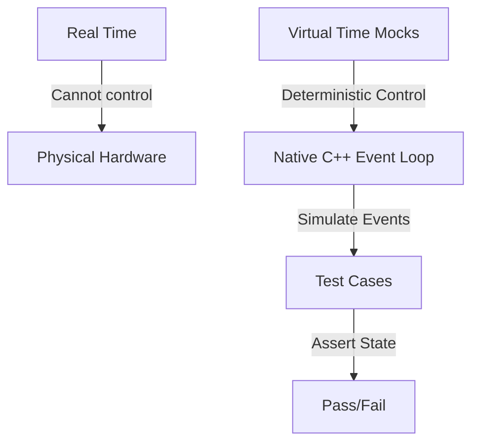

# Test Suite

Welcome to the testing documentation for `DeterministicESPAsyncWebServer`. This repository is designed to be extremely robust, employing **100% hardware-free, deterministic testing**.

Whether you are a beginner looking to understand how C++ testing works or an expert systems engineer designing secure, high-concurrency embedded protocols, this guide explains the architectures, methodologies, and concepts behind our test suite.

---

## 1. Introduction & Core Philosophy

### Why Native Testing?

Traditionally, testing code written for microcontroller frameworks like ESP-IDF or Arduino requires uploading binaries to physical ESP32 chips. This hardware-in-the-loop (HIL) testing has several drawbacks:

- **Slow feedback cycles**: Compiling, flashing, and rebooting microcontrollers takes minutes.
- **Flakiness**: Wireless connections fail, hardware pins float, and components experience wear.
- **Hard-to-reproduce bugs**: Multi-threaded concurrency bugs or network timing jitter cannot be reliably reproduced on physical chips.

`DeterministicESPAsyncWebServer` solves this by executing all test suites **natively** on your development machine (x86/x64 host).

### The Deterministic Asynchronous Model

This server is built on cooperative multitasking. Instead of physical threads, it uses a single-threaded event-driven event loop. Because of this, we can make tests **100% deterministic** through **Time-Travel Mocking**.

Instead of waiting for real-world seconds to elapse to test a connection timeout, the test suite manually increments a virtual clock (`millis()`) and drives the state machine forward manually. This means:

- A 5-second connection timeout can be tested in **less than a millisecond**.
- Execution order is guaranteed to be identical on every single run, eliminating race-condition flakiness.



---

## 2. Test Architecture & Mocking Strategies

To isolate our application code from physical hardware and the operating system's IP stack, we use a custom mocking layer.

### Mocks, Stubs, and Spies

- **Stubs**: Provide canned answers to calls made during the test. For example, our **Filesystem Stub** simulates an SPIFFS/LittleFS system by feeding static file contents from memory arrays instead of reading from a physical hard drive.
- **Mocks**: Objects pre-programmed with expectations that form a specification of the calls they are expected to receive.
- **Virtual Network Taps**: We mock the network stack completely. Instead of binding to real network sockets, we hook the server directly into virtual byte-pumps (ring buffers) that simulate incoming TCP packets.

```
       +---------------------------------------------+
       |                  TEST SUITE                 |
       +----------------------++---------------------+
                              || Simulates network packets
                              \/
       +---------------------------------------------+
       |             VIRTUAL TRANSPORT               |
       |  (mocks sockets, ring buffers, timeouts)    |
       +----------------------++---------------------+
                              || Drives HTTP/SSH bytes
                              \/
       +---------------------------------------------+
       |            CORE WEB SERVER ENGINE           |
       |     (HTTP parser, WebSockets, SSH)          |
       +---------------------------------------------+
```

---

## 3. PlatformIO Test Environments

<!-- BEGIN GENERATED test-environments (edit test/test_matrix.json, run test/gen_test_readme.py) -->

The native test matrix has **216 environments**, one per feature, generated from [test_matrix.json](test_matrix.json) into [platformio.ini](../platformio.ini) by [gen_test_envs.py](gen_test_envs.py). Each compiles a strict per-feature slice of `src/` with its own flags and runs that feature's suite in isolation, so "this feature builds and tests on its own" stays guaranteed.

| Environment | Feature flag(s) | Test suite(s) | Purpose |
| :--- | :--- | :--- | :--- |
| `native` | `ETWS_ENFORCE_HOST_HEADER=0` | `test_transport`, `test_presentation`, `test_session`, `test_http_parser`, `test_websocket`, `test_sse` | Layers 4-6: transport + session + presentation + standalone parser (no app layer) These suites predate the RFC 7230 §5.4 Host rule and feed bare HTTP/1.1 request lines to exercise parser mechanics; H... |
| `native_accept_gate` | `ETWS_ENFORCE_HOST_HEADER=0`, `ETWS_ENABLE_ACCEPT_THROTTLE=1`, `ETWS_ENABLE_PER_IP_THROTTLE=1`, `ETWS_ENABLE_IP_ALLOWLIST=1`, `ETWS_ACCEPT_THROTTLE_MAX=3`, `ETWS_ACCEPT_THROTTLE_WINDOW_MS=1000`, `ETWS_PER_IP_THROTTLE_MAX=2`, `ETWS_PER_IP_THROTTLE_WINDOW_MS=1000`, `ETWS_PER_IP_THROTTLE_SLOTS=4`, `ETWS_IP_ALLOWLIST_SLOTS=4` | `test_accept_gate` | Accept-time connection gates with their flags ON (DETWS_ENABLE_ACCEPT_THROTTLE / PER_IP_THROTTLE / IP_ALLOWLIST): the global fixed-window throttle, the per-source-IP bucket table (independent budgets,... |
| `native_ads1115` | `ETWS_ENABLE_ADS1115=1` | `test_ads1115` | ADS1115 16-bit ADC codec (services/ads1115): building the 16-bit config word for a single-shot single-ended reading (channel MUX, gain, data rate, start/mode/comparator bits, with out-of-range fallbac... |
| `native_amqp` | `ETWS_ENABLE_AMQP=1` | `test_amqp` | AMQP 0-9-1 frame codec (services/amqp): the protocol header, the frame + method builders, the heartbeat, and the frame/method parsers (type/channel/size/payload/0xCE). |
| `native_app` | `BODY_BUF_SIZE=512`, `ETWS_ENFORCE_HOST_HEADER=0`, `ETWS_ENABLE_STATS=1`, `ETWS_ENABLE_METRICS=1`, `ETWS_ENABLE_ETAG=1`, `ETWS_ENABLE_WEB_TERMINAL=1`, `ETWS_HTTP_EMIT_DATE=1` | `test_auth`, `test_file_serving`, `test_multipart`, `test_dispatch`, `test_application`, `test_response_headers`, `test_form_params`, `test_path_params`, `test_digest_auth`, `test_digest_vectors`, `test_template`, `test_middleware`, `test_chunked`, `test_json`, `test_iface`, `test_regex`, `test_web_terminal`, `test_defer` | Full stack including Layer 7 application |
| `native_atc` | `ETWS_ENABLE_ATC=1` | `test_atc` | ATC field-I/O interop snapshot (services/atc): serialize this device's field-I/O map as {"inputs":[...],"outputs":[...]} JSON for an ATC engine over HTTP, plus the output setter and value getter. |
| `native_audit_log` | `ETWS_ENABLE_AUDIT_LOG=1` | `test_audit_log` | Tamper-evident hash-chained audit log (services/audit_log). |
| `native_auth_lockout` | `ETWS_ENABLE_AUTH=1`, `ETWS_ENABLE_AUTH_LOCKOUT=1` | `test_auth_lockout` | Per-IP brute-force auth lockout (services/auth_lockout): exponential-backoff lockout state machine. |
| `native_bacnet` | `ETWS_ENABLE_BACNET=1` | `test_bacnet` | BACnet/IP BVLC + NPDU codec (services/bacnet): the BVLC envelope (type 0x81, function, length) + the NPDU header (version + NPCI control + optional DNET/DADR + hop count) builders and parsers, slicing... |
| `native_ble_gatt` | `ETWS_ENABLE_BLE_GATT=1` | `test_ble_gatt` | Bluetooth ATT codec + GATT bridge (services/ble_gatt): build/parse the common ATT PDUs (read/write/notify/error, LE handles) and serialize a GATT characteristic table as JSON for the web stack. |
| `native_bus_capture` | `ETWS_ENABLE_BUS_CAPTURE=1` | `test_bus_capture` | CAN listen-only capture framing (services/bus_capture): can_to_socketcan() building the 16-byte Linux SocketCAN frame (big-endian can_id, EFF/RTR flags, length, data) and the DLT_CAN_SOCKETCAN libpcap... |
| `native_c37118` | `ETWS_ENABLE_C37118=1` | `test_c37118` | IEEE C37.118.2 synchrophasor frame codec (services/c37118): CRC-CCITT, the frame builder + Command frame, and the CRC-validating parser (type / ids / timestamp / payload). |
| `native_canopen` | `ETWS_ENABLE_CANOPEN=1` | `test_canopen` | CANopen (CiA 301) message codec (services/canopen): NMT, SYNC, heartbeat, EMCY, PDO, and expedited SDO read/write/abort + the COB-ID classifier, over the shared CAN frame (shared_primitives/can.h). |
| `native_cbor` | `ETWS_ENABLE_CBOR=1` | `test_cbor` | CBOR (RFC 8949) encoder (network_drivers/presentation/cbor): a pure byte-output codec, host-tested against the RFC 8949 Appendix A vectors. |
| `native_cc1101` | `ETWS_ENABLE_CC1101=1` | `test_cc1101` | CC1101 sub-GHz radio driver (services/cc1101): the TI SPI header protocol (config registers, command strobes, status registers, TX/RX FIFO) - init/detect, variable-length send, TX-done, set-rx, packet... |
| `native_cclink` | `ETWS_ENABLE_CCLINK=1` | `test_cclink` | CC-Link cyclic fieldbus frame codec (services/cclink): the frame ([station][command][bit data][word data][sum]) build + parse and the bit/word process-image accessors. |
| `native_cip` | `ETWS_ENABLE_CIP=1` | `test_cip` | CIP message codec (services/cip): the EPATH logical-segment builder, the request builders (Get_Attribute_Single), and the response parser (service / status / data). |
| `native_clock` | default | `test_clock` | Pluggable monotonic clock (services/det_clock): default millis(), custom clock divided down to the internal 1000 Hz. |
| `native_cloudevents` | `ETWS_ENABLE_CLOUDEVENTS=1` | `test_cloudevents` | CloudEvents v1.0 envelope (services/cloudevents): the structured-JSON builder (over the JSON writer) + the binary-mode ce-* header reader. |
| `native_coap` | `ETWS_ENABLE_COAP=1`, `ETWS_ENABLE_COAP_BLOCK=1`, `ETWS_COAP_BLOCK_SZX_MAX=2`, `ETWS_COAP_BLOCK1_MAX=128` | `test_coap` | CoAP server (RFC 7252) message codec + resource dispatch. |
| `native_coap_observe` | `ETWS_ENABLE_COAP=1`, `ETWS_ENABLE_COAP_BLOCK=1`, `ETWS_COAP_BLOCK_SZX_MAX=2`, `ETWS_COAP_BLOCK1_MAX=128`, `ETWS_ENABLE_COAP_OBSERVE=1` | `test_coap` | CoAP with resource observation (RFC 7641) enabled. |
| `native_codeql` | `ETWS_ENABLE_CSRF=1`, `ETWS_ENABLE_AUTH_LOCKOUT=1`, `ETWS_ENABLE_IP_ALLOWLIST=1`, `ETWS_ENABLE_WS_DEFLATE=1`, `ETWS_ENABLE_TIME_SOURCE=1`, `ETWS_ENABLE_CONFIG_STORE=1`, `ETWS_ENABLE_DEVICE_ID=1`, `ETWS_ENABLE_TELEMETRY=1`, `ETWS_ENABLE_DASHBOARD=1`, `ETWS_ENABLE_PARTITION_MONITOR=1`, `ETWS_ENABLE_CBOR=1`, `ETWS_ENABLE_MSGPACK=1`, `ETWS_ENABLE_GPIO_MAP=1`, `ETWS_ENABLE_UDP_TELEMETRY=1`, `ETWS_ENABLE_GUARDRAILS=1`, `ETWS_ENABLE_FAILSAFE=1`, `ETWS_ENABLE_SLEEP_SCHED=1`, `ETWS_ENABLE_WEARLEVEL=1`, `ETWS_ENABLE_NETADAPT=1`, `ETWS_ENABLE_DSHOT=1`, `ETWS_ENABLE_HART=1`, `ETWS_ENABLE_NTS=1`, `ETWS_ENABLE_DDS=1`, `ETWS_ENABLE_XMPP=1`, `ETWS_ENABLE_RAWL2=1`, `ETWS_ENABLE_SPA_ROUTER=1`, `ETWS_ENABLE_GOOSE=1`, `ETWS_ENABLE_MTCONNECT=1`, `ETWS_ENABLE_J2735=1`, `ETWS_ENABLE_NEMA_TS2=1`, `ETWS_ENABLE_SNP=1`, `ETWS_ENABLE_DIRECTNET=1`, `ETWS_ENABLE_SEP2=1`, `ETWS_ENABLE_PROFINET=1`, `ETWS_ENABLE_NTCIP=1`, `ETWS_ENABLE_OPENADR=1`, `ETWS_ENABLE_MMS=1`, `ETWS_ENABLE_CCLINK=1`, `ETWS_ENABLE_POWERLINK=1`, `ETWS_ENABLE_SERCOS=1`, `ETWS_ENABLE_PROFIBUS=1`, `ETWS_ENABLE_LONWORKS=1`, `ETWS_ENABLE_MBPLUS=1`, `ETWS_ENABLE_INTERBUS=1`, `ETWS_ENABLE_ICCP=1`, `ETWS_ENABLE_WAVE=1`, `ETWS_ENABLE_UTMC=1`, `ETWS_ENABLE_OCIT=1`, `ETWS_ENABLE_ATC=1`, `ETWS_ENABLE_SOUTHBOUND=1`, `ETWS_ENABLE_EXC_DECODER=1`, `ETWS_ENABLE_HTTP_DELIVERY=1`, `ETWS_ENABLE_HW_HEALTH=1`, `ETWS_ENABLE_MDNS_ADAPTIVE=1`, `ETWS_ENABLE_SOCKPOOL=1`, `ETWS_ENABLE_PSRAM_POOL=1`, `ETWS_ENABLE_HAPPY_EYEBALLS=1`, `ETWS_ENABLE_WIFI_SNIFFER=1`, `ETWS_ENABLE_LINK_MANAGER=1`, `ETWS_ENABLE_CC1101=1`, `ETWS_ENABLE_FDC2214=1`, `ETWS_ENABLE_LDC1614=1`, `ETWS_ENABLE_VL53L0X=1`, `ETWS_ENABLE_RADIO_SNIFF=1`, `ETWS_ENABLE_BLE_GATT=1`, `ETWS_ENABLE_TLS_POLICY=1`, `ETWS_ENABLE_WISUN=1`, `ETWS_ENABLE_LOGBUF=1`, `ETWS_ENABLE_OTA_ROLLBACK=1`, `ETWS_ENABLE_TOTP=1`, `ETWS_ENABLE_WEBHOOK=1`, `ETWS_ENABLE_RADIO_POWER=1`, `ETWS_ENABLE_AUDIT_LOG=1`, `ETWS_ENABLE_OIDC=1`, `ETWS_ENABLE_VFS=1`, `ETWS_ENABLE_GRAPHQL=1`, `ETWS_ENABLE_ESPNOW=1`, `ETWS_ENABLE_OAUTH2=1`, `ETWS_ENABLE_OPCUA=1`, `ETWS_ENABLE_OPCUA_CLIENT=1` | `test_dispatch` | CodeQL coverage env: the full app compiled with every new feature flag ON so CodeQL traces the integration paths (CSRF / lockout / allowlist gates, permessage-deflate) AND the new service modules, whi... |
| `native_compliance` | default | `test_compliance` | RFC-compliance suite: builds with all enforcement at production defaults (DETWS_ENFORCE_HOST_HEADER=1) and exercises the strict behaviors. |
| `native_concurrency` | `O1`, `pthread` | `test_concurrency` | Concurrency proof for the cross-thread slot fields (DetAtomic state / rx_head / rx_tail). |
| `native_config_io` | `ETWS_ENABLE_CONFIG_STORE=1`, `ETWS_ENABLE_CONFIG_IO=1` | `test_config_io` | Schema-driven config export/restore (services/config_io) over the config store; round-trip host-tested against the in-memory backend. |
| `native_config_store` | `ETWS_ENABLE_CONFIG_STORE=1` | `test_config_store` | Typed NVS config store (services/config_store): string/u32/blob round-trips, defaults, capacity, erase/clear - run against the host in-memory backend (the ESP32 Preferences/NVS backend is compiled in ... |
| `native_cotp` | `ETWS_ENABLE_COTP=1` | `test_cotp` | TPKT (RFC 1006) + COTP X.224 class-0 frame codec (services/cotp): the TPKT envelope, the COTP Data TPDU + Connection Request builders, and the COTP parser. |
| `native_crypto_kat` | `ETWS_ENABLE_HTTP3=1` | `test_crypto_kat` | Data-driven external crypto known-answer tests: HMAC-SHA256/512, AEAD_AES_128_GCM, X25519, and Ed25519 verify from Project Wycheproof (including its adversarial edge cases), plus HKDF-SHA256 Extract (... |
| `native_csrf` | `ETWS_ENABLE_CSRF=1` | `test_csrf` | Stateless HMAC-signed CSRF token (services/csrf): issue/verify with a fixed secret unit-tests on the host (DETWS_ENABLE_CSRF set). |
| `native_dashboard` | `ETWS_ENABLE_DASHBOARD=1` | `test_dashboard` | Dashboard widget-table JSON serializers (services/dashboard core). |
| `native_dbm` | `ETWS_ENABLE_WAL=1`, `ETWS_ENABLE_DBM=1` | `test_dbm` | Log-structured hash key-value store on the WAL (services/dbm): put/get/delete with an in-RAM open-addressed index and value data appended to the write-ahead log, plus index rebuild by replaying the lo... |
| `native_dds` | `ETWS_ENABLE_DDS=1` | `test_dds` | DDS / RTPS framing codec (services/dds): the 20-octet RTPS header (magic/version/vendor/ guidPrefix) and the submessage TLV (id/flags/octetsToNextHeader, endianness flag), build + parse. |
| `native_deflate` | `ETWS_ENABLE_WS_DEFLATE=1` | `test_deflate` | RFC 1951 DEFLATE core (the WebSocket permessage-deflate compressor). |
| `native_det_arena` | default | `test_det_arena` | Unified double-ended server arena (network_drivers/session/det_arena): first-fit persistent end (bottom, individual free + coalesce + boundary shrink) + bump scratch end (top, mark/release/reset) shar... |
| `native_det_ip` | default | `test_det_ip` | IP address core (network_drivers/network/det_ip): RFC 4291 IPv4/IPv6 text parsing, RFC 5952 canonical formatting (:: zero-compression, v4-mapped), and scope classification (loopback / link-local / pri... |
| `native_det_primitives` | default | `test_det_primitives` | Shared no-stdlib primitives (shared_primitives): the base-10 det_strtol/strtoul/strtof number parsers (numparse.h) and the strict RFC 3629 UTF-8 validator (utf8.h). |
| `native_device_id` | `ETWS_ENABLE_DEVICE_ID=1` | `test_device_id` | MAC-derived device UUID (services/device_id): RFC 4122 v5 from a MAC via SHA-1. |
| `native_devicenet` | `ETWS_ENABLE_DEVICENET=1` | `test_devicenet` | DeviceNet link-adaptation codec (services/devicenet): the 4-group 11-bit CAN id, explicit-message header octet, single-frame explicit messages, and the fragmentation reassembler (CIP over CAN; the CIP... |
| `native_df1` | `ETWS_ENABLE_DF1=1` | `test_df1` | Allen-Bradley DF1 full-duplex frame codec (services/df1): BCC + CRC-16/ARC, the frame builder with DLE byte-stuffing, and the validating, un-stuffing parser. |
| `native_diag` | `ETWS_ENABLE_DIAG=1` | `test_diag` | Runtime build-flag reporter (server.diag() / DETWS_ENABLE_DIAG). |
| `native_directnet` | `ETWS_ENABLE_DIRECTNET=1` | `test_directnet` | AutomationDirect DirectNET serial frame codec (services/directnet): the header (SOH + ASCII-hex slave/type/addr/blocks + ETB + LRC) and data (STX + data + ETX + LRC) frames build/parse. |
| `native_dma` | `ETWS_ENABLE_DMA=1`, `ETWS_DMA_BUF_SIZE=8`, `ETWS_DMA_CHANNELS=2` | `test_dma` | DMA peripheral ingest / egress simulator (services/dma), v5 hardware ingest: an ingress feed surfaces as RX completion events, a full buffer ping-pongs and re-arms, egress DMA is captured, TX is one-i... |
| `native_dmx` | `ETWS_ENABLE_DMX=1` | `test_dmx` | DMX512 + RDM lighting codec (services/dmx): the DMX512 slot packet (build/get) and the RDM (ANSI E1.20) packet build/parse with 48-bit UIDs and the 16-bit additive checksum. |
| `native_dnc` | `ETWS_ENABLE_DNC=1` | `test_dnc`, `test_dnc_stream` | CNC DNC drip-feed (services/dnc): the EIA RS-244 <-> ISO/ASCII tape-code translation (odd-parity EIA table), ISO even parity, G-code block framing with '%' rewind-stop and leader runout, XON/XOFF flow... |
| `native_dnp3` | `ETWS_ENABLE_DNP3=1` | `test_dnp3` | DNP3 (IEEE 1815) data-link frame codec (services/dnp3): CRC-16/DNP, the frame builder (0x0564 header + CRC'd 16-octet data blocks) and the CRC-validating, de-blocking parser. |
| `native_dns_resolver` | `ETWS_ENABLE_DNS_RESOLVER=1` | `test_dns_resolver` | DNS resolver answer classifier/verifier (services/dns_resolver): host-tested; the lwIP resolve is ESP32-only. |
| `native_dns_server` | `ETWS_ENABLE_DNS_SERVER=1` | `test_dns_server` | Authoritative DNS server (services/dns_server): the pure A-record response builder (QNAME parse, compressed A answer, NXDOMAIN, non-A query, header flags, malformed guards) and the built-in name->IP t... |
| `native_docstore` | `ETWS_ENABLE_WAL=1`, `ETWS_ENABLE_DBM=1`, `ETWS_ENABLE_DOCSTORE=1` | `test_docstore` | Local JSON document store on the WAL (services/docstore): JSON documents addressed by id, stored via dbm on the write-ahead log, plus top-level field queries (find documents whose JSON field equals a ... |
| `native_dshot` | `ETWS_ENABLE_DSHOT=1` | `test_dshot` | DShot ESC throttle codec (services/dshot): the 16-bit frame (11-bit value + telemetry + 4-bit nibble-xor CRC), the bidirectional inverted-CRC variant, decode/validate, and per-rate bit timing. |
| `native_enip` | `ETWS_ENABLE_ENIP=1` | `test_enip` | EtherNet/IP encapsulation codec (services/enip): the 24-octet header, RegisterSession + SendRRData builders (Common Packet Format), and the SendRRData reply extractor. |
| `native_enocean` | `ETWS_ENABLE_ENOCEAN=1`, `ETWS_ENOCEAN_MAX_DATA=16` | `test_enocean` | EnOcean ESP3 serial codec (services/enocean), v5 radio plugin: the CRC-8 (poly 0x07) against known answers, a build -> parse round trip, malformed framing (bad sync / header CRC / data CRC), incomplet... |
| `native_espnow` | `ETWS_ENABLE_ESPNOW=1` | `test_espnow` | ESP-NOW peer messaging (services/espnow) - the envelope codec + peer registry are host-tested here; the esp_now radio binding is ESP32-only. |
| `native_exc_decoder` | `ETWS_ENABLE_EXC_DECODER=1` | `test_exc_decoder` | ESP32 panic / exception decoder (services/exc_decoder): parse a captured Guru Meditation dump (cause, register PC + EXCVADDR, backtrace PC:SP frames) into a structured ExcInfo and serialize it as JSON... |
| `native_failsafe` | `ETWS_ENABLE_FAILSAFE=1` | `test_failsafe` | Software watchdog / deadlock detection + safe-state (services/failsafe): the wrap-safe overdue predicate, the lifeline registry, fire-once-per-episode breach callback, and JSON. |
| `native_fdc2214` | `ETWS_ENABLE_FDC2214=1` | `test_fdc2214` | FDC2114/2214 capacitance-to-digital field sensor (services/fdc2214): the 28-bit data combine + error flags, the frequency scale (data/2^28 * fref), and the single-channel config-sequence builder. |
| `native_fins` | `ETWS_ENABLE_FINS=1` | `test_fins` | Omron FINS frame codec (services/fins): the command builder + Memory Area Read convenience + the command / response parsers (10-octet header, MRC/SRC, MRES/SRES end code). |
| `native_flow_export` | `ETWS_ENABLE_FLOW_EXPORT=1` | `test_flow_export` | Flow-record export codec (services/flow_export): NetFlow v5 fixed header/record builders + the NetFlow v9 / IPFIX template-then-data cursor (length/count patching, v9 4-octet padding). |
| `native_forward` | `ETWS_ENABLE_FORWARD=1`, `ETWS_FWD_MAX_IFACES=4`, `ETWS_FWD_MAX_RULES=4`, `ETWS_FWD_MAX_ACL=4`, `ETWS_FWD_MAX_ROUTES=4`, `ETWS_FWD_INSPECT=1` | `test_forward` | Interface forwarding plane (services/forward), v5 bridge / router: default-deny, an ALLOW rule forwards, a DENY wins, multi-destination fan-out, no reflection to the source, the per-rule rate cap (hos... |
| `native_ftp` | `ETWS_ENABLE_FTP=1` | `test_ftp` | FTP client wire codec (services/ftp, RFC 959 + RFC 2428): the control-command builders (generic verb + PORT + EPRT), the single/multi-line 3-digit reply parser, and the PASV / EPSV data-address decoders. |
| `native_gateway` | `ETWS_ENABLE_GATEWAY=1`, `ETWS_GW_MAX_PORTS=4` | `test_gateway` | Radio / wireless gateway bridge (services/gateway), v5 southbound-to-northbound: an uplink envelopes a received frame (src address / port / rssi / seq) and publishes it, fail-closed on no sink / unkno... |
| `native_goose` | `ETWS_ENABLE_GOOSE=1` | `test_goose` | IEC 61850 GOOSE publisher codec (services/goose): the BER IECGoosePdu (gocbRef..allData, minimal-length INTEGERs with the positive leading-zero rule) + the GOOSE header + Ethernet frame (ethertype 0x8... |
| `native_gpio_map` | `ETWS_ENABLE_GPIO_MAP=1` | `test_gpio_map` | GPIO pin-mapper / browser diag core (services/gpio_map): direction names, JSON serializer, control-POST parser, output guard - all pure and host-tested. |
| `native_graphql` | `ETWS_ENABLE_GRAPHQL=1` | `test_graphql` | GraphQL query subset (services/graphql) - pure parser + executor, host-tested with a demo resolver. |
| `native_grpcweb` | `ETWS_ENABLE_GRPC_WEB=1` | `test_grpcweb` | gRPC-Web message framing codec (services/grpcweb): the 5-octet length-prefixed message frame builder + the 0x80 trailers frame (grpc-status / grpc-message) + the frame parser. |
| `native_guardrails` | `ETWS_ENABLE_GUARDRAILS=1` | `test_guardrails` | Heap/stack guardrails (services/guardrails): threshold evaluator + JSON, host-tested. |
| `native_h2conn` | `ETWS_ENABLE_HTTP2=1` | `test_h2_conn` | HTTP/2 connection engine (network_drivers/presentation/http2/h2_conn, RFC 9113): initial SETTINGS on init, preface + client SETTINGS -> SETTINGS ACK, decoding a real HPACK-encoded request into the hea... |
| `native_h2frame` | `ETWS_ENABLE_HTTP2=1` | `test_h2_frame` | HTTP/2 binary framing (network_drivers/presentation/http2/h2_frame, RFC 9113): the 9-byte frame header parse/write (24-bit length, reserved-bit masking), SETTINGS build + parse with validation, and th... |
| `native_h3_conn` | `ETWS_ENABLE_HTTP3=1` | `test_h3_conn` | HTTP/3 application engine (network_drivers/presentation/http3/h3_conn, RFC 9114): drives h3_conn through the quic_conn callback seam - a QPACK-encoded request on a request stream dispatches the right ... |
| `native_h3_e2e` | `ETWS_ENABLE_HTTP3=1` | `test_h3_e2e` | End-to-end HTTP/3 capstone (network_drivers/presentation/http3): a QUIC client in the test completes the TLS 1.3 handshake against a quic_conn + h3_conn server, sends a real HTTP/3 GET (QPACK HEADERS ... |
| `native_h3_server` | `ETWS_ENABLE_HTTP3=1` | `test_h3_server` | HTTP/3 dispatch bridge end-to-end through DetWebServer (the full Layer-7 app built with DETWS_ENABLE_HTTP3=1): a QUIC client completes the handshake and sends an HTTP/3 GET, quic_server routes it to t... |
| `native_h3frame` | `ETWS_ENABLE_HTTP3=1` | `test_h3_frame` | HTTP/3 framing (network_drivers/presentation/http3/h3_frame, RFC 9114 sec 7): the type+length varint header parse/write (incl. |
| `native_happy_eyeballs` | `ETWS_ENABLE_HAPPY_EYEBALLS=1` | `test_happy_eyeballs` | Dual-stack Happy Eyeballs selection (services/happy_eyeballs): RFC 6724 destination preference scoring, the candidate-list sort + RFC 8305 address-family interleave, and the Connection Attempt Delay g... |
| `native_hart` | `ETWS_ENABLE_HART=1` | `test_hart` | HART / HART-IP codec (services/hart): the HART command frame (longitudinal XOR checksum, short + long addressing) build/parse and the 8-octet HART-IP message header. |
| `native_hostlink` | `ETWS_ENABLE_HOSTLINK=1` | `test_hostlink` | Omron Host Link (C-mode) frame codec (services/hostlink): the FCS (XOR), the ASCII command builder (@UU + header + text + FCS + *CR), and the FCS-validating parser + end-code reader. |
| `native_hpack` | `ETWS_ENABLE_HTTP2=1` | `test_hpack` | HPACK header compression for HTTP/2 (RFC 7541): prefix-integer coding (App C.1), the Huffman string code (App B / C.4.1), the first-request decode with dynamic-table insertion (C.3.1), dynamic-table i... |
| `native_http_client` | `ETWS_ENABLE_HTTP_CLIENT=1` | `test_http_client` | Outbound HTTP client: URL parser + request builder + response parser. |
| `native_http_delivery` | `ETWS_ENABLE_HTTP_DELIVERY=1` | `test_http_delivery` | HTTP delivery optimizations (services/http_delivery): RFC 5861 stale-while-revalidate decision + Cache-Control builder, RFC 7233 byte-range delta/offset fetch (X-Y / X- / -N parse + a 206 Content-Rang... |
| `native_httpcache` | `ETWS_ENABLE_HTTP_CACHE=1` | `test_httpcache` | HTTP Cache-Control helpers (services/httpcache, RFC 9111 + 8246 + 5861): the structured directive builder + first-class origin presets (immutable asset / shared / no-store / revalidatable), the tolera... |
| `native_hw_health` | `ETWS_ENABLE_HW_HEALTH=1` | `test_hw_health` | Hardware-health diagnostics (services/hw_health): power-rail voltage-drop logger (worst droop + sag/brownout counts), SPI-bus CRC audit with hysteretic clock backoff, GPIO short-circuit test (driven v... |
| `native_iccp` | `ETWS_ENABLE_ICCP=1` | `test_iccp` | ICCP / TASE.2 (IEC 60870-6) Data_Value codec (services/iccp): the StateQ (state + quality) and RealQ (scaled INTEGER + quality) indication-point BER structures with optional timestamp. |
| `native_iec60870` | `ETWS_ENABLE_IEC60870=1` | `test_iec60870` | IEC 60870-5-101/-104 codec (services/iec60870): the -104 APCI (I/S/U), the ASDU header + 3-octet IOA, and the -101 FT1.2 fixed/variable link frames (sum checksum). |
| `native_ina219` | `ETWS_ENABLE_INA219=1` | `test_ina219` | INA219 current/power codec (services/ina219): decoding the bus-voltage register (bits [15:3], LSB 4 mV, status bits ignored) and the shunt-voltage register (signed, LSB 10 uV), computing the calibrati... |
| `native_inflate` | `ETWS_ENABLE_WS_DEFLATE=1` | `test_inflate` | RFC 1951 INFLATE core (the WebSocket permessage-deflate decompressor). |
| `native_interbus` | `ETWS_ENABLE_INTERBUS=1` | `test_interbus` | INTERBUS summation-frame codec (services/interbus): the summation frame (loopback + per-device 16-bit slices + CRC-16/CCITT FCS) assemble + disassemble. |
| `native_iolink` | `ETWS_ENABLE_IOLINK=1` | `test_iolink` | IO-Link (SDCI) data-link message codec (services/iolink): the MC / CKT / CKS control octets and the SDCI checksum (seed 0x52 + the 8->6 compression of IO-Link spec A.1.6), with a hand-computed known-a... |
| `native_j1939` | `ETWS_ENABLE_J1939=1` | `test_j1939` | SAE J1939 codec (services/j1939): 29-bit id encode/decode (PDU1 + PDU2), single-frame messages, Request PGN, Address Claimed + NAME, and the Transport Protocol (BAM + TP.DT) reassembler, over the shar... |
| `native_j2735` | `ETWS_ENABLE_J2735=1` | `test_j2735` | SAE J2735 V2X codec (services/j2735): the ASN.1 UPER bit primitive layer (constrained INTEGER / BOOLEAN / bit fields) and the BSMcore block encode/decode. |
| `native_jwt` | `ETWS_ENABLE_JWT=1` | `test_jwt` | JWT (HS256) bearer-auth verification. |
| `native_keepalive` | `ETWS_ENFORCE_HOST_HEADER=0`, `ETWS_ENABLE_KEEPALIVE=1`, `ETWS_KEEPALIVE_MAX_REQUESTS=3` | `test_keepalive` | HTTP/1.1 keep-alive (persistent connections): full server built with DETWS_ENABLE_KEEPALIVE=1; a small per-connection request cap makes the fairness-bound test fast. |
| `native_ld2410` | `ETWS_ENABLE_LD2410=1` | `test_ld2410` | LD2410 mmWave radar codec (services/ld2410): decoding a basic and an engineering-mode report frame, rejecting malformed frames, the byte-by-byte stream reassembler (resync past noise, split feeds, abs... |
| `native_ldc1614` | `ETWS_ENABLE_LDC1614=1` | `test_ldc1614` | LDC1614 inductance-to-digital field sensor (services/ldc1614): the 28-bit data combine + error flags, the frequency scale (data/2^28 * fref), and the single-channel config-sequence builder. |
| `native_link_manager` | `ETWS_ENABLE_LINK_MANAGER=1` | `test_link_manager` | Multi-interface egress selection (services/link_manager): a table of interfaces (kind + priority + up/down) with deterministic best-link-up selection, graceful escalation to a higher-priority interfac... |
| `native_logbuf` | `ETWS_ENABLE_LOGBUF=1` | `test_logbuf` | Rotating log ring + severity trap (services/logbuf): pure, fully host-tested. |
| `native_lonworks` | `ETWS_ENABLE_LONWORKS=1` | `test_lonworks` | LonWorks / LON-IP network-variable codec (services/lonworks): the LonTalk NV PDU ([msg-code][14-bit selector][value]) build + parse and the SNVT_temp / SNVT_switch scalar encodings. |
| `native_lora` | `ETWS_ENABLE_LORA=1` | `test_lora` | LoRa codec + SX127x driver (services/lora), v5 radio plugin: the RadioHead 4-byte header parse/build, and the SX127x register protocol (init / send / tx-done / set-rx / recv) exercised against a mock ... |
| `native_lwm2m_tlv` | `ETWS_ENABLE_LWM2M=1` | `test_lwm2m_tlv` | OMA LwM2M TLV codec (services/lwm2m): the writer (raw + int / bool / string / float value helpers, 8-/16-bit ids, inline / 8-/16-/24-bit lengths) + the cursor reader + integer value decoding. |
| `native_mbplus` | `ETWS_ENABLE_MBPLUS=1` | `test_mbplus` | Modbus Plus HDLC token-bus codec (services/mbplus): the HDLC frame (7E addr ctrl payload CRC-16/X-25 7E) build + validate and the token-rotation ring helper. |
| `native_mbus` | `ETWS_ENABLE_MBUS=1` | `test_mbus` | Wired M-Bus codec (services/mbus): the ACK / short / long frame builders + parser (start/stop, doubled length, 8-bit sum checksum) and the EN 13757-3 variable-data record walker (DIF/VIF, DIFE/VIFE ch... |
| `native_mdns_adaptive` | `ETWS_ENABLE_MDNS_ADAPTIVE=1` | `test_mdns_adaptive` | Adaptive mDNS beacon scheduling (services/mdns_adaptive): RF-contention backoff/recovery of the announce interval, the TTL/2 continuous-refresher cadence, the announce-due check, and the auto-sleep be... |
| `native_melsec` | `ETWS_ENABLE_MELSEC=1` | `test_melsec` | Mitsubishi MELSEC MC binary 3E codec (services/melsec): the batch-read request builder (little-endian, subheader 0x5000, command 0x0401, device code + 24-bit head device) + the 0xD000 response parser. |
| `native_mms` | `ETWS_ENABLE_MMS=1` | `test_mms` | IEC 61850 MMS PDU codec (services/mms): the BER confirmed-request/response Read PDUs (invokeID + read service + named ObjectName), build + parse. |
| `native_modbus` | `ETWS_ENABLE_MODBUS=1`, `ETWS_ENABLE_MODBUS_RTU=1` | `test_modbus` | Modbus TCP slave core + RTU framing (Modbus Application Protocol): the data model + MBAP/PDU codec + the RTU ADU codec (CRC16 + [addr][PDU][CRC]). |
| `native_modbus_master` | `ETWS_ENABLE_MODBUS=1`, `ETWS_ENABLE_MODBUS_MASTER=1` | `test_modbus_master` | Modbus master codec + scanner (services/modbus/modbus_master): build read requests, parse responses; host-tested as a round-trip against the slave codec. |
| `native_mpr121` | `ETWS_ENABLE_MPR121=1` | `test_mpr121` | MPR121 capacitive-touch codec (services/mpr121): decoding the touch-status word into an electrode bitmask (masking proximity / over-current), the per-electrode touched test, the proximity / over-curre... |
| `native_mqtt` | `ETWS_ENABLE_MQTT=1` | `test_mqtt` |  |
| `native_mqtt_sn` | `ETWS_ENABLE_MQTT_SN=1` | `test_mqtt_sn` | MQTT-SN v1.2 wire codec (services/mqtt/mqtt_sn): the zero-heap message builders (CONNECT/REGISTER/PUBLISH/SUBSCRIBE/PINGREQ/DISCONNECT/SEARCHGW) + the Length+MsgType header parser (1- and 3-octet form... |
| `native_msgpack` | `ETWS_ENABLE_MSGPACK=1` | `test_msgpack` | MessagePack encoder (network_drivers/presentation/msgpack): a pure byte-output codec, host-tested against the spec encodings. |
| `native_mtconnect` | `ETWS_ENABLE_MTCONNECT=1` | `test_mtconnect` | MTConnect agent response codec (services/mtconnect, ANSI/MTC1.4): the incremental MTConnectStreams builder (header + Samples/Events/Condition), the MTConnectDevices probe (device model), the MTConnect... |
| `native_nats` | `ETWS_ENABLE_NATS=1` | `test_nats` | NATS client protocol codec (services/nats): the CONNECT / PUB / SUB / UNSUB / PING / PONG builders + the inbound MSG / INFO / PING / +OK / -ERR parser (subject/sid/reply/payload). |
| `native_nema_ts2` | `ETWS_ENABLE_NEMA_TS2=1` | `test_nema_ts2` | NEMA TS 2 SDLC frame codec (services/nema_ts2): the traffic-cabinet bus frame ([address][control][frame-type][data][CRC-16/X-25]) build + validate. |
| `native_net_egress` | default | `test_net_egress` | Egress-interface reporting (network_drivers/physical). |
| `native_netadapt` | `ETWS_ENABLE_NETADAPT=1` | `test_netadapt` | Network adaptation decisions (services/netadapt): TCP receive-window sizing from the free heap (reserve + quarter-of-spare, clamped) and the DHCP->static-IP fallback trigger. |
| `native_nmea0183` | `ETWS_ENABLE_NMEA0183=1` | `test_nmea0183` | NMEA 0183 sentence codec (services/nmea0183): the XOR checksum, sentence build, parse (field splitting, talker/type, checksum validation) against the canonical GGA vector, and the field-value helpers. |
| `native_nmea2000` | `ETWS_ENABLE_NMEA2000=1` | `test_nmea2000` | NMEA 2000 codec (services/nmea2000): single-frame messages plus the Fast Packet transport (frame count, build, reassembly), built on the J1939 id codec (implied). |
| `native_nrf24` | `ETWS_ENABLE_NRF24=1`, `ETWS_NRF24_PAYLOAD=8` | `test_nrf24` | nRF24L01+ driver (services/nrf24), v5 radio plugin: the Nordic SPI command protocol (STATUS shifted out first, W/R_REGISTER, W_TX/R_RX_PAYLOAD, write-1-to-clear) exercised against a mock chip - init /... |
| `native_ntcip` | `ETWS_ENABLE_NTCIP=1` | `test_ntcip` | NTCIP transportation object OIDs (services/ntcip): the NTCIP 1202 signal-controller + 1203 DMS object roots under 1.3.6.1.4.1.1206.4.2 and the OID builder (root + instance index), for the shipped SNMP... |
| `native_ntp_server` | `ETWS_ENABLE_NTP_SERVER=1` | `test_ntp_server` | NTP/SNTP server (RFC 5905 server mode) response codec (ntp_server_build_response): version echo, mode/LI/stratum, origin-timestamp copy, reference/receive/transmit stamps, big-endian encoding, and the... |
| `native_nts` | `ETWS_ENABLE_NTS=1` | `test_nts` | Network Time Security codec (services/nts, RFC 8915): the NTS-KE TLV records (build the standard request, parse a response) and the NTS NTP extension-field framing (unique id / cookie, RFC 7822 4-byte... |
| `native_oauth2` | `ETWS_ENABLE_OAUTH2=1` | `test_oauth2` | OAuth2 token-endpoint client (services/oauth2) - the form-body builder + JSON token-response parser are host-tested (the parser reuses the JSON reader); the HTTP exchange is ESP32-only. |
| `native_observability` | `ETWS_ENABLE_OBSERVABILITY=1` | `test_observability` | Transport observability (DETWS_ENABLE_OBSERVABILITY): the det_conn_on_event hook, by-reason counters, the live CONN_CLOSING gauge, and that the real lwIP callbacks (recv FIN / error / timeout / local ... |
| `native_ocit` | `ETWS_ENABLE_OCIT=1` | `test_ocit` | OCIT-Outstations message codec (services/ocit): the object message ([msg-type][object-type][instance][data-type][value]) build + parse and the typed-value accessors. |
| `native_oidc` | `ETWS_ENABLE_OIDC=1` | `test_oidc` | OIDC RS256 ID-token verifier (services/oidc). |
| `native_opcua` | `ETWS_ENABLE_OPCUA=1` | `test_opcua` | OPC UA Binary increment 1 (services/opcua) - the type codec, UACP framing, and Hello/Acknowledge handshake are host-tested here; the TCP server (opcua_rx) is ESP32-only. |
| `native_opcua_client` | `ETWS_ENABLE_OPCUA=1`, `ETWS_ENABLE_OPCUA_CLIENT=1` | `test_opcua_client` |  |
| `native_openadr` | `ETWS_ENABLE_OPENADR=1` | `test_openadr` | OpenADR 3.0 JSON codec (services/openadr): the event (programID + eventName + interval payloads) and report (VEN reading) JSON documents build, with escaping + a no-stdlib 3-decimal formatter. |
| `native_ota` | `ETWS_ENFORCE_HOST_HEADER=0`, `ETWS_ENABLE_OTA=1` | `test_http_ota` | Parser streaming-body hook (OTA) - exercises http_parser with DETWS_ENABLE_OTA=1 using a mock sink (no ESP32 Update dependency). |
| `native_ota_rollback` | `ETWS_ENABLE_OTA_ROLLBACK=1` | `test_ota_rollback` | OTA rollback decision (services/ota_rollback): pure decision matrix host-tested; the esp_ota commit/rollback are ESP32-only. |
| `native_partition` | `ETWS_ENABLE_PARTITION_MONITOR=1` | `test_partition_monitor` | Flash partition-map monitor (services/partition_monitor core): the kind classifier + JSON serializer host-test here; the esp_partition walk is ESP32-only. |
| `native_pca9685` | `ETWS_ENABLE_PCA9685=1` | `test_pca9685` | PCA9685 PWM/servo codec (services/pca9685): the PRESCALE computation from a PWM frequency (with clamping), the per-channel register address, the servo pulse-width -> 12-bit count conversion (with clam... |
| `native_pentest` | `ETWS_ENABLE_MODBUS=1`, `ETWS_ENABLE_MODBUS_MASTER=1`, `ETWS_ENABLE_TOTP=1`, `ETWS_ENABLE_MULTIPART=1`, `ETWS_ENABLE_CBOR=1`, `ETWS_ENABLE_MSGPACK=1`, `ETWS_ENABLE_COAP=1`, `ETWS_ENABLE_COAP_BLOCK=1`, `ETWS_COAP_BLOCK_SZX_MAX=2`, `ETWS_COAP_BLOCK1_MAX=128`, `ETWS_ENABLE_SNMP=1`, `ETWS_ENABLE_SQLITE=1`, `ETWS_ENABLE_REDIS=1`, `ETWS_ENABLE_OPCUA=1`, `ETWS_ENABLE_GRAPHQL=1`, `ETWS_ENABLE_DNS_SERVER=1`, `ETWS_ENABLE_DNP3=1`, `ETWS_ENABLE_STOMP=1`, `ETWS_ENABLE_SMB=1`, `ETWS_ENABLE_DNC=1` | `test_pentest` | Adversarial / pentest harness - run SEPARATELY (`pio test -e native_pentest`), NOT part of run_tests.sh. |
| `native_pn532` | `ETWS_ENABLE_PN532=1`, `ETWS_PN532_MAX_DATA=8` | `test_pn532` | PN532 NFC frame codec (services/pn532), v5 radio plugin: the normal-information-frame build/parse against the documented GetFirmwareVersion command + response frames (LEN/LCS + DCS checksums), a round... |
| `native_powerlink` | `ETWS_ENABLE_POWERLINK=1` | `test_powerlink` | Ethernet POWERLINK basic frame codec (services/powerlink): the EPL cyclic frames ([messageType][dest][source][payload]) - SoC/PReq/PRes/SoA - build + parse, over raw L2 (0x88AB). |
| `native_preempt_queue` | `ETWS_ENABLE_PREEMPT_QUEUE=1`, `ETWS_PQ_DEPTH=4`, `ETWS_PQ_ITEM_SIZE=4` | `test_preempt_queue` | Preempting work queue (services/preempt_queue), v5 real-time ingest: the host fixed-ring core - FIFO order, urgent-to-front, fail-closed when full, high-water, and drain/handler dispatch. |
| `native_profibus` | `ETWS_ENABLE_PROFIBUS=1` | `test_profibus` | PROFIBUS-DP FDL telegram codec (services/profibus): the SD1 (no-data) + SD2 (variable data, LE/LEr + arithmetic-sum FCS) telegrams build + validate. |
| `native_profinet` | `ETWS_ENABLE_PROFINET=1` | `test_profinet` | PROFINET DCP frame codec (services/profinet): the 10-octet DCP header + option/suboption blocks (even-padding) build + parse/walk, for Identify/Set over raw L2 (ethertype 0x8892). |
| `native_promisc` | `ETWS_ENABLE_PROMISC=1` | `test_promisc` | Wi-Fi promiscuous capture helpers (services/promisc): the pure 802.11 MAC header parser (to/from-DS src/dst/bssid resolution, QoS, WDS 4-address, control frames, malformed rejection) and libpcap (DLT_... |
| `native_protobuf` | `ETWS_ENABLE_PROTOBUF=1` | `test_protobuf` | Protocol Buffers wire codec (services/protobuf): the zero-heap streaming writer (varint / ZigZag / fixed32 / fixed64 / length-delimited) + the cursor reader, host-tested against the spec vectors. |
| `native_prov` | default | `test_provisioning` | Provisioning form-field parser - the only host-testable part of the captive portal (softAP / lwIP UDP / NVS are ESP32-only and compiled out here). |
| `native_proxy_protocol` | `ETWS_ENABLE_PROXY_PROTOCOL=1` | `test_proxy_protocol` | HAProxy PROXY protocol codec (services/proxy_protocol): the v1 (text) + v2 (binary) TCP/IPv4 header builders and the unified parser (recover the real client IP behind a load balancer). |
| `native_psram_pool` | `ETWS_ENABLE_PSRAM_POOL=1` | `test_psram_pool` | Buffer placement policy + DMA ping-pong (services/psram_pool): detws_psram_place picks DRAM vs PSRAM by size / DMA requirement / free-heap headroom (large-cold to PSRAM, small-hot + DMA to DRAM, leavi... |
| `native_qpack` | `ETWS_ENABLE_HTTP3=1` | `test_qpack` | QPACK field-section compression for HTTP/3 (network_drivers/presentation/http3/qpack, RFC 9204): the Appendix B.1 worked example (literal field line with a static name reference), the encoder's exact ... |
| `native_quic_conn` | `ETWS_ENABLE_HTTP3=1` | `test_quic_conn` | QUIC v1 server connection engine (network_drivers/presentation/http3/quic_conn, RFC 9000 / RFC 9001): the test acts as a QUIC client - builds real Initial / Handshake / 1-RTT packets and drives a serv... |
| `native_quic_crypto` | `ETWS_ENABLE_HTTP3=1` | `test_quic_crypto` | QUIC Initial packet crypto (network_drivers/presentation/http3/quic_hkdf + quic_aead + quic_crypto, RFC 9001): HKDF-Expand-Label key derivation, AEAD_AES_128_GCM (software AES-128 + GHASH) and header ... |
| `native_quic_frame` | `ETWS_ENABLE_HTTP3=1` | `test_quic_frame` | QUIC frame codec (network_drivers/presentation/http3/quic_frame, RFC 9000 sec 19): builder/parser round-trips for PADDING/PING/HANDSHAKE_DONE, ACK (single-range + a hand-built multi-range-with-ECN cur... |
| `native_quic_packet` | `ETWS_ENABLE_HTTP3=1` | `test_quic_packet` | QUIC packet header + packet-number codec (network_drivers/presentation/http3/quic_packet, RFC 9000 sec 17): the long-header build/parse round-trip, a Version Negotiation packet (Version 0 + supported-... |
| `native_quic_server` | `ETWS_ENABLE_HTTP3=1` | `test_quic_server` | HTTP/3 server glue (network_drivers/presentation/http3/quic_server): the UDP-facing pool that routes datagrams by Destination Connection ID to a pool of QuicConn + H3Conn engines. |
| `native_quic_tls` | `ETWS_ENABLE_HTTP3=1` | `test_quic_tls` | TLS 1.3 server handshake state machine for QUIC (network_drivers/presentation/http3/ quic_tls, RFC 9001 / RFC 8446): a full interop round-trip - drive the server with a hand-built ClientHello, run the... |
| `native_quic_tp` | `ETWS_ENABLE_HTTP3=1` | `test_quic_tp` | QUIC transport parameters codec (network_drivers/presentation/http3/quic_tp, RFC 9000 sec 18): the sec 18.2 defaults, an encode/parse round-trip over the connection IDs + every varint parameter + the ... |
| `native_quic_varint` | `ETWS_ENABLE_HTTP3=1` | `test_quic_varint` | QUIC variable-length integer codec (network_drivers/presentation/http3/quic_varint, RFC 9000 sec 16) - the foundational HTTP/3 primitive: the Appendix A.1 worked examples (1/2/4/8 byte encodings), the... |
| `native_radio_power` | `ETWS_ENABLE_RADIO_POWER=1` | `test_radio_power` | WiFi radio power controls (services/radio_power): modem-sleep mode names host-tested; the apply/readback are ESP32-only (esp_wifi). |
| `native_radio_sniff` | `ETWS_ENABLE_RADIO_SNIFF=1` | `test_radio_sniff` | Receive-only radio channel sniffer -> pcap (services/radio_sniff): the int->float32 RSSI encode, the pcap global header (DLT 802.15.4 TAP), and the per-frame TAP record (RSSI + channel TLVs + MAC fram... |
| `native_range` | `ETWS_ENFORCE_HOST_HEADER=0`, `ETWS_ENABLE_RANGE=1` | `test_range` | HTTP Range requests / 206 Partial Content (RFC 7233): full server built with DETWS_ENABLE_RANGE=1, exercising serve_file() against the mock FS (now with seek()) via the tcp_write capture mock. |
| `native_rawl2` | `ETWS_ENABLE_RAWL2=1` | `test_rawl2` | Raw L2 Ethernet frame codec (services/rawl2): Ethernet II + 802.1Q VLAN build/parse and the 802.3 FCS (CRC-32). |
| `native_redis` | `ETWS_ENABLE_REDIS=1` | `test_redis_resp` | Redis RESP2/RESP3 codec (services/redis_resp): the zero-heap command encoder + the cursor reply parser (RESP2 simple/error/integer/bulk/array/nil plus RESP3 null/boolean/double/big number/bulk error/v... |
| `native_relay` | `ETWS_ENABLE_RELAY=1` | `test_relay` | TCP relay / DNAT byte pump (services/relay): the bidirectional relay engine that publishes an internal host:port through the server. |
| `native_rtc` | `ETWS_ENABLE_RTC=1` | `test_rtc` | DS1307/DS3231 RTC conversions (services/rtc): BCD time registers <-> Unix epoch in 24- and 12-hour encodings, leap years, clock-halt/century bit masks, range validation, and a round-trip over the 2000... |
| `native_s7comm` | `ETWS_ENABLE_S7COMM=1` | `test_s7comm` | Siemens S7comm PDU codec (services/s7comm): the Setup Communication + Read Var request builders, the header parser, and the response data-item reader (length-in-bits + even padding). |
| `native_scratch` | default | `test_scratch` | Shared per-dispatch scratch arena (session/scratch): bump-allocate + reset semantics, alignment, and fail-closed exhaustion. |
| `native_sdi12` | `ETWS_ENABLE_SDI12=1` | `test_sdi12` | SDI-12 sensor-bus codec (services/sdi12): the command builders, the measurement response parser (atttn), the data-value splitter, and the SDI-12 CRC (compute/encode/verify). |
| `native_senml` | `ETWS_ENABLE_SENML=1` | `test_senml` | SenML (RFC 8428) pack builder (services/senml): the SenML-JSON encoder (over the JSON writer) + the SenML-CBOR encoder (over the CBOR writer, integer labels), integral numbers emitted as integers. |
| `native_sep2` | `ETWS_ENABLE_SEP2=1` | `test_sep2` | IEEE 2030.5 (SEP 2.0) resource codec (services/sep2): the DeviceCapability, EndDevice, and DERControl XML documents (urn:ieee:std:2030.5:ns), XML-escaped. |
| `native_sercos` | `ETWS_ENABLE_SERCOS=1` | `test_sercos` | SERCOS III motion-bus codec (services/sercos): the MDT/AT telegram (type + phase + cycle + data) build + parse and the 16-bit IDN encode/decode (S/P + set + block). |
| `native_sht3x` | `ETWS_ENABLE_SHT3X=1` | `test_sht3x` | Sensirion SHT3x temperature/humidity codec (services/sht3x): the CRC-8 against the datasheet check value (0xBEEF -> 0x92), the raw-tick -> milli-unit temperature/humidity conversions at the range endp... |
| `native_sigfox` | `ETWS_ENABLE_SIGFOX=1` | `test_sigfox` | Sigfox modem AT-command codec (services/sigfox), v5 radio plugin: the AT$SF uplink command (uppercase hex encoding of the payload), its bounds (12-byte cap, output cap), and the OK / ERROR / PENDING r... |
| `native_sleep_sched` | `ETWS_ENABLE_SLEEP_SCHED=1` | `test_sleep_sched` | Dynamic sleep-cycle scheduler (services/sleep_sched): the wrap-safe idle->sleep-window decision core with a doubling ramp clamped to a ceiling. |
| `native_smb` | `ETWS_ENABLE_SMB=1` | `test_smb2`, `test_smb_crypto`, `test_ntlm`, `test_ntlmssp`, `test_spnego`, `test_smb_client` | SMB2 client (services/smb, MS-SMB2 / MS-NLMP): the SMB2 wire codec (transport frame, sync header, NEGOTIATE, SESSION_SETUP, TREE_CONNECT/CREATE/CLOSE/READ/WRITE); the NTLM digests MD4 (RFC 1320) / MD5... |
| `native_smtp` | `ETWS_ENABLE_SMTP=1` | `test_smtp` | SMTP client (RFC 5321) dialogue engine (services/smtp/smtp_run): greeting/EHLO/AUTH LOGIN/MAIL/RCPT/DATA over a send/recv seam, with dot-stuffing + multi-line reply parsing. |
| `native_snmp` | `ETWS_ENABLE_SNMP=1` | `test_snmp_ber`, `test_snmp_agent` | SNMP ASN.1 BER codec (the version-agnostic base for the SNMP agent). |
| `native_snmp_trap` | `ETWS_ENABLE_SNMP=1`, `ETWS_ENABLE_SNMP_TRAP=1` | `test_snmp_trap` |  |
| `native_snmp_v3` | `ETWS_ENABLE_SNMP=1`, `ETWS_ENABLE_SNMP_V3=1`, `ETWS_ENABLE_SNMP_TRAP=1` | `test_snmp_v3` | SNMPv3 USM layer: auth (HMAC-SHA-256), privacy (AES-128-CFB), engine discovery, timeliness. |
| `native_snp` | `ETWS_ENABLE_SNP=1` | `test_snp` | GE Fanuc SNP serial frame codec (services/snp): the Series Ninety Protocol frame ([control][length][data][arithmetic-sum BCC]) build + validate. |
| `native_sockpool` | `ETWS_ENABLE_SOCKPOOL=1` | `test_sockpool` | Dynamic socket recycling (services/sockpool): a fixed LRU connection-slot pool - acquire (free slot, else recycle the least-recently-used and report the evicted id), touch, release, find, and in-use c... |
| `native_southbound` | `ETWS_ENABLE_SOUTHBOUND=1` | `test_southbound` | Southbound protocol-driver framework (services/southbound): the bounded driver registry (register / find / clear / count) and the name-dispatched read/write/read_block/write_block facade, including ca... |
| `native_spa_router` | `ETWS_ENABLE_SPA_ROUTER=1` | `test_spa_router` | Single-page-app micro-routing (services/spa_router): the serve-file / serve-shell / passthrough decision from a request path (extension test + API prefix). |
| `native_sparkplug` | `ETWS_ENABLE_SPARKPLUG=1` | `test_sparkplug` | Sparkplug B codec (services/sparkplug): the topic builder + the Metric / Payload protobuf serializers (over the protobuf codec). |
| `native_sqlite` | `ETWS_ENABLE_SQLITE=1` | `test_sqlite` | SQLite3 on-disk file-format reader (services/sqlite): the 100-byte database header, the b-tree page header, the record varint, and record serial types, parsed by hand. |
| `native_ssh` | `ETWS_SSH_MAX_CHANNELS=3` | `test_ssh_crypto`, `test_ssh_transport`, `test_ssh_auth`, `test_ssh_channel`, `test_ssh_server` | SSH crypto layer (native software paths only, no mbedtls dependency); channels multiplexed (DETWS_SSH_MAX_CHANNELS=3) to exercise routing |
| `native_ssh_chachapoly` | default | `test_ssh_chachapoly` | chacha20-poly1305@openssh.com AEAD (network_drivers/presentation/ssh): ChaCha20 vs RFC 8439 sec 2.3.2 block vector, Poly1305 vs RFC 8439 sec 2.5.2, and the OpenSSH construction (length decode, encrypt... |
| `native_ssh_comp` | `ETWS_ENABLE_SSH=1`, `ETWS_ENABLE_SSH_ZLIB=1`, `ETWS_ENABLE_WS_DEFLATE=1` | `test_ssh_comp` | SSH s2c compression WIRING with the full SSH stack built with DETWS_ENABLE_SSH_ZLIB=1: the compression owner (ssh_comp) + its NEWKEYS / USERAUTH_SUCCESS activation + the packet-layer compress path in ... |
| `native_ssh_conn` | `ETWS_ENABLE_SSH=1` | `test_ssh_conn` | SSH wired through the real transport/session layers (PROTO_SSH byte-pump) |
| `native_ssh_ed25519` | default | `test_ssh_ed25519` | Modern SSH crypto KATs (curve25519-sha256 KEX + ssh-ed25519 host key / client auth): SHA-512 (FIPS 180-4), X25519 (RFC 7748), Ed25519 (RFC 8032). |
| `native_ssh_hardened` | `ETWS_SSH_ALLOW_PASSWORD=0` | `test_ssh_hardening` | SSH built with password auth disabled (publickey-only hardening) |
| `native_ssh_zlib` | `ETWS_ENABLE_SSH=1`, `ETWS_ENABLE_SSH_ZLIB=1`, `ETWS_ENABLE_WS_DEFLATE=1` | `test_ssh_zlib` | SSH server-to-client streaming compressor (zlib@openssh.com / zlib): a context-takeover DEFLATE stream (persistent sliding window across packets, sync-flush per packet, zlib wrapper). |
| `native_statsd` | `ETWS_ENABLE_STATSD=1` | `test_statsd` | StatsD metrics client (services/statsd): the pure line formatter (name:value\|type, sample rate, DogStatsD tags) plus the count/gauge/timing/set emit helpers, whose sent bytes are captured through the... |
| `native_stomp` | `ETWS_ENABLE_STOMP=1` | `test_stomp` | STOMP 1.2 frame codec (services/stomp): the zero-heap frame builder (command + escaped headers + NUL body) + the non-mutating parser (command/header slices/body, honoring content-length) + escape/unes... |
| `native_sunspec` | `ETWS_ENABLE_SUNSPEC=1` | `test_sunspec` | SunSpec Modbus model codec (services/sunspec): the map writer (marker / model headers / points / end model) + the model-chain walker + typed point readers (u16 / i16 / u32 / i32 / string). |
| `native_syslog` | `ETWS_ENABLE_SYSLOG=1` | `test_syslog` | Syslog client (RFC 5424) line formatter. |
| `native_telemetry` | `ETWS_ENABLE_TELEMETRY=1` | `test_telemetry` | Telemetry math (services/telemetry): moving-window stats, rate-of-change, and totalizer. |
| `native_telnet` | `ETWS_ENABLE_TELNET=1` | `test_telnet` | Telnet server (RFC 854 IAC negotiation + line editing) wired through the real transport ring buffer; output checked via the tcp_write capture mock. |
| `native_thread` | `ETWS_ENABLE_THREAD=1`, `ETWS_THREAD_MAX_DATA=64` | `test_thread` | Thread spinel / HDLC-lite framing codec (services/thread), v5 radio plugin: the FCS (CRC-16/X-25) against its catalog check value (0x906E), an encode -> decode round trip, the byte-stuffing of reserve... |
| `native_time_source` | `ETWS_ENABLE_TIME_SOURCE=1` | `test_time_source` | Multi-source time fallback matrix (services/time_source): priority-ordered query of user time sources with first-valid-wins fallback. |
| `native_tls13_kdf` | `ETWS_ENABLE_HTTP3=1` | `test_tls13_kdf` | TLS 1.3 key schedule for the QUIC handshake (network_drivers/presentation/http3/tls13_kdf, RFC 8446 sec 7.1 / 4.4.4): Early/Handshake/Master secret Extract chain, client/server handshake + application... |
| `native_tls13_msg` | `ETWS_ENABLE_HTTP3=1` | `test_tls13_msg` | TLS 1.3 handshake messages for the QUIC handshake (network_drivers/presentation/http3/ tls13_msg, RFC 8446 sec 4): ClientHello parse (X25519 key_share + capability flags), and the server flight. |
| `native_tls_policy` | `ETWS_ENABLE_TLS_POLICY=1` | `test_tls_policy` | TLS version negotiation + pinned cipher policy (services/tls_policy): the server-style version pick (highest supported not above the client's), the version name, cipher selection by server preference ... |
| `native_totp` | `ETWS_ENABLE_TOTP=1` | `test_totp` | TOTP two-factor (services/totp): HMAC-SHA1 HOTP/TOTP + base32, host-tested against the RFC 6238 vectors (builds on the software SHA-1). |
| `native_tsan` | `g`, `O1`, `fsanitize=thread`, `pthread` | `test_concurrency` | Same harness under ThreadSanitizer: proves ZERO data races on the slot fields (the DetAtomic acquire/release happens-before lets the plain rx_buffer[] writes be read on the other core safely). |
| `native_udp_telemetry` | `ETWS_ENABLE_UDP_TELEMETRY=1` | `test_udp_telemetry` | UDP telemetry line builder (services/udp_telemetry): InfluxDB line-protocol formatting, host-tested. |
| `native_upload` | `ETWS_ENFORCE_HOST_HEADER=0`, `ETWS_ENABLE_UPLOAD=1`, `BODY_BUF_SIZE=64` | `test_upload` | Streaming file upload: POST body -> FS file via the parser streaming hook. |
| `native_utmc` | `ETWS_ENABLE_UTMC=1` | `test_utmc` | UTMC common-database codec (services/utmc): the UTMCRequest (object id) and UTMCResponse (value + quality + timestamp) HTTP/XML documents build + the request-id parse, escaped. |
| `native_vfs` | `ETWS_ENABLE_VFS=1` | `test_vfs` | Unified VFS wrapper (services/vfs) - host-tested through its built-in RAM backend (the Arduino FS backend is ESP32-only and HW-verified). |
| `native_vl53l0x` | `ETWS_ENABLE_VL53L0X=1` | `test_vl53l0x` | VL53L0X time-of-flight ranging codec (services/vl53l0x): the range byte-pair combine to millimeters, the interrupt-status data-ready decode, and the device range-status validity check. |
| `native_wal` | `ETWS_ENABLE_WAL=1` | `test_wal`, `test_wal_store` | Write-ahead store for atomic buffer-to-flash storage (services/wal): CRC32 record framing + crash-recovery replay (the atomicity core), plus the A/B superblock + checkpoint + mount layer over a block-... |
| `native_wamp` | `ETWS_ENABLE_WAMP=1` | `test_wamp` | WAMP messaging codec (services/wamp): the JSON-array message builders (HELLO / SUBSCRIBE / PUBLISH / CALL / REGISTER / YIELD / GOODBYE over JsonWriter) + the positional array parser (type / ids / URIs... |
| `native_wave` | `ETWS_ENABLE_WAVE=1` | `test_wave` | IEEE 1609 WAVE codec (services/wave): the 1609.3 WSMP header (version + P-encoded PSID + length) build + parse, the PSID p-encoding, and the 1609.2 secured-message envelope header. |
| `native_wearlevel` | `ETWS_ENABLE_WEARLEVEL=1` | `test_wearlevel` | Flash wear-leveling slot selector (services/wearlevel): least-worn pick (ties -> lowest index), saturating mark, and the wear-imbalance spread metric. |
| `native_webdav` | `ETWS_ENABLE_WEBDAV=1` | `test_webdav` | WebDAV server core (RFC 4918): method classification, header parsing, XML escaping, and the 207 Multi-Status builder. |
| `native_webdav_handler` | `BODY_BUF_SIZE=512`, `ETWS_ENFORCE_HOST_HEADER=0`, `ETWS_ENABLE_WEBDAV=1`, `ETWS_ENABLE_FILE_SERVING=1`, `ETWS_ENABLE_WEB_TERMINAL=1` | `test_webdav_handler` | WebDAV request handler over a directory-capable FS mock (recursive COPY/MOVE/DELETE) |
| `native_webhook` | `ETWS_ENABLE_WEBHOOK=1` | `test_webhook` | Webhook / IFTTT builders (services/webhook): IFTTT URL + value1/2/3 JSON payload, host-tested. |
| `native_wifi_sniffer` | `ETWS_ENABLE_WIFI_SNIFFER=1` | `test_wifi_sniffer` | 802.11 sniffer / traffic analyzer (services/wifi_sniffer): decode an 802.11 MAC header (frame-control type/subtype + flags, ToDS/FromDS-dependent addresses), tally frames by type, and the RSSI-hystere... |
| `native_wisun` | `ETWS_ENABLE_WISUN=1` | `test_wisun` | Wi-SUN FAN border-router connector (services/wisun): the CoAP client request builder (RFC 7252 header + Uri-Path options with extended-length + payload) and the FAN node registry (register / find / jo... |
| `native_workers` | `ETWS_WORKER_COUNT=2` | `test_workers` | Core-partitioning invariant at N=2 (DETWS_WORKER_COUNT=2): each worker reaps only its owned slots (check_timeouts ownership). |
| `native_ws_client` | `ETWS_ENABLE_WS_CLIENT=1` | `test_ws_client` |  |
| `native_ws_deflate` | `ETWS_ENFORCE_HOST_HEADER=0`, `ETWS_ENABLE_WS_DEFLATE=1` | `test_websocket` | WebSocket permessage-deflate (RFC 7692) inbound path wired through the real WS stack: handshake negotiation, the RSV1 frame path, and INFLATE delivery (with the table scratch borrowed from the shared ... |
| `native_xmpp` | `ETWS_ENABLE_XMPP=1` | `test_xmpp` | XMPP stanza codec (services/xmpp, RFC 6120): XML-escaped stream/message/presence/iq builders and the stanza-name + attribute readers. |
| `native_zigbee` | `ETWS_ENABLE_ZIGBEE=1`, `ETWS_ZIGBEE_MAX_DATA=32` | `test_zigbee` | Zigbee EZSP / ASH framing codec (services/zigbee), v5 radio plugin: the CRC-16/CCITT and the encoded RST frame against their documented values (C0 38 BC 7E), an encode -> decode round trip, the byte-s... |
| `native_zwave` | `ETWS_ENABLE_ZWAVE=1`, `ETWS_ZWAVE_MAX_DATA=16` | `test_zwave` | Z-Wave Serial API frame codec (services/zwave), v5 radio plugin: the data-frame build/parse against the documented GetVersion request (01 03 00 15 E9), the XOR checksum, a round trip, malformed framin... |

<!-- END GENERATED test-environments -->

> [!NOTE]
> The `native` and `native_app` environments build with `DETWS_ENFORCE_HOST_HEADER=0` because their legacy test suites focus strictly on lower-level parser mechanics. The stricter RFC 7230 §5.4 host header validation is tested independently in `native_compliance`.

> [!IMPORTANT]
> **Compilation Isolation & Feature Flags**:
> Under PlatformIO (and standard Arduino/C++ build systems), library source files (in `src/`) are compiled independently of the main application (the sketch's `.ino` file) as separate translation units.
>
> Consequently, `#define` macros specified inside `.ino` sketch files (e.g., `#define DETWS_ENABLE_PROVISIONING 1`) **do not propagate** to the library's compiled source code. If you define a configuration macro or feature flag in your sketch rather than in the build configuration, the library's `.cpp` files will compile with their default configuration, resulting in linker errors (e.g., undefined symbols) or severe runtime/memory layout mismatches.
>
> To configure the library correctly, all override configuration constants and feature flags (such as [`DETWS_ENABLE_PROVISIONING`](@ref DETWS_ENABLE_PROVISIONING), [`DETWS_ENABLE_SSH`](@ref DETWS_ENABLE_SSH), [`MAX_CONNS`](@ref MAX_CONNS), etc.) **must** be set as compiler build flags in your environment (e.g., `build_flags = -DDETWS_ENABLE_PROVISIONING=1` in `platformio.ini`).

---

## 4. Deep Dive: Key Concepts Tested

### 1. HTTP/1.1 Parser & RFC Compliance

HTTP parsing is notoriously difficult to write safely. A single parsing slip can lead to security vulnerabilities like **HTTP Request Smuggling**. Our parser is tested against:

- **RFC 7230 & 7231**: Ensuring correct interpretation of URI paths, query parameters, header keys, and body limits.
- **Buffer Overflows (413 & 414)**: We verify that when client requests send URIs larger than `URI_BUF_SIZE` (414 URI Too Long) or bodies exceeding [`BODY_BUF_SIZE`](@ref BODY_BUF_SIZE) (413 Payload Too Large), the server safely terminates the connection without corrupting memory.
- **Host Header Enforcement**: In compliance builds, the server rejects any HTTP/1.1 request lacking a `Host` header, or containing duplicate `Host` headers.

### 2. WebSocket Protocols

WebSocket communication begins as an HTTP request and upgrades to a binary frame protocol. The suites test:

- **Sec-WebSocket-Accept**: Verifying the server takes the client's key, appends the RFC 6455 GUID (`258EAFA5-E914-47DA-95CA-C5AB0DC85B11`), hashes it using SHA-1, and Base64-encodes it to complete the handshake.
- **Masking Key Validation**: The protocol requires all client-to-server frames to be masked (XOR-encrypted). The tests send both masked and unmasked frames to ensure the server decodes them properly and rejects illegal unmasked frames.
- **Fragmentation**: Large payloads can be split across multiple frames. We simulate fragmented packets to ensure the server correctly buffers and reconstructs them.

### 3. Cryptography & Known-Answer Tests (KAT)

The native SSH server implementation includes an entire cryptography stack. Cryptography code should never be verified with random data. We use **Known-Answer Test Vectors** directly from NIST and RFC specifications:

- **SHA-256 / HMAC-SHA2-256**: Tested against NIST FIPS 180-4 vectors to guarantee message authentication code integrity.
- **AES-256-CTR**: Block cipher decryption/encryption verified against NIST SP 800-38A standard streams.
- **RSA Signature Verification**: Verified using real-world public-private key signatures generated via external `openssl` binaries.

---

## 5. How to Write and Run Tests

All tests are written using the **Unity** testing framework.

### Running Tests Locally

To run all test suites across all environments:

```bash
pio test -e native -e native_app -e native_ssh -e native_ssh_hardened -e native_ssh_conn -e native_compliance
```

To run a single specific environment (which is much faster):

```bash
pio test -e native
```

To regenerate the formatted Markdown test report locally:

```bash
bash test/run_tests.sh
```

---

### Running on Windows (PowerShell) and Linux (WSL)

The native suite is host-only, so on Windows it runs directly for almost every
environment. A few tests use POSIX-only seams (`gmtime_r`, ThreadSanitizer, the
`snmpget` interop) that the Windows MinGW toolchain does not provide, so those
build only on Linux. Continuous integration runs on Linux, so a green run under
**WSL (Ubuntu)** is the one that matches CI.

**On Windows (PowerShell) - the everyday path:**

```powershell
# one environment (fast)
pio test -e native_hostlink

# the formatting / lint gates, identical to CI:
clang-format -i src\services\hostlink\hostlink.cpp          # format C/C++ in place
clang-format --dry-run --Werror (git diff --name-only)     # check only (CI gate)
npx prettier@3.9.1 --write --end-of-line auto docs\*.md     # Markdown; --end-of-line auto avoids CRLF false flags
npx cspell --no-progress docs\ROADMAP.md                    # spellcheck (CI gate)
```

> A `git diff`-based `clang-format` check only sees **tracked** files: a brand
> new file is invisible until you `git add` it, so always run `clang-format` on
> any new file explicitly. (This is exactly what let an unformatted new header
> slip past a local check and fail the Code Formatting job in CI.)

**On Linux (WSL Ubuntu) - the CI-parity path:** PlatformIO lives in a venv at
`~/.pio-venv`, and the repo is visible under `/mnt/c/...`, so no copy is needed.

```bash
cd /mnt/c/Users/<you>/.../DeterministicESPAsyncWebServer
export PATH="$HOME/.pio-venv/bin:$PATH"

pio test -e native_tsan        # a Linux-only environment (ThreadSanitizer)
bash test/run_tests.sh         # full suite + regenerates docs/TEST_REPORT.md
```

**Driving WSL from a Windows shell (Git Bash):** calling `wsl.exe` from Git Bash
mangles arguments in two ways worth knowing:

- Git Bash maps `/tmp` to the Windows temp folder and rewrites POSIX paths on the
  command line. Prefix the call with `MSYS_NO_PATHCONV=1` to stop the rewrite.
- Inline scripts with embedded quotes get re-quoted passing through `wsl.exe` and
  can lose variable assignments. The reliable pattern is to pipe the script in on
  **stdin** (stripping carriage returns first) so no fragile quoting survives:

```bash
# run a script file on WSL, robustly, from Git Bash:
tr -d '\r' < scripts/run_native.sh | MSYS_NO_PATHCONV=1 wsl -d Ubuntu -- bash -l
```

To run the whole native suite in **parallel** on WSL (much faster than one serial
`pio test` invocation that builds every environment back to back):

```bash
envs=$(grep -oE '^\[env:native[A-Za-z0-9_]*\]' platformio.ini \
        | sed -E 's/\[env:(.*)\]/\1/' | grep -vE 'codeql')
printf '%s\n' $envs | xargs -P 6 -I{} pio test -e {}
```

---

### Step-by-Step: Writing a New Test Case

Let's walk through creating a test case to verify that the HTTP parser correctly parses a basic `GET` request.

#### Step 1: Open the Test Suite File

If you are testing parser mechanics, open `test/test_http_parser/test_http_parser.cpp`.

#### Step 2: Write the Test Function

Add a test function. Keep it self-contained and descriptive:

```cpp
void test_http_parser_simple_get_request() {
    // 1. Arrange: Initialize your parser state and sample request bytes
    http_parser_t parser;
    http_parser_init(&parser, 0); // Slot ID 0

    const char* request_bytes = "GET /index.html HTTP/1.1\r\nHost: localhost\r\n\r\n";

    // 2. Act: Feed bytes incrementally to simulate packet arrivals
    size_t bytes_fed = http_parser_feed(&parser, request_bytes, strlen(request_bytes));

    // 3. Assert: Verify the state is correct
    TEST_ASSERT_EQUAL(strlen(request_bytes), bytes_fed);
    TEST_ASSERT_EQUAL(PARSE_STATE_COMPLETE, parser.state);
    TEST_ASSERT_EQUAL_STRING("/index.html", parser.path);
    TEST_ASSERT_EQUAL_STRING("GET", parser.method);
}
```

> [!TIP]
> Keep your descriptions inside the function body as a single line comment starting with `//`. The reporting scripts automatically parse these comments to generate documentation strings in the final report!

#### Step 3: Register the Test in `main()`

Scroll to the bottom of the test file where `main()` resides, and register your function using `RUN_TEST`:

```cpp
int main() {
    UNITY_BEGIN();

    // ... other registered tests ...
    RUN_TEST(test_http_parser_simple_get_request);

    return UNITY_END();
}
```

---

## 6. Expert-Level Debugging: Memory Safety & Sanitizers

When developing C++ code natively, we can compile our suites with compilers like `gcc` or `clang` and attach advanced debugging sanitizers that would be impossible to run on an actual ESP32 chip.

### AddressSanitizer (ASan)

If you run into segmentation faults or want to ensure your code has no memory leaks, you can enable AddressSanitizer. In your `platformio.ini` file, add:

```ini
[env:native]
platform = native
build_flags =
    -fsanitize=address,undefined
    -g
```

When you execute `pio test`, your host compiler compiles instrumentation checks around every pointer access. If a buffer overflow or use-after-free occurs, the test runner immediately stops and prints a stack trace pointing directly to the offending line of code.

### Simulating Race Conditions

We test session and socket race conditions by interleaved function calling:

1. Initialize the socket buffer.
2. Feed partial packets.
3. Call an intermediate tick handler (simulating thread preemption).
4. Assert that the buffer holds its state and has not entered an invalid transition.
   This is fully reproducible because there are no actual operating system threads involved.

## 7. Comprehensive Test Directory

<!-- BEGIN GENERATED test-directory (run test/gen_test_readme.py) -->

A thorough directory of all **2887 test cases** across **244 suites**. Expand a suite to see its test cases, and a test case to see its objective and assertions.

<details>
<summary><b>test_accept_gate (13 tests)</b></summary>

  <details style="margin-left: 20px;">
    <summary><b>test_accept_throttle_window</b> &mdash; <i>A timestamp a full window later opens a fresh budget.</i></summary>

    * **Objective**: A timestamp a full window later opens a fresh budget.
    * **Assertions**:
      * <code>Assert true (listener_accept_allowed(0))</code>
      * <code>Assert true (listener_accept_allowed(10))</code>
      * <code>Assert true (listener_accept_allowed(20))</code>
      * <code>Assert false (listener_accept_allowed(30))</code>
      * <code>Assert true (listener_accept_allowed(1000))</code>
      * <code>Assert true (listener_accept_allowed(1100))</code>
  </details>

  <details style="margin-left: 20px;">
    <summary><b>test_accept_throttle_rollover</b> &mdash; <i>Accept throttle rollover</i></summary>

    * **Objective**: Accept throttle rollover
    * **Assertions**:
      * <code>Assert true (listener_accept_allowed(base))</code>
      * <code>Assert true (listener_accept_allowed(base + 100))</code>
      * <code>Assert true (listener_accept_allowed(5))</code>
      * <code>Assert false (listener_accept_allowed(10))</code>
  </details>

  <details style="margin-left: 20px;">
    <summary><b>test_per_ip_independent_budgets</b> &mdash; <i>Per ip independent budgets</i></summary>

    * **Objective**: Per ip independent budgets
    * **Assertions**:
      * <code>Assert true (listener_accept_allowed_ip(&a, 0))</code>
      * <code>Assert true (listener_accept_allowed_ip(&a, 1))</code>
      * <code>Assert false (listener_accept_allowed_ip(&a, 2))</code>
      * <code>Assert true (listener_accept_allowed_ip(&b, 2))</code>
      * <code>Assert true (listener_accept_allowed_ip(&b, 3))</code>
      * <code>Assert false (listener_accept_allowed_ip(&b, 4))</code>
  </details>

  <details style="margin-left: 20px;">
    <summary><b>test_per_ip_v6_distinct_buckets</b> &mdash; <i>Per ip v6 distinct buckets</i></summary>

    * **Objective**: Per ip v6 distinct buckets
    * **Assertions**:
      * <code>Assert true (listener_accept_allowed_ip(&a, 0))</code>
      * <code>Assert true (listener_accept_allowed_ip(&a, 1))</code>
      * <code>Assert false (listener_accept_allowed_ip(&a, 2))</code>
      * <code>Assert true (listener_accept_allowed_ip(&b, 2))</code>
      * <code>Assert true (listener_accept_allowed_ip(&b, 3))</code>
      * <code>Assert false (listener_accept_allowed_ip(&b, 4))</code>
  </details>

  <details style="margin-left: 20px;">
    <summary><b>test_per_ip_window_rollover</b> &mdash; <i>Per ip window rollover</i></summary>

    * **Objective**: Per ip window rollover
    * **Assertions**:
      * <code>Assert true (listener_accept_allowed_ip(&a, 0))</code>
      * <code>Assert true (listener_accept_allowed_ip(&a, 10))</code>
      * <code>Assert false (listener_accept_allowed_ip(&a, 20))</code>
      * <code>Assert true (listener_accept_allowed_ip(&a, 1000))</code>
  </details>

  <details style="margin-left: 20px;">
    <summary><b>test_per_ip_unspecified_defers</b> &mdash; <i>Per ip unspecified defers</i></summary>

    * **Objective**: Per ip unspecified defers
    * **Assertions**:
      * <code>Assert true (listener_accept_allowed_ip(&none, i))</code>
  </details>

  <details style="margin-left: 20px;">
    <summary><b>test_per_ip_eviction_bounded</b> &mdash; <i>Fill all 4 buckets at staggered start times, none yet expired at now=500.</i></summary>

    * **Objective**: Fill all 4 buckets at staggered start times, none yet expired at now=500.
    * **Assertions**:
      * <code>Assert true (listener_accept_allowed_ip(&ip, i * 100))</code>
      * <code>Assert true (listener_accept_allowed_ip(&fresh, 500))</code>
  </details>

  <details style="margin-left: 20px;">
    <summary><b>test_ip_allowlist_empty_allows_all</b> &mdash; <i>Ip allowlist empty allows all</i></summary>

    * **Objective**: Ip allowlist empty allows all
    * **Assertions**:
      * <code>Assert true (listener_ip_allowed(&any))</code>
  </details>

  <details style="margin-left: 20px;">
    <summary><b>test_ip_allowlist_cidr</b> &mdash; <i>Ip allowlist cidr</i></summary>

    * **Objective**: Ip allowlist cidr
    * **Assertions**:
      * <code>Assert true (listener_ip_allow_add(&net, 24))</code>
      * <code>Assert true (listener_ip_allowed(&in))</code>
      * <code>Assert false (listener_ip_allowed(&out))</code>
      * <code>Assert true (listener_ip_allow_add(&net8, 8))</code>
      * <code>Assert true (listener_ip_allowed(&in8))</code>
      * <code>Assert false (listener_ip_allowed(&out8))</code>
  </details>

  <details style="margin-left: 20px;">
    <summary><b>test_ip_allowlist_cidr_string</b> &mdash; <i>Malformed input fails closed.</i></summary>

    * **Objective**: Malformed input fails closed.
    * **Assertions**:
      * <code>Assert true (listener_ip_allow_add_cidr("192.168.1.0/24"))</code>
      * <code>Assert true (listener_ip_allow_add_cidr("2001:db8::/32"))</code>
      * <code>Assert true (listener_ip_allow_add_cidr("10.0.0.5"))</code>
      * <code>Assert true (listener_ip_allowed(&v4in))</code>
      * <code>Assert true (listener_ip_allowed(&v4host))</code>
      * <code>Assert false (listener_ip_allowed(&v4no))</code>
      * <code>Assert true (listener_ip_allowed(&v6in))</code>
      * <code>Assert false (listener_ip_allowed(&v6no)); // v6 peer outside every v6 rule (and v4 rules never match)</code>
      * <code>Assert false (listener_ip_allow_add_cidr("not-an-ip"))</code>
      * <code>Assert false (listener_ip_allow_add_cidr("192.168.1.0/33"))</code>
      * <code>Assert false (listener_ip_allow_add_cidr("2001:db8::/129"))</code>
      * <code>Assert false (listener_ip_allow_add_cidr("192.168.1.0/"))</code>
  </details>

  <details style="margin-left: 20px;">
    <summary><b>test_ip_allowlist_family_isolation</b> &mdash; <i>Ip allowlist family isolation</i></summary>

    * **Objective**: Ip allowlist family isolation
    * **Assertions**:
      * <code>Assert true (listener_ip_allow_add(&v4net, 24))</code>
      * <code>Assert false (listener_ip_allowed(&v6peer))</code>
  </details>

  <details style="margin-left: 20px;">
    <summary><b>test_ip_allowlist_host_and_zero_prefix</b> &mdash; <i>Ip allowlist host and zero prefix</i></summary>

    * **Objective**: Ip allowlist host and zero prefix
    * **Assertions**:
      * <code>Assert true (listener_ip_allow_add(&host, 32))</code>
      * <code>Assert true (listener_ip_allowed(&host))</code>
      * <code>Assert false (listener_ip_allowed(&other))</code>
      * <code>Assert true (listener_ip_allow_add(&z, 0))</code>
      * <code>Assert true (listener_ip_allowed(&anyone))</code>
  </details>

  <details style="margin-left: 20px;">
    <summary><b>test_ip_allowlist_rejects_bad_and_full</b> &mdash; <i>Ip allowlist rejects bad and full</i></summary>

    * **Objective**: Ip allowlist rejects bad and full
    * **Assertions**:
      * <code>Assert false (listener_ip_allow_add(&bad, 33))</code>
      * <code>Assert true (listener_ip_allow_add(&r, 32))</code>
      * <code>Assert false (listener_ip_allow_add(&overflow, 32))</code>
  </details>

</details>

<details>
<summary><b>test_ads1115 (5 tests)</b></summary>

  <details style="margin-left: 20px;">
    <summary><b>test_config_word</b> &mdash; <i>ch0, +/-4.096V, 128 SPS: OS\|MUX_AIN0\|PGA1\|MODE_SINGLE\|DR128\|COMP_DISABLE.</i></summary>

    * **Objective**: ch0, +/-4.096V, 128 SPS: OS\|MUX_AIN0\|PGA1\|MODE_SINGLE\|DR128\|COMP_DISABLE.
    * **Assertions**:
      * <code>TEST_ASSERT_EQUAL_HEX16(0xC383, ads1115_config_single(0, ADS1115_GAIN_1, ADS1115_DR_128));</code>
      * <code>TEST_ASSERT_EQUAL_HEX16(0xF1E3, ads1115_config_single(3, ADS1115_GAIN_TWOTHIRDS, ADS1115_DR_860));</code>
      * <code>TEST_ASSERT_EQUAL_HEX16(0xDB03, ads1115_config_single(1, ADS1115_GAIN_16, ADS1115_DR_8));</code>
  </details>

  <details style="margin-left: 20px;">
    <summary><b>test_config_fallbacks</b> &mdash; <i>Out-of-range channel/gain/dr fall back to ch0 / +/-2.048V / 128 SPS = 0xC583.</i></summary>

    * **Objective**: Out-of-range channel/gain/dr fall back to ch0 / +/-2.048V / 128 SPS = 0xC583.
    * **Assertions**:
      * <code>TEST_ASSERT_EQUAL_HEX16(0xC583, ads1115_config_single(9, 99, 99));</code>
  </details>

  <details style="margin-left: 20px;">
    <summary><b>test_raw_to_uv</b> &mdash; <i>gain 1 (+/-4.096 V) -> 125 uV/LSB.</i></summary>

    * **Objective**: gain 1 (+/-4.096 V) -> 125 uV/LSB.
    * **Assertions**:
      * <code>TEST_ASSERT_EQUAL_INT32(4095875, ads1115_raw_to_uv(32767, ADS1115_GAIN_1));   // near +full-scale</code>
      * <code>TEST_ASSERT_EQUAL_INT32(-4096000, ads1115_raw_to_uv(-32768, ADS1115_GAIN_1)); // -full-scale</code>
      * <code>TEST_ASSERT_EQUAL_INT32(0, ads1115_raw_to_uv(0, ADS1115_GAIN_1));</code>
      * <code>TEST_ASSERT_EQUAL_INT32(1024000, ads1115_raw_to_uv(16384, ADS1115_GAIN_2));</code>
      * <code>TEST_ASSERT_EQUAL_INT32(-1536000, ads1115_raw_to_uv(-8192, ADS1115_GAIN_TWOTHIRDS));</code>
  </details>

  <details style="margin-left: 20px;">
    <summary><b>test_raw_to_uv_gain_clamp</b> &mdash; <i>An out-of-range gain code clamps to GAIN_2 (its FSR), so the conversion never indexes past the</i></summary>

    * **Objective**: An out-of-range gain code clamps to GAIN_2 (its FSR), so the conversion never indexes past the
    * **Assertions**:
      * <code>TEST_ASSERT_EQUAL_INT32(ads1115_raw_to_uv(16384, ADS1115_GAIN_2), ads1115_raw_to_uv(16384, 99));</code>
  </details>

  <details style="margin-left: 20px;">
    <summary><b>test_host_i2c_stubs_fail_closed</b> &mdash; <i>On a host build there is no I2C: begin and both reads fail closed (false).</i></summary>

    * **Objective**: On a host build there is no I2C: begin and both reads fail closed (false).
    * **Assertions**:
      * <code>Assert false (ads1115_begin(0x48))</code>
      * <code>Assert false (ads1115_read_raw(0, ADS1115_GAIN_2, &raw))</code>
      * <code>Assert false (ads1115_read_uv(0, ADS1115_GAIN_2, &uv))</code>
  </details>

</details>

<details>
<summary><b>test_amqp (8 tests)</b></summary>

  <details style="margin-left: 20px;">
    <summary><b>test_protocol_header</b> &mdash; <i>Protocol header</i></summary>

    * **Objective**: Protocol header
    * **Assertions**:
      * <code>TEST_ASSERT_EQUAL_size_t(8, n);</code>
      * <code>TEST_ASSERT_EQUAL_HEX8_ARRAY(expect, buf, 8);</code>
  </details>

  <details style="margin-left: 20px;">
    <summary><b>test_build_method_bytes</b> &mdash; <i>Build method bytes</i></summary>

    * **Objective**: Build method bytes
    * **Assertions**:
      * <code>TEST_ASSERT_EQUAL_size_t(sizeof(expect), n);</code>
      * <code>TEST_ASSERT_EQUAL_HEX8_ARRAY(expect, buf, n);</code>
  </details>

  <details style="margin-left: 20px;">
    <summary><b>test_method_round_trip</b> &mdash; <i>Method round trip</i></summary>

    * **Objective**: Method round trip
    * **Assertions**:
      * <code>Assert true (amqp_parse_frame(buf, n, &f, &consumed))</code>
      * <code>TEST_ASSERT_EQUAL_HEX8(AMQP_FRAME_METHOD, f.type);</code>
      * <code>TEST_ASSERT_EQUAL_UINT16(7, f.channel);</code>
      * <code>TEST_ASSERT_EQUAL_size_t(n, consumed);</code>
      * <code>Assert true (amqp_parse_method(f.payload, f.payload_len, &cls, &meth, &a, &alen))</code>
      * <code>TEST_ASSERT_EQUAL_UINT16(60, cls);</code>
      * <code>TEST_ASSERT_EQUAL_UINT16(40, meth);</code>
      * <code>TEST_ASSERT_EQUAL_size_t(sizeof(args), alen);</code>
      * <code>TEST_ASSERT_EQUAL_HEX8_ARRAY(args, a, sizeof(args));</code>
  </details>

  <details style="margin-left: 20px;">
    <summary><b>test_heartbeat</b> &mdash; <i>Heartbeat</i></summary>

    * **Objective**: Heartbeat
    * **Assertions**:
      * <code>TEST_ASSERT_EQUAL_size_t(8, n);</code>
      * <code>TEST_ASSERT_EQUAL_HEX8_ARRAY(expect, buf, n);</code>
      * <code>Assert true (amqp_parse_frame(buf, n, &f, &consumed))</code>
      * <code>TEST_ASSERT_EQUAL_HEX8(AMQP_FRAME_HEARTBEAT, f.type);</code>
      * <code>TEST_ASSERT_EQUAL_size_t(0, f.payload_len);</code>
  </details>

  <details style="margin-left: 20px;">
    <summary><b>test_parse_stream</b> &mdash; <i>Parse stream</i></summary>

    * **Objective**: Parse stream
    * **Assertions**:
      * <code>Assert true (amqp_parse_frame(buf + pos, n - pos, &f, &c))</code>
      * <code>TEST_ASSERT_EQUAL_HEX8(AMQP_FRAME_METHOD, f.type);</code>
      * <code>Assert true (amqp_parse_frame(buf + pos, n - pos, &f, &c))</code>
      * <code>TEST_ASSERT_EQUAL_HEX8(AMQP_FRAME_HEARTBEAT, f.type);</code>
      * <code>TEST_ASSERT_EQUAL_size_t(n, pos);</code>
  </details>

  <details style="margin-left: 20px;">
    <summary><b>test_parse_rejects_bad</b> &mdash; <i>A frame whose end octet is not 0xCE.</i></summary>

    * **Objective**: A frame whose end octet is not 0xCE.
    * **Assertions**:
      * <code>Assert false (amqp_parse_frame(bad_end, sizeof(bad_end), &f, &c))</code>
      * <code>Assert false (amqp_parse_frame(trunc, sizeof(trunc), &f, &c))</code>
      * <code>Assert false (amqp_parse_frame(huge, sizeof(huge), &f, &c))</code>
      * <code>Assert false (amqp_parse_method(short_method, sizeof(short_method), &cls, &meth, &a, &alen))</code>
  </details>

  <details style="margin-left: 20px;">
    <summary><b>test_build_overflow_fails_closed</b> &mdash; <i>Build overflow fails closed</i></summary>

    * **Objective**: Build overflow fails closed
    * **Assertions**:
      * <code>TEST_ASSERT_EQUAL_size_t(0, amqp_build_method(small, sizeof(small), 1, 10, 10, args, sizeof(args)));</code>
      * <code>TEST_ASSERT_EQUAL_size_t(0, amqp_protocol_header(small, 4));</code>
  </details>

  <details style="margin-left: 20px;">
    <summary><b>test_build_and_parse_guards</b> &mdash; <i>Build and parse guards</i></summary>

    * **Objective**: Build and parse guards
    * **Assertions**:
      * <code>TEST_ASSERT_EQUAL_size_t(0, amqp_build_frame(nullptr, sizeof(buf), 1, 0, payload, sizeof(payload))); // null buf</code>
      * <code>TEST_ASSERT_EQUAL_size_t(0, amqp_build_frame(buf, sizeof(buf), 1, 0, nullptr, 4));                   // null payload</code>
      * <code>TEST_ASSERT_EQUAL_size_t(0, amqp_build_frame(buf, 4, 1, 0, payload, sizeof(payload)));               // cap &lt; total</code>
      * <code>Assert false (amqp_parse_frame(tiny, sizeof(tiny), &fr, &consumed))</code>
  </details>

</details>

<details>
<summary><b>test_application (71 tests)</b></summary>

  <details style="margin-left: 20px;">
    <summary><b>test_response_trailer_truncation_clamps</b> &mdash; <i>(a) The status line alone overflows the header buffer -> hlen >= cap -> clamp.</i></summary>

    * **Objective**: (a) The status line alone overflows the header buffer -> hlen >= cap -> clamp.
    * **Assertions**:
      * <code>Assert not null (strstr(tcp_captured(), "HTTP/1.1 200"))</code>
      * <code>Assert not null (strstr(tcp_captured(), "HTTP/1.1 200"))</code>
  </details>

  <details style="margin-left: 20px;">
    <summary><b>test_restart_and_stop</b> &mdash; <i>Before any listener, restart() forwards the no-listeners error (no stop()/begin()).</i></summary>

    * **Objective**: Before any listener, restart() forwards the no-listeners error (no stop()/begin()).
    * **Assertions**:
      * <code>TEST_ASSERT_EQUAL_INT32(DETWS_ERR_NO_LISTENERS, srv.restart());</code>
      * <code>TEST_ASSERT_EQUAL_INT32(DETWS_OK, srv.listen((uint16_t)9500));</code>
      * <code>TEST_ASSERT_EQUAL_INT32(DETWS_OK, srv.begin());</code>
      * <code>TEST_ASSERT_EQUAL_INT32(DETWS_OK, srv.restart());</code>
  </details>

  <details style="margin-left: 20px;">
    <summary><b>test_route_registration_variants_table_full</b> &mdash; <i>The dropped iface route does not dispatch: a request to it falls through (handler untouched).</i></summary>

    * **Objective**: The dropped iface route does not dispatch: a request to it falls through (handler untouched).
    * **Assertions**:
      * <code>Assert false (handler_called)</code>
  </details>

  <details style="margin-left: 20px;">
    <summary><b>test_send_family_slot_and_conn_gone_guards</b> &mdash; <i>Send family slot and conn gone guards</i></summary>

    * **Objective**: Send family slot and conn gone guards
  </details>

  <details style="margin-left: 20px;">
    <summary><b>test_redirect_response_and_code_normalization</b> &mdash; <i>An out-of-range redirect code normalizes to 302.</i></summary>

    * **Objective**: An out-of-range redirect code normalizes to 302.
    * **Assertions**:
      * <code>Assert not null (strstr(tcp_captured(), "307 Temporary Redirect"))</code>
      * <code>Assert not null (strstr(tcp_captured(), "Location: /new"))</code>
      * <code>Assert not null (strstr(tcp_captured(), "302 Found"))</code>
  </details>

  <details style="margin-left: 20px;">
    <summary><b>test_request_error_paths_te_method_ws</b> &mdash; <i>Wrong method to a GET-only route -> 405 with an Allow header.</i></summary>

    * **Objective**: Wrong method to a GET-only route -> 405 with an Allow header.
    * **Assertions**:
      * <code>Assert not null (strstr(tcp_captured(), "405"))</code>
      * <code>Assert not null (strstr(tcp_captured(), "Allow:"))</code>
      * <code>Assert not null (strstr(tcp_captured(), "400"))</code>
      * <code>Assert not null (strstr(tcp_captured(), "426"))</code>
  </details>

  <details style="margin-left: 20px;">
    <summary><b>test_ws_sse_upgrade_failure_paths</b> &mdash; <i>(a) A Sec-WebSocket-Key that does not base64-decode to 16 bytes -> ws_accept_key rejects -> 400.</i></summary>

    * **Objective**: (a) A Sec-WebSocket-Key that does not base64-decode to 16 bytes -> ws_accept_key rejects -> 400.
    * **Assertions**:
      * <code>Assert not null (strstr(tcp_captured(), "400"))</code>
      * <code>Assert not null (strstr(tcp_captured(), "400"))</code>
      * <code>Assert not null (strstr(tcp_captured(), "101"))</code>
  </details>

  <details style="margin-left: 20px;">
    <summary><b>test_sse_upgrade_pool_exhausted</b> &mdash; <i>Sse upgrade pool exhausted</i></summary>

    * **Objective**: Sse upgrade pool exhausted
    * **Assertions**:
      * <code>Assert not null (strstr(tcp_captured(), "text/event-stream"))</code>
  </details>

  <details style="margin-left: 20px;">
    <summary><b>test_handler_reads_body</b> &mdash; <i>Handler reads body</i></summary>

    * **Objective**: Handler reads body
    * **Assertions**:
      * <code>Assert equal string ("hello", body_seen)</code>
  </details>

  <details style="margin-left: 20px;">
    <summary><b>test_handler_reads_query_param</b> &mdash; <i>Handler reads query param</i></summary>

    * **Objective**: Handler reads query param
    * **Assertions**:
      * <code>Assert equal string ("42", q_seen)</code>
  </details>

  <details style="margin-left: 20px;">
    <summary><b>test_handler_reads_header</b> &mdash; <i>Handler reads header</i></summary>

    * **Objective**: Handler reads header
    * **Assertions**:
      * <code>Assert equal string ("secret", h_seen)</code>
  </details>

  <details style="margin-left: 20px;">
    <summary><b>test_wildcard_before_exact_wildcard_wins</b> &mdash; <i>Wildcard before exact wildcard wins</i></summary>

    * **Objective**: Wildcard before exact wildcard wins
    * **Assertions**:
      * <code>Assert true (wildcard_called)</code>
      * <code>Assert false (exact_called)</code>
  </details>

  <details style="margin-left: 20px;">
    <summary><b>test_fn_on_registers_and_dispatches</b> &mdash; <i>Fn on registers and dispatches</i></summary>

    * **Objective**: Fn on registers and dispatches
    * **Assertions**:
      * <code>Assert true (handler_called)</code>
  </details>

  <details style="margin-left: 20px;">
    <summary><b>test_fn_on_path_copied_null_terminated</b> &mdash; <i>A path of exactly MAX_PATH_LEN-1 chars must not overflow the route buffer.</i></summary>

    * **Objective**: A path of exactly MAX_PATH_LEN-1 chars must not overflow the route buffer.
  </details>

  <details style="margin-left: 20px;">
    <summary><b>test_fn_on_table_full_extra_routes_dropped</b> &mdash; <i>Fill the table; on() beyond MAX_ROUTES must silently drop</i></summary>

    * **Objective**: Fill the table; on() beyond MAX_ROUTES must silently drop
    * **Assertions**:
      * <code>Assert true (handler_called)</code>
  </details>

  <details style="margin-left: 20px;">
    <summary><b>test_fn_on_same_path_different_methods_are_distinct</b> &mdash; <i>Fn on same path different methods are distinct</i></summary>

    * **Objective**: Fn on same path different methods are distinct
    * **Assertions**:
      * <code>Assert true (get_called)</code>
      * <code>Assert false (post_called)</code>
      * <code>Assert true (post_called)</code>
  </details>

  <details style="margin-left: 20px;">
    <summary><b>test_fn_on_not_found_called_when_no_match</b> &mdash; <i>Fn on not found called when no match</i></summary>

    * **Objective**: Fn on not found called when no match
    * **Assertions**:
      * <code>Assert true (handler_called)</code>
  </details>

  <details style="margin-left: 20px;">
    <summary><b>test_fn_on_not_found_not_called_when_match_exists</b> &mdash; <i>Fn on not found not called when match exists</i></summary>

    * **Objective**: Fn on not found not called when match exists
    * **Assertions**:
      * <code>Assert true (handler_called)</code>
      * <code>Assert false (nf)</code>
  </details>

  <details style="margin-left: 20px;">
    <summary><b>test_fn_set_cors_options_preflight_clears_slot</b> &mdash; <i>Fn set cors options preflight clears slot</i></summary>

    * **Objective**: Fn set cors options preflight clears slot
    * **Assertions**:
      * <code>Assert not equal (PARSE_COMPLETE, http_pool[0].parse_state)</code>
  </details>

  <details style="margin-left: 20px;">
    <summary><b>test_fn_set_cors_empty_string_disables</b> &mdash; <i>Fn set cors empty string disables</i></summary>

    * **Objective**: Fn set cors empty string disables
    * **Assertions**:
      * <code>Assert true (handler_called)</code>
  </details>

  <details style="margin-left: 20px;">
    <summary><b>test_wrong_method_does_not_match</b> &mdash; <i>Wrong method does not match</i></summary>

    * **Objective**: Wrong method does not match
    * **Assertions**:
      * <code>Assert false (handler_called)</code>
  </details>

  <details style="margin-left: 20px;">
    <summary><b>test_wrong_path_does_not_match</b> &mdash; <i>Wrong path does not match</i></summary>

    * **Objective**: Wrong path does not match
    * **Assertions**:
      * <code>Assert false (handler_called)</code>
  </details>

  <details style="margin-left: 20px;">
    <summary><b>test_all_http_methods_dispatched</b> &mdash; <i>All http methods dispatched</i></summary>

    * **Objective**: All http methods dispatched
    * **Assertions**:
      * <code>Assert equal message (1, counts[i], "method not dispatched")</code>
  </details>

  <details style="margin-left: 20px;">
    <summary><b>test_root_path_matches_exactly</b> &mdash; <i>Root path matches exactly</i></summary>

    * **Objective**: Root path matches exactly
    * **Assertions**:
      * <code>Assert true (handler_called)</code>
  </details>

  <details style="margin-left: 20px;">
    <summary><b>test_root_path_does_not_match_subpath</b> &mdash; <i>Root path does not match subpath</i></summary>

    * **Objective**: Root path does not match subpath
    * **Assertions**:
      * <code>Assert false (handler_called)</code>
  </details>

  <details style="margin-left: 20px;">
    <summary><b>test_wildcard_matches_any_suffix</b> &mdash; <i>Wildcard matches any suffix</i></summary>

    * **Objective**: Wildcard matches any suffix
    * **Assertions**:
      * <code>Assert true (handler_called)</code>
  </details>

  <details style="margin-left: 20px;">
    <summary><b>test_wildcard_does_not_match_unrelated_prefix</b> &mdash; <i>Wildcard does not match unrelated prefix</i></summary>

    * **Objective**: Wildcard does not match unrelated prefix
    * **Assertions**:
      * <code>Assert false (handler_called)</code>
  </details>

  <details style="margin-left: 20px;">
    <summary><b>test_exact_route_wins_when_registered_first</b> &mdash; <i>Exact route wins when registered first</i></summary>

    * **Objective**: Exact route wins when registered first
    * **Assertions**:
      * <code>Assert true (exact_called)</code>
      * <code>Assert false (handler_called)</code>
  </details>

  <details style="margin-left: 20px;">
    <summary><b>test_slot_not_stuck_in_complete_after_handle</b> &mdash; <i>Slot not stuck in complete after handle</i></summary>

    * **Objective**: Slot not stuck in complete after handle
    * **Assertions**:
      * <code>Assert not equal (PARSE_COMPLETE, http_pool[0].parse_state)</code>
  </details>

  <details style="margin-left: 20px;">
    <summary><b>test_parse_error_slot_auto_reset</b> &mdash; <i>Parse error slot auto reset</i></summary>

    * **Objective**: Parse error slot auto reset
    * **Assertions**:
      * <code>Assert equal (PARSE_ERROR, http_pool[0].parse_state)</code>
      * <code>Assert not equal (PARSE_ERROR, http_pool[0].parse_state)</code>
  </details>

  <details style="margin-left: 20px;">
    <summary><b>stress_last_route_dispatched_in_full_table</b> &mdash; <i>Stress - Last route dispatched in full table</i></summary>

    * **Objective**: Stress - Last route dispatched in full table
    * **Assertions**:
      * <code>Assert equal (1, last_count)</code>
  </details>

  <details style="margin-left: 20px;">
    <summary><b>stress_sequential_requests_no_state_leak</b> &mdash; <i>Stress - Sequential requests no state leak</i></summary>

    * **Objective**: Stress - Sequential requests no state leak
    * **Assertions**:
      * <code>Assert equal (50, seq_count)</code>
  </details>

  <details style="margin-left: 20px;">
    <summary><b>stress_all_slots_dispatched_simultaneously</b> &mdash; <i>Stress - All slots dispatched simultaneously</i></summary>

    * **Objective**: Stress - All slots dispatched simultaneously
    * **Assertions**:
      * <code>Assert equal message (1, counts[i], "slot not dispatched")</code>
  </details>

  <details style="margin-left: 20px;">
    <summary><b>stress_wildcard_matches_many_paths</b> &mdash; <i>Stress - Wildcard matches many paths</i></summary>

    * **Objective**: Stress - Wildcard matches many paths
    * **Assertions**:
      * <code>Assert equal (10, wc_count)</code>
  </details>

  <details style="margin-left: 20px;">
    <summary><b>stress_handle_with_no_complete_slots_is_nop</b> &mdash; <i>All slots in PARSE_METHOD (setUp resets them) - nothing to dispatch</i></summary>

    * **Objective**: All slots in PARSE_METHOD (setUp resets them) - nothing to dispatch
    * **Assertions**:
      * <code>Assert false (handler_called)</code>
  </details>

  <details style="margin-left: 20px;">
    <summary><b>race_slot_complete_between_handle_calls</b> &mdash; <i>Race - Slot complete between handle calls</i></summary>

    * **Objective**: Race - Slot complete between handle calls
    * **Assertions**:
      * <code>Assert false (dispatched)</code>
      * <code>Assert true (dispatched)</code>
  </details>

  <details style="margin-left: 20px;">
    <summary><b>race_conn_freed_after_parse_complete</b> &mdash; <i>Simulate connection drop between parse and dispatch</i></summary>

    * **Objective**: Simulate connection drop between parse and dispatch
    * **Assertions**:
      * <code>Assert equal (PARSE_COMPLETE, http_pool[0].parse_state)</code>
      * <code>Assert not equal (PARSE_COMPLETE, http_pool[0].parse_state)</code>
  </details>

  <details style="margin-left: 20px;">
    <summary><b>race_double_handle_no_double_dispatch</b> &mdash; <i>Race - Double handle no double dispatch</i></summary>

    * **Objective**: Race - Double handle no double dispatch
    * **Assertions**:
      * <code>Assert equal (1, dispatch_count)</code>
  </details>

  <details style="margin-left: 20px;">
    <summary><b>race_error_and_valid_slot_in_same_handle</b> &mdash; <i>Slot 0: inject a parse error</i></summary>

    * **Objective**: Slot 0: inject a parse error
    * **Assertions**:
      * <code>Assert equal (PARSE_ERROR, http_pool[0].parse_state)</code>
      * <code>Assert not equal (PARSE_ERROR, http_pool[0].parse_state)</code>
      * <code>Assert true (valid_dispatched)</code>
  </details>

  <details style="margin-left: 20px;">
    <summary><b>race_callback_manually_resets_slot</b> &mdash; <i>Race - Callback manually resets slot</i></summary>

    * **Objective**: Race - Callback manually resets slot
    * **Assertions**:
      * <code>Assert true (manual_reset_called)</code>
      * <code>Assert equal (PARSE_METHOD, http_pool[0].parse_state)</code>
  </details>

  <details style="margin-left: 20px;">
    <summary><b>test_uri_too_long_auto_resets_slot</b> &mdash; <i>Overflow the path buffer - handle() should send 414 and free the slot</i></summary>

    * **Objective**: Overflow the path buffer - handle() should send 414 and free the slot
    * **Assertions**:
      * <code>Assert equal (PARSE_URI_TOO_LONG, http_pool[0].parse_state)</code>
      * <code>Assert not equal (PARSE_URI_TOO_LONG, http_pool[0].parse_state)</code>
  </details>

  <details style="margin-left: 20px;">
    <summary><b>test_transfer_encoding_chunked_is_501</b> &mdash; <i>A request advertising Transfer-Encoding must be rejected with 501</i></summary>

    * **Objective**: A request advertising Transfer-Encoding must be rejected with 501
    * **Assertions**:
      * <code>Assert not equal (PARSE_COMPLETE, http_pool[0].parse_state)</code>
  </details>

  <details style="margin-left: 20px;">
    <summary><b>test_transfer_encoding_identity_is_501</b> &mdash; <i>Even "identity" is rejected - we advertise no TE support at all</i></summary>

    * **Objective**: Even "identity" is rejected - we advertise no TE support at all
    * **Assertions**:
      * <code>Assert not equal (PARSE_COMPLETE, http_pool[0].parse_state)</code>
  </details>

  <details style="margin-left: 20px;">
    <summary><b>test_redirect_emits_location_and_status</b> &mdash; <i>Redirect emits location and status</i></summary>

    * **Objective**: Redirect emits location and status
    * **Assertions**:
      * <code>Assert not null (strstr(out, "HTTP/1.1 301 Moved Permanently"))</code>
      * <code>Assert not null (strstr(out, "Location: /index.html\\r\\n"))</code>
      * <code>Assert not null (strstr(out, "Content-Length: 0\\r\\n"))</code>
      * <code>Assert equal (CONN_FREE, conn_pool[0].state)</code>
  </details>

  <details style="margin-left: 20px;">
    <summary><b>test_redirect_invalid_code_defaults_to_302</b> &mdash; <i>Redirect invalid code defaults to 302</i></summary>

    * **Objective**: Redirect invalid code defaults to 302
    * **Assertions**:
      * <code>Assert not null (strstr(out, "HTTP/1.1 302 Found"))</code>
  </details>

  <details style="margin-left: 20px;">
    <summary><b>test_mime_type_detection</b> &mdash; <i>Unknown / missing extension and dotfiles fall back.</i></summary>

    * **Objective**: Unknown / missing extension and dotfiles fall back.
    * **Assertions**:
      * <code>Assert equal string ("text/html", DetWebServer::mime_type("/index.html"))</code>
      * <code>Assert equal string ("text/css", DetWebServer::mime_type("/css/site.css"))</code>
      * <code>Assert equal string ("application/javascript", DetWebServer::mime_type("/app.JS"))</code>
      * <code>Assert equal string ("application/json", DetWebServer::mime_type("/api/data.json"))</code>
      * <code>Assert equal string ("image/svg+xml", DetWebServer::mime_type("logo.svg"))</code>
      * <code>Assert equal string ("image/png", DetWebServer::mime_type("a.b.c.png"))</code>
      * <code>Assert equal string ("application/octet-stream", DetWebServer::mime_type("/file.unknownext"))</code>
      * <code>Assert equal string ("application/octet-stream", DetWebServer::mime_type("/noext"))</code>
      * <code>Assert equal string ("application/octet-stream", DetWebServer::mime_type("/dir.with.dot/file"))</code>
      * <code>Assert equal string ("application/octet-stream", DetWebServer::mime_type(nullptr))</code>
  </details>

  <details style="margin-left: 20px;">
    <summary><b>test_serve_static_file_and_mime</b> &mdash; <i>Serve static file and mime</i></summary>

    * **Objective**: Serve static file and mime
    * **Assertions**:
      * <code>Assert not null (strstr(out, "HTTP/1.1 200 OK"))</code>
      * <code>Assert not null (strstr(out, "Content-Type: text/css"))</code>
      * <code>Assert not null (strstr(out, "body{color:red}"))</code>
  </details>

  <details style="margin-left: 20px;">
    <summary><b>test_serve_static_wildcard_and_route_full</b> &mdash; <i>Serve static wildcard and route full</i></summary>

    * **Objective**: Serve static wildcard and route full
    * **Assertions**:
      * <code>Assert not null (strstr(out, "HTTP/1.1 200 OK"))</code>
  </details>

  <details style="margin-left: 20px;">
    <summary><b>test_response_header_cookie_guards</b> &mdash; <i>Response header cookie guards</i></summary>

    * **Objective**: Response header cookie guards
    * **Assertions**:
      * <code>Assert not null (strstr(out, "X-Ok: 1"))</code>
      * <code>Assert null (strstr(out, "toobig"))</code>
  </details>

  <details style="margin-left: 20px;">
    <summary><b>test_serve_static_index_fallback</b> &mdash; <i>Serve static index fallback</i></summary>

    * **Objective**: Serve static index fallback
    * **Assertions**:
      * <code>Assert not null (strstr(out, "HTTP/1.1 200 OK"))</code>
      * <code>Assert not null (strstr(out, "Content-Type: text/html"))</code>
      * <code>Assert not null (strstr(out, "&lt;h1&gt;home&lt;/h1&gt;"))</code>
  </details>

  <details style="margin-left: 20px;">
    <summary><b>test_serve_static_gzip_when_accepted</b> &mdash; <i>Serve static gzip when accepted</i></summary>

    * **Objective**: Serve static gzip when accepted
    * **Assertions**:
      * <code>Assert not null (strstr(out, "HTTP/1.1 200 OK"))</code>
      * <code>Assert not null (strstr(out, "Content-Type: application/javascript"))</code>
      * <code>Assert not null (strstr(out, "Content-Encoding: gzip"))</code>
  </details>

  <details style="margin-left: 20px;">
    <summary><b>test_serve_static_no_gzip_when_not_accepted</b> &mdash; <i>Serve static no gzip when not accepted</i></summary>

    * **Objective**: Serve static no gzip when not accepted
    * **Assertions**:
      * <code>Assert null (strstr(out, "Content-Encoding: gzip"))</code>
      * <code>Assert not null (strstr(out, "console.log(1)"))</code>
  </details>

  <details style="margin-left: 20px;">
    <summary><b>test_serve_static_traversal_not_leaked</b> &mdash; <i>Serve static traversal not leaked</i></summary>

    * **Objective**: Serve static traversal not leaked
    * **Assertions**:
      * <code>Assert null (strstr(out, "topsecret"))</code>
  </details>

  <details style="margin-left: 20px;">
    <summary><b>test_serve_static_missing_is_404</b> &mdash; <i>Serve static missing is 404</i></summary>

    * **Objective**: Serve static missing is 404
    * **Assertions**:
      * <code>Assert not null (strstr(out, "404"))</code>
  </details>

  <details style="margin-left: 20px;">
    <summary><b>test_serve_static_etag_conditional_get</b> &mdash; <i>First GET: 200 with an ETag header.</i></summary>

    * **Objective**: First GET: 200 with an ETag header.
    * **Assertions**:
      * <code>Assert not null (strstr(out1, "HTTP/1.1 200 OK"))</code>
      * <code>Assert not null (etp)</code>
      * <code>Assert not null (strstr(out2, "304 Not Modified"))</code>
      * <code>Assert not null (strstr(out2, etag))</code>
      * <code>Assert null (strstr(out2, "&lt;html&gt;hi&lt;/html&gt;"))</code>
  </details>

  <details style="margin-left: 20px;">
    <summary><b>test_serve_static_inm_star_list_weak</b> &mdash; <i>First GET to capture the strong ETag (with quotes).</i></summary>

    * **Objective**: First GET to capture the strong ETag (with quotes).
    * **Assertions**:
      * <code>Assert not null (etp)</code>
      * <code>Assert not null (strstr(tcp_captured(), "304 Not Modified"))</code>
      * <code>Assert not null (strstr(tcp_captured(), "304 Not Modified"))</code>
      * <code>Assert not null (strstr(tcp_captured(), "304 Not Modified"))</code>
      * <code>Assert not null (strstr(tcp_captured(), "HTTP/1.1 200 OK"))</code>
      * <code>Assert not null (strstr(tcp_captured(), "HTTP/1.1 200 OK"))</code>
  </details>

  <details style="margin-left: 20px;">
    <summary><b>test_serve_static_last_modified_conditional_get</b> &mdash; <i>(1) plain GET: 200 carries the Last-Modified header.</i></summary>

    * **Objective**: (1) plain GET: 200 carries the Last-Modified header.
    * **Assertions**:
      * <code>Assert not null (strstr(o, "HTTP/1.1 200 OK"))</code>
      * <code>Assert not null (strstr(o, "Last-Modified: Thu, 01 Jan 1970 00:16:40 GMT\\r\\n"))</code>
      * <code>Assert not null (strstr(o, "304 Not Modified"))</code>
      * <code>Assert null (strstr(o, "&lt;html&gt;hi&lt;/html&gt;"))</code>
      * <code>Assert not null (strstr(o, "HTTP/1.1 200 OK"))</code>
      * <code>Assert not null (strstr(o, "&lt;html&gt;hi&lt;/html&gt;"))</code>
      * <code>Assert not null (strstr(o, "304 Not Modified"))</code>
      * <code>Assert not null (strstr(o, "HTTP/1.1 200 OK"))</code>
      * <code>Assert not null (strstr(o, "&lt;html&gt;hi&lt;/html&gt;"))</code>
  </details>

  <details style="margin-left: 20px;">
    <summary><b>test_serve_static_ims_field_comparisons</b> &mdash; <i>The year-younger direction takes the other branch of the same compare -> 200.</i></summary>

    * **Objective**: The year-younger direction takes the other branch of the same compare -> 200.
    * **Assertions**:
      * <code>Assert not null (strstr(o, "304 Not Modified"))</code>
      * <code>Assert null (strstr(o, "&lt;html&gt;hi&lt;/html&gt;"))</code>
      * <code>Assert not null (strstr(o, "HTTP/1.1 200 OK"))</code>
      * <code>Assert not null (strstr(o, "&lt;html&gt;hi&lt;/html&gt;"))</code>
  </details>

  <details style="margin-left: 20px;">
    <summary><b>test_serve_static_unrepresentable_mtime</b> &mdash; <i>(a) plain GET: 200 with no Last-Modified line (http_rfc1123 bailed).</i></summary>

    * **Objective**: (a) plain GET: 200 with no Last-Modified line (http_rfc1123 bailed).
    * **Assertions**:
      * <code>Assert not null (strstr(o, "HTTP/1.1 200 OK"))</code>
      * <code>Assert null (strstr(o, "Last-Modified:"))</code>
      * <code>Assert not null (strstr(o, "HTTP/1.1 200 OK"))</code>
      * <code>Assert not null (strstr(o, "&lt;html&gt;hi&lt;/html&gt;"))</code>
  </details>

  <details style="margin-left: 20px;">
    <summary><b>test_serve_static_if_modified_since_malformed</b> &mdash; <i>Serve static if modified since malformed</i></summary>

    * **Objective**: Serve static if modified since malformed
    * **Assertions**:
      * <code>Assert not null (strstr(o, "HTTP/1.1 200 OK"))</code>
      * <code>Assert not null (strstr(o, "&lt;html&gt;hi&lt;/html&gt;"))</code>
  </details>

  <details style="margin-left: 20px;">
    <summary><b>test_serve_static_cache_control</b> &mdash; <i>Clearing it removes the header (and restores the default for later tests).</i></summary>

    * **Objective**: Clearing it removes the header (and restores the default for later tests).
    * **Assertions**:
      * <code>Assert not null (strstr(out, "HTTP/1.1 200 OK"))</code>
      * <code>Assert not null (strstr(out, "Cache-Control: max-age=3600"))</code>
      * <code>Assert null (strstr(out, "Cache-Control:"))</code>
  </details>

  <details style="margin-left: 20px;">
    <summary><b>test_request_log_hook_fires</b> &mdash; <i>Request log hook fires</i></summary>

    * **Objective**: Request log hook fires
    * **Assertions**:
      * <code>Assert equal int (1, g_log_calls)</code>
      * <code>Assert equal string ("GET", g_log_method)</code>
      * <code>Assert equal string ("/hi", g_log_path)</code>
      * <code>Assert equal int (200, g_log_status)</code>
      * <code>Assert equal int (5, g_log_bytes)</code>
  </details>

  <details style="margin-left: 20px;">
    <summary><b>test_stats_endpoint_emits_json</b> &mdash; <i>Stats endpoint emits json</i></summary>

    * **Objective**: Stats endpoint emits json
    * **Assertions**:
      * <code>Assert not null (strstr(out, "application/json"))</code>
      * <code>Assert not null (strstr(out, "\\"uptime_ms\\""))</code>
      * <code>Assert not null (strstr(out, "\\"requests\\""))</code>
      * <code>Assert not null (strstr(out, "\\"http_2xx\\""))</code>
      * <code>Assert not null (strstr(out, "\\"http_4xx\\""))</code>
      * <code>Assert not null (strstr(out, "\\"active_conns\\""))</code>
  </details>

  <details style="margin-left: 20px;">
    <summary><b>test_status_text_reason_phrases</b> &mdash; <i>Status text reason phrases</i></summary>

    * **Objective**: Status text reason phrases
    * **Assertions**:
      * <code>Assert not null (strstr(tcp_captured(), want))</code>
  </details>

  <details style="margin-left: 20px;">
    <summary><b>test_allow_header_lists_methods</b> &mdash; <i>Allow header lists methods</i></summary>

    * **Objective**: Allow header lists methods
    * **Assertions**:
      * <code>Assert not null (strstr(out, "405"))</code>
      * <code>Assert not null (strstr(out, "PATCH"))</code>
      * <code>Assert not null (strstr(out, "OPTIONS"))</code>
      * <code>Assert not null (strstr(out, "HEAD"))</code>
      * <code>Assert not null (strstr(out, "PUT"))</code>
  </details>

  <details style="margin-left: 20px;">
    <summary><b>test_listen_and_begin</b> &mdash; <i>begin() before any listen() -> no-listeners error, no side effects.</i></summary>

    * **Objective**: begin() before any listen() -> no-listeners error, no side effects.
    * **Assertions**:
      * <code>TEST_ASSERT_EQUAL_INT32(DETWS_ERR_NO_LISTENERS, srv.begin());</code>
      * <code>TEST_ASSERT_EQUAL_INT32(DETWS_OK, srv.listen((uint16_t)(9100 + i)));</code>
      * <code>TEST_ASSERT_EQUAL_INT32(DETWS_ERR_LISTENER_FULL, srv.listen(9999));</code>
      * <code>TEST_ASSERT_EQUAL_INT32(DETWS_OK, srv.begin());</code>
  </details>

  <details style="margin-left: 20px;">
    <summary><b>test_begin_port_convenience</b> &mdash; <i>Begin port convenience</i></summary>

    * **Objective**: Begin port convenience
    * **Assertions**:
      * <code>TEST_ASSERT_EQUAL_INT32(DETWS_OK, srv.begin((uint16_t)8080));</code>
      * <code>TEST_ASSERT_EQUAL_INT32(DETWS_ERR_LISTENER_FULL, full.begin((uint16_t)9999));</code>
  </details>

  <details style="margin-left: 20px;">
    <summary><b>test_ws_send_api</b> &mdash; <i>Guards: out-of-range id and an id that is in range but inactive.</i></summary>

    * **Objective**: Guards: out-of-range id and an id that is in range but inactive.
    * **Assertions**:
      * <code>Assert not null (ws)</code>
      * <code>TEST_ASSERT_EQUAL_size_t(0, tcp_captured_len());</code>
      * <code>Assert true (tcp_captured_len() &gt;= 2)</code>
      * <code>TEST_ASSERT_EQUAL_HEX8(0x81, (uint8_t)tcp_captured()[0]);</code>
      * <code>Assert true (tcp_captured_len() &gt;= 2)</code>
      * <code>TEST_ASSERT_EQUAL_HEX8(0x82, (uint8_t)tcp_captured()[0]);</code>
      * <code>TEST_ASSERT_EQUAL_size_t(0, tcp_captured_len());</code>
      * <code>Assert true (tcp_captured_len() &gt;= 2)</code>
      * <code>TEST_ASSERT_EQUAL_HEX8(0x88, (uint8_t)tcp_captured()[0]);</code>
  </details>

  <details style="margin-left: 20px;">
    <summary><b>test_sse_broadcast_after_upgrade_matches_path</b> &mdash; <i>Sse broadcast after upgrade matches path</i></summary>

    * **Objective**: Sse broadcast after upgrade matches path
    * **Assertions**:
      * <code>Assert not null (strstr(out, "text/event-stream"))</code>
      * <code>Assert not null (strstr(out, "data: hello"))</code>
  </details>

  <details style="margin-left: 20px;">
    <summary><b>test_sse_send_api</b> &mdash; <i>Guards send nothing.</i></summary>

    * **Objective**: Guards send nothing.
    * **Assertions**:
      * <code>Assert not null (sse)</code>
      * <code>TEST_ASSERT_EQUAL_size_t(0, tcp_captured_len());</code>
      * <code>Assert not null (strstr(out, "event: msg"))</code>
      * <code>Assert not null (strstr(out, "id: 42"))</code>
      * <code>Assert not null (strstr(out, "data: hi"))</code>
      * <code>TEST_ASSERT_EQUAL_size_t(0, tcp_captured_len());</code>
  </details>

  <details style="margin-left: 20px;">
    <summary><b>test_metrics_emits_prometheus</b> &mdash; <i>Metrics emits prometheus</i></summary>

    * **Objective**: Metrics emits prometheus
    * **Assertions**:
      * <code>Assert not null (strstr(out, "text/plain; version=0.0.4"))</code>
      * <code>Assert not null (strstr(out, "# TYPE detws_http_requests_total counter"))</code>
      * <code>Assert not null (strstr(out, "detws_http_responses_total{class=\\"2xx\\"}"))</code>
      * <code>Assert not null (strstr(out, "detws_free_heap_bytes"))</code>
      * <code>Assert not null (strstr(out, "detws_uptime_seconds"))</code>
  </details>

</details>

<details>
<summary><b>test_atc (5 tests)</b></summary>

  <details style="margin-left: 20px;">
    <summary><b>test_snapshot_json</b> &mdash; <i>Snapshot json</i></summary>

    * **Objective**: Snapshot json
    * **Assertions**:
      * <code>Assert true (n &gt; 0)</code>
      * <code>TEST_ASSERT_EQUAL_size_t(strlen(buf), n);</code>
      * <code>Assert not null (strstr(buf, "\\"inputs\\":[{\\"name\\":\\"det.1\\",\\"value\\":1}"))</code>
      * <code>Assert not null (strstr(buf, "{\\"name\\":\\"det.2\\",\\"value\\":0}"))</code>
      * <code>Assert not null (strstr(buf, "\\"outputs\\":[{\\"name\\":\\"phase.2.green\\",\\"value\\":0}]"))</code>
  </details>

  <details style="margin-left: 20px;">
    <summary><b>test_set_output</b> &mdash; <i>Set an output.</i></summary>

    * **Objective**: Set an output.
    * **Assertions**:
      * <code>Assert true (detws_atc_set_output(&io, "phase.1.green", 1))</code>
      * <code>TEST_ASSERT_EQUAL_UINT8(1, pts[1].value);</code>
      * <code>Assert false (detws_atc_set_output(&io, "det.1", 1))</code>
      * <code>Assert false (detws_atc_set_output(&io, "nope", 1))</code>
  </details>

  <details style="margin-left: 20px;">
    <summary><b>test_get</b> &mdash; <i>Get</i></summary>

    * **Objective**: Get
    * **Assertions**:
      * <code>TEST_ASSERT_EQUAL_UINT8(42, detws_atc_get(&io, "det.1", &found));</code>
      * <code>Assert true (found)</code>
      * <code>Assert false (found)</code>
  </details>

  <details style="margin-left: 20px;">
    <summary><b>test_empty_and_overflow</b> &mdash; <i>Empty and overflow</i></summary>

    * **Objective**: Empty and overflow
    * **Assertions**:
      * <code>Assert equal string ("{\\"inputs\\":[],\\"outputs\\":[]}", buf)</code>
      * <code>TEST_ASSERT_EQUAL_size_t(strlen("{\\"inputs\\":[],\\"outputs\\":[]}"), n);</code>
      * <code>TEST_ASSERT_EQUAL_size_t(0, detws_atc_snapshot_json(&io2, small, sizeof(small)));</code>
  </details>

  <details style="margin-left: 20px;">
    <summary><b>test_json_escapes_and_overflow</b> &mdash; <i>Json escapes and overflow</i></summary>

    * **Objective**: Json escapes and overflow
    * **Assertions**:
      * <code>Assert true (n &gt; 0)</code>
      * <code>Assert not null (strstr(buf, "\\\\\\""))</code>
      * <code>TEST_ASSERT_EQUAL_size_t(0, detws_atc_snapshot_json(&io, buf, 8)); // tiny cap fails closed</code>
  </details>

</details>

<details>
<summary><b>test_audit_log (16 tests)</b></summary>

  <details style="margin-left: 20px;">
    <summary><b>test_append_assigns_monotonic_seq</b> &mdash; <i>Append assigns monotonic seq</i></summary>

    * **Objective**: Append assigns monotonic seq
    * **Assertions**:
      * <code>TEST_ASSERT_EQUAL_UINT32(1, detws_audit_append(DETWS_AUDIT_AUTH, "login alice"));</code>
      * <code>TEST_ASSERT_EQUAL_UINT32(2, detws_audit_append(DETWS_AUDIT_AUTH_FAIL, "bad password bob"));</code>
      * <code>TEST_ASSERT_EQUAL_UINT32(3, detws_audit_append(DETWS_AUDIT_CONFIG, "set http_port=80"));</code>
      * <code>TEST_ASSERT_EQUAL_UINT16(3, detws_audit_count());</code>
      * <code>Assert equal string ("login alice", detws_audit_at(0)-&gt;msg)</code>
      * <code>Assert equal string ("set http_port=80", detws_audit_at(2)-&gt;msg)</code>
      * <code>Assert null (detws_audit_at(3))</code>
  </details>

  <details style="margin-left: 20px;">
    <summary><b>test_chain_verifies_when_untouched</b> &mdash; <i>Chain verifies when untouched</i></summary>

    * **Objective**: Chain verifies when untouched
    * **Assertions**:
      * <code>Assert true (detws_audit_verify(&broken))</code>
      * <code>TEST_ASSERT_EQUAL_UINT32(999, broken); // untouched on success</code>
  </details>

  <details style="margin-left: 20px;">
    <summary><b>test_tampered_message_breaks_chain</b> &mdash; <i>Corrupt record #4's message in place (hash now mismatches its fields).</i></summary>

    * **Objective**: Corrupt record #4's message in place (hash now mismatches its fields).
    * **Assertions**:
      * <code>Assert false (detws_audit_verify(&broken))</code>
      * <code>TEST_ASSERT_EQUAL_UINT32(4, broken); // seq of the first failing record</code>
  </details>

  <details style="margin-left: 20px;">
    <summary><b>test_tampered_hash_breaks_chain</b> &mdash; <i>Tampered hash breaks chain</i></summary>

    * **Objective**: Tampered hash breaks chain
    * **Assertions**:
      * <code>Assert false (detws_audit_verify(&broken))</code>
      * <code>TEST_ASSERT_EQUAL_UINT32(3, broken);</code>
  </details>

  <details style="margin-left: 20px;">
    <summary><b>test_tampered_category_breaks_chain</b> &mdash; <i>Tampered category breaks chain</i></summary>

    * **Objective**: Tampered category breaks chain
    * **Assertions**:
      * <code>Assert false (detws_audit_verify(nullptr))</code>
  </details>

  <details style="margin-left: 20px;">
    <summary><b>test_ring_evicts_oldest_and_still_verifies</b> &mdash; <i>Ring is capped; oldest seq advanced past the evicted records.</i></summary>

    * **Objective**: Ring is capped; oldest seq advanced past the evicted records.
    * **Assertions**:
      * <code>TEST_ASSERT_EQUAL_UINT16(DETWS_AUDIT_LOG_ENTRIES, detws_audit_count());</code>
      * <code>TEST_ASSERT_EQUAL_UINT32((uint32_t)(extra + 1), detws_audit_at(0)-&gt;seq);</code>
      * <code>TEST_ASSERT_EQUAL_UINT32((uint32_t)(DETWS_AUDIT_LOG_ENTRIES + extra),</code>
      * <code>Assert true (detws_audit_verify(nullptr))</code>
  </details>

  <details style="margin-left: 20px;">
    <summary><b>test_tamper_after_wrap_detected_at_oldest</b> &mdash; <i>Tamper after wrap detected at oldest</i></summary>

    * **Objective**: Tamper after wrap detected at oldest
    * **Assertions**:
      * <code>Assert false (detws_audit_verify(&broken))</code>
      * <code>TEST_ASSERT_EQUAL_UINT32(oldest-&gt;seq, broken);</code>
  </details>

  <details style="margin-left: 20px;">
    <summary><b>test_reset_clears_everything</b> &mdash; <i>Sequence restarts at 1 after reset.</i></summary>

    * **Objective**: Sequence restarts at 1 after reset.
    * **Assertions**:
      * <code>TEST_ASSERT_EQUAL_UINT16(0, detws_audit_count());</code>
      * <code>Assert true (detws_audit_verify(nullptr))</code>
      * <code>TEST_ASSERT_EQUAL_UINT32(1, detws_audit_append(DETWS_AUDIT_SYSTEM, "fresh"));</code>
  </details>

  <details style="margin-left: 20px;">
    <summary><b>test_sink_receives_each_record</b> &mdash; <i>Sink receives each record</i></summary>

    * **Objective**: Sink receives each record
    * **Assertions**:
      * <code>Assert equal int (3, s_sink_calls)</code>
      * <code>TEST_ASSERT_EQUAL_UINT32(3, s_sink_last_seq);</code>
      * <code>Assert equal string ("three", s_sink_last_msg)</code>
  </details>

  <details style="margin-left: 20px;">
    <summary><b>test_format_and_dump_json</b> &mdash; <i>Format and dump json</i></summary>

    * **Objective**: Format and dump json
    * **Assertions**:
      * <code>Assert true (n &gt; 0)</code>
      * <code>Assert not null (strstr(one, "\\"seq\\":1"))</code>
      * <code>Assert not null (strstr(one, "\\"cat\\":\\"auth\\""))</code>
      * <code>Assert not null (strstr(one, "\\\\\\"alice\\\\\\""))</code>
      * <code>Assert not null (strstr(one, "\\\\n"))</code>
      * <code>Assert true (dn &gt; 0)</code>
      * <code>Assert not null (strstr(doc, "\\"intact\\":true"))</code>
      * <code>Assert not null (strstr(doc, "\\"count\\":1"))</code>
  </details>

  <details style="margin-left: 20px;">
    <summary><b>test_dump_json_reports_broken_chain</b> &mdash; <i>Dump json reports broken chain</i></summary>

    * **Objective**: Dump json reports broken chain
    * **Assertions**:
      * <code>Assert true (detws_audit_dump_json(doc, sizeof(doc)) &gt; 0)</code>
      * <code>Assert not null (strstr(doc, "\\"intact\\":false"))</code>
      * <code>Assert not null (strstr(doc, "\\"first_broken\\":3"))</code>
  </details>

  <details style="margin-left: 20px;">
    <summary><b>test_format_fails_closed_on_small_buffer</b> &mdash; <i>Format fails closed on small buffer</i></summary>

    * **Objective**: Format fails closed on small buffer
    * **Assertions**:
      * <code>Assert equal int (0, detws_audit_format(detws_audit_at(0), tiny, sizeof(tiny)))</code>
  </details>

  <details style="margin-left: 20px;">
    <summary><b>test_null_msg_and_categories</b> &mdash; <i>Null msg and categories</i></summary>

    * **Objective**: Null msg and categories
    * **Assertions**:
      * <code>Assert equal string ("", detws_audit_at(0)-&gt;msg)</code>
      * <code>Assert true (detws_audit_dump_json(doc, sizeof(doc)) &gt; 0)</code>
      * <code>Assert not null (strstr(doc, "\\"cat\\":\\"auth_fail\\""))</code>
      * <code>Assert not null (strstr(doc, "\\"cat\\":\\"access\\""))</code>
      * <code>Assert not null (strstr(doc, "\\"cat\\":\\"config\\""))</code>
      * <code>Assert not null (strstr(doc, "\\"cat\\":\\"admin\\""))</code>
  </details>

  <details style="margin-left: 20px;">
    <summary><b>test_json_escape_all_chars</b> &mdash; <i>Json escape all chars</i></summary>

    * **Objective**: Json escape all chars
    * **Assertions**:
      * <code>Assert true (detws_audit_format(detws_audit_at(0), buf, sizeof(buf)) &gt; 0)</code>
      * <code>Assert not null (strstr(buf, "\\\\\\\\"))</code>
      * <code>Assert not null (strstr(buf, "\\\\t"))</code>
      * <code>Assert not null (strstr(buf, "\\\\r"))</code>
      * <code>Assert not null (strstr(buf, "\\\\u0001"))</code>
  </details>

  <details style="margin-left: 20px;">
    <summary><b>test_format_fails_closed_all_stages</b> &mdash; <i>Format fails closed all stages</i></summary>

    * **Objective**: Format fails closed all stages
    * **Assertions**:
      * <code>Assert true (flen &gt; 0)</code>
      * <code>Assert equal int (0, detws_audit_format(e, full, 0))</code>
      * <code>Assert equal int (0, detws_audit_format(nullptr, full, sizeof(full)))</code>
      * <code>Assert equal int (0, detws_audit_format(e, small, (size_t)cap))</code>
  </details>

  <details style="margin-left: 20px;">
    <summary><b>test_dump_fails_closed_all_stages</b> &mdash; <i>Dump fails closed all stages</i></summary>

    * **Objective**: Dump fails closed all stages
    * **Assertions**:
      * <code>Assert true (flen &gt; 0)</code>
      * <code>Assert equal int (0, detws_audit_dump_json(full, 0))</code>
      * <code>Assert equal int (0, detws_audit_dump_json(nullptr, sizeof(full)))</code>
      * <code>Assert equal int (0, detws_audit_dump_json(small, (size_t)cap))</code>
  </details>

</details>

<details>
<summary><b>test_auth (13 tests)</b></summary>

  <details style="margin-left: 20px;">
    <summary><b>test_unprotected_route_fires_handler</b> &mdash; <i>Unprotected route fires handler</i></summary>

    * **Objective**: Unprotected route fires handler
    * **Assertions**:
      * <code>Assert true (handler_called)</code>
  </details>

  <details style="margin-left: 20px;">
    <summary><b>test_protected_route_no_header_returns_401</b> &mdash; <i>Protected route no header returns 401</i></summary>

    * **Objective**: Protected route no header returns 401
    * **Assertions**:
      * <code>Assert false (handler_called)</code>
      * <code>Assert true (strstr(tcp_captured(), "401 Unauthorized") != nullptr)</code>
  </details>

  <details style="margin-left: 20px;">
    <summary><b>test_protected_route_wrong_password_returns_401</b> &mdash; <i>base64("user:wrong") = "dXNlcjp3cm9uZw=="</i></summary>

    * **Objective**: base64("user:wrong") = "dXNlcjp3cm9uZw=="
    * **Assertions**:
      * <code>Assert false (handler_called)</code>
      * <code>Assert true (strstr(tcp_captured(), "401") != nullptr)</code>
  </details>

  <details style="margin-left: 20px;">
    <summary><b>test_protected_route_wrong_username_returns_401</b> &mdash; <i>base64("admin:pass") = "YWRtaW46cGFzcw=="</i></summary>

    * **Objective**: base64("admin:pass") = "YWRtaW46cGFzcw=="
    * **Assertions**:
      * <code>Assert false (handler_called)</code>
      * <code>Assert true (strstr(tcp_captured(), "401") != nullptr)</code>
  </details>

  <details style="margin-left: 20px;">
    <summary><b>test_protected_route_valid_credentials_fires_handler</b> &mdash; <i>base64("user:pass") = "dXNlcjpwYXNz"</i></summary>

    * **Objective**: base64("user:pass") = "dXNlcjpwYXNz"
    * **Assertions**:
      * <code>Assert true (handler_called)</code>
      * <code>Assert true (strstr(tcp_captured(), "200 OK") != nullptr)</code>
  </details>

  <details style="margin-left: 20px;">
    <summary><b>test_401_includes_www_authenticate_header</b> &mdash; <i>401 includes www authenticate header</i></summary>

    * **Objective**: 401 includes www authenticate header
    * **Assertions**:
      * <code>Assert not null (strstr(tcp_captured(), "WWW-Authenticate: Basic realm=\\"MyRealm\\""))</code>
  </details>

  <details style="margin-left: 20px;">
    <summary><b>test_non_basic_scheme_returns_401</b> &mdash; <i>Non basic scheme returns 401</i></summary>

    * **Objective**: Non basic scheme returns 401
    * **Assertions**:
      * <code>Assert false (handler_called)</code>
      * <code>Assert true (strstr(tcp_captured(), "401") != nullptr)</code>
  </details>

  <details style="margin-left: 20px;">
    <summary><b>test_credentials_without_colon_returns_401</b> &mdash; <i>base64("nocolon") = "bm9jb2xvbg=="</i></summary>

    * **Objective**: base64("nocolon") = "bm9jb2xvbg=="
    * **Assertions**:
      * <code>Assert false (handler_called)</code>
      * <code>Assert true (strstr(tcp_captured(), "401") != nullptr)</code>
  </details>

  <details style="margin-left: 20px;">
    <summary><b>test_protected_and_unprotected_routes_coexist</b> &mdash; <i>Hit public route -- handler fires</i></summary>

    * **Objective**: Hit public route -- handler fires
    * **Assertions**:
      * <code>Assert true (handler_called)</code>
      * <code>Assert false (handler_called)</code>
      * <code>Assert true (strstr(tcp_captured(), "401") != nullptr)</code>
  </details>

  <details style="margin-left: 20px;">
    <summary><b>test_auth_route_returns_404_for_wrong_path</b> &mdash; <i>Auth route returns 404 for wrong path</i></summary>

    * **Objective**: Auth route returns 404 for wrong path
    * **Assertions**:
      * <code>Assert false (handler_called)</code>
      * <code>Assert true (strstr(tcp_captured(), "404") != nullptr)</code>
  </details>

  <details style="margin-left: 20px;">
    <summary><b>test_auth_checked_per_method</b> &mdash; <i>Route only handles POST; a GET to that path is 405 Method Not Allowed</i></summary>

    * **Objective**: Route only handles POST; a GET to that path is 405 Method Not Allowed
    * **Assertions**:
      * <code>Assert false (handler_called)</code>
      * <code>Assert not null (strstr(tcp_captured(), "405"))</code>
      * <code>Assert null (strstr(tcp_captured(), "401"))</code>
      * <code>Assert not null (strstr(tcp_captured(), "Allow: POST"))</code>
  </details>

  <details style="margin-left: 20px;">
    <summary><b>stress_auth_50_valid_requests</b> &mdash; <i>base64("u:p") = "dTpw"</i></summary>

    * **Objective**: base64("u:p") = "dTpw"
    * **Assertions**:
      * <code>Assert true message (handler_called, "handler not called with valid creds")</code>
  </details>

  <details style="margin-left: 20px;">
    <summary><b>stress_auth_50_invalid_requests</b> &mdash; <i>Stress - Auth 50 invalid requests</i></summary>

    * **Objective**: Stress - Auth 50 invalid requests
    * **Assertions**:
      * <code>Assert false message (handler_called, "handler called with bad creds")</code>
  </details>

</details>

<details>
<summary><b>test_auth_lockout (12 tests)</b></summary>

  <details style="margin-left: 20px;">
    <summary><b>test_below_threshold_not_locked</b> &mdash; <i>Below threshold not locked</i></summary>

    * **Objective**: Below threshold not locked
    * **Assertions**:
      * <code>TEST_ASSERT_EQUAL_UINT32(0, auth_lockout_remaining_ms(&ip, 0));</code>
  </details>

  <details style="margin-left: 20px;">
    <summary><b>test_locks_at_threshold</b> &mdash; <i>Locks at threshold</i></summary>

    * **Objective**: Locks at threshold
    * **Assertions**:
      * <code>TEST_ASSERT_EQUAL_UINT32(DETWS_AUTH_LOCKOUT_BASE_MS, auth_lockout_remaining_ms(&ip, 0));</code>
  </details>

  <details style="margin-left: 20px;">
    <summary><b>test_exponential_backoff</b> &mdash; <i>Exponential backoff</i></summary>

    * **Objective**: Exponential backoff
    * **Assertions**:
      * <code>TEST_ASSERT_EQUAL_UINT32(DETWS_AUTH_LOCKOUT_BASE_MS, auth_lockout_remaining_ms(&ip, 0));</code>
      * <code>TEST_ASSERT_EQUAL_UINT32(2u * DETWS_AUTH_LOCKOUT_BASE_MS, auth_lockout_remaining_ms(&ip, 0));</code>
      * <code>TEST_ASSERT_EQUAL_UINT32(4u * DETWS_AUTH_LOCKOUT_BASE_MS, auth_lockout_remaining_ms(&ip, 0));</code>
  </details>

  <details style="margin-left: 20px;">
    <summary><b>test_caps_at_max</b> &mdash; <i>Caps at max</i></summary>

    * **Objective**: Caps at max
    * **Assertions**:
      * <code>TEST_ASSERT_EQUAL_UINT32(DETWS_AUTH_LOCKOUT_MAX_MS, auth_lockout_remaining_ms(&ip, 0));</code>
  </details>

  <details style="margin-left: 20px;">
    <summary><b>test_expires_after_window</b> &mdash; <i>Expires after window</i></summary>

    * **Objective**: Expires after window
    * **Assertions**:
      * <code>TEST_ASSERT_EQUAL_UINT32(1, auth_lockout_remaining_ms(&ip, DETWS_AUTH_LOCKOUT_BASE_MS - 1));</code>
      * <code>TEST_ASSERT_EQUAL_UINT32(0, auth_lockout_remaining_ms(&ip, DETWS_AUTH_LOCKOUT_BASE_MS));</code>
      * <code>TEST_ASSERT_EQUAL_UINT32(0, auth_lockout_remaining_ms(&ip, DETWS_AUTH_LOCKOUT_BASE_MS + 100));</code>
  </details>

  <details style="margin-left: 20px;">
    <summary><b>test_success_clears</b> &mdash; <i>The counter was reset: one short of the threshold is still not locked.</i></summary>

    * **Objective**: The counter was reset: one short of the threshold is still not locked.
    * **Assertions**:
      * <code>Assert true (auth_lockout_remaining_ms(&ip, 0) &gt; 0)</code>
      * <code>TEST_ASSERT_EQUAL_UINT32(0, auth_lockout_remaining_ms(&ip, 0));</code>
      * <code>TEST_ASSERT_EQUAL_UINT32(0, auth_lockout_remaining_ms(&ip, 0));</code>
  </details>

  <details style="margin-left: 20px;">
    <summary><b>test_isolates_addresses</b> &mdash; <i>Isolates addresses</i></summary>

    * **Objective**: Isolates addresses
    * **Assertions**:
      * <code>Assert true (auth_lockout_remaining_ms(&a, 0) &gt; 0)</code>
      * <code>TEST_ASSERT_EQUAL_UINT32(0, auth_lockout_remaining_ms(&b, 0));</code>
  </details>

  <details style="margin-left: 20px;">
    <summary><b>test_v6_distinct_from_v4_and_each_other</b> &mdash; <i>A v4 host that "looks like" the v6 tail must not inherit the lockout.</i></summary>

    * **Objective**: A v4 host that "looks like" the v6 tail must not inherit the lockout.
    * **Assertions**:
      * <code>Assert true (det_ip_parse("2001:db8::1", &v6a))</code>
      * <code>Assert true (det_ip_parse("2001:db8::2", &v6b))</code>
      * <code>Assert true (auth_lockout_remaining_ms(&v6a, 0) &gt; 0)</code>
      * <code>TEST_ASSERT_EQUAL_UINT32(0, auth_lockout_remaining_ms(&v6b, 0)); // a different v6 peer is not</code>
      * <code>TEST_ASSERT_EQUAL_UINT32(0, auth_lockout_remaining_ms(&v4, 0));</code>
  </details>

  <details style="margin-left: 20px;">
    <summary><b>test_zero_ip_never_locked</b> &mdash; <i>Zero ip never locked</i></summary>

    * **Objective**: Zero ip never locked
    * **Assertions**:
      * <code>TEST_ASSERT_EQUAL_UINT32(0, auth_lockout_remaining_ms(&none, 0));</code>
  </details>

  <details style="margin-left: 20px;">
    <summary><b>test_table_full_tracks_new_address</b> &mdash; <i>Table full tracks new address</i></summary>

    * **Objective**: Table full tracks new address
    * **Assertions**:
      * <code>Assert true (auth_lockout_remaining_ms(&fresh, 0) &gt; 0)</code>
  </details>

  <details style="margin-left: 20px;">
    <summary><b>test_active_lockout_survives_eviction</b> &mdash; <i>Active lockout survives eviction</i></summary>

    * **Objective**: Active lockout survives eviction
    * **Assertions**:
      * <code>Assert true (auth_lockout_remaining_ms(&victim, 0) &gt; 0)</code>
      * <code>Assert true (auth_lockout_remaining_ms(&victim, 1) &gt; 0)</code>
  </details>

  <details style="margin-left: 20px;">
    <summary><b>test_succeed_unspecified_and_table_full_eviction</b> &mdash; <i>Fill every bucket with an active lockout.</i></summary>

    * **Objective**: Fill every bucket with an active lockout.
    * **Assertions**:
      * <code>Assert true (auth_lockout_remaining_ms(&extra, 100000u) &gt; 0)</code>
  </details>

</details>

<details>
<summary><b>test_bacnet (9 tests)</b></summary>

  <details style="margin-left: 20px;">
    <summary><b>test_bacnet_guards_and_truncations</b> &mdash; <i>Bacnet guards and truncations</i></summary>

    * **Objective**: Bacnet guards and truncations
    * **Assertions**:
      * <code>Assert equal uint (0, bvlc_build(nullptr, sizeof(buf), 0x0A, npdu, 4))</code>
      * <code>Assert equal uint (0, bvlc_build(buf, sizeof(buf), 0x0A, nullptr, 5))</code>
      * <code>Assert equal uint (0, npdu_build(nullptr, sizeof(buf), false, 0, false, 0, nullptr, 0, 0, npdu, 4))</code>
      * <code>TEST_ASSERT_EQUAL_UINT(0,</code>
      * <code>Assert false (npdu_parse(dest_trunc, 2, &info))</code>
      * <code>Assert false (npdu_parse(src_trunc, 2, &info))</code>
      * <code>Assert false (npdu_parse(src_overrun, 6, &info))</code>
      * <code>Assert false (npdu_parse(no_hop, 5, &info))</code>
  </details>

  <details style="margin-left: 20px;">
    <summary><b>test_bvlc_bytes</b> &mdash; <i>Bvlc bytes</i></summary>

    * **Objective**: Bvlc bytes
    * **Assertions**:
      * <code>TEST_ASSERT_EQUAL_size_t(sizeof(expect), n);</code>
      * <code>TEST_ASSERT_EQUAL_HEX8_ARRAY(expect, buf, n);</code>
      * <code>Assert true (bvlc_parse(buf, n, &func, &p, &plen))</code>
      * <code>TEST_ASSERT_EQUAL_HEX8(BVLC_FUNC_ORIGINAL_UNICAST, func);</code>
      * <code>TEST_ASSERT_EQUAL_size_t(3, plen);</code>
      * <code>TEST_ASSERT_EQUAL_HEX8_ARRAY(npdu, p, 3);</code>
  </details>

  <details style="margin-left: 20px;">
    <summary><b>test_npdu_local</b> &mdash; <i>Npdu local</i></summary>

    * **Objective**: Npdu local
    * **Assertions**:
      * <code>TEST_ASSERT_EQUAL_size_t(sizeof(expect), n);</code>
      * <code>TEST_ASSERT_EQUAL_HEX8_ARRAY(expect, buf, n);</code>
      * <code>Assert true (npdu_parse(buf, n, &info))</code>
      * <code>Assert false (info.dest_present)</code>
      * <code>Assert false (info.network_message)</code>
      * <code>TEST_ASSERT_EQUAL_size_t(3, info.apdu_len);</code>
      * <code>TEST_ASSERT_EQUAL_HEX8_ARRAY(apdu, info.apdu, 3);</code>
  </details>

  <details style="margin-left: 20px;">
    <summary><b>test_npdu_dest</b> &mdash; <i>01, control(0x20\|0x04 reply), 00 05 (dnet), 01 (dlen), 0A (dadr), FF (hop), 10 (apdu)</i></summary>

    * **Objective**: 01, control(0x20\|0x04 reply), 00 05 (dnet), 01 (dlen), 0A (dadr), FF (hop), 10 (apdu)
    * **Assertions**:
      * <code>TEST_ASSERT_EQUAL_size_t(sizeof(expect), n);</code>
      * <code>TEST_ASSERT_EQUAL_HEX8_ARRAY(expect, buf, n);</code>
      * <code>Assert true (npdu_parse(buf, n, &info))</code>
      * <code>Assert true (info.dest_present)</code>
      * <code>TEST_ASSERT_EQUAL_HEX16(0x0005, info.dnet);</code>
      * <code>TEST_ASSERT_EQUAL_HEX8(0xFF, info.hop_count);</code>
      * <code>TEST_ASSERT_EQUAL_size_t(1, info.apdu_len);</code>
      * <code>TEST_ASSERT_EQUAL_HEX8(0x10, info.apdu[0]);</code>
  </details>

  <details style="margin-left: 20px;">
    <summary><b>test_npdu_broadcast</b> &mdash; <i>Npdu broadcast</i></summary>

    * **Objective**: Npdu broadcast
    * **Assertions**:
      * <code>TEST_ASSERT_EQUAL_size_t(sizeof(expect), n);</code>
      * <code>TEST_ASSERT_EQUAL_HEX8_ARRAY(expect, buf, n);</code>
  </details>

  <details style="margin-left: 20px;">
    <summary><b>test_npdu_parse_with_source</b> &mdash; <i>Npdu parse with source</i></summary>

    * **Objective**: Npdu parse with source
    * **Assertions**:
      * <code>Assert true (npdu_parse(frame, sizeof(frame), &info))</code>
      * <code>Assert true (info.dest_present)</code>
      * <code>Assert true (info.src_present)</code>
      * <code>TEST_ASSERT_EQUAL_HEX16(0x0005, info.dnet);</code>
      * <code>TEST_ASSERT_EQUAL_HEX16(0x0003, info.snet);</code>
      * <code>TEST_ASSERT_EQUAL_HEX8(0xFF, info.hop_count);</code>
      * <code>TEST_ASSERT_EQUAL_size_t(2, info.apdu_len);</code>
      * <code>TEST_ASSERT_EQUAL_HEX8(0x30, info.apdu[0]);</code>
  </details>

  <details style="margin-left: 20px;">
    <summary><b>test_full_stack</b> &mdash; <i>Full stack</i></summary>

    * **Objective**: Full stack
    * **Assertions**:
      * <code>Assert true (bvlc_parse(buf, n, &func, &p, &plen))</code>
      * <code>TEST_ASSERT_EQUAL_HEX8(BVLC_FUNC_ORIGINAL_BROADCAST, func);</code>
      * <code>Assert true (npdu_parse(p, plen, &info))</code>
      * <code>TEST_ASSERT_EQUAL_size_t(sizeof(apdu), info.apdu_len);</code>
      * <code>TEST_ASSERT_EQUAL_HEX8_ARRAY(apdu, info.apdu, sizeof(apdu));</code>
  </details>

  <details style="margin-left: 20px;">
    <summary><b>test_parse_rejects_bad</b> &mdash; <i>Parse rejects bad</i></summary>

    * **Objective**: Parse rejects bad
    * **Assertions**:
      * <code>Assert false (bvlc_parse(bad_type, sizeof(bad_type), &func, &p, &plen))</code>
      * <code>Assert false (bvlc_parse(short_bvlc, sizeof(short_bvlc), &func, &p, &plen))</code>
      * <code>Assert false (npdu_parse(bad_ver, sizeof(bad_ver), &info))</code>
      * <code>Assert false (npdu_parse(trunc_dest, sizeof(trunc_dest), &info))</code>
  </details>

  <details style="margin-left: 20px;">
    <summary><b>test_overflow_fails_closed</b> &mdash; <i>Overflow fails closed</i></summary>

    * **Objective**: Overflow fails closed
    * **Assertions**:
      * <code>TEST_ASSERT_EQUAL_size_t(0, bvlc_build(small, sizeof(small), BVLC_FUNC_ORIGINAL_UNICAST, apdu, sizeof(apdu)));</code>
      * <code>TEST_ASSERT_EQUAL_size_t(0, npdu_build(nsmall, sizeof(nsmall), false, 0, false, 0, nullptr, 0, 0, apdu, 4));</code>
  </details>

</details>

<details>
<summary><b>test_ble_gatt (7 tests)</b></summary>

  <details style="margin-left: 20px;">
    <summary><b>test_build_pdus</b> &mdash; <i>Read Request handle 0x0025.</i></summary>

    * **Objective**: Read Request handle 0x0025.
    * **Assertions**:
      * <code>TEST_ASSERT_EQUAL_size_t(3, att_read_req(0x0025, buf, sizeof(buf)));</code>
      * <code>TEST_ASSERT_EQUAL_HEX8(ATT_OP_READ_REQ, buf[0]);</code>
      * <code>TEST_ASSERT_EQUAL_HEX8(0x25, buf[1]); // LE low</code>
      * <code>TEST_ASSERT_EQUAL_HEX8(0x00, buf[2]); // LE high</code>
      * <code>TEST_ASSERT_EQUAL_size_t(6, n);</code>
      * <code>TEST_ASSERT_EQUAL_HEX8(ATT_OP_WRITE_REQ, buf[0]);</code>
      * <code>TEST_ASSERT_EQUAL_HEX8(0x31, buf[1]);</code>
      * <code>Assert equal memory (val, buf + 3, 3)</code>
      * <code>TEST_ASSERT_EQUAL_HEX8(ATT_OP_HANDLE_VALUE_NTF, buf[0]);</code>
      * <code>TEST_ASSERT_EQUAL_size_t(5, n);</code>
      * <code>TEST_ASSERT_EQUAL_HEX8(ATT_OP_ERROR_RSP, buf[0]);</code>
      * <code>TEST_ASSERT_EQUAL_HEX8(ATT_OP_READ_REQ, buf[1]);</code>
      * <code>TEST_ASSERT_EQUAL_HEX8(0x0A, buf[4]);</code>
  </details>

  <details style="margin-left: 20px;">
    <summary><b>test_read_rsp_and_build_guards</b> &mdash; <i>Read rsp and build guards</i></summary>

    * **Objective**: Read rsp and build guards
    * **Assertions**:
      * <code>TEST_ASSERT_EQUAL_size_t(4, n);</code>
      * <code>TEST_ASSERT_EQUAL_HEX8(ATT_OP_READ_RSP, out[0]);</code>
      * <code>Assert equal memory (val, out + 1, 3)</code>
      * <code>TEST_ASSERT_EQUAL_size_t(0, att_read_rsp(val, 3, nullptr, sizeof(out)));         // null out</code>
      * <code>TEST_ASSERT_EQUAL_size_t(0, att_read_rsp(nullptr, 3, out, sizeof(out)));         // len but null value</code>
      * <code>TEST_ASSERT_EQUAL_size_t(0, att_read_rsp(val, 3, out, 2));                       // cap &lt; 1 + vlen</code>
      * <code>TEST_ASSERT_EQUAL_size_t(0, att_write_req(0x10, nullptr, 3, out, sizeof(out)));  // handle_value: null value</code>
      * <code>TEST_ASSERT_EQUAL_size_t(0, att_notify(0x10, val, 3, out, 5));                   // handle_value: cap &lt; 3 + vlen</code>
      * <code>TEST_ASSERT_EQUAL_size_t(0, att_error_rsp(ATT_OP_READ_REQ, 0x10, 0x0A, out, 4)); // error_rsp: cap &lt; 5</code>
  </details>

  <details style="margin-left: 20px;">
    <summary><b>test_parse_guards_and_opcodes</b> &mdash; <i>Parse guards and opcodes</i></summary>

    * **Objective**: Parse guards and opcodes
    * **Assertions**:
      * <code>Assert false (att_parse(nullptr, 5, &p))</code>
      * <code>Assert false (att_parse(&z, 0, &p))</code>
      * <code>Assert false (att_parse(err_trunc, sizeof(err_trunc), &p))</code>
      * <code>Assert true (att_parse(rr, sizeof(rr), &p))</code>
      * <code>TEST_ASSERT_EQUAL_HEX16(0x0025, p.handle);</code>
      * <code>Assert false (att_parse(rr_trunc, sizeof(rr_trunc), &p))</code>
      * <code>Assert true (att_parse(wrsp, sizeof(wrsp), &p))</code>
      * <code>Assert true (att_parse(unk, sizeof(unk), &p))</code>
      * <code>TEST_ASSERT_EQUAL_HEX8(0xFF, p.opcode);</code>
  </details>

  <details style="margin-left: 20px;">
    <summary><b>test_char_json_guards</b> &mdash; <i>Char json guards</i></summary>

    * **Objective**: Char json guards
    * **Assertions**:
      * <code>TEST_ASSERT_EQUAL_size_t(0, gatt_char_json(&c, 1, nullptr, sizeof(out)));</code>
      * <code>TEST_ASSERT_EQUAL_size_t(0, gatt_char_json(&c, 1, out, 0));</code>
      * <code>TEST_ASSERT_EQUAL_size_t(0, gatt_char_json(nullptr, 1, out, sizeof(out)));</code>
  </details>

  <details style="margin-left: 20px;">
    <summary><b>test_build_overflow</b> &mdash; <i>Build overflow</i></summary>

    * **Objective**: Build overflow
    * **Assertions**:
      * <code>TEST_ASSERT_EQUAL_size_t(0, att_read_req(0x0025, tiny, sizeof(tiny)));</code>
  </details>

  <details style="margin-left: 20px;">
    <summary><b>test_parse</b> &mdash; <i>Write Request with value.</i></summary>

    * **Objective**: Write Request with value.
    * **Assertions**:
      * <code>Assert true (att_parse(w, sizeof(w), &p))</code>
      * <code>TEST_ASSERT_EQUAL_HEX8(ATT_OP_WRITE_REQ, p.opcode);</code>
      * <code>TEST_ASSERT_EQUAL_HEX16(0x0031, p.handle);</code>
      * <code>TEST_ASSERT_EQUAL_size_t(2, p.value_len);</code>
      * <code>TEST_ASSERT_EQUAL_HEX8(0x01, p.value[0]);</code>
      * <code>Assert true (att_parse(e, sizeof(e), &p))</code>
      * <code>TEST_ASSERT_EQUAL_HEX8(ATT_OP_READ_REQ, p.req_op);</code>
      * <code>TEST_ASSERT_EQUAL_HEX16(0x0025, p.handle);</code>
      * <code>TEST_ASSERT_EQUAL_HEX8(0x0A, p.error);</code>
      * <code>Assert true (att_parse(r, sizeof(r), &p))</code>
      * <code>TEST_ASSERT_EQUAL_size_t(2, p.value_len);</code>
      * <code>Assert false (att_parse(bad, sizeof(bad), &p))</code>
  </details>

  <details style="margin-left: 20px;">
    <summary><b>test_char_json</b> &mdash; <i>Empty.</i></summary>

    * **Objective**: Empty.
    * **Assertions**:
      * <code>TEST_ASSERT_EQUAL_size_t(strlen(buf), n);</code>
      * <code>TEST_ASSERT_EQUAL_STRING(</code>
      * <code>Assert equal string ("[]", buf)</code>
      * <code>TEST_ASSERT_EQUAL_size_t(0, gatt_char_json(chars, 2, tiny, sizeof(tiny)));</code>
  </details>

</details>

<details>
<summary><b>test_bus_capture (7 tests)</b></summary>

  <details style="margin-left: 20px;">
    <summary><b>test_standard_data_frame</b> &mdash; <i>can_id 0x00000123, big-endian, no flags.</i></summary>

    * **Objective**: can_id 0x00000123, big-endian, no flags.
    * **Assertions**:
      * <code>Assert equal uint (DET_SOCKETCAN_FRAME_LEN, can_to_socketcan(&f, out, sizeof(out)))</code>
      * <code>TEST_ASSERT_EQUAL_HEX8(0x00, out[0]);</code>
      * <code>TEST_ASSERT_EQUAL_HEX8(0x00, out[1]);</code>
      * <code>TEST_ASSERT_EQUAL_HEX8(0x01, out[2]);</code>
      * <code>TEST_ASSERT_EQUAL_HEX8(0x23, out[3]);</code>
      * <code>TEST_ASSERT_EQUAL_HEX8(8, out[4]); // length</code>
      * <code>TEST_ASSERT_EQUAL_HEX8(0, out[5]);</code>
      * <code>Assert equal memory (f.data, out + 8, 8)</code>
  </details>

  <details style="margin-left: 20px;">
    <summary><b>test_extended_id_sets_eff</b> &mdash; <i>can_id = id \| EFF (0x80000000) = 0x98FEF100, big-endian.</i></summary>

    * **Objective**: can_id = id \| EFF (0x80000000) = 0x98FEF100, big-endian.
    * **Assertions**:
      * <code>TEST_ASSERT_EQUAL_HEX8(0x98, out[0]);</code>
      * <code>TEST_ASSERT_EQUAL_HEX8(0xFE, out[1]);</code>
      * <code>TEST_ASSERT_EQUAL_HEX8(0xF1, out[2]);</code>
      * <code>TEST_ASSERT_EQUAL_HEX8(0x00, out[3]);</code>
      * <code>TEST_ASSERT_EQUAL_HEX8(2, out[4]);</code>
      * <code>TEST_ASSERT_EQUAL_HEX8(0xAA, out[8]);</code>
      * <code>TEST_ASSERT_EQUAL_HEX8(0xBB, out[9]);</code>
      * <code>TEST_ASSERT_EQUAL_HEX8(0x00, out[10]); // beyond dlc is zeroed</code>
  </details>

  <details style="margin-left: 20px;">
    <summary><b>test_rtr_flag_and_no_data</b> &mdash; <i>Rtr flag and no data</i></summary>

    * **Objective**: Rtr flag and no data
    * **Assertions**:
      * <code>TEST_ASSERT_EQUAL_HEX8(0x40, out[0]); // RTR flag (0x40000000) in the top byte</code>
      * <code>TEST_ASSERT_EQUAL_HEX8(0x07, out[2]);</code>
      * <code>TEST_ASSERT_EQUAL_HEX8(0xFF, out[3]);</code>
      * <code>TEST_ASSERT_EQUAL_HEX8(0, out[8 + i]);</code>
  </details>

  <details style="margin-left: 20px;">
    <summary><b>test_masks_and_bounds</b> &mdash; <i>Masks and bounds</i></summary>

    * **Objective**: Masks and bounds
    * **Assertions**:
      * <code>TEST_ASSERT_EQUAL_HEX8(0x00, out[0]); // no EFF, id masked to 0x7FF</code>
      * <code>TEST_ASSERT_EQUAL_HEX8(0x07, out[2]);</code>
      * <code>TEST_ASSERT_EQUAL_HEX8(0xFF, out[3]);</code>
      * <code>TEST_ASSERT_EQUAL_HEX8(8, out[4]); // clamped</code>
      * <code>Assert equal uint (0, can_to_socketcan(&f, tiny, sizeof(tiny)))</code>
      * <code>Assert equal uint (0, can_to_socketcan(nullptr, out, sizeof(out)))</code>
  </details>

  <details style="margin-left: 20px;">
    <summary><b>test_pcap_can_linktype</b> &mdash; <i>Pcap can linktype</i></summary>

    * **Objective**: Pcap can linktype
    * **Assertions**:
      * <code>Assert equal uint (DET_PCAP_GLOBAL_HDR_LEN, det_pcap_global_header(g, sizeof(g), DET_DLT_CAN_SOCKETCAN))</code>
      * <code>TEST_ASSERT_EQUAL_HEX8(227, g[20]); // DLT_CAN_SOCKETCAN</code>
  </details>

  <details style="margin-left: 20px;">
    <summary><b>test_host_twai_stubs_fail_closed</b> &mdash; <i>On host there is no TWAI controller: begin fails closed and poll/end are safe no-ops.</i></summary>

    * **Objective**: On host there is no TWAI controller: begin fails closed and poll/end are safe no-ops.
    * **Assertions**:
      * <code>Assert false (bus_capture_begin(5, 4, 500000, bus_sink_noop))</code>
  </details>

  <details style="margin-left: 20px;">
    <summary><b>test_host_can_stubs</b> &mdash; <i>Host build: no TWAI/CAN peripheral. begin() fails; poll/end are no-ops.</i></summary>

    * **Objective**: Host build: no TWAI/CAN peripheral. begin() fails; poll/end are no-ops.
    * **Assertions**:
      * <code>Assert false (bus_capture_begin(4, 5, 500000, nullptr))</code>
  </details>

</details>

<details>
<summary><b>test_c37118 (6 tests)</b></summary>

  <details style="margin-left: 20px;">
    <summary><b>test_crc_check_value</b> &mdash; <i>Crc check value</i></summary>

    * **Objective**: Crc check value
    * **Assertions**:
      * <code>TEST_ASSERT_EQUAL_HEX16(0x29B1, c37118_crc((const uint8_t *)"123456789", 9));</code>
  </details>

  <details style="margin-left: 20px;">
    <summary><b>test_build_command_bytes</b> &mdash; <i>The appended CHK (octets 16..17) matches a fresh CRC over the first 16 octets.</i></summary>

    * **Objective**: The appended CHK (octets 16..17) matches a fresh CRC over the first 16 octets.
    * **Assertions**:
      * <code>TEST_ASSERT_EQUAL_size_t(18, n);</code>
      * <code>TEST_ASSERT_EQUAL_HEX8(0xAA, buf[0]);</code>
      * <code>TEST_ASSERT_EQUAL_HEX8(0x42, buf[1]); // type CMD (4&lt;&lt;4) | version 2</code>
      * <code>TEST_ASSERT_EQUAL_HEX8(0x00, buf[2]);</code>
      * <code>TEST_ASSERT_EQUAL_HEX8(0x12, buf[3]); // framesize 18</code>
      * <code>TEST_ASSERT_EQUAL_HEX8(0x00, buf[4]);</code>
      * <code>TEST_ASSERT_EQUAL_HEX8(0x07, buf[5]);  // idcode 7</code>
      * <code>TEST_ASSERT_EQUAL_HEX8(0x00, buf[14]); // cmd word high byte</code>
      * <code>TEST_ASSERT_EQUAL_HEX8(0x02, buf[15]); // cmd word low byte (DATA_ON = 2)</code>
      * <code>TEST_ASSERT_EQUAL_HEX16(c37118_crc(buf, 16), chk);</code>
  </details>

  <details style="margin-left: 20px;">
    <summary><b>test_command_round_trip</b> &mdash; <i>Command round trip</i></summary>

    * **Objective**: Command round trip
    * **Assertions**:
      * <code>Assert greater than (0, (int)n)</code>
      * <code>Assert true (c37118_parse_frame(buf, n, &f))</code>
      * <code>TEST_ASSERT_EQUAL_UINT8(C37118_TYPE_CMD, f.type);</code>
      * <code>TEST_ASSERT_EQUAL_UINT8(C37118_VERSION_2011, f.version);</code>
      * <code>TEST_ASSERT_EQUAL_UINT16(18, f.framesize);</code>
      * <code>TEST_ASSERT_EQUAL_HEX16(0x1234, f.idcode);</code>
      * <code>TEST_ASSERT_EQUAL_HEX32(0x5F5E1100, f.soc);</code>
      * <code>TEST_ASSERT_EQUAL_HEX32(0x00ABCDEF, f.fracsec);</code>
      * <code>TEST_ASSERT_EQUAL_size_t(2, f.data_len);</code>
      * <code>Assert true (c37118_parse_command(&f, &cmd))</code>
      * <code>TEST_ASSERT_EQUAL_UINT16(C37118_CMD_SEND_CFG2, cmd);</code>
  </details>

  <details style="margin-left: 20px;">
    <summary><b>test_data_frame_payload</b> &mdash; <i>Data frame payload</i></summary>

    * **Objective**: Data frame payload
    * **Assertions**:
      * <code>TEST_ASSERT_EQUAL_size_t(C37118_MIN_FRAME + sizeof(payload), n);</code>
      * <code>TEST_ASSERT_EQUAL_HEX8(0x02, buf[1]); // type DATA (0) | version 2</code>
      * <code>Assert true (c37118_parse_frame(buf, n, &f))</code>
      * <code>TEST_ASSERT_EQUAL_UINT8(C37118_TYPE_DATA, f.type);</code>
      * <code>TEST_ASSERT_EQUAL_size_t(sizeof(payload), f.data_len);</code>
      * <code>TEST_ASSERT_EQUAL_HEX8_ARRAY(payload, f.data, sizeof(payload));</code>
      * <code>Assert false (c37118_parse_command(&f, &cmd))</code>
  </details>

  <details style="margin-left: 20px;">
    <summary><b>test_parse_rejects_bad</b> &mdash; <i>A flipped payload bit must fail the CRC check.</i></summary>

    * **Objective**: A flipped payload bit must fail the CRC check.
    * **Assertions**:
      * <code>Assert false (c37118_parse_frame(corrupt, n, &f))</code>
      * <code>Assert false (c37118_parse_frame(corrupt, n, &f))</code>
      * <code>Assert false (c37118_parse_frame(buf, n - 1, &f))</code>
      * <code>Assert false (c37118_parse_frame(buf, 4, &f))</code>
  </details>

  <details style="margin-left: 20px;">
    <summary><b>test_build_overflow_fails_closed</b> &mdash; <i>Build overflow fails closed</i></summary>

    * **Objective**: Build overflow fails closed
    * **Assertions**:
      * <code>TEST_ASSERT_EQUAL_size_t(0, c37118_build_command(small, sizeof(small), 1, 0, 0, C37118_CMD_DATA_ON));</code>
  </details>

</details>

<details>
<summary><b>test_canopen (17 tests)</b></summary>

  <details style="margin-left: 20px;">
    <summary><b>test_nmt_start_node</b> &mdash; <i>node 0 = all nodes is allowed; node 200 is out of range.</i></summary>

    * **Objective**: node 0 = all nodes is allowed; node 200 is out of range.
    * **Assertions**:
      * <code>Assert true (canopen_build_nmt(&f, CANOPEN_NMT_START, 5))</code>
      * <code>TEST_ASSERT_EQUAL_UINT32(0x000, f.id);</code>
      * <code>Assert false (f.extended)</code>
      * <code>TEST_ASSERT_EQUAL_UINT8(2, f.dlc);</code>
      * <code>TEST_ASSERT_EQUAL_HEX8(0x01, f.data[0]);</code>
      * <code>TEST_ASSERT_EQUAL_HEX8(5, f.data[1]);</code>
      * <code>Assert true (canopen_build_nmt(&f, CANOPEN_NMT_RESET_NODE, 0))</code>
      * <code>Assert false (canopen_build_nmt(&f, CANOPEN_NMT_START, 200))</code>
  </details>

  <details style="margin-left: 20px;">
    <summary><b>test_sync</b> &mdash; <i>Sync</i></summary>

    * **Objective**: Sync
    * **Assertions**:
      * <code>Assert true (canopen_build_sync(&f))</code>
      * <code>TEST_ASSERT_EQUAL_UINT32(0x080, f.id);</code>
      * <code>TEST_ASSERT_EQUAL_UINT8(0, f.dlc);</code>
      * <code>Assert true (canopen_parse(&f, &m))</code>
      * <code>Assert equal int (CANOPEN_T_SYNC, m.type)</code>
      * <code>TEST_ASSERT_EQUAL_UINT8(0, m.node_id);</code>
  </details>

  <details style="margin-left: 20px;">
    <summary><b>test_heartbeat_roundtrip</b> &mdash; <i>Heartbeat roundtrip</i></summary>

    * **Objective**: Heartbeat roundtrip
    * **Assertions**:
      * <code>Assert true (canopen_build_heartbeat(&f, 10, CANOPEN_STATE_OPERATIONAL))</code>
      * <code>TEST_ASSERT_EQUAL_UINT32(0x70A, f.id); // 0x700 + 10</code>
      * <code>TEST_ASSERT_EQUAL_UINT8(1, f.dlc);</code>
      * <code>Assert true (canopen_parse(&f, &m))</code>
      * <code>Assert equal int (CANOPEN_T_HEARTBEAT, m.type)</code>
      * <code>TEST_ASSERT_EQUAL_UINT8(10, m.node_id);</code>
      * <code>Assert true (canopen_parse_heartbeat(&f, &node, &state))</code>
      * <code>TEST_ASSERT_EQUAL_UINT8(10, node);</code>
      * <code>TEST_ASSERT_EQUAL_HEX8(CANOPEN_STATE_OPERATIONAL, state);</code>
  </details>

  <details style="margin-left: 20px;">
    <summary><b>test_emcy_roundtrip</b> &mdash; <i>0x080 with node 0 is SYNC, not EMCY: parse_emcy must reject it.</i></summary>

    * **Objective**: 0x080 with node 0 is SYNC, not EMCY: parse_emcy must reject it.
    * **Assertions**:
      * <code>Assert true (canopen_build_emcy(&f, 3, 0x8130, 0x11, msef))</code>
      * <code>TEST_ASSERT_EQUAL_UINT32(0x083, f.id); // 0x080 + 3</code>
      * <code>TEST_ASSERT_EQUAL_UINT8(8, f.dlc);</code>
      * <code>TEST_ASSERT_EQUAL_HEX8(0x30, f.data[0]); // error code LE</code>
      * <code>TEST_ASSERT_EQUAL_HEX8(0x81, f.data[1]);</code>
      * <code>Assert true (canopen_parse_emcy(&f, &node, &code, &reg, out_msef))</code>
      * <code>TEST_ASSERT_EQUAL_UINT8(3, node);</code>
      * <code>TEST_ASSERT_EQUAL_HEX16(0x8130, code);</code>
      * <code>TEST_ASSERT_EQUAL_HEX8(0x11, reg);</code>
      * <code>Assert equal memory (msef, out_msef, 5)</code>
      * <code>Assert false (canopen_parse_emcy(&sync, &node, &code, &reg, out_msef))</code>
  </details>

  <details style="margin-left: 20px;">
    <summary><b>test_pdo_roundtrip</b> &mdash; <i>Pdo roundtrip</i></summary>

    * **Objective**: Pdo roundtrip
    * **Assertions**:
      * <code>Assert true (canopen_build_tpdo(&f, 2, 7, payload, 6))</code>
      * <code>TEST_ASSERT_EQUAL_UINT32(0x287, f.id); // TPDO2 base 0x280 + 7</code>
      * <code>TEST_ASSERT_EQUAL_UINT8(6, f.dlc);</code>
      * <code>Assert equal memory (payload, f.data, 6)</code>
      * <code>Assert true (canopen_parse(&f, &m))</code>
      * <code>Assert equal int (CANOPEN_T_TPDO, m.type)</code>
      * <code>TEST_ASSERT_EQUAL_UINT8(2, m.pdo_num);</code>
      * <code>TEST_ASSERT_EQUAL_UINT8(7, m.node_id);</code>
      * <code>Assert true (canopen_build_rpdo(&f, 4, 1, payload, 8))</code>
      * <code>TEST_ASSERT_EQUAL_UINT32(0x501, f.id);                       // RPDO4 base 0x500 + 1</code>
      * <code>Assert false (canopen_build_tpdo(&f, 5, 1, payload, 1))</code>
      * <code>Assert false (canopen_build_tpdo(&f, 1, 1, payload, 9))</code>
  </details>

  <details style="margin-left: 20px;">
    <summary><b>test_sdo_read_request</b> &mdash; <i>Sdo read request</i></summary>

    * **Objective**: Sdo read request
    * **Assertions**:
      * <code>Assert true (canopen_build_sdo_read(&f, 0x20, 0x1018, 1))</code>
      * <code>TEST_ASSERT_EQUAL_UINT32(0x620, f.id);                         // 0x600 + 0x20</code>
      * <code>TEST_ASSERT_EQUAL_UINT8(8, f.dlc);</code>
      * <code>TEST_ASSERT_EQUAL_HEX8(0x40, f.data[0]); // upload initiate</code>
      * <code>TEST_ASSERT_EQUAL_HEX8(0x18, f.data[1]); // index LE</code>
      * <code>TEST_ASSERT_EQUAL_HEX8(0x10, f.data[2]);</code>
      * <code>TEST_ASSERT_EQUAL_HEX8(0x01, f.data[3]); // sub</code>
  </details>

  <details style="margin-left: 20px;">
    <summary><b>test_sdo_write_expedited</b> &mdash; <i>1-byte write -> command 0x2F; 4-byte -> 0x23; bad lengths fail.</i></summary>

    * **Objective**: 1-byte write -> command 0x2F; 4-byte -> 0x23; bad lengths fail.
    * **Assertions**:
      * <code>Assert true (canopen_build_sdo_write(&f, 5, 0x6040, 0, val, 2))</code>
      * <code>TEST_ASSERT_EQUAL_UINT32(0x605, f.id);</code>
      * <code>TEST_ASSERT_EQUAL_HEX8(0x2B, f.data[0]); // download, expedited, size indicated, 2 bytes</code>
      * <code>TEST_ASSERT_EQUAL_HEX8(0x40, f.data[1]); // index LE</code>
      * <code>TEST_ASSERT_EQUAL_HEX8(0x60, f.data[2]);</code>
      * <code>TEST_ASSERT_EQUAL_HEX8(0x00, f.data[3]);</code>
      * <code>TEST_ASSERT_EQUAL_HEX8(0x34, f.data[4]);</code>
      * <code>TEST_ASSERT_EQUAL_HEX8(0x12, f.data[5]);</code>
      * <code>Assert true (canopen_build_sdo_write(&f, 5, 0x6040, 0, val, 1))</code>
      * <code>TEST_ASSERT_EQUAL_HEX8(0x2F, f.data[0]);</code>
      * <code>Assert true (canopen_build_sdo_write(&f, 5, 0x6040, 0, four, 4))</code>
      * <code>TEST_ASSERT_EQUAL_HEX8(0x23, f.data[0]);</code>
      * <code>Assert false (canopen_build_sdo_write(&f, 5, 0x6040, 0, four, 0))</code>
      * <code>Assert false (canopen_build_sdo_write(&f, 5, 0x6040, 0, four, 5))</code>
  </details>

  <details style="margin-left: 20px;">
    <summary><b>test_sdo_upload_response_expedited</b> &mdash; <i>Sdo upload response expedited</i></summary>

    * **Objective**: Sdo upload response expedited
    * **Assertions**:
      * <code>Assert true (canopen_parse_sdo_response(&f, &r))</code>
      * <code>Assert true (r.is_upload)</code>
      * <code>Assert true (r.expedited)</code>
      * <code>Assert false (r.is_abort)</code>
      * <code>TEST_ASSERT_EQUAL_HEX16(0x1018, r.index);</code>
      * <code>TEST_ASSERT_EQUAL_UINT8(1, r.sub);</code>
      * <code>TEST_ASSERT_EQUAL_UINT8(2, r.len);</code>
      * <code>TEST_ASSERT_EQUAL_HEX8(0x9A, r.data[0]);</code>
      * <code>TEST_ASSERT_EQUAL_HEX8(0x02, r.data[1]);</code>
  </details>

  <details style="margin-left: 20px;">
    <summary><b>test_sdo_abort_roundtrip</b> &mdash; <i>Sdo abort roundtrip</i></summary>

    * **Objective**: Sdo abort roundtrip
    * **Assertions**:
      * <code>Assert true (canopen_build_sdo_abort(&f, 0x20, 0x1000, 0, CANOPEN_ABORT_NO_OBJECT, false))</code>
      * <code>TEST_ASSERT_EQUAL_UINT32(0x580 + 0x20, f.id); // server -&gt; client</code>
      * <code>TEST_ASSERT_EQUAL_HEX8(0x80, f.data[0]);</code>
      * <code>Assert true (canopen_parse_sdo_response(&f, &r))</code>
      * <code>Assert true (r.is_abort)</code>
      * <code>TEST_ASSERT_EQUAL_HEX32(CANOPEN_ABORT_NO_OBJECT, r.abort_code);</code>
      * <code>TEST_ASSERT_EQUAL_HEX16(0x1000, r.index);</code>
  </details>

  <details style="margin-left: 20px;">
    <summary><b>test_sdo_download_ack</b> &mdash; <i>Sdo download ack</i></summary>

    * **Objective**: Sdo download ack
    * **Assertions**:
      * <code>Assert true (canopen_parse_sdo_response(&f, &r))</code>
      * <code>Assert false (r.is_abort)</code>
      * <code>Assert false (r.is_upload)</code>
      * <code>TEST_ASSERT_EQUAL_UINT8(0, r.len);</code>
  </details>

  <details style="margin-left: 20px;">
    <summary><b>test_parse_classifies</b> &mdash; <i>Extended frames are not CANopen default-profile.</i></summary>

    * **Objective**: Extended frames are not CANopen default-profile.
    * **Assertions**:
      * <code>Assert true (canopen_parse(&f, &m))</code>
      * <code>Assert equal int (CANOPEN_T_TPDO, m.type)</code>
      * <code>TEST_ASSERT_EQUAL_UINT8(1, m.pdo_num);</code>
      * <code>TEST_ASSERT_EQUAL_UINT8(10, m.node_id);</code>
      * <code>Assert true (canopen_parse(&f, &m))</code>
      * <code>Assert equal int (CANOPEN_T_SDO_RX, m.type)</code>
      * <code>TEST_ASSERT_EQUAL_UINT8(15, m.node_id);</code>
      * <code>Assert false (canopen_parse(&f, &m))</code>
  </details>

  <details style="margin-left: 20px;">
    <summary><b>test_build_arg_validation</b> &mdash; <i>PDO builders reject a null out, node 0, and len>0 with a null payload.</i></summary>

    * **Objective**: PDO builders reject a null out, node 0, and len>0 with a null payload.
    * **Assertions**:
      * <code>Assert false (canopen_build_nmt(NULL, CANOPEN_NMT_START, 5))</code>
      * <code>Assert false (canopen_build_sync(NULL))</code>
      * <code>Assert false (canopen_build_heartbeat(NULL, 5, 0))</code>
      * <code>Assert false (canopen_build_heartbeat(&f, 0, 0))</code>
      * <code>Assert false (canopen_build_heartbeat(&f, 128, 0))</code>
      * <code>Assert false (canopen_build_emcy(&f, 0, 0, 0, NULL))</code>
      * <code>Assert false (canopen_build_emcy(&f, 128, 0, 0, NULL))</code>
      * <code>Assert false (canopen_build_sdo_read(NULL, 5, 0, 0))</code>
      * <code>Assert false (canopen_build_sdo_read(&f, 0, 0, 0))</code>
      * <code>Assert false (canopen_build_sdo_read(&f, 128, 0, 0))</code>
      * <code>Assert false (canopen_build_sdo_abort(&f, 0, 0, 0, 0, true))</code>
      * <code>Assert false (canopen_build_sdo_abort(&f, 128, 0, 0, 0, true))</code>
      * <code>Assert false (canopen_build_tpdo(NULL, 1, 5, d, 4))</code>
      * <code>Assert false (canopen_build_tpdo(&f, 1, 0, d, 4))</code>
      * <code>Assert false (canopen_build_tpdo(&f, 1, 5, NULL, 4))</code>
      * <code>Assert false (canopen_build_rpdo(&f, 0, 5, d, 4))</code>
  </details>

  <details style="margin-left: 20px;">
    <summary><b>test_emcy_build_null_msef</b> &mdash; <i>Emcy build null msef</i></summary>

    * **Objective**: Emcy build null msef
    * **Assertions**:
      * <code>Assert true (canopen_build_emcy(&f, 3, 0x1000, 0x01, NULL))</code>
      * <code>TEST_ASSERT_EQUAL_HEX8(0x00, f.data[i]);</code>
  </details>

  <details style="margin-left: 20px;">
    <summary><b>test_parse_all_function_codes</b> &mdash; <i>An unallocated function code parses true but stays UNKNOWN.</i></summary>

    * **Objective**: An unallocated function code parses true but stays UNKNOWN.
    * **Assertions**:
      * <code>Assert true (canopen_parse(&f, &m))</code>
      * <code>Assert equal int (cases[i].type, m.type)</code>
      * <code>TEST_ASSERT_EQUAL_UINT8(cases[i].node, m.node_id);</code>
      * <code>TEST_ASSERT_EQUAL_UINT8(cases[i].pdo, m.pdo_num);</code>
      * <code>Assert true (canopen_parse(&f, &m))</code>
      * <code>Assert equal int (CANOPEN_T_UNKNOWN, m.type)</code>
      * <code>Assert true (canopen_parse(&f, &m))</code>
      * <code>Assert equal int (CANOPEN_T_UNKNOWN, m.type)</code>
      * <code>Assert false (canopen_parse(NULL, &m))</code>
      * <code>Assert false (canopen_parse(&f, NULL))</code>
  </details>

  <details style="margin-left: 20px;">
    <summary><b>test_parse_emcy_rejections</b> &mdash; <i>Parse emcy rejections</i></summary>

    * **Objective**: Parse emcy rejections
    * **Assertions**:
      * <code>Assert false (canopen_parse_emcy(&f, &node, &code, &reg, msef))</code>
      * <code>Assert false (canopen_parse_emcy(&f, &node, &code, &reg, msef))</code>
      * <code>Assert false (canopen_parse_emcy(NULL, &node, &code, &reg, msef))</code>
  </details>

  <details style="margin-left: 20px;">
    <summary><b>test_parse_heartbeat_rejections</b> &mdash; <i>Parse heartbeat rejections</i></summary>

    * **Objective**: Parse heartbeat rejections
    * **Assertions**:
      * <code>Assert false (canopen_parse_heartbeat(&f, &node, &state))</code>
      * <code>Assert false (canopen_parse_heartbeat(&f, &node, &state))</code>
      * <code>Assert true (canopen_parse_heartbeat(&f, &node, &state))</code>
      * <code>TEST_ASSERT_EQUAL_HEX8(CANOPEN_STATE_OPERATIONAL, state);</code>
  </details>

  <details style="margin-left: 20px;">
    <summary><b>test_parse_sdo_response_variants</b> &mdash; <i>Expedited upload without size indicated (e=1, s=0) reports the full 4 octets.</i></summary>

    * **Objective**: Expedited upload without size indicated (e=1, s=0) reports the full 4 octets.
    * **Assertions**:
      * <code>Assert false (canopen_parse_sdo_response(&f, &r))</code>
      * <code>Assert false (canopen_parse_sdo_response(&f, &r))</code>
      * <code>Assert false (canopen_parse_sdo_response(&f, &r))</code>
      * <code>Assert false (canopen_parse_sdo_response(&f, &r))</code>
      * <code>Assert true (canopen_parse_sdo_response(&f, &r))</code>
      * <code>Assert true (r.is_upload)</code>
      * <code>Assert true (r.expedited)</code>
      * <code>TEST_ASSERT_EQUAL_UINT8(4, r.len);</code>
      * <code>TEST_ASSERT_EQUAL_HEX8(0x11, r.data[0]);</code>
      * <code>TEST_ASSERT_EQUAL_HEX8(0x44, r.data[3]);</code>
      * <code>Assert true (canopen_parse_sdo_response(&f, &r))</code>
      * <code>Assert true (r.is_upload)</code>
      * <code>Assert false (r.expedited)</code>
      * <code>TEST_ASSERT_EQUAL_UINT8(0, r.len);</code>
      * <code>Assert false (canopen_parse_sdo_response(NULL, &r))</code>
      * <code>Assert false (canopen_parse_sdo_response(&f, NULL))</code>
  </details>

</details>

<details>
<summary><b>test_cbor (21 tests)</b></summary>

  <details style="margin-left: 20px;">
    <summary><b>test_cbor_decode_more_types</b> &mdash; <i>Cbor decode more types</i></summary>

    * **Objective**: Cbor decode more types
    * **Assertions**:
      * <code>Assert true (cbor_read_int(&r, &iv))</code>
      * <code>TEST_ASSERT_EQUAL_INT64(5, iv);</code>
      * <code>Assert false (cbor_read_int(&r, &iv))</code>
      * <code>Assert true (cbor_read_bool(&r, &bv))</code>
      * <code>Assert false (bv)</code>
      * <code>Assert false (cbor_read_bool(&r, &bv))</code>
      * <code>Assert true (cbor_read_null(&r))</code>
      * <code>Assert false (cbor_read_null(&r))</code>
      * <code>Assert false (cbor_read_float(&r, &fv))</code>
      * <code>Assert true (cbor_read_bytes(&r, &bp, &n))</code>
      * <code>TEST_ASSERT_EQUAL_size_t(2, n);</code>
      * <code>TEST_ASSERT_EQUAL_UINT8(0xde, bp[0]);</code>
      * <code>Assert true (cbor_read_array(&r, &c))</code>
      * <code>TEST_ASSERT_EQUAL_size_t(3, c);</code>
      * <code>Assert false (cbor_read_array(&r, &c))</code>
      * <code>Assert false (cbor_read_text(&r, &s, &sl))</code>
  </details>

  <details style="margin-left: 20px;">
    <summary><b>test_cbor_head_reserved_and_trunc</b> &mdash; <i>Cbor head reserved and trunc</i></summary>

    * **Objective**: Cbor head reserved and trunc
    * **Assertions**:
      * <code>Assert false (cbor_read_uint(&r, &v))</code>
      * <code>Assert false (cbor_reader_ok(&r))</code>
      * <code>Assert false (cbor_read_float(&r, &fv))</code>
      * <code>Assert false (cbor_read_float(&r, &fv))</code>
  </details>

  <details style="margin-left: 20px;">
    <summary><b>test_cbor_read_empty</b> &mdash; <i>Cbor read empty</i></summary>

    * **Objective**: Cbor read empty
    * **Assertions**:
      * <code>Assert false (cbor_read_uint(&r, &uv))</code>
      * <code>Assert false (cbor_read_int(&r, &iv))</code>
      * <code>Assert false (cbor_read_bool(&r, &bv))</code>
      * <code>Assert false (cbor_read_null(&r))</code>
      * <code>Assert false (cbor_read_float(&r, &fv))</code>
      * <code>Assert false (cbor_read_text(&r, &s, &n))</code>
      * <code>Assert false (cbor_read_bytes(&r, &bp, &n))</code>
      * <code>Assert false (cbor_read_array(&r, &c))</code>
      * <code>Assert false (cbor_read_map(&r, &c))</code>
  </details>

  <details style="margin-left: 20px;">
    <summary><b>test_uint</b> &mdash; <i>Uint</i></summary>

    * **Objective**: Uint
    * **Assertions**:
      * <code>Assert true (cbor_ok(&w))</code>
  </details>

  <details style="margin-left: 20px;">
    <summary><b>test_peek_each_type</b> &mdash; <i>Peek each type</i></summary>

    * **Objective**: Peek each type
    * **Assertions**:
      * <code>Assert equal int (CBOR_TYPE_INT, cbor_peek(&r))</code>
      * <code>Assert equal int (CBOR_TYPE_BYTES, cbor_peek(&r))</code>
      * <code>Assert equal int (CBOR_TYPE_TEXT, cbor_peek(&r))</code>
      * <code>Assert equal int (CBOR_TYPE_ARRAY, cbor_peek(&r))</code>
      * <code>Assert equal int (CBOR_TYPE_MAP, cbor_peek(&r))</code>
      * <code>Assert equal int (CBOR_TYPE_BOOL, cbor_peek(&r))</code>
      * <code>Assert equal int (CBOR_TYPE_NULL, cbor_peek(&r))</code>
      * <code>Assert equal int (CBOR_TYPE_FLOAT, cbor_peek(&r))</code>
      * <code>Assert equal int (CBOR_TYPE_INVALID, cbor_peek(&r))</code>
      * <code>Assert equal int (CBOR_TYPE_INVALID, cbor_peek(&r))</code>
  </details>

  <details style="margin-left: 20px;">
    <summary><b>test_uint_8byte</b> &mdash; <i>Uint 8byte</i></summary>

    * **Objective**: Uint 8byte
    * **Assertions**:
      * <code>Assert true (cbor_ok(&w))</code>
      * <code>TEST_ASSERT_EQUAL_size_t(9, cbor_len(&w));</code>
      * <code>TEST_ASSERT_EQUAL_HEX8(0x1b, b[0]);</code>
      * <code>Assert true (cbor_read_uint(&r, &v))</code>
      * <code>TEST_ASSERT_EQUAL_UINT64(0x123456789ULL, v);</code>
  </details>

  <details style="margin-left: 20px;">
    <summary><b>test_read_double_encoded_float</b> &mdash; <i>Read double encoded float</i></summary>

    * **Objective**: Read double encoded float
    * **Assertions**:
      * <code>Assert true (cbor_read_float(&r, &f))</code>
      * <code>Assert equal float (2.5f, f)</code>
  </details>

  <details style="margin-left: 20px;">
    <summary><b>test_read_map_type_mismatch</b> &mdash; <i>Read map type mismatch</i></summary>

    * **Objective**: Read map type mismatch
    * **Assertions**:
      * <code>Assert false (cbor_read_map(&r, &n))</code>
      * <code>Assert false (cbor_reader_ok(&r))</code>
  </details>

  <details style="margin-left: 20px;">
    <summary><b>test_int</b> &mdash; <i>Int</i></summary>

    * **Objective**: Int
  </details>

  <details style="margin-left: 20px;">
    <summary><b>test_text</b> &mdash; <i>Text</i></summary>

    * **Objective**: Text
  </details>

  <details style="margin-left: 20px;">
    <summary><b>test_bytes</b> &mdash; <i>Bytes</i></summary>

    * **Objective**: Bytes
  </details>

  <details style="margin-left: 20px;">
    <summary><b>test_simple</b> &mdash; <i>Simple</i></summary>

    * **Objective**: Simple
  </details>

  <details style="margin-left: 20px;">
    <summary><b>test_float</b> &mdash; <i>Float</i></summary>

    * **Objective**: Float
  </details>

  <details style="margin-left: 20px;">
    <summary><b>test_array_and_map</b> &mdash; <i>Array and map</i></summary>

    * **Objective**: Array and map
  </details>

  <details style="margin-left: 20px;">
    <summary><b>test_overflow_fails_closed</b> &mdash; <i>Overflow fails closed</i></summary>

    * **Objective**: Overflow fails closed
    * **Assertions**:
      * <code>Assert false (cbor_ok(&w))</code>
      * <code>TEST_ASSERT_EQUAL_size_t(5, cbor_len(&w));</code>
  </details>

  <details style="margin-left: 20px;">
    <summary><b>test_decode_uint</b> &mdash; <i>Decode uint</i></summary>

    * **Objective**: Decode uint
    * **Assertions**:
      * <code>Assert equal int (CBOR_TYPE_UINT, cbor_peek(&r))</code>
      * <code>Assert true (cbor_read_uint(&r, &v))</code>
      * <code>TEST_ASSERT_EQUAL_UINT64(1000, v);</code>
      * <code>Assert true (cbor_reader_ok(&r))</code>
  </details>

  <details style="margin-left: 20px;">
    <summary><b>test_decode_int</b> &mdash; <i>Decode int</i></summary>

    * **Objective**: Decode int
    * **Assertions**:
      * <code>Assert true (cbor_read_int(&r, &v))</code>
      * <code>TEST_ASSERT_EQUAL_INT64(-100, v);</code>
  </details>

  <details style="margin-left: 20px;">
    <summary><b>test_decode_float_roundtrip</b> &mdash; <i>Decode float roundtrip</i></summary>

    * **Objective**: Decode float roundtrip
    * **Assertions**:
      * <code>Assert true (cbor_read_float(&r, &f))</code>
      * <code>Assert equal float (3.5f, f)</code>
  </details>

  <details style="margin-left: 20px;">
    <summary><b>test_decode_roundtrip_map</b> &mdash; <i>Decode roundtrip map</i></summary>

    * **Objective**: Decode roundtrip map
    * **Assertions**:
      * <code>Assert true (cbor_read_map(&r, &n))</code>
      * <code>TEST_ASSERT_EQUAL_size_t(3, n);</code>
      * <code>Assert true (cbor_read_text(&r, &k, &kl))</code>
      * <code>Assert equal memory ("heap", k, 4)</code>
      * <code>Assert true (cbor_read_uint(&r, &u))</code>
      * <code>TEST_ASSERT_EQUAL_UINT64(42000, u);</code>
      * <code>Assert true (cbor_read_text(&r, &k, &kl))</code>
      * <code>Assert equal memory ("name", k, 4)</code>
      * <code>Assert true (cbor_read_text(&r, &s, &sl))</code>
      * <code>TEST_ASSERT_EQUAL_size_t(3, sl);</code>
      * <code>Assert equal memory ("esp", s, 3)</code>
      * <code>Assert true (cbor_read_text(&r, &k, &kl))</code>
      * <code>Assert equal memory ("on", k, 2)</code>
      * <code>Assert true (cbor_read_bool(&r, &b))</code>
      * <code>Assert true (b)</code>
      * <code>Assert true (cbor_reader_ok(&r))</code>
      * <code>Assert equal int (CBOR_TYPE_INVALID, cbor_peek(&r))</code>
  </details>

  <details style="margin-left: 20px;">
    <summary><b>test_decode_truncated</b> &mdash; <i>Decode truncated</i></summary>

    * **Objective**: Decode truncated
    * **Assertions**:
      * <code>Assert false (cbor_read_uint(&r, &v))</code>
      * <code>Assert false (cbor_reader_ok(&r))</code>
  </details>

  <details style="margin-left: 20px;">
    <summary><b>test_decode_type_mismatch</b> &mdash; <i>Decode type mismatch</i></summary>

    * **Objective**: Decode type mismatch
    * **Assertions**:
      * <code>Assert false (cbor_read_uint(&r, &v))</code>
      * <code>Assert false (cbor_reader_ok(&r))</code>
  </details>

</details>

<details>
<summary><b>test_cc1101 (11 tests)</b></summary>

  <details style="margin-left: 20px;">
    <summary><b>test_init_configures_and_detects</b> &mdash; <i>Init configures and detects</i></summary>

    * **Objective**: Init configures and detects
    * **Assertions**:
      * <code>Assert true (cc1101_init(&g_bus, &c))</code>
      * <code>TEST_ASSERT_EQUAL_HEX8(0x30, g.last_strobe); // SRES was the only strobe issued (reset)</code>
      * <code>TEST_ASSERT_EQUAL_HEX8(0x29, g.reg[0x00]);   // register table applied</code>
      * <code>TEST_ASSERT_EQUAL_HEX8(0x05, g.reg[0x08]);</code>
      * <code>TEST_ASSERT_EQUAL_UINT8(20, g.reg[0x0A]); // CHANNR set</code>
  </details>

  <details style="margin-left: 20px;">
    <summary><b>test_init_fails_when_absent</b> &mdash; <i>Init fails when absent</i></summary>

    * **Objective**: Init fails when absent
    * **Assertions**:
      * <code>Assert false (cc1101_init(&g_bus, &c))</code>
      * <code>Assert false (cc1101_init(&g_bus, &c))</code>
  </details>

  <details style="margin-left: 20px;">
    <summary><b>test_send_writes_fifo_and_strobes_tx</b> &mdash; <i>Send writes fifo and strobes tx</i></summary>

    * **Objective**: Send writes fifo and strobes tx
    * **Assertions**:
      * <code>Assert true (cc1101_send(&g_bus, data, 3))</code>
      * <code>TEST_ASSERT_EQUAL_UINT8(4, g.txlen);     // length byte + 3 payload</code>
      * <code>TEST_ASSERT_EQUAL_UINT8(3, g.txfifo[0]); // leading length</code>
      * <code>Assert equal memory (data, g.txfifo + 1, 3)</code>
      * <code>TEST_ASSERT_EQUAL_HEX8(0x35, g.last_strobe); // STX</code>
      * <code>TEST_ASSERT_EQUAL_UINT8(2, g.state);         // TX state</code>
  </details>

  <details style="margin-left: 20px;">
    <summary><b>test_send_rejects_bad_len</b> &mdash; <i>Send rejects bad len</i></summary>

    * **Objective**: Send rejects bad len
    * **Assertions**:
      * <code>Assert false (cc1101_send(&g_bus, d, 0))</code>
      * <code>Assert false (cc1101_send(&g_bus, big, 64))</code>
  </details>

  <details style="margin-left: 20px;">
    <summary><b>test_tx_done</b> &mdash; <i>Tx done</i></summary>

    * **Objective**: Tx done
    * **Assertions**:
      * <code>Assert false (cc1101_tx_done(&g_bus))</code>
      * <code>Assert true (cc1101_tx_done(&g_bus))</code>
  </details>

  <details style="margin-left: 20px;">
    <summary><b>test_set_rx</b> &mdash; <i>Set rx</i></summary>

    * **Objective**: Set rx
    * **Assertions**:
      * <code>TEST_ASSERT_EQUAL_HEX8(0x34, g.last_strobe); // last strobe is SRX</code>
      * <code>TEST_ASSERT_EQUAL_UINT8(1, g.state);         // RX</code>
  </details>

  <details style="margin-left: 20px;">
    <summary><b>test_recv_reads_packet_and_rssi</b> &mdash; <i>FIFO: [len=3][A][B][C][rssi_raw][lqi]; RXBYTES = 6.</i></summary>

    * **Objective**: FIFO: [len=3][A][B][C][rssi_raw][lqi]; RXBYTES = 6.
    * **Assertions**:
      * <code>Assert equal int (3, n)</code>
      * <code>Assert equal memory (payload, buf, 3)</code>
      * <code>TEST_ASSERT_EQUAL_INT16(-34, rssi);</code>
  </details>

  <details style="margin-left: 20px;">
    <summary><b>test_recv_empty</b> &mdash; <i>Recv empty</i></summary>

    * **Objective**: Recv empty
    * **Assertions**:
      * <code>Assert equal int (-1, cc1101_recv(&g_bus, buf, sizeof(buf), nullptr))</code>
  </details>

  <details style="margin-left: 20px;">
    <summary><b>test_recv_truncates</b> &mdash; <i>Recv truncates</i></summary>

    * **Objective**: Recv truncates
    * **Assertions**:
      * <code>Assert equal int (2, n)</code>
      * <code>TEST_ASSERT_EQUAL_HEX8(0x60, buf[0]);</code>
      * <code>TEST_ASSERT_EQUAL_HEX8(0x61, buf[1]);</code>
  </details>

  <details style="margin-left: 20px;">
    <summary><b>test_rssi_decode</b> &mdash; <i>TI formula: raw>=128 -> (raw-256)/2-74 ; else raw/2-74.</i></summary>

    * **Objective**: TI formula: raw>=128 -> (raw-256)/2-74 ; else raw/2-74.
    * **Assertions**:
      * <code>TEST_ASSERT_EQUAL_INT16(-34, cc1101_rssi_dbm(0x50));  // 80/2-74</code>
      * <code>TEST_ASSERT_EQUAL_INT16(-74, cc1101_rssi_dbm(0x00));  // 0/2-74</code>
      * <code>TEST_ASSERT_EQUAL_INT16(-138, cc1101_rssi_dbm(0x80)); // (128-256)/2-74 = -64-74</code>
  </details>

  <details style="margin-left: 20px;">
    <summary><b>test_send_guard_subconditions</b> &mdash; <i>Send guard subconditions</i></summary>

    * **Objective**: Send guard subconditions
    * **Assertions**:
      * <code>Assert false (cc1101_send(nullptr, data, 8))</code>
      * <code>Assert false (cc1101_send(&g_bus, nullptr, 8))</code>
      * <code>Assert false (cc1101_send(&g_bus, data, 0))</code>
      * <code>Assert false (cc1101_send(&g_bus, data, 64))</code>
      * <code>Assert true (cc1101_send(&g_bus, data, 8))</code>
  </details>

</details>

<details>
<summary><b>test_cclink (5 tests)</b></summary>

  <details style="margin-left: 20px;">
    <summary><b>test_sum</b> &mdash; <i>Sum</i></summary>

    * **Objective**: Sum
    * **Assertions**:
      * <code>TEST_ASSERT_EQUAL_HEX8(0x00, detws_cclink_sum(b, sizeof(b))); // wraps to 0</code>
  </details>

  <details style="margin-left: 20px;">
    <summary><b>test_build_and_parse</b> &mdash; <i>payload = bits(2) + words(4)</i></summary>

    * **Objective**: payload = bits(2) + words(4)
    * **Assertions**:
      * <code>TEST_ASSERT_EQUAL_size_t(2 + 2 + 4 + 1, n);</code>
      * <code>TEST_ASSERT_EQUAL_HEX8(5, buf[0]);</code>
      * <code>TEST_ASSERT_EQUAL_HEX8(CCLINK_CMD_REFRESH, buf[1]);</code>
      * <code>Assert true (detws_cclink_parse(buf, n, &f))</code>
      * <code>TEST_ASSERT_EQUAL_HEX8(5, f.station);</code>
      * <code>TEST_ASSERT_EQUAL_HEX8(CCLINK_CMD_REFRESH, f.command);</code>
      * <code>TEST_ASSERT_EQUAL_size_t(6, f.payload_len);</code>
      * <code>TEST_ASSERT_EQUAL_HEX8(0xA5, f.payload[0]);</code>
      * <code>TEST_ASSERT_EQUAL_UINT16(0x1234, detws_cclink_get_word(f.payload + 2, 4, 0));</code>
      * <code>TEST_ASSERT_EQUAL_UINT16(0x5678, detws_cclink_get_word(f.payload + 2, 4, 1));</code>
  </details>

  <details style="margin-left: 20px;">
    <summary><b>test_bit_accessors</b> &mdash; <i>Bit accessors</i></summary>

    * **Objective**: Bit accessors
    * **Assertions**:
      * <code>Assert true (detws_cclink_get_bit(bits, 2, 0))</code>
      * <code>Assert false (detws_cclink_get_bit(bits, 2, 1))</code>
      * <code>Assert true (detws_cclink_get_bit(bits, 2, 7))</code>
      * <code>Assert false (detws_cclink_get_bit(bits, 2, 99))</code>
      * <code>Assert true (detws_cclink_get_bit(bits, 2, 8))</code>
      * <code>TEST_ASSERT_EQUAL_HEX8(0x01, bits[1]);</code>
      * <code>Assert false (detws_cclink_get_bit(bits, 2, 0))</code>
  </details>

  <details style="margin-left: 20px;">
    <summary><b>test_parse_rejects</b> &mdash; <i>station > 63 rejected at build.</i></summary>

    * **Objective**: station > 63 rejected at build.
    * **Assertions**:
      * <code>Assert false (detws_cclink_parse(buf, n, &f))</code>
      * <code>Assert false (detws_cclink_parse(buf, 2, &f))</code>
      * <code>TEST_ASSERT_EQUAL_size_t(0, detws_cclink_build(64, CCLINK_CMD_POLL, nullptr, 0, nullptr, 0, buf, sizeof(buf)));</code>
  </details>

  <details style="margin-left: 20px;">
    <summary><b>test_build_and_accessor_guards</b> &mdash; <i>Build and accessor guards</i></summary>

    * **Objective**: Build and accessor guards
    * **Assertions**:
      * <code>TEST_ASSERT_EQUAL_size_t(0, detws_cclink_build(1, 0, bits, 16, words, 2, out, 2)); // cap too small</code>
      * <code>Assert false (detws_cclink_get_bit(bits, 16, 999))</code>
      * <code>TEST_ASSERT_EQUAL_UINT16(0, detws_cclink_get_word(words, 2, 999));                 // out of range -&gt; 0</code>
  </details>

</details>

<details>
<summary><b>test_chunked (14 tests)</b></summary>

  <details style="margin-left: 20px;">
    <summary><b>test_chunked_source_overreport_clamped</b> &mdash; <i>256 (0x100) bytes framed, then the terminator - the +100 over-report is dropped.</i></summary>

    * **Objective**: 256 (0x100) bytes framed, then the terminator - the +100 over-report is dropped.
    * **Assertions**:
      * <code>Assert not null (strstr(r, "100\\r\\n"))</code>
      * <code>Assert not null (strstr(r, "0\\r\\n\\r\\n"))</code>
      * <code>Assert equal int (CHUNK_BUF_SIZE, g_log_len)</code>
  </details>

  <details style="margin-left: 20px;">
    <summary><b>test_chunked_backpressure_resumes_across_polls</b> &mdash; <i>Chunked backpressure resumes across polls</i></summary>

    * **Objective**: Chunked backpressure resumes across polls
    * **Assertions**:
      * <code>Assert not null (strstr(r, "Transfer-Encoding: chunked\\r\\n"))</code>
      * <code>Assert null (strstr(r, "hello"))</code>
      * <code>Assert null (strstr(r, "0\\r\\n\\r\\n"))</code>
      * <code>Assert not null (strstr(r, "5\\r\\nhello\\r\\n5\\r\\nworld\\r\\n0\\r\\n\\r\\n"))</code>
  </details>

  <details style="margin-left: 20px;">
    <summary><b>test_headers_announce_chunked_no_content_length</b> &mdash; <i>Headers announce chunked no content length</i></summary>

    * **Objective**: Headers announce chunked no content length
    * **Assertions**:
      * <code>Assert not null (strstr(r, "200 OK"))</code>
      * <code>Assert not null (strstr(r, "Transfer-Encoding: chunked\\r\\n"))</code>
      * <code>Assert null (strstr(r, "Content-Length"))</code>
  </details>

  <details style="margin-left: 20px;">
    <summary><b>test_single_chunk_framing</b> &mdash; <i>"hello" = 5 bytes -> "5\r\nhello\r\n" then the terminating "0\r\n\r\n".</i></summary>

    * **Objective**: "hello" = 5 bytes -> "5\r\nhello\r\n" then the terminating "0\r\n\r\n".
    * **Assertions**:
      * <code>Assert not null (strstr(r, "5\\r\\nhello\\r\\n0\\r\\n\\r\\n"))</code>
  </details>

  <details style="margin-left: 20px;">
    <summary><b>test_multiple_chunks_in_order</b> &mdash; <i>Multiple chunks in order</i></summary>

    * **Objective**: Multiple chunks in order
    * **Assertions**:
      * <code>Assert not null (strstr(r, "2\\r\\nab\\r\\n4\\r\\ncdef\\r\\n0\\r\\n\\r\\n"))</code>
  </details>

  <details style="margin-left: 20px;">
    <summary><b>test_printf_chunk</b> &mdash; <i>Printf chunk</i></summary>

    * **Objective**: Printf chunk
    * **Assertions**:
      * <code>Assert not null (strstr(r, "4\\r\\nx=42\\r\\n0\\r\\n\\r\\n"))</code>
  </details>

  <details style="margin-left: 20px;">
    <summary><b>test_single_piece_then_terminator</b> &mdash; <i>One piece "ok" then the terminator; nothing extra.</i></summary>

    * **Objective**: One piece "ok" then the terminator; nothing extra.
    * **Assertions**:
      * <code>Assert not null (strstr(r, "2\\r\\nok\\r\\n0\\r\\n\\r\\n"))</code>
  </details>

  <details style="margin-left: 20px;">
    <summary><b>test_empty_body_is_just_terminator</b> &mdash; <i>A source that returns 0 immediately yields only the terminating chunk.</i></summary>

    * **Objective**: A source that returns 0 immediately yields only the terminating chunk.
    * **Assertions**:
      * <code>Assert not null (body)</code>
      * <code>Assert equal string ("\\r\\n\\r\\n0\\r\\n\\r\\n", body)</code>
  </details>

  <details style="margin-left: 20px;">
    <summary><b>test_large_chunked_body_not_truncated</b> &mdash; <i>The whole 16000-byte body must page out (paced across the window) and finish</i></summary>

    * **Objective**: The whole 16000-byte body must page out (paced across the window) and finish
    * **Assertions**:
      * <code>Assert not null (strstr(r, "0\\r\\n\\r\\n"))</code>
      * <code>Assert equal int (200, g_log_status)</code>
      * <code>Assert equal int (BIG_TOTAL, g_log_len)</code>
  </details>

  <details style="margin-left: 20px;">
    <summary><b>test_head_sends_headers_only</b> &mdash; <i>Head sends headers only</i></summary>

    * **Objective**: Head sends headers only
    * **Assertions**:
      * <code>Assert not null (strstr(r, "Transfer-Encoding: chunked\\r\\n"))</code>
      * <code>Assert null (strstr(r, "hello"))</code>
      * <code>Assert null (strstr(r, "0\\r\\n\\r\\n"))</code>
  </details>

  <details style="margin-left: 20px;">
    <summary><b>test_custom_header_injected_into_chunked</b> &mdash; <i>Custom header injected into chunked</i></summary>

    * **Objective**: Custom header injected into chunked
    * **Assertions**:
      * <code>Assert not null (strstr(r, "X-Stream: 1\\r\\n"))</code>
      * <code>Assert not null (strstr(r, "5\\r\\nhello\\r\\n"))</code>
  </details>

  <details style="margin-left: 20px;">
    <summary><b>test_log_hook_reports_total_body_length</b> &mdash; <i>Log hook reports total body length</i></summary>

    * **Objective**: Log hook reports total body length
    * **Assertions**:
      * <code>Assert equal int (200, g_log_status)</code>
      * <code>Assert equal int (10, g_log_len)</code>
  </details>

  <details style="margin-left: 20px;">
    <summary><b>test_http10_falls_back_to_close_delimited</b> &mdash; <i>Body bytes verbatim, no "2\r\n.."/"0\r\n\r\n" framing.</i></summary>

    * **Objective**: Body bytes verbatim, no "2\r\n.."/"0\r\n\r\n" framing.
    * **Assertions**:
      * <code>Assert not null (strstr(r, "200 OK"))</code>
      * <code>Assert null (strstr(r, "Transfer-Encoding"))</code>
      * <code>Assert not null (strstr(r, "Connection: close\\r\\n"))</code>
      * <code>Assert not null (body)</code>
      * <code>Assert equal string ("\\r\\n\\r\\nabcdef", body)</code>
  </details>

  <details style="margin-left: 20px;">
    <summary><b>test_http10_large_body_not_truncated</b> &mdash; <i>Http10 large body not truncated</i></summary>

    * **Objective**: Http10 large body not truncated
    * **Assertions**:
      * <code>Assert null (strstr(tcp_captured(), "Transfer-Encoding"))</code>
      * <code>Assert equal int (200, g_log_status)</code>
      * <code>Assert equal int (BIG_TOTAL, g_log_len)</code>
  </details>

</details>

<details>
<summary><b>test_cip (9 tests)</b></summary>

  <details style="margin-left: 20px;">
    <summary><b>test_cip_build_guards</b> &mdash; <i>Cip build guards</i></summary>

    * **Objective**: Cip build guards
    * **Assertions**:
      * <code>Assert equal uint (0, cip_build_epath(nullptr, sizeof(buf), 1, 1, 1, true))</code>
      * <code>Assert equal uint (0, cip_build_epath(buf, 1, 1, 1, 1, false))</code>
      * <code>Assert equal uint (0, cip_build_epath(buf, 3, 0x1234, 1, 1, false))</code>
      * <code>Assert equal uint (0, cip_build_epath(buf, 2, 1, 1, 1, false))</code>
      * <code>Assert equal uint (0, cip_build_epath(buf, 4, 1, 1, 1, true))</code>
      * <code>Assert equal uint (0, cip_build_request(nullptr, sizeof(buf), 0x0E, ep, 4, nullptr, 0))</code>
      * <code>Assert equal uint (0, cip_build_request(buf, sizeof(buf), 0x0E, nullptr, 4, nullptr, 0))</code>
      * <code>Assert equal uint (0, cip_build_request(buf, sizeof(buf), 0x0E, ep, 3, nullptr, 0))</code>
      * <code>Assert equal uint (0, cip_build_request(buf, sizeof(buf), 0x0E, ep, 4, nullptr, 5))</code>
  </details>

  <details style="margin-left: 20px;">
    <summary><b>test_epath_8bit</b> &mdash; <i>Epath 8bit</i></summary>

    * **Objective**: Epath 8bit
    * **Assertions**:
      * <code>TEST_ASSERT_EQUAL_size_t(sizeof(expect), n);</code>
      * <code>TEST_ASSERT_EQUAL_HEX8_ARRAY(expect, buf, n);</code>
  </details>

  <details style="margin-left: 20px;">
    <summary><b>test_epath_16bit</b> &mdash; <i>Epath 16bit</i></summary>

    * **Objective**: Epath 16bit
    * **Assertions**:
      * <code>TEST_ASSERT_EQUAL_size_t(sizeof(expect), n);</code>
      * <code>TEST_ASSERT_EQUAL_HEX8_ARRAY(expect, buf, n);</code>
  </details>

  <details style="margin-left: 20px;">
    <summary><b>test_get_attr_single</b> &mdash; <i>Get attr single</i></summary>

    * **Objective**: Get attr single
    * **Assertions**:
      * <code>TEST_ASSERT_EQUAL_size_t(sizeof(expect), n);</code>
      * <code>TEST_ASSERT_EQUAL_HEX8_ARRAY(expect, buf, n);</code>
  </details>

  <details style="margin-left: 20px;">
    <summary><b>test_build_request_with_data</b> &mdash; <i>Build request with data</i></summary>

    * **Objective**: Build request with data
    * **Assertions**:
      * <code>TEST_ASSERT_EQUAL_size_t(sizeof(expect), n);</code>
      * <code>TEST_ASSERT_EQUAL_HEX8_ARRAY(expect, buf, n);</code>
  </details>

  <details style="margin-left: 20px;">
    <summary><b>test_parse_response_ok</b> &mdash; <i>Parse response ok</i></summary>

    * **Objective**: Parse response ok
    * **Assertions**:
      * <code>Assert true (cip_parse_response(resp, sizeof(resp), &r))</code>
      * <code>TEST_ASSERT_EQUAL_HEX8(0x8E, r.service); // Get_Attribute_Single reply</code>
      * <code>TEST_ASSERT_EQUAL_HEX8(CIP_STATUS_SUCCESS, r.general_status);</code>
      * <code>TEST_ASSERT_EQUAL_size_t(4, r.data_len);</code>
      * <code>Assert equal memory ("Acme", r.data, 4)</code>
  </details>

  <details style="margin-left: 20px;">
    <summary><b>test_parse_response_additional_status</b> &mdash; <i>Parse response additional status</i></summary>

    * **Objective**: Parse response additional status
    * **Assertions**:
      * <code>Assert true (cip_parse_response(resp, sizeof(resp), &r))</code>
      * <code>TEST_ASSERT_EQUAL_HEX8(0x1F, r.general_status);</code>
      * <code>TEST_ASSERT_EQUAL_size_t(2, r.data_len);</code>
      * <code>TEST_ASSERT_EQUAL_HEX8(0x12, r.data[0]);</code>
  </details>

  <details style="margin-left: 20px;">
    <summary><b>test_parse_response_error</b> &mdash; <i>Parse response error</i></summary>

    * **Objective**: Parse response error
    * **Assertions**:
      * <code>Assert true (cip_parse_response(resp, sizeof(resp), &r))</code>
      * <code>TEST_ASSERT_EQUAL_HEX8(0x05, r.general_status);</code>
      * <code>TEST_ASSERT_EQUAL_size_t(0, r.data_len);</code>
  </details>

  <details style="margin-left: 20px;">
    <summary><b>test_rejects_bad</b> &mdash; <i>Rejects bad</i></summary>

    * **Objective**: Rejects bad
    * **Assertions**:
      * <code>Assert false (cip_parse_response(short_resp, sizeof(short_resp), &r))</code>
      * <code>Assert false (cip_parse_response(bad_addl, sizeof(bad_addl), &r))</code>
      * <code>TEST_ASSERT_EQUAL_size_t(0, cip_build_get_attr_single(small, sizeof(small), 1, 1, 7)); // needs 8</code>
  </details>

</details>

<details>
<summary><b>test_clock (7 tests)</b></summary>

  <details style="margin-left: 20px;">
    <summary><b>test_default_is_platform_millis</b> &mdash; <i>Default is platform millis</i></summary>

    * **Objective**: Default is platform millis
    * **Assertions**:
      * <code>TEST_ASSERT_EQUAL_UINT32(5000, detws_millis());</code>
      * <code>TEST_ASSERT_EQUAL_UINT32(12345, detws_millis());</code>
  </details>

  <details style="margin-left: 20px;">
    <summary><b>test_custom_clock_divides_to_1000hz</b> &mdash; <i>Custom clock divides to 1000hz</i></summary>

    * **Objective**: Custom clock divides to 1000hz
    * **Assertions**:
      * <code>TEST_ASSERT_EQUAL_UINT32(1000, detws_millis());</code>
      * <code>TEST_ASSERT_EQUAL_UINT32(2000, detws_millis());</code>
      * <code>TEST_ASSERT_EQUAL_UINT32(1000, detws_millis());</code>
  </details>

  <details style="margin-left: 20px;">
    <summary><b>test_sub_khz_source_not_divided</b> &mdash; <i>Sub khz source not divided</i></summary>

    * **Objective**: Sub khz source not divided
    * **Assertions**:
      * <code>TEST_ASSERT_EQUAL_UINT32(1234, detws_millis());</code>
  </details>

  <details style="margin-left: 20px;">
    <summary><b>test_revert_to_default</b> &mdash; <i>Revert to default</i></summary>

    * **Objective**: Revert to default
    * **Assertions**:
      * <code>TEST_ASSERT_EQUAL_UINT32(42, detws_millis());</code>
      * <code>TEST_ASSERT_EQUAL_UINT32(777, detws_millis());</code>
  </details>

  <details style="margin-left: 20px;">
    <summary><b>test_micros_custom_divides_to_1mhz</b> &mdash; <i>Micros custom divides to 1mhz</i></summary>

    * **Objective**: Micros custom divides to 1mhz
    * **Assertions**:
      * <code>TEST_ASSERT_EQUAL_UINT32(1000000u, detws_micros());</code>
      * <code>TEST_ASSERT_EQUAL_UINT32(2u, detws_micros()); // 160 / 80</code>
  </details>

  <details style="margin-left: 20px;">
    <summary><b>test_latency_stat_records_and_budgets</b> &mdash; <i>Latency stat records and budgets</i></summary>

    * **Objective**: Latency stat records and budgets
    * **Assertions**:
      * <code>TEST_ASSERT_EQUAL_UINT32(3, s.count);</code>
      * <code>TEST_ASSERT_EQUAL_UINT32(10, s.min_us);</code>
      * <code>TEST_ASSERT_EQUAL_UINT32(100, s.max_us);</code>
      * <code>TEST_ASSERT_EQUAL_UINT32((10 + 100 + 20) / 3, detws_lat_avg_us(&s));</code>
      * <code>TEST_ASSERT_EQUAL_UINT32(1, s.over_budget); // only the 100 us sample</code>
  </details>

  <details style="margin-left: 20px;">
    <summary><b>test_latency_budget_zero_disables</b> &mdash; <i>Latency budget zero disables</i></summary>

    * **Objective**: Latency budget zero disables
    * **Assertions**:
      * <code>TEST_ASSERT_EQUAL_UINT32(1, s.count);</code>
      * <code>TEST_ASSERT_EQUAL_UINT32(0, s.over_budget);</code>
  </details>

</details>

<details>
<summary><b>test_cloudevents (8 tests)</b></summary>

  <details style="margin-left: 20px;">
    <summary><b>test_build_minimal</b> &mdash; <i>Build minimal</i></summary>

    * **Objective**: Build minimal
    * **Assertions**:
      * <code>Assert greater than (0, (int)n)</code>
      * <code>Assert not null (strstr(buf, "\\"specversion\\":\\"1.0\\""))</code>
      * <code>Assert not null (strstr(buf, "\\"id\\":\\"1001\\""))</code>
      * <code>Assert not null (strstr(buf, "\\"source\\":\\"/devices/esp32-1\\""))</code>
      * <code>Assert not null (strstr(buf, "\\"type\\":\\"com.example.sensor.reading\\""))</code>
      * <code>Assert null (strstr(buf, "\\"data\\""))</code>
  </details>

  <details style="margin-left: 20px;">
    <summary><b>test_build_requires_id_source_type</b> &mdash; <i>Build requires id source type</i></summary>

    * **Objective**: Build requires id source type
    * **Assertions**:
      * <code>TEST_ASSERT_EQUAL_size_t(0, cloudevents_build_json(buf, sizeof(buf), &a));</code>
      * <code>TEST_ASSERT_EQUAL_size_t(0, cloudevents_build_json(buf, sizeof(buf), &b));</code>
      * <code>TEST_ASSERT_EQUAL_size_t(0, cloudevents_build_json(buf, sizeof(buf), &c));</code>
  </details>

  <details style="margin-left: 20px;">
    <summary><b>test_build_with_json_data</b> &mdash; <i>Build with json data</i></summary>

    * **Objective**: Build with json data
    * **Assertions**:
      * <code>Assert greater than (0, (int)n)</code>
      * <code>Assert not null (strstr(buf, "\\"subject\\":\\"temp\\""))</code>
      * <code>Assert not null (strstr(buf, "\\"datacontenttype\\":\\"application/json\\""))</code>
      * <code>Assert not null (strstr(buf, "\\"data\\":{\\"celsius\\":23.5}"))</code>
  </details>

  <details style="margin-left: 20px;">
    <summary><b>test_build_with_string_data</b> &mdash; <i>Build with string data</i></summary>

    * **Objective**: Build with string data
    * **Assertions**:
      * <code>Assert greater than (0, (int)cloudevents_build_json(buf, sizeof(buf), &ce))</code>
      * <code>Assert not null (strstr(buf, "\\"datacontenttype\\":\\"text/plain\\""))</code>
      * <code>Assert not null (strstr(buf, "\\"data\\":\\"hi \\\\\\"there\\\\\\"\\""))</code>
  </details>

  <details style="margin-left: 20px;">
    <summary><b>test_build_overflow_fails_closed</b> &mdash; <i>Build overflow fails closed</i></summary>

    * **Objective**: Build overflow fails closed
    * **Assertions**:
      * <code>TEST_ASSERT_EQUAL_size_t(0, cloudevents_build_json(buf, sizeof(buf), &ce));</code>
  </details>

  <details style="margin-left: 20px;">
    <summary><b>test_from_headers_binary_mode</b> &mdash; <i>From headers binary mode</i></summary>

    * **Objective**: From headers binary mode
    * **Assertions**:
      * <code>Assert true (cloudevents_from_headers(&http_pool[0], &ce))</code>
      * <code>Assert equal string ("abc-1", ce.id)</code>
      * <code>Assert equal string ("/producer", ce.source)</code>
      * <code>Assert equal string ("com.example.test", ce.type)</code>
      * <code>Assert equal string ("s1", ce.subject)</code>
      * <code>Assert equal string ("application/json", ce.datacontenttype)</code>
  </details>

  <details style="margin-left: 20px;">
    <summary><b>test_from_headers_missing_required</b> &mdash; <i>From headers missing required</i></summary>

    * **Objective**: From headers missing required
    * **Assertions**:
      * <code>Assert false (cloudevents_from_headers(&http_pool[0], &ce))</code>
  </details>

  <details style="margin-left: 20px;">
    <summary><b>test_guards_and_datacontenttype_only</b> &mdash; <i>datacontenttype set but no data_json/data_str -> the third data branch emits only the type.</i></summary>

    * **Objective**: datacontenttype set but no data_json/data_str -> the third data branch emits only the type.
    * **Assertions**:
      * <code>TEST_ASSERT_EQUAL_size_t(0, cloudevents_build_json(nullptr, sizeof(buf), &ce)); // null buf</code>
      * <code>TEST_ASSERT_EQUAL_size_t(0, cloudevents_build_json(buf, 0, &ce));               // zero cap</code>
      * <code>TEST_ASSERT_EQUAL_size_t(0, cloudevents_build_json(buf, sizeof(buf), nullptr)); // null event</code>
      * <code>Assert greater than (0, (int)n)</code>
      * <code>Assert not null (strstr(buf, "\\"datacontenttype\\":\\"application/json\\""))</code>
      * <code>Assert null (strstr(buf, "\\"data\\":"))</code>
      * <code>Assert false (cloudevents_from_headers(nullptr, &out))</code>
  </details>

</details>

<details>
<summary><b>test_coap (46 tests)</b></summary>

  <details style="margin-left: 20px;">
    <summary><b>test_response_option_capacity_stop</b> &mdash; <i>Response option capacity stop</i></summary>

    * **Objective**: Response option capacity stop
    * **Assertions**:
      * <code>Assert true (n &gt;= 4 && n &lt;= 5)</code>
  </details>

  <details style="margin-left: 20px;">
    <summary><b>test_coap_udp_handler_basic</b> &mdash; <i>Coap udp handler basic</i></summary>

    * **Objective**: Coap udp handler basic
    * **Assertions**:
      * <code>Assert true (det_udp_captured_len() &gt; 0)</code>
      * <code>Assert equal uint (0, det_udp_captured_len())</code>
  </details>

  <details style="margin-left: 20px;">
    <summary><b>test_coap_observe_over_udp</b> &mdash; <i>Register.</i></summary>

    * **Objective**: Register.
    * **Assertions**:
      * <code>Assert true (det_udp_captured_len() &gt; 0)</code>
      * <code>Assert true (det_udp_captured_len() &gt; 0)</code>
      * <code>Assert equal uint (0, det_udp_captured_len())</code>
      * <code>Assert equal uint (0, det_udp_captured_len())</code>
      * <code>Assert equal uint (0, det_udp_captured_len())</code>
  </details>

  <details style="margin-left: 20px;">
    <summary><b>test_coap_observe_registry_full</b> &mdash; <i>Distinct tokens from one peer fill the DETWS_COAP_MAX_OBSERVERS slots; extras are declined</i></summary>

    * **Objective**: Distinct tokens from one peer fill the DETWS_COAP_MAX_OBSERVERS slots; extras are declined
    * **Assertions**:
      * <code>Assert true (det_udp_captured_len() &gt; 0)</code>
  </details>

  <details style="margin-left: 20px;">
    <summary><b>test_add_resource_limits</b> &mdash; <i>Add resource limits</i></summary>

    * **Objective**: Add resource limits
    * **Assertions**:
      * <code>Assert false (coap_server_add_resource(nullptr, COAP_ALLOW_GET, h_resource))</code>
      * <code>Assert false (coap_server_add_resource("/x", COAP_ALLOW_GET, nullptr))</code>
      * <code>Assert less than (64, added)</code>
      * <code>Assert false (coap_server_add_resource("/nope", COAP_ALLOW_GET, h_resource))</code>
  </details>

  <details style="margin-left: 20px;">
    <summary><b>test_short_and_truncated_token</b> &mdash; <i>CON with TKL=3 but no token bytes present (len == 4): RST with an empty token.</i></summary>

    * **Objective**: CON with TKL=3 but no token bytes present (len == 4): RST with an empty token.
    * **Assertions**:
      * <code>Assert equal uint (0, coap_server_process(too_short, 3, resp, sizeof(resp)))</code>
      * <code>Assert equal uint (4, n)</code>
      * <code>TEST_ASSERT_EQUAL_UINT8(COAP_TYPE_RST, (resp[0] &gt;&gt; 4) & 0x03);</code>
      * <code>TEST_ASSERT_EQUAL_UINT8(0, resp[1]);</code>
  </details>

  <details style="margin-left: 20px;">
    <summary><b>test_malformed_options_bad_request</b> &mdash; <i>Malformed options bad request</i></summary>

    * **Objective**: Malformed options bad request
    * **Assertions**:
      * <code>Assert true (n &gt; 0)</code>
      * <code>Assert equal uint message (COAP_RSP_BAD_REQUEST, resp[1], cases[i].name)</code>
  </details>

  <details style="margin-left: 20px;">
    <summary><b>test_extended_delta_and_length_ignored</b> &mdash; <i>Extended delta and length ignored</i></summary>

    * **Objective**: Extended delta and length ignored
    * **Assertions**:
      * <code>Assert true (n &gt; 0)</code>
      * <code>Assert equal uint (COAP_RSP_CONTENT, resp[1])</code>
      * <code>Assert true (n &gt; 0)</code>
      * <code>Assert equal uint (COAP_RSP_CONTENT, resp[1])</code>
  </details>

  <details style="margin-left: 20px;">
    <summary><b>test_oversized_path_and_query</b> &mdash; <i>Oversized path and query</i></summary>

    * **Objective**: Oversized path and query
    * **Assertions**:
      * <code>Assert true (coap_server_process(req, e.len, resp, sizeof(resp)) &gt; 0)</code>
      * <code>Assert equal uint (COAP_RSP_BAD_REQUEST, resp[1])</code>
      * <code>Assert true (coap_server_process(req, e.len, resp, sizeof(resp)) &gt; 0)</code>
      * <code>Assert equal uint (COAP_RSP_BAD_REQUEST, resp[1])</code>
  </details>

  <details style="margin-left: 20px;">
    <summary><b>test_block_option_too_wide</b> &mdash; <i>Block option too wide</i></summary>

    * **Objective**: Block option too wide
    * **Assertions**:
      * <code>Assert true (coap_server_process(req, e.len, resp, sizeof(resp)) &gt; 0)</code>
      * <code>Assert equal uint (COAP_RSP_BAD_REQUEST, resp[1])</code>
      * <code>Assert true (coap_server_process(req, e.len, resp, sizeof(resp)) &gt; 0)</code>
      * <code>Assert equal uint (COAP_RSP_BAD_REQUEST, resp[1])</code>
  </details>

  <details style="margin-left: 20px;">
    <summary><b>test_block1_reserved_szx</b> &mdash; <i>Block1 reserved szx</i></summary>

    * **Objective**: Block1 reserved szx
    * **Assertions**:
      * <code>Assert true (coap_server_process(req, e.len, resp, sizeof(resp)) &gt; 0)</code>
      * <code>Assert equal uint (COAP_RSP_BAD_OPTION, resp[1])</code>
  </details>

  <details style="margin-left: 20px;">
    <summary><b>test_block1_continue_no_space</b> &mdash; <i>Block1 continue no space</i></summary>

    * **Objective**: Block1 continue no space
    * **Assertions**:
      * <code>Assert equal uint (0, coap_server_process(req, e.len, resp, sizeof(resp)))</code>
  </details>

  <details style="margin-left: 20px;">
    <summary><b>test_response_payload_clamped</b> &mdash; <i>Response payload clamped</i></summary>

    * **Objective**: Response payload clamped
    * **Assertions**:
      * <code>Assert true (coap_server_add_resource("/of", COAP_ALLOW_GET, h_overflow))</code>
      * <code>Assert true (n &gt; 0)</code>
      * <code>Assert equal uint (COAP_RSP_CONTENT, resp[1])</code>
  </details>

  <details style="margin-left: 20px;">
    <summary><b>test_response_buffer_too_small</b> &mdash; <i>Response buffer too small</i></summary>

    * **Objective**: Response buffer too small
    * **Assertions**:
      * <code>Assert equal uint (0, coap_server_process(req, e.len, resp, sizeof(resp)))</code>
  </details>

  <details style="margin-left: 20px;">
    <summary><b>test_well_known_core_truncates</b> &mdash; <i>Well known core truncates</i></summary>

    * **Objective**: Well known core truncates
    * **Assertions**:
      * <code>Assert true (coap_server_add_resource(g_longpaths[i], COAP_ALLOW_GET, h_resource))</code>
      * <code>Assert true (n &gt; 0)</code>
      * <code>Assert equal uint (COAP_RSP_CONTENT, resp[1])</code>
  </details>

  <details style="margin-left: 20px;">
    <summary><b>test_observe_large_seq_encoding</b> &mdash; <i>Observe large seq encoding</i></summary>

    * **Objective**: Observe large seq encoding
    * **Assertions**:
      * <code>Assert true (coap_server_process_ex(req, e.len, resp, sizeof(resp), 0x0102) &gt; 0)</code>
      * <code>Assert true (coap_server_process_ex(req, e.len, resp, sizeof(resp), 0x010203) &gt; 0)</code>
  </details>

  <details style="margin-left: 20px;">
    <summary><b>test_block2_explicit_paging</b> &mdash; <i>Block2 explicit paging</i></summary>

    * **Objective**: Block2 explicit paging
    * **Assertions**:
      * <code>Assert greater than uint (0, n)</code>
      * <code>Assert true (dec(resp, n, &d))</code>
      * <code>Assert equal uint (COAP_RSP_CONTENT, d.code)</code>
      * <code>Assert true (d.block2 &gt;= 0)</code>
      * <code>Assert equal uint (num, BLK_NUM(d.block2))</code>
      * <code>Assert equal uint (2, BLK_SZX(d.block2))</code>
      * <code>Assert equal uint (expect_more[num], BLK_M(d.block2))</code>
      * <code>TEST_ASSERT_EQUAL_size_t(expect_len[num], d.payload_len);</code>
      * <code>TEST_ASSERT_EQUAL_UINT8(big_expected(num * 64 + i), d.payload[i]);</code>
  </details>

  <details style="margin-left: 20px;">
    <summary><b>test_block2_auto_when_large</b> &mdash; <i>Block2 auto when large</i></summary>

    * **Objective**: Block2 auto when large
    * **Assertions**:
      * <code>Assert true (dec(resp, n, &d))</code>
      * <code>Assert true (d.block2 &gt;= 0)</code>
      * <code>Assert equal uint (0, BLK_NUM(d.block2))</code>
      * <code>Assert equal uint (1, BLK_M(d.block2))</code>
      * <code>Assert equal uint (2, BLK_SZX(d.block2))</code>
      * <code>TEST_ASSERT_EQUAL_size_t(64, d.payload_len);</code>
  </details>

  <details style="margin-left: 20px;">
    <summary><b>test_block2_szx_clamped</b> &mdash; <i>Block2 szx clamped</i></summary>

    * **Objective**: Block2 szx clamped
    * **Assertions**:
      * <code>Assert true (dec(resp, n, &d))</code>
      * <code>Assert equal uint (2, BLK_SZX(d.block2))</code>
      * <code>TEST_ASSERT_EQUAL_size_t(64, d.payload_len);</code>
  </details>

  <details style="margin-left: 20px;">
    <summary><b>test_block2_absent_for_small</b> &mdash; <i>Block2 absent for small</i></summary>

    * **Objective**: Block2 absent for small
    * **Assertions**:
      * <code>Assert true (dec(resp, n, &d))</code>
      * <code>Assert equal int (-1, d.block2)</code>
      * <code>TEST_ASSERT_EQUAL_size_t(2, d.payload_len);</code>
  </details>

  <details style="margin-left: 20px;">
    <summary><b>test_block2_out_of_range</b> &mdash; <i>Block2 out of range</i></summary>

    * **Objective**: Block2 out of range
    * **Assertions**:
      * <code>Assert true (dec(resp, n, &d))</code>
      * <code>Assert equal uint (COAP_RSP_BAD_REQUEST, d.code)</code>
  </details>

  <details style="margin-left: 20px;">
    <summary><b>test_block2_reserved_szx</b> &mdash; <i>Block2 reserved szx</i></summary>

    * **Objective**: Block2 reserved szx
    * **Assertions**:
      * <code>Assert true (dec(resp, n, &d))</code>
      * <code>Assert equal uint (COAP_RSP_BAD_OPTION, d.code)</code>
  </details>

  <details style="margin-left: 20px;">
    <summary><b>test_block1_upload_two_blocks</b> &mdash; <i>Block 0 (More=1): expect 2.31 Continue, no handler dispatch yet.</i></summary>

    * **Objective**: Block 0 (More=1): expect 2.31 Continue, no handler dispatch yet.
    * **Assertions**:
      * <code>Assert true (dec(resp, n, &d))</code>
      * <code>Assert equal uint (COAP_RSP_CONTINUE, d.code)</code>
      * <code>Assert true (d.block1 &gt;= 0)</code>
      * <code>Assert equal uint (0, BLK_NUM(d.block1))</code>
      * <code>Assert equal uint (1, BLK_M(d.block1))</code>
      * <code>Assert false (g_called)</code>
      * <code>Assert true (dec(resp, n, &d))</code>
      * <code>Assert equal uint (COAP_RSP_CREATED, d.code)</code>
      * <code>Assert true (d.block1 &gt;= 0)</code>
      * <code>Assert equal uint (1, BLK_NUM(d.block1))</code>
      * <code>Assert equal uint (0, BLK_M(d.block1))</code>
      * <code>Assert true (g_called)</code>
      * <code>Assert equal uint (84, g_payload_len)</code>
      * <code>TEST_ASSERT_EQUAL_UINT8((uint8_t)i, g_payload[i]);</code>
      * <code>TEST_ASSERT_EQUAL_UINT8((uint8_t)(100 + i), g_payload[64 + i]);</code>
  </details>

  <details style="margin-left: 20px;">
    <summary><b>test_block1_out_of_order</b> &mdash; <i>Block1 out of order</i></summary>

    * **Objective**: Block1 out of order
    * **Assertions**:
      * <code>Assert true (dec(resp, n, &d))</code>
      * <code>Assert equal uint (COAP_RSP_REQUEST_INCOMPLETE, d.code)</code>
  </details>

  <details style="margin-left: 20px;">
    <summary><b>test_block1_too_large</b> &mdash; <i>Block1 too large</i></summary>

    * **Objective**: Block1 too large
    * **Assertions**:
      * <code>Assert true (dec(resp, n, &d))</code>
      * <code>Assert equal uint (COAP_RSP_CONTINUE, d.code)</code>
      * <code>Assert equal uint (COAP_RSP_REQUEST_TOO_LARGE, d.code)</code>
      * <code>Assert false (g_called)</code>
  </details>

  <details style="margin-left: 20px;">
    <summary><b>test_observe_option_in_response</b> &mdash; <i>Observe option in response</i></summary>

    * **Objective**: Observe option in response
    * **Assertions**:
      * <code>Assert greater than uint (0, n)</code>
      * <code>Assert true (dec(resp, n, &d))</code>
      * <code>Assert equal uint (COAP_TYPE_ACK, d.type)</code>
      * <code>Assert equal int (5, d.observe)</code>
      * <code>TEST_ASSERT_EQUAL_UINT16(COAP_CF_TEXT, d.content_format); // still ordered/decoded after Observe</code>
      * <code>TEST_ASSERT_EQUAL_size_t(2, d.payload_len);</code>
  </details>

  <details style="margin-left: 20px;">
    <summary><b>test_response_option_overflows_buffer</b> &mdash; <i>resp holds the 4-byte header + 2-byte token (=6) but not the Content-Format option.</i></summary>

    * **Objective**: resp holds the 4-byte header + 2-byte token (=6) but not the Content-Format option.
    * **Assertions**:
      * <code>Assert true (dec(resp, n, &d))</code>
      * <code>TEST_ASSERT_EQUAL_UINT16(COAP_CF_NONE, d.content_format); // option dropped, response still well-formed</code>
  </details>

  <details style="margin-left: 20px;">
    <summary><b>test_no_observe_option_when_seq_negative</b> &mdash; <i>No observe option when seq negative</i></summary>

    * **Objective**: No observe option when seq negative
    * **Assertions**:
      * <code>Assert true (dec(resp, n, &d))</code>
      * <code>Assert equal int (-1, d.observe)</code>
  </details>

  <details style="margin-left: 20px;">
    <summary><b>test_get_content</b> &mdash; <i>Get content</i></summary>

    * **Objective**: Get content
    * **Assertions**:
      * <code>Assert greater than uint (0, n)</code>
      * <code>Assert true (dec(resp, n, &d))</code>
      * <code>Assert equal uint (1, d.ver)</code>
      * <code>Assert equal uint (COAP_TYPE_ACK, d.type)</code>
      * <code>Assert equal uint (COAP_RSP_CONTENT, d.code)</code>
      * <code>Assert equal uint (0x1234, d.mid)</code>
      * <code>Assert equal uint (4, d.tkl)</code>
      * <code>TEST_ASSERT_EQUAL_UINT8_ARRAY(tok, d.token, 4);</code>
      * <code>Assert equal uint (COAP_CF_TEXT, d.content_format)</code>
      * <code>Assert equal uint (2, d.payload_len)</code>
      * <code>TEST_ASSERT_EQUAL_UINT8_ARRAY("hi", d.payload, 2);</code>
      * <code>Assert true (g_called)</code>
      * <code>Assert equal uint (COAP_GET, g_method)</code>
      * <code>Assert equal string ("/temp", g_path)</code>
  </details>

  <details style="margin-left: 20px;">
    <summary><b>test_not_found</b> &mdash; <i>Not found</i></summary>

    * **Objective**: Not found
    * **Assertions**:
      * <code>Assert true (dec(resp, n, &d))</code>
      * <code>Assert equal uint (COAP_RSP_NOT_FOUND, d.code)</code>
      * <code>Assert equal uint (COAP_TYPE_ACK, d.type)</code>
      * <code>Assert false (g_called)</code>
  </details>

  <details style="margin-left: 20px;">
    <summary><b>test_method_not_allowed</b> &mdash; <i>Method not allowed</i></summary>

    * **Objective**: Method not allowed
    * **Assertions**:
      * <code>Assert true (dec(resp, n, &d))</code>
      * <code>Assert equal uint (COAP_RSP_METHOD_NOT_ALLOWED, d.code)</code>
      * <code>Assert false (g_called)</code>
  </details>

  <details style="margin-left: 20px;">
    <summary><b>test_non_request_type</b> &mdash; <i>Non request type</i></summary>

    * **Objective**: Non request type
    * **Assertions**:
      * <code>Assert true (dec(resp, n, &d))</code>
      * <code>Assert equal uint (COAP_TYPE_NON, d.type)</code>
      * <code>Assert equal uint (COAP_RSP_CONTENT, d.code)</code>
  </details>

  <details style="margin-left: 20px;">
    <summary><b>test_put_with_payload</b> &mdash; <i>Put with payload</i></summary>

    * **Objective**: Put with payload
    * **Assertions**:
      * <code>Assert true (dec(resp, n, &d))</code>
      * <code>Assert equal uint (COAP_RSP_CHANGED, d.code)</code>
      * <code>Assert true (g_called)</code>
      * <code>Assert equal uint (COAP_PUT, g_method)</code>
      * <code>Assert equal uint (2, g_payload_len)</code>
      * <code>TEST_ASSERT_EQUAL_UINT8_ARRAY(body, g_payload, 2);</code>
      * <code>Assert equal uint (COAP_CF_TEXT, g_cf)</code>
  </details>

  <details style="margin-left: 20px;">
    <summary><b>test_multi_segment_path</b> &mdash; <i>Multi segment path</i></summary>

    * **Objective**: Multi segment path
    * **Assertions**:
      * <code>Assert true (dec(resp, n, &d))</code>
      * <code>Assert equal uint (COAP_RSP_CONTENT, d.code)</code>
      * <code>Assert equal string ("/a/b", g_path)</code>
  </details>

  <details style="margin-left: 20px;">
    <summary><b>test_uri_query</b> &mdash; <i>Uri query</i></summary>

    * **Objective**: Uri query
    * **Assertions**:
      * <code>Assert true (dec(resp, n, &d))</code>
      * <code>Assert equal uint (COAP_RSP_CONTENT, d.code)</code>
      * <code>Assert equal string ("x=1&y=2", g_query)</code>
  </details>

  <details style="margin-left: 20px;">
    <summary><b>test_empty_con_ping_rst</b> &mdash; <i>Empty con ping rst</i></summary>

    * **Objective**: Empty con ping rst
    * **Assertions**:
      * <code>Assert true (dec(resp, n, &d))</code>
      * <code>Assert equal uint (COAP_TYPE_RST, d.type)</code>
      * <code>Assert equal uint (0, d.code)</code>
      * <code>Assert equal uint (0x4242, d.mid)</code>
      * <code>Assert equal uint (0, d.tkl)</code>
  </details>

  <details style="margin-left: 20px;">
    <summary><b>test_bad_version_rst</b> &mdash; <i>Bad version rst</i></summary>

    * **Objective**: Bad version rst
    * **Assertions**:
      * <code>Assert true (dec(resp, n, &d))</code>
      * <code>Assert equal uint (COAP_TYPE_RST, d.type)</code>
      * <code>Assert equal uint (0x1234, d.mid)</code>
  </details>

  <details style="margin-left: 20px;">
    <summary><b>test_delete</b> &mdash; <i>Delete</i></summary>

    * **Objective**: Delete
    * **Assertions**:
      * <code>Assert true (dec(resp, n, &d))</code>
      * <code>Assert equal uint (COAP_RSP_DELETED, d.code)</code>
      * <code>Assert equal uint (COAP_DELETE, g_method)</code>
  </details>

  <details style="margin-left: 20px;">
    <summary><b>test_token_8_bytes</b> &mdash; <i>Token 8 bytes</i></summary>

    * **Objective**: Token 8 bytes
    * **Assertions**:
      * <code>Assert true (dec(resp, n, &d))</code>
      * <code>Assert equal uint (8, d.tkl)</code>
      * <code>TEST_ASSERT_EQUAL_UINT8_ARRAY(tok, d.token, 8);</code>
  </details>

  <details style="margin-left: 20px;">
    <summary><b>test_extended_option_length</b> &mdash; <i>Extended option length</i></summary>

    * **Objective**: Extended option length
    * **Assertions**:
      * <code>Assert true (dec(resp, n, &d))</code>
      * <code>Assert equal uint (COAP_RSP_CONTENT, d.code)</code>
      * <code>Assert equal string ("/longresourcename12345", g_path)</code>
  </details>

  <details style="margin-left: 20px;">
    <summary><b>test_ack_ignored</b> &mdash; <i>Ack ignored</i></summary>

    * **Objective**: Ack ignored
    * **Assertions**:
      * <code>Assert equal uint (0, n)</code>
  </details>

  <details style="margin-left: 20px;">
    <summary><b>test_root_path</b> &mdash; <i>Root path</i></summary>

    * **Objective**: Root path
    * **Assertions**:
      * <code>Assert true (dec(resp, n, &d))</code>
      * <code>Assert equal uint (COAP_RSP_CONTENT, d.code)</code>
      * <code>Assert equal string ("/", g_path)</code>
  </details>

  <details style="margin-left: 20px;">
    <summary><b>test_unknown_method_not_allowed</b> &mdash; <i>Code 0.05 (FETCH) is a valid class-0 code we don't implement. RFC 7252 5.8:</i></summary>

    * **Objective**: Code 0.05 (FETCH) is a valid class-0 code we don't implement. RFC 7252 5.8:
    * **Assertions**:
      * <code>Assert true (dec(resp, n, &d))</code>
      * <code>Assert equal uint (COAP_RSP_METHOD_NOT_ALLOWED, d.code)</code>
  </details>

  <details style="margin-left: 20px;">
    <summary><b>test_unknown_critical_option_bad_option</b> &mdash; <i>Hand-build: ver1/CON/TKL0, GET, MID, Uri-Path "temp", then Accept(17) - a</i></summary>

    * **Objective**: Hand-build: ver1/CON/TKL0, GET, MID, Uri-Path "temp", then Accept(17) - a
    * **Assertions**:
      * <code>Assert true (dec(resp, n, &d))</code>
      * <code>Assert equal uint (COAP_RSP_BAD_OPTION, d.code)</code>
  </details>

  <details style="margin-left: 20px;">
    <summary><b>test_well_known_core_discovery</b> &mdash; <i>The body must list the registered resources in Link Format.</i></summary>

    * **Objective**: The body must list the registered resources in Link Format.
    * **Assertions**:
      * <code>Assert true (dec(resp, n, &d))</code>
      * <code>Assert equal uint (COAP_RSP_CONTENT, d.code)</code>
      * <code>Assert equal uint (COAP_CF_LINK, d.content_format)</code>
      * <code>Assert false (g_called)</code>
      * <code>Assert true (body.find("&lt;/temp&gt;") != std::string::npos)</code>
      * <code>Assert true (body.find("&lt;/ro&gt;") != std::string::npos)</code>
      * <code>Assert true (body.find("&lt;/a/b&gt;") != std::string::npos)</code>
  </details>

  <details style="margin-left: 20px;">
    <summary><b>test_well_known_core_rejects_post</b> &mdash; <i>Well known core rejects post</i></summary>

    * **Objective**: Well known core rejects post
    * **Assertions**:
      * <code>Assert true (dec(resp, n, &d))</code>
      * <code>Assert equal uint (COAP_RSP_METHOD_NOT_ALLOWED, d.code)</code>
  </details>

</details>

<details>
<summary><b>test_compliance (15 tests)</b></summary>

  <details style="margin-left: 20px;">
    <summary><b>test_http11_missing_host_rejected</b> &mdash; <i>Http11 missing host rejected</i></summary>

    * **Objective**: Http11 missing host rejected
    * **Assertions**:
      * <code>Assert equal (PARSE_ERROR, http_pool[0].parse_state)</code>
  </details>

  <details style="margin-left: 20px;">
    <summary><b>test_http11_with_host_ok</b> &mdash; <i>Http11 with host ok</i></summary>

    * **Objective**: Http11 with host ok
    * **Assertions**:
      * <code>Assert equal (PARSE_COMPLETE, http_pool[0].parse_state)</code>
  </details>

  <details style="margin-left: 20px;">
    <summary><b>test_http10_missing_host_ok</b> &mdash; <i>Host is not required for HTTP/1.0.</i></summary>

    * **Objective**: Host is not required for HTTP/1.0.
    * **Assertions**:
      * <code>Assert equal (PARSE_COMPLETE, http_pool[0].parse_state)</code>
  </details>

  <details style="margin-left: 20px;">
    <summary><b>test_duplicate_host_rejected</b> &mdash; <i>Duplicate host rejected</i></summary>

    * **Objective**: Duplicate host rejected
    * **Assertions**:
      * <code>Assert equal (PARSE_ERROR, http_pool[0].parse_state)</code>
  </details>

  <details style="margin-left: 20px;">
    <summary><b>test_duplicate_host_rejected_http10</b> &mdash; <i>More than one Host is invalid regardless of version.</i></summary>

    * **Objective**: More than one Host is invalid regardless of version.
    * **Assertions**:
      * <code>Assert equal (PARSE_ERROR, http_pool[0].parse_state)</code>
  </details>

  <details style="margin-left: 20px;">
    <summary><b>test_host_beyond_max_headers_still_counted</b> &mdash; <i>A valid Host that appears after MAX_HEADERS other fields is still counted</i></summary>

    * **Objective**: A valid Host that appears after MAX_HEADERS other fields is still counted
    * **Assertions**:
      * <code>Assert equal (PARSE_COMPLETE, http_pool[0].parse_state)</code>
  </details>

  <details style="margin-left: 20px;">
    <summary><b>test_duplicate_host_with_one_beyond_cap_rejected</b> &mdash; <i>First Host is stored; a second Host pushed past MAX_HEADERS must still be</i></summary>

    * **Objective**: First Host is stored; a second Host pushed past MAX_HEADERS must still be
    * **Assertions**:
      * <code>Assert equal (PARSE_ERROR, http_pool[0].parse_state)</code>
  </details>

  <details style="margin-left: 20px;">
    <summary><b>test_content_length_non_digit_rejected</b> &mdash; <i>Content length non digit rejected</i></summary>

    * **Objective**: Content length non digit rejected
    * **Assertions**:
      * <code>Assert equal (PARSE_ERROR, http_pool[0].parse_state)</code>
  </details>

  <details style="margin-left: 20px;">
    <summary><b>test_content_length_empty_rejected</b> &mdash; <i>Content length empty rejected</i></summary>

    * **Objective**: Content length empty rejected
    * **Assertions**:
      * <code>Assert equal (PARSE_ERROR, http_pool[0].parse_state)</code>
  </details>

  <details style="margin-left: 20px;">
    <summary><b>test_content_length_conflicting_duplicate_rejected</b> &mdash; <i>Content length conflicting duplicate rejected</i></summary>

    * **Objective**: Content length conflicting duplicate rejected
    * **Assertions**:
      * <code>Assert equal (PARSE_ERROR, http_pool[0].parse_state)</code>
  </details>

  <details style="margin-left: 20px;">
    <summary><b>test_content_length_matching_duplicate_ok</b> &mdash; <i>Two identical Content-Length values are not a conflict.</i></summary>

    * **Objective**: Two identical Content-Length values are not a conflict.
    * **Assertions**:
      * <code>Assert equal (PARSE_COMPLETE, http_pool[0].parse_state)</code>
      * <code>Assert equal (3, (int)http_pool[0].content_length)</code>
  </details>

  <details style="margin-left: 20px;">
    <summary><b>test_content_length_valid_body</b> &mdash; <i>Content length valid body</i></summary>

    * **Objective**: Content length valid body
    * **Assertions**:
      * <code>Assert equal (PARSE_COMPLETE, http_pool[0].parse_state)</code>
      * <code>Assert equal (5, (int)http_pool[0].body_len)</code>
      * <code>Assert equal memory ("hello", http_pool[0].body, 5)</code>
  </details>

  <details style="margin-left: 20px;">
    <summary><b>test_transfer_encoding_chunked_rejected</b> &mdash; <i>Transfer encoding chunked rejected</i></summary>

    * **Objective**: Transfer encoding chunked rejected
    * **Assertions**:
      * <code>Assert equal (PARSE_ERROR, http_pool[0].parse_state)</code>
  </details>

  <details style="margin-left: 20px;">
    <summary><b>test_transfer_encoding_with_content_length_rejected</b> &mdash; <i>CL + TE present: the classic CL.TE smuggling desync - must be rejected.</i></summary>

    * **Objective**: CL + TE present: the classic CL.TE smuggling desync - must be rejected.
    * **Assertions**:
      * <code>Assert equal (PARSE_ERROR, http_pool[0].parse_state)</code>
  </details>

  <details style="margin-left: 20px;">
    <summary><b>test_transfer_encoding_case_insensitive_rejected</b> &mdash; <i>Header-name match must be case-insensitive (RFC 7230 §3.2).</i></summary>

    * **Objective**: Header-name match must be case-insensitive (RFC 7230 §3.2).
    * **Assertions**:
      * <code>Assert equal (PARSE_ERROR, http_pool[0].parse_state)</code>
  </details>

</details>

<details>
<summary><b>test_concurrency (2 tests)</b></summary>

  <details style="margin-left: 20px;">
    <summary><b>test_spsc_ring_no_race</b> &mdash; <i>Spsc ring no race</i></summary>

    * **Objective**: Spsc ring no race
    * **Assertions**:
      * <code>Assert true message (ok, "SPSC ring delivered corrupted/out-of-order bytes")</code>
      * <code>Assert equal int (kCount, recv)</code>
  </details>

  <details style="margin-left: 20px;">
    <summary><b>test_state_handoff_no_race</b> &mdash; <i>The slot ends FREE; the observer must not have crashed/torn (TSan checks the</i></summary>

    * **Objective**: The slot ends FREE; the observer must not have crashed/torn (TSan checks the
    * **Assertions**:
      * <code>Assert equal int (CONN_FREE, (ConnState)g_slot.state)</code>
  </details>

</details>

<details>
<summary><b>test_config_io (5 tests)</b></summary>

  <details style="margin-left: 20px;">
    <summary><b>test_export_format</b> &mdash; <i>Export format</i></summary>

    * **Objective**: Export format
    * **Assertions**:
      * <code>Assert true (n &gt; 0)</code>
      * <code>Assert equal string ("ssid=myssid\\nport=8080\\nname=node1\\n", buf)</code>
  </details>

  <details style="margin-left: 20px;">
    <summary><b>test_round_trip</b> &mdash; <i>Round trip</i></summary>

    * **Objective**: Round trip
    * **Assertions**:
      * <code>TEST_ASSERT_EQUAL_UINT32(0, detws_config_get_u32("port", 0));</code>
      * <code>Assert equal int (3, c)</code>
      * <code>Assert equal string ("abc", s)</code>
      * <code>TEST_ASSERT_EQUAL_UINT32(1234, detws_config_get_u32("port", 0));</code>
  </details>

  <details style="margin-left: 20px;">
    <summary><b>test_import_skips_unknown_keys</b> &mdash; <i>Import skips unknown keys</i></summary>

    * **Objective**: Import skips unknown keys
    * **Assertions**:
      * <code>Assert equal int (1, c)</code>
      * <code>TEST_ASSERT_EQUAL_UINT32(42, detws_config_get_u32("port", 0));</code>
  </details>

  <details style="margin-left: 20px;">
    <summary><b>test_export_overflow_fails_closed</b> &mdash; <i>Export overflow fails closed</i></summary>

    * **Objective**: Export overflow fails closed
    * **Assertions**:
      * <code>Assert equal int (0, detws_config_export("t", SCHEMA, N, buf, sizeof(buf)))</code>
  </details>

  <details style="margin-left: 20px;">
    <summary><b>test_export_import_null_guards</b> &mdash; <i>Export import null guards</i></summary>

    * **Objective**: Export import null guards
    * **Assertions**:
      * <code>Assert equal int (0, detws_config_export("ns", fields, 1, nullptr, sizeof(out)))</code>
      * <code>Assert equal int (0, detws_config_export("ns", nullptr, 1, out, sizeof(out)))</code>
      * <code>Assert equal int (0, detws_config_import("ns", nullptr, 1, "text", 4))</code>
      * <code>Assert equal int (0, detws_config_import("ns", fields, 1, nullptr, 0))</code>
  </details>

</details>

<details>
<summary><b>test_config_store (15 tests)</b></summary>

  <details style="margin-left: 20px;">
    <summary><b>test_str_round_trip</b> &mdash; <i>Str round trip</i></summary>

    * **Objective**: Str round trip
    * **Assertions**:
      * <code>Assert true (detws_config_set_str("ssid", "myssid"))</code>
      * <code>TEST_ASSERT_EQUAL_size_t(6, n);</code>
      * <code>Assert equal string ("myssid", out)</code>
  </details>

  <details style="margin-left: 20px;">
    <summary><b>test_str_default_when_missing</b> &mdash; <i>Str default when missing</i></summary>

    * **Objective**: Str default when missing
    * **Assertions**:
      * <code>Assert equal string ("fallback", out)</code>
      * <code>TEST_ASSERT_EQUAL_size_t(8, n);</code>
  </details>

  <details style="margin-left: 20px;">
    <summary><b>test_str_overwrite</b> &mdash; <i>Str overwrite</i></summary>

    * **Objective**: Str overwrite
    * **Assertions**:
      * <code>Assert equal string ("bb", out)</code>
  </details>

  <details style="margin-left: 20px;">
    <summary><b>test_str_truncates_to_capacity</b> &mdash; <i>Str truncates to capacity</i></summary>

    * **Objective**: Str truncates to capacity
    * **Assertions**:
      * <code>TEST_ASSERT_EQUAL_size_t(3, n);</code>
      * <code>Assert equal string ("123", out)</code>
  </details>

  <details style="margin-left: 20px;">
    <summary><b>test_u32_round_trip</b> &mdash; <i>U32 round trip</i></summary>

    * **Objective**: U32 round trip
    * **Assertions**:
      * <code>Assert true (detws_config_set_u32("ip", 0xC0A80164u))</code>
      * <code>TEST_ASSERT_EQUAL_UINT32(0xC0A80164u, detws_config_get_u32("ip", 0));</code>
  </details>

  <details style="margin-left: 20px;">
    <summary><b>test_u32_default_when_missing</b> &mdash; <i>U32 default when missing</i></summary>

    * **Objective**: U32 default when missing
    * **Assertions**:
      * <code>TEST_ASSERT_EQUAL_UINT32(42u, detws_config_get_u32("nope", 42u));</code>
  </details>

  <details style="margin-left: 20px;">
    <summary><b>test_blob_round_trip</b> &mdash; <i>Blob round trip</i></summary>

    * **Objective**: Blob round trip
    * **Assertions**:
      * <code>Assert true (detws_config_set_blob("psk", in, sizeof(in)))</code>
      * <code>TEST_ASSERT_EQUAL_size_t(5, n);</code>
      * <code>Assert equal memory (in, out, 5)</code>
  </details>

  <details style="margin-left: 20px;">
    <summary><b>test_blob_bounded_by_capacity</b> &mdash; <i>Blob bounded by capacity</i></summary>

    * **Objective**: Blob bounded by capacity
    * **Assertions**:
      * <code>TEST_ASSERT_EQUAL_size_t(4, n);</code>
      * <code>Assert equal memory (in, out, 4)</code>
  </details>

  <details style="margin-left: 20px;">
    <summary><b>test_blob_missing_returns_zero</b> &mdash; <i>Blob missing returns zero</i></summary>

    * **Objective**: Blob missing returns zero
    * **Assertions**:
      * <code>TEST_ASSERT_EQUAL_size_t(0, detws_config_get_blob("nope", out, sizeof(out)));</code>
  </details>

  <details style="margin-left: 20px;">
    <summary><b>test_erase_removes_key</b> &mdash; <i>Erase removes key</i></summary>

    * **Objective**: Erase removes key
    * **Assertions**:
      * <code>Assert true (detws_config_erase("k"))</code>
      * <code>Assert equal string ("gone", out)</code>
      * <code>Assert false (detws_config_erase("k"))</code>
  </details>

  <details style="margin-left: 20px;">
    <summary><b>test_clear_wipes_namespace</b> &mdash; <i>Clear wipes namespace</i></summary>

    * **Objective**: Clear wipes namespace
    * **Assertions**:
      * <code>Assert equal string ("x", out)</code>
      * <code>TEST_ASSERT_EQUAL_UINT32(9u, detws_config_get_u32("b", 9u));</code>
  </details>

  <details style="margin-left: 20px;">
    <summary><b>test_table_full_rejects_new_key</b> &mdash; <i>Table full rejects new key</i></summary>

    * **Objective**: Table full rejects new key
    * **Assertions**:
      * <code>Assert true (detws_config_set_u32(key, (uint32_t)i))</code>
      * <code>Assert false (detws_config_set_u32("overflow", 1))</code>
  </details>

  <details style="margin-left: 20px;">
    <summary><b>test_existing_key_overwrites_even_when_full</b> &mdash; <i>Existing key overwrites even when full</i></summary>

    * **Objective**: Existing key overwrites even when full
    * **Assertions**:
      * <code>Assert true (detws_config_set_u32("k0", 999u))</code>
      * <code>TEST_ASSERT_EQUAL_UINT32(999u, detws_config_get_u32("k0", 0));</code>
  </details>

  <details style="margin-left: 20px;">
    <summary><b>test_key_too_long_rejected</b> &mdash; <i>Key too long rejected</i></summary>

    * **Objective**: Key too long rejected
    * **Assertions**:
      * <code>Assert false (detws_config_set_str(longkey, "v"))</code>
  </details>

  <details style="margin-left: 20px;">
    <summary><b>test_setter_getter_null_guards</b> &mdash; <i>Setter getter null guards</i></summary>

    * **Objective**: Setter getter null guards
    * **Assertions**:
      * <code>Assert false (detws_config_set_str("k", nullptr))</code>
      * <code>TEST_ASSERT_EQUAL_size_t(0, detws_config_get_str("k", nullptr, 0, "def")); // null out</code>
      * <code>Assert false (detws_config_set_blob("k", nullptr, 4))</code>
  </details>

</details>

<details>
<summary><b>test_cotp (7 tests)</b></summary>

  <details style="margin-left: 20px;">
    <summary><b>test_tpkt_bytes</b> &mdash; <i>Tpkt bytes</i></summary>

    * **Objective**: Tpkt bytes
    * **Assertions**:
      * <code>TEST_ASSERT_EQUAL_size_t(sizeof(expect), n);</code>
      * <code>TEST_ASSERT_EQUAL_HEX8_ARRAY(expect, buf, n);</code>
      * <code>Assert true (tpkt_parse(buf, n, &p, &plen, &consumed))</code>
      * <code>TEST_ASSERT_EQUAL_size_t(3, plen);</code>
      * <code>TEST_ASSERT_EQUAL_size_t(7, consumed);</code>
      * <code>TEST_ASSERT_EQUAL_HEX8_ARRAY(payload, p, 3);</code>
  </details>

  <details style="margin-left: 20px;">
    <summary><b>test_cotp_dt_bytes</b> &mdash; <i>Cotp dt bytes</i></summary>

    * **Objective**: Cotp dt bytes
    * **Assertions**:
      * <code>TEST_ASSERT_EQUAL_size_t(sizeof(expect), n);</code>
      * <code>TEST_ASSERT_EQUAL_HEX8_ARRAY(expect, buf, n);</code>
      * <code>Assert true (cotp_parse(buf, n, &h))</code>
      * <code>TEST_ASSERT_EQUAL_HEX8(COTP_DT, h.code);</code>
      * <code>Assert true (h.eot)</code>
      * <code>TEST_ASSERT_EQUAL_size_t(3, h.data_len);</code>
      * <code>TEST_ASSERT_EQUAL_HEX8_ARRAY(data, h.data, 3);</code>
  </details>

  <details style="margin-left: 20px;">
    <summary><b>test_cotp_cr_bytes</b> &mdash; <i>Cotp cr bytes</i></summary>

    * **Objective**: Cotp cr bytes
    * **Assertions**:
      * <code>TEST_ASSERT_EQUAL_size_t(sizeof(expect), n);</code>
      * <code>TEST_ASSERT_EQUAL_HEX8_ARRAY(expect, buf, n);</code>
      * <code>Assert true (cotp_parse(buf, n, &h))</code>
      * <code>TEST_ASSERT_EQUAL_HEX8(COTP_CR, h.code);</code>
      * <code>TEST_ASSERT_EQUAL_HEX16(0x0000, h.dst_ref);</code>
      * <code>TEST_ASSERT_EQUAL_HEX16(0x0001, h.src_ref);</code>
  </details>

  <details style="margin-left: 20px;">
    <summary><b>test_cotp_cr_with_tsaps</b> &mdash; <i>Cotp cr with tsaps</i></summary>

    * **Objective**: Cotp cr with tsaps
    * **Assertions**:
      * <code>TEST_ASSERT_EQUAL_HEX8(0x11, buf[0]); // LI = 9 + 8 = 17</code>
      * <code>Assert true (cotp_parse(buf, n, &h))</code>
      * <code>TEST_ASSERT_EQUAL_HEX8(COTP_CR, h.code);</code>
      * <code>TEST_ASSERT_EQUAL_HEX16(0x0002, h.src_ref);</code>
  </details>

  <details style="margin-left: 20px;">
    <summary><b>test_full_stack</b> &mdash; <i>total = 4 (tpkt) + 3 (cotp dt) + 4 (s7) = 11</i></summary>

    * **Objective**: total = 4 (tpkt) + 3 (cotp dt) + 4 (s7) = 11
    * **Assertions**:
      * <code>TEST_ASSERT_EQUAL_size_t(11, n);</code>
      * <code>Assert true (tpkt_parse(buf, n, &p, &plen, &consumed))</code>
      * <code>Assert true (cotp_parse(p, plen, &h))</code>
      * <code>TEST_ASSERT_EQUAL_HEX8(COTP_DT, h.code);</code>
      * <code>TEST_ASSERT_EQUAL_size_t(sizeof(s7), h.data_len);</code>
      * <code>TEST_ASSERT_EQUAL_HEX8_ARRAY(s7, h.data, sizeof(s7));</code>
  </details>

  <details style="margin-left: 20px;">
    <summary><b>test_parse_rejects_bad</b> &mdash; <i>Parse rejects bad</i></summary>

    * **Objective**: Parse rejects bad
    * **Assertions**:
      * <code>Assert false (tpkt_parse(bad_ver, sizeof(bad_ver), &p, &plen, &consumed))</code>
      * <code>Assert false (tpkt_parse(short_tpkt, sizeof(short_tpkt), &p, &plen, &consumed))</code>
      * <code>Assert false (cotp_parse(bad_li, sizeof(bad_li), &h))</code>
      * <code>TEST_ASSERT_EQUAL_size_t(0, cotp_build_dt(small, sizeof(small), (const uint8_t *)"abcd", 4, true));</code>
  </details>

  <details style="margin-left: 20px;">
    <summary><b>test_guards_and_types</b> &mdash; <i>Guards and types</i></summary>

    * **Objective**: Guards and types
    * **Assertions**:
      * <code>TEST_ASSERT_EQUAL_size_t(0, tpkt_build(nullptr, sizeof(buf), data, 3)); // null buf</code>
      * <code>TEST_ASSERT_EQUAL_size_t(0, tpkt_build(buf, sizeof(buf), nullptr, 3));  // len but null payload</code>
      * <code>TEST_ASSERT_EQUAL_size_t(0, tpkt_build(buf, 5, data, 3));               // total &gt; cap</code>
      * <code>Assert false (tpkt_parse(nullptr, 4, &p, &plen, &consumed))</code>
      * <code>Assert false (tpkt_parse(two, 2, &p, &plen, &consumed))</code>
      * <code>TEST_ASSERT_EQUAL_size_t(0, cotp_build_dt(nullptr, sizeof(buf), data, 3, true)); // null buf</code>
      * <code>TEST_ASSERT_EQUAL_size_t(0, cotp_build_dt(buf, sizeof(buf), nullptr, 3, true));  // len but null data</code>
      * <code>TEST_ASSERT_EQUAL_size_t(0, cotp_build_cr(nullptr, sizeof(buf), 1, 0x0A, nullptr, 0)); // null buf</code>
      * <code>TEST_ASSERT_EQUAL_size_t(0, cotp_build_cr(buf, sizeof(buf), 1, 0x0A, nullptr, 5));     // len but null params</code>
      * <code>TEST_ASSERT_EQUAL_size_t(0, cotp_build_cr(buf, 8, 1, 0x0A, nullptr, 0));               // total &gt; cap</code>
      * <code>Assert false (cotp_parse(buf, 1, &h))</code>
      * <code>Assert false (cotp_parse(dt_short, sizeof(dt_short), &h)); // DT with LI &lt; 2 (no NR/EOT octet)</code>
      * <code>Assert false (cotp_parse(cr_short, sizeof(cr_short), &h))</code>
      * <code>Assert true (cotp_parse(other, sizeof(other), &h))</code>
      * <code>TEST_ASSERT_EQUAL_HEX8(0x80, h.code);</code>
  </details>

</details>

<details>
<summary><b>test_csrf (10 tests)</b></summary>

  <details style="margin-left: 20px;">
    <summary><b>test_issue_verify_roundtrip</b> &mdash; <i>Issue verify roundtrip</i></summary>

    * **Objective**: Issue verify roundtrip
    * **Assertions**:
      * <code>Assert true (n &gt; 0)</code>
      * <code>Assert true (csrf_verify(t))</code>
  </details>

  <details style="margin-left: 20px;">
    <summary><b>test_token_format_and_length</b> &mdash; <i>Token format and length</i></summary>

    * **Objective**: Token format and length
    * **Assertions**:
      * <code>Assert equal int (CSRF_NONCE_BYTES * 2 + 1 + CSRF_SIG_BYTES * 2, n)</code>
      * <code>Assert not null (dot)</code>
      * <code>TEST_ASSERT_EQUAL_size_t(CSRF_NONCE_BYTES * 2, (size_t)(dot - t));</code>
  </details>

  <details style="margin-left: 20px;">
    <summary><b>test_verify_rejects_tampered_sig</b> &mdash; <i>Verify rejects tampered sig</i></summary>

    * **Objective**: Verify rejects tampered sig
    * **Assertions**:
      * <code>Assert false (csrf_verify(t))</code>
  </details>

  <details style="margin-left: 20px;">
    <summary><b>test_verify_rejects_tampered_nonce</b> &mdash; <i>Verify rejects tampered nonce</i></summary>

    * **Objective**: Verify rejects tampered nonce
    * **Assertions**:
      * <code>Assert false (csrf_verify(t))</code>
  </details>

  <details style="margin-left: 20px;">
    <summary><b>test_verify_rejects_garbage</b> &mdash; <i>Verify rejects garbage</i></summary>

    * **Objective**: Verify rejects garbage
    * **Assertions**:
      * <code>Assert false (csrf_verify("notatoken"))</code>
      * <code>Assert false (csrf_verify(""))</code>
      * <code>Assert false (csrf_verify("."))</code>
      * <code>Assert false (csrf_verify("abcd.ef"))</code>
  </details>

  <details style="margin-left: 20px;">
    <summary><b>test_different_secret_rejects</b> &mdash; <i>Different secret rejects</i></summary>

    * **Objective**: Different secret rejects
    * **Assertions**:
      * <code>Assert false (csrf_verify(t))</code>
  </details>

  <details style="margin-left: 20px;">
    <summary><b>test_no_secret_fails_closed</b> &mdash; <i>No secret fails closed</i></summary>

    * **Objective**: No secret fails closed
    * **Assertions**:
      * <code>Assert equal int (0, csrf_issue(t, sizeof(t)))</code>
      * <code>Assert false (csrf_verify("0102030405060708090a0b0c.0102030405060708090a0b0c0d0e"))</code>
  </details>

  <details style="margin-left: 20px;">
    <summary><b>test_issue_unique</b> &mdash; <i>Issue unique</i></summary>

    * **Objective**: Issue unique
    * **Assertions**:
      * <code>Assert true (strcmp(a, b) != 0)</code>
      * <code>Assert true (csrf_verify(a))</code>
      * <code>Assert true (csrf_verify(b))</code>
  </details>

  <details style="margin-left: 20px;">
    <summary><b>test_issue_rejects_small_buffer</b> &mdash; <i>Issue rejects small buffer</i></summary>

    * **Objective**: Issue rejects small buffer
    * **Assertions**:
      * <code>Assert equal int (0, csrf_issue(small, sizeof(small)))</code>
  </details>

  <details style="margin-left: 20px;">
    <summary><b>test_reset_and_verify_guards</b> &mdash; <i>Reset and verify guards</i></summary>

    * **Objective**: Reset and verify guards
    * **Assertions**:
      * <code>Assert false (csrf_verify("anything"))</code>
      * <code>Assert false (csrf_verify("not-a-valid-token"))</code>
      * <code>Assert false (csrf_verify(nullptr))</code>
  </details>

</details>

<details>
<summary><b>test_dashboard (15 tests)</b></summary>

  <details style="margin-left: 20px;">
    <summary><b>test_layout_bar_sparkline_types</b> &mdash; <i>Layout bar sparkline types</i></summary>

    * **Objective**: Layout bar sparkline types
    * **Assertions**:
      * <code>Assert true (detws_dashboard_layout_json(buf, sizeof(buf)) &gt; 0)</code>
      * <code>Assert not null (strstr(buf, "\\"type\\":\\"bar\\""))</code>
      * <code>Assert not null (strstr(buf, "\\"type\\":\\"sparkline\\""))</code>
  </details>

  <details style="margin-left: 20px;">
    <summary><b>test_null_widget_table_guards</b> &mdash; <i>Null widget table guards</i></summary>

    * **Objective**: Null widget table guards
    * **Assertions**:
      * <code>Assert false (detws_dashboard_set("temp", 1.0f))</code>
      * <code>Assert false (detws_dashboard_set(nullptr, 1.0f))</code>
      * <code>Assert equal int (0, detws_dashboard_layout_json(buf, sizeof(buf)))</code>
      * <code>Assert equal int (0, detws_dashboard_values_json(buf, sizeof(buf)))</code>
      * <code>Assert equal int (0, detws_dashboard_layout_json(buf, 0))</code>
      * <code>Assert equal int (0, detws_dashboard_values_json(buf, 0))</code>
  </details>

  <details style="margin-left: 20px;">
    <summary><b>test_json_overflow_paths</b> &mdash; <i>Json overflow paths</i></summary>

    * **Objective**: Json overflow paths
    * **Assertions**:
      * <code>Assert equal int (0, detws_dashboard_layout_json(buf, 1))</code>
      * <code>Assert equal int (0, detws_dashboard_values_json(buf, 1))</code>
      * <code>Assert equal int (0, detws_dashboard_layout_json(buf, 2))</code>
      * <code>Assert equal int (0, detws_dashboard_values_json(buf, 2))</code>
      * <code>Assert equal int (0, detws_dashboard_layout_json(buf, 2))</code>
      * <code>Assert equal int (0, detws_dashboard_values_json(buf, 2))</code>
  </details>

  <details style="margin-left: 20px;">
    <summary><b>test_parse_control_edges</b> &mdash; <i>Parse control edges</i></summary>

    * **Objective**: Parse control edges
    * **Assertions**:
      * <code>Assert false (detws_dashboard_parse_control(nullptr, key, sizeof(key), &v))</code>
      * <code>Assert false (detws_dashboard_parse_control("{}", nullptr, sizeof(key), &v))</code>
      * <code>Assert false (detws_dashboard_parse_control("{}", key, 0, &v))</code>
      * <code>Assert false (detws_dashboard_parse_control("{}", key, sizeof(key), nullptr))</code>
      * <code>Assert false (detws_dashboard_parse_control("{\\"k\\" 5}", key, sizeof(key), &v))</code>
      * <code>Assert true (detws_dashboard_parse_control("{\\"k\\" : \\"temp\\" , \\"v\\" : 3}", key, sizeof(key), &v))</code>
      * <code>Assert equal string ("temp", key)</code>
      * <code>Assert equal float (3.0f, v)</code>
      * <code>Assert false (detws_dashboard_parse_control("{\\"k\\":\\"unterminated", key, sizeof(key), &v))</code>
      * <code>Assert false (detws_dashboard_parse_control("{\\"k\\":\\"toolong\\",\\"v\\":1}", small, sizeof(small), &v))</code>
  </details>

  <details style="margin-left: 20px;">
    <summary><b>test_layout_json</b> &mdash; <i>Layout json</i></summary>

    * **Objective**: Layout json
    * **Assertions**:
      * <code>Assert true (n &gt; 0)</code>
      * <code>TEST_ASSERT_EQUAL_STRING(</code>
  </details>

  <details style="margin-left: 20px;">
    <summary><b>test_values_json_initial_zero</b> &mdash; <i>Values json initial zero</i></summary>

    * **Objective**: Values json initial zero
    * **Assertions**:
      * <code>Assert equal string ("{\\"temp\\":0,\\"count\\":0}", buf)</code>
  </details>

  <details style="margin-left: 20px;">
    <summary><b>test_set_and_values</b> &mdash; <i>Set and values</i></summary>

    * **Objective**: Set and values
    * **Assertions**:
      * <code>Assert true (detws_dashboard_set("temp", 23.5f))</code>
      * <code>Assert true (detws_dashboard_set("count", 7.0f))</code>
      * <code>Assert equal string ("{\\"temp\\":23.5,\\"count\\":7}", buf)</code>
  </details>

  <details style="margin-left: 20px;">
    <summary><b>test_set_unknown_key</b> &mdash; <i>Set unknown key</i></summary>

    * **Objective**: Set unknown key
    * **Assertions**:
      * <code>Assert false (detws_dashboard_set("nope", 1.0f))</code>
  </details>

  <details style="margin-left: 20px;">
    <summary><b>test_configure_resets_values</b> &mdash; <i>Configure resets values</i></summary>

    * **Objective**: Configure resets values
    * **Assertions**:
      * <code>Assert equal string ("{\\"temp\\":0,\\"count\\":0}", buf)</code>
  </details>

  <details style="margin-left: 20px;">
    <summary><b>test_small_buffer_fails_closed</b> &mdash; <i>Small buffer fails closed</i></summary>

    * **Objective**: Small buffer fails closed
    * **Assertions**:
      * <code>Assert equal int (0, detws_dashboard_layout_json(buf, sizeof(buf)))</code>
  </details>

  <details style="margin-left: 20px;">
    <summary><b>test_parse_control_ok</b> &mdash; <i>Parse control ok</i></summary>

    * **Objective**: Parse control ok
    * **Assertions**:
      * <code>Assert true (detws_dashboard_parse_control("{\\"k\\":\\"toggle1\\",\\"v\\":1}", key, sizeof(key), &v))</code>
      * <code>Assert equal string ("toggle1", key)</code>
      * <code>Assert equal float (1.0f, v)</code>
  </details>

  <details style="margin-left: 20px;">
    <summary><b>test_parse_control_float</b> &mdash; <i>Parse control float</i></summary>

    * **Objective**: Parse control float
    * **Assertions**:
      * <code>Assert true (detws_dashboard_parse_control("{\\"k\\":\\"speed\\",\\"v\\":3.5}", key, sizeof(key), &v))</code>
      * <code>Assert equal string ("speed", key)</code>
      * <code>Assert equal float (3.5f, v)</code>
  </details>

  <details style="margin-left: 20px;">
    <summary><b>test_parse_control_rejects_malformed</b> &mdash; <i>Parse control rejects malformed</i></summary>

    * **Objective**: Parse control rejects malformed
    * **Assertions**:
      * <code>Assert false (detws_dashboard_parse_control("{\\"k\\":\\"x\\"}", key, sizeof(key), &v))</code>
      * <code>Assert false (detws_dashboard_parse_control("{\\"v\\":1}", key, sizeof(key), &v))</code>
      * <code>Assert false (detws_dashboard_parse_control("not json", key, sizeof(key), &v))</code>
      * <code>Assert false (detws_dashboard_parse_control("{\\"k\\":\\"x\\",\\"v\\":}", key, sizeof(key), &v))</code>
  </details>

  <details style="margin-left: 20px;">
    <summary><b>test_dispatch_control_invokes_cb</b> &mdash; <i>Dispatch control invokes cb</i></summary>

    * **Objective**: Dispatch control invokes cb
    * **Assertions**:
      * <code>Assert true (detws_dashboard_dispatch_control("{\\"k\\":\\"led\\",\\"v\\":1}"))</code>
      * <code>Assert equal int (1, g_ctrl_calls)</code>
      * <code>Assert equal string ("led", g_ctrl_key)</code>
      * <code>Assert equal float (1.0f, g_ctrl_val)</code>
      * <code>Assert false (detws_dashboard_dispatch_control("garbage"))</code>
      * <code>Assert equal int (1, g_ctrl_calls)</code>
  </details>

  <details style="margin-left: 20px;">
    <summary><b>test_layout_control_types</b> &mdash; <i>Layout control types</i></summary>

    * **Objective**: Layout control types
    * **Assertions**:
      * <code>Assert not null (strstr(buf, "\\"type\\":\\"chart\\""))</code>
      * <code>Assert not null (strstr(buf, "\\"type\\":\\"button\\""))</code>
      * <code>Assert not null (strstr(buf, "\\"type\\":\\"toggle\\""))</code>
      * <code>Assert not null (strstr(buf, "\\"type\\":\\"slider\\""))</code>
  </details>

</details>

<details>
<summary><b>test_dbm (13 tests)</b></summary>

  <details style="margin-left: 20px;">
    <summary><b>test_put_get_overwrite</b> &mdash; <i>Put get overwrite</i></summary>

    * **Objective**: Put get overwrite
    * **Assertions**:
      * <code>Assert true (put_s("alpha", "one"))</code>
      * <code>Assert true (put_s("beta", "two"))</code>
      * <code>Assert true (get_eq("alpha", "one"))</code>
      * <code>Assert true (get_eq("beta", "two"))</code>
      * <code>TEST_ASSERT_EQUAL_UINT32(2, detws_dbm_count(&g_db));</code>
      * <code>Assert true (put_s("alpha", "ONE-UPDATED"))</code>
      * <code>Assert true (get_eq("alpha", "ONE-UPDATED"))</code>
      * <code>TEST_ASSERT_EQUAL_UINT32(2, detws_dbm_count(&g_db)); // still 2 live keys</code>
      * <code>Assert equal int (-1, detws_dbm_get(&g_db, "missing", 7, b, sizeof(b)))</code>
  </details>

  <details style="margin-left: 20px;">
    <summary><b>test_delete_and_contains</b> &mdash; <i>A tombstoned key can be re-inserted (resurrect through the tombstone slot).</i></summary>

    * **Objective**: A tombstoned key can be re-inserted (resurrect through the tombstone slot).
    * **Assertions**:
      * <code>Assert true (detws_dbm_contains(&g_db, "k1", 2))</code>
      * <code>Assert true (detws_dbm_del(&g_db, "k1", 2))</code>
      * <code>Assert false (detws_dbm_contains(&g_db, "k1", 2))</code>
      * <code>Assert false (detws_dbm_del(&g_db, "k1", 2))</code>
      * <code>TEST_ASSERT_EQUAL_UINT32(1, detws_dbm_count(&g_db));</code>
      * <code>Assert true (put_s("k1", "again"))</code>
      * <code>Assert true (get_eq("k1", "again"))</code>
      * <code>TEST_ASSERT_EQUAL_UINT32(2, detws_dbm_count(&g_db));</code>
  </details>

  <details style="margin-left: 20px;">
    <summary><b>test_persist_across_reboot_with_checkpoint</b> &mdash; <i>Persist across reboot with checkpoint</i></summary>

    * **Objective**: Persist across reboot with checkpoint
    * **Assertions**:
      * <code>Assert true (detws_dbm_sync(&g_db))</code>
      * <code>Assert true (reboot())</code>
      * <code>Assert true (get_eq("name", "detws2"))</code>
      * <code>Assert true (get_eq("role", "server"))</code>
      * <code>TEST_ASSERT_EQUAL_UINT32(2, detws_dbm_count(&g_db));</code>
  </details>

  <details style="margin-left: 20px;">
    <summary><b>test_persist_across_reboot_without_checkpoint</b> &mdash; <i>no sync/checkpoint</i></summary>

    * **Objective**: no sync/checkpoint
    * **Assertions**:
      * <code>Assert true (reboot())</code>
      * <code>Assert true (get_eq("a", "1"))</code>
      * <code>Assert true (get_eq("b", "2"))</code>
      * <code>Assert true (get_eq("c", "3"))</code>
      * <code>TEST_ASSERT_EQUAL_UINT32(3, detws_dbm_count(&g_db));</code>
  </details>

  <details style="margin-left: 20px;">
    <summary><b>test_delete_persists_across_reboot</b> &mdash; <i>Delete persists across reboot</i></summary>

    * **Objective**: Delete persists across reboot
    * **Assertions**:
      * <code>Assert true (detws_dbm_del(&g_db, "drop", 4))</code>
      * <code>Assert true (detws_dbm_sync(&g_db))</code>
      * <code>Assert true (reboot())</code>
      * <code>Assert true (detws_dbm_contains(&g_db, "keep", 4))</code>
      * <code>Assert false (detws_dbm_contains(&g_db, "drop", 4))</code>
      * <code>TEST_ASSERT_EQUAL_UINT32(1, detws_dbm_count(&g_db));</code>
  </details>

  <details style="margin-left: 20px;">
    <summary><b>test_many_keys_and_collisions</b> &mdash; <i>Many keys and collisions</i></summary>

    * **Objective**: Many keys and collisions
    * **Assertions**:
      * <code>Assert true (put_s(k, v))</code>
      * <code>TEST_ASSERT_EQUAL_UINT32((uint32_t)N, detws_dbm_count(&g_db));</code>
      * <code>Assert true (detws_dbm_sync(&g_db))</code>
      * <code>Assert true (reboot())</code>
      * <code>Assert true (get_eq(k, v))</code>
      * <code>TEST_ASSERT_EQUAL_UINT32((uint32_t)N, detws_dbm_count(&g_db));</code>
  </details>

  <details style="margin-left: 20px;">
    <summary><b>test_index_full_fails_closed</b> &mdash; <i>Fill every slot with a distinct live key.</i></summary>

    * **Objective**: Fill every slot with a distinct live key.
    * **Assertions**:
      * <code>Assert true (put_s(k, "x"))</code>
      * <code>TEST_ASSERT_EQUAL_UINT32((uint32_t)DETWS_DBM_SLOTS, detws_dbm_count(&g_db));</code>
      * <code>Assert false (put_s("overflow-key", "x"))</code>
      * <code>Assert true (put_s("s00000", "updated"))</code>
      * <code>Assert true (get_eq("s00000", "updated"))</code>
  </details>

  <details style="margin-left: 20px;">
    <summary><b>test_bounds_and_empty_value</b> &mdash; <i>Empty value is valid: get returns 0, key is present.</i></summary>

    * **Objective**: Empty value is valid: get returns 0, key is present.
    * **Assertions**:
      * <code>Assert false (detws_dbm_put(&g_db, bigk, DETWS_DBM_KEY_MAX + 1, (const uint8_t *)"v", 1))</code>
      * <code>Assert false (detws_dbm_put(&g_db, "k", 1, bigv, DETWS_DBM_VAL_MAX + 1))</code>
      * <code>Assert true (detws_dbm_put(&g_db, "empty", 5, nullptr, 0))</code>
      * <code>Assert equal int (0, detws_dbm_get(&g_db, "empty", 5, b, sizeof(b)))</code>
      * <code>Assert true (detws_dbm_contains(&g_db, "empty", 5))</code>
  </details>

  <details style="margin-left: 20px;">
    <summary><b>test_max_value_roundtrip</b> &mdash; <i>A too-small buffer fails rather than truncating.</i></summary>

    * **Objective**: A too-small buffer fails rather than truncating.
    * **Assertions**:
      * <code>Assert true (detws_dbm_put(&g_db, "big", 3, val, DETWS_DBM_VAL_MAX))</code>
      * <code>Assert true (detws_dbm_sync(&g_db))</code>
      * <code>Assert true (reboot())</code>
      * <code>Assert equal int (DETWS_DBM_VAL_MAX, detws_dbm_get(&g_db, "big", 3, out, sizeof(out)))</code>
      * <code>TEST_ASSERT_EQUAL_UINT8_ARRAY(val, out, DETWS_DBM_VAL_MAX);</code>
      * <code>Assert equal int (-1, detws_dbm_get(&g_db, "big", 3, small, sizeof(small)))</code>
  </details>

  <details style="margin-left: 20px;">
    <summary><b>test_compact_reclaims_space</b> &mdash; <i>Churn: overwrite k1 many times and delete k3 - all of that becomes dead space in the log.</i></summary>

    * **Objective**: Churn: overwrite k1 many times and delete k3 - all of that becomes dead space in the log.
    * **Assertions**:
      * <code>Assert true (put_s("k1", v))</code>
      * <code>Assert true (detws_dbm_del(&g_db, "k3", 2))</code>
      * <code>TEST_ASSERT_EQUAL_UINT32(3, detws_dbm_count(&g_db)); // k1,k2,k4 live</code>
      * <code>Assert true (live &lt; used_before)</code>
      * <code>Assert true (detws_dbm_compact(&g_db, dst))</code>
      * <code>TEST_ASSERT_EQUAL_UINT32(3, detws_dbm_count(&g_db));</code>
      * <code>Assert true (get_eq("k1", "k1-value-revision-29"))</code>
      * <code>Assert true (get_eq("k2", "v2"))</code>
      * <code>Assert true (get_eq("k4", "v4"))</code>
      * <code>Assert false (detws_dbm_contains(&g_db, "k3", 2))</code>
      * <code>Assert true (used_after &lt; used_before)</code>
      * <code>Assert true (used_after &gt;= live)</code>
      * <code>Assert true (put_s("k5", "v5"))</code>
      * <code>Assert true (get_eq("k5", "v5"))</code>
  </details>

  <details style="margin-left: 20px;">
    <summary><b>test_compact_dest_too_small_fails_closed</b> &mdash; <i>A 512-byte destination (384 B usable) cannot hold the live set: compact must fail closed.</i></summary>

    * **Objective**: A 512-byte destination (384 B usable) cannot hold the live set: compact must fail closed.
    * **Assertions**:
      * <code>Assert true (detws_dbm_put(&g_db, k, (uint16_t)strlen(k), (const uint8_t *)big, sizeof(big)))</code>
      * <code>TEST_ASSERT_EQUAL_UINT32(4, detws_dbm_count(&g_db)); // ~800+ B of live values, plus framing</code>
      * <code>Assert false (detws_dbm_compact(&g_db, dst))</code>
      * <code>TEST_ASSERT_EQUAL_UINT32(4, detws_dbm_count(&g_db));</code>
      * <code>Assert equal int (200, detws_dbm_get(&g_db, "key0", 4, out, sizeof(out)))</code>
      * <code>TEST_ASSERT_EQUAL_UINT8_ARRAY(big, out, 200);</code>
  </details>

  <details style="margin-left: 20px;">
    <summary><b>test_compact_source_read_failure</b> &mdash; <i>If reading a value back from the source log fails mid-compaction, compact must fail closed BEFORE</i></summary>

    * **Objective**: If reading a value back from the source log fails mid-compaction, compact must fail closed BEFORE
    * **Assertions**:
      * <code>Assert false (detws_dbm_compact(&g_db, dst))</code>
      * <code>TEST_ASSERT_EQUAL_UINT32(2, detws_dbm_count(&g_db));</code>
      * <code>Assert true (get_eq("a", "one-updated"))</code>
      * <code>Assert true (get_eq("b", "two"))</code>
  </details>

  <details style="margin-left: 20px;">
    <summary><b>test_compact_checkpoint_failure</b> &mdash; <i>If the destination checkpoint (sync) fails after the live keys are copied, compact must fail closed and</i></summary>

    * **Objective**: If the destination checkpoint (sync) fails after the live keys are copied, compact must fail closed and
    * **Assertions**:
      * <code>Assert false (detws_dbm_compact(&g_db, dst))</code>
      * <code>TEST_ASSERT_EQUAL_UINT32(2, detws_dbm_count(&g_db));</code>
      * <code>Assert true (get_eq("x", "10"))</code>
      * <code>Assert true (get_eq("y", "20"))</code>
      * <code>Assert true (detws_dbm_compact(&g_db, dst2))</code>
      * <code>Assert true (get_eq("x", "10"))</code>
      * <code>Assert true (get_eq("y", "20"))</code>
  </details>

</details>

<details>
<summary><b>test_dds (5 tests)</b></summary>

  <details style="margin-left: 20px;">
    <summary><b>test_header</b> &mdash; <i>Too small a buffer -> 0.</i></summary>

    * **Objective**: Too small a buffer -> 0.
    * **Assertions**:
      * <code>TEST_ASSERT_EQUAL_size_t(20, n);</code>
      * <code>TEST_ASSERT_EQUAL_HEX8_ARRAY(expect, out, 20);</code>
      * <code>TEST_ASSERT_EQUAL_size_t(0, detws_rtps_header(GUID, VENDOR, out, 10));</code>
  </details>

  <details style="margin-left: 20px;">
    <summary><b>test_submessage_endianness</b> &mdash; <i>Little-endian (E flag set): octetsToNextHeader = 0x0008 -> 08 00.</i></summary>

    * **Objective**: Little-endian (E flag set): octetsToNextHeader = 0x0008 -> 08 00.
    * **Assertions**:
      * <code>TEST_ASSERT_EQUAL_size_t(sizeof(le), n);</code>
      * <code>TEST_ASSERT_EQUAL_HEX8_ARRAY(le, out, n);</code>
      * <code>TEST_ASSERT_EQUAL_HEX8(0x00, out[2]);</code>
      * <code>TEST_ASSERT_EQUAL_HEX8(0x08, out[3]);</code>
  </details>

  <details style="margin-left: 20px;">
    <summary><b>test_parse_message</b> &mdash; <i>Parse message</i></summary>

    * **Objective**: Parse message
    * **Assertions**:
      * <code>Assert true (detws_rtps_parse(msg, n, collect, &s))</code>
      * <code>Assert equal int (2, s.count)</code>
      * <code>TEST_ASSERT_EQUAL_HEX8(RTPS_SM_INFO_TS, s.ids[0]);</code>
      * <code>TEST_ASSERT_EQUAL_size_t(8, s.lens[0]);</code>
      * <code>TEST_ASSERT_EQUAL_HEX8(RTPS_SM_DATA, s.ids[1]);</code>
      * <code>TEST_ASSERT_EQUAL_size_t(4, s.lens[1]);</code>
  </details>

  <details style="margin-left: 20px;">
    <summary><b>test_parse_rejects</b> &mdash; <i>Bad magic.</i></summary>

    * **Objective**: Bad magic.
    * **Assertions**:
      * <code>Assert false (detws_rtps_parse(msg, 20, nullptr, nullptr))</code>
      * <code>Assert false (detws_rtps_parse(msg, 20, nullptr, nullptr))</code>
      * <code>Assert false (detws_rtps_parse(msg, 10, nullptr, nullptr))</code>
  </details>

  <details style="margin-left: 20px;">
    <summary><b>test_rtps_build_guards</b> &mdash; <i>Rtps build guards</i></summary>

    * **Objective**: Rtps build guards
    * **Assertions**:
      * <code>TEST_ASSERT_EQUAL_size_t(0, detws_rtps_header(guid, vendor, out, 4)); // cap too small</code>
      * <code>TEST_ASSERT_EQUAL_size_t(0, detws_rtps_submessage(0x15, 0, body, sizeof(body), out, 2)); // cap too small</code>
  </details>

</details>

<details>
<summary><b>test_defer (3 tests)</b></summary>

  <details style="margin-left: 20px;">
    <summary><b>test_defer_runs_inline_on_host</b> &mdash; <i>Defer runs inline on host</i></summary>

    * **Objective**: Defer runs inline on host
    * **Assertions**:
      * <code>Assert true (detws_defer(0, inc, &g_ran))</code>
      * <code>Assert equal int (1, g_ran); // executed inline (no worker task on host)</code>
      * <code>Assert equal int (1, g_ran)</code>
  </details>

  <details style="margin-left: 20px;">
    <summary><b>test_server_defer_routes_by_owner</b> &mdash; <i>Server defer routes by owner</i></summary>

    * **Objective**: Server defer routes by owner
    * **Assertions**:
      * <code>Assert true (srv.defer(1, inc, &g_ran))</code>
      * <code>Assert equal int (1, g_ran)</code>
      * <code>Assert false (srv.defer(MAX_CONNS, inc, &g_ran))</code>
  </details>

  <details style="margin-left: 20px;">
    <summary><b>test_defer_null_fn_fails</b> &mdash; <i>A null callback fails closed on every build (host and target).</i></summary>

    * **Objective**: A null callback fails closed on every build (host and target).
    * **Assertions**:
      * <code>Assert false (detws_defer(0, nullptr, nullptr))</code>
      * <code>Assert equal int (0, g_ran)</code>
  </details>

</details>

<details>
<summary><b>test_deflate (10 tests)</b></summary>

  <details style="margin-left: 20px;">
    <summary><b>test_roundtrip_text</b> &mdash; <i>Roundtrip text</i></summary>

    * **Objective**: Roundtrip text
  </details>

  <details style="margin-left: 20px;">
    <summary><b>test_roundtrip_empty</b> &mdash; <i>Roundtrip empty</i></summary>

    * **Objective**: Roundtrip empty
  </details>

  <details style="margin-left: 20px;">
    <summary><b>test_roundtrip_single_byte</b> &mdash; <i>Roundtrip single byte</i></summary>

    * **Objective**: Roundtrip single byte
  </details>

  <details style="margin-left: 20px;">
    <summary><b>test_roundtrip_all_byte_values</b> &mdash; <i>Roundtrip all byte values</i></summary>

    * **Objective**: Roundtrip all byte values
  </details>

  <details style="margin-left: 20px;">
    <summary><b>test_compresses_repetitive</b> &mdash; <i>Compresses repetitive</i></summary>

    * **Objective**: Compresses repetitive
    * **Assertions**:
      * <code>Assert true (clen &lt; sizeof(buf) / 4)</code>
  </details>

  <details style="margin-left: 20px;">
    <summary><b>test_compresses_json</b> &mdash; <i>Compresses json</i></summary>

    * **Objective**: Compresses json
    * **Assertions**:
      * <code>Assert true (clen &lt; n)</code>
  </details>

  <details style="margin-left: 20px;">
    <summary><b>test_fuzz_roundtrip</b> &mdash; <i>Fuzz roundtrip</i></summary>

    * **Objective**: Fuzz roundtrip
  </details>

  <details style="margin-left: 20px;">
    <summary><b>test_fuzz_low_entropy_roundtrip</b> &mdash; <i>Fuzz low entropy roundtrip</i></summary>

    * **Objective**: Fuzz low entropy roundtrip
  </details>

  <details style="margin-left: 20px;">
    <summary><b>test_output_overflow_fails_closed</b> &mdash; <i>Incompressible data into a too-small buffer must report overflow, not write</i></summary>

    * **Objective**: Incompressible data into a too-small buffer must report overflow, not write
    * **Assertions**:
      * <code>Assert equal int (DEFLATE_ERR_OVERFLOW, rc)</code>
  </details>

  <details style="margin-left: 20px;">
    <summary><b>test_scratch_too_small_fails_closed</b> &mdash; <i>Scratch too small fails closed</i></summary>

    * **Objective**: Scratch too small fails closed
    * **Assertions**:
      * <code>Assert equal int (DEFLATE_ERR_SCRATCH, rc)</code>
  </details>

</details>

<details>
<summary><b>test_det_arena (19 tests)</b></summary>

  <details style="margin-left: 20px;">
    <summary><b>test_persist_basic_alloc</b> &mdash; <i>Persist basic alloc</i></summary>

    * **Objective**: Persist basic alloc
    * **Assertions**:
      * <code>Assert not null (p)</code>
      * <code>Assert true (aligned8(p))</code>
      * <code>Assert true (in_region(&a, p, 100))</code>
      * <code>Assert not null (q)</code>
      * <code>Assert true (p != q)</code>
      * <code>Assert true ((uintptr_t)q &gt;= (uintptr_t)p + 100)</code>
  </details>

  <details style="margin-left: 20px;">
    <summary><b>test_persist_zeroed</b> &mdash; <i>Persist zeroed</i></summary>

    * **Objective**: Persist zeroed
    * **Assertions**:
      * <code>TEST_ASSERT_EQUAL_UINT8(0, p[i]); // zeroed despite 0xAA poison</code>
      * <code>Assert equal ptr (p, q)</code>
      * <code>TEST_ASSERT_EQUAL_UINT8(0, q[i]); // re-zeroed</code>
  </details>

  <details style="margin-left: 20px;">
    <summary><b>test_persist_first_fit_reuse</b> &mdash; <i>Persist first fit reuse</i></summary>

    * **Objective**: Persist first fit reuse
    * **Assertions**:
      * <code>Assert equal ptr (B, D)</code>
  </details>

  <details style="margin-left: 20px;">
    <summary><b>test_persist_coalesce</b> &mdash; <i>Persist coalesce</i></summary>

    * **Objective**: Persist coalesce
    * **Assertions**:
      * <code>Assert not null (big)</code>
      * <code>Assert equal ptr (B, big)</code>
  </details>

  <details style="margin-left: 20px;">
    <summary><b>test_persist_free_shrinks_boundary</b> &mdash; <i>Persist free shrinks boundary</i></summary>

    * **Objective**: Persist free shrinks boundary
    * **Assertions**:
      * <code>Assert not null (p)</code>
      * <code>Assert true (det_arena_free_bytes(&a) &lt; free0)</code>
      * <code>TEST_ASSERT_EQUAL_size_t(free0, det_arena_free_bytes(&a));</code>
      * <code>TEST_ASSERT_EQUAL_size_t(0, det_arena_persist_used(&a));</code>
  </details>

  <details style="margin-left: 20px;">
    <summary><b>test_scratch_bump_and_reset</b> &mdash; <i>Scratch bump and reset</i></summary>

    * **Objective**: Scratch bump and reset
    * **Assertions**:
      * <code>TEST_ASSERT_EQUAL_size_t(0, det_arena_scratch_used(&a));</code>
      * <code>Assert not null (p)</code>
      * <code>Assert true (aligned8(p))</code>
      * <code>Assert true (det_arena_scratch_used(&a) &gt;= 100)</code>
      * <code>Assert true (p != q)</code>
      * <code>Assert true ((uintptr_t)q &lt; (uintptr_t)p)</code>
      * <code>TEST_ASSERT_EQUAL_size_t(0, det_arena_scratch_used(&a));</code>
  </details>

  <details style="margin-left: 20px;">
    <summary><b>test_scratch_mark_release</b> &mdash; <i>Scratch mark release</i></summary>

    * **Objective**: Scratch mark release
    * **Assertions**:
      * <code>Assert true (det_arena_scratch_used(&a) &gt; used1)</code>
      * <code>TEST_ASSERT_EQUAL_size_t(used1, det_arena_scratch_used(&a));</code>
  </details>

  <details style="margin-left: 20px;">
    <summary><b>test_persist_and_scratch_no_overlap</b> &mdash; <i>persistent is below scratch, no overlap</i></summary>

    * **Objective**: persistent is below scratch, no overlap
    * **Assertions**:
      * <code>Assert not null (p)</code>
      * <code>Assert not null (s)</code>
      * <code>Assert true (p + 500 &lt;= s)</code>
      * <code>TEST_ASSERT_EQUAL_UINT8(0x11, p[499]);</code>
      * <code>TEST_ASSERT_EQUAL_UINT8(0x22, s[0]);</code>
  </details>

  <details style="margin-left: 20px;">
    <summary><b>test_boundary_collision_fail_closed</b> &mdash; <i>Take most of the arena from the bottom, then from the top, until they nearly meet.</i></summary>

    * **Objective**: Take most of the arena from the bottom, then from the top, until they nearly meet.
    * **Assertions**:
      * <code>Assert not null (p)</code>
      * <code>Assert not null (s)</code>
      * <code>Assert null (det_arena_persist_alloc(&a, 1000))</code>
      * <code>Assert null (det_arena_scratch_alloc(&a, 1000))</code>
      * <code>Assert true ((uint8_t *)p + 1800 &lt;= (uint8_t *)s)</code>
  </details>

  <details style="margin-left: 20px;">
    <summary><b>test_scratch_reset_frees_middle_for_persist</b> &mdash; <i>Scratch reset frees middle for persist</i></summary>

    * **Objective**: Scratch reset frees middle for persist
    * **Assertions**:
      * <code>Assert null (det_arena_persist_alloc(&a, 2000))</code>
      * <code>Assert not null (det_arena_persist_alloc(&a, 2000))</code>
  </details>

  <details style="margin-left: 20px;">
    <summary><b>test_alignment_various_sizes</b> &mdash; <i>Alignment various sizes</i></summary>

    * **Objective**: Alignment various sizes
    * **Assertions**:
      * <code>Assert true (aligned8(p))</code>
      * <code>Assert true (aligned8(s))</code>
  </details>

  <details style="margin-left: 20px;">
    <summary><b>test_scratch_alignment_16</b> &mdash; <i>The real scratch callers (SSH, WS deflate) ask for 16-byte alignment.</i></summary>

    * **Objective**: The real scratch callers (SSH, WS deflate) ask for 16-byte alignment.
    * **Assertions**:
      * <code>Assert not null (p)</code>
      * <code>Assert true (((uintptr_t)p & 15u) == 0)</code>
      * <code>Assert true (aligned8(q))</code>
  </details>

  <details style="margin-left: 20px;">
    <summary><b>test_zero_size_and_null_free</b> &mdash; <i>Zero size and null free</i></summary>

    * **Objective**: Zero size and null free
    * **Assertions**:
      * <code>Assert not null (p)</code>
      * <code>Assert not null (s)</code>
  </details>

  <details style="margin-left: 20px;">
    <summary><b>test_set_add_limits</b> &mdash; <i>Set add limits</i></summary>

    * **Objective**: Set add limits
    * **Assertions**:
      * <code>Assert true (det_arena_set_add(&s, g_r0, sizeof(g_r0)))</code>
      * <code>Assert true (det_arena_set_add(&s, g_r1, sizeof(g_r1)))</code>
      * <code>Assert false (det_arena_set_add(&s, extra, sizeof(extra))); // full (max 2)</code>
      * <code>Assert false (det_arena_set_add(&t, tiny, sizeof(tiny)))</code>
  </details>

  <details style="margin-left: 20px;">
    <summary><b>test_set_persist_overflow_and_prefer</b> &mdash; <i>Set persist overflow and prefer</i></summary>

    * **Objective**: Set persist overflow and prefer
    * **Assertions**:
      * <code>Assert not null (big)</code>
      * <code>Assert true (in_buf(big, g_r1, sizeof(g_r1)))</code>
      * <code>Assert not null (small)</code>
      * <code>Assert true (in_buf(small, g_r0, sizeof(g_r0)))</code>
      * <code>Assert true (det_arena_set_persist_used(&s) &gt;= 732); // &gt;= requested (alignment rounds up)</code>
  </details>

  <details style="margin-left: 20px;">
    <summary><b>test_set_persist_free_routes_by_address</b> &mdash; <i>Set persist free routes by address</i></summary>

    * **Objective**: Set persist free routes by address
    * **Assertions**:
      * <code>Assert true (in_buf(inR1, g_r1, sizeof(g_r1)))</code>
      * <code>TEST_ASSERT_EQUAL_size_t(0, det_arena_set_persist_used(&s));</code>
  </details>

  <details style="margin-left: 20px;">
    <summary><b>test_set_scratch_overflow_and_unwind</b> &mdash; <i>Set scratch overflow and unwind</i></summary>

    * **Objective**: Set scratch overflow and unwind
    * **Assertions**:
      * <code>Assert true (in_buf(a0, g_r0, sizeof(g_r0)))</code>
      * <code>Assert true (in_buf(a1, g_r1, sizeof(g_r1)))</code>
      * <code>Assert true (det_arena_set_scratch_used(&s) &gt;= 1300)</code>
      * <code>Assert true (det_arena_set_scratch_used(&s) &gt;= 400)</code>
      * <code>Assert true (det_arena_set_scratch_used(&s) &lt; 900)</code>
      * <code>TEST_ASSERT_EQUAL_size_t(0, det_arena_set_scratch_used(&s));</code>
  </details>

  <details style="margin-left: 20px;">
    <summary><b>test_persist_split_and_max_align</b> &mdash; <i>A small alloc into a large non-terminal hole splits the hole (leaves a free remainder).</i></summary>

    * **Objective**: A small alloc into a large non-terminal hole splits the hole (leaves a free remainder).
    * **Assertions**:
      * <code>Assert equal ptr (B, D)</code>
      * <code>Assert not null (E)</code>
      * <code>Assert true ((uintptr_t)E &gt; (uintptr_t)D && (uintptr_t)E &lt; (uintptr_t)C)</code>
      * <code>Assert not null (p)</code>
      * <code>Assert true (((uintptr_t)p & 15u) == 0)</code>
  </details>

  <details style="margin-left: 20px;">
    <summary><b>test_set_exhaustion_and_free_bytes</b> &mdash; <i>A request larger than any single region fails closed across the whole set.</i></summary>

    * **Objective**: A request larger than any single region fails closed across the whole set.
    * **Assertions**:
      * <code>Assert null (det_arena_set_persist_alloc(&s, 100000))</code>
      * <code>Assert null (det_arena_set_scratch_alloc(&s, 100000))</code>
      * <code>Assert true (before &gt; 0)</code>
      * <code>Assert not null (p)</code>
      * <code>Assert true (det_arena_set_free_bytes(&s) &lt; before)</code>
  </details>

</details>

<details>
<summary><b>test_det_ip (11 tests)</b></summary>

  <details style="margin-left: 20px;">
    <summary><b>test_v4_round_trip</b> &mdash; <i>V4 round trip</i></summary>

    * **Objective**: V4 round trip
  </details>

  <details style="margin-left: 20px;">
    <summary><b>test_from_v6_bytes</b> &mdash; <i>2001:db8::1 as raw network-order bytes -> DetIp -> canonical text.</i></summary>

    * **Objective**: 2001:db8::1 as raw network-order bytes -> DetIp -> canonical text.
    * **Assertions**:
      * <code>TEST_ASSERT_EQUAL_UINT8(DET_IP_V6, ip.family);</code>
      * <code>Assert equal string ("2001:db8::1", s)</code>
      * <code>Assert true (det_ip_parse("2001:db8::1", &parsed))</code>
      * <code>Assert true (det_ip_equal(&ip, &parsed))</code>
  </details>

  <details style="margin-left: 20px;">
    <summary><b>test_is_unspecified</b> &mdash; <i>Is unspecified</i></summary>

    * **Objective**: Is unspecified
    * **Assertions**:
      * <code>Assert true (det_ip_is_unspecified(&none))</code>
      * <code>Assert true (det_ip_is_unspecified(nullptr))</code>
      * <code>Assert true (det_ip_parse("0.0.0.0", &z4))</code>
      * <code>Assert true (det_ip_parse("::", &z6))</code>
      * <code>Assert true (det_ip_parse("192.168.1.1", &host))</code>
      * <code>Assert true (det_ip_is_unspecified(&z4))</code>
      * <code>Assert true (det_ip_is_unspecified(&z6))</code>
      * <code>Assert false (det_ip_is_unspecified(&host))</code>
  </details>

  <details style="margin-left: 20px;">
    <summary><b>test_prefix_match</b> &mdash; <i>IPv4 CIDR containment (the allowlist primitive - full address, no hashing).</i></summary>

    * **Objective**: IPv4 CIDR containment (the allowlist primitive - full address, no hashing).
    * **Assertions**:
      * <code>Assert true (det_ip_parse("192.168.1.0", &net24))</code>
      * <code>Assert true (det_ip_parse("192.168.1.200", &in24))</code>
      * <code>Assert true (det_ip_parse("192.168.2.1", &out24))</code>
      * <code>Assert true (det_ip_prefix_match(&in24, &net24, 24))</code>
      * <code>Assert false (det_ip_prefix_match(&out24, &net24, 24))</code>
      * <code>Assert true (det_ip_parse("10.1.2.3", &net8))</code>
      * <code>Assert true (det_ip_parse("10.255.255.255", &in8))</code>
      * <code>Assert true (det_ip_parse("11.0.0.1", &out8))</code>
      * <code>Assert true (det_ip_prefix_match(&in8, &net8, 8))</code>
      * <code>Assert false (det_ip_prefix_match(&out8, &net8, 8))</code>
      * <code>Assert true (det_ip_parse("203.0.113.7", &any))</code>
      * <code>Assert true (det_ip_prefix_match(&any, &any, 32))</code>
      * <code>Assert false (det_ip_prefix_match(&out24, &any, 32))</code>
      * <code>Assert true (det_ip_prefix_match(&any, &net8, 0))</code>
      * <code>Assert true (det_ip_parse("2001:db8::", &v6net))</code>
      * <code>Assert true (det_ip_parse("2001:db8:0:0:1234::abcd", &v6in))</code>
      * <code>Assert true (det_ip_parse("2001:db9::1", &v6out))</code>
      * <code>Assert true (det_ip_prefix_match(&v6in, &v6net, 32))</code>
      * <code>Assert false (det_ip_prefix_match(&v6out, &v6net, 32))</code>
      * <code>Assert false (det_ip_prefix_match(&v6in, &net24, 24))</code>
      * <code>Assert false (det_ip_prefix_match(&in24, &v6net, 24))</code>
      * <code>Assert false (det_ip_prefix_match(&in24, &net24, 33))</code>
      * <code>Assert false (det_ip_prefix_match(&v6in, &v6net, 129))</code>
  </details>

  <details style="margin-left: 20px;">
    <summary><b>test_v6_canonical_5952</b> &mdash; <i>RFC 5952: lower-case, no leading zeros, longest zero run -> "::".</i></summary>

    * **Objective**: RFC 5952: lower-case, no leading zeros, longest zero run -> "::".
  </details>

  <details style="margin-left: 20px;">
    <summary><b>test_v4_mapped</b> &mdash; <i>V4 mapped</i></summary>

    * **Objective**: V4 mapped
    * **Assertions**:
      * <code>Assert true (det_ip_parse("::ffff:10.0.0.1", &ip))</code>
      * <code>Assert true (det_ip_is_v4_mapped(&ip))</code>
      * <code>TEST_ASSERT_EQUAL_HEX32(0x0A000001u, det_ip_to_v4_be(&ip));</code>
  </details>

  <details style="margin-left: 20px;">
    <summary><b>test_classify_v4</b> &mdash; <i>Classify v4</i></summary>

    * **Objective**: Classify v4
    * **Assertions**:
      * <code>Assert equal (DET_IP_SCOPE_UNSPECIFIED, det_ip_classify(&ip))</code>
      * <code>Assert equal (DET_IP_SCOPE_LOOPBACK, det_ip_classify(&ip))</code>
      * <code>Assert equal (DET_IP_SCOPE_LINK_LOCAL, det_ip_classify(&ip))</code>
      * <code>Assert equal (DET_IP_SCOPE_PRIVATE, det_ip_classify(&ip))</code>
      * <code>Assert equal (DET_IP_SCOPE_PRIVATE, det_ip_classify(&ip))</code>
      * <code>Assert equal (DET_IP_SCOPE_GLOBAL, det_ip_classify(&ip))</code>
      * <code>Assert equal (DET_IP_SCOPE_PRIVATE, det_ip_classify(&ip))</code>
      * <code>Assert equal (DET_IP_SCOPE_MULTICAST, det_ip_classify(&ip))</code>
      * <code>Assert equal (DET_IP_SCOPE_GLOBAL, det_ip_classify(&ip))</code>
  </details>

  <details style="margin-left: 20px;">
    <summary><b>test_classify_v6</b> &mdash; <i>v4-mapped classifies as its v4 scope.</i></summary>

    * **Objective**: v4-mapped classifies as its v4 scope.
    * **Assertions**:
      * <code>Assert equal (DET_IP_SCOPE_UNSPECIFIED, det_ip_classify(&ip))</code>
      * <code>Assert equal (DET_IP_SCOPE_LOOPBACK, det_ip_classify(&ip))</code>
      * <code>Assert equal (DET_IP_SCOPE_LINK_LOCAL, det_ip_classify(&ip))</code>
      * <code>Assert equal (DET_IP_SCOPE_PRIVATE, det_ip_classify(&ip))</code>
      * <code>Assert equal (DET_IP_SCOPE_PRIVATE, det_ip_classify(&ip))</code>
      * <code>Assert equal (DET_IP_SCOPE_MULTICAST, det_ip_classify(&ip))</code>
      * <code>Assert equal (DET_IP_SCOPE_GLOBAL, det_ip_classify(&ip))</code>
      * <code>Assert equal (DET_IP_SCOPE_LOOPBACK, det_ip_classify(&ip))</code>
  </details>

  <details style="margin-left: 20px;">
    <summary><b>test_reject_malformed</b> &mdash; <i>Reject malformed</i></summary>

    * **Objective**: Reject malformed
    * **Assertions**:
      * <code>Assert false (det_ip_parse("", &ip))</code>
      * <code>Assert false (det_ip_parse("256.0.0.1", &ip))</code>
      * <code>Assert false (det_ip_parse("1.2.3", &ip))</code>
      * <code>Assert false (det_ip_parse("1.2.3.4.5", &ip))</code>
      * <code>Assert false (det_ip_parse("1::2::3", &ip))</code>
      * <code>Assert false (det_ip_parse("1:2:3:4:5:6:7:8:9", &ip))</code>
      * <code>Assert false (det_ip_parse("1:2:3:4:5:6:7", &ip))</code>
      * <code>Assert false (det_ip_parse("12345::1", &ip))</code>
      * <code>Assert false (det_ip_parse("2001:db8:::1", &ip))</code>
      * <code>Assert false (det_ip_parse("2001:db8::1:", &ip))</code>
      * <code>Assert false (det_ip_parse("2001:xyz::1", &ip))</code>
      * <code>Assert false (det_ip_parse("::ffff:1.2.3.4:5", &ip))</code>
      * <code>Assert false (det_ip_parse("hello", &ip))</code>
  </details>

  <details style="margin-left: 20px;">
    <summary><b>test_equal_and_from_v4</b> &mdash; <i>Different families never compare equal.</i></summary>

    * **Objective**: Different families never compare equal.
    * **Assertions**:
      * <code>Assert true (det_ip_parse("192.168.1.1", &b))</code>
      * <code>Assert true (det_ip_equal(&a, &b))</code>
      * <code>TEST_ASSERT_EQUAL_HEX32(0xC0A80101u, det_ip_to_v4_be(&a));</code>
      * <code>Assert true (det_ip_parse("192.168.1.2", &c))</code>
      * <code>Assert false (det_ip_equal(&a, &c))</code>
      * <code>Assert true (det_ip_parse("::c0a8:101", &v6))</code>
      * <code>Assert false (det_ip_equal(&a, &v6))</code>
  </details>

  <details style="margin-left: 20px;">
    <summary><b>test_ip_classify_equal_cidr_and_parse_edges</b> &mdash; <i>classify: null and a DET_IP_NONE address are UNSPECIFIED.</i></summary>

    * **Objective**: classify: null and a DET_IP_NONE address are UNSPECIFIED.
    * **Assertions**:
      * <code>Assert equal int (DET_IP_SCOPE_UNSPECIFIED, det_ip_classify(nullptr))</code>
      * <code>Assert equal int (DET_IP_SCOPE_UNSPECIFIED, det_ip_classify(&none))</code>
      * <code>Assert true (det_ip_equal(&none, &none2))</code>
      * <code>Assert true (det_ip_prefix_match(&in, &net, 20))</code>
      * <code>Assert false (det_ip_prefix_match(&out, &net, 20))</code>
      * <code>Assert false (det_ip_parse(":1", &p))</code>
      * <code>Assert false (det_ip_parse(toolong, &p))</code>
      * <code>Assert false (det_ip_parse("1.2.3", &p))</code>
      * <code>Assert false (det_ip_parse("1.2.3.4.5", &p))</code>
      * <code>Assert false (det_ip_parse("256.0.0.1", &p))</code>
      * <code>Assert false (det_ip_parse("gg::1", &p))</code>
      * <code>Assert false (det_ip_parse("1:2:3:4:5:6:7:8:9", &p))</code>
      * <code>Assert false (det_ip_parse(nullptr, &p))</code>
      * <code>Assert false (det_ip_parse("1.2.3.4", nullptr))</code>
      * <code>Assert false (det_ip_parse("1234.5.6.7", &p))</code>
      * <code>Assert false (det_ip_parse("1.2.3.z", &p))</code>
      * <code>Assert equal uint (0, det_ip_format(nullptr, buf, sizeof(buf)))</code>
      * <code>Assert equal uint (0, det_ip_format(&none, buf, sizeof(buf)))</code>
      * <code>Assert equal uint (0, det_ip_format(&v4, buf, 4))</code>
      * <code>Assert true (det_ip_parse("2001:db8::1", &v6))</code>
      * <code>Assert equal uint (0, det_ip_format(&v6, buf, 4))</code>
      * <code>Assert true (det_ip_parse("::ffff:1.2.3.4", &mapped))</code>
      * <code>Assert equal uint (0, det_ip_format(&mapped, buf, 5))</code>
      * <code>Assert equal uint (0, det_ip_to_v4_be(nullptr))</code>
      * <code>Assert equal uint (0, det_ip_to_v4_be(&v6))</code>
  </details>

</details>

<details>
<summary><b>test_det_primitives (5 tests)</b></summary>

  <details style="margin-left: 20px;">
    <summary><b>test_strtol</b> &mdash; <i>Strtol</i></summary>

    * **Objective**: Strtol
    * **Assertions**:
      * <code>Assert equal int (-42, det_strtol(s, &end))</code>
      * <code>Assert equal ptr (s + 5, end)</code>
      * <code>Assert equal int (7, det_strtol("+7", nullptr))</code>
      * <code>Assert equal int (0, det_strtol(bad, &e2))</code>
      * <code>Assert equal ptr (bad, e2)</code>
  </details>

  <details style="margin-left: 20px;">
    <summary><b>test_strtoul</b> &mdash; <i>Strtoul</i></summary>

    * **Objective**: Strtoul
    * **Assertions**:
      * <code>TEST_ASSERT_EQUAL_UINT32(123, det_strtoul(s, &end)); // ws + '+' + digits</code>
      * <code>Assert equal ptr (s + 6, end)</code>
      * <code>TEST_ASSERT_EQUAL_UINT32(0, det_strtoul(bad, &e2));</code>
      * <code>Assert equal ptr (bad, e2)</code>
  </details>

  <details style="margin-left: 20px;">
    <summary><b>test_strtof</b> &mdash; <i>Strtof</i></summary>

    * **Objective**: Strtof
    * **Assertions**:
      * <code>Assert float within (0.0001f, 3.14f, det_strtof("  3.14", &end))</code>
      * <code>Assert float within (0.0001f, -2.5f, det_strtof("-2.5", nullptr))</code>
      * <code>Assert float within (1.0f, 1500.0f, det_strtof("1.5e3", &end))</code>
      * <code>Assert float within (0.0001f, 0.0125f, det_strtof("1.25E-2", &end))</code>
      * <code>Assert float within (0.0001f, 0.0f, det_strtof(bad, &e2))</code>
      * <code>Assert equal ptr (bad, e2)</code>
  </details>

  <details style="margin-left: 20px;">
    <summary><b>test_utf8_valid</b> &mdash; <i>Utf8 valid</i></summary>

    * **Objective**: Utf8 valid
    * **Assertions**:
      * <code>Assert true (det_utf8_valid((const uint8_t *)"hello", 5))</code>
      * <code>Assert true (det_utf8_valid(two, 2))</code>
      * <code>Assert true (det_utf8_valid(three, 3))</code>
      * <code>Assert true (det_utf8_valid(four, 4))</code>
      * <code>Assert true (det_utf8_valid(nullptr, 0))</code>
  </details>

  <details style="margin-left: 20px;">
    <summary><b>test_utf8_invalid</b> &mdash; <i>Utf8 invalid</i></summary>

    * **Objective**: Utf8 invalid
    * **Assertions**:
      * <code>Assert false (det_utf8_valid(lead_cont, 1))</code>
      * <code>Assert false (det_utf8_valid(lead_f8, 4))</code>
      * <code>Assert false (det_utf8_valid(truncated, 2))</code>
      * <code>Assert false (det_utf8_valid(bad_cont, 2))</code>
      * <code>Assert false (det_utf8_valid(overlong, 2))</code>
      * <code>Assert false (det_utf8_valid(surrogate, 3))</code>
      * <code>Assert false (det_utf8_valid(too_big, 4))</code>
  </details>

</details>

<details>
<summary><b>test_device_id (4 tests)</b></summary>

  <details style="margin-left: 20px;">
    <summary><b>test_uuid_matches_reference_aabbccddeeff</b> &mdash; <i>Uuid matches reference aabbccddeeff</i></summary>

    * **Objective**: Uuid matches reference aabbccddeeff
    * **Assertions**:
      * <code>Assert equal string ("3814fb88-565c-5dc8-9b91-60d4002b6edc", out)</code>
  </details>

  <details style="margin-left: 20px;">
    <summary><b>test_uuid_matches_reference_001122334455</b> &mdash; <i>Uuid matches reference 001122334455</i></summary>

    * **Objective**: Uuid matches reference 001122334455
    * **Assertions**:
      * <code>Assert equal string ("007c79f3-33f0-5a0c-9713-70921f69f8ce", out)</code>
  </details>

  <details style="margin-left: 20px;">
    <summary><b>test_uuid_is_deterministic</b> &mdash; <i>Uuid is deterministic</i></summary>

    * **Objective**: Uuid is deterministic
    * **Assertions**:
      * <code>Assert equal string (a, b)</code>
  </details>

  <details style="margin-left: 20px;">
    <summary><b>test_uuid_version_and_variant_bits</b> &mdash; <i>Uuid version and variant bits</i></summary>

    * **Objective**: Uuid version and variant bits
    * **Assertions**:
      * <code>TEST_ASSERT_EQUAL_size_t(36, strlen(out));</code>
      * <code>Assert equal char ('5', out[14])</code>
      * <code>Assert true (v == '8' || v == '9' || v == 'a' || v == 'b')</code>
  </details>

</details>

<details>
<summary><b>test_devicenet (11 tests)</b></summary>

  <details style="margin-left: 20px;">
    <summary><b>test_id_group1</b> &mdash; <i>Id group1</i></summary>

    * **Objective**: Id group1
    * **Assertions**:
      * <code>Assert true (devicenet_encode_id(&id, DEVICENET_GROUP_1, 0x0A, 0x05))</code>
      * <code>TEST_ASSERT_EQUAL_HEX32((0x0Au &lt;&lt; 6) | 0x05u, id);</code>
      * <code>Assert true (id &lt; 0x400u)</code>
      * <code>Assert true (devicenet_decode_id(id, &d))</code>
      * <code>Assert equal int (DEVICENET_GROUP_1, d.group)</code>
      * <code>TEST_ASSERT_EQUAL_UINT8(0x0A, d.msg_id);</code>
      * <code>TEST_ASSERT_EQUAL_UINT8(0x05, d.mac_id);</code>
  </details>

  <details style="margin-left: 20px;">
    <summary><b>test_id_group2</b> &mdash; <i>Group 2: 10 MAC(6) MsgID(3). mac 0x21, unconnected explicit request.</i></summary>

    * **Objective**: Group 2: 10 MAC(6) MsgID(3). mac 0x21, unconnected explicit request.
    * **Assertions**:
      * <code>Assert true (devicenet_encode_id(&id, DEVICENET_GROUP_2, DEVICENET_G2_UNCONNECTED_EXPLICIT_REQ, 0x21))</code>
      * <code>TEST_ASSERT_EQUAL_HEX32(0x400u | (0x21u &lt;&lt; 3) | 4u, id);</code>
      * <code>Assert true (devicenet_decode_id(id, &d))</code>
      * <code>Assert equal int (DEVICENET_GROUP_2, d.group)</code>
      * <code>TEST_ASSERT_EQUAL_UINT8(0x21, d.mac_id);</code>
      * <code>TEST_ASSERT_EQUAL_UINT8(4, d.msg_id);</code>
  </details>

  <details style="margin-left: 20px;">
    <summary><b>test_id_group3_and_4</b> &mdash; <i>0x7F0..0x7FF are invalid identifiers.</i></summary>

    * **Objective**: 0x7F0..0x7FF are invalid identifiers.
    * **Assertions**:
      * <code>Assert true (devicenet_encode_id(&id, DEVICENET_GROUP_3, 5, 0x09)); // 11 MsgID(3) MAC(6)</code>
      * <code>TEST_ASSERT_EQUAL_HEX32(0x600u | (5u &lt;&lt; 6) | 0x09u, id);</code>
      * <code>Assert true (devicenet_decode_id(id, &d))</code>
      * <code>Assert equal int (DEVICENET_GROUP_3, d.group)</code>
      * <code>TEST_ASSERT_EQUAL_UINT8(5, d.msg_id);</code>
      * <code>TEST_ASSERT_EQUAL_UINT8(0x09, d.mac_id);</code>
      * <code>Assert true (devicenet_encode_id(&id, DEVICENET_GROUP_4, 0x2A, 0)); // 11111 MsgID(6)</code>
      * <code>TEST_ASSERT_EQUAL_HEX32(0x7C0u | 0x2Au, id);</code>
      * <code>Assert true (devicenet_decode_id(id, &d))</code>
      * <code>Assert equal int (DEVICENET_GROUP_4, d.group)</code>
      * <code>TEST_ASSERT_EQUAL_UINT8(0x2A, d.msg_id);</code>
      * <code>Assert false (devicenet_decode_id(0x7F5, &d))</code>
      * <code>Assert false (devicenet_encode_id(&id, DEVICENET_GROUP_1, 16, 0))</code>
      * <code>Assert false (devicenet_encode_id(&id, DEVICENET_GROUP_2, 0, 64))</code>
      * <code>Assert false (devicenet_encode_id(&id, DEVICENET_GROUP_4, 0x30, 0))</code>
  </details>

  <details style="margin-left: 20px;">
    <summary><b>test_header_and_frag_octets</b> &mdash; <i>Header and frag octets</i></summary>

    * **Objective**: Header and frag octets
    * **Assertions**:
      * <code>TEST_ASSERT_EQUAL_HEX8(0x80 | 0x21, devicenet_msg_header(true, false, 0x21));</code>
      * <code>TEST_ASSERT_EQUAL_HEX8(0xC0 | 0x21, devicenet_msg_header(true, true, 0x21));</code>
      * <code>TEST_ASSERT_EQUAL_HEX8(0x21, devicenet_msg_header(false, false, 0x21));</code>
      * <code>TEST_ASSERT_EQUAL_HEX8(0x80 | 0x05, devicenet_frag_octet(DEVICENET_FRAG_LAST, 5));</code>
      * <code>TEST_ASSERT_EQUAL_HEX8(0x40 | 0x01, devicenet_frag_octet(DEVICENET_FRAG_MIDDLE, 1));</code>
  </details>

  <details style="margin-left: 20px;">
    <summary><b>test_build_explicit_single_frame</b> &mdash; <i>a body that does not fit in one frame is rejected (use fragmentation instead).</i></summary>

    * **Objective**: a body that does not fit in one frame is rejected (use fragmentation instead).
    * **Assertions**:
      * <code>TEST_ASSERT_TRUE(</code>
      * <code>Assert false (f.extended)</code>
      * <code>TEST_ASSERT_EQUAL_UINT8(4, f.dlc);       // 1 header + 3 body</code>
      * <code>TEST_ASSERT_EQUAL_HEX8(0x21, f.data[0]); // header, not fragmented, mac 0x21</code>
      * <code>Assert equal memory (cip, f.data + 1, 3)</code>
      * <code>Assert false (devicenet_build_explicit(&f, DEVICENET_GROUP_2, 4, 0x21, big, 8))</code>
  </details>

  <details style="margin-left: 20px;">
    <summary><b>test_frag_non_fragmented</b> &mdash; <i>header octet with FRAG clear -> the body is complete in one frame.</i></summary>

    * **Objective**: header octet with FRAG clear -> the body is complete in one frame.
    * **Assertions**:
      * <code>Assert equal int (DEVICENET_FRAG_COMPLETE, devicenet_frag_feed(&rx, body, 4))</code>
      * <code>TEST_ASSERT_EQUAL_UINT16(3, rx.len);</code>
      * <code>TEST_ASSERT_EQUAL_HEX8(0xAA, rx.buf[0]);</code>
  </details>

  <details style="margin-left: 20px;">
    <summary><b>test_frag_reassembly_roundtrip</b> &mdash; <i>First fragment (count 0): header(FRAG\|mac) + frag(FIRST,0) + 6 data.</i></summary>

    * **Objective**: First fragment (count 0): header(FRAG\|mac) + frag(FIRST,0) + 6 data.
    * **Assertions**:
      * <code>Assert equal int (DEVICENET_FRAG_STARTED, devicenet_frag_feed(&rx, f0, 8))</code>
      * <code>Assert equal int (DEVICENET_FRAG_PROGRESS, devicenet_frag_feed(&rx, f1, 8))</code>
      * <code>Assert equal int (DEVICENET_FRAG_COMPLETE, devicenet_frag_feed(&rx, f2, 4))</code>
      * <code>TEST_ASSERT_EQUAL_UINT16(14, rx.len);</code>
      * <code>Assert equal memory (expect, rx.buf, 14)</code>
  </details>

  <details style="margin-left: 20px;">
    <summary><b>test_frag_out_of_order_errors</b> &mdash; <i>jump straight to a middle count 2 (expected 1) -> error, session reset.</i></summary>

    * **Objective**: jump straight to a middle count 2 (expected 1) -> error, session reset.
    * **Assertions**:
      * <code>Assert equal int (DEVICENET_FRAG_STARTED, devicenet_frag_feed(&rx, f0, 3))</code>
      * <code>Assert equal int (DEVICENET_FRAG_ERR, devicenet_frag_feed(&rx, bad, 3))</code>
      * <code>Assert false (rx.active)</code>
  </details>

  <details style="margin-left: 20px;">
    <summary><b>test_id_error_paths</b> &mdash; <i>Id error paths</i></summary>

    * **Objective**: Id error paths
    * **Assertions**:
      * <code>Assert false (devicenet_encode_id(&id, DEVICENET_GROUP_2, 8, 0))</code>
      * <code>Assert false (devicenet_encode_id(&id, DEVICENET_GROUP_3, 8, 0))</code>
      * <code>Assert false (devicenet_encode_id(&id, (DeviceNetGroup)99, 0, 0))</code>
      * <code>Assert false (devicenet_decode_id(0x100, nullptr))</code>
      * <code>Assert false (devicenet_build_explicit(&f, DEVICENET_GROUP_2, 8, 0, one, 1))</code>
  </details>

  <details style="margin-left: 20px;">
    <summary><b>test_frag_reject_paths</b> &mdash; <i>A LAST fragment with no active session -> error.</i></summary>

    * **Objective**: A LAST fragment with no active session -> error.
    * **Assertions**:
      * <code>Assert equal int (DEVICENET_FRAG_IGNORED, devicenet_frag_feed(nullptr, body, 3))</code>
      * <code>Assert equal int (DEVICENET_FRAG_IGNORED, devicenet_frag_feed(&rx, nullptr, 3))</code>
      * <code>Assert equal int (DEVICENET_FRAG_IGNORED, devicenet_frag_feed(&rx, body, 0))</code>
      * <code>Assert equal int (DEVICENET_FRAG_ERR, devicenet_frag_feed(&rx, hdr_only, 1))</code>
      * <code>Assert equal int (DEVICENET_FRAG_ERR, devicenet_frag_feed(&rx, last_no_first, sizeof(last_no_first)))</code>
      * <code>Assert equal int (DEVICENET_FRAG_IGNORED, devicenet_frag_feed(&rx, ack, sizeof(ack)))</code>
  </details>

  <details style="margin-left: 20px;">
    <summary><b>test_frag_overflow</b> &mdash; <i>Frag overflow</i></summary>

    * **Objective**: Frag overflow
    * **Assertions**:
      * <code>Assert equal int (DEVICENET_FRAG_STARTED, devicenet_frag_feed(&rx, frag, sizeof(frag)))</code>
      * <code>Assert equal int (DEVICENET_FRAG_ERR, devicenet_frag_feed(&rx, frag, sizeof(frag)))</code>
      * <code>Assert false (rx.active)</code>
      * <code>Assert equal int (DEVICENET_FRAG_STARTED, devicenet_frag_feed(&rx, frag, sizeof(frag)))</code>
      * <code>Assert equal int (DEVICENET_FRAG_ERR, devicenet_frag_feed(&rx, frag, sizeof(frag)))</code>
  </details>

</details>

<details>
<summary><b>test_df1 (10 tests)</b></summary>

  <details style="margin-left: 20px;">
    <summary><b>test_bcc_vector</b> &mdash; <i>Bcc vector</i></summary>

    * **Objective**: Bcc vector
    * **Assertions**:
      * <code>TEST_ASSERT_EQUAL_HEX8(0xE0, df1_bcc(data, sizeof(data)));</code>
      * <code>TEST_ASSERT_EQUAL_HEX8(0x00, df1_bcc(nullptr, 0)); // empty -&gt; 0</code>
  </details>

  <details style="margin-left: 20px;">
    <summary><b>test_crc_vector</b> &mdash; <i>Crc vector</i></summary>

    * **Objective**: Crc vector
    * **Assertions**:
      * <code>TEST_ASSERT_EQUAL_HEX16(0xBB3D, df1_crc((const uint8_t *)"123456789", 9));</code>
  </details>

  <details style="margin-left: 20px;">
    <summary><b>test_build_bcc_frame</b> &mdash; <i>Build bcc frame</i></summary>

    * **Objective**: Build bcc frame
    * **Assertions**:
      * <code>TEST_ASSERT_EQUAL_size_t(sizeof(expect), n);</code>
      * <code>TEST_ASSERT_EQUAL_HEX8_ARRAY(expect, buf, n);</code>
  </details>

  <details style="margin-left: 20px;">
    <summary><b>test_build_dle_stuffing</b> &mdash; <i>Build dle stuffing</i></summary>

    * **Objective**: Build dle stuffing
    * **Assertions**:
      * <code>TEST_ASSERT_EQUAL_size_t(sizeof(expect), n);</code>
      * <code>TEST_ASSERT_EQUAL_HEX8_ARRAY(expect, buf, n);</code>
  </details>

  <details style="margin-left: 20px;">
    <summary><b>test_round_trip_bcc</b> &mdash; <i>Round trip bcc</i></summary>

    * **Objective**: Round trip bcc
    * **Assertions**:
      * <code>Assert true (df1_parse_frame(buf, n, DF1_CHECK_BCC, out, sizeof(out), &out_len))</code>
      * <code>TEST_ASSERT_EQUAL_size_t(sizeof(data), out_len);</code>
      * <code>TEST_ASSERT_EQUAL_HEX8_ARRAY(data, out, out_len);</code>
  </details>

  <details style="margin-left: 20px;">
    <summary><b>test_round_trip_crc</b> &mdash; <i>Round trip crc</i></summary>

    * **Objective**: Round trip crc
    * **Assertions**:
      * <code>Assert true (df1_parse_frame(buf, n, DF1_CHECK_CRC, out, sizeof(out), &out_len))</code>
      * <code>TEST_ASSERT_EQUAL_size_t(sizeof(data), out_len);</code>
      * <code>TEST_ASSERT_EQUAL_HEX8_ARRAY(data, out, out_len);</code>
  </details>

  <details style="margin-left: 20px;">
    <summary><b>test_empty_data_frame</b> &mdash; <i>Empty data frame</i></summary>

    * **Objective**: Empty data frame
    * **Assertions**:
      * <code>TEST_ASSERT_EQUAL_size_t(sizeof(expect), n);</code>
      * <code>TEST_ASSERT_EQUAL_HEX8_ARRAY(expect, buf, n);</code>
      * <code>Assert true (df1_parse_frame(buf, n, DF1_CHECK_BCC, out, sizeof(out), &out_len))</code>
      * <code>TEST_ASSERT_EQUAL_size_t(0, out_len);</code>
  </details>

  <details style="margin-left: 20px;">
    <summary><b>test_parse_rejects_bad</b> &mdash; <i>Corrupt a data byte -> BCC mismatch.</i></summary>

    * **Objective**: Corrupt a data byte -> BCC mismatch.
    * **Assertions**:
      * <code>Assert false (df1_parse_frame(corrupt, n, DF1_CHECK_BCC, out, sizeof(out), &out_len))</code>
      * <code>Assert false (df1_parse_frame(corrupt, n, DF1_CHECK_BCC, out, sizeof(out), &out_len))</code>
      * <code>Assert false (df1_parse_frame(buf, n - 1, DF1_CHECK_BCC, out, sizeof(out), &out_len))</code>
      * <code>Assert false (df1_parse_frame(buf, n, DF1_CHECK_BCC, out, 1, &out_len))</code>
  </details>

  <details style="margin-left: 20px;">
    <summary><b>test_build_overflow_fails_closed</b> &mdash; <i>Build overflow fails closed</i></summary>

    * **Objective**: Build overflow fails closed
    * **Assertions**:
      * <code>TEST_ASSERT_EQUAL_size_t(0, df1_build_frame(small, sizeof(small), data, sizeof(data), DF1_CHECK_BCC));</code>
  </details>

  <details style="margin-left: 20px;">
    <summary><b>test_parse_edges_and_guards</b> &mdash; <i>build guards</i></summary>

    * **Objective**: build guards
    * **Assertions**:
      * <code>TEST_ASSERT_EQUAL_size_t(0, df1_build_frame(nullptr, sizeof(bbuf), d, 2, DF1_CHECK_BCC));    // null buf</code>
      * <code>TEST_ASSERT_EQUAL_size_t(0, df1_build_frame(bbuf, sizeof(bbuf), nullptr, 2, DF1_CHECK_BCC)); // len but null data</code>
      * <code>Assert false (df1_parse_frame(nullptr, 8, DF1_CHECK_BCC, out, sizeof(out), &out_len))</code>
      * <code>Assert false (df1_parse_frame(ok5, sizeof(ok5), DF1_CHECK_BCC, nullptr, 0, &out_len))</code>
      * <code>Assert false (df1_parse_frame(two, sizeof(two), DF1_CHECK_BCC, out, sizeof(out), &out_len))</code>
      * <code>Assert false (df1_parse_frame(dle_end, sizeof(dle_end), DF1_CHECK_BCC, out, sizeof(out), &out_len))</code>
      * <code>Assert false (df1_parse_frame(dframe, dn, DF1_CHECK_BCC, out, 0, &out_len))</code>
      * <code>Assert false (df1_parse_frame(bad_ctrl, sizeof(bad_ctrl), DF1_CHECK_BCC, out, sizeof(out), &out_len))</code>
      * <code>Assert false (df1_parse_frame(no_end, sizeof(no_end), DF1_CHECK_BCC, out, sizeof(out), &out_len))</code>
      * <code>Assert false (df1_parse_frame(crc_trunc, sizeof(crc_trunc), DF1_CHECK_CRC, out, sizeof(out), &out_len))</code>
      * <code>Assert false (df1_parse_frame(cbuf, cn, DF1_CHECK_CRC, out, sizeof(out), &out_len))</code>
  </details>

</details>

<details>
<summary><b>test_diag (2 tests)</b></summary>

  <details style="margin-left: 20px;">
    <summary><b>test_diag_serves_build_info_json</b> &mdash; <i>Diag serves build info json</i></summary>

    * **Objective**: Diag serves build info json
    * **Assertions**:
      * <code>Assert not null (strstr(resp, "200 OK"))</code>
      * <code>Assert not null (strstr(resp, "application/json"))</code>
      * <code>Assert not null (strstr(resp, "\\"lib\\":\\"DeterministicESPAsyncWebServer\\""))</code>
      * <code>Assert not null (strstr(resp, "\\"features\\""))</code>
      * <code>Assert not null (strstr(resp, "\\"config\\""))</code>
  </details>

  <details style="margin-left: 20px;">
    <summary><b>test_diag_json_braces_balanced</b> &mdash; <i>Diag json braces balanced</i></summary>

    * **Objective**: Diag json braces balanced
    * **Assertions**:
      * <code>Assert equal int (0, depth)</code>
      * <code>Assert equal int (0, min_depth)</code>
  </details>

</details>

<details>
<summary><b>test_digest_auth (11 tests)</b></summary>

  <details style="margin-left: 20px;">
    <summary><b>test_challenge_is_digest_sha256</b> &mdash; <i>Challenge is digest sha256</i></summary>

    * **Objective**: Challenge is digest sha256
    * **Assertions**:
      * <code>Assert false (g_called)</code>
      * <code>Assert not null (strstr(resp, "401"))</code>
      * <code>Assert not null (strstr(resp, "WWW-Authenticate: Digest"))</code>
      * <code>Assert not null (strstr(resp, "algorithm=SHA-256"))</code>
      * <code>Assert not null (strstr(resp, "qop=\\"auth\\""))</code>
      * <code>Assert not null (strstr(resp, "nonce=\\""))</code>
  </details>

  <details style="margin-left: 20px;">
    <summary><b>test_valid_digest_authenticates</b> &mdash; <i>Valid digest authenticates</i></summary>

    * **Objective**: Valid digest authenticates
    * **Assertions**:
      * <code>Assert true (extract_nonce(tcp_captured(), nonce, sizeof(nonce)))</code>
      * <code>Assert true (g_called)</code>
      * <code>Assert not null (strstr(tcp_captured(), "200 OK"))</code>
      * <code>Assert not null (strstr(tcp_captured(), "secret"))</code>
  </details>

  <details style="margin-left: 20px;">
    <summary><b>test_wrong_password_rejected</b> &mdash; <i>Wrong password rejected</i></summary>

    * **Objective**: Wrong password rejected
    * **Assertions**:
      * <code>Assert true (extract_nonce(tcp_captured(), nonce, sizeof(nonce)))</code>
      * <code>Assert false (g_called)</code>
      * <code>Assert not null (strstr(tcp_captured(), "401"))</code>
  </details>

  <details style="margin-left: 20px;">
    <summary><b>test_bad_nonce_rejected</b> &mdash; <i>Compute a response against a forged nonce the server never issued.</i></summary>

    * **Objective**: Compute a response against a forged nonce the server never issued.
    * **Assertions**:
      * <code>Assert false (g_called)</code>
      * <code>Assert not null (strstr(tcp_captured(), "401"))</code>
  </details>

  <details style="margin-left: 20px;">
    <summary><b>test_wrong_username_rejected</b> &mdash; <i>A different username than the route is configured for: rejected before hashing.</i></summary>

    * **Objective**: A different username than the route is configured for: rejected before hashing.
    * **Assertions**:
      * <code>Assert true (extract_nonce(tcp_captured(), nonce, sizeof(nonce)))</code>
      * <code>Assert false (g_called)</code>
      * <code>Assert not null (strstr(tcp_captured(), "401"))</code>
  </details>

  <details style="margin-left: 20px;">
    <summary><b>test_wrong_qop_rejected</b> &mdash; <i>Only qop=auth is accepted; qop=auth-int must be rejected (it also changes the</i></summary>

    * **Objective**: Only qop=auth is accepted; qop=auth-int must be rejected (it also changes the
    * **Assertions**:
      * <code>Assert true (extract_nonce(tcp_captured(), nonce, sizeof(nonce)))</code>
      * <code>Assert false (g_called)</code>
      * <code>Assert not null (strstr(tcp_captured(), "401"))</code>
  </details>

  <details style="margin-left: 20px;">
    <summary><b>test_missing_response_field_rejected</b> &mdash; <i>No response= field at all: a required field is missing -> rejected.</i></summary>

    * **Objective**: No response= field at all: a required field is missing -> rejected.
    * **Assertions**:
      * <code>Assert true (extract_nonce(tcp_captured(), nonce, sizeof(nonce)))</code>
      * <code>Assert false (g_called)</code>
      * <code>Assert not null (strstr(tcp_captured(), "401"))</code>
  </details>

  <details style="margin-left: 20px;">
    <summary><b>test_basic_scheme_on_digest_route_rejected</b> &mdash; <i>A Basic Authorization header on a Digest-protected route must not authenticate.</i></summary>

    * **Objective**: A Basic Authorization header on a Digest-protected route must not authenticate.
    * **Assertions**:
      * <code>Assert false (g_called)</code>
      * <code>Assert not null (strstr(tcp_captured(), "401"))</code>
  </details>

  <details style="margin-left: 20px;">
    <summary><b>test_uri_mismatch_rejected</b> &mdash; <i>Compute a fully valid response for uri "/other", then present it on /secure.</i></summary>

    * **Objective**: Compute a fully valid response for uri "/other", then present it on /secure.
    * **Assertions**:
      * <code>Assert true (extract_nonce(tcp_captured(), nonce, sizeof(nonce)))</code>
      * <code>Assert false (g_called)</code>
      * <code>Assert not null (strstr(tcp_captured(), "401"))</code>
  </details>

  <details style="margin-left: 20px;">
    <summary><b>test_nonce_is_stateless_timestamped</b> &mdash; <i>Nonce is stateless timestamped</i></summary>

    * **Objective**: Nonce is stateless timestamped
    * **Assertions**:
      * <code>Assert true (extract_nonce(tcp_captured(), nonce, sizeof(nonce)))</code>
      * <code>Assert equal uint (41, (unsigned)strlen(nonce))</code>
      * <code>Assert equal char ('.', nonce[8])</code>
      * <code>Assert true (is_hex)</code>
  </details>

  <details style="margin-left: 20px;">
    <summary><b>test_stale_nonce_triggers_transparent_retry</b> &mdash; <i>Mint a nonce at t=0.</i></summary>

    * **Objective**: Mint a nonce at t=0.
    * **Assertions**:
      * <code>Assert true (extract_nonce(tcp_captured(), nonce, sizeof(nonce)))</code>
      * <code>Assert false (g_called)</code>
      * <code>Assert not null (strstr(chal, "401"))</code>
      * <code>Assert not null (strstr(chal, "stale=true"))</code>
      * <code>Assert true (extract_nonce(chal, nonce2, sizeof(nonce2)))</code>
      * <code>Assert true (g_called)</code>
      * <code>Assert not null (strstr(tcp_captured(), "200 OK"))</code>
  </details>

</details>

<details>
<summary><b>test_digest_vectors (4 tests)</b></summary>

  <details style="margin-left: 20px;">
    <summary><b>test_sha256_fips_kats</b> &mdash; <i>Sha256 fips kats</i></summary>

    * **Objective**: Sha256 fips kats
    * **Assertions**:
      * <code>Assert equal string ("e3b0c44298fc1c149afbf4c8996fb92427ae41e4649b934ca495991b7852b855", out)</code>
      * <code>Assert equal string ("ba7816bf8f01cfea414140de5dae2223b00361a396177a9cb410ff61f20015ad", out)</code>
  </details>

  <details style="margin-left: 20px;">
    <summary><b>test_ha1_matches_openssl</b> &mdash; <i>Ha1 matches openssl</i></summary>

    * **Objective**: Ha1 matches openssl
    * **Assertions**:
      * <code>Assert equal string (kHA1, ha1)</code>
  </details>

  <details style="margin-left: 20px;">
    <summary><b>test_ha2_matches_openssl</b> &mdash; <i>Ha2 matches openssl</i></summary>

    * **Objective**: Ha2 matches openssl
    * **Assertions**:
      * <code>Assert equal string (kHA2, ha2)</code>
  </details>

  <details style="margin-left: 20px;">
    <summary><b>test_response_matches_openssl</b> &mdash; <i>Response matches openssl</i></summary>

    * **Objective**: Response matches openssl
    * **Assertions**:
      * <code>Assert equal string (kResponse, resp)</code>
  </details>

</details>

<details>
<summary><b>test_directnet (5 tests)</b></summary>

  <details style="margin-left: 20px;">
    <summary><b>test_lrc</b> &mdash; <i>Lrc</i></summary>

    * **Objective**: Lrc
    * **Assertions**:
      * <code>TEST_ASSERT_EQUAL_HEX8(0x30, detws_dnet_lrc(b, sizeof(b)));</code>
  </details>

  <details style="margin-left: 20px;">
    <summary><b>test_header_frame</b> &mdash; <i>SOH(1) + slave(2) + type(1) + addr(4) + blocks(2) + ETB(1) + LRC(1) = 12.</i></summary>

    * **Objective**: SOH(1) + slave(2) + type(1) + addr(4) + blocks(2) + ETB(1) + LRC(1) = 12.
    * **Assertions**:
      * <code>TEST_ASSERT_EQUAL_size_t(12, n);</code>
      * <code>TEST_ASSERT_EQUAL_HEX8(DNET_SOH, out[0]);</code>
      * <code>TEST_ASSERT_EQUAL_HEX8_ARRAY(expect_body, out + 1, sizeof(expect_body)); // 10 bytes, out[1..10]</code>
      * <code>TEST_ASSERT_EQUAL_HEX8(lrc, out[11]);</code>
  </details>

  <details style="margin-left: 20px;">
    <summary><b>test_data_frame_roundtrip</b> &mdash; <i>STX + ABCD + ETX + LRC = 7.</i></summary>

    * **Objective**: STX + ABCD + ETX + LRC = 7.
    * **Assertions**:
      * <code>TEST_ASSERT_EQUAL_size_t(7, n);</code>
      * <code>TEST_ASSERT_EQUAL_HEX8(DNET_STX, buf[0]);</code>
      * <code>TEST_ASSERT_EQUAL_HEX8(DNET_ETX, buf[5]);</code>
      * <code>Assert true (detws_dnet_data_parse(buf, n, &d, &dl))</code>
      * <code>TEST_ASSERT_EQUAL_size_t(4, dl);</code>
      * <code>TEST_ASSERT_EQUAL_HEX8_ARRAY(payload, d, 4);</code>
  </details>

  <details style="margin-left: 20px;">
    <summary><b>test_data_parse_rejects</b> &mdash; <i>Missing STX.</i></summary>

    * **Objective**: Missing STX.
    * **Assertions**:
      * <code>Assert false (detws_dnet_data_parse(buf, n, &d, &dl))</code>
      * <code>Assert false (detws_dnet_data_parse(bad, sizeof(bad), &d, &dl))</code>
  </details>

  <details style="margin-left: 20px;">
    <summary><b>test_guards</b> &mdash; <i>Guards</i></summary>

    * **Objective**: Guards
    * **Assertions**:
      * <code>TEST_ASSERT_EQUAL_size_t(0, detws_dnet_header(1, DNET_READ, 0x40, 2, nullptr, sizeof(out))); // null out</code>
      * <code>TEST_ASSERT_EQUAL_size_t(0, detws_dnet_header(1, DNET_READ, 0x40, 2, out, 5));               // cap too small</code>
      * <code>TEST_ASSERT_EQUAL_size_t(0, detws_dnet_data(payload, 4, nullptr, sizeof(out)));              // null out</code>
      * <code>TEST_ASSERT_EQUAL_size_t(0, detws_dnet_data(nullptr, 4, out, sizeof(out)));                  // len but null data</code>
      * <code>TEST_ASSERT_EQUAL_size_t(0, detws_dnet_data(payload, 4, out, 3));                            // n &gt; cap</code>
      * <code>Assert false (detws_dnet_data_parse(nullptr, 5, &d, &dl))</code>
      * <code>Assert false (detws_dnet_data_parse(two, sizeof(two), &d, &dl))</code>
      * <code>Assert false (detws_dnet_data_parse(no_etx, sizeof(no_etx), &d, &dl))</code>
  </details>

</details>

<details>
<summary><b>test_dispatch (11 tests)</b></summary>

  <details style="margin-left: 20px;">
    <summary><b>test_method_mismatch_returns_405</b> &mdash; <i>Method mismatch returns 405</i></summary>

    * **Objective**: Method mismatch returns 405
    * **Assertions**:
      * <code>Assert false (handler_called)</code>
      * <code>Assert not null (strstr(tcp_captured(), "405 Method Not Allowed"))</code>
  </details>

  <details style="margin-left: 20px;">
    <summary><b>test_405_includes_allow_header</b> &mdash; <i>405 includes allow header</i></summary>

    * **Objective**: 405 includes allow header
    * **Assertions**:
      * <code>Assert not null (strstr(tcp_captured(), "Allow: POST"))</code>
  </details>

  <details style="margin-left: 20px;">
    <summary><b>test_405_allow_lists_all_methods_for_path</b> &mdash; <i>405 allow lists all methods for path</i></summary>

    * **Objective**: 405 allow lists all methods for path
    * **Assertions**:
      * <code>Assert not null (strstr(resp, "405"))</code>
      * <code>Assert not null (strstr(resp, "POST"))</code>
      * <code>Assert not null (strstr(resp, "DELETE"))</code>
  </details>

  <details style="margin-left: 20px;">
    <summary><b>test_unknown_path_still_404_not_405</b> &mdash; <i>Unknown path still 404 not 405</i></summary>

    * **Objective**: Unknown path still 404 not 405
    * **Assertions**:
      * <code>Assert not null (strstr(tcp_captured(), "404"))</code>
  </details>

  <details style="margin-left: 20px;">
    <summary><b>test_unknown_method_returns_501</b> &mdash; <i>Unknown method returns 501</i></summary>

    * **Objective**: Unknown method returns 501
    * **Assertions**:
      * <code>Assert false (handler_called)</code>
      * <code>Assert not null (strstr(tcp_captured(), "501 Not Implemented"))</code>
  </details>

  <details style="margin-left: 20px;">
    <summary><b>test_unknown_method_not_treated_as_get</b> &mdash; <i>A bogus method must NOT run the GET handler (security: no method spoofing).</i></summary>

    * **Objective**: A bogus method must NOT run the GET handler (security: no method spoofing).
    * **Assertions**:
      * <code>Assert false (handler_called)</code>
  </details>

  <details style="margin-left: 20px;">
    <summary><b>test_head_runs_get_handler_without_body</b> &mdash; <i>Content-Length reflects the would-be GET body ("OK" = 2 bytes)...</i></summary>

    * **Objective**: Content-Length reflects the would-be GET body ("OK" = 2 bytes)...
    * **Assertions**:
      * <code>Assert true (handler_called)</code>
      * <code>Assert not null (strstr(resp, "200 OK"))</code>
      * <code>Assert not null (strstr(resp, "Content-Length: 2"))</code>
      * <code>Assert not null (sep)</code>
      * <code>Assert equal string ("\\r\\n\\r\\n", sep)</code>
  </details>

  <details style="margin-left: 20px;">
    <summary><b>test_get_route_advertises_head_in_allow</b> &mdash; <i>Get route advertises head in allow</i></summary>

    * **Objective**: Get route advertises head in allow
    * **Assertions**:
      * <code>Assert not null (strstr(resp, "405"))</code>
      * <code>Assert not null (strstr(resp, "GET"))</code>
      * <code>Assert not null (strstr(resp, "HEAD"))</code>
  </details>

  <details style="margin-left: 20px;">
    <summary><b>test_head_on_post_only_route_405</b> &mdash; <i>Head on post only route 405</i></summary>

    * **Objective**: Head on post only route 405
    * **Assertions**:
      * <code>Assert false (handler_called)</code>
      * <code>Assert not null (strstr(tcp_captured(), "405"))</code>
  </details>

  <details style="margin-left: 20px;">
    <summary><b>test_http_parse_skips_ws_upgraded_slot</b> &mdash; <i>A masked client TEXT frame: 0x81 0x85 <mask 4> <payload 5>.</i></summary>

    * **Objective**: A masked client TEXT frame: 0x81 0x85 <mask 4> <payload 5>.
    * **Assertions**:
      * <code>Assert not null (ws)</code>
      * <code>TEST_ASSERT_EQUAL_size_t(tail_before, c-&gt;rx_tail); // every WS byte preserved</code>
  </details>

  <details style="margin-left: 20px;">
    <summary><b>test_correct_method_still_dispatches</b> &mdash; <i>Correct method still dispatches</i></summary>

    * **Objective**: Correct method still dispatches
    * **Assertions**:
      * <code>Assert true (handler_called)</code>
      * <code>Assert not null (strstr(tcp_captured(), "200 OK"))</code>
  </details>

</details>

<details>
<summary><b>test_dma (12 tests)</b></summary>

  <details style="margin-left: 20px;">
    <summary><b>test_open_validates</b> &mdash; <i>Open validates</i></summary>

    * **Objective**: Open validates
    * **Assertions**:
      * <code>Assert false (det_dma_open(nullptr))</code>
      * <code>Assert false (det_dma_open(&c))</code>
      * <code>Assert false (det_dma_open(&c))</code>
      * <code>Assert true (open_ch(0, false))</code>
      * <code>Assert false (open_ch(0, false))</code>
  </details>

  <details style="margin-left: 20px;">
    <summary><b>test_ingress_emits_rx_event</b> &mdash; <i>Ingress emits rx event</i></summary>

    * **Objective**: Ingress emits rx event
    * **Assertions**:
      * <code>Assert true (open_ch(0, false))</code>
      * <code>Assert true (det_dma_sim_feed(0, msg, sizeof(msg)))</code>
      * <code>TEST_ASSERT_EQUAL_size_t(0, g_ev.size()); // nothing until we pump the engine</code>
      * <code>TEST_ASSERT_EQUAL_size_t(1, count_dir(DET_DMA_RX));</code>
      * <code>TEST_ASSERT_EQUAL_UINT16(5, g_ev[0].len);</code>
      * <code>TEST_ASSERT_EQUAL_UINT8(0, g_ev[0].channel);</code>
      * <code>Assert equal memory (msg, g_ev[0].data.data(), sizeof(msg))</code>
  </details>

  <details style="margin-left: 20px;">
    <summary><b>test_buffer_fills_then_partial_flush</b> &mdash; <i>one full-buffer completion + one partial idle-line flush</i></summary>

    * **Objective**: one full-buffer completion + one partial idle-line flush
    * **Assertions**:
      * <code>Assert true (open_ch(0, false))</code>
      * <code>Assert true (det_dma_sim_feed(0, msg, sizeof(msg)))</code>
      * <code>TEST_ASSERT_EQUAL_size_t(2, count_dir(DET_DMA_RX));</code>
      * <code>TEST_ASSERT_EQUAL_UINT16(DETWS_DMA_BUF_SIZE, g_ev[0].len);</code>
      * <code>TEST_ASSERT_EQUAL_UINT16(3, g_ev[1].len);</code>
      * <code>TEST_ASSERT_EQUAL_size_t(sizeof(msg), got.size());</code>
      * <code>Assert equal memory (msg, got.data(), sizeof(msg))</code>
  </details>

  <details style="margin-left: 20px;">
    <summary><b>test_ping_pong_flips_buffer</b> &mdash; <i>consecutive completions use different buffers (the engine flipped, not reused)</i></summary>

    * **Objective**: consecutive completions use different buffers (the engine flipped, not reused)
    * **Assertions**:
      * <code>Assert true (open_ch(0, false))</code>
      * <code>Assert true (det_dma_sim_feed(0, msg, sizeof(msg)))</code>
      * <code>TEST_ASSERT_EQUAL_size_t(2, count_dir(DET_DMA_RX));</code>
      * <code>Assert not equal (g_ev[0].ptr, g_ev[1].ptr)</code>
      * <code>TEST_ASSERT_EQUAL_UINT16(0, g_ev[0].seq);</code>
      * <code>TEST_ASSERT_EQUAL_UINT16(1, g_ev[1].seq); // per-channel sequence increments</code>
      * <code>Assert equal memory (msg, got.data(), sizeof(msg))</code>
  </details>

  <details style="margin-left: 20px;">
    <summary><b>test_egress_captures_tx</b> &mdash; <i>Egress captures tx</i></summary>

    * **Objective**: Egress captures tx
    * **Assertions**:
      * <code>Assert true (open_ch(0, false))</code>
      * <code>Assert true (det_dma_tx_submit(0, out, sizeof(out)))</code>
      * <code>TEST_ASSERT_EQUAL_size_t(1, count_dir(DET_DMA_TX));</code>
      * <code>TEST_ASSERT_EQUAL_size_t(0, count_dir(DET_DMA_RX)); // no loopback -&gt; no RX</code>
      * <code>TEST_ASSERT_EQUAL_UINT16(4, g_ev[0].len);</code>
      * <code>Assert null (g_ev[0].ptr)</code>
      * <code>TEST_ASSERT_EQUAL_UINT16(4, n);</code>
      * <code>Assert equal memory (out, cap, 4)</code>
  </details>

  <details style="margin-left: 20px;">
    <summary><b>test_tx_one_in_flight_fail_closed</b> &mdash; <i>Tx one in flight fail closed</i></summary>

    * **Objective**: Tx one in flight fail closed
    * **Assertions**:
      * <code>Assert true (open_ch(0, false))</code>
      * <code>Assert true (det_dma_tx_submit(0, a, sizeof(a)))</code>
      * <code>Assert false (det_dma_tx_submit(0, b, sizeof(b)))</code>
      * <code>Assert true (det_dma_tx_submit(0, b, sizeof(b)))</code>
      * <code>TEST_ASSERT_EQUAL_size_t(2, count_dir(DET_DMA_TX));</code>
  </details>

  <details style="margin-left: 20px;">
    <summary><b>test_tx_rejects_bad_len</b> &mdash; <i>Tx rejects bad len</i></summary>

    * **Objective**: Tx rejects bad len
    * **Assertions**:
      * <code>Assert true (open_ch(0, false))</code>
      * <code>Assert false (det_dma_tx_submit(0, x, 0))</code>
      * <code>Assert false (det_dma_tx_submit(0, big, DETWS_DMA_BUF_SIZE + 1))</code>
      * <code>Assert false (det_dma_tx_submit(0, nullptr, 4))</code>
  </details>

  <details style="margin-left: 20px;">
    <summary><b>test_loopback_round_trip</b> &mdash; <i>Loopback round trip</i></summary>

    * **Objective**: Loopback round trip
    * **Assertions**:
      * <code>Assert true (open_ch(0, true))</code>
      * <code>Assert true (det_dma_tx_submit(0, ping, sizeof(ping)))</code>
      * <code>TEST_ASSERT_EQUAL_size_t(1, count_dir(DET_DMA_TX));</code>
      * <code>TEST_ASSERT_EQUAL_size_t(1, count_dir(DET_DMA_RX));</code>
      * <code>TEST_ASSERT_EQUAL_size_t(sizeof(ping), got.size());</code>
      * <code>Assert equal memory (ping, got.data(), sizeof(ping))</code>
  </details>

  <details style="margin-left: 20px;">
    <summary><b>test_feed_fail_closed_when_full</b> &mdash; <i>Feed fail closed when full</i></summary>

    * **Objective**: Feed fail closed when full
    * **Assertions**:
      * <code>Assert true (open_ch(0, false))</code>
      * <code>Assert false (det_dma_sim_feed(0, big, sizeof(big)))</code>
      * <code>Assert true (det_dma_sim_feed(0, ok, sizeof(ok)))</code>
  </details>

  <details style="margin-left: 20px;">
    <summary><b>test_closed_channel_is_inert</b> &mdash; <i>Closed channel is inert</i></summary>

    * **Objective**: Closed channel is inert
    * **Assertions**:
      * <code>Assert false (det_dma_sim_feed(0, x, sizeof(x)))</code>
      * <code>Assert false (det_dma_tx_submit(0, x, sizeof(x)))</code>
      * <code>TEST_ASSERT_EQUAL_size_t(0, g_ev.size());</code>
      * <code>Assert true (open_ch(0, false))</code>
      * <code>Assert false (det_dma_sim_feed(0, x, sizeof(x)))</code>
  </details>

  <details style="margin-left: 20px;">
    <summary><b>test_two_channels_independent</b> &mdash; <i>Two channels independent</i></summary>

    * **Objective**: Two channels independent
    * **Assertions**:
      * <code>Assert true (open_ch(0, false))</code>
      * <code>Assert true (open_ch(1, false))</code>
      * <code>Assert true (det_dma_sim_feed(0, a, sizeof(a)))</code>
      * <code>Assert true (det_dma_sim_feed(1, b, sizeof(b)))</code>
      * <code>Assert equal memory (a, g_ev[i].data.data(), sizeof(a))</code>
      * <code>Assert equal memory (b, g_ev[i].data.data(), sizeof(b))</code>
      * <code>TEST_ASSERT_EQUAL_size_t(1, ch0);</code>
      * <code>TEST_ASSERT_EQUAL_size_t(1, ch1);</code>
  </details>

  <details style="margin-left: 20px;">
    <summary><b>test_channel_guard_subconditions</b> &mdash; <i>Channel guard subconditions</i></summary>

    * **Objective**: Channel guard subconditions
    * **Assertions**:
      * <code>Assert false (det_dma_sim_feed(0, b, sizeof(b)))</code>
      * <code>TEST_ASSERT_EQUAL_UINT16(0, det_dma_sim_capture(0, b, 4));   // channel not open</code>
      * <code>TEST_ASSERT_EQUAL_UINT16(0, det_dma_sim_capture(255, b, 4)); // bad channel</code>
  </details>

</details>

<details>
<summary><b>test_dmx (6 tests)</b></summary>

  <details style="margin-left: 20px;">
    <summary><b>test_dmx_build_and_get</b> &mdash; <i>512 channels is the max; 513 is rejected.</i></summary>

    * **Objective**: 512 channels is the max; 513 is rejected.
    * **Assertions**:
      * <code>TEST_ASSERT_EQUAL_size_t(5, n); // start code + 4 channels</code>
      * <code>TEST_ASSERT_EQUAL_HEX8(0x00, buf[0]);</code>
      * <code>TEST_ASSERT_EQUAL_HEX8(10, buf[1]);</code>
      * <code>TEST_ASSERT_EQUAL_UINT8(10, dmx_get_channel(buf, n, 1)); // channel 1 = slot at buf[1]</code>
      * <code>TEST_ASSERT_EQUAL_UINT8(255, dmx_get_channel(buf, n, 4));</code>
      * <code>TEST_ASSERT_EQUAL_UINT8(0, dmx_get_channel(buf, n, 5)); // out of range</code>
      * <code>TEST_ASSERT_EQUAL_UINT8(0, dmx_get_channel(buf, n, 0)); // channels are 1-based</code>
      * <code>TEST_ASSERT_EQUAL_size_t(0, dmx_build(big, sizeof(big), DMX_SC_DIMMER, big, 513));</code>
  </details>

  <details style="margin-left: 20px;">
    <summary><b>test_rdm_uid</b> &mdash; <i>Rdm uid</i></summary>

    * **Objective**: Rdm uid
    * **Assertions**:
      * <code>TEST_ASSERT_EQUAL_HEX64(0x444412345678ULL, uid);</code>
  </details>

  <details style="margin-left: 20px;">
    <summary><b>test_rdm_get_roundtrip</b> &mdash; <i>Rdm get roundtrip</i></summary>

    * **Objective**: Rdm get roundtrip
    * **Assertions**:
      * <code>TEST_ASSERT_EQUAL_size_t(RDM_OVERHEAD, n); // 24-octet message + 2 checksum, pdl 0</code>
      * <code>TEST_ASSERT_EQUAL_HEX8(0xCC, buf[0]);</code>
      * <code>TEST_ASSERT_EQUAL_HEX8(0x01, buf[1]);</code>
      * <code>TEST_ASSERT_EQUAL_HEX8(24, buf[2]);</code>
      * <code>Assert true (rdm_parse(buf, n, &g, &c))</code>
      * <code>TEST_ASSERT_EQUAL_HEX64(p.dest_uid, g.dest_uid);</code>
      * <code>TEST_ASSERT_EQUAL_HEX64(p.src_uid, g.src_uid);</code>
      * <code>TEST_ASSERT_EQUAL_UINT8(5, g.tn);</code>
      * <code>TEST_ASSERT_EQUAL_HEX8(RDM_CC_GET, g.cc);</code>
      * <code>TEST_ASSERT_EQUAL_HEX16(RDM_PID_DEVICE_INFO, g.pid);</code>
      * <code>TEST_ASSERT_EQUAL_UINT8(0, g.pdl);</code>
      * <code>TEST_ASSERT_EQUAL_size_t(n, c);</code>
  </details>

  <details style="margin-left: 20px;">
    <summary><b>test_rdm_set_with_data</b> &mdash; <i>Rdm set with data</i></summary>

    * **Objective**: Rdm set with data
    * **Assertions**:
      * <code>TEST_ASSERT_EQUAL_size_t(RDM_OVERHEAD + 2, n);</code>
      * <code>TEST_ASSERT_EQUAL_HEX8(26, buf[2]); // message length 24 + pdl 2</code>
      * <code>Assert true (rdm_parse(buf, n, &g, &c))</code>
      * <code>TEST_ASSERT_EQUAL_HEX8(RDM_CC_SET, g.cc);</code>
      * <code>TEST_ASSERT_EQUAL_HEX16(RDM_PID_DMX_START_ADDRESS, g.pid);</code>
      * <code>TEST_ASSERT_EQUAL_UINT8(2, g.pdl);</code>
      * <code>Assert equal memory (addr, g.pdata, 2)</code>
  </details>

  <details style="margin-left: 20px;">
    <summary><b>test_rdm_parse_rejects_bad</b> &mdash; <i>Rdm parse rejects bad</i></summary>

    * **Objective**: Rdm parse rejects bad
    * **Assertions**:
      * <code>Assert false (rdm_parse(bad_cs, n, &g, &c))</code>
      * <code>Assert false (rdm_parse(bad_sc, n, &g, &c))</code>
  </details>

  <details style="margin-left: 20px;">
    <summary><b>test_dmx_rdm_error_paths</b> &mdash; <i>Dmx rdm error paths</i></summary>

    * **Objective**: Dmx rdm error paths
    * **Assertions**:
      * <code>TEST_ASSERT_EQUAL_size_t(0, dmx_build(small, sizeof(small), 0, ch, 4)); // needs 5, cap 3</code>
      * <code>TEST_ASSERT_EQUAL_size_t(0, rdm_build(nullptr, sizeof(buf), &p, nullptr, 0));  // null buf</code>
      * <code>TEST_ASSERT_EQUAL_size_t(0, rdm_build(buf, sizeof(buf), nullptr, nullptr, 0)); // null packet</code>
      * <code>TEST_ASSERT_EQUAL_size_t(0, rdm_build(buf, sizeof(buf), &p, nullptr, 2));      // pdl but null pdata</code>
      * <code>TEST_ASSERT_EQUAL_size_t(0, rdm_build(buf, 8, &p, nullptr, 0));                // cap too small</code>
      * <code>Assert false (rdm_parse(nullptr, n, &g, &c))</code>
      * <code>Assert false (rdm_parse(buf, 5, &g, &c))</code>
      * <code>Assert false (rdm_parse(bad_ml, n, &g, &c))</code>
      * <code>Assert false (rdm_parse(bad_pdl, n, &g, &c))</code>
      * <code>Assert false (rdm_parse(trunc, n, &g, &c))</code>
  </details>

</details>

<details>
<summary><b>test_dnc (14 tests)</b></summary>

  <details style="margin-left: 20px;">
    <summary><b>test_eia_table_odd_parity_and_inverse</b> &mdash; <i>odd parity across all 8 tracks (EIA characteristic)</i></summary>

    * **Objective**: odd parity across all 8 tracks (EIA characteristic)
    * **Assertions**:
      * <code>Assert true message ((popcount8(e) & 1) == 1, "EIA code must have odd parity")</code>
      * <code>Assert equal int (c, (int)(unsigned char)dnc_eia_to_iso(e))</code>
      * <code>TEST_ASSERT_EQUAL_UINT8_MESSAGE(0, seen[e], "two characters collide on one EIA byte");</code>
      * <code>Assert equal int (43, representable)</code>
  </details>

  <details style="margin-left: 20px;">
    <summary><b>test_eia_known_vectors</b> &mdash; <i>no lowercase / no ':' '(' ')' in EIA -> fail closed</i></summary>

    * **Objective**: no lowercase / no ':' '(' ')' in EIA -> fail closed
    * **Assertions**:
      * <code>TEST_ASSERT_EQUAL_HEX8(0x20, dnc_iso_to_eia('0'));</code>
      * <code>TEST_ASSERT_EQUAL_HEX8(0x01, dnc_iso_to_eia('1'));</code>
      * <code>TEST_ASSERT_EQUAL_HEX8(0x07, dnc_iso_to_eia('7'));</code>
      * <code>TEST_ASSERT_EQUAL_HEX8(0x61, dnc_iso_to_eia('A'));</code>
      * <code>TEST_ASSERT_EQUAL_HEX8(0x73, dnc_iso_to_eia('C')); // even hole count -&gt; parity added</code>
      * <code>TEST_ASSERT_EQUAL_HEX8(0x26, dnc_iso_to_eia('W')); // numeral 6 + channel 6 (documented)</code>
      * <code>TEST_ASSERT_EQUAL_HEX8(0x29, dnc_iso_to_eia('Z'));</code>
      * <code>TEST_ASSERT_EQUAL_HEX8(0x10, dnc_iso_to_eia(' '));</code>
      * <code>TEST_ASSERT_EQUAL_HEX8(0x6B, dnc_iso_to_eia('.'));</code>
      * <code>TEST_ASSERT_EQUAL_HEX8(0x40, dnc_iso_to_eia('-'));</code>
      * <code>TEST_ASSERT_EQUAL_HEX8(0x31, dnc_iso_to_eia('/'));</code>
      * <code>TEST_ASSERT_EQUAL_HEX8(0x0B, dnc_iso_to_eia('%')); // rewind stop = EIA End-of-Record</code>
      * <code>TEST_ASSERT_EQUAL_HEX8(0xFF, dnc_iso_to_eia('a'));</code>
      * <code>TEST_ASSERT_EQUAL_HEX8(0xFF, dnc_iso_to_eia('('));</code>
      * <code>TEST_ASSERT_EQUAL_HEX8(0xFF, dnc_iso_to_eia(':'));</code>
      * <code>Assert equal int (0, (int)dnc_eia_to_iso(0x00))</code>
      * <code>Assert equal int (0, (int)dnc_eia_to_iso(0x80))</code>
  </details>

  <details style="margin-left: 20px;">
    <summary><b>test_iso_even_parity</b> &mdash; <i>Iso even parity</i></summary>

    * **Objective**: Iso even parity
    * **Assertions**:
      * <code>TEST_ASSERT_EQUAL_UINT8((uint8_t)c, (uint8_t)(p & 0x7F)); // low 7 bits unchanged</code>
      * <code>Assert true message ((popcount8(p) & 1) == 0, "even parity total")</code>
      * <code>TEST_ASSERT_EQUAL_HEX8(0x41, dnc_iso_add_parity('A')); // 0x41 has 2 bits -&gt; even -&gt; bit7 clear</code>
      * <code>TEST_ASSERT_EQUAL_HEX8(0xB1, dnc_iso_add_parity('1')); // 0x31 has 3 bits -&gt; odd -&gt; bit7 set</code>
  </details>

  <details style="margin-left: 20px;">
    <summary><b>test_encode_block_iso</b> &mdash; <i>Encode block iso</i></summary>

    * **Objective**: Encode block iso
    * **Assertions**:
      * <code>TEST_ASSERT_EQUAL_size_t(7, n);</code>
      * <code>Assert equal memory ("G01X10\\n", out, 7)</code>
      * <code>TEST_ASSERT_EQUAL_size_t(8, n);</code>
      * <code>Assert equal memory ("G01X10\\r\\n", out, 8)</code>
  </details>

  <details style="margin-left: 20px;">
    <summary><b>test_encode_block_eia</b> &mdash; <i>Encode block eia</i></summary>

    * **Objective**: Encode block eia
    * **Assertions**:
      * <code>TEST_ASSERT_EQUAL_size_t(4, n);</code>
      * <code>TEST_ASSERT_EQUAL_HEX8(0x67, out[0]); // G</code>
      * <code>TEST_ASSERT_EQUAL_HEX8(0x20, out[1]); // 0</code>
      * <code>TEST_ASSERT_EQUAL_HEX8(0x01, out[2]); // 1</code>
      * <code>TEST_ASSERT_EQUAL_HEX8(0x80, out[3]); // EOB</code>
  </details>

  <details style="margin-left: 20px;">
    <summary><b>test_encode_block_fail_closed</b> &mdash; <i>Encode block fail closed</i></summary>

    * **Objective**: Encode block fail closed
    * **Assertions**:
      * <code>TEST_ASSERT_EQUAL_size_t(0, dnc_encode_block(&cfg, "g01", 3, out, sizeof(out)));   // lowercase</code>
      * <code>TEST_ASSERT_EQUAL_size_t(0, dnc_encode_block(&cfg, "(cmt)", 5, out, sizeof(out))); // '(' not in EIA</code>
      * <code>TEST_ASSERT_EQUAL_size_t(0, dnc_encode_block(&cfg, "G01", 3, tiny, sizeof(tiny))); // overflow</code>
  </details>

  <details style="margin-left: 20px;">
    <summary><b>test_encode_marker</b> &mdash; <i>Encode marker</i></summary>

    * **Objective**: Encode marker
    * **Assertions**:
      * <code>TEST_ASSERT_EQUAL_size_t(2, n);</code>
      * <code>Assert equal memory ("%\\n", out, 2)</code>
      * <code>TEST_ASSERT_EQUAL_size_t(2, n);</code>
      * <code>TEST_ASSERT_EQUAL_HEX8(0x0B, out[0]); // EOR</code>
      * <code>TEST_ASSERT_EQUAL_HEX8(0x80, out[1]); // EOB</code>
  </details>

  <details style="margin-left: 20px;">
    <summary><b>test_encode_leader</b> &mdash; <i>Encode leader</i></summary>

    * **Objective**: Encode leader
    * **Assertions**:
      * <code>TEST_ASSERT_EQUAL_size_t(5, n);</code>
      * <code>TEST_ASSERT_EQUAL_HEX8(0x00, out[i]);</code>
      * <code>TEST_ASSERT_EQUAL_size_t(0, dnc_encode_leader(&cfg, tiny, sizeof(tiny)));</code>
  </details>

  <details style="margin-left: 20px;">
    <summary><b>test_flow_control</b> &mdash; <i>Flow control</i></summary>

    * **Objective**: Flow control
    * **Assertions**:
      * <code>Assert true (dnc_flow_can_send(&f))</code>
      * <code>Assert true (dnc_flow_feed(&f, DNC_XOFF))</code>
      * <code>Assert false (dnc_flow_can_send(&f))</code>
      * <code>Assert false (dnc_flow_feed(&f, 'G'))</code>
      * <code>Assert false (dnc_flow_can_send(&f))</code>
      * <code>Assert true (dnc_flow_feed(&f, DNC_XON))</code>
      * <code>Assert true (dnc_flow_can_send(&f))</code>
  </details>

  <details style="margin-left: 20px;">
    <summary><b>test_roundtrip_program</b> &mdash; <i>Roundtrip program</i></summary>

    * **Objective**: Roundtrip program
    * **Assertions**:
      * <code>TEST_ASSERT_GREATER_THAN_size_t(0, w); // every block is EIA-representable</code>
      * <code>Assert equal int (1, cap.starts)</code>
      * <code>Assert equal int (1, cap.ends)</code>
      * <code>Assert equal int (0, cap.overflows)</code>
      * <code>Assert equal int (nlines, cap.nlines)</code>
      * <code>Assert equal string (prog[i], cap.lines[i])</code>
  </details>

  <details style="margin-left: 20px;">
    <summary><b>test_decode_overflow_and_recovery</b> &mdash; <i>next block decodes normally</i></summary>

    * **Objective**: next block decodes normally
    * **Assertions**:
      * <code>Assert equal (DNC_EV_OVERFLOW, ev)</code>
      * <code>Assert equal (DNC_EV_LINE, ev)</code>
      * <code>Assert equal string ("G1", d.line)</code>
  </details>

  <details style="margin-left: 20px;">
    <summary><b>test_decode_ignores_runout</b> &mdash; <i>Decode ignores runout</i></summary>

    * **Objective**: Decode ignores runout
    * **Assertions**:
      * <code>Assert equal int (1, cap.nlines)</code>
      * <code>Assert equal string ("G1", cap.lines[0])</code>
  </details>

  <details style="margin-left: 20px;">
    <summary><b>test_decode_eia_three_is_not_xoff</b> &mdash; <i>Decode eia three is not xoff</i></summary>

    * **Objective**: Decode eia three is not xoff
    * **Assertions**:
      * <code>Assert equal (DNC_EV_LINE, ev)</code>
      * <code>Assert equal string ("M30", d.line)</code>
  </details>

  <details style="margin-left: 20px;">
    <summary><b>test_encode_overflow_paths</b> &mdash; <i>Encode overflow paths</i></summary>

    * **Objective**: Encode overflow paths
    * **Assertions**:
      * <code>TEST_ASSERT_EQUAL_size_t(0, dnc_encode_block(&eia, "G01", 3, o, 3)); // chars fill cap, EOB overflows</code>
      * <code>TEST_ASSERT_EQUAL_size_t(0, dnc_encode_block(&iso, "G", 1, o, 1));   // CR overflows</code>
      * <code>TEST_ASSERT_EQUAL_size_t(0, dnc_encode_block(&iso, "G", 1, o, 2));   // CR fits, LF overflows</code>
      * <code>TEST_ASSERT_EQUAL_size_t(0, dnc_encode_marker(&eia, o, 0));          // EIA EOR has no room</code>
      * <code>TEST_ASSERT_EQUAL_size_t(0, dnc_encode_marker(&iso, o, 0));          // ISO '%' has no room</code>
  </details>

</details>

<details>
<summary><b>test_dnc_stream (8 tests)</b></summary>

  <details style="margin-left: 20px;">
    <summary><b>test_iso_roundtrip</b> &mdash; <i>Iso roundtrip</i></summary>

    * **Objective**: Iso roundtrip
    * **Assertions**:
      * <code>Assert equal int (DNC_STREAM_OK, dnc_stream(&cfg, prog, strlen(prog), mock_send, mock_recv, &m))</code>
      * <code>Assert equal int (1, m.prog_start)</code>
      * <code>Assert equal int (1, m.prog_end)</code>
      * <code>Assert equal int (3, m.nlines)</code>
      * <code>Assert equal string ("N10 G0 X1 Y2", m.lines[0])</code>
      * <code>Assert equal string ("N20 G1 X3 F100", m.lines[1])</code>
      * <code>Assert equal string ("M30", m.lines[2])</code>
  </details>

  <details style="margin-left: 20px;">
    <summary><b>test_eia_roundtrip</b> &mdash; <i>Eia roundtrip</i></summary>

    * **Objective**: Eia roundtrip
    * **Assertions**:
      * <code>Assert equal int (DNC_STREAM_OK, dnc_stream(&cfg, prog, strlen(prog), mock_send, mock_recv, &m))</code>
      * <code>Assert equal int (1, m.prog_start)</code>
      * <code>Assert equal int (1, m.prog_end)</code>
      * <code>Assert equal int (2, m.nlines)</code>
      * <code>Assert equal string ("N10 G0 X1", m.lines[0])</code>
      * <code>Assert equal string ("N20 M30", m.lines[1])</code>
  </details>

  <details style="margin-left: 20px;">
    <summary><b>test_crlf_and_parity</b> &mdash; <i>Crlf and parity</i></summary>

    * **Objective**: Crlf and parity
    * **Assertions**:
      * <code>Assert equal int (DNC_STREAM_OK, dnc_stream(&cfg, prog, strlen(prog), mock_send, mock_recv, &m))</code>
      * <code>Assert equal int (2, m.nlines)</code>
      * <code>Assert equal string ("G90", m.lines[0])</code>
      * <code>Assert equal string ("G0 X0", m.lines[1])</code>
  </details>

  <details style="margin-left: 20px;">
    <summary><b>test_xoff_pacing</b> &mdash; <i>Xoff pacing</i></summary>

    * **Objective**: Xoff pacing
    * **Assertions**:
      * <code>Assert equal int (DNC_STREAM_OK, dnc_stream(&cfg, prog, strlen(prog), mock_send, mock_recv, &m))</code>
      * <code>Assert true (m.paused_seen)</code>
      * <code>Assert equal int (3, m.nlines)</code>
      * <code>Assert equal string ("N30 M30", m.lines[2])</code>
  </details>

  <details style="margin-left: 20px;">
    <summary><b>test_leader_trailer</b> &mdash; <i>8 leader + 8 trailer NUL runout bytes were emitted (skipped by the decoder)</i></summary>

    * **Objective**: 8 leader + 8 trailer NUL runout bytes were emitted (skipped by the decoder)
    * **Assertions**:
      * <code>Assert equal int (DNC_STREAM_OK, dnc_stream(&cfg, prog, plen, mock_send, mock_recv, &m))</code>
      * <code>Assert equal int (1, m.nlines)</code>
      * <code>Assert equal string ("M30", m.lines[0])</code>
      * <code>Assert greater or equal (16u, m.bytes_sent)</code>
  </details>

  <details style="margin-left: 20px;">
    <summary><b>test_empty_program</b> &mdash; <i>Empty program</i></summary>

    * **Objective**: Empty program
    * **Assertions**:
      * <code>Assert equal int (DNC_STREAM_OK, dnc_stream(&cfg, "", 0, mock_send, mock_recv, &m))</code>
      * <code>Assert equal int (1, m.prog_start)</code>
      * <code>Assert equal int (1, m.prog_end)</code>
      * <code>Assert equal int (0, m.nlines)</code>
  </details>

  <details style="margin-left: 20px;">
    <summary><b>test_encode_error</b> &mdash; <i>Encode error</i></summary>

    * **Objective**: Encode error
    * **Assertions**:
      * <code>Assert equal int (DNC_STREAM_ERR_ENCODE, dnc_stream(&cfg, prog, strlen(prog), mock_send, mock_recv, &m))</code>
  </details>

  <details style="margin-left: 20px;">
    <summary><b>test_io_error_and_args</b> &mdash; <i>Io error and args</i></summary>

    * **Objective**: Io error and args
    * **Assertions**:
      * <code>Assert equal int (DNC_STREAM_ERR_IO, dnc_stream(&cfg, "M30", 3, mock_send, mock_recv, &m))</code>
      * <code>Assert equal int (DNC_STREAM_ERR_ARG, dnc_stream(nullptr, "M30", 3, mock_send, mock_recv, &m))</code>
      * <code>Assert equal int (DNC_STREAM_ERR_ARG, dnc_stream(&cfg, nullptr, 3, mock_send, mock_recv, &m))</code>
  </details>

</details>

<details>
<summary><b>test_dnp3 (8 tests)</b></summary>

  <details style="margin-left: 20px;">
    <summary><b>test_dnp3_parse_guards</b> &mdash; <i>Dnp3 parse guards</i></summary>

    * **Objective**: Dnp3 parse guards
    * **Assertions**:
      * <code>Assert false (dnp3_parse_frame(nullptr, 20, &f, user, sizeof(user), &ul))</code>
      * <code>Assert false (dnp3_parse_frame(tiny, sizeof(tiny), &f, user, sizeof(user), &ul))</code>
      * <code>Assert false (dnp3_parse_frame(bad_len, sizeof(bad_len), &f, user, sizeof(user), &ul))</code>
  </details>

  <details style="margin-left: 20px;">
    <summary><b>test_crc_check_value</b> &mdash; <i>Crc check value</i></summary>

    * **Objective**: Crc check value
    * **Assertions**:
      * <code>TEST_ASSERT_EQUAL_HEX16(0xEA82, dnp3_crc((const uint8_t *)"123456789", 9));</code>
  </details>

  <details style="margin-left: 20px;">
    <summary><b>test_build_header_bytes</b> &mdash; <i>10 header + 3 data + 2 block CRC = 15</i></summary>

    * **Objective**: 10 header + 3 data + 2 block CRC = 15
    * **Assertions**:
      * <code>TEST_ASSERT_EQUAL_size_t(15, n);</code>
      * <code>TEST_ASSERT_EQUAL_HEX8(0x05, buf[0]);</code>
      * <code>TEST_ASSERT_EQUAL_HEX8(0x64, buf[1]);</code>
      * <code>TEST_ASSERT_EQUAL_HEX8(0x08, buf[2]); // LEN = 5 + 3</code>
      * <code>TEST_ASSERT_EQUAL_HEX8(0x44, buf[3]); // control</code>
      * <code>TEST_ASSERT_EQUAL_HEX8(0x04, buf[4]); // dest LSB</code>
      * <code>TEST_ASSERT_EQUAL_HEX8(0x00, buf[5]); // dest MSB</code>
      * <code>TEST_ASSERT_EQUAL_HEX8(0x01, buf[6]); // src LSB</code>
      * <code>TEST_ASSERT_EQUAL_HEX8(0x00, buf[7]); // src MSB</code>
      * <code>TEST_ASSERT_EQUAL_HEX8((uint8_t)(hcrc & 0xFF), buf[8]);</code>
      * <code>TEST_ASSERT_EQUAL_HEX8((uint8_t)(hcrc &gt;&gt; 8), buf[9]);</code>
  </details>

  <details style="margin-left: 20px;">
    <summary><b>test_round_trip_single_block</b> &mdash; <i>Round trip single block</i></summary>

    * **Objective**: Round trip single block
    * **Assertions**:
      * <code>Assert greater than (0, (int)n)</code>
      * <code>Assert true (dnp3_parse_frame(buf, n, &f, user, sizeof(user), &user_len))</code>
      * <code>TEST_ASSERT_EQUAL_HEX8(0x44, f.control);</code>
      * <code>TEST_ASSERT_EQUAL_HEX16(0x1234, f.dest);</code>
      * <code>TEST_ASSERT_EQUAL_HEX16(0x0A0B, f.src);</code>
      * <code>TEST_ASSERT_EQUAL_size_t(sizeof(data), user_len);</code>
      * <code>TEST_ASSERT_EQUAL_HEX8_ARRAY(data, user, sizeof(data));</code>
  </details>

  <details style="margin-left: 20px;">
    <summary><b>test_round_trip_multi_block</b> &mdash; <i>10 header + 20 data + 2 blocks * 2 CRC = 34</i></summary>

    * **Objective**: 10 header + 20 data + 2 blocks * 2 CRC = 34
    * **Assertions**:
      * <code>TEST_ASSERT_EQUAL_size_t(34, n);</code>
      * <code>Assert true (dnp3_parse_frame(buf, n, &f, user, sizeof(user), &user_len))</code>
      * <code>TEST_ASSERT_EQUAL_size_t(20, user_len);</code>
      * <code>TEST_ASSERT_EQUAL_HEX8_ARRAY(data, user, sizeof(data));</code>
  </details>

  <details style="margin-left: 20px;">
    <summary><b>test_header_only_frame</b> &mdash; <i>Header only frame</i></summary>

    * **Objective**: Header only frame
    * **Assertions**:
      * <code>TEST_ASSERT_EQUAL_size_t(10, n);      // header block only</code>
      * <code>TEST_ASSERT_EQUAL_HEX8(0x05, buf[2]); // LEN = 5</code>
      * <code>Assert true (dnp3_parse_frame(buf, n, &f, nullptr, 0, &user_len))</code>
      * <code>TEST_ASSERT_EQUAL_HEX8(0x49, f.control);</code>
      * <code>TEST_ASSERT_EQUAL_size_t(0, user_len);</code>
  </details>

  <details style="margin-left: 20px;">
    <summary><b>test_parse_rejects_bad</b> &mdash; <i>A corrupted data octet fails the block CRC.</i></summary>

    * **Objective**: A corrupted data octet fails the block CRC.
    * **Assertions**:
      * <code>Assert false (dnp3_parse_frame(corrupt, n, &f, user, sizeof(user), &user_len))</code>
      * <code>Assert false (dnp3_parse_frame(corrupt, n, &f, user, sizeof(user), &user_len))</code>
      * <code>Assert false (dnp3_parse_frame(corrupt, n, &f, user, sizeof(user), &user_len))</code>
      * <code>Assert false (dnp3_parse_frame(buf, n - 1, &f, user, sizeof(user), &user_len))</code>
      * <code>Assert false (dnp3_parse_frame(buf, n, &f, user, 2, &user_len))</code>
  </details>

  <details style="margin-left: 20px;">
    <summary><b>test_build_overflow_fails_closed</b> &mdash; <i>Over the 250-octet user-data limit also fails.</i></summary>

    * **Objective**: Over the 250-octet user-data limit also fails.
    * **Assertions**:
      * <code>TEST_ASSERT_EQUAL_size_t(0, dnp3_build_frame(small, sizeof(small), 0x44, 1, 2, data, sizeof(data)));</code>
      * <code>TEST_ASSERT_EQUAL_size_t(0, dnp3_build_frame(out, sizeof(out), 0x44, 1, 2, big, sizeof(big)));</code>
  </details>

</details>

<details>
<summary><b>test_dns_resolver (5 tests)</b></summary>

  <details style="margin-left: 20px;">
    <summary><b>test_classify</b> &mdash; <i>172.32.x is OUTSIDE the 172.16/12 private block -> public.</i></summary>

    * **Objective**: 172.32.x is OUTSIDE the 172.16/12 private block -> public.
    * **Assertions**:
      * <code>Assert equal int (DETWS_IP_UNSPECIFIED, detws_dns_classify(0u))</code>
      * <code>Assert equal int (DETWS_IP_BROADCAST, detws_dns_classify(0xFFFFFFFFu))</code>
      * <code>Assert equal int (DETWS_IP_LOOPBACK, detws_dns_classify(IPV4(127, 0, 0, 1)))</code>
      * <code>Assert equal int (DETWS_IP_PRIVATE, detws_dns_classify(IPV4(10, 0, 0, 5)))</code>
      * <code>Assert equal int (DETWS_IP_PRIVATE, detws_dns_classify(IPV4(172, 16, 0, 1)))</code>
      * <code>Assert equal int (DETWS_IP_PRIVATE, detws_dns_classify(IPV4(192, 168, 1, 1)))</code>
      * <code>Assert equal int (DETWS_IP_LINKLOCAL, detws_dns_classify(IPV4(169, 254, 1, 1)))</code>
      * <code>Assert equal int (DETWS_IP_MULTICAST, detws_dns_classify(IPV4(224, 0, 0, 1)))</code>
      * <code>Assert equal int (DETWS_IP_PUBLIC, detws_dns_classify(IPV4(8, 8, 8, 8)))</code>
      * <code>Assert equal int (DETWS_IP_PUBLIC, detws_dns_classify(IPV4(172, 32, 0, 1)))</code>
  </details>

  <details style="margin-left: 20px;">
    <summary><b>test_verify_rejects_suspicious</b> &mdash; <i>Verify rejects suspicious</i></summary>

    * **Objective**: Verify rejects suspicious
    * **Assertions**:
      * <code>Assert false (detws_dns_verify(IPV4(0, 0, 0, 0)))</code>
      * <code>Assert false (detws_dns_verify(IPV4(127, 0, 0, 1)))</code>
      * <code>Assert false (detws_dns_verify(IPV4(255, 255, 255, 255)))</code>
      * <code>Assert false (detws_dns_verify(IPV4(224, 0, 0, 1)))</code>
  </details>

  <details style="margin-left: 20px;">
    <summary><b>test_verify_accepts_plausible</b> &mdash; <i>Verify accepts plausible</i></summary>

    * **Objective**: Verify accepts plausible
    * **Assertions**:
      * <code>Assert true (detws_dns_verify(IPV4(8, 8, 8, 8)))</code>
      * <code>Assert true (detws_dns_verify(IPV4(192, 168, 1, 50))); // private (LAN host)</code>
      * <code>Assert true (detws_dns_verify(IPV4(169, 254, 0, 2)))</code>
  </details>

  <details style="margin-left: 20px;">
    <summary><b>test_resolve_is_noop_on_host</b> &mdash; <i>Resolve is noop on host</i></summary>

    * **Objective**: Resolve is noop on host
    * **Assertions**:
      * <code>Assert false (detws_dns_resolve("example.com", &ip))</code>
      * <code>Assert false (detws_dns_resolve_verified("example.com", &ip))</code>
  </details>

  <details style="margin-left: 20px;">
    <summary><b>test_resolve_verified_paths</b> &mdash; <i>resolve fails -> false.</i></summary>

    * **Objective**: resolve fails -> false.
    * **Assertions**:
      * <code>Assert false (detws_dns_resolve_verified("example.com", &ip))</code>
      * <code>Assert false (detws_dns_resolve_verified("example.com", &ip))</code>
      * <code>Assert true (detws_dns_resolve_verified("example.com", &ip))</code>
      * <code>TEST_ASSERT_EQUAL_UINT32(IPV4(8, 8, 8, 8), ip);</code>
      * <code>Assert true (detws_dns_resolve_verified("example.com", nullptr))</code>
  </details>

</details>

<details>
<summary><b>test_dns_server (13 tests)</b></summary>

  <details style="margin-left: 20px;">
    <summary><b>test_a_record_answer</b> &mdash; <i>Answer record (appended at qlen): 0xC00C, A, IN, TTL, rdlen 4, 192.168.1.5</i></summary>

    * **Objective**: Answer record (appended at qlen): 0xC00C, A, IN, TTL, rdlen 4, 192.168.1.5
    * **Assertions**:
      * <code>Assert equal uint (qlen + 16, n)</code>
      * <code>TEST_ASSERT_EQUAL_UINT8(0x12, out[0]); // id preserved</code>
      * <code>TEST_ASSERT_EQUAL_UINT8(0x34, out[1]);</code>
      * <code>Assert true (out[2] & 0x80);              // QR = 1 (response)</code>
      * <code>Assert true (out[2] & 0x04)</code>
      * <code>Assert true (out[2] & 0x01)</code>
      * <code>TEST_ASSERT_EQUAL_UINT8(0x00, out[3] & 0x0F); // RCODE = 0</code>
      * <code>TEST_ASSERT_EQUAL_UINT8(0x01, out[5]);        // QDCOUNT = 1</code>
      * <code>TEST_ASSERT_EQUAL_UINT8(0x01, out[7]);        // ANCOUNT = 1</code>
      * <code>TEST_ASSERT_EQUAL_UINT8(0xC0, a[0]);</code>
      * <code>TEST_ASSERT_EQUAL_UINT8(0x0C, a[1]); // name pointer to the question</code>
      * <code>TEST_ASSERT_EQUAL_UINT8(0x00, a[2]);</code>
      * <code>TEST_ASSERT_EQUAL_UINT8(0x01, a[3]); // TYPE A</code>
      * <code>TEST_ASSERT_EQUAL_UINT8(0x00, a[4]);</code>
      * <code>TEST_ASSERT_EQUAL_UINT8(0x01, a[5]);  // CLASS IN</code>
      * <code>TEST_ASSERT_EQUAL_UINT8(60, a[9]);    // TTL low byte</code>
      * <code>TEST_ASSERT_EQUAL_UINT8(0x04, a[11]); // RDLENGTH 4</code>
      * <code>TEST_ASSERT_EQUAL_UINT8(192, a[12]);</code>
      * <code>TEST_ASSERT_EQUAL_UINT8(168, a[13]);</code>
      * <code>TEST_ASSERT_EQUAL_UINT8(1, a[14]);</code>
      * <code>TEST_ASSERT_EQUAL_UINT8(5, a[15]);</code>
  </details>

  <details style="margin-left: 20px;">
    <summary><b>test_nxdomain</b> &mdash; <i>Nxdomain</i></summary>

    * **Objective**: Nxdomain
    * **Assertions**:
      * <code>Assert equal uint (qlen, n)</code>
      * <code>TEST_ASSERT_EQUAL_UINT8(0x00, out[7]);        // ANCOUNT = 0</code>
      * <code>TEST_ASSERT_EQUAL_UINT8(0x03, out[3] & 0x0F); // RCODE = 3 (NXDOMAIN)</code>
  </details>

  <details style="margin-left: 20px;">
    <summary><b>test_non_a_query_no_error</b> &mdash; <i>Non a query no error</i></summary>

    * **Objective**: Non a query no error
    * **Assertions**:
      * <code>Assert equal uint (qlen, n)</code>
      * <code>TEST_ASSERT_EQUAL_UINT8(0x00, out[7]);        // ANCOUNT = 0</code>
      * <code>TEST_ASSERT_EQUAL_UINT8(0x00, out[3] & 0x0F); // RCODE 0 (not NXDOMAIN - we just don't serve AAAA)</code>
  </details>

  <details style="margin-left: 20px;">
    <summary><b>test_multilabel_name_reaches_resolver</b> &mdash; <i>Multilabel name reaches resolver</i></summary>

    * **Objective**: Multilabel name reaches resolver
    * **Assertions**:
      * <code>Assert equal string ("a.b.c.example", seen)</code>
  </details>

  <details style="margin-left: 20px;">
    <summary><b>test_malformed_guards</b> &mdash; <i>A compression pointer inside the question is illegal.</i></summary>

    * **Objective**: A compression pointer inside the question is illegal.
    * **Assertions**:
      * <code>Assert equal uint (0, dns_server_build_response(q, 11, 60, resolve_foo, out, sizeof(out)))</code>
      * <code>Assert equal uint (0, dns_server_build_response(nullptr, qlen, 60, resolve_foo, out, sizeof(out)))</code>
      * <code>Assert equal uint (0, dns_server_build_response(q, qlen, 60, nullptr, out, sizeof(out)))</code>
      * <code>Assert equal uint (0, dns_server_build_response(bad, sizeof(bad), 60, resolve_foo, out, sizeof(out)))</code>
      * <code>Assert equal uint (0, dns_server_build_response(q, qlen, 60, resolve_foo, out, qlen + 8))</code>
  </details>

  <details style="margin-left: 20px;">
    <summary><b>test_table_add_lookup_case_insensitive</b> &mdash; <i>Table add lookup case insensitive</i></summary>

    * **Objective**: Table add lookup case insensitive
    * **Assertions**:
      * <code>Assert true (dns_server_add("Printer.LAN", 192, 168, 1, 10))</code>
      * <code>Assert true (dns_server_add("clock.lan", 192, 168, 1, 11))</code>
      * <code>TEST_ASSERT_EQUAL_HEX32(0xC0A8010Au, dns_server_lookup("printer.lan")); // case-insensitive hit</code>
      * <code>TEST_ASSERT_EQUAL_HEX32(0xC0A8010Au, dns_server_lookup("PRINTER.LAN"));</code>
      * <code>TEST_ASSERT_EQUAL_HEX32(0xC0A8010Bu, dns_server_lookup("clock.lan"));</code>
      * <code>TEST_ASSERT_EQUAL_HEX32(0u, dns_server_lookup("absent.lan"));</code>
      * <code>TEST_ASSERT_EQUAL_HEX32(0u, dns_server_lookup("printer.lan"));</code>
  </details>

  <details style="margin-left: 20px;">
    <summary><b>test_end_to_end_with_table</b> &mdash; <i>End to end with table</i></summary>

    * **Objective**: End to end with table
    * **Assertions**:
      * <code>Assert equal uint (qlen + 16, n)</code>
      * <code>TEST_ASSERT_EQUAL_UINT8(10, a[12]);</code>
      * <code>TEST_ASSERT_EQUAL_UINT8(0, a[13]);</code>
      * <code>TEST_ASSERT_EQUAL_UINT8(0, a[14]);</code>
      * <code>TEST_ASSERT_EQUAL_UINT8(1, a[15]);</code>
  </details>

  <details style="margin-left: 20px;">
    <summary><b>test_dns_opcode_notimp</b> &mdash; <i>Dns opcode notimp</i></summary>

    * **Objective**: Dns opcode notimp
    * **Assertions**:
      * <code>Assert equal uint (12, n)</code>
      * <code>Assert true (out[2] & 0x80)</code>
      * <code>TEST_ASSERT_EQUAL_UINT8(0x04, out[3] & 0x0F);                                           // NOTIMP</code>
      * <code>Assert equal uint (0, dns_server_build_response(q, qlen, 60, resolve_foo, out, 8))</code>
  </details>

  <details style="margin-left: 20px;">
    <summary><b>test_dns_truncated_questions</b> &mdash; <i>Dns truncated questions</i></summary>

    * **Objective**: Dns truncated questions
    * **Assertions**:
      * <code>Assert equal uint (0, dns_server_build_response(hdr_only, sizeof(hdr_only), 60, resolve_foo, out, sizeof(out)))</code>
      * <code>TEST_ASSERT_EQUAL_UINT(</code>
      * <code>Assert equal uint (0, dns_server_build_response(no_qtype, sizeof(no_qtype), 60, resolve_foo, out, sizeof(out)))</code>
  </details>

  <details style="margin-left: 20px;">
    <summary><b>test_dns_oversized_name</b> &mdash; <i>Dns oversized name</i></summary>

    * **Objective**: Dns oversized name
    * **Assertions**:
      * <code>Assert equal uint (0, dns_server_build_response(q, qa, 60, resolve_foo, out, sizeof(out)))</code>
      * <code>Assert equal uint (0, dns_server_build_response(q, qb, 60, resolve_foo, out, sizeof(out)))</code>
  </details>

  <details style="margin-left: 20px;">
    <summary><b>test_dns_question_exceeds_out_cap</b> &mdash; <i>Dns question exceeds out cap</i></summary>

    * **Objective**: Dns question exceeds out cap
    * **Assertions**:
      * <code>Assert equal uint (0, dns_server_build_response(q, qlen, 60, resolve_foo, out, 20))</code>
  </details>

  <details style="margin-left: 20px;">
    <summary><b>test_dns_add_and_lookup_guards</b> &mdash; <i>Dns add and lookup guards</i></summary>

    * **Objective**: Dns add and lookup guards
    * **Assertions**:
      * <code>Assert false (dns_server_add(nullptr, 1, 2, 3, 4))</code>
      * <code>Assert false (dns_server_add("", 1, 2, 3, 4))</code>
      * <code>Assert false (dns_server_add(toolong, 1, 2, 3, 4))</code>
      * <code>Assert true (dns_server_add(nm, 10, 0, 0, (uint8_t)i))</code>
      * <code>Assert false (dns_server_add("overflow.lan", 10, 0, 0, 99))</code>
      * <code>TEST_ASSERT_EQUAL_HEX32(0u, dns_server_lookup(nullptr));</code>
  </details>

  <details style="margin-left: 20px;">
    <summary><b>test_dns_begin_host_stub</b> &mdash; <i>Dns begin host stub</i></summary>

    * **Objective**: Dns begin host stub
    * **Assertions**:
      * <code>Assert false (dns_server_begin())</code>
  </details>

</details>

<details>
<summary><b>test_docstore (5 tests)</b></summary>

  <details style="margin-left: 20px;">
    <summary><b>test_put_get_del</b> &mdash; <i>Replace u1's document.</i></summary>

    * **Objective**: Replace u1's document.
    * **Assertions**:
      * <code>Assert true (put_doc("u1", "{\\"name\\":\\"alice\\",\\"age\\":30,\\"admin\\":true}"))</code>
      * <code>Assert true (put_doc("u2", "{\\"name\\":\\"bob\\",\\"age\\":25,\\"admin\\":false}"))</code>
      * <code>Assert true (get_eq("u1", "{\\"name\\":\\"alice\\",\\"age\\":30,\\"admin\\":true}"))</code>
      * <code>TEST_ASSERT_EQUAL_UINT32(2, detws_docstore_count(&g_ds));</code>
      * <code>Assert true (detws_docstore_del(&g_ds, "u2", 2))</code>
      * <code>Assert false (detws_docstore_contains(&g_ds, "u2", 2))</code>
      * <code>TEST_ASSERT_EQUAL_UINT32(1, detws_docstore_count(&g_ds));</code>
      * <code>Assert true (put_doc("u1", "{\\"name\\":\\"alice2\\",\\"age\\":31}"))</code>
      * <code>Assert true (get_eq("u1", "{\\"name\\":\\"alice2\\",\\"age\\":31}"))</code>
  </details>

  <details style="margin-left: 20px;">
    <summary><b>test_find_by_field</b> &mdash; <i>String field.</i></summary>

    * **Objective**: String field.
    * **Assertions**:
      * <code>TEST_ASSERT_EQUAL_UINT32(2, m);</code>
      * <code>Assert equal int (2, c.n)</code>
      * <code>Assert true (has_id(&c, "u1"))</code>
      * <code>Assert true (has_id(&c, "u2"))</code>
      * <code>Assert false (has_id(&c, "u3"))</code>
      * <code>TEST_ASSERT_EQUAL_UINT32(2, m);</code>
      * <code>Assert true (has_id(&c2, "u1"))</code>
      * <code>Assert true (has_id(&c2, "u2"))</code>
      * <code>TEST_ASSERT_EQUAL_UINT32(0, m);</code>
      * <code>Assert equal int (0, c3.n)</code>
  </details>

  <details style="margin-left: 20px;">
    <summary><b>test_find_bool</b> &mdash; <i>Find bool</i></summary>

    * **Objective**: Find bool
    * **Assertions**:
      * <code>TEST_ASSERT_EQUAL_UINT32(2, m);</code>
      * <code>Assert true (has_id(&c, "a"))</code>
      * <code>Assert true (has_id(&c, "c"))</code>
  </details>

  <details style="margin-left: 20px;">
    <summary><b>test_persist_and_query_across_reboot</b> &mdash; <i>The field index (JSON scan) works after a remount too.</i></summary>

    * **Objective**: The field index (JSON scan) works after a remount too.
    * **Assertions**:
      * <code>Assert true (detws_docstore_sync(&g_ds))</code>
      * <code>Assert true (reboot())</code>
      * <code>TEST_ASSERT_EQUAL_UINT32(3, detws_docstore_count(&g_ds));</code>
      * <code>Assert true (get_eq("u2", "{\\"name\\":\\"bob\\",\\"role\\":\\"user\\"}"))</code>
      * <code>TEST_ASSERT_EQUAL_UINT32(2, m);</code>
      * <code>Assert true (has_id(&c, "u1"))</code>
      * <code>Assert true (has_id(&c, "u3"))</code>
  </details>

  <details style="margin-left: 20px;">
    <summary><b>test_find_early_stop</b> &mdash; <i>A callback that stops after the first match sees exactly one.</i></summary>

    * **Objective**: A callback that stops after the first match sees exactly one.
    * **Assertions**:
      * <code>TEST_ASSERT_EQUAL_UINT32(1, m);</code>
      * <code>Assert equal int (1, once.seen)</code>
  </details>

</details>

<details>
<summary><b>test_dshot (8 tests)</b></summary>

  <details style="margin-left: 20px;">
    <summary><b>test_encode_known_vector</b> &mdash; <i>motor stop (value 0) -> all zero.</i></summary>

    * **Objective**: motor stop (value 0) -> all zero.
    * **Assertions**:
      * <code>TEST_ASSERT_EQUAL_HEX16(0x82C6, detws_dshot_encode(1046, false, false));</code>
      * <code>TEST_ASSERT_EQUAL_HEX16(0x0000, detws_dshot_encode(DSHOT_CMD_MOTOR_STOP, false, false));</code>
      * <code>TEST_ASSERT_EQUAL_HEX16(0x0022, detws_dshot_encode(1, false, false));</code>
  </details>

  <details style="margin-left: 20px;">
    <summary><b>test_encode_telemetry_bit</b> &mdash; <i>value 1046, telemetry set: v12 = 0x82D, nibbles 8^2^D = 7, frame = 0x82D7.</i></summary>

    * **Objective**: value 1046, telemetry set: v12 = 0x82D, nibbles 8^2^D = 7, frame = 0x82D7.
    * **Assertions**:
      * <code>TEST_ASSERT_EQUAL_HEX16(0x82D7, detws_dshot_encode(1046, true, false));</code>
  </details>

  <details style="margin-left: 20px;">
    <summary><b>test_encode_bidirectional_inverts_crc</b> &mdash; <i>Same value, bidirectional: crc = ~6 & 0xF = 9, frame = 0x82C9.</i></summary>

    * **Objective**: Same value, bidirectional: crc = ~6 & 0xF = 9, frame = 0x82C9.
    * **Assertions**:
      * <code>TEST_ASSERT_EQUAL_HEX16(0x82C9, detws_dshot_encode(1046, false, true));</code>
  </details>

  <details style="margin-left: 20px;">
    <summary><b>test_value_masked_to_11_bits</b> &mdash; <i>0xF000 \| 1046: the high bits are dropped to the 11-bit field -> same as 1046.</i></summary>

    * **Objective**: 0xF000 \| 1046: the high bits are dropped to the 11-bit field -> same as 1046.
    * **Assertions**:
      * <code>TEST_ASSERT_EQUAL_HEX16(0x82C6, detws_dshot_encode((uint16_t)(1046 | 0xF800), false, false));</code>
  </details>

  <details style="margin-left: 20px;">
    <summary><b>test_decode_roundtrip_and_crc</b> &mdash; <i>A corrupted CRC nibble fails.</i></summary>

    * **Objective**: A corrupted CRC nibble fails.
    * **Assertions**:
      * <code>Assert true (detws_dshot_decode(0x82C6, &val, &tel, false))</code>
      * <code>TEST_ASSERT_EQUAL_UINT16(1046, val);</code>
      * <code>Assert false (tel)</code>
      * <code>Assert true (detws_dshot_decode(0x82D7, &val, &tel, false))</code>
      * <code>TEST_ASSERT_EQUAL_UINT16(1046, val);</code>
      * <code>Assert true (tel)</code>
      * <code>Assert false (detws_dshot_decode(0x82C5, nullptr, nullptr, false))</code>
      * <code>Assert false (detws_dshot_decode(0x82C6, nullptr, nullptr, true))</code>
      * <code>Assert true (detws_dshot_decode(0x82C9, &val, nullptr, true))</code>
      * <code>TEST_ASSERT_EQUAL_UINT16(1046, val);</code>
  </details>

  <details style="margin-left: 20px;">
    <summary><b>test_bit_timing</b> &mdash; <i>600 kbit: period 1667 ns; "1" ~3/4, "0" ~3/8.</i></summary>

    * **Objective**: 600 kbit: period 1667 ns; "1" ~3/4, "0" ~3/8.
    * **Assertions**:
      * <code>TEST_ASSERT_EQUAL_UINT32(1250, detws_dshot_bit_ns(600, true));</code>
      * <code>TEST_ASSERT_EQUAL_UINT32(625, detws_dshot_bit_ns(600, false));</code>
      * <code>TEST_ASSERT_EQUAL_UINT32(0, detws_dshot_bit_ns(999, true)); // unknown rate</code>
  </details>

  <details style="margin-left: 20px;">
    <summary><b>test_esc_pwm_mapping</b> &mdash; <i>OneShot125: 125..250 us.</i></summary>

    * **Objective**: OneShot125: 125..250 us.
    * **Assertions**:
      * <code>TEST_ASSERT_EQUAL_UINT32(125000, detws_esc_pwm_ns(0, DETWS_ESC_ONESHOT125));</code>
      * <code>TEST_ASSERT_EQUAL_UINT32(250000, detws_esc_pwm_ns(1000, DETWS_ESC_ONESHOT125));</code>
      * <code>TEST_ASSERT_EQUAL_UINT32(187500, detws_esc_pwm_ns(500, DETWS_ESC_ONESHOT125));</code>
      * <code>TEST_ASSERT_EQUAL_UINT32(5000, detws_esc_pwm_ns(0, DETWS_ESC_MULTISHOT));</code>
      * <code>TEST_ASSERT_EQUAL_UINT32(25000, detws_esc_pwm_ns(1000, DETWS_ESC_MULTISHOT));</code>
      * <code>TEST_ASSERT_EQUAL_UINT32(15000, detws_esc_pwm_ns(500, DETWS_ESC_MULTISHOT));</code>
      * <code>TEST_ASSERT_EQUAL_UINT32(1500000, detws_esc_pwm_ns(500, DETWS_ESC_PWM));</code>
      * <code>TEST_ASSERT_EQUAL_UINT32(84000, detws_esc_pwm_ns(1000, DETWS_ESC_ONESHOT42));</code>
      * <code>TEST_ASSERT_EQUAL_UINT32(250000, detws_esc_pwm_ns(5000, DETWS_ESC_ONESHOT125));</code>
  </details>

  <details style="margin-left: 20px;">
    <summary><b>test_bit_ns_all_rates</b> &mdash; <i>Each supported line rate maps to a non-zero bit period; an unknown rate is rejected.</i></summary>

    * **Objective**: Each supported line rate maps to a non-zero bit period; an unknown rate is rejected.
    * **Assertions**:
      * <code>Assert true (detws_dshot_bit_ns(150, true) &gt; 0)</code>
      * <code>Assert true (detws_dshot_bit_ns(300, false) &gt; 0)</code>
      * <code>Assert true (detws_dshot_bit_ns(1200, true) &gt; 0)</code>
      * <code>TEST_ASSERT_EQUAL_UINT32(0, detws_dshot_bit_ns(999, true));</code>
  </details>

</details>

<details>
<summary><b>test_enip (7 tests)</b></summary>

  <details style="margin-left: 20px;">
    <summary><b>test_header_round_trip</b> &mdash; <i>command + length, little-endian.</i></summary>

    * **Objective**: command + length, little-endian.
    * **Assertions**:
      * <code>TEST_ASSERT_EQUAL_size_t(EIP_HEADER_SIZE + 2, n);</code>
      * <code>TEST_ASSERT_EQUAL_HEX8(0x65, buf[0]);</code>
      * <code>TEST_ASSERT_EQUAL_HEX8(0x00, buf[1]);</code>
      * <code>TEST_ASSERT_EQUAL_HEX8(0x02, buf[2]);</code>
      * <code>TEST_ASSERT_EQUAL_HEX8(0x00, buf[3]);</code>
      * <code>TEST_ASSERT_EQUAL_HEX8(0x78, buf[4]); // session handle LSB</code>
      * <code>Assert true (eip_parse(buf, n, &p, &d, &dlen))</code>
      * <code>TEST_ASSERT_EQUAL_HEX16(EIP_CMD_REGISTER_SESSION, p.command);</code>
      * <code>TEST_ASSERT_EQUAL_HEX32(0x12345678, p.session_handle);</code>
      * <code>Assert equal memory (ctx, p.sender_context, 8)</code>
      * <code>TEST_ASSERT_EQUAL_size_t(2, dlen);</code>
      * <code>TEST_ASSERT_EQUAL_HEX8_ARRAY(data, d, 2);</code>
  </details>

  <details style="margin-left: 20px;">
    <summary><b>test_register_session</b> &mdash; <i>data = protocol version 1 (LE) + options flags 0.</i></summary>

    * **Objective**: data = protocol version 1 (LE) + options flags 0.
    * **Assertions**:
      * <code>TEST_ASSERT_EQUAL_size_t(EIP_HEADER_SIZE + 4, n);</code>
      * <code>TEST_ASSERT_EQUAL_HEX8(0x65, buf[0]); // RegisterSession</code>
      * <code>TEST_ASSERT_EQUAL_HEX8(0x04, buf[2]); // length 4</code>
      * <code>TEST_ASSERT_EQUAL_HEX8(0x01, buf[24]);</code>
      * <code>TEST_ASSERT_EQUAL_HEX8(0x00, buf[25]);</code>
      * <code>TEST_ASSERT_EQUAL_HEX8(0x00, buf[26]);</code>
      * <code>TEST_ASSERT_EQUAL_HEX8(0x00, buf[27]);</code>
  </details>

  <details style="margin-left: 20px;">
    <summary><b>test_send_rr_data_bytes</b> &mdash; <i>command data (CPF) starting at offset 24.</i></summary>

    * **Objective**: command data (CPF) starting at offset 24.
    * **Assertions**:
      * <code>TEST_ASSERT_EQUAL_size_t(EIP_HEADER_SIZE + 18, n); // data = 6 + 2 + 4(null) + 4(hdr) + 2(cip) = 18</code>
      * <code>TEST_ASSERT_EQUAL_HEX8(0x6F, buf[0]);              // SendRRData</code>
      * <code>TEST_ASSERT_EQUAL_HEX8(0x12, buf[2]);              // length 18 (0x0012) LSB</code>
      * <code>TEST_ASSERT_EQUAL_HEX8_ARRAY(expect_data, buf + EIP_HEADER_SIZE, sizeof(expect_data));</code>
  </details>

  <details style="margin-left: 20px;">
    <summary><b>test_send_rr_data_round_trip</b> &mdash; <i>Send rr data round trip</i></summary>

    * **Objective**: Send rr data round trip
    * **Assertions**:
      * <code>Assert true (eip_parse(buf, n, &p, &d, &dlen))</code>
      * <code>TEST_ASSERT_EQUAL_HEX16(EIP_CMD_SEND_RR_DATA, p.command);</code>
      * <code>Assert true (eip_parse_send_rr_data(d, dlen, &out_cip, &out_len))</code>
      * <code>TEST_ASSERT_EQUAL_size_t(sizeof(cip), out_len);</code>
      * <code>TEST_ASSERT_EQUAL_HEX8_ARRAY(cip, out_cip, sizeof(cip));</code>
  </details>

  <details style="margin-left: 20px;">
    <summary><b>test_parse_rejects_bad</b> &mdash; <i>A 24-octet header that declares 8 data octets but has none.</i></summary>

    * **Objective**: A 24-octet header that declares 8 data octets but has none.
    * **Assertions**:
      * <code>Assert false (eip_parse(short_hdr, sizeof(short_hdr), &p, &d, &dlen))</code>
      * <code>Assert false (eip_parse(hdr, sizeof(hdr), &p, &d, &dlen))</code>
      * <code>Assert false (eip_parse_send_rr_data(no_item, sizeof(no_item), &cip, &clen))</code>
  </details>

  <details style="margin-left: 20px;">
    <summary><b>test_build_overflow_fails_closed</b> &mdash; <i>Build overflow fails closed</i></summary>

    * **Objective**: Build overflow fails closed
    * **Assertions**:
      * <code>TEST_ASSERT_EQUAL_size_t(0, eip_build_send_rr_data(small, sizeof(small), 1, nullptr, 1, cip, sizeof(cip)));</code>
      * <code>TEST_ASSERT_EQUAL_size_t(0, eip_build_register_session(small, 16, nullptr));</code>
  </details>

  <details style="margin-left: 20px;">
    <summary><b>test_build_and_parse_guards</b> &mdash; <i>Passing a sender context exercises the memcpy in each convenience builder.</i></summary>

    * **Objective**: Passing a sender context exercises the memcpy in each convenience builder.
    * **Assertions**:
      * <code>TEST_ASSERT_EQUAL_size_t(0, eip_build(nullptr, sizeof(buf), &h, data, 2));   // null buf</code>
      * <code>TEST_ASSERT_EQUAL_size_t(0, eip_build(buf, sizeof(buf), nullptr, data, 2));  // null header</code>
      * <code>TEST_ASSERT_EQUAL_size_t(0, eip_build(buf, sizeof(buf), &h, data, 0x10000)); // data_len &gt; 0xFFFF</code>
      * <code>Assert true (n &gt; 0)</code>
      * <code>TEST_ASSERT_EQUAL_HEX8_ARRAY(ctx, buf + 12, 8); // sender context at offset 12</code>
      * <code>Assert true (n &gt; 0)</code>
      * <code>TEST_ASSERT_EQUAL_HEX8_ARRAY(ctx, buf + 12, 8);</code>
      * <code>TEST_ASSERT_EQUAL_size_t(0, eip_build_send_rr_data(nullptr, sizeof(buf), 1, nullptr, 5, data, 2)); // null buf</code>
      * <code>TEST_ASSERT_EQUAL_size_t(0, eip_build_send_rr_data(buf, sizeof(buf), 1, nullptr, 5, nullptr, 2)); // cip_len && !cip</code>
      * <code>Assert false (eip_parse_send_rr_data(nullptr, 8, &cip, &clen))</code>
      * <code>Assert false (eip_parse_send_rr_data(tooshort, sizeof(tooshort), &cip, &clen))</code>
      * <code>Assert false (eip_parse_send_rr_data(trunc_item, sizeof(trunc_item), &cip, &clen))</code>
      * <code>Assert false (eip_parse_send_rr_data(over_item, sizeof(over_item), &cip, &clen))</code>
  </details>

</details>

<details>
<summary><b>test_enocean (10 tests)</b></summary>

  <details style="margin-left: 20px;">
    <summary><b>test_crc8_known_answers</b> &mdash; <i>CRC-8 (poly 0x07, init 0, no reflection) check value for "123456789" is 0xF4.</i></summary>

    * **Objective**: CRC-8 (poly 0x07, init 0, no reflection) check value for "123456789" is 0xF4.
    * **Assertions**:
      * <code>TEST_ASSERT_EQUAL_HEX8(0x07, esp3_crc8(one, 1)); // hand-derived for poly 0x07</code>
      * <code>TEST_ASSERT_EQUAL_HEX8(0xF4, esp3_crc8(check, 9));</code>
  </details>

  <details style="margin-left: 20px;">
    <summary><b>test_build_then_parse_round_trip</b> &mdash; <i>Build then parse round trip</i></summary>

    * **Objective**: Build then parse round trip
    * **Assertions**:
      * <code>TEST_ASSERT_EQUAL_UINT16(17, n); // 6 header/crc + 7 data + 3 opt + 1 crc</code>
      * <code>TEST_ASSERT_EQUAL_HEX8(ESP3_SYNC, buf[0]);</code>
      * <code>Assert equal int (17, c)</code>
      * <code>TEST_ASSERT_EQUAL_UINT8(ESP3_RADIO_ERP1, p.type);</code>
      * <code>TEST_ASSERT_EQUAL_UINT16(7, p.data_len);</code>
      * <code>TEST_ASSERT_EQUAL_UINT8(3, p.opt_len);</code>
      * <code>Assert equal memory (data, p.data, 7)</code>
      * <code>Assert equal memory (opt, p.opt, 3)</code>
  </details>

  <details style="margin-left: 20px;">
    <summary><b>test_parse_rejects_bad_sync</b> &mdash; <i>Parse rejects bad sync</i></summary>

    * **Objective**: Parse rejects bad sync
    * **Assertions**:
      * <code>Assert equal int (-1, esp3_parse(buf, n, nullptr))</code>
  </details>

  <details style="margin-left: 20px;">
    <summary><b>test_parse_rejects_bad_header_crc</b> &mdash; <i>Parse rejects bad header crc</i></summary>

    * **Objective**: Parse rejects bad header crc
    * **Assertions**:
      * <code>Assert equal int (-1, esp3_parse(buf, n, nullptr))</code>
  </details>

  <details style="margin-left: 20px;">
    <summary><b>test_parse_rejects_bad_data_crc</b> &mdash; <i>Parse rejects bad data crc</i></summary>

    * **Objective**: Parse rejects bad data crc
    * **Assertions**:
      * <code>Assert equal int (-1, esp3_parse(buf, n, nullptr))</code>
  </details>

  <details style="margin-left: 20px;">
    <summary><b>test_parse_needs_more_bytes</b> &mdash; <i>Parse needs more bytes</i></summary>

    * **Objective**: Parse needs more bytes
    * **Assertions**:
      * <code>Assert equal int (0, esp3_parse(buf, 3, nullptr))</code>
      * <code>Assert equal int (0, esp3_parse(buf, n - 1, nullptr))</code>
  </details>

  <details style="margin-left: 20px;">
    <summary><b>test_parse_rejects_over_length</b> &mdash; <i>A header claiming data_len 100 (> DETWS_ENOCEAN_MAX_DATA = 16) is rejected early.</i></summary>

    * **Objective**: A header claiming data_len 100 (> DETWS_ENOCEAN_MAX_DATA = 16) is rejected early.
    * **Assertions**:
      * <code>Assert equal int (-1, esp3_parse(buf, sizeof(buf), nullptr))</code>
  </details>

  <details style="margin-left: 20px;">
    <summary><b>test_parse_resynchronises_after_junk</b> &mdash; <i>Parse resynchronises after junk</i></summary>

    * **Objective**: Parse resynchronises after junk
    * **Assertions**:
      * <code>Assert equal int (-1, esp3_parse(buf, (uint16_t)(n + 1), nullptr))</code>
      * <code>Assert equal int ((int)n, esp3_parse(buf + 1, n, &p))</code>
      * <code>TEST_ASSERT_EQUAL_UINT16(4, p.data_len);</code>
  </details>

  <details style="margin-left: 20px;">
    <summary><b>test_build_bounds</b> &mdash; <i>Build bounds</i></summary>

    * **Objective**: Build bounds
    * **Assertions**:
      * <code>TEST_ASSERT_EQUAL_UINT16(0, esp3_build(ESP3_RADIO_ERP1, data, 8, nullptr, 0, small, sizeof(small))); // 15 &gt; 10</code>
      * <code>TEST_ASSERT_EQUAL_UINT16(0, esp3_build(ESP3_RADIO_ERP1, big, 17, nullptr, 0, big, sizeof(big))); // 17 &gt; MAX_DATA 16</code>
  </details>

  <details style="margin-left: 20px;">
    <summary><b>test_esp3_parse_null_guard</b> &mdash; <i>Esp3 parse null guard</i></summary>

    * **Objective**: Esp3 parse null guard
    * **Assertions**:
      * <code>Assert equal int (0, esp3_parse(nullptr, 10, &pkt))</code>
      * <code>Assert equal int (0, esp3_parse(tiny, 0, &pkt))</code>
  </details>

</details>

<details>
<summary><b>test_espnow (8 tests)</b></summary>

  <details style="margin-left: 20px;">
    <summary><b>test_encode_decode_roundtrip</b> &mdash; <i>Encode decode roundtrip</i></summary>

    * **Objective**: Encode decode roundtrip
    * **Assertions**:
      * <code>TEST_ASSERT_EQUAL_size_t(sizeof(in) + DETWS_ESPNOW_HDR, n);</code>
      * <code>Assert true (detws_espnow_decode(frame, n, &type, &payload, &plen))</code>
      * <code>TEST_ASSERT_EQUAL_UINT8(42, type);</code>
      * <code>TEST_ASSERT_EQUAL_size_t(sizeof(in), plen);</code>
      * <code>Assert equal memory (in, payload, sizeof(in))</code>
  </details>

  <details style="margin-left: 20px;">
    <summary><b>test_encode_zero_length</b> &mdash; <i>Encode zero length</i></summary>

    * **Objective**: Encode zero length
    * **Assertions**:
      * <code>TEST_ASSERT_EQUAL_size_t(DETWS_ESPNOW_HDR, n);</code>
      * <code>Assert true (detws_espnow_decode(frame, n, &type, &p, &plen))</code>
      * <code>TEST_ASSERT_EQUAL_UINT8(7, type);</code>
      * <code>TEST_ASSERT_EQUAL_size_t(0, plen);</code>
  </details>

  <details style="margin-left: 20px;">
    <summary><b>test_encode_rejects_oversize_and_small_buffer</b> &mdash; <i>valid payload but buffer too small</i></summary>

    * **Objective**: valid payload but buffer too small
    * **Assertions**:
      * <code>TEST_ASSERT_EQUAL_size_t(0, detws_espnow_encode(1, big, sizeof(big), frame, sizeof(frame)));</code>
      * <code>TEST_ASSERT_EQUAL_size_t(0, detws_espnow_encode(1, ok, sizeof(ok), frame, 5));</code>
  </details>

  <details style="margin-left: 20px;">
    <summary><b>test_decode_rejects_corrupt</b> &mdash; <i>bad magic</i></summary>

    * **Objective**: bad magic
    * **Assertions**:
      * <code>Assert false (detws_espnow_decode(frame, n, &type, &p, &plen))</code>
      * <code>Assert false (detws_espnow_decode(frame, n, &type, &p, &plen))</code>
      * <code>Assert false (detws_espnow_decode(frame, 2, &type, &p, &plen))</code>
      * <code>Assert false (detws_espnow_decode(frame, n + 1, &type, &p, &plen))</code>
  </details>

  <details style="margin-left: 20px;">
    <summary><b>test_peer_registry</b> &mdash; <i>Peer registry</i></summary>

    * **Objective**: Peer registry
    * **Assertions**:
      * <code>Assert equal int (0, detws_espnow_peer_count())</code>
      * <code>Assert true (detws_espnow_peer_add(a))</code>
      * <code>Assert true (detws_espnow_peer_add(b))</code>
      * <code>Assert true (detws_espnow_peer_add(a))</code>
      * <code>Assert equal int (2, detws_espnow_peer_count())</code>
      * <code>Assert true (detws_espnow_peer_has(a))</code>
      * <code>Assert true (detws_espnow_peer_remove(a))</code>
      * <code>Assert false (detws_espnow_peer_has(a))</code>
      * <code>Assert false (detws_espnow_peer_remove(a))</code>
      * <code>Assert equal int (1, detws_espnow_peer_count())</code>
  </details>

  <details style="margin-left: 20px;">
    <summary><b>test_peer_table_full_fails_closed</b> &mdash; <i>Peer table full fails closed</i></summary>

    * **Objective**: Peer table full fails closed
    * **Assertions**:
      * <code>Assert true (detws_espnow_peer_add(mac))</code>
      * <code>Assert false (detws_espnow_peer_add(mac))</code>
      * <code>Assert equal int (DETWS_ESPNOW_MAX_PEERS, detws_espnow_peer_count())</code>
  </details>

  <details style="margin-left: 20px;">
    <summary><b>test_broadcast_address</b> &mdash; <i>Broadcast address</i></summary>

    * **Objective**: Broadcast address
    * **Assertions**:
      * <code>TEST_ASSERT_EQUAL_UINT8(0xFF, DETWS_ESPNOW_BROADCAST[i]);</code>
  </details>

  <details style="margin-left: 20px;">
    <summary><b>test_peer_guard_and_host_stubs</b> &mdash; <i>Host build: the ESP-NOW bind functions are unavailable.</i></summary>

    * **Objective**: Host build: the ESP-NOW bind functions are unavailable.
    * **Assertions**:
      * <code>Assert false (detws_espnow_peer_add(nullptr))</code>
      * <code>Assert false (detws_espnow_begin(1, nullptr))</code>
      * <code>Assert false (detws_espnow_send(mac, 1, payload, sizeof(payload)))</code>
      * <code>Assert false (detws_espnow_broadcast(1, payload, sizeof(payload)))</code>
  </details>

</details>

<details>
<summary><b>test_exc_decoder (7 tests)</b></summary>

  <details style="margin-left: 20px;">
    <summary><b>test_exc_edge_guards</b> &mdash; <i>"PC" on the very first line (strncmp anchor, not the "\nPC" search).</i></summary>

    * **Objective**: "PC" on the very first line (strncmp anchor, not the "\nPC" search).
    * **Assertions**:
      * <code>Assert false (detws_exc_parse(nullptr, &info))</code>
      * <code>Assert false (detws_exc_parse("x", nullptr))</code>
      * <code>TEST_ASSERT_EQUAL_size_t(0, detws_exc_json(nullptr, buf, sizeof(buf))); // null info</code>
      * <code>TEST_ASSERT_EQUAL_size_t(0, detws_exc_json(&info, nullptr, 128));       // null out</code>
      * <code>TEST_ASSERT_EQUAL_size_t(0, detws_exc_json(&info, buf, 0));             // zero cap</code>
      * <code>Assert true (detws_exc_parse("PC      : 0x400dfeed  PS : 0x1\\n", &info))</code>
      * <code>TEST_ASSERT_EQUAL_HEX32(0x400dfeed, info.pc);</code>
      * <code>Assert true (detws_exc_parse("Core 0 panic'ed (BadSP). Backtrace: 0x400d1000:0xZZ\\n", &info))</code>
      * <code>TEST_ASSERT_EQUAL_size_t(0, info.frame_count);</code>
      * <code>Assert true (detws_exc_parse("Guru Meditation Error: Core 0 panic'ed (Weird\\"Cause\\\\x)</code>
      * <code>Assert true (n &gt; 0)</code>
      * <code>Assert not null (strstr(buf, "Weird\\\\\\"Cause\\\\\\\\x"))</code>
  </details>

  <details style="margin-left: 20px;">
    <summary><b>test_parse_full</b> &mdash; <i>Parse full</i></summary>

    * **Objective**: Parse full
    * **Assertions**:
      * <code>Assert true (detws_exc_parse(PANIC, &info))</code>
      * <code>Assert equal int (1, info.core)</code>
      * <code>Assert equal string ("LoadProhibited", info.cause)</code>
      * <code>TEST_ASSERT_EQUAL_HEX32(0x400d1234, info.pc);</code>
      * <code>Assert true (info.has_excvaddr)</code>
      * <code>TEST_ASSERT_EQUAL_HEX32(0x2a, info.excvaddr);</code>
      * <code>TEST_ASSERT_EQUAL_size_t(3, info.frame_count);</code>
      * <code>TEST_ASSERT_EQUAL_HEX32(0x400d1234, info.frames[0].pc);</code>
      * <code>TEST_ASSERT_EQUAL_HEX32(0x3ffb2200, info.frames[0].sp);</code>
      * <code>TEST_ASSERT_EQUAL_HEX32(0x400d9abc, info.frames[2].pc);</code>
  </details>

  <details style="margin-left: 20px;">
    <summary><b>test_json</b> &mdash; <i>Json</i></summary>

    * **Objective**: Json
    * **Assertions**:
      * <code>Assert true (n &gt; 0)</code>
      * <code>TEST_ASSERT_EQUAL_size_t(strlen(buf), n);</code>
      * <code>Assert not null (strstr(buf, "\\"core\\":1"))</code>
      * <code>Assert not null (strstr(buf, "\\"cause\\":\\"LoadProhibited\\""))</code>
      * <code>Assert not null (strstr(buf, "\\"pc\\":\\"0x400d1234\\""))</code>
      * <code>Assert not null (strstr(buf, "\\"excvaddr\\":\\"0x0000002a\\""))</code>
      * <code>Assert not null (strstr(buf, "\\"backtrace\\":[\\"0x400d1234\\",\\"0x400d5678\\",\\"0x400d9abc\\"]"))</code>
  </details>

  <details style="margin-left: 20px;">
    <summary><b>test_backtrace_only_and_corrupted</b> &mdash; <i>No register dump: PC must fall back to the first backtrace frame. Trailing corruption marker.</i></summary>

    * **Objective**: No register dump: PC must fall back to the first backtrace frame. Trailing corruption marker.
    * **Assertions**:
      * <code>Assert true (detws_exc_parse(bt, &info))</code>
      * <code>Assert equal int (-1, info.core)</code>
      * <code>Assert equal string ("", info.cause)</code>
      * <code>Assert false (info.has_excvaddr)</code>
      * <code>TEST_ASSERT_EQUAL_size_t(2, info.frame_count);</code>
      * <code>TEST_ASSERT_EQUAL_HEX32(0x400e1111, info.pc); // fell back to frame[0]</code>
  </details>

  <details style="margin-left: 20px;">
    <summary><b>test_garbage_returns_false</b> &mdash; <i>Garbage returns false</i></summary>

    * **Objective**: Garbage returns false
    * **Assertions**:
      * <code>Assert false (detws_exc_parse("nothing to see here\\n", &info))</code>
      * <code>Assert false (detws_exc_parse("", &info))</code>
  </details>

  <details style="margin-left: 20px;">
    <summary><b>test_json_omits_core_when_absent_and_overflow</b> &mdash; <i>Json omits core when absent and overflow</i></summary>

    * **Objective**: Json omits core when absent and overflow
    * **Assertions**:
      * <code>Assert true (n &gt; 0)</code>
      * <code>Assert null (strstr(buf, "\\"core\\""))</code>
      * <code>Assert null (strstr(buf, "excvaddr"))</code>
      * <code>TEST_ASSERT_EQUAL_size_t(0, detws_exc_json(&info, tiny, sizeof(tiny)));</code>
  </details>

  <details style="margin-left: 20px;">
    <summary><b>test_upper_hex_and_json_overflow</b> &mdash; <i>Uppercase hex addresses exercise the A-F branch of the nibble parser.</i></summary>

    * **Objective**: Uppercase hex addresses exercise the A-F branch of the nibble parser.
    * **Assertions**:
      * <code>Assert true (detws_exc_parse(up, &info))</code>
      * <code>TEST_ASSERT_EQUAL_HEX32(0x400D1234, info.frames[0].pc);</code>
      * <code>TEST_ASSERT_EQUAL_HEX32(0x400DABCD, info.frames[1].pc);</code>
      * <code>Assert true (detws_exc_json(&info, buf, sizeof(buf)) &gt; 0)</code>
      * <code>TEST_ASSERT_EQUAL_size_t(0, detws_exc_json(&info, buf, 8)); // tiny cap fails closed</code>
  </details>

</details>

<details>
<summary><b>test_failsafe (7 tests)</b></summary>

  <details style="margin-left: 20px;">
    <summary><b>test_overdue_predicate</b> &mdash; <i>Across a millis() rollover: last_feed just before wrap, now just after.</i></summary>

    * **Objective**: Across a millis() rollover: last_feed just before wrap, now just after.
    * **Assertions**:
      * <code>Assert false (detws_lifeline_overdue(1000, 900, 200))</code>
      * <code>Assert false (detws_lifeline_overdue(1000, 800, 200))</code>
      * <code>Assert true (detws_lifeline_overdue(1000, 700, 200))</code>
      * <code>Assert false (detws_lifeline_overdue(50, 0xFFFFFF00u, 1000))</code>
      * <code>Assert true (detws_lifeline_overdue(0x00000400u, 0xFFFFFF00u, 1000))</code>
  </details>

  <details style="margin-left: 20px;">
    <summary><b>test_register_and_not_overdue_when_fresh</b> &mdash; <i>Just under the deadline: not overdue, no fire.</i></summary>

    * **Objective**: Just under the deadline: not overdue, no fire.
    * **Assertions**:
      * <code>Assert equal int (0, id)</code>
      * <code>TEST_ASSERT_EQUAL_UINT32(0, detws_failsafe_check_at(1400));</code>
      * <code>Assert equal int (0, s_fire_count)</code>
  </details>

  <details style="margin-left: 20px;">
    <summary><b>test_breach_fires_once_then_clears_on_feed</b> &mdash; <i>b has a huge deadline so it never trips during this test - a stays the only overdue lifeline.</i></summary>

    * **Objective**: b has a huge deadline so it never trips during this test - a stays the only overdue lifeline.
    * **Assertions**:
      * <code>Assert equal int (0, a)</code>
      * <code>Assert equal int (1, b)</code>
      * <code>TEST_ASSERT_EQUAL_UINT32(1u &lt;&lt; 0, mask); // only a</code>
      * <code>Assert equal int (1, s_fire_count)</code>
      * <code>Assert equal int (a, s_fired_id)</code>
      * <code>Assert equal string ("a", s_fired_name)</code>
      * <code>TEST_ASSERT_EQUAL_UINT32(1u &lt;&lt; 0, mask);</code>
      * <code>Assert equal int (1, s_fire_count)</code>
      * <code>TEST_ASSERT_EQUAL_UINT32(0, detws_failsafe_check_at(1800));       // fed, healthy</code>
      * <code>TEST_ASSERT_EQUAL_UINT32(1u &lt;&lt; 0, detws_failsafe_check_at(2300)); // overdue again</code>
      * <code>Assert equal int (2, s_fire_count)</code>
  </details>

  <details style="margin-left: 20px;">
    <summary><b>test_registry_full</b> &mdash; <i>Registry full</i></summary>

    * **Objective**: Registry full
    * **Assertions**:
      * <code>Assert equal int (i, detws_failsafe_register_at("x", 100, 0))</code>
      * <code>Assert equal int (-1, detws_failsafe_register_at("overflow", 100, 0))</code>
  </details>

  <details style="margin-left: 20px;">
    <summary><b>test_feed_bad_id</b> &mdash; <i>Feed bad id</i></summary>

    * **Objective**: Feed bad id
    * **Assertions**:
      * <code>Assert false (detws_failsafe_feed_at(-1, 0))</code>
      * <code>Assert false (detws_failsafe_feed_at(3, 0))</code>
  </details>

  <details style="margin-left: 20px;">
    <summary><b>test_json</b> &mdash; <i>After the deadline, overdue flips true.</i></summary>

    * **Objective**: After the deadline, overdue flips true.
    * **Assertions**:
      * <code>Assert true (n &gt; 0)</code>
      * <code>Assert not null (strstr(buf, "\\"name\\":\\"motor\\""))</code>
      * <code>Assert not null (strstr(buf, "\\"overdue\\":false"))</code>
      * <code>Assert not null (strstr(buf, "\\"age_ms\\":200"))</code>
      * <code>Assert not null (strstr(buf, "\\"deadline_ms\\":500"))</code>
      * <code>Assert not null (strstr(buf, "\\"overdue\\":true"))</code>
  </details>

  <details style="margin-left: 20px;">
    <summary><b>test_millis_wrappers_and_json</b> &mdash; <i>A second lifeline drives the JSON comma separator.</i></summary>

    * **Objective**: A second lifeline drives the JSON comma separator.
    * **Assertions**:
      * <code>Assert true (id &gt;= 0)</code>
      * <code>Assert true (detws_failsafe_feed(id))</code>
      * <code>Assert true (detws_failsafe_json_at(0, buf, sizeof(buf)) &gt; 0)</code>
  </details>

</details>

<details>
<summary><b>test_fdc2214 (4 tests)</b></summary>

  <details style="margin-left: 20px;">
    <summary><b>test_data_combine</b> &mdash; <i>MSB register: error flags 0x3 in top nibble, data MSB 0xABC; LSB register 0x1234.</i></summary>

    * **Objective**: MSB register: error flags 0x3 in top nibble, data MSB 0xABC; LSB register 0x1234.
    * **Assertions**:
      * <code>TEST_ASSERT_EQUAL_HEX32(0x0ABC1234, d); // error nibble masked out of the 28-bit result</code>
      * <code>TEST_ASSERT_EQUAL_UINT8(0x3, fdc2214_error(0x3ABC));</code>
      * <code>TEST_ASSERT_EQUAL_UINT8(0x0, fdc2214_error(0x0ABC));</code>
  </details>

  <details style="margin-left: 20px;">
    <summary><b>test_freq_scale</b> &mdash; <i>data = 2^27 (half scale), fref = 40 MHz -> f_sensor = 20 MHz.</i></summary>

    * **Objective**: data = 2^27 (half scale), fref = 40 MHz -> f_sensor = 20 MHz.
    * **Assertions**:
      * <code>TEST_ASSERT_EQUAL_UINT64(20000000ULL, fdc2214_sensor_freq_hz(1u &lt;&lt; 27, 40000000u));</code>
      * <code>TEST_ASSERT_EQUAL_UINT64(0ULL, fdc2214_sensor_freq_hz(0, 40000000u));</code>
  </details>

  <details style="margin-left: 20px;">
    <summary><b>test_build_config</b> &mdash; <i>First triple: RCOUNT_CH0 = 0xFFFF.</i></summary>

    * **Objective**: First triple: RCOUNT_CH0 = 0xFFFF.
    * **Assertions**:
      * <code>TEST_ASSERT_EQUAL_size_t(21, n); // 7 triples</code>
      * <code>TEST_ASSERT_EQUAL_HEX8(FDC2214_REG_RCOUNT_CH0, buf[0]);</code>
      * <code>TEST_ASSERT_EQUAL_HEX8(0xFF, buf[1]);</code>
      * <code>TEST_ASSERT_EQUAL_HEX8(0xFF, buf[2]);</code>
      * <code>TEST_ASSERT_EQUAL_HEX8(FDC2214_REG_SETTLECOUNT_CH0, buf[3]);</code>
      * <code>TEST_ASSERT_EQUAL_HEX8(0x04, buf[4]);</code>
      * <code>TEST_ASSERT_EQUAL_HEX8(0x00, buf[5]);</code>
      * <code>TEST_ASSERT_EQUAL_HEX8(FDC2214_REG_CONFIG, buf[18]);</code>
      * <code>TEST_ASSERT_EQUAL_HEX8(0x1E, buf[19]);</code>
      * <code>TEST_ASSERT_EQUAL_HEX8(0x01, buf[20]);</code>
  </details>

  <details style="margin-left: 20px;">
    <summary><b>test_build_config_too_small</b> &mdash; <i>Build config too small</i></summary>

    * **Objective**: Build config too small
    * **Assertions**:
      * <code>TEST_ASSERT_EQUAL_size_t(0, fdc2214_build_config(small, sizeof(small), 0xFFFF, 0x0400));</code>
  </details>

</details>

<details>
<summary><b>test_file_serving (12 tests)</b></summary>

  <details style="margin-left: 20px;">
    <summary><b>test_missing_file_returns_404</b> &mdash; <i>Missing file returns 404</i></summary>

    * **Objective**: Missing file returns 404
    * **Assertions**:
      * <code>Assert true (handler_called)</code>
      * <code>Assert not null (strstr(tcp_captured(), "404"))</code>
  </details>

  <details style="margin-left: 20px;">
    <summary><b>test_existing_file_returns_200</b> &mdash; <i>Existing file returns 200</i></summary>

    * **Objective**: Existing file returns 200
    * **Assertions**:
      * <code>Assert true (handler_called)</code>
      * <code>Assert not null (strstr(tcp_captured(), "200 OK"))</code>
  </details>

  <details style="margin-left: 20px;">
    <summary><b>test_response_includes_content_type_html</b> &mdash; <i>Response includes content type html</i></summary>

    * **Objective**: Response includes content type html
    * **Assertions**:
      * <code>Assert not null (strstr(tcp_captured(), "Content-Type: text/html"))</code>
  </details>

  <details style="margin-left: 20px;">
    <summary><b>test_response_includes_content_type_js</b> &mdash; <i>Response includes content type js</i></summary>

    * **Objective**: Response includes content type js
    * **Assertions**:
      * <code>Assert true (handler_called)</code>
      * <code>Assert not null (strstr(tcp_captured(), "Content-Type: application/javascript"))</code>
  </details>

  <details style="margin-left: 20px;">
    <summary><b>test_content_length_matches_file_size</b> &mdash; <i>Content length matches file size</i></summary>

    * **Objective**: Content length matches file size
    * **Assertions**:
      * <code>Assert not null (strstr(tcp_captured(), expected_cl))</code>
  </details>

  <details style="margin-left: 20px;">
    <summary><b>test_file_body_is_sent</b> &mdash; <i>File body is sent</i></summary>

    * **Objective**: File body is sent
    * **Assertions**:
      * <code>Assert not null (strstr(tcp_captured(), body))</code>
  </details>

  <details style="margin-left: 20px;">
    <summary><b>test_empty_file_returns_200_with_zero_length</b> &mdash; <i>Empty file returns 200 with zero length</i></summary>

    * **Objective**: Empty file returns 200 with zero length
    * **Assertions**:
      * <code>Assert not null (strstr(tcp_captured(), "200 OK"))</code>
      * <code>Assert not null (strstr(tcp_captured(), "Content-Length: 0"))</code>
  </details>

  <details style="margin-left: 20px;">
    <summary><b>test_large_file_body_fully_sent</b> &mdash; <i>A body far larger than one send-buffer window: the cross-loop file pump must</i></summary>

    * **Objective**: A body far larger than one send-buffer window: the cross-loop file pump must
    * **Assertions**:
      * <code>Assert not null (strstr(tcp_captured(), "200 OK"))</code>
      * <code>Assert not null (strstr(tcp_captured(), expected_cl))</code>
      * <code>Assert not null (body)</code>
      * <code>TEST_ASSERT_EQUAL_size_t(N, body_len); // no truncation</code>
      * <code>TEST_ASSERT_EQUAL_UINT8((uint8_t)('A' + (i % 26)), (uint8_t)body[i]);</code>
  </details>

  <details style="margin-left: 20px;">
    <summary><b>test_serve_file_does_not_affect_other_routes</b> &mdash; <i>Serve file does not affect other routes</i></summary>

    * **Objective**: Serve file does not affect other routes
    * **Assertions**:
      * <code>Assert true (other_called)</code>
      * <code>Assert false (handler_called)</code>
  </details>

  <details style="margin-left: 20px;">
    <summary><b>test_multiple_content_types</b> &mdash; <i>Multiple content types</i></summary>

    * **Objective**: Multiple content types
    * **Assertions**:
      * <code>Assert not null message (strstr(tcp_captured(), "200 OK"), "expected 200 OK")</code>
      * <code>Assert not null message (strstr(tcp_captured(), cases[i].ctype), "expected content-type in response")</code>
  </details>

  <details style="margin-left: 20px;">
    <summary><b>stress_serve_file_50_requests</b> &mdash; <i>Stress - Serve file 50 requests</i></summary>

    * **Objective**: Stress - Serve file 50 requests
    * **Assertions**:
      * <code>Assert true message (handler_called, "handler not called")</code>
      * <code>Assert not null message (strstr(tcp_captured(), "200 OK"), "not 200")</code>
      * <code>Assert not null message (strstr(tcp_captured(), body), "body missing")</code>
  </details>

  <details style="margin-left: 20px;">
    <summary><b>stress_alternate_missing_and_found</b> &mdash; <i>Stress - Alternate missing and found</i></summary>

    * **Objective**: Stress - Alternate missing and found
    * **Assertions**:
      * <code>Assert not null message (strstr(tcp_captured(), "200"), "expected 200")</code>
      * <code>Assert not null message (strstr(tcp_captured(), "404"), "expected 404")</code>
  </details>

</details>

<details>
<summary><b>test_fins (6 tests)</b></summary>

  <details style="margin-left: 20px;">
    <summary><b>test_build_command_bytes</b> &mdash; <i>Build command bytes</i></summary>

    * **Objective**: Build command bytes
    * **Assertions**:
      * <code>TEST_ASSERT_EQUAL_size_t(FINS_HEADER_SIZE + 2 + 2, n);</code>
      * <code>TEST_ASSERT_EQUAL_HEX8_ARRAY(expect, buf, n);</code>
  </details>

  <details style="margin-left: 20px;">
    <summary><b>test_memory_area_read</b> &mdash; <i>area 0xB0 (DM), word 100 = 0x0064, bit 0, read 10 words.</i></summary>

    * **Objective**: area 0xB0 (DM), word 100 = 0x0064, bit 0, read 10 words.
    * **Assertions**:
      * <code>TEST_ASSERT_EQUAL_size_t(FINS_HEADER_SIZE + 2 + 6, n);</code>
      * <code>TEST_ASSERT_EQUAL_HEX8(0x01, buf[10]); // MRC</code>
      * <code>TEST_ASSERT_EQUAL_HEX8(0x01, buf[11]); // SRC</code>
      * <code>TEST_ASSERT_EQUAL_HEX8(0xB0, buf[12]); // area</code>
      * <code>TEST_ASSERT_EQUAL_HEX8(0x00, buf[13]); // addr hi</code>
      * <code>TEST_ASSERT_EQUAL_HEX8(0x64, buf[14]); // addr lo (100)</code>
      * <code>TEST_ASSERT_EQUAL_HEX8(0x00, buf[15]); // bit</code>
      * <code>TEST_ASSERT_EQUAL_HEX8(0x00, buf[16]); // count hi</code>
      * <code>TEST_ASSERT_EQUAL_HEX8(0x0A, buf[17]); // count lo (10)</code>
  </details>

  <details style="margin-left: 20px;">
    <summary><b>test_parse_command</b> &mdash; <i>Parse command</i></summary>

    * **Objective**: Parse command
    * **Assertions**:
      * <code>Assert true (fins_parse_command(buf, n, &c))</code>
      * <code>TEST_ASSERT_EQUAL_HEX8(FINS_ICF_COMMAND, c.header.icf);</code>
      * <code>TEST_ASSERT_EQUAL_HEX8(0x01, c.header.da1);</code>
      * <code>TEST_ASSERT_EQUAL_HEX8(0x2A, c.header.sid);</code>
      * <code>TEST_ASSERT_EQUAL_HEX8(0x01, c.mrc);</code>
      * <code>TEST_ASSERT_EQUAL_HEX8(0x01, c.src);</code>
      * <code>TEST_ASSERT_EQUAL_size_t(sizeof(params), c.params_len);</code>
      * <code>TEST_ASSERT_EQUAL_HEX8_ARRAY(params, c.params, sizeof(params));</code>
  </details>

  <details style="margin-left: 20px;">
    <summary><b>test_parse_response_ok</b> &mdash; <i>Parse response ok</i></summary>

    * **Objective**: Parse response ok
    * **Assertions**:
      * <code>Assert true (fins_parse_response(resp, sizeof(resp), &r))</code>
      * <code>TEST_ASSERT_EQUAL_HEX8(FINS_ICF_RESPONSE, r.header.icf);</code>
      * <code>TEST_ASSERT_EQUAL_HEX8(0x2A, r.header.sid); // echoes the request SID</code>
      * <code>TEST_ASSERT_EQUAL_HEX8(0x01, r.mrc);</code>
      * <code>TEST_ASSERT_EQUAL_HEX8(0x00, r.mres);</code>
      * <code>TEST_ASSERT_EQUAL_HEX8(0x00, r.sres);</code>
      * <code>TEST_ASSERT_EQUAL_size_t(4, r.data_len);</code>
      * <code>TEST_ASSERT_EQUAL_HEX8_ARRAY(data, r.data, 4);</code>
  </details>

  <details style="margin-left: 20px;">
    <summary><b>test_parse_response_error</b> &mdash; <i>Parse response error</i></summary>

    * **Objective**: Parse response error
    * **Assertions**:
      * <code>Assert true (fins_parse_response(resp, sizeof(resp), &r))</code>
      * <code>TEST_ASSERT_EQUAL_HEX8(0x01, r.mres);</code>
      * <code>TEST_ASSERT_EQUAL_HEX8(0x01, r.sres);</code>
      * <code>TEST_ASSERT_EQUAL_size_t(0, r.data_len);</code>
  </details>

  <details style="margin-left: 20px;">
    <summary><b>test_overflow_and_truncation</b> &mdash; <i>Null destination / header / a param length with no params array.</i></summary>

    * **Objective**: Null destination / header / a param length with no params array.
    * **Assertions**:
      * <code>TEST_ASSERT_EQUAL_size_t(0, fins_build_command(small, sizeof(small), &h, 1, 1, nullptr, 0));</code>
      * <code>TEST_ASSERT_EQUAL_size_t(0, fins_build_command(nullptr, sizeof(big), &h, 1, 1, nullptr, 0));</code>
      * <code>TEST_ASSERT_EQUAL_size_t(0, fins_build_command(big, sizeof(big), nullptr, 1, 1, nullptr, 0));</code>
      * <code>TEST_ASSERT_EQUAL_size_t(0, fins_build_command(big, sizeof(big), &h, 1, 1, nullptr, 4));</code>
      * <code>Assert false (fins_parse_command(short_buf, sizeof(short_buf), &c))</code>
      * <code>Assert false (fins_parse_response(short_resp, sizeof(short_resp), &r))</code>
  </details>

</details>

<details>
<summary><b>test_flow_export (8 tests)</b></summary>

  <details style="margin-left: 20px;">
    <summary><b>test_v5_header_bytes</b> &mdash; <i>V5 header bytes</i></summary>

    * **Objective**: V5 header bytes
    * **Assertions**:
      * <code>TEST_ASSERT_EQUAL_size_t(FLOW_V5_HEADER_SIZE, n);</code>
      * <code>TEST_ASSERT_EQUAL_HEX8_ARRAY(expect, buf, n);</code>
  </details>

  <details style="margin-left: 20px;">
    <summary><b>test_v5_record_bytes</b> &mdash; <i>V5 record bytes</i></summary>

    * **Objective**: V5 record bytes
    * **Assertions**:
      * <code>TEST_ASSERT_EQUAL_size_t(FLOW_V5_RECORD_SIZE, n);</code>
      * <code>TEST_ASSERT_EQUAL_HEX8_ARRAY(expect, buf, n);</code>
  </details>

  <details style="margin-left: 20px;">
    <summary><b>test_v5_overflow_fails_closed</b> &mdash; <i>V5 overflow fails closed</i></summary>

    * **Objective**: V5 overflow fails closed
    * **Assertions**:
      * <code>TEST_ASSERT_EQUAL_size_t(0, flow_v5_write_record(small, sizeof(small), &r));</code>
  </details>

  <details style="margin-left: 20px;">
    <summary><b>test_ipfix_message_bytes</b> &mdash; <i>message header</i></summary>

    * **Objective**: message header
    * **Assertions**:
      * <code>Assert true (flow_ipfix_begin(&w, buf, sizeof(buf), 0x11223344, 1, 0x2A))</code>
      * <code>Assert true (flow_export_template(&w, 256, fields, 2))</code>
      * <code>Assert true (flow_export_data_begin(&w, 256))</code>
      * <code>Assert true (flow_export_data_record(&w, rec, sizeof(rec)))</code>
      * <code>TEST_ASSERT_EQUAL_size_t(sizeof(expect), n);</code>
      * <code>TEST_ASSERT_EQUAL_HEX8_ARRAY(expect, buf, n);</code>
  </details>

  <details style="margin-left: 20px;">
    <summary><b>test_v9_count_and_padding</b> &mdash; <i>header(20) + template flowset(16) + data flowset(4 hdr + 6 rec + 2 pad = 12) = 48</i></summary>

    * **Objective**: header(20) + template flowset(16) + data flowset(4 hdr + 6 rec + 2 pad = 12) = 48
    * **Assertions**:
      * <code>Assert true (flow_v9_begin(&w, buf, sizeof(buf), 1000, 0x5F000000, 7, 1))</code>
      * <code>Assert true (flow_export_template(&w, 256, fields, 2))</code>
      * <code>Assert true (flow_export_data_begin(&w, 256))</code>
      * <code>Assert true (flow_export_data_record(&w, rec, sizeof(rec)))</code>
      * <code>TEST_ASSERT_EQUAL_size_t(48, n);</code>
      * <code>TEST_ASSERT_EQUAL_HEX8(0x00, buf[0]);</code>
      * <code>TEST_ASSERT_EQUAL_HEX8(0x09, buf[1]); // version 9</code>
      * <code>TEST_ASSERT_EQUAL_HEX8(0x00, buf[2]);</code>
      * <code>TEST_ASSERT_EQUAL_HEX8(0x02, buf[3]); // count = 2 records</code>
      * <code>TEST_ASSERT_EQUAL_HEX8(0x00, buf[20]);</code>
      * <code>TEST_ASSERT_EQUAL_HEX8(0x00, buf[21]);</code>
      * <code>TEST_ASSERT_EQUAL_HEX8(0x00, buf[22]);</code>
      * <code>TEST_ASSERT_EQUAL_HEX8(0x10, buf[23]);</code>
      * <code>TEST_ASSERT_EQUAL_HEX8(0x01, buf[36]);</code>
      * <code>TEST_ASSERT_EQUAL_HEX8(0x00, buf[37]);</code>
      * <code>TEST_ASSERT_EQUAL_HEX8(0x00, buf[38]);</code>
      * <code>TEST_ASSERT_EQUAL_HEX8(0x0C, buf[39]);</code>
      * <code>TEST_ASSERT_EQUAL_HEX8_ARRAY(rec_expect, buf + 40, 6);</code>
      * <code>TEST_ASSERT_EQUAL_HEX8(0x00, buf[46]); // padding</code>
      * <code>TEST_ASSERT_EQUAL_HEX8(0x00, buf[47]);</code>
  </details>

  <details style="margin-left: 20px;">
    <summary><b>test_finish_overflow_fails_closed</b> &mdash; <i>Finish overflow fails closed</i></summary>

    * **Objective**: Finish overflow fails closed
    * **Assertions**:
      * <code>TEST_ASSERT_EQUAL_size_t(0, flow_export_finish(&w));</code>
  </details>

  <details style="margin-left: 20px;">
    <summary><b>test_v5_write_overflow</b> &mdash; <i>V5 write overflow</i></summary>

    * **Objective**: V5 write overflow
    * **Assertions**:
      * <code>TEST_ASSERT_EQUAL_size_t(0, flow_v5_write_header(buf, sizeof(buf), &h));</code>
      * <code>TEST_ASSERT_EQUAL_size_t(0, flow_v5_write_record(buf, sizeof(buf), &r));</code>
  </details>

  <details style="margin-left: 20px;">
    <summary><b>test_flow_guards_and_overflows</b> &mdash; <i>begin null-arg guards + finish(null).</i></summary>

    * **Objective**: begin null-arg guards + finish(null).
    * **Assertions**:
      * <code>Assert false (flow_ipfix_begin(nullptr, buf, sizeof(buf), 0, 0, 0))</code>
      * <code>Assert false (flow_ipfix_begin(&w, nullptr, sizeof(buf), 0, 0, 0))</code>
      * <code>Assert false (flow_v9_begin(nullptr, buf, sizeof(buf), 0, 0, 0, 0))</code>
      * <code>Assert false (flow_v9_begin(&w, nullptr, sizeof(buf), 0, 0, 0, 0))</code>
      * <code>TEST_ASSERT_EQUAL_size_t(0, flow_export_finish(nullptr));</code>
      * <code>Assert false (flow_ipfix_begin(&w, b3, sizeof(b3), 0, 0, 0))</code>
      * <code>Assert true (flow_ipfix_begin(&w, buf, sizeof(buf), 1, 2, 3))</code>
      * <code>Assert false (flow_export_template(nullptr, 256, &f, 1))</code>
      * <code>Assert false (flow_export_template(&w, 256, nullptr, 1))</code>
      * <code>Assert false (flow_export_template(&w, 256, &f, 0))</code>
      * <code>Assert false (flow_export_data_begin(nullptr, 256))</code>
      * <code>Assert false (flow_export_data_begin(&w, 255))</code>
      * <code>Assert false (flow_export_data_record(nullptr, rec, 4))</code>
      * <code>Assert false (flow_export_data_record(&w, rec, 4))</code>
      * <code>Assert false (flow_export_data_record(&w, nullptr, 4))</code>
      * <code>Assert false (flow_export_data_end(nullptr))</code>
      * <code>Assert false (flow_export_data_end(&w))</code>
      * <code>Assert true (flow_v9_begin(&w, buf, sizeof(buf), 0, 0, 0, 0))</code>
      * <code>Assert true (flow_export_template(&w, 256, &f, 1))</code>
      * <code>Assert true (flow_export_data_begin(&w, 256))</code>
      * <code>Assert true (flow_export_data_record(&w, rec, 4))</code>
      * <code>Assert true (flow_export_data_begin(&w, 257))</code>
      * <code>Assert true (flow_export_data_record(&w, rec, 4))</code>
      * <code>Assert true (flow_export_template(&w, 258, &f, 1))</code>
      * <code>Assert true (flow_export_finish(&w) &gt; 0)</code>
      * <code>Assert true (flow_v9_begin(&w, b26, sizeof(b26), 0, 0, 0, 0))</code>
      * <code>Assert true (flow_export_data_begin(&w, 256))</code>
      * <code>Assert false (flow_export_data_record(&w, rec6, 6))</code>
      * <code>Assert false (flow_export_data_record(&w, rec6, 6))</code>
      * <code>TEST_ASSERT_EQUAL_size_t(0, flow_export_finish(&w));     // w_zero sticky-error</code>
      * <code>Assert true (flow_v9_begin(&w, b25, sizeof(b25), 0, 0, 0, 0))</code>
      * <code>Assert true (flow_export_data_begin(&w, 256))</code>
      * <code>Assert true (flow_export_data_record(&w, r1, 1))</code>
      * <code>TEST_ASSERT_EQUAL_size_t(0, flow_export_finish(&w));  // pad 3 overflows</code>
      * <code>Assert true (flow_ipfix_begin(&w, buf, sizeof(buf), 0, 0, 0))</code>
      * <code>TEST_ASSERT_EQUAL_size_t(0, flow_export_finish(&w));</code>
  </details>

</details>

<details>
<summary><b>test_form_params (5 tests)</b></summary>

  <details style="margin-left: 20px;">
    <summary><b>test_form_fields_parsed</b> &mdash; <i>Form fields parsed</i></summary>

    * **Objective**: Form fields parsed
    * **Assertions**:
      * <code>Assert true (g_found_a)</code>
      * <code>Assert equal string ("bob", g_a)</code>
      * <code>Assert true (g_found_b)</code>
      * <code>Assert equal string ("1", g_b)</code>
  </details>

  <details style="margin-left: 20px;">
    <summary><b>test_form_missing_key_returns_false</b> &mdash; <i>Form missing key returns false</i></summary>

    * **Objective**: Form missing key returns false
    * **Assertions**:
      * <code>Assert false (g_found_missing)</code>
      * <code>Assert equal string ("", g_missing)</code>
  </details>

  <details style="margin-left: 20px;">
    <summary><b>test_form_empty_value</b> &mdash; <i>Form empty value</i></summary>

    * **Objective**: Form empty value
    * **Assertions**:
      * <code>Assert true (g_found_a)</code>
      * <code>Assert equal string ("", g_a)</code>
  </details>

  <details style="margin-left: 20px;">
    <summary><b>test_form_wrong_content_type_ignored</b> &mdash; <i>Form wrong content type ignored</i></summary>

    * **Objective**: Form wrong content type ignored
    * **Assertions**:
      * <code>Assert false (g_found_a)</code>
  </details>

  <details style="margin-left: 20px;">
    <summary><b>test_form_value_truncated_to_buffer</b> &mdash; <i>out buffer is 4 bytes -> 3 chars + NUL</i></summary>

    * **Objective**: out buffer is 4 bytes -> 3 chars + NUL
    * **Assertions**:
      * <code>Assert true (g_found_trunc)</code>
      * <code>Assert equal string ("abc", g_trunc)</code>
  </details>

</details>

<details>
<summary><b>test_forward (26 tests)</b></summary>

  <details style="margin-left: 20px;">
    <summary><b>test_default_deny</b> &mdash; <i>Default deny</i></summary>

    * **Objective**: Default deny
    * **Assertions**:
      * <code>Assert true (add_if(1))</code>
      * <code>Assert true (add_if(2))</code>
      * <code>TEST_ASSERT_EQUAL_UINT8(0, ingress(1, "hi")); // no rule -&gt; nothing forwarded</code>
      * <code>TEST_ASSERT_EQUAL_size_t(0, g_cap[2].frames.size());</code>
      * <code>TEST_ASSERT_EQUAL_UINT32(1, stats().frames_in);</code>
      * <code>TEST_ASSERT_EQUAL_UINT32(0, stats().forwarded);</code>
  </details>

  <details style="margin-left: 20px;">
    <summary><b>test_allow_forwards</b> &mdash; <i>Allow forwards</i></summary>

    * **Objective**: Allow forwards
    * **Assertions**:
      * <code>Assert true (det_forward_add_rule(1, 2, DET_FWD_ALLOW, 0))</code>
      * <code>TEST_ASSERT_EQUAL_UINT8(1, ingress(1, "abc"));</code>
      * <code>TEST_ASSERT_EQUAL_size_t(1, g_cap[2].frames.size());</code>
      * <code>TEST_ASSERT_EQUAL_size_t(0, g_cap[1].frames.size()); // source not touched</code>
      * <code>Assert equal memory ("abc", g_cap[2].frames[0].data(), 3)</code>
      * <code>TEST_ASSERT_EQUAL_UINT32(1, stats().forwarded);</code>
  </details>

  <details style="margin-left: 20px;">
    <summary><b>test_no_self_forward</b> &mdash; <i>No self forward</i></summary>

    * **Objective**: No self forward
    * **Assertions**:
      * <code>TEST_ASSERT_EQUAL_UINT8(0, ingress(1, "loop"));</code>
      * <code>TEST_ASSERT_EQUAL_size_t(0, g_cap[1].frames.size());</code>
  </details>

  <details style="margin-left: 20px;">
    <summary><b>test_deny_wins_over_allow</b> &mdash; <i>Deny wins over allow</i></summary>

    * **Objective**: Deny wins over allow
    * **Assertions**:
      * <code>TEST_ASSERT_EQUAL_UINT8(0, ingress(1, "x"));</code>
      * <code>TEST_ASSERT_EQUAL_size_t(0, g_cap[2].frames.size());</code>
      * <code>TEST_ASSERT_EQUAL_UINT32(1, stats().blocked);</code>
  </details>

  <details style="margin-left: 20px;">
    <summary><b>test_multi_destination_fanout</b> &mdash; <i>Multi destination fanout</i></summary>

    * **Objective**: Multi destination fanout
    * **Assertions**:
      * <code>TEST_ASSERT_EQUAL_UINT8(2, ingress(1, "bcast"));</code>
      * <code>TEST_ASSERT_EQUAL_size_t(1, g_cap[2].frames.size());</code>
      * <code>TEST_ASSERT_EQUAL_size_t(1, g_cap[3].frames.size());</code>
  </details>

  <details style="margin-left: 20px;">
    <summary><b>test_rate_cap_drops_then_reopens</b> &mdash; <i>Rate cap drops then reopens</i></summary>

    * **Objective**: Rate cap drops then reopens
    * **Assertions**:
      * <code>TEST_ASSERT_EQUAL_UINT8(1, ingress(1, "a"));</code>
      * <code>TEST_ASSERT_EQUAL_UINT8(1, ingress(1, "b"));</code>
      * <code>TEST_ASSERT_EQUAL_UINT8(0, ingress(1, "c")); // 3rd in the window -&gt; dropped</code>
      * <code>TEST_ASSERT_EQUAL_size_t(2, g_cap[2].frames.size());</code>
      * <code>TEST_ASSERT_EQUAL_UINT32(1, stats().rate_dropped);</code>
      * <code>TEST_ASSERT_EQUAL_UINT8(1, ingress(1, "d"));</code>
      * <code>TEST_ASSERT_EQUAL_size_t(3, g_cap[2].frames.size());</code>
  </details>

  <details style="margin-left: 20px;">
    <summary><b>test_send_failure_counted</b> &mdash; <i>Send failure counted</i></summary>

    * **Objective**: Send failure counted
    * **Assertions**:
      * <code>TEST_ASSERT_EQUAL_UINT8(0, ingress(1, "x"));</code>
      * <code>TEST_ASSERT_EQUAL_UINT32(1, stats().send_fail);</code>
      * <code>TEST_ASSERT_EQUAL_UINT32(0, stats().forwarded);</code>
  </details>

  <details style="margin-left: 20px;">
    <summary><b>test_add_if_validation_and_table_full</b> &mdash; <i>Add if validation and table full</i></summary>

    * **Objective**: Add if validation and table full
    * **Assertions**:
      * <code>Assert true (add_if(1))</code>
      * <code>Assert false (add_if(1))</code>
      * <code>Assert false (det_forward_add_if(9, DET_IF_OTHER, nullptr, nullptr))</code>
      * <code>Assert true (add_if(2))</code>
      * <code>Assert true (add_if(3))</code>
      * <code>Assert true (add_if(4))</code>
      * <code>Assert false (add_if(5)); // table full (DETWS_FWD_MAX_IFACES = 4)</code>
  </details>

  <details style="margin-left: 20px;">
    <summary><b>test_add_rule_table_full</b> &mdash; <i>Add rule table full</i></summary>

    * **Objective**: Add rule table full
    * **Assertions**:
      * <code>Assert true (det_forward_add_rule(1, 2, DET_FWD_ALLOW, 0))</code>
      * <code>Assert false (det_forward_add_rule(1, 3, DET_FWD_ALLOW, 0))</code>
  </details>

  <details style="margin-left: 20px;">
    <summary><b>test_unregistered_destination_is_inert</b> &mdash; <i>Unregistered destination is inert</i></summary>

    * **Objective**: Unregistered destination is inert
    * **Assertions**:
      * <code>TEST_ASSERT_EQUAL_UINT8(0, ingress(1, "x"));  // nothing to forward to</code>
  </details>

  <details style="margin-left: 20px;">
    <summary><b>test_acl_deny_by_byte_pattern</b> &mdash; <i>Acl deny by byte pattern</i></summary>

    * **Objective**: Acl deny by byte pattern
    * **Assertions**:
      * <code>Assert true (det_forward_acl_add(1, 0, pat, msk, 1, DET_FWD_DENY))</code>
      * <code>TEST_ASSERT_EQUAL_UINT8(1, in1(ok, 3));  // no ACE match -&gt; default allow -&gt; forwarded</code>
      * <code>TEST_ASSERT_EQUAL_UINT8(0, in1(bad, 3)); // ACE denies at ingress</code>
      * <code>TEST_ASSERT_EQUAL_size_t(1, g_cap[2].frames.size());</code>
      * <code>TEST_ASSERT_EQUAL_UINT32(1, stats().acl_denied);</code>
  </details>

  <details style="margin-left: 20px;">
    <summary><b>test_acl_allowlist_default_deny</b> &mdash; <i>Acl allowlist default deny</i></summary>

    * **Objective**: Acl allowlist default deny
    * **Assertions**:
      * <code>TEST_ASSERT_EQUAL_UINT8(1, in1(good, 2));</code>
      * <code>TEST_ASSERT_EQUAL_UINT8(0, in1(other, 2)); // no ACE match -&gt; default deny</code>
      * <code>TEST_ASSERT_EQUAL_UINT32(1, stats().acl_denied);</code>
  </details>

  <details style="margin-left: 20px;">
    <summary><b>test_acl_first_match_wins</b> &mdash; <i>Acl first match wins</i></summary>

    * **Objective**: Acl first match wins
    * **Assertions**:
      * <code>TEST_ASSERT_EQUAL_UINT8(1, in1(a, 1)); // first entry permits</code>
      * <code>TEST_ASSERT_EQUAL_UINT8(0, in1(b, 1)); // falls through to the deny-all entry</code>
  </details>

  <details style="margin-left: 20px;">
    <summary><b>test_acl_src_any_content_wildcard</b> &mdash; <i>Acl src any content wildcard</i></summary>

    * **Objective**: Acl src any content wildcard
    * **Assertions**:
      * <code>TEST_ASSERT_EQUAL_UINT8(0, in1(x, 2));</code>
      * <code>TEST_ASSERT_EQUAL_UINT32(1, stats().acl_denied);</code>
  </details>

  <details style="margin-left: 20px;">
    <summary><b>test_acl_short_frame_skips_entry</b> &mdash; <i>Acl short frame skips entry</i></summary>

    * **Objective**: Acl short frame skips entry
    * **Assertions**:
      * <code>TEST_ASSERT_EQUAL_UINT8(1, in1(shortf, 3));           // default allow -&gt; forwarded</code>
  </details>

  <details style="margin-left: 20px;">
    <summary><b>test_acl_add_validation_and_table_full</b> &mdash; <i>Acl add validation and table full</i></summary>

    * **Objective**: Acl add validation and table full
    * **Assertions**:
      * <code>Assert false (det_forward_acl_add(1, 0, big, bm, DETWS_FWD_ACL_PATLEN + 1, DET_FWD_DENY))</code>
      * <code>Assert true (det_forward_acl_add(DET_FWD_IF_ANY, 0, nullptr, nullptr, 0, DET_FWD_ALLOW))</code>
      * <code>Assert false (det_forward_acl_add(DET_FWD_IF_ANY, 0, nullptr, nullptr, 0, DET_FWD_ALLOW))</code>
  </details>

  <details style="margin-left: 20px;">
    <summary><b>test_route_selects_egress_and_falls_through</b> &mdash; <i>Route selects egress and falls through</i></summary>

    * **Objective**: Route selects egress and falls through
    * **Assertions**:
      * <code>Assert true (route_firstbyte(DET_FWD_IF_ANY, 'X', 3, 0))</code>
      * <code>TEST_ASSERT_EQUAL_UINT8(1, ingress(1, "Xyz")); // matched -&gt; routed only to if 3</code>
      * <code>TEST_ASSERT_EQUAL_size_t(1, g_cap[3].frames.size());</code>
      * <code>TEST_ASSERT_EQUAL_size_t(0, g_cap[2].frames.size()); // the fan-out rule was skipped</code>
      * <code>TEST_ASSERT_EQUAL_UINT32(1, stats().policy_routed);</code>
      * <code>TEST_ASSERT_EQUAL_UINT8(1, ingress(1, "abc")); // no route -&gt; normal rule -&gt; if 2</code>
      * <code>TEST_ASSERT_EQUAL_size_t(1, g_cap[2].frames.size());</code>
      * <code>TEST_ASSERT_EQUAL_UINT32(1, stats().policy_routed); // unchanged</code>
  </details>

  <details style="margin-left: 20px;">
    <summary><b>test_route_never_reflects_to_source</b> &mdash; <i>Route never reflects to source</i></summary>

    * **Objective**: Route never reflects to source
    * **Assertions**:
      * <code>TEST_ASSERT_EQUAL_UINT8(0, ingress(1, "Xyz"));</code>
      * <code>TEST_ASSERT_EQUAL_size_t(0, g_cap[1].frames.size());</code>
      * <code>TEST_ASSERT_EQUAL_UINT32(1, stats().policy_routed);</code>
  </details>

  <details style="margin-left: 20px;">
    <summary><b>test_route_unregistered_egress_fail_closed</b> &mdash; <i>Route unregistered egress fail closed</i></summary>

    * **Objective**: Route unregistered egress fail closed
    * **Assertions**:
      * <code>TEST_ASSERT_EQUAL_UINT8(0, ingress(1, "Xyz"));</code>
      * <code>TEST_ASSERT_EQUAL_UINT32(1, stats().policy_routed);</code>
      * <code>TEST_ASSERT_EQUAL_UINT32(1, stats().send_fail);</code>
  </details>

  <details style="margin-left: 20px;">
    <summary><b>test_route_rate_cap</b> &mdash; <i>Route rate cap</i></summary>

    * **Objective**: Route rate cap
    * **Assertions**:
      * <code>TEST_ASSERT_EQUAL_UINT8(1, ingress(1, "X1"));</code>
      * <code>TEST_ASSERT_EQUAL_UINT8(0, ingress(1, "X2")); // over cap -&gt; dropped</code>
      * <code>TEST_ASSERT_EQUAL_size_t(1, g_cap[2].frames.size());</code>
      * <code>TEST_ASSERT_EQUAL_UINT32(1, stats().rate_dropped);</code>
      * <code>TEST_ASSERT_EQUAL_UINT8(1, ingress(1, "X3"));</code>
      * <code>TEST_ASSERT_EQUAL_size_t(2, g_cap[2].frames.size());</code>
  </details>

  <details style="margin-left: 20px;">
    <summary><b>test_route_default_any_content</b> &mdash; <i>Route default any content</i></summary>

    * **Objective**: Route default any content
    * **Assertions**:
      * <code>Assert true (det_forward_route_add(DET_FWD_IF_ANY, 0, nullptr, nullptr, 0, 2, 0))</code>
      * <code>TEST_ASSERT_EQUAL_UINT8(1, ingress(1, "anything"));</code>
      * <code>TEST_ASSERT_EQUAL_size_t(1, g_cap[2].frames.size());</code>
  </details>

  <details style="margin-left: 20px;">
    <summary><b>test_route_first_match_wins</b> &mdash; <i>Route first match wins</i></summary>

    * **Objective**: Route first match wins
    * **Assertions**:
      * <code>TEST_ASSERT_EQUAL_UINT8(1, ingress(1, "Xy"));</code>
      * <code>TEST_ASSERT_EQUAL_size_t(1, g_cap[2].frames.size());</code>
      * <code>TEST_ASSERT_EQUAL_size_t(0, g_cap[3].frames.size());</code>
  </details>

  <details style="margin-left: 20px;">
    <summary><b>test_route_add_validation_and_table_full</b> &mdash; <i>Route add validation and table full</i></summary>

    * **Objective**: Route add validation and table full
    * **Assertions**:
      * <code>Assert false (det_forward_route_add(DET_FWD_IF_ANY, 0, pat, msk, DETWS_FWD_ACL_PATLEN + 1, 2, 0))</code>
      * <code>Assert false (det_forward_route_add(DET_FWD_IF_ANY, 0, nullptr, msk, 1, 2, 0))</code>
      * <code>Assert true (route_firstbyte(DET_FWD_IF_ANY, 'A', 2, 0))</code>
      * <code>Assert false (route_firstbyte(DET_FWD_IF_ANY, 'A', 2, 0))</code>
  </details>

  <details style="margin-left: 20px;">
    <summary><b>test_inspect_pass_and_drop</b> &mdash; <i>Inspect pass and drop</i></summary>

    * **Objective**: Inspect pass and drop
    * **Assertions**:
      * <code>TEST_ASSERT_EQUAL_UINT8(1, ingress(1, "ok")); // passes inspection -&gt; forwarded</code>
      * <code>TEST_ASSERT_EQUAL_size_t(1, g_cap[2].frames.size());</code>
      * <code>TEST_ASSERT_EQUAL_UINT8(0, ingress(1, "Drop it"));   // inspector drops</code>
      * <code>TEST_ASSERT_EQUAL_size_t(1, g_cap[2].frames.size()); // not forwarded</code>
      * <code>TEST_ASSERT_EQUAL_UINT32(1, stats().inspect_dropped);</code>
      * <code>Assert equal int (2, g_inspect_calls)</code>
  </details>

  <details style="margin-left: 20px;">
    <summary><b>test_inspect_runs_after_acl</b> &mdash; <i>deny 'X...' at the ACL: the inspector must not even see an ACL-denied frame</i></summary>

    * **Objective**: deny 'X...' at the ACL: the inspector must not even see an ACL-denied frame
    * **Assertions**:
      * <code>TEST_ASSERT_EQUAL_UINT8(0, ingress(1, "Xhi")); // ACL-denied</code>
      * <code>Assert equal int (0, g_inspect_calls)</code>
      * <code>TEST_ASSERT_EQUAL_UINT32(1, stats().acl_denied);</code>
  </details>

  <details style="margin-left: 20px;">
    <summary><b>test_inspect_cleared_by_null</b> &mdash; <i>Inspect cleared by null</i></summary>

    * **Objective**: Inspect cleared by null
    * **Assertions**:
      * <code>TEST_ASSERT_EQUAL_UINT8(1, ingress(1, "Drop")); // would drop, but inspector is gone</code>
      * <code>TEST_ASSERT_EQUAL_size_t(1, g_cap[2].frames.size());</code>
      * <code>TEST_ASSERT_EQUAL_UINT32(0, stats().inspect_dropped);</code>
  </details>

</details>

<details>
<summary><b>test_ftp (16 tests)</b></summary>

  <details style="margin-left: 20px;">
    <summary><b>test_build_command</b> &mdash; <i>bare verb (no arg) -> no trailing space</i></summary>

    * **Objective**: bare verb (no arg) -> no trailing space
    * **Assertions**:
      * <code>TEST_ASSERT_EQUAL_size_t(11, n);</code>
      * <code>Assert equal string ("USER demo\\r\\n", b)</code>
      * <code>TEST_ASSERT_EQUAL_size_t(n, strlen(b));</code>
      * <code>Assert equal string ("TYPE I\\r\\n", b)</code>
      * <code>Assert equal string ("PASV\\r\\n", b)</code>
      * <code>Assert equal string ("QUIT\\r\\n", b)</code>
      * <code>Assert equal string ("RETR /programs/O1234.nc\\r\\n", b)</code>
  </details>

  <details style="margin-left: 20px;">
    <summary><b>test_build_command_fail_closed</b> &mdash; <i>exact-fit boundary: "NO\r\n" + NUL needs 5 bytes</i></summary>

    * **Objective**: exact-fit boundary: "NO\r\n" + NUL needs 5 bytes
    * **Assertions**:
      * <code>TEST_ASSERT_EQUAL_size_t(0, ftp_build_command(b, sizeof(b), "RETR", "/too/long/path")); // overflow</code>
      * <code>TEST_ASSERT_EQUAL_size_t(0, ftp_build_command(b, sizeof(b), nullptr, "x"));             // bad verb</code>
      * <code>TEST_ASSERT_EQUAL_size_t(0, ftp_build_command(b, sizeof(b), "", "x"));</code>
      * <code>TEST_ASSERT_EQUAL_size_t(4, ftp_build_command(b5, sizeof(b5), "NO", nullptr));</code>
      * <code>TEST_ASSERT_EQUAL_size_t(0, ftp_build_command(b4, sizeof(b4), "NO", nullptr)); // no room for NUL</code>
  </details>

  <details style="margin-left: 20px;">
    <summary><b>test_build_port_and_eprt</b> &mdash; <i>Build port and eprt</i></summary>

    * **Objective**: Build port and eprt
    * **Assertions**:
      * <code>Assert equal string ("PORT 192,168,1,50,16,0\\r\\n", b)</code>
      * <code>TEST_ASSERT_EQUAL_size_t(n, strlen(b));</code>
      * <code>Assert equal string ("PORT 192,168,1,50,156,64\\r\\n", b)</code>
      * <code>Assert equal string ("EPRT |1|132.235.1.2|6275|\\r\\n", b)</code>
      * <code>Assert equal string ("EPRT |2|1080::8:800:200C:417A|5282|\\r\\n", b)</code>
  </details>

  <details style="margin-left: 20px;">
    <summary><b>test_reply_single_line</b> &mdash; <i>Reply single line</i></summary>

    * **Objective**: Reply single line
    * **Assertions**:
      * <code>Assert true (ftp_parse_reply(r, strlen(r), &code, &used))</code>
      * <code>Assert equal int (230, code)</code>
      * <code>TEST_ASSERT_EQUAL_size_t(strlen(r), used);</code>
      * <code>Assert true (ftp_reply_ok(code))</code>
  </details>

  <details style="margin-left: 20px;">
    <summary><b>test_reply_multiline_greeting</b> &mdash; <i>real test.rebex.net greeting: continuation lines do NOT repeat the code</i></summary>

    * **Objective**: real test.rebex.net greeting: continuation lines do NOT repeat the code
    * **Assertions**:
      * <code>Assert true (ftp_parse_reply(g, strlen(g), &code, &used))</code>
      * <code>Assert equal int (220, code)</code>
      * <code>TEST_ASSERT_EQUAL_size_t(strlen(g), used); // consumed the whole multiline reply</code>
  </details>

  <details style="margin-left: 20px;">
    <summary><b>test_reply_multiline_feat</b> &mdash; <i>real FEAT reply: many indented continuation lines, terminated by "211 End."</i></summary>

    * **Objective**: real FEAT reply: many indented continuation lines, terminated by "211 End."
    * **Assertions**:
      * <code>Assert true (ftp_parse_reply(feat, strlen(feat), &code, &used))</code>
      * <code>Assert equal int (211, code)</code>
      * <code>TEST_ASSERT_EQUAL_size_t(strlen(feat), used);</code>
  </details>

  <details style="margin-left: 20px;">
    <summary><b>test_reply_incomplete_and_malformed</b> &mdash; <i>single line without its CRLF yet -> incomplete</i></summary>

    * **Objective**: single line without its CRLF yet -> incomplete
    * **Assertions**:
      * <code>Assert false (ftp_parse_reply("230 User logged in", 18, &code, &used))</code>
      * <code>Assert false (ftp_parse_reply(partial, strlen(partial), &code, &used))</code>
      * <code>Assert false (ftp_parse_reply("2x0 bad\\r\\n", 9, &code, &used))</code>
      * <code>Assert false (ftp_parse_reply("200X\\r\\n", 6, &code, &used))</code>
      * <code>Assert false (ftp_parse_reply("22", 2, &code, &used))</code>
  </details>

  <details style="margin-left: 20px;">
    <summary><b>test_reply_pipelined_advance</b> &mdash; <i>two replies back-to-back; parse the first, advance by `used`, parse the second.</i></summary>

    * **Objective**: two replies back-to-back; parse the first, advance by `used`, parse the second.
    * **Assertions**:
      * <code>Assert true (ftp_parse_reply(stream, strlen(stream), &code, &used))</code>
      * <code>Assert equal int (220, code)</code>
      * <code>Assert true (ftp_parse_reply(stream + off, strlen(stream) - off, &code, &used))</code>
      * <code>Assert equal int (331, code)</code>
      * <code>TEST_ASSERT_EQUAL_size_t(off + used, strlen(stream));</code>
  </details>

  <details style="margin-left: 20px;">
    <summary><b>test_reply_multiline_not_terminated_by_other_code</b> &mdash; <i>Reply multiline not terminated by other code</i></summary>

    * **Objective**: Reply multiline not terminated by other code
    * **Assertions**:
      * <code>Assert true (ftp_parse_reply(r, strlen(r), &code, &used))</code>
      * <code>Assert equal int (150, code)</code>
      * <code>TEST_ASSERT_EQUAL_size_t(strlen(r), used);</code>
  </details>

  <details style="margin-left: 20px;">
    <summary><b>test_parse_pasv</b> &mdash; <i>Parse pasv</i></summary>

    * **Objective**: Parse pasv
    * **Assertions**:
      * <code>Assert true (ftp_parse_pasv(r, strlen(r), ip, &port))</code>
      * <code>TEST_ASSERT_EQUAL_UINT8(194, ip[0]);</code>
      * <code>TEST_ASSERT_EQUAL_UINT8(108, ip[1]);</code>
      * <code>TEST_ASSERT_EQUAL_UINT8(117, ip[2]);</code>
      * <code>TEST_ASSERT_EQUAL_UINT8(16, ip[3]);</code>
      * <code>TEST_ASSERT_EQUAL_UINT16(4 * 256 + 6, port); // 1030</code>
  </details>

  <details style="margin-left: 20px;">
    <summary><b>test_parse_pasv_malformed</b> &mdash; <i>Parse pasv malformed</i></summary>

    * **Objective**: Parse pasv malformed
    * **Assertions**:
      * <code>Assert false (ftp_parse_pasv("227 no tuple here\\r\\n", 19, ip, &port))</code>
      * <code>Assert false (ftp_parse_pasv(oob, strlen(oob), ip, &port))</code>
      * <code>Assert false (ftp_parse_pasv(few, strlen(few), ip, &port))</code>
  </details>

  <details style="margin-left: 20px;">
    <summary><b>test_parse_epsv</b> &mdash; <i>a non-'\|' delimiter is also legal (RFC 2428: any ASCII 33-126)</i></summary>

    * **Objective**: a non-'\|' delimiter is also legal (RFC 2428: any ASCII 33-126)
    * **Assertions**:
      * <code>Assert true (ftp_parse_epsv(r, strlen(r), &port))</code>
      * <code>TEST_ASSERT_EQUAL_UINT16(1050, port);</code>
      * <code>Assert true (ftp_parse_epsv(r2, strlen(r2), &port))</code>
      * <code>TEST_ASSERT_EQUAL_UINT16(49152, port);</code>
  </details>

  <details style="margin-left: 20px;">
    <summary><b>test_parse_epsv_malformed</b> &mdash; <i>Parse epsv malformed</i></summary>

    * **Objective**: Parse epsv malformed
    * **Assertions**:
      * <code>Assert false (ftp_parse_epsv("229 no parens\\r\\n", 15, &port))</code>
      * <code>Assert false (ftp_parse_epsv("229 (|||)\\r\\n", 11, &port))</code>
  </details>

  <details style="margin-left: 20px;">
    <summary><b>test_reply_null_and_partial_multiline</b> &mdash; <i>Reply null and partial multiline</i></summary>

    * **Objective**: Reply null and partial multiline
    * **Assertions**:
      * <code>Assert false (ftp_parse_reply(nullptr, 4, &code, &used))</code>
      * <code>Assert false (ftp_parse_reply(unterm_first, strlen(unterm_first), &code, &used))</code>
      * <code>Assert false (ftp_parse_reply(unterm_term, strlen(unterm_term), &code, &used))</code>
      * <code>Assert false (ftp_parse_reply(unterm_cont, strlen(unterm_cont), &code, &used))</code>
  </details>

  <details style="margin-left: 20px;">
    <summary><b>test_build_overflow_and_null</b> &mdash; <i>Build overflow and null</i></summary>

    * **Objective**: Build overflow and null
    * **Assertions**:
      * <code>TEST_ASSERT_EQUAL_size_t(0, ftp_build_port(tiny, sizeof(tiny), ip, 4096));      // overflows mid-number</code>
      * <code>TEST_ASSERT_EQUAL_size_t(0, ftp_build_port(nullptr, 32, ip, 80));               // null buffer</code>
      * <code>TEST_ASSERT_EQUAL_size_t(0, ftp_build_eprt(tiny, 4, "1.2.3.4", false, 80));     // eprt overflow</code>
      * <code>TEST_ASSERT_EQUAL_size_t(0, ftp_build_eprt(tiny, sizeof(tiny), "", false, 80)); // empty ip</code>
  </details>

  <details style="margin-left: 20px;">
    <summary><b>test_pasv_epsv_null_and_edges</b> &mdash; <i>Pasv epsv null and edges</i></summary>

    * **Objective**: Pasv epsv null and edges
    * **Assertions**:
      * <code>Assert false (ftp_parse_pasv(nullptr, 10, ip, &port))</code>
      * <code>Assert false (ftp_parse_pasv("227 (x,1,2,3,4,5)", 17, ip, &port))</code>
      * <code>Assert false (ftp_parse_epsv(nullptr, 10, &port))</code>
      * <code>Assert false (ftp_parse_epsv("229 (", 5, &port))</code>
      * <code>Assert false (ftp_parse_epsv("229 (|5|)", 9, &port))</code>
      * <code>Assert false (ftp_parse_epsv("229 (|||99999|)", 15, &port))</code>
  </details>

</details>

<details>
<summary><b>test_gateway (12 tests)</b></summary>

  <details style="margin-left: 20px;">
    <summary><b>test_uplink_envelopes_and_publishes</b> &mdash; <i>Uplink envelopes and publishes</i></summary>

    * **Objective**: Uplink envelopes and publishes
    * **Assertions**:
      * <code>Assert true (add_port(0, DET_GW_LORA, 0, false))</code>
      * <code>Assert true (det_gw_uplink(0, 0x42, hi, 2, -50))</code>
      * <code>TEST_ASSERT_EQUAL_size_t(1, g_up.size());</code>
      * <code>TEST_ASSERT_EQUAL_UINT16(0x42, g_up[0].src_addr);</code>
      * <code>TEST_ASSERT_EQUAL_UINT8(0, g_up[0].port_id);</code>
      * <code>TEST_ASSERT_EQUAL_UINT8(DET_GW_LORA, g_up[0].kind);</code>
      * <code>TEST_ASSERT_EQUAL_INT16(-50, g_up[0].rssi);</code>
      * <code>TEST_ASSERT_EQUAL_UINT32(0, g_up[0].seq);</code>
      * <code>Assert equal memory (hi, g_up[0].payload.data(), 2)</code>
      * <code>TEST_ASSERT_EQUAL_UINT32(1, stats().up_published);</code>
  </details>

  <details style="margin-left: 20px;">
    <summary><b>test_uplink_no_sink_drops</b> &mdash; <i>Uplink no sink drops</i></summary>

    * **Objective**: Uplink no sink drops
    * **Assertions**:
      * <code>Assert false (det_gw_uplink(0, 1, x, 1, 0))</code>
      * <code>TEST_ASSERT_EQUAL_UINT32(1, stats().up_dropped);</code>
      * <code>TEST_ASSERT_EQUAL_UINT32(0, stats().up_published);</code>
  </details>

  <details style="margin-left: 20px;">
    <summary><b>test_uplink_unknown_port_drops</b> &mdash; <i>Uplink unknown port drops</i></summary>

    * **Objective**: Uplink unknown port drops
    * **Assertions**:
      * <code>Assert false (det_gw_uplink(9, 1, x, 1, 0))</code>
      * <code>TEST_ASSERT_EQUAL_UINT32(1, stats().up_dropped);</code>
      * <code>TEST_ASSERT_EQUAL_size_t(0, g_up.size());</code>
  </details>

  <details style="margin-left: 20px;">
    <summary><b>test_uplink_rate_cap</b> &mdash; <i>Uplink rate cap</i></summary>

    * **Objective**: Uplink rate cap
    * **Assertions**:
      * <code>Assert true (det_gw_uplink(0, 1, x, 1, 0))</code>
      * <code>Assert true (det_gw_uplink(0, 1, x, 1, 0))</code>
      * <code>Assert false (det_gw_uplink(0, 1, x, 1, 0))</code>
      * <code>TEST_ASSERT_EQUAL_size_t(2, g_up.size());</code>
      * <code>TEST_ASSERT_EQUAL_UINT32(1, stats().up_dropped);</code>
      * <code>Assert true (det_gw_uplink(0, 1, x, 1, 0))</code>
      * <code>TEST_ASSERT_EQUAL_size_t(3, g_up.size());</code>
  </details>

  <details style="margin-left: 20px;">
    <summary><b>test_uplink_sink_refusal_counted</b> &mdash; <i>Uplink sink refusal counted</i></summary>

    * **Objective**: Uplink sink refusal counted
    * **Assertions**:
      * <code>Assert false (det_gw_uplink(0, 1, x, 1, 0))</code>
      * <code>TEST_ASSERT_EQUAL_UINT32(1, stats().up_dropped);</code>
      * <code>TEST_ASSERT_EQUAL_UINT32(0, stats().up_published);</code>
  </details>

  <details style="margin-left: 20px;">
    <summary><b>test_downlink_transmits</b> &mdash; <i>Downlink transmits</i></summary>

    * **Objective**: Downlink transmits
    * **Assertions**:
      * <code>Assert true (det_gw_downlink(0, 0x10, cmd, 3))</code>
      * <code>TEST_ASSERT_EQUAL_size_t(1, g_down.size());</code>
      * <code>TEST_ASSERT_EQUAL_UINT8(0, g_down[0].port_id);</code>
      * <code>TEST_ASSERT_EQUAL_UINT16(0x10, g_down[0].dst);</code>
      * <code>Assert equal memory (cmd, g_down[0].payload.data(), 3)</code>
      * <code>TEST_ASSERT_EQUAL_UINT32(1, stats().down_sent);</code>
  </details>

  <details style="margin-left: 20px;">
    <summary><b>test_downlink_no_tx_or_unknown_port_drops</b> &mdash; <i>Downlink no tx or unknown port drops</i></summary>

    * **Objective**: Downlink no tx or unknown port drops
    * **Assertions**:
      * <code>Assert false (det_gw_downlink(0, 1, x, 1))</code>
      * <code>Assert false (det_gw_downlink(9, 1, x, 1))</code>
      * <code>TEST_ASSERT_EQUAL_UINT32(2, stats().down_dropped);</code>
  </details>

  <details style="margin-left: 20px;">
    <summary><b>test_downlink_tx_refusal_counted</b> &mdash; <i>Downlink tx refusal counted</i></summary>

    * **Objective**: Downlink tx refusal counted
    * **Assertions**:
      * <code>Assert false (det_gw_downlink(0, 1, x, 1))</code>
      * <code>TEST_ASSERT_EQUAL_UINT32(1, stats().down_dropped);</code>
      * <code>TEST_ASSERT_EQUAL_UINT32(0, stats().down_sent);</code>
  </details>

  <details style="margin-left: 20px;">
    <summary><b>test_topic_format</b> &mdash; <i>Topic format</i></summary>

    * **Objective**: Topic format
    * **Assertions**:
      * <code>Assert equal string ("gw/2/66", buf)</code>
      * <code>TEST_ASSERT_EQUAL_UINT16(7, n);</code>
      * <code>Assert equal string ("lora/2/66", buf)</code>
      * <code>TEST_ASSERT_EQUAL_UINT16(0, det_gw_topic(&m, tiny, sizeof(tiny))); // too small -&gt; 0</code>
  </details>

  <details style="margin-left: 20px;">
    <summary><b>test_add_port_validation_and_table_full</b> &mdash; <i>Add port validation and table full</i></summary>

    * **Objective**: Add port validation and table full
    * **Assertions**:
      * <code>Assert false (det_gw_add_port(nullptr))</code>
      * <code>Assert true (add_port(0, DET_GW_LORA, 0, false))</code>
      * <code>Assert false (add_port(0, DET_GW_LORA, 0, false))</code>
      * <code>Assert true (add_port(1, DET_GW_NRF24, 0, false))</code>
      * <code>Assert true (add_port(2, DET_GW_ZIGBEE, 0, false))</code>
      * <code>Assert true (add_port(3, DET_GW_BLE, 0, false))</code>
      * <code>Assert false (add_port(4, DET_GW_LORA, 0, false)); // table full (DETWS_GW_MAX_PORTS = 4)</code>
  </details>

  <details style="margin-left: 20px;">
    <summary><b>test_seq_increments_per_uplink</b> &mdash; <i>Seq increments per uplink</i></summary>

    * **Objective**: Seq increments per uplink
    * **Assertions**:
      * <code>TEST_ASSERT_EQUAL_size_t(2, g_up.size());</code>
      * <code>TEST_ASSERT_EQUAL_UINT32(0, g_up[0].seq);</code>
      * <code>TEST_ASSERT_EQUAL_UINT32(1, g_up[1].seq);</code>
  </details>

  <details style="margin-left: 20px;">
    <summary><b>test_topic_zero_and_overflow_steps</b> &mdash; <i>Topic zero and overflow steps</i></summary>

    * **Objective**: Topic zero and overflow steps
    * **Assertions**:
      * <code>Assert true (det_gw_topic(&m, buf, sizeof(buf)) &gt; 0)</code>
      * <code>TEST_ASSERT_EQUAL_UINT16(0, det_gw_topic(nullptr, buf, sizeof(buf))); // null msg</code>
      * <code>TEST_ASSERT_EQUAL_UINT16(0, det_gw_topic(&m, buf, 0));                // zero buflen</code>
      * <code>TEST_ASSERT_EQUAL_UINT16(0, det_gw_topic(&m, buf, cap));</code>
  </details>

</details>

<details>
<summary><b>test_goose (4 tests)</b></summary>

  <details style="margin-left: 20px;">
    <summary><b>test_pdu_structure</b> &mdash; <i>Content is 42 octets (see goose.cpp field sizes); PDU = 61 2A <42> = 44.</i></summary>

    * **Objective**: Content is 42 octets (see goose.cpp field sizes); PDU = 61 2A <42> = 44.
    * **Assertions**:
      * <code>TEST_ASSERT_EQUAL_size_t(44, n);</code>
      * <code>TEST_ASSERT_EQUAL_HEX8(0x61, out[0]);</code>
      * <code>TEST_ASSERT_EQUAL_HEX8(0x2A, out[1]); // 42</code>
      * <code>TEST_ASSERT_EQUAL_HEX8_ARRAY(gocb, out + 2, 3);</code>
      * <code>Assert true (find(out, n, sq, 3) &gt;= 0)</code>
      * <code>Assert true (find(out, n, sim, 3) &gt;= 0)</code>
      * <code>Assert true (find(out, n, ad, 2) &gt;= 0)</code>
  </details>

  <details style="margin-left: 20px;">
    <summary><b>test_integer_leading_zero</b> &mdash; <i>A value < 0x80 stays one octet.</i></summary>

    * **Objective**: A value < 0x80 stays one octet.
    * **Assertions**:
      * <code>Assert true (find(out, n, st, 4) &gt;= 0)</code>
      * <code>Assert true (find(out, n, st2, 3) &gt;= 0)</code>
  </details>

  <details style="margin-left: 20px;">
    <summary><b>test_frame</b> &mdash; <i>Frame</i></summary>

    * **Objective**: Frame
    * **Assertions**:
      * <code>Assert true (n &gt; 22)</code>
      * <code>TEST_ASSERT_EQUAL_HEX8_ARRAY(dst, out, 6);</code>
      * <code>TEST_ASSERT_EQUAL_HEX8_ARRAY(src, out + 6, 6);</code>
      * <code>TEST_ASSERT_EQUAL_HEX8(0x88, out[12]); // ethertype GOOSE</code>
      * <code>TEST_ASSERT_EQUAL_HEX8(0xB8, out[13]);</code>
      * <code>TEST_ASSERT_EQUAL_HEX8(0x12, out[14]); // APPID</code>
      * <code>TEST_ASSERT_EQUAL_HEX8(0x34, out[15]);</code>
      * <code>TEST_ASSERT_EQUAL_UINT16(8 + 44, goose_len); // header(8) + PDU(44)</code>
      * <code>TEST_ASSERT_EQUAL_HEX8(0x61, out[22]);       // APDU starts here</code>
  </details>

  <details style="margin-left: 20px;">
    <summary><b>test_goose_error_and_longform</b> &mdash; <i>A >=128-octet allData forces multi-octet BER lengths (len_octets + write_len long-form).</i></summary>

    * **Objective**: A >=128-octet allData forces multi-octet BER lengths (len_octets + write_len long-form).
    * **Assertions**:
      * <code>TEST_ASSERT_EQUAL_size_t(0, detws_goose_pdu(nullptr, out, sizeof(out))); // null g</code>
      * <code>TEST_ASSERT_EQUAL_size_t(0, detws_goose_pdu(&g, nullptr, sizeof(out)));  // null out</code>
      * <code>TEST_ASSERT_EQUAL_size_t(0, detws_goose_pdu(&g, out, 3));                // cap &lt; reserved header</code>
      * <code>TEST_ASSERT_EQUAL_size_t(0, detws_goose_pdu(&g, out, 10)); // fits the header but overflows on a field -&gt; !ok</code>
      * <code>Assert true (n &gt; 200)</code>
      * <code>TEST_ASSERT_EQUAL_HEX8(0x61, out[0]);</code>
      * <code>TEST_ASSERT_EQUAL_HEX8(0x81, out[1]); // content length &gt;= 128 -&gt; long-form (one following octet)</code>
      * <code>TEST_ASSERT_EQUAL_size_t(0, detws_goose_frame(nullptr, src, 0x1234, &g2, out, sizeof(out))); // null dst</code>
      * <code>TEST_ASSERT_EQUAL_size_t(0, detws_goose_frame(dst, src, 0x1234, &g2, out, 20));              // cap &lt; 22</code>
      * <code>TEST_ASSERT_EQUAL_size_t(0, detws_goose_frame(dst, src, 0x1234, &g2, out, 30)); // &gt;=22 but the PDU cannot fit</code>
  </details>

</details>

<details>
<summary><b>test_gpio_map (9 tests)</b></summary>

  <details style="margin-left: 20px;">
    <summary><b>test_dir_name</b> &mdash; <i>Dir name</i></summary>

    * **Objective**: Dir name
    * **Assertions**:
      * <code>Assert equal string ("in", detws_gpio_dir_name(DETWS_GPIO_IN))</code>
      * <code>Assert equal string ("in_pullup", detws_gpio_dir_name(DETWS_GPIO_IN_PULLUP))</code>
      * <code>Assert equal string ("in_pulldown", detws_gpio_dir_name(DETWS_GPIO_IN_PULLDOWN))</code>
      * <code>Assert equal string ("out", detws_gpio_dir_name(DETWS_GPIO_OUT))</code>
      * <code>Assert equal string ("in", detws_gpio_dir_name(99))</code>
  </details>

  <details style="margin-left: 20px;">
    <summary><b>test_json</b> &mdash; <i>Json</i></summary>

    * **Objective**: Json
    * **Assertions**:
      * <code>Assert true (n &gt; 0)</code>
      * <code>TEST_ASSERT_EQUAL_STRING("{\\"pins\\":[{\\"pin\\":2,\\"label\\":\\"LED\\",\\"dir\\":\\"out\\",\\"level\\":1},"</code>
  </details>

  <details style="margin-left: 20px;">
    <summary><b>test_json_empty</b> &mdash; <i>Json empty</i></summary>

    * **Objective**: Json empty
    * **Assertions**:
      * <code>Assert equal int (0, n)</code>
  </details>

  <details style="margin-left: 20px;">
    <summary><b>test_json_small_buffer_fails_closed</b> &mdash; <i>Json small buffer fails closed</i></summary>

    * **Objective**: Json small buffer fails closed
    * **Assertions**:
      * <code>Assert equal int (0, detws_gpio_json(pins, 1, buf, sizeof(buf)))</code>
  </details>

  <details style="margin-left: 20px;">
    <summary><b>test_parse_set</b> &mdash; <i>Parse set</i></summary>

    * **Objective**: Parse set
    * **Assertions**:
      * <code>Assert true (detws_gpio_parse_set(b, strlen(b), &pin, &level))</code>
      * <code>TEST_ASSERT_EQUAL_UINT8(2, pin);</code>
      * <code>TEST_ASSERT_EQUAL_UINT8(1, level);</code>
      * <code>Assert true (detws_gpio_parse_set(b2, strlen(b2), &pin, &level))</code>
      * <code>TEST_ASSERT_EQUAL_UINT8(13, pin);</code>
      * <code>TEST_ASSERT_EQUAL_UINT8(0, level);</code>
      * <code>Assert true (detws_gpio_parse_set(b3, strlen(b3), &pin, &level))</code>
      * <code>TEST_ASSERT_EQUAL_UINT8(1, level);</code>
  </details>

  <details style="margin-left: 20px;">
    <summary><b>test_parse_set_rejects_partial</b> &mdash; <i>Parse set rejects partial</i></summary>

    * **Objective**: Parse set rejects partial
    * **Assertions**:
      * <code>Assert false (detws_gpio_parse_set(b, strlen(b), &pin, &level))</code>
      * <code>Assert false (detws_gpio_parse_set(b2, strlen(b2), &pin, &level))</code>
      * <code>Assert false (detws_gpio_parse_set(b3, strlen(b3), &pin, &level))</code>
  </details>

  <details style="margin-left: 20px;">
    <summary><b>test_parse_set_no_prefix_match</b> &mdash; <i>"spin=2" must not satisfy the "pin" field (field-boundary check).</i></summary>

    * **Objective**: "spin=2" must not satisfy the "pin" field (field-boundary check).
    * **Assertions**:
      * <code>Assert false (detws_gpio_parse_set(b, strlen(b), &pin, &level))</code>
  </details>

  <details style="margin-left: 20px;">
    <summary><b>test_is_output</b> &mdash; <i>Is output</i></summary>

    * **Objective**: Is output
    * **Assertions**:
      * <code>Assert true (detws_gpio_is_output(pins, 2, 2))</code>
      * <code>Assert false (detws_gpio_is_output(pins, 2, 0))</code>
      * <code>Assert false (detws_gpio_is_output(pins, 2, 99))</code>
  </details>

  <details style="margin-left: 20px;">
    <summary><b>test_host_gpio_stubs</b> &mdash; <i>Host build: the GPIO bind functions are no-ops (no digitalRead/Write).</i></summary>

    * **Objective**: Host build: the GPIO bind functions are no-ops (no digitalRead/Write).
  </details>

</details>

<details>
<summary><b>test_graphql (32 tests)</b></summary>

  <details style="margin-left: 20px;">
    <summary><b>test_malformed_tokens_fail</b> &mdash; <i>Malformed tokens fail</i></summary>

    * **Objective**: Malformed tokens fail
    * **Assertions**:
      * <code>Assert equal int (DETWS_GQL_ERR_PARSE, run_rc("{ f(a: -) }"))</code>
      * <code>Assert equal int (DETWS_GQL_ERR_PARSE, run_rc("{ f(: 1) }"))</code>
      * <code>Assert equal int (DETWS_GQL_ERR_PARSE, run_rc("{ 1 }"))</code>
  </details>

  <details style="margin-left: 20px;">
    <summary><b>test_query_keyword_forms_fail</b> &mdash; <i>Query keyword forms fail</i></summary>

    * **Objective**: Query keyword forms fail
    * **Assertions**:
      * <code>Assert equal int (DETWS_GQL_ERR_PARSE, run_rc("query Op"))</code>
      * <code>Assert equal int (DETWS_GQL_ERR_PARSE, run_rc("query 123"))</code>
  </details>

  <details style="margin-left: 20px;">
    <summary><b>test_pool_limits</b> &mdash; <i>One string argument longer than the decode buffer (256).</i></summary>

    * **Objective**: One string argument longer than the decode buffer (256).
    * **Assertions**:
      * <code>Assert equal int (DETWS_GQL_ERR_LIMIT, run_rc(q))</code>
      * <code>Assert equal int (DETWS_GQL_ERR_LIMIT, run_rc(q))</code>
      * <code>Assert equal int (DETWS_GQL_ERR_LIMIT, run_rc(q))</code>
  </details>

  <details style="margin-left: 20px;">
    <summary><b>test_string_pool_exhaustion</b> &mdash; <i>String pool exhaustion</i></summary>

    * **Objective**: String pool exhaustion
    * **Assertions**:
      * <code>Assert equal int (DETWS_GQL_ERR_LIMIT, run_rc(q))</code>
  </details>

  <details style="margin-left: 20px;">
    <summary><b>test_resolver_null_typed_value</b> &mdash; <i>Resolver null typed value</i></summary>

    * **Objective**: Resolver null typed value
    * **Assertions**:
      * <code>Assert equal string ("{\\"data\\":{\\"nullval\\":null}}", run("{ nullval }"))</code>
  </details>

  <details style="margin-left: 20px;">
    <summary><b>test_resolver_path_overflow</b> &mdash; <i>31,31,31,31: the 4th separator check trips (plen reaches 95, then '.' -> 96).</i></summary>

    * **Objective**: 31,31,31,31: the 4th separator check trips (plen reaches 95, then '.' -> 96).
    * **Assertions**:
      * <code>Assert equal int (DETWS_GQL_ERR_OVERFLOW, run_rc(q))</code>
      * <code>Assert equal int (DETWS_GQL_ERR_OVERFLOW, run_rc(q))</code>
  </details>

  <details style="margin-left: 20px;">
    <summary><b>test_arg_accessors_edges</b> &mdash; <i>id is a string, so arg_int does not match it -> resolver returns -1.</i></summary>

    * **Objective**: id is a string, so arg_int does not match it -> resolver returns -1.
    * **Assertions**:
      * <code>Assert false (detws_gql_arg_int(nullptr, "x", &i))</code>
      * <code>Assert false (detws_gql_arg_str(nullptr, "x", &s))</code>
      * <code>Assert false (detws_gql_arg_bool(nullptr, "x", &b))</code>
      * <code>Assert equal string ("{\\"data\\":{\\"sensor\\":{\\"value\\":-1}}}", run("{ sensor(id: \\"x\\") { value } }"))</code>
      * <code>Assert equal string ("{\\"data\\":{\\"flag\\":false}}", run("{ flag(on: 1) }"))</code>
      * <code>Assert equal string ("{\\"data\\":{\\"flag\\":false}}", run("{ flag }"))</code>
  </details>

  <details style="margin-left: 20px;">
    <summary><b>test_flat_selection</b> &mdash; <i>Flat selection</i></summary>

    * **Objective**: Flat selection
    * **Assertions**:
      * <code>Assert equal string ("{\\"data\\":{\\"name\\":\\"esp32\\",\\"uptime\\":12345}}", run("{ name uptime }"))</code>
  </details>

  <details style="margin-left: 20px;">
    <summary><b>test_string_escapes_decoded</b> &mdash; <i>\n \t \r \\ \/ and an unknown escape (\z) are all decoded by the arg lexer.</i></summary>

    * **Objective**: \n \t \r \\ \/ and an unknown escape (\z) are all decoded by the arg lexer.
    * **Assertions**:
      * <code>Assert equal int (DETWS_GQL_OK, run_rc("{ greet(name: \\"a\\\\nb\\\\tc\\\\rd\\\\\\\\e\\\\/f\\\\z\\") }"))</code>
      * <code>Assert not null (strstr(out, "\\"greet\\":\\"hi a"))</code>
  </details>

  <details style="margin-left: 20px;">
    <summary><b>test_number_arg_variants_parse</b> &mdash; <i>float, exponent, signed-exponent and negative-int argument values all parse</i></summary>

    * **Objective**: float, exponent, signed-exponent and negative-int argument values all parse
    * **Assertions**:
      * <code>Assert equal int (DETWS_GQL_OK, run_rc("{ sensor(id: 7, x: 1.5, y: 2e3, z: -4, w: 1.2e-2) { value } }"))</code>
      * <code>Assert not null (strstr(out, "\\"value\\":70"))</code>
  </details>

  <details style="margin-left: 20px;">
    <summary><b>test_bool_args</b> &mdash; <i>Bool args</i></summary>

    * **Objective**: Bool args
    * **Assertions**:
      * <code>Assert equal string ("{\\"data\\":{\\"flag\\":true}}", run("{ flag(on: true) }"))</code>
      * <code>Assert equal string ("{\\"data\\":{\\"flag\\":false}}", run("{ flag(on: false) }"))</code>
  </details>

  <details style="margin-left: 20px;">
    <summary><b>test_null_arg_value</b> &mdash; <i>`null` parses; greet's name arg is then not a string, so it stays "?".</i></summary>

    * **Objective**: `null` parses; greet's name arg is then not a string, so it stays "?".
    * **Assertions**:
      * <code>Assert equal string ("{\\"data\\":{\\"greet\\":\\"hi ?\\"}}", run("{ greet(name: null) }"))</code>
  </details>

  <details style="margin-left: 20px;">
    <summary><b>test_control_char_is_unicode_escaped</b> &mdash; <i>Control char is unicode escaped</i></summary>

    * **Objective**: Control char is unicode escaped
    * **Assertions**:
      * <code>Assert not null (strstr(run("{ ctrl }"), "\\\\u0001"))</code>
  </details>

  <details style="margin-left: 20px;">
    <summary><b>test_unterminated_string_arg_fails</b> &mdash; <i>Unterminated string arg fails</i></summary>

    * **Objective**: Unterminated string arg fails
    * **Assertions**:
      * <code>Assert equal int (DETWS_GQL_ERR_PARSE, run_rc("{ greet(name: \\"oops) }"))</code>
  </details>

  <details style="margin-left: 20px;">
    <summary><b>test_arg_missing_colon_fails</b> &mdash; <i>Arg missing colon fails</i></summary>

    * **Objective**: Arg missing colon fails
    * **Assertions**:
      * <code>Assert equal int (DETWS_GQL_ERR_PARSE, run_rc("{ sensor(id 7) { value } }"))</code>
  </details>

  <details style="margin-left: 20px;">
    <summary><b>test_bad_arg_value_fails</b> &mdash; <i>Bad arg value fails</i></summary>

    * **Objective**: Bad arg value fails
    * **Assertions**:
      * <code>Assert equal int (DETWS_GQL_ERR_PARSE, run_rc("{ greet(name: @) }"))</code>
  </details>

  <details style="margin-left: 20px;">
    <summary><b>test_trailing_junk_fails</b> &mdash; <i>Trailing junk fails</i></summary>

    * **Objective**: Trailing junk fails
    * **Assertions**:
      * <code>Assert equal int (DETWS_GQL_ERR_PARSE, run_rc("{ name } junk"))</code>
  </details>

  <details style="margin-left: 20px;">
    <summary><b>test_long_field_name_hits_limit</b> &mdash; <i>Long field name hits limit</i></summary>

    * **Objective**: Long field name hits limit
    * **Assertions**:
      * <code>Assert equal int (DETWS_GQL_ERR_LIMIT, detws_graphql_execute(q, strlen(q), resolver, out, sizeof(out)))</code>
  </details>

  <details style="margin-left: 20px;">
    <summary><b>test_null_inputs_fail_closed</b> &mdash; <i>Null inputs fail closed</i></summary>

    * **Objective**: Null inputs fail closed
    * **Assertions**:
      * <code>Assert equal int (DETWS_GQL_ERR_PARSE, detws_graphql_execute(0, 0, resolver, out, sizeof(out)))</code>
      * <code>Assert equal int (DETWS_GQL_ERR_PARSE, detws_graphql_execute("{ name }", 8, resolver, 0, 0))</code>
  </details>

  <details style="margin-left: 20px;">
    <summary><b>test_unknown_operation_keyword_fails</b> &mdash; <i>Unknown operation keyword fails</i></summary>

    * **Objective**: Unknown operation keyword fails
    * **Assertions**:
      * <code>Assert equal int (DETWS_GQL_ERR_PARSE, run_rc("subscription { name }"))</code>
  </details>

  <details style="margin-left: 20px;">
    <summary><b>test_selection_is_honored</b> &mdash; <i>Only the requested field appears.</i></summary>

    * **Objective**: Only the requested field appears.
    * **Assertions**:
      * <code>Assert equal string ("{\\"data\\":{\\"name\\":\\"esp32\\"}}", run("{ name }"))</code>
  </details>

  <details style="margin-left: 20px;">
    <summary><b>test_nested_object</b> &mdash; <i>Nested object</i></summary>

    * **Objective**: Nested object
    * **Assertions**:
      * <code>TEST_ASSERT_EQUAL_STRING("{\\"data\\":{\\"device\\":{\\"name\\":\\"dev1\\",\\"uptime\\":99}}}",</code>
  </details>

  <details style="margin-left: 20px;">
    <summary><b>test_args_collected_along_path</b> &mdash; <i>`id` is on the object `sensor`; the leaf resolver `sensor.value` reads it.</i></summary>

    * **Objective**: `id` is on the object `sensor`; the leaf resolver `sensor.value` reads it.
    * **Assertions**:
      * <code>Assert equal string ("{\\"data\\":{\\"sensor\\":{\\"value\\":70}}}", run("{ sensor(id: 7) { value } }"))</code>
  </details>

  <details style="margin-left: 20px;">
    <summary><b>test_scalar_types</b> &mdash; <i>Scalar types</i></summary>

    * **Objective**: Scalar types
    * **Assertions**:
      * <code>Assert equal string ("{\\"data\\":{\\"temp\\":21.5,\\"online\\":true}}", run("{ temp online }"))</code>
  </details>

  <details style="margin-left: 20px;">
    <summary><b>test_string_arg_and_escaping</b> &mdash; <i>String arg is decoded, and the resolver's output string is JSON-escaped.</i></summary>

    * **Objective**: String arg is decoded, and the resolver's output string is JSON-escaped.
    * **Assertions**:
      * <code>Assert equal string ("{\\"data\\":{\\"greet\\":\\"hi a\\\\\\"b\\"}}", run("{ greet(name: \\"a\\\\\\"b\\") }"))</code>
  </details>

  <details style="margin-left: 20px;">
    <summary><b>test_unresolved_field_is_null</b> &mdash; <i>Unresolved field is null</i></summary>

    * **Objective**: Unresolved field is null
    * **Assertions**:
      * <code>Assert equal string ("{\\"data\\":{\\"mystery\\":null}}", run("{ mystery }"))</code>
  </details>

  <details style="margin-left: 20px;">
    <summary><b>test_query_keyword_and_name</b> &mdash; <i>Query keyword and name</i></summary>

    * **Objective**: Query keyword and name
    * **Assertions**:
      * <code>Assert equal string ("{\\"data\\":{\\"online\\":true}}", run("query Status { online }"))</code>
  </details>

  <details style="margin-left: 20px;">
    <summary><b>test_comments_and_commas</b> &mdash; <i>Comments and commas</i></summary>

    * **Objective**: Comments and commas
    * **Assertions**:
      * <code>Assert equal string ("{\\"data\\":{\\"name\\":\\"esp32\\",\\"uptime\\":12345}}", run("{ name, # a comment\\n uptime }"))</code>
  </details>

  <details style="margin-left: 20px;">
    <summary><b>test_parse_error_reports_errors</b> &mdash; <i>\n \t \r \\ \/ and an unknown escape (\z) are all decoded by the arg lexer.</i></summary>

    * **Objective**: \n \t \r \\ \/ and an unknown escape (\z) are all decoded by the arg lexer.
    * **Assertions**:
      * <code>Assert equal int (DETWS_GQL_ERR_PARSE, rc)</code>
      * <code>Assert not null (strstr(out, "\\"errors\\""))</code>
      * <code>Assert equal int (DETWS_GQL_ERR_PARSE, rc)</code>
      * <code>Assert equal int (DETWS_GQL_ERR_LIMIT, rc)</code>
      * <code>Assert equal int (DETWS_GQL_ERR_OVERFLOW, rc)</code>
      * <code>Assert equal int (DETWS_GQL_OK, run_rc("{ greet(name: \\"a\\\\nb\\\\tc\\\\rd\\\\\\\\e\\\\/f\\\\z\\") }"))</code>
      * <code>Assert not null (strstr(out, "\\"greet\\":\\"hi a"))</code>
      * <code>Assert equal int (DETWS_GQL_OK, run_rc("{ sensor(id: 7, x: 1.5, y: 2e3, z: -4, w: 1.2e-2) { value } }"))</code>
      * <code>Assert not null (strstr(out, "\\"value\\":70"))</code>
      * <code>Assert equal string ("{\\"data\\":{\\"flag\\":true}}", run("{ flag(on: true) }"))</code>
      * <code>Assert equal string ("{\\"data\\":{\\"flag\\":false}}", run("{ flag(on: false) }"))</code>
      * <code>Assert equal string ("{\\"data\\":{\\"greet\\":\\"hi ?\\"}}", run("{ greet(name: null) }"))</code>
      * <code>Assert not null (strstr(run("{ ctrl }"), "\\\\u0001"))</code>
      * <code>Assert equal int (DETWS_GQL_ERR_PARSE, run_rc("{ greet(name: \\"oops) }"))</code>
      * <code>Assert equal int (DETWS_GQL_ERR_PARSE, run_rc("{ sensor(id 7) { value } }"))</code>
      * <code>Assert equal int (DETWS_GQL_ERR_PARSE, run_rc("{ greet(name: @) }"))</code>
      * <code>Assert equal int (DETWS_GQL_ERR_PARSE, run_rc("{ name } junk"))</code>
      * <code>Assert equal int (DETWS_GQL_ERR_LIMIT, detws_graphql_execute(q, strlen(q), resolver, out, sizeof(out)))</code>
      * <code>Assert equal int (DETWS_GQL_ERR_PARSE, detws_graphql_execute(0, 0, resolver, out, sizeof(out)))</code>
      * <code>Assert equal int (DETWS_GQL_ERR_PARSE, detws_graphql_execute("{ name }", 8, resolver, 0, 0))</code>
      * <code>Assert equal int (DETWS_GQL_ERR_PARSE, run_rc("subscription { name }"))</code>
      * <code>Assert equal int (DETWS_GQL_ERR_PARSE, run_rc("{ f(a: -) }"))</code>
      * <code>Assert equal int (DETWS_GQL_ERR_PARSE, run_rc("{ f(: 1) }"))</code>
      * <code>Assert equal int (DETWS_GQL_ERR_PARSE, run_rc("{ 1 }"))</code>
      * <code>Assert equal int (DETWS_GQL_ERR_PARSE, run_rc("query Op"))</code>
      * <code>Assert equal int (DETWS_GQL_ERR_PARSE, run_rc("query 123"))</code>
      * <code>Assert equal int (DETWS_GQL_ERR_LIMIT, run_rc(q))</code>
      * <code>Assert equal int (DETWS_GQL_ERR_LIMIT, run_rc(q))</code>
      * <code>Assert equal int (DETWS_GQL_ERR_LIMIT, run_rc(q))</code>
      * <code>Assert equal int (DETWS_GQL_ERR_LIMIT, run_rc(q))</code>
      * <code>Assert equal string ("{\\"data\\":{\\"nullval\\":null}}", run("{ nullval }"))</code>
      * <code>Assert equal int (DETWS_GQL_ERR_OVERFLOW, run_rc(q))</code>
      * <code>Assert equal int (DETWS_GQL_ERR_OVERFLOW, run_rc(q))</code>
      * <code>Assert false (detws_gql_arg_int(nullptr, "x", &i))</code>
      * <code>Assert false (detws_gql_arg_str(nullptr, "x", &s))</code>
      * <code>Assert false (detws_gql_arg_bool(nullptr, "x", &b))</code>
      * <code>Assert equal string ("{\\"data\\":{\\"sensor\\":{\\"value\\":-1}}}", run("{ sensor(id: \\"x\\") { value } }"))</code>
      * <code>Assert equal string ("{\\"data\\":{\\"flag\\":false}}", run("{ flag(on: 1) }"))</code>
      * <code>Assert equal string ("{\\"data\\":{\\"flag\\":false}}", run("{ flag }"))</code>
  </details>

  <details style="margin-left: 20px;">
    <summary><b>test_mutation_rejected</b> &mdash; <i>Mutation rejected</i></summary>

    * **Objective**: Mutation rejected
    * **Assertions**:
      * <code>Assert equal int (DETWS_GQL_ERR_PARSE, rc)</code>
  </details>

  <details style="margin-left: 20px;">
    <summary><b>test_depth_limit</b> &mdash; <i>Depth limit</i></summary>

    * **Objective**: Depth limit
    * **Assertions**:
      * <code>Assert equal int (DETWS_GQL_ERR_LIMIT, rc)</code>
  </details>

  <details style="margin-left: 20px;">
    <summary><b>test_overflow_fails_closed</b> &mdash; <i>Overflow fails closed</i></summary>

    * **Objective**: Overflow fails closed
    * **Assertions**:
      * <code>Assert equal int (DETWS_GQL_ERR_OVERFLOW, rc)</code>
  </details>

</details>

<details>
<summary><b>test_grpcweb (9 tests)</b></summary>

  <details style="margin-left: 20px;">
    <summary><b>test_frame_message_bytes</b> &mdash; <i>Frame message bytes</i></summary>

    * **Objective**: Frame message bytes
    * **Assertions**:
      * <code>TEST_ASSERT_EQUAL_size_t(GRPCWEB_PREFIX_LEN + sizeof(msg), n);</code>
      * <code>TEST_ASSERT_EQUAL_HEX8_ARRAY(expect, buf, n);</code>
  </details>

  <details style="margin-left: 20px;">
    <summary><b>test_compressed_flag</b> &mdash; <i>Compressed flag</i></summary>

    * **Objective**: Compressed flag
    * **Assertions**:
      * <code>TEST_ASSERT_EQUAL_size_t(6, n);</code>
      * <code>TEST_ASSERT_EQUAL_HEX8(GRPCWEB_FLAG_COMPRESSED, buf[0]);</code>
  </details>

  <details style="margin-left: 20px;">
    <summary><b>test_trailer_frame</b> &mdash; <i>body = "grpc-status:0\r\ngrpc-message:OK\r\n" (32 octets)</i></summary>

    * **Objective**: body = "grpc-status:0\r\ngrpc-message:OK\r\n" (32 octets)
    * **Assertions**:
      * <code>Assert greater than (0, (int)n)</code>
      * <code>TEST_ASSERT_EQUAL_HEX8(GRPCWEB_FLAG_TRAILER, buf[0]);</code>
      * <code>TEST_ASSERT_EQUAL_size_t(GRPCWEB_PREFIX_LEN + blen, n);</code>
      * <code>TEST_ASSERT_EQUAL_UINT32(blen, len);</code>
      * <code>Assert equal memory (body, buf + GRPCWEB_PREFIX_LEN, blen)</code>
  </details>

  <details style="margin-left: 20px;">
    <summary><b>test_trailer_status_only</b> &mdash; <i>Trailer status only</i></summary>

    * **Objective**: Trailer status only
    * **Assertions**:
      * <code>Assert true (grpcweb_parse(buf, n, &f, &c))</code>
      * <code>Assert true (f.trailer)</code>
      * <code>Assert true (grpcweb_trailer_status(f.body, f.body_len, &status))</code>
      * <code>Assert equal int (5, status)</code>
  </details>

  <details style="margin-left: 20px;">
    <summary><b>test_parse_stream</b> &mdash; <i>frame 1: the message</i></summary>

    * **Objective**: frame 1: the message
    * **Assertions**:
      * <code>Assert true (grpcweb_parse(buf + pos, n - pos, &f, &c))</code>
      * <code>Assert false (f.trailer)</code>
      * <code>Assert false (f.compressed)</code>
      * <code>TEST_ASSERT_EQUAL_size_t(sizeof(msg), f.body_len);</code>
      * <code>TEST_ASSERT_EQUAL_HEX8_ARRAY(msg, f.body, sizeof(msg));</code>
      * <code>Assert true (grpcweb_parse(buf + pos, n - pos, &f, &c))</code>
      * <code>Assert true (f.trailer)</code>
      * <code>Assert true (grpcweb_trailer_status(f.body, f.body_len, &status))</code>
      * <code>Assert equal int (0, status)</code>
      * <code>TEST_ASSERT_EQUAL_size_t(n, pos); // consumed exactly the whole stream</code>
  </details>

  <details style="margin-left: 20px;">
    <summary><b>test_parse_incomplete</b> &mdash; <i>Parse incomplete</i></summary>

    * **Objective**: Parse incomplete
    * **Assertions**:
      * <code>Assert false (grpcweb_parse(buf, GRPCWEB_PREFIX_LEN - 1, &f, &c))</code>
      * <code>Assert false (grpcweb_parse(buf, n - 1, &f, &c))</code>
  </details>

  <details style="margin-left: 20px;">
    <summary><b>test_frame_overflow_fails_closed</b> &mdash; <i>Frame overflow fails closed</i></summary>

    * **Objective**: Frame overflow fails closed
    * **Assertions**:
      * <code>TEST_ASSERT_EQUAL_size_t(0, grpcweb_frame_message(small, sizeof(small), msg, sizeof(msg), false));</code>
      * <code>TEST_ASSERT_EQUAL_size_t(0, grpcweb_frame_trailer(small, 3, 0, "x")); // smaller than the prefix</code>
  </details>

  <details style="margin-left: 20px;">
    <summary><b>test_frame_and_trailer_guards</b> &mdash; <i>Frame and trailer guards</i></summary>

    * **Objective**: Frame and trailer guards
    * **Assertions**:
      * <code>TEST_ASSERT_EQUAL_size_t(0, grpcweb_frame(nullptr, sizeof(buf), 0, msg, 3)); // null buf</code>
      * <code>TEST_ASSERT_EQUAL_size_t(0, grpcweb_frame(buf, sizeof(buf), 0, nullptr, 3)); // body_len but null body</code>
      * <code>TEST_ASSERT_EQUAL_size_t(0, grpcweb_frame_trailer(buf, 8, 0, nullptr));            // status key overflows</code>
      * <code>TEST_ASSERT_EQUAL_size_t(0, grpcweb_frame_trailer(buf, sizeof(buf), -1, nullptr)); // negative status</code>
      * <code>TEST_ASSERT_EQUAL_size_t(0, grpcweb_frame_trailer(buf, 17, 5, nullptr));           // status digits overflow</code>
      * <code>TEST_ASSERT_EQUAL_size_t(0, grpcweb_frame_trailer(buf, 24, 0, "msg"));             // grpc-message line overflows</code>
  </details>

  <details style="margin-left: 20px;">
    <summary><b>test_trailer_status_parse_paths</b> &mdash; <i>Trailer status parse paths</i></summary>

    * **Objective**: Trailer status parse paths
    * **Assertions**:
      * <code>Assert false (grpcweb_trailer_status(nullptr, 10, &status))</code>
      * <code>Assert false (grpcweb_trailer_status((const uint8_t *)nondigit, strlen(nondigit), &status))</code>
      * <code>Assert false (grpcweb_trailer_status((const uint8_t *)nokey, strlen(nokey), &status))</code>
  </details>

</details>

<details>
<summary><b>test_guardrails (9 tests)</b></summary>

  <details style="margin-left: 20px;">
    <summary><b>test_eval_all_clear</b> &mdash; <i>Eval all clear</i></summary>

    * **Objective**: Eval all clear
    * **Assertions**:
      * <code>TEST_ASSERT_EQUAL_UINT8(DETWS_BREACH_NONE, detws_guardrail_eval(&h, 8192, 4096, 512));</code>
  </details>

  <details style="margin-left: 20px;">
    <summary><b>test_eval_heap_breach</b> &mdash; <i>Eval heap breach</i></summary>

    * **Objective**: Eval heap breach
    * **Assertions**:
      * <code>TEST_ASSERT_EQUAL_UINT8(DETWS_BREACH_HEAP, detws_guardrail_eval(&h, 8192, 4096, 512));</code>
  </details>

  <details style="margin-left: 20px;">
    <summary><b>test_eval_frag_and_stack</b> &mdash; <i>Eval frag and stack</i></summary>

    * **Objective**: Eval frag and stack
    * **Assertions**:
      * <code>TEST_ASSERT_EQUAL_UINT8(DETWS_BREACH_FRAG | DETWS_BREACH_STACK, b);</code>
  </details>

  <details style="margin-left: 20px;">
    <summary><b>test_eval_all_breached</b> &mdash; <i>Eval all breached</i></summary>

    * **Objective**: Eval all breached
    * **Assertions**:
      * <code>TEST_ASSERT_EQUAL_UINT8(DETWS_BREACH_HEAP | DETWS_BREACH_FRAG | DETWS_BREACH_STACK, b);</code>
  </details>

  <details style="margin-left: 20px;">
    <summary><b>test_json</b> &mdash; <i>Json</i></summary>

    * **Objective**: Json
    * **Assertions**:
      * <code>Assert true (n &gt; 0)</code>
      * <code>TEST_ASSERT_EQUAL_STRING(</code>
  </details>

  <details style="margin-left: 20px;">
    <summary><b>test_json_small_buffer_fails_closed</b> &mdash; <i>Json small buffer fails closed</i></summary>

    * **Objective**: Json small buffer fails closed
    * **Assertions**:
      * <code>Assert equal int (0, detws_health_json(&h, buf, sizeof(buf)))</code>
  </details>

  <details style="margin-left: 20px;">
    <summary><b>test_eval_null_health_is_clear</b> &mdash; <i>A null health snapshot reports no breach (nothing to evaluate).</i></summary>

    * **Objective**: A null health snapshot reports no breach (nothing to evaluate).
    * **Assertions**:
      * <code>TEST_ASSERT_EQUAL_UINT8(DETWS_BREACH_NONE, detws_guardrail_eval(nullptr, 8192, 4096, 512));</code>
  </details>

  <details style="margin-left: 20px;">
    <summary><b>test_json_guards_fail_closed</b> &mdash; <i>Null out or zero cap -> 0 (nothing written).</i></summary>

    * **Objective**: Null out or zero cap -> 0 (nothing written).
    * **Assertions**:
      * <code>Assert equal int (0, detws_health_json(&h, nullptr, sizeof(buf)))</code>
      * <code>Assert equal int (0, detws_health_json(&h, buf, 0))</code>
      * <code>Assert equal int (0, detws_health_json(nullptr, buf, sizeof(buf)))</code>
      * <code>Assert equal string ("", buf)</code>
  </details>

  <details style="margin-left: 20px;">
    <summary><b>test_host_sampler_stubs</b> &mdash; <i>On host there are no live counters: sample() zeroes the snapshot (and no-ops on null), begin()</i></summary>

    * **Objective**: On host there are no live counters: sample() zeroes the snapshot (and no-ops on null), begin()
    * **Assertions**:
      * <code>TEST_ASSERT_EQUAL_UINT32(0, h.free_heap);</code>
      * <code>TEST_ASSERT_EQUAL_UINT32(0, h.stack_free);</code>
      * <code>TEST_ASSERT_EQUAL_UINT8(DETWS_BREACH_NONE, detws_guardrails_check());</code>
  </details>

</details>

<details>
<summary><b>test_h2_conn (22 tests)</b></summary>

  <details style="margin-left: 20px;">
    <summary><b>test_init_and_request</b> &mdash; <i>Assemble: preface + empty client SETTINGS + HEADERS(stream 1, END_HEADERS\|END_STREAM).</i></summary>

    * **Objective**: Assemble: preface + empty client SETTINGS + HEADERS(stream 1, END_HEADERS\|END_STREAM).
    * **Assertions**:
      * <code>Assert equal int (1, count_frames(cap.out, H2_SETTINGS, &acks))</code>
      * <code>Assert equal int (0, acks)</code>
      * <code>Assert true (h2_conn_recv(&c, in.data(), in.size()))</code>
      * <code>Assert equal int (4, (int)cap.req_headers.size())</code>
      * <code>Assert equal string (":method", cap.req_headers[0].first.c_str())</code>
      * <code>Assert equal string ("GET", cap.req_headers[0].second.c_str())</code>
      * <code>Assert equal string (":path", cap.req_headers[2].first.c_str())</code>
      * <code>Assert equal string ("/", cap.req_headers[2].second.c_str())</code>
      * <code>Assert equal string (":authority", cap.req_headers[3].first.c_str())</code>
      * <code>Assert equal string ("example.com", cap.req_headers[3].second.c_str())</code>
      * <code>Assert equal int (1, (int)cap.headers_end.size())</code>
      * <code>TEST_ASSERT_EQUAL_UINT32(1, cap.headers_end[0]);</code>
      * <code>Assert true (cap.last_end_stream)</code>
      * <code>Assert equal int (1, acks2)</code>
  </details>

  <details style="margin-left: 20px;">
    <summary><b>test_respond_roundtrip</b> &mdash; <i>Output holds a HEADERS frame + a DATA frame on stream 1.</i></summary>

    * **Objective**: Output holds a HEADERS frame + a DATA frame on stream 1.
    * **Assertions**:
      * <code>Assert true (h2_conn_recv(&c, in.data(), in.size()))</code>
      * <code>Assert true (h2_conn_respond(&c, 1, 200, "text/plain", "hi", 2))</code>
      * <code>Assert equal int (1, count_frames(cap.out, H2_HEADERS))</code>
      * <code>Assert equal int (1, count_frames(cap.out, H2_DATA))</code>
      * <code>Assert equal int (3, (int)rh.size())</code>
      * <code>Assert equal string (":status", rh[0].first.c_str())</code>
      * <code>Assert equal string ("200", rh[0].second.c_str())</code>
      * <code>Assert equal string ("content-type", rh[1].first.c_str())</code>
      * <code>Assert equal string ("text/plain", rh[1].second.c_str())</code>
      * <code>Assert equal string ("content-length", rh[2].first.c_str())</code>
      * <code>Assert equal string ("2", rh[2].second.c_str())</code>
      * <code>Assert equal string ("hi", data.c_str())</code>
      * <code>Assert true (data_end)</code>
  </details>

  <details style="margin-left: 20px;">
    <summary><b>test_ping_and_split_recv</b> &mdash; <i>Preface, then a PING frame, fed one byte at a time (exercises reassembly).</i></summary>

    * **Objective**: Preface, then a PING frame, fed one byte at a time (exercises reassembly).
    * **Assertions**:
      * <code>Assert true (h2_conn_recv(&c, &in[k], 1))</code>
      * <code>Assert equal int (1, count_frames(cap.out, H2_PING, &acks))</code>
      * <code>Assert equal int (1, acks)</code>
      * <code>Assert equal memory (op, &cap.out[i + 9], 8)</code>
      * <code>Assert true (found)</code>
  </details>

  <details style="margin-left: 20px;">
    <summary><b>test_bad_preface</b> &mdash; <i>Bad preface</i></summary>

    * **Objective**: Bad preface
    * **Assertions**:
      * <code>Assert false (h2_conn_recv(&c, junk, sizeof junk))</code>
  </details>

  <details style="margin-left: 20px;">
    <summary><b>test_h2_headers_padded_priority</b> &mdash; <i>H2 headers padded priority</i></summary>

    * **Objective**: H2 headers padded priority
    * **Assertions**:
      * <code>Assert true (feed_frame(c, H2_HEADERS, flags, 1, pl.data(), pl.size()))</code>
      * <code>Assert equal int (4, (int)cap.req_headers.size())</code>
      * <code>Assert true (cap.last_end_stream)</code>
  </details>

  <details style="margin-left: 20px;">
    <summary><b>test_h2_headers_pad_overflow</b> &mdash; <i>H2 headers pad overflow</i></summary>

    * **Objective**: H2 headers pad overflow
    * **Assertions**:
      * <code>Assert false (feed_frame(c, H2_HEADERS, H2_FLAG_PADDED | H2_FLAG_END_HEADERS, 1, pl, sizeof pl))</code>
  </details>

  <details style="margin-left: 20px;">
    <summary><b>test_h2_stream_id_must_increase</b> &mdash; <i>H2 stream id must increase</i></summary>

    * **Objective**: H2 stream id must increase
    * **Assertions**:
      * <code>Assert true (h2_conn_recv(&c, hf, h2_build_headers(hf, sizeof hf, 3, block, blen, true)))</code>
      * <code>Assert false (h2_conn_recv(&c, hf, h2_build_headers(hf, sizeof hf, 1, block, blen, true)))</code>
  </details>

  <details style="margin-left: 20px;">
    <summary><b>test_h2_headers_bad_stream_id</b> &mdash; <i>H2 headers bad stream id</i></summary>

    * **Objective**: H2 headers bad stream id
    * **Assertions**:
      * <code>Assert false (h2_conn_recv(&c, hf, h2_build_headers(hf, sizeof hf, 2, block, blen, true)))</code>
  </details>

  <details style="margin-left: 20px;">
    <summary><b>test_h2_stream_table_full_rst</b> &mdash; <i>H2 stream table full rst</i></summary>

    * **Objective**: H2 stream table full rst
    * **Assertions**:
      * <code>Assert true (h2_conn_recv(&c, hf, hn))</code>
      * <code>Assert true (h2_conn_recv(&c, hf, hn))</code>
      * <code>Assert true (count_frames(cap.out, H2_RST_STREAM) &gt;= 1)</code>
  </details>

  <details style="margin-left: 20px;">
    <summary><b>test_h2_continuation</b> &mdash; <i>H2 continuation</i></summary>

    * **Objective**: H2 continuation
    * **Assertions**:
      * <code>Assert true (feed_frame(c, H2_HEADERS, 0, 1, block, half))</code>
      * <code>Assert true (feed_frame(c, H2_CONTINUATION, H2_FLAG_END_HEADERS, 1, block + half, blen - half))</code>
      * <code>Assert equal int (4, (int)cap.req_headers.size())</code>
  </details>

  <details style="margin-left: 20px;">
    <summary><b>test_h2_continuation_guards</b> &mdash; <i>H2 continuation guards</i></summary>

    * **Objective**: H2 continuation guards
    * **Assertions**:
      * <code>Assert true (feed_frame(c, H2_HEADERS, 0, 1, block, blen / 2))</code>
      * <code>Assert false (feed_frame(c, H2_CONTINUATION, H2_FLAG_END_HEADERS, 3, x, 4))</code>
      * <code>Assert true (feed_frame(c, H2_HEADERS, 0, 1, block, blen / 2))</code>
      * <code>Assert false (feed_frame(c, H2_DATA, 0, 1, d, 1))</code>
  </details>

  <details style="margin-left: 20px;">
    <summary><b>test_h2_data</b> &mdash; <i>Padded DATA: [pad=2][body][2 pad].</i></summary>

    * **Objective**: Padded DATA: [pad=2][body][2 pad].
    * **Assertions**:
      * <code>Assert true (feed_frame(c, H2_DATA, H2_FLAG_END_STREAM, 1, body, 5))</code>
      * <code>Assert equal string ("hello", cap.body.c_str())</code>
      * <code>Assert true (cap.data_end)</code>
      * <code>Assert equal int (2, count_frames(cap.out, H2_WINDOW_UPDATE))</code>
      * <code>Assert true (feed_frame(c, H2_DATA, H2_FLAG_PADDED, 3, pl.data(), pl.size()))</code>
      * <code>Assert equal string ("xy", cap.body.c_str())</code>
      * <code>Assert false (feed_frame(c2, H2_DATA, 0, 0, d, 1))</code>
      * <code>Assert false (feed_frame(c2, H2_DATA, H2_FLAG_PADDED, 1, bad, 2))</code>
  </details>

  <details style="margin-left: 20px;">
    <summary><b>test_h2_window_update</b> &mdash; <i>H2 window update</i></summary>

    * **Objective**: H2 window update
    * **Assertions**:
      * <code>Assert true (feed_frame(c, H2_WINDOW_UPDATE, 0, 0, inc, 4))</code>
      * <code>Assert true (feed_frame(c, H2_WINDOW_UPDATE, 0, 1, inc, 4))</code>
      * <code>Assert false (feed_frame(c, H2_WINDOW_UPDATE, 0, 0, bad, 3))</code>
  </details>

  <details style="margin-left: 20px;">
    <summary><b>test_h2_rst_priority_push</b> &mdash; <i>H2 rst priority push</i></summary>

    * **Objective**: H2 rst priority push
    * **Assertions**:
      * <code>Assert true (feed_frame(c, H2_RST_STREAM, 0, 1, err, 4))</code>
      * <code>Assert true (feed_frame(c, H2_PRIORITY, 0, 3, prio, 5))</code>
      * <code>Assert false (feed_frame(c, H2_PUSH_PROMISE, H2_FLAG_END_HEADERS, 1, pp, 4))</code>
  </details>

  <details style="margin-left: 20px;">
    <summary><b>test_h2_goaway_then_ignore</b> &mdash; <i>H2 goaway then ignore</i></summary>

    * **Objective**: H2 goaway then ignore
    * **Assertions**:
      * <code>Assert true (feed_frame(c, H2_GOAWAY, 0, 0, ga, 8))</code>
      * <code>Assert true (h2_conn_recv(&c, junk, sizeof junk))</code>
  </details>

  <details style="margin-left: 20px;">
    <summary><b>test_h2_settings_ack_and_bad</b> &mdash; <i>H2 settings ack and bad</i></summary>

    * **Objective**: H2 settings ack and bad
    * **Assertions**:
      * <code>Assert true (feed_frame(c, H2_SETTINGS, H2_FLAG_ACK, 0, nullptr, 0))</code>
      * <code>Assert false (feed_frame(c, H2_SETTINGS, 0, 0, bad, 3))</code>
  </details>

  <details style="margin-left: 20px;">
    <summary><b>test_h2_ping_bad</b> &mdash; <i>H2 ping bad</i></summary>

    * **Objective**: H2 ping bad
    * **Assertions**:
      * <code>Assert true (feed_frame(c, H2_PING, H2_FLAG_ACK, 0, p8, 8))</code>
      * <code>Assert false (feed_frame(c, H2_PING, 0, 0, p4, 4))</code>
  </details>

  <details style="margin-left: 20px;">
    <summary><b>test_h2_frame_too_big</b> &mdash; <i>H2 frame too big</i></summary>

    * **Objective**: H2 frame too big
    * **Assertions**:
      * <code>Assert false (h2_conn_recv(&c, hh, 9))</code>
  </details>

  <details style="margin-left: 20px;">
    <summary><b>test_h2_respond_paths_and_goaway</b> &mdash; <i>H2 respond paths and goaway</i></summary>

    * **Objective**: H2 respond paths and goaway
    * **Assertions**:
      * <code>Assert false (h2_conn_respond(&c, 99, 200, "text/plain", "x", 1))</code>
      * <code>Assert true (h2_conn_respond(&c, 1, 200, nullptr, "0123456789", 10))</code>
      * <code>Assert true (count_frames(cap.out, H2_DATA) &gt;= 3)</code>
      * <code>Assert equal int (1, count_frames(cap.out, H2_GOAWAY))</code>
  </details>

  <details style="margin-left: 20px;">
    <summary><b>test_h2_more_guards</b> &mdash; <i>H2 more guards</i></summary>

    * **Objective**: H2 more guards
    * **Assertions**:
      * <code>Assert false (fresh_feed(H2_HEADERS, H2_FLAG_PADDED | H2_FLAG_END_HEADERS, 1, nullptr, 0))</code>
      * <code>Assert false (fresh_feed(H2_HEADERS, H2_FLAG_PRIORITY | H2_FLAG_END_HEADERS, 1, p3, 3))</code>
      * <code>Assert false (fresh_feed(H2_HEADERS, H2_FLAG_END_HEADERS, 1, bad_hpack, 4))</code>
      * <code>Assert false (fresh_feed(H2_HEADERS, 0, 1, huge.data(), huge.size()))</code>
      * <code>Assert false (fresh_feed(H2_DATA, H2_FLAG_PADDED, 1, nullptr, 0))</code>
      * <code>Assert false (fresh_feed(H2_DATA, H2_FLAG_PADDED, 1, dpad, 2))</code>
      * <code>Assert true (fresh_feed(0x2A, 0, 1, x, 1))</code>
  </details>

  <details style="margin-left: 20px;">
    <summary><b>test_h2_continuation_more</b> &mdash; <i>H2 continuation more</i></summary>

    * **Objective**: H2 continuation more
    * **Assertions**:
      * <code>Assert true (feed_frame(c, H2_HEADERS, 0, 1, block, t))</code>
      * <code>Assert true (feed_frame(c, H2_CONTINUATION, 0, 1, block + t, t))</code>
      * <code>Assert true (feed_frame(c, H2_CONTINUATION, H2_FLAG_END_HEADERS, 1, block + 2 * t, blen - 2 * t))</code>
      * <code>Assert equal int (4, (int)cap.req_headers.size())</code>
      * <code>Assert true (feed_frame(c, H2_HEADERS, 0, 1, frag.data(), frag.size())); // buffered (&lt; hblock)</code>
      * <code>Assert false (feed_frame(c, H2_CONTINUATION, 0, 1, more.data(), more.size()))</code>
  </details>

  <details style="margin-left: 20px;">
    <summary><b>test_h2_respond_content_type_too_big</b> &mdash; <i>H2 respond content type too big</i></summary>

    * **Objective**: H2 respond content type too big
    * **Assertions**:
      * <code>Assert false (h2_conn_respond(&c, 1, 200, big_ct.c_str(), "x", 1))</code>
  </details>

</details>

<details>
<summary><b>test_h2_frame (7 tests)</b></summary>

  <details style="margin-left: 20px;">
    <summary><b>test_header_roundtrip</b> &mdash; <i>The reserved high bit of the stream id must be ignored on parse.</i></summary>

    * **Objective**: The reserved high bit of the stream id must be ignored on parse.
    * **Assertions**:
      * <code>Assert equal int (9, (int)h2_write_header(b, sizeof b, 0x123456, H2_HEADERS, 0x05, 0x7FFFFFFF))</code>
      * <code>TEST_ASSERT_EQUAL_UINT8_ARRAY(exp, b, 9);</code>
      * <code>Assert true (h2_parse_header(b, 9, &h))</code>
      * <code>TEST_ASSERT_EQUAL_UINT32(0x123456, h.length);</code>
      * <code>TEST_ASSERT_EQUAL_UINT8(H2_HEADERS, h.type);</code>
      * <code>TEST_ASSERT_EQUAL_UINT8(0x05, h.flags);</code>
      * <code>TEST_ASSERT_EQUAL_UINT32(0x7FFFFFFF, h.stream_id);</code>
      * <code>Assert true (h2_parse_header(r, 9, &h))</code>
      * <code>TEST_ASSERT_EQUAL_UINT32(0x7FFFFFFF, h.stream_id);</code>
      * <code>Assert equal int (0, (int)h2_write_header(b, sizeof b, 0x1000000, H2_DATA, 0, 1))</code>
  </details>

  <details style="margin-left: 20px;">
    <summary><b>test_settings_build_parse</b> &mdash; <i>Settings build parse</i></summary>

    * **Objective**: Settings build parse
    * **Assertions**:
      * <code>Assert equal int (9 + 12, (int)n)</code>
      * <code>TEST_ASSERT_EQUAL_UINT8_ARRAY(exp, f, 21);</code>
      * <code>Assert true (h2_parse_settings(f + 9, 12, &s))</code>
      * <code>TEST_ASSERT_EQUAL_UINT32(4096, s.header_table_size);</code>
      * <code>TEST_ASSERT_EQUAL_UINT32(65535, s.initial_window_size);</code>
      * <code>TEST_ASSERT_EQUAL_UINT32(1, s.enable_push); // untouched default</code>
  </details>

  <details style="margin-left: 20px;">
    <summary><b>test_settings_validation</b> &mdash; <i>length not a multiple of 6</i></summary>

    * **Objective**: length not a multiple of 6
    * **Assertions**:
      * <code>Assert false (h2_parse_settings(bad_len, 5, &s))</code>
      * <code>Assert false (h2_parse_settings(bad_push, 6, &s))</code>
      * <code>Assert false (h2_parse_settings(bad_mfs, 6, &s))</code>
  </details>

  <details style="margin-left: 20px;">
    <summary><b>test_control_frames</b> &mdash; <i>SETTINGS ACK: length 0, type 4, flags ACK, stream 0</i></summary>

    * **Objective**: SETTINGS ACK: length 0, type 4, flags ACK, stream 0
    * **Assertions**:
      * <code>Assert equal int (9, (int)h2_build_settings_ack(b, sizeof b))</code>
      * <code>TEST_ASSERT_EQUAL_UINT8_ARRAY(ack, b, 9);</code>
      * <code>Assert equal int (13, (int)h2_build_window_update(b, sizeof b, 1, 1000))</code>
      * <code>TEST_ASSERT_EQUAL_UINT8_ARRAY(wu, b, 13);</code>
      * <code>Assert equal int (13, (int)h2_build_rst_stream(b, sizeof b, 3, H2_CANCEL))</code>
      * <code>TEST_ASSERT_EQUAL_UINT8_ARRAY(rst, b, 13);</code>
      * <code>Assert equal int (17, (int)h2_build_goaway(b, sizeof b, 5, H2_NO_ERROR))</code>
      * <code>TEST_ASSERT_EQUAL_UINT8_ARRAY(ga, b, 17);</code>
      * <code>Assert equal int (17, (int)h2_build_ping_ack(b, sizeof b, op))</code>
      * <code>TEST_ASSERT_EQUAL_UINT8_ARRAY(pg, b, 17);</code>
  </details>

  <details style="margin-left: 20px;">
    <summary><b>test_headers_and_data</b> &mdash; <i>HEADERS stream 1, one HPACK byte, end_stream -> flags END_HEADERS\|END_STREAM = 0x05</i></summary>

    * **Objective**: HEADERS stream 1, one HPACK byte, end_stream -> flags END_HEADERS\|END_STREAM = 0x05
    * **Assertions**:
      * <code>Assert equal int (10, (int)h2_build_headers(b, sizeof b, 1, block, 1, true))</code>
      * <code>TEST_ASSERT_EQUAL_UINT8_ARRAY(hh, b, 10);</code>
      * <code>Assert equal int (11, (int)h2_build_data(b, sizeof b, 1, (const uint8_t *)"hi", 2, true))</code>
      * <code>TEST_ASSERT_EQUAL_UINT8_ARRAY(dd, b, 11);</code>
  </details>

  <details style="margin-left: 20px;">
    <summary><b>test_preface</b> &mdash; <i>Preface</i></summary>

    * **Objective**: Preface
    * **Assertions**:
      * <code>Assert equal int (24, (int)H2_PREFACE_LEN)</code>
      * <code>Assert equal int (24, (int)strlen(H2_PREFACE))</code>
      * <code>Assert equal memory ("PRI * HTTP/2.0\\r\\n\\r\\nSM\\r\\n\\r\\n", H2_PREFACE, 24)</code>
  </details>

  <details style="margin-left: 20px;">
    <summary><b>test_settings_all_ids_and_build_guards</b> &mdash; <i>Every recognized setting id with a valid value, plus an unknown id (ignored).</i></summary>

    * **Objective**: Every recognized setting id with a valid value, plus an unknown id (ignored).
    * **Assertions**:
      * <code>Assert true (h2_parse_settings(f + 9, n - 9, &s))</code>
      * <code>TEST_ASSERT_EQUAL_UINT32(1, s.enable_push);</code>
      * <code>TEST_ASSERT_EQUAL_UINT32(100, s.max_concurrent_streams);</code>
      * <code>TEST_ASSERT_EQUAL_UINT32(65535, s.initial_window_size);</code>
      * <code>TEST_ASSERT_EQUAL_UINT32(16384, s.max_frame_size);</code>
      * <code>TEST_ASSERT_EQUAL_UINT32(8192, s.max_header_list_size);</code>
      * <code>Assert false (h2_parse_settings(bad_iws, 6, &s))</code>
      * <code>Assert false (h2_parse_settings(bad_mfs_hi, 6, &s))</code>
      * <code>Assert false (h2_parse_header(tiny, sizeof(tiny), &h))</code>
      * <code>TEST_ASSERT_EQUAL_size_t(0, h2_build_settings(small, sizeof(small), sid, sv, 1));</code>
      * <code>TEST_ASSERT_EQUAL_size_t(0, h2_build_window_update(small, sizeof(small), 1, 1));</code>
      * <code>TEST_ASSERT_EQUAL_size_t(0, h2_build_rst_stream(small, sizeof(small), 1, 0));</code>
      * <code>TEST_ASSERT_EQUAL_size_t(0, h2_build_goaway(small, sizeof(small), 1, 0));</code>
      * <code>TEST_ASSERT_EQUAL_size_t(0, h2_build_ping_ack(small, sizeof(small), op));</code>
      * <code>TEST_ASSERT_EQUAL_size_t(0, h2_build_headers(small, sizeof(small), 1, blk, sizeof(blk), false));</code>
      * <code>TEST_ASSERT_EQUAL_size_t(0, h2_build_data(small, sizeof(small), 1, blk, sizeof(blk), false));</code>
  </details>

</details>

<details>
<summary><b>test_h3_conn (11 tests)</b></summary>

  <details style="margin-left: 20px;">
    <summary><b>test_request_dispatch_and_response</b> &mdash; <i>Build a GET request: HEADERS(:method GET, :path /index.html, :authority example.org).</i></summary>

    * **Objective**: Build a GET request: HEADERS(:method GET, :path /index.html, :authority example.org).
    * **Assertions**:
      * <code>Assert not null (qc.cb.on_stream_data)</code>
      * <code>Assert equal int (1, g_requests)</code>
      * <code>Assert equal string ("GET", g_method)</code>
      * <code>Assert equal string ("/index.html", g_path)</code>
      * <code>Assert equal string ("example.org", g_auth)</code>
      * <code>Assert equal uint (0, g_body_len)</code>
      * <code>Assert true (h3_conn_respond(&h3, 0, 200, "text/plain", (const uint8_t *)"hello", 5))</code>
      * <code>Assert not null (st)</code>
      * <code>Assert true (h3_frame_parse(st-&gt;tx + off, st-&gt;tx_have - off, &fr))</code>
      * <code>Assert equal uint (5, (size_t)fr.length)</code>
      * <code>TEST_ASSERT_EQUAL_UINT8_ARRAY("hello", fp, 5);</code>
      * <code>Assert true (saw_headers)</code>
      * <code>Assert true (saw_data)</code>
      * <code>Assert equal string ("200", e_status)</code>
      * <code>Assert equal string ("text/plain", e_ctype)</code>
  </details>

  <details style="margin-left: 20px;">
    <summary><b>test_post_with_body</b> &mdash; <i>Post with body</i></summary>

    * **Objective**: Post with body
    * **Assertions**:
      * <code>Assert equal int (1, g_requests)</code>
      * <code>Assert equal string ("POST", g_method)</code>
      * <code>Assert equal string ("/submit", g_path)</code>
      * <code>Assert equal uint (6, g_body_len)</code>
      * <code>TEST_ASSERT_EQUAL_UINT8_ARRAY("name=x", g_body, 6);</code>
  </details>

  <details style="margin-left: 20px;">
    <summary><b>test_control_stream_settings_sent</b> &mdash; <i>Simulate handshake completion: the control + QPACK streams should be opened.</i></summary>

    * **Objective**: Simulate handshake completion: the control + QPACK streams should be opened.
    * **Assertions**:
      * <code>Assert not null (ctrl)</code>
      * <code>Assert true (quic_varint_decode(ctrl-&gt;tx, ctrl-&gt;tx_have, &type, &c))</code>
      * <code>TEST_ASSERT_EQUAL_UINT64(0x00, type);</code>
      * <code>Assert true (h3_frame_parse(ctrl-&gt;tx + c, ctrl-&gt;tx_have - c, &fr))</code>
      * <code>TEST_ASSERT_EQUAL_UINT64(H3_SETTINGS, fr.type);</code>
      * <code>Assert not null (find_stream(&qc, 7))</code>
      * <code>Assert not null (find_stream(&qc, 11))</code>
  </details>

  <details style="margin-left: 20px;">
    <summary><b>test_client_control_stream_settings</b> &mdash; <i>Client control stream settings</i></summary>

    * **Objective**: Client control stream settings
    * **Assertions**:
      * <code>Assert not null (st)</code>
      * <code>TEST_ASSERT_EQUAL_UINT8(H3_ROLE_CONTROL, st-&gt;role);</code>
      * <code>TEST_ASSERT_EQUAL_UINT64(12345, h3.peer_settings.max_field_section_size);</code>
  </details>

  <details style="margin-left: 20px;">
    <summary><b>test_client_uni_stream_types</b> &mdash; <i>Client uni stream types</i></summary>

    * **Objective**: Client uni stream types
    * **Assertions**:
      * <code>TEST_ASSERT_EQUAL_UINT8(H3_ROLE_QPACK_ENC, find_h3(&h3, 6)-&gt;role);</code>
      * <code>TEST_ASSERT_EQUAL_UINT8(H3_ROLE_QPACK_DEC, find_h3(&h3, 10)-&gt;role);</code>
      * <code>TEST_ASSERT_EQUAL_UINT8(H3_ROLE_OTHER_UNI, find_h3(&h3, 14)-&gt;role);</code>
  </details>

  <details style="margin-left: 20px;">
    <summary><b>test_handshake_done_idempotent</b> &mdash; <i>Handshake done idempotent</i></summary>

    * **Objective**: Handshake done idempotent
    * **Assertions**:
      * <code>Assert not null (ctrl)</code>
      * <code>Assert equal uint (first, ctrl-&gt;tx_have)</code>
  </details>

  <details style="margin-left: 20px;">
    <summary><b>test_malformed_request_frame</b> &mdash; <i>A HEADERS frame that declares length 9999 but has no payload -> incomplete -> not dispatched.</i></summary>

    * **Objective**: A HEADERS frame that declares length 9999 but has no payload -> incomplete -> not dispatched.
    * **Assertions**:
      * <code>Assert equal int (0, g_requests)</code>
      * <code>Assert equal int (0, g_requests)</code>
  </details>

  <details style="margin-left: 20px;">
    <summary><b>test_respond_body_too_large</b> &mdash; <i>Respond body too large</i></summary>

    * **Objective**: Respond body too large
    * **Assertions**:
      * <code>Assert false (h3_conn_respond(&h3, 0, 200, "text/plain", big, sizeof(big)))</code>
  </details>

  <details style="margin-left: 20px;">
    <summary><b>test_stream_pool_full</b> &mdash; <i>One more distinct request stream cannot allocate a slot -> silently ignored.</i></summary>

    * **Objective**: One more distinct request stream cannot allocate a slot -> silently ignored.
    * **Assertions**:
      * <code>Assert equal int (0, g_requests)</code>
  </details>

  <details style="margin-left: 20px;">
    <summary><b>test_uni_stream_partial_type</b> &mdash; <i>Uni stream partial type</i></summary>

    * **Objective**: Uni stream partial type
    * **Assertions**:
      * <code>Assert false (find_h3(&h3, 2)-&gt;type_read)</code>
      * <code>Assert true (find_h3(&h3, 2)-&gt;type_read)</code>
      * <code>TEST_ASSERT_EQUAL_UINT8(H3_ROLE_CONTROL, find_h3(&h3, 2)-&gt;role);</code>
  </details>

  <details style="margin-left: 20px;">
    <summary><b>test_overlong_field_truncated</b> &mdash; <i>Overlong field truncated</i></summary>

    * **Objective**: Overlong field truncated
    * **Assertions**:
      * <code>Assert equal int (1, g_requests)</code>
      * <code>Assert equal uint (DETWS_H3_METHOD_LEN - 1, strlen(g_method))</code>
  </details>

</details>

<details>
<summary><b>test_h3_e2e (1 tests)</b></summary>

  <details style="margin-left: 20px;">
    <summary><b>test_http3_get_end_to_end</b> &mdash; <i>Server: quic_conn + h3_conn wired together.</i></summary>

    * **Objective**: Server: quic_conn + h3_conn wired together.
    * **Assertions**:
      * <code>Assert true (quic_conn_established(&qc))</code>
      * <code>Assert equal string ("GET", g_method)</code>
      * <code>Assert equal string ("/hello", g_path)</code>
      * <code>Assert true (got)</code>
  </details>

</details>

<details>
<summary><b>test_h3_frame (7 tests)</b></summary>

  <details style="margin-left: 20px;">
    <summary><b>test_header_roundtrip</b> &mdash; <i>SETTINGS(4), length 0 -> two 1-byte varints.</i></summary>

    * **Objective**: SETTINGS(4), length 0 -> two 1-byte varints.
    * **Assertions**:
      * <code>Assert equal int (2, (int)h3_frame_write_header(b, sizeof b, H3_SETTINGS, 0))</code>
      * <code>TEST_ASSERT_EQUAL_UINT8_ARRAY(exp, b, 2);</code>
      * <code>Assert true (h3_frame_parse(b, 2, &f))</code>
      * <code>Assert true (f.type == H3_SETTINGS && f.length == 0 && f.header_len == 2)</code>
      * <code>Assert equal int (3, (int)h3_frame_write_header(b, sizeof b, H3_HEADERS, 1000))</code>
      * <code>TEST_ASSERT_EQUAL_UINT8_ARRAY(exp2, b, 3);</code>
      * <code>Assert true (h3_frame_parse(b, 3, &f))</code>
      * <code>Assert true (f.type == H3_HEADERS && f.length == 1000 && f.header_len == 3)</code>
  </details>

  <details style="margin-left: 20px;">
    <summary><b>test_build_data_and_goaway</b> &mdash; <i>Build data and goaway</i></summary>

    * **Objective**: Build data and goaway
    * **Assertions**:
      * <code>Assert equal int (7, (int)h3_build_data(b, sizeof b, (const uint8_t *)"hello", 5))</code>
      * <code>TEST_ASSERT_EQUAL_UINT8_ARRAY(data, b, 7);</code>
      * <code>Assert equal int (3, (int)h3_build_goaway(b, sizeof b, 8))</code>
      * <code>TEST_ASSERT_EQUAL_UINT8_ARRAY(ga, b, 3);</code>
  </details>

  <details style="margin-left: 20px;">
    <summary><b>test_settings_roundtrip</b> &mdash; <i>header (type 0x04 + length 0x08) + payload: 01 5000 06 80100000</i></summary>

    * **Objective**: header (type 0x04 + length 0x08) + payload: 01 5000 06 80100000
    * **Assertions**:
      * <code>Assert equal int (10, (int)n)</code>
      * <code>TEST_ASSERT_EQUAL_UINT8_ARRAY(exp, b, 10);</code>
      * <code>Assert true (h3_frame_parse(b, n, &f))</code>
      * <code>Assert true (f.type == H3_SETTINGS && f.length == 8)</code>
      * <code>Assert true (h3_parse_settings(b + f.header_len, (size_t)f.length, &s))</code>
      * <code>Assert true (s.qpack_max_table_capacity == 4096)</code>
      * <code>Assert true (s.max_field_section_size == 1048576)</code>
      * <code>Assert true (s.qpack_blocked_streams == 0)</code>
  </details>

  <details style="margin-left: 20px;">
    <summary><b>test_reserved</b> &mdash; <i>A SETTINGS payload using a reserved HTTP/2 settings id (0x02) must be rejected.</i></summary>

    * **Objective**: A SETTINGS payload using a reserved HTTP/2 settings id (0x02) must be rejected.
    * **Assertions**:
      * <code>Assert true (h3_frame_type_reserved(0x02))</code>
      * <code>Assert true (h3_frame_type_reserved(0x06))</code>
      * <code>Assert true (h3_frame_type_reserved(0x08))</code>
      * <code>Assert true (h3_frame_type_reserved(0x09))</code>
      * <code>Assert false (h3_frame_type_reserved(H3_DATA))</code>
      * <code>Assert false (h3_frame_type_reserved(H3_HEADERS))</code>
      * <code>Assert false (h3_frame_type_reserved(H3_SETTINGS))</code>
      * <code>Assert false (h3_parse_settings(bad, 2, &s))</code>
  </details>

  <details style="margin-left: 20px;">
    <summary><b>test_build_headers</b> &mdash; <i>Build headers</i></summary>

    * **Objective**: Build headers
    * **Assertions**:
      * <code>Assert equal int (4, (int)n)</code>
      * <code>TEST_ASSERT_EQUAL_UINT8_ARRAY(exp, b, 4);</code>
      * <code>Assert true (h3_frame_parse(b, n, &f))</code>
      * <code>Assert true (f.type == H3_HEADERS && f.length == 2)</code>
  </details>

  <details style="margin-left: 20px;">
    <summary><b>test_builder_overflow</b> &mdash; <i>Builder overflow</i></summary>

    * **Objective**: Builder overflow
    * **Assertions**:
      * <code>Assert equal int (0, (int)h3_frame_write_header(b, 0, H3_DATA, 0))</code>
      * <code>Assert equal int (0, (int)h3_build_data(b, 2, data, 5))</code>
      * <code>Assert equal int (0, (int)h3_build_headers(b, 2, data, 5))</code>
      * <code>Assert equal int (0, (int)h3_build_settings(b, 1, ids, vals, 1))</code>
      * <code>Assert equal int (0, (int)h3_build_goaway(b, 1, 0x4000))</code>
  </details>

  <details style="margin-left: 20px;">
    <summary><b>test_parse_errors</b> &mdash; <i>An unknown / GREASE settings id is ignored (not an error).</i></summary>

    * **Objective**: An unknown / GREASE settings id is ignored (not an error).
    * **Assertions**:
      * <code>Assert false (h3_frame_parse((const uint8_t *)"", 0, &f))</code>
      * <code>Assert false (h3_frame_parse(no_len, 1, &f))</code>
      * <code>Assert false (h3_frame_parse(trunc_len, 1, &f))</code>
      * <code>Assert false (h3_parse_settings(id_no_val, 1, &s))</code>
      * <code>Assert true (h3_parse_settings(grease, 2, &s))</code>
  </details>

</details>

<details>
<summary><b>test_h3_server (1 tests)</b></summary>

  <details style="margin-left: 20px;">
    <summary><b>test_h3_request_served_by_route</b> &mdash; <i>Bring up an HTTP/3-only DetWebServer with one route.</i></summary>

    * **Objective**: Bring up an HTTP/3-only DetWebServer with one route.
    * **Assertions**:
      * <code>Assert true (server.h3_cert(CERT, sizeof(CERT), SERVER_SEED, 443))</code>
      * <code>TEST_ASSERT_EQUAL_INT32(DETWS_OK, server.begin());</code>
      * <code>Assert true (quic_server_ingest(dg, dl, "192.0.2.10", 40000))</code>
      * <code>Assert greater than (0, g_out_n)</code>
      * <code>Assert true (quic_parse_long_header(g_out[0], g_out_len[0], &sh_hdr))</code>
      * <code>Assert true (server_pub_from_sh(sh, shl, server_pub))</code>
      * <code>Assert true (quic_server_ingest(idg, idl + hdl, "192.0.2.10", 40000))</code>
      * <code>Assert true (quic_server_ingest(s1, s1l, "192.0.2.10", 40000))</code>
      * <code>Assert true (g_handler_ran)</code>
      * <code>Assert true (response_ok(&ap_s))</code>
      * <code>TEST_ASSERT_EQUAL_UINT8(0, conn_pool[DETWS_H3_DISPATCH_SLOT].h3); // dispatch slot released</code>
  </details>

</details>

<details>
<summary><b>test_happy_eyeballs (5 tests)</b></summary>

  <details style="margin-left: 20px;">
    <summary><b>test_pref_order</b> &mdash; <i>Global outranks link-local outranks loopback; within global, native v6 outranks v4.</i></summary>

    * **Objective**: Global outranks link-local outranks loopback; within global, native v6 outranks v4.
    * **Assertions**:
      * <code>Assert true (detws_he_pref(&g6) &gt; detws_he_pref(&g4))</code>
      * <code>Assert true (detws_he_pref(&g4) &gt; detws_he_pref(&ll6))</code>
      * <code>Assert true (detws_he_pref(&ll6) &gt; detws_he_pref(&lo6))</code>
  </details>

  <details style="margin-left: 20px;">
    <summary><b>test_order_and_interleave</b> &mdash; <i>Two global v6 + one global v4, given v4-first: sort puts v6 ahead, interleave alternates.</i></summary>

    * **Objective**: Two global v6 + one global v4, given v4-first: sort puts v6 ahead, interleave alternates.
    * **Assertions**:
      * <code>Assert equal int (DET_IP_V6, list[0].family)</code>
      * <code>Assert equal int (DET_IP_V4, list[1].family)</code>
      * <code>Assert equal int (DET_IP_V6, list[2].family)</code>
  </details>

  <details style="margin-left: 20px;">
    <summary><b>test_order_single_family</b> &mdash; <i>All v4: interleave is a no-op, order stays preference-sorted (global before private).</i></summary>

    * **Objective**: All v4: interleave is a no-op, order stays preference-sorted (global before private).
    * **Assertions**:
      * <code>TEST_ASSERT_EQUAL_UINT8(8, list[0].bytes[0]); // 8.8.8.8 global first</code>
      * <code>Assert true (list[1].bytes[0] == 192 || list[1].bytes[0] == 10)</code>
  </details>

  <details style="margin-left: 20px;">
    <summary><b>test_attempt_due</b> &mdash; <i>Wrap-safe across the uint32 rollover.</i></summary>

    * **Objective**: Wrap-safe across the uint32 rollover.
    * **Assertions**:
      * <code>Assert false (detws_he_attempt_due(1000, 1000 + 249, DETWS_HE_ATTEMPT_DELAY_MS))</code>
      * <code>Assert true (detws_he_attempt_due(1000, 1000 + 250, DETWS_HE_ATTEMPT_DELAY_MS))</code>
      * <code>Assert true (detws_he_attempt_due(0xFFFFFF00u, 0xFFFFFF00u + 250, DETWS_HE_ATTEMPT_DELAY_MS))</code>
  </details>

  <details style="margin-left: 20px;">
    <summary><b>test_pref_scopes_and_order_edges</b> &mdash; <i>Exercise the multicast + unspecified scope arms of detws_he_pref (values are det_ip-classified).</i></summary>

    * **Objective**: Exercise the multicast + unspecified scope arms of detws_he_pref (values are det_ip-classified).
  </details>

</details>

<details>
<summary><b>test_hart (7 tests)</b></summary>

  <details style="margin-left: 20px;">
    <summary><b>test_checksum</b> &mdash; <i>XOR longitudinal parity.</i></summary>

    * **Objective**: XOR longitudinal parity.
    * **Assertions**:
      * <code>TEST_ASSERT_EQUAL_HEX8(0x82, detws_hart_checksum(b, sizeof(b)));</code>
  </details>

  <details style="margin-left: 20px;">
    <summary><b>test_build_command0_short</b> &mdash; <i>Command 0 (read unique id), STX, primary-master short address 0, no data.</i></summary>

    * **Objective**: Command 0 (read unique id), STX, primary-master short address 0, no data.
    * **Assertions**:
      * <code>TEST_ASSERT_EQUAL_size_t(sizeof(expect), n);</code>
      * <code>TEST_ASSERT_EQUAL_HEX8_ARRAY(expect, out, sizeof(expect));</code>
  </details>

  <details style="margin-left: 20px;">
    <summary><b>test_build_with_data</b> &mdash; <i>[02 80 01 02 AB CD ck], ck = 02^80^01^02^AB^CD = 0xE7.</i></summary>

    * **Objective**: [02 80 01 02 AB CD ck], ck = 02^80^01^02^AB^CD = 0xE7.
    * **Assertions**:
      * <code>TEST_ASSERT_EQUAL_size_t(sizeof(expect), n);</code>
      * <code>TEST_ASSERT_EQUAL_HEX8_ARRAY(expect, out, sizeof(expect));</code>
  </details>

  <details style="margin-left: 20px;">
    <summary><b>test_build_long_address</b> &mdash; <i>Build long address</i></summary>

    * **Objective**: Build long address
    * **Assertions**:
      * <code>TEST_ASSERT_EQUAL_size_t(1 + 5 + 1 + 1 + 0 + 1, n); // delim+addr+cmd+bc+ck</code>
      * <code>Assert true (detws_hart_parse(out, n, &f))</code>
      * <code>TEST_ASSERT_EQUAL_size_t(5, f.addr_len);</code>
      * <code>TEST_ASSERT_EQUAL_HEX8(0x03, f.command);</code>
  </details>

  <details style="margin-left: 20px;">
    <summary><b>test_parse_roundtrip_and_bad_checksum</b> &mdash; <i>Corrupt the checksum -> parse fails.</i></summary>

    * **Objective**: Corrupt the checksum -> parse fails.
    * **Assertions**:
      * <code>Assert true (detws_hart_parse(buf, n, &f))</code>
      * <code>TEST_ASSERT_EQUAL_HEX8(0x2A, f.command);</code>
      * <code>TEST_ASSERT_EQUAL_size_t(3, f.data_len);</code>
      * <code>TEST_ASSERT_EQUAL_HEX8_ARRAY(data, f.data, 3);</code>
      * <code>Assert false (detws_hart_parse(buf, n, &f))</code>
      * <code>Assert false (detws_hart_parse(buf, 3, &f))</code>
  </details>

  <details style="margin-left: 20px;">
    <summary><b>test_hartip_header</b> &mdash; <i>Too small a buffer -> 0.</i></summary>

    * **Objective**: Too small a buffer -> 0.
    * **Assertions**:
      * <code>TEST_ASSERT_EQUAL_size_t(8, n);</code>
      * <code>TEST_ASSERT_EQUAL_HEX8_ARRAY(expect, out, 8);</code>
      * <code>TEST_ASSERT_EQUAL_size_t(0, detws_hartip_build_header(0, 0, 0, 0, 0, out, 4));</code>
  </details>

  <details style="margin-left: 20px;">
    <summary><b>test_build_and_parse_guards</b> &mdash; <i>Build and parse guards</i></summary>

    * **Objective**: Build and parse guards
    * **Assertions**:
      * <code>TEST_ASSERT_EQUAL_size_t(0,</code>
      * <code>TEST_ASSERT_EQUAL_size_t(0,</code>
      * <code>TEST_ASSERT_EQUAL_size_t(0, detws_hart_build(0x82, addr, 5, 0, data, sizeof(data), out, 4)); // cap too small</code>
      * <code>Assert false (detws_hart_parse(nullptr, 10, &hf))</code>
      * <code>Assert false (detws_hart_parse(tiny, sizeof(tiny), &hf))</code>
  </details>

</details>

<details>
<summary><b>test_hostlink (8 tests)</b></summary>

  <details style="margin-left: 20px;">
    <summary><b>test_fcs_vector</b> &mdash; <i>Fcs vector</i></summary>

    * **Objective**: Fcs vector
    * **Assertions**:
      * <code>TEST_ASSERT_EQUAL_HEX8(0x57, hostlink_fcs(body, strlen(body)));</code>
  </details>

  <details style="margin-left: 20px;">
    <summary><b>test_build_dm_read</b> &mdash; <i>Build dm read</i></summary>

    * **Objective**: Build dm read
    * **Assertions**:
      * <code>TEST_ASSERT_EQUAL_STRING("@00RD00000010"</code>
      * <code>TEST_ASSERT_EQUAL_size_t(17, n);</code>
  </details>

  <details style="margin-left: 20px;">
    <summary><b>test_build_node_digits</b> &mdash; <i>Build node digits</i></summary>

    * **Objective**: Build node digits
    * **Assertions**:
      * <code>Assert greater than (0, (int)n)</code>
      * <code>TEST_ASSERT_EQUAL_HEX8('@', buf[0]);</code>
      * <code>TEST_ASSERT_EQUAL_HEX8('1', buf[1]);</code>
      * <code>TEST_ASSERT_EQUAL_HEX8('3', buf[2]);</code>
      * <code>TEST_ASSERT_EQUAL_HEX8('R', buf[3]);</code>
      * <code>TEST_ASSERT_EQUAL_HEX8('D', buf[4]);</code>
  </details>

  <details style="margin-left: 20px;">
    <summary><b>test_round_trip</b> &mdash; <i>Round trip</i></summary>

    * **Objective**: Round trip
    * **Assertions**:
      * <code>Assert true (hostlink_parse(buf, n, &f))</code>
      * <code>TEST_ASSERT_EQUAL_UINT8(5, f.node);</code>
      * <code>Assert equal string ("RD", f.header_code)</code>
      * <code>TEST_ASSERT_EQUAL_size_t(8, f.text_len);</code>
      * <code>Assert equal memory ("00000010", f.text, 8)</code>
  </details>

  <details style="margin-left: 20px;">
    <summary><b>test_parse_response_end_code</b> &mdash; <i>Build a "response-shaped" frame: header RD, text = end code "00" + 4 data digits.</i></summary>

    * **Objective**: Build a "response-shaped" frame: header RD, text = end code "00" + 4 data digits.
    * **Assertions**:
      * <code>Assert true (hostlink_parse(buf, n, &f))</code>
      * <code>Assert true (hostlink_end_code(&f, &code))</code>
      * <code>TEST_ASSERT_EQUAL_HEX8(0x00, code); // normal completion</code>
      * <code>Assert equal memory ("001234", f.text, 6)</code>
  </details>

  <details style="margin-left: 20px;">
    <summary><b>test_parse_rejects_bad</b> &mdash; <i>Corrupt a text char -> FCS no longer matches.</i></summary>

    * **Objective**: Corrupt a text char -> FCS no longer matches.
    * **Assertions**:
      * <code>Assert false (hostlink_parse(corrupt, n, &f))</code>
      * <code>Assert false (hostlink_parse(corrupt, n, &f))</code>
      * <code>Assert false (hostlink_parse("hello", 5, &f))</code>
      * <code>Assert false (hostlink_parse("@00*\\r", 5, &f))</code>
  </details>

  <details style="margin-left: 20px;">
    <summary><b>test_build_overflow_fails_closed</b> &mdash; <i>A one-character header code is rejected.</i></summary>

    * **Objective**: A one-character header code is rejected.
    * **Assertions**:
      * <code>TEST_ASSERT_EQUAL_size_t(0, hostlink_build(small, sizeof(small), 0, "RD", "00000010", 8));</code>
      * <code>TEST_ASSERT_EQUAL_size_t(0, hostlink_build(buf, sizeof(buf), 0, "R", "0", 1));</code>
  </details>

  <details style="margin-left: 20px;">
    <summary><b>test_guards_and_hex</b> &mdash; <i>build guards</i></summary>

    * **Objective**: build guards
    * **Assertions**:
      * <code>TEST_ASSERT_EQUAL_size_t(0, hostlink_build(nullptr, sizeof(buf), 0, "RD", "0", 1)); // null buf</code>
      * <code>TEST_ASSERT_EQUAL_size_t(0, hostlink_build(buf, sizeof(buf), 0, nullptr, "0", 1));  // null header code</code>
      * <code>TEST_ASSERT_EQUAL_size_t(0, hostlink_build(buf, sizeof(buf), 100, "RD", "0", 1));   // node &gt; 99</code>
      * <code>TEST_ASSERT_EQUAL_size_t(0, hostlink_build(buf, sizeof(buf), 0, "RD", nullptr, 4)); // text_len but null text</code>
      * <code>Assert false (hostlink_parse("@A0RDFF*\\r", 9, &f))</code>
      * <code>Assert false (hostlink_parse("@00RDGG*\\r", 9, &f))</code>
      * <code>Assert false (hostlink_end_code(nullptr, &code))</code>
      * <code>Assert false (hostlink_end_code(&g, &code))</code>
      * <code>Assert true (hostlink_end_code(&g, &code))</code>
      * <code>TEST_ASSERT_EQUAL_HEX8(0xAB, code);</code>
      * <code>Assert true (hostlink_end_code(&g, &code))</code>
      * <code>TEST_ASSERT_EQUAL_HEX8(0xCD, code);</code>
      * <code>Assert false (hostlink_end_code(&g, &code))</code>
  </details>

</details>

<details>
<summary><b>test_hpack (15 tests)</b></summary>

  <details style="margin-left: 20px;">
    <summary><b>test_hpack_prim_edge_guards</b> &mdash; <i>Hpack prim edge guards</i></summary>

    * **Objective**: Hpack prim edge guards
    * **Assertions**:
      * <code>Assert equal int (0, (int)hpack_encode_int(b, 1, 7, 0, 20000))</code>
      * <code>Assert equal int (0, (int)hpack_encode_int(b, 1, 7, 0, 200))</code>
      * <code>Assert false (hpack_decode_int(b, 0, 5, &c, &v))</code>
      * <code>Assert equal int (0, (int)hpack_huff_encode(enc, 0, "a", 1))</code>
      * <code>Assert false (hpack_huff_decode(eos, sizeof eos, out, sizeof out, &ol))</code>
      * <code>Assert true (el &gt; 0)</code>
      * <code>Assert false (hpack_huff_decode(enc, el, out, 1, &ol))</code>
      * <code>Assert false (hpack_huff_decode(pad, 1, out, sizeof out, &ol))</code>
  </details>

  <details style="margin-left: 20px;">
    <summary><b>test_hpack_more_errors</b> &mdash; <i>Hpack more errors</i></summary>

    * **Objective**: Hpack more errors
    * **Assertions**:
      * <code>Assert false (hpack_decode(&t, badnameidx, 1, scratch, sizeof scratch, collect, &c))</code>
      * <code>Assert false (hpack_decode(&t, badupdate, 1, scratch, sizeof scratch, collect, &c))</code>
      * <code>Assert false (hpack_decode(&t, badhuff, sizeof badhuff, scratch, sizeof scratch, collect, &c))</code>
  </details>

  <details style="margin-left: 20px;">
    <summary><b>test_dyn_size_update</b> &mdash; <i>Dyn size update</i></summary>

    * **Objective**: Dyn size update
    * **Assertions**:
      * <code>Assert true (hpack_decode(&t, ins, sizeof ins, scratch, sizeof scratch, collect, &c))</code>
      * <code>Assert equal int (1, (int)t.ecount)</code>
      * <code>Assert true (hpack_decode(&t, up, un, scratch, sizeof scratch, collect, &c2))</code>
      * <code>Assert equal int (1, (int)t.ecount)</code>
      * <code>Assert true (hpack_decode(&t, z, 1, scratch, sizeof scratch, collect, &c3))</code>
      * <code>Assert equal int (0, (int)t.ecount)</code>
  </details>

  <details style="margin-left: 20px;">
    <summary><b>test_oversize_entry_clears</b> &mdash; <i>Oversize entry clears</i></summary>

    * **Objective**: Oversize entry clears
    * **Assertions**:
      * <code>Assert true (hpack_decode(&t, ins, sizeof ins, scratch, sizeof scratch, collect, &c))</code>
      * <code>Assert equal int (1, (int)c.h.size())</code>
      * <code>Assert equal int (0, (int)t.ecount)</code>
  </details>

  <details style="margin-left: 20px;">
    <summary><b>test_dynamic_name_and_index</b> &mdash; <i>literal (incremental) with name index 62 (the dynamic "myname") + value "v2"</i></summary>

    * **Objective**: literal (incremental) with name index 62 (the dynamic "myname") + value "v2"
    * **Assertions**:
      * <code>Assert true (hpack_decode(&t, ins, sizeof ins, scratch, sizeof scratch, collect, &c))</code>
      * <code>Assert true (hpack_decode(&t, litname, sizeof litname, scratch, sizeof scratch, collect, &c2))</code>
      * <code>Assert equal string ("myname", c2.h[0].first.c_str())</code>
      * <code>Assert equal string ("v2", c2.h[0].second.c_str())</code>
      * <code>Assert true (hpack_decode(&t, idx, 1, scratch, sizeof scratch, collect, &c3))</code>
      * <code>Assert equal string ("myname", c3.h[0].first.c_str())</code>
      * <code>Assert equal string ("v2", c3.h[0].second.c_str())</code>
  </details>

  <details style="margin-left: 20px;">
    <summary><b>test_hpack_decode_errors</b> &mdash; <i>Hpack decode errors</i></summary>

    * **Objective**: Hpack decode errors
    * **Assertions**:
      * <code>Assert false (hpack_decode(&t, idx62, 1, scratch, sizeof scratch, collect, &c))</code>
      * <code>Assert false (hpack_decode(&t, noname, 1, scratch, sizeof scratch, collect, &c))</code>
      * <code>Assert false (hpack_decode(&t, badname, sizeof badname, scratch, sizeof scratch, collect, &c))</code>
      * <code>Assert false (hpack_decode(&t, litni, 1, scratch, sizeof scratch, collect, &c))</code>
      * <code>Assert false (hpack_decode(&t, badint, sizeof badint, scratch, sizeof scratch, collect, &c))</code>
  </details>

  <details style="margin-left: 20px;">
    <summary><b>test_hpack_buffer_bounds</b> &mdash; <i>indexed static entry 2 (:method GET, 10 bytes) into a 4-byte scratch -> emit_indexed too big</i></summary>

    * **Objective**: indexed static entry 2 (:method GET, 10 bytes) into a 4-byte scratch -> emit_indexed too big
    * **Assertions**:
      * <code>Assert false (hpack_decode(&t, idx2, 1, tiny, sizeof tiny, collect, &c))</code>
      * <code>Assert false (hpack_decode(&t, litstatic, sizeof litstatic, tiny, sizeof tiny, collect, &c))</code>
      * <code>Assert false (hpack_decode(&t, bigval, sizeof bigval, tiny, sizeof tiny, collect, &c))</code>
      * <code>Assert true (hpack_decode(&t, ins, sizeof ins, scratch, sizeof scratch, collect, &c))</code>
      * <code>Assert false (hpack_decode(&t, idxd, 1, tiny, sizeof tiny, collect, &c))</code>
  </details>

  <details style="margin-left: 20px;">
    <summary><b>test_hpack_encode_paths</b> &mdash; <i>hpack_dyn_init clamps a too-large max to the table storage.</i></summary>

    * **Objective**: hpack_dyn_init clamps a too-large max to the table storage.
    * **Assertions**:
      * <code>Assert true (t.max_size &lt;= DETWS_HPACK_TABLE_BYTES)</code>
      * <code>Assert true (w &gt; 0)</code>
      * <code>Assert equal int (0, (int)hpack_encode_header(out, 4, "x", 1, nul, 1))</code>
      * <code>Assert equal int (0, (int)hpack_encode_header(out, 0, "x-custom", 8, "value", 5))</code>
      * <code>Assert equal int (0, (int)hpack_encode_header(out, 2, "x-custom", 8, "value", 5))</code>
      * <code>Assert equal int (0, (int)hpack_encode_header(out, 8, "x-custom", 8, "value", 5))</code>
  </details>

  <details style="margin-left: 20px;">
    <summary><b>test_int_coding</b> &mdash; <i>C.1.1: 10, prefix 5 -> 0x0a</i></summary>

    * **Objective**: C.1.1: 10, prefix 5 -> 0x0a
    * **Assertions**:
      * <code>Assert equal int (1, (int)hpack_encode_int(b, sizeof b, 5, 0, 10))</code>
      * <code>TEST_ASSERT_EQUAL_HEX8(0x0a, b[0]);</code>
      * <code>Assert true (hpack_decode_int(b, 1, 5, &c, &v))</code>
      * <code>TEST_ASSERT_EQUAL_UINT32(10, v);</code>
      * <code>Assert equal int (3, (int)hpack_encode_int(b, sizeof b, 5, 0, 1337))</code>
      * <code>TEST_ASSERT_EQUAL_UINT8_ARRAY(exp, b, 3);</code>
      * <code>Assert true (hpack_decode_int(b, 3, 5, &c, &v))</code>
      * <code>TEST_ASSERT_EQUAL_UINT32(1337, v);</code>
      * <code>Assert equal int (3, (int)c)</code>
      * <code>Assert equal int (1, (int)hpack_encode_int(b, sizeof b, 8, 0, 42))</code>
      * <code>TEST_ASSERT_EQUAL_HEX8(0x2a, b[0]);</code>
  </details>

  <details style="margin-left: 20px;">
    <summary><b>test_huffman</b> &mdash; <i>Huffman</i></summary>

    * **Objective**: Huffman
    * **Assertions**:
      * <code>Assert equal int (12, (int)hpack_huff_len(s, n))</code>
      * <code>Assert equal int (12, (int)hpack_huff_encode(out, sizeof out, s, n))</code>
      * <code>TEST_ASSERT_EQUAL_UINT8_ARRAY(exp, out, 12);</code>
      * <code>Assert true (hpack_huff_decode(exp, 12, dec, sizeof dec, &dl))</code>
      * <code>Assert equal int ((int)n, (int)dl)</code>
      * <code>Assert equal memory (s, dec, n)</code>
  </details>

  <details style="margin-left: 20px;">
    <summary><b>test_decode_c31_and_index</b> &mdash; <i>RFC 7541 C.3.1: GET / with :authority www.example.com (no Huffman).</i></summary>

    * **Objective**: RFC 7541 C.3.1: GET / with :authority www.example.com (no Huffman).
    * **Assertions**:
      * <code>Assert true (hpack_decode(&t, block, sizeof block, scratch, sizeof scratch, collect, &c))</code>
      * <code>Assert equal int (4, (int)c.h.size())</code>
      * <code>Assert equal string (":method", c.h[0].first.c_str())</code>
      * <code>Assert equal string ("GET", c.h[0].second.c_str())</code>
      * <code>Assert equal string (":scheme", c.h[1].first.c_str())</code>
      * <code>Assert equal string ("http", c.h[1].second.c_str())</code>
      * <code>Assert equal string (":path", c.h[2].first.c_str())</code>
      * <code>Assert equal string ("/", c.h[2].second.c_str())</code>
      * <code>Assert equal string (":authority", c.h[3].first.c_str())</code>
      * <code>Assert equal string ("www.example.com", c.h[3].second.c_str())</code>
      * <code>TEST_ASSERT_EQUAL_UINT32(57, t.used);</code>
      * <code>Assert equal int (1, (int)t.ecount)</code>
      * <code>Assert true (hpack_decode(&t, idx62, 1, scratch, sizeof scratch, collect, &c2))</code>
      * <code>Assert equal int (1, (int)c2.h.size())</code>
      * <code>Assert equal string (":authority", c2.h[0].first.c_str())</code>
      * <code>Assert equal string ("www.example.com", c2.h[0].second.c_str())</code>
  </details>

  <details style="margin-left: 20px;">
    <summary><b>test_dynamic_eviction</b> &mdash; <i>Two literal-with-incremental-indexing inserts (name idx 0 + inline name/value), each size</i></summary>

    * **Objective**: Two literal-with-incremental-indexing inserts (name idx 0 + inline name/value), each size
    * **Assertions**:
      * <code>Assert true (hpack_decode(&t, block, sizeof block, scratch, sizeof scratch, collect, &c))</code>
      * <code>Assert equal int (2, (int)c.h.size())</code>
      * <code>Assert equal int (1, (int)t.ecount)</code>
      * <code>TEST_ASSERT_EQUAL_UINT32(36, t.used);</code>
      * <code>Assert true (hpack_decode(&t, idx62, 1, scratch, sizeof scratch, collect, &c2))</code>
      * <code>Assert equal string ("cc", c2.h[0].first.c_str())</code>
      * <code>Assert equal string ("dd", c2.h[0].second.c_str())</code>
  </details>

  <details style="margin-left: 20px;">
    <summary><b>test_encode_static</b> &mdash; <i>Encode static</i></summary>

    * **Objective**: Encode static
    * **Assertions**:
      * <code>Assert equal int (1, (int)hpack_encode_header(out, sizeof out, ":method", 7, "GET", 3))</code>
      * <code>TEST_ASSERT_EQUAL_HEX8(0x82, out[0]); // static index 2</code>
      * <code>Assert equal int (1, (int)hpack_encode_header(out, sizeof out, ":path", 5, "/", 1))</code>
      * <code>TEST_ASSERT_EQUAL_HEX8(0x84, out[0]); // static index 4</code>
      * <code>Assert equal int (1, (int)hpack_encode_header(out, sizeof out, ":status", 7, "200", 3))</code>
      * <code>TEST_ASSERT_EQUAL_HEX8(0x88, out[0]); // static index 8</code>
  </details>

  <details style="margin-left: 20px;">
    <summary><b>test_encode_decode_roundtrip</b> &mdash; <i>The encoder never uses incremental indexing, so the decoder's table stays empty.</i></summary>

    * **Objective**: The encoder never uses incremental indexing, so the decoder's table stays empty.
    * **Assertions**:
      * <code>Assert true (w &gt; 0)</code>
      * <code>Assert true (hpack_decode(&t, block, bo, scratch, sizeof scratch, collect, &c))</code>
      * <code>Assert equal int (4, (int)c.h.size())</code>
      * <code>Assert equal string (hs[i].n, c.h[i].first.c_str())</code>
      * <code>Assert equal string (hs[i].v, c.h[i].second.c_str())</code>
      * <code>Assert equal int (0, (int)t.ecount)</code>
  </details>

  <details style="margin-left: 20px;">
    <summary><b>test_reject_malformed</b> &mdash; <i>Reject malformed</i></summary>

    * **Objective**: Reject malformed
    * **Assertions**:
      * <code>Assert false (hpack_decode(&t, idx0, 1, scratch, sizeof scratch, collect, &c))</code>
      * <code>Assert false (hpack_decode(&t, trunc, sizeof trunc, scratch, sizeof scratch, collect, &c))</code>
  </details>

</details>

<details>
<summary><b>test_http_client (15 tests)</b></summary>

  <details style="margin-left: 20px;">
    <summary><b>test_url_edge_rejections</b> &mdash; <i>Url edge rejections</i></summary>

    * **Objective**: Url edge rejections
    * **Assertions**:
      * <code>Assert false (http_client_parse_url(nullptr, &https, host, 64, &port, path, 128))</code>
      * <code>Assert false (http_client_parse_url("http://h/", nullptr, host, 64, &port, path, 128))</code>
      * <code>Assert false (http_client_parse_url("http:///p", &https, host, 64, &port, path, 128))</code>
      * <code>TEST_ASSERT_FALSE(</code>
      * <code>Assert false (http_client_parse_url("http://h:/x", &https, host, 64, &port, path, 128))</code>
      * <code>Assert false (http_client_parse_url("http://h:99999/", &https, host, 64, &port, path, 128))</code>
      * <code>Assert false (http_client_parse_url("http://h/longpath", &https, host, 64, &port, path, 4))</code>
      * <code>Assert false (http_client_parse_url("http://h", &https, host, 64, &port, path, 1))</code>
      * <code>Assert true (http_client_parse_url("http://h:8080/api", &https, host, 64, &port, path, 128))</code>
      * <code>TEST_ASSERT_EQUAL_UINT16(8080, port);</code>
      * <code>Assert equal string ("/api", path)</code>
  </details>

  <details style="margin-left: 20px;">
    <summary><b>test_build_edge_rejections</b> &mdash; <i>Build edge rejections</i></summary>

    * **Objective**: Build edge rejections
    * **Assertions**:
      * <code>TEST_ASSERT_EQUAL_size_t(0,</code>
      * <code>TEST_ASSERT_EQUAL_size_t(0, http_client_build_request("GET", "h", 80, "/", nullptr, nullptr, 0, out, 0));</code>
      * <code>TEST_ASSERT_EQUAL_size_t(</code>
      * <code>TEST_ASSERT_EQUAL_size_t(</code>
      * <code>Assert greater than (0, (int)n)</code>
      * <code>Assert not null (strstr(out, "Host: h:8080\\r\\n"))</code>
  </details>

  <details style="margin-left: 20px;">
    <summary><b>test_response_edge_rejections</b> &mdash; <i>Response edge rejections</i></summary>

    * **Objective**: Response edge rejections
    * **Assertions**:
      * <code>TEST_ASSERT_EQUAL_INT(HTTP_CLIENT_ERR_RESPONSE,</code>
      * <code>TEST_ASSERT_EQUAL_INT(HTTP_CLIENT_ERR_RESPONSE,</code>
      * <code>TEST_ASSERT_EQUAL_INT(HTTP_CLIENT_ERR_RESPONSE,</code>
      * <code>Assert equal int (200, http_client_parse_response((uint8_t *)r5, sizeof(r5) - 1, &boff, &blen))</code>
      * <code>TEST_ASSERT_EQUAL_size_t(10, blen);</code>
      * <code>Assert equal memory ("0123456789", r5 + boff, 10)</code>
      * <code>Assert equal int (200, http_client_parse_response((uint8_t *)r6, sizeof(r6) - 1, &boff, &blen))</code>
      * <code>TEST_ASSERT_EQUAL_size_t(0, blen);</code>
      * <code>Assert equal int (200, http_client_parse_response((uint8_t *)r7, sizeof(r7) - 1, &boff, &blen))</code>
      * <code>TEST_ASSERT_EQUAL_size_t(0, blen);</code>
  </details>

  <details style="margin-left: 20px;">
    <summary><b>test_host_transport_stubs</b> &mdash; <i>Host transport stubs</i></summary>

    * **Objective**: Host transport stubs
    * **Assertions**:
      * <code>Assert equal int (HTTP_CLIENT_ERR_CONNECT, http_get("http://x/", &res))</code>
      * <code>Assert equal int (HTTP_CLIENT_ERR_CONNECT, http_post("http://x/", "text/plain", b, 1, &res))</code>
  </details>

  <details style="margin-left: 20px;">
    <summary><b>test_url_http_default</b> &mdash; <i>Url http default</i></summary>

    * **Objective**: Url http default
    * **Assertions**:
      * <code>TEST_ASSERT_TRUE(</code>
      * <code>Assert false (https)</code>
      * <code>Assert equal string ("example.com", host)</code>
      * <code>Assert equal uint (80, port)</code>
      * <code>Assert equal string ("/api/v1", path)</code>
  </details>

  <details style="margin-left: 20px;">
    <summary><b>test_url_https_port_nopath</b> &mdash; <i>Url https port nopath</i></summary>

    * **Objective**: Url https port nopath
    * **Assertions**:
      * <code>TEST_ASSERT_TRUE(</code>
      * <code>Assert true (https)</code>
      * <code>Assert equal string ("10.0.0.5", host)</code>
      * <code>Assert equal uint (8443, port)</code>
      * <code>Assert equal string ("/", path)</code>
  </details>

  <details style="margin-left: 20px;">
    <summary><b>test_url_bad_scheme</b> &mdash; <i>Url bad scheme</i></summary>

    * **Objective**: Url bad scheme
    * **Assertions**:
      * <code>Assert false (http_client_parse_url("ftp://x/y", &https, host, sizeof(host), &port, path, sizeof(path)))</code>
      * <code>Assert false (http_client_parse_url("example.com", &https, host, sizeof(host), &port, path, sizeof(path)))</code>
  </details>

  <details style="margin-left: 20px;">
    <summary><b>test_build_get</b> &mdash; <i>Build get</i></summary>

    * **Objective**: Build get
    * **Assertions**:
      * <code>Assert greater than uint (0, n)</code>
      * <code>Assert not null (strstr(buf, "GET /path HTTP/1.1\\r\\n"))</code>
      * <code>Assert not null (strstr(buf, "Host: example.com\\r\\n"))</code>
      * <code>Assert not null (strstr(buf, "Connection: close\\r\\n\\r\\n"))</code>
      * <code>Assert null (strstr(buf, "Content-Length"))</code>
  </details>

  <details style="margin-left: 20px;">
    <summary><b>test_build_post_with_body_and_port</b> &mdash; <i>Build post with body and port</i></summary>

    * **Objective**: Build post with body and port
    * **Assertions**:
      * <code>Assert greater than uint (0, n)</code>
      * <code>Assert not null (strstr(buf, "POST /ingest HTTP/1.1\\r\\n"))</code>
      * <code>Assert not null (strstr(buf, "Host: host:8080\\r\\n"))</code>
      * <code>Assert not null (strstr(buf, "Content-Type: application/json\\r\\n"))</code>
      * <code>Assert not null (strstr(buf, "Content-Length: 7\\r\\n"))</code>
      * <code>Assert equal memory (body, buf + n - 7, 7)</code>
  </details>

  <details style="margin-left: 20px;">
    <summary><b>test_parse_content_length</b> &mdash; <i>Parse content length</i></summary>

    * **Objective**: Parse content length
    * **Assertions**:
      * <code>Assert equal int (200, st)</code>
      * <code>Assert equal uint (5, blen)</code>
      * <code>Assert equal memory ("hello", resp + off, 5)</code>
  </details>

  <details style="margin-left: 20px;">
    <summary><b>test_parse_status_404</b> &mdash; <i>Parse status 404</i></summary>

    * **Objective**: Parse status 404
    * **Assertions**:
      * <code>Assert equal int (404, st)</code>
      * <code>Assert equal uint (0, blen)</code>
  </details>

  <details style="margin-left: 20px;">
    <summary><b>test_parse_chunked</b> &mdash; <i>two chunks "Wiki" (4) + "pedia" (5) -> "Wikipedia"</i></summary>

    * **Objective**: two chunks "Wiki" (4) + "pedia" (5) -> "Wikipedia"
    * **Assertions**:
      * <code>Assert equal int (200, st)</code>
      * <code>Assert equal uint (9, blen)</code>
      * <code>Assert equal memory ("Wikipedia", resp + off, 9)</code>
  </details>

  <details style="margin-left: 20px;">
    <summary><b>test_parse_chunked_oversize_size_clamped</b> &mdash; <i>Parse chunked oversize size clamped</i></summary>

    * **Objective**: Parse chunked oversize size clamped
    * **Assertions**:
      * <code>Assert equal int (200, st)</code>
      * <code>Assert equal uint (2, blen); // clamped to the 2 bytes actually buffered ("AB")</code>
      * <code>Assert equal memory ("AB", resp + off, 2)</code>
  </details>

  <details style="margin-left: 20px;">
    <summary><b>test_parse_connection_close_body</b> &mdash; <i>No Content-Length / chunked: body is everything after the headers.</i></summary>

    * **Objective**: No Content-Length / chunked: body is everything after the headers.
    * **Assertions**:
      * <code>Assert equal int (200, st)</code>
      * <code>Assert equal uint (13, blen)</code>
      * <code>Assert equal memory ("streamed body", resp + off, 13)</code>
  </details>

  <details style="margin-left: 20px;">
    <summary><b>test_parse_malformed</b> &mdash; <i>Parse malformed</i></summary>

    * **Objective**: Parse malformed
    * **Assertions**:
      * <code>Assert less than int (0, st)</code>
  </details>

</details>

<details>
<summary><b>test_http_delivery (8 tests)</b></summary>

  <details style="margin-left: 20px;">
    <summary><b>test_range_and_builder_edge_guards</b> &mdash; <i>Oversized start (>10 digits) -> read_u32 overflow guard rejects.</i></summary>

    * **Objective**: Oversized start (>10 digits) -> read_u32 overflow guard rejects.
    * **Assertions**:
      * <code>Assert equal int (0, detws_delivery_range("bytes=99999999999-", 1000, &s, &e))</code>
      * <code>Assert equal int (0, detws_delivery_range("bytes=5", 1000, &s, &e))</code>
      * <code>Assert equal int (0, detws_delivery_range("bytes=0-99999999999", 1000, &s, &e))</code>
      * <code>Assert equal int (1, detws_delivery_range("bytes=0-5 ", 1000, &s, &e))</code>
      * <code>TEST_ASSERT_EQUAL_UINT32(0, s);</code>
      * <code>TEST_ASSERT_EQUAL_UINT32(5, e);</code>
      * <code>TEST_ASSERT_EQUAL_size_t(0, detws_delivery_content_range(0, 10, 100, nullptr, sizeof(buf))); // null out</code>
      * <code>TEST_ASSERT_EQUAL_size_t(0, detws_delivery_sw_manifest(paths, 1, "v", nullptr, sizeof(buf))); // null out</code>
      * <code>TEST_ASSERT_EQUAL_size_t(0, detws_delivery_sw_manifest(nullptr, 2, "v", buf, sizeof(buf)));   // n&gt;0, null paths</code>
  </details>

  <details style="margin-left: 20px;">
    <summary><b>test_swr_decision</b> &mdash; <i>max-age=60, swr=30.</i></summary>

    * **Objective**: max-age=60, swr=30.
    * **Assertions**:
      * <code>Assert equal int (DELIVERY_FRESH, detws_delivery_swr(0, 60, 30))</code>
      * <code>Assert equal int (DELIVERY_FRESH, detws_delivery_swr(60, 60, 30))</code>
      * <code>Assert equal int (DELIVERY_STALE_REVALIDATE, detws_delivery_swr(61, 60, 30))</code>
      * <code>Assert equal int (DELIVERY_STALE_REVALIDATE, detws_delivery_swr(90, 60, 30))</code>
      * <code>Assert equal int (DELIVERY_EXPIRED, detws_delivery_swr(91, 60, 30))</code>
      * <code>Assert equal int (DELIVERY_EXPIRED, detws_delivery_swr(61, 60, 0))</code>
      * <code>Assert equal int (DELIVERY_STALE_REVALIDATE, detws_delivery_swr(0xFFFFFFF8u, 0xFFFFFFF0u, 0x20u))</code>
  </details>

  <details style="margin-left: 20px;">
    <summary><b>test_cache_control</b> &mdash; <i>Overflow.</i></summary>

    * **Objective**: Overflow.
    * **Assertions**:
      * <code>TEST_ASSERT_EQUAL_size_t(strlen(buf), n);</code>
      * <code>Assert equal string ("public, max-age=60, stale-while-revalidate=30", buf)</code>
      * <code>Assert equal string ("public, max-age=3600", buf)</code>
      * <code>TEST_ASSERT_EQUAL_size_t(0, detws_delivery_cache_control(3600, 30, tiny, sizeof(tiny)));</code>
  </details>

  <details style="margin-left: 20px;">
    <summary><b>test_range_forms</b> &mdash; <i>X-Y</i></summary>

    * **Objective**: X-Y
    * **Assertions**:
      * <code>Assert equal int (1, detws_delivery_range("bytes=0-499", 1000, &s, &e))</code>
      * <code>TEST_ASSERT_EQUAL_UINT32(0, s);</code>
      * <code>TEST_ASSERT_EQUAL_UINT32(499, e);</code>
      * <code>Assert equal int (1, detws_delivery_range("bytes=500-", 1000, &s, &e))</code>
      * <code>TEST_ASSERT_EQUAL_UINT32(500, s);</code>
      * <code>TEST_ASSERT_EQUAL_UINT32(999, e);</code>
      * <code>Assert equal int (1, detws_delivery_range("bytes=-200", 1000, &s, &e))</code>
      * <code>TEST_ASSERT_EQUAL_UINT32(800, s);</code>
      * <code>TEST_ASSERT_EQUAL_UINT32(999, e);</code>
      * <code>Assert equal int (1, detws_delivery_range("bytes=-5000", 1000, &s, &e))</code>
      * <code>TEST_ASSERT_EQUAL_UINT32(0, s);</code>
      * <code>TEST_ASSERT_EQUAL_UINT32(999, e);</code>
      * <code>Assert equal int (1, detws_delivery_range("bytes=990-99999", 1000, &s, &e))</code>
      * <code>TEST_ASSERT_EQUAL_UINT32(990, s);</code>
      * <code>TEST_ASSERT_EQUAL_UINT32(999, e);</code>
      * <code>Assert equal int (1, detws_delivery_range("  bytes=0-0", 1000, &s, &e))</code>
      * <code>TEST_ASSERT_EQUAL_UINT32(0, s);</code>
      * <code>TEST_ASSERT_EQUAL_UINT32(0, e);</code>
  </details>

  <details style="margin-left: 20px;">
    <summary><b>test_range_rejects</b> &mdash; <i>Range rejects</i></summary>

    * **Objective**: Range rejects
    * **Assertions**:
      * <code>Assert equal int (0, detws_delivery_range("bytes=1000-2000", 1000, &s, &e))</code>
      * <code>Assert equal int (0, detws_delivery_range("bytes=500-100", 1000, &s, &e))</code>
      * <code>Assert equal int (0, detws_delivery_range("bytes=-0", 1000, &s, &e))</code>
      * <code>Assert equal int (0, detws_delivery_range("bytes=-", 1000, &s, &e))</code>
      * <code>Assert equal int (0, detws_delivery_range("bytes=0-100,200-300", 1000, &s, &e))</code>
      * <code>Assert equal int (0, detws_delivery_range("items=0-100", 1000, &s, &e))</code>
      * <code>Assert equal int (0, detws_delivery_range("bytes=0-499", 0, &s, &e))</code>
      * <code>Assert equal int (0, detws_delivery_range("bytes=0-abc", 1000, &s, &e))</code>
  </details>

  <details style="margin-left: 20px;">
    <summary><b>test_content_range</b> &mdash; <i>Content range</i></summary>

    * **Objective**: Content range
    * **Assertions**:
      * <code>TEST_ASSERT_EQUAL_size_t(strlen(buf), n);</code>
      * <code>Assert equal string ("bytes 500-999/1000", buf)</code>
  </details>

  <details style="margin-left: 20px;">
    <summary><b>test_sw_manifest</b> &mdash; <i>Empty list.</i></summary>

    * **Objective**: Empty list.
    * **Assertions**:
      * <code>TEST_ASSERT_EQUAL_size_t(strlen(buf), n);</code>
      * <code>Assert equal string ("{\\"version\\":\\"v42\\",\\"precache\\":[\\"/\\",\\"/app.js\\",\\"/style.css\\"]}", buf)</code>
      * <code>Assert equal string ("{\\"version\\":\\"v1\\",\\"precache\\":[]}", buf)</code>
  </details>

  <details style="margin-left: 20px;">
    <summary><b>test_delivery_guards_and_escape</b> &mdash; <i>Delivery guards and escape</i></summary>

    * **Objective**: Delivery guards and escape
    * **Assertions**:
      * <code>TEST_ASSERT_EQUAL_size_t(0, detws_delivery_cache_control(60, 30, nullptr, sizeof(buf))); // null out</code>
      * <code>TEST_ASSERT_EQUAL_size_t(0, detws_delivery_cache_control(60, 30, buf, 0));               // zero cap</code>
      * <code>TEST_ASSERT_EQUAL_size_t(0, detws_delivery_content_range(0, 10, 100, buf, 2));           // tiny cap</code>
      * <code>Assert equal int (0, detws_delivery_range("garbage", 100, &start, &end))</code>
      * <code>Assert true (n &gt; 0)</code>
      * <code>Assert not null (strstr(buf, "\\\\\\""))</code>
      * <code>TEST_ASSERT_EQUAL_size_t(0, detws_delivery_sw_manifest(paths, 1, "1.0", buf, 4)); // tiny cap fails closed</code>
  </details>

</details>

<details>
<summary><b>test_http_ota (3 tests)</b></summary>

  <details style="margin-left: 20px;">
    <summary><b>test_large_body_streams_to_completion</b> &mdash; <i>Large body streams to completion</i></summary>

    * **Objective**: Large body streams to completion
    * **Assertions**:
      * <code>Assert equal (PARSE_COMPLETE, r.parse_state)</code>
      * <code>Assert true (r.body_streaming)</code>
      * <code>Assert equal uint (N, (unsigned)g_total)</code>
      * <code>Assert greater than (1, g_chunks)</code>
      * <code>TEST_ASSERT_EQUAL_UINT8('A' + (i % 26), g_capture[i]);</code>
  </details>

  <details style="margin-left: 20px;">
    <summary><b>test_no_hooks_large_body_is_413</b> &mdash; <i>No hooks large body is 413</i></summary>

    * **Objective**: No hooks large body is 413
    * **Assertions**:
      * <code>Assert equal (PARSE_ENTITY_TOO_LARGE, r.parse_state)</code>
  </details>

  <details style="margin-left: 20px;">
    <summary><b>test_nonmatching_path_not_streamed</b> &mdash; <i>Nonmatching path not streamed</i></summary>

    * **Objective**: Nonmatching path not streamed
    * **Assertions**:
      * <code>Assert equal (PARSE_ENTITY_TOO_LARGE, r.parse_state)</code>
      * <code>Assert equal uint (0, (unsigned)g_total)</code>
  </details>

</details>

<details>
<summary><b>test_http_parser (93 tests)</b></summary>

  <details style="margin-left: 20px;">
    <summary><b>test_accessor_null_guards</b> &mdash; <i>Accessor null guards</i></summary>

    * **Objective**: Accessor null guards
    * **Assertions**:
      * <code>Assert false (http_get_cookie(&http_pool[0], "a", nullptr, sizeof(v)))</code>
      * <code>Assert false (http_get_cookie(&http_pool[0], "a", v, 0))</code>
      * <code>Assert false (http_get_cookie(nullptr, "a", v, sizeof(v)))</code>
      * <code>Assert false (http_get_cookie(&http_pool[0], nullptr, v, sizeof(v)))</code>
      * <code>Assert false (http_get_cookie(&http_pool[0], "", v, sizeof(v)))</code>
      * <code>Assert false (http_forwarded_client(nullptr, v, sizeof(v), &https))</code>
      * <code>Assert false (http_forwarded_client(&http_pool[0], nullptr, sizeof(v), &https))</code>
      * <code>Assert false (http_forwarded_client(&http_pool[0], v, 0, &https))</code>
      * <code>Assert false (http_get_form(&http_pool[0], "a", nullptr, sizeof(v)))</code>
      * <code>Assert false (http_get_form(&http_pool[0], "a", v, 0))</code>
      * <code>Assert false (http_get_form(nullptr, "a", v, sizeof(v)))</code>
      * <code>Assert false (http_get_form(&http_pool[0], nullptr, v, sizeof(v)))</code>
      * <code>Assert null (http_get_param(nullptr, "a"))</code>
      * <code>Assert null (http_get_param(&http_pool[0], nullptr))</code>
  </details>

  <details style="margin-left: 20px;">
    <summary><b>test_cookie_parse_edges</b> &mdash; <i>Cookie parse edges</i></summary>

    * **Objective**: Cookie parse edges
    * **Assertions**:
      * <code>Assert false (http_get_cookie(&http_pool[0], "zzz", v, sizeof(v)))</code>
      * <code>Assert true (http_get_cookie(&http_pool[0], "a", v, sizeof(v)))</code>
      * <code>Assert equal string ("1", v)</code>
      * <code>Assert true (http_get_cookie(&http_pool[0], "a", small, sizeof(small)))</code>
      * <code>Assert equal uint (3, (unsigned)strlen(small))</code>
  </details>

  <details style="margin-left: 20px;">
    <summary><b>test_forwarded_ip_whitespace_and_invalid</b> &mdash; <i>Forwarded ip whitespace and invalid</i></summary>

    * **Objective**: Forwarded ip whitespace and invalid
    * **Assertions**:
      * <code>Assert true (http_forwarded_client(&http_pool[0], ip, sizeof(ip), nullptr))</code>
      * <code>Assert equal string ("1.2.3.4", ip)</code>
      * <code>Assert true (http_forwarded_client(&http_pool[0], ip, sizeof(ip), nullptr))</code>
      * <code>Assert equal string ("1.2.3.4", ip)</code>
      * <code>Assert false (http_forwarded_client(&http_pool[0], ip, sizeof(ip), nullptr))</code>
  </details>

  <details style="margin-left: 20px;">
    <summary><b>test_reset_sets_parse_method_state</b> &mdash; <i>Reset sets parse method state</i></summary>

    * **Objective**: Reset sets parse method state
    * **Assertions**:
      * <code>Assert equal (PARSE_METHOD, http_pool[0].parse_state)</code>
  </details>

  <details style="margin-left: 20px;">
    <summary><b>test_reset_preserves_slot_id</b> &mdash; <i>Reset preserves slot id</i></summary>

    * **Objective**: Reset preserves slot id
    * **Assertions**:
      * <code>Assert equal (2, (int)http_pool[2].slot_id)</code>
  </details>

  <details style="margin-left: 20px;">
    <summary><b>test_reset_clears_method</b> &mdash; <i>Reset clears method</i></summary>

    * **Objective**: Reset clears method
    * **Assertions**:
      * <code>Assert equal ('\\0', http_pool[0].method[0])</code>
  </details>

  <details style="margin-left: 20px;">
    <summary><b>test_reset_clears_path</b> &mdash; <i>Reset clears path</i></summary>

    * **Objective**: Reset clears path
    * **Assertions**:
      * <code>Assert equal ('\\0', http_pool[0].path[0])</code>
  </details>

  <details style="margin-left: 20px;">
    <summary><b>test_reset_clears_header_count</b> &mdash; <i>Reset clears header count</i></summary>

    * **Objective**: Reset clears header count
    * **Assertions**:
      * <code>Assert equal (0, (int)http_pool[0].header_count)</code>
  </details>

  <details style="margin-left: 20px;">
    <summary><b>test_reset_clears_body</b> &mdash; <i>Reset clears body</i></summary>

    * **Objective**: Reset clears body
    * **Assertions**:
      * <code>Assert equal (0, (int)http_pool[0].body_len)</code>
      * <code>Assert equal (0, (int)http_pool[0].content_length)</code>
  </details>

  <details style="margin-left: 20px;">
    <summary><b>test_reset_clears_query_count</b> &mdash; <i>Reset clears query count</i></summary>

    * **Objective**: Reset clears query count
    * **Assertions**:
      * <code>Assert equal (0, (int)http_pool[0].query_count)</code>
  </details>

  <details style="margin-left: 20px;">
    <summary><b>test_feed_after_complete_does_not_change_state</b> &mdash; <i>Feed after complete does not change state</i></summary>

    * **Objective**: Feed after complete does not change state
    * **Assertions**:
      * <code>Assert equal (PARSE_COMPLETE, http_pool[0].parse_state)</code>
      * <code>Assert equal (PARSE_COMPLETE, http_pool[0].parse_state)</code>
  </details>

  <details style="margin-left: 20px;">
    <summary><b>test_feed_after_error_does_not_change_state</b> &mdash; <i>Feed after error does not change state</i></summary>

    * **Objective**: Feed after error does not change state
    * **Assertions**:
      * <code>Assert equal (PARSE_ERROR, http_pool[0].parse_state)</code>
  </details>

  <details style="margin-left: 20px;">
    <summary><b>test_feed_after_entity_too_large_does_not_change_state</b> &mdash; <i>Feed after entity too large does not change state</i></summary>

    * **Objective**: Feed after entity too large does not change state
    * **Assertions**:
      * <code>Assert equal (PARSE_ENTITY_TOO_LARGE, http_pool[0].parse_state)</code>
  </details>

  <details style="margin-left: 20px;">
    <summary><b>test_method_get</b> &mdash; <i>Method get</i></summary>

    * **Objective**: Method get
    * **Assertions**:
      * <code>Assert equal (PARSE_COMPLETE, http_pool[0].parse_state)</code>
      * <code>Assert equal string ("GET", http_pool[0].method)</code>
  </details>

  <details style="margin-left: 20px;">
    <summary><b>test_method_post</b> &mdash; <i>Method post</i></summary>

    * **Objective**: Method post
    * **Assertions**:
      * <code>Assert equal (PARSE_COMPLETE, http_pool[0].parse_state)</code>
      * <code>Assert equal string ("POST", http_pool[0].method)</code>
  </details>

  <details style="margin-left: 20px;">
    <summary><b>test_method_put</b> &mdash; <i>Method put</i></summary>

    * **Objective**: Method put
    * **Assertions**:
      * <code>Assert equal (PARSE_COMPLETE, http_pool[0].parse_state)</code>
      * <code>Assert equal string ("PUT", http_pool[0].method)</code>
  </details>

  <details style="margin-left: 20px;">
    <summary><b>test_method_delete</b> &mdash; <i>Method delete</i></summary>

    * **Objective**: Method delete
    * **Assertions**:
      * <code>Assert equal (PARSE_COMPLETE, http_pool[0].parse_state)</code>
      * <code>Assert equal string ("DELETE", http_pool[0].method)</code>
  </details>

  <details style="margin-left: 20px;">
    <summary><b>test_method_patch</b> &mdash; <i>Method patch</i></summary>

    * **Objective**: Method patch
    * **Assertions**:
      * <code>Assert equal (PARSE_COMPLETE, http_pool[0].parse_state)</code>
      * <code>Assert equal string ("PATCH", http_pool[0].method)</code>
  </details>

  <details style="margin-left: 20px;">
    <summary><b>test_method_head</b> &mdash; <i>Method head</i></summary>

    * **Objective**: Method head
    * **Assertions**:
      * <code>Assert equal (PARSE_COMPLETE, http_pool[0].parse_state)</code>
      * <code>Assert equal string ("HEAD", http_pool[0].method)</code>
  </details>

  <details style="margin-left: 20px;">
    <summary><b>test_method_options</b> &mdash; <i>Method options</i></summary>

    * **Objective**: Method options
    * **Assertions**:
      * <code>Assert equal (PARSE_COMPLETE, http_pool[0].parse_state)</code>
      * <code>Assert equal string ("OPTIONS", http_pool[0].method)</code>
  </details>

  <details style="margin-left: 20px;">
    <summary><b>test_method_overflow_is_error</b> &mdash; <i>More than 7 chars (sizeof method - 1) before a space → PARSE_ERROR</i></summary>

    * **Objective**: More than 7 chars (sizeof method - 1) before a space → PARSE_ERROR
    * **Assertions**:
      * <code>Assert equal (PARSE_ERROR, http_pool[0].parse_state)</code>
  </details>

  <details style="margin-left: 20px;">
    <summary><b>test_path_root</b> &mdash; <i>Path root</i></summary>

    * **Objective**: Path root
    * **Assertions**:
      * <code>Assert equal string ("/", http_pool[0].path)</code>
  </details>

  <details style="margin-left: 20px;">
    <summary><b>test_path_segments</b> &mdash; <i>Path segments</i></summary>

    * **Objective**: Path segments
    * **Assertions**:
      * <code>Assert equal string ("/api/users/42", http_pool[0].path)</code>
  </details>

  <details style="margin-left: 20px;">
    <summary><b>test_path_without_query</b> &mdash; <i>path should NOT contain the query string</i></summary>

    * **Objective**: path should NOT contain the query string
    * **Assertions**:
      * <code>Assert equal string ("/p", http_pool[0].path)</code>
  </details>

  <details style="margin-left: 20px;">
    <summary><b>test_path_overflow_is_414</b> &mdash; <i>Build a path longer than MAX_PATH_LEN</i></summary>

    * **Objective**: Build a path longer than MAX_PATH_LEN
    * **Assertions**:
      * <code>Assert equal (PARSE_URI_TOO_LONG, http_pool[0].parse_state)</code>
  </details>

  <details style="margin-left: 20px;">
    <summary><b>test_single_query_param</b> &mdash; <i>Single query param</i></summary>

    * **Objective**: Single query param
    * **Assertions**:
      * <code>Assert equal (PARSE_COMPLETE, http_pool[0].parse_state)</code>
      * <code>Assert equal (1, (int)http_pool[0].query_count)</code>
      * <code>Assert not null (v)</code>
      * <code>Assert equal string ("42", v)</code>
  </details>

  <details style="margin-left: 20px;">
    <summary><b>test_two_query_params</b> &mdash; <i>Two query params</i></summary>

    * **Objective**: Two query params
    * **Assertions**:
      * <code>Assert equal (2, (int)http_pool[0].query_count)</code>
      * <code>Assert equal string ("1", http_get_query(&http_pool[0], "a"))</code>
      * <code>Assert equal string ("2", http_get_query(&http_pool[0], "b"))</code>
  </details>

  <details style="margin-left: 20px;">
    <summary><b>test_query_key_not_found_returns_null</b> &mdash; <i>Query key not found returns null</i></summary>

    * **Objective**: Query key not found returns null
    * **Assertions**:
      * <code>Assert null (http_get_query(&http_pool[0], "z"))</code>
  </details>

  <details style="margin-left: 20px;">
    <summary><b>test_query_empty_value</b> &mdash; <i>Query empty value</i></summary>

    * **Objective**: Query empty value
    * **Assertions**:
      * <code>Assert not null (v)</code>
      * <code>Assert equal string ("", v)</code>
  </details>

  <details style="margin-left: 20px;">
    <summary><b>test_single_header_stored</b> &mdash; <i>Single header stored</i></summary>

    * **Objective**: Single header stored
    * **Assertions**:
      * <code>Assert equal (1, (int)http_pool[0].header_count)</code>
      * <code>Assert not null (v)</code>
      * <code>Assert equal string ("hello", v)</code>
  </details>

  <details style="margin-left: 20px;">
    <summary><b>test_header_lookup_case_insensitive</b> &mdash; <i>Header lookup case insensitive</i></summary>

    * **Objective**: Header lookup case insensitive
    * **Assertions**:
      * <code>Assert not null (http_get_header(&http_pool[0], "content-type"))</code>
      * <code>Assert not null (http_get_header(&http_pool[0], "CONTENT-TYPE"))</code>
      * <code>Assert equal string ("application/json", http_get_header(&http_pool[0], "Content-Type"))</code>
  </details>

  <details style="margin-left: 20px;">
    <summary><b>test_cookie_basic_and_positions</b> &mdash; <i>Cookie basic and positions</i></summary>

    * **Objective**: Cookie basic and positions
    * **Assertions**:
      * <code>Assert true (http_get_cookie(&http_pool[0], "a", v, sizeof(v)))</code>
      * <code>Assert equal string ("1", v)</code>
      * <code>Assert true (http_get_cookie(&http_pool[0], "b", v, sizeof(v)))</code>
      * <code>Assert equal string ("2", v)</code>
      * <code>Assert true (http_get_cookie(&http_pool[0], "c", v, sizeof(v)))</code>
      * <code>Assert equal string ("3", v)</code>
  </details>

  <details style="margin-left: 20px;">
    <summary><b>test_cookie_missing_and_no_header</b> &mdash; <i>Cookie missing and no header</i></summary>

    * **Objective**: Cookie missing and no header
    * **Assertions**:
      * <code>Assert false (http_get_cookie(&http_pool[0], "z", v, sizeof(v)))</code>
      * <code>Assert equal string ("", v)</code>
      * <code>Assert false (http_get_cookie(&http_pool[1], "a", v, sizeof(v)))</code>
  </details>

  <details style="margin-left: 20px;">
    <summary><b>test_cookie_exact_name_not_substring</b> &mdash; <i>Cookie exact name not substring</i></summary>

    * **Objective**: Cookie exact name not substring
    * **Assertions**:
      * <code>Assert true (http_get_cookie(&http_pool[0], "sess", v, sizeof(v)))</code>
      * <code>Assert equal string ("y", v); // not "x" (no prefix/substring match)</code>
      * <code>Assert true (http_get_cookie(&http_pool[0], "session", v, sizeof(v)))</code>
      * <code>Assert equal string ("x", v)</code>
  </details>

  <details style="margin-left: 20px;">
    <summary><b>test_cookie_quoted_and_value_with_equals</b> &mdash; <i>Cookie quoted and value with equals</i></summary>

    * **Objective**: Cookie quoted and value with equals
    * **Assertions**:
      * <code>Assert true (http_get_cookie(&http_pool[0], "q", v, sizeof(v)))</code>
      * <code>Assert equal string ("hello world", v)</code>
      * <code>Assert true (http_get_cookie(&http_pool[0], "t", v, sizeof(v)))</code>
      * <code>Assert equal string ("YWJj===", v); // '=' inside a value preserved (base64 padding)</code>
  </details>

  <details style="margin-left: 20px;">
    <summary><b>test_forwarded_rfc7239</b> &mdash; <i>Forwarded rfc7239</i></summary>

    * **Objective**: Forwarded rfc7239
    * **Assertions**:
      * <code>Assert true (http_forwarded_client(&http_pool[0], ip, sizeof(ip), &https))</code>
      * <code>Assert equal string ("192.0.2.60", ip)</code>
      * <code>Assert true (https)</code>
  </details>

  <details style="margin-left: 20px;">
    <summary><b>test_forwarded_leftmost_client</b> &mdash; <i>Both header forms list the original client leftmost.</i></summary>

    * **Objective**: Both header forms list the original client leftmost.
    * **Assertions**:
      * <code>Assert true (http_forwarded_client(&http_pool[0], ip, sizeof(ip), nullptr))</code>
      * <code>Assert equal string ("198.51.100.7", ip)</code>
      * <code>Assert true (http_forwarded_client(&http_pool[1], ip, sizeof(ip), &https))</code>
      * <code>Assert equal string ("198.51.100.23", ip)</code>
      * <code>Assert true (https)</code>
  </details>

  <details style="margin-left: 20px;">
    <summary><b>test_forwarded_strips_quotes_and_port</b> &mdash; <i>Forwarded strips quotes and port</i></summary>

    * **Objective**: Forwarded strips quotes and port
    * **Assertions**:
      * <code>Assert true (http_forwarded_client(&http_pool[0], ip, sizeof(ip), nullptr))</code>
      * <code>Assert equal string ("192.0.2.43", ip)</code>
  </details>

  <details style="margin-left: 20px;">
    <summary><b>test_forwarded_ipv6_recovered_unknown_rejected</b> &mdash; <i>RFC 7239 §6: an IPv6 for= value is DQUOTE-wrapped + bracketed, optional :port.</i></summary>

    * **Objective**: RFC 7239 §6: an IPv6 for= value is DQUOTE-wrapped + bracketed, optional :port.
    * **Assertions**:
      * <code>Assert true (http_forwarded_client(&http_pool[0], ip, sizeof(ip), nullptr))</code>
      * <code>Assert equal string ("2001:db8::1", ip)</code>
      * <code>Assert true (http_forwarded_client(&http_pool[1], ip, sizeof(ip), nullptr))</code>
      * <code>Assert equal string ("2001:db8::2", ip)</code>
      * <code>Assert false (http_forwarded_client(&http_pool[2], ip, sizeof(ip), nullptr))</code>
      * <code>Assert false (http_forwarded_client(&http_pool[3], ip, sizeof(ip), nullptr))</code>
      * <code>Assert false (http_forwarded_client(&http_pool[0], ip, sizeof(ip), nullptr))</code>
  </details>

  <details style="margin-left: 20px;">
    <summary><b>test_header_leading_space_stripped</b> &mdash; <i>Header leading space stripped</i></summary>

    * **Objective**: Header leading space stripped
    * **Assertions**:
      * <code>Assert not null (v)</code>
      * <code>Assert equal string ("trimmed", v)</code>
  </details>

  <details style="margin-left: 20px;">
    <summary><b>test_content_length_header_parsed</b> &mdash; <i>Content length header parsed</i></summary>

    * **Objective**: Content length header parsed
    * **Assertions**:
      * <code>Assert equal (5, (int)http_pool[0].content_length)</code>
  </details>

  <details style="margin-left: 20px;">
    <summary><b>test_content_length_in_headers_array</b> &mdash; <i>Content length in headers array</i></summary>

    * **Objective**: Content length in headers array
    * **Assertions**:
      * <code>Assert not null (cl)</code>
      * <code>Assert equal string ("3", cl)</code>
  </details>

  <details style="margin-left: 20px;">
    <summary><b>test_multiple_headers_stored</b> &mdash; <i>Multiple headers stored</i></summary>

    * **Objective**: Multiple headers stored
    * **Assertions**:
      * <code>Assert equal (3, (int)http_pool[0].header_count)</code>
      * <code>Assert equal string ("one", http_get_header(&http_pool[0], "X-A"))</code>
      * <code>Assert equal string ("two", http_get_header(&http_pool[0], "X-B"))</code>
      * <code>Assert equal string ("three", http_get_header(&http_pool[0], "X-C"))</code>
  </details>

  <details style="margin-left: 20px;">
    <summary><b>test_missing_header_returns_null</b> &mdash; <i>Missing header returns null</i></summary>

    * **Objective**: Missing header returns null
    * **Assertions**:
      * <code>Assert null (http_get_header(&http_pool[0], "X-Missing"))</code>
  </details>

  <details style="margin-left: 20px;">
    <summary><b>test_get_no_body_completes</b> &mdash; <i>Get no body completes</i></summary>

    * **Objective**: Get no body completes
    * **Assertions**:
      * <code>Assert equal (PARSE_COMPLETE, http_pool[0].parse_state)</code>
      * <code>Assert equal (0, (int)http_pool[0].body_len)</code>
      * <code>Assert equal ('\\0', (char)http_pool[0].body[0])</code>
  </details>

  <details style="margin-left: 20px;">
    <summary><b>test_post_with_body</b> &mdash; <i>Post with body</i></summary>

    * **Objective**: Post with body
    * **Assertions**:
      * <code>Assert equal (PARSE_COMPLETE, http_pool[0].parse_state)</code>
      * <code>Assert equal (5, (int)http_pool[0].body_len)</code>
      * <code>Assert equal string ("hello", (const char *)http_pool[0].body)</code>
  </details>

  <details style="margin-left: 20px;">
    <summary><b>test_put_with_body</b> &mdash; <i>Put with body</i></summary>

    * **Objective**: Put with body
    * **Assertions**:
      * <code>Assert equal (PARSE_COMPLETE, http_pool[0].parse_state)</code>
      * <code>Assert equal (7, (int)http_pool[0].body_len)</code>
      * <code>Assert equal string ("updated", (const char *)http_pool[0].body)</code>
  </details>

  <details style="margin-left: 20px;">
    <summary><b>test_body_starting_with_newline</b> &mdash; <i>Body starting with newline</i></summary>

    * **Objective**: Body starting with newline
    * **Assertions**:
      * <code>Assert equal (PARSE_COMPLETE, http_pool[0].parse_state)</code>
      * <code>Assert equal (5, (int)http_pool[0].body_len)</code>
      * <code>Assert equal ('\\n', (char)http_pool[0].body[0])</code>
      * <code>Assert equal string ("\\nabcd", (const char *)http_pool[0].body)</code>
  </details>

  <details style="margin-left: 20px;">
    <summary><b>test_post_content_length_zero</b> &mdash; <i>Post content length zero</i></summary>

    * **Objective**: Post content length zero
    * **Assertions**:
      * <code>Assert equal (PARSE_COMPLETE, http_pool[0].parse_state)</code>
      * <code>Assert equal (0, (int)http_pool[0].body_len)</code>
  </details>

  <details style="margin-left: 20px;">
    <summary><b>test_body_exactly_at_buffer_limit</b> &mdash; <i>Body of exactly BODY_BUF_SIZE bytes - should succeed</i></summary>

    * **Objective**: Body of exactly BODY_BUF_SIZE bytes - should succeed
    * **Assertions**:
      * <code>Assert equal (PARSE_COMPLETE, http_pool[0].parse_state)</code>
      * <code>Assert equal (BODY_BUF_SIZE, (int)http_pool[0].body_len)</code>
  </details>

  <details style="margin-left: 20px;">
    <summary><b>test_body_null_terminated_after_complete</b> &mdash; <i>Body null terminated after complete</i></summary>

    * **Objective**: Body null terminated after complete
    * **Assertions**:
      * <code>Assert equal ('\\0', (char)http_pool[0].body[3])</code>
  </details>

  <details style="margin-left: 20px;">
    <summary><b>test_body_one_over_limit_is_413</b> &mdash; <i>Content-Length == BODY_BUF_SIZE + 1 → PARSE_ENTITY_TOO_LARGE</i></summary>

    * **Objective**: Content-Length == BODY_BUF_SIZE + 1 → PARSE_ENTITY_TOO_LARGE
    * **Assertions**:
      * <code>Assert equal (PARSE_ENTITY_TOO_LARGE, http_pool[0].parse_state)</code>
  </details>

  <details style="margin-left: 20px;">
    <summary><b>test_body_far_over_limit_is_413</b> &mdash; <i>Body far over limit is 413</i></summary>

    * **Objective**: Body far over limit is 413
    * **Assertions**:
      * <code>Assert equal (PARSE_ENTITY_TOO_LARGE, http_pool[0].parse_state)</code>
  </details>

  <details style="margin-left: 20px;">
    <summary><b>test_413_no_body_bytes_fed</b> &mdash; <i>Even though we detected 413, no body bytes should have been stored</i></summary>

    * **Objective**: Even though we detected 413, no body bytes should have been stored
    * **Assertions**:
      * <code>Assert equal (0, (int)http_pool[0].body_len)</code>
  </details>

  <details style="margin-left: 20px;">
    <summary><b>test_413_header_still_stored</b> &mdash; <i>Headers before the blank line must be accessible even when 413</i></summary>

    * **Objective**: Headers before the blank line must be accessible even when 413
    * **Assertions**:
      * <code>Assert equal (PARSE_ENTITY_TOO_LARGE, http_pool[0].parse_state)</code>
      * <code>Assert equal string ("test", http_get_header(&http_pool[0], "X-Tag"))</code>
  </details>

  <details style="margin-left: 20px;">
    <summary><b>test_body_exactly_at_limit_is_not_413</b> &mdash; <i>BODY_BUF_SIZE is the max that fits - should NOT trigger 413</i></summary>

    * **Objective**: BODY_BUF_SIZE is the max that fits - should NOT trigger 413
    * **Assertions**:
      * <code>Assert not equal (PARSE_ENTITY_TOO_LARGE, http_pool[0].parse_state)</code>
  </details>

  <details style="margin-left: 20px;">
    <summary><b>test_path_overflow_stops_feeding</b> &mdash; <i>Bytes fed after URI_TOO_LONG are ignored - state must not change</i></summary>

    * **Objective**: Bytes fed after URI_TOO_LONG are ignored - state must not change
    * **Assertions**:
      * <code>Assert equal (PARSE_URI_TOO_LONG, http_pool[0].parse_state)</code>
      * <code>Assert equal (PARSE_URI_TOO_LONG, http_pool[0].parse_state)</code>
  </details>

  <details style="margin-left: 20px;">
    <summary><b>test_414_path_filled_to_capacity</b> &mdash; <i>Buffer fills to MAX_PATH_LEN-1 chars before overflow is detected</i></summary>

    * **Objective**: Buffer fills to MAX_PATH_LEN-1 chars before overflow is detected
    * **Assertions**:
      * <code>Assert equal (PARSE_URI_TOO_LONG, http_pool[0].parse_state)</code>
      * <code>Assert equal ('/', http_pool[0].path[0])</code>
      * <code>Assert equal ('a', http_pool[0].path[1])</code>
      * <code>Assert equal (MAX_PATH_LEN - 1, (int)strlen(http_pool[0].path))</code>
  </details>

  <details style="margin-left: 20px;">
    <summary><b>test_method_nul_byte_is_error</b> &mdash; <i>Method nul byte is error</i></summary>

    * **Objective**: Method nul byte is error
    * **Assertions**:
      * <code>Assert equal (PARSE_ERROR, http_pool[0].parse_state)</code>
  </details>

  <details style="margin-left: 20px;">
    <summary><b>test_method_control_char_is_error</b> &mdash; <i>Method control char is error</i></summary>

    * **Objective**: Method control char is error
    * **Assertions**:
      * <code>Assert equal (PARSE_ERROR, http_pool[0].parse_state)</code>
  </details>

  <details style="margin-left: 20px;">
    <summary><b>test_method_del_byte_is_error</b> &mdash; <i>Method del byte is error</i></summary>

    * **Objective**: Method del byte is error
    * **Assertions**:
      * <code>Assert equal (PARSE_ERROR, http_pool[0].parse_state)</code>
  </details>

  <details style="margin-left: 20px;">
    <summary><b>test_method_non_tchar_symbol_is_error</b> &mdash; <i>'(' is VCHAR but not tchar</i></summary>

    * **Objective**: '(' is VCHAR but not tchar
    * **Assertions**:
      * <code>Assert equal (PARSE_ERROR, http_pool[0].parse_state)</code>
  </details>

  <details style="margin-left: 20px;">
    <summary><b>test_method_tchar_symbols_accepted</b> &mdash; <i>'-' is a valid tchar; a custom method like "X-CMD" is valid per RFC 7230</i></summary>

    * **Objective**: '-' is a valid tchar; a custom method like "X-CMD" is valid per RFC 7230
    * **Assertions**:
      * <code>Assert equal (PARSE_COMPLETE, http_pool[0].parse_state)</code>
      * <code>Assert equal string ("X-CMD", http_pool[0].method)</code>
  </details>

  <details style="margin-left: 20px;">
    <summary><b>test_path_nul_byte_is_error</b> &mdash; <i>Path nul byte is error</i></summary>

    * **Objective**: Path nul byte is error
    * **Assertions**:
      * <code>Assert equal (PARSE_ERROR, http_pool[0].parse_state)</code>
  </details>

  <details style="margin-left: 20px;">
    <summary><b>test_path_control_char_is_error</b> &mdash; <i>Path control char is error</i></summary>

    * **Objective**: Path control char is error
    * **Assertions**:
      * <code>Assert equal (PARSE_ERROR, http_pool[0].parse_state)</code>
  </details>

  <details style="margin-left: 20px;">
    <summary><b>test_path_del_byte_is_error</b> &mdash; <i>Path del byte is error</i></summary>

    * **Objective**: Path del byte is error
    * **Assertions**:
      * <code>Assert equal (PARSE_ERROR, http_pool[0].parse_state)</code>
  </details>

  <details style="margin-left: 20px;">
    <summary><b>test_query_nul_byte_is_error</b> &mdash; <i>Query nul byte is error</i></summary>

    * **Objective**: Query nul byte is error
    * **Assertions**:
      * <code>Assert equal (PARSE_ERROR, http_pool[0].parse_state)</code>
  </details>

  <details style="margin-left: 20px;">
    <summary><b>test_query_control_char_is_error</b> &mdash; <i>Query control char is error</i></summary>

    * **Objective**: Query control char is error
    * **Assertions**:
      * <code>Assert equal (PARSE_ERROR, http_pool[0].parse_state)</code>
  </details>

  <details style="margin-left: 20px;">
    <summary><b>test_header_key_space_is_error</b> &mdash; <i>Space in a field-name is not a valid tchar</i></summary>

    * **Objective**: Space in a field-name is not a valid tchar
    * **Assertions**:
      * <code>Assert equal (PARSE_ERROR, http_pool[0].parse_state)</code>
  </details>

  <details style="margin-left: 20px;">
    <summary><b>test_header_key_nul_byte_is_error</b> &mdash; <i>Header key nul byte is error</i></summary>

    * **Objective**: Header key nul byte is error
    * **Assertions**:
      * <code>Assert equal (PARSE_ERROR, http_pool[0].parse_state)</code>
  </details>

  <details style="margin-left: 20px;">
    <summary><b>test_header_key_control_char_is_error</b> &mdash; <i>Header key control char is error</i></summary>

    * **Objective**: Header key control char is error
    * **Assertions**:
      * <code>Assert equal (PARSE_ERROR, http_pool[0].parse_state)</code>
  </details>

  <details style="margin-left: 20px;">
    <summary><b>test_header_key_mid_cr_is_error</b> &mdash; <i>CR in the middle of a key name must be PARSE_ERROR, not blank-line detection</i></summary>

    * **Objective**: CR in the middle of a key name must be PARSE_ERROR, not blank-line detection
    * **Assertions**:
      * <code>Assert equal (PARSE_ERROR, http_pool[0].parse_state)</code>
  </details>

  <details style="margin-left: 20px;">
    <summary><b>test_header_key_colon_at_start_skips_header</b> &mdash; <i>Empty key name (colon immediately after CRLF): transition to val with empty key</i></summary>

    * **Objective**: Empty key name (colon immediately after CRLF): transition to val with empty key
    * **Assertions**:
      * <code>Assert equal (PARSE_COMPLETE, http_pool[0].parse_state)</code>
  </details>

  <details style="margin-left: 20px;">
    <summary><b>test_long_standard_header_key_accepted</b> &mdash; <i>Regression: "Sec-WebSocket-Extensions" (24 chars) is a standard header that</i></summary>

    * **Objective**: Regression: "Sec-WebSocket-Extensions" (24 chars) is a standard header that
    * **Assertions**:
      * <code>Assert equal (PARSE_COMPLETE, http_pool[0].parse_state)</code>
      * <code>TEST_ASSERT_EQUAL_STRING("permessage-deflate; client_max_window_bits",</code>
  </details>

  <details style="margin-left: 20px;">
    <summary><b>test_overlong_header_key_truncated_not_error</b> &mdash; <i>A header name longer than MAX_KEY_LEN is capped (capacity), not rejected:</i></summary>

    * **Objective**: A header name longer than MAX_KEY_LEN is capped (capacity), not rejected:
    * **Assertions**:
      * <code>Assert equal (PARSE_COMPLETE, http_pool[0].parse_state)</code>
      * <code>Assert equal string ("kept", http_get_header(&http_pool[0], "X-Real"))</code>
  </details>

  <details style="margin-left: 20px;">
    <summary><b>test_header_val_nul_byte_is_error</b> &mdash; <i>Header val nul byte is error</i></summary>

    * **Objective**: Header val nul byte is error
    * **Assertions**:
      * <code>Assert equal (PARSE_ERROR, http_pool[0].parse_state)</code>
  </details>

  <details style="margin-left: 20px;">
    <summary><b>test_header_val_control_char_is_error</b> &mdash; <i>Header val control char is error</i></summary>

    * **Objective**: Header val control char is error
    * **Assertions**:
      * <code>Assert equal (PARSE_ERROR, http_pool[0].parse_state)</code>
  </details>

  <details style="margin-left: 20px;">
    <summary><b>test_header_val_del_byte_is_error</b> &mdash; <i>Header val del byte is error</i></summary>

    * **Objective**: Header val del byte is error
    * **Assertions**:
      * <code>Assert equal (PARSE_ERROR, http_pool[0].parse_state)</code>
  </details>

  <details style="margin-left: 20px;">
    <summary><b>test_header_val_htab_mid_value_allowed</b> &mdash; <i>HTAB is valid mid-value (RFC 7230 §3.2)</i></summary>

    * **Objective**: HTAB is valid mid-value (RFC 7230 §3.2)
    * **Assertions**:
      * <code>Assert equal (PARSE_COMPLETE, http_pool[0].parse_state)</code>
      * <code>Assert not null (v)</code>
      * <code>Assert equal ('f', v[0])</code>
  </details>

  <details style="margin-left: 20px;">
    <summary><b>test_header_val_leading_htab_stripped</b> &mdash; <i>Leading HTAB (OWS) is stripped just like leading SP</i></summary>

    * **Objective**: Leading HTAB (OWS) is stripped just like leading SP
    * **Assertions**:
      * <code>Assert equal (PARSE_COMPLETE, http_pool[0].parse_state)</code>
      * <code>Assert not null (v)</code>
      * <code>Assert equal string ("value", v)</code>
  </details>

  <details style="margin-left: 20px;">
    <summary><b>test_header_val_obs_text_allowed</b> &mdash; <i>obs-text bytes (%x80-FF) are allowed for legacy compatibility (RFC 7230 §3.2.6)</i></summary>

    * **Objective**: obs-text bytes (%x80-FF) are allowed for legacy compatibility (RFC 7230 §3.2.6)
    * **Assertions**:
      * <code>Assert equal (PARSE_COMPLETE, http_pool[0].parse_state)</code>
  </details>

  <details style="margin-left: 20px;">
    <summary><b>test_version_http11_recognized</b> &mdash; <i>Version http11 recognized</i></summary>

    * **Objective**: Version http11 recognized
    * **Assertions**:
      * <code>Assert equal (PARSE_COMPLETE, http_pool[0].parse_state)</code>
      * <code>Assert equal (HTTP_11, http_pool[0].version)</code>
  </details>

  <details style="margin-left: 20px;">
    <summary><b>test_version_http10_recognized</b> &mdash; <i>Version http10 recognized</i></summary>

    * **Objective**: Version http10 recognized
    * **Assertions**:
      * <code>Assert equal (PARSE_COMPLETE, http_pool[0].parse_state)</code>
      * <code>Assert equal (HTTP_10, http_pool[0].version)</code>
  </details>

  <details style="margin-left: 20px;">
    <summary><b>test_version_unknown_is_http_unknown</b> &mdash; <i>Version unknown is http unknown</i></summary>

    * **Objective**: Version unknown is http unknown
    * **Assertions**:
      * <code>Assert equal (PARSE_COMPLETE, http_pool[0].parse_state)</code>
      * <code>Assert equal (HTTP_UNKNOWN, http_pool[0].version)</code>
  </details>

  <details style="margin-left: 20px;">
    <summary><b>test_version_reset_to_unknown</b> &mdash; <i>Version reset to unknown</i></summary>

    * **Objective**: Version reset to unknown
    * **Assertions**:
      * <code>Assert equal (HTTP_11, http_pool[0].version)</code>
      * <code>Assert equal (HTTP_UNKNOWN, http_pool[0].version)</code>
  </details>

  <details style="margin-left: 20px;">
    <summary><b>test_bad_expect_lf_is_error</b> &mdash; <i>CRLF in version line replaced by CR + X (no LF)</i></summary>

    * **Objective**: CRLF in version line replaced by CR + X (no LF)
    * **Assertions**:
      * <code>Assert equal (PARSE_ERROR, http_pool[0].parse_state)</code>
  </details>

  <details style="margin-left: 20px;">
    <summary><b>test_blank_line_non_lf_is_error</b> &mdash; <i>Header block ends with CR + non-LF in the blank line</i></summary>

    * **Objective**: Header block ends with CR + non-LF in the blank line
    * **Assertions**:
      * <code>Assert equal (PARSE_ERROR, http_pool[0].parse_state)</code>
  </details>

  <details style="margin-left: 20px;">
    <summary><b>test_slots_are_independent</b> &mdash; <i>Slots are independent</i></summary>

    * **Objective**: Slots are independent
    * **Assertions**:
      * <code>Assert equal string ("GET", http_pool[0].method)</code>
      * <code>Assert equal string ("/slot0", http_pool[0].path)</code>
      * <code>Assert equal string ("POST", http_pool[1].method)</code>
      * <code>Assert equal string ("/slot1", http_pool[1].path)</code>
      * <code>Assert equal string ("data", (const char *)http_pool[1].body)</code>
  </details>

  <details style="margin-left: 20px;">
    <summary><b>test_incremental_byte_by_byte</b> &mdash; <i>Incremental byte by byte</i></summary>

    * **Objective**: Incremental byte by byte
    * **Assertions**:
      * <code>Assert equal (PARSE_COMPLETE, http_pool[0].parse_state)</code>
      * <code>Assert equal string ("/inc", http_pool[0].path)</code>
  </details>

  <details style="margin-left: 20px;">
    <summary><b>test_incremental_two_chunks</b> &mdash; <i>Incremental two chunks</i></summary>

    * **Objective**: Incremental two chunks
    * **Assertions**:
      * <code>Assert not equal (PARSE_COMPLETE, http_pool[0].parse_state)</code>
      * <code>Assert equal (PARSE_COMPLETE, http_pool[0].parse_state)</code>
      * <code>Assert equal string ("body", (const char *)http_pool[0].body)</code>
  </details>

  <details style="margin-left: 20px;">
    <summary><b>stress_many_requests_same_slot</b> &mdash; <i>Stress - Many requests same slot</i></summary>

    * **Objective**: Stress - Many requests same slot
    * **Assertions**:
      * <code>Assert equal (PARSE_COMPLETE, http_pool[0].parse_state)</code>
  </details>

  <details style="margin-left: 20px;">
    <summary><b>stress_max_headers</b> &mdash; <i>Build a request with MAX_HEADERS header lines</i></summary>

    * **Objective**: Build a request with MAX_HEADERS header lines
    * **Assertions**:
      * <code>Assert equal (PARSE_COMPLETE, http_pool[0].parse_state)</code>
      * <code>Assert equal (MAX_HEADERS, (int)http_pool[0].header_count)</code>
  </details>

  <details style="margin-left: 20px;">
    <summary><b>stress_max_query_params</b> &mdash; <i>Build a query string with MAX_QUERY_PARAMS parameters</i></summary>

    * **Objective**: Build a query string with MAX_QUERY_PARAMS parameters
    * **Assertions**:
      * <code>Assert equal (PARSE_COMPLETE, http_pool[0].parse_state)</code>
      * <code>Assert equal (MAX_QUERY_PARAMS, (int)http_pool[0].query_count)</code>
  </details>

</details>

<details>
<summary><b>test_httpcache (11 tests)</b></summary>

  <details style="margin-left: 20px;">
    <summary><b>test_preset_immutable</b> &mdash; <i>Preset immutable</i></summary>

    * **Objective**: Preset immutable
    * **Assertions**:
      * <code>Assert equal string ("public, max-age=31536000, immutable", b)</code>
      * <code>TEST_ASSERT_EQUAL_size_t(n, strlen(b));</code>
  </details>

  <details style="margin-left: 20px;">
    <summary><b>test_preset_no_store_and_shared_and_revalidatable</b> &mdash; <i>Preset no store and shared and revalidatable</i></summary>

    * **Objective**: Preset no store and shared and revalidatable
    * **Assertions**:
      * <code>Assert equal string ("no-store", b)</code>
      * <code>Assert equal string ("public, max-age=60, s-maxage=600", b)</code>
      * <code>Assert equal string ("public, max-age=300, stale-while-revalidate=60", b)</code>
      * <code>Assert equal string ("public, max-age=300", b)</code>
  </details>

  <details style="margin-left: 20px;">
    <summary><b>test_build_manual_and_edges</b> &mdash; <i>empty set -> 0 (nothing to emit)</i></summary>

    * **Objective**: empty set -> 0 (nothing to emit)
    * **Assertions**:
      * <code>Assert equal string ("private, no-cache, max-age=0, must-revalidate", b)</code>
      * <code>TEST_ASSERT_EQUAL_size_t(0, cache_control_build(b, sizeof(b), &cc));</code>
      * <code>TEST_ASSERT_EQUAL_size_t(0, cache_control_build(tiny, sizeof(tiny), &cc));</code>
  </details>

  <details style="margin-left: 20px;">
    <summary><b>test_parse_response_directives</b> &mdash; <i>Parse response directives</i></summary>

    * **Objective**: Parse response directives
    * **Assertions**:
      * <code>Assert true (cache_control_parse(s, strlen(s), &cc))</code>
      * <code>Assert true (cc.cc_public)</code>
      * <code>Assert true (cc.cc_immutable)</code>
      * <code>TEST_ASSERT_EQUAL_INT32(31536000, cc.max_age);</code>
      * <code>TEST_ASSERT_EQUAL_INT32(-1, cc.s_maxage); // absent</code>
  </details>

  <details style="margin-left: 20px;">
    <summary><b>test_parse_case_insensitive_and_quoted_and_unknown</b> &mdash; <i>case-insensitive names, a quoted delta, extra OWS, and an unknown directive to ignore</i></summary>

    * **Objective**: case-insensitive names, a quoted delta, extra OWS, and an unknown directive to ignore
    * **Assertions**:
      * <code>Assert true (cache_control_parse(s, strlen(s), &cc))</code>
      * <code>Assert true (cc.no_store)</code>
      * <code>TEST_ASSERT_EQUAL_INT32(3600, cc.max_age);</code>
      * <code>TEST_ASSERT_EQUAL_INT32(120, cc.s_maxage);</code>
      * <code>Assert false (cc.cc_public)</code>
      * <code>Assert false (cache_control_parse(u, strlen(u), &cc))</code>
  </details>

  <details style="margin-left: 20px;">
    <summary><b>test_parse_request_directives</b> &mdash; <i>Parse request directives</i></summary>

    * **Objective**: Parse request directives
    * **Assertions**:
      * <code>Assert true (cache_control_parse(s, strlen(s), &cc))</code>
      * <code>TEST_ASSERT_EQUAL_INT32(-2, cc.max_stale); // present, no value = "any"</code>
      * <code>TEST_ASSERT_EQUAL_INT32(30, cc.min_fresh);</code>
      * <code>Assert true (cc.only_if_cached)</code>
      * <code>Assert true (cache_control_parse(s2, strlen(s2), &cc))</code>
      * <code>TEST_ASSERT_EQUAL_INT32(90, cc.max_stale);</code>
  </details>

  <details style="margin-left: 20px;">
    <summary><b>test_build_parse_roundtrip</b> &mdash; <i>Build parse roundtrip</i></summary>

    * **Objective**: Build parse roundtrip
    * **Assertions**:
      * <code>TEST_ASSERT_GREATER_THAN_size_t(0, n);</code>
      * <code>Assert true (cache_control_parse(b, n, &c))</code>
      * <code>Assert equal (a.cc_public, c.cc_public)</code>
      * <code>Assert equal (a.must_revalidate, c.must_revalidate)</code>
      * <code>Assert equal (a.no_transform, c.no_transform)</code>
      * <code>TEST_ASSERT_EQUAL_INT32(a.max_age, c.max_age);</code>
      * <code>TEST_ASSERT_EQUAL_INT32(a.s_maxage, c.s_maxage);</code>
      * <code>TEST_ASSERT_EQUAL_INT32(a.stale_if_error, c.stale_if_error);</code>
  </details>

  <details style="margin-left: 20px;">
    <summary><b>test_freshness_precedence</b> &mdash; <i>shared cache honors s-maxage first</i></summary>

    * **Objective**: shared cache honors s-maxage first
    * **Assertions**:
      * <code>Assert equal int (200, (int)cache_freshness_lifetime(&cc, true, 999))</code>
      * <code>Assert equal int (100, (int)cache_freshness_lifetime(&cc, false, 999))</code>
      * <code>Assert equal int (50, (int)cache_freshness_lifetime(&cc, true, 50))</code>
      * <code>Assert equal int (-1, (int)cache_freshness_lifetime(&cc, true, -1))</code>
  </details>

  <details style="margin-left: 20px;">
    <summary><b>test_build_all_directives</b> &mdash; <i>Build all directives</i></summary>

    * **Objective**: Build all directives
    * **Assertions**:
      * <code>TEST_ASSERT_GREATER_THAN_size_t(0, cache_control_build(b, sizeof(b), &cc));</code>
      * <code>Assert not null (strstr(b, "proxy-revalidate"))</code>
      * <code>Assert not null (strstr(b, "must-understand"))</code>
      * <code>Assert not null (strstr(b, "only-if-cached"))</code>
      * <code>Assert not null (strstr(b, "max-stale=8"))</code>
      * <code>Assert not null (strstr(b, "min-fresh=7"))</code>
      * <code>Assert not null (strstr(b, "max-stale"))</code>
      * <code>Assert null (strstr(b, "max-stale="))</code>
  </details>

  <details style="margin-left: 20px;">
    <summary><b>test_parse_all_directives</b> &mdash; <i>Parse all directives</i></summary>

    * **Objective**: Parse all directives
    * **Assertions**:
      * <code>Assert true (cache_control_parse(s, strlen(s), &cc))</code>
      * <code>Assert true (cc.cc_private)</code>
      * <code>Assert true (cc.no_cache)</code>
      * <code>Assert true (cc.no_transform)</code>
      * <code>Assert true (cc.must_revalidate)</code>
      * <code>Assert true (cc.proxy_revalidate)</code>
      * <code>Assert true (cc.must_understand)</code>
      * <code>Assert true (cc.cc_immutable)</code>
      * <code>Assert true (cc.only_if_cached)</code>
      * <code>TEST_ASSERT_EQUAL_INT32(30, cc.stale_while_revalidate);</code>
  </details>

  <details style="margin-left: 20px;">
    <summary><b>test_parse_and_build_guards</b> &mdash; <i>a recognized numeric directive with no value stays absent (-1)</i></summary>

    * **Objective**: a recognized numeric directive with no value stays absent (-1)
    * **Assertions**:
      * <code>Assert false (cache_control_parse(nullptr, 0, &cc))</code>
      * <code>Assert true (cache_control_parse("max-age", 7, &cc))</code>
      * <code>TEST_ASSERT_EQUAL_INT32(-1, cc.max_age);</code>
      * <code>TEST_ASSERT_EQUAL_INT32(2147483647, cc.max_age);</code>
      * <code>Assert true (cache_control_parse("public,,,", 9, &cc))</code>
      * <code>Assert true (cc.cc_public)</code>
      * <code>TEST_ASSERT_EQUAL_size_t(0, cache_control_build(nullptr, 8, &cc));</code>
      * <code>TEST_ASSERT_EQUAL_size_t(0, cache_control_build(b, 0, &cc));</code>
      * <code>TEST_ASSERT_EQUAL_size_t(0, cache_control_build(snug, sizeof(snug), &cc));</code>
  </details>

</details>

<details>
<summary><b>test_hw_health (7 tests)</b></summary>

  <details style="margin-left: 20px;">
    <summary><b>test_hwhealth_null_guards_and_init_clamps</b> &mdash; <i>init clamps the start clock into [min_hz, max_hz]; read it back via a non-tripping</i></summary>

    * **Objective**: init clamps the start clock into [min_hz, max_hz]; read it back via a non-tripping
    * **Assertions**:
      * <code>Assert equal int (HW_RAIL_OK, detws_hwhealth_rail_sample(nullptr, 1000))</code>
      * <code>TEST_ASSERT_EQUAL_size_t(0, detws_hwhealth_rail_json(nullptr, buf, sizeof(buf))); // null monitor</code>
      * <code>TEST_ASSERT_EQUAL_size_t(0, detws_hwhealth_rail_json(&m, nullptr, sizeof(buf))); // null out</code>
      * <code>TEST_ASSERT_EQUAL_size_t(0, detws_hwhealth_rail_json(&m, buf, 0));               // zero cap</code>
      * <code>TEST_ASSERT_EQUAL_UINT32(0, detws_hwhealth_spi_result(nullptr, true));</code>
      * <code>TEST_ASSERT_EQUAL_UINT32(1000000, detws_hwhealth_spi_result(&below, false));</code>
      * <code>TEST_ASSERT_EQUAL_UINT32(8000000, detws_hwhealth_spi_result(&above, false));</code>
  </details>

  <details style="margin-left: 20px;">
    <summary><b>test_rail_monitor</b> &mdash; <i>Overflow path returns 0.</i></summary>

    * **Objective**: Overflow path returns 0.
    * **Assertions**:
      * <code>Assert equal int (HW_RAIL_OK, detws_hwhealth_rail_sample(&m, 3300))</code>
      * <code>Assert equal int (HW_RAIL_OK, detws_hwhealth_rail_sample(&m, 3100))</code>
      * <code>Assert equal int (HW_RAIL_SAG, detws_hwhealth_rail_sample(&m, 3050))</code>
      * <code>Assert equal int (HW_RAIL_SAG, detws_hwhealth_rail_sample(&m, 2900))</code>
      * <code>Assert equal int (HW_RAIL_BROWNOUT, detws_hwhealth_rail_sample(&m, 2800))</code>
      * <code>TEST_ASSERT_EQUAL_UINT32(2800, m.min_mv);</code>
      * <code>TEST_ASSERT_EQUAL_UINT32(2, m.sag_events);</code>
      * <code>TEST_ASSERT_EQUAL_UINT32(1, m.brownout_events);</code>
      * <code>TEST_ASSERT_EQUAL_size_t(strlen(buf), n);</code>
      * <code>Assert equal string ("{\\"nominal_mv\\":3300,\\"min_mv\\":2800,\\"sag\\":2,\\"brownout\\":1}", buf)</code>
      * <code>TEST_ASSERT_EQUAL_size_t(0, detws_hwhealth_rail_json(&m, tiny, sizeof(tiny)));</code>
  </details>

  <details style="margin-left: 20px;">
    <summary><b>test_spi_backoff</b> &mdash; <i>Two failures: not yet tripped.</i></summary>

    * **Objective**: Two failures: not yet tripped.
    * **Assertions**:
      * <code>TEST_ASSERT_EQUAL_UINT32(8000000, detws_hwhealth_spi_result(&s, false));</code>
      * <code>TEST_ASSERT_EQUAL_UINT32(8000000, detws_hwhealth_spi_result(&s, false));</code>
      * <code>TEST_ASSERT_EQUAL_UINT32(4000000, detws_hwhealth_spi_result(&s, false));</code>
      * <code>TEST_ASSERT_EQUAL_UINT32(4000000, detws_hwhealth_spi_result(&s, true));</code>
      * <code>TEST_ASSERT_EQUAL_UINT32(2000000, detws_hwhealth_spi_result(&s, false));</code>
      * <code>TEST_ASSERT_EQUAL_UINT32(4000000, detws_hwhealth_spi_result(&s, true));</code>
  </details>

  <details style="margin-left: 20px;">
    <summary><b>test_spi_backoff_clamps</b> &mdash; <i>Fail once (trip=1): halve to 1MHz floor. Fail again: stays at floor.</i></summary>

    * **Objective**: Fail once (trip=1): halve to 1MHz floor. Fail again: stays at floor.
    * **Assertions**:
      * <code>TEST_ASSERT_EQUAL_UINT32(1000000, detws_hwhealth_spi_result(&s, false));</code>
      * <code>TEST_ASSERT_EQUAL_UINT32(1000000, detws_hwhealth_spi_result(&s, false));</code>
      * <code>TEST_ASSERT_EQUAL_UINT32(2000000, detws_hwhealth_spi_result(&s, true));</code>
      * <code>TEST_ASSERT_EQUAL_UINT32(4000000, detws_hwhealth_spi_result(&s, true));</code>
      * <code>TEST_ASSERT_EQUAL_UINT32(8000000, detws_hwhealth_spi_result(&s, true));</code>
      * <code>TEST_ASSERT_EQUAL_UINT32(8000000, detws_hwhealth_spi_result(&s, true));</code>
  </details>

  <details style="margin-left: 20px;">
    <summary><b>test_gpio_short</b> &mdash; <i>Gpio short</i></summary>

    * **Objective**: Gpio short
    * **Assertions**:
      * <code>Assert equal int (HW_GPIO_OK, detws_hwhealth_gpio_short(true, true))</code>
      * <code>Assert equal int (HW_GPIO_OK, detws_hwhealth_gpio_short(false, false))</code>
      * <code>Assert equal int (HW_GPIO_SHORT_GND, detws_hwhealth_gpio_short(true, false))</code>
      * <code>Assert equal int (HW_GPIO_SHORT_VCC, detws_hwhealth_gpio_short(false, true))</code>
  </details>

  <details style="margin-left: 20px;">
    <summary><b>test_cap_leak</b> &mdash; <i>Expected 100ms decay, 10% tolerance -> [90, 110].</i></summary>

    * **Objective**: Expected 100ms decay, 10% tolerance -> [90, 110].
    * **Assertions**:
      * <code>Assert equal int (HW_CAP_OK, detws_hwhealth_cap_leak(100, 100, 10))</code>
      * <code>Assert equal int (HW_CAP_OK, detws_hwhealth_cap_leak(90, 100, 10))</code>
      * <code>Assert equal int (HW_CAP_OK, detws_hwhealth_cap_leak(110, 100, 10))</code>
      * <code>Assert equal int (HW_CAP_LEAK, detws_hwhealth_cap_leak(80, 100, 10))</code>
      * <code>Assert equal int (HW_CAP_HIGH_ESR, detws_hwhealth_cap_leak(130, 100, 10))</code>
      * <code>Assert equal int (HW_CAP_OK, detws_hwhealth_cap_leak(50, 0, 10))</code>
  </details>

  <details style="margin-left: 20px;">
    <summary><b>test_rail_ok_spi_clamps_probes</b> &mdash; <i>Rail ok spi clamps probes</i></summary>

    * **Objective**: Rail ok spi clamps probes
    * **Assertions**:
      * <code>Assert equal int (HW_RAIL_OK, detws_hwhealth_rail_sample(&m, 3300))</code>
  </details>

</details>

<details>
<summary><b>test_iccp (5 tests)</b></summary>

  <details style="margin-left: 20px;">
    <summary><b>test_state_q_no_time</b> &mdash; <i>A2 { 85 01 <sq> } ; sq = (ON=2)<<6 \| valid(0) = 0x80. -> A2 03 85 01 80</i></summary>

    * **Objective**: A2 { 85 01 <sq> } ; sq = (ON=2)<<6 \| valid(0) = 0x80. -> A2 03 85 01 80
    * **Assertions**:
      * <code>TEST_ASSERT_EQUAL_size_t(sizeof(expect), n);</code>
      * <code>TEST_ASSERT_EQUAL_HEX8_ARRAY(expect, out, n);</code>
  </details>

  <details style="margin-left: 20px;">
    <summary><b>test_state_q_with_time</b> &mdash; <i>The time TLV (17 04 66 00 00 00) is present.</i></summary>

    * **Objective**: The time TLV (17 04 66 00 00 00) is present.
    * **Assertions**:
      * <code>TEST_ASSERT_EQUAL_HEX8(0xA2, out[0]);</code>
      * <code>Assert true (find(out, n, t, sizeof(t)) &gt;= 0)</code>
      * <code>Assert true (find(out, n, sq, 3) &gt;= 0)</code>
  </details>

  <details style="margin-left: 20px;">
    <summary><b>test_real_q</b> &mdash; <i>12345 = 0x3039, INTEGER 02 02 30 39.</i></summary>

    * **Objective**: 12345 = 0x3039, INTEGER 02 02 30 39.
    * **Assertions**:
      * <code>TEST_ASSERT_EQUAL_HEX8(0xA3, out[0]);</code>
      * <code>Assert true (find(out, n, iv, 4) &gt;= 0)</code>
      * <code>Assert true (find(out, n, q, 3) &gt;= 0)</code>
  </details>

  <details style="margin-left: 20px;">
    <summary><b>test_real_q_negative</b> &mdash; <i>-1 -> minimal two's complement INTEGER 02 01 FF.</i></summary>

    * **Objective**: -1 -> minimal two's complement INTEGER 02 01 FF.
    * **Assertions**:
      * <code>Assert true (find(out, n, iv, 3) &gt;= 0)</code>
      * <code>Assert true (find(out, n, iv2, 4) &gt;= 0)</code>
  </details>

  <details style="margin-left: 20px;">
    <summary><b>test_state_and_real_q_guards</b> &mdash; <i>State and real q guards</i></summary>

    * **Objective**: State and real q guards
    * **Assertions**:
      * <code>TEST_ASSERT_EQUAL_size_t(0, detws_iccp_state_q(1, 0, t, nullptr, sizeof(out))); // null out</code>
      * <code>TEST_ASSERT_EQUAL_size_t(0, detws_iccp_state_q(1, 0, t, out, 2));               // overflow</code>
      * <code>TEST_ASSERT_EQUAL_size_t(0, detws_iccp_real_q(100, 0, t, out, 2));              // overflow</code>
      * <code>Assert true (detws_iccp_state_q(1, 0x40, t, out, sizeof(out)) &gt; 0);         // valid (time-field tlv)</code>
  </details>

</details>

<details>
<summary><b>test_iec60870 (13 tests)</b></summary>

  <details style="margin-left: 20px;">
    <summary><b>test_104_i_format_roundtrip</b> &mdash; <i>104 i format roundtrip</i></summary>

    * **Objective**: 104 i format roundtrip
    * **Assertions**:
      * <code>TEST_ASSERT_EQUAL_size_t(6 + 6, n);</code>
      * <code>TEST_ASSERT_EQUAL_HEX8(0x68, buf[0]);</code>
      * <code>TEST_ASSERT_EQUAL_HEX8(4 + 6, buf[1]);</code>
      * <code>TEST_ASSERT_EQUAL_HEX8(0x00, buf[2] & 0x01); // I-format: bit0 = 0</code>
      * <code>Assert true (iec104_parse(buf, n, &a, &c))</code>
      * <code>Assert equal int (IEC104_I, a.format)</code>
      * <code>TEST_ASSERT_EQUAL_UINT16(100, a.ns);</code>
      * <code>TEST_ASSERT_EQUAL_UINT16(50, a.nr);</code>
      * <code>TEST_ASSERT_EQUAL_size_t(6, a.asdu_len);</code>
      * <code>Assert equal memory (asdu, a.asdu, 6)</code>
      * <code>TEST_ASSERT_EQUAL_size_t(n, c);</code>
  </details>

  <details style="margin-left: 20px;">
    <summary><b>test_104_s_format</b> &mdash; <i>104 s format</i></summary>

    * **Objective**: 104 s format
    * **Assertions**:
      * <code>TEST_ASSERT_EQUAL_size_t(6, n);</code>
      * <code>TEST_ASSERT_EQUAL_HEX8(0x01, buf[2]);</code>
      * <code>Assert true (iec104_parse(buf, n, &a, &c))</code>
      * <code>Assert equal int (IEC104_S, a.format)</code>
      * <code>TEST_ASSERT_EQUAL_UINT16(1234, a.nr);</code>
  </details>

  <details style="margin-left: 20px;">
    <summary><b>test_104_u_format</b> &mdash; <i>104 u format</i></summary>

    * **Objective**: 104 u format
    * **Assertions**:
      * <code>TEST_ASSERT_EQUAL_size_t(6, n);</code>
      * <code>Assert true (iec104_parse(buf, n, &a, &c))</code>
      * <code>Assert equal int (IEC104_U, a.format)</code>
      * <code>TEST_ASSERT_EQUAL_HEX8(IEC104_STARTDT_ACT, a.u_cmd);</code>
  </details>

  <details style="margin-left: 20px;">
    <summary><b>test_104_sequence_numbers_15bit</b> &mdash; <i>104 sequence numbers 15bit</i></summary>

    * **Objective**: 104 sequence numbers 15bit
    * **Assertions**:
      * <code>Assert true (iec104_parse(buf, 6, &a, &c))</code>
      * <code>TEST_ASSERT_EQUAL_UINT16(0x7FFF, a.ns);</code>
      * <code>TEST_ASSERT_EQUAL_UINT16(0x4001, a.nr);</code>
  </details>

  <details style="margin-left: 20px;">
    <summary><b>test_asdu_header_roundtrip</b> &mdash; <i>Asdu header roundtrip</i></summary>

    * **Objective**: Asdu header roundtrip
    * **Assertions**:
      * <code>TEST_ASSERT_EQUAL_size_t(6, iec_asdu_build_header(buf, sizeof(buf), &h));</code>
      * <code>TEST_ASSERT_EQUAL_HEX8(13, buf[0]);   // M_ME_NC_1</code>
      * <code>TEST_ASSERT_EQUAL_HEX8(0x03, buf[1]); // SQ=0, count=3</code>
      * <code>TEST_ASSERT_EQUAL_HEX8(0x03, buf[2]); // COT spontaneous</code>
      * <code>Assert true (iec_asdu_parse_header(buf, 6, &g, &c))</code>
      * <code>TEST_ASSERT_EQUAL_UINT8(IEC_TYPE_M_ME_NC_1, g.type_id);</code>
      * <code>TEST_ASSERT_EQUAL_UINT8(3, g.count);</code>
      * <code>Assert false (g.sq)</code>
      * <code>TEST_ASSERT_EQUAL_UINT8(IEC_COT_SPONTANEOUS, g.cot);</code>
      * <code>TEST_ASSERT_EQUAL_UINT16(0x000A, g.common_addr);</code>
  </details>

  <details style="margin-left: 20px;">
    <summary><b>test_ioa_roundtrip</b> &mdash; <i>Ioa roundtrip</i></summary>

    * **Objective**: Ioa roundtrip
    * **Assertions**:
      * <code>TEST_ASSERT_EQUAL_size_t(3, iec_put_ioa(buf, sizeof(buf), 0x123456));</code>
      * <code>TEST_ASSERT_EQUAL_HEX8(0x56, buf[0]); // little-endian</code>
      * <code>TEST_ASSERT_EQUAL_HEX8(0x34, buf[1]);</code>
      * <code>TEST_ASSERT_EQUAL_HEX8(0x12, buf[2]);</code>
      * <code>TEST_ASSERT_EQUAL_HEX32(0x123456u, iec_get_ioa(buf));</code>
  </details>

  <details style="margin-left: 20px;">
    <summary><b>test_101_fixed_frame</b> &mdash; <i>101 fixed frame</i></summary>

    * **Objective**: 101 fixed frame
    * **Assertions**:
      * <code>TEST_ASSERT_EQUAL_size_t(5, n);</code>
      * <code>TEST_ASSERT_EQUAL_HEX8_ARRAY(expect, buf, 5);</code>
      * <code>Assert true (iec101_parse(buf, n, &f, &c))</code>
      * <code>Assert true (f.fixed)</code>
      * <code>TEST_ASSERT_EQUAL_HEX8(IEC_FC_REQUEST_CLASS2, f.control);</code>
      * <code>TEST_ASSERT_EQUAL_HEX8(0x01, f.addr);</code>
  </details>

  <details style="margin-left: 20px;">
    <summary><b>test_101_variable_frame_roundtrip</b> &mdash; <i>a corrupted checksum is rejected.</i></summary>

    * **Objective**: a corrupted checksum is rejected.
    * **Assertions**:
      * <code>TEST_ASSERT_EQUAL_size_t(6 + (2 + 6), n);</code>
      * <code>TEST_ASSERT_EQUAL_HEX8(0x68, buf[0]);</code>
      * <code>TEST_ASSERT_EQUAL_HEX8(8, buf[1]); // L = 2 + 6</code>
      * <code>TEST_ASSERT_EQUAL_HEX8(0x16, buf[n - 1]);</code>
      * <code>Assert true (iec101_parse(buf, n, &f, &c))</code>
      * <code>Assert false (f.fixed)</code>
      * <code>TEST_ASSERT_EQUAL_HEX8(IEC_FC_USER_DATA_CONFIRM, f.control);</code>
      * <code>TEST_ASSERT_EQUAL_HEX8(0x01, f.addr);</code>
      * <code>TEST_ASSERT_EQUAL_UINT8(6, f.asdu_len);</code>
      * <code>Assert equal memory (asdu, f.asdu, 6)</code>
      * <code>Assert false (iec101_parse(buf, n, &f, &c))</code>
  </details>

  <details style="margin-left: 20px;">
    <summary><b>test_104_build_guards</b> &mdash; <i>104 build guards</i></summary>

    * **Objective**: 104 build guards
    * **Assertions**:
      * <code>TEST_ASSERT_EQUAL_size_t(0, iec104_build_i(nullptr, sizeof(buf), 0, 0, asdu, 6)); // null buf</code>
      * <code>TEST_ASSERT_EQUAL_size_t(0, iec104_build_i(buf, sizeof(buf), 0, 0, nullptr, 6));  // len but null asdu</code>
      * <code>TEST_ASSERT_EQUAL_size_t(0, iec104_build_i(buf, 512, 0, 0, asdu, 250));           // asdu_len &gt; 249</code>
      * <code>TEST_ASSERT_EQUAL_size_t(0, iec104_build_i(buf, 8, 0, 0, asdu, 6));               // cap &lt; 6 + asdu_len</code>
      * <code>TEST_ASSERT_EQUAL_size_t(0, iec104_build_s(nullptr, sizeof(buf), 0));             // null buf</code>
      * <code>TEST_ASSERT_EQUAL_size_t(0, iec104_build_s(buf, 4, 0));                           // cap &lt; APCI len</code>
      * <code>TEST_ASSERT_EQUAL_size_t(0, iec104_build_u(nullptr, sizeof(buf), 0));             // null buf</code>
      * <code>TEST_ASSERT_EQUAL_size_t(0, iec104_build_u(buf, 4, 0));                           // cap &lt; APCI len</code>
  </details>

  <details style="margin-left: 20px;">
    <summary><b>test_104_parse_rejects</b> &mdash; <i>104 parse rejects</i></summary>

    * **Objective**: 104 parse rejects
    * **Assertions**:
      * <code>Assert false (iec104_parse(bad_start, sizeof(bad_start), &a, &c))</code>
      * <code>Assert false (iec104_parse(nullptr, 6, &a, &c))</code>
      * <code>Assert false (iec104_parse(short_l, sizeof(short_l), &a, &c))</code>
      * <code>Assert false (iec104_parse(trunc, sizeof(trunc), &a, &c))</code>
  </details>

  <details style="margin-left: 20px;">
    <summary><b>test_asdu_ioa_guards</b> &mdash; <i>Asdu ioa guards</i></summary>

    * **Objective**: Asdu ioa guards
    * **Assertions**:
      * <code>TEST_ASSERT_EQUAL_size_t(0, iec_asdu_build_header(buf, 4, &h)); // cap &lt; 6</code>
      * <code>TEST_ASSERT_EQUAL_size_t(0, iec_asdu_build_header(nullptr, 8, &h));</code>
      * <code>Assert false (iec_asdu_parse_header(buf, 5, &g, &c))</code>
      * <code>TEST_ASSERT_EQUAL_size_t(0, iec_put_ioa(buf, 2, 0x123456)); // cap &lt; 3</code>
      * <code>TEST_ASSERT_EQUAL_size_t(0, iec_put_ioa(nullptr, 8, 0));</code>
  </details>

  <details style="margin-left: 20px;">
    <summary><b>test_101_build_guards</b> &mdash; <i>101 build guards</i></summary>

    * **Objective**: 101 build guards
    * **Assertions**:
      * <code>TEST_ASSERT_EQUAL_size_t(0, iec101_build_fixed(buf, 4, 0x49, 0x01));                    // cap &lt; 5</code>
      * <code>TEST_ASSERT_EQUAL_size_t(0, iec101_build_fixed(nullptr, sizeof(buf), 0x49, 0x01));      // null buf</code>
      * <code>TEST_ASSERT_EQUAL_size_t(0, iec101_build_variable(buf, sizeof(buf), 0, 0, nullptr, 6)); // len but null asdu</code>
      * <code>TEST_ASSERT_EQUAL_size_t(0, iec101_build_variable(buf, 512, 0, 0, asdu, 254));          // asdu_len &gt; 253</code>
      * <code>TEST_ASSERT_EQUAL_size_t(0, iec101_build_variable(buf, 10, 0, 0, asdu, 6));             // cap &lt; 6 + L</code>
  </details>

  <details style="margin-left: 20px;">
    <summary><b>test_101_parse_rejects</b> &mdash; <i>101 parse rejects</i></summary>

    * **Objective**: 101 parse rejects
    * **Assertions**:
      * <code>Assert false (iec101_parse(nullptr, 5, &f, &c))</code>
      * <code>Assert false (iec101_parse(empty, 0, &f, &c))</code>
      * <code>Assert false (iec101_parse(bad_cksum, sizeof(bad_cksum), &f, &c))</code>
      * <code>Assert false (iec101_parse(bad_stop, sizeof(bad_stop), &f, &c))</code>
      * <code>Assert false (iec101_parse(var_trunc, sizeof(var_trunc), &f, &c))</code>
      * <code>Assert false (iec101_parse(var_badhdr, sizeof(var_badhdr), &f, &c))</code>
      * <code>Assert false (iec101_parse(var_mismatch, sizeof(var_mismatch), &f, &c))</code>
      * <code>Assert false (iec101_parse(unknown, sizeof(unknown), &f, &c))</code>
  </details>

</details>

<details>
<summary><b>test_iface (7 tests)</b></summary>

  <details style="margin-left: 20px;">
    <summary><b>test_ap_only_matches_on_ap</b> &mdash; <i>Ap only matches on ap</i></summary>

    * **Objective**: Ap only matches on ap
    * **Assertions**:
      * <code>Assert true (g_called)</code>
      * <code>Assert not null (strstr(r, "200 OK"))</code>
  </details>

  <details style="margin-left: 20px;">
    <summary><b>test_ap_only_hidden_on_sta</b> &mdash; <i>Ap only hidden on sta</i></summary>

    * **Objective**: Ap only hidden on sta
    * **Assertions**:
      * <code>Assert false (g_called)</code>
      * <code>Assert not null (strstr(r, "404 Not Found"))</code>
  </details>

  <details style="margin-left: 20px;">
    <summary><b>test_sta_only_matches_on_sta</b> &mdash; <i>Sta only matches on sta</i></summary>

    * **Objective**: Sta only matches on sta
    * **Assertions**:
      * <code>Assert true (g_called)</code>
      * <code>Assert not null (strstr(r, "200 OK"))</code>
  </details>

  <details style="margin-left: 20px;">
    <summary><b>test_sta_only_hidden_on_ap</b> &mdash; <i>Sta only hidden on ap</i></summary>

    * **Objective**: Sta only hidden on ap
    * **Assertions**:
      * <code>Assert false (g_called)</code>
      * <code>Assert not null (strstr(r, "404 Not Found"))</code>
  </details>

  <details style="margin-left: 20px;">
    <summary><b>test_unfiltered_route_matches_any_interface</b> &mdash; <i>Unfiltered route matches any interface</i></summary>

    * **Objective**: Unfiltered route matches any interface
    * **Assertions**:
      * <code>Assert true (g_called)</code>
      * <code>Assert not null (strstr(r1, "200 OK"))</code>
      * <code>Assert true (g_called)</code>
      * <code>Assert not null (strstr(r2, "200 OK"))</code>
  </details>

  <details style="margin-left: 20px;">
    <summary><b>test_same_path_two_interfaces_picks_correct</b> &mdash; <i>Same path bound to different interfaces; the request's interface decides.</i></summary>

    * **Objective**: Same path bound to different interfaces; the request's interface decides.
    * **Assertions**:
      * <code>Assert true (g_sta_hit)</code>
      * <code>Assert false (g_ap_hit)</code>
      * <code>Assert not null (strstr(r, "sta"))</code>
  </details>

  <details style="margin-left: 20px;">
    <summary><b>test_set_ap_ip_updates_global</b> &mdash; <i>Set ap ip updates global</i></summary>

    * **Objective**: Set ap ip updates global
    * **Assertions**:
      * <code>TEST_ASSERT_EQUAL_UINT32(0x0104A8C0u, detws_ap_ip);</code>
      * <code>TEST_ASSERT_EQUAL_UINT32(0u, detws_ap_ip);</code>
  </details>

</details>

<details>
<summary><b>test_ina219 (5 tests)</b></summary>

  <details style="margin-left: 20px;">
    <summary><b>test_bus_mv</b> &mdash; <i>3300 mV -> value 825 (0x339) in bits [15:3] -> register 825<<3 = 0x19C8.</i></summary>

    * **Objective**: 3300 mV -> value 825 (0x339) in bits [15:3] -> register 825<<3 = 0x19C8.
    * **Assertions**:
      * <code>TEST_ASSERT_EQUAL_INT32(3300, ina219_bus_mv(0x19C8));</code>
      * <code>TEST_ASSERT_EQUAL_INT32(3300, ina219_bus_mv(0x19CB));</code>
      * <code>TEST_ASSERT_EQUAL_INT32(0, ina219_bus_mv(0));</code>
  </details>

  <details style="margin-left: 20px;">
    <summary><b>test_shunt_uv</b> &mdash; <i>Shunt uv</i></summary>

    * **Objective**: Shunt uv
    * **Assertions**:
      * <code>TEST_ASSERT_EQUAL_INT32(3200, ina219_shunt_uv(320));   // 320 * 10 uV</code>
      * <code>TEST_ASSERT_EQUAL_INT32(-1000, ina219_shunt_uv(-100)); // signed</code>
      * <code>TEST_ASSERT_EQUAL_INT32(0, ina219_shunt_uv(0));</code>
  </details>

  <details style="margin-left: 20px;">
    <summary><b>test_calibration</b> &mdash; <i>Calibration</i></summary>

    * **Objective**: Calibration
    * **Assertions**:
      * <code>TEST_ASSERT_EQUAL_UINT16(4096, ina219_calibration(100, 100)); // 100 uA LSB, 0.1 ohm shunt</code>
      * <code>TEST_ASSERT_EQUAL_UINT16(8192, ina219_calibration(50, 100));  // finer LSB -&gt; larger cal</code>
      * <code>TEST_ASSERT_EQUAL_UINT16(0, ina219_calibration(0, 100));      // guard: zero denominator</code>
  </details>

  <details style="margin-left: 20px;">
    <summary><b>test_current_and_power</b> &mdash; <i>current = raw * current_LSB (uA); power = raw * 20 * current_LSB (uW).</i></summary>

    * **Objective**: current = raw * current_LSB (uA); power = raw * 20 * current_LSB (uW).
    * **Assertions**:
      * <code>TEST_ASSERT_EQUAL_INT32(100000, ina219_current_ua(1000, 100)); // 100 mA</code>
      * <code>TEST_ASSERT_EQUAL_INT32(-50000, ina219_current_ua(-500, 100)); // signed</code>
      * <code>TEST_ASSERT_EQUAL_INT32(1000000, ina219_power_uw(500, 100));   // 1 W</code>
  </details>

  <details style="margin-left: 20px;">
    <summary><b>test_host_i2c_stubs_fail_closed</b> &mdash; <i>On a host build there is no I2C: begin and every read fail closed (return false), so a caller</i></summary>

    * **Objective**: On a host build there is no I2C: begin and every read fail closed (return false), so a caller
    * **Assertions**:
      * <code>Assert false (ina219_begin(0x40, 100, 100))</code>
      * <code>Assert false (ina219_read_bus_mv(&v))</code>
      * <code>Assert false (ina219_read_shunt_uv(&v))</code>
      * <code>Assert false (ina219_read_current_ua(&v))</code>
      * <code>Assert false (ina219_read_power_uw(&v))</code>
  </details>

</details>

<details>
<summary><b>test_inflate (14 tests)</b></summary>

  <details style="margin-left: 20px;">
    <summary><b>test_malformed_deflate_blocks</b> &mdash; <i>A back-reference whose copy length overflows the remaining output buffer -> OVERFLOW.</i></summary>

    * **Objective**: A back-reference whose copy length overflows the remaining output buffer -> OVERFLOW.
    * **Assertions**:
      * <code>TEST_ASSERT_EQUAL_INT(INFLATE_ERR_MALFORMED,                                                                       \\</code>
      * <code>Assert equal int (INFLATE_ERR_OVERFLOW, inflate_raw(k_repeat_in, sizeof(k_repeat_in)</code>
  </details>

  <details style="margin-left: 20px;">
    <summary><b>test_fixed_huffman</b> &mdash; <i>Fixed huffman</i></summary>

    * **Objective**: Fixed huffman
  </details>

  <details style="margin-left: 20px;">
    <summary><b>test_back_references</b> &mdash; <i>Back references</i></summary>

    * **Objective**: Back references
  </details>

  <details style="margin-left: 20px;">
    <summary><b>test_stored_block</b> &mdash; <i>Stored block</i></summary>

    * **Objective**: Stored block
  </details>

  <details style="margin-left: 20px;">
    <summary><b>test_dynamic_huffman</b> &mdash; <i>Dynamic huffman</i></summary>

    * **Objective**: Dynamic huffman
  </details>

  <details style="margin-left: 20px;">
    <summary><b>test_empty_message</b> &mdash; <i>Empty message</i></summary>

    * **Objective**: Empty message
  </details>

  <details style="margin-left: 20px;">
    <summary><b>test_permessage_deflate_marker</b> &mdash; <i>Permessage deflate marker</i></summary>

    * **Objective**: Permessage deflate marker
  </details>

  <details style="margin-left: 20px;">
    <summary><b>test_permessage_deflate_back_references</b> &mdash; <i>Permessage deflate back references</i></summary>

    * **Objective**: Permessage deflate back references
  </details>

  <details style="margin-left: 20px;">
    <summary><b>test_output_overflow_fails_closed</b> &mdash; <i>Output overflow fails closed</i></summary>

    * **Objective**: Output overflow fails closed
    * **Assertions**:
      * <code>Assert equal int (INFLATE_ERR_OVERFLOW, rc)</code>
  </details>

  <details style="margin-left: 20px;">
    <summary><b>test_scratch_too_small_fails_closed</b> &mdash; <i>Scratch too small fails closed</i></summary>

    * **Objective**: Scratch too small fails closed
    * **Assertions**:
      * <code>Assert equal int (INFLATE_ERR_SCRATCH, rc)</code>
  </details>

  <details style="margin-left: 20px;">
    <summary><b>test_truncated_input_is_malformed</b> &mdash; <i>Half of the fixed-Huffman stream: decode runs out of input mid-symbol.</i></summary>

    * **Objective**: Half of the fixed-Huffman stream: decode runs out of input mid-symbol.
    * **Assertions**:
      * <code>Assert equal int (INFLATE_ERR_MALFORMED, rc)</code>
  </details>

  <details style="margin-left: 20px;">
    <summary><b>test_reserved_block_type_is_malformed</b> &mdash; <i>Reserved block type is malformed</i></summary>

    * **Objective**: Reserved block type is malformed
    * **Assertions**:
      * <code>Assert equal int (INFLATE_ERR_MALFORMED, rc)</code>
  </details>

  <details style="margin-left: 20px;">
    <summary><b>test_corrupt_stored_nlen_is_malformed</b> &mdash; <i>Corrupt stored nlen is malformed</i></summary>

    * **Objective**: Corrupt stored nlen is malformed
    * **Assertions**:
      * <code>Assert equal int (INFLATE_ERR_MALFORMED, rc)</code>
  </details>

  <details style="margin-left: 20px;">
    <summary><b>test_inflate_error_paths</b> &mdash; <i>OVERFLOW: a valid stream decompressed into a buffer that is too small.</i></summary>

    * **Objective**: OVERFLOW: a valid stream decompressed into a buffer that is too small.
    * **Assertions**:
      * <code>TEST_ASSERT_EQUAL_INT(INFLATE_ERR_OVERFLOW,</code>
      * <code>Assert equal int (INFLATE_ERR_OVERFLOW, inflate_raw(k_stored_in, sizeof(k_stored_in)</code>
      * <code>Assert equal int (INFLATE_ERR_MALFORMED, inflate_raw(bad_btype, sizeof(bad_btype), out, sizeof(out)</code>
      * <code>Assert equal int (INFLATE_ERR_MALFORMED, inflate_raw(bad_stored, sizeof(bad_stored), out, sizeof(out)</code>
      * <code>Assert true (inflate_raw(trunc_stored, 1, out, sizeof(out), &out_len, g_scratch, sizeof(g_scratch))</code>
      * <code>Assert true (inflate_raw(k_hello_in, 3, out, sizeof(out), &out_len, g_scratch, sizeof(g_scratch))</code>
  </details>

</details>

<details>
<summary><b>test_interbus (5 tests)</b></summary>

  <details style="margin-left: 20px;">
    <summary><b>test_fcs_check_vector</b> &mdash; <i>CRC-16/CCITT-FALSE check value: CRC of "123456789" = 0x29B1.</i></summary>

    * **Objective**: CRC-16/CCITT-FALSE check value: CRC of "123456789" = 0x29B1.
    * **Assertions**:
      * <code>TEST_ASSERT_EQUAL_HEX16(0x29B1, detws_interbus_fcs(msg, sizeof(msg)));</code>
  </details>

  <details style="margin-left: 20px;">
    <summary><b>test_build_and_parse</b> &mdash; <i>Three device slices: 0x1111, 0x2222, 0x3333.</i></summary>

    * **Objective**: Three device slices: 0x1111, 0x2222, 0x3333.
    * **Assertions**:
      * <code>TEST_ASSERT_EQUAL_size_t(10, n);</code>
      * <code>TEST_ASSERT_EQUAL_HEX8(0xFF, buf[0]);</code>
      * <code>TEST_ASSERT_EQUAL_HEX8(0xFF, buf[1]);</code>
      * <code>TEST_ASSERT_EQUAL_HEX8(0x11, buf[2]);</code>
      * <code>TEST_ASSERT_EQUAL_HEX8(0x11, buf[3]);</code>
      * <code>Assert true (detws_interbus_parse(buf, n, out, 8, &count))</code>
      * <code>TEST_ASSERT_EQUAL_size_t(3, count);</code>
      * <code>TEST_ASSERT_EQUAL_HEX16(0x1111, out[0]);</code>
      * <code>TEST_ASSERT_EQUAL_HEX16(0x2222, out[1]);</code>
      * <code>TEST_ASSERT_EQUAL_HEX16(0x3333, out[2]);</code>
  </details>

  <details style="margin-left: 20px;">
    <summary><b>test_empty_frame</b> &mdash; <i>Empty frame</i></summary>

    * **Objective**: Empty frame
    * **Assertions**:
      * <code>TEST_ASSERT_EQUAL_size_t(4, n); // loopback + FCS</code>
      * <code>Assert true (detws_interbus_parse(buf, n, out, 2, &count))</code>
      * <code>TEST_ASSERT_EQUAL_size_t(0, count);</code>
  </details>

  <details style="margin-left: 20px;">
    <summary><b>test_parse_rejects</b> &mdash; <i>Corrupt FCS.</i></summary>

    * **Objective**: Corrupt FCS.
    * **Assertions**:
      * <code>Assert false (detws_interbus_parse(buf, n, out, 4, &count))</code>
      * <code>Assert false (detws_interbus_parse(buf, n, out, 4, &count))</code>
      * <code>Assert false (detws_interbus_parse(buf, n, out, 1, &count))</code>
  </details>

  <details style="margin-left: 20px;">
    <summary><b>test_build_parse_guards</b> &mdash; <i>Build parse guards</i></summary>

    * **Objective**: Build parse guards
    * **Assertions**:
      * <code>TEST_ASSERT_EQUAL_size_t(0, detws_interbus_build(nullptr, 2, out, sizeof(out))); // null words</code>
      * <code>TEST_ASSERT_EQUAL_size_t(0, detws_interbus_build(words, 2, out, 2));             // cap too small</code>
      * <code>Assert false (detws_interbus_parse(nullptr, 10, ow, 4, &oc))</code>
      * <code>Assert false (detws_interbus_parse(tiny, sizeof(tiny), ow, 4, &oc))</code>
  </details>

</details>

<details>
<summary><b>test_iolink (6 tests)</b></summary>

  <details style="margin-left: 20px;">
    <summary><b>test_mc_octet</b> &mdash; <i>read, Page channel, address 0x10 -> 0x80 \| (1<<5) \| 0x10 = 0xB0.</i></summary>

    * **Objective**: read, Page channel, address 0x10 -> 0x80 \| (1<<5) \| 0x10 = 0xB0.
    * **Assertions**:
      * <code>TEST_ASSERT_EQUAL_HEX8(0xB0, mc);</code>
      * <code>Assert true (iol_mc_is_read(mc))</code>
      * <code>TEST_ASSERT_EQUAL_UINT8(IOL_CH_PAGE, iol_mc_channel(mc));</code>
      * <code>TEST_ASSERT_EQUAL_UINT8(0x10, iol_mc_address(mc));</code>
      * <code>Assert false (iol_mc_is_read(w))</code>
      * <code>TEST_ASSERT_EQUAL_UINT8(IOL_CH_ISDU, iol_mc_channel(w));</code>
      * <code>TEST_ASSERT_EQUAL_UINT8(0x05, iol_mc_address(w));</code>
  </details>

  <details style="margin-left: 20px;">
    <summary><b>test_ckt_cks_octets</b> &mdash; <i>Ckt cks octets</i></summary>

    * **Objective**: Ckt cks octets
    * **Assertions**:
      * <code>TEST_ASSERT_EQUAL_HEX8((1 &lt;&lt; 6) | 0x15, iol_ckt(IOL_MSEQ_TYPE_1, 0x15));</code>
      * <code>TEST_ASSERT_EQUAL_HEX8(0x80 | 0x0A, iol_cks(true, false, 0x0A)); // event flag + checksum</code>
      * <code>TEST_ASSERT_EQUAL_HEX8(0x40 | 0x0A, iol_cks(false, true, 0x0A)); // PD-invalid + checksum</code>
  </details>

  <details style="margin-left: 20px;">
    <summary><b>test_checksum_known_vector</b> &mdash; <i>Checksum known vector</i></summary>

    * **Objective**: Checksum known vector
    * **Assertions**:
      * <code>TEST_ASSERT_EQUAL_HEX8(0x35, check);</code>
      * <code>TEST_ASSERT_EQUAL_HEX8(0x35, msg[1]);</code>
      * <code>Assert true (iol_verify(msg, 2, 1))</code>
  </details>

  <details style="margin-left: 20px;">
    <summary><b>test_finalize_preserves_type_and_detects_corruption</b> &mdash; <i>Finalize preserves type and detects corruption</i></summary>

    * **Objective**: Finalize preserves type and detects corruption
    * **Assertions**:
      * <code>TEST_ASSERT_EQUAL_UINT8(IOL_MSEQ_TYPE_2, (uint8_t)(msg[2] &gt;&gt; 6)); // type 2 preserved</code>
      * <code>Assert true (iol_verify(msg, 3, 2))</code>
      * <code>Assert false (iol_verify(bad, 3, 2))</code>
  </details>

  <details style="margin-left: 20px;">
    <summary><b>test_device_reply_cks_roundtrip</b> &mdash; <i>Device reply cks roundtrip</i></summary>

    * **Objective**: Device reply cks roundtrip
    * **Assertions**:
      * <code>Assert true ((cks & IOL_CKS_EVENT) != 0)</code>
      * <code>Assert true (iol_verify(reply, 2, 1))</code>
      * <code>TEST_ASSERT_EQUAL_HEX8(0x8A, cks); // 0x52^0xAA^0x80 = 0x78 -&gt; compress = 0x0A; 0x80|0x0A</code>
  </details>

  <details style="margin-left: 20px;">
    <summary><b>test_iol_finalize_verify_guards</b> &mdash; <i>Iol finalize verify guards</i></summary>

    * **Objective**: Iol finalize verify guards
    * **Assertions**:
      * <code>TEST_ASSERT_EQUAL_UINT8(0, iol_finalize(nullptr, 4, 3)); // null msg</code>
      * <code>TEST_ASSERT_EQUAL_UINT8(0, iol_finalize(msg, 4, 4));     // check_idx &gt;= len</code>
      * <code>Assert false (iol_verify(nullptr, 4, 3))</code>
      * <code>Assert false (iol_verify(msg, 4, 4))</code>
  </details>

</details>

<details>
<summary><b>test_j1939 (11 tests)</b></summary>

  <details style="margin-left: 20px;">
    <summary><b>test_id_pdu2_roundtrip</b> &mdash; <i>Id pdu2 roundtrip</i></summary>

    * **Objective**: Id pdu2 roundtrip
    * **Assertions**:
      * <code>Assert true (j1939_encode_id(&id, 6, 0x00FEEE, 0x21, 0xFF))</code>
      * <code>Assert true (j1939_decode_id(id, &d))</code>
      * <code>TEST_ASSERT_EQUAL_UINT8(6, d.priority);</code>
      * <code>TEST_ASSERT_EQUAL_HEX32(0x00FEEE, d.pgn);</code>
      * <code>TEST_ASSERT_EQUAL_HEX8(0x21, d.sa);</code>
      * <code>Assert false (d.pdu1)</code>
      * <code>TEST_ASSERT_EQUAL_HEX8(0xFF, d.da);</code>
  </details>

  <details style="margin-left: 20px;">
    <summary><b>test_id_pdu1_roundtrip</b> &mdash; <i>Id pdu1 roundtrip</i></summary>

    * **Objective**: Id pdu1 roundtrip
    * **Assertions**:
      * <code>Assert true (j1939_encode_id(&id, 3, 0x00EF00, 0x21, 0x05))</code>
      * <code>Assert true (j1939_decode_id(id, &d))</code>
      * <code>Assert true (d.pdu1)</code>
      * <code>TEST_ASSERT_EQUAL_HEX8(0x05, d.da);</code>
      * <code>TEST_ASSERT_EQUAL_HEX32(0x00EF00, d.pgn);</code>
      * <code>TEST_ASSERT_EQUAL_HEX8(0x21, d.sa);</code>
  </details>

  <details style="margin-left: 20px;">
    <summary><b>test_encode_rejects_bad_args</b> &mdash; <i>Encode rejects bad args</i></summary>

    * **Objective**: Encode rejects bad args
    * **Assertions**:
      * <code>Assert false (j1939_encode_id(&id, 8, 0x00FEEE, 0x21, 0xFF))</code>
      * <code>Assert false (j1939_encode_id(&id, 6, 0x40000, 0x21, 0xFF))</code>
  </details>

  <details style="margin-left: 20px;">
    <summary><b>test_build_single_frame</b> &mdash; <i>Build single frame</i></summary>

    * **Objective**: Build single frame
    * **Assertions**:
      * <code>Assert true (j1939_build_message(&f, 6, 0x00FEEE, 0x21, 0xFF, payload, 3))</code>
      * <code>Assert true (f.extended)</code>
      * <code>TEST_ASSERT_EQUAL_UINT8(3, f.dlc);</code>
      * <code>Assert equal memory (payload, f.data, 3)</code>
      * <code>Assert true (j1939_decode_id(f.id, &d))</code>
      * <code>TEST_ASSERT_EQUAL_HEX32(0x00FEEE, d.pgn);</code>
  </details>

  <details style="margin-left: 20px;">
    <summary><b>test_request_pgn</b> &mdash; <i>Request pgn</i></summary>

    * **Objective**: Request pgn
    * **Assertions**:
      * <code>Assert true (j1939_build_request(&f, 0x21, 0x00, 0x00FEEC))</code>
      * <code>Assert true (j1939_decode_id(f.id, &d))</code>
      * <code>TEST_ASSERT_EQUAL_HEX32(J1939_PGN_REQUEST, d.pgn);</code>
      * <code>TEST_ASSERT_EQUAL_HEX8(0x00, d.da); // PDU1 to address 0</code>
      * <code>TEST_ASSERT_EQUAL_UINT8(3, f.dlc);</code>
      * <code>TEST_ASSERT_EQUAL_HEX8(0xEC, f.data[0]); // requested PGN, little-endian</code>
      * <code>TEST_ASSERT_EQUAL_HEX8(0xFE, f.data[1]);</code>
      * <code>TEST_ASSERT_EQUAL_HEX8(0x00, f.data[2]);</code>
  </details>

  <details style="margin-left: 20px;">
    <summary><b>test_address_claim_name</b> &mdash; <i>NAME transmitted little-endian; reconstruct and compare.</i></summary>

    * **Objective**: NAME transmitted little-endian; reconstruct and compare.
    * **Assertions**:
      * <code>Assert true (j1939_build_address_claim(&f, 0x80, name))</code>
      * <code>Assert true (j1939_decode_id(f.id, &d))</code>
      * <code>TEST_ASSERT_EQUAL_HEX32(J1939_PGN_ADDRESS_CLAIM, d.pgn);</code>
      * <code>TEST_ASSERT_EQUAL_HEX8(0x80, d.sa);</code>
      * <code>TEST_ASSERT_EQUAL_UINT8(8, f.dlc);</code>
      * <code>TEST_ASSERT_EQUAL_HEX64(name, back);</code>
      * <code>TEST_ASSERT_EQUAL_HEX32(0x12345u, (uint32_t)(back & 0x1FFFFFu));</code>
      * <code>Assert true ((back &gt;&gt; 63) & 1u)</code>
  </details>

  <details style="margin-left: 20px;">
    <summary><b>test_tp_num_packets</b> &mdash; <i>Tp num packets</i></summary>

    * **Objective**: Tp num packets
    * **Assertions**:
      * <code>TEST_ASSERT_EQUAL_UINT8(2, j1939_tp_num_packets(9));  // ceil(9/7)</code>
      * <code>TEST_ASSERT_EQUAL_UINT8(3, j1939_tp_num_packets(16)); // ceil(16/7)</code>
      * <code>TEST_ASSERT_EQUAL_UINT8(1, j1939_tp_num_packets(7));</code>
  </details>

  <details style="margin-left: 20px;">
    <summary><b>test_tp_bam_roundtrip</b> &mdash; <i>Tp bam roundtrip</i></summary>

    * **Objective**: Tp bam roundtrip
    * **Assertions**:
      * <code>Assert true (j1939_build_bam_cm(&cm, sa, pgn, 16))</code>
      * <code>Assert equal int (J1939_TP_STARTED, j1939_tp_feed(&rx, &cm))</code>
      * <code>Assert true (j1939_build_tp_dt(&dt, sa, J1939_ADDR_GLOBAL, seq, msg + off, len))</code>
      * <code>Assert equal int (J1939_TP_PROGRESS, r)</code>
      * <code>Assert equal int (J1939_TP_COMPLETE, r)</code>
      * <code>TEST_ASSERT_EQUAL_UINT16(16, rx.total_size);</code>
      * <code>TEST_ASSERT_EQUAL_HEX32(pgn, rx.pgn);</code>
      * <code>Assert equal memory (msg, rx.buf, 16)</code>
  </details>

  <details style="margin-left: 20px;">
    <summary><b>test_tp_out_of_sequence_errors</b> &mdash; <i>Tp out of sequence errors</i></summary>

    * **Objective**: Tp out of sequence errors
    * **Assertions**:
      * <code>Assert equal int (J1939_TP_STARTED, j1939_tp_feed(&rx, &cm))</code>
      * <code>Assert equal int (J1939_TP_ERROR, j1939_tp_feed(&rx, &dt))</code>
      * <code>Assert false (rx.active)</code>
  </details>

  <details style="margin-left: 20px;">
    <summary><b>test_build_error_paths</b> &mdash; <i>Build error paths</i></summary>

    * **Objective**: Build error paths
    * **Assertions**:
      * <code>Assert false (j1939_decode_id(0x18FEEE21u, nullptr))</code>
      * <code>Assert false (j1939_build_message(nullptr, 6, 0x00FEEE, 0x21, 0xFF, data, 3))</code>
      * <code>Assert false (j1939_build_message(&f, 6, 0x00FEEE, 0x21, 0xFF, nullptr, 3))</code>
      * <code>Assert false (j1939_build_message(&f, 8, 0x00FEEE, 0x21, 0xFF, data, 3))</code>
      * <code>Assert false (j1939_build_request(nullptr, 0x21, 0, 0x00FEEC))</code>
      * <code>Assert false (j1939_build_request(&f, 0x21, 0, 0x40000))</code>
      * <code>Assert false (j1939_build_bam_cm(nullptr, 0x21, 0x00FECA, 16))</code>
      * <code>Assert false (j1939_build_bam_cm(&f, 0x21, 0x00FECA, 8))</code>
      * <code>Assert false (j1939_build_bam_cm(&f, 0x21, 0x40000, 16))</code>
      * <code>Assert false (j1939_build_tp_dt(&f, 0x21, 0xFF, 0, chunk, 7))</code>
      * <code>Assert false (j1939_build_tp_dt(&f, 0x21, 0xFF, 1, chunk, 0))</code>
      * <code>Assert false (j1939_build_tp_dt(&f, 0x21, 0xFF, 1, nullptr, 7))</code>
      * <code>Assert false (j1939_build_tp_dt(&f, 0x21, 0xFF, 1, chunk, 9))</code>
  </details>

  <details style="margin-left: 20px;">
    <summary><b>test_tp_feed_error_paths</b> &mdash; <i>A TP.DT with no active session is ignored.</i></summary>

    * **Objective**: A TP.DT with no active session is ignored.
    * **Assertions**:
      * <code>Assert equal int (J1939_TP_IGNORED, j1939_tp_feed(nullptr, &cm))</code>
      * <code>Assert equal int (J1939_TP_IGNORED, j1939_tp_feed(&rx, nullptr))</code>
      * <code>Assert equal int (J1939_TP_IGNORED, j1939_tp_feed(&rx, &notext))</code>
      * <code>Assert equal int (J1939_TP_IGNORED, j1939_tp_feed(&rx, &cm_ctrl))</code>
      * <code>Assert equal int (J1939_TP_ERROR, j1939_tp_feed(&rx, &cm_bad))</code>
      * <code>Assert equal int (J1939_TP_IGNORED, j1939_tp_feed(&rx, &dt))</code>
      * <code>Assert equal int (J1939_TP_IGNORED, j1939_tp_feed(&rx, &other))</code>
  </details>

</details>

<details>
<summary><b>test_j2735 (11 tests)</b></summary>

  <details style="margin-left: 20px;">
    <summary><b>test_cint_bits</b> &mdash; <i>Cint bits</i></summary>

    * **Objective**: Cint bits
    * **Assertions**:
      * <code>Assert equal uint (0, uper_cint_bits(5, 5))</code>
      * <code>Assert equal uint (1, uper_cint_bits(0, 1))</code>
      * <code>Assert equal uint (7, uper_cint_bits(0, 127))</code>
      * <code>Assert equal uint (8, uper_cint_bits(0, 128))</code>
      * <code>Assert equal uint (16, uper_cint_bits(0, 65535))</code>
  </details>

  <details style="margin-left: 20px;">
    <summary><b>test_bit_writer_pattern</b> &mdash; <i>Write 0b101 (3 bits) then 0b11 (2 bits): stream 10111 000 -> 0xB8.</i></summary>

    * **Objective**: Write 0b101 (3 bits) then 0b11 (2 bits): stream 10111 000 -> 0xB8.
    * **Assertions**:
      * <code>TEST_ASSERT_EQUAL_size_t(1, n);</code>
      * <code>TEST_ASSERT_EQUAL_HEX8(0xB8, buf[0]);</code>
  </details>

  <details style="margin-left: 20px;">
    <summary><b>test_writer_null_and_zero</b> &mdash; <i>A null buffer (or zero cap) leaves the writer not-ok and must not dereference it.</i></summary>

    * **Objective**: A null buffer (or zero cap) leaves the writer not-ok and must not dereference it.
    * **Assertions**:
      * <code>Assert false (w.ok)</code>
      * <code>Assert false (w.ok)</code>
  </details>

  <details style="margin-left: 20px;">
    <summary><b>test_cint_roundtrip</b> &mdash; <i>Cint roundtrip</i></summary>

    * **Objective**: Cint roundtrip
    * **Assertions**:
      * <code>TEST_ASSERT_EQUAL_INT64(100, uper_get_cint(&r, 0, 127));</code>
      * <code>TEST_ASSERT_EQUAL_INT64(-5, uper_get_cint(&r, -10, 10));</code>
      * <code>Assert true (r.ok)</code>
  </details>

  <details style="margin-left: 20px;">
    <summary><b>test_bsm_core_roundtrip</b> &mdash; <i>Bsm core roundtrip</i></summary>

    * **Objective**: Bsm core roundtrip
    * **Assertions**:
      * <code>Assert true (n &gt; 0)</code>
      * <code>Assert true (detws_j2735_bsm_core_decode(buf, n, &d))</code>
      * <code>TEST_ASSERT_EQUAL_UINT8(12, d.msg_count);</code>
      * <code>TEST_ASSERT_EQUAL_HEX32(0xDEADBEEF, d.id);</code>
      * <code>TEST_ASSERT_EQUAL_UINT16(34000, d.sec_mark);</code>
      * <code>TEST_ASSERT_EQUAL_INT32(407127370, d.lat);</code>
      * <code>TEST_ASSERT_EQUAL_INT32(-740059730, d.lon);</code>
      * <code>TEST_ASSERT_EQUAL_INT32(100, d.elev);</code>
      * <code>TEST_ASSERT_EQUAL_UINT16(500, d.speed);</code>
      * <code>TEST_ASSERT_EQUAL_UINT16(7200, d.heading);</code>
  </details>

  <details style="margin-left: 20px;">
    <summary><b>test_bsm_core_bit_length</b> &mdash; <i>msgCnt 7 + id 32 + secMark 16 + lat 31 + long 32 + elev 16 + speed 13 + heading 15 = 162 bits</i></summary>

    * **Objective**: msgCnt 7 + id 32 + secMark 16 + lat 31 + long 32 + elev 16 + speed 13 + heading 15 = 162 bits
    * **Assertions**:
      * <code>TEST_ASSERT_EQUAL_size_t(21, n);</code>
  </details>

  <details style="margin-left: 20px;">
    <summary><b>test_spat_roundtrip</b> &mdash; <i>Spat roundtrip</i></summary>

    * **Objective**: Spat roundtrip
    * **Assertions**:
      * <code>Assert true (n &gt; 0)</code>
      * <code>Assert true (detws_j2735_spat_decode(buf, n, out, 8, &count))</code>
      * <code>TEST_ASSERT_EQUAL_size_t(3, count);</code>
      * <code>TEST_ASSERT_EQUAL_UINT8(1, out[0].signal_group);</code>
      * <code>TEST_ASSERT_EQUAL_UINT8(J2735_PHASE_PROTECTED_MOVEMENT_ALLOWED, out[0].phase);</code>
      * <code>TEST_ASSERT_EQUAL_UINT16(100, out[0].min_end_time);</code>
      * <code>TEST_ASSERT_EQUAL_UINT16(250, out[0].max_end_time);</code>
      * <code>TEST_ASSERT_EQUAL_UINT8(17, out[2].signal_group);</code>
      * <code>TEST_ASSERT_EQUAL_UINT16(36000, out[1].max_end_time);</code>
  </details>

  <details style="margin-left: 20px;">
    <summary><b>test_spat_decode_too_many</b> &mdash; <i>Only room for 1 but 2 encoded -> false.</i></summary>

    * **Objective**: Only room for 1 but 2 encoded -> false.
    * **Assertions**:
      * <code>Assert false (detws_j2735_spat_decode(buf, n, out, 1, &count))</code>
  </details>

  <details style="margin-left: 20px;">
    <summary><b>test_map_roundtrip</b> &mdash; <i>Map roundtrip</i></summary>

    * **Objective**: Map roundtrip
    * **Assertions**:
      * <code>Assert true (n &gt; 0)</code>
      * <code>Assert true (detws_j2735_map_decode(buf, n, &di, out, 8, &count))</code>
      * <code>TEST_ASSERT_EQUAL_UINT16(12345, di.intersection_id);</code>
      * <code>TEST_ASSERT_EQUAL_UINT16(40000, di.ref_lat);</code>
      * <code>TEST_ASSERT_EQUAL_size_t(3, count);</code>
      * <code>TEST_ASSERT_EQUAL_UINT8(1, out[0].lane_id);</code>
      * <code>Assert true (out[0].is_ingress)</code>
      * <code>TEST_ASSERT_EQUAL_INT16(-100, out[0].node_x);</code>
      * <code>TEST_ASSERT_EQUAL_INT16(200, out[0].node_y);</code>
      * <code>Assert false (out[1].is_ingress)</code>
      * <code>TEST_ASSERT_EQUAL_INT16(2047, out[1].node_x);</code>
      * <code>TEST_ASSERT_EQUAL_INT16(-2048, out[1].node_y);</code>
  </details>

  <details style="margin-left: 20px;">
    <summary><b>test_uper_overflow_and_bsm_guard</b> &mdash; <i>Uper overflow and bsm guard</i></summary>

    * **Objective**: Uper overflow and bsm guard
    * **Assertions**:
      * <code>TEST_ASSERT_EQUAL_size_t(0, uper_writer_finish(&w));</code>
      * <code>TEST_ASSERT_EQUAL_size_t(0, detws_j2735_bsm_core_encode(&c, buf, 1)); // tiny cap fails closed</code>
  </details>

  <details style="margin-left: 20px;">
    <summary><b>test_j2735_guards_and_truncation</b> &mdash; <i>uper_put_cint / uper_get_cint with a single-value (zero-bit) range: nothing on the wire.</i></summary>

    * **Objective**: uper_put_cint / uper_get_cint with a single-value (zero-bit) range: nothing on the wire.
    * **Assertions**:
      * <code>TEST_ASSERT_EQUAL_size_t(0, uper_writer_finish(&w));</code>
      * <code>Assert true (uper_get_cint(&r, 5, 5) == 5)</code>
      * <code>TEST_ASSERT_EQUAL_UINT32(0, uper_get_bits(&r, 0));</code>
      * <code>TEST_ASSERT_EQUAL_UINT32(0, uper_get_bits(&rn, 4));</code>
      * <code>TEST_ASSERT_EQUAL_size_t(0, detws_j2735_bsm_core_encode(nullptr, buf, sizeof(buf)));</code>
      * <code>TEST_ASSERT_EQUAL_size_t(0, detws_j2735_bsm_core_encode(&c, nullptr, sizeof(buf)));</code>
      * <code>Assert false (detws_j2735_bsm_core_decode(nullptr, 16, &c))</code>
      * <code>Assert false (detws_j2735_bsm_core_decode(buf, 16, nullptr))</code>
      * <code>TEST_ASSERT_EQUAL_size_t(0, detws_j2735_spat_encode(st, 2, nullptr, 16));       // null out</code>
      * <code>TEST_ASSERT_EQUAL_size_t(0, detws_j2735_spat_encode(st, 32, buf, sizeof(buf))); // count &gt; 31</code>
      * <code>Assert false (detws_j2735_spat_decode(nullptr, 16, sout, 4, &count))</code>
      * <code>TEST_ASSERT_EQUAL_size_t(0, detws_j2735_map_encode(nullptr, lanes, 2, buf, sizeof(buf))); // null isect</code>
      * <code>TEST_ASSERT_EQUAL_size_t(0, detws_j2735_map_encode(&isect, lanes, 32, buf, sizeof(buf))); // count &gt; 31</code>
      * <code>Assert false (detws_j2735_map_decode(nullptr, 16, &isect, lout, 4, &count))</code>
      * <code>Assert true (sn &gt; 1)</code>
      * <code>Assert false (detws_j2735_spat_decode(buf, 1, sout, 4, &count))</code>
      * <code>Assert true (mn &gt; 7)</code>
      * <code>Assert false (detws_j2735_map_decode(buf, mn, &isect, lout, 1, &count))</code>
      * <code>Assert false (detws_j2735_map_decode(buf, 7, &isect, lout, 4, &count))</code>
  </details>

</details>

<details>
<summary><b>test_json (28 tests)</b></summary>

  <details style="margin-left: 20px;">
    <summary><b>test_reader_non_object_and_bad_member</b> &mdash; <i>Reader non object and bad member</i></summary>

    * **Objective**: Reader non object and bad member
    * **Assertions**:
      * <code>Assert false (json_get_str("[1,2,3]", "k", out, sizeof(out)))</code>
      * <code>Assert false (json_get_str("{}", "k", out, sizeof(out)))</code>
      * <code>Assert false (json_get_str("{42:1}", "k", out, sizeof(out)))</code>
  </details>

  <details style="margin-left: 20px;">
    <summary><b>test_reader_int_rejects_string_and_nondigits</b> &mdash; <i>Reader int rejects string and nondigits</i></summary>

    * **Objective**: Reader int rejects string and nondigits
    * **Assertions**:
      * <code>Assert false (json_get_int("{\\"n\\":\\"42\\"}", "n", &v))</code>
      * <code>Assert false (json_get_int("{\\"n\\":xyz}", "n", &v))</code>
  </details>

  <details style="margin-left: 20px;">
    <summary><b>test_reader_unicode_escape_invalid_and_wide</b> &mdash; <i>Invalid / short \u emits '?' without consuming the bad chars, so they trail as literals.</i></summary>

    * **Objective**: Invalid / short \u emits '?' without consuming the bad chars, so they trail as literals.
    * **Assertions**:
      * <code>Assert true (json_get_str("{\\"u\\":\\"\\\\u01F6\\"}", "u", out, sizeof(out)))</code>
      * <code>TEST_ASSERT_EQUAL_HEX8(0xC7, (unsigned char)out[0]); // U+01F6 -&gt; 2-byte UTF-8 C7 B6</code>
      * <code>TEST_ASSERT_EQUAL_HEX8(0xB6, (unsigned char)out[1]);</code>
      * <code>TEST_ASSERT_EQUAL_UINT8(0, (unsigned char)out[2]);</code>
      * <code>Assert true (json_get_str("{\\"u\\":\\"\\\\uZZZZ\\"}", "u", out, sizeof(out)))</code>
      * <code>Assert equal string ("?ZZZZ", out)</code>
      * <code>Assert true (json_get_str("{\\"u\\":\\"\\\\u0A\\"}", "u", out, sizeof(out)))</code>
      * <code>Assert equal string ("?0A", out)</code>
  </details>

  <details style="margin-left: 20px;">
    <summary><b>test_writer_simple_object</b> &mdash; <i>Writer simple object</i></summary>

    * **Objective**: Writer simple object
    * **Assertions**:
      * <code>Assert true (w.ok())</code>
      * <code>Assert equal string ("{\\"status\\":\\"ok\\",\\"count\\":3}", w.c_str())</code>
  </details>

  <details style="margin-left: 20px;">
    <summary><b>test_writer_nested_and_array</b> &mdash; <i>Writer nested and array</i></summary>

    * **Objective**: Writer nested and array
    * **Assertions**:
      * <code>Assert true (w.ok())</code>
      * <code>Assert equal string ("{\\"a\\":[1,2],\\"b\\":true,\\"c\\":{\\"n\\":null}}", w.c_str())</code>
  </details>

  <details style="margin-left: 20px;">
    <summary><b>test_writer_value_types</b> &mdash; <i>Writer value types</i></summary>

    * **Objective**: Writer value types
    * **Assertions**:
      * <code>Assert true (w.ok())</code>
      * <code>Assert equal string ("{\\"i\\":-7,\\"u\\":42,\\"t\\":true,\\"f\\":false,\\"z\\":null,\\"r\\":3.14}", w.c_str())</code>
  </details>

  <details style="margin-left: 20px;">
    <summary><b>test_writer_escapes_strings</b> &mdash; <i>a " b \n c \t \ d -> a\"b\nc\t\\d</i></summary>

    * **Objective**: a " b \n c \t \ d -> a\"b\nc\t\\d
    * **Assertions**:
      * <code>Assert true (w.ok())</code>
      * <code>Assert equal string ("{\\"k\\":\\"a\\\\\\"b\\\\nc\\\\t\\\\\\\\d\\"}", w.c_str())</code>
  </details>

  <details style="margin-left: 20px;">
    <summary><b>test_writer_control_char_unicode_escape</b> &mdash; <i>Writer control char unicode escape</i></summary>

    * **Objective**: Writer control char unicode escape
    * **Assertions**:
      * <code>Assert true (w.ok())</code>
      * <code>Assert equal string ("{\\"c\\":\\"\\\\u0001\\"}", w.c_str())</code>
  </details>

  <details style="margin-left: 20px;">
    <summary><b>test_writer_overflow_sets_not_ok_and_stays_terminated</b> &mdash; <i>Writer overflow sets not ok and stays terminated</i></summary>

    * **Objective**: Writer overflow sets not ok and stays terminated
    * **Assertions**:
      * <code>Assert false (w.ok())</code>
      * <code>Assert true (strlen(w.c_str()) &lt; sizeof(buf))</code>
  </details>

  <details style="margin-left: 20px;">
    <summary><b>test_writer_depth_overflow_sets_not_ok</b> &mdash; <i>Writer depth overflow sets not ok</i></summary>

    * **Objective**: Writer depth overflow sets not ok
    * **Assertions**:
      * <code>Assert false (w.ok())</code>
  </details>

  <details style="margin-left: 20px;">
    <summary><b>test_reader_get_string</b> &mdash; <i>Reader get string</i></summary>

    * **Objective**: Reader get string
    * **Assertions**:
      * <code>Assert true (json_get_str(kBody, "name", out, sizeof(out)))</code>
      * <code>Assert equal string ("ada", out)</code>
  </details>

  <details style="margin-left: 20px;">
    <summary><b>test_reader_get_int</b> &mdash; <i>Reader get int</i></summary>

    * **Objective**: Reader get int
    * **Assertions**:
      * <code>Assert true (json_get_int(kBody, "port", &v))</code>
      * <code>Assert equal int (8080, v)</code>
  </details>

  <details style="margin-left: 20px;">
    <summary><b>test_reader_get_bool</b> &mdash; <i>Reader get bool</i></summary>

    * **Objective**: Reader get bool
    * **Assertions**:
      * <code>Assert true (json_get_bool(kBody, "on", &b))</code>
      * <code>Assert true (b)</code>
  </details>

  <details style="margin-left: 20px;">
    <summary><b>test_reader_only_matches_top_level_key</b> &mdash; <i>"x" exists both nested and at top level; the top-level one must win.</i></summary>

    * **Objective**: "x" exists both nested and at top level; the top-level one must win.
    * **Assertions**:
      * <code>Assert true (json_get_str(kBody, "x", out, sizeof(out)))</code>
      * <code>Assert equal string ("shallow", out)</code>
  </details>

  <details style="margin-left: 20px;">
    <summary><b>test_reader_missing_key</b> &mdash; <i>Reader missing key</i></summary>

    * **Objective**: Reader missing key
    * **Assertions**:
      * <code>Assert false (json_get_str(kBody, "nope", out, sizeof(out)))</code>
      * <code>Assert false (json_get_int(kBody, "nope", &v))</code>
      * <code>Assert false (json_get_bool(kBody, "nope", &b))</code>
  </details>

  <details style="margin-left: 20px;">
    <summary><b>test_reader_type_mismatch</b> &mdash; <i>"name" is a string, not an int or bool.</i></summary>

    * **Objective**: "name" is a string, not an int or bool.
    * **Assertions**:
      * <code>Assert false (json_get_int(kBody, "name", &v))</code>
      * <code>Assert false (json_get_bool(kBody, "name", &b))</code>
  </details>

  <details style="margin-left: 20px;">
    <summary><b>test_reader_unescapes_value</b> &mdash; <i>Reader unescapes value</i></summary>

    * **Objective**: Reader unescapes value
    * **Assertions**:
      * <code>Assert true (json_get_str(body, "msg", out, sizeof(out)))</code>
      * <code>Assert equal string ("line1\\nline2", out)</code>
      * <code>Assert true (json_get_str(body, "q", out, sizeof(out)))</code>
      * <code>Assert equal string ("a\\"b", out)</code>
  </details>

  <details style="margin-left: 20px;">
    <summary><b>test_reader_unicode_escape_to_byte</b> &mdash; <i>Reader unicode escape to byte</i></summary>

    * **Objective**: Reader unicode escape to byte
    * **Assertions**:
      * <code>Assert true (json_get_str(body, "u", out, sizeof(out)))</code>
      * <code>Assert equal string ("ABC", out)</code>
  </details>

  <details style="margin-left: 20px;">
    <summary><b>test_reader_truncates_to_capacity</b> &mdash; <i>Reader truncates to capacity</i></summary>

    * **Objective**: Reader truncates to capacity
    * **Assertions**:
      * <code>Assert true (json_get_str(kBody, "name", out, sizeof(out)))</code>
      * <code>Assert equal string ("ada", out)</code>
      * <code>Assert true (json_get_str(kBody, "name", small, sizeof(small)))</code>
      * <code>Assert equal string ("ad", small)</code>
  </details>

  <details style="margin-left: 20px;">
    <summary><b>test_reader_negative_int</b> &mdash; <i>Reader negative int</i></summary>

    * **Objective**: Reader negative int
    * **Assertions**:
      * <code>Assert true (json_get_int(body, "t", &v))</code>
      * <code>Assert equal int (-12345, v)</code>
  </details>

  <details style="margin-left: 20px;">
    <summary><b>test_writer_null_and_remaining_escapes</b> &mdash; <i>Writer null and remaining escapes</i></summary>

    * **Objective**: Writer null and remaining escapes
    * **Assertions**:
      * <code>Assert true (w.ok())</code>
      * <code>Assert true (e.ok())</code>
      * <code>Assert equal string ("\\"\\\\r\\\\b\\\\f\\"", e.c_str())</code>
      * <code>Assert false (u.ok())</code>
  </details>

  <details style="margin-left: 20px;">
    <summary><b>test_reader_null_guards</b> &mdash; <i>Reader null guards</i></summary>

    * **Objective**: Reader null guards
    * **Assertions**:
      * <code>Assert false (json_get_str(kBody, "name", nullptr, 8))</code>
      * <code>Assert false (json_get_str(kBody, "name", out, 0))</code>
      * <code>Assert false (json_get_int(kBody, "port", nullptr))</code>
      * <code>Assert false (json_get_bool(kBody, "on", nullptr))</code>
      * <code>Assert false (json_get_str(nullptr, "name", out, 8))</code>
      * <code>Assert false (json_get_int(nullptr, "port", &v))</code>
      * <code>Assert false (json_get_bool(nullptr, "on", &b))</code>
  </details>

  <details style="margin-left: 20px;">
    <summary><b>test_reader_all_escapes</b> &mdash; <i>Reader all escapes</i></summary>

    * **Objective**: Reader all escapes
    * **Assertions**:
      * <code>Assert true (json_get_str(body, "s", out, sizeof(out)))</code>
      * <code>Assert equal string (expect, out)</code>
  </details>

  <details style="margin-left: 20px;">
    <summary><b>test_reader_unicode_hex_case</b> &mdash; <i>Reader unicode hex case</i></summary>

    * **Objective**: Reader unicode hex case
    * **Assertions**:
      * <code>Assert true (json_get_str(body, "a", out, sizeof(out)))</code>
      * <code>TEST_ASSERT_EQUAL_HEX8(0xC2, (unsigned char)out[0]); // U+00AB</code>
      * <code>TEST_ASSERT_EQUAL_HEX8(0xAB, (unsigned char)out[1]);</code>
      * <code>TEST_ASSERT_EQUAL_HEX8(0xC3, (unsigned char)out[2]); // U+00CD</code>
      * <code>TEST_ASSERT_EQUAL_HEX8(0x8D, (unsigned char)out[3]);</code>
      * <code>TEST_ASSERT_EQUAL_UINT8(0, (unsigned char)out[4]);</code>
  </details>

  <details style="margin-left: 20px;">
    <summary><b>test_reader_unicode_utf8_multibyte</b> &mdash; <i>U+20AC EURO SIGN -> 3-byte UTF-8 E2 82 AC.</i></summary>

    * **Objective**: U+20AC EURO SIGN -> 3-byte UTF-8 E2 82 AC.
    * **Assertions**:
      * <code>Assert true (json_get_str("{\\"u\\":\\"\\\\u20AC\\"}", "u", out, sizeof(out)))</code>
      * <code>TEST_ASSERT_EQUAL_HEX8(0xE2, (unsigned char)out[0]);</code>
      * <code>TEST_ASSERT_EQUAL_HEX8(0x82, (unsigned char)out[1]);</code>
      * <code>TEST_ASSERT_EQUAL_HEX8(0xAC, (unsigned char)out[2]);</code>
      * <code>TEST_ASSERT_EQUAL_UINT8(0, (unsigned char)out[3]);</code>
      * <code>Assert true (json_get_str("{\\"u\\":\\"\\\\uD83D\\\\uDE00\\"}", "u", out, sizeof(out)))</code>
      * <code>TEST_ASSERT_EQUAL_HEX8(0xF0, (unsigned char)out[0]);</code>
      * <code>TEST_ASSERT_EQUAL_HEX8(0x9F, (unsigned char)out[1]);</code>
      * <code>TEST_ASSERT_EQUAL_HEX8(0x98, (unsigned char)out[2]);</code>
      * <code>TEST_ASSERT_EQUAL_HEX8(0x80, (unsigned char)out[3]);</code>
      * <code>TEST_ASSERT_EQUAL_UINT8(0, (unsigned char)out[4]);</code>
  </details>

  <details style="margin-left: 20px;">
    <summary><b>test_reader_unicode_surrogate_edges</b> &mdash; <i>A 4-byte sequence that will not fit truncates before it rather than writing a partial char.</i></summary>

    * **Objective**: A 4-byte sequence that will not fit truncates before it rather than writing a partial char.
    * **Assertions**:
      * <code>Assert true (json_get_str("{\\"u\\":\\"\\\\uD800Z\\"}", "u", out, sizeof(out)))</code>
      * <code>TEST_ASSERT_EQUAL_HEX8(0xEF, (unsigned char)out[0]);</code>
      * <code>TEST_ASSERT_EQUAL_HEX8(0xBF, (unsigned char)out[1]);</code>
      * <code>TEST_ASSERT_EQUAL_HEX8(0xBD, (unsigned char)out[2]);</code>
      * <code>TEST_ASSERT_EQUAL_HEX8('Z', (unsigned char)out[3]);</code>
      * <code>Assert true (json_get_str("{\\"u\\":\\"\\\\uDC00\\"}", "u", out, sizeof(out)))</code>
      * <code>TEST_ASSERT_EQUAL_HEX8(0xEF, (unsigned char)out[0]);</code>
      * <code>Assert true (json_get_str("{\\"u\\":\\"\\\\uD83D\\\\uDE00\\"}", "u", tiny, sizeof(tiny)))</code>
      * <code>TEST_ASSERT_EQUAL_UINT8(0, (unsigned char)tiny[0]); // nothing fit -&gt; empty, still NUL-terminated</code>
  </details>

  <details style="margin-left: 20px;">
    <summary><b>test_reader_false_bool</b> &mdash; <i>Reader false bool</i></summary>

    * **Objective**: Reader false bool
    * **Assertions**:
      * <code>Assert true (json_get_bool("{\\"f\\":false}", "f", &b))</code>
      * <code>Assert false (b)</code>
  </details>

  <details style="margin-left: 20px;">
    <summary><b>test_reader_malformed</b> &mdash; <i>A non-object top level, an empty object, and a non-string member name each yield no match.</i></summary>

    * **Objective**: A non-object top level, an empty object, and a non-string member name each yield no match.
    * **Assertions**:
      * <code>Assert false (json_get_str("{\\"name", "x", out, sizeof(out)))</code>
      * <code>Assert false (json_get_int("{\\"a\\":{\\"b\\":1", "z", &v))</code>
      * <code>Assert false (json_get_str("{\\"a\\" 5}", "a", out, sizeof(out)))</code>
      * <code>Assert false (json_get_str("[1,2,3]", "k", out, sizeof(out)))</code>
      * <code>Assert false (json_get_str("{}", "k", out, sizeof(out)))</code>
      * <code>Assert false (json_get_str("{42:1}", "k", out, sizeof(out)))</code>
      * <code>Assert false (json_get_int("{\\"n\\":\\"42\\"}", "n", &v))</code>
      * <code>Assert false (json_get_int("{\\"n\\":xyz}", "n", &v))</code>
      * <code>Assert true (json_get_str("{\\"u\\":\\"\\\\u01F6\\"}", "u", out, sizeof(out)))</code>
      * <code>TEST_ASSERT_EQUAL_HEX8(0xC7, (unsigned char)out[0]); // U+01F6 -&gt; 2-byte UTF-8 C7 B6</code>
      * <code>TEST_ASSERT_EQUAL_HEX8(0xB6, (unsigned char)out[1]);</code>
      * <code>TEST_ASSERT_EQUAL_UINT8(0, (unsigned char)out[2]);</code>
      * <code>Assert true (json_get_str("{\\"u\\":\\"\\\\uZZZZ\\"}", "u", out, sizeof(out)))</code>
      * <code>Assert equal string ("?ZZZZ", out)</code>
      * <code>Assert true (json_get_str("{\\"u\\":\\"\\\\u0A\\"}", "u", out, sizeof(out)))</code>
      * <code>Assert equal string ("?0A", out)</code>
  </details>

</details>

<details>
<summary><b>test_jwt (22 tests)</b></summary>

  <details style="margin-left: 20px;">
    <summary><b>test_base64url_strict_alphabet</b> &mdash; <i>URL-safe characters decode.</i></summary>

    * **Objective**: URL-safe characters decode.
    * **Assertions**:
      * <code>TEST_ASSERT_EQUAL_size_t(2, base64url_decode("-_8", 3, out, sizeof(out)));</code>
      * <code>TEST_ASSERT_EQUAL_HEX8(0xFB, out[0]);</code>
      * <code>TEST_ASSERT_EQUAL_HEX8(0xFF, out[1]);</code>
      * <code>TEST_ASSERT_EQUAL_size_t(0, base64url_decode("+/8", 3, out, sizeof(out)));</code>
      * <code>TEST_ASSERT_EQUAL_size_t(0, base64url_decode("ab+c", 4, out, sizeof(out)));</code>
      * <code>TEST_ASSERT_EQUAL_size_t(0, base64url_decode("ab/c", 4, out, sizeof(out)));</code>
      * <code>Assert null (strpbrk(enc, "+/="))</code>
      * <code>TEST_ASSERT_EQUAL_size_t(sizeof(raw), base64url_decode(enc, n, back, sizeof(back)));</code>
      * <code>Assert equal memory (raw, back, sizeof(raw))</code>
  </details>

  <details style="margin-left: 20px;">
    <summary><b>test_verify_malformed_headers</b> &mdash; <i>A third dot is not a valid JWT shape.</i></summary>

    * **Objective**: A third dot is not a valid JWT shape.
    * **Assertions**:
      * <code>Assert false (jwt_verify_hs256("aaaa.b.c.d", 10, sec(), seclen()))</code>
      * <code>Assert false (jwt_verify_hs256(t, strlen(t), sec(), seclen()))</code>
      * <code>Assert false (jwt_verify_hs256(t, strlen(t), sec(), seclen()))</code>
      * <code>Assert false (jwt_verify_hs256(t, strlen(t), sec(), seclen()))</code>
      * <code>Assert false (jwt_verify_hs256(t, strlen(t), sec(), seclen()))</code>
  </details>

  <details style="margin-left: 20px;">
    <summary><b>test_bearer_extra_spaces</b> &mdash; <i>Bearer extra spaces</i></summary>

    * **Objective**: Bearer extra spaces
    * **Assertions**:
      * <code>Assert true (jwt_bearer_valid(hdr, sec(), seclen()))</code>
  </details>

  <details style="margin-left: 20px;">
    <summary><b>test_claim_int_edges</b> &mdash; <i>Claim int edges</i></summary>

    * **Objective**: Claim int edges
    * **Assertions**:
      * <code>Assert false (jwt_claim_int(nullptr, 5, "x", &v))</code>
      * <code>Assert false (jwt_claim_int(TOKEN, strlen(TOKEN), nullptr, &v))</code>
      * <code>Assert false (jwt_claim_int(TOKEN, strlen(TOKEN), "exp", nullptr))</code>
      * <code>Assert false (jwt_claim_int("nodots", 6, "x", &v))</code>
      * <code>Assert false (jwt_claim_int("a.b", 3, "x", &v))</code>
      * <code>Assert false (jwt_claim_int("x.@@@.y", 7, "x", &v))</code>
      * <code>Assert false (jwt_claim_int(TOKEN, strlen(TOKEN), longname, &v))</code>
      * <code>Assert true (jwt_claim_int(t, strlen(t), "neg", &v))</code>
      * <code>Assert equal int (-42, v)</code>
      * <code>Assert false (jwt_claim_int(t, strlen(t), "x", &v))</code>
  </details>

  <details style="margin-left: 20px;">
    <summary><b>test_claim_str_edges</b> &mdash; <i>Build a genuinely HS256-signed token over the given payload JSON (secret = SECRET),</i></summary>

    * **Objective**: Build a genuinely HS256-signed token over the given payload JSON (secret = SECRET),
    * **Assertions**:
      * <code>Assert false (jwt_claim_str(nullptr, 5, "x", buf, sizeof(buf)))</code>
      * <code>Assert false (jwt_claim_str(TOKEN, strlen(TOKEN), "sub", buf, 0))</code>
      * <code>Assert false (jwt_claim_str("nodots", 6, "x", buf, sizeof(buf)))</code>
      * <code>Assert false (jwt_claim_str("a.b", 3, "x", buf, sizeof(buf)))</code>
      * <code>Assert false (jwt_claim_str("x.@@@.y", 7, "x", buf, sizeof(buf)))</code>
      * <code>Assert false (jwt_claim_str(TOKEN, strlen(TOKEN), longname, buf, sizeof(buf)))</code>
      * <code>Assert true (jwt_claim_str(t, strlen(t), "s", buf, sizeof(buf)))</code>
      * <code>Assert equal string ("a/b", buf)</code>
      * <code>Assert false (jwt_claim_str(t, strlen(t), "s", buf, sizeof(buf)))</code>
      * <code>Assert true (jwt_time_valid(t, strlen(t), 0, 0))</code>
      * <code>Assert true (jwt_verify_hs256_at(t, strlen(t), sec(), seclen(), 0, 0))</code>
      * <code>Assert true (jwt_time_valid(t, strlen(t), 1699999000, 0))</code>
      * <code>Assert false (jwt_time_valid(t, strlen(t), 1700000100, 0))</code>
      * <code>Assert true (jwt_time_valid(t, strlen(t), 1700000030, 60))</code>
      * <code>Assert true (jwt_verify_hs256_at(t, strlen(t), sec(), seclen(), 1699999000, 0))</code>
      * <code>Assert false (jwt_verify_hs256_at(t, strlen(t), sec(), seclen(), 1700000100, 0))</code>
      * <code>Assert false (jwt_time_valid(t, strlen(t), 1699999000, 0))</code>
      * <code>Assert true (jwt_time_valid(t, strlen(t), 1700000100, 0))</code>
      * <code>Assert true (jwt_time_valid(t, strlen(t), 1699999970, 60))</code>
      * <code>Assert true (jwt_time_valid(t, strlen(t), 1700000000, 0))</code>
      * <code>Assert true (jwt_bearer_valid_at(hdr, sec(), seclen(), 1699999000, 0))</code>
      * <code>Assert false (jwt_bearer_valid_at(hdr, sec(), seclen(), 1700000100, 0))</code>
      * <code>Assert false (jwt_bearer_valid_at(hdr, (const uint8_t *)"wrong", 5, 1699999000, 0))</code>
      * <code>Assert false (jwt_bearer_valid(nullptr, secret, sizeof(secret)))</code>
      * <code>Assert false (jwt_bearer_valid("Basic abc", secret, sizeof(secret)))</code>
      * <code>Assert false (jwt_bearer_valid("Bearer    not.a.jwt", secret, sizeof(secret)))</code>
  </details>

  <details style="margin-left: 20px;">
    <summary><b>test_valid_token_accepts</b> &mdash; <i>Valid token accepts</i></summary>

    * **Objective**: Valid token accepts
    * **Assertions**:
      * <code>Assert true (jwt_verify_hs256(TOKEN, strlen(TOKEN), sec(), seclen()))</code>
  </details>

  <details style="margin-left: 20px;">
    <summary><b>test_wrong_secret_rejects</b> &mdash; <i>Wrong secret rejects</i></summary>

    * **Objective**: Wrong secret rejects
    * **Assertions**:
      * <code>Assert false (jwt_verify_hs256(TOKEN, strlen(TOKEN), (const uint8_t *)bad, strlen(bad)))</code>
  </details>

  <details style="margin-left: 20px;">
    <summary><b>test_tampered_payload_rejects</b> &mdash; <i>Flip a character in the payload segment (after the first dot).</i></summary>

    * **Objective**: Flip a character in the payload segment (after the first dot).
    * **Assertions**:
      * <code>Assert false (jwt_verify_hs256(t, strlen(t), sec(), seclen()))</code>
  </details>

  <details style="margin-left: 20px;">
    <summary><b>test_tampered_signature_rejects</b> &mdash; <i>Tampered signature rejects</i></summary>

    * **Objective**: Tampered signature rejects
    * **Assertions**:
      * <code>Assert false (jwt_verify_hs256(t, strlen(t), sec(), seclen()))</code>
  </details>

  <details style="margin-left: 20px;">
    <summary><b>test_malformed_rejected</b> &mdash; <i>Malformed rejected</i></summary>

    * **Objective**: Malformed rejected
    * **Assertions**:
      * <code>Assert false (jwt_verify_hs256("not-a-jwt", 9, sec(), seclen()))</code>
      * <code>Assert false (jwt_verify_hs256("only.one-dot", 12, sec(), seclen()))</code>
      * <code>Assert false (jwt_verify_hs256("", 0, sec(), seclen()))</code>
  </details>

  <details style="margin-left: 20px;">
    <summary><b>test_alg_not_hs256_rejected</b> &mdash; <i>The HMAC is valid for these bytes, but alg is "none" -> must be rejected.</i></summary>

    * **Objective**: The HMAC is valid for these bytes, but alg is "none" -> must be rejected.
    * **Assertions**:
      * <code>Assert false (jwt_verify_hs256(token, strlen(token), sec(), seclen()))</code>
      * <code>Assert true (jwt_verify_hs256(token, strlen(token), sec(), seclen()))</code>
  </details>

  <details style="margin-left: 20px;">
    <summary><b>test_bearer_header</b> &mdash; <i>case-insensitive scheme</i></summary>

    * **Objective**: case-insensitive scheme
    * **Assertions**:
      * <code>Assert true (jwt_bearer_valid(hdr, sec(), seclen()))</code>
      * <code>Assert true (jwt_bearer_valid(hdr, sec(), seclen()))</code>
      * <code>Assert false (jwt_bearer_valid(TOKEN, sec(), seclen()))</code>
      * <code>Assert false (jwt_bearer_valid(nullptr, sec(), seclen()))</code>
  </details>

  <details style="margin-left: 20px;">
    <summary><b>test_claim_int</b> &mdash; <i>Claim int</i></summary>

    * **Objective**: Claim int
    * **Assertions**:
      * <code>Assert true (jwt_claim_int(TOKEN, strlen(TOKEN), "exp", &v))</code>
      * <code>TEST_ASSERT_EQUAL_INT32(2000000000, v);</code>
      * <code>Assert true (jwt_claim_int(TOKEN, strlen(TOKEN), "iat", &v))</code>
      * <code>TEST_ASSERT_EQUAL_INT32(1700000000, v);</code>
  </details>

  <details style="margin-left: 20px;">
    <summary><b>test_claim_missing</b> &mdash; <i>Claim missing</i></summary>

    * **Objective**: Claim missing
    * **Assertions**:
      * <code>Assert false (jwt_claim_int(TOKEN, strlen(TOKEN), "nbf", &v))</code>
  </details>

  <details style="margin-left: 20px;">
    <summary><b>test_claim_str</b> &mdash; <i>Claim str</i></summary>

    * **Objective**: Claim str
    * **Assertions**:
      * <code>Assert true (jwt_claim_str(TOKEN, strlen(TOKEN), "sub", buf, sizeof(buf)))</code>
      * <code>Assert equal string ("alice", buf)</code>
      * <code>Assert true (jwt_claim_str(TOKEN, strlen(TOKEN), "role", buf, sizeof(buf)))</code>
      * <code>Assert equal string ("admin", buf)</code>
      * <code>Assert false (jwt_claim_str(TOKEN, strlen(TOKEN), "nope", buf, sizeof(buf)))</code>
      * <code>Assert false (jwt_claim_str(TOKEN, strlen(TOKEN), "exp", buf, sizeof(buf)))</code>
  </details>

  <details style="margin-left: 20px;">
    <summary><b>test_scope_allows</b> &mdash; <i>Scope allows</i></summary>

    * **Objective**: Scope allows
    * **Assertions**:
      * <code>Assert true (jwt_scope_allows("read write admin", "read"))</code>
      * <code>Assert true (jwt_scope_allows("read write admin", "write"))</code>
      * <code>Assert true (jwt_scope_allows("read write admin", "admin"))</code>
      * <code>Assert true (jwt_scope_allows("admin", "admin"))</code>
      * <code>Assert false (jwt_scope_allows("read write admin", "delete"))</code>
      * <code>Assert false (jwt_scope_allows("read write admin", "adm"))</code>
      * <code>Assert false (jwt_scope_allows("read write admin", ""))</code>
      * <code>Assert false (jwt_scope_allows(nullptr, "read"))</code>
  </details>

  <details style="margin-left: 20px;">
    <summary><b>test_time_no_clock_skips_claims</b> &mdash; <i>Time no clock skips claims</i></summary>

    * **Objective**: Time no clock skips claims
    * **Assertions**:
      * <code>Assert true (jwt_time_valid(t, strlen(t), 0, 0))</code>
      * <code>Assert true (jwt_verify_hs256_at(t, strlen(t), sec(), seclen(), 0, 0))</code>
  </details>

  <details style="margin-left: 20px;">
    <summary><b>test_time_exp_enforced</b> &mdash; <i>The signed verifier enforces it too (valid signature, time decides).</i></summary>

    * **Objective**: The signed verifier enforces it too (valid signature, time decides).
    * **Assertions**:
      * <code>Assert true (jwt_time_valid(t, strlen(t), 1699999000, 0))</code>
      * <code>Assert false (jwt_time_valid(t, strlen(t), 1700000100, 0))</code>
      * <code>Assert true (jwt_time_valid(t, strlen(t), 1700000030, 60))</code>
      * <code>Assert true (jwt_verify_hs256_at(t, strlen(t), sec(), seclen(), 1699999000, 0))</code>
      * <code>Assert false (jwt_verify_hs256_at(t, strlen(t), sec(), seclen(), 1700000100, 0))</code>
  </details>

  <details style="margin-left: 20px;">
    <summary><b>test_time_nbf_enforced</b> &mdash; <i>Time nbf enforced</i></summary>

    * **Objective**: Time nbf enforced
    * **Assertions**:
      * <code>Assert false (jwt_time_valid(t, strlen(t), 1699999000, 0))</code>
      * <code>Assert true (jwt_time_valid(t, strlen(t), 1700000100, 0))</code>
      * <code>Assert true (jwt_time_valid(t, strlen(t), 1699999970, 60))</code>
  </details>

  <details style="margin-left: 20px;">
    <summary><b>test_time_no_claims_valid</b> &mdash; <i>Time no claims valid</i></summary>

    * **Objective**: Time no claims valid
    * **Assertions**:
      * <code>Assert true (jwt_time_valid(t, strlen(t), 1700000000, 0))</code>
  </details>

  <details style="margin-left: 20px;">
    <summary><b>test_bearer_valid_at</b> &mdash; <i>A bad signature fails even inside the time window (signature is the primary gate).</i></summary>

    * **Objective**: A bad signature fails even inside the time window (signature is the primary gate).
    * **Assertions**:
      * <code>Assert true (jwt_bearer_valid_at(hdr, sec(), seclen(), 1699999000, 0))</code>
      * <code>Assert false (jwt_bearer_valid_at(hdr, sec(), seclen(), 1700000100, 0))</code>
      * <code>Assert false (jwt_bearer_valid_at(hdr, (const uint8_t *)"wrong", 5, 1699999000, 0))</code>
  </details>

  <details style="margin-left: 20px;">
    <summary><b>test_bearer_header_guards</b> &mdash; <i>Bearer header guards</i></summary>

    * **Objective**: Bearer header guards
    * **Assertions**:
      * <code>Assert false (jwt_bearer_valid(nullptr, secret, sizeof(secret)))</code>
      * <code>Assert false (jwt_bearer_valid("Basic abc", secret, sizeof(secret)))</code>
      * <code>Assert false (jwt_bearer_valid("Bearer    not.a.jwt", secret, sizeof(secret)))</code>
  </details>

</details>

<details>
<summary><b>test_keepalive (11 tests)</b></summary>

  <details style="margin-left: 20px;">
    <summary><b>test_conn_token_ws_and_bare_keepalive</b> &mdash; <i>Conn token ws and bare keepalive</i></summary>

    * **Objective**: Conn token ws and bare keepalive
    * **Assertions**:
      * <code>Assert not null (strstr(tcp_captured(), "Connection: close"))</code>
      * <code>Assert not null (strstr(tcp_captured(), "Connection: keep-alive"))</code>
      * <code>Assert equal (CONN_ACTIVE, conn_pool[1].state)</code>
  </details>

  <details style="margin-left: 20px;">
    <summary><b>test_http11_default_keeps_alive</b> &mdash; <i>Slot recycled, not freed.</i></summary>

    * **Objective**: Slot recycled, not freed.
    * **Assertions**:
      * <code>Assert not null (strstr(resp, "200 OK"))</code>
      * <code>Assert not null (strstr(resp, "Connection: keep-alive"))</code>
      * <code>Assert null (strstr(resp, "Connection: close"))</code>
      * <code>Assert equal (CONN_ACTIVE, conn_pool[0].state)</code>
      * <code>Assert not null (conn_pool[0].pcb)</code>
      * <code>Assert equal (PARSE_METHOD, http_pool[0].parse_state)</code>
  </details>

  <details style="margin-left: 20px;">
    <summary><b>test_http11_explicit_close</b> &mdash; <i>Http11 explicit close</i></summary>

    * **Objective**: Http11 explicit close
    * **Assertions**:
      * <code>Assert not null (strstr(resp, "Connection: close"))</code>
      * <code>Assert null (strstr(resp, "keep-alive"))</code>
      * <code>Assert equal (CONN_FREE, conn_pool[0].state)</code>
      * <code>Assert null (conn_pool[0].pcb)</code>
  </details>

  <details style="margin-left: 20px;">
    <summary><b>test_http10_default_closes</b> &mdash; <i>Http10 default closes</i></summary>

    * **Objective**: Http10 default closes
    * **Assertions**:
      * <code>Assert not null (strstr(resp, "Connection: close"))</code>
      * <code>Assert equal (CONN_FREE, conn_pool[0].state)</code>
  </details>

  <details style="margin-left: 20px;">
    <summary><b>test_http10_explicit_keepalive</b> &mdash; <i>Http10 explicit keepalive</i></summary>

    * **Objective**: Http10 explicit keepalive
    * **Assertions**:
      * <code>Assert not null (strstr(resp, "Connection: keep-alive"))</code>
      * <code>Assert equal (CONN_ACTIVE, conn_pool[0].state)</code>
  </details>

  <details style="margin-left: 20px;">
    <summary><b>test_connection_token_list_close</b> &mdash; <i>"close" appearing in a token list must still be honored.</i></summary>

    * **Objective**: "close" appearing in a token list must still be honored.
    * **Assertions**:
      * <code>Assert not null (strstr(resp, "Connection: close"))</code>
      * <code>Assert equal (CONN_FREE, conn_pool[0].state)</code>
  </details>

  <details style="margin-left: 20px;">
    <summary><b>test_two_sequential_requests_same_slot</b> &mdash; <i>Two sequential requests same slot</i></summary>

    * **Objective**: Two sequential requests same slot
    * **Assertions**:
      * <code>Assert equal (1, handler_calls)</code>
      * <code>Assert equal (CONN_ACTIVE, conn_pool[0].state)</code>
      * <code>Assert equal (2, handler_calls)</code>
      * <code>Assert not null (strstr(tcp_captured(), "200 OK"))</code>
      * <code>Assert equal (CONN_ACTIVE, conn_pool[0].state)</code>
  </details>

  <details style="margin-left: 20px;">
    <summary><b>test_pipelined_requests</b> &mdash; <i>Two requests delivered in one shot: the proactive drain in handle() must</i></summary>

    * **Objective**: Two requests delivered in one shot: the proactive drain in handle() must
    * **Assertions**:
      * <code>Assert equal (2, handler_calls)</code>
      * <code>Assert equal (CONN_ACTIVE, conn_pool[0].state)</code>
  </details>

  <details style="margin-left: 20px;">
    <summary><b>test_404_still_keeps_alive</b> &mdash; <i>A well-formed request to an unknown path is a normal response, not an</i></summary>

    * **Objective**: A well-formed request to an unknown path is a normal response, not an
    * **Assertions**:
      * <code>Assert not null (strstr(resp, "404"))</code>
      * <code>Assert not null (strstr(resp, "Connection: keep-alive"))</code>
      * <code>Assert equal (CONN_ACTIVE, conn_pool[0].state)</code>
  </details>

  <details style="margin-left: 20px;">
    <summary><b>test_max_requests_cap_closes</b> &mdash; <i>DETWS_KEEPALIVE_MAX_REQUESTS=3: the 3rd response closes the connection.</i></summary>

    * **Objective**: DETWS_KEEPALIVE_MAX_REQUESTS=3: the 3rd response closes the connection.
    * **Assertions**:
      * <code>Assert equal (CONN_ACTIVE, conn_pool[0].state)</code>
      * <code>Assert equal (CONN_ACTIVE, conn_pool[0].state)</code>
      * <code>Assert not null (strstr(tcp_captured(), "Connection: close"))</code>
      * <code>Assert equal (CONN_FREE, conn_pool[0].state)</code>
      * <code>Assert equal (3, handler_calls)</code>
  </details>

  <details style="margin-left: 20px;">
    <summary><b>test_fresh_connection_resets_count</b> &mdash; <i>Run a slot up to the cap, then re-open it (new connection) and confirm the</i></summary>

    * **Objective**: Run a slot up to the cap, then re-open it (new connection) and confirm the
    * **Assertions**:
      * <code>Assert equal (CONN_FREE, conn_pool[0].state)</code>
      * <code>Assert not null (strstr(tcp_captured(), "Connection: keep-alive"))</code>
      * <code>Assert equal (CONN_ACTIVE, conn_pool[0].state)</code>
  </details>

</details>

<details>
<summary><b>test_ld2410 (8 tests)</b></summary>

  <details style="margin-left: 20px;">
    <summary><b>test_parse_basic</b> &mdash; <i>Parse basic</i></summary>

    * **Objective**: Parse basic
    * **Assertions**:
      * <code>Assert true (ld2410_parse_report(BASIC, sizeof(BASIC), &r))</code>
      * <code>TEST_ASSERT_EQUAL_UINT8(0, r.engineering);</code>
      * <code>TEST_ASSERT_EQUAL_UINT8(LD2410_STATE_MOVING, r.state);</code>
      * <code>TEST_ASSERT_EQUAL_UINT16(250, r.moving_cm);</code>
      * <code>TEST_ASSERT_EQUAL_UINT8(80, r.moving_energy);</code>
      * <code>TEST_ASSERT_EQUAL_UINT16(300, r.static_cm);</code>
      * <code>TEST_ASSERT_EQUAL_UINT8(40, r.static_energy);</code>
      * <code>TEST_ASSERT_EQUAL_UINT16(250, r.detect_cm);</code>
  </details>

  <details style="margin-left: 20px;">
    <summary><b>test_parse_engineering</b> &mdash; <i>Parse engineering</i></summary>

    * **Objective**: Parse engineering
    * **Assertions**:
      * <code>Assert true (ld2410_parse_report(ENG, sizeof(ENG), &r))</code>
      * <code>TEST_ASSERT_EQUAL_UINT8(1, r.engineering);</code>
      * <code>TEST_ASSERT_EQUAL_UINT8(LD2410_STATE_BOTH, r.state);</code>
      * <code>TEST_ASSERT_EQUAL_UINT16(100, r.moving_cm);</code>
      * <code>TEST_ASSERT_EQUAL_UINT16(150, r.static_cm);</code>
      * <code>TEST_ASSERT_EQUAL_UINT16(200, r.detect_cm);</code>
      * <code>TEST_ASSERT_EQUAL_UINT8(8, r.max_moving_gate);</code>
      * <code>TEST_ASSERT_EQUAL_UINT8(8, r.max_static_gate);</code>
      * <code>TEST_ASSERT_EQUAL_UINT8(10, r.moving_gate_energy[0]);</code>
      * <code>TEST_ASSERT_EQUAL_UINT8(90, r.moving_gate_energy[8]);</code>
      * <code>TEST_ASSERT_EQUAL_UINT8(5, r.static_gate_energy[0]);</code>
      * <code>TEST_ASSERT_EQUAL_UINT8(85, r.static_gate_energy[8]);</code>
      * <code>TEST_ASSERT_EQUAL_UINT8(128, r.light);</code>
      * <code>TEST_ASSERT_EQUAL_UINT8(1, r.out_pin);</code>
  </details>

  <details style="margin-left: 20px;">
    <summary><b>test_reject_malformed</b> &mdash; <i>bad header</i></summary>

    * **Objective**: bad header
    * **Assertions**:
      * <code>Assert false (ld2410_parse_report(bad, sizeof(BASIC), &r))</code>
      * <code>Assert false (ld2410_parse_report(bad, sizeof(BASIC), &r))</code>
      * <code>Assert false (ld2410_parse_report(bad, sizeof(BASIC), &r))</code>
      * <code>Assert false (ld2410_parse_report(bad, sizeof(BASIC), &r))</code>
      * <code>Assert false (ld2410_parse_report(bad, sizeof(BASIC), &r))</code>
      * <code>Assert false (ld2410_parse_report(bad, sizeof(BASIC), &r))</code>
      * <code>Assert false (ld2410_parse_report(BASIC, 10, &r))</code>
  </details>

  <details style="margin-left: 20px;">
    <summary><b>test_stream_resync_and_split</b> &mdash; <i>Leading noise, including a false partial header (F4 then a non-F3), then the real frame.</i></summary>

    * **Objective**: Leading noise, including a false partial header (F4 then a non-F3), then the real frame.
    * **Assertions**:
      * <code>Assert equal int (0, reports)</code>
      * <code>Assert equal int (1, reports)</code>
      * <code>TEST_ASSERT_EQUAL_UINT16(250, r.moving_cm);</code>
      * <code>Assert equal int (2, reports)</code>
      * <code>TEST_ASSERT_EQUAL_UINT8(1, r.engineering);</code>
  </details>

  <details style="margin-left: 20px;">
    <summary><b>test_stream_absurd_length_drops</b> &mdash; <i>header + a length larger than the frame buffer -> must drop and resync, then decode.</i></summary>

    * **Objective**: header + a length larger than the frame buffer -> must drop and resync, then decode.
    * **Assertions**:
      * <code>Assert false (ld2410_stream_push(&s, huge[i], &r))</code>
      * <code>Assert equal int (1, reports)</code>
  </details>

  <details style="margin-left: 20px;">
    <summary><b>test_helpers</b> &mdash; <i>Helpers</i></summary>

    * **Objective**: Helpers
    * **Assertions**:
      * <code>Assert true (ld2410_present(&r))</code>
      * <code>TEST_ASSERT_EQUAL_UINT16(250, ld2410_distance_cm(&r)); // moving -&gt; moving distance</code>
      * <code>TEST_ASSERT_EQUAL_UINT16(300, ld2410_distance_cm(&r)); // static -&gt; static distance</code>
      * <code>Assert false (ld2410_present(&r))</code>
      * <code>TEST_ASSERT_EQUAL_UINT16(0, ld2410_distance_cm(&r));</code>
      * <code>Assert false (ld2410_present(nullptr))</code>
  </details>

  <details style="margin-left: 20px;">
    <summary><b>test_command_encoders</b> &mdash; <i>Too-small buffer must refuse, not overrun.</i></summary>

    * **Objective**: Too-small buffer must refuse, not overrun.
    * **Assertions**:
      * <code>Assert equal int ((int)(sizeof(enable)), (int)(ld2410_cmd_config_enable(f, sizeof(f))))</code>
      * <code>TEST_ASSERT_EQUAL_UINT8_ARRAY(enable, f, sizeof(enable));</code>
      * <code>Assert equal int ((int)(sizeof(end)), (int)(ld2410_cmd_config_end(f, sizeof(f))))</code>
      * <code>TEST_ASSERT_EQUAL_UINT8_ARRAY(end, f, sizeof(end));</code>
      * <code>Assert equal int ((int)(sizeof(eng_on)), (int)(ld2410_cmd_engineering(f, sizeof(f), true)))</code>
      * <code>TEST_ASSERT_EQUAL_UINT8_ARRAY(eng_on, f, sizeof(eng_on));</code>
      * <code>Assert equal int ((int)(sizeof(eng_off)), (int)(ld2410_cmd_engineering(f, sizeof(f), false)))</code>
      * <code>TEST_ASSERT_EQUAL_UINT8_ARRAY(eng_off, f, sizeof(eng_off));</code>
      * <code>Assert equal int ((int)(sizeof(restart)), (int)(ld2410_cmd_restart(f, sizeof(f))))</code>
      * <code>TEST_ASSERT_EQUAL_UINT8_ARRAY(restart, f, sizeof(restart));</code>
      * <code>Assert equal int ((int)(0), (int)(ld2410_cmd_config_enable(f, 4)))</code>
  </details>

  <details style="margin-left: 20px;">
    <summary><b>test_host_stubs_and_parse_guards</b> &mdash; <i>Host build: the UART bind functions fail closed / return null.</i></summary>

    * **Objective**: Host build: the UART bind functions fail closed / return null.
    * **Assertions**:
      * <code>Assert false (ld2410_begin(16, 17))</code>
      * <code>Assert false (ld2410_poll())</code>
      * <code>Assert null (ld2410_last())</code>
      * <code>Assert false (ld2410_set_engineering(true))</code>
      * <code>Assert false (ld2410_restart())</code>
      * <code>Assert false (ld2410_parse_report(nullptr, 20, &rep))</code>
      * <code>Assert false (ld2410_parse_report(too_short, sizeof(too_short), &rep))</code>
  </details>

</details>

<details>
<summary><b>test_ldc1614 (4 tests)</b></summary>

  <details style="margin-left: 20px;">
    <summary><b>test_data_combine</b> &mdash; <i>Data combine</i></summary>

    * **Objective**: Data combine
    * **Assertions**:
      * <code>TEST_ASSERT_EQUAL_HEX32(0x01234567, d);</code>
      * <code>TEST_ASSERT_EQUAL_UINT8(0xF, ldc1614_error(0xF123));</code>
      * <code>TEST_ASSERT_EQUAL_UINT8(0x0, ldc1614_error(0x0123));</code>
  </details>

  <details style="margin-left: 20px;">
    <summary><b>test_freq_scale</b> &mdash; <i>Freq scale</i></summary>

    * **Objective**: Freq scale
    * **Assertions**:
      * <code>TEST_ASSERT_EQUAL_UINT64(20000000ULL, ldc1614_sensor_freq_hz(1u &lt;&lt; 27, 40000000u));</code>
      * <code>TEST_ASSERT_EQUAL_UINT64(0ULL, ldc1614_sensor_freq_hz(0, 40000000u));</code>
  </details>

  <details style="margin-left: 20px;">
    <summary><b>test_build_config</b> &mdash; <i>CONFIG last (starts conversion).</i></summary>

    * **Objective**: CONFIG last (starts conversion).
    * **Assertions**:
      * <code>TEST_ASSERT_EQUAL_size_t(21, n);</code>
      * <code>TEST_ASSERT_EQUAL_HEX8(LDC1614_REG_RCOUNT_CH0, buf[0]);</code>
      * <code>TEST_ASSERT_EQUAL_HEX8(0xFF, buf[1]);</code>
      * <code>TEST_ASSERT_EQUAL_HEX8(0xFF, buf[2]);</code>
      * <code>TEST_ASSERT_EQUAL_HEX8(LDC1614_REG_CONFIG, buf[18]);</code>
      * <code>TEST_ASSERT_EQUAL_HEX8(0x16, buf[19]);</code>
      * <code>TEST_ASSERT_EQUAL_HEX8(0x01, buf[20]);</code>
  </details>

  <details style="margin-left: 20px;">
    <summary><b>test_build_config_too_small</b> &mdash; <i>Build config too small</i></summary>

    * **Objective**: Build config too small
    * **Assertions**:
      * <code>TEST_ASSERT_EQUAL_size_t(0, ldc1614_build_config(small, sizeof(small), 0xFFFF, 0x0400));</code>
  </details>

</details>

<details>
<summary><b>test_link_manager (4 tests)</b></summary>

  <details style="margin-left: 20px;">
    <summary><b>test_init_none_up</b> &mdash; <i>Init none up</i></summary>

    * **Objective**: Init none up
    * **Assertions**:
      * <code>Assert equal int (-1, detws_link_active(&g_m))</code>
  </details>

  <details style="margin-left: 20px;">
    <summary><b>test_escalation_and_failover</b> &mdash; <i>WiFi STA comes up first -> it becomes active.</i></summary>

    * **Objective**: WiFi STA comes up first -> it becomes active.
    * **Assertions**:
      * <code>Assert true (detws_link_set(&g_m, 1, true, &from, &to))</code>
      * <code>Assert equal int (-1, from)</code>
      * <code>Assert equal int (1, to)</code>
      * <code>Assert true (detws_link_set(&g_m, 0, true, &from, &to))</code>
      * <code>Assert equal int (1, from)</code>
      * <code>Assert equal int (0, to)</code>
      * <code>Assert false (detws_link_set(&g_m, 2, true, &from, &to))</code>
      * <code>Assert equal int (0, detws_link_active(&g_m))</code>
      * <code>Assert true (detws_link_set(&g_m, 0, false, &from, &to))</code>
      * <code>Assert equal int (0, from)</code>
      * <code>Assert equal int (1, to)</code>
      * <code>Assert true (detws_link_set(&g_m, 1, false, &from, &to))</code>
      * <code>Assert equal int (2, to)</code>
      * <code>Assert true (detws_link_set(&g_m, 2, false, &from, &to))</code>
      * <code>Assert equal int (-1, detws_link_active(&g_m))</code>
  </details>

  <details style="margin-left: 20px;">
    <summary><b>test_tie_break_lower_index</b> &mdash; <i>Two interfaces at equal priority: the lower index wins.</i></summary>

    * **Objective**: Two interfaces at equal priority: the lower index wins.
    * **Assertions**:
      * <code>Assert equal int (0, detws_link_active(&m))</code>
  </details>

  <details style="margin-left: 20px;">
    <summary><b>test_out_of_range_no_change</b> &mdash; <i>Out of range no change</i></summary>

    * **Objective**: Out of range no change
    * **Assertions**:
      * <code>Assert false (detws_link_set(&g_m, 9, true, &from, &to))</code>
      * <code>Assert equal int (1, from)</code>
      * <code>Assert equal int (1, to)</code>
  </details>

</details>

<details>
<summary><b>test_logbuf (5 tests)</b></summary>

  <details style="margin-left: 20px;">
    <summary><b>test_append_and_order</b> &mdash; <i>Append and order</i></summary>

    * **Objective**: Append and order
    * **Assertions**:
      * <code>TEST_ASSERT_EQUAL_UINT16(2, detws_log_count());</code>
      * <code>Assert equal string ("I first", detws_log_at(0))</code>
      * <code>Assert equal string ("W second", detws_log_at(1))</code>
      * <code>Assert null (detws_log_at(2))</code>
  </details>

  <details style="margin-left: 20px;">
    <summary><b>test_dump</b> &mdash; <i>Dump</i></summary>

    * **Objective**: Dump
    * **Assertions**:
      * <code>Assert true (n &gt; 0)</code>
      * <code>Assert equal string ("E boom\\nD trace", buf)</code>
  </details>

  <details style="margin-left: 20px;">
    <summary><b>test_rotation_drops_oldest</b> &mdash; <i>The 3 oldest (n0,n1,n2) were pruned; oldest now is n3, newest is the last.</i></summary>

    * **Objective**: The 3 oldest (n0,n1,n2) were pruned; oldest now is n3, newest is the last.
    * **Assertions**:
      * <code>TEST_ASSERT_EQUAL_UINT16(DETWS_LOG_LINES, detws_log_count());</code>
      * <code>Assert equal string ("I n3", detws_log_at(0))</code>
      * <code>Assert equal string (expect_last, detws_log_at(DETWS_LOG_LINES - 1))</code>
  </details>

  <details style="margin-left: 20px;">
    <summary><b>test_trap_threshold</b> &mdash; <i>Trap threshold</i></summary>

    * **Objective**: Trap threshold
    * **Assertions**:
      * <code>Assert equal int (0, g_traps)</code>
      * <code>Assert equal int (2, g_traps)</code>
      * <code>TEST_ASSERT_EQUAL_UINT8(DETWS_LOG_ERROR, g_last_level);</code>
  </details>

  <details style="margin-left: 20px;">
    <summary><b>test_dump_guards</b> &mdash; <i>A dump buffer too small for the logged line fails closed.</i></summary>

    * **Objective**: A dump buffer too small for the logged line fails closed.
    * **Assertions**:
      * <code>Assert equal int (0, detws_log_dump(nullptr, sizeof(out)))</code>
      * <code>Assert equal int (0, detws_log_dump(out, 0))</code>
      * <code>Assert equal int (0, detws_log_dump(out, 8))</code>
  </details>

</details>

<details>
<summary><b>test_lonworks (5 tests)</b></summary>

  <details style="margin-left: 20px;">
    <summary><b>test_nv_pdu_roundtrip</b> &mdash; <i>selector 0x1234 is 14-bit -> stored 0x12 0x34.</i></summary>

    * **Objective**: selector 0x1234 is 14-bit -> stored 0x12 0x34.
    * **Assertions**:
      * <code>TEST_ASSERT_EQUAL_size_t(5, n);</code>
      * <code>TEST_ASSERT_EQUAL_HEX8_ARRAY(expect, out, n);</code>
      * <code>Assert true (detws_lon_parse_nv(out, n, &nv))</code>
      * <code>TEST_ASSERT_EQUAL_HEX8(LON_MSG_NV_UPDATE, nv.msg_code);</code>
      * <code>TEST_ASSERT_EQUAL_UINT16(0x1234, nv.selector);</code>
      * <code>TEST_ASSERT_EQUAL_size_t(2, nv.value_len);</code>
      * <code>TEST_ASSERT_EQUAL_HEX8_ARRAY(value, nv.value, 2);</code>
  </details>

  <details style="margin-left: 20px;">
    <summary><b>test_nv_selector_masked_to_14_bits</b> &mdash; <i>The top two bits of the selector byte are not part of the 14-bit value.</i></summary>

    * **Objective**: The top two bits of the selector byte are not part of the 14-bit value.
    * **Assertions**:
      * <code>Assert true (detws_lon_parse_nv(out, 3, &nv))</code>
      * <code>TEST_ASSERT_EQUAL_UINT16(0x3FFF, nv.selector);</code>
      * <code>TEST_ASSERT_EQUAL_size_t(0, detws_lon_build_nv(LON_MSG_NV_UPDATE, 0x4000, nullptr, 0, out, sizeof(out)));</code>
  </details>

  <details style="margin-left: 20px;">
    <summary><b>test_snvt_temp</b> &mdash; <i>(25 + 273.15) * 100 = 29815 = 0x747... check decode round-trip.</i></summary>

    * **Objective**: (25 + 273.15) * 100 = 29815 = 0x747... check decode round-trip.
    * **Assertions**:
      * <code>Assert true (absd(c - 25.0) &lt; 0.01)</code>
      * <code>TEST_ASSERT_EQUAL_UINT16(27315, (uint16_t)((enc[0] &lt;&lt; 8) | enc[1]));</code>
  </details>

  <details style="margin-left: 20px;">
    <summary><b>test_snvt_switch</b> &mdash; <i>Clamp at 100.5%.</i></summary>

    * **Objective**: Clamp at 100.5%.
    * **Assertions**:
      * <code>TEST_ASSERT_EQUAL_UINT8(100, enc[0]); // 50% * 2 = 100</code>
      * <code>TEST_ASSERT_EQUAL_UINT8(1, enc[1]);</code>
      * <code>Assert true (absd(pct - 50.0) &lt; 0.01)</code>
      * <code>TEST_ASSERT_EQUAL_UINT8(1, st);</code>
      * <code>TEST_ASSERT_EQUAL_UINT8(201, enc[0]); // 100.5 * 2</code>
  </details>

  <details style="margin-left: 20px;">
    <summary><b>test_snvt_clamps_and_guards</b> &mdash; <i>Snvt clamps and guards</i></summary>

    * **Objective**: Snvt clamps and guards
    * **Assertions**:
      * <code>TEST_ASSERT_EQUAL_size_t(0, detws_lon_build_nv(0x00, 0, val, sizeof(val), out, 2)); // cap too small</code>
      * <code>Assert false (detws_lon_parse_nv(tiny, sizeof(tiny), &nv))</code>
  </details>

</details>

<details>
<summary><b>test_lora (14 tests)</b></summary>

  <details style="margin-left: 20px;">
    <summary><b>test_frame_build_then_parse</b> &mdash; <i>Frame build then parse</i></summary>

    * **Objective**: Frame build then parse
    * **Assertions**:
      * <code>TEST_ASSERT_EQUAL_UINT16(7, n); // 4 header + 3 payload</code>
      * <code>Assert true (lora_frame_parse(frame, n, &out, &p, &pl))</code>
      * <code>TEST_ASSERT_EQUAL_UINT8(0xAA, out.to);</code>
      * <code>TEST_ASSERT_EQUAL_UINT8(0x02, out.from);</code>
      * <code>TEST_ASSERT_EQUAL_UINT8(0x03, out.id);</code>
      * <code>TEST_ASSERT_EQUAL_UINT16(3, pl);</code>
      * <code>Assert equal memory (pay, p, 3)</code>
  </details>

  <details style="margin-left: 20px;">
    <summary><b>test_frame_parse_rejects_short</b> &mdash; <i>Frame parse rejects short</i></summary>

    * **Objective**: Frame parse rejects short
    * **Assertions**:
      * <code>Assert false (lora_frame_parse(raw, 3, &h, nullptr, nullptr))</code>
  </details>

  <details style="margin-left: 20px;">
    <summary><b>test_frame_build_bounds</b> &mdash; <i>Frame build bounds</i></summary>

    * **Objective**: Frame build bounds
    * **Assertions**:
      * <code>TEST_ASSERT_EQUAL_UINT16(0, lora_frame_build(&h, pay, 8, small, sizeof(small))); // 12 &gt; cap 5</code>
  </details>

  <details style="margin-left: 20px;">
    <summary><b>test_init_verifies_chip_and_lands_in_standby</b> &mdash; <i>Init verifies chip and lands in standby</i></summary>

    * **Objective**: Init verifies chip and lands in standby
    * **Assertions**:
      * <code>Assert true (lora_init(&g_bus, &c))</code>
      * <code>TEST_ASSERT_EQUAL_HEX8(0x81, g_chip.reg[0x01]); // RegOpMode = LoRa | STANDBY</code>
      * <code>TEST_ASSERT_EQUAL_HEX8(0x12, g_chip.reg[0x39]); // RegSyncWord</code>
  </details>

  <details style="margin-left: 20px;">
    <summary><b>test_init_fails_on_wrong_version</b> &mdash; <i>Init fails on wrong version</i></summary>

    * **Objective**: Init fails on wrong version
    * **Assertions**:
      * <code>Assert false (lora_init(&g_bus, &c))</code>
  </details>

  <details style="margin-left: 20px;">
    <summary><b>test_init_programs_frequency</b> &mdash; <i>freq = frf * FSTEP, FSTEP = 32e6 / 2^19; reconstruct and check it is ~915 MHz.</i></summary>

    * **Objective**: freq = frf * FSTEP, FSTEP = 32e6 / 2^19; reconstruct and check it is ~915 MHz.
    * **Assertions**:
      * <code>TEST_ASSERT_UINT32_WITHIN(100, 915000000UL, freq);</code>
  </details>

  <details style="margin-left: 20px;">
    <summary><b>test_send_loads_fifo_and_starts_tx</b> &mdash; <i>Send loads fifo and starts tx</i></summary>

    * **Objective**: Send loads fifo and starts tx
    * **Assertions**:
      * <code>Assert true (lora_send(&g_bus, frame, 6))</code>
      * <code>TEST_ASSERT_EQUAL_HEX8(0x83, g_chip.reg[0x01]); // RegOpMode = LoRa | TX</code>
      * <code>TEST_ASSERT_EQUAL_UINT8(6, g_chip.reg[0x22]);   // RegPayloadLength</code>
      * <code>Assert equal memory (frame, g_chip.fifo, 6)</code>
  </details>

  <details style="margin-left: 20px;">
    <summary><b>test_tx_done_flag</b> &mdash; <i>Tx done flag</i></summary>

    * **Objective**: Tx done flag
    * **Assertions**:
      * <code>Assert false (lora_tx_done(&g_bus))</code>
      * <code>Assert true (lora_tx_done(&g_bus))</code>
      * <code>TEST_ASSERT_EQUAL_HEX8(0xFF, g_chip.reg[0x12]); // flags cleared</code>
  </details>

  <details style="margin-left: 20px;">
    <summary><b>test_set_rx_enters_continuous</b> &mdash; <i>Set rx enters continuous</i></summary>

    * **Objective**: Set rx enters continuous
    * **Assertions**:
      * <code>TEST_ASSERT_EQUAL_HEX8(0x85, g_chip.reg[0x01]); // RegOpMode = LoRa | RX_CONTINUOUS</code>
  </details>

  <details style="margin-left: 20px;">
    <summary><b>test_recv_reads_frame_and_rssi</b> &mdash; <i>Recv reads frame and rssi</i></summary>

    * **Objective**: Recv reads frame and rssi
    * **Assertions**:
      * <code>Assert equal int (5, n)</code>
      * <code>Assert equal memory (frame, buf, 5)</code>
      * <code>TEST_ASSERT_EQUAL_INT16(-37, rssi);</code>
      * <code>TEST_ASSERT_EQUAL_HEX8(0xFF, g_chip.reg[0x12]); // IRQ cleared</code>
  </details>

  <details style="margin-left: 20px;">
    <summary><b>test_recv_no_packet</b> &mdash; <i>Recv no packet</i></summary>

    * **Objective**: Recv no packet
    * **Assertions**:
      * <code>Assert equal int (-1, lora_recv(&g_bus, buf, sizeof(buf), nullptr))</code>
  </details>

  <details style="margin-left: 20px;">
    <summary><b>test_recv_crc_error_dropped</b> &mdash; <i>Recv crc error dropped</i></summary>

    * **Objective**: Recv crc error dropped
    * **Assertions**:
      * <code>Assert equal int (-1, lora_recv(&g_bus, buf, sizeof(buf), nullptr))</code>
      * <code>TEST_ASSERT_EQUAL_HEX8(0xFF, g_chip.reg[0x12]); // IRQ still cleared</code>
  </details>

  <details style="margin-left: 20px;">
    <summary><b>test_recv_truncates_to_cap</b> &mdash; <i>Recv truncates to cap</i></summary>

    * **Objective**: Recv truncates to cap
    * **Assertions**:
      * <code>Assert equal int (4, n)</code>
      * <code>Assert equal memory (frame, buf, 4)</code>
  </details>

  <details style="margin-left: 20px;">
    <summary><b>test_frame_parse_build_guards</b> &mdash; <i>Frame parse build guards</i></summary>

    * **Objective**: Frame parse build guards
    * **Assertions**:
      * <code>Assert false (lora_frame_parse(too_short, sizeof(too_short), &hdr, &payload, &payload_len))</code>
      * <code>TEST_ASSERT_EQUAL_UINT16(0, lora_frame_build(&hdr, pay, sizeof(pay), out, 2)); // cap too small</code>
  </details>

</details>

<details>
<summary><b>test_lwm2m_tlv (14 tests)</b></summary>

  <details style="margin-left: 20px;">
    <summary><b>test_write_int_1byte</b> &mdash; <i>Write int 1byte</i></summary>

    * **Objective**: Write int 1byte
    * **Assertions**:
      * <code>TEST_ASSERT_EQUAL_size_t(sizeof(expect), n);</code>
      * <code>TEST_ASSERT_EQUAL_HEX8_ARRAY(expect, buf, n);</code>
  </details>

  <details style="margin-left: 20px;">
    <summary><b>test_write_int_2byte</b> &mdash; <i>Write int 2byte</i></summary>

    * **Objective**: Write int 2byte
    * **Assertions**:
      * <code>TEST_ASSERT_EQUAL_size_t(sizeof(expect), n);</code>
      * <code>TEST_ASSERT_EQUAL_HEX8_ARRAY(expect, buf, n);</code>
  </details>

  <details style="margin-left: 20px;">
    <summary><b>test_write_string_8bit_length</b> &mdash; <i>Write string 8bit length</i></summary>

    * **Objective**: Write string 8bit length
    * **Assertions**:
      * <code>TEST_ASSERT_EQUAL_HEX8(0xC8, buf[0]); // Resource, 8-bit id, 8-bit length</code>
      * <code>TEST_ASSERT_EQUAL_HEX8(0x00, buf[1]); // id 0</code>
      * <code>TEST_ASSERT_EQUAL_HEX8(0x14, buf[2]); // length 20</code>
      * <code>Assert equal memory ("Open Mobile Alliance", buf + 3, 20)</code>
      * <code>TEST_ASSERT_EQUAL_size_t(23, n);</code>
  </details>

  <details style="margin-left: 20px;">
    <summary><b>test_write_16bit_id</b> &mdash; <i>Write 16bit id</i></summary>

    * **Objective**: Write 16bit id
    * **Assertions**:
      * <code>TEST_ASSERT_EQUAL_size_t(sizeof(expect), n);</code>
      * <code>TEST_ASSERT_EQUAL_HEX8_ARRAY(expect, buf, n);</code>
  </details>

  <details style="margin-left: 20px;">
    <summary><b>test_round_trip_and_value_int</b> &mdash; <i>Round trip and value int</i></summary>

    * **Objective**: Round trip and value int
    * **Assertions**:
      * <code>Assert greater than (0, (int)total)</code>
      * <code>Assert true (lwm2m_tlv_read(buf, total, &pos, &t))</code>
      * <code>TEST_ASSERT_EQUAL_UINT8(LWM2M_TLV_RESOURCE, t.id_type);</code>
      * <code>TEST_ASSERT_EQUAL_UINT16(0, t.id);</code>
      * <code>Assert true (lwm2m_tlv_value_int(t.value, t.value_len, &v))</code>
      * <code>TEST_ASSERT_EQUAL_INT64(42, v);</code>
      * <code>Assert true (lwm2m_tlv_read(buf, total, &pos, &t))</code>
      * <code>TEST_ASSERT_EQUAL_UINT16(1, t.id);</code>
      * <code>Assert true (lwm2m_tlv_value_int(t.value, t.value_len, &v))</code>
      * <code>TEST_ASSERT_EQUAL_INT64(300, v);</code>
      * <code>Assert true (lwm2m_tlv_read(buf, total, &pos, &t))</code>
      * <code>TEST_ASSERT_EQUAL_UINT16(2, t.id);</code>
      * <code>Assert true (lwm2m_tlv_value_int(t.value, t.value_len, &v))</code>
      * <code>TEST_ASSERT_EQUAL_INT64(-1, v); // negative sign-extends</code>
      * <code>Assert true (lwm2m_tlv_read(buf, total, &pos, &t))</code>
      * <code>TEST_ASSERT_EQUAL_UINT16(3, t.id);</code>
      * <code>TEST_ASSERT_EQUAL_size_t(1, t.value_len);</code>
      * <code>TEST_ASSERT_EQUAL_HEX8(0x01, t.value[0]);</code>
      * <code>Assert true (lwm2m_tlv_read(buf, total, &pos, &t))</code>
      * <code>TEST_ASSERT_EQUAL_UINT16(4, t.id);</code>
      * <code>Assert equal memory ("hi", t.value, 2)</code>
      * <code>Assert false (lwm2m_tlv_read(buf, total, &pos, &t))</code>
  </details>

  <details style="margin-left: 20px;">
    <summary><b>test_object_instance_nested</b> &mdash; <i>The Object Instance value is itself a TLV stream.</i></summary>

    * **Objective**: The Object Instance value is itself a TLV stream.
    * **Assertions**:
      * <code>Assert true (lwm2m_tlv_read(buf, total, &pos, &t))</code>
      * <code>TEST_ASSERT_EQUAL_UINT8(LWM2M_TLV_OBJECT_INSTANCE, t.id_type);</code>
      * <code>TEST_ASSERT_EQUAL_size_t(inner_len, t.value_len);</code>
      * <code>Assert true (lwm2m_tlv_read(t.value, t.value_len, &ipos, &it))</code>
      * <code>TEST_ASSERT_EQUAL_UINT16(0, it.id);</code>
      * <code>Assert true (lwm2m_tlv_read(t.value, t.value_len, &ipos, &it))</code>
      * <code>TEST_ASSERT_EQUAL_UINT16(1, it.id);</code>
  </details>

  <details style="margin-left: 20px;">
    <summary><b>test_write_16bit_length</b> &mdash; <i>Write 16bit length</i></summary>

    * **Objective**: Write 16bit length
    * **Assertions**:
      * <code>Assert true (lwm2m_tlv_write(&w, LWM2M_TLV_RESOURCE, 5, val, sizeof(val)))</code>
      * <code>TEST_ASSERT_EQUAL_HEX8(0xD0, buf[0]); // Resource, 8-bit id, 16-bit length (2 &lt;&lt; 3)</code>
      * <code>TEST_ASSERT_EQUAL_HEX8(0x05, buf[1]); // id 5</code>
      * <code>TEST_ASSERT_EQUAL_HEX8(0x01, buf[2]); // 300 = 0x012C, high octet</code>
      * <code>TEST_ASSERT_EQUAL_HEX8(0x2C, buf[3]); // low octet</code>
      * <code>Assert true (lwm2m_tlv_read(buf, total, &pos, &t))</code>
      * <code>TEST_ASSERT_EQUAL_UINT16(5, t.id);</code>
      * <code>TEST_ASSERT_EQUAL_size_t(300, t.value_len);</code>
      * <code>Assert equal memory (val, t.value, sizeof(val))</code>
  </details>

  <details style="margin-left: 20px;">
    <summary><b>test_read_24bit_length</b> &mdash; <i>A 24-bit length that overruns the buffer is rejected.</i></summary>

    * **Objective**: A 24-bit length that overruns the buffer is rejected.
    * **Assertions**:
      * <code>Assert true (lwm2m_tlv_read(tlv, sizeof(tlv), &pos, &t))</code>
      * <code>TEST_ASSERT_EQUAL_UINT8(LWM2M_TLV_RESOURCE, t.id_type);</code>
      * <code>TEST_ASSERT_EQUAL_UINT16(7, t.id);</code>
      * <code>TEST_ASSERT_EQUAL_size_t(3, t.value_len);</code>
      * <code>TEST_ASSERT_EQUAL_HEX8(0xAA, t.value[0]);</code>
      * <code>TEST_ASSERT_EQUAL_size_t(sizeof(tlv), pos);</code>
      * <code>Assert false (lwm2m_tlv_read(trunc, sizeof(trunc), &pos, &t))</code>
  </details>

  <details style="margin-left: 20px;">
    <summary><b>test_value_int_4_and_8_byte</b> &mdash; <i>Value int 4 and 8 byte</i></summary>

    * **Objective**: Value int 4 and 8 byte
    * **Assertions**:
      * <code>Assert true (lwm2m_tlv_read(buf, total, &pos, &t))</code>
      * <code>TEST_ASSERT_EQUAL_size_t(4, t.value_len);</code>
      * <code>Assert true (lwm2m_tlv_value_int(t.value, t.value_len, &v))</code>
      * <code>TEST_ASSERT_EQUAL_INT64(70000, v);</code>
      * <code>Assert true (lwm2m_tlv_read(buf, total, &pos, &t))</code>
      * <code>TEST_ASSERT_EQUAL_size_t(8, t.value_len);</code>
      * <code>Assert true (lwm2m_tlv_value_int(t.value, t.value_len, &v))</code>
      * <code>TEST_ASSERT_EQUAL_INT64(5000000000LL, v);</code>
      * <code>Assert true (lwm2m_tlv_read(buf, total, &pos, &t))</code>
      * <code>TEST_ASSERT_EQUAL_size_t(8, t.value_len);</code>
      * <code>Assert true (lwm2m_tlv_value_int(t.value, t.value_len, &v))</code>
      * <code>TEST_ASSERT_EQUAL_INT64(-5000000000LL, v);</code>
  </details>

  <details style="margin-left: 20px;">
    <summary><b>test_zero_length_value</b> &mdash; <i>Zero length value</i></summary>

    * **Objective**: Zero length value
    * **Assertions**:
      * <code>Assert true (lwm2m_tlv_write(&w, LWM2M_TLV_RESOURCE, 9, nullptr, 0))</code>
      * <code>TEST_ASSERT_EQUAL_size_t(sizeof(expect), total);</code>
      * <code>TEST_ASSERT_EQUAL_HEX8_ARRAY(expect, buf, total);</code>
      * <code>Assert true (lwm2m_tlv_read(buf, total, &pos, &t))</code>
      * <code>TEST_ASSERT_EQUAL_UINT16(9, t.id);</code>
      * <code>TEST_ASSERT_EQUAL_size_t(0, t.value_len);</code>
  </details>

  <details style="margin-left: 20px;">
    <summary><b>test_overflow_and_malformed</b> &mdash; <i>A TLV declaring more value than is buffered.</i></summary>

    * **Objective**: A TLV declaring more value than is buffered.
    * **Assertions**:
      * <code>TEST_ASSERT_EQUAL_size_t(0, lwm2m_tlv_finish(&w));</code>
      * <code>Assert false (lwm2m_tlv_read(trunc, sizeof(trunc), &pos, &t))</code>
      * <code>Assert false (lwm2m_tlv_value_int(three, 3, &v))</code>
  </details>

  <details style="margin-left: 20px;">
    <summary><b>test_write_error_paths</b> &mdash; <i>A value_len that needs the 24-bit length field: the type byte is built (length-type 3),</i></summary>

    * **Objective**: A value_len that needs the 24-bit length field: the type byte is built (length-type 3),
    * **Assertions**:
      * <code>Assert false (lwm2m_tlv_write(nullptr, LWM2M_TLV_RESOURCE, 0, dummy, 1))</code>
      * <code>Assert false (lwm2m_tlv_write(&w, LWM2M_TLV_RESOURCE, 0, nullptr, 4))</code>
      * <code>Assert false (lwm2m_tlv_write(&w, LWM2M_TLV_RESOURCE, 0, dummy, 0x10000))</code>
      * <code>Assert false (lwm2m_tlv_write(&w, LWM2M_TLV_RESOURCE, 0, dummy, 0x1000000))</code>
      * <code>Assert false (lwm2m_tlv_write_string(&w, 0, nullptr))</code>
  </details>

  <details style="margin-left: 20px;">
    <summary><b>test_write_float_roundtrip</b> &mdash; <i>Write float roundtrip</i></summary>

    * **Objective**: Write float roundtrip
    * **Assertions**:
      * <code>Assert true (lwm2m_tlv_write_float(&w, 6, 3.5))</code>
      * <code>Assert true (lwm2m_tlv_read(buf, total, &pos, &t))</code>
      * <code>TEST_ASSERT_EQUAL_UINT16(6, t.id);</code>
      * <code>TEST_ASSERT_EQUAL_size_t(8, t.value_len);</code>
      * <code>Assert true (back == 3.5)</code>
  </details>

  <details style="margin-left: 20px;">
    <summary><b>test_read_id16_and_truncation</b> &mdash; <i>16-bit-id resource: type 0xE1 (id16 flag + inline len 1), id 0x0405, value 0x07.</i></summary>

    * **Objective**: 16-bit-id resource: type 0xE1 (id16 flag + inline len 1), id 0x0405, value 0x07.
    * **Assertions**:
      * <code>Assert true (lwm2m_tlv_read(tlv16, sizeof(tlv16), &pos, &t))</code>
      * <code>TEST_ASSERT_EQUAL_UINT16(0x0405, t.id);</code>
      * <code>TEST_ASSERT_EQUAL_size_t(1, t.value_len);</code>
      * <code>TEST_ASSERT_EQUAL_HEX8(0x07, t.value[0]);</code>
      * <code>Assert false (lwm2m_tlv_read(just_type, sizeof(just_type), &pos, &t))</code>
      * <code>Assert false (lwm2m_tlv_read(trunc_len, sizeof(trunc_len), &pos, &t))</code>
  </details>

</details>

<details>
<summary><b>test_mbplus (6 tests)</b></summary>

  <details style="margin-left: 20px;">
    <summary><b>test_crc_check_vector</b> &mdash; <i>CRC-16/X-25 check value: CRC of "123456789" = 0x906E.</i></summary>

    * **Objective**: CRC-16/X-25 check value: CRC of "123456789" = 0x906E.
    * **Assertions**:
      * <code>TEST_ASSERT_EQUAL_HEX16(0x906E, detws_mbplus_crc(msg, sizeof(msg)));</code>
  </details>

  <details style="margin-left: 20px;">
    <summary><b>test_build_and_parse</b> &mdash; <i>7E 05 00 10 03 00 CRClo CRChi 7E = 9 bytes.</i></summary>

    * **Objective**: 7E 05 00 10 03 00 CRClo CRChi 7E = 9 bytes.
    * **Assertions**:
      * <code>TEST_ASSERT_EQUAL_size_t(9, n);</code>
      * <code>TEST_ASSERT_EQUAL_HEX8(MBPLUS_FLAG, buf[0]);</code>
      * <code>TEST_ASSERT_EQUAL_HEX8(MBPLUS_FLAG, buf[n - 1]);</code>
      * <code>TEST_ASSERT_EQUAL_HEX8(5, buf[1]);</code>
      * <code>Assert true (detws_mbplus_parse(buf, n, &f))</code>
      * <code>TEST_ASSERT_EQUAL_HEX8(5, f.address);</code>
      * <code>TEST_ASSERT_EQUAL_HEX8(MBPLUS_CTRL_DATA, f.control);</code>
      * <code>TEST_ASSERT_EQUAL_size_t(3, f.payload_len);</code>
      * <code>TEST_ASSERT_EQUAL_HEX8_ARRAY(payload, f.payload, 3);</code>
  </details>

  <details style="margin-left: 20px;">
    <summary><b>test_token_frame_no_payload</b> &mdash; <i>Token frame no payload</i></summary>

    * **Objective**: Token frame no payload
    * **Assertions**:
      * <code>TEST_ASSERT_EQUAL_size_t(6, n);</code>
      * <code>Assert true (detws_mbplus_parse(buf, n, &f))</code>
      * <code>TEST_ASSERT_EQUAL_HEX8(MBPLUS_CTRL_TOKEN, f.control);</code>
      * <code>TEST_ASSERT_EQUAL_size_t(0, f.payload_len);</code>
      * <code>Assert null (f.payload)</code>
  </details>

  <details style="margin-left: 20px;">
    <summary><b>test_next_token_ring</b> &mdash; <i>Next token ring</i></summary>

    * **Objective**: Next token ring
    * **Assertions**:
      * <code>TEST_ASSERT_EQUAL_UINT8(2, detws_mbplus_next_token(1, 8));</code>
      * <code>TEST_ASSERT_EQUAL_UINT8(1, detws_mbplus_next_token(8, 8));  // wrap</code>
      * <code>TEST_ASSERT_EQUAL_UINT8(1, detws_mbplus_next_token(20, 8)); // beyond max also wraps</code>
  </details>

  <details style="margin-left: 20px;">
    <summary><b>test_parse_rejects</b> &mdash; <i>Missing trailing flag.</i></summary>

    * **Objective**: Missing trailing flag.
    * **Assertions**:
      * <code>Assert false (detws_mbplus_parse(buf, n, &f))</code>
      * <code>Assert false (detws_mbplus_parse(buf, n, &f))</code>
      * <code>TEST_ASSERT_EQUAL_size_t(0, detws_mbplus_build(0, MBPLUS_CTRL_DATA, nullptr, 0, buf, sizeof(buf)));</code>
      * <code>TEST_ASSERT_EQUAL_size_t(0, detws_mbplus_build(65, MBPLUS_CTRL_DATA, nullptr, 0, buf, sizeof(buf)));</code>
  </details>

  <details style="margin-left: 20px;">
    <summary><b>test_build_parse_and_token_wrap</b> &mdash; <i>Build parse and token wrap</i></summary>

    * **Objective**: Build parse and token wrap
    * **Assertions**:
      * <code>TEST_ASSERT_EQUAL_size_t(0, detws_mbplus_build(1, 0, payload, sizeof(payload), out, 2)); // cap too small</code>
      * <code>Assert false (detws_mbplus_parse(tiny, sizeof(tiny), &fr))</code>
      * <code>TEST_ASSERT_EQUAL_UINT8(1, detws_mbplus_next_token(8, 8));      // current == max -&gt; wrap to 1</code>
  </details>

</details>

<details>
<summary><b>test_mbus (12 tests)</b></summary>

  <details style="margin-left: 20px;">
    <summary><b>test_ack</b> &mdash; <i>Ack</i></summary>

    * **Objective**: Ack
    * **Assertions**:
      * <code>TEST_ASSERT_EQUAL_size_t(1, mbus_build_ack(buf, sizeof(buf)));</code>
      * <code>TEST_ASSERT_EQUAL_HEX8(0xE5, buf[0]);</code>
      * <code>Assert true (mbus_parse(buf, 1, &f, &c))</code>
      * <code>Assert equal int (MBUS_FRAME_ACK, f.type)</code>
      * <code>TEST_ASSERT_EQUAL_size_t(1, c);</code>
  </details>

  <details style="margin-left: 20px;">
    <summary><b>test_short_frame_roundtrip</b> &mdash; <i>Short frame roundtrip</i></summary>

    * **Objective**: Short frame roundtrip
    * **Assertions**:
      * <code>TEST_ASSERT_EQUAL_size_t(5, n);</code>
      * <code>TEST_ASSERT_EQUAL_HEX8_ARRAY(expect, buf, 5);</code>
      * <code>Assert true (mbus_parse(buf, n, &f, &c))</code>
      * <code>Assert equal int (MBUS_FRAME_SHORT, f.type)</code>
      * <code>TEST_ASSERT_EQUAL_HEX8(MBUS_C_SND_NKE, f.c);</code>
      * <code>TEST_ASSERT_EQUAL_HEX8(0x05, f.a);</code>
      * <code>TEST_ASSERT_EQUAL_size_t(5, c);</code>
  </details>

  <details style="margin-left: 20px;">
    <summary><b>test_req_ud2_fcb</b> &mdash; <i>Req ud2 fcb</i></summary>

    * **Objective**: Req ud2 fcb
    * **Assertions**:
      * <code>TEST_ASSERT_EQUAL_HEX8(0x5B, buf[1]);</code>
      * <code>TEST_ASSERT_EQUAL_HEX8(0x7B, buf[1]); // FCB set</code>
  </details>

  <details style="margin-left: 20px;">
    <summary><b>test_long_frame_roundtrip</b> &mdash; <i>Long frame roundtrip</i></summary>

    * **Objective**: Long frame roundtrip
    * **Assertions**:
      * <code>TEST_ASSERT_EQUAL_size_t(6 + (3 + 4), n); // 6 framing octets + L (=7)</code>
      * <code>TEST_ASSERT_EQUAL_HEX8(0x68, buf[0]);</code>
      * <code>TEST_ASSERT_EQUAL_HEX8(7, buf[1]); // L = 3 + 4</code>
      * <code>TEST_ASSERT_EQUAL_HEX8(7, buf[2]);</code>
      * <code>TEST_ASSERT_EQUAL_HEX8(0x68, buf[3]);</code>
      * <code>TEST_ASSERT_EQUAL_HEX8(0x16, buf[n - 1]);</code>
      * <code>Assert true (mbus_parse(buf, n, &f, &c))</code>
      * <code>Assert equal int (MBUS_FRAME_LONG, f.type)</code>
      * <code>TEST_ASSERT_EQUAL_HEX8(MBUS_C_RSP_UD, f.c);</code>
      * <code>TEST_ASSERT_EQUAL_HEX8(0x01, f.a);</code>
      * <code>TEST_ASSERT_EQUAL_HEX8(MBUS_CI_RSP_VARIABLE, f.ci);</code>
      * <code>TEST_ASSERT_EQUAL_UINT8(4, f.data_len);</code>
      * <code>Assert equal memory (data, f.data, 4)</code>
      * <code>TEST_ASSERT_EQUAL_size_t(n, c);</code>
  </details>

  <details style="margin-left: 20px;">
    <summary><b>test_parse_rejects_corruption</b> &mdash; <i>Parse rejects corruption</i></summary>

    * **Objective**: Parse rejects corruption
    * **Assertions**:
      * <code>Assert false (mbus_parse(bad_cs, n, &f, &c))</code>
      * <code>Assert false (mbus_parse(bad_stop, n, &f, &c))</code>
      * <code>Assert false (mbus_parse(bad_len, n, &f, &c))</code>
  </details>

  <details style="margin-left: 20px;">
    <summary><b>test_dif_data_len</b> &mdash; <i>Dif data len</i></summary>

    * **Objective**: Dif data len
    * **Assertions**:
      * <code>TEST_ASSERT_EQUAL_UINT8(1, mbus_dif_data_len(MBUS_DIF_INT8));</code>
      * <code>TEST_ASSERT_EQUAL_UINT8(4, mbus_dif_data_len(MBUS_DIF_INT32));</code>
      * <code>TEST_ASSERT_EQUAL_UINT8(4, mbus_dif_data_len(MBUS_DIF_REAL32));</code>
      * <code>TEST_ASSERT_EQUAL_UINT8(6, mbus_dif_data_len(MBUS_DIF_INT48));</code>
      * <code>TEST_ASSERT_EQUAL_UINT8(8, mbus_dif_data_len(MBUS_DIF_INT64));</code>
      * <code>TEST_ASSERT_EQUAL_UINT8(3, mbus_dif_data_len(MBUS_DIF_BCD6));</code>
      * <code>TEST_ASSERT_EQUAL_UINT8(0, mbus_dif_data_len(MBUS_DIF_VARIABLE));</code>
  </details>

  <details style="margin-left: 20px;">
    <summary><b>test_record_walk</b> &mdash; <i>Record walk</i></summary>

    * **Objective**: Record walk
    * **Assertions**:
      * <code>Assert true (mbus_record_next(body, sizeof(body), &pos, &r))</code>
      * <code>TEST_ASSERT_EQUAL_HEX8(MBUS_DIF_INT32, r.coding);</code>
      * <code>TEST_ASSERT_EQUAL_HEX8(0x13, r.vif);</code>
      * <code>TEST_ASSERT_EQUAL_UINT8(4, r.data_len);</code>
      * <code>TEST_ASSERT_EQUAL_HEX8(0x2A, r.data[0]);</code>
      * <code>Assert true (mbus_record_next(body, sizeof(body), &pos, &r))</code>
      * <code>TEST_ASSERT_EQUAL_HEX8(MBUS_DIF_INT16, r.coding);</code>
      * <code>TEST_ASSERT_EQUAL_HEX8(0x5A, r.vif);</code>
      * <code>TEST_ASSERT_EQUAL_UINT8(2, r.data_len);</code>
      * <code>Assert true (mbus_record_next(body, sizeof(body), &pos, &r))</code>
      * <code>TEST_ASSERT_EQUAL_HEX8(MBUS_DIF_INT32, r.coding); // DIFE skipped</code>
      * <code>TEST_ASSERT_EQUAL_HEX8(0x13, r.vif);</code>
      * <code>TEST_ASSERT_EQUAL_UINT8(4, r.data_len);</code>
      * <code>Assert true (mbus_record_next(body, sizeof(body), &pos, &r))</code>
      * <code>TEST_ASSERT_EQUAL_HEX8(MBUS_DIF_VARIABLE, r.coding);</code>
      * <code>TEST_ASSERT_EQUAL_UINT8(3, r.data_len);</code>
      * <code>Assert equal memory ("ABC", r.data, 3)</code>
      * <code>Assert false (mbus_record_next(body, sizeof(body), &pos, &r))</code>
  </details>

  <details style="margin-left: 20px;">
    <summary><b>test_record_truncated_fails</b> &mdash; <i>Record truncated fails</i></summary>

    * **Objective**: Record truncated fails
    * **Assertions**:
      * <code>Assert false (mbus_record_next(body, sizeof(body), &pos, &r))</code>
  </details>

  <details style="margin-left: 20px;">
    <summary><b>test_build_and_parse_guards</b> &mdash; <i>Builder guards.</i></summary>

    * **Objective**: Builder guards.
    * **Assertions**:
      * <code>TEST_ASSERT_EQUAL_size_t(0, mbus_build_ack(nullptr, 4));</code>
      * <code>TEST_ASSERT_EQUAL_size_t(0, mbus_build_ack(buf, 0));</code>
      * <code>TEST_ASSERT_EQUAL_size_t(0, mbus_build_short(nullptr, 8, 0x40, 1));</code>
      * <code>TEST_ASSERT_EQUAL_size_t(0, mbus_build_short(buf, 4, 0x40, 1)); // cap &lt; 5</code>
      * <code>TEST_ASSERT_EQUAL_size_t(0, mbus_build_long(nullptr, 32, 0, 0, 0, d, 4));</code>
      * <code>TEST_ASSERT_EQUAL_size_t(0, mbus_build_long(buf, 32, 0, 0, 0, nullptr, 4)); // data_len && !data</code>
      * <code>TEST_ASSERT_EQUAL_size_t(0, mbus_build_long(buf, 5, 0, 0, 0, d, 4));        // cap &lt; total</code>
      * <code>Assert false (mbus_parse(nullptr, 5, &f, &c))</code>
      * <code>Assert false (mbus_parse(buf, 0, &f, &c))</code>
      * <code>Assert false (mbus_parse(unknown, sizeof(unknown), &f, &c))</code>
      * <code>Assert false (mbus_parse(s, 4, &f, &c))</code>
      * <code>Assert false (mbus_parse(s2, 5, &f, &c))</code>
      * <code>Assert false (mbus_parse(s2, 5, &f, &c))</code>
      * <code>Assert false (mbus_parse(l, sizeof(l), &f, &c))</code>
  </details>

  <details style="margin-left: 20px;">
    <summary><b>test_dif_data_len_remaining</b> &mdash; <i>Dif data len remaining</i></summary>

    * **Objective**: Dif data len remaining
    * **Assertions**:
      * <code>TEST_ASSERT_EQUAL_UINT8(0, mbus_dif_data_len(MBUS_DIF_NONE));</code>
      * <code>TEST_ASSERT_EQUAL_UINT8(3, mbus_dif_data_len(MBUS_DIF_INT24));</code>
      * <code>TEST_ASSERT_EQUAL_UINT8(0, mbus_dif_data_len(MBUS_DIF_READOUT));</code>
      * <code>TEST_ASSERT_EQUAL_UINT8(1, mbus_dif_data_len(MBUS_DIF_BCD2));</code>
      * <code>TEST_ASSERT_EQUAL_UINT8(2, mbus_dif_data_len(MBUS_DIF_BCD4));</code>
      * <code>TEST_ASSERT_EQUAL_UINT8(4, mbus_dif_data_len(MBUS_DIF_BCD8));</code>
      * <code>TEST_ASSERT_EQUAL_UINT8(6, mbus_dif_data_len(MBUS_DIF_BCD12));</code>
      * <code>TEST_ASSERT_EQUAL_UINT8(0, mbus_dif_data_len(MBUS_DIF_SPECIAL));</code>
  </details>

  <details style="margin-left: 20px;">
    <summary><b>test_record_edges</b> &mdash; <i>Record edges</i></summary>

    * **Objective**: Record edges
    * **Assertions**:
      * <code>Assert false (mbus_record_next(dife_trunc, sizeof(dife_trunc), &pos, &r))</code>
      * <code>Assert true (mbus_record_next(special, sizeof(special), &pos, &r))</code>
      * <code>TEST_ASSERT_EQUAL_HEX8(MBUS_DIF_SPECIAL, r.coding);</code>
      * <code>TEST_ASSERT_EQUAL_size_t(1, pos); // consumed only the DIF</code>
      * <code>Assert false (mbus_record_next(no_vif, sizeof(no_vif), &pos, &r))</code>
      * <code>Assert false (mbus_record_next(vife_trunc, sizeof(vife_trunc), &pos, &r))</code>
      * <code>Assert false (mbus_record_next(lvar_missing, sizeof(lvar_missing), &pos, &r))</code>
      * <code>Assert false (mbus_record_next(lvar_big, sizeof(lvar_big), &pos, &r))</code>
  </details>

  <details style="margin-left: 20px;">
    <summary><b>test_record_vife_chain</b> &mdash; <i>Record vife chain</i></summary>

    * **Objective**: Record vife chain
    * **Assertions**:
      * <code>Assert true (mbus_record_next(body, sizeof(body), &pos, &r))</code>
      * <code>TEST_ASSERT_EQUAL_HEX8(0x93, r.vif);</code>
      * <code>TEST_ASSERT_EQUAL_UINT8(1, r.data_len);</code>
      * <code>TEST_ASSERT_EQUAL_HEX8(0x42, r.data[0]);</code>
  </details>

</details>

<details>
<summary><b>test_mdns_adaptive (5 tests)</b></summary>

  <details style="margin-left: 20px;">
    <summary><b>test_refresh_interval</b> &mdash; <i>Refresh interval</i></summary>

    * **Objective**: Refresh interval
    * **Assertions**:
      * <code>TEST_ASSERT_EQUAL_UINT32(60000, detws_mdns_refresh_interval(120)); // 120s TTL -&gt; refresh at 60s</code>
      * <code>TEST_ASSERT_EQUAL_UINT32(0, detws_mdns_refresh_interval(0));</code>
  </details>

  <details style="margin-left: 20px;">
    <summary><b>test_backoff_and_recover</b> &mdash; <i>Crowded: double each window, capped at ceiling.</i></summary>

    * **Objective**: Crowded: double each window, capped at ceiling.
    * **Assertions**:
      * <code>TEST_ASSERT_EQUAL_UINT32(120000, detws_mdns_beacon_adapt(&b, 8));</code>
      * <code>TEST_ASSERT_EQUAL_UINT32(240000, detws_mdns_beacon_adapt(&b, 8));</code>
      * <code>TEST_ASSERT_EQUAL_UINT32(480000, detws_mdns_beacon_adapt(&b, 8));</code>
      * <code>TEST_ASSERT_EQUAL_UINT32(480000, detws_mdns_beacon_adapt(&b, 8)); // clamped at ceiling</code>
      * <code>TEST_ASSERT_EQUAL_UINT32(480000, detws_mdns_beacon_adapt(&b, 3));</code>
      * <code>TEST_ASSERT_EQUAL_UINT32(240000, detws_mdns_beacon_adapt(&b, 0));</code>
      * <code>TEST_ASSERT_EQUAL_UINT32(120000, detws_mdns_beacon_adapt(&b, 0));</code>
      * <code>TEST_ASSERT_EQUAL_UINT32(60000, detws_mdns_beacon_adapt(&b, 0));</code>
      * <code>TEST_ASSERT_EQUAL_UINT32(60000, detws_mdns_beacon_adapt(&b, 0)); // clamped at base</code>
  </details>

  <details style="margin-left: 20px;">
    <summary><b>test_due</b> &mdash; <i>Wrap-safe: last just below the uint32 rollover, now just after.</i></summary>

    * **Objective**: Wrap-safe: last just below the uint32 rollover, now just after.
    * **Assertions**:
      * <code>Assert false (detws_mdns_beacon_due(&b, 1000, 1000 + 59999))</code>
      * <code>Assert true (detws_mdns_beacon_due(&b, 1000, 1000 + 60000))</code>
      * <code>Assert true (detws_mdns_beacon_due(&b, 1000, 1000 + 120000))</code>
      * <code>Assert true (detws_mdns_beacon_due(&b, 0xFFFFFF00u, 0xFFFFFF00u + 60000))</code>
  </details>

  <details style="margin-left: 20px;">
    <summary><b>test_presleep</b> &mdash; <i>10s since last announce; a 40s sleep would leave us at 50s < 60s -> not due yet.</i></summary>

    * **Objective**: 10s since last announce; a 40s sleep would leave us at 50s < 60s -> not due yet.
    * **Assertions**:
      * <code>Assert false (detws_mdns_beacon_presleep_due(&b, 0, 10000, 40000))</code>
      * <code>Assert true (detws_mdns_beacon_presleep_due(&b, 0, 10000, 60000))</code>
      * <code>Assert true (detws_mdns_beacon_presleep_due(&b, 0, 0xFFFFFFF0u, 0xFFFFFFF0u))</code>
  </details>

  <details style="margin-left: 20px;">
    <summary><b>test_refresh_interval_and_beacon</b> &mdash; <i>Refresh interval and beacon</i></summary>

    * **Objective**: Refresh interval and beacon
    * **Assertions**:
      * <code>Assert false (detws_mdns_beacon_due(&b, 1000, 1000))</code>
  </details>

</details>

<details>
<summary><b>test_melsec (7 tests)</b></summary>

  <details style="margin-left: 20px;">
    <summary><b>test_build_read_bytes</b> &mdash; <i>Build read bytes</i></summary>

    * **Objective**: Build read bytes
    * **Assertions**:
      * <code>TEST_ASSERT_EQUAL_size_t(sizeof(expect), n);</code>
      * <code>TEST_ASSERT_EQUAL_size_t(21, n);</code>
      * <code>TEST_ASSERT_EQUAL_HEX8_ARRAY(expect, buf, n);</code>
  </details>

  <details style="margin-left: 20px;">
    <summary><b>test_head_device_24bit</b> &mdash; <i>Head device 24bit</i></summary>

    * **Objective**: Head device 24bit
    * **Assertions**:
      * <code>Assert greater than (0, (int)n)</code>
      * <code>TEST_ASSERT_EQUAL_HEX8(0x45, buf[15]);</code>
      * <code>TEST_ASSERT_EQUAL_HEX8(0x23, buf[16]);</code>
      * <code>TEST_ASSERT_EQUAL_HEX8(0x01, buf[17]);</code>
      * <code>TEST_ASSERT_EQUAL_HEX8(MELSEC_DEV_M, buf[18]);</code>
  </details>

  <details style="margin-left: 20px;">
    <summary><b>test_parse_response_ok</b> &mdash; <i>Parse response ok</i></summary>

    * **Objective**: Parse response ok
    * **Assertions**:
      * <code>Assert true (melsec_parse_response(resp, sizeof(resp), &r))</code>
      * <code>TEST_ASSERT_EQUAL_HEX16(MELSEC_ENDCODE_OK, r.end_code);</code>
      * <code>TEST_ASSERT_EQUAL_size_t(10, r.data_len);</code>
      * <code>TEST_ASSERT_EQUAL_HEX8(0x11, r.data[0]);</code>
      * <code>TEST_ASSERT_EQUAL_HEX8(0x55, r.data[9]);</code>
  </details>

  <details style="margin-left: 20px;">
    <summary><b>test_parse_response_error</b> &mdash; <i>Parse response error</i></summary>

    * **Objective**: Parse response error
    * **Assertions**:
      * <code>Assert true (melsec_parse_response(resp, sizeof(resp), &r))</code>
      * <code>TEST_ASSERT_EQUAL_HEX16(0xC051, r.end_code);</code>
      * <code>TEST_ASSERT_EQUAL_size_t(0, r.data_len);</code>
  </details>

  <details style="margin-left: 20px;">
    <summary><b>test_parse_rejects_bad</b> &mdash; <i>Parse rejects bad</i></summary>

    * **Objective**: Parse rejects bad
    * **Assertions**:
      * <code>Assert false (melsec_parse_response(bad_sub, sizeof(bad_sub), &r))</code>
      * <code>Assert false (melsec_parse_response(trunc, sizeof(trunc), &r))</code>
  </details>

  <details style="margin-left: 20px;">
    <summary><b>test_build_overflow_fails_closed</b> &mdash; <i>Build overflow fails closed</i></summary>

    * **Objective**: Build overflow fails closed
    * **Assertions**:
      * <code>TEST_ASSERT_EQUAL_size_t(0, melsec_build_read(small, sizeof(small), MELSEC_DEV_D, 0, 1, 0)); // needs 21</code>
  </details>

  <details style="margin-left: 20px;">
    <summary><b>test_parse_guards</b> &mdash; <i>Valid response header but the length field claims 1 octet - less than the end code.</i></summary>

    * **Objective**: Valid response header but the length field claims 1 octet - less than the end code.
    * **Assertions**:
      * <code>Assert false (melsec_parse_response(nullptr, 16, &r))</code>
      * <code>Assert false (melsec_parse_response(shortr, sizeof(shortr), &r))</code>
      * <code>Assert false (melsec_parse_response(tiny_len, sizeof(tiny_len), &r))</code>
  </details>

</details>

<details>
<summary><b>test_middleware (9 tests)</b></summary>

  <details style="margin-left: 20px;">
    <summary><b>test_middleware_runs_then_handler</b> &mdash; <i>Middleware runs then handler</i></summary>

    * **Objective**: Middleware runs then handler
    * **Assertions**:
      * <code>Assert equal int (1, g_log_count)</code>
      * <code>Assert true (g_handler_called)</code>
      * <code>Assert not null (strstr(r, "200 OK"))</code>
  </details>

  <details style="margin-left: 20px;">
    <summary><b>test_middleware_runs_for_unmatched_route</b> &mdash; <i>No route registered -> 404, but the middleware still observes the request.</i></summary>

    * **Objective**: No route registered -> 404, but the middleware still observes the request.
    * **Assertions**:
      * <code>Assert equal int (1, g_log_count)</code>
      * <code>Assert false (g_handler_called)</code>
      * <code>Assert not null (strstr(r, "404 Not Found"))</code>
  </details>

  <details style="margin-left: 20px;">
    <summary><b>test_middleware_can_inject_response_header</b> &mdash; <i>Middleware can inject response header</i></summary>

    * **Objective**: Middleware can inject response header
    * **Assertions**:
      * <code>Assert not null (strstr(r, "X-MW: 1\\r\\n"))</code>
      * <code>Assert not null (strstr(r, "200 OK"))</code>
  </details>

  <details style="margin-left: 20px;">
    <summary><b>test_middleware_halt_short_circuits_handler</b> &mdash; <i>Middleware halt short circuits handler</i></summary>

    * **Objective**: Middleware halt short circuits handler
    * **Assertions**:
      * <code>Assert not null (strstr(r, "403 Forbidden"))</code>
      * <code>Assert false (g_handler_called)</code>
  </details>

  <details style="margin-left: 20px;">
    <summary><b>test_middleware_runs_in_registration_order</b> &mdash; <i>Middleware runs in registration order</i></summary>

    * **Objective**: Middleware runs in registration order
    * **Assertions**:
      * <code>Assert equal string ("AB", g_order)</code>
  </details>

  <details style="margin-left: 20px;">
    <summary><b>test_use_respects_capacity_cap</b> &mdash; <i>Register more than MAX_MIDDLEWARE; extras are dropped, none crash.</i></summary>

    * **Objective**: Register more than MAX_MIDDLEWARE; extras are dropped, none crash.
    * **Assertions**:
      * <code>Assert equal int (MAX_MIDDLEWARE, g_log_count)</code>
      * <code>Assert true (g_handler_called)</code>
  </details>

  <details style="margin-left: 20px;">
    <summary><b>test_rate_limit_allows_then_rejects</b> &mdash; <i>Third request inside the window is over budget -> 429 + Retry-After.</i></summary>

    * **Objective**: Third request inside the window is over budget -> 429 + Retry-After.
    * **Assertions**:
      * <code>Assert not null (strstr(r1, "200 OK"))</code>
      * <code>Assert not null (strstr(r2, "200 OK"))</code>
      * <code>Assert not null (strstr(r3, "429 Too Many Requests"))</code>
      * <code>Assert not null (strstr(r3, "Retry-After: 1\\r\\n"))</code>
  </details>

  <details style="margin-left: 20px;">
    <summary><b>test_rate_limit_window_resets</b> &mdash; <i>Advance past the window: budget refills.</i></summary>

    * **Objective**: Advance past the window: budget refills.
    * **Assertions**:
      * <code>Assert not null (strstr(over, "429"))</code>
      * <code>Assert not null (strstr(after, "200 OK"))</code>
  </details>

  <details style="margin-left: 20px;">
    <summary><b>test_rate_limit_disabled_by_default</b> &mdash; <i>Rate limit disabled by default</i></summary>

    * **Objective**: Rate limit disabled by default
    * **Assertions**:
      * <code>Assert not null (strstr(r, "200 OK"))</code>
  </details>

</details>

<details>
<summary><b>test_mms (11 tests)</b></summary>

  <details style="margin-left: 20px;">
    <summary><b>test_read_request_structure</b> &mdash; <i>invokeID 42 -> 02 01 2A present near the front.</i></summary>

    * **Objective**: invokeID 42 -> 02 01 2A present near the front.
    * **Assertions**:
      * <code>Assert true (n &gt; 0)</code>
      * <code>TEST_ASSERT_EQUAL_HEX8(MMS_PDU_CONFIRMED_REQUEST, out[0]); // 0xA0</code>
      * <code>Assert true (find(out, n, iid, 3) &gt;= 0)</code>
      * <code>Assert true (find(out, n, svc, 1) &gt;= 0)</code>
      * <code>Assert true (find(out, n, name, sizeof(name)) &gt;= 0)</code>
  </details>

  <details style="margin-left: 20px;">
    <summary><b>test_read_request_parse</b> &mdash; <i>Read request parse</i></summary>

    * **Objective**: Read request parse
    * **Assertions**:
      * <code>Assert true (detws_mms_parse(buf, n, &p))</code>
      * <code>TEST_ASSERT_EQUAL_HEX8(MMS_PDU_CONFIRMED_REQUEST, p.pdu_tag);</code>
      * <code>TEST_ASSERT_EQUAL_UINT32(0x1234, p.invoke_id);</code>
      * <code>TEST_ASSERT_EQUAL_HEX8(MMS_SERVICE_READ, p.service_tag);</code>
      * <code>Assert not null (p.service_body)</code>
  </details>

  <details style="margin-left: 20px;">
    <summary><b>test_read_response_roundtrip</b> &mdash; <i>A caller-encoded Data value: boolean-ish [3] BOOLEAN true -> 83 01 FF (context Data).</i></summary>

    * **Objective**: A caller-encoded Data value: boolean-ish [3] BOOLEAN true -> 83 01 FF (context Data).
    * **Assertions**:
      * <code>Assert true (n &gt; 0)</code>
      * <code>TEST_ASSERT_EQUAL_HEX8(MMS_PDU_CONFIRMED_RESPONSE, buf[0]); // 0xA1</code>
      * <code>Assert true (detws_mms_parse(buf, n, &p))</code>
      * <code>TEST_ASSERT_EQUAL_UINT32(7, p.invoke_id);</code>
      * <code>TEST_ASSERT_EQUAL_HEX8(MMS_SERVICE_READ, p.service_tag);</code>
      * <code>Assert true (find(p.service_body, p.service_len, data, sizeof(data)) &gt;= 0)</code>
  </details>

  <details style="margin-left: 20px;">
    <summary><b>test_parse_rejects_bad_tag</b> &mdash; <i>Parse rejects bad tag</i></summary>

    * **Objective**: Parse rejects bad tag
    * **Assertions**:
      * <code>Assert false (detws_mms_parse(bad, sizeof(bad), &p))</code>
  </details>

  <details style="margin-left: 20px;">
    <summary><b>test_invoke_id_zero_and_msb</b> &mdash; <i>id 0 -> int_content emits {0x00}; round-trips back to 0.</i></summary>

    * **Objective**: id 0 -> int_content emits {0x00}; round-trips back to 0.
    * **Assertions**:
      * <code>Assert true (n &gt; 0)</code>
      * <code>Assert true (detws_mms_parse(buf, n, &p))</code>
      * <code>TEST_ASSERT_EQUAL_UINT32(0, p.invoke_id);</code>
      * <code>Assert true (n &gt; 0)</code>
      * <code>Assert true (detws_mms_parse(buf, n, &p))</code>
      * <code>TEST_ASSERT_EQUAL_UINT32(0x80, p.invoke_id);</code>
  </details>

  <details style="margin-left: 20px;">
    <summary><b>test_read_request_bad_args</b> &mdash; <i>Tiny cap: the final PDU wrap overflows the destination -> 0.</i></summary>

    * **Objective**: Tiny cap: the final PDU wrap overflows the destination -> 0.
    * **Assertions**:
      * <code>TEST_ASSERT_EQUAL_UINT32(0, detws_mms_read_request(1, nullptr, out, sizeof(out))); // null name</code>
      * <code>TEST_ASSERT_EQUAL_UINT32(0, detws_mms_read_request(1, "x", nullptr, sizeof(out))); // null out</code>
      * <code>TEST_ASSERT_EQUAL_UINT32(0, detws_mms_read_request(1, longname, out, sizeof(out)));</code>
      * <code>TEST_ASSERT_EQUAL_UINT32(0, detws_mms_read_request(1, "x", out, 4));</code>
  </details>

  <details style="margin-left: 20px;">
    <summary><b>test_read_request_long_name_long_form</b> &mdash; <i>Read request long name long form</i></summary>

    * **Objective**: Read request long name long form
    * **Assertions**:
      * <code>Assert true (n &gt; 0)</code>
      * <code>TEST_ASSERT_EQUAL_HEX8(0x81, out[1]); // outer length is long-form (one following octet)</code>
      * <code>Assert true (detws_mms_parse(out, n, &p))</code>
      * <code>TEST_ASSERT_EQUAL_UINT32(0x1234, p.invoke_id);</code>
      * <code>TEST_ASSERT_EQUAL_HEX8(MMS_SERVICE_READ, p.service_tag);</code>
      * <code>Assert not null (p.service_body)</code>
      * <code>Assert true (p.service_len &gt;= 128)</code>
  </details>

  <details style="margin-left: 20px;">
    <summary><b>test_read_response_bad_args_and_overflow</b> &mdash; <i>data_len set but data null -> reject.</i></summary>

    * **Objective**: data_len set but data null -> reject.
    * **Assertions**:
      * <code>TEST_ASSERT_EQUAL_UINT32(0, detws_mms_read_response(7, nullptr, 5, out, sizeof(out)));</code>
      * <code>TEST_ASSERT_EQUAL_UINT32(0, detws_mms_read_response(7, data3, sizeof(data3), nullptr, sizeof(out)));</code>
      * <code>TEST_ASSERT_EQUAL_UINT32(0, detws_mms_read_response(7, data3, sizeof(data3), out, 4));</code>
      * <code>TEST_ASSERT_EQUAL_UINT32(0, detws_mms_read_response(7, big, 254, out, sizeof(out))); // innermost wrap overflows</code>
      * <code>TEST_ASSERT_EQUAL_UINT32(0, detws_mms_read_response(7, big, 251, out, sizeof(out))); // service wrap overflows</code>
      * <code>TEST_ASSERT_EQUAL_UINT32(0, detws_mms_read_response(7, big, 250, out, sizeof(out))); // body assembly overflows</code>
  </details>

  <details style="margin-left: 20px;">
    <summary><b>test_parse_null_and_short</b> &mdash; <i>Parse null and short</i></summary>

    * **Objective**: Parse null and short
    * **Assertions**:
      * <code>Assert false (detws_mms_parse(nullptr, 8, &p))</code>
      * <code>Assert false (detws_mms_parse(one, 1, &p))</code>
      * <code>Assert false (detws_mms_parse(buf, 5, nullptr))</code>
  </details>

  <details style="margin-left: 20px;">
    <summary><b>test_parse_malformed</b> &mdash; <i>Outer length in long form but the count byte is malformed (nb == 0).</i></summary>

    * **Objective**: Outer length in long form but the count byte is malformed (nb == 0).
    * **Assertions**:
      * <code>Assert false (detws_mms_parse(bad_outer_nb, sizeof(bad_outer_nb), &p))</code>
      * <code>Assert false (detws_mms_parse(over_body, sizeof(over_body), &p))</code>
      * <code>Assert false (detws_mms_parse(no_invoke, sizeof(no_invoke), &p))</code>
      * <code>Assert false (detws_mms_parse(big_id, sizeof(big_id), &p))</code>
      * <code>Assert false (detws_mms_parse(bad_svc_nb, sizeof(bad_svc_nb), &p))</code>
      * <code>Assert false (detws_mms_parse(over_svc, sizeof(over_svc), &p))</code>
  </details>

  <details style="margin-left: 20px;">
    <summary><b>test_parse_no_service</b> &mdash; <i>Parse no service</i></summary>

    * **Objective**: Parse no service
    * **Assertions**:
      * <code>Assert true (detws_mms_parse(only_id, sizeof(only_id), &p))</code>
      * <code>TEST_ASSERT_EQUAL_UINT32(0x2A, p.invoke_id);</code>
      * <code>TEST_ASSERT_EQUAL_HEX8(0, p.service_tag);</code>
      * <code>Assert null (p.service_body)</code>
      * <code>TEST_ASSERT_EQUAL_UINT32(0, p.service_len);</code>
  </details>

</details>

<details>
<summary><b>test_modbus (23 tests)</b></summary>

  <details style="margin-left: 20px;">
    <summary><b>test_read_holding_registers</b> &mdash; <i>Read holding registers</i></summary>

    * **Objective**: Read holding registers
    * **Assertions**:
      * <code>TEST_ASSERT_EQUAL_size_t(7 + 2 + 6, n);           // MBAP + fc + bytecount + 3*2</code>
      * <code>TEST_ASSERT_EQUAL_UINT16(0x0001, rd16(resp));     // tid echoed</code>
      * <code>TEST_ASSERT_EQUAL_UINT16(0x0000, rd16(resp + 2)); // pid 0</code>
      * <code>TEST_ASSERT_EQUAL_UINT16(1 + 8, rd16(resp + 4));  // len = uid + 8-byte pdu (fc + count + 3*2)</code>
      * <code>TEST_ASSERT_EQUAL_UINT8(0x11, resp[6]);           // uid echoed</code>
      * <code>TEST_ASSERT_EQUAL_UINT8(0x03, resp[7]);           // fc</code>
      * <code>TEST_ASSERT_EQUAL_UINT8(6, resp[8]);              // byte count</code>
      * <code>TEST_ASSERT_EQUAL_UINT16(0x1234, rd16(resp + 9));</code>
      * <code>TEST_ASSERT_EQUAL_UINT16(0xABCD, rd16(resp + 11));</code>
      * <code>TEST_ASSERT_EQUAL_UINT16(0x0001, rd16(resp + 13));</code>
  </details>

  <details style="margin-left: 20px;">
    <summary><b>test_read_input_registers</b> &mdash; <i>Read input registers</i></summary>

    * **Objective**: Read input registers
    * **Assertions**:
      * <code>TEST_ASSERT_EQUAL_size_t(7 + 2 + 2, n);</code>
      * <code>TEST_ASSERT_EQUAL_UINT8(0x04, resp[7]);</code>
      * <code>TEST_ASSERT_EQUAL_UINT16(0xBEEF, rd16(resp + 9));</code>
  </details>

  <details style="margin-left: 20px;">
    <summary><b>test_read_coils_packs_bits</b> &mdash; <i>Read coils packs bits</i></summary>

    * **Objective**: Read coils packs bits
    * **Assertions**:
      * <code>TEST_ASSERT_EQUAL_size_t(7 + 2 + 2, n); // 10 bits -&gt; 2 bytes</code>
      * <code>TEST_ASSERT_EQUAL_UINT8(0x01, resp[7]);</code>
      * <code>TEST_ASSERT_EQUAL_UINT8(2, resp[8]);</code>
      * <code>TEST_ASSERT_EQUAL_UINT8(0x05, resp[9]);  // bits 0 and 2 set</code>
      * <code>TEST_ASSERT_EQUAL_UINT8(0x02, resp[10]); // bit 9 -&gt; second byte bit 1</code>
  </details>

  <details style="margin-left: 20px;">
    <summary><b>test_write_single_coil</b> &mdash; <i>Write single coil</i></summary>

    * **Objective**: Write single coil
    * **Assertions**:
      * <code>TEST_ASSERT_EQUAL_size_t(7 + 5, n);</code>
      * <code>TEST_ASSERT_EQUAL_UINT8_ARRAY(pdu, resp + 7, 5); // echo</code>
      * <code>Assert true (modbus_get_coil(3))</code>
      * <code>Assert equal int (1, g_wcalls)</code>
      * <code>TEST_ASSERT_EQUAL_UINT8(0x05, g_wfc);</code>
      * <code>TEST_ASSERT_EQUAL_UINT16(3, g_wstart);</code>
  </details>

  <details style="margin-left: 20px;">
    <summary><b>test_write_single_register</b> &mdash; <i>Write single register</i></summary>

    * **Objective**: Write single register
    * **Assertions**:
      * <code>TEST_ASSERT_EQUAL_size_t(7 + 5, n);</code>
      * <code>TEST_ASSERT_EQUAL_UINT16(0x1234, modbus_get_holding_reg(10));</code>
      * <code>Assert equal int (1, g_wcalls)</code>
  </details>

  <details style="margin-left: 20px;">
    <summary><b>test_write_multiple_registers</b> &mdash; <i>Write multiple registers</i></summary>

    * **Objective**: Write multiple registers
    * **Assertions**:
      * <code>TEST_ASSERT_EQUAL_size_t(7 + 5, n);</code>
      * <code>TEST_ASSERT_EQUAL_UINT8(0x10, resp[7]);</code>
      * <code>TEST_ASSERT_EQUAL_UINT16(2, rd16(resp + 8));  // start</code>
      * <code>TEST_ASSERT_EQUAL_UINT16(2, rd16(resp + 10)); // qty</code>
      * <code>TEST_ASSERT_EQUAL_UINT16(0xAABB, modbus_get_holding_reg(2));</code>
      * <code>TEST_ASSERT_EQUAL_UINT16(0xCCDD, modbus_get_holding_reg(3));</code>
      * <code>TEST_ASSERT_EQUAL_UINT16(2, g_wcount);</code>
  </details>

  <details style="margin-left: 20px;">
    <summary><b>test_write_multiple_coils</b> &mdash; <i>qty 5, 1 byte of data: bits 0..4 = 1,0,1,1,0 -> 0x0D</i></summary>

    * **Objective**: qty 5, 1 byte of data: bits 0..4 = 1,0,1,1,0 -> 0x0D
    * **Assertions**:
      * <code>TEST_ASSERT_EQUAL_size_t(7 + 5, n);</code>
      * <code>Assert true (modbus_get_coil(0))</code>
      * <code>Assert false (modbus_get_coil(1))</code>
      * <code>Assert true (modbus_get_coil(2))</code>
      * <code>Assert true (modbus_get_coil(3))</code>
      * <code>Assert false (modbus_get_coil(4))</code>
      * <code>TEST_ASSERT_EQUAL_UINT16(5, g_wcount);</code>
  </details>

  <details style="margin-left: 20px;">
    <summary><b>test_exception_illegal_function</b> &mdash; <i>Exception illegal function</i></summary>

    * **Objective**: Exception illegal function
    * **Assertions**:
      * <code>TEST_ASSERT_EQUAL_size_t(7 + 2, n);</code>
      * <code>TEST_ASSERT_EQUAL_UINT8(0x7F | 0x80, resp[7]);</code>
      * <code>TEST_ASSERT_EQUAL_UINT8(MODBUS_EX_ILLEGAL_FUNCTION, resp[8]);</code>
  </details>

  <details style="margin-left: 20px;">
    <summary><b>test_exception_illegal_address</b> &mdash; <i>Read holding regs beyond the 64-register table.</i></summary>

    * **Objective**: Read holding regs beyond the 64-register table.
    * **Assertions**:
      * <code>TEST_ASSERT_EQUAL_size_t(7 + 2, n);</code>
      * <code>TEST_ASSERT_EQUAL_UINT8(0x03 | 0x80, resp[7]);</code>
      * <code>TEST_ASSERT_EQUAL_UINT8(MODBUS_EX_ILLEGAL_DATA_ADDRESS, resp[8]);</code>
  </details>

  <details style="margin-left: 20px;">
    <summary><b>test_exception_illegal_value</b> &mdash; <i>Exception illegal value</i></summary>

    * **Objective**: Exception illegal value
    * **Assertions**:
      * <code>TEST_ASSERT_EQUAL_size_t(7 + 2, n);</code>
      * <code>TEST_ASSERT_EQUAL_UINT8(MODBUS_EX_ILLEGAL_DATA_VALUE, resp[8]);</code>
  </details>

  <details style="margin-left: 20px;">
    <summary><b>test_write_single_coil_bad_value</b> &mdash; <i>Write single coil bad value</i></summary>

    * **Objective**: Write single coil bad value
    * **Assertions**:
      * <code>TEST_ASSERT_EQUAL_UINT8(0x05 | 0x80, resp[7]);</code>
      * <code>TEST_ASSERT_EQUAL_UINT8(MODBUS_EX_ILLEGAL_DATA_VALUE, resp[8]);</code>
      * <code>Assert equal int (0, g_wcalls)</code>
  </details>

  <details style="margin-left: 20px;">
    <summary><b>test_non_modbus_protocol_id_ignored</b> &mdash; <i>Non modbus protocol id ignored</i></summary>

    * **Objective**: Non modbus protocol id ignored
    * **Assertions**:
      * <code>TEST_ASSERT_EQUAL_size_t(0, n); // not a Modbus frame -&gt; no response</code>
  </details>

  <details style="margin-left: 20px;">
    <summary><b>test_truncated_frame_ignored</b> &mdash; <i>Truncated frame ignored</i></summary>

    * **Objective**: Truncated frame ignored
    * **Assertions**:
      * <code>TEST_ASSERT_EQUAL_size_t(0, n);                                 // length field disagrees -&gt; wait/ignore</code>
  </details>

  <details style="margin-left: 20px;">
    <summary><b>test_discrete_and_input_accessors</b> &mdash; <i>Discrete and input accessors</i></summary>

    * **Objective**: Discrete and input accessors
    * **Assertions**:
      * <code>Assert true (modbus_get_discrete_input(3))</code>
      * <code>Assert false (modbus_get_discrete_input(2))</code>
      * <code>Assert false (modbus_get_discrete_input(0xFFFF))</code>
      * <code>TEST_ASSERT_EQUAL_UINT16(0, modbus_get_input_reg(0xFFFF));</code>
      * <code>Assert false (modbus_get_coil(0xFFFF))</code>
      * <code>TEST_ASSERT_EQUAL_UINT16(0, modbus_get_holding_reg(0xFFFF));</code>
      * <code>TEST_ASSERT_EQUAL_size_t(7 + 3, n);</code>
      * <code>TEST_ASSERT_EQUAL_UINT8(0x02, resp[7]);</code>
      * <code>TEST_ASSERT_EQUAL_UINT8(0x01, resp[9]); // input 3 -&gt; bit 0 of the data byte</code>
  </details>

  <details style="margin-left: 20px;">
    <summary><b>test_exceptions_per_function</b> &mdash; <i>FC1/FC2 read coils/discrete.</i></summary>

    * **Objective**: FC1/FC2 read coils/discrete.
  </details>

  <details style="margin-left: 20px;">
    <summary><b>test_small_response_buffer</b> &mdash; <i>Small response buffer</i></summary>

    * **Objective**: Small response buffer
    * **Assertions**:
      * <code>TEST_ASSERT_EQUAL_size_t(0, run_pdu(rd_coils, 5, small, 8));</code>
      * <code>TEST_ASSERT_EQUAL_size_t(0, run_pdu(rd_regs, 5, small, 8));</code>
      * <code>TEST_ASSERT_EQUAL_size_t(0, run_pdu(wr_coil, 5, small, 8));</code>
      * <code>TEST_ASSERT_EQUAL_size_t(0, run_pdu(wr_reg, 5, small, 8));</code>
      * <code>TEST_ASSERT_EQUAL_size_t(0, run_pdu(wr_coils, 7, small, 8));</code>
      * <code>TEST_ASSERT_EQUAL_size_t(0, run_pdu(wr_regs, 8, small, 8));</code>
  </details>

  <details style="margin-left: 20px;">
    <summary><b>test_rtu_crc16_known_vector</b> &mdash; <i>Rtu crc16 known vector</i></summary>

    * **Objective**: Rtu crc16 known vector
    * **Assertions**:
      * <code>TEST_ASSERT_EQUAL_HEX16(0xCDC5, t_crc16(f, sizeof(f))); // wire bytes C5 CD</code>
  </details>

  <details style="margin-left: 20px;">
    <summary><b>test_rtu_read_holding_roundtrip</b> &mdash; <i>Response CRC must validate.</i></summary>

    * **Objective**: Response CRC must validate.
    * **Assertions**:
      * <code>Assert greater than (0, n)</code>
      * <code>TEST_ASSERT_EQUAL_HEX8(0x11, resp[0]); // echoed slave address</code>
      * <code>TEST_ASSERT_EQUAL_HEX8(0x03, resp[1]); // function code</code>
      * <code>TEST_ASSERT_EQUAL_HEX8(0x04, resp[2]); // byte count</code>
      * <code>TEST_ASSERT_EQUAL_HEX16(0x1234, rd16(resp + 3));</code>
      * <code>TEST_ASSERT_EQUAL_HEX16(0xABCD, rd16(resp + 5));</code>
      * <code>TEST_ASSERT_EQUAL_HEX8((uint8_t)(c & 0xFF), resp[n - 2]);</code>
      * <code>TEST_ASSERT_EQUAL_HEX8((uint8_t)(c &gt;&gt; 8), resp[n - 1]);</code>
  </details>

  <details style="margin-left: 20px;">
    <summary><b>test_rtu_bad_crc_dropped</b> &mdash; <i>Rtu bad crc dropped</i></summary>

    * **Objective**: Rtu bad crc dropped
    * **Assertions**:
      * <code>TEST_ASSERT_EQUAL_size_t(0, modbus_rtu_process_adu(req, rl, resp, sizeof(resp), 0x11));</code>
  </details>

  <details style="margin-left: 20px;">
    <summary><b>test_rtu_wrong_address_dropped</b> &mdash; <i>Rtu wrong address dropped</i></summary>

    * **Objective**: Rtu wrong address dropped
    * **Assertions**:
      * <code>TEST_ASSERT_EQUAL_size_t(0, modbus_rtu_process_adu(req, rl, resp, sizeof(resp), 0x11)); // addressed to 0x05, not us</code>
  </details>

  <details style="margin-left: 20px;">
    <summary><b>test_rtu_broadcast_executes_without_reply</b> &mdash; <i>Rtu broadcast executes without reply</i></summary>

    * **Objective**: Rtu broadcast executes without reply
    * **Assertions**:
      * <code>TEST_ASSERT_EQUAL_size_t(0, modbus_rtu_process_adu(req, rl, resp, sizeof(resp), 0x11)); // no reply</code>
      * <code>TEST_ASSERT_EQUAL_HEX16(0xBEEF, modbus_get_holding_reg(0));                             // but executed</code>
  </details>

  <details style="margin-left: 20px;">
    <summary><b>test_rtu_edge_cases</b> &mdash; <i>A valid frame whose reply cannot fit sends nothing (PDU handler returns 0).</i></summary>

    * **Objective**: A valid frame whose reply cannot fit sends nothing (PDU handler returns 0).
    * **Assertions**:
      * <code>TEST_ASSERT_EQUAL_size_t(0, modbus_rtu_process_adu(tiny, sizeof(tiny), resp, sizeof(resp), 0x11)); // &lt; 4</code>
      * <code>TEST_ASSERT_EQUAL_size_t(0, modbus_rtu_process_adu(req, rl, resp, 4, 0x11)); // out_cap tiny</code>
  </details>

  <details style="margin-left: 20px;">
    <summary><b>test_server_init_bounds_and_handler</b> &mdash; <i>Server init bounds and handler</i></summary>

    * **Objective**: Server init bounds and handler
    * **Assertions**:
      * <code>Assert false (modbus_get_coil(0xFFFF))</code>
      * <code>TEST_ASSERT_EQUAL_UINT16(0, modbus_get_holding_reg(0xFFFF)); // out of range -&gt; 0</code>
  </details>

</details>

<details>
<summary><b>test_modbus_master (5 tests)</b></summary>

  <details style="margin-left: 20px;">
    <summary><b>test_build_read_bytes</b> &mdash; <i>Build read bytes</i></summary>

    * **Objective**: Build read bytes
    * **Assertions**:
      * <code>TEST_ASSERT_EQUAL_size_t(12, n);</code>
      * <code>TEST_ASSERT_EQUAL_UINT8_ARRAY(expect, adu, 12);</code>
  </details>

  <details style="margin-left: 20px;">
    <summary><b>test_build_rejects_bad_args</b> &mdash; <i>Build rejects bad args</i></summary>

    * **Objective**: Build rejects bad args
    * **Assertions**:
      * <code>TEST_ASSERT_EQUAL_size_t(0, modbus_build_read(0x06, 1, 1, 0, 2, adu, sizeof(adu)));   // not a read FC</code>
      * <code>TEST_ASSERT_EQUAL_size_t(0, modbus_build_read(0x03, 1, 1, 0, 0, adu, sizeof(adu)));   // count 0</code>
      * <code>TEST_ASSERT_EQUAL_size_t(0, modbus_build_read(0x03, 1, 1, 0, 200, adu, sizeof(adu))); // count &gt; 125</code>
      * <code>TEST_ASSERT_EQUAL_size_t(0, modbus_build_read(0x03, 1, 1, 0, 2, adu, 4));             // buffer too small</code>
  </details>

  <details style="margin-left: 20px;">
    <summary><b>test_round_trip_holding_regs</b> &mdash; <i>Round trip holding regs</i></summary>

    * **Objective**: Round trip holding regs
    * **Assertions**:
      * <code>TEST_ASSERT_EQUAL_size_t(12, rn);</code>
      * <code>Assert true (pn &gt; 0)</code>
      * <code>Assert equal int (2, got)</code>
      * <code>TEST_ASSERT_EQUAL_UINT8(0, ex);</code>
      * <code>TEST_ASSERT_EQUAL_HEX16(0x1234, regs[0]);</code>
      * <code>TEST_ASSERT_EQUAL_HEX16(0xABCD, regs[1]);</code>
  </details>

  <details style="margin-left: 20px;">
    <summary><b>test_round_trip_exception</b> &mdash; <i>Read a wildly out-of-range address: the slave returns an exception ADU.</i></summary>

    * **Objective**: Read a wildly out-of-range address: the slave returns an exception ADU.
    * **Assertions**:
      * <code>Assert true (pn &gt; 0)</code>
      * <code>Assert equal int (0, got)</code>
      * <code>TEST_ASSERT_EQUAL_UINT8(MODBUS_EX_ILLEGAL_DATA_ADDRESS, ex);</code>
  </details>

  <details style="margin-left: 20px;">
    <summary><b>test_parse_short_frame_fails</b> &mdash; <i>Parse short frame fails</i></summary>

    * **Objective**: Parse short frame fails
    * **Assertions**:
      * <code>Assert equal int (-1, modbus_parse_response(buf, sizeof(buf), nullptr, 0, nullptr))</code>
  </details>

</details>

<details>
<summary><b>test_mpr121 (6 tests)</b></summary>

  <details style="margin-left: 20px;">
    <summary><b>test_touched_decode</b> &mdash; <i>low byte -> electrodes 0..7; here electrodes 0 and 2.</i></summary>

    * **Objective**: low byte -> electrodes 0..7; here electrodes 0 and 2.
    * **Assertions**:
      * <code>TEST_ASSERT_EQUAL_HEX16(0x0005, m);</code>
      * <code>Assert true (mpr121_is_touched(m, 0))</code>
      * <code>Assert true (mpr121_is_touched(m, 2))</code>
      * <code>Assert false (mpr121_is_touched(m, 1))</code>
      * <code>TEST_ASSERT_EQUAL_HEX16(0x0F00, m);</code>
      * <code>Assert true (mpr121_is_touched(m, 8))</code>
      * <code>Assert true (mpr121_is_touched(m, 11))</code>
      * <code>Assert false (mpr121_is_touched(m, 7))</code>
      * <code>Assert false (mpr121_is_touched(m, 12))</code>
  </details>

  <details style="margin-left: 20px;">
    <summary><b>test_prox_and_overcurrent_masked</b> &mdash; <i>Proximity (status bit 12 = high-byte bit 4) and OVCF (bit 15 = high-byte bit 7) must not</i></summary>

    * **Objective**: Proximity (status bit 12 = high-byte bit 4) and OVCF (bit 15 = high-byte bit 7) must not
    * **Assertions**:
      * <code>TEST_ASSERT_EQUAL_HEX16(0x0000, mpr121_touched(0x00, 0x10));</code>
      * <code>Assert true (mpr121_proximity(0x10))</code>
      * <code>Assert false (mpr121_proximity(0x00))</code>
      * <code>TEST_ASSERT_EQUAL_HEX16(0x0000, mpr121_touched(0x00, 0x80));</code>
      * <code>Assert true (mpr121_overcurrent(0x80))</code>
      * <code>Assert false (mpr121_overcurrent(0x10))</code>
  </details>

  <details style="margin-left: 20px;">
    <summary><b>test_word10</b> &mdash; <i>Word10</i></summary>

    * **Objective**: Word10
    * **Assertions**:
      * <code>TEST_ASSERT_EQUAL_UINT16(1023, mpr121_word10(0xFF, 0x03)); // max 10-bit</code>
      * <code>TEST_ASSERT_EQUAL_UINT16(0x012A, mpr121_word10(0x2A, 0x01));</code>
      * <code>TEST_ASSERT_EQUAL_UINT16(0, mpr121_word10(0x00, 0x04)); // bits above 10 dropped</code>
  </details>

  <details style="margin-left: 20px;">
    <summary><b>test_build_init_bytes</b> &mdash; <i>first threshold pair (electrode 0) begins right after the 26-byte fixed prologue.</i></summary>

    * **Objective**: first threshold pair (electrode 0) begins right after the 26-byte fixed prologue.
    * **Assertions**:
      * <code>Assert equal int (82, (int)n)</code>
      * <code>TEST_ASSERT_EQUAL_HEX8(0x80, seq[0]); // soft reset ...</code>
      * <code>TEST_ASSERT_EQUAL_HEX8(0x63, seq[1]);</code>
      * <code>TEST_ASSERT_EQUAL_HEX8(0x5E, seq[2]); // ECR stop</code>
      * <code>TEST_ASSERT_EQUAL_HEX8(0x00, seq[3]);</code>
      * <code>TEST_ASSERT_EQUAL_HEX8(0x2B, seq[4]); // MHDR filter default</code>
      * <code>TEST_ASSERT_EQUAL_HEX8(0x01, seq[5]);</code>
      * <code>TEST_ASSERT_EQUAL_HEX8(0x41, seq[26]); // touch th reg</code>
      * <code>TEST_ASSERT_EQUAL_HEX8(12, seq[27]);</code>
      * <code>TEST_ASSERT_EQUAL_HEX8(0x42, seq[28]); // release th reg</code>
      * <code>TEST_ASSERT_EQUAL_HEX8(6, seq[29]);</code>
      * <code>TEST_ASSERT_EQUAL_HEX8(0x57, seq[70]);</code>
      * <code>TEST_ASSERT_EQUAL_HEX8(0x58, seq[72]);</code>
      * <code>TEST_ASSERT_EQUAL_HEX8(0x5E, seq[80]);</code>
      * <code>TEST_ASSERT_EQUAL_HEX8(0x8C, seq[81]);</code>
  </details>

  <details style="margin-left: 20px;">
    <summary><b>test_build_init_guards</b> &mdash; <i>one electrode: 26 fixed + 4 threshold + 8 tail = 38 bytes; ECR enables 1 electrode.</i></summary>

    * **Objective**: one electrode: 26 fixed + 4 threshold + 8 tail = 38 bytes; ECR enables 1 electrode.
    * **Assertions**:
      * <code>Assert equal int (38, (int)n)</code>
      * <code>TEST_ASSERT_EQUAL_HEX8(0x81, seq[n - 1]);</code>
      * <code>Assert equal int (0, (int)mpr121_build_init(seq, 10, 12, 12, 6))</code>
      * <code>Assert equal int (0, (int)mpr121_build_init(seq, sizeof(seq), 0, 12, 6))</code>
      * <code>Assert equal int (0, (int)mpr121_build_init(seq, sizeof(seq), 13, 12, 6))</code>
  </details>

  <details style="margin-left: 20px;">
    <summary><b>test_host_i2c_stubs</b> &mdash; <i>Host build: no I2C bus. begin() fails, register reads return 0.</i></summary>

    * **Objective**: Host build: no I2C bus. begin() fails, register reads return 0.
    * **Assertions**:
      * <code>Assert false (mpr121_begin(0x5A))</code>
      * <code>TEST_ASSERT_EQUAL_UINT16(0, mpr121_read_touched());</code>
      * <code>TEST_ASSERT_EQUAL_UINT16(0, mpr121_read_filtered(0));</code>
  </details>

</details>

<details>
<summary><b>test_mqtt (22 tests)</b></summary>

  <details style="margin-left: 20px;">
    <summary><b>test_build_guards_and_overflow</b> &mdash; <i>Oversized will payload overflows the body scratch.</i></summary>

    * **Objective**: Oversized will payload overflows the body scratch.
    * **Assertions**:
      * <code>Assert equal uint (0, mqtt_build_connect(nullptr, sizeof(out), &o))</code>
      * <code>Assert equal uint (0, mqtt_build_connect(out, sizeof(out), nullptr))</code>
      * <code>Assert equal uint (0, mqtt_build_connect(out, sizeof(out), &no_id))</code>
      * <code>Assert equal uint (0, mqtt_build_connect(out, sizeof(out), &wo))</code>
      * <code>Assert equal uint (0, mqtt_build_connect(out, 2, &o))</code>
      * <code>Assert equal uint (0, mqtt_build_publish(nullptr, sizeof(out), "t", nullptr, 0, 0, 0, false, false))</code>
      * <code>Assert equal uint (0, mqtt_build_publish(out, sizeof(out), "t", nullptr, 0, 3, 0, false, false))</code>
      * <code>Assert equal uint (0, mqtt_build_publish(out, sizeof(out), "t", nullptr, 2000, 0, 0, false, false))</code>
      * <code>Assert equal uint (0, mqtt_build_publish(out, 2, "topic", (const uint8_t *)"hi", 2, 0, 0, false, false))</code>
      * <code>Assert equal uint (0, mqtt_build_subscribe(nullptr, sizeof(out), 1, "t", 0))</code>
      * <code>Assert equal uint (0, mqtt_build_subscribe(out, sizeof(out), 1, "t", 3))</code>
      * <code>Assert equal uint (0, mqtt_build_subscribe(out, sizeof(out), 1, big_topic, 0))</code>
      * <code>Assert equal uint (0, mqtt_build_unsubscribe(nullptr, sizeof(out), 1, "t"))</code>
      * <code>Assert equal uint (0, mqtt_build_unsubscribe(out, sizeof(out), 1, big_topic))</code>
      * <code>Assert equal uint (0, mqtt_build_ack(nullptr, 4, 4, 1))</code>
      * <code>Assert equal uint (0, mqtt_build_ack(out, 3, 4, 1))</code>
      * <code>Assert equal uint (0, mqtt_build_pingreq(nullptr, 2))</code>
      * <code>Assert equal uint (0, mqtt_build_pingreq(out, 1))</code>
      * <code>Assert equal uint (0, mqtt_build_disconnect(nullptr, 2))</code>
      * <code>Assert equal uint (0, mqtt_build_disconnect(out, 1))</code>
  </details>

  <details style="margin-left: 20px;">
    <summary><b>test_parse_guards</b> &mdash; <i>Parse guards</i></summary>

    * **Objective**: Parse guards
    * **Assertions**:
      * <code>Assert false (mqtt_parse_fixed_header(one, 1, &type, &flags, &rl, &hl))</code>
      * <code>Assert false (mqtt_parse_fixed_header(bad_rl, 5, &type, &flags, &rl, &hl))</code>
      * <code>Assert false (mqtt_parse_publish(nullptr, 0, 0, topic, sizeof(topic), &tl, &pay, &pl, &pid))</code>
      * <code>Assert false (mqtt_parse_publish(claim, 2, 0, topic, sizeof(topic), &tl, &pay, &pl, &pid))</code>
      * <code>Assert false (mqtt_parse_publish(q1, 4, 0x02, topic, sizeof(topic), &tl, &pay, &pl, &pid))</code>
      * <code>TEST_ASSERT_EQUAL_UINT16(0, mqtt_parse_ack(nullptr, 0));</code>
      * <code>Assert false (mqtt_parse_suback(two, 2, &spid, &rc))</code>
  </details>

  <details style="margin-left: 20px;">
    <summary><b>test_host_transport_stubs</b> &mdash; <i>Host transport stubs</i></summary>

    * **Objective**: Host transport stubs
    * **Assertions**:
      * <code>Assert false (mqtt_connect("h", 1883, false, &o))</code>
      * <code>Assert false (mqtt_publish("t", nullptr, 0, 0, false))</code>
      * <code>Assert false (mqtt_subscribe("t", 0))</code>
      * <code>Assert false (mqtt_unsubscribe("t"))</code>
      * <code>Assert false (mqtt_loop())</code>
      * <code>Assert false (mqtt_connected())</code>
  </details>

  <details style="margin-left: 20px;">
    <summary><b>test_remlen_boundaries</b> &mdash; <i>Remlen boundaries</i></summary>

    * **Objective**: Remlen boundaries
  </details>

  <details style="margin-left: 20px;">
    <summary><b>test_remlen_too_big</b> &mdash; <i>Remlen too big</i></summary>

    * **Objective**: Remlen too big
    * **Assertions**:
      * <code>TEST_ASSERT_EQUAL_size_t(0, mqtt_encode_remlen(b, 268435456u));</code>
  </details>

  <details style="margin-left: 20px;">
    <summary><b>test_remlen_decode_incomplete</b> &mdash; <i>Remlen decode incomplete</i></summary>

    * **Objective**: Remlen decode incomplete
    * **Assertions**:
      * <code>Assert false (mqtt_decode_remlen(b, 2, &v, &used))</code>
  </details>

  <details style="margin-left: 20px;">
    <summary><b>test_remlen_decode_malformed</b> &mdash; <i>Remlen decode malformed</i></summary>

    * **Objective**: Remlen decode malformed
    * **Assertions**:
      * <code>Assert false (mqtt_decode_remlen(b, 5, &v, &used))</code>
  </details>

  <details style="margin-left: 20px;">
    <summary><b>test_connect_minimal</b> &mdash; <i>Connect minimal</i></summary>

    * **Objective**: Connect minimal
    * **Assertions**:
      * <code>Assert greater than (0, len)</code>
      * <code>TEST_ASSERT_EQUAL_HEX8(0x10, buf[0]); // CONNECT, flags 0</code>
      * <code>Assert true (mqtt_parse_fixed_header(buf, len, &type, &flags, &rl, &hl))</code>
      * <code>Assert equal (MQTT_CONNECT, type)</code>
      * <code>TEST_ASSERT_EQUAL_UINT8(0, b[0]);</code>
      * <code>TEST_ASSERT_EQUAL_UINT8(4, b[1]);</code>
      * <code>Assert equal memory ("MQTT", b + 2, 4)</code>
      * <code>TEST_ASSERT_EQUAL_HEX8(0x04, b[6]); // protocol level 4</code>
      * <code>TEST_ASSERT_EQUAL_HEX8(0x02, b[7]); // clean session only</code>
      * <code>TEST_ASSERT_EQUAL_UINT8(30, b[9]);  // keepalive low byte</code>
      * <code>TEST_ASSERT_EQUAL_MEMORY("\\x00\\x04"</code>
  </details>

  <details style="margin-left: 20px;">
    <summary><b>test_connect_full</b> &mdash; <i>flags: clean(0x02)\|will(0x04)\|willQoS1(0x08)\|willRetain(0x20)\|user(0x80)\|pass(0x40) = 0xEE</i></summary>

    * **Objective**: flags: clean(0x02)\|will(0x04)\|willQoS1(0x08)\|willRetain(0x20)\|user(0x80)\|pass(0x40) = 0xEE
    * **Assertions**:
      * <code>Assert greater than (0, len)</code>
      * <code>Assert true (mqtt_parse_fixed_header(buf, len, &type, &flags, &rl, &hl))</code>
      * <code>TEST_ASSERT_EQUAL_HEX8(0xEE, buf[hl + 7]);</code>
  </details>

  <details style="margin-left: 20px;">
    <summary><b>test_publish_qos0_roundtrip</b> &mdash; <i>Publish qos0 roundtrip</i></summary>

    * **Objective**: Publish qos0 roundtrip
    * **Assertions**:
      * <code>Assert greater than (0, len)</code>
      * <code>TEST_ASSERT_EQUAL_HEX8(0x30, buf[0]); // PUBLISH, qos0</code>
      * <code>Assert true (mqtt_parse_fixed_header(buf, len, &type, &flags, &rl, &hl))</code>
      * <code>Assert equal (MQTT_PUBLISH, type)</code>
      * <code>Assert true (mqtt_parse_publish(buf + hl, rl, flags, topic, sizeof(topic), &tlen, &payload, &plen, &pid))</code>
      * <code>Assert equal string ("a/b", topic)</code>
      * <code>TEST_ASSERT_EQUAL_size_t(2, plen);</code>
      * <code>Assert equal memory ("hi", payload, 2)</code>
      * <code>TEST_ASSERT_EQUAL_UINT16(0, pid);</code>
  </details>

  <details style="margin-left: 20px;">
    <summary><b>test_publish_qos1_flags_and_id</b> &mdash; <i>PUBLISH(0x30) \| dup(0x08) \| qos1(0x02) \| retain(0x01) = 0x3B</i></summary>

    * **Objective**: PUBLISH(0x30) \| dup(0x08) \| qos1(0x02) \| retain(0x01) = 0x3B
    * **Assertions**:
      * <code>Assert greater than (0, len)</code>
      * <code>TEST_ASSERT_EQUAL_HEX8(0x3B, buf[0]);</code>
      * <code>Assert true (mqtt_parse_fixed_header(buf, len, &type, &flags, &rl, &hl))</code>
      * <code>Assert true (mqtt_parse_publish(buf + hl, rl, flags, topic, sizeof(topic), &tlen, &payload, &plen, &pid))</code>
      * <code>TEST_ASSERT_EQUAL_UINT16(0x1234, pid);</code>
      * <code>TEST_ASSERT_EQUAL_size_t(1, plen);</code>
  </details>

  <details style="margin-left: 20px;">
    <summary><b>test_publish_topic_overflow_rejected</b> &mdash; <i>Publish topic overflow rejected</i></summary>

    * **Objective**: Publish topic overflow rejected
    * **Assertions**:
      * <code>Assert false (mqtt_parse_publish(buf + hl, rl, flags, topic, sizeof(topic), &tlen, &payload, &plen, &pid))</code>
  </details>

  <details style="margin-left: 20px;">
    <summary><b>test_publish_qos3_rejected</b> &mdash; <i>Publish qos3 rejected</i></summary>

    * **Objective**: Publish qos3 rejected
    * **Assertions**:
      * <code>Assert false (mqtt_parse_publish(buf + hl, rl, flags, topic, sizeof(topic), &tlen, &payload, &plen, &pid))</code>
  </details>

  <details style="margin-left: 20px;">
    <summary><b>test_publish_wildcard_topic_rejected</b> &mdash; <i>A plain topic with no wildcards still builds.</i></summary>

    * **Objective**: A plain topic with no wildcards still builds.
    * **Assertions**:
      * <code>TEST_ASSERT_EQUAL_size_t(</code>
      * <code>TEST_ASSERT_EQUAL_size_t(0,</code>
      * <code>TEST_ASSERT_GREATER_THAN(</code>
  </details>

  <details style="margin-left: 20px;">
    <summary><b>test_publish_topic_nul_or_bad_utf8_rejected</b> &mdash; <i>topic length 2, bytes {0xC3,0x28} = invalid UTF-8 sequence, qos0 (flags 0).</i></summary>

    * **Objective**: topic length 2, bytes {0xC3,0x28} = invalid UTF-8 sequence, qos0 (flags 0).
    * **Assertions**:
      * <code>TEST_ASSERT_FALSE(</code>
      * <code>TEST_ASSERT_FALSE(</code>
      * <code>Assert true (mqtt_parse_publish(ok, sizeof(ok), 0, topic, sizeof(topic), &tlen, &payload, &plen, &pid))</code>
      * <code>Assert equal string ("a/b", topic)</code>
  </details>

  <details style="margin-left: 20px;">
    <summary><b>test_subscribe</b> &mdash; <i>Subscribe</i></summary>

    * **Objective**: Subscribe
    * **Assertions**:
      * <code>Assert greater than (0, len)</code>
      * <code>TEST_ASSERT_EQUAL_HEX8(0x82, buf[0]); // SUBSCRIBE, required flags 0010</code>
      * <code>Assert true (mqtt_parse_fixed_header(buf, len, &type, &flags, &rl, &hl))</code>
      * <code>TEST_ASSERT_EQUAL_UINT16(10, (uint16_t)((b[0] &lt;&lt; 8) | b[1]));</code>
      * <code>TEST_ASSERT_EQUAL_MEMORY("\\x00\\x03"</code>
      * <code>TEST_ASSERT_EQUAL_UINT8(1, b[7]); // requested QoS</code>
  </details>

  <details style="margin-left: 20px;">
    <summary><b>test_unsubscribe</b> &mdash; <i>Unsubscribe</i></summary>

    * **Objective**: Unsubscribe
    * **Assertions**:
      * <code>Assert greater than (0, len)</code>
      * <code>TEST_ASSERT_EQUAL_HEX8(0xA2, buf[0]); // UNSUBSCRIBE, required flags 0010</code>
  </details>

  <details style="margin-left: 20px;">
    <summary><b>test_ack_packets</b> &mdash; <i>Ack packets</i></summary>

    * **Objective**: Ack packets
    * **Assertions**:
      * <code>TEST_ASSERT_EQUAL_size_t(4, mqtt_build_ack(buf, sizeof(buf), MQTT_PUBACK, 0x2222));</code>
      * <code>TEST_ASSERT_EQUAL_HEX8(0x40, buf[0]);</code>
      * <code>TEST_ASSERT_EQUAL_UINT16(0x2222, mqtt_parse_ack(buf + 2, 2));</code>
      * <code>TEST_ASSERT_EQUAL_size_t(4, mqtt_build_ack(buf, sizeof(buf), MQTT_PUBREL, 0x3333));</code>
      * <code>TEST_ASSERT_EQUAL_HEX8(0x62, buf[0]); // PUBREL requires flags 0010</code>
  </details>

  <details style="margin-left: 20px;">
    <summary><b>test_connack</b> &mdash; <i>Connack</i></summary>

    * **Objective**: Connack
    * **Assertions**:
      * <code>Assert equal int (0, mqtt_parse_connack(ok, 2, &sp))</code>
      * <code>Assert true (sp)</code>
      * <code>Assert equal int (5, mqtt_parse_connack(bad, 2, &sp))</code>
      * <code>Assert false (sp)</code>
      * <code>Assert equal int (-1, mqtt_parse_connack(bad, 1, &sp))</code>
  </details>

  <details style="margin-left: 20px;">
    <summary><b>test_suback</b> &mdash; <i>Suback</i></summary>

    * **Objective**: Suback
    * **Assertions**:
      * <code>Assert true (mqtt_parse_suback(b, 3, &pid, &rc))</code>
      * <code>TEST_ASSERT_EQUAL_UINT16(10, pid);</code>
      * <code>TEST_ASSERT_EQUAL_UINT8(1, rc);</code>
  </details>

  <details style="margin-left: 20px;">
    <summary><b>test_ping_disconnect</b> &mdash; <i>Ping disconnect</i></summary>

    * **Objective**: Ping disconnect
    * **Assertions**:
      * <code>TEST_ASSERT_EQUAL_size_t(2, mqtt_build_pingreq(buf, sizeof(buf)));</code>
      * <code>TEST_ASSERT_EQUAL_HEX8(0xC0, buf[0]);</code>
      * <code>TEST_ASSERT_EQUAL_HEX8(0x00, buf[1]);</code>
      * <code>TEST_ASSERT_EQUAL_size_t(2, mqtt_build_disconnect(buf, sizeof(buf)));</code>
      * <code>TEST_ASSERT_EQUAL_HEX8(0xE0, buf[0]);</code>
  </details>

  <details style="margin-left: 20px;">
    <summary><b>test_fixed_header_multibyte_remlen</b> &mdash; <i>Remaining length 300 -> 2-byte field {0xAC, 0x02}.</i></summary>

    * **Objective**: Remaining length 300 -> 2-byte field {0xAC, 0x02}.
    * **Assertions**:
      * <code>Assert true (mqtt_parse_fixed_header(buf, 3, &type, &flags, &rl, &hl))</code>
      * <code>TEST_ASSERT_EQUAL_UINT32(300, rl);</code>
      * <code>TEST_ASSERT_EQUAL_size_t(3, hl);</code>
  </details>

</details>

<details>
<summary><b>test_mqtt_sn (13 tests)</b></summary>

  <details style="margin-left: 20px;">
    <summary><b>test_make_flags</b> &mdash; <i>DUP, QoS 2, retain, will, clean, short topic name.</i></summary>

    * **Objective**: DUP, QoS 2, retain, will, clean, short topic name.
    * **Assertions**:
      * <code>TEST_ASSERT_EQUAL_HEX8(MQTTSN_FLAG_DUP, f & MQTTSN_FLAG_DUP);</code>
      * <code>TEST_ASSERT_EQUAL_UINT8(2, (uint8_t)((f & MQTTSN_FLAG_QOS_MASK) &gt;&gt; MQTTSN_FLAG_QOS_SHIFT));</code>
      * <code>TEST_ASSERT_EQUAL_HEX8(MQTTSN_FLAG_RETAIN, f & MQTTSN_FLAG_RETAIN);</code>
      * <code>TEST_ASSERT_EQUAL_HEX8(MQTTSN_FLAG_WILL, f & MQTTSN_FLAG_WILL);</code>
      * <code>TEST_ASSERT_EQUAL_HEX8(MQTTSN_FLAG_CLEAN, f & MQTTSN_FLAG_CLEAN);</code>
      * <code>TEST_ASSERT_EQUAL_UINT8(MQTTSN_TOPIC_SHORT, f & MQTTSN_FLAG_TOPICIDTYPE_MASK);</code>
      * <code>TEST_ASSERT_EQUAL_UINT8(3, (uint8_t)((mqttsn_make_flags(false, 3, false, false, false, 0) & MQTTSN_FLAG_QOS_MASK) &gt;&gt;</code>
  </details>

  <details style="margin-left: 20px;">
    <summary><b>test_build_connect_bytes</b> &mdash; <i>total = 1(len) + 1(type) + 1(flags) + 1(protoid) + 2(duration) + 4(clientid) = 10</i></summary>

    * **Objective**: total = 1(len) + 1(type) + 1(flags) + 1(protoid) + 2(duration) + 4(clientid) = 10
    * **Assertions**:
      * <code>TEST_ASSERT_EQUAL_size_t(10, n);</code>
      * <code>TEST_ASSERT_EQUAL_HEX8_ARRAY(expect, buf, n);</code>
  </details>

  <details style="margin-left: 20px;">
    <summary><b>test_build_publish_bytes</b> &mdash; <i>total = 1+1+1(flags)+2(topic)+2(msgid)+2(data) = 9</i></summary>

    * **Objective**: total = 1+1+1(flags)+2(topic)+2(msgid)+2(data) = 9
    * **Assertions**:
      * <code>TEST_ASSERT_EQUAL_size_t(9, n);</code>
      * <code>TEST_ASSERT_EQUAL_HEX8_ARRAY(expect, buf, n);</code>
  </details>

  <details style="margin-left: 20px;">
    <summary><b>test_register_round_trip</b> &mdash; <i>Register round trip</i></summary>

    * **Objective**: Register round trip
    * **Assertions**:
      * <code>Assert greater than (0, (int)n)</code>
      * <code>Assert true (mqttsn_parse_header(buf, n, &h, &consumed))</code>
      * <code>TEST_ASSERT_EQUAL_size_t(n, consumed);</code>
      * <code>TEST_ASSERT_EQUAL_HEX8(MQTTSN_REGISTER, h.msg_type);</code>
      * <code>Assert true (mqttsn_parse_register(h.payload, h.payload_len, &topic_id, &msg_id, &name, &name_len))</code>
      * <code>TEST_ASSERT_EQUAL_HEX16(0x0000, topic_id);</code>
      * <code>TEST_ASSERT_EQUAL_HEX16(0x0042, msg_id);</code>
      * <code>TEST_ASSERT_EQUAL_size_t(12, name_len);</code>
      * <code>Assert equal memory ("sensors/temp", name, name_len)</code>
  </details>

  <details style="margin-left: 20px;">
    <summary><b>test_parse_connack_regack_suback_publish</b> &mdash; <i>REGACK: TopicId=0x0009, MsgId=0x0042, rc=accepted.</i></summary>

    * **Objective**: REGACK: TopicId=0x0009, MsgId=0x0042, rc=accepted.
    * **Assertions**:
      * <code>Assert true (mqttsn_parse_header(connack, sizeof(connack), &h, &c))</code>
      * <code>TEST_ASSERT_EQUAL_HEX8(MQTTSN_CONNACK, h.msg_type);</code>
      * <code>Assert true (mqttsn_parse_connack(h.payload, h.payload_len, &rc))</code>
      * <code>TEST_ASSERT_EQUAL_HEX8(MQTTSN_RC_ACCEPTED, rc);</code>
      * <code>Assert true (mqttsn_parse_header(regack, sizeof(regack), &h, &c))</code>
      * <code>Assert true (mqttsn_parse_regack(h.payload, h.payload_len, &tid, &mid, &rc))</code>
      * <code>TEST_ASSERT_EQUAL_HEX16(0x0009, tid);</code>
      * <code>TEST_ASSERT_EQUAL_HEX16(0x0042, mid);</code>
      * <code>Assert true (mqttsn_parse_header(suback, sizeof(suback), &h, &c))</code>
      * <code>Assert true (mqttsn_parse_suback(h.payload, h.payload_len, &fl, &tid, &mid, &rc))</code>
      * <code>TEST_ASSERT_EQUAL_HEX16(0x0009, tid);</code>
      * <code>TEST_ASSERT_EQUAL_HEX8(MQTTSN_RC_ACCEPTED, rc);</code>
      * <code>Assert true (mqttsn_parse_header(pub, sizeof(pub), &h, &c))</code>
      * <code>Assert true (mqttsn_parse_publish(h.payload, h.payload_len, &fl, &tid, &mid, &data, &dlen))</code>
      * <code>TEST_ASSERT_EQUAL_HEX16(0x0009, tid);</code>
      * <code>TEST_ASSERT_EQUAL_size_t(2, dlen);</code>
      * <code>Assert equal memory ("hi", data, 2)</code>
  </details>

  <details style="margin-left: 20px;">
    <summary><b>test_three_octet_length</b> &mdash; <i>total = 3(len) + 1(type) + 1(flags) + 2 + 2 + 400 = 409</i></summary>

    * **Objective**: total = 3(len) + 1(type) + 1(flags) + 2 + 2 + 400 = 409
    * **Assertions**:
      * <code>TEST_ASSERT_EQUAL_size_t(409, n);</code>
      * <code>TEST_ASSERT_EQUAL_HEX8(0x01, buf[0]);</code>
      * <code>TEST_ASSERT_EQUAL_HEX8(0x01, buf[1]); // 409 &gt;&gt; 8</code>
      * <code>TEST_ASSERT_EQUAL_HEX8(0x99, buf[2]); // 409 & 0xFF</code>
      * <code>TEST_ASSERT_EQUAL_HEX8(MQTTSN_PUBLISH, buf[3]);</code>
      * <code>Assert true (mqttsn_parse_header(buf, n, &h, &consumed))</code>
      * <code>TEST_ASSERT_EQUAL_size_t(409, consumed);</code>
      * <code>TEST_ASSERT_EQUAL_HEX8(MQTTSN_PUBLISH, h.msg_type);</code>
      * <code>TEST_ASSERT_EQUAL_size_t(405, h.payload_len); // 400 data + 5 header fields</code>
  </details>

  <details style="margin-left: 20px;">
    <summary><b>test_optional_fields</b> &mdash; <i>PINGREQ with no client id is a 2-byte keep-alive.</i></summary>

    * **Objective**: PINGREQ with no client id is a 2-byte keep-alive.
    * **Assertions**:
      * <code>TEST_ASSERT_EQUAL_size_t(2, mqttsn_build_pingreq(buf, sizeof(buf), nullptr));</code>
      * <code>TEST_ASSERT_EQUAL_HEX8(MQTTSN_PINGREQ, buf[1]);</code>
      * <code>TEST_ASSERT_EQUAL_size_t(2, mqttsn_build_disconnect(buf, sizeof(buf), false, 0));</code>
      * <code>TEST_ASSERT_EQUAL_size_t(4, mqttsn_build_disconnect(buf, sizeof(buf), true, 60));</code>
      * <code>TEST_ASSERT_EQUAL_HEX8(0x00, buf[2]);</code>
      * <code>TEST_ASSERT_EQUAL_HEX8(0x3C, buf[3]); // 60</code>
      * <code>TEST_ASSERT_EQUAL_size_t(3, mqttsn_build_searchgw(buf, sizeof(buf), 2));</code>
      * <code>TEST_ASSERT_EQUAL_HEX8(MQTTSN_SEARCHGW, buf[1]);</code>
      * <code>TEST_ASSERT_EQUAL_HEX8(2, buf[2]);</code>
  </details>

  <details style="margin-left: 20px;">
    <summary><b>test_overflow_and_malformed</b> &mdash; <i>A payload too short for its typed parser is rejected.</i></summary>

    * **Objective**: A payload too short for its typed parser is rejected.
    * **Assertions**:
      * <code>TEST_ASSERT_EQUAL_size_t(0, mqttsn_build_connect(small, sizeof(small), 0, 0, "toolongclientid"));</code>
      * <code>Assert false (mqttsn_parse_header(nullptr, 0, &h, &c))</code>
      * <code>Assert false (mqttsn_parse_header(partial, sizeof(partial), &h, &c))</code>
      * <code>Assert false (mqttsn_parse_header(bad_three, sizeof(bad_three), &h, &c))</code>
      * <code>Assert false (mqttsn_parse_header(zero_len, sizeof(zero_len), &h, &c))</code>
      * <code>Assert true (mqttsn_parse_header(short_regack, sizeof(short_regack), &h, &c))</code>
      * <code>Assert false (mqttsn_parse_regack(h.payload, h.payload_len, nullptr, nullptr, nullptr))</code>
  </details>

  <details style="margin-left: 20px;">
    <summary><b>test_build_regack_puback</b> &mdash; <i>Build regack puback</i></summary>

    * **Objective**: Build regack puback
    * **Assertions**:
      * <code>TEST_ASSERT_EQUAL_size_t(7, n); // 1(len)+1(type)+2+2+1</code>
      * <code>TEST_ASSERT_EQUAL_HEX8_ARRAY(reg_expect, buf, n);</code>
      * <code>Assert true (mqttsn_parse_regack(buf + 2, n - 2, &tid, &mid, &rc))</code>
      * <code>TEST_ASSERT_EQUAL_HEX16(0x0009, tid);</code>
      * <code>TEST_ASSERT_EQUAL_HEX16(0x0042, mid);</code>
      * <code>TEST_ASSERT_EQUAL_HEX8(MQTTSN_RC_ACCEPTED, rc);</code>
      * <code>TEST_ASSERT_EQUAL_size_t(7, n);</code>
      * <code>TEST_ASSERT_EQUAL_HEX8_ARRAY(pub_expect, buf, n);</code>
      * <code>Assert true (mqttsn_parse_puback(buf + 2, n - 2, &tid, &mid, &rc))</code>
      * <code>TEST_ASSERT_EQUAL_HEX16(0x0007, tid);</code>
      * <code>TEST_ASSERT_EQUAL_HEX8(0x01, rc);</code>
  </details>

  <details style="margin-left: 20px;">
    <summary><b>test_build_subscribe_variants</b> &mdash; <i>Build subscribe variants</i></summary>

    * **Objective**: Build subscribe variants
    * **Assertions**:
      * <code>TEST_ASSERT_EQUAL_size_t(8, n); // 1+1+1(flags)+2(msgid)+3(name)</code>
      * <code>TEST_ASSERT_EQUAL_HEX8_ARRAY(nm_expect, buf, n);</code>
      * <code>TEST_ASSERT_EQUAL_size_t(7, n); // 1+1+1(flags)+2(msgid)+2(topicid)</code>
      * <code>TEST_ASSERT_EQUAL_HEX8_ARRAY(id_expect, buf, n);</code>
  </details>

  <details style="margin-left: 20px;">
    <summary><b>test_pingreq_with_client_id</b> &mdash; <i>Pingreq with client id</i></summary>

    * **Objective**: Pingreq with client id
    * **Assertions**:
      * <code>TEST_ASSERT_EQUAL_size_t(7, n); // 1+1+5</code>
      * <code>TEST_ASSERT_EQUAL_HEX8(MQTTSN_PINGREQ, buf[1]);</code>
      * <code>Assert equal memory ("node7", buf + 2, 5)</code>
  </details>

  <details style="margin-left: 20px;">
    <summary><b>test_build_guards</b> &mdash; <i>null string / data</i></summary>

    * **Objective**: null string / data
    * **Assertions**:
      * <code>TEST_ASSERT_EQUAL_size_t(0, mqttsn_build_connect(nullptr, 32, 0, 0, "x"));</code>
      * <code>TEST_ASSERT_EQUAL_size_t(0, mqttsn_build_register(nullptr, 32, 0, 0, "x"));</code>
      * <code>TEST_ASSERT_EQUAL_size_t(0, mqttsn_build_regack(nullptr, 32, 0, 0, 0));</code>
      * <code>TEST_ASSERT_EQUAL_size_t(0, mqttsn_build_publish(nullptr, 32, 0, 0, 0, d, 2));</code>
      * <code>TEST_ASSERT_EQUAL_size_t(0, mqttsn_build_puback(nullptr, 32, 0, 0, 0));</code>
      * <code>TEST_ASSERT_EQUAL_size_t(0, mqttsn_build_subscribe_name(nullptr, 32, 0, 0, "x"));</code>
      * <code>TEST_ASSERT_EQUAL_size_t(0, mqttsn_build_subscribe_id(nullptr, 32, 0, 0, 0));</code>
      * <code>TEST_ASSERT_EQUAL_size_t(0, mqttsn_build_pingreq(nullptr, 32, "x"));</code>
      * <code>TEST_ASSERT_EQUAL_size_t(0, mqttsn_build_disconnect(nullptr, 32, false, 0));</code>
      * <code>TEST_ASSERT_EQUAL_size_t(0, mqttsn_build_searchgw(nullptr, 32, 0));</code>
      * <code>TEST_ASSERT_EQUAL_size_t(0, mqttsn_build_connect(buf, 32, 0, 0, nullptr));</code>
      * <code>TEST_ASSERT_EQUAL_size_t(0, mqttsn_build_register(buf, 32, 0, 0, nullptr));</code>
      * <code>TEST_ASSERT_EQUAL_size_t(0, mqttsn_build_subscribe_name(buf, 32, 0, 0, nullptr));</code>
      * <code>TEST_ASSERT_EQUAL_size_t(0, mqttsn_build_publish(buf, 32, 0, 0, 0, nullptr, 2)); // data_len && !data</code>
      * <code>TEST_ASSERT_EQUAL_size_t(0, mqttsn_build_register(tiny, sizeof(tiny), 0, 0, "sensors"));</code>
      * <code>TEST_ASSERT_EQUAL_size_t(0, mqttsn_build_regack(tiny, sizeof(tiny), 0, 0, 0));</code>
      * <code>TEST_ASSERT_EQUAL_size_t(0, mqttsn_build_puback(tiny, sizeof(tiny), 0, 0, 0));</code>
      * <code>TEST_ASSERT_EQUAL_size_t(0, mqttsn_build_publish(tiny, sizeof(tiny), 0, 0, 0, d, 2));</code>
      * <code>TEST_ASSERT_EQUAL_size_t(0, mqttsn_build_subscribe_name(tiny, sizeof(tiny), 0, 0, "topic"));</code>
      * <code>TEST_ASSERT_EQUAL_size_t(0, mqttsn_build_subscribe_id(tiny, sizeof(tiny), 0, 0, 0));</code>
      * <code>TEST_ASSERT_EQUAL_size_t(0, mqttsn_build_disconnect(tiny, 2, true, 0)); // needs 4</code>
      * <code>TEST_ASSERT_EQUAL_size_t(0, mqttsn_build_searchgw(tiny, 2, 0));         // needs 3</code>
      * <code>TEST_ASSERT_EQUAL_size_t(0, mqttsn_build_pingreq(tiny, 2, "toolong"));  // needs 9</code>
  </details>

  <details style="margin-left: 20px;">
    <summary><b>test_parse_typed_rejections</b> &mdash; <i>Parse typed rejections</i></summary>

    * **Objective**: Parse typed rejections
    * **Assertions**:
      * <code>Assert false (mqttsn_parse_connack(nullptr, 1, &rc))</code>
      * <code>Assert false (mqttsn_parse_connack(one, 0, &rc))</code>
      * <code>Assert false (mqttsn_parse_regack(one, 4, &tid, &mid, &rc))</code>
      * <code>Assert false (mqttsn_parse_puback(one, 4, &tid, &mid, &rc))</code>
      * <code>Assert false (mqttsn_parse_suback(one, 5, &fl, &tid, &mid, &rc))</code>
      * <code>Assert false (mqttsn_parse_publish(one, 4, &fl, &tid, &mid, &data, &dlen))</code>
      * <code>Assert false (mqttsn_parse_register(one, 3, &tid, &mid, &name, &nlen))</code>
      * <code>Assert true (mqttsn_parse_connack(one, 1, &rc))</code>
  </details>

</details>

<details>
<summary><b>test_msgpack (23 tests)</b></summary>

  <details style="margin-left: 20px;">
    <summary><b>test_encode_wide32</b> &mdash; <i>decode it back: exercises read_blob's 32-bit (f32) length branch</i></summary>

    * **Objective**: decode it back: exercises read_blob's 32-bit (f32) length branch
    * **Assertions**:
      * <code>Assert true (msgpack_ok(&w))</code>
      * <code>TEST_ASSERT_EQUAL_UINT8(0xdb, out[0]);</code>
      * <code>TEST_ASSERT_EQUAL_size_t(5 + 0x10000, msgpack_len(&w));</code>
      * <code>Assert true (msgpack_read_str(&r, &sp, &n))</code>
      * <code>TEST_ASSERT_EQUAL_size_t(0x10000, n);</code>
      * <code>TEST_ASSERT_EQUAL_UINT8(0xc6, out[0]);</code>
      * <code>TEST_ASSERT_EQUAL_UINT8(0xdd, hdr[0]);</code>
      * <code>TEST_ASSERT_EQUAL_size_t(5, msgpack_len(&w));</code>
      * <code>TEST_ASSERT_EQUAL_UINT8(0xdf, hdr[0]);</code>
      * <code>TEST_ASSERT_EQUAL_size_t(5, msgpack_len(&w));</code>
  </details>

  <details style="margin-left: 20px;">
    <summary><b>test_peek_wide_types</b> &mdash; <i>Peek wide types</i></summary>

    * **Objective**: Peek wide types
  </details>

  <details style="margin-left: 20px;">
    <summary><b>test_read_int_all_widths</b> &mdash; <i>Read int all widths</i></summary>

    * **Objective**: Read int all widths
    * **Assertions**:
      * <code>Assert true (msgpack_read_int(&r, &v))</code>
      * <code>TEST_ASSERT_EQUAL_INT64(5, v);</code>
      * <code>Assert true (msgpack_read_int(&r, &v))</code>
      * <code>TEST_ASSERT_EQUAL_INT64(256, v);</code>
      * <code>Assert true (msgpack_read_int(&r, &v))</code>
      * <code>TEST_ASSERT_EQUAL_INT64(65536, v);</code>
      * <code>Assert true (msgpack_read_int(&r, &v))</code>
      * <code>TEST_ASSERT_EQUAL_INT64(0x100000000LL, v);</code>
      * <code>Assert true (msgpack_read_int(&r, &v))</code>
      * <code>TEST_ASSERT_EQUAL_INT64((int64_t)0xffffffff00000000ULL, v);</code>
  </details>

  <details style="margin-left: 20px;">
    <summary><b>test_read_on_empty_reader</b> &mdash; <i>Read on empty reader</i></summary>

    * **Objective**: Read on empty reader
    * **Assertions**:
      * <code>Assert false (msgpack_read_uint(&r, &uv))</code>
      * <code>Assert false (msgpack_read_int(&r, &iv))</code>
      * <code>Assert false (msgpack_read_bool(&r, &bv))</code>
      * <code>Assert false (msgpack_read_float(&r, &fv))</code>
      * <code>Assert false (msgpack_read_str(&r, &s, &n))</code>
      * <code>Assert false (msgpack_read_bytes(&r, &bp, &n))</code>
      * <code>Assert false (msgpack_read_array(&r, &c))</code>
      * <code>Assert false (msgpack_read_map(&r, &c))</code>
  </details>

  <details style="margin-left: 20px;">
    <summary><b>test_read_wrong_type_byte</b> &mdash; <i>Read wrong type byte</i></summary>

    * **Objective**: Read wrong type byte
    * **Assertions**:
      * <code>Assert false (msgpack_read_bool(&r, &bv))</code>
      * <code>Assert false (msgpack_read_float(&r, &fv))</code>
      * <code>Assert false (msgpack_read_str(&r, &s, &n))</code>
      * <code>Assert false (msgpack_read_bytes(&r, &bp, &n))</code>
      * <code>Assert false (msgpack_read_array(&r, &c))</code>
      * <code>Assert false (msgpack_read_map(&r, &c))</code>
      * <code>Assert false (msgpack_read_int(&r, &iv))</code>
  </details>

  <details style="margin-left: 20px;">
    <summary><b>test_read_truncated_widths</b> &mdash; <i>Read truncated widths</i></summary>

    * **Objective**: Read truncated widths
    * **Assertions**:
      * <code>Assert false (msgpack_read_uint(&r, &uv))</code>
      * <code>Assert false (msgpack_read_uint(&r, &uv))</code>
      * <code>Assert false (msgpack_read_int(&r, &iv))</code>
      * <code>Assert false (msgpack_read_int(&r, &iv))</code>
      * <code>Assert false (msgpack_read_int(&r, &iv))</code>
      * <code>Assert false (msgpack_read_int(&r, &iv))</code>
      * <code>Assert false (msgpack_read_int(&r, &iv))</code>
      * <code>Assert false (msgpack_read_int(&r, &iv))</code>
      * <code>Assert false (msgpack_read_int(&r, &iv))</code>
      * <code>Assert false (msgpack_read_int(&r, &iv))</code>
      * <code>Assert false (msgpack_read_float(&r, &fv))</code>
      * <code>Assert false (msgpack_read_float(&r, &fv))</code>
      * <code>Assert false (msgpack_read_str(&r, &s, &n))</code>
      * <code>Assert false (msgpack_read_str(&r, &s, &n))</code>
      * <code>Assert false (msgpack_read_array(&r, &c))</code>
      * <code>Assert false (msgpack_read_map(&r, &c))</code>
  </details>

  <details style="margin-left: 20px;">
    <summary><b>test_uint</b> &mdash; <i>Uint</i></summary>

    * **Objective**: Uint
  </details>

  <details style="margin-left: 20px;">
    <summary><b>test_wide_roundtrip</b> &mdash; <i>Wide roundtrip</i></summary>

    * **Objective**: Wide roundtrip
    * **Assertions**:
      * <code>TEST_ASSERT_EQUAL_UINT8(0xcf, b[0]);</code>
      * <code>Assert true (msgpack_read_uint(&r, &uv))</code>
      * <code>TEST_ASSERT_EQUAL_UINT64(0x123456789ULL, uv);</code>
      * <code>TEST_ASSERT_EQUAL_UINT8(0xd2, b[0]);</code>
      * <code>Assert true (msgpack_read_int(&r, &iv))</code>
      * <code>TEST_ASSERT_EQUAL_INT64(-70000, iv);</code>
      * <code>TEST_ASSERT_EQUAL_UINT8(0xd3, b[0]);</code>
      * <code>Assert true (msgpack_read_int(&r, &iv))</code>
      * <code>TEST_ASSERT_EQUAL_INT64(-5000000000LL, iv);</code>
      * <code>Assert true (msgpack_read_int(&r, &iv))</code>
      * <code>TEST_ASSERT_EQUAL_INT64(5000000000LL, iv);</code>
      * <code>TEST_ASSERT_EQUAL_UINT8(0xd9, b[0]);</code>
      * <code>Assert true (msgpack_read_str(&r, &sp, &n))</code>
      * <code>TEST_ASSERT_EQUAL_size_t(40, n);</code>
      * <code>TEST_ASSERT_EQUAL_UINT8(0xda, b[0]);</code>
      * <code>Assert true (msgpack_read_str(&r, &sp, &n))</code>
      * <code>TEST_ASSERT_EQUAL_size_t(300, n);</code>
      * <code>Assert true (msgpack_read_str(&r, &sp, &n))</code>
      * <code>TEST_ASSERT_EQUAL_size_t(2, n);</code>
      * <code>TEST_ASSERT_EQUAL_UINT8(0xc5, b[0]);</code>
      * <code>Assert true (msgpack_read_bytes(&r, &bp, &n))</code>
      * <code>TEST_ASSERT_EQUAL_size_t(300, n);</code>
      * <code>TEST_ASSERT_EQUAL_UINT8(0xdc, b[0]);</code>
      * <code>Assert true (msgpack_read_array(&r, &cnt))</code>
      * <code>TEST_ASSERT_EQUAL_size_t(20, cnt);</code>
      * <code>Assert true (msgpack_read_uint(&r, &uv))</code>
      * <code>TEST_ASSERT_EQUAL_UINT64((uint64_t)i, uv);</code>
      * <code>TEST_ASSERT_EQUAL_UINT8(0xde, b[0]);</code>
      * <code>Assert true (msgpack_read_map(&r, &cnt))</code>
      * <code>TEST_ASSERT_EQUAL_size_t(20, cnt);</code>
  </details>

  <details style="margin-left: 20px;">
    <summary><b>test_decode_wide_fails_closed</b> &mdash; <i>str16 header claims 300 bytes, body absent</i></summary>

    * **Objective**: str16 header claims 300 bytes, body absent
    * **Assertions**:
      * <code>Assert false (msgpack_read_str(&r, &s, &n))</code>
      * <code>Assert false (msgpack_reader_ok(&r))</code>
      * <code>Assert false (msgpack_read_bytes(&r, &bp, &n))</code>
      * <code>Assert false (msgpack_read_array(&r, &cnt))</code>
      * <code>Assert false (msgpack_read_uint(&r, &uv))</code>
  </details>

  <details style="margin-left: 20px;">
    <summary><b>test_int</b> &mdash; <i>Int</i></summary>

    * **Objective**: Int
  </details>

  <details style="margin-left: 20px;">
    <summary><b>test_str</b> &mdash; <i>Str</i></summary>

    * **Objective**: Str
  </details>

  <details style="margin-left: 20px;">
    <summary><b>test_bytes</b> &mdash; <i>Bytes</i></summary>

    * **Objective**: Bytes
  </details>

  <details style="margin-left: 20px;">
    <summary><b>test_simple</b> &mdash; <i>Simple</i></summary>

    * **Objective**: Simple
  </details>

  <details style="margin-left: 20px;">
    <summary><b>test_float</b> &mdash; <i>Float</i></summary>

    * **Objective**: Float
  </details>

  <details style="margin-left: 20px;">
    <summary><b>test_array_and_map</b> &mdash; <i>Array and map</i></summary>

    * **Objective**: Array and map
  </details>

  <details style="margin-left: 20px;">
    <summary><b>test_overflow_fails_closed</b> &mdash; <i>Overflow fails closed</i></summary>

    * **Objective**: Overflow fails closed
    * **Assertions**:
      * <code>Assert false (msgpack_ok(&w))</code>
      * <code>TEST_ASSERT_EQUAL_size_t(5, msgpack_len(&w));</code>
  </details>

  <details style="margin-left: 20px;">
    <summary><b>test_decode_uint</b> &mdash; <i>positive fixint, uint8, uint16, uint32, uint64</i></summary>

    * **Objective**: positive fixint, uint8, uint16, uint32, uint64
    * **Assertions**:
      * <code>Assert equal (MSGPACK_TYPE_UINT, msgpack_peek(&r))</code>
      * <code>Assert true (msgpack_read_uint(&r, &v))</code>
      * <code>TEST_ASSERT_EQUAL_UINT64(0, v);</code>
      * <code>Assert true (msgpack_read_uint(&r, &v))</code>
      * <code>TEST_ASSERT_EQUAL_UINT64(127, v);</code>
      * <code>Assert true (msgpack_read_uint(&r, &v))</code>
      * <code>TEST_ASSERT_EQUAL_UINT64(128, v);</code>
      * <code>Assert true (msgpack_read_uint(&r, &v))</code>
      * <code>TEST_ASSERT_EQUAL_UINT64(256, v);</code>
      * <code>Assert true (msgpack_read_uint(&r, &v))</code>
      * <code>TEST_ASSERT_EQUAL_UINT64(65536, v);</code>
      * <code>Assert true (msgpack_read_uint(&r, &v))</code>
      * <code>TEST_ASSERT_EQUAL_UINT64(0x100000000ULL, v);</code>
      * <code>Assert true (msgpack_reader_ok(&r))</code>
      * <code>Assert equal (MSGPACK_TYPE_INVALID, msgpack_peek(&r))</code>
  </details>

  <details style="margin-left: 20px;">
    <summary><b>test_decode_int</b> &mdash; <i>negative fixint (-1, -32), int8 (-128), int16 (-32768), int32 (-2147483648)</i></summary>

    * **Objective**: negative fixint (-1, -32), int8 (-128), int16 (-32768), int32 (-2147483648)
    * **Assertions**:
      * <code>Assert equal (MSGPACK_TYPE_INT, msgpack_peek(&r))</code>
      * <code>Assert true (msgpack_read_int(&r, &v))</code>
      * <code>TEST_ASSERT_EQUAL_INT64(-1, v);</code>
      * <code>Assert true (msgpack_read_int(&r, &v))</code>
      * <code>TEST_ASSERT_EQUAL_INT64(-32, v);</code>
      * <code>Assert true (msgpack_read_int(&r, &v))</code>
      * <code>TEST_ASSERT_EQUAL_INT64(-128, v);</code>
      * <code>Assert true (msgpack_read_int(&r, &v))</code>
      * <code>TEST_ASSERT_EQUAL_INT64(-32768, v);</code>
      * <code>Assert true (msgpack_read_int(&r, &v))</code>
      * <code>TEST_ASSERT_EQUAL_INT64(-2147483648LL, v);</code>
      * <code>Assert true (msgpack_reader_ok(&r))</code>
      * <code>Assert true (msgpack_read_int(&r, &v))</code>
      * <code>TEST_ASSERT_EQUAL_INT64(128, v);</code>
  </details>

  <details style="margin-left: 20px;">
    <summary><b>test_decode_str_and_bytes</b> &mdash; <i>Decode str and bytes</i></summary>

    * **Objective**: Decode str and bytes
    * **Assertions**:
      * <code>Assert equal (MSGPACK_TYPE_STR, msgpack_peek(&r))</code>
      * <code>Assert true (msgpack_read_str(&r, &s, &n))</code>
      * <code>TEST_ASSERT_EQUAL_size_t(3, n);</code>
      * <code>Assert equal char array ("abc", s, 3)</code>
      * <code>Assert equal (MSGPACK_TYPE_BIN, msgpack_peek(&r))</code>
      * <code>Assert true (msgpack_read_bytes(&r, &bin, &n))</code>
      * <code>TEST_ASSERT_EQUAL_size_t(2, n);</code>
      * <code>TEST_ASSERT_EQUAL_UINT8(0xde, bin[0]);</code>
      * <code>TEST_ASSERT_EQUAL_UINT8(0xad, bin[1]);</code>
  </details>

  <details style="margin-left: 20px;">
    <summary><b>test_decode_simple_and_float</b> &mdash; <i>float64 (0xcb) narrows to float</i></summary>

    * **Objective**: float64 (0xcb) narrows to float
    * **Assertions**:
      * <code>Assert equal (MSGPACK_TYPE_NIL, msgpack_peek(&r))</code>
      * <code>Assert true (msgpack_read_nil(&r))</code>
      * <code>Assert equal (MSGPACK_TYPE_BOOL, msgpack_peek(&r))</code>
      * <code>Assert true (msgpack_read_bool(&r, &bv))</code>
      * <code>Assert false (bv)</code>
      * <code>Assert true (msgpack_read_bool(&r, &bv))</code>
      * <code>Assert true (bv)</code>
      * <code>Assert equal (MSGPACK_TYPE_FLOAT, msgpack_peek(&r))</code>
      * <code>Assert true (msgpack_read_float(&r, &fv))</code>
      * <code>Assert equal float (1.0f, fv)</code>
      * <code>Assert true (msgpack_read_float(&r, &fv))</code>
      * <code>Assert float within (0.0001f, 3.14159f, fv)</code>
  </details>

  <details style="margin-left: 20px;">
    <summary><b>test_decode_array_and_map</b> &mdash; <i>Decode array and map</i></summary>

    * **Objective**: Decode array and map
    * **Assertions**:
      * <code>Assert equal (MSGPACK_TYPE_ARRAY, msgpack_peek(&r))</code>
      * <code>Assert true (msgpack_read_array(&r, &count))</code>
      * <code>TEST_ASSERT_EQUAL_size_t(3, count);</code>
      * <code>Assert true (msgpack_read_uint(&r, &v))</code>
      * <code>TEST_ASSERT_EQUAL_UINT64(i + 1, v);</code>
      * <code>Assert equal (MSGPACK_TYPE_MAP, msgpack_peek(&r))</code>
      * <code>Assert true (msgpack_read_map(&r, &count))</code>
      * <code>TEST_ASSERT_EQUAL_size_t(1, count);</code>
      * <code>Assert true (msgpack_read_str(&r, &s, &n))</code>
      * <code>Assert equal char array ("k", s, 1)</code>
      * <code>Assert true (msgpack_read_uint(&r, &v))</code>
      * <code>TEST_ASSERT_EQUAL_UINT64(42, v);</code>
  </details>

  <details style="margin-left: 20px;">
    <summary><b>test_decode_roundtrip</b> &mdash; <i>Encode a small document, then decode it back and check each field.</i></summary>

    * **Objective**: Encode a small document, then decode it back and check each field.
    * **Assertions**:
      * <code>Assert true (msgpack_ok(&w))</code>
      * <code>Assert true (msgpack_read_map(&r, &count))</code>
      * <code>TEST_ASSERT_EQUAL_size_t(3, count);</code>
      * <code>Assert true (msgpack_read_str(&r, &k, &kn))</code>
      * <code>Assert equal char array ("id", k, 2)</code>
      * <code>Assert true (msgpack_read_uint(&r, &uv))</code>
      * <code>TEST_ASSERT_EQUAL_UINT64(4242, uv);</code>
      * <code>Assert true (msgpack_read_str(&r, &k, &kn))</code>
      * <code>Assert equal char array ("t", k, 1)</code>
      * <code>Assert true (msgpack_read_float(&r, &fv))</code>
      * <code>Assert equal float (21.5f, fv)</code>
      * <code>Assert true (msgpack_read_str(&r, &k, &kn))</code>
      * <code>Assert equal char array ("ok", k, 2)</code>
      * <code>Assert true (msgpack_read_bool(&r, &bv))</code>
      * <code>Assert true (bv)</code>
      * <code>Assert true (msgpack_reader_ok(&r))</code>
  </details>

  <details style="margin-left: 20px;">
    <summary><b>test_decode_fails_closed</b> &mdash; <i>truncated uint16 (header says read 2 more bytes, only 1 present)</i></summary>

    * **Objective**: truncated uint16 (header says read 2 more bytes, only 1 present)
    * **Assertions**:
      * <code>Assert false (msgpack_read_uint(&r, &v))</code>
      * <code>Assert false (msgpack_reader_ok(&r))</code>
      * <code>Assert false (msgpack_read_str(&r, &s, &n))</code>
      * <code>Assert false (msgpack_reader_ok(&r))</code>
      * <code>Assert false (msgpack_read_uint(&r, &v))</code>
      * <code>Assert false (msgpack_reader_ok(&r))</code>
      * <code>Assert equal (MSGPACK_TYPE_INVALID, msgpack_peek(&r))</code>
      * <code>Assert false (msgpack_read_int(&r, (int64_t *)&v))</code>
      * <code>Assert equal (MSGPACK_TYPE_INVALID, msgpack_peek(&r))</code>
      * <code>Assert false (msgpack_read_nil(&r))</code>
  </details>

</details>

<details>
<summary><b>test_mtconnect (12 tests)</b></summary>

  <details style="margin-left: 20px;">
    <summary><b>test_streams_document</b> &mdash; <i>Properly closed.</i></summary>

    * **Objective**: Properly closed.
    * **Assertions**:
      * <code>Assert true (n &gt; 0)</code>
      * <code>TEST_ASSERT_EQUAL_size_t(strlen(buf), n);</code>
      * <code>Assert true (contains(buf, "&lt;MTConnectStreams"))</code>
      * <code>Assert true (contains(buf, "instanceId=\\"1500\\""))</code>
      * <code>Assert true (contains(buf, "nextSequence=\\"42\\""))</code>
      * <code>Assert true (contains(buf, "&lt;DeviceStream name=\\"cnc1\\"&gt;"))</code>
      * <code>Assert true (contains(buf, "&lt;Events&gt;&lt;Availability dataItemId=\\"avail\\" sequence=\\"40\\""))</code>
      * <code>Assert true (contains(buf, "&gt;AVAILABLE&lt;/Availability&gt;&lt;/Events&gt;"))</code>
      * <code>Assert true (contains(buf, "&lt;Samples&gt;&lt;Position dataItemId=\\"xpos\\" sequence=\\"41\\""))</code>
      * <code>Assert true (contains(buf, "&gt;12.5&lt;/Position&gt;&lt;/Samples&gt;"))</code>
      * <code>Assert true (contains(buf, "&lt;Condition&gt;&lt;Fault type=\\"SystemCondition\\" dataItemId=\\"sys\\""))</code>
      * <code>Assert true (contains(buf, "&lt;/ComponentStream&gt;&lt;/DeviceStream&gt;&lt;/Streams&gt;&lt;/MTConnectStreams&gt;"))</code>
  </details>

  <details style="margin-left: 20px;">
    <summary><b>test_streams_escapes_value</b> &mdash; <i>Streams escapes value</i></summary>

    * **Objective**: Streams escapes value
    * **Assertions**:
      * <code>Assert true (contains(buf, "&gt;a&lt;b&amp;c&lt;/Message&gt;"))</code>
  </details>

  <details style="margin-left: 20px;">
    <summary><b>test_error_document</b> &mdash; <i>Error document</i></summary>

    * **Objective**: Error document
    * **Assertions**:
      * <code>Assert true (n &gt; 0)</code>
      * <code>Assert true (contains(buf, "&lt;MTConnectError"))</code>
      * <code>Assert true (contains(buf, "instanceId=\\"1500\\""))</code>
      * <code>Assert true (contains(buf, "&lt;Error errorCode=\\"UNSUPPORTED\\"&gt;bad path&lt;/Error&gt;"))</code>
  </details>

  <details style="margin-left: 20px;">
    <summary><b>test_overflow_returns_zero</b> &mdash; <i>Overflow returns zero</i></summary>

    * **Objective**: Overflow returns zero
    * **Assertions**:
      * <code>TEST_ASSERT_EQUAL_size_t(0, detws_mtc_streams_end(&s)); // did not fit</code>
  </details>

  <details style="margin-left: 20px;">
    <summary><b>test_escape_gt_quote_and_overflow</b> &mdash; <i>Stream overflow closes at end(); error document overflow fails closed.</i></summary>

    * **Objective**: Stream overflow closes at end(); error document overflow fails closed.
    * **Assertions**:
      * <code>Assert not null (strstr(buf, "&gt;"))</code>
      * <code>Assert not null (strstr(buf, "&quot;"))</code>
      * <code>TEST_ASSERT_EQUAL_size_t(0, detws_mtc_streams_end(&s2));</code>
      * <code>TEST_ASSERT_EQUAL_size_t(0, detws_mtc_error(1, "X", "y", t2, sizeof(t2)));</code>
  </details>

  <details style="margin-left: 20px;">
    <summary><b>test_devices_probe_document</b> &mdash; <i>name + units are emitted only when present.</i></summary>

    * **Objective**: name + units are emitted only when present.
    * **Assertions**:
      * <code>Assert true (n &gt; 0)</code>
      * <code>TEST_ASSERT_EQUAL_size_t(strlen(buf), n);</code>
      * <code>Assert true (contains(buf, "&lt;MTConnectDevices"))</code>
      * <code>Assert true (contains(buf, "instanceId=\\"1500\\""))</code>
      * <code>Assert true (contains(buf, "&lt;Devices&gt;&lt;Device id=\\"dev1\\" name=\\"cnc1\\" uuid=\\"uuid-abc\\"&gt;&lt;DataItems&gt;"))</code>
      * <code>Assert true (contains(buf, "&lt;DataItem category=\\"EVENT\\" id=\\"avail\\" type=\\"Availability\\"/&gt;"))</code>
      * <code>TEST_ASSERT_TRUE(contains(</code>
      * <code>Assert true (contains(buf, "&lt;DataItem category=\\"CONDITION\\" id=\\"sys\\" type=\\"SystemCondition\\"/&gt;"))</code>
      * <code>Assert true (contains(buf, "&lt;/DataItems&gt;&lt;/Device&gt;&lt;/Devices&gt;&lt;/MTConnectDevices&gt;"))</code>
  </details>

  <details style="margin-left: 20px;">
    <summary><b>test_devices_escape_and_overflow</b> &mdash; <i>A device document that does not fit fails closed.</i></summary>

    * **Objective**: A device document that does not fit fails closed.
    * **Assertions**:
      * <code>Assert true (detws_mtc_devices_end(&s) &gt; 0)</code>
      * <code>Assert true (contains(buf, "id=\\"d&lt;1\\" name=\\"n&amp;m\\""))</code>
      * <code>Assert true (contains(buf, "id=\\"i&quot;d\\" type=\\"T&gt;y\\""))</code>
      * <code>TEST_ASSERT_EQUAL_size_t(0, detws_mtc_devices_end(&s2));</code>
  </details>

  <details style="margin-left: 20px;">
    <summary><b>test_assets_document</b> &mdash; <i>A second tool with only the required assetId - optional attrs omitted.</i></summary>

    * **Objective**: A second tool with only the required assetId - optional attrs omitted.
    * **Assertions**:
      * <code>Assert true (n &gt; 0)</code>
      * <code>TEST_ASSERT_EQUAL_size_t(strlen(buf), n);</code>
      * <code>Assert true (contains(buf, "&lt;MTConnectAssets"))</code>
      * <code>Assert true (contains(buf, "instanceId=\\"1500\\" version=\\"1.4\\" assetBufferSize=\\"1024\\" assetCount=\\"2\\""))</code>
      * <code>TEST_ASSERT_TRUE(contains(</code>
      * <code>Assert true (contains(buf, "&lt;ToolLife type=\\"MINUTES\\" countDirection=\\"DOWN\\" limit=\\"100\\"&gt;42&lt;/ToolLife&gt;"))</code>
      * <code>Assert true (contains(buf, "&lt;/CuttingToolLifeCycle&gt;&lt;/CuttingTool&gt;"))</code>
      * <code>Assert true (contains(buf, "&lt;CuttingTool assetId=\\"tool-2\\"&gt;&lt;CuttingToolLifeCycle&gt;"))</code>
      * <code>Assert true (contains(buf, "&lt;ToolLife type=\\"PART_COUNT\\" countDirection=\\"UP\\"&gt;7&lt;/ToolLife&gt;"))</code>
      * <code>Assert true (contains(buf, "&lt;/Assets&gt;&lt;/MTConnectAssets&gt;"))</code>
  </details>

  <details style="margin-left: 20px;">
    <summary><b>test_assets_escape_and_overflow</b> &mdash; <i>An asset document that does not fit fails closed.</i></summary>

    * **Objective**: An asset document that does not fit fails closed.
    * **Assertions**:
      * <code>Assert true (detws_mtc_assets_end(&s) &gt; 0)</code>
      * <code>Assert true (contains(buf, "assetId=\\"a&lt;1\\" serialNumber=\\"s&amp;n\\""))</code>
      * <code>Assert true (contains(buf, "&gt;1&gt;2&lt;/ToolLife&gt;"))</code>
      * <code>TEST_ASSERT_EQUAL_size_t(0, detws_mtc_assets_end(&s2));</code>
  </details>

  <details style="margin-left: 20px;">
    <summary><b>test_sample_buffer_and_query</b> &mdash; <i>Full sample-cursor header.</i></summary>

    * **Objective**: Full sample-cursor header.
    * **Assertions**:
      * <code>TEST_ASSERT_EQUAL_UINT64(1, detws_mtc_sample_buffer_add(&b, DETWS_MTC_SAMPLE, "Position", "xpos", "T1", "1.0"));</code>
      * <code>TEST_ASSERT_EQUAL_UINT64(2, detws_mtc_sample_buffer_add(&b, DETWS_MTC_SAMPLE, "Position", "xpos", "T2", "2.0"));</code>
      * <code>TEST_ASSERT_EQUAL_UINT64(3, detws_mtc_sample_buffer_add(&b, DETWS_MTC_EVENT, "Execution", "exec", "T3", "ACTIVE"));</code>
      * <code>Assert true (n &gt; 0)</code>
      * <code>TEST_ASSERT_EQUAL_size_t(strlen(buf), n);</code>
      * <code>Assert true (contains(buf, "instanceId=\\"1500\\" version=\\"1.4\\" bufferSize=\\""))</code>
      * <code>Assert true (contains(buf, "firstSequence=\\"1\\" lastSequence=\\"3\\" nextSequence=\\"4\\""))</code>
      * <code>Assert true (contains(buf, "&lt;Position dataItemId=\\"xpos\\" sequence=\\"1\\" timestamp=\\"T1\\"&gt;1.0&lt;/Position&gt;"))</code>
      * <code>TEST_ASSERT_TRUE(</code>
      * <code>Assert true (n &gt; 0)</code>
      * <code>Assert true (contains(buf, "firstSequence=\\"1\\" lastSequence=\\"3\\" nextSequence=\\"3\\""))</code>
      * <code>Assert true (contains(buf, "sequence=\\"2\\" timestamp=\\"T2\\"&gt;2.0&lt;/Position&gt;"))</code>
      * <code>Assert false (contains(buf, "timestamp=\\"T3\\""))</code>
  </details>

  <details style="margin-left: 20px;">
    <summary><b>test_sample_buffer_eviction</b> &mdash; <i>Overfill the ring: DETWS_MTC_SAMPLE_BUFFER + 8 observations, so the oldest 8 are evicted.</i></summary>

    * **Objective**: Overfill the ring: DETWS_MTC_SAMPLE_BUFFER + 8 observations, so the oldest 8 are evicted.
    * **Assertions**:
      * <code>Assert true (n &gt; 0)</code>
      * <code>Assert true (contains(buf, expect))</code>
      * <code>Assert true (contains(buf, oldest))</code>
      * <code>Assert false (contains(buf, "sequence=\\"1\\""))</code>
  </details>

  <details style="margin-left: 20px;">
    <summary><b>test_sample_query_future_and_empty</b> &mdash; <i>A `from` past the newest yields no observations and nextSequence = the buffer's next (6).</i></summary>

    * **Objective**: A `from` past the newest yields no observations and nextSequence = the buffer's next (6).
    * **Assertions**:
      * <code>Assert true (n &gt; 0)</code>
      * <code>Assert true (contains(buf, "firstSequence=\\"5\\" lastSequence=\\"5\\" nextSequence=\\"6\\""))</code>
      * <code>Assert false (contains(buf, "&lt;Position"))</code>
      * <code>Assert true (n &gt; 0)</code>
      * <code>Assert true (contains(buf, "firstSequence=\\"1\\" lastSequence=\\"0\\" nextSequence=\\"1\\""))</code>
      * <code>TEST_ASSERT_EQUAL_size_t(0, detws_mtc_sample_query(&b, tiny, sizeof(tiny), 1, "device-name", 5, 10));</code>
  </details>

</details>

<details>
<summary><b>test_multipart (25 tests)</b></summary>

  <details style="margin-left: 20px;">
    <summary><b>test_no_content_type_returns_false</b> &mdash; <i>Craft a request with no Content-Type</i></summary>

    * **Objective**: Craft a request with no Content-Type
    * **Assertions**:
      * <code>Assert false (ok)</code>
  </details>

  <details style="margin-left: 20px;">
    <summary><b>test_no_boundary_in_content_type_returns_false</b> &mdash; <i>No boundary in content type returns false</i></summary>

    * **Objective**: No boundary in content type returns false
    * **Assertions**:
      * <code>Assert false (multipart_parse(&http_pool[0], &mp))</code>
  </details>

  <details style="margin-left: 20px;">
    <summary><b>test_body_missing_delimiter_returns_false</b> &mdash; <i>Body missing delimiter returns false</i></summary>

    * **Objective**: Body missing delimiter returns false
    * **Assertions**:
      * <code>Assert false (multipart_parse(req, &mp))</code>
  </details>

  <details style="margin-left: 20px;">
    <summary><b>test_single_text_field_parsed</b> &mdash; <i>Single text field parsed</i></summary>

    * **Objective**: Single text field parsed
    * **Assertions**:
      * <code>Assert true (multipart_parse(req, &mp))</code>
      * <code>Assert equal int (1, mp.part_count)</code>
      * <code>Assert not null (mp.parts[0].name)</code>
      * <code>Assert equal string ("field1", mp.parts[0].name)</code>
      * <code>Assert equal string ("value1", mp.parts[0].data)</code>
      * <code>Assert equal uint (6, mp.parts[0].data_len)</code>
  </details>

  <details style="margin-left: 20px;">
    <summary><b>test_two_text_fields_parsed</b> &mdash; <i>Two text fields parsed</i></summary>

    * **Objective**: Two text fields parsed
    * **Assertions**:
      * <code>Assert true (multipart_parse(req, &mp))</code>
      * <code>Assert equal int (2, mp.part_count)</code>
      * <code>Assert equal string ("username", mp.parts[0].name)</code>
      * <code>Assert equal string ("alice", mp.parts[0].data)</code>
      * <code>Assert equal string ("email", mp.parts[1].name)</code>
      * <code>Assert equal string ("alice@example.com", mp.parts[1].data)</code>
  </details>

  <details style="margin-left: 20px;">
    <summary><b>test_three_text_fields_parsed</b> &mdash; <i>Three text fields parsed</i></summary>

    * **Objective**: Three text fields parsed
    * **Assertions**:
      * <code>Assert true (multipart_parse(req, &mp))</code>
      * <code>Assert equal int (3, mp.part_count)</code>
      * <code>Assert equal string ("AAA", mp.parts[0].data)</code>
      * <code>Assert equal string ("BBB", mp.parts[1].data)</code>
      * <code>Assert equal string ("CCC", mp.parts[2].data)</code>
  </details>

  <details style="margin-left: 20px;">
    <summary><b>test_file_upload_part</b> &mdash; <i>File upload part</i></summary>

    * **Objective**: File upload part
    * **Assertions**:
      * <code>Assert true (multipart_parse(req, &mp))</code>
      * <code>Assert equal int (1, mp.part_count)</code>
      * <code>Assert not null (mp.parts[0].name)</code>
      * <code>Assert not null (mp.parts[0].filename)</code>
      * <code>Assert not null (mp.parts[0].type)</code>
      * <code>Assert equal string ("file", mp.parts[0].name)</code>
      * <code>Assert equal string ("test.txt", mp.parts[0].filename)</code>
      * <code>Assert equal string ("text/plain", mp.parts[0].type)</code>
      * <code>Assert equal string ("file contents here", mp.parts[0].data)</code>
  </details>

  <details style="margin-left: 20px;">
    <summary><b>test_file_upload_with_text_field</b> &mdash; <i>File upload with text field</i></summary>

    * **Objective**: File upload with text field
    * **Assertions**:
      * <code>Assert true (multipart_parse(req, &mp))</code>
      * <code>Assert equal int (2, mp.part_count)</code>
      * <code>Assert equal string ("desc", mp.parts[0].name)</code>
      * <code>Assert equal string ("my description", mp.parts[0].data)</code>
      * <code>Assert null (mp.parts[0].filename)</code>
      * <code>Assert equal string ("upload", mp.parts[1].name)</code>
      * <code>Assert equal string ("pic.jpg", mp.parts[1].filename)</code>
      * <code>Assert equal string ("image/jpeg", mp.parts[1].type)</code>
      * <code>Assert equal string ("JPEG_DATA", mp.parts[1].data)</code>
  </details>

  <details style="margin-left: 20px;">
    <summary><b>test_get_field_found</b> &mdash; <i>Get field found</i></summary>

    * **Objective**: Get field found
    * **Assertions**:
      * <code>Assert not null (val)</code>
      * <code>Assert equal string ("abc123", val)</code>
  </details>

  <details style="margin-left: 20px;">
    <summary><b>test_get_field_not_found_returns_null</b> &mdash; <i>Get field not found returns null</i></summary>

    * **Objective**: Get field not found returns null
    * **Assertions**:
      * <code>Assert null (multipart_get_field(&mp, "notexist"))</code>
  </details>

  <details style="margin-left: 20px;">
    <summary><b>test_get_field_multiple_fields</b> &mdash; <i>Get field multiple fields</i></summary>

    * **Objective**: Get field multiple fields
    * **Assertions**:
      * <code>Assert equal string ("one", multipart_get_field(&mp, "first"))</code>
      * <code>Assert equal string ("two", multipart_get_field(&mp, "second"))</code>
      * <code>Assert null (multipart_get_field(&mp, "third"))</code>
  </details>

  <details style="margin-left: 20px;">
    <summary><b>test_data_len_is_correct</b> &mdash; <i>Data len is correct</i></summary>

    * **Objective**: Data len is correct
    * **Assertions**:
      * <code>Assert true (multipart_parse(req, &mp))</code>
      * <code>Assert equal uint (strlen(data_str), mp.parts[0].data_len)</code>
  </details>

  <details style="margin-left: 20px;">
    <summary><b>test_max_parts_captured</b> &mdash; <i>Build exactly MAX_MULTIPART_PARTS + 1 parts; only MAX_MULTIPART_PARTS</i></summary>

    * **Objective**: Build exactly MAX_MULTIPART_PARTS + 1 parts; only MAX_MULTIPART_PARTS
    * **Assertions**:
      * <code>Assert true (multipart_parse(req, &mp))</code>
      * <code>Assert equal int (MAX_MULTIPART_PARTS, mp.part_count)</code>
  </details>

  <details style="margin-left: 20px;">
    <summary><b>test_empty_field_value</b> &mdash; <i>Empty field value</i></summary>

    * **Objective**: Empty field value
    * **Assertions**:
      * <code>Assert true (multipart_parse(req, &mp))</code>
      * <code>Assert equal int (1, mp.part_count)</code>
      * <code>Assert equal uint (0, mp.parts[0].data_len)</code>
  </details>

  <details style="margin-left: 20px;">
    <summary><b>test_part_without_filename_has_null_filename</b> &mdash; <i>Part without filename has null filename</i></summary>

    * **Objective**: Part without filename has null filename
    * **Assertions**:
      * <code>Assert null (mp.parts[0].filename)</code>
  </details>

  <details style="margin-left: 20px;">
    <summary><b>test_part_without_content_type_has_null_type</b> &mdash; <i>Part without content type has null type</i></summary>

    * **Objective**: Part without content type has null type
    * **Assertions**:
      * <code>Assert null (mp.parts[0].type)</code>
  </details>

  <details style="margin-left: 20px;">
    <summary><b>test_long_boundary_string</b> &mdash; <i>MAX_VAL_LEN=48 limits the stored Content-Type value.</i></summary>

    * **Objective**: MAX_VAL_LEN=48 limits the stored Content-Type value.
    * **Assertions**:
      * <code>Assert true (multipart_parse(req, &mp))</code>
      * <code>Assert equal string ("long_boundary_test", mp.parts[0].data)</code>
  </details>

  <details style="margin-left: 20px;">
    <summary><b>stress_parse_100_requests</b> &mdash; <i>Stress - Parse 100 requests</i></summary>

    * **Objective**: Stress - Parse 100 requests
    * **Assertions**:
      * <code>Assert true message (multipart_parse(req, &mp), "parse failed")</code>
      * <code>Assert equal string message (val, mp.parts[0].data, "value mismatch")</code>
  </details>

  <details style="margin-left: 20px;">
    <summary><b>stress_get_field_100_lookups</b> &mdash; <i>Stress - Get field 100 lookups</i></summary>

    * **Objective**: Stress - Get field 100 lookups
    * **Assertions**:
      * <code>Assert not null message (v, "field not found")</code>
      * <code>Assert equal string message ("found_it", v, "wrong value")</code>
      * <code>Assert null message (multipart_get_field(&mp, "missing"), "expected null")</code>
  </details>

  <details style="margin-left: 20px;">
    <summary><b>test_binary_part_not_truncated</b> &mdash; <i>Binary part not truncated</i></summary>

    * **Objective**: Binary part not truncated
    * **Assertions**:
      * <code>Assert true (multipart_parse(req, &mp))</code>
      * <code>Assert equal int (1, mp.part_count)</code>
      * <code>TEST_ASSERT_EQUAL_size_t(plen, mp.parts[0].data_len);      // full length, not truncated at NUL / --BND</code>
      * <code>Assert equal memory (payload, mp.parts[0].data, plen)</code>
      * <code>Assert not null (mp.parts[0].filename)</code>
      * <code>Assert equal string ("a.png", mp.parts[0].filename)</code>
  </details>

  <details style="margin-left: 20px;">
    <summary><b>test_quoted_boundary</b> &mdash; <i>Quoted boundary</i></summary>

    * **Objective**: Quoted boundary
    * **Assertions**:
      * <code>Assert true (multipart_parse(req, &mp))</code>
      * <code>Assert equal int (1, mp.part_count)</code>
      * <code>Assert equal string ("val", mp.parts[0].data)</code>
  </details>

  <details style="margin-left: 20px;">
    <summary><b>test_empty_boundary_returns_false</b> &mdash; <i>Empty boundary returns false</i></summary>

    * **Objective**: Empty boundary returns false
    * **Assertions**:
      * <code>Assert false (multipart_parse(req, &mp))</code>
  </details>

  <details style="margin-left: 20px;">
    <summary><b>test_malformed_disposition_values</b> &mdash; <i>unquoted name= value</i></summary>

    * **Objective**: unquoted name= value
    * **Assertions**:
      * <code>Assert true (multipart_parse(r1, &mp))</code>
      * <code>Assert equal int (1, mp.part_count)</code>
      * <code>Assert null (mp.parts[0].name)</code>
      * <code>Assert true (multipart_parse(r2, &mp))</code>
      * <code>Assert null (mp.parts[0].name)</code>
  </details>

  <details style="margin-left: 20px;">
    <summary><b>test_body_shorter_than_delimiter</b> &mdash; <i>Body shorter than delimiter</i></summary>

    * **Objective**: Body shorter than delimiter
    * **Assertions**:
      * <code>Assert false (multipart_parse(req, &mp))</code>
  </details>

  <details style="margin-left: 20px;">
    <summary><b>test_truncated_part_fails_closed</b> &mdash; <i>Truncated part fails closed</i></summary>

    * **Objective**: Truncated part fails closed
    * **Assertions**:
      * <code>Assert false (multipart_parse(r1, &mp))</code>
      * <code>Assert false (multipart_parse(r2, &mp))</code>
  </details>

</details>

<details>
<summary><b>test_nats (14 tests)</b></summary>

  <details style="margin-left: 20px;">
    <summary><b>test_build_connect</b> &mdash; <i>Build connect</i></summary>

    * **Objective**: Build connect
    * **Assertions**:
      * <code>Assert equal string ("CONNECT {\\"verbose\\":false}\\r\\n", buf)</code>
      * <code>TEST_ASSERT_EQUAL_size_t(strlen(buf), n);</code>
  </details>

  <details style="margin-left: 20px;">
    <summary><b>test_build_ping_pong</b> &mdash; <i>Build ping pong</i></summary>

    * **Objective**: Build ping pong
    * **Assertions**:
      * <code>TEST_ASSERT_EQUAL_size_t(6, nats_build_ping(buf, sizeof(buf)));</code>
      * <code>Assert equal string ("PING\\r\\n", buf)</code>
      * <code>TEST_ASSERT_EQUAL_size_t(6, nats_build_pong(buf, sizeof(buf)));</code>
      * <code>Assert equal string ("PONG\\r\\n", buf)</code>
  </details>

  <details style="margin-left: 20px;">
    <summary><b>test_build_null_args</b> &mdash; <i>Build null args</i></summary>

    * **Objective**: Build null args
    * **Assertions**:
      * <code>TEST_ASSERT_EQUAL_size_t(0, nats_build_connect(nullptr, 64, "{}"));</code>
      * <code>TEST_ASSERT_EQUAL_size_t(0, nats_build_connect(buf, sizeof(buf), nullptr));</code>
      * <code>TEST_ASSERT_EQUAL_size_t(0, nats_build_pub(nullptr, 64, "s", nullptr, nullptr, 0));</code>
      * <code>TEST_ASSERT_EQUAL_size_t(0, nats_build_pub(buf, sizeof(buf), nullptr, nullptr, nullptr, 0));</code>
      * <code>TEST_ASSERT_EQUAL_size_t(0, nats_build_pub(buf, sizeof(buf), "s", nullptr, nullptr, 3)); // len && !payload</code>
      * <code>TEST_ASSERT_EQUAL_size_t(0, nats_build_sub(nullptr, 64, "s", nullptr, "1"));</code>
      * <code>TEST_ASSERT_EQUAL_size_t(0, nats_build_sub(buf, sizeof(buf), nullptr, nullptr, "1"));</code>
      * <code>TEST_ASSERT_EQUAL_size_t(0, nats_build_sub(buf, sizeof(buf), "s", nullptr, nullptr));</code>
      * <code>TEST_ASSERT_EQUAL_size_t(0, nats_build_unsub(nullptr, 64, "1", 0, false));</code>
      * <code>TEST_ASSERT_EQUAL_size_t(0, nats_build_unsub(buf, sizeof(buf), nullptr, 0, false));</code>
  </details>

  <details style="margin-left: 20px;">
    <summary><b>test_build_overflow_put_ch</b> &mdash; <i>cap 6: "PUB " fits, "foo" overflows in put_str -> ok=false, then put_ch bails.</i></summary>

    * **Objective**: cap 6: "PUB " fits, "foo" overflows in put_str -> ok=false, then put_ch bails.
    * **Assertions**:
      * <code>TEST_ASSERT_EQUAL_size_t(0, nats_build_pub(buf, 6, "foo", nullptr, (const uint8_t *)"hi", 2));</code>
      * <code>TEST_ASSERT_EQUAL_size_t(0, nats_build_pub(buf, 7, "foo", nullptr, (const uint8_t *)"hi", 2));</code>
  </details>

  <details style="margin-left: 20px;">
    <summary><b>test_parse_edges</b> &mdash; <i>MSG with too few tokens, and with a non-numeric byte count.</i></summary>

    * **Objective**: MSG with too few tokens, and with a non-numeric byte count.
    * **Assertions**:
      * <code>Assert false (nats_parse(nullptr, 5, &m, &c))</code>
      * <code>Assert false (nats_parse("PING\\r\\n", 6, nullptr, &c))</code>
      * <code>Assert false (nats_parse("PING\\r\\n", 6, &m, nullptr))</code>
      * <code>Assert false (nats_parse("MSG foo\\r\\n", 9, &m, &c))</code>
      * <code>Assert false (nats_parse("MSG a b xyz\\r\\n", 13, &m, &c))</code>
      * <code>Assert true (nats_parse(raw, strlen(raw), &m, &c))</code>
      * <code>Assert equal (NATS_MSG, m.type)</code>
      * <code>TEST_ASSERT_EQUAL_size_t(3, m.payload_len);</code>
      * <code>Assert true (nats_parse("ZZZ whatever\\r\\n", 14, &m, &c))</code>
      * <code>Assert equal (NATS_UNKNOWN, m.type)</code>
  </details>

  <details style="margin-left: 20px;">
    <summary><b>test_build_pub</b> &mdash; <i>Build pub</i></summary>

    * **Objective**: Build pub
    * **Assertions**:
      * <code>Assert equal string ("PUB foo 5\\r\\nhello\\r\\n", buf)</code>
      * <code>TEST_ASSERT_EQUAL_size_t(strlen(buf), n);</code>
  </details>

  <details style="margin-left: 20px;">
    <summary><b>test_build_pub_with_reply</b> &mdash; <i>Build pub with reply</i></summary>

    * **Objective**: Build pub with reply
    * **Assertions**:
      * <code>Assert equal string ("PUB req _INBOX.1 2\\r\\nhi\\r\\n", buf)</code>
      * <code>Assert greater than (0, (int)n)</code>
  </details>

  <details style="margin-left: 20px;">
    <summary><b>test_build_pub_empty_payload</b> &mdash; <i>Build pub empty payload</i></summary>

    * **Objective**: Build pub empty payload
    * **Assertions**:
      * <code>Assert equal string ("PUB foo 0\\r\\n\\r\\n", buf)</code>
      * <code>Assert greater than (0, (int)n)</code>
  </details>

  <details style="margin-left: 20px;">
    <summary><b>test_build_sub_and_unsub</b> &mdash; <i>Build sub and unsub</i></summary>

    * **Objective**: Build sub and unsub
    * **Assertions**:
      * <code>Assert greater than (0, (int)nats_build_sub(buf, sizeof(buf), "foo", nullptr, "1"))</code>
      * <code>Assert equal string ("SUB foo 1\\r\\n", buf)</code>
      * <code>Assert greater than (0, (int)nats_build_sub(buf, sizeof(buf), "foo", "workers", "9"))</code>
      * <code>Assert equal string ("SUB foo workers 9\\r\\n", buf)</code>
      * <code>Assert greater than (0, (int)nats_build_unsub(buf, sizeof(buf), "1", 5, true))</code>
      * <code>Assert equal string ("UNSUB 1 5\\r\\n", buf)</code>
      * <code>Assert greater than (0, (int)nats_build_unsub(buf, sizeof(buf), "1", 0, false))</code>
      * <code>Assert equal string ("UNSUB 1\\r\\n", buf)</code>
  </details>

  <details style="margin-left: 20px;">
    <summary><b>test_parse_msg</b> &mdash; <i>The second message follows at the consumed offset.</i></summary>

    * **Objective**: The second message follows at the consumed offset.
    * **Assertions**:
      * <code>Assert true (nats_parse(raw, len, &m, &c))</code>
      * <code>Assert equal (NATS_MSG, m.type)</code>
      * <code>Assert equal memory ("foo", m.subject, m.subject_len)</code>
      * <code>Assert equal memory ("1", m.sid, m.sid_len)</code>
      * <code>TEST_ASSERT_EQUAL_size_t(0, m.reply_len);</code>
      * <code>Assert equal memory ("hello", m.payload, 5)</code>
      * <code>Assert true (nats_parse(raw + off, len - off, &m, &c))</code>
      * <code>Assert equal memory ("bar", m.subject, 3)</code>
      * <code>Assert equal memory ("bye", m.payload, 3)</code>
  </details>

  <details style="margin-left: 20px;">
    <summary><b>test_parse_msg_with_reply</b> &mdash; <i>Parse msg with reply</i></summary>

    * **Objective**: Parse msg with reply
    * **Assertions**:
      * <code>Assert true (nats_parse(raw, strlen(raw), &m, &c))</code>
      * <code>Assert equal (NATS_MSG, m.type)</code>
      * <code>Assert equal memory ("_INBOX.7", m.reply, m.reply_len)</code>
      * <code>Assert equal memory ("hello", m.payload, 5)</code>
  </details>

  <details style="margin-left: 20px;">
    <summary><b>test_parse_control_lines</b> &mdash; <i>Parse control lines</i></summary>

    * **Objective**: Parse control lines
    * **Assertions**:
      * <code>Assert true (nats_parse("PING\\r\\n", 6, &m, &c))</code>
      * <code>Assert equal (NATS_PING, m.type)</code>
      * <code>Assert true (nats_parse("PONG\\r\\n", 6, &m, &c))</code>
      * <code>Assert equal (NATS_PONG, m.type)</code>
      * <code>Assert true (nats_parse("+OK\\r\\n", 5, &m, &c))</code>
      * <code>Assert equal (NATS_OK, m.type)</code>
      * <code>Assert true (nats_parse("-ERR 'Unknown Protocol Operation'\\r\\n", 35, &m, &c))</code>
      * <code>Assert equal (NATS_ERR, m.type)</code>
      * <code>Assert equal memory ("'Unknown Protocol Operation'", m.arg, m.arg_len)</code>
      * <code>Assert true (nats_parse("INFO {\\"server_id\\":\\"x\\"}\\r\\n", 24, &m, &c))</code>
      * <code>Assert equal (NATS_INFO, m.type)</code>
      * <code>Assert equal memory ("{\\"server_id\\":\\"x\\"}", m.arg, m.arg_len)</code>
  </details>

  <details style="margin-left: 20px;">
    <summary><b>test_parse_incomplete</b> &mdash; <i>A byte count near SIZE_MAX must fail closed, not wrap the bounds check (32-bit hardening).</i></summary>

    * **Objective**: A byte count near SIZE_MAX must fail closed, not wrap the bounds check (32-bit hardening).
    * **Assertions**:
      * <code>Assert false (nats_parse("PING", 4, &m, &c))</code>
      * <code>Assert false (nats_parse("MSG foo 1 5\\r\\nhel", 16, &m, &c))</code>
      * <code>Assert false (nats_parse("MSG foo 1 999999999999\\r\\nhi\\r\\n", 28, &m, &c))</code>
  </details>

  <details style="margin-left: 20px;">
    <summary><b>test_build_overflow_fails_closed</b> &mdash; <i>Build overflow fails closed</i></summary>

    * **Objective**: Build overflow fails closed
    * **Assertions**:
      * <code>TEST_ASSERT_EQUAL_size_t(0, nats_build_pub(small, sizeof(small), "foo", nullptr, (const uint8_t *)"hello", 5));</code>
  </details>

</details>

<details>
<summary><b>test_nema_ts2 (4 tests)</b></summary>

  <details style="margin-left: 20px;">
    <summary><b>test_crc_check_vector</b> &mdash; <i>CRC-16/X-25 canonical check value: CRC of "123456789" = 0x906E.</i></summary>

    * **Objective**: CRC-16/X-25 canonical check value: CRC of "123456789" = 0x906E.
    * **Assertions**:
      * <code>TEST_ASSERT_EQUAL_HEX16(0x906E, detws_nema_ts2_crc(msg, sizeof(msg)));</code>
  </details>

  <details style="margin-left: 20px;">
    <summary><b>test_build_and_parse</b> &mdash; <i>Build and parse</i></summary>

    * **Objective**: Build and parse
    * **Assertions**:
      * <code>TEST_ASSERT_EQUAL_size_t(3 + 3 + 2, n);</code>
      * <code>TEST_ASSERT_EQUAL_HEX8(0x05, buf[0]);</code>
      * <code>TEST_ASSERT_EQUAL_HEX8(0x10, buf[1]);</code>
      * <code>TEST_ASSERT_EQUAL_HEX8(0x00, buf[2]);</code>
      * <code>Assert true (detws_nema_ts2_parse(buf, n, &f))</code>
      * <code>TEST_ASSERT_EQUAL_HEX8(0x05, f.address);</code>
      * <code>TEST_ASSERT_EQUAL_HEX8(0x10, f.control);</code>
      * <code>TEST_ASSERT_EQUAL_HEX8(NEMA_TS2_FT_CMD_LOADSWITCH, f.frame_type);</code>
      * <code>TEST_ASSERT_EQUAL_size_t(3, f.data_len);</code>
      * <code>TEST_ASSERT_EQUAL_HEX8_ARRAY(data, f.data, 3);</code>
  </details>

  <details style="margin-left: 20px;">
    <summary><b>test_no_data_frame</b> &mdash; <i>No data frame</i></summary>

    * **Objective**: No data frame
    * **Assertions**:
      * <code>TEST_ASSERT_EQUAL_size_t(5, n);</code>
      * <code>Assert true (detws_nema_ts2_parse(buf, n, &f))</code>
      * <code>TEST_ASSERT_EQUAL_size_t(0, f.data_len);</code>
      * <code>Assert null (f.data)</code>
  </details>

  <details style="margin-left: 20px;">
    <summary><b>test_parse_rejects_bad_crc_and_short</b> &mdash; <i>Parse rejects bad crc and short</i></summary>

    * **Objective**: Parse rejects bad crc and short
    * **Assertions**:
      * <code>Assert false (detws_nema_ts2_parse(buf, n, &f))</code>
      * <code>Assert false (detws_nema_ts2_parse(buf, 4, &f))</code>
  </details>

</details>

<details>
<summary><b>test_net_egress (6 tests)</b></summary>

  <details style="margin-left: 20px;">
    <summary><b>test_classify_sta</b> &mdash; <i>Classify sta</i></summary>

    * **Objective**: Classify sta
    * **Assertions**:
      * <code>Assert equal int (DETIFACE_STA, det_net_classify_ip(0x0A000005u, 0x0A000005u, 0xC0A80401u))</code>
  </details>

  <details style="margin-left: 20px;">
    <summary><b>test_classify_ap</b> &mdash; <i>Classify ap</i></summary>

    * **Objective**: Classify ap
    * **Assertions**:
      * <code>Assert equal int (DETIFACE_AP, det_net_classify_ip(0xC0A80401u, 0x0A000005u, 0xC0A80401u))</code>
  </details>

  <details style="margin-left: 20px;">
    <summary><b>test_classify_eth</b> &mdash; <i>Classify eth</i></summary>

    * **Objective**: Classify eth
    * **Assertions**:
      * <code>Assert equal int (DETIFACE_ETH, det_net_classify_ip(0xC0A80105u, 0x0A000005u, 0))</code>
      * <code>Assert equal int (DETIFACE_ETH, det_net_classify_ip(0xC0A80105u, 0, 0))</code>
  </details>

  <details style="margin-left: 20px;">
    <summary><b>test_classify_none</b> &mdash; <i>Classify none</i></summary>

    * **Objective**: Classify none
    * **Assertions**:
      * <code>Assert equal int (DETIFACE_ANY, det_net_classify_ip(0, 0x0A000005u, 0xC0A80401u))</code>
  </details>

  <details style="margin-left: 20px;">
    <summary><b>test_egress_host_stub</b> &mdash; <i>Egress host stub</i></summary>

    * **Objective**: Egress host stub
    * **Assertions**:
      * <code>Assert equal int (DETIFACE_ANY, det_net_egress())</code>
      * <code>TEST_ASSERT_EQUAL_UINT32(0, det_net_egress_ip());</code>
  </details>

  <details style="margin-left: 20px;">
    <summary><b>test_eth_host_stub</b> &mdash; <i>Eth host stub</i></summary>

    * **Objective**: Eth host stub
    * **Assertions**:
      * <code>Assert false (init_eth_physical())</code>
      * <code>Assert false (eth_ready())</code>
  </details>

</details>

<details>
<summary><b>test_netadapt (6 tests)</b></summary>

  <details style="margin-left: 20px;">
    <summary><b>test_window_floor_when_low_heap</b> &mdash; <i>heap at or below the reserve -> the floor.</i></summary>

    * **Objective**: heap at or below the reserve -> the floor.
    * **Assertions**:
      * <code>TEST_ASSERT_EQUAL_UINT32(1024, detws_netadapt_window(8000, 8000, 1024, 16384));</code>
      * <code>TEST_ASSERT_EQUAL_UINT32(1024, detws_netadapt_window(5000, 8000, 1024, 16384));</code>
  </details>

  <details style="margin-left: 20px;">
    <summary><b>test_window_scales_with_heap</b> &mdash; <i>(free - reserve)/4, clamped. free=40000, reserve=8000 -> 32000/4 = 8000.</i></summary>

    * **Objective**: (free - reserve)/4, clamped. free=40000, reserve=8000 -> 32000/4 = 8000.
    * **Assertions**:
      * <code>TEST_ASSERT_EQUAL_UINT32(8000, detws_netadapt_window(40000, 8000, 1024, 16384));</code>
      * <code>TEST_ASSERT_EQUAL_UINT32(1024, detws_netadapt_window(12000, 8000, 1024, 16384));</code>
  </details>

  <details style="margin-left: 20px;">
    <summary><b>test_window_clamps_to_ceiling</b> &mdash; <i>Huge heap -> clamped to max_win.</i></summary>

    * **Objective**: Huge heap -> clamped to max_win.
    * **Assertions**:
      * <code>TEST_ASSERT_EQUAL_UINT32(16384, detws_netadapt_window(200000, 8000, 1024, 16384));</code>
  </details>

  <details style="margin-left: 20px;">
    <summary><b>test_window_degenerate_max_below_min</b> &mdash; <i>Window degenerate max below min</i></summary>

    * **Objective**: Window degenerate max below min
    * **Assertions**:
      * <code>TEST_ASSERT_EQUAL_UINT32(4096, detws_netadapt_window(100000, 8000, 4096, 1024));</code>
  </details>

  <details style="margin-left: 20px;">
    <summary><b>test_dhcp_fallback_on_timeout</b> &mdash; <i>Dhcp fallback on timeout</i></summary>

    * **Objective**: Dhcp fallback on timeout
    * **Assertions**:
      * <code>Assert false (detws_netadapt_dhcp_fallback(9000, 1, 10000, 5))</code>
      * <code>Assert true (detws_netadapt_dhcp_fallback(10000, 1, 10000, 5))</code>
  </details>

  <details style="margin-left: 20px;">
    <summary><b>test_dhcp_fallback_on_attempts</b> &mdash; <i>max_attempts 0 disables the attempt trigger.</i></summary>

    * **Objective**: max_attempts 0 disables the attempt trigger.
    * **Assertions**:
      * <code>Assert true (detws_netadapt_dhcp_fallback(1000, 5, 10000, 5))</code>
      * <code>Assert false (detws_netadapt_dhcp_fallback(1000, 4, 10000, 5))</code>
      * <code>Assert false (detws_netadapt_dhcp_fallback(1000, 99, 10000, 0))</code>
  </details>

</details>

<details>
<summary><b>test_nmea0183 (8 tests)</b></summary>

  <details style="margin-left: 20px;">
    <summary><b>test_checksum_known_vector</b> &mdash; <i>Checksum known vector</i></summary>

    * **Objective**: Checksum known vector
    * **Assertions**:
      * <code>TEST_ASSERT_EQUAL_HEX8(0x47, nmea0183_checksum(GGA_BODY, strlen(GGA_BODY)));</code>
  </details>

  <details style="margin-left: 20px;">
    <summary><b>test_build</b> &mdash; <i>The built sentence must carry the correct *47 checksum and CRLF.</i></summary>

    * **Objective**: The built sentence must carry the correct *47 checksum and CRLF.
    * **Assertions**:
      * <code>Assert true (n &gt; 0)</code>
      * <code>Assert equal char ('$', buf[0])</code>
      * <code>Assert equal char ('\\n', buf[n - 1])</code>
      * <code>Assert true (strstr(buf, "*47\\r\\n") != nullptr)</code>
  </details>

  <details style="margin-left: 20px;">
    <summary><b>test_parse_gga</b> &mdash; <i>15 fields: address + 14 data fields (two trailing empty).</i></summary>

    * **Objective**: 15 fields: address + 14 data fields (two trailing empty).
    * **Assertions**:
      * <code>Assert true (nmea0183_parse(GGA, strlen(GGA), &m))</code>
      * <code>Assert equal string ("GP", m.talker)</code>
      * <code>Assert equal string ("GGA", m.type)</code>
      * <code>TEST_ASSERT_EQUAL_UINT8(15, m.field_count);</code>
      * <code>TEST_ASSERT_EQUAL_UINT8(8, m.field_len[2]); // "4807.038"</code>
      * <code>Assert equal memory ("4807.038", m.fields[2], 8)</code>
      * <code>Assert equal memory ("N", m.fields[3], 1)</code>
      * <code>TEST_ASSERT_EQUAL_UINT8(0, m.field_len[13]); // trailing empty field</code>
  </details>

  <details style="margin-left: 20px;">
    <summary><b>test_field_helpers</b> &mdash; <i>an empty field yields no value.</i></summary>

    * **Objective**: an empty field yields no value.
    * **Assertions**:
      * <code>Assert true (nmea0183_parse(GGA, strlen(GGA), &m))</code>
      * <code>Assert true (nmea0183_field_float(&m, 2, &lat))</code>
      * <code>Assert float within (0.001f, 4807.038f, lat)</code>
      * <code>Assert true (nmea0183_field_int(&m, 7, &sats))</code>
      * <code>Assert equal int (8, sats)</code>
      * <code>Assert false (nmea0183_field_float(&m, 13, &none))</code>
      * <code>Assert false (nmea0183_field_int(&m, 3, &sats))</code>
  </details>

  <details style="margin-left: 20px;">
    <summary><b>test_parse_rejects_bad_checksum</b> &mdash; <i>Flip the checksum digits.</i></summary>

    * **Objective**: Flip the checksum digits.
    * **Assertions**:
      * <code>Assert false (nmea0183_parse(bad, strlen(bad), &m))</code>
  </details>

  <details style="margin-left: 20px;">
    <summary><b>test_parse_rejects_no_dollar</b> &mdash; <i>Parse rejects no dollar</i></summary>

    * **Objective**: Parse rejects no dollar
    * **Assertions**:
      * <code>Assert false (nmea0183_parse("GPGGA,1,2*00\\r\\n", 14, &m))</code>
  </details>

  <details style="margin-left: 20px;">
    <summary><b>test_build_then_parse</b> &mdash; <i>Build then parse</i></summary>

    * **Objective**: Build then parse
    * **Assertions**:
      * <code>Assert true (n &gt; 0)</code>
      * <code>Assert true (nmea0183_parse(buf, n, &m))</code>
      * <code>Assert equal string ("GP", m.talker)</code>
      * <code>Assert equal string ("RMC", m.type)</code>
      * <code>Assert equal memory ("A", m.fields[2], 1)</code>
  </details>

  <details style="margin-left: 20px;">
    <summary><b>test_nmea0183_error_paths</b> &mdash; <i>A lowercase checksum still validates (hex_val a-f). "GPGGA,1" -> checksum 0x4B -> "4b".</i></summary>

    * **Objective**: A lowercase checksum still validates (hex_val a-f). "GPGGA,1" -> checksum 0x4B -> "4b".
    * **Assertions**:
      * <code>TEST_ASSERT_EQUAL_size_t(0, nmea0183_build(nullptr, sizeof(buf), "GPGGA")); // null buf</code>
      * <code>TEST_ASSERT_EQUAL_size_t(0, nmea0183_build(buf, sizeof(buf), nullptr));     // null body</code>
      * <code>TEST_ASSERT_EQUAL_size_t(0, nmea0183_build(buf, 4, "GPGGA"));               // cap too small</code>
      * <code>Assert true (nmea0183_parse(lower, strlen(lower), &m))</code>
      * <code>Assert false (nmea0183_parse("$GPGGA,1*4G\\r\\n", 13, &m))</code>
      * <code>Assert false (nmea0183_parse("$GPGGA,123\\r\\n", 12, &m))</code>
      * <code>Assert true (nmea0183_parse(GGA, strlen(GGA), &m))</code>
      * <code>Assert false (nmea0183_field_float(&m, 3, &f))</code>
      * <code>Assert false (nmea0183_field_int(nullptr, 0, &v))</code>
      * <code>Assert false (nmea0183_field_int(&m, 13, &v))</code>
  </details>

</details>

<details>
<summary><b>test_nmea2000 (7 tests)</b></summary>

  <details style="margin-left: 20px;">
    <summary><b>test_num_frames</b> &mdash; <i>Num frames</i></summary>

    * **Objective**: Num frames
    * **Assertions**:
      * <code>TEST_ASSERT_EQUAL_UINT8(1, n2k_fastpacket_num_frames(6));    // fits frame 0</code>
      * <code>TEST_ASSERT_EQUAL_UINT8(2, n2k_fastpacket_num_frames(7));    // 6 + 1</code>
      * <code>TEST_ASSERT_EQUAL_UINT8(2, n2k_fastpacket_num_frames(13));   // 6 + 7</code>
      * <code>TEST_ASSERT_EQUAL_UINT8(3, n2k_fastpacket_num_frames(14));   // 6 + 7 + 1</code>
      * <code>TEST_ASSERT_EQUAL_UINT8(32, n2k_fastpacket_num_frames(223)); // 6 + 31*7</code>
  </details>

  <details style="margin-left: 20px;">
    <summary><b>test_single_frame</b> &mdash; <i>Single frame</i></summary>

    * **Objective**: Single frame
    * **Assertions**:
      * <code>Assert true (n2k_build_single(&f, 2, 0x01F200, 0x15, 0xFF, payload, 8))</code>
      * <code>Assert true (f.extended)</code>
      * <code>TEST_ASSERT_EQUAL_UINT8(8, f.dlc);</code>
      * <code>Assert equal memory (payload, f.data, 8)</code>
      * <code>Assert true (j1939_decode_id(f.id, &d))</code>
      * <code>TEST_ASSERT_EQUAL_HEX32(0x01F200, d.pgn);</code>
  </details>

  <details style="margin-left: 20px;">
    <summary><b>test_fastpacket_roundtrip</b> &mdash; <i>Fastpacket roundtrip</i></summary>

    * **Objective**: Fastpacket roundtrip
    * **Assertions**:
      * <code>TEST_ASSERT_EQUAL_UINT8(3, frames);</code>
      * <code>Assert true (n2k_fastpacket_build_frame(&f, seq, i, 6, pgn, sa, 0xFF, msg, 20))</code>
      * <code>Assert equal int (N2K_FP_STARTED, r)</code>
      * <code>Assert equal int (N2K_FP_PROGRESS, r)</code>
      * <code>Assert equal int (N2K_FP_COMPLETE, r)</code>
      * <code>TEST_ASSERT_EQUAL_UINT16(20, rx.total_len);</code>
      * <code>TEST_ASSERT_EQUAL_HEX32(pgn, rx.pgn);</code>
      * <code>Assert equal memory (msg, rx.buf, 20)</code>
  </details>

  <details style="margin-left: 20px;">
    <summary><b>test_fastpacket_single_frame_completes</b> &mdash; <i>Fastpacket single frame completes</i></summary>

    * **Objective**: Fastpacket single frame completes
    * **Assertions**:
      * <code>Assert true (n2k_fastpacket_build_frame(&f, 0, 0, 6, 0x01F200, 0x15, 0xFF, msg, 5))</code>
      * <code>Assert equal int (N2K_FP_COMPLETE, n2k_fastpacket_feed(&rx, &f))</code>
      * <code>TEST_ASSERT_EQUAL_UINT16(5, rx.total_len);</code>
      * <code>Assert equal memory (msg, rx.buf, 5)</code>
  </details>

  <details style="margin-left: 20px;">
    <summary><b>test_fastpacket_interleaved_sequence_ignored</b> &mdash; <i>A frame from sequence 4 (different message) must not be accepted into seq 3.</i></summary>

    * **Objective**: A frame from sequence 4 (different message) must not be accepted into seq 3.
    * **Assertions**:
      * <code>Assert equal int (N2K_FP_STARTED, n2k_fastpacket_feed(&rx, &f0))</code>
      * <code>Assert equal int (N2K_FP_IGNORED, n2k_fastpacket_feed(&rx, &other))</code>
      * <code>Assert true (rx.active)</code>
  </details>

  <details style="margin-left: 20px;">
    <summary><b>test_fastpacket_out_of_order_errors</b> &mdash; <i>Fastpacket out of order errors</i></summary>

    * **Objective**: Fastpacket out of order errors
    * **Assertions**:
      * <code>Assert equal int (N2K_FP_STARTED, n2k_fastpacket_feed(&rx, &f0))</code>
      * <code>Assert equal int (N2K_FP_ERR, n2k_fastpacket_feed(&rx, &f2))</code>
      * <code>Assert false (rx.active)</code>
  </details>

  <details style="margin-left: 20px;">
    <summary><b>test_nmea2000_error_paths</b> &mdash; <i>Nmea2000 error paths</i></summary>

    * **Objective**: Nmea2000 error paths
    * **Assertions**:
      * <code>Assert false (n2k_fastpacket_build_frame(nullptr, 0, 0, 6, 0x01F801, 0x15, 0xFF, data, 8))</code>
      * <code>Assert false (n2k_fastpacket_build_frame(&f, 0, 0, 6, 0x01F801, 0x15, 0xFF, nullptr, 8))</code>
      * <code>Assert false (n2k_fastpacket_build_frame(&f, 8, 0, 6, 0x01F801, 0x15, 0xFF, data, 8))</code>
      * <code>Assert false (n2k_fastpacket_build_frame(&f, 0, 0, 6, 0x01F801, 0x15, 0xFF, data, 0))</code>
      * <code>TEST_ASSERT_FALSE(</code>
      * <code>TEST_ASSERT_FALSE(</code>
      * <code>Assert equal int (N2K_FP_IGNORED, n2k_fastpacket_feed(nullptr, &f))</code>
      * <code>Assert equal int (N2K_FP_IGNORED, n2k_fastpacket_feed(&rx, nullptr))</code>
      * <code>Assert equal int (N2K_FP_IGNORED, n2k_fastpacket_feed(&rx, &notext))</code>
      * <code>Assert equal int (N2K_FP_IGNORED, n2k_fastpacket_feed(&rx, &shortdlc))</code>
      * <code>Assert equal int (N2K_FP_ERR, n2k_fastpacket_feed(&rx, &bad_total))</code>
  </details>

</details>

<details>
<summary><b>test_nrf24 (11 tests)</b></summary>

  <details style="margin-left: 20px;">
    <summary><b>test_init_configures_and_powers_up</b> &mdash; <i>Init configures and powers up</i></summary>

    * **Objective**: Init configures and powers up
    * **Assertions**:
      * <code>Assert true (nrf24_init(&g_bus, &c))</code>
      * <code>TEST_ASSERT_EQUAL_HEX8(0x0E, g.reg[0x00]);       // CONFIG = EN_CRC|CRCO|PWR_UP (PRX bit clear)</code>
      * <code>TEST_ASSERT_EQUAL_UINT8(76, g.reg[0x05]);        // RF_CH</code>
      * <code>TEST_ASSERT_EQUAL_HEX8(0x03, g.reg[0x03]);       // SETUP_AW = 5-byte</code>
      * <code>TEST_ASSERT_EQUAL_UINT8(8, g.reg[0x11]);         // RX_PW_P0 = DETWS_NRF24_PAYLOAD</code>
      * <code>Assert equal memory (ADDR, g.rx_addr_p0, 5)</code>
      * <code>Assert equal memory (ADDR, g.tx_addr, 5)</code>
      * <code>Assert false (g.ce)</code>
  </details>

  <details style="margin-left: 20px;">
    <summary><b>test_init_fails_when_absent</b> &mdash; <i>Init fails when absent</i></summary>

    * **Objective**: Init fails when absent
    * **Assertions**:
      * <code>Assert false (nrf24_init(&g_bus, &c))</code>
  </details>

  <details style="margin-left: 20px;">
    <summary><b>test_send_pads_to_width_and_keys_tx</b> &mdash; <i>Send pads to width and keys tx</i></summary>

    * **Objective**: Send pads to width and keys tx
    * **Assertions**:
      * <code>Assert true (nrf24_send(&g_bus, data, 3))</code>
      * <code>TEST_ASSERT_EQUAL_UINT8(8, g.tx_len); // padded to the static width</code>
      * <code>Assert equal memory (data, g.tx_payload, 3)</code>
      * <code>TEST_ASSERT_EQUAL_UINT8(0, g.tx_payload[3]); // zero pad</code>
      * <code>TEST_ASSERT_EQUAL_HEX8(0x0E, g.reg[0x00]);   // CONFIG PRIM_RX = 0 (PTX)</code>
      * <code>Assert true (g.ce)</code>
  </details>

  <details style="margin-left: 20px;">
    <summary><b>test_send_rejects_oversize</b> &mdash; <i>Send rejects oversize</i></summary>

    * **Objective**: Send rejects oversize
    * **Assertions**:
      * <code>Assert false (nrf24_send(&g_bus, big, 9)); // &gt; DETWS_NRF24_PAYLOAD (8)</code>
  </details>

  <details style="margin-left: 20px;">
    <summary><b>test_tx_done_flag</b> &mdash; <i>Tx done flag</i></summary>

    * **Objective**: Tx done flag
    * **Assertions**:
      * <code>Assert false (nrf24_tx_done(&g_bus))</code>
      * <code>Assert true (nrf24_tx_done(&g_bus))</code>
      * <code>Assert false (nrf24_tx_done(&g_bus)); // cleared (write-1-to-clear)</code>
  </details>

  <details style="margin-left: 20px;">
    <summary><b>test_set_rx_enters_prx</b> &mdash; <i>Set rx enters prx</i></summary>

    * **Objective**: Set rx enters prx
    * **Assertions**:
      * <code>TEST_ASSERT_EQUAL_HEX8(0x0F, g.reg[0x00]); // CONFIG PRIM_RX = 1</code>
      * <code>Assert true (g.ce)</code>
  </details>

  <details style="margin-left: 20px;">
    <summary><b>test_recv_reads_payload_and_pipe</b> &mdash; <i>Recv reads payload and pipe</i></summary>

    * **Objective**: Recv reads payload and pipe
    * **Assertions**:
      * <code>Assert equal int (8, n)</code>
      * <code>TEST_ASSERT_EQUAL_UINT8(2, pipe);</code>
      * <code>Assert equal memory (g.rx_payload, buf, 8)</code>
      * <code>TEST_ASSERT_EQUAL_HEX8(0x00, g.reg[0x07] & 0x40); // RX_DR cleared</code>
  </details>

  <details style="margin-left: 20px;">
    <summary><b>test_recv_no_packet</b> &mdash; <i>Recv no packet</i></summary>

    * **Objective**: Recv no packet
    * **Assertions**:
      * <code>Assert equal int (-1, nrf24_recv(&g_bus, buf, sizeof(buf), nullptr))</code>
  </details>

  <details style="margin-left: 20px;">
    <summary><b>test_recv_fifo_empty_pipe</b> &mdash; <i>Recv fifo empty pipe</i></summary>

    * **Objective**: Recv fifo empty pipe
    * **Assertions**:
      * <code>Assert equal int (-1, nrf24_recv(&g_bus, buf, sizeof(buf), nullptr))</code>
      * <code>TEST_ASSERT_EQUAL_HEX8(0x00, g.reg[0x07] & 0x40); // cleared</code>
  </details>

  <details style="margin-left: 20px;">
    <summary><b>test_recv_truncates_to_cap</b> &mdash; <i>Recv truncates to cap</i></summary>

    * **Objective**: Recv truncates to cap
    * **Assertions**:
      * <code>Assert equal int (4, n)</code>
      * <code>TEST_ASSERT_EQUAL_UINT8(0, pipe);</code>
      * <code>Assert equal memory (g.rx_payload, buf, 4)</code>
  </details>

  <details style="margin-left: 20px;">
    <summary><b>test_data_rate_variants</b> &mdash; <i>Data rate variants</i></summary>

    * **Objective**: Data rate variants
    * **Assertions**:
      * <code>Assert true (nrf24_init(&g_bus, &c))</code>
      * <code>Assert true (nrf24_init(&g_bus, &c2))</code>
  </details>

</details>

<details>
<summary><b>test_ntcip (3 tests)</b></summary>

  <details style="margin-left: 20px;">
    <summary><b>test_roots_under_nema</b> &mdash; <i>Every NTCIP object is under 1.3.6.1.4.1.1206.4.2.</i></summary>

    * **Objective**: Every NTCIP object is under 1.3.6.1.4.1.1206.4.2.
    * **Assertions**:
      * <code>Assert true (lens[r] &gt; 9)</code>
      * <code>TEST_ASSERT_EQUAL_UINT32(prefix[i], roots[r][i]);</code>
      * <code>TEST_ASSERT_EQUAL_UINT32(1, NTCIP_1202_MAX_PHASES[9]);</code>
      * <code>TEST_ASSERT_EQUAL_UINT32(3, NTCIP_1203_DMS_MAX_LENGTH[9]);</code>
  </details>

  <details style="margin-left: 20px;">
    <summary><b>test_oid_builder_scalar_and_index</b> &mdash; <i>A scalar takes .0.</i></summary>

    * **Objective**: A scalar takes .0.
    * **Assertions**:
      * <code>TEST_ASSERT_EQUAL_size_t(NTCIP_1202_MAX_PHASES_LEN + 1, n);</code>
      * <code>TEST_ASSERT_EQUAL_UINT32(0, out[n - 1]);</code>
      * <code>TEST_ASSERT_EQUAL_size_t(NTCIP_1202_PHASE_MIN_GREEN_LEN + 1, n);</code>
      * <code>TEST_ASSERT_EQUAL_UINT32(4, out[n - 1]);</code>
      * <code>TEST_ASSERT_EQUAL_UINT32(NTCIP_1202_PHASE_MIN_GREEN[i], out[i]);</code>
  </details>

  <details style="margin-left: 20px;">
    <summary><b>test_oid_builder_overflow</b> &mdash; <i>Oid builder overflow</i></summary>

    * **Objective**: Oid builder overflow
    * **Assertions**:
      * <code>TEST_ASSERT_EQUAL_size_t(</code>
  </details>

</details>

<details>
<summary><b>test_ntlm (3 tests)</b></summary>

  <details style="margin-left: 20px;">
    <summary><b>test_ntowfv2</b> &mdash; <i>MS-NLMP 4.2.4.1 published value</i></summary>

    * **Objective**: MS-NLMP 4.2.4.1 published value
    * **Assertions**:
      * <code>Assert true (ntlm_ntowfv2(nt, "User", "Domain", owf))</code>
      * <code>Assert equal string ("0c868a403bfd7a93a3001ef22ef02e3f", hex)</code>
      * <code>Assert equal string ("8846f7eaee8fb117ad06bdd830b7586c", hex)</code>
  </details>

  <details style="margin-left: 20px;">
    <summary><b>test_ntlmv2_response</b> &mdash; <i>Ntlmv2 response</i></summary>

    * **Objective**: Ntlmv2 response
    * **Assertions**:
      * <code>TEST_ASSERT_EQUAL_size_t(48 + ti_len, n);</code>
      * <code>Assert equal string ("68cd0ab851e51c96aabc927bebef6a1c", hex)</code>
      * <code>Assert equal string ("8de40ccadbc14a82f15cb0ad0de95ca3", hex)</code>
      * <code>TEST_ASSERT_EQUAL_STRING("68cd0ab851e51c96aabc927bebef6a1c"</code>
  </details>

  <details style="margin-left: 20px;">
    <summary><b>test_fail_closed</b> &mdash; <i>Fail closed</i></summary>

    * **Objective**: Fail closed
    * **Assertions**:
      * <code>TEST_ASSERT_EQUAL_size_t(0, ntlm_v2_response(owf, srv, cli, time, ti, sizeof(ti), out, sizeof(out), skey));</code>
  </details>

</details>

<details>
<summary><b>test_ntlmssp (5 tests)</b></summary>

  <details style="margin-left: 20px;">
    <summary><b>test_build_negotiate</b> &mdash; <i>Build negotiate</i></summary>

    * **Objective**: Build negotiate
    * **Assertions**:
      * <code>TEST_ASSERT_EQUAL_size_t(32, n);</code>
      * <code>Assert equal memory (SIG, buf, 8)</code>
      * <code>TEST_ASSERT_EQUAL_UINT32(1, r32(buf + 8)); // MessageType NEGOTIATE</code>
      * <code>TEST_ASSERT_EQUAL_UINT32(NTLMSSP_CLIENT_DEFAULT_FLAGS, r32(buf + 12));</code>
      * <code>TEST_ASSERT_EQUAL_size_t(0, ntlmssp_build_negotiate(buf, 16, 0)); // overflow</code>
  </details>

  <details style="margin-left: 20px;">
    <summary><b>test_parse_challenge</b> &mdash; <i>Parse challenge</i></summary>

    * **Objective**: Parse challenge
    * **Assertions**:
      * <code>Assert true (ntlmssp_parse_challenge(m, n, &ch))</code>
      * <code>Assert equal memory (sc, ch.server_challenge, 8)</code>
      * <code>TEST_ASSERT_EQUAL_UINT16(ti_len, ch.target_info_len);</code>
      * <code>Assert equal memory (ti, ch.target_info, ti_len)</code>
      * <code>Assert true ((ch.flags & NTLMSSP_NEGOTIATE_TARGET_INFO) != 0)</code>
  </details>

  <details style="margin-left: 20px;">
    <summary><b>test_parse_challenge_rejects</b> &mdash; <i>Parse challenge rejects</i></summary>

    * **Objective**: Parse challenge rejects
    * **Assertions**:
      * <code>Assert false (ntlmssp_parse_challenge(bad, n, &ch))</code>
      * <code>Assert false (ntlmssp_parse_challenge(bad, n, &ch))</code>
      * <code>Assert false (ntlmssp_parse_challenge(bad, n, &ch))</code>
      * <code>Assert false (ntlmssp_parse_challenge(m, 40, &ch))</code>
  </details>

  <details style="margin-left: 20px;">
    <summary><b>test_build_authenticate</b> &mdash; <i>NtChallengeResponseFields (@20) must point at our nt response</i></summary>

    * **Objective**: NtChallengeResponseFields (@20) must point at our nt response
    * **Assertions**:
      * <code>TEST_ASSERT_GREATER_THAN_size_t(64, n);</code>
      * <code>Assert equal memory (SIG, buf, 8)</code>
      * <code>TEST_ASSERT_EQUAL_UINT32(3, r32(buf + 8)); // AUTHENTICATE</code>
      * <code>TEST_ASSERT_EQUAL_UINT32(0x12345678, r32(buf + 60));</code>
      * <code>TEST_ASSERT_EQUAL_UINT16(48, nt_field_len);</code>
      * <code>Assert true (nt_field_off + nt_field_len &lt;= n)</code>
      * <code>Assert equal memory (nt, buf + nt_field_off, 48)</code>
      * <code>TEST_ASSERT_EQUAL_UINT16(8, u_len);</code>
      * <code>Assert equal memory (user16, buf + u_off, 8)</code>
      * <code>TEST_ASSERT_EQUAL_size_t(</code>
  </details>

  <details style="margin-left: 20px;">
    <summary><b>test_end_to_end</b> &mdash; <i>the embedded NtChallengeResponse starts with the MS-NLMP 4.2 NTProofStr</i></summary>

    * **Objective**: the embedded NtChallengeResponse starts with the MS-NLMP 4.2 NTProofStr
    * **Assertions**:
      * <code>Assert true (ntlmssp_parse_challenge(chal, cn, &ch))</code>
      * <code>TEST_ASSERT_GREATER_THAN_size_t(0, nt_len);</code>
      * <code>TEST_ASSERT_GREATER_THAN_size_t(0, an);</code>
      * <code>Assert equal memory (ntproof, auth + nt_off, 16)</code>
  </details>

</details>

<details>
<summary><b>test_ntp_server (8 tests)</b></summary>

  <details style="margin-left: 20px;">
    <summary><b>test_happy_path_fields</b> &mdash; <i>Happy path fields</i></summary>

    * **Objective**: Happy path fields
    * **Assertions**:
      * <code>Assert equal uint (NTP_PACKET_LEN, n)</code>
      * <code>TEST_ASSERT_EQUAL_UINT8(0, out[0] &gt;&gt; 6);         // LI = 0 (in sync)</code>
      * <code>TEST_ASSERT_EQUAL_UINT8(4, (out[0] &gt;&gt; 3) & 0x7); // VN echoed from the request</code>
      * <code>TEST_ASSERT_EQUAL_UINT8(4, out[0] & 0x7);        // Mode = 4 (server)</code>
      * <code>TEST_ASSERT_EQUAL_UINT8(3, out[1]);              // stratum</code>
      * <code>TEST_ASSERT_EQUAL_UINT32(NTP_REFID_LOCL, rd_be32(out + 12));</code>
      * <code>TEST_ASSERT_EQUAL_UINT32(secs, rd_be32(out + 16)); // reference timestamp</code>
      * <code>TEST_ASSERT_EQUAL_UINT32(frac, rd_be32(out + 20));</code>
      * <code>TEST_ASSERT_EQUAL_UINT32(secs, rd_be32(out + 32)); // receive timestamp</code>
      * <code>TEST_ASSERT_EQUAL_UINT32(frac, rd_be32(out + 36));</code>
      * <code>TEST_ASSERT_EQUAL_UINT32(secs, rd_be32(out + 40)); // transmit timestamp</code>
      * <code>TEST_ASSERT_EQUAL_UINT32(frac, rd_be32(out + 44));</code>
  </details>

  <details style="margin-left: 20px;">
    <summary><b>test_origin_is_client_transmit</b> &mdash; <i>Origin timestamp (bytes 24..31) must be a byte-exact copy of the request's transmit stamp.</i></summary>

    * **Objective**: Origin timestamp (bytes 24..31) must be a byte-exact copy of the request's transmit stamp.
    * **Assertions**:
      * <code>TEST_ASSERT_EQUAL_UINT8_ARRAY(req + 40, out + 24, 8);</code>
      * <code>TEST_ASSERT_EQUAL_UINT32(0xCAFEF00Du, rd_be32(out + 24));</code>
      * <code>TEST_ASSERT_EQUAL_UINT32(0x0000FFFFu, rd_be32(out + 28));</code>
  </details>

  <details style="margin-left: 20px;">
    <summary><b>test_version_echo</b> &mdash; <i>Version echo</i></summary>

    * **Objective**: Version echo
    * **Assertions**:
      * <code>TEST_ASSERT_EQUAL_UINT8(vn, (out[0] &gt;&gt; 3) & 0x7);</code>
      * <code>TEST_ASSERT_EQUAL_UINT8(4, out[0] & 0x7); // always answers as server</code>
  </details>

  <details style="margin-left: 20px;">
    <summary><b>test_poll_echo_and_default</b> &mdash; <i>Poll echo and default</i></summary>

    * **Objective**: Poll echo and default
    * **Assertions**:
      * <code>TEST_ASSERT_EQUAL_UINT8(10, out[2]); // echoes the client's poll</code>
      * <code>TEST_ASSERT_EQUAL_UINT8(6, out[2]); // default when the client sent 0</code>
  </details>

  <details style="margin-left: 20px;">
    <summary><b>test_stratum_passthrough</b> &mdash; <i>Stratum passthrough</i></summary>

    * **Objective**: Stratum passthrough
    * **Assertions**:
      * <code>TEST_ASSERT_EQUAL_UINT8(7, out[1]);</code>
  </details>

  <details style="margin-left: 20px;">
    <summary><b>test_big_endian_encoding</b> &mdash; <i>Transmit seconds, big-endian.</i></summary>

    * **Objective**: Transmit seconds, big-endian.
    * **Assertions**:
      * <code>TEST_ASSERT_EQUAL_UINT8(0x01, out[40]);</code>
      * <code>TEST_ASSERT_EQUAL_UINT8(0x02, out[41]);</code>
      * <code>TEST_ASSERT_EQUAL_UINT8(0x03, out[42]);</code>
      * <code>TEST_ASSERT_EQUAL_UINT8(0x04, out[43]);</code>
      * <code>TEST_ASSERT_EQUAL_UINT8(0x0A, out[44]);</code>
      * <code>TEST_ASSERT_EQUAL_UINT8(0x0D, out[47]);</code>
  </details>

  <details style="margin-left: 20px;">
    <summary><b>test_length_guards</b> &mdash; <i>Length guards</i></summary>

    * **Objective**: Length guards
    * **Assertions**:
      * <code>Assert equal uint (0, ntp_server_build_response(req, 47, 3, NTP_REFID_LOCL, 1, 1, out, sizeof(out)))</code>
      * <code>Assert equal uint (0, ntp_server_build_response(req, sizeof(req), 3, NTP_REFID_LOCL, 1, 1, out, 47))</code>
      * <code>Assert equal uint (0, ntp_server_build_response(nullptr, 48, 3, NTP_REFID_LOCL, 1, 1, out, sizeof(out)))</code>
      * <code>Assert equal uint (0, ntp_server_build_response(req, sizeof(req), 3, NTP_REFID_LOCL, 1, 1, nullptr, 48))</code>
  </details>

  <details style="margin-left: 20px;">
    <summary><b>test_root_dispersion_advertised</b> &mdash; <i>Root dispersion advertised</i></summary>

    * **Objective**: Root dispersion advertised
    * **Assertions**:
      * <code>TEST_ASSERT_EQUAL_UINT32(0x00010000u, rd_be32(out + 8)); // ~1 s dispersion (coarse clock)</code>
      * <code>TEST_ASSERT_EQUAL_UINT32(0u, rd_be32(out + 4));          // root delay 0</code>
  </details>

</details>

<details>
<summary><b>test_nts (5 tests)</b></summary>

  <details style="margin-left: 20px;">
    <summary><b>test_ke_record</b> &mdash; <i>Ke record</i></summary>

    * **Objective**: Ke record
    * **Assertions**:
      * <code>TEST_ASSERT_EQUAL_size_t(sizeof(expect), n);</code>
      * <code>TEST_ASSERT_EQUAL_HEX8_ARRAY(expect, out, n);</code>
  </details>

  <details style="margin-left: 20px;">
    <summary><b>test_ke_request</b> &mdash; <i>Next-Protocol(NTPv4) + AEAD(AES-SIV-CMAC-256=15) + End-of-Message, all critical.</i></summary>

    * **Objective**: Next-Protocol(NTPv4) + AEAD(AES-SIV-CMAC-256=15) + End-of-Message, all critical.
    * **Assertions**:
      * <code>TEST_ASSERT_EQUAL_size_t(sizeof(expect), n);</code>
      * <code>TEST_ASSERT_EQUAL_HEX8_ARRAY(expect, out, n);</code>
  </details>

  <details style="margin-left: 20px;">
    <summary><b>test_ke_parse</b> &mdash; <i>No End-of-Message -> not well-formed.</i></summary>

    * **Objective**: No End-of-Message -> not well-formed.
    * **Assertions**:
      * <code>Assert true (detws_nts_ke_parse(req, n, collect, &c))</code>
      * <code>Assert equal int (3, c.count)</code>
      * <code>TEST_ASSERT_EQUAL_UINT16(NTS_KE_NEXT_PROTOCOL, c.types[0]);</code>
      * <code>TEST_ASSERT_EQUAL_UINT16(NTS_KE_AEAD_ALGORITHM, c.types[1]);</code>
      * <code>TEST_ASSERT_EQUAL_UINT16(NTS_KE_END_OF_MESSAGE, c.types[2]);</code>
      * <code>Assert true (c.crit[0])</code>
      * <code>Assert false (detws_nts_ke_parse(bad, sizeof(bad), nullptr, nullptr))</code>
      * <code>Assert false (detws_nts_ke_parse(trunc, sizeof(trunc), nullptr, nullptr))</code>
  </details>

  <details style="margin-left: 20px;">
    <summary><b>test_extension_field_padding</b> &mdash; <i>32-byte unique id: 4 + 32 = 36, already a multiple of 4.</i></summary>

    * **Objective**: 32-byte unique id: 4 + 32 = 36, already a multiple of 4.
    * **Assertions**:
      * <code>TEST_ASSERT_EQUAL_size_t(36, n);</code>
      * <code>TEST_ASSERT_EQUAL_HEX8(0x01, out[0]);</code>
      * <code>TEST_ASSERT_EQUAL_HEX8(0x04, out[1]);</code>
      * <code>TEST_ASSERT_EQUAL_UINT16(36, (uint16_t)((out[2] &lt;&lt; 8) | out[3])); // Length field</code>
      * <code>TEST_ASSERT_EQUAL_size_t(12, n);</code>
      * <code>TEST_ASSERT_EQUAL_UINT16(12, (uint16_t)((out[2] &lt;&lt; 8) | out[3]));</code>
      * <code>TEST_ASSERT_EQUAL_HEX8(0x00, out[9]);</code>
      * <code>TEST_ASSERT_EQUAL_HEX8(0x00, out[11]);</code>
  </details>

  <details style="margin-left: 20px;">
    <summary><b>test_ef_wrappers_and_guards</b> &mdash; <i>Ef wrappers and guards</i></summary>

    * **Objective**: Ef wrappers and guards
    * **Assertions**:
      * <code>Assert true (detws_nts_ef_cookie(data, sizeof(data), out, sizeof(out)) &gt; 0)</code>
      * <code>Assert true (detws_nts_ef_unique_id(data, sizeof(data), out, sizeof(out)) &gt; 0)</code>
      * <code>TEST_ASSERT_EQUAL_size_t(0, detws_nts_ef(0x0304, data, sizeof(data), nullptr, sizeof(out))); // null out</code>
      * <code>TEST_ASSERT_EQUAL_size_t(0, detws_nts_ef(0x0304, data, sizeof(data), out, 2));               // overflow</code>
  </details>

</details>

<details>
<summary><b>test_oauth2 (9 tests)</b></summary>

  <details style="margin-left: 20px;">
    <summary><b>test_build_code_request_minimal</b> &mdash; <i>Build code request minimal</i></summary>

    * **Objective**: Build code request minimal
    * **Assertions**:
      * <code>Assert true (n &gt; 0)</code>
      * <code>TEST_ASSERT_EQUAL_STRING("grant_type=authorization_code&code=auth-code-123"</code>
  </details>

  <details style="margin-left: 20px;">
    <summary><b>test_build_code_request_with_secret_encodes_specials</b> &mdash; <i>space -> %20, '!' -> %21</i></summary>

    * **Objective**: space -> %20, '!' -> %21
    * **Assertions**:
      * <code>Assert true (n &gt; 0)</code>
      * <code>TEST_ASSERT_EQUAL_STRING("grant_type=authorization_code&code=c%20d&redirect_uri=u"</code>
  </details>

  <details style="margin-left: 20px;">
    <summary><b>test_build_code_request_pkce</b> &mdash; <i>Build code request pkce</i></summary>

    * **Objective**: Build code request pkce
    * **Assertions**:
      * <code>Assert not null (strstr(out, "&code_verifier=verifier_xyz-123"))</code>
      * <code>Assert null (strstr(out, "client_secret"))</code>
  </details>

  <details style="margin-left: 20px;">
    <summary><b>test_build_refresh_request</b> &mdash; <i>Build refresh request</i></summary>

    * **Objective**: Build refresh request
    * **Assertions**:
      * <code>Assert true (n &gt; 0)</code>
      * <code>TEST_ASSERT_EQUAL_STRING("grant_type=refresh_token&refresh_token=rt-token"</code>
  </details>

  <details style="margin-left: 20px;">
    <summary><b>test_build_overflows_fail_closed</b> &mdash; <i>Build overflows fail closed</i></summary>

    * **Objective**: Build overflows fail closed
    * **Assertions**:
      * <code>TEST_ASSERT_EQUAL_INT(0,</code>
  </details>

  <details style="margin-left: 20px;">
    <summary><b>test_parse_token_response</b> &mdash; <i>Parse token response</i></summary>

    * **Objective**: Parse token response
    * **Assertions**:
      * <code>Assert true (detws_oauth2_parse_token_response(json, &t))</code>
      * <code>Assert equal string ("AT123", t.access_token)</code>
      * <code>Assert equal string ("Bearer", t.token_type)</code>
      * <code>TEST_ASSERT_EQUAL_INT32(3600, t.expires_in);</code>
      * <code>Assert equal string ("RT456", t.refresh_token)</code>
      * <code>Assert equal string ("eyJ.x.y", t.id_token)</code>
  </details>

  <details style="margin-left: 20px;">
    <summary><b>test_parse_minimal_response</b> &mdash; <i>Only access_token present: still valid; optional fields stay empty/0.</i></summary>

    * **Objective**: Only access_token present: still valid; optional fields stay empty/0.
    * **Assertions**:
      * <code>Assert true (detws_oauth2_parse_token_response("{\\"access_token\\":\\"only\\"}", &t))</code>
      * <code>Assert equal string ("only", t.access_token)</code>
      * <code>Assert equal string ("", t.refresh_token)</code>
      * <code>TEST_ASSERT_EQUAL_INT32(0, t.expires_in);</code>
  </details>

  <details style="margin-left: 20px;">
    <summary><b>test_parse_error_response_fails</b> &mdash; <i>Parse error response fails</i></summary>

    * **Objective**: Parse error response fails
    * **Assertions**:
      * <code>Assert false (detws_oauth2_parse_token_response(err, &t))</code>
  </details>

  <details style="margin-left: 20px;">
    <summary><b>test_oauth2_build_parse_guards</b> &mdash; <i>A value needing percent-encoding into a tiny buffer overflows (b.ok=false).</i></summary>

    * **Objective**: A value needing percent-encoding into a tiny buffer overflows (b.ok=false).
    * **Assertions**:
      * <code>TEST_ASSERT_EQUAL_INT(</code>
      * <code>TEST_ASSERT_EQUAL_INT(0,</code>
      * <code>Assert false (detws_oauth2_parse_token_response(nullptr, &tok))</code>
      * <code>Assert equal int (0, detws_oauth2_build_code_request("a b&c", "uri", "cid", "sec", "ver", out, 8))</code>
  </details>

</details>

<details>
<summary><b>test_observability (17 tests)</b></summary>

  <details style="margin-left: 20px;">
    <summary><b>test_transition_fires_hook_with_args</b> &mdash; <i>Transition fires hook with args</i></summary>

    * **Objective**: Transition fires hook with args
    * **Assertions**:
      * <code>Assert equal (1, g_calls)</code>
      * <code>Assert equal (2, g_slot)</code>
      * <code>Assert equal (CONN_FREE, g_old)</code>
      * <code>Assert equal (CONN_ACTIVE, g_new)</code>
      * <code>Assert equal (DET_CONN_R_ACCEPT, g_reason)</code>
  </details>

  <details style="margin-left: 20px;">
    <summary><b>test_each_reason_bumps_its_counter</b> &mdash; <i>Each reason bumps its counter</i></summary>

    * **Objective**: Each reason bumps its counter
    * **Assertions**:
      * <code>TEST_ASSERT_EQUAL_UINT32(1, c.accepts);</code>
      * <code>TEST_ASSERT_EQUAL_UINT32(1, c.closes_remote);</code>
      * <code>TEST_ASSERT_EQUAL_UINT32(1, c.closes_local);</code>
      * <code>TEST_ASSERT_EQUAL_UINT32(1, c.closes_error);</code>
      * <code>TEST_ASSERT_EQUAL_UINT32(1, c.closes_timeout);</code>
      * <code>TEST_ASSERT_EQUAL_UINT32(1, c.closes_abort);</code>
      * <code>TEST_ASSERT_EQUAL_UINT32(1, c.backpressure);</code>
      * <code>TEST_ASSERT_EQUAL_UINT32(1, c.defer_drops);</code>
  </details>

  <details style="margin-left: 20px;">
    <summary><b>test_closing_gauge_is_derived_from_pool</b> &mdash; <i>DRAINED is gauge-only: it must not inflate any cumulative close counter.</i></summary>

    * **Objective**: DRAINED is gauge-only: it must not inflate any cumulative close counter.
    * **Assertions**:
      * <code>TEST_ASSERT_EQUAL_UINT32(0, det_conn_counters().closing_gauge);</code>
      * <code>TEST_ASSERT_EQUAL_UINT32(1, det_conn_counters().closing_gauge);</code>
      * <code>TEST_ASSERT_EQUAL_UINT32(2, det_conn_counters().closing_gauge);</code>
      * <code>TEST_ASSERT_EQUAL_UINT32(0, det_conn_counters().closing_gauge);</code>
      * <code>TEST_ASSERT_EQUAL_UINT32(0, c.closes_local);</code>
      * <code>TEST_ASSERT_EQUAL_UINT32(0, c.closes_remote);</code>
  </details>

  <details style="margin-left: 20px;">
    <summary><b>test_reset_clears_cumulative_not_derived_gauge</b> &mdash; <i>Reset clears cumulative not derived gauge</i></summary>

    * **Objective**: Reset clears cumulative not derived gauge
    * **Assertions**:
      * <code>TEST_ASSERT_EQUAL_UINT32(0, c.accepts);       // cumulative cleared</code>
      * <code>TEST_ASSERT_EQUAL_UINT32(1, c.closing_gauge); // derived from the pool, not by reset</code>
  </details>

  <details style="margin-left: 20px;">
    <summary><b>test_no_hook_after_unregister</b> &mdash; <i>No hook after unregister</i></summary>

    * **Objective**: No hook after unregister
    * **Assertions**:
      * <code>Assert equal (0, g_calls)</code>
      * <code>TEST_ASSERT_EQUAL_UINT32(1, det_conn_counters().accepts); // counters still move</code>
  </details>

  <details style="margin-left: 20px;">
    <summary><b>test_recv_fin_counts_remote_close</b> &mdash; <i>Recv fin counts remote close</i></summary>

    * **Objective**: Recv fin counts remote close
    * **Assertions**:
      * <code>TEST_ASSERT_EQUAL_UINT32(1, det_conn_counters().closes_remote);</code>
      * <code>Assert equal (DET_CONN_R_CLOSE_REMOTE, g_reason)</code>
  </details>

  <details style="margin-left: 20px;">
    <summary><b>test_err_cb_counts_error_close</b> &mdash; <i>Err cb counts error close</i></summary>

    * **Objective**: Err cb counts error close
    * **Assertions**:
      * <code>TEST_ASSERT_EQUAL_UINT32(1, det_conn_counters().closes_error);</code>
      * <code>Assert equal (DET_CONN_R_ERROR, g_reason)</code>
  </details>

  <details style="margin-left: 20px;">
    <summary><b>test_timeout_sweep_counts_timeout</b> &mdash; <i>Timeout sweep counts timeout</i></summary>

    * **Objective**: Timeout sweep counts timeout
    * **Assertions**:
      * <code>Assert equal (CONN_FREE, conn_pool[0].state)</code>
      * <code>TEST_ASSERT_EQUAL_UINT32(1, det_conn_counters().closes_timeout);</code>
      * <code>Assert equal (DET_CONN_R_TIMEOUT, g_reason)</code>
  </details>

  <details style="margin-left: 20px;">
    <summary><b>test_local_close_counts_local</b> &mdash; <i>det_conn_close(slot) reads the slot's pcb, frees the slot, and counts a</i></summary>

    * **Objective**: det_conn_close(slot) reads the slot's pcb, frees the slot, and counts a
    * **Assertions**:
      * <code>TEST_ASSERT_EQUAL_UINT32(1, det_conn_counters().closes_local);</code>
      * <code>Assert equal (DET_CONN_R_CLOSE_LOCAL, g_reason)</code>
      * <code>Assert equal (CONN_FREE, conn_pool[0].state)</code>
      * <code>Assert null (conn_pool[0].pcb)</code>
  </details>

  <details style="margin-left: 20px;">
    <summary><b>test_abort_slot_counts_abort_and_frees</b> &mdash; <i>Abort slot counts abort and frees</i></summary>

    * **Objective**: Abort slot counts abort and frees
    * **Assertions**:
      * <code>TEST_ASSERT_EQUAL_UINT32(1, det_conn_counters().closes_abort);</code>
      * <code>Assert equal (DET_CONN_R_ABORT, g_reason)</code>
      * <code>Assert equal (CONN_FREE, conn_pool[0].state)</code>
      * <code>Assert null (conn_pool[0].pcb)</code>
  </details>

  <details style="margin-left: 20px;">
    <summary><b>test_abort_slot_noop_on_free_slot</b> &mdash; <i>Abort slot noop on free slot</i></summary>

    * **Objective**: Abort slot noop on free slot
    * **Assertions**:
      * <code>TEST_ASSERT_EQUAL_UINT32(0, det_conn_counters().closes_abort);</code>
      * <code>Assert equal (0, g_calls)</code>
  </details>

  <details style="margin-left: 20px;">
    <summary><b>test_backpressure_counts_when_ring_full</b> &mdash; <i>Backpressure counts when ring full</i></summary>

    * **Objective**: Backpressure counts when ring full
    * **Assertions**:
      * <code>Assert equal (ERR_MEM, rc)</code>
      * <code>TEST_ASSERT_EQUAL_UINT32(1, det_conn_counters().backpressure);</code>
      * <code>Assert equal (DET_CONN_R_BACKPRESSURE, g_reason)</code>
  </details>

  <details style="margin-left: 20px;">
    <summary><b>test_begin_close_dwells_then_drains_on_ack</b> &mdash; <i>Peer ACKs the whole response -> the sent callback finalizes the close.</i></summary>

    * **Objective**: Peer ACKs the whole response -> the sent callback finalizes the close.
    * **Assertions**:
      * <code>Assert equal (CONN_CLOSING, conn_pool[0].state)</code>
      * <code>TEST_ASSERT_EQUAL_UINT32(1, c.closes_local);</code>
      * <code>TEST_ASSERT_EQUAL_UINT32(1, c.closing_gauge);</code>
      * <code>Assert equal (DET_CONN_R_CLOSE_LOCAL, g_reason)</code>
      * <code>Assert equal (CONN_FREE, conn_pool[0].state)</code>
      * <code>TEST_ASSERT_EQUAL_UINT32(0, c.closing_gauge);</code>
      * <code>Assert equal (DET_CONN_R_DRAINED, g_reason)</code>
  </details>

  <details style="margin-left: 20px;">
    <summary><b>test_begin_close_finalizes_immediately_when_already_drained</b> &mdash; <i>Begin close finalizes immediately when already drained</i></summary>

    * **Objective**: Begin close finalizes immediately when already drained
    * **Assertions**:
      * <code>Assert equal (CONN_FREE, conn_pool[0].state)</code>
      * <code>TEST_ASSERT_EQUAL_UINT32(1, c.closes_local);</code>
      * <code>TEST_ASSERT_EQUAL_UINT32(0, c.closing_gauge);</code>
  </details>

  <details style="margin-left: 20px;">
    <summary><b>test_begin_close_noop_if_not_active</b> &mdash; <i>Begin close noop if not active</i></summary>

    * **Objective**: Begin close noop if not active
    * **Assertions**:
      * <code>TEST_ASSERT_EQUAL_UINT32(0, det_conn_counters().closes_local);</code>
      * <code>TEST_ASSERT_EQUAL_UINT32(0, det_conn_counters().closing_gauge);</code>
  </details>

  <details style="margin-left: 20px;">
    <summary><b>test_closing_timeout_reaps_stuck_slot</b> &mdash; <i>Before the bound: not reaped.</i></summary>

    * **Objective**: Before the bound: not reaped.
    * **Assertions**:
      * <code>Assert equal (CONN_CLOSING, conn_pool[0].state)</code>
      * <code>Assert equal (CONN_CLOSING, conn_pool[0].state)</code>
      * <code>Assert equal (CONN_FREE, conn_pool[0].state)</code>
      * <code>TEST_ASSERT_EQUAL_UINT32(0, det_conn_counters().closing_gauge);</code>
  </details>

  <details style="margin-left: 20px;">
    <summary><b>test_recv_during_closing_is_drained_not_processed</b> &mdash; <i>Late inbound data while closing: acked + dropped, slot stays CLOSING.</i></summary>

    * **Objective**: Late inbound data while closing: acked + dropped, slot stays CLOSING.
    * **Assertions**:
      * <code>Assert equal (CONN_CLOSING, conn_pool[0].state)</code>
      * <code>Assert equal (ERR_OK, rc)</code>
      * <code>Assert equal (CONN_CLOSING, conn_pool[0].state)</code>
  </details>

</details>

<details>
<summary><b>test_ocit (4 tests)</b></summary>

  <details style="margin-left: 20px;">
    <summary><b>test_build_and_parse</b> &mdash; <i>[02][01 02][00 03][04][00 00 12 34] = 10 bytes.</i></summary>

    * **Objective**: [02][01 02][00 03][04][00 00 12 34] = 10 bytes.
    * **Assertions**:
      * <code>TEST_ASSERT_EQUAL_size_t(sizeof(expect), n);</code>
      * <code>TEST_ASSERT_EQUAL_HEX8_ARRAY(expect, out, n);</code>
      * <code>Assert true (detws_ocit_parse(out, n, &m))</code>
      * <code>TEST_ASSERT_EQUAL_HEX8(OCIT_MSG_SET, m.msg_type);</code>
      * <code>TEST_ASSERT_EQUAL_HEX16(0x0102, m.object_type);</code>
      * <code>TEST_ASSERT_EQUAL_HEX16(0x0003, m.instance);</code>
      * <code>TEST_ASSERT_EQUAL_HEX8(OCIT_TYPE_UINT32, m.data_type);</code>
      * <code>TEST_ASSERT_EQUAL_size_t(4, m.value_len);</code>
  </details>

  <details style="margin-left: 20px;">
    <summary><b>test_set_u16_helper</b> &mdash; <i>Set u16 helper</i></summary>

    * **Objective**: Set u16 helper
    * **Assertions**:
      * <code>TEST_ASSERT_EQUAL_size_t(8, n);</code>
      * <code>Assert true (detws_ocit_parse(out, n, &m))</code>
      * <code>TEST_ASSERT_EQUAL_HEX8(OCIT_MSG_SET, m.msg_type);</code>
      * <code>TEST_ASSERT_EQUAL_HEX8(OCIT_TYPE_UINT16, m.data_type);</code>
      * <code>TEST_ASSERT_EQUAL_HEX16(0xBEEF, detws_ocit_value_u16(&m));</code>
  </details>

  <details style="margin-left: 20px;">
    <summary><b>test_get_no_value</b> &mdash; <i>value_u16 on a mismatched value -> 0.</i></summary>

    * **Objective**: value_u16 on a mismatched value -> 0.
    * **Assertions**:
      * <code>TEST_ASSERT_EQUAL_size_t(6, n);</code>
      * <code>Assert true (detws_ocit_parse(out, n, &m))</code>
      * <code>TEST_ASSERT_EQUAL_size_t(0, m.value_len);</code>
      * <code>Assert null (m.value)</code>
      * <code>TEST_ASSERT_EQUAL_HEX16(0, detws_ocit_value_u16(&m));</code>
  </details>

  <details style="margin-left: 20px;">
    <summary><b>test_parse_rejects_short</b> &mdash; <i>Parse rejects short</i></summary>

    * **Objective**: Parse rejects short
    * **Assertions**:
      * <code>Assert false (detws_ocit_parse(tooshort, 5, &m))</code>
  </details>

</details>

<details>
<summary><b>test_oidc (19 tests)</b></summary>

  <details style="margin-left: 20px;">
    <summary><b>test_oidc_parse_edge_guards</b> &mdash; <i>Crafted headers whose "alg" value trips a find_field edge (before sig verify) -> ERR_ALG:</i></summary>

    * **Objective**: Crafted headers whose "alg" value trips a find_field edge (before sig verify) -> ERR_ALG:
    * **Assertions**:
      * <code>Assert true (detws_oidc_jwks_find(K_JWKS, "test-key-1", &key))</code>
      * <code>TEST_ASSERT_EQUAL_INT(DETWS_OIDC_ERR_ALG,</code>
      * <code>TEST_ASSERT_EQUAL_INT(DETWS_OIDC_ERR_ALG,</code>
      * <code>TEST_ASSERT_EQUAL_INT(DETWS_OIDC_ERR_ALG,</code>
      * <code>TEST_ASSERT_EQUAL_INT(DETWS_OIDC_ERR_FORMAT,</code>
      * <code>Assert false (detws_oidc_jwks_find(K_JWKS_BADN, "bad", &bad))</code>
      * <code>TEST_ASSERT_EQUAL_INT(DETWS_OIDC_ERR_AUD,</code>
      * <code>TEST_ASSERT_EQUAL_INT(DETWS_OIDC_ERR_AUD,</code>
      * <code>TEST_ASSERT_EQUAL_INT(DETWS_OIDC_ERR_AUD,</code>
      * <code>TEST_ASSERT_EQUAL_INT(DETWS_OIDC_ERR_NOT_YET,</code>
      * <code>TEST_ASSERT_EQUAL_INT(DETWS_OIDC_ERR_FORMAT,</code>
      * <code>Assert true (detws_oidc_token_kid(K_TOK_VALID, strlen(K_TOK_VALID), kid, sizeof(kid)))</code>
      * <code>Assert equal string ("test-key-1", kid)</code>
      * <code>Assert true (detws_oidc_jwks_find(K_JWKS, "test-key-1", &key))</code>
      * <code>Assert true (key.loaded)</code>
      * <code>TEST_ASSERT_EQUAL_HEX8(0x00, key.e[0]);</code>
      * <code>TEST_ASSERT_EQUAL_HEX8(0x01, key.e[1]);</code>
      * <code>TEST_ASSERT_EQUAL_HEX8(0x00, key.e[2]);</code>
      * <code>TEST_ASSERT_EQUAL_HEX8(0x01, key.e[3]);</code>
      * <code>Assert false (detws_oidc_jwks_find(K_JWKS, "nope", &key))</code>
      * <code>Assert equal int (DETWS_OIDC_OK, rc)</code>
      * <code>Assert equal string ("user-42", c.sub)</code>
      * <code>Assert equal string ("alice@example.com", c.email)</code>
      * <code>Assert true (c.iat == 1700000000LL)</code>
      * <code>Assert true (c.exp == 4102444800LL)</code>
      * <code>Assert equal int (DETWS_OIDC_OK, rc)</code>
      * <code>Assert equal int (DETWS_OIDC_ERR_EXPIRED, rc)</code>
      * <code>Assert equal int (DETWS_OIDC_ERR_ISS, rc)</code>
      * <code>Assert equal int (DETWS_OIDC_ERR_AUD, rc)</code>
      * <code>Assert equal int (DETWS_OIDC_ERR_ALG, rc)</code>
      * <code>Assert equal int (DETWS_OIDC_ERR_SIGNATURE, rc)</code>
      * <code>Assert equal int (DETWS_OIDC_ERR_SIGNATURE, rc)</code>
      * <code>Assert equal int (DETWS_OIDC_ERR_KEY, rc)</code>
      * <code>Assert equal int (DETWS_OIDC_ERR_FORMAT, rc)</code>
      * <code>Assert false (detws_oidc_token_kid(nullptr, 10, kid, sizeof(kid)))</code>
      * <code>Assert false (detws_oidc_token_kid("a.b.c", 5, nullptr, sizeof(kid)))</code>
      * <code>Assert false (detws_oidc_token_kid("a.b.c", 5, kid, 0))</code>
      * <code>Assert false (detws_oidc_token_kid("A.payload.sig", 13, kid, sizeof(kid)))</code>
      * <code>Assert false (detws_oidc_jwks_find(nullptr, "k", &key))</code>
      * <code>Assert false (detws_oidc_jwks_find("{\\"keys\\":[]}", "k", nullptr))</code>
      * <code>Assert false (detws_oidc_jwks_find("{\\"foo\\":1}", "k", &key))</code>
      * <code>Assert false (detws_oidc_jwks_find("{\\"keys\\":[{\\"kid\\":\\"x\\"", "x", &key))</code>
      * <code>Assert false (detws_oidc_jwks_find("{\\"keys\\":[{\\"kid\\":\\"k1\\"}]}", "k1", &key))</code>
      * <code>TEST_ASSERT_EQUAL_INT(DETWS_OIDC_ERR_FORMAT,</code>
      * <code>Assert true (detws_oidc_jwks_find(K_JWKS, "test-key-1", &key))</code>
      * <code>Assert equal int (DETWS_OIDC_ERR_FORMAT, detws_oidc_verify_with_key(nullptr, 5, &key, ISS, AUD, NOW, nullptr))</code>
      * <code>Assert equal int (DETWS_OIDC_ERR_FORMAT, detws_oidc_verify_with_key("a.b.c", 0, &key, ISS, AUD, NOW, nullptr))</code>
      * <code>TEST_ASSERT_EQUAL_INT(DETWS_OIDC_ERR_FORMAT,</code>
      * <code>Assert equal int (DETWS_OIDC_ERR_FORMAT, detws_oidc_verify("aa.bb", 5, K_JWKS, ISS, AUD, NOW, nullptr))</code>
      * <code>Assert equal int (DETWS_OIDC_ERR_FORMAT, detws_oidc_verify("a.b.c.d", 7, K_JWKS, ISS, AUD, NOW, nullptr))</code>
      * <code>Assert equal int (DETWS_OIDC_ERR_FORMAT, detws_oidc_verify(buf, strlen(buf), K_JWKS, ISS, AUD, NOW, nullptr))</code>
      * <code>Assert false (detws_oidc_jwks_find("", "k", &key))</code>
      * <code>Assert false (detws_oidc_jwks_find("{\\"keys\\":[{\\"kid\\":\\"a\\\\\\\\b\\"}]}", "zzz", &key))</code>
      * <code>Assert false (detws_oidc_jwks_find("{\\"keys\\":[{\\"kid\\":\\"abc}]}", "abc", &key))</code>
      * <code>Assert false (detws_oidc_jwks_find("{\\"keys\\":[{\\"kid\\":true}]}", "x", &key))</code>
      * <code>Assert true (detws_oidc_jwks_find(jwks, nullptr, &key))</code>
      * <code>Assert false (detws_oidc_jwks_find("{\\"keys\\":[{\\"n\\":\\"AAAA\\"}]}", nullptr, &key))</code>
      * <code>Assert false (detws_oidc_jwks_find("{\\"keys\\":[{\\"n\\":\\"AAAA\\",\\"e\\":\\"AAAAAAAA\\"}]}", nullptr, &key))</code>
      * <code>Assert true (detws_oidc_jwks_find("{\\"keys\\":[{\\"n\\":\\"AAAA\\",\\"e\\":\\"AAAAAAA\\"}]}", nullptr, &key))</code>
  </details>

  <details style="margin-left: 20px;">
    <summary><b>test_oidc_signed_claim_guards</b> &mdash; <i>No `aud` member at all -> aud_contains find_field fails -> ERR_AUD.</i></summary>

    * **Objective**: No `aud` member at all -> aud_contains find_field fails -> ERR_AUD.
    * **Assertions**:
      * <code>TEST_ASSERT_EQUAL_INT(DETWS_OIDC_ERR_AUD,</code>
      * <code>TEST_ASSERT_EQUAL_INT(DETWS_OIDC_ERR_AUD,</code>
      * <code>TEST_ASSERT_EQUAL_INT(DETWS_OIDC_ERR_AUD,</code>
      * <code>TEST_ASSERT_EQUAL_INT(DETWS_OIDC_ERR_NOT_YET,</code>
      * <code>TEST_ASSERT_EQUAL_INT(DETWS_OIDC_ERR_FORMAT,</code>
  </details>

  <details style="margin-left: 20px;">
    <summary><b>test_jwks_malformed_keys</b> &mdash; <i>escaped char inside a string value + a mismatching kid (get_str runs, then rejects).</i></summary>

    * **Objective**: escaped char inside a string value + a mismatching kid (get_str runs, then rejects).
    * **Assertions**:
      * <code>Assert false (detws_oidc_jwks_find("", "k", &key))</code>
      * <code>Assert false (detws_oidc_jwks_find("{\\"keys\\":[{\\"kid\\":\\"a\\\\\\\\b\\"}]}", "zzz", &key))</code>
      * <code>Assert false (detws_oidc_jwks_find("{\\"keys\\":[{\\"kid\\":\\"abc}]}", "abc", &key))</code>
      * <code>Assert false (detws_oidc_jwks_find("{\\"keys\\":[{\\"kid\\":true}]}", "x", &key))</code>
      * <code>Assert true (detws_oidc_jwks_find(jwks, nullptr, &key))</code>
      * <code>Assert false (detws_oidc_jwks_find("{\\"keys\\":[{\\"n\\":\\"AAAA\\"}]}", nullptr, &key))</code>
      * <code>Assert false (detws_oidc_jwks_find("{\\"keys\\":[{\\"n\\":\\"AAAA\\",\\"e\\":\\"AAAAAAAA\\"}]}", nullptr, &key))</code>
      * <code>Assert true (detws_oidc_jwks_find("{\\"keys\\":[{\\"n\\":\\"AAAA\\",\\"e\\":\\"AAAAAAA\\"}]}", nullptr, &key))</code>
  </details>

  <details style="margin-left: 20px;">
    <summary><b>test_token_kid_guards</b> &mdash; <i>Token kid guards</i></summary>

    * **Objective**: Token kid guards
    * **Assertions**:
      * <code>Assert false (detws_oidc_token_kid(nullptr, 10, kid, sizeof(kid)))</code>
      * <code>Assert false (detws_oidc_token_kid("a.b.c", 5, nullptr, sizeof(kid)))</code>
      * <code>Assert false (detws_oidc_token_kid("a.b.c", 5, kid, 0))</code>
      * <code>Assert false (detws_oidc_token_kid("A.payload.sig", 13, kid, sizeof(kid)))</code>
  </details>

  <details style="margin-left: 20px;">
    <summary><b>test_jwks_find_guards</b> &mdash; <i>verify_with_key rejects a null / unloaded key, a zero length, and a header that does</i></summary>

    * **Objective**: verify_with_key rejects a null / unloaded key, a zero length, and a header that does
    * **Assertions**:
      * <code>Assert false (detws_oidc_jwks_find(nullptr, "k", &key))</code>
      * <code>Assert false (detws_oidc_jwks_find("{\\"keys\\":[]}", "k", nullptr))</code>
      * <code>Assert false (detws_oidc_jwks_find("{\\"foo\\":1}", "k", &key))</code>
      * <code>Assert false (detws_oidc_jwks_find("{\\"keys\\":[{\\"kid\\":\\"x\\"", "x", &key))</code>
      * <code>Assert false (detws_oidc_jwks_find("{\\"keys\\":[{\\"kid\\":\\"k1\\"}]}", "k1", &key))</code>
      * <code>TEST_ASSERT_EQUAL_INT(DETWS_OIDC_ERR_FORMAT,</code>
      * <code>Assert true (detws_oidc_jwks_find(K_JWKS, "test-key-1", &key))</code>
      * <code>Assert equal int (DETWS_OIDC_ERR_FORMAT, detws_oidc_verify_with_key(nullptr, 5, &key, ISS, AUD, NOW, nullptr))</code>
      * <code>Assert equal int (DETWS_OIDC_ERR_FORMAT, detws_oidc_verify_with_key("a.b.c", 0, &key, ISS, AUD, NOW, nullptr))</code>
      * <code>TEST_ASSERT_EQUAL_INT(DETWS_OIDC_ERR_FORMAT,</code>
      * <code>Assert equal int (DETWS_OIDC_ERR_FORMAT, detws_oidc_verify("aa.bb", 5, K_JWKS, ISS, AUD, NOW, nullptr))</code>
      * <code>Assert equal int (DETWS_OIDC_ERR_FORMAT, detws_oidc_verify("a.b.c.d", 7, K_JWKS, ISS, AUD, NOW, nullptr))</code>
      * <code>Assert equal int (DETWS_OIDC_ERR_FORMAT, detws_oidc_verify(buf, strlen(buf), K_JWKS, ISS, AUD, NOW, nullptr))</code>
      * <code>Assert false (detws_oidc_jwks_find("", "k", &key))</code>
      * <code>Assert false (detws_oidc_jwks_find("{\\"keys\\":[{\\"kid\\":\\"a\\\\\\\\b\\"}]}", "zzz", &key))</code>
      * <code>Assert false (detws_oidc_jwks_find("{\\"keys\\":[{\\"kid\\":\\"abc}]}", "abc", &key))</code>
      * <code>Assert false (detws_oidc_jwks_find("{\\"keys\\":[{\\"kid\\":true}]}", "x", &key))</code>
      * <code>Assert true (detws_oidc_jwks_find(jwks, nullptr, &key))</code>
      * <code>Assert false (detws_oidc_jwks_find("{\\"keys\\":[{\\"n\\":\\"AAAA\\"}]}", nullptr, &key))</code>
      * <code>Assert false (detws_oidc_jwks_find("{\\"keys\\":[{\\"n\\":\\"AAAA\\",\\"e\\":\\"AAAAAAAA\\"}]}", nullptr, &key))</code>
      * <code>Assert true (detws_oidc_jwks_find("{\\"keys\\":[{\\"n\\":\\"AAAA\\",\\"e\\":\\"AAAAAAA\\"}]}", nullptr, &key))</code>
  </details>

  <details style="margin-left: 20px;">
    <summary><b>test_verify_guards_and_malformed</b> &mdash; <i>Wrong segment counts (one '.' / three '.').</i></summary>

    * **Objective**: Wrong segment counts (one '.' / three '.').
    * **Assertions**:
      * <code>TEST_ASSERT_EQUAL_INT(DETWS_OIDC_ERR_FORMAT,</code>
      * <code>Assert true (detws_oidc_jwks_find(K_JWKS, "test-key-1", &key))</code>
      * <code>Assert equal int (DETWS_OIDC_ERR_FORMAT, detws_oidc_verify_with_key(nullptr, 5, &key, ISS, AUD, NOW, nullptr))</code>
      * <code>Assert equal int (DETWS_OIDC_ERR_FORMAT, detws_oidc_verify_with_key("a.b.c", 0, &key, ISS, AUD, NOW, nullptr))</code>
      * <code>TEST_ASSERT_EQUAL_INT(DETWS_OIDC_ERR_FORMAT,</code>
      * <code>Assert equal int (DETWS_OIDC_ERR_FORMAT, detws_oidc_verify("aa.bb", 5, K_JWKS, ISS, AUD, NOW, nullptr))</code>
      * <code>Assert equal int (DETWS_OIDC_ERR_FORMAT, detws_oidc_verify("a.b.c.d", 7, K_JWKS, ISS, AUD, NOW, nullptr))</code>
      * <code>Assert equal int (DETWS_OIDC_ERR_FORMAT, detws_oidc_verify(buf, strlen(buf), K_JWKS, ISS, AUD, NOW, nullptr))</code>
  </details>

  <details style="margin-left: 20px;">
    <summary><b>test_token_kid</b> &mdash; <i>Token kid</i></summary>

    * **Objective**: Token kid
    * **Assertions**:
      * <code>Assert true (detws_oidc_token_kid(K_TOK_VALID, strlen(K_TOK_VALID), kid, sizeof(kid)))</code>
      * <code>Assert equal string ("test-key-1", kid)</code>
  </details>

  <details style="margin-left: 20px;">
    <summary><b>test_jwks_find</b> &mdash; <i>e = AQAB = 65537 -> 0x00 0x01 0x00 0x01 right-aligned.</i></summary>

    * **Objective**: e = AQAB = 65537 -> 0x00 0x01 0x00 0x01 right-aligned.
    * **Assertions**:
      * <code>Assert true (detws_oidc_jwks_find(K_JWKS, "test-key-1", &key))</code>
      * <code>Assert true (key.loaded)</code>
      * <code>TEST_ASSERT_EQUAL_HEX8(0x00, key.e[0]);</code>
      * <code>TEST_ASSERT_EQUAL_HEX8(0x01, key.e[1]);</code>
      * <code>TEST_ASSERT_EQUAL_HEX8(0x00, key.e[2]);</code>
      * <code>TEST_ASSERT_EQUAL_HEX8(0x01, key.e[3]);</code>
  </details>

  <details style="margin-left: 20px;">
    <summary><b>test_jwks_find_missing_kid_fails</b> &mdash; <i>Jwks find missing kid fails</i></summary>

    * **Objective**: Jwks find missing kid fails
    * **Assertions**:
      * <code>Assert false (detws_oidc_jwks_find(K_JWKS, "nope", &key))</code>
  </details>

  <details style="margin-left: 20px;">
    <summary><b>test_verify_valid_token_and_claims</b> &mdash; <i>Verify valid token and claims</i></summary>

    * **Objective**: Verify valid token and claims
    * **Assertions**:
      * <code>Assert equal int (DETWS_OIDC_OK, rc)</code>
      * <code>Assert equal string ("user-42", c.sub)</code>
      * <code>Assert equal string ("alice@example.com", c.email)</code>
      * <code>Assert true (c.iat == 1700000000LL)</code>
      * <code>Assert true (c.exp == 4102444800LL)</code>
  </details>

  <details style="margin-left: 20px;">
    <summary><b>test_verify_aud_array</b> &mdash; <i>Verify aud array</i></summary>

    * **Objective**: Verify aud array
    * **Assertions**:
      * <code>Assert equal int (DETWS_OIDC_OK, rc)</code>
  </details>

  <details style="margin-left: 20px;">
    <summary><b>test_reject_expired</b> &mdash; <i>Reject expired</i></summary>

    * **Objective**: Reject expired
    * **Assertions**:
      * <code>Assert equal int (DETWS_OIDC_ERR_EXPIRED, rc)</code>
  </details>

  <details style="margin-left: 20px;">
    <summary><b>test_reject_wrong_issuer</b> &mdash; <i>Reject wrong issuer</i></summary>

    * **Objective**: Reject wrong issuer
    * **Assertions**:
      * <code>Assert equal int (DETWS_OIDC_ERR_ISS, rc)</code>
  </details>

  <details style="margin-left: 20px;">
    <summary><b>test_reject_wrong_audience</b> &mdash; <i>Reject wrong audience</i></summary>

    * **Objective**: Reject wrong audience
    * **Assertions**:
      * <code>Assert equal int (DETWS_OIDC_ERR_AUD, rc)</code>
  </details>

  <details style="margin-left: 20px;">
    <summary><b>test_reject_non_rs256_header</b> &mdash; <i>Reject non rs256 header</i></summary>

    * **Objective**: Reject non rs256 header
    * **Assertions**:
      * <code>Assert equal int (DETWS_OIDC_ERR_ALG, rc)</code>
  </details>

  <details style="margin-left: 20px;">
    <summary><b>test_reject_tampered_payload</b> &mdash; <i>Reject tampered payload</i></summary>

    * **Objective**: Reject tampered payload
    * **Assertions**:
      * <code>Assert equal int (DETWS_OIDC_ERR_SIGNATURE, rc)</code>
  </details>

  <details style="margin-left: 20px;">
    <summary><b>test_reject_tampered_signature</b> &mdash; <i>Reject tampered signature</i></summary>

    * **Objective**: Reject tampered signature
    * **Assertions**:
      * <code>Assert equal int (DETWS_OIDC_ERR_SIGNATURE, rc)</code>
  </details>

  <details style="margin-left: 20px;">
    <summary><b>test_reject_unknown_key</b> &mdash; <i>JWKS whose only key has a different kid than the token's.</i></summary>

    * **Objective**: JWKS whose only key has a different kid than the token's.
    * **Assertions**:
      * <code>Assert equal int (DETWS_OIDC_ERR_KEY, rc)</code>
  </details>

  <details style="margin-left: 20px;">
    <summary><b>test_reject_malformed</b> &mdash; <i>No kid extractable -> the sole JWKS key is selected, then the token shape</i></summary>

    * **Objective**: No kid extractable -> the sole JWKS key is selected, then the token shape
    * **Assertions**:
      * <code>Assert equal int (DETWS_OIDC_ERR_FORMAT, rc)</code>
  </details>

</details>

<details>
<summary><b>test_opcua (47 tests)</b></summary>

  <details style="margin-left: 20px;">
    <summary><b>test_parse_read_optional_fields</b> &mdash; <i>Parse read optional fields</i></summary>

    * **Objective**: Parse read optional fields
    * **Assertions**:
      * <code>Assert true (n &gt; 0)</code>
      * <code>Assert true (opcua_parse_read(buf, n, &req))</code>
      * <code>TEST_ASSERT_EQUAL_UINT32(1, req.count);</code>
      * <code>TEST_ASSERT_EQUAL_UINT32(5, req.items[0].id);</code>
      * <code>TEST_ASSERT_EQUAL_UINT32(42, req.msg.request_handle);</code>
  </details>

  <details style="margin-left: 20px;">
    <summary><b>test_parse_rejections</b> &mdash; <i>Parse rejections</i></summary>

    * **Objective**: Parse rejections
    * **Assertions**:
      * <code>Assert false (opcua_parse_header(nullptr, 8, &h))</code>
      * <code>Assert false (opcua_parse_header(tiny, 4, &h))</code>
      * <code>Assert false (opcua_parse_header(tiny, 8, nullptr))</code>
      * <code>Assert false (opcua_parse_hello(buf, hn, &hello))</code>
      * <code>Assert false (opcua_parse_open(buf, on - 1, &oc))</code>
      * <code>Assert false (opcua_parse_msg(buf, mn - 1, &m))</code>
      * <code>Assert false (opcua_parse_msg(buf, mn, &m))</code>
      * <code>Assert false (opcua_parse_read(buf, rn, &rr))</code>
      * <code>Assert false (opcua_parse_read(buf, rn - 1, &rr))</code>
      * <code>Assert false (opcua_parse_read(buf, rn, &rr))</code>
      * <code>Assert false (opcua_parse_write(buf, wn, &wr))</code>
      * <code>Assert false (opcua_parse_write(buf, wn - 1, &wr))</code>
      * <code>Assert false (opcua_parse_write(buf, wn, &wr))</code>
      * <code>Assert false (opcua_parse_browse(buf, bn, &br))</code>
      * <code>Assert false (opcua_parse_browse(buf, bn - 1, &br))</code>
      * <code>Assert false (opcua_parse_browse(buf, bn, &br))</code>
  </details>

  <details style="margin-left: 20px;">
    <summary><b>test_build_guards_and_overflow</b> &mdash; <i>Tiny output buffer -> writer overflow -> 0 (open-response w.ok guard + patch_size).</i></summary>

    * **Objective**: Tiny output buffer -> writer overflow -> 0 (open-response w.ok guard + patch_size).
    * **Assertions**:
      * <code>Assert equal uint (0, opcua_build_ack(nullptr, big, sizeof(big)))</code>
      * <code>Assert equal uint (0, opcua_build_ack(&hello, nullptr, sizeof(big)))</code>
      * <code>Assert equal uint (0, opcua_build_open_response(nullptr, 1, 1, 1, 0, 1, big, sizeof(big)))</code>
      * <code>Assert equal uint (0, opcua_build_create_session_response(nullptr, 1, 1, 0.0, &info, 1, 0, big, sizeof(big)))</code>
      * <code>Assert equal uint (0, opcua_build_get_endpoints_response(nullptr, &info, 1, 0, big, sizeof(big)))</code>
      * <code>Assert equal uint (0, opcua_build_service_fault(nullptr, 0, 1, 0, big, sizeof(big)))</code>
      * <code>Assert equal uint (0, opcua_build_activate_session_response(nullptr, 1, 0, big, sizeof(big)))</code>
      * <code>Assert equal uint (0, opcua_build_read_response(nullptr, nullptr, nullptr, 1, 0, big, sizeof(big)))</code>
      * <code>Assert equal uint (0, opcua_build_write_response(nullptr, nullptr, 1, 0, big, sizeof(big)))</code>
      * <code>Assert equal uint (0, opcua_build_browse_response(nullptr, nullptr, 1, 0, big, sizeof(big)))</code>
      * <code>Assert equal uint (0, opcua_build_close_session_response(nullptr, 1, 0, big, sizeof(big)))</code>
      * <code>Assert equal uint (0, opcua_build_ack(&hello, tiny, sizeof(tiny)))</code>
      * <code>Assert equal uint (0, opcua_build_open_response(&oc, 1, 1, 1, 0, 1, tiny, sizeof(tiny)))</code>
      * <code>Assert equal uint (0, opcua_build_create_session_response(&msg, 1, 1, 0.0, &info, 1, 0, tiny, sizeof(tiny)))</code>
      * <code>Assert equal uint (0, opcua_build_read_response(&rr, nullptr, nullptr, 1, 0, tiny, sizeof(tiny)))</code>
  </details>

  <details style="margin-left: 20px;">
    <summary><b>test_setters_and_endpoint_url</b> &mdash; <i>Setters and endpoint url</i></summary>

    * **Objective**: Setters and endpoint url
    * **Assertions**:
      * <code>Assert true (opcua_build_get_endpoints_response(&m, &info, 1, 0, buf, sizeof(buf)) &gt; 0)</code>
  </details>

  <details style="margin-left: 20px;">
    <summary><b>test_variant_scalar_types</b> &mdash; <i>STRING decodes as a pointer into the source buffer, so keep the buffer in scope</i></summary>

    * **Objective**: STRING decodes as a pointer into the source buffer, so keep the buffer in scope
    * **Assertions**:
      * <code>TEST_ASSERT_EQUAL_UINT8(OPCUA_VAR_NULL, out.type);</code>
      * <code>Assert equal uint (1, wn.n)</code>
      * <code>TEST_ASSERT_EQUAL_UINT8(OPCUA_VAR_NULL, nb[0]);</code>
      * <code>TEST_ASSERT_EQUAL_UINT8(OPCUA_VAR_BOOL, out.type);</code>
      * <code>Assert true (out.b)</code>
      * <code>TEST_ASSERT_EQUAL_INT32(-77, out.i32);</code>
      * <code>TEST_ASSERT_EQUAL_HEX32(0xCAFEBABEu, out.u32);</code>
      * <code>Assert equal float (1.25f, out.f32)</code>
      * <code>Assert true (out.f64 == 6.5)</code>
      * <code>Assert true (ws.ok)</code>
      * <code>Assert true (ua_r_variant(&rs, &out))</code>
      * <code>TEST_ASSERT_EQUAL_INT32(2, out.str_len);</code>
      * <code>Assert equal memory ("ab", out.str, 2)</code>
  </details>

  <details style="margin-left: 20px;">
    <summary><b>test_variant_errors</b> &mdash; <i>Variant errors</i></summary>

    * **Objective**: Variant errors
    * **Assertions**:
      * <code>Assert false (w.ok)</code>
      * <code>Assert false (ua_r_variant(&r1, &o))</code>
      * <code>Assert true (r1.err)</code>
      * <code>Assert false (ua_r_variant(&r2, &o))</code>
      * <code>Assert false (ua_r_variant(&r3, &o))</code>
      * <code>Assert true (r3.err)</code>
  </details>

  <details style="margin-left: 20px;">
    <summary><b>test_datavalue_all_masks</b> &mdash; <i>Datavalue all masks</i></summary>

    * **Objective**: Datavalue all masks
    * **Assertions**:
      * <code>Assert true (w.ok)</code>
      * <code>Assert true (ua_r_datavalue(&r, &out, &status))</code>
      * <code>TEST_ASSERT_EQUAL_INT32(9, out.i32);</code>
      * <code>TEST_ASSERT_EQUAL_HEX32(0x80000000u, status);</code>
      * <code>Assert false (r.err)</code>
      * <code>Assert false (ua_r_datavalue(&rb, &ov, &os))</code>
  </details>

  <details style="margin-left: 20px;">
    <summary><b>test_nodeid_encodings</b> &mdash; <i>TwoByte id with NamespaceUri (0x80) + ServerIndex (0x40): id, nsUri string, index.</i></summary>

    * **Objective**: TwoByte id with NamespaceUri (0x80) + ServerIndex (0x40): id, nsUri string, index.
    * **Assertions**:
      * <code>Assert true (ua_r_nodeid(&rs, &id))</code>
      * <code>Assert false (id.numeric)</code>
      * <code>TEST_ASSERT_EQUAL_UINT16(2, id.ns);</code>
      * <code>Assert true (ua_r_nodeid(&rby, &id))</code>
      * <code>Assert false (id.numeric)</code>
      * <code>Assert true (ua_r_nodeid(&rg, &id))</code>
      * <code>Assert false (id.numeric)</code>
      * <code>Assert false (ua_r_nodeid(&ri, &id))</code>
      * <code>Assert true (ri.err)</code>
      * <code>Assert true (ua_r_nodeid(&rf, &id))</code>
      * <code>TEST_ASSERT_EQUAL_UINT32(5, id.id);</code>
      * <code>Assert false (rf.err)</code>
  </details>

  <details style="margin-left: 20px;">
    <summary><b>test_reader_underruns</b> &mdash; <i>Reader underruns</i></summary>

    * **Objective**: Reader underruns
    * **Assertions**:
      * <code>TEST_ASSERT_EQUAL_UINT64(0, ua_r_u64(&r)); // 8-byte read on 3 bytes</code>
      * <code>Assert true (r.err)</code>
      * <code>Assert false (ua_r_string(&re, s, sizeof(s), &sl))</code>
      * <code>Assert false (ua_r_string(&rc, sc, sizeof(sc), &scl))</code>
      * <code>Assert false (ua_r_nodeid(&rk, &id))</code>
      * <code>Assert true (rk.err)</code>
  </details>

  <details style="margin-left: 20px;">
    <summary><b>test_codec_roundtrip</b> &mdash; <i>Codec roundtrip</i></summary>

    * **Objective**: Codec roundtrip
    * **Assertions**:
      * <code>Assert true (w.ok)</code>
      * <code>Assert true (ua_r_bool(&r))</code>
      * <code>TEST_ASSERT_EQUAL_HEX8(0x7F, ua_r_u8(&r));</code>
      * <code>TEST_ASSERT_EQUAL_HEX16(0xBEEF, ua_r_u16(&r));</code>
      * <code>TEST_ASSERT_EQUAL_HEX32(0xDEADBEEF, ua_r_u32(&r));</code>
      * <code>Assert true (ua_r_u64(&r) == 0x0123456789ABCDEFull)</code>
      * <code>TEST_ASSERT_EQUAL_INT32(-12345, ua_r_i32(&r));</code>
      * <code>Assert equal float (3.5f, ua_r_f32(&r))</code>
      * <code>Assert true (d == 2.5); // exact in IEEE-754 (avoids Unity's optional double assert)</code>
      * <code>Assert true (ua_r_string(&r, s, sizeof(s), &slen))</code>
      * <code>TEST_ASSERT_EQUAL_INT32(5, slen);</code>
      * <code>Assert equal string ("hello", s)</code>
      * <code>Assert false (r.err)</code>
  </details>

  <details style="margin-left: 20px;">
    <summary><b>test_string_null_roundtrip</b> &mdash; <i>String null roundtrip</i></summary>

    * **Objective**: String null roundtrip
    * **Assertions**:
      * <code>Assert true (ua_r_string(&r, s, sizeof(s), &slen))</code>
      * <code>TEST_ASSERT_EQUAL_INT32(-1, slen);</code>
  </details>

  <details style="margin-left: 20px;">
    <summary><b>test_reader_underrun_latches</b> &mdash; <i>Reader underrun latches</i></summary>

    * **Objective**: Reader underrun latches
    * **Assertions**:
      * <code>Assert true (r.err)</code>
  </details>

  <details style="margin-left: 20px;">
    <summary><b>test_writer_overflow_fails_closed</b> &mdash; <i>Writer overflow fails closed</i></summary>

    * **Objective**: Writer overflow fails closed
    * **Assertions**:
      * <code>Assert false (w.ok)</code>
  </details>

  <details style="margin-left: 20px;">
    <summary><b>test_parse_header</b> &mdash; <i>Parse header</i></summary>

    * **Objective**: Parse header
    * **Assertions**:
      * <code>Assert true (opcua_parse_header(hel, n, &h))</code>
      * <code>Assert equal memory ("HEL", h.type, 3)</code>
      * <code>Assert equal char ('F', h.chunk)</code>
      * <code>TEST_ASSERT_EQUAL_UINT32((uint32_t)n, h.size);</code>
  </details>

  <details style="margin-left: 20px;">
    <summary><b>test_parse_hello</b> &mdash; <i>Parse hello</i></summary>

    * **Objective**: Parse hello
    * **Assertions**:
      * <code>Assert true (opcua_parse_hello(hel, n, &hello))</code>
      * <code>TEST_ASSERT_EQUAL_UINT32(0, hello.protocol_version);</code>
      * <code>TEST_ASSERT_EQUAL_UINT32(65535, hello.recv_buf_size);</code>
      * <code>TEST_ASSERT_EQUAL_UINT32(32768, hello.send_buf_size);</code>
  </details>

  <details style="margin-left: 20px;">
    <summary><b>test_parse_hello_rejects_short</b> &mdash; <i>Parse hello rejects short</i></summary>

    * **Objective**: Parse hello rejects short
    * **Assertions**:
      * <code>Assert false (opcua_parse_hello(bad, sizeof(bad), &hello))</code>
  </details>

  <details style="margin-left: 20px;">
    <summary><b>test_build_ack_negotiates</b> &mdash; <i>Build ack negotiates</i></summary>

    * **Objective**: Build ack negotiates
    * **Assertions**:
      * <code>Assert true (opcua_parse_hello(hel, n, &hello))</code>
      * <code>TEST_ASSERT_EQUAL_size_t(28, an); // 8 header + 5 x UInt32</code>
      * <code>Assert true (opcua_parse_header(ack, an, &h))</code>
      * <code>Assert equal memory ("ACK", h.type, 3)</code>
      * <code>TEST_ASSERT_EQUAL_UINT32(28, h.size);</code>
      * <code>TEST_ASSERT_EQUAL_UINT32(0, ua_r_u32(&r));    // ProtocolVersion</code>
      * <code>TEST_ASSERT_EQUAL_UINT32(8192, ua_r_u32(&r)); // recv = min(client send 65535, server 8192)</code>
      * <code>TEST_ASSERT_EQUAL_UINT32(8192, ua_r_u32(&r)); // send = min(client recv 65535, server 8192)</code>
      * <code>TEST_ASSERT_EQUAL_UINT32(8192, ua_r_u32(&r)); // max msg (client 0 -&gt; server)</code>
      * <code>TEST_ASSERT_EQUAL_UINT32(1, ua_r_u32(&r));    // max chunk</code>
  </details>

  <details style="margin-left: 20px;">
    <summary><b>test_nodeid_roundtrip</b> &mdash; <i>Nodeid roundtrip</i></summary>

    * **Objective**: Nodeid roundtrip
    * **Assertions**:
      * <code>Assert true (w.ok)</code>
      * <code>Assert true (ua_r_nodeid(&r, &id))</code>
      * <code>TEST_ASSERT_EQUAL_UINT16(0, id.ns);</code>
      * <code>TEST_ASSERT_EQUAL_UINT32(5, id.id);</code>
      * <code>Assert true (ua_r_nodeid(&r, &id))</code>
      * <code>TEST_ASSERT_EQUAL_UINT16(0, id.ns);</code>
      * <code>TEST_ASSERT_EQUAL_UINT32(446, id.id);</code>
      * <code>Assert true (ua_r_nodeid(&r, &id))</code>
      * <code>TEST_ASSERT_EQUAL_UINT16(3, id.ns);</code>
      * <code>TEST_ASSERT_EQUAL_UINT32(70000, id.id);</code>
      * <code>Assert false (r.err)</code>
  </details>

  <details style="margin-left: 20px;">
    <summary><b>test_filetime_from_unix</b> &mdash; <i>Filetime from unix</i></summary>

    * **Objective**: Filetime from unix
    * **Assertions**:
      * <code>Assert true (opcua_filetime_from_unix(0) == 0)</code>
      * <code>Assert true (opcua_filetime_from_unix(-5) == 0)</code>
      * <code>Assert true (opcua_filetime_from_unix(1) == (11644473600LL + 1) * 10000000LL)</code>
  </details>

  <details style="margin-left: 20px;">
    <summary><b>test_parse_open</b> &mdash; <i>Parse open</i></summary>

    * **Objective**: Parse open
    * **Assertions**:
      * <code>Assert true (opcua_parse_open(buf, n, &oc))</code>
      * <code>TEST_ASSERT_EQUAL_UINT32(0, oc.secure_channel_id);</code>
      * <code>TEST_ASSERT_EQUAL_UINT32(1, oc.sequence_number);</code>
      * <code>TEST_ASSERT_EQUAL_UINT32(100, oc.request_id);</code>
      * <code>TEST_ASSERT_EQUAL_UINT32(42, oc.request_handle);</code>
      * <code>TEST_ASSERT_EQUAL_UINT32(0, oc.security_token_request_type);</code>
      * <code>TEST_ASSERT_EQUAL_UINT32(1, oc.message_security_mode);</code>
      * <code>TEST_ASSERT_EQUAL_UINT32(3600000, oc.requested_lifetime);</code>
  </details>

  <details style="margin-left: 20px;">
    <summary><b>test_parse_open_rejects_wrong_type</b> &mdash; <i>Corrupt the message type so it is no longer "OPN".</i></summary>

    * **Objective**: Corrupt the message type so it is no longer "OPN".
    * **Assertions**:
      * <code>Assert false (opcua_parse_open(buf, n, &oc))</code>
  </details>

  <details style="margin-left: 20px;">
    <summary><b>test_build_open_response</b> &mdash; <i>ResponseHeader.</i></summary>

    * **Objective**: ResponseHeader.
    * **Assertions**:
      * <code>Assert true (opcua_parse_open(buf, n, &oc))</code>
      * <code>Assert true (rn &gt; 0)</code>
      * <code>Assert true (opcua_parse_header(resp, rn, &h))</code>
      * <code>Assert equal memory ("OPN", h.type, 3)</code>
      * <code>Assert equal char ('F', h.chunk)</code>
      * <code>TEST_ASSERT_EQUAL_UINT32((uint32_t)rn, h.size);</code>
      * <code>TEST_ASSERT_EQUAL_UINT32(55, ua_r_u32(&r)); // SecureChannelId</code>
      * <code>Assert true (ua_r_string(&r, str, sizeof(str), &sl))</code>
      * <code>Assert equal string (OPCUA_POLICY_NONE_URI, str)</code>
      * <code>Assert true (ua_r_string(&r, str, sizeof(str), &sl))</code>
      * <code>TEST_ASSERT_EQUAL_INT32(-1, sl);</code>
      * <code>Assert true (ua_r_string(&r, str, sizeof(str), &sl))</code>
      * <code>TEST_ASSERT_EQUAL_INT32(-1, sl);</code>
      * <code>TEST_ASSERT_EQUAL_UINT32(1, ua_r_u32(&r)); // SequenceNumber</code>
      * <code>TEST_ASSERT_EQUAL_UINT32(7, ua_r_u32(&r)); // RequestId echoed</code>
      * <code>Assert true (ua_r_nodeid(&r, &tid))</code>
      * <code>TEST_ASSERT_EQUAL_UINT32(OPCUA_ID_OPEN_RESP, tid.id); // OpenSecureChannelResponse</code>
      * <code>Assert true (ua_r_u64(&r) == (uint64_t)now)</code>
      * <code>TEST_ASSERT_EQUAL_UINT32(42, ua_r_u32(&r));      // RequestHandle echoed</code>
      * <code>TEST_ASSERT_EQUAL_UINT32(0, ua_r_u32(&r));       // ServiceResult = Good</code>
      * <code>TEST_ASSERT_EQUAL_HEX8(0x00, ua_r_u8(&r));       // ServiceDiagnostics</code>
      * <code>TEST_ASSERT_EQUAL_INT32(-1, ua_r_i32(&r));       // StringTable (null)</code>
      * <code>Assert true (ua_r_nodeid(&r, &tid));         // AdditionalHeader NodeId (null)</code>
      * <code>TEST_ASSERT_EQUAL_HEX8(0x00, ua_r_u8(&r));       // AdditionalHeader body: none</code>
      * <code>TEST_ASSERT_EQUAL_UINT32(0, ua_r_u32(&r));                // ServerProtocolVersion</code>
      * <code>TEST_ASSERT_EQUAL_UINT32(55, ua_r_u32(&r));               // ChannelId</code>
      * <code>TEST_ASSERT_EQUAL_UINT32(99, ua_r_u32(&r));               // TokenId</code>
      * <code>Assert true (ua_r_u64(&r) == (uint64_t)now)</code>
      * <code>TEST_ASSERT_EQUAL_UINT32(600000, ua_r_u32(&r));           // RevisedLifetime</code>
      * <code>Assert true (ua_r_string(&r, str, sizeof(str), &sl)); // ServerNonce (null)</code>
      * <code>TEST_ASSERT_EQUAL_INT32(-1, sl);</code>
      * <code>Assert false (r.err)</code>
  </details>

  <details style="margin-left: 20px;">
    <summary><b>test_parse_msg</b> &mdash; <i>Parse msg</i></summary>

    * **Objective**: Parse msg
    * **Assertions**:
      * <code>Assert true (opcua_parse_msg(buf, n, &m))</code>
      * <code>TEST_ASSERT_EQUAL_UINT32(7, m.token_id);</code>
      * <code>TEST_ASSERT_EQUAL_UINT32(3, m.sequence_number);</code>
      * <code>TEST_ASSERT_EQUAL_UINT32(100, m.request_id);</code>
      * <code>TEST_ASSERT_EQUAL_UINT32(OPCUA_ID_CREATE_SESSION_REQ, m.type_id);</code>
      * <code>TEST_ASSERT_EQUAL_UINT32(42, m.request_handle);</code>
  </details>

  <details style="margin-left: 20px;">
    <summary><b>test_parse_msg_rejects_non_msg</b> &mdash; <i>Parse msg rejects non msg</i></summary>

    * **Objective**: Parse msg rejects non msg
    * **Assertions**:
      * <code>Assert false (opcua_parse_msg(buf, n, &m))</code>
  </details>

  <details style="margin-left: 20px;">
    <summary><b>test_build_create_session_response</b> &mdash; <i>ResponseHeader</i></summary>

    * **Objective**: ResponseHeader
    * **Assertions**:
      * <code>Assert true (opcua_parse_msg(buf, n, &m))</code>
      * <code>Assert true (rn &gt; 0)</code>
      * <code>Assert true (opcua_parse_header(resp, rn, &h))</code>
      * <code>Assert equal memory ("MSG", h.type, 3)</code>
      * <code>TEST_ASSERT_EQUAL_UINT32((uint32_t)rn, h.size);</code>
      * <code>TEST_ASSERT_EQUAL_UINT32(0, ua_r_u32(&r));   // SecureChannelId echoed</code>
      * <code>TEST_ASSERT_EQUAL_UINT32(7, ua_r_u32(&r));   // TokenId echoed</code>
      * <code>TEST_ASSERT_EQUAL_UINT32(5, ua_r_u32(&r));   // SequenceNumber</code>
      * <code>TEST_ASSERT_EQUAL_UINT32(100, ua_r_u32(&r)); // RequestId echoed</code>
      * <code>Assert true (ua_r_nodeid(&r, &tid))</code>
      * <code>TEST_ASSERT_EQUAL_UINT32(OPCUA_ID_CREATE_SESSION_RESP, tid.id);</code>
      * <code>Assert true (ua_r_u64(&r) == (uint64_t)now)</code>
      * <code>TEST_ASSERT_EQUAL_UINT32(42, ua_r_u32(&r));      // RequestHandle echoed</code>
      * <code>TEST_ASSERT_EQUAL_UINT32(0, ua_r_u32(&r));       // ServiceResult Good</code>
      * <code>TEST_ASSERT_EQUAL_HEX8(0x00, ua_r_u8(&r));       // DiagnosticInfo</code>
      * <code>TEST_ASSERT_EQUAL_INT32(-1, ua_r_i32(&r));       // StringTable null</code>
      * <code>Assert true (ua_r_nodeid(&r, &tid))</code>
      * <code>TEST_ASSERT_EQUAL_HEX8(0x00, ua_r_u8(&r));       // AdditionalHeader body none</code>
      * <code>Assert true (ua_r_nodeid(&r, &sid))</code>
      * <code>TEST_ASSERT_EQUAL_UINT32(0x1001, sid.id);</code>
      * <code>Assert true (ua_r_nodeid(&r, &atok))</code>
      * <code>TEST_ASSERT_EQUAL_UINT32(0x2002, atok.id);</code>
      * <code>Assert true (ua_r_f64(&r) == 1200000.0)</code>
      * <code>Assert true (ua_r_string(&r, str, sizeof(str), &sl))</code>
      * <code>TEST_ASSERT_EQUAL_INT32(-1, sl);</code>
      * <code>Assert true (ua_r_string(&r, str, sizeof(str), &sl))</code>
      * <code>TEST_ASSERT_EQUAL_INT32(1, ua_r_i32(&r));                 // ServerEndpoints[] -&gt; one endpoint</code>
      * <code>Assert false (r.err)</code>
  </details>

  <details style="margin-left: 20px;">
    <summary><b>test_build_activate_session_response</b> &mdash; <i>Build activate session response</i></summary>

    * **Objective**: Build activate session response
    * **Assertions**:
      * <code>Assert true (opcua_parse_msg(buf, n, &m))</code>
      * <code>Assert true (rn &gt; 0)</code>
      * <code>Assert true (opcua_parse_header(resp, rn, &h))</code>
      * <code>Assert equal memory ("MSG", h.type, 3)</code>
      * <code>TEST_ASSERT_EQUAL_UINT32(0, ua_r_u32(&r));   // SecureChannelId echoed</code>
      * <code>TEST_ASSERT_EQUAL_UINT32(7, ua_r_u32(&r));   // TokenId echoed</code>
      * <code>TEST_ASSERT_EQUAL_UINT32(6, ua_r_u32(&r));   // SequenceNumber</code>
      * <code>TEST_ASSERT_EQUAL_UINT32(101, ua_r_u32(&r)); // RequestId echoed</code>
      * <code>Assert true (ua_r_nodeid(&r, &tid))</code>
      * <code>TEST_ASSERT_EQUAL_UINT32(OPCUA_ID_ACTIVATE_SESSION_RESP, tid.id);</code>
      * <code>TEST_ASSERT_EQUAL_UINT32(43, ua_r_u32(&r));               // RequestHandle echoed</code>
      * <code>TEST_ASSERT_EQUAL_UINT32(0, ua_r_u32(&r));                // ServiceResult Good</code>
      * <code>TEST_ASSERT_EQUAL_HEX8(0x00, ua_r_u8(&r));                // DiagnosticInfo</code>
      * <code>TEST_ASSERT_EQUAL_INT32(-1, ua_r_i32(&r));                // StringTable null</code>
      * <code>Assert true (ua_r_nodeid(&r, &tid))</code>
      * <code>TEST_ASSERT_EQUAL_HEX8(0x00, ua_r_u8(&r));                // AdditionalHeader body none</code>
      * <code>Assert true (ua_r_string(&r, str, sizeof(str), &sl))</code>
      * <code>TEST_ASSERT_EQUAL_INT32(-1, sl);</code>
      * <code>TEST_ASSERT_EQUAL_INT32(0, ua_r_i32(&r)); // Results[] empty</code>
      * <code>TEST_ASSERT_EQUAL_INT32(0, ua_r_i32(&r)); // DiagnosticInfos[] empty</code>
      * <code>Assert false (r.err)</code>
  </details>

  <details style="margin-left: 20px;">
    <summary><b>test_datavalue_good_int32</b> &mdash; <i>Datavalue good int32</i></summary>

    * **Objective**: Datavalue good int32
    * **Assertions**:
      * <code>Assert true (w.ok)</code>
      * <code>TEST_ASSERT_EQUAL_HEX8(0x01, ua_r_u8(&r));            // mask: value present</code>
      * <code>TEST_ASSERT_EQUAL_HEX8(OPCUA_VAR_INT32, ua_r_u8(&r)); // Variant encoding byte</code>
      * <code>TEST_ASSERT_EQUAL_INT32(-7, ua_r_i32(&r));</code>
      * <code>Assert false (r.err)</code>
  </details>

  <details style="margin-left: 20px;">
    <summary><b>test_datavalue_bad_status</b> &mdash; <i>Datavalue bad status</i></summary>

    * **Objective**: Datavalue bad status
    * **Assertions**:
      * <code>TEST_ASSERT_EQUAL_HEX8(0x02, ua_r_u8(&r)); // mask: status only</code>
      * <code>TEST_ASSERT_EQUAL_HEX32(OPCUA_STATUS_BAD_NODE_ID_UNKNOWN, ua_r_u32(&r));</code>
      * <code>Assert false (r.err)</code>
  </details>

  <details style="margin-left: 20px;">
    <summary><b>test_parse_read</b> &mdash; <i>Parse read</i></summary>

    * **Objective**: Parse read
    * **Assertions**:
      * <code>Assert true (opcua_parse_read(buf, n, &rr))</code>
      * <code>TEST_ASSERT_EQUAL_UINT32(OPCUA_ID_READ_REQ, rr.msg.type_id);</code>
      * <code>TEST_ASSERT_EQUAL_UINT32(60, rr.msg.request_handle);</code>
      * <code>TEST_ASSERT_EQUAL_UINT32(2, rr.total);</code>
      * <code>TEST_ASSERT_EQUAL_UINT32(2, rr.count);</code>
      * <code>TEST_ASSERT_EQUAL_UINT16(1, rr.items[0].ns);</code>
      * <code>TEST_ASSERT_EQUAL_UINT32(1001, rr.items[0].id);</code>
      * <code>TEST_ASSERT_EQUAL_UINT32(OPCUA_ATTR_VALUE, rr.items[0].attribute);</code>
      * <code>TEST_ASSERT_EQUAL_UINT32(1002, rr.items[1].id);</code>
  </details>

  <details style="margin-left: 20px;">
    <summary><b>test_build_read_response</b> &mdash; <i>Results[]</i></summary>

    * **Objective**: Results[]
    * **Assertions**:
      * <code>Assert true (opcua_parse_read(buf, n, &rr))</code>
      * <code>Assert true (rn &gt; 0)</code>
      * <code>Assert true (opcua_parse_header(resp, rn, &h))</code>
      * <code>Assert equal memory ("MSG", h.type, 3)</code>
      * <code>TEST_ASSERT_EQUAL_UINT32(0, ua_r_u32(&r));   // SecureChannelId echoed</code>
      * <code>TEST_ASSERT_EQUAL_UINT32(7, ua_r_u32(&r));   // TokenId echoed</code>
      * <code>TEST_ASSERT_EQUAL_UINT32(9, ua_r_u32(&r));   // SequenceNumber</code>
      * <code>TEST_ASSERT_EQUAL_UINT32(200, ua_r_u32(&r)); // RequestId echoed</code>
      * <code>Assert true (ua_r_nodeid(&r, &tid))</code>
      * <code>TEST_ASSERT_EQUAL_UINT32(OPCUA_ID_READ_RESP, tid.id);</code>
      * <code>TEST_ASSERT_EQUAL_UINT32(60, ua_r_u32(&r)); // RequestHandle echoed</code>
      * <code>TEST_ASSERT_EQUAL_UINT32(0, ua_r_u32(&r));  // ServiceResult Good</code>
      * <code>TEST_ASSERT_EQUAL_HEX8(0x00, ua_r_u8(&r));  // DiagnosticInfo</code>
      * <code>TEST_ASSERT_EQUAL_INT32(-1, ua_r_i32(&r));  // StringTable null</code>
      * <code>Assert true (ua_r_nodeid(&r, &tid))</code>
      * <code>TEST_ASSERT_EQUAL_HEX8(0x00, ua_r_u8(&r));  // AdditionalHeader body none</code>
      * <code>TEST_ASSERT_EQUAL_INT32(2, ua_r_i32(&r)); // count</code>
      * <code>TEST_ASSERT_EQUAL_HEX8(0x01, ua_r_u8(&r));</code>
      * <code>TEST_ASSERT_EQUAL_HEX8(OPCUA_VAR_INT32, ua_r_u8(&r));</code>
      * <code>TEST_ASSERT_EQUAL_INT32(4242, ua_r_i32(&r));</code>
      * <code>TEST_ASSERT_EQUAL_HEX8(0x02, ua_r_u8(&r));</code>
      * <code>TEST_ASSERT_EQUAL_HEX32(OPCUA_STATUS_BAD_NODE_ID_UNKNOWN, ua_r_u32(&r));</code>
      * <code>TEST_ASSERT_EQUAL_INT32(0, ua_r_i32(&r));</code>
      * <code>Assert false (r.err)</code>
  </details>

  <details style="margin-left: 20px;">
    <summary><b>test_parse_browse</b> &mdash; <i>Parse browse</i></summary>

    * **Objective**: Parse browse
    * **Assertions**:
      * <code>Assert true (opcua_parse_browse(buf, n, &br))</code>
      * <code>TEST_ASSERT_EQUAL_UINT32(OPCUA_ID_BROWSE_REQ, br.msg.type_id);</code>
      * <code>TEST_ASSERT_EQUAL_UINT32(70, br.msg.request_handle);</code>
      * <code>TEST_ASSERT_EQUAL_UINT32(1, br.count);</code>
      * <code>TEST_ASSERT_EQUAL_UINT16(0, br.items[0].ns);</code>
      * <code>TEST_ASSERT_EQUAL_UINT32(85, br.items[0].id);</code>
  </details>

  <details style="margin-left: 20px;">
    <summary><b>test_build_browse_response</b> &mdash; <i>Results[] -> one BrowseResult</i></summary>

    * **Objective**: Results[] -> one BrowseResult
    * **Assertions**:
      * <code>Assert true (opcua_parse_browse(buf, n, &br))</code>
      * <code>Assert true (rn &gt; 0)</code>
      * <code>Assert true (opcua_parse_header(resp, rn, &h))</code>
      * <code>Assert equal memory ("MSG", h.type, 3)</code>
      * <code>TEST_ASSERT_EQUAL_UINT32(0, ua_r_u32(&r));   // SecureChannelId echoed</code>
      * <code>TEST_ASSERT_EQUAL_UINT32(7, ua_r_u32(&r));   // TokenId</code>
      * <code>TEST_ASSERT_EQUAL_UINT32(11, ua_r_u32(&r));  // SequenceNumber</code>
      * <code>TEST_ASSERT_EQUAL_UINT32(300, ua_r_u32(&r)); // RequestId</code>
      * <code>Assert true (ua_r_nodeid(&r, &tid))</code>
      * <code>TEST_ASSERT_EQUAL_UINT32(OPCUA_ID_BROWSE_RESP, tid.id);</code>
      * <code>TEST_ASSERT_EQUAL_UINT32(70, ua_r_u32(&r)); // RequestHandle</code>
      * <code>TEST_ASSERT_EQUAL_UINT32(0, ua_r_u32(&r));  // ServiceResult Good</code>
      * <code>TEST_ASSERT_EQUAL_HEX8(0x00, ua_r_u8(&r));  // DiagnosticInfo</code>
      * <code>TEST_ASSERT_EQUAL_INT32(-1, ua_r_i32(&r));  // StringTable</code>
      * <code>Assert true (ua_r_nodeid(&r, &tid))</code>
      * <code>TEST_ASSERT_EQUAL_HEX8(0x00, ua_r_u8(&r));  // AdditionalHeader body</code>
      * <code>TEST_ASSERT_EQUAL_INT32(1, ua_r_i32(&r));</code>
      * <code>TEST_ASSERT_EQUAL_HEX32(OPCUA_STATUS_GOOD, ua_r_u32(&r)); // BrowseResult.StatusCode</code>
      * <code>Assert true (ua_r_string(&r, tmp, sizeof(tmp), &cp)); // ContinuationPoint (null)</code>
      * <code>TEST_ASSERT_EQUAL_INT32(-1, cp);</code>
      * <code>TEST_ASSERT_EQUAL_INT32(1, ua_r_i32(&r)); // References[] count</code>
      * <code>Assert true (ua_r_nodeid(&r, &tid))</code>
      * <code>TEST_ASSERT_EQUAL_UINT32(OPCUA_REFTYPE_ORGANIZES, tid.id);</code>
      * <code>Assert true (ua_r_bool(&r))</code>
      * <code>Assert true (ua_r_nodeid(&r, &tid)); // target NodeId (ExpandedNodeId)</code>
      * <code>TEST_ASSERT_EQUAL_UINT16(1, tid.ns);</code>
      * <code>TEST_ASSERT_EQUAL_UINT32(1, tid.id);</code>
      * <code>TEST_ASSERT_EQUAL_UINT16(1, ua_r_u16(&r)); // BrowseName.ns</code>
      * <code>Assert true (ua_r_string(&r, name, sizeof(name), &nl))</code>
      * <code>Assert equal string ("Uptime", name)</code>
      * <code>TEST_ASSERT_EQUAL_HEX8(0x02, ua_r_u8(&r));</code>
      * <code>Assert true (ua_r_string(&r, name, sizeof(name), &nl))</code>
      * <code>Assert equal string ("Uptime", name)</code>
      * <code>TEST_ASSERT_EQUAL_UINT32(OPCUA_NODECLASS_VARIABLE, ua_r_u32(&r)); // NodeClass</code>
      * <code>Assert true (ua_r_nodeid(&r, &tid))</code>
      * <code>TEST_ASSERT_EQUAL_UINT32(OPCUA_TYPEDEF_BASE_DATA_VARIABLE, tid.id);</code>
      * <code>TEST_ASSERT_EQUAL_INT32(0, ua_r_i32(&r)); // DiagnosticInfos[]</code>
      * <code>Assert false (r.err)</code>
  </details>

  <details style="margin-left: 20px;">
    <summary><b>test_build_browse_response_unknown</b> &mdash; <i>Build browse response unknown</i></summary>

    * **Objective**: Build browse response unknown
    * **Assertions**:
      * <code>Assert true (opcua_parse_browse(buf, n, &br))</code>
      * <code>Assert true (rn &gt; 0)</code>
      * <code>TEST_ASSERT_EQUAL_INT32(1, ua_r_i32(&r));                                // Results count</code>
      * <code>TEST_ASSERT_EQUAL_HEX32(OPCUA_STATUS_BAD_NODE_ID_UNKNOWN, ua_r_u32(&r)); // BrowseResult.StatusCode</code>
      * <code>Assert true (ua_r_string(&r, tmp, sizeof(tmp), &cp))</code>
      * <code>TEST_ASSERT_EQUAL_INT32(0, ua_r_i32(&r));                 // References[] empty</code>
      * <code>Assert false (r.err)</code>
  </details>

  <details style="margin-left: 20px;">
    <summary><b>test_build_close_session_response</b> &mdash; <i>Build close session response</i></summary>

    * **Objective**: Build close session response
    * **Assertions**:
      * <code>Assert true (opcua_parse_msg(buf, n, &m))</code>
      * <code>Assert true (rn &gt; 0)</code>
      * <code>Assert true (opcua_parse_header(resp, rn, &h))</code>
      * <code>Assert equal memory ("MSG", h.type, 3)</code>
      * <code>TEST_ASSERT_EQUAL_UINT32(0, ua_r_u32(&r));   // SecureChannelId echoed</code>
      * <code>TEST_ASSERT_EQUAL_UINT32(7, ua_r_u32(&r));   // TokenId</code>
      * <code>TEST_ASSERT_EQUAL_UINT32(12, ua_r_u32(&r));  // SequenceNumber</code>
      * <code>TEST_ASSERT_EQUAL_UINT32(400, ua_r_u32(&r)); // RequestId</code>
      * <code>Assert true (ua_r_nodeid(&r, &tid))</code>
      * <code>TEST_ASSERT_EQUAL_UINT32(OPCUA_ID_CLOSE_SESSION_RESP, tid.id);</code>
      * <code>TEST_ASSERT_EQUAL_UINT32(80, ua_r_u32(&r)); // RequestHandle</code>
      * <code>TEST_ASSERT_EQUAL_UINT32(0, ua_r_u32(&r));  // ServiceResult Good</code>
      * <code>Assert false (r.err)</code>
  </details>

  <details style="margin-left: 20px;">
    <summary><b>test_build_get_endpoints</b> &mdash; <i>EndpointDescription</i></summary>

    * **Objective**: EndpointDescription
    * **Assertions**:
      * <code>Assert true (opcua_parse_msg(buf, n, &m))</code>
      * <code>TEST_ASSERT_EQUAL_UINT32(OPCUA_ID_GET_ENDPOINTS_REQ, m.type_id);</code>
      * <code>Assert true (rn &gt; 0)</code>
      * <code>Assert true (ua_r_nodeid(&r, &tid))</code>
      * <code>TEST_ASSERT_EQUAL_UINT32(OPCUA_ID_GET_ENDPOINTS_RESP, tid.id);</code>
      * <code>TEST_ASSERT_EQUAL_UINT32(90, ua_r_u32(&r)); // RequestHandle echoed</code>
      * <code>TEST_ASSERT_EQUAL_UINT32(0, ua_r_u32(&r));  // ServiceResult Good</code>
      * <code>TEST_ASSERT_EQUAL_INT32(1, ua_r_i32(&r));   // Endpoints[] count</code>
      * <code>Assert true (ua_r_string(&r, s, sizeof(s), &sl))</code>
      * <code>Assert equal string ("opc.tcp://test:4840", s)</code>
      * <code>Assert true (ua_r_string(&r, s, sizeof(s), &sl))</code>
      * <code>Assert equal string ("urn:test", s)</code>
      * <code>TEST_ASSERT_EQUAL_UINT32(0, ua_r_u32(&r)); // ApplicationType = Server</code>
      * <code>TEST_ASSERT_EQUAL_INT32(-1, ua_r_i32(&r)); // DiscoveryUrls[] null</code>
      * <code>TEST_ASSERT_EQUAL_UINT32(1, ua_r_u32(&r)); // MessageSecurityMode = None</code>
      * <code>Assert true (ua_r_string(&r, s, sizeof(s), &sl))</code>
      * <code>Assert equal string (OPCUA_POLICY_NONE_URI, s)</code>
      * <code>TEST_ASSERT_EQUAL_INT32(1, ua_r_i32(&r));           // UserIdentityTokens[] count</code>
      * <code>Assert true (ua_r_string(&r, s, sizeof(s), &sl))</code>
      * <code>Assert equal string ("anonymous", s)</code>
      * <code>TEST_ASSERT_EQUAL_UINT32(0, ua_r_u32(&r));            // TokenType = Anonymous</code>
      * <code>Assert true (ua_r_string(&r, s, sizeof(s), &sl))</code>
      * <code>Assert false (r.err)</code>
  </details>

  <details style="margin-left: 20px;">
    <summary><b>test_build_service_fault</b> &mdash; <i>Build service fault</i></summary>

    * **Objective**: Build service fault
    * **Assertions**:
      * <code>Assert true (opcua_parse_msg(buf, n, &m))</code>
      * <code>TEST_ASSERT_EQUAL_UINT32(9999, m.type_id);</code>
      * <code>Assert true (rn &gt; 0)</code>
      * <code>Assert true (ua_r_nodeid(&r, &tid))</code>
      * <code>TEST_ASSERT_EQUAL_UINT32(OPCUA_ID_SERVICE_FAULT, tid.id);</code>
      * <code>TEST_ASSERT_EQUAL_UINT32(91, ua_r_u32(&r));                                  // RequestHandle echoed</code>
      * <code>TEST_ASSERT_EQUAL_HEX32(OPCUA_STATUS_BAD_SERVICE_UNSUPPORTED, ua_r_u32(&r)); // ServiceResult</code>
      * <code>Assert false (r.err)</code>
  </details>

  <details style="margin-left: 20px;">
    <summary><b>test_datavalue_roundtrip</b> &mdash; <i>Datavalue roundtrip</i></summary>

    * **Objective**: Datavalue roundtrip
    * **Assertions**:
      * <code>Assert true (ua_r_datavalue(&r, &got, &st))</code>
      * <code>TEST_ASSERT_EQUAL_HEX8(OPCUA_VAR_DOUBLE, got.type);</code>
      * <code>Assert true (got.f64 == 3.25)</code>
      * <code>TEST_ASSERT_EQUAL_UINT32(OPCUA_STATUS_GOOD, st);</code>
      * <code>Assert false (r.err)</code>
  </details>

  <details style="margin-left: 20px;">
    <summary><b>test_parse_and_build_write</b> &mdash; <i>Build a WriteRequest writing one Int32 to ns=1;i=10 (value-only DataValue).</i></summary>

    * **Objective**: Build a WriteRequest writing one Int32 to ns=1;i=10 (value-only DataValue).
    * **Assertions**:
      * <code>Assert true (opcua_parse_write(buf, w.n, &wr))</code>
      * <code>TEST_ASSERT_EQUAL_UINT32(OPCUA_ID_WRITE_REQ, wr.msg.type_id);</code>
      * <code>TEST_ASSERT_EQUAL_UINT32(95, wr.msg.request_handle);</code>
      * <code>TEST_ASSERT_EQUAL_UINT32(1, wr.count);</code>
      * <code>TEST_ASSERT_EQUAL_UINT16(1, wr.items[0].ns);</code>
      * <code>TEST_ASSERT_EQUAL_UINT32(10, wr.items[0].id);</code>
      * <code>TEST_ASSERT_EQUAL_UINT32(OPCUA_ATTR_VALUE, wr.items[0].attribute);</code>
      * <code>TEST_ASSERT_EQUAL_HEX8(OPCUA_VAR_INT32, wr.items[0].value.type);</code>
      * <code>TEST_ASSERT_EQUAL_INT32(-1234, wr.items[0].value.i32);</code>
      * <code>Assert true (rn &gt; 0)</code>
      * <code>Assert true (opcua_parse_header(resp, rn, &h))</code>
      * <code>Assert equal memory ("MSG", h.type, 3)</code>
      * <code>Assert true (ua_r_nodeid(&r, &tid))</code>
      * <code>TEST_ASSERT_EQUAL_UINT32(OPCUA_ID_WRITE_RESP, tid.id);</code>
      * <code>TEST_ASSERT_EQUAL_UINT32(95, ua_r_u32(&r)); // RequestHandle</code>
      * <code>TEST_ASSERT_EQUAL_UINT32(0, ua_r_u32(&r));  // ServiceResult Good</code>
      * <code>TEST_ASSERT_EQUAL_INT32(1, ua_r_i32(&r));   // Results count</code>
      * <code>TEST_ASSERT_EQUAL_HEX32(OPCUA_STATUS_GOOD, ua_r_u32(&r));</code>
      * <code>TEST_ASSERT_EQUAL_INT32(0, ua_r_i32(&r)); // DiagnosticInfos</code>
      * <code>Assert false (r.err)</code>
  </details>

  <details style="margin-left: 20px;">
    <summary><b>test_rx_and_proto_handler_host_stubs</b> &mdash; <i>Rx and proto handler host stubs</i></summary>

    * **Objective**: Rx and proto handler host stubs
    * **Assertions**:
      * <code>Assert null (opcua_proto_handler())</code>
  </details>

  <details style="margin-left: 20px;">
    <summary><b>test_parse_open_with_cert_and_nonce</b> &mdash; <i>An OPEN carrying non-empty SenderCertificate + ReceiverCertificateThumbprint + ClientNonce</i></summary>

    * **Objective**: An OPEN carrying non-empty SenderCertificate + ReceiverCertificateThumbprint + ClientNonce
    * **Assertions**:
      * <code>Assert true (opcua_parse_open(buf, w.n, &oc))</code>
      * <code>TEST_ASSERT_EQUAL_UINT32(7, oc.secure_channel_id);</code>
      * <code>TEST_ASSERT_EQUAL_UINT32(42, oc.request_handle);</code>
  </details>

  <details style="margin-left: 20px;">
    <summary><b>test_parse_read_truncated_item_rejected</b> &mdash; <i>A NodesToRead count larger than the items actually present makes the per-item NodeId read</i></summary>

    * **Objective**: A NodesToRead count larger than the items actually present makes the per-item NodeId read
    * **Assertions**:
      * <code>Assert true (nid &gt;= 4)</code>
      * <code>Assert false (opcua_parse_read(buf, n, &rr))</code>
  </details>

  <details style="margin-left: 20px;">
    <summary><b>test_parse_browse_truncated_item_rejected</b> &mdash; <i>Parse browse truncated item rejected</i></summary>

    * **Objective**: Parse browse truncated item rejected
    * **Assertions**:
      * <code>Assert true (nid &gt;= 4)</code>
      * <code>Assert false (opcua_parse_browse(buf, n, &br))</code>
  </details>

  <details style="margin-left: 20px;">
    <summary><b>test_parse_write_truncated_item_and_indexrange</b> &mdash; <i>Count claims two items but only one is present -> the second NodeId read underruns -> reject.</i></summary>

    * **Objective**: Count claims two items but only one is present -> the second NodeId read underruns -> reject.
    * **Assertions**:
      * <code>Assert false (opcua_parse_write(buf, n, &wr))</code>
      * <code>Assert true (opcua_parse_write(buf, n, &wr))</code>
      * <code>TEST_ASSERT_EQUAL_UINT32(1, wr.count);</code>
  </details>

  <details style="margin-left: 20px;">
    <summary><b>test_parse_open_wrong_body_typeid</b> &mdash; <i>Body TypeId is OPEN_REQ (446 -> FourByte bytes 01 00 BE 01); corrupt the id so it no longer matches.</i></summary>

    * **Objective**: Body TypeId is OPEN_REQ (446 -> FourByte bytes 01 00 BE 01); corrupt the id so it no longer matches.
    * **Assertions**:
      * <code>Assert false (opcua_parse_open(buf, n, &oc))</code>
  </details>

  <details style="margin-left: 20px;">
    <summary><b>test_parse_write_malformed_datavalue_rejected</b> &mdash; <i>The item's DataValue is INT32 0x11223344; corrupt its Variant type byte to an unsupported value.</i></summary>

    * **Objective**: The item's DataValue is INT32 0x11223344; corrupt its Variant type byte to an unsupported value.
    * **Assertions**:
      * <code>Assert true (vpos &gt; 0)</code>
      * <code>Assert false (opcua_parse_write(buf, n, &wr))</code>
  </details>

  <details style="margin-left: 20px;">
    <summary><b>test_parse_request_header_truncated_addhdr</b> &mdash; <i>Parse request header truncated addhdr</i></summary>

    * **Objective**: Parse request header truncated addhdr
    * **Assertions**:
      * <code>Assert false (opcua_parse_write(buf, n, &wr))</code>
  </details>

  <details style="margin-left: 20px;">
    <summary><b>test_parse_open_truncated_frames</b> &mdash; <i>Parse open truncated frames</i></summary>

    * **Objective**: Parse open truncated frames
    * **Assertions**:
      * <code>Assert false (opcua_parse_open(buf, n, &oc))</code>
      * <code>Assert false (opcua_parse_open(buf, n, &oc))</code>
  </details>

</details>

<details>
<summary><b>test_opcua_client (20 tests)</b></summary>

  <details style="margin-left: 20px;">
    <summary><b>test_browse_display_name_locale</b> &mdash; <i>Browse display name locale</i></summary>

    * **Objective**: Browse display name locale
    * **Assertions**:
      * <code>Assert true (n &gt; 0)</code>
      * <code>TEST_ASSERT_EQUAL_INT32(1, got);</code>
      * <code>Assert equal string ("Node7", refs[0].browse_name)</code>
      * <code>TEST_ASSERT_EQUAL_UINT32(7, refs[0].target_id);</code>
      * <code>TEST_ASSERT_EQUAL_UINT16(1, refs[0].target_ns);</code>
  </details>

  <details style="margin-left: 20px;">
    <summary><b>test_on_read_all_variant_types</b> &mdash; <i>On read all variant types</i></summary>

    * **Objective**: On read all variant types
    * **Assertions**:
      * <code>Assert true (sn &gt; 0)</code>
      * <code>TEST_ASSERT_EQUAL_INT32(5, n);</code>
      * <code>Assert true (cv[0].b)</code>
      * <code>TEST_ASSERT_EQUAL_INT32(-5, cv[1].i32);</code>
      * <code>Assert equal float (1.5f, cv[2].f32)</code>
      * <code>TEST_ASSERT_EQUAL_INT32(2, cv[3].str_len);</code>
      * <code>Assert equal memory ("hi", cv[3].str, 2)</code>
      * <code>TEST_ASSERT_EQUAL_UINT32(OPCUA_STATUS_BAD_SERVICE_UNSUPPORTED, cs[4]);</code>
  </details>

  <details style="margin-left: 20px;">
    <summary><b>test_client_parsers_reject_fault</b> &mdash; <i>Client parsers reject fault</i></summary>

    * **Objective**: Client parsers reject fault
    * **Assertions**:
      * <code>Assert true (sn &gt; 0)</code>
      * <code>TEST_ASSERT_EQUAL_INT32(-1, opcua_client_on_get_endpoints(resp, sn));</code>
      * <code>Assert false (opcua_client_on_create_session(&c, resp, sn))</code>
      * <code>TEST_ASSERT_EQUAL_INT32(-1, opcua_client_on_write(resp, sn, results, 1));</code>
      * <code>TEST_ASSERT_EQUAL_INT32(-1, opcua_client_on_browse(resp, sn, refs, 1));</code>
  </details>

  <details style="margin-left: 20px;">
    <summary><b>test_client_parsers_reject_malformed</b> &mdash; <i>Build a valid Read response, then corrupt the body TypeId NodeId kind.</i></summary>

    * **Objective**: Build a valid Read response, then corrupt the body TypeId NodeId kind.
    * **Assertions**:
      * <code>Assert false (opcua_client_on_ack(ack, sizeof(ack), &ai))</code>
      * <code>Assert false (opcua_client_on_ack(shortack, sizeof(shortack), &ai))</code>
      * <code>Assert false (opcua_client_on_open(&c, opn, sizeof(opn)))</code>
      * <code>Assert true (sn &gt; 0)</code>
      * <code>TEST_ASSERT_EQUAL_INT32(-1, opcua_client_on_read(resp, sn, v, s, 1));</code>
      * <code>TEST_ASSERT_EQUAL_INT32(-1, opcua_client_on_read(resp, sn - 4, v, s, 1));</code>
  </details>

  <details style="margin-left: 20px;">
    <summary><b>test_hello_ack_roundtrip</b> &mdash; <i>Hello ack roundtrip</i></summary>

    * **Objective**: Hello ack roundtrip
    * **Assertions**:
      * <code>Assert true (rn &gt; 0)</code>
      * <code>Assert true (opcua_parse_hello(req, rn, &hello))</code>
      * <code>TEST_ASSERT_EQUAL_UINT32(DETWS_OPCUA_BUF, hello.recv_buf_size);</code>
      * <code>Assert true (an &gt; 0)</code>
      * <code>Assert true (opcua_client_on_ack(ack, an, &info))</code>
      * <code>TEST_ASSERT_EQUAL_UINT32(DETWS_OPCUA_BUF, info.recv_buf_size);</code>
      * <code>TEST_ASSERT_EQUAL_UINT32(1, info.max_chunk_count);</code>
  </details>

  <details style="margin-left: 20px;">
    <summary><b>test_open_roundtrip</b> &mdash; <i>Open roundtrip</i></summary>

    * **Objective**: Open roundtrip
    * **Assertions**:
      * <code>Assert true (rn &gt; 0)</code>
      * <code>Assert true (opcua_parse_open(req, rn, &oc))</code>
      * <code>TEST_ASSERT_EQUAL_UINT32(1, oc.message_security_mode); // None</code>
      * <code>Assert true (sn &gt; 0)</code>
      * <code>Assert true (opcua_client_on_open(&c, resp, sn))</code>
      * <code>TEST_ASSERT_EQUAL_UINT32(77, c.channel_id);</code>
      * <code>TEST_ASSERT_EQUAL_UINT32(88, c.token_id);</code>
  </details>

  <details style="margin-left: 20px;">
    <summary><b>test_session_roundtrip</b> &mdash; <i>CreateSession</i></summary>

    * **Objective**: CreateSession
    * **Assertions**:
      * <code>Assert true (rn &gt; 0)</code>
      * <code>Assert true (opcua_parse_msg(req, rn, &m))</code>
      * <code>TEST_ASSERT_EQUAL_UINT32(OPCUA_ID_CREATE_SESSION_REQ, m.type_id);</code>
      * <code>Assert true (sn &gt; 0)</code>
      * <code>Assert true (opcua_client_on_create_session(&c, resp, sn))</code>
      * <code>TEST_ASSERT_EQUAL_UINT32(0x600, c.session_auth_id); // AuthenticationToken captured</code>
      * <code>TEST_ASSERT_EQUAL_UINT16(1, c.session_auth_ns);</code>
      * <code>Assert true (rn &gt; 0)</code>
      * <code>Assert true (opcua_parse_msg(req, rn, &m))</code>
      * <code>TEST_ASSERT_EQUAL_UINT32(OPCUA_ID_ACTIVATE_SESSION_REQ, m.type_id);</code>
      * <code>Assert true (sn &gt; 0)</code>
      * <code>Assert true (opcua_client_on_activate_session(resp, sn))</code>
  </details>

  <details style="margin-left: 20px;">
    <summary><b>test_get_endpoints_roundtrip</b> &mdash; <i>Get endpoints roundtrip</i></summary>

    * **Objective**: Get endpoints roundtrip
    * **Assertions**:
      * <code>Assert true (rn &gt; 0)</code>
      * <code>Assert true (opcua_parse_msg(req, rn, &m))</code>
      * <code>TEST_ASSERT_EQUAL_UINT32(OPCUA_ID_GET_ENDPOINTS_REQ, m.type_id);</code>
      * <code>Assert true (sn &gt; 0)</code>
      * <code>TEST_ASSERT_EQUAL_INT32(1, ep);</code>
  </details>

  <details style="margin-left: 20px;">
    <summary><b>test_service_fault_rejected_by_parsers</b> &mdash; <i>An unknown service draws a ServiceFault; a typed parser must reject it (wrong TypeId).</i></summary>

    * **Objective**: An unknown service draws a ServiceFault; a typed parser must reject it (wrong TypeId).
    * **Assertions**:
      * <code>Assert true (sn &gt; 0)</code>
      * <code>TEST_ASSERT_EQUAL_INT32(-1, opcua_client_on_read(resp, sn, vals, sts, 1));</code>
      * <code>Assert false (opcua_client_on_activate_session(resp, sn))</code>
  </details>

  <details style="margin-left: 20px;">
    <summary><b>test_read_roundtrip</b> &mdash; <i>Read roundtrip</i></summary>

    * **Objective**: Read roundtrip
    * **Assertions**:
      * <code>Assert true (rn &gt; 0)</code>
      * <code>Assert true (opcua_parse_read(req, rn, &rr))</code>
      * <code>TEST_ASSERT_EQUAL_UINT32(2, rr.count);</code>
      * <code>TEST_ASSERT_EQUAL_UINT32(1, rr.items[0].id);</code>
      * <code>TEST_ASSERT_EQUAL_UINT32(2, rr.items[1].id);</code>
      * <code>Assert true (sn &gt; 0)</code>
      * <code>TEST_ASSERT_EQUAL_INT32(2, n);</code>
      * <code>TEST_ASSERT_EQUAL_HEX8(OPCUA_VAR_UINT32, cvals[0].type);</code>
      * <code>TEST_ASSERT_EQUAL_UINT32(4242, cvals[0].u32);</code>
      * <code>TEST_ASSERT_EQUAL_HEX8(OPCUA_VAR_DOUBLE, cvals[1].type);</code>
      * <code>Assert true (cvals[1].f64 == 2.5)</code>
      * <code>TEST_ASSERT_EQUAL_UINT32(OPCUA_STATUS_GOOD, csts[0]);</code>
  </details>

  <details style="margin-left: 20px;">
    <summary><b>test_browse_roundtrip</b> &mdash; <i>Browse roundtrip</i></summary>

    * **Objective**: Browse roundtrip
    * **Assertions**:
      * <code>Assert true (rn &gt; 0)</code>
      * <code>Assert true (opcua_parse_browse(req, rn, &br))</code>
      * <code>TEST_ASSERT_EQUAL_UINT32(1, br.count);</code>
      * <code>TEST_ASSERT_EQUAL_UINT32(85, br.items[0].id);</code>
      * <code>Assert true (sn &gt; 0)</code>
      * <code>TEST_ASSERT_EQUAL_INT32(2, n);</code>
      * <code>Assert equal string ("Uptime", refs[0].browse_name)</code>
      * <code>TEST_ASSERT_EQUAL_UINT32(1, refs[0].target_id);</code>
      * <code>TEST_ASSERT_EQUAL_UINT32(OPCUA_NODECLASS_VARIABLE, refs[0].node_class);</code>
      * <code>Assert equal string ("Temperature", refs[1].browse_name)</code>
      * <code>TEST_ASSERT_EQUAL_UINT32(2, refs[1].target_id);</code>
  </details>

  <details style="margin-left: 20px;">
    <summary><b>test_write_roundtrip</b> &mdash; <i>Write roundtrip</i></summary>

    * **Objective**: Write roundtrip
    * **Assertions**:
      * <code>Assert true (rn &gt; 0)</code>
      * <code>Assert true (opcua_parse_write(req, rn, &wr))</code>
      * <code>TEST_ASSERT_EQUAL_UINT32(1, wr.count);</code>
      * <code>TEST_ASSERT_EQUAL_UINT32(10, wr.items[0].id);</code>
      * <code>TEST_ASSERT_EQUAL_HEX8(OPCUA_VAR_UINT32, wr.items[0].value.type);</code>
      * <code>TEST_ASSERT_EQUAL_UINT32(4242, wr.items[0].value.u32);</code>
      * <code>Assert true (sn &gt; 0)</code>
      * <code>TEST_ASSERT_EQUAL_INT32(1, nres);</code>
      * <code>TEST_ASSERT_EQUAL_HEX32(OPCUA_STATUS_GOOD, got[0]);</code>
  </details>

  <details style="margin-left: 20px;">
    <summary><b>test_close_session_roundtrip</b> &mdash; <i>Close session roundtrip</i></summary>

    * **Objective**: Close session roundtrip
    * **Assertions**:
      * <code>Assert true (rn &gt; 0)</code>
      * <code>Assert true (opcua_parse_msg(req, rn, &m))</code>
      * <code>TEST_ASSERT_EQUAL_UINT32(OPCUA_ID_CLOSE_SESSION_REQ, m.type_id);</code>
      * <code>Assert true (sn &gt; 0)</code>
      * <code>Assert true (opcua_parse_header(resp, sn, &h))</code>
      * <code>Assert equal memory ("MSG", h.type, 3)</code>
  </details>

  <details style="margin-left: 20px;">
    <summary><b>test_close_channel_is_clo</b> &mdash; <i>Close channel is clo</i></summary>

    * **Objective**: Close channel is clo
    * **Assertions**:
      * <code>TEST_ASSERT_EQUAL_size_t(8, rn);</code>
      * <code>Assert true (opcua_parse_header(req, rn, &h))</code>
      * <code>Assert equal memory ("CLO", h.type, 3)</code>
  </details>

  <details style="margin-left: 20px;">
    <summary><b>test_seq_and_request_id_increment</b> &mdash; <i>Seq and request id increment</i></summary>

    * **Objective**: Seq and request id increment
    * **Assertions**:
      * <code>TEST_ASSERT_EQUAL_UINT32(2, c.seq);</code>
      * <code>TEST_ASSERT_EQUAL_UINT32(2, c.request_id);</code>
      * <code>Assert true (c.request_handle &gt;= 2)</code>
  </details>

  <details style="margin-left: 20px;">
    <summary><b>test_builder_overflow_guard</b> &mdash; <i>A capacity too small for even the frame header overflows the writer; cw_patch returns 0.</i></summary>

    * **Objective**: A capacity too small for even the frame header overflows the writer; cw_patch returns 0.
    * **Assertions**:
      * <code>TEST_ASSERT_EQUAL_size_t(0, opcua_client_hello("opc.tcp://host:4840", tiny, sizeof(tiny)));</code>
      * <code>TEST_ASSERT_EQUAL_size_t(0, opcua_client_open(&c, tiny, sizeof(tiny)));</code>
      * <code>TEST_ASSERT_EQUAL_size_t(0, opcua_client_activate_session(&c, tiny, sizeof(tiny)));</code>
  </details>

  <details style="margin-left: 20px;">
    <summary><b>test_on_read_unknown_variant_rejected</b> &mdash; <i>A server sending a DataValue whose Variant type byte is unsupported must be rejected, not</i></summary>

    * **Objective**: A server sending a DataValue whose Variant type byte is unsupported must be rejected, not
    * **Assertions**:
      * <code>Assert true (opcua_parse_read(req, rn, &rr))</code>
      * <code>Assert true (sn &gt; 0)</code>
      * <code>Assert true (type_off &gt; 0)</code>
      * <code>TEST_ASSERT_EQUAL_INT32(-1, opcua_client_on_read(resp, sn, cv, cs, 1)); // default arm -&gt; err -&gt; -1</code>
  </details>

  <details style="margin-left: 20px;">
    <summary><b>test_response_parsers_reject_negative_count</b> &mdash; <i>Response parsers reject negative count</i></summary>

    * **Objective**: Response parsers reject negative count
    * **Assertions**:
      * <code>Assert true (n &gt; 0)</code>
      * <code>TEST_ASSERT_EQUAL_INT32(-1, opcua_client_on_read(resp, n, v, s, 1));</code>
      * <code>TEST_ASSERT_EQUAL_INT32(-1, opcua_client_on_write(resp, n, wr, 1));</code>
      * <code>TEST_ASSERT_EQUAL_INT32(-1, opcua_client_on_browse(resp, n, refs, 1));</code>
  </details>

  <details style="margin-left: 20px;">
    <summary><b>test_on_open_guards</b> &mdash; <i>Non-empty SecurityPolicyUri exercises the cr_skip_string skip; then the missing ResponseHeader</i></summary>

    * **Objective**: Non-empty SecurityPolicyUri exercises the cr_skip_string skip; then the missing ResponseHeader
    * **Assertions**:
      * <code>Assert false (opcua_client_on_open(&c, buf, n))</code>
      * <code>Assert false (opcua_client_on_open(&c, buf, n))</code>
      * <code>Assert false (opcua_client_on_open(&c, ovf, w.n))</code>
  </details>

  <details style="margin-left: 20px;">
    <summary><b>test_response_header_string_table_skip</b> &mdash; <i>A ResponseHeader carrying a non-empty StringTable makes cr_skip_string_array iterate; the</i></summary>

    * **Objective**: A ResponseHeader carrying a non-empty StringTable makes cr_skip_string_array iterate; the
    * **Assertions**:
      * <code>TEST_ASSERT_EQUAL_INT32(0, opcua_client_on_read(resp, n, v, s, 1));</code>
  </details>

</details>

<details>
<summary><b>test_openadr (5 tests)</b></summary>

  <details style="margin-left: 20px;">
    <summary><b>test_event</b> &mdash; <i>Event</i></summary>

    * **Objective**: Event
    * **Assertions**:
      * <code>Assert true (n &gt; 0)</code>
      * <code>TEST_ASSERT_EQUAL_size_t(strlen(buf), n);</code>
      * <code>Assert true (has(buf, "\\"objectType\\":\\"EVENT\\""))</code>
      * <code>Assert true (has(buf, "\\"programID\\":\\"program-1\\""))</code>
      * <code>Assert true (has(buf, "\\"eventName\\":\\"peak\\""))</code>
      * <code>Assert true (has(buf, "\\"start\\":1720000000"))</code>
      * <code>Assert true (has(buf, "\\"duration\\":3600"))</code>
      * <code>Assert true (has(buf, "\\"type\\":\\"SIMPLE\\",\\"values\\":[1.000]"))</code>
      * <code>Assert true (has(buf, "\\"type\\":\\"PRICE\\",\\"values\\":[0.125]"))</code>
  </details>

  <details style="margin-left: 20px;">
    <summary><b>test_report_negative_value</b> &mdash; <i>Report negative value</i></summary>

    * **Objective**: Report negative value
    * **Assertions**:
      * <code>Assert true (has(buf, "\\"objectType\\":\\"REPORT\\""))</code>
      * <code>Assert true (has(buf, "\\"eventID\\":\\"event-9\\""))</code>
      * <code>Assert true (has(buf, "\\"resourceName\\":\\"meter-A\\""))</code>
      * <code>Assert true (has(buf, "\\"values\\":[-2.500]"))</code>
      * <code>Assert true (has(buf, "\\"start\\":1720000000"))</code>
  </details>

  <details style="margin-left: 20px;">
    <summary><b>test_json_escape</b> &mdash; <i>Json escape</i></summary>

    * **Objective**: Json escape
    * **Assertions**:
      * <code>Assert true (has(buf, "\\"programID\\":\\"prog\\\\\\"x\\""))</code>
      * <code>Assert true (has(buf, "\\"eventName\\":\\"a\\\\\\\\b\\""))</code>
  </details>

  <details style="margin-left: 20px;">
    <summary><b>test_overflow</b> &mdash; <i>Overflow</i></summary>

    * **Objective**: Overflow
    * **Assertions**:
      * <code>TEST_ASSERT_EQUAL_size_t(0, detws_openadr_event("p", "e", &iv, 1, buf, sizeof(buf)));</code>
  </details>

  <details style="margin-left: 20px;">
    <summary><b>test_openadr_escape_and_overflow</b> &mdash; <i>Openadr escape and overflow</i></summary>

    * **Objective**: Openadr escape and overflow
    * **Assertions**:
      * <code>Assert true (n &gt; 0)</code>
      * <code>Assert not null (strstr(out, "\\\\n"))</code>
      * <code>TEST_ASSERT_EQUAL_size_t(0, detws_openadr_event("p", "e", nullptr, 0, nullptr, sizeof(out)));   // null out</code>
      * <code>TEST_ASSERT_EQUAL_size_t(0, detws_openadr_event("p", "eventNameTooLong", nullptr, 0, out, 8));  // overflow</code>
      * <code>TEST_ASSERT_EQUAL_size_t(0, detws_openadr_report("p", "e", "r", 1.0, 0, nullptr, sizeof(out))); // null out</code>
      * <code>TEST_ASSERT_EQUAL_size_t(0, detws_openadr_report("p", "e", "res", 1.0, 0, out, 8));             // overflow</code>
  </details>

</details>

<details>
<summary><b>test_ota_rollback (6 tests)</b></summary>

  <details style="margin-left: 20px;">
    <summary><b>test_not_pending_waits</b> &mdash; <i>A normally-booted (valid/undefined) image never rolls back.</i></summary>

    * **Objective**: A normally-booted (valid/undefined) image never rolls back.
    * **Assertions**:
      * <code>Assert equal int (DETWS_OTA_WAIT, detws_ota_decide(DETWS_OTA_IMG_VALID, false, 999999, 30000))</code>
      * <code>Assert equal int (DETWS_OTA_WAIT, detws_ota_decide(DETWS_OTA_IMG_UNDEFINED, false, 999999, 30000))</code>
  </details>

  <details style="margin-left: 20px;">
    <summary><b>test_pending_self_test_ok_commits</b> &mdash; <i>Pending self test ok commits</i></summary>

    * **Objective**: Pending self test ok commits
    * **Assertions**:
      * <code>Assert equal int (DETWS_OTA_COMMIT, detws_ota_decide(DETWS_OTA_IMG_PENDING_VERIFY, true, 1000, 30000))</code>
  </details>

  <details style="margin-left: 20px;">
    <summary><b>test_pending_within_window_waits</b> &mdash; <i>Pending within window waits</i></summary>

    * **Objective**: Pending within window waits
    * **Assertions**:
      * <code>Assert equal int (DETWS_OTA_WAIT, detws_ota_decide(DETWS_OTA_IMG_PENDING_VERIFY, false, 5000, 30000))</code>
  </details>

  <details style="margin-left: 20px;">
    <summary><b>test_pending_window_elapsed_rolls_back</b> &mdash; <i>Pending window elapsed rolls back</i></summary>

    * **Objective**: Pending window elapsed rolls back
    * **Assertions**:
      * <code>Assert equal int (DETWS_OTA_ROLLBACK, detws_ota_decide(DETWS_OTA_IMG_PENDING_VERIFY, false, 30000, 30000))</code>
      * <code>Assert equal int (DETWS_OTA_ROLLBACK, detws_ota_decide(DETWS_OTA_IMG_PENDING_VERIFY, false, 40000, 30000))</code>
  </details>

  <details style="margin-left: 20px;">
    <summary><b>test_self_test_ok_beats_window</b> &mdash; <i>A passing self-test commits even past the window.</i></summary>

    * **Objective**: A passing self-test commits even past the window.
    * **Assertions**:
      * <code>Assert equal int (DETWS_OTA_COMMIT, detws_ota_decide(DETWS_OTA_IMG_PENDING_VERIFY, true, 99999, 30000))</code>
  </details>

  <details style="margin-left: 20px;">
    <summary><b>test_host_platform_hooks_are_safe_noops</b> &mdash; <i>On a host build there are no OTA partitions: img_state reports UNDEFINED and the</i></summary>

    * **Objective**: On a host build there are no OTA partitions: img_state reports UNDEFINED and the
    * **Assertions**:
      * <code>Assert equal int (DETWS_OTA_IMG_UNDEFINED, detws_ota_img_state())</code>
      * <code>Assert equal int (DETWS_OTA_WAIT, detws_ota_rollback_tick(true))</code>
      * <code>Assert equal int (DETWS_OTA_WAIT, detws_ota_rollback_tick(false))</code>
  </details>

</details>

<details>
<summary><b>test_partition_monitor (6 tests)</b></summary>

  <details style="margin-left: 20px;">
    <summary><b>test_kind_app</b> &mdash; <i>Kind app</i></summary>

    * **Objective**: Kind app
    * **Assertions**:
      * <code>Assert equal string ("factory", detws_partition_kind(0, 0x00))</code>
      * <code>Assert equal string ("ota", detws_partition_kind(0, 0x10))</code>
      * <code>Assert equal string ("ota", detws_partition_kind(0, 0x11))</code>
      * <code>Assert equal string ("test", detws_partition_kind(0, 0x20))</code>
      * <code>Assert equal string ("app", detws_partition_kind(0, 0x05))</code>
  </details>

  <details style="margin-left: 20px;">
    <summary><b>test_kind_data</b> &mdash; <i>Kind data</i></summary>

    * **Objective**: Kind data
    * **Assertions**:
      * <code>Assert equal string ("otadata", detws_partition_kind(1, 0x00))</code>
      * <code>Assert equal string ("phy", detws_partition_kind(1, 0x01))</code>
      * <code>Assert equal string ("nvs", detws_partition_kind(1, 0x02))</code>
      * <code>Assert equal string ("coredump", detws_partition_kind(1, 0x03))</code>
      * <code>Assert equal string ("littlefs", detws_partition_kind(1, 0x83))</code>
      * <code>Assert equal string ("spiffs", detws_partition_kind(1, 0x82))</code>
      * <code>Assert equal string ("data", detws_partition_kind(1, 0x77))</code>
  </details>

  <details style="margin-left: 20px;">
    <summary><b>test_json</b> &mdash; <i>Json</i></summary>

    * **Objective**: Json
    * **Assertions**:
      * <code>Assert true (n &gt; 0)</code>
      * <code>TEST_ASSERT_EQUAL_STRING(</code>
  </details>

  <details style="margin-left: 20px;">
    <summary><b>test_json_small_buffer_fails_closed</b> &mdash; <i>Json small buffer fails closed</i></summary>

    * **Objective**: Json small buffer fails closed
    * **Assertions**:
      * <code>Assert equal int (0, detws_partition_json(p, 1, buf, sizeof(buf)))</code>
  </details>

  <details style="margin-left: 20px;">
    <summary><b>test_collect_host_stub</b> &mdash; <i>Collect host stub</i></summary>

    * **Objective**: Collect host stub
    * **Assertions**:
      * <code>TEST_ASSERT_EQUAL_UINT8(0, detws_partition_collect(p, 4));</code>
  </details>

  <details style="margin-left: 20px;">
    <summary><b>test_partition_kind_data_subtypes</b> &mdash; <i>Partition kind data subtypes</i></summary>

    * **Objective**: Partition kind data subtypes
    * **Assertions**:
      * <code>Assert equal string ("nvs_keys", detws_partition_kind(0x01, 0x04))</code>
      * <code>Assert equal string ("fat", detws_partition_kind(0x01, 0x81))</code>
  </details>

</details>

<details>
<summary><b>test_path_params (8 tests)</b></summary>

  <details style="margin-left: 20px;">
    <summary><b>test_single_param_captured</b> &mdash; <i>Single param captured</i></summary>

    * **Objective**: Single param captured
    * **Assertions**:
      * <code>Assert true (g_called)</code>
      * <code>Assert true (g_found_a)</code>
      * <code>Assert equal string ("42", g_a)</code>
  </details>

  <details style="margin-left: 20px;">
    <summary><b>test_multiple_params_captured</b> &mdash; <i>Multiple params captured</i></summary>

    * **Objective**: Multiple params captured
    * **Assertions**:
      * <code>Assert true (g_called)</code>
      * <code>Assert equal string ("7", g_a)</code>
      * <code>Assert equal string ("99", g_b)</code>
  </details>

  <details style="margin-left: 20px;">
    <summary><b>test_missing_param_returns_null</b> &mdash; <i>Missing param returns null</i></summary>

    * **Objective**: Missing param returns null
    * **Assertions**:
      * <code>Assert false (g_found_missing)</code>
  </details>

  <details style="margin-left: 20px;">
    <summary><b>test_literal_segment_mismatch_404</b> &mdash; <i>Literal segment mismatch 404</i></summary>

    * **Objective**: Literal segment mismatch 404
    * **Assertions**:
      * <code>Assert false (g_called)</code>
      * <code>Assert not null (strstr(tcp_captured(), "404"))</code>
  </details>

  <details style="margin-left: 20px;">
    <summary><b>test_extra_segment_does_not_match</b> &mdash; <i>Extra segment does not match</i></summary>

    * **Objective**: Extra segment does not match
    * **Assertions**:
      * <code>Assert false (g_called)</code>
      * <code>Assert not null (strstr(tcp_captured(), "404"))</code>
  </details>

  <details style="margin-left: 20px;">
    <summary><b>test_empty_param_value_does_not_match</b> &mdash; <i>Empty param value does not match</i></summary>

    * **Objective**: Empty param value does not match
    * **Assertions**:
      * <code>Assert false (g_called)</code>
      * <code>Assert not null (strstr(tcp_captured(), "404"))</code>
  </details>

  <details style="margin-left: 20px;">
    <summary><b>test_exact_route_still_matches</b> &mdash; <i>Exact route still matches</i></summary>

    * **Objective**: Exact route still matches
    * **Assertions**:
      * <code>Assert true (g_called)</code>
      * <code>Assert not null (strstr(tcp_captured(), "exact"))</code>
  </details>

  <details style="margin-left: 20px;">
    <summary><b>test_param_route_wrong_method_405</b> &mdash; <i>Param route wrong method 405</i></summary>

    * **Objective**: Param route wrong method 405
    * **Assertions**:
      * <code>Assert false (g_called)</code>
      * <code>Assert not null (strstr(tcp_captured(), "405"))</code>
  </details>

</details>

<details>
<summary><b>test_pca9685 (5 tests)</b></summary>

  <details style="margin-left: 20px;">
    <summary><b>test_prescale</b> &mdash; <i>Prescale</i></summary>

    * **Objective**: Prescale
    * **Assertions**:
      * <code>TEST_ASSERT_EQUAL_UINT8(121, pca9685_prescale(50)); // classic servo frequency</code>
      * <code>TEST_ASSERT_EQUAL_UINT8(30, pca9685_prescale(200)); //</code>
      * <code>TEST_ASSERT_EQUAL_UINT8(5, pca9685_prescale(1000)); //</code>
      * <code>TEST_ASSERT_EQUAL_UINT8(253, pca9685_prescale(24)); // near the low-frequency end</code>
      * <code>TEST_ASSERT_EQUAL_UINT8(3, pca9685_prescale(1526)); // clamps at PRESCALE_MIN</code>
      * <code>TEST_ASSERT_EQUAL_UINT8(3, pca9685_prescale(4000)); // above range -&gt; min</code>
      * <code>TEST_ASSERT_EQUAL_UINT8(255, pca9685_prescale(0));  // guard: no divide by zero</code>
  </details>

  <details style="margin-left: 20px;">
    <summary><b>test_channel_reg</b> &mdash; <i>Channel reg</i></summary>

    * **Objective**: Channel reg
    * **Assertions**:
      * <code>TEST_ASSERT_EQUAL_HEX8(0x06, pca9685_channel_reg(0));</code>
      * <code>TEST_ASSERT_EQUAL_HEX8(0x0A, pca9685_channel_reg(1));</code>
      * <code>TEST_ASSERT_EQUAL_HEX8(0x42, pca9685_channel_reg(15));</code>
      * <code>TEST_ASSERT_EQUAL_HEX8(0x00, pca9685_channel_reg(16)); // out of range</code>
  </details>

  <details style="margin-left: 20px;">
    <summary><b>test_us_to_count</b> &mdash; <i>Us to count</i></summary>

    * **Objective**: Us to count
    * **Assertions**:
      * <code>TEST_ASSERT_EQUAL_UINT16(307, pca9685_us_to_count(1500, 50));   // servo mid (1.5 ms of 20 ms)</code>
      * <code>TEST_ASSERT_EQUAL_UINT16(102, pca9685_us_to_count(500, 50));    // servo min</code>
      * <code>TEST_ASSERT_EQUAL_UINT16(512, pca9685_us_to_count(2500, 50));   // servo max</code>
      * <code>TEST_ASSERT_EQUAL_UINT16(4095, pca9685_us_to_count(20000, 50)); // a full period clamps to max</code>
  </details>

  <details style="margin-left: 20px;">
    <summary><b>test_set_pwm_bytes</b> &mdash; <i>channel 0, on=0, off=307 (0x133) -> reg 0x06, off_l 0x33, off_h 0x01.</i></summary>

    * **Objective**: channel 0, on=0, off=307 (0x133) -> reg 0x06, off_l 0x33, off_h 0x01.
    * **Assertions**:
      * <code>Assert equal int (5, (int)pca9685_set_pwm_bytes(b, sizeof(b), 0, 0, 307))</code>
      * <code>TEST_ASSERT_EQUAL_UINT8_ARRAY(want0, b, 5);</code>
      * <code>Assert equal int (5, (int)pca9685_set_pwm_bytes(b, sizeof(b), 15, 0, 4095))</code>
      * <code>TEST_ASSERT_EQUAL_UINT8_ARRAY(want15, b, 5);</code>
      * <code>Assert equal int (5, (int)pca9685_set_pwm_bytes(b, sizeof(b), 0, PCA9685_FULL_ON, 0))</code>
      * <code>TEST_ASSERT_EQUAL_UINT8_ARRAY(want_full, b, 5);</code>
      * <code>Assert equal int (0, (int)pca9685_set_pwm_bytes(b, 4, 0, 0, 0))</code>
      * <code>Assert equal int (0, (int)pca9685_set_pwm_bytes(b, 5, 16, 0, 0))</code>
  </details>

  <details style="margin-left: 20px;">
    <summary><b>test_prescale_zero_and_host_stubs</b> &mdash; <i>Zero frequency takes the max-prescale early return.</i></summary>

    * **Objective**: Zero frequency takes the max-prescale early return.
    * **Assertions**:
      * <code>Assert true (pca9685_prescale(0) &gt; 0)</code>
      * <code>Assert false (pca9685_begin(0x40, 50))</code>
      * <code>Assert false (pca9685_set_pwm(0, 0, 2048))</code>
      * <code>Assert false (pca9685_set_servo_us(0, 1500))</code>
  </details>

</details>

<details>
<summary><b>test_pentest (41 tests)</b></summary>

  <details style="margin-left: 20px;">
    <summary><b>test_http_oversized_path</b> &mdash; <i>Http oversized path</i></summary>

    * **Objective**: Http oversized path
    * **Assertions**:
      * <code>Assert equal int (PARSE_URI_TOO_LONG, g_req.parse_state)</code>
  </details>

  <details style="margin-left: 20px;">
    <summary><b>test_http_content_length_too_large</b> &mdash; <i>Http content length too large</i></summary>

    * **Objective**: Http content length too large
    * **Assertions**:
      * <code>Assert equal int (PARSE_ENTITY_TOO_LARGE, g_req.parse_state)</code>
  </details>

  <details style="margin-left: 20px;">
    <summary><b>test_http_header_flood</b> &mdash; <i>Http header flood</i></summary>

    * **Objective**: Http header flood
  </details>

  <details style="margin-left: 20px;">
    <summary><b>test_http_malformed_lines</b> &mdash; <i>Http malformed lines</i></summary>

    * **Objective**: Http malformed lines
  </details>

  <details style="margin-left: 20px;">
    <summary><b>test_http_smuggling_vectors</b> &mdash; <i>Duplicate Content-Length.</i></summary>

    * **Objective**: Duplicate Content-Length.
  </details>

  <details style="margin-left: 20px;">
    <summary><b>test_http_header_injection</b> &mdash; <i>Http header injection</i></summary>

    * **Objective**: Http header injection
  </details>

  <details style="margin-left: 20px;">
    <summary><b>test_http_binary_and_tls</b> &mdash; <i>A TLS ClientHello record header fed to the cleartext HTTP parser.</i></summary>

    * **Objective**: A TLS ClientHello record header fed to the cleartext HTTP parser.
  </details>

  <details style="margin-left: 20px;">
    <summary><b>test_http_partial_slowloris</b> &mdash; <i>A long request fed nothing-but-headers, never terminated: must stay bounded</i></summary>

    * **Objective**: A long request fed nothing-but-headers, never terminated: must stay bounded
  </details>

  <details style="margin-left: 20px;">
    <summary><b>test_http_random_fuzz</b> &mdash; <i>Many deterministically-random streams of random length: after each, the</i></summary>

    * **Objective**: Many deterministically-random streams of random length: after each, the
  </details>

  <details style="margin-left: 20px;">
    <summary><b>test_http_structured_fuzz</b> &mdash; <i>Http structured fuzz</i></summary>

    * **Objective**: Http structured fuzz
  </details>

  <details style="margin-left: 20px;">
    <summary><b>test_multipart_random</b> &mdash; <i>Random body, occasionally seeded with real delimiters so the parser</i></summary>

    * **Objective**: Random body, occasionally seeded with real delimiters so the parser
  </details>

  <details style="margin-left: 20px;">
    <summary><b>test_coap_random_datagram</b> &mdash; <i>Coap random datagram</i></summary>

    * **Objective**: Coap random datagram
    * **Assertions**:
      * <code>Assert true (rn &lt;= sizeof(resp))</code>
  </details>

  <details style="margin-left: 20px;">
    <summary><b>test_coap_structured_fuzz</b> &mdash; <i>Coap structured fuzz</i></summary>

    * **Objective**: Coap structured fuzz
    * **Assertions**:
      * <code>Assert true (rn &lt;= sizeof(resp))</code>
  </details>

  <details style="margin-left: 20px;">
    <summary><b>test_snmp_random_packet</b> &mdash; <i>Snmp random packet</i></summary>

    * **Objective**: Snmp random packet
    * **Assertions**:
      * <code>Assert true (rn &lt;= sizeof(resp))</code>
  </details>

  <details style="margin-left: 20px;">
    <summary><b>test_snmp_structured_fuzz</b> &mdash; <i>Snmp structured fuzz</i></summary>

    * **Objective**: Snmp structured fuzz
    * **Assertions**:
      * <code>Assert true (rn &lt;= sizeof(resp))</code>
  </details>

  <details style="margin-left: 20px;">
    <summary><b>test_ber_decoder_random</b> &mdash; <i>Walk the buffer with a mix of readers; the cursor must never pass len.</i></summary>

    * **Objective**: Walk the buffer with a mix of readers; the cursor must never pass len.
    * **Assertions**:
      * <code>Assert true (d.pos &lt;= d.len)</code>
      * <code>Assert true (d.pos &lt;= d.len)</code>
      * <code>Assert true (d.pos &lt;= d.len)</code>
      * <code>Assert true (cnt &lt;= 32)</code>
      * <code>Assert true (d.pos &lt;= d.len)</code>
      * <code>Assert true (d.pos &lt;= d.len)</code>
      * <code>Assert true (d.pos &lt;= d.len)</code>
  </details>

  <details style="margin-left: 20px;">
    <summary><b>test_modbus_random_adu</b> &mdash; <i>Modbus random adu</i></summary>

    * **Objective**: Modbus random adu
    * **Assertions**:
      * <code>Assert true (rn &lt;= sizeof(resp))</code>
  </details>

  <details style="margin-left: 20px;">
    <summary><b>test_modbus_master_response_random</b> &mdash; <i>Modbus master response random</i></summary>

    * **Objective**: Modbus master response random
    * **Assertions**:
      * <code>Assert true (got &lt;= 64)</code>
  </details>

  <details style="margin-left: 20px;">
    <summary><b>test_cbor_reader_random</b> &mdash; <i>Try each typed reader against the head item; whatever happens, the</i></summary>

    * **Objective**: Try each typed reader against the head item; whatever happens, the
    * **Assertions**:
      * <code>Assert true (r.pos &lt;= r.len)</code>
      * <code>Assert true (l &lt;= r.len)</code>
      * <code>Assert true (l &lt;= r.len)</code>
      * <code>Assert true (r.pos &lt;= r.len)</code>
      * <code>Assert true (r.pos &lt;= r.len)</code>
  </details>

  <details style="margin-left: 20px;">
    <summary><b>test_msgpack_reader_random</b> &mdash; <i>Try each typed reader against the head object; whatever happens, the</i></summary>

    * **Objective**: Try each typed reader against the head object; whatever happens, the
    * **Assertions**:
      * <code>Assert true (r.pos &lt;= r.len)</code>
      * <code>Assert true (l &lt;= r.len)</code>
      * <code>Assert true (l &lt;= r.len)</code>
      * <code>Assert true (r.pos &lt;= r.len)</code>
      * <code>Assert true (r.pos &lt;= r.len)</code>
  </details>

  <details style="margin-left: 20px;">
    <summary><b>test_json_reader_random</b> &mdash; <i>No assert beyond "does not crash / over-read"; the readers return bool</i></summary>

    * **Objective**: No assert beyond "does not crash / over-read"; the readers return bool
    * **Assertions**:
      * <code>Assert true (sval[sizeof(sval) - 1] == sval[sizeof(sval) - 1]); // touch (sanitizer guard)</code>
  </details>

  <details style="margin-left: 20px;">
    <summary><b>test_json_reader_malformed</b> &mdash; <i>---------------------------------------------------------------------------</i></summary>

    * **Objective**: ---------------------------------------------------------------------------
    * **Assertions**:
      * <code>Assert true (true)</code>
      * <code>Assert true (r &lt;= sizeof(out))</code>
      * <code>Assert true (r &lt;= (int)sizeof(out))</code>
      * <code>Assert true (bh.header_size == 8 || bh.header_size == 12)</code>
      * <code>Assert true ((uint64_t)cell.local_off + cell.local_len &lt;= 512)</code>
      * <code>Assert true (v &gt;= page && v + vl &lt;= page + 64)</code>
      * <code>Assert true (v + vl &lt;= leaf + 512)</code>
      * <code>Assert true (cell.payload_len &lt;= sizeof(out))</code>
      * <code>Assert true (v + vl &lt;= leaf + 512)</code>
      * <code>Assert true (r-&gt;str &gt;= (const char *)buf)</code>
      * <code>Assert true (r-&gt;str + r-&gt;str_len &lt;= (const char *)buf + len)</code>
      * <code>Assert true (consumed &lt;= len)</code>
      * <code>Assert true (consumed &lt;= len)</code>
      * <code>Assert true (c2 &lt;= cut)</code>
      * <code>Assert true (rd.count &lt;= DETWS_OPCUA_READ_MAX)</code>
      * <code>Assert true (wq.count &lt;= DETWS_OPCUA_WRITE_MAX)</code>
      * <code>Assert true (br.count &lt;= DETWS_OPCUA_BROWSE_MAX)</code>
      * <code>Assert true (end &gt;= vec[k])</code>
      * <code>Assert true (n &lt;= ocap)</code>
      * <code>Assert true (ulen &lt;= sizeof(user))</code>
      * <code>Assert true (consumed &lt;= len)</code>
      * <code>Assert true (f.header_count &lt;= (size_t)DETWS_STOMP_MAX_HEADERS)</code>
      * <code>Assert true (slice_in(f.command, f.command_len, buf, len))</code>
      * <code>Assert true (slice_in(f.body, f.body_len, buf, len))</code>
      * <code>Assert true (slice_in(f.headers[h].key, f.headers[h].key_len, buf, len))</code>
      * <code>Assert true (slice_in(f.headers[h].val, f.headers[h].val_len, buf, len))</code>
      * <code>Assert true (slice_in((const char *)neg.sec_buf, neg.sec_buf_len, (const char *)buf, n))</code>
      * <code>Assert true (slice_in((const char *)ss.sec_buf, ss.sec_buf_len, (const char *)buf, n))</code>
      * <code>Assert true (slice_in((const char *)rd.data, rd.data_len, (const char *)buf, n))</code>
      * <code>Assert true (slice_in((const char *)tok, tl, (const char *)buf, n))</code>
      * <code>Assert true (slice_in((const char *)ch.target_info, ch.target_info_len, (const char *)buf, n))</code>
      * <code>Assert true (d.len &lt;= DETWS_DNC_LINE_MAX)</code>
  </details>

  <details style="margin-left: 20px;">
    <summary><b>test_base64_random</b> &mdash; <i>Base64 random</i></summary>

    * **Objective**: Base64 random
    * **Assertions**:
      * <code>Assert true (r &lt;= sizeof(out))</code>
  </details>

  <details style="margin-left: 20px;">
    <summary><b>test_base32_random</b> &mdash; <i>Base32 random</i></summary>

    * **Objective**: Base32 random
    * **Assertions**:
      * <code>Assert true (r &lt;= (int)sizeof(out))</code>
  </details>

  <details style="margin-left: 20px;">
    <summary><b>test_sqlite_random_page</b> &mdash; <i>Record cursor over random bytes: every column value stays inside the record.</i></summary>

    * **Objective**: Record cursor over random bytes: every column value stays inside the record.
    * **Assertions**:
      * <code>Assert true (bh.header_size == 8 || bh.header_size == 12)</code>
      * <code>Assert true ((uint64_t)cell.local_off + cell.local_len &lt;= 512)</code>
      * <code>Assert true (v &gt;= page && v + vl &lt;= page + 64)</code>
  </details>

  <details style="margin-left: 20px;">
    <summary><b>test_sqlite_hostile_table_cursor</b> &mdash; <i>Walk a table b-tree of pure garbage from many random rootpages. The bounded descent stack + per-page</i></summary>

    * **Objective**: Walk a table b-tree of pure garbage from many random rootpages. The bounded descent stack + per-page
    * **Assertions**:
      * <code>Assert true (v + vl &lt;= leaf + 512)</code>
  </details>

  <details style="margin-left: 20px;">
    <summary><b>test_sqlite_hostile_overflow</b> &mdash; <i>sqlite_read_payload following a garbage overflow chain (cyclic / dangling next-pointers) must bound</i></summary>

    * **Objective**: sqlite_read_payload following a garbage overflow chain (cyclic / dangling next-pointers) must bound
    * **Assertions**:
      * <code>Assert true (cell.payload_len &lt;= sizeof(out))</code>
  </details>

  <details style="margin-left: 20px;">
    <summary><b>test_sqlite_structured_mutation</b> &mdash; <i>Build a VALID two-page database, corrupt random bytes, then re-read the whole thing. A single-bit or</i></summary>

    * **Objective**: Build a VALID two-page database, corrupt random bytes, then re-read the whole thing. A single-bit or
    * **Assertions**:
      * <code>Assert true (v + vl &lt;= leaf + 512)</code>
  </details>

  <details style="margin-left: 20px;">
    <summary><b>test_resp_random</b> &mdash; <i>Resp random</i></summary>

    * **Objective**: Resp random
    * **Assertions**:
      * <code>Assert true (consumed &lt;= len)</code>
  </details>

  <details style="margin-left: 20px;">
    <summary><b>test_resp_hostile_lengths</b> &mdash; <i>Crafted replies whose length prefixes lie: the decoder must fail (need-more-data) or bound the</i></summary>

    * **Objective**: Crafted replies whose length prefixes lie: the decoder must fail (need-more-data) or bound the
    * **Assertions**:
      * <code>Assert true (consumed &lt;= len)</code>
      * <code>Assert true (c2 &lt;= cut)</code>
  </details>

  <details style="margin-left: 20px;">
    <summary><b>test_opcua_random</b> &mdash; <i>Half the time, stamp a well-formed UACP header (valid type + size == len) so the body</i></summary>

    * **Objective**: Half the time, stamp a well-formed UACP header (valid type + size == len) so the body
  </details>

  <details style="margin-left: 20px;">
    <summary><b>test_opcua_hostile_open</b> &mdash; <i>An OPN whose SecurityPolicyUri length lies: the reader must fail-closed, never r_skip past</i></summary>

    * **Objective**: An OPN whose SecurityPolicyUri length lies: the reader must fail-closed, never r_skip past
  </details>

  <details style="margin-left: 20px;">
    <summary><b>test_opcua_hostile_header</b> &mdash; <i>Opcua hostile header</i></summary>

    * **Objective**: Opcua hostile header
  </details>

  <details style="margin-left: 20px;">
    <summary><b>test_numparse_hostile</b> &mdash; <i>Numparse hostile</i></summary>

    * **Objective**: Numparse hostile
    * **Assertions**:
      * <code>Assert true (end &gt;= vec[k])</code>
  </details>

  <details style="margin-left: 20px;">
    <summary><b>test_graphql_hostile</b> &mdash; <i>Graphql hostile</i></summary>

    * **Objective**: Graphql hostile
  </details>

  <details style="margin-left: 20px;">
    <summary><b>test_dns_query_random</b> &mdash; <i>Dns query random</i></summary>

    * **Objective**: Dns query random
    * **Assertions**:
      * <code>Assert true (n &lt;= ocap)</code>
  </details>

  <details style="margin-left: 20px;">
    <summary><b>test_dnp3_frame_random</b> &mdash; <i>Dnp3 frame random</i></summary>

    * **Objective**: Dnp3 frame random
    * **Assertions**:
      * <code>Assert true (ulen &lt;= sizeof(user))</code>
  </details>

  <details style="margin-left: 20px;">
    <summary><b>test_stomp_frame_random</b> &mdash; <i>Stomp frame random</i></summary>

    * **Objective**: Stomp frame random
  </details>

  <details style="margin-left: 20px;">
    <summary><b>test_smb2_response_fuzz</b> &mdash; <i>half the time seed a valid SMB2 sync header so the per-command body parsers are reached</i></summary>

    * **Objective**: half the time seed a valid SMB2 sync header so the per-command body parsers are reached
    * **Assertions**:
      * <code>Assert true (slice_in((const char *)neg.sec_buf, neg.sec_buf_len, (const char *)buf, n))</code>
      * <code>Assert true (slice_in((const char *)ss.sec_buf, ss.sec_buf_len, (const char *)buf, n))</code>
      * <code>Assert true (slice_in((const char *)rd.data, rd.data_len, (const char *)buf, n))</code>
  </details>

  <details style="margin-left: 20px;">
    <summary><b>test_spnego_ntlmssp_fuzz</b> &mdash; <i>Spnego ntlmssp fuzz</i></summary>

    * **Objective**: Spnego ntlmssp fuzz
    * **Assertions**:
      * <code>Assert true (slice_in((const char *)tok, tl, (const char *)buf, n))</code>
      * <code>Assert true (slice_in((const char *)ch.target_info, ch.target_info_len, (const char *)buf, n))</code>
  </details>

  <details style="margin-left: 20px;">
    <summary><b>test_dnc_decoder_fuzz</b> &mdash; <i>Dnc decoder fuzz</i></summary>

    * **Objective**: Dnc decoder fuzz
    * **Assertions**:
      * <code>Assert true (d.len &lt;= DETWS_DNC_LINE_MAX)</code>
  </details>

</details>

<details>
<summary><b>test_pn532 (11 tests)</b></summary>

  <details style="margin-left: 20px;">
    <summary><b>test_build_getfirmwareversion_kat</b> &mdash; <i>Host -> PN532 GetFirmwareVersion (command 0x02): the documented frame is</i></summary>

    * **Objective**: Host -> PN532 GetFirmwareVersion (command 0x02): the documented frame is
    * **Assertions**:
      * <code>TEST_ASSERT_EQUAL_UINT16(9, n);</code>
      * <code>Assert equal memory (expect, out, 9)</code>
  </details>

  <details style="margin-left: 20px;">
    <summary><b>test_parse_getfirmwareversion_response_kat</b> &mdash; <i>PN532 -> host response: 00 00 FF 06 FA D5 03 32 01 06 07 E8 00.</i></summary>

    * **Objective**: PN532 -> host response: 00 00 FF 06 FA D5 03 32 01 06 07 E8 00.
    * **Assertions**:
      * <code>Assert equal int (13, c)</code>
      * <code>TEST_ASSERT_EQUAL_HEX8(PN532_TFI_PN532, tfi);</code>
      * <code>TEST_ASSERT_EQUAL_UINT8(5, pdlen);</code>
      * <code>Assert equal memory (expect_pd, pd, 5)</code>
  </details>

  <details style="margin-left: 20px;">
    <summary><b>test_build_then_parse_round_trip</b> &mdash; <i>Build then parse round trip</i></summary>

    * **Objective**: Build then parse round trip
    * **Assertions**:
      * <code>TEST_ASSERT_EQUAL_UINT16(12, n); // 8 + 4</code>
      * <code>Assert equal int (12, pn532_parse_frame(buf, n, &tfi, &pd, &pdlen))</code>
      * <code>TEST_ASSERT_EQUAL_HEX8(PN532_TFI_HOST, tfi);</code>
      * <code>TEST_ASSERT_EQUAL_UINT8(4, pdlen);</code>
      * <code>Assert equal memory (data, pd, 4)</code>
  </details>

  <details style="margin-left: 20px;">
    <summary><b>test_parse_rejects_bad_preamble_and_start</b> &mdash; <i>Parse rejects bad preamble and start</i></summary>

    * **Objective**: Parse rejects bad preamble and start
    * **Assertions**:
      * <code>Assert equal int (-1, pn532_parse_frame(buf, n, nullptr, nullptr, nullptr))</code>
      * <code>Assert equal int (-1, pn532_parse_frame(buf, n, nullptr, nullptr, nullptr))</code>
  </details>

  <details style="margin-left: 20px;">
    <summary><b>test_parse_rejects_bad_lcs</b> &mdash; <i>Parse rejects bad lcs</i></summary>

    * **Objective**: Parse rejects bad lcs
    * **Assertions**:
      * <code>Assert equal int (-1, pn532_parse_frame(buf, n, nullptr, nullptr, nullptr))</code>
  </details>

  <details style="margin-left: 20px;">
    <summary><b>test_parse_rejects_bad_dcs</b> &mdash; <i>Parse rejects bad dcs</i></summary>

    * **Objective**: Parse rejects bad dcs
    * **Assertions**:
      * <code>Assert equal int (-1, pn532_parse_frame(buf, n, nullptr, nullptr, nullptr))</code>
  </details>

  <details style="margin-left: 20px;">
    <summary><b>test_parse_needs_more_bytes</b> &mdash; <i>Parse needs more bytes</i></summary>

    * **Objective**: Parse needs more bytes
    * **Assertions**:
      * <code>Assert equal int (0, pn532_parse_frame(buf, 4, nullptr, nullptr, nullptr))</code>
      * <code>Assert equal int (0, pn532_parse_frame(buf, n - 1, nullptr, nullptr, nullptr))</code>
  </details>

  <details style="margin-left: 20px;">
    <summary><b>test_parse_rejects_over_length</b> &mdash; <i>frame_len 20 (> DETWS_PN532_MAX_DATA + 1 = 9) is rejected early.</i></summary>

    * **Objective**: frame_len 20 (> DETWS_PN532_MAX_DATA + 1 = 9) is rejected early.
    * **Assertions**:
      * <code>Assert equal int (-1, pn532_parse_frame(buf, sizeof(buf), nullptr, nullptr, nullptr))</code>
  </details>

  <details style="margin-left: 20px;">
    <summary><b>test_ack_frame</b> &mdash; <i>Ack frame</i></summary>

    * **Objective**: Ack frame
    * **Assertions**:
      * <code>TEST_ASSERT_EQUAL_UINT16(6, pn532_build_ack(ack, sizeof(ack)));</code>
      * <code>Assert equal memory (expect, ack, 6)</code>
      * <code>Assert true (pn532_is_ack(ack, 6))</code>
      * <code>Assert false (pn532_is_ack(buf, n))</code>
      * <code>TEST_ASSERT_EQUAL_UINT16(0, pn532_build_ack(small, sizeof(small))); // too small</code>
  </details>

  <details style="margin-left: 20px;">
    <summary><b>test_build_bounds</b> &mdash; <i>Build bounds</i></summary>

    * **Objective**: Build bounds
    * **Assertions**:
      * <code>TEST_ASSERT_EQUAL_UINT16(0, pn532_build_frame(PN532_TFI_HOST, data, 4, small, sizeof(small))); // 12 &gt; 8</code>
      * <code>TEST_ASSERT_EQUAL_UINT16(0, pn532_build_frame(PN532_TFI_HOST, big, 9, big, sizeof(big))); // 9 &gt; MAX_DATA 8</code>
  </details>

  <details style="margin-left: 20px;">
    <summary><b>test_frame_parse_and_ack_guards</b> &mdash; <i>Frame parse and ack guards</i></summary>

    * **Objective**: Frame parse and ack guards
    * **Assertions**:
      * <code>Assert equal int (0, pn532_parse_frame(nullptr, 10, &tfi, &pdata, &pdata_len))</code>
      * <code>Assert false (pn532_is_ack(tiny, sizeof(tiny)))</code>
      * <code>Assert false (pn532_is_ack(nullptr, 6))</code>
  </details>

</details>

<details>
<summary><b>test_powerlink (4 tests)</b></summary>

  <details style="margin-left: 20px;">
    <summary><b>test_soc</b> &mdash; <i>Soc</i></summary>

    * **Objective**: Soc
    * **Assertions**:
      * <code>TEST_ASSERT_EQUAL_size_t(3, n);</code>
      * <code>TEST_ASSERT_EQUAL_HEX8_ARRAY(expect, out, 3);</code>
  </details>

  <details style="margin-left: 20px;">
    <summary><b>test_preq_pres_roundtrip</b> &mdash; <i>PReq: MN (240) -> CN 5, carrying output PDO.</i></summary>

    * **Objective**: PReq: MN (240) -> CN 5, carrying output PDO.
    * **Assertions**:
      * <code>TEST_ASSERT_EQUAL_size_t(7, n);</code>
      * <code>Assert true (detws_epl_parse(out, n, &f))</code>
      * <code>TEST_ASSERT_EQUAL_HEX8(EPL_MSG_PREQ, f.msg_type);</code>
      * <code>TEST_ASSERT_EQUAL_HEX8(5, f.dest);</code>
      * <code>TEST_ASSERT_EQUAL_HEX8(EPL_NODE_MN, f.source);</code>
      * <code>TEST_ASSERT_EQUAL_size_t(4, f.payload_len);</code>
      * <code>TEST_ASSERT_EQUAL_HEX8_ARRAY(pdo, f.payload, 4);</code>
      * <code>Assert true (detws_epl_parse(out, n, &f))</code>
      * <code>TEST_ASSERT_EQUAL_HEX8(EPL_MSG_PRES, f.msg_type);</code>
      * <code>TEST_ASSERT_EQUAL_HEX8(EPL_NODE_BROADCAST, f.dest);</code>
      * <code>TEST_ASSERT_EQUAL_HEX8(5, f.source);</code>
  </details>

  <details style="margin-left: 20px;">
    <summary><b>test_parse_rejects</b> &mdash; <i>Unknown message type.</i></summary>

    * **Objective**: Unknown message type.
    * **Assertions**:
      * <code>Assert false (detws_epl_parse(tooshort, 2, &f))</code>
      * <code>Assert false (detws_epl_parse(bad, 3, &f))</code>
  </details>

  <details style="margin-left: 20px;">
    <summary><b>test_epl_build_guards</b> &mdash; <i>Epl build guards</i></summary>

    * **Objective**: Epl build guards
    * **Assertions**:
      * <code>TEST_ASSERT_EQUAL_size_t(0, detws_epl_build(0x01, 0, 0, nullptr, 4, out, sizeof(out))); // null payload with len</code>
      * <code>TEST_ASSERT_EQUAL_size_t(0, detws_epl_build(0x01, 0, 0, pdo, sizeof(pdo), out, 2));     // cap too small</code>
  </details>

</details>

<details>
<summary><b>test_preempt_queue (12 tests)</b></summary>

  <details style="margin-left: 20px;">
    <summary><b>test_start_validates_and_runs</b> &mdash; <i>Start validates and runs</i></summary>

    * **Objective**: Start validates and runs
    * **Assertions**:
      * <code>Assert false (detws_pq_start(nullptr))</code>
      * <code>Assert false (detws_pq_start(&bad))</code>
      * <code>Assert true (detws_pq_start(&ok))</code>
      * <code>Assert true (detws_pq_running())</code>
      * <code>Assert false (detws_pq_start(&ok))</code>
  </details>

  <details style="margin-left: 20px;">
    <summary><b>test_fifo_order</b> &mdash; <i>Fifo order</i></summary>

    * **Objective**: Fifo order
    * **Assertions**:
      * <code>Assert true (post_u32(10))</code>
      * <code>Assert true (post_u32(20))</code>
      * <code>Assert true (post_u32(30))</code>
      * <code>TEST_ASSERT_EQUAL_size_t(3, g_seen.size());</code>
      * <code>TEST_ASSERT_EQUAL_UINT32(10, g_seen[0]);</code>
      * <code>TEST_ASSERT_EQUAL_UINT32(20, g_seen[1]);</code>
      * <code>TEST_ASSERT_EQUAL_UINT32(30, g_seen[2]);</code>
  </details>

  <details style="margin-left: 20px;">
    <summary><b>test_urgent_goes_to_front</b> &mdash; <i>Urgent goes to front</i></summary>

    * **Objective**: Urgent goes to front
    * **Assertions**:
      * <code>Assert true (detws_pq_post_urgent(&u, 0))</code>
      * <code>TEST_ASSERT_EQUAL_size_t(3, g_seen.size());</code>
      * <code>TEST_ASSERT_EQUAL_UINT32(99, g_seen[0]); // urgent first</code>
      * <code>TEST_ASSERT_EQUAL_UINT32(1, g_seen[1]);</code>
      * <code>TEST_ASSERT_EQUAL_UINT32(2, g_seen[2]);</code>
  </details>

  <details style="margin-left: 20px;">
    <summary><b>test_fail_closed_when_full</b> &mdash; <i>The test env sizes DETWS_PQ_DEPTH = 4.</i></summary>

    * **Objective**: The test env sizes DETWS_PQ_DEPTH = 4.
    * **Assertions**:
      * <code>Assert true (post_u32(i))</code>
      * <code>Assert false (post_u32(999))</code>
      * <code>TEST_ASSERT_EQUAL_size_t(DETWS_PQ_DEPTH, g_seen.size());</code>
  </details>

  <details style="margin-left: 20px;">
    <summary><b>test_high_water_tracks_peak</b> &mdash; <i>peak persists after draining</i></summary>

    * **Objective**: peak persists after draining
    * **Assertions**:
      * <code>TEST_ASSERT_GREATER_OR_EQUAL_size_t(3, detws_pq_high_water());</code>
      * <code>TEST_ASSERT_GREATER_OR_EQUAL_size_t(3, detws_pq_high_water());</code>
  </details>

  <details style="margin-left: 20px;">
    <summary><b>test_from_isr_enqueues</b> &mdash; <i>From isr enqueues</i></summary>

    * **Objective**: From isr enqueues
    * **Assertions**:
      * <code>Assert true (detws_pq_post_from_isr(&v))</code>
      * <code>TEST_ASSERT_EQUAL_size_t(1, g_seen.size());</code>
      * <code>TEST_ASSERT_EQUAL_UINT32(7, g_seen[0]);</code>
  </details>

  <details style="margin-left: 20px;">
    <summary><b>test_drain_empties_and_reuses</b> &mdash; <i>ring wraps cleanly after a drain</i></summary>

    * **Objective**: ring wraps cleanly after a drain
    * **Assertions**:
      * <code>TEST_ASSERT_EQUAL_size_t(0, g_seen.size());</code>
      * <code>Assert true (post_u32(100 + i))</code>
      * <code>TEST_ASSERT_EQUAL_size_t(DETWS_PQ_DEPTH, g_seen.size());</code>
      * <code>TEST_ASSERT_EQUAL_UINT32(100, g_seen[0]);</code>
  </details>

  <details style="margin-left: 20px;">
    <summary><b>test_internal_lanes_outrank_user</b> &mdash; <i>DMA highest, then forward, then device, all above the user lane.</i></summary>

    * **Objective**: DMA highest, then forward, then device, all above the user lane.
    * **Assertions**:
      * <code>TEST_ASSERT_GREATER_THAN_UINT8(detws_pq_lane_priority(DETWS_PQ_LANE_FORWARD),</code>
      * <code>TEST_ASSERT_GREATER_THAN_UINT8(detws_pq_lane_priority(DETWS_PQ_LANE_DEVICE),</code>
      * <code>TEST_ASSERT_GREATER_THAN_UINT8(detws_pq_lane_priority(DETWS_PQ_LANE_USER),</code>
  </details>

  <details style="margin-left: 20px;">
    <summary><b>test_lanes_are_isolated</b> &mdash; <i>The USER lane is already started by setUp; start the internal DMA lane too.</i></summary>

    * **Objective**: The USER lane is already started by setUp; start the internal DMA lane too.
    * **Assertions**:
      * <code>Assert true (detws_pq_start_lane(DETWS_PQ_LANE_DMA, &dma))</code>
      * <code>Assert true (detws_pq_post(&u, 0))</code>
      * <code>Assert true (detws_pq_post_lane(DETWS_PQ_LANE_DMA, &d, 0))</code>
      * <code>TEST_ASSERT_EQUAL_size_t(0, g_seen.size());</code>
      * <code>TEST_ASSERT_EQUAL_size_t(1, g_seen_dma.size());</code>
      * <code>TEST_ASSERT_EQUAL_UINT32(22, g_seen_dma[0]);</code>
      * <code>TEST_ASSERT_EQUAL_size_t(1, g_seen.size());</code>
      * <code>TEST_ASSERT_EQUAL_UINT32(11, g_seen[0]);</code>
  </details>

  <details style="margin-left: 20px;">
    <summary><b>test_lane_start_stop_running_independent</b> &mdash; <i>Lane start stop running independent</i></summary>

    * **Objective**: Lane start stop running independent
    * **Assertions**:
      * <code>Assert true (detws_pq_running_lane(DETWS_PQ_LANE_USER))</code>
      * <code>Assert false (detws_pq_running_lane(DETWS_PQ_LANE_DMA))</code>
      * <code>Assert true (detws_pq_start_lane(DETWS_PQ_LANE_DMA, &dma))</code>
      * <code>Assert true (detws_pq_running_lane(DETWS_PQ_LANE_DMA))</code>
      * <code>Assert false (detws_pq_start_lane(DETWS_PQ_LANE_DMA, &dma))</code>
      * <code>Assert false (detws_pq_running_lane(DETWS_PQ_LANE_DMA))</code>
      * <code>Assert true (detws_pq_running_lane(DETWS_PQ_LANE_USER))</code>
  </details>

  <details style="margin-left: 20px;">
    <summary><b>test_lane_high_water_is_per_lane</b> &mdash; <i>Lane high water is per lane</i></summary>

    * **Objective**: Lane high water is per lane
    * **Assertions**:
      * <code>Assert true (detws_pq_start_lane(DETWS_PQ_LANE_DMA, &dma))</code>
      * <code>TEST_ASSERT_GREATER_OR_EQUAL_size_t(2, detws_pq_high_water_lane(DETWS_PQ_LANE_DMA));</code>
      * <code>TEST_ASSERT_EQUAL_size_t(0, detws_pq_high_water_lane(DETWS_PQ_LANE_DEVICE)); // untouched lane</code>
  </details>

  <details style="margin-left: 20px;">
    <summary><b>test_lane_api_urgent_and_drain</b> &mdash; <i>Guards: urgent-post to a bad lane / with a null item fails closed; drain of a bad lane is a no-op.</i></summary>

    * **Objective**: Guards: urgent-post to a bad lane / with a null item fails closed; drain of a bad lane is a no-op.
    * **Assertions**:
      * <code>Assert true (detws_pq_start_lane(DETWS_PQ_LANE_DMA, &cfg))</code>
      * <code>Assert true (detws_pq_post_lane(DETWS_PQ_LANE_DMA, &a, 0))</code>
      * <code>Assert true (detws_pq_post_lane_urgent(DETWS_PQ_LANE_DMA, &b, 0))</code>
      * <code>TEST_ASSERT_EQUAL_UINT32(2u, (uint32_t)g_seen_dma.size());</code>
      * <code>TEST_ASSERT_EQUAL_UINT32(20u, g_seen_dma[0]); // urgent item first</code>
      * <code>TEST_ASSERT_EQUAL_UINT32(10u, g_seen_dma[1]);</code>
      * <code>Assert false (detws_pq_post_lane_urgent((detws_pq_lane)DETWS_PQ_LANE_COUNT, &a, 0))</code>
      * <code>Assert false (detws_pq_post_lane_urgent(DETWS_PQ_LANE_DMA, nullptr, 0))</code>
  </details>

</details>

<details>
<summary><b>test_presentation (63 tests)</b></summary>

  <details style="margin-left: 20px;">
    <summary><b>test_fn_reset_sets_parse_state_to_method</b> &mdash; <i>Fn reset sets parse state to method</i></summary>

    * **Objective**: Fn reset sets parse state to method
    * **Assertions**:
      * <code>Assert equal (PARSE_METHOD, http_pool[0].parse_state)</code>
  </details>

  <details style="margin-left: 20px;">
    <summary><b>test_fn_reset_sets_slot_id</b> &mdash; <i>Fn reset sets slot id</i></summary>

    * **Objective**: Fn reset sets slot id
    * **Assertions**:
      * <code>Assert equal (2, http_pool[2].slot_id)</code>
  </details>

  <details style="margin-left: 20px;">
    <summary><b>test_fn_reset_clears_method</b> &mdash; <i>Fn reset clears method</i></summary>

    * **Objective**: Fn reset clears method
    * **Assertions**:
      * <code>Assert equal ('\\0', http_pool[0].method[0])</code>
  </details>

  <details style="margin-left: 20px;">
    <summary><b>test_fn_reset_clears_path_and_idx</b> &mdash; <i>Fn reset clears path and idx</i></summary>

    * **Objective**: Fn reset clears path and idx
    * **Assertions**:
      * <code>Assert equal ('\\0', http_pool[0].path[0])</code>
      * <code>Assert equal (0, (int)http_pool[0].path_idx)</code>
  </details>

  <details style="margin-left: 20px;">
    <summary><b>test_fn_reset_clears_query_raw_and_params</b> &mdash; <i>Fn reset clears query raw and params</i></summary>

    * **Objective**: Fn reset clears query raw and params
    * **Assertions**:
      * <code>Assert equal ('\\0', http_pool[0].query[0])</code>
      * <code>Assert equal (0, (int)http_pool[0].query_idx)</code>
      * <code>Assert equal (0, http_pool[0].query_count)</code>
      * <code>Assert equal ('\\0', http_pool[0].query_params[0].key[0])</code>
  </details>

  <details style="margin-left: 20px;">
    <summary><b>test_fn_reset_clears_all_header_slots</b> &mdash; <i>Fn reset clears all header slots</i></summary>

    * **Objective**: Fn reset clears all header slots
    * **Assertions**:
      * <code>Assert equal (0, http_pool[0].header_count)</code>
      * <code>Assert equal ('\\0', http_pool[0].headers[0].key[0])</code>
      * <code>Assert equal ('\\0', http_pool[0].headers[2].val[0])</code>
  </details>

  <details style="margin-left: 20px;">
    <summary><b>test_fn_reset_clears_body_fields</b> &mdash; <i>Fn reset clears body fields</i></summary>

    * **Objective**: Fn reset clears body fields
    * **Assertions**:
      * <code>Assert equal ('\\0', http_pool[0].body[0])</code>
      * <code>Assert equal (0, (int)http_pool[0].body_len)</code>
      * <code>Assert equal (0, (int)http_pool[0].content_length)</code>
      * <code>Assert equal (0, (int)http_pool[0].body_bytes_read)</code>
  </details>

  <details style="margin-left: 20px;">
    <summary><b>test_fn_reset_out_of_range_is_nop</b> &mdash; <i>Fn reset out of range is nop</i></summary>

    * **Objective**: Fn reset out of range is nop
  </details>

  <details style="margin-left: 20px;">
    <summary><b>test_fn_reset_is_idempotent</b> &mdash; <i>Fn reset is idempotent</i></summary>

    * **Objective**: Fn reset is idempotent
    * **Assertions**:
      * <code>Assert equal (PARSE_METHOD, http_pool[0].parse_state)</code>
      * <code>Assert equal (0, http_pool[0].header_count)</code>
      * <code>Assert equal (0, (int)http_pool[0].body_len)</code>
  </details>

  <details style="margin-left: 20px;">
    <summary><b>test_fn_get_header_null_when_no_headers</b> &mdash; <i>setUp already reset all slots - header_count is 0</i></summary>

    * **Objective**: setUp already reset all slots - header_count is 0
    * **Assertions**:
      * <code>Assert null (http_get_header(&http_pool[0], "Host"))</code>
  </details>

  <details style="margin-left: 20px;">
    <summary><b>test_fn_get_header_finds_single_header</b> &mdash; <i>Fn get header finds single header</i></summary>

    * **Objective**: Fn get header finds single header
    * **Assertions**:
      * <code>Assert not null (v)</code>
      * <code>Assert equal string ("esp32", v)</code>
  </details>

  <details style="margin-left: 20px;">
    <summary><b>test_fn_get_header_finds_first_of_many</b> &mdash; <i>Fn get header finds first of many</i></summary>

    * **Objective**: Fn get header finds first of many
    * **Assertions**:
      * <code>Assert equal string ("first", http_get_header(&http_pool[0], "A"))</code>
  </details>

  <details style="margin-left: 20px;">
    <summary><b>test_fn_get_header_finds_middle_of_many</b> &mdash; <i>Fn get header finds middle of many</i></summary>

    * **Objective**: Fn get header finds middle of many
    * **Assertions**:
      * <code>Assert equal string ("mid", http_get_header(&http_pool[0], "B"))</code>
  </details>

  <details style="margin-left: 20px;">
    <summary><b>test_fn_get_header_finds_last_of_many</b> &mdash; <i>Fn get header finds last of many</i></summary>

    * **Objective**: Fn get header finds last of many
    * **Assertions**:
      * <code>Assert equal string ("last", http_get_header(&http_pool[0], "C"))</code>
  </details>

  <details style="margin-left: 20px;">
    <summary><b>test_fn_get_header_case_insensitive_lowercase</b> &mdash; <i>Fn get header case insensitive lowercase</i></summary>

    * **Objective**: Fn get header case insensitive lowercase
    * **Assertions**:
      * <code>Assert not null (http_get_header(&http_pool[0], "content-type"))</code>
  </details>

  <details style="margin-left: 20px;">
    <summary><b>test_fn_get_header_case_insensitive_uppercase</b> &mdash; <i>Fn get header case insensitive uppercase</i></summary>

    * **Objective**: Fn get header case insensitive uppercase
    * **Assertions**:
      * <code>Assert not null (http_get_header(&http_pool[0], "CONTENT-TYPE"))</code>
  </details>

  <details style="margin-left: 20px;">
    <summary><b>test_fn_get_header_returns_null_for_absent_key</b> &mdash; <i>Fn get header returns null for absent key</i></summary>

    * **Objective**: Fn get header returns null for absent key
    * **Assertions**:
      * <code>Assert null (http_get_header(&http_pool[0], "Authorization"))</code>
  </details>

  <details style="margin-left: 20px;">
    <summary><b>test_fn_get_header_does_not_bleed_across_slots</b> &mdash; <i>Fn get header does not bleed across slots</i></summary>

    * **Objective**: Fn get header does not bleed across slots
    * **Assertions**:
      * <code>Assert equal string ("alpha", http_get_header(&http_pool[0], "Host"))</code>
      * <code>Assert equal string ("beta", http_get_header(&http_pool[1], "Host"))</code>
  </details>

  <details style="margin-left: 20px;">
    <summary><b>test_fn_get_query_null_when_no_params</b> &mdash; <i>Fn get query null when no params</i></summary>

    * **Objective**: Fn get query null when no params
    * **Assertions**:
      * <code>Assert null (http_get_query(&http_pool[0], "key"))</code>
  </details>

  <details style="margin-left: 20px;">
    <summary><b>test_fn_get_query_finds_single_param</b> &mdash; <i>Fn get query finds single param</i></summary>

    * **Objective**: Fn get query finds single param
    * **Assertions**:
      * <code>Assert not null (v)</code>
      * <code>Assert equal string ("bar", v)</code>
  </details>

  <details style="margin-left: 20px;">
    <summary><b>test_fn_get_query_finds_first_param</b> &mdash; <i>Fn get query finds first param</i></summary>

    * **Objective**: Fn get query finds first param
    * **Assertions**:
      * <code>Assert equal string ("1", http_get_query(&http_pool[0], "a"))</code>
  </details>

  <details style="margin-left: 20px;">
    <summary><b>test_fn_get_query_finds_middle_param</b> &mdash; <i>Fn get query finds middle param</i></summary>

    * **Objective**: Fn get query finds middle param
    * **Assertions**:
      * <code>Assert equal string ("mid", http_get_query(&http_pool[0], "b"))</code>
  </details>

  <details style="margin-left: 20px;">
    <summary><b>test_fn_get_query_finds_last_param</b> &mdash; <i>Fn get query finds last param</i></summary>

    * **Objective**: Fn get query finds last param
    * **Assertions**:
      * <code>Assert equal string ("end", http_get_query(&http_pool[0], "c"))</code>
  </details>

  <details style="margin-left: 20px;">
    <summary><b>test_fn_get_query_returns_null_for_absent_key</b> &mdash; <i>Fn get query returns null for absent key</i></summary>

    * **Objective**: Fn get query returns null for absent key
    * **Assertions**:
      * <code>Assert null (http_get_query(&http_pool[0], "z"))</code>
  </details>

  <details style="margin-left: 20px;">
    <summary><b>test_fn_get_query_empty_value</b> &mdash; <i>Fn get query empty value</i></summary>

    * **Objective**: Fn get query empty value
    * **Assertions**:
      * <code>Assert not null (v)</code>
      * <code>Assert equal string ("", v)</code>
  </details>

  <details style="margin-left: 20px;">
    <summary><b>test_fn_get_query_does_not_bleed_across_slots</b> &mdash; <i>Fn get query does not bleed across slots</i></summary>

    * **Objective**: Fn get query does not bleed across slots
    * **Assertions**:
      * <code>Assert equal string ("slot0", http_get_query(&http_pool[0], "x"))</code>
      * <code>Assert equal string ("slot1", http_get_query(&http_pool[1], "x"))</code>
  </details>

  <details style="margin-left: 20px;">
    <summary><b>test_get_parses_complete</b> &mdash; <i>Get parses complete</i></summary>

    * **Objective**: Get parses complete
    * **Assertions**:
      * <code>Assert equal string ("GET", http_pool[0].method)</code>
      * <code>Assert equal string ("/api/status", http_pool[0].path)</code>
      * <code>Assert equal (PARSE_COMPLETE, http_pool[0].parse_state)</code>
  </details>

  <details style="margin-left: 20px;">
    <summary><b>test_post_body_stored</b> &mdash; <i>Post body stored</i></summary>

    * **Objective**: Post body stored
    * **Assertions**:
      * <code>Assert equal (PARSE_COMPLETE, http_pool[1].parse_state)</code>
      * <code>Assert equal string ("hello", (const char *)http_pool[1].body)</code>
      * <code>Assert equal (5, (int)http_pool[1].body_len)</code>
  </details>

  <details style="margin-left: 20px;">
    <summary><b>test_put_parses_complete</b> &mdash; <i>Put parses complete</i></summary>

    * **Objective**: Put parses complete
    * **Assertions**:
      * <code>Assert equal string ("PUT", http_pool[0].method)</code>
      * <code>Assert equal (PARSE_COMPLETE, http_pool[0].parse_state)</code>
  </details>

  <details style="margin-left: 20px;">
    <summary><b>test_delete_parses_complete</b> &mdash; <i>Delete parses complete</i></summary>

    * **Objective**: Delete parses complete
    * **Assertions**:
      * <code>Assert equal string ("DELETE", http_pool[0].method)</code>
      * <code>Assert equal (PARSE_COMPLETE, http_pool[0].parse_state)</code>
  </details>

  <details style="margin-left: 20px;">
    <summary><b>test_patch_parses_complete</b> &mdash; <i>Patch parses complete</i></summary>

    * **Objective**: Patch parses complete
    * **Assertions**:
      * <code>Assert equal string ("PATCH", http_pool[0].method)</code>
      * <code>Assert equal (PARSE_COMPLETE, http_pool[0].parse_state)</code>
  </details>

  <details style="margin-left: 20px;">
    <summary><b>test_head_parses_complete</b> &mdash; <i>Head parses complete</i></summary>

    * **Objective**: Head parses complete
    * **Assertions**:
      * <code>Assert equal string ("HEAD", http_pool[0].method)</code>
      * <code>Assert equal (PARSE_COMPLETE, http_pool[0].parse_state)</code>
  </details>

  <details style="margin-left: 20px;">
    <summary><b>test_query_single_param</b> &mdash; <i>Query single param</i></summary>

    * **Objective**: Query single param
    * **Assertions**:
      * <code>Assert equal (1, http_pool[0].query_count)</code>
      * <code>Assert equal string ("key", http_pool[0].query_params[0].key)</code>
      * <code>Assert equal string ("val", http_pool[0].query_params[0].val)</code>
  </details>

  <details style="margin-left: 20px;">
    <summary><b>test_query_multiple_params</b> &mdash; <i>Query multiple params</i></summary>

    * **Objective**: Query multiple params
    * **Assertions**:
      * <code>Assert equal (3, http_pool[0].query_count)</code>
  </details>

  <details style="margin-left: 20px;">
    <summary><b>test_body_null_terminated</b> &mdash; <i>Body null terminated</i></summary>

    * **Objective**: Body null terminated
    * **Assertions**:
      * <code>Assert equal ('\\0', http_pool[0].body[3])</code>
  </details>

  <details style="margin-left: 20px;">
    <summary><b>test_body_over_buf_size_is_413</b> &mdash; <i>Content-Length > BODY_BUF_SIZE → PARSE_ENTITY_TOO_LARGE before any body is read.</i></summary>

    * **Objective**: Content-Length > BODY_BUF_SIZE → PARSE_ENTITY_TOO_LARGE before any body is read.
    * **Assertions**:
      * <code>Assert equal (PARSE_ENTITY_TOO_LARGE, http_pool[0].parse_state)</code>
      * <code>Assert equal (0, (int)http_pool[0].body_len)</code>
  </details>

  <details style="margin-left: 20px;">
    <summary><b>test_overflow_method_sets_error</b> &mdash; <i>Overflow method sets error</i></summary>

    * **Objective**: Overflow method sets error
    * **Assertions**:
      * <code>Assert equal (PARSE_ERROR, http_pool[3].parse_state)</code>
  </details>

  <details style="margin-left: 20px;">
    <summary><b>test_overflow_path_sets_414</b> &mdash; <i>Overflow path sets 414</i></summary>

    * **Objective**: Overflow path sets 414
    * **Assertions**:
      * <code>Assert equal (PARSE_URI_TOO_LONG, http_pool[0].parse_state)</code>
  </details>

  <details style="margin-left: 20px;">
    <summary><b>test_bad_lf_after_cr_sets_error</b> &mdash; <i>Null byte would terminate the C-string in push(), so use a visible non-LF byte.</i></summary>

    * **Objective**: Null byte would terminate the C-string in push(), so use a visible non-LF byte.
    * **Assertions**:
      * <code>Assert equal (PARSE_ERROR, http_pool[0].parse_state)</code>
  </details>

  <details style="margin-left: 20px;">
    <summary><b>test_headers_beyond_max_are_dropped</b> &mdash; <i>Headers beyond max are dropped</i></summary>

    * **Objective**: Headers beyond max are dropped
    * **Assertions**:
      * <code>Assert equal (MAX_HEADERS, http_pool[0].header_count)</code>
  </details>

  <details style="margin-left: 20px;">
    <summary><b>test_query_params_beyond_max_are_dropped</b> &mdash; <i>Query params beyond max are dropped</i></summary>

    * **Objective**: Query params beyond max are dropped
    * **Assertions**:
      * <code>Assert equal (MAX_QUERY_PARAMS, http_pool[0].query_count)</code>
  </details>

  <details style="margin-left: 20px;">
    <summary><b>test_incremental_two_pushes_completes</b> &mdash; <i>Incremental two pushes completes</i></summary>

    * **Objective**: Incremental two pushes completes
    * **Assertions**:
      * <code>Assert not equal (PARSE_COMPLETE, http_pool[0].parse_state)</code>
      * <code>Assert equal (PARSE_COMPLETE, http_pool[0].parse_state)</code>
  </details>

  <details style="margin-left: 20px;">
    <summary><b>test_body_starting_with_newline_stored</b> &mdash; <i>Body starting with newline stored</i></summary>

    * **Objective**: Body starting with newline stored
    * **Assertions**:
      * <code>Assert equal (PARSE_COMPLETE, http_pool[0].parse_state)</code>
      * <code>Assert equal (5, (int)http_pool[0].body_len)</code>
      * <code>Assert equal ('\\n', (char)http_pool[0].body[0])</code>
      * <code>Assert equal string ("\\nabcd", (const char *)http_pool[0].body)</code>
  </details>

  <details style="margin-left: 20px;">
    <summary><b>test_put_body_stored</b> &mdash; <i>Put body stored</i></summary>

    * **Objective**: Put body stored
    * **Assertions**:
      * <code>Assert equal (PARSE_COMPLETE, http_pool[0].parse_state)</code>
      * <code>Assert equal string ("PUT", http_pool[0].method)</code>
      * <code>Assert equal (7, (int)http_pool[0].body_len)</code>
      * <code>Assert equal string ("updated", (const char *)http_pool[0].body)</code>
  </details>

  <details style="margin-left: 20px;">
    <summary><b>test_content_length_header_stored_in_headers_array</b> &mdash; <i>Content length header stored in headers array</i></summary>

    * **Objective**: Content length header stored in headers array
    * **Assertions**:
      * <code>Assert equal (PARSE_COMPLETE, http_pool[0].parse_state)</code>
      * <code>Assert equal (3, (int)http_pool[0].content_length)</code>
      * <code>Assert not null (cl)</code>
      * <code>Assert equal string ("3", cl)</code>
  </details>

  <details style="margin-left: 20px;">
    <summary><b>stress_parse_reset_100_cycles</b> &mdash; <i>Stress - Parse reset 100 cycles</i></summary>

    * **Objective**: Stress - Parse reset 100 cycles
    * **Assertions**:
      * <code>Assert equal message (PARSE_COMPLETE, http_pool[0].parse_state, "unexpected parse state mid-cycle")</code>
      * <code>Assert equal message (PARSE_METHOD, http_pool[0].parse_state, "state not reset")</code>
      * <code>Assert equal message (0, http_pool[0].header_count, "headers not reset")</code>
      * <code>Assert equal message ('\\0', http_pool[0].method[0], "method not reset")</code>
  </details>

  <details style="margin-left: 20px;">
    <summary><b>stress_all_slots_parse_simultaneously</b> &mdash; <i>Stress - All slots parse simultaneously</i></summary>

    * **Objective**: Stress - All slots parse simultaneously
    * **Assertions**:
      * <code>Assert equal (PARSE_COMPLETE, http_pool[0].parse_state)</code>
      * <code>Assert equal string ("GET", http_pool[0].method)</code>
      * <code>Assert equal string ("/zero", http_pool[0].path)</code>
      * <code>Assert equal (PARSE_COMPLETE, http_pool[1].parse_state)</code>
      * <code>Assert equal string ("POST", http_pool[1].method)</code>
      * <code>Assert equal string ("abc", (const char *)http_pool[1].body)</code>
      * <code>Assert equal (PARSE_COMPLETE, http_pool[2].parse_state)</code>
      * <code>Assert equal string ("PUT", http_pool[2].method)</code>
      * <code>Assert equal (PARSE_COMPLETE, http_pool[3].parse_state)</code>
      * <code>Assert equal string ("DELETE", http_pool[3].method)</code>
      * <code>Assert equal string ("/three", http_pool[3].path)</code>
  </details>

  <details style="margin-left: 20px;">
    <summary><b>stress_method_at_max_7_chars_no_error</b> &mdash; <i>Stress - Method at max 7 chars no error</i></summary>

    * **Objective**: Stress - Method at max 7 chars no error
    * **Assertions**:
      * <code>Assert equal string ("OPTIONS", http_pool[0].method)</code>
      * <code>Assert not equal (PARSE_ERROR, http_pool[0].parse_state)</code>
  </details>

  <details style="margin-left: 20px;">
    <summary><b>stress_path_at_exact_limit_no_error</b> &mdash; <i>req now contains "GET /" followed by (MAX_PATH_LEN-2) 'a's = MAX_PATH_LEN-1 total path chars</i></summary>

    * **Objective**: req now contains "GET /" followed by (MAX_PATH_LEN-2) 'a's = MAX_PATH_LEN-1 total path chars
    * **Assertions**:
      * <code>Assert not equal (PARSE_ERROR, http_pool[0].parse_state)</code>
      * <code>Assert equal (MAX_PATH_LEN - 1, (int)strlen(http_pool[0].path))</code>
  </details>

  <details style="margin-left: 20px;">
    <summary><b>stress_body_exactly_buf_size_all_stored</b> &mdash; <i>Spot-check: first, 26th, and 27th body bytes</i></summary>

    * **Objective**: Spot-check: first, 26th, and 27th body bytes
    * **Assertions**:
      * <code>Assert equal (PARSE_COMPLETE, http_pool[0].parse_state)</code>
      * <code>Assert equal (BODY_BUF_SIZE, (int)http_pool[0].body_len)</code>
      * <code>Assert equal ('\\0', http_pool[0].body[BODY_BUF_SIZE])</code>
      * <code>Assert equal ('A', http_pool[0].body[0])</code>
      * <code>Assert equal ('Z', http_pool[0].body[25])</code>
      * <code>Assert equal ('A', http_pool[0].body[26])</code>
  </details>

  <details style="margin-left: 20px;">
    <summary><b>stress_exactly_max_headers_all_stored</b> &mdash; <i>Stress - Exactly max headers all stored</i></summary>

    * **Objective**: Stress - Exactly max headers all stored
    * **Assertions**:
      * <code>Assert equal (MAX_HEADERS, http_pool[0].header_count)</code>
      * <code>Assert equal (PARSE_COMPLETE, http_pool[0].parse_state)</code>
      * <code>Assert equal string ("H8", http_pool[0].headers[7].key)</code>
      * <code>Assert equal string ("v8", http_pool[0].headers[7].val)</code>
  </details>

  <details style="margin-left: 20px;">
    <summary><b>stress_exactly_max_query_params_all_stored</b> &mdash; <i>Stress - Exactly max query params all stored</i></summary>

    * **Objective**: Stress - Exactly max query params all stored
    * **Assertions**:
      * <code>Assert equal (MAX_QUERY_PARAMS, http_pool[0].query_count)</code>
      * <code>Assert equal (PARSE_COMPLETE, http_pool[0].parse_state)</code>
      * <code>Assert equal string ("h", http_pool[0].query_params[MAX_QUERY_PARAMS - 1].key)</code>
      * <code>Assert equal string ("8", http_pool[0].query_params[MAX_QUERY_PARAMS - 1].val)</code>
  </details>

  <details style="margin-left: 20px;">
    <summary><b>stress_incremental_byte_by_byte_no_error</b> &mdash; <i>Stress - Incremental byte by byte no error</i></summary>

    * **Objective**: Stress - Incremental byte by byte no error
    * **Assertions**:
      * <code>TEST_ASSERT_NOT_EQUAL_MESSAGE(PARSE_ERROR, http_pool[0].parse_state,</code>
      * <code>Assert equal (PARSE_COMPLETE, http_pool[0].parse_state)</code>
  </details>

  <details style="margin-left: 20px;">
    <summary><b>stress_sequential_requests_no_state_leak</b> &mdash; <i>Stress - Sequential requests no state leak</i></summary>

    * **Objective**: Stress - Sequential requests no state leak
    * **Assertions**:
      * <code>Assert equal (PARSE_COMPLETE, http_pool[0].parse_state)</code>
      * <code>Assert equal string ("GET", http_pool[0].method)</code>
      * <code>Assert equal (0, http_pool[0].header_count)</code>
      * <code>Assert equal (PARSE_COMPLETE, http_pool[0].parse_state)</code>
      * <code>Assert equal string ("POST", http_pool[0].method)</code>
      * <code>Assert equal string ("hi", (const char *)http_pool[0].body)</code>
  </details>

  <details style="margin-left: 20px;">
    <summary><b>race_interleaved_producer_consumer_ring_buffer</b> &mdash; <i>Producer writes first 100 bytes</i></summary>

    * **Objective**: Producer writes first 100 bytes
    * **Assertions**:
      * <code>Assert equal ((uint8_t)i, s-&gt;rx_buffer[s-&gt;rx_tail])</code>
      * <code>Assert equal ((uint8_t)i, s-&gt;rx_buffer[s-&gt;rx_tail])</code>
      * <code>Assert equal (s-&gt;rx_head, s-&gt;rx_tail)</code>
  </details>

  <details style="margin-left: 20px;">
    <summary><b>race_ring_buffer_full_prevents_write</b> &mdash; <i>Attempting to write one more must be blocked (next_head == tail)</i></summary>

    * **Objective**: Attempting to write one more must be blocked (next_head == tail)
    * **Assertions**:
      * <code>Assert equal (s-&gt;rx_tail, (s-&gt;rx_head + 1) % RX_BUF_SIZE)</code>
      * <code>Assert equal (RX_BUF_SIZE - 1, written)</code>
  </details>

  <details style="margin-left: 20px;">
    <summary><b>race_aba_slot_reuse_fresh_timestamp</b> &mdash; <i>Simulate a new accept: re-arm the slot</i></summary>

    * **Objective**: Simulate a new accept: re-arm the slot
    * **Assertions**:
      * <code>Assert equal (CONN_FREE, conn_pool[0].state)</code>
      * <code>Assert equal (CONN_ACTIVE, conn_pool[0].state)</code>
  </details>

  <details style="margin-left: 20px;">
    <summary><b>race_double_free_is_nop</b> &mdash; <i>Race - Double free is nop</i></summary>

    * **Objective**: Race - Double free is nop
    * **Assertions**:
      * <code>Assert equal (CONN_FREE, conn_pool[0].state)</code>
  </details>

  <details style="margin-left: 20px;">
    <summary><b>race_concurrent_slot_parse_isolation</b> &mdash; <i>Slot 0: push a full request</i></summary>

    * **Objective**: Slot 0: push a full request
    * **Assertions**:
      * <code>Assert equal (PARSE_COMPLETE, http_pool[0].parse_state)</code>
      * <code>Assert not equal (PARSE_COMPLETE, http_pool[1].parse_state)</code>
      * <code>Assert not equal (PARSE_ERROR, http_pool[1].parse_state)</code>
      * <code>Assert equal (PARSE_COMPLETE, http_pool[1].parse_state)</code>
      * <code>Assert equal string ("POST", http_pool[1].method)</code>
  </details>

  <details style="margin-left: 20px;">
    <summary><b>race_reset_during_parse_header_val</b> &mdash; <i>Race - Reset during parse header val</i></summary>

    * **Objective**: Race - Reset during parse header val
    * **Assertions**:
      * <code>Assert equal (PARSE_HEADER_VAL, http_pool[0].parse_state)</code>
      * <code>Assert equal (PARSE_METHOD, http_pool[0].parse_state)</code>
      * <code>Assert equal (0, http_pool[0].header_count)</code>
      * <code>Assert equal ('\\0', http_pool[0].method[0])</code>
  </details>

  <details style="margin-left: 20px;">
    <summary><b>race_reset_during_parse_query</b> &mdash; <i>Race - Reset during parse query</i></summary>

    * **Objective**: Race - Reset during parse query
    * **Assertions**:
      * <code>Assert equal (PARSE_QUERY, http_pool[0].parse_state)</code>
      * <code>Assert equal (PARSE_METHOD, http_pool[0].parse_state)</code>
      * <code>Assert equal (0, (int)http_pool[0].query_idx)</code>
      * <code>Assert equal (0, http_pool[0].query_count)</code>
  </details>

  <details style="margin-left: 20px;">
    <summary><b>race_reset_during_parse_body</b> &mdash; <i>Race - Reset during parse body</i></summary>

    * **Objective**: Race - Reset during parse body
    * **Assertions**:
      * <code>Assert equal (PARSE_BODY, http_pool[0].parse_state)</code>
      * <code>Assert equal (PARSE_METHOD, http_pool[0].parse_state)</code>
      * <code>Assert equal (0, (int)http_pool[0].body_len)</code>
      * <code>Assert equal (0, (int)http_pool[0].body_bytes_read)</code>
      * <code>Assert equal ('\\0', http_pool[0].body[0])</code>
  </details>

  <details style="margin-left: 20px;">
    <summary><b>race_parse_after_complete_is_nop</b> &mdash; <i>Push extra bytes (simulates garbage/next request arriving)</i></summary>

    * **Objective**: Push extra bytes (simulates garbage/next request arriving)
    * **Assertions**:
      * <code>Assert equal (PARSE_COMPLETE, http_pool[0].parse_state)</code>
      * <code>Assert equal (PARSE_COMPLETE, http_pool[0].parse_state)</code>
      * <code>Assert equal string ("GET", http_pool[0].method)</code>
  </details>

</details>

<details>
<summary><b>test_profibus (5 tests)</b></summary>

  <details style="margin-left: 20px;">
    <summary><b>test_fcs</b> &mdash; <i>Fcs</i></summary>

    * **Objective**: Fcs
    * **Assertions**:
      * <code>TEST_ASSERT_EQUAL_HEX8(0x4E, detws_pb_fcs(b, sizeof(b))); // 0x03+0x02+0x49</code>
  </details>

  <details style="margin-left: 20px;">
    <summary><b>test_sd1</b> &mdash; <i>SD1 DA SA FC FCS ED : 10 03 02 49 4E 16</i></summary>

    * **Objective**: SD1 DA SA FC FCS ED : 10 03 02 49 4E 16
    * **Assertions**:
      * <code>TEST_ASSERT_EQUAL_size_t(6, n);</code>
      * <code>TEST_ASSERT_EQUAL_HEX8_ARRAY(expect, out, n);</code>
      * <code>Assert true (detws_pb_parse(out, n, &t))</code>
      * <code>TEST_ASSERT_EQUAL_HEX8(PB_SD1, t.sd);</code>
      * <code>TEST_ASSERT_EQUAL_HEX8(0x03, t.da);</code>
      * <code>TEST_ASSERT_EQUAL_HEX8(0x02, t.sa);</code>
      * <code>TEST_ASSERT_EQUAL_HEX8(0x49, t.fc);</code>
      * <code>TEST_ASSERT_EQUAL_size_t(0, t.data_len);</code>
  </details>

  <details style="margin-left: 20px;">
    <summary><b>test_sd2_roundtrip</b> &mdash; <i>le = 3 + 3 = 6; total = 4 + 6 + 2 = 12.</i></summary>

    * **Objective**: le = 3 + 3 = 6; total = 4 + 6 + 2 = 12.
    * **Assertions**:
      * <code>TEST_ASSERT_EQUAL_size_t(12, n);</code>
      * <code>TEST_ASSERT_EQUAL_HEX8(PB_SD2, out[0]);</code>
      * <code>TEST_ASSERT_EQUAL_HEX8(6, out[1]);</code>
      * <code>TEST_ASSERT_EQUAL_HEX8(6, out[2]); // LEr</code>
      * <code>TEST_ASSERT_EQUAL_HEX8(PB_SD2, out[3]);</code>
      * <code>Assert true (detws_pb_parse(out, n, &t))</code>
      * <code>TEST_ASSERT_EQUAL_HEX8(PB_SD2, t.sd);</code>
      * <code>TEST_ASSERT_EQUAL_HEX8(0x05, t.da);</code>
      * <code>TEST_ASSERT_EQUAL_HEX8(PB_FC_SRD_HIGH, t.fc);</code>
      * <code>TEST_ASSERT_EQUAL_size_t(3, t.data_len);</code>
      * <code>TEST_ASSERT_EQUAL_HEX8_ARRAY(data, t.data, 3);</code>
  </details>

  <details style="margin-left: 20px;">
    <summary><b>test_parse_rejects</b> &mdash; <i>Mismatched LE/LEr.</i></summary>

    * **Objective**: Mismatched LE/LEr.
    * **Assertions**:
      * <code>Assert false (detws_pb_parse(out, n, &t))</code>
      * <code>Assert false (detws_pb_parse(out, n, &t))</code>
      * <code>TEST_ASSERT_EQUAL_size_t(0, detws_pb_build_sd2(0x05, 0x02, PB_FC_SRD_LOW, data, 300, out, sizeof(out)));</code>
  </details>

  <details style="margin-left: 20px;">
    <summary><b>test_build_and_parse_guard_subconditions</b> &mdash; <i>Build guards: null out and a capacity below the frame size fail closed.</i></summary>

    * **Objective**: Build guards: null out and a capacity below the frame size fail closed.
    * **Assertions**:
      * <code>TEST_ASSERT_EQUAL_size_t(0, detws_pb_build_sd1(3, 2, 0x6C, nullptr, sizeof(out)));</code>
      * <code>TEST_ASSERT_EQUAL_size_t(0, detws_pb_build_sd1(3, 2, 0x6C, out, 5));</code>
      * <code>TEST_ASSERT_EQUAL_size_t(0, detws_pb_build_sd2(3, 2, 0x6C, data, sizeof(data), out, 4));</code>
      * <code>Assert false (detws_pb_parse(nullptr, 6, &tg))</code>
      * <code>Assert false (detws_pb_parse(out, 6, nullptr))</code>
      * <code>Assert false (detws_pb_parse(out, 3, &tg))</code>
      * <code>Assert false (detws_pb_parse(bad_sd2, sizeof(bad_sd2), &tg))</code>
  </details>

</details>

<details>
<summary><b>test_profinet (5 tests)</b></summary>

  <details style="margin-left: 20px;">
    <summary><b>test_header_roundtrip</b> &mdash; <i>Header roundtrip</i></summary>

    * **Objective**: Header roundtrip
    * **Assertions**:
      * <code>TEST_ASSERT_EQUAL_size_t(10, n);</code>
      * <code>TEST_ASSERT_EQUAL_HEX8_ARRAY(expect, out, 10);</code>
      * <code>Assert true (detws_pn_dcp_parse_header(out, n, &h))</code>
      * <code>TEST_ASSERT_EQUAL_HEX16(PN_FRAMEID_DCP_IDENT_REQ, h.frame_id);</code>
      * <code>TEST_ASSERT_EQUAL_HEX8(PN_DCP_SERVICE_IDENTIFY, h.service_id);</code>
      * <code>TEST_ASSERT_EQUAL_HEX32(0x11223344, h.xid);</code>
      * <code>TEST_ASSERT_EQUAL_UINT16(8, h.data_length);</code>
  </details>

  <details style="margin-left: 20px;">
    <summary><b>test_block_even_padding</b> &mdash; <i>NameOfStation "plc" is 3 bytes (odd) -> padded to an even total, filler not counted in length.</i></summary>

    * **Objective**: NameOfStation "plc" is 3 bytes (odd) -> padded to an even total, filler not counted in length.
    * **Assertions**:
      * <code>TEST_ASSERT_EQUAL_size_t(4 + 3 + 1, n); // 4 header + 3 value + 1 pad</code>
      * <code>TEST_ASSERT_EQUAL_HEX8_ARRAY(expect, out, n);</code>
      * <code>TEST_ASSERT_EQUAL_size_t(8, n);</code>
  </details>

  <details style="margin-left: 20px;">
    <summary><b>test_walk_blocks</b> &mdash; <i>Walk blocks</i></summary>

    * **Objective**: Walk blocks
    * **Assertions**:
      * <code>Assert true (detws_pn_dcp_walk(buf, n, collect, &s))</code>
      * <code>Assert equal int (2, s.count)</code>
      * <code>TEST_ASSERT_EQUAL_HEX8(PN_DCP_OPT_DEVICE, s.opt[0]);</code>
      * <code>TEST_ASSERT_EQUAL_HEX8(PN_DCP_SUB_DEV_NAME_OF_STATION, s.sub[0]);</code>
      * <code>TEST_ASSERT_EQUAL_size_t(3, s.len[0]); // pad not counted</code>
      * <code>TEST_ASSERT_EQUAL_HEX8(PN_DCP_OPT_IP, s.opt[1]);</code>
      * <code>TEST_ASSERT_EQUAL_size_t(4, s.len[1]);</code>
  </details>

  <details style="margin-left: 20px;">
    <summary><b>test_walk_rejects_truncated</b> &mdash; <i>blockLength claims 10 but only 2 value bytes present.</i></summary>

    * **Objective**: blockLength claims 10 but only 2 value bytes present.
    * **Assertions**:
      * <code>Assert false (detws_pn_dcp_walk(bad, sizeof(bad), nullptr, nullptr))</code>
  </details>

  <details style="margin-left: 20px;">
    <summary><b>test_pn_guards</b> &mdash; <i>Pn guards</i></summary>

    * **Objective**: Pn guards
    * **Assertions**:
      * <code>TEST_ASSERT_EQUAL_size_t(0, detws_pn_dcp_header(0, 0, 0, 0, 0, nullptr, sizeof(out))); // null out</code>
      * <code>TEST_ASSERT_EQUAL_size_t(0, detws_pn_dcp_header(0, 0, 0, 0, 0, out, 4));               // cap &lt; header len</code>
      * <code>TEST_ASSERT_EQUAL_size_t(0, detws_pn_dcp_block(0, 0, (const uint8_t *)"x", 1, nullptr, sizeof(out))); // null out</code>
      * <code>TEST_ASSERT_EQUAL_size_t(0, detws_pn_dcp_block(0, 0, nullptr, 5, out, sizeof(out)));         // len but null value</code>
      * <code>TEST_ASSERT_EQUAL_size_t(0, detws_pn_dcp_block(0, 0, (const uint8_t *)"sixval", 6, out, 4)); // block &gt; cap</code>
      * <code>Assert false (detws_pn_dcp_parse_header(nullptr, 10, &h))</code>
      * <code>Assert false (detws_pn_dcp_parse_header(shortf, sizeof(shortf), &h))</code>
  </details>

</details>

<details>
<summary><b>test_promisc (9 tests)</b></summary>

  <details style="margin-left: 20px;">
    <summary><b>test_beacon_mgmt</b> &mdash; <i>Mgmt (type 0), Beacon (subtype 8): fc0 = (8<<4)\|(0<<2) = 0x80; no DS bits.</i></summary>

    * **Objective**: Mgmt (type 0), Beacon (subtype 8): fc0 = (8<<4)\|(0<<2) = 0x80; no DS bits.
    * **Assertions**:
      * <code>Assert true (wifi_frame_parse(f, sizeof(f), &fi))</code>
      * <code>TEST_ASSERT_EQUAL_UINT8(WIFI_FT_MGMT, fi.type);</code>
      * <code>TEST_ASSERT_EQUAL_UINT8(8, fi.subtype);</code>
      * <code>Assert false (fi.to_ds)</code>
      * <code>Assert false (fi.from_ds)</code>
      * <code>TEST_ASSERT_EQUAL_UINT16(1, fi.seq);</code>
      * <code>TEST_ASSERT_EQUAL_UINT16(24, fi.hdr_len);</code>
      * <code>Assert equal memory (A_DST, fi.dst, 6)</code>
      * <code>Assert equal memory (A_AP, fi.src, 6)</code>
      * <code>Assert equal memory (A_AP, fi.bssid, 6)</code>
  </details>

  <details style="margin-left: 20px;">
    <summary><b>test_data_from_ds</b> &mdash; <i>Data (type 2), from the AP: fc0 = (0<<4)\|(2<<2) = 0x08; from_ds = 0x02.</i></summary>

    * **Objective**: Data (type 2), from the AP: fc0 = (0<<4)\|(2<<2) = 0x08; from_ds = 0x02.
    * **Assertions**:
      * <code>Assert true (wifi_frame_parse(f, sizeof(f), &fi))</code>
      * <code>TEST_ASSERT_EQUAL_UINT8(WIFI_FT_DATA, fi.type);</code>
      * <code>Assert false (fi.to_ds)</code>
      * <code>Assert true (fi.from_ds)</code>
      * <code>Assert equal memory (A_CLI, fi.dst, 6)</code>
      * <code>Assert equal memory (A_SRC, fi.src, 6)</code>
      * <code>Assert equal memory (A_AP, fi.bssid, 6)</code>
  </details>

  <details style="margin-left: 20px;">
    <summary><b>test_data_to_ds</b> &mdash; <i>Data to the AP: to_ds = 0x01. a1 = BSSID, a2 = SRC, a3 = DST.</i></summary>

    * **Objective**: Data to the AP: to_ds = 0x01. a1 = BSSID, a2 = SRC, a3 = DST.
    * **Assertions**:
      * <code>Assert true (wifi_frame_parse(f, sizeof(f), &fi))</code>
      * <code>Assert true (fi.to_ds)</code>
      * <code>Assert false (fi.from_ds)</code>
      * <code>Assert equal memory (A_AP, fi.bssid, 6)</code>
      * <code>Assert equal memory (A_CLI, fi.src, 6)</code>
      * <code>Assert equal memory (A_SRC, fi.dst, 6)</code>
  </details>

  <details style="margin-left: 20px;">
    <summary><b>test_qos_data_header_len</b> &mdash; <i>QoS Data subtype 8: fc0 = (8<<4)\|(2<<2) = 0x88. Adds a 2-byte QoS Control field.</i></summary>

    * **Objective**: QoS Data subtype 8: fc0 = (8<<4)\|(2<<2) = 0x88. Adds a 2-byte QoS Control field.
    * **Assertions**:
      * <code>Assert true (wifi_frame_parse(f, sizeof(f), &fi))</code>
      * <code>Assert true (fi.is_qos)</code>
      * <code>TEST_ASSERT_EQUAL_UINT16(26, fi.hdr_len);</code>
  </details>

  <details style="margin-left: 20px;">
    <summary><b>test_wds_four_address</b> &mdash; <i>WDS: to_ds & from_ds set (fc1 = 0x03). Addr4 at offset 24; DST = a3, SRC = a4.</i></summary>

    * **Objective**: WDS: to_ds & from_ds set (fc1 = 0x03). Addr4 at offset 24; DST = a3, SRC = a4.
    * **Assertions**:
      * <code>Assert true (wifi_frame_parse(f, sizeof(f), &fi))</code>
      * <code>Assert true (fi.to_ds)</code>
      * <code>Assert true (fi.from_ds)</code>
      * <code>TEST_ASSERT_EQUAL_UINT16(30, fi.hdr_len);</code>
      * <code>Assert equal memory (A_DST, fi.dst, 6)</code>
      * <code>Assert equal memory (A_SRC, fi.src, 6)</code>
      * <code>Assert null (fi.bssid)</code>
  </details>

  <details style="margin-left: 20px;">
    <summary><b>test_control_frame</b> &mdash; <i>ACK (type 1, subtype 13): fc0 = (13<<4)\|(1<<2) = 0xD4. Only Addr1 (RA), 10-byte header.</i></summary>

    * **Objective**: ACK (type 1, subtype 13): fc0 = (13<<4)\|(1<<2) = 0xD4. Only Addr1 (RA), 10-byte header.
    * **Assertions**:
      * <code>Assert true (wifi_frame_parse(f, sizeof(f), &fi))</code>
      * <code>TEST_ASSERT_EQUAL_UINT8(WIFI_FT_CTRL, fi.type);</code>
      * <code>TEST_ASSERT_EQUAL_UINT16(10, fi.hdr_len);</code>
      * <code>Assert equal memory (A_CLI, fi.dst, 6)</code>
      * <code>Assert null (fi.src)</code>
  </details>

  <details style="margin-left: 20px;">
    <summary><b>test_reject_short</b> &mdash; <i>Reject short</i></summary>

    * **Objective**: Reject short
    * **Assertions**:
      * <code>Assert false (wifi_frame_parse(tiny, sizeof(tiny), &fi))</code>
      * <code>Assert false (wifi_frame_parse(partial, sizeof(partial), &fi))</code>
      * <code>Assert false (wifi_frame_parse(nullptr, 64, &fi))</code>
  </details>

  <details style="margin-left: 20px;">
    <summary><b>test_pcap_headers</b> &mdash; <i>Magic 0xa1b2c3d4 little-endian, and link type 105 (DLT_IEEE802_11) at offset 20.</i></summary>

    * **Objective**: Magic 0xa1b2c3d4 little-endian, and link type 105 (DLT_IEEE802_11) at offset 20.
    * **Assertions**:
      * <code>Assert equal uint (DET_PCAP_GLOBAL_HDR_LEN, det_pcap_global_header(g, sizeof(g), DET_DLT_IEEE802_11))</code>
      * <code>TEST_ASSERT_EQUAL_HEX8(0xd4, g[0]);</code>
      * <code>TEST_ASSERT_EQUAL_HEX8(0xc3, g[1]);</code>
      * <code>TEST_ASSERT_EQUAL_HEX8(0xb2, g[2]);</code>
      * <code>TEST_ASSERT_EQUAL_HEX8(0xa1, g[3]);</code>
      * <code>TEST_ASSERT_EQUAL_HEX8(105, g[20]);</code>
      * <code>Assert equal uint (0, det_pcap_global_header(g, 10, DET_DLT_IEEE802_11))</code>
      * <code>TEST_ASSERT_EQUAL_UINT(DET_PCAP_REC_HDR_LEN,</code>
      * <code>TEST_ASSERT_EQUAL_HEX8(0x44, r[0]); // ts_sec little-endian</code>
      * <code>TEST_ASSERT_EQUAL_HEX8(0x11, r[3]);</code>
      * <code>TEST_ASSERT_EQUAL_HEX8(100, r[8]);  // caplen</code>
      * <code>TEST_ASSERT_EQUAL_HEX8(120, r[12]); // origlen</code>
  </details>

  <details style="margin-left: 20px;">
    <summary><b>test_host_stubs_and_short_frame</b> &mdash; <i>Host stubs and short frame</i></summary>

    * **Objective**: Host stubs and short frame
    * **Assertions**:
      * <code>Assert false (promisc_begin(6, nullptr))</code>
      * <code>Assert false (wifi_frame_parse(too_short, sizeof(too_short), &info))</code>
  </details>

</details>

<details>
<summary><b>test_protobuf (13 tests)</b></summary>

  <details style="margin-left: 20px;">
    <summary><b>test_writer_error_paths</b> &mdash; <i>A 5-byte varint does not fit a 4-byte buffer.</i></summary>

    * **Objective**: A 5-byte varint does not fit a 4-byte buffer.
    * **Assertions**:
      * <code>Assert false (pb_write_varint(&w, 0xFFFFFFFFull))</code>
      * <code>Assert true (w.error)</code>
      * <code>Assert false (pb_fixed32(&w, 1, 0x12345678u))</code>
      * <code>Assert true (w.error)</code>
      * <code>Assert false (pb_bytes(&w, 1, (const uint8_t *)"x", 1))</code>
      * <code>Assert false (pb_string(&w, 1, nullptr))</code>
      * <code>Assert true (w.error)</code>
  </details>

  <details style="margin-left: 20px;">
    <summary><b>test_reader_error_paths</b> &mdash; <i>Reader error paths</i></summary>

    * **Objective**: Reader error paths
    * **Assertions**:
      * <code>Assert false (pb_read_varint(nullptr, 4, &pos, &v))</code>
      * <code>Assert false (pb_read_field(lone_cont, 1, &pos, &f))</code>
      * <code>Assert false (pb_read_field(i64, sizeof(i64), &pos, &f))</code>
      * <code>Assert false (pb_read_field(i32, sizeof(i32), &pos, &f))</code>
      * <code>Assert false (pb_read_field(len_trunc, sizeof(len_trunc), &pos, &f))</code>
  </details>

  <details style="margin-left: 20px;">
    <summary><b>test_float_bits_helper</b> &mdash; <i>Float bits helper</i></summary>

    * **Objective**: Float bits helper
    * **Assertions**:
      * <code>Assert equal float (3.5f, pb_float_bits(bits))</code>
  </details>

  <details style="margin-left: 20px;">
    <summary><b>test_vector_field1_150</b> &mdash; <i>Vector field1 150</i></summary>

    * **Objective**: Vector field1 150
    * **Assertions**:
      * <code>TEST_ASSERT_EQUAL_size_t(sizeof(expect), n);</code>
      * <code>TEST_ASSERT_EQUAL_HEX8_ARRAY(expect, buf, n);</code>
  </details>

  <details style="margin-left: 20px;">
    <summary><b>test_vector_string_testing</b> &mdash; <i>Vector string testing</i></summary>

    * **Objective**: Vector string testing
    * **Assertions**:
      * <code>TEST_ASSERT_EQUAL_size_t(sizeof(expect), n);</code>
      * <code>TEST_ASSERT_EQUAL_HEX8_ARRAY(expect, buf, n);</code>
  </details>

  <details style="margin-left: 20px;">
    <summary><b>test_zigzag_mapping</b> &mdash; <i>Decode: encoded 1 -> -1, 2 -> 1, 3 -> -2.</i></summary>

    * **Objective**: Decode: encoded 1 -> -1, 2 -> 1, 3 -> -2.
    * **Assertions**:
      * <code>TEST_ASSERT_EQUAL_INT64(-1, pb_zigzag64(1));</code>
      * <code>TEST_ASSERT_EQUAL_INT64(1, pb_zigzag64(2));</code>
      * <code>TEST_ASSERT_EQUAL_INT64(-2, pb_zigzag64(3));</code>
      * <code>TEST_ASSERT_EQUAL_INT32(-2, pb_zigzag32(3));</code>
      * <code>TEST_ASSERT_EQUAL_size_t(sizeof(expect), n);</code>
      * <code>TEST_ASSERT_EQUAL_HEX8_ARRAY(expect, buf, n);</code>
  </details>

  <details style="margin-left: 20px;">
    <summary><b>test_fixed_and_float_bytes</b> &mdash; <i>Fixed and float bytes</i></summary>

    * **Objective**: Fixed and float bytes
    * **Assertions**:
      * <code>TEST_ASSERT_EQUAL_size_t(sizeof(expect), n);</code>
      * <code>TEST_ASSERT_EQUAL_HEX8_ARRAY(expect, buf, n);</code>
  </details>

  <details style="margin-left: 20px;">
    <summary><b>test_round_trip_reader</b> &mdash; <i>Round trip reader</i></summary>

    * **Objective**: Round trip reader
    * **Assertions**:
      * <code>Assert greater than (0, (int)total)</code>
      * <code>Assert true (pb_read_field(buf, total, &pos, &f))</code>
      * <code>TEST_ASSERT_EQUAL_UINT32(1, f.field_number);</code>
      * <code>TEST_ASSERT_EQUAL_UINT8(PB_WT_VARINT, f.wire_type);</code>
      * <code>TEST_ASSERT_EQUAL_UINT64(150, f.value);</code>
      * <code>Assert true (pb_read_field(buf, total, &pos, &f))</code>
      * <code>TEST_ASSERT_EQUAL_UINT32(2, f.field_number);</code>
      * <code>TEST_ASSERT_EQUAL_UINT8(PB_WT_LEN, f.wire_type);</code>
      * <code>TEST_ASSERT_EQUAL_size_t(2, f.len);</code>
      * <code>Assert equal memory ("hi", f.data, 2)</code>
      * <code>Assert true (pb_read_field(buf, total, &pos, &f))</code>
      * <code>TEST_ASSERT_EQUAL_UINT32(3, f.field_number);</code>
      * <code>TEST_ASSERT_EQUAL_UINT8(PB_WT_I32, f.wire_type);</code>
      * <code>TEST_ASSERT_EQUAL_HEX32(0x01020304, (uint32_t)f.value);</code>
      * <code>Assert true (pb_read_field(buf, total, &pos, &f))</code>
      * <code>TEST_ASSERT_EQUAL_UINT32(4, f.field_number);</code>
      * <code>TEST_ASSERT_EQUAL_UINT8(PB_WT_I64, f.wire_type);</code>
      * <code>TEST_ASSERT_EQUAL_HEX64(0x4004000000000000ULL, f.value); // IEEE-754 bits of 2.5</code>
      * <code>Assert true (pb_double_bits(f.value) == 2.5)</code>
      * <code>Assert true (pb_read_field(buf, total, &pos, &f))</code>
      * <code>TEST_ASSERT_EQUAL_UINT32(5, f.field_number);</code>
      * <code>TEST_ASSERT_EQUAL_INT64(-1234567, pb_zigzag64(f.value));</code>
      * <code>Assert false (pb_read_field(buf, total, &pos, &f))</code>
  </details>

  <details style="margin-left: 20px;">
    <summary><b>test_int64_negative</b> &mdash; <i>Int64 negative</i></summary>

    * **Objective**: Int64 negative
    * **Assertions**:
      * <code>TEST_ASSERT_EQUAL_size_t(11, total); // 1 tag + 10 varint</code>
      * <code>Assert true (pb_read_field(buf, total, &pos, &f))</code>
      * <code>TEST_ASSERT_EQUAL_HEX64(0xFFFFFFFFFFFFFFFFULL, f.value);</code>
      * <code>TEST_ASSERT_EQUAL_INT64(-1, (int64_t)f.value);</code>
  </details>

  <details style="margin-left: 20px;">
    <summary><b>test_varint_and_overflow</b> &mdash; <i>A multi-byte varint round-trips.</i></summary>

    * **Objective**: A multi-byte varint round-trips.
    * **Assertions**:
      * <code>TEST_ASSERT_EQUAL_size_t(2, pb_writer_finish(&w));</code>
      * <code>TEST_ASSERT_EQUAL_HEX8(0xAC, buf[0]);</code>
      * <code>TEST_ASSERT_EQUAL_HEX8(0x02, buf[1]);</code>
      * <code>Assert true (pb_read_varint(buf, 2, &pos, &v))</code>
      * <code>TEST_ASSERT_EQUAL_UINT64(300, v);</code>
      * <code>TEST_ASSERT_EQUAL_size_t(0, pb_writer_finish(&sw));</code>
  </details>

  <details style="margin-left: 20px;">
    <summary><b>test_malformed_reads</b> &mdash; <i>Malformed reads</i></summary>

    * **Objective**: Malformed reads
    * **Assertions**:
      * <code>Assert false (pb_read_varint(trunc, sizeof(trunc), &pos, &v))</code>
      * <code>Assert false (pb_read_field(bad_len, sizeof(bad_len), &pos, &f))</code>
      * <code>Assert false (pb_read_field(group, sizeof(group), &pos, &f))</code>
  </details>

  <details style="margin-left: 20px;">
    <summary><b>test_varint_width_boundary</b> &mdash; <i>The maximum 64-bit varint: nine 0xFF groups then 0x01 -> all bits set.</i></summary>

    * **Objective**: The maximum 64-bit varint: nine 0xFF groups then 0x01 -> all bits set.
    * **Assertions**:
      * <code>Assert true (pb_read_varint(max64, sizeof(max64), &pos, &v))</code>
      * <code>TEST_ASSERT_EQUAL_HEX64(0xFFFFFFFFFFFFFFFFULL, v);</code>
      * <code>TEST_ASSERT_EQUAL_size_t(10, pos);</code>
      * <code>Assert false (pb_read_varint(overlong, sizeof(overlong), &pos, &v))</code>
  </details>

  <details style="margin-left: 20px;">
    <summary><b>test_empty_length_field</b> &mdash; <i>Empty length field</i></summary>

    * **Objective**: Empty length field
    * **Assertions**:
      * <code>TEST_ASSERT_EQUAL_size_t(sizeof(expect), total);</code>
      * <code>TEST_ASSERT_EQUAL_HEX8_ARRAY(expect, buf, total);</code>
      * <code>Assert true (pb_read_field(buf, total, &pos, &f))</code>
      * <code>TEST_ASSERT_EQUAL_UINT32(1, f.field_number);</code>
      * <code>TEST_ASSERT_EQUAL_UINT8(PB_WT_LEN, f.wire_type);</code>
      * <code>TEST_ASSERT_EQUAL_size_t(0, f.len);</code>
      * <code>Assert not null (f.data)</code>
  </details>

</details>

<details>
<summary><b>test_provisioning (7 tests)</b></summary>

  <details style="margin-left: 20px;">
    <summary><b>test_plain_fields</b> &mdash; <i>Plain fields</i></summary>

    * **Objective**: Plain fields
    * **Assertions**:
      * <code>Assert true (detws_prov_form_field("ssid=MyAP&psk=secret", "ssid", v, sizeof(v)))</code>
      * <code>Assert equal string ("MyAP", v)</code>
      * <code>Assert true (detws_prov_form_field("ssid=MyAP&psk=secret", "psk", v, sizeof(v)))</code>
      * <code>Assert equal string ("secret", v)</code>
  </details>

  <details style="margin-left: 20px;">
    <summary><b>test_url_decoding</b> &mdash; <i>Url decoding</i></summary>

    * **Objective**: Url decoding
    * **Assertions**:
      * <code>Assert true (detws_prov_form_field("ssid=My+AP&psk=p%40ss%21", "ssid", v, sizeof(v)))</code>
      * <code>Assert equal string ("My AP", v)</code>
      * <code>Assert true (detws_prov_form_field("ssid=My+AP&psk=p%40ss%21", "psk", v, sizeof(v)))</code>
      * <code>Assert equal string ("p@ss!", v)</code>
  </details>

  <details style="margin-left: 20px;">
    <summary><b>test_missing_field</b> &mdash; <i>Missing field</i></summary>

    * **Objective**: Missing field
    * **Assertions**:
      * <code>Assert false (detws_prov_form_field("ssid=x", "psk", v, sizeof(v)))</code>
      * <code>Assert equal string ("", v)</code>
  </details>

  <details style="margin-left: 20px;">
    <summary><b>test_no_substring_match</b> &mdash; <i>No substring match</i></summary>

    * **Objective**: No substring match
    * **Assertions**:
      * <code>Assert true (detws_prov_form_field("myssid=wrong&ssid=right", "ssid", v, sizeof(v)))</code>
      * <code>Assert equal string ("right", v)</code>
  </details>

  <details style="margin-left: 20px;">
    <summary><b>test_capacity_bound</b> &mdash; <i>Capacity bound</i></summary>

    * **Objective**: Capacity bound
    * **Assertions**:
      * <code>Assert true (detws_prov_form_field("ssid=abcdef", "ssid", v, sizeof(v)))</code>
      * <code>Assert equal string ("abc", v)</code>
  </details>

  <details style="margin-left: 20px;">
    <summary><b>test_form_field_null_guards</b> &mdash; <i>Any null argument (or zero cap) fails closed and leaves a writable out empty.</i></summary>

    * **Objective**: Any null argument (or zero cap) fails closed and leaves a writable out empty.
    * **Assertions**:
      * <code>Assert false (detws_prov_form_field(nullptr, "ssid", v, sizeof(v)))</code>
      * <code>Assert equal string ("", v)</code>
      * <code>Assert false (detws_prov_form_field("ssid=x", nullptr, v, sizeof(v)))</code>
      * <code>Assert false (detws_prov_form_field("ssid=x", "ssid", nullptr, sizeof(v)))</code>
      * <code>Assert false (detws_prov_form_field("ssid=x", "ssid", v, 0))</code>
  </details>

  <details style="margin-left: 20px;">
    <summary><b>test_host_provisioning_stubs</b> &mdash; <i>On host there is no NVS/WiFi: load reports no stored creds and clears the buffers; clear no-ops.</i></summary>

    * **Objective**: On host there is no NVS/WiFi: load reports no stored creds and clears the buffers; clear no-ops.
    * **Assertions**:
      * <code>Assert false (detws_provisioning_load(ssid, sizeof(ssid), psk, sizeof(psk)))</code>
      * <code>Assert equal string ("", ssid)</code>
      * <code>Assert equal string ("", psk)</code>
  </details>

</details>

<details>
<summary><b>test_proxy_protocol (10 tests)</b></summary>

  <details style="margin-left: 20px;">
    <summary><b>test_v1_build</b> &mdash; <i>V1 build</i></summary>

    * **Objective**: V1 build
    * **Assertions**:
      * <code>Assert equal string ("PROXY TCP4 203.0.113.50 203.0.113.10 12345 80\\r\\n", buf)</code>
      * <code>TEST_ASSERT_EQUAL_size_t(strlen(buf), n);</code>
  </details>

  <details style="margin-left: 20px;">
    <summary><b>test_v1_round_trip</b> &mdash; <i>V1 round trip</i></summary>

    * **Objective**: V1 round trip
    * **Assertions**:
      * <code>Assert true (proxy_parse(buf, n, &info, &consumed))</code>
      * <code>TEST_ASSERT_EQUAL_UINT8(1, info.version);</code>
      * <code>Assert true (info.has_addr)</code>
      * <code>TEST_ASSERT_EQUAL_HEX32(SRC, info.src_addr);</code>
      * <code>TEST_ASSERT_EQUAL_HEX32(DST, info.dst_addr);</code>
      * <code>TEST_ASSERT_EQUAL_UINT16(12345, info.src_port);</code>
      * <code>TEST_ASSERT_EQUAL_UINT16(80, info.dst_port);</code>
      * <code>TEST_ASSERT_EQUAL_size_t(n, consumed);</code>
  </details>

  <details style="margin-left: 20px;">
    <summary><b>test_v2_build_bytes</b> &mdash; <i>V2 build bytes</i></summary>

    * **Objective**: V2 build bytes
    * **Assertions**:
      * <code>TEST_ASSERT_EQUAL_size_t(sizeof(expect), n);</code>
      * <code>TEST_ASSERT_EQUAL_size_t(28, n);</code>
      * <code>TEST_ASSERT_EQUAL_HEX8_ARRAY(expect, buf, n);</code>
  </details>

  <details style="margin-left: 20px;">
    <summary><b>test_v2_round_trip</b> &mdash; <i>V2 round trip</i></summary>

    * **Objective**: V2 round trip
    * **Assertions**:
      * <code>Assert true (proxy_parse(buf, n, &info, &consumed))</code>
      * <code>TEST_ASSERT_EQUAL_UINT8(2, info.version);</code>
      * <code>Assert true (info.has_addr)</code>
      * <code>TEST_ASSERT_EQUAL_HEX32(SRC, info.src_addr);</code>
      * <code>TEST_ASSERT_EQUAL_UINT16(443, info.src_port);</code>
      * <code>TEST_ASSERT_EQUAL_UINT16(8080, info.dst_port);</code>
      * <code>TEST_ASSERT_EQUAL_size_t(n, consumed);</code>
  </details>

  <details style="margin-left: 20px;">
    <summary><b>test_v1_unknown</b> &mdash; <i>V1 unknown</i></summary>

    * **Objective**: V1 unknown
    * **Assertions**:
      * <code>Assert true (proxy_parse((const uint8_t *)raw, strlen(raw), &info, &consumed))</code>
      * <code>TEST_ASSERT_EQUAL_UINT8(1, info.version);</code>
      * <code>Assert false (info.has_addr)</code>
      * <code>TEST_ASSERT_EQUAL_size_t(strlen(raw), consumed);</code>
  </details>

  <details style="margin-left: 20px;">
    <summary><b>test_not_a_proxy_header</b> &mdash; <i>Not a proxy header</i></summary>

    * **Objective**: Not a proxy header
    * **Assertions**:
      * <code>Assert false (proxy_parse((const uint8_t *)http, strlen(http), &info, &consumed))</code>
  </details>

  <details style="margin-left: 20px;">
    <summary><b>test_incomplete</b> &mdash; <i>v1 prefix but no CRLF yet.</i></summary>

    * **Objective**: v1 prefix but no CRLF yet.
    * **Assertions**:
      * <code>Assert false (proxy_parse((const uint8_t *)v1, strlen(v1), &info, &consumed))</code>
      * <code>Assert false (proxy_parse(v2sig, sizeof(v2sig), &info, &consumed))</code>
  </details>

  <details style="margin-left: 20px;">
    <summary><b>test_build_overflow_fails_closed</b> &mdash; <i>Build overflow fails closed</i></summary>

    * **Objective**: Build overflow fails closed
    * **Assertions**:
      * <code>TEST_ASSERT_EQUAL_size_t(0, proxy_v1_build(small, sizeof(small), SRC, DST, 12345, 80));</code>
      * <code>TEST_ASSERT_EQUAL_size_t(0, proxy_v2_build(v2small, sizeof(v2small), SRC, DST, 12345, 80)); // needs 28</code>
  </details>

  <details style="margin-left: 20px;">
    <summary><b>test_v1_malformed_addresses_fail_closed</b> &mdash; <i>Each line is CRLF-terminated so it reaches parse_ipv4 / parse_u16 (a header without a</i></summary>

    * **Objective**: Each line is CRLF-terminated so it reaches parse_ipv4 / parse_u16 (a header without a
    * **Assertions**:
      * <code>Assert true (no_addr("PROXY TCP4 x.0.0.1 10.0.0.1 1 2\\r\\n"))</code>
      * <code>Assert true (no_addr("PROXY TCP4 999.0.0.1 10.0.0.1 1 2\\r\\n"))</code>
      * <code>Assert true (no_addr("PROXY TCP4 10x0.0.0.1 10.0.0.1 1 2\\r\\n"))</code>
      * <code>Assert true (no_addr("PROXY TCP4 1.2.3.4x 10.0.0.1 1 2\\r\\n"))</code>
      * <code>Assert true (no_addr("PROXY TCP4 10.0.0.1 10.0.0.1 123456 2\\r\\n"))</code>
      * <code>Assert true (no_addr("PROXY TCP4 10.0.0.1 10.0.0.1 8x 2\\r\\n"))</code>
      * <code>Assert true (no_addr("PROXY TCP4 10.0.0.1 10.0.0.1 99999 2\\r\\n"))</code>
  </details>

  <details style="margin-left: 20px;">
    <summary><b>test_parse_and_build_guards</b> &mdash; <i>proxy_parse null-argument guards + proxy_v1_build null buffer.</i></summary>

    * **Objective**: proxy_parse null-argument guards + proxy_v1_build null buffer.
    * **Assertions**:
      * <code>Assert false (proxy_parse(nullptr, 16, &info, &consumed))</code>
      * <code>Assert false (proxy_parse(any, 16, nullptr, &consumed))</code>
      * <code>Assert false (proxy_parse(any, 16, &info, nullptr))</code>
      * <code>TEST_ASSERT_EQUAL_size_t(0, proxy_v1_build(nullptr, 64, SRC, DST, 1, 2));</code>
      * <code>Assert false (proxy_parse(under, sizeof(under), &info, &consumed))</code>
      * <code>Assert false (proxy_parse(badver, sizeof(badver), &info, &consumed))</code>
      * <code>Assert true (proxy_parse((const uint8_t *)sp, strlen(sp), &info, &consumed))</code>
      * <code>Assert false (info.has_addr)</code>
  </details>

</details>

<details>
<summary><b>test_psram_pool (5 tests)</b></summary>

  <details style="margin-left: 20px;">
    <summary><b>test_place_large_prefers_psram</b> &mdash; <i>64KB asset, threshold 4KB, plenty of both heaps, 32KB DRAM reserve.</i></summary>

    * **Objective**: 64KB asset, threshold 4KB, plenty of both heaps, 32KB DRAM reserve.
    * **Assertions**:
      * <code>Assert equal int (PLACE_PSRAM, detws_psram_place(65536, false, 120000, 2000000, 4096, 32768))</code>
      * <code>Assert equal int (PLACE_DRAM, detws_psram_place(65536, false, 120000, 0, 4096, 32768))</code>
      * <code>Assert equal int (PLACE_FAIL, detws_psram_place(65536, false, 80000, 0, 4096, 32768))</code>
  </details>

  <details style="margin-left: 20px;">
    <summary><b>test_place_small_prefers_dram</b> &mdash; <i>512B hot buffer, threshold 4KB -> DRAM.</i></summary>

    * **Objective**: 512B hot buffer, threshold 4KB -> DRAM.
    * **Assertions**:
      * <code>Assert equal int (PLACE_DRAM, detws_psram_place(512, false, 120000, 2000000, 4096, 32768))</code>
      * <code>Assert equal int (PLACE_PSRAM, detws_psram_place(512, false, 33000, 2000000, 4096, 32768))</code>
  </details>

  <details style="margin-left: 20px;">
    <summary><b>test_place_dma_forces_dram</b> &mdash; <i>DMA-required buffer must be DRAM even if large.</i></summary>

    * **Objective**: DMA-required buffer must be DRAM even if large.
    * **Assertions**:
      * <code>Assert equal int (PLACE_DRAM, detws_psram_place(8192, true, 120000, 2000000, 4096, 32768))</code>
      * <code>Assert equal int (PLACE_FAIL, detws_psram_place(8192, true, 40000, 2000000, 4096, 32768))</code>
  </details>

  <details style="margin-left: 20px;">
    <summary><b>test_place_edges</b> &mdash; <i>At exactly the threshold -> treated as large (>=), prefers PSRAM.</i></summary>

    * **Objective**: At exactly the threshold -> treated as large (>=), prefers PSRAM.
    * **Assertions**:
      * <code>Assert equal int (PLACE_FAIL, detws_psram_place(0, false, 120000, 2000000, 4096, 32768))</code>
      * <code>Assert equal int (PLACE_PSRAM, detws_psram_place(4096, false, 120000, 2000000, 4096, 0))</code>
      * <code>Assert equal int (PLACE_DRAM, detws_psram_place(100, false, 1100, 0, 4096, 1000))</code>
  </details>

  <details style="margin-left: 20px;">
    <summary><b>test_pingpong</b> &mdash; <i>Swap: roles flip.</i></summary>

    * **Objective**: Swap: roles flip.
    * **Assertions**:
      * <code>TEST_ASSERT_EQUAL_UINT8(0, detws_pingpong_fill_index(&pp));</code>
      * <code>TEST_ASSERT_EQUAL_UINT8(1, detws_pingpong_drain_index(&pp));</code>
      * <code>TEST_ASSERT_EQUAL_UINT8(1, detws_pingpong_swap(&pp));</code>
      * <code>TEST_ASSERT_EQUAL_UINT8(1, detws_pingpong_fill_index(&pp));</code>
      * <code>TEST_ASSERT_EQUAL_UINT8(0, detws_pingpong_drain_index(&pp));</code>
      * <code>TEST_ASSERT_EQUAL_UINT8(0, detws_pingpong_swap(&pp));</code>
      * <code>TEST_ASSERT_EQUAL_UINT8(0, detws_pingpong_fill_index(&pp));</code>
  </details>

</details>

<details>
<summary><b>test_qpack (11 tests)</b></summary>

  <details style="margin-left: 20px;">
    <summary><b>test_appendix_b1_decode</b> &mdash; <i>Appendix b1 decode</i></summary>

    * **Objective**: Appendix b1 decode
    * **Assertions**:
      * <code>Assert true (decode_all(block, sizeof block, &s))</code>
      * <code>Assert equal uint (1, (unsigned)s.hdrs.size())</code>
      * <code>Assert equal string (":path", s.hdrs[0].first.c_str())</code>
      * <code>Assert equal string ("/index.html", s.hdrs[0].second.c_str())</code>
  </details>

  <details style="margin-left: 20px;">
    <summary><b>test_encode_indexed</b> &mdash; <i>Encode indexed</i></summary>

    * **Objective**: Encode indexed
    * **Assertions**:
      * <code>Assert equal int (1, (int)n)</code>
      * <code>TEST_ASSERT_EQUAL_HEX8(0xD9, out[0]);</code>
      * <code>Assert true (decode_all(block, 3, &s))</code>
      * <code>Assert equal string (":status", s.hdrs[0].first.c_str())</code>
      * <code>Assert equal string ("200", s.hdrs[0].second.c_str())</code>
  </details>

  <details style="margin-left: 20px;">
    <summary><b>test_encode_nameref_roundtrip</b> &mdash; <i>Encode nameref roundtrip</i></summary>

    * **Objective**: Encode nameref roundtrip
    * **Assertions**:
      * <code>Assert true (n &gt; 1)</code>
      * <code>TEST_ASSERT_EQUAL_HEX8(0x51, out[0]); // 01 N=0 T=1 index=1</code>
      * <code>Assert true (decode_all(block, n + 2, &s))</code>
      * <code>Assert equal string (":path", s.hdrs[0].first.c_str())</code>
      * <code>Assert equal string ("/index.html", s.hdrs[0].second.c_str())</code>
  </details>

  <details style="margin-left: 20px;">
    <summary><b>test_literal_name</b> &mdash; <i>Hand-built raw literal name (H=0, name len 6) + raw value "hi" (H=0, len 2).</i></summary>

    * **Objective**: Hand-built raw literal name (H=0, name len 6) + raw value "hi" (H=0, len 2).
    * **Assertions**:
      * <code>Assert true (n &gt; 0)</code>
      * <code>TEST_ASSERT_EQUAL_HEX8(0x20, out[0] & 0xE0); // 001 pattern</code>
      * <code>Assert true (decode_all(block, n + 2, &s))</code>
      * <code>Assert equal string ("x-test", s.hdrs[0].first.c_str())</code>
      * <code>Assert equal string ("hi", s.hdrs[0].second.c_str())</code>
      * <code>Assert true (decode_all(raw, sizeof raw, &s2))</code>
      * <code>Assert equal string ("x-test", s2.hdrs[0].first.c_str())</code>
      * <code>Assert equal string ("hi", s2.hdrs[0].second.c_str())</code>
  </details>

  <details style="margin-left: 20px;">
    <summary><b>test_full_section</b> &mdash; <i>Full section</i></summary>

    * **Objective**: Full section
    * **Assertions**:
      * <code>Assert equal int (2, (int)o)</code>
      * <code>TEST_ASSERT_EQUAL_HEX8(0x00, out[0]);</code>
      * <code>TEST_ASSERT_EQUAL_HEX8(0x00, out[1]);</code>
      * <code>Assert true (decode_all(out, o, &s))</code>
      * <code>Assert equal uint (3, (unsigned)s.hdrs.size())</code>
      * <code>Assert equal string (":status", s.hdrs[0].first.c_str())</code>
      * <code>Assert equal string ("200", s.hdrs[0].second.c_str())</code>
      * <code>Assert equal string ("content-type", s.hdrs[1].first.c_str())</code>
      * <code>Assert equal string ("x/y", s.hdrs[1].second.c_str())</code>
      * <code>Assert equal string ("x-test", s.hdrs[2].first.c_str())</code>
      * <code>Assert equal string ("hello", s.hdrs[2].second.c_str())</code>
  </details>

  <details style="margin-left: 20px;">
    <summary><b>test_reject_dynamic</b> &mdash; <i>Reject dynamic</i></summary>

    * **Objective**: Reject dynamic
    * **Assertions**:
      * <code>Assert false (decode_all(ric_nonzero, 2, &s))</code>
      * <code>Assert false (decode_all(indexed_dyn, 3, &s))</code>
      * <code>Assert false (decode_all(nameref_dyn, 4, &s))</code>
      * <code>Assert false (decode_all(postbase, 3, &s))</code>
  </details>

  <details style="margin-left: 20px;">
    <summary><b>test_encode_edges</b> &mdash; <i>A name that Huffman-compresses (8x 'a' = 40 bits = 5 bytes < 8) takes the H-bit path.</i></summary>

    * **Objective**: A name that Huffman-compresses (8x 'a' = 40 bits = 5 bytes < 8) takes the H-bit path.
    * **Assertions**:
      * <code>Assert equal int (0, (int)qpack_encode_prefix(out, 1))</code>
      * <code>Assert equal int (0, (int)qpack_encode_header(out, 0, ":status", 7, "200", 3))</code>
      * <code>Assert equal int (0, (int)qpack_encode_header(out, 1, ":path", 5, "/x", 2))</code>
      * <code>Assert equal int (0, (int)qpack_encode_header(out, 1, "zzzz", 4, "v", 1))</code>
      * <code>Assert true (n &gt; 0)</code>
      * <code>Assert true ((out[0] & 0xE0) == 0x20 && (out[0] & 0x08))</code>
      * <code>Assert true (decode_all(blk, n + 2, &s))</code>
      * <code>Assert equal string ("aaaaaaaa", s.hdrs[0].first.c_str())</code>
      * <code>Assert equal string ("v", s.hdrs[0].second.c_str())</code>
  </details>

  <details style="margin-left: 20px;">
    <summary><b>test_decode_errors</b> &mdash; <i>A decoded name that does not fit the caller's scratch is rejected.</i></summary>

    * **Objective**: A decoded name that does not fit the caller's scratch is rejected.
    * **Assertions**:
      * <code>Assert false (decode_all(novalue, 3, &s))</code>
      * <code>Assert false (decode_all(badidx, 4, &s))</code>
      * <code>Assert false (qpack_decode(nameref, 5, tiny, sizeof tiny, sink_emit, &s))</code>
      * <code>Assert false (qpack_decode(litname, 8, tiny2, sizeof tiny2, sink_emit, &s))</code>
      * <code>Assert false (decode_all(prefix_only, 1, &s))</code>
  </details>

  <details style="margin-left: 20px;">
    <summary><b>test_value_string_paths</b> &mdash; <i>Value marked Huffman (0x81 = H, len 1) but 0xFF is not a valid single-byte code.</i></summary>

    * **Objective**: Value marked Huffman (0x81 = H, len 1) but 0xFF is not a valid single-byte code.
    * **Assertions**:
      * <code>Assert false (decode_all(bad_huff, 5, &s))</code>
      * <code>Assert false (decode_all(val_trunc, 5, &s))</code>
      * <code>Assert false (qpack_decode(val_over, 9, scratch, sizeof scratch, sink_emit, &s))</code>
      * <code>Assert true (decode_all(blk, n + 2, &s))</code>
      * <code>Assert equal string ("aaaaaaaa", s.hdrs[s.hdrs.size() - 1].second.c_str())</code>
  </details>

  <details style="margin-left: 20px;">
    <summary><b>test_qpack_more_encode_decode_paths</b> &mdash; <i>A short literal name that does not Huffman-compress takes the raw memcpy path.</i></summary>

    * **Objective**: A short literal name that does not Huffman-compress takes the raw memcpy path.
    * **Assertions**:
      * <code>Assert true (n &gt; 0)</code>
      * <code>Assert true ((out[0] & 0xE0) == 0x20 && !(out[0] & 0x08))</code>
      * <code>Assert true (qpack_encode_header(out, sizeof out, ":path", 5, "aaaaaaaa", 8) &gt; 0)</code>
      * <code>Assert equal int (0, (int)qpack_encode_header(out, 0, ":path", 5, "/x", 2))</code>
      * <code>Assert equal int (0, (int)qpack_encode_header(out, 0, "zzzz", 4, "v", 1))</code>
      * <code>Assert false (decode_all(bad_ric, 1, &s))</code>
      * <code>Assert false (decode_all(idx_dyn, 3, &s))</code>
      * <code>Assert false (decode_all(nameref_dyn, 3, &s))</code>
      * <code>Assert false (decode_all(litname_trunc, 3, &s))</code>
      * <code>Assert false (decode_all(litname_badhuff, 5, &s))</code>
      * <code>Assert false (decode_all(litname_novalue, 4, &s))</code>
      * <code>Assert false (decode_all(nameref_badvlen, 4, &s))</code>
      * <code>Assert false (qpack_decode(indexed, 3, sc, sizeof sc, fail_emit, nullptr))</code>
      * <code>Assert false (qpack_decode(litname, 6, sc, sizeof sc, fail_emit, nullptr))</code>
  </details>

  <details style="margin-left: 20px;">
    <summary><b>test_qpack_emit_fail_and_namelen_past</b> &mdash; <i>Literal Field Line with Name Reference + a valid value, but the emit callback rejects it.</i></summary>

    * **Objective**: Literal Field Line with Name Reference + a valid value, but the emit callback rejects it.
    * **Assertions**:
      * <code>Assert false (qpack_decode(nameref, 5, sc, sizeof sc, fail_emit, nullptr))</code>
      * <code>Assert false (decode_all(namelen_past, 3, &s))</code>
  </details>

</details>

<details>
<summary><b>test_quic_conn (27 tests)</b></summary>

  <details style="margin-left: 20px;">
    <summary><b>test_full_handshake_and_stream</b> &mdash; <i>Client Initial keys from the same DCID the server used.</i></summary>

    * **Objective**: Client Initial keys from the same DCID the server used.
    * **Assertions**:
      * <code>Assert true (quic_conn_recv(&qc, dg, dl))</code>
      * <code>Assert true (sl &gt; 0)</code>
      * <code>TEST_ASSERT_EQUAL_UINT8(QUIC_LP_INITIAL, type);</code>
      * <code>TEST_ASSERT_EQUAL_UINT8(TLS_HS_SERVER_HELLO, sh[0]);</code>
      * <code>TEST_ASSERT_EQUAL_UINT8(QUIC_LP_HANDSHAKE, hstype);</code>
      * <code>TEST_ASSERT_EQUAL_UINT8(TLS_HS_ENCRYPTED_EXTENSIONS, hsflight[0]);</code>
      * <code>TEST_ASSERT_EQUAL_UINT8_ARRAY(qc.tls.hs_server.key, hs_server_keys.key, 16);</code>
      * <code>TEST_ASSERT_EQUAL_UINT8_ARRAY(qc.tls.ap_server.key, ap_server_keys.key, 16);</code>
      * <code>Assert true (quic_conn_recv(&qc, idg, idl + hdl))</code>
      * <code>Assert true (quic_conn_established(&qc))</code>
      * <code>Assert true (g_hs_done)</code>
      * <code>Assert true (sl &gt; 0)</code>
      * <code>Assert not equal (SIZE_MAX, p2)</code>
      * <code>Assert true (saw_hs_done)</code>
      * <code>Assert true (quic_conn_recv(&qc, s1, s1l))</code>
      * <code>TEST_ASSERT_EQUAL_UINT64(0, g_stream_id);</code>
      * <code>Assert equal uint (3, g_stream_len)</code>
      * <code>TEST_ASSERT_EQUAL_UINT8_ARRAY("GET", g_stream_data, 3);</code>
      * <code>Assert true (g_stream_fin)</code>
      * <code>Assert true (sl &gt; 0)</code>
      * <code>Assert not equal (SIZE_MAX, p2)</code>
      * <code>Assert equal uint (2, (size_t)f.stream.length)</code>
      * <code>TEST_ASSERT_EQUAL_UINT8_ARRAY("OK", f.stream.data, 2);</code>
      * <code>Assert true (got_resp)</code>
      * <code>Assert true (sl &gt; 0)</code>
      * <code>Assert not equal (SIZE_MAX, p2)</code>
      * <code>Assert true (resent)</code>
  </details>

  <details style="margin-left: 20px;">
    <summary><b>test_pto_retransmits_flight</b> &mdash; <i>Client Initial(ClientHello), padded for the amplification budget.</i></summary>

    * **Objective**: Client Initial(ClientHello), padded for the amplification budget.
    * **Assertions**:
      * <code>Assert true (quic_conn_recv(&qc, dg, dl))</code>
      * <code>Assert true (quic_conn_send(&qc, sdg, sizeof(sdg)) &gt; 0)</code>
      * <code>Assert equal uint (0, quic_conn_send(&qc, sdg, sizeof(sdg)))</code>
      * <code>Assert equal uint (0, quic_conn_send(&qc, sdg, sizeof(sdg))); // still nothing (not fired)</code>
      * <code>Assert true (sl2 &gt; 0)</code>
      * <code>TEST_ASSERT_EQUAL_UINT8(QUIC_LP_INITIAL, type);</code>
      * <code>Assert true (sh_len &gt; 0)</code>
      * <code>TEST_ASSERT_EQUAL_UINT8(TLS_HS_SERVER_HELLO, sh[0]); // the ServerHello was retransmitted</code>
      * <code>Assert false (qc.pto_armed)</code>
      * <code>Assert equal uint (0, quic_conn_send(&qc, sdg2, sizeof(sdg2)))</code>
  </details>

  <details style="margin-left: 20px;">
    <summary><b>test_connection_close_api</b> &mdash; <i>Connection close api</i></summary>

    * **Objective**: Connection close api
    * **Assertions**:
      * <code>Assert true (quic_conn_send(&qc, cdg, sizeof(cdg)) &gt; 0)</code>
      * <code>Assert true (quic_conn_is_closed(&qc))</code>
      * <code>Assert equal uint (0, quic_conn_send(&qc, cdg, sizeof(cdg)))</code>
  </details>

  <details style="margin-left: 20px;">
    <summary><b>test_connection_close_on_malformed_frame</b> &mdash; <i>Capture the server flight and derive the client-side Handshake keys (to send at + read that level).</i></summary>

    * **Objective**: Capture the server flight and derive the client-side Handshake keys (to send at + read that level).
    * **Assertions**:
      * <code>Assert true (sl &gt; 0)</code>
      * <code>Assert true (cl &gt; 0)</code>
      * <code>Assert not equal (SIZE_MAX, cpt)</code>
      * <code>TEST_ASSERT_EQUAL_UINT64(QUIC_ERR_FRAME_ENCODING, f.close.error_code);</code>
      * <code>Assert true (saw)</code>
      * <code>Assert true (quic_conn_is_closed(&qc))</code>
      * <code>Assert equal uint (0, quic_conn_send(&qc, cdg, sizeof(cdg)))</code>
  </details>

  <details style="margin-left: 20px;">
    <summary><b>test_quic_send_amplification_limited</b> &mdash; <i>Quic send amplification limited</i></summary>

    * **Objective**: Quic send amplification limited
    * **Assertions**:
      * <code>Assert equal uint (0, quic_conn_send(&qc, out, sizeof(out)))</code>
  </details>

  <details style="margin-left: 20px;">
    <summary><b>test_quic_crypto_out_of_order_and_dup</b> &mdash; <i>Out of order: CRYPTO at offset 100 while want==0 -> dropped.</i></summary>

    * **Objective**: Out of order: CRYPTO at offset 100 while want==0 -> dropped.
    * **Assertions**:
      * <code>Assert true (quic_conn_recv(&qc, dg, dl))</code>
      * <code>Assert false (quic_conn_is_closed(&qc))</code>
      * <code>Assert true (quic_conn_recv(&qc, dg, dl))</code>
      * <code>Assert true (quic_conn_recv(&qc, dg2, dl2))</code>
  </details>

  <details style="margin-left: 20px;">
    <summary><b>test_quic_timeout_when_closed</b> &mdash; <i>Quic timeout when closed</i></summary>

    * **Objective**: Quic timeout when closed
    * **Assertions**:
      * <code>Assert true (quic_conn_is_closed(&qc))</code>
  </details>

  <details style="margin-left: 20px;">
    <summary><b>test_quic_stream_send_table_full</b> &mdash; <i>Quic stream send table full</i></summary>

    * **Objective**: Quic stream send table full
    * **Assertions**:
      * <code>Assert equal uint (2, quic_conn_stream_send(&qc, (uint64_t)(i * 4), (const uint8_t *)"hi", 2, false))</code>
      * <code>Assert equal uint (0, quic_conn_stream_send(&qc, 999, (const uint8_t *)"x", 1, false))</code>
  </details>

  <details style="margin-left: 20px;">
    <summary><b>test_quic_recv_connection_close</b> &mdash; <i>A datagram arriving after the connection is closed is rejected outright.</i></summary>

    * **Objective**: A datagram arriving after the connection is closed is rejected outright.
    * **Assertions**:
      * <code>Assert true (quic_conn_is_closed(&qc))</code>
      * <code>Assert false (quic_conn_recv(&qc, dg, dl))</code>
  </details>

  <details style="margin-left: 20px;">
    <summary><b>test_quic_recv_ping_and_max_data</b> &mdash; <i>Quic recv ping and max data</i></summary>

    * **Objective**: Quic recv ping and max data
    * **Assertions**:
      * <code>Assert true (quic_conn_recv(&qc, dg, dl))</code>
      * <code>Assert false (quic_conn_is_closed(&qc))</code>
  </details>

  <details style="margin-left: 20px;">
    <summary><b>test_quic_recv_bad_version</b> &mdash; <i>Quic recv bad version</i></summary>

    * **Objective**: Quic recv bad version
    * **Assertions**:
      * <code>Assert false (quic_conn_recv(&qc, dg, dl))</code>
  </details>

  <details style="margin-left: 20px;">
    <summary><b>test_quic_recv_unsupported_long_type</b> &mdash; <i>Quic recv unsupported long type</i></summary>

    * **Objective**: Quic recv unsupported long type
    * **Assertions**:
      * <code>Assert false (quic_conn_recv(&qc, dg, dl))</code>
  </details>

  <details style="margin-left: 20px;">
    <summary><b>test_quic_recv_short_before_app_keys</b> &mdash; <i>Quic recv short before app keys</i></summary>

    * **Objective**: Quic recv short before app keys
    * **Assertions**:
      * <code>Assert false (quic_conn_recv(&qc, dg, dl)); // open_keys(APP)</code>
  </details>

  <details style="margin-left: 20px;">
    <summary><b>test_quic_recv_short_too_short</b> &mdash; <i>Quic recv short too short</i></summary>

    * **Objective**: Quic recv short too short
    * **Assertions**:
      * <code>Assert false (quic_conn_recv(&qc, dg, sizeof(dg)))</code>
  </details>

  <details style="margin-left: 20px;">
    <summary><b>test_quic_recv_unprotect_failure</b> &mdash; <i>Quic recv unprotect failure</i></summary>

    * **Objective**: Quic recv unprotect failure
    * **Assertions**:
      * <code>Assert false (quic_conn_is_closed(&qc))</code>
      * <code>Assert false (quic_conn_established(&qc))</code>
  </details>

  <details style="margin-left: 20px;">
    <summary><b>test_quic_recv_truncated_long_header</b> &mdash; <i>Quic recv truncated long header</i></summary>

    * **Objective**: Quic recv truncated long header
    * **Assertions**:
      * <code>Assert false (quic_conn_recv(&qc, dg, sizeof(dg)))</code>
  </details>

  <details style="margin-left: 20px;">
    <summary><b>test_quic_recv_malformed_initial_headers</b> &mdash; <i>269: a truncated token-length varint (0xC0 announces 8 octets, none follow).</i></summary>

    * **Objective**: 269: a truncated token-length varint (0xC0 announces 8 octets, none follow).
    * **Assertions**:
      * <code>Assert false (quic_conn_recv(&qc, dg, hn + 1))</code>
      * <code>Assert false (quic_conn_recv(&qc, dg, hn + 2))</code>
      * <code>Assert false (quic_conn_recv(&qc, dg, hn + 2))</code>
      * <code>Assert false (quic_conn_recv(&qc, dg, hn + 8))</code>
      * <code>Assert false (quic_conn_recv(&qc, dg, 1450))</code>
  </details>

  <details style="margin-left: 20px;">
    <summary><b>test_quic_recv_handshake_done_frame</b> &mdash; <i>Quic recv handshake done frame</i></summary>

    * **Objective**: Quic recv handshake done frame
    * **Assertions**:
      * <code>Assert true (quic_conn_recv(&qc, dg, dl))</code>
      * <code>Assert false (quic_conn_is_closed(&qc))</code>
  </details>

  <details style="margin-left: 20px;">
    <summary><b>test_quic_conn_stream_frames</b> &mdash; <i>(a) Out-of-order STREAM (offset beyond the rx window) is held, not delivered.</i></summary>

    * **Objective**: (a) Out-of-order STREAM (offset beyond the rx window) is held, not delivered.
    * **Assertions**:
      * <code>Assert equal uint (0, g_stream_len)</code>
      * <code>Assert true (g_stream_fin)</code>
      * <code>Assert true (quic_conn_recv(&qc, dg, dl))</code>
  </details>

  <details style="margin-left: 20px;">
    <summary><b>test_quic_conn_crypto_window_clamp</b> &mdash; <i>Quic conn crypto window clamp</i></summary>

    * **Objective**: Quic conn crypto window clamp
    * **Assertions**:
      * <code>Assert true (quic_conn_recv(&qc, dg, dl))</code>
      * <code>Assert false (quic_conn_is_closed(&qc))</code>
      * <code>Assert false (quic_conn_is_closed(&qc))</code>
  </details>

  <details style="margin-left: 20px;">
    <summary><b>test_quic_conn_crypto_error_close</b> &mdash; <i>A second close request is now a no-op (a close is already queued).</i></summary>

    * **Objective**: A second close request is now a no-op (a close is already queued).
    * **Assertions**:
      * <code>Assert true (quic_conn_send(&qc, out, sizeof out) &gt; 0)</code>
  </details>

  <details style="margin-left: 20px;">
    <summary><b>test_quic_conn_no_keys_build</b> &mdash; <i>Initial builds the ACK; Handshake and 1-RTT have no keys -> build_packet returns 0 for them.</i></summary>

    * **Objective**: Initial builds the ACK; Handshake and 1-RTT have no keys -> build_packet returns 0 for them.
    * **Assertions**:
      * <code>Assert true (quic_conn_recv(&qc, dg, dl))</code>
      * <code>Assert false (quic_conn_is_closed(&qc))</code>
  </details>

  <details style="margin-left: 20px;">
    <summary><b>test_quic_conn_pto_not_yet</b> &mdash; <i>Quic conn pto not yet</i></summary>

    * **Objective**: Quic conn pto not yet
    * **Assertions**:
      * <code>Assert true (quic_conn_send(&qc, out, sizeof out) &gt; 0)</code>
      * <code>Assert false (quic_conn_is_closed(&qc))</code>
  </details>

  <details style="margin-left: 20px;">
    <summary><b>test_quic_conn_send_tiny_cap</b> &mdash; <i>Quic conn send tiny cap</i></summary>

    * **Objective**: Quic conn send tiny cap
  </details>

  <details style="margin-left: 20px;">
    <summary><b>test_quic_conn_stream_nothing_to_send</b> &mdash; <i>Quic conn stream nothing to send</i></summary>

    * **Objective**: Quic conn stream nothing to send
    * **Assertions**:
      * <code>Assert equal uint (2, quic_conn_stream_send(&qc, 0, (const uint8_t *)"OK", 2, true))</code>
      * <code>Assert true (quic_conn_send(&qc, out, sizeof out) &gt; 0)</code>
      * <code>Assert false (quic_conn_is_closed(&qc))</code>
  </details>

  <details style="margin-left: 20px;">
    <summary><b>test_quic_conn_short_header_tiny_cap</b> &mdash; <i>Quic conn short header tiny cap</i></summary>

    * **Objective**: Quic conn short header tiny cap
    * **Assertions**:
      * <code>Assert false (quic_conn_is_closed(&qc))</code>
  </details>

  <details style="margin-left: 20px;">
    <summary><b>test_quic_conn_close_level_fallback</b> &mdash; <i>A malformed frame in an Initial packet (Initial is discarded post-handshake) queues a close at</i></summary>

    * **Objective**: A malformed frame in an Initial packet (Initial is discarded post-handshake) queues a close at
    * **Assertions**:
      * <code>Assert true (quic_conn_send(&qc, out, sizeof out) &gt; 0)</code>
      * <code>Assert true (quic_conn_is_closed(&qc))</code>
  </details>

</details>

<details>
<summary><b>test_quic_crypto (7 tests)</b></summary>

  <details style="margin-left: 20px;">
    <summary><b>test_aes128_block_fips197</b> &mdash; <i>Aes128 block fips197</i></summary>

    * **Objective**: Aes128 block fips197
    * **Assertions**:
      * <code>TEST_ASSERT_EQUAL_UINT8_ARRAY(exp, out, 16);</code>
  </details>

  <details style="margin-left: 20px;">
    <summary><b>test_aes128_gcm_testcase4</b> &mdash; <i>A single flipped ciphertext bit must fail authentication and write nothing.</i></summary>

    * **Objective**: A single flipped ciphertext bit must fail authentication and write nothing.
    * **Assertions**:
      * <code>TEST_ASSERT_EQUAL_UINT8_ARRAY(exp_ct, sealed, 60);</code>
      * <code>TEST_ASSERT_EQUAL_UINT8_ARRAY(exp_tag, sealed + 60, 16);</code>
      * <code>Assert true (quic_aes128_gcm_open(key, iv, aad, 20, sealed, sizeof sealed, opened))</code>
      * <code>TEST_ASSERT_EQUAL_UINT8_ARRAY(pt, opened, 60);</code>
      * <code>Assert false (quic_aes128_gcm_open(key, iv, aad, 20, sealed, sizeof sealed, opened))</code>
  </details>

  <details style="margin-left: 20px;">
    <summary><b>test_initial_secrets_appendix_a1</b> &mdash; <i>Initial secrets appendix a1</i></summary>

    * **Objective**: Initial secrets appendix a1
    * **Assertions**:
      * <code>TEST_ASSERT_EQUAL_UINT8_ARRAY(ck, s.client.key, 16);</code>
      * <code>TEST_ASSERT_EQUAL_UINT8_ARRAY(civ, s.client.iv, 12);</code>
      * <code>TEST_ASSERT_EQUAL_UINT8_ARRAY(chp, s.client.hp, 16);</code>
      * <code>TEST_ASSERT_EQUAL_UINT8_ARRAY(sk, s.server.key, 16);</code>
      * <code>TEST_ASSERT_EQUAL_UINT8_ARRAY(siv, s.server.iv, 12);</code>
      * <code>TEST_ASSERT_EQUAL_UINT8_ARRAY(shp, s.server.hp, 16);</code>
  </details>

  <details style="margin-left: 20px;">
    <summary><b>test_server_initial_a3</b> &mdash; <i>Unprotected header (20 bytes: pn_offset 18, 2-byte pn = 1) then the 99-byte payload.</i></summary>

    * **Objective**: Unprotected header (20 bytes: pn_offset 18, 2-byte pn = 1) then the 99-byte payload.
    * **Assertions**:
      * <code>Assert equal int (20, (int)hdr)</code>
      * <code>Assert equal int (99, (int)plen)</code>
      * <code>Assert equal int (135, (int)elen)</code>
      * <code>Assert equal int ((int)elen, (int)total)</code>
      * <code>TEST_ASSERT_EQUAL_UINT8_ARRAY(exp, pkt, elen);</code>
      * <code>Assert equal int (99, (int)got)</code>
      * <code>TEST_ASSERT_EQUAL_UINT64(1, pn);</code>
      * <code>TEST_ASSERT_EQUAL_UINT8_ARRAY(pt, out, 99);</code>
  </details>

  <details style="margin-left: 20px;">
    <summary><b>test_client_initial_a2</b> &mdash; <i>Unprotected header (22 bytes: pn_offset 18, 4-byte pn = 2), then a 1162-byte payload made of</i></summary>

    * **Objective**: Unprotected header (22 bytes: pn_offset 18, 4-byte pn = 2), then a 1162-byte payload made of
    * **Assertions**:
      * <code>Assert equal int (22, (int)hdr)</code>
      * <code>Assert equal int (245, (int)clen)</code>
      * <code>Assert equal int ((int)(22 + payload_len + 16), (int)total)</code>
      * <code>TEST_ASSERT_EQUAL_UINT8_ARRAY(exp_hdr, pkt, 22);</code>
      * <code>TEST_ASSERT_EQUAL_UINT8_ARRAY(exp_sample, pkt + 22, 16);</code>
      * <code>Assert equal int ((int)payload_len, (int)got)</code>
      * <code>TEST_ASSERT_EQUAL_UINT64(2, pn);</code>
      * <code>TEST_ASSERT_EQUAL_UINT8_ARRAY(crypto, out, 245);</code>
      * <code>TEST_ASSERT_EQUAL_UINT8(0, out[i]);</code>
  </details>

  <details style="margin-left: 20px;">
    <summary><b>test_retry_integrity_a4</b> &mdash; <i>Retry packet without the trailing 16-byte integrity tag (first byte .. Retry Token "token").</i></summary>

    * **Objective**: Retry packet without the trailing 16-byte integrity tag (first byte .. Retry Token "token").
    * **Assertions**:
      * <code>Assert equal int (20, (int)rlen)</code>
      * <code>TEST_ASSERT_EQUAL_UINT8_ARRAY(exp, tag, 16);</code>
  </details>

  <details style="margin-left: 20px;">
    <summary><b>test_gcm_open_rejects_short</b> &mdash; <i>Gcm open rejects short</i></summary>

    * **Objective**: Gcm open rejects short
    * **Assertions**:
      * <code>Assert false (quic_aes128_gcm_open(key, nonce, nullptr, 0, ct, sizeof ct, out))</code>
  </details>

</details>

<details>
<summary><b>test_quic_frame (9 tests)</b></summary>

  <details style="margin-left: 20px;">
    <summary><b>test_frame_edge_guards</b> &mdash; <i>STREAM with LEN set but the Length varint is absent -> rejected at the length read.</i></summary>

    * **Objective**: STREAM with LEN set but the Length varint is absent -> rejected at the length read.
    * **Assertions**:
      * <code>Assert equal int (0, (int)quic_frame_parse(stream_len_trunc, 2, &f))</code>
      * <code>Assert equal int (0, (int)quic_frame_parse(close_ft_trunc, 2, &f))</code>
      * <code>Assert equal int (3, (int)quic_build_padding(b, sizeof b, 3))</code>
      * <code>TEST_ASSERT_EQUAL_HEX8(0, b[0]);</code>
      * <code>TEST_ASSERT_EQUAL_HEX8(0, b[2]);</code>
      * <code>Assert equal int (0, (int)quic_build_crypto(b, 4, 7, d, 3))</code>
      * <code>Assert equal int (0, (int)quic_build_stream(b, 2, 4, 100, d, 3, true))</code>
      * <code>Assert equal int (0, (int)quic_build_stream(b, 2, 0, 0, d, 3, false))</code>
      * <code>Assert equal int (0, (int)quic_build_stream(b, 3, 0, 0, d, 3, false))</code>
  </details>

  <details style="margin-left: 20px;">
    <summary><b>test_simple_frames</b> &mdash; <i>A PADDING byte (0x00) parses as one PADDING frame consuming one byte.</i></summary>

    * **Objective**: A PADDING byte (0x00) parses as one PADDING frame consuming one byte.
    * **Assertions**:
      * <code>Assert equal int (1, (int)quic_build_ping(b, sizeof b))</code>
      * <code>Assert equal int (1, (int)quic_frame_parse(b, 1, &f))</code>
      * <code>Assert equal uint (QUIC_FT_PING, (unsigned)f.type)</code>
      * <code>Assert equal int (1, (int)quic_build_handshake_done(b, sizeof b))</code>
      * <code>Assert equal int (1, (int)quic_frame_parse(b, 1, &f))</code>
      * <code>Assert equal uint (QUIC_FT_HANDSHAKE_DONE, (unsigned)f.type)</code>
      * <code>Assert equal int (1, (int)quic_frame_parse(pad, 1, &f))</code>
      * <code>Assert equal uint (QUIC_FT_PADDING, (unsigned)f.type)</code>
  </details>

  <details style="margin-left: 20px;">
    <summary><b>test_ack</b> &mdash; <i>Hand-built ACK w/ ECN (0x03): largest 60, delay 5, 1 range (gap 2, len 4), ECN 1/2/0.</i></summary>

    * **Objective**: Hand-built ACK w/ ECN (0x03): largest 60, delay 5, 1 range (gap 2, len 4), ECN 1/2/0.
    * **Assertions**:
      * <code>Assert true (n &gt; 0)</code>
      * <code>Assert equal int ((int)n, (int)quic_frame_parse(b, n, &f))</code>
      * <code>Assert equal uint (QUIC_FT_ACK, (unsigned)f.type)</code>
      * <code>Assert true (f.ack.largest == 1000 && f.ack.delay == 42)</code>
      * <code>Assert true (f.ack.range_count == 0 && f.ack.first_range == 3)</code>
      * <code>Assert equal int (10, (int)quic_frame_parse(ecn, sizeof ecn, &f))</code>
      * <code>Assert true (f.ack.largest == 60 && f.ack.range_count == 1 && f.ack.first_range == 3)</code>
  </details>

  <details style="margin-left: 20px;">
    <summary><b>test_crypto</b> &mdash; <i>Crypto</i></summary>

    * **Objective**: Crypto
    * **Assertions**:
      * <code>Assert true (n &gt; 0)</code>
      * <code>Assert equal int ((int)n, (int)quic_frame_parse(b, n, &f))</code>
      * <code>Assert equal uint (QUIC_FT_CRYPTO, (unsigned)f.type)</code>
      * <code>Assert true (f.crypto.offset == 7 && f.crypto.length == 5)</code>
      * <code>TEST_ASSERT_EQUAL_UINT8_ARRAY(data, f.crypto.data, 5);</code>
  </details>

  <details style="margin-left: 20px;">
    <summary><b>test_stream</b> &mdash; <i>With offset + FIN.</i></summary>

    * **Objective**: With offset + FIN.
    * **Assertions**:
      * <code>Assert equal int ((int)n, (int)quic_frame_parse(b, n, &f))</code>
      * <code>Assert true ((f.type & 0xf8) == QUIC_FT_STREAM)</code>
      * <code>Assert true (f.stream.id == 4 && f.stream.offset == 100 && f.stream.length == 3 && f.stream.fin == 1)</code>
      * <code>TEST_ASSERT_EQUAL_UINT8_ARRAY(data, f.stream.data, 3);</code>
      * <code>Assert false (b[0] & QUIC_STREAM_OFF)</code>
      * <code>Assert equal int ((int)n, (int)quic_frame_parse(b, n, &f))</code>
      * <code>Assert true (f.stream.id == 0 && f.stream.offset == 0 && f.stream.fin == 0)</code>
      * <code>Assert equal int (5, (int)quic_frame_parse(to_end, sizeof to_end, &f))</code>
      * <code>Assert true (f.stream.id == 0 && f.stream.length == 3)</code>
      * <code>TEST_ASSERT_EQUAL_HEX8(0xAA, f.stream.data[0]);</code>
      * <code>TEST_ASSERT_EQUAL_HEX8(0xCC, f.stream.data[2]);</code>
  </details>

  <details style="margin-left: 20px;">
    <summary><b>test_max_data_and_close</b> &mdash; <i>Application-level close (0x1d) has no triggering frame type.</i></summary>

    * **Objective**: Application-level close (0x1d) has no triggering frame type.
    * **Assertions**:
      * <code>Assert equal int ((int)n, (int)quic_frame_parse(b, n, &f))</code>
      * <code>Assert true (f.type == QUIC_FT_MAX_DATA && f.max_data.max == 65536)</code>
      * <code>Assert equal int ((int)n, (int)quic_frame_parse(b, n, &f))</code>
      * <code>Assert true (f.type == QUIC_FT_CONNECTION_CLOSE && f.close.error_code == 0x0a)</code>
      * <code>Assert true (f.close.frame_type == QUIC_FT_STREAM && f.close.reason_len == 3 && f.close.app == 0)</code>
      * <code>TEST_ASSERT_EQUAL_UINT8_ARRAY("bad", f.close.reason, 3);</code>
      * <code>Assert equal int (4, (int)quic_frame_parse(appclose, sizeof appclose, &f))</code>
      * <code>Assert true (f.close.app == 1 && f.close.error_code == 5 && f.close.frame_type == 0 && f.close.reason_len == 1)</code>
  </details>

  <details style="margin-left: 20px;">
    <summary><b>test_sequence_and_truncation</b> &mdash; <i>A packet payload: PADDING, PING, then a CRYPTO frame - parse them in order.</i></summary>

    * **Objective**: A packet payload: PADDING, PING, then a CRYPTO frame - parse them in order.
    * **Assertions**:
      * <code>Assert true (c == 1 && f.type == QUIC_FT_PADDING)</code>
      * <code>Assert true (c == 1 && f.type == QUIC_FT_PING)</code>
      * <code>Assert true (c &gt; 0 && f.type == QUIC_FT_CRYPTO && f.crypto.length == 2)</code>
      * <code>Assert equal uint ((unsigned)o, (unsigned)pos)</code>
      * <code>Assert equal int (0, (int)quic_frame_parse(bad, sizeof bad, &f))</code>
  </details>

  <details style="margin-left: 20px;">
    <summary><b>test_builder_overflow</b> &mdash; <i>Builder overflow</i></summary>

    * **Objective**: Builder overflow
    * **Assertions**:
      * <code>Assert equal int (0, (int)quic_build_ping(b, 0))</code>
      * <code>Assert equal int (0, (int)quic_build_handshake_done(b, 0))</code>
      * <code>Assert equal int (0, (int)quic_build_padding(b, 1, 3))</code>
      * <code>Assert equal int (0, (int)quic_build_ack(b, 1, 1000, 42, 3))</code>
      * <code>Assert equal int (0, (int)quic_build_crypto(b, 1, 7, d, 4))</code>
      * <code>Assert equal int (0, (int)quic_build_crypto(b, 0, 0, d, 4))</code>
      * <code>Assert equal int (0, (int)quic_build_stream(b, 1, 4, 100, d, 4, true))</code>
      * <code>Assert equal int (0, (int)quic_build_stream(b, 0, 0, 0, d, 4, false))</code>
      * <code>Assert equal int (0, (int)quic_build_max_data(b, 1, 1u &lt;&lt; 30))</code>
      * <code>Assert equal int (0, (int)quic_build_connection_close(b, 1, 0x0a, 0, "x", 1))</code>
      * <code>Assert equal int (0, (int)quic_build_connection_close(b, 4, 0x0a, 0, "hello", 5))</code>
  </details>

  <details style="margin-left: 20px;">
    <summary><b>test_parse_errors</b> &mdash; <i>Parse errors</i></summary>

    * **Objective**: Parse errors
    * **Assertions**:
      * <code>Assert equal int (0, (int)quic_frame_parse((const uint8_t *)"", 0, &f))</code>
      * <code>Assert equal int (0, (int)quic_frame_parse(ack_trunc, 1, &f))</code>
      * <code>Assert equal int (0, (int)quic_frame_parse(ack_ranges_trunc, 5, &f))</code>
      * <code>Assert equal int (0, (int)quic_frame_parse(ack_ecn_trunc, 7, &f))</code>
      * <code>Assert equal int (0, (int)quic_frame_parse(crypto_trunc, 2, &f))</code>
      * <code>Assert equal int (0, (int)quic_frame_parse(stream_noid, 1, &f))</code>
      * <code>Assert equal int (0, (int)quic_frame_parse(stream_off_trunc, 2, &f))</code>
      * <code>Assert equal int (0, (int)quic_frame_parse(stream_len_over, 3, &f))</code>
      * <code>Assert equal int (0, (int)quic_frame_parse(max_trunc, 1, &f))</code>
      * <code>Assert equal int (0, (int)quic_frame_parse(close_trunc, 1, &f))</code>
      * <code>Assert equal int (0, (int)quic_frame_parse(close_reason_over, 4, &f))</code>
      * <code>Assert equal int (0, (int)quic_frame_parse(appclose_trunc, 2, &f))</code>
      * <code>Assert equal int (0, (int)quic_frame_parse(unhandled, 1, &f))</code>
  </details>

</details>

<details>
<summary><b>test_quic_packet (8 tests)</b></summary>

  <details style="margin-left: 20px;">
    <summary><b>test_long_header_roundtrip</b> &mdash; <i>Long header roundtrip</i></summary>

    * **Objective**: Long header roundtrip
    * **Assertions**:
      * <code>Assert equal int (14, (int)n)</code>
      * <code>TEST_ASSERT_EQUAL_UINT8_ARRAY(exp, out, 14);</code>
      * <code>Assert true (quic_is_long_header(out[0]))</code>
      * <code>Assert true (quic_parse_long_header(out, n, &h))</code>
      * <code>TEST_ASSERT_EQUAL_UINT32(QUIC_VERSION_1, h.version);</code>
      * <code>TEST_ASSERT_EQUAL_UINT8(QUIC_LP_INITIAL, h.type);</code>
      * <code>TEST_ASSERT_EQUAL_UINT8(5, h.dcid_len);</code>
      * <code>TEST_ASSERT_EQUAL_UINT8(2, h.scid_len);</code>
      * <code>TEST_ASSERT_EQUAL_UINT8_ARRAY(dcid, h.dcid, 5);</code>
      * <code>TEST_ASSERT_EQUAL_UINT8_ARRAY(scid, h.scid, 2);</code>
      * <code>Assert equal uint (14, (unsigned)h.hdr_len)</code>
  </details>

  <details style="margin-left: 20px;">
    <summary><b>test_version_negotiation</b> &mdash; <i>Supported-version list follows the header.</i></summary>

    * **Objective**: Supported-version list follows the header.
    * **Assertions**:
      * <code>Assert equal int (1 + 4 + 1 + 2 + 1 + 2 + 8, (int)n)</code>
      * <code>Assert true (quic_parse_long_header(out, n, &h))</code>
      * <code>TEST_ASSERT_EQUAL_UINT32(0, h.version); // Version 0 -&gt; Version Negotiation</code>
      * <code>Assert equal uint (11, (unsigned)h.hdr_len)</code>
      * <code>TEST_ASSERT_EQUAL_UINT32(QUIC_VERSION_1, ((uint32_t)v[0] &lt;&lt; 24) | (v[1] &lt;&lt; 16) | (v[2] &lt;&lt; 8) | v[3]);</code>
      * <code>TEST_ASSERT_EQUAL_UINT32(0xFF000000u, ((uint32_t)v[4] &lt;&lt; 24) | (v[5] &lt;&lt; 16) | (v[6] &lt;&lt; 8) | v[7]);</code>
  </details>

  <details style="margin-left: 20px;">
    <summary><b>test_short_header_parse</b> &mdash; <i>Short header parse</i></summary>

    * **Objective**: Short header parse
    * **Assertions**:
      * <code>Assert false (quic_is_long_header(buf[0]))</code>
      * <code>Assert true (quic_parse_short_header(buf, sizeof buf, 4, &h))</code>
      * <code>TEST_ASSERT_EQUAL_UINT8(0, h.spin);</code>
      * <code>TEST_ASSERT_EQUAL_UINT8(0, h.key_phase);</code>
      * <code>TEST_ASSERT_EQUAL_UINT8(2, h.pn_len);</code>
      * <code>TEST_ASSERT_EQUAL_UINT8(4, h.dcid_len);</code>
      * <code>TEST_ASSERT_EQUAL_UINT8_ARRAY(dcid, h.dcid, 4);</code>
      * <code>Assert equal uint (5, (unsigned)h.hdr_len)</code>
  </details>

  <details style="margin-left: 20px;">
    <summary><b>test_pn_encode</b> &mdash; <i>RFC 9000 A.2: acked 0xabe8b3, sending 0xac5c02 -> 16-bit encoding.</i></summary>

    * **Objective**: RFC 9000 A.2: acked 0xabe8b3, sending 0xac5c02 -> 16-bit encoding.
    * **Assertions**:
      * <code>Assert equal int (2, (int)n)</code>
      * <code>TEST_ASSERT_EQUAL_UINT8_ARRAY(e1, out, 2);</code>
      * <code>Assert equal int (3, (int)n)</code>
      * <code>TEST_ASSERT_EQUAL_UINT8_ARRAY(e2, out, 3);</code>
      * <code>Assert equal int (1, (int)quic_pn_length(0, -1))</code>
  </details>

  <details style="margin-left: 20px;">
    <summary><b>test_pn_decode</b> &mdash; <i>RFC 9000 A.3: largest 0xa82f30ea, 16-bit truncated 0x9b32 -> 0xa82f9b32.</i></summary>

    * **Objective**: RFC 9000 A.3: largest 0xa82f30ea, 16-bit truncated 0x9b32 -> 0xa82f9b32.
    * **Assertions**:
      * <code>Assert true (quic_pn_decode(0xa82f30ea, 0x9b32, 16) == 0xa82f9b32ull)</code>
      * <code>Assert true (quic_pn_decode(full - 1, trunc, (uint8_t)(n * 8)) == full)</code>
  </details>

  <details style="margin-left: 20px;">
    <summary><b>test_reject</b> &mdash; <i>Destination Connection ID length 21 (> 20) must be dropped.</i></summary>

    * **Objective**: Destination Connection ID length 21 (> 20) must be dropped.
    * **Assertions**:
      * <code>Assert false (quic_parse_long_header(bad, sizeof bad, &h))</code>
      * <code>Assert false (quic_parse_long_header(trunc, sizeof trunc, &h))</code>
      * <code>Assert false (quic_parse_short_header(sbuf, sizeof sbuf, 4, &s))</code>
  </details>

  <details style="margin-left: 20px;">
    <summary><b>test_build_guards</b> &mdash; <i>Packet-number encode into a buffer too small, and the 4-byte length ceiling.</i></summary>

    * **Objective**: Packet-number encode into a buffer too small, and the 4-byte length ceiling.
    * **Assertions**:
      * <code>Assert equal int (0, (int)quic_build_long_header(out, sizeof out, QUIC_LP_INITIAL, 1, cid, 2, cid, 2, 0))</code>
      * <code>Assert equal int (0, (int)quic_build_long_header(out, sizeof out, QUIC_LP_INITIAL, 1, cid, 2, cid, 2, 5))</code>
      * <code>Assert equal int (0, (int)quic_build_long_header(out, sizeof out, QUIC_LP_INITIAL, 1, cid, 21, cid, 2, 1))</code>
      * <code>Assert equal int (0, (int)quic_build_long_header(out, 6, QUIC_LP_INITIAL, 1, cid, 2, cid, 2, 1))</code>
      * <code>Assert equal int (0, (int)quic_build_version_negotiation(out, 4, cid, 2, cid, 2, 0, 0))</code>
      * <code>TEST_ASSERT_EQUAL_INT(0,</code>
      * <code>Assert equal int (0, (int)quic_pn_encode(pn, 1, 0x123456, -1))</code>
      * <code>Assert equal int (4, (int)quic_pn_length(0xFFFFFFFFull, -1))</code>
  </details>

  <details style="margin-left: 20px;">
    <summary><b>test_short_header_guards</b> &mdash; <i>Long-header parse with the Source Connection ID truncated.</i></summary>

    * **Objective**: Long-header parse with the Source Connection ID truncated.
    * **Assertions**:
      * <code>Assert false (quic_parse_short_header(buf, sizeof buf, 21, &h))</code>
      * <code>Assert false (quic_parse_short_header(longform, sizeof longform, 4, &h))</code>
      * <code>Assert false (quic_parse_long_header(scid_trunc, sizeof scid_trunc, &lh))</code>
  </details>

</details>

<details>
<summary><b>test_quic_server (4 tests)</b></summary>

  <details style="margin-left: 20px;">
    <summary><b>test_quic_server_http3_get</b> &mdash; <i>Start the server: it owns the QuicConn + H3Conn pool and routes by connection ID.</i></summary>

    * **Objective**: Start the server: it owns the QuicConn + H3Conn pool and routes by connection ID.
    * **Assertions**:
      * <code>Assert true (quic_server_begin(443, &scfg, app_request, nullptr))</code>
      * <code>Assert true (quic_server_ingest(dg, dl, "192.0.2.10", 40000))</code>
      * <code>TEST_ASSERT_EQUAL_UINT8(1, quic_server_active_conns());</code>
      * <code>Assert greater than (0, g_out_n); // the coalesced Initial(SH) + Handshake(EE..Finished)</code>
      * <code>Assert true (quic_server_ingest(idg, idl + hdl, "192.0.2.10", 40000))</code>
      * <code>Assert true (quic_server_ingest(s1, s1l, "192.0.2.10", 40000))</code>
      * <code>Assert equal string ("GET", g_method)</code>
      * <code>Assert equal string ("/hello", g_path)</code>
      * <code>Assert true (response_ok(&ap_s))</code>
      * <code>TEST_ASSERT_EQUAL_UINT8(0, quic_server_active_conns());</code>
  </details>

  <details style="margin-left: 20px;">
    <summary><b>test_idle_connection_reaped</b> &mdash; <i>Open a connection with a client Initial (the handshake need not complete to hold a slot).</i></summary>

    * **Objective**: Open a connection with a client Initial (the handshake need not complete to hold a slot).
    * **Assertions**:
      * <code>Assert true (quic_server_begin(443, &scfg, app_request, nullptr))</code>
      * <code>TEST_ASSERT_EQUAL_UINT8(1, quic_server_active_conns());</code>
      * <code>TEST_ASSERT_EQUAL_UINT8(1, quic_server_active_conns());</code>
      * <code>TEST_ASSERT_EQUAL_UINT8(0, quic_server_active_conns());</code>
  </details>

  <details style="margin-left: 20px;">
    <summary><b>test_quic_server_input_guards</b> &mdash; <i>begin() rejects a null config and a null RNG.</i></summary>

    * **Objective**: begin() rejects a null config and a null RNG.
    * **Assertions**:
      * <code>Assert false (quic_server_begin(443, nullptr, app_request, nullptr))</code>
      * <code>Assert false (quic_server_begin(443, &scfg, app_request, nullptr))</code>
      * <code>Assert true (quic_server_begin(443, &scfg, app_request, nullptr))</code>
      * <code>Assert false (quic_server_ingest(one, 0, "192.0.2.1", 1))</code>
      * <code>Assert false (quic_server_ingest(huge, sizeof(huge), "192.0.2.1", 1))</code>
      * <code>Assert false (quic_server_respond(999999, 0, 200, "text/plain", nullptr, 0))</code>
      * <code>Assert true (quic_server_ingest(bad_long, 1, "192.0.2.1", 1))</code>
      * <code>Assert true (quic_server_ingest(short_tiny, 2, "192.0.2.1", 1))</code>
      * <code>Assert true (quic_server_ingest(short_unknown, sizeof(short_unknown), "192.0.2.1", 1))</code>
      * <code>TEST_ASSERT_EQUAL_UINT8(0, quic_server_active_conns());</code>
      * <code>Assert equal int (DETWS_QUIC_INGEST_RING - 1, pushed)</code>
  </details>

  <details style="margin-left: 20px;">
    <summary><b>test_quic_server_pool_full</b> &mdash; <i>One more distinct-DCID Initial than the pool holds: the extra alloc_slot()/open_conn() fails.</i></summary>

    * **Objective**: One more distinct-DCID Initial than the pool holds: the extra alloc_slot()/open_conn() fails.
    * **Assertions**:
      * <code>Assert true (quic_server_begin(443, &scfg, app_request, nullptr))</code>
      * <code>Assert true (quic_server_ingest(dg, dl, "192.0.2.10", 40000))</code>
      * <code>TEST_ASSERT_EQUAL_UINT8(DETWS_QUIC_MAX_CONNS, quic_server_active_conns()); // capped at the pool size</code>
  </details>

</details>

<details>
<summary><b>test_quic_tls (13 tests)</b></summary>

  <details style="margin-left: 20px;">
    <summary><b>test_full_handshake_roundtrip</b> &mdash; <i>Client transport params.</i></summary>

    * **Objective**: Client transport params.
    * **Assertions**:
      * <code>Assert equal uint (ch_len, used)</code>
      * <code>TEST_ASSERT_EQUAL_UINT8(QTLS_WAIT_FINISHED, qt.state);</code>
      * <code>Assert true (qt.hs_keys_ready)</code>
      * <code>Assert true (qt.ap_keys_ready)</code>
      * <code>TEST_ASSERT_EQUAL_UINT8(TLS_HS_SERVER_HELLO, si[0]);                // Initial flight = ServerHello</code>
      * <code>TEST_ASSERT_EQUAL_UINT8(TLS_HS_ENCRYPTED_EXTENSIONS, sh_flight[0]); // then EE..Finished</code>
      * <code>Assert not null (peer)</code>
      * <code>TEST_ASSERT_EQUAL_UINT64(524288, peer-&gt;initial_max_data);</code>
      * <code>TEST_ASSERT_EQUAL_UINT8_ARRAY(qt.ks.handshake_secret, cks.handshake_secret, 32);</code>
      * <code>TEST_ASSERT_EQUAL_UINT8_ARRAY(qt.ks.client_hs_traffic, cks.client_hs_traffic, 32);</code>
      * <code>TEST_ASSERT_EQUAL_UINT8_ARRAY(qt.ks.server_hs_traffic, cks.server_hs_traffic, 32);</code>
      * <code>TEST_ASSERT_EQUAL_UINT8_ARRAY(qt.ks.client_ap_traffic, cks.client_ap_traffic, 32);</code>
      * <code>TEST_ASSERT_EQUAL_UINT8_ARRAY(qt.ks.server_ap_traffic, cks.server_ap_traffic, 32);</code>
      * <code>TEST_ASSERT_EQUAL_UINT8_ARRAY(sfin_expected, sh_flight + sh_flight_len - 32, 32);</code>
      * <code>Assert equal uint (sizeof(cfin), used)</code>
      * <code>TEST_ASSERT_EQUAL_UINT8(QTLS_DONE, qt.state);</code>
      * <code>Assert true (qt.complete)</code>
      * <code>Assert not null (quic_tls_keys(&qt, QUIC_ENC_HANDSHAKE, true))</code>
      * <code>Assert not null (quic_tls_keys(&qt, QUIC_ENC_APP, false))</code>
  </details>

  <details style="margin-left: 20px;">
    <summary><b>test_reject_bad_client_finished</b> &mdash; <i>A Finished with the wrong verify_data must be rejected (decrypt_error).</i></summary>

    * **Objective**: A Finished with the wrong verify_data must be rejected (decrypt_error).
    * **Assertions**:
      * <code>TEST_ASSERT_EQUAL_UINT8(QTLS_WAIT_FINISHED, qt.state);</code>
      * <code>TEST_ASSERT_EQUAL_UINT8(QTLS_FAILED, qt.state);</code>
      * <code>TEST_ASSERT_EQUAL_UINT8(51, qt.alert); // decrypt_error</code>
  </details>

  <details style="margin-left: 20px;">
    <summary><b>test_reject_no_h3_alpn</b> &mdash; <i>Corrupt the ALPN protocol name "h3" -> "h9" so it no longer offers h3.</i></summary>

    * **Objective**: Corrupt the ALPN protocol name "h3" -> "h9" so it no longer offers h3.
    * **Assertions**:
      * <code>TEST_ASSERT_EQUAL_UINT8(QTLS_FAILED, qt.state);</code>
      * <code>TEST_ASSERT_EQUAL_UINT8(120, qt.alert); // no_application_protocol</code>
  </details>

  <details style="margin-left: 20px;">
    <summary><b>test_partial_client_hello</b> &mdash; <i>Delivering the whole message now completes it.</i></summary>

    * **Objective**: Delivering the whole message now completes it.
    * **Assertions**:
      * <code>Assert equal uint (0, used)</code>
      * <code>TEST_ASSERT_EQUAL_UINT8(QTLS_START, qt.state);</code>
      * <code>Assert equal uint (ch_len, used)</code>
      * <code>TEST_ASSERT_EQUAL_UINT8(QTLS_WAIT_FINISHED, qt.state);</code>
  </details>

  <details style="margin-left: 20px;">
    <summary><b>test_reject_no_tls13</b> &mdash; <i>Reject no tls13</i></summary>

    * **Objective**: Reject no tls13
    * **Assertions**:
      * <code>TEST_ASSERT_EQUAL_UINT8(70, reject_alert(INC_ALL & ~INC_SV, nullptr, 0));</code>
  </details>

  <details style="margin-left: 20px;">
    <summary><b>test_reject_no_key_share</b> &mdash; <i>Reject no key share</i></summary>

    * **Objective**: Reject no key share
    * **Assertions**:
      * <code>TEST_ASSERT_EQUAL_UINT8(40, reject_alert(INC_ALL & ~INC_KS, nullptr, 0));</code>
  </details>

  <details style="margin-left: 20px;">
    <summary><b>test_reject_no_x25519_group</b> &mdash; <i>Reject no x25519 group</i></summary>

    * **Objective**: Reject no x25519 group
    * **Assertions**:
      * <code>TEST_ASSERT_EQUAL_UINT8(40, reject_alert(INC_ALL & ~INC_SG, nullptr, 0));</code>
  </details>

  <details style="margin-left: 20px;">
    <summary><b>test_reject_no_ed25519</b> &mdash; <i>Reject no ed25519</i></summary>

    * **Objective**: Reject no ed25519
    * **Assertions**:
      * <code>TEST_ASSERT_EQUAL_UINT8(40, reject_alert(INC_ALL & ~INC_SA, nullptr, 0));</code>
  </details>

  <details style="margin-left: 20px;">
    <summary><b>test_reject_no_transport_params</b> &mdash; <i>Reject no transport params</i></summary>

    * **Objective**: Reject no transport params
    * **Assertions**:
      * <code>TEST_ASSERT_EQUAL_UINT8(109, reject_alert(INC_ALL & ~INC_TP, nullptr, 0));</code>
  </details>

  <details style="margin-left: 20px;">
    <summary><b>test_reject_bad_transport_params</b> &mdash; <i>Reject bad transport params</i></summary>

    * **Objective**: Reject bad transport params
    * **Assertions**:
      * <code>TEST_ASSERT_EQUAL_UINT8(47, reject_alert(INC_ALL, bad_tp, sizeof(bad_tp)));</code>
  </details>

  <details style="margin-left: 20px;">
    <summary><b>test_reject_malformed_client_hello</b> &mdash; <i>ClientHello, handshake length 2, body = legacy_version only (no random / ciphers / extensions).</i></summary>

    * **Objective**: ClientHello, handshake length 2, body = legacy_version only (no random / ciphers / extensions).
    * **Assertions**:
      * <code>TEST_ASSERT_EQUAL_UINT8(QTLS_FAILED, qt.state);</code>
      * <code>TEST_ASSERT_EQUAL_UINT8(50, qt.alert); // decode_error</code>
  </details>

  <details style="margin-left: 20px;">
    <summary><b>test_quic_tls_more_guards</b> &mdash; <i>A Finished-typed message of the wrong length -> DECODE_ERROR inside process_client_finished.</i></summary>

    * **Objective**: A Finished-typed message of the wrong length -> DECODE_ERROR inside process_client_finished.
    * **Assertions**:
      * <code>TEST_ASSERT_EQUAL_UINT8(QTLS_WAIT_FINISHED, qt.state);</code>
      * <code>TEST_ASSERT_EQUAL_UINT8(QTLS_FAILED, qt.state);</code>
      * <code>TEST_ASSERT_EQUAL_UINT8(50, qt.alert); // decode_error</code>
      * <code>TEST_ASSERT_EQUAL_UINT8(QTLS_FAILED, qt.state);</code>
      * <code>TEST_ASSERT_EQUAL_UINT8(10, qt.alert); // unexpected_message</code>
      * <code>Assert equal uint (sizeof(more), quic_tls_recv_crypto(&qt, QUIC_ENC_HANDSHAKE, more, sizeof(more)))</code>
      * <code>Assert null (quic_tls_flight(&qt, QUIC_ENC_APP, &l))</code>
      * <code>Assert equal uint (0, l)</code>
      * <code>Assert null (quic_tls_keys(&fresh, QUIC_ENC_HANDSHAKE, true))</code>
      * <code>Assert null (quic_tls_keys(&fresh, QUIC_ENC_APP, false))</code>
      * <code>Assert null (quic_tls_keys(&fresh, 999, true))</code>
      * <code>TEST_ASSERT_EQUAL_UINT8(QTLS_FAILED, qt.state);</code>
      * <code>TEST_ASSERT_EQUAL_UINT8(80, qt.alert); // internal_error</code>
  </details>

  <details style="margin-left: 20px;">
    <summary><b>test_quic_tls_cert_size_boundary_emit_fails</b> &mdash; <i>(a) Certificate fits but leaves fewer than cv bytes -> CertificateVerify emit fails.</i></summary>

    * **Objective**: (a) Certificate fits but leaves fewer than cv bytes -> CertificateVerify emit fails.
    * **Assertions**:
      * <code>Assert true (ee &gt; 0 && cert_overhead &gt; 0 && cv &gt; 4 && fin &gt; 4)</code>
      * <code>Assert true (buf &gt; ee + cert_overhead + leave_a)</code>
      * <code>Assert true (cfg.cert_len &lt; sizeof(big_cert))</code>
      * <code>TEST_ASSERT_EQUAL_UINT8(QTLS_FAILED, run_handshake(&cfg));</code>
      * <code>Assert true (buf &gt; ee + cert_overhead + leave_b)</code>
      * <code>Assert true (cfg.cert_len &lt; sizeof(big_cert))</code>
      * <code>TEST_ASSERT_EQUAL_UINT8(QTLS_FAILED, run_handshake(&cfg));</code>
  </details>

</details>

<details>
<summary><b>test_quic_tp (8 tests)</b></summary>

  <details style="margin-left: 20px;">
    <summary><b>test_defaults</b> &mdash; <i>Defaults</i></summary>

    * **Objective**: Defaults
    * **Assertions**:
      * <code>TEST_ASSERT_EQUAL_UINT64(65527, tp.max_udp_payload_size);</code>
      * <code>TEST_ASSERT_EQUAL_UINT64(3, tp.ack_delay_exponent);</code>
      * <code>TEST_ASSERT_EQUAL_UINT64(25, tp.max_ack_delay);</code>
      * <code>TEST_ASSERT_EQUAL_UINT64(2, tp.active_connection_id_limit);</code>
      * <code>TEST_ASSERT_EQUAL_UINT64(0, tp.initial_max_data);</code>
      * <code>Assert false (tp.has_original_dcid)</code>
      * <code>Assert false (tp.disable_active_migration)</code>
  </details>

  <details style="margin-left: 20px;">
    <summary><b>test_roundtrip</b> &mdash; <i>Roundtrip</i></summary>

    * **Objective**: Roundtrip
    * **Assertions**:
      * <code>Assert true (n &gt; 0)</code>
      * <code>Assert true (quic_tp_parse(buf, n, &out))</code>
      * <code>Assert true (out.has_original_dcid)</code>
      * <code>TEST_ASSERT_EQUAL_UINT8(8, out.original_dcid_len);</code>
      * <code>TEST_ASSERT_EQUAL_UINT8_ARRAY(tp.original_dcid, out.original_dcid, 8);</code>
      * <code>Assert true (out.has_initial_scid)</code>
      * <code>TEST_ASSERT_EQUAL_UINT8(4, out.initial_scid_len);</code>
      * <code>TEST_ASSERT_EQUAL_UINT8_ARRAY(tp.initial_scid, out.initial_scid, 4);</code>
      * <code>TEST_ASSERT_EQUAL_UINT64(1048576, out.initial_max_data);</code>
      * <code>TEST_ASSERT_EQUAL_UINT64(262144, out.initial_max_sd_bidi_local);</code>
      * <code>TEST_ASSERT_EQUAL_UINT64(262144, out.initial_max_sd_bidi_remote);</code>
      * <code>TEST_ASSERT_EQUAL_UINT64(65536, out.initial_max_sd_uni);</code>
      * <code>TEST_ASSERT_EQUAL_UINT64(100, out.initial_max_streams_bidi);</code>
      * <code>TEST_ASSERT_EQUAL_UINT64(3, out.initial_max_streams_uni);</code>
      * <code>TEST_ASSERT_EQUAL_UINT64(30000, out.max_idle_timeout);</code>
      * <code>Assert true (out.disable_active_migration)</code>
  </details>

  <details style="margin-left: 20px;">
    <summary><b>test_parse_bytes</b> &mdash; <i>Parse bytes</i></summary>

    * **Objective**: Parse bytes
    * **Assertions**:
      * <code>Assert true (quic_tp_parse(enc, sizeof(enc), &tp))</code>
      * <code>Assert true (tp.has_initial_scid)</code>
      * <code>TEST_ASSERT_EQUAL_UINT8(4, tp.initial_scid_len);</code>
      * <code>TEST_ASSERT_EQUAL_UINT8_ARRAY("\\xaa\\xbb\\xcc\\xdd", tp.initial_scid, 4);</code>
      * <code>TEST_ASSERT_EQUAL_UINT64(1048576, tp.initial_max_data);</code>
      * <code>TEST_ASSERT_EQUAL_UINT64(10000, tp.max_idle_timeout);</code>
  </details>

  <details style="margin-left: 20px;">
    <summary><b>test_skip_unknown</b> &mdash; <i>id 0x1a (unknown), len 3, value 01 02 03; then 04 01 20 (initial_max_data = 0x20 = 32).</i></summary>

    * **Objective**: id 0x1a (unknown), len 3, value 01 02 03; then 04 01 20 (initial_max_data = 0x20 = 32).
    * **Assertions**:
      * <code>Assert true (quic_tp_parse(enc, sizeof(enc), &tp))</code>
      * <code>TEST_ASSERT_EQUAL_UINT64(32, tp.initial_max_data);</code>
  </details>

  <details style="margin-left: 20px;">
    <summary><b>test_reject_duplicate</b> &mdash; <i>initial_max_data twice.</i></summary>

    * **Objective**: initial_max_data twice.
    * **Assertions**:
      * <code>Assert false (quic_tp_parse(enc, sizeof(enc), &tp))</code>
  </details>

  <details style="margin-left: 20px;">
    <summary><b>test_reject_oversized_cid</b> &mdash; <i>original_destination_connection_id with a 21-byte value (max is 20).</i></summary>

    * **Objective**: original_destination_connection_id with a 21-byte value (max is 20).
    * **Assertions**:
      * <code>Assert false (quic_tp_parse(enc, sizeof(enc), &tp))</code>
  </details>

  <details style="margin-left: 20px;">
    <summary><b>test_reject_bad_values</b> &mdash; <i>active_connection_id_limit = 1 (must be >= 2).</i></summary>

    * **Objective**: active_connection_id_limit = 1 (must be >= 2).
    * **Assertions**:
      * <code>Assert false (quic_tp_parse(a, sizeof(a), &tp))</code>
      * <code>Assert false (quic_tp_parse(b, sizeof(b), &tp))</code>
      * <code>Assert false (quic_tp_parse(c, sizeof(c), &tp))</code>
      * <code>Assert false (quic_tp_parse(d, sizeof(d), &tp))</code>
      * <code>Assert false (quic_tp_parse(e, sizeof(e), &tp))</code>
      * <code>Assert false (quic_tp_parse(f, sizeof(f), &tp))</code>
      * <code>Assert false (quic_tp_parse(g, sizeof(g), &tp))</code>
      * <code>Assert false (quic_tp_parse(h, sizeof(h), &tp))</code>
  </details>

  <details style="margin-left: 20px;">
    <summary><b>test_quic_tp_more_paths</b> &mdash; <i>Encode overflow: a CID param's ID varint, length varint, and value each fail at a tight cap.</i></summary>

    * **Objective**: Encode overflow: a CID param's ID varint, length varint, and value each fail at a tight cap.
    * **Assertions**:
      * <code>TEST_ASSERT_EQUAL_size_t(0, quic_tp_encode(&tp, buf, 0)); // ID varint has no room</code>
      * <code>TEST_ASSERT_EQUAL_size_t(0, quic_tp_encode(&tp, buf, 1)); // length varint has no room</code>
      * <code>TEST_ASSERT_EQUAL_size_t(0, quic_tp_encode(&tp, buf, 6)); // value (8 octets) overruns</code>
      * <code>TEST_ASSERT_EQUAL_size_t(0, quic_tp_encode(&tp, buf, sizeof(buf)));</code>
      * <code>Assert true (n &gt; 0)</code>
      * <code>Assert true (quic_tp_parse(buf, n, &out))</code>
      * <code>Assert true (out.has_retry_scid)</code>
      * <code>TEST_ASSERT_EQUAL_UINT8(4, out.retry_scid_len);</code>
      * <code>Assert false (quic_tp_parse(badlen, sizeof(badlen), &out))</code>
      * <code>Assert false (quic_tp_parse(bigscid, sizeof(bigscid), &out))</code>
      * <code>Assert false (quic_tp_parse(bad, sizeof(bad), &out))</code>
      * <code>Assert true (quic_tp_parse(ade, sizeof(ade), &out))</code>
      * <code>Assert true (quic_tp_parse(mad, sizeof(mad), &out))</code>
  </details>

</details>

<details>
<summary><b>test_quic_varint (3 tests)</b></summary>

  <details style="margin-left: 20px;">
    <summary><b>test_rfc_examples</b> &mdash; <i>RFC 9000 Appendix A.1</i></summary>

    * **Objective**: RFC 9000 Appendix A.1
  </details>

  <details style="margin-left: 20px;">
    <summary><b>test_non_minimal_decode</b> &mdash; <i>The RFC's two-byte encoding of 37 must decode to 37 (consuming 2 bytes).</i></summary>

    * **Objective**: The RFC's two-byte encoding of 37 must decode to 37 (consuming 2 bytes).
    * **Assertions**:
      * <code>Assert true (quic_varint_decode(nm, 2, &v, &c))</code>
      * <code>Assert equal int (2, (int)c)</code>
      * <code>Assert true (v == 37u)</code>
  </details>

  <details style="margin-left: 20px;">
    <summary><b>test_boundaries_and_guards</b> &mdash; <i>Length boundaries.</i></summary>

    * **Objective**: Length boundaries.
    * **Assertions**:
      * <code>Assert equal int (1, (int)quic_varint_len(63))</code>
      * <code>Assert equal int (2, (int)quic_varint_len(64))</code>
      * <code>Assert equal int (2, (int)quic_varint_len(16383))</code>
      * <code>Assert equal int (4, (int)quic_varint_len(16384))</code>
      * <code>Assert equal int (4, (int)quic_varint_len(1073741823))</code>
      * <code>Assert equal int (8, (int)quic_varint_len(1073741824))</code>
      * <code>Assert equal int (8, (int)quic_varint_len(QUIC_VARINT_MAX))</code>
      * <code>Assert equal int (0, (int)quic_varint_len(QUIC_VARINT_MAX + 1))</code>
      * <code>Assert equal int (0, (int)quic_varint_encode(out, sizeof out, QUIC_VARINT_MAX + 1))</code>
      * <code>Assert equal int (0, (int)quic_varint_encode(out, 1, 16384))</code>
      * <code>Assert false (quic_varint_decode(trunc, 2, &v, &c))</code>
  </details>

</details>

<details>
<summary><b>test_radio_power (2 tests)</b></summary>

  <details style="margin-left: 20px;">
    <summary><b>test_ps_names</b> &mdash; <i>Ps names</i></summary>

    * **Objective**: Ps names
    * **Assertions**:
      * <code>Assert equal string ("none", detws_radio_ps_name(DETWS_PS_NONE))</code>
      * <code>Assert equal string ("min_modem", detws_radio_ps_name(DETWS_PS_MIN_MODEM))</code>
      * <code>Assert equal string ("max_modem", detws_radio_ps_name(DETWS_PS_MAX_MODEM))</code>
      * <code>Assert equal string ("none", detws_radio_ps_name(99))</code>
  </details>

  <details style="margin-left: 20px;">
    <summary><b>test_apply_is_noop_on_host</b> &mdash; <i>Apply is noop on host</i></summary>

    * **Objective**: Apply is noop on host
    * **Assertions**:
      * <code>TEST_ASSERT_EQUAL_UINT8(DETWS_PS_NONE, detws_radio_ps_get());</code>
  </details>

</details>

<details>
<summary><b>test_radio_sniff (4 tests)</b></summary>

  <details style="margin-left: 20px;">
    <summary><b>test_i2f32</b> &mdash; <i>I2f32</i></summary>

    * **Objective**: I2f32
    * **Assertions**:
      * <code>TEST_ASSERT_EQUAL_HEX32(0x00000000, detws_radiosniff_i2f32(0));</code>
      * <code>TEST_ASSERT_EQUAL_HEX32(0xC2200000, detws_radiosniff_i2f32(-40));  // -40.0f</code>
      * <code>TEST_ASSERT_EQUAL_HEX32(0x42200000, detws_radiosniff_i2f32(40));   // 40.0f</code>
      * <code>TEST_ASSERT_EQUAL_HEX32(0xC2FE0000, detws_radiosniff_i2f32(-127)); // -127.0f</code>
      * <code>TEST_ASSERT_EQUAL_HEX32(0x3F800000, detws_radiosniff_i2f32(1));    // 1.0f</code>
  </details>

  <details style="margin-left: 20px;">
    <summary><b>test_global_header</b> &mdash; <i>Global header</i></summary>

    * **Objective**: Global header
    * **Assertions**:
      * <code>TEST_ASSERT_EQUAL_size_t(24, n);</code>
      * <code>TEST_ASSERT_EQUAL_HEX32(0xa1b2c3d4, rd32le(buf)); // pcap magic</code>
      * <code>TEST_ASSERT_EQUAL_UINT32(283, rd32le(buf + 20));  // DLT_IEEE802_15_4_TAP</code>
  </details>

  <details style="margin-left: 20px;">
    <summary><b>test_tap_record</b> &mdash; <i>record(16) + tap(20) + frame(5) = 41.</i></summary>

    * **Objective**: record(16) + tap(20) + frame(5) = 41.
    * **Assertions**:
      * <code>TEST_ASSERT_EQUAL_size_t(41, n);</code>
      * <code>TEST_ASSERT_EQUAL_UINT32(0x1234, rd32le(buf + 0)); // ts_sec</code>
      * <code>TEST_ASSERT_EQUAL_UINT32(0x5678, rd32le(buf + 4)); // ts_usec</code>
      * <code>TEST_ASSERT_EQUAL_UINT32(25, rd32le(buf + 8));     // caplen</code>
      * <code>TEST_ASSERT_EQUAL_UINT32(25, rd32le(buf + 12));    // origlen</code>
      * <code>TEST_ASSERT_EQUAL_UINT8(0, tap[0]);            // version</code>
      * <code>TEST_ASSERT_EQUAL_UINT16(20, rd16le(tap + 2)); // TAP length</code>
      * <code>TEST_ASSERT_EQUAL_UINT16(1, rd16le(tap + 4)); // type = RSS</code>
      * <code>TEST_ASSERT_EQUAL_UINT16(4, rd16le(tap + 6)); // len</code>
      * <code>TEST_ASSERT_EQUAL_HEX32(detws_radiosniff_i2f32(-55), rd32le(tap + 8));</code>
      * <code>TEST_ASSERT_EQUAL_UINT16(3, rd16le(tap + 12));  // type = channel</code>
      * <code>TEST_ASSERT_EQUAL_UINT16(11, rd16le(tap + 16)); // channel number</code>
      * <code>TEST_ASSERT_EQUAL_HEX8(0x41, buf[36]);</code>
      * <code>TEST_ASSERT_EQUAL_HEX8(0xCD, buf[40]);</code>
  </details>

  <details style="margin-left: 20px;">
    <summary><b>test_tap_record_overflow</b> &mdash; <i>Tap record overflow</i></summary>

    * **Objective**: Tap record overflow
    * **Assertions**:
      * <code>TEST_ASSERT_EQUAL_size_t(0, detws_radiosniff_tap_record(small, sizeof(small), frame, 5, -55, 11, 0, 0));</code>
  </details>

</details>

<details>
<summary><b>test_range (20 tests)</b></summary>

  <details style="margin-left: 20px;">
    <summary><b>test_file_send_backpressure_resumes_across_polls</b> &mdash; <i>File send backpressure resumes across polls</i></summary>

    * **Objective**: File send backpressure resumes across polls
    * **Assertions**:
      * <code>Assert not null (strstr(r, "200 OK"))</code>
      * <code>Assert not null (strstr(r, "Content-Length: 20"))</code>
      * <code>Assert equal uint (0, body_len())</code>
      * <code>Assert equal uint (20, body_len())</code>
      * <code>Assert equal memory (FILE_DATA, body_ptr(), 20)</code>
  </details>

  <details style="margin-left: 20px;">
    <summary><b>test_file_send_write_fails_then_retries</b> &mdash; <i>File send write fails then retries</i></summary>

    * **Objective**: File send write fails then retries
    * **Assertions**:
      * <code>Assert not null (strstr(r, "200 OK"))</code>
      * <code>Assert not null (strstr(r, "Content-Length: 20"))</code>
      * <code>Assert equal uint (0, body_len())</code>
      * <code>Assert equal uint (20, body_len())</code>
      * <code>Assert equal memory (FILE_DATA, body_ptr(), 20)</code>
  </details>

  <details style="margin-left: 20px;">
    <summary><b>test_file_send_short_read_stops</b> &mdash; <i>File send short read stops</i></summary>

    * **Objective**: File send short read stops
    * **Assertions**:
      * <code>Assert not null (strstr(r, "200 OK"))</code>
      * <code>Assert not null (strstr(r, "Content-Length: 20"))</code>
      * <code>Assert equal uint (8, body_len())</code>
      * <code>Assert equal memory (FILE_DATA, body_ptr(), 8)</code>
  </details>

  <details style="margin-left: 20px;">
    <summary><b>test_range_trailing_garbage_ignored</b> &mdash; <i>Range trailing garbage ignored</i></summary>

    * **Objective**: Range trailing garbage ignored
    * **Assertions**:
      * <code>Assert not null (strstr(r, "200 OK"))</code>
      * <code>Assert null (strstr(r, "206"))</code>
      * <code>Assert equal uint (20, body_len())</code>
  </details>

  <details style="margin-left: 20px;">
    <summary><b>test_range_start_after_end_unsatisfiable</b> &mdash; <i>Range start after end unsatisfiable</i></summary>

    * **Objective**: Range start after end unsatisfiable
    * **Assertions**:
      * <code>Assert not null (strstr(r, "416 Range Not Satisfiable"))</code>
      * <code>Assert null (strstr(r, "206"))</code>
  </details>

  <details style="margin-left: 20px;">
    <summary><b>test_range_suffix_on_empty_file</b> &mdash; <i>Range suffix on empty file</i></summary>

    * **Objective**: Range suffix on empty file
    * **Assertions**:
      * <code>Assert not null (strstr(r, "416 Range Not Satisfiable"))</code>
      * <code>Assert null (strstr(r, "206"))</code>
  </details>

  <details style="margin-left: 20px;">
    <summary><b>test_serve_file_connection_gone</b> &mdash; <i>Serve file connection gone</i></summary>

    * **Objective**: Serve file connection gone
    * **Assertions**:
      * <code>Assert equal uint (0, tcp_captured_len())</code>
      * <code>Assert null (strstr(tcp_captured(), "200 OK"))</code>
  </details>

  <details style="margin-left: 20px;">
    <summary><b>test_no_range_full_200</b> &mdash; <i>No range full 200</i></summary>

    * **Objective**: No range full 200
    * **Assertions**:
      * <code>Assert not null (strstr(r, "200 OK"))</code>
      * <code>Assert not null (strstr(r, "Accept-Ranges: bytes"))</code>
      * <code>Assert not null (strstr(r, "Content-Length: 20"))</code>
      * <code>Assert not null (strstr(r, "Connection: close"))</code>
      * <code>Assert null (strstr(r, "Content-Range"))</code>
      * <code>Assert equal uint (20, body_len())</code>
      * <code>Assert equal memory (FILE_DATA, body_ptr(), 20)</code>
  </details>

  <details style="margin-left: 20px;">
    <summary><b>test_range_prefix</b> &mdash; <i>Range prefix</i></summary>

    * **Objective**: Range prefix
    * **Assertions**:
      * <code>Assert not null (strstr(r, "206 Partial Content"))</code>
      * <code>Assert not null (strstr(r, "Content-Range: bytes 0-3/20"))</code>
      * <code>Assert not null (strstr(r, "Content-Length: 4"))</code>
      * <code>Assert equal uint (4, body_len())</code>
      * <code>Assert equal memory ("0123", body_ptr(), 4)</code>
  </details>

  <details style="margin-left: 20px;">
    <summary><b>test_range_open_ended</b> &mdash; <i>Range open ended</i></summary>

    * **Objective**: Range open ended
    * **Assertions**:
      * <code>Assert not null (strstr(r, "206 Partial Content"))</code>
      * <code>Assert not null (strstr(r, "Content-Range: bytes 5-19/20"))</code>
      * <code>Assert not null (strstr(r, "Content-Length: 15"))</code>
      * <code>Assert equal uint (15, body_len())</code>
      * <code>Assert equal memory ("56789ABCDEFGHIJ", body_ptr(), 15)</code>
  </details>

  <details style="margin-left: 20px;">
    <summary><b>test_range_suffix</b> &mdash; <i>Range suffix</i></summary>

    * **Objective**: Range suffix
    * **Assertions**:
      * <code>Assert not null (strstr(r, "206 Partial Content"))</code>
      * <code>Assert not null (strstr(r, "Content-Range: bytes 16-19/20"))</code>
      * <code>Assert equal uint (4, body_len())</code>
      * <code>Assert equal memory ("GHIJ", body_ptr(), 4)</code>
  </details>

  <details style="margin-left: 20px;">
    <summary><b>test_range_single_byte</b> &mdash; <i>Range single byte</i></summary>

    * **Objective**: Range single byte
    * **Assertions**:
      * <code>Assert not null (strstr(tcp_captured(), "Content-Range: bytes 2-2/20"))</code>
      * <code>Assert equal uint (1, body_len())</code>
      * <code>Assert equal memory ("2", body_ptr(), 1)</code>
  </details>

  <details style="margin-left: 20px;">
    <summary><b>test_range_clamped_to_eof</b> &mdash; <i>Range clamped to eof</i></summary>

    * **Objective**: Range clamped to eof
    * **Assertions**:
      * <code>Assert not null (strstr(tcp_captured(), "206 Partial Content"))</code>
      * <code>Assert not null (strstr(tcp_captured(), "Content-Range: bytes 10-19/20"))</code>
      * <code>Assert equal uint (10, body_len())</code>
      * <code>Assert equal memory ("ABCDEFGHIJ", body_ptr(), 10)</code>
  </details>

  <details style="margin-left: 20px;">
    <summary><b>test_range_unsatisfiable_416</b> &mdash; <i>Range unsatisfiable 416</i></summary>

    * **Objective**: Range unsatisfiable 416
    * **Assertions**:
      * <code>Assert not null (strstr(r, "416 Range Not Satisfiable"))</code>
      * <code>Assert not null (strstr(r, "Content-Range: bytes */20"))</code>
      * <code>Assert null (strstr(r, "206"))</code>
  </details>

  <details style="margin-left: 20px;">
    <summary><b>test_malformed_range_ignored</b> &mdash; <i>Malformed range ignored</i></summary>

    * **Objective**: Malformed range ignored
    * **Assertions**:
      * <code>Assert not null (strstr(r, "200 OK"))</code>
      * <code>Assert equal uint (20, body_len())</code>
  </details>

  <details style="margin-left: 20px;">
    <summary><b>test_range_overflow_start_unsatisfiable</b> &mdash; <i>Range overflow start unsatisfiable</i></summary>

    * **Objective**: Range overflow start unsatisfiable
    * **Assertions**:
      * <code>Assert not null (strstr(r, "416 Range Not Satisfiable"))</code>
      * <code>Assert null (strstr(r, "206"))</code>
  </details>

  <details style="margin-left: 20px;">
    <summary><b>test_range_overflow_end_clamps</b> &mdash; <i>Range overflow end clamps</i></summary>

    * **Objective**: Range overflow end clamps
    * **Assertions**:
      * <code>Assert not null (strstr(r, "206 Partial Content"))</code>
      * <code>Assert not null (strstr(r, "Content-Range: bytes 0-19/20"))</code>
  </details>

  <details style="margin-left: 20px;">
    <summary><b>test_range_suffix_zero_unsatisfiable</b> &mdash; <i>Range suffix zero unsatisfiable</i></summary>

    * **Objective**: Range suffix zero unsatisfiable
    * **Assertions**:
      * <code>Assert not null (strstr(r, "416 Range Not Satisfiable"))</code>
      * <code>Assert null (strstr(r, "206"))</code>
  </details>

  <details style="margin-left: 20px;">
    <summary><b>test_multirange_falls_back_to_200</b> &mdash; <i>Multirange falls back to 200</i></summary>

    * **Objective**: Multirange falls back to 200
    * **Assertions**:
      * <code>Assert not null (strstr(r, "200 OK"))</code>
      * <code>Assert null (strstr(r, "206"))</code>
      * <code>Assert equal uint (20, body_len())</code>
  </details>

  <details style="margin-left: 20px;">
    <summary><b>test_head_with_range_no_body</b> &mdash; <i>Head with range no body</i></summary>

    * **Objective**: Head with range no body
    * **Assertions**:
      * <code>Assert not null (strstr(r, "206 Partial Content"))</code>
      * <code>Assert not null (strstr(r, "Content-Range: bytes 0-3/20"))</code>
      * <code>Assert not null (strstr(r, "Content-Length: 4"))</code>
      * <code>Assert equal uint (0, body_len())</code>
  </details>

</details>

<details>
<summary><b>test_rawl2 (5 tests)</b></summary>

  <details style="margin-left: 20px;">
    <summary><b>test_build_ethernet_ii</b> &mdash; <i>Build ethernet ii</i></summary>

    * **Objective**: Build ethernet ii
    * **Assertions**:
      * <code>TEST_ASSERT_EQUAL_size_t(sizeof(expect), n);</code>
      * <code>TEST_ASSERT_EQUAL_HEX8_ARRAY(expect, out, n);</code>
  </details>

  <details style="margin-left: 20px;">
    <summary><b>test_build_vlan</b> &mdash; <i>pcp 3, dei 0, vid 100 -> TCI 0x6064; PROFINET ethertype.</i></summary>

    * **Objective**: pcp 3, dei 0, vid 100 -> TCI 0x6064; PROFINET ethertype.
    * **Assertions**:
      * <code>TEST_ASSERT_EQUAL_size_t(20, n);</code>
      * <code>TEST_ASSERT_EQUAL_HEX8(0x81, out[12]);</code>
      * <code>TEST_ASSERT_EQUAL_HEX8(0x00, out[13]);</code>
      * <code>TEST_ASSERT_EQUAL_HEX8(0x60, out[14]);</code>
      * <code>TEST_ASSERT_EQUAL_HEX8(0x64, out[15]);</code>
      * <code>TEST_ASSERT_EQUAL_HEX8(0x88, out[16]);</code>
      * <code>TEST_ASSERT_EQUAL_HEX8(0x92, out[17]);</code>
  </details>

  <details style="margin-left: 20px;">
    <summary><b>test_parse</b> &mdash; <i>VLAN roundtrip.</i></summary>

    * **Objective**: VLAN roundtrip.
    * **Assertions**:
      * <code>Assert true (detws_eth_parse(buf, n, &f))</code>
      * <code>Assert false (f.vlan)</code>
      * <code>TEST_ASSERT_EQUAL_UINT16(ETHERTYPE_IPV4, f.ethertype);</code>
      * <code>TEST_ASSERT_EQUAL_size_t(2, f.payload_len);</code>
      * <code>TEST_ASSERT_EQUAL_HEX8_ARRAY(pl, f.payload, 2);</code>
      * <code>TEST_ASSERT_EQUAL_HEX8_ARRAY(SRC, f.src, 6);</code>
      * <code>Assert true (detws_eth_parse(buf, n, &f))</code>
      * <code>Assert true (f.vlan)</code>
      * <code>TEST_ASSERT_EQUAL_UINT8(5, f.pcp);</code>
      * <code>TEST_ASSERT_EQUAL_UINT16(4094, f.vid);</code>
      * <code>TEST_ASSERT_EQUAL_UINT16(ETHERTYPE_GOOSE, f.ethertype);</code>
      * <code>Assert false (detws_eth_parse(buf, 10, &f))</code>
  </details>

  <details style="margin-left: 20px;">
    <summary><b>test_fcs_check_vector</b> &mdash; <i>The canonical CRC-32 check value: CRC of "123456789" = 0xCBF43926.</i></summary>

    * **Objective**: The canonical CRC-32 check value: CRC of "123456789" = 0xCBF43926.
    * **Assertions**:
      * <code>TEST_ASSERT_EQUAL_HEX32(0xCBF43926, detws_eth_fcs(msg, sizeof(msg)));</code>
  </details>

  <details style="margin-left: 20px;">
    <summary><b>test_eth_build_parse_guards</b> &mdash; <i>Eth build parse guards</i></summary>

    * **Objective**: Eth build parse guards
    * **Assertions**:
      * <code>TEST_ASSERT_EQUAL_size_t(0, detws_eth_build(nullptr, mac, 0x0800, pay, sizeof(pay), out, sizeof(out))); // null dst</code>
      * <code>TEST_ASSERT_EQUAL_size_t(0, detws_eth_build(mac, mac, 0x0800, pay, sizeof(pay), out, 8)); // cap too small</code>
      * <code>TEST_ASSERT_EQUAL_size_t(</code>
      * <code>TEST_ASSERT_EQUAL_size_t(0, detws_eth_build_vlan(mac, mac, 0, false, 100, 0x0800, pay, sizeof(pay), out, 8)); // cap</code>
      * <code>Assert false (detws_eth_parse(vlanish, sizeof(vlanish), &ef))</code>
  </details>

</details>

<details>
<summary><b>test_redis_resp (14 tests)</b></summary>

  <details style="margin-left: 20px;">
    <summary><b>test_encode_command</b> &mdash; <i>Encode command</i></summary>

    * **Objective**: Encode command
    * **Assertions**:
      * <code>Assert greater than (0, (int)n)</code>
      * <code>Assert equal string ("*3\\r\\n$3\\r\\nSET\\r\\n$3\\r\\nfoo\\r\\n$3\\r\\nbar\\r\\n", buf)</code>
      * <code>TEST_ASSERT_EQUAL_size_t(n, strlen(buf));</code>
  </details>

  <details style="margin-left: 20px;">
    <summary><b>test_encode_binary_safe</b> &mdash; <i>Encode binary safe</i></summary>

    * **Objective**: Encode binary safe
    * **Assertions**:
      * <code>Assert greater than (0, (int)n)</code>
      * <code>TEST_ASSERT_EQUAL_size_t(sizeof(expect) - 1, n);</code>
      * <code>Assert equal memory (expect, buf, n)</code>
  </details>

  <details style="margin-left: 20px;">
    <summary><b>test_encode_overflow_fails_closed</b> &mdash; <i>Encode overflow fails closed</i></summary>

    * **Objective**: Encode overflow fails closed
    * **Assertions**:
      * <code>TEST_ASSERT_EQUAL_size_t(0, resp_encode_command(buf, sizeof(buf), argv, nullptr, 3));</code>
  </details>

  <details style="margin-left: 20px;">
    <summary><b>test_parse_simple_and_error</b> &mdash; <i>Parse simple and error</i></summary>

    * **Objective**: Parse simple and error
    * **Assertions**:
      * <code>Assert true (resp_parse((const uint8_t *)"+OK\\r\\n", 5, &r, &c))</code>
      * <code>Assert equal (RESP_SIMPLE, r.type)</code>
      * <code>Assert equal memory ("OK", r.str, 2)</code>
      * <code>TEST_ASSERT_EQUAL_size_t(5, c);</code>
      * <code>Assert true (resp_parse((const uint8_t *)"-ERR no\\r\\n", 9, &r, &c))</code>
      * <code>Assert equal (RESP_ERROR, r.type)</code>
      * <code>Assert equal memory ("ERR no", r.str, 6)</code>
  </details>

  <details style="margin-left: 20px;">
    <summary><b>test_parse_integer</b> &mdash; <i>Parse integer</i></summary>

    * **Objective**: Parse integer
    * **Assertions**:
      * <code>Assert true (resp_parse((const uint8_t *)":1000\\r\\n", 7, &r, &c))</code>
      * <code>Assert equal (RESP_INTEGER, r.type)</code>
      * <code>TEST_ASSERT_EQUAL_INT64(1000, r.ival);</code>
      * <code>Assert true (resp_parse((const uint8_t *)":-5\\r\\n", 5, &r, &c))</code>
      * <code>TEST_ASSERT_EQUAL_INT64(-5, r.ival);</code>
  </details>

  <details style="margin-left: 20px;">
    <summary><b>test_parse_bulk_and_nil</b> &mdash; <i>Parse bulk and nil</i></summary>

    * **Objective**: Parse bulk and nil
    * **Assertions**:
      * <code>Assert true (resp_parse((const uint8_t *)"$5\\r\\nhello\\r\\n", 11, &r, &c))</code>
      * <code>Assert equal (RESP_BULK, r.type)</code>
      * <code>TEST_ASSERT_EQUAL_size_t(5, r.str_len);</code>
      * <code>Assert equal memory ("hello", r.str, 5)</code>
      * <code>TEST_ASSERT_EQUAL_size_t(11, c);</code>
      * <code>Assert true (resp_parse((const uint8_t *)"$-1\\r\\n", 5, &r, &c))</code>
      * <code>Assert equal (RESP_NIL, r.type)</code>
  </details>

  <details style="margin-left: 20px;">
    <summary><b>test_parse_array_cursor</b> &mdash; <i>Parse array cursor</i></summary>

    * **Objective**: Parse array cursor
    * **Assertions**:
      * <code>Assert true (resp_parse(msg, len, &r, &c))</code>
      * <code>Assert equal (RESP_ARRAY, r.type)</code>
      * <code>TEST_ASSERT_EQUAL_INT64(2, r.count);</code>
      * <code>Assert true (resp_parse(msg + off, len - off, &r, &c))</code>
      * <code>Assert equal (RESP_BULK, r.type)</code>
      * <code>Assert equal memory ("foo", r.str, 3)</code>
      * <code>Assert true (resp_parse(msg + off, len - off, &r, &c))</code>
      * <code>Assert equal (RESP_INTEGER, r.type)</code>
      * <code>TEST_ASSERT_EQUAL_INT64(42, r.ival);</code>
  </details>

  <details style="margin-left: 20px;">
    <summary><b>test_parse_incomplete_and_malformed</b> &mdash; <i>A bulk length near SIZE_MAX must fail closed, not wrap the bounds check (32-bit hardening).</i></summary>

    * **Objective**: A bulk length near SIZE_MAX must fail closed, not wrap the bounds check (32-bit hardening).
    * **Assertions**:
      * <code>Assert false (resp_parse((const uint8_t *)"+OK", 3, &r, &c))</code>
      * <code>Assert false (resp_parse((const uint8_t *)"$5\\r\\nhel", 7, &r, &c))</code>
      * <code>Assert false (resp_parse((const uint8_t *)"?bad\\r\\n", 6, &r, &c))</code>
      * <code>Assert false (resp_parse((const uint8_t *)":notanum\\r\\n", 10, &r, &c))</code>
      * <code>Assert false (resp_parse((const uint8_t *)"$999999999999\\r\\nhi\\r\\n", 19, &r, &c))</code>
  </details>

  <details style="margin-left: 20px;">
    <summary><b>test_encode_guard_subconditions</b> &mdash; <i>Encode guard subconditions</i></summary>

    * **Objective**: Encode guard subconditions
    * **Assertions**:
      * <code>TEST_ASSERT_EQUAL_size_t(0, resp_encode_command(nullptr, sizeof(buf), argv, alen, 2)); // null buf</code>
      * <code>TEST_ASSERT_EQUAL_size_t(0, resp_encode_command(buf, 0, argv, alen, 2));               // zero cap</code>
      * <code>TEST_ASSERT_EQUAL_size_t(0, resp_encode_command(buf, sizeof(buf), nullptr, alen, 2));  // null args</code>
      * <code>TEST_ASSERT_EQUAL_size_t(0, resp_encode_command(buf, sizeof(buf), argv, alen, 0));     // zero argc</code>
      * <code>TEST_ASSERT_EQUAL_size_t(0, resp_encode_command(buf, sizeof(buf), withnull, nullptr, 2)); // null arg elem</code>
      * <code>TEST_ASSERT_EQUAL_size_t(0, resp_encode_command(buf, 8, argv, alen, 2)); // header fits, arg overflows</code>
  </details>

  <details style="margin-left: 20px;">
    <summary><b>test_parse_guard_subconditions_and_edges</b> &mdash; <i>Parse guard subconditions and edges</i></summary>

    * **Objective**: Parse guard subconditions and edges
    * **Assertions**:
      * <code>Assert false (resp_parse(nullptr, 5, &r, &c))</code>
      * <code>Assert false (resp_parse((const uint8_t *)"+\\r", 2, &r, &c))</code>
      * <code>Assert false (resp_parse((const uint8_t *)"+OK\\r\\n", 5, nullptr, &c))</code>
      * <code>Assert false (resp_parse((const uint8_t *)"+OK\\r\\n", 5, &r, nullptr))</code>
      * <code>Assert false (resp_parse((const uint8_t *)":\\r\\n", 3, &r, &c))</code>
      * <code>Assert false (resp_parse((const uint8_t *)":-\\r\\n", 4, &r, &c))</code>
      * <code>Assert false (resp_parse((const uint8_t *)"$5\\r\\nhelloAB", 11, &r, &c))</code>
      * <code>Assert true (resp_parse((const uint8_t *)"*-1\\r\\n", 5, &r, &c))</code>
      * <code>Assert equal int (RESP_NIL, r.type)</code>
  </details>

  <details style="margin-left: 20px;">
    <summary><b>test_parse_resp3_null_bool</b> &mdash; <i>Parse resp3 null bool</i></summary>

    * **Objective**: Parse resp3 null bool
    * **Assertions**:
      * <code>Assert true (resp_parse((const uint8_t *)"_\\r\\n", 3, &r, &c))</code>
      * <code>Assert equal (RESP_NIL, r.type)</code>
      * <code>TEST_ASSERT_EQUAL_size_t(3, c);</code>
      * <code>Assert true (resp_parse((const uint8_t *)"#t\\r\\n", 4, &r, &c))</code>
      * <code>Assert equal (RESP_BOOL, r.type)</code>
      * <code>TEST_ASSERT_EQUAL_INT64(1, r.ival);</code>
      * <code>Assert true (resp_parse((const uint8_t *)"#f\\r\\n", 4, &r, &c))</code>
      * <code>TEST_ASSERT_EQUAL_INT64(0, r.ival);</code>
      * <code>Assert false (resp_parse((const uint8_t *)"#x\\r\\n", 4, &r, &c))</code>
  </details>

  <details style="margin-left: 20px;">
    <summary><b>test_parse_resp3_double</b> &mdash; <i>Parse resp3 double</i></summary>

    * **Objective**: Parse resp3 double
    * **Assertions**:
      * <code>Assert true (resp_parse((const uint8_t *)",3.14\\r\\n", 7, &r, &c))</code>
      * <code>Assert equal (RESP_DOUBLE, r.type)</code>
      * <code>Assert equal memory ("3.14", r.str, 4)</code>
      * <code>Assert true (fabs(r.dval - 3.14) &lt; 1e-9)</code>
      * <code>Assert true (resp_parse((const uint8_t *)",inf\\r\\n", 6, &r, &c))</code>
      * <code>Assert true (isinf(r.dval) && r.dval &gt; 0)</code>
      * <code>Assert true (resp_parse((const uint8_t *)",-inf\\r\\n", 7, &r, &c))</code>
      * <code>Assert true (isinf(r.dval) && r.dval &lt; 0)</code>
      * <code>Assert true (resp_parse((const uint8_t *)",nan\\r\\n", 6, &r, &c))</code>
      * <code>Assert true (isnan(r.dval))</code>
      * <code>Assert true (resp_parse((const uint8_t *)",1.5e3\\r\\n", 8, &r, &c))</code>
      * <code>Assert true (fabs(r.dval - 1500.0) &lt; 1e-6)</code>
  </details>

  <details style="margin-left: 20px;">
    <summary><b>test_parse_resp3_bignum_bulkerr_verbatim</b> &mdash; <i>Parse resp3 bignum bulkerr verbatim</i></summary>

    * **Objective**: Parse resp3 bignum bulkerr verbatim
    * **Assertions**:
      * <code>Assert true (resp_parse((const uint8_t *)big, strlen(big), &r, &c))</code>
      * <code>Assert equal (RESP_BIG_NUMBER, r.type)</code>
      * <code>TEST_ASSERT_EQUAL_size_t(strlen(digits), r.str_len);</code>
      * <code>Assert equal memory (digits, r.str, r.str_len)</code>
      * <code>Assert true (resp_parse((const uint8_t *)be, strlen(be), &r, &c))</code>
      * <code>Assert equal (RESP_BULK_ERROR, r.type)</code>
      * <code>Assert equal memory ("SYNTAX invalid syntax", r.str, 21)</code>
      * <code>TEST_ASSERT_EQUAL_size_t(strlen(be), c);</code>
      * <code>Assert true (resp_parse((const uint8_t *)vb, strlen(vb), &r, &c))</code>
      * <code>Assert equal (RESP_VERBATIM, r.type)</code>
      * <code>Assert equal memory ("txt:Some string", r.str, 15)</code>
  </details>

  <details style="margin-left: 20px;">
    <summary><b>test_parse_resp3_map_set_push</b> &mdash; <i>Parse resp3 map set push</i></summary>

    * **Objective**: Parse resp3 map set push
    * **Assertions**:
      * <code>Assert true (resp_parse(m, len, &r, &c))</code>
      * <code>Assert equal (RESP_MAP, r.type)</code>
      * <code>TEST_ASSERT_EQUAL_INT64(4, r.count); // 2 pairs -&gt; 4 children</code>
      * <code>Assert true (resp_parse(m + off, len - off, &r, &c))</code>
      * <code>TEST_ASSERT_EQUAL_size_t(len, off);</code>
      * <code>TEST_ASSERT_EQUAL_INT64(3, seen_vals);</code>
      * <code>Assert true (resp_parse((const uint8_t *)"~2\\r\\n", 4, &r, &c))</code>
      * <code>Assert equal (RESP_SET, r.type)</code>
      * <code>TEST_ASSERT_EQUAL_INT64(2, r.count);</code>
      * <code>Assert true (resp_parse((const uint8_t *)"&gt;3\\r\\n", 4, &r, &c))</code>
      * <code>Assert equal (RESP_PUSH, r.type)</code>
      * <code>TEST_ASSERT_EQUAL_INT64(3, r.count);</code>
  </details>

</details>

<details>
<summary><b>test_regex (13 tests)</b></summary>

  <details style="margin-left: 20px;">
    <summary><b>test_numeric_class_plus</b> &mdash; <i>Numeric class plus</i></summary>

    * **Objective**: Numeric class plus
    * **Assertions**:
      * <code>Assert true (hit("GET", "/sensor/42"))</code>
      * <code>Assert true (hit("GET", "/sensor/7"))</code>
      * <code>Assert false (hit("GET", "/sensor/abc"))</code>
      * <code>Assert false (hit("GET", "/sensor/"))</code>
      * <code>Assert false (hit("GET", "/sensor/4a"))</code>
  </details>

  <details style="margin-left: 20px;">
    <summary><b>test_dot_star_matches_rest</b> &mdash; <i>Dot star matches rest</i></summary>

    * **Objective**: Dot star matches rest
    * **Assertions**:
      * <code>Assert true (hit("GET", "/files/"))</code>
      * <code>Assert true (hit("GET", "/files/a"))</code>
      * <code>Assert true (hit("GET", "/files/deep/a/b"))</code>
      * <code>Assert false (hit("GET", "/other"))</code>
  </details>

  <details style="margin-left: 20px;">
    <summary><b>test_escaped_dot_extension</b> &mdash; <i>Escaped dot extension</i></summary>

    * **Objective**: Escaped dot extension
    * **Assertions**:
      * <code>Assert true (hit("GET", "/img/cat.png"))</code>
      * <code>Assert false (hit("GET", "/img/cat.jpg"))</code>
      * <code>Assert false (hit("GET", "/img/.png"))</code>
  </details>

  <details style="margin-left: 20px;">
    <summary><b>test_optional_quantifier</b> &mdash; <i>Optional quantifier</i></summary>

    * **Objective**: Optional quantifier
    * **Assertions**:
      * <code>Assert true (hit("GET", "/color"))</code>
      * <code>Assert true (hit("GET", "/colour"))</code>
      * <code>Assert false (hit("GET", "/colouur"))</code>
  </details>

  <details style="margin-left: 20px;">
    <summary><b>test_range_class_only</b> &mdash; <i>Range class only</i></summary>

    * **Objective**: Range class only
    * **Assertions**:
      * <code>Assert true (hit("GET", "/abc"))</code>
      * <code>Assert false (hit("GET", "/ABC"))</code>
      * <code>Assert false (hit("GET", "/a1"))</code>
  </details>

  <details style="margin-left: 20px;">
    <summary><b>test_negated_class</b> &mdash; <i>Negated class</i></summary>

    * **Objective**: Negated class
    * **Assertions**:
      * <code>Assert true (hit("GET", "/xabc"))</code>
      * <code>Assert false (hit("GET", "/x/"))</code>
  </details>

  <details style="margin-left: 20px;">
    <summary><b>test_anchored_full_match</b> &mdash; <i>Anchored full match</i></summary>

    * **Objective**: Anchored full match
    * **Assertions**:
      * <code>Assert true (hit("GET", "/api/v1"))</code>
      * <code>Assert true (hit("GET", "/api/v2"))</code>
      * <code>Assert false (hit("GET", "/api/v3"))</code>
      * <code>Assert false (hit("GET", "/api/v12"))</code>
      * <code>Assert false (hit("GET", "/api/v1/x"))</code>
  </details>

  <details style="margin-left: 20px;">
    <summary><b>test_method_still_enforced</b> &mdash; <i>Path matches but method differs -> 405, handler not called.</i></summary>

    * **Objective**: Path matches but method differs -> 405, handler not called.
    * **Assertions**:
      * <code>Assert false (hit("POST", "/sensor/42"))</code>
      * <code>Assert not null (strstr(tcp_captured(), "405"))</code>
  </details>

  <details style="margin-left: 20px;">
    <summary><b>test_pathological_pattern_terminates_no_match</b> &mdash; <i>Catastrophic-looking pattern with no possible match: must return (not hang)</i></summary>

    * **Objective**: Catastrophic-looking pattern with no possible match: must return (not hang)
    * **Assertions**:
      * <code>Assert false (hit("GET", "/aaaaaaaaaaaaaaaaaaaaaaaac"))</code>
  </details>

  <details style="margin-left: 20px;">
    <summary><b>test_escape_class_digit</b> &mdash; <i>Escape class digit</i></summary>

    * **Objective**: Escape class digit
    * **Assertions**:
      * <code>Assert true (hit("GET", "/d/42"))</code>
      * <code>Assert false (hit("GET", "/d/x"))</code>
      * <code>Assert true (hit("GET", "/D/abc"))</code>
      * <code>Assert false (hit("GET", "/D/123"))</code>
  </details>

  <details style="margin-left: 20px;">
    <summary><b>test_escape_class_word</b> &mdash; <i>Escape class word</i></summary>

    * **Objective**: Escape class word
    * **Assertions**:
      * <code>Assert true (hit("GET", "/w/ab_9"))</code>
      * <code>Assert false (hit("GET", "/w/--"))</code>
      * <code>Assert true (hit("GET", "/W/---"))</code>
      * <code>Assert false (hit("GET", "/W/abc"))</code>
  </details>

  <details style="margin-left: 20px;">
    <summary><b>test_escape_class_space</b> &mdash; <i>Escape class space</i></summary>

    * **Objective**: Escape class space
    * **Assertions**:
      * <code>Assert true (hit("GET", "/s/abc"))</code>
      * <code>Assert false (hit("GET", "/z/qx")); // \\s vs 'q' -&gt; false (case executes)</code>
  </details>

  <details style="margin-left: 20px;">
    <summary><b>test_class_escaped_members</b> &mdash; <i>Class escaped members</i></summary>

    * **Objective**: Class escaped members
    * **Assertions**:
      * <code>Assert true (hit("GET", "/c/..."))</code>
      * <code>Assert false (hit("GET", "/c/x"))</code>
      * <code>Assert true (hit("GET", "/r/507"))</code>
      * <code>Assert false (hit("GET", "/r/9a"))</code>
  </details>

</details>

<details>
<summary><b>test_relay (6 tests)</b></summary>

  <details style="margin-left: 20px;">
    <summary><b>test_bidirectional</b> &mdash; <i>Bidirectional</i></summary>

    * **Objective**: Bidirectional
    * **Assertions**:
      * <code>Assert equal int (DET_RELAY_DONE, run_relay(&r, 64))</code>
      * <code>TEST_ASSERT_EQUAL_size_t(17, b.out_len);</code>
      * <code>Assert equal memory ("hello from client", b.out, 17)</code>
      * <code>TEST_ASSERT_EQUAL_size_t(14, a.out_len);</code>
      * <code>Assert equal memory ("hi from origin", a.out, 14)</code>
      * <code>TEST_ASSERT_EQUAL_UINT32(17, r.bytes_a2b);</code>
      * <code>TEST_ASSERT_EQUAL_UINT32(14, r.bytes_b2a);</code>
  </details>

  <details style="margin-left: 20px;">
    <summary><b>test_backpressure</b> &mdash; <i>Backpressure</i></summary>

    * **Objective**: Backpressure
    * **Assertions**:
      * <code>Assert equal int (DET_RELAY_DONE, run_relay(&r, 1000))</code>
      * <code>TEST_ASSERT_EQUAL_size_t(1000, b.out_len);</code>
      * <code>Assert equal memory (data, b.out, 1000)</code>
  </details>

  <details style="margin-left: 20px;">
    <summary><b>test_half_close_shutdown</b> &mdash; <i>once a->b finishes (client EOF) the origin's half-close must fire, while b->a is still</i></summary>

    * **Objective**: once a->b finishes (client EOF) the origin's half-close must fire, while b->a is still
    * **Assertions**:
      * <code>Assert true (r.b_shut_sent)</code>
      * <code>Assert true (b.shutdown_called)</code>
      * <code>Assert false (r.b2a_done)</code>
      * <code>Assert equal int (DET_RELAY_RUNNING, st)</code>
      * <code>Assert equal int (DET_RELAY_DONE, run_relay(&r, 64))</code>
      * <code>Assert equal memory ("req", b.out, 3)</code>
      * <code>TEST_ASSERT_EQUAL_size_t(800, a.out_len);</code>
      * <code>Assert equal memory (resp, a.out, 800)</code>
      * <code>Assert true (a.shutdown_called)</code>
  </details>

  <details style="margin-left: 20px;">
    <summary><b>test_send_error</b> &mdash; <i>Send error</i></summary>

    * **Objective**: Send error
    * **Assertions**:
      * <code>Assert equal int (DET_RELAY_ERROR, st)</code>
  </details>

  <details style="margin-left: 20px;">
    <summary><b>test_one_way_idle_then_close</b> &mdash; <i>origin never sends; client sends then closes -> relay completes cleanly</i></summary>

    * **Objective**: origin never sends; client sends then closes -> relay completes cleanly
    * **Assertions**:
      * <code>Assert equal int (DET_RELAY_DONE, run_relay(&r, 32))</code>
      * <code>TEST_ASSERT_EQUAL_size_t(18, b.out_len);</code>
      * <code>TEST_ASSERT_EQUAL_size_t(0, a.out_len);</code>
  </details>

  <details style="margin-left: 20px;">
    <summary><b>test_note_eof_out_of_band</b> &mdash; <i>one step moves the buffered data each way; without an EOF signal the relay keeps running</i></summary>

    * **Objective**: one step moves the buffered data each way; without an EOF signal the relay keeps running
    * **Assertions**:
      * <code>Assert equal int (DET_RELAY_RUNNING, det_relay_step(&r))</code>
      * <code>Assert equal memory ("hello", b.out, 5)</code>
      * <code>Assert equal memory ("world", a.out, 5)</code>
      * <code>Assert equal int (DET_RELAY_DONE, run_relay(&r, 8))</code>
      * <code>Assert true (a.shutdown_called)</code>
      * <code>Assert true (b.shutdown_called)</code>
  </details>

</details>

<details>
<summary><b>test_response_headers (12 tests)</b></summary>

  <details style="margin-left: 20px;">
    <summary><b>test_ntp_host_seam_accessors</b> &mdash; <i>Host build: begin() is a no-op returning false; synced()/epoch() reflect the injected epoch.</i></summary>

    * **Objective**: Host build: begin() is a no-op returning false; synced()/epoch() reflect the injected epoch.
    * **Assertions**:
      * <code>Assert false (detws_ntp_begin("UTC0", "a.pool.ntp.org", "b.pool.ntp.org"))</code>
      * <code>Assert false (detws_ntp_synced())</code>
      * <code>Assert equal int (0, (long)detws_ntp_epoch())</code>
      * <code>TEST_ASSERT_EQUAL_UINT32(0, ntp_time_source()); // registry adapter: 0 when unsynced</code>
      * <code>Assert true (detws_ntp_synced())</code>
      * <code>Assert equal int (784111777, (long)detws_ntp_epoch())</code>
      * <code>TEST_ASSERT_EQUAL_UINT32(784111777, ntp_time_source()); // registry adapter mirrors the epoch</code>
      * <code>Assert equal uint (0, detws_ntp_http_date(nullptr, sizeof(buf)))</code>
      * <code>Assert equal uint (0, detws_ntp_http_date(buf, 0))</code>
      * <code>Assert true (detws_ntp_http_date(buf, sizeof(buf)) &gt; 0)</code>
      * <code>Assert equal string ("Sun, 06 Nov 1994 08:49:37 GMT", buf)</code>
      * <code>Assert equal uint (0, detws_ntp_http_date(buf, sizeof(buf)))</code>
      * <code>Assert equal char ('\\0', buf[0])</code>
  </details>

  <details style="margin-left: 20px;">
    <summary><b>test_date_header_emitted_when_time_set</b> &mdash; <i>Date header emitted when time set</i></summary>

    * **Objective**: Date header emitted when time set
    * **Assertions**:
      * <code>Assert not null (strstr(tcp_captured(), "Date: Sun, 06 Nov 1994 08:49:37 GMT\\r\\n"))</code>
  </details>

  <details style="margin-left: 20px;">
    <summary><b>test_date_header_omitted_when_clockless</b> &mdash; <i>Date header omitted when clockless</i></summary>

    * **Objective**: Date header omitted when clockless
    * **Assertions**:
      * <code>Assert not null (strstr(tcp_captured(), "200 OK"))</code>
      * <code>Assert null (strstr(tcp_captured(), "Date:"))</code>
  </details>

  <details style="margin-left: 20px;">
    <summary><b>test_single_custom_header_present</b> &mdash; <i>Single custom header present</i></summary>

    * **Objective**: Single custom header present
    * **Assertions**:
      * <code>Assert not null (strstr(tcp_captured(), "X-Custom: hello\\r\\n"))</code>
      * <code>Assert not null (strstr(tcp_captured(), "200 OK"))</code>
  </details>

  <details style="margin-left: 20px;">
    <summary><b>test_multiple_custom_headers_present</b> &mdash; <i>Multiple custom headers present</i></summary>

    * **Objective**: Multiple custom headers present
    * **Assertions**:
      * <code>Assert not null (strstr(tcp_captured(), "X-One: 1\\r\\n"))</code>
      * <code>Assert not null (strstr(tcp_captured(), "X-Two: 2\\r\\n"))</code>
  </details>

  <details style="margin-left: 20px;">
    <summary><b>test_set_cookie_basic</b> &mdash; <i>Set cookie basic</i></summary>

    * **Objective**: Set cookie basic
    * **Assertions**:
      * <code>Assert not null (strstr(tcp_captured(), "Set-Cookie: session=abc123\\r\\n"))</code>
  </details>

  <details style="margin-left: 20px;">
    <summary><b>test_set_cookie_with_attrs</b> &mdash; <i>Set cookie with attrs</i></summary>

    * **Objective**: Set cookie with attrs
    * **Assertions**:
      * <code>Assert not null (strstr(tcp_captured(), "Set-Cookie: session=abc123; Path=/; HttpOnly; Max-Age=3600\\r\\n"))</code>
  </details>

  <details style="margin-left: 20px;">
    <summary><b>test_custom_header_on_send_empty</b> &mdash; <i>Custom header on send empty</i></summary>

    * **Objective**: Custom header on send empty
    * **Assertions**:
      * <code>Assert not null (strstr(tcp_captured(), "204"))</code>
      * <code>Assert not null (strstr(tcp_captured(), "X-Empty: yes\\r\\n"))</code>
  </details>

  <details style="margin-left: 20px;">
    <summary><b>test_custom_header_on_redirect</b> &mdash; <i>Custom header on redirect</i></summary>

    * **Objective**: Custom header on redirect
    * **Assertions**:
      * <code>Assert not null (strstr(tcp_captured(), "Location: /elsewhere\\r\\n"))</code>
      * <code>Assert not null (strstr(tcp_captured(), "X-Redir: yes\\r\\n"))</code>
  </details>

  <details style="margin-left: 20px;">
    <summary><b>test_headers_do_not_leak_across_requests</b> &mdash; <i>First request queues X-Custom on slot 0.</i></summary>

    * **Objective**: First request queues X-Custom on slot 0.
    * **Assertions**:
      * <code>Assert not null (strstr(tcp_captured(), "X-Custom: hello\\r\\n"))</code>
      * <code>Assert null (strstr(tcp_captured(), "X-Custom"))</code>
      * <code>Assert not null (strstr(tcp_captured(), "200 OK"))</code>
  </details>

  <details style="margin-left: 20px;">
    <summary><b>test_clear_response_headers</b> &mdash; <i>Clear response headers</i></summary>

    * **Objective**: Clear response headers
    * **Assertions**:
      * <code>Assert null (strstr(tcp_captured(), "X-Gone"))</code>
      * <code>Assert not null (strstr(tcp_captured(), "200 OK"))</code>
  </details>

  <details style="margin-left: 20px;">
    <summary><b>test_oversized_header_dropped_whole</b> &mdash; <i>The oversized header name must not appear...</i></summary>

    * **Objective**: The oversized header name must not appear...
    * **Assertions**:
      * <code>Assert null (strstr(tcp_captured(), "X-Big"))</code>
      * <code>Assert not null (strstr(tcp_captured(), "X-Small: ok\\r\\n"))</code>
  </details>

</details>

<details>
<summary><b>test_rtc (9 tests)</b></summary>

  <details style="margin-left: 20px;">
    <summary><b>test_known_epoch_2000</b> &mdash; <i>Known epoch 2000</i></summary>

    * **Objective**: Known epoch 2000
    * **Assertions**:
      * <code>Assert true (rtc_regs_to_epoch(r, &e))</code>
      * <code>TEST_ASSERT_EQUAL_UINT32(946684800u, e);</code>
  </details>

  <details style="margin-left: 20px;">
    <summary><b>test_decode_datetime</b> &mdash; <i>Decode datetime</i></summary>

    * **Objective**: Decode datetime
    * **Assertions**:
      * <code>Assert true (rtc_regs_to_epoch(r, &e))</code>
      * <code>TEST_ASSERT_EQUAL_UINT32(1783168496u, e);</code>
  </details>

  <details style="margin-left: 20px;">
    <summary><b>test_12hour_mode_equivalence</b> &mdash; <i>14:00 as 24-hour (0x14) and as 12-hour PM 2 (0x40\|0x20\|0x02) must be the same time.</i></summary>

    * **Objective**: 14:00 as 24-hour (0x14) and as 12-hour PM 2 (0x40\|0x20\|0x02) must be the same time.
    * **Assertions**:
      * <code>Assert true (rtc_regs_to_epoch(base, &a))</code>
      * <code>Assert true (rtc_regs_to_epoch(twelve, &b))</code>
      * <code>TEST_ASSERT_EQUAL_UINT32(a, b);</code>
  </details>

  <details style="margin-left: 20px;">
    <summary><b>test_12hour_midnight_and_noon</b> &mdash; <i>12hour midnight and noon</i></summary>

    * **Objective**: 12hour midnight and noon
    * **Assertions**:
      * <code>Assert true (rtc_regs_to_epoch(midnight, &am))</code>
      * <code>Assert true (rtc_regs_to_epoch(h24_0, &mid))</code>
      * <code>TEST_ASSERT_EQUAL_UINT32(mid, am);</code>
      * <code>Assert true (rtc_regs_to_epoch(noon, &pm))</code>
      * <code>Assert true (rtc_regs_to_epoch(h24_12, &noon_ref))</code>
      * <code>TEST_ASSERT_EQUAL_UINT32(noon_ref, pm);</code>
  </details>

  <details style="margin-left: 20px;">
    <summary><b>test_roundtrip_over_range</b> &mdash; <i>Roundtrip over range</i></summary>

    * **Objective**: Roundtrip over range
    * **Assertions**:
      * <code>Assert true (rtc_regs_to_epoch(r, &back))</code>
      * <code>TEST_ASSERT_EQUAL_UINT32(samples[i], back);</code>
  </details>

  <details style="margin-left: 20px;">
    <summary><b>test_leap_day</b> &mdash; <i>Leap day</i></summary>

    * **Objective**: Leap day
    * **Assertions**:
      * <code>Assert true (rtc_regs_to_epoch(r, &e))</code>
      * <code>TEST_ASSERT_EQUAL_UINT8(0x29, back[4]); // date 29</code>
      * <code>TEST_ASSERT_EQUAL_UINT8(0x02, back[5]); // February</code>
  </details>

  <details style="margin-left: 20px;">
    <summary><b>test_masks_ch_and_century</b> &mdash; <i>The DS1307 clock-halt bit (sec bit7) and the DS3231 century bit (month bit7) must be</i></summary>

    * **Objective**: The DS1307 clock-halt bit (sec bit7) and the DS3231 century bit (month bit7) must be
    * **Assertions**:
      * <code>Assert true (rtc_regs_to_epoch(r, &e))</code>
      * <code>TEST_ASSERT_EQUAL_UINT8(0x30, back[0]); // 30 seconds (CH bit gone)</code>
      * <code>TEST_ASSERT_EQUAL_UINT8(0x06, back[5]); // June (century bit gone)</code>
  </details>

  <details style="margin-left: 20px;">
    <summary><b>test_invalid_guards</b> &mdash; <i>Invalid guards</i></summary>

    * **Objective**: Invalid guards
    * **Assertions**:
      * <code>Assert false (rtc_regs_to_epoch(bad_sec, &e))</code>
      * <code>Assert false (rtc_regs_to_epoch(bad_month, &e))</code>
      * <code>Assert false (rtc_regs_to_epoch(bad_date, &e))</code>
      * <code>Assert false (rtc_regs_to_epoch(bad_hour, &e))</code>
      * <code>Assert false (rtc_regs_to_epoch(bad_sec, nullptr))</code>
  </details>

  <details style="margin-left: 20px;">
    <summary><b>test_host_i2c_stubs</b> &mdash; <i>Host build: no I2C bus. begin() reports ready, reads yield 0, set fails, time source is 0.</i></summary>

    * **Objective**: Host build: no I2C bus. begin() reports ready, reads yield 0, set fails, time source is 0.
    * **Assertions**:
      * <code>Assert true (rtc_begin())</code>
      * <code>TEST_ASSERT_EQUAL_UINT32(0, rtc_read_epoch());</code>
      * <code>Assert false (rtc_set_epoch(1730882977u))</code>
      * <code>TEST_ASSERT_EQUAL_UINT32(0, rtc_time_source());</code>
  </details>

</details>

<details>
<summary><b>test_s7comm (9 tests)</b></summary>

  <details style="margin-left: 20px;">
    <summary><b>test_build_setup</b> &mdash; <i>Build setup</i></summary>

    * **Objective**: Build setup
    * **Assertions**:
      * <code>TEST_ASSERT_EQUAL_size_t(sizeof(expect), n);</code>
      * <code>TEST_ASSERT_EQUAL_HEX8_ARRAY(expect, buf, n);</code>
  </details>

  <details style="margin-left: 20px;">
    <summary><b>test_build_read_request</b> &mdash; <i>Build read request</i></summary>

    * **Objective**: Build read request
    * **Assertions**:
      * <code>TEST_ASSERT_EQUAL_size_t(sizeof(expect), n);</code>
      * <code>TEST_ASSERT_EQUAL_HEX8_ARRAY(expect, buf, n);</code>
  </details>

  <details style="margin-left: 20px;">
    <summary><b>test_read_request_bit_address</b> &mdash; <i>the 3 address octets are the last three of the item.</i></summary>

    * **Objective**: the 3 address octets are the last three of the item.
    * **Assertions**:
      * <code>Assert greater than (0, (int)n)</code>
      * <code>TEST_ASSERT_EQUAL_HEX8(0x00, buf[n - 3]);</code>
      * <code>TEST_ASSERT_EQUAL_HEX8(0x00, buf[n - 2]);</code>
      * <code>TEST_ASSERT_EQUAL_HEX8(0x50, buf[n - 1]); // 10 * 8 = 80</code>
  </details>

  <details style="margin-left: 20px;">
    <summary><b>test_parse_response_single</b> &mdash; <i>Parse response single</i></summary>

    * **Objective**: Parse response single
    * **Assertions**:
      * <code>Assert true (s7_parse_header(resp, sizeof(resp), &h))</code>
      * <code>TEST_ASSERT_EQUAL_HEX8(S7_ROSCTR_ACK_DATA, h.rosctr);</code>
      * <code>TEST_ASSERT_EQUAL_size_t(12, h.header_len);</code>
      * <code>TEST_ASSERT_EQUAL_UINT16(2, h.param_len);</code>
      * <code>TEST_ASSERT_EQUAL_UINT16(14, h.data_len);</code>
      * <code>Assert true (s7_read_next_item(h.data, h.data_len, &off, &it))</code>
      * <code>TEST_ASSERT_EQUAL_HEX8(S7_RET_OK, it.return_code);</code>
      * <code>TEST_ASSERT_EQUAL_HEX8(S7_DTS_BYTE, it.transport_size);</code>
      * <code>TEST_ASSERT_EQUAL_size_t(10, it.data_len); // 80 bits -&gt; 10 bytes</code>
      * <code>TEST_ASSERT_EQUAL_HEX8_ARRAY(expect_data, it.data, 10);</code>
      * <code>Assert false (s7_read_next_item(h.data, h.data_len, &off, &it))</code>
  </details>

  <details style="margin-left: 20px;">
    <summary><b>test_parse_response_padding</b> &mdash; <i>Parse response padding</i></summary>

    * **Objective**: Parse response padding
    * **Assertions**:
      * <code>Assert true (s7_read_next_item(data, sizeof(data), &off, &it))</code>
      * <code>TEST_ASSERT_EQUAL_size_t(3, it.data_len);</code>
      * <code>TEST_ASSERT_EQUAL_size_t(8, off); // 4 header + 3 data + 1 pad</code>
      * <code>Assert true (s7_read_next_item(data, sizeof(data), &off, &it))</code>
      * <code>TEST_ASSERT_EQUAL_size_t(2, it.data_len);</code>
      * <code>TEST_ASSERT_EQUAL_HEX8(0xDD, it.data[0]);</code>
      * <code>TEST_ASSERT_EQUAL_size_t(sizeof(data), off);</code>
      * <code>Assert false (s7_read_next_item(data, sizeof(data), &off, &it))</code>
  </details>

  <details style="margin-left: 20px;">
    <summary><b>test_parse_octet_and_error</b> &mdash; <i>Parse octet and error</i></summary>

    * **Objective**: Parse octet and error
    * **Assertions**:
      * <code>Assert true (s7_read_next_item(octet, sizeof(octet), &off, &it))</code>
      * <code>TEST_ASSERT_EQUAL_size_t(5, it.data_len);</code>
      * <code>Assert true (s7_read_next_item(err, sizeof(err), &off, &it))</code>
      * <code>TEST_ASSERT_EQUAL_HEX8(0x0A, it.return_code);</code>
      * <code>TEST_ASSERT_EQUAL_size_t(0, it.data_len);</code>
  </details>

  <details style="margin-left: 20px;">
    <summary><b>test_parse_rejects_bad</b> &mdash; <i>header claims more param/data than buffered.</i></summary>

    * **Objective**: header claims more param/data than buffered.
    * **Assertions**:
      * <code>Assert false (s7_parse_header(bad_id, sizeof(bad_id), &h))</code>
      * <code>Assert false (s7_parse_header(overrun, sizeof(overrun), &h))</code>
      * <code>Assert false (s7_read_next_item(trunc, sizeof(trunc), &off, &it))</code>
  </details>

  <details style="margin-left: 20px;">
    <summary><b>test_build_overflow_fails_closed</b> &mdash; <i>Build overflow fails closed</i></summary>

    * **Objective**: Build overflow fails closed
    * **Assertions**:
      * <code>TEST_ASSERT_EQUAL_size_t(0, s7_build_read_request(small, sizeof(small), 1, &item, 1)); // needs 24</code>
      * <code>TEST_ASSERT_EQUAL_size_t(0, s7_build_setup(small, 8, 1, 1, 1, 480));                   // needs 18</code>
  </details>

  <details style="margin-left: 20px;">
    <summary><b>test_null_and_short_guards</b> &mdash; <i>Ack_Data ROSCTR promises a 12-octet header but only 11 octets are present.</i></summary>

    * **Objective**: Ack_Data ROSCTR promises a 12-octet header but only 11 octets are present.
    * **Assertions**:
      * <code>TEST_ASSERT_EQUAL_size_t(0, s7_build_setup(nullptr, sizeof(buf), 1, 1, 1, 480));       // null buf</code>
      * <code>TEST_ASSERT_EQUAL_size_t(0, s7_build_read_request(nullptr, sizeof(buf), 1, &item, 1)); // null buf</code>
      * <code>TEST_ASSERT_EQUAL_size_t(0, s7_build_read_request(buf, sizeof(buf), 1, nullptr, 1));   // null items</code>
      * <code>TEST_ASSERT_EQUAL_size_t(0, s7_build_read_request(buf, sizeof(buf), 1, &item, 0));     // n == 0</code>
      * <code>TEST_ASSERT_EQUAL_size_t(0, s7_build_read_request(buf, sizeof(buf), 1, &item, 0x100)); // n &gt; 0xFF</code>
      * <code>Assert false (s7_parse_header(nullptr, 10, &h))</code>
      * <code>Assert false (s7_parse_header(shorthdr, sizeof(shorthdr), &h))</code>
      * <code>Assert false (s7_parse_header(ack_short, sizeof(ack_short), &h))</code>
      * <code>Assert false (s7_read_next_item(nullptr, 10, &off, &it))</code>
  </details>

</details>

<details>
<summary><b>test_scratch (15 tests)</b></summary>

  <details style="margin-left: 20px;">
    <summary><b>test_zero_align_uses_default</b> &mdash; <i>Zero align uses default</i></summary>

    * **Objective**: Zero align uses default
    * **Assertions**:
      * <code>Assert not null (p)</code>
      * <code>TEST_ASSERT_EQUAL_size_t(0, (uintptr_t)p % 8); // default alignment is at least 8</code>
  </details>

  <details style="margin-left: 20px;">
    <summary><b>test_alloc_returns_nonnull_and_advances_used</b> &mdash; <i>Alloc returns nonnull and advances used</i></summary>

    * **Objective**: Alloc returns nonnull and advances used
    * **Assertions**:
      * <code>TEST_ASSERT_EQUAL_size_t(0, scratch_used());</code>
      * <code>Assert not null (p)</code>
      * <code>TEST_ASSERT_EQUAL_size_t(16, scratch_used());</code>
  </details>

  <details style="margin-left: 20px;">
    <summary><b>test_sequential_allocs_are_distinct_and_ordered</b> &mdash; <i>Sequential allocs are distinct and ordered</i></summary>

    * **Objective**: Sequential allocs are distinct and ordered
    * **Assertions**:
      * <code>Assert not null (a)</code>
      * <code>Assert not null (b)</code>
      * <code>Assert true (b &gt;= a + 8)</code>
      * <code>TEST_ASSERT_EQUAL_size_t(16, scratch_used());</code>
  </details>

  <details style="margin-left: 20px;">
    <summary><b>test_reset_frees_all_and_reuses_base</b> &mdash; <i>Reset frees all and reuses base</i></summary>

    * **Objective**: Reset frees all and reuses base
    * **Assertions**:
      * <code>TEST_ASSERT_EQUAL_size_t(0, scratch_used());</code>
      * <code>Assert equal ptr (first, again)</code>
  </details>

  <details style="margin-left: 20px;">
    <summary><b>test_alignment_is_honored</b> &mdash; <i>Alignment is honored</i></summary>

    * **Objective**: Alignment is honored
    * **Assertions**:
      * <code>Assert not null (p16)</code>
      * <code>TEST_ASSERT_EQUAL_size_t(0, (uintptr_t)p16 % 16);</code>
      * <code>Assert not null (p32)</code>
      * <code>TEST_ASSERT_EQUAL_size_t(0, (uintptr_t)p32 % 32);</code>
  </details>

  <details style="margin-left: 20px;">
    <summary><b>test_exhaustion_returns_null_without_corrupting_arena</b> &mdash; <i>Exhaustion returns null without corrupting arena</i></summary>

    * **Objective**: Exhaustion returns null without corrupting arena
    * **Assertions**:
      * <code>Assert not null (whole)</code>
      * <code>TEST_ASSERT_EQUAL_size_t(cap, scratch_used());</code>
      * <code>Assert null (over)</code>
      * <code>TEST_ASSERT_EQUAL_size_t(cap, scratch_used()); // the failed alloc did not advance</code>
      * <code>Assert not null (scratch_alloc(1, 1))</code>
  </details>

  <details style="margin-left: 20px;">
    <summary><b>test_alloc_larger_than_capacity_returns_null</b> &mdash; <i>Alloc larger than capacity returns null</i></summary>

    * **Objective**: Alloc larger than capacity returns null
    * **Assertions**:
      * <code>Assert null (scratch_alloc(scratch_capacity() + 1, 1))</code>
      * <code>TEST_ASSERT_EQUAL_size_t(0, scratch_used());</code>
  </details>

  <details style="margin-left: 20px;">
    <summary><b>test_alignment_padding_cannot_overflow_arena</b> &mdash; <i>Fill to one byte below capacity, then a large-alignment request whose</i></summary>

    * **Objective**: Fill to one byte below capacity, then a large-alignment request whose
    * **Assertions**:
      * <code>Assert not null (bulk)</code>
      * <code>Assert null (scratch_alloc(1, 64))</code>
  </details>

  <details style="margin-left: 20px;">
    <summary><b>test_high_water_bounds</b> &mdash; <i>High water bounds</i></summary>

    * **Objective**: High water bounds
    * **Assertions**:
      * <code>Assert true (scratch_high_water() &gt;= scratch_used())</code>
      * <code>Assert true (scratch_high_water() &lt;= scratch_capacity())</code>
  </details>

  <details style="margin-left: 20px;">
    <summary><b>test_zero_size_alloc_returns_nonnull_when_space</b> &mdash; <i>Zero size alloc returns nonnull when space</i></summary>

    * **Objective**: Zero size alloc returns nonnull when space
    * **Assertions**:
      * <code>Assert not null (scratch_alloc(0, 1))</code>
  </details>

  <details style="margin-left: 20px;">
    <summary><b>test_mark_release_reclaims</b> &mdash; <i>Mark release reclaims</i></summary>

    * **Objective**: Mark release reclaims
    * **Assertions**:
      * <code>TEST_ASSERT_EQUAL_size_t(300, scratch_used());</code>
      * <code>TEST_ASSERT_EQUAL_size_t(100, scratch_used());</code>
  </details>

  <details style="margin-left: 20px;">
    <summary><b>test_release_allows_reuse_of_same_region</b> &mdash; <i>Release allows reuse of same region</i></summary>

    * **Objective**: Release allows reuse of same region
    * **Assertions**:
      * <code>Assert equal ptr (a, b)</code>
  </details>

  <details style="margin-left: 20px;">
    <summary><b>test_scratch_scope_releases_on_scope_exit</b> &mdash; <i>Scratch scope releases on scope exit</i></summary>

    * **Objective**: Scratch scope releases on scope exit
    * **Assertions**:
      * <code>TEST_ASSERT_EQUAL_size_t(100, scratch_used());</code>
      * <code>TEST_ASSERT_EQUAL_size_t(600, scratch_used());</code>
      * <code>TEST_ASSERT_EQUAL_size_t(100, scratch_used());</code>
  </details>

  <details style="margin-left: 20px;">
    <summary><b>test_nested_scopes_reclaim_lifo</b> &mdash; <i>Nested scopes reclaim lifo</i></summary>

    * **Objective**: Nested scopes reclaim lifo
    * **Assertions**:
      * <code>TEST_ASSERT_EQUAL_size_t(200, scratch_used());</code>
      * <code>TEST_ASSERT_EQUAL_size_t(100, scratch_used());</code>
  </details>

  <details style="margin-left: 20px;">
    <summary><b>test_sequential_scopes_do_not_accumulate</b> &mdash; <i>Mirrors ssh_pkt_recv's multi-packet loop: each iteration borrows then</i></summary>

    * **Objective**: Mirrors ssh_pkt_recv's multi-packet loop: each iteration borrows then
    * **Assertions**:
      * <code>Assert not null (p)</code>
      * <code>TEST_ASSERT_EQUAL_size_t(0, scratch_used());</code>
  </details>

</details>

<details>
<summary><b>test_sdi12 (7 tests)</b></summary>

  <details style="margin-left: 20px;">
    <summary><b>test_command_builders</b> &mdash; <i>Command builders</i></summary>

    * **Objective**: Command builders
    * **Assertions**:
      * <code>TEST_ASSERT_EQUAL_size_t(2, sdi12_build_ack(buf, sizeof(buf), '0'));</code>
      * <code>Assert equal string ("0!", buf)</code>
      * <code>TEST_ASSERT_EQUAL_size_t(3, sdi12_build_identify(buf, sizeof(buf), '0'));</code>
      * <code>Assert equal string ("0I!", buf)</code>
      * <code>Assert equal string ("3M!", buf)</code>
      * <code>Assert equal string ("3MC!", buf)</code>
      * <code>Assert equal string ("1C!", buf)</code>
      * <code>Assert equal string ("0D0!", buf)</code>
      * <code>Assert equal string ("0A5!", buf)</code>
      * <code>Assert equal string ("?!", buf)</code>
  </details>

  <details style="margin-left: 20px;">
    <summary><b>test_parse_measure_m</b> &mdash; <i>aM! response "0" + "012" (12 s) + "2" (2 values).</i></summary>

    * **Objective**: aM! response "0" + "012" (12 s) + "2" (2 values).
    * **Assertions**:
      * <code>Assert true (sdi12_parse_measure(resp, strlen(resp), &addr, &ready, &n))</code>
      * <code>Assert equal char ('0', addr)</code>
      * <code>TEST_ASSERT_EQUAL_UINT16(12, ready);</code>
      * <code>TEST_ASSERT_EQUAL_UINT8(2, n);</code>
  </details>

  <details style="margin-left: 20px;">
    <summary><b>test_parse_measure_concurrent_two_digit_count</b> &mdash; <i>aC! response "0" + "013" (13 s) + "10" (10 values).</i></summary>

    * **Objective**: aC! response "0" + "013" (13 s) + "10" (10 values).
    * **Assertions**:
      * <code>Assert true (sdi12_parse_measure(resp, strlen(resp), &addr, &ready, &n))</code>
      * <code>TEST_ASSERT_EQUAL_UINT16(13, ready);</code>
      * <code>TEST_ASSERT_EQUAL_UINT8(10, n);</code>
  </details>

  <details style="margin-left: 20px;">
    <summary><b>test_parse_values</b> &mdash; <i>Parse values</i></summary>

    * **Objective**: Parse values
    * **Assertions**:
      * <code>Assert true (sdi12_parse_values(resp, strlen(resp), v, 4, &n))</code>
      * <code>TEST_ASSERT_EQUAL_size_t(3, n);</code>
      * <code>Assert float within (0.0001f, 3.14f, v[0])</code>
      * <code>Assert float within (0.0001f, -2.5f, v[1])</code>
      * <code>Assert float within (0.0001f, 0.001f, v[2])</code>
  </details>

  <details style="margin-left: 20px;">
    <summary><b>test_crc_roundtrip</b> &mdash; <i>Build a response, append the SDI-12 CRC, then verify it (and that corruption fails).</i></summary>

    * **Objective**: Build a response, append the SDI-12 CRC, then verify it (and that corruption fails).
    * **Assertions**:
      * <code>Assert true (sdi12_check_crc(resp, total))</code>
      * <code>Assert true (sdi12_check_crc(resp, total + 2))</code>
      * <code>Assert false (sdi12_check_crc(bad, total))</code>
  </details>

  <details style="margin-left: 20px;">
    <summary><b>test_crc_encode_printable</b> &mdash; <i>Crc encode printable</i></summary>

    * **Objective**: Crc encode printable
    * **Assertions**:
      * <code>Assert true ((uint8_t)crc[i] &gt;= 0x40 && (uint8_t)crc[i] &lt;= 0x7F)</code>
  </details>

  <details style="margin-left: 20px;">
    <summary><b>test_sdi12_error_paths</b> &mdash; <i>A non +/- separator is skipped; a trailing '+' with no digits is skipped.</i></summary>

    * **Objective**: A non +/- separator is skipped; a trailing '+' with no digits is skipped.
    * **Assertions**:
      * <code>TEST_ASSERT_EQUAL_size_t(0, sdi12_build(nullptr, sizeof(buf), '0', "M")); // null buf</code>
      * <code>TEST_ASSERT_EQUAL_size_t(0, sdi12_build(buf, sizeof(buf), '0', nullptr)); // null body</code>
      * <code>TEST_ASSERT_EQUAL_size_t(0, sdi12_build(buf, 2, '0', "M"));               // cap too small</code>
      * <code>TEST_ASSERT_EQUAL_size_t(0, sdi12_build_data(buf, sizeof(buf), '0', 10)); // d_index &gt; 9</code>
      * <code>Assert false (sdi12_parse_measure(nullptr, 5, &addr, &ready, &n))</code>
      * <code>Assert false (sdi12_parse_measure("012", 3, &addr, &ready, &n))</code>
      * <code>Assert false (sdi12_parse_measure("0X122", 5, &addr, &ready, &n))</code>
      * <code>Assert false (sdi12_parse_measure("0120X", 5, &addr, &ready, &n))</code>
      * <code>Assert false (sdi12_parse_values(nullptr, 3, v, 4, &cnt))</code>
      * <code>Assert false (sdi12_parse_values("0+1", 3, nullptr, 4, &cnt))</code>
      * <code>Assert false (sdi12_parse_values("0+1", 3, v, 4, nullptr))</code>
      * <code>Assert true (sdi12_parse_values(r, strlen(r), v, 4, &cnt))</code>
      * <code>TEST_ASSERT_EQUAL_size_t(1, cnt);</code>
      * <code>Assert float within (0.0001f, 1.5f, v[0])</code>
      * <code>Assert false (sdi12_check_crc(nullptr, 5))</code>
      * <code>Assert false (sdi12_check_crc("ab\\r\\n", 4))</code>
  </details>

</details>

<details>
<summary><b>test_senml (9 tests)</b></summary>

  <details style="margin-left: 20px;">
    <summary><b>test_json_canonical</b> &mdash; <i>Json canonical</i></summary>

    * **Objective**: Json canonical
    * **Assertions**:
      * <code>Assert greater than (0, (int)n)</code>
      * <code>Assert equal string ("[{\\"bn\\":\\"urn:dev:ow:10e2073a01080063\\",\\"u\\":\\"Cel\\",\\"v\\":23.1}]", buf)</code>
  </details>

  <details style="margin-left: 20px;">
    <summary><b>test_json_base_time_and_none</b> &mdash; <i>Json base time and none</i></summary>

    * **Objective**: Json base time and none
    * **Assertions**:
      * <code>Assert greater than (0, (int)senml_json_build(buf, sizeof(buf), &r, 1))</code>
      * <code>Assert equal string ("[{\\"bn\\":\\"dev\\",\\"bt\\":100}]", buf)</code>
  </details>

  <details style="margin-left: 20px;">
    <summary><b>test_cbor_all_kinds</b> &mdash; <i>Cbor all kinds</i></summary>

    * **Objective**: Cbor all kinds
    * **Assertions**:
      * <code>Assert greater than (0, (int)n)</code>
      * <code>Assert true (cbor_read_array(&rd, &arr))</code>
      * <code>Assert true (cbor_read_map(&rd, &fields))</code>
      * <code>TEST_ASSERT_EQUAL_size_t(4, fields); // bt, n, vs, t</code>
      * <code>Assert true (cbor_read_int(&rd, &key))</code>
      * <code>TEST_ASSERT_EQUAL_INT64(-3, key); // bt</code>
      * <code>Assert true (cbor_read_int(&rd, &iv))</code>
      * <code>TEST_ASSERT_EQUAL_INT64(5, iv);</code>
      * <code>Assert true (cbor_read_int(&rd, &key))</code>
      * <code>TEST_ASSERT_EQUAL_INT64(0, key); // n</code>
      * <code>Assert true (cbor_read_text(&rd, &s, &sl))</code>
      * <code>Assert true (cbor_read_int(&rd, &key))</code>
      * <code>TEST_ASSERT_EQUAL_INT64(3, key); // vs</code>
      * <code>Assert true (cbor_read_text(&rd, &s, &sl))</code>
      * <code>Assert equal memory ("hi", s, sl)</code>
      * <code>Assert true (cbor_read_int(&rd, &key))</code>
      * <code>TEST_ASSERT_EQUAL_INT64(6, key); // t</code>
      * <code>Assert true (cbor_read_int(&rd, &iv))</code>
      * <code>TEST_ASSERT_EQUAL_INT64(9, iv);</code>
      * <code>Assert greater than (0, (int)bn)</code>
      * <code>Assert true (cbor_read_array(&rd2, &arr))</code>
      * <code>Assert true (cbor_read_map(&rd2, &fields))</code>
      * <code>TEST_ASSERT_EQUAL_size_t(2, fields); // n, vb</code>
      * <code>Assert true (cbor_read_int(&rd2, &key))</code>
      * <code>Assert true (cbor_read_text(&rd2, &s, &sl))</code>
      * <code>Assert true (cbor_read_int(&rd2, &key))</code>
      * <code>TEST_ASSERT_EQUAL_INT64(4, key); // vb</code>
      * <code>Assert true (cbor_read_bool(&rd2, &bv))</code>
      * <code>Assert true (bv)</code>
  </details>

  <details style="margin-left: 20px;">
    <summary><b>test_senml_null_args</b> &mdash; <i>Senml null args</i></summary>

    * **Objective**: Senml null args
    * **Assertions**:
      * <code>TEST_ASSERT_EQUAL_size_t(0, senml_json_build(nullptr, sizeof(jb), &r, 1));</code>
      * <code>TEST_ASSERT_EQUAL_size_t(0, senml_json_build(jb, sizeof(jb), nullptr, 1)); // count && !records</code>
      * <code>TEST_ASSERT_EQUAL_size_t(0, senml_cbor_build(nullptr, sizeof(cb), &r, 1));</code>
      * <code>TEST_ASSERT_EQUAL_size_t(0, senml_cbor_build(cb, sizeof(cb), nullptr, 1));</code>
  </details>

  <details style="margin-left: 20px;">
    <summary><b>test_json_multi_record</b> &mdash; <i>Json multi record</i></summary>

    * **Objective**: Json multi record
    * **Assertions**:
      * <code>Assert greater than (0, (int)n)</code>
      * <code>TEST_ASSERT_EQUAL_STRING(</code>
  </details>

  <details style="margin-left: 20px;">
    <summary><b>test_json_string_bool_time</b> &mdash; <i>Json string bool time</i></summary>

    * **Objective**: Json string bool time
    * **Assertions**:
      * <code>Assert greater than (0, (int)senml_json_build(buf, sizeof(buf), &rs, 1))</code>
      * <code>Assert equal string ("[{\\"n\\":\\"status\\",\\"vs\\":\\"ok\\",\\"t\\":1600000000}]", buf)</code>
      * <code>Assert greater than (0, (int)senml_json_build(buf, sizeof(buf), &rb, 1))</code>
      * <code>Assert equal string ("[{\\"n\\":\\"open\\",\\"vb\\":true}]", buf)</code>
  </details>

  <details style="margin-left: 20px;">
    <summary><b>test_cbor_round_trip</b> &mdash; <i>Cbor round trip</i></summary>

    * **Objective**: Cbor round trip
    * **Assertions**:
      * <code>Assert greater than (0, (int)n)</code>
      * <code>Assert true (cbor_read_array(&rd, &arr))</code>
      * <code>TEST_ASSERT_EQUAL_size_t(1, arr);</code>
      * <code>Assert true (cbor_read_map(&rd, &fields))</code>
      * <code>TEST_ASSERT_EQUAL_size_t(3, fields);</code>
      * <code>Assert true (cbor_read_int(&rd, &key))</code>
      * <code>TEST_ASSERT_EQUAL_INT64(0, key); // n</code>
      * <code>Assert true (cbor_read_text(&rd, &s, &slen))</code>
      * <code>Assert equal memory ("temp", s, slen)</code>
      * <code>Assert true (cbor_read_int(&rd, &key))</code>
      * <code>TEST_ASSERT_EQUAL_INT64(1, key); // u</code>
      * <code>Assert true (cbor_read_text(&rd, &s, &slen))</code>
      * <code>Assert equal memory ("Cel", s, slen)</code>
      * <code>Assert true (cbor_read_int(&rd, &key))</code>
      * <code>TEST_ASSERT_EQUAL_INT64(2, key); // v</code>
      * <code>Assert true (cbor_read_int(&rd, &v))</code>
      * <code>TEST_ASSERT_EQUAL_INT64(42, v);</code>
      * <code>Assert true (cbor_reader_ok(&rd))</code>
  </details>

  <details style="margin-left: 20px;">
    <summary><b>test_cbor_base_name_key</b> &mdash; <i>Cbor base name key</i></summary>

    * **Objective**: Cbor base name key
    * **Assertions**:
      * <code>Assert true (cbor_read_array(&rd, &arr))</code>
      * <code>Assert true (cbor_read_map(&rd, &fields))</code>
      * <code>TEST_ASSERT_EQUAL_size_t(1, fields);</code>
      * <code>Assert true (cbor_read_int(&rd, &key))</code>
      * <code>TEST_ASSERT_EQUAL_INT64(-2, key); // bn</code>
  </details>

  <details style="margin-left: 20px;">
    <summary><b>test_overflow_fails_closed</b> &mdash; <i>Overflow fails closed</i></summary>

    * **Objective**: Overflow fails closed
    * **Assertions**:
      * <code>TEST_ASSERT_EQUAL_size_t(0, senml_json_build(small, sizeof(small), &r, 1));</code>
      * <code>TEST_ASSERT_EQUAL_size_t(0, senml_cbor_build(csmall, sizeof(csmall), &r, 1));</code>
  </details>

</details>

<details>
<summary><b>test_sep2 (5 tests)</b></summary>

  <details style="margin-left: 20px;">
    <summary><b>test_device_capability</b> &mdash; <i>Device capability</i></summary>

    * **Objective**: Device capability
    * **Assertions**:
      * <code>Assert true (n &gt; 0)</code>
      * <code>TEST_ASSERT_EQUAL_size_t(strlen(buf), n);</code>
      * <code>Assert true (has(buf, "&lt;DeviceCapability xmlns=\\"urn:ieee:std:2030.5:ns\\" pollRate=\\"900\\"&gt;"))</code>
      * <code>Assert true (has(buf, "&lt;EndDeviceListLink href=\\"/edev\\"/&gt;"))</code>
      * <code>Assert true (has(buf, "&lt;DERProgramListLink href=\\"/derp\\"/&gt;"))</code>
      * <code>Assert true (has(buf, "&lt;/DeviceCapability&gt;"))</code>
  </details>

  <details style="margin-left: 20px;">
    <summary><b>test_end_device</b> &mdash; <i>End device</i></summary>

    * **Objective**: End device
    * **Assertions**:
      * <code>Assert true (has(buf, "&lt;EndDevice xmlns=\\"urn:ieee:std:2030.5:ns\\" href=\\"/edev/0\\"&gt;"))</code>
      * <code>Assert true (has(buf, "&lt;sFDI&gt;123456789&lt;/sFDI&gt;"))</code>
      * <code>Assert true (has(buf, "&lt;lFDI&gt;3E4F...A1&lt;/lFDI&gt;"))</code>
  </details>

  <details style="margin-left: 20px;">
    <summary><b>test_der_control_negative_setpoint</b> &mdash; <i>Der control negative setpoint</i></summary>

    * **Objective**: Der control negative setpoint
    * **Assertions**:
      * <code>Assert true (has(buf, "&lt;mRID&gt;A1B2&lt;/mRID&gt;"))</code>
      * <code>Assert true (has(buf, "&lt;start&gt;1720000000&lt;/start&gt;"))</code>
      * <code>Assert true (has(buf, "&lt;duration&gt;3600&lt;/duration&gt;"))</code>
      * <code>Assert true (has(buf, "&lt;opModFixedW&gt;-1500&lt;/opModFixedW&gt;"))</code>
  </details>

  <details style="margin-left: 20px;">
    <summary><b>test_xml_escape_in_href</b> &mdash; <i>Xml escape in href</i></summary>

    * **Objective**: Xml escape in href
    * **Assertions**:
      * <code>Assert true (has(buf, "href=\\"/e?a=1&amp;b=2\\""))</code>
  </details>

  <details style="margin-left: 20px;">
    <summary><b>test_overflow</b> &mdash; <i>Overflow</i></summary>

    * **Objective**: Overflow
    * **Assertions**:
      * <code>TEST_ASSERT_EQUAL_size_t(0, detws_sep2_device_capability(900, "/edev", "/derp", buf, sizeof(buf)));</code>
  </details>

</details>

<details>
<summary><b>test_sercos (4 tests)</b></summary>

  <details style="margin-left: 20px;">
    <summary><b>test_idn_roundtrip</b> &mdash; <i>S-0-0100 (velocity loop): S-parameter, set 0, block 100.</i></summary>

    * **Objective**: S-0-0100 (velocity loop): S-parameter, set 0, block 100.
    * **Assertions**:
      * <code>TEST_ASSERT_EQUAL_HEX16(0x0064, idn);</code>
      * <code>Assert false (prod)</code>
      * <code>TEST_ASSERT_EQUAL_UINT8(0, set);</code>
      * <code>TEST_ASSERT_EQUAL_UINT16(100, block);</code>
      * <code>TEST_ASSERT_EQUAL_HEX16(0x9010, idn);</code>
      * <code>Assert true (prod)</code>
      * <code>TEST_ASSERT_EQUAL_UINT8(1, set);</code>
      * <code>TEST_ASSERT_EQUAL_UINT16(16, block);</code>
  </details>

  <details style="margin-left: 20px;">
    <summary><b>test_telegram_roundtrip</b> &mdash; <i>Telegram roundtrip</i></summary>

    * **Objective**: Telegram roundtrip
    * **Assertions**:
      * <code>TEST_ASSERT_EQUAL_size_t(8, n);</code>
      * <code>TEST_ASSERT_EQUAL_HEX8_ARRAY(expect_hdr, out, 4);</code>
      * <code>Assert true (detws_sercos_parse(out, n, &t))</code>
      * <code>TEST_ASSERT_EQUAL_HEX8(SERCOS_TEL_MDT, t.type);</code>
      * <code>TEST_ASSERT_EQUAL_UINT8(4, t.phase);</code>
      * <code>TEST_ASSERT_EQUAL_UINT16(0x1234, t.cycle);</code>
      * <code>TEST_ASSERT_EQUAL_size_t(4, t.data_len);</code>
      * <code>TEST_ASSERT_EQUAL_HEX8_ARRAY(data, t.data, 4);</code>
  </details>

  <details style="margin-left: 20px;">
    <summary><b>test_at_telegram_and_rejects</b> &mdash; <i>Bad type at build; too short + unknown type at parse.</i></summary>

    * **Objective**: Bad type at build; too short + unknown type at parse.
    * **Assertions**:
      * <code>TEST_ASSERT_EQUAL_size_t(4, n);</code>
      * <code>Assert true (detws_sercos_parse(out, n, &t))</code>
      * <code>TEST_ASSERT_EQUAL_HEX8(SERCOS_TEL_AT, t.type);</code>
      * <code>TEST_ASSERT_EQUAL_size_t(0, t.data_len);</code>
      * <code>TEST_ASSERT_EQUAL_size_t(0, detws_sercos_build(0x05, 0, 0, nullptr, 0, out, sizeof(out)));</code>
      * <code>Assert false (detws_sercos_parse(out, 3, &t))</code>
      * <code>Assert false (detws_sercos_parse(bad, 4, &t))</code>
  </details>

  <details style="margin-left: 20px;">
    <summary><b>test_sercos_build_guards</b> &mdash; <i>Sercos build guards</i></summary>

    * **Objective**: Sercos build guards
    * **Assertions**:
      * <code>TEST_ASSERT_EQUAL_size_t(0, detws_sercos_build(0xEE, 0, 0, data, sizeof(data), out, sizeof(out))); // bad type</code>
      * <code>TEST_ASSERT_EQUAL_size_t(0, detws_sercos_build(SERCOS_TEL_MDT, 0, 0, data, sizeof(data), out, 2)); // cap too small</code>
      * <code>TEST_ASSERT_EQUAL_size_t(0, detws_sercos_build(SERCOS_TEL_MDT, 0, 0, nullptr, 4, out, sizeof(out))); // null data</code>
  </details>

</details>

<details>
<summary><b>test_session (19 tests)</b></summary>

  <details style="margin-left: 20px;">
    <summary><b>test_empty_queue_does_not_crash</b> &mdash; <i>Empty queue does not crash</i></summary>

    * **Objective**: Empty queue does not crash
  </details>

  <details style="margin-left: 20px;">
    <summary><b>test_pool_initializes_to_parse_method</b> &mdash; <i>Pool initializes to parse method</i></summary>

    * **Objective**: Pool initializes to parse method
    * **Assertions**:
      * <code>Assert equal (PARSE_METHOD, http_pool[i].parse_state)</code>
  </details>

  <details style="margin-left: 20px;">
    <summary><b>test_reset_clears_mid_parse_state</b> &mdash; <i>Reset clears mid parse state</i></summary>

    * **Objective**: Reset clears mid parse state
    * **Assertions**:
      * <code>Assert equal (PARSE_METHOD, http_pool[0].parse_state)</code>
      * <code>Assert equal (0, http_pool[0].header_count)</code>
  </details>

  <details style="margin-left: 20px;">
    <summary><b>test_tick_fires_check_timeouts_stale_slot_freed</b> &mdash; <i>Tick fires check timeouts stale slot freed</i></summary>

    * **Objective**: Tick fires check timeouts stale slot freed
    * **Assertions**:
      * <code>Assert equal (CONN_FREE, conn_pool[0].state)</code>
  </details>

  <details style="margin-left: 20px;">
    <summary><b>test_tick_does_not_free_fresh_connection</b> &mdash; <i>Tick does not free fresh connection</i></summary>

    * **Objective**: Tick does not free fresh connection
    * **Assertions**:
      * <code>Assert equal (CONN_ACTIVE, conn_pool[0].state)</code>
  </details>

  <details style="margin-left: 20px;">
    <summary><b>test_fn_tick_timeout_before_event_drain_ordering</b> &mdash; <i>http_reset was NOT called by server_tick directly (only check_timeouts),</i></summary>

    * **Objective**: http_reset was NOT called by server_tick directly (only check_timeouts),
    * **Assertions**:
      * <code>Assert equal (CONN_FREE, conn_pool[1].state)</code>
      * <code>Assert equal (CONN_FREE, conn_pool[1].state)</code>
  </details>

  <details style="margin-left: 20px;">
    <summary><b>test_fn_tick_only_active_slots_expire</b> &mdash; <i>Fn tick only active slots expire</i></summary>

    * **Objective**: Fn tick only active slots expire
    * **Assertions**:
      * <code>Assert equal (CONN_FREE, conn_pool[0].state)</code>
      * <code>Assert equal (CONN_FREE, conn_pool[1].state)</code>
      * <code>Assert equal (CONN_FREE, conn_pool[2].state)</code>
      * <code>Assert equal (CONN_ACTIVE, conn_pool[3].state)</code>
  </details>

  <details style="margin-left: 20px;">
    <summary><b>stress_1000_idle_ticks_stable</b> &mdash; <i>Stress - 1000 idle ticks stable</i></summary>

    * **Objective**: Stress - 1000 idle ticks stable
    * **Assertions**:
      * <code>Assert equal (CONN_ACTIVE, conn_pool[i].state)</code>
  </details>

  <details style="margin-left: 20px;">
    <summary><b>stress_timeout_all_slots_10_cycles</b> &mdash; <i>Stress - Timeout all slots 10 cycles</i></summary>

    * **Objective**: Stress - Timeout all slots 10 cycles
    * **Assertions**:
      * <code>Assert equal (CONN_FREE, conn_pool[i].state)</code>
  </details>

  <details style="margin-left: 20px;">
    <summary><b>stress_mixed_fresh_stale_slots_many_ticks</b> &mdash; <i>Stress - Mixed fresh stale slots many ticks</i></summary>

    * **Objective**: Stress - Mixed fresh stale slots many ticks
    * **Assertions**:
      * <code>Assert equal (CONN_FREE, conn_pool[0].state)</code>
      * <code>Assert equal (CONN_FREE, conn_pool[1].state)</code>
      * <code>Assert equal (CONN_ACTIVE, conn_pool[2].state)</code>
      * <code>Assert equal (CONN_ACTIVE, conn_pool[3].state)</code>
  </details>

  <details style="margin-left: 20px;">
    <summary><b>test_evt_connect_calls_http_reset</b> &mdash; <i>Evt connect calls http reset</i></summary>

    * **Objective**: Evt connect calls http reset
    * **Assertions**:
      * <code>Assert equal (PARSE_METHOD, http_pool[1].parse_state)</code>
      * <code>Assert equal (0, http_pool[1].header_count)</code>
  </details>

  <details style="margin-left: 20px;">
    <summary><b>test_evt_disconnect_calls_http_reset</b> &mdash; <i>Evt disconnect calls http reset</i></summary>

    * **Objective**: Evt disconnect calls http reset
    * **Assertions**:
      * <code>Assert equal (PARSE_METHOD, http_pool[0].parse_state)</code>
      * <code>Assert equal (0, http_pool[0].header_count)</code>
  </details>

  <details style="margin-left: 20px;">
    <summary><b>test_evt_error_calls_http_reset</b> &mdash; <i>Evt error calls http reset</i></summary>

    * **Objective**: Evt error calls http reset
    * **Assertions**:
      * <code>Assert equal (PARSE_METHOD, http_pool[2].parse_state)</code>
  </details>

  <details style="margin-left: 20px;">
    <summary><b>test_evt_data_calls_http_parse</b> &mdash; <i>Evt data calls http parse</i></summary>

    * **Objective**: Evt data calls http parse
    * **Assertions**:
      * <code>Assert equal (PARSE_COMPLETE, http_pool[0].parse_state)</code>
      * <code>Assert equal string ("GET", http_pool[0].method)</code>
      * <code>Assert equal string ("/evt", http_pool[0].path)</code>
  </details>

  <details style="margin-left: 20px;">
    <summary><b>test_multiple_events_drained_in_one_tick</b> &mdash; <i>Slot 0: dirty state → EVT_CONNECT → reset</i></summary>

    * **Objective**: Slot 0: dirty state → EVT_CONNECT → reset
    * **Assertions**:
      * <code>Assert equal (PARSE_METHOD, http_pool[0].parse_state)</code>
      * <code>Assert equal (PARSE_COMPLETE, http_pool[1].parse_state)</code>
      * <code>Assert equal (PARSE_METHOD, http_pool[2].parse_state)</code>
  </details>

  <details style="margin-left: 20px;">
    <summary><b>race_external_free_between_ticks</b> &mdash; <i>First tick: slot expires inside check_timeouts</i></summary>

    * **Objective**: First tick: slot expires inside check_timeouts
    * **Assertions**:
      * <code>Assert equal (CONN_FREE, conn_pool[0].state)</code>
      * <code>Assert equal (CONN_FREE, conn_pool[0].state)</code>
  </details>

  <details style="margin-left: 20px;">
    <summary><b>race_activity_update_saves_slot_from_timeout</b> &mdash; <i>Simulate recv callback updating activity</i></summary>

    * **Objective**: Simulate recv callback updating activity
    * **Assertions**:
      * <code>Assert equal (CONN_ACTIVE, conn_pool[0].state)</code>
      * <code>Assert equal (CONN_ACTIVE, conn_pool[0].state)</code>
  </details>

  <details style="margin-left: 20px;">
    <summary><b>race_all_expire_then_idle_tick</b> &mdash; <i>Race - All expire then idle tick</i></summary>

    * **Objective**: Race - All expire then idle tick
    * **Assertions**:
      * <code>Assert equal (CONN_FREE, conn_pool[i].state)</code>
      * <code>Assert equal (CONN_FREE, conn_pool[i].state)</code>
  </details>

  <details style="margin-left: 20px;">
    <summary><b>race_millis_wraparound_no_spurious_timeout</b> &mdash; <i>last_activity close to UINT32_MAX, now just past wrap</i></summary>

    * **Objective**: last_activity close to UINT32_MAX, now just past wrap
    * **Assertions**:
      * <code>Assert equal (CONN_ACTIVE, conn_pool[0].state)</code>
  </details>

</details>

<details>
<summary><b>test_sht3x (6 tests)</b></summary>

  <details style="margin-left: 20px;">
    <summary><b>test_crc8_datasheet_vector</b> &mdash; <i>Crc8 datasheet vector</i></summary>

    * **Objective**: Crc8 datasheet vector
    * **Assertions**:
      * <code>TEST_ASSERT_EQUAL_HEX8(0x92, sht3x_crc8(v, 2)); // Sensirion datasheet check value</code>
  </details>

  <details style="margin-left: 20px;">
    <summary><b>test_conversion</b> &mdash; <i>Endpoints of the linear map are exact.</i></summary>

    * **Objective**: Endpoints of the linear map are exact.
    * **Assertions**:
      * <code>TEST_ASSERT_EQUAL_INT32(-45000, sht3x_temp_mc(0));     // -45.000 C</code>
      * <code>TEST_ASSERT_EQUAL_INT32(130000, sht3x_temp_mc(65535)); // +130.000 C</code>
      * <code>TEST_ASSERT_EQUAL_INT32(0, sht3x_rh_mpct(0));          // 0.000 %</code>
      * <code>TEST_ASSERT_EQUAL_INT32(100000, sht3x_rh_mpct(65535)); // 100.000 %</code>
      * <code>TEST_ASSERT_EQUAL_INT32(23360, sht3x_temp_mc(0x6400)); // 23.360 C</code>
      * <code>TEST_ASSERT_EQUAL_INT32(50000, sht3x_rh_mpct(0x8000)); // 50.000 %</code>
  </details>

  <details style="margin-left: 20px;">
    <summary><b>test_parse_valid</b> &mdash; <i>Parse valid</i></summary>

    * **Objective**: Parse valid
    * **Assertions**:
      * <code>Assert true (sht3x_parse(r, &t, &h))</code>
      * <code>TEST_ASSERT_EQUAL_INT32(23360, t);</code>
      * <code>TEST_ASSERT_EQUAL_INT32(50000, h);</code>
  </details>

  <details style="margin-left: 20px;">
    <summary><b>test_parse_bad_crc</b> &mdash; <i>Parse bad crc</i></summary>

    * **Objective**: Parse bad crc
    * **Assertions**:
      * <code>Assert false (sht3x_parse(r, &t, &h))</code>
      * <code>Assert false (sht3x_parse(r, &t, &h))</code>
  </details>

  <details style="margin-left: 20px;">
    <summary><b>test_parse_null_out</b> &mdash; <i>Parse null out</i></summary>

    * **Objective**: Parse null out
    * **Assertions**:
      * <code>Assert true (sht3x_parse(r, nullptr, nullptr))</code>
  </details>

  <details style="margin-left: 20px;">
    <summary><b>test_host_i2c_stubs</b> &mdash; <i>Host build: no I2C. begin() fails and read() reports failure.</i></summary>

    * **Objective**: Host build: no I2C. begin() fails and read() reports failure.
    * **Assertions**:
      * <code>Assert false (sht3x_begin(0x44))</code>
      * <code>Assert false (sht3x_read(&t, &h))</code>
  </details>

</details>

<details>
<summary><b>test_sigfox (7 tests)</b></summary>

  <details style="margin-left: 20px;">
    <summary><b>test_build_uplink_hex_encode</b> &mdash; <i>Build uplink hex encode</i></summary>

    * **Objective**: Build uplink hex encode
    * **Assertions**:
      * <code>Assert equal string ("AT$SF=AB12\\r\\n", out)</code>
      * <code>TEST_ASSERT_EQUAL_UINT16(12, n);</code>
  </details>

  <details style="margin-left: 20px;">
    <summary><b>test_build_uplink_single_byte</b> &mdash; <i>Build uplink single byte</i></summary>

    * **Objective**: Build uplink single byte
    * **Assertions**:
      * <code>Assert equal string ("AT$SF=0F\\r\\n", out)</code>
      * <code>TEST_ASSERT_EQUAL_UINT16(10, n);</code>
  </details>

  <details style="margin-left: 20px;">
    <summary><b>test_build_uplink_bounds</b> &mdash; <i>Build uplink bounds</i></summary>

    * **Objective**: Build uplink bounds
    * **Assertions**:
      * <code>TEST_ASSERT_EQUAL_UINT16(0, sigfox_build_uplink(big, 13, out, sizeof(out))); // &gt; 12-byte cap</code>
      * <code>TEST_ASSERT_EQUAL_UINT16(0, sigfox_build_uplink(big, 0, out, sizeof(out)));  // empty</code>
      * <code>TEST_ASSERT_EQUAL_UINT16(0, sigfox_build_uplink(p, 4, small, sizeof(small))); // needs 17, cap 10</code>
  </details>

  <details style="margin-left: 20px;">
    <summary><b>test_parse_response_ok</b> &mdash; <i>Parse response ok</i></summary>

    * **Objective**: Parse response ok
    * **Assertions**:
      * <code>Assert equal int (SIGFOX_OK, sigfox_parse_response("OK\\r\\n", 4))</code>
  </details>

  <details style="margin-left: 20px;">
    <summary><b>test_parse_response_error</b> &mdash; <i>Parse response error</i></summary>

    * **Objective**: Parse response error
    * **Assertions**:
      * <code>Assert equal int (SIGFOX_ERROR, sigfox_parse_response("ERROR\\r\\n", 7))</code>
  </details>

  <details style="margin-left: 20px;">
    <summary><b>test_parse_response_pending</b> &mdash; <i>Parse response pending</i></summary>

    * **Objective**: Parse response pending
    * **Assertions**:
      * <code>Assert equal int (SIGFOX_PENDING, sigfox_parse_response("AT$SF=AB12\\r\\n", 12))</code>
      * <code>Assert equal int (SIGFOX_PENDING, sigfox_parse_response("", 0))</code>
  </details>

  <details style="margin-left: 20px;">
    <summary><b>test_parse_response_error_wins</b> &mdash; <i>If a buffer holds both (e.g. an echoed "OK" token then an ERROR), ERROR is reported.</i></summary>

    * **Objective**: If a buffer holds both (e.g. an echoed "OK" token then an ERROR), ERROR is reported.
    * **Assertions**:
      * <code>Assert equal int (SIGFOX_ERROR, sigfox_parse_response(both, (uint16_t)strlen(both)))</code>
  </details>

</details>

<details>
<summary><b>test_sleep_sched (8 tests)</b></summary>

  <details style="margin-left: 20px;">
    <summary><b>test_awake_when_recent</b> &mdash; <i>idle 999 < 1000 -> stay awake.</i></summary>

    * **Objective**: idle 999 < 1000 -> stay awake.
    * **Assertions**:
      * <code>TEST_ASSERT_EQUAL_UINT32(0, detws_sleep_next(1999, 1000, &CFG));</code>
  </details>

  <details style="margin-left: 20px;">
    <summary><b>test_min_window_at_threshold</b> &mdash; <i>idle exactly 1000: past threshold, 0 doublings -> the floor.</i></summary>

    * **Objective**: idle exactly 1000: past threshold, 0 doublings -> the floor.
    * **Assertions**:
      * <code>TEST_ASSERT_EQUAL_UINT32(100, detws_sleep_next(2000, 1000, &CFG));</code>
      * <code>TEST_ASSERT_EQUAL_UINT32(100, detws_sleep_next(2499, 1000, &CFG));</code>
  </details>

  <details style="margin-left: 20px;">
    <summary><b>test_ramp_doubles</b> &mdash; <i>idle 1500: one ramp period (500) past threshold -> 100<<1 = 200.</i></summary>

    * **Objective**: idle 1500: one ramp period (500) past threshold -> 100<<1 = 200.
    * **Assertions**:
      * <code>TEST_ASSERT_EQUAL_UINT32(200, detws_sleep_next(2500, 1000, &CFG));</code>
      * <code>TEST_ASSERT_EQUAL_UINT32(400, detws_sleep_next(3000, 1000, &CFG));</code>
      * <code>TEST_ASSERT_EQUAL_UINT32(1600, detws_sleep_next(4000, 1000, &CFG));</code>
  </details>

  <details style="margin-left: 20px;">
    <summary><b>test_clamps_to_ceiling</b> &mdash; <i>idle 10000: many periods, clamped to max_ms = 2000 (not 100<<18).</i></summary>

    * **Objective**: idle 10000: many periods, clamped to max_ms = 2000 (not 100<<18).
    * **Assertions**:
      * <code>TEST_ASSERT_EQUAL_UINT32(2000, detws_sleep_next(11000, 1000, &CFG));</code>
  </details>

  <details style="margin-left: 20px;">
    <summary><b>test_no_ramp_jumps_to_ceiling</b> &mdash; <i>No ramp jumps to ceiling</i></summary>

    * **Objective**: No ramp jumps to ceiling
    * **Assertions**:
      * <code>TEST_ASSERT_EQUAL_UINT32(0, detws_sleep_next(1500, 1000, &cfg));    // still awake</code>
      * <code>TEST_ASSERT_EQUAL_UINT32(2000, detws_sleep_next(2000, 1000, &cfg)); // straight to max</code>
  </details>

  <details style="margin-left: 20px;">
    <summary><b>test_degenerate_max_below_min</b> &mdash; <i>Degenerate max below min</i></summary>

    * **Objective**: Degenerate max below min
    * **Assertions**:
      * <code>TEST_ASSERT_EQUAL_UINT32(500, detws_sleep_next(2000, 1000, &cfg));</code>
  </details>

  <details style="margin-left: 20px;">
    <summary><b>test_wrap_safe</b> &mdash; <i>last_active just before the millis() rollover, now just after: real idle 1284 >= 1000.</i></summary>

    * **Objective**: last_active just before the millis() rollover, now just after: real idle 1284 >= 1000.
    * **Assertions**:
      * <code>Assert true (w &gt;= 100 && w &lt;= 2000)</code>
      * <code>TEST_ASSERT_EQUAL_UINT32(0, detws_sleep_next(50, 0xFFFFFF00u, &CFG));</code>
  </details>

  <details style="margin-left: 20px;">
    <summary><b>test_null_cfg</b> &mdash; <i>Null cfg</i></summary>

    * **Objective**: Null cfg
    * **Assertions**:
      * <code>TEST_ASSERT_EQUAL_UINT32(0, detws_sleep_next(5000, 0, nullptr));</code>
  </details>

</details>

<details>
<summary><b>test_smb2 (19 tests)</b></summary>

  <details style="margin-left: 20px;">
    <summary><b>test_transport_frame</b> &mdash; <i>fail closed: too small, and a non-zero leading byte</i></summary>

    * **Objective**: fail closed: too small, and a non-zero leading byte
    * **Assertions**:
      * <code>TEST_ASSERT_EQUAL_size_t(4 + 5, n);</code>
      * <code>TEST_ASSERT_EQUAL_HEX8(0x00, out[0]); // Direct-TCP: leading zero</code>
      * <code>TEST_ASSERT_EQUAL_HEX8(0x00, out[1]); // 24-bit big-endian length = 5</code>
      * <code>TEST_ASSERT_EQUAL_HEX8(0x00, out[2]);</code>
      * <code>TEST_ASSERT_EQUAL_HEX8(0x05, out[3]);</code>
      * <code>Assert equal memory (msg, out + 4, 5)</code>
      * <code>TEST_ASSERT_EQUAL_UINT32(5, smb2_transport_len(out, n));</code>
      * <code>TEST_ASSERT_EQUAL_size_t(0, smb2_transport_frame(out, 3, msg, sizeof(msg)));</code>
      * <code>TEST_ASSERT_EQUAL_UINT32(0, smb2_transport_len(bad, 4));</code>
  </details>

  <details style="margin-left: 20px;">
    <summary><b>test_build_and_parse_header</b> &mdash; <i>ProtocolId + StructureSize + Command at their offsets</i></summary>

    * **Objective**: ProtocolId + StructureSize + Command at their offsets
    * **Assertions**:
      * <code>TEST_ASSERT_EQUAL_size_t(64, smb2_build_header(buf, sizeof(buf), SMB2_TREE_CONNECT, 8, 0x1122334455667788ULL,</code>
      * <code>Assert equal memory (pid, buf, 4)</code>
      * <code>TEST_ASSERT_EQUAL_UINT16(64, r16(buf + 4));</code>
      * <code>TEST_ASSERT_EQUAL_UINT16(SMB2_TREE_CONNECT, r16(buf + 12));</code>
      * <code>Assert true (smb2_parse_header(buf, sizeof(buf), &h))</code>
      * <code>TEST_ASSERT_EQUAL_UINT16(SMB2_TREE_CONNECT, h.command);</code>
      * <code>TEST_ASSERT_EQUAL_HEX64(0x1122334455667788ULL, h.message_id);</code>
      * <code>TEST_ASSERT_EQUAL_HEX32(0xABCD, h.tree_id);</code>
      * <code>TEST_ASSERT_EQUAL_HEX64(0x99AABBCCDDEEFF00ULL, h.session_id);</code>
  </details>

  <details style="margin-left: 20px;">
    <summary><b>test_parse_header_rejects</b> &mdash; <i>Parse header rejects</i></summary>

    * **Objective**: Parse header rejects
    * **Assertions**:
      * <code>Assert false (smb2_parse_header(buf, 63, &h))</code>
      * <code>Assert false (smb2_parse_header(b2, 64, &h))</code>
      * <code>Assert false (smb2_parse_header(b2, 64, &h))</code>
  </details>

  <details style="margin-left: 20px;">
    <summary><b>test_build_negotiate</b> &mdash; <i>overflow fails closed</i></summary>

    * **Objective**: overflow fails closed
    * **Assertions**:
      * <code>TEST_ASSERT_EQUAL_size_t(64 + 36 + 8, n); // header + fixed body + 4 dialects</code>
      * <code>Assert true (smb2_parse_header(buf, n, &h))</code>
      * <code>TEST_ASSERT_EQUAL_UINT16(SMB2_NEGOTIATE, h.command);</code>
      * <code>TEST_ASSERT_EQUAL_UINT16(36, r16(b + 0)); // StructureSize</code>
      * <code>TEST_ASSERT_EQUAL_UINT16(4, r16(b + 2));  // DialectCount</code>
      * <code>TEST_ASSERT_EQUAL_UINT16(SMB2_NEGOTIATE_SIGNING_ENABLED, r16(b + 4));</code>
      * <code>Assert equal memory (gid, b + 12, 16)</code>
      * <code>TEST_ASSERT_EQUAL_UINT16(SMB2_DIALECT_0202, r16(b + 36));</code>
      * <code>TEST_ASSERT_EQUAL_UINT16(SMB2_DIALECT_0210, r16(b + 38));</code>
      * <code>TEST_ASSERT_EQUAL_UINT16(SMB2_DIALECT_0300, r16(b + 40));</code>
      * <code>TEST_ASSERT_EQUAL_UINT16(SMB2_DIALECT_0302, r16(b + 42));</code>
      * <code>TEST_ASSERT_EQUAL_size_t(0, smb2_build_negotiate(buf, 100, gid, 0));</code>
  </details>

  <details style="margin-left: 20px;">
    <summary><b>test_parse_negotiate_response</b> &mdash; <i>an empty security buffer -> nullptr, still valid</i></summary>

    * **Objective**: an empty security buffer -> nullptr, still valid
    * **Assertions**:
      * <code>Assert true (smb2_parse_negotiate_response(m, n, &r))</code>
      * <code>TEST_ASSERT_EQUAL_UINT16(SMB2_DIALECT_0300, r.dialect);</code>
      * <code>TEST_ASSERT_EQUAL_UINT16(SMB2_NEGOTIATE_SIGNING_REQUIRED, r.security_mode);</code>
      * <code>TEST_ASSERT_EQUAL_UINT32(0x00080000, r.max_read);</code>
      * <code>TEST_ASSERT_EQUAL_UINT32(0x00040000, r.max_write);</code>
      * <code>TEST_ASSERT_EQUAL_HEX8(0xA0, r.server_guid[0]);</code>
      * <code>TEST_ASSERT_EQUAL_UINT16(sizeof(token), r.sec_buf_len);</code>
      * <code>Assert equal memory (token, r.sec_buf, sizeof(token))</code>
      * <code>Assert true (smb2_parse_negotiate_response(m, n, &r))</code>
      * <code>Assert null (r.sec_buf)</code>
      * <code>TEST_ASSERT_EQUAL_UINT16(0, r.sec_buf_len);</code>
  </details>

  <details style="margin-left: 20px;">
    <summary><b>test_parse_negotiate_response_rejects</b> &mdash; <i>Parse negotiate response rejects</i></summary>

    * **Objective**: Parse negotiate response rejects
    * **Assertions**:
      * <code>Assert false (smb2_parse_negotiate_response(bad, n, &r))</code>
      * <code>Assert false (smb2_parse_negotiate_response(bad, n, &r))</code>
      * <code>Assert false (smb2_parse_negotiate_response(bad, n, &r))</code>
      * <code>Assert false (smb2_parse_negotiate_response(m, 100, &r))</code>
  </details>

  <details style="margin-left: 20px;">
    <summary><b>test_build_session_setup</b> &mdash; <i>overflow + empty token fail closed</i></summary>

    * **Objective**: overflow + empty token fail closed
    * **Assertions**:
      * <code>TEST_ASSERT_EQUAL_size_t(64 + 24 + 40, n);</code>
      * <code>Assert true (smb2_parse_header(buf, n, &h))</code>
      * <code>TEST_ASSERT_EQUAL_UINT16(SMB2_SESSION_SETUP, h.command);</code>
      * <code>TEST_ASSERT_EQUAL_HEX64(0xDEADBEEFULL, h.session_id); // echoes the server SessionId</code>
      * <code>TEST_ASSERT_EQUAL_HEX64(7, h.message_id);</code>
      * <code>TEST_ASSERT_EQUAL_UINT16(25, r16(b + 0)); // StructureSize</code>
      * <code>TEST_ASSERT_EQUAL_HEX8(SMB2_NEGOTIATE_SIGNING_ENABLED, b[3]);</code>
      * <code>TEST_ASSERT_EQUAL_UINT16(64 + 24, r16(b + 12)); // SecurityBufferOffset = 88</code>
      * <code>TEST_ASSERT_EQUAL_UINT16(40, r16(b + 14));      // SecurityBufferLength</code>
      * <code>Assert equal memory (tok, buf + 88, 40)</code>
      * <code>TEST_ASSERT_EQUAL_size_t(0, smb2_build_session_setup(buf, 100, 7, 0, 0, tok, sizeof(tok)));</code>
      * <code>TEST_ASSERT_EQUAL_size_t(0, smb2_build_session_setup(buf, sizeof(buf), 7, 0, 0, tok, 0));</code>
  </details>

  <details style="margin-left: 20px;">
    <summary><b>test_parse_session_setup_response</b> &mdash; <i>the final SUCCESS round carries no security buffer -> nullptr, still valid</i></summary>

    * **Objective**: the final SUCCESS round carries no security buffer -> nullptr, still valid
    * **Assertions**:
      * <code>Assert true (smb2_parse_header(m, n, &h))</code>
      * <code>TEST_ASSERT_EQUAL_HEX32(SMB2_STATUS_MORE_PROCESSING_REQUIRED, h.status);</code>
      * <code>TEST_ASSERT_EQUAL_HEX64(0x1234ULL, h.session_id);</code>
      * <code>Assert true (smb2_parse_session_setup_response(m, n, &r))</code>
      * <code>TEST_ASSERT_EQUAL_UINT16(SMB2_SESSION_FLAG_IS_GUEST, r.session_flags);</code>
      * <code>TEST_ASSERT_EQUAL_UINT16(sizeof(tok), r.sec_buf_len);</code>
      * <code>Assert equal memory (tok, r.sec_buf, sizeof(tok))</code>
      * <code>Assert true (smb2_parse_session_setup_response(m, n, &r))</code>
      * <code>Assert null (r.sec_buf)</code>
      * <code>TEST_ASSERT_EQUAL_UINT16(0, r.sec_buf_len);</code>
  </details>

  <details style="margin-left: 20px;">
    <summary><b>test_session_setup_rejects</b> &mdash; <i>Session setup rejects</i></summary>

    * **Objective**: Session setup rejects
    * **Assertions**:
      * <code>Assert false (smb2_parse_session_setup_response(bad, n, &r))</code>
      * <code>Assert false (smb2_parse_session_setup_response(bad, n, &r))</code>
      * <code>Assert false (smb2_parse_session_setup_response(bad, n, &r))</code>
      * <code>Assert false (smb2_parse_session_setup_response(m, 68, &r))</code>
  </details>

  <details style="margin-left: 20px;">
    <summary><b>test_session_setup_spnego_flow</b> &mdash; <i>Session setup spnego flow</i></summary>

    * **Objective**: Session setup spnego flow
    * **Assertions**:
      * <code>TEST_ASSERT_GREATER_THAN_size_t(0, req_n);</code>
      * <code>Assert equal memory (spnego, req + 88, sp_n)</code>
      * <code>Assert true (smb2_parse_session_setup_response(resp, resp_n, &r))</code>
      * <code>Assert true (spnego_parse_response(r.sec_buf, r.sec_buf_len, &ct, &cl))</code>
      * <code>Assert true (ntlmssp_parse_challenge(ct, cl, &nch))</code>
      * <code>Assert equal memory (sc, nch.server_challenge, 8)</code>
  </details>

  <details style="margin-left: 20px;">
    <summary><b>test_build_tree_connect</b> &mdash; <i>Build tree connect</i></summary>

    * **Objective**: Build tree connect
    * **Assertions**:
      * <code>TEST_ASSERT_EQUAL_size_t(64 + 8 + sizeof(path), n);</code>
      * <code>Assert true (smb2_parse_header(buf, n, &h))</code>
      * <code>TEST_ASSERT_EQUAL_UINT16(SMB2_TREE_CONNECT, h.command);</code>
      * <code>TEST_ASSERT_EQUAL_HEX64(0xABCDULL, h.session_id);</code>
      * <code>TEST_ASSERT_EQUAL_UINT16(9, r16(b + 0));            // StructureSize</code>
      * <code>TEST_ASSERT_EQUAL_UINT16(72, r16(b + 4));           // PathOffset</code>
      * <code>TEST_ASSERT_EQUAL_UINT16(sizeof(path), r16(b + 6)); // PathLength</code>
      * <code>Assert equal memory (path, buf + 72, sizeof(path))</code>
      * <code>TEST_ASSERT_EQUAL_size_t(0, smb2_build_tree_connect(buf, 60, 2, 0, path, sizeof(path))); // overflow</code>
      * <code>TEST_ASSERT_EQUAL_size_t(0, smb2_build_tree_connect(buf, sizeof(buf), 2, 0, path, 0));   // empty path</code>
  </details>

  <details style="margin-left: 20px;">
    <summary><b>test_parse_tree_connect_response</b> &mdash; <i>Parse tree connect response</i></summary>

    * **Objective**: Parse tree connect response
    * **Assertions**:
      * <code>Assert true (smb2_parse_header(m, n, &h))</code>
      * <code>TEST_ASSERT_EQUAL_HEX32(0x777, h.tree_id); // TreeId comes from the header</code>
      * <code>Assert true (smb2_parse_tree_connect_response(m, n, &r))</code>
      * <code>TEST_ASSERT_EQUAL_HEX8(SMB2_SHARE_TYPE_DISK, r.share_type);</code>
      * <code>TEST_ASSERT_EQUAL_HEX32(0x001f01ff, r.maximal_access);</code>
      * <code>Assert false (smb2_parse_tree_connect_response(bad, n, &r))</code>
      * <code>Assert false (smb2_parse_tree_connect_response(m, 70, &r))</code>
  </details>

  <details style="margin-left: 20px;">
    <summary><b>test_build_create</b> &mdash; <i>Build create</i></summary>

    * **Objective**: Build create
    * **Assertions**:
      * <code>TEST_ASSERT_EQUAL_size_t(64 + 56 + sizeof(name), n);</code>
      * <code>Assert true (smb2_parse_header(buf, n, &h))</code>
      * <code>TEST_ASSERT_EQUAL_UINT16(SMB2_CREATE, h.command);</code>
      * <code>TEST_ASSERT_EQUAL_HEX32(0x777, h.tree_id);</code>
      * <code>TEST_ASSERT_EQUAL_UINT16(57, r16(b + 0)); // StructureSize</code>
      * <code>TEST_ASSERT_EQUAL_UINT32(2, r32(b + 4));  // ImpersonationLevel</code>
      * <code>TEST_ASSERT_EQUAL_UINT32(SMB2_FILE_GENERIC_READ, r32(b + 24));</code>
      * <code>TEST_ASSERT_EQUAL_UINT32(SMB2_FILE_SHARE_READ, r32(b + 32));</code>
      * <code>TEST_ASSERT_EQUAL_UINT32(SMB2_FILE_OPEN, r32(b + 36));</code>
      * <code>TEST_ASSERT_EQUAL_UINT32(SMB2_FILE_NON_DIRECTORY_FILE, r32(b + 40));</code>
      * <code>TEST_ASSERT_EQUAL_UINT16(120, r16(b + 44));          // NameOffset</code>
      * <code>TEST_ASSERT_EQUAL_UINT16(sizeof(name), r16(b + 46)); // NameLength</code>
      * <code>Assert equal memory (name, buf + 120, sizeof(name))</code>
      * <code>TEST_ASSERT_EQUAL_size_t(0, smb2_build_create(buf, 100, 3, 0, 0, 0, 0, 0, 0, name, sizeof(name))); // overflow</code>
      * <code>TEST_ASSERT_EQUAL_size_t(0, smb2_build_create(buf, sizeof(buf), 3, 0, 0, 0, 0, 0, 0, name, 0));    // empty name</code>
  </details>

  <details style="margin-left: 20px;">
    <summary><b>test_parse_create_response</b> &mdash; <i>Parse create response</i></summary>

    * **Objective**: Parse create response
    * **Assertions**:
      * <code>Assert true (smb2_parse_create_response(m, n, &r))</code>
      * <code>Assert equal memory (fid, r.file_id, 16)</code>
      * <code>TEST_ASSERT_EQUAL_HEX64(0x123456789ULL, r.end_of_file);</code>
      * <code>TEST_ASSERT_EQUAL_UINT32(1, r.create_action);</code>
      * <code>TEST_ASSERT_EQUAL_HEX32(0x80, r.file_attributes);</code>
      * <code>Assert false (smb2_parse_create_response(bad, n, &r))</code>
      * <code>Assert false (smb2_parse_create_response(m, 100, &r))</code>
  </details>

  <details style="margin-left: 20px;">
    <summary><b>test_close_roundtrip</b> &mdash; <i>Close roundtrip</i></summary>

    * **Objective**: Close roundtrip
    * **Assertions**:
      * <code>TEST_ASSERT_EQUAL_size_t(64 + 24, n);</code>
      * <code>Assert true (smb2_parse_header(buf, n, &h))</code>
      * <code>TEST_ASSERT_EQUAL_UINT16(SMB2_CLOSE, h.command);</code>
      * <code>TEST_ASSERT_EQUAL_UINT16(24, r16(b + 0));                             // StructureSize</code>
      * <code>Assert equal memory (fid, b + 8, 16)</code>
      * <code>TEST_ASSERT_EQUAL_size_t(0, smb2_build_close(buf, 80, 4, 0, 0, fid)); // overflow</code>
      * <code>Assert true (smb2_parse_close_response(m, 64 + 60, &r))</code>
      * <code>TEST_ASSERT_EQUAL_HEX64(0x4000ULL, r.end_of_file);</code>
      * <code>TEST_ASSERT_EQUAL_HEX32(0x80, r.file_attributes);</code>
      * <code>Assert false (smb2_parse_close_response(bad, 64 + 60, &r))</code>
  </details>

  <details style="margin-left: 20px;">
    <summary><b>test_build_read</b> &mdash; <i>Build read</i></summary>

    * **Objective**: Build read
    * **Assertions**:
      * <code>TEST_ASSERT_EQUAL_size_t(64 + 48 + 1, n);</code>
      * <code>Assert true (smb2_parse_header(buf, n, &h))</code>
      * <code>TEST_ASSERT_EQUAL_UINT16(SMB2_READ, h.command);</code>
      * <code>TEST_ASSERT_EQUAL_HEX32(0x777, h.tree_id);</code>
      * <code>TEST_ASSERT_EQUAL_UINT16(49, r16(b + 0));                                   // StructureSize</code>
      * <code>TEST_ASSERT_EQUAL_HEX8(80, b[2]);                                           // Padding = header + 16</code>
      * <code>TEST_ASSERT_EQUAL_UINT32(0x10000, r32(b + 4));                              // Length</code>
      * <code>TEST_ASSERT_EQUAL_HEX64(0x1000ULL, r64(b + 8));                             // Offset</code>
      * <code>Assert equal memory (fid, b + 16, 16)</code>
      * <code>TEST_ASSERT_EQUAL_UINT32(1, r32(b + 32));                                   // MinimumCount</code>
      * <code>TEST_ASSERT_EQUAL_size_t(0, smb2_build_read(buf, 100, 5, 0, 0, fid, 1, 0)); // overflow</code>
  </details>

  <details style="margin-left: 20px;">
    <summary><b>test_parse_read_response</b> &mdash; <i>empty read (EOF) -> nullptr, still valid</i></summary>

    * **Objective**: empty read (EOF) -> nullptr, still valid
    * **Assertions**:
      * <code>Assert true (smb2_parse_read_response(m, n, &r))</code>
      * <code>TEST_ASSERT_EQUAL_UINT32(sizeof(data), r.data_len);</code>
      * <code>Assert equal memory (data, r.data, sizeof(data))</code>
      * <code>Assert true (smb2_parse_read_response(m, n, &r))</code>
      * <code>Assert null (r.data)</code>
      * <code>TEST_ASSERT_EQUAL_UINT32(0, r.data_len);</code>
      * <code>Assert false (smb2_parse_read_response(bad, n, &r))</code>
      * <code>Assert false (smb2_parse_read_response(bad, n, &r))</code>
      * <code>Assert false (smb2_parse_read_response(m, 70, &r))</code>
  </details>

  <details style="margin-left: 20px;">
    <summary><b>test_build_write</b> &mdash; <i>Build write</i></summary>

    * **Objective**: Build write
    * **Assertions**:
      * <code>TEST_ASSERT_EQUAL_size_t(64 + 48 + sizeof(data), n);</code>
      * <code>Assert true (smb2_parse_header(buf, n, &h))</code>
      * <code>TEST_ASSERT_EQUAL_UINT16(SMB2_WRITE, h.command);</code>
      * <code>TEST_ASSERT_EQUAL_UINT16(49, r16(b + 0));           // StructureSize</code>
      * <code>TEST_ASSERT_EQUAL_UINT16(112, r16(b + 2));          // DataOffset</code>
      * <code>TEST_ASSERT_EQUAL_UINT32(sizeof(data), r32(b + 4)); // Length</code>
      * <code>TEST_ASSERT_EQUAL_HEX64(0x800ULL, r64(b + 8));      // Offset</code>
      * <code>Assert equal memory (fid, b + 16, 16)</code>
      * <code>Assert equal memory (data, buf + 112, sizeof(data))</code>
      * <code>TEST_ASSERT_EQUAL_size_t(0, smb2_build_write(buf, 100, 6, 0, 0, fid, data, sizeof(data), 0)); // overflow</code>
      * <code>TEST_ASSERT_EQUAL_size_t(0, smb2_build_write(buf, sizeof(buf), 6, 0, 0, fid, data, 0, 0));    // empty data</code>
  </details>

  <details style="margin-left: 20px;">
    <summary><b>test_parse_write_response</b> &mdash; <i>Parse write response</i></summary>

    * **Objective**: Parse write response
    * **Assertions**:
      * <code>Assert true (smb2_parse_write_response(m, 64 + 16, &r))</code>
      * <code>TEST_ASSERT_EQUAL_UINT32(4096, r.count);</code>
      * <code>Assert false (smb2_parse_write_response(bad, 64 + 16, &r))</code>
      * <code>Assert false (smb2_parse_write_response(m, 70, &r))</code>
  </details>

</details>

<details>
<summary><b>test_smb_client (10 tests)</b></summary>

  <details style="margin-left: 20px;">
    <summary><b>test_open_close_success</b> &mdash; <i>NEGOTIATE + 2x SESSION_SETUP + TREE_CONNECT + CREATE = 5 requests</i></summary>

    * **Objective**: NEGOTIATE + 2x SESSION_SETUP + TREE_CONNECT + CREATE = 5 requests
    * **Assertions**:
      * <code>Assert equal int (SMB_OK, smb_open(&cfg, &h, mock_send, mock_recv, &m))</code>
      * <code>TEST_ASSERT_EQUAL_HEX64(m.session_id, h.session_id);</code>
      * <code>TEST_ASSERT_EQUAL_HEX32(m.tree_id, h.tree_id);</code>
      * <code>Assert equal memory (m.file_id, h.file_id, 16)</code>
      * <code>TEST_ASSERT_EQUAL_HEX64(4096, h.file_size);</code>
      * <code>TEST_ASSERT_EQUAL_UINT64(5, h.next_message_id);</code>
      * <code>Assert equal int (5, m.req_count)</code>
      * <code>Assert equal int (SMB_OK, smb_close(&h, mock_send, mock_recv, &m))</code>
      * <code>TEST_ASSERT_EQUAL_UINT64(6, h.next_message_id);</code>
      * <code>Assert equal int (6, m.req_count)</code>
  </details>

  <details style="margin-left: 20px;">
    <summary><b>test_auth_failure</b> &mdash; <i>Auth failure</i></summary>

    * **Objective**: Auth failure
    * **Assertions**:
      * <code>Assert equal int (SMB_ERR_AUTH, smb_open(&cfg, &h, mock_send, mock_recv, &m))</code>
  </details>

  <details style="margin-left: 20px;">
    <summary><b>test_bad_share</b> &mdash; <i>Bad share</i></summary>

    * **Objective**: Bad share
    * **Assertions**:
      * <code>Assert equal int (SMB_ERR_PROTOCOL, smb_open(&cfg, &h, mock_send, mock_recv, &m))</code>
  </details>

  <details style="margin-left: 20px;">
    <summary><b>test_create_not_found</b> &mdash; <i>Create not found</i></summary>

    * **Objective**: Create not found
    * **Assertions**:
      * <code>Assert equal int (SMB_ERR_PROTOCOL, smb_open(&cfg, &h, mock_send, mock_recv, &m))</code>
  </details>

  <details style="margin-left: 20px;">
    <summary><b>test_io_error</b> &mdash; <i>Io error</i></summary>

    * **Objective**: Io error
    * **Assertions**:
      * <code>Assert equal int (SMB_ERR_IO, smb_open(&cfg, &h, mock_send, mock_recv, &m))</code>
  </details>

  <details style="margin-left: 20px;">
    <summary><b>test_arg_validation</b> &mdash; <i>Arg validation</i></summary>

    * **Objective**: Arg validation
    * **Assertions**:
      * <code>Assert equal int (SMB_ERR_ARG, smb_open(&cfg, &h, mock_send, mock_recv, &m))</code>
      * <code>Assert equal int (SMB_ERR_ARG, smb_open(&cfg, &h, mock_send, mock_recv, &m))</code>
  </details>

  <details style="margin-left: 20px;">
    <summary><b>test_read_file</b> &mdash; <i>Read file</i></summary>

    * **Objective**: Read file
    * **Assertions**:
      * <code>Assert equal int (SMB_OK, open_ok(&m, &cfg, &h))</code>
      * <code>Assert equal int (SMB_OK, smb_read(&h, 0, buf, 2000, &got, mock_send, mock_recv, &m))</code>
      * <code>TEST_ASSERT_EQUAL_UINT32(2000, got);</code>
      * <code>Assert equal memory (m.file_data, buf, 2000)</code>
  </details>

  <details style="margin-left: 20px;">
    <summary><b>test_read_past_eof</b> &mdash; <i>Read past eof</i></summary>

    * **Objective**: Read past eof
    * **Assertions**:
      * <code>Assert equal int (SMB_OK, open_ok(&m, &cfg, &h))</code>
      * <code>Assert equal int (SMB_OK, smb_read(&h, 0, buf, sizeof(buf), &got, mock_send, mock_recv, &m))</code>
      * <code>TEST_ASSERT_EQUAL_UINT32(100, got);</code>
      * <code>Assert equal memory (m.file_data, buf, 100)</code>
  </details>

  <details style="margin-left: 20px;">
    <summary><b>test_write_file</b> &mdash; <i>Write file</i></summary>

    * **Objective**: Write file
    * **Assertions**:
      * <code>Assert equal int (SMB_OK, open_ok(&m, &cfg, &h))</code>
      * <code>Assert equal int (SMB_OK, smb_write(&h, 0, data, sizeof(data), &wrote, mock_send, mock_recv, &m))</code>
      * <code>TEST_ASSERT_EQUAL_UINT32(2000, wrote);</code>
      * <code>TEST_ASSERT_EQUAL_size_t(2000, m.file_data_len);</code>
      * <code>Assert equal memory (data, m.file_data, 2000)</code>
      * <code>TEST_ASSERT_EQUAL_HEX64(2000, h.file_size);</code>
  </details>

  <details style="margin-left: 20px;">
    <summary><b>test_write_then_read_roundtrip</b> &mdash; <i>Write then read roundtrip</i></summary>

    * **Objective**: Write then read roundtrip
    * **Assertions**:
      * <code>Assert equal int (SMB_OK, open_ok(&m, &cfg, &h))</code>
      * <code>Assert equal int (SMB_OK, smb_write(&h, 0, data, sizeof(data), &wrote, mock_send, mock_recv, &m))</code>
      * <code>Assert equal int (SMB_OK, smb_read(&h, 0, back, sizeof(back), &got, mock_send, mock_recv, &m))</code>
      * <code>TEST_ASSERT_EQUAL_UINT32(1500, got);</code>
      * <code>Assert equal memory (data, back, 1500)</code>
  </details>

</details>

<details>
<summary><b>test_smb_crypto (5 tests)</b></summary>

  <details style="margin-left: 20px;">
    <summary><b>test_md5_vectors</b> &mdash; <i>62 bytes -> spans two 64-byte blocks (RFC 1321 A.5)</i></summary>

    * **Objective**: 62 bytes -> spans two 64-byte blocks (RFC 1321 A.5)
  </details>

  <details style="margin-left: 20px;">
    <summary><b>test_md4_vectors</b> &mdash; <i>Md4 vectors</i></summary>

    * **Objective**: Md4 vectors
  </details>

  <details style="margin-left: 20px;">
    <summary><b>test_hmac_md5_vectors</b> &mdash; <i>a key longer than the 64-byte block is hashed down first (RFC 2104)</i></summary>

    * **Objective**: a key longer than the 64-byte block is hashed down first (RFC 2104)
    * **Assertions**:
      * <code>Assert equal string ("9294727a3638bb1c13f48ef8158bfc9d", hex)</code>
      * <code>Assert equal string ("750c783e6ab0b503eaa86e310a5db738", hex)</code>
      * <code>Assert equal string ("56be34521d144c88dbb8c733f0e8b3f6", hex)</code>
      * <code>Assert equal string ("6b1ab7fe4bd7bf8f0b62e6ce61b9d0cd", hex)</code>
  </details>

  <details style="margin-left: 20px;">
    <summary><b>test_streaming_equals_oneshot</b> &mdash; <i>Streaming equals oneshot</i></summary>

    * **Objective**: Streaming equals oneshot
    * **Assertions**:
      * <code>Assert equal memory (one, strm, 16)</code>
  </details>

  <details style="margin-left: 20px;">
    <summary><b>test_nt_hash</b> &mdash; <i>Nt hash</i></summary>

    * **Objective**: Nt hash
    * **Assertions**:
      * <code>Assert equal string ("8846f7eaee8fb117ad06bdd830b7586c", hex)</code>
  </details>

</details>

<details>
<summary><b>test_smtp (22 tests)</b></summary>

  <details style="margin-left: 20px;">
    <summary><b>test_happy_path_no_auth</b> &mdash; <i>Commands, in order.</i></summary>

    * **Objective**: Commands, in order.
    * **Assertions**:
      * <code>Assert equal int (SMTP_OK, smtp_run(&c, &msg, mock_send, mock_recv, &m))</code>
      * <code>Assert true (m.sent.find("EHLO esp32\\r\\n") != std::string::npos)</code>
      * <code>Assert true (m.sent.find("MAIL FROM:&lt;device@example.net&gt;\\r\\n") != std::string::npos)</code>
      * <code>Assert true (m.sent.find("RCPT TO:&lt;ops@example.net&gt;\\r\\n") != std::string::npos)</code>
      * <code>Assert true (m.sent.find("DATA\\r\\n") != std::string::npos)</code>
      * <code>Assert true (m.sent.find("QUIT\\r\\n") != std::string::npos)</code>
      * <code>Assert true (m.sent.find("Subject: Alert\\r\\n") != std::string::npos)</code>
      * <code>Assert true (m.sent.find("To: &lt;ops@example.net&gt;\\r\\n") != std::string::npos)</code>
      * <code>Assert true (m.sent.find("sensor tripped\\r\\n") != std::string::npos)</code>
      * <code>Assert true (m.sent.find("\\r\\n.\\r\\n") != std::string::npos)</code>
      * <code>Assert true (m.sent.find("AUTH") == std::string::npos)</code>
  </details>

  <details style="margin-left: 20px;">
    <summary><b>test_auth_login</b> &mdash; <i>Auth login</i></summary>

    * **Objective**: Auth login
    * **Assertions**:
      * <code>Assert equal int (SMTP_OK, smtp_run(&c, &msg, mock_send, mock_recv, &m))</code>
      * <code>Assert true (m.sent.find("AUTH LOGIN\\r\\n") != std::string::npos)</code>
      * <code>Assert true (m.sent.find("dXNlcg==\\r\\n") != std::string::npos); // base64("user")</code>
      * <code>Assert true (m.sent.find("cGFzcw==\\r\\n") != std::string::npos); // base64("pass")</code>
  </details>

  <details style="margin-left: 20px;">
    <summary><b>test_auth_rejected</b> &mdash; <i>Auth rejected</i></summary>

    * **Objective**: Auth rejected
    * **Assertions**:
      * <code>Assert equal int (SMTP_ERR_AUTH, smtp_run(&c, &msg, mock_send, mock_recv, &m))</code>
  </details>

  <details style="margin-left: 20px;">
    <summary><b>test_greeting_not_ready</b> &mdash; <i>Greeting not ready</i></summary>

    * **Objective**: Greeting not ready
    * **Assertions**:
      * <code>Assert equal int (SMTP_ERR_PROTOCOL, smtp_run(&c, &msg, mock_send, mock_recv, &m))</code>
  </details>

  <details style="margin-left: 20px;">
    <summary><b>test_rcpt_rejected</b> &mdash; <i>Rcpt rejected</i></summary>

    * **Objective**: Rcpt rejected
    * **Assertions**:
      * <code>Assert equal int (SMTP_ERR_PROTOCOL, smtp_run(&c, &msg, mock_send, mock_recv, &m))</code>
  </details>

  <details style="margin-left: 20px;">
    <summary><b>test_data_refused</b> &mdash; <i>Data refused</i></summary>

    * **Objective**: Data refused
    * **Assertions**:
      * <code>Assert equal int (SMTP_ERR_PROTOCOL, smtp_run(&c, &msg, mock_send, mock_recv, &m))</code>
  </details>

  <details style="margin-left: 20px;">
    <summary><b>test_dot_stuffing</b> &mdash; <i>Dot stuffing</i></summary>

    * **Objective**: Dot stuffing
    * **Assertions**:
      * <code>Assert equal int (SMTP_OK, smtp_run(&c, &msg, mock_send, mock_recv, &m))</code>
      * <code>Assert true (m.sent.find("..hidden\\r\\n") != std::string::npos)</code>
      * <code>Assert true (m.sent.find("...two dots\\r\\n") != std::string::npos)</code>
      * <code>Assert true (m.sent.find("last\\r\\n.\\r\\n") != std::string::npos)</code>
  </details>

  <details style="margin-left: 20px;">
    <summary><b>test_multiline_reply_and_lf_body</b> &mdash; <i>Multiline reply and lf body</i></summary>

    * **Objective**: Multiline reply and lf body
    * **Assertions**:
      * <code>Assert equal int (SMTP_OK, smtp_run(&c, &msg, mock_send, mock_recv, &m))</code>
      * <code>Assert true (m.sent.find("a\\r\\nb\\r\\n") != std::string::npos)</code>
  </details>

  <details style="margin-left: 20px;">
    <summary><b>test_partial_reads_dribble</b> &mdash; <i>Partial reads dribble</i></summary>

    * **Objective**: Partial reads dribble
    * **Assertions**:
      * <code>Assert equal int (SMTP_OK, smtp_run(&c, &msg, mock_send, mock_recv, &m))</code>
  </details>

  <details style="margin-left: 20px;">
    <summary><b>test_missing_required_arg</b> &mdash; <i>Missing required arg</i></summary>

    * **Objective**: Missing required arg
    * **Assertions**:
      * <code>Assert equal int (SMTP_ERR_ARG, smtp_run(&c, &msg, mock_send, mock_recv, &m))</code>
  </details>

  <details style="margin-left: 20px;">
    <summary><b>test_io_error_when_server_hangs</b> &mdash; <i>Io error when server hangs</i></summary>

    * **Objective**: Io error when server hangs
    * **Assertions**:
      * <code>Assert equal int (SMTP_ERR_IO, smtp_run(&c, &msg, mock_send, mock_recv, &m))</code>
  </details>

  <details style="margin-left: 20px;">
    <summary><b>test_reply_buffer_overflow</b> &mdash; <i>Reply buffer overflow</i></summary>

    * **Objective**: Reply buffer overflow
    * **Assertions**:
      * <code>Assert equal int (SMTP_ERR_IO, dialogue({huge}, base_cfg(), base_msg()))</code>
  </details>

  <details style="margin-left: 20px;">
    <summary><b>test_command_send_fails</b> &mdash; <i>Command send fails</i></summary>

    * **Objective**: Command send fails
    * **Assertions**:
      * <code>Assert equal int (SMTP_ERR_IO, smtp_run(&c, &msg, mock_send, mock_recv, &m))</code>
  </details>

  <details style="margin-left: 20px;">
    <summary><b>test_body_send_fails</b> &mdash; <i>Body send fails</i></summary>

    * **Objective**: Body send fails
    * **Assertions**:
      * <code>Assert equal int (SMTP_ERR_IO, smtp_run(&c, &msg, mock_send, mock_recv, &m))</code>
  </details>

  <details style="margin-left: 20px;">
    <summary><b>test_auth_secret_too_long</b> &mdash; <i>Auth secret too long</i></summary>

    * **Objective**: Auth secret too long
    * **Assertions**:
      * <code>Assert equal int (SMTP_ERR_OVERFLOW, dialogue({"220 ESMTP\\r\\n", "250 OK\\r\\n", "334 x\\r\\n"}, c, base_msg()))</code>
  </details>

  <details style="margin-left: 20px;">
    <summary><b>test_io_error_at_each_step</b> &mdash; <i>greeting ok, then hang before: EHLO / MAIL(no auth) / AUTH(user) / pass-leg / RCPT / DATA / final.</i></summary>

    * **Objective**: greeting ok, then hang before: EHLO / MAIL(no auth) / AUTH(user) / pass-leg / RCPT / DATA / final.
    * **Assertions**:
      * <code>Assert equal int (SMTP_ERR_IO, dialogue({"220 x\\r\\n"}, c, msg))</code>
      * <code>Assert equal int (SMTP_ERR_IO, dialogue({"220 x\\r\\n", "250 OK\\r\\n"}, c, msg))</code>
      * <code>Assert equal int (SMTP_ERR_IO, dialogue({"220 x\\r\\n", "250 OK\\r\\n"}, cu, msg))</code>
      * <code>TEST_ASSERT_EQUAL_INT(SMTP_ERR_IO,</code>
      * <code>Assert equal int (SMTP_ERR_IO, dialogue({"220 x\\r\\n", "250 OK\\r\\n", "250 Ok\\r\\n"}, c, msg))</code>
      * <code>TEST_ASSERT_EQUAL_INT(SMTP_ERR_IO,</code>
      * <code>TEST_ASSERT_EQUAL_INT( // final acceptance read</code>
  </details>

  <details style="margin-left: 20px;">
    <summary><b>test_protocol_error_at_each_step</b> &mdash; <i>Protocol error at each step</i></summary>

    * **Objective**: Protocol error at each step
    * **Assertions**:
      * <code>Assert equal int (SMTP_ERR_PROTOCOL, dialogue({"220 x\\r\\n", "500 no ehlo\\r\\n"}, c, msg))</code>
      * <code>TEST_ASSERT_EQUAL_INT(SMTP_ERR_AUTH,</code>
      * <code>TEST_ASSERT_EQUAL_INT(</code>
      * <code>TEST_ASSERT_EQUAL_INT(SMTP_ERR_PROTOCOL,</code>
      * <code>TEST_ASSERT_EQUAL_INT(                                                                  // final acceptance != 250</code>
  </details>

  <details style="margin-left: 20px;">
    <summary><b>test_command_line_overflows</b> &mdash; <i>Command line overflows</i></summary>

    * **Objective**: Command line overflows
    * **Assertions**:
      * <code>Assert equal int (SMTP_ERR_OVERFLOW, dialogue({"220 x\\r\\n"}, ch, base_msg()))</code>
      * <code>Assert equal int (SMTP_ERR_OVERFLOW, dialogue({"220 x\\r\\n", "250 OK\\r\\n"}, cf, base_msg()))</code>
      * <code>TEST_ASSERT_EQUAL_INT(SMTP_ERR_OVERFLOW,</code>
  </details>

  <details style="margin-left: 20px;">
    <summary><b>test_message_header_overflow</b> &mdash; <i>Message header overflow</i></summary>

    * **Objective**: Message header overflow
    * **Assertions**:
      * <code>TEST_ASSERT_EQUAL_INT(</code>
  </details>

  <details style="margin-left: 20px;">
    <summary><b>test_cr_in_body_dropped</b> &mdash; <i>Cr in body dropped</i></summary>

    * **Objective**: Cr in body dropped
    * **Assertions**:
      * <code>Assert equal int (SMTP_OK, smtp_run(&c, &msg, mock_send, mock_recv, &m))</code>
      * <code>Assert true (m.sent.find("x\\r\\ny\\r\\n") != std::string::npos)</code>
  </details>

  <details style="margin-left: 20px;">
    <summary><b>test_build_message_boundary_overflows</b> &mdash; <i>Build message boundary overflows</i></summary>

    * **Objective**: Build message boundary overflows
    * **Assertions**:
      * <code>Assert not equal (SMTP_OK, r)</code>
      * <code>Assert true (saw_overflow)</code>
  </details>

  <details style="margin-left: 20px;">
    <summary><b>test_host_smtp_send_stub</b> &mdash; <i>Host smtp send stub</i></summary>

    * **Objective**: Host smtp send stub
    * **Assertions**:
      * <code>Assert equal int (SMTP_ERR_CONNECT, smtp_send(&c, &msg))</code>
  </details>

</details>

<details>
<summary><b>test_snmp_agent (28 tests)</b></summary>

  <details style="margin-left: 20px;">
    <summary><b>test_registration_and_rw_edges</b> &mdash; <i>With the rw community cleared, a Set arriving on the ro community is answered</i></summary>

    * **Objective**: With the rw community cleared, a Set arriving on the ro community is answered
    * **Assertions**:
      * <code>Assert false (snmp_agent_add_string(shortoid, 1, "x", nullptr))</code>
      * <code>Assert false (snmp_agent_add_integer(shortoid, 1, 5, nullptr))</code>
      * <code>Assert false (snmp_agent_add_dynamic(shortoid, 1, BER_INTEGER, nullptr))</code>
      * <code>Assert true (parse_resp(resp, n, &rv))</code>
      * <code>Assert equal int (SNMP_ERR_NO_ACCESS, rv.err_status)</code>
  </details>

  <details style="margin-left: 20px;">
    <summary><b>test_ipaddress_value_encodes</b> &mdash; <i>Encoded as a 4-byte IpAddress-tagged string (RFC 2578 IpAddress = network-order octets).</i></summary>

    * **Objective**: Encoded as a 4-byte IpAddress-tagged string (RFC 2578 IpAddress = network-order octets).
    * **Assertions**:
      * <code>Assert true (snmp_agent_add_dynamic(OID_IP, 9, SNMP_IPADDRESS, ip_getter))</code>
      * <code>Assert true (parse_resp(resp, n, &rv))</code>
      * <code>TEST_ASSERT_EQUAL_HEX8(SNMP_IPADDRESS, rv.val_tag);</code>
      * <code>TEST_ASSERT_EQUAL_size_t(4, rv.str_len);</code>
      * <code>Assert equal memory (want, rv.str, 4)</code>
  </details>

  <details style="margin-left: 20px;">
    <summary><b>test_set_wrong_type_and_unknown</b> &mdash; <i>Set wrong type and unknown</i></summary>

    * **Objective**: Set wrong type and unknown
    * **Assertions**:
      * <code>Assert true (parse_resp(resp, n, &rv))</code>
      * <code>Assert equal int (SNMP_ERR_WRONG_TYPE, rv.err_status)</code>
      * <code>Assert true (parse_resp(resp, n, &rv))</code>
      * <code>Assert equal int (SNMP_ERR_NO_SUCH_NAME, rv.err_status)</code>
  </details>

  <details style="margin-left: 20px;">
    <summary><b>test_getbulk_variants</b> &mdash; <i>non-repeaters = 1, max-repetitions = 2, one varbind at the system prefix.</i></summary>

    * **Objective**: non-repeaters = 1, max-repetitions = 2, one varbind at the system prefix.
    * **Assertions**:
      * <code>Assert true (parse_resp(resp, n, &rv))</code>
      * <code>Assert equal int (SNMP_ERR_NO_ERROR, rv.err_status)</code>
      * <code>Assert greater than (0, (int)rv.nvb)</code>
      * <code>Assert equal uint (0, snmp_agent_process(req, rl, resp, sizeof(resp)))</code>
      * <code>Assert true (parse_resp(resp, n, &rv))</code>
      * <code>TEST_ASSERT_EQUAL_HEX8(SNMP_END_OF_MIB_VIEW, rv.val_tag);</code>
  </details>

  <details style="margin-left: 20px;">
    <summary><b>test_dispatch_value_types_and_malformed</b> &mdash; <i>uint-typed and OID-typed varbind values decode without error.</i></summary>

    * **Objective**: uint-typed and OID-typed varbind values decode without error.
    * **Assertions**:
      * <code>Assert true (snmp_dispatch_pdu(pdu, g, false, true, out, sizeof(out)) &gt; 0)</code>
      * <code>Assert true (snmp_dispatch_pdu(pdu, o, false, true, out, sizeof(out)) &gt; 0)</code>
      * <code>Assert equal uint (0, snmp_dispatch_pdu(pdu, t, false, true, out, sizeof(out)))</code>
      * <code>Assert true (snmp_dispatch_pdu(pdu, full, false, true, out, sizeof(out)) &gt; 0)</code>
      * <code>Assert equal uint (0, snmp_dispatch_pdu(pdu, l, false, true, out, sizeof(out)))</code>
  </details>

  <details style="margin-left: 20px;">
    <summary><b>test_get_string_v2c</b> &mdash; <i>Get string v2c</i></summary>

    * **Objective**: Get string v2c
    * **Assertions**:
      * <code>Assert true (rl &gt; 0)</code>
      * <code>Assert true (n &gt; 0)</code>
      * <code>Assert true (parse_resp(resp, n, &rv))</code>
      * <code>TEST_ASSERT_EQUAL_HEX8(SNMP_PDU_RESPONSE, rv.pdu_tag);</code>
      * <code>Assert equal int (111, rv.request_id)</code>
      * <code>Assert equal int (SNMP_ERR_NO_ERROR, rv.err_status)</code>
      * <code>TEST_ASSERT_EQUAL_HEX8(BER_OCTET_STRING, rv.val_tag);</code>
      * <code>Assert equal string (SYSDESCR_VAL, rv.str)</code>
  </details>

  <details style="margin-left: 20px;">
    <summary><b>test_get_unknown_v2c_exception</b> &mdash; <i>Get unknown v2c exception</i></summary>

    * **Objective**: Get unknown v2c exception
    * **Assertions**:
      * <code>Assert true (parse_resp(resp, n, &rv))</code>
      * <code>Assert equal int (SNMP_ERR_NO_ERROR, rv.err_status)</code>
      * <code>TEST_ASSERT_EQUAL_HEX8(SNMP_NO_SUCH_OBJECT, rv.val_tag);</code>
  </details>

  <details style="margin-left: 20px;">
    <summary><b>test_get_bad_instance_v2c_nosuchinstance</b> &mdash; <i>Get bad instance v2c nosuchinstance</i></summary>

    * **Objective**: Get bad instance v2c nosuchinstance
    * **Assertions**:
      * <code>Assert true (parse_resp(resp, n, &rv))</code>
      * <code>Assert equal int (SNMP_ERR_NO_ERROR, rv.err_status)</code>
      * <code>TEST_ASSERT_EQUAL_HEX8(SNMP_NO_SUCH_INSTANCE, rv.val_tag);</code>
  </details>

  <details style="margin-left: 20px;">
    <summary><b>test_get_unknown_v1_error</b> &mdash; <i>Get unknown v1 error</i></summary>

    * **Objective**: Get unknown v1 error
    * **Assertions**:
      * <code>Assert true (parse_resp(resp, n, &rv))</code>
      * <code>Assert equal int (SNMP_ERR_NO_SUCH_NAME, rv.err_status)</code>
      * <code>Assert equal int (1, rv.err_index)</code>
  </details>

  <details style="margin-left: 20px;">
    <summary><b>test_getnext_walks_to_first</b> &mdash; <i>Getnext walks to first</i></summary>

    * **Objective**: Getnext walks to first
    * **Assertions**:
      * <code>Assert true (parse_resp(resp, n, &rv))</code>
      * <code>Assert equal int (SNMP_ERR_NO_ERROR, rv.err_status)</code>
      * <code>TEST_ASSERT_EQUAL_HEX8(BER_OCTET_STRING, rv.val_tag);</code>
      * <code>Assert equal uint (9, rv.oid_len)</code>
      * <code>TEST_ASSERT_EQUAL_UINT32(1u, rv.oid[7]); // sysDescr index .1</code>
      * <code>Assert equal string (SYSDESCR_VAL, rv.str)</code>
  </details>

  <details style="margin-left: 20px;">
    <summary><b>test_getnext_past_end_endofmibview</b> &mdash; <i>Getnext past end endofmibview</i></summary>

    * **Objective**: Getnext past end endofmibview
    * **Assertions**:
      * <code>Assert true (parse_resp(resp, n, &rv))</code>
      * <code>Assert equal int (SNMP_ERR_NO_ERROR, rv.err_status)</code>
      * <code>TEST_ASSERT_EQUAL_HEX8(SNMP_END_OF_MIB_VIEW, rv.val_tag);</code>
  </details>

  <details style="margin-left: 20px;">
    <summary><b>test_set_without_rw_community_denied</b> &mdash; <i>Set without rw community denied</i></summary>

    * **Objective**: Set without rw community denied
    * **Assertions**:
      * <code>Assert true (parse_resp(resp, n, &rv))</code>
      * <code>Assert equal int (SNMP_ERR_NO_ACCESS, rv.err_status)</code>
      * <code>Assert false (g_set_called)</code>
  </details>

  <details style="margin-left: 20px;">
    <summary><b>test_set_with_rw_community_invokes_setter</b> &mdash; <i>Set with rw community invokes setter</i></summary>

    * **Objective**: Set with rw community invokes setter
    * **Assertions**:
      * <code>Assert true (parse_resp(resp, n, &rv))</code>
      * <code>Assert equal int (SNMP_ERR_NO_ERROR, rv.err_status)</code>
      * <code>Assert true (g_set_called)</code>
      * <code>Assert equal int (99, g_set_value)</code>
  </details>

  <details style="margin-left: 20px;">
    <summary><b>test_set_readonly_not_writable</b> &mdash; <i>Set readonly not writable</i></summary>

    * **Objective**: Set readonly not writable
    * **Assertions**:
      * <code>Assert true (parse_resp(resp, n, &rv))</code>
      * <code>Assert equal int (SNMP_ERR_NOT_WRITABLE, rv.err_status)</code>
  </details>

  <details style="margin-left: 20px;">
    <summary><b>test_getbulk_returns_multiple</b> &mdash; <i>non-repeaters=0, max-repetitions=3, one repeater starting at the system prefix.</i></summary>

    * **Objective**: non-repeaters=0, max-repetitions=3, one repeater starting at the system prefix.
    * **Assertions**:
      * <code>Assert true (parse_resp(resp, n, &rv))</code>
      * <code>Assert equal int (SNMP_ERR_NO_ERROR, rv.err_status)</code>
      * <code>Assert equal uint (3, rv.nvb)</code>
      * <code>TEST_ASSERT_EQUAL_HEX8(BER_OCTET_STRING, rv.val_tag); // first = sysDescr</code>
  </details>

  <details style="margin-left: 20px;">
    <summary><b>test_dynamic_counter_value</b> &mdash; <i>Dynamic counter value</i></summary>

    * **Objective**: Dynamic counter value
    * **Assertions**:
      * <code>Assert true (parse_resp(resp, n, &rv))</code>
      * <code>TEST_ASSERT_EQUAL_HEX8(SNMP_COUNTER32, rv.val_tag);</code>
      * <code>TEST_ASSERT_EQUAL_UINT32(12345u, rv.uval);</code>
  </details>

  <details style="margin-left: 20px;">
    <summary><b>test_uptime_is_timeticks</b> &mdash; <i>Uptime is timeticks</i></summary>

    * **Objective**: Uptime is timeticks
    * **Assertions**:
      * <code>Assert true (parse_resp(resp, n, &rv))</code>
      * <code>TEST_ASSERT_EQUAL_HEX8(SNMP_TIMETICKS, rv.val_tag);</code>
  </details>

  <details style="margin-left: 20px;">
    <summary><b>test_unknown_community_no_response</b> &mdash; <i>Unknown community no response</i></summary>

    * **Objective**: Unknown community no response
    * **Assertions**:
      * <code>Assert equal uint (0, n)</code>
  </details>

  <details style="margin-left: 20px;">
    <summary><b>test_v3_message_dropped</b> &mdash; <i>V3 message dropped</i></summary>

    * **Objective**: V3 message dropped
    * **Assertions**:
      * <code>Assert equal uint (0, n)</code>
  </details>

  <details style="margin-left: 20px;">
    <summary><b>test_getbulk_repeaters_and_end</b> &mdash; <i>Pure repeaters (non_rep=0, max_rep=3) walk successive OIDs from the sys prefix.</i></summary>

    * **Objective**: Pure repeaters (non_rep=0, max_rep=3) walk successive OIDs from the sys prefix.
    * **Assertions**:
      * <code>Assert true (n &gt; 0)</code>
      * <code>Assert true (parse_resp(resp, n, &rv))</code>
      * <code>Assert true (rv.nvb &gt;= 1)</code>
      * <code>Assert true (snmp_agent_process(req, rl, resp, sizeof(resp)) &gt; 0)</code>
  </details>

  <details style="margin-left: 20px;">
    <summary><b>test_getbulk_nonrep_clamp_and_v1_reject</b> &mdash; <i>non_rep (5) exceeds the single varbind -> clamped to the varbind count.</i></summary>

    * **Objective**: non_rep (5) exceeds the single varbind -> clamped to the varbind count.
    * **Assertions**:
      * <code>Assert true (snmp_agent_process(req, rl, resp, sizeof(resp)) &gt; 0)</code>
      * <code>TEST_ASSERT_EQUAL_size_t(0, snmp_agent_process(req, rl, resp, sizeof(resp)));</code>
  </details>

  <details style="margin-left: 20px;">
    <summary><b>test_response_too_big_reencodes</b> &mdash; <i>Response too big reencodes</i></summary>

    * **Objective**: Response too big reencodes
    * **Assertions**:
      * <code>Assert true (parse_resp(resp, n, &rv))</code>
      * <code>Assert equal int (SNMP_ERR_TOO_BIG, rv.err_status)</code>
  </details>

  <details style="margin-left: 20px;">
    <summary><b>test_version_and_community_guards</b> &mdash; <i>v3 with the USM layer not built here -> 0.</i></summary>

    * **Objective**: v3 with the USM layer not built here -> 0.
    * **Assertions**:
      * <code>TEST_ASSERT_EQUAL_size_t(0, snmp_agent_process(req, rl, resp, sizeof(resp)));</code>
      * <code>TEST_ASSERT_EQUAL_size_t(0, snmp_agent_process(req, rl, resp, sizeof(resp)));</code>
      * <code>TEST_ASSERT_EQUAL_size_t(0, snmp_agent_process(req, rl, resp, sizeof(resp)));</code>
  </details>

  <details style="margin-left: 20px;">
    <summary><b>test_dispatch_malformed_pdu</b> &mdash; <i>A PDU whose header parses but whose request-id integer is truncated fails closed.</i></summary>

    * **Objective**: A PDU whose header parses but whose request-id integer is truncated fails closed.
    * **Assertions**:
      * <code>TEST_ASSERT_EQUAL_size_t(0, snmp_dispatch_pdu(junk, sizeof(junk), false, true, resp, sizeof(resp)));</code>
      * <code>TEST_ASSERT_EQUAL_size_t(0, snmp_dispatch_pdu(bare, sizeof(bare), false, true, resp, sizeof(resp)));</code>
  </details>

  <details style="margin-left: 20px;">
    <summary><b>test_udp_handler_via_inject</b> &mdash; <i>The bound handler processed the datagram and sent a reply (captured).</i></summary>

    * **Objective**: The bound handler processed the datagram and sent a reply (captured).
    * **Assertions**:
      * <code>Assert true (det_udp_captured_len() &gt; 0)</code>
  </details>

  <details style="margin-left: 20px;">
    <summary><b>test_malformed_message_guards</b> &mdash; <i>Malformed message guards</i></summary>

    * **Objective**: Malformed message guards
    * **Assertions**:
      * <code>TEST_ASSERT_EQUAL_size_t(0, snmp_agent_process(not_seq, sizeof(not_seq), resp, sizeof(resp)));</code>
      * <code>TEST_ASSERT_EQUAL_size_t(0, snmp_agent_process(empty_seq, sizeof(empty_seq), resp, sizeof(resp)));</code>
      * <code>TEST_ASSERT_EQUAL_size_t(0, snmp_agent_process(bad_comm, sizeof(bad_comm), resp, sizeof(resp)));</code>
  </details>

  <details style="margin-left: 20px;">
    <summary><b>test_snmp_dispatch_varbind_guards</b> &mdash; <i>A response that does not fit the output buffer is re-encoded as tooBig with an empty varbind list.</i></summary>

    * **Objective**: A response that does not fit the output buffer is re-encoded as tooBig with an empty varbind list.
    * **Assertions**:
      * <code>Assert true (n &gt; 0)</code>
      * <code>TEST_ASSERT_EQUAL_size_t(0, snmp_dispatch_pdu(pdu, n, false, true, resp, sizeof(resp)));</code>
      * <code>Assert true (n &gt; 0)</code>
      * <code>Assert true (snmp_dispatch_pdu(pdu, n, false, true, resp, sizeof(resp)) &gt; 0)</code>
      * <code>Assert true (snmp_dispatch_pdu(pdu, n, false, true, tiny, sizeof(tiny)) &gt; 0)</code>
  </details>

  <details style="margin-left: 20px;">
    <summary><b>test_snmp_oid_cmp_request_longer</b> &mdash; <i>Snmp oid cmp request longer</i></summary>

    * **Objective**: Snmp oid cmp request longer
    * **Assertions**:
      * <code>Assert true (rl &gt; 0)</code>
      * <code>Assert true (snmp_agent_process(req, rl, resp, sizeof(resp)) &gt; 0)</code>
  </details>

</details>

<details>
<summary><b>test_snmp_ber (21 tests)</b></summary>

  <details style="margin-left: 20px;">
    <summary><b>test_integer_vectors</b> &mdash; <i>Integer vectors</i></summary>

    * **Objective**: Integer vectors
  </details>

  <details style="margin-left: 20px;">
    <summary><b>test_oid_vector</b> &mdash; <i>1.3.6.1 -> 06 03 2B 06 01</i></summary>

    * **Objective**: 1.3.6.1 -> 06 03 2B 06 01
    * **Assertions**:
      * <code>Assert true (e.ok)</code>
      * <code>Assert equal uint (sizeof(exp), e.len)</code>
      * <code>TEST_ASSERT_EQUAL_HEX8_ARRAY(exp, buf, sizeof(exp));</code>
      * <code>Assert true (e.ok)</code>
      * <code>Assert equal uint (sizeof(exp2), e.len)</code>
      * <code>TEST_ASSERT_EQUAL_HEX8_ARRAY(exp2, buf, sizeof(exp2));</code>
  </details>

  <details style="margin-left: 20px;">
    <summary><b>test_octet_string_and_null</b> &mdash; <i>Octet string and null</i></summary>

    * **Objective**: Octet string and null
    * **Assertions**:
      * <code>Assert true (e.ok)</code>
      * <code>TEST_ASSERT_EQUAL_HEX8_ARRAY(exp, buf, sizeof(exp));</code>
      * <code>Assert equal uint (2, e.len)</code>
      * <code>TEST_ASSERT_EQUAL_HEX8_ARRAY(expn, buf, 2);</code>
  </details>

  <details style="margin-left: 20px;">
    <summary><b>test_counter32_keeps_unsigned</b> &mdash; <i>0x80000000 has the top bit set -> a leading 0x00 must be added.</i></summary>

    * **Objective**: 0x80000000 has the top bit set -> a leading 0x00 must be added.
    * **Assertions**:
      * <code>Assert true (e.ok)</code>
      * <code>Assert equal uint (sizeof(exp), e.len)</code>
      * <code>TEST_ASSERT_EQUAL_HEX8_ARRAY(exp, buf, sizeof(exp));</code>
  </details>

  <details style="margin-left: 20px;">
    <summary><b>test_sequence_roundtrip</b> &mdash; <i>Decode: outer SEQUENCE, then INTEGER + OCTET STRING.</i></summary>

    * **Objective**: Decode: outer SEQUENCE, then INTEGER + OCTET STRING.
    * **Assertions**:
      * <code>Assert true (e.ok)</code>
      * <code>Assert true (ber_read_header(&d, &tag, &len))</code>
      * <code>TEST_ASSERT_EQUAL_HEX8(BER_SEQUENCE, tag);</code>
      * <code>Assert true (ber_read_integer(&d, &ver))</code>
      * <code>Assert equal int (1, ver)</code>
      * <code>Assert true (ber_read_header(&d, &tag, &len))</code>
      * <code>TEST_ASSERT_EQUAL_HEX8(BER_OCTET_STRING, tag);</code>
      * <code>Assert equal uint (6, len)</code>
      * <code>Assert equal memory ("public", d.buf + d.pos, 6)</code>
  </details>

  <details style="margin-left: 20px;">
    <summary><b>test_oid_roundtrip</b> &mdash; <i>Oid roundtrip</i></summary>

    * **Objective**: Oid roundtrip
    * **Assertions**:
      * <code>Assert true (e.ok)</code>
      * <code>Assert true (ber_read_oid(&d, out, SNMP_MAX_OID_LEN, &n))</code>
      * <code>Assert equal uint (9, n)</code>
      * <code>TEST_ASSERT_EQUAL_UINT32(in[i], out[i]);</code>
  </details>

  <details style="margin-left: 20px;">
    <summary><b>test_large_arc_roundtrip</b> &mdash; <i>An arc > 127 exercises multi-byte base-128 encoding (e.g. enterprise 8072).</i></summary>

    * **Objective**: An arc > 127 exercises multi-byte base-128 encoding (e.g. enterprise 8072).
    * **Assertions**:
      * <code>Assert true (e.ok)</code>
      * <code>Assert true (ber_read_oid(&d, out, SNMP_MAX_OID_LEN, &n))</code>
      * <code>Assert equal uint (10, n)</code>
      * <code>TEST_ASSERT_EQUAL_UINT32(8072u, out[6]);</code>
  </details>

  <details style="margin-left: 20px;">
    <summary><b>test_oid_large_first_subidentifier_roundtrip</b> &mdash; <i>Oid large first subidentifier roundtrip</i></summary>

    * **Objective**: Oid large first subidentifier roundtrip
    * **Assertions**:
      * <code>Assert true (e.ok)</code>
      * <code>Assert true (ber_read_oid(&d, out, SNMP_MAX_OID_LEN, &n))</code>
      * <code>Assert equal uint (3, n)</code>
      * <code>TEST_ASSERT_EQUAL_UINT32(2u, out[0]);</code>
      * <code>TEST_ASSERT_EQUAL_UINT32(100u, out[1]);</code>
      * <code>TEST_ASSERT_EQUAL_UINT32(3u, out[2]);</code>
  </details>

  <details style="margin-left: 20px;">
    <summary><b>test_encoder_overflow_sets_not_ok</b> &mdash; <i>Encoder overflow sets not ok</i></summary>

    * **Objective**: Encoder overflow sets not ok
    * **Assertions**:
      * <code>Assert false (e.ok)</code>
  </details>

  <details style="margin-left: 20px;">
    <summary><b>test_decoder_truncated_length_fails</b> &mdash; <i>Claims 10 bytes of content but only 2 are present.</i></summary>

    * **Objective**: Claims 10 bytes of content but only 2 are present.
    * **Assertions**:
      * <code>Assert false (ber_read_header(&d, &tag, &len))</code>
      * <code>Assert false (d.ok)</code>
  </details>

  <details style="margin-left: 20px;">
    <summary><b>test_decoder_longform_length_count_past_buffer_fails</b> &mdash; <i>Decoder longform length count past buffer fails</i></summary>

    * **Objective**: Decoder longform length count past buffer fails
    * **Assertions**:
      * <code>Assert false (ber_read_header(&d, &tag, &len))</code>
      * <code>Assert false (d.ok)</code>
  </details>

  <details style="margin-left: 20px;">
    <summary><b>test_decoder_longform_length_too_wide_fails</b> &mdash; <i>Decoder longform length too wide fails</i></summary>

    * **Objective**: Decoder longform length too wide fails
    * **Assertions**:
      * <code>Assert false (ber_read_header(&d, &tag, &len))</code>
      * <code>Assert false (d.ok)</code>
  </details>

  <details style="margin-left: 20px;">
    <summary><b>test_decoder_longform_length_content_past_buffer_fails</b> &mdash; <i>0x82 0x01 0x00 = long form, length 256; only a few content bytes follow.</i></summary>

    * **Objective**: 0x82 0x01 0x00 = long form, length 256; only a few content bytes follow.
    * **Assertions**:
      * <code>Assert false (ber_read_header(&d, &tag, &len))</code>
      * <code>Assert false (d.ok)</code>
  </details>

  <details style="margin-left: 20px;">
    <summary><b>test_decoder_longform_length_max_uint32_fails</b> &mdash; <i>Decoder longform length max uint32 fails</i></summary>

    * **Objective**: Decoder longform length max uint32 fails
    * **Assertions**:
      * <code>Assert false (ber_read_header(&d, &tag, &len))</code>
      * <code>Assert false (d.ok)</code>
  </details>

  <details style="margin-left: 20px;">
    <summary><b>test_decoder_indefinite_length_fails</b> &mdash; <i>Decoder indefinite length fails</i></summary>

    * **Objective**: Decoder indefinite length fails
    * **Assertions**:
      * <code>Assert false (ber_read_header(&d, &tag, &len))</code>
      * <code>Assert false (d.ok)</code>
  </details>

  <details style="margin-left: 20px;">
    <summary><b>test_decoder_oversized_integer_fails</b> &mdash; <i>Decoder oversized integer fails</i></summary>

    * **Objective**: Decoder oversized integer fails
    * **Assertions**:
      * <code>Assert false (ber_read_integer(&d, &v))</code>
      * <code>Assert false (d.ok)</code>
  </details>

  <details style="margin-left: 20px;">
    <summary><b>test_enc_len_long_form</b> &mdash; <i>A value >= 128 octets forces the long-form definite length (0x81 <len>).</i></summary>

    * **Objective**: A value >= 128 octets forces the long-form definite length (0x81 <len>).
    * **Assertions**:
      * <code>Assert true (ber_put_octet_string(&e, BER_OCTET_STRING, val, sizeof(val)))</code>
      * <code>TEST_ASSERT_EQUAL_size_t(203, e.len); // tag(1) + 0x81 0xC8 (2) + 200</code>
      * <code>TEST_ASSERT_EQUAL_HEX8(0x81, buf[1]); // long form, one length octet</code>
      * <code>TEST_ASSERT_EQUAL_HEX8(0xC8, buf[2]); // 200</code>
      * <code>Assert true (ber_read_header(&d, &tag, &len))</code>
      * <code>TEST_ASSERT_EQUAL_HEX8(BER_OCTET_STRING, tag);</code>
      * <code>TEST_ASSERT_EQUAL_size_t(200, len);</code>
  </details>

  <details style="margin-left: 20px;">
    <summary><b>test_put_oid_guards</b> &mdash; <i>More subidentifier octets than the internal scratch (SNMP_MAX_OID_LEN*5) holds.</i></summary>

    * **Objective**: More subidentifier octets than the internal scratch (SNMP_MAX_OID_LEN*5) holds.
    * **Assertions**:
      * <code>Assert false (ber_put_oid(&e, one, 1))</code>
      * <code>Assert false (e.ok)</code>
      * <code>Assert false (ber_put_oid(&e, big, 40))</code>
      * <code>Assert false (e.ok)</code>
  </details>

  <details style="margin-left: 20px;">
    <summary><b>test_seq_end_overflow</b> &mdash; <i>A content region larger than the 16-bit back-patched length field fails closed.</i></summary>

    * **Objective**: A content region larger than the 16-bit back-patched length field fails closed.
    * **Assertions**:
      * <code>Assert false (e.ok)</code>
  </details>

  <details style="margin-left: 20px;">
    <summary><b>test_read_oid_rejects</b> &mdash; <i>ber_read_oid on a non-OID TLV.</i></summary>

    * **Objective**: ber_read_oid on a non-OID TLV.
    * **Assertions**:
      * <code>Assert false (ber_read_oid(&d, arcs, 8, &n))</code>
      * <code>Assert false (d.ok)</code>
      * <code>Assert true (ber_put_oid(&e, oid, 4))</code>
      * <code>Assert false (ber_read_oid(&d2, out2, 2, &n2))</code>
      * <code>Assert false (d2.ok)</code>
  </details>

  <details style="margin-left: 20px;">
    <summary><b>test_ber_skip</b> &mdash; <i>Ber skip</i></summary>

    * **Objective**: Ber skip
    * **Assertions**:
      * <code>Assert true (ber_skip(&d, 3))</code>
      * <code>TEST_ASSERT_EQUAL_size_t(3, d.pos);</code>
      * <code>Assert false (ber_skip(&d, 100))</code>
      * <code>Assert false (d.ok)</code>
      * <code>Assert false (ber_skip(&d2, 1))</code>
  </details>

</details>

<details>
<summary><b>test_snmp_trap (7 tests)</b></summary>

  <details style="margin-left: 20px;">
    <summary><b>test_trap_v2c_structure</b> &mdash; <i>vb1: sysUpTime.0 = TimeTicks</i></summary>

    * **Objective**: vb1: sysUpTime.0 = TimeTicks
    * **Assertions**:
      * <code>Assert greater than (0, len)</code>
      * <code>TEST_ASSERT_EQUAL_HEX8(0x30, buf[0]);</code>
      * <code>Assert true (ber_read_header(&d, &tag, &l))</code>
      * <code>TEST_ASSERT_EQUAL_HEX8(0x30, tag);</code>
      * <code>Assert true (ber_read_integer(&d, &v))</code>
      * <code>Assert equal (1, v)</code>
      * <code>Assert true (ber_read_header(&d, &tag, &l))</code>
      * <code>TEST_ASSERT_EQUAL_HEX8(0x04, tag);</code>
      * <code>Assert equal memory ("public", buf + d.pos, 6)</code>
      * <code>Assert true (ber_read_header(&d, &tag, &l))</code>
      * <code>TEST_ASSERT_EQUAL_HEX8(SNMP_PDU_TRAPV2, tag);</code>
      * <code>Assert true (ber_read_integer(&d, &v))</code>
      * <code>Assert equal (7, v)</code>
      * <code>Assert true (ber_read_integer(&d, &v))</code>
      * <code>Assert equal (0, v)</code>
      * <code>Assert true (ber_read_integer(&d, &v))</code>
      * <code>Assert equal (0, v)</code>
      * <code>Assert true (ber_read_header(&d, &tag, &l))</code>
      * <code>TEST_ASSERT_EQUAL_HEX8(0x30, tag);</code>
      * <code>Assert true (ber_read_header(&d, &tag, &l))</code>
      * <code>TEST_ASSERT_EQUAL_HEX8(0x30, tag);</code>
      * <code>Assert true (ber_read_header(&d, &tag, &l))</code>
      * <code>TEST_ASSERT_EQUAL_HEX8(SNMP_TIMETICKS, tag);</code>
      * <code>Assert true (ber_read_header(&d, &tag, &l))</code>
      * <code>TEST_ASSERT_EQUAL_HEX8(0x30, tag);</code>
      * <code>Assert true (ber_read_header(&d, &tag, &l))</code>
      * <code>TEST_ASSERT_EQUAL_HEX8(0x30, tag);</code>
      * <code>Assert true (ber_read_header(&d, &tag, &l))</code>
      * <code>TEST_ASSERT_EQUAL_HEX8(SNMP_GAUGE32, tag);</code>
  </details>

  <details style="margin-left: 20px;">
    <summary><b>test_all_varbind_types</b> &mdash; <i>All varbind types</i></summary>

    * **Objective**: All varbind types
    * **Assertions**:
      * <code>Assert greater than (0, len)</code>
      * <code>Assert true (ber_read_header(&d, &tag, &l))</code>
      * <code>TEST_ASSERT_EQUAL_HEX8(0x30, tag);</code>
      * <code>Assert true (ber_read_header(&d, &tag, &l))</code>
      * <code>TEST_ASSERT_EQUAL_HEX8(expect[i], tag);</code>
  </details>

  <details style="margin-left: 20px;">
    <summary><b>test_invalid_varbind_type</b> &mdash; <i>Invalid varbind type</i></summary>

    * **Objective**: Invalid varbind type
    * **Assertions**:
      * <code>TEST_ASSERT_EQUAL_size_t(0, snmp_notify_build_v2c(buf, sizeof(buf), "public", SNMP_PDU_TRAPV2, 1, TRAP_OID,</code>
  </details>

  <details style="margin-left: 20px;">
    <summary><b>test_build_v2c_null_args</b> &mdash; <i>Build v2c null args</i></summary>

    * **Objective**: Build v2c null args
    * **Assertions**:
      * <code>TEST_ASSERT_EQUAL_size_t(</code>
      * <code>TEST_ASSERT_EQUAL_size_t(</code>
      * <code>TEST_ASSERT_EQUAL_size_t(</code>
  </details>

  <details style="margin-left: 20px;">
    <summary><b>test_host_transport_stubs</b> &mdash; <i>Host transport stubs</i></summary>

    * **Objective**: Host transport stubs
    * **Assertions**:
      * <code>Assert false (snmp_trap_v2c("127.0.0.1", 162, "public", TRAP_OID, tn, nullptr, 0))</code>
      * <code>Assert false (snmp_inform_v2c("127.0.0.1", 162, "public", 1, TRAP_OID, tn, nullptr, 0))</code>
  </details>

  <details style="margin-left: 20px;">
    <summary><b>test_inform_tag</b> &mdash; <i>Inform tag</i></summary>

    * **Objective**: Inform tag
    * **Assertions**:
      * <code>Assert greater than (0, len)</code>
      * <code>Assert true (ber_read_header(&d, &tag, &l))</code>
      * <code>TEST_ASSERT_EQUAL_HEX8(0xA6, tag); // InformRequest PDU</code>
  </details>

  <details style="margin-left: 20px;">
    <summary><b>test_buffer_too_small</b> &mdash; <i>Buffer too small</i></summary>

    * **Objective**: Buffer too small
    * **Assertions**:
      * <code>TEST_ASSERT_EQUAL_size_t(0, len);</code>
  </details>

</details>

<details>
<summary><b>test_snmp_v3 (22 tests)</b></summary>

  <details style="margin-left: 20px;">
    <summary><b>test_v3_response_scopedpdu_overflow</b> &mdash; <i>V3 response scopedpdu overflow</i></summary>

    * **Objective**: V3 response scopedpdu overflow
    * **Assertions**:
      * <code>Assert true (snmp_agent_add_dynamic(big_oid, 9, BER_OCTET_STRING, big_getter))</code>
      * <code>Assert true (rl &gt; 0)</code>
      * <code>Assert true (saw_overflow)</code>
      * <code>Assert true (saw_ok)</code>
  </details>

  <details style="margin-left: 20px;">
    <summary><b>test_v3_field_tag_corruption</b> &mdash; <i>Walk the message exactly as snmp_v3_process does, recording each field's offset.</i></summary>

    * **Objective**: Walk the message exactly as snmp_v3_process does, recording each field's offset.
    * **Assertions**:
      * <code>Assert true (full &gt; 0)</code>
      * <code>Assert equal uint (0, snmp_v3_process(bad, full, resp, sizeof(resp)))</code>
  </details>

  <details style="margin-left: 20px;">
    <summary><b>test_v3_scoped_parse_rejections</b> &mdash; <i>V3 scoped parse rejections</i></summary>

    * **Objective**: V3 scoped parse rejections
    * **Assertions**:
      * <code>Assert true (rl &gt; 0)</code>
      * <code>Assert equal uint (0, snmp_v3_process(req, rl, resp, sizeof(resp)))</code>
  </details>

  <details style="margin-left: 20px;">
    <summary><b>test_v3_discovery_malformed_scoped</b> &mdash; <i>Engine mismatch -> a discovery Report is emitted regardless of the probe result.</i></summary>

    * **Objective**: Engine mismatch -> a discovery Report is emitted regardless of the probe result.
    * **Assertions**:
      * <code>Assert true (rl &gt; 0)</code>
      * <code>Assert true (snmp_v3_process(req, rl, resp, sizeof(resp)) &gt; 0)</code>
  </details>

  <details style="margin-left: 20px;">
    <summary><b>test_v3_auth_edge_rejections</b> &mdash; <i>authParams length != 24 -> usmStatsWrongDigests Report (short-circuits before HMAC).</i></summary>

    * **Objective**: authParams length != 24 -> usmStatsWrongDigests Report (short-circuits before HMAC).
    * **Assertions**:
      * <code>Assert true (rl &gt; 0)</code>
      * <code>Assert true (n &gt; 0)</code>
      * <code>Assert true (parse_v3(resp, n, nullptr, &r))</code>
      * <code>TEST_ASSERT_EQUAL_HEX8(SNMP_PDU_REPORT, r.pdu_tag);</code>
      * <code>TEST_ASSERT_EQUAL_UINT32(5u, r.oid[9]); // usmStatsWrongDigests</code>
      * <code>Assert true (rl &gt; 0)</code>
      * <code>Assert equal uint (0, snmp_v3_process(req, rl, resp, sizeof(resp)))</code>
  </details>

  <details style="margin-left: 20px;">
    <summary><b>test_v3_message_structure_rejections</b> &mdash; <i>A message asserting privacy without authentication is invalid (RFC 3414).</i></summary>

    * **Objective**: A message asserting privacy without authentication is invalid (RFC 3414).
    * **Assertions**:
      * <code>Assert true (full &gt; 0)</code>
      * <code>Assert equal uint (0, snmp_v3_process(req, full, resp, sizeof(resp)))</code>
      * <code>Assert equal uint (0, snmp_v3_process(req, L, resp, sizeof(resp)))</code>
      * <code>Assert equal uint (0, snmp_v3_process(req, pl, resp, sizeof(resp)))</code>
  </details>

  <details style="margin-left: 20px;">
    <summary><b>test_v3_init_and_boots_accessors</b> &mdash; <i>V3 init and boots accessors</i></summary>

    * **Objective**: V3 init and boots accessors
    * **Assertions**:
      * <code>TEST_ASSERT_EQUAL_UINT32(0xABCD, snmp_v3_get_boots());</code>
  </details>

  <details style="margin-left: 20px;">
    <summary><b>test_v3_discovery_variants</b> &mdash; <i>V3 discovery variants</i></summary>

    * **Objective**: V3 discovery variants
    * **Assertions**:
      * <code>Assert true (snmp_v3_process(req, rl, resp, sizeof(resp)) &gt; 0)</code>
      * <code>Assert equal uint (0, snmp_v3_process(req, rl, resp, 20))</code>
  </details>

  <details style="margin-left: 20px;">
    <summary><b>test_v3_priv_not_configured</b> &mdash; <i>V3 priv not configured</i></summary>

    * **Objective**: V3 priv not configured
    * **Assertions**:
      * <code>Assert true (n &gt; 0)</code>
      * <code>Assert true (parse_v3(resp, n, nullptr, &r))</code>
      * <code>TEST_ASSERT_EQUAL_HEX8(SNMP_PDU_REPORT, r.pdu_tag);</code>
  </details>

  <details style="margin-left: 20px;">
    <summary><b>test_v3_notify_paths</b> &mdash; <i>V3 notify paths</i></summary>

    * **Objective**: V3 notify paths
    * **Assertions**:
      * <code>Assert false (snmp_trap_v3("192.168.1.1", 162, trap_oid, 9, nullptr, 0))</code>
      * <code>Assert true (snmp_trap_v3("192.168.1.1", 162, trap_oid, 9, nullptr, 0))</code>
      * <code>Assert true (det_udp_captured_len() &gt; 0)</code>
  </details>

  <details style="margin-left: 20px;">
    <summary><b>test_v3_notify_overflow_guards</b> &mdash; <i>V3 notify overflow guards</i></summary>

    * **Objective**: V3 notify overflow guards
    * **Assertions**:
      * <code>Assert true (snmp_trap_v3("192.168.1.1", 162, trap_oid, 9, &vb, 1))</code>
      * <code>Assert false (snmp_trap_v3("192.168.1.1", 162, trap_oid, 9, &vb, 1))</code>
  </details>

  <details style="margin-left: 20px;">
    <summary><b>test_localize_key_sha256_vector</b> &mdash; <i>password "maplesyrup", engineID 80 00 C0 DE 05 01 02 03 04 (the agent default).</i></summary>

    * **Objective**: password "maplesyrup", engineID 80 00 C0 DE 05 01 02 03 04 (the agent default).
    * **Assertions**:
      * <code>TEST_ASSERT_EQUAL_HEX8_ARRAY(expect, key, 32);</code>
  </details>

  <details style="margin-left: 20px;">
    <summary><b>test_localize_key_empty_password</b> &mdash; <i>Localize key empty password</i></summary>

    * **Objective**: Localize key empty password
    * **Assertions**:
      * <code>TEST_ASSERT_EQUAL_HEX8_ARRAY(zero, key, SNMP_USM_KEY_LEN);</code>
      * <code>TEST_ASSERT_EQUAL_HEX8_ARRAY(zero, key, SNMP_USM_KEY_LEN);</code>
  </details>

  <details style="margin-left: 20px;">
    <summary><b>test_aes128_fips197_vector</b> &mdash; <i>FIPS-197 C.1. CFB with IV = plaintext and zero input yields E_key(plaintext).</i></summary>

    * **Objective**: FIPS-197 C.1. CFB with IV = plaintext and zero input yields E_key(plaintext).
    * **Assertions**:
      * <code>TEST_ASSERT_EQUAL_HEX8_ARRAY(expect, out, 16);</code>
  </details>

  <details style="margin-left: 20px;">
    <summary><b>test_aes_cfb_roundtrip_partial_block</b> &mdash; <i>Aes cfb roundtrip partial block</i></summary>

    * **Objective**: Aes cfb roundtrip partial block
    * **Assertions**:
      * <code>Assert equal memory (msg, pt, n)</code>
      * <code>Assert true (memcmp(msg, ct, n) != 0)</code>
  </details>

  <details style="margin-left: 20px;">
    <summary><b>test_discovery_reports_engine_id</b> &mdash; <i>usmStatsUnknownEngineIDs = 1.3.6.1.6.3.15.1.1.4.0</i></summary>

    * **Objective**: usmStatsUnknownEngineIDs = 1.3.6.1.6.3.15.1.1.4.0
    * **Assertions**:
      * <code>TEST_ASSERT_EQUAL_HEX8(SNMP_PDU_REPORT, v.pdu_tag);</code>
      * <code>Assert true (v.engine_id_len &gt;= 5)</code>
      * <code>Assert equal uint (11, v.oid_len)</code>
      * <code>TEST_ASSERT_EQUAL_UINT32(15u, v.oid[6]);</code>
      * <code>TEST_ASSERT_EQUAL_UINT32(4u, v.oid[9]);</code>
  </details>

  <details style="margin-left: 20px;">
    <summary><b>test_authnopriv_get</b> &mdash; <i>Authnopriv get</i></summary>

    * **Objective**: Authnopriv get
    * **Assertions**:
      * <code>Assert true (n &gt; 0)</code>
      * <code>Assert true (parse_v3(resp, n, nullptr, &v))</code>
      * <code>TEST_ASSERT_EQUAL_HEX8(SNMP_PDU_RESPONSE, v.pdu_tag);</code>
      * <code>Assert equal int (42, v.request_id)</code>
      * <code>Assert equal int (SNMP_ERR_NO_ERROR, v.err_status)</code>
      * <code>TEST_ASSERT_EQUAL_HEX8(BER_OCTET_STRING, v.val_tag);</code>
      * <code>Assert equal string (SYSDESCR_VAL, v.str)</code>
      * <code>TEST_ASSERT_EQUAL_UINT8(0x01, v.flags & 0x03); // response is authNoPriv</code>
  </details>

  <details style="margin-left: 20px;">
    <summary><b>test_authpriv_get</b> &mdash; <i>Authpriv get</i></summary>

    * **Objective**: Authpriv get
    * **Assertions**:
      * <code>Assert true (n &gt; 0)</code>
      * <code>Assert true (parse_v3(resp, n, privkey, &v))</code>
      * <code>TEST_ASSERT_EQUAL_HEX8(SNMP_PDU_RESPONSE, v.pdu_tag);</code>
      * <code>Assert equal int (77, v.request_id)</code>
      * <code>Assert equal string (SYSDESCR_VAL, v.str)</code>
      * <code>TEST_ASSERT_EQUAL_UINT8(0x03, v.flags & 0x03); // response is authPriv</code>
  </details>

  <details style="margin-left: 20px;">
    <summary><b>test_wrong_auth_password_reports_wrong_digest</b> &mdash; <i>usmStatsWrongDigests = ...15.1.1.5.0</i></summary>

    * **Objective**: usmStatsWrongDigests = ...15.1.1.5.0
    * **Assertions**:
      * <code>Assert true (n &gt; 0)</code>
      * <code>Assert true (parse_v3(resp, n, nullptr, &v))</code>
      * <code>TEST_ASSERT_EQUAL_HEX8(SNMP_PDU_REPORT, v.pdu_tag);</code>
      * <code>TEST_ASSERT_EQUAL_UINT32(5u, v.oid[9]);</code>
  </details>

  <details style="margin-left: 20px;">
    <summary><b>test_unknown_user_reports</b> &mdash; <i>Unknown user reports</i></summary>

    * **Objective**: Unknown user reports
    * **Assertions**:
      * <code>Assert true (n &gt; 0)</code>
      * <code>Assert true (parse_v3(resp, n, nullptr, &v))</code>
      * <code>TEST_ASSERT_EQUAL_HEX8(SNMP_PDU_REPORT, v.pdu_tag);</code>
      * <code>TEST_ASSERT_EQUAL_UINT32(3u, v.oid[9]); // usmStatsUnknownUserNames</code>
  </details>

  <details style="margin-left: 20px;">
    <summary><b>test_not_in_time_window_reports</b> &mdash; <i>Send a far-future engineTime to fall outside the +/-150s window.</i></summary>

    * **Objective**: Send a far-future engineTime to fall outside the +/-150s window.
    * **Assertions**:
      * <code>Assert true (n &gt; 0)</code>
      * <code>Assert true (parse_v3(resp, n, nullptr, &v))</code>
      * <code>TEST_ASSERT_EQUAL_HEX8(SNMP_PDU_REPORT, v.pdu_tag);</code>
      * <code>TEST_ASSERT_EQUAL_UINT32(2u, v.oid[9]);        // usmStatsNotInTimeWindows</code>
      * <code>TEST_ASSERT_EQUAL_UINT8(0x01, v.flags & 0x03); // time reports are authenticated</code>
  </details>

  <details style="margin-left: 20px;">
    <summary><b>test_inform_v3_builds_informrequest</b> &mdash; <i>Skip the (possibly long-form) outer length to reach the msgVersion INTEGER.</i></summary>

    * **Objective**: Skip the (possibly long-form) outer length to reach the msgVersion INTEGER.
    * **Assertions**:
      * <code>Assert true (ok)</code>
      * <code>Assert not null (d)</code>
      * <code>Assert greater than (0, (int)n)</code>
      * <code>TEST_ASSERT_EQUAL_HEX8(0x30, d[0]); // outer SEQUENCE</code>
      * <code>Assert true (d[off] == 0x02 && d[off + 1] == 0x01 && d[off + 2] == 0x03)</code>
      * <code>Assert true (find_inform_with_reqid(d, n, reqid))</code>
  </details>

</details>

<details>
<summary><b>test_snp (5 tests)</b></summary>

  <details style="margin-left: 20px;">
    <summary><b>test_bcc</b> &mdash; <i>sum = 0x01+0x03+0x10+0x20+0x30 = 0x64.</i></summary>

    * **Objective**: sum = 0x01+0x03+0x10+0x20+0x30 = 0x64.
    * **Assertions**:
      * <code>TEST_ASSERT_EQUAL_HEX8(0x64, detws_snp_bcc(b, sizeof(b)));</code>
      * <code>TEST_ASSERT_EQUAL_HEX8(0x01, detws_snp_bcc(w, sizeof(w)));</code>
  </details>

  <details style="margin-left: 20px;">
    <summary><b>test_build_and_parse</b> &mdash; <i>[01][03][10 20 30][BCC] ; BCC = 01+03+10+20+30 = 0x64.</i></summary>

    * **Objective**: [01][03][10 20 30][BCC] ; BCC = 01+03+10+20+30 = 0x64.
    * **Assertions**:
      * <code>TEST_ASSERT_EQUAL_size_t(sizeof(expect), n);</code>
      * <code>TEST_ASSERT_EQUAL_HEX8_ARRAY(expect, buf, n);</code>
      * <code>Assert true (detws_snp_parse(buf, n, &f))</code>
      * <code>TEST_ASSERT_EQUAL_HEX8(SNP_SOH, f.control);</code>
      * <code>TEST_ASSERT_EQUAL_size_t(3, f.data_len);</code>
      * <code>TEST_ASSERT_EQUAL_HEX8_ARRAY(data, f.data, 3);</code>
  </details>

  <details style="margin-left: 20px;">
    <summary><b>test_empty_data</b> &mdash; <i>Empty data</i></summary>

    * **Objective**: Empty data
    * **Assertions**:
      * <code>TEST_ASSERT_EQUAL_size_t(3, n);</code>
      * <code>Assert true (detws_snp_parse(buf, n, &f))</code>
      * <code>TEST_ASSERT_EQUAL_size_t(0, f.data_len);</code>
      * <code>Assert null (f.data)</code>
  </details>

  <details style="margin-left: 20px;">
    <summary><b>test_parse_rejects</b> &mdash; <i>Length field says more data than the buffer holds.</i></summary>

    * **Objective**: Length field says more data than the buffer holds.
    * **Assertions**:
      * <code>Assert false (detws_snp_parse(buf, n, &f))</code>
      * <code>Assert false (detws_snp_parse(buf, 2, &f))</code>
      * <code>Assert false (detws_snp_parse(bad, sizeof(bad), &f))</code>
  </details>

  <details style="margin-left: 20px;">
    <summary><b>test_snp_build_guards</b> &mdash; <i>Snp build guards</i></summary>

    * **Objective**: Snp build guards
    * **Assertions**:
      * <code>TEST_ASSERT_EQUAL_size_t(0, detws_snp_build(0x10, data, 2, nullptr, sizeof(out))); // null out</code>
      * <code>TEST_ASSERT_EQUAL_size_t(0, detws_snp_build(0x10, nullptr, 2, out, sizeof(out)));  // len but null data</code>
      * <code>TEST_ASSERT_EQUAL_size_t(0, detws_snp_build(0x10, data, 2, out, 3));               // needs 5, cap 3</code>
  </details>

</details>

<details>
<summary><b>test_sockpool (6 tests)</b></summary>

  <details style="margin-left: 20px;">
    <summary><b>test_acquire_free</b> &mdash; <i>Find.</i></summary>

    * **Objective**: Find.
    * **Assertions**:
      * <code>Assert equal int (SOCK_ACQ_FREE, detws_sockpool_acquire(&g_pool, 100, 10, &idx, nullptr))</code>
      * <code>TEST_ASSERT_EQUAL_size_t(0, idx);</code>
      * <code>Assert equal int (SOCK_ACQ_FREE, detws_sockpool_acquire(&g_pool, 101, 11, &idx, nullptr))</code>
      * <code>TEST_ASSERT_EQUAL_size_t(1, idx);</code>
      * <code>TEST_ASSERT_EQUAL_size_t(2, detws_sockpool_in_use(&g_pool));</code>
      * <code>Assert true (detws_sockpool_find(&g_pool, 101, &found))</code>
      * <code>TEST_ASSERT_EQUAL_size_t(1, found);</code>
      * <code>Assert false (detws_sockpool_find(&g_pool, 999, &found))</code>
  </details>

  <details style="margin-left: 20px;">
    <summary><b>test_lru_recycle</b> &mdash; <i>Fill: id 100@t10, 101@t20, 102@t30.</i></summary>

    * **Objective**: Fill: id 100@t10, 101@t20, 102@t30.
    * **Assertions**:
      * <code>TEST_ASSERT_EQUAL_size_t(3, detws_sockpool_in_use(&g_pool));</code>
      * <code>Assert equal int (SOCK_ACQ_RECYCLED, detws_sockpool_acquire(&g_pool, 103, 40, &idx, &evicted))</code>
      * <code>TEST_ASSERT_EQUAL_UINT32(100, evicted);</code>
      * <code>TEST_ASSERT_EQUAL_size_t(0, idx);                              // slot 0 held id 100</code>
      * <code>Assert false (detws_sockpool_find(&g_pool, 100, nullptr))</code>
      * <code>Assert true (detws_sockpool_find(&g_pool, 103, nullptr))</code>
      * <code>TEST_ASSERT_EQUAL_size_t(3, detws_sockpool_in_use(&g_pool));   // still full</code>
  </details>

  <details style="margin-left: 20px;">
    <summary><b>test_touch_changes_lru</b> &mdash; <i>Touch id 100 so it is no longer the LRU; now id 101 is oldest.</i></summary>

    * **Objective**: Touch id 100 so it is no longer the LRU; now id 101 is oldest.
    * **Assertions**:
      * <code>Assert equal int (SOCK_ACQ_RECYCLED, detws_sockpool_acquire(&g_pool, 103, 60, nullptr, &evicted))</code>
      * <code>TEST_ASSERT_EQUAL_UINT32(101, evicted);</code>
  </details>

  <details style="margin-left: 20px;">
    <summary><b>test_release_reopens_free</b> &mdash; <i>Double release is a no-op false.</i></summary>

    * **Objective**: Double release is a no-op false.
    * **Assertions**:
      * <code>Assert true (detws_sockpool_release(&g_pool, idx))</code>
      * <code>TEST_ASSERT_EQUAL_size_t(0, detws_sockpool_in_use(&g_pool));</code>
      * <code>Assert false (detws_sockpool_release(&g_pool, idx))</code>
      * <code>Assert equal int (SOCK_ACQ_FREE, detws_sockpool_acquire(&g_pool, 200, 20, nullptr, nullptr))</code>
  </details>

  <details style="margin-left: 20px;">
    <summary><b>test_empty_pool_fails</b> &mdash; <i>Empty pool fails</i></summary>

    * **Objective**: Empty pool fails
    * **Assertions**:
      * <code>Assert equal int (SOCK_ACQ_FAIL, detws_sockpool_acquire(&empty, 1, 1, nullptr, nullptr))</code>
  </details>

  <details style="margin-left: 20px;">
    <summary><b>test_null_guard_subconditions</b> &mdash; <i>Null guard subconditions</i></summary>

    * **Objective**: Null guard subconditions
    * **Assertions**:
      * <code>Assert false (detws_sockpool_find(nullptr, 1, &idx))</code>
      * <code>TEST_ASSERT_EQUAL_size_t(0, detws_sockpool_in_use(nullptr)); // null pool -&gt; 0</code>
  </details>

</details>

<details>
<summary><b>test_southbound (6 tests)</b></summary>

  <details style="margin-left: 20px;">
    <summary><b>test_register_and_find</b> &mdash; <i>Duplicate name rejected.</i></summary>

    * **Objective**: Duplicate name rejected.
    * **Assertions**:
      * <code>Assert equal int (SB_OK, detws_southbound_register(&g_full))</code>
      * <code>TEST_ASSERT_EQUAL_size_t(1, detws_southbound_count());</code>
      * <code>Assert equal ptr (&g_full, detws_southbound_find("fake"))</code>
      * <code>Assert null (detws_southbound_find("nope"))</code>
      * <code>Assert equal int (SB_ERR_DUP, detws_southbound_register(&g_full))</code>
      * <code>Assert equal int (SB_ERR_ARG, detws_southbound_register(nullptr))</code>
      * <code>Assert equal int (SB_ERR_ARG, detws_southbound_register(&noname))</code>
  </details>

  <details style="margin-left: 20px;">
    <summary><b>test_read_write_dispatch</b> &mdash; <i>Unknown driver.</i></summary>

    * **Objective**: Unknown driver.
    * **Assertions**:
      * <code>Assert equal int (SB_OK, detws_southbound_read("fake", 3, &v))</code>
      * <code>TEST_ASSERT_EQUAL_INT32(30, v);</code>
      * <code>Assert equal int (SB_OK, detws_southbound_write("fake", 3, 999))</code>
      * <code>Assert equal int (SB_OK, detws_southbound_read("fake", 3, &v))</code>
      * <code>TEST_ASSERT_EQUAL_INT32(999, v);</code>
      * <code>Assert equal int (SB_ERR_NOT_FOUND, detws_southbound_read("x", 0, &v))</code>
      * <code>Assert equal int (SB_ERR_NOT_FOUND, detws_southbound_write("x", 0, 0))</code>
      * <code>Assert equal int (SB_ERR_ARG, detws_southbound_read("fake", 0, nullptr))</code>
      * <code>Assert equal int (-42, detws_southbound_read("fake", 0, &v))</code>
  </details>

  <details style="margin-left: 20px;">
    <summary><b>test_block_atomic</b> &mdash; <i>Zero count / null rejected.</i></summary>

    * **Objective**: Zero count / null rejected.
    * **Assertions**:
      * <code>Assert equal int (4, detws_southbound_read_block("fake", 2, out, 4))</code>
      * <code>TEST_ASSERT_EQUAL_INT32(20, out[0]);</code>
      * <code>TEST_ASSERT_EQUAL_INT32(50, out[3]);</code>
      * <code>Assert equal int (3, detws_southbound_write_block("fake", 5, in, 3))</code>
      * <code>TEST_ASSERT_EQUAL_INT32(8, v);</code>
      * <code>Assert equal int (SB_ERR_ARG, detws_southbound_read_block("fake", 0, out, 0))</code>
      * <code>Assert equal int (SB_ERR_ARG, detws_southbound_write_block("fake", 0, nullptr, 3))</code>
  </details>

  <details style="margin-left: 20px;">
    <summary><b>test_unsupported_capability</b> &mdash; <i>A driver that only implements single-point read.</i></summary>

    * **Objective**: A driver that only implements single-point read.
    * **Assertions**:
      * <code>Assert equal int (SB_OK, detws_southbound_read("ro", 0, &v))</code>
      * <code>Assert equal int (SB_ERR_UNSUPPORTED, detws_southbound_write("ro", 0, 1))</code>
      * <code>Assert equal int (SB_ERR_UNSUPPORTED, detws_southbound_read_block("ro", 0, out, 2))</code>
      * <code>Assert equal int (SB_ERR_UNSUPPORTED, detws_southbound_write_block("ro", 0, out, 2))</code>
  </details>

  <details style="margin-left: 20px;">
    <summary><b>test_registry_full</b> &mdash; <i>Fill the registry with distinct-named drivers, then overflow.</i></summary>

    * **Objective**: Fill the registry with distinct-named drivers, then overflow.
    * **Assertions**:
      * <code>Assert equal int (SB_ERR_FULL, detws_southbound_register(&drv[i]))</code>
      * <code>TEST_ASSERT_EQUAL_size_t(8, detws_southbound_count());</code>
      * <code>Assert equal int (8, registered)</code>
  </details>

  <details style="margin-left: 20px;">
    <summary><b>test_dispatch_not_found_guards</b> &mdash; <i>Dispatch not found guards</i></summary>

    * **Objective**: Dispatch not found guards
    * **Assertions**:
      * <code>Assert null (detws_southbound_find("nope"))</code>
      * <code>Assert equal int (SB_ERR_NOT_FOUND, detws_southbound_read("nope", 0, &v))</code>
      * <code>Assert equal int (SB_ERR_NOT_FOUND, detws_southbound_write("nope", 0, 42))</code>
  </details>

</details>

<details>
<summary><b>test_spa_router (2 tests)</b></summary>

  <details style="margin-left: 20px;">
    <summary><b>test_has_extension</b> &mdash; <i>A dotfile directory in the path but an extensionless final segment is still a route.</i></summary>

    * **Objective**: A dotfile directory in the path but an extensionless final segment is still a route.
    * **Assertions**:
      * <code>Assert true (detws_spa_has_extension("/app.js"))</code>
      * <code>Assert true (detws_spa_has_extension("/assets/style.css"))</code>
      * <code>Assert true (detws_spa_has_extension("/x/y.min.js"))</code>
      * <code>Assert false (detws_spa_has_extension("/dashboard"))</code>
      * <code>Assert false (detws_spa_has_extension("/devices/42"))</code>
      * <code>Assert false (detws_spa_has_extension("/"))</code>
      * <code>Assert false (detws_spa_has_extension("/a.b/c"))</code>
      * <code>Assert false (detws_spa_has_extension("/weird."))</code>
  </details>

  <details style="margin-left: 20px;">
    <summary><b>test_route</b> &mdash; <i>No API prefix configured: an /api path is just a route.</i></summary>

    * **Objective**: No API prefix configured: an /api path is just a route.
    * **Assertions**:
      * <code>Assert equal int (DETWS_SPA_SERVE_SHELL, detws_spa_route("/", "/api/"))</code>
      * <code>Assert equal int (DETWS_SPA_SERVE_SHELL, detws_spa_route("", "/api/"))</code>
      * <code>Assert equal int (DETWS_SPA_SERVE_SHELL, detws_spa_route("/dashboard", "/api/"))</code>
      * <code>Assert equal int (DETWS_SPA_SERVE_SHELL, detws_spa_route("/devices/42", "/api/"))</code>
      * <code>Assert equal int (DETWS_SPA_SERVE_FILE, detws_spa_route("/app.js", "/api/"))</code>
      * <code>Assert equal int (DETWS_SPA_SERVE_FILE, detws_spa_route("/assets/logo.svg", "/api/"))</code>
      * <code>Assert equal int (DETWS_SPA_PASSTHROUGH, detws_spa_route("/api/state", "/api/"))</code>
      * <code>Assert equal int (DETWS_SPA_PASSTHROUGH, detws_spa_route("/api/devices/42", "/api/"))</code>
      * <code>Assert equal int (DETWS_SPA_SERVE_SHELL, detws_spa_route("/api/state", nullptr))</code>
  </details>

</details>

<details>
<summary><b>test_sparkplug (7 tests)</b></summary>

  <details style="margin-left: 20px;">
    <summary><b>test_spb_error_and_kind_paths</b> &mdash; <i>Spb error and kind paths</i></summary>

    * **Objective**: Spb error and kind paths
    * **Assertions**:
      * <code>Assert equal uint (0, spb_build_topic(nullptr, sizeof(tbuf), "g", "NDATA", "e", nullptr))</code>
      * <code>Assert equal uint (0, spb_build_topic(tbuf, sizeof(tbuf), nullptr, "NDATA", "e", nullptr))</code>
      * <code>Assert equal uint (0, spb_build_metric(nullptr, sizeof(buf), nullptr))</code>
      * <code>Assert equal uint (0, spb_build_metric(buf, sizeof(buf), nullptr))</code>
      * <code>Assert true (spb_build_metric(buf, sizeof(buf), &ml) &gt; 0)</code>
      * <code>Assert true (spb_build_metric(buf, sizeof(buf), &mf) &gt; 0)</code>
      * <code>Assert equal uint (0, spb_build_payload(buf, sizeof(buf), 1, 0, nullptr, 2))</code>
      * <code>Assert equal uint (0, spb_build_payload(buf, sizeof(buf), 1, 0, &ms, 1))</code>
  </details>

  <details style="margin-left: 20px;">
    <summary><b>test_topic</b> &mdash; <i>Topic</i></summary>

    * **Objective**: Topic
    * **Assertions**:
      * <code>Assert equal string ("spBv1.0/group1/NDATA/edge1", buf)</code>
      * <code>TEST_ASSERT_EQUAL_size_t(strlen(buf), n);</code>
      * <code>Assert equal string ("spBv1.0/group1/DDATA/edge1/dev1", buf)</code>
      * <code>Assert greater than (0, (int)n)</code>
  </details>

  <details style="margin-left: 20px;">
    <summary><b>test_metric_bytes</b> &mdash; <i>Metric bytes</i></summary>

    * **Objective**: Metric bytes
    * **Assertions**:
      * <code>TEST_ASSERT_EQUAL_size_t(sizeof(expect), n);</code>
      * <code>TEST_ASSERT_EQUAL_HEX8_ARRAY(expect, buf, n);</code>
  </details>

  <details style="margin-left: 20px;">
    <summary><b>test_payload_round_trip</b> &mdash; <i>field 1: timestamp.</i></summary>

    * **Objective**: field 1: timestamp.
    * **Assertions**:
      * <code>Assert greater than (0, (int)n)</code>
      * <code>Assert true (pb_read_field(buf, n, &pos, &f))</code>
      * <code>TEST_ASSERT_EQUAL_UINT32(1, f.field_number);</code>
      * <code>TEST_ASSERT_EQUAL_UINT64(1000, f.value);</code>
      * <code>Assert true (pb_read_field(buf, n, &pos, &f))</code>
      * <code>TEST_ASSERT_EQUAL_UINT32(2, f.field_number);</code>
      * <code>TEST_ASSERT_EQUAL_UINT8(PB_WT_LEN, f.wire_type);</code>
      * <code>Assert true (pb_read_field(buf, n, &pos, &f))</code>
      * <code>TEST_ASSERT_EQUAL_UINT32(3, f.field_number);</code>
      * <code>TEST_ASSERT_EQUAL_UINT64(5, f.value);</code>
      * <code>Assert true (pb_read_field(metric, metric_len, &mp, &f))</code>
      * <code>TEST_ASSERT_EQUAL_UINT32(1, f.field_number);</code>
      * <code>Assert equal memory ("temperature", f.data, f.len)</code>
      * <code>Assert true (pb_read_field(metric, metric_len, &mp, &f))</code>
      * <code>TEST_ASSERT_EQUAL_UINT32(4, f.field_number);</code>
      * <code>TEST_ASSERT_EQUAL_UINT64(SPB_DT_DOUBLE, f.value);</code>
      * <code>Assert true (pb_read_field(metric, metric_len, &mp, &f))</code>
      * <code>TEST_ASSERT_EQUAL_UINT32(13, f.field_number);</code>
      * <code>TEST_ASSERT_EQUAL_HEX64(0x4037800000000000ULL, f.value); // bits of 23.5</code>
      * <code>Assert true (pb_double_bits(f.value) == 23.5)</code>
  </details>

  <details style="margin-left: 20px;">
    <summary><b>test_metric_int_and_string</b> &mdash; <i>skip name + datatype, read the int value (field 10).</i></summary>

    * **Objective**: skip name + datatype, read the int value (field 10).
    * **Assertions**:
      * <code>Assert true (pb_read_field(buf, n, &pos, &f))</code>
      * <code>TEST_ASSERT_EQUAL_UINT32(10, f.field_number);</code>
      * <code>TEST_ASSERT_EQUAL_UINT64(42, f.value);</code>
      * <code>Assert true (pb_read_field(buf, n, &pos, &f))</code>
      * <code>TEST_ASSERT_EQUAL_UINT32(15, f.field_number); // string_value</code>
      * <code>Assert equal memory ("ok", f.data, f.len)</code>
  </details>

  <details style="margin-left: 20px;">
    <summary><b>test_metric_alias</b> &mdash; <i>Metric alias</i></summary>

    * **Objective**: Metric alias
    * **Assertions**:
      * <code>Assert true (pb_read_field(buf, n, &pos, &f))</code>
      * <code>TEST_ASSERT_EQUAL_UINT32(2, f.field_number); // alias (no name field)</code>
      * <code>TEST_ASSERT_EQUAL_UINT64(7, f.value);</code>
  </details>

  <details style="margin-left: 20px;">
    <summary><b>test_overflow_fails_closed</b> &mdash; <i>Overflow fails closed</i></summary>

    * **Objective**: Overflow fails closed
    * **Assertions**:
      * <code>TEST_ASSERT_EQUAL_size_t(0, spb_build_metric(small, sizeof(small), &m));</code>
      * <code>TEST_ASSERT_EQUAL_size_t(0, spb_build_topic(tsmall, sizeof(tsmall), "group1", "NDATA", "edge1", nullptr));</code>
  </details>

</details>

<details>
<summary><b>test_spnego (4 tests)</b></summary>

  <details style="margin-left: 20px;">
    <summary><b>test_wrap_negotiate_bytes</b> &mdash; <i>overflow fails closed</i></summary>

    * **Objective**: overflow fails closed
    * **Assertions**:
      * <code>TEST_ASSERT_EQUAL_size_t(38, n);</code>
      * <code>Assert equal string ("602406062b0601050502a01a3018a00e300c060a2b06010401823702020aa206040401020304", hex)</code>
      * <code>TEST_ASSERT_EQUAL_size_t(0, spnego_wrap_negotiate(tok, sizeof(tok), out, 20));</code>
  </details>

  <details style="margin-left: 20px;">
    <summary><b>test_authenticate_roundtrip</b> &mdash; <i>Authenticate roundtrip</i></summary>

    * **Objective**: Authenticate roundtrip
    * **Assertions**:
      * <code>TEST_ASSERT_GREATER_THAN_size_t(sizeof(tok), n);</code>
      * <code>Assert true (spnego_parse_response(out, n, &rt, &rl))</code>
      * <code>TEST_ASSERT_EQUAL_size_t(sizeof(tok), rl);</code>
      * <code>Assert equal memory (tok, rt, sizeof(tok))</code>
  </details>

  <details style="margin-left: 20px;">
    <summary><b>test_parse_server_response</b> &mdash; <i>Parse server response</i></summary>

    * **Objective**: Parse server response
    * **Assertions**:
      * <code>Assert true (spnego_parse_response(blob, n, &rt, &rl))</code>
      * <code>TEST_ASSERT_EQUAL_size_t(4, rl);</code>
      * <code>Assert equal memory (want, rt, 4)</code>
  </details>

  <details style="margin-left: 20px;">
    <summary><b>test_parse_rejects</b> &mdash; <i>a NegTokenResp with no responseToken (only negState) -> not found</i></summary>

    * **Objective**: a NegTokenResp with no responseToken (only negState) -> not found
    * **Assertions**:
      * <code>Assert false (spnego_parse_response(bad, n, &rt, &rl))</code>
      * <code>Assert false (spnego_parse_response(blob, 10, &rt, &rl))</code>
      * <code>Assert false (spnego_parse_response(nort, m, &rt, &rl))</code>
  </details>

</details>

<details>
<summary><b>test_sqlite (23 tests)</b></summary>

  <details style="margin-left: 20px;">
    <summary><b>test_db_header_real_file</b> &mdash; <i>Db header real file</i></summary>

    * **Objective**: Db header real file
    * **Assertions**:
      * <code>Assert true (sqlite_parse_db_header(PAGE1, sizeof(PAGE1), &h))</code>
      * <code>TEST_ASSERT_EQUAL_UINT32(512, h.page_size);</code>
      * <code>TEST_ASSERT_EQUAL_UINT8(1, h.write_version); // legacy rollback journal</code>
      * <code>TEST_ASSERT_EQUAL_UINT8(1, h.read_version);</code>
      * <code>TEST_ASSERT_EQUAL_UINT8(0, h.reserved_per_page);</code>
      * <code>TEST_ASSERT_EQUAL_UINT32(2, h.page_count);    // matches PRAGMA page_count</code>
      * <code>TEST_ASSERT_EQUAL_UINT32(1, h.schema_cookie); // matches PRAGMA schema_version</code>
      * <code>TEST_ASSERT_EQUAL_UINT32(4, h.schema_format);</code>
      * <code>TEST_ASSERT_EQUAL_UINT32(1, h.text_encoding);        // UTF-8</code>
      * <code>TEST_ASSERT_EQUAL_UINT32(3046001, h.sqlite_version); // SQLite 3.46.1</code>
      * <code>TEST_ASSERT_EQUAL_UINT32(0, h.freelist_first);</code>
  </details>

  <details style="margin-left: 20px;">
    <summary><b>test_db_header_rejects_bad_magic</b> &mdash; <i>Too short also fails.</i></summary>

    * **Objective**: Too short also fails.
    * **Assertions**:
      * <code>Assert false (sqlite_parse_db_header(bad, sizeof(bad), &h))</code>
      * <code>Assert false (sqlite_parse_db_header(PAGE1, 99, &h))</code>
  </details>

  <details style="margin-left: 20px;">
    <summary><b>test_btree_header_real_page1</b> &mdash; <i>Page 1's b-tree header follows the 100-byte database header.</i></summary>

    * **Objective**: Page 1's b-tree header follows the 100-byte database header.
    * **Assertions**:
      * <code>Assert true (sqlite_parse_btree_header(PAGE1, sizeof(PAGE1), 100, &b))</code>
      * <code>TEST_ASSERT_EQUAL_UINT8(SQLITE_BTREE_LEAF_TABLE, b.type); // 13 - the sqlite_schema table</code>
      * <code>TEST_ASSERT_EQUAL_UINT16(0, b.first_freeblock);</code>
      * <code>TEST_ASSERT_EQUAL_UINT16(1, b.cell_count); // one schema row (the CREATE TABLE)</code>
      * <code>TEST_ASSERT_EQUAL_UINT32(463, b.cell_content_start);</code>
      * <code>TEST_ASSERT_EQUAL_UINT8(8, b.header_size); // leaf</code>
      * <code>TEST_ASSERT_EQUAL_UINT32(0, b.right_most_page);</code>
  </details>

  <details style="margin-left: 20px;">
    <summary><b>test_btree_header_rejects_bad_type</b> &mdash; <i>A valid leaf type but the header runs past the buffer.</i></summary>

    * **Objective**: A valid leaf type but the header runs past the buffer.
    * **Assertions**:
      * <code>Assert false (sqlite_parse_btree_header(page, sizeof(page), 0, &b))</code>
      * <code>Assert false (sqlite_parse_btree_header(page, 4, 0, &b))</code>
  </details>

  <details style="margin-left: 20px;">
    <summary><b>test_first_cell_varints</b> &mdash; <i>The single cell pointer lives right after the 8-byte leaf header (offset 108), big-endian u16.</i></summary>

    * **Objective**: The single cell pointer lives right after the 8-byte leaf header (offset 108), big-endian u16.
    * **Assertions**:
      * <code>TEST_ASSERT_EQUAL_UINT32(463, cell_off);</code>
      * <code>TEST_ASSERT_EQUAL_size_t(1, n);</code>
      * <code>TEST_ASSERT_EQUAL_UINT64(47, payload_len); // 0x2f</code>
      * <code>TEST_ASSERT_EQUAL_size_t(1, n2);</code>
      * <code>TEST_ASSERT_EQUAL_UINT64(1, rowid);</code>
  </details>

  <details style="margin-left: 20px;">
    <summary><b>test_varint_spec_vectors</b> &mdash; <i>All nine bytes set -> the full 64-bit value.</i></summary>

    * **Objective**: All nine bytes set -> the full 64-bit value.
    * **Assertions**:
      * <code>TEST_ASSERT_EQUAL_size_t(1, sqlite_varint_decode(a, 1, &v));</code>
      * <code>TEST_ASSERT_EQUAL_UINT64(0, v);</code>
      * <code>TEST_ASSERT_EQUAL_size_t(1, sqlite_varint_decode(b, 1, &v));</code>
      * <code>TEST_ASSERT_EQUAL_UINT64(127, v);</code>
      * <code>TEST_ASSERT_EQUAL_size_t(2, sqlite_varint_decode(c, 2, &v));</code>
      * <code>TEST_ASSERT_EQUAL_UINT64(128, v);</code>
      * <code>TEST_ASSERT_EQUAL_size_t(2, sqlite_varint_decode(d, 2, &v));</code>
      * <code>TEST_ASSERT_EQUAL_UINT64(303, v);</code>
      * <code>TEST_ASSERT_EQUAL_size_t(9, sqlite_varint_decode(big, 9, &v));</code>
      * <code>TEST_ASSERT_EQUAL_UINT64(0xFFFFFFFFFFFFFFFFull, v);</code>
      * <code>TEST_ASSERT_EQUAL_size_t(0, sqlite_varint_decode(inc, 1, &v));</code>
  </details>

  <details style="margin-left: 20px;">
    <summary><b>test_serial_type_sizes</b> &mdash; <i>Serial type sizes</i></summary>

    * **Objective**: Serial type sizes
    * **Assertions**:
      * <code>TEST_ASSERT_EQUAL_UINT64(0, sqlite_serial_type_size(0)); // NULL</code>
      * <code>TEST_ASSERT_EQUAL_UINT64(1, sqlite_serial_type_size(1));</code>
      * <code>TEST_ASSERT_EQUAL_UINT64(2, sqlite_serial_type_size(2));</code>
      * <code>TEST_ASSERT_EQUAL_UINT64(3, sqlite_serial_type_size(3));</code>
      * <code>TEST_ASSERT_EQUAL_UINT64(4, sqlite_serial_type_size(4));</code>
      * <code>TEST_ASSERT_EQUAL_UINT64(6, sqlite_serial_type_size(5));</code>
      * <code>TEST_ASSERT_EQUAL_UINT64(8, sqlite_serial_type_size(6));</code>
      * <code>TEST_ASSERT_EQUAL_UINT64(8, sqlite_serial_type_size(7));  // float64</code>
      * <code>TEST_ASSERT_EQUAL_UINT64(0, sqlite_serial_type_size(8));  // int 0</code>
      * <code>TEST_ASSERT_EQUAL_UINT64(0, sqlite_serial_type_size(9));  // int 1</code>
      * <code>TEST_ASSERT_EQUAL_UINT64(0, sqlite_serial_type_size(10)); // reserved</code>
      * <code>TEST_ASSERT_EQUAL_UINT64(0, sqlite_serial_type_size(11)); // reserved</code>
      * <code>TEST_ASSERT_EQUAL_UINT64(0, sqlite_serial_type_size(12)); // BLOB len 0</code>
      * <code>TEST_ASSERT_EQUAL_UINT64(1, sqlite_serial_type_size(14)); // BLOB len 1</code>
      * <code>TEST_ASSERT_EQUAL_UINT64(0, sqlite_serial_type_size(13)); // TEXT len 0</code>
      * <code>TEST_ASSERT_EQUAL_UINT64(1, sqlite_serial_type_size(15)); // TEXT len 1  (seen in the real record)</code>
      * <code>TEST_ASSERT_EQUAL_UINT64(5, sqlite_serial_type_size(23)); // TEXT len 5  ("table", the real record)</code>
  </details>

  <details style="margin-left: 20px;">
    <summary><b>test_read_schema_row</b> &mdash; <i>Read schema row</i></summary>

    * **Objective**: Read schema row
    * **Assertions**:
      * <code>Assert true (sqlite_parse_btree_header(PAGE1, sizeof(PAGE1), 100, &b))</code>
      * <code>TEST_ASSERT_EQUAL_UINT32(463, cp);</code>
      * <code>Assert true (sqlite_parse_table_leaf_cell(PAGE1, sizeof(PAGE1), 512, 0, cp, &cell))</code>
      * <code>TEST_ASSERT_EQUAL_UINT64(1, cell.rowid);</code>
      * <code>TEST_ASSERT_EQUAL_UINT32(47, cell.payload_len);</code>
      * <code>Assert false (cell.has_overflow)</code>
      * <code>TEST_ASSERT_EQUAL_UINT32(47, cell.local_len);</code>
      * <code>Assert true (sqlite_record_begin(&c, PAGE1 + cell.local_off, cell.local_len))</code>
      * <code>Assert true (sqlite_record_next(&c, &st, &v, &vl))</code>
      * <code>TEST_ASSERT_EQUAL_UINT64(23, st);                       // text, 5 bytes</code>
      * <code>TEST_ASSERT_EQUAL_UINT32(5, vl);</code>
      * <code>Assert equal memory ("table", v, 5)</code>
      * <code>Assert true (sqlite_record_next(&c, &st, &v, &vl))</code>
      * <code>TEST_ASSERT_EQUAL_UINT32(1, vl);</code>
      * <code>Assert equal memory ("t", v, 1)</code>
      * <code>Assert true (sqlite_record_next(&c, &st, &v, &vl))</code>
      * <code>Assert equal memory ("t", v, 1)</code>
      * <code>Assert true (sqlite_record_next(&c, &st, &v, &vl))</code>
      * <code>TEST_ASSERT_EQUAL_UINT64(1, st);                        // 1-byte int</code>
      * <code>TEST_ASSERT_EQUAL_INT64(2, sqlite_column_int(st, v, vl));</code>
      * <code>Assert true (sqlite_record_next(&c, &st, &v, &vl))</code>
      * <code>TEST_ASSERT_EQUAL_UINT64(79, st);                       // text, 33 bytes</code>
      * <code>TEST_ASSERT_EQUAL_UINT32(33, vl);</code>
      * <code>Assert equal memory ("CREATE TABLE t(a INTEGER, b TEXT)", v, 33)</code>
      * <code>Assert false (sqlite_record_next(&c, &st, &v, &vl))</code>
  </details>

  <details style="margin-left: 20px;">
    <summary><b>test_column_int_signextend</b> &mdash; <i>Column int signextend</i></summary>

    * **Objective**: Column int signextend
    * **Assertions**:
      * <code>TEST_ASSERT_EQUAL_INT64(-1, sqlite_column_int(1, m1, 1));</code>
      * <code>TEST_ASSERT_EQUAL_INT64(127, sqlite_column_int(1, p127, 1));</code>
      * <code>TEST_ASSERT_EQUAL_INT64(-2, sqlite_column_int(2, m2, 2));</code>
      * <code>TEST_ASSERT_EQUAL_INT64(256, sqlite_column_int(6, big, 8));</code>
      * <code>TEST_ASSERT_EQUAL_INT64(0, sqlite_column_int(8, nullptr, 0)); // constant 0</code>
      * <code>TEST_ASSERT_EQUAL_INT64(1, sqlite_column_int(9, nullptr, 0)); // constant 1</code>
  </details>

  <details style="margin-left: 20px;">
    <summary><b>test_leaf_cell_overflow_detection</b> &mdash; <i>cell at offset 100: payload-length varint 478 (0x83,0x5E), rowid varint 1.</i></summary>

    * **Objective**: cell at offset 100: payload-length varint 478 (0x83,0x5E), rowid varint 1.
    * **Assertions**:
      * <code>Assert true (sqlite_parse_table_leaf_cell(page, sizeof(page), 512, 0, 100, &cell))</code>
      * <code>TEST_ASSERT_EQUAL_UINT64(1, cell.rowid);</code>
      * <code>TEST_ASSERT_EQUAL_UINT32(478, cell.payload_len);</code>
      * <code>Assert true (cell.has_overflow)</code>
      * <code>TEST_ASSERT_EQUAL_UINT32(39, cell.local_len); // min_local per the SQLite threshold formula</code>
  </details>

  <details style="margin-left: 20px;">
    <summary><b>test_table_cursor_multipage</b> &mdash; <i>The table's root page (page 2) is an interior table page, so this exercises the descent stack.</i></summary>

    * **Objective**: The table's root page (page 2) is an interior table page, so this exercises the descent stack.
    * **Assertions**:
      * <code>TEST_ASSERT_TRUE(</code>
      * <code>TEST_ASSERT_EQUAL_UINT8(SQLITE_BTREE_INTERIOR_TABLE, bh.type);</code>
      * <code>Assert true (sqlite_table_cursor_begin(&c, mem_read, &db, DB_MP_PAGE_SIZE, 0, 2, leaf, work))</code>
      * <code>TEST_ASSERT_EQUAL_UINT64(n, rowid); // rowids 1..40, in order, across pages</code>
      * <code>Assert true (sqlite_record_next(&row, &st, &v, &vl)); // column a (INTEGER)</code>
      * <code>TEST_ASSERT_EQUAL_INT64((int64_t)n, sqlite_column_int(st, v, vl));</code>
      * <code>Assert true (sqlite_record_next(&row, &st, &v, &vl)); // column b (TEXT)</code>
      * <code>TEST_ASSERT_EQUAL_UINT32((uint32_t)strlen(expect), vl);</code>
      * <code>Assert equal memory (expect, v, vl)</code>
      * <code>Assert false (sqlite_record_next(&row, &st, &v, &vl))</code>
      * <code>TEST_ASSERT_EQUAL_UINT32(DB_MP_ROWS, n); // every row visited exactly once</code>
  </details>

  <details style="margin-left: 20px;">
    <summary><b>test_overflow_read_payload</b> &mdash; <i>The reassembled record decodes to (id INTEGER, data TEXT) where data is a run of one character.</i></summary>

    * **Objective**: The reassembled record decodes to (id INTEGER, data TEXT) where data is a run of one character.
    * **Assertions**:
      * <code>Assert true (find_overflow_cell(leaf, &cell))</code>
      * <code>Assert true (cell.has_overflow)</code>
      * <code>Assert true (cell.local_len &lt; cell.payload_len)</code>
      * <code>TEST_ASSERT_TRUE(</code>
      * <code>Assert true (sqlite_record_begin(&row, payload, cell.payload_len))</code>
      * <code>Assert true (sqlite_record_next(&row, &st, &v, &vl))</code>
      * <code>Assert true (sqlite_record_next(&row, &st, &v, &vl)); // data (TEXT)</code>
      * <code>Assert true (vl == OVF_ROW2_LEN || vl == OVF_ROW3_LEN)</code>
      * <code>TEST_ASSERT_EQUAL_UINT64(13u + 2u * vl, st);</code>
      * <code>Assert true (ch == 'A' || ch == 'B')</code>
      * <code>TEST_ASSERT_EQUAL_UINT8((uint8_t)ch, v[i]); // every byte survived the chain intact</code>
  </details>

  <details style="margin-left: 20px;">
    <summary><b>test_read_payload_nonoverflow</b> &mdash; <i>Read payload nonoverflow</i></summary>

    * **Objective**: Read payload nonoverflow
    * **Assertions**:
      * <code>Assert true (sqlite_read_payload(ovf_read, nullptr, OVF_PAGE_SIZE, 0, leaf, &cell, out, sizeof(out), work))</code>
      * <code>Assert equal memory (leaf + 8, out, 50)</code>
  </details>

  <details style="margin-left: 20px;">
    <summary><b>test_read_payload_bad_overflow_pointer</b> &mdash; <i>The 4-byte first-overflow pointer sits right after the local prefix: point it at page 9999, which</i></summary>

    * **Objective**: The 4-byte first-overflow pointer sits right after the local prefix: point it at page 9999, which
    * **Assertions**:
      * <code>Assert false (sqlite_read_payload(ovf_read, nullptr, OVF_PAGE_SIZE, 0, leaf, &cell, out, sizeof(out), work))</code>
  </details>

  <details style="margin-left: 20px;">
    <summary><b>test_overflow_read_payload_bounds</b> &mdash; <i>Overflow read payload bounds</i></summary>

    * **Objective**: Overflow read payload bounds
    * **Assertions**:
      * <code>Assert true (find_overflow_cell(leaf, &cell))</code>
      * <code>Assert false (sqlite_read_payload(ovf_read, nullptr, OVF_PAGE_SIZE, 0, leaf, &cell, tiny, sizeof(tiny), work))</code>
  </details>

  <details style="margin-left: 20px;">
    <summary><b>test_overflow_cursor</b> &mdash; <i>Overflow cursor</i></summary>

    * **Objective**: Overflow cursor
    * **Assertions**:
      * <code>Assert true (sqlite_table_cursor_begin(&c, ovf_read, nullptr, OVF_PAGE_SIZE, 0, OVF_ROOTPAGE, leaf, work))</code>
      * <code>TEST_ASSERT_EQUAL_UINT64(n, rowid);</code>
      * <code>TEST_ASSERT_EQUAL_UINT32(3, n);</code>
  </details>

  <details style="margin-left: 20px;">
    <summary><b>test_varint_encode_roundtrip</b> &mdash; <i>A capacity that is one short must fail closed.</i></summary>

    * **Objective**: A capacity that is one short must fail closed.
    * **Assertions**:
      * <code>Assert true (n &gt;= 1 && n &lt;= 9)</code>
      * <code>TEST_ASSERT_EQUAL_size_t(n, m); // encode and decode agree on the length</code>
      * <code>TEST_ASSERT_EQUAL_UINT64(vals[k], back);</code>
      * <code>TEST_ASSERT_EQUAL_size_t(0, sqlite_varint_encode(128, one, 1));</code>
  </details>

  <details style="margin-left: 20px;">
    <summary><b>test_encode_record_roundtrip</b> &mdash; <i>A row of (INT, TEXT, FLOAT, NULL, INT=0) round-trips through the record reader.</i></summary>

    * **Objective**: A row of (INT, TEXT, FLOAT, NULL, INT=0) round-trips through the record reader.
    * **Assertions**:
      * <code>Assert true (rl &gt; 0)</code>
      * <code>Assert true (sqlite_record_begin(&rc, rec, rl))</code>
      * <code>Assert true (sqlite_record_next(&rc, &st, &v, &vl))</code>
      * <code>TEST_ASSERT_EQUAL_INT64(-12345, sqlite_column_int(st, v, vl));</code>
      * <code>Assert true (sqlite_record_next(&rc, &st, &v, &vl))</code>
      * <code>TEST_ASSERT_EQUAL_UINT64(13u + 2u * 5u, st);</code>
      * <code>TEST_ASSERT_EQUAL_UINT32(5, vl);</code>
      * <code>Assert equal memory ("hello", v, 5)</code>
      * <code>Assert true (sqlite_record_next(&rc, &st, &v, &vl))</code>
      * <code>TEST_ASSERT_EQUAL_UINT64(7, st);</code>
      * <code>TEST_ASSERT_EQUAL_HEX64(want_bits, got_bits);</code>
      * <code>Assert true (sqlite_record_next(&rc, &st, &v, &vl))</code>
      * <code>TEST_ASSERT_EQUAL_UINT64(0, st);</code>
      * <code>Assert true (sqlite_record_next(&rc, &st, &v, &vl)); // INT 0 (constant)</code>
      * <code>TEST_ASSERT_EQUAL_UINT64(8, st);</code>
      * <code>TEST_ASSERT_EQUAL_INT64(0, sqlite_column_int(st, v, vl));</code>
      * <code>Assert false (sqlite_record_next(&rc, &st, &v, &vl))</code>
  </details>

  <details style="margin-left: 20px;">
    <summary><b>test_build_table_db_roundtrip</b> &mdash; <i>Build a real 2-page DB, then read it back with our own reader.</i></summary>

    * **Objective**: Build a real 2-page DB, then read it back with our own reader.
    * **Assertions**:
      * <code>TEST_ASSERT_EQUAL_UINT32(1024, len);</code>
      * <code>Assert true (sqlite_parse_db_header(img, len, &h))</code>
      * <code>TEST_ASSERT_EQUAL_UINT32(512, h.page_size);</code>
      * <code>TEST_ASSERT_EQUAL_UINT32(2, h.page_count);</code>
      * <code>TEST_ASSERT_EQUAL_UINT32(1, h.text_encoding);</code>
      * <code>Assert true (sqlite_parse_btree_header(img, 512, 100, &p1))</code>
      * <code>TEST_ASSERT_EQUAL_UINT16(1, p1.cell_count);</code>
      * <code>Assert true (sqlite_parse_table_leaf_cell(img, 512, 512, 0, mcp, &mcell))</code>
      * <code>Assert true (sqlite_record_begin(&mrec, img + mcell.local_off, mcell.local_len))</code>
      * <code>Assert true (sqlite_record_next(&mrec, &st, &v, &vl))</code>
      * <code>Assert equal memory ("table", v, 5)</code>
      * <code>Assert true (sqlite_record_next(&mrec, &st, &v, &vl))</code>
      * <code>Assert equal memory ("t", v, 1)</code>
      * <code>Assert true (sqlite_record_next(&mrec, &st, &v, &vl))</code>
      * <code>Assert equal memory ("t", v, 1)</code>
      * <code>Assert true (sqlite_record_next(&mrec, &st, &v, &vl))</code>
      * <code>TEST_ASSERT_EQUAL_INT64(2, sqlite_column_int(st, v, vl));</code>
      * <code>Assert true (sqlite_table_cursor_begin(&c, mem_read, &db, 512, 0, 2, leaf, work))</code>
      * <code>TEST_ASSERT_EQUAL_UINT64((uint64_t)(n + 1), rowid);</code>
      * <code>Assert true (sqlite_record_next(&row, &st, &v, &vl))</code>
      * <code>TEST_ASSERT_EQUAL_INT64(spec[n].a, sqlite_column_int(st, v, vl));</code>
      * <code>Assert true (sqlite_record_next(&row, &st, &v, &vl))</code>
      * <code>TEST_ASSERT_EQUAL_UINT32((uint32_t)strlen(spec[n].b), vl);</code>
      * <code>Assert equal memory (spec[n].b, v, vl)</code>
      * <code>Assert equal int (3, n)</code>
  </details>

  <details style="margin-left: 20px;">
    <summary><b>test_encode_record_int_widths</b> &mdash; <i>Every integer serial type: the value round-trips and the encoder picks the minimal type.</i></summary>

    * **Objective**: Every integer serial type: the value round-trips and the encoder picks the minimal type.
    * **Assertions**:
      * <code>Assert true (rl &gt; 0)</code>
      * <code>Assert true (sqlite_record_begin(&rc, rec, rl))</code>
      * <code>Assert true (sqlite_record_next(&rc, &st, &v, &vl))</code>
      * <code>TEST_ASSERT_EQUAL_UINT64(cases[k].st, st); // minimal serial type</code>
      * <code>TEST_ASSERT_EQUAL_INT64(cases[k].v, sqlite_column_int(st, v, vl));</code>
      * <code>Assert false (sqlite_record_next(&rc, &st, &v, &vl))</code>
  </details>

  <details style="margin-left: 20px;">
    <summary><b>test_encode_record_blob</b> &mdash; <i>A BLOB column (serial type 12 + 2n) round-trips its raw bytes, including embedded NULs.</i></summary>

    * **Objective**: A BLOB column (serial type 12 + 2n) round-trips its raw bytes, including embedded NULs.
    * **Assertions**:
      * <code>Assert true (rl &gt; 0)</code>
      * <code>Assert true (sqlite_record_begin(&rc, rec, rl))</code>
      * <code>Assert true (sqlite_record_next(&rc, &st, &v, &vl))</code>
      * <code>TEST_ASSERT_EQUAL_UINT64(12u + 2u * sizeof(blob), st); // BLOB serial type</code>
      * <code>TEST_ASSERT_EQUAL_UINT32(sizeof(blob), vl);</code>
      * <code>Assert equal memory (blob, v, sizeof(blob))</code>
  </details>

  <details style="margin-left: 20px;">
    <summary><b>test_build_table_db_page_overflow_fails_closed</b> &mdash; <i>Many rows that each fit but collectively exceed one leaf page must fail closed (distinct from the</i></summary>

    * **Objective**: Many rows that each fit but collectively exceed one leaf page must fail closed (distinct from the
    * **Assertions**:
      * <code>TEST_ASSERT_EQUAL_UINT32(0, sqlite_build_table_db(512, "t", "CREATE TABLE t(a)", rows, 60, img, sizeof(img)));</code>
  </details>

  <details style="margin-left: 20px;">
    <summary><b>test_build_table_db_fails_closed</b> &mdash; <i>A single row larger than one leaf page can hold must fail closed (bounded writer, no overflow pages).</i></summary>

    * **Objective**: A single row larger than one leaf page can hold must fail closed (bounded writer, no overflow pages).
    * **Assertions**:
      * <code>TEST_ASSERT_EQUAL_UINT32(0, sqlite_build_table_db(512, "t", "CREATE TABLE t(b TEXT)", &row, 1, img, sizeof(img)));</code>
      * <code>TEST_ASSERT_EQUAL_UINT32(0, sqlite_build_table_db(512, "t", "CREATE TABLE t(a)", &r2, 1, img, 512));</code>
  </details>

</details>

<details>
<summary><b>test_sse (37 tests)</b></summary>

  <details style="margin-left: 20px;">
    <summary><b>test_sse_pool_size</b> &mdash; <i>Sse pool size</i></summary>

    * **Objective**: Sse pool size
    * **Assertions**:
      * <code>Assert equal (2, MAX_SSE_CONNS)</code>
  </details>

  <details style="margin-left: 20px;">
    <summary><b>test_sse_ids_match_indices_after_init</b> &mdash; <i>Sse ids match indices after init</i></summary>

    * **Objective**: Sse ids match indices after init
    * **Assertions**:
      * <code>Assert equal (i, (int)sse_pool[i].sse_id)</code>
  </details>

  <details style="margin-left: 20px;">
    <summary><b>test_sse_all_inactive_after_init</b> &mdash; <i>Sse all inactive after init</i></summary>

    * **Objective**: Sse all inactive after init
    * **Assertions**:
      * <code>Assert false (sse_pool[i].active)</code>
  </details>

  <details style="margin-left: 20px;">
    <summary><b>test_sse_path_empty_after_init</b> &mdash; <i>Sse path empty after init</i></summary>

    * **Objective**: Sse path empty after init
    * **Assertions**:
      * <code>Assert equal ('\\0', sse_pool[i].path[0])</code>
  </details>

  <details style="margin-left: 20px;">
    <summary><b>test_sse_alloc_returns_non_null</b> &mdash; <i>Sse alloc returns non null</i></summary>

    * **Objective**: Sse alloc returns non null
    * **Assertions**:
      * <code>Assert not null (sse_alloc(0, "/events"))</code>
  </details>

  <details style="margin-left: 20px;">
    <summary><b>test_sse_alloc_sets_active</b> &mdash; <i>Sse alloc sets active</i></summary>

    * **Objective**: Sse alloc sets active
    * **Assertions**:
      * <code>Assert true (sse-&gt;active)</code>
  </details>

  <details style="margin-left: 20px;">
    <summary><b>test_sse_alloc_sets_slot_id</b> &mdash; <i>Sse alloc sets slot id</i></summary>

    * **Objective**: Sse alloc sets slot id
    * **Assertions**:
      * <code>Assert equal (0, (int)sse-&gt;slot_id)</code>
  </details>

  <details style="margin-left: 20px;">
    <summary><b>test_sse_alloc_stores_path</b> &mdash; <i>Sse alloc stores path</i></summary>

    * **Objective**: Sse alloc stores path
    * **Assertions**:
      * <code>Assert equal string ("/sensors", sse-&gt;path)</code>
  </details>

  <details style="margin-left: 20px;">
    <summary><b>test_sse_alloc_stores_different_paths_per_slot</b> &mdash; <i>Sse alloc stores different paths per slot</i></summary>

    * **Objective**: Sse alloc stores different paths per slot
    * **Assertions**:
      * <code>Assert equal string ("/events", s0-&gt;path)</code>
      * <code>Assert equal string ("/metrics", s1-&gt;path)</code>
  </details>

  <details style="margin-left: 20px;">
    <summary><b>test_sse_alloc_path_truncated_to_max</b> &mdash; <i>Build a path longer than MAX_PATH_LEN</i></summary>

    * **Objective**: Build a path longer than MAX_PATH_LEN
    * **Assertions**:
      * <code>Assert not null (sse)</code>
      * <code>Assert equal (MAX_PATH_LEN - 1, (int)strlen(sse-&gt;path))</code>
      * <code>Assert equal ('\\0', sse-&gt;path[MAX_PATH_LEN - 1])</code>
  </details>

  <details style="margin-left: 20px;">
    <summary><b>test_sse_alloc_pool_full_returns_null</b> &mdash; <i>Sse alloc pool full returns null</i></summary>

    * **Objective**: Sse alloc pool full returns null
    * **Assertions**:
      * <code>Assert not null (sse_alloc(0, "/a"))</code>
      * <code>Assert not null (sse_alloc(1, "/b"))</code>
      * <code>Assert null (sse_alloc(2, "/c"))</code>
  </details>

  <details style="margin-left: 20px;">
    <summary><b>test_sse_alloc_sse_id_is_pool_index</b> &mdash; <i>First free slot is 0 → sse_id should be 0</i></summary>

    * **Objective**: First free slot is 0 → sse_id should be 0
    * **Assertions**:
      * <code>Assert equal (0, (int)s0-&gt;sse_id)</code>
      * <code>Assert equal (1, (int)s1-&gt;sse_id)</code>
  </details>

  <details style="margin-left: 20px;">
    <summary><b>test_sse_find_returns_correct_conn</b> &mdash; <i>Sse find returns correct conn</i></summary>

    * **Objective**: Sse find returns correct conn
    * **Assertions**:
      * <code>Assert not null (found)</code>
      * <code>Assert equal ptr (allocated, found)</code>
  </details>

  <details style="margin-left: 20px;">
    <summary><b>test_sse_find_returns_null_when_empty</b> &mdash; <i>Sse find returns null when empty</i></summary>

    * **Objective**: Sse find returns null when empty
    * **Assertions**:
      * <code>Assert null (sse_find(0))</code>
  </details>

  <details style="margin-left: 20px;">
    <summary><b>test_sse_find_returns_null_for_different_slot</b> &mdash; <i>Sse find returns null for different slot</i></summary>

    * **Objective**: Sse find returns null for different slot
    * **Assertions**:
      * <code>Assert null (sse_find(1))</code>
  </details>

  <details style="margin-left: 20px;">
    <summary><b>test_sse_find_after_both_slots_allocated</b> &mdash; <i>Sse find after both slots allocated</i></summary>

    * **Objective**: Sse find after both slots allocated
    * **Assertions**:
      * <code>Assert not null (sse_find(0))</code>
      * <code>Assert not null (sse_find(1))</code>
  </details>

  <details style="margin-left: 20px;">
    <summary><b>test_sse_find_checks_slot_id_not_sse_id</b> &mdash; <i>sse_pool[0] → slot 3; sse_find(3) must return it, not sse_find(0)</i></summary>

    * **Objective**: sse_pool[0] → slot 3; sse_find(3) must return it, not sse_find(0)
    * **Assertions**:
      * <code>Assert null (sse_find(0))</code>
      * <code>Assert not null (sse_find(3))</code>
      * <code>Assert equal ptr (sse, sse_find(3))</code>
  </details>

  <details style="margin-left: 20px;">
    <summary><b>test_sse_free_deactivates_slot</b> &mdash; <i>Sse free deactivates slot</i></summary>

    * **Objective**: Sse free deactivates slot
    * **Assertions**:
      * <code>Assert false (sse_pool[0].active)</code>
  </details>

  <details style="margin-left: 20px;">
    <summary><b>test_sse_free_restores_sse_id</b> &mdash; <i>Sse free restores sse id</i></summary>

    * **Objective**: Sse free restores sse id
    * **Assertions**:
      * <code>Assert equal (0, (int)sse_pool[0].sse_id)</code>
  </details>

  <details style="margin-left: 20px;">
    <summary><b>test_sse_free_makes_slot_findable_as_null</b> &mdash; <i>Sse free makes slot findable as null</i></summary>

    * **Objective**: Sse free makes slot findable as null
    * **Assertions**:
      * <code>Assert null (sse_find(0))</code>
  </details>

  <details style="margin-left: 20px;">
    <summary><b>test_sse_free_clears_path</b> &mdash; <i>Sse free clears path</i></summary>

    * **Objective**: Sse free clears path
    * **Assertions**:
      * <code>Assert equal ('\\0', sse_pool[0].path[0])</code>
  </details>

  <details style="margin-left: 20px;">
    <summary><b>test_sse_free_nop_on_unallocated</b> &mdash; <i>No crash; pool state unchanged</i></summary>

    * **Objective**: No crash; pool state unchanged
    * **Assertions**:
      * <code>Assert false (sse_pool[0].active)</code>
      * <code>Assert false (sse_pool[1].active)</code>
  </details>

  <details style="margin-left: 20px;">
    <summary><b>test_sse_alloc_after_free_succeeds</b> &mdash; <i>Sse alloc after free succeeds</i></summary>

    * **Objective**: Sse alloc after free succeeds
    * **Assertions**:
      * <code>Assert not null (sse)</code>
      * <code>Assert true (sse-&gt;active)</code>
      * <code>Assert equal string ("/new", sse-&gt;path)</code>
  </details>

  <details style="margin-left: 20px;">
    <summary><b>test_sse_free_only_frees_matching_slot</b> &mdash; <i>Sse free only frees matching slot</i></summary>

    * **Objective**: Sse free only frees matching slot
    * **Assertions**:
      * <code>Assert false (sse_pool[0].active)</code>
      * <code>Assert true (sse_pool[1].active)</code>
      * <code>Assert equal string ("/b", sse_pool[1].path)</code>
  </details>

  <details style="margin-left: 20px;">
    <summary><b>test_sse_write_null_data_returns_false</b> &mdash; <i>Sse write null data returns false</i></summary>

    * **Objective**: Sse write null data returns false
    * **Assertions**:
      * <code>Assert false (sse_write(sse, nullptr, nullptr, nullptr))</code>
  </details>

  <details style="margin-left: 20px;">
    <summary><b>test_sse_write_returns_false_when_conn_not_active</b> &mdash; <i>Sse write returns false when conn not active</i></summary>

    * **Objective**: Sse write returns false when conn not active
    * **Assertions**:
      * <code>Assert false (sse_write(sse, "hello", nullptr, nullptr))</code>
  </details>

  <details style="margin-left: 20px;">
    <summary><b>test_sse_write_returns_false_when_pcb_null</b> &mdash; <i>Sse write returns false when pcb null</i></summary>

    * **Objective**: Sse write returns false when pcb null
    * **Assertions**:
      * <code>Assert false (sse_write(sse, "data", nullptr, nullptr))</code>
  </details>

  <details style="margin-left: 20px;">
    <summary><b>test_sse_write_data_only_returns_true</b> &mdash; <i>Sse write data only returns true</i></summary>

    * **Objective**: Sse write data only returns true
    * **Assertions**:
      * <code>Assert true (sse_write(sse, "hello", nullptr, nullptr))</code>
  </details>

  <details style="margin-left: 20px;">
    <summary><b>test_sse_write_with_event_returns_true</b> &mdash; <i>Sse write with event returns true</i></summary>

    * **Objective**: Sse write with event returns true
    * **Assertions**:
      * <code>Assert true (sse_write(sse, "payload", "update", nullptr))</code>
  </details>

  <details style="margin-left: 20px;">
    <summary><b>test_sse_write_with_id_returns_true</b> &mdash; <i>Sse write with id returns true</i></summary>

    * **Objective**: Sse write with id returns true
    * **Assertions**:
      * <code>Assert true (sse_write(sse, "payload", nullptr, "42"))</code>
  </details>

  <details style="margin-left: 20px;">
    <summary><b>test_sse_write_with_all_fields_returns_true</b> &mdash; <i>Sse write with all fields returns true</i></summary>

    * **Objective**: Sse write with all fields returns true
    * **Assertions**:
      * <code>Assert true (sse_write(sse, "body", "status", "1"))</code>
  </details>

  <details style="margin-left: 20px;">
    <summary><b>test_sse_write_does_not_affect_other_slots</b> &mdash; <i>Write to slot 0 -- slot 1 state must be unchanged</i></summary>

    * **Objective**: Write to slot 0 -- slot 1 state must be unchanged
    * **Assertions**:
      * <code>Assert true (s1-&gt;active)</code>
      * <code>Assert equal string ("/b", s1-&gt;path)</code>
      * <code>Assert equal (1, (int)s1-&gt;slot_id)</code>
  </details>

  <details style="margin-left: 20px;">
    <summary><b>stress_sse_alloc_free_100_cycles</b> &mdash; <i>Stress - Sse alloc free 100 cycles</i></summary>

    * **Objective**: Stress - Sse alloc free 100 cycles
    * **Assertions**:
      * <code>Assert not null message (sse, "alloc failed")</code>
      * <code>Assert true message (sse-&gt;active, "not active")</code>
      * <code>Assert equal string message ("/events", sse-&gt;path, "path wrong")</code>
      * <code>Assert false message (sse_pool[0].active, "still active after free")</code>
  </details>

  <details style="margin-left: 20px;">
    <summary><b>stress_sse_alloc_free_both_slots_alternating</b> &mdash; <i>Stress - Sse alloc free both slots alternating</i></summary>

    * **Objective**: Stress - Sse alloc free both slots alternating
    * **Assertions**:
      * <code>Assert not null (s0)</code>
      * <code>Assert not null (s1)</code>
      * <code>Assert null (sse_alloc(2, "/c"))</code>
      * <code>Assert not null (s1b)</code>
      * <code>Assert equal string ("/new", s1b-&gt;path)</code>
  </details>

  <details style="margin-left: 20px;">
    <summary><b>stress_sse_write_100_calls</b> &mdash; <i>Slot still intact after 100 writes</i></summary>

    * **Objective**: Slot still intact after 100 writes
    * **Assertions**:
      * <code>Assert true message (ok, "write failed")</code>
      * <code>Assert true (sse-&gt;active)</code>
      * <code>Assert equal (0, (int)sse-&gt;slot_id)</code>
  </details>

  <details style="margin-left: 20px;">
    <summary><b>stress_sse_find_with_full_pool</b> &mdash; <i>Stress - Sse find with full pool</i></summary>

    * **Objective**: Stress - Sse find with full pool
    * **Assertions**:
      * <code>Assert equal ptr (s0, sse_find(0))</code>
      * <code>Assert equal ptr (s1, sse_find(1))</code>
      * <code>Assert null (sse_find(2))</code>
      * <code>Assert null (sse_find(3))</code>
  </details>

  <details style="margin-left: 20px;">
    <summary><b>stress_sse_write_slot_isolation</b> &mdash; <i>Stress - Sse write slot isolation</i></summary>

    * **Objective**: Stress - Sse write slot isolation
    * **Assertions**:
      * <code>Assert equal string ("/metrics", s1-&gt;path)</code>
      * <code>Assert true (s1-&gt;active)</code>
      * <code>Assert equal (1, (int)s1-&gt;slot_id)</code>
      * <code>Assert equal (1, (int)s1-&gt;sse_id)</code>
  </details>

</details>

<details>
<summary><b>test_ssh_auth (19 tests)</b></summary>

  <details style="margin-left: 20px;">
    <summary><b>test_service_request_errors</b> &mdash; <i>Service request errors</i></summary>

    * **Objective**: Service request errors
    * **Assertions**:
      * <code>Assert equal int (-1, ssh_auth_handle_service_request(p, 1, out, &olen, sizeof(out)))</code>
      * <code>Assert equal int (-1, ssh_auth_handle_service_request(p, 0, out, &olen, sizeof(out)))</code>
      * <code>Assert equal int (-1, ssh_auth_handle_service_request(p, 1, out, &olen, sizeof(out)))</code>
      * <code>Assert equal int (-1, ssh_auth_handle_service_request(p, n, out, &olen, 3))</code>
  </details>

  <details style="margin-left: 20px;">
    <summary><b>test_build_response_guards</b> &mdash; <i>build_pk_ok via a pubkey probe with a tiny output buffer.</i></summary>

    * **Objective**: build_pk_ok via a pubkey probe with a tiny output buffer.
    * **Assertions**:
      * <code>Assert equal int (-1, ssh_auth_build_failure(out, &olen, 2, false))</code>
      * <code>Assert equal int (-1, ssh_auth_build_success(out, &olen, 0))</code>
      * <code>Assert equal int (-1, ssh_auth_handle_request(0, pkt, pn, out, &olen, 4))</code>
  </details>

  <details style="margin-left: 20px;">
    <summary><b>test_parse_request_truncations</b> &mdash; <i>password: boolean missing, then password string missing.</i></summary>

    * **Objective**: password: boolean missing, then password string missing.
    * **Assertions**:
      * <code>Assert equal int (-1, ssh_auth_parse_request(p, 1, &req))</code>
      * <code>Assert equal int (-1, ssh_auth_parse_request(p, 0, &req))</code>
      * <code>Assert equal int (-1, ssh_auth_parse_request(p, 1, &req))</code>
      * <code>Assert equal int (-1, ssh_auth_parse_request(p, n, &req))</code>
      * <code>Assert equal int (-1, ssh_auth_parse_request(p, n, &req))</code>
      * <code>Assert equal int (-1, ssh_auth_parse_request(p, n, &req))</code>
      * <code>Assert equal int (-1, ssh_auth_parse_request(p, n, &req))</code>
      * <code>Assert equal int (-1, ssh_auth_parse_request(p, n, &req))</code>
      * <code>Assert equal int (-1, ssh_auth_parse_request(p, n, &req))</code>
      * <code>Assert equal int (-1, ssh_auth_parse_request(p, n, &req))</code>
      * <code>Assert equal int (-1, ssh_auth_parse_request(p, n, &req))</code>
      * <code>Assert equal int (-1, ssh_auth_parse_request(p, n, &req))</code>
      * <code>Assert equal int (-1, ssh_auth_parse_request(p, n, &req))</code>
      * <code>Assert equal int (-1, ssh_auth_parse_request(p, n, &req))</code>
      * <code>Assert equal int (-1, ssh_auth_parse_request(p, n, &req))</code>
      * <code>Assert equal int (-1, ssh_auth_parse_request(p, n, &req))</code>
  </details>

  <details style="margin-left: 20px;">
    <summary><b>test_pubkey_blob_parse_failures</b> &mdash; <i>empty blob: type string cannot be read.</i></summary>

    * **Objective**: empty blob: type string cannot be read.
    * **Assertions**:
      * <code>Assert equal int (0, ssh_auth_handle_request(0, pkt, pn, out, &olen, sizeof(out)))</code>
      * <code>Assert equal (SSH_MSG_USERAUTH_FAILURE, out[0])</code>
      * <code>Assert equal (SSH_MSG_USERAUTH_FAILURE, out[0])</code>
      * <code>Assert equal (SSH_MSG_USERAUTH_FAILURE, out[0])</code>
      * <code>Assert equal (SSH_MSG_USERAUTH_FAILURE, out[0])</code>
      * <code>Assert equal (SSH_MSG_USERAUTH_FAILURE, out[0])</code>
      * <code>Assert equal (SSH_MSG_USERAUTH_FAILURE, out[0])</code>
  </details>

  <details style="margin-left: 20px;">
    <summary><b>test_pubkey_oversized_signed_prefix</b> &mdash; <i>Pubkey oversized signed prefix</i></summary>

    * **Objective**: Pubkey oversized signed prefix
    * **Assertions**:
      * <code>Assert equal int (0, ssh_auth_handle_request(0, pkt, n, out, &olen, sizeof(out)))</code>
      * <code>Assert equal (SSH_MSG_USERAUTH_FAILURE, out[0])</code>
  </details>

  <details style="margin-left: 20px;">
    <summary><b>test_handle_request_index_and_parse_guards</b> &mdash; <i>Handle request index and parse guards</i></summary>

    * **Objective**: Handle request index and parse guards
    * **Assertions**:
      * <code>Assert equal int (-1, ssh_auth_handle_request(MAX_SSH_CONNS, p, 1, out, &olen, sizeof(out)))</code>
      * <code>Assert equal int (-1, ssh_auth_handle_request(0, p, 1, out, &olen, sizeof(out)))</code>
  </details>

  <details style="margin-left: 20px;">
    <summary><b>test_service_request_accept</b> &mdash; <i>Service request accept</i></summary>

    * **Objective**: Service request accept
    * **Assertions**:
      * <code>Assert equal int (0, ssh_auth_handle_service_request(pkt, n, out, &olen, sizeof(out)))</code>
      * <code>Assert equal (SSH_MSG_SERVICE_ACCEPT, out[0])</code>
      * <code>TEST_ASSERT_EQUAL_UINT32(12, sl);</code>
      * <code>Assert equal memory ("ssh-userauth", out + 5, 12)</code>
  </details>

  <details style="margin-left: 20px;">
    <summary><b>test_service_request_rejects_unknown</b> &mdash; <i>Service request rejects unknown</i></summary>

    * **Objective**: Service request rejects unknown
    * **Assertions**:
      * <code>Assert equal int (-1, ssh_auth_handle_service_request(pkt, n, out, &olen, sizeof(out)))</code>
  </details>

  <details style="margin-left: 20px;">
    <summary><b>test_parse_password_request</b> &mdash; <i>Parse password request</i></summary>

    * **Objective**: Parse password request
    * **Assertions**:
      * <code>Assert equal int (0, ssh_auth_parse_request(pkt, n, &req))</code>
      * <code>Assert true (req.is_password)</code>
      * <code>Assert equal string ("alice", req.user)</code>
      * <code>Assert equal string ("ssh-connection", req.service)</code>
      * <code>Assert equal string ("password", req.method)</code>
      * <code>Assert equal string ("s3cret", req.password)</code>
  </details>

  <details style="margin-left: 20px;">
    <summary><b>test_parse_none_request</b> &mdash; <i>Parse none request</i></summary>

    * **Objective**: Parse none request
    * **Assertions**:
      * <code>Assert equal int (0, ssh_auth_parse_request(pkt, n, &req))</code>
      * <code>Assert false (req.is_password)</code>
      * <code>Assert equal string ("bob", req.user)</code>
  </details>

  <details style="margin-left: 20px;">
    <summary><b>test_handle_request_success</b> &mdash; <i>Handle request success</i></summary>

    * **Objective**: Handle request success
    * **Assertions**:
      * <code>Assert equal int (0, ssh_auth_handle_request(0, pkt, n, out, &olen, sizeof(out)))</code>
      * <code>Assert equal (SSH_MSG_USERAUTH_SUCCESS, out[0])</code>
      * <code>Assert true (ssh_sess[0].authed)</code>
      * <code>Assert equal (SSH_PHASE_OPEN, ssh_sess[0].phase)</code>
  </details>

  <details style="margin-left: 20px;">
    <summary><b>test_handle_request_wrong_password_fails</b> &mdash; <i>Failure advertises the "password" method.</i></summary>

    * **Objective**: Failure advertises the "password" method.
    * **Assertions**:
      * <code>Assert equal int (0, ssh_auth_handle_request(0, pkt, n, out, &olen, sizeof(out)))</code>
      * <code>Assert equal (SSH_MSG_USERAUTH_FAILURE, out[0])</code>
      * <code>Assert false (ssh_sess[0].authed)</code>
      * <code>Assert true (adv)</code>
  </details>

  <details style="margin-left: 20px;">
    <summary><b>test_handle_none_request_fails_without_auth</b> &mdash; <i>Handle none request fails without auth</i></summary>

    * **Objective**: Handle none request fails without auth
    * **Assertions**:
      * <code>Assert equal int (0, ssh_auth_handle_request(0, pkt, n, out, &olen, sizeof(out)))</code>
      * <code>Assert equal (SSH_MSG_USERAUTH_FAILURE, out[0])</code>
      * <code>Assert false (ssh_sess[0].authed)</code>
  </details>

  <details style="margin-left: 20px;">
    <summary><b>test_handle_request_no_callback_fails</b> &mdash; <i>No callback installed → all credentials rejected.</i></summary>

    * **Objective**: No callback installed → all credentials rejected.
    * **Assertions**:
      * <code>Assert equal int (0, ssh_auth_handle_request(0, pkt, n, out, &olen, sizeof(out)))</code>
      * <code>Assert equal (SSH_MSG_USERAUTH_FAILURE, out[0])</code>
  </details>

  <details style="margin-left: 20px;">
    <summary><b>test_pubkey_probe_returns_pk_ok</b> &mdash; <i>Pubkey probe returns pk ok</i></summary>

    * **Objective**: Pubkey probe returns pk ok
    * **Assertions**:
      * <code>Assert equal int (0, ssh_auth_handle_request(0, pkt, n, out, &olen, sizeof(out)))</code>
      * <code>Assert equal (SSH_MSG_USERAUTH_PK_OK, out[0])</code>
      * <code>Assert false (ssh_sess[0].authed)</code>
  </details>

  <details style="margin-left: 20px;">
    <summary><b>test_pubkey_valid_signature_succeeds</b> &mdash; <i>Pubkey valid signature succeeds</i></summary>

    * **Objective**: Pubkey valid signature succeeds
    * **Assertions**:
      * <code>Assert equal int (0, ssh_auth_handle_request(0, pkt, n, out, &olen, sizeof(out)))</code>
      * <code>Assert equal (SSH_MSG_USERAUTH_SUCCESS, out[0])</code>
      * <code>Assert true (ssh_sess[0].authed)</code>
      * <code>Assert equal (SSH_PHASE_OPEN, ssh_sess[0].phase)</code>
  </details>

  <details style="margin-left: 20px;">
    <summary><b>test_pubkey_ed25519_valid_signature_succeeds</b> &mdash; <i>Build the signed prefix, prepend string(session_id), sign the whole thing.</i></summary>

    * **Objective**: Build the signed prefix, prepend string(session_id), sign the whole thing.
    * **Assertions**:
      * <code>Assert equal int (0, ssh_auth_handle_request(0, pkt, n, out, &olen, sizeof(out)))</code>
      * <code>Assert equal (SSH_MSG_USERAUTH_SUCCESS, out[0])</code>
      * <code>Assert true (ssh_sess[0].authed)</code>
      * <code>Assert equal int (0, ssh_auth_handle_request(0, pkt, n, out, &olen, sizeof(out)))</code>
      * <code>Assert equal (SSH_MSG_USERAUTH_FAILURE, out[0])</code>
      * <code>Assert false (ssh_sess[0].authed)</code>
  </details>

  <details style="margin-left: 20px;">
    <summary><b>test_pubkey_tampered_signature_fails</b> &mdash; <i>Pubkey tampered signature fails</i></summary>

    * **Objective**: Pubkey tampered signature fails
    * **Assertions**:
      * <code>Assert equal int (0, ssh_auth_handle_request(0, pkt, n, out, &olen, sizeof(out)))</code>
      * <code>Assert equal (SSH_MSG_USERAUTH_FAILURE, out[0])</code>
      * <code>Assert false (ssh_sess[0].authed)</code>
  </details>

  <details style="margin-left: 20px;">
    <summary><b>test_pubkey_unauthorized_key_fails</b> &mdash; <i>Pubkey unauthorized key fails</i></summary>

    * **Objective**: Pubkey unauthorized key fails
    * **Assertions**:
      * <code>Assert equal int (0, ssh_auth_handle_request(0, pkt, n, out, &olen, sizeof(out)))</code>
      * <code>Assert equal (SSH_MSG_USERAUTH_FAILURE, out[0])</code>
  </details>

</details>

<details>
<summary><b>test_ssh_chachapoly (4 tests)</b></summary>

  <details style="margin-left: 20px;">
    <summary><b>test_chacha20_block_rfc8439</b> &mdash; <i>Chacha20 block rfc8439</i></summary>

    * **Objective**: Chacha20 block rfc8439
    * **Assertions**:
      * <code>TEST_ASSERT_EQUAL_UINT8_ARRAY(expected, out, 64);</code>
  </details>

  <details style="margin-left: 20px;">
    <summary><b>test_poly1305_rfc8439</b> &mdash; <i>Poly1305 rfc8439</i></summary>

    * **Objective**: Poly1305 rfc8439
    * **Assertions**:
      * <code>TEST_ASSERT_EQUAL_UINT8_ARRAY(expected, tag, 16);</code>
  </details>

  <details style="margin-left: 20px;">
    <summary><b>test_chachapoly_roundtrip</b> &mdash; <i>Independent cross-check: the exact ciphertext+tag OpenSSL (pyca ChaCha20 + Poly1305) produces</i></summary>

    * **Objective**: Independent cross-check: the exact ciphertext+tag OpenSSL (pyca ChaCha20 + Poly1305) produces
    * **Assertions**:
      * <code>TEST_ASSERT_EQUAL_UINT8_ARRAY(openssl_ref, ct, 120);</code>
      * <code>TEST_ASSERT_EQUAL_UINT32(payload_len, ssh_chachapoly_get_length(key, seqnr, enc_len));</code>
      * <code>Assert true (ssh_chachapoly_decrypt(key, seqnr, rt, ct, payload_len))</code>
      * <code>TEST_ASSERT_EQUAL_UINT8_ARRAY(pt, rt, 4 + payload_len);</code>
      * <code>Assert true (memcmp(ct + 4, pt + 4, payload_len) != 0)</code>
  </details>

  <details style="margin-left: 20px;">
    <summary><b>test_chachapoly_tamper_rejected</b> &mdash; <i>Flip a payload byte -> tag mismatch -> reject.</i></summary>

    * **Objective**: Flip a payload byte -> tag mismatch -> reject.
    * **Assertions**:
      * <code>Assert false (ssh_chachapoly_decrypt(key, 0, rt, ct, payload_len))</code>
      * <code>Assert false (ssh_chachapoly_decrypt(key, 0, rt, ct, payload_len))</code>
      * <code>Assert false (ssh_chachapoly_decrypt(key, 1, rt, ct, payload_len))</code>
      * <code>Assert true (ssh_chachapoly_decrypt(key, 0, rt, ct, payload_len))</code>
  </details>

</details>

<details>
<summary><b>test_ssh_channel (37 tests)</b></summary>

  <details style="margin-left: 20px;">
    <summary><b>test_chan_slot_and_msgtype_guards</b> &mdash; <i>Chan slot and msgtype guards</i></summary>

    * **Objective**: Chan slot and msgtype guards
    * **Assertions**:
      * <code>Assert equal int (-1, ssh_global_request_handle(0, z, sizeof(z), out, &ol, sizeof(out)))</code>
      * <code>Assert equal int (-1, ssh_channel_handle_open(MAX_SSH_CONNS, z, 1, out, &ol, sizeof(out)))</code>
      * <code>Assert equal int (-1, ssh_channel_handle_open_confirm(MAX_SSH_CONNS, z, 17))</code>
      * <code>Assert equal int (-1, ssh_channel_handle_open_failure(0, z, 5))</code>
      * <code>Assert equal int (-1, ssh_channel_handle_request(MAX_SSH_CONNS, z, 1, out, &ol, sizeof(out)))</code>
      * <code>Assert equal int (-1, ssh_channel_handle_data(MAX_SSH_CONNS, z, 1, out, &ol, sizeof(out)))</code>
      * <code>Assert equal int (-1, ssh_channel_handle_window_adjust(0, z, 9))</code>
      * <code>Assert equal int (-1, ssh_channel_build_close(MAX_SSH_CONNS, 0, out, &ol, sizeof(out)))</code>
      * <code>Assert equal int (-1, ssh_channel_handle_close(0, z, 5, out, &ol, sizeof(out)))</code>
  </details>

  <details style="margin-left: 20px;">
    <summary><b>test_chan_malformed_payloads</b> &mdash; <i>Chan malformed payloads</i></summary>

    * **Objective**: Chan malformed payloads
    * **Assertions**:
      * <code>Assert equal int (-1, ssh_channel_handle_open(0, over, sizeof(over), out, &ol, sizeof(out)))</code>
      * <code>Assert equal int (-1, ssh_channel_handle_open(0, shortpkt, n, out, &ol, sizeof(out)))</code>
      * <code>Assert equal int (-1, ssh_channel_handle_open(0, dt, n, out, &ol, sizeof(out)))</code>
      * <code>Assert equal int (-1, ssh_channel_handle_request(0, rq, n, out, &ol, sizeof(out)))</code>
      * <code>Assert equal int (-1, ssh_channel_handle_request(0, rq, n, out, &ol, sizeof(out)))</code>
      * <code>Assert equal int (-1, ssh_channel_handle_request(0, rq, n, out, &ol, sizeof(out)))</code>
      * <code>Assert equal int (-1, ssh_channel_handle_data(0, dp, n, out, &ol, sizeof(out)))</code>
      * <code>Assert equal int (-1, ssh_global_request_handle(0, g, n, out, &ol, sizeof(out)))</code>
      * <code>Assert equal int (-1, ssh_global_request_handle(0, g, n, out, &ol, sizeof(out)))</code>
  </details>

  <details style="margin-left: 20px;">
    <summary><b>test_chan_open_cap_guards</b> &mdash; <i>Chan open cap guards</i></summary>

    * **Objective**: Chan open cap guards
    * **Assertions**:
      * <code>Assert equal int (-1, ssh_channel_handle_open(0, unk, n, out, &ol, 10)); // unknown type -&gt; failure cap&lt;17 (143)</code>
      * <code>Assert equal int (-1, ssh_channel_handle_open(0, ses, n, out, &ol, 10)); // session -&gt; confirm cap&lt;17 (157)</code>
  </details>

  <details style="margin-left: 20px;">
    <summary><b>test_chan_forward_and_channel_guards</b> &mdash; <i>While a slot is free: null address (262) and a too-small buffer (273).</i></summary>

    * **Objective**: While a slot is free: null address (262) and a too-small buffer (273).
    * **Assertions**:
      * <code>Assert equal int (-1, ssh_channel_open_forwarded(0, nullptr, 80, "x", 90, out, &ol, sizeof(out)))</code>
      * <code>Assert equal int (-1, ssh_channel_open_forwarded(0, "10.0.0.1", 80, "1.2.3.4", 90, out, &ol, 10))</code>
      * <code>Assert equal int (-1, ssh_channel_handle_request(0, rq, n, out, &ol, 3)); // want_reply cap&lt;5 (439)</code>
      * <code>TEST_ASSERT_EQUAL_INT(-1,</code>
      * <code>Assert equal int (-1, ssh_channel_build_close(0, 99, out, &ol, sizeof(out)));               // null chan (553)</code>
      * <code>Assert equal int (-1, ssh_channel_open_forwarded(0, "10.0.0.1", 80, "1.2.3.4", 90, out, &ol, sizeof(out)))</code>
  </details>

  <details style="margin-left: 20px;">
    <summary><b>test_chan_global_request_reply_caps</b> &mdash; <i>Unknown request name, want_reply, no room for the 1-byte reply (246).</i></summary>

    * **Objective**: Unknown request name, want_reply, no room for the 1-byte reply (246).
    * **Assertions**:
      * <code>Assert equal int (-1, ssh_global_request_handle(0, g, n, out, &ol, 0))</code>
      * <code>Assert equal int (-1, ssh_global_request_handle(0, g, n, out, &ol, 0))</code>
      * <code>Assert equal int (-1, ssh_global_request_handle(0, g, n, out, &ol, 3))</code>
      * <code>Assert equal int (-1, ssh_global_request_handle(0, g, n, out, &ol, 0))</code>
  </details>

  <details style="margin-left: 20px;">
    <summary><b>test_open_session_confirms</b> &mdash; <i>Open session confirms</i></summary>

    * **Objective**: Open session confirms
    * **Assertions**:
      * <code>Assert true (ssh_chan[0][id].open)</code>
      * <code>TEST_ASSERT_EQUAL_UINT32(42, ssh_chan[0][id].peer_id);</code>
      * <code>TEST_ASSERT_EQUAL_UINT32(1000, ssh_chan[0][id].peer_window);</code>
  </details>

  <details style="margin-left: 20px;">
    <summary><b>test_open_unknown_type_fails</b> &mdash; <i>Open unknown type fails</i></summary>

    * **Objective**: Open unknown type fails
    * **Assertions**:
      * <code>Assert equal int (0, ssh_channel_handle_open(0, pkt, n, out, &olen, sizeof(out)))</code>
      * <code>Assert equal (SSH_MSG_CHANNEL_OPEN_FAILURE, out[0])</code>
      * <code>TEST_ASSERT_EQUAL_UINT32(3u, rd_u32(out + 5)); // unknown channel type</code>
      * <code>Assert false (ssh_chan[0][0].open)</code>
  </details>

  <details style="margin-left: 20px;">
    <summary><b>test_direct_tcpip_no_cb_prohibited</b> &mdash; <i>Forwarding is opt-in: with no open callback installed it is refused.</i></summary>

    * **Objective**: Forwarding is opt-in: with no open callback installed it is refused.
    * **Assertions**:
      * <code>Assert equal int (0, ssh_channel_handle_open(0, pkt, n, out, &olen, sizeof(out)))</code>
      * <code>Assert equal (SSH_MSG_CHANNEL_OPEN_FAILURE, out[0])</code>
      * <code>TEST_ASSERT_EQUAL_UINT32(1u, rd_u32(out + 5)); // administratively prohibited</code>
      * <code>Assert false (ssh_chan[0][0].open)</code>
  </details>

  <details style="margin-left: 20px;">
    <summary><b>test_direct_tcpip_accept_confirms</b> &mdash; <i>Direct tcpip accept confirms</i></summary>

    * **Objective**: Direct tcpip accept confirms
    * **Assertions**:
      * <code>Assert equal int (0, ssh_channel_handle_open(0, pkt, n, out, &olen, sizeof(out)))</code>
      * <code>Assert equal (SSH_MSG_CHANNEL_OPEN_CONFIRM, out[0])</code>
      * <code>Assert true (ssh_chan[0][id].open)</code>
      * <code>TEST_ASSERT_EQUAL_UINT8(SSH_CHAN_DIRECT_TCPIP, ssh_chan[0][id].type);</code>
      * <code>Assert equal int (1, fwd_open_count)</code>
      * <code>TEST_ASSERT_EQUAL_UINT32(id, fwd_open_channel);</code>
      * <code>Assert equal string ("example.com", fwd_host)</code>
      * <code>TEST_ASSERT_EQUAL_UINT16(443, fwd_port);</code>
  </details>

  <details style="margin-left: 20px;">
    <summary><b>test_direct_tcpip_refused_connect_failed</b> &mdash; <i>Direct tcpip refused connect failed</i></summary>

    * **Objective**: Direct tcpip refused connect failed
    * **Assertions**:
      * <code>Assert equal int (0, ssh_channel_handle_open(0, pkt, n, out, &olen, sizeof(out)))</code>
      * <code>Assert equal (SSH_MSG_CHANNEL_OPEN_FAILURE, out[0])</code>
      * <code>TEST_ASSERT_EQUAL_UINT32(2u, rd_u32(out + 5)); // connect failed</code>
      * <code>Assert false (ssh_chan[0][0].open)</code>
  </details>

  <details style="margin-left: 20px;">
    <summary><b>test_forward_data_routes_to_forward_cb</b> &mdash; <i>Forward data routes to forward cb</i></summary>

    * **Objective**: Forward data routes to forward cb
    * **Assertions**:
      * <code>Assert equal int (0, ssh_channel_handle_data(0, dpkt, dn, out, &olen, sizeof(out)))</code>
      * <code>Assert equal int (1, fwd_data_count)</code>
      * <code>Assert equal int (0, data_cb_count)</code>
      * <code>TEST_ASSERT_EQUAL_UINT32(id, fwd_data_channel);</code>
      * <code>Assert equal memory ("GET /", fwd_data, 5)</code>
  </details>

  <details style="margin-left: 20px;">
    <summary><b>test_shell_request_success_with_reply</b> &mdash; <i>Shell request success with reply</i></summary>

    * **Objective**: Shell request success with reply
    * **Assertions**:
      * <code>Assert equal int (0, ssh_channel_handle_request(0, pkt, n, out, &olen, sizeof(out)))</code>
      * <code>Assert equal (SSH_MSG_CHANNEL_SUCCESS, out[0])</code>
      * <code>TEST_ASSERT_EQUAL_UINT32(5, rd_u32(out + 1));</code>
  </details>

  <details style="margin-left: 20px;">
    <summary><b>test_unknown_request_failure</b> &mdash; <i>Unknown request failure</i></summary>

    * **Objective**: Unknown request failure
    * **Assertions**:
      * <code>Assert equal int (0, ssh_channel_handle_request(0, pkt, n, out, &olen, sizeof(out)))</code>
      * <code>Assert equal (SSH_MSG_CHANNEL_FAILURE, out[0])</code>
  </details>

  <details style="margin-left: 20px;">
    <summary><b>test_request_no_reply_produces_nothing</b> &mdash; <i>Request no reply produces nothing</i></summary>

    * **Objective**: Request no reply produces nothing
    * **Assertions**:
      * <code>Assert equal int (0, ssh_channel_handle_request(0, pkt, n, out, &olen, sizeof(out)))</code>
      * <code>TEST_ASSERT_EQUAL_UINT32(0, (uint32_t)olen);</code>
  </details>

  <details style="margin-left: 20px;">
    <summary><b>test_inbound_data_invokes_callback</b> &mdash; <i>Inbound data invokes callback</i></summary>

    * **Objective**: Inbound data invokes callback
    * **Assertions**:
      * <code>Assert equal int (0, ssh_channel_handle_data(0, pkt, n, out, &olen, sizeof(out)))</code>
      * <code>Assert equal int (1, data_cb_count)</code>
      * <code>TEST_ASSERT_EQUAL_UINT32(id, last_channel);</code>
      * <code>Assert equal int (5, (int)last_data_len)</code>
      * <code>Assert equal memory ("hello", last_data, 5)</code>
  </details>

  <details style="margin-left: 20px;">
    <summary><b>test_inbound_data_window_replenish</b> &mdash; <i>Inbound data window replenish</i></summary>

    * **Objective**: Inbound data window replenish
    * **Assertions**:
      * <code>Assert equal int (0, ssh_channel_handle_data(0, pkt, n, out, &olen, sizeof(out)))</code>
      * <code>Assert equal (SSH_MSG_CHANNEL_WINDOW_ADJUST, out[0])</code>
      * <code>TEST_ASSERT_EQUAL_UINT32(5, rd_u32(out + 1)); // peer channel</code>
      * <code>TEST_ASSERT_EQUAL_UINT32(SSH_CHAN_WINDOW, ssh_chan[0][id].local_window);</code>
  </details>

  <details style="margin-left: 20px;">
    <summary><b>test_inbound_data_exceeding_window_rejected</b> &mdash; <i>Inbound data exceeding window rejected</i></summary>

    * **Objective**: Inbound data exceeding window rejected
    * **Assertions**:
      * <code>Assert equal int (-1, ssh_channel_handle_data(0, pkt, n, out, &olen, sizeof(out)))</code>
  </details>

  <details style="margin-left: 20px;">
    <summary><b>test_outbound_data_frames_and_decrements_window</b> &mdash; <i>Outbound data frames and decrements window</i></summary>

    * **Objective**: Outbound data frames and decrements window
    * **Assertions**:
      * <code>Assert equal int (0, ssh_channel_build_data(0, id, (const uint8_t *)"abc", 3, out, &olen, sizeof(out)))</code>
      * <code>Assert equal (SSH_MSG_CHANNEL_DATA, out[0])</code>
      * <code>TEST_ASSERT_EQUAL_UINT32(5, rd_u32(out + 1)); // peer channel</code>
      * <code>TEST_ASSERT_EQUAL_UINT32(3, rd_u32(out + 5)); // data length</code>
      * <code>Assert equal memory ("abc", out + 9, 3)</code>
      * <code>TEST_ASSERT_EQUAL_UINT32(997, ssh_chan[0][id].peer_window);</code>
  </details>

  <details style="margin-left: 20px;">
    <summary><b>test_outbound_data_exceeding_peer_window_rejected</b> &mdash; <i>Outbound data exceeding peer window rejected</i></summary>

    * **Objective**: Outbound data exceeding peer window rejected
    * **Assertions**:
      * <code>Assert equal int (-1, ssh_channel_build_data(0, id, (const uint8_t *)"abc", 3, out, &olen, sizeof(out)))</code>
  </details>

  <details style="margin-left: 20px;">
    <summary><b>test_window_adjust_grows_peer_window</b> &mdash; <i>Window adjust grows peer window</i></summary>

    * **Objective**: Window adjust grows peer window
    * **Assertions**:
      * <code>Assert equal int (0, ssh_channel_handle_window_adjust(0, pkt, sizeof(pkt)))</code>
      * <code>TEST_ASSERT_EQUAL_UINT32(600, ssh_chan[0][id].peer_window);</code>
  </details>

  <details style="margin-left: 20px;">
    <summary><b>test_build_close_emits_eof_and_close</b> &mdash; <i>Build close emits eof and close</i></summary>

    * **Objective**: Build close emits eof and close
    * **Assertions**:
      * <code>Assert equal int (0, ssh_channel_build_close(0, id, out, &olen, sizeof(out)))</code>
      * <code>TEST_ASSERT_EQUAL_UINT32(10, (uint32_t)olen);</code>
      * <code>Assert equal (SSH_MSG_CHANNEL_EOF, out[0])</code>
      * <code>TEST_ASSERT_EQUAL_UINT32(5, rd_u32(out + 1));</code>
      * <code>Assert equal (SSH_MSG_CHANNEL_CLOSE, out[5])</code>
      * <code>TEST_ASSERT_EQUAL_UINT32(5, rd_u32(out + 6));</code>
      * <code>Assert false (ssh_chan[0][id].open)</code>
  </details>

  <details style="margin-left: 20px;">
    <summary><b>test_inbound_close_routes_to_channel</b> &mdash; <i>Inbound close routes to channel</i></summary>

    * **Objective**: Inbound close routes to channel
    * **Assertions**:
      * <code>Assert equal int (0, ssh_channel_handle_close(0, pkt, 5, out, &olen, sizeof(out)))</code>
      * <code>Assert equal (SSH_MSG_CHANNEL_EOF, out[0])</code>
      * <code>TEST_ASSERT_EQUAL_UINT32(5, rd_u32(out + 1));</code>
      * <code>Assert false (ssh_chan[0][id].open)</code>
  </details>

  <details style="margin-left: 20px;">
    <summary><b>test_multiplex_two_channels_route_independently</b> &mdash; <i>Inbound data on channel b is delivered tagged with b.</i></summary>

    * **Objective**: Inbound data on channel b is delivered tagged with b.
    * **Assertions**:
      * <code>Assert not equal (a, b)</code>
      * <code>Assert true (ssh_chan[0][a].open)</code>
      * <code>Assert true (ssh_chan[0][b].open)</code>
      * <code>TEST_ASSERT_EQUAL_UINT32(5, ssh_chan[0][a].peer_id);</code>
      * <code>TEST_ASSERT_EQUAL_UINT32(7, ssh_chan[0][b].peer_id);</code>
      * <code>Assert equal int (0, ssh_channel_handle_data(0, pkt, n, out, &olen, sizeof(out)))</code>
      * <code>TEST_ASSERT_EQUAL_UINT32(b, last_channel);</code>
      * <code>Assert equal memory ("to-b", last_data, 4)</code>
      * <code>Assert equal int (0, ssh_channel_build_data(0, a, (const uint8_t *)"x", 1, out, &olen, sizeof(out)))</code>
      * <code>TEST_ASSERT_EQUAL_UINT32(5, rd_u32(out + 1));</code>
      * <code>Assert equal int (0, ssh_channel_build_data(0, b, (const uint8_t *)"y", 1, out, &olen, sizeof(out)))</code>
      * <code>TEST_ASSERT_EQUAL_UINT32(7, rd_u32(out + 1));</code>
      * <code>Assert equal int (0, ssh_channel_build_close(0, a, out, &olen, sizeof(out)))</code>
      * <code>Assert false (ssh_chan[0][a].open)</code>
      * <code>Assert true (ssh_chan[0][b].open)</code>
      * <code>Assert equal int (0, ssh_channel_build_data(0, b, (const uint8_t *)"z", 1, out, &olen, sizeof(out)))</code>
      * <code>Assert equal int (-1, ssh_channel_build_data(0, a, (const uint8_t *)"z", 1, out, &olen, sizeof(out)))</code>
  </details>

  <details style="margin-left: 20px;">
    <summary><b>test_pool_full_open_fails</b> &mdash; <i>One past the pool: CHANNEL_OPEN_FAILURE (resource shortage).</i></summary>

    * **Objective**: One past the pool: CHANNEL_OPEN_FAILURE (resource shortage).
    * **Assertions**:
      * <code>Assert equal int (0, ssh_channel_handle_open(0, pkt, n, out, &olen, sizeof(out)))</code>
      * <code>Assert equal (SSH_MSG_CHANNEL_OPEN_FAILURE, out[0])</code>
      * <code>TEST_ASSERT_EQUAL_UINT32(4u, rd_u32(out + 5)); // reason 4 = resource shortage</code>
  </details>

  <details style="margin-left: 20px;">
    <summary><b>test_data_to_unknown_channel_rejected</b> &mdash; <i>Data to unknown channel rejected</i></summary>

    * **Objective**: Data to unknown channel rejected
    * **Assertions**:
      * <code>Assert equal int (-1, ssh_channel_handle_data(0, pkt, n, out, &olen, sizeof(out)))</code>
  </details>

  <details style="margin-left: 20px;">
    <summary><b>test_rforward_no_cb_refused</b> &mdash; <i>Rforward no cb refused</i></summary>

    * **Objective**: Rforward no cb refused
    * **Assertions**:
      * <code>Assert equal int (0, ssh_global_request_handle(0, pkt, n, out, &olen, sizeof(out)))</code>
      * <code>Assert equal (1u, olen)</code>
      * <code>Assert equal (SSH_MSG_REQUEST_FAILURE, out[0])</code>
      * <code>Assert equal int (0, rfwd_open_count)</code>
  </details>

  <details style="margin-left: 20px;">
    <summary><b>test_rforward_accept_specific_port</b> &mdash; <i>Rforward accept specific port</i></summary>

    * **Objective**: Rforward accept specific port
    * **Assertions**:
      * <code>Assert equal int (0, ssh_global_request_handle(0, pkt, n, out, &olen, sizeof(out)))</code>
      * <code>Assert equal (1u, olen)</code>
      * <code>Assert equal (SSH_MSG_REQUEST_SUCCESS, out[0])</code>
      * <code>Assert equal int (1, rfwd_open_count)</code>
      * <code>Assert equal string ("0.0.0.0", rfwd_addr)</code>
      * <code>TEST_ASSERT_EQUAL_UINT16(8080, rfwd_port);</code>
  </details>

  <details style="margin-left: 20px;">
    <summary><b>test_rforward_port0_echoes_allocated</b> &mdash; <i>Rforward port0 echoes allocated</i></summary>

    * **Objective**: Rforward port0 echoes allocated
    * **Assertions**:
      * <code>Assert equal int (0, ssh_global_request_handle(0, pkt, n, out, &olen, sizeof(out)))</code>
      * <code>Assert equal (5u, olen)</code>
      * <code>Assert equal (SSH_MSG_REQUEST_SUCCESS, out[0])</code>
      * <code>TEST_ASSERT_EQUAL_UINT32(54321u, rd_u32(out + 1));</code>
  </details>

  <details style="margin-left: 20px;">
    <summary><b>test_rforward_no_reply_silent</b> &mdash; <i>Rforward no reply silent</i></summary>

    * **Objective**: Rforward no reply silent
    * **Assertions**:
      * <code>Assert equal int (0, ssh_global_request_handle(0, pkt, n, out, &olen, sizeof(out)))</code>
      * <code>Assert equal (0u, olen)</code>
      * <code>Assert equal int (1, rfwd_open_count)</code>
  </details>

  <details style="margin-left: 20px;">
    <summary><b>test_rforward_cancel</b> &mdash; <i>Rforward cancel</i></summary>

    * **Objective**: Rforward cancel
    * **Assertions**:
      * <code>Assert equal int (0, ssh_global_request_handle(0, pkt, n, out, &olen, sizeof(out)))</code>
      * <code>Assert equal (1u, olen)</code>
      * <code>Assert equal (SSH_MSG_REQUEST_SUCCESS, out[0])</code>
      * <code>Assert equal int (1, rfwd_cancel_count)</code>
      * <code>TEST_ASSERT_EQUAL_UINT16(8080, rfwd_port);</code>
  </details>

  <details style="margin-left: 20px;">
    <summary><b>test_global_unknown_request</b> &mdash; <i>Global unknown request</i></summary>

    * **Objective**: Global unknown request
    * **Assertions**:
      * <code>Assert equal int (0, ssh_global_request_handle(0, pkt, n, out, &olen, sizeof(out)))</code>
      * <code>Assert equal (1u, olen)</code>
      * <code>Assert equal (SSH_MSG_REQUEST_FAILURE, out[0])</code>
      * <code>Assert equal int (0, ssh_global_request_handle(0, pkt, n, out, &olen, sizeof(out)))</code>
      * <code>Assert equal (0u, olen)</code>
  </details>

  <details style="margin-left: 20px;">
    <summary><b>test_global_malformed</b> &mdash; <i>Global malformed</i></summary>

    * **Objective**: Global malformed
    * **Assertions**:
      * <code>Assert equal int (-1, ssh_global_request_handle(0, pkt, 1, out, &olen, sizeof(out)))</code>
  </details>

  <details style="margin-left: 20px;">
    <summary><b>test_forwarded_open_builds_channel</b> &mdash; <i>string "forwarded-tcpip" then our sender channel id.</i></summary>

    * **Objective**: string "forwarded-tcpip" then our sender channel id.
    * **Assertions**:
      * <code>Assert true (ch &gt;= 0)</code>
      * <code>Assert equal (SSH_MSG_CHANNEL_OPEN, out[0])</code>
      * <code>TEST_ASSERT_EQUAL_UINT32(15u, rd_u32(out + 1));</code>
      * <code>Assert equal memory ("forwarded-tcpip", out + 5, 15)</code>
      * <code>TEST_ASSERT_EQUAL_UINT32((uint32_t)ch, rd_u32(out + 20)); // sender == local channel id</code>
      * <code>Assert not equal ((uint32_t)ch, sess)</code>
  </details>

  <details style="margin-left: 20px;">
    <summary><b>test_forwarded_confirm_opens_channel</b> &mdash; <i>Now that it is open, the server can frame outbound data toward the peer window.</i></summary>

    * **Objective**: Now that it is open, the server can frame outbound data toward the peer window.
    * **Assertions**:
      * <code>Assert true (ch &gt;= 0)</code>
      * <code>Assert equal int (0, ssh_channel_handle_open_confirm(0, pkt, n))</code>
      * <code>Assert equal int (1, confirm_count)</code>
      * <code>Assert true (confirm_ok)</code>
      * <code>TEST_ASSERT_EQUAL_UINT32((uint32_t)ch, confirm_channel);</code>
      * <code>TEST_ASSERT_EQUAL_INT(0,</code>
      * <code>Assert equal (SSH_MSG_CHANNEL_DATA, dout[0])</code>
      * <code>TEST_ASSERT_EQUAL_UINT32(99u, rd_u32(dout + 1)); // addressed to the peer's channel id</code>
  </details>

  <details style="margin-left: 20px;">
    <summary><b>test_forwarded_failure_frees_channel</b> &mdash; <i>The freed slot is reusable: a session open may now claim the same channel id.</i></summary>

    * **Objective**: The freed slot is reusable: a session open may now claim the same channel id.
    * **Assertions**:
      * <code>Assert true (ch &gt;= 0)</code>
      * <code>Assert equal int (0, ssh_channel_handle_open_failure(0, pkt, 17))</code>
      * <code>Assert equal int (1, confirm_count)</code>
      * <code>Assert false (confirm_ok)</code>
      * <code>TEST_ASSERT_EQUAL_UINT32((uint32_t)ch, sess);</code>
  </details>

  <details style="margin-left: 20px;">
    <summary><b>test_forwarded_confirm_unknown_rejected</b> &mdash; <i>Forwarded confirm unknown rejected</i></summary>

    * **Objective**: Forwarded confirm unknown rejected
    * **Assertions**:
      * <code>Assert equal int (-1, ssh_channel_handle_open_confirm(0, pkt, n))</code>
      * <code>Assert equal int (-1, ssh_channel_handle_open_failure(0, pkt, 17))</code>
  </details>

  <details style="margin-left: 20px;">
    <summary><b>test_forwarded_inbound_data_routes_to_forward_cb</b> &mdash; <i>Forwarded inbound data routes to forward cb</i></summary>

    * **Objective**: Forwarded inbound data routes to forward cb
    * **Assertions**:
      * <code>Assert true (ch &gt;= 0)</code>
      * <code>Assert equal int (0, ssh_channel_handle_open_confirm(0, cpkt, 17))</code>
      * <code>Assert equal int (0, ssh_channel_handle_data(0, pkt, n, dout, &dolen, sizeof(dout)))</code>
      * <code>Assert equal int (1, fwd_data_count)</code>
      * <code>Assert equal int (0, data_cb_count)</code>
      * <code>TEST_ASSERT_EQUAL_UINT32((uint32_t)ch, fwd_data_channel);</code>
      * <code>Assert equal memory ("payload", fwd_data, 7)</code>
  </details>

</details>

<details>
<summary><b>test_ssh_comp (6 tests)</b></summary>

  <details style="margin-left: 20px;">
    <summary><b>test_delayed_activation</b> &mdash; <i>Delayed activation</i></summary>

    * **Objective**: Delayed activation
    * **Assertions**:
      * <code>Assert false (ssh_comp_s2c_active(0))</code>
      * <code>Assert false (ssh_comp_s2c_active(0))</code>
      * <code>Assert true (ssh_comp_s2c_active(0))</code>
  </details>

  <details style="margin-left: 20px;">
    <summary><b>test_immediate_activation</b> &mdash; <i>Immediate activation</i></summary>

    * **Objective**: Immediate activation
    * **Assertions**:
      * <code>Assert false (ssh_comp_s2c_active(0))</code>
      * <code>Assert true (ssh_comp_s2c_active(0))</code>
  </details>

  <details style="margin-left: 20px;">
    <summary><b>test_none_never_activates</b> &mdash; <i>None never activates</i></summary>

    * **Objective**: None never activates
    * **Assertions**:
      * <code>Assert false (ssh_comp_s2c_active(0))</code>
  </details>

  <details style="margin-left: 20px;">
    <summary><b>test_packet_layer_stream_roundtrip</b> &mdash; <i>Packet layer stream roundtrip</i></summary>

    * **Objective**: Packet layer stream roundtrip
    * **Assertions**:
      * <code>Assert true (ssh_comp_s2c_active(0))</code>
  </details>

  <details style="margin-left: 20px;">
    <summary><b>test_packet_layer_window_slide</b> &mdash; <i>Packet layer window slide</i></summary>

    * **Objective**: Packet layer window slide
  </details>

  <details style="margin-left: 20px;">
    <summary><b>test_packet_compress_scratch_exhausted</b> &mdash; <i>Packet compress scratch exhausted</i></summary>

    * **Objective**: Packet compress scratch exhausted
    * **Assertions**:
      * <code>Assert true (ssh_comp_s2c_active(0))</code>
      * <code>Assert equal int (-1, ssh_pkt_send(0, payload, sizeof(payload), wire, &wlen, sizeof(wire)))</code>
  </details>

</details>

<details>
<summary><b>test_ssh_conn (15 tests)</b></summary>

  <details style="margin-left: 20px;">
    <summary><b>test_conn_outbound_arena_exhausted</b> &mdash; <i>Conn outbound arena exhausted</i></summary>

    * **Objective**: Conn outbound arena exhausted
    * **Assertions**:
      * <code>Assert equal int (-1, ssh_conn_send(j, 0, data, sizeof(data)))</code>
      * <code>Assert equal int (-1, ssh_conn_close_channel(j, 0))</code>
      * <code>Assert equal int (-1, ssh_conn_open_forwarded(j, "h", 22, "o", 1))</code>
  </details>

  <details style="margin-left: 20px;">
    <summary><b>test_conn_outbound_pkt_send_fails</b> &mdash; <i>Conn outbound pkt send fails</i></summary>

    * **Objective**: Conn outbound pkt send fails
    * **Assertions**:
      * <code>Assert equal int (-1, ssh_conn_send(j, 0, data, sizeof(data)))</code>
      * <code>Assert equal int (-1, ssh_conn_close_channel(j, 0))</code>
      * <code>TEST_ASSERT_EQUAL_INT(-1,</code>
  </details>

  <details style="margin-left: 20px;">
    <summary><b>test_poll_rekey_emit_fails</b> &mdash; <i>Poll rekey emit fails</i></summary>

    * **Objective**: Poll rekey emit fails
  </details>

  <details style="margin-left: 20px;">
    <summary><b>test_accept_sends_server_banner</b> &mdash; <i>Accept sends server banner</i></summary>

    * **Objective**: Accept sends server banner
    * **Assertions**:
      * <code>Assert true (tcp_captured_len() &gt;= 8)</code>
      * <code>Assert equal memory ("SSH-2.0-", resp, 8)</code>
      * <code>Assert not equal (DETWS_PROTO_SLOT_NONE, conn_pool[0].proto_slot)</code>
  </details>

  <details style="margin-left: 20px;">
    <summary><b>test_banner_then_kexinit_advances_and_replies</b> &mdash; <i>Client banner followed by a framed KEXINIT, delivered together.</i></summary>

    * **Objective**: Client banner followed by a framed KEXINIT, delivered together.
    * **Assertions**:
      * <code>Assert equal string ("SSH-2.0-TestClient", ssh_sess[j].v_c)</code>
      * <code>Assert equal (SSH_PHASE_DH_INIT, ssh_sess[j].phase)</code>
      * <code>Assert true (tcp_captured_len() &gt; 0)</code>
  </details>

  <details style="margin-left: 20px;">
    <summary><b>test_poll_triggers_server_rekey</b> &mdash; <i>An authenticated, open session that has spent its volume budget (packet-count proxy).</i></summary>

    * **Objective**: An authenticated, open session that has spent its volume budget (packet-count proxy).
    * **Assertions**:
      * <code>Assert true (tcp_captured_len() &gt; 0)</code>
      * <code>Assert equal (SSH_PHASE_KEXINIT, ssh_sess[j].phase)</code>
      * <code>Assert equal (0, tcp_captured_len())</code>
  </details>

  <details style="margin-left: 20px;">
    <summary><b>test_proto_handler_accessor</b> &mdash; <i>Proto handler accessor</i></summary>

    * **Objective**: Proto handler accessor
    * **Assertions**:
      * <code>Assert not null (ssh_proto_handler())</code>
  </details>

  <details style="margin-left: 20px;">
    <summary><b>test_send_entrypoints_reject</b> &mdash; <i>Send entrypoints reject</i></summary>

    * **Objective**: Send entrypoints reject
    * **Assertions**:
      * <code>Assert equal int (-1, ssh_conn_send(250, 0, data, sizeof(data)))</code>
      * <code>Assert equal int (-1, ssh_conn_close_channel(250, 0))</code>
      * <code>Assert equal int (-1, ssh_conn_open_forwarded(250, "h", 22, "o", 1))</code>
      * <code>Assert equal int (-1, ssh_conn_send(j, 0, data, sizeof(data)))</code>
      * <code>Assert equal int (-1, ssh_conn_close_channel(j, 0))</code>
      * <code>Assert equal int (-1, ssh_conn_open_forwarded(j, "h", 22, "o", 1))</code>
  </details>

  <details style="margin-left: 20px;">
    <summary><b>test_poll_rx_banner_guards</b> &mdash; <i>Poll rx banner guards</i></summary>

    * **Objective**: Poll rx banner guards
    * **Assertions**:
      * <code>Assert equal (SSH_PHASE_BANNER, ssh_sess[j].phase)</code>
  </details>

  <details style="margin-left: 20px;">
    <summary><b>test_conn_send_close_open_channel</b> &mdash; <i>The channel slot is free again -> a server-initiated forwarded-tcpip open succeeds.</i></summary>

    * **Objective**: The channel slot is free again -> a server-initiated forwarded-tcpip open succeeds.
    * **Assertions**:
      * <code>Assert equal int (5, ssh_conn_send(j, 0, data, sizeof(data)))</code>
      * <code>Assert true (tcp_captured_len() &gt; 0)</code>
      * <code>Assert equal int (0, ssh_conn_close_channel(j, 0))</code>
      * <code>Assert true (tcp_captured_len() &gt; 0)</code>
      * <code>Assert true (ssh_conn_open_forwarded(j, "10.0.0.1", 80, "192.168.0.9", 5000) &gt;= 0)</code>
      * <code>Assert true (tcp_captured_len() &gt; 0)</code>
  </details>

  <details style="margin-left: 20px;">
    <summary><b>test_send_channel_reject_paths</b> &mdash; <i>The sole channel slot is occupied -> no room for a server-initiated forward.</i></summary>

    * **Objective**: The sole channel slot is occupied -> no room for a server-initiated forward.
    * **Assertions**:
      * <code>Assert equal int (-1, ssh_conn_close_channel(j, 0))</code>
      * <code>Assert equal int (-1, ssh_conn_send(j, 0, data, sizeof(data)))</code>
      * <code>Assert equal int (-1, ssh_conn_open_forwarded(j, "h", 22, "o", 1))</code>
  </details>

  <details style="margin-left: 20px;">
    <summary><b>test_accept_no_ssh_capacity</b> &mdash; <i>Accept no ssh capacity</i></summary>

    * **Objective**: Accept no ssh capacity
    * **Assertions**:
      * <code>Assert not equal (DETWS_PROTO_SLOT_NONE, conn_pool[0].proto_slot)</code>
      * <code>Assert equal (DETWS_PROTO_SLOT_NONE, conn_pool[1].proto_slot)</code>
  </details>

  <details style="margin-left: 20px;">
    <summary><b>test_poll_ignores_inactive_conn</b> &mdash; <i>Poll ignores inactive conn</i></summary>

    * **Objective**: Poll ignores inactive conn
    * **Assertions**:
      * <code>Assert equal (CONN_CLOSING, conn_pool[2].state)</code>
  </details>

  <details style="margin-left: 20px;">
    <summary><b>test_rx_disconnect_tears_down</b> &mdash; <i>Rx disconnect tears down</i></summary>

    * **Objective**: Rx disconnect tears down
    * **Assertions**:
      * <code>Assert equal (DETWS_PROTO_SLOT_NONE, conn_pool[0].proto_slot)</code>
  </details>

  <details style="margin-left: 20px;">
    <summary><b>test_rx_overlong_banner_closes</b> &mdash; <i>Rx overlong banner closes</i></summary>

    * **Objective**: Rx overlong banner closes
    * **Assertions**:
      * <code>Assert equal (DETWS_PROTO_SLOT_NONE, conn_pool[0].proto_slot)</code>
  </details>

</details>

<details>
<summary><b>test_ssh_ed25519 (16 tests)</b></summary>

  <details style="margin-left: 20px;">
    <summary><b>test_sha512_empty</b> &mdash; <i>Sha512 empty</i></summary>

    * **Objective**: Sha512 empty
  </details>

  <details style="margin-left: 20px;">
    <summary><b>test_sha512_abc</b> &mdash; <i>Sha512 abc</i></summary>

    * **Objective**: Sha512 abc
  </details>

  <details style="margin-left: 20px;">
    <summary><b>test_sha512_one_block_boundary</b> &mdash; <i>Sha512 one block boundary</i></summary>

    * **Objective**: Sha512 one block boundary
  </details>

  <details style="margin-left: 20px;">
    <summary><b>test_sha512_two_block_boundary</b> &mdash; <i>Sha512 two block boundary</i></summary>

    * **Objective**: Sha512 two block boundary
  </details>

  <details style="margin-left: 20px;">
    <summary><b>test_sha512_million_a_streaming</b> &mdash; <i>Sha512 million a streaming</i></summary>

    * **Objective**: Sha512 million a streaming
    * **Assertions**:
      * <code>TEST_ASSERT_EQUAL_STRING("e718483d0ce769644e2e42c7bc15b4638e1f98b13b2044285632a803afa973eb"</code>
  </details>

  <details style="margin-left: 20px;">
    <summary><b>test_sha512_streaming_matches_oneshot</b> &mdash; <i>Sha512 streaming matches oneshot</i></summary>

    * **Objective**: Sha512 streaming matches oneshot
    * **Assertions**:
      * <code>Assert equal memory (one, str, SSH_SHA512_DIGEST_LEN)</code>
  </details>

  <details style="margin-left: 20px;">
    <summary><b>test_x25519_rfc7748_vector1</b> &mdash; <i>X25519 rfc7748 vector1</i></summary>

    * **Objective**: X25519 rfc7748 vector1
  </details>

  <details style="margin-left: 20px;">
    <summary><b>test_x25519_rfc7748_vector2</b> &mdash; <i>X25519 rfc7748 vector2</i></summary>

    * **Objective**: X25519 rfc7748 vector2
  </details>

  <details style="margin-left: 20px;">
    <summary><b>test_x25519_iterated_1</b> &mdash; <i>X25519 iterated 1</i></summary>

    * **Objective**: X25519 iterated 1
  </details>

  <details style="margin-left: 20px;">
    <summary><b>test_x25519_iterated_1000</b> &mdash; <i>X25519 iterated 1000</i></summary>

    * **Objective**: X25519 iterated 1000
  </details>

  <details style="margin-left: 20px;">
    <summary><b>test_x25519_dh_agreement</b> &mdash; <i>X25519 dh agreement</i></summary>

    * **Objective**: X25519 dh agreement
    * **Assertions**:
      * <code>Assert equal memory (ss1, ss2, 32)</code>
  </details>

  <details style="margin-left: 20px;">
    <summary><b>test_ed25519_vector_empty_msg</b> &mdash; <i>Ed25519 vector empty msg</i></summary>

    * **Objective**: Ed25519 vector empty msg
  </details>

  <details style="margin-left: 20px;">
    <summary><b>test_ed25519_vector_rfc8032_test2</b> &mdash; <i>Ed25519 vector rfc8032 test2</i></summary>

    * **Objective**: Ed25519 vector rfc8032 test2
  </details>

  <details style="margin-left: 20px;">
    <summary><b>test_ed25519_vector_zero_seed</b> &mdash; <i>Ed25519 vector zero seed</i></summary>

    * **Objective**: Ed25519 vector zero seed
  </details>

  <details style="margin-left: 20px;">
    <summary><b>test_ed25519_verify_rejects_tampering</b> &mdash; <i>Ed25519 verify rejects tampering</i></summary>

    * **Objective**: Ed25519 verify rejects tampering
    * **Assertions**:
      * <code>Assert true (ssh_ed25519_verify(pub, msg, 3, sig))</code>
      * <code>Assert false (ssh_ed25519_verify(pub, msg, 3, bad))</code>
      * <code>Assert false (ssh_ed25519_verify(pub, badmsg, 3, sig))</code>
      * <code>Assert false (ssh_ed25519_verify(badpub, msg, 3, sig))</code>
  </details>

  <details style="margin-left: 20px;">
    <summary><b>test_ed25519_roundtrip_long</b> &mdash; <i>Ed25519 roundtrip long</i></summary>

    * **Objective**: Ed25519 roundtrip long
    * **Assertions**:
      * <code>Assert true (ssh_ed25519_verify(pub, msg, sizeof(msg), sig))</code>
  </details>

</details>

<details>
<summary><b>test_ssh_hardening (2 tests)</b></summary>

  <details style="margin-left: 20px;">
    <summary><b>test_password_refused_even_with_correct_callback</b> &mdash; <i>Even a callback that accepts everything must not authenticate, because</i></summary>

    * **Objective**: Even a callback that accepts everything must not authenticate, because
    * **Assertions**:
      * <code>Assert equal int (0, ssh_auth_handle_request(0, pkt, n, out, &olen, sizeof(out)))</code>
      * <code>Assert equal (SSH_MSG_USERAUTH_FAILURE, out[0])</code>
      * <code>Assert false (ssh_sess[0].authed)</code>
  </details>

  <details style="margin-left: 20px;">
    <summary><b>test_failure_advertises_publickey_only</b> &mdash; <i>name-list at out[1..]: must contain "publickey" and not "password".</i></summary>

    * **Objective**: name-list at out[1..]: must contain "publickey" and not "password".
    * **Assertions**:
      * <code>Assert equal int (0, ssh_auth_build_failure(out, &olen, sizeof(out), false))</code>
      * <code>Assert true (has_pk)</code>
      * <code>Assert false (has_pw)</code>
  </details>

</details>

<details>
<summary><b>test_ssh_server (26 tests)</b></summary>

  <details style="margin-left: 20px;">
    <summary><b>test_ssh_dispatch_bad_slot</b> &mdash; <i>Ssh dispatch bad slot</i></summary>

    * **Objective**: Ssh dispatch bad slot
    * **Assertions**:
      * <code>Assert equal int (-1, ssh_server_dispatch(MAX_SSH_CONNS, p[0], p, 1))</code>
  </details>

  <details style="margin-left: 20px;">
    <summary><b>test_ssh_kexinit_parse_fail</b> &mdash; <i>Ssh kexinit parse fail</i></summary>

    * **Objective**: Ssh kexinit parse fail
    * **Assertions**:
      * <code>Assert equal int (-1, ssh_server_dispatch(0, p[0], p, sizeof(p)))</code>
  </details>

  <details style="margin-left: 20px;">
    <summary><b>test_ssh_kexdh_guards</b> &mdash; <i>Ssh kexdh guards</i></summary>

    * **Objective**: Ssh kexdh guards
    * **Assertions**:
      * <code>Assert equal int (-1, ssh_server_dispatch(0, bad[0], bad, sizeof(bad)))</code>
      * <code>Assert equal int (0, ssh_server_dispatch(0, pkt[0], pkt, n))</code>
      * <code>Assert equal int (-1, ssh_server_dispatch(0, bad[0], bad, sizeof(bad)))</code>
  </details>

  <details style="margin-left: 20px;">
    <summary><b>test_ssh_service_request_fail</b> &mdash; <i>Ssh service request fail</i></summary>

    * **Objective**: Ssh service request fail
    * **Assertions**:
      * <code>Assert equal int (-1, ssh_server_dispatch(0, bad[0], bad, sizeof(bad)))</code>
  </details>

  <details style="margin-left: 20px;">
    <summary><b>test_ssh_userauth_guards</b> &mdash; <i>Ssh userauth guards</i></summary>

    * **Objective**: Ssh userauth guards
    * **Assertions**:
      * <code>Assert equal int (-1, ssh_server_dispatch(0, p[0], p, sizeof(p)))</code>
      * <code>Assert equal int (-1, ssh_server_dispatch(0, bad[0], bad, sizeof(bad)))</code>
  </details>

  <details style="margin-left: 20px;">
    <summary><b>test_ssh_postauth_authed_guard</b> &mdash; <i>Ssh postauth authed guard</i></summary>

    * **Objective**: Ssh postauth authed guard
    * **Assertions**:
      * <code>Assert equal int (-1, ssh_server_dispatch(0, mts[j], p, sizeof(p)))</code>
  </details>

  <details style="margin-left: 20px;">
    <summary><b>test_ssh_postauth_handler_fails</b> &mdash; <i>Ssh postauth handler fails</i></summary>

    * **Objective**: Ssh postauth handler fails
    * **Assertions**:
      * <code>Assert equal int (-1, ssh_server_dispatch(0, mts[j], p, sizeof(p)))</code>
  </details>

  <details style="margin-left: 20px;">
    <summary><b>test_ssh_open_confirm_failure_authed</b> &mdash; <i>Ssh open confirm failure authed</i></summary>

    * **Objective**: Ssh open confirm failure authed
    * **Assertions**:
      * <code>Assert equal int (0, ssh_server_dispatch(0, c[0], c, sizeof(c)))</code>
      * <code>Assert equal int (0, ssh_server_dispatch(0, f[0], f, sizeof(f)))</code>
  </details>

  <details style="margin-left: 20px;">
    <summary><b>test_ssh_global_request_reply</b> &mdash; <i>Ssh global request reply</i></summary>

    * **Objective**: Ssh global request reply
    * **Assertions**:
      * <code>Assert equal int (0, ssh_server_dispatch(0, p[0], p, n))</code>
      * <code>Assert equal int (1, emt_n)</code>
  </details>

  <details style="margin-left: 20px;">
    <summary><b>test_ssh_window_adjust_and_eof</b> &mdash; <i>Ssh window adjust and eof</i></summary>

    * **Objective**: Ssh window adjust and eof
    * **Assertions**:
      * <code>Assert equal int (0, ssh_server_dispatch(0, w[0], w, sizeof(w)))</code>
      * <code>Assert equal int (0, ssh_server_dispatch(0, e[0], e, sizeof(e)))</code>
  </details>

  <details style="margin-left: 20px;">
    <summary><b>test_ssh_pkt_index_and_cap_guards</b> &mdash; <i>Ssh pkt index and cap guards</i></summary>

    * **Objective**: Ssh pkt index and cap guards
    * **Assertions**:
      * <code>Assert equal int (-1, ssh_pkt_send(MAX_SSH_CONNS, (const uint8_t *)"x", 1, out, &out_len, sizeof(out)))</code>
      * <code>Assert equal int (-1, ssh_pkt_recv(MAX_SSH_CONNS, (const uint8_t *)"x", 1, pkt_rec_handler))</code>
      * <code>Assert equal int (-1, ssh_pkt_disconnect(MAX_SSH_CONNS, 11, out, &out_len, sizeof(out)))</code>
      * <code>Assert equal int (-1, ssh_pkt_send(0, big_payload, sizeof(big_payload), out, &out_len, 8))</code>
  </details>

  <details style="margin-left: 20px;">
    <summary><b>test_ssh_pkt_recv_unencrypted_errors</b> &mdash; <i>Ssh pkt recv unencrypted errors</i></summary>

    * **Objective**: Ssh pkt recv unencrypted errors
    * **Assertions**:
      * <code>Assert equal int (-1, ssh_pkt_recv(0, overflow, sizeof(overflow), pkt_rec_handler))</code>
      * <code>Assert equal int (-1, ssh_pkt_recv(0, zero_len, 4, pkt_rec_handler))</code>
      * <code>Assert equal int (-1, ssh_pkt_recv(0, bad_pad, sizeof(bad_pad), pkt_rec_handler))</code>
      * <code>Assert equal int (0, ssh_pkt_recv(0, partial, sizeof(partial), pkt_rec_handler))</code>
      * <code>Assert equal int (0, g_pkt_calls)</code>
  </details>

  <details style="margin-left: 20px;">
    <summary><b>test_ssh_pkt_seq_overflow_guards</b> &mdash; <i>Ssh pkt seq overflow guards</i></summary>

    * **Objective**: Ssh pkt seq overflow guards
    * **Assertions**:
      * <code>Assert equal int (-1, ssh_pkt_send(0, (const uint8_t *)"x", 1, out, &out_len, sizeof(out)))</code>
      * <code>Assert equal int (-1, ssh_pkt_recv(0, pkt, sizeof(pkt), pkt_rec_handler))</code>
  </details>

  <details style="margin-left: 20px;">
    <summary><b>test_ssh_pkt_encrypted_roundtrip_and_mac_fail</b> &mdash; <i>Good packet: decrypt + MAC verify + deliver.</i></summary>

    * **Objective**: Good packet: decrypt + MAC verify + deliver.
    * **Assertions**:
      * <code>Assert equal int (0, ssh_pkt_send(0, payload, sizeof(payload), out, &out_len, sizeof(out)))</code>
      * <code>Assert true (out_len &gt; 0)</code>
      * <code>Assert equal int (0, ssh_pkt_recv(0, rx, out_len, pkt_rec_handler))</code>
      * <code>Assert equal int (1, g_pkt_calls)</code>
      * <code>Assert equal int (-1, ssh_pkt_recv(0, rx, out_len, pkt_rec_handler))</code>
  </details>

  <details style="margin-left: 20px;">
    <summary><b>test_full_handshake_to_channel_data</b> &mdash; <i>Banner exchange already done out-of-band; seed V_C and enter KEXINIT.</i></summary>

    * **Objective**: Banner exchange already done out-of-band; seed V_C and enter KEXINIT.
    * **Assertions**:
      * <code>Assert equal int (0, ssh_server_dispatch(0, pkt[0], pkt, n))</code>
      * <code>Assert equal int (1, emt_n)</code>
      * <code>Assert equal (SSH_MSG_KEXINIT, emt_type[0])</code>
      * <code>Assert equal (SSH_PHASE_DH_INIT, s-&gt;phase)</code>
      * <code>Assert equal int (0, ssh_server_dispatch(0, pkt[0], pkt, n))</code>
      * <code>Assert equal int (2, emt_n)</code>
      * <code>Assert equal (SSH_MSG_KEXDH_REPLY, emt_type[0])</code>
      * <code>Assert equal (SSH_MSG_NEWKEYS, emt_type[1])</code>
      * <code>Assert true (ssh_keys[0].active)</code>
      * <code>Assert true (ssh_pkt[0].enc_out)</code>
      * <code>Assert false (ssh_pkt[0].enc_in)</code>
      * <code>Assert equal int (0, ssh_server_dispatch(0, nk, &nk, 1))</code>
      * <code>Assert true (ssh_pkt[0].enc_in && ssh_pkt[0].enc_out)</code>
      * <code>Assert equal (SSH_PHASE_SERVICE, s-&gt;phase)</code>
      * <code>Assert equal int (1, emt_n)</code>
      * <code>Assert equal (SSH_MSG_EXT_INFO, emt_type[0])</code>
      * <code>Assert equal int (0, ssh_server_dispatch(0, pkt[0], pkt, n))</code>
      * <code>Assert equal (SSH_MSG_SERVICE_ACCEPT, emt_type[0])</code>
      * <code>Assert equal (SSH_PHASE_AUTH, s-&gt;phase)</code>
      * <code>Assert equal int (0, ssh_server_dispatch(0, pkt[0], pkt, n))</code>
      * <code>Assert equal (SSH_MSG_USERAUTH_SUCCESS, emt_type[0])</code>
      * <code>Assert true (s-&gt;authed)</code>
      * <code>Assert equal (SSH_PHASE_OPEN, s-&gt;phase)</code>
      * <code>Assert equal int (0, ssh_server_dispatch(0, pkt[0], pkt, n))</code>
      * <code>Assert equal (SSH_MSG_CHANNEL_OPEN_CONFIRM, emt_type[0])</code>
      * <code>Assert true (ssh_chan[0][0].open)</code>
      * <code>Assert equal int (0, ssh_server_dispatch(0, pkt[0], pkt, n))</code>
      * <code>Assert equal (SSH_MSG_CHANNEL_SUCCESS, emt_type[0])</code>
      * <code>Assert equal int (0, ssh_server_dispatch(0, pkt[0], pkt, n))</code>
      * <code>Assert equal int (1, chan_data_count)</code>
      * <code>Assert equal int (2, (int)chan_data_len)</code>
      * <code>Assert equal memory ("hi", chan_data, 2)</code>
  </details>

  <details style="margin-left: 20px;">
    <summary><b>test_extinfo_build_advertises_server_sig_algs</b> &mdash; <i>Extinfo build advertises server sig algs</i></summary>

    * **Objective**: Extinfo build advertises server sig algs
    * **Assertions**:
      * <code>Assert equal int (0, ssh_extinfo_build(out, &n, sizeof(out)))</code>
      * <code>Assert equal (SSH_MSG_EXT_INFO, out[0])</code>
      * <code>TEST_ASSERT_EQUAL_UINT32(1u, rd_u32(out + 1));  // one extension</code>
      * <code>TEST_ASSERT_EQUAL_UINT32(15u, rd_u32(out + 5)); // strlen("server-sig-algs")</code>
      * <code>Assert equal memory ("server-sig-algs", out + 9, 15)</code>
      * <code>TEST_ASSERT_EQUAL_UINT32((uint32_t)strlen(want), rd_u32(out + off));</code>
      * <code>Assert equal memory (want, out + off + 4, strlen(want))</code>
  </details>

  <details style="margin-left: 20px;">
    <summary><b>test_extinfo_not_sent_without_ext_info_c</b> &mdash; <i>Extinfo not sent without ext info c</i></summary>

    * **Objective**: Extinfo not sent without ext info c
    * **Assertions**:
      * <code>Assert equal int (0, ssh_server_dispatch(0, pkt[0], pkt, n))</code>
      * <code>Assert equal int (0, ssh_server_dispatch(0, pkt[0], pkt, n))</code>
      * <code>Assert equal int (0, ssh_server_dispatch(0, nk, &nk, 1))</code>
      * <code>Assert false (ssh_sess[0].ext_info_c)</code>
      * <code>Assert equal int (0, emt_n)</code>
  </details>

  <details style="margin-left: 20px;">
    <summary><b>test_inbound_ext_info_ignored</b> &mdash; <i>Inbound ext info ignored</i></summary>

    * **Objective**: Inbound ext info ignored
    * **Assertions**:
      * <code>Assert equal int (0, ssh_server_dispatch(0, SSH_MSG_EXT_INFO, pkt, 1))</code>
      * <code>Assert equal int (0, emt_n)</code>
  </details>

  <details style="margin-left: 20px;">
    <summary><b>test_large_client_kexinit_accepted</b> &mdash; <i>Large client kexinit accepted</i></summary>

    * **Objective**: Large client kexinit accepted
    * **Assertions**:
      * <code>Assert true (o &gt; 512)</code>
      * <code>Assert equal int (0, ssh_kexinit_parse(0, pkt, o))</code>
      * <code>Assert true (s-&gt;ext_info_c)</code>
  </details>

  <details style="margin-left: 20px;">
    <summary><b>test_channel_open_before_auth_rejected</b> &mdash; <i>Channel open before auth rejected</i></summary>

    * **Objective**: Channel open before auth rejected
    * **Assertions**:
      * <code>Assert equal int (-1, ssh_server_dispatch(0, pkt[0], pkt, n))</code>
  </details>

  <details style="margin-left: 20px;">
    <summary><b>test_disconnect_closes</b> &mdash; <i>Disconnect closes</i></summary>

    * **Objective**: Disconnect closes
    * **Assertions**:
      * <code>Assert equal int (-1, ssh_server_dispatch(0, pkt[0], pkt, 1))</code>
  </details>

  <details style="margin-left: 20px;">
    <summary><b>test_ignore_is_noop</b> &mdash; <i>Ignore is noop</i></summary>

    * **Objective**: Ignore is noop
    * **Assertions**:
      * <code>Assert equal int (0, ssh_server_dispatch(0, pkt[0], pkt, 1))</code>
      * <code>Assert equal int (0, emt_n)</code>
  </details>

  <details style="margin-left: 20px;">
    <summary><b>test_auth_bruteforce_disconnect</b> &mdash; <i>The first SSH_MAX_AUTH_ATTEMPTS-1 failures keep the connection open.</i></summary>

    * **Objective**: The first SSH_MAX_AUTH_ATTEMPTS-1 failures keep the connection open.
    * **Assertions**:
      * <code>Assert equal int (0, ssh_server_dispatch(0, pkt[0], pkt, n))</code>
      * <code>Assert equal (SSH_MSG_USERAUTH_FAILURE, emt_type[0])</code>
      * <code>Assert false (s-&gt;authed)</code>
      * <code>Assert equal int (SSH_MAX_AUTH_ATTEMPTS - 1, s-&gt;auth_failures)</code>
      * <code>Assert equal int (-1, ssh_server_dispatch(0, pkt[0], pkt, n))</code>
      * <code>Assert equal int (2, emt_n)</code>
      * <code>Assert equal (SSH_MSG_USERAUTH_FAILURE, emt_type[0])</code>
      * <code>Assert equal (SSH_MSG_DISCONNECT, emt_type[1])</code>
  </details>

  <details style="margin-left: 20px;">
    <summary><b>test_auth_success_after_failures</b> &mdash; <i>Auth success after failures</i></summary>

    * **Objective**: Auth success after failures
    * **Assertions**:
      * <code>Assert equal int (0, ssh_server_dispatch(0, pkt[0], pkt, n))</code>
      * <code>Assert equal (SSH_MSG_USERAUTH_FAILURE, emt_type[0])</code>
      * <code>Assert equal int (0, ssh_server_dispatch(0, pkt[0], pkt, n))</code>
      * <code>Assert equal (SSH_MSG_USERAUTH_SUCCESS, emt_type[0])</code>
      * <code>Assert true (s-&gt;authed)</code>
      * <code>Assert equal int (1, s-&gt;auth_failures)</code>
  </details>

  <details style="margin-left: 20px;">
    <summary><b>test_unimplemented_reply_for_unknown_message</b> &mdash; <i>Unimplemented reply for unknown message</i></summary>

    * **Objective**: Unimplemented reply for unknown message
    * **Assertions**:
      * <code>Assert equal int (0, ssh_server_dispatch(0, pkt[0], pkt, 1))</code>
      * <code>Assert equal (SSH_MSG_UNIMPLEMENTED, emt_type[0])</code>
      * <code>Assert equal int (5, (int)emt_last_len)</code>
      * <code>TEST_ASSERT_EQUAL_UINT32(6, seq); // rejected packet = seq_no_recv - 1</code>
  </details>

  <details style="margin-left: 20px;">
    <summary><b>test_inbound_close_emits_eof_then_close_separately</b> &mdash; <i>Open a channel so the close path has something to close (peer id 21).</i></summary>

    * **Objective**: Open a channel so the close path has something to close (peer id 21).
    * **Assertions**:
      * <code>Assert equal int (0, ssh_channel_handle_open(0, op, on, obuf, &ol, sizeof(obuf)))</code>
      * <code>Assert equal int (0, ssh_server_dispatch(0, SSH_MSG_CHANNEL_CLOSE, pkt, 5))</code>
      * <code>Assert equal int (2, emt_n)</code>
      * <code>Assert equal (SSH_MSG_CHANNEL_EOF, emt_type[0])</code>
      * <code>Assert equal (SSH_MSG_CHANNEL_CLOSE, emt_type[1])</code>
      * <code>Assert false (ssh_chan[0][0].open)</code>
  </details>

</details>

<details>
<summary><b>test_ssh_transport (37 tests)</b></summary>

  <details style="margin-left: 20px;">
    <summary><b>test_transport_index_guards</b> &mdash; <i>Transport index guards</i></summary>

    * **Objective**: Transport index guards
    * **Assertions**:
      * <code>Assert equal int (-1, ssh_transport_recv_banner(MAX_SSH_CONNS, (const uint8_t *)"x", 1, &consumed))</code>
      * <code>Assert equal int (-1, ssh_kexinit_build(MAX_SSH_CONNS, out, &olen, sizeof(out)))</code>
      * <code>Assert equal int (-1, ssh_kexinit_parse(MAX_SSH_CONNS, out, 20))</code>
      * <code>Assert equal int (-1, ssh_kex_exchange_hash(MAX_SSH_CONNS, nullptr, nullptr, nullptr, nullptr, 0, h))</code>
      * <code>Assert equal int (-1, ssh_kexdh_handle(MAX_SSH_CONNS, out, 10, out, &olen, sizeof(out)))</code>
      * <code>Assert false (ssh_rekey_needed(MAX_SSH_CONNS))</code>
      * <code>Assert equal int (-1, ssh_transport_begin_rekey(MAX_SSH_CONNS, out, &olen, sizeof(out)))</code>
  </details>

  <details style="margin-left: 20px;">
    <summary><b>test_banner_and_build_caps</b> &mdash; <i>An "SSH-" line of exactly SSH_VERSION_MAX chars, then LF: too long.</i></summary>

    * **Objective**: An "SSH-" line of exactly SSH_VERSION_MAX chars, then LF: too long.
    * **Assertions**:
      * <code>Assert equal int (-1, ssh_transport_server_banner(small, &l, 4))</code>
      * <code>Assert equal int (-1, ssh_transport_recv_banner(0, long_ssh, SSH_VERSION_MAX + 1, &consumed))</code>
      * <code>Assert equal int (-1, ssh_transport_recv_banner(0, long_line, sizeof(long_line), &consumed))</code>
      * <code>Assert equal int (-1, ssh_kexinit_build(0, small, &l, 4))</code>
      * <code>Assert equal int (-1, ssh_extinfo_build(small, &l, 4))</code>
      * <code>Assert equal int (-1, ssh_kexdh_build_reply(ks, sizeof(ks), f, sig, sizeof(sig), small, &l, 4))</code>
      * <code>Assert equal int (-1, ssh_transport_begin_rekey(0, small, &l, 4))</code>
  </details>

  <details style="margin-left: 20px;">
    <summary><b>test_kexinit_parse_field_and_trunc</b> &mdash; <i>Over-long payload (> SSH_KEXINIT_MAX).</i></summary>

    * **Objective**: Over-long payload (> SSH_KEXINIT_MAX).
    * **Assertions**:
      * <code>Assert equal int (-1, ssh_kexinit_parse(0, buf, n))</code>
      * <code>Assert equal int (-1, ssh_kexinit_parse(0, buf, SSH_KEXINIT_MAX + 8))</code>
      * <code>Assert equal int (-1, ssh_kexinit_parse(0, buf, f2 + 2))</code>
      * <code>Assert equal int (-1, ssh_kexinit_parse(0, buf, full))</code>
  </details>

  <details style="margin-left: 20px;">
    <summary><b>test_kexdh_parse_and_handle_errors</b> &mdash; <i>A full, valid handshake whose reply does not fit the output buffer fails closed</i></summary>

    * **Objective**: A full, valid handshake whose reply does not fit the output buffer fails closed
    * **Assertions**:
      * <code>Assert equal int (-1, ssh_kexdh_parse_init(bad, 8, e_be))</code>
      * <code>Assert equal int (-1, ssh_kexdh_parse_init(over, 8, e_be))</code>
      * <code>Assert equal int (-1, ssh_kexdh_handle(0, bad, 8, out, &olen, sizeof(out)))</code>
      * <code>Assert equal int (0, ssh_dh_generate(0))</code>
      * <code>Assert equal int (-1, ssh_kexdh_handle(0, pkt, n, reply, &rlen, sizeof(reply)))</code>
  </details>

  <details style="margin-left: 20px;">
    <summary><b>test_server_banner_format</b> &mdash; <i>Server banner format</i></summary>

    * **Objective**: Server banner format
    * **Assertions**:
      * <code>Assert equal int (0, ssh_transport_server_banner(buf, &n, sizeof(buf)))</code>
      * <code>Assert true (n &gt; 8)</code>
      * <code>Assert equal memory ("SSH-2.0-", buf, 8)</code>
      * <code>Assert equal ('\\r', buf[n - 2])</code>
      * <code>Assert equal ('\\n', buf[n - 1])</code>
  </details>

  <details style="margin-left: 20px;">
    <summary><b>test_recv_banner_complete</b> &mdash; <i>Recv banner complete</i></summary>

    * **Objective**: Recv banner complete
    * **Assertions**:
      * <code>Assert equal int (1, rc)</code>
      * <code>TEST_ASSERT_EQUAL_size_t(strlen(banner), consumed);</code>
      * <code>Assert equal string ("SSH-2.0-OpenSSH_9.6", ssh_sess[0].v_c)</code>
      * <code>Assert equal (SSH_PHASE_KEXINIT, ssh_sess[0].phase)</code>
  </details>

  <details style="margin-left: 20px;">
    <summary><b>test_recv_banner_bare_lf</b> &mdash; <i>Recv banner bare lf</i></summary>

    * **Objective**: Recv banner bare lf
    * **Assertions**:
      * <code>Assert equal int (1, ssh_transport_recv_banner(0, (const uint8_t *)banner, strlen(banner), &consumed))</code>
      * <code>Assert equal string ("SSH-2.0-x", ssh_sess[0].v_c)</code>
  </details>

  <details style="margin-left: 20px;">
    <summary><b>test_recv_banner_split_across_reads</b> &mdash; <i>Recv banner split across reads</i></summary>

    * **Objective**: Recv banner split across reads
    * **Assertions**:
      * <code>Assert equal int (0, ssh_transport_recv_banner(0, (const uint8_t *)p1, strlen(p1), &consumed))</code>
      * <code>Assert equal int (1, ssh_transport_recv_banner(0, (const uint8_t *)p2, strlen(p2), &consumed))</code>
      * <code>Assert equal string ("SSH-2.0-Client_1", ssh_sess[0].v_c)</code>
  </details>

  <details style="margin-left: 20px;">
    <summary><b>test_recv_banner_skips_preamble_lines</b> &mdash; <i>RFC 4253 §4.2 allows lines before the SSH identification string.</i></summary>

    * **Objective**: RFC 4253 §4.2 allows lines before the SSH identification string.
    * **Assertions**:
      * <code>Assert equal int (1, ssh_transport_recv_banner(0, (const uint8_t *)data, strlen(data), &consumed))</code>
      * <code>Assert equal string ("SSH-2.0-Real", ssh_sess[0].v_c)</code>
  </details>

  <details style="margin-left: 20px;">
    <summary><b>test_kexinit_build_starts_with_msg_and_stores_is</b> &mdash; <i>Kexinit build starts with msg and stores is</i></summary>

    * **Objective**: Kexinit build starts with msg and stores is
    * **Assertions**:
      * <code>Assert equal int (0, ssh_kexinit_build(0, buf, &n, sizeof(buf)))</code>
      * <code>Assert equal (SSH_MSG_KEXINIT, buf[0])</code>
      * <code>TEST_ASSERT_EQUAL_size_t(n, ssh_sess[0].i_s_len);</code>
      * <code>Assert equal memory (buf, ssh_sess[0].i_s, n)</code>
  </details>

  <details style="margin-left: 20px;">
    <summary><b>test_kexinit_parse_accepts_supported</b> &mdash; <i>Kexinit parse accepts supported</i></summary>

    * **Objective**: Kexinit parse accepts supported
    * **Assertions**:
      * <code>Assert equal int (0, ssh_kexinit_parse(0, buf, n))</code>
      * <code>Assert equal (SSH_PHASE_DH_INIT, ssh_sess[0].phase)</code>
      * <code>TEST_ASSERT_EQUAL_size_t(n, ssh_sess[0].i_c_len);</code>
  </details>

  <details style="margin-left: 20px;">
    <summary><b>test_kexinit_parse_accepts_when_ours_listed_among_others</b> &mdash; <i>Kexinit parse accepts when ours listed among others</i></summary>

    * **Objective**: Kexinit parse accepts when ours listed among others
    * **Assertions**:
      * <code>Assert equal int (0, ssh_kexinit_parse(0, buf, n))</code>
  </details>

  <details style="margin-left: 20px;">
    <summary><b>test_kexinit_parse_rejects_missing_kex</b> &mdash; <i>Only a KEX method we do not implement (nistp256) -> no mutual KEX -> reject.</i></summary>

    * **Objective**: Only a KEX method we do not implement (nistp256) -> no mutual KEX -> reject.
    * **Assertions**:
      * <code>Assert equal int (-1, ssh_kexinit_parse(0, buf, n))</code>
  </details>

  <details style="margin-left: 20px;">
    <summary><b>test_kexinit_parse_rejects_hostkey_we_lack</b> &mdash; <i>Kexinit parse rejects hostkey we lack</i></summary>

    * **Objective**: Kexinit parse rejects hostkey we lack
    * **Assertions**:
      * <code>Assert equal int (-1, ssh_kexinit_parse(0, buf, n))</code>
  </details>

  <details style="margin-left: 20px;">
    <summary><b>test_kexinit_parse_steers_to_curve_ed25519</b> &mdash; <i>Kexinit parse steers to curve ed25519</i></summary>

    * **Objective**: Kexinit parse steers to curve ed25519
    * **Assertions**:
      * <code>Assert equal int (0, ssh_kexinit_parse(0, buf, n))</code>
      * <code>Assert equal (SSH_KEX_CURVE25519, ssh_sess[0].kex_alg)</code>
      * <code>Assert equal (SSH_HOSTKEY_ED25519, ssh_sess[0].hostkey_alg)</code>
  </details>

  <details style="margin-left: 20px;">
    <summary><b>test_kexinit_parse_rejects_missing_cipher</b> &mdash; <i>Only ciphers we do not implement -> no mutual cipher -> reject.</i></summary>

    * **Objective**: Only ciphers we do not implement -> no mutual cipher -> reject.
    * **Assertions**:
      * <code>Assert equal int (-1, ssh_kexinit_parse(0, buf, n))</code>
  </details>

  <details style="margin-left: 20px;">
    <summary><b>test_kexinit_parse_selects_chacha20poly1305</b> &mdash; <i>Kexinit parse selects chacha20poly1305</i></summary>

    * **Objective**: Kexinit parse selects chacha20poly1305
    * **Assertions**:
      * <code>Assert equal int (0, ssh_kexinit_parse(0, buf, n))</code>
      * <code>Assert equal (SSH_CIPHER_CHACHA20POLY1305, ssh_sess[0].cipher_alg)</code>
  </details>

  <details style="margin-left: 20px;">
    <summary><b>test_kexinit_parse_selects_etm_mac</b> &mdash; <i>Kexinit parse selects etm mac</i></summary>

    * **Objective**: Kexinit parse selects etm mac
    * **Assertions**:
      * <code>Assert equal int (0, ssh_kexinit_parse(0, buf, n))</code>
      * <code>Assert equal (SSH_CIPHER_AES256CTR, ssh_sess[0].cipher_alg)</code>
      * <code>Assert equal (SSH_MAC_HMAC_SHA512_ETM, ssh_sess[0].mac_alg)</code>
  </details>

  <details style="margin-left: 20px;">
    <summary><b>test_kexinit_parse_rejects_truncated</b> &mdash; <i>Kexinit parse rejects truncated</i></summary>

    * **Objective**: Kexinit parse rejects truncated
    * **Assertions**:
      * <code>Assert equal int (-1, ssh_kexinit_parse(0, buf, sizeof(buf)))</code>
  </details>

  <details style="margin-left: 20px;">
    <summary><b>test_exchange_hash_matches_independent_assembly</b> &mdash; <i>Populate the session fields the hash reads.</i></summary>

    * **Objective**: Populate the session fields the hash reads.
    * **Assertions**:
      * <code>Assert equal int (0, ssh_kex_exchange_hash(0, e_be, f_be, k_be, ks, sizeof(ks), got))</code>
      * <code>Assert equal memory (expected, got, SSH_SHA256_DIGEST_LEN)</code>
  </details>

  <details style="margin-left: 20px;">
    <summary><b>test_exchange_hash_changes_with_input</b> &mdash; <i>Exchange hash changes with input</i></summary>

    * **Objective**: Exchange hash changes with input
    * **Assertions**:
      * <code>Assert not equal (0, memcmp(h1, h2, SSH_SHA256_DIGEST_LEN))</code>
  </details>

  <details style="margin-left: 20px;">
    <summary><b>test_kexdh_parse_init_extracts_e_with_padding</b> &mdash; <i>Kexdh parse init extracts e with padding</i></summary>

    * **Objective**: Kexdh parse init extracts e with padding
    * **Assertions**:
      * <code>Assert equal int (0, ssh_kexdh_parse_init(pkt, n, got))</code>
      * <code>Assert equal memory (e_be, got, 256)</code>
  </details>

  <details style="margin-left: 20px;">
    <summary><b>test_kexdh_parse_init_extracts_small_e</b> &mdash; <i>Kexdh parse init extracts small e</i></summary>

    * **Objective**: Kexdh parse init extracts small e
    * **Assertions**:
      * <code>Assert equal int (0, ssh_kexdh_parse_init(pkt, n, got))</code>
      * <code>Assert equal memory (e_be, got, 256)</code>
  </details>

  <details style="margin-left: 20px;">
    <summary><b>test_kexdh_parse_init_rejects_wrong_type</b> &mdash; <i>Kexdh parse init rejects wrong type</i></summary>

    * **Objective**: Kexdh parse init rejects wrong type
    * **Assertions**:
      * <code>Assert equal int (-1, ssh_kexdh_parse_init(pkt, sizeof(pkt), got))</code>
  </details>

  <details style="margin-left: 20px;">
    <summary><b>test_kexdh_parse_init_rejects_oversized_e</b> &mdash; <i>mpint with 300 magnitude bytes → exceeds 2048 bits.</i></summary>

    * **Objective**: mpint with 300 magnitude bytes → exceeds 2048 bits.
    * **Assertions**:
      * <code>Assert equal int (-1, ssh_kexdh_parse_init(pkt, 5 + 300, got))</code>
  </details>

  <details style="margin-left: 20px;">
    <summary><b>test_kexdh_build_reply_structure</b> &mdash; <i>Kexdh build reply structure</i></summary>

    * **Objective**: Kexdh build reply structure
    * **Assertions**:
      * <code>Assert equal int (0, ssh_kexdh_build_reply(ks, sizeof(ks), f_be, sig, sizeof(sig), out, &n, sizeof(out)))</code>
      * <code>Assert equal (SSH_MSG_KEXDH_REPLY, out[0])</code>
      * <code>TEST_ASSERT_EQUAL_UINT32(12, kslen);</code>
      * <code>Assert equal memory (ks, out + 5, 12)</code>
      * <code>Assert true (alg)</code>
      * <code>Assert true (found_sig)</code>
  </details>

  <details style="margin-left: 20px;">
    <summary><b>test_kexdh_handle_produces_reply_and_installs_keys</b> &mdash; <i>Generate the server ephemeral (y, f). One 2048-bit exponentiation.</i></summary>

    * **Objective**: Generate the server ephemeral (y, f). One 2048-bit exponentiation.
    * **Assertions**:
      * <code>Assert equal int (0, ssh_dh_generate(0))</code>
      * <code>Assert equal int (0, ssh_kexdh_handle(0, pkt, n, reply, &rlen, sizeof(reply)))</code>
      * <code>Assert equal (SSH_MSG_KEXDH_REPLY, reply[0])</code>
      * <code>Assert true (ssh_sess[0].have_session_id)</code>
      * <code>Assert equal (SSH_PHASE_NEWKEYS, ssh_sess[0].phase)</code>
      * <code>Assert true (ssh_keys[0].active)</code>
      * <code>Assert true (alg)</code>
      * <code>Assert true (ssh_pkt[0].enc_in)</code>
      * <code>Assert equal (SSH_PHASE_SERVICE, ssh_sess[0].phase)</code>
  </details>

  <details style="margin-left: 20px;">
    <summary><b>test_kexdh_handle_rejects_invalid_e</b> &mdash; <i>e = 1 is invalid (must be > 1).</i></summary>

    * **Objective**: e = 1 is invalid (must be > 1).
    * **Assertions**:
      * <code>Assert equal int (0, ssh_dh_generate(0))</code>
      * <code>Assert equal int (-1, ssh_kexdh_handle(0, pkt, n, reply, &rlen, sizeof(reply)))</code>
  </details>

  <details style="margin-left: 20px;">
    <summary><b>test_kexdh_handle_curve25519_ed25519_end_to_end</b> &mdash; <i>Fixed baseline host keys for deterministic regression, plus one fresh throwaway</i></summary>

    * **Objective**: Fixed baseline host keys for deterministic regression, plus one fresh throwaway
    * **Assertions**:
      * <code>Assert equal int (0, ssh_kex_generate(0))</code>
      * <code>Assert equal int (0, ssh_kexdh_handle(0, pkt, plen, reply, &rlen, sizeof(reply)))</code>
      * <code>Assert equal (SSH_MSG_KEXDH_REPLY, reply[0])</code>
      * <code>Assert true (s-&gt;have_session_id)</code>
      * <code>Assert equal (SSH_PHASE_NEWKEYS, s-&gt;phase)</code>
      * <code>Assert true (ssh_keys[0].active)</code>
      * <code>Assert true (rd_string(reply, rlen, &off, &ks, &ks_len))</code>
      * <code>Assert true (rd_string(reply, rlen, &off, &qs, &qs_len))</code>
      * <code>Assert true (rd_string(reply, rlen, &off, &sigblob, &sig_len))</code>
      * <code>TEST_ASSERT_EQUAL_UINT32(32, qs_len); // Q_S is a raw 32-byte string, not an mpint</code>
      * <code>Assert true (rd_string(ks, ks_len, &ko, &kt, &kt_len))</code>
      * <code>Assert equal memory ("ssh-ed25519", kt, 11)</code>
      * <code>Assert true (rd_string(ks, ks_len, &ko, &hostpub, &hp_len))</code>
      * <code>TEST_ASSERT_EQUAL_UINT32(32, hp_len);</code>
      * <code>Assert equal memory (expect_pub, hostpub, 32)</code>
      * <code>Assert true (rd_string(sigblob, sig_len, &so, &st, &st_len))</code>
      * <code>Assert equal memory ("ssh-ed25519", st, 11)</code>
      * <code>Assert true (rd_string(sigblob, sig_len, &so, &sig, &sl))</code>
      * <code>TEST_ASSERT_EQUAL_UINT32(64, sl);</code>
      * <code>Assert equal memory (H, s-&gt;session_id, SSH_SHA256_DIGEST_LEN)</code>
      * <code>Assert true (ssh_ed25519_verify(hostpub, H, SSH_SHA256_DIGEST_LEN, sig))</code>
  </details>

  <details style="margin-left: 20px;">
    <summary><b>test_kexdh_handle_curve25519_rejects_low_order</b> &mdash; <i>Kexdh handle curve25519 rejects low order</i></summary>

    * **Objective**: Kexdh handle curve25519 rejects low order
    * **Assertions**:
      * <code>Assert equal int (0, ssh_kex_generate(0))</code>
      * <code>Assert equal int (-1, ssh_kexdh_handle(0, pkt, 1 + 4 + 32, reply, &rlen, sizeof(reply)))</code>
  </details>

  <details style="margin-left: 20px;">
    <summary><b>test_derive_keys_session_id_affects_output</b> &mdash; <i>Deterministic: same inputs reproduce the same key.</i></summary>

    * **Objective**: Deterministic: same inputs reproduce the same key.
    * **Assertions**:
      * <code>Assert not equal (0, memcmp(a, ssh_keys[0].mac_key_c2s, 32))</code>
      * <code>Assert equal memory (a, ssh_keys[0].mac_key_c2s, 32)</code>
  </details>

  <details style="margin-left: 20px;">
    <summary><b>test_rekey_needed_threshold</b> &mdash; <i>Rekey needed threshold</i></summary>

    * **Objective**: Rekey needed threshold
    * **Assertions**:
      * <code>Assert false (ssh_rekey_needed(0))</code>
      * <code>Assert true (ssh_rekey_needed(0))</code>
  </details>

  <details style="margin-left: 20px;">
    <summary><b>test_rekey_due_volume_and_time</b> &mdash; <i>Neither budget spent.</i></summary>

    * **Objective**: Neither budget spent.
    * **Assertions**:
      * <code>Assert false (ssh_rekey_due(500, 500, 60000, PKT, TIME))</code>
      * <code>Assert true (ssh_rekey_due(PKT, 0, 0, PKT, TIME))</code>
      * <code>Assert true (ssh_rekey_due(0, PKT, 0, PKT, TIME))</code>
      * <code>Assert true (ssh_rekey_due(1, 1, TIME, PKT, TIME))</code>
      * <code>Assert false (ssh_rekey_due(1, 1, TIME - 1, PKT, TIME))</code>
      * <code>Assert false (ssh_rekey_due(1, 1, 0xFFFFFFFFu, PKT, 0))</code>
  </details>

  <details style="margin-left: 20px;">
    <summary><b>test_begin_rekey_preserves_session_and_auth</b> &mdash; <i>After the re-key completes, an authenticated connection resumes OPEN.</i></summary>

    * **Objective**: After the re-key completes, an authenticated connection resumes OPEN.
    * **Assertions**:
      * <code>Assert equal int (0, ssh_dh_generate(0))</code>
      * <code>Assert equal int (0, ssh_transport_begin_rekey(0, out, &n, sizeof(out)))</code>
      * <code>Assert equal (SSH_MSG_KEXINIT, out[0])</code>
      * <code>Assert equal (SSH_PHASE_KEXINIT, ssh_sess[0].phase)</code>
      * <code>Assert true (ssh_sess[0].have_session_id)</code>
      * <code>Assert true (ssh_sess[0].authed)</code>
      * <code>Assert equal (SSH_PHASE_OPEN, ssh_sess[0].phase)</code>
  </details>

  <details style="margin-left: 20px;">
    <summary><b>test_kdf_edge_paths_and_slot_guards</b> &mdash; <i>A K of all zeros exercises the empty-mpint (K == 0) branch of the KDF's mpint(K) hashing, and an</i></summary>

    * **Objective**: A K of all zeros exercises the empty-mpint (K == 0) branch of the KDF's mpint(K) hashing, and an
    * **Assertions**:
      * <code>Assert equal int (-1, ssh_dh_generate(MAX_SSH_CONNS))</code>
      * <code>Assert true (ssh_keys[0].active)</code>
      * <code>TEST_ASSERT_EQUAL_UINT8(SSH_CIPHER_CHACHA20POLY1305, ssh_keys[0].cipher_mode);</code>
  </details>

  <details style="margin-left: 20px;">
    <summary><b>test_kexinit_parse_truncation_points</b> &mdash; <i>Kexinit parse truncation points</i></summary>

    * **Objective**: Kexinit parse truncation points
    * **Assertions**:
      * <code>Assert equal int (-1, ssh_kexinit_parse(0, buf, n))</code>
  </details>

  <details style="margin-left: 20px;">
    <summary><b>test_ssh_transport_more_guards</b> &mdash; <i>Negotiate curve25519 so ssh_kexdh_handle takes the ECDH branch, then feed a malformed ECDH_INIT.</i></summary>

    * **Objective**: Negotiate curve25519 so ssh_kexdh_handle takes the ECDH branch, then feed a malformed ECDH_INIT.
    * **Assertions**:
      * <code>Assert true (ssh_kex_prefer_rsa())</code>
      * <code>Assert false (ssh_kex_prefer_rsa())</code>
      * <code>Assert equal int (0, ssh_kexinit_build(0, kbuf, &kn, sizeof(kbuf)))</code>
      * <code>Assert equal int (-1, ssh_kex_generate(200))</code>
      * <code>Assert equal int (0, ssh_kexinit_parse(0, buf, n))</code>
      * <code>Assert equal int (0, ssh_kex_generate(0))</code>
      * <code>Assert equal int (-1, ssh_kexdh_handle(0, too_short, sizeof(too_short), reply, &rlen, sizeof(reply)))</code>
      * <code>Assert equal int (-1, ssh_kexdh_handle(0, wrong_len, sizeof(wrong_len), reply, &rlen, sizeof(reply)))</code>
  </details>

</details>

<details>
<summary><b>test_ssh_zlib (9 tests)</b></summary>

  <details style="margin-left: 20px;">
    <summary><b>test_session_roundtrip_and_context_takeover</b> &mdash; <i>The repeated prompt must compress to less than its literal length: the window reached back into</i></summary>

    * **Objective**: The repeated prompt must compress to less than its literal length: the window reached back into
    * **Assertions**:
      * <code>Assert true (repeat_clen &lt; strlen(prompt))</code>
  </details>

  <details style="margin-left: 20px;">
    <summary><b>test_empty_payloads</b> &mdash; <i>Empty payloads</i></summary>

    * **Objective**: Empty payloads
  </details>

  <details style="margin-left: 20px;">
    <summary><b>test_all_byte_values</b> &mdash; <i>All byte values</i></summary>

    * **Objective**: All byte values
  </details>

  <details style="margin-left: 20px;">
    <summary><b>test_window_slide_long_session</b> &mdash; <i>Window slide long session</i></summary>

    * **Objective**: Window slide long session
  </details>

  <details style="margin-left: 20px;">
    <summary><b>test_max_input_payload</b> &mdash; <i>Max input payload</i></summary>

    * **Objective**: Max input payload
  </details>

  <details style="margin-left: 20px;">
    <summary><b>test_fuzz_stream_roundtrip</b> &mdash; <i>Fuzz stream roundtrip</i></summary>

    * **Objective**: Fuzz stream roundtrip
  </details>

  <details style="margin-left: 20px;">
    <summary><b>test_fuzz_low_entropy_stream</b> &mdash; <i>Fuzz low entropy stream</i></summary>

    * **Objective**: Fuzz low entropy stream
  </details>

  <details style="margin-left: 20px;">
    <summary><b>test_oversize_input_rejected</b> &mdash; <i>Oversize input rejected</i></summary>

    * **Objective**: Oversize input rejected
    * **Assertions**:
      * <code>Assert equal int (-1, rc)</code>
  </details>

  <details style="margin-left: 20px;">
    <summary><b>test_output_overflow_fails_closed</b> &mdash; <i>Output overflow fails closed</i></summary>

    * **Objective**: Output overflow fails closed
    * **Assertions**:
      * <code>Assert equal int (-1, rc)</code>
  </details>

</details>

<details>
<summary><b>test_statsd (10 tests)</b></summary>

  <details style="margin-left: 20px;">
    <summary><b>test_format_types</b> &mdash; <i>Format types</i></summary>

    * **Objective**: Format types
    * **Assertions**:
      * <code>Assert true (statsd_format(out, sizeof(out), "api.hits", "1", STATSD_COUNTER, 1.0f, nullptr))</code>
      * <code>Assert equal string ("api.hits:1|c", out)</code>
      * <code>Assert equal string ("temp:42|g", out)</code>
      * <code>Assert equal string ("req.latency:120|ms", out)</code>
      * <code>Assert equal string ("users:u42|s", out)</code>
  </details>

  <details style="margin-left: 20px;">
    <summary><b>test_format_sample_rate</b> &mdash; <i>Format sample rate</i></summary>

    * **Objective**: Format sample rate
    * **Assertions**:
      * <code>Assert equal string ("x:1|c|@0.1", out)</code>
      * <code>Assert equal string ("x:1|c|@0.5", out)</code>
      * <code>Assert equal string ("x:1|c|@0.01", out)</code>
      * <code>Assert equal string ("x:1|c", out)</code>
  </details>

  <details style="margin-left: 20px;">
    <summary><b>test_format_tags_and_both</b> &mdash; <i>Format tags and both</i></summary>

    * **Objective**: Format tags and both
    * **Assertions**:
      * <code>Assert equal string ("x:1|c|#env:prod,host:a", out)</code>
      * <code>Assert equal string ("x:1|c|@0.1|#env:prod", out)</code>
  </details>

  <details style="margin-left: 20px;">
    <summary><b>test_format_guards</b> &mdash; <i>Format guards</i></summary>

    * **Objective**: Format guards
    * **Assertions**:
      * <code>Assert equal uint (0, statsd_format(out, sizeof(out), "x", "1", 'z', 1.0f, nullptr))</code>
      * <code>Assert equal uint (0, statsd_format(out, sizeof(out), nullptr, "1", STATSD_COUNTER, 1.0f, nullptr))</code>
      * <code>Assert equal uint (0, statsd_format(out, sizeof(out), "", "1", STATSD_COUNTER, 1.0f, nullptr))</code>
      * <code>Assert equal uint (0, statsd_format(out, sizeof(out), "x", nullptr, STATSD_COUNTER, 1.0f, nullptr))</code>
      * <code>Assert equal uint (0, statsd_format(out, 5, "toolongname", "1", STATSD_COUNTER, 1.0f, nullptr))</code>
  </details>

  <details style="margin-left: 20px;">
    <summary><b>test_emit_counter_and_negative</b> &mdash; <i>Emit counter and negative</i></summary>

    * **Objective**: Emit counter and negative
    * **Assertions**:
      * <code>Assert equal string ("api.hits:3|c", captured().c_str())</code>
      * <code>Assert equal string ("api.hits:-4|c", captured().c_str())</code>
  </details>

  <details style="margin-left: 20px;">
    <summary><b>test_emit_gauge_and_delta</b> &mdash; <i>Emit gauge and delta</i></summary>

    * **Objective**: Emit gauge and delta
    * **Assertions**:
      * <code>Assert equal string ("heap.free:200000|g", captured().c_str())</code>
      * <code>Assert equal string ("conns:+5|g", captured().c_str())</code>
      * <code>Assert equal string ("conns:-2|g", captured().c_str())</code>
  </details>

  <details style="margin-left: 20px;">
    <summary><b>test_emit_timing_set_sampled</b> &mdash; <i>Emit timing set sampled</i></summary>

    * **Objective**: Emit timing set sampled
    * **Assertions**:
      * <code>Assert equal string ("db.query:120|ms", captured().c_str())</code>
      * <code>Assert equal string ("uniques:device-7|s", captured().c_str())</code>
      * <code>Assert equal string ("rare:1|c|@0.25", captured().c_str())</code>
  </details>

  <details style="margin-left: 20px;">
    <summary><b>test_emit_global_tags</b> &mdash; <i>Emit global tags</i></summary>

    * **Objective**: Emit global tags
    * **Assertions**:
      * <code>Assert equal string ("x:1|c|#env:prod,region:us", captured().c_str())</code>
  </details>

  <details style="margin-left: 20px;">
    <summary><b>test_emit_noop_until_begin</b> &mdash; <i>Emit noop until begin</i></summary>

    * **Objective**: Emit noop until begin
    * **Assertions**:
      * <code>Assert equal uint (0, det_udp_captured_len())</code>
  </details>

  <details style="margin-left: 20px;">
    <summary><b>test_rate_clamp_and_stage_overflow</b> &mdash; <i>A rate rounding below one thousandth clamps up to 1; a rate near 1 clamps down to 999.</i></summary>

    * **Objective**: A rate rounding below one thousandth clamps up to 1; a rate near 1 clamps down to 999.
    * **Assertions**:
      * <code>Assert true (statsd_format(out, sizeof(out), "m", "1", STATSD_COUNTER, 0.0001f, nullptr) &gt; 0)</code>
      * <code>Assert true (statsd_format(out, sizeof(out), "m", "1", STATSD_COUNTER, 0.9999f, nullptr) &gt; 0)</code>
      * <code>TEST_ASSERT_EQUAL_size_t(0, statsd_format(out, 2, "metric", "1", STATSD_COUNTER, 1.0f, nullptr));</code>
      * <code>TEST_ASSERT_EQUAL_size_t(0, statsd_format(out, 4, "m", "1", STATSD_TIMING, 1.0f, nullptr));</code>
      * <code>TEST_ASSERT_EQUAL_size_t(0, statsd_format(out, 6, "m", "1", STATSD_COUNTER, 0.5f, nullptr));</code>
      * <code>TEST_ASSERT_EQUAL_size_t(0, statsd_format(out, 7, "m", "1", STATSD_COUNTER, 1.0f, "#tag:x"));</code>
  </details>

</details>

<details>
<summary><b>test_stomp (14 tests)</b></summary>

  <details style="margin-left: 20px;">
    <summary><b>test_build_send</b> &mdash; <i>Build send</i></summary>

    * **Objective**: Build send
    * **Assertions**:
      * <code>TEST_ASSERT_EQUAL_size_t(sizeof(expect) - 1, n); // sizeof includes the source-string NUL == our frame NUL</code>
      * <code>Assert equal memory (expect, buf, n)</code>
  </details>

  <details style="margin-left: 20px;">
    <summary><b>test_build_cr_escape_and_guards</b> &mdash; <i>Null / zero-cap / null-command guards.</i></summary>

    * **Objective**: Null / zero-cap / null-command guards.
    * **Assertions**:
      * <code>Assert greater than (0, (int)flen)</code>
      * <code>Assert not null (strstr(full, "k:a\\\\rb\\n"))</code>
      * <code>TEST_ASSERT_EQUAL_size_t(0, stomp_build_frame(nullptr, 64, "SEND", nullptr, nullptr, 0, nullptr, 0));</code>
      * <code>TEST_ASSERT_EQUAL_size_t(0, stomp_build_frame(full, 0, "SEND", nullptr, nullptr, 0, nullptr, 0));</code>
      * <code>TEST_ASSERT_EQUAL_size_t(0, stomp_build_frame(full, sizeof(full), nullptr, nullptr, nullptr, 0, nullptr, 0));</code>
      * <code>TEST_ASSERT_EQUAL_size_t(0, stomp_build_frame(full, sizeof(full), "SEND", nk, nv, 1, nullptr, 0));</code>
      * <code>TEST_ASSERT_EQUAL_size_t(0, stomp_build_frame(small, cap, "SEND", keys, vals, 1, "body", 4));</code>
  </details>

  <details style="margin-left: 20px;">
    <summary><b>test_parse_more_edges</b> &mdash; <i>Parse more edges</i></summary>

    * **Objective**: Parse more edges
    * **Assertions**:
      * <code>Assert false (stomp_parse_frame(nullptr, 5, &f, &c))</code>
      * <code>Assert false (stomp_parse_frame("SEND", 4, &f, &c))</code>
      * <code>Assert false (stomp_parse_frame("SEND\\nfoo:bar", 12, &f, &c))</code>
      * <code>Assert false (stomp_parse_frame("MSG\\ncontent-length:\\n\\nx", 22, &f, &c))</code>
      * <code>Assert false (stomp_parse_frame("MSG\\ncontent-length:xy\\n\\nx", 24, &f, &c))</code>
      * <code>Assert false (stomp_parse_frame(not_on_nul, sizeof(not_on_nul) - 1, &f, &c))</code>
  </details>

  <details style="margin-left: 20px;">
    <summary><b>test_header_and_unescape_null</b> &mdash; <i>Header and unescape null</i></summary>

    * **Objective**: Header and unescape null
    * **Assertions**:
      * <code>Assert false (stomp_header(nullptr, "x", &v, &vl))</code>
      * <code>Assert false (stomp_header(&f, nullptr, &v, &vl))</code>
      * <code>TEST_ASSERT_EQUAL_size_t(0, stomp_unescape(nullptr, sizeof(dst), "a", 1));</code>
      * <code>TEST_ASSERT_EQUAL_size_t(0, stomp_unescape(dst, sizeof(dst), nullptr, 1));</code>
  </details>

  <details style="margin-left: 20px;">
    <summary><b>test_build_no_headers_no_body</b> &mdash; <i>Build no headers no body</i></summary>

    * **Objective**: Build no headers no body
    * **Assertions**:
      * <code>TEST_ASSERT_EQUAL_size_t(sizeof(expect) - 1, n);</code>
      * <code>Assert equal memory (expect, buf, n)</code>
  </details>

  <details style="margin-left: 20px;">
    <summary><b>test_build_escapes_header</b> &mdash; <i>Build escapes header</i></summary>

    * **Objective**: Build escapes header
    * **Assertions**:
      * <code>TEST_ASSERT_EQUAL_size_t(sizeof(expect) - 1, n);</code>
      * <code>Assert equal memory (expect, buf, n)</code>
  </details>

  <details style="margin-left: 20px;">
    <summary><b>test_build_overflow_fails_closed</b> &mdash; <i>Build overflow fails closed</i></summary>

    * **Objective**: Build overflow fails closed
    * **Assertions**:
      * <code>TEST_ASSERT_EQUAL_size_t(0, stomp_build_frame(buf, sizeof(buf), "SEND", keys, vals, 1, "hi", 2));</code>
  </details>

  <details style="margin-left: 20px;">
    <summary><b>test_round_trip</b> &mdash; <i>Round trip</i></summary>

    * **Objective**: Round trip
    * **Assertions**:
      * <code>Assert greater than (0, (int)n)</code>
      * <code>Assert true (stomp_parse_frame(buf, n, &f, &c))</code>
      * <code>TEST_ASSERT_EQUAL_size_t(n, c);</code>
      * <code>Assert equal memory ("SUBSCRIBE", f.command, f.command_len)</code>
      * <code>TEST_ASSERT_EQUAL_size_t(2, f.header_count);</code>
      * <code>Assert true (stomp_header(&f, "destination", &v, &vl))</code>
      * <code>Assert equal memory ("/topic/x", v, vl)</code>
      * <code>Assert true (stomp_header(&f, "id", &v, &vl))</code>
      * <code>Assert equal memory ("0", v, vl)</code>
      * <code>Assert false (stomp_header(&f, "missing", &v, &vl))</code>
      * <code>TEST_ASSERT_EQUAL_size_t(0, f.body_len);</code>
  </details>

  <details style="margin-left: 20px;">
    <summary><b>test_parse_message_crlf</b> &mdash; <i>consumed lands just past the body's NUL, before the trailing "extra".</i></summary>

    * **Objective**: consumed lands just past the body's NUL, before the trailing "extra".
    * **Assertions**:
      * <code>Assert true (stomp_parse_frame(raw, len, &f, &c))</code>
      * <code>Assert equal memory ("MESSAGE", f.command, f.command_len)</code>
      * <code>TEST_ASSERT_EQUAL_size_t(3, f.header_count);</code>
      * <code>Assert equal memory ("payload", f.body, f.body_len)</code>
      * <code>TEST_ASSERT_EQUAL_size_t(7, f.body_len);</code>
      * <code>Assert equal memory ("extra", raw + c, 5)</code>
  </details>

  <details style="margin-left: 20px;">
    <summary><b>test_parse_content_length_body_with_nul</b> &mdash; <i>Parse content length body with nul</i></summary>

    * **Objective**: Parse content length body with nul
    * **Assertions**:
      * <code>Assert true (stomp_parse_frame(raw, len, &f, &c))</code>
      * <code>TEST_ASSERT_EQUAL_size_t(5, f.body_len);</code>
      * <code>Assert equal memory ("ab\\0cd", f.body, 5)</code>
      * <code>TEST_ASSERT_EQUAL_size_t(len, c);</code>
  </details>

  <details style="margin-left: 20px;">
    <summary><b>test_parse_skips_leading_heartbeats</b> &mdash; <i>Parse skips leading heartbeats</i></summary>

    * **Objective**: Parse skips leading heartbeats
    * **Assertions**:
      * <code>Assert true (stomp_parse_frame(raw, len, &f, &c))</code>
      * <code>Assert equal memory ("RECEIPT", f.command, f.command_len)</code>
      * <code>TEST_ASSERT_EQUAL_size_t(len, c);</code>
  </details>

  <details style="margin-left: 20px;">
    <summary><b>test_parse_incomplete_and_malformed</b> &mdash; <i>content-length that overruns the buffer.</i></summary>

    * **Objective**: content-length that overruns the buffer.
    * **Assertions**:
      * <code>Assert false (stomp_parse_frame("SEND\\n", 5, &f, &c))</code>
      * <code>Assert false (stomp_parse_frame("SEND\\n\\nbody", 10, &f, &c))</code>
      * <code>Assert false (stomp_parse_frame("SEND\\nbadheader\\n\\n\\0", 17, &f, &c))</code>
      * <code>Assert false (stomp_parse_frame("\\n\\n\\n", 3, &f, &c))</code>
      * <code>Assert false (stomp_parse_frame("MESSAGE\\ncontent-length:99\\n\\nhi\\0", 30, &f, &c))</code>
      * <code>Assert false (stomp_parse_frame("MESSAGE\\ncontent-length:99999999999999999999\\n\\nhi\\0", 49, &f, &c))</code>
  </details>

  <details style="margin-left: 20px;">
    <summary><b>test_unescape</b> &mdash; <i>Unescape</i></summary>

    * **Objective**: Unescape
    * **Assertions**:
      * <code>TEST_ASSERT_EQUAL_size_t(8, n);                  // a : b \\ c LF d CR</code>
      * <code>Assert equal memory ("a:b\\\\c\\nd\\r", dst, 8)</code>
  </details>

  <details style="margin-left: 20px;">
    <summary><b>test_unescape_rejects_bad</b> &mdash; <i>Unescape rejects bad</i></summary>

    * **Objective**: Unescape rejects bad
    * **Assertions**:
      * <code>TEST_ASSERT_EQUAL_size_t(0, stomp_unescape(dst, sizeof(dst), "a\\\\x", 3)); // invalid escape</code>
      * <code>TEST_ASSERT_EQUAL_size_t(0, stomp_unescape(dst, sizeof(dst), "a\\\\", 2));  // dangling escape</code>
      * <code>TEST_ASSERT_EQUAL_size_t(0, stomp_unescape(dst, 2, "abc", 3));            // overflow</code>
  </details>

</details>

<details>
<summary><b>test_sunspec (7 tests)</b></summary>

  <details style="margin-left: 20px;">
    <summary><b>test_build_and_walk</b> &mdash; <i>A made-up model id 99 with 4 body registers: u16=0x1234, i16=-2, u32=0x00BEEF01</i></summary>

    * **Objective**: A made-up model id 99 with 4 body registers: u16=0x1234, i16=-2, u32=0x00BEEF01
    * **Assertions**:
      * <code>TEST_ASSERT_EQUAL_size_t(20, n);</code>
      * <code>Assert true (sunspec_check_marker(buf, n))</code>
      * <code>TEST_ASSERT_EQUAL_HEX8_ARRAY(marker, buf, 4);</code>
      * <code>Assert true (sunspec_begin(buf, n, &off))</code>
      * <code>TEST_ASSERT_EQUAL_size_t(4, off);</code>
      * <code>Assert true (sunspec_next_model(buf, n, &off, &m))</code>
      * <code>TEST_ASSERT_EQUAL_UINT16(99, m.id);</code>
      * <code>TEST_ASSERT_EQUAL_UINT16(4, m.length);</code>
      * <code>TEST_ASSERT_EQUAL_size_t(8, m.body_len);</code>
      * <code>TEST_ASSERT_EQUAL_HEX16(0x1234, sunspec_u16(m.body, 0));</code>
      * <code>TEST_ASSERT_EQUAL_INT16(-2, sunspec_i16(m.body, 1));</code>
      * <code>TEST_ASSERT_EQUAL_HEX32(0x00BEEF01, sunspec_u32(m.body, 2));</code>
      * <code>Assert false (sunspec_next_model(buf, n, &off, &m))</code>
  </details>

  <details style="margin-left: 20px;">
    <summary><b>test_two_models</b> &mdash; <i>Two models</i></summary>

    * **Objective**: Two models
    * **Assertions**:
      * <code>Assert true (sunspec_begin(buf, n, &off))</code>
      * <code>Assert true (sunspec_next_model(buf, n, &off, &m))</code>
      * <code>TEST_ASSERT_EQUAL_UINT16(1, m.id);</code>
      * <code>Assert true (sunspec_next_model(buf, n, &off, &m))</code>
      * <code>TEST_ASSERT_EQUAL_UINT16(103, m.id);</code>
      * <code>TEST_ASSERT_EQUAL_INT16(100, sunspec_i16(m.body, 0));</code>
      * <code>TEST_ASSERT_EQUAL_INT16(-3, sunspec_i16(m.body, 1));</code>
      * <code>Assert false (sunspec_next_model(buf, n, &off, &m))</code>
  </details>

  <details style="margin-left: 20px;">
    <summary><b>test_string_point</b> &mdash; <i>String point</i></summary>

    * **Objective**: String point
    * **Assertions**:
      * <code>Assert true (sunspec_next_model(buf, n, &off, &m))</code>
      * <code>Assert true (sunspec_string(m.body, 0, 8, mfg, sizeof(mfg)))</code>
      * <code>Assert equal string ("Acme Corp", mfg)</code>
  </details>

  <details style="margin-left: 20px;">
    <summary><b>test_marker_and_truncation</b> &mdash; <i>Marker + a header that claims more body than is present -> truncation.</i></summary>

    * **Objective**: Marker + a header that claims more body than is present -> truncation.
    * **Assertions**:
      * <code>Assert false (sunspec_check_marker(no_marker, sizeof(no_marker)))</code>
      * <code>Assert false (sunspec_begin(no_marker, sizeof(no_marker), &off))</code>
      * <code>Assert true (sunspec_begin(trunc, sizeof(trunc), &off))</code>
      * <code>Assert false (sunspec_next_model(trunc, sizeof(trunc), &off, &m))</code>
  </details>

  <details style="margin-left: 20px;">
    <summary><b>test_writer_overflow_fails_closed</b> &mdash; <i>Writer overflow fails closed</i></summary>

    * **Objective**: Writer overflow fails closed
    * **Assertions**:
      * <code>TEST_ASSERT_EQUAL_size_t(0, sunspec_writer_finish(&w));</code>
  </details>

  <details style="margin-left: 20px;">
    <summary><b>test_reader_guards_and_i32</b> &mdash; <i>Reader guards and i32</i></summary>

    * **Objective**: Reader guards and i32
    * **Assertions**:
      * <code>Assert false (sunspec_next_model(nullptr, 16, &off, &m))</code>
      * <code>Assert false (sunspec_next_model(buf, 16, nullptr, &m))</code>
      * <code>Assert false (sunspec_next_model(buf, 16, &off, nullptr))</code>
      * <code>Assert false (sunspec_next_model(buf, 16, &off, &m))</code>
      * <code>TEST_ASSERT_EQUAL_INT32(-2, sunspec_i32(body, 0));</code>
      * <code>Assert false (sunspec_string(nullptr, 0, 1, out, sizeof(out)))</code>
      * <code>Assert false (sunspec_string(body, 0, 1, nullptr, sizeof(out)))</code>
      * <code>Assert false (sunspec_string(body, 0, 1, out, 0))</code>
  </details>

  <details style="margin-left: 20px;">
    <summary><b>test_writer_error_and_string_paths</b> &mdash; <i>Once a write overflows, the next ss_put bails on the sticky error flag.</i></summary>

    * **Objective**: Once a write overflows, the next ss_put bails on the sticky error flag.
    * **Assertions**:
      * <code>Assert true (sunspec_write_i32(&w, -123456))</code>
      * <code>TEST_ASSERT_EQUAL_size_t(4, sunspec_writer_finish(&w));</code>
      * <code>Assert false (sunspec_write_u32(&e, 0))</code>
      * <code>Assert false (sunspec_write_u16(&e, 0))</code>
      * <code>Assert false (sunspec_write_string(&w, nullptr, 1))</code>
      * <code>Assert false (sunspec_write_u32(&serr, 0))</code>
      * <code>Assert false (sunspec_write_string(&serr, "x", 1))</code>
      * <code>Assert false (sunspec_write_string(&sof, "abcd", 4))</code>
  </details>

</details>

<details>
<summary><b>test_syslog (10 tests)</b></summary>

  <details style="margin-left: 20px;">
    <summary><b>test_pri_local0_info</b> &mdash; <i>PRI = 16*8 + 6 = 134</i></summary>

    * **Objective**: PRI = 16*8 + 6 = 134
    * **Assertions**:
      * <code>Assert greater than uint (0, n)</code>
      * <code>Assert equal string ("&lt;134&gt;1 - esp32 app - - - hello", buf)</code>
  </details>

  <details style="margin-left: 20px;">
    <summary><b>test_pri_computation_varies</b> &mdash; <i>daemon(3)*8 + err(3) = 27</i></summary>

    * **Objective**: daemon(3)*8 + err(3) = 27
    * **Assertions**:
      * <code>Assert equal string ("&lt;27&gt;1 - h a - - - m", buf)</code>
      * <code>Assert equal string ("&lt;184&gt;1 - h a - - - m", buf)</code>
  </details>

  <details style="margin-left: 20px;">
    <summary><b>test_nilvalue_for_empty_fields</b> &mdash; <i>user(1)*8 + debug(7) = 15; empty hostname + appname -> "-"</i></summary>

    * **Objective**: user(1)*8 + debug(7) = 15; empty hostname + appname -> "-"
    * **Assertions**:
      * <code>Assert equal string ("&lt;15&gt;1 - - - - - - msg", buf)</code>
  </details>

  <details style="margin-left: 20px;">
    <summary><b>test_empty_message_ok</b> &mdash; <i>local0(16)*8 + notice(5) = 133; trailing MSG empty</i></summary>

    * **Objective**: local0(16)*8 + notice(5) = 133; trailing MSG empty
    * **Assertions**:
      * <code>Assert greater than uint (0, n)</code>
      * <code>Assert equal string ("&lt;133&gt;1 - h a - - - ", buf)</code>
  </details>

  <details style="margin-left: 20px;">
    <summary><b>test_overflow_returns_zero</b> &mdash; <i>Overflow returns zero</i></summary>

    * **Objective**: Overflow returns zero
    * **Assertions**:
      * <code>Assert equal uint (0, n)</code>
  </details>

  <details style="margin-left: 20px;">
    <summary><b>test_length_matches_strlen</b> &mdash; <i>Length matches strlen</i></summary>

    * **Objective**: Length matches strlen
    * **Assertions**:
      * <code>Assert equal uint (strlen(buf), n)</code>
  </details>

  <details style="margin-left: 20px;">
    <summary><b>test_init_and_log_captured</b> &mdash; <i>Init and log captured</i></summary>

    * **Objective**: Init and log captured
    * **Assertions**:
      * <code>Assert true (syslog_log(SYSLOG_INFO, "hello"))</code>
      * <code>Assert equal uint (strlen(expect), det_udp_captured_len())</code>
      * <code>Assert equal memory (expect, det_udp_captured(), det_udp_captured_len())</code>
  </details>

  <details style="margin-left: 20px;">
    <summary><b>test_log_not_ready_when_no_server</b> &mdash; <i>Log not ready when no server</i></summary>

    * **Objective**: Log not ready when no server
    * **Assertions**:
      * <code>Assert false (syslog_log(SYSLOG_INFO, "x"))</code>
      * <code>Assert equal uint (0, det_udp_captured_len())</code>
  </details>

  <details style="margin-left: 20px;">
    <summary><b>test_format_null_and_pri_clamp</b> &mdash; <i>Format null and pri clamp</i></summary>

    * **Objective**: Format null and pri clamp
    * **Assertions**:
      * <code>Assert equal uint (0, syslog_format(nullptr, sizeof(buf), 0, 0, "h", "a", "m"))</code>
      * <code>Assert equal uint (0, syslog_format(buf, 0, 0, 0, "h", "a", "m"))</code>
      * <code>Assert equal string ("&lt;0&gt;1 - h a - - - m", buf)</code>
      * <code>Assert equal string ("&lt;191&gt;1 - h a - - - m", buf)</code>
  </details>

  <details style="margin-left: 20px;">
    <summary><b>test_init_truncates_long_fields</b> &mdash; <i>Init truncates long fields</i></summary>

    * **Objective**: Init truncates long fields
    * **Assertions**:
      * <code>Assert true (syslog_log(SYSLOG_INFO, "m"))</code>
      * <code>Assert equal uint ((size_t)(DETWS_SYSLOG_FIELD_MAX - 1), hcount)</code>
  </details>

</details>

<details>
<summary><b>test_telemetry (8 tests)</b></summary>

  <details style="margin-left: 20px;">
    <summary><b>test_window_classic_stats</b> &mdash; <i>Window classic stats</i></summary>

    * **Objective**: Window classic stats
    * **Assertions**:
      * <code>TEST_ASSERT_EQUAL_UINT16(8, detws_window_count(&w));</code>
      * <code>Assert float within (1e-4f, 5.0f, detws_window_mean(&w))</code>
      * <code>Assert float within (1e-4f, 4.0f, detws_window_variance(&w))</code>
      * <code>Assert float within (1e-4f, 2.0f, detws_window_stddev(&w))</code>
      * <code>Assert float within (1e-4f, 2.0f, detws_window_min(&w))</code>
      * <code>Assert float within (1e-4f, 9.0f, detws_window_max(&w))</code>
  </details>

  <details style="margin-left: 20px;">
    <summary><b>test_window_empty</b> &mdash; <i>Window empty</i></summary>

    * **Objective**: Window empty
    * **Assertions**:
      * <code>TEST_ASSERT_EQUAL_UINT16(0, detws_window_count(&w));</code>
      * <code>Assert equal float (0.0f, detws_window_mean(&w))</code>
      * <code>Assert equal float (0.0f, detws_window_variance(&w))</code>
      * <code>Assert equal float (0.0f, detws_window_min(&w))</code>
      * <code>Assert equal float (0.0f, detws_window_max(&w))</code>
  </details>

  <details style="margin-left: 20px;">
    <summary><b>test_window_single_sample</b> &mdash; <i>Window single sample</i></summary>

    * **Objective**: Window single sample
    * **Assertions**:
      * <code>Assert float within (1e-4f, 42.0f, detws_window_mean(&w))</code>
      * <code>Assert float within (1e-4f, 0.0f, detws_window_variance(&w))</code>
  </details>

  <details style="margin-left: 20px;">
    <summary><b>test_window_eviction</b> &mdash; <i>Window eviction</i></summary>

    * **Objective**: Window eviction
    * **Assertions**:
      * <code>Assert float within (1e-4f, 2.0f, detws_window_mean(&w))</code>
      * <code>TEST_ASSERT_EQUAL_UINT16(3, detws_window_count(&w));</code>
      * <code>Assert float within (1e-4f, 3.0f, detws_window_mean(&w))</code>
      * <code>Assert float within (1e-4f, 2.0f, detws_window_min(&w))</code>
      * <code>Assert float within (1e-4f, 4.0f, detws_window_max(&w))</code>
  </details>

  <details style="margin-left: 20px;">
    <summary><b>test_rate_basic</b> &mdash; <i>Rate basic</i></summary>

    * **Objective**: Rate basic
    * **Assertions**:
      * <code>Assert float within (1e-4f, 0.0f, detws_rate_update(&r, 10.0f, 0))</code>
      * <code>Assert float within (1e-4f, 10.0f, detws_rate_update(&r, 20.0f, 1000))</code>
      * <code>Assert float within (1e-4f, -5.0f, detws_rate_update(&r, 10.0f, 3000))</code>
  </details>

  <details style="margin-left: 20px;">
    <summary><b>test_rate_zero_dt</b> &mdash; <i>Rate zero dt</i></summary>

    * **Objective**: Rate zero dt
    * **Assertions**:
      * <code>Assert float within (1e-4f, 0.0f, detws_rate_update(&r, 9.0f, 100))</code>
  </details>

  <details style="margin-left: 20px;">
    <summary><b>test_totalizer_constant_rate</b> &mdash; <i>Totalizer constant rate</i></summary>

    * **Objective**: Totalizer constant rate
    * **Assertions**:
      * <code>Assert float within (1e-4f, 4.0f, (float)total)</code>
  </details>

  <details style="margin-left: 20px;">
    <summary><b>test_totalizer_trapezoid_and_reset</b> &mdash; <i>Totalizer trapezoid and reset</i></summary>

    * **Objective**: Totalizer trapezoid and reset
    * **Assertions**:
      * <code>Assert float within (1e-4f, 5.0f, (float)total)</code>
      * <code>Assert float within (1e-6f, 0.0f, (float)detws_totalizer_total(&t))</code>
  </details>

</details>

<details>
<summary><b>test_telnet (15 tests)</b></summary>

  <details style="margin-left: 20px;">
    <summary><b>test_accept_negotiates_echo_and_sga</b> &mdash; <i>IAC WILL ECHO, IAC WILL SUPPRESS-GO-AHEAD</i></summary>

    * **Objective**: IAC WILL ECHO, IAC WILL SUPPRESS-GO-AHEAD
    * **Assertions**:
      * <code>Assert true (tcp_captured_len() &gt;= 6)</code>
      * <code>TEST_ASSERT_EQUAL_HEX8_ARRAY(expect, out, 6);</code>
      * <code>TEST_ASSERT_EQUAL_UINT8(1, telnet_client_count());</code>
  </details>

  <details style="margin-left: 20px;">
    <summary><b>test_line_echoed_and_dispatched</b> &mdash; <i>Each typed char was echoed back.</i></summary>

    * **Objective**: Each typed char was echoed back.
    * **Assertions**:
      * <code>Assert equal string ("hello", g_last_cmd)</code>
      * <code>Assert equal int (1, g_cmd_count)</code>
      * <code>Assert not null (strstr(out, "hello"))</code>
  </details>

  <details style="margin-left: 20px;">
    <summary><b>test_backspace_first_line</b> &mdash; <i>Backspace first line</i></summary>

    * **Objective**: Backspace first line
    * **Assertions**:
      * <code>Assert equal string ("a", g_last_cmd)</code>
  </details>

  <details style="margin-left: 20px;">
    <summary><b>test_iac_will_gets_dont</b> &mdash; <i>Iac will gets dont</i></summary>

    * **Objective**: Iac will gets dont
    * **Assertions**:
      * <code>Assert equal uint (3, tcp_captured_len())</code>
      * <code>TEST_ASSERT_EQUAL_HEX8_ARRAY(expect, out, 3);</code>
  </details>

  <details style="margin-left: 20px;">
    <summary><b>test_iac_do_unsupported_gets_wont</b> &mdash; <i>Iac do unsupported gets wont</i></summary>

    * **Objective**: Iac do unsupported gets wont
    * **Assertions**:
      * <code>Assert equal uint (3, tcp_captured_len())</code>
      * <code>TEST_ASSERT_EQUAL_HEX8_ARRAY(expect, out, 3);</code>
  </details>

  <details style="margin-left: 20px;">
    <summary><b>test_iac_do_echo_is_silent</b> &mdash; <i>Iac do echo is silent</i></summary>

    * **Objective**: Iac do echo is silent
    * **Assertions**:
      * <code>Assert equal uint (0, tcp_captured_len())</code>
  </details>

  <details style="margin-left: 20px;">
    <summary><b>test_iac_stripped_from_data</b> &mdash; <i>"a" IAC-NOP "b" \n -> line should be "ab" (IAC sequence consumed)</i></summary>

    * **Objective**: "a" IAC-NOP "b" \n -> line should be "ab" (IAC sequence consumed)
    * **Assertions**:
      * <code>Assert equal string ("ab", g_last_cmd)</code>
  </details>

  <details style="margin-left: 20px;">
    <summary><b>test_print_broadcast</b> &mdash; <i>Print broadcast</i></summary>

    * **Objective**: Print broadcast
    * **Assertions**:
      * <code>Assert not null (strstr(out, "hi there"))</code>
      * <code>Assert not null (strstr(out, "\\r\\n"))</code>
  </details>

  <details style="margin-left: 20px;">
    <summary><b>test_unknown_slot_is_noop</b> &mdash; <i>Unknown slot is noop</i></summary>

    * **Objective**: Unknown slot is noop
    * **Assertions**:
      * <code>Assert equal uint (0, tcp_captured_len())</code>
      * <code>TEST_ASSERT_EQUAL_UINT8(1, telnet_client_count());</code>
  </details>

  <details style="margin-left: 20px;">
    <summary><b>test_cr_and_control_ignored</b> &mdash; <i>Cr and control ignored</i></summary>

    * **Objective**: Cr and control ignored
    * **Assertions**:
      * <code>Assert equal string ("ab", g_last_cmd)</code>
  </details>

  <details style="margin-left: 20px;">
    <summary><b>test_iac_escaped_literal</b> &mdash; <i>Iac escaped literal</i></summary>

    * **Objective**: Iac escaped literal
    * **Assertions**:
      * <code>TEST_ASSERT_EQUAL_UINT8('x', (uint8_t)g_last_cmd[0]);</code>
      * <code>TEST_ASSERT_EQUAL_HEX8(0xFF, (uint8_t)g_last_cmd[1]);</code>
      * <code>TEST_ASSERT_EQUAL_UINT8(0, (uint8_t)g_last_cmd[2]);</code>
  </details>

  <details style="margin-left: 20px;">
    <summary><b>test_subnegotiation_consumed</b> &mdash; <i>Subnegotiation consumed</i></summary>

    * **Objective**: Subnegotiation consumed
    * **Assertions**:
      * <code>Assert equal string ("hi", g_last_cmd)</code>
  </details>

  <details style="margin-left: 20px;">
    <summary><b>test_accept_no_capacity</b> &mdash; <i>Accept no capacity</i></summary>

    * **Objective**: Accept no capacity
    * **Assertions**:
      * <code>TEST_ASSERT_EQUAL_UINT8(MAX_TELNET_CONNS, telnet_client_count());</code>
      * <code>TEST_ASSERT_EQUAL_UINT8(MAX_TELNET_CONNS, telnet_client_count());</code>
  </details>

  <details style="margin-left: 20px;">
    <summary><b>test_output_escaping_and_printf</b> &mdash; <i>Output escaping and printf</i></summary>

    * **Objective**: Output escaping and printf
    * **Assertions**:
      * <code>Assert equal uint (4, tcp_captured_len())</code>
      * <code>TEST_ASSERT_EQUAL_HEX8_ARRAY(expect, out, 4);</code>
      * <code>Assert not null (strstr(tcp_captured(), "n=7"))</code>
  </details>

  <details style="margin-left: 20px;">
    <summary><b>test_inactive_conn_sends_nothing</b> &mdash; <i>Inactive conn sends nothing</i></summary>

    * **Objective**: Inactive conn sends nothing
    * **Assertions**:
      * <code>Assert equal uint (0, tcp_captured_len())</code>
      * <code>Assert equal string ("x", g_last_cmd)</code>
  </details>

</details>

<details>
<summary><b>test_template (6 tests)</b></summary>

  <details style="margin-left: 20px;">
    <summary><b>test_basic_substitution</b> &mdash; <i>Basic substitution</i></summary>

    * **Objective**: Basic substitution
    * **Assertions**:
      * <code>Assert not null (strstr(r, "Hello World!"))</code>
      * <code>Assert not null (strstr(r, "Content-Length: 12"))</code>
  </details>

  <details style="margin-left: 20px;">
    <summary><b>test_multiple_placeholders</b> &mdash; <i>Multiple placeholders</i></summary>

    * **Objective**: Multiple placeholders
    * **Assertions**:
      * <code>Assert not null (strstr(r, "1+2"))</code>
      * <code>Assert not null (strstr(r, "Content-Length: 3"))</code>
  </details>

  <details style="margin-left: 20px;">
    <summary><b>test_unknown_placeholder_is_empty</b> &mdash; <i>body is "ab"; ensure the placeholder text is gone</i></summary>

    * **Objective**: body is "ab"; ensure the placeholder text is gone
    * **Assertions**:
      * <code>Assert not null (strstr(r, "\\r\\n\\r\\nab"))</code>
      * <code>Assert null (strstr(r, "zzz"))</code>
      * <code>Assert not null (strstr(r, "Content-Length: 2"))</code>
  </details>

  <details style="margin-left: 20px;">
    <summary><b>test_unterminated_placeholder_is_literal</b> &mdash; <i>Unterminated placeholder is literal</i></summary>

    * **Objective**: Unterminated placeholder is literal
    * **Assertions**:
      * <code>Assert not null (strstr(r, "a {{ b"))</code>
      * <code>Assert not null (strstr(r, "Content-Length: 6"))</code>
      * <code>Assert not null (strstr(r, "\\r\\n\\r\\nxy"))</code>
      * <code>Assert not null (strstr(r, "Content-Length: 2"))</code>
      * <code>Assert not null (strstr(r, "Content-Length: 12"))</code>
      * <code>Assert null (strstr(r, "Hello World!"))</code>
  </details>

  <details style="margin-left: 20px;">
    <summary><b>test_null_resolver_empties_all</b> &mdash; <i>Null resolver empties all</i></summary>

    * **Objective**: Null resolver empties all
    * **Assertions**:
      * <code>Assert not null (strstr(r, "\\r\\n\\r\\nxy"))</code>
      * <code>Assert not null (strstr(r, "Content-Length: 2"))</code>
  </details>

  <details style="margin-left: 20px;">
    <summary><b>test_head_suppresses_body_keeps_length</b> &mdash; <i>Head suppresses body keeps length</i></summary>

    * **Objective**: Head suppresses body keeps length
    * **Assertions**:
      * <code>Assert not null (strstr(r, "Content-Length: 12"))</code>
      * <code>Assert null (strstr(r, "Hello World!"))</code>
  </details>

</details>

<details>
<summary><b>test_thread (15 tests)</b></summary>

  <details style="margin-left: 20px;">
    <summary><b>test_fcs_x25_check_value</b> &mdash; <i>CRC-16/X-25 (poly 0x8408, init 0xFFFF, reflected, xorout 0xFFFF) of "123456789" = 0x906E.</i></summary>

    * **Objective**: CRC-16/X-25 (poly 0x8408, init 0xFFFF, reflected, xorout 0xFFFF) of "123456789" = 0x906E.
    * **Assertions**:
      * <code>TEST_ASSERT_EQUAL_HEX16(0x906E, spinel_fcs(check, 9));</code>
  </details>

  <details style="margin-left: 20px;">
    <summary><b>test_encode_decode_round_trip</b> &mdash; <i>A tiny spinel frame: header (flag\|iid\|tid) + command (PROP_VALUE_GET) + property.</i></summary>

    * **Objective**: A tiny spinel frame: header (flag\|iid\|tid) + command (PROP_VALUE_GET) + property.
    * **Assertions**:
      * <code>TEST_ASSERT_GREATER_THAN_UINT16(0, n);</code>
      * <code>TEST_ASSERT_EQUAL_HEX8(HDLC_FLAG, frame[n - 1]);</code>
      * <code>Assert equal int ((int)n, c)</code>
      * <code>TEST_ASSERT_EQUAL_UINT16(3, plen);</code>
      * <code>Assert equal memory (payload, pay, 3)</code>
  </details>

  <details style="margin-left: 20px;">
    <summary><b>test_byte_stuffing_round_trip</b> &mdash; <i>Byte stuffing round trip</i></summary>

    * **Objective**: Byte stuffing round trip
    * **Assertions**:
      * <code>TEST_ASSERT_GREATER_THAN_UINT16(0, n);</code>
      * <code>TEST_ASSERT_NOT_EQUAL_HEX8(0x7E, frame[i]);</code>
      * <code>TEST_ASSERT_NOT_EQUAL_HEX8(0x11, frame[i]);</code>
      * <code>TEST_ASSERT_NOT_EQUAL_HEX8(0x13, frame[i]);</code>
      * <code>Assert equal int ((int)n, spinel_frame_decode(frame, n, pay, sizeof(pay), &plen))</code>
      * <code>TEST_ASSERT_EQUAL_UINT16(4, plen);</code>
      * <code>Assert equal memory (payload, pay, 4)</code>
  </details>

  <details style="margin-left: 20px;">
    <summary><b>test_decode_needs_more_without_flag</b> &mdash; <i>Decode needs more without flag</i></summary>

    * **Objective**: Decode needs more without flag
    * **Assertions**:
      * <code>Assert equal int (0, spinel_frame_decode(partial, sizeof(partial), pay, sizeof(pay), &plen))</code>
  </details>

  <details style="margin-left: 20px;">
    <summary><b>test_decode_rejects_bad_fcs</b> &mdash; <i>Decode rejects bad fcs</i></summary>

    * **Objective**: Decode rejects bad fcs
    * **Assertions**:
      * <code>Assert equal int (-1, spinel_frame_decode(frame, n, pay, sizeof(pay), &plen))</code>
  </details>

  <details style="margin-left: 20px;">
    <summary><b>test_decode_rejects_dangling_escape</b> &mdash; <i>Decode rejects dangling escape</i></summary>

    * **Objective**: Decode rejects dangling escape
    * **Assertions**:
      * <code>Assert equal int (-1, spinel_frame_decode(frame, sizeof(frame), pay, sizeof(pay), &plen))</code>
  </details>

  <details style="margin-left: 20px;">
    <summary><b>test_decode_rejects_small_payload_buffer</b> &mdash; <i>Decode rejects small payload buffer</i></summary>

    * **Objective**: Decode rejects small payload buffer
    * **Assertions**:
      * <code>Assert equal int (-1, spinel_frame_decode(frame, n, tiny, sizeof(tiny), &plen))</code>
  </details>

  <details style="margin-left: 20px;">
    <summary><b>test_encode_bounds</b> &mdash; <i>Encode bounds</i></summary>

    * **Objective**: Encode bounds
    * **Assertions**:
      * <code>TEST_ASSERT_EQUAL_UINT16(0, spinel_frame_encode(data, 65, out, sizeof(out))); // &gt; MAX_DATA 64</code>
      * <code>TEST_ASSERT_EQUAL_UINT16(0, spinel_frame_encode(data, 8, small, sizeof(small))); // will not fit</code>
  </details>

  <details style="margin-left: 20px;">
    <summary><b>test_spinel_pack_uint_kats</b> &mdash; <i>Spinel pack uint kats</i></summary>

    * **Objective**: Spinel pack uint kats
    * **Assertions**:
      * <code>TEST_ASSERT_EQUAL_UINT8(1, spinel_pack_uint(0, out, sizeof(out)));</code>
      * <code>TEST_ASSERT_EQUAL_HEX8(0x00, out[0]);</code>
      * <code>TEST_ASSERT_EQUAL_UINT8(1, spinel_pack_uint(127, out, sizeof(out)));</code>
      * <code>TEST_ASSERT_EQUAL_HEX8(0x7F, out[0]);</code>
      * <code>TEST_ASSERT_EQUAL_UINT8(2, spinel_pack_uint(128, out, sizeof(out))); // 0x80 0x01</code>
      * <code>TEST_ASSERT_EQUAL_HEX8(0x80, out[0]);</code>
      * <code>TEST_ASSERT_EQUAL_HEX8(0x01, out[1]);</code>
      * <code>TEST_ASSERT_EQUAL_UINT8(2, spinel_pack_uint(1337, out, sizeof(out))); // 0xB9 0x0A</code>
      * <code>TEST_ASSERT_EQUAL_HEX8(0xB9, out[0]);</code>
      * <code>TEST_ASSERT_EQUAL_HEX8(0x0A, out[1]);</code>
  </details>

  <details style="margin-left: 20px;">
    <summary><b>test_spinel_pack_unpack_round_trip</b> &mdash; <i>Spinel pack unpack round trip</i></summary>

    * **Objective**: Spinel pack unpack round trip
    * **Assertions**:
      * <code>TEST_ASSERT_GREATER_THAN_UINT8(0, n);</code>
      * <code>Assert equal int ((int)n, c)</code>
      * <code>TEST_ASSERT_EQUAL_UINT32(values[i], v);</code>
  </details>

  <details style="margin-left: 20px;">
    <summary><b>test_spinel_unpack_needs_more_and_overflow</b> &mdash; <i>Spinel unpack needs more and overflow</i></summary>

    * **Objective**: Spinel unpack needs more and overflow
    * **Assertions**:
      * <code>Assert equal int (0, spinel_unpack_uint(truncated, 2, &v))</code>
      * <code>Assert equal int (-1, spinel_unpack_uint(overflow, 6, &v))</code>
  </details>

  <details style="margin-left: 20px;">
    <summary><b>test_spinel_command_build_parse_round_trip</b> &mdash; <i>header 0x81, CMD_PROP_VALUE_SET, a large property id (multi-byte packed), a value.</i></summary>

    * **Objective**: header 0x81, CMD_PROP_VALUE_SET, a large property id (multi-byte packed), a value.
    * **Assertions**:
      * <code>TEST_ASSERT_GREATER_THAN_UINT16(0, n);</code>
      * <code>Assert greater than int (0, off)</code>
      * <code>TEST_ASSERT_EQUAL_HEX8(0x81, header);</code>
      * <code>TEST_ASSERT_EQUAL_UINT32(SPINEL_CMD_PROP_VALUE_SET, cmd);</code>
      * <code>TEST_ASSERT_EQUAL_UINT32(1337, prop);</code>
      * <code>TEST_ASSERT_EQUAL_UINT16(4, vlen);</code>
      * <code>Assert equal memory (val, v, 4)</code>
  </details>

  <details style="margin-left: 20px;">
    <summary><b>test_spinel_command_through_hdlc</b> &mdash; <i>The command payload rides inside an HDLC frame: build the command, frame it, decode</i></summary>

    * **Objective**: The command payload rides inside an HDLC frame: build the command, frame it, decode
    * **Assertions**:
      * <code>TEST_ASSERT_GREATER_THAN_UINT16(0, fn);</code>
      * <code>Assert equal int ((int)fn, spinel_frame_decode(frame, fn, got, sizeof(got), &glen))</code>
      * <code>Assert greater than int (0, spinel_command_parse(got, glen, &header, &cmd, &prop, &v, &vlen))</code>
      * <code>TEST_ASSERT_EQUAL_UINT32(SPINEL_CMD_PROP_VALUE_GET, cmd);</code>
      * <code>TEST_ASSERT_EQUAL_UINT32(2, prop);</code>
      * <code>TEST_ASSERT_EQUAL_UINT16(0, vlen);</code>
  </details>

  <details style="margin-left: 20px;">
    <summary><b>test_spinel_guards</b> &mdash; <i>Spinel guards</i></summary>

    * **Objective**: Spinel guards
    * **Assertions**:
      * <code>TEST_ASSERT_EQUAL_UINT8(0, spinel_pack_uint(0x12345, out, 0)); // zero cap</code>
      * <code>Assert true (spinel_unpack_uint(trunc, sizeof(trunc), &v) &lt;= 0)</code>
      * <code>TEST_ASSERT_EQUAL_UINT16(0, spinel_frame_encode(pay, sizeof(pay), out, 2)); // overflow</code>
      * <code>Assert equal int (-1, spinel_frame_decode(short_frame, sizeof(short_frame), fpay, sizeof(fpay), &fl))</code>
  </details>

  <details style="margin-left: 20px;">
    <summary><b>test_thread_more_guards</b> &mdash; <i>pack/unpack null-pointer guards.</i></summary>

    * **Objective**: pack/unpack null-pointer guards.
    * **Assertions**:
      * <code>TEST_ASSERT_EQUAL_UINT8(0, spinel_pack_uint(5, nullptr, 8));</code>
      * <code>Assert equal int (0, spinel_unpack_uint(nullptr, 4, &v))</code>
      * <code>TEST_ASSERT_EQUAL_UINT16(0, spinel_command_build(0x81, 1, 1, val, 2, nullptr, 8));</code>
      * <code>TEST_ASSERT_EQUAL_UINT16(0, spinel_command_build(0x81, 1, 1, val, 2, out, 0));</code>
      * <code>TEST_ASSERT_EQUAL_UINT16(0, spinel_command_build(0x81, 1, 1, nullptr, 2, out, 8));</code>
      * <code>TEST_ASSERT_EQUAL_UINT16(0, spinel_command_build(0x81, 1, 1, nullptr, 0, out, 1));    // cmd pack (cap 0)</code>
      * <code>TEST_ASSERT_EQUAL_UINT16(0, spinel_command_build(0x81, 1337, 1, nullptr, 0, out, 3)); // prop pack</code>
      * <code>TEST_ASSERT_EQUAL_UINT16(0, spinel_command_build(0x81, 1, 1, val, 10, out, 5));       // value copy</code>
      * <code>Assert equal int (-1, spinel_command_parse(nullptr, 4, &hdr, &cmd, &prop, &pv, &pvl))</code>
      * <code>Assert equal int (-1, spinel_command_parse(tc, 2, &hdr, &cmd, &prop, &pv, &pvl))</code>
      * <code>Assert equal int (-1, spinel_command_parse(tp, 3, &hdr, &cmd, &prop, &pv, &pvl))</code>
      * <code>TEST_ASSERT_EQUAL_UINT16(0, spinel_frame_encode(resv, 1, out, 1)); // escape needs 2, cap 1</code>
      * <code>TEST_ASSERT_EQUAL_UINT16(0, spinel_frame_encode(one, 1, out, 1)); // payload fits, FCS byte overflows</code>
      * <code>Assert true (fulln &gt; 1)</code>
      * <code>TEST_ASSERT_EQUAL_UINT16(0, spinel_frame_encode(p4, 4, out, (uint16_t)(fulln - 1))); // only the flag can't fit</code>
      * <code>Assert equal int (0, spinel_frame_decode(nullptr, 4, pay, sizeof(pay), &pl))</code>
      * <code>Assert equal int (-1, spinel_frame_decode(big, 71, pay, sizeof(pay), &pl))</code>
      * <code>Assert equal int (-1, spinel_frame_decode(fr, frn, got, sizeof(got), &gl))</code>
  </details>

</details>

<details>
<summary><b>test_time_source (10 tests)</b></summary>

  <details style="margin-left: 20px;">
    <summary><b>test_single_source</b> &mdash; <i>Single source</i></summary>

    * **Objective**: Single source
    * **Assertions**:
      * <code>Assert true (detws_time_source_add("ntp", 1, ntp_fn))</code>
      * <code>TEST_ASSERT_EQUAL_UINT32(1000, detws_time_now());</code>
      * <code>Assert equal string ("ntp", detws_time_source_active())</code>
  </details>

  <details style="margin-left: 20px;">
    <summary><b>test_priority_order_lowest_value_wins</b> &mdash; <i>Priority order lowest value wins</i></summary>

    * **Objective**: Priority order lowest value wins
    * **Assertions**:
      * <code>TEST_ASSERT_EQUAL_UINT32(200, detws_time_now()); // gps (priority 0)</code>
      * <code>Assert equal string ("gps", detws_time_source_active())</code>
  </details>

  <details style="margin-left: 20px;">
    <summary><b>test_falls_back_when_primary_unavailable</b> &mdash; <i>Falls back when primary unavailable</i></summary>

    * **Objective**: Falls back when primary unavailable
    * **Assertions**:
      * <code>TEST_ASSERT_EQUAL_UINT32(555, detws_time_now());</code>
      * <code>Assert equal string ("rtc", detws_time_source_active())</code>
  </details>

  <details style="margin-left: 20px;">
    <summary><b>test_all_unavailable_returns_zero</b> &mdash; <i>All unavailable returns zero</i></summary>

    * **Objective**: All unavailable returns zero
    * **Assertions**:
      * <code>TEST_ASSERT_EQUAL_UINT32(0, detws_time_now());</code>
      * <code>Assert null (detws_time_source_active())</code>
  </details>

  <details style="margin-left: 20px;">
    <summary><b>test_first_valid_short_circuits</b> &mdash; <i>First valid short circuits</i></summary>

    * **Objective**: First valid short circuits
    * **Assertions**:
      * <code>TEST_ASSERT_EQUAL_UINT32(42, detws_time_now());</code>
      * <code>Assert equal int (1, g_gps_calls)</code>
      * <code>Assert equal int (0, g_rtc_calls); // rtc never queried (gps already valid)</code>
  </details>

  <details style="margin-left: 20px;">
    <summary><b>test_fallback_queries_in_priority_order</b> &mdash; <i>Fallback queries in priority order</i></summary>

    * **Objective**: Fallback queries in priority order
    * **Assertions**:
      * <code>TEST_ASSERT_EQUAL_UINT32(7, detws_time_now());</code>
      * <code>Assert equal int (1, g_gps_calls)</code>
      * <code>Assert equal int (1, g_rtc_calls)</code>
      * <code>Assert equal int (0, g_ntp_calls)</code>
      * <code>Assert equal string ("rtc", detws_time_source_active())</code>
  </details>

  <details style="margin-left: 20px;">
    <summary><b>test_table_full_rejects</b> &mdash; <i>Table full rejects</i></summary>

    * **Objective**: Table full rejects
    * **Assertions**:
      * <code>Assert true (detws_time_source_add("s", (uint8_t)i, rtc_fn))</code>
      * <code>Assert false (detws_time_source_add("overflow", 9, rtc_fn))</code>
  </details>

  <details style="margin-left: 20px;">
    <summary><b>test_null_fn_rejected</b> &mdash; <i>Null fn rejected</i></summary>

    * **Objective**: Null fn rejected
    * **Assertions**:
      * <code>Assert false (detws_time_source_add("bad", 0, nullptr))</code>
  </details>

  <details style="margin-left: 20px;">
    <summary><b>test_reset_clears_sources</b> &mdash; <i>Reset clears sources</i></summary>

    * **Objective**: Reset clears sources
    * **Assertions**:
      * <code>TEST_ASSERT_EQUAL_UINT32(5, detws_time_now());</code>
      * <code>TEST_ASSERT_EQUAL_UINT32(0, detws_time_now());</code>
      * <code>Assert null (detws_time_source_active())</code>
  </details>

  <details style="margin-left: 20px;">
    <summary><b>test_http_date_from_active_source</b> &mdash; <i>The HTTP Date header draws from the registry: no valid source -> nothing; a source with a</i></summary>

    * **Objective**: The HTTP Date header draws from the registry: no valid source -> nothing; a source with a
    * **Assertions**:
      * <code>Assert equal uint (0, detws_time_http_date(buf, sizeof(buf)))</code>
      * <code>Assert true (detws_time_http_date(buf, sizeof(buf)) &gt; 0)</code>
      * <code>Assert equal string ("Sun, 06 Nov 1994 08:49:37 GMT", buf)</code>
      * <code>Assert equal uint (0, detws_time_http_date(nullptr, sizeof(buf)))</code>
      * <code>Assert equal uint (0, detws_time_http_date(buf, 0))</code>
  </details>

</details>

<details>
<summary><b>test_tls13_kdf (5 tests)</b></summary>

  <details style="margin-left: 20px;">
    <summary><b>test_early_secret</b> &mdash; <i>Early secret</i></summary>

    * **Objective**: Early secret
    * **Assertions**:
      * <code>TEST_ASSERT_EQUAL_UINT8_ARRAY(exp, ks.early_secret, 32);</code>
  </details>

  <details style="margin-left: 20px;">
    <summary><b>test_handshake_secrets</b> &mdash; <i>Handshake secrets</i></summary>

    * **Objective**: Handshake secrets
    * **Assertions**:
      * <code>TEST_ASSERT_EQUAL_UINT8_ARRAY(exp, ks.handshake_secret, 32);</code>
      * <code>TEST_ASSERT_EQUAL_UINT8_ARRAY(exp, ks.client_hs_traffic, 32);</code>
      * <code>TEST_ASSERT_EQUAL_UINT8_ARRAY(exp, ks.server_hs_traffic, 32);</code>
  </details>

  <details style="margin-left: 20px;">
    <summary><b>test_master_secrets</b> &mdash; <i>Master secrets</i></summary>

    * **Objective**: Master secrets
    * **Assertions**:
      * <code>TEST_ASSERT_EQUAL_UINT8_ARRAY(exp, ks.master_secret, 32);</code>
      * <code>TEST_ASSERT_EQUAL_UINT8_ARRAY(exp, ks.client_ap_traffic, 32);</code>
      * <code>TEST_ASSERT_EQUAL_UINT8_ARRAY(exp, ks.server_ap_traffic, 32);</code>
  </details>

  <details style="margin-left: 20px;">
    <summary><b>test_server_hs_write_keys</b> &mdash; <i>Server hs write keys</i></summary>

    * **Objective**: Server hs write keys
    * **Assertions**:
      * <code>TEST_ASSERT_EQUAL_UINT8_ARRAY(exp_key, key, 16);</code>
      * <code>TEST_ASSERT_EQUAL_UINT8_ARRAY(exp_iv, iv, 12);</code>
  </details>

  <details style="margin-left: 20px;">
    <summary><b>test_server_finished</b> &mdash; <i>ClientHello (196 octets).</i></summary>

    * **Objective**: ClientHello (196 octets).
    * **Assertions**:
      * <code>TEST_ASSERT_EQUAL_UINT8_ARRAY(exp, verify, 32);</code>
  </details>

</details>

<details>
<summary><b>test_tls13_msg (11 tests)</b></summary>

  <details style="margin-left: 20px;">
    <summary><b>test_tls13_extension_and_truncation_coverage</b> &mdash; <i>Body ends right after cipher_suites -> r_u8(compression_methods length) truncates.</i></summary>

    * **Objective**: Body ends right after cipher_suites -> r_u8(compression_methods length) truncates.
    * **Assertions**:
      * <code>Assert false (tls13_parse_client_hello(ct, sizeof(ct), &ch))</code>
      * <code>Assert true (tls13_parse_client_hello(msg, n, &ch))</code>
      * <code>Assert true (ch.offers_h3_alpn)</code>
      * <code>Assert not null (ch.quic_tp)</code>
      * <code>Assert equal uint (3, (unsigned)ch.quic_tp_len)</code>
  </details>

  <details style="margin-left: 20px;">
    <summary><b>test_tls13_malformed_extensions</b> &mdash; <i>Tls13 malformed extensions</i></summary>

    * **Objective**: Tls13 malformed extensions
    * **Assertions**:
      * <code>Assert true (tls13_parse_client_hello(msg, n, &ch))</code>
  </details>

  <details style="margin-left: 20px;">
    <summary><b>test_tls13_parse_guards</b> &mdash; <i>session id length > 32: body_len 35 = version(2)+random(32)+sid_len(1).</i></summary>

    * **Objective**: session id length > 32: body_len 35 = version(2)+random(32)+sid_len(1).
    * **Assertions**:
      * <code>Assert false (tls13_parse_client_hello(bad_type, sizeof(bad_type), &ch))</code>
      * <code>Assert false (tls13_parse_client_hello(short_hdr, sizeof(short_hdr), &ch))</code>
      * <code>Assert false (tls13_parse_client_hello(big_body, sizeof(big_body), &ch))</code>
      * <code>Assert false (tls13_parse_client_hello(no_ver, sizeof(no_ver), &ch))</code>
      * <code>Assert false (tls13_parse_client_hello(sid_big, sizeof(sid_big), &ch))</code>
      * <code>Assert false (tls13_parse_client_hello(sid_trunc, sizeof(sid_trunc), &ch))</code>
      * <code>Assert false (tls13_parse_client_hello(v, bn, &ch))</code>
      * <code>Assert false (tls13_parse_client_hello(v, bn, &ch))</code>
      * <code>Assert false (tls13_parse_client_hello(v, bn, &ch))</code>
      * <code>Assert false (tls13_parse_client_hello(no_ext, sizeof(no_ext), &ch))</code>
      * <code>Assert false (tls13_parse_client_hello(msg, mn, &ch))</code>
  </details>

  <details style="margin-left: 20px;">
    <summary><b>test_tls13_builder_cap_guards</b> &mdash; <i>Tls13 builder cap guards</i></summary>

    * **Objective**: Tls13 builder cap guards
    * **Assertions**:
      * <code>Assert equal uint (0, tls13_build_server_hello(out, 10, r32, nullptr, 0, pub)); // w_bytes(random)</code>
      * <code>Assert equal uint (0, tls13_cert_verify_content(out, 10, thash, true))</code>
  </details>

  <details style="margin-left: 20px;">
    <summary><b>test_parse_client_hello</b> &mdash; <i>This plain-TLS trace has no ALPN / ed25519 sig alg / quic params.</i></summary>

    * **Objective**: This plain-TLS trace has no ALPN / ed25519 sig alg / quic params.
    * **Assertions**:
      * <code>Assert true (tls13_parse_client_hello(msg, n, &ch))</code>
      * <code>Assert true (ch.has_key_share)</code>
      * <code>TEST_ASSERT_EQUAL_UINT8_ARRAY(exp_pub, ch.client_x25519, 32);</code>
      * <code>Assert true (ch.offers_tls13)</code>
      * <code>Assert true (ch.offers_x25519)</code>
      * <code>TEST_ASSERT_EQUAL_UINT8(0, ch.session_id_len);</code>
      * <code>Assert false (ch.offers_h3_alpn)</code>
      * <code>Assert null (ch.quic_tp)</code>
  </details>

  <details style="margin-left: 20px;">
    <summary><b>test_build_server_hello</b> &mdash; <i>Build server hello</i></summary>

    * **Objective**: Build server hello
    * **Assertions**:
      * <code>Assert equal uint (elen, n)</code>
      * <code>TEST_ASSERT_EQUAL_UINT8_ARRAY(exp, out, elen);</code>
  </details>

  <details style="margin-left: 20px;">
    <summary><b>test_build_certificate</b> &mdash; <i>Reconstruct the DER cert from the expected message: strip the 11-byte prefix and 2-byte suffix.</i></summary>

    * **Objective**: Reconstruct the DER cert from the expected message: strip the 11-byte prefix and 2-byte suffix.
    * **Assertions**:
      * <code>Assert equal uint (elen, n)</code>
      * <code>TEST_ASSERT_EQUAL_UINT8_ARRAY(exp, out, elen);</code>
  </details>

  <details style="margin-left: 20px;">
    <summary><b>test_build_finished</b> &mdash; <i>Build finished</i></summary>

    * **Objective**: Build finished
    * **Assertions**:
      * <code>Assert equal uint (elen, n)</code>
      * <code>TEST_ASSERT_EQUAL_UINT8_ARRAY(exp, out, elen);</code>
  </details>

  <details style="margin-left: 20px;">
    <summary><b>test_encrypted_extensions</b> &mdash; <i>Handshake header: type 8, 24-bit length = n - 4.</i></summary>

    * **Objective**: Handshake header: type 8, 24-bit length = n - 4.
    * **Assertions**:
      * <code>Assert true (n &gt; 0)</code>
      * <code>TEST_ASSERT_EQUAL_UINT8(TLS_HS_ENCRYPTED_EXTENSIONS, out[0]);</code>
      * <code>Assert equal uint (n - 4, (out[1] &lt;&lt; 16) | (out[2] &lt;&lt; 8) | out[3])</code>
      * <code>Assert equal uint (n - 6, (out[4] &lt;&lt; 8) | out[5])</code>
      * <code>TEST_ASSERT_EQUAL_UINT8_ARRAY(alpn, out + 6, sizeof(alpn));</code>
      * <code>TEST_ASSERT_EQUAL_UINT16(TLS_EXT_QUIC_TRANSPORT_PARAMS, (q[0] &lt;&lt; 8) | q[1]);</code>
      * <code>TEST_ASSERT_EQUAL_UINT16(sizeof(tp), (q[2] &lt;&lt; 8) | q[3]);</code>
      * <code>TEST_ASSERT_EQUAL_UINT8_ARRAY(tp, q + 4, sizeof(tp));</code>
  </details>

  <details style="margin-left: 20px;">
    <summary><b>test_cert_verify_content</b> &mdash; <i>Cert verify content</i></summary>

    * **Objective**: Cert verify content
    * **Assertions**:
      * <code>Assert equal uint (64 + 33 + 1 + 32, n)</code>
      * <code>TEST_ASSERT_EQUAL_UINT8(0x20, content[i]);</code>
      * <code>TEST_ASSERT_EQUAL_UINT8_ARRAY("TLS 1.3, server CertificateVerify", content + 64, 33);</code>
      * <code>TEST_ASSERT_EQUAL_UINT8(0x00, content[97]);</code>
      * <code>TEST_ASSERT_EQUAL_UINT8_ARRAY(thash, content + 98, 32);</code>
  </details>

  <details style="margin-left: 20px;">
    <summary><b>test_cert_verify_sign_roundtrip</b> &mdash; <i>Header: 0f, len = 2 + 2 + 64 = 68; algorithm ed25519; sig length 64.</i></summary>

    * **Objective**: Header: 0f, len = 2 + 2 + 64 = 68; algorithm ed25519; sig length 64.
    * **Assertions**:
      * <code>TEST_ASSERT_EQUAL_UINT8(TLS_HS_CERTIFICATE_VERIFY, out[0]);</code>
      * <code>Assert equal uint (68, (out[1] &lt;&lt; 16) | (out[2] &lt;&lt; 8) | out[3])</code>
      * <code>TEST_ASSERT_EQUAL_UINT16(TLS_SIG_ED25519, (out[4] &lt;&lt; 8) | out[5]);</code>
      * <code>TEST_ASSERT_EQUAL_UINT16(64, (out[6] &lt;&lt; 8) | out[7]);</code>
      * <code>Assert equal uint (8 + 64, n)</code>
      * <code>Assert true (ssh_ed25519_verify(pub, content, clen, out + 8))</code>
      * <code>Assert false (ssh_ed25519_verify(pub, content, clen, out + 8))</code>
  </details>

</details>

<details>
<summary><b>test_tls_policy (4 tests)</b></summary>

  <details style="margin-left: 20px;">
    <summary><b>test_negotiate_version</b> &mdash; <i>Server supports 1.2..1.3.</i></summary>

    * **Objective**: Server supports 1.2..1.3.
    * **Assertions**:
      * <code>TEST_ASSERT_EQUAL_HEX16(TLS_VERSION_1_3,</code>
      * <code>TEST_ASSERT_EQUAL_HEX16(TLS_VERSION_1_2,</code>
      * <code>TEST_ASSERT_EQUAL_HEX16(0, detws_tls_negotiate_version(TLS_VERSION_1_2, TLS_VERSION_1_3, TLS_VERSION_1_3));</code>
      * <code>TEST_ASSERT_EQUAL_HEX16(TLS_VERSION_1_2,</code>
      * <code>TEST_ASSERT_EQUAL_HEX16(0, detws_tls_negotiate_version(TLS_VERSION_1_3, TLS_VERSION_1_3, TLS_VERSION_1_2));</code>
  </details>

  <details style="margin-left: 20px;">
    <summary><b>test_version_name</b> &mdash; <i>Version name</i></summary>

    * **Objective**: Version name
    * **Assertions**:
      * <code>Assert equal string ("TLS 1.2", detws_tls_version_name(TLS_VERSION_1_2))</code>
      * <code>Assert equal string ("TLS 1.3", detws_tls_version_name(TLS_VERSION_1_3))</code>
      * <code>Assert equal string ("unknown", detws_tls_version_name(0x0301))</code>
  </details>

  <details style="margin-left: 20px;">
    <summary><b>test_select_cipher</b> &mdash; <i>Server prefers ECDHE_RSA_AES_128_GCM then CHACHA20; client offers CHACHA20 + a legacy suite.</i></summary>

    * **Objective**: Server prefers ECDHE_RSA_AES_128_GCM then CHACHA20; client offers CHACHA20 + a legacy suite.
    * **Assertions**:
      * <code>TEST_ASSERT_EQUAL_HEX16(0xCCA8, detws_tls_select_cipher(offered, 2, pinned, 2));</code>
      * <code>TEST_ASSERT_EQUAL_HEX16(0xC02F, detws_tls_select_cipher(offered2, 2, pinned, 2));</code>
      * <code>TEST_ASSERT_EQUAL_HEX16(0, detws_tls_select_cipher(offered3, 2, pinned, 2));</code>
  </details>

  <details style="margin-left: 20px;">
    <summary><b>test_is_aead</b> &mdash; <i>Is aead</i></summary>

    * **Objective**: Is aead
    * **Assertions**:
      * <code>Assert true (detws_tls_is_aead(0x1301))</code>
      * <code>Assert true (detws_tls_is_aead(0xCCA8))</code>
      * <code>Assert true (detws_tls_is_aead(0xC030))</code>
      * <code>Assert false (detws_tls_is_aead(0x002F)); // AES_128_CBC_SHA (not AEAD)</code>
      * <code>Assert false (detws_tls_is_aead(0x0000))</code>
  </details>

</details>

<details>
<summary><b>test_totp (5 tests)</b></summary>

  <details style="margin-left: 20px;">
    <summary><b>test_rfc6238_vectors</b> &mdash; <i>RFC 6238 Appendix B (SHA-1, T0=0, step=30, digits=8).</i></summary>

    * **Objective**: RFC 6238 Appendix B (SHA-1, T0=0, step=30, digits=8).
    * **Assertions**:
      * <code>TEST_ASSERT_EQUAL_UINT32(94287082u, detws_totp(SECRET, SECRET_LEN, 59ull, 30, 8));</code>
      * <code>TEST_ASSERT_EQUAL_UINT32(7081804u, detws_totp(SECRET, SECRET_LEN, 1111111109ull, 30, 8));</code>
      * <code>TEST_ASSERT_EQUAL_UINT32(14050471u, detws_totp(SECRET, SECRET_LEN, 1111111111ull, 30, 8));</code>
      * <code>TEST_ASSERT_EQUAL_UINT32(89005924u, detws_totp(SECRET, SECRET_LEN, 1234567890ull, 30, 8));</code>
      * <code>TEST_ASSERT_EQUAL_UINT32(69279037u, detws_totp(SECRET, SECRET_LEN, 2000000000ull, 30, 8));</code>
  </details>

  <details style="margin-left: 20px;">
    <summary><b>test_verify_window</b> &mdash; <i>Code from the previous step is accepted within a +/-1 window (clock skew).</i></summary>

    * **Objective**: Code from the previous step is accepted within a +/-1 window (clock skew).
    * **Assertions**:
      * <code>Assert true (detws_totp_verify(SECRET, SECRET_LEN, t, code, 30, 8, 1))</code>
      * <code>Assert false (detws_totp_verify(SECRET, SECRET_LEN, t, code + 1, 30, 8, 1))</code>
      * <code>Assert true (detws_totp_verify(SECRET, SECRET_LEN, t, prev, 30, 8, 1))</code>
      * <code>Assert false (detws_totp_verify(SECRET, SECRET_LEN, t, prev, 30, 8, 0))</code>
  </details>

  <details style="margin-left: 20px;">
    <summary><b>test_base32_decode</b> &mdash; <i>Case-insensitive, spaces/dashes ignored (how apps display a secret).</i></summary>

    * **Objective**: Case-insensitive, spaces/dashes ignored (how apps display a secret).
    * **Assertions**:
      * <code>Assert equal int (3, n)</code>
      * <code>TEST_ASSERT_EQUAL_UINT8_ARRAY((const uint8_t *)"foo", out, 3);</code>
      * <code>Assert equal int (3, n2)</code>
      * <code>TEST_ASSERT_EQUAL_UINT8_ARRAY((const uint8_t *)"foo", out, 3);</code>
  </details>

  <details style="margin-left: 20px;">
    <summary><b>test_base32_rejects_invalid</b> &mdash; <i>Base32 rejects invalid</i></summary>

    * **Objective**: Base32 rejects invalid
    * **Assertions**:
      * <code>Assert equal int (-1, detws_base32_decode("MZXW6!!!", out, sizeof(out)))</code>
      * <code>Assert equal int (-1, detws_base32_decode("MZXW6MZXW6", out, 1))</code>
  </details>

  <details style="margin-left: 20px;">
    <summary><b>test_long_key_default_period_and_base32</b> &mdash; <i>Long key default period and base32</i></summary>

    * **Objective**: Long key default period and base32
    * **Assertions**:
      * <code>Assert true (detws_base32_decode("MFRGG===", out, sizeof(out)) &gt;= 0)</code>
      * <code>Assert equal int (-1, detws_base32_decode("MFRG!", out, sizeof(out)))</code>
  </details>

</details>

<details>
<summary><b>test_transport (44 tests)</b></summary>

  <details style="margin-left: 20px;">
    <summary><b>test_pool_capacity_is_four</b> &mdash; <i>Pool capacity is four</i></summary>

    * **Objective**: Pool capacity is four
    * **Assertions**:
      * <code>Assert equal (4, MAX_CONNS)</code>
  </details>

  <details style="margin-left: 20px;">
    <summary><b>test_rx_buffer_size_is_one_kb</b> &mdash; <i>Rx buffer size is one kb</i></summary>

    * **Objective**: Rx buffer size is one kb
    * **Assertions**:
      * <code>Assert equal (1024, RX_BUF_SIZE)</code>
  </details>

  <details style="margin-left: 20px;">
    <summary><b>test_timeout_constant_is_5000ms</b> &mdash; <i>Timeout constant is 5000ms</i></summary>

    * **Objective**: Timeout constant is 5000ms
    * **Assertions**:
      * <code>Assert equal (5000, CONN_TIMEOUT_MS)</code>
  </details>

  <details style="margin-left: 20px;">
    <summary><b>test_all_slots_free_after_init</b> &mdash; <i>All slots free after init</i></summary>

    * **Objective**: All slots free after init
    * **Assertions**:
      * <code>Assert equal (CONN_FREE, conn_pool[i].state)</code>
  </details>

  <details style="margin-left: 20px;">
    <summary><b>test_all_pcbs_null_after_init</b> &mdash; <i>All pcbs null after init</i></summary>

    * **Objective**: All pcbs null after init
    * **Assertions**:
      * <code>Assert null (conn_pool[i].pcb)</code>
  </details>

  <details style="margin-left: 20px;">
    <summary><b>test_all_ring_buffers_empty_after_init</b> &mdash; <i>All ring buffers empty after init</i></summary>

    * **Objective**: All ring buffers empty after init
    * **Assertions**:
      * <code>Assert equal (conn_pool[i].rx_head, conn_pool[i].rx_tail)</code>
  </details>

  <details style="margin-left: 20px;">
    <summary><b>test_slot_ids_match_indices</b> &mdash; <i>Slot ids match indices</i></summary>

    * **Objective**: Slot ids match indices
    * **Assertions**:
      * <code>Assert equal (i, conn_pool[i].id)</code>
  </details>

  <details style="margin-left: 20px;">
    <summary><b>test_ring_empty_when_head_equals_tail</b> &mdash; <i>Ring empty when head equals tail</i></summary>

    * **Objective**: Ring empty when head equals tail
    * **Assertions**:
      * <code>Assert equal (s.rx_head, s.rx_tail)</code>
  </details>

  <details style="margin-left: 20px;">
    <summary><b>test_ring_wrap_at_boundary</b> &mdash; <i>Ring wrap at boundary</i></summary>

    * **Objective**: Ring wrap at boundary
    * **Assertions**:
      * <code>Assert equal (0, (int)next)</code>
  </details>

  <details style="margin-left: 20px;">
    <summary><b>test_ring_full_sentinel_one_slot_reserved</b> &mdash; <i>Ring full sentinel one slot reserved</i></summary>

    * **Objective**: Ring full sentinel one slot reserved
    * **Assertions**:
      * <code>Assert equal (tail, (head + 1) % RX_BUF_SIZE)</code>
  </details>

  <details style="margin-left: 20px;">
    <summary><b>test_ring_can_store_size_minus_one_bytes</b> &mdash; <i>Ring can store size minus one bytes</i></summary>

    * **Objective**: Ring can store size minus one bytes
    * **Assertions**:
      * <code>Assert equal (RX_BUF_SIZE - 1, (int)count)</code>
  </details>

  <details style="margin-left: 20px;">
    <summary><b>test_event_types_are_distinct</b> &mdash; <i>Event types are distinct</i></summary>

    * **Objective**: Event types are distinct
    * **Assertions**:
      * <code>Assert not equal ((int)EVT_CONNECT, (int)EVT_DATA)</code>
      * <code>Assert not equal ((int)EVT_DATA, (int)EVT_DISCONNECT)</code>
      * <code>Assert not equal ((int)EVT_DISCONNECT, (int)EVT_ERROR)</code>
      * <code>Assert not equal ((int)EVT_CONNECT, (int)EVT_ERROR)</code>
  </details>

  <details style="margin-left: 20px;">
    <summary><b>test_timeout_does_not_fire_on_free_slot</b> &mdash; <i>Timeout does not fire on free slot</i></summary>

    * **Objective**: Timeout does not fire on free slot
    * **Assertions**:
      * <code>Assert equal (CONN_FREE, conn_pool[0].state)</code>
  </details>

  <details style="margin-left: 20px;">
    <summary><b>test_timeout_does_not_fire_before_deadline</b> &mdash; <i>Timeout does not fire before deadline</i></summary>

    * **Objective**: Timeout does not fire before deadline
    * **Assertions**:
      * <code>Assert equal (CONN_ACTIVE, conn_pool[0].state)</code>
  </details>

  <details style="margin-left: 20px;">
    <summary><b>test_timeout_fires_at_deadline</b> &mdash; <i>Timeout fires at deadline</i></summary>

    * **Objective**: Timeout fires at deadline
    * **Assertions**:
      * <code>Assert equal (CONN_FREE, conn_pool[0].state)</code>
      * <code>Assert null (conn_pool[0].pcb)</code>
  </details>

  <details style="margin-left: 20px;">
    <summary><b>test_timeout_fires_only_on_stale_slots</b> &mdash; <i>Timeout fires only on stale slots</i></summary>

    * **Objective**: Timeout fires only on stale slots
    * **Assertions**:
      * <code>Assert equal (CONN_FREE, conn_pool[0].state)</code>
      * <code>Assert equal (CONN_ACTIVE, conn_pool[1].state)</code>
  </details>

  <details style="margin-left: 20px;">
    <summary><b>test_init_succeeds_on_native</b> &mdash; <i>Init succeeds on native</i></summary>

    * **Objective**: Init succeeds on native
    * **Assertions**:
      * <code>Assert equal (1, ok)</code>
  </details>

  <details style="margin-left: 20px;">
    <summary><b>test_all_last_activity_ms_zero_after_init</b> &mdash; <i>All last activity ms zero after init</i></summary>

    * **Objective**: All last activity ms zero after init
    * **Assertions**:
      * <code>Assert equal (0, (int)conn_pool[i].last_activity_ms)</code>
  </details>

  <details style="margin-left: 20px;">
    <summary><b>test_queue_not_null_after_init</b> &mdash; <i>Queue not null after init</i></summary>

    * **Objective**: Queue not null after init
    * **Assertions**:
      * <code>Assert not null (listener_pool[0].queue)</code>
  </details>

  <details style="margin-left: 20px;">
    <summary><b>stress_ring_buffer_fill_drain_integrity</b> &mdash; <i>Write known pattern</i></summary>

    * **Objective**: Write known pattern
    * **Assertions**:
      * <code>Assert equal (RX_BUF_SIZE - 1, (int)((s-&gt;rx_head - s-&gt;rx_tail + RX_BUF_SIZE) % RX_BUF_SIZE))</code>
      * <code>Assert equal message (expected, actual, "ring buffer byte mismatch")</code>
      * <code>Assert equal (s-&gt;rx_head, s-&gt;rx_tail)</code>
  </details>

  <details style="margin-left: 20px;">
    <summary><b>stress_ring_buffer_multi_cycle_no_corruption</b> &mdash; <i>Stress - Ring buffer multi cycle no corruption</i></summary>

    * **Objective**: Stress - Ring buffer multi cycle no corruption
    * **Assertions**:
      * <code>Assert not equal message (next, s-&gt;rx_tail, "ring full during stress write")</code>
      * <code>Assert equal message (read_val, s-&gt;rx_buffer[s-&gt;rx_tail], "ring corrupt on drain")</code>
      * <code>Assert equal (s-&gt;rx_head, s-&gt;rx_tail)</code>
  </details>

  <details style="margin-left: 20px;">
    <summary><b>stress_all_slots_timeout_simultaneously</b> &mdash; <i>Stress - All slots timeout simultaneously</i></summary>

    * **Objective**: Stress - All slots timeout simultaneously
    * **Assertions**:
      * <code>Assert equal (CONN_FREE, conn_pool[i].state)</code>
      * <code>Assert null (conn_pool[i].pcb)</code>
      * <code>Assert equal (i, conn_pool[i].id)</code>
  </details>

  <details style="margin-left: 20px;">
    <summary><b>stress_timeout_arm_recover_cycle</b> &mdash; <i>Stress - Timeout arm recover cycle</i></summary>

    * **Objective**: Stress - Timeout arm recover cycle
    * **Assertions**:
      * <code>Assert equal (CONN_FREE, conn_pool[i].state)</code>
  </details>

  <details style="margin-left: 20px;">
    <summary><b>stress_check_timeouts_high_call_rate</b> &mdash; <i>Stress - Check timeouts high call rate</i></summary>

    * **Objective**: Stress - Check timeouts high call rate
    * **Assertions**:
      * <code>Assert equal (CONN_FREE, conn_pool[0].state)</code>
      * <code>Assert equal (CONN_FREE, conn_pool[1].state)</code>
      * <code>Assert equal (CONN_ACTIVE, conn_pool[2].state)</code>
      * <code>Assert equal (CONN_FREE, conn_pool[3].state)</code>
  </details>

  <details style="margin-left: 20px;">
    <summary><b>stress_ring_buffer_byte_by_byte_fill_and_drain</b> &mdash; <i>Stress - Ring buffer byte by byte fill and drain</i></summary>

    * **Objective**: Stress - Ring buffer byte by byte fill and drain
    * **Assertions**:
      * <code>Assert equal (RX_BUF_SIZE - 1, written)</code>
      * <code>Assert equal ((uint8_t)(read & 0xFF), s-&gt;rx_buffer[s-&gt;rx_tail])</code>
      * <code>Assert equal (written, read)</code>
  </details>

  <details style="margin-left: 20px;">
    <summary><b>test_accept_throttle_blocks_over_budget</b> &mdash; <i>Accept throttle blocks over budget</i></summary>

    * **Objective**: Accept throttle blocks over budget
    * **Assertions**:
      * <code>Assert true (listener_accept_allowed(0))</code>
      * <code>Assert false (listener_accept_allowed(0))</code>
  </details>

  <details style="margin-left: 20px;">
    <summary><b>test_accept_throttle_window_refills</b> &mdash; <i>One full window later the counter resets.</i></summary>

    * **Objective**: One full window later the counter resets.
    * **Assertions**:
      * <code>Assert true (listener_accept_allowed(10))</code>
      * <code>Assert false (listener_accept_allowed(10))</code>
      * <code>Assert true (listener_accept_allowed(10 + DETWS_ACCEPT_THROTTLE_WINDOW_MS))</code>
  </details>

  <details style="margin-left: 20px;">
    <summary><b>test_accept_throttle_handles_rollover</b> &mdash; <i>Wrap past zero: elapsed = (small - near_max) wraps to a large window jump.</i></summary>

    * **Objective**: Wrap past zero: elapsed = (small - near_max) wraps to a large window jump.
    * **Assertions**:
      * <code>Assert true (listener_accept_allowed(near_max))</code>
      * <code>Assert true (listener_accept_allowed(near_max + DETWS_ACCEPT_THROTTLE_WINDOW_MS))</code>
  </details>

  <details style="margin-left: 20px;">
    <summary><b>test_per_ip_throttle_blocks_over_budget</b> &mdash; <i>Per ip throttle blocks over budget</i></summary>

    * **Objective**: Per ip throttle blocks over budget
    * **Assertions**:
      * <code>Assert true (listener_accept_allowed_ip(&ip, 0))</code>
      * <code>Assert false (listener_accept_allowed_ip(&ip, 0))</code>
  </details>

  <details style="margin-left: 20px;">
    <summary><b>test_per_ip_throttle_isolates_addresses</b> &mdash; <i>Per ip throttle isolates addresses</i></summary>

    * **Objective**: Per ip throttle isolates addresses
    * **Assertions**:
      * <code>Assert true (listener_accept_allowed_ip(&noisy, 0))</code>
      * <code>Assert false (listener_accept_allowed_ip(&noisy, 0))</code>
      * <code>Assert true (listener_accept_allowed_ip(&quiet, 0))</code>
  </details>

  <details style="margin-left: 20px;">
    <summary><b>test_per_ip_throttle_window_refills</b> &mdash; <i>Per ip throttle window refills</i></summary>

    * **Objective**: Per ip throttle window refills
    * **Assertions**:
      * <code>Assert true (listener_accept_allowed_ip(&ip, 50))</code>
      * <code>Assert false (listener_accept_allowed_ip(&ip, 50))</code>
      * <code>Assert true (listener_accept_allowed_ip(&ip, 50 + DETWS_PER_IP_THROTTLE_WINDOW_MS))</code>
  </details>

  <details style="margin-left: 20px;">
    <summary><b>test_per_ip_throttle_evicts_when_full</b> &mdash; <i>Per ip throttle evicts when full</i></summary>

    * **Objective**: Per ip throttle evicts when full
    * **Assertions**:
      * <code>Assert true (listener_accept_allowed_ip(&ip, 100))</code>
      * <code>Assert true (listener_accept_allowed_ip(&fresh, 100))</code>
  </details>

  <details style="margin-left: 20px;">
    <summary><b>test_per_ip_throttle_zero_ip_always_allowed</b> &mdash; <i>Per ip throttle zero ip always allowed</i></summary>

    * **Objective**: Per ip throttle zero ip always allowed
    * **Assertions**:
      * <code>Assert true (listener_accept_allowed_ip(&none, 0))</code>
  </details>

  <details style="margin-left: 20px;">
    <summary><b>test_per_ip_throttle_v6_distinct</b> &mdash; <i>Per ip throttle v6 distinct</i></summary>

    * **Objective**: Per ip throttle v6 distinct
    * **Assertions**:
      * <code>Assert true (det_ip_parse("2001:db8::1", &a))</code>
      * <code>Assert true (det_ip_parse("2001:db8::2", &b))</code>
      * <code>Assert true (listener_accept_allowed_ip(&a, 0))</code>
      * <code>Assert false (listener_accept_allowed_ip(&a, 0))</code>
      * <code>Assert true (listener_accept_allowed_ip(&b, 0))</code>
  </details>

  <details style="margin-left: 20px;">
    <summary><b>test_per_ip_throttle_handles_rollover</b> &mdash; <i>Per ip throttle handles rollover</i></summary>

    * **Objective**: Per ip throttle handles rollover
    * **Assertions**:
      * <code>Assert true (listener_accept_allowed_ip(&ip, near_max))</code>
      * <code>Assert true (listener_accept_allowed_ip(&ip, near_max + DETWS_PER_IP_THROTTLE_WINDOW_MS))</code>
  </details>

  <details style="margin-left: 20px;">
    <summary><b>test_ip_allowlist_empty_allows_all</b> &mdash; <i>Ip allowlist empty allows all</i></summary>

    * **Objective**: Ip allowlist empty allows all
    * **Assertions**:
      * <code>Assert true (listener_ip_allowed(&a))</code>
      * <code>Assert true (listener_ip_allowed(&b))</code>
      * <code>Assert true (listener_ip_allowed(&none))</code>
  </details>

  <details style="margin-left: 20px;">
    <summary><b>test_ip_allowlist_host_match</b> &mdash; <i>Ip allowlist host match</i></summary>

    * **Objective**: Ip allowlist host match
    * **Assertions**:
      * <code>Assert true (listener_ip_allow_add(&net, 32))</code>
      * <code>Assert true (listener_ip_allowed(&host))</code>
      * <code>Assert false (listener_ip_allowed(&near))</code>
      * <code>Assert false (listener_ip_allowed(&far))</code>
  </details>

  <details style="margin-left: 20px;">
    <summary><b>test_ip_allowlist_cidr_match</b> &mdash; <i>Ip allowlist cidr match</i></summary>

    * **Objective**: Ip allowlist cidr match
    * **Assertions**:
      * <code>Assert true (listener_ip_allow_add(&net, 24))</code>
      * <code>Assert true (listener_ip_allowed(&lo))</code>
      * <code>Assert true (listener_ip_allowed(&hi))</code>
      * <code>Assert false (listener_ip_allowed(&out))</code>
  </details>

  <details style="margin-left: 20px;">
    <summary><b>test_ip_allowlist_masks_host_bits</b> &mdash; <i>Ip allowlist masks host bits</i></summary>

    * **Objective**: Ip allowlist masks host bits
    * **Assertions**:
      * <code>Assert true (listener_ip_allow_add(&net, 24))</code>
      * <code>Assert true (listener_ip_allowed(&lo))</code>
      * <code>Assert true (listener_ip_allowed(&hi))</code>
  </details>

  <details style="margin-left: 20px;">
    <summary><b>test_ip_allowlist_multiple_rules</b> &mdash; <i>Ip allowlist multiple rules</i></summary>

    * **Objective**: Ip allowlist multiple rules
    * **Assertions**:
      * <code>Assert true (listener_ip_allow_add(&r1, 8))</code>
      * <code>Assert true (listener_ip_allow_add(&r2, 16))</code>
      * <code>Assert true (listener_ip_allowed(&a))</code>
      * <code>Assert true (listener_ip_allowed(&b))</code>
      * <code>Assert false (listener_ip_allowed(&out))</code>
  </details>

  <details style="margin-left: 20px;">
    <summary><b>test_ip_allowlist_zero_prefix_matches_all</b> &mdash; <i>Ip allowlist zero prefix matches all</i></summary>

    * **Objective**: Ip allowlist zero prefix matches all
    * **Assertions**:
      * <code>Assert true (listener_ip_allow_add(&z, 0))</code>
      * <code>Assert true (listener_ip_allowed(&a))</code>
      * <code>Assert true (listener_ip_allowed(&b))</code>
  </details>

  <details style="margin-left: 20px;">
    <summary><b>test_ip_allowlist_v6_cidr</b> &mdash; <i>Ip allowlist v6 cidr</i></summary>

    * **Objective**: Ip allowlist v6 cidr
    * **Assertions**:
      * <code>Assert true (listener_ip_allow_add_cidr("2001:db8::/32"))</code>
      * <code>Assert true (det_ip_parse("2001:db8:0:0:1234::abcd", &in))</code>
      * <code>Assert true (det_ip_parse("2001:db9::1", &out))</code>
      * <code>Assert true (listener_ip_allowed(&in))</code>
      * <code>Assert false (listener_ip_allowed(&out))</code>
      * <code>Assert false (listener_ip_allowed(&v4peer))</code>
  </details>

  <details style="margin-left: 20px;">
    <summary><b>test_ip_allowlist_rejects_bad_prefix</b> &mdash; <i>Ip allowlist rejects bad prefix</i></summary>

    * **Objective**: Ip allowlist rejects bad prefix
    * **Assertions**:
      * <code>Assert false (listener_ip_allow_add(&net, 33))</code>
  </details>

  <details style="margin-left: 20px;">
    <summary><b>test_ip_allowlist_table_full</b> &mdash; <i>Ip allowlist table full</i></summary>

    * **Objective**: Ip allowlist table full
    * **Assertions**:
      * <code>Assert true (listener_ip_allow_add(&r, 32))</code>
      * <code>Assert false (listener_ip_allow_add(&overflow, 32))</code>
  </details>

</details>

<details>
<summary><b>test_udp_telemetry (8 tests)</b></summary>

  <details style="margin-left: 20px;">
    <summary><b>test_int_and_uint_fields</b> &mdash; <i>Int and uint fields</i></summary>

    * **Objective**: Int and uint fields
    * **Assertions**:
      * <code>Assert true (detws_line_ok(&l))</code>
      * <code>Assert equal string ("env rssi=-42i,uptime=1234u", buf)</code>
      * <code>TEST_ASSERT_EQUAL_size_t(strlen("env rssi=-42i,uptime=1234u"), detws_line_len(&l));</code>
  </details>

  <details style="margin-left: 20px;">
    <summary><b>test_float_field</b> &mdash; <i>Float field</i></summary>

    * **Objective**: Float field
    * **Assertions**:
      * <code>Assert true (detws_line_ok(&l))</code>
      * <code>Assert equal string ("weather temp=21.5,hum=60.25", buf)</code>
  </details>

  <details style="margin-left: 20px;">
    <summary><b>test_no_fields_not_ok</b> &mdash; <i>No fields not ok</i></summary>

    * **Objective**: No fields not ok
    * **Assertions**:
      * <code>Assert false (detws_line_ok(&l))</code>
      * <code>Assert equal string ("m", buf)</code>
  </details>

  <details style="margin-left: 20px;">
    <summary><b>test_overflow_fails_closed</b> &mdash; <i>Overflow fails closed</i></summary>

    * **Objective**: Overflow fails closed
    * **Assertions**:
      * <code>Assert false (detws_line_ok(&l))</code>
  </details>

  <details style="margin-left: 20px;">
    <summary><b>test_tags_and_timestamp</b> &mdash; <i>Tags and timestamp</i></summary>

    * **Objective**: Tags and timestamp
    * **Assertions**:
      * <code>Assert true (detws_line_ok(&l))</code>
      * <code>Assert equal string ("env,host=esp32-1,room=lab rssi=-42i 1465839830100400200", buf)</code>
  </details>

  <details style="margin-left: 20px;">
    <summary><b>test_tag_escaping</b> &mdash; <i>Tag escaping</i></summary>

    * **Objective**: Tag escaping
    * **Assertions**:
      * <code>Assert true (detws_line_ok(&l))</code>
      * <code>Assert equal string ("m,a\\\\ b=x\\\\,y\\\\=z f=1i", buf)</code>
  </details>

  <details style="margin-left: 20px;">
    <summary><b>test_tag_after_field_fails_closed</b> &mdash; <i>Tag after field fails closed</i></summary>

    * **Objective**: Tag after field fails closed
    * **Assertions**:
      * <code>Assert false (detws_line_ok(&l))</code>
  </details>

  <details style="margin-left: 20px;">
    <summary><b>test_host_stubs_and_line_overflow</b> &mdash; <i>Host stubs and line overflow</i></summary>

    * **Objective**: Host stubs and line overflow
    * **Assertions**:
      * <code>Assert true (l.overflow)</code>
  </details>

</details>

<details>
<summary><b>test_upload (3 tests)</b></summary>

  <details style="margin-left: 20px;">
    <summary><b>test_upload_streams_body_to_file</b> &mdash; <i>200-byte body (> BODY_BUF_SIZE=64) -> several streamed chunks.</i></summary>

    * **Objective**: 200-byte body (> BODY_BUF_SIZE=64) -> several streamed chunks.
    * **Assertions**:
      * <code>Assert equal uint (blen, fs::mock_fs_written())</code>
      * <code>Assert equal memory (body, fs::mock_fs_wdata(), blen)</code>
      * <code>Assert equal uint (blen, detws_upload_last_size())</code>
      * <code>Assert not null (strstr(out, "200 OK"))</code>
      * <code>Assert not null (strstr(out, expect))</code>
  </details>

  <details style="margin-left: 20px;">
    <summary><b>test_small_body_single_chunk</b> &mdash; <i>Small body single chunk</i></summary>

    * **Objective**: Small body single chunk
    * **Assertions**:
      * <code>Assert equal uint (4, fs::mock_fs_written())</code>
      * <code>Assert equal memory ("tiny", fs::mock_fs_wdata(), 4)</code>
      * <code>Assert not null (strstr(tcp_captured(), "200 OK"))</code>
  </details>

  <details style="margin-left: 20px;">
    <summary><b>test_empty_body_not_streamed</b> &mdash; <i>No body -> not streamed -> handler replies 400, nothing written.</i></summary>

    * **Objective**: No body -> not streamed -> handler replies 400, nothing written.
    * **Assertions**:
      * <code>Assert equal uint (0, fs::mock_fs_written())</code>
      * <code>Assert not null (strstr(tcp_captured(), "400"))</code>
  </details>

</details>

<details>
<summary><b>test_utmc (6 tests)</b></summary>

  <details style="margin-left: 20px;">
    <summary><b>test_request</b> &mdash; <i>Request</i></summary>

    * **Objective**: Request
    * **Assertions**:
      * <code>Assert true (n &gt; 0)</code>
      * <code>Assert equal string ("&lt;?xml version=\\"1.0\\"?&gt;&lt;UTMCRequest&gt;&lt;object id=\\"DET_042\\"/&gt;&lt;/UTMCRequest&gt;", buf)</code>
  </details>

  <details style="margin-left: 20px;">
    <summary><b>test_response</b> &mdash; <i>Response</i></summary>

    * **Objective**: Response
    * **Assertions**:
      * <code>Assert true (has(buf, "&lt;UTMCResponse&gt;&lt;object id=\\"SIGN_7\\""))</code>
      * <code>Assert true (has(buf, "value=\\"SLOW\\""))</code>
      * <code>Assert true (has(buf, "quality=\\"0\\""))</code>
      * <code>Assert true (has(buf, "timestamp=\\"2026-07-06T12:00:00Z\\""))</code>
  </details>

  <details style="margin-left: 20px;">
    <summary><b>test_response_escapes</b> &mdash; <i>Response escapes</i></summary>

    * **Objective**: Response escapes
    * **Assertions**:
      * <code>Assert true (has(buf, "id=\\"A&amp;B\\""))</code>
      * <code>Assert true (has(buf, "value=\\"x&lt;y\\""))</code>
      * <code>Assert true (has(buf, "quality=\\"1\\""))</code>
  </details>

  <details style="margin-left: 20px;">
    <summary><b>test_parse_request</b> &mdash; <i>No id -> 0.</i></summary>

    * **Objective**: No id -> 0.
    * **Assertions**:
      * <code>TEST_ASSERT_EQUAL_size_t(7, n);</code>
      * <code>Assert equal string ("DET_042", id)</code>
      * <code>TEST_ASSERT_EQUAL_size_t(0, detws_utmc_parse_request(noid, strlen(noid), id, sizeof(id)));</code>
  </details>

  <details style="margin-left: 20px;">
    <summary><b>test_overflow</b> &mdash; <i>Overflow</i></summary>

    * **Objective**: Overflow
    * **Assertions**:
      * <code>TEST_ASSERT_EQUAL_size_t(0, detws_utmc_request("a-very-long-object-id-here", buf, sizeof(buf)));</code>
  </details>

  <details style="margin-left: 20px;">
    <summary><b>test_parse_request_guards</b> &mdash; <i>Parse request guards</i></summary>

    * **Objective**: Parse request guards
    * **Assertions**:
      * <code>TEST_ASSERT_EQUAL_size_t(0, detws_utmc_parse_request(nullptr, 10, out, sizeof(out))); // null xml</code>
      * <code>TEST_ASSERT_EQUAL_size_t(0, detws_utmc_parse_request(xml, strlen(xml), out, 4)); // id overflows out</code>
      * <code>TEST_ASSERT_EQUAL_size_t(0, detws_utmc_parse_request(unterm, strlen(unterm), out, sizeof(out))); // unterminated</code>
  </details>

</details>

<details>
<summary><b>test_vfs (12 tests)</b></summary>

  <details style="margin-left: 20px;">
    <summary><b>test_write_then_read_file</b> &mdash; <i>Write then read file</i></summary>

    * **Objective**: Write then read file
    * **Assertions**:
      * <code>Assert true (detws_vfs_write_file("/a.txt", msg, strlen(msg)))</code>
      * <code>Assert true (detws_vfs_exists("/a.txt"))</code>
      * <code>TEST_ASSERT_EQUAL_INT32((long)strlen(msg), detws_vfs_size("/a.txt"));</code>
      * <code>TEST_ASSERT_EQUAL_INT32((long)strlen(msg), n);</code>
      * <code>Assert equal string (msg, buf)</code>
  </details>

  <details style="margin-left: 20px;">
    <summary><b>test_streamed_write_and_read</b> &mdash; <i>Streamed write and read</i></summary>

    * **Objective**: Streamed write and read
    * **Assertions**:
      * <code>Assert true (h &gt;= 0)</code>
      * <code>Assert equal int (3, detws_vfs_write(h, "abc", 3))</code>
      * <code>Assert equal int (3, detws_vfs_write(h, "def", 3))</code>
      * <code>TEST_ASSERT_EQUAL_INT32(6, detws_vfs_size("/s.bin"));</code>
      * <code>Assert true (h &gt;= 0)</code>
      * <code>Assert equal int (4, detws_vfs_read(h, buf, 4))</code>
      * <code>Assert equal string ("abcd", buf)</code>
      * <code>Assert equal int (2, detws_vfs_read(h, buf, 4))</code>
      * <code>Assert equal int (0, detws_vfs_read(h, buf, 4))</code>
  </details>

  <details style="margin-left: 20px;">
    <summary><b>test_write_mode_truncates</b> &mdash; <i>Write mode truncates</i></summary>

    * **Objective**: Write mode truncates
    * **Assertions**:
      * <code>TEST_ASSERT_EQUAL_INT32(5, detws_vfs_size("/t.txt"));</code>
      * <code>Assert equal string ("short", buf)</code>
  </details>

  <details style="margin-left: 20px;">
    <summary><b>test_append_extends</b> &mdash; <i>Append extends</i></summary>

    * **Objective**: Append extends
    * **Assertions**:
      * <code>Assert true (h &gt;= 0)</code>
      * <code>TEST_ASSERT_EQUAL_INT32(12, detws_vfs_size("/log"));</code>
      * <code>Assert equal string ("line1\\nline2\\n", buf)</code>
  </details>

  <details style="margin-left: 20px;">
    <summary><b>test_remove_and_rename</b> &mdash; <i>Remove and rename</i></summary>

    * **Objective**: Remove and rename
    * **Assertions**:
      * <code>Assert true (detws_vfs_rename("/old", "/new"))</code>
      * <code>Assert false (detws_vfs_exists("/old"))</code>
      * <code>Assert true (detws_vfs_exists("/new"))</code>
      * <code>Assert equal string ("data", buf)</code>
      * <code>Assert true (detws_vfs_remove("/new"))</code>
      * <code>Assert false (detws_vfs_exists("/new"))</code>
      * <code>TEST_ASSERT_EQUAL_INT32(-1, detws_vfs_size("/new"));</code>
  </details>

  <details style="margin-left: 20px;">
    <summary><b>test_missing_file_fails_closed</b> &mdash; <i>Missing file fails closed</i></summary>

    * **Objective**: Missing file fails closed
    * **Assertions**:
      * <code>Assert false (detws_vfs_exists("/nope"))</code>
      * <code>TEST_ASSERT_EQUAL_INT32(-1, detws_vfs_size("/nope"));</code>
      * <code>Assert true (detws_vfs_open("/nope", DETWS_VFS_READ) &lt; 0)</code>
      * <code>TEST_ASSERT_EQUAL_INT32(-1, detws_vfs_read_file("/nope", buf, sizeof(buf)));</code>
      * <code>Assert false (detws_vfs_remove("/nope"))</code>
      * <code>Assert false (detws_vfs_rename("/nope", "/x"))</code>
  </details>

  <details style="margin-left: 20px;">
    <summary><b>test_read_buffer_too_small_fails_closed</b> &mdash; <i>Read buffer too small fails closed</i></summary>

    * **Objective**: Read buffer too small fails closed
    * **Assertions**:
      * <code>TEST_ASSERT_EQUAL_INT32(-1, detws_vfs_read_file("/big", tiny, sizeof(tiny)));</code>
  </details>

  <details style="margin-left: 20px;">
    <summary><b>test_file_full_is_bounded</b> &mdash; <i>Never exceeds the fixed per-file capacity (fail-closed, no overflow).</i></summary>

    * **Objective**: Never exceeds the fixed per-file capacity (fail-closed, no overflow).
    * **Assertions**:
      * <code>Assert true (h &gt;= 0)</code>
      * <code>TEST_ASSERT_EQUAL_INT32((long)DETWS_VFS_RAM_FILE_SIZE, detws_vfs_size("/full"));</code>
      * <code>TEST_ASSERT_EQUAL_UINT32(DETWS_VFS_RAM_FILE_SIZE, (uint32_t)written);</code>
  </details>

  <details style="margin-left: 20px;">
    <summary><b>test_file_pool_exhaustion</b> &mdash; <i>One more distinct file must fail (pool full), not corrupt anything.</i></summary>

    * **Objective**: One more distinct file must fail (pool full), not corrupt anything.
    * **Assertions**:
      * <code>Assert true (detws_vfs_write_file(name, "x", 1))</code>
      * <code>Assert false (detws_vfs_write_file("/overflow", "x", 1))</code>
  </details>

  <details style="margin-left: 20px;">
    <summary><b>test_handle_pool_exhaustion</b> &mdash; <i>Handle pool exhaustion</i></summary>

    * **Objective**: Handle pool exhaustion
    * **Assertions**:
      * <code>Assert true (handles[i] &gt;= 0)</code>
      * <code>Assert true (detws_vfs_open("/h", DETWS_VFS_READ) &lt; 0)</code>
      * <code>Assert true (detws_vfs_open("/h", DETWS_VFS_READ) &gt;= 0)</code>
  </details>

  <details style="margin-left: 20px;">
    <summary><b>test_unmounted_fails_closed</b> &mdash; <i>Unmounted fails closed</i></summary>

    * **Objective**: Unmounted fails closed
    * **Assertions**:
      * <code>Assert true (detws_vfs_open("/a", DETWS_VFS_READ) &lt; 0)</code>
      * <code>Assert false (detws_vfs_exists("/a"))</code>
      * <code>TEST_ASSERT_EQUAL_INT32(-1, detws_vfs_size("/a"));</code>
      * <code>Assert false (detws_vfs_write_file("/a", "x", 1))</code>
  </details>

  <details style="margin-left: 20px;">
    <summary><b>test_ram_guard_subconditions</b> &mdash; <i>Null path and an over-long name both fail closed on open.</i></summary>

    * **Objective**: Null path and an over-long name both fail closed on open.
    * **Assertions**:
      * <code>Assert equal int (-1, detws_vfs_open(nullptr, DETWS_VFS_WRITE))</code>
      * <code>Assert equal int (-1, detws_vfs_open(longname, DETWS_VFS_WRITE))</code>
      * <code>Assert equal int (-1, detws_vfs_read(999, b, sizeof(b)))</code>
      * <code>Assert equal int (-1, detws_vfs_write(999, b, sizeof(b)))</code>
      * <code>Assert true (detws_vfs_read_file("/nope", b, sizeof(b)) &lt; 0)</code>
  </details>

</details>

<details>
<summary><b>test_vl53l0x (3 tests)</b></summary>

  <details style="margin-left: 20px;">
    <summary><b>test_range_mm</b> &mdash; <i>Range mm</i></summary>

    * **Objective**: Range mm
    * **Assertions**:
      * <code>TEST_ASSERT_EQUAL_UINT16(1234, vl53l0x_range_mm(0x04, 0xD2)); // 0x04D2 = 1234 mm</code>
      * <code>TEST_ASSERT_EQUAL_UINT16(0, vl53l0x_range_mm(0x00, 0x00));</code>
      * <code>TEST_ASSERT_EQUAL_UINT16(65535, vl53l0x_range_mm(0xFF, 0xFF));</code>
  </details>

  <details style="margin-left: 20px;">
    <summary><b>test_data_ready</b> &mdash; <i>Data ready</i></summary>

    * **Objective**: Data ready
    * **Assertions**:
      * <code>Assert false (vl53l0x_data_ready(0x00))</code>
      * <code>Assert true (vl53l0x_data_ready(0x01))</code>
      * <code>Assert true (vl53l0x_data_ready(0x04))</code>
      * <code>Assert false (vl53l0x_data_ready(0x08))</code>
  </details>

  <details style="margin-left: 20px;">
    <summary><b>test_range_status</b> &mdash; <i>DeviceRangeStatus = 11 (valid) in bits 6:3 -> register value 11<<3 = 0x58.</i></summary>

    * **Objective**: DeviceRangeStatus = 11 (valid) in bits 6:3 -> register value 11<<3 = 0x58.
    * **Assertions**:
      * <code>TEST_ASSERT_EQUAL_UINT8(11, vl53l0x_range_status(0x58));</code>
      * <code>Assert true (vl53l0x_range_valid(0x58))</code>
      * <code>TEST_ASSERT_EQUAL_UINT8(4, vl53l0x_range_status(4 &lt;&lt; 3));</code>
      * <code>Assert false (vl53l0x_range_valid(4 &lt;&lt; 3))</code>
  </details>

</details>

<details>
<summary><b>test_wal (6 tests)</b></summary>

  <details style="margin-left: 20px;">
    <summary><b>test_crc32_known_vector</b> &mdash; <i>The canonical CRC-32/ISO-HDLC check value for "123456789".</i></summary>

    * **Objective**: The canonical CRC-32/ISO-HDLC check value for "123456789".
    * **Assertions**:
      * <code>TEST_ASSERT_EQUAL_HEX32(0xCBF43926u, wal_crc32((const uint8_t *)"123456789", 9));</code>
      * <code>TEST_ASSERT_EQUAL_HEX32(0x00000000u, wal_crc32((const uint8_t *)"", 0));</code>
  </details>

  <details style="margin-left: 20px;">
    <summary><b>test_encode_replay_roundtrip</b> &mdash; <i>Encode replay roundtrip</i></summary>

    * **Objective**: Encode replay roundtrip
    * **Assertions**:
      * <code>TEST_ASSERT_EQUAL_size_t((size_t)(WAL_RECORD_HEADER * 3 + 5 + 13 + 1), off);</code>
      * <code>TEST_ASSERT_EQUAL_size_t(off, durable); // all records good -&gt; full length</code>
      * <code>Assert equal int (3, c.n)</code>
      * <code>TEST_ASSERT_EQUAL_UINT64(10, c.seq[0]);</code>
      * <code>TEST_ASSERT_EQUAL_UINT64(12, c.seq[2]);</code>
      * <code>TEST_ASSERT_EQUAL_UINT32(13, c.len[1]);</code>
      * <code>TEST_ASSERT_EQUAL_UINT8('a', c.first[0]);</code>
      * <code>TEST_ASSERT_EQUAL_UINT8('b', c.first[1]);</code>
  </details>

  <details style="margin-left: 20px;">
    <summary><b>test_replay_recovers_to_last_good_on_corrupt_tail</b> &mdash; <i>Corrupt a payload byte of the third record -> its CRC now fails.</i></summary>

    * **Objective**: Corrupt a payload byte of the third record -> its CRC now fails.
    * **Assertions**:
      * <code>TEST_ASSERT_EQUAL_size_t(r0 + r1, durable); // recovered up to the end of record 2</code>
      * <code>Assert equal int (2, c.n)</code>
      * <code>TEST_ASSERT_EQUAL_UINT64(2, c.seq[1]);</code>
  </details>

  <details style="margin-left: 20px;">
    <summary><b>test_replay_stops_on_truncated_tail</b> &mdash; <i>Simulate a power loss mid-write of record 2: only part of it made it to media.</i></summary>

    * **Objective**: Simulate a power loss mid-write of record 2: only part of it made it to media.
    * **Assertions**:
      * <code>TEST_ASSERT_EQUAL_size_t(r0, durable);                    // only record 1 is durable</code>
      * <code>Assert equal int (1, c.n)</code>
      * <code>TEST_ASSERT_EQUAL_UINT64(1, c.seq[0]);</code>
  </details>

  <details style="margin-left: 20px;">
    <summary><b>test_encode_capacity_and_empty_payload</b> &mdash; <i>Exactly fits a 3-byte payload.</i></summary>

    * **Objective**: Exactly fits a 3-byte payload.
    * **Assertions**:
      * <code>TEST_ASSERT_EQUAL_size_t((size_t)WAL_RECORD_HEADER + 3,</code>
      * <code>TEST_ASSERT_EQUAL_size_t(0, wal_record_encode(small, sizeof(small), 1, (const uint8_t *)"abcd", 4));</code>
      * <code>TEST_ASSERT_EQUAL_size_t((size_t)WAL_RECORD_HEADER, n);</code>
      * <code>TEST_ASSERT_EQUAL_size_t(n, wal_replay(log, n, collect, &c));</code>
      * <code>Assert equal int (1, c.n)</code>
      * <code>TEST_ASSERT_EQUAL_UINT64(99, c.seq[0]);</code>
      * <code>TEST_ASSERT_EQUAL_UINT32(0, c.len[0]);</code>
  </details>

  <details style="margin-left: 20px;">
    <summary><b>test_replay_empty_and_garbage</b> &mdash; <i>Replay empty and garbage</i></summary>

    * **Objective**: Replay empty and garbage
    * **Assertions**:
      * <code>TEST_ASSERT_EQUAL_size_t(0, wal_replay(nullptr, 0, collect, &c));</code>
      * <code>TEST_ASSERT_EQUAL_size_t(0, wal_replay(junk, sizeof(junk), collect, &c));</code>
      * <code>Assert equal int (0, c.n)</code>
  </details>

</details>

<details>
<summary><b>test_wal_store (7 tests)</b></summary>

  <details style="margin-left: 20px;">
    <summary><b>test_format_then_mount_empty</b> &mdash; <i>Format then mount empty</i></summary>

    * **Objective**: Format then mount empty
    * **Assertions**:
      * <code>Assert true (wal_store_format(&s, &dev))</code>
      * <code>TEST_ASSERT_EQUAL_UINT64(0, wal_store_used(&s));</code>
      * <code>TEST_ASSERT_EQUAL_UINT64(0, wal_store_committed(&s));</code>
      * <code>Assert true (wal_store_mount(&m, &dev))</code>
      * <code>TEST_ASSERT_EQUAL_UINT64(0, wal_store_used(&m));</code>
      * <code>TEST_ASSERT_EQUAL_UINT64(0, wal_store_committed(&m));</code>
  </details>

  <details style="margin-left: 20px;">
    <summary><b>test_mount_unformatted_fails</b> &mdash; <i>Mount unformatted fails</i></summary>

    * **Objective**: Mount unformatted fails
    * **Assertions**:
      * <code>Assert false (wal_store_mount(&m, &dev))</code>
  </details>

  <details style="margin-left: 20px;">
    <summary><b>test_append_without_checkpoint_recovers_via_tail</b> &mdash; <i>Append without checkpoint recovers via tail</i></summary>

    * **Objective**: Append without checkpoint recovers via tail
    * **Assertions**:
      * <code>Assert true (wal_store_format(&s, &dev))</code>
      * <code>Assert true (wal_store_append(&s, (const uint8_t *)"alpha", 5))</code>
      * <code>Assert true (wal_store_append(&s, (const uint8_t *)"bravo", 5))</code>
      * <code>Assert true (wal_store_append(&s, (const uint8_t *)"c", 1))</code>
      * <code>TEST_ASSERT_EQUAL_UINT64(expect, wal_store_used(&s));</code>
      * <code>Assert true (wal_store_mount(&m, &dev))</code>
      * <code>TEST_ASSERT_EQUAL_UINT64(expect, wal_store_used(&m)); // all three recovered</code>
      * <code>TEST_ASSERT_EQUAL_UINT64(0, wal_store_committed(&m)); // but none were checkpointed</code>
  </details>

  <details style="margin-left: 20px;">
    <summary><b>test_checkpoint_commits_then_tail</b> &mdash; <i>Checkpoint commits then tail</i></summary>

    * **Objective**: Checkpoint commits then tail
    * **Assertions**:
      * <code>Assert true (wal_store_format(&s, &dev))</code>
      * <code>Assert true (wal_store_append(&s, (const uint8_t *)"one", 3))</code>
      * <code>Assert true (wal_store_append(&s, (const uint8_t *)"two", 3))</code>
      * <code>Assert true (wal_store_checkpoint(&s))</code>
      * <code>TEST_ASSERT_EQUAL_UINT64(committed, wal_store_committed(&s));</code>
      * <code>Assert true (wal_store_append(&s, (const uint8_t *)"three", 5))</code>
      * <code>Assert true (wal_store_mount(&m, &dev))</code>
      * <code>TEST_ASSERT_EQUAL_UINT64(committed, wal_store_committed(&m));      // durable pointer</code>
      * <code>TEST_ASSERT_EQUAL_UINT64(committed + REC + 5, wal_store_used(&m)); // + the replayed 3rd</code>
  </details>

  <details style="margin-left: 20px;">
    <summary><b>test_torn_tail_recovers_to_last_good</b> &mdash; <i>Corrupt a payload byte of the 3rd record on media -> its CRC now fails.</i></summary>

    * **Objective**: Corrupt a payload byte of the 3rd record on media -> its CRC now fails.
    * **Assertions**:
      * <code>Assert true (wal_store_format(&s, &dev))</code>
      * <code>Assert true (wal_store_append(&s, (const uint8_t *)"one", 3))</code>
      * <code>Assert true (wal_store_append(&s, (const uint8_t *)"two", 3))</code>
      * <code>Assert true (wal_store_checkpoint(&s))</code>
      * <code>Assert true (wal_store_append(&s, (const uint8_t *)"three", 5))</code>
      * <code>Assert true (wal_store_mount(&m, &dev))</code>
      * <code>TEST_ASSERT_EQUAL_UINT64(good, wal_store_used(&m)); // torn 3rd dropped</code>
  </details>

  <details style="margin-left: 20px;">
    <summary><b>test_ab_superblock_fallback</b> &mdash; <i>Tear the *newest* superblock (copy A). Mount must fall back to copy B (gen 2, committed after 1 rec)</i></summary>

    * **Objective**: Tear the *newest* superblock (copy A). Mount must fall back to copy B (gen 2, committed after 1 rec)
    * **Assertions**:
      * <code>Assert true (wal_store_format(&s, &dev))</code>
      * <code>Assert true (wal_store_append(&s, (const uint8_t *)"one", 3))</code>
      * <code>Assert true (wal_store_checkpoint(&s)); // writes copy B (gen 2)</code>
      * <code>Assert true (wal_store_append(&s, (const uint8_t *)"two", 3))</code>
      * <code>Assert true (wal_store_checkpoint(&s)); // writes copy A (gen 3)</code>
      * <code>Assert equal int (0, s.ab)</code>
      * <code>Assert true (wal_store_mount(&m, &dev))</code>
      * <code>TEST_ASSERT_EQUAL_UINT64(REC + 3, wal_store_committed(&m)); // fell back to B's committed head</code>
      * <code>TEST_ASSERT_EQUAL_UINT64(committed, wal_store_used(&m));    // but recovered both via tail replay</code>
  </details>

  <details style="margin-left: 20px;">
    <summary><b>test_append_full_fails_closed</b> &mdash; <i>Each header-only (len=0) record is WAL_RECORD_HEADER=20 bytes: 5 fit in 100, the 6th must fail.</i></summary>

    * **Objective**: Each header-only (len=0) record is WAL_RECORD_HEADER=20 bytes: 5 fit in 100, the 6th must fail.
    * **Assertions**:
      * <code>Assert true (wal_store_format(&s, &dev))</code>
      * <code>TEST_ASSERT_EQUAL_UINT64(100, wal_store_capacity(&s));</code>
      * <code>Assert equal int (5, ok)</code>
      * <code>Assert true (wal_store_used(&s) &lt;= wal_store_capacity(&s))</code>
      * <code>Assert true (wal_store_mount(&m, &dev))</code>
      * <code>TEST_ASSERT_EQUAL_UINT64(5 * REC, wal_store_used(&m));</code>
  </details>

</details>

<details>
<summary><b>test_wamp (15 tests)</b></summary>

  <details style="margin-left: 20px;">
    <summary><b>test_build_hello</b> &mdash; <i>Build hello</i></summary>

    * **Objective**: Build hello
    * **Assertions**:
      * <code>Assert greater than (0, (int)n)</code>
      * <code>Assert equal string ("[1,\\"realm1\\",{\\"roles\\":{}}]", buf)</code>
  </details>

  <details style="margin-left: 20px;">
    <summary><b>test_build_subscribe_default_options</b> &mdash; <i>Build subscribe default options</i></summary>

    * **Objective**: Build subscribe default options
    * **Assertions**:
      * <code>Assert greater than (0, (int)n)</code>
      * <code>Assert equal string ("[32,713845233,{},\\"com.myapp.topic\\"]", buf)</code>
  </details>

  <details style="margin-left: 20px;">
    <summary><b>test_build_publish_with_args</b> &mdash; <i>Build publish with args</i></summary>

    * **Objective**: Build publish with args
    * **Assertions**:
      * <code>Assert greater than (0, (int)n)</code>
      * <code>Assert equal string ("[16,239714735,{},\\"com.myapp.temp\\",[24.5],{\\"unit\\":\\"C\\"}]", buf)</code>
  </details>

  <details style="margin-left: 20px;">
    <summary><b>test_build_publish_kwargs_only</b> &mdash; <i>Build publish kwargs only</i></summary>

    * **Objective**: Build publish kwargs only
    * **Assertions**:
      * <code>Assert equal string ("[16,1,{},\\"t\\",[],{\\"k\\":1}]", buf)</code>
  </details>

  <details style="margin-left: 20px;">
    <summary><b>test_build_call_and_register_and_yield</b> &mdash; <i>Build call and register and yield</i></summary>

    * **Objective**: Build call and register and yield
    * **Assertions**:
      * <code>TEST_ASSERT_GREATER_THAN(</code>
      * <code>Assert equal string ("[48,7814135,{},\\"com.myapp.add\\",[2,3]]", buf)</code>
      * <code>Assert greater than (0, (int)wamp_build_register(buf, sizeof(buf), 25349185, "com.myapp.add", nullptr))</code>
      * <code>Assert equal string ("[64,25349185,{},\\"com.myapp.add\\"]", buf)</code>
      * <code>Assert greater than (0, (int)wamp_build_yield(buf, sizeof(buf), 6131533, nullptr, "[5]", nullptr))</code>
      * <code>Assert equal string ("[70,6131533,{},[5]]", buf)</code>
  </details>

  <details style="margin-left: 20px;">
    <summary><b>test_build_unsubscribe_and_goodbye</b> &mdash; <i>Build unsubscribe and goodbye</i></summary>

    * **Objective**: Build unsubscribe and goodbye
    * **Assertions**:
      * <code>Assert greater than (0, (int)wamp_build_unsubscribe(buf, sizeof(buf), 85346237, 5512315355ULL))</code>
      * <code>Assert equal string ("[34,85346237,5512315355]", buf)</code>
      * <code>TEST_ASSERT_GREATER_THAN(</code>
      * <code>Assert equal string ("[6,{\\"message\\":\\"bye\\"},\\"wamp.close.goodbye_and_out\\"]", buf)</code>
  </details>

  <details style="margin-left: 20px;">
    <summary><b>test_build_overflow_fails_closed</b> &mdash; <i>Build overflow fails closed</i></summary>

    * **Objective**: Build overflow fails closed
    * **Assertions**:
      * <code>TEST_ASSERT_EQUAL_size_t(0, wamp_build_subscribe(buf, sizeof(buf), 1, "com.myapp.topic", nullptr));</code>
  </details>

  <details style="margin-left: 20px;">
    <summary><b>test_parse_type_and_id</b> &mdash; <i>Parse type and id</i></summary>

    * **Objective**: Parse type and id
    * **Assertions**:
      * <code>Assert true (wamp_get_type(welcome, &type))</code>
      * <code>Assert equal int (WAMP_WELCOME, type)</code>
      * <code>Assert true (wamp_get_uint(welcome, 1, &session))</code>
      * <code>TEST_ASSERT_EQUAL_UINT64(9129137332ULL, session);</code>
  </details>

  <details style="margin-left: 20px;">
    <summary><b>test_parse_event_positions</b> &mdash; <i>element 4 is the Arguments list, returned raw.</i></summary>

    * **Objective**: element 4 is the Arguments list, returned raw.
    * **Assertions**:
      * <code>Assert true (wamp_get_type(event, &type))</code>
      * <code>Assert equal int (WAMP_EVENT, type)</code>
      * <code>Assert true (wamp_get_uint(event, 1, &sub))</code>
      * <code>Assert true (wamp_get_uint(event, 2, &pub))</code>
      * <code>TEST_ASSERT_EQUAL_UINT64(5512315355ULL, sub);</code>
      * <code>TEST_ASSERT_EQUAL_UINT64(4429313566ULL, pub);</code>
      * <code>Assert true (wamp_element(event, 4, &s, &n))</code>
      * <code>TEST_ASSERT_EQUAL_size_t(9, n);</code>
      * <code>Assert equal memory ("[\\"hello\\"]", s, 9)</code>
  </details>

  <details style="margin-left: 20px;">
    <summary><b>test_parse_get_uri_and_nesting</b> &mdash; <i>A CALL with a tricky Options dict (commas, brackets, an escaped quote in a string).</i></summary>

    * **Objective**: A CALL with a tricky Options dict (commas, brackets, an escaped quote in a string).
    * **Assertions**:
      * <code>Assert true (wamp_get_uint(subscribed, 1, &request))</code>
      * <code>Assert true (wamp_get_uint(subscribed, 2, &subscription))</code>
      * <code>TEST_ASSERT_EQUAL_UINT64(713845233ULL, request);</code>
      * <code>Assert true (wamp_get_type(call, &type))</code>
      * <code>Assert equal int (WAMP_CALL, type)</code>
      * <code>Assert true (wamp_get_uri(call, 3, uri, sizeof(uri)))</code>
      * <code>Assert equal string ("com.myapp.proc", uri)</code>
      * <code>Assert true (wamp_element(call, 4, &s, &n))</code>
      * <code>Assert equal memory ("[7]", s, 3)</code>
  </details>

  <details style="margin-left: 20px;">
    <summary><b>test_parse_malformed</b> &mdash; <i>Parse malformed</i></summary>

    * **Objective**: Parse malformed
    * **Assertions**:
      * <code>Assert false (wamp_get_type("not an array", &type))</code>
      * <code>Assert false (wamp_get_uint("[2,9129137332]", 5, &v))</code>
      * <code>Assert false (wamp_get_uint("[2,\\"notanumber\\"]", 1, &v))</code>
      * <code>Assert false (wamp_get_uri("[2,123]", 1, uri, sizeof(uri)))</code>
  </details>

  <details style="margin-left: 20px;">
    <summary><b>test_get_uri_dest_bounds</b> &mdash; <i>Exact fit: a 3-char URI needs 4 bytes (3 + NUL).</i></summary>

    * **Objective**: Exact fit: a 3-char URI needs 4 bytes (3 + NUL).
    * **Assertions**:
      * <code>Assert false (wamp_get_uri(call, 3, small, sizeof(small)))</code>
      * <code>Assert equal char ('#', small[0])</code>
      * <code>Assert true (wamp_get_uri("[2,\\"abc\\"]", 1, exact, sizeof(exact)))</code>
      * <code>Assert equal string ("abc", exact)</code>
      * <code>Assert false (wamp_get_uri("[2,\\"abc\\"]", 1, tight, sizeof(tight)))</code>
  </details>

  <details style="margin-left: 20px;">
    <summary><b>test_builder_null_guards</b> &mdash; <i>Builder null guards</i></summary>

    * **Objective**: Builder null guards
    * **Assertions**:
      * <code>TEST_ASSERT_EQUAL_size_t(0, wamp_build_hello(nullptr, sizeof(buf), "r", nullptr));</code>
      * <code>TEST_ASSERT_EQUAL_size_t(0, wamp_build_hello(buf, sizeof(buf), nullptr, nullptr));</code>
      * <code>TEST_ASSERT_EQUAL_size_t(0, wamp_build_goodbye(nullptr, sizeof(buf), "u", nullptr));</code>
      * <code>TEST_ASSERT_EQUAL_size_t(0, wamp_build_goodbye(buf, sizeof(buf), nullptr, nullptr));</code>
      * <code>TEST_ASSERT_EQUAL_size_t(0, wamp_build_subscribe(nullptr, sizeof(buf), 1, "t", nullptr));</code>
      * <code>TEST_ASSERT_EQUAL_size_t(0, wamp_build_subscribe(buf, sizeof(buf), 1, nullptr, nullptr));</code>
      * <code>TEST_ASSERT_EQUAL_size_t(0, wamp_build_unsubscribe(nullptr, sizeof(buf), 1, 2));</code>
      * <code>TEST_ASSERT_EQUAL_size_t(0, wamp_build_publish(nullptr, sizeof(buf), 1, "t", nullptr, nullptr, nullptr));</code>
      * <code>TEST_ASSERT_EQUAL_size_t(0, wamp_build_publish(buf, sizeof(buf), 1, nullptr, nullptr, nullptr, nullptr));</code>
      * <code>TEST_ASSERT_EQUAL_size_t(0, wamp_build_call(nullptr, sizeof(buf), 1, "p", nullptr, nullptr, nullptr));</code>
      * <code>TEST_ASSERT_EQUAL_size_t(0, wamp_build_call(buf, sizeof(buf), 1, nullptr, nullptr, nullptr, nullptr));</code>
      * <code>TEST_ASSERT_EQUAL_size_t(0, wamp_build_register(nullptr, sizeof(buf), 1, "p", nullptr));</code>
      * <code>TEST_ASSERT_EQUAL_size_t(0, wamp_build_register(buf, sizeof(buf), 1, nullptr, nullptr));</code>
      * <code>TEST_ASSERT_EQUAL_size_t(0, wamp_build_yield(nullptr, sizeof(buf), 1, nullptr, nullptr, nullptr));</code>
  </details>

  <details style="margin-left: 20px;">
    <summary><b>test_emit_uint_zero_and_no_args</b> &mdash; <i>Emit uint zero and no args</i></summary>

    * **Objective**: Emit uint zero and no args
    * **Assertions**:
      * <code>Assert true (n &gt; 0)</code>
      * <code>Assert equal string ("[32,0,{},\\"t\\"]", buf)</code>
      * <code>Assert equal string ("[16,1,{},\\"t\\"]", buf)</code>
  </details>

  <details style="margin-left: 20px;">
    <summary><b>test_parser_error_paths</b> &mdash; <i>Parser error paths</i></summary>

    * **Objective**: Parser error paths
    * **Assertions**:
      * <code>Assert false (wamp_element(nullptr, 0, &s, &len))</code>
      * <code>Assert false (wamp_element("[]", 0, &s, &len))</code>
      * <code>Assert false (wamp_element("[\\"abc", 0, &s, &len))</code>
      * <code>Assert false (wamp_element("[\\"x\\\\", 0, &s, &len))</code>
      * <code>Assert false (wamp_element("[{\\"a", 0, &s, &len))</code>
      * <code>Assert false (wamp_element("[[1,2", 0, &s, &len))</code>
      * <code>Assert false (wamp_get_uri("[2,\\"abc\\"]", 1, nullptr, sizeof(uri)))</code>
      * <code>Assert false (wamp_get_uri("[2,\\"abc\\"]", 1, uri, 0))</code>
      * <code>Assert false (wamp_get_uri("[2]", 5, uri, sizeof(uri)))</code>
  </details>

</details>

<details>
<summary><b>test_wave (9 tests)</b></summary>

  <details style="margin-left: 20px;">
    <summary><b>test_psid_p_encoding</b> &mdash; <i>1-octet: 0x20 -> 20.</i></summary>

    * **Objective**: 1-octet: 0x20 -> 20.
    * **Assertions**:
      * <code>TEST_ASSERT_EQUAL_size_t(1, detws_wave_encode_psid(0x20, out, sizeof(out)));</code>
      * <code>TEST_ASSERT_EQUAL_HEX8(0x20, out[0]);</code>
      * <code>TEST_ASSERT_EQUAL_size_t(1, detws_wave_decode_psid(out, 1, &psid));</code>
      * <code>TEST_ASSERT_EQUAL_UINT32(0x20, psid);</code>
      * <code>TEST_ASSERT_EQUAL_size_t(3, detws_wave_encode_psid(0x8002, out, sizeof(out)));</code>
      * <code>TEST_ASSERT_EQUAL_HEX8(0xC0, out[0]);</code>
      * <code>TEST_ASSERT_EQUAL_HEX8(0x80, out[1]);</code>
      * <code>TEST_ASSERT_EQUAL_HEX8(0x02, out[2]);</code>
      * <code>TEST_ASSERT_EQUAL_size_t(3, detws_wave_decode_psid(out, 3, &psid));</code>
      * <code>TEST_ASSERT_EQUAL_UINT32(0x8002, psid);</code>
      * <code>TEST_ASSERT_EQUAL_size_t(2, detws_wave_encode_psid(0x0100, out, sizeof(out)));</code>
      * <code>TEST_ASSERT_EQUAL_HEX8(0x81, out[0]);</code>
      * <code>TEST_ASSERT_EQUAL_HEX8(0x00, out[1]);</code>
      * <code>TEST_ASSERT_EQUAL_UINT32(0x0100, psid);</code>
  </details>

  <details style="margin-left: 20px;">
    <summary><b>test_psid_four_octet_and_caps</b> &mdash; <i>Psid four octet and caps</i></summary>

    * **Objective**: Psid four octet and caps
    * **Assertions**:
      * <code>TEST_ASSERT_EQUAL_size_t(4, detws_wave_encode_psid(0x00654321, out, sizeof(out)));</code>
      * <code>TEST_ASSERT_EQUAL_HEX8(0xE0, out[0] & 0xF0);</code>
      * <code>TEST_ASSERT_EQUAL_size_t(4, detws_wave_decode_psid(out, 4, &psid));</code>
      * <code>TEST_ASSERT_EQUAL_UINT32(0x00654321, psid);</code>
      * <code>TEST_ASSERT_EQUAL_size_t(0, detws_wave_encode_psid(0x20, out, 0));       // 1-octet, cap 0</code>
      * <code>TEST_ASSERT_EQUAL_size_t(0, detws_wave_encode_psid(0x0100, out, 1));     // 2-octet, cap 1</code>
      * <code>TEST_ASSERT_EQUAL_size_t(0, detws_wave_encode_psid(0x8002, out, 2));     // 3-octet, cap 2</code>
      * <code>TEST_ASSERT_EQUAL_size_t(0, detws_wave_encode_psid(0x00654321, out, 3)); // 4-octet, cap 3</code>
  </details>

  <details style="margin-left: 20px;">
    <summary><b>test_psid_decode_guards</b> &mdash; <i>Psid decode guards</i></summary>

    * **Objective**: Psid decode guards
    * **Assertions**:
      * <code>TEST_ASSERT_EQUAL_size_t(0, detws_wave_decode_psid(nullptr, 4, &psid));</code>
      * <code>TEST_ASSERT_EQUAL_size_t(0, detws_wave_decode_psid(&x, 0, &psid));</code>
      * <code>TEST_ASSERT_EQUAL_size_t(0, detws_wave_decode_psid(&x, 4, nullptr));</code>
      * <code>TEST_ASSERT_EQUAL_size_t(0, detws_wave_decode_psid(&two, 1, &psid));     // 2-octet, len &lt; 2</code>
      * <code>TEST_ASSERT_EQUAL_size_t(0, detws_wave_decode_psid(&three, 1, &psid));   // 3-octet, len &lt; 3</code>
      * <code>TEST_ASSERT_EQUAL_size_t(0, detws_wave_decode_psid(&four, 1, &psid));    // 4-octet, len &lt; 4</code>
      * <code>TEST_ASSERT_EQUAL_size_t(0, detws_wave_decode_psid(&invalid, 4, &psid)); // no valid length prefix</code>
  </details>

  <details style="margin-left: 20px;">
    <summary><b>test_wsmp_build_guards</b> &mdash; <i>Wsmp build guards</i></summary>

    * **Objective**: Wsmp build guards
    * **Assertions**:
      * <code>TEST_ASSERT_EQUAL_size_t(0, detws_wsmp_build(0x20, pl, 4, nullptr, sizeof(out)));  // null out</code>
      * <code>TEST_ASSERT_EQUAL_size_t(0, detws_wsmp_build(0x20, nullptr, 4, out, sizeof(out))); // len but null payload</code>
      * <code>TEST_ASSERT_EQUAL_size_t(0, detws_wsmp_build(0x20, pl, 256, out, sizeof(out)));    // payload &gt; 255</code>
      * <code>TEST_ASSERT_EQUAL_size_t(0, detws_wsmp_build(0x20, pl, 4, out, 0));                // cap 0</code>
      * <code>TEST_ASSERT_EQUAL_size_t(0, detws_wsmp_build(0x00654321, pl, 0, out, 2));          // PSID encode doesn't fit</code>
      * <code>TEST_ASSERT_EQUAL_size_t(0, detws_wsmp_build(0x20, pl, 4, out, 4));                // payload doesn't fit</code>
  </details>

  <details style="margin-left: 20px;">
    <summary><b>test_wsmp_parse_more_guards</b> &mdash; <i>Wsmp parse more guards</i></summary>

    * **Objective**: Wsmp parse more guards
    * **Assertions**:
      * <code>Assert false (detws_wsmp_parse(two, 2, &f))</code>
      * <code>Assert false (detws_wsmp_parse(nullptr, 3, &f))</code>
      * <code>Assert false (detws_wsmp_parse(bad_psid, 3, &f))</code>
      * <code>Assert false (detws_wsmp_parse(no_wlen, 3, &f))</code>
  </details>

  <details style="margin-left: 20px;">
    <summary><b>test_1609dot2_wrap_guards</b> &mdash; <i>1609dot2 wrap guards</i></summary>

    * **Objective**: 1609dot2 wrap guards
    * **Assertions**:
      * <code>TEST_ASSERT_EQUAL_size_t(0, detws_wave_1609dot2_wrap(WAVE_16092_SIGNED, pl, 3, nullptr, sizeof(out)));</code>
      * <code>TEST_ASSERT_EQUAL_size_t(0, detws_wave_1609dot2_wrap(WAVE_16092_SIGNED, nullptr, 3, out, sizeof(out)));</code>
      * <code>TEST_ASSERT_EQUAL_size_t(0, detws_wave_1609dot2_wrap(WAVE_16092_SIGNED, pl, 3, out, 4)); // needs 5</code>
  </details>

  <details style="margin-left: 20px;">
    <summary><b>test_wsmp_roundtrip</b> &mdash; <i>A multi-octet PSID (SPaT).</i></summary>

    * **Objective**: A multi-octet PSID (SPaT).
    * **Assertions**:
      * <code>TEST_ASSERT_EQUAL_HEX8(WSMP_VERSION, out[0]);</code>
      * <code>Assert true (detws_wsmp_parse(out, n, &f))</code>
      * <code>TEST_ASSERT_EQUAL_UINT32(WAVE_PSID_BSM, f.psid);</code>
      * <code>TEST_ASSERT_EQUAL_size_t(4, f.payload_len);</code>
      * <code>TEST_ASSERT_EQUAL_HEX8_ARRAY(payload, f.payload, 4);</code>
      * <code>Assert true (detws_wsmp_parse(out, n, &f))</code>
      * <code>TEST_ASSERT_EQUAL_UINT32(WAVE_PSID_SPAT, f.psid);</code>
  </details>

  <details style="margin-left: 20px;">
    <summary><b>test_1609dot2_wrap</b> &mdash; <i>1609dot2 wrap</i></summary>

    * **Objective**: 1609dot2 wrap
    * **Assertions**:
      * <code>TEST_ASSERT_EQUAL_size_t(sizeof(expect), n);</code>
      * <code>TEST_ASSERT_EQUAL_HEX8_ARRAY(expect, out, n);</code>
  </details>

  <details style="margin-left: 20px;">
    <summary><b>test_wsmp_parse_rejects</b> &mdash; <i>Wsmp parse rejects</i></summary>

    * **Objective**: Wsmp parse rejects
    * **Assertions**:
      * <code>Assert false (detws_wsmp_parse(bad_ver, 3, &f))</code>
      * <code>Assert false (detws_wsmp_parse(truncated, 4, &f))</code>
  </details>

</details>

<details>
<summary><b>test_wearlevel (5 tests)</b></summary>

  <details style="margin-left: 20px;">
    <summary><b>test_pick_least_worn_ties_lowest_index</b> &mdash; <i>Pick least worn ties lowest index</i></summary>

    * **Objective**: Pick least worn ties lowest index
    * **Assertions**:
      * <code>TEST_ASSERT_EQUAL_size_t(1, detws_wearlevel_pick(c, 4)); // 2 at idx1 and idx2 -&gt; lowest index</code>
      * <code>TEST_ASSERT_EQUAL_size_t(0, detws_wearlevel_pick(all, 3)); // all equal -&gt; idx0</code>
  </details>

  <details style="margin-left: 20px;">
    <summary><b>test_pick_edge</b> &mdash; <i>Pick edge</i></summary>

    * **Objective**: Pick edge
    * **Assertions**:
      * <code>TEST_ASSERT_EQUAL_size_t(0, detws_wearlevel_pick(nullptr, 4));</code>
      * <code>TEST_ASSERT_EQUAL_size_t(0, detws_wearlevel_pick(c, 0));</code>
      * <code>TEST_ASSERT_EQUAL_size_t(0, detws_wearlevel_pick(c, 1));</code>
  </details>

  <details style="margin-left: 20px;">
    <summary><b>test_pick_plus_mark_levels_the_region</b> &mdash; <i>Repeated pick+mark must keep every slot within 1 of the others (round-robin wear).</i></summary>

    * **Objective**: Repeated pick+mark must keep every slot within 1 of the others (round-robin wear).
    * **Assertions**:
      * <code>TEST_ASSERT_EQUAL_UINT32(1000, c[i]);</code>
      * <code>TEST_ASSERT_EQUAL_UINT32(0, detws_wearlevel_spread(c, 4));</code>
  </details>

  <details style="margin-left: 20px;">
    <summary><b>test_mark_saturates_and_bounds</b> &mdash; <i>Mark saturates and bounds</i></summary>

    * **Objective**: Mark saturates and bounds
    * **Assertions**:
      * <code>TEST_ASSERT_EQUAL_UINT32(0xFFFFFFFFu, c[0]);</code>
      * <code>TEST_ASSERT_EQUAL_UINT32(0xFFFFFFFFu, c[0]);</code>
      * <code>TEST_ASSERT_EQUAL_UINT32(0, c[1]);</code>
  </details>

  <details style="margin-left: 20px;">
    <summary><b>test_spread</b> &mdash; <i>Spread</i></summary>

    * **Objective**: Spread
    * **Assertions**:
      * <code>TEST_ASSERT_EQUAL_UINT32(6, detws_wearlevel_spread(c, 3)); // 10 - 4</code>
      * <code>TEST_ASSERT_EQUAL_UINT32(0, detws_wearlevel_spread(nullptr, 3));</code>
  </details>

</details>

<details>
<summary><b>test_web_terminal (9 tests)</b></summary>

  <details style="margin-left: 20px;">
    <summary><b>test_serves_terminal_page</b> &mdash; <i>Serves terminal page</i></summary>

    * **Objective**: Serves terminal page
    * **Assertions**:
      * <code>Assert not null (strstr(r, "200 OK"))</code>
      * <code>Assert not null (strstr(r, "text/html"))</code>
      * <code>Assert not null (strstr(r, "DetWS Terminal"))</code>
      * <code>Assert not null (strstr(r, "#080c08"))</code>
  </details>

  <details style="margin-left: 20px;">
    <summary><b>test_ws_upgrade_tracks_client</b> &mdash; <i>Ws upgrade tracks client</i></summary>

    * **Objective**: Ws upgrade tracks client
    * **Assertions**:
      * <code>Assert equal uint (0, detws_web_terminal_client_count())</code>
      * <code>Assert not equal (0xFF, wid)</code>
      * <code>Assert not null (strstr(r, "101 Switching Protocols"))</code>
      * <code>Assert equal uint (1, detws_web_terminal_client_count())</code>
  </details>

  <details style="margin-left: 20px;">
    <summary><b>test_ws_upgrade_requires_connection_token</b> &mdash; <i>Ws upgrade requires connection token</i></summary>

    * **Objective**: Ws upgrade requires connection token
    * **Assertions**:
      * <code>Assert null (ws_find(0))</code>
      * <code>Assert not null (strstr(tcp_captured(), "400"))</code>
  </details>

  <details style="margin-left: 20px;">
    <summary><b>test_ws_upgrade_rejects_bad_key_length</b> &mdash; <i>Ws upgrade rejects bad key length</i></summary>

    * **Objective**: Ws upgrade rejects bad key length
    * **Assertions**:
      * <code>Assert null (ws_find(0))</code>
      * <code>Assert not null (strstr(tcp_captured(), "400"))</code>
  </details>

  <details style="margin-left: 20px;">
    <summary><b>test_command_delivered_to_callback</b> &mdash; <i>Command delivered to callback</i></summary>

    * **Objective**: Command delivered to callback
    * **Assertions**:
      * <code>Assert equal string ("reboot", g_cmd)</code>
      * <code>Assert equal uint (wid, g_cmd_client)</code>
  </details>

  <details style="margin-left: 20px;">
    <summary><b>test_broadcast_reaches_client</b> &mdash; <i>Broadcast reaches client</i></summary>

    * **Objective**: Broadcast reaches client
    * **Assertions**:
      * <code>Assert not null (strstr(r, "hello browser"))</code>
  </details>

  <details style="margin-left: 20px;">
    <summary><b>test_printf_broadcast</b> &mdash; <i>Printf broadcast</i></summary>

    * **Objective**: Printf broadcast
    * **Assertions**:
      * <code>Assert not null (strstr(tcp_captured(), "count=7"))</code>
  </details>

  <details style="margin-left: 20px;">
    <summary><b>test_no_broadcast_without_clients</b> &mdash; <i>No handshake -> no terminal clients -> print writes nothing.</i></summary>

    * **Objective**: No handshake -> no terminal clients -> print writes nothing.
    * **Assertions**:
      * <code>Assert equal uint (0, detws_web_terminal_client_count())</code>
      * <code>Assert null (strstr(tcp_captured(), "nobody home"))</code>
  </details>

  <details style="margin-left: 20px;">
    <summary><b>test_close_clears_client</b> &mdash; <i>Close clears client</i></summary>

    * **Objective**: Close clears client
    * **Assertions**:
      * <code>Assert equal uint (1, detws_web_terminal_client_count())</code>
      * <code>Assert equal uint (0, detws_web_terminal_client_count())</code>
  </details>

</details>

<details>
<summary><b>test_webdav (25 tests)</b></summary>

  <details style="margin-left: 20px;">
    <summary><b>test_method_classification</b> &mdash; <i>Method classification</i></summary>

    * **Objective**: Method classification
    * **Assertions**:
      * <code>Assert equal int (DAV_M_OPTIONS, webdav_method("OPTIONS"))</code>
      * <code>Assert equal int (DAV_M_PROPFIND, webdav_method("PROPFIND"))</code>
      * <code>Assert equal int (DAV_M_PROPPATCH, webdav_method("PROPPATCH"))</code>
      * <code>Assert equal int (DAV_M_MKCOL, webdav_method("MKCOL"))</code>
      * <code>Assert equal int (DAV_M_COPY, webdav_method("COPY"))</code>
      * <code>Assert equal int (DAV_M_MOVE, webdav_method("MOVE"))</code>
      * <code>Assert equal int (DAV_M_LOCK, webdav_method("LOCK"))</code>
      * <code>Assert equal int (DAV_M_UNLOCK, webdav_method("UNLOCK"))</code>
      * <code>Assert equal int (DAV_M_PUT, webdav_method("PUT"))</code>
      * <code>Assert equal int (DAV_M_GET, webdav_method("GET"))</code>
      * <code>Assert equal int (DAV_M_DELETE, webdav_method("DELETE"))</code>
      * <code>Assert equal int (DAV_M_UNSUPPORTED, webdav_method("BREW"))</code>
      * <code>Assert equal int (DAV_M_UNSUPPORTED, webdav_method(nullptr))</code>
  </details>

  <details style="margin-left: 20px;">
    <summary><b>test_webdav_builder_guards</b> &mdash; <i>A plain (unescaped) run that overruns a tiny buffer stops mid-copy, still NUL-terminated.</i></summary>

    * **Objective**: A plain (unescaped) run that overruns a tiny buffer stops mid-copy, still NUL-terminated.
    * **Assertions**:
      * <code>TEST_ASSERT_EQUAL_size_t(0, webdav_xml_escape(out, 0, "x")); // zero cap</code>
      * <code>Assert true (strlen(tiny) &lt; sizeof(tiny))</code>
      * <code>Assert false (webdav_dest_path(nullptr, out, sizeof(out)))</code>
      * <code>Assert false (webdav_dest_path("/x", nullptr, sizeof(out)))</code>
      * <code>Assert false (webdav_dest_path("/x", out, 0))</code>
      * <code>TEST_ASSERT_EQUAL_size_t(7, webdav_ms_entry(buf, sizeof(buf), 7, href, false, 42, nullptr, "text/plain"));</code>
      * <code>TEST_ASSERT_EQUAL_size_t(0, webdav_proppatch_ms(small, sizeof(small), "/x", "", 0));</code>
  </details>

  <details style="margin-left: 20px;">
    <summary><b>test_depth_parsing</b> &mdash; <i>Depth parsing</i></summary>

    * **Objective**: Depth parsing
    * **Assertions**:
      * <code>Assert equal int (0, webdav_depth("0", 1))</code>
      * <code>Assert equal int (1, webdav_depth("1", 0))</code>
      * <code>Assert equal int (DAV_DEPTH_INFINITY, webdav_depth("infinity", 0))</code>
      * <code>Assert equal int (1, webdav_depth(nullptr, 1))</code>
      * <code>Assert equal int (7, webdav_depth("bogus", 7))</code>
  </details>

  <details style="margin-left: 20px;">
    <summary><b>test_xml_escape</b> &mdash; <i>Xml escape</i></summary>

    * **Objective**: Xml escape
    * **Assertions**:
      * <code>Assert equal string ("a&amp;b&lt;c&gt;d&quot;e&apos;f", out)</code>
      * <code>TEST_ASSERT_EQUAL_size_t(strlen(out), n);</code>
  </details>

  <details style="margin-left: 20px;">
    <summary><b>test_xml_escape_truncates_safely</b> &mdash; <i>Xml escape truncates safely</i></summary>

    * **Objective**: Xml escape truncates safely
    * **Assertions**:
      * <code>Assert true (strlen(out) &lt; sizeof(out))</code>
      * <code>Assert equal string ("&lt;", out)</code>
  </details>

  <details style="margin-left: 20px;">
    <summary><b>test_dest_absolute_uri</b> &mdash; <i>Dest absolute uri</i></summary>

    * **Objective**: Dest absolute uri
    * **Assertions**:
      * <code>Assert true (webdav_dest_path("http://host:8080/dav/new name.txt", out, sizeof(out)))</code>
      * <code>Assert equal string ("/dav/new name.txt", out)</code>
  </details>

  <details style="margin-left: 20px;">
    <summary><b>test_dest_percent_decoded</b> &mdash; <i>Dest percent decoded</i></summary>

    * **Objective**: Dest percent decoded
    * **Assertions**:
      * <code>Assert true (webdav_dest_path("http://h/dav/a%20b%2Fc.txt", out, sizeof(out)))</code>
      * <code>Assert equal string ("/dav/a b/c.txt", out)</code>
  </details>

  <details style="margin-left: 20px;">
    <summary><b>test_dest_abs_path</b> &mdash; <i>Dest abs path</i></summary>

    * **Objective**: Dest abs path
    * **Assertions**:
      * <code>Assert true (webdav_dest_path("/dav/x.txt", out, sizeof(out)))</code>
      * <code>Assert equal string ("/dav/x.txt", out)</code>
  </details>

  <details style="margin-left: 20px;">
    <summary><b>test_dest_rejects_malformed</b> &mdash; <i>Dest rejects malformed</i></summary>

    * **Objective**: Dest rejects malformed
    * **Assertions**:
      * <code>Assert false (webdav_dest_path("dav/x.txt", out, sizeof(out)))</code>
      * <code>Assert false (webdav_dest_path("http://hostonly", out, sizeof(out)))</code>
      * <code>Assert false (webdav_dest_path("/bad%zz", out, sizeof(out)))</code>
  </details>

  <details style="margin-left: 20px;">
    <summary><b>test_multistatus_file_and_collection</b> &mdash; <i>A file entry has no <D:collection/>; the collection has no content length.</i></summary>

    * **Objective**: A file entry has no <D:collection/>; the collection has no content length.
    * **Assertions**:
      * <code>TEST_ASSERT_EQUAL_size_t(strlen(buf), len);</code>
      * <code>Assert true (contains(buf, "&lt;D:multistatus xmlns:D=\\"DAV:\\"&gt;"))</code>
      * <code>Assert true (contains(buf, "&lt;D:href&gt;/dav/&lt;/D:href&gt;"))</code>
      * <code>Assert true (contains(buf, "&lt;D:collection/&gt;"))</code>
      * <code>Assert true (contains(buf, "&lt;D:href&gt;/dav/readme.txt&lt;/D:href&gt;"))</code>
      * <code>Assert true (contains(buf, "&lt;D:getcontentlength&gt;42&lt;/D:getcontentlength&gt;"))</code>
      * <code>Assert true (contains(buf, "&lt;D:getcontenttype&gt;text/plain&lt;/D:getcontenttype&gt;"))</code>
      * <code>Assert true (contains(buf, "&lt;/D:multistatus&gt;"))</code>
      * <code>Assert false (contains(file_resp, "&lt;D:collection/&gt;"))</code>
  </details>

  <details style="margin-left: 20px;">
    <summary><b>test_multistatus_escapes_href</b> &mdash; <i>Multistatus escapes href</i></summary>

    * **Objective**: Multistatus escapes href
    * **Assertions**:
      * <code>Assert true (contains(buf, "&lt;D:href&gt;/dav/a&amp;b.txt&lt;/D:href&gt;"))</code>
  </details>

  <details style="margin-left: 20px;">
    <summary><b>test_multistatus_entry_stops_when_full</b> &mdash; <i>Multistatus entry stops when full</i></summary>

    * **Objective**: Multistatus entry stops when full
    * **Assertions**:
      * <code>TEST_ASSERT_EQUAL_size_t(before, after); // did not fit -&gt; unchanged, no partial element</code>
      * <code>Assert true (strlen(buf) &lt;= sizeof(buf))</code>
  </details>

  <details style="margin-left: 20px;">
    <summary><b>test_proppatch_windows_timestamp</b> &mdash; <i>The PROPPATCH macOS Finder / Windows Explorer send after a PUT.</i></summary>

    * **Objective**: The PROPPATCH macOS Finder / Windows Explorer send after a PUT.
    * **Assertions**:
      * <code>Assert true (contains(buf, "&lt;D:href&gt;/dav/file.txt&lt;/D:href&gt;"))</code>
      * <code>Assert true (contains(buf, "&lt;Z:Win32LastModifiedTime&gt;") == false)</code>
      * <code>Assert true (contains(buf, "&lt;Z:Win32LastModifiedTime/&gt;"))</code>
      * <code>Assert false (contains(buf, "&lt;D:set/&gt;"))</code>
      * <code>Assert false (contains(buf, "&lt;D:propertyupdate/&gt;"))</code>
  </details>

  <details style="margin-left: 20px;">
    <summary><b>test_proppatch_multiple_and_self_closed</b> &mdash; <i>Proppatch multiple and self closed</i></summary>

    * **Objective**: Proppatch multiple and self closed
    * **Assertions**:
      * <code>Assert true (contains(buf, "&lt;D:getlastmodified/&gt;"))</code>
      * <code>Assert true (contains(buf, "&lt;author xmlns=\\"http://ns.example/\\"/&gt;"))</code>
  </details>

  <details style="margin-left: 20px;">
    <summary><b>test_proppatch_remove_block</b> &mdash; <i>Proppatch remove block</i></summary>

    * **Objective**: Proppatch remove block
    * **Assertions**:
      * <code>Assert true (contains(buf, "&lt;Z:custom/&gt;"))</code>
  </details>

  <details style="margin-left: 20px;">
    <summary><b>test_proppatch_escapes_href</b> &mdash; <i>Proppatch escapes href</i></summary>

    * **Objective**: Proppatch escapes href
    * **Assertions**:
      * <code>Assert true (contains(buf, "&lt;D:href&gt;/dav/a&amp;b&lt;/D:href&gt;"))</code>
  </details>

  <details style="margin-left: 20px;">
    <summary><b>test_proppatch_empty_body_is_valid</b> &mdash; <i>Proppatch empty body is valid</i></summary>

    * **Objective**: Proppatch empty body is valid
    * **Assertions**:
      * <code>Assert true (contains(buf, "&lt;D:prop&gt;"))</code>
  </details>

  <details style="margin-left: 20px;">
    <summary><b>test_proppatch_rejects_injection</b> &mdash; <i>A property tag carrying a stray '<' must not be echoed (no XML injection).</i></summary>

    * **Objective**: A property tag carrying a stray '<' must not be echoed (no XML injection).
    * **Assertions**:
      * <code>Assert false (contains(buf, "&lt;broken"))</code>
  </details>

  <details style="margin-left: 20px;">
    <summary><b>test_proppatch_fuzz_bounded</b> &mdash; <i>Throw random and partial-XML bytes at the scanner: it must always stay in</i></summary>

    * **Objective**: Throw random and partial-XML bytes at the scanner: it must always stay in
    * **Assertions**:
      * <code>Assert true (len &lt;= sizeof(buf))</code>
      * <code>TEST_ASSERT_EQUAL_size_t(len, strlen(buf));</code>
      * <code>Assert true (contains(buf, "&lt;/D:multistatus&gt;"))</code>
      * <code>TEST_ASSERT_EQUAL_size_t(0, strlen(buf));</code>
  </details>

  <details style="margin-left: 20px;">
    <summary><b>test_proppatch_stops_when_full</b> &mdash; <i>Proppatch stops when full</i></summary>

    * **Objective**: Proppatch stops when full
    * **Assertions**:
      * <code>TEST_ASSERT_EQUAL_size_t(0, len);            // signals "did not fit"</code>
      * <code>Assert true (strlen(buf) &lt; sizeof(buf))</code>
  </details>

  <details style="margin-left: 20px;">
    <summary><b>test_method_all_including_head</b> &mdash; <i>Method all including head</i></summary>

    * **Objective**: Method all including head
    * **Assertions**:
      * <code>Assert equal int (DAV_M_HEAD, webdav_method("HEAD"))</code>
      * <code>Assert equal int (DAV_M_OPTIONS, webdav_method("OPTIONS"))</code>
      * <code>Assert equal int (DAV_M_MKCOL, webdav_method("MKCOL"))</code>
      * <code>Assert equal int (DAV_M_COPY, webdav_method("COPY"))</code>
      * <code>Assert equal int (DAV_M_MOVE, webdav_method("MOVE"))</code>
      * <code>Assert equal int (DAV_M_LOCK, webdav_method("LOCK"))</code>
      * <code>Assert equal int (DAV_M_UNLOCK, webdav_method("UNLOCK"))</code>
      * <code>Assert equal int (DAV_M_UNSUPPORTED, webdav_method("BOGUS"))</code>
      * <code>Assert equal int (DAV_M_UNSUPPORTED, webdav_method(nullptr))</code>
  </details>

  <details style="margin-left: 20px;">
    <summary><b>test_depth_and_dest_path_guards</b> &mdash; <i>Malformed %-escape in the destination path fails closed.</i></summary>

    * **Objective**: Malformed %-escape in the destination path fails closed.
    * **Assertions**:
      * <code>Assert equal int (7, webdav_depth(nullptr, 7))</code>
      * <code>Assert equal int (7, webdav_depth("", 7))</code>
      * <code>Assert equal int (0, webdav_depth("0", 7))</code>
      * <code>Assert equal int (1, webdav_depth("1", 7))</code>
      * <code>Assert false (webdav_dest_path("http://host/a%zzb", out, sizeof(out)))</code>
      * <code>Assert false (webdav_dest_path("http://host/aaaaaaaaaaaaaaaaaaaaaaaaaaaa", out, 8))</code>
  </details>

  <details style="margin-left: 20px;">
    <summary><b>test_ms_entry_content_type_overflow</b> &mdash; <i>An oversized content-type overflows the internal element buffer -> len unchanged (atomic no-op).</i></summary>

    * **Objective**: An oversized content-type overflows the internal element buffer -> len unchanged (atomic no-op).
    * **Assertions**:
      * <code>TEST_ASSERT_EQUAL_size_t(len, r);</code>
  </details>

  <details style="margin-left: 20px;">
    <summary><b>test_ms_entry_mtime_and_tiny_buf</b> &mdash; <i>Oversized mtime overflows the element buffer -> len unchanged.</i></summary>

    * **Objective**: Oversized mtime overflows the element buffer -> len unchanged.
    * **Assertions**:
      * <code>TEST_ASSERT_EQUAL_size_t(0, webdav_ms_entry(buf, sizeof(buf), 0, "/f.txt", false, 100, mtime, "text/plain"));</code>
      * <code>TEST_ASSERT_EQUAL_size_t(0, webdav_ms_entry(tiny, sizeof(tiny), 0, "/f.txt", false, 100, "", "text/plain"));</code>
  </details>

  <details style="margin-left: 20px;">
    <summary><b>test_proppatch_ms_echo</b> &mdash; <i>A self-closed property with trailing whitespace exercises the open-tag trim.</i></summary>

    * **Objective**: A self-closed property with trailing whitespace exercises the open-tag trim.
    * **Assertions**:
      * <code>Assert true (n &gt; 0)</code>
      * <code>TEST_ASSERT_EQUAL_size_t(0, webdav_proppatch_ms(buf, 20, "/file.txt", body, strlen(body)));</code>
  </details>

</details>

<details>
<summary><b>test_webdav_handler (29 tests)</b></summary>

  <details style="margin-left: 20px;">
    <summary><b>test_webdav_get_put_dest_edges</b> &mdash; <i>Webdav get put dest edges</i></summary>

    * **Objective**: Webdav get put dest edges
    * **Assertions**:
      * <code>Assert true (resp_status(404))</code>
      * <code>Assert true (resp_status(404))</code>
      * <code>Assert true (resp_status(405))</code>
      * <code>Assert true (resp_status(201))</code>
      * <code>Assert true (tree_has("/dav/g.txt"))</code>
      * <code>Assert true (resp_status(409))</code>
  </details>

  <details style="margin-left: 20px;">
    <summary><b>test_webdav_copy_dest_path_too_long_414</b> &mdash; <i>240-char fs root: a short source ("/s") still joins under 256, but root + any</i></summary>

    * **Objective**: 240-char fs root: a short source ("/s") still joins under 256, but root + any
    * **Assertions**:
      * <code>Assert true (resp_status(414))</code>
  </details>

  <details style="margin-left: 20px;">
    <summary><b>test_webdav_recursive_open_failure</b> &mdash; <i>DELETE: the resource exists but its open() fails -> dav_rm_recursive bails -> 403.</i></summary>

    * **Objective**: DELETE: the resource exists but its open() fails -> dav_rm_recursive bails -> 403.
    * **Assertions**:
      * <code>Assert true (resp_status(403))</code>
      * <code>Assert true (tree_has("/dav/locked.txt"))</code>
      * <code>Assert true (resp_status(409))</code>
  </details>

  <details style="margin-left: 20px;">
    <summary><b>test_webdav_source_path_too_long_414</b> &mdash; <i>Webdav source path too long 414</i></summary>

    * **Objective**: Webdav source path too long 414
    * **Assertions**:
      * <code>Assert true (resp_status(414))</code>
  </details>

  <details style="margin-left: 20px;">
    <summary><b>test_webdav_dav_wildcard_and_route_full</b> &mdash; <i>(a) A wildcard-terminated prefix is stored as-is; a request under it still routes.</i></summary>

    * **Objective**: (a) A wildcard-terminated prefix is stored as-is; a request under it still routes.
    * **Assertions**:
      * <code>Assert true (resp_status(200))</code>
      * <code>Assert true (resp_status(404))</code>
  </details>

  <details style="margin-left: 20px;">
    <summary><b>test_webdav_error_paths</b> &mdash; <i>Webdav error paths</i></summary>

    * **Objective**: Webdav error paths
    * **Assertions**:
      * <code>Assert true (resp_status(404))</code>
      * <code>Assert true (resp_status(400))</code>
      * <code>Assert true (resp_status(502))</code>
      * <code>Assert true (resp_status(403))</code>
      * <code>Assert true (resp_status(404))</code>
      * <code>Assert true (resp_status(204))</code>
      * <code>Assert true (resp_status(404))</code>
      * <code>Assert true (resp_status(403))</code>
  </details>

  <details style="margin-left: 20px;">
    <summary><b>test_webdav_deep_tree_rejected</b> &mdash; <i>Webdav deep tree rejected</i></summary>

    * **Objective**: Webdav deep tree rejected
    * **Assertions**:
      * <code>Assert true (resp_status(403))</code>
      * <code>Assert true (tree_has("/dav/deep"))</code>
      * <code>Assert true (resp_status(409))</code>
  </details>

  <details style="margin-left: 20px;">
    <summary><b>test_webdav_propfind_limit_and_proppatch</b> &mdash; <i>Webdav propfind limit and proppatch</i></summary>

    * **Objective**: Webdav propfind limit and proppatch
    * **Assertions**:
      * <code>Assert true (resp_status(207))</code>
      * <code>Assert true (resp_status(207))</code>
      * <code>Assert true (resp_status(404))</code>
  </details>

  <details style="margin-left: 20px;">
    <summary><b>test_webdav_copy_fs_table_full</b> &mdash; <i>Webdav copy fs table full</i></summary>

    * **Objective**: Webdav copy fs table full
    * **Assertions**:
      * <code>Assert true (resp_status(409))</code>
      * <code>Assert true (resp_status(409))</code>
  </details>

  <details style="margin-left: 20px;">
    <summary><b>test_copy_collection_recursive</b> &mdash; <i>The source is left intact (COPY, not MOVE).</i></summary>

    * **Objective**: The source is left intact (COPY, not MOVE).
    * **Assertions**:
      * <code>Assert true (resp_status(201))</code>
      * <code>Assert true (tree_is_dir("/dav/dst"))</code>
      * <code>Assert true (tree_content_eq("/dav/dst/a.txt", "alpha"))</code>
      * <code>Assert true (tree_content_eq("/dav/dst/b.txt", "bravo"))</code>
      * <code>Assert true (tree_is_dir("/dav/dst/sub"))</code>
      * <code>Assert true (tree_content_eq("/dav/dst/sub/c.txt", "charlie"))</code>
      * <code>Assert true (tree_content_eq("/dav/src/a.txt", "alpha"))</code>
  </details>

  <details style="margin-left: 20px;">
    <summary><b>test_copy_collection_depth0_shallow</b> &mdash; <i>Copy collection depth0 shallow</i></summary>

    * **Objective**: Copy collection depth0 shallow
    * **Assertions**:
      * <code>Assert true (resp_status(201))</code>
      * <code>Assert true (tree_is_dir("/dav/shallow"))</code>
      * <code>Assert false (tree_has("/dav/shallow/a.txt"))</code>
      * <code>Assert false (tree_has("/dav/shallow/sub"))</code>
  </details>

  <details style="margin-left: 20px;">
    <summary><b>test_copy_overwrite_semantics</b> &mdash; <i>Copy overwrite semantics</i></summary>

    * **Objective**: Copy overwrite semantics
    * **Assertions**:
      * <code>Assert true (resp_status(204))</code>
      * <code>Assert false (tree_has("/dav/dst/stale.txt"))</code>
      * <code>Assert true (tree_content_eq("/dav/dst/a.txt", "alpha"))</code>
      * <code>Assert true (resp_status(412))</code>
  </details>

  <details style="margin-left: 20px;">
    <summary><b>test_move_collection_recursive</b> &mdash; <i>Move collection recursive</i></summary>

    * **Objective**: Move collection recursive
    * **Assertions**:
      * <code>Assert true (resp_status(201))</code>
      * <code>Assert true (tree_content_eq("/dav/moved/sub/c.txt", "charlie"))</code>
      * <code>Assert false (tree_has("/dav/src"))</code>
      * <code>Assert false (tree_has("/dav/src/sub/c.txt"))</code>
  </details>

  <details style="margin-left: 20px;">
    <summary><b>test_delete_collection_recursive</b> &mdash; <i>Delete collection recursive</i></summary>

    * **Objective**: Delete collection recursive
    * **Assertions**:
      * <code>Assert true (resp_status(204))</code>
      * <code>Assert false (tree_has("/dav/src"))</code>
      * <code>Assert false (tree_has("/dav/src/a.txt"))</code>
      * <code>Assert false (tree_has("/dav/src/sub/c.txt"))</code>
  </details>

  <details style="margin-left: 20px;">
    <summary><b>test_propfind_depth0_collection_only</b> &mdash; <i>Propfind depth0 collection only</i></summary>

    * **Objective**: Propfind depth0 collection only
    * **Assertions**:
      * <code>Assert true (resp_status(207))</code>
      * <code>Assert not null (strstr(r, "/dav/src"))</code>
      * <code>Assert null (strstr(r, "a.txt"))</code>
  </details>

  <details style="margin-left: 20px;">
    <summary><b>test_propfind_depth1_lists_members</b> &mdash; <i>Propfind depth1 lists members</i></summary>

    * **Objective**: Propfind depth1 lists members
    * **Assertions**:
      * <code>Assert true (resp_status(207))</code>
      * <code>Assert not null (strstr(r, "a.txt"))</code>
      * <code>Assert not null (strstr(r, "b.txt"))</code>
      * <code>Assert not null (strstr(r, "sub"))</code>
  </details>

  <details style="margin-left: 20px;">
    <summary><b>test_mkcol_create_and_conflict</b> &mdash; <i>Mkcol create and conflict</i></summary>

    * **Objective**: Mkcol create and conflict
    * **Assertions**:
      * <code>Assert true (resp_status(201))</code>
      * <code>Assert true (tree_is_dir("/dav/newdir"))</code>
      * <code>Assert true (resp_status(405))</code>
  </details>

  <details style="margin-left: 20px;">
    <summary><b>test_delete_single_file</b> &mdash; <i>Delete single file</i></summary>

    * **Objective**: Delete single file
    * **Assertions**:
      * <code>Assert true (resp_status(204))</code>
      * <code>Assert false (tree_has("/dav/src/a.txt"))</code>
      * <code>Assert true (tree_content_eq("/dav/src/b.txt", "bravo"))</code>
  </details>

  <details style="margin-left: 20px;">
    <summary><b>test_options_advertises_dav</b> &mdash; <i>Options advertises dav</i></summary>

    * **Objective**: Options advertises dav
    * **Assertions**:
      * <code>Assert true (resp_status(200) || resp_status(204))</code>
      * <code>Assert not null (strstr(r, "DAV:"))</code>
      * <code>Assert not null (strstr(r, "PROPFIND"))</code>
  </details>

  <details style="margin-left: 20px;">
    <summary><b>test_get_file_through_mount</b> &mdash; <i>Get file through mount</i></summary>

    * **Objective**: Get file through mount
    * **Assertions**:
      * <code>Assert true (resp_status(200))</code>
      * <code>Assert not null (strstr(r, "alpha"))</code>
  </details>

  <details style="margin-left: 20px;">
    <summary><b>test_put_stream_create</b> &mdash; <i>Put stream create</i></summary>

    * **Objective**: Put stream create
    * **Assertions**:
      * <code>Assert true (resp_status(201))</code>
      * <code>Assert true (tree_content_eq("/dav/up.txt", "hello world"))</code>
  </details>

  <details style="margin-left: 20px;">
    <summary><b>test_put_stream_overwrite</b> &mdash; <i>Put stream overwrite</i></summary>

    * **Objective**: Put stream overwrite
    * **Assertions**:
      * <code>Assert true (resp_status(204))</code>
      * <code>Assert true (tree_content_eq("/dav/up.txt", "new"))</code>
  </details>

  <details style="margin-left: 20px;">
    <summary><b>test_put_empty_buffered</b> &mdash; <i>Put empty buffered</i></summary>

    * **Objective**: Put empty buffered
    * **Assertions**:
      * <code>Assert true (resp_status(201))</code>
      * <code>Assert true (tree_has("/dav/empty.txt"))</code>
  </details>

  <details style="margin-left: 20px;">
    <summary><b>test_put_stream_write_fails_507</b> &mdash; <i>Put stream write fails 507</i></summary>

    * **Objective**: Put stream write fails 507
    * **Assertions**:
      * <code>Assert true (resp_status(507))</code>
  </details>

  <details style="margin-left: 20px;">
    <summary><b>test_put_stream_open_fails_409</b> &mdash; <i>Put stream open fails 409</i></summary>

    * **Objective**: Put stream open fails 409
    * **Assertions**:
      * <code>Assert not null (fs::_tree_add(p, false))</code>
      * <code>Assert true (resp_status(409))</code>
  </details>

  <details style="margin-left: 20px;">
    <summary><b>test_put_stream_traversal_403</b> &mdash; <i>Put stream traversal 403</i></summary>

    * **Objective**: Put stream traversal 403
    * **Assertions**:
      * <code>Assert true (resp_status(403))</code>
  </details>

  <details style="margin-left: 20px;">
    <summary><b>test_put_stream_begin_declines</b> &mdash; <i>Non-PUT with a body: begin sees method != PUT and declines.</i></summary>

    * **Objective**: Non-PUT with a body: begin sees method != PUT and declines.
    * **Assertions**:
      * <code>Assert true (resp_status(404))</code>
  </details>

  <details style="margin-left: 20px;">
    <summary><b>test_put_stream_abort</b> &mdash; <i>Headers + a partial body: Content-Length promises 10, only 4 arrive.</i></summary>

    * **Objective**: Headers + a partial body: Content-Length promises 10, only 4 arrive.
    * **Assertions**:
      * <code>Assert true (tree_has("/dav/ab.txt")); // begin opened (created)</code>
      * <code>Assert true (tree_has("/dav/ab.txt"))</code>
  </details>

  <details style="margin-left: 20px;">
    <summary><b>test_lock_unlock_advisory</b> &mdash; <i>Lock unlock advisory</i></summary>

    * **Objective**: Lock unlock advisory
    * **Assertions**:
      * <code>Assert true (resp_status(200))</code>
      * <code>Assert not null (strstr(r, "Lock-Token"))</code>
      * <code>Assert true (resp_status(204))</code>
  </details>

</details>

<details>
<summary><b>test_webhook (9 tests)</b></summary>

  <details style="margin-left: 20px;">
    <summary><b>test_ifttt_url</b> &mdash; <i>Ifttt url</i></summary>

    * **Objective**: Ifttt url
    * **Assertions**:
      * <code>Assert true (n &gt; 0)</code>
      * <code>Assert equal string ("https://maker.ifttt.com/trigger/button_pressed/with/key/abc123", buf)</code>
  </details>

  <details style="margin-left: 20px;">
    <summary><b>test_payload_three_values</b> &mdash; <i>Payload three values</i></summary>

    * **Objective**: Payload three values
    * **Assertions**:
      * <code>Assert true (n &gt; 0)</code>
      * <code>Assert equal string ("{\\"value1\\":\\"a\\",\\"value2\\":\\"b\\",\\"value3\\":\\"c\\"}", buf)</code>
  </details>

  <details style="margin-left: 20px;">
    <summary><b>test_payload_omits_nulls</b> &mdash; <i>Payload omits nulls</i></summary>

    * **Objective**: Payload omits nulls
    * **Assertions**:
      * <code>Assert equal string ("{\\"value1\\":\\"only1\\"}", buf)</code>
      * <code>Assert equal string ("{\\"value2\\":\\"mid\\"}", buf)</code>
      * <code>Assert equal string ("{}", buf)</code>
  </details>

  <details style="margin-left: 20px;">
    <summary><b>test_payload_escapes_json</b> &mdash; <i>Payload escapes json</i></summary>

    * **Objective**: Payload escapes json
    * **Assertions**:
      * <code>Assert equal string ("{\\"value1\\":\\"he said \\\\\\"hi\\\\\\"\\",\\"value2\\":\\"a\\\\\\\\b\\"}", buf)</code>
  </details>

  <details style="margin-left: 20px;">
    <summary><b>test_overflow_fails_closed</b> &mdash; <i>Overflow fails closed</i></summary>

    * **Objective**: Overflow fails closed
    * **Assertions**:
      * <code>Assert equal int (0, detws_ifttt_url("event", "key", buf, sizeof(buf)))</code>
      * <code>Assert equal int (0, detws_ifttt_payload("aaaa", "bbbb", "cccc", buf, sizeof(buf)))</code>
  </details>

  <details style="margin-left: 20px;">
    <summary><b>test_ifttt_trigger_and_post_stub</b> &mdash; <i>Host build (no HTTP client): webhook_post is a -1 stub; ifttt_trigger builds url+payload then posts.</i></summary>

    * **Objective**: Host build (no HTTP client): webhook_post is a -1 stub; ifttt_trigger builds url+payload then posts.
    * **Assertions**:
      * <code>Assert equal int (-1, detws_webhook_post("http://x/y", "{}"))</code>
      * <code>Assert equal int (-1, detws_ifttt_trigger("evt", "key", "1", "2", "3"))</code>
  </details>

  <details style="margin-left: 20px;">
    <summary><b>test_builder_arg_guards</b> &mdash; <i>Builder arg guards</i></summary>

    * **Objective**: Builder arg guards
    * **Assertions**:
      * <code>Assert equal int (0, detws_ifttt_url(nullptr, "k", buf, sizeof(buf)))</code>
      * <code>Assert equal string ("", buf)</code>
      * <code>Assert equal int (0, detws_ifttt_url("e", nullptr, buf, sizeof(buf)))</code>
      * <code>Assert equal int (0, detws_ifttt_url("e", "k", nullptr, 10));                  // null out (no clear)</code>
      * <code>Assert equal int (0, detws_ifttt_url("e", "k", buf, 0))</code>
      * <code>Assert equal int (0, detws_ifttt_payload("a", nullptr, nullptr, nullptr, 64))</code>
      * <code>Assert equal int (0, detws_ifttt_payload("a", nullptr, nullptr, buf, 0))</code>
  </details>

  <details style="margin-left: 20px;">
    <summary><b>test_payload_escape_overflow_fails_closed</b> &mdash; <i>"{\"value1\":\"" is 11 chars; a 10-char plain value overruns mid-escape-loop.</i></summary>

    * **Objective**: "{\"value1\":\"" is 11 chars; a 10-char plain value overruns mid-escape-loop.
    * **Assertions**:
      * <code>Assert equal int (0, detws_ifttt_payload("aaaaaaaaaa", nullptr, nullptr, buf, sizeof(buf)))</code>
      * <code>Assert equal int (0, detws_ifttt_payload("aaa\\"", nullptr, nullptr, buf, sizeof(buf)))</code>
      * <code>Assert equal int (-1, detws_ifttt_trigger(bigev, "k", "1", nullptr, nullptr))</code>
      * <code>Assert equal int (-1, detws_ifttt_trigger("e", "k", bigval, nullptr, nullptr))</code>
  </details>

  <details style="margin-left: 20px;">
    <summary><b>test_trigger_build_failures</b> &mdash; <i>Trigger build failures</i></summary>

    * **Objective**: Trigger build failures
    * **Assertions**:
      * <code>Assert equal int (-1, detws_ifttt_trigger(bigev, "k", "1", nullptr, nullptr))</code>
      * <code>Assert equal int (-1, detws_ifttt_trigger("e", "k", bigval, nullptr, nullptr))</code>
  </details>

</details>

<details>
<summary><b>test_websocket (74 tests)</b></summary>

  <details style="margin-left: 20px;">
    <summary><b>test_sha1_empty_string</b> &mdash; <i>Sha1 empty string</i></summary>

    * **Objective**: Sha1 empty string
    * **Assertions**:
      * <code>Assert equal memory (expected, digest, SHA1_DIGEST_LEN)</code>
  </details>

  <details style="margin-left: 20px;">
    <summary><b>test_sha1_abc</b> &mdash; <i>Sha1 abc</i></summary>

    * **Objective**: Sha1 abc
    * **Assertions**:
      * <code>Assert equal memory (expected, digest, SHA1_DIGEST_LEN)</code>
  </details>

  <details style="margin-left: 20px;">
    <summary><b>test_sha1_rfc6455_handshake_key</b> &mdash; <i>Client sends: Sec-WebSocket-Key: dGhlIHNhbXBsZSBub25jZQ==</i></summary>

    * **Objective**: Client sends: Sec-WebSocket-Key: dGhlIHNhbXBsZSBub25jZQ==
    * **Assertions**:
      * <code>Assert equal memory (expected, digest, SHA1_DIGEST_LEN)</code>
  </details>

  <details style="margin-left: 20px;">
    <summary><b>test_sha1_different_inputs_different_digests</b> &mdash; <i>Sha1 different inputs different digests</i></summary>

    * **Objective**: Sha1 different inputs different digests
    * **Assertions**:
      * <code>Assert not equal (0, memcmp(d1, d2, SHA1_DIGEST_LEN))</code>
  </details>

  <details style="margin-left: 20px;">
    <summary><b>test_base64_encode_one_byte</b> &mdash; <i>Base64 encode one byte</i></summary>

    * **Objective**: Base64 encode one byte
    * **Assertions**:
      * <code>Assert equal string ("TQ==", out)</code>
  </details>

  <details style="margin-left: 20px;">
    <summary><b>test_base64_encode_two_bytes</b> &mdash; <i>Base64 encode two bytes</i></summary>

    * **Objective**: Base64 encode two bytes
    * **Assertions**:
      * <code>Assert equal string ("TWE=", out)</code>
  </details>

  <details style="margin-left: 20px;">
    <summary><b>test_base64_encode_three_bytes</b> &mdash; <i>Base64 encode three bytes</i></summary>

    * **Objective**: Base64 encode three bytes
    * **Assertions**:
      * <code>Assert equal string ("TWFu", out)</code>
  </details>

  <details style="margin-left: 20px;">
    <summary><b>test_base64_encode_ws_accept_key</b> &mdash; <i>Base64 encode ws accept key</i></summary>

    * **Objective**: Base64 encode ws accept key
    * **Assertions**:
      * <code>Assert equal string ("s3pPLMBiTxaQ9kYGzzhZRbK+xOo=", out)</code>
  </details>

  <details style="margin-left: 20px;">
    <summary><b>test_base64_decode_one_byte</b> &mdash; <i>Base64 decode one byte</i></summary>

    * **Objective**: Base64 decode one byte
    * **Assertions**:
      * <code>Assert equal (1, (int)n)</code>
      * <code>Assert equal (0x4D, (int)dst[0])</code>
  </details>

  <details style="margin-left: 20px;">
    <summary><b>test_base64_decode_two_bytes</b> &mdash; <i>Base64 decode two bytes</i></summary>

    * **Objective**: Base64 decode two bytes
    * **Assertions**:
      * <code>Assert equal (2, (int)n)</code>
      * <code>Assert equal (0x4D, (int)dst[0])</code>
      * <code>Assert equal (0x61, (int)dst[1])</code>
  </details>

  <details style="margin-left: 20px;">
    <summary><b>test_base64_decode_three_bytes</b> &mdash; <i>Base64 decode three bytes</i></summary>

    * **Objective**: Base64 decode three bytes
    * **Assertions**:
      * <code>Assert equal (3, (int)n)</code>
      * <code>Assert equal (0x4D, (int)dst[0])</code>
      * <code>Assert equal (0x61, (int)dst[1])</code>
      * <code>Assert equal (0x6E, (int)dst[2])</code>
  </details>

  <details style="margin-left: 20px;">
    <summary><b>test_base64_decode_ws_accept_key</b> &mdash; <i>Base64 decode ws accept key</i></summary>

    * **Objective**: Base64 decode ws accept key
    * **Assertions**:
      * <code>Assert equal (SHA1_DIGEST_LEN, (int)n)</code>
      * <code>Assert equal memory (expected, dst, SHA1_DIGEST_LEN)</code>
  </details>

  <details style="margin-left: 20px;">
    <summary><b>test_base64_decode_rejects_misplaced_padding</b> &mdash; <i>Well-formed padded inputs still decode.</i></summary>

    * **Objective**: Well-formed padded inputs still decode.
    * **Assertions**:
      * <code>Assert equal (0, (int)base64_decode("A=BC", dst, sizeof(dst)))</code>
      * <code>Assert equal (0, (int)base64_decode("AB=C", dst, sizeof(dst)))</code>
      * <code>Assert equal (0, (int)base64_decode("=BCD", dst, sizeof(dst)))</code>
      * <code>Assert equal (0, (int)base64_decode("TWE=TWFu", dst, sizeof(dst)))</code>
      * <code>Assert equal (0, (int)base64_decode("TWF", dst, sizeof(dst)))</code>
      * <code>Assert equal (1, (int)base64_decode("TQ==", dst, sizeof(dst)))</code>
      * <code>Assert equal (2, (int)base64_decode("TWE=", dst, sizeof(dst)))</code>
  </details>

  <details style="margin-left: 20px;">
    <summary><b>test_base64_decode_respects_capacity</b> &mdash; <i>"TWFu" decodes to 3 bytes ("Man"); a 2-byte buffer is too small.</i></summary>

    * **Objective**: "TWFu" decodes to 3 bytes ("Man"); a 2-byte buffer is too small.
    * **Assertions**:
      * <code>Assert equal (0, (int)n)</code>
      * <code>Assert equal (3, (int)base64_decode("TWFu", dst3, sizeof(dst3)))</code>
  </details>

  <details style="margin-left: 20px;">
    <summary><b>test_base64_round_trip</b> &mdash; <i>Base64 round trip</i></summary>

    * **Objective**: Base64 round trip
    * **Assertions**:
      * <code>Assert equal ((int)sizeof(src), (int)n)</code>
      * <code>Assert equal memory (src, decoded, sizeof(src))</code>
  </details>

  <details style="margin-left: 20px;">
    <summary><b>test_ws_pool_size</b> &mdash; <i>Ws pool size</i></summary>

    * **Objective**: Ws pool size
    * **Assertions**:
      * <code>Assert equal (2, MAX_WS_CONNS)</code>
  </details>

  <details style="margin-left: 20px;">
    <summary><b>test_ws_ids_match_indices_after_init</b> &mdash; <i>Ws ids match indices after init</i></summary>

    * **Objective**: Ws ids match indices after init
    * **Assertions**:
      * <code>Assert equal (i, (int)ws_pool[i].ws_id)</code>
  </details>

  <details style="margin-left: 20px;">
    <summary><b>test_ws_all_inactive_after_init</b> &mdash; <i>Ws all inactive after init</i></summary>

    * **Objective**: Ws all inactive after init
    * **Assertions**:
      * <code>Assert false (ws_pool[i].active)</code>
  </details>

  <details style="margin-left: 20px;">
    <summary><b>test_ws_alloc_returns_non_null</b> &mdash; <i>Ws alloc returns non null</i></summary>

    * **Objective**: Ws alloc returns non null
    * **Assertions**:
      * <code>Assert not null (ws_alloc(0))</code>
  </details>

  <details style="margin-left: 20px;">
    <summary><b>test_ws_alloc_sets_active</b> &mdash; <i>Ws alloc sets active</i></summary>

    * **Objective**: Ws alloc sets active
    * **Assertions**:
      * <code>Assert true (ws-&gt;active)</code>
  </details>

  <details style="margin-left: 20px;">
    <summary><b>test_ws_alloc_sets_slot_id</b> &mdash; <i>Ws alloc sets slot id</i></summary>

    * **Objective**: Ws alloc sets slot id
    * **Assertions**:
      * <code>Assert equal (0, (int)ws-&gt;slot_id)</code>
  </details>

  <details style="margin-left: 20px;">
    <summary><b>test_ws_alloc_sets_parse_state_header1</b> &mdash; <i>Ws alloc sets parse state header1</i></summary>

    * **Objective**: Ws alloc sets parse state header1
    * **Assertions**:
      * <code>Assert equal (WS_HEADER1, ws-&gt;parse_state)</code>
  </details>

  <details style="margin-left: 20px;">
    <summary><b>test_ws_alloc_pool_full_returns_null</b> &mdash; <i>Ws alloc pool full returns null</i></summary>

    * **Objective**: Ws alloc pool full returns null
    * **Assertions**:
      * <code>Assert not null (ws_alloc(0))</code>
      * <code>Assert not null (ws_alloc(1))</code>
      * <code>Assert null (ws_alloc(2))</code>
  </details>

  <details style="margin-left: 20px;">
    <summary><b>test_ws_find_returns_correct_conn</b> &mdash; <i>Ws find returns correct conn</i></summary>

    * **Objective**: Ws find returns correct conn
    * **Assertions**:
      * <code>Assert not null (found)</code>
      * <code>Assert equal ptr (allocated, found)</code>
  </details>

  <details style="margin-left: 20px;">
    <summary><b>test_ws_find_returns_null_when_empty</b> &mdash; <i>Ws find returns null when empty</i></summary>

    * **Objective**: Ws find returns null when empty
    * **Assertions**:
      * <code>Assert null (ws_find(0))</code>
  </details>

  <details style="margin-left: 20px;">
    <summary><b>test_ws_find_returns_null_for_different_slot</b> &mdash; <i>Ws find returns null for different slot</i></summary>

    * **Objective**: Ws find returns null for different slot
    * **Assertions**:
      * <code>Assert null (ws_find(1))</code>
  </details>

  <details style="margin-left: 20px;">
    <summary><b>test_ws_find_after_both_slots_allocated</b> &mdash; <i>Ws find after both slots allocated</i></summary>

    * **Objective**: Ws find after both slots allocated
    * **Assertions**:
      * <code>Assert not null (ws_find(0))</code>
      * <code>Assert not null (ws_find(1))</code>
  </details>

  <details style="margin-left: 20px;">
    <summary><b>test_ws_free_deactivates_slot</b> &mdash; <i>Ws free deactivates slot</i></summary>

    * **Objective**: Ws free deactivates slot
    * **Assertions**:
      * <code>Assert false (ws_pool[0].active)</code>
  </details>

  <details style="margin-left: 20px;">
    <summary><b>test_ws_free_restores_ws_id</b> &mdash; <i>Ws free restores ws id</i></summary>

    * **Objective**: Ws free restores ws id
    * **Assertions**:
      * <code>Assert equal (0, (int)ws_pool[0].ws_id)</code>
  </details>

  <details style="margin-left: 20px;">
    <summary><b>test_ws_free_makes_slot_findable_as_null</b> &mdash; <i>Ws free makes slot findable as null</i></summary>

    * **Objective**: Ws free makes slot findable as null
    * **Assertions**:
      * <code>Assert null (ws_find(0))</code>
  </details>

  <details style="margin-left: 20px;">
    <summary><b>test_ws_free_nop_on_unallocated</b> &mdash; <i>Ws free nop on unallocated</i></summary>

    * **Objective**: Ws free nop on unallocated
    * **Assertions**:
      * <code>Assert false (ws_pool[0].active)</code>
      * <code>Assert false (ws_pool[1].active)</code>
  </details>

  <details style="margin-left: 20px;">
    <summary><b>test_ws_alloc_after_free_succeeds</b> &mdash; <i>Ws alloc after free succeeds</i></summary>

    * **Objective**: Ws alloc after free succeeds
    * **Assertions**:
      * <code>Assert not null (ws)</code>
      * <code>Assert true (ws-&gt;active)</code>
      * <code>Assert equal (0, (int)ws-&gt;slot_id)</code>
  </details>

  <details style="margin-left: 20px;">
    <summary><b>test_ws_parse_text_frame_sets_ready</b> &mdash; <i>Ws parse text frame sets ready</i></summary>

    * **Objective**: Ws parse text frame sets ready
    * **Assertions**:
      * <code>Assert equal (WS_FRAME_READY, ws-&gt;parse_state)</code>
  </details>

  <details style="margin-left: 20px;">
    <summary><b>test_ws_parse_payload_stored_correctly</b> &mdash; <i>Ws parse payload stored correctly</i></summary>

    * **Objective**: Ws parse payload stored correctly
    * **Assertions**:
      * <code>Assert equal (WS_FRAME_READY, ws-&gt;parse_state)</code>
      * <code>Assert equal (5, (int)ws-&gt;payload_len)</code>
      * <code>Assert equal string ("Hello", (const char *)ws-&gt;buf)</code>
  </details>

  <details style="margin-left: 20px;">
    <summary><b>test_ws_parse_binary_frame_sets_ready</b> &mdash; <i>Ws parse binary frame sets ready</i></summary>

    * **Objective**: Ws parse binary frame sets ready
    * **Assertions**:
      * <code>Assert equal (WS_FRAME_READY, ws-&gt;parse_state)</code>
      * <code>Assert equal (WS_OP_BINARY, ws-&gt;opcode)</code>
      * <code>Assert equal (3, (int)ws-&gt;payload_len)</code>
      * <code>Assert equal (0x01, (int)ws-&gt;buf[0])</code>
      * <code>Assert equal (0x02, (int)ws-&gt;buf[1])</code>
      * <code>Assert equal (0x03, (int)ws-&gt;buf[2])</code>
  </details>

  <details style="margin-left: 20px;">
    <summary><b>test_ws_parse_zero_length_unmasked_frame</b> &mdash; <i>Unmasked zero-length frame: 0x81 0x00.</i></summary>

    * **Objective**: Unmasked zero-length frame: 0x81 0x00.
    * **Assertions**:
      * <code>Assert equal (WS_ERROR, ws-&gt;parse_state)</code>
  </details>

  <details style="margin-left: 20px;">
    <summary><b>test_ws_parse_zero_length_masked_frame</b> &mdash; <i>Masked zero-length text frame: FIN\|TEXT, MASK\|0, 4-byte mask key.</i></summary>

    * **Objective**: Masked zero-length text frame: FIN\|TEXT, MASK\|0, 4-byte mask key.
    * **Assertions**:
      * <code>Assert equal (WS_FRAME_READY, ws-&gt;parse_state)</code>
      * <code>Assert equal (0, (int)ws-&gt;payload_len)</code>
  </details>

  <details style="margin-left: 20px;">
    <summary><b>test_ws_reject_unmasked_data_frame</b> &mdash; <i>FIN\|TEXT, unmasked, length 3 - RFC 6455 §5.1 requires masking.</i></summary>

    * **Objective**: FIN\|TEXT, unmasked, length 3 - RFC 6455 §5.1 requires masking.
    * **Assertions**:
      * <code>Assert equal (WS_ERROR, ws-&gt;parse_state)</code>
  </details>

  <details style="margin-left: 20px;">
    <summary><b>test_ws_reject_reserved_opcode</b> &mdash; <i>Opcode 0x3 is reserved (RFC 6455 §5.2) - must fail the connection.</i></summary>

    * **Objective**: Opcode 0x3 is reserved (RFC 6455 §5.2) - must fail the connection.
    * **Assertions**:
      * <code>Assert equal (WS_ERROR, ws-&gt;parse_state)</code>
  </details>

  <details style="margin-left: 20px;">
    <summary><b>test_ws_reject_fragmented_control_frame</b> &mdash; <i>PING with FIN=0 - control frames MUST NOT be fragmented (RFC 6455 §5.5).</i></summary>

    * **Objective**: PING with FIN=0 - control frames MUST NOT be fragmented (RFC 6455 §5.5).
    * **Assertions**:
      * <code>Assert equal (WS_ERROR, ws-&gt;parse_state)</code>
  </details>

  <details style="margin-left: 20px;">
    <summary><b>test_ws_reject_oversized_control_frame</b> &mdash; <i>PING (masked) with payload length 126 - control frames MUST be <= 125</i></summary>

    * **Objective**: PING (masked) with payload length 126 - control frames MUST be <= 125
    * **Assertions**:
      * <code>Assert equal (WS_ERROR, ws-&gt;parse_state)</code>
  </details>

  <details style="margin-left: 20px;">
    <summary><b>test_ws_parse_16bit_length_frame</b> &mdash; <i>Build a 130-byte payload (> 125, requires 16-bit length field)</i></summary>

    * **Objective**: Build a 130-byte payload (> 125, requires 16-bit length field)
    * **Assertions**:
      * <code>Assert equal (WS_FRAME_READY, ws-&gt;parse_state)</code>
      * <code>Assert equal (130, (int)ws-&gt;payload_len)</code>
      * <code>Assert equal (0, (int)ws-&gt;buf[0])</code>
      * <code>Assert equal (129 & 0xFF, (int)ws-&gt;buf[129])</code>
  </details>

  <details style="margin-left: 20px;">
    <summary><b>test_ws_parse_rsv1_set_closes_protocol</b> &mdash; <i>FIN=1, RSV1=0x40, TEXT: byte0 = 0x80\|0x40\|0x01 = 0xC1</i></summary>

    * **Objective**: FIN=1, RSV1=0x40, TEXT: byte0 = 0x80\|0x40\|0x01 = 0xC1
    * **Assertions**:
      * <code>Assert equal (WS_ERROR, ws-&gt;parse_state)</code>
  </details>

  <details style="margin-left: 20px;">
    <summary><b>test_ws_parse_rsv2_set_closes_protocol</b> &mdash; <i>FIN=1, RSV2=0x20, TEXT: byte0 = 0x80\|0x20\|0x01 = 0xA1</i></summary>

    * **Objective**: FIN=1, RSV2=0x20, TEXT: byte0 = 0x80\|0x20\|0x01 = 0xA1
    * **Assertions**:
      * <code>Assert equal (WS_ERROR, ws-&gt;parse_state)</code>
  </details>

  <details style="margin-left: 20px;">
    <summary><b>test_ws_parse_rsv3_set_closes_protocol</b> &mdash; <i>FIN=1, RSV3=0x10, TEXT: byte0 = 0x80\|0x10\|0x01 = 0x91</i></summary>

    * **Objective**: FIN=1, RSV3=0x10, TEXT: byte0 = 0x80\|0x10\|0x01 = 0x91
    * **Assertions**:
      * <code>Assert equal (WS_ERROR, ws-&gt;parse_state)</code>
  </details>

  <details style="margin-left: 20px;">
    <summary><b>test_ws_parse_64bit_length_closes_too_big</b> &mdash; <i>FIN=1, TEXT, MASK=1, len7=127 (64-bit length), then 8 length bytes</i></summary>

    * **Objective**: FIN=1, TEXT, MASK=1, len7=127 (64-bit length), then 8 length bytes
    * **Assertions**:
      * <code>Assert equal (WS_ERROR, ws-&gt;parse_state)</code>
  </details>

  <details style="margin-left: 20px;">
    <summary><b>test_ws_parse_oversized_16bit_length_closes_too_big</b> &mdash; <i>Ws parse oversized 16bit length closes too big</i></summary>

    * **Objective**: Ws parse oversized 16bit length closes too big
    * **Assertions**:
      * <code>Assert equal (WS_ERROR, ws-&gt;parse_state)</code>
  </details>

  <details style="margin-left: 20px;">
    <summary><b>test_ws_fragment_start_waits_for_continuation</b> &mdash; <i>FIN=0, TEXT, "Hi" - start of a fragmented message; not deliverable yet.</i></summary>

    * **Objective**: FIN=0, TEXT, "Hi" - start of a fragmented message; not deliverable yet.
    * **Assertions**:
      * <code>Assert not equal (WS_FRAME_READY, ws-&gt;parse_state)</code>
      * <code>Assert not equal (WS_ERROR, ws-&gt;parse_state)</code>
      * <code>Assert true (ws-&gt;fragmenting)</code>
  </details>

  <details style="margin-left: 20px;">
    <summary><b>test_ws_fragmented_message_reassembled</b> &mdash; <i>Ws fragmented message reassembled</i></summary>

    * **Objective**: Ws fragmented message reassembled
    * **Assertions**:
      * <code>Assert true (ws-&gt;fragmenting)</code>
      * <code>Assert equal (WS_FRAME_READY, ws-&gt;parse_state)</code>
      * <code>Assert equal (WS_OP_TEXT, ws-&gt;opcode)</code>
      * <code>Assert equal (5, (int)ws-&gt;payload_len)</code>
      * <code>Assert equal memory ("Hello", ws-&gt;buf, 5)</code>
  </details>

  <details style="margin-left: 20px;">
    <summary><b>test_ws_control_frame_interleaved_in_fragments</b> &mdash; <i>A PING arrives between the two data fragments; it must be handled without</i></summary>

    * **Objective**: A PING arrives between the two data fragments; it must be handled without
    * **Assertions**:
      * <code>Assert equal (WS_FRAME_READY, ws-&gt;parse_state)</code>
      * <code>Assert equal (WS_OP_TEXT, ws-&gt;opcode)</code>
      * <code>Assert equal (5, (int)ws-&gt;payload_len)</code>
      * <code>Assert equal memory ("Hello", ws-&gt;buf, 5)</code>
  </details>

  <details style="margin-left: 20px;">
    <summary><b>test_ws_fragment_accumulation_overflow_rejected</b> &mdash; <i>Fragment 1 (FIN=0): exactly WS_FRAME_SIZE bytes - fits, starts reassembly.</i></summary>

    * **Objective**: Fragment 1 (FIN=0): exactly WS_FRAME_SIZE bytes - fits, starts reassembly.
    * **Assertions**:
      * <code>Assert true (ws-&gt;fragmenting)</code>
      * <code>Assert not equal (WS_ERROR, ws-&gt;parse_state)</code>
      * <code>Assert equal (WS_ERROR, ws-&gt;parse_state)</code>
  </details>

  <details style="margin-left: 20px;">
    <summary><b>test_ws_continuation_without_start_rejected</b> &mdash; <i>CONTINUATION with no message in progress (RFC 6455 §5.4) → 1002.</i></summary>

    * **Objective**: CONTINUATION with no message in progress (RFC 6455 §5.4) → 1002.
    * **Assertions**:
      * <code>Assert equal (WS_ERROR, ws-&gt;parse_state)</code>
  </details>

  <details style="margin-left: 20px;">
    <summary><b>test_ws_new_data_frame_during_fragmentation_rejected</b> &mdash; <i>A second TEXT (new message) before finishing the first is illegal.</i></summary>

    * **Objective**: A second TEXT (new message) before finishing the first is illegal.
    * **Assertions**:
      * <code>Assert equal (WS_ERROR, ws-&gt;parse_state)</code>
  </details>

  <details style="margin-left: 20px;">
    <summary><b>test_ws_parse_ping_auto_pong_resets_frame</b> &mdash; <i>FIN=1, PING=0x09: byte0 = 0x89</i></summary>

    * **Objective**: FIN=1, PING=0x09: byte0 = 0x89
    * **Assertions**:
      * <code>Assert equal (WS_HEADER1, ws-&gt;parse_state)</code>
  </details>

  <details style="margin-left: 20px;">
    <summary><b>test_ws_parse_pong_silently_ignored</b> &mdash; <i>FIN=1, PONG=0x0A: byte0 = 0x8A</i></summary>

    * **Objective**: FIN=1, PONG=0x0A: byte0 = 0x8A
    * **Assertions**:
      * <code>Assert equal (WS_HEADER1, ws-&gt;parse_state)</code>
  </details>

  <details style="margin-left: 20px;">
    <summary><b>test_ws_parse_close_marks_ws_closed</b> &mdash; <i>FIN=1, CLOSE=0x08: byte0 = 0x88</i></summary>

    * **Objective**: FIN=1, CLOSE=0x08: byte0 = 0x88
    * **Assertions**:
      * <code>Assert equal (WS_CLOSED, ws-&gt;parse_state)</code>
  </details>

  <details style="margin-left: 20px;">
    <summary><b>test_ws_parse_stops_at_frame_ready</b> &mdash; <i>Push two complete frames -- parser should stop after the first</i></summary>

    * **Objective**: Push two complete frames -- parser should stop after the first
    * **Assertions**:
      * <code>Assert equal (WS_FRAME_READY, ws-&gt;parse_state)</code>
      * <code>Assert not equal (conn_pool[0].rx_head, conn_pool[0].rx_tail)</code>
  </details>

  <details style="margin-left: 20px;">
    <summary><b>test_ws_reset_frame_clears_fields</b> &mdash; <i>Ws reset frame clears fields</i></summary>

    * **Objective**: Ws reset frame clears fields
    * **Assertions**:
      * <code>Assert equal (WS_HEADER1, ws-&gt;parse_state)</code>
      * <code>Assert equal (0, (int)ws-&gt;payload_len)</code>
      * <code>Assert equal (0, (int)ws-&gt;payload_idx)</code>
      * <code>Assert false (ws-&gt;fin)</code>
      * <code>Assert false (ws-&gt;masked)</code>
      * <code>Assert equal (0, (int)ws-&gt;mask_key[0])</code>
      * <code>Assert equal ('\\0', (char)ws-&gt;buf[0])</code>
  </details>

  <details style="margin-left: 20px;">
    <summary><b>test_ws_parse_mask_applied_correctly</b> &mdash; <i>Frame with mask key {0x37, 0xFA, 0x21, 0x3D}, payload 'H' XOR 0x37 = 0x7F</i></summary>

    * **Objective**: Frame with mask key {0x37, 0xFA, 0x21, 0x3D}, payload 'H' XOR 0x37 = 0x7F
    * **Assertions**:
      * <code>Assert equal (WS_FRAME_READY, ws-&gt;parse_state)</code>
      * <code>Assert equal ('H', (char)ws-&gt;buf[0])</code>
  </details>

  <details style="margin-left: 20px;">
    <summary><b>test_ws_text_invalid_utf8_rejected</b> &mdash; <i>Ws text invalid utf8 rejected</i></summary>

    * **Objective**: Ws text invalid utf8 rejected
    * **Assertions**:
      * <code>Assert equal (WS_ERROR, ws-&gt;parse_state)</code>
  </details>

  <details style="margin-left: 20px;">
    <summary><b>test_ws_text_valid_utf8_accepted</b> &mdash; <i>Ws text valid utf8 accepted</i></summary>

    * **Objective**: Ws text valid utf8 accepted
    * **Assertions**:
      * <code>Assert equal (WS_FRAME_READY, ws-&gt;parse_state)</code>
      * <code>Assert equal ((int)sizeof(ok), (int)ws-&gt;payload_len)</code>
  </details>

  <details style="margin-left: 20px;">
    <summary><b>test_ws_binary_arbitrary_bytes_accepted</b> &mdash; <i>Ws binary arbitrary bytes accepted</i></summary>

    * **Objective**: Ws binary arbitrary bytes accepted
    * **Assertions**:
      * <code>Assert equal (WS_FRAME_READY, ws-&gt;parse_state)</code>
  </details>

  <details style="margin-left: 20px;">
    <summary><b>test_ws_permessage_deflate_inbound</b> &mdash; <i>"Hello, World!" as permessage-deflate (SYNC_FLUSH, marker stripped) - the</i></summary>

    * **Objective**: "Hello, World!" as permessage-deflate (SYNC_FLUSH, marker stripped) - the
    * **Assertions**:
      * <code>Assert not null (ws)</code>
      * <code>Assert equal (WS_FRAME_READY, ws-&gt;parse_state)</code>
      * <code>TEST_ASSERT_EQUAL_size_t(13, ws-&gt;msg_len);</code>
      * <code>Assert equal string ("Hello, World!", (const char *)ws-&gt;buf)</code>
  </details>

  <details style="margin-left: 20px;">
    <summary><b>test_ws_rsv1_without_negotiation_closes</b> &mdash; <i>Ws rsv1 without negotiation closes</i></summary>

    * **Objective**: Ws rsv1 without negotiation closes
    * **Assertions**:
      * <code>Assert not null (ws)</code>
      * <code>Assert equal (WS_ERROR, ws-&gt;parse_state)</code>
  </details>

  <details style="margin-left: 20px;">
    <summary><b>test_ws_permessage_deflate_outbound</b> &mdash; <i>FIN + RSV1 + TEXT; compressed body is shorter than the original.</i></summary>

    * **Objective**: FIN + RSV1 + TEXT; compressed body is shorter than the original.
    * **Assertions**:
      * <code>Assert not null (ws)</code>
      * <code>Assert true (ws_send_frame(ws, WS_OP_TEXT, (const uint8_t *)msg, mlen))</code>
      * <code>Assert true (sent_len &gt;= 2)</code>
      * <code>TEST_ASSERT_EQUAL_UINT8(0x80 | 0x40 | WS_OP_TEXT, sent[0]);</code>
      * <code>Assert true (plen &lt; mlen)</code>
      * <code>TEST_ASSERT_EQUAL_size_t(hdr + plen, sent_len);</code>
      * <code>Assert true (plen + 4 &lt;= sizeof(comp))</code>
      * <code>Assert equal int (INFLATE_OK, rc)</code>
      * <code>TEST_ASSERT_EQUAL_size_t(mlen, out_len);</code>
      * <code>Assert equal memory (msg, out, mlen)</code>
  </details>

  <details style="margin-left: 20px;">
    <summary><b>test_ws_deflate_inflate_error_closes</b> &mdash; <i>Ws deflate inflate error closes</i></summary>

    * **Objective**: Ws deflate inflate error closes
    * **Assertions**:
      * <code>Assert not null (ws)</code>
      * <code>Assert equal (WS_ERROR, ws-&gt;parse_state)</code>
  </details>

  <details style="margin-left: 20px;">
    <summary><b>test_ws_outbound_incompressible_not_flagged</b> &mdash; <i>A PONG control frame is never compressed, even with data-like content.</i></summary>

    * **Objective**: A PONG control frame is never compressed, even with data-like content.
    * **Assertions**:
      * <code>Assert not null (ws)</code>
      * <code>Assert true (ws_send_frame(ws, WS_OP_TEXT, (const uint8_t *)"x", 1))</code>
      * <code>TEST_ASSERT_EQUAL_UINT8(0x80 | WS_OP_TEXT, sent[0]); // no RSV1: not worth compressing</code>
      * <code>TEST_ASSERT_EQUAL_UINT8(1, sent[1] & 0x7F);</code>
      * <code>TEST_ASSERT_EQUAL_UINT8('x', sent[2]);</code>
      * <code>Assert true (ws_send_frame(ws, WS_OP_PONG, (const uint8_t *)"AAAAAAAAAAAAAAAA", 16))</code>
      * <code>TEST_ASSERT_EQUAL_UINT8(0x80 | WS_OP_PONG, sent[0]); // RSV1 clear on control frames</code>
  </details>

  <details style="margin-left: 20px;">
    <summary><b>test_ws_outbound_fragmentation</b> &mdash; <i>3 frames, each a 2-byte header (len <= 125): [BINARY,FIN=0,4][CONT,FIN=0,4][CONT,FIN=1,2].</i></summary>

    * **Objective**: 3 frames, each a 2-byte header (len <= 125): [BINARY,FIN=0,4][CONT,FIN=0,4][CONT,FIN=1,2].
    * **Assertions**:
      * <code>Assert not null (ws)</code>
      * <code>Assert true (ws_send_frame(ws, WS_OP_BINARY, msg, sizeof(msg)))</code>
      * <code>TEST_ASSERT_EQUAL_size_t(3 * 2 + 10, tcp_captured_len());</code>
      * <code>TEST_ASSERT_EQUAL_UINT8(WS_OP_BINARY, s[0]); // first: FIN clear, opcode</code>
      * <code>TEST_ASSERT_EQUAL_UINT8(4, s[1]);</code>
      * <code>TEST_ASSERT_EQUAL_UINT8(1, s[2]);</code>
      * <code>TEST_ASSERT_EQUAL_UINT8(WS_OP_CONTINUATION, s[6]); // middle: FIN clear, CONTINUATION</code>
      * <code>TEST_ASSERT_EQUAL_UINT8(4, s[7]);</code>
      * <code>TEST_ASSERT_EQUAL_UINT8(5, s[8]);</code>
      * <code>TEST_ASSERT_EQUAL_UINT8(0x80 | WS_OP_CONTINUATION, s[12]); // last: FIN set, CONTINUATION</code>
      * <code>TEST_ASSERT_EQUAL_UINT8(2, s[13]);</code>
      * <code>TEST_ASSERT_EQUAL_UINT8(9, s[14]);</code>
      * <code>TEST_ASSERT_EQUAL_UINT8(10, s[15]);</code>
      * <code>Assert true (ws_send_frame(ws, WS_OP_BINARY, msg, sizeof(msg)))</code>
      * <code>TEST_ASSERT_EQUAL_UINT8(0x80 | WS_OP_BINARY, s[0]); // FIN set, one frame</code>
      * <code>TEST_ASSERT_EQUAL_UINT8(10, s[1]);</code>
  </details>

  <details style="margin-left: 20px;">
    <summary><b>stress_ws_parse_reset_100_cycles</b> &mdash; <i>Stress - Ws parse reset 100 cycles</i></summary>

    * **Objective**: Stress - Ws parse reset 100 cycles
    * **Assertions**:
      * <code>Assert not null message (ws, "alloc failed")</code>
      * <code>Assert equal message (WS_FRAME_READY, ws-&gt;parse_state, "not FRAME_READY")</code>
      * <code>Assert equal string message (text, (const char *)ws-&gt;buf, "payload mismatch")</code>
  </details>

  <details style="margin-left: 20px;">
    <summary><b>stress_ws_alloc_free_pool_cycle</b> &mdash; <i>Stress - Ws alloc free pool cycle</i></summary>

    * **Objective**: Stress - Ws alloc free pool cycle
    * **Assertions**:
      * <code>Assert not null (w0)</code>
      * <code>Assert not null (w1)</code>
      * <code>Assert null (ws_alloc(2))</code>
      * <code>Assert not null (w0b)</code>
      * <code>Assert equal (0, (int)w0b-&gt;slot_id)</code>
      * <code>Assert false (ws_pool[0].active)</code>
      * <code>Assert false (ws_pool[1].active)</code>
  </details>

  <details style="margin-left: 20px;">
    <summary><b>stress_ws_parse_incremental_byte_by_byte</b> &mdash; <i>Stress - Ws parse incremental byte by byte</i></summary>

    * **Objective**: Stress - Ws parse incremental byte by byte
    * **Assertions**:
      * <code>Assert not equal message (WS_ERROR, ws-&gt;parse_state, "WS_ERROR during valid incremental parse")</code>
      * <code>Assert equal (WS_FRAME_READY, ws-&gt;parse_state)</code>
      * <code>Assert equal string (text, (const char *)ws-&gt;buf)</code>
  </details>

  <details style="margin-left: 20px;">
    <summary><b>stress_ws_parse_max_payload</b> &mdash; <i>Stress - Ws parse max payload</i></summary>

    * **Objective**: Stress - Ws parse max payload
    * **Assertions**:
      * <code>Assert equal (WS_FRAME_READY, ws-&gt;parse_state)</code>
      * <code>Assert equal ((int)WS_FRAME_SIZE, (int)ws-&gt;payload_len)</code>
      * <code>Assert equal (0, (int)ws-&gt;buf[0])</code>
      * <code>Assert equal ((int)((WS_FRAME_SIZE - 1) & 0xFF), (int)ws-&gt;buf[WS_FRAME_SIZE - 1])</code>
      * <code>Assert equal ('\\0', (char)ws-&gt;buf[WS_FRAME_SIZE])</code>
  </details>

  <details style="margin-left: 20px;">
    <summary><b>stress_ws_parse_two_consecutive_frames</b> &mdash; <i>First frame</i></summary>

    * **Objective**: First frame
    * **Assertions**:
      * <code>Assert equal (WS_FRAME_READY, ws-&gt;parse_state)</code>
      * <code>Assert equal string (t1, (const char *)ws-&gt;buf)</code>
      * <code>Assert equal (WS_FRAME_READY, ws-&gt;parse_state)</code>
      * <code>Assert equal string (t2, (const char *)ws-&gt;buf)</code>
  </details>

  <details style="margin-left: 20px;">
    <summary><b>test_ws_send_frame_paths_and_parse_guard</b> &mdash; <i>Medium frame (len >= 126) uses the extended 16-bit length header.</i></summary>

    * **Objective**: Medium frame (len >= 126) uses the extended 16-bit length header.
    * **Assertions**:
      * <code>Assert true (ws_send_frame(ws, WS_OP_BINARY, payload, 200))</code>
      * <code>TEST_ASSERT_EQUAL_UINT8(126, sent[1]); // 16-bit extended-length marker (server-&gt;client unmasked)</code>
      * <code>TEST_ASSERT_EQUAL_UINT8(0, sent[2]);   // length high byte</code>
      * <code>TEST_ASSERT_EQUAL_UINT8(200, sent[3]); // length low byte</code>
      * <code>Assert true (ws_send_frame(ws, WS_OP_TEXT, payload, 200))</code>
      * <code>Assert true (tcp_captured_len() &gt; 200)</code>
      * <code>Assert false (ws_send_frame(ws, WS_OP_TEXT, payload, 10))</code>
  </details>

</details>

<details>
<summary><b>test_wifi_sniffer (6 tests)</b></summary>

  <details style="margin-left: 20px;">
    <summary><b>test_parse_data</b> &mdash; <i>Parse data</i></summary>

    * **Objective**: Parse data
    * **Assertions**:
      * <code>Assert true (detws_wifi_parse(DATA_FROMDS, sizeof(DATA_FROMDS), &f))</code>
      * <code>TEST_ASSERT_EQUAL_UINT8(WIFI_TYPE_DATA, f.type);</code>
      * <code>TEST_ASSERT_EQUAL_UINT8(0, f.subtype);</code>
      * <code>Assert true (f.from_ds)</code>
      * <code>Assert false (f.to_ds)</code>
      * <code>TEST_ASSERT_EQUAL_UINT8(3, f.naddr);</code>
      * <code>TEST_ASSERT_EQUAL_UINT8_ARRAY(a2, f.addr2, 6);</code>
  </details>

  <details style="margin-left: 20px;">
    <summary><b>test_parse_beacon</b> &mdash; <i>Parse beacon</i></summary>

    * **Objective**: Parse beacon
    * **Assertions**:
      * <code>Assert true (detws_wifi_parse(BEACON, sizeof(BEACON), &f))</code>
      * <code>TEST_ASSERT_EQUAL_UINT8(WIFI_TYPE_MGMT, f.type);</code>
      * <code>TEST_ASSERT_EQUAL_UINT8(8, f.subtype); // beacon subtype</code>
      * <code>TEST_ASSERT_EQUAL_UINT8(3, f.naddr);</code>
  </details>

  <details style="margin-left: 20px;">
    <summary><b>test_parse_ctrl_short</b> &mdash; <i>Too short is rejected.</i></summary>

    * **Objective**: Too short is rejected.
    * **Assertions**:
      * <code>Assert true (detws_wifi_parse(CTS, sizeof(CTS), &f))</code>
      * <code>TEST_ASSERT_EQUAL_UINT8(WIFI_TYPE_CTRL, f.type);</code>
      * <code>TEST_ASSERT_EQUAL_UINT8(0x0C, f.subtype); // CTS</code>
      * <code>TEST_ASSERT_EQUAL_UINT8(1, f.naddr);      // only addr1 fits</code>
      * <code>Assert false (detws_wifi_parse(CTS, 9, &f))</code>
      * <code>Assert false (detws_wifi_parse(nullptr, 24, &f))</code>
  </details>

  <details style="margin-left: 20px;">
    <summary><b>test_stats</b> &mdash; <i>Stats</i></summary>

    * **Objective**: Stats
    * **Assertions**:
      * <code>TEST_ASSERT_EQUAL_UINT32(1, s.mgmt);</code>
      * <code>TEST_ASSERT_EQUAL_UINT32(1, s.data);</code>
      * <code>TEST_ASSERT_EQUAL_UINT32(1, s.ctrl);</code>
      * <code>TEST_ASSERT_EQUAL_UINT32(3, s.total);</code>
  </details>

  <details style="margin-left: 20px;">
    <summary><b>test_roam</b> &mdash; <i>Current -80 dBm, candidate -70 dBm, 8 dB hysteresis: 10 > 8 -> roam.</i></summary>

    * **Objective**: Current -80 dBm, candidate -70 dBm, 8 dB hysteresis: 10 > 8 -> roam.
    * **Assertions**:
      * <code>Assert true (detws_wifi_should_roam(-80, -70, 8))</code>
      * <code>Assert false (detws_wifi_should_roam(-80, -75, 8))</code>
      * <code>Assert false (detws_wifi_should_roam(-60, -75, 8))</code>
  </details>

  <details style="margin-left: 20px;">
    <summary><b>test_stats_add_null_and_default_type</b> &mdash; <i>Stats add null and default type</i></summary>

    * **Objective**: Stats add null and default type
    * **Assertions**:
      * <code>TEST_ASSERT_EQUAL_UINT32(1, st.other);</code>
  </details>

</details>

<details>
<summary><b>test_wisun (10 tests)</b></summary>

  <details style="margin-left: 20px;">
    <summary><b>test_build_coap_get</b> &mdash; <i>CON GET "sensors/temp", msg id 0x1234, no token.</i></summary>

    * **Objective**: CON GET "sensors/temp", msg id 0x1234, no token.
    * **Assertions**:
      * <code>TEST_ASSERT_EQUAL_HEX8(0x40, buf[0]);</code>
      * <code>TEST_ASSERT_EQUAL_HEX8(0x01, buf[1]);</code>
      * <code>TEST_ASSERT_EQUAL_HEX8(0x12, buf[2]);</code>
      * <code>TEST_ASSERT_EQUAL_HEX8(0x34, buf[3]);</code>
      * <code>TEST_ASSERT_EQUAL_HEX8(0xB7, buf[4]);</code>
      * <code>Assert equal memory ("sensors", buf + 5, 7)</code>
      * <code>TEST_ASSERT_EQUAL_HEX8(0x04, buf[12]);</code>
      * <code>Assert equal memory ("temp", buf + 13, 4)</code>
      * <code>TEST_ASSERT_EQUAL_size_t(17, n);</code>
  </details>

  <details style="margin-left: 20px;">
    <summary><b>test_build_coap_put_with_token_and_payload</b> &mdash; <i>Header: 0x52 (ver=01, type NON=01, tkl=0010), code 0x03 (PUT), mid 0x00 0x05.</i></summary>

    * **Objective**: Header: 0x52 (ver=01, type NON=01, tkl=0010), code 0x03 (PUT), mid 0x00 0x05.
    * **Assertions**:
      * <code>TEST_ASSERT_EQUAL_HEX8(0x52, buf[0]);</code>
      * <code>TEST_ASSERT_EQUAL_HEX8(0x03, buf[1]);</code>
      * <code>TEST_ASSERT_EQUAL_HEX8(0x00, buf[2]);</code>
      * <code>TEST_ASSERT_EQUAL_HEX8(0x05, buf[3]);</code>
      * <code>TEST_ASSERT_EQUAL_HEX8(0xAB, buf[4]);</code>
      * <code>TEST_ASSERT_EQUAL_HEX8(0xCD, buf[5]);</code>
      * <code>TEST_ASSERT_EQUAL_HEX8(0xB3, buf[6]);</code>
      * <code>Assert equal memory ("led", buf + 7, 3)</code>
      * <code>TEST_ASSERT_EQUAL_HEX8(0xFF, buf[10]);</code>
      * <code>Assert equal memory (body, buf + 11, 3)</code>
      * <code>TEST_ASSERT_EQUAL_size_t(14, n);</code>
  </details>

  <details style="margin-left: 20px;">
    <summary><b>test_build_coap_long_segment_extended_length</b> &mdash; <i>A 13-char path segment forces the extended-length nibble (0xD).</i></summary>

    * **Objective**: A 13-char path segment forces the extended-length nibble (0xD).
    * **Assertions**:
      * <code>TEST_ASSERT_EQUAL_HEX8(0xBD, buf[4]);</code>
      * <code>TEST_ASSERT_EQUAL_HEX8(0x00, buf[5]); // extended length = 0</code>
      * <code>Assert equal memory ("abcdefghijklm", buf + 6, 13)</code>
      * <code>TEST_ASSERT_EQUAL_size_t(4 + 2 + 13, n);</code>
  </details>

  <details style="margin-left: 20px;">
    <summary><b>test_build_coap_rejects_bad_args</b> &mdash; <i>Build coap rejects bad args</i></summary>

    * **Objective**: Build coap rejects bad args
    * **Assertions**:
      * <code>TEST_ASSERT_EQUAL_size_t(0, wisun_build_coap(WISUN_COAP_CON, WISUN_COAP_GET, 1, tok, 9, "x", nullptr, 0, buf,</code>
      * <code>TEST_ASSERT_EQUAL_size_t(0, wisun_build_coap(WISUN_COAP_CON, WISUN_COAP_GET, 1, nullptr, 0, "x", nullptr, 0, tiny,</code>
  </details>

  <details style="margin-left: 20px;">
    <summary><b>test_node_registry</b> &mdash; <i>Re-register n1 refreshes, does not add.</i></summary>

    * **Objective**: Re-register n1 refreshes, does not add.
    * **Assertions**:
      * <code>Assert equal int (0, wisun_node_register(&fan, &n1, 100))</code>
      * <code>Assert equal int (1, wisun_node_register(&fan, &n2, 101))</code>
      * <code>Assert equal int (0, wisun_node_register(&fan, &n1, 200))</code>
      * <code>TEST_ASSERT_EQUAL_size_t(2, wisun_joined_count(&fan));</code>
      * <code>Assert true (wisun_node_find(&fan, &n2, &idx))</code>
      * <code>TEST_ASSERT_EQUAL_size_t(1, idx);</code>
      * <code>TEST_ASSERT_EQUAL_size_t(strlen(js), jn);</code>
      * <code>Assert equal string ("[{\\"addr\\":\\"fd00::10\\",\\"joined\\":true},{\\"addr\\":\\"fd00::11\\",\\"joined\\":true}]", js)</code>
      * <code>TEST_ASSERT_EQUAL_size_t(0, wisun_nodes_json(&fan, tiny, sizeof(tiny)));</code>
  </details>

  <details style="margin-left: 20px;">
    <summary><b>test_registry_full_and_misses</b> &mdash; <i>Bad args on init / register / build.</i></summary>

    * **Objective**: Bad args on init / register / build.
    * **Assertions**:
      * <code>Assert equal int (0, wisun_node_register(&fan, &a, 1))</code>
      * <code>Assert equal int (1, wisun_node_register(&fan, &b, 2))</code>
      * <code>Assert equal int (-1, wisun_node_register(&fan, &c, 3))</code>
      * <code>Assert false (wisun_node_find(&fan, &c, nullptr))</code>
      * <code>TEST_ASSERT_EQUAL_size_t(2, wisun_joined_count(&fan));</code>
      * <code>Assert equal int (-1, wisun_node_register(&fan, &a, 1))</code>
      * <code>TEST_ASSERT_EQUAL_size_t(0,</code>
  </details>

  <details style="margin-left: 20px;">
    <summary><b>test_coap_length_ext</b> &mdash; <i>A Uri-Path segment >= 269 bytes drives the 2-byte length-extension encoding.</i></summary>

    * **Objective**: A Uri-Path segment >= 269 bytes drives the 2-byte length-extension encoding.
    * **Assertions**:
      * <code>Assert true (n &gt; 269)</code>
  </details>

  <details style="margin-left: 20px;">
    <summary><b>test_coap_overflow_and_emit_fail</b> &mdash; <i>Header fits (cap == 4) but no room for even the first option header -> emit fails -> build 0.</i></summary>

    * **Objective**: Header fits (cap == 4) but no room for even the first option header -> emit fails -> build 0.
    * **Assertions**:
      * <code>TEST_ASSERT_EQUAL_size_t(0, wisun_build_coap(0, 1, 1, nullptr, 0, "/a", nullptr, 0, out, 4));</code>
      * <code>TEST_ASSERT_EQUAL_size_t(0, wisun_build_coap(0, 1, 1, nullptr, 0, nullptr, pl, sizeof(pl), out, 10));</code>
      * <code>TEST_ASSERT_EQUAL_size_t(0, wisun_build_coap(0, 1, 1, nullptr, 0, "/abcde", nullptr, 0, out, 6));</code>
  </details>

  <details style="margin-left: 20px;">
    <summary><b>test_coap_arg_guards</b> &mdash; <i>Coap arg guards</i></summary>

    * **Objective**: Coap arg guards
    * **Assertions**:
      * <code>TEST_ASSERT_EQUAL_size_t(0,</code>
      * <code>TEST_ASSERT_EQUAL_size_t(0, wisun_build_coap(0, 1, 1, nullptr, 9, "/a", nullptr, 0, out, sizeof(out)));  // tkl &gt; 8</code>
      * <code>TEST_ASSERT_EQUAL_size_t(</code>
      * <code>TEST_ASSERT_EQUAL_size_t(</code>
      * <code>TEST_ASSERT_EQUAL_size_t(0, wisun_build_coap(0, 1, 1, nullptr, 0, "/a", nullptr, 0, out, 3)); // cap &lt; 4+tkl</code>
  </details>

  <details style="margin-left: 20px;">
    <summary><b>test_wisun_null_guards</b> &mdash; <i>Wisun null guards</i></summary>

    * **Objective**: Wisun null guards
    * **Assertions**:
      * <code>Assert false (wisun_node_find(nullptr, nullptr, &idx))</code>
      * <code>TEST_ASSERT_EQUAL_size_t(0, wisun_joined_count(nullptr));   // null fan</code>
      * <code>TEST_ASSERT_EQUAL_size_t(0, wisun_nodes_json(nullptr, buf, sizeof(buf))); // null fan</code>
      * <code>TEST_ASSERT_EQUAL_size_t(0, wisun_nodes_json(&fan, buf, 0));              // zero cap</code>
  </details>

</details>

<details>
<summary><b>test_workers (6 tests)</b></summary>

  <details style="margin-left: 20px;">
    <summary><b>test_worker_count_is_two</b> &mdash; <i>Worker count is two</i></summary>

    * **Objective**: Worker count is two
    * **Assertions**:
      * <code>Assert equal int (2, detws_worker_count())</code>
  </details>

  <details style="margin-left: 20px;">
    <summary><b>test_check_timeouts_reaps_only_owned_slots</b> &mdash; <i>Worker 0 sweeps: only its own slot is reaped; worker 1's slot is untouched.</i></summary>

    * **Objective**: Worker 0 sweeps: only its own slot is reaped; worker 1's slot is untouched.
    * **Assertions**:
      * <code>Assert equal int (CONN_FREE, (ConnState)conn_pool[0].state)</code>
      * <code>Assert equal int (CONN_ACTIVE, (ConnState)conn_pool[1].state)</code>
      * <code>Assert equal int (CONN_FREE, (ConnState)conn_pool[1].state)</code>
  </details>

  <details style="margin-left: 20px;">
    <summary><b>test_pool_init_defaults_owner_zero</b> &mdash; <i>Pool init defaults owner zero</i></summary>

    * **Objective**: Pool init defaults owner zero
    * **Assertions**:
      * <code>TEST_ASSERT_EQUAL_UINT8(0, conn_pool[i].owner);</code>
  </details>

  <details style="margin-left: 20px;">
    <summary><b>test_worker_self_id_roundtrip</b> &mdash; <i>detws_worker_set_self binds the calling context's worker id; detws_worker_self reads it back.</i></summary>

    * **Objective**: detws_worker_set_self binds the calling context's worker id; detws_worker_self reads it back.
    * **Assertions**:
      * <code>Assert equal int (1, detws_worker_self())</code>
      * <code>Assert equal int (0, detws_worker_self())</code>
  </details>

  <details style="margin-left: 20px;">
    <summary><b>test_host_worker_lifecycle_is_noops</b> &mdash; <i>On host there is no worker task: start/stop/wake are no-ops and running() stays false.</i></summary>

    * **Objective**: On host there is no worker task: start/stop/wake are no-ops and running() stays false.
    * **Assertions**:
      * <code>Assert false (detws_workers_running())</code>
      * <code>Assert false (detws_workers_running())</code>
  </details>

  <details style="margin-left: 20px;">
    <summary><b>test_host_defer_runs_inline_and_rejects_null</b> &mdash; <i>On host the caller and pipeline are the same thread, so detws_defer runs the callback inline</i></summary>

    * **Objective**: On host the caller and pipeline are the same thread, so detws_defer runs the callback inline
    * **Assertions**:
      * <code>Assert false (detws_defer(0, nullptr, nullptr))</code>
      * <code>Assert true (detws_defer(0, set_flag_to_42, &flag))</code>
      * <code>Assert equal int (42, flag)</code>
  </details>

</details>

<details>
<summary><b>test_ws_client (16 tests)</b></summary>

  <details style="margin-left: 20px;">
    <summary><b>test_accept_for_key_guards</b> &mdash; <i>Accept for key guards</i></summary>

    * **Objective**: Accept for key guards
    * **Assertions**:
      * <code>Assert equal string ("", out)</code>
      * <code>Assert equal string ("", out)</code>
      * <code>Assert equal string ("", small)</code>
  </details>

  <details style="margin-left: 20px;">
    <summary><b>test_build_handshake_guards</b> &mdash; <i>Build handshake guards</i></summary>

    * **Objective**: Build handshake guards
    * **Assertions**:
      * <code>Assert equal uint (0, ws_client_build_handshake(nullptr, sizeof(out), "h", "/", "k"))</code>
      * <code>Assert equal uint (0, ws_client_build_handshake(out, sizeof(out), nullptr, "/", "k"))</code>
      * <code>Assert equal uint (0, ws_client_build_handshake(out, sizeof(out), "h", nullptr, "k"))</code>
      * <code>Assert equal uint (0, ws_client_build_handshake(out, sizeof(out), "h", "/", nullptr))</code>
      * <code>Assert equal uint (0, ws_client_build_handshake(out, 10, "host", "/path", "key"))</code>
  </details>

  <details style="margin-left: 20px;">
    <summary><b>test_check_response_guards</b> &mdash; <i>Check response guards</i></summary>

    * **Objective**: Check response guards
    * **Assertions**:
      * <code>Assert false (ws_client_check_response(nullptr, 100, "acc"))</code>
      * <code>Assert false (ws_client_check_response(s, 4, "acc"))</code>
      * <code>Assert false (ws_client_check_response((const uint8_t *)ok, strlen(ok), nullptr))</code>
      * <code>Assert false (ws_client_check_response((const uint8_t *)no_eol, strlen(no_eol), "acc"))</code>
      * <code>Assert false (ws_client_check_response((const uint8_t *)r200, strlen(r200), "acc"))</code>
      * <code>Assert false (ws_client_check_response((const uint8_t *)no_acc, strlen(no_acc), "acc"))</code>
  </details>

  <details style="margin-left: 20px;">
    <summary><b>test_build_frame_guards_and_64bit</b> &mdash; <i>Build frame guards and 64bit</i></summary>

    * **Objective**: Build frame guards and 64bit
    * **Assertions**:
      * <code>Assert equal uint (0, ws_client_build_frame(nullptr, sizeof(out), 0x1, (const uint8_t *)"x", 1, mask))</code>
      * <code>Assert equal uint (0, ws_client_build_frame(out, sizeof(out), 0x1, (const uint8_t *)"x", 1, nullptr))</code>
      * <code>Assert equal uint (0, ws_client_build_frame(out, 4, 0x1, (const uint8_t *)"hello", 5, mask))</code>
      * <code>Assert true (n &gt; sizeof(s_big_pl))</code>
      * <code>TEST_ASSERT_EQUAL_HEX8(0x80 | 127, s_big_out[1]); // 64-bit length marker</code>
  </details>

  <details style="margin-left: 20px;">
    <summary><b>test_parse_frame_edges</b> &mdash; <i>Parse frame edges</i></summary>

    * **Objective**: Parse frame edges
    * **Assertions**:
      * <code>Assert false (ws_client_parse_frame(nullptr, 2, &op, &fin, &po, &pl, &cons))</code>
      * <code>Assert false (ws_client_parse_frame(one, 1, &op, &fin, &po, &pl, &cons))</code>
      * <code>Assert false (ws_client_parse_frame(f126, 2, &op, &fin, &po, &pl, &cons))</code>
      * <code>Assert false (ws_client_parse_frame(f127, 2, &op, &fin, &po, &pl, &cons))</code>
      * <code>Assert false (ws_client_parse_frame(huge, 10, &op, &fin, &po, &pl, &cons))</code>
      * <code>Assert false (ws_client_parse_frame(ok64, 10, &op, &fin, &po, &pl, &cons))</code>
      * <code>Assert true (ws_client_parse_frame(masked, 8, &op, &fin, &po, &pl, &cons))</code>
      * <code>TEST_ASSERT_EQUAL_size_t(6, po); // 2-byte header + 4-byte mask</code>
      * <code>TEST_ASSERT_EQUAL_size_t(2, pl);</code>
  </details>

  <details style="margin-left: 20px;">
    <summary><b>test_host_transport_stubs</b> &mdash; <i>Host transport stubs</i></summary>

    * **Objective**: Host transport stubs
    * **Assertions**:
      * <code>Assert false (ws_client_connect("h", 80, false, "/"))</code>
      * <code>Assert false (ws_client_send_text("hi"))</code>
      * <code>Assert false (ws_client_send_binary((const uint8_t *)"x", 1))</code>
      * <code>Assert false (ws_client_loop())</code>
      * <code>Assert false (ws_client_connected())</code>
  </details>

  <details style="margin-left: 20px;">
    <summary><b>test_accept_rfc_example</b> &mdash; <i>Accept rfc example</i></summary>

    * **Objective**: Accept rfc example
    * **Assertions**:
      * <code>Assert equal string ("s3pPLMBiTxaQ9kYGzzhZRbK+xOo=", acc)</code>
  </details>

  <details style="margin-left: 20px;">
    <summary><b>test_build_handshake</b> &mdash; <i>Build handshake</i></summary>

    * **Objective**: Build handshake
    * **Assertions**:
      * <code>Assert greater than (0, n)</code>
      * <code>Assert not null (strstr((char *)buf, "GET /chat HTTP/1.1\\r\\n"))</code>
      * <code>Assert not null (strstr((char *)buf, "Host: example.com\\r\\n"))</code>
      * <code>Assert not null (strstr((char *)buf, "Upgrade: websocket\\r\\n"))</code>
      * <code>Assert not null (strstr((char *)buf, "Sec-WebSocket-Key: dGhlIHNhbXBsZSBub25jZQ==\\r\\n"))</code>
      * <code>Assert not null (strstr((char *)buf, "Sec-WebSocket-Version: 13\\r\\n\\r\\n"))</code>
  </details>

  <details style="margin-left: 20px;">
    <summary><b>test_check_response_ok</b> &mdash; <i>Check response ok</i></summary>

    * **Objective**: Check response ok
    * **Assertions**:
      * <code>Assert true (ws_client_check_response((const uint8_t *)resp, strlen(resp), "s3pPLMBiTxaQ9kYGzzhZRbK+xOo="))</code>
  </details>

  <details style="margin-left: 20px;">
    <summary><b>test_check_response_bad_accept</b> &mdash; <i>Check response bad accept</i></summary>

    * **Objective**: Check response bad accept
    * **Assertions**:
      * <code>Assert false (ws_client_check_response((const uint8_t *)resp, strlen(resp), "s3pPLMBiTxaQ9kYGzzhZRbK+xOo="))</code>
  </details>

  <details style="margin-left: 20px;">
    <summary><b>test_check_response_not_101</b> &mdash; <i>Check response not 101</i></summary>

    * **Objective**: Check response not 101
    * **Assertions**:
      * <code>Assert false (ws_client_check_response((const uint8_t *)resp, strlen(resp), "x"))</code>
  </details>

  <details style="margin-left: 20px;">
    <summary><b>test_build_frame_masked</b> &mdash; <i>Build frame masked</i></summary>

    * **Objective**: Build frame masked
    * **Assertions**:
      * <code>TEST_ASSERT_EQUAL_size_t(8, n);             // 2 hdr + 4 mask + 2 payload</code>
      * <code>TEST_ASSERT_EQUAL_HEX8(0x81, buf[0]);       // FIN + text</code>
      * <code>TEST_ASSERT_EQUAL_HEX8(0x82, buf[1]);       // mask bit + len 2</code>
      * <code>Assert equal memory (mask, buf + 2, 4)</code>
      * <code>TEST_ASSERT_EQUAL_HEX8('H' ^ 0x01, buf[6]);</code>
      * <code>TEST_ASSERT_EQUAL_HEX8('i' ^ 0x02, buf[7]);</code>
  </details>

  <details style="margin-left: 20px;">
    <summary><b>test_build_frame_extended_len</b> &mdash; <i>Build frame extended len</i></summary>

    * **Objective**: Build frame extended len
    * **Assertions**:
      * <code>TEST_ASSERT_EQUAL_size_t(2 + 2 + 4 + 200, n);</code>
      * <code>TEST_ASSERT_EQUAL_HEX8(0x82, buf[0]);       // FIN + binary</code>
      * <code>TEST_ASSERT_EQUAL_HEX8(0x80 | 126, buf[1]); // mask + 16-bit length follows</code>
      * <code>TEST_ASSERT_EQUAL_UINT16(200, (buf[2] &lt;&lt; 8) | buf[3]);</code>
  </details>

  <details style="margin-left: 20px;">
    <summary><b>test_parse_frame_server_text</b> &mdash; <i>Server (unmasked) text frame "hello".</i></summary>

    * **Objective**: Server (unmasked) text frame "hello".
    * **Assertions**:
      * <code>Assert true (ws_client_parse_frame(f, sizeof(f), &op, &fin, &off, &plen, &consumed))</code>
      * <code>TEST_ASSERT_EQUAL_UINT8(WSC_OP_TEXT, op);</code>
      * <code>Assert true (fin)</code>
      * <code>TEST_ASSERT_EQUAL_size_t(2, off);</code>
      * <code>TEST_ASSERT_EQUAL_size_t(5, plen);</code>
      * <code>TEST_ASSERT_EQUAL_size_t(7, consumed);</code>
      * <code>Assert equal memory ("hello", f + off, 5)</code>
  </details>

  <details style="margin-left: 20px;">
    <summary><b>test_parse_frame_incomplete</b> &mdash; <i>Parse frame incomplete</i></summary>

    * **Objective**: Parse frame incomplete
    * **Assertions**:
      * <code>Assert false (ws_client_parse_frame(f, sizeof(f), &op, &fin, &off, &plen, &consumed))</code>
  </details>

  <details style="margin-left: 20px;">
    <summary><b>test_parse_frame_extended_len</b> &mdash; <i>Parse frame extended len</i></summary>

    * **Objective**: Parse frame extended len
    * **Assertions**:
      * <code>Assert true (ws_client_parse_frame(f, sizeof(f), &op, &fin, &off, &plen, &consumed))</code>
      * <code>TEST_ASSERT_EQUAL_size_t(4, off);</code>
      * <code>TEST_ASSERT_EQUAL_size_t(300, plen);</code>
      * <code>TEST_ASSERT_EQUAL_size_t(304, consumed);</code>
  </details>

</details>

<details>
<summary><b>test_xmpp (11 tests)</b></summary>

  <details style="margin-left: 20px;">
    <summary><b>test_escape</b> &mdash; <i>Overflow -> 0.</i></summary>

    * **Objective**: Overflow -> 0.
    * **Assertions**:
      * <code>Assert equal string ("a&lt;b&amp;c&gt;d&apos;e&quot;f", out)</code>
      * <code>TEST_ASSERT_EQUAL_size_t(strlen("a&lt;b&amp;c&gt;d&apos;e&quot;f"), n);</code>
      * <code>TEST_ASSERT_EQUAL_size_t(0, detws_xmpp_escape(in, strlen(in), out, 5));</code>
  </details>

  <details style="margin-left: 20px;">
    <summary><b>test_message</b> &mdash; <i>Message</i></summary>

    * **Objective**: Message
    * **Assertions**:
      * <code>TEST_ASSERT_EQUAL_STRING(</code>
      * <code>Assert true (n &gt; 0)</code>
  </details>

  <details style="margin-left: 20px;">
    <summary><b>test_presence</b> &mdash; <i>Presence</i></summary>

    * **Objective**: Presence
    * **Assertions**:
      * <code>Assert equal string ("&lt;presence/&gt;", out)</code>
      * <code>Assert equal string ("&lt;presence type=\\"unavailable\\"/&gt;", out)</code>
  </details>

  <details style="margin-left: 20px;">
    <summary><b>test_iq</b> &mdash; <i>Iq</i></summary>

    * **Objective**: Iq
    * **Assertions**:
      * <code>Assert equal string ("&lt;iq type=\\"get\\" id=\\"1\\"&gt;&lt;query xmlns='jabber:iq:roster'/&gt;&lt;/iq&gt;", out)</code>
  </details>

  <details style="margin-left: 20px;">
    <summary><b>test_stanza_name</b> &mdash; <i>Stanza name</i></summary>

    * **Objective**: Stanza name
    * **Assertions**:
      * <code>TEST_ASSERT_EQUAL_size_t(7, detws_xmpp_stanza_name(m, strlen(m), name, sizeof(name)));</code>
      * <code>Assert equal string ("message", name)</code>
      * <code>Assert equal string ("stream:stream", name)</code>
  </details>

  <details style="margin-left: 20px;">
    <summary><b>test_attr</b> &mdash; <i>Absent attribute -> 0.</i></summary>

    * **Objective**: Absent attribute -> 0.
    * **Assertions**:
      * <code>TEST_ASSERT_EQUAL_size_t(3, detws_xmpp_attr(m, strlen(m), "to", val, sizeof(val)));</code>
      * <code>Assert equal string ("a@b", val)</code>
      * <code>Assert equal string ("c@d", val)</code>
      * <code>Assert equal string ("chat", val)</code>
      * <code>TEST_ASSERT_EQUAL_size_t(0, detws_xmpp_attr(m, strlen(m), "id", val, sizeof(val)));</code>
  </details>

  <details style="margin-left: 20px;">
    <summary><b>test_escape_all_entities_and_overflow</b> &mdash; <i>Every escapable character plus a normal one exercises each switch case in put_escaped.</i></summary>

    * **Objective**: Every escapable character plus a normal one exercises each switch case in put_escaped.
    * **Assertions**:
      * <code>Assert true (detws_xmpp_escape("a&&lt;&gt;'\\"b", 7, buf, sizeof(buf)) &gt; 0)</code>
      * <code>Assert equal string ("a&amp;&lt;&gt;&apos;&quot;b", buf)</code>
      * <code>TEST_ASSERT_EQUAL_size_t(0, detws_xmpp_escape(nullptr, 3, buf, sizeof(buf)));</code>
      * <code>TEST_ASSERT_EQUAL_size_t(0, detws_xmpp_escape("x", 1, nullptr, sizeof(buf)));</code>
      * <code>TEST_ASSERT_EQUAL_size_t(0, detws_xmpp_escape("&", 1, buf, 3));</code>
      * <code>TEST_ASSERT_EQUAL_size_t(0, detws_xmpp_escape("abcd", 4, buf, 3));</code>
  </details>

  <details style="margin-left: 20px;">
    <summary><b>test_builders_overflow_fail_closed</b> &mdash; <i>Header fits but the body/child does not (the optional-block put fails).</i></summary>

    * **Objective**: Header fits but the body/child does not (the optional-block put fails).
    * **Assertions**:
      * <code>TEST_ASSERT_EQUAL_size_t(0, detws_xmpp_stream_open("a", "b", tiny, sizeof(tiny)));</code>
      * <code>TEST_ASSERT_EQUAL_size_t(0, detws_xmpp_message("to", "from", "chat", "hi", tiny, sizeof(tiny)));</code>
      * <code>TEST_ASSERT_EQUAL_size_t(0, detws_xmpp_presence("available", tiny, sizeof(tiny)));</code>
      * <code>TEST_ASSERT_EQUAL_size_t(0, detws_xmpp_iq("get", "id1", "&lt;query/&gt;", tiny, sizeof(tiny)));</code>
      * <code>TEST_ASSERT_EQUAL_size_t(0, detws_xmpp_message("t", nullptr, nullptr, "aBodyThatWillNotFit", mid, sizeof(mid)));</code>
      * <code>TEST_ASSERT_EQUAL_size_t(0, detws_xmpp_iq("t", nullptr, "&lt;aChildThatWillNotFit/&gt;", mid, sizeof(mid)));</code>
  </details>

  <details style="margin-left: 20px;">
    <summary><b>test_builders_omit_optional_and_null_attrs</b> &mdash; <i>body/child null skip the optional block; null attr values skip put_attr (its `!value` true side).</i></summary>

    * **Objective**: body/child null skip the optional block; null attr values skip put_attr (its `!value` true side).
    * **Assertions**:
      * <code>Assert true (detws_xmpp_message("to", nullptr, nullptr, nullptr, buf, sizeof(buf)) &gt; 0)</code>
      * <code>Assert not null (strstr(buf, "&lt;message"))</code>
      * <code>Assert null (strstr(buf, "&lt;body&gt;"))</code>
      * <code>Assert true (detws_xmpp_iq("set", nullptr, nullptr, buf, sizeof(buf)) &gt; 0)</code>
      * <code>Assert null (strstr(buf, "&lt;child"))</code>
      * <code>Assert true (detws_xmpp_presence(nullptr, buf, sizeof(buf)) &gt; 0)</code>
      * <code>Assert true (detws_xmpp_stream_open(nullptr, nullptr, buf, sizeof(buf)) &gt; 0)</code>
  </details>

  <details style="margin-left: 20px;">
    <summary><b>test_stanza_name_edges</b> &mdash; <i>Each terminator: '>', '/', space, tab, newline.</i></summary>

    * **Objective**: Each terminator: '>', '/', space, tab, newline.
    * **Assertions**:
      * <code>Assert true (detws_xmpp_stanza_name("&lt;iq&gt;", 4, out, sizeof(out)) &gt; 0)</code>
      * <code>Assert equal string ("iq", out)</code>
      * <code>Assert true (detws_xmpp_stanza_name("&lt;presence/&gt;", 11, out, sizeof(out)) &gt; 0)</code>
      * <code>Assert equal string ("presence", out)</code>
      * <code>Assert true (detws_xmpp_stanza_name("&lt;message x&gt;", 11, out, sizeof(out)) &gt; 0)</code>
      * <code>Assert equal string ("message", out)</code>
      * <code>TEST_ASSERT_EQUAL_size_t(0, detws_xmpp_stanza_name("&lt;?xml?&gt;", 7, out, sizeof(out)));</code>
      * <code>TEST_ASSERT_EQUAL_size_t(0, detws_xmpp_stanza_name("&lt;!--c--&gt;", 8, out, sizeof(out)));</code>
      * <code>TEST_ASSERT_EQUAL_size_t(0, detws_xmpp_stanza_name("&lt;/close&gt;", 8, out, sizeof(out)));</code>
      * <code>TEST_ASSERT_EQUAL_size_t(0, detws_xmpp_stanza_name("no tag", 6, out, sizeof(out)));</code>
      * <code>TEST_ASSERT_EQUAL_size_t(0, detws_xmpp_stanza_name(nullptr, 5, out, sizeof(out)));</code>
      * <code>TEST_ASSERT_EQUAL_size_t(0, detws_xmpp_stanza_name("&lt;message&gt;", 9, out, 3)); // cap too small</code>
  </details>

  <details style="margin-left: 20px;">
    <summary><b>test_attr_edges</b> &mdash; <i>Single-quoted value + the leading-space substring guard (must not match 'to' inside 'xto').</i></summary>

    * **Objective**: Single-quoted value + the leading-space substring guard (must not match 'to' inside 'xto').
    * **Assertions**:
      * <code>Assert true (detws_xmpp_attr("&lt;m xto='no' to='yes'&gt;", 21, "to", out, sizeof(out)) &gt; 0)</code>
      * <code>Assert equal string ("yes", out)</code>
      * <code>TEST_ASSERT_EQUAL_size_t(0, detws_xmpp_attr("&lt;m to=x&gt;", 8, "to", out, sizeof(out)));</code>
      * <code>TEST_ASSERT_EQUAL_size_t(0, detws_xmpp_attr(nullptr, 5, "to", out, sizeof(out)));</code>
      * <code>TEST_ASSERT_EQUAL_size_t(0, detws_xmpp_attr("&lt;m to='x'&gt;", 10, nullptr, out, sizeof(out)));</code>
      * <code>TEST_ASSERT_EQUAL_size_t(0, detws_xmpp_attr("&lt;m to='alice'&gt;", 14, "to", out, 3)); // cap too small</code>
  </details>

</details>

<details>
<summary><b>test_zigbee (10 tests)</b></summary>

  <details style="margin-left: 20px;">
    <summary><b>test_crc16_rst_kat</b> &mdash; <i>CRC-16/CCITT (poly 0x1021, init 0xFFFF) of {0xC0} is 0x38BC (the ASH RST frame CRC).</i></summary>

    * **Objective**: CRC-16/CCITT (poly 0x1021, init 0xFFFF) of {0xC0} is 0x38BC (the ASH RST frame CRC).
    * **Assertions**:
      * <code>TEST_ASSERT_EQUAL_HEX16(0x38BC, ash_crc16(rst, 1));</code>
  </details>

  <details style="margin-left: 20px;">
    <summary><b>test_encode_rst_frame_kat</b> &mdash; <i>The documented ASH RST frame is C0 38 BC 7E (control, CRC hi/lo, flag).</i></summary>

    * **Objective**: The documented ASH RST frame is C0 38 BC 7E (control, CRC hi/lo, flag).
    * **Assertions**:
      * <code>TEST_ASSERT_EQUAL_UINT16(4, n);</code>
      * <code>Assert equal memory (expect, out, 4)</code>
  </details>

  <details style="margin-left: 20px;">
    <summary><b>test_encode_decode_round_trip</b> &mdash; <i>Encode decode round trip</i></summary>

    * **Objective**: Encode decode round trip
    * **Assertions**:
      * <code>TEST_ASSERT_GREATER_THAN_UINT16(0, n);</code>
      * <code>Assert equal int ((int)n, c)</code>
      * <code>TEST_ASSERT_EQUAL_HEX8(0x25, control);</code>
      * <code>TEST_ASSERT_EQUAL_UINT16(5, plen);</code>
      * <code>Assert equal memory (payload, pay, 5)</code>
  </details>

  <details style="margin-left: 20px;">
    <summary><b>test_byte_stuffing_round_trip</b> &mdash; <i>A payload full of reserved bytes must survive: none may appear raw in the body.</i></summary>

    * **Objective**: A payload full of reserved bytes must survive: none may appear raw in the body.
    * **Assertions**:
      * <code>TEST_ASSERT_GREATER_THAN_UINT16(0, n);</code>
      * <code>TEST_ASSERT_NOT_EQUAL_HEX8(0x7E, frame[i]);</code>
      * <code>TEST_ASSERT_NOT_EQUAL_HEX8(0x11, frame[i]);</code>
      * <code>TEST_ASSERT_NOT_EQUAL_HEX8(0x13, frame[i]);</code>
      * <code>TEST_ASSERT_EQUAL_HEX8(0x7E, frame[n - 1]);</code>
      * <code>Assert equal int ((int)n, ash_frame_decode(frame, n, &control, pay, sizeof(pay), &plen))</code>
      * <code>TEST_ASSERT_EQUAL_HEX8(0x00, control);</code>
      * <code>TEST_ASSERT_EQUAL_UINT16(6, plen);</code>
      * <code>Assert equal memory (payload, pay, 6)</code>
  </details>

  <details style="margin-left: 20px;">
    <summary><b>test_decode_needs_more_without_flag</b> &mdash; <i>Decode needs more without flag</i></summary>

    * **Objective**: Decode needs more without flag
    * **Assertions**:
      * <code>Assert equal int (0, ash_frame_decode(partial, sizeof(partial), nullptr, pay, sizeof(pay), &plen))</code>
  </details>

  <details style="margin-left: 20px;">
    <summary><b>test_decode_rejects_bad_crc</b> &mdash; <i>Decode rejects bad crc</i></summary>

    * **Objective**: Decode rejects bad crc
    * **Assertions**:
      * <code>Assert equal int (-1, ash_frame_decode(frame, sizeof(frame), nullptr, pay, sizeof(pay), &plen))</code>
  </details>

  <details style="margin-left: 20px;">
    <summary><b>test_decode_rejects_dangling_escape</b> &mdash; <i>Decode rejects dangling escape</i></summary>

    * **Objective**: Decode rejects dangling escape
    * **Assertions**:
      * <code>Assert equal int (-1, ash_frame_decode(frame, sizeof(frame), nullptr, pay, sizeof(pay), &plen))</code>
  </details>

  <details style="margin-left: 20px;">
    <summary><b>test_decode_rejects_small_payload_buffer</b> &mdash; <i>Decode rejects small payload buffer</i></summary>

    * **Objective**: Decode rejects small payload buffer
    * **Assertions**:
      * <code>Assert equal int (-1, ash_frame_decode(frame, n, nullptr, tiny, sizeof(tiny), &plen))</code>
  </details>

  <details style="margin-left: 20px;">
    <summary><b>test_encode_bounds</b> &mdash; <i>Encode bounds</i></summary>

    * **Objective**: Encode bounds
    * **Assertions**:
      * <code>TEST_ASSERT_EQUAL_UINT16(0, ash_frame_encode(0x00, data, 33, out, sizeof(out))); // &gt; MAX_DATA 32</code>
      * <code>TEST_ASSERT_EQUAL_UINT16(0, ash_frame_encode(0x00, data, 8, small, sizeof(small))); // will not fit</code>
  </details>

  <details style="margin-left: 20px;">
    <summary><b>test_encode_decode_guards</b> &mdash; <i>Encode decode guards</i></summary>

    * **Objective**: Encode decode guards
    * **Assertions**:
      * <code>TEST_ASSERT_EQUAL_UINT16(0, ash_frame_encode(0x00, payload, sizeof(payload), out, 2)); // overflow</code>
      * <code>Assert equal int (-1, ash_frame_decode(short_raw, sizeof(short_raw), &control, pay, sizeof(pay), &pay_len))</code>
  </details>

</details>

<details>
<summary><b>test_zwave (9 tests)</b></summary>

  <details style="margin-left: 20px;">
    <summary><b>test_build_getversion_kat</b> &mdash; <i>Host -> controller FUNC_ID_ZW_GET_VERSION (0x15), a REQ with no data: the documented</i></summary>

    * **Objective**: Host -> controller FUNC_ID_ZW_GET_VERSION (0x15), a REQ with no data: the documented
    * **Assertions**:
      * <code>TEST_ASSERT_EQUAL_UINT16(5, n);</code>
      * <code>Assert equal memory (expect, out, 5)</code>
  </details>

  <details style="margin-left: 20px;">
    <summary><b>test_build_then_parse_round_trip</b> &mdash; <i>Build then parse round trip</i></summary>

    * **Objective**: Build then parse round trip
    * **Assertions**:
      * <code>TEST_ASSERT_EQUAL_UINT16(8, n); // SOF + LEN + type + cmd + 3 data + checksum</code>
      * <code>Assert equal int (8, zwave_parse_frame(buf, n, &type, &cmd, &pd, &pdlen))</code>
      * <code>TEST_ASSERT_EQUAL_UINT8(ZWAVE_RES, type);</code>
      * <code>TEST_ASSERT_EQUAL_UINT8(0x04, cmd);</code>
      * <code>TEST_ASSERT_EQUAL_UINT8(3, pdlen);</code>
      * <code>Assert equal memory (data, pd, 3)</code>
  </details>

  <details style="margin-left: 20px;">
    <summary><b>test_parse_getversion_kat</b> &mdash; <i>Parse getversion kat</i></summary>

    * **Objective**: Parse getversion kat
    * **Assertions**:
      * <code>Assert equal int (5, zwave_parse_frame(frame, sizeof(frame), &type, &cmd, nullptr, &pdlen))</code>
      * <code>TEST_ASSERT_EQUAL_UINT8(ZWAVE_REQ, type);</code>
      * <code>TEST_ASSERT_EQUAL_UINT8(0x15, cmd);</code>
      * <code>TEST_ASSERT_EQUAL_UINT8(0, pdlen);</code>
  </details>

  <details style="margin-left: 20px;">
    <summary><b>test_parse_rejects_bad_sof</b> &mdash; <i>Parse rejects bad sof</i></summary>

    * **Objective**: Parse rejects bad sof
    * **Assertions**:
      * <code>Assert equal int (-1, zwave_parse_frame(frame, sizeof(frame), nullptr, nullptr, nullptr, nullptr))</code>
  </details>

  <details style="margin-left: 20px;">
    <summary><b>test_parse_rejects_bad_checksum</b> &mdash; <i>Parse rejects bad checksum</i></summary>

    * **Objective**: Parse rejects bad checksum
    * **Assertions**:
      * <code>Assert equal int (-1, zwave_parse_frame(frame, sizeof(frame), nullptr, nullptr, nullptr, nullptr))</code>
  </details>

  <details style="margin-left: 20px;">
    <summary><b>test_parse_needs_more_bytes</b> &mdash; <i>Parse needs more bytes</i></summary>

    * **Objective**: Parse needs more bytes
    * **Assertions**:
      * <code>Assert equal int (0, zwave_parse_frame(frame, 1, nullptr, nullptr, nullptr, nullptr))</code>
      * <code>Assert equal int (0, zwave_parse_frame(frame, 4, nullptr, nullptr, nullptr, nullptr))</code>
  </details>

  <details style="margin-left: 20px;">
    <summary><b>test_parse_rejects_over_length</b> &mdash; <i>frame_len 80 (> DETWS_ZWAVE_MAX_DATA + 3 = 19) is rejected early.</i></summary>

    * **Objective**: frame_len 80 (> DETWS_ZWAVE_MAX_DATA + 3 = 19) is rejected early.
    * **Assertions**:
      * <code>Assert equal int (-1, zwave_parse_frame(frame, sizeof(frame), nullptr, nullptr, nullptr, nullptr))</code>
  </details>

  <details style="margin-left: 20px;">
    <summary><b>test_control_bytes</b> &mdash; <i>Control bytes</i></summary>

    * **Objective**: Control bytes
    * **Assertions**:
      * <code>Assert true (zwave_is_ack(ZWAVE_ACK))</code>
      * <code>Assert true (zwave_is_nak(ZWAVE_NAK))</code>
      * <code>Assert true (zwave_is_can(ZWAVE_CAN))</code>
      * <code>Assert false (zwave_is_ack(ZWAVE_SOF))</code>
      * <code>TEST_ASSERT_EQUAL_UINT16(1, zwave_build_ack(ack, sizeof(ack)));</code>
      * <code>TEST_ASSERT_EQUAL_HEX8(ZWAVE_ACK, ack[0]);</code>
      * <code>TEST_ASSERT_EQUAL_UINT16(0, zwave_build_ack(ack, 0)); // no room</code>
  </details>

  <details style="margin-left: 20px;">
    <summary><b>test_build_bounds</b> &mdash; <i>Build bounds</i></summary>

    * **Objective**: Build bounds
    * **Assertions**:
      * <code>TEST_ASSERT_EQUAL_UINT16(0, zwave_build_frame(ZWAVE_REQ, 0x13, data, 4, small, sizeof(small))); // 9 &gt; 6</code>
      * <code>TEST_ASSERT_EQUAL_UINT16(0, zwave_build_frame(ZWAVE_REQ, 0x13, big, 17, big, sizeof(big))); // 17 &gt; MAX_DATA 16</code>
  </details>

</details>

<!-- END GENERATED test-directory -->
