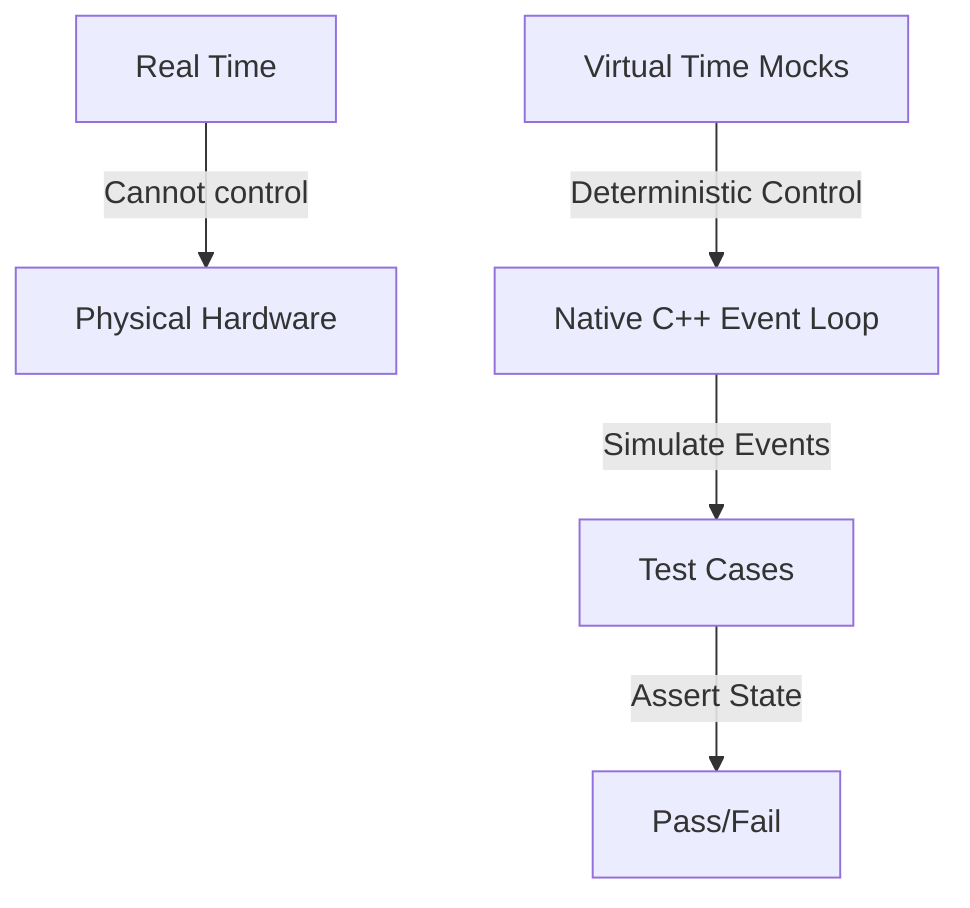

# Test Suite

Welcome to the testing documentation for `ProtoCore`. This repository is designed to be extremely robust, employing **100% hardware-free, deterministic testing**.

Whether you are a beginner looking to understand how C++ testing works or an expert systems engineer designing secure, high-concurrency embedded protocols, this guide explains the architectures, methodologies, and concepts behind our test suite.

---

## 1. Introduction & Core Philosophy

### Why Native Testing?

Traditionally, testing code written for microcontroller frameworks like ESP-IDF or Arduino requires uploading binaries to physical ESP32 chips. This hardware-in-the-loop (HIL) testing has several drawbacks:

- **Slow feedback cycles**: Compiling, flashing, and rebooting microcontrollers takes minutes.
- **Flakiness**: Wireless connections fail, hardware pins float, and components experience wear.
- **Hard-to-reproduce bugs**: Multi-threaded concurrency bugs or network timing jitter cannot be reliably reproduced on physical chips.

`ProtoCore` solves this by executing all test suites **natively** on your development machine (x86/x64 host).

### The Deterministic Asynchronous Model

This server is built on cooperative multitasking. Instead of physical threads, it uses a single-threaded event-driven event loop. Because of this, we can make tests **100% deterministic** through **Time-Travel Mocking**.

Instead of waiting for real-world seconds to elapse to test a connection timeout, the test suite manually increments a virtual clock (`millis()`) and drives the state machine forward manually. This means:

- A 5-second connection timeout can be tested in **less than a millisecond**.
- Execution order is guaranteed to be identical on every single run, eliminating race-condition flakiness.


```mermaid
graph TD
    A[Real Time] -->|Cannot control| B[Physical Hardware]
    C[Virtual Time Mocks] -->|Deterministic Control| D[Native C++ Event Loop]
    D -->|Simulate Events| E[Test Cases]
    E -->|Assert State| F[Pass/Fail]
```

---

## 2. Test Architecture & Mocking Strategies

To isolate our application code from physical hardware and the operating system's IP stack, we use a custom mocking layer.

### Mocks, Stubs, and Spies

- **Stubs**: Provide canned answers to calls made during the test. For example, our **Filesystem Stub** simulates an SPIFFS/LittleFS system by feeding static file contents from memory arrays instead of reading from a physical hard drive.
- **Mocks**: Objects pre-programmed with expectations that form a specification of the calls they are expected to receive.
- **Virtual Network Taps**: We mock the network stack completely. Instead of binding to real network sockets, we hook the server directly into virtual byte-pumps (ring buffers) that simulate incoming TCP packets.

```
       +---------------------------------------------+
       |                  TEST SUITE                 |
       +----------------------++---------------------+
                              || Simulates network packets
                              \/
       +---------------------------------------------+
       |             VIRTUAL TRANSPORT               |
       |  (mocks sockets, ring buffers, timeouts)    |
       +----------------------++---------------------+
                              || Drives HTTP/SSH bytes
                              \/
       +---------------------------------------------+
       |            CORE WEB SERVER ENGINE           |
       |     (HTTP parser, WebSockets, SSH)          |
       +---------------------------------------------+
```

---

## 3. PlatformIO Test Environments

<!-- BEGIN GENERATED test-environments (edit test/test_matrix.json, run test/gen_test_readme.py) -->

The native test matrix has **306 environments**, one per feature, generated from [test_matrix.json](test_matrix.json) into [platformio.ini](../platformio.ini) by [gen_test_envs.py](gen_test_envs.py). Each compiles a strict per-feature slice of `src/` with its own flags and runs that feature's suite in isolation, so "this feature builds and tests on its own" stays guaranteed.

| Environment | Feature flag(s) | Test suite(s) | Purpose |
| :--- | :--- | :--- | :--- |
| `native_accept_gate` | `PC_ENFORCE_HOST_HEADER=0`, `PC_ENABLE_ACCEPT_THROTTLE=1`, `PC_ENABLE_PER_IP_THROTTLE=1`, `PC_ENABLE_IP_ALLOWLIST=1`, `PC_ACCEPT_THROTTLE_MAX=3`, `PC_ACCEPT_THROTTLE_WINDOW_MS=1000`, `PC_PER_IP_THROTTLE_MAX=2`, `PC_PER_IP_THROTTLE_WINDOW_MS=1000`, `PC_PER_IP_THROTTLE_SLOTS=4`, `PC_IP_ALLOWLIST_SLOTS=4` | `test_accept_gate` | Accept-time connection gates with their flags ON (PC_ENABLE_ACCEPT_THROTTLE / PER_IP_THROTTLE / IP_ALLOWLIST): the global fixed-window throttle, the per-source-IP bucket table (independent budgets, wi... |
| `native_ad9238` | `PC_ENABLE_AD9238=1` | `test_ad9238` | AD9238 SPI configuration-port codec (services/peripherals/ad9238): the 16-bit instruction word (R/W + byte-count + 13-bit address) for single-byte register writes/reads, the device-update transfer tra... |
| `native_ads` | `PC_ENABLE_ADS=1` | `test_ads` | Beckhoff ADS / AMS codec (services/fieldbus/ads): the AMS/TCP + AMS-header request builders (little-endian, target-before-source addressing, cmd id + state flags + cbData + invoke id) for Read/Write/R... |
| `native_ads1115` | `PC_ENABLE_ADS1115=1` | `test_ads1115` | ADS1115 16-bit ADC codec (services/peripherals/ads1115): building the 16-bit config word for a single-shot single-ended reading (channel MUX, gain, data rate, start/mode/comparator bits, with out-of-r... |
| `native_amqp` | `PC_ENABLE_AMQP=1` | `test_amqp` | AMQP 0-9-1 frame codec (services/iot/amqp): the protocol header, the frame + method builders, the heartbeat, and the frame/method parsers (type/channel/size/payload/0xCE). |
| `native_application` | default | `test_application` | test_application against the native_stack_http stack. |
| `native_arena` | default | `test_arena` | Unified double-ended server arena (network_drivers/session/pc_arena): first-fit persistent end (bottom, individual free + coalesce + boundary shrink) + bump scratch end (top, mark/release/reset) shari... |
| `native_atc` | `PC_ENABLE_ATC=1` | `test_atc` | ATC field-I/O interop snapshot (services/machine_tool/atc): serialize this device's field-I/O map as {"inputs":[...],"outputs":[...]} JSON for an ATC engine over HTTP, plus the output setter and value... |
| `native_audit_log` | `PC_ENABLE_AUDIT_LOG=1` | `test_audit_log` | Tamper-evident hash-chained audit log (services/security/audit_log). |
| `native_auth` | `PC_ENABLE_AUTH=1` | `test_auth` | test_auth against the native_stack_http stack. |
| `native_auth_lockout` | `PC_ENABLE_AUTH=1`, `PC_ENABLE_AUTH_LOCKOUT=1` | `test_auth_lockout` | Per-IP brute-force auth lockout (services/security/auth_lockout): exponential-backoff lockout state machine. |
| `native_bacnet` | `PC_ENABLE_BACNET=1` | `test_bacnet` | BACnet/IP BVLC + NPDU codec (services/fieldbus/bacnet): the BVLC envelope (type 0x81, function, length) + the NPDU header (version + NPCI control + optional DNET/DADR + hop count) builders and parsers... |
| `native_base64` | default | `test_base64` | test_base64 against the native_stack_l46 stack. |
| `native_base64_scalar` | `PC_BASE64_SWAR=0` | `test_base64` | base64 scalar constant-time decode fallback (PC_BASE64_SWAR=0): classify one character at a time instead of the default SWAR four-per-word path. |
| `native_ble_gatt` | `PC_ENABLE_BLE_GATT=1` | `test_ble_gatt` | Bluetooth ATT codec + GATT bridge (services/radio/ble_gatt): build/parse the common ATT PDUs (read/write/notify/error, LE handles) and serialize a GATT characteristic table as JSON for the web stack. |
| `native_bus_capture` | `PC_ENABLE_BUS_CAPTURE=1` | `test_bus_capture` | CAN listen-only capture framing (server/signaling/bus_capture): can_to_socketcan() building the 16-byte Linux SocketCAN frame (big-endian can_id, EFF/RTR flags, length, data) and the DLT_CAN_SOCKETCAN... |
| `native_c37118` | `PC_ENABLE_C37118=1` | `test_c37118` | IEEE C37.118.2 synchrophasor frame codec (services/energy/c37118): CRC-CCITT, the frame builder + Command frame, and the CRC-validating parser (type / ids / timestamp / payload). |
| `native_canopen` | `PC_ENABLE_CANOPEN=1` | `test_canopen` | CANopen (CiA 301) message codec (services/fieldbus/canopen): NMT, SYNC, heartbeat, EMCY, PDO, and expedited SDO read/write/abort + the COB-ID classifier, over the shared CAN frame (shared_primitives/c... |
| `native_cbor` | `PC_ENABLE_CBOR=1` | `test_cbor` | CBOR (RFC 8949) encoder (network_drivers/presentation/codec/cbor): a pure byte-output codec, host-tested against the RFC 8949 Appendix A vectors. |
| `native_cc1101` | `PC_ENABLE_CC1101=1` | `test_cc1101` | CC1101 sub-GHz radio driver (services/radio/cc1101): the TI SPI header protocol (config registers, command strobes, status registers, TX/RX FIFO) - init/detect, variable-length send, TX-done, set-rx, ... |
| `native_cclink` | `PC_ENABLE_CCLINK=1` | `test_cclink` | CC-Link cyclic fieldbus frame codec (services/fieldbus/cclink): the frame ([station][command][bit data][word data][sum]) build + parse and the bit/word process-image accessors. |
| `native_chunked` | default | `test_chunked` | test_chunked against the native_stack_http stack. |
| `native_cia402` | `PC_ENABLE_CIA402=1`, `PC_ENABLE_CANOPEN=1` | `test_cia402` | CiA 402 / IEC 61800-7-201 drive profile (services/fieldbus/cia402): the Statusword power-state decode (mask/value table), the Controlword commands + enable sequence, Statusword flags, the CANopen SDO ... |
| `native_cip` | `PC_ENABLE_CIP=1` | `test_cip` | CIP message codec (services/fieldbus/cip): the EPATH logical-segment builder, the request builders (Get_Attribute_Single), and the response parser (service / status / data). |
| `native_client` | default | `test_client` | Outbound TCP client transport (network_drivers/transport/client.cpp), the pooled layer-4 peer of tcp.cpp used by http_client / mqtt / ws_client / relay / smtp / ssh port-forward (PC_NEED_DET_CLIENT). |
| `native_clock` | default | `test_clock` | Pluggable monotonic clock (server/clock): default millis(), custom clock divided down to the internal 1000 Hz, plus the microsecond base and latency budgeting. |
| `native_cloudevents` | `PC_ENABLE_CLOUDEVENTS=1` | `test_cloudevents` | CloudEvents v1.0 envelope (services/iot/cloudevents): the structured-JSON builder (over the JSON writer) + the binary-mode ce-* header reader. |
| `native_coap` | `PC_ENABLE_COAP=1`, `PC_ENABLE_COAP_BLOCK=1`, `PC_COAP_BLOCK_SZX_MAX=2`, `PC_COAP_BLOCK1_MAX=128` | `test_coap` | CoAP server (RFC 7252) message codec + resource dispatch. |
| `native_coap_observe` | `PC_ENABLE_COAP=1`, `PC_ENABLE_COAP_BLOCK=1`, `PC_COAP_BLOCK_SZX_MAX=2`, `PC_COAP_BLOCK1_MAX=128`, `PC_ENABLE_COAP_OBSERVE=1` | `test_coap` | CoAP with resource observation (RFC 7641) enabled. |
| `native_coaps` | `PC_ENABLE_DTLS=1`, `PC_ENABLE_COAP=1` | `test_coaps` | CoAP over DTLS (services/iot/coap/coaps, RFC 7252 sec 9): the bridge that drives a DtlsConn handshake and, once established, unwraps each epoch-3 application record, answers it with coap_server_proces... |
| `native_coaps_server` | `PC_ENABLE_DTLS=1`, `PC_ENABLE_COAP=1` | `test_coaps_server` | CoAP-over-DTLS server front-end (services/iot/coap/coaps_server): the per-peer DtlsConn pool + ingest/poll seam on top of pc_coaps_process(). |
| `native_codeql` | `PC_ENABLE_CSRF=1`, `PC_ENABLE_AUTH_LOCKOUT=1`, `PC_ENABLE_IP_ALLOWLIST=1`, `PC_ENABLE_WS_DEFLATE=1`, `PC_ENABLE_TIME_SOURCE=1`, `PC_ENABLE_CONFIG_STORE=1`, `PC_ENABLE_DEVICE_ID=1`, `PC_ENABLE_TELEMETRY=1`, `PC_ENABLE_DASHBOARD=1`, `PC_ENABLE_PARTITION_MONITOR=1`, `PC_ENABLE_CBOR=1`, `PC_ENABLE_MSGPACK=1`, `PC_ENABLE_GPIO_MAP=1`, `PC_ENABLE_UDP_TELEMETRY=1`, `PC_ENABLE_GUARDRAILS=1`, `PC_ENABLE_FAILSAFE=1`, `PC_ENABLE_SLEEP_SCHED=1`, `PC_ENABLE_WEARLEVEL=1`, `PC_ENABLE_NETADAPT=1`, `PC_ENABLE_DSHOT=1`, `PC_ENABLE_HART=1`, `PC_ENABLE_NTS=1`, `PC_ENABLE_DDS=1`, `PC_ENABLE_XMPP=1`, `PC_ENABLE_RAWL2=1`, `PC_ENABLE_SPA_ROUTER=1`, `PC_ENABLE_GOOSE=1`, `PC_ENABLE_MTCONNECT=1`, `PC_ENABLE_J2735=1`, `PC_ENABLE_NEMA_TS2=1`, `PC_ENABLE_SNP=1`, `PC_ENABLE_DIRECTNET=1`, `PC_ENABLE_SEP2=1`, `PC_ENABLE_PROFINET=1`, `PC_ENABLE_NTCIP=1`, `PC_ENABLE_OPENADR=1`, `PC_ENABLE_MMS=1`, `PC_ENABLE_CCLINK=1`, `PC_ENABLE_POWERLINK=1`, `PC_ENABLE_SERCOS=1`, `PC_ENABLE_PROFIBUS=1`, `PC_ENABLE_LONWORKS=1`, `PC_ENABLE_MBPLUS=1`, `PC_ENABLE_INTERBUS=1`, `PC_ENABLE_ICCP=1`, `PC_ENABLE_WAVE=1`, `PC_ENABLE_UTMC=1`, `PC_ENABLE_OCIT=1`, `PC_ENABLE_ATC=1`, `PC_ENABLE_SOUTHBOUND=1`, `PC_ENABLE_EXC_DECODER=1`, `PC_ENABLE_HTTP_DELIVERY=1`, `PC_ENABLE_HW_HEALTH=1`, `PC_ENABLE_MDNS_ADAPTIVE=1`, `PC_ENABLE_SOCKPOOL=1`, `PC_ENABLE_PSRAM_POOL=1`, `PC_ENABLE_HAPPY_EYEBALLS=1`, `PC_ENABLE_WIFI_SNIFFER=1`, `PC_ENABLE_LINK_MANAGER=1`, `PC_ENABLE_CC1101=1`, `PC_ENABLE_FDC2214=1`, `PC_ENABLE_LDC1614=1`, `PC_ENABLE_VL53L0X=1`, `PC_ENABLE_RADIO_SNIFF=1`, `PC_ENABLE_BLE_GATT=1`, `PC_ENABLE_TLS_POLICY=1`, `PC_ENABLE_WISUN=1`, `PC_ENABLE_LOGBUF=1`, `PC_ENABLE_OTA_ROLLBACK=1`, `PC_ENABLE_TOTP=1`, `PC_ENABLE_WEBHOOK=1`, `PC_ENABLE_RADIO_POWER=1`, `PC_ENABLE_AUDIT_LOG=1`, `PC_ENABLE_OIDC=1`, `PC_ENABLE_MNT=1`, `PC_ENABLE_GRAPHQL=1`, `PC_ENABLE_ESPNOW=1`, `PC_ENABLE_OAUTH2=1`, `PC_ENABLE_OPCUA=1`, `PC_ENABLE_OPCUA_CLIENT=1`, `PC_ENABLE_WEBSOCKET=1`, `PC_ENABLE_SSE=1` | `test_dispatch` | CodeQL coverage env: the full app compiled with every new feature flag ON so CodeQL traces the integration paths (CSRF / lockout / allowlist gates, permessage-deflate) AND the new service modules, whi... |
| `native_compliance` | default | `test_compliance` | RFC-compliance suite: builds with all enforcement at production defaults (PC_ENFORCE_HOST_HEADER=1) and exercises the strict behaviors. |
| `native_concurrency` | `O1`, `pthread` | `test_concurrency` | Concurrency proof for the cross-thread slot fields (pc_atomic state / rx_head / rx_tail). |
| `native_config_io` | `PC_ENABLE_CONFIG_STORE=1`, `PC_ENABLE_CONFIG_IO=1` | `test_config_io` | Schema-driven config export/restore (services/storage/config_io) over the config store; round-trip host-tested against the in-memory backend. |
| `native_config_store` | `PC_ENABLE_CONFIG_STORE=1` | `test_config_store` | Typed NVS config store (services/storage/config_store): string/u32/blob round-trips, defaults, capacity, erase/clear - run against the host in-memory backend (the ESP32 Preferences/NVS backend is comp... |
| `native_control` | `PC_ENABLE_CONTROL=1` | `test_control` | PID control law (services/system/control): the P/I/D terms, output clamping, anti-windup by conditional integration, derivative-on-measurement (no setpoint kick) + optional low-pass, feed-forward, the... |
| `native_cotp` | `PC_ENABLE_COTP=1` | `test_cotp` | TPKT (RFC 1006) + COTP X.224 class-0 frame codec (services/fieldbus/cotp): the TPKT envelope, the COTP Data TPDU + Connection Request builders, and the COTP parser. |
| `native_crypto_kat` | `PC_ENABLE_HTTP3=1` | `test_crypto_kat` | Data-driven external crypto known-answer tests: HMAC-SHA256/512, AEAD_AES_128_GCM, X25519, and Ed25519 verify from Project Wycheproof (including its adversarial edge cases), plus HKDF-SHA256 Extract (... |
| `native_csrf` | `PC_ENABLE_CSRF=1` | `test_csrf` | Stateless HMAC-signed CSRF token (services/security/csrf): issue/verify with a fixed secret unit-tests on the host (PC_ENABLE_CSRF set). |
| `native_dashboard` | `PC_ENABLE_DASHBOARD=1`, `PC_ENABLE_SSE=1` | `test_dashboard` | Dashboard widget-table JSON serializers (services/web/dashboard core). |
| `native_dbm` | `PC_ENABLE_WAL=1`, `PC_ENABLE_DBM=1` | `test_dbm` | Log-structured hash key-value store on the WAL (services/storage/dbm): put/get/delete with an in-RAM open-addressed index and value data appended to the write-ahead log, plus index rebuild by replayin... |
| `native_dds` | `PC_ENABLE_DDS=1` | `test_dds` | DDS / RTPS framing codec (services/iot/dds): the 20-octet RTPS header (magic/version/vendor/ guidPrefix) and the submessage TLV (id/flags/octetsToNextHeader, endianness flag), build + parse. |
| `native_defer` | default | `test_defer` | test_defer against the native_stack_http stack. |
| `native_deflate` | `PC_ENABLE_WS_DEFLATE=1`, `PC_ENABLE_WEBSOCKET=1` | `test_deflate` | RFC 1951 DEFLATE core (the WebSocket permessage-deflate compressor). |
| `native_device_id` | `PC_ENABLE_DEVICE_ID=1` | `test_device_id` | MAC-derived device UUID (server/signaling/device_id): RFC 4122 v5 from a MAC via SHA-1. |
| `native_devicenet` | `PC_ENABLE_DEVICENET=1` | `test_devicenet` | DeviceNet link-adaptation codec (services/fieldbus/devicenet): the 4-group 11-bit CAN id, explicit-message header octet, single-frame explicit messages, and the fragmentation reassembler (CIP over CAN... |
| `native_df1` | `PC_ENABLE_DF1=1` | `test_df1` | Allen-Bradley DF1 full-duplex frame codec (services/fieldbus/df1): BCC + CRC-16/ARC, the frame builder with DLE byte-stuffing, and the validating, un-stuffing parser. |
| `native_diag` | `PC_ENABLE_DIAG=1` | `test_diag` | Build-flag reporter (diag() / PC_ENABLE_DIAG). |
| `native_diffserv` | `PC_ENABLE_DIFFSERV=1` | `test_diffserv` | DiffServ QoS marking (PC_ENABLE_DIFFSERV): the DSCP->TOS encode (DSCP << 2, ECN 0), the server-wide and UDP DSCP defaults (set/get, 6-bit mask), the per-connection setter (pc_conn_set_dscp writes pcb-... |
| `native_digest_auth` | `PC_ENABLE_AUTH=1` | `test_digest_auth` | test_digest_auth against the native_stack_http stack. |
| `native_digest_vectors` | `PC_ENABLE_AUTH=1` | `test_digest_vectors` | test_digest_vectors against the native_stack_http stack. |
| `native_directnet` | `PC_ENABLE_DIRECTNET=1` | `test_directnet` | AutomationDirect DirectNET serial frame codec (services/fieldbus/directnet): the header (SOH + ASCII-hex slave/type/addr/blocks + ETB + LRC) and data (STX + data + ETX + LRC) frames build/parse. |
| `native_dispatch` | default | `test_dispatch` | test_dispatch against the native_stack_http stack. |
| `native_dma` | `PC_ENABLE_DMA=1`, `PC_DMA_BUF_SIZE=8`, `PC_DMA_CHANNELS=2` | `test_dma` | DMA peripheral ingest / egress simulator (mmgr/dma), v5 hardware ingest: an ingress feed surfaces as RX completion events, a full buffer ping-pongs and re-arms, egress DMA is captured, TX is one-in-fl... |
| `native_dmx` | `PC_ENABLE_DMX=1` | `test_dmx` | DMX512 + RDM lighting codec (services/peripherals/dmx): the DMX512 slot packet (build/get) and the RDM (ANSI E1.20) packet build/parse with 48-bit UIDs and the 16-bit additive checksum. |
| `native_dnc` | `PC_ENABLE_DNC=1` | `test_dnc`, `test_dnc_stream` | CNC DNC drip-feed (services/machine_tool/dnc): the EIA RS-244 <-> ISO/ASCII tape-code translation (odd-parity EIA table), ISO even parity, G-code block framing with '%' rewind-stop and leader runout, ... |
| `native_dnp3` | `PC_ENABLE_DNP3=1` | `test_dnp3` | DNP3 (IEEE 1815) data-link frame codec (services/energy/dnp3): CRC-16/DNP, the frame builder (0x0564 header + CRC'd 16-octet data blocks) and the CRC-validating, de-blocking parser. |
| `native_dns_resolver` | `PC_ENABLE_DNS_RESOLVER=1` | `test_dns_resolver` | DNS resolver answer classifier/verifier (network_drivers/network/dns_resolver): host-tested; the lwIP resolve is ESP32-only. |
| `native_dns_server` | `PC_ENABLE_DNS_SERVER=1` | `test_dns_server` | Authoritative DNS server (services/net/dns_server): the pure A-record response builder (QNAME parse, compressed A answer, NXDOMAIN, non-A query, header flags, malformed guards) and the built-in name->... |
| `native_docstore` | `PC_ENABLE_WAL=1`, `PC_ENABLE_DBM=1`, `PC_ENABLE_DOCSTORE=1` | `test_docstore` | Local JSON document store on the WAL (services/storage/docstore): JSON documents addressed by id, stored via dbm on the write-ahead log, plus top-level field queries (find documents whose JSON field e... |
| `native_dshot` | `PC_ENABLE_DSHOT=1` | `test_dshot` | DShot ESC throttle codec (services/peripherals/dshot): the 16-bit frame (11-bit value + telemetry + 4-bit nibble-xor CRC), the bidirectional inverted-CRC variant, decode/validate, and per-rate bit tim... |
| `native_dtls` | `PC_ENABLE_DTLS=1` | `test_dtls_record` | DTLS 1.3 record layer (network_drivers/presentation/security/dtls/dtls_record, RFC 9147 sec 4): DTLSPlaintext + DTLSCiphertext protect/unprotect, the unified header, sequence-number encryption (sec 4.... |
| `native_dtls_conn` | `PC_ENABLE_DTLS=1`, `PC_ENABLE_TLS_RPK=1` | `test_dtls_conn` | DTLS 1.3 server handshake state machine (network_drivers/presentation/security/dtls/dtls_conn, RFC 9147 sec 5-6): the one-round-trip full handshake (TLS_AES_128_GCM_SHA256 / X25519 / Ed25519) over the... |
| `native_dtls_hs` | `PC_ENABLE_DTLS=1` | `test_dtls_handshake` | DTLS 1.3 handshake framing + reliability (network_drivers/presentation/security/dtls/dtls_handshake, RFC 9147 sec 5 + 7): the 12-byte DTLS handshake header, overlap-tolerant message reassembly, the AC... |
| `native_dtls_tls13` | `PC_ENABLE_DTLS=1`, `PC_ENABLE_TLS_RPK=1` | `test_dtls_tls13` | TLS 1.3 messages the DTLS 1.3 handshake adds to tls13_msg (RFC 8446 sec 4.1.4 / 4.4.1), compiled for the DTLS path (PC_ENABLE_DTLS, not HTTP/3): the HelloRetryRequest builder, the cookie extension par... |
| `native_edge_cache` | `PC_ENABLE_HTTP_CACHE=1`, `PC_ENABLE_HTTP_CLIENT=1`, `PC_ENABLE_EDGE_CACHE=1`, `PC_ENABLE_RANGE=1` | `test_edge_cache`, `test_edge_fetch` | CDN edge-cache engine (services/web/edge_cache): the pure freshness/validator core (response header-field access, HTTP-date parsing over IMF-fixdate / RFC 850 / asctime, RFC 9111 lifetime + Expires-Da... |
| `native_edge_cache_sd` | `PC_ENABLE_WAL=1`, `PC_ENABLE_DBM=1`, `PC_DBM_VAL_MAX=1024`, `PC_ENABLE_HTTP_CACHE=1`, `PC_ENABLE_HTTP_CLIENT=1`, `PC_ENABLE_EDGE_CACHE=1` | `test_edge_cache_sd` | CDN edge-cache L2 SD-persistence tier (services/web/edge_cache/edge_cache_sd): the entry <-> dbm-value serialization roundtrip (all response metadata, Vary variants, binary and max-size bodies), the s... |
| `native_edge_mesh` | `PC_ENABLE_HTTP_CACHE=1`, `PC_ENABLE_HTTP_CLIENT=1`, `PC_ENABLE_EDGE_CACHE=1`, `PC_ENABLE_EDGE_MESH=1` | `test_edge_mesh` | CDN edge-cache mesh sibling-cache codec (services/web/edge_cache/edge_mesh): the request/response wire frames (build + tri-state accumulating parse over partial reads, magic/version/opcode validation)... |
| `native_enip` | `PC_ENABLE_ENIP=1` | `test_enip` | EtherNet/IP encapsulation codec (services/fieldbus/enip): the 24-octet header, RegisterSession + SendRRData builders (Common Packet Format), and the SendRRData reply extractor. |
| `native_enocean` | `PC_ENABLE_ENOCEAN=1`, `PC_ENOCEAN_MAX_DATA=16` | `test_enocean` | EnOcean ESP3 serial codec (services/radio/enocean), v5 radio plugin: the CRC-8 (poly 0x07) against known answers, a build -> parse round trip, malformed framing (bad sync / header CRC / data CRC), inc... |
| `native_esp` | `PC_ENABLE_IKEV2=1` | `test_esp` | ESP (RFC 4303) packet transform with AES-256-GCM (RFC 4106) - the IPsec datapath crypto core (services/system/esp): encapsulate a payload into SPI\|Seq\|IV\|AES-GCM(payload\|pad\|padlen\|nexthdr)\|ICV... |
| `native_espnow` | `PC_ENABLE_ESPNOW=1` | `test_espnow` | ESP-NOW peer messaging (services/radio/espnow) - the envelope codec + peer registry are host-tested here; the esp_now radio binding is ESP32-only. |
| `native_euromap77` | `PC_ENABLE_OPCUA=1`, `PC_ENABLE_EUROMAP77=1` | `test_euromap77` | EUROMAP 77 (OPC 40077) IMM_MES_Interface model (services/machine_tool/euromap77) - OPC UA for injection molding machines. |
| `native_exc_decoder` | `PC_ENABLE_EXC_DECODER=1` | `test_exc_decoder` | ESP32 panic / exception decoder (server/exc_decoder): parse a captured Guru Meditation dump (cause, register PC + EXCVADDR, backtrace PC:SP frames) into a structured ExcInfo and serialize it as JSON f... |
| `native_failsafe` | `PC_ENABLE_FAILSAFE=1` | `test_failsafe` | Software watchdog / deadlock detection + safe-state (server/failsafe): the wrap-safe overdue predicate, the lifeline registry, fire-once-per-episode breach callback, and JSON. |
| `native_fanuc_j519` | `PC_ENABLE_FANUC_J519=1` | `test_fanuc_j519` | FANUC Stream Motion / option J519 UDP codec (services/machine_tool/fanuc_j519): the robot counterpart to FOCAS. |
| `native_fdc2214` | `PC_ENABLE_FDC2214=1` | `test_fdc2214` | FDC2114/2214 capacitance-to-digital field sensor (services/peripherals/fdc2214): the 28-bit data combine + error flags, the frequency scale (data/2^28 * fref), and the single-channel config-sequence b... |
| `native_file_serving` | default | `test_file_serving` | test_file_serving against the native_stack_http stack. |
| `native_fins` | `PC_ENABLE_FINS=1` | `test_fins` | Omron FINS frame codec (services/fieldbus/fins): the command builder + Memory Area Read convenience + the command / response parsers (10-octet header, MRC/SRC, MRES/SRES end code). |
| `native_flow_export` | `PC_ENABLE_FLOW_EXPORT=1` | `test_flow_export` | Flow-record export codec (services/net/flow_export): NetFlow v5 fixed header/record builders + the NetFlow v9 / IPFIX template-then-data cursor (length/count patching, v9 4-octet padding). |
| `native_focas` | `PC_ENABLE_FOCAS=1` | `test_focas` | FANUC FOCAS Ethernet codec (services/machine_tool/focas): the big-endian frame envelope (magic/version/type/length) + open/close handshake, the generic command request (6-octet function selector + fiv... |
| `native_form_params` | default | `test_form_params` | test_form_params against the native_stack_http stack. |
| `native_forward` | `PC_ENABLE_FORWARD=1`, `PC_FWD_MAX_IFACES=4`, `PC_FWD_MAX_RULES=4`, `PC_FWD_MAX_ACL=4`, `PC_FWD_MAX_ROUTES=4`, `PC_FWD_INSPECT=1` | `test_forward` | Interface forwarding plane (services/net/forward), v5 bridge / router: default-deny, an ALLOW rule forwards, a DENY wins, multi-destination fan-out, no reflection to the source, the per-rule rate cap ... |
| `native_forwarded_trust` | `PC_ENABLE_AUTH=1`, `PC_ENABLE_AUTH_LOCKOUT=1`, `PC_ENABLE_FORWARDED_TRUST=1` | `test_forwarded_trust` | Trusted-reverse-proxy forwarded-client resolver (services/security/forwarded_trust): a Forwarded / X-Forwarded-For client address is honored only when the real TCP peer is a configured trusted-upstrea... |
| `native_frame` | default | `test_frame` | The declarative frame builder (shared_primitives/frame.h + frame.cpp): the single engine that turns a static pc_field spec into wire bytes, so the ~160 formatting sites in this library carry a table r... |
| `native_ftp` | `PC_ENABLE_FTP=1` | `test_ftp` | FTP client wire codec (services/file_transfer/ftp, RFC 959 + RFC 2428): the control-command builders (generic verb + PORT + EPRT), the single/multi-line 3-digit reply parser, and the PASV / EPSV data-... |
| `native_gateway` | `PC_ENABLE_GATEWAY=1`, `PC_GW_MAX_PORTS=4` | `test_gateway` | Radio / wireless gateway bridge (services/net/gateway), v5 southbound-to-northbound: an uplink envelopes a received frame (src address / port / rssi / seq) and publishes it, fail-closed on no sink / u... |
| `native_gnss_survey` | `PC_ENABLE_NTRIP_CASTER=1`, `PC_ENABLE_NMEA0183=1`, `UNITY_INCLUDE_DOUBLE` | `test_gnss_survey` | GNSS survey-in core (services/timing_position/gnss/gnss_survey): the exact WGS84 geodetic<->ECEF transform (matched against pyproj EPSG:4979->EPSG:4978), the shifted-origin position averager with a 3-... |
| `native_goose` | `PC_ENABLE_GOOSE=1` | `test_goose` | IEC 61850 GOOSE publisher codec (services/energy/goose): the BER IECGoosePdu (gocbRef..allData, minimal-length INTEGERs with the positive leading-zero rule) + the GOOSE header + Ethernet frame (ethert... |
| `native_gpib` | `PC_ENABLE_GPIB=1` | `test_gpib` | GPIB-over-LAN (Prologix-style) controller command codec (services/instrumentation/gpib): the ++ command builders (addr / mode / read / eoi / eos / spoll / clr / trg / ver), the data-line escaping (lea... |
| `native_gpio_map` | `PC_ENABLE_GPIO_MAP=1` | `test_gpio_map` | GPIO pin-mapper / browser diag core (server/signaling/gpio_map): direction names, JSON serializer, control-POST parser, output guard - all pure and host-tested. |
| `native_graphql` | `PC_ENABLE_GRAPHQL=1` | `test_graphql` | GraphQL query subset (services/iot/graphql) - pure parser + executor, host-tested with a demo resolver. |
| `native_grpcweb` | `PC_ENABLE_GRPC_WEB=1` | `test_grpcweb` | gRPC-Web message framing codec (services/iot/grpcweb): the 5-octet length-prefixed message frame builder + the 0x80 trailers frame (grpc-status / grpc-message) + the frame parser. |
| `native_guardrails` | `PC_ENABLE_GUARDRAILS=1` | `test_guardrails` | Heap/stack guardrails (services/security/guardrails): threshold evaluator + JSON, host-tested. |
| `native_h2conn` | `PC_ENABLE_HTTP2=1` | `test_h2_conn` | HTTP/2 connection engine (network_drivers/presentation/http/http2/h2_conn, RFC 9113): initial SETTINGS on init, preface + client SETTINGS -> SETTINGS ACK, decoding a real HPACK-encoded request into th... |
| `native_h2frame` | `PC_ENABLE_HTTP2=1` | `test_h2_frame` | HTTP/2 binary framing (network_drivers/presentation/http/http2/h2_frame, RFC 9113): the 9-byte frame header parse/write (24-bit length, reserved-bit masking), SETTINGS build + parse with validation, a... |
| `native_h3_conn` | `PC_ENABLE_HTTP3=1` | `test_h3_conn` | HTTP/3 application engine (network_drivers/presentation/http/http3/h3_conn, RFC 9114): drives h3_conn through the quic_conn callback seam - a QPACK-encoded request on a request stream dispatches the r... |
| `native_h3_e2e` | `PC_ENABLE_HTTP3=1` | `test_h3_e2e` | End-to-end HTTP/3 capstone (network_drivers/presentation/http/http3): a QUIC client in the test completes the TLS 1.3 handshake against a quic_conn + h3_conn server, sends a real HTTP/3 GET (QPACK HEA... |
| `native_h3_server` | `PC_ENABLE_HTTP3=1` | `test_h3_server` | HTTP/3 dispatch bridge end-to-end through PC (the full Layer-7 app built with PC_ENABLE_HTTP3=1): a QUIC client completes the handshake and sends an HTTP/3 GET, quic_server routes it to the reserved d... |
| `native_h3frame` | `PC_ENABLE_HTTP3=1` | `test_h3_frame` | HTTP/3 framing (network_drivers/presentation/http/http3/h3_frame, RFC 9114 sec 7): the type+length varint header parse/write (incl. |
| `native_haas_mdc` | `PC_ENABLE_HAAS_MDC=1` | `test_haas_mdc` | Haas Machine Data Collection (MDC) Q-command codec (services/machine_tool/haas_mdc): the ?Q query builders (Q100 serial, Q101 software version, Q102 model, Q104 mode, Q300 power-on time, Q500 program ... |
| `native_happy_eyeballs` | `PC_ENABLE_HAPPY_EYEBALLS=1` | `test_happy_eyeballs` | Dual-stack Happy Eyeballs selection (services/net/happy_eyeballs): RFC 6724 destination preference scoring, the candidate-list sort + RFC 8305 address-family interleave, and the Connection Attempt Del... |
| `native_hart` | `PC_ENABLE_HART=1` | `test_hart` | HART / HART-IP codec (services/fieldbus/hart): the HART command frame (longitudinal XOR checksum, short + long addressing) build/parse and the 8-octet HART-IP message header. |
| `native_hislip` | `PC_ENABLE_HISLIP=1` | `test_hislip` | HiSLIP (High-Speed LAN Instrument Protocol, IVI-6.1) message codec (services/instrumentation/hislip): the fixed 16-byte header build/parse (HS prologue + type + control + 32-bit param + 64-bit payload... |
| `native_hmmd` | `PC_ENABLE_HMMD=1` | `test_hmmd` | Waveshare HMMD 24GHz mmWave micro-motion radar codec (services/peripherals/hmmd): the LD2410-family little-endian framing, the report parse (detection flag, distance, all 16 gate energies), rejecting ... |
| `native_hostlink` | `PC_ENABLE_HOSTLINK=1` | `test_hostlink` | Omron Host Link (C-mode) frame codec (services/fieldbus/hostlink): the FCS (XOR), the ASCII command builder (@UU + header + text + FCS + *CR), and the FCS-validating parser + end-code reader. |
| `native_hotswap` | `PC_ENABLE_HOTSWAP=1` | `test_hotswap` | Removable-storage hot-swap safeties (services/storage/hotswap): the ABSENT/READY/FAULTED state machine - a run of consecutive I/O errors faults a volume while a single one does not, any success resets... |
| `native_hpack` | `PC_ENABLE_HTTP2=1` | `test_hpack` | HPACK header compression for HTTP/2 (RFC 7541): prefix-integer coding (App C.1), the Huffman string code (App B / C.4.1), the first-request decode with dynamic-table insertion (C.3.1), dynamic-table i... |
| `native_http_client` | `PC_ENABLE_HTTP_CLIENT=1` | `test_http_client` | Outbound HTTP client: URL parser + request builder + response parser. |
| `native_http_delivery` | `PC_ENABLE_HTTP_DELIVERY=1` | `test_http_delivery` | HTTP delivery optimizations (services/file_transfer/http_delivery): the RFC 5861 stale-while-revalidate freshness decision + its Cache-Control builder, and the versioned service-worker precache manife... |
| `native_http_parser` | default | `test_http_parser` | test_http_parser against the native_stack_l46 stack. |
| `native_httpcache` | `PC_ENABLE_HTTP_CACHE=1` | `test_httpcache` | HTTP Cache-Control helpers (services/web/httpcache, RFC 9111 + 8246 + 5861): the structured directive builder + first-class origin presets (immutable asset / shared / no-store / revalidatable), the to... |
| `native_hw_health` | `PC_ENABLE_HW_HEALTH=1` | `test_hw_health` | Hardware-health diagnostics (server/signaling/hw_health): power-rail voltage-drop logger (worst droop + sag/brownout counts), SPI-bus CRC audit with hysteretic clock backoff, GPIO short-circuit test (... |
| `native_iccp` | `PC_ENABLE_ICCP=1` | `test_iccp` | ICCP / TASE.2 (IEC 60870-6) Data_Value codec (services/energy/iccp): the StateQ (state + quality) and RealQ (scaled INTEGER + quality) indication-point BER structures with optional timestamp. |
| `native_iec60870` | `PC_ENABLE_IEC60870=1` | `test_iec60870` | IEC 60870-5-101/-104 codec (services/energy/iec60870): the -104 APCI (I/S/U), the ASDU header + 3-octet IOA, and the -101 FT1.2 fixed/variable link frames (sum checksum). |
| `native_iface` | default | `test_iface` | test_iface against the native_stack_http stack. |
| `native_iface_bridge` | `PC_ENABLE_IFACE_BRIDGE=1` | `test_iface_bridge` | Interface bridge pure core (services/net/iface_bridge): the user-defined address:port -> bus rule table (register / find / dedup / capacity, keyed by port+proto with the full pc_ip bind address preser... |
| `native_ikev2` | `PC_ENABLE_IKEV2=1` | `test_ikev2`, `test_ikev2_natt` | IKEv2 (RFC 7296) message + payload codec (services/security/ikev2): the 28-octet IKE header, the generic payload chain walker, the SA -> proposal -> transform tree (incl. |
| `native_ina219` | `PC_ENABLE_INA219=1` | `test_ina219` | INA219 current/power codec (services/peripherals/ina219): decoding the bus-voltage register (bits [15:3], LSB 4 mV, status bits ignored) and the shunt-voltage register (signed, LSB 10 uV), computing t... |
| `native_inflate` | `PC_ENABLE_WS_DEFLATE=1`, `PC_ENABLE_WEBSOCKET=1` | `test_inflate` | RFC 1951 INFLATE core (the WebSocket permessage-deflate decompressor). |
| `native_interbus` | `PC_ENABLE_INTERBUS=1` | `test_interbus` | INTERBUS summation-frame codec (services/fieldbus/interbus): the summation frame (loopback + per-device 16-bit slices + CRC-16/CCITT FCS) assemble + disassemble. |
| `native_iolink` | `PC_ENABLE_IOLINK=1` | `test_iolink` | IO-Link (SDCI) data-link message codec (services/fieldbus/iolink): the MC / CKT / CKS control octets and the SDCI checksum (seed 0x52 + the 8->6 compression of IO-Link spec A.1.6), with a hand-compute... |
| `native_ip` | default | `test_ip` | IP address core (network_drivers/network/pc_ip): RFC 4291 IPv4/IPv6 text parsing, RFC 5952 canonical formatting (:: zero-compression, v4-mapped), and scope classification (loopback / link-local / priv... |
| `native_ipsec_db` | `PC_ENABLE_IKEV2=1` | `test_ipsec_db` | IPsec Security Policy Database + Security Association Database (RFC 4301, services/system/esp/ipsec_db): ordered first-match-wins SPD policy lookup over source/destination/protocol/port selector range... |
| `native_j1939` | `PC_ENABLE_J1939=1` | `test_j1939` | SAE J1939 codec (services/fieldbus/j1939): 29-bit id encode/decode (PDU1 + PDU2), single-frame messages, Request PGN, Address Claimed + NAME, and the Transport Protocol (BAM + TP.DT) reassembler, over... |
| `native_j2735` | `PC_ENABLE_J2735=1` | `test_j2735` | SAE J2735 V2X codec (services/transportation/j2735): the ASN.1 UPER bit primitive layer (constrained INTEGER / BOOLEAN / bit fields) and the BSMcore block encode/decode. |
| `native_json` | default | `test_json` | test_json against the native_stack_http stack. |
| `native_jwt` | `PC_ENABLE_JWT=1` | `test_jwt` | JWT (HS256) bearer-auth verification. |
| `native_keepalive` | `PC_ENFORCE_HOST_HEADER=0`, `PC_ENABLE_KEEPALIVE=1`, `PC_KEEPALIVE_MAX_REQUESTS=3` | `test_keepalive` | HTTP/1.1 keep-alive (persistent connections): full server built with PC_ENABLE_KEEPALIVE=1; a small per-connection request cap makes the fairness-bound test fast. |
| `native_ld2410` | `PC_ENABLE_LD2410=1` | `test_ld2410` | LD2410 mmWave radar codec (services/peripherals/ld2410): decoding a basic and an engineering-mode report frame, rejecting malformed frames, the byte-by-byte stream reassembler (resync past noise, spli... |
| `native_ldc1614` | `PC_ENABLE_LDC1614=1` | `test_ldc1614` | LDC1614 inductance-to-digital field sensor (services/peripherals/ldc1614): the 28-bit data combine + error flags, the frequency scale (data/2^28 * fref), and the single-channel config-sequence builder. |
| `native_link_manager` | `PC_ENABLE_LINK_MANAGER=1` | `test_link_manager` | Multi-interface egress selection (server/signaling/link_manager): a table of interfaces (kind + priority + up/down) with deterministic best-link-up selection, graceful escalation to a higher-priority ... |
| `native_log` | `PC_ENABLE_LOGBUF=1`, `PC_LOG_LEVEL=PC_LOG_LEVEL_INFO` | `test_log` | Abstract logging macros (shared_primitives/log.h) whose disabled levels are discarded by the preprocessor: built at PC_LOG_LEVEL_INFO so DEBUG is below the floor. |
| `native_logbuf` | `PC_ENABLE_LOGBUF=1` | `test_logbuf` | Rotating log ring + severity trap (server/logbuf): pure, fully host-tested. |
| `native_lonworks` | `PC_ENABLE_LONWORKS=1` | `test_lonworks` | LonWorks / LON-IP network-variable codec (services/fieldbus/lonworks): the LonTalk NV PDU ([msg-code][14-bit selector][value]) build + parse and the SNVT_temp / SNVT_switch scalar encodings. |
| `native_lora` | `PC_ENABLE_LORA=1` | `test_lora` | LoRa codec + SX127x driver (services/radio/lora), v5 radio plugin: the RadioHead 4-byte header parse/build, and the SX127x register protocol (init / send / tx-done / set-rx / recv) exercised against a... |
| `native_lsv2` | `PC_ENABLE_LSV2=1` | `test_lsv2` | Heidenhain LSV/2 telegram codec (services/machine_tool/lsv2): the framer (4-byte big-endian payload-length prefix + 4-char mnemonic + payload), the typed request builders (login A_LG / logout A_LO, nu... |
| `native_lwm2m_tlv` | `PC_ENABLE_LWM2M=1` | `test_lwm2m_tlv` | OMA LwM2M TLV codec (services/iot/lwm2m): the writer (raw + int / bool / string / float value helpers, 8-/16-bit ids, inline / 8-/16-/24-bit lengths) + the cursor reader + integer value decoding. |
| `native_mbplus` | `PC_ENABLE_MBPLUS=1` | `test_mbplus` | Modbus Plus HDLC token-bus codec (services/fieldbus/mbplus): the HDLC frame (7E addr ctrl payload CRC-16/X-25 7E) build + validate and the token-rotation ring helper. |
| `native_mbus` | `PC_ENABLE_MBUS=1` | `test_mbus` | Wired M-Bus codec (services/fieldbus/mbus): the ACK / short / long frame builders + parser (start/stop, doubled length, 8-bit sum checksum) and the EN 13757-3 variable-data record walker (DIF/VIF, DIF... |
| `native_mdns_adaptive` | `PC_ENABLE_MDNS_ADAPTIVE=1` | `test_mdns_adaptive` | Adaptive mDNS beacon scheduling (network_drivers/application/mdns_adaptive): RF-contention backoff/recovery of the announce interval, the TTL/2 continuous-refresher cadence, the announce-due check, an... |
| `native_melsec` | `PC_ENABLE_MELSEC=1` | `test_melsec` | Mitsubishi MELSEC MC binary 3E codec (services/fieldbus/melsec): the batch-read request builder (little-endian, subheader 0x5000, command 0x0401, device code + 24-bit head device) + the 0xD000 respons... |
| `native_middleware` | default | `test_middleware` | test_middleware against the native_stack_http stack. |
| `native_mms` | `PC_ENABLE_MMS=1` | `test_mms` | IEC 61850 MMS PDU codec (services/energy/mms): the BER confirmed-request/response Read PDUs (invokeID + read service + named ObjectName), build + parse. |
| `native_mnt` | `PC_ENABLE_MNT=1` | `test_mnt` | Mounted storage (server/filesystem/mnt) - the backend vtable and its built-in RAM backend, host-tested through that backend (the Arduino FS backend is board-layer and HW-verified). |
| `native_modbus` | `PC_ENABLE_MODBUS=1`, `PC_ENABLE_MODBUS_RTU=1` | `test_modbus` | Modbus TCP slave core + RTU framing (Modbus Application Protocol): the data model + MBAP/PDU codec + the RTU ADU codec (CRC16 + [addr][PDU][CRC]). |
| `native_modbus_master` | `PC_ENABLE_MODBUS=1`, `PC_ENABLE_MODBUS_MASTER=1` | `test_modbus_master` | Modbus master codec + scanner (services/fieldbus/modbus/modbus_master): build read requests, parse responses; host-tested as a round-trip against the slave codec. |
| `native_mpr121` | `PC_ENABLE_MPR121=1` | `test_mpr121` | MPR121 capacitive-touch codec (services/peripherals/mpr121): decoding the touch-status word into an electrode bitmask (masking proximity / over-current), the per-electrode touched test, the proximity ... |
| `native_mqtt` | `PC_ENABLE_MQTT=1` | `test_mqtt` |  |
| `native_mqtt_sn` | `PC_ENABLE_MQTT_SN=1` | `test_mqtt_sn` | MQTT-SN v1.2 wire codec (services/iot/mqtt/mqtt_sn): the zero-heap message builders (CONNECT/REGISTER/PUBLISH/SUBSCRIBE/PINGREQ/DISCONNECT/SEARCHGW) + the Length+MsgType header parser (1- and 3-octet ... |
| `native_msgpack` | `PC_ENABLE_MSGPACK=1` | `test_msgpack` | MessagePack encoder (network_drivers/presentation/codec/msgpack): a pure byte-output codec, host-tested against the spec encodings. |
| `native_mtconnect` | `PC_ENABLE_MTCONNECT=1` | `test_mtconnect` | MTConnect agent response codec (services/machine_tool/mtconnect, ANSI/MTC1.4): the incremental MTConnectStreams builder (header + Samples/Events/Condition), the MTConnectDevices probe (device model), ... |
| `native_multipart` | default | `test_multipart` | test_multipart against the native_stack_http stack. |
| `native_nats` | `PC_ENABLE_NATS=1` | `test_nats` | NATS client protocol codec (services/iot/nats): the CONNECT / PUB / SUB / UNSUB / PING / PONG builders + the inbound MSG / INFO / PING / +OK / -ERR parser (subject/sid/reply/payload). |
| `native_nema_ts2` | `PC_ENABLE_NEMA_TS2=1` | `test_nema_ts2` | NEMA TS 2 SDLC frame codec (services/transportation/nema_ts2): the traffic-cabinet bus frame ([address][control][frame-type][data][CRC-16/X-25]) build + validate. |
| `native_net_egress` | default | `test_net_egress` | Egress-interface reporting (network_drivers/physical). |
| `native_netadapt` | `PC_ENABLE_NETADAPT=1` | `test_netadapt` | Network adaptation decisions (services/net/netadapt): TCP receive-window sizing from the free heap (reserve + quarter-of-spare, clamped) and the DHCP->static-IP fallback trigger. |
| `native_nmea0183` | `PC_ENABLE_NMEA0183=1` | `test_nmea0183` | NMEA 0183 sentence codec (services/timing_position/nmea0183): the XOR checksum, sentence build, parse (field splitting, talker/type, checksum validation) against the canonical GGA vector, and the fiel... |
| `native_nmea2000` | `PC_ENABLE_NMEA2000=1` | `test_nmea2000` | NMEA 2000 codec (services/timing_position/nmea2000): single-frame messages plus the Fast Packet transport (frame count, build, reassembly), built on the J1939 id codec (implied). |
| `native_nrf24` | `PC_ENABLE_NRF24=1`, `PC_NRF24_PAYLOAD=8` | `test_nrf24` | nRF24L01+ driver (services/radio/nrf24), v5 radio plugin: the Nordic SPI command protocol (STATUS shifted out first, W/R_REGISTER, W_TX/R_RX_PAYLOAD, write-1-to-clear) exercised against a mock chip - ... |
| `native_ntcip` | `PC_ENABLE_NTCIP=1` | `test_ntcip` | NTCIP transportation object OIDs (services/transportation/ntcip): the NTCIP 1202 signal-controller + 1203 DMS object roots under 1.3.6.1.4.1.1206.4.2 and the OID builder (root + instance index), for t... |
| `native_ntp_server` | `PC_ENABLE_NTP_SERVER=1` | `test_ntp_server` | NTP/SNTP server (RFC 5905 server mode) response codec (ntp_server_build_response): version echo, mode/LI/stratum, origin-timestamp copy, reference/receive/transmit stamps, big-endian encoding, and the... |
| `native_ntrip_caster` | `PC_ENABLE_NTRIP_CASTER=1` | `test_ntrip_caster` | NTRIP caster protocol codec (services/timing_position/gnss/ntrip_caster): rover request parsing (mountpoint, NTRIP 1.0/2.0 version, HTTP Basic auth), the stream-accept / error responses, and the RTCM ... |
| `native_nts` | `PC_ENABLE_NTS=1` | `test_nts` | Network Time Security codec (network_drivers/application/nts, RFC 8915): the NTS-KE TLV records (build the standard request, parse a response) and the NTS NTP extension-field framing (unique id / cook... |
| `native_oauth2` | `PC_ENABLE_OAUTH2=1` | `test_oauth2` | OAuth2 token-endpoint client (services/security/oauth2) - the form-body builder + JSON token-response parser are host-tested (the parser reuses the JSON reader); the HTTP exchange is ESP32-only. |
| `native_observability` | `PC_ENABLE_OBSERVABILITY=1` | `test_observability` | Transport observability (PC_ENABLE_OBSERVABILITY): the pc_conn_on_event hook, by-reason counters, the live CONN_CLOSING gauge, and that the real lwIP callbacks (recv FIN / error / timeout / local clos... |
| `native_ocit` | `PC_ENABLE_OCIT=1` | `test_ocit` | OCIT-Outstations message codec (services/transportation/ocit): the object message ([msg-type][object-type][instance][data-type][value]) build + parse and the typed-value accessors. |
| `native_oidc` | `PC_ENABLE_OIDC=1` | `test_oidc` | OIDC RS256 ID-token verifier (services/security/oidc). |
| `native_opcua` | `PC_ENABLE_OPCUA=1` | `test_opcua` | OPC UA Binary increment 1 (services/fieldbus/opcua) - the type codec, UACP framing, and Hello/Acknowledge handshake are host-tested here; the TCP server (opcua_rx) is ESP32-only. |
| `native_opcua_client` | `PC_ENABLE_OPCUA=1`, `PC_ENABLE_OPCUA_CLIENT=1` | `test_opcua_client` |  |
| `native_openadr` | `PC_ENABLE_OPENADR=1` | `test_openadr` | OpenADR 3.0 JSON codec (services/energy/openadr): the event (programID + eventName + interval payloads) and report (VEN reading) JSON documents build, with escaping + a no-stdlib 3-decimal formatter. |
| `native_ota` | `PC_ENFORCE_HOST_HEADER=0`, `PC_ENABLE_OTA=1` | `test_http_ota` | Parser streaming-body hook (OTA) - exercises http_parser with PC_ENABLE_OTA=1 using a mock sink (no ESP32 Update dependency). |
| `native_ota_rollback` | `PC_ENABLE_OTA_ROLLBACK=1` | `test_ota_rollback` | OTA rollback decision (server/update/ota_rollback): pure decision matrix host-tested; the esp_ota commit/rollback are ESP32-only. |
| `native_packml` | `PC_ENABLE_PACKML=1` | `test_packml` | PackML / OMAC packaging-machine state model (services/machine_tool/packml), ISA-TR88.00.02: the pure 17-state transition engine (command / state-complete / execute-complete + command validity) and the... |
| `native_partition` | `PC_ENABLE_PARTITION_MONITOR=1` | `test_partition_monitor` | Flash partition-map monitor (services/storage/partition_monitor core): the kind classifier + JSON serializer host-test here; the esp_partition walk is ESP32-only. |
| `native_path_params` | default | `test_path_params` | test_path_params against the native_stack_http stack. |
| `native_pca9685` | `PC_ENABLE_PCA9685=1` | `test_pca9685` | PCA9685 PWM/servo codec (services/peripherals/pca9685): the PRESCALE computation from a PWM frequency (with clamping), the per-channel register address, the servo pulse-width -> 12-bit count conversio... |
| `native_pentest` | `PC_ENABLE_MODBUS=1`, `PC_ENABLE_MODBUS_MASTER=1`, `PC_ENABLE_TOTP=1`, `PC_ENABLE_MULTIPART=1`, `PC_ENABLE_CBOR=1`, `PC_ENABLE_MSGPACK=1`, `PC_ENABLE_COAP=1`, `PC_ENABLE_COAP_BLOCK=1`, `PC_COAP_BLOCK_SZX_MAX=2`, `PC_COAP_BLOCK1_MAX=128`, `PC_ENABLE_SNMP=1`, `PC_ENABLE_SQLITE=1`, `PC_ENABLE_REDIS=1`, `PC_ENABLE_OPCUA=1`, `PC_ENABLE_GRAPHQL=1`, `PC_ENABLE_DNS_SERVER=1`, `PC_ENABLE_DNP3=1`, `PC_ENABLE_STOMP=1`, `PC_ENABLE_SMB=1`, `PC_ENABLE_DNC=1`, `PC_ENABLE_FTP=1`, `PC_ENABLE_FINS=1`, `PC_ENABLE_MELSEC=1`, `PC_ENABLE_CIP=1`, `PC_ENABLE_ENIP=1`, `PC_ENABLE_DF1=1`, `PC_ENABLE_BACNET=1`, `PC_ENABLE_COTP=1`, `PC_ENABLE_C37118=1`, `PC_ENABLE_JWT=1`, `PC_ENABLE_DIRECTNET=1`, `PC_ENABLE_CCLINK=1`, `PC_ENABLE_AMQP=1`, `PC_ENABLE_MMS=1`, `PC_ENABLE_DDS=1`, `PC_ENABLE_WEBDAV=1`, `PC_ENABLE_HTTP2=1`, `PC_ENABLE_HTTP3=1`, `PC_ENABLE_FILE_SERVING=1` | `test_pentest` | Adversarial / pentest harness - run SEPARATELY (`pio test -e native_pentest`), NOT part of run_tests.sh. |
| `native_plaintext` | default | `test_plaintext` | The plaintext pool accessor (server/mmgr/plaintext): bump-allocate + reset semantics, alignment, and fail-closed exhaustion. |
| `native_pn532` | `PC_ENABLE_PN532=1`, `PC_PN532_MAX_DATA=8` | `test_pn532` | PN532 NFC frame codec (services/peripherals/pn532), v5 radio plugin: the normal-information-frame build/parse against the documented GetFirmwareVersion command + response frames (LEN/LCS + DCS checksu... |
| `native_pool_workers` | `PC_WORKER_COUNT=2` | `test_plaintext`, `test_secure_pool` | Both pool accessors at PC_WORKER_COUNT=2. |
| `native_power_mgmt` | `PC_ENABLE_POWER_MGMT=1` | `test_power_mgmt` | SoC power governor (server/power_mgmt): the pure clock decision from load, die temperature and reset reason - load-based scaling, the thermal hysteresis that stops a part parked at the limit from osci... |
| `native_powerlink` | `PC_ENABLE_POWERLINK=1` | `test_powerlink` | Ethernet POWERLINK basic frame codec (services/fieldbus/powerlink): the EPL cyclic frames ([messageType][dest][source][payload]) - SoC/PReq/PRes/SoA - build + parse, over raw L2 (0x88AB). |
| `native_pqc` | `PC_ENABLE_PQC_KEX=1` | `test_pqc_sha3`, `test_pqc_mlkem`, `test_pqc_sntrup761` | Post-quantum hybrid KEX primitives (network_drivers/presentation/pqc): the Keccak/SHA-3/SHAKE sponge (FIPS 202) and ML-KEM-768 Encaps (FIPS 203) - the responder half of the mlkem768x25519-sha256 (SSH)... |
| `native_preempt_queue` | `PC_ENABLE_PREEMPT_QUEUE=1`, `PC_PQ_DEPTH=4`, `PC_PQ_ITEM_SIZE=4` | `test_preempt_queue` | Preempting work queue (services/system/preempt_queue), v5 real-time ingest: the host fixed-ring core - FIFO order, urgent-to-front, fail-closed when full, high-water, and drain/handler dispatch. |
| `native_presentation` | default | `test_presentation` | test_presentation against the native_stack_l46 stack. |
| `native_primitives` | default | `test_primitives`, `test_crc` | Shared no-stdlib primitives (shared_primitives): the base-10 pc_strtol/strtoul/strtof number parsers (numparse.h), the strict RFC 3629 UTF-8 validator (utf8.h), and the parameterized Rocksoft/Williams... |
| `native_profibus` | `PC_ENABLE_PROFIBUS=1` | `test_profibus` | PROFIBUS-DP FDL telegram codec (services/fieldbus/profibus): the SD1 (no-data) + SD2 (variable data, LE/LEr + arithmetic-sum FCS) telegrams build + validate. |
| `native_profinet` | `PC_ENABLE_PROFINET=1` | `test_profinet` | PROFINET DCP frame codec (services/fieldbus/profinet): the 10-octet DCP header + option/suboption blocks (even-padding) build + parse/walk, for Identify/Set over raw L2 (ethertype 0x8892). |
| `native_promisc` | `PC_ENABLE_PROMISC=1` | `test_promisc` | Wi-Fi promiscuous capture helpers (services/radio/promisc): the pure 802.11 MAC header parser (to/from-DS src/dst/bssid resolution, QoS, WDS 4-address, control frames, malformed rejection) and libpcap... |
| `native_protobuf` | `PC_ENABLE_PROTOBUF=1` | `test_protobuf` | Protocol Buffers wire codec (services/iot/protobuf): the zero-heap streaming writer (varint / ZigZag / fixed32 / fixed64 / length-delimited) + the cursor reader, host-tested against the spec vectors. |
| `native_prov` | default | `test_provisioning` | Provisioning form-field parser - the only host-testable part of the captive portal (softAP / lwIP UDP / NVS are ESP32-only and compiled out here). |
| `native_proxy_protocol` | `PC_ENABLE_PROXY_PROTOCOL=1` | `test_proxy_protocol` | HAProxy PROXY protocol codec (services/net/proxy_protocol): the v1 (text) + v2 (binary) TCP/IPv4 header builders and the unified parser (recover the real client IP behind a load balancer). |
| `native_psram_pool` | `PC_ENABLE_PSRAM_POOL=1` | `test_psram_pool` | Buffer placement policy + DMA ping-pong (services/storage/psram_pool): pc_psram_place picks DRAM vs PSRAM by size / DMA requirement / free-heap headroom (large-cold to PSRAM, small-hot + DMA to DRAM, ... |
| `native_ptp` | `PC_ENABLE_PTP=1` | `test_ptp` | PTP / IEEE 1588-2008 (PTPv2) message codec + slave clock math (network_drivers/application/ptp): the 34-octet common header, 10-octet timestamp, Sync/Delay_Req/Follow_Up/Delay_Resp/Announce build+pars... |
| `native_qpack` | `PC_ENABLE_HTTP3=1` | `test_qpack` | QPACK field-section compression for HTTP/3 (network_drivers/presentation/http/http3/qpack, RFC 9204): the Appendix B.1 worked example (literal field line with a static name reference), the encoder's e... |
| `native_quic_conn` | `PC_ENABLE_HTTP3=1` | `test_quic_conn` | QUIC v1 server connection engine (network_drivers/presentation/http/http3/quic_conn, RFC 9000 / RFC 9001): the test acts as a QUIC client - builds real Initial / Handshake / 1-RTT packets and drives a... |
| `native_quic_crypto` | `PC_ENABLE_HTTP3=1` | `test_quic_crypto` | QUIC Initial packet crypto (crypto/hkdf + quic_aead + quic_crypto, RFC 9001): HKDF-Expand-Label key derivation, AEAD_AES_128_GCM (software AES-128 + GHASH) and header protection. |
| `native_quic_frame` | `PC_ENABLE_HTTP3=1` | `test_quic_frame` | QUIC frame codec (network_drivers/presentation/http/http3/quic_frame, RFC 9000 sec 19): builder/parser round-trips for PADDING/PING/HANDSHAKE_DONE, ACK (single-range + a hand-built multi-range-with-EC... |
| `native_quic_packet` | `PC_ENABLE_HTTP3=1` | `test_quic_packet` | QUIC packet header + packet-number codec (network_drivers/presentation/http/http3/quic_packet, RFC 9000 sec 17): the long-header build/parse round-trip, a Version Negotiation packet (Version 0 + suppo... |
| `native_quic_server` | `PC_ENABLE_HTTP3=1` | `test_quic_server` | HTTP/3 server glue (network_drivers/presentation/http/http3/quic_server): the UDP-facing pool that routes datagrams by Destination Connection ID to a pool of QuicConn + H3Conn engines. |
| `native_quic_tls` | `PC_ENABLE_HTTP3=1` | `test_quic_tls` | TLS 1.3 server handshake state machine for QUIC (network_drivers/presentation/http/http3/ quic_tls, RFC 9001 / RFC 8446): a full interop round-trip - drive the server with a hand-built ClientHello, ru... |
| `native_quic_tls_pqc` | `PC_ENABLE_HTTP3=1`, `PC_ENABLE_PQC_KEX=1`, `PC_WORKER_TASK_STACK=16384` | `test_quic_tls` | TLS 1.3 QUIC handshake with the X25519MLKEM768 post-quantum hybrid group (IANA 0x11ec, PC_ENABLE_PQC_KEX=1): drives the server with a hybrid ClientHello, then verifies it as a conforming client - ML-K... |
| `native_quic_tp` | `PC_ENABLE_HTTP3=1` | `test_quic_tp` | QUIC transport parameters codec (network_drivers/presentation/http/http3/quic_tp, RFC 9000 sec 18): the sec 18.2 defaults, an encode/parse round-trip over the connection IDs + every varint parameter +... |
| `native_quic_varint` | `PC_ENABLE_HTTP3=1` | `test_quic_varint` | QUIC variable-length integer codec (network_drivers/presentation/http/http3/quic_varint, RFC 9000 sec 16) - the foundational HTTP/3 primitive: the Appendix A.1 worked examples (1/2/4/8 byte encodings)... |
| `native_radio_power` | `PC_ENABLE_RADIO_POWER=1` | `test_radio_power` | WiFi radio power controls (network_drivers/physical/radio_power): modem-sleep mode names host-tested; the apply/readback are ESP32-only (esp_wifi). |
| `native_radio_sniff` | `PC_ENABLE_RADIO_SNIFF=1` | `test_radio_sniff` | Receive-only radio channel sniffer -> pcap (services/radio/radio_sniff): the int->float32 RSSI encode, the pcap global header (DLT 802.15.4 TAP), and the per-frame TAP record (RSSI + channel TLVs + MA... |
| `native_range` | `PC_ENFORCE_HOST_HEADER=0`, `PC_ENABLE_RANGE=1` | `test_range` | HTTP Range requests / 206 Partial Content (RFC 7233): full server built with PC_ENABLE_RANGE=1, exercising serve_file() against the mock FS (now with seek()) via the tcp_write capture mock. |
| `native_rawl2` | `PC_ENABLE_RAWL2=1` | `test_rawl2` | Raw L2 Ethernet frame codec (services/fieldbus/rawl2): Ethernet II + 802.1Q VLAN build/parse and the 802.3 FCS (CRC-32). |
| `native_rcwl0516` | `PC_ENABLE_RCWL0516=1` | `test_rcwl0516` | RCWL-0516 Doppler presence sensor + the shared one-GPIO presence facade (services/peripherals/rcwl0516): the debounce that swallows comparator chatter, the hold that bridges the module's ~2s retrigger... |
| `native_redis` | `PC_ENABLE_REDIS=1` | `test_redis_resp` | Redis RESP2/RESP3 codec (services/iot/redis_resp): the zero-heap command encoder + the cursor reply parser (RESP2 simple/error/integer/bulk/array/nil plus RESP3 null/boolean/double/big number/bulk err... |
| `native_regex` | default | `test_regex` | test_regex against the native_stack_http stack. |
| `native_relay` | `PC_ENABLE_RELAY=1` | `test_relay` | TCP relay / DNAT byte pump (services/net/relay): the bidirectional relay engine that publishes an internal host:port through the server. |
| `native_response_headers` | default | `test_response_headers` | test_response_headers against the native_stack_http stack. |
| `native_roaming` | `PC_ENABLE_ROAMING=1` | `test_roaming` | Wi-Fi roaming decision layer (network_drivers/network/roaming): the pure policy that fuses the current RSSI, a candidate neighbour list, and an optional 802.11v BTM hint into a roam/stay decision (tar... |
| `native_robotics` | `PC_ENABLE_OPCUA=1`, `PC_ENABLE_ROBOTICS=1` | `test_robotics` | OPC UA for Robotics (OPC 40010-1) MotionDeviceSystem model (services/machine_tool/robotics) - the Browse hierarchy + the Read resolver over a bound RoboticsMotionDeviceSystem, including the parametric... |
| `native_rtc` | `PC_ENABLE_RTC=1` | `test_rtc` | DS1307/DS3231 RTC conversions (services/peripherals/rtc): BCD time registers <-> Unix epoch in 24- and 12-hour encodings, leap years, clock-halt/century bit masks, range validation, and a round-trip o... |
| `native_rtcm3` | `PC_ENABLE_NTRIP_CASTER=1` | `test_rtcm3` | RTCM 3.x framing + station-reference codec (services/timing_position/gnss/rtcm3), the pure core of the GNSS RTK base / NTRIP caster: the transport frame (0xD3 preamble, 10-bit length, CRC-24Q), MSB-fi... |
| `native_s7comm` | `PC_ENABLE_S7COMM=1` | `test_s7comm` | Siemens S7comm PDU codec (services/fieldbus/s7comm): the Setup Communication + Read Var request builders, the header parser, and the response data-item reader (length-in-bits + even padding). |
| `native_safety_scl` | `PC_ENABLE_SAFETY_SCL=1` | `test_safety_scl` | IEC 61784-3 black-channel Safety Communication Layer primitives (services/machine_tool/safety_scl): the monitoring-counter state machine, the receive watchdog, and the fail-safe latch the four safety ... |
| `native_sb_modbus` | `PC_ENABLE_SOUTHBOUND=1`, `PC_ENABLE_MODBUS=1`, `PC_ENABLE_MODBUS_MASTER=1` | `test_sb_modbus` | Modbus-master southbound driver adapter (services/net/southbound/sb_modbus): binds the transport-agnostic Modbus TCP master codec into the southbound driver framework, so an app reads/writes register ... |
| `native_scp` | `PC_ENABLE_SSH=1`, `PC_ENABLE_SSH_SCP=1`, `PC_ENABLE_MNT=1` | `test_scp` | SCP (RCP) protocol wire codec (network_drivers/application/scp): parse an `scp -t/-f <path>` exec command into its sink/source role + target, parse + build the `C<mode> <size> <name>` control line (oc... |
| `native_scpi` | `PC_ENABLE_SCPI=1`, `UNITY_INCLUDE_DOUBLE` | `test_scpi` | SCPI / IEEE 488.2 instrument-control codec (services/instrumentation/scpi): the command builder (:-hierarchy header + params + terminator), the response parsers (numeric NR1/NR2/NR3, boolean, quoted s... |
| `native_sdi12` | `PC_ENABLE_SDI12=1` | `test_sdi12` | SDI-12 sensor-bus codec (services/peripherals/sdi12): the command builders, the measurement response parser (atttn), the data-value splitter, and the SDI-12 CRC (compute/encode/verify). |
| `native_secure_pool` | default | `test_secure_pool` | The secure pool accessor (server/mmgr/secure): the SAME pool mechanism as the plaintext side (server/mmgr/arena) instantiated a second time at a disjoint address, so only what differs is covered here ... |
| `native_sen0192` | `PC_ENABLE_SEN0192=1` | `test_sen0192` | SEN0192 microwave motion sensor presence state machine (services/peripherals/sen0192): presence asserts on an active sample and holds for the configured window after the last active sample, clears aft... |
| `native_senml` | `PC_ENABLE_SENML=1` | `test_senml` | SenML (RFC 8428) pack builder (services/iot/senml): the SenML-JSON encoder (over the JSON writer) + the SenML-CBOR encoder (over the CBOR writer, integer labels), integral numbers emitted as integers. |
| `native_sep2` | `PC_ENABLE_SEP2=1` | `test_sep2` | IEEE 2030.5 (SEP 2.0) resource codec (services/energy/sep2): the DeviceCapability, EndDevice, and DERControl XML documents (urn:ieee:std:2030.5:ns), XML-escaped. |
| `native_sercos` | `PC_ENABLE_SERCOS=1` | `test_sercos` | SERCOS III motion-bus codec (services/fieldbus/sercos): the MDT/AT telegram (type + phase + cycle + data) build + parse and the 16-bit IDN encode/decode (S/P + set + block). |
| `native_session` | default | `test_session` | test_session against the native_stack_l46 stack. |
| `native_sht3x` | `PC_ENABLE_SHT3X=1` | `test_sht3x` | Sensirion SHT3x temperature/humidity codec (services/peripherals/sht3x): the CRC-8 against the datasheet check value (0xBEEF -> 0x92), the raw-tick -> milli-unit temperature/humidity conversions at th... |
| `native_sigfox` | `PC_ENABLE_SIGFOX=1` | `test_sigfox` | Sigfox modem AT-command codec (services/radio/sigfox), v5 radio plugin: the AT$SF uplink command (uppercase hex encoding of the payload), its bounds (12-byte cap, output cap), and the OK / ERROR / PEN... |
| `native_signaling` | default | `test_signaling` | Application-layer signaling (server/signaling): the state bucket. |
| `native_simatic` | `PC_ENABLE_SIMATIC=1` | `test_simatic` | Siemens SIMATIC serial (services/fieldbus/simatic): 3964R block framing (DLE-double + XOR BCC) + the 3964R link state machine (STX/DLE handshake, NAK/QVZ retry, ZVZ timeout, priority arbitration) + RK... |
| `native_sleep_sched` | `PC_ENABLE_SLEEP_SCHED=1` | `test_sleep_sched` | Dynamic sleep-cycle scheduler (server/sleep_sched): the wrap-safe idle->sleep-window decision core with a doubling ramp clamped to a ceiling. |
| `native_smb` | `PC_ENABLE_SMB=1` | `test_smb2`, `test_smb_crypto`, `test_ntlm`, `test_ntlmssp`, `test_spnego`, `test_smb_client` | SMB2 client (network_drivers/application/smb, MS-SMB2 / MS-NLMP): the SMB2 wire codec (transport frame, sync header, NEGOTIATE, SESSION_SETUP, TREE_CONNECT/CREATE/CLOSE/READ/WRITE); the NTLM digests M... |
| `native_smtp` | `PC_ENABLE_SMTP=1` | `test_smtp` | SMTP client (RFC 5321) dialogue engine (services/net/smtp/smtp_run): greeting/EHLO/AUTH LOGIN/MAIL/RCPT/DATA over a send/recv seam, with dot-stuffing + multi-line reply parsing. |
| `native_snmp` | `PC_ENABLE_SNMP=1` | `test_snmp_ber`, `test_snmp_agent` | SNMP ASN.1 BER codec (the version-agnostic base for the SNMP agent). |
| `native_snmp_trap` | `PC_ENABLE_SNMP=1`, `PC_ENABLE_SNMP_TRAP=1` | `test_snmp_trap` |  |
| `native_snmp_v3` | `PC_ENABLE_SNMP=1`, `PC_ENABLE_SNMP_V3=1`, `PC_ENABLE_SNMP_TRAP=1` | `test_snmp_v3` | SNMPv3 USM layer: auth (HMAC-SHA-256), privacy (AES-128-CFB), engine discovery, timeliness. |
| `native_snp` | `PC_ENABLE_SNP=1` | `test_snp` | GE Fanuc SNP serial frame codec (services/fieldbus/snp): the Series Ninety Protocol frame ([control][length][data][arithmetic-sum BCC]) build + validate. |
| `native_sockpool` | `PC_ENABLE_SOCKPOOL=1` | `test_sockpool` | Dynamic socket recycling (services/net/sockpool): a fixed LRU connection-slot pool - acquire (free slot, else recycle the least-recently-used and report the evicted id), touch, release, find, and in-u... |
| `native_southbound` | `PC_ENABLE_SOUTHBOUND=1` | `test_southbound` | Southbound protocol-driver framework (services/net/southbound): the bounded driver registry (register / find / clear / count) and the name-dispatched read/write/read_block/write_block facade, includin... |
| `native_spa_router` | `PC_ENABLE_SPA_ROUTER=1` | `test_spa_router` | Single-page-app micro-routing (services/web/spa_router): the serve-file / serve-shell / passthrough decision from a request path (extension test + API prefix). |
| `native_span` | default | `test_span` | The bounded byte region (server/mmgr/span.h): a pointer and the capacity that belongs to it, bound together. |
| `native_sparkplug` | `PC_ENABLE_SPARKPLUG=1` | `test_sparkplug` | Sparkplug B codec (services/iot/sparkplug): the topic builder + the Metric / Payload protobuf serializers (over the protobuf codec). |
| `native_sqlite` | `PC_ENABLE_SQLITE=1` | `test_sqlite` | SQLite3 on-disk file-format reader (services/storage/sqlite): the 100-byte database header, the b-tree page header, the record varint, and record serial types, parsed by hand. |
| `native_sse` | default | `test_sse` | test_sse against the native_stack_l46 stack. |
| `native_ssh` | `PC_SSH_MAX_CHANNELS=3`, `PC_ENABLE_SSH=1`, `PC_ENABLE_MNT=1`, `PC_ENABLE_SSH_SFTP=1`, `PC_ENABLE_SSH_SCP=1` | `test_ssh_crypto`, `test_ssh_transport`, `test_ssh_auth`, `test_ssh_channel`, `test_ssh_server` | SSH crypto layer (native software paths only, no mbedtls dependency); channels multiplexed (PC_SSH_MAX_CHANNELS=3) to exercise routing; SFTP/SCP subsystem routing on (MNT satisfies the guard - the fil... |
| `native_ssh_aesgcm` | default | `test_ssh_aesgcm` | AES-256-GCM AEAD for aes256-gcm@openssh.com (RFC 5647) host-tested here: seal/open vs the NIST/McGrew AES-256-GCM Test Case 16 vector, tamper rejection, and the invocation-counter advance. |
| `native_ssh_chachapoly` | default | `test_ssh_chachapoly` | chacha20-poly1305@openssh.com AEAD (network_drivers/presentation/ssh): ChaCha20 vs RFC 8439 sec 2.3.2 block vector, Poly1305 vs RFC 8439 sec 2.5.2, and the OpenSSH construction (length decode, encrypt... |
| `native_ssh_comp` | `PC_ENABLE_SSH=1`, `PC_ENABLE_SSH_ZLIB=1`, `PC_ENABLE_WS_DEFLATE=1`, `PC_ENABLE_WEBSOCKET=1` | `test_ssh_comp` | SSH s2c compression WIRING with the full SSH stack built with PC_ENABLE_SSH_ZLIB=1: the compression owner (ssh_comp) + its NEWKEYS / USERAUTH_SUCCESS activation + the packet-layer compress path in ssh... |
| `native_ssh_conn` | `PC_ENABLE_SSH=1` | `test_ssh_conn` | SSH wired through the real transport/session layers (PROTO_SSH byte-pump) |
| `native_ssh_ecdsa` | default | `test_ssh_ecdsa` | ECDSA P-256 for ecdsa-sha2-nistp256 (RFC 5656) host-tested on the software path: pubkey, deterministic sign, and verify pinned byte-exact to the RFC 6979 A.2.5 (P-256/SHA-256) vectors, plus tamper rej... |
| `native_ssh_ed25519` | default | `test_ssh_ed25519` | Modern SSH crypto KATs (curve25519-sha256 KEX + ssh-ed25519 host key / client auth): SHA-512 (FIPS 180-4), X25519 (RFC 7748), Ed25519 (RFC 8032). |
| `native_ssh_hardened` | `PC_SSH_ALLOW_PASSWORD=0` | `test_ssh_hardening` | SSH built with password auth disabled (publickey-only hardening) |
| `native_ssh_inflate` | `PC_ENABLE_SSH=1`, `PC_ENABLE_SSH_ZLIB=1` | `test_ssh_inflate` | SSH client-to-server resumable INFLATE (ssh_inflate): decompresses OpenSSH's per-packet Z_PARTIAL_FLUSH zlib stream across packets with a 32 KB context-takeover window. |
| `native_ssh_kbdint` | `PC_ENABLE_SSH=1`, `PC_ENABLE_SSH_KEYBOARD_INTERACTIVE=1` | `test_ssh_kbdint`, `test_ssh_auth` | SSH keyboard-interactive auth (RFC 4256) built with PC_ENABLE_SSH_KEYBOARD_INTERACTIVE=1: the server sends one non-echoed Password prompt (INFO_REQUEST) and verifies the INFO_RESPONSE via the password... |
| `native_ssh_pqc` | `PC_SSH_MAX_CHANNELS=3`, `PC_ENABLE_PQC_KEX=1` | `test_ssh_pqc` | mlkem768x25519-sha256 SSH hybrid KEX (draft-ietf-sshm-mlkem-hybrid-kex) end to end: the full SSH transport built with PC_ENABLE_PQC_KEX=1 plus the ML-KEM-768 / SHA-3 core. |
| `native_ssh_sftp` | `PC_ENABLE_SSH=1`, `PC_ENABLE_SSH_SFTP=1`, `PC_ENABLE_MNT=1` | `test_ssh_sftp` | SFTP protocol v3 wire codec (network_drivers/application/sftp): the SSH_FXP_* request reader + response builders (VERSION / STATUS / HANDLE / DATA / ATTRS / NAME), the ATTRS blob encode/decode round-t... |
| `native_ssh_zlib` | `PC_ENABLE_SSH=1`, `PC_ENABLE_SSH_ZLIB=1`, `PC_ENABLE_WS_DEFLATE=1`, `PC_ENABLE_WEBSOCKET=1` | `test_ssh_zlib` | SSH server-to-client streaming compressor (zlib@openssh.com / zlib): a context-takeover DEFLATE stream (persistent sliding window across packets, sync-flush per packet, zlib wrapper). |
| `native_stack_http` | `BODY_BUF_SIZE=512`, `PC_ENFORCE_HOST_HEADER=0`, `PC_ENABLE_STATS=1`, `PC_ENABLE_METRICS=1`, `PC_ENABLE_ETAG=1`, `PC_ENABLE_WEB_TERMINAL=1`, `PC_HTTP_EMIT_DATE=1`, `PC_ENABLE_WEBSOCKET=1` | - | Full HTTP/1.1 server stack through Layer 7. |
| `native_stack_l46` | `PC_ENFORCE_HOST_HEADER=0` | - | Layers 4-6 stack: transport + session + presentation + the standalone parser, no app layer. |
| `native_statsd` | `PC_ENABLE_STATSD=1` | `test_statsd` | StatsD metrics client (services/iot/statsd): the pure line formatter (name:value\|type, sample rate, DogStatsD tags) plus the count/gauge/timing/set emit helpers, whose sent bytes are captured through... |
| `native_stomp` | `PC_ENABLE_STOMP=1` | `test_stomp` | STOMP 1.2 frame codec (services/iot/stomp): the zero-heap frame builder (command + escaped headers + NUL body) + the non-mutating parser (command/header slices/body, honoring content-length) + escape/... |
| `native_sunspec` | `PC_ENABLE_SUNSPEC=1` | `test_sunspec` | SunSpec Modbus model codec (services/energy/sunspec): the map writer (marker / model headers / points / end model) + the model-chain walker + typed point readers (u16 / i16 / u32 / i32 / string). |
| `native_swar` | default | `test_swar` | Lane math (shared_primitives/swar.h): one 32-bit word as four byte lanes. |
| `native_syslog` | `PC_ENABLE_SYSLOG=1` | `test_syslog` | Syslog client (RFC 5424) line formatter. |
| `native_telemetry` | `PC_ENABLE_TELEMETRY=1` | `test_telemetry` | Telemetry math (services/iot/telemetry): moving-window stats, rate-of-change, and totalizer. |
| `native_telnet` | `PC_ENABLE_TELNET=1` | `test_telnet` | Telnet server (RFC 854 IAC negotiation + line editing) wired through the real transport ring buffer; output checked via the tcp_write capture mock. |
| `native_template` | default | `test_template` | test_template against the native_stack_http stack. |
| `native_thread` | `PC_ENABLE_THREAD=1`, `PC_THREAD_MAX_DATA=64` | `test_thread` | Thread spinel / HDLC-lite codec (services/radio/thread), v5 radio plugin: the FCS (CRC-16/X-25) against its catalog check value (0x906E), an encode -> decode round trip, the byte-stuffing of reserved ... |
| `native_time_source` | `PC_ENABLE_TIME_SOURCE=1` | `test_time_source` | Multi-source time fallback matrix (services/timing_position/time_source): priority-ordered query of user time sources with first-valid-wins fallback. |
| `native_tls13_kdf` | `PC_ENABLE_HTTP3=1` | `test_tls13_kdf` | TLS 1.3 key schedule for the QUIC handshake (network_drivers/tls/tls13_kdf, RFC 8446 sec 7.1 / 4.4.4): Early/Handshake/Master secret Extract chain, client/server handshake + application traffic secret... |
| `native_tls13_msg` | `PC_ENABLE_HTTP3=1` | `test_tls13_msg` | TLS 1.3 handshake messages for the QUIC handshake (network_drivers/presentation/http/http3/ tls13_msg, RFC 8446 sec 4): ClientHello parse (X25519 key_share + capability flags), and the server flight. |
| `native_tls_policy` | `PC_ENABLE_TLS_POLICY=1` | `test_tls_policy` | TLS version negotiation + pinned cipher policy (services/security/tls_policy): the server-style version pick (highest supported not above the client's), the version name, cipher selection by server pr... |
| `native_totp` | `PC_ENABLE_TOTP=1` | `test_totp` | TOTP two-factor (services/security/totp): HMAC-SHA1 HOTP/TOTP + base32, host-tested against the RFC 6238 vectors (builds on the software SHA-1). |
| `native_trace_capture` | `PC_ENABLE_TRACE_CAPTURE=1`, `PC_TC_MAX_WINDOW_SAMPLES=32` | `test_trace_capture` | Pre/post-trigger sample-window assembler (server/signaling/trace_capture), v5 high-rate acquisition: a continuously-running pre-trigger ring, trigger() freezing it as the window's pre-trigger half, fe... |
| `native_transport` | default | `test_transport` | test_transport against the native_stack_l46 stack. |
| `native_tsan` | `g`, `O1`, `fsanitize=thread`, `pthread` | `test_concurrency` | Same harness under ThreadSanitizer: proves ZERO data races on the slot fields (the pc_atomic acquire/release happens-before lets the plain rx_buffer[] writes be read on the other core safely). |
| `native_ubx` | `PC_ENABLE_UBX=1` | `test_ubx` | UBX (u-blox binary GNSS protocol) codec (services/timing_position/ubx): B5 62 framing, 8-bit Fletcher checksum, build/poll/parse, and the streaming NMEA+UBX demultiplexer. |
| `native_udp_telemetry` | `PC_ENABLE_UDP_TELEMETRY=1` | `test_udp_telemetry` | UDP telemetry line builder (services/iot/udp_telemetry): InfluxDB line-protocol formatting, host-tested. |
| `native_udp_transport` | default | `test_udp_transport` | UDP transport multicast receive (network_drivers/transport/udp.cpp): joining an IPv4 multicast group by dotted-quad, rejecting a non-multicast or malformed group, delivering a group datagram to the re... |
| `native_umati` | `PC_ENABLE_OPCUA=1`, `PC_ENABLE_UMATI=1` | `test_umati` | umati / OPC UA for Machine Tools (OPC 40501-1) MachineTool model (services/machine_tool/umati) - the Browse hierarchy + the Read resolver over a bound UmatiMachineTool are host-tested here. |
| `native_upload` | `PC_ENFORCE_HOST_HEADER=0`, `PC_ENABLE_UPLOAD=1`, `BODY_BUF_SIZE=64` | `test_upload` | Streaming file upload: POST body -> FS file via the parser streaming hook. |
| `native_utmc` | `PC_ENABLE_UTMC=1` | `test_utmc` | UTMC common-database codec (services/transportation/utmc): the UTMCRequest (object id) and UTMCResponse (value + quality + timestamp) HTTP/XML documents build + the request-id parse, escaped. |
| `native_vl53l0x` | `PC_ENABLE_VL53L0X=1` | `test_vl53l0x` | VL53L0X time-of-flight ranging codec (services/peripherals/vl53l0x): the range byte-pair combine to millimeters, the interrupt-status data-ready decode, and the device range-status validity check. |
| `native_vxi11` | `PC_ENABLE_VXI11=1` | `test_vxi11` | VXI-11 (TCP/IP Instrument Protocol) codec over ONC RPC / XDR (services/instrumentation/vxi11): the XDR write/read helpers (4-byte-aligned, big-endian, length-prefixed opaque/string), the ONC-RPC recor... |
| `native_wal` | `PC_ENABLE_WAL=1` | `test_wal`, `test_wal_store` | Write-ahead store for atomic buffer-to-flash storage (services/storage/wal): CRC32 record framing + crash-recovery replay (the atomicity core), plus the A/B superblock + checkpoint + mount layer over ... |
| `native_wamp` | `PC_ENABLE_WAMP=1` | `test_wamp` | WAMP messaging codec (services/iot/wamp): the JSON-array message builders (HELLO / SUBSCRIBE / PUBLISH / CALL / REGISTER / YIELD / GOODBYE over JsonWriter) + the positional array parser (type / ids / ... |
| `native_wave` | `PC_ENABLE_WAVE=1` | `test_wave` | IEEE 1609 WAVE codec (services/transportation/wave): the 1609.3 WSMP header (version + P-encoded PSID + length) build + parse, the PSID p-encoding, and the 1609.2 secured-message envelope header. |
| `native_wearlevel` | `PC_ENABLE_WEARLEVEL=1` | `test_wearlevel` | Flash wear-leveling slot selector (server/filesystem/wearlevel): least-worn pick (ties -> lowest index), saturating mark, and the wear-imbalance spread metric. |
| `native_web_terminal` | default | `test_web_terminal` | test_web_terminal against the native_stack_http stack. |
| `native_webdav` | `PC_ENABLE_WEBDAV=1`, `PC_ENABLE_FILE_SERVING=1` | `test_webdav` | WebDAV server core (RFC 4918): method classification, header parsing, XML escaping, and the 207 Multi-Status builder. |
| `native_webdav_handler` | `BODY_BUF_SIZE=512`, `PC_ENFORCE_HOST_HEADER=0`, `PC_ENABLE_WEBDAV=1`, `PC_ENABLE_FILE_SERVING=1`, `PC_ENABLE_WEB_TERMINAL=1`, `PC_ENABLE_WEBSOCKET=1` | `test_webdav_handler` | WebDAV request handler over a directory-capable FS mock (recursive COPY/MOVE/DELETE) |
| `native_webhook` | `PC_ENABLE_WEBHOOK=1` | `test_webhook` | Webhook / IFTTT builders (services/net/webhook): IFTTT URL + value1/2/3 JSON payload, host-tested. |
| `native_websocket` | default | `test_websocket` | test_websocket against the native_stack_l46 stack. |
| `native_wifi_sniffer` | `PC_ENABLE_WIFI_SNIFFER=1` | `test_wifi_sniffer` | 802.11 sniffer / traffic analyzer (services/radio/wifi_sniffer): decode an 802.11 MAC header (frame-control type/subtype + flags, ToDS/FromDS-dependent addresses), tally frames by type, the RSSI-hyste... |
| `native_wisun` | `PC_ENABLE_WISUN=1` | `test_wisun` | Wi-SUN FAN border-router connector (services/radio/wisun): the CoAP client request builder (RFC 7252 header + Uri-Path options with extended-length + payload) and the FAN node registry (register / fin... |
| `native_workers` | `PC_WORKER_COUNT=2` | `test_workers` | Core-partitioning invariant at N=2 (PC_WORKER_COUNT=2): each worker reaps only its owned slots (check_timeouts ownership). |
| `native_ws_client` | `PC_ENABLE_WS_CLIENT=1` | `test_ws_client` |  |
| `native_ws_deflate` | `PC_ENFORCE_HOST_HEADER=0`, `PC_ENABLE_WS_DEFLATE=1`, `PC_ENABLE_WEBSOCKET=1` | `test_websocket` | WebSocket permessage-deflate (RFC 7692) inbound path wired through the real WS stack: handshake negotiation, the RSV1 frame path, and INFLATE delivery (with the table scratch borrowed from the shared ... |
| `native_xmpp` | `PC_ENABLE_XMPP=1` | `test_xmpp` | XMPP stanza codec (services/iot/xmpp, RFC 6120): XML-escaped stream/message/presence/iq builders and the stanza-name + attribute readers. |
| `native_zigbee` | `PC_ENABLE_ZIGBEE=1`, `PC_ZIGBEE_MAX_DATA=32` | `test_zigbee` | Zigbee EZSP / ASH framing codec (services/radio/zigbee), v5 radio plugin: the CRC-16/CCITT and the encoded RST frame against their documented values (C0 38 BC 7E), an encode -> decode round trip, the ... |
| `native_zwave` | `PC_ENABLE_ZWAVE=1`, `PC_ZWAVE_MAX_DATA=16` | `test_zwave` | Z-Wave Serial API frame codec (services/radio/zwave), v5 radio plugin: the data-frame build/parse against the documented GetVersion request (01 03 00 15 E9), the XOR checksum, a round trip, malformed ... |

<!-- END GENERATED test-environments -->

> [!NOTE]
> The `native_stack_l46` and `native_stack_http` environments build with `PC_ENFORCE_HOST_HEADER=0` because their legacy test suites focus strictly on lower-level parser mechanics. The stricter RFC 7230 §5.4 host header validation is tested independently in `native_compliance`.

> [!IMPORTANT]
> **Compilation Isolation & Feature Flags**:
> Under PlatformIO (and standard Arduino/C++ build systems), library source files (in `src/`) are compiled independently of the main application (the sketch's `.ino` file) as separate translation units.
>
> Consequently, `#define` macros specified inside `.ino` sketch files (e.g., `#define PC_ENABLE_PROVISIONING 1`) **do not propagate** to the library's compiled source code. If you define a configuration macro or feature flag in your sketch rather than in the build configuration, the library's `.cpp` files will compile with their default configuration, resulting in linker errors (e.g., undefined symbols) or severe runtime/memory layout mismatches.
>
> To configure the library correctly, all override configuration constants and feature flags (such as [`PC_ENABLE_PROVISIONING`](@ref PC_ENABLE_PROVISIONING), [`PC_ENABLE_SSH`](@ref PC_ENABLE_SSH), [`MAX_CONNS`](@ref MAX_CONNS), etc.) **must** be set as compiler build flags in your environment (e.g., `build_flags = -DPC_ENABLE_PROVISIONING=1` in `platformio.ini`).

---

## 4. Deep Dive: Key Concepts Tested

### 1. HTTP/1.1 Parser & RFC Compliance

HTTP parsing is notoriously difficult to write safely. A single parsing slip can lead to security vulnerabilities like **HTTP Request Smuggling**. Our parser is tested against:

- **RFC 7230 & 7231**: Ensuring correct interpretation of URI paths, query parameters, header keys, and body limits.
- **Buffer Overflows (413 & 414)**: We verify that when client requests send URIs larger than `URI_BUF_SIZE` (414 URI Too Long) or bodies exceeding [`BODY_BUF_SIZE`](@ref BODY_BUF_SIZE) (413 Payload Too Large), the server safely terminates the connection without corrupting memory.
- **Host Header Enforcement**: In compliance builds, the server rejects any HTTP/1.1 request lacking a `Host` header, or containing duplicate `Host` headers.

### 2. WebSocket Protocols

WebSocket communication begins as an HTTP request and upgrades to a binary frame protocol. The suites test:

- **Sec-WebSocket-Accept**: Verifying the server takes the client's key, appends the RFC 6455 GUID (`258EAFA5-E914-47DA-95CA-C5AB0DC85B11`), hashes it using SHA-1, and Base64-encodes it to complete the handshake.
- **Masking Key Validation**: The protocol requires all client-to-server frames to be masked (XOR-encrypted). The tests send both masked and unmasked frames to ensure the server decodes them properly and rejects illegal unmasked frames.
- **Fragmentation**: Large payloads can be split across multiple frames. We simulate fragmented packets to ensure the server correctly buffers and reconstructs them.

### 3. Cryptography & Known-Answer Tests (KAT)

The native SSH server implementation includes an entire cryptography stack. Cryptography code should never be verified with random data. We use **Known-Answer Test Vectors** directly from NIST and RFC specifications:

- **SHA-256 / HMAC-SHA2-256**: Tested against NIST FIPS 180-4 vectors to guarantee message authentication code integrity.
- **AES-256-CTR**: Block cipher decryption/encryption verified against NIST SP 800-38A standard streams.
- **RSA Signature Verification**: Verified using real-world public-private key signatures generated via external `openssl` binaries.

---

## 5. How to Write and Run Tests

All tests are written using the **Unity** testing framework.

### Running Tests Locally

To run all test suites across all environments:

```bash
pio test -e native_stack_l46 -e native_stack_http -e native_ssh -e native_ssh_hardened -e native_ssh_conn -e native_compliance
```

To run a single specific environment (which is much faster):

```bash
pio test -e native
```

To regenerate the formatted Markdown test report locally:

```bash
bash test/run_tests.sh
```

---

### Running on Windows (PowerShell) and Linux (WSL)

The native suite is host-only, so on Windows it runs directly for almost every
environment. A few tests use POSIX-only seams (`gmtime_r`, ThreadSanitizer, the
`snmpget` interop) that the Windows MinGW toolchain does not provide, so those
build only on Linux. Continuous integration runs on Linux, so a green run under
**WSL (Ubuntu)** is the one that matches CI.

**On Windows (PowerShell) - the everyday path:**

```powershell
# one environment (fast)
pio test -e native_hostlink

# the formatting / lint gates, identical to CI:
clang-format -i src\services\hostlink\hostlink.cpp          # format C/C++ in place
clang-format --dry-run --Werror (git diff --name-only)     # check only (CI gate)
npx prettier@3.9.1 --write --end-of-line auto docs\*.md     # Markdown; --end-of-line auto avoids CRLF false flags
npx cspell --no-progress docs\ROADMAP.md                    # spellcheck (CI gate)
```

> A `git diff`-based `clang-format` check only sees **tracked** files: a brand
> new file is invisible until you `git add` it, so always run `clang-format` on
> any new file explicitly. (This is exactly what let an unformatted new header
> slip past a local check and fail the Code Formatting job in CI.)

**On Linux (WSL Ubuntu) - the CI-parity path:** PlatformIO lives in a venv at
`~/.pio-venv`, and the repo is visible under `/mnt/c/...`, so no copy is needed.

```bash
cd /mnt/c/Users/<you>/.../ProtoCore
export PATH="$HOME/.pio-venv/bin:$PATH"

pio test -e native_tsan        # a Linux-only environment (ThreadSanitizer)
bash test/run_tests.sh         # full suite + regenerates docs/TEST_REPORT.md
```

**Driving WSL from a Windows shell (Git Bash):** calling `wsl.exe` from Git Bash
mangles arguments in two ways worth knowing:

- Git Bash maps `/tmp` to the Windows temp folder and rewrites POSIX paths on the
  command line. Prefix the call with `MSYS_NO_PATHCONV=1` to stop the rewrite.
- Inline scripts with embedded quotes get re-quoted passing through `wsl.exe` and
  can lose variable assignments. The reliable pattern is to pipe the script in on
  **stdin** (stripping carriage returns first) so no fragile quoting survives:

```bash
# run a script file on WSL, robustly, from Git Bash:
tr -d '\r' < scripts/run_native.sh | MSYS_NO_PATHCONV=1 wsl -d Ubuntu -- bash -l
```

To run the whole native suite in **parallel** on WSL (much faster than one serial
`pio test` invocation that builds every environment back to back):

```bash
envs=$(grep -oE '^\[env:native[A-Za-z0-9_]*\]' platformio.ini \
        | sed -E 's/\[env:(.*)\]/\1/' | grep -vE 'codeql')
printf '%s\n' $envs | xargs -P 6 -I{} pio test -e {}
```

---

### Step-by-Step: Writing a New Test Case

Let's walk through creating a test case to verify that the HTTP parser correctly parses a basic `GET` request.

#### Step 1: Open the Test Suite File

If you are testing parser mechanics, open `test/test_http_parser/test_http_parser.cpp`.

#### Step 2: Write the Test Function

Add a test function. Keep it self-contained and descriptive:

```cpp
void test_http_parser_simple_get_request() {
    // 1. Arrange: Initialize your parser state and sample request bytes
    http_parser_t parser;
    http_parser_init(&parser, 0); // Slot ID 0

    const char* request_bytes = "GET /index.html HTTP/1.1\r\nHost: localhost\r\n\r\n";

    // 2. Act: Feed bytes incrementally to simulate packet arrivals
    size_t bytes_fed = http_parser_feed(&parser, request_bytes, strlen(request_bytes));

    // 3. Assert: Verify the state is correct
    TEST_ASSERT_EQUAL(strlen(request_bytes), bytes_fed);
    TEST_ASSERT_EQUAL(PARSE_STATE_COMPLETE, parser.state);
    TEST_ASSERT_EQUAL_STRING("/index.html", parser.path);
    TEST_ASSERT_EQUAL_STRING("GET", parser.method);
}
```

> [!TIP]
> Keep your descriptions inside the function body as a single line comment starting with `//`. The reporting scripts automatically parse these comments to generate documentation strings in the final report!

#### Step 3: Register the Test in `main()`

Scroll to the bottom of the test file where `main()` resides, and register your function using `RUN_TEST`:

```cpp
int main() {
    UNITY_BEGIN();

    // ... other registered tests ...
    RUN_TEST(test_http_parser_simple_get_request);

    return UNITY_END();
}
```

---

## 6. Expert-Level Debugging: Memory Safety & Sanitizers

When developing C++ code natively, we can compile our suites with compilers like `gcc` or `clang` and attach advanced debugging sanitizers that would be impossible to run on an actual ESP32 chip.

### AddressSanitizer (ASan)

If you run into segmentation faults or want to ensure your code has no memory leaks, you can enable AddressSanitizer. In your `platformio.ini` file, add:

```ini
[env:native]
platform = native
build_flags =
    -fsanitize=address,undefined
    -g
```

When you execute `pio test`, your host compiler compiles instrumentation checks around every pointer access. If a buffer overflow or use-after-free occurs, the test runner immediately stops and prints a stack trace pointing directly to the offending line of code.

### Simulating Race Conditions

We test session and socket race conditions by interleaved function calling:

1. Initialize the socket buffer.
2. Feed partial packets.
3. Call an intermediate tick handler (simulating thread preemption).
4. Assert that the buffer holds its state and has not entered an invalid transition.
   This is fully reproducible because there are no actual operating system threads involved.

## 7. Comprehensive Test Directory

<!-- BEGIN GENERATED test-directory (run test/gen_test_readme.py) -->

A thorough directory of all **989 test cases** across **36 suites**. Expand a suite to see its test cases, and a test case to see its objective and assertions.

<details>
<summary><b>test_accept_gate (19 tests)</b></summary>

  <details style="margin-left: 20px;">
    <summary><b>test_accept_throttle_window</b> &mdash; <i>A timestamp a full window later opens a fresh budget.</i></summary>

    * **Objective**: A timestamp a full window later opens a fresh budget.
    * **Assertions**:
      * <code>Assert true (listener_accept_allowed(0))</code>
      * <code>Assert true (listener_accept_allowed(10))</code>
      * <code>Assert true (listener_accept_allowed(20))</code>
      * <code>Assert false (listener_accept_allowed(30))</code>
      * <code>Assert true (listener_accept_allowed(1000))</code>
      * <code>Assert true (listener_accept_allowed(1100))</code>
  </details>

  <details style="margin-left: 20px;">
    <summary><b>test_accept_throttle_rollover</b> &mdash; <i>Accept throttle rollover</i></summary>

    * **Objective**: Accept throttle rollover
    * **Assertions**:
      * <code>Assert true (listener_accept_allowed(base))</code>
      * <code>Assert true (listener_accept_allowed(base + 100))</code>
      * <code>Assert true (listener_accept_allowed(5))</code>
      * <code>Assert false (listener_accept_allowed(10))</code>
  </details>

  <details style="margin-left: 20px;">
    <summary><b>test_per_ip_independent_budgets</b> &mdash; <i>Per ip independent budgets</i></summary>

    * **Objective**: Per ip independent budgets
    * **Assertions**:
      * <code>Assert true (listener_accept_allowed_ip(&a, 0))</code>
      * <code>Assert true (listener_accept_allowed_ip(&a, 1))</code>
      * <code>Assert false (listener_accept_allowed_ip(&a, 2))</code>
      * <code>Assert true (listener_accept_allowed_ip(&b, 2))</code>
      * <code>Assert true (listener_accept_allowed_ip(&b, 3))</code>
      * <code>Assert false (listener_accept_allowed_ip(&b, 4))</code>
  </details>

  <details style="margin-left: 20px;">
    <summary><b>test_per_ip_v6_distinct_buckets</b> &mdash; <i>Per ip v6 distinct buckets</i></summary>

    * **Objective**: Per ip v6 distinct buckets
    * **Assertions**:
      * <code>Assert true (listener_accept_allowed_ip(&a, 0))</code>
      * <code>Assert true (listener_accept_allowed_ip(&a, 1))</code>
      * <code>Assert false (listener_accept_allowed_ip(&a, 2))</code>
      * <code>Assert true (listener_accept_allowed_ip(&b, 2))</code>
      * <code>Assert true (listener_accept_allowed_ip(&b, 3))</code>
      * <code>Assert false (listener_accept_allowed_ip(&b, 4))</code>
  </details>

  <details style="margin-left: 20px;">
    <summary><b>test_per_ip_window_rollover</b> &mdash; <i>Per ip window rollover</i></summary>

    * **Objective**: Per ip window rollover
    * **Assertions**:
      * <code>Assert true (listener_accept_allowed_ip(&a, 0))</code>
      * <code>Assert true (listener_accept_allowed_ip(&a, 10))</code>
      * <code>Assert false (listener_accept_allowed_ip(&a, 20))</code>
      * <code>Assert true (listener_accept_allowed_ip(&a, 1000))</code>
  </details>

  <details style="margin-left: 20px;">
    <summary><b>test_per_ip_unspecified_defers</b> &mdash; <i>Per ip unspecified defers</i></summary>

    * **Objective**: Per ip unspecified defers
    * **Assertions**:
      * <code>Assert true (listener_accept_allowed_ip(&none, i))</code>
  </details>

  <details style="margin-left: 20px;">
    <summary><b>test_per_ip_eviction_bounded</b> &mdash; <i>Fill all 4 buckets at staggered start times, none yet expired at now=500.</i></summary>

    * **Objective**: Fill all 4 buckets at staggered start times, none yet expired at now=500.
    * **Assertions**:
      * <code>Assert true (listener_accept_allowed_ip(&ip, i * 100))</code>
      * <code>Assert true (listener_accept_allowed_ip(&fresh, 500))</code>
  </details>

  <details style="margin-left: 20px;">
    <summary><b>test_ip_allowlist_empty_allows_all</b> &mdash; <i>Ip allowlist empty allows all</i></summary>

    * **Objective**: Ip allowlist empty allows all
    * **Assertions**:
      * <code>Assert true (listener_ip_allowed(&any))</code>
  </details>

  <details style="margin-left: 20px;">
    <summary><b>test_ip_allowlist_cidr</b> &mdash; <i>Ip allowlist cidr</i></summary>

    * **Objective**: Ip allowlist cidr
    * **Assertions**:
      * <code>Assert true (listener_ip_allow_add(&net, 24))</code>
      * <code>Assert true (listener_ip_allowed(&in))</code>
      * <code>Assert false (listener_ip_allowed(&out))</code>
      * <code>Assert true (listener_ip_allow_add(&net8, 8))</code>
      * <code>Assert true (listener_ip_allowed(&in8))</code>
      * <code>Assert false (listener_ip_allowed(&out8))</code>
  </details>

  <details style="margin-left: 20px;">
    <summary><b>test_ip_allowlist_cidr_string</b> &mdash; <i>Malformed input fails closed.</i></summary>

    * **Objective**: Malformed input fails closed.
    * **Assertions**:
      * <code>Assert true (listener_ip_allow_add_cidr("192.168.1.0/24"))</code>
      * <code>Assert true (listener_ip_allow_add_cidr("2001:db8::/32"))</code>
      * <code>Assert true (listener_ip_allow_add_cidr("10.0.0.5"))</code>
      * <code>Assert true (listener_ip_allowed(&v4in))</code>
      * <code>Assert true (listener_ip_allowed(&v4host))</code>
      * <code>Assert false (listener_ip_allowed(&v4no))</code>
      * <code>Assert true (listener_ip_allowed(&v6in))</code>
      * <code>Assert false (listener_ip_allowed(&v6no)); // v6 peer outside every v6 rule (and v4 rules never match)</code>
      * <code>Assert false (listener_ip_allow_add_cidr("not-an-ip"))</code>
      * <code>Assert false (listener_ip_allow_add_cidr("192.168.1.0/33"))</code>
      * <code>Assert false (listener_ip_allow_add_cidr("2001:db8::/129"))</code>
      * <code>Assert false (listener_ip_allow_add_cidr("192.168.1.0/"))</code>
  </details>

  <details style="margin-left: 20px;">
    <summary><b>test_ip_allowlist_family_isolation</b> &mdash; <i>Ip allowlist family isolation</i></summary>

    * **Objective**: Ip allowlist family isolation
    * **Assertions**:
      * <code>Assert true (listener_ip_allow_add(&v4net, 24))</code>
      * <code>Assert false (listener_ip_allowed(&v6peer))</code>
  </details>

  <details style="margin-left: 20px;">
    <summary><b>test_ip_allowlist_host_and_zero_prefix</b> &mdash; <i>Ip allowlist host and zero prefix</i></summary>

    * **Objective**: Ip allowlist host and zero prefix
    * **Assertions**:
      * <code>Assert true (listener_ip_allow_add(&host, 32))</code>
      * <code>Assert true (listener_ip_allowed(&host))</code>
      * <code>Assert false (listener_ip_allowed(&other))</code>
      * <code>Assert true (listener_ip_allow_add(&z, 0))</code>
      * <code>Assert true (listener_ip_allowed(&anyone))</code>
  </details>

  <details style="margin-left: 20px;">
    <summary><b>test_ip_allowlist_rejects_bad_and_full</b> &mdash; <i>Ip allowlist rejects bad and full</i></summary>

    * **Objective**: Ip allowlist rejects bad and full
    * **Assertions**:
      * <code>Assert false (listener_ip_allow_add(&bad, 33))</code>
      * <code>Assert true (listener_ip_allow_add(&r, 32))</code>
      * <code>Assert false (listener_ip_allow_add(&overflow, 32))</code>
  </details>

  <details style="margin-left: 20px;">
    <summary><b>test_proto_register_builtins_installs_http</b> &mdash; <i>Proto register builtins installs http</i></summary>

    * **Objective**: Proto register builtins installs http
    * **Assertions**:
      * <code>Assert not null (proto_get(PROTO_HTTP))</code>
      * <code>Assert null (proto_get(PROTO_TELNET))</code>
  </details>

  <details style="margin-left: 20px;">
    <summary><b>test_clock_default_is_platform_millis</b> &mdash; <i>Clock default is platform millis</i></summary>

    * **Objective**: Clock default is platform millis
    * **Assertions**:
      * <code>TEST_ASSERT_EQUAL_UINT32(4242, pc_millis());</code>
  </details>

  <details style="margin-left: 20px;">
    <summary><b>test_clock_custom_and_revert</b> &mdash; <i>Clock custom and revert</i></summary>

    * **Objective**: Clock custom and revert
    * **Assertions**:
      * <code>TEST_ASSERT_EQUAL_UINT32(1000, pc_millis());</code>
      * <code>TEST_ASSERT_EQUAL_UINT32(2000, pc_millis());</code>
      * <code>TEST_ASSERT_EQUAL_UINT32(777, pc_millis());</code>
  </details>

  <details style="margin-left: 20px;">
    <summary><b>test_accept_cb_global_throttle_rejects_over_budget</b> &mdash; <i>Accept cb global throttle rejects over budget</i></summary>

    * **Objective**: Accept cb global throttle rejects over budget
    * **Assertions**:
      * <code>Assert equal int (ERR_OK, listener_accept_cb((void *)(uintptr_t)0, &pcb, ERR_OK))</code>
      * <code>Assert equal int (ERR_ABRT, listener_accept_cb((void *)(uintptr_t)0, &over_budget, ERR_OK))</code>
      * <code>Assert equal int (before_aborts + 1, mock_abort_call_count())</code>
  </details>

  <details style="margin-left: 20px;">
    <summary><b>test_accept_cb_ip_allowlist_allows_when_empty</b> &mdash; <i>Accept cb ip allowlist allows when empty</i></summary>

    * **Objective**: Accept cb ip allowlist allows when empty
    * **Assertions**:
      * <code>Assert equal int (ERR_OK, listener_accept_cb((void *)(uintptr_t)0, &pcb, ERR_OK))</code>
      * <code>Assert equal (CONN_ACTIVE, (ConnState)conn_pool[0].state)</code>
  </details>

  <details style="margin-left: 20px;">
    <summary><b>test_accept_cb_ip_allowlist_rejects_once_a_rule_exists</b> &mdash; <i>Accept cb ip allowlist rejects once a rule exists</i></summary>

    * **Objective**: Accept cb ip allowlist rejects once a rule exists
    * **Assertions**:
      * <code>Assert true (listener_ip_allow_add(&rule_net, 24))</code>
      * <code>Assert equal int (ERR_ABRT, listener_accept_cb((void *)(uintptr_t)0, &pcb, ERR_OK))</code>
      * <code>Assert equal int (before_aborts + 1, mock_abort_call_count())</code>
      * <code>Assert equal (CONN_FREE, (ConnState)conn_pool[0].state)</code>
  </details>

</details>

<details>
<summary><b>test_application (100 tests)</b></summary>

  <details style="margin-left: 20px;">
    <summary><b>test_response_headers_that_do_not_fit_are_refused</b> &mdash; <i>(a) The status line alone overflows the header buffer.</i></summary>

    * **Objective**: (a) The status line alone overflows the header buffer.
    * **Assertions**:
      * <code>Assert not null (strstr(tcp_captured(), "HTTP/1.1 500"))</code>
      * <code>Assert not null (strstr(tcp_captured(), "Connection: close"))</code>
      * <code>Assert not null (strstr(tcp_captured(), "\\r\\n\\r\\n"))</code>
      * <code>Assert null (strstr(tcp_captured(), "aaaa"))</code>
      * <code>Assert not null (strstr(tcp_captured(), "HTTP/1.1 500"))</code>
      * <code>Assert not null (strstr(tcp_captured(), "\\r\\n\\r\\n"))</code>
  </details>

  <details style="margin-left: 20px;">
    <summary><b>test_restart_and_stop</b> &mdash; <i>Before any listener, restart() forwards the no-listeners error (no stop()/begin()).</i></summary>

    * **Objective**: Before any listener, restart() forwards the no-listeners error (no stop()/begin()).
    * **Assertions**:
      * <code>TEST_ASSERT_EQUAL_INT32(pc_result::PC_ERR_NO_LISTENERS, restart());</code>
      * <code>TEST_ASSERT_EQUAL_INT32(0, listen((uint16_t)9500));</code>
      * <code>TEST_ASSERT_EQUAL_INT32(pc_result::PC_OK, begin());</code>
      * <code>TEST_ASSERT_EQUAL_INT32(pc_result::PC_OK, restart());</code>
  </details>

  <details style="margin-left: 20px;">
    <summary><b>test_route_registration_variants_table_full</b> &mdash; <i>The dropped iface route does not dispatch: a request to it falls through (handler untouched).</i></summary>

    * **Objective**: The dropped iface route does not dispatch: a request to it falls through (handler untouched).
    * **Assertions**:
      * <code>Assert false (handler_called)</code>
  </details>

  <details style="margin-left: 20px;">
    <summary><b>test_send_family_slot_and_conn_gone_guards</b> &mdash; <i>Send family slot and conn gone guards</i></summary>

    * **Objective**: Send family slot and conn gone guards
  </details>

  <details style="margin-left: 20px;">
    <summary><b>test_send_binary_body_with_nul</b> &mdash; <i>Send binary body with nul</i></summary>

    * **Objective**: Send binary body with nul
    * **Assertions**:
      * <code>Assert not null (strstr(out, "HTTP/1.1 200 OK"))</code>
      * <code>Assert not null (strstr(out, "Content-Type: application/grpc-web+proto\\r\\n"))</code>
      * <code>Assert not null (strstr(out, "Content-Length: 10\\r\\n")); // counts the NUL bytes, not strlen (=0)</code>
      * <code>Assert true (hdr_end &gt; 0)</code>
      * <code>Assert equal uint (sizeof(body), (unsigned)(out_len - hdr_end))</code>
      * <code>Assert equal int (0, memcmp(out + hdr_end, body, sizeof(body)))</code>
  </details>

  <details style="margin-left: 20px;">
    <summary><b>test_redirect_response_and_code_normalization</b> &mdash; <i>An out-of-range redirect code normalizes to 302.</i></summary>

    * **Objective**: An out-of-range redirect code normalizes to 302.
    * **Assertions**:
      * <code>Assert not null (strstr(tcp_captured(), "307 Temporary Redirect"))</code>
      * <code>Assert not null (strstr(tcp_captured(), "Location: /new"))</code>
      * <code>Assert not null (strstr(tcp_captured(), "302 Found"))</code>
  </details>

  <details style="margin-left: 20px;">
    <summary><b>test_request_error_paths_te_method_ws</b> &mdash; <i>Wrong method to a GET-only route -> 405 with an Allow header.</i></summary>

    * **Objective**: Wrong method to a GET-only route -> 405 with an Allow header.
    * **Assertions**:
      * <code>Assert not null (strstr(tcp_captured(), "405"))</code>
      * <code>Assert not null (strstr(tcp_captured(), "Allow:"))</code>
      * <code>Assert not null (strstr(tcp_captured(), "400"))</code>
      * <code>Assert not null (strstr(tcp_captured(), "426"))</code>
  </details>

  <details style="margin-left: 20px;">
    <summary><b>test_ws_sse_upgrade_failure_paths</b> &mdash; <i>(a) A Sec-WebSocket-Key that does not base64-decode to 16 bytes -> ws_accept_key rejects -> 400.</i></summary>

    * **Objective**: (a) A Sec-WebSocket-Key that does not base64-decode to 16 bytes -> ws_accept_key rejects -> 400.
    * **Assertions**:
      * <code>Assert not null (strstr(tcp_captured(), "400"))</code>
      * <code>Assert not null (strstr(tcp_captured(), "400"))</code>
      * <code>Assert not null (strstr(tcp_captured(), "101"))</code>
  </details>

  <details style="margin-left: 20px;">
    <summary><b>test_sse_upgrade_pool_exhausted</b> &mdash; <i>Sse upgrade pool exhausted</i></summary>

    * **Objective**: Sse upgrade pool exhausted
    * **Assertions**:
      * <code>Assert not null (strstr(tcp_captured(), "text/event-stream"))</code>
  </details>

  <details style="margin-left: 20px;">
    <summary><b>test_handler_reads_body</b> &mdash; <i>Handler reads body</i></summary>

    * **Objective**: Handler reads body
    * **Assertions**:
      * <code>Assert equal string ("hello", body_seen)</code>
  </details>

  <details style="margin-left: 20px;">
    <summary><b>test_handler_reads_query_param</b> &mdash; <i>Handler reads query param</i></summary>

    * **Objective**: Handler reads query param
    * **Assertions**:
      * <code>Assert equal string ("42", q_seen)</code>
  </details>

  <details style="margin-left: 20px;">
    <summary><b>test_handler_reads_header</b> &mdash; <i>Handler reads header</i></summary>

    * **Objective**: Handler reads header
    * **Assertions**:
      * <code>Assert equal string ("secret", h_seen)</code>
  </details>

  <details style="margin-left: 20px;">
    <summary><b>test_wildcard_before_exact_wildcard_wins</b> &mdash; <i>Wildcard before exact wildcard wins</i></summary>

    * **Objective**: Wildcard before exact wildcard wins
    * **Assertions**:
      * <code>Assert true (wildcard_called)</code>
      * <code>Assert false (exact_called)</code>
  </details>

  <details style="margin-left: 20px;">
    <summary><b>test_fn_on_registers_and_dispatches</b> &mdash; <i>Fn on registers and dispatches</i></summary>

    * **Objective**: Fn on registers and dispatches
    * **Assertions**:
      * <code>Assert true (handler_called)</code>
  </details>

  <details style="margin-left: 20px;">
    <summary><b>test_fn_on_path_copied_null_terminated</b> &mdash; <i>A path of exactly MAX_PATH_LEN-1 chars must not overflow the route buffer.</i></summary>

    * **Objective**: A path of exactly MAX_PATH_LEN-1 chars must not overflow the route buffer.
  </details>

  <details style="margin-left: 20px;">
    <summary><b>test_fn_on_table_full_extra_routes_dropped</b> &mdash; <i>Fill the table; on() beyond MAX_ROUTES must silently drop</i></summary>

    * **Objective**: Fill the table; on() beyond MAX_ROUTES must silently drop
    * **Assertions**:
      * <code>Assert true (handler_called)</code>
  </details>

  <details style="margin-left: 20px;">
    <summary><b>test_fn_on_same_path_different_methods_are_distinct</b> &mdash; <i>Fn on same path different methods are distinct</i></summary>

    * **Objective**: Fn on same path different methods are distinct
    * **Assertions**:
      * <code>Assert true (get_called)</code>
      * <code>Assert false (post_called)</code>
      * <code>Assert true (post_called)</code>
  </details>

  <details style="margin-left: 20px;">
    <summary><b>test_fn_on_not_found_called_when_no_match</b> &mdash; <i>Fn on not found called when no match</i></summary>

    * **Objective**: Fn on not found called when no match
    * **Assertions**:
      * <code>Assert true (handler_called)</code>
  </details>

  <details style="margin-left: 20px;">
    <summary><b>test_fn_on_not_found_not_called_when_match_exists</b> &mdash; <i>Fn on not found not called when match exists</i></summary>

    * **Objective**: Fn on not found not called when match exists
    * **Assertions**:
      * <code>Assert true (handler_called)</code>
      * <code>Assert false (nf)</code>
  </details>

  <details style="margin-left: 20px;">
    <summary><b>test_fn_set_cors_options_preflight_clears_slot</b> &mdash; <i>Fn set cors options preflight clears slot</i></summary>

    * **Objective**: Fn set cors options preflight clears slot
    * **Assertions**:
      * <code>Assert not equal (PARSE_COMPLETE, http_pool[0].parse_state)</code>
  </details>

  <details style="margin-left: 20px;">
    <summary><b>test_fn_set_cors_empty_string_disables</b> &mdash; <i>Fn set cors empty string disables</i></summary>

    * **Objective**: Fn set cors empty string disables
    * **Assertions**:
      * <code>Assert true (handler_called)</code>
  </details>

  <details style="margin-left: 20px;">
    <summary><b>test_wrong_method_does_not_match</b> &mdash; <i>Wrong method does not match</i></summary>

    * **Objective**: Wrong method does not match
    * **Assertions**:
      * <code>Assert false (handler_called)</code>
  </details>

  <details style="margin-left: 20px;">
    <summary><b>test_wrong_path_does_not_match</b> &mdash; <i>Wrong path does not match</i></summary>

    * **Objective**: Wrong path does not match
    * **Assertions**:
      * <code>Assert false (handler_called)</code>
  </details>

  <details style="margin-left: 20px;">
    <summary><b>test_all_http_methods_dispatched</b> &mdash; <i>All http methods dispatched</i></summary>

    * **Objective**: All http methods dispatched
    * **Assertions**:
      * <code>Assert equal message (1, counts[i], "method not dispatched")</code>
  </details>

  <details style="margin-left: 20px;">
    <summary><b>test_root_path_matches_exactly</b> &mdash; <i>Root path matches exactly</i></summary>

    * **Objective**: Root path matches exactly
    * **Assertions**:
      * <code>Assert true (handler_called)</code>
  </details>

  <details style="margin-left: 20px;">
    <summary><b>test_root_path_does_not_match_subpath</b> &mdash; <i>Root path does not match subpath</i></summary>

    * **Objective**: Root path does not match subpath
    * **Assertions**:
      * <code>Assert false (handler_called)</code>
  </details>

  <details style="margin-left: 20px;">
    <summary><b>test_wildcard_matches_any_suffix</b> &mdash; <i>Wildcard matches any suffix</i></summary>

    * **Objective**: Wildcard matches any suffix
    * **Assertions**:
      * <code>Assert true (handler_called)</code>
  </details>

  <details style="margin-left: 20px;">
    <summary><b>test_wildcard_does_not_match_unrelated_prefix</b> &mdash; <i>Wildcard does not match unrelated prefix</i></summary>

    * **Objective**: Wildcard does not match unrelated prefix
    * **Assertions**:
      * <code>Assert false (handler_called)</code>
  </details>

  <details style="margin-left: 20px;">
    <summary><b>test_exact_route_wins_when_registered_first</b> &mdash; <i>Exact route wins when registered first</i></summary>

    * **Objective**: Exact route wins when registered first
    * **Assertions**:
      * <code>Assert true (exact_called)</code>
      * <code>Assert false (handler_called)</code>
  </details>

  <details style="margin-left: 20px;">
    <summary><b>test_slot_not_stuck_in_complete_after_handle</b> &mdash; <i>Slot not stuck in complete after handle</i></summary>

    * **Objective**: Slot not stuck in complete after handle
    * **Assertions**:
      * <code>Assert not equal (PARSE_COMPLETE, http_pool[0].parse_state)</code>
  </details>

  <details style="margin-left: 20px;">
    <summary><b>test_parse_error_slot_auto_reset</b> &mdash; <i>Parse error slot auto reset</i></summary>

    * **Objective**: Parse error slot auto reset
    * **Assertions**:
      * <code>Assert equal (PARSE_ERROR, http_pool[0].parse_state)</code>
      * <code>Assert not equal (PARSE_ERROR, http_pool[0].parse_state)</code>
  </details>

  <details style="margin-left: 20px;">
    <summary><b>stress_last_route_dispatched_in_full_table</b> &mdash; <i>Stress - Last route dispatched in full table</i></summary>

    * **Objective**: Stress - Last route dispatched in full table
    * **Assertions**:
      * <code>Assert equal (1, last_count)</code>
  </details>

  <details style="margin-left: 20px;">
    <summary><b>stress_sequential_requests_no_state_leak</b> &mdash; <i>Stress - Sequential requests no state leak</i></summary>

    * **Objective**: Stress - Sequential requests no state leak
    * **Assertions**:
      * <code>Assert equal (50, seq_count)</code>
  </details>

  <details style="margin-left: 20px;">
    <summary><b>stress_all_slots_dispatched_simultaneously</b> &mdash; <i>Stress - All slots dispatched simultaneously</i></summary>

    * **Objective**: Stress - All slots dispatched simultaneously
    * **Assertions**:
      * <code>Assert equal message (1, counts[i], "slot not dispatched")</code>
  </details>

  <details style="margin-left: 20px;">
    <summary><b>stress_wildcard_matches_many_paths</b> &mdash; <i>Stress - Wildcard matches many paths</i></summary>

    * **Objective**: Stress - Wildcard matches many paths
    * **Assertions**:
      * <code>Assert equal (10, wc_count)</code>
  </details>

  <details style="margin-left: 20px;">
    <summary><b>stress_handle_with_no_complete_slots_is_nop</b> &mdash; <i>All slots in PARSE_METHOD (setUp resets them) - nothing to dispatch</i></summary>

    * **Objective**: All slots in PARSE_METHOD (setUp resets them) - nothing to dispatch
    * **Assertions**:
      * <code>Assert false (handler_called)</code>
  </details>

  <details style="margin-left: 20px;">
    <summary><b>race_slot_complete_between_handle_calls</b> &mdash; <i>Race - Slot complete between handle calls</i></summary>

    * **Objective**: Race - Slot complete between handle calls
    * **Assertions**:
      * <code>Assert false (dispatched)</code>
      * <code>Assert true (dispatched)</code>
  </details>

  <details style="margin-left: 20px;">
    <summary><b>race_conn_freed_after_parse_complete</b> &mdash; <i>Simulate connection drop between parse and dispatch</i></summary>

    * **Objective**: Simulate connection drop between parse and dispatch
    * **Assertions**:
      * <code>Assert equal (PARSE_COMPLETE, http_pool[0].parse_state)</code>
      * <code>Assert not equal (PARSE_COMPLETE, http_pool[0].parse_state)</code>
  </details>

  <details style="margin-left: 20px;">
    <summary><b>race_double_handle_no_double_dispatch</b> &mdash; <i>Race - Double handle no double dispatch</i></summary>

    * **Objective**: Race - Double handle no double dispatch
    * **Assertions**:
      * <code>Assert equal (1, dispatch_count)</code>
  </details>

  <details style="margin-left: 20px;">
    <summary><b>race_error_and_valid_slot_in_same_handle</b> &mdash; <i>Slot 0: inject a parse error</i></summary>

    * **Objective**: Slot 0: inject a parse error
    * **Assertions**:
      * <code>Assert equal (PARSE_ERROR, http_pool[0].parse_state)</code>
      * <code>Assert not equal (PARSE_ERROR, http_pool[0].parse_state)</code>
      * <code>Assert true (valid_dispatched)</code>
  </details>

  <details style="margin-left: 20px;">
    <summary><b>race_callback_manually_resets_slot</b> &mdash; <i>Race - Callback manually resets slot</i></summary>

    * **Objective**: Race - Callback manually resets slot
    * **Assertions**:
      * <code>Assert true (manual_reset_called)</code>
      * <code>Assert equal (PARSE_METHOD, http_pool[0].parse_state)</code>
  </details>

  <details style="margin-left: 20px;">
    <summary><b>test_uri_too_long_auto_resets_slot</b> &mdash; <i>Overflow the path buffer - handle() should send 414 and free the slot</i></summary>

    * **Objective**: Overflow the path buffer - handle() should send 414 and free the slot
    * **Assertions**:
      * <code>Assert equal (PARSE_URI_TOO_LONG, http_pool[0].parse_state)</code>
      * <code>Assert not equal (PARSE_URI_TOO_LONG, http_pool[0].parse_state)</code>
  </details>

  <details style="margin-left: 20px;">
    <summary><b>test_transfer_encoding_chunked_is_501</b> &mdash; <i>A request advertising Transfer-Encoding must be rejected with 501</i></summary>

    * **Objective**: A request advertising Transfer-Encoding must be rejected with 501
    * **Assertions**:
      * <code>Assert not equal (PARSE_COMPLETE, http_pool[0].parse_state)</code>
  </details>

  <details style="margin-left: 20px;">
    <summary><b>test_transfer_encoding_identity_is_501</b> &mdash; <i>Even "identity" is rejected - we advertise no TE support at all</i></summary>

    * **Objective**: Even "identity" is rejected - we advertise no TE support at all
    * **Assertions**:
      * <code>Assert not equal (PARSE_COMPLETE, http_pool[0].parse_state)</code>
  </details>

  <details style="margin-left: 20px;">
    <summary><b>test_redirect_emits_location_and_status</b> &mdash; <i>Redirect emits location and status</i></summary>

    * **Objective**: Redirect emits location and status
    * **Assertions**:
      * <code>Assert not null (strstr(out, "HTTP/1.1 301 Moved Permanently"))</code>
      * <code>Assert not null (strstr(out, "Location: /index.html\\r\\n"))</code>
      * <code>Assert not null (strstr(out, "Content-Length: 0\\r\\n"))</code>
      * <code>Assert equal (CONN_FREE, (ConnState)conn_pool[0].state)</code>
  </details>

  <details style="margin-left: 20px;">
    <summary><b>test_redirect_invalid_code_defaults_to_302</b> &mdash; <i>Redirect invalid code defaults to 302</i></summary>

    * **Objective**: Redirect invalid code defaults to 302
    * **Assertions**:
      * <code>Assert not null (strstr(out, "HTTP/1.1 302 Found"))</code>
  </details>

  <details style="margin-left: 20px;">
    <summary><b>test_mime_type_detection</b> &mdash; <i>Unknown / missing extension and dotfiles fall back.</i></summary>

    * **Objective**: Unknown / missing extension and dotfiles fall back.
    * **Assertions**:
      * <code>Assert equal string ("text/html", PC::mime_type("/index.html"))</code>
      * <code>Assert equal string ("text/css", PC::mime_type("/css/site.css"))</code>
      * <code>Assert equal string ("application/javascript", PC::mime_type("/app.JS"))</code>
      * <code>Assert equal string ("application/json", PC::mime_type("/api/data.json"))</code>
      * <code>Assert equal string ("image/svg+xml", PC::mime_type("logo.svg"))</code>
      * <code>Assert equal string ("image/png", PC::mime_type("a.b.c.png"))</code>
      * <code>Assert equal string ("application/octet-stream", PC::mime_type("/file.unknownext"))</code>
      * <code>Assert equal string ("application/octet-stream", PC::mime_type("/noext"))</code>
      * <code>Assert equal string ("application/octet-stream", PC::mime_type("/dir.with.dot/file"))</code>
      * <code>Assert equal string ("application/octet-stream", PC::mime_type(nullptr))</code>
  </details>

  <details style="margin-left: 20px;">
    <summary><b>test_serve_static_file_and_mime</b> &mdash; <i>Serve static file and mime</i></summary>

    * **Objective**: Serve static file and mime
    * **Assertions**:
      * <code>Assert not null (strstr(out, "HTTP/1.1 200 OK"))</code>
      * <code>Assert not null (strstr(out, "Content-Type: text/css"))</code>
      * <code>Assert not null (strstr(out, "body{color:red}"))</code>
  </details>

  <details style="margin-left: 20px;">
    <summary><b>test_serve_static_wildcard_and_route_full</b> &mdash; <i>Serve static wildcard and route full</i></summary>

    * **Objective**: Serve static wildcard and route full
    * **Assertions**:
      * <code>Assert not null (strstr(out, "HTTP/1.1 200 OK"))</code>
  </details>

  <details style="margin-left: 20px;">
    <summary><b>test_response_header_cookie_guards</b> &mdash; <i>Response header cookie guards</i></summary>

    * **Objective**: Response header cookie guards
    * **Assertions**:
      * <code>Assert not null (strstr(out, "X-Ok: 1"))</code>
      * <code>Assert null (strstr(out, "toobig"))</code>
  </details>

  <details style="margin-left: 20px;">
    <summary><b>test_serve_static_index_fallback</b> &mdash; <i>Serve static index fallback</i></summary>

    * **Objective**: Serve static index fallback
    * **Assertions**:
      * <code>Assert not null (strstr(out, "HTTP/1.1 200 OK"))</code>
      * <code>Assert not null (strstr(out, "Content-Type: text/html"))</code>
      * <code>Assert not null (strstr(out, "&lt;h1&gt;home&lt;/h1&gt;"))</code>
  </details>

  <details style="margin-left: 20px;">
    <summary><b>test_serve_static_gzip_when_accepted</b> &mdash; <i>Serve static gzip when accepted</i></summary>

    * **Objective**: Serve static gzip when accepted
    * **Assertions**:
      * <code>Assert not null (strstr(out, "HTTP/1.1 200 OK"))</code>
      * <code>Assert not null (strstr(out, "Content-Type: application/javascript"))</code>
      * <code>Assert not null (strstr(out, "Content-Encoding: gzip"))</code>
  </details>

  <details style="margin-left: 20px;">
    <summary><b>test_serve_static_no_gzip_when_not_accepted</b> &mdash; <i>Serve static no gzip when not accepted</i></summary>

    * **Objective**: Serve static no gzip when not accepted
    * **Assertions**:
      * <code>Assert null (strstr(out, "Content-Encoding: gzip"))</code>
      * <code>Assert not null (strstr(out, "console.log(1)"))</code>
  </details>

  <details style="margin-left: 20px;">
    <summary><b>test_serve_static_traversal_not_leaked</b> &mdash; <i>Serve static traversal not leaked</i></summary>

    * **Objective**: Serve static traversal not leaked
    * **Assertions**:
      * <code>Assert null (strstr(out, "topsecret"))</code>
  </details>

  <details style="margin-left: 20px;">
    <summary><b>test_serve_static_missing_is_404</b> &mdash; <i>Serve static missing is 404</i></summary>

    * **Objective**: Serve static missing is 404
    * **Assertions**:
      * <code>Assert not null (strstr(out, "404"))</code>
  </details>

  <details style="margin-left: 20px;">
    <summary><b>test_serve_static_etag_conditional_get</b> &mdash; <i>First GET: 200 with an ETag header.</i></summary>

    * **Objective**: First GET: 200 with an ETag header.
    * **Assertions**:
      * <code>Assert not null (strstr(out1, "HTTP/1.1 200 OK"))</code>
      * <code>Assert not null (etp)</code>
      * <code>Assert not null (strstr(out2, "304 Not Modified"))</code>
      * <code>Assert not null (strstr(out2, etag))</code>
      * <code>Assert null (strstr(out2, "&lt;html&gt;hi&lt;/html&gt;"))</code>
  </details>

  <details style="margin-left: 20px;">
    <summary><b>test_serve_static_inm_star_list_weak</b> &mdash; <i>First GET to capture the strong ETag (with quotes).</i></summary>

    * **Objective**: First GET to capture the strong ETag (with quotes).
    * **Assertions**:
      * <code>Assert not null (etp)</code>
      * <code>Assert not null (strstr(tcp_captured(), "304 Not Modified"))</code>
      * <code>Assert not null (strstr(tcp_captured(), "304 Not Modified"))</code>
      * <code>Assert not null (strstr(tcp_captured(), "304 Not Modified"))</code>
      * <code>Assert not null (strstr(tcp_captured(), "HTTP/1.1 200 OK"))</code>
      * <code>Assert not null (strstr(tcp_captured(), "HTTP/1.1 200 OK"))</code>
  </details>

  <details style="margin-left: 20px;">
    <summary><b>test_serve_static_last_modified_conditional_get</b> &mdash; <i>(1) plain GET: 200 carries the Last-Modified header.</i></summary>

    * **Objective**: (1) plain GET: 200 carries the Last-Modified header.
    * **Assertions**:
      * <code>Assert not null (strstr(o, "HTTP/1.1 200 OK"))</code>
      * <code>Assert not null (strstr(o, "Last-Modified: Thu, 01 Jan 1970 00:16:40 GMT\\r\\n"))</code>
      * <code>Assert not null (strstr(o, "304 Not Modified"))</code>
      * <code>Assert null (strstr(o, "&lt;html&gt;hi&lt;/html&gt;"))</code>
      * <code>Assert not null (strstr(o, "HTTP/1.1 200 OK"))</code>
      * <code>Assert not null (strstr(o, "&lt;html&gt;hi&lt;/html&gt;"))</code>
      * <code>Assert not null (strstr(o, "304 Not Modified"))</code>
      * <code>Assert not null (strstr(o, "HTTP/1.1 200 OK"))</code>
      * <code>Assert not null (strstr(o, "&lt;html&gt;hi&lt;/html&gt;"))</code>
  </details>

  <details style="margin-left: 20px;">
    <summary><b>test_serve_static_ims_field_comparisons</b> &mdash; <i>The year-younger direction takes the other branch of the same compare -> 200.</i></summary>

    * **Objective**: The year-younger direction takes the other branch of the same compare -> 200.
    * **Assertions**:
      * <code>Assert not null (strstr(o, "304 Not Modified"))</code>
      * <code>Assert null (strstr(o, "&lt;html&gt;hi&lt;/html&gt;"))</code>
      * <code>Assert not null (strstr(o, "HTTP/1.1 200 OK"))</code>
      * <code>Assert not null (strstr(o, "&lt;html&gt;hi&lt;/html&gt;"))</code>
  </details>

  <details style="margin-left: 20px;">
    <summary><b>test_serve_static_unrepresentable_mtime</b> &mdash; <i>(a) plain GET: 200 with no Last-Modified line (http_rfc1123 bailed).</i></summary>

    * **Objective**: (a) plain GET: 200 with no Last-Modified line (http_rfc1123 bailed).
    * **Assertions**:
      * <code>Assert not null (strstr(o, "HTTP/1.1 200 OK"))</code>
      * <code>Assert null (strstr(o, "Last-Modified:"))</code>
      * <code>Assert not null (strstr(o, "HTTP/1.1 200 OK"))</code>
      * <code>Assert not null (strstr(o, "&lt;html&gt;hi&lt;/html&gt;"))</code>
  </details>

  <details style="margin-left: 20px;">
    <summary><b>test_serve_static_if_modified_since_malformed</b> &mdash; <i>Serve static if modified since malformed</i></summary>

    * **Objective**: Serve static if modified since malformed
    * **Assertions**:
      * <code>Assert not null (strstr(o, "HTTP/1.1 200 OK"))</code>
      * <code>Assert not null (strstr(o, "&lt;html&gt;hi&lt;/html&gt;"))</code>
  </details>

  <details style="margin-left: 20px;">
    <summary><b>test_serve_static_cache_control</b> &mdash; <i>Clearing it removes the header (and restores the default for later tests).</i></summary>

    * **Objective**: Clearing it removes the header (and restores the default for later tests).
    * **Assertions**:
      * <code>Assert not null (strstr(out, "HTTP/1.1 200 OK"))</code>
      * <code>Assert not null (strstr(out, "Cache-Control: max-age=3600"))</code>
      * <code>Assert null (strstr(out, "Cache-Control:"))</code>
  </details>

  <details style="margin-left: 20px;">
    <summary><b>test_request_log_hook_fires</b> &mdash; <i>Request log hook fires</i></summary>

    * **Objective**: Request log hook fires
    * **Assertions**:
      * <code>Assert equal int (1, g_log_calls)</code>
      * <code>Assert equal string ("GET", g_log_method)</code>
      * <code>Assert equal string ("/hi", g_log_path)</code>
      * <code>Assert equal int (200, g_log_status)</code>
      * <code>Assert equal int (5, g_log_bytes)</code>
  </details>

  <details style="margin-left: 20px;">
    <summary><b>test_stats_endpoint_emits_json</b> &mdash; <i>Stats endpoint emits json</i></summary>

    * **Objective**: Stats endpoint emits json
    * **Assertions**:
      * <code>Assert not null (strstr(out, "application/json"))</code>
      * <code>Assert not null (strstr(out, "\\"uptime_ms\\""))</code>
      * <code>Assert not null (strstr(out, "\\"requests\\""))</code>
      * <code>Assert not null (strstr(out, "\\"http_2xx\\""))</code>
      * <code>Assert not null (strstr(out, "\\"http_4xx\\""))</code>
      * <code>Assert not null (strstr(out, "\\"active_conns\\""))</code>
  </details>

  <details style="margin-left: 20px;">
    <summary><b>test_status_text_reason_phrases</b> &mdash; <i>Status text reason phrases</i></summary>

    * **Objective**: Status text reason phrases
    * **Assertions**:
      * <code>Assert not null (strstr(tcp_captured(), want))</code>
  </details>

  <details style="margin-left: 20px;">
    <summary><b>test_allow_header_lists_methods</b> &mdash; <i>Allow header lists methods</i></summary>

    * **Objective**: Allow header lists methods
    * **Assertions**:
      * <code>Assert not null (strstr(out, "405"))</code>
      * <code>Assert not null (strstr(out, "PATCH"))</code>
      * <code>Assert not null (strstr(out, "OPTIONS"))</code>
      * <code>Assert not null (strstr(out, "HEAD"))</code>
      * <code>Assert not null (strstr(out, "PUT"))</code>
  </details>

  <details style="margin-left: 20px;">
    <summary><b>test_listen_and_begin</b> &mdash; <i>begin() before any listen() -> no-listeners error, no side effects.</i></summary>

    * **Objective**: begin() before any listen() -> no-listeners error, no side effects.
    * **Assertions**:
      * <code>TEST_ASSERT_EQUAL_INT32(pc_result::PC_ERR_NO_LISTENERS, begin());</code>
      * <code>TEST_ASSERT_EQUAL_INT32(i, listen((uint16_t)(9100 + i)));</code>
      * <code>TEST_ASSERT_EQUAL_INT32(pc_result::PC_ERR_LISTENER_FULL, listen(9999));</code>
      * <code>TEST_ASSERT_EQUAL_INT32(pc_result::PC_OK, begin());</code>
  </details>

  <details style="margin-left: 20px;">
    <summary><b>test_begin_port_convenience</b> &mdash; <i>Begin port convenience</i></summary>

    * **Objective**: Begin port convenience
    * **Assertions**:
      * <code>TEST_ASSERT_EQUAL_INT32(pc_result::PC_OK, begin_http((uint16_t)8080));</code>
      * <code>TEST_ASSERT_EQUAL_INT32(pc_result::PC_ERR_LISTENER_FULL, begin_http((uint16_t)9999));</code>
  </details>

  <details style="margin-left: 20px;">
    <summary><b>test_ws_send_api</b> &mdash; <i>Guards: out-of-range id and an id that is in range but inactive.</i></summary>

    * **Objective**: Guards: out-of-range id and an id that is in range but inactive.
    * **Assertions**:
      * <code>Assert not null (ws)</code>
      * <code>TEST_ASSERT_EQUAL_size_t(0, tcp_captured_len());</code>
      * <code>Assert true (tcp_captured_len() &gt;= 2)</code>
      * <code>TEST_ASSERT_EQUAL_HEX8(0x81, (uint8_t)tcp_captured()[0]);</code>
      * <code>Assert true (tcp_captured_len() &gt;= 2)</code>
      * <code>TEST_ASSERT_EQUAL_HEX8(0x82, (uint8_t)tcp_captured()[0]);</code>
      * <code>TEST_ASSERT_EQUAL_size_t(0, tcp_captured_len());</code>
      * <code>Assert true (tcp_captured_len() &gt;= 2)</code>
      * <code>TEST_ASSERT_EQUAL_HEX8(0x88, (uint8_t)tcp_captured()[0]);</code>
  </details>

  <details style="margin-left: 20px;">
    <summary><b>test_sse_broadcast_after_upgrade_matches_path</b> &mdash; <i>Sse broadcast after upgrade matches path</i></summary>

    * **Objective**: Sse broadcast after upgrade matches path
    * **Assertions**:
      * <code>Assert not null (strstr(out, "text/event-stream"))</code>
      * <code>Assert not null (strstr(out, "data: hello"))</code>
  </details>

  <details style="margin-left: 20px;">
    <summary><b>test_sse_send_api</b> &mdash; <i>Guards send nothing.</i></summary>

    * **Objective**: Guards send nothing.
    * **Assertions**:
      * <code>Assert not null (sse)</code>
      * <code>TEST_ASSERT_EQUAL_size_t(0, tcp_captured_len());</code>
      * <code>Assert not null (strstr(out, "event: msg"))</code>
      * <code>Assert not null (strstr(out, "id: 42"))</code>
      * <code>Assert not null (strstr(out, "data: hi"))</code>
      * <code>TEST_ASSERT_EQUAL_size_t(0, tcp_captured_len());</code>
  </details>

  <details style="margin-left: 20px;">
    <summary><b>test_metrics_emits_prometheus</b> &mdash; <i>Every sample line must actually carry a VALUE. Asserting only that the metric NAME appears</i></summary>

    * **Objective**: Every sample line must actually carry a VALUE. Asserting only that the metric NAME appears
    * **Assertions**:
      * <code>Assert not null (strstr(out, "text/plain; version=0.0.4"))</code>
      * <code>Assert not null (strstr(out, "# TYPE pc_http_requests_total counter"))</code>
      * <code>Assert not null (strstr(out, "pc_http_responses_total{class=\\"2xx\\"}"))</code>
      * <code>Assert not null (strstr(out, "pc_free_heap_bytes"))</code>
      * <code>Assert not null (strstr(out, "pc_uptime_seconds"))</code>
      * <code>Assert not null (body)</code>
      * <code>Assert not null message (sp, "metric sample line has no value separator")</code>
      * <code>Assert true message ((size_t)(sp - ln) + 1 &lt; len, "metric sample line has an empty value")</code>
      * <code>Assert true message (samples &gt;= 11, "expected every metric placeholder to emit a sample")</code>
  </details>

  <details style="margin-left: 20px;">
    <summary><b>test_stats_counters_ignore_sub_200_status</b> &mdash; <i>Stats counters ignore sub 200 status</i></summary>

    * **Objective**: Stats counters ignore sub 200 status
    * **Assertions**:
      * <code>Assert not null (strstr(out, "\\"requests\\":1"))</code>
      * <code>Assert not null (strstr(out, "\\"http_2xx\\":0"))</code>
      * <code>Assert not null (strstr(out, "\\"http_4xx\\":0"))</code>
      * <code>Assert not null (strstr(out, "\\"http_5xx\\":0"))</code>
  </details>

  <details style="margin-left: 20px;">
    <summary><b>test_response_trailer_cors_block_and_null_disable</b> &mdash; <i>Response trailer cors block and null disable</i></summary>

    * **Objective**: Response trailer cors block and null disable
    * **Assertions**:
      * <code>Assert not null (strstr(tcp_captured(), "Access-Control-Allow-Origin: https://a.example\\r\\n"))</code>
      * <code>Assert null (strstr(tcp_captured(), "Access-Control-Allow-Origin"))</code>
  </details>

  <details style="margin-left: 20px;">
    <summary><b>test_cache_control_null_clears_header</b> &mdash; <i>Cache control null clears header</i></summary>

    * **Objective**: Cache control null clears header
    * **Assertions**:
      * <code>Assert not null (strstr(tcp_captured(), "200 OK"))</code>
      * <code>Assert null (strstr(tcp_captured(), "Cache-Control"))</code>
  </details>

  <details style="margin-left: 20px;">
    <summary><b>test_empty_route_pattern_matches_nothing</b> &mdash; <i>Empty route pattern matches nothing</i></summary>

    * **Objective**: Empty route pattern matches nothing
    * **Assertions**:
      * <code>Assert false (handler_called)</code>
      * <code>Assert not null (strstr(tcp_captured(), "404"))</code>
  </details>

  <details style="margin-left: 20px;">
    <summary><b>test_path_param_capture_limits</b> &mdash; <i>An over-long :name and an over-long value are both truncated, not overflowed.</i></summary>

    * **Objective**: An over-long :name and an over-long value are both truncated, not overflowed.
    * **Assertions**:
      * <code>Assert true (handler_called)</code>
      * <code>TEST_ASSERT_EQUAL_UINT8(MAX_PATH_PARAMS, g_seen_param_count); // 5th capture dropped</code>
      * <code>Assert equal string ("4", g_seen_params[3].val)</code>
      * <code>Assert true (handler_called)</code>
      * <code>Assert equal uint (QUERY_KEY_LEN - 1, (unsigned)strlen(g_seen_params[0].key))</code>
      * <code>Assert equal uint (QUERY_VAL_LEN - 1, (unsigned)strlen(g_seen_params[0].val))</code>
  </details>

  <details style="margin-left: 20px;">
    <summary><b>test_path_param_segment_mismatches</b> &mdash; <i>"//v": both route and path carry an empty segment, then ":a" captures "v".</i></summary>

    * **Objective**: "//v": both route and path carry an empty segment, then ":a" captures "v".
    * **Assertions**:
      * <code>Assert false message (handler_called, misses[i])</code>
      * <code>Assert not null message (strstr(tcp_captured(), "404"), misses[i])</code>
      * <code>Assert true (handler_called)</code>
      * <code>Assert equal string ("v", g_seen_params[0].val)</code>
  </details>

  <details style="margin-left: 20px;">
    <summary><b>test_worker_owner_filter_skips_foreign_slot</b> &mdash; <i>Worker owner filter skips foreign slot</i></summary>

    * **Objective**: Worker owner filter skips foreign slot
    * **Assertions**:
      * <code>Assert false (handler_called)</code>
      * <code>Assert equal (PARSE_COMPLETE, http_pool[1].parse_state)</code>
      * <code>Assert true (handler_called)</code>
  </details>

  <details style="margin-left: 20px;">
    <summary><b>test_slot_poll_requires_registered_handler_with_poll</b> &mdash; <i>Slot poll requires registered handler with poll</i></summary>

    * **Objective**: Slot poll requires registered handler with poll
    * **Assertions**:
      * <code>Assert false (handler_called)</code>
      * <code>Assert false (handler_called)</code>
      * <code>Assert true (handler_called)</code>
  </details>

  <details style="margin-left: 20px;">
    <summary><b>test_entity_too_large_auto_413</b> &mdash; <i>Entity too large auto 413</i></summary>

    * **Objective**: Entity too large auto 413
    * **Assertions**:
      * <code>Assert equal (PARSE_ENTITY_TOO_LARGE, http_pool[0].parse_state)</code>
      * <code>Assert false (handler_called)</code>
      * <code>Assert not null (strstr(tcp_captured(), "413 Payload Too Large"))</code>
  </details>

  <details style="margin-left: 20px;">
    <summary><b>test_allow_header_dedupes_repeated_method</b> &mdash; <i>Allow header dedupes repeated method</i></summary>

    * **Objective**: Allow header dedupes repeated method
    * **Assertions**:
      * <code>Assert not null (strstr(out, "Allow: POST\\r\\n"))</code>
      * <code>Assert null (strstr(out, "POST, POST"))</code>
  </details>

  <details style="margin-left: 20px;">
    <summary><b>test_error_close_head_and_dead_connection</b> &mdash; <i>HEAD on a POST-only route -> 405 headers, no body.</i></summary>

    * **Objective**: HEAD on a POST-only route -> 405 headers, no body.
    * **Assertions**:
      * <code>Assert not null (strstr(out, "405 Method Not Allowed"))</code>
      * <code>Assert null (strstr(out, "\\r\\n\\r\\nMethod Not Allowed"))</code>
      * <code>TEST_ASSERT_EQUAL_size_t(0, tcp_captured_len());</code>
      * <code>TEST_ASSERT_EQUAL_size_t(0, tcp_captured_len());</code>
  </details>

  <details style="margin-left: 20px;">
    <summary><b>test_transfer_encoding_on_semantic_ingress_is_501</b> &mdash; <i>Transfer encoding on semantic ingress is 501</i></summary>

    * **Objective**: Transfer encoding on semantic ingress is 501
    * **Assertions**:
      * <code>Assert false (handler_called)</code>
      * <code>Assert not null (strstr(tcp_captured(), "501 Not Implemented"))</code>
  </details>

  <details style="margin-left: 20px;">
    <summary><b>test_static_mount_rejects_non_get_methods</b> &mdash; <i>Static mount rejects non get methods</i></summary>

    * **Objective**: Static mount rejects non get methods
    * **Assertions**:
      * <code>Assert not null (strstr(out, "405"))</code>
      * <code>Assert not null (strstr(out, "Allow: GET, HEAD\\r\\n"))</code>
  </details>

  <details style="margin-left: 20px;">
    <summary><b>test_send_null_payload_and_slot_bounds</b> &mdash; <i>Send null payload and slot bounds</i></summary>

    * **Objective**: Send null payload and slot bounds
    * **Assertions**:
      * <code>TEST_ASSERT_EQUAL_size_t(0, tcp_captured_len());</code>
      * <code>Assert not null (strstr(tcp_captured(), "Content-Length: 0\\r\\n"))</code>
  </details>

  <details style="margin-left: 20px;">
    <summary><b>test_send_body_framing_paths</b> &mdash; <i>HEAD: headers only, but Content-Length still describes the would-be body.</i></summary>

    * **Objective**: HEAD: headers only, but Content-Length still describes the would-be body.
    * **Assertions**:
      * <code>Assert not null (strstr(tcp_captured(), "Content-Length: 6\\r\\n"))</code>
      * <code>Assert null (strstr(tcp_captured(), "abcdef"))</code>
      * <code>Assert not null (strstr(tcp_captured(), "Content-Length: 0\\r\\n"))</code>
      * <code>Assert not null (strstr(out, want))</code>
      * <code>Assert equal uint (sizeof(big) - 1, (unsigned)strlen(strstr(out, "\\r\\n\\r\\n") + 4))</code>
  </details>

  <details style="margin-left: 20px;">
    <summary><b>test_send_empty_and_redirect_dead_connection_guards</b> &mdash; <i>Send empty and redirect dead connection guards</i></summary>

    * **Objective**: Send empty and redirect dead connection guards
    * **Assertions**:
      * <code>TEST_ASSERT_EQUAL_size_t(0, tcp_captured_len());</code>
      * <code>TEST_ASSERT_EQUAL_size_t(0, tcp_captured_len());</code>
      * <code>Assert equal (PARSE_METHOD, http_pool[0].parse_state)</code>
  </details>

  <details style="margin-left: 20px;">
    <summary><b>test_send_template_placeholder_edges</b> &mdash; <i>Send template placeholder edges</i></summary>

    * **Objective**: Send template placeholder edges
    * **Assertions**:
      * <code>Assert not null (strstr(out, "a{{0123456789012345678901234567890123}}b"))</code>
      * <code>Assert not null (strstr(tcp_captured(), "Content-Length: 0\\r\\n"))</code>
  </details>

  <details style="margin-left: 20px;">
    <summary><b>test_send_chunked_without_source</b> &mdash; <i>Send chunked without source</i></summary>

    * **Objective**: Send chunked without source
    * **Assertions**:
      * <code>Assert not null (strstr(out, "Transfer-Encoding: chunked\\r\\n"))</code>
      * <code>Assert null (strstr(out, "0\\r\\n\\r\\n"))</code>
      * <code>Assert false (pc_resp_holds_slot(0))</code>
  </details>

  <details style="margin-left: 20px;">
    <summary><b>test_chunked_pump_small_window_and_connection_lost</b> &mdash; <i>No window at all: the body parks in the pump, still active.</i></summary>

    * **Objective**: No window at all: the body parks in the pump, still active.
    * **Assertions**:
      * <code>Assert not null (strstr(tcp_captured(), "Transfer-Encoding: chunked\\r\\n"))</code>
      * <code>Assert not null (strstr(tcp_captured(), "28\\r\\nqqqq"))</code>
      * <code>Assert false (pc_resp_holds_slot(0))</code>
      * <code>Assert true (pc_resp_holds_slot(0))</code>
      * <code>Assert false (pc_resp_holds_slot(0))</code>
      * <code>Assert null (strstr(tcp_captured(), "qqqq"))</code>
  </details>

  <details style="margin-left: 20px;">
    <summary><b>test_response_header_null_value_empty_attrs_and_overflow</b> &mdash; <i>Response header null value empty attrs and overflow</i></summary>

    * **Objective**: Response header null value empty attrs and overflow
    * **Assertions**:
      * <code>Assert not null (strstr(out, "X-Keep: 1\\r\\n"))</code>
      * <code>Assert not null (strstr(out, "Set-Cookie: sid=abc\\r\\n"))</code>
      * <code>Assert null (strstr(out, "X-Null"))</code>
      * <code>Assert null (strstr(out, "c-null"))</code>
      * <code>Assert null (strstr(out, "X-Too-Big"))</code>
      * <code>Assert null (strstr(out, "ffff"))</code>
  </details>

  <details style="margin-left: 20px;">
    <summary><b>test_mime_type_extension_edges</b> &mdash; <i>Mime type extension edges</i></summary>

    * **Objective**: Mime type extension edges
    * **Assertions**:
      * <code>Assert equal string ("application/octet-stream", PC::mime_type("/file."))</code>
      * <code>Assert equal string ("application/octet-stream", PC::mime_type("/a.7z"))</code>
      * <code>Assert equal string ("application/octet-stream", PC::mime_type("/a.jsx"))</code>
      * <code>Assert equal string ("application/octet-stream", PC::mime_type("/a.h"))</code>
      * <code>Assert equal string ("font/woff2", PC::mime_type("/a.WOFF2"))</code>
  </details>

  <details style="margin-left: 20px;">
    <summary><b>test_ws_upgrade_without_connect_handler</b> &mdash; <i>Ws upgrade without connect handler</i></summary>

    * **Objective**: Ws upgrade without connect handler
    * **Assertions**:
      * <code>Assert not null (strstr(tcp_captured(), "101 Switching Protocols"))</code>
      * <code>Assert not null (ws_find(0))</code>
  </details>

  <details style="margin-left: 20px;">
    <summary><b>test_ws_dispatch_without_message_or_close_handler</b> &mdash; <i>Ws dispatch without message or close handler</i></summary>

    * **Objective**: Ws dispatch without message or close handler
    * **Assertions**:
      * <code>Assert not null (ws)</code>
      * <code>Assert not null (ws_find(0))</code>
      * <code>Assert not equal (WS_FRAME_READY, ws-&gt;parse_state)</code>
      * <code>Assert null (ws_find(0))</code>
  </details>

  <details style="margin-left: 20px;">
    <summary><b>test_ws_upgrade_handshake_gate</b> &mdash; <i>A real handshake with no Sec-WebSocket-Version at all -> 426, same as a wrong one.</i></summary>

    * **Objective**: A real handshake with no Sec-WebSocket-Version at all -> 426, same as a wrong one.
    * **Assertions**:
      * <code>Assert not null message (strstr(tcp_captured(), "400"), bad[i])</code>
      * <code>Assert not null (strstr(tcp_captured(), "426 Upgrade Required"))</code>
  </details>

  <details style="margin-left: 20px;">
    <summary><b>test_ws_send_api_inactive_error_state_and_dead_slot</b> &mdash; <i>In range but not allocated.</i></summary>

    * **Objective**: In range but not allocated.
    * **Assertions**:
      * <code>Assert not null (ws)</code>
      * <code>TEST_ASSERT_EQUAL_size_t(0, tcp_captured_len());</code>
      * <code>TEST_ASSERT_EQUAL_size_t(0, tcp_captured_len());</code>
      * <code>TEST_ASSERT_EQUAL_size_t(0, tcp_captured_len());</code>
  </details>

  <details style="margin-left: 20px;">
    <summary><b>test_upgrade_entry_points_on_dead_slot</b> &mdash; <i>Upgrade entry points on dead slot</i></summary>

    * **Objective**: Upgrade entry points on dead slot
    * **Assertions**:
      * <code>TEST_ASSERT_EQUAL_size_t(0, tcp_captured_len());</code>
      * <code>Assert equal (PARSE_METHOD, http_pool[0].parse_state)</code>
      * <code>Assert false (ws_do_upgrade(0, &http_pool[0], nullptr))</code>
      * <code>TEST_ASSERT_EQUAL_size_t(0, tcp_captured_len());</code>
      * <code>Assert false (pc_sse_do_upgrade(0, &http_pool[0], nullptr))</code>
      * <code>TEST_ASSERT_EQUAL_size_t(0, tcp_captured_len());</code>
  </details>

  <details style="margin-left: 20px;">
    <summary><b>test_sse_upgrade_fires_connect_handler</b> &mdash; <i>Sse upgrade fires connect handler</i></summary>

    * **Objective**: Sse upgrade fires connect handler
    * **Assertions**:
      * <code>Assert not null (strstr(tcp_captured(), "text/event-stream"))</code>
      * <code>Assert equal int (1, g_sse_connect_calls)</code>
      * <code>Assert not null (pc_sse_find(0))</code>
      * <code>TEST_ASSERT_EQUAL_UINT8(pc_sse_find(0)-&gt;pc_sse_id, g_sse_connected_id);</code>
  </details>

  <details style="margin-left: 20px;">
    <summary><b>test_sse_send_on_dead_slot_writes_nothing</b> &mdash; <i>Sse send on dead slot writes nothing</i></summary>

    * **Objective**: Sse send on dead slot writes nothing
    * **Assertions**:
      * <code>Assert not null (sse)</code>
      * <code>TEST_ASSERT_EQUAL_size_t(0, tcp_captured_len());</code>
  </details>

</details>

<details>
<summary><b>test_coap (66 tests)</b></summary>

  <details style="margin-left: 20px;">
    <summary><b>test_response_option_capacity_stop</b> &mdash; <i>Response option capacity stop</i></summary>

    * **Objective**: Response option capacity stop
    * **Assertions**:
      * <code>Assert true (n &gt;= 4 && n &lt;= 5)</code>
  </details>

  <details style="margin-left: 20px;">
    <summary><b>test_coap_udp_handler_basic</b> &mdash; <i>Coap udp handler basic</i></summary>

    * **Objective**: Coap udp handler basic
    * **Assertions**:
      * <code>Assert true (pc_udp_captured_len() &gt; 0)</code>
      * <code>Assert equal uint (0, pc_udp_captured_len())</code>
  </details>

  <details style="margin-left: 20px;">
    <summary><b>test_coap_observe_over_udp</b> &mdash; <i>Register.</i></summary>

    * **Objective**: Register.
    * **Assertions**:
      * <code>Assert true (pc_udp_captured_len() &gt; 0)</code>
      * <code>Assert true (pc_udp_captured_len() &gt; 0)</code>
      * <code>Assert equal uint (0, pc_udp_captured_len())</code>
      * <code>Assert equal uint (0, pc_udp_captured_len())</code>
      * <code>Assert equal uint (0, pc_udp_captured_len())</code>
  </details>

  <details style="margin-left: 20px;">
    <summary><b>test_coap_observe_registry_full</b> &mdash; <i>Distinct tokens from one peer fill the PC_COAP_MAX_OBSERVERS slots; extras are declined</i></summary>

    * **Objective**: Distinct tokens from one peer fill the PC_COAP_MAX_OBSERVERS slots; extras are declined
    * **Assertions**:
      * <code>Assert true (pc_udp_captured_len() &gt; 0)</code>
  </details>

  <details style="margin-left: 20px;">
    <summary><b>test_coap_observe_registry_key_fields</b> &mdash; <i>Four distinct observations now exist, one of them on /ro: notifying /ro must not re-render</i></summary>

    * **Objective**: Four distinct observations now exist, one of them on /ro: notifying /ro must not re-render
    * **Assertions**:
      * <code>Assert equal int (1, observe_seq_of_last_reply())</code>
      * <code>Assert equal int (2, observe_seq_of_last_reply())</code>
      * <code>Assert equal int (1, observe_seq_of_last_reply())</code>
      * <code>Assert equal int (1, observe_seq_of_last_reply())</code>
      * <code>Assert equal int (1, observe_seq_of_last_reply())</code>
      * <code>Assert true (pc_udp_captured_len() &gt; 0)</code>
      * <code>Assert true (pc_udp_captured_len() &gt; 0)</code>
  </details>

  <details style="margin-left: 20px;">
    <summary><b>test_coap_observe_zero_length_token</b> &mdash; <i>A 2-byte-token observation first, so the empty-token registration below has to reject it on</i></summary>

    * **Objective**: A 2-byte-token observation first, so the empty-token registration below has to reject it on
    * **Assertions**:
      * <code>Assert equal int (1, observe_seq_of_last_reply())</code>
      * <code>Assert equal int (2, observe_seq_of_last_reply())</code>
  </details>

  <details style="margin-left: 20px;">
    <summary><b>test_coap_observe_targeted_removal</b> &mdash; <i>Observe:1 from peer A carrying an unknown token removes nothing.</i></summary>

    * **Objective**: Observe:1 from peer A carrying an unknown token removes nothing.
    * **Assertions**:
      * <code>Assert equal int (2, observe_seq_of_last_reply())</code>
      * <code>Assert equal int (2, observe_seq_of_last_reply())</code>
      * <code>Assert equal int (1, observe_seq_of_last_reply())</code>
      * <code>Assert equal int (2, observe_seq_of_last_reply())</code>
  </details>

  <details style="margin-left: 20px;">
    <summary><b>test_coap_notify_clamps_oversized_body</b> &mdash; <i>Coap notify clamps oversized body</i></summary>

    * **Objective**: Coap notify clamps oversized body
    * **Assertions**:
      * <code>Assert true (pc_coap_server_add_resource("/of", COAP_ALLOW_GET, h_overflow))</code>
      * <code>Assert true (pc_udp_captured_len() &gt; 0)</code>
      * <code>Assert true (dec(pc_udp_captured(), pc_udp_captured_len(), &d))</code>
      * <code>Assert equal uint (PC_COAP_MAX_PAYLOAD, d.payload_len)</code>
  </details>

  <details style="margin-left: 20px;">
    <summary><b>test_coap_observe_on_discovery_is_not_registered</b> &mdash; <i>Coap observe on discovery is not registered</i></summary>

    * **Objective**: Coap observe on discovery is not registered
    * **Assertions**:
      * <code>Assert true (pc_udp_captured_len() &gt; 0)</code>
      * <code>Assert true (dec(pc_udp_captured(), pc_udp_captured_len(), &d))</code>
      * <code>Assert equal uint ((uint8_t)COAP_RSP_CONTENT, d.code)</code>
      * <code>Assert equal int (-1, d.observe)</code>
  </details>

  <details style="margin-left: 20px;">
    <summary><b>test_coap_udp_edge_datagrams</b> &mdash; <i>...and no observation was created, so a notify on /temp reaches nobody.</i></summary>

    * **Objective**: ...and no observation was created, so a notify on /temp reaches nobody.
    * **Assertions**:
      * <code>Assert equal uint (0, pc_udp_captured_len())</code>
      * <code>Assert true (pc_udp_captured_len() &gt; 0)</code>
      * <code>Assert true (dec(pc_udp_captured(), pc_udp_captured_len(), &d))</code>
      * <code>Assert equal uint ((uint8_t)COAP_RSP_CREATED, d.code)</code>
      * <code>Assert equal int (-1, d.observe)</code>
      * <code>Assert equal uint (0, pc_udp_captured_len())</code>
  </details>

  <details style="margin-left: 20px;">
    <summary><b>test_non_confirmable_malformed_is_silent</b> &mdash; <i>A reserved token length (9..15) in a CON is malformed: Reset, with an empty token.</i></summary>

    * **Objective**: A reserved token length (9..15) in a CON is malformed: Reset, with an empty token.
    * **Assertions**:
      * <code>Assert equal uint (4, n)</code>
      * <code>TEST_ASSERT_EQUAL_UINT8((uint8_t)COAP_TYPE_RST, (resp[0] &gt;&gt; 4) & 0x03);</code>
      * <code>TEST_ASSERT_EQUAL_UINT8(0, resp[1]);</code>
      * <code>Assert equal uint (0, pc_coap_server_process(bad_ver_non, 4, resp, sizeof(resp)))</code>
      * <code>Assert equal uint (0, pc_coap_server_process(bad_tkl_non, 4, resp, sizeof(resp)))</code>
      * <code>Assert equal uint (0, pc_coap_server_process(short_tok_non, 4, resp, sizeof(resp)))</code>
      * <code>Assert equal uint (0, pc_coap_server_process(empty_non, 4, resp, sizeof(resp)))</code>
  </details>

  <details style="margin-left: 20px;">
    <summary><b>test_response_code_as_request_is_method_not_allowed</b> &mdash; <i>Response code as request is method not allowed</i></summary>

    * **Objective**: Response code as request is method not allowed
    * **Assertions**:
      * <code>Assert true (dec(resp, n, &d))</code>
      * <code>Assert equal uint ((uint8_t)COAP_RSP_METHOD_NOT_ALLOWED, d.code)</code>
      * <code>Assert false (g_called)</code>
  </details>

  <details style="margin-left: 20px;">
    <summary><b>test_block1_ignored_on_get</b> &mdash; <i>Block1 ignored on get</i></summary>

    * **Objective**: Block1 ignored on get
    * **Assertions**:
      * <code>Assert true (dec(resp, n, &d))</code>
      * <code>Assert equal uint ((uint8_t)COAP_RSP_CONTENT, d.code)</code>
      * <code>Assert equal int (-1, d.block1)</code>
      * <code>Assert true (g_called)</code>
  </details>

  <details style="margin-left: 20px;">
    <summary><b>test_block1_block_size_change_is_incomplete</b> &mdash; <i>NUM=2 at SZX=1 is byte offset 2*32 = 64 - exactly where the transfer stands - so only the</i></summary>

    * **Objective**: NUM=2 at SZX=1 is byte offset 2*32 = 64 - exactly where the transfer stands - so only the
    * **Assertions**:
      * <code>Assert true (dec(resp, n, &d))</code>
      * <code>Assert equal uint ((uint8_t)COAP_RSP_CONTINUE, d.code)</code>
      * <code>Assert true (dec(resp, n, &d))</code>
      * <code>Assert equal uint ((uint8_t)COAP_RSP_REQUEST_INCOMPLETE, d.code)</code>
      * <code>Assert false (g_called)</code>
  </details>

  <details style="margin-left: 20px;">
    <summary><b>test_block1_empty_intermediate_block</b> &mdash; <i>Nothing was buffered, so NUM=1 (offset 64) is now a gap rather than the next block.</i></summary>

    * **Objective**: Nothing was buffered, so NUM=1 (offset 64) is now a gap rather than the next block.
    * **Assertions**:
      * <code>Assert true (dec(resp, n, &d))</code>
      * <code>Assert equal uint ((uint8_t)COAP_RSP_CONTINUE, d.code)</code>
      * <code>Assert false (g_called)</code>
      * <code>Assert true (dec(resp, n, &d))</code>
      * <code>Assert equal uint ((uint8_t)COAP_RSP_REQUEST_INCOMPLETE, d.code)</code>
  </details>

  <details style="margin-left: 20px;">
    <summary><b>test_error_response_carries_no_observe_or_block2</b> &mdash; <i>Error response carries no observe or block2</i></summary>

    * **Objective**: Error response carries no observe or block2
    * **Assertions**:
      * <code>Assert true (pc_coap_server_add_resource("/err", COAP_ALLOW_GET, h_error))</code>
      * <code>Assert true (dec(resp, n, &d))</code>
      * <code>Assert equal uint ((uint8_t)COAP_RSP_BAD_REQUEST, d.code)</code>
      * <code>Assert equal int (-1, d.observe)</code>
      * <code>Assert equal int (-1, d.block2)</code>
      * <code>TEST_ASSERT_EQUAL_UINT8_ARRAY(tok, d.token, 2); // the token still round-trips</code>
  </details>

  <details style="margin-left: 20px;">
    <summary><b>test_block2_offset_at_end_of_representation</b> &mdash; <i>Block2 offset at end of representation</i></summary>

    * **Objective**: Block2 offset at end of representation
    * **Assertions**:
      * <code>Assert true (pc_coap_server_add_resource("/exact", COAP_ALLOW_GET, h_exact_block))</code>
      * <code>Assert true (dec(resp, n, &d))</code>
      * <code>Assert equal uint ((uint8_t)COAP_RSP_CONTENT, d.code)</code>
      * <code>Assert equal uint (0, BLK_M(d.block2))</code>
      * <code>Assert equal uint (64, d.payload_len)</code>
      * <code>Assert true (dec(resp, n, &d))</code>
      * <code>Assert equal uint ((uint8_t)COAP_RSP_BAD_REQUEST, d.code)</code>
  </details>

  <details style="margin-left: 20px;">
    <summary><b>test_block2_on_empty_success_body</b> &mdash; <i>Block2 on empty success body</i></summary>

    * **Objective**: Block2 on empty success body
    * **Assertions**:
      * <code>Assert true (dec(resp, n, &d))</code>
      * <code>Assert equal uint ((uint8_t)COAP_RSP_CREATED, d.code)</code>
      * <code>Assert true (d.block2 &gt;= 0)</code>
      * <code>Assert equal uint (0, BLK_NUM(d.block2))</code>
      * <code>Assert equal uint (0, BLK_M(d.block2))</code>
      * <code>Assert equal uint (0, d.payload_len)</code>
  </details>

  <details style="margin-left: 20px;">
    <summary><b>test_add_resource_limits</b> &mdash; <i>Add resource limits</i></summary>

    * **Objective**: Add resource limits
    * **Assertions**:
      * <code>Assert false (pc_coap_server_add_resource(nullptr, COAP_ALLOW_GET, h_resource))</code>
      * <code>Assert false (pc_coap_server_add_resource("/x", COAP_ALLOW_GET, nullptr))</code>
      * <code>Assert less than (64, added)</code>
      * <code>Assert false (pc_coap_server_add_resource("/nope", COAP_ALLOW_GET, h_resource))</code>
  </details>

  <details style="margin-left: 20px;">
    <summary><b>test_short_and_truncated_token</b> &mdash; <i>CON with TKL=3 but no token bytes present (len == 4): RST with an empty token.</i></summary>

    * **Objective**: CON with TKL=3 but no token bytes present (len == 4): RST with an empty token.
    * **Assertions**:
      * <code>Assert equal uint (0, pc_coap_server_process(too_short, 3, resp, sizeof(resp)))</code>
      * <code>Assert equal uint (4, n)</code>
      * <code>TEST_ASSERT_EQUAL_UINT8((uint8_t)COAP_TYPE_RST, (resp[0] &gt;&gt; 4) & 0x03);</code>
      * <code>TEST_ASSERT_EQUAL_UINT8(0, resp[1]);</code>
  </details>

  <details style="margin-left: 20px;">
    <summary><b>test_malformed_options_bad_request</b> &mdash; <i>Malformed options bad request</i></summary>

    * **Objective**: Malformed options bad request
    * **Assertions**:
      * <code>Assert true (n &gt; 0)</code>
      * <code>Assert equal uint message ((uint8_t)COAP_RSP_BAD_REQUEST, resp[1], cases[i].name)</code>
  </details>

  <details style="margin-left: 20px;">
    <summary><b>test_extended_delta_and_length_ignored</b> &mdash; <i>Extended delta and length ignored</i></summary>

    * **Objective**: Extended delta and length ignored
    * **Assertions**:
      * <code>Assert true (n &gt; 0)</code>
      * <code>Assert equal uint ((uint8_t)COAP_RSP_CONTENT, resp[1])</code>
      * <code>Assert true (n &gt; 0)</code>
      * <code>Assert equal uint ((uint8_t)COAP_RSP_CONTENT, resp[1])</code>
  </details>

  <details style="margin-left: 20px;">
    <summary><b>test_oversized_path_and_query</b> &mdash; <i>Oversized path and query</i></summary>

    * **Objective**: Oversized path and query
    * **Assertions**:
      * <code>Assert true (pc_coap_server_process(req, e.len, resp, sizeof(resp)) &gt; 0)</code>
      * <code>Assert equal uint ((uint8_t)COAP_RSP_BAD_REQUEST, resp[1])</code>
      * <code>Assert true (pc_coap_server_process(req, e.len, resp, sizeof(resp)) &gt; 0)</code>
      * <code>Assert equal uint ((uint8_t)COAP_RSP_BAD_REQUEST, resp[1])</code>
  </details>

  <details style="margin-left: 20px;">
    <summary><b>test_block_option_too_wide</b> &mdash; <i>Block option too wide</i></summary>

    * **Objective**: Block option too wide
    * **Assertions**:
      * <code>Assert true (pc_coap_server_process(req, e.len, resp, sizeof(resp)) &gt; 0)</code>
      * <code>Assert equal uint ((uint8_t)COAP_RSP_BAD_REQUEST, resp[1])</code>
      * <code>Assert true (pc_coap_server_process(req, e.len, resp, sizeof(resp)) &gt; 0)</code>
      * <code>Assert equal uint ((uint8_t)COAP_RSP_BAD_REQUEST, resp[1])</code>
  </details>

  <details style="margin-left: 20px;">
    <summary><b>test_block1_reserved_szx</b> &mdash; <i>Block1 reserved szx</i></summary>

    * **Objective**: Block1 reserved szx
    * **Assertions**:
      * <code>Assert true (pc_coap_server_process(req, e.len, resp, sizeof(resp)) &gt; 0)</code>
      * <code>Assert equal uint ((uint8_t)COAP_RSP_BAD_OPTION, resp[1])</code>
  </details>

  <details style="margin-left: 20px;">
    <summary><b>test_block1_continue_no_space</b> &mdash; <i>Block1 continue no space</i></summary>

    * **Objective**: Block1 continue no space
    * **Assertions**:
      * <code>Assert equal uint (0, pc_coap_server_process(req, e.len, resp, sizeof(resp)))</code>
  </details>

  <details style="margin-left: 20px;">
    <summary><b>test_response_payload_clamped</b> &mdash; <i>Response payload clamped</i></summary>

    * **Objective**: Response payload clamped
    * **Assertions**:
      * <code>Assert true (pc_coap_server_add_resource("/of", COAP_ALLOW_GET, h_overflow))</code>
      * <code>Assert true (n &gt; 0)</code>
      * <code>Assert equal uint ((uint8_t)COAP_RSP_CONTENT, resp[1])</code>
  </details>

  <details style="margin-left: 20px;">
    <summary><b>test_response_buffer_too_small</b> &mdash; <i>Response buffer too small</i></summary>

    * **Objective**: Response buffer too small
    * **Assertions**:
      * <code>Assert equal uint (0, pc_coap_server_process(req, e.len, resp, sizeof(resp)))</code>
  </details>

  <details style="margin-left: 20px;">
    <summary><b>test_well_known_core_truncates</b> &mdash; <i>Well known core truncates</i></summary>

    * **Objective**: Well known core truncates
    * **Assertions**:
      * <code>Assert true (pc_coap_server_add_resource(g_longpaths[i], COAP_ALLOW_GET, h_resource))</code>
      * <code>Assert true (n &gt; 0)</code>
      * <code>Assert equal uint ((uint8_t)COAP_RSP_CONTENT, resp[1])</code>
  </details>

  <details style="margin-left: 20px;">
    <summary><b>test_observe_large_seq_encoding</b> &mdash; <i>Observe large seq encoding</i></summary>

    * **Objective**: Observe large seq encoding
    * **Assertions**:
      * <code>Assert true (pc_coap_server_process_ex(req, e.len, resp, sizeof(resp), 0x0102) &gt; 0)</code>
      * <code>Assert true (pc_coap_server_process_ex(req, e.len, resp, sizeof(resp), 0x010203) &gt; 0)</code>
  </details>

  <details style="margin-left: 20px;">
    <summary><b>test_block2_explicit_paging</b> &mdash; <i>Block2 explicit paging</i></summary>

    * **Objective**: Block2 explicit paging
    * **Assertions**:
      * <code>Assert greater than uint (0, n)</code>
      * <code>Assert true (dec(resp, n, &d))</code>
      * <code>Assert equal uint ((uint8_t)COAP_RSP_CONTENT, d.code)</code>
      * <code>Assert true (d.block2 &gt;= 0)</code>
      * <code>Assert equal uint (num, BLK_NUM(d.block2))</code>
      * <code>Assert equal uint (2, BLK_SZX(d.block2))</code>
      * <code>Assert equal uint (expect_more[num], BLK_M(d.block2))</code>
      * <code>TEST_ASSERT_EQUAL_size_t(expect_len[num], d.payload_len);</code>
      * <code>TEST_ASSERT_EQUAL_UINT8(big_expected(num * 64 + i), d.payload[i]);</code>
  </details>

  <details style="margin-left: 20px;">
    <summary><b>test_block2_auto_when_large</b> &mdash; <i>Block2 auto when large</i></summary>

    * **Objective**: Block2 auto when large
    * **Assertions**:
      * <code>Assert true (dec(resp, n, &d))</code>
      * <code>Assert true (d.block2 &gt;= 0)</code>
      * <code>Assert equal uint (0, BLK_NUM(d.block2))</code>
      * <code>Assert equal uint (1, BLK_M(d.block2))</code>
      * <code>Assert equal uint (2, BLK_SZX(d.block2))</code>
      * <code>TEST_ASSERT_EQUAL_size_t(64, d.payload_len);</code>
  </details>

  <details style="margin-left: 20px;">
    <summary><b>test_block2_szx_clamped</b> &mdash; <i>Block2 szx clamped</i></summary>

    * **Objective**: Block2 szx clamped
    * **Assertions**:
      * <code>Assert true (dec(resp, n, &d))</code>
      * <code>Assert equal uint (2, BLK_SZX(d.block2))</code>
      * <code>TEST_ASSERT_EQUAL_size_t(64, d.payload_len);</code>
  </details>

  <details style="margin-left: 20px;">
    <summary><b>test_block2_absent_for_small</b> &mdash; <i>Block2 absent for small</i></summary>

    * **Objective**: Block2 absent for small
    * **Assertions**:
      * <code>Assert true (dec(resp, n, &d))</code>
      * <code>Assert equal int (-1, d.block2)</code>
      * <code>TEST_ASSERT_EQUAL_size_t(2, d.payload_len);</code>
  </details>

  <details style="margin-left: 20px;">
    <summary><b>test_block2_out_of_range</b> &mdash; <i>Block2 out of range</i></summary>

    * **Objective**: Block2 out of range
    * **Assertions**:
      * <code>Assert true (dec(resp, n, &d))</code>
      * <code>Assert equal uint ((uint8_t)COAP_RSP_BAD_REQUEST, d.code)</code>
  </details>

  <details style="margin-left: 20px;">
    <summary><b>test_block2_reserved_szx</b> &mdash; <i>Block2 reserved szx</i></summary>

    * **Objective**: Block2 reserved szx
    * **Assertions**:
      * <code>Assert true (dec(resp, n, &d))</code>
      * <code>Assert equal uint ((uint8_t)COAP_RSP_BAD_OPTION, d.code)</code>
  </details>

  <details style="margin-left: 20px;">
    <summary><b>test_block1_upload_two_blocks</b> &mdash; <i>Block 0 (More=1): expect 2.31 Continue, no handler dispatch yet.</i></summary>

    * **Objective**: Block 0 (More=1): expect 2.31 Continue, no handler dispatch yet.
    * **Assertions**:
      * <code>Assert true (dec(resp, n, &d))</code>
      * <code>Assert equal uint ((uint8_t)COAP_RSP_CONTINUE, d.code)</code>
      * <code>Assert true (d.block1 &gt;= 0)</code>
      * <code>Assert equal uint (0, BLK_NUM(d.block1))</code>
      * <code>Assert equal uint (1, BLK_M(d.block1))</code>
      * <code>Assert false (g_called)</code>
      * <code>Assert true (dec(resp, n, &d))</code>
      * <code>Assert equal uint ((uint8_t)COAP_RSP_CREATED, d.code)</code>
      * <code>Assert true (d.block1 &gt;= 0)</code>
      * <code>Assert equal uint (1, BLK_NUM(d.block1))</code>
      * <code>Assert equal uint (0, BLK_M(d.block1))</code>
      * <code>Assert true (g_called)</code>
      * <code>Assert equal uint (84, g_payload_len)</code>
      * <code>TEST_ASSERT_EQUAL_UINT8((uint8_t)i, g_payload[i]);</code>
      * <code>TEST_ASSERT_EQUAL_UINT8((uint8_t)(100 + i), g_payload[64 + i]);</code>
  </details>

  <details style="margin-left: 20px;">
    <summary><b>test_block1_out_of_order</b> &mdash; <i>Block1 out of order</i></summary>

    * **Objective**: Block1 out of order
    * **Assertions**:
      * <code>Assert true (dec(resp, n, &d))</code>
      * <code>Assert equal uint ((uint8_t)COAP_RSP_REQUEST_INCOMPLETE, d.code)</code>
  </details>

  <details style="margin-left: 20px;">
    <summary><b>test_block1_too_large</b> &mdash; <i>Block1 too large</i></summary>

    * **Objective**: Block1 too large
    * **Assertions**:
      * <code>Assert true (dec(resp, n, &d))</code>
      * <code>Assert equal uint ((uint8_t)COAP_RSP_CONTINUE, d.code)</code>
      * <code>Assert equal uint ((uint8_t)COAP_RSP_REQUEST_TOO_LARGE, d.code)</code>
      * <code>Assert false (g_called)</code>
  </details>

  <details style="margin-left: 20px;">
    <summary><b>test_observe_option_in_response</b> &mdash; <i>Observe option in response</i></summary>

    * **Objective**: Observe option in response
    * **Assertions**:
      * <code>Assert greater than uint (0, n)</code>
      * <code>Assert true (dec(resp, n, &d))</code>
      * <code>Assert equal uint ((uint8_t)COAP_TYPE_ACK, d.type)</code>
      * <code>Assert equal int (5, d.observe)</code>
      * <code>TEST_ASSERT_EQUAL_UINT16((uint16_t)COAP_CF_TEXT,</code>
      * <code>TEST_ASSERT_EQUAL_size_t(2, d.payload_len);</code>
  </details>

  <details style="margin-left: 20px;">
    <summary><b>test_response_option_overflows_buffer</b> &mdash; <i>resp holds the 4-byte header + 2-byte token (=6) but not the Content-Format option.</i></summary>

    * **Objective**: resp holds the 4-byte header + 2-byte token (=6) but not the Content-Format option.
    * **Assertions**:
      * <code>Assert true (dec(resp, n, &d))</code>
      * <code>TEST_ASSERT_EQUAL_UINT16((uint16_t)COAP_CF_NONE,</code>
  </details>

  <details style="margin-left: 20px;">
    <summary><b>test_no_observe_option_when_seq_negative</b> &mdash; <i>No observe option when seq negative</i></summary>

    * **Objective**: No observe option when seq negative
    * **Assertions**:
      * <code>Assert true (dec(resp, n, &d))</code>
      * <code>Assert equal int (-1, d.observe)</code>
  </details>

  <details style="margin-left: 20px;">
    <summary><b>test_get_content</b> &mdash; <i>Get content</i></summary>

    * **Objective**: Get content
    * **Assertions**:
      * <code>Assert greater than uint (0, n)</code>
      * <code>Assert true (dec(resp, n, &d))</code>
      * <code>Assert equal uint (1, d.ver)</code>
      * <code>Assert equal uint ((uint8_t)COAP_TYPE_ACK, d.type)</code>
      * <code>Assert equal uint ((uint8_t)COAP_RSP_CONTENT, d.code)</code>
      * <code>Assert equal uint (0x1234, d.mid)</code>
      * <code>Assert equal uint (4, d.tkl)</code>
      * <code>TEST_ASSERT_EQUAL_UINT8_ARRAY(tok, d.token, 4);</code>
      * <code>Assert equal uint ((uint16_t)COAP_CF_TEXT, d.content_format)</code>
      * <code>Assert equal uint (2, d.payload_len)</code>
      * <code>TEST_ASSERT_EQUAL_UINT8_ARRAY("hi", d.payload, 2);</code>
      * <code>Assert true (g_called)</code>
      * <code>Assert equal uint ((uint8_t)COAP_GET, g_method)</code>
      * <code>Assert equal string ("/temp", g_path)</code>
  </details>

  <details style="margin-left: 20px;">
    <summary><b>test_not_found</b> &mdash; <i>Not found</i></summary>

    * **Objective**: Not found
    * **Assertions**:
      * <code>Assert true (dec(resp, n, &d))</code>
      * <code>Assert equal uint ((uint8_t)COAP_RSP_NOT_FOUND, d.code)</code>
      * <code>Assert equal uint ((uint8_t)COAP_TYPE_ACK, d.type)</code>
      * <code>Assert false (g_called)</code>
  </details>

  <details style="margin-left: 20px;">
    <summary><b>test_method_not_allowed</b> &mdash; <i>Method not allowed</i></summary>

    * **Objective**: Method not allowed
    * **Assertions**:
      * <code>Assert true (dec(resp, n, &d))</code>
      * <code>Assert equal uint ((uint8_t)COAP_RSP_METHOD_NOT_ALLOWED, d.code)</code>
      * <code>Assert false (g_called)</code>
  </details>

  <details style="margin-left: 20px;">
    <summary><b>test_non_request_type</b> &mdash; <i>Non request type</i></summary>

    * **Objective**: Non request type
    * **Assertions**:
      * <code>Assert true (dec(resp, n, &d))</code>
      * <code>Assert equal uint ((uint8_t)COAP_TYPE_NON, d.type)</code>
      * <code>Assert equal uint ((uint8_t)COAP_RSP_CONTENT, d.code)</code>
  </details>

  <details style="margin-left: 20px;">
    <summary><b>test_put_with_payload</b> &mdash; <i>Put with payload</i></summary>

    * **Objective**: Put with payload
    * **Assertions**:
      * <code>Assert true (dec(resp, n, &d))</code>
      * <code>Assert equal uint ((uint8_t)COAP_RSP_CHANGED, d.code)</code>
      * <code>Assert true (g_called)</code>
      * <code>Assert equal uint ((uint8_t)COAP_PUT, g_method)</code>
      * <code>Assert equal uint (2, g_payload_len)</code>
      * <code>TEST_ASSERT_EQUAL_UINT8_ARRAY(body, g_payload, 2);</code>
      * <code>Assert equal uint ((uint16_t)COAP_CF_TEXT, g_cf)</code>
  </details>

  <details style="margin-left: 20px;">
    <summary><b>test_multi_segment_path</b> &mdash; <i>Multi segment path</i></summary>

    * **Objective**: Multi segment path
    * **Assertions**:
      * <code>Assert true (dec(resp, n, &d))</code>
      * <code>Assert equal uint ((uint8_t)COAP_RSP_CONTENT, d.code)</code>
      * <code>Assert equal string ("/a/b", g_path)</code>
  </details>

  <details style="margin-left: 20px;">
    <summary><b>test_uri_query</b> &mdash; <i>Uri query</i></summary>

    * **Objective**: Uri query
    * **Assertions**:
      * <code>Assert true (dec(resp, n, &d))</code>
      * <code>Assert equal uint ((uint8_t)COAP_RSP_CONTENT, d.code)</code>
      * <code>Assert equal string ("x=1&y=2", g_query)</code>
  </details>

  <details style="margin-left: 20px;">
    <summary><b>test_empty_con_ping_rst</b> &mdash; <i>Empty con ping rst</i></summary>

    * **Objective**: Empty con ping rst
    * **Assertions**:
      * <code>Assert true (dec(resp, n, &d))</code>
      * <code>Assert equal uint ((uint8_t)COAP_TYPE_RST, d.type)</code>
      * <code>Assert equal uint (0, d.code)</code>
      * <code>Assert equal uint (0x4242, d.mid)</code>
      * <code>Assert equal uint (0, d.tkl)</code>
  </details>

  <details style="margin-left: 20px;">
    <summary><b>test_bad_version_rst</b> &mdash; <i>Bad version rst</i></summary>

    * **Objective**: Bad version rst
    * **Assertions**:
      * <code>Assert true (dec(resp, n, &d))</code>
      * <code>Assert equal uint ((uint8_t)COAP_TYPE_RST, d.type)</code>
      * <code>Assert equal uint (0x1234, d.mid)</code>
  </details>

  <details style="margin-left: 20px;">
    <summary><b>test_delete</b> &mdash; <i>Delete</i></summary>

    * **Objective**: Delete
    * **Assertions**:
      * <code>Assert true (dec(resp, n, &d))</code>
      * <code>Assert equal uint ((uint8_t)COAP_RSP_DELETED, d.code)</code>
      * <code>Assert equal uint ((uint8_t)COAP_DELETE, g_method)</code>
  </details>

  <details style="margin-left: 20px;">
    <summary><b>test_token_8_bytes</b> &mdash; <i>Token 8 bytes</i></summary>

    * **Objective**: Token 8 bytes
    * **Assertions**:
      * <code>Assert true (dec(resp, n, &d))</code>
      * <code>Assert equal uint (8, d.tkl)</code>
      * <code>TEST_ASSERT_EQUAL_UINT8_ARRAY(tok, d.token, 8);</code>
  </details>

  <details style="margin-left: 20px;">
    <summary><b>test_extended_option_length</b> &mdash; <i>Extended option length</i></summary>

    * **Objective**: Extended option length
    * **Assertions**:
      * <code>Assert true (dec(resp, n, &d))</code>
      * <code>Assert equal uint ((uint8_t)COAP_RSP_CONTENT, d.code)</code>
      * <code>Assert equal string ("/longresourcename12345", g_path)</code>
  </details>

  <details style="margin-left: 20px;">
    <summary><b>test_ack_ignored</b> &mdash; <i>Ack ignored</i></summary>

    * **Objective**: Ack ignored
    * **Assertions**:
      * <code>Assert equal uint (0, n)</code>
  </details>

  <details style="margin-left: 20px;">
    <summary><b>test_root_path</b> &mdash; <i>Root path</i></summary>

    * **Objective**: Root path
    * **Assertions**:
      * <code>Assert true (dec(resp, n, &d))</code>
      * <code>Assert equal uint ((uint8_t)COAP_RSP_CONTENT, d.code)</code>
      * <code>Assert equal string ("/", g_path)</code>
  </details>

  <details style="margin-left: 20px;">
    <summary><b>test_unknown_method_not_allowed</b> &mdash; <i>Code 0.05 (FETCH) is a valid class-0 code we don't implement. RFC 7252 5.8:</i></summary>

    * **Objective**: Code 0.05 (FETCH) is a valid class-0 code we don't implement. RFC 7252 5.8:
    * **Assertions**:
      * <code>Assert true (dec(resp, n, &d))</code>
      * <code>Assert equal uint ((uint8_t)COAP_RSP_METHOD_NOT_ALLOWED, d.code)</code>
  </details>

  <details style="margin-left: 20px;">
    <summary><b>test_unknown_critical_option_bad_option</b> &mdash; <i>Hand-build: ver1/CON/TKL0, GET, MID, Uri-Path "temp", then Accept(17) - a</i></summary>

    * **Objective**: Hand-build: ver1/CON/TKL0, GET, MID, Uri-Path "temp", then Accept(17) - a
    * **Assertions**:
      * <code>Assert true (dec(resp, n, &d))</code>
      * <code>Assert equal uint ((uint8_t)COAP_RSP_BAD_OPTION, d.code)</code>
  </details>

  <details style="margin-left: 20px;">
    <summary><b>test_well_known_core_discovery</b> &mdash; <i>The body must list the registered resources in Link Format.</i></summary>

    * **Objective**: The body must list the registered resources in Link Format.
    * **Assertions**:
      * <code>Assert true (dec(resp, n, &d))</code>
      * <code>Assert equal uint ((uint8_t)COAP_RSP_CONTENT, d.code)</code>
      * <code>Assert equal uint ((uint16_t)COAP_CF_LINK, d.content_format)</code>
      * <code>Assert false (g_called)</code>
      * <code>Assert true (body.find("&lt;/temp&gt;") != std::string::npos)</code>
      * <code>Assert true (body.find("&lt;/ro&gt;") != std::string::npos)</code>
      * <code>Assert true (body.find("&lt;/a/b&gt;") != std::string::npos)</code>
  </details>

  <details style="margin-left: 20px;">
    <summary><b>test_well_known_core_rejects_post</b> &mdash; <i>Well known core rejects post</i></summary>

    * **Objective**: Well known core rejects post
    * **Assertions**:
      * <code>Assert true (dec(resp, n, &d))</code>
      * <code>Assert equal uint ((uint8_t)COAP_RSP_METHOD_NOT_ALLOWED, d.code)</code>
  </details>

  <details style="margin-left: 20px;">
    <summary><b>test_dedup_store_lookup_roundtrip</b> &mdash; <i>Dedup store lookup roundtrip</i></summary>

    * **Objective**: Dedup store lookup roundtrip
    * **Assertions**:
      * <code>Assert true (pc_coap_dedup_lookup("192.168.1.10", 5683, 0x1234, &c, &cl))</code>
      * <code>TEST_ASSERT_EQUAL_size_t(sizeof(r), cl);</code>
      * <code>TEST_ASSERT_EQUAL_HEX8_ARRAY(r, c, cl);</code>
  </details>

  <details style="margin-left: 20px;">
    <summary><b>test_dedup_full_address_keying</b> &mdash; <i>Dedup full address keying</i></summary>

    * **Objective**: Dedup full address keying
    * **Assertions**:
      * <code>Assert false (pc_coap_dedup_lookup("192.168.1.11", 5683, 0x1234, &c, &cl))</code>
      * <code>Assert false (pc_coap_dedup_lookup("192.168.1.10", 5684, 0x1234, &c, &cl))</code>
      * <code>Assert false (pc_coap_dedup_lookup("192.168.1.10", 5683, 0x1235, &c, &cl))</code>
      * <code>Assert true (pc_coap_dedup_lookup("192.168.1.10", 5683, 0x1234, &c, &cl))</code>
  </details>

  <details style="margin-left: 20px;">
    <summary><b>test_dedup_expiry</b> &mdash; <i>Dedup expiry</i></summary>

    * **Objective**: Dedup expiry
    * **Assertions**:
      * <code>Assert true (pc_coap_dedup_lookup("10.0.0.1", 5683, 0x0001, &c, &cl))</code>
      * <code>Assert false (pc_coap_dedup_lookup("10.0.0.1", 5683, 0x0001, &c, &cl))</code>
  </details>

  <details style="margin-left: 20px;">
    <summary><b>test_dedup_too_large_not_cached</b> &mdash; <i>Dedup too large not cached</i></summary>

    * **Objective**: Dedup too large not cached
    * **Assertions**:
      * <code>Assert false (pc_coap_dedup_lookup("10.0.0.2", 5683, 0x0002, &c, &cl))</code>
  </details>

  <details style="margin-left: 20px;">
    <summary><b>test_dedup_eviction_and_update</b> &mdash; <i>Storing an existing key updates its response rather than consuming another slot.</i></summary>

    * **Objective**: Storing an existing key updates its response rather than consuming another slot.
    * **Assertions**:
      * <code>Assert false (pc_coap_dedup_lookup("10.0.1.0", 5683, 0x100, &c, &cl))</code>
      * <code>Assert true (pc_coap_dedup_lookup("10.0.1.99", 5683, 0x999, &c, &cl))</code>
      * <code>Assert true (pc_coap_dedup_lookup("10.0.1.99", 5683, 0x999, &c, &cl))</code>
      * <code>TEST_ASSERT_EQUAL_size_t(sizeof(r2), cl);</code>
      * <code>TEST_ASSERT_EQUAL_HEX8_ARRAY(r2, c, cl);</code>
  </details>

  <details style="margin-left: 20px;">
    <summary><b>test_dedup_handler_replays_without_rerunning</b> &mdash; <i>Dedup handler replays without rerunning</i></summary>

    * **Objective**: Dedup handler replays without rerunning
    * **Assertions**:
      * <code>Assert true (g_called)</code>
      * <code>Assert true (n1 &gt; 0)</code>
      * <code>Assert false (g_called)</code>
      * <code>TEST_ASSERT_EQUAL_size_t(n1, pc_udp_captured_len());</code>
      * <code>TEST_ASSERT_EQUAL_HEX8_ARRAY(saved, pc_udp_captured(), n1); // same cached response resent</code>
      * <code>Assert true (g_called)</code>
  </details>

</details>

<details>
<summary><b>test_concurrency (2 tests)</b></summary>

  <details style="margin-left: 20px;">
    <summary><b>test_spsc_ring_no_race</b> &mdash; <i>Spsc ring no race</i></summary>

    * **Objective**: Spsc ring no race
    * **Assertions**:
      * <code>Assert true message (ok, "SPSC ring delivered corrupted/out-of-order bytes")</code>
      * <code>Assert equal int (kCount, recv)</code>
  </details>

  <details style="margin-left: 20px;">
    <summary><b>test_state_handoff_no_race</b> &mdash; <i>The slot ends FREE; the observer must not have crashed/torn (TSan checks the</i></summary>

    * **Objective**: The slot ends FREE; the observer must not have crashed/torn (TSan checks the
    * **Assertions**:
      * <code>Assert equal int (CONN_FREE, (ConnState)g_slot.state)</code>
  </details>

</details>

<details>
<summary><b>test_defer (3 tests)</b></summary>

  <details style="margin-left: 20px;">
    <summary><b>test_defer_runs_inline_on_host</b> &mdash; <i>Defer runs inline on host</i></summary>

    * **Objective**: Defer runs inline on host
    * **Assertions**:
      * <code>Assert true (pc_defer(0, inc, &g_ran))</code>
      * <code>Assert equal int (1, g_ran); // executed inline (no worker task on host)</code>
      * <code>Assert equal int (1, g_ran)</code>
  </details>

  <details style="margin-left: 20px;">
    <summary><b>test_server_defer_routes_by_owner</b> &mdash; <i>Server defer routes by owner</i></summary>

    * **Objective**: Server defer routes by owner
    * **Assertions**:
      * <code>Assert true (defer(1, inc, &g_ran))</code>
      * <code>Assert equal int (1, g_ran)</code>
      * <code>Assert false (defer(MAX_CONNS, inc, &g_ran))</code>
  </details>

  <details style="margin-left: 20px;">
    <summary><b>test_defer_null_fn_fails</b> &mdash; <i>A null callback fails closed on every build (host and target).</i></summary>

    * **Objective**: A null callback fails closed on every build (host and target).
    * **Assertions**:
      * <code>Assert false (pc_defer(0, NULL, NULL))</code>
      * <code>Assert equal int (0, g_ran)</code>
  </details>

</details>

<details>
<summary><b>test_dma (12 tests)</b></summary>

  <details style="margin-left: 20px;">
    <summary><b>test_open_validates</b> &mdash; <i>Open validates</i></summary>

    * **Objective**: Open validates
    * **Assertions**:
      * <code>Assert false (pc_dma_open(nullptr))</code>
      * <code>Assert false (pc_dma_open(&c))</code>
      * <code>Assert false (pc_dma_open(&c))</code>
      * <code>Assert true (open_ch(0, false))</code>
      * <code>Assert false (open_ch(0, false))</code>
  </details>

  <details style="margin-left: 20px;">
    <summary><b>test_ingress_emits_rx_event</b> &mdash; <i>Ingress emits rx event</i></summary>

    * **Objective**: Ingress emits rx event
    * **Assertions**:
      * <code>Assert true (open_ch(0, false))</code>
      * <code>Assert true (pc_dma_sim_feed(0, msg, sizeof(msg)))</code>
      * <code>TEST_ASSERT_EQUAL_size_t(0, g_ev.size()); // nothing until we pump the engine</code>
      * <code>TEST_ASSERT_EQUAL_size_t(1, count_dir(pc_dma_dir::PC_DMA_RX));</code>
      * <code>TEST_ASSERT_EQUAL_UINT16(5, g_ev[0].len);</code>
      * <code>TEST_ASSERT_EQUAL_UINT8(0, g_ev[0].channel);</code>
      * <code>Assert equal memory (msg, g_ev[0].data.data(), sizeof(msg))</code>
  </details>

  <details style="margin-left: 20px;">
    <summary><b>test_buffer_fills_then_partial_flush</b> &mdash; <i>one full-buffer completion + one partial idle-line flush</i></summary>

    * **Objective**: one full-buffer completion + one partial idle-line flush
    * **Assertions**:
      * <code>Assert true (open_ch(0, false))</code>
      * <code>Assert true (pc_dma_sim_feed(0, msg, sizeof(msg)))</code>
      * <code>TEST_ASSERT_EQUAL_size_t(2, count_dir(pc_dma_dir::PC_DMA_RX));</code>
      * <code>TEST_ASSERT_EQUAL_UINT16(PC_DMA_BUF_SIZE, g_ev[0].len);</code>
      * <code>TEST_ASSERT_EQUAL_UINT16(3, g_ev[1].len);</code>
      * <code>TEST_ASSERT_EQUAL_size_t(sizeof(msg), got.size());</code>
      * <code>Assert equal memory (msg, got.data(), sizeof(msg))</code>
  </details>

  <details style="margin-left: 20px;">
    <summary><b>test_ping_pong_flips_buffer</b> &mdash; <i>consecutive completions use different buffers (the engine flipped, not reused)</i></summary>

    * **Objective**: consecutive completions use different buffers (the engine flipped, not reused)
    * **Assertions**:
      * <code>Assert true (open_ch(0, false))</code>
      * <code>Assert true (pc_dma_sim_feed(0, msg, sizeof(msg)))</code>
      * <code>TEST_ASSERT_EQUAL_size_t(2, count_dir(pc_dma_dir::PC_DMA_RX));</code>
      * <code>Assert not equal (g_ev[0].ptr, g_ev[1].ptr)</code>
      * <code>TEST_ASSERT_EQUAL_UINT16(0, g_ev[0].seq);</code>
      * <code>TEST_ASSERT_EQUAL_UINT16(1, g_ev[1].seq); // per-channel sequence increments</code>
      * <code>Assert equal memory (msg, got.data(), sizeof(msg))</code>
  </details>

  <details style="margin-left: 20px;">
    <summary><b>test_egress_captures_tx</b> &mdash; <i>Egress captures tx</i></summary>

    * **Objective**: Egress captures tx
    * **Assertions**:
      * <code>Assert true (open_ch(0, false))</code>
      * <code>Assert true (pc_dma_tx_submit(0, out, sizeof(out)))</code>
      * <code>TEST_ASSERT_EQUAL_size_t(1, count_dir(pc_dma_dir::PC_DMA_TX));</code>
      * <code>TEST_ASSERT_EQUAL_size_t(0, count_dir(pc_dma_dir::PC_DMA_RX)); // no loopback -&gt; no RX</code>
      * <code>TEST_ASSERT_EQUAL_UINT16(4, g_ev[0].len);</code>
      * <code>Assert null (g_ev[0].ptr)</code>
      * <code>TEST_ASSERT_EQUAL_UINT16(4, n);</code>
      * <code>Assert equal memory (out, cap, 4)</code>
  </details>

  <details style="margin-left: 20px;">
    <summary><b>test_tx_one_in_flight_fail_closed</b> &mdash; <i>Tx one in flight fail closed</i></summary>

    * **Objective**: Tx one in flight fail closed
    * **Assertions**:
      * <code>Assert true (open_ch(0, false))</code>
      * <code>Assert true (pc_dma_tx_submit(0, a, sizeof(a)))</code>
      * <code>Assert false (pc_dma_tx_submit(0, b, sizeof(b)))</code>
      * <code>Assert true (pc_dma_tx_submit(0, b, sizeof(b)))</code>
      * <code>TEST_ASSERT_EQUAL_size_t(2, count_dir(pc_dma_dir::PC_DMA_TX));</code>
  </details>

  <details style="margin-left: 20px;">
    <summary><b>test_tx_rejects_bad_len</b> &mdash; <i>Tx rejects bad len</i></summary>

    * **Objective**: Tx rejects bad len
    * **Assertions**:
      * <code>Assert true (open_ch(0, false))</code>
      * <code>Assert false (pc_dma_tx_submit(0, x, 0))</code>
      * <code>Assert false (pc_dma_tx_submit(0, big, PC_DMA_BUF_SIZE + 1))</code>
      * <code>Assert false (pc_dma_tx_submit(0, nullptr, 4))</code>
  </details>

  <details style="margin-left: 20px;">
    <summary><b>test_loopback_round_trip</b> &mdash; <i>Loopback round trip</i></summary>

    * **Objective**: Loopback round trip
    * **Assertions**:
      * <code>Assert true (open_ch(0, true))</code>
      * <code>Assert true (pc_dma_tx_submit(0, ping, sizeof(ping)))</code>
      * <code>TEST_ASSERT_EQUAL_size_t(1, count_dir(pc_dma_dir::PC_DMA_TX));</code>
      * <code>TEST_ASSERT_EQUAL_size_t(1, count_dir(pc_dma_dir::PC_DMA_RX));</code>
      * <code>TEST_ASSERT_EQUAL_size_t(sizeof(ping), got.size());</code>
      * <code>Assert equal memory (ping, got.data(), sizeof(ping))</code>
  </details>

  <details style="margin-left: 20px;">
    <summary><b>test_feed_fail_closed_when_full</b> &mdash; <i>Feed fail closed when full</i></summary>

    * **Objective**: Feed fail closed when full
    * **Assertions**:
      * <code>Assert true (open_ch(0, false))</code>
      * <code>Assert false (pc_dma_sim_feed(0, big, sizeof(big)))</code>
      * <code>Assert true (pc_dma_sim_feed(0, ok, sizeof(ok)))</code>
  </details>

  <details style="margin-left: 20px;">
    <summary><b>test_closed_channel_is_inert</b> &mdash; <i>Closed channel is inert</i></summary>

    * **Objective**: Closed channel is inert
    * **Assertions**:
      * <code>Assert false (pc_dma_sim_feed(0, x, sizeof(x)))</code>
      * <code>Assert false (pc_dma_tx_submit(0, x, sizeof(x)))</code>
      * <code>TEST_ASSERT_EQUAL_size_t(0, g_ev.size());</code>
      * <code>Assert true (open_ch(0, false))</code>
      * <code>Assert false (pc_dma_sim_feed(0, x, sizeof(x)))</code>
  </details>

  <details style="margin-left: 20px;">
    <summary><b>test_two_channels_independent</b> &mdash; <i>Two channels independent</i></summary>

    * **Objective**: Two channels independent
    * **Assertions**:
      * <code>Assert true (open_ch(0, false))</code>
      * <code>Assert true (open_ch(1, false))</code>
      * <code>Assert true (pc_dma_sim_feed(0, a, sizeof(a)))</code>
      * <code>Assert true (pc_dma_sim_feed(1, b, sizeof(b)))</code>
      * <code>Assert equal memory (a, g_ev[i].data.data(), sizeof(a))</code>
      * <code>Assert equal memory (b, g_ev[i].data.data(), sizeof(b))</code>
      * <code>TEST_ASSERT_EQUAL_size_t(1, ch0);</code>
      * <code>TEST_ASSERT_EQUAL_size_t(1, ch1);</code>
  </details>

  <details style="margin-left: 20px;">
    <summary><b>test_channel_guard_subconditions</b> &mdash; <i>the remaining guard subconditions on sim_feed / tx_submit / sim_capture, each not</i></summary>

    * **Objective**: the remaining guard subconditions on sim_feed / tx_submit / sim_capture, each not
    * **Assertions**:
      * <code>Assert false (pc_dma_sim_feed(0, b, sizeof(b)))</code>
      * <code>TEST_ASSERT_EQUAL_UINT16(0, pc_dma_sim_capture(0, b, 4));   // channel not open</code>
      * <code>TEST_ASSERT_EQUAL_UINT16(0, pc_dma_sim_capture(255, b, 4)); // bad channel</code>
      * <code>Assert false (pc_dma_sim_feed(PC_DMA_CHANNELS, b, sizeof(b)))</code>
      * <code>Assert false (pc_dma_sim_feed(0, nullptr, sizeof(b)))</code>
      * <code>Assert false (pc_dma_tx_submit(PC_DMA_CHANNELS, b, sizeof(b)))</code>
      * <code>TEST_ASSERT_EQUAL_UINT16(0, pc_dma_sim_capture(0, nullptr, 4));     // null out, valid channel</code>
  </details>

</details>

<details>
<summary><b>test_dns_server (13 tests)</b></summary>

  <details style="margin-left: 20px;">
    <summary><b>test_a_record_answer</b> &mdash; <i>Answer record (appended at qlen): 0xC00C, A, IN, TTL, rdlen 4, 192.168.1.5</i></summary>

    * **Objective**: Answer record (appended at qlen): 0xC00C, A, IN, TTL, rdlen 4, 192.168.1.5
    * **Assertions**:
      * <code>Assert equal uint (qlen + 16, n)</code>
      * <code>TEST_ASSERT_EQUAL_UINT8(0x12, out[0]); // id preserved</code>
      * <code>TEST_ASSERT_EQUAL_UINT8(0x34, out[1]);</code>
      * <code>Assert true (out[2] & 0x80);              // QR = 1 (response)</code>
      * <code>Assert true (out[2] & 0x04)</code>
      * <code>Assert true (out[2] & 0x01)</code>
      * <code>TEST_ASSERT_EQUAL_UINT8(0x00, out[3] & 0x0F); // RCODE = 0</code>
      * <code>TEST_ASSERT_EQUAL_UINT8(0x01, out[5]);        // QDCOUNT = 1</code>
      * <code>TEST_ASSERT_EQUAL_UINT8(0x01, out[7]);        // ANCOUNT = 1</code>
      * <code>TEST_ASSERT_EQUAL_UINT8(0xC0, a[0]);</code>
      * <code>TEST_ASSERT_EQUAL_UINT8(0x0C, a[1]); // name pointer to the question</code>
      * <code>TEST_ASSERT_EQUAL_UINT8(0x00, a[2]);</code>
      * <code>TEST_ASSERT_EQUAL_UINT8(0x01, a[3]); // TYPE A</code>
      * <code>TEST_ASSERT_EQUAL_UINT8(0x00, a[4]);</code>
      * <code>TEST_ASSERT_EQUAL_UINT8(0x01, a[5]);  // CLASS IN</code>
      * <code>TEST_ASSERT_EQUAL_UINT8(60, a[9]);    // TTL low byte</code>
      * <code>TEST_ASSERT_EQUAL_UINT8(0x04, a[11]); // RDLENGTH 4</code>
      * <code>TEST_ASSERT_EQUAL_UINT8(192, a[12]);</code>
      * <code>TEST_ASSERT_EQUAL_UINT8(168, a[13]);</code>
      * <code>TEST_ASSERT_EQUAL_UINT8(1, a[14]);</code>
      * <code>TEST_ASSERT_EQUAL_UINT8(5, a[15]);</code>
  </details>

  <details style="margin-left: 20px;">
    <summary><b>test_nxdomain</b> &mdash; <i>Nxdomain</i></summary>

    * **Objective**: Nxdomain
    * **Assertions**:
      * <code>Assert equal uint (qlen, n)</code>
      * <code>TEST_ASSERT_EQUAL_UINT8(0x00, out[7]);        // ANCOUNT = 0</code>
      * <code>TEST_ASSERT_EQUAL_UINT8(0x03, out[3] & 0x0F); // RCODE = 3 (NXDOMAIN)</code>
  </details>

  <details style="margin-left: 20px;">
    <summary><b>test_non_a_query_no_error</b> &mdash; <i>Non a query no error</i></summary>

    * **Objective**: Non a query no error
    * **Assertions**:
      * <code>Assert equal uint (qlen, n)</code>
      * <code>TEST_ASSERT_EQUAL_UINT8(0x00, out[7]);        // ANCOUNT = 0</code>
      * <code>TEST_ASSERT_EQUAL_UINT8(0x00, out[3] & 0x0F); // RCODE 0 (not NXDOMAIN - we just don't serve AAAA)</code>
  </details>

  <details style="margin-left: 20px;">
    <summary><b>test_multilabel_name_reaches_resolver</b> &mdash; <i>Multilabel name reaches resolver</i></summary>

    * **Objective**: Multilabel name reaches resolver
    * **Assertions**:
      * <code>Assert equal string ("a.b.c.example", seen)</code>
  </details>

  <details style="margin-left: 20px;">
    <summary><b>test_malformed_guards</b> &mdash; <i>A compression pointer inside the question is illegal.</i></summary>

    * **Objective**: A compression pointer inside the question is illegal.
    * **Assertions**:
      * <code>Assert equal uint (0, pc_dns_server_build_response(q, 11, 60, resolve_foo, out, sizeof(out)))</code>
      * <code>Assert equal uint (0, pc_dns_server_build_response(NULL, qlen, 60, resolve_foo, out, sizeof(out)))</code>
      * <code>Assert equal uint (0, pc_dns_server_build_response(q, qlen, 60, NULL, out, sizeof(out)))</code>
      * <code>Assert equal uint (0, pc_dns_server_build_response(q, qlen, 60, resolve_foo, NULL, sizeof(out)))</code>
      * <code>Assert equal uint (0, pc_dns_server_build_response(bad, sizeof(bad), 60, resolve_foo, out, sizeof(out)))</code>
      * <code>Assert equal uint (0, pc_dns_server_build_response(q, qlen, 60, resolve_foo, out, qlen + 8))</code>
  </details>

  <details style="margin-left: 20px;">
    <summary><b>test_table_add_lookup_case_insensitive</b> &mdash; <i>"clock" is a strict prefix of the stored "clock.lan": the compare must run past the</i></summary>

    * **Objective**: "clock" is a strict prefix of the stored "clock.lan": the compare must run past the
    * **Assertions**:
      * <code>Assert true (pc_dns_server_add("Printer.LAN", 192, 168, 1, 10))</code>
      * <code>Assert true (pc_dns_server_add("clock.lan", 192, 168, 1, 11))</code>
      * <code>TEST_ASSERT_EQUAL_HEX32(0xC0A8010Au, pc_dns_server_lookup("printer.lan")); // case-insensitive hit</code>
      * <code>TEST_ASSERT_EQUAL_HEX32(0xC0A8010Au, pc_dns_server_lookup("PRINTER.LAN"));</code>
      * <code>TEST_ASSERT_EQUAL_HEX32(0xC0A8010Bu, pc_dns_server_lookup("clock.lan"));</code>
      * <code>TEST_ASSERT_EQUAL_HEX32(0u, pc_dns_server_lookup("absent.lan"));</code>
      * <code>TEST_ASSERT_EQUAL_HEX32(0u, pc_dns_server_lookup("clock"));</code>
      * <code>TEST_ASSERT_EQUAL_HEX32(0u, pc_dns_server_lookup("printer.lan"));</code>
  </details>

  <details style="margin-left: 20px;">
    <summary><b>test_end_to_end_with_table</b> &mdash; <i>End to end with table</i></summary>

    * **Objective**: End to end with table
    * **Assertions**:
      * <code>Assert equal uint (qlen + 16, n)</code>
      * <code>TEST_ASSERT_EQUAL_UINT8(10, a[12]);</code>
      * <code>TEST_ASSERT_EQUAL_UINT8(0, a[13]);</code>
      * <code>TEST_ASSERT_EQUAL_UINT8(0, a[14]);</code>
      * <code>TEST_ASSERT_EQUAL_UINT8(1, a[15]);</code>
  </details>

  <details style="margin-left: 20px;">
    <summary><b>test_dns_opcode_notimp</b> &mdash; <i>Dns opcode notimp</i></summary>

    * **Objective**: Dns opcode notimp
    * **Assertions**:
      * <code>Assert equal uint (12, n)</code>
      * <code>Assert true (out[2] & 0x80)</code>
      * <code>TEST_ASSERT_EQUAL_UINT8(0x04, out[3] & 0x0F);                                              // NOTIMP</code>
      * <code>Assert equal uint (0, pc_dns_server_build_response(q, qlen, 60, resolve_foo, out, 8))</code>
  </details>

  <details style="margin-left: 20px;">
    <summary><b>test_dns_truncated_questions</b> &mdash; <i>Dns truncated questions</i></summary>

    * **Objective**: Dns truncated questions
    * **Assertions**:
      * <code>TEST_ASSERT_EQUAL_UINT(0,</code>
      * <code>TEST_ASSERT_EQUAL_UINT(</code>
      * <code>TEST_ASSERT_EQUAL_UINT(0,</code>
  </details>

  <details style="margin-left: 20px;">
    <summary><b>test_dns_oversized_name</b> &mdash; <i>Dns oversized name</i></summary>

    * **Objective**: Dns oversized name
    * **Assertions**:
      * <code>Assert equal uint (0, pc_dns_server_build_response(q, qa, 60, resolve_foo, out, sizeof(out)))</code>
      * <code>Assert equal uint (0, pc_dns_server_build_response(q, qb, 60, resolve_foo, out, sizeof(out)))</code>
  </details>

  <details style="margin-left: 20px;">
    <summary><b>test_dns_question_exceeds_out_cap</b> &mdash; <i>Dns question exceeds out cap</i></summary>

    * **Objective**: Dns question exceeds out cap
    * **Assertions**:
      * <code>Assert equal uint (0, pc_dns_server_build_response(q, qlen, 60, resolve_foo, out, 20))</code>
  </details>

  <details style="margin-left: 20px;">
    <summary><b>test_dns_add_and_lookup_guards</b> &mdash; <i>Dns add and lookup guards</i></summary>

    * **Objective**: Dns add and lookup guards
    * **Assertions**:
      * <code>Assert false (pc_dns_server_add(NULL, 1, 2, 3, 4))</code>
      * <code>Assert false (pc_dns_server_add("", 1, 2, 3, 4))</code>
      * <code>Assert false (pc_dns_server_add(toolong, 1, 2, 3, 4))</code>
      * <code>Assert true (pc_dns_server_add(nm, 10, 0, 0, (uint8_t)i))</code>
      * <code>Assert false (pc_dns_server_add("overflow.lan", 10, 0, 0, 99))</code>
      * <code>TEST_ASSERT_EQUAL_HEX32(0u, pc_dns_server_lookup(NULL));</code>
  </details>

  <details style="margin-left: 20px;">
    <summary><b>test_dns_begin_host_stub</b> &mdash; <i>Dns begin host stub</i></summary>

    * **Objective**: Dns begin host stub
    * **Assertions**:
      * <code>Assert false (pc_dns_server_begin())</code>
  </details>

</details>

<details>
<summary><b>test_docstore (8 tests)</b></summary>

  <details style="margin-left: 20px;">
    <summary><b>test_put_get_del</b> &mdash; <i>Replace u1's document.</i></summary>

    * **Objective**: Replace u1's document.
    * **Assertions**:
      * <code>Assert true (put_doc("u1", "{\\"name\\":\\"alice\\",\\"age\\":30,\\"admin\\":true}"))</code>
      * <code>Assert true (put_doc("u2", "{\\"name\\":\\"bob\\",\\"age\\":25,\\"admin\\":false}"))</code>
      * <code>Assert true (get_eq("u1", "{\\"name\\":\\"alice\\",\\"age\\":30,\\"admin\\":true}"))</code>
      * <code>TEST_ASSERT_EQUAL_UINT32(2, pc_docstore_count(&g_ds));</code>
      * <code>Assert true (pc_docstore_del(&g_ds, "u2", 2))</code>
      * <code>Assert false (pc_docstore_contains(&g_ds, "u2", 2))</code>
      * <code>TEST_ASSERT_EQUAL_UINT32(1, pc_docstore_count(&g_ds));</code>
      * <code>Assert true (put_doc("u1", "{\\"name\\":\\"alice2\\",\\"age\\":31}"))</code>
      * <code>Assert true (get_eq("u1", "{\\"name\\":\\"alice2\\",\\"age\\":31}"))</code>
  </details>

  <details style="margin-left: 20px;">
    <summary><b>test_find_by_field</b> &mdash; <i>String field.</i></summary>

    * **Objective**: String field.
    * **Assertions**:
      * <code>TEST_ASSERT_EQUAL_UINT32(2, m);</code>
      * <code>Assert equal int (2, c.n)</code>
      * <code>Assert true (has_id(&c, "u1"))</code>
      * <code>Assert true (has_id(&c, "u2"))</code>
      * <code>Assert false (has_id(&c, "u3"))</code>
      * <code>TEST_ASSERT_EQUAL_UINT32(2, m);</code>
      * <code>Assert true (has_id(&c2, "u1"))</code>
      * <code>Assert true (has_id(&c2, "u2"))</code>
      * <code>TEST_ASSERT_EQUAL_UINT32(0, m);</code>
      * <code>Assert equal int (0, c3.n)</code>
  </details>

  <details style="margin-left: 20px;">
    <summary><b>test_find_bool</b> &mdash; <i>Find bool</i></summary>

    * **Objective**: Find bool
    * **Assertions**:
      * <code>TEST_ASSERT_EQUAL_UINT32(2, m);</code>
      * <code>Assert true (has_id(&c, "a"))</code>
      * <code>Assert true (has_id(&c, "c"))</code>
  </details>

  <details style="margin-left: 20px;">
    <summary><b>test_persist_and_query_across_reboot</b> &mdash; <i>The field index (JSON scan) works after a remount too.</i></summary>

    * **Objective**: The field index (JSON scan) works after a remount too.
    * **Assertions**:
      * <code>Assert true (pc_docstore_sync(&g_ds))</code>
      * <code>Assert true (reboot())</code>
      * <code>TEST_ASSERT_EQUAL_UINT32(3, pc_docstore_count(&g_ds));</code>
      * <code>Assert true (get_eq("u2", "{\\"name\\":\\"bob\\",\\"role\\":\\"user\\"}"))</code>
      * <code>TEST_ASSERT_EQUAL_UINT32(2, m);</code>
      * <code>Assert true (has_id(&c, "u1"))</code>
      * <code>Assert true (has_id(&c, "u3"))</code>
  </details>

  <details style="margin-left: 20px;">
    <summary><b>test_find_early_stop</b> &mdash; <i>A callback that stops after the first match sees exactly one.</i></summary>

    * **Objective**: A callback that stops after the first match sees exactly one.
    * **Assertions**:
      * <code>TEST_ASSERT_EQUAL_UINT32(1, m);</code>
      * <code>Assert equal int (1, once.seen)</code>
  </details>

  <details style="margin-left: 20px;">
    <summary><b>test_find_field_absent</b> &mdash; <i>Find field absent</i></summary>

    * **Objective**: Find field absent
    * **Assertions**:
      * <code>TEST_ASSERT_EQUAL_UINT32(1, pc_docstore_find_str(&g_ds, "name", "x", collect, &cs)); // "b" has no name</code>
      * <code>Assert true (has_id(&cs, "a"))</code>
      * <code>Assert false (has_id(&cs, "b"))</code>
      * <code>TEST_ASSERT_EQUAL_UINT32(1, pc_docstore_find_int(&g_ds, "age", 5, collect, &ci)); // "b" has no age</code>
      * <code>Assert true (has_id(&ci, "a"))</code>
      * <code>TEST_ASSERT_EQUAL_UINT32(1, pc_docstore_find_bool(&g_ds, "on", true, collect, &cb)); // "b" has no on</code>
      * <code>Assert true (has_id(&cb, "a"))</code>
  </details>

  <details style="margin-left: 20px;">
    <summary><b>test_find_count_only_null_cb</b> &mdash; <i>Find count only null cb</i></summary>

    * **Objective**: Find count only null cb
    * **Assertions**:
      * <code>TEST_ASSERT_EQUAL_UINT32(2, pc_docstore_find_str(&g_ds, "grp", "x", NULL, NULL));</code>
      * <code>TEST_ASSERT_EQUAL_UINT32(1, pc_docstore_find_str(&g_ds, "grp", "y", NULL, NULL));</code>
      * <code>TEST_ASSERT_EQUAL_UINT32(0, pc_docstore_find_str(&g_ds, "grp", "z", NULL, NULL));</code>
  </details>

  <details style="margin-left: 20px;">
    <summary><b>test_find_skips_unreadable_document</b> &mdash; <i>Truncate the backing device out from under the store: any value pread now reads short and fails,</i></summary>

    * **Objective**: Truncate the backing device out from under the store: any value pread now reads short and fails,
    * **Assertions**:
      * <code>TEST_ASSERT_EQUAL_UINT32(0, m);</code>
      * <code>Assert equal int (0, c.n)</code>
  </details>

</details>

<details>
<summary><b>test_file_serving (26 tests)</b></summary>

  <details style="margin-left: 20px;">
    <summary><b>test_missing_file_returns_404</b> &mdash; <i>Missing file returns 404</i></summary>

    * **Objective**: Missing file returns 404
    * **Assertions**:
      * <code>Assert true (handler_called)</code>
      * <code>Assert not null (strstr(tcp_captured(), "404"))</code>
  </details>

  <details style="margin-left: 20px;">
    <summary><b>test_existing_file_returns_200</b> &mdash; <i>Existing file returns 200</i></summary>

    * **Objective**: Existing file returns 200
    * **Assertions**:
      * <code>Assert true (handler_called)</code>
      * <code>Assert not null (strstr(tcp_captured(), "200 OK"))</code>
  </details>

  <details style="margin-left: 20px;">
    <summary><b>test_response_includes_content_type_html</b> &mdash; <i>Response includes content type html</i></summary>

    * **Objective**: Response includes content type html
    * **Assertions**:
      * <code>Assert not null (strstr(tcp_captured(), "Content-Type: text/html"))</code>
  </details>

  <details style="margin-left: 20px;">
    <summary><b>test_response_includes_content_type_js</b> &mdash; <i>Response includes content type js</i></summary>

    * **Objective**: Response includes content type js
    * **Assertions**:
      * <code>Assert true (handler_called)</code>
      * <code>Assert not null (strstr(tcp_captured(), "Content-Type: application/javascript"))</code>
  </details>

  <details style="margin-left: 20px;">
    <summary><b>test_content_length_matches_file_size</b> &mdash; <i>Content length matches file size</i></summary>

    * **Objective**: Content length matches file size
    * **Assertions**:
      * <code>Assert not null (strstr(tcp_captured(), expected_cl))</code>
  </details>

  <details style="margin-left: 20px;">
    <summary><b>test_file_body_is_sent</b> &mdash; <i>File body is sent</i></summary>

    * **Objective**: File body is sent
    * **Assertions**:
      * <code>Assert not null (strstr(tcp_captured(), body))</code>
  </details>

  <details style="margin-left: 20px;">
    <summary><b>test_empty_file_returns_200_with_zero_length</b> &mdash; <i>Empty file returns 200 with zero length</i></summary>

    * **Objective**: Empty file returns 200 with zero length
    * **Assertions**:
      * <code>Assert not null (strstr(tcp_captured(), "200 OK"))</code>
      * <code>Assert not null (strstr(tcp_captured(), "Content-Length: 0"))</code>
  </details>

  <details style="margin-left: 20px;">
    <summary><b>test_large_file_body_fully_sent</b> &mdash; <i>A body far larger than one send-buffer window: the cross-loop file pump must</i></summary>

    * **Objective**: A body far larger than one send-buffer window: the cross-loop file pump must
    * **Assertions**:
      * <code>Assert not null (strstr(tcp_captured(), "200 OK"))</code>
      * <code>Assert not null (strstr(tcp_captured(), expected_cl))</code>
      * <code>Assert not null (body)</code>
      * <code>TEST_ASSERT_EQUAL_size_t(N, body_len); // no truncation</code>
      * <code>TEST_ASSERT_EQUAL_UINT8((uint8_t)('A' + (i % 26)), (uint8_t)body[i]);</code>
  </details>

  <details style="margin-left: 20px;">
    <summary><b>test_serve_file_does_not_affect_other_routes</b> &mdash; <i>Serve file does not affect other routes</i></summary>

    * **Objective**: Serve file does not affect other routes
    * **Assertions**:
      * <code>Assert true (other_called)</code>
      * <code>Assert false (handler_called)</code>
  </details>

  <details style="margin-left: 20px;">
    <summary><b>test_multiple_content_types</b> &mdash; <i>Multiple content types</i></summary>

    * **Objective**: Multiple content types
    * **Assertions**:
      * <code>Assert not null message (strstr(tcp_captured(), "200 OK"), "expected 200 OK")</code>
      * <code>Assert not null message (strstr(tcp_captured(), cases[i].ctype), "expected content-type in response")</code>
  </details>

  <details style="margin-left: 20px;">
    <summary><b>test_serve_static_root_join_variants</b> &mdash; <i>Serve static root join variants</i></summary>

    * **Objective**: Serve static root join variants
    * **Assertions**:
      * <code>Assert not null (strstr(tcp_captured(), "200 OK"))</code>
      * <code>Assert not null (strstr(tcp_captured(), "AAA"))</code>
      * <code>Assert not null (strstr(tcp_captured(), "200 OK"))</code>
      * <code>Assert not null (strstr(tcp_captured(), "BBB"))</code>
      * <code>Assert not null (strstr(tcp_captured(), "200 OK"))</code>
      * <code>Assert not null (strstr(tcp_captured(), "CCC"))</code>
  </details>

  <details style="margin-left: 20px;">
    <summary><b>test_serve_static_empty_prefix_mount</b> &mdash; <i>Serve static empty prefix mount</i></summary>

    * **Objective**: Serve static empty prefix mount
    * **Assertions**:
      * <code>Assert not null (strstr(tcp_captured(), "200 OK"))</code>
      * <code>Assert not null (strstr(tcp_captured(), "anything"))</code>
  </details>

  <details style="margin-left: 20px;">
    <summary><b>test_serve_static_directory_and_overlong_path</b> &mdash; <i>Serve static directory and overlong path</i></summary>

    * **Objective**: Serve static directory and overlong path
    * **Assertions**:
      * <code>Assert not null (strstr(tcp_captured(), "200 OK"))</code>
      * <code>Assert not null (strstr(tcp_captured(), "&lt;i&gt;docs&lt;/i&gt;"))</code>
      * <code>Assert not null (strstr(tcp_captured(), "404"))</code>
  </details>

  <details style="margin-left: 20px;">
    <summary><b>test_serve_static_gzip_negotiation_misses</b> &mdash; <i>Serve static gzip negotiation misses</i></summary>

    * **Objective**: Serve static gzip negotiation misses
    * **Assertions**:
      * <code>Assert null (strstr(tcp_captured(), "Content-Encoding: gzip"))</code>
      * <code>Assert not null (strstr(tcp_captured(), "console.log(2)"))</code>
      * <code>Assert null (strstr(tcp_captured(), "Content-Encoding: gzip"))</code>
      * <code>Assert not null (strstr(tcp_captured(), "plain body"))</code>
  </details>

  <details style="margin-left: 20px;">
    <summary><b>test_serve_static_head_and_cors_headers</b> &mdash; <i>Serve static head and cors headers</i></summary>

    * **Objective**: Serve static head and cors headers
    * **Assertions**:
      * <code>Assert not null (strstr(tcp_captured(), "200 OK"))</code>
      * <code>Assert not null (strstr(tcp_captured(), "Content-Length: 17"))</code>
      * <code>Assert not null (strstr(tcp_captured(), "Access-Control-Allow-Origin: *"))</code>
      * <code>Assert null (strstr(tcp_captured(), "&lt;html&gt;body&lt;/html&gt;"))</code>
      * <code>Assert true (n &gt; 4)</code>
      * <code>Assert equal string ("\\r\\n\\r\\n", tcp_captured() + n - 4)</code>
      * <code>Assert not null (strstr(tcp_captured(), "Access-Control-Allow-Origin: *"))</code>
      * <code>Assert not null (strstr(tcp_captured(), "&lt;html&gt;body&lt;/html&gt;"))</code>
  </details>

  <details style="margin-left: 20px;">
    <summary><b>test_serve_static_inm_non_matching_forms</b> &mdash; <i>Pin the tag these cases are compared against: "<size hex>-<mtime hex>".</i></summary>

    * **Objective**: Pin the tag these cases are compared against: "<size hex>-<mtime hex>".
    * **Assertions**:
      * <code>Assert not null (strstr(tcp_captured(), "ETag: \\"f-3e8\\""))</code>
      * <code>Assert not null message (strstr(tcp_captured(), "HTTP/1.1 200 OK"), misses[i])</code>
      * <code>Assert not null (strstr(tcp_captured(), "304 Not Modified"))</code>
  </details>

  <details style="margin-left: 20px;">
    <summary><b>test_file_send_pump_connection_lost_midtransfer</b> &mdash; <i>File send pump connection lost midtransfer</i></summary>

    * **Objective**: File send pump connection lost midtransfer
    * **Assertions**:
      * <code>Assert not null (strstr(tcp_captured(), "200 OK"))</code>
      * <code>Assert true (pc_file_holds_slot(0))</code>
      * <code>Assert false (pc_file_holds_slot(0))</code>
      * <code>Assert null (strstr(tcp_captured(), "ZZZZ"))</code>
  </details>

  <details style="margin-left: 20px;">
    <summary><b>test_inm_leading_ows_still_matches</b> &mdash; <i>Inm leading ows still matches</i></summary>

    * **Objective**: Inm leading ows still matches
    * **Assertions**:
      * <code>Assert not null (strstr(tcp_captured(), "304 Not Modified"))</code>
  </details>

  <details style="margin-left: 20px;">
    <summary><b>test_inm_list_separators_reach_later_tag</b> &mdash; <i>Inm list separators reach later tag</i></summary>

    * **Objective**: Inm list separators reach later tag
    * **Assertions**:
      * <code>Assert not null (strstr(tcp_captured(), "304 Not Modified"))</code>
  </details>

  <details style="margin-left: 20px;">
    <summary><b>test_conditional_304_carries_cors_block</b> &mdash; <i>Conditional 304 carries cors block</i></summary>

    * **Objective**: Conditional 304 carries cors block
    * **Assertions**:
      * <code>Assert not null (strstr(out, "304 Not Modified"))</code>
      * <code>Assert not null (strstr(out, "Access-Control-Allow-Origin: *\\r\\n"))</code>
      * <code>Assert not null (strstr(out, "ETag: \\"f-3e8\\""))</code>
      * <code>Assert null (strstr(out, "123456789012345"))</code>
  </details>

  <details style="margin-left: 20px;">
    <summary><b>test_serve_static_overlong_prefix_registers_nothing</b> &mdash; <i>the truncated form the old code would have registered must NOT resolve</i></summary>

    * **Objective**: the truncated form the old code would have registered must NOT resolve
    * **Assertions**:
      * <code>Assert null (strstr(tcp_captured(), "&lt;i&gt;root&lt;/i&gt;"))</code>
      * <code>Assert not null (strstr(tcp_captured(), "404"))</code>
  </details>

  <details style="margin-left: 20px;">
    <summary><b>test_serve_static_param_mount_shorter_than_pattern</b> &mdash; <i>Serve static param mount shorter than pattern</i></summary>

    * **Objective**: Serve static param mount shorter than pattern
    * **Assertions**:
      * <code>Assert not null (strstr(tcp_captured(), "200 OK"))</code>
      * <code>Assert not null (strstr(tcp_captured(), "&lt;i&gt;idx&lt;/i&gt;"))</code>
  </details>

  <details style="margin-left: 20px;">
    <summary><b>test_serve_static_trailing_slash_root_bare_prefix</b> &mdash; <i>Serve static trailing slash root bare prefix</i></summary>

    * **Objective**: Serve static trailing slash root bare prefix
    * **Assertions**:
      * <code>Assert not null (strstr(tcp_captured(), "200 OK"))</code>
      * <code>Assert not null (strstr(tcp_captured(), "&lt;i&gt;bare&lt;/i&gt;"))</code>
  </details>

  <details style="margin-left: 20px;">
    <summary><b>test_serve_static_joined_path_overflow_is_404</b> &mdash; <i>Serve static joined path overflow is 404</i></summary>

    * **Objective**: Serve static joined path overflow is 404
    * **Assertions**:
      * <code>Assert not null (strstr(tcp_captured(), "404"))</code>
  </details>

  <details style="margin-left: 20px;">
    <summary><b>stress_serve_file_50_requests</b> &mdash; <i>Stress - Serve file 50 requests</i></summary>

    * **Objective**: Stress - Serve file 50 requests
    * **Assertions**:
      * <code>Assert true message (handler_called, "handler not called")</code>
      * <code>Assert not null message (strstr(tcp_captured(), "200 OK"), "not 200")</code>
      * <code>Assert not null message (strstr(tcp_captured(), body), "body missing")</code>
  </details>

  <details style="margin-left: 20px;">
    <summary><b>stress_alternate_missing_and_found</b> &mdash; <i>Stress - Alternate missing and found</i></summary>

    * **Objective**: Stress - Alternate missing and found
    * **Assertions**:
      * <code>Assert not null message (strstr(tcp_captured(), "200"), "expected 200")</code>
      * <code>Assert not null message (strstr(tcp_captured(), "404"), "expected 404")</code>
  </details>

</details>

<details>
<summary><b>test_gateway (13 tests)</b></summary>

  <details style="margin-left: 20px;">
    <summary><b>test_uplink_envelopes_and_publishes</b> &mdash; <i>Uplink envelopes and publishes</i></summary>

    * **Objective**: Uplink envelopes and publishes
    * **Assertions**:
      * <code>Assert true (add_port(0, pc_gateway_kind::PC_GW_LORA, 0, false))</code>
      * <code>Assert true (pc_gateway_uplink(0, 0x42, hi, 2, -50))</code>
      * <code>TEST_ASSERT_EQUAL_size_t(1, g_up.size());</code>
      * <code>TEST_ASSERT_EQUAL_UINT16(0x42, g_up[0].src_addr);</code>
      * <code>TEST_ASSERT_EQUAL_UINT8(0, g_up[0].port_id);</code>
      * <code>TEST_ASSERT_EQUAL_UINT8(pc_gateway_kind::PC_GW_LORA, g_up[0].kind);</code>
      * <code>TEST_ASSERT_EQUAL_INT16(-50, g_up[0].rssi);</code>
      * <code>TEST_ASSERT_EQUAL_UINT32(0, g_up[0].seq);</code>
      * <code>Assert equal memory (hi, g_up[0].payload.data(), 2)</code>
      * <code>TEST_ASSERT_EQUAL_UINT32(1, stats().up_published);</code>
  </details>

  <details style="margin-left: 20px;">
    <summary><b>test_uplink_no_sink_drops</b> &mdash; <i>Uplink no sink drops</i></summary>

    * **Objective**: Uplink no sink drops
    * **Assertions**:
      * <code>Assert false (pc_gateway_uplink(0, 1, x, 1, 0))</code>
      * <code>TEST_ASSERT_EQUAL_UINT32(1, stats().up_dropped);</code>
      * <code>TEST_ASSERT_EQUAL_UINT32(0, stats().up_published);</code>
  </details>

  <details style="margin-left: 20px;">
    <summary><b>test_uplink_unknown_port_drops</b> &mdash; <i>Uplink unknown port drops</i></summary>

    * **Objective**: Uplink unknown port drops
    * **Assertions**:
      * <code>Assert false (pc_gateway_uplink(9, 1, x, 1, 0))</code>
      * <code>TEST_ASSERT_EQUAL_UINT32(1, stats().up_dropped);</code>
      * <code>TEST_ASSERT_EQUAL_size_t(0, g_up.size());</code>
  </details>

  <details style="margin-left: 20px;">
    <summary><b>test_uplink_rate_cap</b> &mdash; <i>Uplink rate cap</i></summary>

    * **Objective**: Uplink rate cap
    * **Assertions**:
      * <code>Assert true (pc_gateway_uplink(0, 1, x, 1, 0))</code>
      * <code>Assert true (pc_gateway_uplink(0, 1, x, 1, 0))</code>
      * <code>Assert false (pc_gateway_uplink(0, 1, x, 1, 0))</code>
      * <code>TEST_ASSERT_EQUAL_size_t(2, g_up.size());</code>
      * <code>TEST_ASSERT_EQUAL_UINT32(1, stats().up_dropped);</code>
      * <code>Assert true (pc_gateway_uplink(0, 1, x, 1, 0))</code>
      * <code>TEST_ASSERT_EQUAL_size_t(3, g_up.size());</code>
  </details>

  <details style="margin-left: 20px;">
    <summary><b>test_uplink_sink_refusal_counted</b> &mdash; <i>Uplink sink refusal counted</i></summary>

    * **Objective**: Uplink sink refusal counted
    * **Assertions**:
      * <code>Assert false (pc_gateway_uplink(0, 1, x, 1, 0))</code>
      * <code>TEST_ASSERT_EQUAL_UINT32(1, stats().up_dropped);</code>
      * <code>TEST_ASSERT_EQUAL_UINT32(0, stats().up_published);</code>
  </details>

  <details style="margin-left: 20px;">
    <summary><b>test_downlink_transmits</b> &mdash; <i>Downlink transmits</i></summary>

    * **Objective**: Downlink transmits
    * **Assertions**:
      * <code>Assert true (pc_gateway_downlink(0, 0x10, cmd, 3))</code>
      * <code>TEST_ASSERT_EQUAL_size_t(1, g_down.size());</code>
      * <code>TEST_ASSERT_EQUAL_UINT8(0, g_down[0].port_id);</code>
      * <code>TEST_ASSERT_EQUAL_UINT16(0x10, g_down[0].dst);</code>
      * <code>Assert equal memory (cmd, g_down[0].payload.data(), 3)</code>
      * <code>TEST_ASSERT_EQUAL_UINT32(1, stats().down_sent);</code>
  </details>

  <details style="margin-left: 20px;">
    <summary><b>test_downlink_no_tx_or_unknown_port_drops</b> &mdash; <i>Downlink no tx or unknown port drops</i></summary>

    * **Objective**: Downlink no tx or unknown port drops
    * **Assertions**:
      * <code>Assert false (pc_gateway_downlink(0, 1, x, 1))</code>
      * <code>Assert false (pc_gateway_downlink(9, 1, x, 1))</code>
      * <code>TEST_ASSERT_EQUAL_UINT32(2, stats().down_dropped);</code>
  </details>

  <details style="margin-left: 20px;">
    <summary><b>test_downlink_tx_refusal_counted</b> &mdash; <i>Downlink tx refusal counted</i></summary>

    * **Objective**: Downlink tx refusal counted
    * **Assertions**:
      * <code>Assert false (pc_gateway_downlink(0, 1, x, 1))</code>
      * <code>TEST_ASSERT_EQUAL_UINT32(1, stats().down_dropped);</code>
      * <code>TEST_ASSERT_EQUAL_UINT32(0, stats().down_sent);</code>
  </details>

  <details style="margin-left: 20px;">
    <summary><b>test_topic_format</b> &mdash; <i>Topic format</i></summary>

    * **Objective**: Topic format
    * **Assertions**:
      * <code>Assert equal string ("gw/2/66", buf)</code>
      * <code>TEST_ASSERT_EQUAL_UINT16(7, n);</code>
      * <code>Assert equal string ("lora/2/66", buf)</code>
      * <code>Assert equal string ("gw/2/66", buf)</code>
      * <code>TEST_ASSERT_EQUAL_UINT16(0, pc_gateway_topic(&m, tiny, sizeof(tiny)));   // too small -&gt; 0</code>
      * <code>TEST_ASSERT_EQUAL_UINT16(0, pc_gateway_topic(&m, nullptr, sizeof(buf))); // null buf -&gt; 0</code>
  </details>

  <details style="margin-left: 20px;">
    <summary><b>test_add_port_validation_and_table_full</b> &mdash; <i>Add port validation and table full</i></summary>

    * **Objective**: Add port validation and table full
    * **Assertions**:
      * <code>Assert false (pc_gateway_add_port(nullptr))</code>
      * <code>Assert true (add_port(0, pc_gateway_kind::PC_GW_LORA, 0, false))</code>
      * <code>Assert false (add_port(0, pc_gateway_kind::PC_GW_LORA, 0, false))</code>
      * <code>Assert true (add_port(1, pc_gateway_kind::PC_GW_NRF24, 0, false))</code>
      * <code>Assert true (add_port(2, pc_gateway_kind::PC_GW_ZIGBEE, 0, false))</code>
      * <code>Assert true (add_port(3, pc_gateway_kind::PC_GW_BLE, 0, false))</code>
      * <code>Assert false (add_port(4, pc_gateway_kind::PC_GW_LORA, 0, false)); // table full (PC_GW_MAX_PORTS = 4)</code>
  </details>

  <details style="margin-left: 20px;">
    <summary><b>test_seq_increments_per_uplink</b> &mdash; <i>Seq increments per uplink</i></summary>

    * **Objective**: Seq increments per uplink
    * **Assertions**:
      * <code>TEST_ASSERT_EQUAL_size_t(2, g_up.size());</code>
      * <code>TEST_ASSERT_EQUAL_UINT32(0, g_up[0].seq);</code>
      * <code>TEST_ASSERT_EQUAL_UINT32(1, g_up[1].seq);</code>
  </details>

  <details style="margin-left: 20px;">
    <summary><b>test_topic_zero_and_overflow_steps</b> &mdash; <i>Topic zero and overflow steps</i></summary>

    * **Objective**: Topic zero and overflow steps
    * **Assertions**:
      * <code>Assert true (pc_gateway_topic(&m, buf, sizeof(buf)) &gt; 0)</code>
      * <code>TEST_ASSERT_EQUAL_UINT16(0, pc_gateway_topic(nullptr, buf, sizeof(buf))); // null msg</code>
      * <code>TEST_ASSERT_EQUAL_UINT16(0, pc_gateway_topic(&m, buf, 0));                // zero buflen</code>
      * <code>TEST_ASSERT_EQUAL_UINT16(0, pc_gateway_topic(&m, buf, cap)); // prefix, both '/'s, both digits</code>
  </details>

  <details style="margin-left: 20px;">
    <summary><b>test_get_stats_null_out_is_noop</b> &mdash; <i>Get stats null out is noop</i></summary>

    * **Objective**: Get stats null out is noop
    * **Assertions**:
      * <code>TEST_ASSERT_EQUAL_UINT32(1, stats().up_published); // real stats unaffected</code>
  </details>

</details>

<details>
<summary><b>test_h2_conn (30 tests)</b></summary>

  <details style="margin-left: 20px;">
    <summary><b>test_init_and_request</b> &mdash; <i>Assemble: preface + empty client SETTINGS + HEADERS(stream 1, END_HEADERS\|END_STREAM).</i></summary>

    * **Objective**: Assemble: preface + empty client SETTINGS + HEADERS(stream 1, END_HEADERS\|END_STREAM).
    * **Assertions**:
      * <code>Assert equal int (1, count_frames(cap.out, H2_SETTINGS, &acks))</code>
      * <code>Assert equal int (0, acks)</code>
      * <code>Assert true (pc_h2_conn_recv(&c, in.data(), in.size()))</code>
      * <code>Assert equal int (4, (int)cap.req_headers.size())</code>
      * <code>Assert equal string (":method", cap.req_headers[0].first.c_str())</code>
      * <code>Assert equal string ("GET", cap.req_headers[0].second.c_str())</code>
      * <code>Assert equal string (":path", cap.req_headers[2].first.c_str())</code>
      * <code>Assert equal string ("/", cap.req_headers[2].second.c_str())</code>
      * <code>Assert equal string (":authority", cap.req_headers[3].first.c_str())</code>
      * <code>Assert equal string ("example.com", cap.req_headers[3].second.c_str())</code>
      * <code>Assert equal int (1, (int)cap.headers_end.size())</code>
      * <code>TEST_ASSERT_EQUAL_UINT32(1, cap.headers_end[0]);</code>
      * <code>Assert true (cap.last_end_stream)</code>
      * <code>Assert equal int (1, acks2)</code>
  </details>

  <details style="margin-left: 20px;">
    <summary><b>test_respond_roundtrip</b> &mdash; <i>Output holds a HEADERS frame + a DATA frame on stream 1.</i></summary>

    * **Objective**: Output holds a HEADERS frame + a DATA frame on stream 1.
    * **Assertions**:
      * <code>Assert true (pc_h2_conn_recv(&c, in.data(), in.size()))</code>
      * <code>Assert true (pc_h2_conn_respond(&c, 1, 200, "text/plain", "hi", 2))</code>
      * <code>Assert equal int (1, count_frames(cap.out, H2_HEADERS))</code>
      * <code>Assert equal int (1, count_frames(cap.out, H2_DATA))</code>
      * <code>Assert equal int (3, (int)rh.size())</code>
      * <code>Assert equal string (":status", rh[0].first.c_str())</code>
      * <code>Assert equal string ("200", rh[0].second.c_str())</code>
      * <code>Assert equal string ("content-type", rh[1].first.c_str())</code>
      * <code>Assert equal string ("text/plain", rh[1].second.c_str())</code>
      * <code>Assert equal string ("content-length", rh[2].first.c_str())</code>
      * <code>Assert equal string ("2", rh[2].second.c_str())</code>
      * <code>Assert equal string ("hi", data.c_str())</code>
      * <code>Assert true (data_end)</code>
  </details>

  <details style="margin-left: 20px;">
    <summary><b>test_ping_and_split_recv</b> &mdash; <i>Preface, then a PING frame, fed one byte at a time (exercises reassembly).</i></summary>

    * **Objective**: Preface, then a PING frame, fed one byte at a time (exercises reassembly).
    * **Assertions**:
      * <code>Assert true (pc_h2_conn_recv(&c, &in[k], 1))</code>
      * <code>Assert equal int (1, count_frames(cap.out, H2_PING, &acks))</code>
      * <code>Assert equal int (1, acks)</code>
      * <code>Assert equal memory (op, &cap.out[i + 9], 8)</code>
      * <code>Assert true (found)</code>
  </details>

  <details style="margin-left: 20px;">
    <summary><b>test_bad_preface</b> &mdash; <i>Bad preface</i></summary>

    * **Objective**: Bad preface
    * **Assertions**:
      * <code>Assert false (pc_h2_conn_recv(&c, junk, sizeof junk))</code>
  </details>

  <details style="margin-left: 20px;">
    <summary><b>test_h2_headers_padded_priority</b> &mdash; <i>H2 headers padded priority</i></summary>

    * **Objective**: H2 headers padded priority
    * **Assertions**:
      * <code>Assert true (feed_frame(c, H2_HEADERS, flags, 1, pl.data(), pl.size()))</code>
      * <code>Assert equal int (4, (int)cap.req_headers.size())</code>
      * <code>Assert true (cap.last_end_stream)</code>
  </details>

  <details style="margin-left: 20px;">
    <summary><b>test_h2_headers_pad_overflow</b> &mdash; <i>H2 headers pad overflow</i></summary>

    * **Objective**: H2 headers pad overflow
    * **Assertions**:
      * <code>Assert false (feed_frame(c, H2_HEADERS, H2_FLAG_PADDED | H2_FLAG_END_HEADERS, 1, pl, sizeof pl))</code>
  </details>

  <details style="margin-left: 20px;">
    <summary><b>test_h2_stream_id_must_increase</b> &mdash; <i>H2 stream id must increase</i></summary>

    * **Objective**: H2 stream id must increase
    * **Assertions**:
      * <code>Assert true (pc_h2_conn_recv(&c, hf, pc_h2_build_headers(hf, sizeof hf, 3, block, blen, true)))</code>
      * <code>Assert false (pc_h2_conn_recv(&c, hf, pc_h2_build_headers(hf, sizeof hf, 1, block, blen, true)))</code>
  </details>

  <details style="margin-left: 20px;">
    <summary><b>test_h2_headers_bad_stream_id</b> &mdash; <i>H2 headers bad stream id</i></summary>

    * **Objective**: H2 headers bad stream id
    * **Assertions**:
      * <code>Assert false (pc_h2_conn_recv(&c, hf, pc_h2_build_headers(hf, sizeof hf, 2, block, blen, true)))</code>
  </details>

  <details style="margin-left: 20px;">
    <summary><b>test_h2_stream_table_full_rst</b> &mdash; <i>H2 stream table full rst</i></summary>

    * **Objective**: H2 stream table full rst
    * **Assertions**:
      * <code>Assert true (pc_h2_conn_recv(&c, hf, hn))</code>
      * <code>Assert true (pc_h2_conn_recv(&c, hf, hn))</code>
      * <code>Assert true (count_frames(cap.out, H2_RST_STREAM) &gt;= 1)</code>
  </details>

  <details style="margin-left: 20px;">
    <summary><b>test_h2_continuation</b> &mdash; <i>H2 continuation</i></summary>

    * **Objective**: H2 continuation
    * **Assertions**:
      * <code>Assert true (feed_frame(c, H2_HEADERS, 0, 1, block, half))</code>
      * <code>Assert true (feed_frame(c, H2_CONTINUATION, H2_FLAG_END_HEADERS, 1, block + half, blen - half))</code>
      * <code>Assert equal int (4, (int)cap.req_headers.size())</code>
  </details>

  <details style="margin-left: 20px;">
    <summary><b>test_h2_continuation_guards</b> &mdash; <i>H2 continuation guards</i></summary>

    * **Objective**: H2 continuation guards
    * **Assertions**:
      * <code>Assert true (feed_frame(c, H2_HEADERS, 0, 1, block, blen / 2))</code>
      * <code>Assert false (feed_frame(c, H2_CONTINUATION, H2_FLAG_END_HEADERS, 3, x, 4))</code>
      * <code>Assert true (feed_frame(c, H2_HEADERS, 0, 1, block, blen / 2))</code>
      * <code>Assert false (feed_frame(c, H2_DATA, 0, 1, d, 1))</code>
  </details>

  <details style="margin-left: 20px;">
    <summary><b>test_h2_data</b> &mdash; <i>Padded DATA: [pad=2][body][2 pad].</i></summary>

    * **Objective**: Padded DATA: [pad=2][body][2 pad].
    * **Assertions**:
      * <code>Assert true (feed_frame(c, H2_DATA, H2_FLAG_END_STREAM, 1, body, 5))</code>
      * <code>Assert equal string ("hello", cap.body.c_str())</code>
      * <code>Assert true (cap.data_end)</code>
      * <code>Assert equal int (2, count_frames(cap.out, H2_WINDOW_UPDATE))</code>
      * <code>Assert true (feed_frame(c, H2_DATA, H2_FLAG_PADDED, 3, pl.data(), pl.size()))</code>
      * <code>Assert equal string ("xy", cap.body.c_str())</code>
      * <code>Assert false (feed_frame(c2, H2_DATA, 0, 0, d, 1))</code>
      * <code>Assert false (feed_frame(c2, H2_DATA, H2_FLAG_PADDED, 1, bad, 2))</code>
  </details>

  <details style="margin-left: 20px;">
    <summary><b>test_h2_window_update</b> &mdash; <i>H2 window update</i></summary>

    * **Objective**: H2 window update
    * **Assertions**:
      * <code>Assert true (feed_frame(c, H2_WINDOW_UPDATE, 0, 0, inc, 4))</code>
      * <code>Assert true (feed_frame(c, H2_WINDOW_UPDATE, 0, 1, inc, 4))</code>
      * <code>Assert false (feed_frame(c, H2_WINDOW_UPDATE, 0, 0, bad, 3))</code>
  </details>

  <details style="margin-left: 20px;">
    <summary><b>test_h2_rst_priority_push</b> &mdash; <i>H2 rst priority push</i></summary>

    * **Objective**: H2 rst priority push
    * **Assertions**:
      * <code>Assert true (feed_frame(c, H2_RST_STREAM, 0, 1, err, 4))</code>
      * <code>Assert true (feed_frame(c, H2_PRIORITY, 0, 3, prio, 5))</code>
      * <code>Assert false (feed_frame(c, H2_PUSH_PROMISE, H2_FLAG_END_HEADERS, 1, pp, 4))</code>
  </details>

  <details style="margin-left: 20px;">
    <summary><b>test_h2_goaway_then_ignore</b> &mdash; <i>H2 goaway then ignore</i></summary>

    * **Objective**: H2 goaway then ignore
    * **Assertions**:
      * <code>Assert true (feed_frame(c, H2_GOAWAY, 0, 0, ga, 8))</code>
      * <code>Assert true (pc_h2_conn_recv(&c, junk, sizeof junk))</code>
  </details>

  <details style="margin-left: 20px;">
    <summary><b>test_h2_settings_ack_and_bad</b> &mdash; <i>H2 settings ack and bad</i></summary>

    * **Objective**: H2 settings ack and bad
    * **Assertions**:
      * <code>Assert true (feed_frame(c, H2_SETTINGS, H2_FLAG_ACK, 0, nullptr, 0))</code>
      * <code>Assert false (feed_frame(c, H2_SETTINGS, 0, 0, bad, 3))</code>
  </details>

  <details style="margin-left: 20px;">
    <summary><b>test_h2_ping_bad</b> &mdash; <i>H2 ping bad</i></summary>

    * **Objective**: H2 ping bad
    * **Assertions**:
      * <code>Assert true (feed_frame(c, H2_PING, H2_FLAG_ACK, 0, p8, 8))</code>
      * <code>Assert false (feed_frame(c, H2_PING, 0, 0, p4, 4))</code>
  </details>

  <details style="margin-left: 20px;">
    <summary><b>test_h2_frame_too_big</b> &mdash; <i>H2 frame too big</i></summary>

    * **Objective**: H2 frame too big
    * **Assertions**:
      * <code>Assert false (pc_h2_conn_recv(&c, hh, 9))</code>
  </details>

  <details style="margin-left: 20px;">
    <summary><b>test_h2_respond_paths_and_goaway</b> &mdash; <i>H2 respond paths and goaway</i></summary>

    * **Objective**: H2 respond paths and goaway
    * **Assertions**:
      * <code>Assert false (pc_h2_conn_respond(&c, 99, 200, "text/plain", "x", 1))</code>
      * <code>Assert true (pc_h2_conn_respond(&c, 1, 200, nullptr, "0123456789", 10))</code>
      * <code>Assert true (count_frames(cap.out, H2_DATA) &gt;= 3)</code>
      * <code>Assert equal int (1, count_frames(cap.out, H2_GOAWAY))</code>
  </details>

  <details style="margin-left: 20px;">
    <summary><b>test_h2_more_guards</b> &mdash; <i>H2 more guards</i></summary>

    * **Objective**: H2 more guards
    * **Assertions**:
      * <code>Assert false (fresh_feed(H2_HEADERS, H2_FLAG_PADDED | H2_FLAG_END_HEADERS, 1, nullptr, 0))</code>
      * <code>Assert false (fresh_feed(H2_HEADERS, H2_FLAG_PRIORITY | H2_FLAG_END_HEADERS, 1, p3, 3))</code>
      * <code>Assert false (fresh_feed(H2_HEADERS, H2_FLAG_END_HEADERS, 1, bad_hpack, 4))</code>
      * <code>Assert false (fresh_feed(H2_HEADERS, 0, 1, huge.data(), huge.size()))</code>
      * <code>Assert false (fresh_feed(H2_DATA, H2_FLAG_PADDED, 1, nullptr, 0))</code>
      * <code>Assert false (fresh_feed(H2_DATA, H2_FLAG_PADDED, 1, dpad, 2))</code>
      * <code>Assert true (fresh_feed(0x2A, 0, 1, x, 1))</code>
  </details>

  <details style="margin-left: 20px;">
    <summary><b>test_h2_continuation_more</b> &mdash; <i>H2 continuation more</i></summary>

    * **Objective**: H2 continuation more
    * **Assertions**:
      * <code>Assert true (feed_frame(c, H2_HEADERS, 0, 1, block, t))</code>
      * <code>Assert true (feed_frame(c, H2_CONTINUATION, 0, 1, block + t, t))</code>
      * <code>Assert true (feed_frame(c, H2_CONTINUATION, H2_FLAG_END_HEADERS, 1, block + 2 * t, blen - 2 * t))</code>
      * <code>Assert equal int (4, (int)cap.req_headers.size())</code>
      * <code>Assert true (feed_frame(c, H2_HEADERS, 0, 1, frag.data(), frag.size())); // buffered (&lt; hblock)</code>
      * <code>Assert false (feed_frame(c, H2_CONTINUATION, 0, 1, more.data(), more.size()))</code>
  </details>

  <details style="margin-left: 20px;">
    <summary><b>test_h2_respond_content_type_too_big</b> &mdash; <i>H2 respond content type too big</i></summary>

    * **Objective**: H2 respond content type too big
    * **Assertions**:
      * <code>Assert false (pc_h2_conn_respond(&c, 1, 200, big_ct.c_str(), "x", 1))</code>
  </details>

  <details style="margin-left: 20px;">
    <summary><b>test_h2_null_callbacks</b> &mdash; <i>The stream was still opened even though no header callback observed it.</i></summary>

    * **Objective**: The stream was still opened even though no header callback observed it.
    * **Assertions**:
      * <code>Assert true (pc_h2_conn_recv(&c, in.data(), in.size()))</code>
      * <code>TEST_ASSERT_EQUAL_UINT32(1, c.last_peer_stream);</code>
      * <code>Assert true (feed_frame(c, H2_DATA, H2_FLAG_END_STREAM, 1, body, 3))</code>
  </details>

  <details style="margin-left: 20px;">
    <summary><b>test_h2_headers_stream_zero</b> &mdash; <i>H2 headers stream zero</i></summary>

    * **Objective**: H2 headers stream zero
    * **Assertions**:
      * <code>Assert false (pc_h2_conn_recv(&c, hf, pc_h2_build_headers(hf, sizeof hf, 0, block, blen, true)))</code>
  </details>

  <details style="margin-left: 20px;">
    <summary><b>test_h2_continuation_without_headers</b> &mdash; <i>H2 continuation without headers</i></summary>

    * **Objective**: H2 continuation without headers
    * **Assertions**:
      * <code>Assert false (feed_frame(c, H2_CONTINUATION, H2_FLAG_END_HEADERS, 1, x, 4))</code>
  </details>

  <details style="margin-left: 20px;">
    <summary><b>test_h2_unknown_stream_frames</b> &mdash; <i>RST_STREAM on stream 0: find_stream must not match an empty (id == 0) slot.</i></summary>

    * **Objective**: RST_STREAM on stream 0: find_stream must not match an empty (id == 0) slot.
    * **Assertions**:
      * <code>Assert true (feed_frame(c, H2_RST_STREAM, 0, 0, err, 4))</code>
      * <code>Assert true (feed_frame(c, H2_RST_STREAM, 0, 7, err, 4))</code>
      * <code>Assert true (feed_frame(c, H2_WINDOW_UPDATE, 0, 9, inc, 4))</code>
      * <code>TEST_ASSERT_EQUAL_INT32(before, c.conn_send_window);</code>
  </details>

  <details style="margin-left: 20px;">
    <summary><b>test_h2_data_empty_and_unknown_stream</b> &mdash; <i>DATA with END_STREAM on an id with no stream slot: delivered, no state to update.</i></summary>

    * **Objective**: DATA with END_STREAM on an id with no stream slot: delivered, no state to update.
    * **Assertions**:
      * <code>Assert true (feed_frame(c, H2_DATA, 0, 1, nullptr, 0))</code>
      * <code>Assert equal int (0, count_frames(cap.out, H2_WINDOW_UPDATE))</code>
      * <code>Assert equal string ("", cap.body.c_str())</code>
      * <code>Assert true (feed_frame(c, H2_DATA, H2_FLAG_END_STREAM, 5, d, 2))</code>
      * <code>Assert equal string ("ok", cap.body.c_str())</code>
      * <code>Assert true (cap.data_end)</code>
  </details>

  <details style="margin-left: 20px;">
    <summary><b>test_h2_continuation_after_stream_freed</b> &mdash; <i>H2 continuation after stream freed</i></summary>

    * **Objective**: H2 continuation after stream freed
    * **Assertions**:
      * <code>Assert true (feed_frame(c, H2_HEADERS, 0, 1, block, half))</code>
      * <code>Assert true (pc_h2_conn_respond(&c, 1, 200, nullptr, "x", 1))</code>
      * <code>Assert true (feed_frame(c, H2_CONTINUATION, H2_FLAG_END_HEADERS, 1, block + half, blen - half))</code>
      * <code>Assert equal int (4, (int)cap.req_headers.size())</code>
  </details>

  <details style="margin-left: 20px;">
    <summary><b>test_h2_respond_default_chunk_size</b> &mdash; <i>H2 respond default chunk size</i></summary>

    * **Objective**: H2 respond default chunk size
    * **Assertions**:
      * <code>Assert true (pc_h2_conn_respond(&c, 1, 200, nullptr, body.data(), body.size()))</code>
      * <code>Assert equal int (1, count_frames(cap.out, H2_DATA))</code>
  </details>

  <details style="margin-left: 20px;">
    <summary><b>test_h2_respond_content_length_no_room</b> &mdash; <i>'&' has an 8-bit Huffman code, so the value is stored literally and its encoded size is</i></summary>

    * **Objective**: '&' has an 8-bit Huffman code, so the value is stored literally and its encoded size is
    * **Assertions**:
      * <code>Assert false (pc_h2_conn_respond(&c, 1, 200, ct.c_str(), "hi", 2))</code>
      * <code>Assert equal int (0, count_frames(cap.out, H2_HEADERS))</code>
      * <code>Assert true (pc_h2_conn_respond(&c, 1, 200, "text/plain", "hi", 2))</code>
      * <code>Assert equal int (1, count_frames(cap.out, H2_HEADERS))</code>
  </details>

</details>

<details>
<summary><b>test_hpack (19 tests)</b></summary>

  <details style="margin-left: 20px;">
    <summary><b>test_hpack_dyn_init_default_size</b> &mdash; <i>Hpack dyn init default size</i></summary>

    * **Objective**: Hpack dyn init default size
    * **Assertions**:
      * <code>TEST_ASSERT_EQUAL_UINT32((uint32_t)PC_HPACK_TABLE_BYTES, t.max_size);</code>
  </details>

  <details style="margin-left: 20px;">
    <summary><b>test_hpack_indexed_field_truncated_int</b> &mdash; <i>Hpack indexed field truncated int</i></summary>

    * **Objective**: Hpack indexed field truncated int
    * **Assertions**:
      * <code>Assert false (pc_hpack_decode(&t, trunc, sizeof trunc, scratch, sizeof scratch, collect, &c))</code>
  </details>

  <details style="margin-left: 20px;">
    <summary><b>test_hpack_encode_repeated_static_name</b> &mdash; <i>Hpack encode repeated static name</i></summary>

    * **Objective**: Hpack encode repeated static name
    * **Assertions**:
      * <code>Assert true (w &gt; 0)</code>
      * <code>TEST_ASSERT_EQUAL_HEX8(0x08, out[0]); // literal, name index 8 (the first ":status"), prefix 4</code>
      * <code>Assert true (pc_hpack_decode(&t, out, w, scratch, sizeof scratch, collect, &c))</code>
      * <code>Assert equal int (1, (int)c.h.size())</code>
      * <code>Assert equal string (":status", c.h[0].first.c_str())</code>
      * <code>Assert equal string ("999", c.h[0].second.c_str())</code>
  </details>

  <details style="margin-left: 20px;">
    <summary><b>test_hpack_prim_edge_guards</b> &mdash; <i>A continuation that would push the accumulated shift past a 32-bit result: 0x1f opens a</i></summary>

    * **Objective**: A continuation that would push the accumulated shift past a 32-bit result: 0x1f opens a
    * **Assertions**:
      * <code>Assert equal int (0, (int)pc_hpack_encode_int(b, 1, 7, 0, 20000))</code>
      * <code>Assert equal int (0, (int)pc_hpack_encode_int(b, 1, 7, 0, 200))</code>
      * <code>Assert false (pc_hpack_decode_int(b, 0, 5, &c, &v))</code>
      * <code>Assert equal int (0, (int)pc_hpack_huff_encode(enc, 0, "a", 1))</code>
      * <code>Assert false (pc_hpack_huff_decode(eos, sizeof eos, out, sizeof out, &ol))</code>
      * <code>Assert true (el &gt; 0)</code>
      * <code>Assert false (pc_hpack_huff_decode(enc, el, out, 1, &ol))</code>
      * <code>Assert false (pc_hpack_huff_decode(pad, 1, out, sizeof out, &ol))</code>
      * <code>Assert false (pc_hpack_decode_int(overlong, sizeof overlong, 5, &c, &v))</code>
  </details>

  <details style="margin-left: 20px;">
    <summary><b>test_hpack_more_errors</b> &mdash; <i>Hpack more errors</i></summary>

    * **Objective**: Hpack more errors
    * **Assertions**:
      * <code>Assert false (pc_hpack_decode(&t, badnameidx, 1, scratch, sizeof scratch, collect, &c))</code>
      * <code>Assert false (pc_hpack_decode(&t, badupdate, 1, scratch, sizeof scratch, collect, &c))</code>
      * <code>Assert false (pc_hpack_decode(&t, badhuff, sizeof badhuff, scratch, sizeof scratch, collect, &c))</code>
  </details>

  <details style="margin-left: 20px;">
    <summary><b>test_dyn_size_update</b> &mdash; <i>Dyn size update</i></summary>

    * **Objective**: Dyn size update
    * **Assertions**:
      * <code>Assert true (pc_hpack_decode(&t, ins, sizeof ins, scratch, sizeof scratch, collect, &c))</code>
      * <code>Assert equal int (1, (int)t.ecount)</code>
      * <code>Assert true (pc_hpack_decode(&t, up, un, scratch, sizeof scratch, collect, &c2))</code>
      * <code>Assert equal int (1, (int)t.ecount)</code>
      * <code>Assert true (pc_hpack_decode(&t, z, 1, scratch, sizeof scratch, collect, &c3))</code>
      * <code>Assert equal int (0, (int)t.ecount)</code>
  </details>

  <details style="margin-left: 20px;">
    <summary><b>test_oversize_entry_clears</b> &mdash; <i>Oversize entry clears</i></summary>

    * **Objective**: Oversize entry clears
    * **Assertions**:
      * <code>Assert true (pc_hpack_decode(&t, ins, sizeof ins, scratch, sizeof scratch, collect, &c))</code>
      * <code>Assert equal int (1, (int)c.h.size())</code>
      * <code>Assert equal int (0, (int)t.ecount)</code>
  </details>

  <details style="margin-left: 20px;">
    <summary><b>test_dynamic_name_and_index</b> &mdash; <i>literal (incremental) with name index 62 (the dynamic "myname") + value "v2"</i></summary>

    * **Objective**: literal (incremental) with name index 62 (the dynamic "myname") + value "v2"
    * **Assertions**:
      * <code>Assert true (pc_hpack_decode(&t, ins, sizeof ins, scratch, sizeof scratch, collect, &c))</code>
      * <code>Assert true (pc_hpack_decode(&t, litname, sizeof litname, scratch, sizeof scratch, collect, &c2))</code>
      * <code>Assert equal string ("myname", c2.h[0].first.c_str())</code>
      * <code>Assert equal string ("v2", c2.h[0].second.c_str())</code>
      * <code>Assert true (pc_hpack_decode(&t, idx, 1, scratch, sizeof scratch, collect, &c3))</code>
      * <code>Assert equal string ("myname", c3.h[0].first.c_str())</code>
      * <code>Assert equal string ("v2", c3.h[0].second.c_str())</code>
  </details>

  <details style="margin-left: 20px;">
    <summary><b>test_hpack_decode_errors</b> &mdash; <i>Hpack decode errors</i></summary>

    * **Objective**: Hpack decode errors
    * **Assertions**:
      * <code>Assert false (pc_hpack_decode(&t, idx62, 1, scratch, sizeof scratch, collect, &c))</code>
      * <code>Assert false (pc_hpack_decode(&t, noname, 1, scratch, sizeof scratch, collect, &c))</code>
      * <code>Assert false (pc_hpack_decode(&t, badname, sizeof badname, scratch, sizeof scratch, collect, &c))</code>
      * <code>Assert false (pc_hpack_decode(&t, litni, 1, scratch, sizeof scratch, collect, &c))</code>
      * <code>Assert false (pc_hpack_decode(&t, badint, sizeof badint, scratch, sizeof scratch, collect, &c))</code>
  </details>

  <details style="margin-left: 20px;">
    <summary><b>test_hpack_buffer_bounds</b> &mdash; <i>indexed static entry 2 (:method GET, 10 bytes) into a 4-byte scratch -> emit_indexed too big</i></summary>

    * **Objective**: indexed static entry 2 (:method GET, 10 bytes) into a 4-byte scratch -> emit_indexed too big
    * **Assertions**:
      * <code>Assert false (pc_hpack_decode(&t, idx2, 1, tiny, sizeof tiny, collect, &c))</code>
      * <code>Assert false (pc_hpack_decode(&t, litstatic, sizeof litstatic, tiny, sizeof tiny, collect, &c))</code>
      * <code>Assert false (pc_hpack_decode(&t, bigval, sizeof bigval, tiny, sizeof tiny, collect, &c))</code>
      * <code>Assert true (pc_hpack_decode(&t, ins, sizeof ins, scratch, sizeof scratch, collect, &c))</code>
      * <code>Assert false (pc_hpack_decode(&t, idxd, 1, tiny, sizeof tiny, collect, &c))</code>
  </details>

  <details style="margin-left: 20px;">
    <summary><b>test_hpack_resolve_dynamic_name_too_big</b> &mdash; <i>insert (longname: v1); "longname" is 8 bytes</i></summary>

    * **Objective**: insert (longname: v1); "longname" is 8 bytes
    * **Assertions**:
      * <code>Assert true (pc_hpack_decode(&t, ins, sizeof ins, scratch, sizeof scratch, collect, &c))</code>
      * <code>Assert false (pc_hpack_decode(&t, litname, sizeof litname, tiny, sizeof tiny, collect, &c2))</code>
  </details>

  <details style="margin-left: 20px;">
    <summary><b>test_hpack_encode_paths</b> &mdash; <i>pc_hpack_dyn_init clamps a too-large max to the table storage.</i></summary>

    * **Objective**: pc_hpack_dyn_init clamps a too-large max to the table storage.
    * **Assertions**:
      * <code>Assert true (t.max_size &lt;= PC_HPACK_TABLE_BYTES)</code>
      * <code>Assert true (w &gt; 0)</code>
      * <code>Assert equal int (0, (int)pc_hpack_encode_header(out, 4, "x", 1, nul, 1))</code>
      * <code>Assert equal int (0, (int)pc_hpack_encode_header(out, 0, "x-custom", 8, "value", 5))</code>
      * <code>Assert equal int (0, (int)pc_hpack_encode_header(out, 2, "x-custom", 8, "value", 5))</code>
      * <code>Assert equal int (0, (int)pc_hpack_encode_header(out, 8, "x-custom", 8, "value", 5))</code>
  </details>

  <details style="margin-left: 20px;">
    <summary><b>test_int_coding</b> &mdash; <i>C.1.1: 10, prefix 5 -> 0x0a</i></summary>

    * **Objective**: C.1.1: 10, prefix 5 -> 0x0a
    * **Assertions**:
      * <code>Assert equal int (1, (int)pc_hpack_encode_int(b, sizeof b, 5, 0, 10))</code>
      * <code>TEST_ASSERT_EQUAL_HEX8(0x0a, b[0]);</code>
      * <code>Assert true (pc_hpack_decode_int(b, 1, 5, &c, &v))</code>
      * <code>TEST_ASSERT_EQUAL_UINT32(10, v);</code>
      * <code>Assert equal int (3, (int)pc_hpack_encode_int(b, sizeof b, 5, 0, 1337))</code>
      * <code>TEST_ASSERT_EQUAL_UINT8_ARRAY(exp, b, 3);</code>
      * <code>Assert true (pc_hpack_decode_int(b, 3, 5, &c, &v))</code>
      * <code>TEST_ASSERT_EQUAL_UINT32(1337, v);</code>
      * <code>Assert equal int (3, (int)c)</code>
      * <code>Assert equal int (1, (int)pc_hpack_encode_int(b, sizeof b, 8, 0, 42))</code>
      * <code>TEST_ASSERT_EQUAL_HEX8(0x2a, b[0]);</code>
  </details>

  <details style="margin-left: 20px;">
    <summary><b>test_huffman</b> &mdash; <i>Huffman</i></summary>

    * **Objective**: Huffman
    * **Assertions**:
      * <code>Assert equal int (12, (int)pc_hpack_huff_len(s, n))</code>
      * <code>Assert equal int (12, (int)pc_hpack_huff_encode(out, sizeof out, s, n))</code>
      * <code>TEST_ASSERT_EQUAL_UINT8_ARRAY(exp, out, 12);</code>
      * <code>Assert true (pc_hpack_huff_decode(exp, 12, dec, sizeof dec, &dl))</code>
      * <code>Assert equal int ((int)n, (int)dl)</code>
      * <code>Assert equal memory (s, dec, n)</code>
  </details>

  <details style="margin-left: 20px;">
    <summary><b>test_decode_c31_and_index</b> &mdash; <i>RFC 7541 C.3.1: GET / with :authority www.example.com (no Huffman).</i></summary>

    * **Objective**: RFC 7541 C.3.1: GET / with :authority www.example.com (no Huffman).
    * **Assertions**:
      * <code>Assert true (pc_hpack_decode(&t, block, sizeof block, scratch, sizeof scratch, collect, &c))</code>
      * <code>Assert equal int (4, (int)c.h.size())</code>
      * <code>Assert equal string (":method", c.h[0].first.c_str())</code>
      * <code>Assert equal string ("GET", c.h[0].second.c_str())</code>
      * <code>Assert equal string (":scheme", c.h[1].first.c_str())</code>
      * <code>Assert equal string ("http", c.h[1].second.c_str())</code>
      * <code>Assert equal string (":path", c.h[2].first.c_str())</code>
      * <code>Assert equal string ("/", c.h[2].second.c_str())</code>
      * <code>Assert equal string (":authority", c.h[3].first.c_str())</code>
      * <code>Assert equal string ("www.example.com", c.h[3].second.c_str())</code>
      * <code>TEST_ASSERT_EQUAL_UINT32(57, t.used);</code>
      * <code>Assert equal int (1, (int)t.ecount)</code>
      * <code>Assert true (pc_hpack_decode(&t, idx62, 1, scratch, sizeof scratch, collect, &c2))</code>
      * <code>Assert equal int (1, (int)c2.h.size())</code>
      * <code>Assert equal string (":authority", c2.h[0].first.c_str())</code>
      * <code>Assert equal string ("www.example.com", c2.h[0].second.c_str())</code>
  </details>

  <details style="margin-left: 20px;">
    <summary><b>test_dynamic_eviction</b> &mdash; <i>Two literal-with-incremental-indexing inserts (name idx 0 + inline name/value), each size</i></summary>

    * **Objective**: Two literal-with-incremental-indexing inserts (name idx 0 + inline name/value), each size
    * **Assertions**:
      * <code>Assert true (pc_hpack_decode(&t, block, sizeof block, scratch, sizeof scratch, collect, &c))</code>
      * <code>Assert equal int (2, (int)c.h.size())</code>
      * <code>Assert equal int (1, (int)t.ecount)</code>
      * <code>TEST_ASSERT_EQUAL_UINT32(36, t.used);</code>
      * <code>Assert true (pc_hpack_decode(&t, idx62, 1, scratch, sizeof scratch, collect, &c2))</code>
      * <code>Assert equal string ("cc", c2.h[0].first.c_str())</code>
      * <code>Assert equal string ("dd", c2.h[0].second.c_str())</code>
  </details>

  <details style="margin-left: 20px;">
    <summary><b>test_encode_static</b> &mdash; <i>Encode static</i></summary>

    * **Objective**: Encode static
    * **Assertions**:
      * <code>Assert equal int (1, (int)pc_hpack_encode_header(out, sizeof out, ":method", 7, "GET", 3))</code>
      * <code>TEST_ASSERT_EQUAL_HEX8(0x82, out[0]); // static index 2</code>
      * <code>Assert equal int (1, (int)pc_hpack_encode_header(out, sizeof out, ":path", 5, "/", 1))</code>
      * <code>TEST_ASSERT_EQUAL_HEX8(0x84, out[0]); // static index 4</code>
      * <code>Assert equal int (1, (int)pc_hpack_encode_header(out, sizeof out, ":status", 7, "200", 3))</code>
      * <code>TEST_ASSERT_EQUAL_HEX8(0x88, out[0]); // static index 8</code>
  </details>

  <details style="margin-left: 20px;">
    <summary><b>test_encode_decode_roundtrip</b> &mdash; <i>The encoder never uses incremental indexing, so the decoder's table stays empty.</i></summary>

    * **Objective**: The encoder never uses incremental indexing, so the decoder's table stays empty.
    * **Assertions**:
      * <code>Assert true (w &gt; 0)</code>
      * <code>Assert true (pc_hpack_decode(&t, block, bo, scratch, sizeof scratch, collect, &c))</code>
      * <code>Assert equal int (4, (int)c.h.size())</code>
      * <code>Assert equal string (hs[i].n, c.h[i].first.c_str())</code>
      * <code>Assert equal string (hs[i].v, c.h[i].second.c_str())</code>
      * <code>Assert equal int (0, (int)t.ecount)</code>
  </details>

  <details style="margin-left: 20px;">
    <summary><b>test_reject_malformed</b> &mdash; <i>Reject malformed</i></summary>

    * **Objective**: Reject malformed
    * **Assertions**:
      * <code>Assert false (pc_hpack_decode(&t, idx0, 1, scratch, sizeof scratch, collect, &c))</code>
      * <code>Assert false (pc_hpack_decode(&t, trunc, sizeof trunc, scratch, sizeof scratch, collect, &c))</code>
  </details>

</details>

<details>
<summary><b>test_ikev2 (80 tests)</b></summary>

  <details style="margin-left: 20px;">
    <summary><b>test_hdr_build</b> &mdash; <i>overflow fails closed</i></summary>

    * **Objective**: overflow fails closed
    * **Assertions**:
      * <code>TEST_ASSERT_EQUAL_size_t(28, n);</code>
      * <code>Assert equal memory (GV_HDR, buf, 28)</code>
      * <code>TEST_ASSERT_EQUAL_size_t(0, pc_ike_hdr_build(buf, 27, &h));</code>
  </details>

  <details style="margin-left: 20px;">
    <summary><b>test_hdr_parse</b> &mdash; <i>truncated header -> false</i></summary>

    * **Objective**: truncated header -> false
    * **Assertions**:
      * <code>Assert true (pc_ike_hdr_parse(GV_HDR, sizeof(GV_HDR), &h))</code>
      * <code>TEST_ASSERT_EQUAL_UINT8(0x11, h.init_spi[0]);</code>
      * <code>TEST_ASSERT_EQUAL_UINT8(0x88, h.init_spi[7]);</code>
      * <code>TEST_ASSERT_EQUAL_UINT8(IKE_PL_NONE, h.next_payload);</code>
      * <code>TEST_ASSERT_EQUAL_UINT8(PC_IKE_VERSION, h.version);</code>
      * <code>TEST_ASSERT_EQUAL_UINT8(IKE_SA_INIT, h.exchange);</code>
      * <code>TEST_ASSERT_EQUAL_UINT8(PC_IKE_FLAG_INITIATOR, h.flags);</code>
      * <code>TEST_ASSERT_EQUAL_UINT32(0, h.message_id);</code>
      * <code>TEST_ASSERT_EQUAL_UINT32(28, h.length);</code>
      * <code>Assert false (pc_ike_hdr_parse(GV_HDR, 27, &h))</code>
  </details>

  <details style="margin-left: 20px;">
    <summary><b>test_hdr_set_length</b> &mdash; <i>Hdr set length</i></summary>

    * **Objective**: Hdr set length
    * **Assertions**:
      * <code>Assert true (pc_ike_set_length(buf, sizeof(buf), 92))</code>
      * <code>Assert true (pc_ike_hdr_parse(buf, 28, &r))</code>
      * <code>TEST_ASSERT_EQUAL_UINT32(92, r.length);</code>
  </details>

  <details style="margin-left: 20px;">
    <summary><b>test_ke</b> &mdash; <i>parse the body (after the 4-byte generic header)</i></summary>

    * **Objective**: parse the body (after the 4-byte generic header)
    * **Assertions**:
      * <code>TEST_ASSERT_EQUAL_size_t(sizeof(GV_KE), n);</code>
      * <code>Assert equal memory (GV_KE, buf, sizeof(GV_KE))</code>
      * <code>Assert true (pc_ike_ke_parse(GV_KE + 4, sizeof(GV_KE) - 4, &group, &d, &dl))</code>
      * <code>TEST_ASSERT_EQUAL_UINT16(IKE_DH_MODP2048, group);</code>
      * <code>TEST_ASSERT_EQUAL_size_t(8, dl);</code>
      * <code>Assert equal memory (data, d, 8)</code>
  </details>

  <details style="margin-left: 20px;">
    <summary><b>test_nonce</b> &mdash; <i>Nonce</i></summary>

    * **Objective**: Nonce
    * **Assertions**:
      * <code>TEST_ASSERT_EQUAL_size_t(sizeof(GV_NONCE), n);</code>
      * <code>Assert equal memory (GV_NONCE, buf, sizeof(GV_NONCE))</code>
  </details>

  <details style="margin-left: 20px;">
    <summary><b>test_notify</b> &mdash; <i>parse</i></summary>

    * **Objective**: parse
    * **Assertions**:
      * <code>TEST_ASSERT_EQUAL_size_t(sizeof(GV_NOTIFY), n);</code>
      * <code>Assert equal memory (GV_NOTIFY, buf, sizeof(GV_NOTIFY))</code>
      * <code>Assert true (pc_ike_notify_parse(GV_NOTIFY + 4, sizeof(GV_NOTIFY) - 4, &proto, &type, &spi, &ss, &d, &dl))</code>
      * <code>TEST_ASSERT_EQUAL_UINT8((uint8_t)IKE_PROTO_NONE, (uint8_t)proto);</code>
      * <code>TEST_ASSERT_EQUAL_UINT8(0, ss);</code>
      * <code>TEST_ASSERT_EQUAL_UINT16(16388, type);</code>
      * <code>Assert null (spi)</code>
      * <code>TEST_ASSERT_EQUAL_size_t(4, dl);</code>
      * <code>Assert equal memory (data, d, 4)</code>
  </details>

  <details style="margin-left: 20px;">
    <summary><b>test_delete</b> &mdash; <i>Delete</i></summary>

    * **Objective**: Delete
    * **Assertions**:
      * <code>TEST_ASSERT_EQUAL_size_t(sizeof(GV_DELETE), n);</code>
      * <code>Assert equal memory (GV_DELETE, buf, sizeof(GV_DELETE))</code>
      * <code>Assert true (pc_ike_delete_parse(GV_DELETE + 4, sizeof(GV_DELETE) - 4, &proto, &ss, &num, &spis))</code>
      * <code>TEST_ASSERT_EQUAL_UINT8((uint8_t)IKE_PROTO_IKE, (uint8_t)proto);</code>
      * <code>TEST_ASSERT_EQUAL_UINT8(0, ss);</code>
      * <code>TEST_ASSERT_EQUAL_UINT16(0, num);</code>
      * <code>Assert null (spis)</code>
  </details>

  <details style="margin-left: 20px;">
    <summary><b>test_sa_build_no_keylen</b> &mdash; <i>Sa build no keylen</i></summary>

    * **Objective**: Sa build no keylen
    * **Assertions**:
      * <code>TEST_ASSERT_EQUAL_size_t(sizeof(GV_SA), n);</code>
      * <code>Assert equal memory (GV_SA, buf, sizeof(GV_SA))</code>
  </details>

  <details style="margin-left: 20px;">
    <summary><b>test_sa_build_keylen</b> &mdash; <i>Sa build keylen</i></summary>

    * **Objective**: Sa build keylen
    * **Assertions**:
      * <code>TEST_ASSERT_EQUAL_size_t(sizeof(GV_SA_KEYLEN), n);</code>
      * <code>Assert equal memory (GV_SA_KEYLEN, buf, sizeof(GV_SA_KEYLEN))</code>
  </details>

  <details style="margin-left: 20px;">
    <summary><b>test_sa_parse</b> &mdash; <i>parse the SA body (proposal area, after the 4-byte generic header) from the keylen vector</i></summary>

    * **Objective**: parse the SA body (proposal area, after the 4-byte generic header) from the keylen vector
    * **Assertions**:
      * <code>Assert true (pc_ike_sa_first_proposal(GV_SA_KEYLEN + 4, sizeof(GV_SA_KEYLEN) - 4, &prop))</code>
      * <code>TEST_ASSERT_EQUAL_UINT8(1, prop.proposal_num);</code>
      * <code>TEST_ASSERT_EQUAL_UINT8((uint8_t)IKE_PROTO_IKE, (uint8_t)prop.protocol_id);</code>
      * <code>TEST_ASSERT_EQUAL_UINT8(0, prop.spi_size);</code>
      * <code>TEST_ASSERT_EQUAL_UINT8(2, prop.num_transforms);</code>
      * <code>Assert true (prop.last)</code>
      * <code>Assert true (pc_ike_transform_next(&it, &t))</code>
      * <code>TEST_ASSERT_EQUAL_UINT8(IKE_TRANSFORM_ENCR, t.type);</code>
      * <code>TEST_ASSERT_EQUAL_UINT16(IKE_ENCR_AES_CBC, t.id);</code>
      * <code>TEST_ASSERT_EQUAL_INT32(256, t.key_length);</code>
      * <code>Assert false (t.last)</code>
      * <code>Assert true (pc_ike_transform_next(&it, &t))</code>
      * <code>TEST_ASSERT_EQUAL_UINT8(IKE_TRANSFORM_PRF, t.type);</code>
      * <code>TEST_ASSERT_EQUAL_UINT16(IKE_PRF_HMAC_SHA2_256, t.id);</code>
      * <code>TEST_ASSERT_EQUAL_INT32(-1, t.key_length); // absent</code>
      * <code>Assert true (t.last)</code>
      * <code>Assert false (pc_ike_transform_next(&it, &t))</code>
  </details>

  <details style="margin-left: 20px;">
    <summary><b>test_id_auth</b> &mdash; <i>generic header: next=AUTH(39), len; body: id_type + 3 reserved + data</i></summary>

    * **Objective**: generic header: next=AUTH(39), len; body: id_type + 3 reserved + data
    * **Assertions**:
      * <code>TEST_ASSERT_EQUAL_size_t(4 + 4 + 11, n);</code>
      * <code>TEST_ASSERT_EQUAL_UINT8(IKE_PL_AUTH, buf[0]);</code>
      * <code>Assert true (pc_ike_id_parse(buf + 4, n - 4, &id_type, &d, &dl))</code>
      * <code>TEST_ASSERT_EQUAL_UINT8((uint8_t)IKE_ID_FQDN, (uint8_t)id_type);</code>
      * <code>TEST_ASSERT_EQUAL_size_t(11, dl);</code>
      * <code>Assert equal memory (fqdn, d, 11)</code>
      * <code>Assert true (pc_ike_auth_parse(buf + 4, n - 4, &method, &d, &dl))</code>
      * <code>TEST_ASSERT_EQUAL_UINT8((uint8_t)IKE_AUTH_PSK, (uint8_t)method);</code>
      * <code>TEST_ASSERT_EQUAL_size_t(4, dl);</code>
      * <code>Assert equal memory (sig, d, 4)</code>
  </details>

  <details style="margin-left: 20px;">
    <summary><b>test_ts</b> &mdash; <i>generic(4) + num/res(4) + selector(8 + 2*4) = 24</i></summary>

    * **Objective**: generic(4) + num/res(4) + selector(8 + 2*4) = 24
    * **Assertions**:
      * <code>TEST_ASSERT_EQUAL_size_t(24, n);</code>
      * <code>TEST_ASSERT_EQUAL_UINT8(1, pc_ike_ts_count(buf + 4, n - 4));</code>
      * <code>Assert true (pc_ike_ts_get(buf + 4, n - 4, 0, &got))</code>
      * <code>TEST_ASSERT_EQUAL_UINT8(IKE_TS_IPV4_ADDR_RANGE, got.ts_type);</code>
      * <code>TEST_ASSERT_EQUAL_UINT16(0, got.start_port);</code>
      * <code>TEST_ASSERT_EQUAL_UINT16(65535, got.end_port);</code>
      * <code>TEST_ASSERT_EQUAL_size_t(4, got.addr_len);</code>
      * <code>Assert equal memory (start, got.start_addr, 4)</code>
      * <code>Assert equal memory (end, got.end_addr, 4)</code>
      * <code>Assert false (pc_ike_ts_get(buf + 4, n - 4, 1, &got))</code>
  </details>

  <details style="margin-left: 20px;">
    <summary><b>test_sk_frame</b> &mdash; <i>too short for iv+icv -> false</i></summary>

    * **Objective**: too short for iv+icv -> false
    * **Assertions**:
      * <code>TEST_ASSERT_EQUAL_size_t(4 + 16 + 8 + 16, n);</code>
      * <code>TEST_ASSERT_EQUAL_UINT8(IKE_PL_IDI, buf[0]);</code>
      * <code>Assert true (pc_ike_sk_parse(buf + 4, n - 4, 16, 16, &piv, &pct, &ctl, &picv))</code>
      * <code>Assert equal memory (iv, piv, 16)</code>
      * <code>TEST_ASSERT_EQUAL_size_t(8, ctl);</code>
      * <code>Assert equal memory (ct, pct, 8)</code>
      * <code>Assert equal memory (icv, picv, 16)</code>
      * <code>Assert false (pc_ike_sk_parse(buf + 4, 20, 16, 16, &piv, &pct, &ctl, &picv))</code>
  </details>

  <details style="margin-left: 20px;">
    <summary><b>test_full_build</b> &mdash; <i>Full build</i></summary>

    * **Objective**: Full build
    * **Assertions**:
      * <code>Assert true (pc_ike_set_length(buf, sizeof(buf), (uint32_t)off))</code>
      * <code>TEST_ASSERT_EQUAL_size_t(sizeof(GV_FULL), off);</code>
      * <code>Assert equal memory (GV_FULL, buf, sizeof(GV_FULL))</code>
  </details>

  <details style="margin-left: 20px;">
    <summary><b>test_full_chain_walk</b> &mdash; <i>Full chain walk</i></summary>

    * **Objective**: Full chain walk
    * **Assertions**:
      * <code>Assert true (pc_ike_hdr_parse(GV_FULL, sizeof(GV_FULL), &h))</code>
      * <code>TEST_ASSERT_EQUAL_UINT8(IKE_PL_SA, h.next_payload);</code>
      * <code>TEST_ASSERT_EQUAL_UINT32(sizeof(GV_FULL), h.length);</code>
      * <code>Assert true (pc_ike_payload_next(&it, &pl))</code>
      * <code>TEST_ASSERT_EQUAL_UINT8(IKE_PL_SA, pl.type);</code>
      * <code>TEST_ASSERT_EQUAL_UINT8(IKE_PL_KE, pl.next_payload);</code>
      * <code>Assert true (pc_ike_sa_first_proposal(pl.body, pl.body_len, &prop))</code>
      * <code>TEST_ASSERT_EQUAL_UINT8(2, prop.num_transforms);</code>
      * <code>Assert true (pc_ike_payload_next(&it, &pl))</code>
      * <code>TEST_ASSERT_EQUAL_UINT8(IKE_PL_KE, pl.type);</code>
      * <code>TEST_ASSERT_EQUAL_UINT8(IKE_PL_NONCE, pl.next_payload);</code>
      * <code>Assert true (pc_ike_ke_parse(pl.body, pl.body_len, &group, &d, &dl))</code>
      * <code>TEST_ASSERT_EQUAL_UINT16(IKE_DH_MODP2048, group);</code>
      * <code>TEST_ASSERT_EQUAL_size_t(8, dl);</code>
      * <code>Assert true (pc_ike_payload_next(&it, &pl))</code>
      * <code>TEST_ASSERT_EQUAL_UINT8(IKE_PL_NONCE, pl.type);</code>
      * <code>TEST_ASSERT_EQUAL_UINT8(IKE_PL_NONE, pl.next_payload);</code>
      * <code>TEST_ASSERT_EQUAL_size_t(16, pl.body_len);</code>
      * <code>Assert false (pc_ike_payload_next(&it, &pl))</code>
  </details>

  <details style="margin-left: 20px;">
    <summary><b>test_parse_malformed</b> &mdash; <i>a payload claiming length 3 (< 4) is rejected</i></summary>

    * **Objective**: a payload claiming length 3 (< 4) is rejected
    * **Assertions**:
      * <code>Assert false (pc_ike_payload_next(&it, &pl))</code>
      * <code>Assert false (pc_ike_payload_next(&it, &pl))</code>
      * <code>Assert false (pc_ike_notify_parse(short_notify, sizeof(short_notify), &proto, &type, &spi, &ss, &d, &dl))</code>
  </details>

  <details style="margin-left: 20px;">
    <summary><b>test_hdr_guards</b> &mdash; <i>a null buffer still clears the out struct before it fails</i></summary>

    * **Objective**: a null buffer still clears the out struct before it fails
    * **Assertions**:
      * <code>TEST_ASSERT_EQUAL_size_t(0, pc_ike_hdr_build(nullptr, sizeof(buf), &h));</code>
      * <code>TEST_ASSERT_EQUAL_size_t(0, pc_ike_hdr_build(buf, sizeof(buf), nullptr));</code>
      * <code>Assert false (pc_ike_hdr_parse(GV_HDR, sizeof(GV_HDR), nullptr))</code>
      * <code>Assert false (pc_ike_hdr_parse(nullptr, 64, &r))</code>
      * <code>TEST_ASSERT_EQUAL_UINT32(0, r.length);</code>
      * <code>TEST_ASSERT_EQUAL_UINT8(0, r.init_spi[0]);</code>
      * <code>Assert false (pc_ike_set_length(nullptr, 64, 92))</code>
      * <code>Assert false (pc_ike_set_length(buf, PC_IKE_HDR_LEN - 1, 92))</code>
  </details>

  <details style="margin-left: 20px;">
    <summary><b>test_payload_iter_guards</b> &mdash; <i>a null iterator: the out payload is cleared first</i></summary>

    * **Objective**: a null iterator: the out payload is cleared first
    * **Assertions**:
      * <code>Assert false (pc_ike_payload_next(&it, nullptr))</code>
      * <code>Assert false (pc_ike_payload_next(nullptr, &pl))</code>
      * <code>Assert null (pl.body)</code>
      * <code>TEST_ASSERT_EQUAL_size_t(0, pl.body_len);</code>
      * <code>Assert false (pl.critical)</code>
      * <code>Assert false (pc_ike_payload_next(&it, &pl))</code>
      * <code>Assert false (pc_ike_payload_next(&it, &pl))</code>
  </details>

  <details style="margin-left: 20px;">
    <summary><b>test_payload_build_raw</b> &mdash; <i>critical bit set</i></summary>

    * **Objective**: critical bit set
    * **Assertions**:
      * <code>TEST_ASSERT_EQUAL_size_t(8, n);</code>
      * <code>TEST_ASSERT_EQUAL_UINT8((uint8_t)IKE_PL_KE, buf[0]);</code>
      * <code>TEST_ASSERT_EQUAL_UINT8(0x00, buf[1]);</code>
      * <code>TEST_ASSERT_EQUAL_UINT8(0x00, buf[2]);</code>
      * <code>TEST_ASSERT_EQUAL_UINT8(0x08, buf[3]);</code>
      * <code>Assert equal memory (body, buf + 4, sizeof(body))</code>
      * <code>TEST_ASSERT_EQUAL_size_t(8, n);</code>
      * <code>TEST_ASSERT_EQUAL_UINT8(PC_IKE_CRITICAL, buf[1]);</code>
      * <code>TEST_ASSERT_EQUAL_size_t(4, n);</code>
      * <code>TEST_ASSERT_EQUAL_UINT8(0x04, buf[3]);</code>
      * <code>TEST_ASSERT_EQUAL_size_t(0, pc_ike_payload_build(nullptr, sizeof(buf), IKE_PL_NONE, false, body, sizeof(body)));</code>
      * <code>TEST_ASSERT_EQUAL_size_t(0, pc_ike_payload_build(buf, sizeof(buf), IKE_PL_NONE, false, nullptr, 4));</code>
      * <code>TEST_ASSERT_EQUAL_size_t(0, pc_ike_payload_build(buf, 7, IKE_PL_NONE, false, body, sizeof(body)));</code>
  </details>

  <details style="margin-left: 20px;">
    <summary><b>test_oversize_payload_lengths</b> &mdash; <i>a payload whose total does not fit the 16-bit length field is refused</i></summary>

    * **Objective**: a payload whose total does not fit the 16-bit length field is refused
    * **Assertions**:
      * <code>TEST_ASSERT_EQUAL_size_t(</code>
      * <code>TEST_ASSERT_EQUAL_size_t(0, pc_ike_nonce_build(out.data(), out.size(), IKE_PL_NONE, body.data(), body.size()));</code>
      * <code>TEST_ASSERT_EQUAL_size_t(0xFFFF, n);</code>
      * <code>TEST_ASSERT_EQUAL_UINT8(0xff, out[2]);</code>
      * <code>TEST_ASSERT_EQUAL_UINT8(0xff, out[3]);</code>
  </details>

  <details style="margin-left: 20px;">
    <summary><b>test_typed_builder_guards</b> &mdash; <i>null destination</i></summary>

    * **Objective**: null destination
    * **Assertions**:
      * <code>TEST_ASSERT_EQUAL_size_t(0,</code>
      * <code>TEST_ASSERT_EQUAL_size_t(0, pc_ike_nonce_build(nullptr, sizeof(buf), IKE_PL_NONE, data, sizeof(data)));</code>
      * <code>TEST_ASSERT_EQUAL_size_t(0, pc_ike_id_build(nullptr, sizeof(buf), IKE_PL_NONE, IKE_ID_FQDN, data, sizeof(data)));</code>
      * <code>TEST_ASSERT_EQUAL_size_t(0, pc_ike_auth_build(nullptr, sizeof(buf), IKE_PL_NONE, IKE_AUTH_PSK, data, sizeof(data)));</code>
      * <code>TEST_ASSERT_EQUAL_size_t(0, pc_ike_cert_build(nullptr, sizeof(buf), IKE_PL_NONE, 4, data, sizeof(data)));</code>
      * <code>TEST_ASSERT_EQUAL_size_t(0, pc_ike_notify_build(nullptr, sizeof(buf), IKE_PL_NONE, IKE_PROTO_IKE, nullptr, 0, 16388,</code>
      * <code>TEST_ASSERT_EQUAL_size_t(0, pc_ike_delete_build(nullptr, sizeof(buf), IKE_PL_NONE, IKE_PROTO_IKE, 0, nullptr, 0));</code>
      * <code>TEST_ASSERT_EQUAL_size_t(0, pc_ike_ke_build(buf, sizeof(buf), IKE_PL_NONE, IKE_DH_MODP2048, nullptr, 4));</code>
      * <code>TEST_ASSERT_EQUAL_size_t(0, pc_ike_nonce_build(buf, sizeof(buf), IKE_PL_NONE, nullptr, 4));</code>
      * <code>TEST_ASSERT_EQUAL_size_t(0, pc_ike_id_build(buf, sizeof(buf), IKE_PL_NONE, IKE_ID_FQDN, nullptr, 4));</code>
      * <code>TEST_ASSERT_EQUAL_size_t(0, pc_ike_auth_build(buf, sizeof(buf), IKE_PL_NONE, IKE_AUTH_PSK, nullptr, 4));</code>
      * <code>TEST_ASSERT_EQUAL_size_t(0, pc_ike_cert_build(buf, sizeof(buf), IKE_PL_NONE, 4, nullptr, 4));</code>
      * <code>TEST_ASSERT_EQUAL_size_t(</code>
      * <code>TEST_ASSERT_EQUAL_size_t(</code>
      * <code>TEST_ASSERT_EQUAL_size_t(0, pc_ike_delete_build(buf, sizeof(buf), IKE_PL_NONE, IKE_PROTO_ESP, 4, nullptr, 2));</code>
      * <code>TEST_ASSERT_EQUAL_size_t(0, pc_ike_ke_build(buf, 11, IKE_PL_NONE, IKE_DH_MODP2048, data, sizeof(data)));</code>
      * <code>TEST_ASSERT_EQUAL_size_t(0, pc_ike_nonce_build(buf, 7, IKE_PL_NONE, data, sizeof(data)));</code>
      * <code>TEST_ASSERT_EQUAL_size_t(0, pc_ike_id_build(buf, 11, IKE_PL_NONE, IKE_ID_FQDN, data, sizeof(data)));</code>
      * <code>TEST_ASSERT_EQUAL_size_t(0, pc_ike_auth_build(buf, 11, IKE_PL_NONE, IKE_AUTH_PSK, data, sizeof(data)));</code>
      * <code>TEST_ASSERT_EQUAL_size_t(0, pc_ike_cert_build(buf, 8, IKE_PL_NONE, 4, data, sizeof(data)));</code>
      * <code>TEST_ASSERT_EQUAL_size_t(</code>
      * <code>TEST_ASSERT_EQUAL_size_t(0, pc_ike_delete_build(buf, 7, IKE_PL_NONE, IKE_PROTO_IKE, 0, nullptr, 0));</code>
  </details>

  <details style="margin-left: 20px;">
    <summary><b>test_builder_empty_bodies</b> &mdash; <i>every variable-length builder frames an empty body</i></summary>

    * **Objective**: every variable-length builder frames an empty body
    * **Assertions**:
      * <code>TEST_ASSERT_EQUAL_size_t(8, pc_ike_ke_build(buf, sizeof(buf), IKE_PL_NONE, IKE_DH_CURVE25519, nullptr, 0));</code>
      * <code>TEST_ASSERT_EQUAL_UINT8(0x00, buf[4]);</code>
      * <code>TEST_ASSERT_EQUAL_UINT8(0x1f, buf[5]); // group 31</code>
      * <code>TEST_ASSERT_EQUAL_size_t(4, pc_ike_nonce_build(buf, sizeof(buf), IKE_PL_NONE, nullptr, 0));</code>
      * <code>TEST_ASSERT_EQUAL_UINT8(0x04, buf[3]);</code>
      * <code>TEST_ASSERT_EQUAL_size_t(8, pc_ike_id_build(buf, sizeof(buf), IKE_PL_NONE, IKE_ID_IPV4_ADDR, nullptr, 0));</code>
      * <code>TEST_ASSERT_EQUAL_UINT8((uint8_t)IKE_ID_IPV4_ADDR, buf[4]);</code>
      * <code>TEST_ASSERT_EQUAL_size_t(8, pc_ike_auth_build(buf, sizeof(buf), IKE_PL_NONE, IKE_AUTH_DIGITAL_SIG, nullptr, 0));</code>
      * <code>TEST_ASSERT_EQUAL_UINT8((uint8_t)IKE_AUTH_DIGITAL_SIG, buf[4]);</code>
      * <code>TEST_ASSERT_EQUAL_size_t(5, pc_ike_cert_build(buf, sizeof(buf), IKE_PL_NONE, 4, nullptr, 0));</code>
      * <code>TEST_ASSERT_EQUAL_UINT8(0x05, buf[3]);</code>
  </details>

  <details style="margin-left: 20px;">
    <summary><b>test_cert_build</b> &mdash; <i>Cert build</i></summary>

    * **Objective**: Cert build
    * **Assertions**:
      * <code>TEST_ASSERT_EQUAL_size_t(9, n); // generic(4) + encoding(1) + data(4)</code>
      * <code>TEST_ASSERT_EQUAL_UINT8((uint8_t)IKE_PL_AUTH, buf[0]);</code>
      * <code>TEST_ASSERT_EQUAL_UINT8(0x00, buf[1]);</code>
      * <code>TEST_ASSERT_EQUAL_UINT8(0x00, buf[2]);</code>
      * <code>TEST_ASSERT_EQUAL_UINT8(0x09, buf[3]);</code>
      * <code>TEST_ASSERT_EQUAL_UINT8(4, buf[4]); // X.509 certificate - signature</code>
      * <code>Assert equal memory (der, buf + 5, sizeof(der))</code>
  </details>

  <details style="margin-left: 20px;">
    <summary><b>test_notify_build_with_spi</b> &mdash; <i>Notify build with spi</i></summary>

    * **Objective**: Notify build with spi
    * **Assertions**:
      * <code>TEST_ASSERT_EQUAL_size_t(12, n); // generic(4) + proto/spisize/type(4) + spi(4)</code>
      * <code>TEST_ASSERT_EQUAL_UINT8((uint8_t)IKE_PROTO_ESP, buf[4]);</code>
      * <code>TEST_ASSERT_EQUAL_UINT8(4, buf[5]);</code>
      * <code>TEST_ASSERT_EQUAL_UINT8(0x40, buf[6]);</code>
      * <code>TEST_ASSERT_EQUAL_UINT8(0x02, buf[7]);</code>
      * <code>Assert equal memory (spi, buf + 8, 4)</code>
      * <code>Assert true (pc_ike_notify_parse(buf + 4, n - 4, &proto, &type, &pspi, &ss, &d, &dl))</code>
      * <code>TEST_ASSERT_EQUAL_UINT8((uint8_t)IKE_PROTO_ESP, (uint8_t)proto);</code>
      * <code>TEST_ASSERT_EQUAL_UINT16(16386, type);</code>
      * <code>TEST_ASSERT_EQUAL_UINT8(4, ss);</code>
      * <code>Assert equal memory (spi, pspi, 4)</code>
      * <code>TEST_ASSERT_EQUAL_size_t(0, dl);</code>
  </details>

  <details style="margin-left: 20px;">
    <summary><b>test_delete_build_with_spis</b> &mdash; <i>Delete build with spis</i></summary>

    * **Objective**: Delete build with spis
    * **Assertions**:
      * <code>TEST_ASSERT_EQUAL_size_t(16, n); // generic(4) + proto/spisize/count(4) + 2 * 4</code>
      * <code>TEST_ASSERT_EQUAL_UINT8((uint8_t)IKE_PROTO_ESP, buf[4]);</code>
      * <code>TEST_ASSERT_EQUAL_UINT8(4, buf[5]);</code>
      * <code>TEST_ASSERT_EQUAL_UINT8(0x00, buf[6]);</code>
      * <code>TEST_ASSERT_EQUAL_UINT8(0x02, buf[7]);</code>
      * <code>Assert equal memory (spis, buf + 8, 8)</code>
      * <code>Assert true (pc_ike_delete_parse(buf + 4, n - 4, &proto, &ss, &num, &list))</code>
      * <code>TEST_ASSERT_EQUAL_UINT8(4, ss);</code>
      * <code>TEST_ASSERT_EQUAL_UINT16(2, num);</code>
      * <code>Assert equal memory (spis, list, 8)</code>
  </details>

  <details style="margin-left: 20px;">
    <summary><b>test_sk_build_variants</b> &mdash; <i>every component is optional: an empty envelope is just the generic header</i></summary>

    * **Objective**: every component is optional: an empty envelope is just the generic header
    * **Assertions**:
      * <code>TEST_ASSERT_EQUAL_size_t(4, n);</code>
      * <code>TEST_ASSERT_EQUAL_UINT8(0x04, buf[3]);</code>
      * <code>TEST_ASSERT_EQUAL_size_t(0, pc_ike_sk_build(nullptr, sizeof(buf), IKE_PL_IDI, blob, 4, blob, 4, blob, 4));</code>
      * <code>TEST_ASSERT_EQUAL_size_t(0, pc_ike_sk_build(buf, sizeof(buf), IKE_PL_IDI, nullptr, 4, nullptr, 0, nullptr, 0));</code>
      * <code>TEST_ASSERT_EQUAL_size_t(0, pc_ike_sk_build(buf, sizeof(buf), IKE_PL_IDI, blob, 4, nullptr, 4, nullptr, 0));</code>
      * <code>TEST_ASSERT_EQUAL_size_t(0, pc_ike_sk_build(buf, sizeof(buf), IKE_PL_IDI, blob, 4, blob, 4, nullptr, 4));</code>
      * <code>TEST_ASSERT_EQUAL_size_t(0, pc_ike_sk_build(buf, 15, IKE_PL_IDI, blob, 4, blob, 4, blob, 4));</code>
  </details>

  <details style="margin-left: 20px;">
    <summary><b>test_sa_build_guards_and_spi</b> &mdash; <i>an SPI size with no SPI</i></summary>

    * **Objective**: an SPI size with no SPI
    * **Assertions**:
      * <code>TEST_ASSERT_EQUAL_size_t(0,</code>
      * <code>TEST_ASSERT_EQUAL_size_t(0,</code>
      * <code>TEST_ASSERT_EQUAL_size_t(0, pc_ike_sa_build(buf, sizeof(buf), IKE_PL_NONE, 1, IKE_PROTO_ESP, nullptr, 0, tr, 0));</code>
      * <code>TEST_ASSERT_EQUAL_size_t(0, pc_ike_sa_build(buf, sizeof(buf), IKE_PL_NONE, 1, IKE_PROTO_ESP, nullptr, 4, tr, 1));</code>
      * <code>TEST_ASSERT_EQUAL_size_t(0, pc_ike_sa_build(buf, 11, IKE_PL_NONE, 1, IKE_PROTO_ESP, nullptr, 0, tr, 1));</code>
      * <code>TEST_ASSERT_EQUAL_size_t(0, pc_ike_sa_build(buf, 12, IKE_PL_NONE, 1, IKE_PROTO_ESP, nullptr, 0, tr, 1));</code>
      * <code>TEST_ASSERT_EQUAL_size_t(4 + 8 + 4 + 12, n); // generic + proposal hdr + spi + one keyed transform</code>
      * <code>TEST_ASSERT_EQUAL_UINT8(4, buf[10]);         // spi size in the proposal header</code>
      * <code>TEST_ASSERT_EQUAL_UINT8(1, buf[11]);         // one transform</code>
      * <code>Assert equal memory (spi, buf + 12, 4)</code>
      * <code>Assert true (pc_ike_sa_first_proposal(buf + 4, n - 4, &prop))</code>
      * <code>TEST_ASSERT_EQUAL_UINT8((uint8_t)IKE_PROTO_ESP, (uint8_t)prop.protocol_id);</code>
      * <code>TEST_ASSERT_EQUAL_UINT8(4, prop.spi_size);</code>
      * <code>Assert not null (prop.spi)</code>
      * <code>Assert equal memory (spi, prop.spi, 4)</code>
      * <code>TEST_ASSERT_EQUAL_size_t(12, prop.transforms_len);</code>
      * <code>Assert true (pc_ike_transform_next(&it, &t))</code>
      * <code>TEST_ASSERT_EQUAL_UINT16(IKE_ENCR_AES_GCM_16, t.id);</code>
      * <code>TEST_ASSERT_EQUAL_INT32(128, t.key_length);</code>
      * <code>Assert true (t.last)</code>
  </details>

  <details style="margin-left: 20px;">
    <summary><b>test_ts_build_guards</b> &mdash; <i>capacity below the generic + count headers, then below the first selector</i></summary>

    * **Objective**: capacity below the generic + count headers, then below the first selector
    * **Assertions**:
      * <code>TEST_ASSERT_EQUAL_size_t(0, pc_ike_ts_build(nullptr, sizeof(buf), IKE_PL_NONE, &sel, 1));</code>
      * <code>TEST_ASSERT_EQUAL_size_t(0, pc_ike_ts_build(buf, sizeof(buf), IKE_PL_NONE, nullptr, 1));</code>
      * <code>TEST_ASSERT_EQUAL_size_t(0, pc_ike_ts_build(buf, sizeof(buf), IKE_PL_NONE, &sel, 0));</code>
      * <code>TEST_ASSERT_EQUAL_size_t(0, pc_ike_ts_build(buf, 7, IKE_PL_NONE, &sel, 1));</code>
      * <code>TEST_ASSERT_EQUAL_size_t(0, pc_ike_ts_build(buf, 23, IKE_PL_NONE, &sel, 1));</code>
      * <code>TEST_ASSERT_EQUAL_size_t(0, pc_ike_ts_build(buf, sizeof(buf), IKE_PL_NONE, &bad, 1));</code>
      * <code>TEST_ASSERT_EQUAL_size_t(0, pc_ike_ts_build(buf, sizeof(buf), IKE_PL_NONE, &bad, 1));</code>
      * <code>TEST_ASSERT_EQUAL_size_t(0, pc_ike_ts_build(buf, sizeof(buf), IKE_PL_NONE, &bad, 1));</code>
      * <code>TEST_ASSERT_EQUAL_size_t(4 + 4 + 8 + 32, n);</code>
      * <code>Assert true (pc_ike_ts_get(buf + 4, n - 4, 0, &got))</code>
      * <code>TEST_ASSERT_EQUAL_UINT8((uint8_t)IKE_TS_IPV6_ADDR_RANGE, (uint8_t)got.ts_type);</code>
      * <code>TEST_ASSERT_EQUAL_UINT8(6, got.ip_protocol);</code>
      * <code>TEST_ASSERT_EQUAL_UINT16(500, got.start_port);</code>
      * <code>TEST_ASSERT_EQUAL_size_t(16, got.addr_len);</code>
      * <code>Assert equal memory (s6, got.start_addr, 16)</code>
      * <code>Assert equal memory (e6, got.end_addr, 16)</code>
  </details>

  <details style="margin-left: 20px;">
    <summary><b>test_parse_optional_outparams</b> &mdash; <i>every out-param is optional, and a short body clears the ones that were supplied</i></summary>

    * **Objective**: every out-param is optional, and a short body clears the ones that were supplied
    * **Assertions**:
      * <code>Assert true (pc_ike_ke_parse(ke_body, sizeof(ke_body), nullptr, nullptr, nullptr))</code>
      * <code>Assert false (pc_ike_ke_parse(nullptr, sizeof(ke_body), nullptr, nullptr, nullptr))</code>
      * <code>Assert false (pc_ike_ke_parse(ke_body, 3, &group, &d, &dl))</code>
      * <code>TEST_ASSERT_EQUAL_UINT16(0, group);</code>
      * <code>Assert null (d)</code>
      * <code>TEST_ASSERT_EQUAL_size_t(0, dl);</code>
      * <code>Assert true (pc_ike_id_parse(id_body, sizeof(id_body), nullptr, nullptr, nullptr))</code>
      * <code>Assert false (pc_ike_id_parse(nullptr, sizeof(id_body), nullptr, nullptr, nullptr))</code>
      * <code>Assert false (pc_ike_id_parse(id_body, 3, &id_type, &d, &dl))</code>
      * <code>TEST_ASSERT_EQUAL_UINT8((uint8_t)IKE_ID_RESERVED, (uint8_t)id_type);</code>
      * <code>Assert null (d)</code>
      * <code>TEST_ASSERT_EQUAL_size_t(0, dl);</code>
      * <code>Assert true (pc_ike_auth_parse(auth_body, sizeof(auth_body), nullptr, nullptr, nullptr))</code>
      * <code>Assert false (pc_ike_auth_parse(nullptr, sizeof(auth_body), nullptr, nullptr, nullptr))</code>
      * <code>Assert false (pc_ike_auth_parse(auth_body, 3, &method, &d, &dl))</code>
      * <code>TEST_ASSERT_EQUAL_UINT8((uint8_t)IKE_AUTH_RESERVED, (uint8_t)method);</code>
      * <code>Assert null (d)</code>
      * <code>TEST_ASSERT_EQUAL_size_t(0, dl);</code>
      * <code>TEST_ASSERT_TRUE(</code>
      * <code>TEST_ASSERT_FALSE(</code>
      * <code>Assert true (pc_ike_delete_parse(delete_body, sizeof(delete_body), nullptr, nullptr, nullptr, nullptr))</code>
      * <code>Assert false (pc_ike_delete_parse(nullptr, sizeof(delete_body), nullptr, nullptr, nullptr, nullptr))</code>
      * <code>Assert false (pc_ike_delete_parse(delete_body, 3, &proto, &ss, &num, &spis))</code>
      * <code>TEST_ASSERT_EQUAL_UINT8((uint8_t)IKE_PROTO_NONE, (uint8_t)proto);</code>
      * <code>TEST_ASSERT_EQUAL_UINT8(0, ss);</code>
      * <code>TEST_ASSERT_EQUAL_UINT16(0, num);</code>
      * <code>Assert null (spis)</code>
  </details>

  <details style="margin-left: 20px;">
    <summary><b>test_notify_parse_spi</b> &mdash; <i>proto ESP, 4-byte SPI, type 16389, 2 bytes of notification data</i></summary>

    * **Objective**: proto ESP, 4-byte SPI, type 16389, 2 bytes of notification data
    * **Assertions**:
      * <code>Assert true (pc_ike_notify_parse(body, sizeof(body), &proto, &type, &spi, &ss, &d, &dl))</code>
      * <code>TEST_ASSERT_EQUAL_UINT8((uint8_t)IKE_PROTO_ESP, (uint8_t)proto);</code>
      * <code>TEST_ASSERT_EQUAL_UINT8(4, ss);</code>
      * <code>TEST_ASSERT_EQUAL_UINT16(16389, type);</code>
      * <code>Assert equal ptr (body + 4, spi)</code>
      * <code>TEST_ASSERT_EQUAL_size_t(2, dl);</code>
      * <code>Assert equal memory (body + 8, d, 2)</code>
      * <code>Assert false (pc_ike_notify_parse(trunc, sizeof(trunc), &proto, &type, &spi, &ss, &d, &dl))</code>
  </details>

  <details style="margin-left: 20px;">
    <summary><b>test_delete_parse_spis</b> &mdash; <i>2 SPIs of 4 bytes</i></summary>

    * **Objective**: 2 SPIs of 4 bytes
    * **Assertions**:
      * <code>Assert true (pc_ike_delete_parse(body, sizeof(body), &proto, &ss, &num, &spis))</code>
      * <code>TEST_ASSERT_EQUAL_UINT8(4, ss);</code>
      * <code>TEST_ASSERT_EQUAL_UINT16(2, num);</code>
      * <code>Assert equal ptr (body + 4, spis)</code>
      * <code>Assert true (pc_ike_delete_parse(empty, sizeof(empty), &proto, &ss, &num, &spis))</code>
      * <code>TEST_ASSERT_EQUAL_UINT8(4, ss);</code>
      * <code>TEST_ASSERT_EQUAL_UINT16(0, num);</code>
      * <code>Assert null (spis)</code>
      * <code>Assert false (pc_ike_delete_parse(trunc, sizeof(trunc), &proto, &ss, &num, &spis))</code>
  </details>

  <details style="margin-left: 20px;">
    <summary><b>test_sk_parse_variants</b> &mdash; <i>an implicit-IV / no-ICV cipher leaves the whole body as ciphertext</i></summary>

    * **Objective**: an implicit-IV / no-ICV cipher leaves the whole body as ciphertext
    * **Assertions**:
      * <code>Assert true (pc_ike_sk_parse(body, sizeof(body), 0, 0, &iv, &ct, &ctl, &icv))</code>
      * <code>Assert null (iv)</code>
      * <code>Assert equal ptr (body, ct)</code>
      * <code>TEST_ASSERT_EQUAL_size_t(4, ctl);</code>
      * <code>Assert null (icv)</code>
      * <code>Assert true (pc_ike_sk_parse(body, sizeof(body), 0, 0, nullptr, nullptr, nullptr, nullptr))</code>
      * <code>Assert false (pc_ike_sk_parse(nullptr, 16, 0, 0, &iv, &ct, &ctl, &icv))</code>
  </details>

  <details style="margin-left: 20px;">
    <summary><b>test_sa_proposal_malformed</b> &mdash; <i>a proposal length below the fixed 8-byte proposal header</i></summary>

    * **Objective**: a proposal length below the fixed 8-byte proposal header
    * **Assertions**:
      * <code>Assert false (pc_ike_sa_first_proposal(GV_SA + 4, sizeof(GV_SA) - 4, nullptr))</code>
      * <code>Assert false (pc_ike_sa_first_proposal(nullptr, 24, &prop))</code>
      * <code>TEST_ASSERT_EQUAL_UINT8(0, prop.num_transforms); // out is zeroed before the body is inspected</code>
      * <code>Assert null (prop.transforms)</code>
      * <code>Assert false (pc_ike_sa_first_proposal(GV_SA + 4, 7, &prop))</code>
      * <code>Assert false (pc_ike_sa_first_proposal(short_plen, sizeof(short_plen), &prop))</code>
      * <code>Assert false (pc_ike_sa_first_proposal(over_plen, sizeof(over_plen), &prop))</code>
      * <code>Assert false (pc_ike_sa_first_proposal(spi_over, sizeof(spi_over), &prop))</code>
  </details>

  <details style="margin-left: 20px;">
    <summary><b>test_transform_iter_guards</b> &mdash; <i>a null proposal leaves an empty iterator</i></summary>

    * **Objective**: a null proposal leaves an empty iterator
    * **Assertions**:
      * <code>Assert null (it.area)</code>
      * <code>TEST_ASSERT_EQUAL_size_t(0, it.len);</code>
      * <code>Assert false (pc_ike_transform_next(&it, &t))</code>
      * <code>TEST_ASSERT_EQUAL_INT32(-1, t.key_length); // out is reset before the iterator is inspected</code>
      * <code>Assert true (t.last)</code>
      * <code>Assert false (pc_ike_transform_next(nullptr, &t))</code>
      * <code>Assert true (pc_ike_sa_first_proposal(GV_SA + 4, sizeof(GV_SA) - 4, &prop))</code>
      * <code>Assert false (pc_ike_transform_next(&it, nullptr))</code>
      * <code>Assert false (pc_ike_transform_next(&it, &t))</code>
      * <code>Assert false (pc_ike_transform_next(&it, &t))</code>
  </details>

  <details style="margin-left: 20px;">
    <summary><b>test_transform_attributes</b> &mdash; <i>transform 1 carries a TLV attribute (AF bit clear: a 2-byte length then the value), transform 2</i></summary>

    * **Objective**: transform 1 carries a TLV attribute (AF bit clear: a 2-byte length then the value), transform 2
    * **Assertions**:
      * <code>Assert true (pc_ike_transform_next(&it, &t))</code>
      * <code>TEST_ASSERT_EQUAL_UINT8((uint8_t)IKE_TRANSFORM_ENCR, (uint8_t)t.type);</code>
      * <code>TEST_ASSERT_EQUAL_UINT16(IKE_ENCR_AES_CBC, t.id);</code>
      * <code>TEST_ASSERT_EQUAL_INT32(-1, t.key_length);</code>
      * <code>Assert false (t.last)</code>
      * <code>Assert true (pc_ike_transform_next(&it, &t))</code>
      * <code>TEST_ASSERT_EQUAL_UINT8((uint8_t)IKE_TRANSFORM_INTEG, (uint8_t)t.type);</code>
      * <code>TEST_ASSERT_EQUAL_UINT16(IKE_INTEG_HMAC_SHA2_256_128, t.id);</code>
      * <code>TEST_ASSERT_EQUAL_INT32(-1, t.key_length); // TV attribute 13 is not Key Length</code>
      * <code>Assert true (t.last)</code>
      * <code>Assert false (pc_ike_transform_next(&it, &t))</code>
  </details>

  <details style="margin-left: 20px;">
    <summary><b>test_ts_parse_malformed</b> &mdash; <i>a selector header past the end of the body</i></summary>

    * **Objective**: a selector header past the end of the body
    * **Assertions**:
      * <code>TEST_ASSERT_EQUAL_UINT8(0, pc_ike_ts_count(nullptr, 8));</code>
      * <code>TEST_ASSERT_EQUAL_UINT8(0, pc_ike_ts_count(tiny, sizeof(tiny)));</code>
      * <code>Assert false (pc_ike_ts_get(tiny, sizeof(tiny), 0, nullptr))</code>
      * <code>Assert false (pc_ike_ts_get(nullptr, 8, 0, &got))</code>
      * <code>Assert null (got.start_addr)</code>
      * <code>Assert false (pc_ike_ts_get(tiny, sizeof(tiny), 0, &got))</code>
      * <code>Assert false (pc_ike_ts_get(cut, sizeof(cut), 0, &got))</code>
      * <code>Assert false (pc_ike_ts_get(short_sel, sizeof(short_sel), 0, &got))</code>
      * <code>Assert false (pc_ike_ts_get(over_sel, sizeof(over_sel), 0, &got))</code>
      * <code>Assert false (pc_ike_ts_get(odd_sel, sizeof(odd_sel), 0, &got))</code>
  </details>

  <details style="margin-left: 20px;">
    <summary><b>test_ts_get_second_selector</b> &mdash; <i>index 1 walks past selector 0</i></summary>

    * **Objective**: index 1 walks past selector 0
    * **Assertions**:
      * <code>TEST_ASSERT_EQUAL_size_t(4 + 4 + 2 * 16, n);</code>
      * <code>TEST_ASSERT_EQUAL_UINT8(2, pc_ike_ts_count(buf + 4, n - 4));</code>
      * <code>Assert true (pc_ike_ts_get(buf + 4, n - 4, 1, &got))</code>
      * <code>TEST_ASSERT_EQUAL_UINT8(17, got.ip_protocol);</code>
      * <code>TEST_ASSERT_EQUAL_UINT16(0, got.start_port);</code>
      * <code>TEST_ASSERT_EQUAL_UINT16(65535, got.end_port);</code>
      * <code>Assert equal memory (s2, got.start_addr, 4)</code>
      * <code>Assert equal memory (e2, got.end_addr, 4)</code>
      * <code>Assert false (pc_ike_ts_get(buf + 4, n - 4, 2, &got))</code>
  </details>

  <details style="margin-left: 20px;">
    <summary><b>test_sa_build_widest_proposal</b> &mdash; <i>The widest SA this builder can emit - a 255-byte SPI and 255 keyed (12-byte) transforms,</i></summary>

    * **Objective**: The widest SA this builder can emit - a 255-byte SPI and 255 keyed (12-byte) transforms,
    * **Assertions**:
      * <code>TEST_ASSERT_EQUAL_size_t(PC_IKE_PAYLOAD_HDR_LEN + prop_len, n);</code>
      * <code>Assert true (n &lt;= 0xFFFF)</code>
      * <code>TEST_ASSERT_EQUAL_UINT16((uint16_t)n, (uint16_t)((buf[2] &lt;&lt; 8) | buf[3]));</code>
      * <code>TEST_ASSERT_EQUAL_UINT16((uint16_t)prop_len, (uint16_t)((buf[6] &lt;&lt; 8) | buf[7]));</code>
      * <code>TEST_ASSERT_EQUAL_UINT8(255, buf[10]); // spi size</code>
      * <code>TEST_ASSERT_EQUAL_UINT8(255, buf[11]); // transform count</code>
      * <code>Assert true (pc_ike_sa_first_proposal(buf.data() + 4, n - 4, &prop))</code>
      * <code>TEST_ASSERT_EQUAL_UINT8(255, prop.spi_size);</code>
      * <code>TEST_ASSERT_EQUAL_UINT8(255, prop.num_transforms);</code>
      * <code>Assert equal memory (spi.data(), prop.spi, 255)</code>
      * <code>TEST_ASSERT_EQUAL_INT32(256, t.key_length);</code>
      * <code>Assert equal int (255, seen)</code>
      * <code>Assert true (t.last)</code>
  </details>

  <details style="margin-left: 20px;">
    <summary><b>test_ts_build_widest_selector_list</b> &mdash; <i>The widest TS payload - 255 IPv6 selectors, the largest selector at 40 bytes - frames to</i></summary>

    * **Objective**: The widest TS payload - 255 IPv6 selectors, the largest selector at 40 bytes - frames to
    * **Assertions**:
      * <code>TEST_ASSERT_EQUAL_size_t(4 + 4 + 255 * 40, n);</code>
      * <code>Assert true (n &lt;= 0xFFFF)</code>
      * <code>TEST_ASSERT_EQUAL_UINT16((uint16_t)n, (uint16_t)((buf[2] &lt;&lt; 8) | buf[3]));</code>
      * <code>TEST_ASSERT_EQUAL_UINT8(255, pc_ike_ts_count(buf.data() + 4, n - 4));</code>
      * <code>Assert true (pc_ike_ts_get(buf.data() + 4, n - 4, 254, &got))</code>
      * <code>TEST_ASSERT_EQUAL_size_t(16, got.addr_len);</code>
      * <code>Assert equal memory (s6, got.start_addr, 16)</code>
      * <code>Assert equal memory (e6, got.end_addr, 16)</code>
      * <code>TEST_ASSERT_EQUAL_UINT16(500, got.start_port);</code>
  </details>

  <details style="margin-left: 20px;">
    <summary><b>test_prf_plus_kat</b> &mdash; <i>Prf plus kat</i></summary>

    * **Objective**: Prf plus kat
    * **Assertions**:
      * <code>Assert true (pc_ike_prf_plus(key, sizeof(key), seed, sizeof(seed), out, sizeof(out)))</code>
      * <code>Assert equal memory (expect, out, sizeof(out)); // spans 3 HMAC blocks (32+32+6)</code>
  </details>

  <details style="margin-left: 20px;">
    <summary><b>test_prf_plus_guards</b> &mdash; <i>out_len over 255 blocks fails closed (the 1-byte prf+ counter caps the chain).</i></summary>

    * **Objective**: out_len over 255 blocks fails closed (the 1-byte prf+ counter caps the chain).
    * **Assertions**:
      * <code>Assert false (pc_ike_prf_plus(nullptr, 1, out, 1, out, 1))</code>
      * <code>Assert false (pc_ike_prf_plus(out, 1, out, 1, out, 0))</code>
      * <code>Assert false (pc_ike_prf_plus(out, 1, out, 1, huge, sizeof(huge)))</code>
  </details>

  <details style="margin-left: 20px;">
    <summary><b>test_derive_keys_kat_16b_nonces</b> &mdash; <i>Derive keys kat 16b nonces</i></summary>

    * **Objective**: Derive keys kat 16b nonces
    * **Assertions**:
      * <code>Assert true (pc_ike_derive_keys(dh, sizeof(dh), ni, sizeof(ni), nr, sizeof(nr), spii, spir, &lens, &km))</code>
      * <code>TEST_ASSERT_EQUAL_size_t(32, km.sk_d_len);</code>
      * <code>TEST_ASSERT_EQUAL_size_t(32, km.sk_a_len);</code>
      * <code>TEST_ASSERT_EQUAL_size_t(32, km.sk_e_len);</code>
      * <code>TEST_ASSERT_EQUAL_size_t(32, km.sk_p_len);</code>
      * <code>Assert equal memory (sk_d, km.sk_d, 32)</code>
      * <code>Assert equal memory (sk_ai, km.sk_ai, 32)</code>
      * <code>Assert equal memory (sk_ar, km.sk_ar, 32)</code>
      * <code>Assert equal memory (sk_ei, km.sk_ei, 32)</code>
      * <code>Assert equal memory (sk_er, km.sk_er, 32)</code>
      * <code>Assert equal memory (sk_pi, km.sk_pi, 32)</code>
      * <code>Assert equal memory (sk_pr, km.sk_pr, 32)</code>
  </details>

  <details style="margin-left: 20px;">
    <summary><b>test_derive_keys_kat_prehash_key</b> &mdash; <i>Derive keys kat prehash key</i></summary>

    * **Objective**: Derive keys kat prehash key
    * **Assertions**:
      * <code>Assert true (pc_ike_derive_keys(dh, sizeof(dh), ni, sizeof(ni), nr, sizeof(nr), spii, spir, &lens, &km))</code>
      * <code>TEST_ASSERT_EQUAL_size_t(36, km.sk_e_len);</code>
      * <code>Assert equal memory (sk_d, km.sk_d, 32)</code>
      * <code>Assert equal memory (sk_ei, km.sk_ei, 36)</code>
      * <code>Assert equal memory (sk_pr, km.sk_pr, 32)</code>
  </details>

  <details style="margin-left: 20px;">
    <summary><b>test_derive_keys_guards</b> &mdash; <i>Derive keys guards</i></summary>

    * **Objective**: Derive keys guards
    * **Assertions**:
      * <code>Assert false (pc_ike_derive_keys(nullptr, 32, buf, 16, buf, 16, spi, spi, &lens, &km))</code>
      * <code>Assert false (pc_ike_derive_keys(buf, 32, buf, 0, buf, 16, spi, spi, &lens, &km))</code>
      * <code>Assert false (pc_ike_derive_keys(buf, 32, buf, 16, buf, 16, spi, spi, &toobig, &km))</code>
      * <code>Assert false (pc_ike_derive_keys(buf, 32, buf, 16, buf, 16, spi, spi, &zero, &km))</code>
  </details>

  <details style="margin-left: 20px;">
    <summary><b>test_sk_aead_seal_kat</b> &mdash; <i>Sk aead seal kat</i></summary>

    * **Objective**: Sk aead seal kat
    * **Assertions**:
      * <code>Assert true (pc_ike_sk_aead_seal(kat_aead_key, kat_aead_salt, kat_aead_iv, kat_aead_aad, sizeof(kat_aead_aad)</code>
      * <code>Assert equal memory (kat_aead_ct, out, sizeof(kat_aead_ct))</code>
      * <code>Assert equal memory (kat_aead_tag, out + sizeof(kat_aead_ct), PC_IKE_AEAD_ICV_LEN)</code>
  </details>

  <details style="margin-left: 20px;">
    <summary><b>test_sk_aead_open_roundtrip</b> &mdash; <i>open the golden ct+tag -> the plaintext.</i></summary>

    * **Objective**: open the golden ct+tag -> the plaintext.
    * **Assertions**:
      * <code>Assert true (pc_ike_sk_aead_open(kat_aead_key, kat_aead_salt, kat_aead_iv, kat_aead_aad, sizeof(kat_aead_aad)</code>
      * <code>Assert equal memory (kat_aead_pt, pt, sizeof(kat_aead_pt))</code>
      * <code>Assert false (pc_ike_sk_aead_open(kat_aead_key, kat_aead_salt, kat_aead_iv, kat_aead_aad, sizeof(kat_aead_aad)</code>
      * <code>Assert false (pc_ike_sk_aead_open(kat_aead_key, kat_aead_salt, kat_aead_iv, bad_aad, sizeof(bad_aad)</code>
  </details>

  <details style="margin-left: 20px;">
    <summary><b>test_sk_aead_inplace_and_guards</b> &mdash; <i>In-place seal then open (out aliases the plaintext buffer) round-trips.</i></summary>

    * **Objective**: In-place seal then open (out aliases the plaintext buffer) round-trips.
    * **Assertions**:
      * <code>Assert true (pc_ike_sk_aead_seal(kat_aead_key, kat_aead_salt, kat_aead_iv, kat_aead_aad, sizeof(kat_aead_aad)</code>
      * <code>Assert equal memory (kat_aead_ct, buf, sizeof(kat_aead_ct))</code>
      * <code>Assert true (pc_ike_sk_aead_open(kat_aead_key, kat_aead_salt, kat_aead_iv, kat_aead_aad, sizeof(kat_aead_aad)</code>
      * <code>Assert equal memory (kat_aead_pt, buf, sizeof(kat_aead_pt))</code>
      * <code>Assert false (pc_ike_sk_aead_seal(nullptr, kat_aead_salt, kat_aead_iv, nullptr, 0, nullptr, 0, o))</code>
      * <code>TEST_ASSERT_FALSE(</code>
  </details>

  <details style="margin-left: 20px;">
    <summary><b>test_dh_x25519_raw_kat</b> &mdash; <i>pc_ike_dh_compute is X25519(scalar, u) for group 31 - RFC 7748 §5.2 vector 1.</i></summary>

    * **Objective**: pc_ike_dh_compute is X25519(scalar, u) for group 31 - RFC 7748 §5.2 vector 1.
    * **Assertions**:
      * <code>TEST_ASSERT_EQUAL_size_t(32, pc_ike_dh_compute(IKE_DH_CURVE25519, kat_x_scalar, 32, kat_x_u, 32, out, sizeof(out)));</code>
      * <code>Assert equal memory (kat_x_out, out, 32)</code>
  </details>

  <details style="margin-left: 20px;">
    <summary><b>test_dh_x25519_agreement</b> &mdash; <i>RFC 7748 §6.1: each side's public = X25519(priv, base), and both shared secrets agree.</i></summary>

    * **Objective**: RFC 7748 §6.1: each side's public = X25519(priv, base), and both shared secrets agree.
    * **Assertions**:
      * <code>TEST_ASSERT_EQUAL_size_t(32, pc_ike_dh_public(IKE_DH_CURVE25519, kat_alice_priv, 32, apub, sizeof(apub)));</code>
      * <code>Assert equal memory (kat_alice_pub, apub, 32)</code>
      * <code>TEST_ASSERT_EQUAL_size_t(32, pc_ike_dh_public(IKE_DH_CURVE25519, kat_bob_priv, 32, bpub, sizeof(bpub)));</code>
      * <code>Assert equal memory (kat_bob_pub, bpub, 32)</code>
      * <code>TEST_ASSERT_EQUAL_size_t(</code>
      * <code>TEST_ASSERT_EQUAL_size_t(</code>
      * <code>Assert equal memory (kat_shared, s_ab, 32)</code>
      * <code>Assert equal memory (s_ab, s_ba, 32)</code>
  </details>

  <details style="margin-left: 20px;">
    <summary><b>test_dh_guards</b> &mdash; <i>Unsupported group (19 = P-256, not yet implemented) -> 0.</i></summary>

    * **Objective**: Unsupported group (19 = P-256, not yet implemented) -> 0.
    * **Assertions**:
      * <code>TEST_ASSERT_EQUAL_size_t(0, pc_ike_dh_compute(IKE_DH_ECP256, kat_alice_priv, 32, kat_bob_pub, 32, out, 32));</code>
      * <code>TEST_ASSERT_EQUAL_size_t(0, pc_ike_dh_public(IKE_DH_ECP256, kat_alice_priv, 32, out, 32));</code>
      * <code>TEST_ASSERT_EQUAL_size_t(0, pc_ike_dh_compute(IKE_DH_CURVE25519, kat_alice_priv, 31, kat_bob_pub, 32, out, 32));</code>
      * <code>TEST_ASSERT_EQUAL_size_t(0, pc_ike_dh_compute(IKE_DH_CURVE25519, kat_alice_priv, 32, kat_bob_pub, 32, out, 31));</code>
      * <code>TEST_ASSERT_EQUAL_size_t(0, pc_ike_dh_public(IKE_DH_CURVE25519, nullptr, 32, out, 32));</code>
  </details>

  <details style="margin-left: 20px;">
    <summary><b>test_auth_psk_kat</b> &mdash; <i>Peer-verify semantics: recomputing with the same inputs matches (equal-compare against received);</i></summary>

    * **Objective**: Peer-verify semantics: recomputing with the same inputs matches (equal-compare against received);
    * **Assertions**:
      * <code>Assert true (pc_ike_auth_psk(psk, sizeof(psk), real, sizeof(real), pnonce, sizeof(pnonce), skp, sizeof(skp)</code>
      * <code>Assert equal memory (expect, out, PC_IKE_AUTH_LEN)</code>
      * <code>Assert true (pc_ike_auth_psk(wrong_psk, sizeof(wrong_psk), real, sizeof(real), pnonce, sizeof(pnonce)</code>
      * <code>Assert not equal (0, memcmp(expect, out2, PC_IKE_AUTH_LEN))</code>
  </details>

  <details style="margin-left: 20px;">
    <summary><b>test_auth_psk_guards</b> &mdash; <i>Auth psk guards</i></summary>

    * **Objective**: Auth psk guards
    * **Assertions**:
      * <code>Assert false (pc_ike_auth_psk(nullptr, 1, b, 8, b, 8, b, 8, b, 8, out))</code>
      * <code>Assert false (pc_ike_auth_psk(b, 8, b, 8, b, 8, b, 8, b, 8, nullptr))</code>
      * <code>Assert false (pc_ike_auth_psk(b, 8, nullptr, 8, b, 8, b, 8, b, 8, out))</code>
  </details>

  <details style="margin-left: 20px;">
    <summary><b>test_sa_init_build_parse</b> &mdash; <i>Raw header bytes: Next Payload = SA(33), version 0x20, exchange = IKE_SA_INIT(34), INITIATOR flag.</i></summary>

    * **Objective**: Raw header bytes: Next Payload = SA(33), version 0x20, exchange = IKE_SA_INIT(34), INITIATOR flag.
    * **Assertions**:
      * <code>Assert true (n &gt; PC_IKE_HDR_LEN)</code>
      * <code>TEST_ASSERT_EQUAL_UINT8(33, buf[16]);</code>
      * <code>TEST_ASSERT_EQUAL_UINT8(PC_IKE_VERSION, buf[17]);</code>
      * <code>TEST_ASSERT_EQUAL_UINT8(34, buf[18]);</code>
      * <code>TEST_ASSERT_EQUAL_UINT8(PC_IKE_FLAG_INITIATOR, buf[19]);</code>
      * <code>TEST_ASSERT_EQUAL_UINT8(34, buf[28]); // SA.next = KE</code>
      * <code>TEST_ASSERT_EQUAL_UINT8(40, buf[ke_off]); // KE.next = Nonce</code>
      * <code>TEST_ASSERT_EQUAL_UINT8(0, buf[no_off]); // Nonce.next = end</code>
      * <code>Assert true (pc_ike_sa_init_parse(buf, n, &m))</code>
      * <code>Assert false (m.is_response)</code>
      * <code>Assert equal memory (ispi, m.init_spi, 8)</code>
      * <code>Assert equal memory (rspi, m.resp_spi, 8)</code>
      * <code>TEST_ASSERT_EQUAL_UINT8((uint8_t)IKE_PROTO_IKE, (uint8_t)m.proposal.protocol_id);</code>
      * <code>TEST_ASSERT_EQUAL_UINT8(4, m.proposal.num_transforms);</code>
      * <code>TEST_ASSERT_EQUAL_UINT16(IKE_DH_CURVE25519, m.dh_group);</code>
      * <code>TEST_ASSERT_EQUAL_size_t(32, m.ke_len);</code>
      * <code>Assert equal memory (ke, m.ke_data, 32)</code>
      * <code>TEST_ASSERT_EQUAL_size_t(32, m.nonce_len);</code>
      * <code>Assert equal memory (ni, m.nonce, 32)</code>
      * <code>Assert true (pc_ike_transform_next(&tit, &tr))</code>
      * <code>TEST_ASSERT_EQUAL_UINT16(IKE_ENCR_AES_CBC, tr.id);</code>
      * <code>TEST_ASSERT_EQUAL_INT32(256, tr.key_length);</code>
  </details>

  <details style="margin-left: 20px;">
    <summary><b>test_sa_init_parse_guards</b> &mdash; <i>A truncated message (Length says more than is present) fails closed.</i></summary>

    * **Objective**: A truncated message (Length says more than is present) fails closed.
    * **Assertions**:
      * <code>Assert true (n &gt; 0)</code>
      * <code>Assert false (pc_ike_sa_init_parse(buf, n - 1, &m))</code>
      * <code>TEST_ASSERT_EQUAL_size_t(</code>
      * <code>Assert false (pc_ike_sa_init_parse(buf2, n, &m))</code>
  </details>

  <details style="margin-left: 20px;">
    <summary><b>test_auth_msg_roundtrip</b> &mdash; <i>Build the inner chain IDi(next=AUTH) \| AUTH(next=PC_NONE).</i></summary>

    * **Objective**: Build the inner chain IDi(next=AUTH) \| AUTH(next=PC_NONE).
    * **Assertions**:
      * <code>Assert true (idn &gt; 0 && an &gt; 0)</code>
      * <code>Assert true (n &gt; 0)</code>
      * <code>TEST_ASSERT_EQUAL_UINT8(46, msg[16]);</code>
      * <code>TEST_ASSERT_EQUAL_UINT8(35, msg[18]);</code>
      * <code>TEST_ASSERT_EQUAL_UINT8(35, msg[28]);</code>
      * <code>Assert true (pc_ike_auth_msg_open(work, n, key, salt, &first, &got, &got_len))</code>
      * <code>TEST_ASSERT_EQUAL_UINT8((uint8_t)IKE_PL_IDI, (uint8_t)first);</code>
      * <code>TEST_ASSERT_EQUAL_size_t(inner_len, got_len);</code>
      * <code>Assert equal memory (inner, got, inner_len)</code>
      * <code>Assert true (pc_ike_payload_next(&it, &pl))</code>
      * <code>TEST_ASSERT_EQUAL_UINT8((uint8_t)IKE_PL_IDI, (uint8_t)pl.type);</code>
      * <code>Assert true (pc_ike_payload_next(&it, &pl))</code>
      * <code>TEST_ASSERT_EQUAL_UINT8((uint8_t)IKE_PL_AUTH, (uint8_t)pl.type);</code>
      * <code>Assert false (pc_ike_payload_next(&it, &pl))</code>
  </details>

  <details style="margin-left: 20px;">
    <summary><b>test_auth_msg_tamper_and_guards</b> &mdash; <i>A flipped ciphertext byte -> tag fails -> open returns false.</i></summary>

    * **Objective**: A flipped ciphertext byte -> tag fails -> open returns false.
    * **Assertions**:
      * <code>Assert true (n &gt; 0)</code>
      * <code>Assert false (pc_ike_auth_msg_open(w1, n, key, salt, &first, &got, &got_len))</code>
      * <code>Assert false (pc_ike_auth_msg_open(w2, n, key, salt, &first, &got, &got_len))</code>
      * <code>TEST_ASSERT_EQUAL_size_t(</code>
      * <code>Assert false (pc_ike_auth_msg_open(w3, n, key, salt, &first, &got, &got_len))</code>
  </details>

  <details style="margin-left: 20px;">
    <summary><b>test_signed_octets_kat</b> &mdash; <i>A scratch too small to hold RealMessage \| Nonce \| 32 fails closed.</i></summary>

    * **Objective**: A scratch too small to hold RealMessage \| Nonce \| 32 fails closed.
    * **Assertions**:
      * <code>TEST_ASSERT_EQUAL_size_t(98, n);</code>
      * <code>Assert equal memory (so_expect, scratch, 98)</code>
      * <code>TEST_ASSERT_EQUAL_size_t(0, pc_ike_signed_octets(scratch, 50, so_real, sizeof(so_real), so_nonce, sizeof(so_nonce),</code>
  </details>

  <details style="margin-left: 20px;">
    <summary><b>test_auth_ecdsa_sign_verify</b> &mdash; <i>The peer verifies the same octets against the matching public key.</i></summary>

    * **Objective**: The peer verifies the same octets against the matching public key.
    * **Assertions**:
      * <code>Assert true (pc_ecdsa_p256_pubkey(pub, priv))</code>
      * <code>Assert true (pc_ike_auth_sign_ecdsa_p256(sig, priv, scratch, sizeof(scratch), real, sizeof(real)</code>
      * <code>Assert true (pc_ike_auth_verify_ecdsa_p256(pub, sig, scratch, sizeof(scratch), real, sizeof(real)</code>
      * <code>Assert false (pc_ike_auth_verify_ecdsa_p256(pub, sig, scratch, sizeof(scratch), real, sizeof(real)</code>
      * <code>Assert true (pc_ecdsa_p256_pubkey(pub2, priv2))</code>
      * <code>Assert false (pc_ike_auth_verify_ecdsa_p256(pub2, sig, scratch, sizeof(scratch), real, sizeof(real)</code>
      * <code>Assert false (pc_ike_auth_sign_ecdsa_p256(sig, priv, scratch, 8, real, sizeof(real), nonce, sizeof(nonce)</code>
  </details>

  <details style="margin-left: 20px;">
    <summary><b>test_suite_keylengths</b> &mdash; <i>AEAD (AES-GCM-16, 256-bit): sk_a = 0 (no separate integrity), sk_e = 32 key + 4 salt.</i></summary>

    * **Objective**: AEAD (AES-GCM-16, 256-bit): sk_a = 0 (no separate integrity), sk_e = 32 key + 4 salt.
    * **Assertions**:
      * <code>Assert true (pc_ike_suite_keylengths(&gcm, &L))</code>
      * <code>TEST_ASSERT_EQUAL_size_t(32, L.sk_d);</code>
      * <code>TEST_ASSERT_EQUAL_size_t(0, L.sk_a);</code>
      * <code>TEST_ASSERT_EQUAL_size_t(36, L.sk_e);</code>
      * <code>TEST_ASSERT_EQUAL_size_t(32, L.sk_p);</code>
      * <code>Assert true (pc_ike_suite_keylengths(&cbc, &L))</code>
      * <code>TEST_ASSERT_EQUAL_size_t(32, L.sk_a);</code>
      * <code>TEST_ASSERT_EQUAL_size_t(32, L.sk_e);</code>
      * <code>Assert false (pc_ike_suite_keylengths(&badprf, &L))</code>
      * <code>Assert false (pc_ike_suite_keylengths(&badlen, &L))</code>
  </details>

  <details style="margin-left: 20px;">
    <summary><b>test_sa_keys_from_init_agreement</b> &mdash; <i>The initiator holds Alice's D-H private and receives Bob's KE; the responder is the mirror.</i></summary>

    * **Objective**: The initiator holds Alice's D-H private and receives Bob's KE; the responder is the mirror.
    * **Assertions**:
      * <code>Assert true (pc_ike_sa_keys_from_init(&ini, kat_alice_priv, 32, kat_bob_pub, 32, sa_ni, 16, sa_nr, 16))</code>
      * <code>Assert true (pc_ike_sa_keys_from_init(&resp, kat_bob_priv, 32, kat_alice_pub, 32, sa_ni, 16, sa_nr, 16))</code>
      * <code>TEST_ASSERT_EQUAL_size_t(0, ini.keys.sk_a_len); // AEAD: no separate integrity keys</code>
      * <code>TEST_ASSERT_EQUAL_size_t(36, ini.keys.sk_e_len);</code>
      * <code>Assert equal memory (ini.keys.sk_d, resp.keys.sk_d, 32)</code>
      * <code>Assert equal memory (ini.keys.sk_ei, resp.keys.sk_ei, 36)</code>
      * <code>Assert equal memory (ini.keys.sk_er, resp.keys.sk_er, 36)</code>
      * <code>Assert equal memory (ini.keys.sk_pi, resp.keys.sk_pi, 32)</code>
      * <code>Assert equal memory (ini.keys.sk_pr, resp.keys.sk_pr, 32)</code>
      * <code>Assert equal memory (sa_sk_d, ini.keys.sk_d, 32)</code>
      * <code>Assert equal memory (sa_sk_ei, ini.keys.sk_ei, 36)</code>
      * <code>Assert equal memory (sa_sk_pr, ini.keys.sk_pr, 32)</code>
      * <code>Assert false (pc_ike_sa_keys_from_init(&bad, kat_alice_priv, 32, kat_bob_pub, 32, sa_ni, 16, sa_nr, 16))</code>
  </details>

  <details style="margin-left: 20px;">
    <summary><b>test_initiator_sa_init_handshake</b> &mdash; <i>The emitted request carries our SPI, a zero responder SPI, our KE, and our nonce.</i></summary>

    * **Objective**: The emitted request carries our SPI, a zero responder SPI, our KE, and our nonce.
    * **Assertions**:
      * <code>Assert true (rn &gt; 0)</code>
      * <code>TEST_ASSERT_EQUAL_UINT8((uint8_t)IKE_ST_SA_INIT_SENT, (uint8_t)hs.state);</code>
      * <code>Assert true (pc_ike_sa_init_parse(req, rn, &reqm))</code>
      * <code>Assert false (reqm.is_response)</code>
      * <code>Assert equal memory (our_spi, reqm.init_spi, 8)</code>
      * <code>Assert equal memory (kat_alice_pub, reqm.ke_data, 32)</code>
      * <code>Assert true (rspn &gt; 0)</code>
      * <code>Assert true (pc_ike_initiator_on_sa_init(&hs, resp, rspn))</code>
      * <code>TEST_ASSERT_EQUAL_UINT8((uint8_t)IKE_ST_SA_INIT_DONE, (uint8_t)hs.state);</code>
      * <code>Assert equal memory (resp_spi, hs.sa.resp_spi, 8)</code>
      * <code>TEST_ASSERT_TRUE(</code>
      * <code>Assert equal memory (hs.sa.keys.sk_d, peer.keys.sk_d, 32)</code>
      * <code>Assert equal memory (hs.sa.keys.sk_ei, peer.keys.sk_ei, 36)</code>
      * <code>Assert equal memory (hs.sa.keys.sk_pr, peer.keys.sk_pr, 32)</code>
  </details>

  <details style="margin-left: 20px;">
    <summary><b>test_initiator_handshake_guards</b> &mdash; <i>A response echoing the WRONG initiator SPI is rejected and lands in FAILED.</i></summary>

    * **Objective**: A response echoing the WRONG initiator SPI is rejected and lands in FAILED.
    * **Assertions**:
      * <code>Assert false (pc_ike_initiator_on_sa_init(&hs, rbad, bn))</code>
      * <code>TEST_ASSERT_EQUAL_UINT8((uint8_t)IKE_ST_FAILED, (uint8_t)hs.state);</code>
      * <code>Assert false (pc_ike_initiator_on_sa_init(&hs, rgood, gn))</code>
      * <code>Assert false (pc_ike_initiator_on_sa_init(&hs2, notresp, nn))</code>
  </details>

  <details style="margin-left: 20px;">
    <summary><b>test_initiator_ike_auth_send</b> &mdash; <i>build_auth_psk before SA_INIT_DONE would fail; here the state is right.</i></summary>

    * **Objective**: build_auth_psk before SA_INIT_DONE would fail; here the state is right.
    * **Assertions**:
      * <code>Assert true (reqn &gt; 0)</code>
      * <code>Assert true (pc_ike_initiator_on_sa_init(&hs, resp, rspn))</code>
      * <code>Assert true (an &gt; 0)</code>
      * <code>TEST_ASSERT_EQUAL_UINT8((uint8_t)IKE_ST_AUTH_SENT, (uint8_t)hs.state);</code>
      * <code>TEST_ASSERT_EQUAL_UINT8(46, authmsg[16]); // header Next Payload = SK</code>
      * <code>TEST_ASSERT_TRUE(</code>
      * <code>TEST_ASSERT_EQUAL_UINT8((uint8_t)IKE_PL_IDI, (uint8_t)first);</code>
      * <code>Assert true (pc_ike_payload_next(&it, &pl_idi))</code>
      * <code>TEST_ASSERT_EQUAL_UINT8((uint8_t)IKE_PL_IDI, (uint8_t)pl_idi.type);</code>
      * <code>Assert true (pc_ike_payload_next(&it, &pl_auth))</code>
      * <code>TEST_ASSERT_EQUAL_UINT8((uint8_t)IKE_PL_AUTH, (uint8_t)pl_auth.type);</code>
      * <code>Assert true (pc_ike_auth_parse(pl_auth.body, pl_auth.body_len, &method, &authdata, &authdata_len))</code>
      * <code>TEST_ASSERT_EQUAL_UINT8((uint8_t)IKE_AUTH_PSK, (uint8_t)method);</code>
      * <code>TEST_ASSERT_EQUAL_size_t(32, authdata_len);</code>
      * <code>Assert true (pc_ike_auth_psk(psk, sizeof(psk)</code>
      * <code>Assert equal memory (expect, authdata, 32)</code>
      * <code>TEST_ASSERT_EQUAL_size_t(0, pc_ike_initiator_build_auth_psk(&hs, IKE_ID_FQDN, idi, sizeof(idi), psk, sizeof(psk),</code>
  </details>

  <details style="margin-left: 20px;">
    <summary><b>test_initiator_full_handshake</b> &mdash; <i>Happy path: a responder signing with the shared PSK is authenticated -> ESTABLISHED.</i></summary>

    * **Objective**: Happy path: a responder signing with the shared PSK is authenticated -> ESTABLISHED.
    * **Assertions**:
      * <code>TEST_ASSERT_EQUAL_UINT8((uint8_t)IKE_ST_AUTH_SENT, (uint8_t)a.state);</code>
      * <code>Assert true (rn &gt; 0)</code>
      * <code>Assert true (pc_ike_initiator_on_auth_psk(&a, rmsg, rn, g_psk, sizeof(g_psk)))</code>
      * <code>TEST_ASSERT_EQUAL_UINT8((uint8_t)IKE_ST_ESTABLISHED, (uint8_t)a.state);</code>
      * <code>Assert true (bn &gt; 0)</code>
      * <code>Assert false (pc_ike_initiator_on_auth_psk(&b, rbad, bn, g_psk, sizeof(g_psk)))</code>
      * <code>TEST_ASSERT_EQUAL_UINT8((uint8_t)IKE_ST_FAILED, (uint8_t)b.state);</code>
      * <code>Assert false (pc_ike_initiator_on_auth_psk(&a, rmsg, rn, g_psk, sizeof(g_psk)))</code>
  </details>

  <details style="margin-left: 20px;">
    <summary><b>test_responder_sa_init_exchange</b> &mdash; <i>The initiator (Alice) starts.</i></summary>

    * **Objective**: The initiator (Alice) starts.
    * **Assertions**:
      * <code>Assert true (reqn &gt; 0)</code>
      * <code>Assert true (rspn &gt; 0)</code>
      * <code>TEST_ASSERT_EQUAL_UINT8((uint8_t)IKE_ST_SA_INIT_DONE, (uint8_t)resp.state);</code>
      * <code>Assert false (resp.sa.is_initiator)</code>
      * <code>Assert equal memory (g_our_spi, resp.sa.init_spi, 8)</code>
      * <code>Assert equal memory (g_resp_spi, resp.sa.resp_spi, 8)</code>
      * <code>Assert true (pc_ike_initiator_on_sa_init(&ini, rsp, rspn))</code>
      * <code>Assert equal memory (ini.sa.keys.sk_d, resp.sa.keys.sk_d, 32)</code>
      * <code>Assert equal memory (ini.sa.keys.sk_ei, resp.sa.keys.sk_ei, 36)</code>
      * <code>Assert equal memory (ini.sa.keys.sk_er, resp.sa.keys.sk_er, 36)</code>
      * <code>Assert equal memory (ini.sa.keys.sk_pi, resp.sa.keys.sk_pi, 32)</code>
      * <code>Assert equal memory (ini.sa.keys.sk_pr, resp.sa.keys.sk_pr, 32)</code>
      * <code>TEST_ASSERT_EQUAL_size_t(0, pc_ike_responder_on_sa_init(&r2, rsp, rspn, g_resp_spi, kat_bob_priv, kat_bob_pub,</code>
  </details>

  <details style="margin-left: 20px;">
    <summary><b>test_full_bidirectional_handshake</b> &mdash; <i>IKE_SA_INIT: initiator -> responder -> initiator.</i></summary>

    * **Objective**: IKE_SA_INIT: initiator -> responder -> initiator.
    * **Assertions**:
      * <code>Assert true (rspn &gt; 0)</code>
      * <code>Assert true (pc_ike_initiator_on_sa_init(&ini, rsp, rspn))</code>
      * <code>Assert true (authin &gt; 0)</code>
      * <code>Assert true (authrn &gt; 0)</code>
      * <code>TEST_ASSERT_EQUAL_UINT8((uint8_t)IKE_ST_ESTABLISHED, (uint8_t)resp.state);</code>
      * <code>Assert true (pc_ike_initiator_on_auth_psk(&ini, authr, authrn, g_psk, sizeof(g_psk)))</code>
      * <code>TEST_ASSERT_EQUAL_UINT8((uint8_t)IKE_ST_ESTABLISHED, (uint8_t)ini.state);</code>
      * <code>Assert equal memory (ini.sa.keys.sk_ei, resp.sa.keys.sk_ei, 36)</code>
      * <code>Assert equal memory (ini.sa.keys.sk_pr, resp.sa.keys.sk_pr, 32)</code>
      * <code>Assert true (pc_ike_initiator_on_sa_init(&ini2, rsp, rspn2))</code>
      * <code>Assert true (badn &gt; 0)</code>
      * <code>TEST_ASSERT_EQUAL_size_t(0, pc_ike_responder_on_auth_psk(&resp2, bad, badn, g_psk, sizeof(g_psk), IKE_ID_FQDN, idr,</code>
      * <code>TEST_ASSERT_EQUAL_UINT8((uint8_t)IKE_ST_FAILED, (uint8_t)resp2.state);</code>
  </details>

  <details style="margin-left: 20px;">
    <summary><b>test_informational_exchange</b> &mdash; <i>DPD: the initiator sends an empty INFORMATIONAL; the responder decrypts it (empty inner).</i></summary>

    * **Objective**: DPD: the initiator sends an empty INFORMATIONAL; the responder decrypts it (empty inner).
    * **Assertions**:
      * <code>TEST_ASSERT_EQUAL_UINT8((uint8_t)IKE_ST_ESTABLISHED, (uint8_t)ini.state);</code>
      * <code>TEST_ASSERT_EQUAL_UINT8((uint8_t)IKE_ST_ESTABLISHED, (uint8_t)resp.state);</code>
      * <code>Assert true (dn &gt; 0)</code>
      * <code>TEST_ASSERT_EQUAL_UINT8(37, dpd[18]); // exchange type = IKE_INFORMATIONAL</code>
      * <code>Assert true (pc_ike_informational_open(&resp.sa, work, dn, &first, &inner, &inner_len))</code>
      * <code>TEST_ASSERT_EQUAL_size_t(0, inner_len);</code>
      * <code>TEST_ASSERT_EQUAL_UINT8((uint8_t)IKE_PL_NONE, (uint8_t)first);</code>
      * <code>Assert true (drn &gt; 0)</code>
      * <code>Assert true (pc_ike_informational_open(&ini.sa, work2, drn, &first, &inner, &inner_len))</code>
      * <code>TEST_ASSERT_EQUAL_size_t(0, inner_len);</code>
      * <code>Assert true (deln &gt; 0)</code>
      * <code>Assert true (dmn &gt; 0)</code>
      * <code>Assert true (pc_ike_informational_open(&resp.sa, work3, dmn, &first, &inner, &inner_len))</code>
      * <code>TEST_ASSERT_EQUAL_UINT8((uint8_t)IKE_PL_DELETE, (uint8_t)first);</code>
      * <code>Assert true (pc_ike_payload_next(&it, &pl))</code>
      * <code>TEST_ASSERT_EQUAL_UINT8((uint8_t)IKE_PL_DELETE, (uint8_t)pl.type);</code>
      * <code>Assert true (pc_ike_delete_parse(pl.body, pl.body_len, &proto, &ss, &nspis, &spis))</code>
      * <code>TEST_ASSERT_EQUAL_UINT8((uint8_t)IKE_PROTO_IKE, (uint8_t)proto);</code>
      * <code>Assert false (pc_ike_informational_open(&ini.sa, work4, dmn, &first, &inner, &inner_len))</code>
  </details>

  <details style="margin-left: 20px;">
    <summary><b>test_child_keymat_kat</b> &mdash; <i>No PFS: KEYMAT = prf+(SK_d, Ni \| Nr).</i></summary>

    * **Objective**: No PFS: KEYMAT = prf+(SK_d, Ni \| Nr).
    * **Assertions**:
      * <code>Assert true (pc_ike_child_keymat(ck_skd, 32, nullptr, 0, ck_ni, 16, ck_nr, 16, out, 72))</code>
      * <code>Assert equal memory (ck_keymat, out, 72)</code>
      * <code>Assert true (pc_ike_child_keymat(ck_skd, 32, ck_dh, 32, ck_ni, 16, ck_nr, 16, out, 72))</code>
      * <code>Assert equal memory (ck_keymat_pfs, out, 72)</code>
      * <code>Assert false (pc_ike_child_keymat(nullptr, 32, nullptr, 0, ck_ni, 16, ck_nr, 16, out, 72))</code>
      * <code>Assert false (pc_ike_child_keymat(ck_skd, 32, nullptr, 0, ck_ni, 16, ck_nr, 16, out, 0))</code>
  </details>

  <details style="margin-left: 20px;">
    <summary><b>test_create_child_sa_msg</b> &mdash; <i>Build a CREATE_CHILD_SA carrying an inner Nonce (a stand-in for the SA\|Ni\|Nr\|TSi\|TSr chain).</i></summary>

    * **Objective**: Build a CREATE_CHILD_SA carrying an inner Nonce (a stand-in for the SA\|Ni\|Nr\|TSi\|TSr chain).
    * **Assertions**:
      * <code>TEST_ASSERT_EQUAL_UINT8((uint8_t)IKE_ST_ESTABLISHED, (uint8_t)ini.state);</code>
      * <code>Assert true (mn &gt; 0)</code>
      * <code>TEST_ASSERT_EQUAL_UINT8(36, msg[18]); // exchange type = IKE_CREATE_CHILD_SA</code>
      * <code>Assert true (pc_ike_informational_open(&resp.sa, work, mn, &first, &got, &got_len))</code>
      * <code>TEST_ASSERT_EQUAL_UINT8((uint8_t)IKE_PL_NONCE, (uint8_t)first);</code>
      * <code>TEST_ASSERT_EQUAL_size_t(inl, got_len);</code>
      * <code>Assert equal memory (inner, got, inl)</code>
  </details>

  <details style="margin-left: 20px;">
    <summary><b>test_auth_verify_rsa</b> &mdash; <i>A valid RSA-SHA256 signature over the signed octets verifies.</i></summary>

    * **Objective**: A valid RSA-SHA256 signature over the signed octets verifies.
    * **Assertions**:
      * <code>Assert true (pc_ike_auth_verify_rsa_sha256(rsa_n, rsa_e, rsa_sig, 256, scratch, sizeof(scratch)</code>
      * <code>Assert false (pc_ike_auth_verify_rsa_sha256(rsa_n, rsa_e, rsa_sig, 256, scratch, sizeof(scratch)</code>
      * <code>Assert false (pc_ike_auth_verify_rsa_sha256(rsa_n, rsa_e, bad_sig, 256, scratch, sizeof(scratch)</code>
      * <code>Assert false (pc_ike_auth_verify_rsa_sha256(nullptr, rsa_e, rsa_sig, 256, scratch, sizeof(scratch)</code>
  </details>

  <details style="margin-left: 20px;">
    <summary><b>test_rekey_derive_keys</b> &mdash; <i>The rekey schedule is DISTINCT from the initial one: the same nonces/SPIs/g^ir through the initial</i></summary>

    * **Objective**: The rekey schedule is DISTINCT from the initial one: the same nonces/SPIs/g^ir through the initial
    * **Assertions**:
      * <code>TEST_ASSERT_TRUE(</code>
      * <code>Assert equal memory (rk_sk_d, km.sk_d, 32)</code>
      * <code>Assert equal memory (rk_sk_ei, km.sk_ei, 36)</code>
      * <code>Assert equal memory (rk_sk_pr, km.sk_pr, 32)</code>
      * <code>Assert true (pc_ike_derive_keys(rk_dh, 32, rk_ni, 16, rk_nr, 16, rk_spii, rk_spir, &lens, &km_init))</code>
      * <code>Assert not equal (0, memcmp(km.sk_d, km_init.sk_d, 32))</code>
      * <code>TEST_ASSERT_FALSE(</code>
      * <code>TEST_ASSERT_FALSE(</code>
  </details>

  <details style="margin-left: 20px;">
    <summary><b>test_cp_build_golden</b> &mdash; <i>A too-small buffer overflows to 0.</i></summary>

    * **Objective**: A too-small buffer overflows to 0.
    * **Assertions**:
      * <code>TEST_ASSERT_EQUAL_size_t(24, n);</code>
      * <code>Assert equal memory (cp_golden, buf, 24)</code>
      * <code>TEST_ASSERT_EQUAL_size_t(0, pc_ike_cp_build(small, sizeof(small), IKE_PL_NONE, IKE_CFG_REPLY, attrs, 2));</code>
  </details>

  <details style="margin-left: 20px;">
    <summary><b>test_cp_parse_roundtrip</b> &mdash; <i>Parse the golden body (after the 4-byte generic header) and walk its attributes.</i></summary>

    * **Objective**: Parse the golden body (after the 4-byte generic header) and walk its attributes.
    * **Assertions**:
      * <code>Assert true (pc_ike_cp_parse(cp_golden + 4, sizeof(cp_golden) - 4, &ct, &area, &area_len))</code>
      * <code>Assert equal (IKE_CFG_REPLY, ct)</code>
      * <code>TEST_ASSERT_EQUAL_size_t(16, area_len); // two 8-byte attributes</code>
      * <code>Assert true (pc_ike_cp_attr_next(&it, &a))</code>
      * <code>TEST_ASSERT_EQUAL_UINT16(PC_IKE_CFG_INTERNAL_IP4_ADDRESS, a.type);</code>
      * <code>TEST_ASSERT_EQUAL_UINT16(4, a.value_len);</code>
      * <code>Assert equal memory (ip, a.value, 4)</code>
      * <code>Assert true (pc_ike_cp_attr_next(&it, &a))</code>
      * <code>TEST_ASSERT_EQUAL_UINT16(PC_IKE_CFG_INTERNAL_IP4_DNS, a.type);</code>
      * <code>Assert equal memory (dns, a.value, 4)</code>
      * <code>Assert false (pc_ike_cp_attr_next(&it, &a))</code>
  </details>

  <details style="margin-left: 20px;">
    <summary><b>test_cp_request_empty_and_guards</b> &mdash; <i>A CFG_REQUEST asks for an address with an empty (zero-length) attribute.</i></summary>

    * **Objective**: A CFG_REQUEST asks for an address with an empty (zero-length) attribute.
    * **Assertions**:
      * <code>TEST_ASSERT_EQUAL_size_t(12, n); // 4 gen + 4 cfg + 4 attr header, no value</code>
      * <code>TEST_ASSERT_EQUAL_UINT8((uint8_t)IKE_PL_SA, buf[0]);</code>
      * <code>Assert true (pc_ike_cp_parse(buf + 4, n - 4, &ct, &area, &area_len))</code>
      * <code>Assert equal (IKE_CFG_REQUEST, ct)</code>
      * <code>Assert true (pc_ike_cp_attr_next(&it, &a))</code>
      * <code>TEST_ASSERT_EQUAL_UINT16(PC_IKE_CFG_INTERNAL_IP4_ADDRESS, a.type);</code>
      * <code>TEST_ASSERT_EQUAL_UINT16(0, a.value_len);</code>
      * <code>Assert null (a.value)</code>
      * <code>Assert false (pc_ike_cp_attr_next(&it, &a))</code>
      * <code>Assert false (pc_ike_cp_attr_next(&it, &a))</code>
      * <code>Assert false (pc_ike_cp_parse(bad, 3, &ct, &area, &area_len))</code>
  </details>

  <details style="margin-left: 20px;">
    <summary><b>test_skf_build_parse</b> &mdash; <i>Fragment 2 of 3: body = 4 gen + 4 frag hdr + 8 iv + 12 ct + 16 icv = 44.</i></summary>

    * **Objective**: Fragment 2 of 3: body = 4 gen + 4 frag hdr + 8 iv + 12 ct + 16 icv = 44.
    * **Assertions**:
      * <code>TEST_ASSERT_EQUAL_size_t(44, n);</code>
      * <code>TEST_ASSERT_EQUAL_UINT8((uint8_t)IKE_PL_IDI, buf[0]);</code>
      * <code>Assert true (pc_ike_skf_parse(buf + 4, n - 4, &fn, &tf, 8, 16, &piv, &pct, &pct_len, &picv))</code>
      * <code>TEST_ASSERT_EQUAL_UINT16(2, fn);</code>
      * <code>TEST_ASSERT_EQUAL_UINT16(3, tf);</code>
      * <code>TEST_ASSERT_EQUAL_size_t(12, pct_len);</code>
      * <code>Assert equal memory (iv, piv, 8)</code>
      * <code>Assert equal memory (ct, pct, 12)</code>
      * <code>Assert equal memory (icv, picv, 16)</code>
      * <code>TEST_ASSERT_EQUAL_size_t(0, pc_ike_skf_build(buf, sizeof(buf), IKE_PL_NONE, 0, 3, iv, 8, ct, 12, icv, 16));</code>
      * <code>TEST_ASSERT_EQUAL_size_t(0, pc_ike_skf_build(buf, sizeof(buf), IKE_PL_NONE, 4, 3, iv, 8, ct, 12, icv, 16));</code>
      * <code>Assert false (pc_ike_skf_parse(buf + 4, 27, &fn, &tf, 8, 16, &piv, &pct, &pct_len, &picv))</code>
  </details>

  <details style="margin-left: 20px;">
    <summary><b>test_frag_reassembly</b> &mdash; <i>Fragments arrive out of order: 2 (bytes 10..21), then 1 (0..9), then 3 (22..29).</i></summary>

    * **Objective**: Fragments arrive out of order: 2 (bytes 10..21), then 1 (0..9), then 3 (22..29).
    * **Assertions**:
      * <code>Assert true (pc_ike_frag_reasm_add(&r, 2, 3, original + 10, 12))</code>
      * <code>Assert false (pc_ike_frag_reasm_complete(&r))</code>
      * <code>Assert true (pc_ike_frag_reasm_add(&r, 1, 3, original, 10))</code>
      * <code>Assert false (pc_ike_frag_reasm_complete(&r))</code>
      * <code>Assert true (pc_ike_frag_reasm_add(&r, 3, 3, original + 22, 8))</code>
      * <code>Assert true (pc_ike_frag_reasm_complete(&r))</code>
      * <code>TEST_ASSERT_EQUAL_size_t(30, m);</code>
      * <code>Assert equal memory (original, out, 30)</code>
  </details>

  <details style="margin-left: 20px;">
    <summary><b>test_frag_guards</b> &mdash; <i>A Total beyond the tracked maximum is refused (fresh reassembler).</i></summary>

    * **Objective**: A Total beyond the tracked maximum is refused (fresh reassembler).
    * **Assertions**:
      * <code>Assert false (pc_ike_frag_reasm_add(&r, 0, 2, d, 8))</code>
      * <code>Assert false (pc_ike_frag_reasm_add(&r, 3, 2, d, 8))</code>
      * <code>Assert true (pc_ike_frag_reasm_add(&r, 1, 2, d, 8))</code>
      * <code>Assert false (pc_ike_frag_reasm_add(&r, 2, 3, d, 8))</code>
      * <code>Assert false (pc_ike_frag_reasm_add(&r, 1, 2, d, 8))</code>
      * <code>Assert false (pc_ike_frag_reasm_add(&r, 2, 2, d, 9)); // pool overflow (8 used + 9 &gt; 16)</code>
      * <code>TEST_ASSERT_EQUAL_size_t(0, pc_ike_frag_reasm_assemble(&r, out, sizeof(out))); // still incomplete</code>
      * <code>Assert false (pc_ike_frag_reasm_add(&r2, 1, PC_IKE_FRAG_MAX + 1, d, 1))</code>
  </details>

  <details style="margin-left: 20px;">
    <summary><b>test_cookie_compute_kat</b> &mdash; <i>A too-small buffer fails closed.</i></summary>

    * **Objective**: A too-small buffer fails closed.
    * **Assertions**:
      * <code>TEST_ASSERT_EQUAL_size_t(PC_IKE_COOKIE_LEN, n);</code>
      * <code>Assert equal memory (ck_golden, out, 33)</code>
      * <code>TEST_ASSERT_EQUAL_size_t(0, pc_ike_cookie_compute(0x01, ck_secret, sizeof(ck_secret), ck_ni, sizeof(ck_ni), ck_ipi,</code>
  </details>

  <details style="margin-left: 20px;">
    <summary><b>test_cookie_verify</b> &mdash; <i>The genuine cookie verifies; the version tag is read from the cookie itself.</i></summary>

    * **Objective**: The genuine cookie verifies; the version tag is read from the cookie itself.
    * **Assertions**:
      * <code>Assert true (pc_ike_cookie_verify(ck_golden, sizeof(ck_golden), ck_secret, sizeof(ck_secret)</code>
      * <code>Assert false (pc_ike_cookie_verify(ck_golden, sizeof(ck_golden), other_secret, sizeof(other_secret)</code>
      * <code>Assert false (pc_ike_cookie_verify(ck_golden, sizeof(ck_golden), ck_secret, sizeof(ck_secret)</code>
      * <code>Assert false (pc_ike_cookie_verify(ck_golden, sizeof(ck_golden), ck_secret, sizeof(ck_secret)</code>
      * <code>Assert false (pc_ike_cookie_verify(bad, sizeof(bad), ck_secret, sizeof(ck_secret), ck_ni, sizeof(ck_ni)</code>
      * <code>Assert false (pc_ike_cookie_verify(ck_golden, 32, ck_secret, sizeof(ck_secret), ck_ni, sizeof(ck_ni)</code>
  </details>

  <details style="margin-left: 20px;">
    <summary><b>test_cookie_notify_build</b> &mdash; <i>The COOKIE notify carries the cookie and parses back with type 16390.</i></summary>

    * **Objective**: The COOKIE notify carries the cookie and parses back with type 16390.
    * **Assertions**:
      * <code>Assert true (n &gt; 4)</code>
      * <code>Assert true (pc_ike_notify_parse(buf + 4, n - 4, &proto, &ntype, &spi, &spi_size, &data, &data_len))</code>
      * <code>TEST_ASSERT_EQUAL_UINT16(PC_IKE_N_COOKIE, ntype);</code>
      * <code>TEST_ASSERT_EQUAL_size_t(33, data_len);</code>
      * <code>Assert equal memory (ck_golden, data, 33)</code>
  </details>

</details>

<details>
<summary><b>test_multipart (33 tests)</b></summary>

  <details style="margin-left: 20px;">
    <summary><b>test_no_content_type_returns_false</b> &mdash; <i>Craft a request with no Content-Type</i></summary>

    * **Objective**: Craft a request with no Content-Type
    * **Assertions**:
      * <code>Assert false (ok)</code>
  </details>

  <details style="margin-left: 20px;">
    <summary><b>test_no_boundary_in_content_type_returns_false</b> &mdash; <i>No boundary in content type returns false</i></summary>

    * **Objective**: No boundary in content type returns false
    * **Assertions**:
      * <code>Assert false (pc_multipart_parse(&http_pool[0], &mp))</code>
  </details>

  <details style="margin-left: 20px;">
    <summary><b>test_body_missing_delimiter_returns_false</b> &mdash; <i>Body missing delimiter returns false</i></summary>

    * **Objective**: Body missing delimiter returns false
    * **Assertions**:
      * <code>Assert false (pc_multipart_parse(req, &mp))</code>
  </details>

  <details style="margin-left: 20px;">
    <summary><b>test_single_text_field_parsed</b> &mdash; <i>Single text field parsed</i></summary>

    * **Objective**: Single text field parsed
    * **Assertions**:
      * <code>Assert true (pc_multipart_parse(req, &mp))</code>
      * <code>Assert equal int (1, mp.part_count)</code>
      * <code>Assert not null (mp.parts[0].name)</code>
      * <code>Assert equal string ("field1", mp.parts[0].name)</code>
      * <code>Assert equal string ("value1", mp.parts[0].data)</code>
      * <code>Assert equal uint (6, mp.parts[0].data_len)</code>
  </details>

  <details style="margin-left: 20px;">
    <summary><b>test_two_text_fields_parsed</b> &mdash; <i>Two text fields parsed</i></summary>

    * **Objective**: Two text fields parsed
    * **Assertions**:
      * <code>Assert true (pc_multipart_parse(req, &mp))</code>
      * <code>Assert equal int (2, mp.part_count)</code>
      * <code>Assert equal string ("username", mp.parts[0].name)</code>
      * <code>Assert equal string ("alice", mp.parts[0].data)</code>
      * <code>Assert equal string ("email", mp.parts[1].name)</code>
      * <code>Assert equal string ("alice@example.com", mp.parts[1].data)</code>
  </details>

  <details style="margin-left: 20px;">
    <summary><b>test_three_text_fields_parsed</b> &mdash; <i>Three text fields parsed</i></summary>

    * **Objective**: Three text fields parsed
    * **Assertions**:
      * <code>Assert true (pc_multipart_parse(req, &mp))</code>
      * <code>Assert equal int (3, mp.part_count)</code>
      * <code>Assert equal string ("AAA", mp.parts[0].data)</code>
      * <code>Assert equal string ("BBB", mp.parts[1].data)</code>
      * <code>Assert equal string ("CCC", mp.parts[2].data)</code>
  </details>

  <details style="margin-left: 20px;">
    <summary><b>test_file_upload_part</b> &mdash; <i>File upload part</i></summary>

    * **Objective**: File upload part
    * **Assertions**:
      * <code>Assert true (pc_multipart_parse(req, &mp))</code>
      * <code>Assert equal int (1, mp.part_count)</code>
      * <code>Assert not null (mp.parts[0].name)</code>
      * <code>Assert not null (mp.parts[0].filename)</code>
      * <code>Assert not null (mp.parts[0].type)</code>
      * <code>Assert equal string ("file", mp.parts[0].name)</code>
      * <code>Assert equal string ("test.txt", mp.parts[0].filename)</code>
      * <code>Assert equal string ("text/plain", mp.parts[0].type)</code>
      * <code>Assert equal string ("file contents here", mp.parts[0].data)</code>
  </details>

  <details style="margin-left: 20px;">
    <summary><b>test_file_upload_with_text_field</b> &mdash; <i>File upload with text field</i></summary>

    * **Objective**: File upload with text field
    * **Assertions**:
      * <code>Assert true (pc_multipart_parse(req, &mp))</code>
      * <code>Assert equal int (2, mp.part_count)</code>
      * <code>Assert equal string ("desc", mp.parts[0].name)</code>
      * <code>Assert equal string ("my description", mp.parts[0].data)</code>
      * <code>Assert null (mp.parts[0].filename)</code>
      * <code>Assert equal string ("upload", mp.parts[1].name)</code>
      * <code>Assert equal string ("pic.jpg", mp.parts[1].filename)</code>
      * <code>Assert equal string ("image/jpeg", mp.parts[1].type)</code>
      * <code>Assert equal string ("JPEG_DATA", mp.parts[1].data)</code>
  </details>

  <details style="margin-left: 20px;">
    <summary><b>test_get_field_found</b> &mdash; <i>Get field found</i></summary>

    * **Objective**: Get field found
    * **Assertions**:
      * <code>Assert not null (val)</code>
      * <code>Assert equal string ("abc123", val)</code>
  </details>

  <details style="margin-left: 20px;">
    <summary><b>test_get_field_not_found_returns_null</b> &mdash; <i>Get field not found returns null</i></summary>

    * **Objective**: Get field not found returns null
    * **Assertions**:
      * <code>Assert null (pc_multipart_get_field(&mp, "notexist"))</code>
  </details>

  <details style="margin-left: 20px;">
    <summary><b>test_get_field_multiple_fields</b> &mdash; <i>Get field multiple fields</i></summary>

    * **Objective**: Get field multiple fields
    * **Assertions**:
      * <code>Assert equal string ("one", pc_multipart_get_field(&mp, "first"))</code>
      * <code>Assert equal string ("two", pc_multipart_get_field(&mp, "second"))</code>
      * <code>Assert null (pc_multipart_get_field(&mp, "third"))</code>
  </details>

  <details style="margin-left: 20px;">
    <summary><b>test_data_len_is_correct</b> &mdash; <i>Data len is correct</i></summary>

    * **Objective**: Data len is correct
    * **Assertions**:
      * <code>Assert true (pc_multipart_parse(req, &mp))</code>
      * <code>Assert equal uint (strlen(data_str), mp.parts[0].data_len)</code>
  </details>

  <details style="margin-left: 20px;">
    <summary><b>test_max_parts_captured</b> &mdash; <i>Build exactly MAX_MULTIPART_PARTS + 1 parts; only MAX_MULTIPART_PARTS</i></summary>

    * **Objective**: Build exactly MAX_MULTIPART_PARTS + 1 parts; only MAX_MULTIPART_PARTS
    * **Assertions**:
      * <code>Assert true (pc_multipart_parse(req, &mp))</code>
      * <code>Assert equal int (MAX_MULTIPART_PARTS, mp.part_count)</code>
  </details>

  <details style="margin-left: 20px;">
    <summary><b>test_empty_field_value</b> &mdash; <i>Empty field value</i></summary>

    * **Objective**: Empty field value
    * **Assertions**:
      * <code>Assert true (pc_multipart_parse(req, &mp))</code>
      * <code>Assert equal int (1, mp.part_count)</code>
      * <code>Assert equal uint (0, mp.parts[0].data_len)</code>
  </details>

  <details style="margin-left: 20px;">
    <summary><b>test_part_without_filename_has_null_filename</b> &mdash; <i>Part without filename has null filename</i></summary>

    * **Objective**: Part without filename has null filename
    * **Assertions**:
      * <code>Assert null (mp.parts[0].filename)</code>
  </details>

  <details style="margin-left: 20px;">
    <summary><b>test_part_without_content_type_has_null_type</b> &mdash; <i>Part without content type has null type</i></summary>

    * **Objective**: Part without content type has null type
    * **Assertions**:
      * <code>Assert null (mp.parts[0].type)</code>
  </details>

  <details style="margin-left: 20px;">
    <summary><b>test_long_boundary_string</b> &mdash; <i>MAX_VAL_LEN=48 limits the stored Content-Type value.</i></summary>

    * **Objective**: MAX_VAL_LEN=48 limits the stored Content-Type value.
    * **Assertions**:
      * <code>Assert true (pc_multipart_parse(req, &mp))</code>
      * <code>Assert equal string ("long_boundary_test", mp.parts[0].data)</code>
  </details>

  <details style="margin-left: 20px;">
    <summary><b>stress_parse_100_requests</b> &mdash; <i>Stress - Parse 100 requests</i></summary>

    * **Objective**: Stress - Parse 100 requests
    * **Assertions**:
      * <code>Assert true message (pc_multipart_parse(req, &mp), "parse failed")</code>
      * <code>Assert equal string message (val, mp.parts[0].data, "value mismatch")</code>
  </details>

  <details style="margin-left: 20px;">
    <summary><b>stress_get_field_100_lookups</b> &mdash; <i>Stress - Get field 100 lookups</i></summary>

    * **Objective**: Stress - Get field 100 lookups
    * **Assertions**:
      * <code>Assert not null message (v, "field not found")</code>
      * <code>Assert equal string message ("found_it", v, "wrong value")</code>
      * <code>Assert null message (pc_multipart_get_field(&mp, "missing"), "expected null")</code>
  </details>

  <details style="margin-left: 20px;">
    <summary><b>test_binary_part_not_truncated</b> &mdash; <i>Binary part not truncated</i></summary>

    * **Objective**: Binary part not truncated
    * **Assertions**:
      * <code>Assert true (pc_multipart_parse(req, &mp))</code>
      * <code>Assert equal int (1, mp.part_count)</code>
      * <code>TEST_ASSERT_EQUAL_size_t(plen, mp.parts[0].data_len);      // full length, not truncated at NUL / --BND</code>
      * <code>Assert equal memory (payload, mp.parts[0].data, plen)</code>
      * <code>Assert not null (mp.parts[0].filename)</code>
      * <code>Assert equal string ("a.png", mp.parts[0].filename)</code>
  </details>

  <details style="margin-left: 20px;">
    <summary><b>test_quoted_boundary</b> &mdash; <i>Quoted boundary</i></summary>

    * **Objective**: Quoted boundary
    * **Assertions**:
      * <code>Assert true (pc_multipart_parse(req, &mp))</code>
      * <code>Assert equal int (1, mp.part_count)</code>
      * <code>Assert equal string ("val", mp.parts[0].data)</code>
  </details>

  <details style="margin-left: 20px;">
    <summary><b>test_empty_boundary_returns_false</b> &mdash; <i>Empty boundary returns false</i></summary>

    * **Objective**: Empty boundary returns false
    * **Assertions**:
      * <code>Assert false (pc_multipart_parse(req, &mp))</code>
  </details>

  <details style="margin-left: 20px;">
    <summary><b>test_malformed_disposition_values</b> &mdash; <i>unquoted name= value</i></summary>

    * **Objective**: unquoted name= value
    * **Assertions**:
      * <code>Assert true (pc_multipart_parse(r1, &mp))</code>
      * <code>Assert equal int (1, mp.part_count)</code>
      * <code>Assert null (mp.parts[0].name)</code>
      * <code>Assert true (pc_multipart_parse(r2, &mp))</code>
      * <code>Assert null (mp.parts[0].name)</code>
  </details>

  <details style="margin-left: 20px;">
    <summary><b>test_body_shorter_than_delimiter</b> &mdash; <i>Body shorter than delimiter</i></summary>

    * **Objective**: Body shorter than delimiter
    * **Assertions**:
      * <code>Assert false (pc_multipart_parse(req, &mp))</code>
  </details>

  <details style="margin-left: 20px;">
    <summary><b>test_truncated_part_fails_closed</b> &mdash; <i>Truncated part fails closed</i></summary>

    * **Objective**: Truncated part fails closed
    * **Assertions**:
      * <code>Assert false (pc_multipart_parse(r1, &mp))</code>
      * <code>Assert false (pc_multipart_parse(r2, &mp))</code>
  </details>

  <details style="margin-left: 20px;">
    <summary><b>test_boundary_stops_at_semicolon_or_space</b> &mdash; <i>Boundary stops at semicolon or space</i></summary>

    * **Objective**: Boundary stops at semicolon or space
    * **Assertions**:
      * <code>Assert true (pc_multipart_parse(r1, &mp))</code>
      * <code>Assert equal string ("v1", mp.parts[0].data)</code>
      * <code>Assert true (pc_multipart_parse(r2, &mp))</code>
      * <code>Assert equal string ("v2", mp.parts[0].data)</code>
  </details>

  <details style="margin-left: 20px;">
    <summary><b>test_empty_multipart_body_has_no_parts</b> &mdash; <i>Empty multipart body has no parts</i></summary>

    * **Objective**: Empty multipart body has no parts
    * **Assertions**:
      * <code>Assert false (pc_multipart_parse(req, &mp))</code>
      * <code>Assert equal int (0, mp.part_count)</code>
  </details>

  <details style="margin-left: 20px;">
    <summary><b>test_lone_cr_after_delimiter_fails_closed</b> &mdash; <i>Lone cr after delimiter fails closed</i></summary>

    * **Objective**: Lone cr after delimiter fails closed
    * **Assertions**:
      * <code>Assert false (pc_multipart_parse(req, &mp))</code>
  </details>

  <details style="margin-left: 20px;">
    <summary><b>test_unrecognized_header_line_yields_null_name</b> &mdash; <i>Unrecognized header line yields null name</i></summary>

    * **Objective**: Unrecognized header line yields null name
    * **Assertions**:
      * <code>Assert true (pc_multipart_parse(req, &mp))</code>
      * <code>Assert equal int (1, mp.part_count)</code>
      * <code>Assert null (mp.parts[0].name)</code>
      * <code>Assert equal string ("data", mp.parts[0].data)</code>
      * <code>Assert null (pc_multipart_get_field(&mp, "anything"))</code>
  </details>

  <details style="margin-left: 20px;">
    <summary><b>test_part_data_ends_exactly_at_buffer_end</b> &mdash; <i>Part data ends exactly at buffer end</i></summary>

    * **Objective**: Part data ends exactly at buffer end
    * **Assertions**:
      * <code>Assert false (pc_multipart_parse(req, &mp))</code>
  </details>

  <details style="margin-left: 20px;">
    <summary><b>test_content_disposition_no_space_after_colon</b> &mdash; <i>Content disposition no space after colon</i></summary>

    * **Objective**: Content disposition no space after colon
    * **Assertions**:
      * <code>Assert true (pc_multipart_parse(req, &mp))</code>
      * <code>Assert equal string ("f", mp.parts[0].name)</code>
      * <code>Assert equal string ("val", mp.parts[0].data)</code>
  </details>

  <details style="margin-left: 20px;">
    <summary><b>test_delimiter_with_nothing_after_it</b> &mdash; <i>Delimiter with nothing after it</i></summary>

    * **Objective**: Delimiter with nothing after it
    * **Assertions**:
      * <code>Assert false (pc_multipart_parse(req, &mp))</code>
  </details>

  <details style="margin-left: 20px;">
    <summary><b>test_lone_cr_after_data_delimiter_fails_closed</b> &mdash; <i>Lone cr after data delimiter fails closed</i></summary>

    * **Objective**: Lone cr after data delimiter fails closed
    * **Assertions**:
      * <code>Assert false (pc_multipart_parse(req, &mp))</code>
  </details>

</details>

<details>
<summary><b>test_ntlm (10 tests)</b></summary>

  <details style="margin-left: 20px;">
    <summary><b>test_ntowfv2</b> &mdash; <i>MS-NLMP 4.2.4.1 published value</i></summary>

    * **Objective**: MS-NLMP 4.2.4.1 published value
    * **Assertions**:
      * <code>Assert true (pc_ntlm_ntowfv2(nt, "User", "Domain", owf))</code>
      * <code>Assert equal string ("0c868a403bfd7a93a3001ef22ef02e3f", hex)</code>
      * <code>Assert equal string ("8846f7eaee8fb117ad06bdd830b7586c", hex)</code>
  </details>

  <details style="margin-left: 20px;">
    <summary><b>test_ntlmv2_response</b> &mdash; <i>Ntlmv2 response</i></summary>

    * **Objective**: Ntlmv2 response
    * **Assertions**:
      * <code>TEST_ASSERT_EQUAL_size_t(48 + ti_len, n);</code>
      * <code>Assert equal string ("68cd0ab851e51c96aabc927bebef6a1c", hex)</code>
      * <code>Assert equal string ("8de40ccadbc14a82f15cb0ad0de95ca3", hex)</code>
      * <code>TEST_ASSERT_EQUAL_STRING("68cd0ab851e51c96aabc927bebef6a1c"</code>
  </details>

  <details style="margin-left: 20px;">
    <summary><b>test_fail_closed</b> &mdash; <i>Fail closed</i></summary>

    * **Objective**: Fail closed
    * **Assertions**:
      * <code>TEST_ASSERT_EQUAL_size_t(0, pc_ntlm_v2_response(owf, srv, cli, time, ti, sizeof(ti), out, sizeof(out), skey));</code>
  </details>

  <details style="margin-left: 20px;">
    <summary><b>test_ntowfv2_user_overflow</b> &mdash; <i>Ntowfv2 user overflow</i></summary>

    * **Objective**: Ntowfv2 user overflow
    * **Assertions**:
      * <code>Assert false (pc_ntlm_ntowfv2(nt, user, "X", owf))</code>
  </details>

  <details style="margin-left: 20px;">
    <summary><b>test_ntowfv2_domain_overflow</b> &mdash; <i>Ntowfv2 domain overflow</i></summary>

    * **Objective**: Ntowfv2 domain overflow
    * **Assertions**:
      * <code>Assert false (pc_ntlm_ntowfv2(nt, user, domain, owf))</code>
  </details>

  <details style="margin-left: 20px;">
    <summary><b>test_ntowfv2_upper_high_char</b> &mdash; <i>A null out buffer fails closed before any write (ntlm.cpp:86, the !out side of the guard).</i></summary>

    * **Objective**: A null out buffer fails closed before any write (ntlm.cpp:86, the !out side of the guard).
    * **Assertions**:
      * <code>Assert true (pc_ntlm_ntowfv2(nt, "a{z", "", owf))</code>
      * <code>TEST_ASSERT_EQUAL_size_t(0, pc_ntlm_v2_response(owf, srv, cli, time, ti, sizeof(ti), nullptr, 100, skey));</code>
      * <code>TEST_ASSERT_EQUAL_size_t(48 + ti_len, n);</code>
      * <code>Assert equal string ("68cd0ab851e51c96aabc927bebef6a1c", hex)</code>
      * <code>TEST_ASSERT_EQUAL_size_t(sizeof(ti_ts) + 8, n);</code>
      * <code>TEST_ASSERT_EQUAL_HEX8_ARRAY(exp_a, out, (int)n);</code>
      * <code>TEST_ASSERT_EQUAL_size_t(sizeof(ti_fl), n);</code>
      * <code>TEST_ASSERT_EQUAL_HEX8(0x03, out[4]); // 0x01 | 0x02</code>
      * <code>TEST_ASSERT_EQUAL_size_t(sizeof(ti_bad) + 8, n);</code>
      * <code>TEST_ASSERT_EQUAL_HEX8_ARRAY(exp_c, out, (int)n);</code>
      * <code>TEST_ASSERT_EQUAL_size_t(0, pc_ntlm_set_mic_flag(nullptr, 4, out, sizeof(out)));</code>
      * <code>TEST_ASSERT_EQUAL_size_t(0, pc_ntlm_set_mic_flag(ti_ts, sizeof(ti_ts), out, 4));</code>
      * <code>TEST_ASSERT_EQUAL_HEX8_ARRAY(expect, mic, 16);</code>
  </details>

  <details style="margin-left: 20px;">
    <summary><b>test_v2_response_null_out</b> &mdash; <i>V2 response null out</i></summary>

    * **Objective**: V2 response null out
    * **Assertions**:
      * <code>TEST_ASSERT_EQUAL_size_t(0, pc_ntlm_v2_response(owf, srv, cli, time, ti, sizeof(ti), nullptr, 100, skey));</code>
  </details>

  <details style="margin-left: 20px;">
    <summary><b>test_v2_response_null_skey</b> &mdash; <i>V2 response null skey</i></summary>

    * **Objective**: V2 response null skey
    * **Assertions**:
      * <code>TEST_ASSERT_EQUAL_size_t(48 + ti_len, n);</code>
      * <code>Assert equal string ("68cd0ab851e51c96aabc927bebef6a1c", hex)</code>
  </details>

  <details style="margin-left: 20px;">
    <summary><b>test_set_mic_flag</b> &mdash; <i>(a) MsvAvTimestamp + EOL: no MsvAvFlags -> a new pair is inserted just before the EOL.</i></summary>

    * **Objective**: (a) MsvAvTimestamp + EOL: no MsvAvFlags -> a new pair is inserted just before the EOL.
    * **Assertions**:
      * <code>TEST_ASSERT_EQUAL_size_t(sizeof(ti_ts) + 8, n);</code>
      * <code>TEST_ASSERT_EQUAL_HEX8_ARRAY(exp_a, out, (int)n);</code>
      * <code>TEST_ASSERT_EQUAL_size_t(sizeof(ti_fl), n);</code>
      * <code>TEST_ASSERT_EQUAL_HEX8(0x03, out[4]); // 0x01 | 0x02</code>
      * <code>TEST_ASSERT_EQUAL_size_t(sizeof(ti_bad) + 8, n);</code>
      * <code>TEST_ASSERT_EQUAL_HEX8_ARRAY(exp_c, out, (int)n);</code>
      * <code>TEST_ASSERT_EQUAL_size_t(0, pc_ntlm_set_mic_flag(nullptr, 4, out, sizeof(out)));</code>
      * <code>TEST_ASSERT_EQUAL_size_t(0, pc_ntlm_set_mic_flag(ti_ts, sizeof(ti_ts), out, 4));</code>
  </details>

  <details style="margin-left: 20px;">
    <summary><b>test_ntlm_mic</b> &mdash; <i>Ntlm mic</i></summary>

    * **Objective**: Ntlm mic
    * **Assertions**:
      * <code>TEST_ASSERT_EQUAL_HEX8_ARRAY(expect, mic, 16);</code>
  </details>

</details>

<details>
<summary><b>test_ntlmssp (12 tests)</b></summary>

  <details style="margin-left: 20px;">
    <summary><b>test_build_negotiate</b> &mdash; <i>Build negotiate</i></summary>

    * **Objective**: Build negotiate
    * **Assertions**:
      * <code>TEST_ASSERT_EQUAL_size_t(32, n);</code>
      * <code>Assert equal memory (SIG, buf, 8)</code>
      * <code>TEST_ASSERT_EQUAL_UINT32(1, r32(buf + 8)); // MessageType NEGOTIATE</code>
      * <code>TEST_ASSERT_EQUAL_UINT32(NTLMSSP_CLIENT_DEFAULT_FLAGS, r32(buf + 12));</code>
      * <code>TEST_ASSERT_EQUAL_size_t(0, pc_ntlmssp_build_negotiate(buf, 16, 0)); // overflow</code>
  </details>

  <details style="margin-left: 20px;">
    <summary><b>test_parse_challenge</b> &mdash; <i>Parse challenge</i></summary>

    * **Objective**: Parse challenge
    * **Assertions**:
      * <code>Assert true (pc_ntlmssp_parse_challenge(m, n, &ch))</code>
      * <code>Assert equal memory (sc, ch.server_challenge, 8)</code>
      * <code>TEST_ASSERT_EQUAL_UINT16(ti_len, ch.target_info_len);</code>
      * <code>Assert equal memory (ti, ch.target_info, ti_len)</code>
      * <code>Assert true ((ch.flags & NTLMSSP_NEGOTIATE_TARGET_INFO) != 0)</code>
  </details>

  <details style="margin-left: 20px;">
    <summary><b>test_parse_challenge_rejects</b> &mdash; <i>Parse challenge rejects</i></summary>

    * **Objective**: Parse challenge rejects
    * **Assertions**:
      * <code>Assert false (pc_ntlmssp_parse_challenge(bad, n, &ch))</code>
      * <code>Assert false (pc_ntlmssp_parse_challenge(bad, n, &ch))</code>
      * <code>Assert false (pc_ntlmssp_parse_challenge(bad, n, &ch))</code>
      * <code>Assert false (pc_ntlmssp_parse_challenge(m, 40, &ch))</code>
  </details>

  <details style="margin-left: 20px;">
    <summary><b>test_build_authenticate</b> &mdash; <i>NtChallengeResponseFields (@20) must point at our nt response</i></summary>

    * **Objective**: NtChallengeResponseFields (@20) must point at our nt response
    * **Assertions**:
      * <code>TEST_ASSERT_GREATER_THAN_size_t(64, n);</code>
      * <code>Assert equal memory (SIG, buf, 8)</code>
      * <code>TEST_ASSERT_EQUAL_UINT32(3, r32(buf + 8)); // AUTHENTICATE</code>
      * <code>TEST_ASSERT_EQUAL_UINT32(0x12345678, r32(buf + 60));</code>
      * <code>TEST_ASSERT_EQUAL_UINT16(48, nt_field_len);</code>
      * <code>Assert true (nt_field_off + nt_field_len &lt;= n)</code>
      * <code>Assert equal memory (nt, buf + nt_field_off, 48)</code>
      * <code>TEST_ASSERT_EQUAL_UINT16(8, u_len);</code>
      * <code>Assert equal memory (user16, buf + u_off, 8)</code>
      * <code>TEST_ASSERT_EQUAL_size_t(0, pc_ntlmssp_build_authenticate(buf, 80, nullptr, 0, nt, sizeof(nt), "Domain", "User",</code>
  </details>

  <details style="margin-left: 20px;">
    <summary><b>test_end_to_end</b> &mdash; <i>the embedded NtChallengeResponse starts with the MS-NLMP 4.2 NTProofStr</i></summary>

    * **Objective**: the embedded NtChallengeResponse starts with the MS-NLMP 4.2 NTProofStr
    * **Assertions**:
      * <code>Assert true (pc_ntlmssp_parse_challenge(chal, cn, &ch))</code>
      * <code>TEST_ASSERT_GREATER_THAN_size_t(0, nt_len);</code>
      * <code>TEST_ASSERT_GREATER_THAN_size_t(0, an);</code>
      * <code>Assert equal memory (ntproof, auth + nt_off, 16)</code>
  </details>

  <details style="margin-left: 20px;">
    <summary><b>test_build_negotiate_null_buf</b> &mdash; <i>Build negotiate null buf</i></summary>

    * **Objective**: Build negotiate null buf
    * **Assertions**:
      * <code>TEST_ASSERT_EQUAL_size_t(0, pc_ntlmssp_build_negotiate(nullptr, 64, NTLMSSP_CLIENT_DEFAULT_FLAGS));</code>
  </details>

  <details style="margin-left: 20px;">
    <summary><b>test_parse_challenge_null_args</b> &mdash; <i>Parse challenge null args</i></summary>

    * **Objective**: Parse challenge null args
    * **Assertions**:
      * <code>Assert false (pc_ntlmssp_parse_challenge(nullptr, n, &ch))</code>
      * <code>Assert false (pc_ntlmssp_parse_challenge(m, n, nullptr))</code>
      * <code>Assert true (pc_ntlmssp_parse_challenge(m, n, &ch))</code>
  </details>

  <details style="margin-left: 20px;">
    <summary><b>test_parse_challenge_no_target_info</b> &mdash; <i>Parse challenge no target info</i></summary>

    * **Objective**: Parse challenge no target info
    * **Assertions**:
      * <code>TEST_ASSERT_EQUAL_size_t(48, n);</code>
      * <code>Assert true (pc_ntlmssp_parse_challenge(m, n, &ch))</code>
      * <code>Assert null (ch.target_info)</code>
      * <code>TEST_ASSERT_EQUAL_UINT16(0, ch.target_info_len);</code>
      * <code>Assert equal memory (sc, ch.server_challenge, 8)</code>
  </details>

  <details style="margin-left: 20px;">
    <summary><b>test_build_authenticate_null_buf</b> &mdash; <i>Build authenticate null buf</i></summary>

    * **Objective**: Build authenticate null buf
    * **Assertions**:
      * <code>TEST_ASSERT_EQUAL_size_t(</code>
  </details>

  <details style="margin-left: 20px;">
    <summary><b>test_build_authenticate_with_lm</b> &mdash; <i>Build authenticate with lm</i></summary>

    * **Objective**: Build authenticate with lm
    * **Assertions**:
      * <code>TEST_ASSERT_EQUAL_size_t(64 + 24 + 24 + 6 + 6 + 6, n);</code>
      * <code>TEST_ASSERT_EQUAL_UINT16(24, r16(buf + 12)); // LmChallengeResponseLen</code>
      * <code>TEST_ASSERT_EQUAL_UINT32(64, r32(buf + 16)); // ...Offset: first thing after the fixed header</code>
      * <code>Assert equal memory (lm, buf + 64, 24)</code>
      * <code>TEST_ASSERT_EQUAL_UINT16(24, r16(buf + 20)); // NtChallengeResponseLen</code>
      * <code>TEST_ASSERT_EQUAL_UINT32(88, r32(buf + 24)); // ...Offset: straight after the LM response</code>
      * <code>Assert equal memory (nt, buf + 88, 24)</code>
      * <code>TEST_ASSERT_EQUAL_UINT32(0x11223344, r32(buf + 60));</code>
  </details>

  <details style="margin-left: 20px;">
    <summary><b>test_build_authenticate_empty_responses</b> &mdash; <i>lm_resp non-null but lm_len 0, and nt_resp null: neither payload is written</i></summary>

    * **Objective**: lm_resp non-null but lm_len 0, and nt_resp null: neither payload is written
    * **Assertions**:
      * <code>TEST_ASSERT_EQUAL_size_t(64 + 2 + 2 + 2, n); // header + "D"/"U"/"W" UTF-16LE, no responses</code>
      * <code>TEST_ASSERT_EQUAL_UINT16(0, r16(buf + 12));  // LmChallengeResponseLen</code>
      * <code>TEST_ASSERT_EQUAL_UINT16(0, r16(buf + 20));  // NtChallengeResponseLen</code>
      * <code>TEST_ASSERT_EQUAL_UINT32(64, r32(buf + 16)); // both point at the empty payload start</code>
      * <code>TEST_ASSERT_EQUAL_UINT32(64, r32(buf + 24));</code>
      * <code>TEST_ASSERT_EQUAL_UINT32(0x0BADF00D, r32(buf + 60));</code>
      * <code>TEST_ASSERT_EQUAL_size_t(64 + 2 + 2 + 2, n);</code>
      * <code>TEST_ASSERT_EQUAL_UINT16(0, r16(buf + 20));  // NtChallengeResponseLen</code>
      * <code>TEST_ASSERT_EQUAL_UINT16(2, r16(buf + 28));  // DomainNameLen</code>
      * <code>TEST_ASSERT_EQUAL_UINT32(64, r32(buf + 32)); // DomainNameOffset</code>
      * <code>Assert equal memory (dom16, buf + 64, 2)</code>
  </details>

  <details style="margin-left: 20px;">
    <summary><b>test_build_authenticate_with_mic</b> &mdash; <i>NTLMSSP_NEGOTIATE_VERSION (0x02000000) OR'd into the flags word by the builder.</i></summary>

    * **Objective**: NTLMSSP_NEGOTIATE_VERSION (0x02000000) OR'd into the flags word by the builder.
    * **Assertions**:
      * <code>TEST_ASSERT_GREATER_THAN_size_t(88, n);</code>
      * <code>TEST_ASSERT_EQUAL_UINT32(0x00000001u | NTLMSSP_NEGOTIATE_VERSION, r32(buf + 60));</code>
      * <code>TEST_ASSERT_EQUAL_HEX8(6, buf[64]);</code>
      * <code>TEST_ASSERT_EQUAL_size_t(72, PC_NTLMSSP_MIC_OFFSET);</code>
      * <code>TEST_ASSERT_EQUAL_HEX8_ARRAY(zero_mic, buf + PC_NTLMSSP_MIC_OFFSET, 16);</code>
      * <code>TEST_ASSERT_GREATER_OR_EQUAL_UINT32(88, nt_off);</code>
      * <code>Assert equal memory (nt, buf + nt_off, 48)</code>
  </details>

</details>

<details>
<summary><b>test_observability (23 tests)</b></summary>

  <details style="margin-left: 20px;">
    <summary><b>test_transition_fires_hook_with_args</b> &mdash; <i>Transition fires hook with args</i></summary>

    * **Objective**: Transition fires hook with args
    * **Assertions**:
      * <code>Assert equal (1, g_calls)</code>
      * <code>Assert equal (2, g_slot)</code>
      * <code>Assert equal (CONN_FREE, g_old)</code>
      * <code>Assert equal (CONN_ACTIVE, g_new)</code>
      * <code>Assert equal (PC_CONN_R_ACCEPT, g_reason)</code>
  </details>

  <details style="margin-left: 20px;">
    <summary><b>test_each_reason_bumps_its_counter</b> &mdash; <i>Each reason bumps its counter</i></summary>

    * **Objective**: Each reason bumps its counter
    * **Assertions**:
      * <code>TEST_ASSERT_EQUAL_UINT32(1, c.accepts);</code>
      * <code>TEST_ASSERT_EQUAL_UINT32(1, c.closes_remote);</code>
      * <code>TEST_ASSERT_EQUAL_UINT32(1, c.closes_local);</code>
      * <code>TEST_ASSERT_EQUAL_UINT32(1, c.closes_error);</code>
      * <code>TEST_ASSERT_EQUAL_UINT32(1, c.closes_timeout);</code>
      * <code>TEST_ASSERT_EQUAL_UINT32(1, c.closes_abort);</code>
      * <code>TEST_ASSERT_EQUAL_UINT32(1, c.backpressure);</code>
      * <code>TEST_ASSERT_EQUAL_UINT32(1, c.defer_drops);</code>
  </details>

  <details style="margin-left: 20px;">
    <summary><b>test_closing_gauge_is_derived_from_pool</b> &mdash; <i>DRAINED is gauge-only: it must not inflate any cumulative close counter.</i></summary>

    * **Objective**: DRAINED is gauge-only: it must not inflate any cumulative close counter.
    * **Assertions**:
      * <code>TEST_ASSERT_EQUAL_UINT32(0, pc_conn_counters_get().closing_gauge);</code>
      * <code>TEST_ASSERT_EQUAL_UINT32(1, pc_conn_counters_get().closing_gauge);</code>
      * <code>TEST_ASSERT_EQUAL_UINT32(2, pc_conn_counters_get().closing_gauge);</code>
      * <code>TEST_ASSERT_EQUAL_UINT32(0, pc_conn_counters_get().closing_gauge);</code>
      * <code>TEST_ASSERT_EQUAL_UINT32(0, c.closes_local);</code>
      * <code>TEST_ASSERT_EQUAL_UINT32(0, c.closes_remote);</code>
  </details>

  <details style="margin-left: 20px;">
    <summary><b>test_reset_clears_cumulative_not_derived_gauge</b> &mdash; <i>Reset clears cumulative not derived gauge</i></summary>

    * **Objective**: Reset clears cumulative not derived gauge
    * **Assertions**:
      * <code>TEST_ASSERT_EQUAL_UINT32(0, c.accepts);       // cumulative cleared</code>
      * <code>TEST_ASSERT_EQUAL_UINT32(1, c.closing_gauge); // derived from the pool, not by reset</code>
  </details>

  <details style="margin-left: 20px;">
    <summary><b>test_no_hook_after_unregister</b> &mdash; <i>No hook after unregister</i></summary>

    * **Objective**: No hook after unregister
    * **Assertions**:
      * <code>Assert equal (0, g_calls)</code>
      * <code>TEST_ASSERT_EQUAL_UINT32(1, pc_conn_counters_get().accepts); // counters still move</code>
  </details>

  <details style="margin-left: 20px;">
    <summary><b>test_notice_without_hook_still_counts</b> &mdash; <i>Notice without hook still counts</i></summary>

    * **Objective**: Notice without hook still counts
    * **Assertions**:
      * <code>Assert equal (0, g_calls)</code>
      * <code>TEST_ASSERT_EQUAL_UINT32(1, pc_conn_counters_get().backpressure);</code>
  </details>

  <details style="margin-left: 20px;">
    <summary><b>test_recv_fin_counts_remote_close</b> &mdash; <i>Recv fin counts remote close</i></summary>

    * **Objective**: Recv fin counts remote close
    * **Assertions**:
      * <code>TEST_ASSERT_EQUAL_UINT32(1, pc_conn_counters_get().closes_remote);</code>
      * <code>Assert equal (PC_CONN_R_CLOSE_REMOTE, g_reason)</code>
  </details>

  <details style="margin-left: 20px;">
    <summary><b>test_err_cb_counts_error_close</b> &mdash; <i>Err cb counts error close</i></summary>

    * **Objective**: Err cb counts error close
    * **Assertions**:
      * <code>TEST_ASSERT_EQUAL_UINT32(1, pc_conn_counters_get().closes_error);</code>
      * <code>Assert equal (PC_CONN_R_ERROR, g_reason)</code>
  </details>

  <details style="margin-left: 20px;">
    <summary><b>test_timeout_sweep_counts_timeout</b> &mdash; <i>Timeout sweep counts timeout</i></summary>

    * **Objective**: Timeout sweep counts timeout
    * **Assertions**:
      * <code>Assert equal (CONN_FREE, (ConnState)conn_pool[0].state)</code>
      * <code>TEST_ASSERT_EQUAL_UINT32(1, pc_conn_counters_get().closes_timeout);</code>
      * <code>Assert equal (PC_CONN_R_TIMEOUT, g_reason)</code>
  </details>

  <details style="margin-left: 20px;">
    <summary><b>test_local_close_counts_local</b> &mdash; <i>pc_conn_close(slot) reads the slot's pcb, frees the slot, and counts a</i></summary>

    * **Objective**: pc_conn_close(slot) reads the slot's pcb, frees the slot, and counts a
    * **Assertions**:
      * <code>TEST_ASSERT_EQUAL_UINT32(1, pc_conn_counters_get().closes_local);</code>
      * <code>Assert equal (PC_CONN_R_CLOSE_LOCAL, g_reason)</code>
      * <code>Assert equal (CONN_FREE, (ConnState)conn_pool[0].state)</code>
      * <code>Assert null (conn_pool[0].pcb)</code>
  </details>

  <details style="margin-left: 20px;">
    <summary><b>test_abort_slot_counts_abort_and_frees</b> &mdash; <i>Abort slot counts abort and frees</i></summary>

    * **Objective**: Abort slot counts abort and frees
    * **Assertions**:
      * <code>TEST_ASSERT_EQUAL_UINT32(1, pc_conn_counters_get().closes_abort);</code>
      * <code>Assert equal (PC_CONN_R_ABORT, g_reason)</code>
      * <code>Assert equal (CONN_FREE, (ConnState)conn_pool[0].state)</code>
      * <code>Assert null (conn_pool[0].pcb)</code>
  </details>

  <details style="margin-left: 20px;">
    <summary><b>test_abort_slot_noop_on_free_slot</b> &mdash; <i>Abort slot noop on free slot</i></summary>

    * **Objective**: Abort slot noop on free slot
    * **Assertions**:
      * <code>TEST_ASSERT_EQUAL_UINT32(0, pc_conn_counters_get().closes_abort);</code>
      * <code>Assert equal (0, g_calls)</code>
  </details>

  <details style="margin-left: 20px;">
    <summary><b>test_backpressure_counts_when_ring_full</b> &mdash; <i>Backpressure counts when ring full</i></summary>

    * **Objective**: Backpressure counts when ring full
    * **Assertions**:
      * <code>Assert equal (ERR_MEM, rc)</code>
      * <code>TEST_ASSERT_EQUAL_UINT32(1, pc_conn_counters_get().backpressure);</code>
      * <code>Assert equal (PC_CONN_R_BACKPRESSURE, g_reason)</code>
  </details>

  <details style="margin-left: 20px;">
    <summary><b>test_begin_close_dwells_then_drains_on_ack</b> &mdash; <i>Peer ACKs the whole response -> the sent callback finalizes the close.</i></summary>

    * **Objective**: Peer ACKs the whole response -> the sent callback finalizes the close.
    * **Assertions**:
      * <code>Assert equal (CONN_CLOSING, (ConnState)conn_pool[0].state)</code>
      * <code>TEST_ASSERT_EQUAL_UINT32(1, c.closes_local);</code>
      * <code>TEST_ASSERT_EQUAL_UINT32(1, c.closing_gauge);</code>
      * <code>Assert equal (PC_CONN_R_CLOSE_LOCAL, g_reason)</code>
      * <code>Assert equal (CONN_FREE, (ConnState)conn_pool[0].state)</code>
      * <code>TEST_ASSERT_EQUAL_UINT32(0, c.closing_gauge);</code>
      * <code>Assert equal (PC_CONN_R_DRAINED, g_reason)</code>
  </details>

  <details style="margin-left: 20px;">
    <summary><b>test_begin_close_finalizes_immediately_when_already_drained</b> &mdash; <i>Begin close finalizes immediately when already drained</i></summary>

    * **Objective**: Begin close finalizes immediately when already drained
    * **Assertions**:
      * <code>Assert equal (CONN_FREE, (ConnState)conn_pool[0].state)</code>
      * <code>TEST_ASSERT_EQUAL_UINT32(1, c.closes_local);</code>
      * <code>TEST_ASSERT_EQUAL_UINT32(0, c.closing_gauge);</code>
  </details>

  <details style="margin-left: 20px;">
    <summary><b>test_begin_close_noop_if_not_active</b> &mdash; <i>Begin close noop if not active</i></summary>

    * **Objective**: Begin close noop if not active
    * **Assertions**:
      * <code>TEST_ASSERT_EQUAL_UINT32(0, pc_conn_counters_get().closes_local);</code>
      * <code>TEST_ASSERT_EQUAL_UINT32(0, pc_conn_counters_get().closing_gauge);</code>
  </details>

  <details style="margin-left: 20px;">
    <summary><b>test_closing_timeout_reaps_stuck_slot</b> &mdash; <i>Before the bound: not reaped.</i></summary>

    * **Objective**: Before the bound: not reaped.
    * **Assertions**:
      * <code>Assert equal (CONN_CLOSING, (ConnState)conn_pool[0].state)</code>
      * <code>Assert equal (CONN_CLOSING, (ConnState)conn_pool[0].state)</code>
      * <code>Assert equal (CONN_FREE, (ConnState)conn_pool[0].state)</code>
      * <code>TEST_ASSERT_EQUAL_UINT32(0, pc_conn_counters_get().closing_gauge);</code>
  </details>

  <details style="margin-left: 20px;">
    <summary><b>test_recv_during_closing_is_drained_not_processed</b> &mdash; <i>Late inbound data while closing: acked + dropped, slot stays CLOSING.</i></summary>

    * **Objective**: Late inbound data while closing: acked + dropped, slot stays CLOSING.
    * **Assertions**:
      * <code>Assert equal (CONN_CLOSING, (ConnState)conn_pool[0].state)</code>
      * <code>Assert equal (ERR_OK, rc)</code>
      * <code>Assert equal (CONN_CLOSING, (ConnState)conn_pool[0].state)</code>
  </details>

  <details style="margin-left: 20px;">
    <summary><b>test_stop_posts_abort_transition_for_each_live_slot</b> &mdash; <i>Stop posts abort transition for each live slot</i></summary>

    * **Objective**: Stop posts abort transition for each live slot
    * **Assertions**:
      * <code>Assert equal (PC_CONN_R_ABORT, g_reason)</code>
      * <code>TEST_ASSERT_EQUAL_UINT32(1, pc_conn_counters_get().closes_abort);</code>
  </details>

  <details style="margin-left: 20px;">
    <summary><b>test_err_cb_during_closing_counts_drained_not_error</b> &mdash; <i>Err cb during closing counts drained not error</i></summary>

    * **Objective**: Err cb during closing counts drained not error
    * **Assertions**:
      * <code>Assert equal (CONN_CLOSING, (ConnState)conn_pool[0].state)</code>
      * <code>Assert equal (CONN_FREE, (ConnState)conn_pool[0].state)</code>
      * <code>Assert null (conn_pool[0].pcb)</code>
      * <code>Assert equal (PC_CONN_R_DRAINED, g_reason)</code>
      * <code>TEST_ASSERT_EQUAL_UINT32(0, c.closes_error); // not counted as an error close</code>
      * <code>TEST_ASSERT_EQUAL_UINT32(0, c.closing_gauge);</code>
  </details>

  <details style="margin-left: 20px;">
    <summary><b>test_enqueue_failure_from_recv_cb_counts_defer_drop</b> &mdash; <i>Enqueue failure from recv cb counts defer drop</i></summary>

    * **Objective**: Enqueue failure from recv cb counts defer drop
    * **Assertions**:
      * <code>Assert equal int (ERR_OK, lowlevel_recv_cb(&conn_pool[0], &pcb, &p, ERR_OK))</code>
      * <code>TEST_ASSERT_EQUAL_UINT32(1, pc_conn_counters_get().defer_drops);</code>
      * <code>Assert equal (PC_CONN_R_DEFER_DROP, g_reason)</code>
  </details>

  <details style="margin-left: 20px;">
    <summary><b>test_accept_cb_posts_accept_transition</b> &mdash; <i>Accept cb posts accept transition</i></summary>

    * **Objective**: Accept cb posts accept transition
    * **Assertions**:
      * <code>Assert equal int (ERR_OK, listener_accept_cb((void *)(uintptr_t)0, &pcb, ERR_OK))</code>
      * <code>Assert equal (PC_CONN_R_ACCEPT, g_reason)</code>
      * <code>TEST_ASSERT_EQUAL_UINT32(1, pc_conn_counters_get().accepts);</code>
  </details>

  <details style="margin-left: 20px;">
    <summary><b>test_accept_cb_enqueue_failure_posts_defer_drop</b> &mdash; <i>Accept cb enqueue failure posts defer drop</i></summary>

    * **Objective**: Accept cb enqueue failure posts defer drop
    * **Assertions**:
      * <code>Assert equal int (ERR_OK, listener_accept_cb((void *)(uintptr_t)0, &pcb, ERR_OK))</code>
      * <code>Assert equal (PC_CONN_R_DEFER_DROP, g_reason)</code>
      * <code>TEST_ASSERT_EQUAL_UINT32(1, pc_conn_counters_get().defer_drops);</code>
      * <code>Assert equal (CONN_ACTIVE, (ConnState)conn_pool[0].state)</code>
  </details>

</details>

<details>
<summary><b>test_pentest (78 tests)</b></summary>

  <details style="margin-left: 20px;">
    <summary><b>test_http_oversized_path</b> &mdash; <i>Http oversized path</i></summary>

    * **Objective**: Http oversized path
    * **Assertions**:
      * <code>Assert equal int (PARSE_URI_TOO_LONG, g_req.parse_state)</code>
  </details>

  <details style="margin-left: 20px;">
    <summary><b>test_http_content_length_too_large</b> &mdash; <i>Http content length too large</i></summary>

    * **Objective**: Http content length too large
    * **Assertions**:
      * <code>Assert equal int (PARSE_ENTITY_TOO_LARGE, g_req.parse_state)</code>
  </details>

  <details style="margin-left: 20px;">
    <summary><b>test_http_header_flood</b> &mdash; <i>Http header flood</i></summary>

    * **Objective**: Http header flood
  </details>

  <details style="margin-left: 20px;">
    <summary><b>test_http_malformed_lines</b> &mdash; <i>Http malformed lines</i></summary>

    * **Objective**: Http malformed lines
  </details>

  <details style="margin-left: 20px;">
    <summary><b>test_http_smuggling_vectors</b> &mdash; <i>Duplicate Content-Length.</i></summary>

    * **Objective**: Duplicate Content-Length.
  </details>

  <details style="margin-left: 20px;">
    <summary><b>test_http_header_injection</b> &mdash; <i>Http header injection</i></summary>

    * **Objective**: Http header injection
  </details>

  <details style="margin-left: 20px;">
    <summary><b>test_http_binary_and_tls</b> &mdash; <i>A TLS ClientHello record header fed to the cleartext HTTP parser.</i></summary>

    * **Objective**: A TLS ClientHello record header fed to the cleartext HTTP parser.
  </details>

  <details style="margin-left: 20px;">
    <summary><b>test_http_partial_slowloris</b> &mdash; <i>A long request fed nothing-but-headers, never terminated: must stay bounded</i></summary>

    * **Objective**: A long request fed nothing-but-headers, never terminated: must stay bounded
  </details>

  <details style="margin-left: 20px;">
    <summary><b>test_http_random_fuzz</b> &mdash; <i>Many deterministically-random streams of random length: after each, the</i></summary>

    * **Objective**: Many deterministically-random streams of random length: after each, the
  </details>

  <details style="margin-left: 20px;">
    <summary><b>test_http_structured_fuzz</b> &mdash; <i>Http structured fuzz</i></summary>

    * **Objective**: Http structured fuzz
  </details>

  <details style="margin-left: 20px;">
    <summary><b>test_multipart_random</b> &mdash; <i>Random body, occasionally seeded with real delimiters so the parser</i></summary>

    * **Objective**: Random body, occasionally seeded with real delimiters so the parser
  </details>

  <details style="margin-left: 20px;">
    <summary><b>test_coap_random_datagram</b> &mdash; <i>Coap random datagram</i></summary>

    * **Objective**: Coap random datagram
    * **Assertions**:
      * <code>Assert true (rn &lt;= sizeof(resp))</code>
  </details>

  <details style="margin-left: 20px;">
    <summary><b>test_coap_structured_fuzz</b> &mdash; <i>Coap structured fuzz</i></summary>

    * **Objective**: Coap structured fuzz
    * **Assertions**:
      * <code>Assert true (rn &lt;= sizeof(resp))</code>
  </details>

  <details style="margin-left: 20px;">
    <summary><b>test_snmp_random_packet</b> &mdash; <i>Snmp random packet</i></summary>

    * **Objective**: Snmp random packet
    * **Assertions**:
      * <code>Assert true (rn &lt;= sizeof(resp))</code>
  </details>

  <details style="margin-left: 20px;">
    <summary><b>test_snmp_structured_fuzz</b> &mdash; <i>Snmp structured fuzz</i></summary>

    * **Objective**: Snmp structured fuzz
    * **Assertions**:
      * <code>Assert true (rn &lt;= sizeof(resp))</code>
  </details>

  <details style="margin-left: 20px;">
    <summary><b>test_ber_decoder_random</b> &mdash; <i>Walk the buffer with a mix of readers; the cursor must never pass len.</i></summary>

    * **Objective**: Walk the buffer with a mix of readers; the cursor must never pass len.
    * **Assertions**:
      * <code>Assert true (d.pos &lt;= d.len)</code>
      * <code>Assert true (d.pos &lt;= d.len)</code>
      * <code>Assert true (d.pos &lt;= d.len)</code>
      * <code>Assert true (cnt &lt;= 32)</code>
      * <code>Assert true (d.pos &lt;= d.len)</code>
      * <code>Assert true (d.pos &lt;= d.len)</code>
      * <code>Assert true (d.pos &lt;= d.len)</code>
  </details>

  <details style="margin-left: 20px;">
    <summary><b>test_modbus_random_adu</b> &mdash; <i>Modbus random adu</i></summary>

    * **Objective**: Modbus random adu
    * **Assertions**:
      * <code>Assert true (rn &lt;= sizeof(resp))</code>
  </details>

  <details style="margin-left: 20px;">
    <summary><b>test_modbus_master_response_random</b> &mdash; <i>Modbus master response random</i></summary>

    * **Objective**: Modbus master response random
    * **Assertions**:
      * <code>Assert true (got &lt;= 64)</code>
  </details>

  <details style="margin-left: 20px;">
    <summary><b>test_cbor_reader_random</b> &mdash; <i>Try each typed reader against the head item; whatever happens, the</i></summary>

    * **Objective**: Try each typed reader against the head item; whatever happens, the
    * **Assertions**:
      * <code>Assert true (r.pos &lt;= r.len)</code>
      * <code>Assert true (l &lt;= r.len)</code>
      * <code>Assert true (l &lt;= r.len)</code>
      * <code>Assert true (r.pos &lt;= r.len)</code>
      * <code>Assert true (r.pos &lt;= r.len)</code>
  </details>

  <details style="margin-left: 20px;">
    <summary><b>test_msgpack_reader_random</b> &mdash; <i>Try each typed reader against the head object; whatever happens, the</i></summary>

    * **Objective**: Try each typed reader against the head object; whatever happens, the
    * **Assertions**:
      * <code>Assert true (r.pos &lt;= r.len)</code>
      * <code>Assert true (l &lt;= r.len)</code>
      * <code>Assert true (l &lt;= r.len)</code>
      * <code>Assert true (r.pos &lt;= r.len)</code>
      * <code>Assert true (r.pos &lt;= r.len)</code>
  </details>

  <details style="margin-left: 20px;">
    <summary><b>test_json_reader_random</b> &mdash; <i>No assert beyond "does not crash / over-read"; the readers return bool</i></summary>

    * **Objective**: No assert beyond "does not crash / over-read"; the readers return bool
    * **Assertions**:
      * <code>Assert true (sval[sizeof(sval) - 1] == sval[sizeof(sval) - 1]); // touch (sanitizer guard)</code>
  </details>

  <details style="margin-left: 20px;">
    <summary><b>test_json_reader_malformed</b> &mdash; <i>---------------------------------------------------------------------------</i></summary>

    * **Objective**: ---------------------------------------------------------------------------
    * **Assertions**:
      * <code>Assert true (true)</code>
      * <code>Assert true (r &lt;= sizeof(out))</code>
      * <code>Assert true (r &lt;= (int)sizeof(out))</code>
      * <code>Assert true (bh.header_size == 8 || bh.header_size == 12)</code>
      * <code>Assert true ((uint64_t)cell.local_off + cell.local_len &lt;= 512)</code>
      * <code>Assert true (v &gt;= page && v + vl &lt;= page + 64)</code>
      * <code>Assert true (v + vl &lt;= leaf + 512)</code>
      * <code>Assert true (cell.payload_len &lt;= sizeof(out))</code>
      * <code>Assert true (v + vl &lt;= leaf + 512)</code>
      * <code>TEST_ASSERT_EQUAL_INT64(0, pc_sqlite_column_int(8, nullptr, 0));</code>
      * <code>TEST_ASSERT_EQUAL_INT64(1, pc_sqlite_column_int(9, nullptr, 0));</code>
      * <code>TEST_ASSERT_EQUAL_INT64(0, pc_sqlite_column_int(0, any, 8));</code>
      * <code>TEST_ASSERT_EQUAL_INT64(0, pc_sqlite_column_int(10, any, 8));</code>
      * <code>TEST_ASSERT_EQUAL_INT64(0, pc_sqlite_column_int(11, any, 8));</code>
      * <code>TEST_ASSERT_EQUAL_INT64(0, pc_sqlite_column_int(2, any, 1)); // type 2 needs 2 bytes, only 1 given</code>
      * <code>TEST_ASSERT_EQUAL_INT64(127, pc_sqlite_column_int(1, b1p, 1));</code>
      * <code>TEST_ASSERT_EQUAL_INT64(-128, pc_sqlite_column_int(1, b1n, 1));</code>
      * <code>TEST_ASSERT_EQUAL_INT64(-32768, pc_sqlite_column_int(2, b2n, 2));</code>
      * <code>TEST_ASSERT_EQUAL_INT64(-8388608, pc_sqlite_column_int(3, b3n, 3));</code>
      * <code>TEST_ASSERT_EQUAL_INT64(-2147483648LL, pc_sqlite_column_int(4, b4n, 4));</code>
      * <code>TEST_ASSERT_EQUAL_INT64(-140737488355328LL, pc_sqlite_column_int(5, b6n, 6));</code>
      * <code>TEST_ASSERT_EQUAL_INT64((int64_t)0x8000000000000000ULL, pc_sqlite_column_int(6, b8n, 8));</code>
      * <code>TEST_ASSERT_EQUAL_INT64(42, pc_sqlite_column_int(6, b8p, 8));</code>
      * <code>Assert true (pc_sqlite_column_float(v, 7) == 0.0)</code>
      * <code>Assert true (rl &gt; 0)</code>
      * <code>Assert true (pc_sqlite_record_begin(&rc, rec, rl))</code>
      * <code>Assert true (pc_sqlite_record_next(&rc, &st, &val, &vl))</code>
      * <code>TEST_ASSERT_EQUAL_UINT64(7, st);</code>
      * <code>Assert true (pc_sqlite_column_float(val, vl) == 3.5)</code>
      * <code>TEST_ASSERT_EQUAL_UINT32((uint32_t)expect_len[i], (uint32_t)n);</code>
      * <code>TEST_ASSERT_EQUAL_UINT32((uint32_t)n, (uint32_t)dn);</code>
      * <code>Assert true (back == vals[i])</code>
      * <code>TEST_ASSERT_EQUAL_UINT32(0, (uint32_t)pc_sqlite_varint_encode(vals[i], buf, n - 1));</code>
      * <code>Assert true (rl &gt; 0)</code>
      * <code>Assert true (pc_sqlite_record_begin(&rc, rec, rl))</code>
      * <code>Assert true (pc_sqlite_record_next(&rc, &st, &val, &vl))</code>
      * <code>TEST_ASSERT_EQUAL_INT64(ints[i], pc_sqlite_column_int(st, val, vl));</code>
      * <code>Assert true (rl2 &gt; 0)</code>
      * <code>Assert true (pc_sqlite_record_begin(&rc2, rec2, rl2))</code>
      * <code>TEST_ASSERT_EQUAL_UINT32(0, vl2);</code>
      * <code>Assert equal int (3, cols_seen)</code>
      * <code>Assert true (rl3 &gt; 0)</code>
      * <code>Assert true (pc_sqlite_record_begin(&rc3, rec3, rl3))</code>
      * <code>Assert true (pc_sqlite_record_next(&rc3, &st3, &val3, &vl3))</code>
      * <code>TEST_ASSERT_EQUAL_UINT32(4, vl3);</code>
      * <code>TEST_ASSERT_EQUAL_UINT8_ARRAY(blobdata, val3, 4);</code>
      * <code>TEST_ASSERT_EQUAL_UINT32(0, pc_sqlite_encode_record(bcol, 1, tiny, sizeof(tiny)));</code>
      * <code>TEST_ASSERT_EQUAL_UINT32(0, pc_sqlite_encode_record(col, 1, out, sizeof(out)));</code>
      * <code>TEST_ASSERT_EQUAL_UINT32(0, pc_sqlite_build_table_db(0, "t", "CREATE TABLE t(a)", &row, 1, out, sizeof(out)));</code>
      * <code>TEST_ASSERT_EQUAL_UINT32(0, pc_sqlite_build_table_db(511, "t", "CREATE TABLE t(a)", &row, 1, out, sizeof(out)));</code>
      * <code>TEST_ASSERT_EQUAL_UINT32(0, pc_sqlite_build_table_db(100000, "t", "CREATE TABLE t(a)", &row, 1, out, sizeof(out)));</code>
      * <code>TEST_ASSERT_EQUAL_UINT32(0, pc_sqlite_build_table_db(600, "t", "CREATE TABLE t(a)", &row, 1, out, sizeof(out)));</code>
      * <code>TEST_ASSERT_EQUAL_UINT32(</code>
      * <code>TEST_ASSERT_EQUAL_UINT32(0, pc_sqlite_build_table_db(512, nullptr, "CREATE TABLE t(a)", &row, 1, out, sizeof(out)));</code>
      * <code>TEST_ASSERT_EQUAL_UINT32(0, pc_sqlite_build_table_db(512, "t", nullptr, &row, 1, out, sizeof(out)));</code>
      * <code>TEST_ASSERT_EQUAL_UINT32(0, pc_sqlite_build_table_db(512, "t", huge_sql, &row, 1, out, sizeof(out)));</code>
      * <code>TEST_ASSERT_EQUAL_UINT32(0, pc_sqlite_build_table_db(512, "t", "CREATE TABLE t(a)", &brow, 1, out, sizeof(out)));</code>
      * <code>TEST_ASSERT_EQUAL_UINT32(0, pc_sqlite_build_table_db(512, "t", "CREATE TABLE t(a)", many, 200, out, sizeof(out)));</code>
      * <code>TEST_ASSERT_EQUAL_UINT32(0, pc_sqlite_build_table_db(512, "t", "CREATE TABLE t(a)", &wrow, 1, out, sizeof(out)));</code>
      * <code>Assert false (pc_sqlite_parse_db_header(buf, 99, &dh))</code>
      * <code>Assert false (pc_sqlite_parse_db_header(bad, 100, &dh))</code>
      * <code>Assert true (pc_sqlite_parse_db_header(big, 100, &dh))</code>
      * <code>TEST_ASSERT_EQUAL_UINT32(65536u, dh.page_size);</code>
      * <code>Assert false (pc_sqlite_parse_db_header(small, 100, &dh))</code>
      * <code>Assert false (pc_sqlite_parse_db_header(notpow2, 100, &dh))</code>
      * <code>Assert true (pc_sqlite_parse_db_header(ok, 100, &dh))</code>
      * <code>TEST_ASSERT_EQUAL_UINT32(512u, dh.page_size);</code>
      * <code>Assert false (pc_sqlite_parse_btree_header(page, 5, 0, &bh))</code>
      * <code>Assert false (pc_sqlite_parse_btree_header(page, sizeof(page), 0, &bh))</code>
      * <code>Assert false (pc_sqlite_parse_btree_header(page, 10, 0, &bh))</code>
      * <code>Assert true (pc_sqlite_parse_btree_header(page, sizeof(page), 0, &bh))</code>
      * <code>TEST_ASSERT_EQUAL_UINT8(12, bh.header_size);</code>
      * <code>TEST_ASSERT_EQUAL_UINT32(0, pc_sqlite_cell_pointer(page, sizeof(page), &bh, 0, 2));</code>
      * <code>Assert false (pc_sqlite_parse_table_leaf_cell(page, 32, 512, 0, 31, &cell))</code>
      * <code>Assert false (pc_sqlite_parse_table_leaf_cell(page, 32, 512, 0, 31, &cell))</code>
      * <code>Assert false (pc_sqlite_read_payload(garbage_page, nullptr, 512, 0, leaf, &cell, out, sizeof(out), work))</code>
      * <code>Assert false (pc_sqlite_read_payload(garbage_page, nullptr, 512, 0, leaf, &cell, out, sizeof(out), work))</code>
      * <code>Assert false (pc_sqlite_read_payload(garbage_page, nullptr, 10, 6, leaf, &cell, out, sizeof(out), work))</code>
      * <code>TEST_ASSERT_FALSE(</code>
      * <code>Assert true (make_leaf_page(g_ml_pages[3], 512, leaf1_rows, 2))</code>
      * <code>Assert true (make_leaf_page(g_ml_pages[4], 512, leaf2_rows, 2))</code>
      * <code>Assert true (pc_sqlite_table_cursor_begin(&c, multilevel_reader, nullptr, 512, 0, 2, leaf, work))</code>
      * <code>Assert equal int (4, n)</code>
      * <code>TEST_ASSERT_EQUAL_UINT64(1, seen[0]);</code>
      * <code>TEST_ASSERT_EQUAL_UINT64(2, seen[1]);</code>
      * <code>TEST_ASSERT_EQUAL_UINT64(3, seen[2]);</code>
      * <code>TEST_ASSERT_EQUAL_UINT64(4, seen[3]);</code>
      * <code>Assert false (pc_sqlite_table_cursor_begin(&c, chain_interior_page, nullptr, 512, 0, 2, leaf, work))</code>
      * <code>Assert true (make_leaf_page(g_ml_pages[3], 512, leaf1_rows, 1))</code>
      * <code>Assert true (pc_sqlite_table_cursor_begin(&c, reread_fail_reader, nullptr, 512, 0, 2, leaf, work))</code>
      * <code>Assert true (pc_sqlite_table_cursor_next(&c, &rid, &rc))</code>
      * <code>Assert false (pc_sqlite_table_cursor_next(&c, &rid, &rc))</code>
      * <code>Assert true (pc_sqlite_table_cursor_begin(&c, ovf_reader, nullptr, 512, 0, 5, leaf, work))</code>
      * <code>Assert true (pc_sqlite_table_cursor_next(&c, &rid, &rc))</code>
      * <code>TEST_ASSERT_EQUAL_UINT64(1, rid);</code>
      * <code>Assert true (v &gt;= ovf_buf && v + vl &lt;= ovf_buf + sizeof(ovf_buf))</code>
      * <code>Assert true (pc_sqlite_table_cursor_begin(&c, ovf_reader, nullptr, 512, 0, 5, leaf, work))</code>
      * <code>Assert true (pc_sqlite_table_cursor_next(&c, &rid, &rc))</code>
      * <code>TEST_ASSERT_EQUAL_UINT64(1, rid);</code>
      * <code>Assert true (pc_sqlite_table_cursor_begin(&c, ovf_reader, nullptr, 512, 0, 5, leaf, work))</code>
      * <code>Assert false (pc_sqlite_table_cursor_next(&c, &rid, &rc))</code>
      * <code>Assert false (pc_sqlite_table_cursor_begin(&c, always_fail_reader, nullptr, 512, 0, 1, leaf, work))</code>
      * <code>Assert true (make_leaf_page(g_ml_pages[3], 512, leaf1_rows, 1))</code>
      * <code>Assert true (pc_sqlite_table_cursor_begin(&c, multilevel_reader, nullptr, 512, 0, 2, leaf, work))</code>
      * <code>Assert true (pc_sqlite_table_cursor_next(&c, &rid, &rc))</code>
      * <code>Assert false (pc_sqlite_table_cursor_next(&c, &rid, &rc))</code>
      * <code>Assert true (make_leaf_page(g_ml_pages[3], 512, leaf1_rows, 1))</code>
      * <code>Assert true (pc_sqlite_table_cursor_begin(&c, multilevel_reader, nullptr, 512, 0, 2, leaf, work))</code>
      * <code>Assert true (pc_sqlite_table_cursor_next(&c, &rid, &rc))</code>
      * <code>Assert false (pc_sqlite_table_cursor_next(&c, &rid, &rc)); // cursor_descend(4)</code>
      * <code>Assert true (make_leaf_page(g_ml_pages[3], 512, leaf1_rows, 1))</code>
      * <code>Assert true (pc_sqlite_table_cursor_begin(&c, reread_garbage_reader, nullptr, 512, 0, 2, leaf, work))</code>
      * <code>Assert true (pc_sqlite_table_cursor_next(&c, &rid, &rc))</code>
      * <code>Assert false (pc_sqlite_table_cursor_next(&c, &rid, &rc))</code>
      * <code>Assert true (rl &gt; 0)</code>
      * <code>Assert true (pc_sqlite_record_begin(&rc, out, rl))</code>
      * <code>TEST_ASSERT_EQUAL_UINT64(9, st);</code>
      * <code>Assert equal int (150, seen)</code>
      * <code>TEST_ASSERT_EQUAL_UINT32(131072u, n);</code>
      * <code>Assert true (pc_sqlite_parse_db_header(out, 100, &dh))</code>
      * <code>TEST_ASSERT_EQUAL_UINT32(65536u, dh.page_size);</code>
      * <code>Assert true (r-&gt;str &gt;= (const char *)buf)</code>
      * <code>Assert true (r-&gt;str + r-&gt;str_len &lt;= (const char *)buf + len)</code>
      * <code>Assert true (consumed &lt;= len)</code>
      * <code>Assert true (consumed &lt;= len)</code>
      * <code>Assert true (c2 &lt;= cut)</code>
      * <code>Assert true (rd.count &lt;= PC_OPCUA_READ_MAX)</code>
      * <code>Assert true (wq.count &lt;= PC_OPCUA_WRITE_MAX)</code>
      * <code>Assert true (br.count &lt;= PC_OPCUA_BROWSE_MAX)</code>
      * <code>Assert true (end &gt;= vec[k])</code>
      * <code>Assert true (n &lt;= ocap)</code>
      * <code>Assert true (ulen &lt;= sizeof(user))</code>
      * <code>Assert true (consumed &lt;= len)</code>
      * <code>Assert true (f.header_count &lt;= (size_t)PC_STOMP_MAX_HEADERS)</code>
      * <code>Assert true (slice_in(f.command, f.command_len, buf, len))</code>
      * <code>Assert true (slice_in(f.body, f.body_len, buf, len))</code>
      * <code>Assert true (slice_in(f.headers[h].key, f.headers[h].key_len, buf, len))</code>
      * <code>Assert true (slice_in(f.headers[h].val, f.headers[h].val_len, buf, len))</code>
      * <code>Assert true (slice_in((const char *)neg.sec_buf, neg.sec_buf_len, (const char *)buf, n))</code>
      * <code>Assert true (slice_in((const char *)ss.sec_buf, ss.sec_buf_len, (const char *)buf, n))</code>
      * <code>Assert true (slice_in((const char *)rd.data, rd.data_len, (const char *)buf, n))</code>
      * <code>Assert true (slice_in((const char *)tok, tl, (const char *)buf, n))</code>
      * <code>Assert true (slice_in((const char *)ch.target_info, ch.target_info_len, (const char *)buf, n))</code>
      * <code>Assert true (d.len &lt;= PC_DNC_LINE_MAX)</code>
      * <code>Assert true (consumed &lt;= n)</code>
      * <code>Assert true (slice_in((const char *)fr.data, fr.data_len, (const char *)buf, n))</code>
      * <code>Assert true (slice_in((const char *)mr.data, mr.data_len, (const char *)buf, n))</code>
      * <code>Assert true (slice_in((const char *)cr.data, cr.data_len, (const char *)buf, n))</code>
      * <code>Assert true (slice_in((const char *)cip, pc_cip_len, (const char *)buf, n))</code>
      * <code>Assert true (out_len &lt;= sizeof(out))</code>
      * <code>Assert true (slice_in((const char *)npdu, pc_npdu_len, (const char *)buf, n))</code>
      * <code>Assert true (slice_in((const char *)ni.apdu, ni.apdu_len, (const char *)buf, n))</code>
      * <code>Assert true (consumed &lt;= n)</code>
      * <code>Assert true (slice_in((const char *)payload, payload_len, (const char *)buf, n))</code>
      * <code>Assert true (slice_in((const char *)co.data, co.data_len, (const char *)buf, n))</code>
      * <code>Assert true (slice_in((const char *)cf.data, cf.data_len, (const char *)buf, n))</code>
      * <code>Assert true (slice_in((const char *)fc.params, fc.params_len, (const char *)buf, n))</code>
      * <code>Assert true (slice_in((const char *)dn, dn_len, (const char *)buf, n))</code>
      * <code>Assert true (slice_in((const char *)cc.payload, cc.payload_len, (const char *)buf, n))</code>
      * <code>Assert true (consumed &lt;= n)</code>
      * <code>Assert true (slice_in((const char *)af.payload, af.payload_len, (const char *)buf, n))</code>
      * <code>Assert true (slice_in((const char *)mp.service_body, mp.service_len, (const char *)buf, n))</code>
      * <code>Assert true (slice_in((const char *)body, body_len, (const char *)c-&gt;buf, c-&gt;n))</code>
      * <code>Assert true (name_len + value_len &lt;= sizeof(g_hpack_scratch))</code>
      * <code>Assert true (t-&gt;used &lt;= t-&gt;max_size)</code>
      * <code>Assert true (t-&gt;ecount &lt;= PC_HPACK_MAX_ENTRIES)</code>
      * <code>Assert true (t-&gt;rused &lt;= PC_HPACK_TABLE_BYTES)</code>
      * <code>Assert true (name_len + value_len &lt;= sizeof(g_qpack_scratch))</code>
      * <code>Assert true (ret &lt;= cap)</code>
      * <code>TEST_ASSERT_EQUAL_UINT8(0xAA, buf[i]); // never wrote past the cap</code>
      * <code>Assert true (terminated)</code>
      * <code>TEST_ASSERT_EQUAL_UINT8(0xAA, (uint8_t)out[i]); // never wrote past the cap (pass or fail)</code>
      * <code>Assert true (term)</code>
      * <code>Assert true (o &lt; ecap)</code>
      * <code>TEST_ASSERT_EQUAL_UINT8('\\0', esc[o]);</code>
      * <code>TEST_ASSERT_EQUAL_UINT8(0xAA, (uint8_t)esc[i]);</code>
      * <code>Assert true (len &lt;= dcap)</code>
      * <code>Assert true (len &gt;= prev)</code>
      * <code>Assert true (len &lt;= dcap)</code>
      * <code>Assert true (len &lt;= dcap)</code>
      * <code>TEST_ASSERT_EQUAL_UINT8(0xAA, (uint8_t)doc[i]);</code>
      * <code>Assert true (m &lt;= WebDavMethod::DAV_M_UNSUPPORTED)</code>
      * <code>Assert true (d == 0 || d == 1 || d == PC_DAV_DEPTH_INFINITY || d == -7)</code>
  </details>

  <details style="margin-left: 20px;">
    <summary><b>test_base64_random</b> &mdash; <i>Base64 random</i></summary>

    * **Objective**: Base64 random
    * **Assertions**:
      * <code>Assert true (r &lt;= sizeof(out))</code>
  </details>

  <details style="margin-left: 20px;">
    <summary><b>test_base32_random</b> &mdash; <i>Base32 random</i></summary>

    * **Objective**: Base32 random
    * **Assertions**:
      * <code>Assert true (r &lt;= (int)sizeof(out))</code>
  </details>

  <details style="margin-left: 20px;">
    <summary><b>test_sqlite_random_page</b> &mdash; <i>Record cursor over random bytes: every column value stays inside the record.</i></summary>

    * **Objective**: Record cursor over random bytes: every column value stays inside the record.
    * **Assertions**:
      * <code>Assert true (bh.header_size == 8 || bh.header_size == 12)</code>
      * <code>Assert true ((uint64_t)cell.local_off + cell.local_len &lt;= 512)</code>
      * <code>Assert true (v &gt;= page && v + vl &lt;= page + 64)</code>
  </details>

  <details style="margin-left: 20px;">
    <summary><b>test_sqlite_hostile_table_cursor</b> &mdash; <i>Walk a table b-tree of pure garbage from many random rootpages. The bounded descent stack + per-page</i></summary>

    * **Objective**: Walk a table b-tree of pure garbage from many random rootpages. The bounded descent stack + per-page
    * **Assertions**:
      * <code>Assert true (v + vl &lt;= leaf + 512)</code>
  </details>

  <details style="margin-left: 20px;">
    <summary><b>test_sqlite_hostile_overflow</b> &mdash; <i>pc_sqlite_read_payload following a garbage overflow chain (cyclic / dangling next-pointers) must bound</i></summary>

    * **Objective**: pc_sqlite_read_payload following a garbage overflow chain (cyclic / dangling next-pointers) must bound
    * **Assertions**:
      * <code>Assert true (cell.payload_len &lt;= sizeof(out))</code>
  </details>

  <details style="margin-left: 20px;">
    <summary><b>test_sqlite_structured_mutation</b> &mdash; <i>Build a VALID two-page database, corrupt random bytes, then re-read the whole thing. A single-bit or</i></summary>

    * **Objective**: Build a VALID two-page database, corrupt random bytes, then re-read the whole thing. A single-bit or
    * **Assertions**:
      * <code>Assert true (v + vl &lt;= leaf + 512)</code>
  </details>

  <details style="margin-left: 20px;">
    <summary><b>test_sqlite_column_int_edges</b> &mdash; <i>The two 0-byte constants never touch `val`.</i></summary>

    * **Objective**: The two 0-byte constants never touch `val`.
    * **Assertions**:
      * <code>TEST_ASSERT_EQUAL_INT64(0, pc_sqlite_column_int(8, nullptr, 0));</code>
      * <code>TEST_ASSERT_EQUAL_INT64(1, pc_sqlite_column_int(9, nullptr, 0));</code>
      * <code>TEST_ASSERT_EQUAL_INT64(0, pc_sqlite_column_int(0, any, 8));</code>
      * <code>TEST_ASSERT_EQUAL_INT64(0, pc_sqlite_column_int(10, any, 8));</code>
      * <code>TEST_ASSERT_EQUAL_INT64(0, pc_sqlite_column_int(11, any, 8));</code>
      * <code>TEST_ASSERT_EQUAL_INT64(0, pc_sqlite_column_int(2, any, 1)); // type 2 needs 2 bytes, only 1 given</code>
      * <code>TEST_ASSERT_EQUAL_INT64(127, pc_sqlite_column_int(1, b1p, 1));</code>
      * <code>TEST_ASSERT_EQUAL_INT64(-128, pc_sqlite_column_int(1, b1n, 1));</code>
      * <code>TEST_ASSERT_EQUAL_INT64(-32768, pc_sqlite_column_int(2, b2n, 2));</code>
      * <code>TEST_ASSERT_EQUAL_INT64(-8388608, pc_sqlite_column_int(3, b3n, 3));</code>
      * <code>TEST_ASSERT_EQUAL_INT64(-2147483648LL, pc_sqlite_column_int(4, b4n, 4));</code>
      * <code>TEST_ASSERT_EQUAL_INT64(-140737488355328LL, pc_sqlite_column_int(5, b6n, 6));</code>
      * <code>TEST_ASSERT_EQUAL_INT64((int64_t)0x8000000000000000ULL, pc_sqlite_column_int(6, b8n, 8));</code>
      * <code>TEST_ASSERT_EQUAL_INT64(42, pc_sqlite_column_int(6, b8p, 8));</code>
  </details>

  <details style="margin-left: 20px;">
    <summary><b>test_sqlite_column_float_edges</b> &mdash; <i>Round-trip through the record writer/reader so the exact big-endian bit layout is exercised.</i></summary>

    * **Objective**: Round-trip through the record writer/reader so the exact big-endian bit layout is exercised.
    * **Assertions**:
      * <code>Assert true (pc_sqlite_column_float(v, 7) == 0.0)</code>
      * <code>Assert true (rl &gt; 0)</code>
      * <code>Assert true (pc_sqlite_record_begin(&rc, rec, rl))</code>
      * <code>Assert true (pc_sqlite_record_next(&rc, &st, &val, &vl))</code>
      * <code>TEST_ASSERT_EQUAL_UINT64(7, st);</code>
      * <code>Assert true (pc_sqlite_column_float(val, vl) == 3.5)</code>
  </details>

  <details style="margin-left: 20px;">
    <summary><b>test_sqlite_varint_encode_boundaries</b> &mdash; <i>One value at each of the encoder's 9 length thresholds (the largest that still fits N bytes),</i></summary>

    * **Objective**: One value at each of the encoder's 9 length thresholds (the largest that still fits N bytes),
    * **Assertions**:
      * <code>TEST_ASSERT_EQUAL_UINT32((uint32_t)expect_len[i], (uint32_t)n);</code>
      * <code>TEST_ASSERT_EQUAL_UINT32((uint32_t)n, (uint32_t)dn);</code>
      * <code>Assert true (back == vals[i])</code>
      * <code>TEST_ASSERT_EQUAL_UINT32(0, (uint32_t)pc_sqlite_varint_encode(vals[i], buf, n - 1));</code>
  </details>

  <details style="margin-left: 20px;">
    <summary><b>test_sqlite_encode_record_value_types</b> &mdash; <i>The full integer-width ladder, including the values that straddle each range boundary (so both</i></summary>

    * **Objective**: The full integer-width ladder, including the values that straddle each range boundary (so both
    * **Assertions**:
      * <code>Assert true (rl &gt; 0)</code>
      * <code>Assert true (pc_sqlite_record_begin(&rc, rec, rl))</code>
      * <code>Assert true (pc_sqlite_record_next(&rc, &st, &val, &vl))</code>
      * <code>TEST_ASSERT_EQUAL_INT64(ints[i], pc_sqlite_column_int(st, val, vl));</code>
      * <code>Assert true (rl2 &gt; 0)</code>
      * <code>Assert true (pc_sqlite_record_begin(&rc2, rec2, rl2))</code>
      * <code>TEST_ASSERT_EQUAL_UINT32(0, vl2);</code>
      * <code>Assert equal int (3, cols_seen)</code>
      * <code>Assert true (rl3 &gt; 0)</code>
      * <code>Assert true (pc_sqlite_record_begin(&rc3, rec3, rl3))</code>
      * <code>Assert true (pc_sqlite_record_next(&rc3, &st3, &val3, &vl3))</code>
      * <code>TEST_ASSERT_EQUAL_UINT32(4, vl3);</code>
      * <code>TEST_ASSERT_EQUAL_UINT8_ARRAY(blobdata, val3, 4);</code>
      * <code>TEST_ASSERT_EQUAL_UINT32(0, pc_sqlite_encode_record(bcol, 1, tiny, sizeof(tiny)));</code>
  </details>

  <details style="margin-left: 20px;">
    <summary><b>test_sqlite_encode_record_overflow_guard</b> &mdash; <i>A single BLOB whose declared length is engineered so record_len's internal uint32_t sum</i></summary>

    * **Objective**: A single BLOB whose declared length is engineered so record_len's internal uint32_t sum
    * **Assertions**:
      * <code>TEST_ASSERT_EQUAL_UINT32(0, pc_sqlite_encode_record(col, 1, out, sizeof(out)));</code>
  </details>

  <details style="margin-left: 20px;">
    <summary><b>test_sqlite_build_table_db_invalid_params</b> &mdash; <i>page_size out of range / not a power of two.</i></summary>

    * **Objective**: page_size out of range / not a power of two.
    * **Assertions**:
      * <code>TEST_ASSERT_EQUAL_UINT32(0, pc_sqlite_build_table_db(0, "t", "CREATE TABLE t(a)", &row, 1, out, sizeof(out)));</code>
      * <code>TEST_ASSERT_EQUAL_UINT32(0, pc_sqlite_build_table_db(511, "t", "CREATE TABLE t(a)", &row, 1, out, sizeof(out)));</code>
      * <code>TEST_ASSERT_EQUAL_UINT32(0, pc_sqlite_build_table_db(100000, "t", "CREATE TABLE t(a)", &row, 1, out, sizeof(out)));</code>
      * <code>TEST_ASSERT_EQUAL_UINT32(0, pc_sqlite_build_table_db(600, "t", "CREATE TABLE t(a)", &row, 1, out, sizeof(out)));</code>
      * <code>TEST_ASSERT_EQUAL_UINT32(</code>
      * <code>TEST_ASSERT_EQUAL_UINT32(0, pc_sqlite_build_table_db(512, nullptr, "CREATE TABLE t(a)", &row, 1, out, sizeof(out)));</code>
      * <code>TEST_ASSERT_EQUAL_UINT32(0, pc_sqlite_build_table_db(512, "t", nullptr, &row, 1, out, sizeof(out)));</code>
  </details>

  <details style="margin-left: 20px;">
    <summary><b>test_sqlite_build_table_db_page1_overflow</b> &mdash; <i>The pc_sqlite_schema row (type/name/tbl_name/rootpage + this huge sql text) no longer fits page</i></summary>

    * **Objective**: The pc_sqlite_schema row (type/name/tbl_name/rootpage + this huge sql text) no longer fits page
    * **Assertions**:
      * <code>TEST_ASSERT_EQUAL_UINT32(0, pc_sqlite_build_table_db(512, "t", huge_sql, &row, 1, out, sizeof(out)));</code>
  </details>

  <details style="margin-left: 20px;">
    <summary><b>test_sqlite_build_table_db_page2_failures</b> &mdash; <i>(a) A single row whose record is real (not a length-overflow artifact) but bigger than one leaf</i></summary>

    * **Objective**: (a) A single row whose record is real (not a length-overflow artifact) but bigger than one leaf
    * **Assertions**:
      * <code>TEST_ASSERT_EQUAL_UINT32(0, pc_sqlite_build_table_db(512, "t", "CREATE TABLE t(a)", &brow, 1, out, sizeof(out)));</code>
      * <code>TEST_ASSERT_EQUAL_UINT32(0, pc_sqlite_build_table_db(512, "t", "CREATE TABLE t(a)", many, 200, out, sizeof(out)));</code>
      * <code>TEST_ASSERT_EQUAL_UINT32(0, pc_sqlite_build_table_db(512, "t", "CREATE TABLE t(a)", &wrow, 1, out, sizeof(out)));</code>
  </details>

  <details style="margin-left: 20px;">
    <summary><b>test_sqlite_parse_db_header_edges</b> &mdash; <i>Too short for the fixed 100-byte header.</i></summary>

    * **Objective**: Too short for the fixed 100-byte header.
    * **Assertions**:
      * <code>Assert false (pc_sqlite_parse_db_header(buf, 99, &dh))</code>
      * <code>Assert false (pc_sqlite_parse_db_header(bad, 100, &dh))</code>
      * <code>Assert true (pc_sqlite_parse_db_header(big, 100, &dh))</code>
      * <code>TEST_ASSERT_EQUAL_UINT32(65536u, dh.page_size);</code>
      * <code>Assert false (pc_sqlite_parse_db_header(small, 100, &dh))</code>
      * <code>Assert false (pc_sqlite_parse_db_header(notpow2, 100, &dh))</code>
      * <code>Assert true (pc_sqlite_parse_db_header(ok, 100, &dh))</code>
      * <code>TEST_ASSERT_EQUAL_UINT32(512u, dh.page_size);</code>
  </details>

  <details style="margin-left: 20px;">
    <summary><b>test_sqlite_btree_header_edges</b> &mdash; <i>offset + 8 > page_len (a page_len too small even for a leaf header).</i></summary>

    * **Objective**: offset + 8 > page_len (a page_len too small even for a leaf header).
    * **Assertions**:
      * <code>Assert false (pc_sqlite_parse_btree_header(page, 5, 0, &bh))</code>
      * <code>Assert false (pc_sqlite_parse_btree_header(page, sizeof(page), 0, &bh))</code>
      * <code>Assert false (pc_sqlite_parse_btree_header(page, 10, 0, &bh))</code>
      * <code>Assert true (pc_sqlite_parse_btree_header(page, sizeof(page), 0, &bh))</code>
      * <code>TEST_ASSERT_EQUAL_UINT8(12, bh.header_size);</code>
  </details>

  <details style="margin-left: 20px;">
    <summary><b>test_sqlite_cell_pointer_edges</b> &mdash; <i>i >= cell_count -> 0.</i></summary>

    * **Objective**: i >= cell_count -> 0.
    * **Assertions**:
      * <code>TEST_ASSERT_EQUAL_UINT32(0, pc_sqlite_cell_pointer(page, sizeof(page), &bh, 0, 2));</code>
  </details>

  <details style="margin-left: 20px;">
    <summary><b>test_sqlite_leaf_cell_truncated_varints</b> &mdash; <i>First varint (payload_len) has its continuation bit set with no byte left to terminate it.</i></summary>

    * **Objective**: First varint (payload_len) has its continuation bit set with no byte left to terminate it.
    * **Assertions**:
      * <code>Assert false (pc_sqlite_parse_table_leaf_cell(page, 32, 512, 0, 31, &cell))</code>
      * <code>Assert false (pc_sqlite_parse_table_leaf_cell(page, 32, 512, 0, 31, &cell))</code>
  </details>

  <details style="margin-left: 20px;">
    <summary><b>test_sqlite_read_payload_direct_edges</b> &mdash; <i>(a) The claimed local extent runs past the page.</i></summary>

    * **Objective**: (a) The claimed local extent runs past the page.
    * **Assertions**:
      * <code>Assert false (pc_sqlite_read_payload(garbage_page, nullptr, 512, 0, leaf, &cell, out, sizeof(out), work))</code>
      * <code>Assert false (pc_sqlite_read_payload(garbage_page, nullptr, 512, 0, leaf, &cell, out, sizeof(out), work))</code>
      * <code>Assert false (pc_sqlite_read_payload(garbage_page, nullptr, 10, 6, leaf, &cell, out, sizeof(out), work))</code>
      * <code>TEST_ASSERT_FALSE(</code>
  </details>

  <details style="margin-left: 20px;">
    <summary><b>test_sqlite_cursor_multilevel_tree</b> &mdash; <i>Sqlite cursor multilevel tree</i></summary>

    * **Objective**: Sqlite cursor multilevel tree
    * **Assertions**:
      * <code>Assert true (make_leaf_page(g_ml_pages[3], 512, leaf1_rows, 2))</code>
      * <code>Assert true (make_leaf_page(g_ml_pages[4], 512, leaf2_rows, 2))</code>
      * <code>Assert true (pc_sqlite_table_cursor_begin(&c, multilevel_reader, nullptr, 512, 0, 2, leaf, work))</code>
      * <code>Assert equal int (4, n)</code>
      * <code>TEST_ASSERT_EQUAL_UINT64(1, seen[0]);</code>
      * <code>TEST_ASSERT_EQUAL_UINT64(2, seen[1]);</code>
      * <code>TEST_ASSERT_EQUAL_UINT64(3, seen[2]);</code>
      * <code>TEST_ASSERT_EQUAL_UINT64(4, seen[3]);</code>
  </details>

  <details style="margin-left: 20px;">
    <summary><b>test_sqlite_cursor_max_depth</b> &mdash; <i>An interior chain that never bottoms out in a leaf must fail closed at the bounded descent</i></summary>

    * **Objective**: An interior chain that never bottoms out in a leaf must fail closed at the bounded descent
    * **Assertions**:
      * <code>Assert false (pc_sqlite_table_cursor_begin(&c, chain_interior_page, nullptr, 512, 0, 2, leaf, work))</code>
  </details>

  <details style="margin-left: 20px;">
    <summary><b>test_sqlite_cursor_reread_failure</b> &mdash; <i>Leaf 3 is now exhausted; advancing must re-read the interior root (page 2) to reach its</i></summary>

    * **Objective**: Leaf 3 is now exhausted; advancing must re-read the interior root (page 2) to reach its
    * **Assertions**:
      * <code>Assert true (make_leaf_page(g_ml_pages[3], 512, leaf1_rows, 1))</code>
      * <code>Assert true (pc_sqlite_table_cursor_begin(&c, reread_fail_reader, nullptr, 512, 0, 2, leaf, work))</code>
      * <code>Assert true (pc_sqlite_table_cursor_next(&c, &rid, &rc))</code>
      * <code>Assert false (pc_sqlite_table_cursor_next(&c, &rid, &rc))</code>
  </details>

  <details style="margin-left: 20px;">
    <summary><b>test_sqlite_cursor_overflow_reassembly</b> &mdash; <i>A 600-byte record payload (a valid 1-byte record header declaring zero columns, then filler),</i></summary>

    * **Objective**: A 600-byte record payload (a valid 1-byte record header declaring zero columns, then filler),
    * **Assertions**:
      * <code>Assert true (pc_sqlite_table_cursor_begin(&c, ovf_reader, nullptr, 512, 0, 5, leaf, work))</code>
      * <code>Assert true (pc_sqlite_table_cursor_next(&c, &rid, &rc))</code>
      * <code>TEST_ASSERT_EQUAL_UINT64(1, rid);</code>
      * <code>Assert true (v &gt;= ovf_buf && v + vl &lt;= ovf_buf + sizeof(ovf_buf))</code>
  </details>

  <details style="margin-left: 20px;">
    <summary><b>test_sqlite_cursor_overflow_without_buf</b> &mdash; <i>Same overflowing-cell layout as test_sqlite_cursor_overflow_reassembly, but this time no</i></summary>

    * **Objective**: Same overflowing-cell layout as test_sqlite_cursor_overflow_reassembly, but this time no
    * **Assertions**:
      * <code>Assert true (pc_sqlite_table_cursor_begin(&c, ovf_reader, nullptr, 512, 0, 5, leaf, work))</code>
      * <code>Assert true (pc_sqlite_table_cursor_next(&c, &rid, &rc))</code>
      * <code>TEST_ASSERT_EQUAL_UINT64(1, rid);</code>
  </details>

  <details style="margin-left: 20px;">
    <summary><b>test_sqlite_cursor_overflow_reassembly_failure</b> &mdash; <i>Same layout as test_sqlite_cursor_overflow_reassembly (a 600-byte payload, 92 bytes local + a</i></summary>

    * **Objective**: Same layout as test_sqlite_cursor_overflow_reassembly (a 600-byte payload, 92 bytes local + a
    * **Assertions**:
      * <code>Assert true (pc_sqlite_table_cursor_begin(&c, ovf_reader, nullptr, 512, 0, 5, leaf, work))</code>
      * <code>Assert false (pc_sqlite_table_cursor_next(&c, &rid, &rc))</code>
  </details>

  <details style="margin-left: 20px;">
    <summary><b>test_sqlite_cursor_begin_read_failure</b> &mdash; <i>The very first page read (the root, during descent) fails - table_cursor_begin must fail closed.</i></summary>

    * **Objective**: The very first page read (the root, during descent) fails - table_cursor_begin must fail closed.
    * **Assertions**:
      * <code>Assert false (pc_sqlite_table_cursor_begin(&c, always_fail_reader, nullptr, 512, 0, 1, leaf, work))</code>
  </details>

  <details style="margin-left: 20px;">
    <summary><b>test_sqlite_cursor_stack_pop_edges</b> &mdash; <i>(1) The interior root's right-most pointer is 0 ("no child") - the stack-pop advance must fail</i></summary>

    * **Objective**: (1) The interior root's right-most pointer is 0 ("no child") - the stack-pop advance must fail
    * **Assertions**:
      * <code>Assert true (make_leaf_page(g_ml_pages[3], 512, leaf1_rows, 1))</code>
      * <code>Assert true (pc_sqlite_table_cursor_begin(&c, multilevel_reader, nullptr, 512, 0, 2, leaf, work))</code>
      * <code>Assert true (pc_sqlite_table_cursor_next(&c, &rid, &rc))</code>
      * <code>Assert false (pc_sqlite_table_cursor_next(&c, &rid, &rc))</code>
      * <code>Assert true (make_leaf_page(g_ml_pages[3], 512, leaf1_rows, 1))</code>
      * <code>Assert true (pc_sqlite_table_cursor_begin(&c, multilevel_reader, nullptr, 512, 0, 2, leaf, work))</code>
      * <code>Assert true (pc_sqlite_table_cursor_next(&c, &rid, &rc))</code>
      * <code>Assert false (pc_sqlite_table_cursor_next(&c, &rid, &rc)); // cursor_descend(4)</code>
      * <code>Assert true (make_leaf_page(g_ml_pages[3], 512, leaf1_rows, 1))</code>
      * <code>Assert true (pc_sqlite_table_cursor_begin(&c, reread_garbage_reader, nullptr, 512, 0, 2, leaf, work))</code>
      * <code>Assert true (pc_sqlite_table_cursor_next(&c, &rid, &rc))</code>
      * <code>Assert false (pc_sqlite_table_cursor_next(&c, &rid, &rc))</code>
  </details>

  <details style="margin-left: 20px;">
    <summary><b>test_sqlite_record_header_size_two_byte_fixed_point</b> &mdash; <i>Enough columns that the record header's own length varint needs 2 bytes, forcing record_len's</i></summary>

    * **Objective**: Enough columns that the record header's own length varint needs 2 bytes, forcing record_len's
    * **Assertions**:
      * <code>Assert true (rl &gt; 0)</code>
      * <code>Assert true (pc_sqlite_record_begin(&rc, out, rl))</code>
      * <code>TEST_ASSERT_EQUAL_UINT64(9, st);</code>
      * <code>Assert equal int (150, seen)</code>
  </details>

  <details style="margin-left: 20px;">
    <summary><b>test_sqlite_build_table_db_max_pagesize_empty</b> &mdash; <i>page_size == 65536 (the on-disk special-case raw value 1) with zero rows: exercises that</i></summary>

    * **Objective**: page_size == 65536 (the on-disk special-case raw value 1) with zero rows: exercises that
    * **Assertions**:
      * <code>TEST_ASSERT_EQUAL_UINT32(131072u, n);</code>
      * <code>Assert true (pc_sqlite_parse_db_header(out, 100, &dh))</code>
      * <code>TEST_ASSERT_EQUAL_UINT32(65536u, dh.page_size);</code>
  </details>

  <details style="margin-left: 20px;">
    <summary><b>test_resp_random</b> &mdash; <i>Resp random</i></summary>

    * **Objective**: Resp random
    * **Assertions**:
      * <code>Assert true (consumed &lt;= len)</code>
  </details>

  <details style="margin-left: 20px;">
    <summary><b>test_resp_hostile_lengths</b> &mdash; <i>Crafted replies whose length prefixes lie: the decoder must fail (need-more-data) or bound the</i></summary>

    * **Objective**: Crafted replies whose length prefixes lie: the decoder must fail (need-more-data) or bound the
    * **Assertions**:
      * <code>Assert true (consumed &lt;= len)</code>
      * <code>Assert true (c2 &lt;= cut)</code>
  </details>

  <details style="margin-left: 20px;">
    <summary><b>test_opcua_random</b> &mdash; <i>Half the time, stamp a well-formed UACP header (valid type + size == len) so the body</i></summary>

    * **Objective**: Half the time, stamp a well-formed UACP header (valid type + size == len) so the body
  </details>

  <details style="margin-left: 20px;">
    <summary><b>test_opcua_hostile_open</b> &mdash; <i>An OPN whose SecurityPolicyUri length lies: the reader must fail-closed, never r_skip past</i></summary>

    * **Objective**: An OPN whose SecurityPolicyUri length lies: the reader must fail-closed, never r_skip past
  </details>

  <details style="margin-left: 20px;">
    <summary><b>test_opcua_hostile_header</b> &mdash; <i>Opcua hostile header</i></summary>

    * **Objective**: Opcua hostile header
  </details>

  <details style="margin-left: 20px;">
    <summary><b>test_numparse_hostile</b> &mdash; <i>Numparse hostile</i></summary>

    * **Objective**: Numparse hostile
    * **Assertions**:
      * <code>Assert true (end &gt;= vec[k])</code>
  </details>

  <details style="margin-left: 20px;">
    <summary><b>test_graphql_hostile</b> &mdash; <i>Graphql hostile</i></summary>

    * **Objective**: Graphql hostile
  </details>

  <details style="margin-left: 20px;">
    <summary><b>test_dns_query_random</b> &mdash; <i>Dns query random</i></summary>

    * **Objective**: Dns query random
    * **Assertions**:
      * <code>Assert true (n &lt;= ocap)</code>
  </details>

  <details style="margin-left: 20px;">
    <summary><b>test_dnp3_frame_random</b> &mdash; <i>Dnp3 frame random</i></summary>

    * **Objective**: Dnp3 frame random
    * **Assertions**:
      * <code>Assert true (ulen &lt;= sizeof(user))</code>
  </details>

  <details style="margin-left: 20px;">
    <summary><b>test_stomp_frame_random</b> &mdash; <i>Stomp frame random</i></summary>

    * **Objective**: Stomp frame random
  </details>

  <details style="margin-left: 20px;">
    <summary><b>test_smb2_response_fuzz</b> &mdash; <i>half the time seed a valid SMB2 sync header so the per-command body parsers are reached</i></summary>

    * **Objective**: half the time seed a valid SMB2 sync header so the per-command body parsers are reached
    * **Assertions**:
      * <code>Assert true (slice_in((const char *)neg.sec_buf, neg.sec_buf_len, (const char *)buf, n))</code>
      * <code>Assert true (slice_in((const char *)ss.sec_buf, ss.sec_buf_len, (const char *)buf, n))</code>
      * <code>Assert true (slice_in((const char *)rd.data, rd.data_len, (const char *)buf, n))</code>
  </details>

  <details style="margin-left: 20px;">
    <summary><b>test_spnego_ntlmssp_fuzz</b> &mdash; <i>Spnego ntlmssp fuzz</i></summary>

    * **Objective**: Spnego ntlmssp fuzz
    * **Assertions**:
      * <code>Assert true (slice_in((const char *)tok, tl, (const char *)buf, n))</code>
      * <code>Assert true (slice_in((const char *)ch.target_info, ch.target_info_len, (const char *)buf, n))</code>
  </details>

  <details style="margin-left: 20px;">
    <summary><b>test_dnc_decoder_fuzz</b> &mdash; <i>Dnc decoder fuzz</i></summary>

    * **Objective**: Dnc decoder fuzz
    * **Assertions**:
      * <code>Assert true (d.len &lt;= PC_DNC_LINE_MAX)</code>
  </details>

  <details style="margin-left: 20px;">
    <summary><b>test_ftp_reply_fuzz</b> &mdash; <i>Ftp reply fuzz</i></summary>

    * **Objective**: Ftp reply fuzz
    * **Assertions**:
      * <code>Assert true (consumed &lt;= n)</code>
  </details>

  <details style="margin-left: 20px;">
    <summary><b>test_industrial_response_fuzz</b> &mdash; <i>response parsers that return a payload slice: it must point inside the frame</i></summary>

    * **Objective**: response parsers that return a payload slice: it must point inside the frame
    * **Assertions**:
      * <code>Assert true (slice_in((const char *)fr.data, fr.data_len, (const char *)buf, n))</code>
      * <code>Assert true (slice_in((const char *)mr.data, mr.data_len, (const char *)buf, n))</code>
      * <code>Assert true (slice_in((const char *)cr.data, cr.data_len, (const char *)buf, n))</code>
      * <code>Assert true (slice_in((const char *)cip, pc_cip_len, (const char *)buf, n))</code>
      * <code>Assert true (out_len &lt;= sizeof(out))</code>
  </details>

  <details style="margin-left: 20px;">
    <summary><b>test_bacnet_cotp_fuzz</b> &mdash; <i>Bacnet cotp fuzz</i></summary>

    * **Objective**: Bacnet cotp fuzz
    * **Assertions**:
      * <code>Assert true (slice_in((const char *)npdu, pc_npdu_len, (const char *)buf, n))</code>
      * <code>Assert true (slice_in((const char *)ni.apdu, ni.apdu_len, (const char *)buf, n))</code>
      * <code>Assert true (consumed &lt;= n)</code>
      * <code>Assert true (slice_in((const char *)payload, payload_len, (const char *)buf, n))</code>
      * <code>Assert true (slice_in((const char *)co.data, co.data_len, (const char *)buf, n))</code>
  </details>

  <details style="margin-left: 20px;">
    <summary><b>test_c37118_fins_command_fuzz</b> &mdash; <i>C37118 fins command fuzz</i></summary>

    * **Objective**: C37118 fins command fuzz
    * **Assertions**:
      * <code>Assert true (slice_in((const char *)cf.data, cf.data_len, (const char *)buf, n))</code>
      * <code>Assert true (slice_in((const char *)fc.params, fc.params_len, (const char *)buf, n))</code>
  </details>

  <details style="margin-left: 20px;">
    <summary><b>test_jwt_fuzz</b> &mdash; <i>Jwt fuzz</i></summary>

    * **Objective**: Jwt fuzz
  </details>

  <details style="margin-left: 20px;">
    <summary><b>test_fieldbus_amqp_mms_fuzz</b> &mdash; <i>Fieldbus amqp mms fuzz</i></summary>

    * **Objective**: Fieldbus amqp mms fuzz
    * **Assertions**:
      * <code>Assert true (slice_in((const char *)dn, dn_len, (const char *)buf, n))</code>
      * <code>Assert true (slice_in((const char *)cc.payload, cc.payload_len, (const char *)buf, n))</code>
      * <code>Assert true (consumed &lt;= n)</code>
      * <code>Assert true (slice_in((const char *)af.payload, af.payload_len, (const char *)buf, n))</code>
      * <code>Assert true (slice_in((const char *)mp.service_body, mp.service_len, (const char *)buf, n))</code>
  </details>

  <details style="margin-left: 20px;">
    <summary><b>test_dds_rtps_fuzz</b> &mdash; <i>Dds rtps fuzz</i></summary>

    * **Objective**: Dds rtps fuzz
  </details>

  <details style="margin-left: 20px;">
    <summary><b>test_webdav_proppatch_fuzz</b> &mdash; <i>Vary the cap across the fail-closed (tiny) and comfortable ranges.</i></summary>

    * **Objective**: Vary the cap across the fail-closed (tiny) and comfortable ranges.
  </details>

  <details style="margin-left: 20px;">
    <summary><b>test_webdav_dest_path_fuzz</b> &mdash; <i>Webdav dest path fuzz</i></summary>

    * **Objective**: Webdav dest path fuzz
    * **Assertions**:
      * <code>TEST_ASSERT_EQUAL_UINT8(0xAA, (uint8_t)out[i]); // never wrote past the cap (pass or fail)</code>
      * <code>Assert true (term)</code>
  </details>

  <details style="margin-left: 20px;">
    <summary><b>test_webdav_builder_fuzz</b> &mdash; <i>xml-escape: a random source into a capped destination is always NUL-terminated</i></summary>

    * **Objective**: xml-escape: a random source into a capped destination is always NUL-terminated
    * **Assertions**:
      * <code>Assert true (o &lt; ecap)</code>
      * <code>TEST_ASSERT_EQUAL_UINT8('\\0', esc[o]);</code>
      * <code>TEST_ASSERT_EQUAL_UINT8(0xAA, (uint8_t)esc[i]);</code>
      * <code>Assert true (len &lt;= dcap)</code>
      * <code>Assert true (len &gt;= prev)</code>
      * <code>Assert true (len &lt;= dcap)</code>
      * <code>Assert true (len &lt;= dcap)</code>
      * <code>TEST_ASSERT_EQUAL_UINT8(0xAA, (uint8_t)doc[i]);</code>
      * <code>Assert true (m &lt;= WebDavMethod::DAV_M_UNSUPPORTED)</code>
      * <code>Assert true (d == 0 || d == 1 || d == PC_DAV_DEPTH_INFINITY || d == -7)</code>
  </details>

  <details style="margin-left: 20px;">
    <summary><b>test_hpack_random_block</b> &mdash; <i>A random block must decode (or fail) without crashing / over-reading; the table stays bounded.</i></summary>

    * **Objective**: A random block must decode (or fail) without crashing / over-reading; the table stays bounded.
  </details>

  <details style="margin-left: 20px;">
    <summary><b>test_hpack_structured_fuzz</b> &mdash; <i>Hpack structured fuzz</i></summary>

    * **Objective**: Hpack structured fuzz
  </details>

  <details style="margin-left: 20px;">
    <summary><b>test_qpack_random_block</b> &mdash; <i>A random block must decode (or reject) without crashing / over-reading past len.</i></summary>

    * **Objective**: A random block must decode (or reject) without crashing / over-reading past len.
  </details>

  <details style="margin-left: 20px;">
    <summary><b>test_qpack_structured_fuzz</b> &mdash; <i>Qpack structured fuzz</i></summary>

    * **Objective**: Qpack structured fuzz
  </details>

</details>

<details>
<summary><b>test_pqc_sha3 (4 tests)</b></summary>

  <details style="margin-left: 20px;">
    <summary><b>test_sha3_256</b> &mdash; <i>Sha3 256</i></summary>

    * **Objective**: Sha3 256
    * **Assertions**:
      * <code>TEST_ASSERT_EQUAL_HEX8_ARRAY(want, got, 32);</code>
      * <code>TEST_ASSERT_EQUAL_HEX8_ARRAY(want, got, 32);</code>
  </details>

  <details style="margin-left: 20px;">
    <summary><b>test_sha3_512</b> &mdash; <i>Sha3 512</i></summary>

    * **Objective**: Sha3 512
    * **Assertions**:
      * <code>TEST_ASSERT_EQUAL_HEX8_ARRAY(want, got, 64);</code>
      * <code>TEST_ASSERT_EQUAL_HEX8_ARRAY(want, got, 64);</code>
  </details>

  <details style="margin-left: 20px;">
    <summary><b>test_shake_empty</b> &mdash; <i>Shake empty</i></summary>

    * **Objective**: Shake empty
    * **Assertions**:
      * <code>TEST_ASSERT_EQUAL_HEX8_ARRAY(want, got, 32);</code>
      * <code>TEST_ASSERT_EQUAL_HEX8_ARRAY(want, got, 32);</code>
  </details>

  <details style="margin-left: 20px;">
    <summary><b>test_shake_stream_continuity</b> &mdash; <i>Shake stream continuity</i></summary>

    * **Objective**: Shake stream continuity
    * **Assertions**:
      * <code>TEST_ASSERT_EQUAL_HEX8_ARRAY(oneshot, split, sizeof(oneshot));</code>
  </details>

</details>

<details>
<summary><b>test_preempt_queue (15 tests)</b></summary>

  <details style="margin-left: 20px;">
    <summary><b>test_start_validates_and_runs</b> &mdash; <i>Start validates and runs</i></summary>

    * **Objective**: Start validates and runs
    * **Assertions**:
      * <code>Assert false (pc_pq_start(nullptr))</code>
      * <code>Assert false (pc_pq_start(&bad))</code>
      * <code>Assert true (pc_pq_start(&ok))</code>
      * <code>Assert true (pc_pq_running())</code>
      * <code>Assert false (pc_pq_start(&ok))</code>
  </details>

  <details style="margin-left: 20px;">
    <summary><b>test_fifo_order</b> &mdash; <i>Fifo order</i></summary>

    * **Objective**: Fifo order
    * **Assertions**:
      * <code>Assert true (post_u32(10))</code>
      * <code>Assert true (post_u32(20))</code>
      * <code>Assert true (post_u32(30))</code>
      * <code>TEST_ASSERT_EQUAL_size_t(3, g_seen.size());</code>
      * <code>TEST_ASSERT_EQUAL_UINT32(10, g_seen[0]);</code>
      * <code>TEST_ASSERT_EQUAL_UINT32(20, g_seen[1]);</code>
      * <code>TEST_ASSERT_EQUAL_UINT32(30, g_seen[2]);</code>
  </details>

  <details style="margin-left: 20px;">
    <summary><b>test_urgent_goes_to_front</b> &mdash; <i>Urgent goes to front</i></summary>

    * **Objective**: Urgent goes to front
    * **Assertions**:
      * <code>Assert true (pc_pq_post_urgent(&u, 0))</code>
      * <code>TEST_ASSERT_EQUAL_size_t(3, g_seen.size());</code>
      * <code>TEST_ASSERT_EQUAL_UINT32(99, g_seen[0]); // urgent first</code>
      * <code>TEST_ASSERT_EQUAL_UINT32(1, g_seen[1]);</code>
      * <code>TEST_ASSERT_EQUAL_UINT32(2, g_seen[2]);</code>
  </details>

  <details style="margin-left: 20px;">
    <summary><b>test_fail_closed_when_full</b> &mdash; <i>The test env sizes PC_PQ_DEPTH = 4.</i></summary>

    * **Objective**: The test env sizes PC_PQ_DEPTH = 4.
    * **Assertions**:
      * <code>Assert true (post_u32(i))</code>
      * <code>Assert false (post_u32(999))</code>
      * <code>TEST_ASSERT_EQUAL_size_t(PC_PQ_DEPTH, g_seen.size());</code>
  </details>

  <details style="margin-left: 20px;">
    <summary><b>test_high_water_tracks_peak</b> &mdash; <i>peak persists after draining</i></summary>

    * **Objective**: peak persists after draining
    * **Assertions**:
      * <code>TEST_ASSERT_GREATER_OR_EQUAL_size_t(3, pc_pq_high_water());</code>
      * <code>TEST_ASSERT_GREATER_OR_EQUAL_size_t(3, pc_pq_high_water());</code>
  </details>

  <details style="margin-left: 20px;">
    <summary><b>test_from_isr_enqueues</b> &mdash; <i>From isr enqueues</i></summary>

    * **Objective**: From isr enqueues
    * **Assertions**:
      * <code>Assert true (pc_pq_post_from_isr(&v))</code>
      * <code>TEST_ASSERT_EQUAL_size_t(1, g_seen.size());</code>
      * <code>TEST_ASSERT_EQUAL_UINT32(7, g_seen[0]);</code>
  </details>

  <details style="margin-left: 20px;">
    <summary><b>test_drain_empties_and_reuses</b> &mdash; <i>ring wraps cleanly after a drain</i></summary>

    * **Objective**: ring wraps cleanly after a drain
    * **Assertions**:
      * <code>TEST_ASSERT_EQUAL_size_t(0, g_seen.size());</code>
      * <code>Assert true (post_u32(100 + i))</code>
      * <code>TEST_ASSERT_EQUAL_size_t(PC_PQ_DEPTH, g_seen.size());</code>
      * <code>TEST_ASSERT_EQUAL_UINT32(100, g_seen[0]);</code>
  </details>

  <details style="margin-left: 20px;">
    <summary><b>test_internal_lanes_outrank_user</b> &mdash; <i>DMA highest, then forward, then device, all above the user lane.</i></summary>

    * **Objective**: DMA highest, then forward, then device, all above the user lane.
    * **Assertions**:
      * <code>TEST_ASSERT_GREATER_THAN_UINT8(pc_pq_lane_priority(pc_pq_lane::PC_PQ_LANE_FORWARD),</code>
      * <code>TEST_ASSERT_GREATER_THAN_UINT8(pc_pq_lane_priority(pc_pq_lane::PC_PQ_LANE_DEVICE),</code>
      * <code>TEST_ASSERT_GREATER_THAN_UINT8(pc_pq_lane_priority(pc_pq_lane::PC_PQ_LANE_USER),</code>
  </details>

  <details style="margin-left: 20px;">
    <summary><b>test_lanes_are_isolated</b> &mdash; <i>The USER lane is already started by setUp; start the internal DMA lane too.</i></summary>

    * **Objective**: The USER lane is already started by setUp; start the internal DMA lane too.
    * **Assertions**:
      * <code>Assert true (pc_pq_start_lane(pc_pq_lane::PC_PQ_LANE_DMA, &dma))</code>
      * <code>Assert true (pc_pq_post(&u, 0))</code>
      * <code>Assert true (pc_pq_post_lane(pc_pq_lane::PC_PQ_LANE_DMA, &d, 0))</code>
      * <code>TEST_ASSERT_EQUAL_size_t(0, g_seen.size());</code>
      * <code>TEST_ASSERT_EQUAL_size_t(1, g_seen_dma.size());</code>
      * <code>TEST_ASSERT_EQUAL_UINT32(22, g_seen_dma[0]);</code>
      * <code>TEST_ASSERT_EQUAL_size_t(1, g_seen.size());</code>
      * <code>TEST_ASSERT_EQUAL_UINT32(11, g_seen[0]);</code>
  </details>

  <details style="margin-left: 20px;">
    <summary><b>test_lane_start_stop_running_independent</b> &mdash; <i>Lane start stop running independent</i></summary>

    * **Objective**: Lane start stop running independent
    * **Assertions**:
      * <code>Assert true (pc_pq_running_lane(pc_pq_lane::PC_PQ_LANE_USER))</code>
      * <code>Assert false (pc_pq_running_lane(pc_pq_lane::PC_PQ_LANE_DMA))</code>
      * <code>Assert true (pc_pq_start_lane(pc_pq_lane::PC_PQ_LANE_DMA, &dma))</code>
      * <code>Assert true (pc_pq_running_lane(pc_pq_lane::PC_PQ_LANE_DMA))</code>
      * <code>Assert false (pc_pq_start_lane(pc_pq_lane::PC_PQ_LANE_DMA, &dma))</code>
      * <code>Assert false (pc_pq_running_lane(pc_pq_lane::PC_PQ_LANE_DMA))</code>
      * <code>Assert true (pc_pq_running_lane(pc_pq_lane::PC_PQ_LANE_USER))</code>
  </details>

  <details style="margin-left: 20px;">
    <summary><b>test_lane_high_water_is_per_lane</b> &mdash; <i>Lane high water is per lane</i></summary>

    * **Objective**: Lane high water is per lane
    * **Assertions**:
      * <code>Assert true (pc_pq_start_lane(pc_pq_lane::PC_PQ_LANE_DMA, &dma))</code>
      * <code>TEST_ASSERT_GREATER_OR_EQUAL_size_t(2, pc_pq_high_water_lane(pc_pq_lane::PC_PQ_LANE_DMA));</code>
      * <code>TEST_ASSERT_EQUAL_size_t(0, pc_pq_high_water_lane(pc_pq_lane::PC_PQ_LANE_DEVICE)); // untouched lane</code>
  </details>

  <details style="margin-left: 20px;">
    <summary><b>test_lane_api_urgent_and_drain</b> &mdash; <i>Guards: urgent-post to a bad lane / with a null item fails closed; drain of a bad lane is a no-op.</i></summary>

    * **Objective**: Guards: urgent-post to a bad lane / with a null item fails closed; drain of a bad lane is a no-op.
    * **Assertions**:
      * <code>Assert true (pc_pq_start_lane(pc_pq_lane::PC_PQ_LANE_DMA, &cfg))</code>
      * <code>Assert true (pc_pq_post_lane(pc_pq_lane::PC_PQ_LANE_DMA, &a, 0))</code>
      * <code>Assert true (pc_pq_post_lane_urgent(pc_pq_lane::PC_PQ_LANE_DMA, &b, 0))</code>
      * <code>TEST_ASSERT_EQUAL_UINT32(2u, (uint32_t)g_seen_dma.size());</code>
      * <code>TEST_ASSERT_EQUAL_UINT32(20u, g_seen_dma[0]); // urgent item first</code>
      * <code>TEST_ASSERT_EQUAL_UINT32(10u, g_seen_dma[1]);</code>
      * <code>Assert false (pc_pq_post_lane_urgent((pc_pq_lane)pc_pq_lane::PC_PQ_LANE_COUNT, &a, 0))</code>
      * <code>Assert false (pc_pq_post_lane_urgent(pc_pq_lane::PC_PQ_LANE_DMA, nullptr, 0))</code>
  </details>

  <details style="margin-left: 20px;">
    <summary><b>test_lane_guards_reject_bad_lane_and_null_item</b> &mdash; <i>A bad lane (>= PC_PQ_LANE_COUNT) must fail closed / return safe defaults on every</i></summary>

    * **Objective**: A bad lane (>= PC_PQ_LANE_COUNT) must fail closed / return safe defaults on every
    * **Assertions**:
      * <code>Assert false (pc_pq_start_lane(bad, &cfg))</code>
      * <code>Assert false (pc_pq_post_lane(bad, &v, 0))</code>
      * <code>Assert false (pc_pq_running_lane(bad))</code>
      * <code>TEST_ASSERT_EQUAL_size_t(0, pc_pq_high_water_lane(bad));</code>
      * <code>Assert false (pc_pq_post_lane(pc_pq_lane::PC_PQ_LANE_FORWARD, nullptr, 0))</code>
  </details>

  <details style="margin-left: 20px;">
    <summary><b>test_post_lane_urgent_fails_closed_when_full</b> &mdash; <i>Post lane urgent fails closed when full</i></summary>

    * **Objective**: Post lane urgent fails closed when full
    * **Assertions**:
      * <code>Assert true (pc_pq_start_lane(pc_pq_lane::PC_PQ_LANE_DMA, &cfg))</code>
      * <code>Assert true (pc_pq_post_lane(pc_pq_lane::PC_PQ_LANE_DMA, &i, 0))</code>
      * <code>Assert false (pc_pq_post_lane_urgent(pc_pq_lane::PC_PQ_LANE_DMA, &urgent, 0))</code>
      * <code>TEST_ASSERT_EQUAL_size_t(PC_PQ_DEPTH, g_seen_dma.size());</code>
  </details>

  <details style="margin-left: 20px;">
    <summary><b>test_drain_lane_without_handler_skips_call_safely</b> &mdash; <i>FORWARD is never started elsewhere in this suite, so its handler stays null. The host</i></summary>

    * **Objective**: FORWARD is never started elsewhere in this suite, so its handler stays null. The host
    * **Assertions**:
      * <code>Assert true (pc_pq_post_lane(pc_pq_lane::PC_PQ_LANE_FORWARD, &v, 0))</code>
      * <code>TEST_ASSERT_EQUAL_size_t(0, g_seen.size());</code>
      * <code>TEST_ASSERT_EQUAL_size_t(0, g_seen_dma.size());</code>
  </details>

</details>

<details>
<summary><b>test_presentation (68 tests)</b></summary>

  <details style="margin-left: 20px;">
    <summary><b>test_fn_reset_sets_parse_state_to_method</b> &mdash; <i>Fn reset sets parse state to method</i></summary>

    * **Objective**: Fn reset sets parse state to method
    * **Assertions**:
      * <code>Assert equal (PARSE_METHOD, http_pool[0].parse_state)</code>
  </details>

  <details style="margin-left: 20px;">
    <summary><b>test_fn_reset_sets_slot_id</b> &mdash; <i>Fn reset sets slot id</i></summary>

    * **Objective**: Fn reset sets slot id
    * **Assertions**:
      * <code>Assert equal (2, http_pool[2].slot_id)</code>
  </details>

  <details style="margin-left: 20px;">
    <summary><b>test_fn_reset_clears_method</b> &mdash; <i>Fn reset clears method</i></summary>

    * **Objective**: Fn reset clears method
    * **Assertions**:
      * <code>Assert equal ('\\0', http_pool[0].method[0])</code>
  </details>

  <details style="margin-left: 20px;">
    <summary><b>test_fn_reset_clears_path_and_idx</b> &mdash; <i>Fn reset clears path and idx</i></summary>

    * **Objective**: Fn reset clears path and idx
    * **Assertions**:
      * <code>Assert equal ('\\0', http_pool[0].path[0])</code>
      * <code>Assert equal (0, (int)http_pool[0].path_idx)</code>
  </details>

  <details style="margin-left: 20px;">
    <summary><b>test_fn_reset_clears_query_raw_and_params</b> &mdash; <i>Fn reset clears query raw and params</i></summary>

    * **Objective**: Fn reset clears query raw and params
    * **Assertions**:
      * <code>Assert equal ('\\0', http_pool[0].query[0])</code>
      * <code>Assert equal (0, (int)http_pool[0].query_idx)</code>
      * <code>Assert equal (0, http_pool[0].query_count)</code>
      * <code>Assert equal ('\\0', http_pool[0].query_params[0].key[0])</code>
  </details>

  <details style="margin-left: 20px;">
    <summary><b>test_fn_reset_clears_all_header_slots</b> &mdash; <i>Fn reset clears all header slots</i></summary>

    * **Objective**: Fn reset clears all header slots
    * **Assertions**:
      * <code>Assert equal (0, http_pool[0].header_count)</code>
      * <code>Assert equal ('\\0', http_pool[0].headers[0].key[0])</code>
      * <code>Assert equal ('\\0', http_pool[0].headers[2].val[0])</code>
  </details>

  <details style="margin-left: 20px;">
    <summary><b>test_fn_reset_clears_body_fields</b> &mdash; <i>Fn reset clears body fields</i></summary>

    * **Objective**: Fn reset clears body fields
    * **Assertions**:
      * <code>Assert equal ('\\0', http_pool[0].body[0])</code>
      * <code>Assert equal (0, (int)http_pool[0].body_len)</code>
      * <code>Assert equal (0, (int)http_pool[0].content_length)</code>
      * <code>Assert equal (0, (int)http_pool[0].body_bytes_read)</code>
  </details>

  <details style="margin-left: 20px;">
    <summary><b>test_fn_reset_out_of_range_is_nop</b> &mdash; <i>Fn reset out of range is nop</i></summary>

    * **Objective**: Fn reset out of range is nop
  </details>

  <details style="margin-left: 20px;">
    <summary><b>test_fn_reset_is_idempotent</b> &mdash; <i>Fn reset is idempotent</i></summary>

    * **Objective**: Fn reset is idempotent
    * **Assertions**:
      * <code>Assert equal (PARSE_METHOD, http_pool[0].parse_state)</code>
      * <code>Assert equal (0, http_pool[0].header_count)</code>
      * <code>Assert equal (0, (int)http_pool[0].body_len)</code>
  </details>

  <details style="margin-left: 20px;">
    <summary><b>test_fn_conn_open_out_of_range_is_nop</b> &mdash; <i>Fn conn open out of range is nop</i></summary>

    * **Objective**: Fn conn open out of range is nop
  </details>

  <details style="margin-left: 20px;">
    <summary><b>test_fn_parse_out_of_range_is_nop</b> &mdash; <i>Fn parse out of range is nop</i></summary>

    * **Objective**: Fn parse out of range is nop
  </details>

  <details style="margin-left: 20px;">
    <summary><b>test_fn_parse_is_nop_on_ws_upgraded_slot</b> &mdash; <i>Fn parse is nop on ws upgraded slot</i></summary>

    * **Objective**: Fn parse is nop on ws upgraded slot
    * **Assertions**:
      * <code>Assert not null (ws_alloc(0))</code>
      * <code>Assert equal (PARSE_METHOD, http_pool[0].parse_state)</code>
      * <code>Assert equal (before, pc_conn_available(0))</code>
  </details>

  <details style="margin-left: 20px;">
    <summary><b>test_fn_poll_trampoline_noop_before_install</b> &mdash; <i>Fn poll trampoline noop before install</i></summary>

    * **Objective**: Fn poll trampoline noop before install
    * **Assertions**:
      * <code>Assert equal (0xFF, s_poll_seen_slot)</code>
  </details>

  <details style="margin-left: 20px;">
    <summary><b>test_fn_poll_trampoline_calls_installed_fn</b> &mdash; <i>Fn poll trampoline calls installed fn</i></summary>

    * **Objective**: Fn poll trampoline calls installed fn
    * **Assertions**:
      * <code>Assert equal (3, s_poll_seen_slot)</code>
  </details>

  <details style="margin-left: 20px;">
    <summary><b>test_fn_get_header_null_when_no_headers</b> &mdash; <i>setUp already reset all slots - header_count is 0</i></summary>

    * **Objective**: setUp already reset all slots - header_count is 0
    * **Assertions**:
      * <code>Assert null (http_get_header(&http_pool[0], "Host"))</code>
  </details>

  <details style="margin-left: 20px;">
    <summary><b>test_fn_get_header_finds_single_header</b> &mdash; <i>Fn get header finds single header</i></summary>

    * **Objective**: Fn get header finds single header
    * **Assertions**:
      * <code>Assert not null (v)</code>
      * <code>Assert equal string ("esp32", v)</code>
  </details>

  <details style="margin-left: 20px;">
    <summary><b>test_fn_get_header_finds_first_of_many</b> &mdash; <i>Fn get header finds first of many</i></summary>

    * **Objective**: Fn get header finds first of many
    * **Assertions**:
      * <code>Assert equal string ("first", http_get_header(&http_pool[0], "A"))</code>
  </details>

  <details style="margin-left: 20px;">
    <summary><b>test_fn_get_header_finds_middle_of_many</b> &mdash; <i>Fn get header finds middle of many</i></summary>

    * **Objective**: Fn get header finds middle of many
    * **Assertions**:
      * <code>Assert equal string ("mid", http_get_header(&http_pool[0], "B"))</code>
  </details>

  <details style="margin-left: 20px;">
    <summary><b>test_fn_get_header_finds_last_of_many</b> &mdash; <i>Fn get header finds last of many</i></summary>

    * **Objective**: Fn get header finds last of many
    * **Assertions**:
      * <code>Assert equal string ("last", http_get_header(&http_pool[0], "C"))</code>
  </details>

  <details style="margin-left: 20px;">
    <summary><b>test_fn_get_header_case_insensitive_lowercase</b> &mdash; <i>Fn get header case insensitive lowercase</i></summary>

    * **Objective**: Fn get header case insensitive lowercase
    * **Assertions**:
      * <code>Assert not null (http_get_header(&http_pool[0], "content-type"))</code>
  </details>

  <details style="margin-left: 20px;">
    <summary><b>test_fn_get_header_case_insensitive_uppercase</b> &mdash; <i>Fn get header case insensitive uppercase</i></summary>

    * **Objective**: Fn get header case insensitive uppercase
    * **Assertions**:
      * <code>Assert not null (http_get_header(&http_pool[0], "CONTENT-TYPE"))</code>
  </details>

  <details style="margin-left: 20px;">
    <summary><b>test_fn_get_header_returns_null_for_absent_key</b> &mdash; <i>Fn get header returns null for absent key</i></summary>

    * **Objective**: Fn get header returns null for absent key
    * **Assertions**:
      * <code>Assert null (http_get_header(&http_pool[0], "Authorization"))</code>
  </details>

  <details style="margin-left: 20px;">
    <summary><b>test_fn_get_header_does_not_bleed_across_slots</b> &mdash; <i>Fn get header does not bleed across slots</i></summary>

    * **Objective**: Fn get header does not bleed across slots
    * **Assertions**:
      * <code>Assert equal string ("alpha", http_get_header(&http_pool[0], "Host"))</code>
      * <code>Assert equal string ("beta", http_get_header(&http_pool[1], "Host"))</code>
  </details>

  <details style="margin-left: 20px;">
    <summary><b>test_fn_get_query_null_when_no_params</b> &mdash; <i>Fn get query null when no params</i></summary>

    * **Objective**: Fn get query null when no params
    * **Assertions**:
      * <code>Assert null (http_get_query(&http_pool[0], "key"))</code>
  </details>

  <details style="margin-left: 20px;">
    <summary><b>test_fn_get_query_finds_single_param</b> &mdash; <i>Fn get query finds single param</i></summary>

    * **Objective**: Fn get query finds single param
    * **Assertions**:
      * <code>Assert not null (v)</code>
      * <code>Assert equal string ("bar", v)</code>
  </details>

  <details style="margin-left: 20px;">
    <summary><b>test_fn_get_query_finds_first_param</b> &mdash; <i>Fn get query finds first param</i></summary>

    * **Objective**: Fn get query finds first param
    * **Assertions**:
      * <code>Assert equal string ("1", http_get_query(&http_pool[0], "a"))</code>
  </details>

  <details style="margin-left: 20px;">
    <summary><b>test_fn_get_query_finds_middle_param</b> &mdash; <i>Fn get query finds middle param</i></summary>

    * **Objective**: Fn get query finds middle param
    * **Assertions**:
      * <code>Assert equal string ("mid", http_get_query(&http_pool[0], "b"))</code>
  </details>

  <details style="margin-left: 20px;">
    <summary><b>test_fn_get_query_finds_last_param</b> &mdash; <i>Fn get query finds last param</i></summary>

    * **Objective**: Fn get query finds last param
    * **Assertions**:
      * <code>Assert equal string ("end", http_get_query(&http_pool[0], "c"))</code>
  </details>

  <details style="margin-left: 20px;">
    <summary><b>test_fn_get_query_returns_null_for_absent_key</b> &mdash; <i>Fn get query returns null for absent key</i></summary>

    * **Objective**: Fn get query returns null for absent key
    * **Assertions**:
      * <code>Assert null (http_get_query(&http_pool[0], "z"))</code>
  </details>

  <details style="margin-left: 20px;">
    <summary><b>test_fn_get_query_empty_value</b> &mdash; <i>Fn get query empty value</i></summary>

    * **Objective**: Fn get query empty value
    * **Assertions**:
      * <code>Assert not null (v)</code>
      * <code>Assert equal string ("", v)</code>
  </details>

  <details style="margin-left: 20px;">
    <summary><b>test_fn_get_query_does_not_bleed_across_slots</b> &mdash; <i>Fn get query does not bleed across slots</i></summary>

    * **Objective**: Fn get query does not bleed across slots
    * **Assertions**:
      * <code>Assert equal string ("slot0", http_get_query(&http_pool[0], "x"))</code>
      * <code>Assert equal string ("slot1", http_get_query(&http_pool[1], "x"))</code>
  </details>

  <details style="margin-left: 20px;">
    <summary><b>test_get_parses_complete</b> &mdash; <i>Get parses complete</i></summary>

    * **Objective**: Get parses complete
    * **Assertions**:
      * <code>Assert equal string ("GET", http_pool[0].method)</code>
      * <code>Assert equal string ("/api/status", http_pool[0].path)</code>
      * <code>Assert equal (PARSE_COMPLETE, http_pool[0].parse_state)</code>
  </details>

  <details style="margin-left: 20px;">
    <summary><b>test_post_body_stored</b> &mdash; <i>Post body stored</i></summary>

    * **Objective**: Post body stored
    * **Assertions**:
      * <code>Assert equal (PARSE_COMPLETE, http_pool[1].parse_state)</code>
      * <code>Assert equal string ("hello", (const char *)http_pool[1].body)</code>
      * <code>Assert equal (5, (int)http_pool[1].body_len)</code>
  </details>

  <details style="margin-left: 20px;">
    <summary><b>test_put_parses_complete</b> &mdash; <i>Put parses complete</i></summary>

    * **Objective**: Put parses complete
    * **Assertions**:
      * <code>Assert equal string ("PUT", http_pool[0].method)</code>
      * <code>Assert equal (PARSE_COMPLETE, http_pool[0].parse_state)</code>
  </details>

  <details style="margin-left: 20px;">
    <summary><b>test_delete_parses_complete</b> &mdash; <i>Delete parses complete</i></summary>

    * **Objective**: Delete parses complete
    * **Assertions**:
      * <code>Assert equal string ("DELETE", http_pool[0].method)</code>
      * <code>Assert equal (PARSE_COMPLETE, http_pool[0].parse_state)</code>
  </details>

  <details style="margin-left: 20px;">
    <summary><b>test_patch_parses_complete</b> &mdash; <i>Patch parses complete</i></summary>

    * **Objective**: Patch parses complete
    * **Assertions**:
      * <code>Assert equal string ("PATCH", http_pool[0].method)</code>
      * <code>Assert equal (PARSE_COMPLETE, http_pool[0].parse_state)</code>
  </details>

  <details style="margin-left: 20px;">
    <summary><b>test_head_parses_complete</b> &mdash; <i>Head parses complete</i></summary>

    * **Objective**: Head parses complete
    * **Assertions**:
      * <code>Assert equal string ("HEAD", http_pool[0].method)</code>
      * <code>Assert equal (PARSE_COMPLETE, http_pool[0].parse_state)</code>
  </details>

  <details style="margin-left: 20px;">
    <summary><b>test_query_single_param</b> &mdash; <i>Query single param</i></summary>

    * **Objective**: Query single param
    * **Assertions**:
      * <code>Assert equal (1, http_pool[0].query_count)</code>
      * <code>Assert equal string ("key", http_pool[0].query_params[0].key)</code>
      * <code>Assert equal string ("val", http_pool[0].query_params[0].val)</code>
  </details>

  <details style="margin-left: 20px;">
    <summary><b>test_query_multiple_params</b> &mdash; <i>Query multiple params</i></summary>

    * **Objective**: Query multiple params
    * **Assertions**:
      * <code>Assert equal (3, http_pool[0].query_count)</code>
  </details>

  <details style="margin-left: 20px;">
    <summary><b>test_body_null_terminated</b> &mdash; <i>Body null terminated</i></summary>

    * **Objective**: Body null terminated
    * **Assertions**:
      * <code>Assert equal ('\\0', http_pool[0].body[3])</code>
  </details>

  <details style="margin-left: 20px;">
    <summary><b>test_body_over_buf_size_is_413</b> &mdash; <i>Content-Length > BODY_BUF_SIZE → PARSE_ENTITY_TOO_LARGE before any body is read.</i></summary>

    * **Objective**: Content-Length > BODY_BUF_SIZE → PARSE_ENTITY_TOO_LARGE before any body is read.
    * **Assertions**:
      * <code>Assert equal (PARSE_ENTITY_TOO_LARGE, http_pool[0].parse_state)</code>
      * <code>Assert equal (0, (int)http_pool[0].body_len)</code>
  </details>

  <details style="margin-left: 20px;">
    <summary><b>test_overflow_method_sets_error</b> &mdash; <i>Overflow method sets error</i></summary>

    * **Objective**: Overflow method sets error
    * **Assertions**:
      * <code>Assert equal (PARSE_ERROR, http_pool[3].parse_state)</code>
  </details>

  <details style="margin-left: 20px;">
    <summary><b>test_overflow_path_sets_414</b> &mdash; <i>Overflow path sets 414</i></summary>

    * **Objective**: Overflow path sets 414
    * **Assertions**:
      * <code>Assert equal (PARSE_URI_TOO_LONG, http_pool[0].parse_state)</code>
  </details>

  <details style="margin-left: 20px;">
    <summary><b>test_bad_lf_after_cr_sets_error</b> &mdash; <i>Null byte would terminate the C-string in push(), so use a visible non-LF byte.</i></summary>

    * **Objective**: Null byte would terminate the C-string in push(), so use a visible non-LF byte.
    * **Assertions**:
      * <code>Assert equal (PARSE_ERROR, http_pool[0].parse_state)</code>
  </details>

  <details style="margin-left: 20px;">
    <summary><b>test_headers_beyond_max_are_dropped</b> &mdash; <i>Headers beyond max are dropped</i></summary>

    * **Objective**: Headers beyond max are dropped
    * **Assertions**:
      * <code>Assert equal (MAX_HEADERS, http_pool[0].header_count)</code>
  </details>

  <details style="margin-left: 20px;">
    <summary><b>test_query_params_beyond_max_are_dropped</b> &mdash; <i>Query params beyond max are dropped</i></summary>

    * **Objective**: Query params beyond max are dropped
    * **Assertions**:
      * <code>Assert equal (MAX_QUERY_PARAMS, http_pool[0].query_count)</code>
  </details>

  <details style="margin-left: 20px;">
    <summary><b>test_incremental_two_pushes_completes</b> &mdash; <i>Incremental two pushes completes</i></summary>

    * **Objective**: Incremental two pushes completes
    * **Assertions**:
      * <code>Assert not equal (PARSE_COMPLETE, http_pool[0].parse_state)</code>
      * <code>Assert equal (PARSE_COMPLETE, http_pool[0].parse_state)</code>
  </details>

  <details style="margin-left: 20px;">
    <summary><b>test_body_starting_with_newline_stored</b> &mdash; <i>Body starting with newline stored</i></summary>

    * **Objective**: Body starting with newline stored
    * **Assertions**:
      * <code>Assert equal (PARSE_COMPLETE, http_pool[0].parse_state)</code>
      * <code>Assert equal (5, (int)http_pool[0].body_len)</code>
      * <code>Assert equal ('\\n', (char)http_pool[0].body[0])</code>
      * <code>Assert equal string ("\\nabcd", (const char *)http_pool[0].body)</code>
  </details>

  <details style="margin-left: 20px;">
    <summary><b>test_put_body_stored</b> &mdash; <i>Put body stored</i></summary>

    * **Objective**: Put body stored
    * **Assertions**:
      * <code>Assert equal (PARSE_COMPLETE, http_pool[0].parse_state)</code>
      * <code>Assert equal string ("PUT", http_pool[0].method)</code>
      * <code>Assert equal (7, (int)http_pool[0].body_len)</code>
      * <code>Assert equal string ("updated", (const char *)http_pool[0].body)</code>
  </details>

  <details style="margin-left: 20px;">
    <summary><b>test_content_length_header_stored_in_headers_array</b> &mdash; <i>Content length header stored in headers array</i></summary>

    * **Objective**: Content length header stored in headers array
    * **Assertions**:
      * <code>Assert equal (PARSE_COMPLETE, http_pool[0].parse_state)</code>
      * <code>Assert equal (3, (int)http_pool[0].content_length)</code>
      * <code>Assert not null (cl)</code>
      * <code>Assert equal string ("3", cl)</code>
  </details>

  <details style="margin-left: 20px;">
    <summary><b>stress_parse_reset_100_cycles</b> &mdash; <i>Stress - Parse reset 100 cycles</i></summary>

    * **Objective**: Stress - Parse reset 100 cycles
    * **Assertions**:
      * <code>Assert equal message (PARSE_COMPLETE, http_pool[0].parse_state, "unexpected parse state mid-cycle")</code>
      * <code>Assert equal message (PARSE_METHOD, http_pool[0].parse_state, "state not reset")</code>
      * <code>Assert equal message (0, http_pool[0].header_count, "headers not reset")</code>
      * <code>Assert equal message ('\\0', http_pool[0].method[0], "method not reset")</code>
  </details>

  <details style="margin-left: 20px;">
    <summary><b>stress_all_slots_parse_simultaneously</b> &mdash; <i>Stress - All slots parse simultaneously</i></summary>

    * **Objective**: Stress - All slots parse simultaneously
    * **Assertions**:
      * <code>Assert equal (PARSE_COMPLETE, http_pool[0].parse_state)</code>
      * <code>Assert equal string ("GET", http_pool[0].method)</code>
      * <code>Assert equal string ("/zero", http_pool[0].path)</code>
      * <code>Assert equal (PARSE_COMPLETE, http_pool[1].parse_state)</code>
      * <code>Assert equal string ("POST", http_pool[1].method)</code>
      * <code>Assert equal string ("abc", (const char *)http_pool[1].body)</code>
      * <code>Assert equal (PARSE_COMPLETE, http_pool[2].parse_state)</code>
      * <code>Assert equal string ("PUT", http_pool[2].method)</code>
      * <code>Assert equal (PARSE_COMPLETE, http_pool[3].parse_state)</code>
      * <code>Assert equal string ("DELETE", http_pool[3].method)</code>
      * <code>Assert equal string ("/three", http_pool[3].path)</code>
  </details>

  <details style="margin-left: 20px;">
    <summary><b>stress_method_at_max_7_chars_no_error</b> &mdash; <i>Stress - Method at max 7 chars no error</i></summary>

    * **Objective**: Stress - Method at max 7 chars no error
    * **Assertions**:
      * <code>Assert equal string ("OPTIONS", http_pool[0].method)</code>
      * <code>Assert not equal (PARSE_ERROR, http_pool[0].parse_state)</code>
  </details>

  <details style="margin-left: 20px;">
    <summary><b>stress_path_at_exact_limit_no_error</b> &mdash; <i>req now contains "GET /" followed by (MAX_PATH_LEN-2) 'a's = MAX_PATH_LEN-1 total path chars</i></summary>

    * **Objective**: req now contains "GET /" followed by (MAX_PATH_LEN-2) 'a's = MAX_PATH_LEN-1 total path chars
    * **Assertions**:
      * <code>Assert not equal (PARSE_ERROR, http_pool[0].parse_state)</code>
      * <code>Assert equal (MAX_PATH_LEN - 1, (int)strlen(http_pool[0].path))</code>
  </details>

  <details style="margin-left: 20px;">
    <summary><b>stress_body_exactly_buf_size_all_stored</b> &mdash; <i>Spot-check: first, 26th, and 27th body bytes</i></summary>

    * **Objective**: Spot-check: first, 26th, and 27th body bytes
    * **Assertions**:
      * <code>Assert equal (PARSE_COMPLETE, http_pool[0].parse_state)</code>
      * <code>Assert equal (BODY_BUF_SIZE, (int)http_pool[0].body_len)</code>
      * <code>Assert equal ('\\0', http_pool[0].body[BODY_BUF_SIZE])</code>
      * <code>Assert equal ('A', http_pool[0].body[0])</code>
      * <code>Assert equal ('Z', http_pool[0].body[25])</code>
      * <code>Assert equal ('A', http_pool[0].body[26])</code>
  </details>

  <details style="margin-left: 20px;">
    <summary><b>stress_exactly_max_headers_all_stored</b> &mdash; <i>Stress - Exactly max headers all stored</i></summary>

    * **Objective**: Stress - Exactly max headers all stored
    * **Assertions**:
      * <code>Assert equal (MAX_HEADERS, http_pool[0].header_count)</code>
      * <code>Assert equal (PARSE_COMPLETE, http_pool[0].parse_state)</code>
      * <code>Assert equal string ("H8", http_pool[0].headers[7].key)</code>
      * <code>Assert equal string ("v8", http_pool[0].headers[7].val)</code>
  </details>

  <details style="margin-left: 20px;">
    <summary><b>stress_exactly_max_query_params_all_stored</b> &mdash; <i>Stress - Exactly max query params all stored</i></summary>

    * **Objective**: Stress - Exactly max query params all stored
    * **Assertions**:
      * <code>Assert equal (MAX_QUERY_PARAMS, http_pool[0].query_count)</code>
      * <code>Assert equal (PARSE_COMPLETE, http_pool[0].parse_state)</code>
      * <code>Assert equal string ("h", http_pool[0].query_params[MAX_QUERY_PARAMS - 1].key)</code>
      * <code>Assert equal string ("8", http_pool[0].query_params[MAX_QUERY_PARAMS - 1].val)</code>
  </details>

  <details style="margin-left: 20px;">
    <summary><b>stress_incremental_byte_by_byte_no_error</b> &mdash; <i>Stress - Incremental byte by byte no error</i></summary>

    * **Objective**: Stress - Incremental byte by byte no error
    * **Assertions**:
      * <code>TEST_ASSERT_NOT_EQUAL_MESSAGE(PARSE_ERROR, http_pool[0].parse_state,</code>
      * <code>Assert equal (PARSE_COMPLETE, http_pool[0].parse_state)</code>
  </details>

  <details style="margin-left: 20px;">
    <summary><b>stress_sequential_requests_no_state_leak</b> &mdash; <i>Stress - Sequential requests no state leak</i></summary>

    * **Objective**: Stress - Sequential requests no state leak
    * **Assertions**:
      * <code>Assert equal (PARSE_COMPLETE, http_pool[0].parse_state)</code>
      * <code>Assert equal string ("GET", http_pool[0].method)</code>
      * <code>Assert equal (0, http_pool[0].header_count)</code>
      * <code>Assert equal (PARSE_COMPLETE, http_pool[0].parse_state)</code>
      * <code>Assert equal string ("POST", http_pool[0].method)</code>
      * <code>Assert equal string ("hi", (const char *)http_pool[0].body)</code>
  </details>

  <details style="margin-left: 20px;">
    <summary><b>race_interleaved_producer_consumer_ring_buffer</b> &mdash; <i>Producer writes first 100 bytes</i></summary>

    * **Objective**: Producer writes first 100 bytes
    * **Assertions**:
      * <code>Assert equal ((uint8_t)i, s-&gt;rx_buffer[s-&gt;rx_tail])</code>
      * <code>Assert equal ((uint8_t)i, s-&gt;rx_buffer[s-&gt;rx_tail])</code>
      * <code>Assert equal (s-&gt;rx_head, s-&gt;rx_tail)</code>
  </details>

  <details style="margin-left: 20px;">
    <summary><b>race_ring_buffer_full_prevents_write</b> &mdash; <i>Attempting to write one more must be blocked (next_head == tail)</i></summary>

    * **Objective**: Attempting to write one more must be blocked (next_head == tail)
    * **Assertions**:
      * <code>Assert equal (s-&gt;rx_tail, (s-&gt;rx_head + 1) % RX_BUF_SIZE)</code>
      * <code>Assert equal (RX_BUF_SIZE - 1, written)</code>
  </details>

  <details style="margin-left: 20px;">
    <summary><b>race_aba_slot_reuse_fresh_timestamp</b> &mdash; <i>Simulate a new accept: re-arm the slot</i></summary>

    * **Objective**: Simulate a new accept: re-arm the slot
    * **Assertions**:
      * <code>Assert equal (CONN_FREE, (ConnState)conn_pool[0].state)</code>
      * <code>Assert equal (CONN_ACTIVE, (ConnState)conn_pool[0].state)</code>
  </details>

  <details style="margin-left: 20px;">
    <summary><b>race_double_free_is_nop</b> &mdash; <i>Race - Double free is nop</i></summary>

    * **Objective**: Race - Double free is nop
    * **Assertions**:
      * <code>Assert equal (CONN_FREE, (ConnState)conn_pool[0].state)</code>
  </details>

  <details style="margin-left: 20px;">
    <summary><b>race_concurrent_slot_parse_isolation</b> &mdash; <i>Slot 0: push a full request</i></summary>

    * **Objective**: Slot 0: push a full request
    * **Assertions**:
      * <code>Assert equal (PARSE_COMPLETE, http_pool[0].parse_state)</code>
      * <code>Assert not equal (PARSE_COMPLETE, http_pool[1].parse_state)</code>
      * <code>Assert not equal (PARSE_ERROR, http_pool[1].parse_state)</code>
      * <code>Assert equal (PARSE_COMPLETE, http_pool[1].parse_state)</code>
      * <code>Assert equal string ("POST", http_pool[1].method)</code>
  </details>

  <details style="margin-left: 20px;">
    <summary><b>race_reset_during_parse_header_val</b> &mdash; <i>Race - Reset during parse header val</i></summary>

    * **Objective**: Race - Reset during parse header val
    * **Assertions**:
      * <code>Assert equal (PARSE_HEADER_VAL, http_pool[0].parse_state)</code>
      * <code>Assert equal (PARSE_METHOD, http_pool[0].parse_state)</code>
      * <code>Assert equal (0, http_pool[0].header_count)</code>
      * <code>Assert equal ('\\0', http_pool[0].method[0])</code>
  </details>

  <details style="margin-left: 20px;">
    <summary><b>race_reset_during_parse_query</b> &mdash; <i>Race - Reset during parse query</i></summary>

    * **Objective**: Race - Reset during parse query
    * **Assertions**:
      * <code>Assert equal (PARSE_QUERY, http_pool[0].parse_state)</code>
      * <code>Assert equal (PARSE_METHOD, http_pool[0].parse_state)</code>
      * <code>Assert equal (0, (int)http_pool[0].query_idx)</code>
      * <code>Assert equal (0, http_pool[0].query_count)</code>
  </details>

  <details style="margin-left: 20px;">
    <summary><b>race_reset_during_parse_body</b> &mdash; <i>Race - Reset during parse body</i></summary>

    * **Objective**: Race - Reset during parse body
    * **Assertions**:
      * <code>Assert equal (PARSE_BODY, http_pool[0].parse_state)</code>
      * <code>Assert equal (PARSE_METHOD, http_pool[0].parse_state)</code>
      * <code>Assert equal (0, (int)http_pool[0].body_len)</code>
      * <code>Assert equal (0, (int)http_pool[0].body_bytes_read)</code>
      * <code>Assert equal ('\\0', http_pool[0].body[0])</code>
  </details>

  <details style="margin-left: 20px;">
    <summary><b>race_parse_after_complete_is_nop</b> &mdash; <i>Push extra bytes (simulates garbage/next request arriving)</i></summary>

    * **Objective**: Push extra bytes (simulates garbage/next request arriving)
    * **Assertions**:
      * <code>Assert equal (PARSE_COMPLETE, http_pool[0].parse_state)</code>
      * <code>Assert equal (PARSE_COMPLETE, http_pool[0].parse_state)</code>
      * <code>Assert equal string ("GET", http_pool[0].method)</code>
  </details>

</details>

<details>
<summary><b>test_provisioning (12 tests)</b></summary>

  <details style="margin-left: 20px;">
    <summary><b>test_plain_fields</b> &mdash; <i>Plain fields</i></summary>

    * **Objective**: Plain fields
    * **Assertions**:
      * <code>Assert true (pc_prov_form_field("ssid=MyAP&psk=secret", "ssid", v, sizeof(v)))</code>
      * <code>Assert equal string ("MyAP", v)</code>
      * <code>Assert true (pc_prov_form_field("ssid=MyAP&psk=secret", "psk", v, sizeof(v)))</code>
      * <code>Assert equal string ("secret", v)</code>
  </details>

  <details style="margin-left: 20px;">
    <summary><b>test_url_decoding</b> &mdash; <i>Url decoding</i></summary>

    * **Objective**: Url decoding
    * **Assertions**:
      * <code>Assert true (pc_prov_form_field("ssid=My+AP&psk=p%40ss%21", "ssid", v, sizeof(v)))</code>
      * <code>Assert equal string ("My AP", v)</code>
      * <code>Assert true (pc_prov_form_field("ssid=My+AP&psk=p%40ss%21", "psk", v, sizeof(v)))</code>
      * <code>Assert equal string ("p@ss!", v)</code>
  </details>

  <details style="margin-left: 20px;">
    <summary><b>test_missing_field</b> &mdash; <i>Missing field</i></summary>

    * **Objective**: Missing field
    * **Assertions**:
      * <code>Assert false (pc_prov_form_field("ssid=x", "psk", v, sizeof(v)))</code>
      * <code>Assert equal string ("", v)</code>
  </details>

  <details style="margin-left: 20px;">
    <summary><b>test_no_substring_match</b> &mdash; <i>No substring match</i></summary>

    * **Objective**: No substring match
    * **Assertions**:
      * <code>Assert true (pc_prov_form_field("myssid=wrong&ssid=right", "ssid", v, sizeof(v)))</code>
      * <code>Assert equal string ("right", v)</code>
  </details>

  <details style="margin-left: 20px;">
    <summary><b>test_no_prefix_match</b> &mdash; <i>No prefix match</i></summary>

    * **Objective**: No prefix match
    * **Assertions**:
      * <code>Assert true (pc_prov_form_field("ssidx=wrong&ssid=right", "ssid", v, sizeof(v)))</code>
      * <code>Assert equal string ("right", v)</code>
  </details>

  <details style="margin-left: 20px;">
    <summary><b>test_invalid_hex_escape_first_digit</b> &mdash; <i>Invalid hex escape first digit</i></summary>

    * **Objective**: Invalid hex escape first digit
    * **Assertions**:
      * <code>Assert true (pc_prov_form_field("ssid=a%zzb", "ssid", v, sizeof(v)))</code>
      * <code>Assert equal string ("a%zzb", v)</code>
  </details>

  <details style="margin-left: 20px;">
    <summary><b>test_invalid_hex_escape_second_digit</b> &mdash; <i>Invalid hex escape second digit</i></summary>

    * **Objective**: Invalid hex escape second digit
    * **Assertions**:
      * <code>Assert true (pc_prov_form_field("ssid=a%4zb", "ssid", v, sizeof(v)))</code>
      * <code>Assert equal string ("a%4zb", v)</code>
  </details>

  <details style="margin-left: 20px;">
    <summary><b>test_capacity_bound</b> &mdash; <i>Capacity bound</i></summary>

    * **Objective**: Capacity bound
    * **Assertions**:
      * <code>Assert true (pc_prov_form_field("ssid=abcdef", "ssid", v, sizeof(v)))</code>
      * <code>Assert equal string ("abc", v)</code>
  </details>

  <details style="margin-left: 20px;">
    <summary><b>test_form_field_null_guards</b> &mdash; <i>Any null argument (or zero cap) fails closed and leaves a writable out empty.</i></summary>

    * **Objective**: Any null argument (or zero cap) fails closed and leaves a writable out empty.
    * **Assertions**:
      * <code>Assert false (pc_prov_form_field(nullptr, "ssid", v, sizeof(v)))</code>
      * <code>Assert equal string ("", v)</code>
      * <code>Assert false (pc_prov_form_field("ssid=x", nullptr, v, sizeof(v)))</code>
      * <code>Assert false (pc_prov_form_field("ssid=x", "ssid", nullptr, sizeof(v)))</code>
      * <code>Assert false (pc_prov_form_field("ssid=x", "ssid", v, 0))</code>
  </details>

  <details style="margin-left: 20px;">
    <summary><b>test_host_provisioning_stubs</b> &mdash; <i>On host there is no NVS/WiFi: load reports no stored creds and clears the buffers; clear no-ops.</i></summary>

    * **Objective**: On host there is no NVS/WiFi: load reports no stored creds and clears the buffers; clear no-ops.
    * **Assertions**:
      * <code>Assert false (pc_provisioning_load(ssid, sizeof(ssid), psk, sizeof(psk)))</code>
      * <code>Assert equal string ("", ssid)</code>
      * <code>Assert equal string ("", psk)</code>
  </details>

  <details style="margin-left: 20px;">
    <summary><b>test_provisioning_load_partial_null_or_zero_cap</b> &mdash; <i>Provisioning load partial null or zero cap</i></summary>

    * **Objective**: Provisioning load partial null or zero cap
    * **Assertions**:
      * <code>Assert false (pc_provisioning_load(nullptr, 8, psk, 0))</code>
      * <code>Assert equal string ("y", psk)</code>
      * <code>Assert false (pc_provisioning_load(ssid, 0, nullptr, 8))</code>
      * <code>Assert equal string ("z", ssid)</code>
  </details>

  <details style="margin-left: 20px;">
    <summary><b>test_provisioning_begin_stub</b> &mdash; <i>Provisioning begin stub</i></summary>

    * **Objective**: Provisioning begin stub
  </details>

</details>

<details>
<summary><b>test_qpack (12 tests)</b></summary>

  <details style="margin-left: 20px;">
    <summary><b>test_qpack_field_int_truncation</b> &mdash; <i>Indexed Field Line (T=1 static), prefix-6 integer 63 (all-ones) with no continuation byte:</i></summary>

    * **Objective**: Indexed Field Line (T=1 static), prefix-6 integer 63 (all-ones) with no continuation byte:
    * **Assertions**:
      * <code>Assert false (decode_all(idx_trunc, 3, &s))</code>
      * <code>Assert false (decode_all(nameref_trunc, 3, &s))</code>
      * <code>Assert false (decode_all(nameref_badidx, 4, &s))</code>
  </details>

  <details style="margin-left: 20px;">
    <summary><b>test_appendix_b1_decode</b> &mdash; <i>Appendix b1 decode</i></summary>

    * **Objective**: Appendix b1 decode
    * **Assertions**:
      * <code>Assert true (decode_all(block, sizeof block, &s))</code>
      * <code>Assert equal uint (1, (unsigned)s.hdrs.size())</code>
      * <code>Assert equal string (":path", s.hdrs[0].first.c_str())</code>
      * <code>Assert equal string ("/index.html", s.hdrs[0].second.c_str())</code>
  </details>

  <details style="margin-left: 20px;">
    <summary><b>test_encode_indexed</b> &mdash; <i>Encode indexed</i></summary>

    * **Objective**: Encode indexed
    * **Assertions**:
      * <code>Assert equal int (1, (int)n)</code>
      * <code>TEST_ASSERT_EQUAL_HEX8(0xD9, out[0]);</code>
      * <code>Assert true (decode_all(block, 3, &s))</code>
      * <code>Assert equal string (":status", s.hdrs[0].first.c_str())</code>
      * <code>Assert equal string ("200", s.hdrs[0].second.c_str())</code>
  </details>

  <details style="margin-left: 20px;">
    <summary><b>test_encode_nameref_roundtrip</b> &mdash; <i>Encode nameref roundtrip</i></summary>

    * **Objective**: Encode nameref roundtrip
    * **Assertions**:
      * <code>Assert true (n &gt; 1)</code>
      * <code>TEST_ASSERT_EQUAL_HEX8(0x51, out[0]); // 01 N=0 T=1 index=1</code>
      * <code>Assert true (decode_all(block, n + 2, &s))</code>
      * <code>Assert equal string (":path", s.hdrs[0].first.c_str())</code>
      * <code>Assert equal string ("/index.html", s.hdrs[0].second.c_str())</code>
  </details>

  <details style="margin-left: 20px;">
    <summary><b>test_literal_name</b> &mdash; <i>Hand-built raw literal name (H=0, name len 6) + raw value "hi" (H=0, len 2).</i></summary>

    * **Objective**: Hand-built raw literal name (H=0, name len 6) + raw value "hi" (H=0, len 2).
    * **Assertions**:
      * <code>Assert true (n &gt; 0)</code>
      * <code>TEST_ASSERT_EQUAL_HEX8(0x20, out[0] & 0xE0); // 001 pattern</code>
      * <code>Assert true (decode_all(block, n + 2, &s))</code>
      * <code>Assert equal string ("x-test", s.hdrs[0].first.c_str())</code>
      * <code>Assert equal string ("hi", s.hdrs[0].second.c_str())</code>
      * <code>Assert true (decode_all(raw, sizeof raw, &s2))</code>
      * <code>Assert equal string ("x-test", s2.hdrs[0].first.c_str())</code>
      * <code>Assert equal string ("hi", s2.hdrs[0].second.c_str())</code>
  </details>

  <details style="margin-left: 20px;">
    <summary><b>test_full_section</b> &mdash; <i>Full section</i></summary>

    * **Objective**: Full section
    * **Assertions**:
      * <code>Assert equal int (2, (int)o)</code>
      * <code>TEST_ASSERT_EQUAL_HEX8(0x00, out[0]);</code>
      * <code>TEST_ASSERT_EQUAL_HEX8(0x00, out[1]);</code>
      * <code>Assert true (decode_all(out, o, &s))</code>
      * <code>Assert equal uint (3, (unsigned)s.hdrs.size())</code>
      * <code>Assert equal string (":status", s.hdrs[0].first.c_str())</code>
      * <code>Assert equal string ("200", s.hdrs[0].second.c_str())</code>
      * <code>Assert equal string ("content-type", s.hdrs[1].first.c_str())</code>
      * <code>Assert equal string ("x/y", s.hdrs[1].second.c_str())</code>
      * <code>Assert equal string ("x-test", s.hdrs[2].first.c_str())</code>
      * <code>Assert equal string ("hello", s.hdrs[2].second.c_str())</code>
  </details>

  <details style="margin-left: 20px;">
    <summary><b>test_reject_dynamic</b> &mdash; <i>Reject dynamic</i></summary>

    * **Objective**: Reject dynamic
    * **Assertions**:
      * <code>Assert false (decode_all(ric_nonzero, 2, &s))</code>
      * <code>Assert false (decode_all(indexed_dyn, 3, &s))</code>
      * <code>Assert false (decode_all(nameref_dyn, 4, &s))</code>
      * <code>Assert false (decode_all(postbase, 3, &s))</code>
  </details>

  <details style="margin-left: 20px;">
    <summary><b>test_encode_edges</b> &mdash; <i>A name that Huffman-compresses (8x 'a' = 40 bits = 5 bytes < 8) takes the H-bit path.</i></summary>

    * **Objective**: A name that Huffman-compresses (8x 'a' = 40 bits = 5 bytes < 8) takes the H-bit path.
    * **Assertions**:
      * <code>Assert equal int (0, (int)pc_qpack_encode_prefix(out, 1))</code>
      * <code>Assert equal int (0, (int)pc_qpack_encode_header(out, 0, ":status", 7, "200", 3))</code>
      * <code>Assert equal int (0, (int)pc_qpack_encode_header(out, 1, ":path", 5, "/x", 2))</code>
      * <code>Assert equal int (0, (int)pc_qpack_encode_header(out, 1, "zzzz", 4, "v", 1))</code>
      * <code>Assert true (n &gt; 0)</code>
      * <code>Assert true ((out[0] & 0xE0) == 0x20 && (out[0] & 0x08))</code>
      * <code>Assert true (decode_all(blk, n + 2, &s))</code>
      * <code>Assert equal string ("aaaaaaaa", s.hdrs[0].first.c_str())</code>
      * <code>Assert equal string ("v", s.hdrs[0].second.c_str())</code>
  </details>

  <details style="margin-left: 20px;">
    <summary><b>test_decode_errors</b> &mdash; <i>A decoded name that does not fit the caller's scratch is rejected.</i></summary>

    * **Objective**: A decoded name that does not fit the caller's scratch is rejected.
    * **Assertions**:
      * <code>Assert false (decode_all(novalue, 3, &s))</code>
      * <code>Assert false (decode_all(badidx, 4, &s))</code>
      * <code>Assert false (pc_qpack_decode(nameref, 5, tiny, sizeof tiny, sink_emit, &s))</code>
      * <code>Assert false (pc_qpack_decode(litname, 8, tiny2, sizeof tiny2, sink_emit, &s))</code>
      * <code>Assert false (decode_all(prefix_only, 1, &s))</code>
  </details>

  <details style="margin-left: 20px;">
    <summary><b>test_value_string_paths</b> &mdash; <i>Value marked Huffman (0x81 = H, len 1) but 0xFF is not a valid single-byte code.</i></summary>

    * **Objective**: Value marked Huffman (0x81 = H, len 1) but 0xFF is not a valid single-byte code.
    * **Assertions**:
      * <code>Assert false (decode_all(bad_huff, 5, &s))</code>
      * <code>Assert false (decode_all(val_trunc, 5, &s))</code>
      * <code>Assert false (pc_qpack_decode(val_over, 9, scratch, sizeof scratch, sink_emit, &s))</code>
      * <code>Assert true (decode_all(blk, n + 2, &s))</code>
      * <code>Assert equal string ("aaaaaaaa", s.hdrs[s.hdrs.size() - 1].second.c_str())</code>
  </details>

  <details style="margin-left: 20px;">
    <summary><b>test_qpack_more_encode_decode_paths</b> &mdash; <i>A short literal name that does not Huffman-compress takes the raw memcpy path.</i></summary>

    * **Objective**: A short literal name that does not Huffman-compress takes the raw memcpy path.
    * **Assertions**:
      * <code>Assert true (n &gt; 0)</code>
      * <code>Assert true ((out[0] & 0xE0) == 0x20 && !(out[0] & 0x08))</code>
      * <code>Assert true (pc_qpack_encode_header(out, sizeof out, ":path", 5, "aaaaaaaa", 8) &gt; 0)</code>
      * <code>Assert equal int (0, (int)pc_qpack_encode_header(out, 0, ":path", 5, "/x", 2))</code>
      * <code>Assert equal int (0, (int)pc_qpack_encode_header(out, 0, "zzzz", 4, "v", 1))</code>
      * <code>Assert false (decode_all(bad_ric, 1, &s))</code>
      * <code>Assert false (decode_all(idx_dyn, 3, &s))</code>
      * <code>Assert false (decode_all(nameref_dyn, 3, &s))</code>
      * <code>Assert false (decode_all(litname_trunc, 3, &s))</code>
      * <code>Assert false (decode_all(litname_badhuff, 5, &s))</code>
      * <code>Assert false (decode_all(litname_novalue, 4, &s))</code>
      * <code>Assert false (decode_all(nameref_badvlen, 4, &s))</code>
      * <code>Assert false (pc_qpack_decode(indexed, 3, sc, sizeof sc, fail_emit, nullptr))</code>
      * <code>Assert false (pc_qpack_decode(litname, 6, sc, sizeof sc, fail_emit, nullptr))</code>
  </details>

  <details style="margin-left: 20px;">
    <summary><b>test_qpack_emit_fail_and_namelen_past</b> &mdash; <i>Literal Field Line with Name Reference + a valid value, but the emit callback rejects it.</i></summary>

    * **Objective**: Literal Field Line with Name Reference + a valid value, but the emit callback rejects it.
    * **Assertions**:
      * <code>Assert false (pc_qpack_decode(nameref, 5, sc, sizeof sc, fail_emit, nullptr))</code>
      * <code>Assert false (decode_all(namelen_past, 3, &s))</code>
  </details>

</details>

<details>
<summary><b>test_range (21 tests)</b></summary>

  <details style="margin-left: 20px;">
    <summary><b>test_unsatisfiable_range_416_carries_cors</b> &mdash; <i>Unsatisfiable range 416 carries cors</i></summary>

    * **Objective**: Unsatisfiable range 416 carries cors
    * **Assertions**:
      * <code>Assert not null (strstr(out, "416 Range Not Satisfiable"))</code>
      * <code>Assert not null (strstr(out, "Content-Range: bytes */20\\r\\n"))</code>
      * <code>Assert not null (strstr(out, "Access-Control-Allow-Origin: *\\r\\n"))</code>
  </details>

  <details style="margin-left: 20px;">
    <summary><b>test_file_send_backpressure_resumes_across_polls</b> &mdash; <i>File send backpressure resumes across polls</i></summary>

    * **Objective**: File send backpressure resumes across polls
    * **Assertions**:
      * <code>Assert not null (strstr(r, "200 OK"))</code>
      * <code>Assert not null (strstr(r, "Content-Length: 20"))</code>
      * <code>Assert equal uint (0, body_len())</code>
      * <code>Assert equal uint (20, body_len())</code>
      * <code>Assert equal memory (FILE_DATA, body_ptr(), 20)</code>
  </details>

  <details style="margin-left: 20px;">
    <summary><b>test_file_send_write_fails_then_retries</b> &mdash; <i>File send write fails then retries</i></summary>

    * **Objective**: File send write fails then retries
    * **Assertions**:
      * <code>Assert not null (strstr(r, "200 OK"))</code>
      * <code>Assert not null (strstr(r, "Content-Length: 20"))</code>
      * <code>Assert equal uint (0, body_len())</code>
      * <code>Assert equal uint (20, body_len())</code>
      * <code>Assert equal memory (FILE_DATA, body_ptr(), 20)</code>
  </details>

  <details style="margin-left: 20px;">
    <summary><b>test_file_send_short_read_stops</b> &mdash; <i>File send short read stops</i></summary>

    * **Objective**: File send short read stops
    * **Assertions**:
      * <code>Assert not null (strstr(r, "200 OK"))</code>
      * <code>Assert not null (strstr(r, "Content-Length: 20"))</code>
      * <code>Assert equal uint (8, body_len())</code>
      * <code>Assert equal memory (FILE_DATA, body_ptr(), 8)</code>
  </details>

  <details style="margin-left: 20px;">
    <summary><b>test_range_trailing_garbage_ignored</b> &mdash; <i>Range trailing garbage ignored</i></summary>

    * **Objective**: Range trailing garbage ignored
    * **Assertions**:
      * <code>Assert not null (strstr(r, "200 OK"))</code>
      * <code>Assert null (strstr(r, "206"))</code>
      * <code>Assert equal uint (20, body_len())</code>
  </details>

  <details style="margin-left: 20px;">
    <summary><b>test_range_start_after_end_unsatisfiable</b> &mdash; <i>Range start after end unsatisfiable</i></summary>

    * **Objective**: Range start after end unsatisfiable
    * **Assertions**:
      * <code>Assert not null (strstr(r, "416 Range Not Satisfiable"))</code>
      * <code>Assert null (strstr(r, "206"))</code>
  </details>

  <details style="margin-left: 20px;">
    <summary><b>test_range_suffix_on_empty_file</b> &mdash; <i>Range suffix on empty file</i></summary>

    * **Objective**: Range suffix on empty file
    * **Assertions**:
      * <code>Assert not null (strstr(r, "416 Range Not Satisfiable"))</code>
      * <code>Assert null (strstr(r, "206"))</code>
  </details>

  <details style="margin-left: 20px;">
    <summary><b>test_serve_file_connection_gone</b> &mdash; <i>Serve file connection gone</i></summary>

    * **Objective**: Serve file connection gone
    * **Assertions**:
      * <code>Assert equal uint (0, tcp_captured_len())</code>
      * <code>Assert null (strstr(tcp_captured(), "200 OK"))</code>
  </details>

  <details style="margin-left: 20px;">
    <summary><b>test_no_range_full_200</b> &mdash; <i>No range full 200</i></summary>

    * **Objective**: No range full 200
    * **Assertions**:
      * <code>Assert not null (strstr(r, "200 OK"))</code>
      * <code>Assert not null (strstr(r, "Accept-Ranges: bytes"))</code>
      * <code>Assert not null (strstr(r, "Content-Length: 20"))</code>
      * <code>Assert not null (strstr(r, "Connection: keep-alive")); // HTTP/1.1 default is now persistent (keep-alive on)</code>
      * <code>Assert null (strstr(r, "Content-Range"))</code>
      * <code>Assert equal uint (20, body_len())</code>
      * <code>Assert equal memory (FILE_DATA, body_ptr(), 20)</code>
  </details>

  <details style="margin-left: 20px;">
    <summary><b>test_range_prefix</b> &mdash; <i>Range prefix</i></summary>

    * **Objective**: Range prefix
    * **Assertions**:
      * <code>Assert not null (strstr(r, "206 Partial Content"))</code>
      * <code>Assert not null (strstr(r, "Content-Range: bytes 0-3/20"))</code>
      * <code>Assert not null (strstr(r, "Content-Length: 4"))</code>
      * <code>Assert equal uint (4, body_len())</code>
      * <code>Assert equal memory ("0123", body_ptr(), 4)</code>
  </details>

  <details style="margin-left: 20px;">
    <summary><b>test_range_open_ended</b> &mdash; <i>Range open ended</i></summary>

    * **Objective**: Range open ended
    * **Assertions**:
      * <code>Assert not null (strstr(r, "206 Partial Content"))</code>
      * <code>Assert not null (strstr(r, "Content-Range: bytes 5-19/20"))</code>
      * <code>Assert not null (strstr(r, "Content-Length: 15"))</code>
      * <code>Assert equal uint (15, body_len())</code>
      * <code>Assert equal memory ("56789ABCDEFGHIJ", body_ptr(), 15)</code>
  </details>

  <details style="margin-left: 20px;">
    <summary><b>test_range_suffix</b> &mdash; <i>Range suffix</i></summary>

    * **Objective**: Range suffix
    * **Assertions**:
      * <code>Assert not null (strstr(r, "206 Partial Content"))</code>
      * <code>Assert not null (strstr(r, "Content-Range: bytes 16-19/20"))</code>
      * <code>Assert equal uint (4, body_len())</code>
      * <code>Assert equal memory ("GHIJ", body_ptr(), 4)</code>
  </details>

  <details style="margin-left: 20px;">
    <summary><b>test_range_single_byte</b> &mdash; <i>Range single byte</i></summary>

    * **Objective**: Range single byte
    * **Assertions**:
      * <code>Assert not null (strstr(tcp_captured(), "Content-Range: bytes 2-2/20"))</code>
      * <code>Assert equal uint (1, body_len())</code>
      * <code>Assert equal memory ("2", body_ptr(), 1)</code>
  </details>

  <details style="margin-left: 20px;">
    <summary><b>test_range_clamped_to_eof</b> &mdash; <i>Range clamped to eof</i></summary>

    * **Objective**: Range clamped to eof
    * **Assertions**:
      * <code>Assert not null (strstr(tcp_captured(), "206 Partial Content"))</code>
      * <code>Assert not null (strstr(tcp_captured(), "Content-Range: bytes 10-19/20"))</code>
      * <code>Assert equal uint (10, body_len())</code>
      * <code>Assert equal memory ("ABCDEFGHIJ", body_ptr(), 10)</code>
  </details>

  <details style="margin-left: 20px;">
    <summary><b>test_range_unsatisfiable_416</b> &mdash; <i>Range unsatisfiable 416</i></summary>

    * **Objective**: Range unsatisfiable 416
    * **Assertions**:
      * <code>Assert not null (strstr(r, "416 Range Not Satisfiable"))</code>
      * <code>Assert not null (strstr(r, "Content-Range: bytes */20"))</code>
      * <code>Assert null (strstr(r, "206"))</code>
  </details>

  <details style="margin-left: 20px;">
    <summary><b>test_malformed_range_ignored</b> &mdash; <i>Malformed range ignored</i></summary>

    * **Objective**: Malformed range ignored
    * **Assertions**:
      * <code>Assert not null (strstr(r, "200 OK"))</code>
      * <code>Assert equal uint (20, body_len())</code>
  </details>

  <details style="margin-left: 20px;">
    <summary><b>test_range_overflow_start_unsatisfiable</b> &mdash; <i>Range overflow start unsatisfiable</i></summary>

    * **Objective**: Range overflow start unsatisfiable
    * **Assertions**:
      * <code>Assert not null (strstr(r, "416 Range Not Satisfiable"))</code>
      * <code>Assert null (strstr(r, "206"))</code>
  </details>

  <details style="margin-left: 20px;">
    <summary><b>test_range_overflow_end_clamps</b> &mdash; <i>Range overflow end clamps</i></summary>

    * **Objective**: Range overflow end clamps
    * **Assertions**:
      * <code>Assert not null (strstr(r, "206 Partial Content"))</code>
      * <code>Assert not null (strstr(r, "Content-Range: bytes 0-19/20"))</code>
  </details>

  <details style="margin-left: 20px;">
    <summary><b>test_range_suffix_zero_unsatisfiable</b> &mdash; <i>Range suffix zero unsatisfiable</i></summary>

    * **Objective**: Range suffix zero unsatisfiable
    * **Assertions**:
      * <code>Assert not null (strstr(r, "416 Range Not Satisfiable"))</code>
      * <code>Assert null (strstr(r, "206"))</code>
  </details>

  <details style="margin-left: 20px;">
    <summary><b>test_multirange_falls_back_to_200</b> &mdash; <i>Multirange falls back to 200</i></summary>

    * **Objective**: Multirange falls back to 200
    * **Assertions**:
      * <code>Assert not null (strstr(r, "200 OK"))</code>
      * <code>Assert null (strstr(r, "206"))</code>
      * <code>Assert equal uint (20, body_len())</code>
  </details>

  <details style="margin-left: 20px;">
    <summary><b>test_head_with_range_no_body</b> &mdash; <i>Head with range no body</i></summary>

    * **Objective**: Head with range no body
    * **Assertions**:
      * <code>Assert not null (strstr(r, "206 Partial Content"))</code>
      * <code>Assert not null (strstr(r, "Content-Range: bytes 0-3/20"))</code>
      * <code>Assert not null (strstr(r, "Content-Length: 4"))</code>
      * <code>Assert equal uint (0, body_len())</code>
  </details>

</details>

<details>
<summary><b>test_simatic (36 tests)</b></summary>

  <details style="margin-left: 20px;">
    <summary><b>test_bcc_is_xor</b> &mdash; <i>a doubled DLE pair cancels in the XOR (0x10 ^ 0x10 = 0)</i></summary>

    * **Objective**: a doubled DLE pair cancels in the XOR (0x10 ^ 0x10 = 0)
    * **Assertions**:
      * <code>TEST_ASSERT_EQUAL_HEX8(0x11 ^ 0x22 ^ 0x33, pc_3964r_bcc(d, sizeof(d)));</code>
      * <code>TEST_ASSERT_EQUAL_HEX8(0, pc_3964r_bcc(pair, sizeof(pair)));</code>
  </details>

  <details style="margin-left: 20px;">
    <summary><b>test_build_block_stuffs_dle_and_terminates</b> &mdash; <i>0x41, DLE, DLE (doubled), 0x42, DLE, ETX, BCC</i></summary>

    * **Objective**: 0x41, DLE, DLE (doubled), 0x42, DLE, ETX, BCC
    * **Assertions**:
      * <code>TEST_ASSERT_EQUAL_size_t(7, n);</code>
      * <code>TEST_ASSERT_EQUAL_HEX8_ARRAY(want, buf, 6);</code>
      * <code>TEST_ASSERT_EQUAL_HEX8(pc_3964r_bcc(buf, 6), buf[6]); // BCC over stuffed data + DLE ETX</code>
  </details>

  <details style="margin-left: 20px;">
    <summary><b>test_block_round_trip_with_embedded_dle</b> &mdash; <i>Block round trip with embedded dle</i></summary>

    * **Objective**: Block round trip with embedded dle
    * **Assertions**:
      * <code>TEST_ASSERT_GREATER_THAN_size_t(0, n);</code>
      * <code>Assert true (pc_3964r_parse_block(blk, n, true, out, sizeof(out), &olen))</code>
      * <code>TEST_ASSERT_EQUAL_size_t(sizeof(data), olen);</code>
      * <code>TEST_ASSERT_EQUAL_HEX8_ARRAY(data, out, olen);</code>
  </details>

  <details style="margin-left: 20px;">
    <summary><b>test_block_round_trip_no_bcc</b> &mdash; <i>Block round trip no bcc</i></summary>

    * **Objective**: Block round trip no bcc
    * **Assertions**:
      * <code>Assert true (pc_3964r_parse_block(blk, n, false, out, sizeof(out), &olen))</code>
      * <code>TEST_ASSERT_EQUAL_HEX8_ARRAY(data, out, olen);</code>
  </details>

  <details style="margin-left: 20px;">
    <summary><b>test_parse_rejects_bad</b> &mdash; <i>bad BCC</i></summary>

    * **Objective**: bad BCC
    * **Assertions**:
      * <code>Assert false (pc_3964r_parse_block(blk, n, true, out, sizeof(out), &olen))</code>
      * <code>Assert false (pc_3964r_parse_block(noterm, sizeof(noterm), false, out, sizeof(out), &olen))</code>
      * <code>Assert false (pc_3964r_parse_block(dangle, sizeof(dangle), false, out, sizeof(out), &olen))</code>
      * <code>Assert false (pc_3964r_parse_block(badctl, sizeof(badctl), false, out, sizeof(out), &olen))</code>
      * <code>Assert false (pc_3964r_parse_block(bigblk, bn, false, tiny, sizeof(tiny), &olen))</code>
  </details>

  <details style="margin-left: 20px;">
    <summary><b>test_build_block_rejects_bad_args</b> &mdash; <i>A null destination, and a null payload pointer with a non-zero length, are refused; a null</i></summary>

    * **Objective**: A null destination, and a null payload pointer with a non-zero length, are refused; a null
    * **Assertions**:
      * <code>TEST_ASSERT_EQUAL_size_t(0, pc_3964r_build_block(nullptr, sizeof(buf), d, 1, false));</code>
      * <code>TEST_ASSERT_EQUAL_size_t(0, pc_3964r_build_block(buf, sizeof(buf), nullptr, 1, false));</code>
      * <code>TEST_ASSERT_EQUAL_size_t(2, n);</code>
      * <code>TEST_ASSERT_EQUAL_HEX8(SIMATIC_DLE, buf[0]);</code>
      * <code>TEST_ASSERT_EQUAL_HEX8(SIMATIC_ETX, buf[1]);</code>
  </details>

  <details style="margin-left: 20px;">
    <summary><b>test_build_block_overflow_at_each_stage</b> &mdash; <i>Every write stage is capacity-checked independently: payload byte, the doubled DLE, the</i></summary>

    * **Objective**: Every write stage is capacity-checked independently: payload byte, the doubled DLE, the
    * **Assertions**:
      * <code>TEST_ASSERT_EQUAL_size_t(0, pc_3964r_build_block(buf, 0, d, 1, false));   // no room at all</code>
      * <code>TEST_ASSERT_EQUAL_size_t(0, pc_3964r_build_block(buf, 1, dle, 1, false)); // room for DLE, not its double</code>
      * <code>TEST_ASSERT_EQUAL_size_t(0, pc_3964r_build_block(buf, 2, d, 1, false));   // no room for DLE ETX</code>
      * <code>TEST_ASSERT_EQUAL_size_t(0, pc_3964r_build_block(buf, 3, d, 1, true));    // no room for the BCC</code>
      * <code>TEST_ASSERT_EQUAL_size_t(3, pc_3964r_build_block(buf, 3, d, 1, false));   // same block fits without one</code>
  </details>

  <details style="margin-left: 20px;">
    <summary><b>test_parse_block_rejects_null_args</b> &mdash; <i>All three pointers are mandatory; a missing one fails closed rather than writing anywhere.</i></summary>

    * **Objective**: All three pointers are mandatory; a missing one fails closed rather than writing anywhere.
    * **Assertions**:
      * <code>Assert false (pc_3964r_parse_block(nullptr, sizeof(blk), false, out, sizeof(out), &olen))</code>
      * <code>Assert false (pc_3964r_parse_block(blk, sizeof(blk), false, nullptr, sizeof(out), &olen))</code>
      * <code>Assert false (pc_3964r_parse_block(blk, sizeof(blk), false, out, sizeof(out), nullptr))</code>
      * <code>Assert true (pc_3964r_parse_block(blk, sizeof(blk), false, out, sizeof(out), &olen))</code>
      * <code>TEST_ASSERT_EQUAL_size_t(1, olen);</code>
  </details>

  <details style="margin-left: 20px;">
    <summary><b>test_parse_block_missing_bcc_and_doubled_dle_overflow</b> &mdash; <i>R variant whose trailing BCC was truncated away: the terminator alone is not enough</i></summary>

    * **Objective**: R variant whose trailing BCC was truncated away: the terminator alone is not enough
    * **Assertions**:
      * <code>Assert false (pc_3964r_parse_block(nobcc, sizeof(nobcc), true, out, sizeof(out), &olen))</code>
      * <code>Assert false (pc_3964r_parse_block(doubled, sizeof(doubled), false, out, 0, &olen))</code>
  </details>

  <details style="margin-left: 20px;">
    <summary><b>test_sm_send_happy_path</b> &mdash; <i>first tx is STX; awaiting connect</i></summary>

    * **Objective**: first tx is STX; awaiting connect
    * **Assertions**:
      * <code>Assert true (pc_3964r_send(&c, msg, sizeof(msg), 0))</code>
      * <code>TEST_ASSERT_EQUAL_size_t(1, g_tx.size());</code>
      * <code>TEST_ASSERT_EQUAL_HEX8(SIMATIC_STX, g_tx[0]);</code>
      * <code>TEST_ASSERT_GREATER_THAN_size_t(1, g_tx.size());            // block bytes emitted</code>
      * <code>TEST_ASSERT_EQUAL_HEX8(SIMATIC_ETX, g_tx[g_tx.size() - 2]); // ... DLE ETX BCC tail</code>
      * <code>Assert true (pc_3964r_idle(&c))</code>
  </details>

  <details style="margin-left: 20px;">
    <summary><b>test_sm_receive_path_delivers</b> &mdash; <i>build a block the "partner" sends us</i></summary>

    * **Objective**: build a block the "partner" sends us
    * **Assertions**:
      * <code>TEST_ASSERT_EQUAL_size_t(1, g_tx.size());</code>
      * <code>TEST_ASSERT_EQUAL_HEX8(SIMATIC_DLE, g_tx[0]);</code>
      * <code>TEST_ASSERT_EQUAL_HEX8(SIMATIC_DLE, g_tx.back());</code>
      * <code>TEST_ASSERT_EQUAL_size_t(sizeof(payload), g_rx.size());</code>
      * <code>TEST_ASSERT_EQUAL_HEX8_ARRAY(payload, g_rx.data(), g_rx.size());</code>
      * <code>Assert true (pc_3964r_idle(&c))</code>
  </details>

  <details style="margin-left: 20px;">
    <summary><b>test_sm_block_nak_retries</b> &mdash; <i>Sm block nak retries</i></summary>

    * **Objective**: Sm block nak retries
    * **Assertions**:
      * <code>TEST_ASSERT_EQUAL_HEX8(SIMATIC_STX, g_tx.back());</code>
      * <code>TEST_ASSERT_GREATER_THAN_size_t(before, g_tx.size());</code>
      * <code>Assert false (pc_3964r_idle(&c))</code>
  </details>

  <details style="margin-left: 20px;">
    <summary><b>test_sm_qvz_timeout_then_abort</b> &mdash; <i>never ack; tick past the deadline repeatedly -> connection retries then abort</i></summary>

    * **Objective**: never ack; tick past the deadline repeatedly -> connection retries then abort
    * **Assertions**:
      * <code>Assert true (pc_3964r_idle(&c))</code>
  </details>

  <details style="margin-left: 20px;">
    <summary><b>test_sm_priority_arbitration</b> &mdash; <i>Low-priority station, mid-send, sees a partner STX -> yields to receive.</i></summary>

    * **Objective**: Low-priority station, mid-send, sees a partner STX -> yields to receive.
    * **Assertions**:
      * <code>TEST_ASSERT_EQUAL_HEX8(SIMATIC_DLE, g_tx[0]); // yielded: replied DLE (now receiving)</code>
      * <code>TEST_ASSERT_EQUAL_size_t(0, g_tx.size()); // ignored; still awaiting its own connect DLE</code>
      * <code>Assert false (pc_3964r_idle(&hi))</code>
  </details>

  <details style="margin-left: 20px;">
    <summary><b>test_sm_reply_from_rx_callback</b> &mdash; <i>the block was acked (DLE) then the reply's STX was emitted -> the link is now sending the reply</i></summary>

    * **Objective**: the block was acked (DLE) then the reply's STX was emitted -> the link is now sending the reply
    * **Assertions**:
      * <code>TEST_ASSERT_EQUAL_HEX8(SIMATIC_STX, g_tx.back());</code>
      * <code>Assert false (pc_3964r_idle(&c))</code>
  </details>

  <details style="margin-left: 20px;">
    <summary><b>test_sm_send_rejects_when_busy_or_unframeable</b> &mdash; <i>One job in flight at a time, and a payload that cannot be framed inside the block buffer is</i></summary>

    * **Objective**: One job in flight at a time, and a payload that cannot be framed inside the block buffer is
    * **Assertions**:
      * <code>Assert true (pc_3964r_send(&c, msg, sizeof(msg), 0))</code>
      * <code>Assert false (pc_3964r_send(&c, msg, sizeof(msg), 0))</code>
      * <code>Assert false (pc_3964r_send(&d, big, sizeof(big), 0))</code>
      * <code>Assert true (pc_3964r_idle(&d))</code>
  </details>

  <details style="margin-left: 20px;">
    <summary><b>test_sm_null_callbacks_are_safe</b> &mdash; <i>tx/rx are optional: the link still runs the handshake and accepts a block, it just has</i></summary>

    * **Objective**: tx/rx are optional: the link still runs the handshake and accepts a block, it just has
    * **Assertions**:
      * <code>TEST_ASSERT_EQUAL_size_t(0, g_tx.size()); // no sink -&gt; nothing emitted</code>
      * <code>TEST_ASSERT_EQUAL_size_t(0, g_rx.size()); // no delivery callback</code>
      * <code>Assert true (pc_3964r_idle(&c))</code>
  </details>

  <details style="margin-left: 20px;">
    <summary><b>test_sm_receive_bad_bcc_naks</b> &mdash; <i>A check-invalid block is NAKed and never delivered.</i></summary>

    * **Objective**: A check-invalid block is NAKed and never delivered.
    * **Assertions**:
      * <code>TEST_ASSERT_EQUAL_HEX8(SIMATIC_NAK, g_tx.back());</code>
      * <code>TEST_ASSERT_EQUAL_size_t(0, g_rx.size());</code>
      * <code>Assert true (pc_3964r_idle(&c))</code>
  </details>

  <details style="margin-left: 20px;">
    <summary><b>test_sm_receive_no_bcc_variant_delivers</b> &mdash; <i>Plain 3964 (no BCC): DLE ETX finalizes the block immediately, no trailing check byte.</i></summary>

    * **Objective**: Plain 3964 (no BCC): DLE ETX finalizes the block immediately, no trailing check byte.
    * **Assertions**:
      * <code>TEST_ASSERT_EQUAL_HEX8(SIMATIC_DLE, g_tx.back()); // acked</code>
      * <code>TEST_ASSERT_EQUAL_size_t(sizeof(payload), g_rx.size());</code>
      * <code>TEST_ASSERT_EQUAL_HEX8_ARRAY(payload, g_rx.data(), g_rx.size());</code>
      * <code>Assert true (pc_3964r_idle(&c))</code>
  </details>

  <details style="margin-left: 20px;">
    <summary><b>test_sm_receive_illegal_control_naks</b> &mdash; <i>DLE followed by something that is neither DLE nor ETX is a framing error mid-collect.</i></summary>

    * **Objective**: DLE followed by something that is neither DLE nor ETX is a framing error mid-collect.
    * **Assertions**:
      * <code>TEST_ASSERT_EQUAL_HEX8(SIMATIC_NAK, g_tx.back());</code>
      * <code>TEST_ASSERT_EQUAL_size_t(0, g_rx.size());</code>
      * <code>Assert true (pc_3964r_idle(&c))</code>
  </details>

  <details style="margin-left: 20px;">
    <summary><b>test_sm_receive_overflow_naks</b> &mdash; <i>A partner that never terminates the block fills rxbuf; the next byte is rejected.</i></summary>

    * **Objective**: A partner that never terminates the block fills rxbuf; the next byte is rejected.
    * **Assertions**:
      * <code>Assert false (pc_3964r_idle(&c))</code>
      * <code>TEST_ASSERT_EQUAL_HEX8(SIMATIC_NAK, g_tx.back());</code>
      * <code>Assert true (pc_3964r_idle(&c))</code>
  </details>

  <details style="margin-left: 20px;">
    <summary><b>test_sm_idle_ignores_non_stx</b> &mdash; <i>Line noise while idle must not open a receive.</i></summary>

    * **Objective**: Line noise while idle must not open a receive.
    * **Assertions**:
      * <code>TEST_ASSERT_EQUAL_size_t(0, g_tx.size());</code>
      * <code>Assert true (pc_3964r_idle(&c))</code>
  </details>

  <details style="margin-left: 20px;">
    <summary><b>test_sm_conn_nak_retries_then_gives_up</b> &mdash; <i>A partner that NAKs the connect gets MAX_CONN_RETRY fresh STXs, then the job is abandoned.</i></summary>

    * **Objective**: A partner that NAKs the connect gets MAX_CONN_RETRY fresh STXs, then the job is abandoned.
    * **Assertions**:
      * <code>TEST_ASSERT_EQUAL_HEX8(SIMATIC_STX, g_tx.back());</code>
      * <code>Assert false (pc_3964r_idle(&c))</code>
      * <code>Assert true (pc_3964r_idle(&c))</code>
  </details>

  <details style="margin-left: 20px;">
    <summary><b>test_sm_await_conn_ignores_other_bytes</b> &mdash; <i>Neither DLE, STX nor NAK: nothing happens, we keep waiting for the connect.</i></summary>

    * **Objective**: Neither DLE, STX nor NAK: nothing happens, we keep waiting for the connect.
    * **Assertions**:
      * <code>TEST_ASSERT_EQUAL_size_t(0, g_tx.size());</code>
      * <code>Assert false (pc_3964r_idle(&c))</code>
  </details>

  <details style="margin-left: 20px;">
    <summary><b>test_sm_await_end_ignores_noise_then_gives_up</b> &mdash; <i>In TX_AWAIT_END only DLE (done) and NAK (repeat) mean anything; MAX_BLOCK_RETRY rejections</i></summary>

    * **Objective**: In TX_AWAIT_END only DLE (done) and NAK (repeat) mean anything; MAX_BLOCK_RETRY rejections
    * **Assertions**:
      * <code>TEST_ASSERT_EQUAL_size_t(0, g_tx.size());</code>
      * <code>Assert false (pc_3964r_idle(&c))</code>
      * <code>Assert false (pc_3964r_idle(&c))</code>
      * <code>Assert true (pc_3964r_idle(&c))</code>
  </details>

  <details style="margin-left: 20px;">
    <summary><b>test_sm_tick_before_deadline_is_a_noop</b> &mdash; <i>The QVZ timer must not fire early.</i></summary>

    * **Objective**: The QVZ timer must not fire early.
    * **Assertions**:
      * <code>TEST_ASSERT_EQUAL_size_t(0, g_tx.size());</code>
      * <code>Assert false (pc_3964r_idle(&c))</code>
  </details>

  <details style="margin-left: 20px;">
    <summary><b>test_sm_tick_block_timeout_retries_then_gives_up</b> &mdash; <i>No end DLE within QVZ repeats the block from STX, up to MAX_BLOCK_RETRY times.</i></summary>

    * **Objective**: No end DLE within QVZ repeats the block from STX, up to MAX_BLOCK_RETRY times.
    * **Assertions**:
      * <code>TEST_ASSERT_EQUAL_HEX8(SIMATIC_STX, g_tx.back());</code>
      * <code>Assert false (pc_3964r_idle(&c))</code>
      * <code>Assert true (pc_3964r_idle(&c))</code>
  </details>

  <details style="margin-left: 20px;">
    <summary><b>test_sm_tick_zvz_aborts_receive</b> &mdash; <i>A partner that stops mid-block trips the ZVZ inter-character timeout -> NAK, link freed.</i></summary>

    * **Objective**: A partner that stops mid-block trips the ZVZ inter-character timeout -> NAK, link freed.
    * **Assertions**:
      * <code>TEST_ASSERT_EQUAL_HEX8(SIMATIC_NAK, g_tx.back());</code>
      * <code>Assert true (pc_3964r_idle(&c))</code>
  </details>

  <details style="margin-left: 20px;">
    <summary><b>test_sm_unknown_state_is_inert</b> &mdash; <i>Defensive: a state byte outside the four defined states (a corrupted context) makes both</i></summary>

    * **Objective**: Defensive: a state byte outside the four defined states (a corrupted context) makes both
    * **Assertions**:
      * <code>TEST_ASSERT_EQUAL_size_t(0, g_tx.size());</code>
      * <code>Assert false (pc_3964r_idle(&c))</code>
      * <code>TEST_ASSERT_EQUAL_UINT8(0x7F, (uint8_t)c.state);</code>
  </details>

  <details style="margin-left: 20px;">
    <summary><b>test_rk512_build_send_field_order</b> &mdash; <i>[SEND, coord=0, area=DB, dbnr=5, addr BE, count BE, words BE]</i></summary>

    * **Objective**: [SEND, coord=0, area=DB, dbnr=5, addr BE, count BE, words BE]
    * **Assertions**:
      * <code>TEST_ASSERT_EQUAL_size_t(8 + 4, n);</code>
      * <code>TEST_ASSERT_EQUAL_HEX8_ARRAY(want, buf, n);</code>
  </details>

  <details style="margin-left: 20px;">
    <summary><b>test_rk512_build_fetch_and_parse</b> &mdash; <i>Rk512 build fetch and parse</i></summary>

    * **Objective**: Rk512 build fetch and parse
    * **Assertions**:
      * <code>TEST_ASSERT_EQUAL_size_t(8, n);</code>
      * <code>Assert true (pc_rk512_parse_header(buf, n, &h))</code>
      * <code>Assert equal (Rk512Cmd::FETCH, h.cmd)</code>
      * <code>Assert equal (Rk512Area::MB, h.area)</code>
      * <code>TEST_ASSERT_EQUAL_UINT16(0x0100, h.addr);</code>
      * <code>TEST_ASSERT_EQUAL_UINT16(4, h.count);</code>
  </details>

  <details style="margin-left: 20px;">
    <summary><b>test_rk512_reaction_round_trip</b> &mdash; <i>a non-zero error status</i></summary>

    * **Objective**: a non-zero error status
    * **Assertions**:
      * <code>Assert true (pc_rk512_parse_reaction(buf, n, &status, &data, &dlen))</code>
      * <code>TEST_ASSERT_EQUAL_UINT16(0, status);</code>
      * <code>Assert null (data)</code>
      * <code>TEST_ASSERT_EQUAL_size_t(0, dlen);</code>
      * <code>TEST_ASSERT_EQUAL_UINT16(0x8001, status);</code>
  </details>

  <details style="margin-left: 20px;">
    <summary><b>test_rk512_parse_rejects</b> &mdash; <i>overflow guards</i></summary>

    * **Objective**: overflow guards
    * **Assertions**:
      * <code>Assert false (pc_rk512_parse_header(shortbuf, sizeof(shortbuf), &h))</code>
      * <code>Assert false (pc_rk512_parse_header(badarea, sizeof(badarea), &h))</code>
      * <code>TEST_ASSERT_EQUAL_size_t(0, pc_rk512_build_send(tiny, sizeof(tiny), Rk512Area::DB, 0, 0, w, 1));</code>
  </details>

  <details style="margin-left: 20px;">
    <summary><b>test_rk512_build_guards</b> &mdash; <i>Every builder fails closed on a null destination or a destination too small for its telegram.</i></summary>

    * **Objective**: Every builder fails closed on a null destination or a destination too small for its telegram.
    * **Assertions**:
      * <code>TEST_ASSERT_EQUAL_size_t(0, pc_rk512_build_send(nullptr, sizeof(buf), Rk512Area::DB, 0, 0, w, 1));</code>
      * <code>TEST_ASSERT_EQUAL_size_t(0, pc_rk512_build_send(buf, sizeof(buf), Rk512Area::DB, 0, 0, nullptr, 1));</code>
      * <code>TEST_ASSERT_EQUAL_size_t(8, pc_rk512_build_send(buf, sizeof(buf), Rk512Area::DB, 0, 0, nullptr, 0));</code>
      * <code>TEST_ASSERT_EQUAL_size_t(0, pc_rk512_build_fetch(nullptr, sizeof(buf), Rk512Area::DB, 0, 0, 1));</code>
      * <code>TEST_ASSERT_EQUAL_size_t(0, pc_rk512_build_fetch(buf, 7, Rk512Area::DB, 0, 0, 1)); // &lt; header</code>
      * <code>TEST_ASSERT_EQUAL_size_t(0, pc_rk512_build_reaction(nullptr, sizeof(buf), 0));</code>
      * <code>TEST_ASSERT_EQUAL_size_t(0, pc_rk512_build_reaction(buf, 2, 0)); // &lt; 3</code>
  </details>

  <details style="margin-left: 20px;">
    <summary><b>test_rk512_parse_header_guards</b> &mdash; <i>Null arguments, an area code under the valid range, and a REACTION command byte are all</i></summary>

    * **Objective**: Null arguments, an area code under the valid range, and a REACTION command byte are all
    * **Assertions**:
      * <code>Assert false (pc_rk512_parse_header(nullptr, sizeof(ok), &h))</code>
      * <code>Assert false (pc_rk512_parse_header(ok, sizeof(ok), nullptr))</code>
      * <code>Assert false (pc_rk512_parse_header(lowarea, sizeof(lowarea), &h))</code>
      * <code>Assert false (pc_rk512_parse_header(reaction, sizeof(reaction), &h))</code>
      * <code>Assert true (pc_rk512_parse_header(ok, sizeof(ok), &h))</code>
      * <code>Assert equal (Rk512Cmd::SEND, h.cmd)</code>
      * <code>TEST_ASSERT_EQUAL_UINT8(1, h.dbnr);</code>
  </details>

  <details style="margin-left: 20px;">
    <summary><b>test_rk512_parse_reaction_guards_and_data</b> &mdash; <i>Null arguments / a short buffer / a non-REACTION command byte are refused; a FETCH response</i></summary>

    * **Objective**: Null arguments / a short buffer / a non-REACTION command byte are refused; a FETCH response
    * **Assertions**:
      * <code>Assert false (pc_rk512_parse_reaction(nullptr, 3, &status, nullptr, nullptr))</code>
      * <code>Assert false (pc_rk512_parse_reaction(buf, 3, nullptr, nullptr, nullptr))</code>
      * <code>Assert false (pc_rk512_parse_reaction(buf, 2, &status, nullptr, nullptr))</code>
      * <code>Assert false (pc_rk512_parse_reaction(notreaction, sizeof(notreaction), &status, nullptr, nullptr))</code>
      * <code>Assert true (pc_rk512_parse_reaction(buf, 5, &status, &data, &dlen))</code>
      * <code>TEST_ASSERT_EQUAL_UINT16(0x0102, status);</code>
      * <code>Assert equal ptr (buf + 3, data)</code>
      * <code>TEST_ASSERT_EQUAL_size_t(2, dlen);</code>
  </details>

</details>

<details>
<summary><b>test_smtp (39 tests)</b></summary>

  <details style="margin-left: 20px;">
    <summary><b>test_reply_parser_skips_malformed_lines</b> &mdash; <i>Reply parser skips malformed lines</i></summary>

    * **Objective**: Reply parser skips malformed lines
    * **Assertions**:
      * <code>Assert equal int (SMTP_OK, smtp_run(&c, &msg, mock_send, mock_recv, nullptr, &m))</code>
  </details>

  <details style="margin-left: 20px;">
    <summary><b>test_reply_bare_three_digit_line_is_final</b> &mdash; <i>Reply bare three digit line is final</i></summary>

    * **Objective**: Reply bare three digit line is final
    * **Assertions**:
      * <code>Assert equal int (SMTP_OK, smtp_run(&c, &msg, mock_send, mock_recv, nullptr, &m))</code>
  </details>

  <details style="margin-left: 20px;">
    <summary><b>test_ehlo_capability_scan_edges</b> &mdash; <i>Ehlo capability scan edges</i></summary>

    * **Objective**: Ehlo capability scan edges
    * **Assertions**:
      * <code>Assert equal int (SMTP_OK, smtp_run(&c, &msg, mock_send, mock_recv, mock_starttls, &m))</code>
      * <code>Assert equal int (1, m.upgrades)</code>
  </details>

  <details style="margin-left: 20px;">
    <summary><b>test_null_optional_fields</b> &mdash; <i>Null optional fields</i></summary>

    * **Objective**: Null optional fields
    * **Assertions**:
      * <code>Assert equal int (SMTP_OK, smtp_run(&c, &msg, mock_send, mock_recv, nullptr, &m))</code>
      * <code>Assert true (m.sent.find("EHLO esp32\\r\\n") != std::string::npos)</code>
      * <code>Assert true (m.sent.find("Subject: \\r\\n") != std::string::npos); // empty, not "(null)</code>
      * <code>Assert true (m.sent.find("\\r\\n\\r\\n.\\r\\n") != std::string::npos)</code>
  </details>

  <details style="margin-left: 20px;">
    <summary><b>test_null_password_sends_empty_secret</b> &mdash; <i>Null password sends empty secret</i></summary>

    * **Objective**: Null password sends empty secret
    * **Assertions**:
      * <code>Assert equal int (SMTP_OK, smtp_run(&c, &msg, mock_send, mock_recv, nullptr, &m))</code>
      * <code>Assert true (m.sent.find("dXNlcg==\\r\\n") != std::string::npos); // base64("user")</code>
      * <code>Assert true (m.sent.find("AUTH LOGIN\\r\\n\\r\\n") == std::string::npos)</code>
  </details>

  <details style="margin-left: 20px;">
    <summary><b>test_empty_user_skips_auth</b> &mdash; <i>Empty user skips auth</i></summary>

    * **Objective**: Empty user skips auth
    * **Assertions**:
      * <code>Assert equal int (SMTP_OK, smtp_run(&c, &msg, mock_send, mock_recv, nullptr, &m))</code>
      * <code>Assert true (m.sent.find("AUTH") == std::string::npos)</code>
  </details>

  <details style="margin-left: 20px;">
    <summary><b>test_arg_validation_rejects_each_missing_field</b> &mdash; <i>Arg validation rejects each missing field</i></summary>

    * **Objective**: Arg validation rejects each missing field
    * **Assertions**:
      * <code>Assert equal int (SMTP_ERR_ARG, smtp_run(nullptr, &msg, mock_send, mock_recv, nullptr, &m))</code>
      * <code>Assert equal int (SMTP_ERR_ARG, smtp_run(&c, nullptr, mock_send, mock_recv, nullptr, &m))</code>
      * <code>Assert equal int (SMTP_ERR_ARG, smtp_run(&c, &msg, nullptr, mock_recv, nullptr, &m))</code>
      * <code>Assert equal int (SMTP_ERR_ARG, smtp_run(&c, &msg, mock_send, nullptr, nullptr, &m))</code>
      * <code>Assert equal int (SMTP_ERR_ARG, smtp_run(&nohost, &msg, mock_send, mock_recv, nullptr, &m))</code>
      * <code>Assert equal int (SMTP_ERR_ARG, smtp_run(&nofrom, &msg, mock_send, mock_recv, nullptr, &m))</code>
      * <code>Assert equal int (SMTP_ERR_ARG, smtp_run(&c, &noto, mock_send, mock_recv, nullptr, &m))</code>
      * <code>Assert equal int (SMTP_ERR_ARG, smtp_run(&c, &emptyto, mock_send, mock_recv, nullptr, &m))</code>
      * <code>Assert true (m.sent.empty())</code>
  </details>

  <details style="margin-left: 20px;">
    <summary><b>test_rcpt_251_is_accepted</b> &mdash; <i>Rcpt 251 is accepted</i></summary>

    * **Objective**: Rcpt 251 is accepted
    * **Assertions**:
      * <code>Assert equal int (SMTP_OK, smtp_run(&c, &msg, mock_send, mock_recv, nullptr, &m))</code>
  </details>

  <details style="margin-left: 20px;">
    <summary><b>test_command_helper_send_failure</b> &mdash; <i>Command helper send failure</i></summary>

    * **Objective**: Command helper send failure
    * **Assertions**:
      * <code>Assert equal int (SMTP_ERR_IO, smtp_run(&c, &msg, mock_send, mock_recv, nullptr, &m))</code>
  </details>

  <details style="margin-left: 20px;">
    <summary><b>test_happy_path_no_auth</b> &mdash; <i>Commands, in order.</i></summary>

    * **Objective**: Commands, in order.
    * **Assertions**:
      * <code>Assert equal int (SMTP_OK, smtp_run(&c, &msg, mock_send, mock_recv, nullptr, &m))</code>
      * <code>Assert true (m.sent.find("EHLO esp32\\r\\n") != std::string::npos)</code>
      * <code>Assert true (m.sent.find("MAIL FROM:&lt;device@example.net&gt;\\r\\n") != std::string::npos)</code>
      * <code>Assert true (m.sent.find("RCPT TO:&lt;ops@example.net&gt;\\r\\n") != std::string::npos)</code>
      * <code>Assert true (m.sent.find("DATA\\r\\n") != std::string::npos)</code>
      * <code>Assert true (m.sent.find("QUIT\\r\\n") != std::string::npos)</code>
      * <code>Assert true (m.sent.find("Subject: Alert\\r\\n") != std::string::npos)</code>
      * <code>Assert true (m.sent.find("To: &lt;ops@example.net&gt;\\r\\n") != std::string::npos)</code>
      * <code>Assert true (m.sent.find("sensor tripped\\r\\n") != std::string::npos)</code>
      * <code>Assert true (m.sent.find("\\r\\n.\\r\\n") != std::string::npos)</code>
      * <code>Assert true (m.sent.find("AUTH") == std::string::npos)</code>
  </details>

  <details style="margin-left: 20px;">
    <summary><b>test_auth_login</b> &mdash; <i>Auth login</i></summary>

    * **Objective**: Auth login
    * **Assertions**:
      * <code>Assert equal int (SMTP_OK, smtp_run(&c, &msg, mock_send, mock_recv, nullptr, &m))</code>
      * <code>Assert true (m.sent.find("AUTH LOGIN\\r\\n") != std::string::npos)</code>
      * <code>Assert true (m.sent.find("dXNlcg==\\r\\n") != std::string::npos); // base64("user")</code>
      * <code>Assert true (m.sent.find("cGFzcw==\\r\\n") != std::string::npos); // base64("pass")</code>
  </details>

  <details style="margin-left: 20px;">
    <summary><b>test_auth_rejected</b> &mdash; <i>Auth rejected</i></summary>

    * **Objective**: Auth rejected
    * **Assertions**:
      * <code>Assert equal int (SMTP_ERR_AUTH, smtp_run(&c, &msg, mock_send, mock_recv, nullptr, &m))</code>
  </details>

  <details style="margin-left: 20px;">
    <summary><b>test_greeting_not_ready</b> &mdash; <i>Greeting not ready</i></summary>

    * **Objective**: Greeting not ready
    * **Assertions**:
      * <code>Assert equal int (SMTP_ERR_PROTOCOL, smtp_run(&c, &msg, mock_send, mock_recv, nullptr, &m))</code>
  </details>

  <details style="margin-left: 20px;">
    <summary><b>test_rcpt_rejected</b> &mdash; <i>Rcpt rejected</i></summary>

    * **Objective**: Rcpt rejected
    * **Assertions**:
      * <code>Assert equal int (SMTP_ERR_PROTOCOL, smtp_run(&c, &msg, mock_send, mock_recv, nullptr, &m))</code>
  </details>

  <details style="margin-left: 20px;">
    <summary><b>test_data_refused</b> &mdash; <i>Data refused</i></summary>

    * **Objective**: Data refused
    * **Assertions**:
      * <code>Assert equal int (SMTP_ERR_PROTOCOL, smtp_run(&c, &msg, mock_send, mock_recv, nullptr, &m))</code>
  </details>

  <details style="margin-left: 20px;">
    <summary><b>test_dot_stuffing</b> &mdash; <i>Dot stuffing</i></summary>

    * **Objective**: Dot stuffing
    * **Assertions**:
      * <code>Assert equal int (SMTP_OK, smtp_run(&c, &msg, mock_send, mock_recv, nullptr, &m))</code>
      * <code>Assert true (m.sent.find("..hidden\\r\\n") != std::string::npos)</code>
      * <code>Assert true (m.sent.find("...two dots\\r\\n") != std::string::npos)</code>
      * <code>Assert true (m.sent.find("last\\r\\n.\\r\\n") != std::string::npos)</code>
  </details>

  <details style="margin-left: 20px;">
    <summary><b>test_multiline_reply_and_lf_body</b> &mdash; <i>Multiline reply and lf body</i></summary>

    * **Objective**: Multiline reply and lf body
    * **Assertions**:
      * <code>Assert equal int (SMTP_OK, smtp_run(&c, &msg, mock_send, mock_recv, nullptr, &m))</code>
      * <code>Assert true (m.sent.find("a\\r\\nb\\r\\n") != std::string::npos)</code>
  </details>

  <details style="margin-left: 20px;">
    <summary><b>test_partial_reads_dribble</b> &mdash; <i>Partial reads dribble</i></summary>

    * **Objective**: Partial reads dribble
    * **Assertions**:
      * <code>Assert equal int (SMTP_OK, smtp_run(&c, &msg, mock_send, mock_recv, nullptr, &m))</code>
  </details>

  <details style="margin-left: 20px;">
    <summary><b>test_missing_required_arg</b> &mdash; <i>Missing required arg</i></summary>

    * **Objective**: Missing required arg
    * **Assertions**:
      * <code>Assert equal int (SMTP_ERR_ARG, smtp_run(&c, &msg, mock_send, mock_recv, nullptr, &m))</code>
  </details>

  <details style="margin-left: 20px;">
    <summary><b>test_io_error_when_server_hangs</b> &mdash; <i>Io error when server hangs</i></summary>

    * **Objective**: Io error when server hangs
    * **Assertions**:
      * <code>Assert equal int (SMTP_ERR_IO, smtp_run(&c, &msg, mock_send, mock_recv, nullptr, &m))</code>
  </details>

  <details style="margin-left: 20px;">
    <summary><b>test_reply_buffer_overflow</b> &mdash; <i>Reply buffer overflow</i></summary>

    * **Objective**: Reply buffer overflow
    * **Assertions**:
      * <code>Assert equal int (SMTP_ERR_IO, dialogue({huge}, base_cfg(), base_msg()))</code>
  </details>

  <details style="margin-left: 20px;">
    <summary><b>test_command_send_fails</b> &mdash; <i>Command send fails</i></summary>

    * **Objective**: Command send fails
    * **Assertions**:
      * <code>Assert equal int (SMTP_ERR_IO, smtp_run(&c, &msg, mock_send, mock_recv, nullptr, &m))</code>
  </details>

  <details style="margin-left: 20px;">
    <summary><b>test_body_send_fails</b> &mdash; <i>Body send fails</i></summary>

    * **Objective**: Body send fails
    * **Assertions**:
      * <code>Assert equal int (SMTP_ERR_IO, smtp_run(&c, &msg, mock_send, mock_recv, nullptr, &m))</code>
  </details>

  <details style="margin-left: 20px;">
    <summary><b>test_auth_secret_too_long</b> &mdash; <i>Auth secret too long</i></summary>

    * **Objective**: Auth secret too long
    * **Assertions**:
      * <code>Assert equal int (SMTP_ERR_OVERFLOW, dialogue({"220 ESMTP\\r\\n", "250 OK\\r\\n", "334 x\\r\\n"}, c, base_msg()))</code>
  </details>

  <details style="margin-left: 20px;">
    <summary><b>test_io_error_at_each_step</b> &mdash; <i>greeting ok, then hang before: EHLO / MAIL(no auth) / AUTH(user) / pass-leg / RCPT / DATA / final.</i></summary>

    * **Objective**: greeting ok, then hang before: EHLO / MAIL(no auth) / AUTH(user) / pass-leg / RCPT / DATA / final.
    * **Assertions**:
      * <code>Assert equal int (SMTP_ERR_IO, dialogue({"220 x\\r\\n"}, c, msg))</code>
      * <code>Assert equal int (SMTP_ERR_IO, dialogue({"220 x\\r\\n", "250 OK\\r\\n"}, c, msg))</code>
      * <code>Assert equal int (SMTP_ERR_IO, dialogue({"220 x\\r\\n", "250 OK\\r\\n"}, cu, msg))</code>
      * <code>TEST_ASSERT_EQUAL_INT(SMTP_ERR_IO,</code>
      * <code>Assert equal int (SMTP_ERR_IO, dialogue({"220 x\\r\\n", "250 OK\\r\\n", "250 Ok\\r\\n"}, c, msg))</code>
      * <code>TEST_ASSERT_EQUAL_INT(SMTP_ERR_IO,</code>
      * <code>TEST_ASSERT_EQUAL_INT( // final acceptance read</code>
  </details>

  <details style="margin-left: 20px;">
    <summary><b>test_protocol_error_at_each_step</b> &mdash; <i>Protocol error at each step</i></summary>

    * **Objective**: Protocol error at each step
    * **Assertions**:
      * <code>Assert equal int (SMTP_ERR_PROTOCOL, dialogue({"220 x\\r\\n", "500 no ehlo\\r\\n"}, c, msg))</code>
      * <code>TEST_ASSERT_EQUAL_INT(SMTP_ERR_AUTH,</code>
      * <code>TEST_ASSERT_EQUAL_INT(</code>
      * <code>TEST_ASSERT_EQUAL_INT(SMTP_ERR_PROTOCOL,</code>
      * <code>TEST_ASSERT_EQUAL_INT(                                                                  // final acceptance != 250</code>
  </details>

  <details style="margin-left: 20px;">
    <summary><b>test_command_line_overflows</b> &mdash; <i>Command line overflows</i></summary>

    * **Objective**: Command line overflows
    * **Assertions**:
      * <code>Assert equal int (SMTP_ERR_OVERFLOW, dialogue({"220 x\\r\\n"}, ch, base_msg()))</code>
      * <code>Assert equal int (SMTP_ERR_OVERFLOW, dialogue({"220 x\\r\\n", "250 OK\\r\\n"}, cf, base_msg()))</code>
      * <code>TEST_ASSERT_EQUAL_INT(SMTP_ERR_OVERFLOW,</code>
  </details>

  <details style="margin-left: 20px;">
    <summary><b>test_message_header_overflow</b> &mdash; <i>Message header overflow</i></summary>

    * **Objective**: Message header overflow
    * **Assertions**:
      * <code>TEST_ASSERT_EQUAL_INT(</code>
  </details>

  <details style="margin-left: 20px;">
    <summary><b>test_cr_in_body_dropped</b> &mdash; <i>Cr in body dropped</i></summary>

    * **Objective**: Cr in body dropped
    * **Assertions**:
      * <code>Assert equal int (SMTP_OK, smtp_run(&c, &msg, mock_send, mock_recv, nullptr, &m))</code>
      * <code>Assert true (m.sent.find("x\\r\\ny\\r\\n") != std::string::npos)</code>
  </details>

  <details style="margin-left: 20px;">
    <summary><b>test_build_message_boundary_overflows</b> &mdash; <i>Build message boundary overflows</i></summary>

    * **Objective**: Build message boundary overflows
    * **Assertions**:
      * <code>Assert not equal (SMTP_OK, r)</code>
      * <code>Assert true (saw_overflow)</code>
  </details>

  <details style="margin-left: 20px;">
    <summary><b>test_host_smtp_send_stub</b> &mdash; <i>Host smtp send stub</i></summary>

    * **Objective**: Host smtp send stub
    * **Assertions**:
      * <code>Assert equal int (SMTP_ERR_CONNECT, smtp_send(&c, &msg))</code>
  </details>

  <details style="margin-left: 20px;">
    <summary><b>test_starttls_upgrades_and_reissues_ehlo</b> &mdash; <i>RFC 3207 sec 4.2: EHLO must be reissued after the upgrade, so it appears twice.</i></summary>

    * **Objective**: RFC 3207 sec 4.2: EHLO must be reissued after the upgrade, so it appears twice.
    * **Assertions**:
      * <code>Assert equal int (SMTP_OK, smtp_run(&c, &msg, mock_send, mock_recv, mock_starttls, &m))</code>
      * <code>Assert equal int (1, m.upgrades)</code>
      * <code>Assert true (m.sent.find("STARTTLS\\r\\n") != std::string::npos)</code>
      * <code>Assert true (first != std::string::npos)</code>
      * <code>Assert true (m.sent.find("EHLO", first + 1) != std::string::npos)</code>
      * <code>Assert true (m.sent.find("STARTTLS\\r\\n") &lt; m.sent.find("MAIL FROM"))</code>
  </details>

  <details style="margin-left: 20px;">
    <summary><b>test_starttls_not_advertised_fails_before_auth</b> &mdash; <i>The security property: a server (or an attacker stripping the capability) that does not offer</i></summary>

    * **Objective**: The security property: a server (or an attacker stripping the capability) that does not offer
    * **Assertions**:
      * <code>Assert equal int (SMTP_ERR_NO_STARTTLS, smtp_run(&c, &msg, mock_send, mock_recv, mock_starttls, &m))</code>
      * <code>Assert equal int (0, m.upgrades)</code>
      * <code>Assert true (m.sent.find("AUTH") == std::string::npos)</code>
      * <code>Assert true (m.sent.find("aHVudGVyMg==") == std::string::npos); // base64("hunter2")</code>
      * <code>Assert true (m.sent.find("MAIL FROM") == std::string::npos)</code>
  </details>

  <details style="margin-left: 20px;">
    <summary><b>test_starttls_partial_keyword_is_not_a_match</b> &mdash; <i>"STARTTLSX" is a different keyword; treating it as STARTTLS would be a silent downgrade.</i></summary>

    * **Objective**: "STARTTLSX" is a different keyword; treating it as STARTTLS would be a silent downgrade.
    * **Assertions**:
      * <code>Assert equal int (SMTP_ERR_NO_STARTTLS, smtp_run(&c, &msg, mock_send, mock_recv, mock_starttls, &m))</code>
  </details>

  <details style="margin-left: 20px;">
    <summary><b>test_starttls_capability_match_is_case_insensitive</b> &mdash; <i>Starttls capability match is case insensitive</i></summary>

    * **Objective**: Starttls capability match is case insensitive
    * **Assertions**:
      * <code>Assert equal int (SMTP_OK, smtp_run(&c, &msg, mock_send, mock_recv, mock_starttls, &m))</code>
      * <code>Assert equal int (1, m.upgrades)</code>
  </details>

  <details style="margin-left: 20px;">
    <summary><b>test_starttls_server_refuses_the_upgrade</b> &mdash; <i>Starttls server refuses the upgrade</i></summary>

    * **Objective**: Starttls server refuses the upgrade
    * **Assertions**:
      * <code>Assert equal int (SMTP_ERR_TLS, smtp_run(&c, &msg, mock_send, mock_recv, mock_starttls, &m))</code>
      * <code>Assert equal int (0, m.upgrades)</code>
  </details>

  <details style="margin-left: 20px;">
    <summary><b>test_starttls_handshake_failure_aborts</b> &mdash; <i>Starttls handshake failure aborts</i></summary>

    * **Objective**: Starttls handshake failure aborts
    * **Assertions**:
      * <code>Assert equal int (SMTP_ERR_TLS, smtp_run(&c, &msg, mock_send, mock_recv, mock_starttls, &m))</code>
      * <code>Assert equal int (1, m.upgrades)</code>
      * <code>Assert true (m.sent.find("MAIL FROM") == std::string::npos)</code>
  </details>

  <details style="margin-left: 20px;">
    <summary><b>test_starttls_without_an_upgrade_callback_is_an_arg_error</b> &mdash; <i>Starttls without an upgrade callback is an arg error</i></summary>

    * **Objective**: Starttls without an upgrade callback is an arg error
    * **Assertions**:
      * <code>Assert equal int (SMTP_ERR_ARG, smtp_run(&c, &msg, mock_send, mock_recv, nullptr, &m))</code>
  </details>

  <details style="margin-left: 20px;">
    <summary><b>test_plain_ignores_an_advertised_starttls</b> &mdash; <i>Configured plaintext: the advertisement is informational, the engine must not upgrade.</i></summary>

    * **Objective**: Configured plaintext: the advertisement is informational, the engine must not upgrade.
    * **Assertions**:
      * <code>Assert equal int (SMTP_OK, smtp_run(&c, &msg, mock_send, mock_recv, mock_starttls, &m))</code>
      * <code>Assert equal int (0, m.upgrades)</code>
      * <code>Assert true (m.sent.find("STARTTLS\\r\\n") == std::string::npos)</code>
  </details>

</details>

<details>
<summary><b>test_spa_router (17 tests)</b></summary>

  <details style="margin-left: 20px;">
    <summary><b>test_has_extension</b> &mdash; <i>A dotfile directory in the path but an extensionless final segment is still a route.</i></summary>

    * **Objective**: A dotfile directory in the path but an extensionless final segment is still a route.
    * **Assertions**:
      * <code>Assert true (pc_spa_has_extension("/app.js"))</code>
      * <code>Assert true (pc_spa_has_extension("/assets/style.css"))</code>
      * <code>Assert true (pc_spa_has_extension("/x/y.min.js"))</code>
      * <code>Assert false (pc_spa_has_extension("/dashboard"))</code>
      * <code>Assert false (pc_spa_has_extension("/devices/42"))</code>
      * <code>Assert false (pc_spa_has_extension("/"))</code>
      * <code>Assert false (pc_spa_has_extension("/a.b/c"))</code>
      * <code>Assert false (pc_spa_has_extension("/weird."))</code>
      * <code>Assert false (pc_spa_has_extension(nullptr))</code>
      * <code>Assert true (pc_spa_has_extension("file.txt"))</code>
      * <code>Assert false (pc_spa_has_extension("/.hidden"))</code>
  </details>

  <details style="margin-left: 20px;">
    <summary><b>test_route</b> &mdash; <i>No API prefix configured: an /api path is just a route.</i></summary>

    * **Objective**: No API prefix configured: an /api path is just a route.
    * **Assertions**:
      * <code>Assert equal int (pc_spa_action::PC_SPA_SERVE_SHELL, pc_spa_route("/", "/api/"))</code>
      * <code>Assert equal int (pc_spa_action::PC_SPA_SERVE_SHELL, pc_spa_route("", "/api/"))</code>
      * <code>Assert equal int (pc_spa_action::PC_SPA_SERVE_SHELL, pc_spa_route("/dashboard", "/api/"))</code>
      * <code>Assert equal int (pc_spa_action::PC_SPA_SERVE_SHELL, pc_spa_route("/devices/42", "/api/"))</code>
      * <code>Assert equal int (pc_spa_action::PC_SPA_SERVE_FILE, pc_spa_route("/app.js", "/api/"))</code>
      * <code>Assert equal int (pc_spa_action::PC_SPA_SERVE_FILE, pc_spa_route("/assets/logo.svg", "/api/"))</code>
      * <code>Assert equal int (pc_spa_action::PC_SPA_PASSTHROUGH, pc_spa_route("/api/state", "/api/"))</code>
      * <code>Assert equal int (pc_spa_action::PC_SPA_PASSTHROUGH, pc_spa_route("/api/devices/42", "/api/"))</code>
      * <code>Assert equal int (pc_spa_action::PC_SPA_SERVE_SHELL, pc_spa_route("/api/state", nullptr))</code>
      * <code>Assert equal int (pc_spa_action::PC_SPA_SERVE_SHELL, pc_spa_route(nullptr, "/api/"))</code>
      * <code>Assert equal int (pc_spa_action::PC_SPA_SERVE_FILE, pc_spa_route("relative.txt", "/api/"))</code>
      * <code>Assert equal int (pc_spa_action::PC_SPA_SERVE_SHELL, pc_spa_route("/dashboard", ""))</code>
  </details>

  <details style="margin-left: 20px;">
    <summary><b>test_route_ex_healthy_matches_the_plain_router</b> &mdash; <i>Route ex healthy matches the plain router</i></summary>

    * **Objective**: Route ex healthy matches the plain router
    * **Assertions**:
      * <code>Assert equal int (pc_spa_action::PC_SPA_SERVE_SHELL, pc_spa_route_ex("/dashboard", &c))</code>
      * <code>Assert equal int (pc_spa_action::PC_SPA_SERVE_FILE, pc_spa_route_ex("/app.js", &c))</code>
      * <code>Assert equal int (pc_spa_action::PC_SPA_PASSTHROUGH, pc_spa_route_ex("/api/state", &c))</code>
  </details>

  <details style="margin-left: 20px;">
    <summary><b>test_missing_shell_falls_back</b> &mdash; <i>Missing shell falls back</i></summary>

    * **Objective**: Missing shell falls back
    * **Assertions**:
      * <code>Assert equal int (pc_spa_action::PC_SPA_SERVE_FALLBACK, pc_spa_route_ex("/dashboard", &c))</code>
      * <code>Assert equal int (pc_spa_action::PC_SPA_SERVE_FALLBACK, pc_spa_route_ex("/", &c))</code>
  </details>

  <details style="margin-left: 20px;">
    <summary><b>test_non_scripting_client_falls_back</b> &mdash; <i>Non scripting client falls back</i></summary>

    * **Objective**: Non scripting client falls back
    * **Assertions**:
      * <code>Assert equal int (pc_spa_action::PC_SPA_SERVE_FALLBACK, pc_spa_route_ex("/devices/42", &c))</code>
  </details>

  <details style="margin-left: 20px;">
    <summary><b>test_degraded_device_falls_back</b> &mdash; <i>Degraded device falls back</i></summary>

    * **Objective**: Degraded device falls back
    * **Assertions**:
      * <code>Assert equal int (pc_spa_action::PC_SPA_SERVE_FALLBACK, pc_spa_route_ex("/dashboard", &c))</code>
  </details>

  <details style="margin-left: 20px;">
    <summary><b>test_api_still_passes_through_in_fallback</b> &mdash; <i>The property that makes the fallback worth having: its own controls POST to these endpoints,</i></summary>

    * **Objective**: The property that makes the fallback worth having: its own controls POST to these endpoints,
    * **Assertions**:
      * <code>Assert equal int (pc_spa_action::PC_SPA_PASSTHROUGH, pc_spa_route_ex("/api/stop", &c))</code>
      * <code>Assert equal int (pc_spa_action::PC_SPA_PASSTHROUGH, pc_spa_route_ex("/api/state", &c))</code>
  </details>

  <details style="margin-left: 20px;">
    <summary><b>test_assets_are_unaffected_by_degradation</b> &mdash; <i>An asset request stays an asset request; a real 404 is the caller's to report. Rewriting it to</i></summary>

    * **Objective**: An asset request stays an asset request; a real 404 is the caller's to report. Rewriting it to
    * **Assertions**:
      * <code>Assert equal int (pc_spa_action::PC_SPA_SERVE_FILE, pc_spa_route_ex("/style.css", &c))</code>
  </details>

  <details style="margin-left: 20px;">
    <summary><b>test_route_ex_null_ctx_degrades_to_the_plain_router</b> &mdash; <i>Route ex null ctx degrades to the plain router</i></summary>

    * **Objective**: Route ex null ctx degrades to the plain router
    * **Assertions**:
      * <code>Assert equal int (pc_spa_action::PC_SPA_SERVE_SHELL, pc_spa_route_ex("/dashboard", nullptr))</code>
  </details>

  <details style="margin-left: 20px;">
    <summary><b>test_stream_includes_only_passing_fragments</b> &mdash; <i>Stream includes only passing fragments</i></summary>

    * **Objective**: Stream includes only passing fragments
    * **Assertions**:
      * <code>Assert equal string ("&lt;h1&gt;HMI&lt;/h1&gt;&lt;button&gt;stop&lt;/button&gt;", drain(&s, 64).c_str())</code>
      * <code>Assert true (pc_ui_stream_done(&s))</code>
  </details>

  <details style="margin-left: 20px;">
    <summary><b>test_stream_reflects_the_predicate_state</b> &mdash; <i>Stream reflects the predicate state</i></summary>

    * **Objective**: Stream reflects the predicate state
    * **Assertions**:
      * <code>Assert equal string ("&lt;h1&gt;HMI&lt;/h1&gt;&lt;p&gt;ALARM&lt;/p&gt;&lt;button&gt;stop&lt;/button&gt;", drain(&s, 64).c_str())</code>
  </details>

  <details style="margin-left: 20px;">
    <summary><b>test_stream_is_chunk_size_independent</b> &mdash; <i>The point of the cursor: a buffer smaller than a single fragment must still produce the exact</i></summary>

    * **Objective**: The point of the cursor: a buffer smaller than a single fragment must still produce the exact
    * **Assertions**:
      * <code>Assert equal string ("&lt;h1&gt;HMI&lt;/h1&gt;&lt;p&gt;ALARM&lt;/p&gt;&lt;button&gt;stop&lt;/button&gt;", drain(&s, chunk).c_str())</code>
      * <code>Assert true (pc_ui_stream_done(&s))</code>
  </details>

  <details style="margin-left: 20px;">
    <summary><b>test_stream_all_excluded_emits_nothing</b> &mdash; <i>Stream all excluded emits nothing</i></summary>

    * **Objective**: Stream all excluded emits nothing
    * **Assertions**:
      * <code>TEST_ASSERT_EQUAL_UINT32(0, pc_ui_stream_next(&s, buf, sizeof(buf)));</code>
      * <code>Assert true (pc_ui_stream_done(&s))</code>
  </details>

  <details style="margin-left: 20px;">
    <summary><b>test_stream_empty_set_is_done_immediately</b> &mdash; <i>Stream empty set is done immediately</i></summary>

    * **Objective**: Stream empty set is done immediately
    * **Assertions**:
      * <code>Assert true (pc_ui_stream_done(&s))</code>
      * <code>TEST_ASSERT_EQUAL_UINT32(0, pc_ui_stream_next(&s, buf, sizeof(buf)));</code>
  </details>

  <details style="margin-left: 20px;">
    <summary><b>test_stream_skips_a_null_body</b> &mdash; <i>Stream skips a null body</i></summary>

    * **Objective**: Stream skips a null body
    * **Assertions**:
      * <code>Assert equal string ("&lt;p&gt;b&lt;/p&gt;", drain(&s, 64).c_str())</code>
  </details>

  <details style="margin-left: 20px;">
    <summary><b>test_stream_bad_args_do_not_crash</b> &mdash; <i>Stream bad args do not crash</i></summary>

    * **Objective**: Stream bad args do not crash
    * **Assertions**:
      * <code>TEST_ASSERT_EQUAL_UINT32(0, pc_ui_stream_next(nullptr, buf, sizeof(buf)));</code>
      * <code>TEST_ASSERT_EQUAL_UINT32(0, pc_ui_stream_next(&s, nullptr, 8));</code>
      * <code>TEST_ASSERT_EQUAL_UINT32(0, pc_ui_stream_next(&s, buf, 0));</code>
      * <code>Assert true (pc_ui_stream_done(nullptr))</code>
      * <code>Assert true (pc_ui_stream_done(&n))</code>
  </details>

  <details style="margin-left: 20px;">
    <summary><b>test_stream_not_done_mid_stream</b> &mdash; <i>A valid, non-null stream that still has fragments left must report not-done - the counterpart</i></summary>

    * **Objective**: A valid, non-null stream that still has fragments left must report not-done - the counterpart
    * **Assertions**:
      * <code>Assert false (pc_ui_stream_done(&s))</code>
  </details>

</details>

<details>
<summary><b>test_spnego (16 tests)</b></summary>

  <details style="margin-left: 20px;">
    <summary><b>test_wrap_negotiate_bytes</b> &mdash; <i>overflow fails closed</i></summary>

    * **Objective**: overflow fails closed
    * **Assertions**:
      * <code>TEST_ASSERT_EQUAL_size_t(38, n);</code>
      * <code>Assert equal string ("602406062b0601050502a01a3018a00e300c060a2b06010401823702020aa206040401020304", hex)</code>
      * <code>TEST_ASSERT_EQUAL_size_t(0, pc_spnego_wrap_negotiate(tok, sizeof(tok), out, 20));</code>
  </details>

  <details style="margin-left: 20px;">
    <summary><b>test_authenticate_roundtrip</b> &mdash; <i>Authenticate roundtrip</i></summary>

    * **Objective**: Authenticate roundtrip
    * **Assertions**:
      * <code>TEST_ASSERT_GREATER_THAN_size_t(sizeof(tok), n);</code>
      * <code>Assert true (pc_spnego_parse_response(out, n, &rt, &rl))</code>
      * <code>TEST_ASSERT_EQUAL_size_t(sizeof(tok), rl);</code>
      * <code>Assert equal memory (tok, rt, sizeof(tok))</code>
  </details>

  <details style="margin-left: 20px;">
    <summary><b>test_parse_server_response</b> &mdash; <i>Parse server response</i></summary>

    * **Objective**: Parse server response
    * **Assertions**:
      * <code>Assert true (pc_spnego_parse_response(blob, n, &rt, &rl))</code>
      * <code>TEST_ASSERT_EQUAL_size_t(4, rl);</code>
      * <code>Assert equal memory (want, rt, 4)</code>
  </details>

  <details style="margin-left: 20px;">
    <summary><b>test_parse_rejects</b> &mdash; <i>a NegTokenResp with no responseToken (only negState) -> not found</i></summary>

    * **Objective**: a NegTokenResp with no responseToken (only negState) -> not found
    * **Assertions**:
      * <code>Assert false (pc_spnego_parse_response(bad, n, &rt, &rl))</code>
      * <code>Assert false (pc_spnego_parse_response(blob, 10, &rt, &rl))</code>
      * <code>Assert false (pc_spnego_parse_response(nort, m, &rt, &rl))</code>
  </details>

  <details style="margin-left: 20px;">
    <summary><b>test_wrap_len_2byte</b> &mdash; <i>Wrap len 2byte</i></summary>

    * **Objective**: Wrap len 2byte
    * **Assertions**:
      * <code>TEST_ASSERT_GREATER_THAN_size_t(sizeof(tok), n);</code>
      * <code>Assert true (pc_spnego_parse_response(out, n, &rt, &rl))</code>
      * <code>TEST_ASSERT_EQUAL_size_t(sizeof(tok), rl);</code>
      * <code>Assert equal memory (tok, rt, sizeof(tok))</code>
  </details>

  <details style="margin-left: 20px;">
    <summary><b>test_wrap_len_3byte</b> &mdash; <i>Wrap len 3byte</i></summary>

    * **Objective**: Wrap len 3byte
    * **Assertions**:
      * <code>TEST_ASSERT_GREATER_THAN_size_t(sizeof(tok), n);</code>
      * <code>Assert true (pc_spnego_parse_response(out, n, &rt, &rl))</code>
      * <code>TEST_ASSERT_EQUAL_size_t(sizeof(tok), rl);</code>
      * <code>Assert equal memory (tok, rt, sizeof(tok))</code>
  </details>

  <details style="margin-left: 20px;">
    <summary><b>test_wrap_negotiate_guards</b> &mdash; <i>Wrap negotiate guards</i></summary>

    * **Objective**: Wrap negotiate guards
    * **Assertions**:
      * <code>TEST_ASSERT_EQUAL_size_t(0, pc_spnego_wrap_negotiate(nullptr, sizeof(tok), out, sizeof(out)));</code>
      * <code>TEST_ASSERT_EQUAL_size_t(0, pc_spnego_wrap_negotiate(tok, sizeof(tok), nullptr, sizeof(out)));</code>
  </details>

  <details style="margin-left: 20px;">
    <summary><b>test_wrap_authenticate_guards</b> &mdash; <i>Wrap authenticate guards</i></summary>

    * **Objective**: Wrap authenticate guards
    * **Assertions**:
      * <code>TEST_ASSERT_EQUAL_size_t(0, pc_spnego_wrap_authenticate(nullptr, sizeof(tok), out, sizeof(out)));</code>
      * <code>TEST_ASSERT_EQUAL_size_t(0, pc_spnego_wrap_authenticate(tok, sizeof(tok), out, 20));</code>
      * <code>TEST_ASSERT_EQUAL_size_t(0, pc_spnego_wrap_authenticate(tok, sizeof(tok), nullptr, sizeof(out)));</code>
  </details>

  <details style="margin-left: 20px;">
    <summary><b>test_parse_null_args</b> &mdash; <i>Parse null args</i></summary>

    * **Objective**: Parse null args
    * **Assertions**:
      * <code>Assert false (pc_spnego_parse_response(nullptr, sizeof(blob), &rt, &rl))</code>
      * <code>Assert false (pc_spnego_parse_response(blob, sizeof(blob), nullptr, &rl))</code>
      * <code>Assert false (pc_spnego_parse_response(blob, sizeof(blob), &rt, nullptr))</code>
  </details>

  <details style="margin-left: 20px;">
    <summary><b>test_parse_truncated_header</b> &mdash; <i>Parse truncated header</i></summary>

    * **Objective**: Parse truncated header
    * **Assertions**:
      * <code>Assert false (pc_spnego_parse_response(blob, 1, &rt, &rl))</code>
  </details>

  <details style="margin-left: 20px;">
    <summary><b>test_parse_bad_longform_len</b> &mdash; <i>Parse bad longform len</i></summary>

    * **Objective**: Parse bad longform len
    * **Assertions**:
      * <code>Assert false (pc_spnego_parse_response(indef, sizeof(indef), &rt, &rl))</code>
      * <code>Assert false (pc_spnego_parse_response(big, sizeof(big), &rt, &rl))</code>
      * <code>Assert false (pc_spnego_parse_response(trunc, sizeof(trunc), &rt, &rl))</code>
  </details>

  <details style="margin-left: 20px;">
    <summary><b>test_parse_inner_not_seq</b> &mdash; <i>Parse inner not seq</i></summary>

    * **Objective**: Parse inner not seq
    * **Assertions**:
      * <code>Assert false (pc_spnego_parse_response(blob, sizeof(blob), &rt, &rl))</code>
  </details>

  <details style="margin-left: 20px;">
    <summary><b>test_parse_field_malformed</b> &mdash; <i>Parse field malformed</i></summary>

    * **Objective**: Parse field malformed
    * **Assertions**:
      * <code>Assert false (pc_spnego_parse_response(blob, sizeof(blob), &rt, &rl))</code>
  </details>

  <details style="margin-left: 20px;">
    <summary><b>test_parse_resptoken_not_octet</b> &mdash; <i>Parse resptoken not octet</i></summary>

    * **Objective**: Parse resptoken not octet
    * **Assertions**:
      * <code>Assert false (pc_spnego_parse_response(blob, sizeof(blob), &rt, &rl))</code>
  </details>

  <details style="margin-left: 20px;">
    <summary><b>test_parse_seq_header_truncated</b> &mdash; <i>Parse seq header truncated</i></summary>

    * **Objective**: Parse seq header truncated
    * **Assertions**:
      * <code>Assert false (pc_spnego_parse_response(blob, sizeof(blob), &rt, &rl))</code>
      * <code>Assert null (rt)</code>
  </details>

  <details style="margin-left: 20px;">
    <summary><b>test_parse_resptoken_header_truncated</b> &mdash; <i>[1]{ SEQ{ [2] with a 1-byte content: a bare 0x04 tag and no length byte } }</i></summary>

    * **Objective**: [1]{ SEQ{ [2] with a 1-byte content: a bare 0x04 tag and no length byte } }
    * **Assertions**:
      * <code>Assert false (pc_spnego_parse_response(blob, sizeof(blob), &rt, &rl))</code>
      * <code>Assert null (rt)</code>
  </details>

</details>

<details>
<summary><b>test_ssh_aesgcm (5 tests)</b></summary>

  <details style="margin-left: 20px;">
    <summary><b>test_aesgcm_nist_tc16_seal</b> &mdash; <i>Aesgcm nist tc16 seal</i></summary>

    * **Objective**: Aesgcm nist tc16 seal
    * **Assertions**:
      * <code>TEST_ASSERT_EQUAL_UINT8_ARRAY(TC16_CT, out, sizeof(TC16_CT));</code>
      * <code>TEST_ASSERT_EQUAL_UINT8_ARRAY(TC16_TAG, out + sizeof(TC16_CT), 16);</code>
  </details>

  <details style="margin-left: 20px;">
    <summary><b>test_aesgcm_nist_tc16_open</b> &mdash; <i>Tampered tag -> reject; a correct open still works (stateless: no counter to corrupt).</i></summary>

    * **Objective**: Tampered tag -> reject; a correct open still works (stateless: no counter to corrupt).
    * **Assertions**:
      * <code>TEST_ASSERT_TRUE(</code>
      * <code>TEST_ASSERT_EQUAL_UINT8_ARRAY(TC16_PT, pt, sizeof(TC16_PT));</code>
      * <code>TEST_ASSERT_FALSE(</code>
      * <code>TEST_ASSERT_TRUE(</code>
      * <code>TEST_ASSERT_EQUAL_UINT8_ARRAY(TC16_PT, pt, sizeof(TC16_PT));</code>
      * <code>TEST_ASSERT_FALSE(</code>
  </details>

  <details style="margin-left: 20px;">
    <summary><b>test_aesgcm_invocation_counter_advances</b> &mdash; <i>The caller advances the invocation counter per packet (RFC 5647), stateless API.</i></summary>

    * **Objective**: The caller advances the invocation counter per packet (RFC 5647), stateless API.
    * **Assertions**:
      * <code>Assert true (memcmp(p0, p1, 32) != 0)</code>
      * <code>Assert true (pc_aesgcm_open(gcm_key(key), dec_iv, aad, 4, p0, 16, p0 + 16, r0))</code>
      * <code>TEST_ASSERT_EQUAL_UINT8_ARRAY(msg, r0, 16);</code>
      * <code>Assert true (pc_aesgcm_open(gcm_key(key), dec_iv, aad, 4, p1, 16, p1 + 16, r1))</code>
      * <code>TEST_ASSERT_EQUAL_UINT8_ARRAY(msg, r1, 16);</code>
      * <code>Assert false (pc_aesgcm_open(gcm_key(key), iv, aad, 4, p1, 16, p1 + 16, rx))</code>
  </details>

  <details style="margin-left: 20px;">
    <summary><b>test_aesgcm_iv_counter_carries</b> &mdash; <i>The invocation-counter advance is now the caller's job (pc_aesgcm_iv_increment); this checks the</i></summary>

    * **Objective**: The invocation-counter advance is now the caller's job (pc_aesgcm_iv_increment); this checks the
    * **Assertions**:
      * <code>TEST_ASSERT_EQUAL_UINT8_ARRAY(expected_iv, iv, 12);</code>
  </details>

  <details style="margin-left: 20px;">
    <summary><b>test_aesgcm_gctr_counter_byte_carry</b> &mdash; <i>Aesgcm gctr counter byte carry</i></summary>

    * **Objective**: Aesgcm gctr counter byte carry
    * **Assertions**:
      * <code>Assert true (pc_aesgcm_open(gcm_key(key), iv, NULL, 0, out, n, out + n, rt))</code>
      * <code>TEST_ASSERT_EQUAL_UINT8_ARRAY(pt, rt, n);</code>
  </details>

</details>

<details>
<summary><b>test_ssh_auth (29 tests)</b></summary>

  <details style="margin-left: 20px;">
    <summary><b>test_service_request_errors</b> &mdash; <i>Service request errors</i></summary>

    * **Objective**: Service request errors
    * **Assertions**:
      * <code>Assert equal int (-1, pc_ssh_auth_handle_service_request(p, 1, out, &olen, sizeof(out)))</code>
      * <code>Assert equal int (-1, pc_ssh_auth_handle_service_request(p, 0, out, &olen, sizeof(out)))</code>
      * <code>Assert equal int (-1, pc_ssh_auth_handle_service_request(p, 1, out, &olen, sizeof(out)))</code>
      * <code>Assert equal int (-1, pc_ssh_auth_handle_service_request(p, n, out, &olen, 3))</code>
  </details>

  <details style="margin-left: 20px;">
    <summary><b>test_build_response_guards</b> &mdash; <i>build_pk_ok via a pubkey probe with a tiny output buffer.</i></summary>

    * **Objective**: build_pk_ok via a pubkey probe with a tiny output buffer.
    * **Assertions**:
      * <code>Assert equal int (-1, pc_ssh_auth_build_failure(out, &olen, 2, false))</code>
      * <code>Assert equal int (-1, pc_ssh_auth_build_success(out, &olen, 0))</code>
      * <code>Assert equal int (-1, pc_ssh_auth_handle_request(0, pkt, pn, out, &olen, 4))</code>
  </details>

  <details style="margin-left: 20px;">
    <summary><b>test_parse_request_truncations</b> &mdash; <i>password: boolean missing, then password string missing.</i></summary>

    * **Objective**: password: boolean missing, then password string missing.
    * **Assertions**:
      * <code>Assert equal int (-1, pc_ssh_auth_parse_request(p, 1, &req))</code>
      * <code>Assert equal int (-1, pc_ssh_auth_parse_request(p, 0, &req))</code>
      * <code>Assert equal int (-1, pc_ssh_auth_parse_request(p, 1, &req))</code>
      * <code>Assert equal int (-1, pc_ssh_auth_parse_request(p, n, &req))</code>
      * <code>Assert equal int (-1, pc_ssh_auth_parse_request(p, n, &req))</code>
      * <code>Assert equal int (-1, pc_ssh_auth_parse_request(p, n, &req))</code>
      * <code>Assert equal int (-1, pc_ssh_auth_parse_request(p, n, &req))</code>
      * <code>Assert equal int (-1, pc_ssh_auth_parse_request(p, n, &req))</code>
      * <code>Assert equal int (-1, pc_ssh_auth_parse_request(p, n, &req))</code>
      * <code>Assert equal int (-1, pc_ssh_auth_parse_request(p, n, &req))</code>
      * <code>Assert equal int (-1, pc_ssh_auth_parse_request(p, n, &req))</code>
      * <code>Assert equal int (-1, pc_ssh_auth_parse_request(p, n, &req))</code>
      * <code>Assert equal int (-1, pc_ssh_auth_parse_request(p, n, &req))</code>
      * <code>Assert equal int (-1, pc_ssh_auth_parse_request(p, n, &req))</code>
      * <code>Assert equal int (-1, pc_ssh_auth_parse_request(p, n, &req))</code>
      * <code>Assert equal int (-1, pc_ssh_auth_parse_request(p, n, &req))</code>
  </details>

  <details style="margin-left: 20px;">
    <summary><b>test_pubkey_blob_parse_failures</b> &mdash; <i>empty blob: type string cannot be read.</i></summary>

    * **Objective**: empty blob: type string cannot be read.
    * **Assertions**:
      * <code>Assert equal int (0, pc_ssh_auth_handle_request(0, pkt, pn, out, &olen, sizeof(out)))</code>
      * <code>Assert equal (SSH_MSG_USERAUTH_FAILURE, out[0])</code>
      * <code>Assert equal (SSH_MSG_USERAUTH_FAILURE, out[0])</code>
      * <code>Assert equal (SSH_MSG_USERAUTH_FAILURE, out[0])</code>
      * <code>Assert equal (SSH_MSG_USERAUTH_FAILURE, out[0])</code>
      * <code>Assert equal (SSH_MSG_USERAUTH_FAILURE, out[0])</code>
      * <code>Assert equal (SSH_MSG_USERAUTH_FAILURE, out[0])</code>
  </details>

  <details style="margin-left: 20px;">
    <summary><b>test_pubkey_oversized_signed_prefix</b> &mdash; <i>Pubkey oversized signed prefix</i></summary>

    * **Objective**: Pubkey oversized signed prefix
    * **Assertions**:
      * <code>Assert equal int (0, pc_ssh_auth_handle_request(0, pkt, n, out, &olen, sizeof(out)))</code>
      * <code>Assert equal (SSH_MSG_USERAUTH_FAILURE, out[0])</code>
  </details>

  <details style="margin-left: 20px;">
    <summary><b>test_handle_request_index_and_parse_guards</b> &mdash; <i>Handle request index and parse guards</i></summary>

    * **Objective**: Handle request index and parse guards
    * **Assertions**:
      * <code>Assert equal int (-1, pc_ssh_auth_handle_request(MAX_SSH_CONNS, p, 1, out, &olen, sizeof(out)))</code>
      * <code>Assert equal int (-1, pc_ssh_auth_handle_request(0, p, 1, out, &olen, sizeof(out)))</code>
  </details>

  <details style="margin-left: 20px;">
    <summary><b>test_pubkey_without_verifier_fails</b> &mdash; <i>Pubkey without verifier fails</i></summary>

    * **Objective**: Pubkey without verifier fails
    * **Assertions**:
      * <code>Assert equal int (0, pc_ssh_auth_handle_request(0, pkt, n, out, &olen, sizeof(out)))</code>
      * <code>Assert equal (SSH_MSG_USERAUTH_FAILURE, out[0])</code>
      * <code>Assert false (ssh_sess[0].authed)</code>
  </details>

  <details style="margin-left: 20px;">
    <summary><b>test_pubkey_rsa_blob_type_length_and_zero_mpint</b> &mdash; <i>Pubkey rsa blob type length and zero mpint</i></summary>

    * **Objective**: Pubkey rsa blob type length and zero mpint
    * **Assertions**:
      * <code>Assert equal int (0, pc_ssh_auth_handle_request(0, pkt, n, out, &olen, sizeof(out)))</code>
      * <code>Assert equal (SSH_MSG_USERAUTH_FAILURE, out[0])</code>
      * <code>Assert equal int (0, pc_ssh_auth_handle_request(0, pkt, n, out, &olen, sizeof(out)))</code>
      * <code>Assert equal (SSH_MSG_USERAUTH_PK_OK, out[0])</code>
  </details>

  <details style="margin-left: 20px;">
    <summary><b>test_pubkey_ed25519_blob_and_siglen_rejections</b> &mdash; <i>Well-formed key, signature of the wrong length: refused before any verify work.</i></summary>

    * **Objective**: Well-formed key, signature of the wrong length: refused before any verify work.
    * **Assertions**:
      * <code>Assert equal int (0, pc_ssh_auth_handle_request(0, pkt, n, out, &olen, sizeof(out)))</code>
      * <code>Assert equal (SSH_MSG_USERAUTH_FAILURE, out[0])</code>
      * <code>Assert equal int (0, pc_ssh_auth_handle_request(0, pkt, n, out, &olen, sizeof(out)))</code>
      * <code>Assert equal (SSH_MSG_USERAUTH_FAILURE, out[0])</code>
      * <code>Assert equal int (0, pc_ssh_auth_handle_request(0, pkt, n, out, &olen, sizeof(out)))</code>
      * <code>Assert equal (SSH_MSG_USERAUTH_FAILURE, out[0])</code>
      * <code>Assert false (ssh_sess[0].authed)</code>
  </details>

  <details style="margin-left: 20px;">
    <summary><b>test_pubkey_ecdsa_blob_rejections</b> &mdash; <i>curve identifier declared but absent.</i></summary>

    * **Objective**: curve identifier declared but absent.
    * **Assertions**:
      * <code>Assert equal int (0, pc_ssh_auth_handle_request(0, pkt, n, out, &olen, sizeof(out)))</code>
      * <code>Assert equal (SSH_MSG_USERAUTH_FAILURE, out[0])</code>
      * <code>Assert equal int (0, pc_ssh_auth_handle_request(0, pkt, n, out, &olen, sizeof(out)))</code>
      * <code>Assert equal (SSH_MSG_USERAUTH_FAILURE, out[0])</code>
      * <code>Assert equal int (0, pc_ssh_auth_handle_request(0, pkt, n, out, &olen, sizeof(out)))</code>
      * <code>Assert equal (SSH_MSG_USERAUTH_FAILURE, out[0])</code>
      * <code>Assert equal int (0, pc_ssh_auth_handle_request(0, pkt, n, out, &olen, sizeof(out)))</code>
      * <code>Assert equal (SSH_MSG_USERAUTH_FAILURE, out[0])</code>
  </details>

  <details style="margin-left: 20px;">
    <summary><b>test_pubkey_ecdsa_signature_rejections</b> &mdash; <i>Pubkey ecdsa signature rejections</i></summary>

    * **Objective**: Pubkey ecdsa signature rejections
    * **Assertions**:
      * <code>Assert true (pc_ecdsa_p256_pubkey(q, d))</code>
      * <code>Assert equal int (0, pc_ssh_auth_handle_request(0, pkt, n, out, &olen, sizeof(out)))</code>
      * <code>Assert equal (SSH_MSG_USERAUTH_FAILURE, out[0])</code>
      * <code>Assert false (ssh_sess[0].authed)</code>
  </details>

  <details style="margin-left: 20px;">
    <summary><b>test_pubkey_verifier_rejects_key</b> &mdash; <i>Pubkey verifier rejects key</i></summary>

    * **Objective**: Pubkey verifier rejects key
    * **Assertions**:
      * <code>Assert equal int (0, pc_ssh_auth_handle_request(0, pkt, n, out, &olen, sizeof(out)))</code>
      * <code>Assert equal (SSH_MSG_USERAUTH_FAILURE, out[0])</code>
      * <code>Assert false (ssh_sess[0].authed)</code>
  </details>

  <details style="margin-left: 20px;">
    <summary><b>test_build_failure_partial_success_flag</b> &mdash; <i>Build failure partial success flag</i></summary>

    * **Objective**: Build failure partial success flag
    * **Assertions**:
      * <code>Assert equal int (0, pc_ssh_auth_build_failure(out, &olen, sizeof(out), true))</code>
      * <code>Assert equal (SSH_MSG_USERAUTH_FAILURE, out[0])</code>
      * <code>TEST_ASSERT_EQUAL_UINT8(1, out[olen - 1]);</code>
      * <code>Assert equal int (0, pc_ssh_auth_build_failure(out, &olen, sizeof(out), false))</code>
      * <code>TEST_ASSERT_EQUAL_UINT8(0, out[olen - 1]);</code>
  </details>

  <details style="margin-left: 20px;">
    <summary><b>test_service_request_accept</b> &mdash; <i>Service request accept</i></summary>

    * **Objective**: Service request accept
    * **Assertions**:
      * <code>Assert equal int (0, pc_ssh_auth_handle_service_request(pkt, n, out, &olen, sizeof(out)))</code>
      * <code>Assert equal (SSH_MSG_SERVICE_ACCEPT, out[0])</code>
      * <code>TEST_ASSERT_EQUAL_UINT32(12, sl);</code>
      * <code>Assert equal memory ("ssh-userauth", out + 5, 12)</code>
  </details>

  <details style="margin-left: 20px;">
    <summary><b>test_service_request_rejects_unknown</b> &mdash; <i>Service request rejects unknown</i></summary>

    * **Objective**: Service request rejects unknown
    * **Assertions**:
      * <code>Assert equal int (-1, pc_ssh_auth_handle_service_request(pkt, n, out, &olen, sizeof(out)))</code>
  </details>

  <details style="margin-left: 20px;">
    <summary><b>test_parse_password_request</b> &mdash; <i>Parse password request</i></summary>

    * **Objective**: Parse password request
    * **Assertions**:
      * <code>Assert equal int (0, pc_ssh_auth_parse_request(pkt, n, &req))</code>
      * <code>Assert true (req.is_password)</code>
      * <code>Assert equal string ("alice", req.user)</code>
      * <code>Assert equal string ("ssh-connection", req.service)</code>
      * <code>Assert equal string ("password", req.method)</code>
      * <code>Assert equal string ("s3cret", req.password)</code>
  </details>

  <details style="margin-left: 20px;">
    <summary><b>test_parse_none_request</b> &mdash; <i>Parse none request</i></summary>

    * **Objective**: Parse none request
    * **Assertions**:
      * <code>Assert equal int (0, pc_ssh_auth_parse_request(pkt, n, &req))</code>
      * <code>Assert false (req.is_password)</code>
      * <code>Assert equal string ("bob", req.user)</code>
  </details>

  <details style="margin-left: 20px;">
    <summary><b>test_handle_request_success</b> &mdash; <i>Handle request success</i></summary>

    * **Objective**: Handle request success
    * **Assertions**:
      * <code>Assert equal int (0, pc_ssh_auth_handle_request(0, pkt, n, out, &olen, sizeof(out)))</code>
      * <code>Assert equal (SSH_MSG_USERAUTH_SUCCESS, out[0])</code>
      * <code>Assert true (ssh_sess[0].authed)</code>
      * <code>Assert equal (SshPhase::SSH_PHASE_OPEN, ssh_sess[0].phase)</code>
  </details>

  <details style="margin-left: 20px;">
    <summary><b>test_handle_request_wrong_password_fails</b> &mdash; <i>Failure advertises the "password" method.</i></summary>

    * **Objective**: Failure advertises the "password" method.
    * **Assertions**:
      * <code>Assert equal int (0, pc_ssh_auth_handle_request(0, pkt, n, out, &olen, sizeof(out)))</code>
      * <code>Assert equal (SSH_MSG_USERAUTH_FAILURE, out[0])</code>
      * <code>Assert false (ssh_sess[0].authed)</code>
      * <code>Assert true (adv)</code>
  </details>

  <details style="margin-left: 20px;">
    <summary><b>test_handle_none_request_fails_without_auth</b> &mdash; <i>Handle none request fails without auth</i></summary>

    * **Objective**: Handle none request fails without auth
    * **Assertions**:
      * <code>Assert equal int (0, pc_ssh_auth_handle_request(0, pkt, n, out, &olen, sizeof(out)))</code>
      * <code>Assert equal (SSH_MSG_USERAUTH_FAILURE, out[0])</code>
      * <code>Assert false (ssh_sess[0].authed)</code>
  </details>

  <details style="margin-left: 20px;">
    <summary><b>test_handle_request_no_callback_fails</b> &mdash; <i>No callback installed → all credentials rejected.</i></summary>

    * **Objective**: No callback installed → all credentials rejected.
    * **Assertions**:
      * <code>Assert equal int (0, pc_ssh_auth_handle_request(0, pkt, n, out, &olen, sizeof(out)))</code>
      * <code>Assert equal (SSH_MSG_USERAUTH_FAILURE, out[0])</code>
  </details>

  <details style="margin-left: 20px;">
    <summary><b>test_pubkey_probe_returns_pk_ok</b> &mdash; <i>Pubkey probe returns pk ok</i></summary>

    * **Objective**: Pubkey probe returns pk ok
    * **Assertions**:
      * <code>Assert equal int (0, pc_ssh_auth_handle_request(0, pkt, n, out, &olen, sizeof(out)))</code>
      * <code>Assert equal (SSH_MSG_USERAUTH_PK_OK, out[0])</code>
      * <code>Assert false (ssh_sess[0].authed)</code>
  </details>

  <details style="margin-left: 20px;">
    <summary><b>test_pubkey_valid_signature_succeeds</b> &mdash; <i>Pubkey valid signature succeeds</i></summary>

    * **Objective**: Pubkey valid signature succeeds
    * **Assertions**:
      * <code>Assert equal int (0, pc_ssh_auth_handle_request(0, pkt, n, out, &olen, sizeof(out)))</code>
      * <code>Assert equal (SSH_MSG_USERAUTH_SUCCESS, out[0])</code>
      * <code>Assert true (ssh_sess[0].authed)</code>
      * <code>Assert equal (SshPhase::SSH_PHASE_OPEN, ssh_sess[0].phase)</code>
  </details>

  <details style="margin-left: 20px;">
    <summary><b>test_pubkey_rsa_sha512_signature_succeeds</b> &mdash; <i>Install the private key into the native RSA sign fixture, e = 65537.</i></summary>

    * **Objective**: Install the private key into the native RSA sign fixture, e = 65537.
    * **Assertions**:
      * <code>Assert equal int (0, ssh_rsa_sign(sd, sn, pc_rsa_hash::SHA512, sig))</code>
      * <code>Assert equal int (0, pc_ssh_auth_handle_request(0, pkt, n, out, &olen, sizeof(out)))</code>
      * <code>Assert equal (SSH_MSG_USERAUTH_SUCCESS, out[0])</code>
      * <code>Assert true (ssh_sess[0].authed)</code>
  </details>

  <details style="margin-left: 20px;">
    <summary><b>test_pubkey_ecdsa_signature_succeeds</b> &mdash; <i>pubkey blob = string("ecdsa-sha2-nistp256") \|\| string("nistp256") \|\| string(Q).</i></summary>

    * **Objective**: pubkey blob = string("ecdsa-sha2-nistp256") \|\| string("nistp256") \|\| string(Q).
    * **Assertions**:
      * <code>Assert true (pc_ecdsa_p256_pubkey(q, d))</code>
      * <code>Assert true (pc_ecdsa_p256_sign(raw, sd, sn, d))</code>
      * <code>Assert equal int (0, pc_ssh_auth_handle_request(0, pkt, n, out, &olen, sizeof(out)))</code>
      * <code>Assert equal (SSH_MSG_USERAUTH_SUCCESS, out[0])</code>
      * <code>Assert true (ssh_sess[0].authed)</code>
  </details>

  <details style="margin-left: 20px;">
    <summary><b>test_pubkey_ed25519_valid_signature_succeeds</b> &mdash; <i>Build the signed prefix, prepend string(session_id), sign the whole thing.</i></summary>

    * **Objective**: Build the signed prefix, prepend string(session_id), sign the whole thing.
    * **Assertions**:
      * <code>Assert equal int (0, pc_ssh_auth_handle_request(0, pkt, n, out, &olen, sizeof(out)))</code>
      * <code>Assert equal (SSH_MSG_USERAUTH_SUCCESS, out[0])</code>
      * <code>Assert true (ssh_sess[0].authed)</code>
      * <code>Assert equal int (0, pc_ssh_auth_handle_request(0, pkt, n, out, &olen, sizeof(out)))</code>
      * <code>Assert equal (SSH_MSG_USERAUTH_FAILURE, out[0])</code>
      * <code>Assert false (ssh_sess[0].authed)</code>
  </details>

  <details style="margin-left: 20px;">
    <summary><b>test_pubkey_tampered_signature_fails</b> &mdash; <i>Pubkey tampered signature fails</i></summary>

    * **Objective**: Pubkey tampered signature fails
    * **Assertions**:
      * <code>Assert equal int (0, pc_ssh_auth_handle_request(0, pkt, n, out, &olen, sizeof(out)))</code>
      * <code>Assert equal (SSH_MSG_USERAUTH_FAILURE, out[0])</code>
      * <code>Assert false (ssh_sess[0].authed)</code>
  </details>

  <details style="margin-left: 20px;">
    <summary><b>test_pubkey_unauthorized_key_fails</b> &mdash; <i>Pubkey unauthorized key fails</i></summary>

    * **Objective**: Pubkey unauthorized key fails
    * **Assertions**:
      * <code>Assert equal int (0, pc_ssh_auth_handle_request(0, pkt, n, out, &olen, sizeof(out)))</code>
      * <code>Assert equal (SSH_MSG_USERAUTH_FAILURE, out[0])</code>
  </details>

  <details style="margin-left: 20px;">
    <summary><b>test_aesgcm_gctr_counter_byte_carry</b> &mdash; <i>Aesgcm gctr counter byte carry</i></summary>

    * **Objective**: Aesgcm gctr counter byte carry
    * **Assertions**:
      * <code>Assert true (pc_aesgcm_open(gcm_key(key), iv, aad, sizeof(aad), ct, sizeof(pt), ct + sizeof(pt), rt))</code>
      * <code>TEST_ASSERT_EQUAL_UINT8_ARRAY(pt, rt, sizeof(pt));</code>
  </details>

</details>

<details>
<summary><b>test_statsd (15 tests)</b></summary>

  <details style="margin-left: 20px;">
    <summary><b>test_format_types</b> &mdash; <i>Format types</i></summary>

    * **Objective**: Format types
    * **Assertions**:
      * <code>Assert true (pc_statsd_format(out, sizeof(out), "api.hits", "1", STATSD_COUNTER, 1.0f, nullptr))</code>
      * <code>Assert equal string ("api.hits:1|c", out)</code>
      * <code>Assert equal string ("temp:42|g", out)</code>
      * <code>Assert equal string ("req.latency:120|ms", out)</code>
      * <code>Assert equal string ("users:u42|s", out)</code>
  </details>

  <details style="margin-left: 20px;">
    <summary><b>test_format_sample_rate</b> &mdash; <i>Format sample rate</i></summary>

    * **Objective**: Format sample rate
    * **Assertions**:
      * <code>Assert equal string ("x:1|c|@0.1", out)</code>
      * <code>Assert equal string ("x:1|c|@0.5", out)</code>
      * <code>Assert equal string ("x:1|c|@0.01", out)</code>
      * <code>Assert equal string ("x:1|c", out)</code>
  </details>

  <details style="margin-left: 20px;">
    <summary><b>test_format_tags_and_both</b> &mdash; <i>Format tags and both</i></summary>

    * **Objective**: Format tags and both
    * **Assertions**:
      * <code>Assert equal string ("x:1|c|#env:prod,host:a", out)</code>
      * <code>Assert equal string ("x:1|c|@0.1|#env:prod", out)</code>
  </details>

  <details style="margin-left: 20px;">
    <summary><b>test_format_guards</b> &mdash; <i>Format guards</i></summary>

    * **Objective**: Format guards
    * **Assertions**:
      * <code>Assert equal uint (0, pc_statsd_format(out, sizeof(out), "x", "1", (StatsdType)'z', 1.0f, nullptr))</code>
      * <code>Assert equal uint (0, pc_statsd_format(out, sizeof(out), nullptr, "1", STATSD_COUNTER, 1.0f, nullptr))</code>
      * <code>Assert equal uint (0, pc_statsd_format(out, sizeof(out), "", "1", STATSD_COUNTER, 1.0f, nullptr))</code>
      * <code>Assert equal uint (0, pc_statsd_format(out, sizeof(out), "x", nullptr, STATSD_COUNTER, 1.0f, nullptr))</code>
      * <code>Assert equal uint (0, pc_statsd_format(out, 5, "toolongname", "1", STATSD_COUNTER, 1.0f, nullptr))</code>
  </details>

  <details style="margin-left: 20px;">
    <summary><b>test_emit_counter_and_negative</b> &mdash; <i>Emit counter and negative</i></summary>

    * **Objective**: Emit counter and negative
    * **Assertions**:
      * <code>Assert equal string ("api.hits:3|c", captured().c_str())</code>
      * <code>Assert equal string ("api.hits:-4|c", captured().c_str())</code>
  </details>

  <details style="margin-left: 20px;">
    <summary><b>test_emit_gauge_and_delta</b> &mdash; <i>Emit gauge and delta</i></summary>

    * **Objective**: Emit gauge and delta
    * **Assertions**:
      * <code>Assert equal string ("heap.free:200000|g", captured().c_str())</code>
      * <code>Assert equal string ("conns:+5|g", captured().c_str())</code>
      * <code>Assert equal string ("conns:-2|g", captured().c_str())</code>
  </details>

  <details style="margin-left: 20px;">
    <summary><b>test_emit_timing_set_sampled</b> &mdash; <i>Emit timing set sampled</i></summary>

    * **Objective**: Emit timing set sampled
    * **Assertions**:
      * <code>Assert equal string ("db.query:120|ms", captured().c_str())</code>
      * <code>Assert equal string ("uniques:device-7|s", captured().c_str())</code>
      * <code>Assert equal string ("rare:1|c|@0.25", captured().c_str())</code>
  </details>

  <details style="margin-left: 20px;">
    <summary><b>test_emit_global_tags</b> &mdash; <i>Emit global tags</i></summary>

    * **Objective**: Emit global tags
    * **Assertions**:
      * <code>Assert equal string ("x:1|c|#env:prod,region:us", captured().c_str())</code>
  </details>

  <details style="margin-left: 20px;">
    <summary><b>test_emit_noop_until_begin</b> &mdash; <i>Emit noop until begin</i></summary>

    * **Objective**: Emit noop until begin
    * **Assertions**:
      * <code>Assert equal uint (0, pc_udp_captured_len())</code>
  </details>

  <details style="margin-left: 20px;">
    <summary><b>test_rate_clamp_and_stage_overflow</b> &mdash; <i>A rate rounding below one thousandth clamps up to 1; a rate near 1 clamps down to 999.</i></summary>

    * **Objective**: A rate rounding below one thousandth clamps up to 1; a rate near 1 clamps down to 999.
    * **Assertions**:
      * <code>Assert true (pc_statsd_format(out, sizeof(out), "m", "1", STATSD_COUNTER, 0.0001f, nullptr) &gt; 0)</code>
      * <code>Assert true (pc_statsd_format(out, sizeof(out), "m", "1", STATSD_COUNTER, 0.9999f, nullptr) &gt; 0)</code>
      * <code>TEST_ASSERT_EQUAL_size_t(0, pc_statsd_format(out, 2, "metric", "1", STATSD_COUNTER, 1.0f, nullptr));</code>
      * <code>TEST_ASSERT_EQUAL_size_t(0, pc_statsd_format(out, 4, "m", "1", STATSD_TIMING, 1.0f, nullptr));</code>
      * <code>TEST_ASSERT_EQUAL_size_t(0, pc_statsd_format(out, 6, "m", "1", STATSD_COUNTER, 0.5f, nullptr));</code>
      * <code>TEST_ASSERT_EQUAL_size_t(0, pc_statsd_format(out, 7, "m", "1", STATSD_COUNTER, 1.0f, "#tag:x"));</code>
  </details>

  <details style="margin-left: 20px;">
    <summary><b>test_format_guard_null_out_and_zero_cap</b> &mdash; <i>Format guard null out and zero cap</i></summary>

    * **Objective**: Format guard null out and zero cap
    * **Assertions**:
      * <code>TEST_ASSERT_EQUAL_size_t(0, pc_statsd_format(nullptr, sizeof(out), "a", "1", STATSD_COUNTER, 1.0f, nullptr));</code>
      * <code>TEST_ASSERT_EQUAL_size_t(0, pc_statsd_format(out, 0, "a", "1", STATSD_COUNTER, 1.0f, nullptr));</code>
  </details>

  <details style="margin-left: 20px;">
    <summary><b>test_format_append_chain_overflow_points</b> &mdash; <i>Format append chain overflow points</i></summary>

    * **Objective**: Format append chain overflow points
    * **Assertions**:
      * <code>TEST_ASSERT_EQUAL_size_t(0,</code>
      * <code>TEST_ASSERT_EQUAL_size_t(</code>
      * <code>TEST_ASSERT_EQUAL_size_t(0, pc_statsd_format(out, 5, "a", "1", STATSD_COUNTER, 1.0f,</code>
      * <code>TEST_ASSERT_EQUAL_size_t(0,</code>
      * <code>TEST_ASSERT_EQUAL_size_t(0, pc_statsd_format(out, 8, "a", "1", STATSD_COUNTER, 0.5f,</code>
      * <code>TEST_ASSERT_EQUAL_size_t(0, pc_statsd_format(out, 8, "a", "1", STATSD_COUNTER, 1.0f,</code>
  </details>

  <details style="margin-left: 20px;">
    <summary><b>test_format_rate_zero_and_empty_tags</b> &mdash; <i>Format rate zero and empty tags</i></summary>

    * **Objective**: Format rate zero and empty tags
    * **Assertions**:
      * <code>Assert equal string ("x:1|c", out)</code>
      * <code>Assert equal string ("x:1|c", out)</code>
  </details>

  <details style="margin-left: 20px;">
    <summary><b>test_emit_zero_value_and_set_null_member</b> &mdash; <i>Emit zero value and set null member</i></summary>

    * **Objective**: Emit zero value and set null member
    * **Assertions**:
      * <code>Assert equal string ("db.zero:0|ms", captured().c_str())</code>
      * <code>Assert equal string ("uniques:|s", captured().c_str())</code>
  </details>

  <details style="margin-left: 20px;">
    <summary><b>test_emit_overlong_name_is_noop</b> &mdash; <i>Emit overlong name is noop</i></summary>

    * **Objective**: Emit overlong name is noop
    * **Assertions**:
      * <code>Assert equal uint (0, pc_udp_captured_len())</code>
  </details>

</details>

<details>
<summary><b>test_trace_capture (9 tests)</b></summary>

  <details style="margin-left: 20px;">
    <summary><b>test_begin_validates</b> &mdash; <i>Begin validates</i></summary>

    * **Objective**: Begin validates
    * **Assertions**:
      * <code>Assert false (pc_tc_begin(nullptr))</code>
      * <code>Assert false (pc_tc_begin(&cfg))</code>
      * <code>Assert false (pc_tc_begin(&cfg))</code>
      * <code>Assert false (pc_tc_begin(&cfg))</code>
      * <code>Assert true (begin(4, 4))</code>
  </details>

  <details style="margin-left: 20px;">
    <summary><b>test_pretrigger_ring_wraps_and_freezes_on_trigger</b> &mdash; <i>Feed 6 samples into a 4-deep pre-trigger ring: only the last 4 (2,3,4,5) survive.</i></summary>

    * **Objective**: Feed 6 samples into a 4-deep pre-trigger ring: only the last 4 (2,3,4,5) survive.
    * **Assertions**:
      * <code>Assert true (begin(4, 4))</code>
      * <code>TEST_ASSERT_EQUAL_UINT16(6, pc_tc_feed(pre, 6));</code>
      * <code>Assert false (pc_tc_capturing())</code>
      * <code>Assert true (pc_tc_trigger())</code>
      * <code>Assert true (pc_tc_capturing())</code>
      * <code>TEST_ASSERT_EQUAL_UINT16(4, pc_tc_feed(post, 4));</code>
      * <code>Assert false (pc_tc_capturing())</code>
      * <code>TEST_ASSERT_EQUAL_size_t(1, g_windows.size());</code>
      * <code>TEST_ASSERT_EQUAL_UINT16(4, w.pretrigger_samples);</code>
      * <code>TEST_ASSERT_EQUAL_size_t(8, w.samples.size());</code>
      * <code>TEST_ASSERT_EQUAL_UINT16(expect[i], w.samples[i]);</code>
      * <code>TEST_ASSERT_EQUAL_UINT32(0, w.trace_id);</code>
      * <code>TEST_ASSERT_EQUAL_UINT32(1, st.windows_completed);</code>
      * <code>TEST_ASSERT_EQUAL_UINT32(0, st.triggers_dropped);</code>
  </details>

  <details style="margin-left: 20px;">
    <summary><b>test_trigger_fail_closed_while_capturing</b> &mdash; <i>Trigger fail closed while capturing</i></summary>

    * **Objective**: Trigger fail closed while capturing
    * **Assertions**:
      * <code>Assert true (begin(2, 4))</code>
      * <code>Assert true (pc_tc_trigger())</code>
      * <code>Assert false (pc_tc_trigger())</code>
      * <code>TEST_ASSERT_EQUAL_UINT32(1, st.triggers_dropped);</code>
      * <code>TEST_ASSERT_EQUAL_size_t(0, g_windows.size()); // still filling, no sink call yet</code>
  </details>

  <details style="margin-left: 20px;">
    <summary><b>test_feed_before_begin_or_after_end_drops</b> &mdash; <i>Feed before begin or after end drops</i></summary>

    * **Objective**: Feed before begin or after end drops
    * **Assertions**:
      * <code>TEST_ASSERT_EQUAL_UINT16(0, pc_tc_feed(s, 3)); // never began</code>
      * <code>TEST_ASSERT_EQUAL_UINT32(3, st.samples_dropped);</code>
      * <code>Assert true (begin(2, 2))</code>
      * <code>TEST_ASSERT_EQUAL_UINT16(0, pc_tc_feed(s, 3)); // ended</code>
      * <code>Assert false (pc_tc_trigger())</code>
  </details>

  <details style="margin-left: 20px;">
    <summary><b>test_zero_pretrigger_edge_case</b> &mdash; <i>Zero pretrigger edge case</i></summary>

    * **Objective**: Zero pretrigger edge case
    * **Assertions**:
      * <code>Assert true (begin(0, 3))</code>
      * <code>Assert true (pc_tc_trigger())</code>
      * <code>TEST_ASSERT_EQUAL_UINT16(3, pc_tc_feed(post, 3));</code>
      * <code>TEST_ASSERT_EQUAL_size_t(1, g_windows.size());</code>
      * <code>TEST_ASSERT_EQUAL_UINT16(0, g_windows[0].pretrigger_samples);</code>
      * <code>TEST_ASSERT_EQUAL_size_t(3, g_windows[0].samples.size());</code>
      * <code>TEST_ASSERT_EQUAL_UINT16(7, g_windows[0].samples[0]);</code>
      * <code>TEST_ASSERT_EQUAL_UINT16(9, g_windows[0].samples[2]);</code>
  </details>

  <details style="margin-left: 20px;">
    <summary><b>test_multiple_sequential_windows_increment_trace_id</b> &mdash; <i>Multiple sequential windows increment trace id</i></summary>

    * **Objective**: Multiple sequential windows increment trace id
    * **Assertions**:
      * <code>Assert true (begin(1, 1))</code>
      * <code>Assert true (pc_tc_trigger())</code>
      * <code>TEST_ASSERT_EQUAL_size_t(3, g_windows.size());</code>
      * <code>TEST_ASSERT_EQUAL_UINT32((uint32_t)i, g_windows[i].trace_id);</code>
      * <code>TEST_ASSERT_EQUAL_UINT32(3, st.windows_completed);</code>
  </details>

  <details style="margin-left: 20px;">
    <summary><b>test_feed_null_samples_while_configured_drops</b> &mdash; <i>line 76: configured is true, so `!s_tc.configured` is false and the OR</i></summary>

    * **Objective**: line 76: configured is true, so `!s_tc.configured` is false and the OR
    * **Assertions**:
      * <code>Assert true (begin(2, 2))</code>
      * <code>TEST_ASSERT_EQUAL_UINT16(0, pc_tc_feed(nullptr, 5));</code>
      * <code>TEST_ASSERT_EQUAL_UINT32(5, st.samples_dropped);</code>
  </details>

  <details style="margin-left: 20px;">
    <summary><b>test_zero_posttrigger_never_completes</b> &mdash; <i>line 85 second operand false: with posttrigger 0, after trigger the fill</i></summary>

    * **Objective**: line 85 second operand false: with posttrigger 0, after trigger the fill
    * **Assertions**:
      * <code>Assert true (begin(3, 0)); // pretrigger-only is accepted (only both-zero is rejected)</code>
      * <code>Assert true (pc_tc_trigger())</code>
      * <code>Assert true (pc_tc_capturing())</code>
      * <code>TEST_ASSERT_EQUAL_UINT16(2, pc_tc_feed(more, 2));</code>
      * <code>Assert true (pc_tc_capturing())</code>
      * <code>TEST_ASSERT_EQUAL_size_t(0, g_windows.size()); // 0 post-samples -&gt; never fires</code>
  </details>

  <details style="margin-left: 20px;">
    <summary><b>test_get_stats_null_and_capturing_when_unconfigured</b> &mdash; <i>Get stats null and capturing when unconfigured</i></summary>

    * **Objective**: Get stats null and capturing when unconfigured
    * **Assertions**:
      * <code>Assert false (pc_tc_capturing())</code>
  </details>

</details>

<details>
<summary><b>test_transport (83 tests)</b></summary>

  <details style="margin-left: 20px;">
    <summary><b>test_pool_capacity_default_is_eight</b> &mdash; <i>The default connection pool is 8 (keep-alive/concurrency headroom; see protocore_config.h).</i></summary>

    * **Objective**: The default connection pool is 8 (keep-alive/concurrency headroom; see protocore_config.h).
    * **Assertions**:
      * <code>Assert equal (8, MAX_CONNS)</code>
  </details>

  <details style="margin-left: 20px;">
    <summary><b>test_rx_buffer_size_is_one_kb</b> &mdash; <i>Rx buffer size is one kb</i></summary>

    * **Objective**: Rx buffer size is one kb
    * **Assertions**:
      * <code>Assert equal (1024, RX_BUF_SIZE)</code>
  </details>

  <details style="margin-left: 20px;">
    <summary><b>test_timeout_constant_is_5000ms</b> &mdash; <i>Timeout constant is 5000ms</i></summary>

    * **Objective**: Timeout constant is 5000ms
    * **Assertions**:
      * <code>Assert equal (5000, CONN_TIMEOUT_MS)</code>
  </details>

  <details style="margin-left: 20px;">
    <summary><b>test_all_slots_free_after_init</b> &mdash; <i>All slots free after init</i></summary>

    * **Objective**: All slots free after init
    * **Assertions**:
      * <code>Assert equal (CONN_FREE, (ConnState)conn_pool[i].state)</code>
  </details>

  <details style="margin-left: 20px;">
    <summary><b>test_all_pcbs_null_after_init</b> &mdash; <i>All pcbs null after init</i></summary>

    * **Objective**: All pcbs null after init
    * **Assertions**:
      * <code>Assert null (conn_pool[i].pcb)</code>
  </details>

  <details style="margin-left: 20px;">
    <summary><b>test_all_ring_buffers_empty_after_init</b> &mdash; <i>All ring buffers empty after init</i></summary>

    * **Objective**: All ring buffers empty after init
    * **Assertions**:
      * <code>Assert equal (conn_pool[i].rx_head, conn_pool[i].rx_tail)</code>
  </details>

  <details style="margin-left: 20px;">
    <summary><b>test_slot_ids_match_indices</b> &mdash; <i>Slot ids match indices</i></summary>

    * **Objective**: Slot ids match indices
    * **Assertions**:
      * <code>Assert equal (i, conn_pool[i].id)</code>
  </details>

  <details style="margin-left: 20px;">
    <summary><b>test_freeslot_bitmask_alloc</b> &mdash; <i>Freeslot bitmask alloc</i></summary>

    * **Objective**: Freeslot bitmask alloc
    * **Assertions**:
      * <code>TEST_ASSERT_EQUAL_INT32(0, pc_conn_alloc_free()); // first free is slot 0</code>
      * <code>TEST_ASSERT_EQUAL_INT32(1, pc_conn_alloc_free());</code>
      * <code>TEST_ASSERT_EQUAL_INT32(-1, pc_conn_alloc_free());</code>
      * <code>TEST_ASSERT_EQUAL_INT32(3, pc_conn_alloc_free());</code>
      * <code>TEST_ASSERT_EQUAL_INT32(1, pc_conn_alloc_free());</code>
      * <code>TEST_ASSERT_EQUAL_INT32(3, pc_conn_alloc_free()); // 3 free, 1 reserved (CLOSING)</code>
  </details>

  <details style="margin-left: 20px;">
    <summary><b>test_ring_empty_when_head_equals_tail</b> &mdash; <i>Ring empty when head equals tail</i></summary>

    * **Objective**: Ring empty when head equals tail
    * **Assertions**:
      * <code>Assert equal (s.rx_head, s.rx_tail)</code>
  </details>

  <details style="margin-left: 20px;">
    <summary><b>test_ring_wrap_at_boundary</b> &mdash; <i>Ring wrap at boundary</i></summary>

    * **Objective**: Ring wrap at boundary
    * **Assertions**:
      * <code>Assert equal (0, (int)next)</code>
  </details>

  <details style="margin-left: 20px;">
    <summary><b>test_ring_full_sentinel_one_slot_reserved</b> &mdash; <i>Ring full sentinel one slot reserved</i></summary>

    * **Objective**: Ring full sentinel one slot reserved
    * **Assertions**:
      * <code>Assert equal (tail, (head + 1) % RX_BUF_SIZE)</code>
  </details>

  <details style="margin-left: 20px;">
    <summary><b>test_ring_can_store_size_minus_one_bytes</b> &mdash; <i>Ring can store size minus one bytes</i></summary>

    * **Objective**: Ring can store size minus one bytes
    * **Assertions**:
      * <code>Assert equal (RX_BUF_SIZE - 1, (int)count)</code>
  </details>

  <details style="margin-left: 20px;">
    <summary><b>test_event_types_are_distinct</b> &mdash; <i>Event types are distinct</i></summary>

    * **Objective**: Event types are distinct
    * **Assertions**:
      * <code>Assert not equal ((int)EVT_CONNECT, (int)EVT_DATA)</code>
      * <code>Assert not equal ((int)EVT_DATA, (int)EVT_DISCONNECT)</code>
      * <code>Assert not equal ((int)EVT_DISCONNECT, (int)EVT_ERROR)</code>
      * <code>Assert not equal ((int)EVT_CONNECT, (int)EVT_ERROR)</code>
  </details>

  <details style="margin-left: 20px;">
    <summary><b>test_timeout_does_not_fire_on_free_slot</b> &mdash; <i>Timeout does not fire on free slot</i></summary>

    * **Objective**: Timeout does not fire on free slot
    * **Assertions**:
      * <code>Assert equal (CONN_FREE, (ConnState)conn_pool[0].state)</code>
  </details>

  <details style="margin-left: 20px;">
    <summary><b>test_timeout_does_not_fire_before_deadline</b> &mdash; <i>Timeout does not fire before deadline</i></summary>

    * **Objective**: Timeout does not fire before deadline
    * **Assertions**:
      * <code>Assert equal (CONN_ACTIVE, (ConnState)conn_pool[0].state)</code>
  </details>

  <details style="margin-left: 20px;">
    <summary><b>test_timeout_fires_at_deadline</b> &mdash; <i>Timeout fires at deadline</i></summary>

    * **Objective**: Timeout fires at deadline
    * **Assertions**:
      * <code>Assert equal (CONN_FREE, (ConnState)conn_pool[0].state)</code>
      * <code>Assert null (conn_pool[0].pcb)</code>
  </details>

  <details style="margin-left: 20px;">
    <summary><b>test_timeout_fires_only_on_stale_slots</b> &mdash; <i>Timeout fires only on stale slots</i></summary>

    * **Objective**: Timeout fires only on stale slots
    * **Assertions**:
      * <code>Assert equal (CONN_FREE, (ConnState)conn_pool[0].state)</code>
      * <code>Assert equal (CONN_ACTIVE, (ConnState)conn_pool[1].state)</code>
  </details>

  <details style="margin-left: 20px;">
    <summary><b>test_active_send_not_reaped</b> &mdash; <i>Active send not reaped</i></summary>

    * **Objective**: Active send not reaped
    * **Assertions**:
      * <code>Assert equal (CONN_ACTIVE, (ConnState)conn_pool[0].state); // survives (streaming)</code>
      * <code>Assert equal (CONN_FREE, (ConnState)conn_pool[1].state);   // reaped (idle)</code>
  </details>

  <details style="margin-left: 20px;">
    <summary><b>test_pool_init_applies_custom_config</b> &mdash; <i>Pool init applies custom config</i></summary>

    * **Objective**: Pool init applies custom config
    * **Assertions**:
      * <code>TEST_ASSERT_EQUAL_UINT32(12345, DeterministicAsyncTCP::conn_timeout_ms);</code>
  </details>

  <details style="margin-left: 20px;">
    <summary><b>test_init_succeeds_on_native</b> &mdash; <i>Init succeeds on native</i></summary>

    * **Objective**: Init succeeds on native
    * **Assertions**:
      * <code>Assert equal (1, ok)</code>
  </details>

  <details style="margin-left: 20px;">
    <summary><b>test_listener_add_bounds_and_lwip_failure_paths</b> &mdash; <i>A normal call afterward still succeeds (the failure knobs auto-cleared).</i></summary>

    * **Objective**: A normal call afterward still succeeds (the failure knobs auto-cleared).
    * **Assertions**:
      * <code>TEST_ASSERT_EQUAL_INT32(-1, listener_add((uint8_t)MAX_LISTENERS, 80, PROTO_HTTP));</code>
      * <code>TEST_ASSERT_EQUAL_INT32(-1, listener_add(1, 81, PROTO_HTTP));</code>
      * <code>TEST_ASSERT_EQUAL_INT32(-1, listener_add(1, 81, PROTO_HTTP));</code>
      * <code>TEST_ASSERT_EQUAL_INT32(-1, listener_add(1, 81, PROTO_HTTP));</code>
      * <code>Assert equal int (before + 1, mock_abort_call_count())</code>
      * <code>TEST_ASSERT_EQUAL_INT32(-1, listener_add(1, 81, PROTO_HTTP));</code>
      * <code>TEST_ASSERT_EQUAL_INT32(1, listener_add(1, 81, PROTO_HTTP));</code>
  </details>

  <details style="margin-left: 20px;">
    <summary><b>test_listener_stop_rejects_out_of_range_idx</b> &mdash; <i>Listener stop rejects out of range idx</i></summary>

    * **Objective**: Listener stop rejects out of range idx
  </details>

  <details style="margin-left: 20px;">
    <summary><b>test_listener_stop_and_stop_dynamic_tolerate_a_missing_queue</b> &mdash; <i>Listener stop and stop dynamic tolerate a missing queue</i></summary>

    * **Objective**: Listener stop and stop dynamic tolerate a missing queue
    * **Assertions**:
      * <code>Assert false (listener_pool[0].active)</code>
      * <code>TEST_ASSERT_EQUAL_INT32(1, listener_add_dynamic(1, 5555, PROTO_HTTP));</code>
      * <code>Assert false (listener_pool[1].active)</code>
  </details>

  <details style="margin-left: 20px;">
    <summary><b>test_all_last_activity_ms_zero_after_init</b> &mdash; <i>All last activity ms zero after init</i></summary>

    * **Objective**: All last activity ms zero after init
    * **Assertions**:
      * <code>Assert equal (0, (int)conn_pool[i].last_activity_ms)</code>
  </details>

  <details style="margin-left: 20px;">
    <summary><b>test_queue_not_null_after_init</b> &mdash; <i>Queue not null after init</i></summary>

    * **Objective**: Queue not null after init
    * **Assertions**:
      * <code>Assert not null (listener_pool[0].queue)</code>
  </details>

  <details style="margin-left: 20px;">
    <summary><b>stress_ring_buffer_fill_drain_integrity</b> &mdash; <i>Write known pattern</i></summary>

    * **Objective**: Write known pattern
    * **Assertions**:
      * <code>Assert equal (RX_BUF_SIZE - 1, (int)((s-&gt;rx_head - s-&gt;rx_tail + RX_BUF_SIZE) % RX_BUF_SIZE))</code>
      * <code>Assert equal message (expected, actual, "ring buffer byte mismatch")</code>
      * <code>Assert equal (s-&gt;rx_head, s-&gt;rx_tail)</code>
  </details>

  <details style="margin-left: 20px;">
    <summary><b>stress_ring_buffer_multi_cycle_no_corruption</b> &mdash; <i>Stress - Ring buffer multi cycle no corruption</i></summary>

    * **Objective**: Stress - Ring buffer multi cycle no corruption
    * **Assertions**:
      * <code>Assert not equal message (next, s-&gt;rx_tail, "ring full during stress write")</code>
      * <code>Assert equal message (read_val, s-&gt;rx_buffer[s-&gt;rx_tail], "ring corrupt on drain")</code>
      * <code>Assert equal (s-&gt;rx_head, s-&gt;rx_tail)</code>
  </details>

  <details style="margin-left: 20px;">
    <summary><b>stress_all_slots_timeout_simultaneously</b> &mdash; <i>Stress - All slots timeout simultaneously</i></summary>

    * **Objective**: Stress - All slots timeout simultaneously
    * **Assertions**:
      * <code>Assert equal (CONN_FREE, (ConnState)conn_pool[i].state)</code>
      * <code>Assert null (conn_pool[i].pcb)</code>
      * <code>Assert equal (i, conn_pool[i].id)</code>
  </details>

  <details style="margin-left: 20px;">
    <summary><b>stress_timeout_arm_recover_cycle</b> &mdash; <i>Stress - Timeout arm recover cycle</i></summary>

    * **Objective**: Stress - Timeout arm recover cycle
    * **Assertions**:
      * <code>Assert equal (CONN_FREE, (ConnState)conn_pool[i].state)</code>
  </details>

  <details style="margin-left: 20px;">
    <summary><b>stress_check_timeouts_high_call_rate</b> &mdash; <i>Stress - Check timeouts high call rate</i></summary>

    * **Objective**: Stress - Check timeouts high call rate
    * **Assertions**:
      * <code>Assert equal (CONN_FREE, (ConnState)conn_pool[0].state)</code>
      * <code>Assert equal (CONN_FREE, (ConnState)conn_pool[1].state)</code>
      * <code>Assert equal (CONN_ACTIVE, (ConnState)conn_pool[2].state)</code>
      * <code>Assert equal (CONN_FREE, (ConnState)conn_pool[3].state)</code>
  </details>

  <details style="margin-left: 20px;">
    <summary><b>stress_ring_buffer_byte_by_byte_fill_and_drain</b> &mdash; <i>Stress - Ring buffer byte by byte fill and drain</i></summary>

    * **Objective**: Stress - Ring buffer byte by byte fill and drain
    * **Assertions**:
      * <code>Assert equal (RX_BUF_SIZE - 1, written)</code>
      * <code>Assert equal ((uint8_t)(read & 0xFF), s-&gt;rx_buffer[s-&gt;rx_tail])</code>
      * <code>Assert equal (written, read)</code>
  </details>

  <details style="margin-left: 20px;">
    <summary><b>test_accept_throttle_blocks_over_budget</b> &mdash; <i>Accept throttle blocks over budget</i></summary>

    * **Objective**: Accept throttle blocks over budget
    * **Assertions**:
      * <code>Assert true (listener_accept_allowed(0))</code>
      * <code>Assert false (listener_accept_allowed(0))</code>
  </details>

  <details style="margin-left: 20px;">
    <summary><b>test_accept_throttle_window_refills</b> &mdash; <i>One full window later the counter resets.</i></summary>

    * **Objective**: One full window later the counter resets.
    * **Assertions**:
      * <code>Assert true (listener_accept_allowed(10))</code>
      * <code>Assert false (listener_accept_allowed(10))</code>
      * <code>Assert true (listener_accept_allowed(10 + PC_ACCEPT_THROTTLE_WINDOW_MS))</code>
  </details>

  <details style="margin-left: 20px;">
    <summary><b>test_accept_throttle_handles_rollover</b> &mdash; <i>Wrap past zero: elapsed = (small - near_max) wraps to a large window jump.</i></summary>

    * **Objective**: Wrap past zero: elapsed = (small - near_max) wraps to a large window jump.
    * **Assertions**:
      * <code>Assert true (listener_accept_allowed(near_max))</code>
      * <code>Assert true (listener_accept_allowed(near_max + PC_ACCEPT_THROTTLE_WINDOW_MS))</code>
  </details>

  <details style="margin-left: 20px;">
    <summary><b>test_per_ip_throttle_blocks_over_budget</b> &mdash; <i>Per ip throttle blocks over budget</i></summary>

    * **Objective**: Per ip throttle blocks over budget
    * **Assertions**:
      * <code>Assert true (listener_accept_allowed_ip(&ip, 0))</code>
      * <code>Assert false (listener_accept_allowed_ip(&ip, 0))</code>
  </details>

  <details style="margin-left: 20px;">
    <summary><b>test_per_ip_throttle_isolates_addresses</b> &mdash; <i>Per ip throttle isolates addresses</i></summary>

    * **Objective**: Per ip throttle isolates addresses
    * **Assertions**:
      * <code>Assert true (listener_accept_allowed_ip(&noisy, 0))</code>
      * <code>Assert false (listener_accept_allowed_ip(&noisy, 0))</code>
      * <code>Assert true (listener_accept_allowed_ip(&quiet, 0))</code>
  </details>

  <details style="margin-left: 20px;">
    <summary><b>test_per_ip_throttle_window_refills</b> &mdash; <i>Per ip throttle window refills</i></summary>

    * **Objective**: Per ip throttle window refills
    * **Assertions**:
      * <code>Assert true (listener_accept_allowed_ip(&ip, 50))</code>
      * <code>Assert false (listener_accept_allowed_ip(&ip, 50))</code>
      * <code>Assert true (listener_accept_allowed_ip(&ip, 50 + PC_PER_IP_THROTTLE_WINDOW_MS))</code>
  </details>

  <details style="margin-left: 20px;">
    <summary><b>test_per_ip_throttle_evicts_when_full</b> &mdash; <i>Per ip throttle evicts when full</i></summary>

    * **Objective**: Per ip throttle evicts when full
    * **Assertions**:
      * <code>Assert true (listener_accept_allowed_ip(&ip, 100))</code>
      * <code>Assert true (listener_accept_allowed_ip(&fresh, 100))</code>
  </details>

  <details style="margin-left: 20px;">
    <summary><b>test_per_ip_throttle_zero_ip_always_allowed</b> &mdash; <i>Per ip throttle zero ip always allowed</i></summary>

    * **Objective**: Per ip throttle zero ip always allowed
    * **Assertions**:
      * <code>Assert true (listener_accept_allowed_ip(&none, 0))</code>
  </details>

  <details style="margin-left: 20px;">
    <summary><b>test_per_ip_throttle_v6_distinct</b> &mdash; <i>Per ip throttle v6 distinct</i></summary>

    * **Objective**: Per ip throttle v6 distinct
    * **Assertions**:
      * <code>Assert true (pc_ip_parse("2001:db8::1", &a))</code>
      * <code>Assert true (pc_ip_parse("2001:db8::2", &b))</code>
      * <code>Assert true (listener_accept_allowed_ip(&a, 0))</code>
      * <code>Assert false (listener_accept_allowed_ip(&a, 0))</code>
      * <code>Assert true (listener_accept_allowed_ip(&b, 0))</code>
  </details>

  <details style="margin-left: 20px;">
    <summary><b>test_per_ip_throttle_handles_rollover</b> &mdash; <i>Per ip throttle handles rollover</i></summary>

    * **Objective**: Per ip throttle handles rollover
    * **Assertions**:
      * <code>Assert true (listener_accept_allowed_ip(&ip, near_max))</code>
      * <code>Assert true (listener_accept_allowed_ip(&ip, near_max + PC_PER_IP_THROTTLE_WINDOW_MS))</code>
  </details>

  <details style="margin-left: 20px;">
    <summary><b>test_per_ip_throttle_scans_expired_and_lru_across_a_full_table</b> &mdash; <i>Per ip throttle scans expired and lru across a full table</i></summary>

    * **Objective**: Per ip throttle scans expired and lru across a full table
    * **Assertions**:
      * <code>Assert true (listener_accept_allowed_ip(&ip, start))</code>
      * <code>Assert true (listener_accept_allowed_ip(&fresh, now))</code>
  </details>

  <details style="margin-left: 20px;">
    <summary><b>test_ip_allowlist_empty_allows_all</b> &mdash; <i>Ip allowlist empty allows all</i></summary>

    * **Objective**: Ip allowlist empty allows all
    * **Assertions**:
      * <code>Assert true (listener_ip_allowed(&a))</code>
      * <code>Assert true (listener_ip_allowed(&b))</code>
      * <code>Assert true (listener_ip_allowed(&none))</code>
  </details>

  <details style="margin-left: 20px;">
    <summary><b>test_ip_allowlist_host_match</b> &mdash; <i>Ip allowlist host match</i></summary>

    * **Objective**: Ip allowlist host match
    * **Assertions**:
      * <code>Assert true (listener_ip_allow_add(&net, 32))</code>
      * <code>Assert true (listener_ip_allowed(&host))</code>
      * <code>Assert false (listener_ip_allowed(&near))</code>
      * <code>Assert false (listener_ip_allowed(&far))</code>
  </details>

  <details style="margin-left: 20px;">
    <summary><b>test_ip_allowlist_cidr_match</b> &mdash; <i>Ip allowlist cidr match</i></summary>

    * **Objective**: Ip allowlist cidr match
    * **Assertions**:
      * <code>Assert true (listener_ip_allow_add(&net, 24))</code>
      * <code>Assert true (listener_ip_allowed(&lo))</code>
      * <code>Assert true (listener_ip_allowed(&hi))</code>
      * <code>Assert false (listener_ip_allowed(&out))</code>
  </details>

  <details style="margin-left: 20px;">
    <summary><b>test_ip_allowlist_masks_host_bits</b> &mdash; <i>Ip allowlist masks host bits</i></summary>

    * **Objective**: Ip allowlist masks host bits
    * **Assertions**:
      * <code>Assert true (listener_ip_allow_add(&net, 24))</code>
      * <code>Assert true (listener_ip_allowed(&lo))</code>
      * <code>Assert true (listener_ip_allowed(&hi))</code>
  </details>

  <details style="margin-left: 20px;">
    <summary><b>test_ip_allowlist_multiple_rules</b> &mdash; <i>Ip allowlist multiple rules</i></summary>

    * **Objective**: Ip allowlist multiple rules
    * **Assertions**:
      * <code>Assert true (listener_ip_allow_add(&r1, 8))</code>
      * <code>Assert true (listener_ip_allow_add(&r2, 16))</code>
      * <code>Assert true (listener_ip_allowed(&a))</code>
      * <code>Assert true (listener_ip_allowed(&b))</code>
      * <code>Assert false (listener_ip_allowed(&out))</code>
  </details>

  <details style="margin-left: 20px;">
    <summary><b>test_ip_allowlist_zero_prefix_matches_all</b> &mdash; <i>Ip allowlist zero prefix matches all</i></summary>

    * **Objective**: Ip allowlist zero prefix matches all
    * **Assertions**:
      * <code>Assert true (listener_ip_allow_add(&z, 0))</code>
      * <code>Assert true (listener_ip_allowed(&a))</code>
      * <code>Assert true (listener_ip_allowed(&b))</code>
  </details>

  <details style="margin-left: 20px;">
    <summary><b>test_ip_allowlist_v6_cidr</b> &mdash; <i>Ip allowlist v6 cidr</i></summary>

    * **Objective**: Ip allowlist v6 cidr
    * **Assertions**:
      * <code>Assert true (listener_ip_allow_add_cidr("2001:db8::/32"))</code>
      * <code>Assert true (pc_ip_parse("2001:db8:0:0:1234::abcd", &in))</code>
      * <code>Assert true (pc_ip_parse("2001:db9::1", &out))</code>
      * <code>Assert true (listener_ip_allowed(&in))</code>
      * <code>Assert false (listener_ip_allowed(&out))</code>
      * <code>Assert false (listener_ip_allowed(&v4peer))</code>
  </details>

  <details style="margin-left: 20px;">
    <summary><b>test_ip_allowlist_rejects_bad_prefix</b> &mdash; <i>Ip allowlist rejects bad prefix</i></summary>

    * **Objective**: Ip allowlist rejects bad prefix
    * **Assertions**:
      * <code>Assert false (listener_ip_allow_add(&net, 33))</code>
  </details>

  <details style="margin-left: 20px;">
    <summary><b>test_ip_allowlist_table_full</b> &mdash; <i>Ip allowlist table full</i></summary>

    * **Objective**: Ip allowlist table full
    * **Assertions**:
      * <code>Assert true (listener_ip_allow_add(&r, 32))</code>
      * <code>Assert false (listener_ip_allow_add(&overflow, 32))</code>
  </details>

  <details style="margin-left: 20px;">
    <summary><b>test_ip_allowlist_rejects_null_args</b> &mdash; <i>Ip allowlist rejects null args</i></summary>

    * **Objective**: Ip allowlist rejects null args
    * **Assertions**:
      * <code>Assert false (listener_ip_allow_add(NULL, 24))</code>
      * <code>Assert false (listener_ip_allow_add_cidr(NULL))</code>
      * <code>Assert false (listener_ip_allow_add(&none, 24))</code>
  </details>

  <details style="margin-left: 20px;">
    <summary><b>test_ip_allowlist_rejects_overlong_address_text</b> &mdash; <i>Ip allowlist rejects overlong address text</i></summary>

    * **Objective**: Ip allowlist rejects overlong address text
    * **Assertions**:
      * <code>Assert false (listener_ip_allow_add_cidr(too_long))</code>
  </details>

  <details style="margin-left: 20px;">
    <summary><b>test_ip_allowlist_rejects_non_digit_prefix</b> &mdash; <i>Ip allowlist rejects non digit prefix</i></summary>

    * **Objective**: Ip allowlist rejects non digit prefix
    * **Assertions**:
      * <code>Assert false (listener_ip_allow_add_cidr("10.0.0.0/2x"))</code>
      * <code>Assert false (listener_ip_allow_add_cidr("10.0.0.0/-1"))</code>
  </details>

  <details style="margin-left: 20px;">
    <summary><b>test_enqueue_rejects_out_of_range_listener_id</b> &mdash; <i>Enqueue rejects out of range listener id</i></summary>

    * **Objective**: Enqueue rejects out of range listener id
    * **Assertions**:
      * <code>Assert false (listener_enqueue((uint8_t)MAX_LISTENERS, &evt))</code>
      * <code>Assert false (listener_enqueue(0, &evt)); // listener 0 is active (setUp's listener_add)</code>
      * <code>Assert false (listener_enqueue(0, &evt))</code>
  </details>

  <details style="margin-left: 20px;">
    <summary><b>test_dynamic_listener_lifecycle</b> &mdash; <i>Re-adding on the same slot cleans up the prior instance first (idempotent create).</i></summary>

    * **Objective**: Re-adding on the same slot cleans up the prior instance first (idempotent create).
    * **Assertions**:
      * <code>TEST_ASSERT_EQUAL_INT32(-1, listener_add_dynamic((uint8_t)MAX_LISTENERS, 2222, PROTO_HTTP));</code>
      * <code>TEST_ASSERT_EQUAL_INT32(-1, listener_add_dynamic(1, 2222, PROTO_HTTP));</code>
      * <code>TEST_ASSERT_EQUAL_INT32(1, listener_add_dynamic(1, 2222, PROTO_HTTP));</code>
      * <code>Assert true (listener_pool[1].active)</code>
      * <code>Assert false (listener_pool[1].tls)</code>
      * <code>Assert not null (listener_pool[1].queue)</code>
      * <code>Assert null (listener_pool[1].listen_pcb)</code>
      * <code>TEST_ASSERT_EQUAL_INT32(1, listener_add_dynamic(1, 3333, PROTO_HTTP));</code>
      * <code>TEST_ASSERT_EQUAL_UINT16(3333, listener_pool[1].port);</code>
      * <code>Assert false (listener_pool[1].active)</code>
      * <code>Assert null (listener_pool[1].queue)</code>
      * <code>Assert false (listener_pool[1].active)</code>
  </details>

  <details style="margin-left: 20px;">
    <summary><b>test_bounds_guards_reject_out_of_range_slots</b> &mdash; <i>Bounds guards reject out of range slots</i></summary>

    * **Objective**: Bounds guards reject out of range slots
    * **Assertions**:
      * <code>TEST_ASSERT_EQUAL_INT32(before, pc_conn_alloc_free());</code>
      * <code>Assert equal (CONN_ACTIVE, (ConnState)conn_pool[0].state)</code>
  </details>

  <details style="margin-left: 20px;">
    <summary><b>test_null_pcb_slots_are_safe_no_ops</b> &mdash; <i>Null pcb slots are safe no ops</i></summary>

    * **Objective**: Null pcb slots are safe no ops
    * **Assertions**:
      * <code>TEST_ASSERT_EQUAL_UINT16(0, pc_conn_sndbuf(0));</code>
      * <code>TEST_ASSERT_EQUAL_UINT16(MOCK_SNDBUF_DEFAULT, pc_conn_sndbuf(1));</code>
  </details>

  <details style="margin-left: 20px;">
    <summary><b>test_ack_consumed_bounds_inactive_and_real_advance</b> &mdash; <i>Ack consumed bounds inactive and real advance</i></summary>

    * **Objective**: Ack consumed bounds inactive and real advance
    * **Assertions**:
      * <code>Assert equal (0u, (size_t)conn_pool[0].rx_acked)</code>
      * <code>Assert equal (5u, (size_t)conn_pool[0].rx_acked)</code>
      * <code>Assert equal (5u, (size_t)conn_pool[0].rx_acked)</code>
  </details>

  <details style="margin-left: 20px;">
    <summary><b>test_send_flush_success_and_write_failure</b> &mdash; <i>Send flush success and write failure</i></summary>

    * **Objective**: Send flush success and write failure
    * **Assertions**:
      * <code>Assert true (pc_conn_send_flush(0, "x", 1))</code>
      * <code>Assert false (pc_conn_send_flush(0, "x", 1))</code>
  </details>

  <details style="margin-left: 20px;">
    <summary><b>test_raw_send_null_success_and_failure</b> &mdash; <i>Raw send null success and failure</i></summary>

    * **Objective**: Raw send null success and failure
    * **Assertions**:
      * <code>Assert false (pc_conn_raw_send(NULL, "x", 1))</code>
      * <code>Assert true (pc_conn_raw_send(&fake, "hello", 5))</code>
      * <code>Assert false (pc_conn_raw_send(&fake, "x", 1))</code>
  </details>

  <details style="margin-left: 20px;">
    <summary><b>test_close_falls_back_to_abort_on_tcp_close_failure</b> &mdash; <i>The ordinary (tcp_close succeeds) path does NOT call tcp_abort.</i></summary>

    * **Objective**: The ordinary (tcp_close succeeds) path does NOT call tcp_abort.
    * **Assertions**:
      * <code>Assert equal int (before + 1, mock_abort_call_count())</code>
      * <code>Assert equal (CONN_FREE, (ConnState)conn_pool[0].state)</code>
      * <code>Assert equal int (before, mock_abort_call_count())</code>
  </details>

  <details style="margin-left: 20px;">
    <summary><b>test_begin_close_finalizes_immediately_with_and_without_a_pcb</b> &mdash; <i>No pcb: closing_finalize's `if (pcb)` false branch - no tcp_arg/tcp_close/tcp_abort at all.</i></summary>

    * **Objective**: No pcb: closing_finalize's `if (pcb)` false branch - no tcp_arg/tcp_close/tcp_abort at all.
    * **Assertions**:
      * <code>Assert equal (CONN_FREE, (ConnState)conn_pool[1].state)</code>
      * <code>Assert equal (CONN_FREE, (ConnState)conn_pool[2].state)</code>
      * <code>Assert equal int (before, mock_abort_call_count())</code>
      * <code>Assert equal int (before + 1, mock_abort_call_count())</code>
  </details>

  <details style="margin-left: 20px;">
    <summary><b>test_remote_addr_accessors_host_stub</b> &mdash; <i>Remote addr accessors host stub</i></summary>

    * **Objective**: Remote addr accessors host stub
    * **Assertions**:
      * <code>TEST_ASSERT_EQUAL_UINT32(0, pc_conn_remote_ip(0));</code>
      * <code>Assert false (pc_conn_remote_addr(0, &out))</code>
      * <code>Assert equal int ((int)PC_IP_NONE, (int)out.family)</code>
      * <code>Assert false (pc_conn_remote_addr(0, NULL))</code>
  </details>

  <details style="margin-left: 20px;">
    <summary><b>test_stop_aborts_live_slots_and_skips_the_rest</b> &mdash; <i>Stop aborts live slots and skips the rest</i></summary>

    * **Objective**: Stop aborts live slots and skips the rest
    * **Assertions**:
      * <code>Assert equal int (before + 2, mock_abort_call_count())</code>
      * <code>Assert equal (CONN_FREE, (ConnState)conn_pool[i].state)</code>
      * <code>Assert null (conn_pool[i].pcb)</code>
  </details>

  <details style="margin-left: 20px;">
    <summary><b>test_check_timeouts_reaps_stale_closing_slots</b> &mdash; <i>Check timeouts reaps stale closing slots</i></summary>

    * **Objective**: Check timeouts reaps stale closing slots
    * **Assertions**:
      * <code>Assert equal (CONN_CLOSING, (ConnState)conn_pool[0].state)</code>
      * <code>Assert equal (CONN_CLOSING, (ConnState)conn_pool[1].state)</code>
      * <code>Assert equal (CONN_FREE, (ConnState)conn_pool[0].state)</code>
      * <code>Assert null (conn_pool[0].pcb)</code>
      * <code>Assert equal (CONN_FREE, (ConnState)conn_pool[1].state)</code>
      * <code>Assert equal int (before + 1, mock_abort_call_count())</code>
  </details>

  <details style="margin-left: 20px;">
    <summary><b>test_check_timeouts_detaches_and_aborts_a_real_pcb</b> &mdash; <i>Check timeouts detaches and aborts a real pcb</i></summary>

    * **Objective**: Check timeouts detaches and aborts a real pcb
    * **Assertions**:
      * <code>Assert equal (CONN_FREE, (ConnState)conn_pool[0].state)</code>
      * <code>Assert null (conn_pool[0].pcb)</code>
      * <code>Assert equal int (before + 1, mock_abort_call_count())</code>
  </details>

  <details style="margin-left: 20px;">
    <summary><b>test_touch_active_bounds_and_state_guard</b> &mdash; <i>Touch active bounds and state guard</i></summary>

    * **Objective**: Touch active bounds and state guard
    * **Assertions**:
      * <code>TEST_ASSERT_EQUAL_UINT32(111, conn_pool[0].last_activity_ms); // untouched: not ACTIVE</code>
  </details>

  <details style="margin-left: 20px;">
    <summary><b>test_recv_cb_null_arg_and_closing_drain</b> &mdash; <i>Recv cb null arg and closing drain</i></summary>

    * **Objective**: Recv cb null arg and closing drain
    * **Assertions**:
      * <code>Assert equal int (ERR_VAL, lowlevel_recv_cb(NULL, &fake, NULL, ERR_OK))</code>
      * <code>Assert equal int (ERR_OK, lowlevel_recv_cb(&conn_pool[0], &fake, &seg, ERR_OK))</code>
      * <code>Assert equal (CONN_CLOSING, (ConnState)conn_pool[0].state)</code>
      * <code>Assert equal int (ERR_OK, lowlevel_recv_cb(&conn_pool[0], &fake, NULL, ERR_OK))</code>
      * <code>Assert equal (CONN_CLOSING, (ConnState)conn_pool[0].state)</code>
  </details>

  <details style="margin-left: 20px;">
    <summary><b>test_recv_cb_fin_close_falls_back_to_abort_on_tcp_close_failure</b> &mdash; <i>Recv cb fin close falls back to abort on tcp close failure</i></summary>

    * **Objective**: Recv cb fin close falls back to abort on tcp close failure
    * **Assertions**:
      * <code>Assert equal int (ERR_OK, lowlevel_recv_cb(&conn_pool[0], &fake, NULL, ERR_OK))</code>
      * <code>Assert equal int (before + 1, mock_abort_call_count())</code>
      * <code>Assert equal (CONN_FREE, (ConnState)conn_pool[0].state)</code>
      * <code>Assert null (conn_pool[0].pcb)</code>
  </details>

  <details style="margin-left: 20px;">
    <summary><b>test_recv_cb_fin_close_ordinary_path_does_not_abort</b> &mdash; <i>Recv cb fin close ordinary path does not abort</i></summary>

    * **Objective**: Recv cb fin close ordinary path does not abort
    * **Assertions**:
      * <code>Assert equal int (ERR_OK, lowlevel_recv_cb(&conn_pool[0], &fake, NULL, ERR_OK))</code>
      * <code>Assert equal int (before, mock_abort_call_count())</code>
      * <code>Assert equal (CONN_FREE, (ConnState)conn_pool[0].state)</code>
  </details>

  <details style="margin-left: 20px;">
    <summary><b>test_recv_cb_rejects_non_active_slot</b> &mdash; <i>Recv cb rejects non active slot</i></summary>

    * **Objective**: Recv cb rejects non active slot
    * **Assertions**:
      * <code>Assert equal int (ERR_VAL, lowlevel_recv_cb(&conn_pool[0], &fake, NULL, ERR_OK))</code>
  </details>

  <details style="margin-left: 20px;">
    <summary><b>test_recv_cb_refuses_a_segment_that_does_not_fit</b> &mdash; <i>Recv cb refuses a segment that does not fit</i></summary>

    * **Objective**: Recv cb refuses a segment that does not fit
    * **Assertions**:
      * <code>Assert equal int (ERR_MEM, lowlevel_recv_cb(&conn_pool[0], &fake, &seg, ERR_OK))</code>
      * <code>TEST_ASSERT_EQUAL_UINT32(5, conn_pool[0].last_activity_ms); // NOT refreshed on refusal (see tcp.cpp comment)</code>
  </details>

  <details style="margin-left: 20px;">
    <summary><b>test_recv_cb_accepts_and_copies_a_two_pbuf_segment</b> &mdash; <i>A second segment must NOT re-arm req_start_ms (only the first byte of a request does).</i></summary>

    * **Objective**: A second segment must NOT re-arm req_start_ms (only the first byte of a request does).
    * **Assertions**:
      * <code>Assert equal int (ERR_OK, lowlevel_recv_cb(&conn_pool[0], &fake, &seg1, ERR_OK))</code>
      * <code>TEST_ASSERT_EQUAL_UINT32(4242, conn_pool[0].last_activity_ms);</code>
      * <code>TEST_ASSERT_EQUAL_UINT32(4242, conn_pool[0].req_start_ms); // first byte of a new request arms the deadline</code>
      * <code>Assert equal (5u, (size_t)conn_pool[0].rx_head)</code>
      * <code>Assert equal int (0, memcmp("abcde", got, 5))</code>
      * <code>Assert equal int (ERR_OK, lowlevel_recv_cb(&conn_pool[0], &fake, &seg3, ERR_OK))</code>
      * <code>TEST_ASSERT_EQUAL_UINT32(4242, conn_pool[0].req_start_ms); // unchanged</code>
  </details>

  <details style="margin-left: 20px;">
    <summary><b>test_recv_cb_zero_clock_and_zero_length_segment_edge_cases</b> &mdash; <i>Recv cb zero clock and zero length segment edge cases</i></summary>

    * **Objective**: Recv cb zero clock and zero length segment edge cases
    * **Assertions**:
      * <code>Assert equal int (ERR_OK, lowlevel_recv_cb(&conn_pool[0], &fake, &seg, ERR_OK))</code>
      * <code>TEST_ASSERT_EQUAL_UINT32(1, conn_pool[0].req_start_ms); // rx_now==0 -&gt; armed to 1, not left "unarmed"</code>
      * <code>Assert equal int (ERR_OK, lowlevel_recv_cb(&conn_pool[0], &fake, &empty_seg, ERR_OK))</code>
      * <code>Assert equal (1u, (size_t)conn_pool[0].rx_head)</code>
  </details>

  <details style="margin-left: 20px;">
    <summary><b>test_sent_cb_null_active_and_closing</b> &mdash; <i>Sent cb null active and closing</i></summary>

    * **Objective**: Sent cb null active and closing
    * **Assertions**:
      * <code>Assert equal int (ERR_OK, lowlevel_sent_cb(NULL, NULL, 0))</code>
      * <code>Assert equal int (ERR_OK, lowlevel_sent_cb(&conn_pool[0], &fake, 10))</code>
      * <code>TEST_ASSERT_EQUAL_UINT32(777, conn_pool[0].last_activity_ms);</code>
      * <code>Assert equal (CONN_ACTIVE, (ConnState)conn_pool[0].state)</code>
      * <code>Assert equal int (ERR_OK, lowlevel_sent_cb(&conn_pool[1], &fake, 0))</code>
      * <code>Assert equal (CONN_FREE, (ConnState)conn_pool[1].state); // finalized (drained: snd_queuelen==0)</code>
  </details>

  <details style="margin-left: 20px;">
    <summary><b>test_err_cb_null_active_and_closing</b> &mdash; <i>Err cb null active and closing</i></summary>

    * **Objective**: Err cb null active and closing
    * **Assertions**:
      * <code>Assert equal (CONN_FREE, (ConnState)conn_pool[0].state)</code>
      * <code>Assert null (conn_pool[0].pcb)</code>
      * <code>Assert equal (CONN_FREE, (ConnState)conn_pool[1].state)</code>
      * <code>Assert null (conn_pool[1].pcb)</code>
  </details>

  <details style="margin-left: 20px;">
    <summary><b>test_accept_cb_rejects_error_and_null_pcb</b> &mdash; <i>Accept cb rejects error and null pcb</i></summary>

    * **Objective**: Accept cb rejects error and null pcb
    * **Assertions**:
      * <code>Assert equal int (ERR_VAL, listener_accept_cb((void *)(uintptr_t)0, &fake, ERR_ABRT))</code>
      * <code>TEST_ASSERT_EQUAL_INT32(before, pc_conn_alloc_free()); // no slot claimed</code>
      * <code>Assert equal int (ERR_VAL, listener_accept_cb((void *)(uintptr_t)0, NULL, ERR_OK))</code>
      * <code>TEST_ASSERT_EQUAL_INT32(before, pc_conn_alloc_free());</code>
  </details>

  <details style="margin-left: 20px;">
    <summary><b>test_accept_cb_rejects_out_of_range_listener_idx</b> &mdash; <i>Accept cb rejects out of range listener idx</i></summary>

    * **Objective**: Accept cb rejects out of range listener idx
    * **Assertions**:
      * <code>Assert equal int (ERR_VAL, listener_accept_cb((void *)(uintptr_t)MAX_LISTENERS, &fake, ERR_OK))</code>
      * <code>Assert equal int (before_aborts, mock_abort_call_count())</code>
  </details>

  <details style="margin-left: 20px;">
    <summary><b>test_accept_cb_rejects_when_pool_full</b> &mdash; <i>Accept cb rejects when pool full</i></summary>

    * **Objective**: Accept cb rejects when pool full
    * **Assertions**:
      * <code>TEST_ASSERT_EQUAL_INT32(-1, pc_conn_alloc_free());</code>
      * <code>Assert equal int (ERR_ABRT, listener_accept_cb((void *)(uintptr_t)0, &fake, ERR_OK))</code>
      * <code>Assert equal int (before_aborts + 1, mock_abort_call_count())</code>
  </details>

  <details style="margin-left: 20px;">
    <summary><b>test_accept_cb_claims_slot_and_wires_connection</b> &mdash; <i>Accept cb claims slot and wires connection</i></summary>

    * **Objective**: Accept cb claims slot and wires connection
    * **Assertions**:
      * <code>Assert equal int (ERR_OK, listener_accept_cb((void *)(uintptr_t)0, &fake, ERR_OK))</code>
      * <code>Assert equal (CONN_ACTIVE, (ConnState)c-&gt;state)</code>
      * <code>Assert equal ptr (&fake, c-&gt;pcb)</code>
      * <code>TEST_ASSERT_EQUAL_UINT32(9001, c-&gt;last_activity_ms);</code>
      * <code>TEST_ASSERT_EQUAL_UINT32(0, c-&gt;req_start_ms); // armed on the first RX byte, not at accept</code>
      * <code>Assert equal (0u, (size_t)c-&gt;rx_head)</code>
      * <code>Assert equal (0u, (size_t)c-&gt;rx_tail)</code>
      * <code>TEST_ASSERT_EQUAL_UINT8(0, c-&gt;listener_id);</code>
      * <code>Assert equal int ((int)PROTO_HTTP, (int)c-&gt;proto);   // from listener_pool[0] (setUp's listener_add)</code>
      * <code>Assert equal int ((int)PC_IFACE_ANY, (int)c-&gt;iface)</code>
      * <code>TEST_ASSERT_EQUAL_UINT8(0, c-&gt;tls);                      // PC_ENABLE_TLS is off on native</code>
  </details>

  <details style="margin-left: 20px;">
    <summary><b>test_accept_cb_second_accept_claims_a_different_slot</b> &mdash; <i>Accept cb second accept claims a different slot</i></summary>

    * **Objective**: Accept cb second accept claims a different slot
    * **Assertions**:
      * <code>Assert equal int (ERR_OK, listener_accept_cb((void *)(uintptr_t)0, &fake1, ERR_OK))</code>
      * <code>Assert equal int (ERR_OK, listener_accept_cb((void *)(uintptr_t)0, &fake2, ERR_OK))</code>
      * <code>Assert equal ptr (&fake1, conn_pool[0].pcb)</code>
      * <code>Assert equal ptr (&fake2, conn_pool[1].pcb)</code>
  </details>

  <details style="margin-left: 20px;">
    <summary><b>test_accept_cb_survives_a_failed_enqueue</b> &mdash; <i>Accept cb survives a failed enqueue</i></summary>

    * **Objective**: Accept cb survives a failed enqueue
    * **Assertions**:
      * <code>Assert equal int (ERR_OK, listener_accept_cb((void *)(uintptr_t)0, &fake, ERR_OK))</code>
      * <code>Assert equal (CONN_ACTIVE, (ConnState)conn_pool[0].state)</code>
      * <code>Assert equal ptr (&fake, conn_pool[0].pcb)</code>
  </details>

</details>

<details>
<summary><b>test_upload (8 tests)</b></summary>

  <details style="margin-left: 20px;">
    <summary><b>test_upload_streams_body_to_file</b> &mdash; <i>200-byte body (> BODY_BUF_SIZE=64) -> several streamed chunks.</i></summary>

    * **Objective**: 200-byte body (> BODY_BUF_SIZE=64) -> several streamed chunks.
    * **Assertions**:
      * <code>Assert equal uint (blen, fs::mock_fs_written())</code>
      * <code>Assert equal memory (body, fs::mock_fs_wdata(), blen)</code>
      * <code>Assert equal uint (blen, pc_upload_last_size())</code>
      * <code>Assert not null (strstr(out, "200 OK"))</code>
      * <code>Assert not null (strstr(out, expect))</code>
  </details>

  <details style="margin-left: 20px;">
    <summary><b>test_small_body_single_chunk</b> &mdash; <i>Small body single chunk</i></summary>

    * **Objective**: Small body single chunk
    * **Assertions**:
      * <code>Assert equal uint (4, fs::mock_fs_written())</code>
      * <code>Assert equal memory ("tiny", fs::mock_fs_wdata(), 4)</code>
      * <code>Assert not null (strstr(tcp_captured(), "200 OK"))</code>
  </details>

  <details style="margin-left: 20px;">
    <summary><b>test_empty_body_not_streamed</b> &mdash; <i>No body -> not streamed -> handler replies 400, nothing written.</i></summary>

    * **Objective**: No body -> not streamed -> handler replies 400, nothing written.
    * **Assertions**:
      * <code>Assert equal uint (0, fs::mock_fs_written())</code>
      * <code>Assert not null (strstr(tcp_captured(), "400"))</code>
  </details>

  <details style="margin-left: 20px;">
    <summary><b>test_non_post_body_rejected_by_begin</b> &mdash; <i>Non post body rejected by begin</i></summary>

    * **Objective**: Non post body rejected by begin
    * **Assertions**:
      * <code>Assert equal uint (0, fs::mock_fs_written())</code>
  </details>

  <details style="margin-left: 20px;">
    <summary><b>test_wrong_path_rejected_by_begin</b> &mdash; <i>Wrong path rejected by begin</i></summary>

    * **Objective**: Wrong path rejected by begin
    * **Assertions**:
      * <code>Assert equal uint (0, fs::mock_fs_written())</code>
  </details>

  <details style="margin-left: 20px;">
    <summary><b>test_open_failure_replies_500</b> &mdash; <i>Open failure replies 500</i></summary>

    * **Objective**: Open failure replies 500
    * **Assertions**:
      * <code>Assert equal uint (0, fs::mock_fs_written())</code>
      * <code>Assert not null (strstr(out, "500"))</code>
      * <code>Assert not null (strstr(out, "upload failed"))</code>
  </details>

  <details style="margin-left: 20px;">
    <summary><b>test_null_dest_replies_500</b> &mdash; <i>Null dest replies 500</i></summary>

    * **Objective**: Null dest replies 500
    * **Assertions**:
      * <code>Assert equal uint (0, fs::mock_fs_written())</code>
      * <code>Assert not null (strstr(tcp_captured(), "500"))</code>
  </details>

  <details style="margin-left: 20px;">
    <summary><b>test_write_failure_replies_500</b> &mdash; <i>Write failure replies 500</i></summary>

    * **Objective**: Write failure replies 500
    * **Assertions**:
      * <code>Assert equal uint (0, pc_upload_last_size())</code>
      * <code>Assert not null (strstr(out, "500"))</code>
      * <code>Assert not null (strstr(out, "upload failed"))</code>
  </details>

</details>

<details>
<summary><b>test_webdav_handler (43 tests)</b></summary>

  <details style="margin-left: 20px;">
    <summary><b>test_pc_fs_join_seam</b> &mdash; <i>sub starts with '/': the duplicate is consumed, the root's separator is the one kept.</i></summary>

    * **Objective**: sub starts with '/': the duplicate is consumed, the root's separator is the one kept.
    * **Assertions**:
      * <code>Assert true (pc_fs_join("/a/", "/b", "", out, sizeof(out)))</code>
      * <code>Assert equal string ("/a/b", out)</code>
      * <code>Assert true (pc_fs_join("/a/", "b", "", out, sizeof(out)))</code>
      * <code>Assert equal string ("/a/b", out)</code>
      * <code>Assert true (pc_fs_join("/", "/b", "", out, sizeof(out)))</code>
      * <code>Assert equal string ("/b", out)</code>
      * <code>Assert false (pc_fs_join("/abc/", "def", "", out, 4))</code>
  </details>

  <details style="margin-left: 20px;">
    <summary><b>test_pc_fs_resolve_traversal_and_root_edge</b> &mdash; <i>A ".." anywhere in sub is refused before touching pc_fs_join.</i></summary>

    * **Objective**: A ".." anywhere in sub is refused before touching pc_fs_join.
    * **Assertions**:
      * <code>Assert equal int (-1, pc_fs_resolve("/root/", "/a/../b", "", out, sizeof(out)))</code>
      * <code>Assert equal int (0, pc_fs_resolve("/", "/", "", out, sizeof(out)))</code>
      * <code>Assert equal string ("/", out)</code>
      * <code>Assert equal int (0, pc_fs_resolve("/a/", "/", "", out, sizeof(out)))</code>
      * <code>Assert equal string ("/a", out)</code>
      * <code>Assert equal int (0, pc_fs_resolve("/a/", "/b", "", out, sizeof(out)))</code>
      * <code>Assert equal string ("/a/b", out)</code>
      * <code>Assert equal int (-2, pc_fs_resolve("/abc/", "def", "", out, 4))</code>
  </details>

  <details style="margin-left: 20px;">
    <summary><b>test_webdav_status_text_table</b> &mdash; <i>Anything outside the table falls to the default arm rather than reading off the end.</i></summary>

    * **Objective**: Anything outside the table falls to the default arm rather than reading off the end.
    * **Assertions**:
      * <code>Assert equal string (expect[i].phrase, status_text(expect[i].code))</code>
      * <code>Assert equal string ("Unknown", status_text(299))</code>
      * <code>Assert equal string ("Unknown", status_text(0))</code>
      * <code>Assert equal string ("Unknown", status_text(-1))</code>
  </details>

  <details style="margin-left: 20px;">
    <summary><b>test_webdav_join_root_slash_with_empty_subpath</b> &mdash; <i>The same mount still resolves a real member, so the empty-sub case did not corrupt</i></summary>

    * **Objective**: The same mount still resolves a real member, so the empty-sub case did not corrupt
    * **Assertions**:
      * <code>Assert true (pc_resp_status(405))</code>
      * <code>Assert true (pc_resp_status(200))</code>
      * <code>Assert not null (strstr(tcp_captured(), "hi"))</code>
  </details>

  <details style="margin-left: 20px;">
    <summary><b>test_put_stream_error_latches_for_later_chunks</b> &mdash; <i>The node exists and holds at most its capacity - the post-failure chunks were dropped,</i></summary>

    * **Objective**: The node exists and holds at most its capacity - the post-failure chunks were dropped,
    * **Assertions**:
      * <code>Assert true (pc_resp_status(507))</code>
      * <code>Assert not null (n)</code>
      * <code>TEST_ASSERT_LESS_OR_EQUAL_size_t(sizeof(n-&gt;data), n-&gt;len);</code>
  </details>

  <details style="margin-left: 20px;">
    <summary><b>test_webdav_join_root_variants</b> &mdash; <i>(a) root ending in '/': "/tsroot/" + "/f.txt" must not become "/tsroot//f.txt".</i></summary>

    * **Objective**: (a) root ending in '/': "/tsroot/" + "/f.txt" must not become "/tsroot//f.txt".
    * **Assertions**:
      * <code>Assert true (pc_resp_status(200))</code>
      * <code>Assert not null (strstr(tcp_captured(), "hi"))</code>
      * <code>Assert true (pc_resp_status(200))</code>
      * <code>Assert not null (strstr(tcp_captured(), "yo"))</code>
      * <code>Assert true (pc_resp_status(404))</code>
      * <code>Assert true (pc_resp_status(200))</code>
      * <code>Assert not null (strstr(tcp_captured(), "nn"))</code>
  </details>

  <details style="margin-left: 20px;">
    <summary><b>test_webdav_dav_empty_prefix_mount</b> &mdash; <i>Webdav dav empty prefix mount</i></summary>

    * **Objective**: Webdav dav empty prefix mount
    * **Assertions**:
      * <code>Assert true (pc_resp_status(200))</code>
      * <code>Assert not null (strstr(tcp_captured(), "ee"))</code>
  </details>

  <details style="margin-left: 20px;">
    <summary><b>test_webdav_method_dispatch_edges</b> &mdash; <i>Webdav method dispatch edges</i></summary>

    * **Objective**: Webdav method dispatch edges
    * **Assertions**:
      * <code>Assert true (pc_resp_status(200))</code>
      * <code>Assert not null (strstr(tcp_captured(), "Content-Length: 5"))</code>
      * <code>Assert null (strstr(tcp_captured(), "alpha"))</code>
      * <code>Assert true (pc_resp_status(405))</code>
      * <code>Assert not null (strstr(tcp_captured(), "Allow:"))</code>
      * <code>Assert true (pc_resp_status(204))</code>
      * <code>Assert true (pc_resp_status(409))</code>
      * <code>Assert false (tree_has("/dav/mv"))</code>
      * <code>Assert true (pc_resp_status(409))</code>
  </details>

  <details style="margin-left: 20px;">
    <summary><b>test_webdav_copy_header_edges</b> &mdash; <i>A Destination that is neither an abs-path nor an absolute URI is malformed -> 400.</i></summary>

    * **Objective**: A Destination that is neither an abs-path nor an absolute URI is malformed -> 400.
    * **Assertions**:
      * <code>Assert true (pc_resp_status(400))</code>
      * <code>Assert true (pc_resp_status(412))</code>
      * <code>Assert true (pc_resp_status(204))</code>
      * <code>Assert true (tree_content_eq("/dav/dst2/a.txt", "alpha"))</code>
      * <code>Assert true (pc_resp_status(201))</code>
      * <code>Assert true (tree_content_eq("/dav/deep1/sub/c.txt", "charlie"))</code>
  </details>

  <details style="margin-left: 20px;">
    <summary><b>test_webdav_copy_dest_joins_to_root</b> &mdash; <i>Webdav copy dest joins to root</i></summary>

    * **Objective**: Webdav copy dest joins to root
    * **Assertions**:
      * <code>Assert true (pc_resp_status(201))</code>
      * <code>Assert true (tree_has("/"))</code>
  </details>

  <details style="margin-left: 20px;">
    <summary><b>test_webdav_propfind_file_and_trailing_slash</b> &mdash; <i>Webdav propfind file and trailing slash</i></summary>

    * **Objective**: Webdav propfind file and trailing slash
    * **Assertions**:
      * <code>Assert true (pc_resp_status(207))</code>
      * <code>Assert not null (strstr(r, "getcontentlength"))</code>
      * <code>Assert not null (strstr(r, "getcontenttype"))</code>
      * <code>Assert null (strstr(r, "&lt;D:collection/&gt;"))</code>
      * <code>Assert true (pc_resp_status(207))</code>
      * <code>Assert not null (strstr(r, "&lt;D:href&gt;/dav/col/&lt;/D:href&gt;"))</code>
      * <code>Assert not null (strstr(r, "/dav/col/m.txt"))</code>
  </details>

  <details style="margin-left: 20px;">
    <summary><b>test_webdav_route_scan_skips_non_dav_routes</b> &mdash; <i>A bodied PUT to the non-DAV path: the begin hook walks the same table, skips the</i></summary>

    * **Objective**: A bodied PUT to the non-DAV path: the begin hook walks the same table, skips the
    * **Assertions**:
      * <code>Assert true (pc_resp_status(200))</code>
      * <code>Assert not null (strstr(tcp_captured(), "plain"))</code>
      * <code>Assert true (pc_resp_status(405))</code>
  </details>

  <details style="margin-left: 20px;">
    <summary><b>test_webdav_stream_put_abort_without_open</b> &mdash; <i>Webdav stream put abort without open</i></summary>

    * **Objective**: Webdav stream put abort without open
    * **Assertions**:
      * <code>Assert false (tree_has("/dav/never.txt"))</code>
      * <code>Assert false (tree_has("/dav/never.txt"))</code>
  </details>

  <details style="margin-left: 20px;">
    <summary><b>test_webdav_status_on_dead_connection</b> &mdash; <i>Webdav status on dead connection</i></summary>

    * **Objective**: Webdav status on dead connection
    * **Assertions**:
      * <code>TEST_ASSERT_EQUAL_size_t(0, tcp_captured_len()); // nothing written to a dead slot</code>
  </details>

  <details style="margin-left: 20px;">
    <summary><b>test_webdav_get_put_dest_edges</b> &mdash; <i>Webdav get put dest edges</i></summary>

    * **Objective**: Webdav get put dest edges
    * **Assertions**:
      * <code>Assert true (pc_resp_status(404))</code>
      * <code>Assert true (pc_resp_status(404))</code>
      * <code>Assert true (pc_resp_status(405))</code>
      * <code>Assert true (pc_resp_status(201))</code>
      * <code>Assert true (tree_has("/dav/g.txt"))</code>
      * <code>Assert true (pc_resp_status(409))</code>
  </details>

  <details style="margin-left: 20px;">
    <summary><b>test_webdav_copy_dest_path_too_long_414</b> &mdash; <i>240-char fs root: a short source ("/s") still joins under 256, but root + any</i></summary>

    * **Objective**: 240-char fs root: a short source ("/s") still joins under 256, but root + any
    * **Assertions**:
      * <code>Assert true (pc_resp_status(414))</code>
  </details>

  <details style="margin-left: 20px;">
    <summary><b>test_webdav_recursive_open_failure</b> &mdash; <i>DELETE: the resource exists but its open() fails -> dav_rm_recursive bails -> 403.</i></summary>

    * **Objective**: DELETE: the resource exists but its open() fails -> dav_rm_recursive bails -> 403.
    * **Assertions**:
      * <code>Assert true (pc_resp_status(403))</code>
      * <code>Assert true (tree_has("/dav/locked.txt"))</code>
      * <code>Assert true (pc_resp_status(409))</code>
  </details>

  <details style="margin-left: 20px;">
    <summary><b>test_webdav_source_path_too_long_414</b> &mdash; <i>Webdav source path too long 414</i></summary>

    * **Objective**: Webdav source path too long 414
    * **Assertions**:
      * <code>Assert true (pc_resp_status(414))</code>
  </details>

  <details style="margin-left: 20px;">
    <summary><b>test_webdav_dav_wildcard_and_route_full</b> &mdash; <i>(a) A wildcard-terminated prefix is stored as-is; a request under it still routes.</i></summary>

    * **Objective**: (a) A wildcard-terminated prefix is stored as-is; a request under it still routes.
    * **Assertions**:
      * <code>Assert true (pc_resp_status(200))</code>
      * <code>Assert true (pc_resp_status(404))</code>
  </details>

  <details style="margin-left: 20px;">
    <summary><b>test_webdav_error_paths</b> &mdash; <i>Webdav error paths</i></summary>

    * **Objective**: Webdav error paths
    * **Assertions**:
      * <code>Assert true (pc_resp_status(404))</code>
      * <code>Assert true (pc_resp_status(400))</code>
      * <code>Assert true (pc_resp_status(502))</code>
      * <code>Assert true (pc_resp_status(403))</code>
      * <code>Assert true (pc_resp_status(404))</code>
      * <code>Assert true (pc_resp_status(204))</code>
      * <code>Assert true (pc_resp_status(404))</code>
      * <code>Assert true (pc_resp_status(403))</code>
  </details>

  <details style="margin-left: 20px;">
    <summary><b>test_webdav_deep_tree_rejected</b> &mdash; <i>Webdav deep tree rejected</i></summary>

    * **Objective**: Webdav deep tree rejected
    * **Assertions**:
      * <code>Assert true (pc_resp_status(403))</code>
      * <code>Assert true (tree_has("/dav/deep"))</code>
      * <code>Assert true (pc_resp_status(409))</code>
  </details>

  <details style="margin-left: 20px;">
    <summary><b>test_webdav_propfind_limit_and_proppatch</b> &mdash; <i>Webdav propfind limit and proppatch</i></summary>

    * **Objective**: Webdav propfind limit and proppatch
    * **Assertions**:
      * <code>Assert true (pc_resp_status(207))</code>
      * <code>Assert true (pc_resp_status(207))</code>
      * <code>Assert true (pc_resp_status(404))</code>
  </details>

  <details style="margin-left: 20px;">
    <summary><b>test_webdav_copy_fs_table_full</b> &mdash; <i>Webdav copy fs table full</i></summary>

    * **Objective**: Webdav copy fs table full
    * **Assertions**:
      * <code>Assert true (pc_resp_status(409))</code>
      * <code>Assert true (pc_resp_status(409))</code>
  </details>

  <details style="margin-left: 20px;">
    <summary><b>test_copy_collection_recursive</b> &mdash; <i>The source is left intact (COPY, not MOVE).</i></summary>

    * **Objective**: The source is left intact (COPY, not MOVE).
    * **Assertions**:
      * <code>Assert true (pc_resp_status(201))</code>
      * <code>Assert true (tree_is_dir("/dav/dst"))</code>
      * <code>Assert true (tree_content_eq("/dav/dst/a.txt", "alpha"))</code>
      * <code>Assert true (tree_content_eq("/dav/dst/b.txt", "bravo"))</code>
      * <code>Assert true (tree_is_dir("/dav/dst/sub"))</code>
      * <code>Assert true (tree_content_eq("/dav/dst/sub/c.txt", "charlie"))</code>
      * <code>Assert true (tree_content_eq("/dav/src/a.txt", "alpha"))</code>
  </details>

  <details style="margin-left: 20px;">
    <summary><b>test_copy_collection_depth0_shallow</b> &mdash; <i>Copy collection depth0 shallow</i></summary>

    * **Objective**: Copy collection depth0 shallow
    * **Assertions**:
      * <code>Assert true (pc_resp_status(201))</code>
      * <code>Assert true (tree_is_dir("/dav/shallow"))</code>
      * <code>Assert false (tree_has("/dav/shallow/a.txt"))</code>
      * <code>Assert false (tree_has("/dav/shallow/sub"))</code>
  </details>

  <details style="margin-left: 20px;">
    <summary><b>test_copy_overwrite_semantics</b> &mdash; <i>Copy overwrite semantics</i></summary>

    * **Objective**: Copy overwrite semantics
    * **Assertions**:
      * <code>Assert true (pc_resp_status(204))</code>
      * <code>Assert false (tree_has("/dav/dst/stale.txt"))</code>
      * <code>Assert true (tree_content_eq("/dav/dst/a.txt", "alpha"))</code>
      * <code>Assert true (pc_resp_status(412))</code>
  </details>

  <details style="margin-left: 20px;">
    <summary><b>test_move_collection_recursive</b> &mdash; <i>Move collection recursive</i></summary>

    * **Objective**: Move collection recursive
    * **Assertions**:
      * <code>Assert true (pc_resp_status(201))</code>
      * <code>Assert true (tree_content_eq("/dav/moved/sub/c.txt", "charlie"))</code>
      * <code>Assert false (tree_has("/dav/src"))</code>
      * <code>Assert false (tree_has("/dav/src/sub/c.txt"))</code>
  </details>

  <details style="margin-left: 20px;">
    <summary><b>test_delete_collection_recursive</b> &mdash; <i>Delete collection recursive</i></summary>

    * **Objective**: Delete collection recursive
    * **Assertions**:
      * <code>Assert true (pc_resp_status(204))</code>
      * <code>Assert false (tree_has("/dav/src"))</code>
      * <code>Assert false (tree_has("/dav/src/a.txt"))</code>
      * <code>Assert false (tree_has("/dav/src/sub/c.txt"))</code>
  </details>

  <details style="margin-left: 20px;">
    <summary><b>test_propfind_depth0_collection_only</b> &mdash; <i>Propfind depth0 collection only</i></summary>

    * **Objective**: Propfind depth0 collection only
    * **Assertions**:
      * <code>Assert true (pc_resp_status(207))</code>
      * <code>Assert not null (strstr(r, "/dav/src"))</code>
      * <code>Assert null (strstr(r, "a.txt"))</code>
  </details>

  <details style="margin-left: 20px;">
    <summary><b>test_propfind_depth1_lists_members</b> &mdash; <i>Propfind depth1 lists members</i></summary>

    * **Objective**: Propfind depth1 lists members
    * **Assertions**:
      * <code>Assert true (pc_resp_status(207))</code>
      * <code>Assert not null (strstr(r, "a.txt"))</code>
      * <code>Assert not null (strstr(r, "b.txt"))</code>
      * <code>Assert not null (strstr(r, "sub"))</code>
  </details>

  <details style="margin-left: 20px;">
    <summary><b>test_mkcol_create_and_conflict</b> &mdash; <i>Mkcol create and conflict</i></summary>

    * **Objective**: Mkcol create and conflict
    * **Assertions**:
      * <code>Assert true (pc_resp_status(201))</code>
      * <code>Assert true (tree_is_dir("/dav/newdir"))</code>
      * <code>Assert true (pc_resp_status(405))</code>
  </details>

  <details style="margin-left: 20px;">
    <summary><b>test_delete_single_file</b> &mdash; <i>Delete single file</i></summary>

    * **Objective**: Delete single file
    * **Assertions**:
      * <code>Assert true (pc_resp_status(204))</code>
      * <code>Assert false (tree_has("/dav/src/a.txt"))</code>
      * <code>Assert true (tree_content_eq("/dav/src/b.txt", "bravo"))</code>
  </details>

  <details style="margin-left: 20px;">
    <summary><b>test_options_advertises_dav</b> &mdash; <i>Options advertises dav</i></summary>

    * **Objective**: Options advertises dav
    * **Assertions**:
      * <code>Assert true (pc_resp_status(200) || pc_resp_status(204))</code>
      * <code>Assert not null (strstr(r, "DAV:"))</code>
      * <code>Assert not null (strstr(r, "PROPFIND"))</code>
  </details>

  <details style="margin-left: 20px;">
    <summary><b>test_get_file_through_mount</b> &mdash; <i>Get file through mount</i></summary>

    * **Objective**: Get file through mount
    * **Assertions**:
      * <code>Assert true (pc_resp_status(200))</code>
      * <code>Assert not null (strstr(r, "alpha"))</code>
  </details>

  <details style="margin-left: 20px;">
    <summary><b>test_put_stream_create</b> &mdash; <i>Put stream create</i></summary>

    * **Objective**: Put stream create
    * **Assertions**:
      * <code>Assert true (pc_resp_status(201))</code>
      * <code>Assert true (tree_content_eq("/dav/up.txt", "hello world"))</code>
  </details>

  <details style="margin-left: 20px;">
    <summary><b>test_put_stream_overwrite</b> &mdash; <i>Put stream overwrite</i></summary>

    * **Objective**: Put stream overwrite
    * **Assertions**:
      * <code>Assert true (pc_resp_status(204))</code>
      * <code>Assert true (tree_content_eq("/dav/up.txt", "new"))</code>
  </details>

  <details style="margin-left: 20px;">
    <summary><b>test_put_empty_buffered</b> &mdash; <i>Put empty buffered</i></summary>

    * **Objective**: Put empty buffered
    * **Assertions**:
      * <code>Assert true (pc_resp_status(201))</code>
      * <code>Assert true (tree_has("/dav/empty.txt"))</code>
  </details>

  <details style="margin-left: 20px;">
    <summary><b>test_put_stream_write_fails_507</b> &mdash; <i>Put stream write fails 507</i></summary>

    * **Objective**: Put stream write fails 507
    * **Assertions**:
      * <code>Assert true (pc_resp_status(507))</code>
  </details>

  <details style="margin-left: 20px;">
    <summary><b>test_put_stream_open_fails_409</b> &mdash; <i>Put stream open fails 409</i></summary>

    * **Objective**: Put stream open fails 409
    * **Assertions**:
      * <code>Assert not null (fs::_tree_add(p, false))</code>
      * <code>Assert true (pc_resp_status(409))</code>
  </details>

  <details style="margin-left: 20px;">
    <summary><b>test_put_stream_traversal_403</b> &mdash; <i>Put stream traversal 403</i></summary>

    * **Objective**: Put stream traversal 403
    * **Assertions**:
      * <code>Assert true (pc_resp_status(403))</code>
  </details>

  <details style="margin-left: 20px;">
    <summary><b>test_put_stream_begin_declines</b> &mdash; <i>Non-PUT with a body: begin sees method != PUT and declines.</i></summary>

    * **Objective**: Non-PUT with a body: begin sees method != PUT and declines.
    * **Assertions**:
      * <code>Assert true (pc_resp_status(404))</code>
  </details>

  <details style="margin-left: 20px;">
    <summary><b>test_put_stream_abort</b> &mdash; <i>Headers + a partial body: Content-Length promises 10, only 4 arrive.</i></summary>

    * **Objective**: Headers + a partial body: Content-Length promises 10, only 4 arrive.
    * **Assertions**:
      * <code>Assert true (tree_has("/dav/ab.txt")); // begin opened (created)</code>
      * <code>Assert true (tree_has("/dav/ab.txt"))</code>
  </details>

  <details style="margin-left: 20px;">
    <summary><b>test_lock_enforcement</b> &mdash; <i>A PUT without the token is refused 423 and the file keeps its original content.</i></summary>

    * **Objective**: A PUT without the token is refused 423 and the file keeps its original content.
    * **Assertions**:
      * <code>Assert true (pc_resp_status(200))</code>
      * <code>Assert true (extract_lock_token(tcp_captured(), token, sizeof(token)))</code>
      * <code>Assert true (pc_resp_status(423))</code>
      * <code>Assert true (tree_content_eq("/dav/src/a.txt", "alpha"))</code>
      * <code>Assert true (pc_resp_status(409))</code>
      * <code>Assert true (pc_resp_status(204))</code>
      * <code>Assert true (tree_content_eq("/dav/src/a.txt", "updated"))</code>
      * <code>Assert true (pc_resp_status(204))</code>
      * <code>Assert true (pc_resp_status(204))</code>
      * <code>Assert true (tree_content_eq("/dav/src/a.txt", "free"))</code>
  </details>

</details>

<details>
<summary><b>test_workers (10 tests)</b></summary>

  <details style="margin-left: 20px;">
    <summary><b>test_worker_count_is_two</b> &mdash; <i>Worker count is two</i></summary>

    * **Objective**: Worker count is two
    * **Assertions**:
      * <code>Assert equal int (2, pc_worker_count())</code>
  </details>

  <details style="margin-left: 20px;">
    <summary><b>test_check_timeouts_reaps_only_owned_slots</b> &mdash; <i>Worker 0 sweeps: only its own slot is reaped; worker 1's slot is untouched.</i></summary>

    * **Objective**: Worker 0 sweeps: only its own slot is reaped; worker 1's slot is untouched.
    * **Assertions**:
      * <code>Assert equal int (CONN_FREE, (ConnState)conn_pool[0].state)</code>
      * <code>Assert equal int (CONN_ACTIVE, (ConnState)conn_pool[1].state)</code>
      * <code>Assert equal int (CONN_FREE, (ConnState)conn_pool[1].state)</code>
  </details>

  <details style="margin-left: 20px;">
    <summary><b>test_pool_init_defaults_owner_zero</b> &mdash; <i>Pool init defaults owner zero</i></summary>

    * **Objective**: Pool init defaults owner zero
    * **Assertions**:
      * <code>TEST_ASSERT_EQUAL_UINT8(0, conn_pool[i].owner);</code>
  </details>

  <details style="margin-left: 20px;">
    <summary><b>test_worker_self_id_roundtrip</b> &mdash; <i>pc_worker_set_self binds the calling context's worker id; pc_worker_self reads it back.</i></summary>

    * **Objective**: pc_worker_set_self binds the calling context's worker id; pc_worker_self reads it back.
    * **Assertions**:
      * <code>Assert equal int (1, pc_worker_self())</code>
      * <code>Assert equal int (0, pc_worker_self())</code>
  </details>

  <details style="margin-left: 20px;">
    <summary><b>test_host_worker_lifecycle_is_noops</b> &mdash; <i>On host there is no worker task: start/stop/wake are no-ops and running() stays false.</i></summary>

    * **Objective**: On host there is no worker task: start/stop/wake are no-ops and running() stays false.
    * **Assertions**:
      * <code>Assert false (pc_workers_running())</code>
      * <code>Assert false (pc_workers_running())</code>
  </details>

  <details style="margin-left: 20px;">
    <summary><b>test_listener_worker_queues_init_and_lookup</b> &mdash; <i>Listener worker queues init and lookup</i></summary>

    * **Objective**: Listener worker queues init and lookup
    * **Assertions**:
      * <code>Assert not null (listener_worker_queue(0))</code>
      * <code>Assert not null (listener_worker_queue(1))</code>
      * <code>Assert null (listener_worker_queue(-1))</code>
      * <code>Assert null (listener_worker_queue(PC_WORKER_COUNT))</code>
      * <code>Assert not null (listener_worker_queue(0))</code>
  </details>

  <details style="margin-left: 20px;">
    <summary><b>test_enqueue_routes_by_slot_owner_and_rejects_bad_owner</b> &mdash; <i>Enqueue routes by slot owner and rejects bad owner</i></summary>

    * **Objective**: Enqueue routes by slot owner and rejects bad owner
    * **Assertions**:
      * <code>Assert true (listener_enqueue(0, &evt))</code>
      * <code>Assert false (listener_enqueue(0, &evt))</code>
      * <code>Assert false (listener_enqueue(0, &evt))</code>
  </details>

  <details style="margin-left: 20px;">
    <summary><b>test_accept_cb_round_robins_slot_owner</b> &mdash; <i>WORKER_COUNT>1 branch</i></summary>

    * **Objective**: WORKER_COUNT>1 branch
    * **Assertions**:
      * <code>TEST_ASSERT_EQUAL_INT32(1, listener_add(0, 80, PROTO_HTTP)); // also exercises the</code>
      * <code>Assert equal int (ERR_OK, listener_accept_cb((void *)(uintptr_t)0, &pcb1, ERR_OK))</code>
      * <code>Assert equal int (ERR_OK, listener_accept_cb((void *)(uintptr_t)0, &pcb2, ERR_OK))</code>
      * <code>Assert equal int (ERR_OK, listener_accept_cb((void *)(uintptr_t)0, &pcb3, ERR_OK))</code>
      * <code>Assert true (conn_pool[0].owner &lt;= 1)</code>
      * <code>Assert true (conn_pool[1].owner &lt;= 1)</code>
      * <code>Assert true (conn_pool[2].owner &lt;= 1)</code>
      * <code>Assert not equal (conn_pool[0].owner, conn_pool[1].owner)</code>
      * <code>TEST_ASSERT_EQUAL_UINT8(conn_pool[0].owner, conn_pool[2].owner); // wrapped back to the first owner</code>
  </details>

  <details style="margin-left: 20px;">
    <summary><b>test_dynamic_listener_creates_worker_queues</b> &mdash; <i>Dynamic listener creates worker queues</i></summary>

    * **Objective**: Dynamic listener creates worker queues
    * **Assertions**:
      * <code>TEST_ASSERT_EQUAL_INT32(1, listener_add_dynamic(2, 4444, PROTO_HTTP));</code>
      * <code>Assert not null (listener_worker_queue(0))</code>
      * <code>Assert not null (listener_worker_queue(1))</code>
  </details>

  <details style="margin-left: 20px;">
    <summary><b>test_host_defer_runs_inline_and_rejects_null</b> &mdash; <i>On host the caller and pipeline are the same thread, so pc_defer runs the callback inline</i></summary>

    * **Objective**: On host the caller and pipeline are the same thread, so pc_defer runs the callback inline
    * **Assertions**:
      * <code>Assert false (pc_defer(0, NULL, NULL))</code>
      * <code>Assert true (pc_defer(0, set_flag_to_42, &flag))</code>
      * <code>Assert equal int (42, flag)</code>
  </details>

</details>

<!-- END GENERATED test-directory -->
